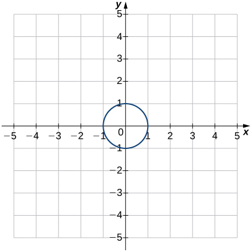
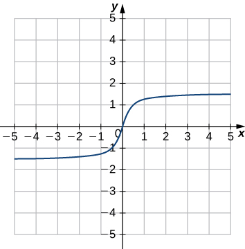

* Use functional notation to evaluate a function.
* Determine the domain and range of a function.
* Draw the graph of a function.
* Find the zeros of a function.
* Recognize a function from a table of values.
* Make new functions from two or more given functions.
* Describe the symmetry properties of a function.

In this section, we provide a formal definition of a function and examine several ways in which functions are represented—namely, through tables, formulas, and graphs. We study formal notation and terms related to functions. We also define composition of functions and symmetry properties. Most of this material will be a review for you, but it serves as a handy reference to remind you of some of the algebraic techniques useful for working with functions.

### Functions

Given two sets <math xmlns="http://www.w3.org/1998/Math/MathML"><mi>A</mi></math>

 and <math xmlns="http://www.w3.org/1998/Math/MathML"><mrow><mi>B</mi><mo>,</mo></mrow></math>

 a set with elements that are ordered pairs <math xmlns="http://www.w3.org/1998/Math/MathML"><mrow><mo stretchy="false">(</mo><mi>x</mi><mo>,</mo><mi>y</mi><mo stretchy="false">)</mo><mo>,</mo></mrow></math>

 where <math xmlns="http://www.w3.org/1998/Math/MathML"><mi>x</mi></math>

 is an element of <math xmlns="http://www.w3.org/1998/Math/MathML"><mi>A</mi></math>

 and <math xmlns="http://www.w3.org/1998/Math/MathML"><mi>y</mi></math>

 is an element of <math xmlns="http://www.w3.org/1998/Math/MathML"><mrow><mi>B</mi><mo>,</mo></mrow></math>

 is a relation from <math xmlns="http://www.w3.org/1998/Math/MathML"><mi>A</mi></math>

 to <math xmlns="http://www.w3.org/1998/Math/MathML"><mrow><mi>B</mi><mo>.</mo></mrow></math>

 A relation from <math xmlns="http://www.w3.org/1998/Math/MathML"><mi>A</mi></math>

 to <math xmlns="http://www.w3.org/1998/Math/MathML"><mi>B</mi></math>

 defines a relationship between those two sets. A function is a special type of relation in which each element of the first set is related to exactly one element of the second set. The element of the first set is called the ***input***{: data-type="term" .no-emphasis}; the element of the second set is called the ***output***{: data-type="term" .no-emphasis}. Functions are used all the time in mathematics to describe relationships between two sets. For any function, when we know the input, the output is determined, so we say that the output is a function of the input. For example, the area of a square is determined by its side length, so we say that the area (the output) is a function of its side length (the input). The velocity of a ball thrown in the air can be described as a function of the amount of time the ball is in the air. The cost of mailing a package is a function of the weight of the package. Since functions have so many uses, it is important to have precise definitions and terminology to study them.

Definition

A **function**{: data-type="term"} <math xmlns="http://www.w3.org/1998/Math/MathML"><mi>f</mi></math>

 consists of a set of inputs, a set of outputs, and a rule for assigning each input to exactly one output. The set of inputs is called the **domain**{: data-type="term"} of the function. The set of outputs is called the **range**{: data-type="term"} of the function.

For example, consider the function <math xmlns="http://www.w3.org/1998/Math/MathML"><mrow><mi>f</mi><mo>,</mo></mrow></math>

 where the domain is the set of all real numbers and the rule is to square the input. Then, the input <math xmlns="http://www.w3.org/1998/Math/MathML"><mrow><mi>x</mi><mo>=</mo><mn>3</mn></mrow></math>

 is assigned to the output <math xmlns="http://www.w3.org/1998/Math/MathML"><mrow><msup><mn>3</mn><mn>2</mn></msup><mo>=</mo><mn>9</mn><mo>.</mo></mrow></math>

 Since every nonnegative real number has a real-value square root, every nonnegative number is an element of the range of this function. Since there is no real number with a square that is negative, the negative real numbers are not elements of the range. We conclude that the range is the set of nonnegative real numbers.

For a general function <math xmlns="http://www.w3.org/1998/Math/MathML"><mi>f</mi></math>

 with domain <math xmlns="http://www.w3.org/1998/Math/MathML"><mi>D</mi><mo>,</mo></math>

 we often use <math xmlns="http://www.w3.org/1998/Math/MathML"><mi>x</mi></math>

 to denote the input and <math xmlns="http://www.w3.org/1998/Math/MathML"><mi>y</mi></math>

 to denote the output associated with <math xmlns="http://www.w3.org/1998/Math/MathML"><mi>x</mi><mo>.</mo></math>

 When doing so, we refer to <math xmlns="http://www.w3.org/1998/Math/MathML"><mi>x</mi></math>

 as the **independent variable**{: data-type="term"} and <math xmlns="http://www.w3.org/1998/Math/MathML"><mi>y</mi></math>

 as the **dependent variable**{: data-type="term"}, because it depends on <math xmlns="http://www.w3.org/1998/Math/MathML"><mi>x</mi><mo>.</mo></math>

 Using function notation, we write <math xmlns="http://www.w3.org/1998/Math/MathML"><mrow><mi>y</mi><mo>=</mo><mi>f</mi><mo stretchy="false">(</mo><mi>x</mi><mo stretchy="false">)</mo><mo>,</mo></mrow></math>

 and we read this equation as <math xmlns="http://www.w3.org/1998/Math/MathML"><mtext>“</mtext><mi>y</mi></math>

 equals <math xmlns="http://www.w3.org/1998/Math/MathML"><mi>f</mi></math>

 of <math xmlns="http://www.w3.org/1998/Math/MathML"><mi>x</mi><mo>.</mo><mtext>”</mtext></math>

 For the squaring function described earlier, we write <math xmlns="http://www.w3.org/1998/Math/MathML"><mrow><mi>f</mi><mo stretchy="false">(</mo><mi>x</mi><mo stretchy="false">)</mo><mo>=</mo><msup><mi>x</mi><mn>2</mn></msup><mo>.</mo></mrow></math>

The concept of a function can be visualized using [\[link\]](#CNX_Calc_Figure_01_01_001), [\[link\]](#CNX_Calc_Figure_01_01_002), and [\[link\]](#CNX_Calc_Figure_01_01_003).

 {: #CNX_Calc_Figure_01_01_001}

![An image with two items. The first item is a bubble labeled domain. Within the bubble are the numbers 1, 2, 3, and 4. An arrow with the label &#x201C;f&#x201D; points from the first item to the second item, which is a bubble labeled &#x201C;range&#x201D;. Within this bubble are the numbers 2, 4, and 6. An arrow points from the 1 in the domain bubble to the 6 in the range bubble. An arrow points from the 1 in the domain bubble to the 6 in the range bubble. An arrow points from the 2 in the domain bubble to the 4 in the range bubble. An arrow points from the 3 in the domain bubble to the 2 in the range bubble. An arrow points from the 4 in the domain bubble to the 2 in the range bubble.](../resources/CNX_Calc_Figure_01_01_002.jpg "A function maps every element in the domain to exactly one element in the range. Although each input can be sent to only one output, two different inputs can be sent to the same output."){: #CNX_Calc_Figure_01_01_002}

![An image of a graph. The y axis runs from 0 to 3 and has the label &#x201C;dependent variable, y = f(x)&#x201D;. The x axis runs from 0 to 5 and has the label &#x201C;independent variable, x&#x201D;. There are three points on the graph. The first point is at (1, 2) and has the label &#x201C;(1, f(1)) = (1, 2)&#x201D;. The second point is at (2, 1) and has the label &#x201C;(2, f(2))=(2,1)&#x201D;. The third point is at (3, 2) and has the label &#x201C;(3, f(3)) = (3,2)&#x201D;. There is text along the y axis that reads &#x201C;range = \{1, 2}&#x201D; and text along the x axis that reads &#x201C;domain = \{1,2,3}&#x201D;.](../resources/CNX_Calc_Figure_01_01_003.jpg "In this case, a graph of a function f has a domain of {1,2,3} and a range of {1,2}. The independent variable is x and the dependent variable is y."){: #CNX_Calc_Figure_01_01_003}

Visit this [applet link][1] to see more about graphs of functions.

We can also visualize a function by plotting points <math xmlns="http://www.w3.org/1998/Math/MathML"><mrow><mo stretchy="false">(</mo><mi>x</mi><mo>,</mo><mi>y</mi><mo stretchy="false">)</mo></mrow></math>

 in the coordinate plane where <math xmlns="http://www.w3.org/1998/Math/MathML"><mrow><mi>y</mi><mo>=</mo><mi>f</mi><mo stretchy="false">(</mo><mi>x</mi><mo stretchy="false">)</mo><mo>.</mo></mrow></math>

 The **graph of a function**{: data-type="term"} is the set of all these points. For example, consider the function <math xmlns="http://www.w3.org/1998/Math/MathML"><mrow><mi>f</mi><mo>,</mo></mrow></math>

 where the domain is the set <math xmlns="http://www.w3.org/1998/Math/MathML"><mrow><mi>D</mi><mo>=</mo><mo>{</mo><mn>1</mn><mo>,</mo><mn>2</mn><mo>,</mo><mn>3</mn><mo>}</mo></mrow></math>

 and the rule is <math xmlns="http://www.w3.org/1998/Math/MathML"><mrow><mi>f</mi><mo stretchy="false">(</mo><mi>x</mi><mo stretchy="false">)</mo><mo>=</mo><mn>3</mn><mo>−</mo><mi>x</mi><mo>.</mo></mrow></math>

 In [\[link\]](#CNX_Calc_Figure_01_01_004), we plot a graph of this function.

 =3&#x2212;x. The graph consists of the points (x,f(x)) for all x in the domain."){: #CNX_Calc_Figure_01_01_004}

Every function has a domain. However, sometimes a function is described by an equation, as in <math xmlns="http://www.w3.org/1998/Math/MathML"><mrow><mi>f</mi><mo stretchy="false">(</mo><mi>x</mi><mo stretchy="false">)</mo><mo>=</mo><msup><mi>x</mi><mn>2</mn></msup><mo>,</mo></mrow></math>

 with no specific domain given. In this case, the domain is taken to be the set of all real numbers <math xmlns="http://www.w3.org/1998/Math/MathML"><mi>x</mi></math>

 for which <math xmlns="http://www.w3.org/1998/Math/MathML"><mrow><mi>f</mi><mo stretchy="false">(</mo><mi>x</mi><mo stretchy="false">)</mo></mrow></math>

 is a real number. For example, since any real number can be squared, if no other domain is specified, we consider the domain of <math xmlns="http://www.w3.org/1998/Math/MathML"><mrow><mi>f</mi><mo stretchy="false">(</mo><mi>x</mi><mo stretchy="false">)</mo><mo>=</mo><msup><mi>x</mi><mn>2</mn></msup></mrow></math>

 to be the set of all real numbers. On the other hand, the square root function <math xmlns="http://www.w3.org/1998/Math/MathML"><mrow><mi>f</mi><mo stretchy="false">(</mo><mi>x</mi><mo stretchy="false">)</mo><mo>=</mo><msqrt><mi>x</mi></msqrt></mrow></math>

 only gives a real output if <math xmlns="http://www.w3.org/1998/Math/MathML"><mi>x</mi></math>

 is nonnegative. Therefore, the domain of the function <math xmlns="http://www.w3.org/1998/Math/MathML"><mrow><mi>f</mi><mrow><mo>(</mo><mi>x</mi><mo>)</mo></mrow><mo>=</mo><msqrt><mi>x</mi></msqrt></mrow></math>

 is the set of nonnegative real numbers, sometimes called the *natural domain*.

For the functions <math xmlns="http://www.w3.org/1998/Math/MathML"><mrow><mi>f</mi><mo stretchy="false">(</mo><mi>x</mi><mo stretchy="false">)</mo><mo>=</mo><msup><mi>x</mi><mn>2</mn></msup></mrow></math>

 and <math xmlns="http://www.w3.org/1998/Math/MathML"><mrow><mi>f</mi><mo stretchy="false">(</mo><mi>x</mi><mo stretchy="false">)</mo><mo>=</mo><msqrt><mi>x</mi></msqrt><mo>,</mo></mrow></math>

 the domains are sets with an infinite number of elements. Clearly we cannot list all these elements. When describing a set with an infinite number of elements, it is often helpful to use set-builder or interval notation. When using set-builder notation to describe a subset of all real numbers, denoted <math xmlns="http://www.w3.org/1998/Math/MathML"><mi>ℝ</mi><mo>,</mo></math>

 we write

<math xmlns="http://www.w3.org/1998/Math/MathML"><mrow><mo>{</mo><mi>x</mi><mo>\|</mo><mi>x</mi><mspace width="0.2em" /><mtext>has some property</mtext><mo>}</mo><mo>.</mo></mrow></math>

We read this as the set of real numbers <math xmlns="http://www.w3.org/1998/Math/MathML"><mi>x</mi></math>

 such that <math xmlns="http://www.w3.org/1998/Math/MathML"><mi>x</mi></math>

 has some property. For example, if we were interested in the set of real numbers that are greater than one but less than five, we could denote this set using set-builder notation by writing

<math xmlns="http://www.w3.org/1998/Math/MathML"><mrow><mo>{</mo><mi>x</mi><mo>\|</mo><mn>1</mn><mo>&lt;</mo><mi>x</mi><mo>&lt;</mo><mn>5</mn><mo>}</mo><mo>.</mo></mrow></math>

A set such as this, which contains all numbers greater than <math xmlns="http://www.w3.org/1998/Math/MathML"><mi>a</mi></math>

 and less than <math xmlns="http://www.w3.org/1998/Math/MathML"><mrow><mi>b</mi><mo>,</mo></mrow></math>

 can also be denoted using the **interval notation**{: data-type="term" .no-emphasis} <math xmlns="http://www.w3.org/1998/Math/MathML"><mrow><mo stretchy="false">(</mo><mi>a</mi><mo>,</mo><mi>b</mi><mo stretchy="false">)</mo><mo>.</mo></mrow></math>

 Therefore,

<math xmlns="http://www.w3.org/1998/Math/MathML"><mrow><mo stretchy="false">(</mo><mn>1</mn><mo>,</mo><mn>5</mn><mo stretchy="false">)</mo><mo>=</mo><mo>{</mo><mi>x</mi><mo>\|</mo><mn>1</mn><mo>&lt;</mo><mi>x</mi><mo>&lt;</mo><mn>5</mn><mo>}</mo><mo>.</mo></mrow></math>

The numbers <math xmlns="http://www.w3.org/1998/Math/MathML"><mn>1</mn></math>

 and <math xmlns="http://www.w3.org/1998/Math/MathML"><mn>5</mn></math>

 are called the ***endpoints***{: data-type="term" .no-emphasis} of this set. If we want to consider the set that includes the endpoints, we would denote this set by writing

<math xmlns="http://www.w3.org/1998/Math/MathML"><mrow><mo stretchy="false">[</mo><mn>1</mn><mo>,</mo><mn>5</mn><mo stretchy="false">]</mo><mo>=</mo><mo>{</mo><mi>x</mi><mo>\|</mo><mn>1</mn><mo>≤</mo><mi>x</mi><mo>≤</mo><mn>5</mn><mo>}</mo><mo>.</mo></mrow></math>

We can use similar notation if we want to include one of the endpoints, but not the other. To denote the set of nonnegative real numbers, we would use the set-builder notation

<math xmlns="http://www.w3.org/1998/Math/MathML"><mrow><mo>{</mo><mi>x</mi><mo>\|</mo><mn>0</mn><mo>≤</mo><mi>x</mi><mo>}</mo><mo>.</mo></mrow></math>

The smallest number in this set is zero, but this set does not have a largest number. Using interval notation, we would use the symbol <math xmlns="http://www.w3.org/1998/Math/MathML"><mrow><mi>∞</mi><mo>,</mo></mrow></math>

 which refers to positive infinity, and we would write the set as

<math xmlns="http://www.w3.org/1998/Math/MathML"><mrow><mo stretchy="false">[</mo><mn>0</mn><mo>,</mo><mi>∞</mi><mo stretchy="false">)</mo><mo>=</mo><mo>{</mo><mi>x</mi><mo>\|</mo><mn>0</mn><mo>≤</mo><mi>x</mi><mo>}</mo><mo>.</mo></mrow></math>

It is important to note that <math xmlns="http://www.w3.org/1998/Math/MathML"><mi>∞</mi></math>

 is not a real number. It is used symbolically here to indicate that this set includes all real numbers greater than or equal to zero. Similarly, if we wanted to describe the set of all nonpositive numbers, we could write

<math xmlns="http://www.w3.org/1998/Math/MathML"><mrow><mo stretchy="false">(</mo><mtext>−</mtext><mi>∞</mi><mo>,</mo><mn>0</mn><mo stretchy="false">]</mo><mo>=</mo><mo>{</mo><mi>x</mi><mo>\|</mo><mi>x</mi><mo>≤</mo><mn>0</mn><mo>}</mo><mo>.</mo></mrow></math>

Here, the notation <math xmlns="http://www.w3.org/1998/Math/MathML"><mrow><mtext>−</mtext><mi>∞</mi></mrow></math>

 refers to negative infinity, and it indicates that we are including all numbers less than or equal to zero, no matter how small. The set

<math xmlns="http://www.w3.org/1998/Math/MathML"><mrow><mo stretchy="false">(</mo><mtext>−</mtext><mi>∞</mi><mo>,</mo><mi>∞</mi><mo stretchy="false">)</mo><mo>=</mo><mo>{</mo><mi>x</mi><mo>\|</mo><mi>x</mi><mspace width="0.2em" /><mtext>is any real number</mtext><mo>}</mo></mrow></math>

refers to the set of all real numbers.

Some functions are defined using different equations for different parts of their domain. These types of functions are known as ***piecewise-defined functions***{: data-type="term" .no-emphasis}. For example, suppose we want to define a function <math xmlns="http://www.w3.org/1998/Math/MathML"><mi>f</mi></math>

 with a domain that is the set of all real numbers such that <math xmlns="http://www.w3.org/1998/Math/MathML"><mrow><mi>f</mi><mo stretchy="false">(</mo><mi>x</mi><mo stretchy="false">)</mo><mo>=</mo><mn>3</mn><mi>x</mi><mo>+</mo><mn>1</mn></mrow></math>

 for <math xmlns="http://www.w3.org/1998/Math/MathML"><mrow><mi>x</mi><mo>≥</mo><mn>2</mn></mrow></math>

 and <math xmlns="http://www.w3.org/1998/Math/MathML"><mrow><mi>f</mi><mo stretchy="false">(</mo><mi>x</mi><mo stretchy="false">)</mo><mo>=</mo><msup><mi>x</mi><mn>2</mn></msup></mrow></math>

 for <math xmlns="http://www.w3.org/1998/Math/MathML"><mrow><mi>x</mi><mo>&lt;</mo><mn>2</mn><mo>.</mo></mrow></math>

 We denote this function by writing

<math xmlns="http://www.w3.org/1998/Math/MathML"><mrow><mi>f</mi><mo stretchy="false">(</mo><mi>x</mi><mo stretchy="false">)</mo><mo>=</mo><mrow><mo>{</mo><mtable columnalign="left"><mtr><mtd><mn>3</mn><mi>x</mi><mo>+</mo><mn>1</mn><mspace width="1.5em" /><mi>x</mi><mo>≥</mo><mn>2</mn></mtd></mtr><mtr><mtd><msup><mi>x</mi><mn>2</mn></msup><mspace width="3em" /><mi>x</mi><mo>&lt;</mo><mn>2</mn></mtd></mtr></mtable></mrow><mo>.</mo></mrow></math>

When evaluating this function for an input <math xmlns="http://www.w3.org/1998/Math/MathML"><mi>x</mi><mo>,</mo></math>

 the equation to use depends on whether <math xmlns="http://www.w3.org/1998/Math/MathML"><mrow><mi>x</mi><mo>≥</mo><mn>2</mn></mrow></math>

 or <math xmlns="http://www.w3.org/1998/Math/MathML"><mrow><mi>x</mi><mo>&lt;</mo><mn>2</mn><mo>.</mo></mrow></math>

 For example, since <math xmlns="http://www.w3.org/1998/Math/MathML"><mrow><mn>5</mn><mo>&gt;</mo><mn>2</mn><mo>,</mo></mrow></math>

 we use the fact that <math xmlns="http://www.w3.org/1998/Math/MathML"><mrow><mi>f</mi><mo stretchy="false">(</mo><mi>x</mi><mo stretchy="false">)</mo><mo>=</mo><mn>3</mn><mi>x</mi><mo>+</mo><mn>1</mn></mrow></math>

 for <math xmlns="http://www.w3.org/1998/Math/MathML"><mrow><mi>x</mi><mo>≥</mo><mn>2</mn></mrow></math>

 and see that <math xmlns="http://www.w3.org/1998/Math/MathML"><mrow><mi>f</mi><mo stretchy="false">(</mo><mn>5</mn><mo stretchy="false">)</mo><mo>=</mo><mn>3</mn><mo stretchy="false">(</mo><mn>5</mn><mo stretchy="false">)</mo><mo>+</mo><mn>1</mn><mo>=</mo><mn>16</mn><mo>.</mo></mrow></math>

 On the other hand, for <math xmlns="http://www.w3.org/1998/Math/MathML"><mrow><mi>x</mi><mo>=</mo><mn>−1</mn><mo>,</mo></mrow></math>

 we use the fact that <math xmlns="http://www.w3.org/1998/Math/MathML"><mrow><mi>f</mi><mo stretchy="false">(</mo><mi>x</mi><mo stretchy="false">)</mo><mo>=</mo><msup><mi>x</mi><mn>2</mn></msup></mrow></math>

 for <math xmlns="http://www.w3.org/1998/Math/MathML"><mrow><mi>x</mi><mo>&lt;</mo><mn>2</mn></mrow></math>

 and see that <math xmlns="http://www.w3.org/1998/Math/MathML"><mrow><mi>f</mi><mo stretchy="false">(</mo><mn>−1</mn><mo stretchy="false">)</mo><mo>=</mo><mn>1</mn><mo>.</mo></mrow></math>

Evaluating Functions

For the function <math xmlns="http://www.w3.org/1998/Math/MathML"><mrow><mi>f</mi><mrow><mo>(</mo><mi>x</mi><mo>)</mo></mrow><mo>=</mo><mn>3</mn><msup><mi>x</mi><mn>2</mn></msup><mo>+</mo><mn>2</mn><mi>x</mi><mo>−</mo><mn>1</mn><mo>,</mo></mrow></math>

 evaluate

1.  <math xmlns="http://www.w3.org/1998/Math/MathML"><mrow><mi>f</mi><mrow><mo>(</mo><mrow><mn>−2</mn></mrow><mo>)</mo></mrow></mrow></math>

2.  <math xmlns="http://www.w3.org/1998/Math/MathML"><mrow><mi>f</mi><mrow><mo>(</mo><mrow><msqrt><mn>2</mn></msqrt></mrow><mo>)</mo></mrow></mrow></math>

3.  <math xmlns="http://www.w3.org/1998/Math/MathML"><mrow><mi>f</mi><mo stretchy="false">(</mo><mi>a</mi><mo>+</mo><mi>h</mi><mo stretchy="false">)</mo></mrow></math>
{: type="a"}

Substitute the given value for *x* in the formula for <math xmlns="http://www.w3.org/1998/Math/MathML"><mrow><mi>f</mi><mo stretchy="false">(</mo><mi>x</mi><mo stretchy="false">)</mo><mo>.</mo></mrow></math>

1.  <math xmlns="http://www.w3.org/1998/Math/MathML"><mrow><mi>f</mi><mrow><mo>(</mo><mrow><mn>−2</mn></mrow><mo>)</mo></mrow><mo>=</mo><mn>3</mn><msup><mrow><mrow><mo>(</mo><mrow><mn>−2</mn></mrow><mo>)</mo></mrow></mrow><mn>2</mn></msup><mo>+</mo><mn>2</mn><mrow><mo>(</mo><mrow><mn>−2</mn></mrow><mo>)</mo></mrow><mo>−</mo><mn>1</mn><mo>=</mo><mn>12</mn><mo>−</mo><mn>4</mn><mo>−</mo><mn>1</mn><mo>=</mo><mn>7</mn></mrow></math>

2.  <math xmlns="http://www.w3.org/1998/Math/MathML"><mrow><mi>f</mi><mrow><mo>(</mo><mrow><msqrt><mn>2</mn></msqrt></mrow><mo>)</mo></mrow><mo>=</mo><mn>3</mn><msup><mrow><mrow><mo>(</mo><mrow><msqrt><mn>2</mn></msqrt></mrow><mo>)</mo></mrow></mrow><mn>2</mn></msup><mo>+</mo><mn>2</mn><msqrt><mn>2</mn></msqrt><mo>−</mo><mn>1</mn><mo>=</mo><mn>6</mn><mo>+</mo><mn>2</mn><msqrt><mn>2</mn></msqrt><mo>−</mo><mn>1</mn><mo>=</mo><mn>5</mn><mo>+</mo><mn>2</mn><msqrt><mn>2</mn></msqrt></mrow></math>

3.  <math xmlns="http://www.w3.org/1998/Math/MathML"><mrow><mtable><mtr><mtd columnalign="right"><mi>f</mi><mrow><mo>(</mo><mrow><mi>a</mi><mo>+</mo><mi>h</mi></mrow><mo>)</mo></mrow><mo>=</mo><mn>3</mn><msup><mrow><mrow><mo>(</mo><mrow><mi>a</mi><mo>+</mo><mi>h</mi></mrow><mo>)</mo></mrow></mrow><mn>2</mn></msup><mo>+</mo><mn>2</mn><mrow><mo>(</mo><mrow><mi>a</mi><mo>+</mo><mi>h</mi></mrow><mo>)</mo></mrow><mo>−</mo><mn>1</mn></mtd><mtd columnalign="left"><mo>=</mo><mn>3</mn><mrow><mo>(</mo><mrow><msup><mi>a</mi><mn>2</mn></msup><mo>+</mo><mn>2</mn><mi>a</mi><mi>h</mi><mo>+</mo><msup><mi>h</mi><mn>2</mn></msup></mrow><mo>)</mo></mrow><mo>+</mo><mn>2</mn><mi>a</mi><mo>+</mo><mn>2</mn><mi>h</mi><mo>−</mo><mn>1</mn></mtd></mtr><mtr><mtd /><mtd columnalign="left"><mo>=</mo><mn>3</mn><msup><mi>a</mi><mn>2</mn></msup><mo>+</mo><mn>6</mn><mi>a</mi><mi>h</mi><mo>+</mo><mn>3</mn><msup><mi>h</mi><mn>2</mn></msup><mo>+</mo><mn>2</mn><mi>a</mi><mo>+</mo><mn>2</mn><mi>h</mi><mo>−</mo><mn>1</mn></mtd></mtr></mtable></mrow></math>
{: type="a"}

For <math xmlns="http://www.w3.org/1998/Math/MathML"><mrow><mi>f</mi><mo stretchy="false">(</mo><mi>x</mi><mo stretchy="false">)</mo><mo>=</mo><msup><mi>x</mi><mn>2</mn></msup><mo>−</mo><mn>3</mn><mi>x</mi><mo>+</mo><mn>5</mn><mo>,</mo></mrow></math>

 evaluate <math xmlns="http://www.w3.org/1998/Math/MathML"><mrow><mi>f</mi><mo stretchy="false">(</mo><mn>1</mn><mo stretchy="false">)</mo></mrow></math>

 and <math xmlns="http://www.w3.org/1998/Math/MathML"><mrow><mi>f</mi><mo stretchy="false">(</mo><mi>a</mi><mo>+</mo><mi>h</mi><mo stretchy="false">)</mo><mo>.</mo></mrow></math>

<math xmlns="http://www.w3.org/1998/Math/MathML"><mrow><mi>f</mi><mo stretchy="false">(</mo><mn>1</mn><mo stretchy="false">)</mo><mo>=</mo><mn>3</mn></mrow></math>

 and <math xmlns="http://www.w3.org/1998/Math/MathML"><mrow><mi>f</mi><mo stretchy="false">(</mo><mi>a</mi><mo>+</mo><mi>h</mi><mo stretchy="false">)</mo><mo>=</mo><msup><mi>a</mi><mn>2</mn></msup><mo>+</mo><mn>2</mn><mi>a</mi><mi>h</mi><mo>+</mo><msup><mi>h</mi><mn>2</mn></msup><mo>−</mo><mn>3</mn><mi>a</mi><mo>−</mo><mn>3</mn><mi>h</mi><mo>+</mo><mn>5</mn></mrow></math>

Hint

Substitute <math xmlns="http://www.w3.org/1998/Math/MathML"><mn>1</mn></math>

 and <math xmlns="http://www.w3.org/1998/Math/MathML"><mrow><mi>a</mi><mo>+</mo><mi>h</mi></mrow></math>

 for <math xmlns="http://www.w3.org/1998/Math/MathML"><mi>x</mi></math>

 in the formula for <math xmlns="http://www.w3.org/1998/Math/MathML"><mrow><mi>f</mi><mo stretchy="false">(</mo><mi>x</mi><mo stretchy="false">)</mo><mtext>.</mtext></mrow></math>

Finding Domain and Range

For each of the following functions, determine the i. domain and ii. range.

1.  <math xmlns="http://www.w3.org/1998/Math/MathML"><mrow><mi>f</mi><mo stretchy="false">(</mo><mi>x</mi><mo stretchy="false">)</mo><mo>=</mo><msup><mrow><mo stretchy="false">(</mo><mi>x</mi><mo>−</mo><mn>4</mn><mo stretchy="false">)</mo></mrow><mn>2</mn></msup><mo>+</mo><mn>5</mn></mrow></math>

2.  <math xmlns="http://www.w3.org/1998/Math/MathML"><mrow><mi>f</mi><mo stretchy="false">(</mo><mi>x</mi><mo stretchy="false">)</mo><mo>=</mo><msqrt><mrow><mn>3</mn><mi>x</mi><mo>+</mo><mn>2</mn></mrow></msqrt><mo>−</mo><mn>1</mn></mrow></math>

3.  <math xmlns="http://www.w3.org/1998/Math/MathML"><mrow><mi>f</mi><mo stretchy="false">(</mo><mi>x</mi><mo stretchy="false">)</mo><mo>=</mo><mfrac><mn>3</mn><mrow><mi>x</mi><mo>−</mo><mn>2</mn></mrow></mfrac></mrow></math>
{: type="a"}

1.  Consider
    <math xmlns="http://www.w3.org/1998/Math/MathML"><mrow><mi>f</mi><mrow><mo>(</mo><mi>x</mi><mo>)</mo></mrow><mo>=</mo><msup><mrow><mrow><mo>(</mo><mrow><mi>x</mi><mo>−</mo><mn>4</mn></mrow><mo>)</mo></mrow></mrow><mn>2</mn></msup><mo>+</mo><mn>5</mn><mo>.</mo></mrow></math>
    
    1.  Since
        <math xmlns="http://www.w3.org/1998/Math/MathML"><mrow><mi>f</mi><mo stretchy="false">(</mo><mi>x</mi><mo stretchy="false">)</mo><mo>=</mo><msup><mrow><mo stretchy="false">(</mo><mi>x</mi><mo>−</mo><mn>4</mn><mo stretchy="false">)</mo></mrow><mn>2</mn></msup><mo>+</mo><mn>5</mn></mrow></math>
        
        is a real number for any real number
        <math xmlns="http://www.w3.org/1998/Math/MathML"><mi>x</mi><mo>,</mo></math>
        
        the domain of
        <math xmlns="http://www.w3.org/1998/Math/MathML"><mi>f</mi></math>
        
        is the interval
        <math xmlns="http://www.w3.org/1998/Math/MathML"><mrow><mo stretchy="false">(</mo><mtext>−</mtext><mi>∞</mi><mo>,</mo><mi>∞</mi><mo stretchy="false">)</mo><mo>.</mo></mrow></math>
    
    2.  Since
        <math xmlns="http://www.w3.org/1998/Math/MathML"><mrow><msup><mrow><mo stretchy="false">(</mo><mi>x</mi><mo>−</mo><mn>4</mn><mo stretchy="false">)</mo></mrow><mn>2</mn></msup><mo>≥</mo><mn>0</mn><mo>,</mo></mrow></math>
        
        we know
        <math xmlns="http://www.w3.org/1998/Math/MathML"><mrow><mi>f</mi><mrow><mo>(</mo><mi>x</mi><mo>)</mo></mrow><mo>=</mo><msup><mrow><mo stretchy="false">(</mo><mi>x</mi><mo>−</mo><mn>4</mn><mo stretchy="false">)</mo></mrow><mn>2</mn></msup><mo>+</mo><mn>5</mn><mo>≥</mo><mn>5</mn><mo>.</mo></mrow></math>
        
        Therefore, the range must be a subset of
        <math xmlns="http://www.w3.org/1998/Math/MathML"><mrow><mo>{</mo><mi>y</mi><mo>\|</mo><mi>y</mi><mo>≥</mo><mn>5</mn><mo>}</mo><mo>.</mo></mrow></math>
        
        To show that every element in this set is in the range, we need to show that for a given
        <math xmlns="http://www.w3.org/1998/Math/MathML"><mi>y</mi></math>
        
        in that set, there is a real number
        <math xmlns="http://www.w3.org/1998/Math/MathML"><mi>x</mi></math>
        
        such that
        <math xmlns="http://www.w3.org/1998/Math/MathML"><mrow><mi>f</mi><mo stretchy="false">(</mo><mi>x</mi><mo stretchy="false">)</mo><mo>=</mo><msup><mrow><mo stretchy="false">(</mo><mi>x</mi><mo>−</mo><mn>4</mn><mo stretchy="false">)</mo></mrow><mn>2</mn></msup><mo>+</mo><mn>5</mn><mo>=</mo><mi>y</mi><mo>.</mo></mrow></math>
        
        Solving this equation for
        <math xmlns="http://www.w3.org/1998/Math/MathML"><mi>x</mi><mo>,</mo></math>
        
        we see that we need
        <math xmlns="http://www.w3.org/1998/Math/MathML"><mi>x</mi></math>
        
        such that
        

        <math xmlns="http://www.w3.org/1998/Math/MathML"><mrow><msup><mrow><mo stretchy="false">(</mo><mi>x</mi><mo>−</mo><mn>4</mn><mo stretchy="false">)</mo></mrow><mn>2</mn></msup><mo>=</mo><mi>y</mi><mo>−</mo><mn>5</mn><mo>.</mo></mrow></math>
        

        
        * * *
        {: data-type="newline"}
        
        This equation is satisfied as long as there exists a real number
        <math xmlns="http://www.w3.org/1998/Math/MathML"><mi>x</mi></math>
        
        such that
        

        <math xmlns="http://www.w3.org/1998/Math/MathML"><mrow><mi>x</mi><mo>−</mo><mn>4</mn><mo>=</mo><mo>±</mo><msqrt><mrow><mi>y</mi><mo>−</mo><mn>5</mn></mrow></msqrt><mo>.</mo></mrow></math>
        

        
        * * *
        {: data-type="newline"}
        
        Since
        <math xmlns="http://www.w3.org/1998/Math/MathML"><mrow><mi>y</mi><mo>≥</mo><mn>5</mn><mo>,</mo></mrow></math>
        
        the square root is well-defined. We conclude that for
        <math xmlns="http://www.w3.org/1998/Math/MathML"><mrow><mi>x</mi><mo>=</mo><mn>4</mn><mo>±</mo><msqrt><mrow><mi>y</mi><mo>−</mo><mn>5</mn></mrow></msqrt><mo>,</mo><mi>f</mi><mo stretchy="false">(</mo><mi>x</mi><mo stretchy="false">)</mo><mo>=</mo><mi>y</mi><mo>,</mo></mrow></math>
        
        and therefore the range is
        <math xmlns="http://www.w3.org/1998/Math/MathML"><mrow><mo>{</mo><mi>y</mi><mo>\|</mo><mi>y</mi><mo>≥</mo><mn>5</mn><mo>}</mo><mo>.</mo></mrow></math>
    {: type="i"}

2.  Consider
    <math xmlns="http://www.w3.org/1998/Math/MathML"><mrow><mi>f</mi><mrow><mo>(</mo><mi>x</mi><mo>)</mo></mrow><mo>=</mo><msqrt><mrow><mn>3</mn><mi>x</mi><mo>+</mo><mn>2</mn></mrow></msqrt><mo>−</mo><mn>1</mn><mo>.</mo></mrow></math>
    
    1.  To find the domain of
        <math xmlns="http://www.w3.org/1998/Math/MathML"><mi>f</mi><mo>,</mo></math>
        
        we need the expression
        <math xmlns="http://www.w3.org/1998/Math/MathML"><mrow><mn>3</mn><mi>x</mi><mo>+</mo><mn>2</mn><mo>≥</mo><mn>0</mn><mo>.</mo></mrow></math>
        
        Solving this inequality, we conclude that the domain is
        <math xmlns="http://www.w3.org/1998/Math/MathML"><mrow><mo>{</mo><mi>x</mi><mo>\|</mo><mi>x</mi><mo>≥</mo><mn>−2</mn><mtext>/</mtext><mn>3</mn><mo>}</mo><mo>.</mo></mrow></math>
    
    2.  To find the range of
        <math xmlns="http://www.w3.org/1998/Math/MathML"><mi>f</mi><mo>,</mo></math>
        
        we note that since
        <math xmlns="http://www.w3.org/1998/Math/MathML"><mrow><msqrt><mrow><mn>3</mn><mi>x</mi><mo>+</mo><mn>2</mn></mrow></msqrt><mo>≥</mo><mn>0</mn><mo>,</mo><mi>f</mi><mrow><mo>(</mo><mi>x</mi><mo>)</mo></mrow><mo>=</mo><msqrt><mrow><mn>3</mn><mi>x</mi><mo>+</mo><mn>2</mn></mrow></msqrt><mo>−</mo><mn>1</mn><mo>≥</mo><mn>−1</mn><mo>.</mo></mrow></math>
        
        Therefore, the range of
        <math xmlns="http://www.w3.org/1998/Math/MathML"><mi>f</mi></math>
        
        must be a subset of the set
        <math xmlns="http://www.w3.org/1998/Math/MathML"><mrow><mo>{</mo><mi>y</mi><mo>\|</mo><mi>y</mi><mo>≥</mo><mn>−1</mn><mo>}</mo><mo>.</mo></mrow></math>
        
        To show that every element in this set is in the range of
        <math xmlns="http://www.w3.org/1998/Math/MathML"><mi>f</mi><mo>,</mo></math>
        
        we need to show that for all
        <math xmlns="http://www.w3.org/1998/Math/MathML"><mi>y</mi></math>
        
        in this set, there exists a real number
        <math xmlns="http://www.w3.org/1998/Math/MathML"><mi>x</mi></math>
        
        in the domain such that
        <math xmlns="http://www.w3.org/1998/Math/MathML"><mrow><mi>f</mi><mo stretchy="false">(</mo><mi>x</mi><mo stretchy="false">)</mo><mo>=</mo><mi>y</mi><mo>.</mo></mrow></math>
        
        Let
        <math xmlns="http://www.w3.org/1998/Math/MathML"><mrow><mi>y</mi><mo>≥</mo><mn>−1</mn><mo>.</mo></mrow></math>
        
        Then,
        <math xmlns="http://www.w3.org/1998/Math/MathML"><mrow><mi>f</mi><mo stretchy="false">(</mo><mi>x</mi><mo stretchy="false">)</mo><mo>=</mo><mi>y</mi></mrow></math>
        
        if and only if
        

        <math xmlns="http://www.w3.org/1998/Math/MathML"><mrow><msqrt><mrow><mn>3</mn><mi>x</mi><mo>+</mo><mn>2</mn></mrow></msqrt><mo>−</mo><mn>1</mn><mo>=</mo><mi>y</mi><mo>.</mo></mrow></math>
        

        
        * * *
        {: data-type="newline"}
        
        Solving this equation for
        <math xmlns="http://www.w3.org/1998/Math/MathML"><mi>x</mi><mo>,</mo></math>
        
        we see that
        <math xmlns="http://www.w3.org/1998/Math/MathML"><mi>x</mi></math>
        
        must solve the equation
        

        <math xmlns="http://www.w3.org/1998/Math/MathML"><mrow><msqrt><mrow><mn>3</mn><mi>x</mi><mo>+</mo><mn>2</mn></mrow></msqrt><mo>=</mo><mi>y</mi><mo>+</mo><mn>1</mn><mo>.</mo></mrow></math>
        

        
        * * *
        {: data-type="newline"}
        
        Since
        <math xmlns="http://www.w3.org/1998/Math/MathML"><mrow><mi>y</mi><mo>≥</mo><mn>−1</mn><mo>,</mo></mrow></math>
        
        such an
        <math xmlns="http://www.w3.org/1998/Math/MathML"><mi>x</mi></math>
        
        could exist. Squaring both sides of this equation, we have
        <math xmlns="http://www.w3.org/1998/Math/MathML"><mrow><mn>3</mn><mi>x</mi><mo>+</mo><mn>2</mn><mo>=</mo><msup><mrow><mo stretchy="false">(</mo><mi>y</mi><mo>+</mo><mn>1</mn><mo stretchy="false">)</mo></mrow><mn>2</mn></msup><mo>.</mo></mrow></math>
        
        * * *
        {: data-type="newline"}
        
        Therefore, we need
        

        <math xmlns="http://www.w3.org/1998/Math/MathML"><mrow><mn>3</mn><mi>x</mi><mo>=</mo><msup><mrow><mo stretchy="false">(</mo><mi>y</mi><mo>+</mo><mn>1</mn><mo stretchy="false">)</mo></mrow><mn>2</mn></msup><mo>−</mo><mn>2</mn><mo>,</mo></mrow></math>
        

        
        * * *
        {: data-type="newline"}
        
        which implies
        

        <math xmlns="http://www.w3.org/1998/Math/MathML"><mrow><mi>x</mi><mo>=</mo><mfrac><mn>1</mn><mn>3</mn></mfrac><msup><mrow><mrow><mo>(</mo><mrow><mi>y</mi><mo>+</mo><mn>1</mn></mrow><mo>)</mo></mrow></mrow><mn>2</mn></msup><mo>−</mo><mfrac><mn>2</mn><mn>3</mn></mfrac><mo>.</mo></mrow></math>
        

        
        * * *
        {: data-type="newline"}
        
        We just need to verify that
        <math xmlns="http://www.w3.org/1998/Math/MathML"><mi>x</mi></math>
        
        is in the domain of
        <math xmlns="http://www.w3.org/1998/Math/MathML"><mi>f</mi><mo>.</mo></math>
        
        Since the domain of
        <math xmlns="http://www.w3.org/1998/Math/MathML"><mi>f</mi></math>
        
        consists of all real numbers greater than or equal to
        <math xmlns="http://www.w3.org/1998/Math/MathML"><mrow><mn>−2</mn><mtext>/</mtext><mn>3</mn><mo>,</mo></mrow></math>
        
        and
        

        <math xmlns="http://www.w3.org/1998/Math/MathML"><mrow><mfrac><mn>1</mn><mn>3</mn></mfrac><msup><mrow><mrow><mo>(</mo><mrow><mi>y</mi><mo>+</mo><mn>1</mn></mrow><mo>)</mo></mrow></mrow><mn>2</mn></msup><mo>−</mo><mfrac><mn>2</mn><mn>3</mn></mfrac><mo>≥</mo><mo>−</mo><mfrac><mn>2</mn><mn>3</mn></mfrac><mo>,</mo></mrow></math>
        

        
        * * *
        {: data-type="newline"}
        
        there does exist an
        <math xmlns="http://www.w3.org/1998/Math/MathML"><mi>x</mi></math>
        
        in the domain of
        <math xmlns="http://www.w3.org/1998/Math/MathML"><mi>f</mi><mo>.</mo></math>
        
        We conclude that the range of
        <math xmlns="http://www.w3.org/1998/Math/MathML"><mrow><mi>f</mi></mrow></math>
        
        is
        <math xmlns="http://www.w3.org/1998/Math/MathML"><mrow><mo>{</mo><mi>y</mi><mo>\|</mo><mi>y</mi><mo>≥</mo><mn>−1</mn><mo>}</mo><mo>.</mo></mrow></math>
    {: type="i"}

3.  Consider
    <math xmlns="http://www.w3.org/1998/Math/MathML"><mrow><mi>f</mi><mrow><mo>(</mo><mi>x</mi><mo>)</mo></mrow><mo>=</mo><mn>3</mn><mtext>/</mtext><mo stretchy="false">(</mo><mi>x</mi><mo>−</mo><mn>2</mn><mo stretchy="false">)</mo><mo>.</mo></mrow></math>
    
    1.  Since
        <math xmlns="http://www.w3.org/1998/Math/MathML"><mrow><mn>3</mn><mtext>/</mtext><mo stretchy="false">(</mo><mi>x</mi><mo>−</mo><mn>2</mn><mo stretchy="false">)</mo></mrow></math>
        
        is defined when the denominator is nonzero, the domain is
        <math xmlns="http://www.w3.org/1998/Math/MathML"><mrow><mo>{</mo><mi>x</mi><mo>\|</mo><mi>x</mi><mo>≠</mo><mn>2</mn><mo>}</mo><mo>.</mo></mrow></math>
    
    2.  To find the range of
        <math xmlns="http://www.w3.org/1998/Math/MathML"><mi>f</mi><mo>,</mo></math>
        
        we need to find the values of
        <math xmlns="http://www.w3.org/1998/Math/MathML"><mi>y</mi></math>
        
        such that there exists a real number
        <math xmlns="http://www.w3.org/1998/Math/MathML"><mi>x</mi></math>
        
        in the domain with the property that
        

        <math xmlns="http://www.w3.org/1998/Math/MathML"><mrow><mfrac><mn>3</mn><mrow><mi>x</mi><mo>−</mo><mn>2</mn></mrow></mfrac><mo>=</mo><mi>y</mi><mo>.</mo></mrow></math>
        

        
        * * *
        {: data-type="newline"}
        
        Solving this equation for
        <math xmlns="http://www.w3.org/1998/Math/MathML"><mi>x</mi><mo>,</mo></math>
        
        we find that
        

        <math xmlns="http://www.w3.org/1998/Math/MathML"><mrow><mi>x</mi><mo>=</mo><mfrac><mn>3</mn><mi>y</mi></mfrac><mo>+</mo><mn>2</mn><mo>.</mo></mrow></math>
        

        
        * * *
        {: data-type="newline"}
        
        Therefore, as long as
        <math xmlns="http://www.w3.org/1998/Math/MathML"><mrow><mi>y</mi><mo>≠</mo><mn>0</mn><mo>,</mo></mrow></math>
        
        there exists a real number
        <math xmlns="http://www.w3.org/1998/Math/MathML"><mi>x</mi></math>
        
        in the domain such that
        <math xmlns="http://www.w3.org/1998/Math/MathML"><mrow><mi>f</mi><mo stretchy="false">(</mo><mi>x</mi><mo stretchy="false">)</mo><mo>=</mo><mi>y</mi><mo>.</mo></mrow></math>
        
        Thus, the range is
        <math xmlns="http://www.w3.org/1998/Math/MathML"><mrow><mo>{</mo><mi>y</mi><mo>\|</mo><mi>y</mi><mo>≠</mo><mn>0</mn><mo>}</mo><mo>.</mo></mrow></math>
    {: type="i"}
{: type="a"}

Find the domain and range for <math xmlns="http://www.w3.org/1998/Math/MathML"><mrow><mi>f</mi><mrow><mo>(</mo><mi>x</mi><mo>)</mo></mrow><mo>=</mo><msqrt><mrow><mn>4</mn><mo>−</mo><mn>2</mn><mi>x</mi></mrow></msqrt><mo>+</mo><mn>5</mn><mo>.</mo></mrow></math>

Domain = <math xmlns="http://www.w3.org/1998/Math/MathML"><mrow><mrow><mo>{</mo><mrow><mi>x</mi><mo>\|</mo><mi>x</mi><mo>≤</mo><mn>2</mn></mrow><mo>}</mo></mrow><mo>,</mo></mrow></math>

 range = <math xmlns="http://www.w3.org/1998/Math/MathML"><mrow><mo>{</mo><mi>y</mi><mo>\|</mo><mi>y</mi><mo>≥</mo><mn>5</mn><mo>}</mo></mrow></math>

Hint

Use <math xmlns="http://www.w3.org/1998/Math/MathML"><mrow><mn>4</mn><mo>−</mo><mn>2</mn><mi>x</mi><mo>≥</mo><mn>0</mn><mtext>.</mtext></mrow></math>

### Representing Functions

Typically, a function is represented using one or more of the following tools:

* A table
* A graph
* A formula
{: data-bullet-style="bullet"}

We can identify a function in each form, but we can also use them together. For instance, we can plot on a graph the values from a table or create a table from a formula.

#### Tables

Functions described using a **table of values**{: data-type="term"} arise frequently in real-world applications. Consider the following simple example. We can describe temperature on a given day as a function of time of day. Suppose we record the temperature every hour for a 24-hour period starting at midnight. We let our input variable <math xmlns="http://www.w3.org/1998/Math/MathML"><mi>x</mi></math>

 be the time after midnight, measured in hours, and the output variable <math xmlns="http://www.w3.org/1998/Math/MathML"><mi>y</mi></math>

 be the temperature <math xmlns="http://www.w3.org/1998/Math/MathML"><mi>x</mi></math>

 hours after midnight, measured in degrees Fahrenheit. We record our data in [\[link\]](#fs-id1170572114646).

<table summary="A table with 12 rows and 4 columns is shown. The first column is labeled &#x201C;hours after midnight&#x201D; and has the values &#x201C;0; 1; 2; 3; 4; 5; 6; 7; 8; 9; 10; 11&#x201D;. The second column is labeled &#x201C;Temperature in Fahrenheit&#x201D; and has the values are &#x201C;58; 54; 53; 52; 52; 55; 60; 64; 72; 75; 78; 80.&#x201D; The third column is labeled &#x201C;hours after midnight&#x201D; and continues counting where column 1 left off with &#x201C;12; 13; 14; 15; 16; 17; 18; 19; 20; 21; 22; 23&#x201D;. The fourth column is labeled &#x201C;Temperature in Fahrenheit&#x201D; and continues counting where column 2 left off with &#x201C;84; 85; 85; 83; 82; 80; 77; 74; 69; 65; 60; 58&#x201D;."><caption>Temperature as a Function of Time of Day</caption><thead>
<tr valign="top">
<th data-align="center">Hours after Midnight</th>
<th data-align="center">Temperature <math xmlns="http://www.w3.org/1998/Math/MathML"><mrow><mstyle mathvariant="bold" mathsize="normal"><mo stretchy="false">(</mo><mtext>°</mtext><mi>F</mi><mo stretchy="false">)</mo></mstyle></mrow></math></th>
<th data-align="center">Hours after Midnight</th>
<th data-align="center">Temperature <math xmlns="http://www.w3.org/1998/Math/MathML"><mrow><mstyle mathvariant="bold" mathsize="normal"><mo stretchy="false">(</mo><mtext>°</mtext><mi>F</mi><mo stretchy="false">)</mo></mstyle></mrow></math></th>
</tr>
</thead><tbody>
<tr valign="top">
<td data-align="left">0</td>
<td data-align="left">58</td>
<td data-align="left">12</td>
<td data-align="left">84</td>
</tr>
<tr valign="top">
<td data-align="left">1</td>
<td data-align="left">54</td>
<td data-align="left">13</td>
<td data-align="left">85</td>
</tr>
<tr valign="top">
<td data-align="left">2</td>
<td data-align="left">53</td>
<td data-align="left">14</td>
<td data-align="left">85</td>
</tr>
<tr valign="top">
<td data-align="left">3</td>
<td data-align="left">52</td>
<td data-align="left">15</td>
<td data-align="left">83</td>
</tr>
<tr valign="top">
<td data-align="left">4</td>
<td data-align="left">52</td>
<td data-align="left">16</td>
<td data-align="left">82</td>
</tr>
<tr valign="top">
<td data-align="left">5</td>
<td data-align="left">55</td>
<td data-align="left">17</td>
<td data-align="left">80</td>
</tr>
<tr valign="top">
<td data-align="left">6</td>
<td data-align="left">60</td>
<td data-align="left">18</td>
<td data-align="left">77</td>
</tr>
<tr valign="top">
<td data-align="left">7</td>
<td data-align="left">64</td>
<td data-align="left">19</td>
<td data-align="left">74</td>
</tr>
<tr valign="top">
<td data-align="left">8</td>
<td data-align="left">72</td>
<td data-align="left">20</td>
<td data-align="left">69</td>
</tr>
<tr valign="top">
<td data-align="left">9</td>
<td data-align="left">75</td>
<td data-align="left">21</td>
<td data-align="left">65</td>
</tr>
<tr valign="top">
<td data-align="left">10</td>
<td data-align="left">78</td>
<td data-align="left">22</td>
<td data-align="left">60</td>
</tr>
<tr valign="top">
<td data-align="left">11</td>
<td data-align="left">80</td>
<td data-align="left">23</td>
<td data-align="left">58</td>
</tr>
</tbody></table>

We can see from the table that temperature is a function of time, and the temperature decreases, then increases, and then decreases again. However, we cannot get a clear picture of the behavior of the function without graphing it.

#### Graphs

Given a function <math xmlns="http://www.w3.org/1998/Math/MathML"><mi>f</mi></math>

 described by a table, we can provide a visual picture of the function in the form of a graph. Graphing the temperatures listed in [\[link\]](#fs-id1170572114646) can give us a better idea of their fluctuation throughout the day. [\[link\]](#CNX_Calc_Figure_01_01_005) shows the plot of the temperature function.

 ![An image of a graph. The y axis runs from 0 to 90 and has the label &#x201C;Temperature in Fahrenheit&#x201D;. The x axis runs from 0 to 24 and has the label &#x201C;hours after midnight&#x201D;. There are 24 points on the graph, one at each increment of 1 on the x-axis. The first point is at (0, 58) and the function decreases until x = 4, where the point is (4, 52) and is the minimum value of the function. After x=4, the function increases until x = 13, where the point is (13, 85) and is the maximum of the function along with the point (14, 85). After x = 14, the function decreases until the last point on the graph, which is (23, 58).](../resources/CNX_Calc_Figure_01_01_005.jpg "The graph of the data from [link] shows temperature as a function of time."){: #CNX_Calc_Figure_01_01_005}

From the points plotted on the graph in [\[link\]](#CNX_Calc_Figure_01_01_005), we can visualize the general shape of the graph. It is often useful to connect the dots in the graph, which represent the data from the table. In this example, although we cannot make any definitive conclusion regarding what the temperature was at any time for which the temperature was not recorded, given the number of data points collected and the pattern in these points, it is reasonable to suspect that the temperatures at other times followed a similar pattern, as we can see in [\[link\]](#CNX_Calc_Figure_01_01_014).

 ![An image of a graph. The y axis runs from 0 to 90 and has the label &#x201C;Temperature in Fahrenheit&#x201D;. The x axis runs from 0 to 24 and has the label &#x201C;hours after midnight&#x201D;. There are 24 points on the graph, one at each increment of 1 on the x-axis. The first point is at (0, 58) and the function decreases until x = 4, where the point is (4, 52) and is the minimum value of the function. After x=4, the function increases until x = 13, where the point is (13, 85) and is the maximum of the function along with the point (14, 85). After x = 14, the function decreases until the last point on the graph, which is (23, 58). A line connects all the points on the graph.](../resources/CNX_Calc_Figure_01_01_014.jpg "Connecting the dots in [link] shows the general pattern of the data."){: #CNX_Calc_Figure_01_01_014}

#### Algebraic Formulas

Sometimes we are not given the values of a function in table form, rather we are given the values in an explicit formula. Formulas arise in many applications. For example, the area of a circle of radius <math xmlns="http://www.w3.org/1998/Math/MathML"><mi>r</mi></math>

 is given by the formula <math xmlns="http://www.w3.org/1998/Math/MathML"><mrow><mi>A</mi><mrow><mo>(</mo><mi>r</mi><mo>)</mo></mrow><mo>=</mo><mi>π</mi><msup><mi>r</mi><mn>2</mn></msup><mo>.</mo></mrow></math>

 When an object is thrown upward from the ground with an initial velocity <math xmlns="http://www.w3.org/1998/Math/MathML"><mrow><msub><mi>v</mi><mn>0</mn></msub></mrow></math>

 ft/s, its height above the ground from the time it is thrown until it hits the ground is given by the formula <math xmlns="http://www.w3.org/1998/Math/MathML"><mrow><mi>s</mi><mrow><mo>(</mo><mi>t</mi><mo>)</mo></mrow><mo>=</mo><mn>−16</mn><msup><mi>t</mi><mn>2</mn></msup><mo>+</mo><msub><mi>v</mi><mn>0</mn></msub><mi>t</mi><mo>.</mo></mrow></math>

 When <math xmlns="http://www.w3.org/1998/Math/MathML"><mi>P</mi></math>

 dollars are invested in an account at an annual interest rate <math xmlns="http://www.w3.org/1998/Math/MathML"><mi>r</mi></math>

 compounded continuously, the amount of money after <math xmlns="http://www.w3.org/1998/Math/MathML"><mi>t</mi></math>

 years is given by the formula <math xmlns="http://www.w3.org/1998/Math/MathML"><mrow><mi>A</mi><mrow><mo>(</mo><mi>t</mi><mo>)</mo></mrow><mo>=</mo><mi>P</mi><msup><mi>e</mi><mrow><mi>r</mi><mi>t</mi></mrow></msup><mo>.</mo></mrow></math>

 Algebraic formulas are important tools to calculate function values. Often we also represent these functions visually in graph form.

Given an algebraic formula for a function <math xmlns="http://www.w3.org/1998/Math/MathML"><mi>f</mi><mo>,</mo></math>

 the graph of <math xmlns="http://www.w3.org/1998/Math/MathML"><mi>f</mi></math>

 is the set of points <math xmlns="http://www.w3.org/1998/Math/MathML"><mrow><mrow><mo>(</mo><mrow><mi>x</mi><mo>,</mo><mi>f</mi><mrow><mo>(</mo><mi>x</mi><mo>)</mo></mrow></mrow><mo>)</mo></mrow><mo>,</mo></mrow></math>

 where <math xmlns="http://www.w3.org/1998/Math/MathML"><mi>x</mi></math>

 is in the domain of <math xmlns="http://www.w3.org/1998/Math/MathML"><mi>f</mi></math>

 and <math xmlns="http://www.w3.org/1998/Math/MathML"><mrow><mi>f</mi><mo stretchy="false">(</mo><mi>x</mi><mo stretchy="false">)</mo></mrow></math>

 is in the range. To graph a function given by a formula, it is helpful to begin by using the formula to create a table of inputs and outputs. If the domain of <math xmlns="http://www.w3.org/1998/Math/MathML"><mi>f</mi></math>

 consists of an infinite number of values, we cannot list all of them, but because listing some of the inputs and outputs can be very useful, it is often a good way to begin.

When creating a table of inputs and outputs, we typically check to determine whether zero is an output. Those values of <math xmlns="http://www.w3.org/1998/Math/MathML"><mi>x</mi></math>

 where <math xmlns="http://www.w3.org/1998/Math/MathML"><mrow><mi>f</mi><mrow><mo>(</mo><mi>x</mi><mo>)</mo></mrow><mo>=</mo><mn>0</mn></mrow></math>

 are called the **zeros of a function**{: data-type="term"}. For example, the zeros of <math xmlns="http://www.w3.org/1998/Math/MathML"><mrow><mi>f</mi><mrow><mo>(</mo><mi>x</mi><mo>)</mo></mrow><mo>=</mo><msup><mi>x</mi><mn>2</mn></msup><mo>−</mo><mn>4</mn></mrow></math>

 are <math xmlns="http://www.w3.org/1998/Math/MathML"><mrow><mi>x</mi><mo>=</mo><mo>±</mo><mn>2</mn><mo>.</mo></mrow></math>

 The zeros determine where the graph of <math xmlns="http://www.w3.org/1998/Math/MathML"><mi>f</mi></math>

 intersects the <math xmlns="http://www.w3.org/1998/Math/MathML"><mi>x</mi></math>

-axis, which gives us more information about the shape of the graph of the function. The graph of a function may never intersect the *x*-axis, or it may intersect multiple (or even infinitely many) times.

Another point of interest is the <math xmlns="http://www.w3.org/1998/Math/MathML"><mi>y</mi></math>

-intercept, if it exists. The <math xmlns="http://www.w3.org/1998/Math/MathML"><mi>y</mi></math>

-intercept is given by <math xmlns="http://www.w3.org/1998/Math/MathML"><mrow><mrow><mo>(</mo><mrow><mn>0</mn><mo>,</mo><mi>f</mi><mrow><mo>(</mo><mn>0</mn><mo>)</mo></mrow></mrow><mo>)</mo></mrow><mo>.</mo></mrow></math>

Since a function has exactly one output for each input, the graph of a function can have, at most, one <math xmlns="http://www.w3.org/1998/Math/MathML"><mi>y</mi></math>

-intercept. If <math xmlns="http://www.w3.org/1998/Math/MathML"><mrow><mi>x</mi><mo>=</mo><mn>0</mn></mrow></math>

 is in the domain of a function <math xmlns="http://www.w3.org/1998/Math/MathML"><mi>f</mi><mo>,</mo></math>

 then <math xmlns="http://www.w3.org/1998/Math/MathML"><mi>f</mi></math>

 has exactly one <math xmlns="http://www.w3.org/1998/Math/MathML"><mi>y</mi></math>

-intercept. If <math xmlns="http://www.w3.org/1998/Math/MathML"><mrow><mi>x</mi><mo>=</mo><mn>0</mn></mrow></math>

 is not in the domain of <math xmlns="http://www.w3.org/1998/Math/MathML"><mi>f</mi><mo>,</mo></math>

 then <math xmlns="http://www.w3.org/1998/Math/MathML"><mi>f</mi></math>

 has no <math xmlns="http://www.w3.org/1998/Math/MathML"><mi>y</mi></math>

-intercept. Similarly, for any real number <math xmlns="http://www.w3.org/1998/Math/MathML"><mi>c</mi><mo>,</mo></math>

 if <math xmlns="http://www.w3.org/1998/Math/MathML"><mi>c</mi></math>

 is in the domain of <math xmlns="http://www.w3.org/1998/Math/MathML"><mi>f</mi><mo>,</mo></math>

 there is exactly one output <math xmlns="http://www.w3.org/1998/Math/MathML"><mrow><mi>f</mi><mrow><mo>(</mo><mi>c</mi><mo>)</mo></mrow><mo>,</mo></mrow></math>

 and the line <math xmlns="http://www.w3.org/1998/Math/MathML"><mrow><mi>x</mi><mo>=</mo><mi>c</mi></mrow></math>

 intersects the graph of <math xmlns="http://www.w3.org/1998/Math/MathML"><mrow><mi>f</mi></mrow></math>

 exactly once. On the other hand, if <math xmlns="http://www.w3.org/1998/Math/MathML"><mi>c</mi></math>

 is not in the domain of <math xmlns="http://www.w3.org/1998/Math/MathML"><mi>f</mi><mo>,</mo><mrow><mi>f</mi><mo stretchy="false">(</mo><mi>c</mi><mo stretchy="false">)</mo></mrow></math>

 is not defined and the line <math xmlns="http://www.w3.org/1998/Math/MathML"><mrow><mi>x</mi><mo>=</mo><mi>c</mi></mrow></math>

 does not intersect the graph of <math xmlns="http://www.w3.org/1998/Math/MathML"><mi>f</mi><mo>.</mo></math>

 This property is summarized in the **vertical line test**{: data-type="term"}.

Rule: Vertical Line Test

Given a function <math xmlns="http://www.w3.org/1998/Math/MathML"><mi>f</mi><mo>,</mo></math>

 every vertical line that may be drawn intersects the graph of <math xmlns="http://www.w3.org/1998/Math/MathML"><mi>f</mi></math>

 no more than once. If any vertical line intersects a set of points more than once, the set of points does not represent a function.

We can use this test to determine whether a set of plotted points represents the graph of a function ([\[link\]](#CNX_Calc_Figure_01_01_006)).

 ![An image of two graphs. The first graph is labeled &#x201C;a&#x201D; and is of the function &#x201C;y = f(x)&#x201D;. Three vertical lines run through 3 points on the function, each vertical line only passing through the function once. The second graph is labeled &#x201C;b&#x201D; and is of the relation &#x201C;y not equal to f(x)&#x201D;. Two vertical lines run through the relation, one line intercepting the relation at 3 points and the other line intercepting the relation at 3 different points.](../resources/CNX_Calc_Figure_01_01_006.jpg "(a) The set of plotted points represents the graph of a function because every vertical line intersects the set of points, at most, once. (b) The set of plotted points does not represent the graph of a function because some vertical lines intersect the set of points more than once."){: #CNX_Calc_Figure_01_01_006}

Finding Zeros and
<math xmlns="http://www.w3.org/1998/Math/MathML"><mi>y</mi></math>
-Intercepts of a Function

Consider the function <math xmlns="http://www.w3.org/1998/Math/MathML"><mrow><mi>f</mi><mrow><mo>(</mo><mi>x</mi><mo>)</mo></mrow><mo>=</mo><mn>−4</mn><mi>x</mi><mo>+</mo><mn>2</mn><mo>.</mo></mrow></math>

1.  Find all zeros of
    <math xmlns="http://www.w3.org/1998/Math/MathML"><mi>f</mi><mo>.</mo></math>

2.  Find the
    <math xmlns="http://www.w3.org/1998/Math/MathML"><mi>y</mi></math>
    
    -intercept (if any).
3.  Sketch a graph of
    <math xmlns="http://www.w3.org/1998/Math/MathML"><mi>f</mi><mo>.</mo></math>
{: type="a"}

1.  To find the zeros, solve
    <math xmlns="http://www.w3.org/1998/Math/MathML"><mrow><mi>f</mi><mo stretchy="false">(</mo><mi>x</mi><mo stretchy="false">)</mo><mo>=</mo><mn>−4</mn><mi>x</mi><mo>+</mo><mn>2</mn><mo>=</mo><mn>0</mn><mo>.</mo></mrow></math>
    
    We discover that
    <math xmlns="http://www.w3.org/1998/Math/MathML"><mi>f</mi></math>
    
    has one zero at
    <math xmlns="http://www.w3.org/1998/Math/MathML"><mrow><mi>x</mi><mo>=</mo><mn>1</mn><mtext>/</mtext><mn>2</mn><mo>.</mo></mrow></math>

2.  The
    <math xmlns="http://www.w3.org/1998/Math/MathML"><mi>y</mi></math>
    
    -intercept is given by
    <math xmlns="http://www.w3.org/1998/Math/MathML"><mrow><mrow><mo>(</mo><mrow><mn>0</mn><mo>,</mo><mi>f</mi><mrow><mo>(</mo><mn>0</mn><mo>)</mo></mrow></mrow><mo>)</mo></mrow><mo>=</mo><mrow><mo>(</mo><mrow><mn>0</mn><mo>,</mo><mn>2</mn></mrow><mo>)</mo></mrow><mo>.</mo></mrow></math>

3.  Given that
    <math xmlns="http://www.w3.org/1998/Math/MathML"><mi>f</mi></math>
    
    is a linear function of the form
    <math xmlns="http://www.w3.org/1998/Math/MathML"><mrow><mi>f</mi><mrow><mo>(</mo><mi>x</mi><mo>)</mo></mrow><mo>=</mo><mi>m</mi><mi>x</mi><mo>+</mo><mi>b</mi></mrow></math>
    
    that passes through the points
    <math xmlns="http://www.w3.org/1998/Math/MathML"><mrow><mo stretchy="false">(</mo><mn>1</mn><mtext>/</mtext><mn>2</mn><mo>,</mo><mn>0</mn><mo stretchy="false">)</mo></mrow></math>
    
    and
    <math xmlns="http://www.w3.org/1998/Math/MathML"><mrow><mo stretchy="false">(</mo><mn>0</mn><mo>,</mo><mn>2</mn><mo stretchy="false">)</mo><mo>,</mo></mrow></math>
    
    we can sketch the graph of
    <math xmlns="http://www.w3.org/1998/Math/MathML"><mi>f</mi></math>
    
    ([[link]](#CNX_Calc_Figure_01_01_007)). =&#x2212;4x+2 is a line withx-intercept (1/2,0) and y-intercept (0,2)."){: #CNX_Calc_Figure_01_01_007}

{: type="a"}

Using Zeros and
<math xmlns="http://www.w3.org/1998/Math/MathML"><mi>y</mi></math>
-Intercepts to Sketch a Graph

Consider the function <math xmlns="http://www.w3.org/1998/Math/MathML"><mrow><mi>f</mi><mo stretchy="false">(</mo><mi>x</mi><mo stretchy="false">)</mo><mo>=</mo><msqrt><mrow><mi>x</mi><mo>+</mo><mn>3</mn></mrow></msqrt><mo>+</mo><mn>1</mn><mo>.</mo></mrow></math>

1.  Find all zeros of
    <math xmlns="http://www.w3.org/1998/Math/MathML"><mrow><mi>f</mi><mo>.</mo></mrow></math>

2.  Find the
    <math xmlns="http://www.w3.org/1998/Math/MathML"><mi>y</mi></math>
    
    -intercept (if any).
3.  Sketch a graph of
    <math xmlns="http://www.w3.org/1998/Math/MathML"><mi>f</mi><mo>.</mo></math>
{: type="a"}

1.  To find the zeros, solve
    <math xmlns="http://www.w3.org/1998/Math/MathML"><mrow><msqrt><mrow><mi>x</mi><mo>+</mo><mn>3</mn></mrow></msqrt><mo>+</mo><mn>1</mn><mo>=</mo><mn>0</mn><mo>.</mo></mrow></math>
    
    This equation implies
    <math xmlns="http://www.w3.org/1998/Math/MathML"><mrow><msqrt><mrow><mi>x</mi><mo>+</mo><mn>3</mn></mrow></msqrt><mo>=</mo><mn>−1</mn><mo>.</mo></mrow></math>
    
    Since
    <math xmlns="http://www.w3.org/1998/Math/MathML"><mrow><msqrt><mrow><mi>x</mi><mo>+</mo><mn>3</mn></mrow></msqrt><mo>≥</mo><mn>0</mn></mrow></math>
    
    for all
    <math xmlns="http://www.w3.org/1998/Math/MathML"><mi>x</mi><mo>,</mo></math>
    
    this equation has no solutions, and therefore
    <math xmlns="http://www.w3.org/1998/Math/MathML"><mi>f</mi></math>
    
    has no zeros.
2.  The
    <math xmlns="http://www.w3.org/1998/Math/MathML"><mi>y</mi></math>
    
    -intercept is given by
    <math xmlns="http://www.w3.org/1998/Math/MathML"><mrow><mrow><mo>(</mo><mrow><mn>0</mn><mo>,</mo><mi>f</mi><mrow><mo>(</mo><mn>0</mn><mo>)</mo></mrow></mrow><mo>)</mo></mrow><mo>=</mo><mo stretchy="false">(</mo><mn>0</mn><mo>,</mo><msqrt><mn>3</mn></msqrt><mo>+</mo><mn>1</mn><mo stretchy="false">)</mo><mo>.</mo></mrow></math>

3.  To graph this function, we make a table of values. Since we need
    <math xmlns="http://www.w3.org/1998/Math/MathML"><mrow><mi>x</mi><mo>+</mo><mn>3</mn><mo>≥</mo><mn>0</mn><mo>,</mo></mrow></math>
    
    we need to choose values of
    <math xmlns="http://www.w3.org/1998/Math/MathML"><mrow><mi>x</mi><mo>≥</mo><mn>−3</mn><mo>.</mo></mrow></math>
    
    We choose values that make the square-root function easy to evaluate.
    | <math xmlns="http://www.w3.org/1998/Math/MathML"><mtext mathvariant="bold-italic">x</mtext></math>
    
     | <math xmlns="http://www.w3.org/1998/Math/MathML"><mrow><mn>−3</mn></mrow></math>
    
     | <math xmlns="http://www.w3.org/1998/Math/MathML"><mrow><mn>−2</mn></mrow></math>
    
     | <math xmlns="http://www.w3.org/1998/Math/MathML"><mn>1</mn></math>
    
     |
    {: valign="top"}| <math xmlns="http://www.w3.org/1998/Math/MathML"><mrow><mtext mathvariant="bold-italic">f</mtext><mo stretchy="false" mathvariant="bold">(</mo><mtext mathvariant="bold-italic">x</mtext><mo stretchy="false" mathvariant="bold">)</mo></mrow></math>
    
     | <math xmlns="http://www.w3.org/1998/Math/MathML"><mn>1</mn></math>
    
     | <math xmlns="http://www.w3.org/1998/Math/MathML"><mn>2</mn></math>
    
     | <math xmlns="http://www.w3.org/1998/Math/MathML"><mn>3</mn></math>
    
     |
    {: valign="top"}{: .column-header summary="A table with 2 rows and 3 columns. The first row is labeled &#x201C;x&#x201D; and has the values &#x201C;-3; -2; 1&#x201D;. The second row is labeled &#x201C;f(x)&#x201D; and has the values &#x201C;1; 2; 3&#x201D;."}
{: type="a"}

Making use of the table and knowing that, since the function is a square root, the graph of <math xmlns="http://www.w3.org/1998/Math/MathML"><mi>f</mi></math>

 should be similar to the graph of <math xmlns="http://www.w3.org/1998/Math/MathML"><mrow><mi>y</mi><mo>=</mo><msqrt><mi>x</mi></msqrt><mo>,</mo></mrow></math>

 we sketch the graph ([[link]](#CNX_Calc_Figure_01_01_008)).

=x+3+1 has ay-intercept but no x-intercepts."){: #CNX_Calc_Figure_01_01_008}

Find the zeros of <math xmlns="http://www.w3.org/1998/Math/MathML"><mrow><mi>f</mi><mrow><mo>(</mo><mi>x</mi><mo>)</mo></mrow><mo>=</mo><msup><mi>x</mi><mn>3</mn></msup><mo>−</mo><mn>5</mn><msup><mi>x</mi><mn>2</mn></msup><mo>+</mo><mn>6</mn><mi>x</mi><mo>.</mo></mrow></math>

<math xmlns="http://www.w3.org/1998/Math/MathML"><mrow><mi>x</mi><mo>=</mo><mn>0</mn><mo>,</mo><mn>2</mn><mo>,</mo><mn>3</mn></mrow></math>

Hint

Factor the polynomial.

Finding the Height of a Free-Falling Object

If a ball is dropped from a height of <math xmlns="http://www.w3.org/1998/Math/MathML"><mrow><mn>100</mn></mrow></math>

 ft, its height <math xmlns="http://www.w3.org/1998/Math/MathML"><mi>s</mi></math>

 at time <math xmlns="http://www.w3.org/1998/Math/MathML"><mi>t</mi></math>

 is given by the function <math xmlns="http://www.w3.org/1998/Math/MathML"><mrow><mi>s</mi><mrow><mo>(</mo><mi>t</mi><mo>)</mo></mrow><mo>=</mo><mn>−16</mn><msup><mi>t</mi><mn>2</mn></msup><mo>+</mo><mn>100</mn><mo>,</mo></mrow></math>

 where <math xmlns="http://www.w3.org/1998/Math/MathML"><mi>s</mi></math>

 is measured in feet and <math xmlns="http://www.w3.org/1998/Math/MathML"><mi>t</mi></math>

 is measured in seconds. The domain is restricted to the interval <math xmlns="http://www.w3.org/1998/Math/MathML"><mrow><mo stretchy="false">[</mo><mn>0</mn><mo>,</mo><mi>c</mi><mo stretchy="false">]</mo><mo>,</mo></mrow></math>

 where <math xmlns="http://www.w3.org/1998/Math/MathML"><mrow><mi>t</mi><mo>=</mo><mn>0</mn></mrow></math>

 is the time when the ball is dropped and <math xmlns="http://www.w3.org/1998/Math/MathML"><mrow><mi>t</mi><mo>=</mo><mi>c</mi></mrow></math>

 is the time when the ball hits the ground.

1.  Create a table showing the height
    <math xmlns="http://www.w3.org/1998/Math/MathML"><mrow><mi>s</mi><mo stretchy="false">(</mo><mi>t</mi><mo stretchy="false">)</mo></mrow></math>
    
    when
    <math xmlns="http://www.w3.org/1998/Math/MathML"><mrow><mi>t</mi><mo>=</mo><mn>0</mn><mo>,</mo><mn>0.5</mn><mo>,</mo><mn>1</mn><mo>,</mo><mn>1.5</mn><mo>,</mo><mn>2</mn><mo>,</mo><mtext>and</mtext><mspace width="0.2em" /><mn>2.5</mn><mo>.</mo></mrow></math>
    
    Using the data from the table, determine the domain for this function. That is, find the time
    <math xmlns="http://www.w3.org/1998/Math/MathML"><mi>c</mi></math>
    
    when the ball hits the ground.
2.  Sketch a graph of
    <math xmlns="http://www.w3.org/1998/Math/MathML"><mi>s</mi><mo>.</mo></math>
{: type="a"}

1.  * * *
    {: data-type="newline"}
    
    <table class="column-header" summary="A table with 2 rows and 6 columns. The first row is labeled &#x201C;t&#x201D; and has the values &#x201C;0; 0.5; 1; 1.5; 2; 2.5&#x201D;. The second row is labeled &#x201C;s(t)&#x201D; and has the values &#x201C;100; 96; 84; 64; 36; 0&#x201D;."><caption>Height <math xmlns="http://www.w3.org/1998/Math/MathML"><mi>s</mi></math> as a Function of Time <math xmlns="http://www.w3.org/1998/Math/MathML"><mi>t</mi></math></caption><tbody>
    <tr valign="top">
    <td data-align="center"><math xmlns="http://www.w3.org/1998/Math/MathML"><mtext mathvariant="bold-italic">t</mtext></math></td>
    <td data-align="center"><math xmlns="http://www.w3.org/1998/Math/MathML"><mn>0</mn></math></td>
    <td data-align="center"><math xmlns="http://www.w3.org/1998/Math/MathML"><mrow><mn>0.5</mn></mrow></math></td>
    <td data-align="center"><math xmlns="http://www.w3.org/1998/Math/MathML"><mn>1</mn></math></td>
    <td data-align="center"><math xmlns="http://www.w3.org/1998/Math/MathML"><mrow><mn>1.5</mn></mrow></math></td>
    <td data-align="center"><math xmlns="http://www.w3.org/1998/Math/MathML"><mn>2</mn></math></td>
    <td data-align="center"><math xmlns="http://www.w3.org/1998/Math/MathML"><mrow><mn>2.5</mn></mrow></math></td>
    </tr>
    <tr valign="top">
    <td data-align="center"><math xmlns="http://www.w3.org/1998/Math/MathML"><mrow><mtext mathvariant="bold-italic">s</mtext><mo stretchy="false" mathvariant="bold">(</mo><mtext mathvariant="bold-italic">t</mtext><mo stretchy="false" mathvariant="bold">)</mo></mrow></math></td>
    <td data-align="center"><math xmlns="http://www.w3.org/1998/Math/MathML"><mrow><mn>100</mn></mrow></math></td>
    <td data-align="center"><math xmlns="http://www.w3.org/1998/Math/MathML"><mrow><mn>96</mn></mrow></math></td>
    <td data-align="center"><math xmlns="http://www.w3.org/1998/Math/MathML"><mrow><mn>84</mn></mrow></math></td>
    <td data-align="center"><math xmlns="http://www.w3.org/1998/Math/MathML"><mrow><mn>64</mn></mrow></math></td>
    <td data-align="center"><math xmlns="http://www.w3.org/1998/Math/MathML"><mrow><mn>36</mn></mrow></math></td>
    <td data-align="center"><math xmlns="http://www.w3.org/1998/Math/MathML"><mn>0</mn></math></td>
    </tr>
    </tbody></table>
    
    Since the ball hits the ground when <math xmlns="http://www.w3.org/1998/Math/MathML"><mrow><mi>t</mi><mo>=</mo><mn>2.5</mn><mo>,</mo></mrow></math>
    
     the domain of this function is the interval <math xmlns="http://www.w3.org/1998/Math/MathML"><mrow><mo stretchy="false">[</mo><mn>0</mn><mo>,</mo><mn>2.5</mn><mo stretchy="false">]</mo><mo>.</mo></mrow></math>

2.  * * *
    {: data-type="newline"}
    
     ![An image of a graph. The y axis runs from 0 to 100 and is labeled &#x201C;s(t), height in feet&#x201D;. The x axis runs from 0 to 3 and is labeled &#x201C;t, time in seconds&#x201D;. The graph is of the function &#x201C;s(t) = -16 t squared + 100&#x201D;, which is a decreasing curved function that starts at the y intercept point (0, 100). There are 6 points plotted on the function at (0, 100), (0.5, 96), (1, 84), (1.5, 64), (2, 36), and (2.5, 0). The function has a x intercept at the last point (2.5, 0).](../resources/CNX_Calc_Figure_01_01_009.jpg) 
{: type="a"}

Note that for this function and the function <math xmlns="http://www.w3.org/1998/Math/MathML"><mrow><mi>f</mi><mrow><mo>(</mo><mi>x</mi><mo>)</mo></mrow><mo>=</mo><mn>−4</mn><mi>x</mi><mo>+</mo><mn>2</mn></mrow></math>

 graphed in [\[link\]](#CNX_Calc_Figure_01_01_007), the values of <math xmlns="http://www.w3.org/1998/Math/MathML"><mrow><mi>f</mi><mo stretchy="false">(</mo><mi>x</mi><mo stretchy="false">)</mo></mrow></math>

 are getting smaller as <math xmlns="http://www.w3.org/1998/Math/MathML"><mi>x</mi></math>

 is getting larger. A function with this property is said to be decreasing. On the other hand, for the function <math xmlns="http://www.w3.org/1998/Math/MathML"><mrow><mi>f</mi><mrow><mo>(</mo><mi>x</mi><mo>)</mo></mrow><mo>=</mo><msqrt><mrow><mi>x</mi><mo>+</mo><mn>3</mn></mrow></msqrt><mo>+</mo><mn>1</mn></mrow></math>

 graphed in [\[link\]](#CNX_Calc_Figure_01_01_008), the values of <math xmlns="http://www.w3.org/1998/Math/MathML"><mrow><mi>f</mi><mo stretchy="false">(</mo><mi>x</mi><mo stretchy="false">)</mo></mrow></math>

 are getting larger as the values of <math xmlns="http://www.w3.org/1998/Math/MathML"><mi>x</mi></math>

 are getting larger. A function with this property is said to be increasing. It is important to note, however, that a function can be increasing on some interval or intervals and decreasing over a different interval or intervals. For example, using our temperature function in [\[link\]](#CNX_Calc_Figure_01_01_005), we can see that the function is decreasing on the interval <math xmlns="http://www.w3.org/1998/Math/MathML"><mrow><mo stretchy="false">(</mo><mn>0</mn><mo>,</mo><mn>4</mn><mo stretchy="false">)</mo><mo>,</mo></mrow></math>

 increasing on the interval <math xmlns="http://www.w3.org/1998/Math/MathML"><mrow><mo stretchy="false">(</mo><mn>4</mn><mo>,</mo><mn>14</mn><mo stretchy="false">)</mo><mo>,</mo></mrow></math>

 and then decreasing on the interval <math xmlns="http://www.w3.org/1998/Math/MathML"><mrow><mrow><mo>(</mo><mrow><mn>14</mn><mo>,</mo><mn>23</mn></mrow><mo>)</mo></mrow><mo>.</mo></mrow></math>

 We make the idea of a function increasing or decreasing over a particular interval more precise in the next definition.

Definition

We say that a function <math xmlns="http://www.w3.org/1998/Math/MathML"><mi>f</mi></math>

 is **increasing on the interval <math xmlns="http://www.w3.org/1998/Math/MathML"><mi>I</mi></math>

**{: data-type="term"} if for all <math xmlns="http://www.w3.org/1998/Math/MathML"><mrow><msub><mi>x</mi><mn>1</mn></msub><mo>,</mo><msub><mi>x</mi><mn>2</mn></msub><mo>∈</mo><mi>I</mi><mo>,</mo></mrow></math>

<math xmlns="http://www.w3.org/1998/Math/MathML"><mrow><mi>f</mi><mo stretchy="false">(</mo><msub><mi>x</mi><mn>1</mn></msub><mo stretchy="false">)</mo><mo>≤</mo><mi>f</mi><mo stretchy="false">(</mo><msub><mi>x</mi><mn>2</mn></msub><mo stretchy="false">)</mo><mspace width="0.2em" /><mtext>when</mtext><mspace width="0.2em" /><msub><mi>x</mi><mn>1</mn></msub><mo>&lt;</mo><msub><mi>x</mi><mn>2</mn></msub><mo>.</mo></mrow></math>

We say <math xmlns="http://www.w3.org/1998/Math/MathML"><mi>f</mi></math>

 is strictly increasing on the interval <math xmlns="http://www.w3.org/1998/Math/MathML"><mi>I</mi></math>

 if for all <math xmlns="http://www.w3.org/1998/Math/MathML"><mrow><msub><mi>x</mi><mn>1</mn></msub><mo>,</mo><msub><mi>x</mi><mn>2</mn></msub><mo>∈</mo><mi>I</mi><mo>,</mo></mrow></math>

<math xmlns="http://www.w3.org/1998/Math/MathML"><mrow><mi>f</mi><mo stretchy="false">(</mo><msub><mi>x</mi><mn>1</mn></msub><mo stretchy="false">)</mo><mo>&lt;</mo><mi>f</mi><mo stretchy="false">(</mo><msub><mi>x</mi><mn>2</mn></msub><mo stretchy="false">)</mo><mspace width="0.2em" /><mtext>when</mtext><mspace width="0.2em" /><msub><mi>x</mi><mn>1</mn></msub><mo>&lt;</mo><msub><mi>x</mi><mn>2</mn></msub><mo>.</mo></mrow></math>

We say that a function <math xmlns="http://www.w3.org/1998/Math/MathML"><mi>f</mi></math>

 is **decreasing on the interval <math xmlns="http://www.w3.org/1998/Math/MathML"><mi>I</mi></math>

**{: data-type="term"} if for all <math xmlns="http://www.w3.org/1998/Math/MathML"><mrow><msub><mi>x</mi><mn>1</mn></msub><mo>,</mo><msub><mi>x</mi><mn>2</mn></msub><mo>∈</mo><mi>I</mi><mo>,</mo></mrow></math>

<math xmlns="http://www.w3.org/1998/Math/MathML"><mrow><mi>f</mi><mo stretchy="false">(</mo><msub><mi>x</mi><mn>1</mn></msub><mo stretchy="false">)</mo><mo>≥</mo><mi>f</mi><mo stretchy="false">(</mo><msub><mi>x</mi><mn>2</mn></msub><mo stretchy="false">)</mo><mspace width="0.2em" /><mtext>if</mtext><mspace width="0.2em" /><msub><mi>x</mi><mn>1</mn></msub><mo>&lt;</mo><msub><mi>x</mi><mn>2</mn></msub><mo>.</mo></mrow></math>

We say that a function <math xmlns="http://www.w3.org/1998/Math/MathML"><mi>f</mi></math>

 is strictly decreasing on the interval <math xmlns="http://www.w3.org/1998/Math/MathML"><mi>I</mi></math>

 if for all <math xmlns="http://www.w3.org/1998/Math/MathML"><mrow><msub><mi>x</mi><mn>1</mn></msub><mo>,</mo><msub><mi>x</mi><mn>2</mn></msub><mo>∈</mo><mi>I</mi><mo>,</mo></mrow></math>

<math xmlns="http://www.w3.org/1998/Math/MathML"><mrow><mi>f</mi><mo stretchy="false">(</mo><msub><mi>x</mi><mn>1</mn></msub><mo stretchy="false">)</mo><mo>&gt;</mo><mi>f</mi><mo stretchy="false">(</mo><msub><mi>x</mi><mn>2</mn></msub><mo stretchy="false">)</mo><mspace width="0.2em" /><mtext>if</mtext><mspace width="0.2em" /><msub><mi>x</mi><mn>1</mn></msub><mo>&lt;</mo><msub><mi>x</mi><mn>2</mn></msub><mo>.</mo></mrow></math>

For example, the function <math xmlns="http://www.w3.org/1998/Math/MathML"><mrow><mi>f</mi><mo stretchy="false">(</mo><mi>x</mi><mo stretchy="false">)</mo><mo>=</mo><mn>3</mn><mi>x</mi></mrow></math>

 is increasing on the interval <math xmlns="http://www.w3.org/1998/Math/MathML"><mrow><mo stretchy="false">(</mo><mtext>−</mtext><mi>∞</mi><mo>,</mo><mi>∞</mi><mo stretchy="false">)</mo></mrow></math>

 because <math xmlns="http://www.w3.org/1998/Math/MathML"><mrow><mn>3</mn><msub><mi>x</mi><mn>1</mn></msub><mo>&lt;</mo><mn>3</mn><msub><mi>x</mi><mn>2</mn></msub></mrow></math>

 whenever <math xmlns="http://www.w3.org/1998/Math/MathML"><mrow><msub><mi>x</mi><mn>1</mn></msub><mo>&lt;</mo><msub><mi>x</mi><mn>2</mn></msub><mo>.</mo></mrow></math>

 On the other hand, the function <math xmlns="http://www.w3.org/1998/Math/MathML"><mrow><mi>f</mi><mrow><mo>(</mo><mi>x</mi><mo>)</mo></mrow><mo>=</mo><mtext>−</mtext><msup><mi>x</mi><mn>3</mn></msup></mrow></math>

 is decreasing on the interval <math xmlns="http://www.w3.org/1998/Math/MathML"><mrow><mo stretchy="false">(</mo><mtext>−</mtext><mi>∞</mi><mo>,</mo><mi>∞</mi><mo stretchy="false">)</mo></mrow></math>

 because <math xmlns="http://www.w3.org/1998/Math/MathML"><mrow><mtext>−</mtext><msubsup><mi>x</mi><mn>1</mn><mn>3</mn></msubsup><mo>&gt;</mo><mo>−</mo><msubsup><mi>x</mi><mn>2</mn><mn>3</mn></msubsup></mrow></math>

 whenever <math xmlns="http://www.w3.org/1998/Math/MathML"><mrow><msub><mi>x</mi><mn>1</mn></msub><mo>&lt;</mo><msub><mi>x</mi><mn>2</mn></msub></mrow></math>

 ([\[link\]](#CNX_Calc_Figure_01_01_010)).

  The function f(x)=3x is increasing on the interval (&#x2212;&#x221E;,&#x221E;). (b) The function f(x)=&#x2212;x3 is decreasing on the interval (&#x2212;&#x221E;,&#x221E;)."){: #CNX_Calc_Figure_01_01_010}

### Combining Functions

Now that we have reviewed the basic characteristics of functions, we can see what happens to these properties when we combine functions in different ways, using basic mathematical operations to create new functions. For example, if the cost for a company to manufacture <math xmlns="http://www.w3.org/1998/Math/MathML"><mi>x</mi></math>

 items is described by the function <math xmlns="http://www.w3.org/1998/Math/MathML"><mrow><mi>C</mi><mo stretchy="false">(</mo><mi>x</mi><mo stretchy="false">)</mo></mrow></math>

 and the revenue created by the sale of <math xmlns="http://www.w3.org/1998/Math/MathML"><mi>x</mi></math>

 items is described by the function <math xmlns="http://www.w3.org/1998/Math/MathML"><mrow><mi>R</mi><mrow><mo>(</mo><mi>x</mi><mo>)</mo></mrow><mo>,</mo></mrow></math>

 then the profit on the manufacture and sale of <math xmlns="http://www.w3.org/1998/Math/MathML"><mi>x</mi></math>

 items is defined as <math xmlns="http://www.w3.org/1998/Math/MathML"><mrow><mi>P</mi><mrow><mo>(</mo><mi>x</mi><mo>)</mo></mrow><mo>=</mo><mi>R</mi><mrow><mo>(</mo><mi>x</mi><mo>)</mo></mrow><mo>−</mo><mi>C</mi><mrow><mo>(</mo><mi>x</mi><mo>)</mo></mrow><mo>.</mo></mrow></math>

 Using the difference between two functions, we created a new function.

Alternatively, we can create a new function by composing two functions. For example, given the functions <math xmlns="http://www.w3.org/1998/Math/MathML"><mrow><mi>f</mi><mrow><mo>(</mo><mi>x</mi><mo>)</mo></mrow><mo>=</mo><msup><mi>x</mi><mn>2</mn></msup></mrow></math>

 and <math xmlns="http://www.w3.org/1998/Math/MathML"><mrow><mi>g</mi><mrow><mo>(</mo><mi>x</mi><mo>)</mo></mrow><mo>=</mo><mn>3</mn><mi>x</mi><mo>+</mo><mn>1</mn><mo>,</mo></mrow></math>

 the composite function <math xmlns="http://www.w3.org/1998/Math/MathML"><mrow><mi>f</mi><mo>∘</mo><mi>g</mi></mrow></math>

 is defined such that

<math xmlns="http://www.w3.org/1998/Math/MathML"><mrow><mrow><mo>(</mo><mrow><mi>f</mi><mo>∘</mo><mi>g</mi></mrow><mo>)</mo></mrow><mrow><mo>(</mo><mi>x</mi><mo>)</mo></mrow><mo>=</mo><mi>f</mi><mrow><mo>(</mo><mrow><mi>g</mi><mrow><mo>(</mo><mi>x</mi><mo>)</mo></mrow></mrow><mo>)</mo></mrow><mo>=</mo><msup><mrow><mrow><mo>(</mo><mrow><mi>g</mi><mrow><mo>(</mo><mi>x</mi><mo>)</mo></mrow></mrow><mo>)</mo></mrow></mrow><mn>2</mn></msup><mo>=</mo><msup><mrow><mrow><mo>(</mo><mrow><mn>3</mn><mi>x</mi><mo>+</mo><mn>1</mn></mrow><mo>)</mo></mrow></mrow><mn>2</mn></msup><mo>.</mo></mrow></math>

The composite function <math xmlns="http://www.w3.org/1998/Math/MathML"><mrow><mi>g</mi><mo>∘</mo><mi>f</mi></mrow></math>

 is defined such that

<math xmlns="http://www.w3.org/1998/Math/MathML"><mrow><mrow><mo>(</mo><mrow><mi>g</mi><mo>∘</mo><mi>f</mi></mrow><mo>)</mo></mrow><mrow><mo>(</mo><mi>x</mi><mo>)</mo></mrow><mo>=</mo><mi>g</mi><mrow><mo>(</mo><mrow><mi>f</mi><mrow><mo>(</mo><mi>x</mi><mo>)</mo></mrow></mrow><mo>)</mo></mrow><mo>=</mo><mn>3</mn><mi>f</mi><mrow><mo>(</mo><mi>x</mi><mo>)</mo></mrow><mo>+</mo><mn>1</mn><mo>=</mo><mn>3</mn><msup><mi>x</mi><mn>2</mn></msup><mo>+</mo><mn>1</mn><mo>.</mo></mrow></math>

Note that these two new functions are different from each other.

#### Combining Functions with Mathematical Operators

To combine functions using mathematical operators, we simply write the functions with the operator and simplify. Given two functions <math xmlns="http://www.w3.org/1998/Math/MathML"><mi>f</mi></math>

 and <math xmlns="http://www.w3.org/1998/Math/MathML"><mrow><mi>g</mi><mo>,</mo></mrow></math>

 we can define four new functions:

<math xmlns="http://www.w3.org/1998/Math/MathML"><mtable><mtr><mtd columnalign="left"><mrow><mrow><mo>(</mo><mrow><mi>f</mi><mo>+</mo><mi>g</mi></mrow><mo>)</mo></mrow><mrow><mo>(</mo><mi>x</mi><mo>)</mo></mrow><mo>=</mo><mi>f</mi><mrow><mo>(</mo><mi>x</mi><mo>)</mo></mrow><mo>+</mo><mi>g</mi><mrow><mo>(</mo><mi>x</mi><mo>)</mo></mrow></mrow></mtd><mtd /><mtd /><mtd columnalign="left"><mrow><mi>S</mi><mi>u</mi><mi>m</mi></mrow></mtd></mtr><mtr><mtd columnalign="left"><mrow><mrow><mo>(</mo><mrow><mi>f</mi><mo>−</mo><mi>g</mi></mrow><mo>)</mo></mrow><mrow><mo>(</mo><mi>x</mi><mo>)</mo></mrow><mo>=</mo><mi>f</mi><mrow><mo>(</mo><mi>x</mi><mo>)</mo></mrow><mo>−</mo><mi>g</mi><mrow><mo>(</mo><mi>x</mi><mo>)</mo></mrow></mrow></mtd><mtd /><mtd /><mtd columnalign="left"><mrow><mtext mathvariant="italic">Difference</mtext></mrow></mtd></mtr><mtr><mtd columnalign="left"><mrow><mrow><mo>(</mo><mrow><mi>f</mi><mo>·</mo><mi>g</mi></mrow><mo>)</mo></mrow><mrow><mo>(</mo><mi>x</mi><mo>)</mo></mrow><mo>=</mo><mi>f</mi><mrow><mo>(</mo><mi>x</mi><mo>)</mo></mrow><mi>g</mi><mrow><mo>(</mo><mi>x</mi><mo>)</mo></mrow></mrow></mtd><mtd /><mtd /><mtd columnalign="left"><mrow><mi>P</mi><mi>r</mi><mi>o</mi><mi>d</mi><mi>u</mi><mi>c</mi><mi>t</mi></mrow></mtd></mtr><mtr><mtd columnalign="left"><mrow><mrow><mo>(</mo><mrow><mfrac><mi>f</mi><mi>g</mi></mfrac></mrow><mo>)</mo></mrow><mrow><mo>(</mo><mi>x</mi><mo>)</mo></mrow><mo>=</mo><mfrac><mrow><mi>f</mi><mrow><mo>(</mo><mi>x</mi><mo>)</mo></mrow></mrow><mrow><mi>g</mi><mrow><mo>(</mo><mi>x</mi><mo>)</mo></mrow></mrow></mfrac><mspace width="0.2em" /><mtext>for</mtext><mspace width="0.2em" /><mi>g</mi><mrow><mo>(</mo><mi>x</mi><mo>)</mo></mrow><mo>≠</mo><mn>0</mn></mrow></mtd><mtd /><mtd /><mtd columnalign="left"><mrow><mi>Q</mi><mi>u</mi><mi>o</mi><mi>t</mi><mi>i</mi><mi>e</mi><mi>n</mi><mi>t</mi></mrow></mtd></mtr></mtable></math>

Combining Functions Using Mathematical Operations

Given the functions <math xmlns="http://www.w3.org/1998/Math/MathML"><mrow><mi>f</mi><mrow><mo>(</mo><mi>x</mi><mo>)</mo></mrow><mo>=</mo><mn>2</mn><mi>x</mi><mo>−</mo><mn>3</mn></mrow></math>

 and <math xmlns="http://www.w3.org/1998/Math/MathML"><mrow><mi>g</mi><mrow><mo>(</mo><mi>x</mi><mo>)</mo></mrow><mo>=</mo><msup><mi>x</mi><mn>2</mn></msup><mo>−</mo><mn>1</mn><mo>,</mo></mrow></math>

 find each of the following functions and state its domain.

1.  <math xmlns="http://www.w3.org/1998/Math/MathML"><mrow><mo stretchy="false">(</mo><mi>f</mi><mo>+</mo><mi>g</mi><mo stretchy="false">)</mo><mo stretchy="false">(</mo><mi>x</mi><mo stretchy="false">)</mo></mrow></math>

2.  <math xmlns="http://www.w3.org/1998/Math/MathML"><mrow><mo stretchy="false">(</mo><mi>f</mi><mo>−</mo><mi>g</mi><mo stretchy="false">)</mo><mo stretchy="false">(</mo><mi>x</mi><mo stretchy="false">)</mo></mrow></math>

3.  <math xmlns="http://www.w3.org/1998/Math/MathML"><mrow><mo stretchy="false">(</mo><mi>f</mi><mo>·</mo><mi>g</mi><mo stretchy="false">)</mo><mo stretchy="false">(</mo><mi>x</mi><mo stretchy="false">)</mo></mrow></math>

4.  <math xmlns="http://www.w3.org/1998/Math/MathML"><mrow><mrow><mo>(</mo><mrow><mfrac><mi>f</mi><mi>g</mi></mfrac></mrow><mo>)</mo></mrow><mrow><mo>(</mo><mi>x</mi><mo>)</mo></mrow></mrow></math>
{: type="a"}

1.  <math xmlns="http://www.w3.org/1998/Math/MathML"><mrow><mrow><mo>(</mo><mrow><mi>f</mi><mo>+</mo><mi>g</mi></mrow><mo>)</mo></mrow><mrow><mo>(</mo><mi>x</mi><mo>)</mo></mrow><mo>=</mo><mrow><mo>(</mo><mrow><mn>2</mn><mi>x</mi><mo>−</mo><mn>3</mn></mrow><mo>)</mo></mrow><mo>+</mo><mrow><mo stretchy="false">(</mo><mrow><msup><mi>x</mi><mn>2</mn></msup><mo>−</mo><mn>1</mn></mrow><mo stretchy="false">)</mo></mrow><mo>=</mo><msup><mi>x</mi><mn>2</mn></msup><mo>+</mo><mn>2</mn><mi>x</mi><mo>−</mo><mn>4</mn><mo>.</mo></mrow></math>
    
    The domain of this function is the interval
    <math xmlns="http://www.w3.org/1998/Math/MathML"><mrow><mrow><mo>(</mo><mrow><mtext>−</mtext><mi>∞</mi><mo>,</mo><mi>∞</mi></mrow><mo>)</mo></mrow><mo>.</mo></mrow></math>

2.  <math xmlns="http://www.w3.org/1998/Math/MathML"><mrow><mrow><mo>(</mo><mrow><mi>f</mi><mo>−</mo><mi>g</mi></mrow><mo>)</mo></mrow><mrow><mo>(</mo><mi>x</mi><mo>)</mo></mrow><mo>=</mo><mrow><mo>(</mo><mrow><mn>2</mn><mi>x</mi><mo>−</mo><mn>3</mn></mrow><mo>)</mo></mrow><mo>−</mo><mrow><mo stretchy="false">(</mo><mrow><msup><mi>x</mi><mn>2</mn></msup><mo>−</mo><mn>1</mn></mrow><mo stretchy="false">)</mo></mrow><mo>=</mo><mtext>−</mtext><msup><mi>x</mi><mn>2</mn></msup><mo>+</mo><mn>2</mn><mi>x</mi><mo>−</mo><mn>2</mn><mo>.</mo></mrow></math>
    
    The domain of this function is the interval
    <math xmlns="http://www.w3.org/1998/Math/MathML"><mrow><mrow><mo>(</mo><mrow><mtext>−</mtext><mi>∞</mi><mo>,</mo><mi>∞</mi></mrow><mo>)</mo></mrow><mo>.</mo></mrow></math>

3.  <math xmlns="http://www.w3.org/1998/Math/MathML"><mrow><mrow><mo>(</mo><mrow><mi>f</mi><mo>·</mo><mi>g</mi></mrow><mo>)</mo></mrow><mrow><mo>(</mo><mi>x</mi><mo>)</mo></mrow><mo>=</mo><mrow><mo>(</mo><mrow><mn>2</mn><mi>x</mi><mo>−</mo><mn>3</mn></mrow><mo>)</mo></mrow><mrow><mo stretchy="false">(</mo><mrow><msup><mi>x</mi><mn>2</mn></msup><mo>−</mo><mn>1</mn></mrow><mo stretchy="false">)</mo></mrow><mo>=</mo><mn>2</mn><msup><mi>x</mi><mn>3</mn></msup><mo>−</mo><mn>3</mn><msup><mi>x</mi><mn>2</mn></msup><mo>−</mo><mn>2</mn><mi>x</mi><mo>+</mo><mn>3</mn><mo>.</mo></mrow></math>
    
    The domain of this function is the interval
    <math xmlns="http://www.w3.org/1998/Math/MathML"><mrow><mrow><mo>(</mo><mrow><mtext>−</mtext><mi>∞</mi><mo>,</mo><mi>∞</mi></mrow><mo>)</mo></mrow><mo>.</mo></mrow></math>

4.  <math xmlns="http://www.w3.org/1998/Math/MathML"><mrow><mrow><mo>(</mo><mrow><mfrac><mi>f</mi><mi>g</mi></mfrac></mrow><mo>)</mo></mrow><mo stretchy="false">(</mo><mi>x</mi><mo stretchy="false">)</mo><mo>=</mo><mfrac><mrow><mn>2</mn><mi>x</mi><mo>−</mo><mn>3</mn></mrow><mrow><msup><mi>x</mi><mn>2</mn></msup><mo>−</mo><mn>1</mn></mrow></mfrac><mo>.</mo></mrow></math>
    
    The domain of this function is
    <math xmlns="http://www.w3.org/1998/Math/MathML"><mrow><mrow><mo>{</mo><mrow><mi>x</mi><mo>\|</mo><mi>x</mi><mo>≠</mo><mtext>±</mtext><mn>1</mn></mrow><mo>}</mo></mrow><mo>.</mo></mrow></math>
{: type="a"}

For <math xmlns="http://www.w3.org/1998/Math/MathML"><mrow><mi>f</mi><mrow><mo>(</mo><mi>x</mi><mo>)</mo></mrow><mo>=</mo><msup><mi>x</mi><mn>2</mn></msup><mo>+</mo><mn>3</mn></mrow></math>

 and <math xmlns="http://www.w3.org/1998/Math/MathML"><mrow><mi>g</mi><mrow><mo>(</mo><mi>x</mi><mo>)</mo></mrow><mo>=</mo><mn>2</mn><mi>x</mi><mo>−</mo><mn>5</mn><mo>,</mo></mrow></math>

 find <math xmlns="http://www.w3.org/1998/Math/MathML"><mrow><mrow><mo>(</mo><mrow><mi>f</mi><mtext>/</mtext><mi>g</mi></mrow><mo>)</mo></mrow><mrow><mo>(</mo><mi>x</mi><mo>)</mo></mrow></mrow></math>

 and state its domain.

<math xmlns="http://www.w3.org/1998/Math/MathML"><mrow><mrow><mo>(</mo><mrow><mfrac><mi>f</mi><mi>g</mi></mfrac></mrow><mo>)</mo></mrow><mrow><mo>(</mo><mi>x</mi><mo>)</mo></mrow><mo>=</mo><mfrac><mrow><msup><mi>x</mi><mn>2</mn></msup><mo>+</mo><mn>3</mn></mrow><mrow><mn>2</mn><mi>x</mi><mo>−</mo><mn>5</mn></mrow></mfrac><mo>.</mo></mrow></math>

 The domain is <math xmlns="http://www.w3.org/1998/Math/MathML"><mrow><mrow><mo>{</mo><mrow><mi>x</mi><mo stretchy="false">\|</mo><mi>x</mi><mo>≠</mo><mfrac><mn>5</mn><mn>2</mn></mfrac></mrow><mo>}</mo></mrow><mo>.</mo></mrow></math>

Hint

The new function <math xmlns="http://www.w3.org/1998/Math/MathML"><mrow><mrow><mo>(</mo><mrow><mi>f</mi><mtext>/</mtext><mi>g</mi></mrow><mo>)</mo></mrow><mrow><mo>(</mo><mi>x</mi><mo>)</mo></mrow></mrow></math>

 is a quotient of two functions. For what values of <math xmlns="http://www.w3.org/1998/Math/MathML"><mi>x</mi></math>

 is the denominator zero?

#### Function Composition

When we compose functions, we take a function of a function. For example, suppose the temperature <math xmlns="http://www.w3.org/1998/Math/MathML"><mi>T</mi></math>

 on a given day is described as a function of time <math xmlns="http://www.w3.org/1998/Math/MathML"><mi>t</mi></math>

 (measured in hours after midnight) as in [\[link\]](#fs-id1170572114646). Suppose the cost <math xmlns="http://www.w3.org/1998/Math/MathML"><mrow><mi>C</mi><mo>,</mo></mrow></math>

 to heat or cool a building for 1 hour, can be described as a function of the temperature <math xmlns="http://www.w3.org/1998/Math/MathML"><mi>T</mi><mo>.</mo></math>

 Combining these two functions, we can describe the cost of heating or cooling a building as a function of time by evaluating <math xmlns="http://www.w3.org/1998/Math/MathML"><mrow><mi>C</mi><mrow><mo>(</mo><mrow><mi>T</mi><mrow><mo>(</mo><mi>t</mi><mo>)</mo></mrow></mrow><mo>)</mo></mrow><mo>.</mo></mrow></math>

 We have defined a new function, denoted <math xmlns="http://www.w3.org/1998/Math/MathML"><mrow><mi>C</mi><mo>∘</mo><mi>T</mi><mo>,</mo></mrow></math>

 which is defined such that <math xmlns="http://www.w3.org/1998/Math/MathML"><mrow><mrow><mo>(</mo><mrow><mi>C</mi><mo>∘</mo><mi>T</mi></mrow><mo>)</mo></mrow><mrow><mo>(</mo><mi>t</mi><mo>)</mo></mrow><mo>=</mo><mi>C</mi><mo stretchy="false">(</mo><mi>T</mi><mrow><mo>(</mo><mi>t</mi><mo>)</mo></mrow><mo stretchy="false">)</mo></mrow></math>

 for all <math xmlns="http://www.w3.org/1998/Math/MathML"><mi>t</mi></math>

 in the domain of <math xmlns="http://www.w3.org/1998/Math/MathML"><mrow><mi>T</mi><mo>.</mo></mrow></math>

 This new function is called a composite function. We note that since cost is a function of temperature and temperature is a function of time, it makes sense to define this new function <math xmlns="http://www.w3.org/1998/Math/MathML"><mrow><mo stretchy="false">(</mo><mi>C</mi><mo>∘</mo><mi>T</mi><mo stretchy="false">)</mo><mo stretchy="false">(</mo><mi>t</mi><mo stretchy="false">)</mo><mo>.</mo></mrow></math>

 It does not make sense to consider <math xmlns="http://www.w3.org/1998/Math/MathML"><mrow><mo stretchy="false">(</mo><mi>T</mi><mo>∘</mo><mi>C</mi><mo stretchy="false">)</mo><mo stretchy="false">(</mo><mi>t</mi><mo stretchy="false">)</mo><mo>,</mo></mrow></math>

 because temperature is not a function of cost.

Definition

Consider the function <math xmlns="http://www.w3.org/1998/Math/MathML"><mi>f</mi></math>

 with domain <math xmlns="http://www.w3.org/1998/Math/MathML"><mi>A</mi></math>

 and range <math xmlns="http://www.w3.org/1998/Math/MathML"><mi>B</mi><mo>,</mo></math>

 and the function <math xmlns="http://www.w3.org/1998/Math/MathML"><mi>g</mi></math>

 with domain <math xmlns="http://www.w3.org/1998/Math/MathML"><mi>D</mi></math>

 and range <math xmlns="http://www.w3.org/1998/Math/MathML"><mi>E</mi><mo>.</mo></math>

 If <math xmlns="http://www.w3.org/1998/Math/MathML"><mi>B</mi></math>

 is a subset of <math xmlns="http://www.w3.org/1998/Math/MathML"><mi>D</mi><mo>,</mo></math>

 then the **composite function**{: data-type="term"} <math xmlns="http://www.w3.org/1998/Math/MathML"><mrow><mo stretchy="false">(</mo><mi>g</mi><mo>∘</mo><mi>f</mi><mo stretchy="false">)</mo><mo stretchy="false">(</mo><mi>x</mi><mo stretchy="false">)</mo></mrow></math>

 is the function with domain <math xmlns="http://www.w3.org/1998/Math/MathML"><mi>A</mi></math>

 such that

<math xmlns="http://www.w3.org/1998/Math/MathML"><mrow><mrow><mo>(</mo><mrow><mi>g</mi><mo>∘</mo><mi>f</mi></mrow><mo>)</mo></mrow><mrow><mo>(</mo><mi>x</mi><mo>)</mo></mrow><mo>=</mo><mi>g</mi><mrow><mo>(</mo><mrow><mi>f</mi><mrow><mo>(</mo><mi>x</mi><mo>)</mo></mrow></mrow><mo>)</mo></mrow><mo>.</mo></mrow></math>

A composite function <math xmlns="http://www.w3.org/1998/Math/MathML"><mrow><mi>g</mi><mo>∘</mo><mi>f</mi></mrow></math>

 can be viewed in two steps. First, the function <math xmlns="http://www.w3.org/1998/Math/MathML"><mi>f</mi></math>

 maps each input <math xmlns="http://www.w3.org/1998/Math/MathML"><mi>x</mi></math>

 in the domain of <math xmlns="http://www.w3.org/1998/Math/MathML"><mi>f</mi></math>

 to its output <math xmlns="http://www.w3.org/1998/Math/MathML"><mrow><mi>f</mi><mo stretchy="false">(</mo><mi>x</mi><mo stretchy="false">)</mo></mrow></math>

 in the range of <math xmlns="http://www.w3.org/1998/Math/MathML"><mrow><mi>f</mi><mo>.</mo></mrow></math>

 Second, since the range of <math xmlns="http://www.w3.org/1998/Math/MathML"><mi>f</mi></math>

 is a subset of the domain of <math xmlns="http://www.w3.org/1998/Math/MathML"><mrow><mi>g</mi><mo>,</mo></mrow></math>

 the output <math xmlns="http://www.w3.org/1998/Math/MathML"><mrow><mi>f</mi><mo stretchy="false">(</mo><mi>x</mi><mo stretchy="false">)</mo></mrow></math>

 is an element in the domain of <math xmlns="http://www.w3.org/1998/Math/MathML"><mrow><mi>g</mi><mo>,</mo></mrow></math>

 and therefore it is mapped to an output <math xmlns="http://www.w3.org/1998/Math/MathML"><mrow><mi>g</mi><mrow><mo>(</mo><mrow><mi>f</mi><mrow><mo>(</mo><mi>x</mi><mo>)</mo></mrow></mrow><mo>)</mo></mrow></mrow></math>

 in the range of <math xmlns="http://www.w3.org/1998/Math/MathML"><mrow><mi>g</mi><mo>.</mo></mrow></math>

 In [\[link\]](#CNX_Calc_Figure_01_01_011), we see a visual image of a composite function.

 ![An image with three items. The first item is a blue bubble that has two labels: &#x201C;domain of f&#x201D; and &#x201C;domain of g of f&#x201D;. This item contains the numbers 1, 2, and 3. The second item is two bubbles: an orange bubble labeled &#x201C;domain of g&#x201D; and a blue bubble that is completely contained within the orange bubble and is labeled &#x201C;range of f&#x201D;. The blue bubble contains the numbers 0 and 1, which are thus also contained within the larger orange bubble. The orange bubble contains two numbers not contained within the smaller blue bubble, which are 2 and 3. The third item is two bubbles: an orange bubble labeled &#x201C;range of g&#x201D; and a blue bubble that is completely contained within the orange bubble and is labeled &#x201C;range of g of f&#x201D;. The blue bubble contains the numbers 4 and 5, which are thus also contained within the larger orange bubble. The orange bubble contains one number not contained within the smaller blue bubble, which is the number 3. The first item points has a blue arrow with the label &#x201C;f&#x201D; that points to the blue bubble in the second item. The orange bubble in the second item has an orange arrow labeled &#x201C;g&#x201D; that points the orange bubble in the third item. The first item has a blue arrow labeled &#x201C;g of f&#x201D; which points to the blue bubble in the third item. There are three blue arrows pointing from numbers in the first item to the numbers contained in the blue bubble of the second item. The first blue arrow points from the 1 to the 0, the second blue arrow points from the 2 to the 1, and the third blue arrow points from the 3 to the 0. There are 4 orange arrows pointing from the numbers contained in the orange bubble in the second item, including those also contained in the blue bubble of the second item, to the numbers contained in the orange bubble of the third item, including the numbers in the blue bubble of the third item. The first orange arrow points from 2 to 3, the second orange arrow points from 3 to 5, the third orange arrow points from 0 to 4, and the fourth orange arrow points from 1 to 5.](../resources/CNX_Calc_Figure_01_01_011.jpg "For the composite function g&#x2218;f, we have (g&#x2218;f)(1)=4,(g&#x2218;f)(2)=5, and (g&#x2218;f)(3)=4."){: #CNX_Calc_Figure_01_01_011}

Compositions of Functions Defined by Formulas

Consider the functions <math xmlns="http://www.w3.org/1998/Math/MathML"><mrow><mi>f</mi><mo stretchy="false">(</mo><mi>x</mi><mo stretchy="false">)</mo><mo>=</mo><msup><mi>x</mi><mn>2</mn></msup><mo>+</mo><mn>1</mn></mrow></math>

 and <math xmlns="http://www.w3.org/1998/Math/MathML"><mrow><mi>g</mi><mo stretchy="false">(</mo><mi>x</mi><mo stretchy="false">)</mo><mo>=</mo><mn>1</mn><mtext>/</mtext><mi>x</mi><mo>.</mo></mrow></math>

1.  Find
    <math xmlns="http://www.w3.org/1998/Math/MathML"><mrow><mo stretchy="false">(</mo><mi>g</mi><mo>∘</mo><mi>f</mi><mo stretchy="false">)</mo><mo stretchy="false">(</mo><mi>x</mi><mo stretchy="false">)</mo></mrow></math>
    
    and state its domain and range.
2.  Evaluate
    <math xmlns="http://www.w3.org/1998/Math/MathML"><mrow><mo stretchy="false">(</mo><mi>g</mi><mo>∘</mo><mi>f</mi><mo stretchy="false">)</mo><mo stretchy="false">(</mo><mn>4</mn><mo stretchy="false">)</mo><mo>,</mo><mo stretchy="false">(</mo><mi>g</mi><mo>∘</mo><mi>f</mi><mo stretchy="false">)</mo><mo stretchy="false">(</mo><mn>−1</mn><mtext>/</mtext><mn>2</mn><mo stretchy="false">)</mo><mo>.</mo></mrow></math>

3.  Find
    <math xmlns="http://www.w3.org/1998/Math/MathML"><mrow><mo stretchy="false">(</mo><mi>f</mi><mo>∘</mo><mi>g</mi><mo stretchy="false">)</mo><mo stretchy="false">(</mo><mi>x</mi><mo stretchy="false">)</mo></mrow></math>
    
    and state its domain and range.
4.  Evaluate
    <math xmlns="http://www.w3.org/1998/Math/MathML"><mrow><mo stretchy="false">(</mo><mi>f</mi><mo>∘</mo><mi>g</mi><mo stretchy="false">)</mo><mo stretchy="false">(</mo><mn>4</mn><mo stretchy="false">)</mo><mo>,</mo><mo stretchy="false">(</mo><mi>f</mi><mo>∘</mo><mi>g</mi><mo stretchy="false">)</mo><mo stretchy="false">(</mo><mn>−1</mn><mtext>/</mtext><mn>2</mn><mo stretchy="false">)</mo><mo>.</mo></mrow></math>
{: type="a"}

1.  We can find the formula for
    <math xmlns="http://www.w3.org/1998/Math/MathML"><mrow><mo stretchy="false">(</mo><mi>g</mi><mo>∘</mo><mi>f</mi><mo stretchy="false">)</mo><mo stretchy="false">(</mo><mi>x</mi><mo stretchy="false">)</mo></mrow></math>
    
    in two different ways. We could write
    

    <math xmlns="http://www.w3.org/1998/Math/MathML"><mrow><mo stretchy="false">(</mo><mi>g</mi><mo>∘</mo><mi>f</mi><mo stretchy="false">)</mo><mo stretchy="false">(</mo><mi>x</mi><mo stretchy="false">)</mo><mo>=</mo><mi>g</mi><mo stretchy="false">(</mo><mi>f</mi><mo stretchy="false">(</mo><mi>x</mi><mo stretchy="false">)</mo><mo stretchy="false">)</mo><mo>=</mo><mi>g</mi><mo stretchy="false">(</mo><msup><mi>x</mi><mn>2</mn></msup><mo>+</mo><mn>1</mn><mo stretchy="false">)</mo><mo>=</mo><mfrac><mn>1</mn><mrow><msup><mi>x</mi><mn>2</mn></msup><mo>+</mo><mn>1</mn></mrow></mfrac><mo>.</mo></mrow></math>
    

    
    * * *
    {: data-type="newline"}
    
    Alternatively, we could write
    

    <math xmlns="http://www.w3.org/1998/Math/MathML"><mrow><mo stretchy="false">(</mo><mi>g</mi><mo>∘</mo><mi>f</mi><mo stretchy="false">)</mo><mo stretchy="false">(</mo><mi>x</mi><mo stretchy="false">)</mo><mo>=</mo><mi>g</mi><mrow><mo>(</mo><mrow><mi>f</mi><mo stretchy="false">(</mo><mi>x</mi><mo stretchy="false">)</mo></mrow><mo>)</mo></mrow><mo>=</mo><mfrac><mn>1</mn><mrow><mi>f</mi><mo stretchy="false">(</mo><mi>x</mi><mo stretchy="false">)</mo></mrow></mfrac><mo>=</mo><mfrac><mn>1</mn><mrow><msup><mi>x</mi><mn>2</mn></msup><mo>+</mo><mn>1</mn></mrow></mfrac><mo>.</mo></mrow></math>
    

    
    * * *
    {: data-type="newline"}
    
    Since
    <math xmlns="http://www.w3.org/1998/Math/MathML"><mrow><msup><mi>x</mi><mn>2</mn></msup><mo>+</mo><mn>1</mn><mo>≠</mo><mn>0</mn></mrow></math>
    
    for all real numbers
    <math xmlns="http://www.w3.org/1998/Math/MathML"><mrow><mi>x</mi><mo>,</mo></mrow></math>
    
    the domain of
    <math xmlns="http://www.w3.org/1998/Math/MathML"><mrow><mo stretchy="false">(</mo><mi>g</mi><mo>∘</mo><mi>f</mi><mo stretchy="false">)</mo><mo stretchy="false">(</mo><mi>x</mi><mo stretchy="false">)</mo></mrow></math>
    
    is the set of all real numbers. Since
    <math xmlns="http://www.w3.org/1998/Math/MathML"><mrow><mn>0</mn><mo>&lt;</mo><mn>1</mn><mtext>/</mtext><mrow><mo stretchy="false">(</mo><mrow><msup><mi>x</mi><mn>2</mn></msup><mo>+</mo><mn>1</mn></mrow><mo stretchy="false">)</mo></mrow><mo>≤</mo><mn>1</mn><mo>,</mo></mrow></math>
    
    the range is, at most, the interval
    <math xmlns="http://www.w3.org/1998/Math/MathML"><mrow><mrow><mo>(</mo><mrow><mn>0</mn><mo>,</mo><mn>1</mn></mrow><mo>]</mo></mrow><mo>.</mo></mrow></math>
    
    To show that the range is this entire interval, we let
    <math xmlns="http://www.w3.org/1998/Math/MathML"><mrow><mi>y</mi><mo>=</mo><mn>1</mn><mtext>/</mtext><mrow><mo stretchy="false">(</mo><mrow><msup><mi>x</mi><mn>2</mn></msup><mo>+</mo><mn>1</mn></mrow><mo stretchy="false">)</mo></mrow></mrow></math>
    
    and solve this equation for
    <math xmlns="http://www.w3.org/1998/Math/MathML"><mi>x</mi></math>
    
    to show that for all
    <math xmlns="http://www.w3.org/1998/Math/MathML"><mi>y</mi></math>
    
    in the interval
    <math xmlns="http://www.w3.org/1998/Math/MathML"><mrow><mrow><mo>(</mo><mrow><mn>0</mn><mo>,</mo><mn>1</mn></mrow><mo>]</mo></mrow><mo>,</mo></mrow></math>
    
    there exists a real number
    <math xmlns="http://www.w3.org/1998/Math/MathML"><mi>x</mi></math>
    
    such that
    <math xmlns="http://www.w3.org/1998/Math/MathML"><mrow><mi>y</mi><mo>=</mo><mn>1</mn><mtext>/</mtext><mrow><mo stretchy="false">(</mo><mrow><msup><mi>x</mi><mn>2</mn></msup><mo>+</mo><mn>1</mn></mrow><mo stretchy="false">)</mo></mrow><mo>.</mo></mrow></math>
    
    Solving this equation for
    <math xmlns="http://www.w3.org/1998/Math/MathML"><mrow><mi>x</mi><mo>,</mo></mrow></math>
    
    we see that
    <math xmlns="http://www.w3.org/1998/Math/MathML"><mrow><msup><mi>x</mi><mn>2</mn></msup><mo>+</mo><mn>1</mn><mo>=</mo><mn>1</mn><mtext>/</mtext><mi>y</mi><mo>,</mo></mrow></math>
    
    which implies that
    

    <math xmlns="http://www.w3.org/1998/Math/MathML"><mrow><mi>x</mi><mo>=</mo><mo>±</mo><msqrt><mrow><mfrac><mn>1</mn><mi>y</mi></mfrac><mo>−</mo><mn>1</mn></mrow></msqrt><mo>.</mo></mrow></math>
    

    
    * * *
    {: data-type="newline"}
    
    If
    <math xmlns="http://www.w3.org/1998/Math/MathML"><mi>y</mi></math>
    
    is in the interval
    <math xmlns="http://www.w3.org/1998/Math/MathML"><mrow><mrow><mo>(</mo><mrow><mn>0</mn><mo>,</mo><mn>1</mn></mrow><mo>]</mo></mrow><mo>,</mo></mrow></math>
    
    the expression under the radical is nonnegative, and therefore there exists a real number
    <math xmlns="http://www.w3.org/1998/Math/MathML"><mi>x</mi></math>
    
    such that
    <math xmlns="http://www.w3.org/1998/Math/MathML"><mrow><mn>1</mn><mtext>/</mtext><mrow><mo stretchy="false">(</mo><mrow><msup><mi>x</mi><mn>2</mn></msup><mo>+</mo><mn>1</mn></mrow><mo stretchy="false">)</mo></mrow><mo>=</mo><mi>y</mi><mo>.</mo></mrow></math>
    
    We conclude that the range of
    <math xmlns="http://www.w3.org/1998/Math/MathML"><mrow><mi>g</mi><mo>∘</mo><mi>f</mi></mrow></math>
    
    is the interval
    <math xmlns="http://www.w3.org/1998/Math/MathML"><mrow><mrow><mo>(</mo><mrow><mn>0</mn><mo>,</mo><mn>1</mn></mrow><mo>]</mo></mrow><mo>.</mo></mrow></math>

2.  <math xmlns="http://www.w3.org/1998/Math/MathML"><mrow><mo stretchy="false">(</mo><mi>g</mi><mo>∘</mo><mi>f</mi><mo stretchy="false">)</mo><mo stretchy="false">(</mo><mn>4</mn><mo stretchy="false">)</mo><mo>=</mo><mi>g</mi><mo stretchy="false">(</mo><mi>f</mi><mo stretchy="false">(</mo><mn>4</mn><mo stretchy="false">)</mo><mo stretchy="false">)</mo><mo>=</mo><mi>g</mi><mo stretchy="false">(</mo><msup><mn>4</mn><mn>2</mn></msup><mo>+</mo><mn>1</mn><mo stretchy="false">)</mo><mo>=</mo><mi>g</mi><mo stretchy="false">(</mo><mn>17</mn><mo stretchy="false">)</mo><mo>=</mo><mfrac><mn>1</mn><mrow><mn>17</mn></mrow></mfrac></mrow></math>
    
    * * *
    {: data-type="newline"}
    
    <math xmlns="http://www.w3.org/1998/Math/MathML"><mrow><mo stretchy="false">(</mo><mi>g</mi><mo>∘</mo><mi>f</mi><mo stretchy="false">)</mo><mrow><mo>(</mo><mrow><mo>−</mo><mfrac><mn>1</mn><mn>2</mn></mfrac></mrow><mo>)</mo></mrow><mo>=</mo><mi>g</mi><mrow><mo>(</mo><mrow><mi>f</mi><mrow><mo>(</mo><mrow><mo>−</mo><mfrac><mn>1</mn><mn>2</mn></mfrac></mrow><mo>)</mo></mrow></mrow><mo>)</mo></mrow><mo>=</mo><mi>g</mi><mrow><mo>(</mo><mrow><msup><mrow><mrow><mo>(</mo><mrow><mo>−</mo><mfrac><mn>1</mn><mn>2</mn></mfrac></mrow><mo>)</mo></mrow></mrow><mn>2</mn></msup><mo>+</mo><mn>1</mn></mrow><mo>)</mo></mrow><mo>=</mo><mi>g</mi><mrow><mo>(</mo><mrow><mfrac><mn>5</mn><mn>4</mn></mfrac></mrow><mo>)</mo></mrow><mo>=</mo><mfrac><mn>4</mn><mn>5</mn></mfrac></mrow></math>

3.  We can find a formula for
    <math xmlns="http://www.w3.org/1998/Math/MathML"><mrow><mo stretchy="false">(</mo><mi>f</mi><mo>∘</mo><mi>g</mi><mo stretchy="false">)</mo><mo stretchy="false">(</mo><mi>x</mi><mo stretchy="false">)</mo></mrow></math>
    
    in two ways. First, we could write
    

    <math xmlns="http://www.w3.org/1998/Math/MathML"><mrow><mo stretchy="false">(</mo><mi>f</mi><mo>∘</mo><mi>g</mi><mo stretchy="false">)</mo><mo stretchy="false">(</mo><mi>x</mi><mo stretchy="false">)</mo><mo>=</mo><mi>f</mi><mo stretchy="false">(</mo><mi>g</mi><mo stretchy="false">(</mo><mi>x</mi><mo stretchy="false">)</mo><mo stretchy="false">)</mo><mo>=</mo><mi>f</mi><mrow><mo>(</mo><mrow><mfrac><mn>1</mn><mi>x</mi></mfrac></mrow><mo>)</mo></mrow><mo>=</mo><msup><mrow><mrow><mo>(</mo><mrow><mfrac><mn>1</mn><mi>x</mi></mfrac></mrow><mo>)</mo></mrow></mrow><mn>2</mn></msup><mo>+</mo><mn>1</mn><mo>.</mo></mrow></math>
    

    
    * * *
    {: data-type="newline"}
    
    Alternatively, we could write
    

    <math xmlns="http://www.w3.org/1998/Math/MathML"><mrow><mo stretchy="false">(</mo><mi>f</mi><mo>∘</mo><mi>g</mi><mo stretchy="false">)</mo><mo stretchy="false">(</mo><mi>x</mi><mo stretchy="false">)</mo><mo>=</mo><mi>f</mi><mo stretchy="false">(</mo><mi>g</mi><mo stretchy="false">(</mo><mi>x</mi><mo stretchy="false">)</mo><mo stretchy="false">)</mo><mo>=</mo><msup><mrow><mo stretchy="false">(</mo><mi>g</mi><mo stretchy="false">(</mo><mi>x</mi><mo stretchy="false">)</mo><mo stretchy="false">)</mo></mrow><mn>2</mn></msup><mo>+</mo><mn>1</mn><mo>=</mo><msup><mrow><mrow><mo>(</mo><mrow><mfrac><mn>1</mn><mi>x</mi></mfrac></mrow><mo>)</mo></mrow></mrow><mn>2</mn></msup><mo>+</mo><mn>1</mn><mo>.</mo></mrow></math>
    

    
    * * *
    {: data-type="newline"}
    
    The domain of
    <math xmlns="http://www.w3.org/1998/Math/MathML"><mrow><mi>f</mi><mo>∘</mo><mi>g</mi></mrow></math>
    
    is the set of all real numbers
    <math xmlns="http://www.w3.org/1998/Math/MathML"><mi>x</mi></math>
    
    such that
    <math xmlns="http://www.w3.org/1998/Math/MathML"><mrow><mi>x</mi><mo>≠</mo><mn>0</mn><mo>.</mo></mrow></math>
    
    To find the range of
    <math xmlns="http://www.w3.org/1998/Math/MathML"><mrow><mi>f</mi><mo>,</mo></mrow></math>
    
    we need to find all values
    <math xmlns="http://www.w3.org/1998/Math/MathML"><mi>y</mi></math>
    
    for which there exists a real number
    <math xmlns="http://www.w3.org/1998/Math/MathML"><mrow><mi>x</mi><mo>≠</mo><mn>0</mn></mrow></math>
    
    such that
    

    <math xmlns="http://www.w3.org/1998/Math/MathML"><mrow><msup><mrow><mrow><mo>(</mo><mrow><mfrac><mn>1</mn><mi>x</mi></mfrac></mrow><mo>)</mo></mrow></mrow><mn>2</mn></msup><mo>+</mo><mn>1</mn><mo>=</mo><mi>y</mi><mo>.</mo></mrow></math>
    

    
    * * *
    {: data-type="newline"}
    
    Solving this equation for
    <math xmlns="http://www.w3.org/1998/Math/MathML"><mrow><mi>x</mi><mo>,</mo></mrow></math>
    
    we see that we need
    <math xmlns="http://www.w3.org/1998/Math/MathML"><mi>x</mi></math>
    
    to satisfy
    

    <math xmlns="http://www.w3.org/1998/Math/MathML"><mrow><msup><mrow><mrow><mo>(</mo><mrow><mfrac><mn>1</mn><mi>x</mi></mfrac></mrow><mo>)</mo></mrow></mrow><mn>2</mn></msup><mo>=</mo><mi>y</mi><mo>−</mo><mn>1</mn><mo>,</mo></mrow></math>
    

    
    * * *
    {: data-type="newline"}
    
    which simplifies to
    

    <math xmlns="http://www.w3.org/1998/Math/MathML"><mrow><mfrac><mn>1</mn><mi>x</mi></mfrac><mo>=</mo><mo>±</mo><msqrt><mrow><mi>y</mi><mo>−</mo><mn>1</mn></mrow></msqrt><mo>.</mo></mrow></math>
    

    
    * * *
    {: data-type="newline"}
    
    Finally, we obtain
    

    <math xmlns="http://www.w3.org/1998/Math/MathML"><mrow><mi>x</mi><mo>=</mo><mo>±</mo><mfrac><mn>1</mn><mrow><msqrt><mrow><mi>y</mi><mo>−</mo><mn>1</mn></mrow></msqrt></mrow></mfrac><mo>.</mo></mrow></math>
    

    
    * * *
    {: data-type="newline"}
    
    Since
    <math xmlns="http://www.w3.org/1998/Math/MathML"><mrow><mn>1</mn><mtext>/</mtext><msqrt><mrow><mi>y</mi><mo>−</mo><mn>1</mn></mrow></msqrt></mrow></math>
    
    is a real number if and only if
    <math xmlns="http://www.w3.org/1998/Math/MathML"><mrow><mi>y</mi><mo>&gt;</mo><mn>1</mn><mo>,</mo></mrow></math>
    
    the range of
    <math xmlns="http://www.w3.org/1998/Math/MathML"><mi>f</mi></math>
    
    is the set
    <math xmlns="http://www.w3.org/1998/Math/MathML"><mrow><mo>{</mo><mi>y</mi><mo>\|</mo><mi>y</mi><mo>≥</mo><mn>1</mn><mo>}</mo><mo>.</mo></mrow></math>

4.  <math xmlns="http://www.w3.org/1998/Math/MathML"><mrow><mo stretchy="false">(</mo><mi>f</mi><mo>∘</mo><mi>g</mi><mo stretchy="false">)</mo><mo stretchy="false">(</mo><mn>4</mn><mo stretchy="false">)</mo><mo>=</mo><mi>f</mi><mo stretchy="false">(</mo><mi>g</mi><mo stretchy="false">(</mo><mn>4</mn><mo stretchy="false">)</mo><mo stretchy="false">)</mo><mo>=</mo><mi>f</mi><mrow><mo>(</mo><mrow><mfrac><mn>1</mn><mn>4</mn></mfrac></mrow><mo>)</mo></mrow><mo>=</mo><msup><mrow><mrow><mo>(</mo><mrow><mfrac><mn>1</mn><mn>4</mn></mfrac></mrow><mo>)</mo></mrow></mrow><mn>2</mn></msup><mo>+</mo><mn>1</mn><mo>=</mo><mfrac><mrow><mn>17</mn></mrow><mrow><mn>16</mn></mrow></mfrac></mrow></math>
    
    * * *
    {: data-type="newline"}
    
    <math xmlns="http://www.w3.org/1998/Math/MathML"><mrow><mo stretchy="false">(</mo><mi>f</mi><mo>∘</mo><mi>g</mi><mo stretchy="false">)</mo><mrow><mo>(</mo><mrow><mo>−</mo><mfrac><mn>1</mn><mn>2</mn></mfrac></mrow><mo>)</mo></mrow><mo>=</mo><mi>f</mi><mrow><mo>(</mo><mrow><mi>g</mi><mrow><mo>(</mo><mrow><mo>−</mo><mfrac><mn>1</mn><mn>2</mn></mfrac></mrow><mo>)</mo></mrow></mrow><mo>)</mo></mrow><mo>=</mo><mi>f</mi><mo stretchy="false">(</mo><mn>−2</mn><mo stretchy="false">)</mo><mo>=</mo><msup><mrow><mo stretchy="false">(</mo><mn>−2</mn><mo stretchy="false">)</mo></mrow><mn>2</mn></msup><mo>+</mo><mn>1</mn><mo>=</mo><mn>5</mn></mrow></math>
{: type="a"}

In [\[link\]](#fs-id1170572481349), we can see that <math xmlns="http://www.w3.org/1998/Math/MathML"><mrow><mrow><mo>(</mo><mrow><mi>f</mi><mo>∘</mo><mi>g</mi></mrow><mo>)</mo></mrow><mrow><mo>(</mo><mi>x</mi><mo>)</mo></mrow><mo>≠</mo><mrow><mo>(</mo><mrow><mi>g</mi><mo>∘</mo><mi>f</mi></mrow><mo>)</mo></mrow><mrow><mo>(</mo><mi>x</mi><mo>)</mo></mrow><mo>.</mo></mrow></math>

 This tells us, in general terms, that the order in which we compose functions matters.

Let <math xmlns="http://www.w3.org/1998/Math/MathML"><mrow><mi>f</mi><mrow><mo>(</mo><mi>x</mi><mo>)</mo></mrow><mo>=</mo><mn>2</mn><mo>−</mo><mn>5</mn><mi>x</mi><mo>.</mo></mrow></math>

 Let <math xmlns="http://www.w3.org/1998/Math/MathML"><mrow><mi>g</mi><mrow><mo>(</mo><mi>x</mi><mo>)</mo></mrow><mo>=</mo><msqrt><mi>x</mi></msqrt><mo>.</mo></mrow></math>

 Find <math xmlns="http://www.w3.org/1998/Math/MathML"><mrow><mrow><mo>(</mo><mrow><mi>f</mi><mo>∘</mo><mi>g</mi></mrow><mo>)</mo></mrow><mrow><mo>(</mo><mi>x</mi><mo>)</mo></mrow><mo>.</mo></mrow></math>

<math xmlns="http://www.w3.org/1998/Math/MathML"><mrow><mrow><mo>(</mo><mrow><mi>f</mi><mo>∘</mo><mi>g</mi></mrow><mo>)</mo></mrow><mrow><mo>(</mo><mi>x</mi><mo>)</mo></mrow><mo>=</mo><mn>2</mn><mo>−</mo><mn>5</mn><msqrt><mi>x</mi></msqrt><mo>.</mo></mrow></math>

Composition of Functions Defined by Tables

Consider the functions <math xmlns="http://www.w3.org/1998/Math/MathML"><mi>f</mi></math>

 and <math xmlns="http://www.w3.org/1998/Math/MathML"><mi>g</mi></math>

 described by [[link]](#fs-id1170572173822) and [[link]](#fs-id1170572550754).

| <math xmlns="http://www.w3.org/1998/Math/MathML"><mtext mathvariant="bold-italic">x</mtext></math>

 | <math xmlns="http://www.w3.org/1998/Math/MathML"><mrow><mn>−3</mn></mrow></math>

 | <math xmlns="http://www.w3.org/1998/Math/MathML"><mrow><mn>−2</mn></mrow></math>

 | <math xmlns="http://www.w3.org/1998/Math/MathML"><mrow><mn>−1</mn></mrow></math>

 | 0 | 1 | 2 | 3 | 4 |
{: valign="top"}| <math xmlns="http://www.w3.org/1998/Math/MathML"><mrow><mtext mathvariant="bold-italic">f</mtext><mo stretchy="false" mathvariant="bold">(</mo><mtext mathvariant="bold-italic">x</mtext><mo stretchy="false" mathvariant="bold">)</mo></mrow></math>

 | 0 | 4 | 2 | 4 | <math xmlns="http://www.w3.org/1998/Math/MathML"><mrow><mn>−2</mn></mrow></math>

 | 0 | <math xmlns="http://www.w3.org/1998/Math/MathML"><mrow><mn>−2</mn></mrow></math>

 | 4 |
{: valign="top"}{: .column-header summary="A table with 2 rows and 8 columns. The first row is labeled &#x201C;x&#x201D; and has the values &#x201C;-3; -2; -1; 0; 1; 2; 3; 4&#x201D;. The second row is labeled &#x201C;f(x)&#x201D; and has the values &#x201C;0; 4; 2; 4; -2; 0; -2; 4&#x201D;."}

| <math xmlns="http://www.w3.org/1998/Math/MathML"><mtext mathvariant="bold-italic">x</mtext></math>

 | <math xmlns="http://www.w3.org/1998/Math/MathML"><mrow><mn>−4</mn></mrow></math>

 | <math xmlns="http://www.w3.org/1998/Math/MathML"><mrow><mn>−2</mn></mrow></math>

 | 0 | 2 | 4 |
{: valign="top"}| <math xmlns="http://www.w3.org/1998/Math/MathML"><mrow><mtext mathvariant="bold-italic">g</mtext><mo stretchy="false" mathvariant="bold">(</mo><mtext mathvariant="bold-italic">x</mtext><mo stretchy="false" mathvariant="bold">)</mo></mrow></math>

 | 1 | 0 | 3 | 0 | 5 |
{: valign="top"}{: .column-header summary="A table with 2 rows and 5 columns. The first row is labeled &#x201C;x&#x201D; and has the values &#x201C;-4; -2; 0; 2; 4&#x201D;. The second row is labeled &#x201C;g(x)&#x201D; and has the values &#x201C;1; 0; 3; 0; 5&#x201D;."}

1.  Evaluate
    <math xmlns="http://www.w3.org/1998/Math/MathML"><mrow><mo stretchy="false">(</mo><mi>g</mi><mo>∘</mo><mi>f</mi><mo stretchy="false">)</mo><mo stretchy="false">(</mo><mn>3</mn><mo stretchy="false">)</mo><mo>,</mo><mrow><mo>(</mo><mrow><mi>g</mi><mo>∘</mo><mi>f</mi></mrow><mo>)</mo></mrow><mrow><mo>(</mo><mn>0</mn><mo>)</mo></mrow><mo>.</mo></mrow></math>

2.  State the domain and range of
    <math xmlns="http://www.w3.org/1998/Math/MathML"><mrow><mrow><mo>(</mo><mrow><mi>g</mi><mo>∘</mo><mi>f</mi></mrow><mo>)</mo></mrow><mrow><mo>(</mo><mi>x</mi><mo>)</mo></mrow><mo>.</mo></mrow></math>

3.  Evaluate
    <math xmlns="http://www.w3.org/1998/Math/MathML"><mrow><mo stretchy="false">(</mo><mi>f</mi><mo>∘</mo><mi>f</mi><mo stretchy="false">)</mo><mo stretchy="false">(</mo><mn>3</mn><mo stretchy="false">)</mo><mo>,</mo><mrow><mo>(</mo><mrow><mi>f</mi><mo>∘</mo><mi>f</mi></mrow><mo>)</mo></mrow><mrow><mo>(</mo><mn>1</mn><mo>)</mo></mrow><mo>.</mo></mrow></math>

4.  State the domain and range of
    <math xmlns="http://www.w3.org/1998/Math/MathML"><mrow><mrow><mo>(</mo><mrow><mi>f</mi><mo>∘</mo><mi>f</mi></mrow><mo>)</mo></mrow><mrow><mo>(</mo><mi>x</mi><mo>)</mo></mrow><mo>.</mo></mrow></math>
{: type="a"}

1.  <math xmlns="http://www.w3.org/1998/Math/MathML"><mrow><mrow><mo>(</mo><mrow><mi>g</mi><mo>∘</mo><mi>f</mi></mrow><mo>)</mo></mrow><mrow><mo>(</mo><mn>3</mn><mo>)</mo></mrow><mo>=</mo><mi>g</mi><mrow><mo>(</mo><mrow><mi>f</mi><mrow><mo>(</mo><mn>3</mn><mo>)</mo></mrow></mrow><mo>)</mo></mrow><mo>=</mo><mi>g</mi><mrow><mo>(</mo><mrow><mn>−2</mn></mrow><mo>)</mo></mrow><mo>=</mo><mn>0</mn></mrow></math>
    
    * * *
    {: data-type="newline"}
    
    <math xmlns="http://www.w3.org/1998/Math/MathML"><mrow><mspace width="0.2em" /><mtext /><mo stretchy="false">(</mo><mi>g</mi><mo>∘</mo><mi>f</mi><mo stretchy="false">)</mo><mo stretchy="false">(</mo><mn>0</mn><mo stretchy="false">)</mo><mo>=</mo><mi>g</mi><mo stretchy="false">(</mo><mn>4</mn><mo stretchy="false">)</mo><mo>=</mo><mn>5</mn></mrow></math>

2.  The domain of
    <math xmlns="http://www.w3.org/1998/Math/MathML"><mrow><mi>g</mi><mo>∘</mo><mi>f</mi></mrow></math>
    
    is the set
    <math xmlns="http://www.w3.org/1998/Math/MathML"><mrow><mrow><mo>{</mo><mrow><mn>−3</mn><mo>,</mo><mn>−2</mn><mo>,</mo><mn>−1</mn><mo>,</mo><mn>0</mn><mo>,</mo><mn>1</mn><mo>,</mo><mn>2</mn><mo>,</mo><mn>3</mn><mo>,</mo><mn>4</mn></mrow><mo>}</mo></mrow><mo>.</mo></mrow></math>
    
    Since the range of
    <math xmlns="http://www.w3.org/1998/Math/MathML"><mi>f</mi></math>
    
    is the set
    <math xmlns="http://www.w3.org/1998/Math/MathML"><mrow><mo>{</mo><mn>−2</mn><mo>,</mo><mn>0</mn><mo>,</mo><mn>2</mn><mo>,</mo><mn>4</mn><mo>}</mo><mo>,</mo></mrow></math>
    
    the range of
    <math xmlns="http://www.w3.org/1998/Math/MathML"><mrow><mi>g</mi><mo>∘</mo><mi>f</mi></mrow></math>
    
    is the set
    <math xmlns="http://www.w3.org/1998/Math/MathML"><mrow><mo>{</mo><mn>0</mn><mo>,</mo><mn>3</mn><mo>,</mo><mn>5</mn><mo>}</mo><mo>.</mo></mrow></math>

3.  <math xmlns="http://www.w3.org/1998/Math/MathML"><mrow><mrow><mo>(</mo><mrow><mi>f</mi><mo>∘</mo><mi>f</mi></mrow><mo>)</mo></mrow><mrow><mo>(</mo><mn>3</mn><mo>)</mo></mrow><mo>=</mo><mi>f</mi><mrow><mo>(</mo><mrow><mi>f</mi><mrow><mo>(</mo><mn>3</mn><mo>)</mo></mrow></mrow><mo>)</mo></mrow><mo>=</mo><mi>f</mi><mrow><mo>(</mo><mrow><mn>−2</mn></mrow><mo>)</mo></mrow><mo>=</mo><mn>4</mn></mrow></math>
    
    * * *
    {: data-type="newline"}
    
    <math xmlns="http://www.w3.org/1998/Math/MathML"><mrow><mo stretchy="false">(</mo><mi>f</mi><mo>∘</mo><mi>f</mi><mo stretchy="false">)</mo><mo stretchy="false">(</mo><mn>1</mn><mo stretchy="false">)</mo><mo>=</mo><mi>f</mi><mo stretchy="false">(</mo><mi>f</mi><mo stretchy="false">(</mo><mn>1</mn><mo stretchy="false">)</mo><mo stretchy="false">)</mo><mo>=</mo><mi>f</mi><mo stretchy="false">(</mo><mn>−2</mn><mo stretchy="false">)</mo><mo>=</mo><mn>4</mn></mrow></math>

4.  The domain of
    <math xmlns="http://www.w3.org/1998/Math/MathML"><mrow><mi>f</mi><mo>∘</mo><mi>f</mi></mrow></math>
    
    is the set
    <math xmlns="http://www.w3.org/1998/Math/MathML"><mrow><mo>{</mo><mn>−3</mn><mo>,</mo><mn>−2</mn><mo>,</mo><mn>−1</mn><mo>,</mo><mn>0</mn><mo>,</mo><mn>1</mn><mo>,</mo><mn>2</mn><mo>,</mo><mn>3</mn><mo>,</mo><mn>4</mn><mo>}</mo><mo>.</mo></mrow></math>
    
    Since the range of
    <math xmlns="http://www.w3.org/1998/Math/MathML"><mi>f</mi></math>
    
    is the set
    <math xmlns="http://www.w3.org/1998/Math/MathML"><mrow><mo>{</mo><mn>−2</mn><mo>,</mo><mn>0</mn><mo>,</mo><mn>2</mn><mo>,</mo><mn>4</mn><mo>}</mo><mo>,</mo></mrow></math>
    
    the range of
    <math xmlns="http://www.w3.org/1998/Math/MathML"><mrow><mi>f</mi><mo>∘</mo><mi>f</mi></mrow></math>
    
    is the set
    <math xmlns="http://www.w3.org/1998/Math/MathML"><mrow><mo>{</mo><mn>0</mn><mo>,</mo><mn>4</mn><mo>}</mo><mo>.</mo></mrow></math>
{: type="a"}

Application Involving a Composite Function

A store is advertising a sale of <math xmlns="http://www.w3.org/1998/Math/MathML"><mrow><mn>20</mn><mi>%</mi></mrow></math>

 off all merchandise. Caroline has a coupon that entitles her to an additional <math xmlns="http://www.w3.org/1998/Math/MathML"><mrow><mn>15</mn><mi>%</mi></mrow></math>

 off any item, including sale merchandise. If Caroline decides to purchase an item with an original price of <math xmlns="http://www.w3.org/1998/Math/MathML"><mi>x</mi></math>

 dollars, how much will she end up paying if she applies her coupon to the sale price? Solve this problem by using a composite function.

Since the sale price is <math xmlns="http://www.w3.org/1998/Math/MathML"><mrow><mn>20</mn><mi>%</mi></mrow></math>

 off the original price, if an item is <math xmlns="http://www.w3.org/1998/Math/MathML"><mi>x</mi></math>

 dollars, its sale price is given by <math xmlns="http://www.w3.org/1998/Math/MathML"><mrow><mi>f</mi><mrow><mo>(</mo><mi>x</mi><mo>)</mo></mrow><mo>=</mo><mn>0.80</mn><mi>x</mi><mo>.</mo></mrow></math>

 Since the coupon entitles an individual to <math xmlns="http://www.w3.org/1998/Math/MathML"><mrow><mn>15</mn><mi>%</mi></mrow></math>

 off the price of any item, if an item is <math xmlns="http://www.w3.org/1998/Math/MathML"><mi>y</mi></math>

 dollars, the price, after applying the coupon, is given by <math xmlns="http://www.w3.org/1998/Math/MathML"><mrow><mi>g</mi><mo stretchy="false">(</mo><mi>y</mi><mo stretchy="false">)</mo><mo>=</mo><mn>0.85</mn><mi>y</mi><mo>.</mo></mrow></math>

 Therefore, if the price is originally <math xmlns="http://www.w3.org/1998/Math/MathML"><mi>x</mi></math>

 dollars, its sale price will be <math xmlns="http://www.w3.org/1998/Math/MathML"><mrow><mi>f</mi><mo stretchy="false">(</mo><mi>x</mi><mo stretchy="false">)</mo><mo>=</mo><mn>0.80</mn><mi>x</mi></mrow></math>

 and then its final price after the coupon will be <math xmlns="http://www.w3.org/1998/Math/MathML"><mrow><mi>g</mi><mo stretchy="false">(</mo><mi>f</mi><mo stretchy="false">(</mo><mi>x</mi><mo stretchy="false">)</mo><mo stretchy="false">)</mo><mo>=</mo><mn>0.85</mn><mo stretchy="false">(</mo><mn>0.80</mn><mi>x</mi><mo stretchy="false">)</mo><mo>=</mo><mn>0.68</mn><mi>x</mi><mo>.</mo></mrow></math>

If items are on sale for <math xmlns="http://www.w3.org/1998/Math/MathML"><mrow><mn>10</mn><mi>%</mi></mrow></math>

 off their original price, and a customer has a coupon for an additional <math xmlns="http://www.w3.org/1998/Math/MathML"><mrow><mn>30</mn><mi>%</mi></mrow></math>

 off, what will be the final price for an item that is originally <math xmlns="http://www.w3.org/1998/Math/MathML"><mi>x</mi></math>

 dollars, after applying the coupon to the sale price?

<math xmlns="http://www.w3.org/1998/Math/MathML"><mrow><mo stretchy="false">(</mo><mi>g</mi><mo>∘</mo><mi>f</mi><mo stretchy="false">)</mo><mo stretchy="false">(</mo><mi>x</mi><mo stretchy="false">)</mo><mo>=</mo><mn>0.63</mn><mi>x</mi></mrow></math>

Hint

The sale price of an item with an original price of <math xmlns="http://www.w3.org/1998/Math/MathML"><mi>x</mi></math>

 dollars is <math xmlns="http://www.w3.org/1998/Math/MathML"><mrow><mi>f</mi><mo stretchy="false">(</mo><mi>x</mi><mo stretchy="false">)</mo><mo>=</mo><mn>0.90</mn><mi>x</mi><mo>.</mo></mrow></math>

 The coupon price for an item that is <math xmlns="http://www.w3.org/1998/Math/MathML"><mi>y</mi></math>

 dollars is <math xmlns="http://www.w3.org/1998/Math/MathML"><mrow><mi>g</mi><mo stretchy="false">(</mo><mi>y</mi><mo stretchy="false">)</mo><mo>=</mo><mn>0.70</mn><mi>y</mi><mtext>.</mtext></mrow></math>

### Symmetry of Functions

The graphs of certain functions have symmetry properties that help us understand the function and the shape of its graph. For example, consider the function <math xmlns="http://www.w3.org/1998/Math/MathML"><mrow><mi>f</mi><mo stretchy="false">(</mo><mi>x</mi><mo stretchy="false">)</mo><mo>=</mo><msup><mi>x</mi><mn>4</mn></msup><mo>−</mo><mn>2</mn><msup><mi>x</mi><mn>2</mn></msup><mo>−</mo><mn>3</mn></mrow></math>

 shown in [\[link\]](#CNX_Calc_Figure_01_01_012)(a). If we take the part of the curve that lies to the right of the *y*-axis and flip it over the *y*-axis, it lays exactly on top of the curve to the left of the *y*-axis. In this case, we say the function has **symmetry about the *y*-axis**{: data-type="term"}. On the other hand, consider the function <math xmlns="http://www.w3.org/1998/Math/MathML"><mrow><mi>f</mi><mo stretchy="false">(</mo><mi>x</mi><mo stretchy="false">)</mo><mo>=</mo><msup><mi>x</mi><mn>3</mn></msup><mo>−</mo><mn>4</mn><mi>x</mi></mrow></math>

 shown in [\[link\]](#CNX_Calc_Figure_01_01_012)(b). If we take the graph and rotate it <math xmlns="http://www.w3.org/1998/Math/MathML"><mrow><mn>180</mn><mtext>°</mtext></mrow></math>

 about the origin, the new graph will look exactly the same. In this case, we say the function has **symmetry about the origin**{: data-type="term"}.

 ![An image of two graphs. The first graph is labeled &#x201C;(a), symmetry about the y-axis&#x201D; and is of the curved function &#x201C;f(x) = (x to the 4th) - 2(x squared) - 3&#x201D;. The x axis runs from -3 to 4 and the y axis runs from -4 to 5. This function decreases until it hits the point (-1, -4), which is minimum of the function. Then the graph increases to the point (0,3), which is a local maximum. Then the the graph decreases until it hits the point (1, -4), before it increases again. The second graph is labeled &#x201C;(b), symmetry about the origin&#x201D; and is of the curved function &#x201C;f(x) = x cubed - 4x&#x201D;. The x axis runs from -3 to 4 and the y axis runs from -4 to 5. The graph of the function starts at the x intercept at (-2, 0) and increases until the approximate point of (-1.2, 3.1). The function then decreases, passing through the origin, until it hits the approximate point of (1.2, -3.1). The function then begins to increase again and has another x intercept at (2, 0).](../resources/CNX_Calc_Figure_01_01_012.jpg "(a) A graph that is symmetric about the y-axis. (b) A graph that is symmetric about the origin."){: #CNX_Calc_Figure_01_01_012}

If we are given the graph of a function, it is easy to see whether the graph has one of these symmetry properties. But without a graph, how can we determine algebraically whether a function <math xmlns="http://www.w3.org/1998/Math/MathML"><mi>f</mi></math>

 has symmetry? Looking at [\[link\]](#CNX_Calc_Figure_01_01_013) again, we see that since <math xmlns="http://www.w3.org/1998/Math/MathML"><mi>f</mi></math>

 is symmetric about the <math xmlns="http://www.w3.org/1998/Math/MathML"><mi>y</mi></math>

-axis, if the point <math xmlns="http://www.w3.org/1998/Math/MathML"><mrow><mo stretchy="false">(</mo><mi>x</mi><mo>,</mo><mi>y</mi><mo stretchy="false">)</mo></mrow></math>

 is on the graph, the point <math xmlns="http://www.w3.org/1998/Math/MathML"><mrow><mo stretchy="false">(</mo><mtext>−</mtext><mi>x</mi><mo>,</mo><mi>y</mi><mo stretchy="false">)</mo></mrow></math>

 is on the graph. In other words, <math xmlns="http://www.w3.org/1998/Math/MathML"><mrow><mi>f</mi><mrow><mo>(</mo><mrow><mtext>−</mtext><mi>x</mi></mrow><mo>)</mo></mrow><mo>=</mo><mi>f</mi><mrow><mo>(</mo><mi>x</mi><mo>)</mo></mrow><mo>.</mo></mrow></math>

 If a function <math xmlns="http://www.w3.org/1998/Math/MathML"><mi>f</mi></math>

 has this property, we say <math xmlns="http://www.w3.org/1998/Math/MathML"><mi>f</mi></math>

 is an even function, which has symmetry about the *y*-axis. For example, <math xmlns="http://www.w3.org/1998/Math/MathML"><mrow><mi>f</mi><mo stretchy="false">(</mo><mi>x</mi><mo stretchy="false">)</mo><mo>=</mo><msup><mi>x</mi><mn>2</mn></msup></mrow></math>

 is even because

<math xmlns="http://www.w3.org/1998/Math/MathML"><mrow><mi>f</mi><mrow><mo>(</mo><mrow><mtext>−</mtext><mi>x</mi></mrow><mo>)</mo></mrow><mo>=</mo><msup><mrow><mrow><mo>(</mo><mrow><mtext>−</mtext><mi>x</mi></mrow><mo>)</mo></mrow></mrow><mn>2</mn></msup><mo>=</mo><msup><mi>x</mi><mn>2</mn></msup><mo>=</mo><mi>f</mi><mrow><mo>(</mo><mi>x</mi><mo>)</mo></mrow><mo>.</mo></mrow></math>

In contrast, looking at [\[link\]](#CNX_Calc_Figure_01_01_013) again, if a function <math xmlns="http://www.w3.org/1998/Math/MathML"><mi>f</mi></math>

 is symmetric about the origin, then whenever the point <math xmlns="http://www.w3.org/1998/Math/MathML"><mrow><mo stretchy="false">(</mo><mi>x</mi><mo>,</mo><mi>y</mi><mo stretchy="false">)</mo></mrow></math>

 is on the graph, the point <math xmlns="http://www.w3.org/1998/Math/MathML"><mrow><mrow><mo>(</mo><mrow><mtext>−</mtext><mi>x</mi><mo>,</mo><mtext>−</mtext><mi>y</mi></mrow><mo>)</mo></mrow></mrow></math>

 is also on the graph. In other words, <math xmlns="http://www.w3.org/1998/Math/MathML"><mrow><mi>f</mi><mo stretchy="false">(</mo><mtext>−</mtext><mi>x</mi><mo stretchy="false">)</mo><mo>=</mo><mtext>−</mtext><mi>f</mi><mo stretchy="false">(</mo><mi>x</mi><mo stretchy="false">)</mo><mo>.</mo></mrow></math>

 If <math xmlns="http://www.w3.org/1998/Math/MathML"><mi>f</mi></math>

 has this property, we say <math xmlns="http://www.w3.org/1998/Math/MathML"><mi>f</mi></math>

 is an odd function, which has symmetry about the origin. For example, <math xmlns="http://www.w3.org/1998/Math/MathML"><mrow><mi>f</mi><mo stretchy="false">(</mo><mi>x</mi><mo stretchy="false">)</mo><mo>=</mo><msup><mi>x</mi><mn>3</mn></msup></mrow></math>

 is odd because

<math xmlns="http://www.w3.org/1998/Math/MathML"><mrow><mi>f</mi><mo stretchy="false">(</mo><mtext>−</mtext><mi>x</mi><mo stretchy="false">)</mo><mo>=</mo><msup><mrow><mo stretchy="false">(</mo><mtext>−</mtext><mi>x</mi><mo stretchy="false">)</mo></mrow><mn>3</mn></msup><mo>=</mo><mtext>−</mtext><msup><mi>x</mi><mn>3</mn></msup><mo>=</mo><mtext>−</mtext><mi>f</mi><mo stretchy="false">(</mo><mi>x</mi><mo stretchy="false">)</mo><mo>.</mo></mrow></math>

Definition

If <math xmlns="http://www.w3.org/1998/Math/MathML"><mrow><mi>f</mi><mo stretchy="false">(</mo><mi>x</mi><mo stretchy="false">)</mo><mo>=</mo><mi>f</mi><mo stretchy="false">(</mo><mtext>−</mtext><mi>x</mi><mo stretchy="false">)</mo></mrow></math>

 for all <math xmlns="http://www.w3.org/1998/Math/MathML"><mi>x</mi></math>

 in the domain of <math xmlns="http://www.w3.org/1998/Math/MathML"><mrow><mi>f</mi><mo>,</mo></mrow></math>

 then <math xmlns="http://www.w3.org/1998/Math/MathML"><mi>f</mi></math>

 is an **even function**{: data-type="term"}. An even function is symmetric about the *y*-axis.

If <math xmlns="http://www.w3.org/1998/Math/MathML"><mrow><mi>f</mi><mo stretchy="false">(</mo><mtext>−</mtext><mi>x</mi><mo stretchy="false">)</mo><mo>=</mo><mtext>−</mtext><mi>f</mi><mo stretchy="false">(</mo><mi>x</mi><mo stretchy="false">)</mo></mrow></math>

 for all <math xmlns="http://www.w3.org/1998/Math/MathML"><mi>x</mi></math>

 in the domain of <math xmlns="http://www.w3.org/1998/Math/MathML"><mrow><mi>f</mi><mo>,</mo></mrow></math>

 then <math xmlns="http://www.w3.org/1998/Math/MathML"><mi>f</mi></math>

 is an **odd function**{: data-type="term"}. An odd function is symmetric about the origin.

Even and Odd Functions

Determine whether each of the following functions is even, odd, or neither.

1.  <math xmlns="http://www.w3.org/1998/Math/MathML"><mrow><mi>f</mi><mrow><mo>(</mo><mi>x</mi><mo>)</mo></mrow><mo>=</mo><mn>−5</mn><msup><mi>x</mi><mn>4</mn></msup><mo>+</mo><mn>7</mn><msup><mi>x</mi><mn>2</mn></msup><mo>−</mo><mn>2</mn></mrow></math>

2.  <math xmlns="http://www.w3.org/1998/Math/MathML"><mrow><mi>f</mi><mo stretchy="false">(</mo><mi>x</mi><mo stretchy="false">)</mo><mo>=</mo><mn>2</mn><msup><mi>x</mi><mn>5</mn></msup><mo>−</mo><mn>4</mn><mi>x</mi><mo>+</mo><mn>5</mn></mrow></math>

3.  <math xmlns="http://www.w3.org/1998/Math/MathML"><mrow><mi>f</mi><mo stretchy="false">(</mo><mi>x</mi><mo stretchy="false">)</mo><mo>=</mo><mfrac><mrow><mn>3</mn><mi>x</mi></mrow><mrow><msup><mi>x</mi><mn>2</mn></msup><mo>+</mo><mn>1</mn></mrow></mfrac></mrow></math>
{: type="a"}

To determine whether a function is even or odd, we evaluate <math xmlns="http://www.w3.org/1998/Math/MathML"><mrow><mi>f</mi><mo stretchy="false">(</mo><mtext>−</mtext><mi>x</mi><mo stretchy="false">)</mo></mrow></math>

 and compare it to *f*(*x*) and <math xmlns="http://www.w3.org/1998/Math/MathML"><mrow><mtext>−</mtext><mi>f</mi><mo stretchy="false">(</mo><mi>x</mi><mo stretchy="false">)</mo><mo>.</mo></mrow></math>

1.  <math xmlns="http://www.w3.org/1998/Math/MathML"><mrow><mi>f</mi><mrow><mo>(</mo><mrow><mtext>−</mtext><mi>x</mi></mrow><mo>)</mo></mrow><mo>=</mo><mn>−5</mn><msup><mrow><mrow><mo>(</mo><mrow><mtext>−</mtext><mi>x</mi></mrow><mo>)</mo></mrow></mrow><mn>4</mn></msup><mo>+</mo><mn>7</mn><msup><mrow><mrow><mo>(</mo><mrow><mtext>−</mtext><mi>x</mi></mrow><mo>)</mo></mrow></mrow><mn>2</mn></msup><mo>−</mo><mn>2</mn><mo>=</mo><mn>−5</mn><msup><mi>x</mi><mn>4</mn></msup><mo>+</mo><mn>7</mn><msup><mi>x</mi><mn>2</mn></msup><mo>−</mo><mn>2</mn><mo>=</mo><mi>f</mi><mo stretchy="false">(</mo><mi>x</mi><mo stretchy="false">)</mo><mo>.</mo></mrow></math>
    
    Therefore,
    <math xmlns="http://www.w3.org/1998/Math/MathML"><mi>f</mi></math>
    
    is even.
2.  <math xmlns="http://www.w3.org/1998/Math/MathML"><mrow><mi>f</mi><mo stretchy="false">(</mo><mtext>−</mtext><mi>x</mi><mo stretchy="false">)</mo><mo>=</mo><mn>2</mn><msup><mrow><mo stretchy="false">(</mo><mtext>−</mtext><mi>x</mi><mo stretchy="false">)</mo></mrow><mn>5</mn></msup><mo>−</mo><mn>4</mn><mo stretchy="false">(</mo><mtext>−</mtext><mi>x</mi><mo stretchy="false">)</mo><mo>+</mo><mn>5</mn><mo>=</mo><mn>−2</mn><msup><mi>x</mi><mn>5</mn></msup><mo>+</mo><mn>4</mn><mi>x</mi><mo>+</mo><mn>5</mn><mo>.</mo></mrow></math>
    
    Now,
    <math xmlns="http://www.w3.org/1998/Math/MathML"><mrow><mi>f</mi><mrow><mo>(</mo><mrow><mtext>−</mtext><mi>x</mi></mrow><mo>)</mo></mrow><mo>≠</mo><mi>f</mi><mrow><mo>(</mo><mi>x</mi><mo>)</mo></mrow><mo>.</mo></mrow></math>
    
    Furthermore, noting that
    <math xmlns="http://www.w3.org/1998/Math/MathML"><mrow><mtext>−</mtext><mi>f</mi><mo stretchy="false">(</mo><mi>x</mi><mo stretchy="false">)</mo><mo>=</mo><mn>−2</mn><msup><mi>x</mi><mn>5</mn></msup><mo>+</mo><mn>4</mn><mi>x</mi><mo>−</mo><mn>5</mn><mo>,</mo></mrow></math>
    
    we see that
    <math xmlns="http://www.w3.org/1998/Math/MathML"><mrow><mi>f</mi><mrow><mo>(</mo><mrow><mtext>−</mtext><mi>x</mi></mrow><mo>)</mo></mrow><mo>≠</mo><mtext>−</mtext><mi>f</mi><mrow><mo>(</mo><mi>x</mi><mo>)</mo></mrow><mo>.</mo></mrow></math>
    
    Therefore,
    <math xmlns="http://www.w3.org/1998/Math/MathML"><mi>f</mi></math>
    
    is neither even nor odd.
3.  <math xmlns="http://www.w3.org/1998/Math/MathML"><mrow><mi>f</mi><mo stretchy="false">(</mo><mtext>−</mtext><mi>x</mi><mo stretchy="false">)</mo><mo>=</mo><mn>3</mn><mo stretchy="false">(</mo><mtext>−</mtext><mi>x</mi><mo stretchy="false">)</mo><mtext>/</mtext><mo stretchy="false">(</mo><msup><mrow><mrow><mo>(</mo><mrow><mtext>−</mtext><mi>x</mi></mrow><mo>)</mo></mrow></mrow><mn>2</mn></msup><mo>+</mo><mn>1</mn><mo stretchy="false">}</mo><mo>=</mo><mn>−3</mn><mi>x</mi><mtext>/</mtext><mo stretchy="false">(</mo><msup><mi>x</mi><mn>2</mn></msup><mo>+</mo><mn>1</mn><mo stretchy="false">)</mo><mo>=</mo><mtext>−</mtext><mo stretchy="false">[</mo><mn>3</mn><mi>x</mi><mtext>/</mtext><mo stretchy="false">(</mo><msup><mi>x</mi><mn>2</mn></msup><mo>+</mo><mn>1</mn><mo stretchy="false">)</mo><mo stretchy="false">]</mo><mo>=</mo><mtext>−</mtext><mi>f</mi><mo stretchy="false">(</mo><mi>x</mi><mo stretchy="false">)</mo><mo>.</mo></mrow></math>
    
    Therefore,
    <math xmlns="http://www.w3.org/1998/Math/MathML"><mi>f</mi></math>
    
    is odd.
{: type="a"}

Determine whether <math xmlns="http://www.w3.org/1998/Math/MathML"><mrow><mi>f</mi><mrow><mo>(</mo><mi>x</mi><mo>)</mo></mrow><mo>=</mo><mn>4</mn><msup><mi>x</mi><mn>3</mn></msup><mo>−</mo><mn>5</mn><mi>x</mi></mrow></math>

 is even, odd, or neither.

<math xmlns="http://www.w3.org/1998/Math/MathML"><mrow><mi>f</mi><mo stretchy="false">(</mo><mi>x</mi><mo stretchy="false">)</mo></mrow></math>

 is odd.

Hint

Compare <math xmlns="http://www.w3.org/1998/Math/MathML"><mrow><mi>f</mi><mo stretchy="false">(</mo><mtext>−</mtext><mi>x</mi><mo stretchy="false">)</mo></mrow></math>

 with <math xmlns="http://www.w3.org/1998/Math/MathML"><mrow><mi>f</mi><mo stretchy="false">(</mo><mi>x</mi><mo stretchy="false">)</mo></mrow></math>

 and <math xmlns="http://www.w3.org/1998/Math/MathML"><mrow><mtext>−</mtext><mi>f</mi><mrow><mo>(</mo><mi>x</mi><mo>)</mo></mrow><mtext>.</mtext></mrow></math>

One symmetric function that arises frequently is the **absolute value function**{: data-type="term"}, written as <math xmlns="http://www.w3.org/1998/Math/MathML"><mrow><mrow><mo>\|</mo><mi>x</mi><mo>\|</mo></mrow><mo>.</mo></mrow></math>

 The absolute value function is defined as

<math xmlns="http://www.w3.org/1998/Math/MathML"><mrow><mi>f</mi><mrow><mo>(</mo><mi>x</mi><mo>)</mo></mrow><mo>=</mo><mrow><mo>{</mo><mrow><mtable><mtr><mtd><mrow><mtext>−</mtext><mi>x</mi><mo>,</mo><mi>x</mi><mo>&lt;</mo><mn>0</mn></mrow></mtd></mtr><mtr><mtd><mrow><mi>x</mi><mo>,</mo><mi>x</mi><mo>≥</mo><mn>0</mn></mrow></mtd></mtr></mtable></mrow></mrow><mo>.</mo></mrow></math>

Some students describe this function by stating that it “makes everything positive.” By the definition of the absolute value function, we see that if <math xmlns="http://www.w3.org/1998/Math/MathML"><mrow><mi>x</mi><mo>&lt;</mo><mn>0</mn><mo>,</mo></mrow></math>

 then <math xmlns="http://www.w3.org/1998/Math/MathML"><mrow><mrow><mo>\|</mo><mi>x</mi><mo>\|</mo></mrow><mo>=</mo><mtext>−</mtext><mi>x</mi><mo>&gt;</mo><mn>0</mn><mo>,</mo></mrow></math>

 and if <math xmlns="http://www.w3.org/1998/Math/MathML"><mrow><mi>x</mi><mo>&gt;</mo><mn>0</mn><mo>,</mo></mrow></math>

 then <math xmlns="http://www.w3.org/1998/Math/MathML"><mrow><mrow><mo>\|</mo><mi>x</mi><mo>\|</mo></mrow><mo>=</mo><mi>x</mi><mo>&gt;</mo><mn>0</mn><mo>.</mo></mrow></math>

 However, for <math xmlns="http://www.w3.org/1998/Math/MathML"><mrow><mi>x</mi><mo>=</mo><mn>0</mn><mo>,</mo><mrow><mo>\|</mo><mi>x</mi><mo>\|</mo></mrow><mo>=</mo><mn>0</mn><mo>.</mo></mrow></math>

 Therefore, it is more accurate to say that for all nonzero inputs, the output is positive, but if <math xmlns="http://www.w3.org/1998/Math/MathML"><mrow><mi>x</mi><mo>=</mo><mn>0</mn><mo>,</mo></mrow></math>

 the output <math xmlns="http://www.w3.org/1998/Math/MathML"><mrow><mrow><mo>\|</mo><mi>x</mi><mo>\|</mo></mrow><mo>=</mo><mn>0</mn><mo>.</mo></mrow></math>

 We conclude that the range of the absolute value function is <math xmlns="http://www.w3.org/1998/Math/MathML"><mrow><mo>{</mo><mi>y</mi><mo>\|</mo><mi>y</mi><mo>≥</mo><mn>0</mn><mo>}</mo><mo>.</mo></mrow></math>

 In [\[link\]](#CNX_Calc_Figure_01_01_013), we see that the absolute value function is symmetric about the *y*-axis and is therefore an even function.

 =|x| is symmetric about the y-axis."){: #CNX_Calc_Figure_01_01_013}

Working with the Absolute Value Function

Find the domain and range of the function <math xmlns="http://www.w3.org/1998/Math/MathML"><mrow><mi>f</mi><mo stretchy="false">(</mo><mi>x</mi><mo stretchy="false">)</mo><mo>=</mo><mn>2</mn><mo>\|</mo><mi>x</mi><mo>−</mo><mn>3</mn><mo>\|</mo><mo>+</mo><mn>4</mn><mo>.</mo></mrow></math>

Since the absolute value function is defined for all real numbers, the domain of this function is <math xmlns="http://www.w3.org/1998/Math/MathML"><mrow><mo stretchy="false">(</mo><mtext>−</mtext><mi>∞</mi><mo>,</mo><mi>∞</mi><mo stretchy="false">)</mo><mo>.</mo></mrow></math>

 Since <math xmlns="http://www.w3.org/1998/Math/MathML"><mrow><mo>\|</mo><mi>x</mi><mo>−</mo><mn>3</mn><mo>\|</mo><mo>≥</mo><mn>0</mn></mrow></math>

 for all <math xmlns="http://www.w3.org/1998/Math/MathML"><mrow><mi>x</mi><mo>,</mo></mrow></math>

 the function <math xmlns="http://www.w3.org/1998/Math/MathML"><mrow><mi>f</mi><mo stretchy="false">(</mo><mi>x</mi><mo stretchy="false">)</mo><mo>=</mo><mn>2</mn><mo>\|</mo><mi>x</mi><mo>−</mo><mn>3</mn><mo>\|</mo><mo>+</mo><mn>4</mn><mo>≥</mo><mn>4</mn><mo>.</mo></mrow></math>

 Therefore, the range is, at most, the set <math xmlns="http://www.w3.org/1998/Math/MathML"><mrow><mo>{</mo><mi>y</mi><mo>\|</mo><mi>y</mi><mo>≥</mo><mn>4</mn><mo>}</mo><mo>.</mo></mrow></math>

 To see that the range is, in fact, this whole set, we need to show that for <math xmlns="http://www.w3.org/1998/Math/MathML"><mrow><mi>y</mi><mo>≥</mo><mn>4</mn></mrow></math>

 there exists a real number <math xmlns="http://www.w3.org/1998/Math/MathML"><mi>x</mi></math>

 such that

<math xmlns="http://www.w3.org/1998/Math/MathML"><mrow><mn>2</mn><mo>\|</mo><mi>x</mi><mo>−</mo><mn>3</mn><mo>\|</mo><mo>+</mo><mn>4</mn><mo>=</mo><mi>y</mi><mo>.</mo></mrow></math>

A real number <math xmlns="http://www.w3.org/1998/Math/MathML"><mi>x</mi></math>

 satisfies this equation as long as

<math xmlns="http://www.w3.org/1998/Math/MathML"><mrow><mo stretchy="false">\|</mo><mi>x</mi><mo>−</mo><mn>3</mn><mo stretchy="false">\|</mo><mo>=</mo><mfrac><mn>1</mn><mn>2</mn></mfrac><mo stretchy="false">(</mo><mi>y</mi><mo>−</mo><mn>4</mn><mo stretchy="false">)</mo><mo>.</mo></mrow></math>

Since <math xmlns="http://www.w3.org/1998/Math/MathML"><mrow><mi>y</mi><mo>≥</mo><mn>4</mn><mo>,</mo></mrow></math>

 we know <math xmlns="http://www.w3.org/1998/Math/MathML"><mrow><mi>y</mi><mo>−</mo><mn>4</mn><mo>≥</mo><mn>0</mn><mo>,</mo></mrow></math>

 and thus the right-hand side of the equation is nonnegative, so it is possible that there is a solution. Furthermore,

<math xmlns="http://www.w3.org/1998/Math/MathML"><mrow><mo stretchy="false">\|</mo><mi>x</mi><mo>−</mo><mn>3</mn><mo stretchy="false">\|</mo><mo>=</mo><mrow><mo>{</mo><mtable><mtr><mtd><mo>−</mo><mo stretchy="false">(</mo><mi>x</mi><mo>−</mo><mn>3</mn><mo stretchy="false">)</mo><mspace width="1em" /><mtext>if</mtext><mspace width="0.2em" /><mi>x</mi><mo>&lt;</mo><mn>3</mn></mtd></mtr><mtr><mtd><mi>x</mi><mo>−</mo><mn>3</mn><mspace width="2em" /><mtext>if</mtext><mspace width="0.2em" /><mi>x</mi><mo>≥</mo><mn>3</mn></mtd></mtr></mtable></mrow><mo>.</mo></mrow></math>

Therefore, we see there are two solutions:

<math xmlns="http://www.w3.org/1998/Math/MathML"><mrow><mi>x</mi><mo>=</mo><mo>±</mo><mfrac><mn>1</mn><mn>2</mn></mfrac><mo stretchy="false">(</mo><mi>y</mi><mo>−</mo><mn>4</mn><mo stretchy="false">)</mo><mo>+</mo><mn>3</mn><mo>.</mo></mrow></math>

The range of this function is <math xmlns="http://www.w3.org/1998/Math/MathML"><mrow><mo>{</mo><mi>y</mi><mo>\|</mo><mi>y</mi><mo>≥</mo><mn>4</mn><mo>}</mo><mo>.</mo></mrow></math>

For the function <math xmlns="http://www.w3.org/1998/Math/MathML"><mrow><mi>f</mi><mo stretchy="false">(</mo><mi>x</mi><mo stretchy="false">)</mo><mo>=</mo><mo>\|</mo><mi>x</mi><mo>+</mo><mn>2</mn><mo>\|</mo><mo>−</mo><mn>4</mn><mo>,</mo></mrow></math>

 find the domain and range.

Domain = <math xmlns="http://www.w3.org/1998/Math/MathML"><mrow><mo stretchy="false">(</mo><mtext>−</mtext><mi>∞</mi><mo>,</mo><mi>∞</mi><mo stretchy="false">)</mo><mo>,</mo></mrow></math>

 range = <math xmlns="http://www.w3.org/1998/Math/MathML"><mrow><mo>{</mo><mi>y</mi><mo>\|</mo><mi>y</mi><mo>≥</mo><mn>−4</mn><mo>}</mo><mo>.</mo></mrow></math>

Hint

<math xmlns="http://www.w3.org/1998/Math/MathML"><mrow><mo>\|</mo><mi>x</mi><mo>+</mo><mn>2</mn><mo>\|</mo><mo>≥</mo><mn>0</mn></mrow></math>

 for all real numbers <math xmlns="http://www.w3.org/1998/Math/MathML"><mrow><mi>x</mi><mtext>.</mtext></mrow></math>

### Key Concepts

* A function is a mapping from a set of inputs to a set of outputs with exactly one output for each input.
* If no domain is stated for a function
  <math xmlns="http://www.w3.org/1998/Math/MathML"><mrow><mi>y</mi><mo>=</mo><mi>f</mi><mrow><mo>(</mo><mi>x</mi><mo>)</mo></mrow><mo>,</mo></mrow></math>
  
  the domain is considered to be the set of all real numbers
  <math xmlns="http://www.w3.org/1998/Math/MathML"><mi>x</mi></math>
  
  for which the function is defined.
* When sketching the graph of a function
  <math xmlns="http://www.w3.org/1998/Math/MathML"><mrow><mi>f</mi><mo>,</mo></mrow></math>
  
  each vertical line may intersect the graph, at most, once.
* A function may have any number of zeros, but it has, at most, one *y*-intercept.
* To define the composition
  <math xmlns="http://www.w3.org/1998/Math/MathML"><mrow><mi>g</mi><mo>∘</mo><mi>f</mi><mo>,</mo></mrow></math>
  
  the range of
  <math xmlns="http://www.w3.org/1998/Math/MathML"><mi>f</mi></math>
  
  must be contained in the domain of
  <math xmlns="http://www.w3.org/1998/Math/MathML"><mrow><mi>g</mi><mo>.</mo></mrow></math>

* Even functions are symmetric about the
  <math xmlns="http://www.w3.org/1998/Math/MathML"><mi>y</mi></math>
  
  -axis whereas odd functions are symmetric about the origin.
{: data-bullet-style="bullet"}

### Key Equations

* **Composition of two functions**
  * * *
  {: data-type="newline"}
  
  <math xmlns="http://www.w3.org/1998/Math/MathML"><mrow><mrow><mo>(</mo><mrow><mi>g</mi><mo>∘</mo><mi>f</mi></mrow><mo>)</mo></mrow><mrow><mo>(</mo><mi>x</mi><mo>)</mo></mrow><mo>=</mo><mi>g</mi><mrow><mo>(</mo><mrow><mi>f</mi><mrow><mo>(</mo><mi>x</mi><mo>)</mo></mrow></mrow><mo>)</mo></mrow></mrow></math>

* **Absolute value function**
  * * *
  {: data-type="newline"}
  
  <math xmlns="http://www.w3.org/1998/Math/MathML"><mrow><mi>f</mi><mrow><mo>(</mo><mi>x</mi><mo>)</mo></mrow><mo>=</mo><mrow><mo>{</mo><mrow><mtable><mtr><mtd><mrow><mtext>−</mtext><mi>x</mi><mo>,</mo><mi>x</mi><mo>&lt;</mo><mn>0</mn></mrow></mtd></mtr><mtr><mtd><mrow><mi>x</mi><mo>,</mo><mi>x</mi><mo>≥</mo><mn>0</mn></mrow></mtd></mtr></mtable></mrow></mrow></mrow></math>
{: data-bullet-style="bullet"}

<section data-depth="1" class="section-exercises" markdown="1">
For the following exercises, (a) determine the domain and the range of each relation, and (b) state whether the relation is a function.

| <math xmlns="http://www.w3.org/1998/Math/MathML"><mi>x</mi></math>

 | <math xmlns="http://www.w3.org/1998/Math/MathML"><mi>y</mi></math>

 | <math xmlns="http://www.w3.org/1998/Math/MathML"><mi>x</mi></math>

 | <math xmlns="http://www.w3.org/1998/Math/MathML"><mi>y</mi></math>

 |
{: valign="top"}|----------
| −3 | 9 | 1 | 1 |
{: valign="top"}| −2 | 4 | 2 | 4 |
{: valign="top"}| −1 | 1 | 3 | 9 |
{: valign="top"}| 0 | 0 |  |  |
{: valign="top"}{: .unnumbered summary="A table with 7 rows and 2 columns. The first column is labeled &#x201C;x&#x201D; and has the values &#x201C;-3; -2; -1; 0; 1; 2; 3&#x201D;. The second column is labeled &#x201C;y&#x201D; and the values are &#x201C;9; 4; 1; 0; 1; 4; 9&#x201D;." data-label=""}

a. Domain = <math xmlns="http://www.w3.org/1998/Math/MathML"><mrow><mrow><mo>{</mo><mrow><mn>−3</mn><mo>,</mo><mn>−2</mn><mo>,</mo><mn>−1</mn><mo>,</mo><mn>0</mn><mo>,</mo><mn>1</mn><mo>,</mo><mn>2</mn><mo>,</mo><mn>3</mn></mrow><mo>}</mo></mrow><mo>,</mo></mrow></math>

 range = <math xmlns="http://www.w3.org/1998/Math/MathML"><mrow><mrow><mo>{</mo><mrow><mn>0</mn><mo>,</mo><mn>1</mn><mo>,</mo><mn>4</mn><mo>,</mo><mn>9</mn></mrow><mo>}</mo></mrow></mrow></math>

 b. Yes, a function

| <math xmlns="http://www.w3.org/1998/Math/MathML"><mi>x</mi></math>

 | <math xmlns="http://www.w3.org/1998/Math/MathML"><mi>y</mi></math>

 | <math xmlns="http://www.w3.org/1998/Math/MathML"><mi>x</mi></math>

 | <math xmlns="http://www.w3.org/1998/Math/MathML"><mi>y</mi></math>

 |
{: valign="top"}|----------
| −3 | −2 | 1 | 1 |
{: valign="top"}| −2 | −8 | 2 | 8 |
{: valign="top"}| −1 | −1 | 3 | −2 |
{: valign="top"}| 0 | 0 |  |  |
{: valign="top"}{: .unnumbered summary="A table with 7 rows and 2 columns. The first column is labeled &#x201C;x&#x201D; and has the values &#x201C;-3; -2; -1; 0; 1; 2; 3&#x201D;. The second column is labeled &#x201C;y&#x201D; and the values are &#x201C;-3; -2; -1; 0; 1; 2; 3&#x201D;." data-label=""}

| <math xmlns="http://www.w3.org/1998/Math/MathML"><mi>x</mi></math>

 | <math xmlns="http://www.w3.org/1998/Math/MathML"><mi>y</mi></math>

 | <math xmlns="http://www.w3.org/1998/Math/MathML"><mi>x</mi></math>

 | <math xmlns="http://www.w3.org/1998/Math/MathML"><mi>y</mi></math>

 |
{: valign="top"}|----------
| 1 | −3 | 1 | 1 |
{: valign="top"}| 2 | −2 | 2 | 2 |
{: valign="top"}| 3 | −1 | 3 | 3 |
{: valign="top"}| 0 | 0 |  |  |
{: valign="top"}{: .unnumbered summary="A table with 7 rows and 2 columns. The first column is labeled &#x201C;x&#x201D; and has the values &#x201C;1; 2; 3; 0; 1; 2; 3&#x201D;. The second column is labeled &#x201C;y&#x201D; and the values are &#x201C;-3; -2; -1; 0; 1; 2; 3&#x201D;." data-label=""}

a. Domain = <math xmlns="http://www.w3.org/1998/Math/MathML"><mrow><mrow><mo>{</mo><mrow><mn>0</mn><mo>,</mo><mn>1</mn><mo>,</mo><mn>2</mn><mo>,</mo><mn>3</mn></mrow><mo>}</mo></mrow><mo>,</mo></mrow></math>

 range = <math xmlns="http://www.w3.org/1998/Math/MathML"><mrow><mrow><mo>{</mo><mrow><mn>−3</mn><mo>,</mo><mn>−2</mn><mo>,</mo><mn>−1</mn><mo>,</mo><mn>0</mn><mo>,</mo><mn>1</mn><mo>,</mo><mn>2</mn><mo>,</mo><mn>3</mn></mrow><mo>}</mo></mrow></mrow></math>

 b. No, not a function

| <math xmlns="http://www.w3.org/1998/Math/MathML"><mi>x</mi></math>

 | <math xmlns="http://www.w3.org/1998/Math/MathML"><mi>y</mi></math>

 | <math xmlns="http://www.w3.org/1998/Math/MathML"><mi>x</mi></math>

 | <math xmlns="http://www.w3.org/1998/Math/MathML"><mi>y</mi></math>

 |
{: valign="top"}|----------
| 1 | 1 | 5 | 1 |
{: valign="top"}| 2 | 1 | 6 | 1 |
{: valign="top"}| 3 | 1 | 7 | 1 |
{: valign="top"}| 4 | 1 |  |  |
{: valign="top"}{: .unnumbered summary="A table with 7 rows and 2 columns. The first column is labeled &#x201C;x&#x201D; and has the values &#x201C;1; 2; 3; 4; 5; 6; 7&#x201D;. The second column is labeled &#x201C;y&#x201D; and the values are &#x201C;1; 1; 1; 1; 1; 1; 1&#x201D;." data-label=""}

| <math xmlns="http://www.w3.org/1998/Math/MathML"><mi>x</mi></math>

 | <math xmlns="http://www.w3.org/1998/Math/MathML"><mi>y</mi></math>

 | <math xmlns="http://www.w3.org/1998/Math/MathML"><mi>x</mi></math>

 | <math xmlns="http://www.w3.org/1998/Math/MathML"><mi>y</mi></math>

 |
{: valign="top"}|----------
| 3 | 3 | 15 | 1 |
{: valign="top"}| 5 | 2 | 21 | 2 |
{: valign="top"}| 8 | 1 | 33 | 3 |
{: valign="top"}| 10 | 0 |  |  |
{: valign="top"}{: .unnumbered summary="A table with 7 rows and 2 columns. The first column is labeled &#x201C;x&#x201D; and has the values &#x201C;3; 5; 8; 10; 15; 21; 33&#x201D;. The second column is labeled &#x201C;y&#x201D; and the values are &#x201C;3; 2; 1; 0; 1; 2; 3&#x201D;." data-label=""}

a. Domain = <math xmlns="http://www.w3.org/1998/Math/MathML"><mrow><mrow><mo>{</mo><mrow><mn>3</mn><mo>,</mo><mn>5</mn><mo>,</mo><mn>8</mn><mo>,</mo><mn>10</mn><mo>,</mo><mn>15</mn><mo>,</mo><mn>21</mn><mo>,</mo><mn>33</mn></mrow><mo>}</mo></mrow><mo>,</mo></mrow></math>

 range = <math xmlns="http://www.w3.org/1998/Math/MathML"><mrow><mrow><mo>{</mo><mrow><mn>0</mn><mo>,</mo><mn>1</mn><mo>,</mo><mn>2</mn><mo>,</mo><mn>3</mn></mrow><mo>}</mo></mrow></mrow></math>

 b. Yes, a function

| <math xmlns="http://www.w3.org/1998/Math/MathML"><mi>x</mi></math>

 | <math xmlns="http://www.w3.org/1998/Math/MathML"><mi>y</mi></math>

 | <math xmlns="http://www.w3.org/1998/Math/MathML"><mi>x</mi></math>

 | <math xmlns="http://www.w3.org/1998/Math/MathML"><mi>y</mi></math>

 |
{: valign="top"}|----------
| −7 | 11 | 1 | −2 |
{: valign="top"}| −2 | 5 | 3 | 4 |
{: valign="top"}| −2 | 1 | 6 | 11 |
{: valign="top"}| 0 | −1 |  |  |
{: valign="top"}{: .unnumbered summary="A table with 7 rows and 2 columns. The first column is labeled &#x201C;x&#x201D; and has the values &#x201C;-7; -2; -2; 0; 1; 3; 6&#x201D;. The second column is labeled &#x201C;y&#x201D; and the values are &#x201C;11; 5; 1; -1; -2; 4; 11&#x201D;." data-label=""}

For the following exercises, find the values for each function, if they exist, then simplify.

a. <math xmlns="http://www.w3.org/1998/Math/MathML"><mrow><mi>f</mi><mo stretchy="false">(</mo><mn>0</mn><mo stretchy="false">)</mo></mrow></math>

 b. <math xmlns="http://www.w3.org/1998/Math/MathML"><mrow><mi>f</mi><mo stretchy="false">(</mo><mn>1</mn><mo stretchy="false">)</mo></mrow></math>

 c. <math xmlns="http://www.w3.org/1998/Math/MathML"><mrow><mi>f</mi><mo stretchy="false">(</mo><mn>3</mn><mo stretchy="false">)</mo></mrow></math>

 d. <math xmlns="http://www.w3.org/1998/Math/MathML"><mrow><mi>f</mi><mo stretchy="false">(</mo><mtext>−</mtext><mi>x</mi><mo stretchy="false">)</mo></mrow></math>

 e. <math xmlns="http://www.w3.org/1998/Math/MathML"><mrow><mi>f</mi><mo stretchy="false">(</mo><mi>a</mi><mo stretchy="false">)</mo></mrow></math>

 f. <math xmlns="http://www.w3.org/1998/Math/MathML"><mrow><mi>f</mi><mo stretchy="false">(</mo><mi>a</mi><mo>+</mo><mi>h</mi><mo stretchy="false">)</mo></mrow></math>

<math xmlns="http://www.w3.org/1998/Math/MathML"><mrow><mi>f</mi><mrow><mo>(</mo><mi>x</mi><mo>)</mo></mrow><mo>=</mo><mn>5</mn><mi>x</mi><mo>−</mo><mn>2</mn></mrow></math>

a. <math xmlns="http://www.w3.org/1998/Math/MathML"><mrow><mn>−2</mn></mrow></math>

 b. 3 c. 13 d. <math xmlns="http://www.w3.org/1998/Math/MathML"><mrow><mn>−5</mn><mi>x</mi><mo>−</mo><mn>2</mn></mrow></math>

 e. <math xmlns="http://www.w3.org/1998/Math/MathML"><mrow><mn>5</mn><mi>a</mi><mo>−</mo><mn>2</mn></mrow></math>

 f. <math xmlns="http://www.w3.org/1998/Math/MathML"><mrow><mn>5</mn><mi>a</mi><mo>+</mo><mn>5</mn><mi>h</mi><mo>−</mo><mn>2</mn></mrow></math>

<math xmlns="http://www.w3.org/1998/Math/MathML"><mrow><mi>f</mi><mrow><mo>(</mo><mi>x</mi><mo>)</mo></mrow><mo>=</mo><mn>4</mn><msup><mi>x</mi><mn>2</mn></msup><mo>−</mo><mn>3</mn><mi>x</mi><mo>+</mo><mn>1</mn></mrow></math>

<math xmlns="http://www.w3.org/1998/Math/MathML"><mrow><mi>f</mi><mrow><mo>(</mo><mi>x</mi><mo>)</mo></mrow><mo>=</mo><mfrac><mn>2</mn><mi>x</mi></mfrac></mrow></math>

a. Undefined b. 2 c. <math xmlns="http://www.w3.org/1998/Math/MathML"><mrow><mfrac><mn>2</mn><mn>3</mn></mfrac></mrow></math>

 d. <math xmlns="http://www.w3.org/1998/Math/MathML"><mrow><mo>−</mo><mfrac><mn>2</mn><mi>x</mi></mfrac></mrow></math>

 e <math xmlns="http://www.w3.org/1998/Math/MathML"><mrow><mfrac><mn>2</mn><mi>a</mi></mfrac></mrow></math>

 f. <math xmlns="http://www.w3.org/1998/Math/MathML"><mrow><mfrac><mn>2</mn><mrow><mi>a</mi><mo>+</mo><mi>h</mi></mrow></mfrac></mrow></math>

<math xmlns="http://www.w3.org/1998/Math/MathML"><mrow><mi>f</mi><mrow><mo>(</mo><mi>x</mi><mo>)</mo></mrow><mo>=</mo><mrow><mo>\|</mo><mrow><mi>x</mi><mo>−</mo><mn>7</mn></mrow><mo>\|</mo></mrow><mo>+</mo><mn>8</mn></mrow></math>

<math xmlns="http://www.w3.org/1998/Math/MathML"><mrow><mi>f</mi><mrow><mo>(</mo><mi>x</mi><mo>)</mo></mrow><mo>=</mo><msqrt><mrow><mn>6</mn><mi>x</mi><mo>+</mo><mn>5</mn></mrow></msqrt></mrow></math>

a. <math xmlns="http://www.w3.org/1998/Math/MathML"><mrow><msqrt><mn>5</mn></msqrt></mrow></math>

 b. <math xmlns="http://www.w3.org/1998/Math/MathML"><mrow><msqrt><mrow><mn>11</mn></mrow></msqrt></mrow></math>

 c. <math xmlns="http://www.w3.org/1998/Math/MathML"><mrow><msqrt><mrow><mn>23</mn></mrow></msqrt></mrow></math>

 d. <math xmlns="http://www.w3.org/1998/Math/MathML"><mrow><msqrt><mrow><mn>−6</mn><mi>x</mi><mo>+</mo><mn>5</mn></mrow></msqrt></mrow></math>

 e. <math xmlns="http://www.w3.org/1998/Math/MathML"><mrow><msqrt><mrow><mn>6</mn><mi>a</mi><mo>+</mo><mn>5</mn></mrow></msqrt></mrow></math>

 f. <math xmlns="http://www.w3.org/1998/Math/MathML"><mrow><msqrt><mrow><mn>6</mn><mi>a</mi><mo>+</mo><mn>6</mn><mi>h</mi><mo>+</mo><mn>5</mn></mrow></msqrt></mrow></math>

<math xmlns="http://www.w3.org/1998/Math/MathML"><mrow><mi>f</mi><mrow><mo>(</mo><mi>x</mi><mo>)</mo></mrow><mo>=</mo><mfrac><mrow><mi>x</mi><mo>−</mo><mn>2</mn></mrow><mrow><mn>3</mn><mi>x</mi><mo>+</mo><mn>7</mn></mrow></mfrac></mrow></math>

<math xmlns="http://www.w3.org/1998/Math/MathML"><mrow><mi>f</mi><mrow><mo>(</mo><mi>x</mi><mo>)</mo></mrow><mo>=</mo><mn>9</mn></mrow></math>

a. 9 b. 9 c. 9 d. 9 e. 9 f. 9

For the following exercises, find the domain, range, and all zeros/intercepts, if any, of the functions.

<math xmlns="http://www.w3.org/1998/Math/MathML"><mrow><mi>f</mi><mrow><mo>(</mo><mi>x</mi><mo>)</mo></mrow><mo>=</mo><mfrac><mi>x</mi><mrow><msup><mi>x</mi><mn>2</mn></msup><mo>−</mo><mn>16</mn></mrow></mfrac></mrow></math>

<math xmlns="http://www.w3.org/1998/Math/MathML"><mrow><mi>g</mi><mrow><mo>(</mo><mi>x</mi><mo>)</mo></mrow><mo>=</mo><msqrt><mrow><mn>8</mn><mi>x</mi><mo>−</mo><mn>1</mn></mrow></msqrt></mrow></math>

<math xmlns="http://www.w3.org/1998/Math/MathML"><mrow><mi>x</mi><mo>≥</mo><mfrac><mn>1</mn><mn>8</mn></mfrac><mo>;</mo><mi>y</mi><mo>≥</mo><mn>0</mn><mo>;</mo><mi>x</mi><mo>=</mo><mfrac><mn>1</mn><mn>8</mn></mfrac><mo>;</mo></mrow></math>

 no *y*-intercept

<math xmlns="http://www.w3.org/1998/Math/MathML"><mrow><mi>h</mi><mrow><mo>(</mo><mi>x</mi><mo>)</mo></mrow><mo>=</mo><mfrac><mn>3</mn><mrow><msup><mi>x</mi><mn>2</mn></msup><mo>+</mo><mn>4</mn></mrow></mfrac></mrow></math>

<math xmlns="http://www.w3.org/1998/Math/MathML"><mrow><mi>f</mi><mrow><mo>(</mo><mi>x</mi><mo>)</mo></mrow><mo>=</mo><mn>−1</mn><mo>+</mo><msqrt><mrow><mi>x</mi><mo>+</mo><mn>2</mn></mrow></msqrt></mrow></math>

<math xmlns="http://www.w3.org/1998/Math/MathML"><mrow><mi>x</mi><mo>≥</mo><mn>−2</mn><mo>;</mo><mi>y</mi><mo>≥</mo><mn>−1</mn><mo>;</mo><mi>x</mi><mo>=</mo><mn>−1</mn><mo>;</mo><mi>y</mi><mo>=</mo><mn>−1</mn><mo>+</mo><msqrt><mn>2</mn></msqrt></mrow></math>

<math xmlns="http://www.w3.org/1998/Math/MathML"><mrow><mi>f</mi><mrow><mo>(</mo><mi>x</mi><mo>)</mo></mrow><mo>=</mo><mfrac><mn>1</mn><mrow><msqrt><mrow><mi>x</mi><mo>−</mo><mn>9</mn></mrow></msqrt></mrow></mfrac></mrow></math>

<math xmlns="http://www.w3.org/1998/Math/MathML"><mrow><mi>g</mi><mrow><mo>(</mo><mi>x</mi><mo>)</mo></mrow><mo>=</mo><mfrac><mn>3</mn><mrow><mi>x</mi><mo>−</mo><mn>4</mn></mrow></mfrac></mrow></math>

<math xmlns="http://www.w3.org/1998/Math/MathML"><mrow><mi>x</mi><mo>≠</mo><mn>4</mn><mo>;</mo><mi>y</mi><mo>≠</mo><mn>0</mn><mo>;</mo></mrow></math>

 no *x*-intercept; <math xmlns="http://www.w3.org/1998/Math/MathML"><mrow><mi>y</mi><mo>=</mo><mo>−</mo><mfrac><mn>3</mn><mn>4</mn></mfrac></mrow></math>

<math xmlns="http://www.w3.org/1998/Math/MathML"><mrow><mi>f</mi><mrow><mo>(</mo><mi>x</mi><mo>)</mo></mrow><mo>=</mo><mn>4</mn><mrow><mo>\|</mo><mrow><mi>x</mi><mo>+</mo><mn>5</mn></mrow><mo>\|</mo></mrow></mrow></math>

<math xmlns="http://www.w3.org/1998/Math/MathML"><mrow><mi>g</mi><mrow><mo>(</mo><mi>x</mi><mo>)</mo></mrow><mo>=</mo><msqrt><mrow><mfrac><mn>7</mn><mrow><mi>x</mi><mo>−</mo><mn>5</mn></mrow></mfrac></mrow></msqrt></mrow></math>

<math xmlns="http://www.w3.org/1998/Math/MathML"><mrow><mi>x</mi><mo>&gt;</mo><mn>5</mn><mo>;</mo><mi>y</mi><mo>&gt;</mo><mn>0</mn><mo>;</mo></mrow></math>

 no intercepts

For the following exercises, set up a table to sketch the graph of each function using the following values: <math xmlns="http://www.w3.org/1998/Math/MathML"><mrow><mi>x</mi><mo>=</mo><mn>−3</mn><mo>,</mo><mn>−2</mn><mo>,</mo><mn>−1</mn><mo>,</mo><mn>0</mn><mo>,</mo><mn>1</mn><mo>,</mo><mn>2</mn><mo>,</mo><mn>3</mn><mo>.</mo></mrow></math>

<math xmlns="http://www.w3.org/1998/Math/MathML"><mrow><mi>f</mi><mrow><mo>(</mo><mi>x</mi><mo>)</mo></mrow><mo>=</mo><msup><mi>x</mi><mn>2</mn></msup><mo>+</mo><mn>1</mn></mrow></math>

| <math xmlns="http://www.w3.org/1998/Math/MathML"><mi>x</mi></math>

 | <math xmlns="http://www.w3.org/1998/Math/MathML"><mi>y</mi></math>

 | <math xmlns="http://www.w3.org/1998/Math/MathML"><mi>x</mi></math>

 | <math xmlns="http://www.w3.org/1998/Math/MathML"><mi>y</mi></math>

 |
{: valign="top"}|----------
| −3 | 10 | 1 | 2 |
{: valign="top"}| −2 | 5 | 2 | 5 |
{: valign="top"}| −1 | 2 | 3 | 10 |
{: valign="top"}| 0 | 1 |  |  |
{: valign="top"}{: .unnumbered summary="A table with 7 rows and 2 columns. The first column is labeled &#x201C;x&#x201D; and has the values &#x201C;-3; -2; -1; 0; 1; 2; 3&#x201D;. The second column is labeled &#x201C;y&#x201D; and the values are &#x201C;10; 5; 2; 1; 2; 5; 10&#x201D;." data-label=""}

<math xmlns="http://www.w3.org/1998/Math/MathML"><mrow><mi>f</mi><mrow><mo>(</mo><mi>x</mi><mo>)</mo></mrow><mo>=</mo><mn>3</mn><mi>x</mi><mo>−</mo><mn>6</mn></mrow></math>

| <math xmlns="http://www.w3.org/1998/Math/MathML"><mi>x</mi></math>

 | <math xmlns="http://www.w3.org/1998/Math/MathML"><mi>y</mi></math>

 | <math xmlns="http://www.w3.org/1998/Math/MathML"><mi>x</mi></math>

 | <math xmlns="http://www.w3.org/1998/Math/MathML"><mi>y</mi></math>

 |
{: valign="top"}|----------
| −3 | −15 | 1 | −3 |
{: valign="top"}| −2 | −12 | 2 | 0 |
{: valign="top"}| −1 | −9 | 3 | 3 |
{: valign="top"}| 0 | −6 |  |  |
{: valign="top"}{: .unnumbered summary="A table with 7 rows and 2 columns. The first column is labeled &#x201C;x&#x201D; and has the values &#x201C;-3; -2; -1; 0; 1; 2; 3&#x201D;. The second column is labeled &#x201C;y&#x201D; and the values are &#x201C;-15; -12; -9; -6; -3; 0; 3&#x201D;." data-label=""}

* * *
{: data-type="newline"}

  

<math xmlns="http://www.w3.org/1998/Math/MathML"><mrow><mi>f</mi><mrow><mo>(</mo><mi>x</mi><mo>)</mo></mrow><mo>=</mo><mfrac><mn>1</mn><mn>2</mn></mfrac><mi>x</mi><mo>+</mo><mn>1</mn></mrow></math>

| <math xmlns="http://www.w3.org/1998/Math/MathML"><mi>x</mi></math>

 | <math xmlns="http://www.w3.org/1998/Math/MathML"><mi>y</mi></math>

 | <math xmlns="http://www.w3.org/1998/Math/MathML"><mi>x</mi></math>

 | <math xmlns="http://www.w3.org/1998/Math/MathML"><mi>y</mi></math>

 |
{: valign="top"}|----------
| −3 | <math xmlns="http://www.w3.org/1998/Math/MathML"><mrow><mo>−</mo><mfrac><mn>1</mn><mn>2</mn></mfrac></mrow></math>

 | 1 | <math xmlns="http://www.w3.org/1998/Math/MathML"><mrow><mfrac><mn>3</mn><mn>2</mn></mfrac></mrow></math>

 |
{: valign="top"}| −2 | 0 | 2 | 2 |
{: valign="top"}| −1 | <math xmlns="http://www.w3.org/1998/Math/MathML"><mrow><mfrac><mn>1</mn><mn>2</mn></mfrac></mrow></math>

 | 3 | <math xmlns="http://www.w3.org/1998/Math/MathML"><mrow><mfrac><mn>5</mn><mn>2</mn></mfrac></mrow></math>

 |
{: valign="top"}| 0 | 1 |  |  |
{: valign="top"}{: .unnumbered summary="A table with 7 rows and 2 columns. The first column is labeled &#x201C;x&#x201D; and has the values &#x201C;-3; -2; -1; 0; 1; 2; 3&#x201D;. The second column is labeled &#x201C;y&#x201D; and the values are &#x201C;-(1/2); 0; (1/2); 1; (3/2); 2; (5/2)&#x201D;." data-label=""}

<math xmlns="http://www.w3.org/1998/Math/MathML"><mrow><mi>f</mi><mrow><mo>(</mo><mi>x</mi><mo>)</mo></mrow><mo>=</mo><mn>2</mn><mrow><mo>\|</mo><mi>x</mi><mo>\|</mo></mrow></mrow></math>

| <math xmlns="http://www.w3.org/1998/Math/MathML"><mi>x</mi></math>

 | <math xmlns="http://www.w3.org/1998/Math/MathML"><mi>y</mi></math>

 | <math xmlns="http://www.w3.org/1998/Math/MathML"><mi>x</mi></math>

 | <math xmlns="http://www.w3.org/1998/Math/MathML"><mi>y</mi></math>

 |
{: valign="top"}|----------
| −3 | 6 | 1 | 2 |
{: valign="top"}| −2 | 4 | 2 | 4 |
{: valign="top"}| −1 | 2 | 3 | 6 |
{: valign="top"}| 0 | 0 |  |  |
{: valign="top"}{: .unnumbered summary="A table with 7 rows and 2 columns. The first column is labeled &#x201C;x&#x201D; and has the values &#x201C;-3; -2; -1; 0; 1; 2; 3&#x201D;. The second column is labeled &#x201C;y&#x201D; and the values are &#x201C;6; 4; 2; 0; 2; 4; 6&#x201D;." data-label=""}

* * *
{: data-type="newline"}

  

<math xmlns="http://www.w3.org/1998/Math/MathML"><mrow><mi>f</mi><mrow><mo>(</mo><mi>x</mi><mo>)</mo></mrow><mo>=</mo><mtext>−</mtext><msup><mi>x</mi><mn>2</mn></msup></mrow></math>

| <math xmlns="http://www.w3.org/1998/Math/MathML"><mi>x</mi></math>

 | <math xmlns="http://www.w3.org/1998/Math/MathML"><mi>y</mi></math>

 | <math xmlns="http://www.w3.org/1998/Math/MathML"><mi>x</mi></math>

 | <math xmlns="http://www.w3.org/1998/Math/MathML"><mi>y</mi></math>

 |
{: valign="top"}|----------
| −3 | −9 | 1 | −1 |
{: valign="top"}| −2 | −4 | 2 | −4 |
{: valign="top"}| −1 | −1 | 3 | −9 |
{: valign="top"}| 0 | 0 |  |  |
{: valign="top"}{: .unnumbered summary="A table with 7 rows and 2 columns. The first column is labeled &#x201C;x&#x201D; and has the values &#x201C;-3; -2; -1; 0; 1; 2; 3&#x201D;. The second column is labeled &#x201C;y&#x201D; and the values are &#x201C;-9; -4; -1; 0; -1; -4; -9&#x201D;." data-label=""}

<math xmlns="http://www.w3.org/1998/Math/MathML"><mrow><mi>f</mi><mrow><mo>(</mo><mi>x</mi><mo>)</mo></mrow><mo>=</mo><msup><mi>x</mi><mn>3</mn></msup></mrow></math>

| <math xmlns="http://www.w3.org/1998/Math/MathML"><mi>x</mi></math>

 | <math xmlns="http://www.w3.org/1998/Math/MathML"><mi>y</mi></math>

 | <math xmlns="http://www.w3.org/1998/Math/MathML"><mi>x</mi></math>

 | <math xmlns="http://www.w3.org/1998/Math/MathML"><mi>y</mi></math>

 |
{: valign="top"}|----------
| −3 | −27 | 1 | 1 |
{: valign="top"}| −2 | −8 | 2 | 8 |
{: valign="top"}| −1 | −1 | 3 | 27 |
{: valign="top"}| 0 | 0 |  |  |
{: valign="top"}{: .unnumbered summary="A table with 7 rows and 2 columns. The first column is labeled &#x201C;x&#x201D; and has the values &#x201C;-3; -2; -1; 0; 1; 2; 3&#x201D;. The second column is labeled &#x201C;y&#x201D; and the values are &#x201C;-27; -8; -1; 0; 1; 8; 27&#x201D;." data-label=""}

* * *
{: data-type="newline"}

  

For the following exercises, use the vertical line test to determine whether each of the given graphs represents a function. **Assume that a graph continues at both ends if it extends beyond the given grid.** If the graph represents a function, then determine the following for each graph:

1.  Domain and range
2.  <math xmlns="http://www.w3.org/1998/Math/MathML"><mi>x</mi></math>
    
    -intercept, if any (estimate where necessary)
3.  <math xmlns="http://www.w3.org/1998/Math/MathML"><mi>y</mi></math>
    
    -Intercept, if any (estimate where necessary)
4.  The intervals for which the function is increasing
5.  The intervals for which the function is decreasing
6.  The intervals for which the function is constant
7.  Symmetry about any axis and/or the origin
8.  Whether the function is even, odd, or neither
{: type="a"}

  

  

Function; a. Domain: all real numbers, range: <math xmlns="http://www.w3.org/1998/Math/MathML"><mrow><mi>y</mi><mo>≥</mo><mn>0</mn></mrow></math>

 b. <math xmlns="http://www.w3.org/1998/Math/MathML"><mrow><mi>x</mi><mo>=</mo><mo>±</mo><mn>1</mn></mrow></math>

 c. <math xmlns="http://www.w3.org/1998/Math/MathML"><mrow><mi>y</mi><mo>=</mo><mn>1</mn></mrow></math>

 d. <math xmlns="http://www.w3.org/1998/Math/MathML"><mrow><mn>−1</mn><mo>&lt;</mo><mi>x</mi><mo>&lt;</mo><mn>0</mn></mrow></math>

 and <math xmlns="http://www.w3.org/1998/Math/MathML"><mrow><mn>1</mn><mo>&lt;</mo><mi>x</mi><mo>&lt;</mo><mi>∞</mi></mrow></math>

 e. <math xmlns="http://www.w3.org/1998/Math/MathML"><mrow><mtext>−</mtext><mi>∞</mi><mo>&lt;</mo><mi>x</mi><mo>&lt;</mo><mo>−</mo><mn>1</mn></mrow></math>

 and <math xmlns="http://www.w3.org/1998/Math/MathML"><mrow><mn>0</mn><mo>&lt;</mo><mi>x</mi><mo>&lt;</mo><mn>1</mn></mrow></math>

 f. Not constant g. *y*-axis h. Even

  

  

Function; a. Domain: all real numbers, range: <math xmlns="http://www.w3.org/1998/Math/MathML"><mrow><mn>−1.5</mn><mo>≤</mo><mi>y</mi><mo>≤</mo><mn>1.5</mn></mrow></math>

 b. <math xmlns="http://www.w3.org/1998/Math/MathML"><mrow><mi>x</mi><mo>=</mo><mn>0</mn></mrow></math>

 c. <math xmlns="http://www.w3.org/1998/Math/MathML"><mrow><mi>y</mi><mo>=</mo><mn>0</mn></mrow></math>

 d. <math xmlns="http://www.w3.org/1998/Math/MathML"><mrow><mtext>all real numbers</mtext></mrow></math>

 e. None f. Not constant g. Origin h. Odd

  

  

Function; a. Domain: <math xmlns="http://www.w3.org/1998/Math/MathML"><mrow><mtext>−</mtext><mi>∞</mi><mo>&lt;</mo><mi>x</mi><mo>&lt;</mo><mi>∞</mi><mo>,</mo></mrow></math>

 range: <math xmlns="http://www.w3.org/1998/Math/MathML"><mrow><mn>−2</mn><mo>≤</mo><mi>y</mi><mo>≤</mo><mn>2</mn></mrow></math>

 b. <math xmlns="http://www.w3.org/1998/Math/MathML"><mrow><mi>x</mi><mo>=</mo><mn>0</mn></mrow></math>

 c. <math xmlns="http://www.w3.org/1998/Math/MathML"><mrow><mi>y</mi><mo>=</mo><mn>0</mn></mrow></math>

 d. <math xmlns="http://www.w3.org/1998/Math/MathML"><mrow><mn>−2</mn><mo>&lt;</mo><mi>x</mi><mo>&lt;</mo><mn>2</mn></mrow></math>

 e. Not decreasing f. <math xmlns="http://www.w3.org/1998/Math/MathML"><mrow><mtext>−</mtext><mi>∞</mi><mo>&lt;</mo><mi>x</mi><mo>&lt;</mo><mo>−</mo><mn>2</mn></mrow></math>

 and <math xmlns="http://www.w3.org/1998/Math/MathML"><mrow><mn>2</mn><mo>&lt;</mo><mi>x</mi><mo>&lt;</mo><mi>∞</mi></mrow></math>

 g. Origin h. Odd

  

  

Function; a. Domain: <math xmlns="http://www.w3.org/1998/Math/MathML"><mrow><mn>−4</mn><mo>≤</mo><mi>x</mi><mo>≤</mo><mn>4</mn><mo>,</mo></mrow></math>

 range: <math xmlns="http://www.w3.org/1998/Math/MathML"><mrow><mn>−4</mn><mo>≤</mo><mi>y</mi><mo>≤</mo><mn>4</mn></mrow></math>

 b. <math xmlns="http://www.w3.org/1998/Math/MathML"><mrow><mi>x</mi><mo>=</mo><mn>1.2</mn></mrow></math>

 c. <math xmlns="http://www.w3.org/1998/Math/MathML"><mrow><mi>y</mi><mo>=</mo><mn>4</mn></mrow></math>

 d. Not increasing e. <math xmlns="http://www.w3.org/1998/Math/MathML"><mrow><mn>0</mn><mo>&lt;</mo><mi>x</mi><mo>&lt;</mo><mn>4</mn></mrow></math>

 f. <math xmlns="http://www.w3.org/1998/Math/MathML"><mrow><mn>−4</mn><mo>&lt;</mo><mi>x</mi><mo>&lt;</mo><mn>0</mn></mrow></math>

 g. No Symmetry h. Neither

For the following exercises, for each pair of functions, find a. <math xmlns="http://www.w3.org/1998/Math/MathML"><mrow><mi>f</mi><mo>+</mo><mi>g</mi></mrow></math>

 b. <math xmlns="http://www.w3.org/1998/Math/MathML"><mrow><mi>f</mi><mo>−</mo><mi>g</mi></mrow></math>

 c. <math xmlns="http://www.w3.org/1998/Math/MathML"><mrow><mi>f</mi><mo>·</mo><mi>g</mi></mrow></math>

 d. <math xmlns="http://www.w3.org/1998/Math/MathML"><mrow><mi>f</mi><mtext>/</mtext><mi>g</mi><mo>.</mo></mrow></math>

 Determine the domain of each of these new functions.

<math xmlns="http://www.w3.org/1998/Math/MathML"><mrow><mi>f</mi><mrow><mo>(</mo><mi>x</mi><mo>)</mo></mrow><mo>=</mo><mn>3</mn><mi>x</mi><mo>+</mo><mn>4</mn><mo>,</mo><mi>g</mi><mrow><mo>(</mo><mi>x</mi><mo>)</mo></mrow><mo>=</mo><mi>x</mi><mo>−</mo><mn>2</mn></mrow></math>

<math xmlns="http://www.w3.org/1998/Math/MathML"><mrow><mi>f</mi><mrow><mo>(</mo><mi>x</mi><mo>)</mo></mrow><mo>=</mo><mi>x</mi><mo>−</mo><mn>8</mn><mo>,</mo><mi>g</mi><mrow><mo>(</mo><mi>x</mi><mo>)</mo></mrow><mo>=</mo><mn>5</mn><msup><mi>x</mi><mn>2</mn></msup></mrow></math>

a. <math xmlns="http://www.w3.org/1998/Math/MathML"><mrow><mn>5</mn><msup><mi>x</mi><mn>2</mn></msup><mo>+</mo><mi>x</mi><mo>−</mo><mn>8</mn><mo>;</mo></mrow></math>

 all real numbers b. <math xmlns="http://www.w3.org/1998/Math/MathML"><mrow><mn>−5</mn><msup><mi>x</mi><mn>2</mn></msup><mo>+</mo><mi>x</mi><mo>−</mo><mn>8</mn><mo>;</mo></mrow></math>

 all real numbers c. <math xmlns="http://www.w3.org/1998/Math/MathML"><mrow><mn>5</mn><msup><mi>x</mi><mn>3</mn></msup><mo>−</mo><mn>40</mn><msup><mi>x</mi><mn>2</mn></msup><mo>;</mo></mrow></math>

 all real numbers d. <math xmlns="http://www.w3.org/1998/Math/MathML"><mrow><mfrac><mrow><mi>x</mi><mo>−</mo><mn>8</mn></mrow><mrow><mn>5</mn><msup><mi>x</mi><mn>2</mn></msup></mrow></mfrac><mo>;</mo><mspace width="0.2em" /><mi>x</mi><mo>≠</mo><mn>0</mn></mrow></math>

<math xmlns="http://www.w3.org/1998/Math/MathML"><mrow><mi>f</mi><mrow><mo>(</mo><mi>x</mi><mo>)</mo></mrow><mo>=</mo><mn>3</mn><msup><mi>x</mi><mn>2</mn></msup><mo>+</mo><mn>4</mn><mi>x</mi><mo>+</mo><mn>1</mn><mo>,</mo><mi>g</mi><mrow><mo>(</mo><mi>x</mi><mo>)</mo></mrow><mo>=</mo><mi>x</mi><mo>+</mo><mn>1</mn></mrow></math>

<math xmlns="http://www.w3.org/1998/Math/MathML"><mrow><mi>f</mi><mrow><mo>(</mo><mi>x</mi><mo>)</mo></mrow><mo>=</mo><mn>9</mn><mo>−</mo><msup><mi>x</mi><mn>2</mn></msup><mo>,</mo><mi>g</mi><mrow><mo>(</mo><mi>x</mi><mo>)</mo></mrow><mo>=</mo><msup><mi>x</mi><mn>2</mn></msup><mo>−</mo><mn>2</mn><mi>x</mi><mo>−</mo><mn>3</mn></mrow></math>

a. <math xmlns="http://www.w3.org/1998/Math/MathML"><mrow><mn>−2</mn><mi>x</mi><mo>+</mo><mn>6</mn><mo>;</mo></mrow></math>

 all real numbers b. <math xmlns="http://www.w3.org/1998/Math/MathML"><mrow><mn>−2</mn><msup><mi>x</mi><mn>2</mn></msup><mo>+</mo><mn>2</mn><mi>x</mi><mo>+</mo><mn>12</mn><mo>;</mo></mrow></math>

 all real numbers c. <math xmlns="http://www.w3.org/1998/Math/MathML"><mrow><mtext>−</mtext><msup><mi>x</mi><mn>4</mn></msup><mo>+</mo><mn>2</mn><msup><mi>x</mi><mn>3</mn></msup><mo>+</mo><mn>12</mn><msup><mi>x</mi><mn>2</mn></msup><mo>−</mo><mn>18</mn><mi>x</mi><mo>−</mo><mn>27</mn><mo>;</mo></mrow></math>

 all real numbers d. <math xmlns="http://www.w3.org/1998/Math/MathML"><mrow><mo>−</mo><mfrac><mrow><mi>x</mi><mo>+</mo><mn>3</mn></mrow><mrow><mi>x</mi><mo>+</mo><mn>1</mn></mrow></mfrac><mo>;</mo><mspace width="0.2em" /><mi>x</mi><mo>≠</mo><mtext>−</mtext><mn>1</mn><mo>,</mo><mn>3</mn></mrow></math>

<math xmlns="http://www.w3.org/1998/Math/MathML"><mrow><mi>f</mi><mrow><mo>(</mo><mi>x</mi><mo>)</mo></mrow><mo>=</mo><msqrt><mi>x</mi></msqrt><mo>,</mo><mi>g</mi><mrow><mo>(</mo><mi>x</mi><mo>)</mo></mrow><mo>=</mo><mi>x</mi><mo>−</mo><mn>2</mn></mrow></math>

<math xmlns="http://www.w3.org/1998/Math/MathML"><mrow><mi>f</mi><mrow><mo>(</mo><mi>x</mi><mo>)</mo></mrow><mo>=</mo><mn>6</mn><mo>+</mo><mfrac><mn>1</mn><mi>x</mi></mfrac><mo>,</mo><mi>g</mi><mrow><mo>(</mo><mi>x</mi><mo>)</mo></mrow><mo>=</mo><mfrac><mn>1</mn><mi>x</mi></mfrac></mrow></math>

a. <math xmlns="http://www.w3.org/1998/Math/MathML"><mrow><mn>6</mn><mo>+</mo><mfrac><mn>2</mn><mi>x</mi></mfrac><mo>;</mo><mspace width="0.2em" /><mi>x</mi><mo>≠</mo><mn>0</mn></mrow></math>

 b. 6; <math xmlns="http://www.w3.org/1998/Math/MathML"><mrow><mi>x</mi><mo>≠</mo><mn>0</mn></mrow></math>

 c. <math xmlns="http://www.w3.org/1998/Math/MathML"><mrow><mfrac><mn>6</mn><mi>x</mi></mfrac><mo>+</mo><mfrac><mn>1</mn><mrow><msup><mi>x</mi><mn>2</mn></msup></mrow></mfrac><mo>;</mo><mspace width="0.2em" /><mi>x</mi><mo>≠</mo><mn>0</mn></mrow></math>

 d. <math xmlns="http://www.w3.org/1998/Math/MathML"><mrow><mn>6</mn><mi>x</mi><mo>+</mo><mn>1</mn><mo>;</mo><mspace width="0.2em" /><mi>x</mi><mo>≠</mo><mn>0</mn></mrow></math>

For the following exercises, for each pair of functions, find a. <math xmlns="http://www.w3.org/1998/Math/MathML"><mrow><mrow><mo>(</mo><mrow><mi>f</mi><mo>∘</mo><mi>g</mi></mrow><mo>)</mo></mrow><mrow><mo>(</mo><mi>x</mi><mo>)</mo></mrow></mrow></math>

 and b. <math xmlns="http://www.w3.org/1998/Math/MathML"><mrow><mrow><mo>(</mo><mrow><mi>g</mi><mo>∘</mo><mi>f</mi></mrow><mo>)</mo></mrow><mrow><mo>(</mo><mi>x</mi><mo>)</mo></mrow></mrow></math>

 Simplify the results. Find the domain of each of the results.

<math xmlns="http://www.w3.org/1998/Math/MathML"><mrow><mi>f</mi><mrow><mo>(</mo><mi>x</mi><mo>)</mo></mrow><mo>=</mo><mn>3</mn><mi>x</mi><mo>,</mo><mi>g</mi><mrow><mo>(</mo><mi>x</mi><mo>)</mo></mrow><mo>=</mo><mi>x</mi><mo>+</mo><mn>5</mn></mrow></math>

<math xmlns="http://www.w3.org/1998/Math/MathML"><mrow><mi>f</mi><mrow><mo>(</mo><mi>x</mi><mo>)</mo></mrow><mo>=</mo><mi>x</mi><mo>+</mo><mn>4</mn><mo>,</mo><mi>g</mi><mrow><mo>(</mo><mi>x</mi><mo>)</mo></mrow><mo>=</mo><mn>4</mn><mi>x</mi><mo>−</mo><mn>1</mn></mrow></math>

a. <math xmlns="http://www.w3.org/1998/Math/MathML"><mrow><mn>4</mn><mi>x</mi><mo>+</mo><mn>3</mn><mo>;</mo></mrow></math>

 all real numbers b. <math xmlns="http://www.w3.org/1998/Math/MathML"><mrow><mn>4</mn><mi>x</mi><mo>+</mo><mn>15</mn><mo>;</mo></mrow></math>

 all real numbers

<math xmlns="http://www.w3.org/1998/Math/MathML"><mrow><mi>f</mi><mrow><mo>(</mo><mi>x</mi><mo>)</mo></mrow><mo>=</mo><mn>2</mn><mi>x</mi><mo>+</mo><mn>4</mn><mo>,</mo><mi>g</mi><mrow><mo>(</mo><mi>x</mi><mo>)</mo></mrow><mo>=</mo><msup><mi>x</mi><mn>2</mn></msup><mo>−</mo><mn>2</mn></mrow></math>

<math xmlns="http://www.w3.org/1998/Math/MathML"><mrow><mi>f</mi><mrow><mo>(</mo><mi>x</mi><mo>)</mo></mrow><mo>=</mo><msup><mi>x</mi><mn>2</mn></msup><mo>+</mo><mn>7</mn><mo>,</mo><mi>g</mi><mrow><mo>(</mo><mi>x</mi><mo>)</mo></mrow><mo>=</mo><msup><mi>x</mi><mn>2</mn></msup><mo>−</mo><mn>3</mn></mrow></math>

a. <math xmlns="http://www.w3.org/1998/Math/MathML"><mrow><msup><mi>x</mi><mn>4</mn></msup><mo>−</mo><mn>6</mn><msup><mi>x</mi><mn>2</mn></msup><mo>+</mo><mn>16</mn><mo>;</mo></mrow></math>

 all real numbers b. <math xmlns="http://www.w3.org/1998/Math/MathML"><mrow><msup><mi>x</mi><mn>4</mn></msup><mo>+</mo><mn>14</mn><msup><mi>x</mi><mn>2</mn></msup><mo>+</mo><mn>46</mn><mo>;</mo></mrow></math>

 all real numbers

<math xmlns="http://www.w3.org/1998/Math/MathML"><mrow><mi>f</mi><mrow><mo>(</mo><mi>x</mi><mo>)</mo></mrow><mo>=</mo><msqrt><mi>x</mi></msqrt><mo>,</mo><mi>g</mi><mrow><mo>(</mo><mi>x</mi><mo>)</mo></mrow><mo>=</mo><mi>x</mi><mo>+</mo><mn>9</mn></mrow></math>

<math xmlns="http://www.w3.org/1998/Math/MathML"><mrow><mi>f</mi><mrow><mo>(</mo><mi>x</mi><mo>)</mo></mrow><mo>=</mo><mfrac><mn>3</mn><mrow><mn>2</mn><mi>x</mi><mo>+</mo><mn>1</mn></mrow></mfrac><mo>,</mo><mi>g</mi><mrow><mo>(</mo><mi>x</mi><mo>)</mo></mrow><mo>=</mo><mfrac><mn>2</mn><mi>x</mi></mfrac></mrow></math>

a. <math xmlns="http://www.w3.org/1998/Math/MathML"><mrow><mfrac><mrow><mn>3</mn><mi>x</mi></mrow><mrow><mn>4</mn><mo>+</mo><mi>x</mi></mrow></mfrac><mo>;</mo><mi>x</mi><mo>≠</mo><mn>0</mn><mo>,</mo><mn>−4</mn></mrow></math>

 b. <math xmlns="http://www.w3.org/1998/Math/MathML"><mrow><mfrac><mrow><mn>4</mn><mi>x</mi><mo>+</mo><mn>2</mn></mrow><mn>3</mn></mfrac><mo>;</mo><mspace width="0.2em" /><mi>x</mi><mo>≠</mo><mo>−</mo><mfrac><mn>1</mn><mn>2</mn></mfrac></mrow></math>

<math xmlns="http://www.w3.org/1998/Math/MathML"><mrow><mi>f</mi><mo stretchy="false">(</mo><mi>x</mi><mo stretchy="false">)</mo><mo>=</mo><mrow><mo>\|</mo><mrow><mi>x</mi><mo>+</mo><mn>1</mn></mrow><mo>\|</mo></mrow><mo>,</mo><mi>g</mi><mo stretchy="false">(</mo><mi>x</mi><mo stretchy="false">)</mo><mo>=</mo><msup><mi>x</mi><mn>2</mn></msup><mo>+</mo><mi>x</mi><mo>−</mo><mn>4</mn></mrow></math>

The table below lists the NBA championship winners for the years 2001 to 2012.

| Year | Winner |
{: valign="top"}|----------
| 2001 | LA Lakers |
{: valign="top"}| 2002 | LA Lakers |
{: valign="top"}| 2003 | San Antonio Spurs |
{: valign="top"}| 2004 | Detroit Pistons |
{: valign="top"}| 2005 | San Antonio Spurs |
{: valign="top"}| 2006 | Miami Heat |
{: valign="top"}| 2007 | San Antonio Spurs |
{: valign="top"}| 2008 | Boston Celtics |
{: valign="top"}| 2009 | LA Lakers |
{: valign="top"}| 2010 | LA Lakers |
{: valign="top"}| 2011 | Dallas Mavericks |
{: valign="top"}| 2012 | Miami Heat |
{: valign="top"}{: .unnumbered summary="A table with 12 rows and 2 columns. The first column is labeled &#x201C;year&#x201D; and has the values &#x201C;2001; 2002; 2003; 2004; 2005; 2006; 2007; 2008; 2009; 2010; 2011; 2012&#x201D;. The second column is labeled &#x201C;winner&#x201D; and the values are &#x201C;LA Lakers; LA Lakers; San Antonio Spurs; Detroit Pistons; San Antonio Spurs; Miami Heat; San Antonio Spurs; Boston Celtics; LA Lakers; LA Lakers; Dallas Mavericks; Miami Heat&#x201D;." data-label=""}

1.  Consider the relation in which the domain values are the years 2001 to 2012 and the range is the corresponding winner. Is this relation a function? Explain why or why not.
2.  Consider the relation where the domain values are the winners and the range is the corresponding years. Is this relation a function? Explain why or why not.
{: type="a"}

a. Yes, because there is only one winner for each year. b. No, because there are three teams that won more than once during the years 2001 to 2012.

**[T]** The area <math xmlns="http://www.w3.org/1998/Math/MathML"><mi>A</mi></math>

 of a square depends on the length of the side <math xmlns="http://www.w3.org/1998/Math/MathML"><mi>s</mi><mo>.</mo></math>

1.  Write a function
    <math xmlns="http://www.w3.org/1998/Math/MathML"><mrow><mi>A</mi><mo stretchy="false">(</mo><mi>s</mi><mo stretchy="false">)</mo></mrow></math>
    
    for the area of a square.
2.  Find and interpret
    <math xmlns="http://www.w3.org/1998/Math/MathML"><mrow><mi>A</mi><mo stretchy="false">(</mo><mn>6.5</mn><mo stretchy="false">)</mo><mo>.</mo></mrow></math>

3.  Find the exact and the two-significant-digit approximation to the length of the sides of a square with area 56 square units.
{: type="a"}

**[T]** The volume of a cube depends on the length of the sides <math xmlns="http://www.w3.org/1998/Math/MathML"><mrow><mi>s</mi><mo>.</mo></mrow></math>

1.  Write a function
    <math xmlns="http://www.w3.org/1998/Math/MathML"><mrow><mi>V</mi><mo stretchy="false">(</mo><mi>s</mi><mo stretchy="false">)</mo></mrow></math>
    
    for the area of a square.
2.  Find and interpret
    <math xmlns="http://www.w3.org/1998/Math/MathML"><mrow><mi>V</mi><mo stretchy="false">(</mo><mn>11.8</mn><mo stretchy="false">)</mo><mo>.</mo></mrow></math>
{: type="a"}

a. <math xmlns="http://www.w3.org/1998/Math/MathML"><mrow><mi>V</mi><mo stretchy="false">(</mo><mi>s</mi><mo stretchy="false">)</mo><mo>=</mo><msup><mi>s</mi><mn>3</mn></msup></mrow></math>

 b. <math xmlns="http://www.w3.org/1998/Math/MathML"><mrow><mi>V</mi><mrow><mo>(</mo><mrow><mn>11.8</mn></mrow><mo>)</mo></mrow><mo>≈</mo><mn>1643</mn><mo>;</mo></mrow></math>

 a cube of side length 11.8 each has a volume of approximately 1643 cubic units.

**[T]** A rental car company rents cars for a flat fee of $20 and an hourly charge of $10.25. Therefore, the total cost <math xmlns="http://www.w3.org/1998/Math/MathML"><mi>C</mi></math>

 to rent a car is a function of the hours <math xmlns="http://www.w3.org/1998/Math/MathML"><mi>t</mi></math>

 the car is rented plus the flat fee.

1.  Write the formula for the function that models this situation.
2.  Find the total cost to rent a car for 2 days and 7 hours.
3.  Determine how long the car was rented if the bill is $432.73.
{: type="a"}

**[T]** A vehicle has a 20-gal tank and gets 15 mpg. The number of miles *N* that can be driven depends on the amount of gas *x* in the tank.

1.  Write a formula that models this situation.
2.  Determine the number of miles the vehicle can travel on (i) a full tank of gas and (ii) 3/4 of a tank of gas.
3.  Determine the domain and range of the function.
4.  Determine how many times the driver had to stop for gas if she has driven a total of 578 mi.
{: type="a"}

a. <math xmlns="http://www.w3.org/1998/Math/MathML"><mrow><mi>N</mi><mo stretchy="false">(</mo><mi>x</mi><mo stretchy="false">)</mo><mo>=</mo><mn>15</mn><mi>x</mi></mrow></math>

 b. i. <math xmlns="http://www.w3.org/1998/Math/MathML"><mrow><mi>N</mi><mrow><mo>(</mo><mrow><mn>20</mn></mrow><mo>)</mo></mrow><mo>=</mo><mn>15</mn><mrow><mo>(</mo><mrow><mn>20</mn></mrow><mo>)</mo></mrow><mo>=</mo><mn>300</mn><mo>;</mo></mrow></math>

 therefore, the vehicle can travel 300 mi on a full tank of gas. Ii. <math xmlns="http://www.w3.org/1998/Math/MathML"><mrow><mi>N</mi><mrow><mo>(</mo><mrow><mn>15</mn></mrow><mo>)</mo></mrow><mo>=</mo><mn>225</mn><mo>;</mo></mrow></math>

 therefore, the vehicle can travel 225 mi on 3/4 of a tank of gas. c. Domain: <math xmlns="http://www.w3.org/1998/Math/MathML"><mrow><mn>0</mn><mo>≤</mo><mi>x</mi><mo>≤</mo><mn>20</mn><mo>;</mo></mrow></math>

 range: <math xmlns="http://www.w3.org/1998/Math/MathML"><mrow><mo stretchy="false">[</mo><mn>0</mn><mo>,</mo><mn>300</mn><mo stretchy="false">]</mo></mrow></math>

 d. The driver had to stop at least once, given that it takes approximately 39 gal of gas to drive a total of 578 mi.

**[T]** The volume *V* of a sphere depends on the length of its radius as <math xmlns="http://www.w3.org/1998/Math/MathML"><mrow><mi>V</mi><mo>=</mo><mo stretchy="false">(</mo><mn>4</mn><mtext>/</mtext><mn>3</mn><mo stretchy="false">)</mo><mi>π</mi><msup><mi>r</mi><mn>3</mn></msup><mo>.</mo></mrow></math>

 Because Earth is not a perfect sphere, we can use the *mean radius* when measuring from the center to its surface. The mean radius is the average distance from the physical center to the surface, based on a large number of samples. Find the volume of Earth with mean radius <math xmlns="http://www.w3.org/1998/Math/MathML"><mrow><mn>6.371</mn><mspace width="0.2em" /><mo>×</mo><mspace width="0.2em" /><msup><mrow><mn>10</mn></mrow><mn>6</mn></msup></mrow></math>

 m.

**[T]** A certain bacterium grows in culture in a circular region. The radius of the circle, measured in centimeters, is given by <math xmlns="http://www.w3.org/1998/Math/MathML"><mrow><mi>r</mi><mrow><mo>(</mo><mi>t</mi><mo>)</mo></mrow><mo>=</mo><mn>6</mn><mo>−</mo><mrow><mo>[</mo><mrow><mn>5</mn><mtext>/</mtext><mrow><mo>(</mo><mrow><msup><mi>t</mi><mn>2</mn></msup><mo>+</mo><mn>1</mn></mrow><mo>)</mo></mrow></mrow><mo>]</mo></mrow><mo>,</mo></mrow></math>

 where *t* is time measured in hours since a circle of a 1-cm radius of the bacterium was put into the culture.

1.  Express the area of the bacteria as a function of time.
2.  Find the exact and approximate area of the bacterial culture in 3 hours.
3.  Express the circumference of the bacteria as a function of time.
4.  Find the exact and approximate circumference of the bacteria in 3 hours.
{: type="a"}

a. <math xmlns="http://www.w3.org/1998/Math/MathML"><mrow><mi>A</mi><mrow><mo>(</mo><mi>t</mi><mo>)</mo></mrow><mo>=</mo><mi>A</mi><mrow><mo>(</mo><mrow><mi>r</mi><mrow><mo>(</mo><mi>t</mi><mo>)</mo></mrow></mrow><mo>)</mo></mrow><mo>=</mo><mi>π</mi><mo>·</mo><msup><mrow><mrow><mo>(</mo><mrow><mn>6</mn><mo>−</mo><mfrac><mn>5</mn><mrow><msup><mi>t</mi><mn>2</mn></msup><mo>+</mo><mn>1</mn></mrow></mfrac></mrow><mo>)</mo></mrow></mrow><mn>2</mn></msup></mrow></math>

 b. Exact: <math xmlns="http://www.w3.org/1998/Math/MathML"><mrow><mfrac><mrow><mn>121</mn><mi>π</mi></mrow><mn>4</mn></mfrac><mo>;</mo></mrow></math>

 approximately 95 cm2 c. <math xmlns="http://www.w3.org/1998/Math/MathML"><mrow><mi>C</mi><mrow><mo>(</mo><mi>t</mi><mo>)</mo></mrow><mo>=</mo><mi>C</mi><mrow><mo>(</mo><mrow><mi>r</mi><mrow><mo>(</mo><mi>t</mi><mo>)</mo></mrow></mrow><mo>)</mo></mrow><mo>=</mo><mn>2</mn><mi>π</mi><mrow><mo>(</mo><mrow><mn>6</mn><mo>−</mo><mfrac><mn>5</mn><mrow><msup><mi>t</mi><mn>2</mn></msup><mo>+</mo><mn>1</mn></mrow></mfrac></mrow><mo>)</mo></mrow></mrow></math>

 d. Exact: <math xmlns="http://www.w3.org/1998/Math/MathML"><mrow><mn>11</mn><mi>π</mi><mo>;</mo></mrow></math>

 approximately 35 cm

**[T]** An American tourist visits Paris and must convert U.S. dollars to Euros, which can be done using the function <math xmlns="http://www.w3.org/1998/Math/MathML"><mrow><mi>E</mi><mrow><mo>(</mo><mi>x</mi><mo>)</mo></mrow><mo>=</mo><mn>0.79</mn><mi>x</mi><mo>,</mo></mrow></math>

 where *x* is the number of U.S. dollars and <math xmlns="http://www.w3.org/1998/Math/MathML"><mrow><mi>E</mi><mrow><mo>(</mo><mi>x</mi><mo>)</mo></mrow></mrow></math>

 is the equivalent number of Euros. Since conversion rates fluctuate, when the tourist returns to the United States 2 weeks later, the conversion from Euros to U.S. dollars is <math xmlns="http://www.w3.org/1998/Math/MathML"><mrow><mi>D</mi><mrow><mo>(</mo><mi>x</mi><mo>)</mo></mrow><mo>=</mo><mn>1.245</mn><mi>x</mi><mo>,</mo></mrow></math>

 where *x* is the number of Euros and <math xmlns="http://www.w3.org/1998/Math/MathML"><mrow><mi>D</mi><mo stretchy="false">(</mo><mi>x</mi><mo stretchy="false">)</mo></mrow></math>

 is the equivalent number of U.S. dollars.

1.  Find the composite function that converts directly from U.S. dollars to U.S. dollars via Euros. Did this tourist lose value in the conversion process?
2.  Use (a) to determine how many U.S. dollars the tourist would get back at the end of her trip if she converted an extra $200 when she arrived in Paris.
{: type="a"}

**[T]** The manager at a skateboard shop pays his workers a monthly salary *S* of $750 plus a commission of $8.50 for each skateboard they sell.

1.  Write a function
    <math xmlns="http://www.w3.org/1998/Math/MathML"><mrow><mi>y</mi><mo>=</mo><mi>S</mi><mrow><mo>(</mo><mi>x</mi><mo>)</mo></mrow></mrow></math>
    
    that models a worker’s monthly salary based on the number of skateboards *x* he or she sells.
2.  Find the approximate monthly salary when a worker sells 25, 40, or 55 skateboards.
3.  Use the INTERSECT feature on a graphing calculator to determine the number of skateboards that must be sold for a worker to earn a monthly income of $1400. (*Hint*: Find the intersection of the function and the line
    <math xmlns="http://www.w3.org/1998/Math/MathML"><mrow><mi>y</mi><mo>=</mo><mn>1400</mn><mtext>.)</mtext></mrow></math>
{: type="a"}

  

a. <math xmlns="http://www.w3.org/1998/Math/MathML"><mrow><mi>S</mi><mrow><mo>(</mo><mi>x</mi><mo>)</mo></mrow><mo>=</mo><mn>8.5</mn><mi>x</mi><mo>+</mo><mn>750</mn></mrow></math>

 b. $962.50, $1090, $1217.50 c. 77 skateboards

**[T]** Use a graphing calculator to graph the half-circle <math xmlns="http://www.w3.org/1998/Math/MathML"><mrow><mi>y</mi><mo>=</mo><msqrt><mrow><mn>25</mn><mo>−</mo><msup><mrow><mo stretchy="false">(</mo><mi>x</mi><mo>−</mo><mn>4</mn><mo stretchy="false">)</mo></mrow><mn>2</mn></msup></mrow></msqrt><mo>.</mo></mrow></math>

 Then, use the INTERCEPT feature to find the value of both the <math xmlns="http://www.w3.org/1998/Math/MathML"><mi>x</mi></math>

- and <math xmlns="http://www.w3.org/1998/Math/MathML"><mi>y</mi></math>

-intercepts.

  

</section>

### Glossary
{: data-type="glossary-title"}

absolute value function
: <math xmlns="http://www.w3.org/1998/Math/MathML"><mrow><mi>f</mi><mrow><mo>(</mo><mi>x</mi><mo>)</mo></mrow><mo>=</mo><mrow><mo>{</mo><mrow><mtable><mtr><mtd><mrow><mtext>−</mtext><mi>x</mi><mo>,</mo><mi>x</mi><mo>&lt;</mo><mn>0</mn></mrow></mtd></mtr><mtr><mtd><mrow><mi>x</mi><mo>,</mo><mi>x</mi><mo>≥</mo><mn>0</mn></mrow></mtd></mtr></mtable></mrow></mrow></mrow></math>
^

composite function
: given two functions
  <math xmlns="http://www.w3.org/1998/Math/MathML"><mi>f</mi></math>
  
  and
  <math xmlns="http://www.w3.org/1998/Math/MathML"><mrow><mi>g</mi><mo>,</mo></mrow></math>
  
  a new function, denoted
  <math xmlns="http://www.w3.org/1998/Math/MathML"><mrow><mi>g</mi><mo>∘</mo><mi>f</mi><mo>,</mo></mrow></math>
  
  such that
  <math xmlns="http://www.w3.org/1998/Math/MathML"><mrow><mrow><mo>(</mo><mrow><mi>g</mi><mo>∘</mo><mi>f</mi></mrow><mo>)</mo></mrow><mrow><mo>(</mo><mi>x</mi><mo>)</mo></mrow><mo>=</mo><mi>g</mi><mrow><mo>(</mo><mrow><mi>f</mi><mrow><mo>(</mo><mi>x</mi><mo>)</mo></mrow></mrow><mo>)</mo></mrow></mrow></math>
^

decreasing on the interval <math xmlns="http://www.w3.org/1998/Math/MathML"><mi>I</mi></math>

: a function decreasing on the interval
  <math xmlns="http://www.w3.org/1998/Math/MathML"><mi>I</mi></math>
  
  if, for all
  <math xmlns="http://www.w3.org/1998/Math/MathML"><mrow><msub><mi>x</mi><mn>1</mn></msub><mo>,</mo><msub><mi>x</mi><mn>2</mn></msub><mo>∈</mo><mi>I</mi><mo>,</mo><mi>f</mi><mo stretchy="false">(</mo><msub><mi>x</mi><mn>1</mn></msub><mo stretchy="false">)</mo><mo>≥</mo><mi>f</mi><mo stretchy="false">(</mo><msub><mi>x</mi><mn>2</mn></msub><mo stretchy="false">)</mo></mrow></math>
  
  if
  <math xmlns="http://www.w3.org/1998/Math/MathML"><mrow><msub><mi>x</mi><mn>1</mn></msub><mo>&lt;</mo><msub><mi>x</mi><mn>2</mn></msub></mrow></math>
^

dependent variable
: the output variable for a function
^

domain
: the set of inputs for a function
^

even function
: a function is even if
  <math xmlns="http://www.w3.org/1998/Math/MathML"><mrow><mi>f</mi><mo stretchy="false">(</mo><mtext>−</mtext><mi>x</mi><mo stretchy="false">)</mo><mo>=</mo><mi>f</mi><mo stretchy="false">(</mo><mi>x</mi><mo stretchy="false">)</mo></mrow></math>
  
  for all
  <math xmlns="http://www.w3.org/1998/Math/MathML"><mi>x</mi></math>
  
  in the domain of
  <math xmlns="http://www.w3.org/1998/Math/MathML"><mrow><mi>f</mi></mrow></math>
^

function
: a set of inputs, a set of outputs, and a rule for mapping each input to exactly one output
^

graph of a function
: the set of points
  <math xmlns="http://www.w3.org/1998/Math/MathML"><mrow><mo stretchy="false">(</mo><mi>x</mi><mo>,</mo><mi>y</mi><mo stretchy="false">)</mo></mrow></math>
  
  such that
  <math xmlns="http://www.w3.org/1998/Math/MathML"><mi>x</mi></math>
  
  is in the domain of
  <math xmlns="http://www.w3.org/1998/Math/MathML"><mi>f</mi></math>
  
  and
  <math xmlns="http://www.w3.org/1998/Math/MathML"><mrow><mi>y</mi><mo>=</mo><mi>f</mi><mo stretchy="false">(</mo><mi>x</mi><mo stretchy="false">)</mo></mrow></math>
^

increasing on the interval <math xmlns="http://www.w3.org/1998/Math/MathML"><mi>I</mi></math>

: a function increasing on the interval
  <math xmlns="http://www.w3.org/1998/Math/MathML"><mi>I</mi></math>
  
  if for all
  <math xmlns="http://www.w3.org/1998/Math/MathML"><mrow><msub><mi>x</mi><mn>1</mn></msub><mo>,</mo><msub><mi>x</mi><mn>2</mn></msub><mo>∈</mo><mi>I</mi><mo>,</mo><mi>f</mi><mo stretchy="false">(</mo><msub><mi>x</mi><mn>1</mn></msub><mo stretchy="false">)</mo><mo>≤</mo><mi>f</mi><mo stretchy="false">(</mo><msub><mi>x</mi><mn>2</mn></msub><mo stretchy="false">)</mo></mrow></math>
  
  if
  <math xmlns="http://www.w3.org/1998/Math/MathML"><mrow><msub><mi>x</mi><mn>1</mn></msub><mo>&lt;</mo><msub><mi>x</mi><mn>2</mn></msub></mrow></math>
^

independent variable
: the input variable for a function
^

odd function
: a function is odd if
  <math xmlns="http://www.w3.org/1998/Math/MathML"><mrow><mi>f</mi><mo stretchy="false">(</mo><mtext>−</mtext><mi>x</mi><mo stretchy="false">)</mo><mo>=</mo><mtext>−</mtext><mi>f</mi><mo stretchy="false">(</mo><mi>x</mi><mo stretchy="false">)</mo></mrow></math>
  
  for all
  <math xmlns="http://www.w3.org/1998/Math/MathML"><mi>x</mi></math>
  
  in the domain of
  <math xmlns="http://www.w3.org/1998/Math/MathML"><mrow><mi>f</mi></mrow></math>
^

range
: the set of outputs for a function
^

symmetry about the origin
: the graph of a function
  <math xmlns="http://www.w3.org/1998/Math/MathML"><mi>f</mi></math>
  
  is symmetric about the origin if
  <math xmlns="http://www.w3.org/1998/Math/MathML"><mrow><mo stretchy="false">(</mo><mtext>−</mtext><mi>x</mi><mo>,</mo><mtext>−</mtext><mi>y</mi><mo stretchy="false">)</mo></mrow></math>
  
  is on the graph of
  <math xmlns="http://www.w3.org/1998/Math/MathML"><mi>f</mi></math>
  
  whenever
  <math xmlns="http://www.w3.org/1998/Math/MathML"><mrow><mo stretchy="false">(</mo><mi>x</mi><mo>,</mo><mi>y</mi><mo stretchy="false">)</mo></mrow></math>
  
  is on the graph
^

symmetry about the *y*-axis
: the graph of a function
  <math xmlns="http://www.w3.org/1998/Math/MathML"><mi>f</mi></math>
  
  is symmetric about the
  <math xmlns="http://www.w3.org/1998/Math/MathML"><mi>y</mi></math>
  
  -axis if
  <math xmlns="http://www.w3.org/1998/Math/MathML"><mrow><mo stretchy="false">(</mo><mtext>−</mtext><mi>x</mi><mo>,</mo><mi>y</mi><mo stretchy="false">)</mo></mrow></math>
  
  is on the graph of
  <math xmlns="http://www.w3.org/1998/Math/MathML"><mi>f</mi></math>
  
  whenever
  <math xmlns="http://www.w3.org/1998/Math/MathML"><mrow><mo stretchy="false">(</mo><mi>x</mi><mo>,</mo><mi>y</mi><mo stretchy="false">)</mo></mrow></math>
  
  is on the graph
^

table of values
: a table containing a list of inputs and their corresponding outputs
^

vertical line test
: given the graph of a function, every vertical line intersects the graph, at most, once
^

zeros of a function
: when a real number
  <math xmlns="http://www.w3.org/1998/Math/MathML"><mi>x</mi></math>
  
  is a zero of a function
  <math xmlns="http://www.w3.org/1998/Math/MathML"><mrow><mi>f</mi><mo>,</mo><mi>f</mi><mo stretchy="false">(</mo><mi>x</mi><mo stretchy="false">)</mo><mo>=</mo><mn>0</mn></mrow></math>

[1]: http://www.openstaxcollege.org/l/grapherrors
