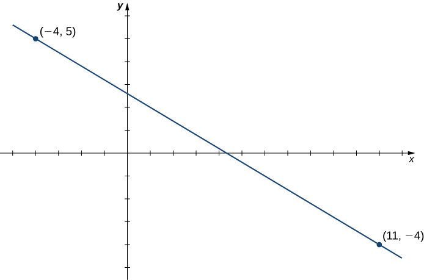
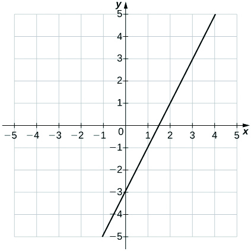
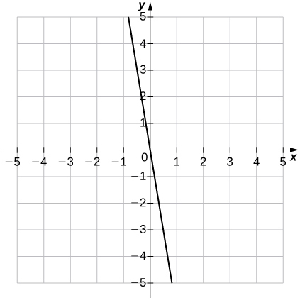
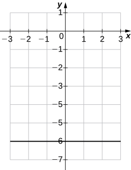
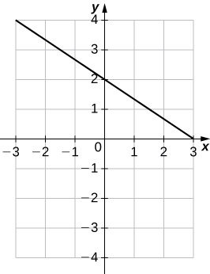

* Calculate the slope of a linear function and interpret its meaning.
* Recognize the degree of a polynomial.
* Find the roots of a quadratic polynomial.
* Describe the graphs of basic odd and even polynomial functions.
* Identify a rational function.
* Describe the graphs of power and root functions.
* Explain the difference between algebraic and transcendental functions.
* Graph a piecewise-defined function.
* Sketch the graph of a function that has been shifted, stretched, or reflected from its initial graph position.

We have studied the general characteristics of functions, so now let’s examine some specific classes of functions. We begin by reviewing the basic properties of linear and quadratic functions, and then generalize to include higher-degree polynomials. By combining root functions with polynomials, we can define general algebraic functions and distinguish them from the transcendental functions we examine later in this chapter. We finish the section with examples of piecewise-defined functions and take a look at how to sketch the graph of a function that has been shifted, stretched, or reflected from its initial form.

# Linear Functions and Slope

The easiest type of function to consider is a **linear function**{: data-type="term"}. Linear functions have the form <math xmlns="http://www.w3.org/1998/Math/MathML"><mrow><mi>f</mi><mo stretchy="false">(</mo><mi>x</mi><mo stretchy="false">)</mo><mo>=</mo><mi>a</mi><mi>x</mi><mo>+</mo><mi>b</mi><mo>,</mo></mrow></math>

 where <math xmlns="http://www.w3.org/1998/Math/MathML"><mi>a</mi></math>

 and <math xmlns="http://www.w3.org/1998/Math/MathML"><mrow><mi>b</mi></mrow></math>

 are constants. In [\[link\]](#CNX_Calc_Figure_01_02_001), we see examples of linear functions when <math xmlns="http://www.w3.org/1998/Math/MathML"><mi>a</mi></math>

 is positive, negative, and zero. Note that if <math xmlns="http://www.w3.org/1998/Math/MathML"><mrow><mi>a</mi><mo>&gt;</mo><mn>0</mn><mo>,</mo></mrow></math>

 the graph of the line rises as <math xmlns="http://www.w3.org/1998/Math/MathML"><mi>x</mi></math>

 increases. In other words, <math xmlns="http://www.w3.org/1998/Math/MathML"><mrow><mi>f</mi><mo stretchy="false">(</mo><mi>x</mi><mo stretchy="false">)</mo><mo>=</mo><mi>a</mi><mi>x</mi><mo>+</mo><mi>b</mi></mrow></math>

 is increasing on <math xmlns="http://www.w3.org/1998/Math/MathML"><mrow><mtext>(−∞, ∞)</mtext><mo>.</mo></mrow></math>

 If <math xmlns="http://www.w3.org/1998/Math/MathML"><mrow><mi>a</mi><mo>&lt;</mo><mn>0</mn><mo>,</mo></mrow></math>

 the graph of the line falls as <math xmlns="http://www.w3.org/1998/Math/MathML"><mi>x</mi></math>

 increases. In this case, <math xmlns="http://www.w3.org/1998/Math/MathML"><mrow><mi>f</mi><mo stretchy="false">(</mo><mi>x</mi><mo stretchy="false">)</mo><mo>=</mo><mi>a</mi><mi>x</mi><mo>+</mo><mi>b</mi></mrow></math>

 is decreasing on <math xmlns="http://www.w3.org/1998/Math/MathML"><mrow><mtext>(−∞, ∞)</mtext><mo>.</mo></mrow></math>

 If <math xmlns="http://www.w3.org/1998/Math/MathML"><mrow><mi>a</mi><mo>=</mo><mn>0</mn><mo>,</mo></mrow></math>

 the line is horizontal.

 ![An image of a graph. The y axis runs from -2 to 5 and the x axis runs from -2 to 5. The graph is of the 3 functions. The first function is &#x201C;f(x) = 3x + 1&#x201D;, which is an increasing straight line with an x intercept at ((-1/3), 0) and a y intercept at (0, 1). The second function is &#x201C;g(x) = 2&#x201D;, which is a horizontal line with a y intercept at (0, 2) and no x intercept. The third function is &#x201C;h(x) = (-1/2)x&#x201D;, which is a decreasing straight line with an x intercept and y intercept both at the origin. The function f(x) is increasing at a higher rate than the function h(x) is decreasing.](../resources/CNX_Calc_Figure_01_02_001.jpg "These linear functions are increasing or decreasing on (&#x221E;, &#x221E;) and one function is a horizontal line."){: #CNX_Calc_Figure_01_02_001}

As suggested by [\[link\]](#CNX_Calc_Figure_01_02_001), the graph of any linear function is a line. One of the distinguishing features of a line is its slope. The **slope**{: data-type="term"} is the change in <math xmlns="http://www.w3.org/1998/Math/MathML"><mi>y</mi></math>

 for each unit change in <math xmlns="http://www.w3.org/1998/Math/MathML"><mi>x</mi><mo>.</mo></math>

 The slope measures both the steepness and the direction of a line. If the slope is positive, the line points upward when moving from left to right. If the slope is negative, the line points downward when moving from left to right. If the slope is zero, the line is horizontal. To calculate the slope of a line, we need to determine the ratio of the change in <math xmlns="http://www.w3.org/1998/Math/MathML"><mi>y</mi></math>

 versus the change in <math xmlns="http://www.w3.org/1998/Math/MathML"><mi>x</mi><mo>.</mo></math>

 To do so, we choose any two points <math xmlns="http://www.w3.org/1998/Math/MathML"><mrow><mo stretchy="false">(</mo><msub><mi>x</mi><mn>1</mn></msub><mo>,</mo><msub><mi>y</mi><mn>1</mn></msub><mo stretchy="false">)</mo></mrow></math>

 and <math xmlns="http://www.w3.org/1998/Math/MathML"><mrow><mo stretchy="false">(</mo><msub><mi>x</mi><mn>2</mn></msub><mo>,</mo><msub><mi>y</mi><mn>2</mn></msub><mo stretchy="false">)</mo></mrow></math>

 on the line and calculate <math xmlns="http://www.w3.org/1998/Math/MathML"><mrow><mfrac><mrow><msub><mi>y</mi><mn>2</mn></msub><mo>−</mo><msub><mi>y</mi><mn>1</mn></msub></mrow><mrow><msub><mi>x</mi><mn>2</mn></msub><mo>−</mo><msub><mi>x</mi><mn>1</mn></msub></mrow></mfrac><mo>.</mo></mrow></math>

 In [\[link\]](#CNX_Calc_Figure_01_02_002), we see this ratio is independent of the points chosen.

 ![An image of a graph. The y axis runs from -1 to 10 and the x axis runs from -1 to 6. The graph is of a function that is an increasing straight line. There are four points labeled on the function at (1, 1), (2, 3), (3, 5), and (5, 9). There is a dotted horizontal line from the labeled function point (1, 1) to the unlabeled point (3, 1) which is not on the function, and then dotted vertical line from the unlabeled point (3, 1), which is not on the function, to the labeled function point (3, 5). These two dotted have the label &#x201C;(y2 - y1)/(x2 - x1) = (5 -1)/(3 - 1) = 2&#x201D;. There is a dotted horizontal line from the labeled function point (2, 3) to the unlabeled point (5, 3) which is not on the function, and then dotted vertical line from the unlabeled point (5, 3), which is not on the function, to the labeled function point (5, 9). These two dotted have the label &#x201C;(y2 - y1)/(x2 - x1) = (9 -3)/(5 - 2) = 2&#x201D;.](../resources/CNX_Calc_Figure_01_02_021.jpg "For any linear function, the slope (y2&#x2212;y1)/(x2&#x2212;x1) is independent of the choice of points (x1,y1) and (x2,y2) on the line."){: #CNX_Calc_Figure_01_02_002}

Definition

Consider line <math xmlns="http://www.w3.org/1998/Math/MathML"><mi>L</mi></math>

 passing through points <math xmlns="http://www.w3.org/1998/Math/MathML"><mrow><mo stretchy="false">(</mo><msub><mi>x</mi><mn>1</mn></msub><mo>,</mo><msub><mi>y</mi><mn>1</mn></msub><mo stretchy="false">)</mo></mrow></math>

 and <math xmlns="http://www.w3.org/1998/Math/MathML"><mrow><mo stretchy="false">(</mo><msub><mi>x</mi><mn>2</mn></msub><mo>,</mo><msub><mi>y</mi><mn>2</mn></msub><mo stretchy="false">)</mo><mo>.</mo></mrow></math>

 Let <math xmlns="http://www.w3.org/1998/Math/MathML"><mrow><mtext>Δ</mtext><mi>y</mi><mo>=</mo><msub><mi>y</mi><mn>2</mn></msub><mo>−</mo><msub><mi>y</mi><mn>1</mn></msub></mrow></math>

 and <math xmlns="http://www.w3.org/1998/Math/MathML"><mrow><mtext>Δ</mtext><mi>x</mi><mo>=</mo><msub><mi>x</mi><mn>2</mn></msub><mo>−</mo><msub><mi>x</mi><mn>1</mn></msub></mrow></math>

 denote the changes in <math xmlns="http://www.w3.org/1998/Math/MathML"><mi>y</mi></math>

 and <math xmlns="http://www.w3.org/1998/Math/MathML"><mi>x</mi><mo>,</mo></math>

 respectively. The **slope** of the line is

<math xmlns="http://www.w3.org/1998/Math/MathML"><mrow><mi>m</mi><mo>=</mo><mfrac><mrow><msub><mi>y</mi><mn>2</mn></msub><mo>−</mo><msub><mi>y</mi><mn>1</mn></msub></mrow><mrow><msub><mi>x</mi><mn>2</mn></msub><mo>−</mo><msub><mi>x</mi><mn>1</mn></msub></mrow></mfrac><mo>=</mo><mfrac><mrow><mtext>Δ</mtext><mi>y</mi></mrow><mrow><mtext>Δ</mtext><mi>x</mi></mrow></mfrac><mo>.</mo></mrow></math>

We now examine the relationship between slope and the formula for a linear function. Consider the linear function given by the formula <math xmlns="http://www.w3.org/1998/Math/MathML"><mrow><mi>f</mi><mrow><mo>(</mo><mi>x</mi><mo>)</mo></mrow><mo>=</mo><mi>a</mi><mi>x</mi><mo>+</mo><mi>b</mi><mo>.</mo></mrow></math>

 As discussed earlier, we know the graph of a linear function is given by a line. We can use our definition of slope to calculate the slope of this line. As shown, we can determine the slope by calculating <math xmlns="http://www.w3.org/1998/Math/MathML"><mrow><mo stretchy="false">(</mo><msub><mi>y</mi><mn>2</mn></msub><mo>−</mo><msub><mi>y</mi><mn>1</mn></msub><mo stretchy="false">)</mo><mtext>/</mtext><mo stretchy="false">(</mo><msub><mi>x</mi><mn>2</mn></msub><mo>−</mo><msub><mi>x</mi><mn>1</mn></msub><mo stretchy="false">)</mo></mrow></math>

 for any points <math xmlns="http://www.w3.org/1998/Math/MathML"><mrow><mo stretchy="false">(</mo><msub><mi>x</mi><mn>1</mn></msub><mo>,</mo><msub><mi>y</mi><mn>1</mn></msub><mo stretchy="false">)</mo></mrow></math>

 and <math xmlns="http://www.w3.org/1998/Math/MathML"><mrow><mo stretchy="false">(</mo><msub><mi>x</mi><mn>2</mn></msub><mo>,</mo><msub><mi>y</mi><mn>2</mn></msub><mo stretchy="false">)</mo></mrow></math>

 on the line. Evaluating the function <math xmlns="http://www.w3.org/1998/Math/MathML"><mi>f</mi></math>

 at <math xmlns="http://www.w3.org/1998/Math/MathML"><mrow><mi>x</mi><mo>=</mo><mn>0</mn><mo>,</mo></mrow></math>

 we see that <math xmlns="http://www.w3.org/1998/Math/MathML"><mrow><mo stretchy="false">(</mo><mn>0</mn><mo>,</mo><mi>b</mi><mo stretchy="false">)</mo></mrow></math>

 is a point on this line. Evaluating this function at <math xmlns="http://www.w3.org/1998/Math/MathML"><mrow><mi>x</mi><mo>=</mo><mn>1</mn><mo>,</mo></mrow></math>

 we see that <math xmlns="http://www.w3.org/1998/Math/MathML"><mrow><mo stretchy="false">(</mo><mn>1</mn><mo>,</mo><mi>a</mi><mo>+</mo><mi>b</mi><mo stretchy="false">)</mo></mrow></math>

 is also a point on this line. Therefore, the slope of this line is

<math xmlns="http://www.w3.org/1998/Math/MathML"><mrow><mfrac><mrow><mo stretchy="false">(</mo><mi>a</mi><mo>+</mo><mi>b</mi><mo stretchy="false">)</mo><mo>−</mo><mi>b</mi></mrow><mrow><mn>1</mn><mo>−</mo><mn>0</mn></mrow></mfrac><mo>=</mo><mi>a</mi><mo>.</mo></mrow></math>

We have shown that the coefficient <math xmlns="http://www.w3.org/1998/Math/MathML"><mi>a</mi></math>

 is the slope of the line. We can conclude that the formula <math xmlns="http://www.w3.org/1998/Math/MathML"><mrow><mi>f</mi><mo stretchy="false">(</mo><mi>x</mi><mo stretchy="false">)</mo><mo>=</mo><mi>a</mi><mi>x</mi><mo>+</mo><mi>b</mi></mrow></math>

 describes a line with slope <math xmlns="http://www.w3.org/1998/Math/MathML"><mrow><mi>a</mi><mo>.</mo></mrow></math>

 Furthermore, because this line intersects the <math xmlns="http://www.w3.org/1998/Math/MathML"><mi>y</mi></math>

-axis at the point <math xmlns="http://www.w3.org/1998/Math/MathML"><mrow><mo stretchy="false">(</mo><mn>0</mn><mo>,</mo><mi>b</mi><mo stretchy="false">)</mo><mo>,</mo></mrow></math>

 we see that the <math xmlns="http://www.w3.org/1998/Math/MathML"><mi>y</mi></math>

-intercept for this linear function is <math xmlns="http://www.w3.org/1998/Math/MathML"><mrow><mo stretchy="false">(</mo><mn>0</mn><mo>,</mo><mi>b</mi><mo stretchy="false">)</mo><mo>.</mo></mrow></math>

 We conclude that the formula <math xmlns="http://www.w3.org/1998/Math/MathML"><mrow><mi>f</mi><mo stretchy="false">(</mo><mi>x</mi><mo stretchy="false">)</mo><mo>=</mo><mi>a</mi><mi>x</mi><mo>+</mo><mi>b</mi></mrow></math>

 tells us the slope, <math xmlns="http://www.w3.org/1998/Math/MathML"><mrow><mi>a</mi><mo>,</mo></mrow></math>

 and the <math xmlns="http://www.w3.org/1998/Math/MathML"><mi>y</mi></math>

-intercept, <math xmlns="http://www.w3.org/1998/Math/MathML"><mrow><mo stretchy="false">(</mo><mn>0</mn><mo>,</mo><mi>b</mi><mo stretchy="false">)</mo><mo>,</mo></mrow></math>

 for this line. Since we often use the symbol <math xmlns="http://www.w3.org/1998/Math/MathML"><mi>m</mi></math>

 to denote the slope of a line, we can write

<math xmlns="http://www.w3.org/1998/Math/MathML"><mrow><mi>f</mi><mo stretchy="false">(</mo><mi>x</mi><mo stretchy="false">)</mo><mo>=</mo><mi>m</mi><mi>x</mi><mo>+</mo><mi>b</mi></mrow></math>

to denote the **slope-intercept form**{: data-type="term"} of a linear function.

Sometimes it is convenient to express a linear function in different ways. For example, suppose the graph of a linear function passes through the point <math xmlns="http://www.w3.org/1998/Math/MathML"><mrow><mo stretchy="false">(</mo><msub><mi>x</mi><mn>1</mn></msub><mo>,</mo><msub><mi>y</mi><mn>1</mn></msub><mo stretchy="false">)</mo></mrow></math>

 and the slope of the line is <math xmlns="http://www.w3.org/1998/Math/MathML"><mi>m</mi><mo>.</mo></math>

 Since any other point <math xmlns="http://www.w3.org/1998/Math/MathML"><mrow><mo stretchy="false">(</mo><mi>x</mi><mo>,</mo><mi>f</mi><mo stretchy="false">(</mo><mi>x</mi><mo stretchy="false">)</mo><mo stretchy="false">)</mo></mrow></math>

 on the graph of <math xmlns="http://www.w3.org/1998/Math/MathML"><mi>f</mi></math>

 must satisfy the equation

<math xmlns="http://www.w3.org/1998/Math/MathML"><mrow><mi>m</mi><mo>=</mo><mfrac><mrow><mi>f</mi><mo stretchy="false">(</mo><mi>x</mi><mo stretchy="false">)</mo><mo>−</mo><msub><mi>y</mi><mn>1</mn></msub></mrow><mrow><mi>x</mi><mo>−</mo><msub><mi>x</mi><mn>1</mn></msub></mrow></mfrac><mo>,</mo></mrow></math>

this linear function can be expressed by writing

<math xmlns="http://www.w3.org/1998/Math/MathML"><mrow><mi>f</mi><mo stretchy="false">(</mo><mi>x</mi><mo stretchy="false">)</mo><mo>−</mo><msub><mi>y</mi><mn>1</mn></msub><mo>=</mo><mi>m</mi><mo stretchy="false">(</mo><mi>x</mi><mo>−</mo><msub><mi>x</mi><mn>1</mn></msub><mo stretchy="false">)</mo><mo>.</mo></mrow></math>

We call this equation the **point-slope equation**{: data-type="term"} for that linear function.

Since every nonvertical line is the graph of a linear function, the points on a nonvertical line can be described using the slope-intercept or point-slope equations. However, a vertical line does not represent the graph of a function and cannot be expressed in either of these forms. Instead, a vertical line is described by the equation <math xmlns="http://www.w3.org/1998/Math/MathML"><mrow><mi>x</mi><mo>=</mo><mi>k</mi></mrow></math>

 for some constant <math xmlns="http://www.w3.org/1998/Math/MathML"><mrow><mi>k</mi><mo>.</mo></mrow></math>

 Since neither the slope-intercept form nor the point-slope form allows for vertical lines, we use the notation

<math xmlns="http://www.w3.org/1998/Math/MathML"><mrow><mi>a</mi><mi>x</mi><mo>+</mo><mi>b</mi><mi>y</mi><mo>=</mo><mi>c</mi><mo>,</mo></mrow></math>

where <math xmlns="http://www.w3.org/1998/Math/MathML"><mrow><mi>a</mi><mo>,</mo><mi>b</mi></mrow></math>

 are both not zero, to denote the **standard form of a line**{: data-type="term"}.

Definition

Consider a line passing through the point <math xmlns="http://www.w3.org/1998/Math/MathML"><mrow><mo stretchy="false">(</mo><msub><mi>x</mi><mn>1</mn></msub><mo>,</mo><msub><mi>y</mi><mn>1</mn></msub><mo stretchy="false">)</mo></mrow></math>

 with slope <math xmlns="http://www.w3.org/1998/Math/MathML"><mi>m</mi><mo>.</mo></math>

 The equation

<math xmlns="http://www.w3.org/1998/Math/MathML"><mrow><mi>y</mi><mo>−</mo><msub><mi>y</mi><mn>1</mn></msub><mo>=</mo><mi>m</mi><mrow><mo>(</mo><mrow><mi>x</mi><mo>−</mo><msub><mi>x</mi><mn>1</mn></msub></mrow><mo>)</mo></mrow></mrow></math>

is the **point-slope equation** for that line.

Consider a line with slope <math xmlns="http://www.w3.org/1998/Math/MathML"><mi>m</mi></math>

 and <math xmlns="http://www.w3.org/1998/Math/MathML"><mi>y</mi></math>

-intercept <math xmlns="http://www.w3.org/1998/Math/MathML"><mrow><mo stretchy="false">(</mo><mn>0</mn><mo>,</mo><mi>b</mi><mo stretchy="false">)</mo><mo>.</mo></mrow></math>

 The equation

<math xmlns="http://www.w3.org/1998/Math/MathML"><mrow><mi>y</mi><mo>=</mo><mi>m</mi><mi>x</mi><mo>+</mo><mi>b</mi></mrow></math>

is an equation for that line in **slope-intercept form**.

The **standard form of a line** is given by the equation

<math xmlns="http://www.w3.org/1998/Math/MathML"><mrow><mi>a</mi><mi>x</mi><mo>+</mo><mi>b</mi><mi>y</mi><mo>=</mo><mi>c</mi><mo>,</mo></mrow></math>

where <math xmlns="http://www.w3.org/1998/Math/MathML"><mi>a</mi></math>

 and <math xmlns="http://www.w3.org/1998/Math/MathML"><mi>b</mi></math>

 are both not zero. This form is more general because it allows for a vertical line, <math xmlns="http://www.w3.org/1998/Math/MathML"><mrow><mi>x</mi><mo>=</mo><mi>k</mi><mo>.</mo></mrow></math>

Finding the Slope and Equations of Lines

Consider the line passing through the points <math xmlns="http://www.w3.org/1998/Math/MathML"><mrow><mo stretchy="false">(</mo><mn>11</mn><mo>,</mo><mn>−4</mn><mo stretchy="false">)</mo></mrow></math>

 and <math xmlns="http://www.w3.org/1998/Math/MathML"><mrow><mo stretchy="false">(</mo><mn>−4</mn><mo>,</mo><mn>5</mn><mo stretchy="false">)</mo><mo>,</mo></mrow></math>

 as shown in [[link]](#CNX_Calc_Figure_01_02_003).

{: #CNX_Calc_Figure_01_02_003}

1.  Find the slope of the line.
2.  Find an equation for this linear function in point-slope form.
3.  Find an equation for this linear function in slope-intercept form.
{: data-number-style="lower-alpha"}

1.  The slope of the line is
    * * *
    {: data-type="newline"}
    
    

    <math xmlns="http://www.w3.org/1998/Math/MathML"><mrow><mi>m</mi><mo>=</mo><mfrac><mrow><msub><mi>y</mi><mn>2</mn></msub><mo>−</mo><msub><mi>y</mi><mn>1</mn></msub></mrow><mrow><msub><mi>x</mi><mn>2</mn></msub><mo>−</mo><msub><mi>x</mi><mn>1</mn></msub></mrow></mfrac><mo>=</mo><mfrac><mrow><mn>5</mn><mo>−</mo><mo stretchy="false">(</mo><mn>−4</mn><mo stretchy="false">)</mo></mrow><mrow><mn>−4</mn><mo>−</mo><mn>11</mn></mrow></mfrac><mo>=</mo><mo>−</mo><mfrac><mn>9</mn><mrow><mn>15</mn></mrow></mfrac><mo>=</mo><mo>−</mo><mfrac><mn>3</mn><mn>5</mn></mfrac><mo>.</mo></mrow></math>
    

2.  To find an equation for the linear function in point-slope form, use the slope
    <math xmlns="http://www.w3.org/1998/Math/MathML"><mrow><mi>m</mi><mo>=</mo><mn>−3</mn><mtext>/</mtext><mn>5</mn></mrow></math>
    
    and choose any point on the line. If we choose the point
    <math xmlns="http://www.w3.org/1998/Math/MathML"><mrow><mo stretchy="false">(</mo><mn>11</mn><mo>,</mo><mn>−4</mn><mo stretchy="false">)</mo><mo>,</mo></mrow></math>
    
    we get the equation
    * * *
    {: data-type="newline"}
    
    

    <math xmlns="http://www.w3.org/1998/Math/MathML"><mrow><mi>f</mi><mo stretchy="false">(</mo><mi>x</mi><mo stretchy="false">)</mo><mo>+</mo><mn>4</mn><mo>=</mo><mo>−</mo><mfrac><mn>3</mn><mn>5</mn></mfrac><mo stretchy="false">(</mo><mi>x</mi><mo>−</mo><mn>11</mn><mo stretchy="false">)</mo><mo>.</mo></mrow></math>
    

3.  To find an equation for the linear function in slope-intercept form, solve the equation in part b. for
    <math xmlns="http://www.w3.org/1998/Math/MathML"><mrow><mi>f</mi><mo stretchy="false">(</mo><mi>x</mi><mo stretchy="false">)</mo><mo>.</mo></mrow></math>
    
    When we do this, we get the equation
    * * *
    {: data-type="newline"}
    
    

    <math xmlns="http://www.w3.org/1998/Math/MathML"><mrow><mi>f</mi><mo stretchy="false">(</mo><mi>x</mi><mo stretchy="false">)</mo><mo>=</mo><mo>−</mo><mfrac><mn>3</mn><mn>5</mn></mfrac><mi>x</mi><mo>+</mo><mfrac><mrow><mn>13</mn></mrow><mn>5</mn></mfrac><mo>.</mo></mrow></math>
    

{: data-number-style="lower-alpha"}

Consider the line passing through points <math xmlns="http://www.w3.org/1998/Math/MathML"><mrow><mo stretchy="false">(</mo><mn>−3</mn><mo>,</mo><mn>2</mn><mo stretchy="false">)</mo></mrow></math>

 and <math xmlns="http://www.w3.org/1998/Math/MathML"><mrow><mo stretchy="false">(</mo><mn>1</mn><mo>,</mo><mn>4</mn><mo stretchy="false">)</mo><mo>.</mo></mrow></math>

 Find the slope of the line.

Find an equation of that line in point-slope form. Find an equation of that line in slope-intercept form.

<math xmlns="http://www.w3.org/1998/Math/MathML"><mrow><mi>m</mi><mo>=</mo><mn>1</mn><mtext>/</mtext><mn>2</mn><mo>.</mo></mrow></math>

 The point-slope form is

<math xmlns="http://www.w3.org/1998/Math/MathML"><mrow><mi>y</mi><mo>−</mo><mn>4</mn><mo>=</mo><mfrac><mn>1</mn><mn>2</mn></mfrac><mrow><mo>(</mo><mrow><mi>x</mi><mo>−</mo><mn>1</mn></mrow><mo>)</mo></mrow><mo>.</mo></mrow></math>

The slope-intercept form is

<math xmlns="http://www.w3.org/1998/Math/MathML"><mrow><mi>y</mi><mo>=</mo><mfrac><mn>1</mn><mn>2</mn></mfrac><mi>x</mi><mo>+</mo><mfrac><mn>7</mn><mn>2</mn></mfrac><mo>.</mo></mrow></math>

Hint

The slope <math xmlns="http://www.w3.org/1998/Math/MathML"><mrow><mi>m</mi><mo>=</mo><mtext>Δ</mtext><mi>y</mi><mtext>/</mtext><mtext>Δ</mtext><mi>x</mi><mtext>.</mtext></mrow></math>

A Linear Distance Function

Jessica leaves her house at 5:50 a.m. and goes for a 9-mile run. She returns to her house at 7:08 a.m. Answer the following questions, assuming Jessica runs at a constant pace.

1.  Describe the distance
    <math xmlns="http://www.w3.org/1998/Math/MathML"><mrow><mi>D</mi></mrow></math>
    
    (in miles) Jessica runs as a linear function of her run time
    <math xmlns="http://www.w3.org/1998/Math/MathML"><mrow><mi>t</mi></mrow></math>
    
    (in minutes).
2.  Sketch a graph of
    <math xmlns="http://www.w3.org/1998/Math/MathML"><mrow><mi>D</mi><mo>.</mo></mrow></math>

3.  Interpret the meaning of the slope.
{: data-number-style="lower-alpha"}

1.  At time
    <math xmlns="http://www.w3.org/1998/Math/MathML"><mrow><mi>t</mi><mo>=</mo><mn>0</mn><mo>,</mo></mrow></math>
    
    Jessica is at her house, so
    <math xmlns="http://www.w3.org/1998/Math/MathML"><mrow><mi>D</mi><mrow><mo>(</mo><mn>0</mn><mo>)</mo></mrow><mo>=</mo><mn>0</mn><mo>.</mo></mrow></math>
    
    At time
    <math xmlns="http://www.w3.org/1998/Math/MathML"><mrow><mi>t</mi><mo>=</mo><mn>78</mn></mrow></math>
    
    minutes, Jessica has finished running
    <math xmlns="http://www.w3.org/1998/Math/MathML"><mrow><mn>9</mn></mrow></math>
    
    mi, so
    <math xmlns="http://www.w3.org/1998/Math/MathML"><mrow><mi>D</mi><mrow><mo>(</mo><mrow><mn>78</mn></mrow><mo>)</mo></mrow><mo>=</mo><mn>9</mn><mo>.</mo></mrow></math>
    
    The slope of the linear function is
    * * *
    {: data-type="newline"}
    
    

    <math xmlns="http://www.w3.org/1998/Math/MathML"><mrow><mi>m</mi><mo>=</mo><mfrac><mrow><mn>9</mn><mo>−</mo><mn>0</mn></mrow><mrow><mn>78</mn><mo>−</mo><mn>0</mn></mrow></mfrac><mo>=</mo><mfrac><mn>3</mn><mrow><mn>26</mn></mrow></mfrac><mo>.</mo></mrow></math>
    

    
    * * *
    {: data-type="newline"}
    
    The
    <math xmlns="http://www.w3.org/1998/Math/MathML"><mi>y</mi></math>
    
    -intercept is
    <math xmlns="http://www.w3.org/1998/Math/MathML"><mrow><mrow><mo>(</mo><mrow><mn>0</mn><mo>,</mo><mn>0</mn></mrow><mo>)</mo></mrow><mo>,</mo></mrow></math>
    
    so the equation for this linear function is
    * * *
    {: data-type="newline"}
    
    

    <math xmlns="http://www.w3.org/1998/Math/MathML"><mrow><mi>D</mi><mrow><mo>(</mo><mi>t</mi><mo>)</mo></mrow><mo>=</mo><mfrac><mn>3</mn><mrow><mn>26</mn></mrow></mfrac><mi>t</mi><mo>.</mo></mrow></math>
    

2.  To graph
    <math xmlns="http://www.w3.org/1998/Math/MathML"><mrow><mi>D</mi><mo>,</mo></mrow></math>
    
    use the fact that the graph passes through the origin and has slope
    <math xmlns="http://www.w3.org/1998/Math/MathML"><mrow><mi>m</mi><mo>=</mo><mn>3</mn><mtext>/</mtext><mn>26</mn><mo>.</mo></mrow></math>
    
    * * *
    {: data-type="newline"}
    
      
3.  The slope
    <math xmlns="http://www.w3.org/1998/Math/MathML"><mrow><mi>m</mi><mo>=</mo><mn>3</mn><mtext>/</mtext><mn>26</mn><mo>≈</mo><mn>0.115</mn></mrow></math>
    
    describes the distance (in miles) Jessica runs per minute, or her average velocity.
{: data-number-style="lower-alpha"}

# Polynomials

A linear function is a special type of a more general class of functions: polynomials. A **polynomial function**{: data-type="term"} is any function that can be written in the form

<math xmlns="http://www.w3.org/1998/Math/MathML"><mrow><mi>f</mi><mrow><mo>(</mo><mi>x</mi><mo>)</mo></mrow><mo>=</mo><msub><mi>a</mi><mi>n</mi></msub><msup><mi>x</mi><mi>n</mi></msup><mo>+</mo><msub><mi>a</mi><mrow><mi>n</mi><mo>−</mo><mn>1</mn></mrow></msub><msup><mi>x</mi><mrow><mi>n</mi><mo>−</mo><mn>1</mn></mrow></msup><mo>+</mo><mtext>…</mtext><mo>+</mo><msub><mi>a</mi><mn>1</mn></msub><mi>x</mi><mo>+</mo><msub><mi>a</mi><mn>0</mn></msub></mrow></math>

for some integer <math xmlns="http://www.w3.org/1998/Math/MathML"><mrow><mi>n</mi><mo>≥</mo><mn>0</mn></mrow></math>

 and constants <math xmlns="http://www.w3.org/1998/Math/MathML"><mrow><msub><mi>a</mi><mi>n</mi></msub><mo>,</mo><msub><mi>a</mi><mrow><mi>n</mi><mo>−</mo><mn>1</mn></mrow></msub><mtext>,…,</mtext><msub><mi>a</mi><mn>0</mn></msub><mo>,</mo></mrow></math>

 where <math xmlns="http://www.w3.org/1998/Math/MathML"><mrow><msub><mi>a</mi><mi>n</mi></msub><mo>≠</mo><mn>0</mn><mo>.</mo></mrow></math>

 In the case when <math xmlns="http://www.w3.org/1998/Math/MathML"><mrow><mi>n</mi><mo>=</mo><mn>0</mn><mo>,</mo></mrow></math>

 we allow for <math xmlns="http://www.w3.org/1998/Math/MathML"><mrow><msub><mi>a</mi><mn>0</mn></msub><mo>=</mo><mn>0</mn><mo>;</mo></mrow></math>

 if <math xmlns="http://www.w3.org/1998/Math/MathML"><mrow><msub><mi>a</mi><mn>0</mn></msub><mo>=</mo><mn>0</mn><mo>,</mo></mrow></math>

 the function <math xmlns="http://www.w3.org/1998/Math/MathML"><mrow><mi>f</mi><mo stretchy="false">(</mo><mi>x</mi><mo stretchy="false">)</mo><mo>=</mo><mn>0</mn></mrow></math>

 is called the *zero function*. The value <math xmlns="http://www.w3.org/1998/Math/MathML"><mi>n</mi></math>

 is called the **degree**{: data-type="term"} of the polynomial; the constant <math xmlns="http://www.w3.org/1998/Math/MathML"><mrow><msub><mi>a</mi><mi>n</mi></msub></mrow></math>

 is called the ***leading coefficient***{: data-type="term" .no-emphasis}. A linear function of the form <math xmlns="http://www.w3.org/1998/Math/MathML"><mrow><mi>f</mi><mrow><mo>(</mo><mi>x</mi><mo>)</mo></mrow><mo>=</mo><mi>m</mi><mi>x</mi><mo>+</mo><mi>b</mi></mrow></math>

 is a polynomial of degree 1 if <math xmlns="http://www.w3.org/1998/Math/MathML"><mrow><mi>m</mi><mo>≠</mo><mn>0</mn></mrow></math>

 and degree 0 if <math xmlns="http://www.w3.org/1998/Math/MathML"><mrow><mi>m</mi><mo>=</mo><mn>0</mn><mo>.</mo></mrow></math>

 A polynomial of degree 0 is also called a ***constant function***{: data-type="term" .no-emphasis}. A polynomial function of degree 2 is called a **quadratic function**{: data-type="term"}. In particular, a quadratic function has the form <math xmlns="http://www.w3.org/1998/Math/MathML"><mrow><mi>f</mi><mrow><mo>(</mo><mi>x</mi><mo>)</mo></mrow><mo>=</mo><mi>a</mi><msup><mi>x</mi><mn>2</mn></msup><mo>+</mo><mi>b</mi><mi>x</mi><mo>+</mo><mi>c</mi><mo>,</mo></mrow></math>

 where <math xmlns="http://www.w3.org/1998/Math/MathML"><mrow><mi>a</mi><mo>≠</mo><mn>0</mn><mo>.</mo></mrow></math>

 A polynomial function of degree <math xmlns="http://www.w3.org/1998/Math/MathML"><mrow><mn>3</mn></mrow></math>

 is called a **cubic function**{: data-type="term"}.

## Power Functions

Some polynomial functions are power functions. A **power function**{: data-type="term"} is any function of the form <math xmlns="http://www.w3.org/1998/Math/MathML"><mrow><mi>f</mi><mo stretchy="false">(</mo><mi>x</mi><mo stretchy="false">)</mo><mo>=</mo><mi>a</mi><msup><mi>x</mi><mi>b</mi></msup><mo>,</mo></mrow></math>

 where <math xmlns="http://www.w3.org/1998/Math/MathML"><mi>a</mi></math>

 and <math xmlns="http://www.w3.org/1998/Math/MathML"><mi>b</mi></math>

 are any real numbers. The exponent in a power function can be any real number, but here we consider the case when the exponent is a positive integer. (We consider other cases later.) If the exponent is a positive integer, then <math xmlns="http://www.w3.org/1998/Math/MathML"><mrow><mi>f</mi><mo stretchy="false">(</mo><mi>x</mi><mo stretchy="false">)</mo><mo>=</mo><mi>a</mi><msup><mi>x</mi><mi>n</mi></msup></mrow></math>

 is a polynomial. If <math xmlns="http://www.w3.org/1998/Math/MathML"><mi>n</mi></math>

 is even, then <math xmlns="http://www.w3.org/1998/Math/MathML"><mrow><mi>f</mi><mo stretchy="false">(</mo><mi>x</mi><mo stretchy="false">)</mo><mo>=</mo><mi>a</mi><msup><mi>x</mi><mi>n</mi></msup></mrow></math>

 is an even function because <math xmlns="http://www.w3.org/1998/Math/MathML"><mrow><mi>f</mi><mo stretchy="false">(</mo><mtext>−</mtext><mtext mathvariant="italic">x</mtext><mo stretchy="false">)</mo><mo>=</mo><mi>a</mi><msup><mrow><mo stretchy="false">(</mo><mtext>−</mtext><mtext mathvariant="italic">x</mtext><mo stretchy="false">)</mo></mrow><mi>n</mi></msup><mo>=</mo><mi>a</mi><msup><mi>x</mi><mi>n</mi></msup></mrow></math>

 if <math xmlns="http://www.w3.org/1998/Math/MathML"><mi>n</mi></math>

 is even. If <math xmlns="http://www.w3.org/1998/Math/MathML"><mi>n</mi></math>

 is odd, then <math xmlns="http://www.w3.org/1998/Math/MathML"><mrow><mi>f</mi><mo stretchy="false">(</mo><mi>x</mi><mo stretchy="false">)</mo><mo>=</mo><mi>a</mi><msup><mi>x</mi><mi>n</mi></msup></mrow></math>

 is an odd function because <math xmlns="http://www.w3.org/1998/Math/MathML"><mrow><mi>f</mi><mo stretchy="false">(</mo><mtext>−</mtext><mtext mathvariant="italic">x</mtext><mo stretchy="false">)</mo><mo>=</mo><mi>a</mi><msup><mrow><mo stretchy="false">(</mo><mtext>−</mtext><mtext mathvariant="italic">x</mtext><mo stretchy="false">)</mo></mrow><mi>n</mi></msup><mo>=</mo><mtext>−</mtext><mi>a</mi><msup><mi>x</mi><mi>n</mi></msup></mrow></math>

 if <math xmlns="http://www.w3.org/1998/Math/MathML"><mi>n</mi></math>

 is odd ([\[link\]](#CNX_Calc_Figure_01_02_004)).

 ![An image of two graphs. Both graphs have an x axis that runs from -4 to 4 and a y axis that runs from -6 to 7. The first graph is labeled &#x201C;a&#x201D; and is of two functions. The first function is &#x201C;f(x) = x to the 4th&#x201D;, which is a parabola that decreases until the origin and then increases again after the origin. The second function is &#x201C;f(x) = x squared&#x201D;, which is a parabola that decreases until the origin and then increases again after the origin, but increases and decreases at a slower rate than the first function. The second graph is labeled &#x201C;b&#x201D; and is of two functions. The first function is &#x201C;f(x) = x to the 5th&#x201D;, which is a curved function that increases until the origin, becomes even at the origin, and then increases again after the origin. The second function is &#x201C;f(x) = x cubed&#x201D;, which is a curved function that increases until the origin, becomes even at the origin, and then increases again after the origin, but increases at a slower rate than the first function.](../resources/CNX_Calc_Figure_01_02_004.jpg "(a) For any even integer n,f(x)=axn is an even function. (b) For any odd integer n,f(x)=axn is an odd function."){: #CNX_Calc_Figure_01_02_004}

## Behavior at Infinity

To determine the behavior of a function <math xmlns="http://www.w3.org/1998/Math/MathML"><mi>f</mi></math>

 as the inputs approach infinity, we look at the values <math xmlns="http://www.w3.org/1998/Math/MathML"><mrow><mi>f</mi><mo stretchy="false">(</mo><mi>x</mi><mo stretchy="false">)</mo></mrow></math>

 as the inputs, <math xmlns="http://www.w3.org/1998/Math/MathML"><mrow><mi>x</mi><mo>,</mo></mrow></math>

 become larger. For some functions, the values of <math xmlns="http://www.w3.org/1998/Math/MathML"><mrow><mi>f</mi><mo stretchy="false">(</mo><mi>x</mi><mo stretchy="false">)</mo></mrow></math>

 approach a finite number. For example, for the function <math xmlns="http://www.w3.org/1998/Math/MathML"><mrow><mi>f</mi><mrow><mo>(</mo><mi>x</mi><mo>)</mo></mrow><mo>=</mo><mn>2</mn><mo>+</mo><mn>1</mn><mtext>/</mtext><mi>x</mi><mo>,</mo></mrow></math>

 the values <math xmlns="http://www.w3.org/1998/Math/MathML"><mrow><mn>1</mn><mtext>/</mtext><mi>x</mi></mrow></math>

 become closer and closer to zero for all values of <math xmlns="http://www.w3.org/1998/Math/MathML"><mi>x</mi></math>

 as they get larger and larger. For this function, we say <math xmlns="http://www.w3.org/1998/Math/MathML"><mrow><mtext>“</mtext><mi>f</mi><mo stretchy="false">(</mo><mi>x</mi><mo stretchy="false">)</mo></mrow></math>

 approaches two as <math xmlns="http://www.w3.org/1998/Math/MathML"><mi>x</mi></math>

 goes to infinity,” and we write <math xmlns="http://www.w3.org/1998/Math/MathML"><mrow><mi>f</mi><mrow><mo>(</mo><mi>x</mi><mo>)</mo></mrow><mo stretchy="false">→</mo><mn>2</mn></mrow></math>

 as <math xmlns="http://www.w3.org/1998/Math/MathML"><mrow><mi>x</mi><mo stretchy="false">→</mo><mi>∞</mi><mo>.</mo></mrow></math>

 The line <math xmlns="http://www.w3.org/1998/Math/MathML"><mrow><mi>y</mi><mo>=</mo><mn>2</mn></mrow></math>

 is a horizontal asymptote for the function <math xmlns="http://www.w3.org/1998/Math/MathML"><mrow><mi>f</mi><mrow><mo>(</mo><mi>x</mi><mo>)</mo></mrow><mo>=</mo><mn>2</mn><mo>+</mo><mn>1</mn><mtext>/</mtext><mi>x</mi></mrow></math>

 because the graph of the function gets closer to the line as <math xmlns="http://www.w3.org/1998/Math/MathML"><mi>x</mi></math>

 gets larger.

For other functions, the values <math xmlns="http://www.w3.org/1998/Math/MathML"><mrow><mi>f</mi><mo stretchy="false">(</mo><mi>x</mi><mo stretchy="false">)</mo></mrow></math>

 may not approach a finite number but instead may become larger for all values of <math xmlns="http://www.w3.org/1998/Math/MathML"><mi>x</mi></math>

 as they get larger. In that case, we say <math xmlns="http://www.w3.org/1998/Math/MathML"><mrow><mtext>“</mtext><mi>f</mi><mo stretchy="false">(</mo><mi>x</mi><mo stretchy="false">)</mo></mrow></math>

 approaches infinity as <math xmlns="http://www.w3.org/1998/Math/MathML"><mi>x</mi></math>

 approaches infinity,” and we write <math xmlns="http://www.w3.org/1998/Math/MathML"><mrow><mi>f</mi><mrow><mo>(</mo><mi>x</mi><mo>)</mo></mrow><mo stretchy="false">→</mo><mi>∞</mi></mrow></math>

 as <math xmlns="http://www.w3.org/1998/Math/MathML"><mrow><mi>x</mi><mo stretchy="false">→</mo><mi>∞</mi><mo>.</mo></mrow></math>

 For example, for the function <math xmlns="http://www.w3.org/1998/Math/MathML"><mrow><mi>f</mi><mrow><mo>(</mo><mi>x</mi><mo>)</mo></mrow><mo>=</mo><mn>3</mn><msup><mi>x</mi><mn>2</mn></msup><mo>,</mo></mrow></math>

 the outputs <math xmlns="http://www.w3.org/1998/Math/MathML"><mrow><mi>f</mi><mo stretchy="false">(</mo><mi>x</mi><mo stretchy="false">)</mo></mrow></math>

 become larger as the inputs <math xmlns="http://www.w3.org/1998/Math/MathML"><mi>x</mi></math>

 get larger. We can conclude that the function <math xmlns="http://www.w3.org/1998/Math/MathML"><mrow><mi>f</mi><mo stretchy="false">(</mo><mi>x</mi><mo stretchy="false">)</mo><mo>=</mo><mn>3</mn><msup><mi>x</mi><mn>2</mn></msup></mrow></math>

 approaches infinity as <math xmlns="http://www.w3.org/1998/Math/MathML"><mi>x</mi></math>

 approaches infinity, and we write <math xmlns="http://www.w3.org/1998/Math/MathML"><mrow><mn>3</mn><msup><mi>x</mi><mn>2</mn></msup><mo stretchy="false">→</mo><mi>∞</mi></mrow></math>

 as <math xmlns="http://www.w3.org/1998/Math/MathML"><mrow><mi>x</mi><mo stretchy="false">→</mo><mi>∞</mi><mo>.</mo></mrow></math>

 The behavior as <math xmlns="http://www.w3.org/1998/Math/MathML"><mrow><mi>x</mi><mo stretchy="false">→</mo><mtext>−</mtext><mi>∞</mi></mrow></math>

 and the meaning of <math xmlns="http://www.w3.org/1998/Math/MathML"><mrow><mi>f</mi><mrow><mo>(</mo><mi>x</mi><mo>)</mo></mrow><mo stretchy="false">→</mo><mtext>−</mtext><mi>∞</mi></mrow></math>

 as <math xmlns="http://www.w3.org/1998/Math/MathML"><mrow><mi>x</mi><mo stretchy="false">→</mo><mi>∞</mi></mrow></math>

 or <math xmlns="http://www.w3.org/1998/Math/MathML"><mrow><mi>x</mi><mo stretchy="false">→</mo><mtext>−</mtext><mi>∞</mi></mrow></math>

 can be defined similarly. We can describe what happens to the values of <math xmlns="http://www.w3.org/1998/Math/MathML"><mrow><mi>f</mi><mo stretchy="false">(</mo><mi>x</mi><mo stretchy="false">)</mo></mrow></math>

 as <math xmlns="http://www.w3.org/1998/Math/MathML"><mrow><mi>x</mi><mo stretchy="false">→</mo><mi>∞</mi></mrow></math>

 and as <math xmlns="http://www.w3.org/1998/Math/MathML"><mrow><mi>x</mi><mo stretchy="false">→</mo><mtext>−</mtext><mi>∞</mi></mrow></math>

 as the ***end behavior***{: data-type="term" .no-emphasis} of the function.

To understand the end behavior for polynomial functions, we can focus on quadratic and cubic functions. The behavior for higher-degree polynomials can be analyzed similarly. Consider a quadratic function <math xmlns="http://www.w3.org/1998/Math/MathML"><mrow><mi>f</mi><mrow><mo>(</mo><mi>x</mi><mo>)</mo></mrow><mo>=</mo><mi>a</mi><msup><mi>x</mi><mn>2</mn></msup><mo>+</mo><mi>b</mi><mi>x</mi><mo>+</mo><mi>c</mi><mo>.</mo></mrow></math>

 If <math xmlns="http://www.w3.org/1998/Math/MathML"><mrow><mi>a</mi><mo>&gt;</mo><mn>0</mn><mo>,</mo></mrow></math>

 the values <math xmlns="http://www.w3.org/1998/Math/MathML"><mrow><mi>f</mi><mrow><mo>(</mo><mi>x</mi><mo>)</mo></mrow><mo stretchy="false">→</mo><mi>∞</mi></mrow></math>

 as <math xmlns="http://www.w3.org/1998/Math/MathML"><mrow><mi>x</mi><mo stretchy="false">→</mo><mtext>±</mtext><mi>∞</mi><mo>.</mo></mrow></math>

 If <math xmlns="http://www.w3.org/1998/Math/MathML"><mrow><mi>a</mi><mo>&lt;</mo><mn>0</mn><mo>,</mo></mrow></math>

 the values <math xmlns="http://www.w3.org/1998/Math/MathML"><mrow><mi>f</mi><mrow><mo>(</mo><mi>x</mi><mo>)</mo></mrow><mo stretchy="false">→</mo><mtext>−∞</mtext></mrow></math>

 as <math xmlns="http://www.w3.org/1998/Math/MathML"><mrow><mi>x</mi><mo stretchy="false">→</mo><mtext>±</mtext><mi>∞</mi><mo>.</mo></mrow></math>

 Since the graph of a quadratic function is a parabola, the parabola opens upward if <math xmlns="http://www.w3.org/1998/Math/MathML"><mrow><mi>a</mi><mo>&gt;</mo><mn>0</mn><mo>;</mo></mrow></math>

 the parabola opens downward if <math xmlns="http://www.w3.org/1998/Math/MathML"><mrow><mi>a</mi><mo>&lt;</mo><mn>0</mn><mo>.</mo></mrow></math>

 (See [\[link\]](#CNX_Calc_Figure_01_02_005)(a).)

Now consider a cubic function <math xmlns="http://www.w3.org/1998/Math/MathML"><mrow><mi>f</mi><mrow><mo>(</mo><mi>x</mi><mo>)</mo></mrow><mo>=</mo><mi>a</mi><msup><mi>x</mi><mn>3</mn></msup><mo>+</mo><mi>b</mi><msup><mi>x</mi><mn>2</mn></msup><mo>+</mo><mi>c</mi><mi>x</mi><mo>+</mo><mi>d</mi><mo>.</mo></mrow></math>

 If <math xmlns="http://www.w3.org/1998/Math/MathML"><mrow><mi>a</mi><mo>&gt;</mo><mn>0</mn><mo>,</mo></mrow></math>

 then <math xmlns="http://www.w3.org/1998/Math/MathML"><mrow><mi>f</mi><mrow><mo>(</mo><mi>x</mi><mo>)</mo></mrow><mo stretchy="false">→</mo><mi>∞</mi></mrow></math>

 as <math xmlns="http://www.w3.org/1998/Math/MathML"><mrow><mi>x</mi><mo stretchy="false">→</mo><mi>∞</mi></mrow></math>

 and <math xmlns="http://www.w3.org/1998/Math/MathML"><mrow><mi>f</mi><mrow><mo>(</mo><mi>x</mi><mo>)</mo></mrow><mo stretchy="false">→</mo><mtext>−∞</mtext></mrow></math>

 as <math xmlns="http://www.w3.org/1998/Math/MathML"><mrow><mi>x</mi><mo stretchy="false">→</mo><mtext>−∞</mtext><mo>.</mo></mrow></math>

 If <math xmlns="http://www.w3.org/1998/Math/MathML"><mrow><mi>a</mi><mo>&lt;</mo><mn>0</mn><mo>,</mo></mrow></math>

 then <math xmlns="http://www.w3.org/1998/Math/MathML"><mrow><mi>f</mi><mrow><mo>(</mo><mi>x</mi><mo>)</mo></mrow><mo stretchy="false">→</mo><mtext>−∞</mtext></mrow></math>

 as <math xmlns="http://www.w3.org/1998/Math/MathML"><mrow><mi>x</mi><mo stretchy="false">→</mo><mi>∞</mi></mrow></math>

 and <math xmlns="http://www.w3.org/1998/Math/MathML"><mrow><mi>f</mi><mrow><mo>(</mo><mi>x</mi><mo>)</mo></mrow><mo stretchy="false">→</mo><mi>∞</mi></mrow></math>

 as <math xmlns="http://www.w3.org/1998/Math/MathML"><mrow><mi>x</mi><mo stretchy="false">→</mo><mtext>−∞</mtext><mo>.</mo></mrow></math>

 As we can see from both of these graphs, the leading term of the polynomial determines the end behavior. (See [\[link\]](#CNX_Calc_Figure_01_02_005)(b).)

 ![An image of two graphs. The first graph is labeled &#x201C;a&#x201D; and has an x axis that runs from -4 to 5 and a y axis that runs from -4 to 6. The graph contains two functions. The first function is &#x201C;f(x) = -(x squared) - 4x -4&#x201D;, which is a parabola. The function increasing until it hits the maximum at the point (-2, 0) and then begins decreasing. The x intercept is at (-2, 0) and the y intercept is at (0, -4). The second function is &#x201C;f(x) = 2(x squared) -12x + 16&#x201D;, which is a parabola. The function decreases until it hits the minimum point at (3, -2) and then begins increasing. The x intercepts are at (2, 0) and (4, 0) and the y intercept is not shown. The second graph is labeled &#x201C;b&#x201D; and has an x axis that runs from -4 to 3 and a y axis that runs from -4 to 6. The graph contains two functions. The first function is &#x201C;f(x) = -(x cubed) - 3(x squared) + x + 3&#x201D;. The graph decreases until the approximate point at (-2.2, -3.1), then increases until the approximate point at (0.2, 3.1), then begins decreasing again. The x intercepts are at (-3, 0), (-1, 0), and (1, 0). The y intercept is at (0, 3). The second function is &#x201C;f(x) = (x cubed) -3(x squared) + 3x - 1&#x201D;. It is a curved function that increases until the point (1, 0), where it levels out. After this point, the function begins increasing again. It has an x intercept at (1, 0) and a y intercept at (0, -1).](../resources/CNX_Calc_Figure_01_02_005.jpg "(a) For a quadratic function, if the leading coefficient a&gt;0, the parabola opens upward. If a&lt;0, the parabola opens downward. (b) For a cubic function f, if the leading coefficient a&gt;0, the values f(x)&#x2192;&#x221E; as x&#x2192;&#x221E; and the values f(x)&#x2192;&#x2212;&#x221E; as x&#x2192;&#x2212;&#x221E;. If the leading coefficient a&lt;0, the opposite is true."){: #CNX_Calc_Figure_01_02_005}

## Zeros of Polynomial Functions

Another characteristic of the graph of a polynomial function is where it intersects the <math xmlns="http://www.w3.org/1998/Math/MathML"><mi>x</mi></math>

-axis. To determine where a function <math xmlns="http://www.w3.org/1998/Math/MathML"><mi>f</mi></math>

 intersects the <math xmlns="http://www.w3.org/1998/Math/MathML"><mi>x</mi></math>

-axis, we need to solve the equation <math xmlns="http://www.w3.org/1998/Math/MathML"><mrow><mi>f</mi><mo stretchy="false">(</mo><mi>x</mi><mo stretchy="false">)</mo><mo>=</mo><mn>0</mn></mrow></math>

 for .n the case of the linear function <math xmlns="http://www.w3.org/1998/Math/MathML"><mrow><mi>f</mi><mo stretchy="false">(</mo><mi>x</mi><mo stretchy="false">)</mo><mo>=</mo><mi>m</mi><mi>x</mi><mo>+</mo><mi>b</mi><mo>,</mo></mrow></math>

 the <math xmlns="http://www.w3.org/1998/Math/MathML"><mi>x</mi></math>

-intercept is given by solving the equation <math xmlns="http://www.w3.org/1998/Math/MathML"><mrow><mi>m</mi><mi>x</mi><mo>+</mo><mi>b</mi><mo>=</mo><mn>0</mn><mo>.</mo></mrow></math>

 In this case, we see that the <math xmlns="http://www.w3.org/1998/Math/MathML"><mi>x</mi></math>

-intercept is given by <math xmlns="http://www.w3.org/1998/Math/MathML"><mrow><mo stretchy="false">(</mo><mtext>−</mtext><mtext mathvariant="italic">b</mtext><mtext>/</mtext><mi>m</mi><mo>,</mo><mn>0</mn><mo stretchy="false">)</mo><mo>.</mo></mrow></math>

 In the case of a quadratic function, finding the <math xmlns="http://www.w3.org/1998/Math/MathML"><mi>x</mi></math>

-intercept(s) requires finding the zeros of a quadratic equation: <math xmlns="http://www.w3.org/1998/Math/MathML"><mrow><mi>a</mi><msup><mi>x</mi><mn>2</mn></msup><mo>+</mo><mi>b</mi><mi>x</mi><mo>+</mo><mi>c</mi><mo>=</mo><mn>0</mn><mo>.</mo></mrow></math>

 In some cases, it is easy to factor the polynomial <math xmlns="http://www.w3.org/1998/Math/MathML"><mrow><mi>a</mi><msup><mi>x</mi><mn>2</mn></msup><mo>+</mo><mi>b</mi><mi>x</mi><mo>+</mo><mi>c</mi></mrow></math>

 to find the zeros. If not, we make use of the quadratic formula.

Rule: The Quadratic Formula

Consider the quadratic equation

<math xmlns="http://www.w3.org/1998/Math/MathML"><mrow><mi>a</mi><msup><mi>x</mi><mn>2</mn></msup><mo>+</mo><mi>b</mi><mi>x</mi><mo>+</mo><mi>c</mi><mo>=</mo><mn>0</mn><mo>,</mo></mrow></math>

where <math xmlns="http://www.w3.org/1998/Math/MathML"><mrow><mi>a</mi><mo>≠</mo><mn>0</mn><mo>.</mo></mrow></math>

 The solutions of this equation are given by the quadratic formula

<math xmlns="http://www.w3.org/1998/Math/MathML"><mrow><mi>x</mi><mo>=</mo><mfrac><mrow><mtext>−</mtext><mi>b</mi><mo>±</mo><msqrt><mrow><msup><mi>b</mi><mn>2</mn></msup><mo>−</mo><mn>4</mn><mi>a</mi><mi>c</mi></mrow></msqrt></mrow><mrow><mn>2</mn><mi>a</mi></mrow></mfrac><mo>.</mo></mrow></math>

If the discriminant <math xmlns="http://www.w3.org/1998/Math/MathML"><mrow><msup><mi>b</mi><mn>2</mn></msup><mo>−</mo><mn>4</mn><mi>a</mi><mi>c</mi><mo>&gt;</mo><mn>0</mn><mo>,</mo></mrow></math>

 this formula tells us there are two real numbers that satisfy the quadratic equation. If <math xmlns="http://www.w3.org/1998/Math/MathML"><mrow><msup><mi>b</mi><mn>2</mn></msup><mo>−</mo><mn>4</mn><mi>a</mi><mi>c</mi><mo>=</mo><mn>0</mn><mo>,</mo></mrow></math>

 this formula tells us there is only one solution, and it is a real number. If <math xmlns="http://www.w3.org/1998/Math/MathML"><mrow><msup><mi>b</mi><mn>2</mn></msup><mo>−</mo><mn>4</mn><mi>a</mi><mi>c</mi><mo>&lt;</mo><mn>0</mn><mo>,</mo></mrow></math>

 no real numbers satisfy the quadratic equation.

In the case of higher-degree polynomials, it may be more complicated to determine where the graph intersects the <math xmlns="http://www.w3.org/1998/Math/MathML"><mi>x</mi></math>

-axis. In some instances, it is possible to find the <math xmlns="http://www.w3.org/1998/Math/MathML"><mi>x</mi></math>

-intercepts by factoring the polynomial to find its zeros. In other cases, it is impossible to calculate the exact values of the <math xmlns="http://www.w3.org/1998/Math/MathML"><mi>x</mi></math>

-intercepts. However, as we see later in the text, in cases such as this, we can use analytical tools to approximate (to a very high degree) where the <math xmlns="http://www.w3.org/1998/Math/MathML"><mi>x</mi></math>

-intercepts are located. Here we focus on the graphs of polynomials for which we can calculate their zeros explicitly.

Graphing Polynomial Functions

For the following functions a. and b., i. describe the behavior of <math xmlns="http://www.w3.org/1998/Math/MathML"><mrow><mi>f</mi><mrow><mo>(</mo><mi>x</mi><mo>)</mo></mrow></mrow></math>

 as <math xmlns="http://www.w3.org/1998/Math/MathML"><mrow><mi>x</mi><mo stretchy="false">→</mo><mtext>±</mtext><mi>∞</mi><mo>,</mo></mrow></math>

 ii. find all zeros of <math xmlns="http://www.w3.org/1998/Math/MathML"><mi>f</mi><mo>,</mo></math>

 and iii. sketch a graph of <math xmlns="http://www.w3.org/1998/Math/MathML"><mi>f</mi><mo>.</mo></math>

1.  <math xmlns="http://www.w3.org/1998/Math/MathML"><mrow><mi>f</mi><mrow><mo>(</mo><mi>x</mi><mo>)</mo></mrow><mo>=</mo><mn>−2</mn><msup><mi>x</mi><mn>2</mn></msup><mo>+</mo><mn>4</mn><mi>x</mi><mo>−</mo><mn>1</mn></mrow></math>

2.  <math xmlns="http://www.w3.org/1998/Math/MathML"><mrow><mi>f</mi><mrow><mo>(</mo><mi>x</mi><mo>)</mo></mrow><mo>=</mo><msup><mi>x</mi><mn>3</mn></msup><mo>−</mo><mn>3</mn><msup><mi>x</mi><mn>2</mn></msup><mo>−</mo><mn>4</mn><mi>x</mi></mrow></math>
{: data-number-style="lower-alpha"}

1.  The function
    <math xmlns="http://www.w3.org/1998/Math/MathML"><mrow><mi>f</mi><mrow><mo>(</mo><mi>x</mi><mo>)</mo></mrow><mo>=</mo><mn>−2</mn><msup><mi>x</mi><mn>2</mn></msup><mo>+</mo><mn>4</mn><mi>x</mi><mo>−</mo><mn>1</mn></mrow></math>
    
    is a quadratic function.
    1.  Because
        <math xmlns="http://www.w3.org/1998/Math/MathML"><mrow><mi>a</mi><mo>=</mo><mn>−2</mn><mo>&lt;</mo><mn>0</mn><mo>,</mo><mtext>as</mtext><mspace width="0.2em" /><mi>x</mi><mo stretchy="false">→</mo><mtext>±</mtext><mi>∞</mi><mo>,</mo><mi>f</mi><mrow><mo>(</mo><mi>x</mi><mo>)</mo></mrow><mo stretchy="false">→</mo><mtext>−∞.</mtext></mrow></math>
    
    2.  To find the zeros of
        <math xmlns="http://www.w3.org/1998/Math/MathML"><mrow><mi>f</mi><mo>,</mo></mrow></math>
        
        use the quadratic formula. The zeros are
        * * *
        {: data-type="newline"}
        
        

        <math xmlns="http://www.w3.org/1998/Math/MathML"><mrow><mi>x</mi><mo>=</mo><mfrac><mrow><mn>−4</mn><mo>±</mo><msqrt><mrow><msup><mn>4</mn><mn>2</mn></msup><mo>−</mo><mn>4</mn><mrow><mo>(</mo><mrow><mn>−2</mn></mrow><mo>)</mo></mrow><mrow><mo>(</mo><mrow><mn>−1</mn></mrow><mo>)</mo></mrow></mrow></msqrt></mrow><mrow><mn>2</mn><mrow><mo>(</mo><mrow><mn>−2</mn></mrow><mo>)</mo></mrow></mrow></mfrac><mo>=</mo><mfrac><mrow><mn>−4</mn><mo>±</mo><msqrt><mn>8</mn></msqrt></mrow><mrow><mn>−4</mn></mrow></mfrac><mo>=</mo><mfrac><mrow><mn>−4</mn><mo>±</mo><mn>2</mn><msqrt><mn>2</mn></msqrt></mrow><mrow><mn>−4</mn></mrow></mfrac><mo>=</mo><mfrac><mrow><mn>2</mn><mo>±</mo><msqrt><mn>2</mn></msqrt></mrow><mn>2</mn></mfrac><mo>.</mo></mrow></math>
        

    
    3.  To sketch the graph of
        <math xmlns="http://www.w3.org/1998/Math/MathML"><mi>f</mi><mo>,</mo></math>
        
        use the information from your previous answers and combine it with the fact that the graph is a parabola opening downward.
        * * *
        {: data-type="newline"}
        
          
    {: data-number-style="lower-roman"}

2.  The function
    <math xmlns="http://www.w3.org/1998/Math/MathML"><mrow><mi>f</mi><mrow><mo>(</mo><mi>x</mi><mo>)</mo></mrow><mo>=</mo><msup><mi>x</mi><mn>3</mn></msup><mo>−</mo><mn>3</mn><msup><mi>x</mi><mn>2</mn></msup><mo>−</mo><mn>4</mn><mi>x</mi></mrow></math>
    
    is a cubic function.
    1.  Because
        <math xmlns="http://www.w3.org/1998/Math/MathML"><mrow><mi>a</mi><mo>=</mo><mn>1</mn><mo>&gt;</mo><mn>0</mn><mo>,</mo><mtext>as</mtext><mspace width="0.2em" /><mi>x</mi><mo stretchy="false">→</mo><mi>∞</mi><mo>,</mo><mi>f</mi><mrow><mo>(</mo><mi>x</mi><mo>)</mo></mrow><mo stretchy="false">→</mo><mi>∞</mi><mo>.</mo></mrow></math>
        
        As
        <math xmlns="http://www.w3.org/1998/Math/MathML"><mrow><mi>x</mi><mo stretchy="false">→</mo><mtext>−∞</mtext><mo>,</mo><mi>f</mi><mrow><mo>(</mo><mi>x</mi><mo>)</mo></mrow><mo stretchy="false">→</mo><mtext>−∞</mtext><mo>.</mo></mrow></math>
    
    2.  To find the zeros of
        <math xmlns="http://www.w3.org/1998/Math/MathML"><mi>f</mi><mo>,</mo></math>
        
        we need to factor the polynomial. First, when we factor
        <math xmlns="http://www.w3.org/1998/Math/MathML"><mi>x</mi></math>
        
        out of all the terms, we find
        * * *
        {: data-type="newline"}
        
        

        <math xmlns="http://www.w3.org/1998/Math/MathML"><mrow><mi>f</mi><mo stretchy="false">(</mo><mi>x</mi><mo stretchy="false">)</mo><mo>=</mo><mi>x</mi><mo stretchy="false">(</mo><msup><mi>x</mi><mn>2</mn></msup><mo>−</mo><mn>3</mn><mi>x</mi><mo>−</mo><mn>4</mn><mo stretchy="false">)</mo><mo>.</mo></mrow></math>
        

        
        * * *
        {: data-type="newline"}
        
        Then, when we factor the quadratic function
        <math xmlns="http://www.w3.org/1998/Math/MathML"><mrow><msup><mi>x</mi><mn>2</mn></msup><mo>−</mo><mn>3</mn><mi>x</mi><mo>−</mo><mn>4</mn><mo>,</mo></mrow></math>
        
        we find
        * * *
        {: data-type="newline"}
        
        

        <math xmlns="http://www.w3.org/1998/Math/MathML"><mrow><mi>f</mi><mrow><mo>(</mo><mi>x</mi><mo>)</mo></mrow><mo>=</mo><mi>x</mi><mo stretchy="false">(</mo><mi>x</mi><mo>−</mo><mn>4</mn><mo stretchy="false">)</mo><mo stretchy="false">(</mo><mi>x</mi><mo>+</mo><mn>1</mn><mo stretchy="false">)</mo><mo>.</mo></mrow></math>
        

        
        * * *
        {: data-type="newline"}
        
        Therefore, the zeros of
        <math xmlns="http://www.w3.org/1998/Math/MathML"><mi>f</mi></math>
        
        are
        <math xmlns="http://www.w3.org/1998/Math/MathML"><mrow><mi>x</mi><mo>=</mo><mn>0</mn><mo>,</mo><mn>4</mn><mo>,</mo><mn>−1</mn><mo>.</mo></mrow></math>
    
    3.  Combining the results from parts i. and ii., draw a rough sketch of
        <math xmlns="http://www.w3.org/1998/Math/MathML"><mi>f</mi><mo>.</mo></math>
        
        * * *
        {: data-type="newline"}
        
          
    {: data-number-style="lower-roman"}
{: data-number-style="lower-alpha"}

Consider the quadratic function <math xmlns="http://www.w3.org/1998/Math/MathML"><mrow><mi>f</mi><mrow><mo>(</mo><mi>x</mi><mo>)</mo></mrow><mo>=</mo><mn>3</mn><msup><mi>x</mi><mn>2</mn></msup><mo>−</mo><mn>6</mn><mi>x</mi><mo>+</mo><mn>2</mn><mo>.</mo></mrow></math>

 Find the zeros of <math xmlns="http://www.w3.org/1998/Math/MathML"><mrow><mi>f</mi><mo>.</mo></mrow></math>

 Does the parabola open upward or downward?

The zeros are <math xmlns="http://www.w3.org/1998/Math/MathML"><mrow><mi>x</mi><mo>=</mo><mn>1</mn><mo>±</mo><msqrt><mn>3</mn></msqrt><mtext>/</mtext><mn>3</mn><mo>.</mo></mrow></math>

 The parabola opens upward.

Hint

Use the quadratic formula.

## Mathematical Models

A large variety of real-world situations can be described using **mathematical models**{: data-type="term"}. A mathematical model is a method of simulating real-life situations with mathematical equations. Physicists, engineers, economists, and other researchers develop models by combining observation with quantitative data to develop equations, functions, graphs, and other mathematical tools to describe the behavior of various systems accurately. Models are useful because they help predict future outcomes. Examples of mathematical models include the study of population dynamics, investigations of weather patterns, and predictions of product sales.

As an example, let’s consider a mathematical model that a company could use to describe its revenue for the sale of a particular item. The amount of revenue <math xmlns="http://www.w3.org/1998/Math/MathML"><mi>R</mi></math>

 a company receives for the sale of <math xmlns="http://www.w3.org/1998/Math/MathML"><mi>n</mi></math>

 items sold at a price of <math xmlns="http://www.w3.org/1998/Math/MathML"><mi>p</mi></math>

 dollars per item is described by the equation <math xmlns="http://www.w3.org/1998/Math/MathML"><mrow><mi>R</mi><mo>=</mo><mi>p</mi><mo>·</mo><mi>n</mi><mo>.</mo></mrow></math>

 The company is interested in how the sales change as the price of the item changes. Suppose the data in [\[link\]](#fs-id1170573493744) show the number of units a company sells as a function of the price per item.

<table summary="A table with 2 rows and 5 columns. The first row is labeled &#x201C;p&#x201D; and has the values &#x201C;6; 8; 10; 12; 14&#x201D;. The second row is labeled &#x201C;n&#x201D; and has the values &#x201C;19.4; 18.5; 16.2; 13.8; 12.2&#x201D;." class="column-header"><caption>Number of Units Sold <math xmlns="http://www.w3.org/1998/Math/MathML"><mi>n</mi></math> (in Thousands) as a Function of Price per Unit <math xmlns="http://www.w3.org/1998/Math/MathML"><mi>p</mi></math> (in Dollars)</caption><tbody>
<tr valign="top">
<td><math xmlns="http://www.w3.org/1998/Math/MathML"><mtext mathvariant="bold-italic">p</mtext></math></td>
<td><math xmlns="http://www.w3.org/1998/Math/MathML"><mn>6</mn></math></td>
<td><math xmlns="http://www.w3.org/1998/Math/MathML"><mn>8</mn></math></td>
<td><math xmlns="http://www.w3.org/1998/Math/MathML"><mrow><mn>10</mn></mrow></math></td>
<td><math xmlns="http://www.w3.org/1998/Math/MathML"><mrow><mn>12</mn></mrow></math></td>
<td><math xmlns="http://www.w3.org/1998/Math/MathML"><mrow><mn>14</mn></mrow></math></td>
</tr>
<tr valign="top">
<td><math xmlns="http://www.w3.org/1998/Math/MathML"><mtext mathvariant="bold-italic">n</mtext></math></td>
<td><math xmlns="http://www.w3.org/1998/Math/MathML"><mrow><mn>19.4</mn></mrow></math></td>
<td><math xmlns="http://www.w3.org/1998/Math/MathML"><mrow><mn>18.5</mn></mrow></math></td>
<td><math xmlns="http://www.w3.org/1998/Math/MathML"><mrow><mn>16.2</mn></mrow></math></td>
<td><math xmlns="http://www.w3.org/1998/Math/MathML"><mrow><mn>13.8</mn></mrow></math></td>
<td><math xmlns="http://www.w3.org/1998/Math/MathML"><mrow><mn>12.2</mn></mrow></math></td>
</tr>
</tbody></table>

In [\[link\]](#CNX_Calc_Figure_01_02_008), we see the graph the number of units sold (in thousands) as a function of price (in dollars). We note from the shape of the graph that the number of units sold is likely a linear function of price per item, and the data can be closely approximated by the linear function <math xmlns="http://www.w3.org/1998/Math/MathML"><mrow><mi>n</mi><mo>=</mo><mn>−1.04</mn><mi>p</mi><mo>+</mo><mn>26</mn></mrow></math>

 for <math xmlns="http://www.w3.org/1998/Math/MathML"><mrow><mn>0</mn><mo>≤</mo><mi>p</mi><mo>≤</mo><mn>25</mn><mo>,</mo></mrow></math>

 where <math xmlns="http://www.w3.org/1998/Math/MathML"><mi>n</mi></math>

 predicts the number of units sold in thousands. Using this linear function, the revenue (in thousands of dollars) can be estimated by the quadratic function

<math xmlns="http://www.w3.org/1998/Math/MathML"><mrow><mi>R</mi><mrow><mo>(</mo><mi>p</mi><mo>)</mo></mrow><mo>=</mo><mi>p</mi><mo>·</mo><mrow><mo>(</mo><mrow><mn>−1.04</mn><mi>p</mi><mo>+</mo><mn>26</mn></mrow><mo>)</mo></mrow><mo>=</mo><mn>−1.04</mn><msup><mi>p</mi><mn>2</mn></msup><mo>+</mo><mn>26</mn><mi>p</mi></mrow></math>

for <math xmlns="http://www.w3.org/1998/Math/MathML"><mrow><mn>0</mn><mo>≤</mo><mi>p</mi><mo>≤</mo><mn>25</mn><mo>.</mo></mrow></math>

 In [\[link\]](#fs-id1170573569241), we use this quadratic function to predict the amount of revenue the company receives depending on the price the company charges per item. Note that we cannot conclude definitively the actual number of units sold for values of <math xmlns="http://www.w3.org/1998/Math/MathML"><mrow><mi>p</mi><mo>,</mo></mrow></math>

 for which no data are collected. However, given the other data values and the graph shown, it seems reasonable that the number of units sold (in thousands) if the price charged is <math xmlns="http://www.w3.org/1998/Math/MathML"><mi>p</mi></math>

 dollars may be close to the values predicted by the linear function <math xmlns="http://www.w3.org/1998/Math/MathML"><mrow><mi>n</mi><mo>=</mo><mn>−1.04</mn><mi>p</mi><mo>+</mo><mn>26</mn><mo>.</mo></mrow></math>

 ![An image of a graph. The y axis runs from 0 to 28 and is labeled &#x201C;n, units sold in thousands&#x201D;. The x axis runs from 0 to 28 and is labeled &#x201C;p, price in dollars&#x201D;. The graph is of the function &#x201C;n = -1.04p + 26&#x201D;, which is a decreasing line function that starts at the y intercept point (0, 26). There are 5 points plotted on the graph at (6, 19.4), (8, 18.5), (10, 16.2), (12, 13.8), and (14, 12.2). The points are not on the graph of the function line, but are very close to it. The function has an x intercept at the point (25, 0).](../resources/CNX_Calc_Figure_01_02_008.jpg "The data collected for the number of items sold as a function of price is roughly linear. We use the linear function n=&#x2212;1.04p+26 to estimate this function."){: #CNX_Calc_Figure_01_02_008}

Maximizing Revenue

A company is interested in predicting the amount of revenue it will receive depending on the price it charges for a particular item. Using the data from [[link]](#fs-id1170573493744), the company arrives at the following quadratic function to model revenue <math xmlns="http://www.w3.org/1998/Math/MathML"><mi>R</mi></math>

 as a function of price per item <math xmlns="http://www.w3.org/1998/Math/MathML"><mrow><mi>p</mi><mtext>:</mtext></mrow></math>

<math xmlns="http://www.w3.org/1998/Math/MathML"><mrow><mi>R</mi><mrow><mo>(</mo><mi>p</mi><mo>)</mo></mrow><mo>=</mo><mi>p</mi><mo>·</mo><mrow><mo>(</mo><mrow><mn>−1.04</mn><mi>p</mi><mo>+</mo><mn>26</mn></mrow><mo>)</mo></mrow><mo>=</mo><mn>−1.04</mn><msup><mi>p</mi><mn>2</mn></msup><mo>+</mo><mn>26</mn><mi>p</mi></mrow></math>

for <math xmlns="http://www.w3.org/1998/Math/MathML"><mrow><mn>0</mn><mo>≤</mo><mi>p</mi><mo>≤</mo><mn>25</mn><mo>.</mo></mrow></math>

1.  Predict the revenue if the company sells the item at a price of
    <math xmlns="http://www.w3.org/1998/Math/MathML"><mrow><mi>p</mi><mo>=</mo><mtext>$</mtext><mn>5</mn></mrow></math>
    
    and
    <math xmlns="http://www.w3.org/1998/Math/MathML"><mrow><mi>p</mi><mo>=</mo><mtext>$</mtext><mn>17</mn><mo>.</mo></mrow></math>

2.  Find the zeros of this function and interpret the meaning of the zeros.
3.  Sketch a graph of
    <math xmlns="http://www.w3.org/1998/Math/MathML"><mi>R</mi><mo>.</mo></math>

4.  Use the graph to determine the value of
    <math xmlns="http://www.w3.org/1998/Math/MathML"><mi>p</mi></math>
    
    that maximizes revenue. Find the maximum revenue.
{: data-number-style="lower-alpha"}

1.  Evaluating the revenue function at
    <math xmlns="http://www.w3.org/1998/Math/MathML"><mrow><mi>p</mi><mo>=</mo><mn>5</mn></mrow></math>
    
    and
    <math xmlns="http://www.w3.org/1998/Math/MathML"><mrow><mi>p</mi><mo>=</mo><mn>17</mn><mo>,</mo></mrow></math>
    
    we can conclude that
    * * *
    {: data-type="newline"}
    
    

    <math xmlns="http://www.w3.org/1998/Math/MathML"><mrow><mtable><mtr /><mtr><mtd columnalign="left"><mi>R</mi><mo stretchy="false">(</mo><mn>5</mn><mo stretchy="false">)</mo><mo>=</mo><mn>−1.04</mn><msup><mrow><mo stretchy="false">(</mo><mn>5</mn><mo stretchy="false">)</mo></mrow><mn>2</mn></msup><mo>+</mo><mn>26</mn><mo stretchy="false">(</mo><mn>5</mn><mo stretchy="false">)</mo><mo>=</mo><mn>104</mn><mo>,</mo><mspace width="0.2em" /><mtext>so revenue</mtext><mspace width="0.2em" /><mo>=</mo><mspace width="0.2em" /><mtext>$104,000;</mtext></mtd></mtr><mtr><mtd columnalign="left"><mi>R</mi><mo stretchy="false">(</mo><mn>17</mn><mo stretchy="false">)</mo><mo>=</mo><mn>−1.04</mn><msup><mrow><mo stretchy="false">(</mo><mn>17</mn><mo stretchy="false">)</mo></mrow><mn>2</mn></msup><mo>+</mo><mn>26</mn><mo stretchy="false">(</mo><mn>17</mn><mo stretchy="false">)</mo><mo>=</mo><mn>141.44</mn><mo>,</mo><mspace width="0.2em" /><mtext>so revenue</mtext><mspace width="0.2em" /><mo>=</mo><mspace width="0.2em" /><mtext>$144,440.</mtext></mtd></mtr></mtable></mrow></math>
    

2.  The zeros of this function can be found by solving the equation
    <math xmlns="http://www.w3.org/1998/Math/MathML"><mrow><mn>−1.04</mn><msup><mi>p</mi><mn>2</mn></msup><mo>+</mo><mn>26</mn><mi>p</mi><mo>=</mo><mn>0</mn><mo>.</mo></mrow></math>
    
    When we factor the quadratic expression, we get
    <math xmlns="http://www.w3.org/1998/Math/MathML"><mrow><mi>p</mi><mrow><mo>(</mo><mrow><mn>−1.04</mn><mi>p</mi><mo>+</mo><mn>26</mn></mrow><mo>)</mo></mrow><mo>=</mo><mn>0</mn><mo>.</mo></mrow></math>
    
    The solutions to this equation are given by
    <math xmlns="http://www.w3.org/1998/Math/MathML"><mrow><mi>p</mi><mo>=</mo><mn>0</mn><mo>,</mo><mn>25</mn><mo>.</mo></mrow></math>
    
    For these values of
    <math xmlns="http://www.w3.org/1998/Math/MathML"><mi>p</mi><mo>,</mo></math>
    
    the revenue is zero. When
    <math xmlns="http://www.w3.org/1998/Math/MathML"><mrow><mi>p</mi><mo>=</mo><mtext>$</mtext><mn>0</mn><mo>,</mo></mrow></math>
    
    the revenue is zero because the company is giving away its merchandise for free. When
    <math xmlns="http://www.w3.org/1998/Math/MathML"><mrow><mi>p</mi><mo>=</mo><mtext>$</mtext><mn>25</mn><mo>,</mo></mrow></math>
    
    the revenue is zero because the price is too high, and no one will buy any items.
3.  Knowing the fact that the function is quadratic, we also know the graph is a parabola. Since the leading coefficient is negative, the parabola opens downward. One property of parabolas is that they are symmetric about the axis, so since the zeros are at
    <math xmlns="http://www.w3.org/1998/Math/MathML"><mrow><mi>p</mi><mo>=</mo><mn>0</mn></mrow></math>
    
    and
    <math xmlns="http://www.w3.org/1998/Math/MathML"><mrow><mi>p</mi><mo>=</mo><mn>25</mn><mo>,</mo></mrow></math>
    
    the parabola must be symmetric about the line halfway between them, or
    <math xmlns="http://www.w3.org/1998/Math/MathML"><mrow><mi>p</mi><mo>=</mo><mn>12.5</mn><mo>.</mo></mrow></math>
    
    * * *
    {: data-type="newline"}
    
     ![An image of a graph. The y axis runs from 0 to 170 and is labeled &#x201C;R, revenue in thousands of dollars&#x201D;. The x axis runs from 0 to 28 and is labeled &#x201C;p, price in dollars&#x201D;. The graph is of the function &#x201C;n = -1.04(p squared) + 26p&#x201D;, which is a parabola that starts at the origin. The function increases until the maximum point at (12.5, 162.5) and then begins decreasing. The function has x intercepts at the origin and the point (25, 0). The y intercept is at the origin.](../resources/CNX_Calc_Figure_01_02_009.jpg) 
4.  The function is a parabola with zeros at
    <math xmlns="http://www.w3.org/1998/Math/MathML"><mrow><mi>p</mi><mo>=</mo><mn>0</mn></mrow></math>
    
    and
    <math xmlns="http://www.w3.org/1998/Math/MathML"><mrow><mi>p</mi><mo>=</mo><mn>25</mn><mo>,</mo></mrow></math>
    
    and it is symmetric about the line
    <math xmlns="http://www.w3.org/1998/Math/MathML"><mrow><mi>p</mi><mo>=</mo><mn>12.5</mn><mo>,</mo></mrow></math>
    
    so the maximum revenue occurs at a price of
    <math xmlns="http://www.w3.org/1998/Math/MathML"><mrow><mi>p</mi><mo>=</mo><mtext>$</mtext><mn>12.50</mn></mrow></math>
    
    per item. At that price, the revenue is
    <math xmlns="http://www.w3.org/1998/Math/MathML"><mrow><mi>R</mi><mrow><mo>(</mo><mi>p</mi><mo>)</mo></mrow><mo>=</mo><mn>−1.04</mn><msup><mrow><mrow><mo>(</mo><mrow><mn>12.5</mn></mrow><mo>)</mo></mrow></mrow><mn>2</mn></msup><mo>+</mo><mn>26</mn><mrow><mo>(</mo><mrow><mn>12.5</mn></mrow><mo>)</mo></mrow><mo>=</mo><mtext>$</mtext><mn>162</mn><mo>,</mo><mn>500</mn><mo>.</mo></mrow></math>
{: data-number-style="lower-alpha"}

# Algebraic Functions

By allowing for quotients and fractional powers in polynomial functions, we create a larger class of functions. An **algebraic function**{: data-type="term"} is one that involves addition, subtraction, multiplication, division, rational powers, and roots. Two types of algebraic functions are rational functions and root functions.

Just as rational numbers are quotients of integers, rational functions are quotients of polynomials. In particular, a **rational function**{: data-type="term"} is any function of the form <math xmlns="http://www.w3.org/1998/Math/MathML"><mrow><mi>f</mi><mrow><mo>(</mo><mi>x</mi><mo>)</mo></mrow><mo>=</mo><mi>p</mi><mo stretchy="false">(</mo><mi>x</mi><mo stretchy="false">)</mo><mtext>/</mtext><mi>q</mi><mrow><mo>(</mo><mi>x</mi><mo>)</mo></mrow><mo>,</mo></mrow></math>

 where <math xmlns="http://www.w3.org/1998/Math/MathML"><mrow><mi>p</mi><mo stretchy="false">(</mo><mi>x</mi><mo stretchy="false">)</mo></mrow></math>

 and <math xmlns="http://www.w3.org/1998/Math/MathML"><mrow><mi>q</mi><mo stretchy="false">(</mo><mi>x</mi><mo stretchy="false">)</mo></mrow></math>

 are polynomials. For example,

<math xmlns="http://www.w3.org/1998/Math/MathML"><mrow><mi>f</mi><mo stretchy="false">(</mo><mi>x</mi><mo stretchy="false">)</mo><mo>=</mo><mfrac><mrow><mn>3</mn><mi>x</mi><mo>−</mo><mn>1</mn></mrow><mrow><mn>5</mn><mi>x</mi><mo>+</mo><mn>2</mn></mrow></mfrac><mspace width="3em" /><mtext>and</mtext><mspace width="3em" /><mi>g</mi><mo stretchy="false">(</mo><mi>x</mi><mo stretchy="false">)</mo><mo>=</mo><mfrac><mn>4</mn><mrow><msup><mi>x</mi><mn>2</mn></msup><mo>+</mo><mn>1</mn></mrow></mfrac></mrow></math>

are rational functions. A **root function**{: data-type="term"} is a power function of the form <math xmlns="http://www.w3.org/1998/Math/MathML"><mrow><mi>f</mi><mrow><mo>(</mo><mi>x</mi><mo>)</mo></mrow><mo>=</mo><msup><mi>x</mi><mrow><mrow><mn>1</mn><mtext>/</mtext><mi>n</mi></mrow></mrow></msup><mo>,</mo></mrow></math>

 where <math xmlns="http://www.w3.org/1998/Math/MathML"><mi>n</mi></math>

 is a positive integer greater than one. For example, <math xmlns="http://www.w3.org/1998/Math/MathML"><mrow><mi>f</mi><mo stretchy="false">(</mo><mi>x</mi><mo stretchy="false">)</mo><mo>=</mo><msup><mi>x</mi><mrow><mn>1</mn><mtext>/</mtext><mn>2</mn></mrow></msup><mo>=</mo><msqrt><mi>x</mi></msqrt></mrow></math>

 is the square-root function and <math xmlns="http://www.w3.org/1998/Math/MathML"><mrow><mi>g</mi><mrow><mo>(</mo><mi>x</mi><mo>)</mo></mrow><mo>=</mo><msup><mi>x</mi><mrow><mrow><mn>1</mn><mtext>/</mtext><mn>3</mn></mrow></mrow></msup><mo>=</mo><mroot><mi>x</mi><mn>3</mn></mroot></mrow></math>

 is the cube-root function. By allowing for compositions of root functions and rational functions, we can create other algebraic functions. For example, <math xmlns="http://www.w3.org/1998/Math/MathML"><mrow><mi>f</mi><mrow><mo>(</mo><mi>x</mi><mo>)</mo></mrow><mo>=</mo><msqrt><mrow><mn>4</mn><mo>−</mo><msup><mi>x</mi><mn>2</mn></msup></mrow></msqrt></mrow></math>

 is an algebraic function.

Finding Domain and Range for Algebraic Functions

For each of the following functions, find the domain and range.

1.  <math xmlns="http://www.w3.org/1998/Math/MathML"><mrow><mi>f</mi><mrow><mo>(</mo><mi>x</mi><mo>)</mo></mrow><mo>=</mo><mfrac><mrow><mn>3</mn><mi>x</mi><mo>−</mo><mn>1</mn></mrow><mrow><mn>5</mn><mi>x</mi><mo>+</mo><mn>2</mn></mrow></mfrac></mrow></math>

2.  <math xmlns="http://www.w3.org/1998/Math/MathML"><mrow><mi>f</mi><mrow><mo>(</mo><mi>x</mi><mo>)</mo></mrow><mo>=</mo><msqrt><mrow><mn>4</mn><mo>−</mo><msup><mi>x</mi><mn>2</mn></msup></mrow></msqrt></mrow></math>
{: data-number-style="lower-alpha"}

1.  It is not possible to divide by zero, so the domain is the set of real numbers
    <math xmlns="http://www.w3.org/1998/Math/MathML"><mi>x</mi></math>
    
    such that
    <math xmlns="http://www.w3.org/1998/Math/MathML"><mrow><mi>x</mi><mo>≠</mo><mtext>−</mtext><mn>2</mn><mtext>/</mtext><mn>5</mn><mo>.</mo></mrow></math>
    
    To find the range, we need to find the values
    <math xmlns="http://www.w3.org/1998/Math/MathML"><mi>y</mi></math>
    
    for which there exists a real number
    <math xmlns="http://www.w3.org/1998/Math/MathML"><mi>x</mi></math>
    
    such that
    * * *
    {: data-type="newline"}
    
    

    <math xmlns="http://www.w3.org/1998/Math/MathML"><mrow><mi>y</mi><mo>=</mo><mfrac><mrow><mn>3</mn><mi>x</mi><mo>−</mo><mn>1</mn></mrow><mrow><mn>5</mn><mi>x</mi><mo>+</mo><mn>2</mn></mrow></mfrac><mo>.</mo></mrow></math>
    

    
    * * *
    {: data-type="newline"}
    
    When we multiply both sides of this equation by
    <math xmlns="http://www.w3.org/1998/Math/MathML"><mrow><mn>5</mn><mi>x</mi><mo>+</mo><mn>2</mn><mo>,</mo></mrow></math>
    
    we see that
    <math xmlns="http://www.w3.org/1998/Math/MathML"><mi>x</mi></math>
    
    must satisfy the equation
    * * *
    {: data-type="newline"}
    
    

    <math xmlns="http://www.w3.org/1998/Math/MathML"><mrow><mn>5</mn><mi>x</mi><mi>y</mi><mo>+</mo><mn>2</mn><mi>y</mi><mo>=</mo><mn>3</mn><mi>x</mi><mo>−</mo><mn>1</mn><mo>.</mo></mrow></math>
    

    
    * * *
    {: data-type="newline"}
    
    From this equation, we can see that <math xmlns="http://www.w3.org/1998/Math/MathML"><mi>x</mi></math>
    
     must satisfy
    
    

    <math xmlns="http://www.w3.org/1998/Math/MathML"><mrow><mn>2</mn><mi>y</mi><mo>+</mo><mn>1</mn><mo>=</mo><mi>x</mi><mo stretchy="false">(</mo><mn>3</mn><mo>−</mo><mn>5</mn><mi>y</mi><mo stretchy="false">)</mo><mo>.</mo></mrow></math>
    

    
    * * *
    {: data-type="newline"}
    
    If
    <math xmlns="http://www.w3.org/1998/Math/MathML"><mrow><mi>y</mi><mo>=</mo><mn>3</mn><mtext>/</mtext><mn>5</mn><mo>,</mo></mrow></math>
    
    this equation has no solution. On the other hand, as long as
    <math xmlns="http://www.w3.org/1998/Math/MathML"><mrow><mi>y</mi><mo>≠</mo><mn>3</mn><mtext>/</mtext><mn>5</mn><mo>,</mo></mrow></math>
    
    * * *
    {: data-type="newline"}
    
    

    <math xmlns="http://www.w3.org/1998/Math/MathML"><mrow><mi>x</mi><mo>=</mo><mfrac><mrow><mn>2</mn><mi>y</mi><mo>+</mo><mn>1</mn></mrow><mrow><mn>3</mn><mo>−</mo><mn>5</mn><mi>y</mi></mrow></mfrac></mrow></math>
    

    
    * * *
    {: data-type="newline"}
    
    satisfies this equation. We can conclude that the range of
    <math xmlns="http://www.w3.org/1998/Math/MathML"><mi>f</mi></math>
    
    is
    <math xmlns="http://www.w3.org/1998/Math/MathML"><mrow><mo>{</mo><mi>y</mi><mo>\|</mo><mi>y</mi><mo>≠</mo><mn>3</mn><mtext>/</mtext><mn>5</mn><mo>}</mo><mo>.</mo></mrow></math>

2.  To find the domain of
    <math xmlns="http://www.w3.org/1998/Math/MathML"><mi>f</mi><mo>,</mo></math>
    
    we need
    <math xmlns="http://www.w3.org/1998/Math/MathML"><mrow><mn>4</mn><mo>−</mo><msup><mi>x</mi><mn>2</mn></msup><mo>≥</mo><mn>0</mn><mo>.</mo></mrow></math>
    
    When we factor, we write
    <math xmlns="http://www.w3.org/1998/Math/MathML"><mrow><mn>4</mn><mo>−</mo><msup><mi>x</mi><mn>2</mn></msup><mo>=</mo><mrow><mo>(</mo><mrow><mn>2</mn><mo>−</mo><mi>x</mi></mrow><mo>)</mo></mrow><mrow><mo>(</mo><mrow><mn>2</mn><mo>+</mo><mi>x</mi></mrow><mo>)</mo></mrow><mo>≥</mo><mn>0</mn><mo>.</mo></mrow></math>
    
    This inequality holds if and only if both terms are positive or both terms are negative. For both terms to be positive, we need to find
    <math xmlns="http://www.w3.org/1998/Math/MathML"><mi>x</mi></math>
    
    such that
    * * *
    {: data-type="newline"}
    
    

    <math xmlns="http://www.w3.org/1998/Math/MathML"><mrow><mn>2</mn><mo>−</mo><mi>x</mi><mo>≥</mo><mn>0</mn><mspace width="2em" /><mtext>and</mtext><mspace width="2em" /><mn>2</mn><mo>+</mo><mi>x</mi><mo>≥</mo><mn>0</mn><mo>.</mo></mrow></math>
    

    
    * * *
    {: data-type="newline"}
    
    These two inequalities reduce to
    <math xmlns="http://www.w3.org/1998/Math/MathML"><mrow><mn>2</mn><mo>≥</mo><mi>x</mi></mrow></math>
    
    and
    <math xmlns="http://www.w3.org/1998/Math/MathML"><mrow><mi>x</mi><mo>≥</mo><mn>−2</mn><mo>.</mo></mrow></math>
    
    Therefore, the set
    <math xmlns="http://www.w3.org/1998/Math/MathML"><mrow><mo>{</mo><mi>x</mi><mo>\|</mo><mo>−</mo><mn>2</mn><mo>≤</mo><mi>x</mi><mo>≤</mo><mn>2</mn><mo>}</mo></mrow></math>
    
    must be part of the domain. For both terms to be negative, we need
    * * *
    {: data-type="newline"}
    
    

    <math xmlns="http://www.w3.org/1998/Math/MathML"><mrow><mn>2</mn><mo>−</mo><mi>x</mi><mo>≤</mo><mn>0</mn><mspace width="2em" /><mtext>and</mtext><mspace width="2em" /><mn>2</mn><mo>+</mo><mi>x</mi><mo>≥</mo><mn>0</mn><mo>.</mo></mrow></math>
    

    
    * * *
    {: data-type="newline"}
    
    These two inequalities also reduce to
    <math xmlns="http://www.w3.org/1998/Math/MathML"><mrow><mn>2</mn><mo>≤</mo><mi>x</mi></mrow></math>
    
    and
    <math xmlns="http://www.w3.org/1998/Math/MathML"><mrow><mi>x</mi><mo>≥</mo><mn>−2</mn><mo>.</mo></mrow></math>
    
    There are no values of
    <math xmlns="http://www.w3.org/1998/Math/MathML"><mi>x</mi></math>
    
    that satisfy both of these inequalities. Thus, we can conclude the domain of this function is
    <math xmlns="http://www.w3.org/1998/Math/MathML"><mrow><mo>{</mo><mi>x</mi><mo>\|</mo><mo>−</mo><mn>2</mn><mo>≤</mo><mi>x</mi><mo>≤</mo><mn>2</mn><mo>}</mo><mtext>.</mtext></mrow></math>
    
    * * *
    {: data-type="newline"}
    
    If
    <math xmlns="http://www.w3.org/1998/Math/MathML"><mrow><mn>−2</mn><mo>≤</mo><mi>x</mi><mo>≤</mo><mn>2</mn><mo>,</mo></mrow></math>
    
    then
    <math xmlns="http://www.w3.org/1998/Math/MathML"><mrow><mn>0</mn><mo>≤</mo><mn>4</mn><mo>−</mo><msup><mi>x</mi><mn>2</mn></msup><mo>≤</mo><mn>4</mn><mo>.</mo></mrow></math>
    
    Therefore,
    <math xmlns="http://www.w3.org/1998/Math/MathML"><mrow><mn>0</mn><mo>≤</mo><msqrt><mrow><mn>4</mn><mo>−</mo><msup><mi>x</mi><mn>2</mn></msup></mrow></msqrt><mo>≤</mo><mn>2</mn><mo>,</mo></mrow></math>
    
    and the range of
    <math xmlns="http://www.w3.org/1998/Math/MathML"><mi>f</mi></math>
    
    is
    <math xmlns="http://www.w3.org/1998/Math/MathML"><mrow><mo>{</mo><mi>y</mi><mo>\|</mo><mn>0</mn><mo>≤</mo><mi>y</mi><mo>≤</mo><mn>2</mn><mo>}</mo><mo>.</mo></mrow></math>
{: data-number-style="lower-alpha"}

Find the domain and range for the function <math xmlns="http://www.w3.org/1998/Math/MathML"><mrow><mi>f</mi><mrow><mo>(</mo><mi>x</mi><mo>)</mo></mrow><mo>=</mo><mo stretchy="false">(</mo><mn>5</mn><mi>x</mi><mo>+</mo><mn>2</mn><mo stretchy="false">)</mo><mtext>/</mtext><mo stretchy="false">(</mo><mn>2</mn><mi>x</mi><mo>−</mo><mn>1</mn><mo stretchy="false">)</mo><mo>.</mo></mrow></math>

The domain is the set of real numbers <math xmlns="http://www.w3.org/1998/Math/MathML"><mi>x</mi></math>

 such that <math xmlns="http://www.w3.org/1998/Math/MathML"><mrow><mi>x</mi><mo>≠</mo><mn>1</mn><mtext>/</mtext><mn>2</mn><mo>.</mo></mrow></math>

 The range is the set <math xmlns="http://www.w3.org/1998/Math/MathML"><mrow><mo>{</mo><mi>y</mi><mo>\|</mo><mi>y</mi><mo>≠</mo><mn>5</mn><mtext>/</mtext><mn>2</mn><mo>}</mo><mo>.</mo></mrow></math>

Hint

The denominator cannot be zero. Solve the equation <math xmlns="http://www.w3.org/1998/Math/MathML"><mrow><mi>y</mi><mo>=</mo><mo stretchy="false">(</mo><mn>5</mn><mi>x</mi><mo>+</mo><mn>2</mn><mo stretchy="false">)</mo><mtext>/</mtext><mo stretchy="false">(</mo><mn>2</mn><mi>x</mi><mo>−</mo><mn>1</mn><mo stretchy="false">)</mo></mrow></math>

 for <math xmlns="http://www.w3.org/1998/Math/MathML"><mi>x</mi></math>

 to find the range.

The root functions <math xmlns="http://www.w3.org/1998/Math/MathML"><mrow><mi>f</mi><mrow><mo>(</mo><mi>x</mi><mo>)</mo></mrow><mo>=</mo><msup><mi>x</mi><mrow><mrow><mn>1</mn><mtext>/</mtext><mi>n</mi></mrow></mrow></msup></mrow></math>

 have defining characteristics depending on whether <math xmlns="http://www.w3.org/1998/Math/MathML"><mrow><mi>n</mi></mrow></math>

 is odd or even. For all even integers <math xmlns="http://www.w3.org/1998/Math/MathML"><mrow><mi>n</mi><mo>≥</mo><mn>2</mn><mo>,</mo></mrow></math>

 the domain of <math xmlns="http://www.w3.org/1998/Math/MathML"><mrow><mi>f</mi><mrow><mo>(</mo><mi>x</mi><mo>)</mo></mrow><mo>=</mo><msup><mi>x</mi><mrow><mrow><mn>1</mn><mtext>/</mtext><mi>n</mi></mrow></mrow></msup></mrow></math>

 is the interval <math xmlns="http://www.w3.org/1998/Math/MathML"><mrow><mo stretchy="false">[</mo><mn>0</mn><mo>,</mo><mi>∞</mi><mo stretchy="false">)</mo><mo>.</mo></mrow></math>

 For all odd integers <math xmlns="http://www.w3.org/1998/Math/MathML"><mrow><mi>n</mi><mo>≥</mo><mn>1</mn><mo>,</mo></mrow></math>

 the domain of <math xmlns="http://www.w3.org/1998/Math/MathML"><mrow><mi>f</mi><mrow><mo>(</mo><mi>x</mi><mo>)</mo></mrow><mo>=</mo><msup><mi>x</mi><mrow><mrow><mn>1</mn><mtext>/</mtext><mi>n</mi></mrow></mrow></msup></mrow></math>

 is the set of all real numbers. Since <math xmlns="http://www.w3.org/1998/Math/MathML"><mrow><msup><mi>x</mi><mrow><mrow><mn>1</mn><mtext>/</mtext><mi>n</mi></mrow></mrow></msup><mo>=</mo><msup><mrow><mrow><mo>(</mo><mrow><mtext>−</mtext><mtext mathvariant="italic">x</mtext></mrow><mo>)</mo></mrow></mrow><mrow><mrow><mn>1</mn><mtext>/</mtext><mi>n</mi></mrow></mrow></msup></mrow></math>

 for odd integers <math xmlns="http://www.w3.org/1998/Math/MathML"><mi>n</mi><mo>,</mo><mrow><mi>f</mi><mrow><mo>(</mo><mi>x</mi><mo>)</mo></mrow><mo>=</mo><msup><mi>x</mi><mrow><mrow><mn>1</mn><mtext>/</mtext><mi>n</mi></mrow></mrow></msup></mrow></math>

 is an odd function if <math xmlns="http://www.w3.org/1998/Math/MathML"><mi>n</mi></math>

 is odd. See the graphs of root functions for different values of <math xmlns="http://www.w3.org/1998/Math/MathML"><mi>n</mi></math>

 in [\[link\]](#CNX_Calc_Figure_01_02_022).

 ![An image of two graphs. The first graph is labeled &#x201C;a&#x201D; and has an x axis that runs from -2 to 9 and a y axis that runs from -4 to 4. The first graph is of two functions. The first function is &#x201C;f(x) = square root of x&#x201D;, which is a curved function that begins at the origin and increases. The second function is &#x201C;f(x) = x to the 4th root&#x201D;, which is a curved function that begins at the origin and increases, but increases at a slower rate than the first function. The second graph is labeled &#x201C;b&#x201D; and has an x axis that runs from -8 to 8 and a y axis that runs from -4 to 4. The second graph is of two functions. The first function is &#x201C;f(x) = cube root of x&#x201D;, which is a curved function that increases until the origin, becomes vertical at the origin, and then increases again after the origin. The second function is &#x201C;f(x) = x to the 5th root&#x201D;, which is a curved function that increases until the origin, becomes vertical at the origin, and then increases again after the origin, but increases at a slower rate than the first function.](../resources/CNX_Calc_Figure_01_02_022.jpg "(a) If n is even, the domain of f(x)=xn is [0,&#x221E;). (b) If n is odd, the domain of f(x)=xn is (&#x2212;&#x221E;,&#x221E;) and the function f(x)=xn is an odd function."){: #CNX_Calc_Figure_01_02_022}

Finding Domains for Algebraic Functions

For each of the following functions, determine the domain of the function.

1.  <math xmlns="http://www.w3.org/1998/Math/MathML"><mrow><mi>f</mi><mrow><mo>(</mo><mi>x</mi><mo>)</mo></mrow><mo>=</mo><mfrac><mn>3</mn><mrow><msup><mi>x</mi><mn>2</mn></msup><mo>−</mo><mn>1</mn></mrow></mfrac></mrow></math>

2.  <math xmlns="http://www.w3.org/1998/Math/MathML"><mrow><mi>f</mi><mrow><mo>(</mo><mi>x</mi><mo>)</mo></mrow><mo>=</mo><mfrac><mrow><mn>2</mn><mi>x</mi><mo>+</mo><mn>5</mn></mrow><mrow><mn>3</mn><msup><mi>x</mi><mn>2</mn></msup><mo>+</mo><mn>4</mn></mrow></mfrac></mrow></math>

3.  <math xmlns="http://www.w3.org/1998/Math/MathML"><mrow><mi>f</mi><mrow><mo>(</mo><mi>x</mi><mo>)</mo></mrow><mo>=</mo><msqrt><mrow><mn>4</mn><mo>−</mo><mn>3</mn><mi>x</mi></mrow></msqrt></mrow></math>

4.  <math xmlns="http://www.w3.org/1998/Math/MathML"><mrow><mi>f</mi><mrow><mo>(</mo><mi>x</mi><mo>)</mo></mrow><mo>=</mo><mroot><mrow><mn>2</mn><mi>x</mi><mo>−</mo><mn>1</mn></mrow><mn>3</mn></mroot></mrow></math>
{: data-number-style="lower-alpha"}

1.  You cannot divide by zero, so the domain is the set of values
    <math xmlns="http://www.w3.org/1998/Math/MathML"><mi>x</mi></math>
    
    such that
    <math xmlns="http://www.w3.org/1998/Math/MathML"><mrow><msup><mi>x</mi><mn>2</mn></msup><mo>−</mo><mn>1</mn><mo>≠</mo><mn>0</mn><mo>.</mo></mrow></math>
    
    Therefore, the domain is
    <math xmlns="http://www.w3.org/1998/Math/MathML"><mrow><mo>{</mo><mi>x</mi><mo>\|</mo><mi>x</mi><mo>≠</mo><mtext>±</mtext><mn>1</mn><mo>}</mo><mo>.</mo></mrow></math>

2.  You need to determine the values of
    <math xmlns="http://www.w3.org/1998/Math/MathML"><mi>x</mi></math>
    
    for which the denominator is zero. Since
    <math xmlns="http://www.w3.org/1998/Math/MathML"><mrow><mn>3</mn><msup><mi>x</mi><mn>2</mn></msup><mo>+</mo><mn>4</mn><mo>≥</mo><mn>4</mn></mrow></math>
    
    for all real numbers
    <math xmlns="http://www.w3.org/1998/Math/MathML"><mi>x</mi><mo>,</mo></math>
    
    the denominator is never zero. Therefore, the domain is
    <math xmlns="http://www.w3.org/1998/Math/MathML"><mrow><mo stretchy="false">(</mo><mtext>−∞</mtext><mo>,</mo><mi>∞</mi><mo stretchy="false">)</mo><mo>.</mo></mrow></math>

3.  Since the square root of a negative number is not a real number, the domain is the set of values
    <math xmlns="http://www.w3.org/1998/Math/MathML"><mi>x</mi></math>
    
    for which
    <math xmlns="http://www.w3.org/1998/Math/MathML"><mrow><mn>4</mn><mo>−</mo><mn>3</mn><mi>x</mi><mo>≥</mo><mn>0</mn><mo>.</mo></mrow></math>
    
    Therefore, the domain is
    <math xmlns="http://www.w3.org/1998/Math/MathML"><mrow><mo>{</mo><mi>x</mi><mo>\|</mo><mi>x</mi><mo>≤</mo><mn>4</mn><mtext>/</mtext><mn>3</mn><mo>}</mo><mo>.</mo></mrow></math>

4.  The cube root is defined for all real numbers, so the domain is the interval
    <math xmlns="http://www.w3.org/1998/Math/MathML"><mrow><mtext>(−∞, ∞).</mtext></mrow></math>
{: data-number-style="lower-alpha"}

Find the domain for each of the following functions: <math xmlns="http://www.w3.org/1998/Math/MathML"><mrow><mi>f</mi><mrow><mo>(</mo><mi>x</mi><mo>)</mo></mrow><mo>=</mo><mo stretchy="false">(</mo><mn>5</mn><mo>−</mo><mn>2</mn><mi>x</mi><mo stretchy="false">)</mo><mtext>/</mtext><mo stretchy="false">(</mo><msup><mi>x</mi><mn>2</mn></msup><mo>+</mo><mn>2</mn><mo stretchy="false">)</mo></mrow></math>

 and <math xmlns="http://www.w3.org/1998/Math/MathML"><mrow><mi>g</mi><mrow><mo>(</mo><mi>x</mi><mo>)</mo></mrow><mo>=</mo><msqrt><mrow><mn>5</mn><mi>x</mi><mo>−</mo><mn>1</mn></mrow></msqrt><mo>.</mo></mrow></math>

The domain of <math xmlns="http://www.w3.org/1998/Math/MathML"><mi>f</mi></math>

 is <math xmlns="http://www.w3.org/1998/Math/MathML"><mrow><mtext>(−∞, ∞).</mtext></mrow></math>

 The domain of <math xmlns="http://www.w3.org/1998/Math/MathML"><mi>g</mi></math>

 is <math xmlns="http://www.w3.org/1998/Math/MathML"><mrow><mo>{</mo><mi>x</mi><mo>\|</mo><mi>x</mi><mo>≥</mo><mn>1</mn><mtext>/</mtext><mn>5</mn><mo>}</mo><mo>.</mo></mrow></math>

Hint

Determine the values of <math xmlns="http://www.w3.org/1998/Math/MathML"><mi>x</mi></math>

 when the expression in the denominator of <math xmlns="http://www.w3.org/1998/Math/MathML"><mi>f</mi></math>

 is nonzero, and find the values of <math xmlns="http://www.w3.org/1998/Math/MathML"><mi>x</mi></math>

 when the expression inside the radical of <math xmlns="http://www.w3.org/1998/Math/MathML"><mi>g</mi></math>

 is nonnegative.

# Transcendental Functions

Thus far, we have discussed algebraic functions. Some functions, however, cannot be described by basic algebraic operations. These functions are known as **transcendental functions**{: data-type="term"} because they are said to “transcend,” or go beyond, algebra. The most common transcendental functions are trigonometric, exponential, and logarithmic functions. A *trigonometric function* relates the ratios of two sides of a right triangle. They are <math xmlns="http://www.w3.org/1998/Math/MathML"><mrow><mi>sin</mi><mi>x</mi><mo>,</mo><mi>cos</mi><mi>x</mi><mo>,</mo><mi>tan</mi><mi>x</mi><mo>,</mo><mi>cot</mi><mi>x</mi><mo>,</mo><mi>sec</mi><mi>x</mi><mo>,</mo><mtext>and</mtext><mspace width="0.2em" /><mi>csc</mi><mi>x</mi><mo>.</mo></mrow></math>

 (We discuss trigonometric functions later in the chapter.) An exponential function is a function of the form <math xmlns="http://www.w3.org/1998/Math/MathML"><mrow><mi>f</mi><mrow><mo>(</mo><mi>x</mi><mo>)</mo></mrow><mo>=</mo><msup><mi>b</mi><mi>x</mi></msup><mo>,</mo></mrow></math>

 where the base <math xmlns="http://www.w3.org/1998/Math/MathML"><mrow><mi>b</mi><mo>&gt;</mo><mn>0</mn><mo>,</mo><mi>b</mi><mo>≠</mo><mn>1</mn><mo>.</mo></mrow></math>

 A **logarithmic function**{: data-type="term"} is a function of the form <math xmlns="http://www.w3.org/1998/Math/MathML"><mrow><mi>f</mi><mrow><mo>(</mo><mi>x</mi><mo>)</mo></mrow><mo>=</mo><msub><mrow><mi>log</mi></mrow><mi>b</mi></msub><mo stretchy="false">(</mo><mi>x</mi><mo stretchy="false">)</mo></mrow></math>

 for some constant <math xmlns="http://www.w3.org/1998/Math/MathML"><mrow><mi>b</mi><mo>&gt;</mo><mn>0</mn><mo>,</mo><mi>b</mi><mo>≠</mo><mn>1</mn><mo>,</mo></mrow></math>

 where <math xmlns="http://www.w3.org/1998/Math/MathML"><mrow><msub><mrow><mi>log</mi></mrow><mi>b</mi></msub><mrow><mo>(</mo><mi>x</mi><mo>)</mo></mrow><mo>=</mo><mi>y</mi></mrow></math>

 if and only if <math xmlns="http://www.w3.org/1998/Math/MathML"><mrow><msup><mi>b</mi><mi>y</mi></msup><mo>=</mo><mi>x</mi><mo>.</mo></mrow></math>

 (We also discuss exponential and logarithmic functions later in the chapter.)

Classifying Algebraic and Transcendental Functions

Classify each of the following functions, a. through c., as algebraic or transcendental.

1.  <math xmlns="http://www.w3.org/1998/Math/MathML"><mrow><mi>f</mi><mrow><mo>(</mo><mi>x</mi><mo>)</mo></mrow><mo>=</mo><mfrac><mrow><msqrt><mrow><msup><mi>x</mi><mn>3</mn></msup><mo>+</mo><mn>1</mn></mrow></msqrt></mrow><mrow><mn>4</mn><mi>x</mi><mo>+</mo><mn>2</mn></mrow></mfrac></mrow></math>

2.  <math xmlns="http://www.w3.org/1998/Math/MathML"><mrow><mi>f</mi><mrow><mo>(</mo><mi>x</mi><mo>)</mo></mrow><mo>=</mo><msup><mrow><mn>2</mn></mrow><mrow><msup><mrow><mi>x</mi></mrow><mrow><mn>2</mn></mrow></msup></mrow></msup></mrow></math>

3.  <math xmlns="http://www.w3.org/1998/Math/MathML"><mrow><mi>f</mi><mrow><mo>(</mo><mi>x</mi><mo>)</mo></mrow><mo>=</mo><mtext>sin</mtext><mo stretchy="false">(</mo><mn>2</mn><mi>x</mi><mo stretchy="false">)</mo></mrow></math>
{: data-number-style="lower-alpha"}

1.  Since this function involves basic algebraic operations only, it is an algebraic function.
2.  This function cannot be written as a formula that involves only basic algebraic operations, so it is transcendental. (Note that algebraic functions can only have powers that are rational numbers.)
3.  As in part b., this function cannot be written using a formula involving basic algebraic operations only; therefore, this function is transcendental.
{: data-number-style="lower-alpha"}

Is <math xmlns="http://www.w3.org/1998/Math/MathML"><mrow><mi>f</mi><mrow><mo>(</mo><mi>x</mi><mo>)</mo></mrow><mo>=</mo><mi>x</mi><mtext>/</mtext><mn>2</mn></mrow></math>

 an algebraic or a transcendental function?

Algebraic

# Piecewise-Defined Functions

Sometimes a function is defined by different formulas on different parts of its domain. A function with this property is known as a **piecewise-defined function**{: data-type="term"}. The absolute value function is an example of a piecewise-defined function because the formula changes with the sign of <math xmlns="http://www.w3.org/1998/Math/MathML"><mrow><mi>x</mi><mtext>:</mtext></mrow></math>

<math xmlns="http://www.w3.org/1998/Math/MathML"><mrow><mi>f</mi><mrow><mo>(</mo><mi>x</mi><mo>)</mo></mrow><mo>=</mo><mrow><mo>{</mo><mrow><mtable><mtr><mtd><mrow><mtext>−</mtext><mi>x</mi><mo>,</mo><mi>x</mi><mo>&lt;</mo><mn>0</mn></mrow></mtd></mtr><mtr><mtd><mrow><mi>x</mi><mo>,</mo><mi>x</mi><mo>≥</mo><mn>0</mn></mrow></mtd></mtr></mtable></mrow></mrow><mo>.</mo></mrow></math>

Other piecewise-defined functions may be represented by completely different formulas, depending on the part of the domain in which a point falls. To graph a piecewise-defined function, we graph each part of the function in its respective domain, on the same coordinate system. If the formula for a function is different for <math xmlns="http://www.w3.org/1998/Math/MathML"><mrow><mi>x</mi><mo>&lt;</mo><mi>a</mi></mrow></math>

 and <math xmlns="http://www.w3.org/1998/Math/MathML"><mrow><mi>x</mi><mo>&gt;</mo><mi>a</mi><mo>,</mo></mrow></math>

 we need to pay special attention to what happens at <math xmlns="http://www.w3.org/1998/Math/MathML"><mrow><mi>x</mi><mo>=</mo><mi>a</mi></mrow></math>

 when we graph the function. Sometimes the graph needs to include an open or closed circle to indicate the value of the function at <math xmlns="http://www.w3.org/1998/Math/MathML"><mrow><mi>x</mi><mo>=</mo><mi>a</mi><mo>.</mo></mrow></math>

 We examine this in the next example.

Graphing a Piecewise-Defined Function

Sketch a graph of the following piecewise-defined function:

<math xmlns="http://www.w3.org/1998/Math/MathML"><mrow><mi>f</mi><mo stretchy="false">(</mo><mi>x</mi><mo stretchy="false">)</mo><mo>=</mo><mrow><mo>{</mo><mtable columnalign="left"><mtr><mtd><mi>x</mi><mo>+</mo><mn>3</mn><mo>,</mo><mspace width="3em" /><mi>x</mi><mo>&lt;</mo><mn>1</mn></mtd></mtr><mtr><mtd><msup><mrow><mo stretchy="false">(</mo><mi>x</mi><mo>−</mo><mn>2</mn><mo stretchy="false">)</mo></mrow><mrow><mn>2</mn></mrow></msup><mo>,</mo><mspace width="1.5em" /><mi>x</mi><mo>≥</mo><mn>1</mn></mtd></mtr></mtable></mrow><mo>.</mo></mrow></math>

Graph the linear function <math xmlns="http://www.w3.org/1998/Math/MathML"><mrow><mi>y</mi><mo>=</mo><mi>x</mi><mo>+</mo><mn>3</mn></mrow></math>

 on the interval <math xmlns="http://www.w3.org/1998/Math/MathML"><mrow><mo stretchy="false">(</mo><mtext>−∞</mtext><mo>,</mo><mn>1</mn><mo stretchy="false">)</mo></mrow></math>

 and graph the quadratic function <math xmlns="http://www.w3.org/1998/Math/MathML"><mrow><mi>y</mi><mo>=</mo><msup><mrow><mrow><mo>(</mo><mrow><mi>x</mi><mo>−</mo><mn>2</mn></mrow><mo>)</mo></mrow></mrow><mn>2</mn></msup></mrow></math>

 on the interval <math xmlns="http://www.w3.org/1998/Math/MathML"><mrow><mrow><mo>[</mo><mrow><mn>1</mn><mo>,</mo><mi>∞</mi></mrow><mo>)</mo></mrow><mo>.</mo></mrow></math>

 Since the value of the function at <math xmlns="http://www.w3.org/1998/Math/MathML"><mrow><mi>x</mi><mo>=</mo><mn>1</mn></mrow></math>

 is given by the formula <math xmlns="http://www.w3.org/1998/Math/MathML"><mrow><mi>f</mi><mo stretchy="false">(</mo><mi>x</mi><mo stretchy="false">)</mo><mo>=</mo><msup><mrow><mo stretchy="false">(</mo><mi>x</mi><mo>−</mo><mn>2</mn><mo stretchy="false">)</mo></mrow><mn>2</mn></msup><mo>,</mo></mrow></math>

 we see that <math xmlns="http://www.w3.org/1998/Math/MathML"><mrow><mi>f</mi><mo stretchy="false">(</mo><mn>1</mn><mo stretchy="false">)</mo><mo>=</mo><mn>1</mn><mo>.</mo></mrow></math>

 To indicate this on the graph, we draw a closed circle at the point <math xmlns="http://www.w3.org/1998/Math/MathML"><mrow><mo stretchy="false">(</mo><mn>1</mn><mo>,</mo><mn>1</mn><mo stretchy="false">)</mo><mo>.</mo></mrow></math>

 The value of the function is given by <math xmlns="http://www.w3.org/1998/Math/MathML"><mrow><mi>f</mi><mo stretchy="false">(</mo><mi>x</mi><mo stretchy="false">)</mo><mo>=</mo><mi>x</mi><mo>+</mo><mn>2</mn></mrow></math>

 for all <math xmlns="http://www.w3.org/1998/Math/MathML"><mrow><mi>x</mi><mo>&lt;</mo><mn>1</mn><mo>,</mo></mrow></math>

 but not at <math xmlns="http://www.w3.org/1998/Math/MathML"><mrow><mi>x</mi><mo>=</mo><mn>1</mn><mo>.</mo></mrow></math>

 To indicate this on the graph, we draw an open circle at <math xmlns="http://www.w3.org/1998/Math/MathML"><mrow><mo stretchy="false">(</mo><mn>1</mn><mo>,</mo><mn>4</mn><mo stretchy="false">)</mo><mo>.</mo></mrow></math>

![An image of a graph. The x axis runs from -7 to 5 and the y axis runs from -4 to 6. The graph is of a function that has two pieces. The first piece is an increasing line that ends at the open circle point (1, 4) and has the label &#x201C;f(x) = x + 3, for x &lt; 1&#x201D;. The second piece is parabolic and begins at the closed circle point (1, 1). After the point (1, 1), the piece begins to decrease until the point (2, 0) then begins to increase. This piece has the label &#x201C;f(x) = (x - 2) squared, for x &gt;= 1&#x201D;.The function has x intercepts at (-3, 0) and (2, 0) and a y intercept at (0, 3).](../resources/CNX_Calc_Figure_01_02_011.jpg "This piecewise-defined function is linear for x&lt;1 and quadratic for x&#x2265;1."){: #CNX_Calc_Figure_01_02_011}

Sketch a graph of the function

<math xmlns="http://www.w3.org/1998/Math/MathML"><mrow><mi>f</mi><mrow><mo>(</mo><mi>x</mi><mo>)</mo></mrow><mo>=</mo><mrow><mo>{</mo><mrow><mtable><mtr><mtd><mrow><mn>2</mn><mo>−</mo><mi>x</mi><mo>,</mo><mi>x</mi><mo>≤</mo><mn>2</mn></mrow></mtd></mtr><mtr><mtd><mrow><mi>x</mi><mo>+</mo><mn>2</mn><mo>,</mo><mi>x</mi><mo>&gt;</mo><mn>2</mn></mrow></mtd></mtr></mtable><mo>.</mo></mrow></mrow></mrow></math>

* * *
{: data-type="newline"}

  

Hint

Graph one linear function for <math xmlns="http://www.w3.org/1998/Math/MathML"><mrow><mi>x</mi><mo>≤</mo><mn>2</mn></mrow></math>

 and then graph a different linear function for <math xmlns="http://www.w3.org/1998/Math/MathML"><mrow><mi>x</mi><mo>&gt;</mo><mn>2</mn><mtext>.</mtext></mrow></math>

Parking Fees Described by a Piecewise-Defined Function

In a big city, drivers are charged variable rates for parking in a parking garage. They are charged $10 for the first hour or any part of the first hour and an additional $2 for each hour or part thereof up to a maximum of $30 for the day. The parking garage is open from 6 a.m. to 12 midnight.

1.  Write a piecewise-defined function that describes the cost
    <math xmlns="http://www.w3.org/1998/Math/MathML"><mi>C</mi></math>
    
    to park in the parking garage as a function of hours parked
    <math xmlns="http://www.w3.org/1998/Math/MathML"><mi>x</mi><mo>.</mo></math>

2.  Sketch a graph of this function
    <math xmlns="http://www.w3.org/1998/Math/MathML"><mrow><mi>C</mi><mo stretchy="false">(</mo><mi>x</mi><mo stretchy="false">)</mo><mo>.</mo></mrow></math>
{: data-number-style="lower-alpha"}

1.  Since the parking garage is open 18 hours each day, the domain for this function is
    <math xmlns="http://www.w3.org/1998/Math/MathML"><mrow><mtext>{</mtext><mi>x</mi><mo>\|</mo><mn>0</mn><mo>&lt;</mo><mi>x</mi><mo>≤</mo><mn>18</mn><mo>}</mo><mo>.</mo></mrow></math>
    
    The cost to park a car at this parking garage can be described piecewise by the function
    * * *
    {: data-type="newline"}
    
    

    <math xmlns="http://www.w3.org/1998/Math/MathML"><mrow><mi>C</mi><mrow><mo>(</mo><mi>x</mi><mo>)</mo></mrow><mo>=</mo><mrow><mo>{</mo><mrow><mtable><mtr><mtd><mrow><mn>10</mn><mo>,</mo><mn>0</mn><mo>&lt;</mo><mi>x</mi><mo>≤</mo><mn>1</mn></mrow></mtd></mtr><mtr><mtd><mrow><mn>12</mn><mo>,</mo><mn>1</mn><mo>&lt;</mo><mi>x</mi><mo>≤</mo><mn>2</mn></mrow></mtd></mtr><mtr><mtd><mrow><mn>14</mn><mo>,</mo><mn>2</mn><mo>&lt;</mo><mi>x</mi><mo>≤</mo><mn>3</mn></mrow></mtd></mtr><mtr><mtd><mrow><mn>16</mn><mo>,</mo><mn>3</mn><mo>&lt;</mo><mi>x</mi><mo>≤</mo><mn>4</mn></mrow></mtd></mtr><mtr><mtd><mo>⋮</mo></mtd></mtr><mtr><mtd><mrow><mn>30</mn><mo>,</mo><mn>10</mn><mo>&lt;</mo><mi>x</mi><mo>≤</mo><mn>18</mn></mrow></mtd></mtr></mtable></mrow></mrow><mo>.</mo></mrow></math>
    

2.  The graph of the function consists of several horizontal line segments.
    * * *
    {: data-type="newline"}
    
     ![An image of a graph. The x axis runs from 0 to 18 and is labeled &#x201C;x, hours&#x201D;. The y axis runs from 0 to 32 and is labeled &#x201C;y, cost in dollars&#x201D;. The function consists 11 pieces, all horizontal line segments that begin with an open circle and end with a closed circle. The first piece starts at x = 0 and ends at x = 1 and is at y = 10. The second piece starts at x = 1 and ends at x = 2 and is at y = 12. The third piece starts at x = 2 and ends at x = 3 and is at y = 14. The fourth piece starts at x = 3 and ends at x = 4 and is at y = 16. The fifth piece starts at x = 4 and ends at x = 5 and is at y = 18. The sixth piece starts at x = 5 and ends at x = 6 and is at y = 20. The seventh piece starts at x = 6 and ends at x = 7 and is at y = 22. The eighth piece starts at x = 7 and ends at x = 8 and is at y = 24. The ninth piece starts at x = 8 and ends at x = 9 and is at y = 26. The tenth piece starts at x = 9 and ends at x = 10 and is at y = 28. The eleventh piece starts at x = 10 and ends at x = 18 and is at y = 30.](../resources/CNX_Calc_Figure_01_02_013.jpg) 
{: data-number-style="lower-alpha"}

The cost of mailing a letter is a function of the weight of the letter. Suppose the cost of mailing a letter is <math xmlns="http://www.w3.org/1998/Math/MathML"><mrow><mn>49</mn><mtext>¢</mtext></mrow></math>

 for the first ounce and <math xmlns="http://www.w3.org/1998/Math/MathML"><mrow><mn>21</mn><mtext>¢</mtext></mrow></math>

 for each additional ounce. Write a piecewise-defined function describing the cost <math xmlns="http://www.w3.org/1998/Math/MathML"><mi>C</mi></math>

 as a function of the weight <math xmlns="http://www.w3.org/1998/Math/MathML"><mi>x</mi></math>

 for <math xmlns="http://www.w3.org/1998/Math/MathML"><mrow><mn>0</mn><mo>&lt;</mo><mi>x</mi><mo>≤</mo><mn>3</mn><mo>,</mo></mrow></math>

 where <math xmlns="http://www.w3.org/1998/Math/MathML"><mi>C</mi></math>

 is measured in cents and <math xmlns="http://www.w3.org/1998/Math/MathML"><mi>x</mi></math>

 is measured in ounces.

<math xmlns="http://www.w3.org/1998/Math/MathML"><mrow><mi>C</mi><mrow><mo>(</mo><mi>x</mi><mo>)</mo></mrow><mo>=</mo><mrow><mo>{</mo><mrow><mtable><mtr><mtd><mrow><mn>49</mn><mo>,</mo><mn>0</mn><mo>&lt;</mo><mi>x</mi><mo>≤</mo><mn>1</mn></mrow></mtd></mtr><mtr><mtd><mrow><mn>70</mn><mo>,</mo><mn>1</mn><mo>&lt;</mo><mi>x</mi><mo>≤</mo><mn>2</mn></mrow></mtd></mtr><mtr><mtd><mrow><mn>91</mn><mo>,</mo><mn>2</mn><mo>&lt;</mo><mi>x</mi><mo>≤</mo><mn>3</mn></mrow></mtd></mtr></mtable></mrow></mrow></mrow></math>

Hint

The piecewise-defined function is constant on the intervals <math xmlns="http://www.w3.org/1998/Math/MathML"><mrow><mrow><mo>(</mo><mrow><mn>0</mn><mo>,</mo><mn>1</mn></mrow><mo>]</mo></mrow><mo>,</mo><mrow><mo>(</mo><mrow><mn>1</mn><mo>,</mo><mn>2</mn></mrow><mo>]</mo></mrow><mtext>,….</mtext></mrow></math>

# Transformations of Functions

We have seen several cases in which we have added, subtracted, or multiplied constants to form variations of simple functions. In the previous example, for instance, we subtracted 2 from the argument of the function <math xmlns="http://www.w3.org/1998/Math/MathML"><mrow><mi>y</mi><mo>=</mo><msup><mi>x</mi><mn>2</mn></msup></mrow></math>

 to get the function <math xmlns="http://www.w3.org/1998/Math/MathML"><mrow><mi>f</mi><mrow><mo>(</mo><mi>x</mi><mo>)</mo></mrow><mo>=</mo><msup><mrow><mrow><mo>(</mo><mrow><mi>x</mi><mo>−</mo><mn>2</mn></mrow><mo>)</mo></mrow></mrow><mn>2</mn></msup><mo>.</mo></mrow></math>

 This subtraction represents a shift of the function <math xmlns="http://www.w3.org/1998/Math/MathML"><mrow><mi>y</mi><mo>=</mo><msup><mi>x</mi><mn>2</mn></msup></mrow></math>

 two units to the right. A shift, horizontally or vertically, is a type of **transformation of a function**{: data-type="term"}. Other transformations include horizontal and vertical scalings, and reflections about the axes.

A vertical shift of a function occurs if we add or subtract the same constant to each output <math xmlns="http://www.w3.org/1998/Math/MathML"><mi>y</mi><mo>.</mo></math>

 For <math xmlns="http://www.w3.org/1998/Math/MathML"><mrow><mi>c</mi><mo>&gt;</mo><mn>0</mn><mo>,</mo></mrow></math>

 the graph of <math xmlns="http://www.w3.org/1998/Math/MathML"><mrow><mi>f</mi><mrow><mo>(</mo><mi>x</mi><mo>)</mo></mrow><mo>+</mo><mi>c</mi></mrow></math>

 is a shift of the graph of <math xmlns="http://www.w3.org/1998/Math/MathML"><mrow><mi>f</mi><mo stretchy="false">(</mo><mi>x</mi><mo stretchy="false">)</mo></mrow></math>

 up <math xmlns="http://www.w3.org/1998/Math/MathML"><mi>c</mi></math>

 units, whereas the graph of <math xmlns="http://www.w3.org/1998/Math/MathML"><mrow><mi>f</mi><mrow><mo>(</mo><mi>x</mi><mo>)</mo></mrow><mo>−</mo><mi>c</mi></mrow></math>

 is a shift of the graph of <math xmlns="http://www.w3.org/1998/Math/MathML"><mrow><mi>f</mi><mrow><mo>(</mo><mi>x</mi><mo>)</mo></mrow></mrow></math>

 down <math xmlns="http://www.w3.org/1998/Math/MathML"><mrow><mi>c</mi></mrow></math>

 units. For example, the graph of the function <math xmlns="http://www.w3.org/1998/Math/MathML"><mrow><mi>f</mi><mo stretchy="false">(</mo><mi>x</mi><mo stretchy="false">)</mo><mo>=</mo><msup><mi>x</mi><mn>3</mn></msup><mo>+</mo><mn>4</mn></mrow></math>

 is the graph of <math xmlns="http://www.w3.org/1998/Math/MathML"><mrow><mi>y</mi><mo>=</mo><msup><mi>x</mi><mn>3</mn></msup></mrow></math>

 shifted up <math xmlns="http://www.w3.org/1998/Math/MathML"><mn>4</mn></math>

 units; the graph of the function <math xmlns="http://www.w3.org/1998/Math/MathML"><mrow><mi>f</mi><mo stretchy="false">(</mo><mi>x</mi><mo stretchy="false">)</mo><mo>=</mo><msup><mi>x</mi><mn>3</mn></msup><mo>−</mo><mn>4</mn></mrow></math>

 is the graph of <math xmlns="http://www.w3.org/1998/Math/MathML"><mrow><mi>y</mi><mo>=</mo><msup><mi>x</mi><mn>3</mn></msup></mrow></math>

 shifted down <math xmlns="http://www.w3.org/1998/Math/MathML"><mn>4</mn></math>

 units ([\[link\]](#CNX_Calc_Figure_01_02_023)).

 ![An image of two graphs. The first graph is labeled &#x201C;a&#x201D; and has an x axis that runs from -4 to 4 and a y axis that runs from -1 to 10. The graph is of two functions. The first function is &#x201C;f(x) = x squared&#x201D;, which is a parabola that decreases until the origin and then increases again after the origin. The second function is &#x201C;f(x) = (x squared) + 4&#x201D;, which is a parabola that decreases until the point (0, 4) and then increases again after the origin. The two functions are the same in shape, but the second function is shifted up 4 units. The second graph is labeled &#x201C;b&#x201D; and has an x axis that runs from -4 to 4 and a y axis that runs from -5 to 6. The graph is of two functions. The first function is &#x201C;f(x) = x squared&#x201D;, which is a parabola that decreases until the origin and then increases again after the origin. The second function is &#x201C;f(x) = (x squared) - 4&#x201D;, which is a parabola that decreases until the point (0, -4) and then increases again after the origin. The two functions are the same in shape, but the second function is shifted down 4 units.](../resources/CNX_Calc_Figure_01_02_023.jpg "(a) For c&gt;0, the graph of y=f(x)+c is a vertical shift up c units of the graph of y=f(x). (b) For c&gt;0, the graph of y=f(x)&#x2212;c is a vertical shift down c units of the graph of y=f(x)."){: #CNX_Calc_Figure_01_02_023}

A horizontal shift of a function occurs if we add or subtract the same constant to each input <math xmlns="http://www.w3.org/1998/Math/MathML"><mi>x</mi><mo>.</mo></math>

 For <math xmlns="http://www.w3.org/1998/Math/MathML"><mrow><mi>c</mi><mo>&gt;</mo><mn>0</mn><mo>,</mo></mrow></math>

 the graph of <math xmlns="http://www.w3.org/1998/Math/MathML"><mrow><mi>f</mi><mo stretchy="false">(</mo><mi>x</mi><mo>+</mo><mi>c</mi><mo stretchy="false">)</mo></mrow></math>

 is a shift of the graph of <math xmlns="http://www.w3.org/1998/Math/MathML"><mrow><mi>f</mi><mo stretchy="false">(</mo><mi>x</mi><mo stretchy="false">)</mo></mrow></math>

 to the left <math xmlns="http://www.w3.org/1998/Math/MathML"><mi>c</mi></math>

 units; the graph of <math xmlns="http://www.w3.org/1998/Math/MathML"><mrow><mi>f</mi><mo stretchy="false">(</mo><mi>x</mi><mo>−</mo><mi>c</mi><mo stretchy="false">)</mo></mrow></math>

 is a shift of the graph of <math xmlns="http://www.w3.org/1998/Math/MathML"><mrow><mi>f</mi><mo stretchy="false">(</mo><mi>x</mi><mo stretchy="false">)</mo></mrow></math>

 to the right <math xmlns="http://www.w3.org/1998/Math/MathML"><mi>c</mi></math>

 units. Why does the graph shift left when adding a constant and shift right when subtracting a constant? To answer this question, let’s look at an example.

Consider the function <math xmlns="http://www.w3.org/1998/Math/MathML"><mrow><mi>f</mi><mrow><mo>(</mo><mi>x</mi><mo>)</mo></mrow><mo>=</mo><mo>\|</mo><mi>x</mi><mo>+</mo><mn>3</mn><mo>\|</mo></mrow></math>

 and evaluate this function at <math xmlns="http://www.w3.org/1998/Math/MathML"><mrow><mi>x</mi><mo>−</mo><mn>3</mn><mo>.</mo></mrow></math>

 Since <math xmlns="http://www.w3.org/1998/Math/MathML"><mrow><mi>f</mi><mrow><mo>(</mo><mrow><mi>x</mi><mo>−</mo><mn>3</mn></mrow><mo>)</mo></mrow><mo>=</mo><mrow><mo>\|</mo><mi>x</mi><mo>\|</mo></mrow></mrow></math>

 and <math xmlns="http://www.w3.org/1998/Math/MathML"><mrow><mi>x</mi><mo>−</mo><mn>3</mn><mo>&lt;</mo><mi>x</mi><mo>,</mo></mrow></math>

 the graph of <math xmlns="http://www.w3.org/1998/Math/MathML"><mrow><mi>f</mi><mrow><mo>(</mo><mi>x</mi><mo>)</mo></mrow><mo>=</mo><mo>\|</mo><mi>x</mi><mo>+</mo><mn>3</mn><mo>\|</mo></mrow></math>

 is the graph of <math xmlns="http://www.w3.org/1998/Math/MathML"><mrow><mi>y</mi><mo>=</mo><mo>\|</mo><mi>x</mi><mo>\|</mo></mrow></math>

 shifted left 3 units. Similarly, the graph of <math xmlns="http://www.w3.org/1998/Math/MathML"><mrow><mi>f</mi><mrow><mo>(</mo><mi>x</mi><mo>)</mo></mrow><mo>=</mo><mo>\|</mo><mi>x</mi><mo>−</mo><mn>3</mn><mo>\|</mo></mrow></math>

 is the graph of <math xmlns="http://www.w3.org/1998/Math/MathML"><mrow><mi>y</mi><mo>=</mo><mrow><mo>\|</mo><mi>x</mi><mo>\|</mo></mrow></mrow></math>

 shifted right <math xmlns="http://www.w3.org/1998/Math/MathML"><mn>3</mn></math>

 units ([\[link\]](#CNX_Calc_Figure_01_02_015)).

 ![An image of two graphs. The first graph is labeled &#x201C;a&#x201D; and has an x axis that runs from -8 to 5 and a y axis that runs from -3 to 5. The graph is of two functions. The first function is &#x201C;f(x) = absolute value of x&#x201D;, which decreases in a straight line until the origin and then increases in a straight line again after the origin. The second function is &#x201C;f(x) = absolute value of (x + 3)&#x201D;, which decreases in a straight line until the point (-3, 0) and then increases in a straight line again after the point (-3, 0). The two functions are the same in shape, but the second function is shifted left 3 units. The second graph is labeled &#x201C;b&#x201D; and has an x axis that runs from -5 to 8 and a y axis that runs from -3 to 5. The graph is of two functions. The first function is &#x201C;f(x) = absolute value of x&#x201D;, which decreases in a straight line until the origin and then increases in a straight line again after the origin. The second function is &#x201C;f(x) = absolute value of (x - 3)&#x201D;, which decreases in a straight line until the point (3, 0) and then increases in a straight line again after the point (3, 0). The two functions are the same in shape, but the second function is shifted right 3 units.](../resources/CNX_Calc_Figure_01_02_015.jpg "(a) For c&gt;0, the graph of y=f(x+c) is a horizontal shift left c units of the graph of y=f(x). (b) For c&gt;0, the graph of y=f(x&#x2212;c) is a horizontal shift right c units of the graph of y=f(x)."){: #CNX_Calc_Figure_01_02_015}

A vertical scaling of a graph occurs if we multiply all outputs <math xmlns="http://www.w3.org/1998/Math/MathML"><mrow><mi>y</mi></mrow></math>

 of a function by the same positive constant. For <math xmlns="http://www.w3.org/1998/Math/MathML"><mrow><mi>c</mi><mo>&gt;</mo><mn>0</mn><mo>,</mo></mrow></math>

 the graph of the function <math xmlns="http://www.w3.org/1998/Math/MathML"><mrow><mi>c</mi><mi>f</mi><mo stretchy="false">(</mo><mi>x</mi><mo stretchy="false">)</mo></mrow></math>

 is the graph of <math xmlns="http://www.w3.org/1998/Math/MathML"><mrow><mi>f</mi><mo stretchy="false">(</mo><mi>x</mi><mo stretchy="false">)</mo></mrow></math>

 scaled vertically by a factor of <math xmlns="http://www.w3.org/1998/Math/MathML"><mi>c</mi><mo>.</mo></math>

 If <math xmlns="http://www.w3.org/1998/Math/MathML"><mrow><mi>c</mi><mo>&gt;</mo><mn>1</mn><mo>,</mo></mrow></math>

 the values of the outputs for the function <math xmlns="http://www.w3.org/1998/Math/MathML"><mrow><mi>c</mi><mi>f</mi><mo stretchy="false">(</mo><mi>x</mi><mo stretchy="false">)</mo></mrow></math>

 are larger than the values of the outputs for the function <math xmlns="http://www.w3.org/1998/Math/MathML"><mrow><mi>f</mi><mo stretchy="false">(</mo><mi>x</mi><mo stretchy="false">)</mo><mo>;</mo></mrow></math>

 therefore, the graph has been stretched vertically. If <math xmlns="http://www.w3.org/1998/Math/MathML"><mrow><mn>0</mn><mo>&lt;</mo><mi>c</mi><mo>&lt;</mo><mn>1</mn><mo>,</mo></mrow></math>

 then the outputs of the function <math xmlns="http://www.w3.org/1998/Math/MathML"><mrow><mi>c</mi><mi>f</mi><mo stretchy="false">(</mo><mi>x</mi><mo stretchy="false">)</mo></mrow></math>

 are smaller, so the graph has been compressed. For example, the graph of the function <math xmlns="http://www.w3.org/1998/Math/MathML"><mrow><mi>f</mi><mrow><mo>(</mo><mi>x</mi><mo>)</mo></mrow><mo>=</mo><mn>3</mn><msup><mi>x</mi><mn>2</mn></msup></mrow></math>

 is the graph of <math xmlns="http://www.w3.org/1998/Math/MathML"><mrow><mi>y</mi><mo>=</mo><msup><mi>x</mi><mn>2</mn></msup></mrow></math>

 stretched vertically by a factor of 3, whereas the graph of <math xmlns="http://www.w3.org/1998/Math/MathML"><mrow><mi>f</mi><mrow><mo>(</mo><mi>x</mi><mo>)</mo></mrow><mo>=</mo><msup><mi>x</mi><mn>2</mn></msup><mtext>/</mtext><mn>3</mn></mrow></math>

 is the graph of <math xmlns="http://www.w3.org/1998/Math/MathML"><mrow><mi>y</mi><mo>=</mo><msup><mi>x</mi><mn>2</mn></msup></mrow></math>

 compressed vertically by a factor of <math xmlns="http://www.w3.org/1998/Math/MathML"><mrow><mn>3</mn></mrow></math>

 ([\[link\]](#CNX_Calc_Figure_01_02_024)).

 ![An image of two graphs. The first graph is labeled &#x201C;a&#x201D; and has an x axis that runs from -3 to 3 and a y axis that runs from -2 to 9. The graph is of two functions. The first function is &#x201C;f(x) = x squared&#x201D;, which is a parabola that decreases until the origin and then increases again after the origin. The second function is &#x201C;f(x) = 3(x squared)&#x201D;, which is a parabola that decreases until the origin and then increases again after the origin, but is vertically stretched and thus increases at a quicker rate than the first function. The second graph is labeled &#x201C;b&#x201D; and has an x axis that runs from -4 to 4 and a y axis that runs from -2 to 9. The graph is of two functions. The first function is &#x201C;f(x) = x squared&#x201D;, which is a parabola that decreases until the origin and then increases again after the origin. The second function is &#x201C;f(x) = (1/3)(x squared)&#x201D;, which is a parabola that decreases until the origin and then increases again after the origin, but is vertically compressed and thus increases at a slower rate than the first function.](../resources/CNX_Calc_Figure_01_02_024.jpg "(a) If c&gt;1, the graph of y=cf(x) is a vertical stretch of the graph of y=f(x). (b) If 0&lt;c&lt;1, the graph of y=cf(x) is a vertical compression of the graph of y=f(x)."){: #CNX_Calc_Figure_01_02_024}

The horizontal scaling of a function occurs if we multiply the inputs <math xmlns="http://www.w3.org/1998/Math/MathML"><mi>x</mi></math>

 by the same positive constant. For <math xmlns="http://www.w3.org/1998/Math/MathML"><mrow><mi>c</mi><mo>&gt;</mo><mn>0</mn><mo>,</mo></mrow></math>

 the graph of the function <math xmlns="http://www.w3.org/1998/Math/MathML"><mrow><mi>f</mi><mo stretchy="false">(</mo><mi>c</mi><mi>x</mi><mo stretchy="false">)</mo></mrow></math>

 is the graph of <math xmlns="http://www.w3.org/1998/Math/MathML"><mrow><mi>f</mi><mo stretchy="false">(</mo><mi>x</mi><mo stretchy="false">)</mo></mrow></math>

 scaled horizontally by a factor of <math xmlns="http://www.w3.org/1998/Math/MathML"><mrow><mi>c</mi><mo>.</mo></mrow></math>

 If <math xmlns="http://www.w3.org/1998/Math/MathML"><mrow><mi>c</mi><mo>&gt;</mo><mn>1</mn><mo>,</mo></mrow></math>

 the graph of <math xmlns="http://www.w3.org/1998/Math/MathML"><mrow><mi>f</mi><mo stretchy="false">(</mo><mi>c</mi><mi>x</mi><mo stretchy="false">)</mo></mrow></math>

 is the graph of <math xmlns="http://www.w3.org/1998/Math/MathML"><mrow><mi>f</mi><mo stretchy="false">(</mo><mi>x</mi><mo stretchy="false">)</mo></mrow></math>

 compressed horizontally. If <math xmlns="http://www.w3.org/1998/Math/MathML"><mrow><mn>0</mn><mo>&lt;</mo><mi>c</mi><mo>&lt;</mo><mn>1</mn><mo>,</mo></mrow></math>

 the graph of <math xmlns="http://www.w3.org/1998/Math/MathML"><mrow><mi>f</mi><mrow><mo>(</mo><mrow><mi>c</mi><mi>x</mi></mrow><mo>)</mo></mrow></mrow></math>

 is the graph of <math xmlns="http://www.w3.org/1998/Math/MathML"><mrow><mi>f</mi><mrow><mo>(</mo><mi>x</mi><mo>)</mo></mrow></mrow></math>

 stretched horizontally. For example, consider the function <math xmlns="http://www.w3.org/1998/Math/MathML"><mrow><mi>f</mi><mrow><mo>(</mo><mi>x</mi><mo>)</mo></mrow><mo>=</mo><msqrt><mrow><mn>2</mn><mi>x</mi></mrow></msqrt></mrow></math>

 and evaluate <math xmlns="http://www.w3.org/1998/Math/MathML"><mi>f</mi></math>

 at <math xmlns="http://www.w3.org/1998/Math/MathML"><mrow><mi>x</mi><mtext>/</mtext><mn>2</mn><mo>.</mo></mrow></math>

 Since <math xmlns="http://www.w3.org/1998/Math/MathML"><mrow><mi>f</mi><mo stretchy="false">(</mo><mi>x</mi><mtext>/</mtext><mn>2</mn><mo stretchy="false">)</mo><mo>=</mo><msqrt><mi>x</mi></msqrt><mo>,</mo></mrow></math>

 the graph of <math xmlns="http://www.w3.org/1998/Math/MathML"><mrow><mi>f</mi><mrow><mo>(</mo><mi>x</mi><mo>)</mo></mrow><mo>=</mo><msqrt><mrow><mn>2</mn><mi>x</mi></mrow></msqrt></mrow></math>

 is the graph of <math xmlns="http://www.w3.org/1998/Math/MathML"><mrow><mi>y</mi><mo>=</mo><msqrt><mi>x</mi></msqrt></mrow></math>

 compressed horizontally. The graph of <math xmlns="http://www.w3.org/1998/Math/MathML"><mrow><mi>y</mi><mo>=</mo><msqrt><mrow><mi>x</mi><mtext>/</mtext><mn>2</mn></mrow></msqrt></mrow></math>

 is a horizontal stretch of the graph of <math xmlns="http://www.w3.org/1998/Math/MathML"><mrow><mi>y</mi><mo>=</mo><msqrt><mi>x</mi></msqrt></mrow></math>

 ([\[link\]](#CNX_Calc_Figure_01_02_017)).

 ![An image of two graphs. Both graphs have an x axis that runs from -2 to 4 and a y axis that runs from -2 to 5. The first graph is labeled &#x201C;a&#x201D; and is of two functions. The first graph is of two functions. The first function is &#x201C;f(x) = square root of x&#x201D;, which is a curved function that begins at the origin and increases. The second function is &#x201C;f(x) = square root of 2x&#x201D;, which is a curved function that begins at the origin and increases, but increases at a faster rate than the first function. The second graph is labeled &#x201C;b&#x201D; and is of two functions. The first function is &#x201C;f(x) = square root of x&#x201D;, which is a curved function that begins at the origin and increases. The second function is &#x201C;f(x) = square root of (x/2)&#x201D;, which is a curved function that begins at the origin and increases, but increases at a slower rate than the first function.](../resources/CNX_Calc_Figure_01_02_017.jpg "(a) If c&gt;1, the graph of y=f(cx) is a horizontal compression of the graph of y=f(x). (b) If 0&lt;c&lt;1, the graph of y=f(cx) is a horizontal stretch of the graph of y=f(x)."){: #CNX_Calc_Figure_01_02_017}

We have explored what happens to the graph of a function <math xmlns="http://www.w3.org/1998/Math/MathML"><mi>f</mi></math>

 when we multiply <math xmlns="http://www.w3.org/1998/Math/MathML"><mi>f</mi></math>

 by a constant <math xmlns="http://www.w3.org/1998/Math/MathML"><mrow><mi>c</mi><mo>&gt;</mo><mn>0</mn></mrow></math>

 to get a new function <math xmlns="http://www.w3.org/1998/Math/MathML"><mrow><mi>c</mi><mi>f</mi><mo stretchy="false">(</mo><mi>x</mi><mo stretchy="false">)</mo><mo>.</mo></mrow></math>

 We have also discussed what happens to the graph of a function <math xmlns="http://www.w3.org/1998/Math/MathML"><mi>f</mi></math>

 when we multiply the independent variable <math xmlns="http://www.w3.org/1998/Math/MathML"><mi>x</mi></math>

 by <math xmlns="http://www.w3.org/1998/Math/MathML"><mrow><mi>c</mi><mo>&gt;</mo><mn>0</mn></mrow></math>

 to get a new function <math xmlns="http://www.w3.org/1998/Math/MathML"><mrow><mi>f</mi><mo stretchy="false">(</mo><mi>c</mi><mi>x</mi><mo stretchy="false">)</mo><mo>.</mo></mrow></math>

 However, we have not addressed what happens to the graph of the function if the constant <math xmlns="http://www.w3.org/1998/Math/MathML"><mi>c</mi></math>

 is negative. If we have a constant <math xmlns="http://www.w3.org/1998/Math/MathML"><mrow><mi>c</mi><mo>&lt;</mo><mn>0</mn><mo>,</mo></mrow></math>

 we can write *c* as a positive number multiplied by <math xmlns="http://www.w3.org/1998/Math/MathML"><mrow><mn>−1</mn><mo>;</mo></mrow></math>

 but, what kind of transformation do we get when we multiply the function or its argument by <math xmlns="http://www.w3.org/1998/Math/MathML"><mrow><mn>−1</mn><mo>?</mo></mrow></math>

 When we multiply all the outputs by <math xmlns="http://www.w3.org/1998/Math/MathML"><mrow><mn>−1</mn><mo>,</mo></mrow></math>

 we get a reflection about the <math xmlns="http://www.w3.org/1998/Math/MathML"><mi>x</mi></math>

-axis. When we multiply all inputs by <math xmlns="http://www.w3.org/1998/Math/MathML"><mrow><mn>−1</mn><mo>,</mo></mrow></math>

 we get a reflection about the <math xmlns="http://www.w3.org/1998/Math/MathML"><mi>y</mi></math>

-axis. For example, the graph of <math xmlns="http://www.w3.org/1998/Math/MathML"><mrow><mi>f</mi><mrow><mo>(</mo><mi>x</mi><mo>)</mo></mrow><mo>=</mo><mtext>−</mtext><mo stretchy="false">(</mo><msup><mi>x</mi><mn>3</mn></msup><mo>+</mo><mn>1</mn><mo stretchy="false">)</mo></mrow></math>

 is the graph of <math xmlns="http://www.w3.org/1998/Math/MathML"><mrow><mi>y</mi><mo>=</mo><mo stretchy="false">(</mo><msup><mi>x</mi><mn>3</mn></msup><mo>+</mo><mn>1</mn><mo stretchy="false">)</mo></mrow></math>

 reflected about the <math xmlns="http://www.w3.org/1998/Math/MathML"><mi>x</mi></math>

-axis. The graph of <math xmlns="http://www.w3.org/1998/Math/MathML"><mrow><mi>f</mi><mrow><mo>(</mo><mi>x</mi><mo>)</mo></mrow><mo>=</mo><msup><mrow><mrow><mo>(</mo><mrow><mtext>−</mtext><mi>x</mi></mrow><mo>)</mo></mrow></mrow><mn>3</mn></msup><mo>+</mo><mn>1</mn></mrow></math>

 is the graph of <math xmlns="http://www.w3.org/1998/Math/MathML"><mrow><mi>y</mi><mo>=</mo><msup><mi>x</mi><mn>3</mn></msup><mo>+</mo><mn>1</mn></mrow></math>

 reflected about the <math xmlns="http://www.w3.org/1998/Math/MathML"><mi>y</mi></math>

-axis ([\[link\]](#CNX_Calc_Figure_01_02_018)).

 ![An image of two graphs. Both graphs have an x axis that runs from -3 to 3 and a y axis that runs from -5 to 6. The first graph is labeled &#x201C;a&#x201D; and is of two functions. The first graph is of two functions. The first function is &#x201C;f(x) = x cubed + 1&#x201D;, which is a curved increasing function that has an x intercept at (-1, 0) and a y intercept at (0, 1). The second function is &#x201C;f(x) = -(x cubed + 1)&#x201D;, which is a curved decreasing function that has an x intercept at (-1, 0) and a y intercept at (0, -1). The second graph is labeled &#x201C;b&#x201D; and is of two functions. The first function is &#x201C;f(x) = x cubed + 1&#x201D;, which is a curved increasing function that has an x intercept at (-1, 0) and a y intercept at (0, 1). The second function is &#x201C;f(x) = (-x) cubed + 1&#x201D;, which is a curved decreasing function that has an x intercept at (1, 0) and a y intercept at (0, 1). The first function increases at the same rate the second function decreases for the same values of x.](../resources/CNX_Calc_Figure_01_02_018.jpg "(a) The graph of y=&#x2212;f(x) is the graph of y=f(x) reflected about the x-axis. (b) The graph of y=f(&#x2212;x) is the graph of y=f(x) reflected about they-axis."){: #CNX_Calc_Figure_01_02_018}

If the graph of a function consists of more than one transformation of another graph, it is important to transform the graph in the correct order. Given a function <math xmlns="http://www.w3.org/1998/Math/MathML"><mrow><mi>f</mi><mo stretchy="false">(</mo><mi>x</mi><mo stretchy="false">)</mo><mo>,</mo></mrow></math>

 the graph of the related function <math xmlns="http://www.w3.org/1998/Math/MathML"><mrow><mi>y</mi><mo>=</mo><mi>c</mi><mi>f</mi><mrow><mo>(</mo><mrow><mi>a</mi><mrow><mo>(</mo><mrow><mi>x</mi><mo>+</mo><mi>b</mi></mrow><mo>)</mo></mrow></mrow><mo>)</mo></mrow><mo>+</mo><mi>d</mi></mrow></math>

 can be obtained from the graph of <math xmlns="http://www.w3.org/1998/Math/MathML"><mrow><mi>y</mi><mo>=</mo><mi>f</mi><mo stretchy="false">(</mo><mi>x</mi><mo stretchy="false">)</mo></mrow></math>

 by performing the transformations in the following order.

1.  Horizontal shift of the graph of
    <math xmlns="http://www.w3.org/1998/Math/MathML"><mrow><mi>y</mi><mo>=</mo><mi>f</mi><mo stretchy="false">(</mo><mi>x</mi><mo stretchy="false">)</mo><mo>.</mo></mrow></math>
    
    If
    <math xmlns="http://www.w3.org/1998/Math/MathML"><mrow><mi>b</mi><mo>&gt;</mo><mn>0</mn><mo>,</mo></mrow></math>
    
    shift left. If
    <math xmlns="http://www.w3.org/1998/Math/MathML"><mrow><mi>b</mi><mo>&lt;</mo><mn>0</mn><mo>,</mo></mrow></math>
    
    shift right.
2.  Horizontal scaling of the graph of
    <math xmlns="http://www.w3.org/1998/Math/MathML"><mrow><mi>y</mi><mo>=</mo><mi>f</mi><mo stretchy="false">(</mo><mi>x</mi><mo>+</mo><mi>b</mi><mo stretchy="false">)</mo></mrow></math>
    
    by a factor of
    <math xmlns="http://www.w3.org/1998/Math/MathML"><mrow><mo>\|</mo><mi>a</mi><mo>\|</mo><mo>.</mo></mrow></math>
    
    If
    <math xmlns="http://www.w3.org/1998/Math/MathML"><mrow><mi>a</mi><mo>&lt;</mo><mn>0</mn><mo>,</mo></mrow></math>
    
    reflect the graph about the
    <math xmlns="http://www.w3.org/1998/Math/MathML"><mi>y</mi></math>
    
    -axis.
3.  Vertical scaling of the graph of
    <math xmlns="http://www.w3.org/1998/Math/MathML"><mrow><mi>y</mi><mo>=</mo><mi>f</mi><mo stretchy="false">(</mo><mi>a</mi><mrow><mo>(</mo><mrow><mi>x</mi><mo>+</mo><mi>b</mi></mrow><mo>)</mo></mrow><mo stretchy="false">)</mo></mrow></math>
    
    by a factor of
    <math xmlns="http://www.w3.org/1998/Math/MathML"><mrow><mo>\|</mo><mi>c</mi><mo>\|</mo><mo>.</mo></mrow></math>
    
    If
    <math xmlns="http://www.w3.org/1998/Math/MathML"><mrow><mi>c</mi><mo>&lt;</mo><mn>0</mn><mo>,</mo></mrow></math>
    
    reflect the graph about the
    <math xmlns="http://www.w3.org/1998/Math/MathML"><mi>x</mi></math>
    
    -axis.
4.  Vertical shift of the graph of
    <math xmlns="http://www.w3.org/1998/Math/MathML"><mrow><mi>y</mi><mo>=</mo><mi>c</mi><mi>f</mi><mo stretchy="false">(</mo><mi>a</mi><mrow><mo>(</mo><mrow><mi>x</mi><mo>+</mo><mi>b</mi></mrow><mo>)</mo></mrow><mo stretchy="false">)</mo><mo>.</mo></mrow></math>
    
    If
    <math xmlns="http://www.w3.org/1998/Math/MathML"><mrow><mi>d</mi><mo>&gt;</mo><mn>0</mn><mo>,</mo></mrow></math>
    
    shift up. If
    <math xmlns="http://www.w3.org/1998/Math/MathML"><mrow><mi>d</mi><mo>&lt;</mo><mn>0</mn><mo>,</mo></mrow></math>
    
    shift down.
{: data-number-style="arabic"}

We can summarize the different transformations and their related effects on the graph of a function in the following table.

<table summary="A table with 8 rows and 2 columns. The first column is labeled &#x201C;Transformation of f(c &gt; 0)&#x201D; and has the values &#x201C;f(x) +c; f(x) -c; f(x + c); f(x - c); cf(x); f(cx); -f(x); f(-x)&#x201D;. The second column is labeled &#x201C;Effect on the graph of f&#x201D; and the values are &#x201C;Vertical shift up c units; Vertical shift down c units; Shift left by c units; Shift right by c units; &#x2018;Vertical stretch if c &gt; 1, Vertical compression is 0 &lt; c &lt; 1&#x2032;; &#x2018;Horizontal stretch if 0 &lt; c &lt; 1, horizontal compression if c &gt; 1&#x2032;; reflection about the x-axis; reflection about the y-axis&#x201D;."><caption>Transformations of Functions</caption><thead>
<tr valign="top">
<th><strong>Transformation of <math xmlns="http://www.w3.org/1998/Math/MathML"><mrow><mi>f</mi><mrow><mo>(</mo><mrow><mi>c</mi><mo>&gt;</mo><mn>0</mn></mrow><mo>)</mo></mrow></mrow></math></strong></th>
<th><strong>Effect on the graph of</strong> <math xmlns="http://www.w3.org/1998/Math/MathML"><mi>f</mi></math></th>
</tr>
</thead><tbody>
<tr valign="top">
<td><math xmlns="http://www.w3.org/1998/Math/MathML"><mrow><mi>f</mi><mrow><mo>(</mo><mi>x</mi><mo>)</mo></mrow><mo>+</mo><mi>c</mi></mrow></math></td>
<td>Vertical shift up <math xmlns="http://www.w3.org/1998/Math/MathML"><mi>c</mi></math> units</td>
</tr>
<tr valign="top">
<td><math xmlns="http://www.w3.org/1998/Math/MathML"><mrow><mi>f</mi><mrow><mo>(</mo><mi>x</mi><mo>)</mo></mrow><mo>−</mo><mi>c</mi></mrow></math></td>
<td>Vertical shift down <math xmlns="http://www.w3.org/1998/Math/MathML"><mrow><mi>c</mi></mrow></math> units</td>
</tr>
<tr valign="top">
<td><math xmlns="http://www.w3.org/1998/Math/MathML"><mrow><mi>f</mi><mo stretchy="false">(</mo><mi>x</mi><mo>+</mo><mi>c</mi><mo stretchy="false">)</mo></mrow></math></td>
<td>Shift left by <math xmlns="http://www.w3.org/1998/Math/MathML"><mrow><mi>c</mi></mrow></math> units</td>
</tr>
<tr valign="top">
<td><math xmlns="http://www.w3.org/1998/Math/MathML"><mrow><mi>f</mi><mo stretchy="false">(</mo><mi>x</mi><mo>−</mo><mi>c</mi><mo stretchy="false">)</mo></mrow></math></td>
<td>Shift right by <math xmlns="http://www.w3.org/1998/Math/MathML"><mi>c</mi></math> units</td>
</tr>
<tr valign="top">
<td><math xmlns="http://www.w3.org/1998/Math/MathML"><mrow><mi>c</mi><mi>f</mi><mo stretchy="false">(</mo><mi>x</mi><mo stretchy="false">)</mo></mrow></math></td>
<td>Vertical stretch if <math xmlns="http://www.w3.org/1998/Math/MathML"><mrow><mi>c</mi><mo>&gt;</mo><mn>1</mn><mo>;</mo></mrow></math>
vertical compression if <math xmlns="http://www.w3.org/1998/Math/MathML"><mrow><mn>0</mn><mo>&lt;</mo><mi>c</mi><mo>&lt;</mo><mn>1</mn></mrow></math></td>
</tr>
<tr valign="top">
<td><math xmlns="http://www.w3.org/1998/Math/MathML"><mrow><mi>f</mi><mo stretchy="false">(</mo><mi>c</mi><mi>x</mi><mo stretchy="false">)</mo></mrow></math></td>
<td>Horizontal stretch if <math xmlns="http://www.w3.org/1998/Math/MathML"><mrow><mn>0</mn><mo>&lt;</mo><mi>c</mi><mo>&lt;</mo><mn>1</mn><mo>;</mo></mrow></math> horizontal compression if <math xmlns="http://www.w3.org/1998/Math/MathML"><mrow><mi>c</mi><mo>&gt;</mo><mn>1</mn></mrow></math></td>
</tr>
<tr valign="top">
<td><math xmlns="http://www.w3.org/1998/Math/MathML"><mrow><mtext>−</mtext><mi>f</mi><mo stretchy="false">(</mo><mi>x</mi><mo stretchy="false">)</mo></mrow></math></td>
<td>Reflection about the <math xmlns="http://www.w3.org/1998/Math/MathML"><mi>x</mi></math>-axis</td>
</tr>
<tr valign="top">
<td><math xmlns="http://www.w3.org/1998/Math/MathML"><mrow><mi>f</mi><mo stretchy="false">(</mo><mtext>−</mtext><mi>x</mi><mo stretchy="false">)</mo></mrow></math></td>
<td>Reflection about the <math xmlns="http://www.w3.org/1998/Math/MathML"><mi>y</mi></math>-axis</td>
</tr>
</tbody></table>

Transforming a Function

For each of the following functions, a. and b., sketch a graph by using a sequence of transformations of a well-known function.

1.  <math xmlns="http://www.w3.org/1998/Math/MathML"><mrow><mi>f</mi><mrow><mo>(</mo><mi>x</mi><mo>)</mo></mrow><mo>=</mo><mtext>−</mtext><mrow><mo>\|</mo><mrow><mi>x</mi><mo>+</mo><mn>2</mn></mrow><mo>\|</mo></mrow><mo>−</mo><mn>3</mn></mrow></math>

2.  <math xmlns="http://www.w3.org/1998/Math/MathML"><mrow><mi>f</mi><mrow><mo>(</mo><mi>x</mi><mo>)</mo></mrow><mo>=</mo><mn>3</mn><msqrt><mrow><mtext>−</mtext><mtext mathvariant="italic">x</mtext></mrow></msqrt><mo>+</mo><mn>1</mn></mrow></math>
{: data-number-style="lower-alpha"}

1.  Starting with the graph of
    <math xmlns="http://www.w3.org/1998/Math/MathML"><mrow><mi>y</mi><mo>=</mo><mrow><mo>\|</mo><mi>x</mi><mo>\|</mo></mrow><mo>,</mo></mrow></math>
    
    shift
    <math xmlns="http://www.w3.org/1998/Math/MathML"><mrow><mn>2</mn></mrow></math>
    
    units to the left, reflect about the
    <math xmlns="http://www.w3.org/1998/Math/MathML"><mi>x</mi></math>
    
    -axis, and then shift down 3 units.
    * * *
    {: data-type="newline"}
    
    ![An image of a graph. The x axis runs from -7 to 7 and a y axis runs from -7 to 7. The graph contains four functions. The first function is &#x201C;f(x) = absolute value of x&#x201D; and is labeled starting function. It decreases in a straight line until the origin and then increases in a straight line again after the origin. The second function is &#x201C;f(x) = absolute value of (x + 2)&#x201D;, which decreases in a straight line until the point (-2, 0) and then increases in a straight line again after the point (-2, 0). The second function is the same shape as the first function, but is shifted left 2 units. The third function is &#x201C;f(x) = -(absolute value of (x + 2))&#x201D;, which increases in a straight line until the point (-2, 0) and then decreases in a straight line again after the point (-2, 0). The third function is the second function reflected about the x axis. The fourth function is &#x201C;f(x) = -(absolute value of (x + 2)) - 3&#x201D; and is labeled &#x201C;transformed function&#x201D;. It increases in a straight line until the point (-2, -3) and then decreases in a straight line again after the point (-2, -3). The fourth function is the third function shifted down 3 units.](../resources/CNX_Calc_Figure_01_02_019.jpg "The function f(x)=&#x2212;|x+2|&#x2212;3 can be viewed as a sequence of three transformations of the function y=|x|."){: #CNX_Calc_Figure_01_02_019}

2.  Starting with the graph of
    <math xmlns="http://www.w3.org/1998/Math/MathML"><mrow><mi>y</mi><mo>=</mo><msqrt><mi>x</mi></msqrt><mo>,</mo></mrow></math>
    
    reflect about the
    <math xmlns="http://www.w3.org/1998/Math/MathML"><mi>y</mi></math>
    
    -axis, stretch the graph vertically by a factor of 3, and move up 1 unit.
    * * *
    {: data-type="newline"}
    
    ![An image of a graph. The x axis runs from -7 to 7 and a y axis runs from -2 to 10. The graph contains four functions. The first function is &#x201C;f(x) = square root of x&#x201D; and is labeled starting function. It is a curved function that begins at the origin and increases. The second function is &#x201C;f(x) = square root of -x&#x201D;, which is a curved function that decreases until it reaches the origin, where it stops. The second function is the first function reflected about the y axis. The third function is &#x201C;f(x) = 3(square root of -x)&#x201D;, which is a curved function that decreases until it reaches the origin, where it stops. The third function decreases at a quicker rate than the second function. The fourth function is &#x201C;f(x) = 3(square root of -x) + 1&#x201D; and is labeled &#x201C;transformed function&#x201D;. Itis a curved function that decreases until it reaches the point (0, 1), where it stops. The fourth function is the third function shifted up 1 unit.](../resources/CNX_Calc_Figure_01_02_020.jpg "The function f(x)=3&#x2212;x+1 can be viewed as a sequence of three transformations of the function y=x."){: #CNX_Calc_Figure_01_02_020}

{: data-number-style="lower-alpha"}

Describe how the function <math xmlns="http://www.w3.org/1998/Math/MathML"><mrow><mi>f</mi><mrow><mo>(</mo><mi>x</mi><mo>)</mo></mrow><mo>=</mo><mtext>−</mtext><msup><mrow><mrow><mo>(</mo><mrow><mi>x</mi><mo>+</mo><mn>1</mn></mrow><mo>)</mo></mrow></mrow><mn>2</mn></msup><mo>−</mo><mn>4</mn></mrow></math>

 can be graphed using the graph of <math xmlns="http://www.w3.org/1998/Math/MathML"><mrow><mi>y</mi><mo>=</mo><msup><mi>x</mi><mn>2</mn></msup></mrow></math>

 and a sequence of transformations.

Shift the graph <math xmlns="http://www.w3.org/1998/Math/MathML"><mrow><mi>y</mi><mo>=</mo><msup><mi>x</mi><mn>2</mn></msup></mrow></math>

 to the left 1 unit, reflect about the <math xmlns="http://www.w3.org/1998/Math/MathML"><mi>x</mi></math>

-axis, then shift down 4 units.

Hint

Use [[link]](#fs-id1170573580486).

# Key Concepts

* The power function
  <math xmlns="http://www.w3.org/1998/Math/MathML"><mrow><mi>f</mi><mrow><mo>(</mo><mi>x</mi><mo>)</mo></mrow><mo>=</mo><msup><mi>x</mi><mi>n</mi></msup></mrow></math>
  
  is an even function if
  <math xmlns="http://www.w3.org/1998/Math/MathML"><mi>n</mi></math>
  
  is even and
  <math xmlns="http://www.w3.org/1998/Math/MathML"><mrow><mi>n</mi><mo>≠</mo><mn>0</mn><mo>,</mo></mrow></math>
  
  and it is an odd function if
  <math xmlns="http://www.w3.org/1998/Math/MathML"><mi>n</mi></math>
  
  is odd.
* The root function
  <math xmlns="http://www.w3.org/1998/Math/MathML"><mrow><mi>f</mi><mrow><mo>(</mo><mi>x</mi><mo>)</mo></mrow><mo>=</mo><msup><mi>x</mi><mrow><mrow><mn>1</mn><mtext>/</mtext><mi>n</mi></mrow></mrow></msup></mrow></math>
  
  has the domain
  <math xmlns="http://www.w3.org/1998/Math/MathML"><mrow><mo stretchy="false">[</mo><mn>0</mn><mo>,</mo><mi>∞</mi><mo stretchy="false">)</mo></mrow></math>
  
  if
  <math xmlns="http://www.w3.org/1998/Math/MathML"><mi>n</mi></math>
  
  is even and the domain
  <math xmlns="http://www.w3.org/1998/Math/MathML"><mrow><mo stretchy="false">(</mo><mtext>−∞</mtext><mo>,</mo><mi>∞</mi><mo stretchy="false">)</mo></mrow></math>
  
  if
  <math xmlns="http://www.w3.org/1998/Math/MathML"><mi>n</mi></math>
  
  is odd. If
  <math xmlns="http://www.w3.org/1998/Math/MathML"><mi>n</mi></math>
  
  is odd, then
  <math xmlns="http://www.w3.org/1998/Math/MathML"><mrow><mi>f</mi><mrow><mo>(</mo><mi>x</mi><mo>)</mo></mrow><mo>=</mo><msup><mi>x</mi><mrow><mrow><mn>1</mn><mtext>/</mtext><mi>n</mi></mrow></mrow></msup></mrow></math>
  
  is an odd function.
* The domain of the rational function
  <math xmlns="http://www.w3.org/1998/Math/MathML"><mrow><mi>f</mi><mrow><mo>(</mo><mi>x</mi><mo>)</mo></mrow><mo>=</mo><mi>p</mi><mrow><mo>(</mo><mi>x</mi><mo>)</mo></mrow><mtext>/</mtext><mi>q</mi><mrow><mo>(</mo><mi>x</mi><mo>)</mo></mrow><mo>,</mo></mrow></math>
  
  where
  <math xmlns="http://www.w3.org/1998/Math/MathML"><mrow><mi>p</mi><mrow><mo>(</mo><mi>x</mi><mo>)</mo></mrow></mrow></math>
  
  and
  <math xmlns="http://www.w3.org/1998/Math/MathML"><mrow><mi>q</mi><mrow><mo>(</mo><mi>x</mi><mo>)</mo></mrow></mrow></math>
  
  are polynomial functions, is the set of
  <math xmlns="http://www.w3.org/1998/Math/MathML"><mi>x</mi></math>
  
  such that
  <math xmlns="http://www.w3.org/1998/Math/MathML"><mrow><mi>q</mi><mrow><mo>(</mo><mi>x</mi><mo>)</mo></mrow><mo>≠</mo><mn>0</mn><mo>.</mo></mrow></math>

* Functions that involve the basic operations of addition, subtraction, multiplication, division, and powers are algebraic functions. All other functions are transcendental. Trigonometric, exponential, and logarithmic functions are examples of transcendental functions.
* A polynomial function
  <math xmlns="http://www.w3.org/1998/Math/MathML"><mi>f</mi></math>
  
  with degree
  <math xmlns="http://www.w3.org/1998/Math/MathML"><mrow><mi>n</mi><mo>≥</mo><mn>1</mn></mrow></math>
  
  satisfies
  <math xmlns="http://www.w3.org/1998/Math/MathML"><mrow><mi>f</mi><mrow><mo>(</mo><mi>x</mi><mo>)</mo></mrow><mo stretchy="false">→</mo><mtext>±</mtext><mi>∞</mi></mrow></math>
  
  as
  <math xmlns="http://www.w3.org/1998/Math/MathML"><mrow><mi>x</mi><mo stretchy="false">→</mo><mtext>±</mtext><mi>∞</mi><mo>.</mo></mrow></math>
  
  The sign of the output as
  <math xmlns="http://www.w3.org/1998/Math/MathML"><mrow><mi>x</mi><mo stretchy="false">→</mo><mi>∞</mi></mrow></math>
  
  depends on the sign of the leading coefficient only and on whether
  <math xmlns="http://www.w3.org/1998/Math/MathML"><mi>n</mi></math>
  
  is even or odd.
* Vertical and horizontal shifts, vertical and horizontal scalings, and reflections about the
  <math xmlns="http://www.w3.org/1998/Math/MathML"><mi>x</mi></math>
  
  \- and
  <math xmlns="http://www.w3.org/1998/Math/MathML"><mi>y</mi></math>
  
  -axes are examples of transformations of functions.
{: data-bullet-style="bullet"}

# Key Equations

* **Point-slope equation of a line**
  * * *
  {: data-type="newline"}
  
  <math xmlns="http://www.w3.org/1998/Math/MathML"><mrow><mi>y</mi><mo>−</mo><msub><mi>y</mi><mn>1</mn></msub><mo>=</mo><mi>m</mi><mrow><mo>(</mo><mrow><mi>x</mi><mo>−</mo><msub><mi>x</mi><mn>1</mn></msub></mrow><mo>)</mo></mrow></mrow></math>

* **Slope-intercept form of a line**
  * * *
  {: data-type="newline"}
  
  <math xmlns="http://www.w3.org/1998/Math/MathML"><mrow><mi>y</mi><mo>=</mo><mi>m</mi><mi>x</mi><mo>+</mo><mi>b</mi></mrow></math>

* **Standard form of a line**
  * * *
  {: data-type="newline"}
  
  <math xmlns="http://www.w3.org/1998/Math/MathML"><mrow><mi>a</mi><mi>x</mi><mo>+</mo><mi>b</mi><mi>y</mi><mo>=</mo><mi>c</mi></mrow></math>

* **Polynomial function**
  * * *
  {: data-type="newline"}
  
  <math xmlns="http://www.w3.org/1998/Math/MathML"><mrow><mi>f</mi><mrow><mo>(</mo><mi>x</mi><mo>)</mo></mrow><mo>=</mo><msub><mi>a</mi><mi>n</mi></msub><msup><mi>x</mi><mi>n</mi></msup><mo>+</mo><msub><mi>a</mi><mrow><mi>n</mi><mo>−</mo><mn>1</mn></mrow></msub><msup><mi>x</mi><mrow><mi>n</mi><mo>−</mo><mn>1</mn></mrow></msup><mo>+</mo><mtext>⋯</mtext><mo>+</mo><msub><mi>a</mi><mn>1</mn></msub><mi>x</mi><mo>+</mo><msub><mi>a</mi><mn>0</mn></msub></mrow></math>
{: data-bullet-style="bullet"}

<section data-depth="1" class="section-exercises" markdown="1">
For the following exercises, for each pair of points, a. find the slope of the line passing through the points and b. indicate whether the line is increasing, decreasing, horizontal, or vertical.

<math xmlns="http://www.w3.org/1998/Math/MathML"><mrow><mo stretchy="false">(</mo><mn>−2</mn><mo>,</mo><mn>4</mn><mo stretchy="false">)</mo></mrow></math>

 and <math xmlns="http://www.w3.org/1998/Math/MathML"><mrow><mo stretchy="false">(</mo><mn>1</mn><mo>,</mo><mn>1</mn><mo stretchy="false">)</mo></mrow></math>

a. −1 b. Decreasing

<math xmlns="http://www.w3.org/1998/Math/MathML"><mrow><mo stretchy="false">(</mo><mn>−1</mn><mo>,</mo><mn>4</mn><mo stretchy="false">)</mo></mrow></math>

 and <math xmlns="http://www.w3.org/1998/Math/MathML"><mrow><mo stretchy="false">(</mo><mn>3</mn><mo>,</mo><mn>−1</mn><mo stretchy="false">)</mo></mrow></math>

<math xmlns="http://www.w3.org/1998/Math/MathML"><mrow><mo stretchy="false">(</mo><mn>3</mn><mo>,</mo><mn>5</mn><mo stretchy="false">)</mo></mrow></math>

 and <math xmlns="http://www.w3.org/1998/Math/MathML"><mrow><mo stretchy="false">(</mo><mn>−1</mn><mo>,</mo><mn>2</mn><mo stretchy="false">)</mo></mrow></math>

a. 3/4 b. Increasing

<math xmlns="http://www.w3.org/1998/Math/MathML"><mrow><mo stretchy="false">(</mo><mn>6</mn><mo>,</mo><mn>4</mn><mo stretchy="false">)</mo></mrow></math>

 and <math xmlns="http://www.w3.org/1998/Math/MathML"><mrow><mo stretchy="false">(</mo><mn>4</mn><mo>,</mo><mn>−3</mn><mo stretchy="false">)</mo></mrow></math>

<math xmlns="http://www.w3.org/1998/Math/MathML"><mrow><mo stretchy="false">(</mo><mn>2</mn><mo>,</mo><mn>3</mn><mo stretchy="false">)</mo></mrow></math>

 and <math xmlns="http://www.w3.org/1998/Math/MathML"><mrow><mo stretchy="false">(</mo><mn>5</mn><mo>,</mo><mn>7</mn><mo stretchy="false">)</mo></mrow></math>

a. 4/3 b. Increasing

<math xmlns="http://www.w3.org/1998/Math/MathML"><mrow><mo stretchy="false">(</mo><mn>1</mn><mo>,</mo><mn>9</mn><mo stretchy="false">)</mo></mrow></math>

 and <math xmlns="http://www.w3.org/1998/Math/MathML"><mrow><mo stretchy="false">(</mo><mn>−8</mn><mo>,</mo><mn>5</mn><mo stretchy="false">)</mo></mrow></math>

<math xmlns="http://www.w3.org/1998/Math/MathML"><mrow><mo stretchy="false">(</mo><mn>2</mn><mo>,</mo><mn>4</mn><mo stretchy="false">)</mo></mrow></math>

 and <math xmlns="http://www.w3.org/1998/Math/MathML"><mrow><mo stretchy="false">(</mo><mn>1</mn><mo>,</mo><mn>4</mn><mo stretchy="false">)</mo></mrow></math>

a. 0 b. Horizontal

<math xmlns="http://www.w3.org/1998/Math/MathML"><mrow><mo stretchy="false">(</mo><mn>1</mn><mo>,</mo><mn>4</mn><mo stretchy="false">)</mo></mrow></math>

 and <math xmlns="http://www.w3.org/1998/Math/MathML"><mrow><mo stretchy="false">(</mo><mn>1</mn><mo>,</mo><mn>0</mn><mo stretchy="false">)</mo></mrow></math>

For the following exercises, write the equation of the line satisfying the given conditions in slope-intercept form.

Slope <math xmlns="http://www.w3.org/1998/Math/MathML"><mrow><mo>=</mo><mn>−6</mn><mo>,</mo></mrow></math>

 passes through <math xmlns="http://www.w3.org/1998/Math/MathML"><mrow><mrow><mo>(</mo><mrow><mn>1</mn><mo>,</mo><mn>3</mn></mrow><mo>)</mo></mrow></mrow></math>

<math xmlns="http://www.w3.org/1998/Math/MathML"><mrow><mi>y</mi><mo>=</mo><mn>−6</mn><mi>x</mi><mo>+</mo><mn>9</mn></mrow></math>

Slope <math xmlns="http://www.w3.org/1998/Math/MathML"><mrow><mo>=</mo><mn>3</mn><mo>,</mo></mrow></math>

 passes through <math xmlns="http://www.w3.org/1998/Math/MathML"><mrow><mrow><mo>(</mo><mrow><mn>−3</mn><mo>,</mo><mn>2</mn></mrow><mo>)</mo></mrow></mrow></math>

Slope <math xmlns="http://www.w3.org/1998/Math/MathML"><mrow><mo>=</mo><mfrac><mn>1</mn><mn>3</mn></mfrac><mo>,</mo></mrow></math>

 passes through <math xmlns="http://www.w3.org/1998/Math/MathML"><mrow><mrow><mo>(</mo><mrow><mn>0</mn><mo>,</mo><mn>4</mn></mrow><mo>)</mo></mrow></mrow></math>

<math xmlns="http://www.w3.org/1998/Math/MathML"><mrow><mi>y</mi><mo>=</mo><mfrac><mn>1</mn><mn>3</mn></mfrac><mi>x</mi><mo>+</mo><mn>4</mn></mrow></math>

Slope <math xmlns="http://www.w3.org/1998/Math/MathML"><mrow><mo>=</mo><mfrac><mn>2</mn><mn>5</mn></mfrac><mo>,</mo></mrow><mspace width="0.2em" /><mi>x</mi></math>

-intercept <math xmlns="http://www.w3.org/1998/Math/MathML"><mrow><mo>=</mo><mn>8</mn></mrow></math>

Passing through <math xmlns="http://www.w3.org/1998/Math/MathML"><mrow><mrow><mo>(</mo><mrow><mn>2</mn><mo>,</mo><mn>1</mn></mrow><mo>)</mo></mrow></mrow></math>

 and <math xmlns="http://www.w3.org/1998/Math/MathML"><mrow><mrow><mo>(</mo><mrow><mn>−2</mn><mo>,</mo><mn>−1</mn></mrow><mo>)</mo></mrow></mrow></math>

<math xmlns="http://www.w3.org/1998/Math/MathML"><mrow><mi>y</mi><mo>=</mo><mfrac><mn>1</mn><mn>2</mn></mfrac><mi>x</mi></mrow></math>

Passing through <math xmlns="http://www.w3.org/1998/Math/MathML"><mrow><mrow><mo>(</mo><mrow><mn>−3</mn><mo>,</mo><mn>7</mn></mrow><mo>)</mo></mrow></mrow></math>

 and <math xmlns="http://www.w3.org/1998/Math/MathML"><mrow><mrow><mo>(</mo><mrow><mn>1</mn><mo>,</mo><mn>2</mn></mrow><mo>)</mo></mrow></mrow></math>

<math xmlns="http://www.w3.org/1998/Math/MathML"><mi>x</mi></math>

-intercept <math xmlns="http://www.w3.org/1998/Math/MathML"><mrow><mo>=</mo><mn>5</mn></mrow></math>

 and <math xmlns="http://www.w3.org/1998/Math/MathML"><mi>y</mi></math>

-intercept <math xmlns="http://www.w3.org/1998/Math/MathML"><mrow><mo>=</mo><mn>−3</mn></mrow></math>

<math xmlns="http://www.w3.org/1998/Math/MathML"><mrow><mi>y</mi><mo>=</mo><mfrac><mn>3</mn><mn>5</mn></mfrac><mi>x</mi><mo>−</mo><mn>3</mn></mrow></math>

<math xmlns="http://www.w3.org/1998/Math/MathML"><mi>x</mi></math>

-Intercept <math xmlns="http://www.w3.org/1998/Math/MathML"><mrow><mo>=</mo><mn>−6</mn></mrow></math>

 and <math xmlns="http://www.w3.org/1998/Math/MathML"><mrow><mi>y</mi></mrow></math>

-intercept <math xmlns="http://www.w3.org/1998/Math/MathML"><mrow><mo>=</mo><mn>9</mn></mrow></math>

For the following exercises, for each linear equation, a. give the slope <math xmlns="http://www.w3.org/1998/Math/MathML"><mi>m</mi></math>

 and <math xmlns="http://www.w3.org/1998/Math/MathML"><mi>y</mi></math>

-intercept *b*, if any, and b. graph the line.

<math xmlns="http://www.w3.org/1998/Math/MathML"><mrow><mi>y</mi><mo>=</mo><mn>2</mn><mi>x</mi><mo>−</mo><mn>3</mn></mrow></math>

a. <math xmlns="http://www.w3.org/1998/Math/MathML"><mrow><mrow><mo>(</mo><mrow><mi>m</mi><mo>=</mo><mn>2</mn><mo>,</mo><mi>b</mi><mo>=</mo><mn>−3</mn></mrow><mo>)</mo></mrow></mrow></math>

 b.* * *
{: data-type="newline"}

  

<math xmlns="http://www.w3.org/1998/Math/MathML"><mrow><mi>y</mi><mo>=</mo><mo>−</mo><mfrac><mn>1</mn><mn>7</mn></mfrac><mi>x</mi><mo>+</mo><mn>1</mn></mrow></math>

<math xmlns="http://www.w3.org/1998/Math/MathML"><mrow><mi>f</mi><mrow><mo>(</mo><mi>x</mi><mo>)</mo></mrow><mo>=</mo><mn>−6</mn><mi>x</mi></mrow></math>

a. <math xmlns="http://www.w3.org/1998/Math/MathML"><mrow><mrow><mo>(</mo><mrow><mi>m</mi><mo>=</mo><mn>−6</mn><mo>,</mo><mi>b</mi><mo>=</mo><mn>0</mn></mrow><mo>)</mo></mrow></mrow></math>

 b.* * *
{: data-type="newline"}

  

<math xmlns="http://www.w3.org/1998/Math/MathML"><mrow><mi>f</mi><mrow><mo>(</mo><mi>x</mi><mo>)</mo></mrow><mo>=</mo><mn>−5</mn><mi>x</mi><mo>+</mo><mn>4</mn></mrow></math>

<math xmlns="http://www.w3.org/1998/Math/MathML"><mrow><mn>4</mn><mi>y</mi><mo>+</mo><mn>24</mn><mo>=</mo><mn>0</mn></mrow></math>

a. <math xmlns="http://www.w3.org/1998/Math/MathML"><mrow><mrow><mo>(</mo><mrow><mi>m</mi><mo>=</mo><mn>0</mn><mo>,</mo><mi>b</mi><mo>=</mo><mn>−6</mn></mrow><mo>)</mo></mrow></mrow></math>

 b.* * *
{: data-type="newline"}

  

<math xmlns="http://www.w3.org/1998/Math/MathML"><mrow><mn>8</mn><mi>x</mi><mo>−</mo><mn>4</mn><mo>=</mo><mn>0</mn></mrow></math>

<math xmlns="http://www.w3.org/1998/Math/MathML"><mrow><mn>2</mn><mi>x</mi><mo>+</mo><mn>3</mn><mi>y</mi><mo>=</mo><mn>6</mn></mrow></math>

a. <math xmlns="http://www.w3.org/1998/Math/MathML"><mrow><mrow><mo>(</mo><mrow><mi>m</mi><mo>=</mo><mo>−</mo><mfrac><mn>2</mn><mn>3</mn></mfrac><mo>,</mo><mi>b</mi><mo>=</mo><mn>2</mn></mrow><mo>)</mo></mrow></mrow></math>

 b.* * *
{: data-type="newline"}

  

<math xmlns="http://www.w3.org/1998/Math/MathML"><mrow><mn>6</mn><mi>x</mi><mo>−</mo><mn>5</mn><mi>y</mi><mo>+</mo><mn>15</mn><mo>=</mo><mn>0</mn></mrow></math>

For the following exercises, for each polynomial, a. find the degree; b. find the zeros, if any; c. find the <math xmlns="http://www.w3.org/1998/Math/MathML"><mi>y</mi></math>

-intercept(s), if any; d. use the leading coefficient to determine the graph’s end behavior; and e. determine algebraically whether the polynomial is even, odd, or neither.

<math xmlns="http://www.w3.org/1998/Math/MathML"><mrow><mi>f</mi><mrow><mo>(</mo><mi>x</mi><mo>)</mo></mrow><mo>=</mo><mn>2</mn><msup><mi>x</mi><mn>2</mn></msup><mo>−</mo><mn>3</mn><mi>x</mi><mo>−</mo><mn>5</mn></mrow></math>

a. 2 b. <math xmlns="http://www.w3.org/1998/Math/MathML"><mrow><mfrac><mn>5</mn><mn>2</mn></mfrac><mo>,</mo><mn>−1</mn><mo>;</mo></mrow></math>

 c. −5 d. Both ends rise e. Neither

<math xmlns="http://www.w3.org/1998/Math/MathML"><mrow><mi>f</mi><mrow><mo>(</mo><mi>x</mi><mo>)</mo></mrow><mo>=</mo><mn>−3</mn><msup><mi>x</mi><mn>2</mn></msup><mo>+</mo><mn>6</mn><mi>x</mi></mrow></math>

<math xmlns="http://www.w3.org/1998/Math/MathML"><mrow><mi>f</mi><mrow><mo>(</mo><mi>x</mi><mo>)</mo></mrow><mo>=</mo><mfrac><mn>1</mn><mn>2</mn></mfrac><msup><mi>x</mi><mn>2</mn></msup><mo>−</mo><mn>1</mn></mrow></math>

a. 2 b. <math xmlns="http://www.w3.org/1998/Math/MathML"><mrow><mo>±</mo><msqrt><mn>2</mn></msqrt></mrow></math>

 c. −1 d. Both ends rise e. Even

<math xmlns="http://www.w3.org/1998/Math/MathML"><mrow><mi>f</mi><mrow><mo>(</mo><mi>x</mi><mo>)</mo></mrow><mo>=</mo><msup><mi>x</mi><mn>3</mn></msup><mo>+</mo><mn>3</mn><msup><mi>x</mi><mn>2</mn></msup><mo>−</mo><mi>x</mi><mo>−</mo><mn>3</mn></mrow></math>

<math xmlns="http://www.w3.org/1998/Math/MathML"><mrow><mi>f</mi><mrow><mo>(</mo><mi>x</mi><mo>)</mo></mrow><mo>=</mo><mn>3</mn><mi>x</mi><mo>−</mo><msup><mi>x</mi><mn>3</mn></msup></mrow></math>

a. 3 b. 0, <math xmlns="http://www.w3.org/1998/Math/MathML"><mrow><mo>±</mo><msqrt><mn>3</mn></msqrt></mrow></math>

 c. 0 d. Left end rises, right end falls e. Odd

For the following exercises, use the graph of <math xmlns="http://www.w3.org/1998/Math/MathML"><mrow><mi>f</mi><mrow><mo>(</mo><mi>x</mi><mo>)</mo></mrow><mo>=</mo><msup><mi>x</mi><mn>2</mn></msup></mrow></math>

 to graph each transformed function <math xmlns="http://www.w3.org/1998/Math/MathML"><mrow><mi>g</mi><mo>.</mo></mrow></math>

<math xmlns="http://www.w3.org/1998/Math/MathML"><mrow><mi>g</mi><mrow><mo>(</mo><mi>x</mi><mo>)</mo></mrow><mo>=</mo><msup><mi>x</mi><mn>2</mn></msup><mo>−</mo><mn>1</mn></mrow></math>

<math xmlns="http://www.w3.org/1998/Math/MathML"><mrow><mi>g</mi><mrow><mo>(</mo><mi>x</mi><mo>)</mo></mrow><mo>=</mo><msup><mrow><mrow><mo>(</mo><mrow><mi>x</mi><mo>+</mo><mn>3</mn></mrow><mo>)</mo></mrow></mrow><mn>2</mn></msup><mo>+</mo><mn>1</mn></mrow></math>

* * *
{: data-type="newline"}

  

For the following exercises, use the graph of <math xmlns="http://www.w3.org/1998/Math/MathML"><mrow><mi>f</mi><mrow><mo>(</mo><mi>x</mi><mo>)</mo></mrow><mo>=</mo><msqrt><mi>x</mi></msqrt></mrow></math>

 to graph each transformed function <math xmlns="http://www.w3.org/1998/Math/MathML"><mrow><mi>g</mi><mo>.</mo></mrow></math>

<math xmlns="http://www.w3.org/1998/Math/MathML"><mrow><mi>g</mi><mrow><mo>(</mo><mi>x</mi><mo>)</mo></mrow><mo>=</mo><msqrt><mrow><mi>x</mi><mo>+</mo><mn>2</mn></mrow></msqrt></mrow></math>

<math xmlns="http://www.w3.org/1998/Math/MathML"><mrow><mi>g</mi><mrow><mo>(</mo><mi>x</mi><mo>)</mo></mrow><mo>=</mo><mtext>−</mtext><msqrt><mi>x</mi></msqrt><mo>−</mo><mn>1</mn></mrow></math>

* * *
{: data-type="newline"}

  

For the following exercises, use the graph of <math xmlns="http://www.w3.org/1998/Math/MathML"><mrow><mi>y</mi><mo>=</mo><mi>f</mi><mo stretchy="false">(</mo><mi>x</mi><mo stretchy="false">)</mo></mrow></math>

 to graph each transformed function <math xmlns="http://www.w3.org/1998/Math/MathML"><mrow><mi>g</mi><mo>.</mo></mrow></math>

  

<math xmlns="http://www.w3.org/1998/Math/MathML"><mrow><mi>g</mi><mrow><mo>(</mo><mi>x</mi><mo>)</mo></mrow><mo>=</mo><mi>f</mi><mrow><mo>(</mo><mi>x</mi><mo>)</mo></mrow><mo>+</mo><mn>1</mn></mrow></math>

<math xmlns="http://www.w3.org/1998/Math/MathML"><mrow><mi>g</mi><mrow><mo>(</mo><mi>x</mi><mo>)</mo></mrow><mo>=</mo><mi>f</mi><mrow><mo>(</mo><mrow><mi>x</mi><mo>−</mo><mn>1</mn></mrow><mo>)</mo></mrow><mo>+</mo><mn>2</mn></mrow></math>

* * *
{: data-type="newline"}

  

For the following exercises, for each of the piecewise-defined functions, a. evaluate at the given values of the independent variable and b. sketch the graph.

<math xmlns="http://www.w3.org/1998/Math/MathML"><mrow><mi>f</mi><mrow><mo>(</mo><mi>x</mi><mo>)</mo></mrow><mo>=</mo><mrow><mo>{</mo><mrow><mtable><mtr><mtd><mrow><mn>4</mn><mi>x</mi><mo>+</mo><mn>3</mn><mo>,</mo><mi>x</mi><mo>≤</mo><mn>0</mn></mrow></mtd></mtr><mtr><mtd><mrow><mtext>−</mtext><mi>x</mi><mo>+</mo><mn>1</mn><mo>,</mo><mi>x</mi><mo>&gt;</mo><mn>0</mn></mrow></mtd></mtr></mtable></mrow></mrow><mo>;</mo><mspace width="0.2em" /><mi>f</mi><mrow><mo>(</mo><mrow><mn>−3</mn></mrow><mo>)</mo></mrow><mo>;</mo><mi>f</mi><mrow><mo>(</mo><mn>0</mn><mo>)</mo></mrow><mo>;</mo><mi>f</mi><mo stretchy="false">(</mo><mn>2</mn><mo stretchy="false">)</mo></mrow></math>

<math xmlns="http://www.w3.org/1998/Math/MathML"><mrow><mi>f</mi><mrow><mo>(</mo><mi>x</mi><mo>)</mo></mrow><mo>=</mo><mrow><mo>{</mo><mrow><mtable><mtr><mtd><mrow><msup><mi>x</mi><mn>2</mn></msup><mo>−</mo><mn>3</mn><mo>,</mo><mi>x</mi><mo>&lt;</mo><mn>0</mn></mrow></mtd></mtr><mtr><mtd><mrow><mn>4</mn><mi>x</mi><mo>−</mo><mn>3</mn><mo>,</mo><mi>x</mi><mo>≥</mo><mn>0</mn></mrow></mtd></mtr></mtable></mrow></mrow><mo>;</mo><mspace width="0.2em" /><mi>f</mi><mrow><mo>(</mo><mrow><mn>−4</mn></mrow><mo>)</mo></mrow><mo>;</mo><mi>f</mi><mrow><mo>(</mo><mn>0</mn><mo>)</mo></mrow><mo>;</mo><mi>f</mi><mo stretchy="false">(</mo><mn>2</mn><mo stretchy="false">)</mo></mrow></math>

a. <math xmlns="http://www.w3.org/1998/Math/MathML"><mrow><mn>13</mn><mo>,</mo><mn>−3</mn><mo>,</mo><mn>5</mn></mrow></math>

 b.* * *
{: data-type="newline"}

  

<math xmlns="http://www.w3.org/1998/Math/MathML"><mrow><mi>h</mi><mrow><mo>(</mo><mi>x</mi><mo>)</mo></mrow><mo>=</mo><mrow><mo>{</mo><mrow><mtable><mtr><mtd><mrow><mi>x</mi><mo>+</mo><mn>1</mn><mo>,</mo><mi>x</mi><mo>≤</mo><mn>5</mn></mrow></mtd></mtr><mtr><mtd><mrow><mn>4</mn><mo>,</mo><mi>x</mi><mo>&gt;</mo><mn>5</mn></mrow></mtd></mtr></mtable></mrow></mrow><mo>;</mo><mspace width="0.2em" /><mi>h</mi><mrow><mo>(</mo><mn>0</mn><mo>)</mo></mrow><mo>;</mo><mi>h</mi><mrow><mo>(</mo><mi>π</mi><mo>)</mo></mrow><mo>;</mo><mi>h</mi><mo stretchy="false">(</mo><mn>5</mn><mo stretchy="false">)</mo></mrow></math>

<math xmlns="http://www.w3.org/1998/Math/MathML"><mrow><mi>g</mi><mo stretchy="false">(</mo><mi>x</mi><mo stretchy="false">)</mo><mo>=</mo><mrow><mo>{</mo><mtable columnalign="left"> <mtr><mtd><mfrac><mn>3</mn><mrow><mi>x</mi><mo>−</mo><mn>2</mn></mrow></mfrac><mo>,</mo><mi>x</mi><mo>≠</mo><mn>2</mn></mtd></mtr><mtr><mtd><mn>4</mn><mo>,</mo><mi>x</mi><mo>=</mo><mn>2</mn></mtd></mtr></mtable></mrow><mo>;</mo><mi>g</mi><mo stretchy="false">(</mo><mn>0</mn><mo stretchy="false">)</mo><mo>;</mo><mi>g</mi><mo stretchy="false">(</mo><mn>−4</mn><mo stretchy="false">)</mo><mo>;</mo><mi>g</mi><mo stretchy="false">(</mo><mn>2</mn><mo stretchy="false">)</mo></mrow></math>

a. <math xmlns="http://www.w3.org/1998/Math/MathML"><mrow><mfrac><mrow><mn>−3</mn></mrow><mn>2</mn></mfrac><mo>,</mo><mfrac><mrow><mn>−1</mn></mrow><mn>2</mn></mfrac><mo>,</mo><mn>4</mn></mrow></math>

 b.* * *
{: data-type="newline"}

 ![An image of a graph. The x axis runs from -10 to 10 and the y axis runs from -10 to 10. The graph is of a function that begins slightly below the x axis and begins to decrease. As the function approaches the unplotted vertical line of &#x201C;x = 2&#x201D;, it decreases at a faster rate but never reaches the line &#x201C;x = 2&#x201D;. On the right side of the unplotted line &#x201C;x = 2&#x201D;, the function starts at the top of graph and begins decreasing and approaches the unplotted horizontal line &#x201C;y = 0&#x201D;, but never reaches &#x201C;y = 0&#x201D;. There function also includes a plotted point at (2, 4). There is a y intercept at (0, -1.5) and no x intercept.](../resources/CNX_Calc_Figure_01_02_219.jpg) 

For the following exercises, determine whether the statement is *true or false*. Explain why.

<math xmlns="http://www.w3.org/1998/Math/MathML"><mrow><mi>f</mi><mrow><mo>(</mo><mi>x</mi><mo>)</mo></mrow><mo>=</mo><mo stretchy="false">(</mo><mn>4</mn><mi>x</mi><mo>+</mo><mn>1</mn><mo stretchy="false">)</mo><mtext>/</mtext><mo stretchy="false">(</mo><mn>7</mn><mi>x</mi><mo>−</mo><mn>2</mn><mo stretchy="false">)</mo></mrow></math>

 is a transcendental function.

<math xmlns="http://www.w3.org/1998/Math/MathML"><mrow><mi>g</mi><mrow><mo>(</mo><mi>x</mi><mo>)</mo></mrow><mo>=</mo><mroot><mi>x</mi><mn>3</mn></mroot></mrow></math>

 is an odd root function

True; <math xmlns="http://www.w3.org/1998/Math/MathML"><mrow><mi>n</mi><mo>=</mo><mn>3</mn></mrow></math>

A logarithmic function is an algebraic function.

A function of the form <math xmlns="http://www.w3.org/1998/Math/MathML"><mrow><mi>f</mi><mrow><mo>(</mo><mi>x</mi><mo>)</mo></mrow><mo>=</mo><msup><mi>x</mi><mi>b</mi></msup><mo>,</mo></mrow></math>

 where <math xmlns="http://www.w3.org/1998/Math/MathML"><mi>b</mi></math>

 is a real valued constant, is an exponential function.

False; <math xmlns="http://www.w3.org/1998/Math/MathML"><mrow><mi>f</mi><mrow><mo>(</mo><mi>x</mi><mo>)</mo></mrow><mo>=</mo><msup><mi>x</mi><mi>b</mi></msup><mo>,</mo></mrow></math>

 where <math xmlns="http://www.w3.org/1998/Math/MathML"><mi>b</mi></math>

 is a real-valued constant, is a power function

The domain of an even root function is all real numbers.

**[T]** A company purchases some computer equipment for $20,500. At the end of a 3-year period, the value of the equipment has decreased linearly to $12,300.

1.  Find a function
    <math xmlns="http://www.w3.org/1998/Math/MathML"><mrow><mi>y</mi><mo>=</mo><mi>V</mi><mo stretchy="false">(</mo><mi>t</mi><mo stretchy="false">)</mo></mrow></math>
    
    that determines the value *V* of the equipment at the end of *t* years.
2.  Find and interpret the meaning of the
    <math xmlns="http://www.w3.org/1998/Math/MathML"><mi>x</mi></math>
    
    \- and
    <math xmlns="http://www.w3.org/1998/Math/MathML"><mi>y</mi></math>
    
    -intercepts for this situation.
3.  What is the value of the equipment at the end of 5 years?
4.  When will the value of the equipment be $3000?
{: data-number-style="lower-alpha"}

a. <math xmlns="http://www.w3.org/1998/Math/MathML"><mrow><mi>V</mi><mrow><mo>(</mo><mi>t</mi><mo>)</mo></mrow><mo>=</mo><mn>−2733</mn><mi>t</mi><mo>+</mo><mn>20500</mn></mrow></math>

 b. <math xmlns="http://www.w3.org/1998/Math/MathML"><mrow><mrow><mo>(</mo><mrow><mn>0</mn><mo>,</mo><mn>20</mn><mo>,</mo><mn>500</mn></mrow><mo>)</mo></mrow></mrow></math>

 means that the initial purchase price of the equipment is $20,500; <math xmlns="http://www.w3.org/1998/Math/MathML"><mrow><mrow><mo>(</mo><mrow><mn>7.5</mn><mo>,</mo><mn>0</mn></mrow><mo>)</mo></mrow></mrow></math>

 means that in 7.5 years the computer equipment has no value. c. $6835 d. In approximately 6.4 years

**[T]** Total online shopping during the Christmas holidays has increased dramatically during the past 5 years. In 2012 <math xmlns="http://www.w3.org/1998/Math/MathML"><mrow><mtext>(</mtext><mi>t</mi><mo>=</mo><mn>0</mn><mtext>),</mtext></mrow></math>

 total online holiday sales were $42.3 billion, whereas in 2013 they were $48.1 billion.

1.  Find a linear function *S* that estimates the total online holiday sales in the year *t*.
2.  Interpret the slope of the graph of *S*.
3.  Use part a. to predict the year when online shopping during Christmas will reach $60 billion.
{: data-number-style="lower-alpha"}

**[T]** A family bakery makes cupcakes and sells them at local outdoor festivals. For a music festival, there is a fixed cost of $125 to set up a cupcake stand. The owner estimates that it costs $0.75 to make each cupcake. The owner is interested in determining the total cost <math xmlns="http://www.w3.org/1998/Math/MathML"><mi>C</mi></math>

 as a function of number of cupcakes made.

1.  Find a linear function that relates cost *C* to *x*, the number of cupcakes made.
2.  Find the cost to bake 160 cupcakes.
3.  If the owner sells the cupcakes for $1.50 apiece, how many cupcakes does she need to sell to start making profit? (*Hint*: Use the INTERSECTION function on a calculator to find this number.)
{: data-number-style="lower-alpha"}

a. <math xmlns="http://www.w3.org/1998/Math/MathML"><mrow><mi>C</mi><mo>=</mo><mn>0.75</mn><mi>x</mi><mo>+</mo><mn>125</mn></mrow></math>

 b. $245 c. 167 cupcakes

**[T]** A house purchased for $250,000 is expected to be worth twice its purchase price in 18 years.

1.  Find a linear function that models the price *P* of the house versus the number of years *t* since the original purchase.
2.  Interpret the slope of the graph of *P*.
3.  Find the price of the house 15 years from when it was originally purchased.
{: data-number-style="lower-alpha"}

**[T]** A car was purchased for $26,000. The value of the car depreciates by $1500 per year.

1.  Find a linear function that models the value *V* of the car after *t* years.
2.  Find and interpret
    <math xmlns="http://www.w3.org/1998/Math/MathML"><mrow><mi>V</mi><mo stretchy="false">(</mo><mn>4</mn><mo stretchy="false">)</mo><mo>.</mo></mrow></math>
{: data-number-style="lower-alpha"}

a. <math xmlns="http://www.w3.org/1998/Math/MathML"><mrow><mi>V</mi><mrow><mo>(</mo><mi>t</mi><mo>)</mo></mrow><mo>=</mo><mn>−1500</mn><mi>t</mi><mo>+</mo><mn>26,000</mn></mrow></math>

 b. In 4 years, the value of the car is $20,000.

**[T]** A condominium in an upscale part of the city was purchased for $432,000. In 35 years it is worth $60,500. Find the rate of depreciation.

**[T]** The total cost *C* (in thousands of dollars) to produce a certain item is modeled by the function <math xmlns="http://www.w3.org/1998/Math/MathML"><mrow><mi>C</mi><mo stretchy="false">(</mo><mi>x</mi><mo stretchy="false">)</mo><mo>=</mo><mn>10.50</mn><mi>x</mi><mo>+</mo><mn>28,500</mn><mo>,</mo></mrow></math>

 where *x* is the number of items produced. Determine the cost to produce 175 items.

$30,337.50

**[T]** A professor asks her class to report the amount of time *t* they spent writing two assignments. Most students report that it takes them about 45 minutes to type a four-page assignment and about 1.5 hours to type a nine-page assignment.

1.  Find the linear function
    <math xmlns="http://www.w3.org/1998/Math/MathML"><mrow><mi>y</mi><mo>=</mo><mi>N</mi><mo stretchy="false">(</mo><mi>t</mi><mo stretchy="false">)</mo></mrow></math>
    
    that models this situation, where
    <math xmlns="http://www.w3.org/1998/Math/MathML"><mi>N</mi></math>
    
    is the number of pages typed and *t* is the time in minutes.
2.  Use part a. to determine how many pages can be typed in 2 hours.
3.  Use part a. to determine how long it takes to type a 20-page assignment.
{: data-number-style="lower-alpha"}

**[T]** The output (as a percent of total capacity) of nuclear power plants in the United States can be modeled by the function <math xmlns="http://www.w3.org/1998/Math/MathML"><mrow><mi>P</mi><mrow><mo>(</mo><mi>t</mi><mo>)</mo></mrow><mo>=</mo><mn>1.8576</mn><mi>t</mi><mo>+</mo><mn>68.052</mn><mo>,</mo></mrow></math>

 where *t* is time in years and <math xmlns="http://www.w3.org/1998/Math/MathML"><mrow><mi>t</mi><mo>=</mo><mn>0</mn></mrow></math>

 corresponds to the beginning of 2000. Use the model to predict the percentage output in 2015.

96% of the total capacity

**[T]** The admissions office at a public university estimates that 65% of the students offered admission to the class of 2019 will actually enroll.

1.  Find the linear function
    <math xmlns="http://www.w3.org/1998/Math/MathML"><mrow><mi>y</mi><mo>=</mo><mi>N</mi><mo stretchy="false">(</mo><mi>x</mi><mo stretchy="false">)</mo><mo>,</mo></mrow></math>
    
    where
    <math xmlns="http://www.w3.org/1998/Math/MathML"><mi>N</mi></math>
    
    is the number of students that actually enroll and
    <math xmlns="http://www.w3.org/1998/Math/MathML"><mi>x</mi></math>
    
    is the number of all students offered admission to the class of 2019.
2.  If the university wants the 2019 freshman class size to be 1350, determine how many students should be admitted.
{: data-number-style="lower-alpha"}

</section>

