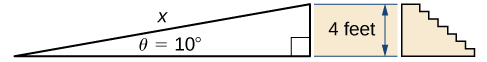

* Convert angle measures between degrees and radians.
* Recognize the triangular and circular definitions of the basic trigonometric functions.
* Write the basic trigonometric identities.
* Identify the graphs and periods of the trigonometric functions.
* Describe the shift of a sine or cosine graph from the equation of the function.

Trigonometric functions are used to model many phenomena, including sound waves, vibrations of strings, alternating electrical current, and the motion of pendulums. In fact, almost any repetitive, or cyclical, motion can be modeled by some combination of trigonometric functions. In this section, we define the six basic trigonometric functions and look at some of the main identities involving these functions.

# Radian Measure

To use trigonometric functions, we first must understand how to measure the angles. Although we can use both radians and degrees, **radians**{: data-type="term"} are a more natural measurement because they are related directly to the unit circle, a circle with radius 1. The radian measure of an angle is defined as follows. Given an angle <math xmlns="http://www.w3.org/1998/Math/MathML"><mi>θ</mi><mo>,</mo></math>

 let <math xmlns="http://www.w3.org/1998/Math/MathML"><mi>s</mi></math>

 be the length of the corresponding arc on the unit circle ([\[link\]](#CNX_Calc_Figure_01_03_001)). We say the angle corresponding to the arc of length 1 has radian measure 1.

 ![An image of a circle. At the exact center of the circle there is a point. From this point, there is one line segment that extends horizontally to the right a point on the edge of the circle and another line segment that extends diagonally upwards and to the right to another point on the edge of the circle. These line segments have a length of 1 unit. The curved segment on the edge of the circle that connects the two points at the end of the line segments is labeled &#x201C;s&#x201D;. Inside the circle, there is an arrow that points from the horizontal line segment to the diagonal line segment. This arrow has the label &#x201C;theta = s radians&#x201D;.](../resources/CNX_Calc_Figure_01_03_001.jpg "The radian measure of an angle &#x3B8; is the arc length s of the associated arc on the unit circle."){: #CNX_Calc_Figure_01_03_001}

Since an angle of <math xmlns="http://www.w3.org/1998/Math/MathML"><mrow><mn>360</mn><mtext>°</mtext></mrow></math>

 corresponds to the circumference of a circle, or an arc of length <math xmlns="http://www.w3.org/1998/Math/MathML"><mrow><mn>2</mn><mi>π</mi><mo>,</mo></mrow></math>

 we conclude that an angle with a degree measure of <math xmlns="http://www.w3.org/1998/Math/MathML"><mrow><mn>360</mn><mtext>°</mtext></mrow></math>

 has a radian measure of <math xmlns="http://www.w3.org/1998/Math/MathML"><mrow><mn>2</mn><mi>π</mi><mo>.</mo></mrow></math>

 Similarly, we see that <math xmlns="http://www.w3.org/1998/Math/MathML"><mrow><mn>180</mn><mtext>°</mtext></mrow></math>

 is equivalent to <math xmlns="http://www.w3.org/1998/Math/MathML"><mi>π</mi></math>

 radians. [\[link\]](#fs-id1170572205698) shows the relationship between common degree and radian values.

<table summary="A table with 9 rows and 2 columns. The first column is labeled &#x201C;Degrees&#x201D; and has the values &#x201C;0; 30; 45; 60; 90; 120; 135; 150; 180&#x201D;. The second column is labeled &#x201C;Radians&#x201D; and the values are &#x201C;0; (pi/6); (pi/4); (pi/3); (pi/2); (2pi/3); (3pi/4); (5pi/6); pi&#x201D;."><caption>Common Angles Expressed in Degrees and Radians</caption><thead>
<tr valign="top">
<th data-align="left">Degrees</th>
<th data-align="left">Radians</th>
<th data-align="left">Degrees</th>
<th data-align="left">Radians</th>
</tr>
</thead><tbody>
<tr valign="top">
<td data-align="left">0</td>
<td data-align="left">0</td>
<td data-align="left">120</td>
<td data-align="left"><math xmlns="http://www.w3.org/1998/Math/MathML"><mrow><mrow><mrow><mn>2</mn><mi>π</mi></mrow><mtext>/</mtext><mn>3</mn></mrow></mrow></math></td>
</tr>
<tr valign="top">
<td data-align="left">30</td>
<td data-align="left"><math xmlns="http://www.w3.org/1998/Math/MathML"><mrow><mrow><mi>π</mi><mtext>/</mtext><mn>6</mn></mrow></mrow></math></td>
<td data-align="left">135</td>
<td data-align="left"><math xmlns="http://www.w3.org/1998/Math/MathML"><mrow><mrow><mrow><mn>3</mn><mi>π</mi></mrow><mtext>/</mtext><mn>4</mn></mrow></mrow></math></td>
</tr>
<tr valign="top">
<td data-align="left">45</td>
<td data-align="left"><math xmlns="http://www.w3.org/1998/Math/MathML"><mrow><mrow><mi>π</mi><mtext>/</mtext><mn>4</mn></mrow></mrow></math></td>
<td data-align="left">150</td>
<td data-align="left"><math xmlns="http://www.w3.org/1998/Math/MathML"><mrow><mrow><mrow><mn>5</mn><mi>π</mi></mrow><mtext>/</mtext><mn>6</mn></mrow></mrow></math></td>
</tr>
<tr valign="top">
<td data-align="left">60</td>
<td data-align="left"><math xmlns="http://www.w3.org/1998/Math/MathML"><mrow><mrow><mi>π</mi><mtext>/</mtext><mn>3</mn></mrow></mrow></math></td>
<td data-align="left">180</td>
<td data-align="left"><math xmlns="http://www.w3.org/1998/Math/MathML"><mi>π</mi></math></td>
</tr>
<tr valign="top">
<td data-align="left">90</td>
<td data-align="left"><math xmlns="http://www.w3.org/1998/Math/MathML"><mrow><mrow><mi>π</mi><mtext>/</mtext><mn>2</mn></mrow></mrow></math></td>
<td data-align="left" />
<td data-align="left" />
</tr>
</tbody></table>

Converting between Radians and Degrees

1.  Express
    <math xmlns="http://www.w3.org/1998/Math/MathML"><mrow><mn>225</mn><mtext>°</mtext></mrow></math>
    
    using radians.
2.  Express
    <math xmlns="http://www.w3.org/1998/Math/MathML"><mrow><mn>5</mn><mi>π</mi><mtext>/</mtext><mn>3</mn></mrow></math>
    
    rad using degrees.
{: data-number-style="lower-alpha"}

Use the fact that <math xmlns="http://www.w3.org/1998/Math/MathML"><mrow><mn>180</mn><mtext>°</mtext></mrow></math>

 is equivalent to <math xmlns="http://www.w3.org/1998/Math/MathML"><mi>π</mi></math>

 radians as a conversion factor: <math xmlns="http://www.w3.org/1998/Math/MathML"><mrow><mn>1</mn><mo>=</mo><mfrac><mrow><mi>π</mi><mspace width="0.1em" /><mtext>rad</mtext></mrow><mrow><mn>180</mn><mtext>°</mtext></mrow></mfrac><mo>=</mo><mfrac><mrow><mn>180</mn><mtext>°</mtext></mrow><mrow><mi>π</mi><mspace width="0.1em" /><mtext>rad</mtext></mrow></mfrac><mo>.</mo></mrow></math>

1.  <math xmlns="http://www.w3.org/1998/Math/MathML"><mrow><mn>225</mn><mtext>°</mtext><mo>=</mo><mn>225</mn><mtext>°</mtext><mo>·</mo><mfrac><mi>π</mi><mrow><mn>180</mn><mtext>°</mtext></mrow></mfrac><mo>=</mo><mfrac><mrow><mn>5</mn><mi>π</mi></mrow><mn>4</mn></mfrac></mrow></math>
    
    rad
2.  <math xmlns="http://www.w3.org/1998/Math/MathML"><mrow><mfrac><mrow><mn>5</mn><mi>π</mi></mrow><mn>3</mn></mfrac></mrow></math>
    
    rad =
    <math xmlns="http://www.w3.org/1998/Math/MathML"><mrow><mfrac><mrow><mn>5</mn><mi>π</mi></mrow><mn>3</mn></mfrac><mo>·</mo><mfrac><mrow><mn>180</mn><mtext>°</mtext></mrow><mi>π</mi></mfrac><mo>=</mo><mn>300</mn><mtext>°</mtext></mrow></math>
{: data-number-style="lower-alpha"}

Express <math xmlns="http://www.w3.org/1998/Math/MathML"><mrow><mn>210</mn><mtext>°</mtext></mrow></math>

 using radians. Express <math xmlns="http://www.w3.org/1998/Math/MathML"><mrow><mn>11</mn><mi>π</mi><mtext>/</mtext><mn>6</mn></mrow></math>

 rad using degrees.

<math xmlns="http://www.w3.org/1998/Math/MathML"><mrow><mn>7</mn><mi>π</mi><mtext>/</mtext><mn>6</mn><mo>;</mo></mrow></math>

 330°

Hint

<math xmlns="http://www.w3.org/1998/Math/MathML"><mi>π</mi></math>

 radians is equal to <math xmlns="http://www.w3.org/1998/Math/MathML"><mrow><mn>180</mn><mtext>°</mtext><mtext>.</mtext></mrow></math>

# The Six Basic Trigonometric Functions

Trigonometric functions allow us to use angle measures, in radians or degrees, to find the coordinates of a point on any circle—not only on a unit circle—or to find an angle given a point on a circle. They also define the relationship among the sides and angles of a triangle.

To define the trigonometric functions, first consider the unit circle centered at the origin and a point <math xmlns="http://www.w3.org/1998/Math/MathML"><mrow><mi>P</mi><mo>=</mo><mo stretchy="false">(</mo><mi>x</mi><mo>,</mo><mi>y</mi><mo stretchy="false">)</mo></mrow></math>

 on the unit circle. Let <math xmlns="http://www.w3.org/1998/Math/MathML"><mi>θ</mi></math>

 be an angle with an initial side that lies along the positive <math xmlns="http://www.w3.org/1998/Math/MathML"><mi>x</mi></math>

-axis and with a terminal side that is the line segment <math xmlns="http://www.w3.org/1998/Math/MathML"><mrow><mi>O</mi><mi>P</mi><mo>.</mo></mrow></math>

 An angle in this position is said to be in *standard position* ([\[link\]](#CNX_Calc_Figure_01_03_002)). We can then define the values of the six trigonometric functions for <math xmlns="http://www.w3.org/1998/Math/MathML"><mi>θ</mi></math>

 in terms of the coordinates <math xmlns="http://www.w3.org/1998/Math/MathML"><mi>x</mi></math>

 and <math xmlns="http://www.w3.org/1998/Math/MathML"><mi>y</mi><mo>.</mo></math>

 ![An image of a graph. The graph has a circle plotted on it, with the center of the circle at the origin, where there is a point. From this point, there is one line segment that extends horizontally along the x axis to the right to a point on the edge of the circle. There is another line segment that extends diagonally upwards and to the right to another point on the edge of the circle. This point is labeled &#x201C;P = (x, y)&#x201D;. These line segments have a length of 1 unit. From the point &#x201C;P&#x201D;, there is a dotted vertical line that extends downwards until it hits the x axis and thus the horizontal line segment. Inside the circle, there is an arrow that points from the horizontal line segment to the diagonal line segment. This arrow has the label &#x201C;theta&#x201D;.](../resources/CNX_Calc_Figure_01_03_002.jpg "The angle &#x3B8; is in standard position. The values of the trigonometric functions for &#x3B8; are defined in terms of the coordinates x and y."){: #CNX_Calc_Figure_01_03_002}

Definition

Let <math xmlns="http://www.w3.org/1998/Math/MathML"><mrow><mi>P</mi><mo>=</mo><mo stretchy="false">(</mo><mi>x</mi><mo>,</mo><mi>y</mi><mo stretchy="false">)</mo></mrow></math>

 be a point on the unit circle centered at the origin <math xmlns="http://www.w3.org/1998/Math/MathML"><mi>O</mi><mo>.</mo></math>

 Let <math xmlns="http://www.w3.org/1998/Math/MathML"><mi>θ</mi></math>

 be an angle with an initial side along the positive <math xmlns="http://www.w3.org/1998/Math/MathML"><mi>x</mi></math>

-axis and a terminal side given by the line segment <math xmlns="http://www.w3.org/1998/Math/MathML"><mrow><mi>O</mi><mi>P</mi><mo>.</mo></mrow></math>

 The **trigonometric functions**{: data-type="term"} are then defined as

<math xmlns="http://www.w3.org/1998/Math/MathML"><mtable><mtr><mtd columnalign="left"><mrow><mtext>sin</mtext><mspace width="0.1em" /><mi>θ</mi><mo>=</mo><mi>y</mi></mrow></mtd><mtd /><mtd /><mtd columnalign="left"><mrow><mtext>csc</mtext><mspace width="0.1em" /><mi>θ</mi><mo>=</mo><mfrac><mn>1</mn><mi>y</mi></mfrac></mrow></mtd></mtr><mtr><mtd columnalign="left"><mrow><mtext>cos</mtext><mspace width="0.1em" /><mi>θ</mi><mo>=</mo><mi>x</mi></mrow></mtd><mtd /><mtd /><mtd columnalign="left"><mrow><mtext>sec</mtext><mspace width="0.1em" /><mi>θ</mi><mo>=</mo><mfrac><mn>1</mn><mi>x</mi></mfrac></mrow></mtd></mtr><mtr><mtd columnalign="left"><mrow><mtext>tan</mtext><mspace width="0.1em" /><mi>θ</mi><mo>=</mo><mfrac><mi>y</mi><mi>x</mi></mfrac></mrow></mtd><mtd /><mtd /><mtd columnalign="left"><mrow><mtext>cot</mtext><mspace width="0.1em" /><mi>θ</mi><mo>=</mo><mfrac><mi>x</mi><mi>y</mi></mfrac></mrow></mtd></mtr></mtable></math>

If <math xmlns="http://www.w3.org/1998/Math/MathML"><mrow><mi>x</mi><mo>=</mo><mn>0</mn><mo>,</mo><mtext>sec</mtext><mspace width="0.1em" /><mi>θ</mi></mrow></math>

 and <math xmlns="http://www.w3.org/1998/Math/MathML"><mrow><mtext>tan</mtext><mspace width="0.1em" /><mi>θ</mi></mrow></math>

 are undefined. If <math xmlns="http://www.w3.org/1998/Math/MathML"><mrow><mi>y</mi><mo>=</mo><mn>0</mn><mo>,</mo></mrow></math>

 then <math xmlns="http://www.w3.org/1998/Math/MathML"><mrow><mtext>cot</mtext><mspace width="0.1em" /><mi>θ</mi></mrow></math>

 and <math xmlns="http://www.w3.org/1998/Math/MathML"><mrow><mtext>csc</mtext><mspace width="0.1em" /><mi>θ</mi></mrow></math>

 are undefined.

We can see that for a point <math xmlns="http://www.w3.org/1998/Math/MathML"><mrow><mi>P</mi><mo>=</mo><mo stretchy="false">(</mo><mi>x</mi><mo>,</mo><mi>y</mi><mo stretchy="false">)</mo></mrow></math>

 on a circle of radius <math xmlns="http://www.w3.org/1998/Math/MathML"><mi>r</mi></math>

 with a corresponding angle <math xmlns="http://www.w3.org/1998/Math/MathML"><mi>θ</mi><mo>,</mo></math>

 the coordinates <math xmlns="http://www.w3.org/1998/Math/MathML"><mi>x</mi></math>

 and <math xmlns="http://www.w3.org/1998/Math/MathML"><mi>y</mi></math>

 satisfy

<math xmlns="http://www.w3.org/1998/Math/MathML"><mtable><mtr /><mtr /><mtr><mtd><mtext>cos</mtext><mspace width="0.1em" /><mi>θ</mi><mo>=</mo><mfrac><mi>x</mi><mi>r</mi></mfrac></mtd></mtr><mtr><mtd><mi>x</mi><mo>=</mo><mi>r</mi><mspace width="0.1em" /><mtext>cos</mtext><mspace width="0.1em" /><mi>θ</mi></mtd></mtr></mtable></math>

<math xmlns="http://www.w3.org/1998/Math/MathML"><mtable><mtr><mtd><mtext>sin</mtext><mspace width="0.1em" /><mi>θ</mi><mo>=</mo><mfrac><mi>y</mi><mi>r</mi></mfrac></mtd></mtr><mtr><mtd><mi>y</mi><mo>=</mo><mi>r</mi><mspace width="0.1em" /><mtext>sin</mtext><mspace width="0.1em" /><mi>θ</mi><mo>.</mo></mtd></mtr></mtable></math>

The values of the other trigonometric functions can be expressed in terms of <math xmlns="http://www.w3.org/1998/Math/MathML"><mi>x</mi><mo>,</mo><mi>y</mi><mo>,</mo></math>

 and <math xmlns="http://www.w3.org/1998/Math/MathML"><mi>r</mi></math>

 ([\[link\]](#CNX_Calc_Figure_01_03_003)).

 ![An image of a graph. The graph has a circle plotted on it, with the center of the circle at the origin, where there is a point. From this point, there is one blue line segment that extends horizontally along the x axis to the right to a point on the edge of the circle. There is another blue line segment that extends diagonally upwards and to the right to another point on the edge of the circle. This point is labeled &#x201C;P = (x, y)&#x201D;. These line segments have a length of &#x201C;r&#x201D; units. Between these line segments within the circle is the label &#x201C;theta&#x201D;, representing the angle between the segments. From the point &#x201C;P&#x201D;, there is a blue vertical line that extends downwards until it hits the x axis and thus hits the horizontal line segment, at a point labeled &#x201C;x&#x201D;. At the intersection horizontal line segment and vertical line segment at the point x, there is a right triangle symbol. From the point &#x201C;P&#x201D;, there is a dotted horizontal line segment that extends left until it hits the y axis at a point labeled &#x201C;y&#x201D;.](../resources/CNX_Calc_Figure_01_03_003.jpg "For a point P=(x,y) on a circle of radius r, the coordinates x and y satisfy x=rcos&#x3B8; and y=rsin&#x3B8;."){: #CNX_Calc_Figure_01_03_003}

[\[link\]](#fs-id1170572167612) shows the values of sine and cosine at the major angles in the first quadrant. From this table, we can determine the values of sine and cosine at the corresponding angles in the other quadrants. The values of the other trigonometric functions are calculated easily from the values of <math xmlns="http://www.w3.org/1998/Math/MathML"><mrow><mtext>sin</mtext><mspace width="0.1em" /><mi>θ</mi></mrow></math>

 and <math xmlns="http://www.w3.org/1998/Math/MathML"><mrow><mtext>cos</mtext><mspace width="0.1em" /><mi>θ</mi><mo>.</mo></mrow></math>

<table summary="A table with 5 rows and 3 columns. The first column is labeled &#x201C;theta&#x201D; and has the values &#x201C;0; (pi/6); (pi/4); (pi/3); (pi/2)&#x201D;. The second column is labeled &#x201C;sin(theta)&#x201D; and the values are &#x201C;0; (1/2); ((square root of 2)/2); ((square root of 3)/2); 1&#x201D;. The third column is labeled &#x201C;cos(theta)&#x201D; and the values are &#x201C;0; ((square root of 3)/2); ((square root of 2)/2); (1/2); 0&#x201D;."><caption>Values of <math xmlns="http://www.w3.org/1998/Math/MathML"><mrow><mtext>sin</mtext><mspace width="0.1em" /><mi>θ</mi></mrow></math> and <math xmlns="http://www.w3.org/1998/Math/MathML"><mrow><mtext>cos</mtext><mspace width="0.1em" /><mi>θ</mi></mrow></math> at Major Angles <math xmlns="http://www.w3.org/1998/Math/MathML"><mi>θ</mi></math> in the First Quadrant</caption><thead>
<tr valign="top">
<th data-align="left"><math xmlns="http://www.w3.org/1998/Math/MathML"><mi>θ</mi></math></th>
<th data-align="left"><math xmlns="http://www.w3.org/1998/Math/MathML"><mrow><mstyle mathvariant="bold" mathsize="normal"><mi>s</mi><mi>i</mi><mi>n</mi></mstyle><mspace width="0.1em" /><mi>θ</mi></mrow></math></th>
<th data-align="left"><math xmlns="http://www.w3.org/1998/Math/MathML"><mrow><mstyle mathvariant="bold" mathsize="normal"><mi>c</mi><mi>o</mi><mi>s</mi></mstyle><mspace width="0.1em" /><mi>θ</mi></mrow></math></th>
</tr>
</thead><tbody>
<tr valign="top">
<td data-align="left"><math xmlns="http://www.w3.org/1998/Math/MathML"><mn>0</mn></math></td>
<td data-align="left"><math xmlns="http://www.w3.org/1998/Math/MathML"><mn>0</mn></math></td>
<td data-align="left"><math xmlns="http://www.w3.org/1998/Math/MathML"><mn>1</mn></math></td>
</tr>
<tr valign="top">
<td data-align="left"><math xmlns="http://www.w3.org/1998/Math/MathML"><mrow><mfrac><mi>π</mi><mn>6</mn></mfrac></mrow></math></td>
<td data-align="left"><math xmlns="http://www.w3.org/1998/Math/MathML"><mrow><mfrac><mn>1</mn><mn>2</mn></mfrac></mrow></math></td>
<td data-align="left"><math xmlns="http://www.w3.org/1998/Math/MathML"><mrow><mfrac><mrow><msqrt><mn>3</mn></msqrt></mrow><mn>2</mn></mfrac></mrow></math></td>
</tr>
<tr valign="top">
<td data-align="left"><math xmlns="http://www.w3.org/1998/Math/MathML"><mrow><mfrac><mi>π</mi><mn>4</mn></mfrac></mrow></math></td>
<td data-align="left"><math xmlns="http://www.w3.org/1998/Math/MathML"><mrow><mfrac><mrow><msqrt><mn>2</mn></msqrt></mrow><mn>2</mn></mfrac></mrow></math></td>
<td data-align="left"><math xmlns="http://www.w3.org/1998/Math/MathML"><mrow><mfrac><mrow><msqrt><mn>2</mn></msqrt></mrow><mn>2</mn></mfrac></mrow></math></td>
</tr>
<tr valign="top">
<td data-align="left"><math xmlns="http://www.w3.org/1998/Math/MathML"><mrow><mfrac><mi>π</mi><mn>3</mn></mfrac></mrow></math></td>
<td data-align="left"><math xmlns="http://www.w3.org/1998/Math/MathML"><mrow><mfrac><mrow><msqrt><mn>3</mn></msqrt></mrow><mn>2</mn></mfrac></mrow></math></td>
<td data-align="left"><math xmlns="http://www.w3.org/1998/Math/MathML"><mrow><mfrac><mn>1</mn><mn>2</mn></mfrac></mrow></math></td>
</tr>
<tr valign="top">
<td data-align="left"><math xmlns="http://www.w3.org/1998/Math/MathML"><mrow><mfrac><mi>π</mi><mn>2</mn></mfrac></mrow></math></td>
<td data-align="left"><math xmlns="http://www.w3.org/1998/Math/MathML"><mn>1</mn></math></td>
<td data-align="left"><math xmlns="http://www.w3.org/1998/Math/MathML"><mn>0</mn></math></td>
</tr>
</tbody></table>

Evaluating Trigonometric Functions

Evaluate each of the following expressions.

1.  <math xmlns="http://www.w3.org/1998/Math/MathML"><mrow><mtext>sin</mtext><mrow><mo>(</mo><mrow><mfrac><mrow><mn>2</mn><mi>π</mi></mrow><mn>3</mn></mfrac></mrow><mo>)</mo></mrow></mrow></math>

2.  <math xmlns="http://www.w3.org/1998/Math/MathML"><mrow><mtext>cos</mtext><mrow><mo>(</mo><mrow><mo>−</mo><mfrac><mrow><mn>5</mn><mi>π</mi></mrow><mn>6</mn></mfrac></mrow><mo>)</mo></mrow></mrow></math>

3.  <math xmlns="http://www.w3.org/1998/Math/MathML"><mrow><mtext>tan</mtext><mrow><mo>(</mo><mrow><mfrac><mrow><mn>15</mn><mi>π</mi></mrow><mn>4</mn></mfrac></mrow><mo>)</mo></mrow></mrow></math>
{: data-number-style="lower-alpha"}

1.  On the unit circle, the angle
    <math xmlns="http://www.w3.org/1998/Math/MathML"><mrow><mi>θ</mi><mo>=</mo><mfrac><mrow><mn>2</mn><mi>π</mi></mrow><mn>3</mn></mfrac></mrow></math>
    
    corresponds to the point
    <math xmlns="http://www.w3.org/1998/Math/MathML"><mrow><mrow><mo>(</mo><mrow><mo>−</mo><mfrac><mn>1</mn><mn>2</mn></mfrac><mo>,</mo><mfrac><mrow><msqrt><mn>3</mn></msqrt></mrow><mn>2</mn></mfrac></mrow><mo>)</mo></mrow><mo>.</mo></mrow></math>
    
    Therefore,
    <math xmlns="http://www.w3.org/1998/Math/MathML"><mrow><mtext>sin</mtext><mrow><mo>(</mo><mrow><mfrac><mrow><mn>2</mn><mi>π</mi></mrow><mn>3</mn></mfrac></mrow><mo>)</mo></mrow><mo>=</mo><mi>y</mi><mo>=</mo><mfrac><mrow><msqrt><mn>3</mn></msqrt></mrow><mn>2</mn></mfrac><mo>.</mo></mrow></math>
    
    * * *
    {: data-type="newline"}
    
     ![An image of a graph. The graph has a circle plotted on it, with the center of the circle at the origin, where there is a point. From this point, there is one line segment that extends horizontally along the x axis to the right to a point on the edge of the circle. There is another line segment that extends diagonally upwards and to the left to another point on the edge of the circle. This point is labeled &#x201C;(-(1/2), ((square root of 3)/2))&#x201D;. These line segments have a length of 1 unit. From the point &#x201C;(-(1/2), ((square root of 3)/2))&#x201D;, there is a vertical line that extends downwards until it hits the x axis. Inside the circle, there is a curved arrow that starts at the horizontal line segment and travels counterclockwise until it hits the diagonal line segment. This arrow has the label &#x201C;theta = (2 pi)/3&#x201D;.](../resources/CNX_Calc_Figure_01_03_004.jpg) 
2.  An angle
    <math xmlns="http://www.w3.org/1998/Math/MathML"><mrow><mi>θ</mi><mo>=</mo><mo>−</mo><mfrac><mrow><mn>5</mn><mi>π</mi></mrow><mn>6</mn></mfrac></mrow></math>
    
    corresponds to a revolution in the negative direction, as shown. Therefore,
    <math xmlns="http://www.w3.org/1998/Math/MathML"><mrow><mtext>cos</mtext><mrow><mo>(</mo><mrow><mo>−</mo><mfrac><mrow><mn>5</mn><mi>π</mi></mrow><mn>6</mn></mfrac></mrow><mo>)</mo></mrow><mo>=</mo><mi>x</mi><mo>=</mo><mo>−</mo><mfrac><mrow><msqrt><mn>3</mn></msqrt></mrow><mn>2</mn></mfrac><mo>.</mo></mrow></math>
    
    * * *
    {: data-type="newline"}
    
     ![An image of a graph. The graph has a circle plotted on it, with the center of the circle at the origin, where there is a point. From this point, there is one line segment that extends horizontally along the x axis to the right to a point on the edge of the circle. There is another line segment that extends diagonally downwards and to the left to another point on the edge of the circle. This point is labeled &#x201C;(-((square root of 3)/2)), -(1/2))&#x201D;. These line segments have a length of 1 unit. From the point &#x201C;(-((square root of 3)/2)), -(1/2))&#x201D;, there is a vertical line that extends upwards until it hits the x axis. Inside the circle, there is a curved arrow that starts at the horizontal line segment and travels clockwise until it hits the diagonal line segment. This arrow has the label &#x201C;theta = -(5 pi)/6&#x201D;.](../resources/CNX_Calc_Figure_01_03_005.jpg) 
3.  An angle
    <math xmlns="http://www.w3.org/1998/Math/MathML"><mrow><mi>θ</mi><mo>=</mo><mfrac><mrow><mn>15</mn><mi>π</mi></mrow><mn>4</mn></mfrac><mo>=</mo><mn>2</mn><mi>π</mi><mo>+</mo><mfrac><mrow><mn>7</mn><mi>π</mi></mrow><mn>4</mn></mfrac><mo>.</mo></mrow></math>
    
    Therefore, this angle corresponds to more than one revolution, as shown. Knowing the fact that an angle of
    <math xmlns="http://www.w3.org/1998/Math/MathML"><mrow><mfrac><mrow><mn>7</mn><mi>π</mi></mrow><mn>4</mn></mfrac></mrow></math>
    
    corresponds to the point
    <math xmlns="http://www.w3.org/1998/Math/MathML"><mrow><mrow><mo>(</mo><mrow><mfrac><mrow><msqrt><mn>2</mn></msqrt></mrow><mn>2</mn></mfrac><mo>,</mo><mo>−</mo><mfrac><mrow><msqrt><mn>2</mn></msqrt></mrow><mn>2</mn></mfrac></mrow><mo>)</mo></mrow><mo>,</mo></mrow></math>
    
    we can conclude that
    <math xmlns="http://www.w3.org/1998/Math/MathML"><mrow><mtext>tan</mtext><mrow><mo>(</mo><mrow><mfrac><mrow><mn>15</mn><mi>π</mi></mrow><mn>4</mn></mfrac></mrow><mo>)</mo></mrow><mo>=</mo><mfrac><mi>y</mi><mi>x</mi></mfrac><mo>=</mo><mn>−1</mn><mo>.</mo></mrow></math>
    
    * * *
    {: data-type="newline"}
    
     ![An image of a graph. The graph has a circle plotted on it, with the center of the circle at the origin, where there is a point. From this point, there is one line segment that extends horizontally along the x axis to the right to a point on the edge of the circle. There is another line segment that extends diagonally downwards and to the right to another point on the edge of the circle. This point is labeled &#x201C;(((square root of 2)/2), -((square root of 2)/2))&#x201D;. These line segments have a length of 1 unit. From the point &#x201C;(((square root of 2)/2), -((square root of 2)/2))&#x201D;, there is a vertical line that extends upwards until it hits the x axis and thus the horizontal line segment. Inside the circle, there is a curved arrow that starts at the horizontal line segment and travels counterclockwise. The arrow makes one full rotation around the circle and then keeps traveling until it hits the diagonal line segment. This arrow has the label &#x201C;theta = (15 pi)/4&#x201D;.](../resources/CNX_Calc_Figure_01_03_006.jpg) 
{: data-number-style="lower-alpha"}

Evaluate <math xmlns="http://www.w3.org/1998/Math/MathML"><mrow><mtext>cos</mtext><mo stretchy="false">(</mo><mn>3</mn><mi>π</mi><mtext>/</mtext><mn>4</mn><mo stretchy="false">)</mo></mrow></math>

 and <math xmlns="http://www.w3.org/1998/Math/MathML"><mrow><mtext>sin</mtext><mo stretchy="false">(</mo><mtext>−</mtext><mi>π</mi><mtext>/</mtext><mn>6</mn><mo stretchy="false">)</mo><mo>.</mo></mrow></math>

<math xmlns="http://www.w3.org/1998/Math/MathML"><mrow><mtext>cos</mtext><mo stretchy="false">(</mo><mn>3</mn><mi>π</mi><mtext>/</mtext><mn>4</mn><mo stretchy="false">)</mo><mo>=</mo><mtext>−</mtext><msqrt><mn>2</mn></msqrt><mtext>/</mtext><mn>2</mn><mo>;</mo><mspace width="0.2em" /><mtext>sin</mtext><mo stretchy="false">(</mo><mtext>−</mtext><mi>π</mi><mtext>/</mtext><mn>6</mn><mo stretchy="false">)</mo><mo>=</mo><mn>−1</mn><mtext>/</mtext><mn>2</mn></mrow></math>

Hint

Look at angles on the unit circle.

As mentioned earlier, the ratios of the side lengths of a right triangle can be expressed in terms of the trigonometric functions evaluated at either of the acute angles of the triangle. Let <math xmlns="http://www.w3.org/1998/Math/MathML"><mi>θ</mi></math>

 be one of the acute angles. Let <math xmlns="http://www.w3.org/1998/Math/MathML"><mi>A</mi></math>

 be the length of the adjacent leg, <math xmlns="http://www.w3.org/1998/Math/MathML"><mi>O</mi></math>

 be the length of the opposite leg, and <math xmlns="http://www.w3.org/1998/Math/MathML"><mi>H</mi></math>

 be the length of the hypotenuse. By inscribing the triangle into a circle of radius <math xmlns="http://www.w3.org/1998/Math/MathML"><mrow><mi>H</mi><mo>,</mo></mrow></math>

 as shown in [\[link\]](#CNX_Calc_Figure_01_03_007), we see that <math xmlns="http://www.w3.org/1998/Math/MathML"><mi>A</mi><mo>,</mo><mi>H</mi><mo>,</mo></math>

 and <math xmlns="http://www.w3.org/1998/Math/MathML"><mi>O</mi></math>

 satisfy the following relationships with <math xmlns="http://www.w3.org/1998/Math/MathML"><mi>θ</mi><mtext>:</mtext></math>

<math xmlns="http://www.w3.org/1998/Math/MathML"><mtable><mtr><mtd columnalign="left"><mrow><mtext>sin</mtext><mspace width="0.1em" /><mi>θ</mi><mo>=</mo><mfrac><mi>O</mi><mi>H</mi></mfrac></mrow></mtd><mtd /><mtd /><mtd columnalign="left"><mrow><mtext>csc</mtext><mspace width="0.1em" /><mi>θ</mi><mo>=</mo><mfrac><mi>H</mi><mi>O</mi></mfrac></mrow></mtd></mtr><mtr><mtd columnalign="left"><mrow><mtext>cos</mtext><mspace width="0.1em" /><mi>θ</mi><mo>=</mo><mfrac><mi>A</mi><mi>H</mi></mfrac></mrow></mtd><mtd /><mtd /><mtd columnalign="left"><mrow><mtext>sec</mtext><mspace width="0.1em" /><mi>θ</mi><mo>=</mo><mfrac><mi>H</mi><mi>A</mi></mfrac></mrow></mtd></mtr><mtr><mtd columnalign="left"><mrow><mtext>tan</mtext><mspace width="0.1em" /><mi>θ</mi><mo>=</mo><mfrac><mi>O</mi><mi>A</mi></mfrac></mrow></mtd><mtd /><mtd /><mtd columnalign="left"><mrow><mtext>cot</mtext><mspace width="0.1em" /><mi>θ</mi><mo>=</mo><mfrac><mi>A</mi><mi>O</mi></mfrac></mrow></mtd></mtr></mtable></math>

 ![An image of a graph. The graph has a circle plotted on it, with the center of the circle at the origin, where there is a point. From this point, there is one line segment that extends horizontally along the x axis to the right to a point on the edge of the circle. There is another line segment with length labeled &#x201C;H&#x201D; that extends diagonally upwards and to the right to another point on the edge of the circle. From the point, there is vertical line with a length labeled &#x201C;O&#x201D; that extends downwards until it hits the x axis and thus the horizontal line segment at a point with a right triangle symbol. The distance from this point to the center of the circle is labeled &#x201C;A&#x201D;. Inside the circle, there is an arrow that points from the horizontal line segment to the diagonal line segment. This arrow has the label &#x201C;theta&#x201D;.](../resources/CNX_Calc_Figure_01_03_007.jpg "By inscribing a right triangle in a circle, we can express the ratios of the side lengths in terms of the trigonometric functions evaluated at &#x3B8;."){: #CNX_Calc_Figure_01_03_007}

Constructing a Wooden Ramp

A wooden ramp is to be built with one end on the ground and the other end at the top of a short staircase. If the top of the staircase is <math xmlns="http://www.w3.org/1998/Math/MathML"><mn>4</mn></math>

 ft from the ground and the angle between the ground and the ramp is to be <math xmlns="http://www.w3.org/1998/Math/MathML"><mrow><mn>10</mn><mtext>°</mtext><mo>,</mo></mrow></math>

 how long does the ramp need to be?

Let <math xmlns="http://www.w3.org/1998/Math/MathML"><mi>x</mi></math>

 denote the length of the ramp. In the following image, we see that <math xmlns="http://www.w3.org/1998/Math/MathML"><mi>x</mi></math>

 needs to satisfy the equation <math xmlns="http://www.w3.org/1998/Math/MathML"><mrow><mtext>sin</mtext><mrow><mo stretchy="false">(</mo><mrow><mn>10</mn></mrow><mtext>°</mtext><mo stretchy="false">)</mo></mrow><mo>=</mo><mn>4</mn><mtext>/</mtext><mi>x</mi><mo>.</mo></mrow></math>

 Solving this equation for <math xmlns="http://www.w3.org/1998/Math/MathML"><mi>x</mi><mo>,</mo></math>

 we see that <math xmlns="http://www.w3.org/1998/Math/MathML"><mrow><mi>x</mi><mo>=</mo><mn>4</mn><mtext>/</mtext><mtext>sin</mtext><mo stretchy="false">(</mo><mrow><mn>10</mn></mrow><mtext>°</mtext><mo stretchy="false">)</mo><mo>≈</mo><mn>23.035</mn></mrow></math>

 ft.

  

A house painter wants to lean a <math xmlns="http://www.w3.org/1998/Math/MathML"><mrow><mn>20</mn></mrow></math>

-ft ladder against a house. If the angle between the base of the ladder and the ground is to be <math xmlns="http://www.w3.org/1998/Math/MathML"><mrow><mrow><mn>60</mn></mrow><mtext>°</mtext><mo>,</mo></mrow></math>

 how far from the house should she place the base of the ladder?

<math xmlns="http://www.w3.org/1998/Math/MathML"><mrow><mn>10</mn></mrow></math>

 ft

Hint

Draw a right triangle with hypotenuse <math xmlns="http://www.w3.org/1998/Math/MathML"><mrow><mn>20</mn><mtext>.</mtext></mrow></math>

# Trigonometric Identities

A **trigonometric identity**{: data-type="term"} is an equation involving trigonometric functions that is true for all angles <math xmlns="http://www.w3.org/1998/Math/MathML"><mi>θ</mi></math>

 for which the functions are defined. We can use the identities to help us solve or simplify equations. The main trigonometric identities are listed next.

Rule: Trigonometric Identities

**Reciprocal identities**

<math xmlns="http://www.w3.org/1998/Math/MathML"><mtable><mtr><mtd columnalign="left"><mrow><mtext>tan</mtext><mspace width="0.1em" /><mi>θ</mi><mo>=</mo><mfrac><mrow><mtext>sin</mtext><mspace width="0.1em" /><mi>θ</mi></mrow><mrow><mtext>cos</mtext><mspace width="0.1em" /><mi>θ</mi></mrow></mfrac></mrow></mtd><mtd /><mtd /><mtd columnalign="left"><mrow><mtext>cot</mtext><mspace width="0.1em" /><mi>θ</mi><mo>=</mo><mfrac><mrow><mtext>cos</mtext><mspace width="0.1em" /><mi>θ</mi></mrow><mrow><mtext>sin</mtext><mspace width="0.1em" /><mi>θ</mi></mrow></mfrac></mrow></mtd></mtr><mtr><mtd columnalign="left"><mrow><mtext>csc</mtext><mspace width="0.1em" /><mi>θ</mi><mo>=</mo><mfrac><mn>1</mn><mrow><mtext>sin</mtext><mspace width="0.1em" /><mi>θ</mi></mrow></mfrac></mrow></mtd><mtd /><mtd /><mtd columnalign="left"><mrow><mtext>sec</mtext><mspace width="0.1em" /><mi>θ</mi><mo>=</mo><mfrac><mn>1</mn><mrow><mtext>cos</mtext><mspace width="0.1em" /><mi>θ</mi></mrow></mfrac></mrow></mtd></mtr></mtable></math>

**Pythagorean identities**

<math xmlns="http://www.w3.org/1998/Math/MathML"><mrow><msup><mrow><mtext>sin</mtext></mrow><mn>2</mn></msup><mi>θ</mi><mo>+</mo><msup><mrow><mtext>cos</mtext></mrow><mn>2</mn></msup><mi>θ</mi><mo>=</mo><mn>1</mn><mspace width="2em" /><mn>1</mn><mo>+</mo><msup><mrow><mtext>tan</mtext></mrow><mn>2</mn></msup><mi>θ</mi><mo>=</mo><msup><mrow><mtext>sec</mtext></mrow><mn>2</mn></msup><mi>θ</mi><mspace width="2em" /><mn>1</mn><mo>+</mo><msup><mrow><mtext>cot</mtext></mrow><mn>2</mn></msup><mi>θ</mi><mo>=</mo><msup><mrow><mtext>csc</mtext></mrow><mn>2</mn></msup><mi>θ</mi></mrow></math>

**Addition and subtraction formulas**

<math xmlns="http://www.w3.org/1998/Math/MathML"><mrow><mtext>sin</mtext><mrow><mo>(</mo><mrow><mi>α</mi><mo>±</mo><mi>β</mi></mrow><mo>)</mo></mrow><mo>=</mo><mtext>sin</mtext><mspace width="0.1em" /><mi>α</mi><mspace width="0.1em" /><mtext>cos</mtext><mspace width="0.1em" /><mi>β</mi><mo>±</mo><mtext>cos</mtext><mspace width="0.1em" /><mi>α</mi><mspace width="0.1em" /><mtext>sin</mtext><mspace width="0.1em" /><mi>β</mi></mrow></math>

<math xmlns="http://www.w3.org/1998/Math/MathML"><mrow><mtext>cos</mtext><mo stretchy="false">(</mo><mi>α</mi><mo>±</mo><mi>β</mi><mo stretchy="false">)</mo><mo>=</mo><mtext>cos</mtext><mspace width="0.1em" /><mi>α</mi><mspace width="0.1em" /><mtext>cos</mtext><mspace width="0.1em" /><mi>β</mi><mo>∓</mo><mtext>sin</mtext><mspace width="0.1em" /><mi>α</mi><mspace width="0.1em" /><mtext>sin</mtext><mspace width="0.1em" /><mi>β</mi></mrow></math>

**Double-angle formulas**

<math xmlns="http://www.w3.org/1998/Math/MathML"><mrow><mtext>sin</mtext><mrow><mo>(</mo><mrow><mn>2</mn><mi>θ</mi></mrow><mo>)</mo></mrow><mo>=</mo><mn>2</mn><mspace width="0.1em" /><mtext>sin</mtext><mspace width="0.1em" /><mi>θ</mi><mspace width="0.1em" /><mtext>cos</mtext><mspace width="0.1em" /><mi>θ</mi></mrow></math>

<math xmlns="http://www.w3.org/1998/Math/MathML"><mrow><mtext>cos</mtext><mrow><mo>(</mo><mrow><mn>2</mn><mi>θ</mi></mrow><mo>)</mo></mrow><mo>=</mo><mn>2</mn><msup><mrow><mtext>cos</mtext></mrow><mn>2</mn></msup><mi>θ</mi><mo>−</mo><mn>1</mn><mo>=</mo><mn>1</mn><mo>−</mo><mn>2</mn><msup><mrow><mtext>sin</mtext></mrow><mn>2</mn></msup><mi>θ</mi><mo>=</mo><msup><mrow><mtext>cos</mtext></mrow><mn>2</mn></msup><mi>θ</mi><mo>−</mo><msup><mrow><mtext>sin</mtext></mrow><mn>2</mn></msup><mi>θ</mi></mrow></math>

Solving Trigonometric Equations

For each of the following equations, use a trigonometric identity to find all solutions.

1.  <math xmlns="http://www.w3.org/1998/Math/MathML"><mrow><mn>1</mn><mo>+</mo><mtext>cos</mtext><mrow><mo>(</mo><mrow><mn>2</mn><mi>θ</mi></mrow><mo>)</mo></mrow><mo>=</mo><mtext>cos</mtext><mspace width="0.1em" /><mi>θ</mi></mrow></math>

2.  <math xmlns="http://www.w3.org/1998/Math/MathML"><mrow><mtext>sin</mtext><mrow><mo>(</mo><mrow><mn>2</mn><mi>θ</mi></mrow><mo>)</mo></mrow><mo>=</mo><mtext>tan</mtext><mspace width="0.1em" /><mi>θ</mi></mrow></math>
{: data-number-style="lower-alpha"}

1.  Using the double-angle formula for
    <math xmlns="http://www.w3.org/1998/Math/MathML"><mrow><mtext>cos</mtext><mo stretchy="false">(</mo><mn>2</mn><mi>θ</mi><mo stretchy="false">)</mo><mo>,</mo></mrow></math>
    
    we see that
    <math xmlns="http://www.w3.org/1998/Math/MathML"><mi>θ</mi></math>
    
    is a solution of
    

    <math xmlns="http://www.w3.org/1998/Math/MathML"><mrow><mn>1</mn><mo>+</mo><mtext>cos</mtext><mo stretchy="false">(</mo><mn>2</mn><mi>θ</mi><mo stretchy="false">)</mo><mo>=</mo><mtext>cos</mtext><mspace width="0.1em" /><mi>θ</mi></mrow></math>
    

    
    * * *
    {: data-type="newline"}
    
    if and only if
    

    <math xmlns="http://www.w3.org/1998/Math/MathML"><mrow><mn>1</mn><mo>+</mo><mn>2</mn><msup><mrow><mtext>cos</mtext></mrow><mn>2</mn></msup><mi>θ</mi><mo>−</mo><mn>1</mn><mo>=</mo><mtext>cos</mtext><mspace width="0.1em" /><mi>θ</mi><mo>,</mo></mrow></math>
    

    
    * * *
    {: data-type="newline"}
    
    which is true if and only if
    

    <math xmlns="http://www.w3.org/1998/Math/MathML"><mrow><mn>2</mn><msup><mrow><mtext>cos</mtext></mrow><mn>2</mn></msup><mi>θ</mi><mo>−</mo><mtext>cos</mtext><mspace width="0.1em" /><mi>θ</mi><mo>=</mo><mn>0</mn><mo>.</mo></mrow></math>
    

    
    * * *
    {: data-type="newline"}
    
    To solve this equation, it is important to note that we need to factor the left-hand side and not divide both sides of the equation by
    <math xmlns="http://www.w3.org/1998/Math/MathML"><mrow><mtext>cos</mtext><mspace width="0.1em" /><mi>θ</mi><mo>.</mo></mrow></math>
    
    The problem with dividing by
    <math xmlns="http://www.w3.org/1998/Math/MathML"><mrow><mtext>cos</mtext><mspace width="0.1em" /><mi>θ</mi></mrow></math>
    
    is that it is possible that
    <math xmlns="http://www.w3.org/1998/Math/MathML"><mrow><mtext>cos</mtext><mspace width="0.1em" /><mi>θ</mi></mrow></math>
    
    is zero. In fact, if we did divide both sides of the equation by
    <math xmlns="http://www.w3.org/1998/Math/MathML"><mrow><mtext>cos</mtext><mspace width="0.1em" /><mi>θ</mi><mo>,</mo></mrow></math>
    
    we would miss some of the solutions of the original equation. Factoring the left-hand side of the equation, we see that
    <math xmlns="http://www.w3.org/1998/Math/MathML"><mi>θ</mi></math>
    
    is a solution of this equation if and only if
    

    <math xmlns="http://www.w3.org/1998/Math/MathML"><mrow><mtext>cos</mtext><mspace width="0.1em" /><mi>θ</mi><mrow><mo>(</mo><mrow><mn>2</mn><mspace width="0.1em" /><mtext>cos</mtext><mspace width="0.1em" /><mi>θ</mi><mo>−</mo><mn>1</mn></mrow><mo>)</mo></mrow><mo>=</mo><mn>0</mn><mo>.</mo></mrow></math>
    

    
    * * *
    {: data-type="newline"}
    
    Since
    <math xmlns="http://www.w3.org/1998/Math/MathML"><mrow><mtext>cos</mtext><mspace width="0.1em" /><mi>θ</mi><mo>=</mo><mn>0</mn></mrow></math>
    
    when
    

    <math xmlns="http://www.w3.org/1998/Math/MathML"><mrow><mi>θ</mi><mo>=</mo><mfrac><mi>π</mi><mn>2</mn></mfrac><mo>,</mo><mfrac><mi>π</mi><mn>2</mn></mfrac><mo>±</mo><mi>π</mi><mo>,</mo><mfrac><mi>π</mi><mn>2</mn></mfrac><mo>±</mo><mn>2</mn><mi>π</mi><mtext>,…,</mtext></mrow></math>
    

    
    * * *
    {: data-type="newline"}
    
    and
    <math xmlns="http://www.w3.org/1998/Math/MathML"><mrow><mtext>cos</mtext><mspace width="0.1em" /><mi>θ</mi><mo>=</mo><mn>1</mn><mtext>/</mtext><mn>2</mn></mrow></math>
    
    when
    

    <math xmlns="http://www.w3.org/1998/Math/MathML"><mrow><mi>θ</mi><mo>=</mo><mfrac><mi>π</mi><mn>3</mn></mfrac><mo>,</mo><mfrac><mi>π</mi><mn>3</mn></mfrac><mo>±</mo><mn>2</mn><mi>π</mi><mtext>,…</mtext><mspace width="0.2em" /><mtext>or</mtext><mspace width="0.2em" /><mi>θ</mi><mo>=</mo><mo>−</mo><mfrac><mi>π</mi><mn>3</mn></mfrac><mo>,</mo><mo>−</mo><mfrac><mi>π</mi><mn>3</mn></mfrac><mo>±</mo><mn>2</mn><mi>π</mi><mtext>,…,</mtext></mrow></math>
    

    
    * * *
    {: data-type="newline"}
    
    we conclude that the set of solutions to this equation is
    * * *
    {: data-type="newline"}
    
    

    <math xmlns="http://www.w3.org/1998/Math/MathML"><mrow><mi>θ</mi><mo>=</mo><mfrac><mi>π</mi><mn>2</mn></mfrac><mo>+</mo><mi>n</mi><mi>π</mi><mo>,</mo><mi>θ</mi><mo>=</mo><mfrac><mi>π</mi><mn>3</mn></mfrac><mo>+</mo><mn>2</mn><mi>n</mi><mi>π</mi><mo>,</mo><mtext>and</mtext><mspace width="0.2em" /><mi>θ</mi><mo>=</mo><mo>−</mo><mfrac><mi>π</mi><mn>3</mn></mfrac><mo>+</mo><mn>2</mn><mi>n</mi><mi>π</mi><mo>,</mo><mi>n</mi><mo>=</mo><mn>0</mn><mo>,</mo><mo>±</mo><mn>1</mn><mo>,</mo><mo>±</mo><mn>2,</mn><mtext>…</mtext><mo>.</mo></mrow></math>
    

2.  Using the double-angle formula for
    <math xmlns="http://www.w3.org/1998/Math/MathML"><mrow><mtext>sin</mtext><mrow><mo>(</mo><mrow><mn>2</mn><mi>θ</mi></mrow><mo>)</mo></mrow></mrow></math>
    
    and the reciprocal identity for
    <math xmlns="http://www.w3.org/1998/Math/MathML"><mrow><mtext>tan</mtext><mrow><mo>(</mo><mi>θ</mi><mo>)</mo></mrow><mo>,</mo></mrow></math>
    
    the equation can be written as
    

    <math xmlns="http://www.w3.org/1998/Math/MathML"><mrow><mn>2</mn><mspace width="0.1em" /><mtext>sin</mtext><mspace width="0.1em" /><mi>θ</mi><mspace width="0.1em" /><mtext>cos</mtext><mspace width="0.1em" /><mi>θ</mi><mo>=</mo><mfrac><mrow><mtext>sin</mtext><mspace width="0.1em" /><mi>θ</mi></mrow><mrow><mtext>cos</mtext><mspace width="0.1em" /><mi>θ</mi></mrow></mfrac><mo>.</mo></mrow></math>
    

    
    * * *
    {: data-type="newline"}
    
    To solve this equation, we multiply both sides by
    <math xmlns="http://www.w3.org/1998/Math/MathML"><mrow><mtext>cos</mtext><mspace width="0.1em" /><mi>θ</mi></mrow></math>
    
    to eliminate the denominator, and say that if
    <math xmlns="http://www.w3.org/1998/Math/MathML"><mi>θ</mi></math>
    
    satisfies this equation, then
    <math xmlns="http://www.w3.org/1998/Math/MathML"><mi>θ</mi></math>
    
    satisfies the equation
    

    <math xmlns="http://www.w3.org/1998/Math/MathML"><mrow><mn>2</mn><mspace width="0.1em" /><mtext>sin</mtext><mspace width="0.1em" /><mi>θ</mi><msup><mrow><mtext>cos</mtext></mrow><mn>2</mn></msup><mi>θ</mi><mo>−</mo><mtext>sin</mtext><mspace width="0.1em" /><mi>θ</mi><mo>=</mo><mn>0</mn><mo>.</mo></mrow></math>
    

    
    * * *
    {: data-type="newline"}
    
    However, we need to be a little careful here. Even if
    <math xmlns="http://www.w3.org/1998/Math/MathML"><mi>θ</mi></math>
    
    satisfies this new equation, it may not satisfy the original equation because, to satisfy the original equation, we would need to be able to divide both sides of the equation by
    <math xmlns="http://www.w3.org/1998/Math/MathML"><mrow><mtext>cos</mtext><mspace width="0.1em" /><mi>θ</mi><mo>.</mo></mrow></math>
    
    However, if
    <math xmlns="http://www.w3.org/1998/Math/MathML"><mrow><mtext>cos</mtext><mspace width="0.1em" /><mi>θ</mi><mo>=</mo><mn>0</mn><mo>,</mo></mrow></math>
    
    we cannot divide both sides of the equation by
    <math xmlns="http://www.w3.org/1998/Math/MathML"><mrow><mtext>cos</mtext><mspace width="0.1em" /><mi>θ</mi><mo>.</mo></mrow></math>
    
    Therefore, it is possible that we may arrive at extraneous solutions. So, at the end, it is important to check for extraneous solutions. Returning to the equation, it is important that we factor
    <math xmlns="http://www.w3.org/1998/Math/MathML"><mrow><mtext>sin</mtext><mspace width="0.1em" /><mi>θ</mi></mrow></math>
    
    out of both terms on the left-hand side instead of dividing both sides of the equation by
    <math xmlns="http://www.w3.org/1998/Math/MathML"><mrow><mtext>sin</mtext><mspace width="0.1em" /><mi>θ</mi><mo>.</mo></mrow></math>
    
    Factoring the left-hand side of the equation, we can rewrite this equation as
    

    <math xmlns="http://www.w3.org/1998/Math/MathML"><mrow><mtext>sin</mtext><mspace width="0.1em" /><mi>θ</mi><mo stretchy="false">(</mo><mn>2</mn><msup><mrow><mtext>cos</mtext></mrow><mn>2</mn></msup><mi>θ</mi><mo>−</mo><mn>1</mn><mo stretchy="false">)</mo><mo>=</mo><mn>0</mn><mo>.</mo></mrow></math>
    

    
    * * *
    {: data-type="newline"}
    
    Therefore, the solutions are given by the angles
    <math xmlns="http://www.w3.org/1998/Math/MathML"><mi>θ</mi></math>
    
    such that
    <math xmlns="http://www.w3.org/1998/Math/MathML"><mrow><mtext>sin</mtext><mspace width="0.1em" /><mi>θ</mi><mo>=</mo><mn>0</mn></mrow></math>
    
    or
    <math xmlns="http://www.w3.org/1998/Math/MathML"><mrow><msup><mrow><mtext>cos</mtext></mrow><mn>2</mn></msup><mi>θ</mi><mo>=</mo><mn>1</mn><mtext>/</mtext><mn>2</mn><mo>.</mo></mrow></math>
    
    The solutions of the first equation are
    <math xmlns="http://www.w3.org/1998/Math/MathML"><mrow><mi>θ</mi><mo>=</mo><mn>0</mn><mo>,</mo><mo>±</mo><mi>π</mi><mo>,</mo><mo>±</mo><mn>2</mn><mi>π</mi><mtext>,….</mtext></mrow></math>
    
    The solutions of the second equation are
    <math xmlns="http://www.w3.org/1998/Math/MathML"><mrow><mi>θ</mi><mo>=</mo><mi>π</mi><mtext>/</mtext><mn>4</mn><mo>,</mo><mo stretchy="false">(</mo><mi>π</mi><mtext>/</mtext><mn>4</mn><mo stretchy="false">)</mo><mo>±</mo><mo stretchy="false">(</mo><mi>π</mi><mtext>/</mtext><mn>2</mn><mo stretchy="false">)</mo><mo>,</mo><mo stretchy="false">(</mo><mi>π</mi><mtext>/</mtext><mn>4</mn><mo stretchy="false">)</mo><mo>±</mo><mi>π</mi><mtext>,….</mtext></mrow></math>
    
    After checking for extraneous solutions, the set of solutions to the equation is
    * * *
    {: data-type="newline"}
    
    

    <math xmlns="http://www.w3.org/1998/Math/MathML"><mrow><mi>θ</mi><mo>=</mo><mi>n</mi><mi>π</mi><mspace width="1em" /><mtext>and</mtext><mspace width="1em" /><mi>θ</mi><mo>=</mo><mfrac><mi>π</mi><mn>4</mn></mfrac><mo>+</mo><mfrac><mrow><mi>n</mi><mi>π</mi></mrow><mn>2</mn></mfrac><mo>,</mo><mi>n</mi><mo>=</mo><mn>0</mn><mo>,</mo><mo>±</mo><mn>1</mn><mo>,</mo><mo>±</mo><mn>2,</mn><mtext>…</mtext><mo>.</mo></mrow></math>
    

{: data-number-style="lower-alpha"}

Find all solutions to the equation <math xmlns="http://www.w3.org/1998/Math/MathML"><mrow><mtext>cos</mtext><mrow><mo>(</mo><mrow><mn>2</mn><mi>θ</mi></mrow><mo>)</mo></mrow><mo>=</mo><mtext>sin</mtext><mspace width="0.1em" /><mi>θ</mi><mo>.</mo></mrow></math>

<math xmlns="http://www.w3.org/1998/Math/MathML"><mrow><mi>θ</mi><mo>=</mo><mfrac><mrow><mn>3</mn><mi>π</mi></mrow><mn>2</mn></mfrac><mo>+</mo><mn>2</mn><mi>n</mi><mi>π</mi><mo>,</mo><mfrac><mi>π</mi><mn>6</mn></mfrac><mo>+</mo><mn>2</mn><mi>n</mi><mi>π</mi><mo>,</mo><mfrac><mrow><mn>5</mn><mi>π</mi></mrow><mn>6</mn></mfrac><mo>+</mo><mn>2</mn><mi>n</mi><mi>π</mi></mrow></math>

 for <math xmlns="http://www.w3.org/1998/Math/MathML"><mrow><mi>n</mi><mo>=</mo><mn>0</mn><mo>,</mo><mo>±</mo><mn>1</mn><mo>,</mo><mo>±</mo><mn>2</mn><mtext>,…</mtext></mrow></math>

Hint

Use the double-angle formula for cosine.

Proving a Trigonometric Identity

Prove the trigonometric identity <math xmlns="http://www.w3.org/1998/Math/MathML"><mrow><mn>1</mn><mo>+</mo><msup><mrow><mtext>tan</mtext></mrow><mn>2</mn></msup><mi>θ</mi><mo>=</mo><msup><mrow><mtext>sec</mtext></mrow><mn>2</mn></msup><mi>θ</mi><mo>.</mo></mrow></math>

We start with the identity

<math xmlns="http://www.w3.org/1998/Math/MathML"><mrow><msup><mrow><mtext>sin</mtext></mrow><mn>2</mn></msup><mi>θ</mi><mo>+</mo><msup><mrow><mtext>cos</mtext></mrow><mn>2</mn></msup><mi>θ</mi><mo>=</mo><mn>1</mn><mo>.</mo></mrow></math>

Dividing both sides of this equation by <math xmlns="http://www.w3.org/1998/Math/MathML"><mrow><msup><mrow><mtext>cos</mtext></mrow><mn>2</mn></msup><mi>θ</mi><mo>,</mo></mrow></math>

 we obtain

<math xmlns="http://www.w3.org/1998/Math/MathML"><mrow><mfrac><mrow><msup><mrow><mtext>sin</mtext></mrow><mn>2</mn></msup><mi>θ</mi></mrow><mrow><msup><mrow><mtext>cos</mtext></mrow><mn>2</mn></msup><mi>θ</mi></mrow></mfrac><mo>+</mo><mn>1</mn><mo>=</mo><mfrac><mn>1</mn><mrow><msup><mrow><mtext>cos</mtext></mrow><mn>2</mn></msup><mi>θ</mi></mrow></mfrac><mo>.</mo></mrow></math>

Since <math xmlns="http://www.w3.org/1998/Math/MathML"><mrow><mtext>sin</mtext><mspace width="0.1em" /><mi>θ</mi><mtext>/</mtext><mtext>cos</mtext><mspace width="0.1em" /><mi>θ</mi><mo>=</mo><mtext>tan</mtext><mspace width="0.1em" /><mi>θ</mi></mrow></math>

 and <math xmlns="http://www.w3.org/1998/Math/MathML"><mrow><mn>1</mn><mtext>/</mtext><mtext>cos</mtext><mspace width="0.1em" /><mi>θ</mi><mo>=</mo><mtext>sec</mtext><mspace width="0.1em" /><mi>θ</mi><mo>,</mo></mrow></math>

 we conclude that

<math xmlns="http://www.w3.org/1998/Math/MathML"><mrow><msup><mrow><mtext>tan</mtext></mrow><mn>2</mn></msup><mi>θ</mi><mo>+</mo><mn>1</mn><mo>=</mo><msup><mrow><mtext>sec</mtext></mrow><mn>2</mn></msup><mi>θ</mi><mo>.</mo></mrow></math>

Prove the trigonometric identity <math xmlns="http://www.w3.org/1998/Math/MathML"><mrow><mn>1</mn><mo>+</mo><msup><mrow><mtext>cot</mtext></mrow><mn>2</mn></msup><mi>θ</mi><mo>=</mo><msup><mrow><mtext>csc</mtext></mrow><mn>2</mn></msup><mi>θ</mi><mo>.</mo></mrow></math>

Hint

Divide both sides of the identity <math xmlns="http://www.w3.org/1998/Math/MathML"><mrow><msup><mrow><mtext>sin</mtext></mrow><mn>2</mn></msup><mi>θ</mi><mo>+</mo><msup><mrow><mtext>cos</mtext></mrow><mn>2</mn></msup><mi>θ</mi><mo>=</mo><mn>1</mn></mrow></math>

 by <math xmlns="http://www.w3.org/1998/Math/MathML"><mrow><msup><mrow><mtext>sin</mtext></mrow><mn>2</mn></msup><mi>θ</mi><mo>.</mo></mrow></math>

# Graphs and Periods of the Trigonometric Functions

We have seen that as we travel around the unit circle, the values of the trigonometric functions repeat. We can see this pattern in the graphs of the functions. Let <math xmlns="http://www.w3.org/1998/Math/MathML"><mrow><mi>P</mi><mo>=</mo><mo stretchy="false">(</mo><mi>x</mi><mo>,</mo><mi>y</mi><mo stretchy="false">)</mo></mrow></math>

 be a point on the unit circle and let <math xmlns="http://www.w3.org/1998/Math/MathML"><mi>θ</mi></math>

 be the corresponding angle <math xmlns="http://www.w3.org/1998/Math/MathML"><mrow><mo>.</mo></mrow></math>

 Since the angle <math xmlns="http://www.w3.org/1998/Math/MathML"><mi>θ</mi></math>

 and <math xmlns="http://www.w3.org/1998/Math/MathML"><mrow><mi>θ</mi><mo>+</mo><mn>2</mn><mi>π</mi></mrow></math>

 correspond to the same point <math xmlns="http://www.w3.org/1998/Math/MathML"><mrow><mi>P</mi><mo>,</mo></mrow></math>

 the values of the trigonometric functions at <math xmlns="http://www.w3.org/1998/Math/MathML"><mi>θ</mi></math>

 and at <math xmlns="http://www.w3.org/1998/Math/MathML"><mrow><mi>θ</mi><mo>+</mo><mn>2</mn><mi>π</mi></mrow></math>

 are the same. Consequently, the trigonometric functions are **periodic functions.**{: data-type="term"} The period of a function <math xmlns="http://www.w3.org/1998/Math/MathML"><mrow><mi>f</mi></mrow></math>

 is defined to be the smallest positive value <math xmlns="http://www.w3.org/1998/Math/MathML"><mi>p</mi></math>

 such that <math xmlns="http://www.w3.org/1998/Math/MathML"><mrow><mi>f</mi><mrow><mo>(</mo><mrow><mi>x</mi><mo>+</mo><mi>p</mi></mrow><mo>)</mo></mrow><mo>=</mo><mi>f</mi><mo stretchy="false">(</mo><mi>x</mi><mo stretchy="false">)</mo></mrow></math>

 for all values <math xmlns="http://www.w3.org/1998/Math/MathML"><mi>x</mi></math>

 in the domain of <math xmlns="http://www.w3.org/1998/Math/MathML"><mrow><mi>f</mi><mo>.</mo></mrow></math>

 The sine, cosine, secant, and cosecant functions have a period of <math xmlns="http://www.w3.org/1998/Math/MathML"><mrow><mn>2</mn><mi>π</mi><mo>.</mo></mrow></math>

 Since the tangent and cotangent functions repeat on an interval of length <math xmlns="http://www.w3.org/1998/Math/MathML"><mrow><mi>π</mi><mo>,</mo></mrow></math>

 their period is <math xmlns="http://www.w3.org/1998/Math/MathML"><mrow><mi>π</mi></mrow></math>

 ([\[link\]](#CNX_Calc_Figure_01_03_009)).

 ![An image of six graphs. Each graph has an x axis that runs from -2 pi to 2 pi and a y axis that runs from -2 to 2. The first graph is of the function &#x201C;f(x) = sin(x)&#x201D;, which is a curved wave function. The graph of the function starts at the point (-2 pi, 0) and increases until the point (-((3 pi)/2), 1). After this point, the function decreases until the point (-(pi/2), -1). After this point, the function increases until the point ((pi/2), 1). After this point, the function decreases until the point (((3 pi)/2), -1). After this point, the function begins to increase again. The x intercepts shown on the graph are at the points (-2 pi, 0), (-pi, 0), (0, 0), (pi, 0), and (2 pi, 0). The y intercept is at the origin. The second graph is of the function &#x201C;f(x) = cos(x)&#x201D;, which is a curved wave function. The graph of the function starts at the point (-2 pi, 1) and decreases until the point (-pi, -1). After this point, the function increases until the point (0, 1). After this point, the function decreases until the point (pi, -1). After this point, the function increases again. The x intercepts shown on the graph are at the points (-((3 pi)/2), 0), (-(pi/2), 0), ((pi/2), 0), and (((3 pi)/2), 0). The y intercept is at the point (0, 1). The graph of cos(x) is the same as the graph of sin(x), except it is shifted to the left by a distance of (pi/2). On the next four graphs there are dotted vertical lines which are not a part of the function, but act as boundaries for the function, boundaries the function will never touch. They are known as vertical asymptotes. There are infinite vertical asymptotes for all of these functions, but these graphs only show a few. The third graph is of the function &#x201C;f(x) = csc(x)&#x201D;. The vertical asymptotes for &#x201C;f(x) = csc(x)&#x201D; on this graph occur at &#x201C;x = -2 pi&#x201D;, &#x201C;x = -pi&#x201D;, &#x201C;x = 0&#x201D;, &#x201C;x = pi&#x201D;, and &#x201C;x = 2 pi&#x201D;. Between the &#x201C;x = -2 pi&#x201D; and &#x201C;x = -pi&#x201D; asymptotes, the function looks like an upward facing &#x201C;U&#x201D;, with a minimum at the point (-((3 pi)/2), 1). Between the &#x201C;x = -pi&#x201D; and &#x201C;x = 0&#x201D; asymptotes, the function looks like an downward facing &#x201C;U&#x201D;, with a maximum at the point (-(pi/2), -1). Between the &#x201C;x = 0&#x201D; and &#x201C;x = pi&#x201D; asymptotes, the function looks like an upward facing &#x201C;U&#x201D;, with a minimum at the point ((pi/2), 1). Between the &#x201C;x = pi&#x201D; and &#x201C;x = 2 pi&#x201D; asymptotes, the function looks like an downward facing &#x201C;U&#x201D;, with a maximum at the point (((3 pi)/2), -1). The fourth graph is of the function &#x201C;f(x) = sec(x)&#x201D;. The vertical asymptotes for this function on this graph are at &#x201C;x = -((3 pi)/2)&#x201D;, &#x201C;x = -(pi/2)&#x201D;, &#x201C;x = (pi/2)&#x201D;, and &#x201C;x = ((3 pi)/2)&#x201D;. Between the &#x201C;x = -((3 pi)/2)&#x201D; and &#x201C;x = -(pi/2)&#x201D; asymptotes, the function looks like an downward facing &#x201C;U&#x201D;, with a maximum at the point (-pi, -1). Between the &#x201C;x = -(pi/2)&#x201D; and &#x201C;x = (pi/2)&#x201D; asymptotes, the function looks like an upward facing &#x201C;U&#x201D;, with a minimum at the point (0, 1). Between the &#x201C;x = (pi/2)&#x201D; and &#x201C;x = (3pi/2)&#x201D; asymptotes, the function looks like an downward facing &#x201C;U&#x201D;, with a maximum at the point (pi, -1). The graph of sec(x) is the same as the graph of csc(x), except it is shifted to the left by a distance of (pi/2). The fifth graph is of the function &#x201C;f(x) = tan(x)&#x201D;. The vertical asymptotes of this function on this graph occur at &#x201C;x = -((3 pi)/2)&#x201D;, &#x201C;x = -(pi/2)&#x201D;, &#x201C;x = (pi/2)&#x201D;, and &#x201C;x = ((3 pi)/2)&#x201D;. In between all of the vertical asymptotes, the function is always increasing but it never touches the asymptotes. The x intercepts on this graph occur at the points (-2 pi, 0), (-pi, 0), (0, 0), (pi, 0), and (2 pi, 0). The y intercept is at the origin. The sixth graph is of the function &#x201C;f(x) = cot(x)&#x201D;. The vertical asymptotes of this function on this graph occur at &#x201C;x = -2 pi&#x201D;, &#x201C;x = -pi&#x201D;, &#x201C;x = 0&#x201D;, &#x201C;x = pi&#x201D;, and &#x201C;x = 2 pi&#x201D;. In between all of the vertical asymptotes, the function is always decreasing but it never touches the asymptotes. The x intercepts on this graph occur at the points (-((3 pi)/2), 0), (-(pi/2), 0), ((pi/2), 0), and (((3 pi)/2), 0) and there is no y intercept.](../resources/CNX_Calc_Figure_01_03_013.jpg "The six trigonometric functions are periodic."){: #CNX_Calc_Figure_01_03_009}

Just as with algebraic functions, we can apply transformations to trigonometric functions. In particular, consider the following function:

<math xmlns="http://www.w3.org/1998/Math/MathML"><mrow><mi>f</mi><mrow><mo>(</mo><mi>x</mi><mo>)</mo></mrow><mo>=</mo><mi>A</mi><mspace width="0.1em" /><mtext>sin</mtext><mrow><mo>(</mo><mrow><mi>B</mi><mrow><mo>(</mo><mrow><mi>x</mi><mo>−</mo><mi>α</mi></mrow><mo>)</mo></mrow></mrow><mo>)</mo></mrow><mo>+</mo><mi>C</mi><mo>.</mo></mrow></math>

In [\[link\]](#CNX_Calc_Figure_01_03_010), the constant <math xmlns="http://www.w3.org/1998/Math/MathML"><mi>α</mi></math>

 causes a horizontal or phase shift. The factor <math xmlns="http://www.w3.org/1998/Math/MathML"><mi>B</mi></math>

 changes the period. This transformed sine function will have a period <math xmlns="http://www.w3.org/1998/Math/MathML"><mrow><mn>2</mn><mi>π</mi><mtext>/</mtext><mo>\|</mo><mi>B</mi><mo>\|</mo><mo>.</mo></mrow></math>

 The factor <math xmlns="http://www.w3.org/1998/Math/MathML"><mi>A</mi></math>

 results in a vertical stretch by a factor of <math xmlns="http://www.w3.org/1998/Math/MathML"><mrow><mo>\|</mo><mi>A</mi><mo>\|</mo><mo>.</mo></mrow></math>

 We say <math xmlns="http://www.w3.org/1998/Math/MathML"><mrow><mo>\|</mo><mi>A</mi><mo>\|</mo></mrow></math>

 is the “amplitude of <math xmlns="http://www.w3.org/1998/Math/MathML"><mi>f</mi><mo>.</mo></math>

” The constant <math xmlns="http://www.w3.org/1998/Math/MathML"><mi>C</mi></math>

 causes a vertical shift.

 ![An image of a graph. The graph is of the function &#x201C;f(x) = Asin(B(x - alpha)) + C&#x201D;. Along the y axis, there are 3 hash marks: starting from the bottom and moving up, the hash marks are at the values &#x201C;C - A&#x201D;, &#x201C;C&#x201D;, and &#x201C;C + A&#x201D;. The distance from the origin to &#x201C;C&#x201D; is labeled &#x201C;vertical shift&#x201D;. The distance from &#x201C;C - A&#x201D; to &#x201C;A&#x201D; and the distance from &#x201C;A&#x201D; to &#x201C;C + A&#x201D; is &#x201C;A&#x201D;, which is labeled &#x201C;amplitude&#x201D;. On the x axis is a hash mark at the value &#x201C;alpha&#x201D; and the distance between the origin and &#x201C;alpha&#x201D; is labeled &#x201C;horizontal shift&#x201D;. The distance between two successive minimum values of the function (in other words, the distance between two bottom parts of the wave that are next to each other) is &#x201C;(2 pi)/(absolute value of B)&#x201D; is labeled the period. The period is also the distance between two successive maximum values of the function.](../resources/CNX_Calc_Figure_01_03_010.jpg "A graph of a general sine function."){: #CNX_Calc_Figure_01_03_010}

Notice in [\[link\]](#CNX_Calc_Figure_01_03_009) that the graph of <math xmlns="http://www.w3.org/1998/Math/MathML"><mrow><mi>y</mi><mo>=</mo><mtext>cos</mtext><mspace width="0.1em" /><mi>x</mi></mrow></math>

 is the graph of <math xmlns="http://www.w3.org/1998/Math/MathML"><mrow><mi>y</mi><mo>=</mo><mtext>sin</mtext><mspace width="0.1em" /><mi>x</mi></mrow></math>

 shifted to the left <math xmlns="http://www.w3.org/1998/Math/MathML"><mrow><mi>π</mi><mtext>/</mtext><mn>2</mn></mrow></math>

 units. Therefore, we can write <math xmlns="http://www.w3.org/1998/Math/MathML"><mrow><mtext>cos</mtext><mspace width="0.1em" /><mi>x</mi><mo>=</mo><mtext>sin</mtext><mo stretchy="false">(</mo><mi>x</mi><mo>+</mo><mi>π</mi><mtext>/</mtext><mn>2</mn><mo stretchy="false">)</mo><mo>.</mo></mrow></math>

 Similarly, we can view the graph of <math xmlns="http://www.w3.org/1998/Math/MathML"><mrow><mi>y</mi><mo>=</mo><mtext>sin</mtext><mspace width="0.1em" /><mi>x</mi></mrow></math>

 as the graph of <math xmlns="http://www.w3.org/1998/Math/MathML"><mrow><mi>y</mi><mo>=</mo><mtext>cos</mtext><mspace width="0.1em" /><mi>x</mi></mrow></math>

 shifted right <math xmlns="http://www.w3.org/1998/Math/MathML"><mrow><mi>π</mi><mtext>/</mtext><mn>2</mn></mrow></math>

 units, and state that <math xmlns="http://www.w3.org/1998/Math/MathML"><mrow><mtext>sin</mtext><mspace width="0.1em" /><mi>x</mi><mo>=</mo><mtext>cos</mtext><mo stretchy="false">(</mo><mi>x</mi><mo>−</mo><mi>π</mi><mtext>/</mtext><mn>2</mn><mo stretchy="false">)</mo><mo>.</mo></mrow></math>

A shifted sine curve arises naturally when graphing the number of hours of daylight in a given location as a function of the day of the year. For example, suppose a city reports that June 21 is the longest day of the year with <math xmlns="http://www.w3.org/1998/Math/MathML"><mrow><mn>15.7</mn></mrow></math>

 hours and December 21 is the shortest day of the year with <math xmlns="http://www.w3.org/1998/Math/MathML"><mrow><mn>8.3</mn></mrow></math>

 hours. It can be shown that the function

<math xmlns="http://www.w3.org/1998/Math/MathML"><mrow><mi>h</mi><mrow><mo>(</mo><mi>t</mi><mo>)</mo></mrow><mo>=</mo><mn>3.7</mn><mspace width="0.1em" /><mtext>sin</mtext><mrow><mo>(</mo><mrow><mfrac><mrow><mn>2</mn><mi>π</mi></mrow><mrow><mn>365</mn></mrow></mfrac><mo stretchy="false">(</mo><mi>x</mi><mo>−</mo><mn>80.5</mn><mo stretchy="false">)</mo></mrow><mo>)</mo></mrow><mo>+</mo><mn>12</mn></mrow></math>

is a model for the number of hours of daylight <math xmlns="http://www.w3.org/1998/Math/MathML"><mi>h</mi></math>

 as a function of day of the year <math xmlns="http://www.w3.org/1998/Math/MathML"><mi>t</mi></math>

 ([\[link\]](#CNX_Calc_Figure_01_03_011)).

 ![An image of a graph. The x axis runs from 0 to 365 and is labeled &#x201C;t, day of the year&#x201D;. The y axis runs from 0 to 20 and is labeled &#x201C;h, number of daylight hours&#x201D;. The graph is of the function &#x201C;h(t) = 3.7sin(((2 pi)/365)(t - 80.5)) + 12&#x201D;, which is a curved wave function. The function starts at the approximate point (0, 8.4) and begins increasing until the approximate point (171.8, 15.7). After this point, the function decreases until the approximate point (354.3, 8.3). After this point, the function begins increasing again.](../resources/CNX_Calc_Figure_01_03_011.jpg "The hours of daylight as a function of day of the year can be modeled by a shifted sine curve."){: #CNX_Calc_Figure_01_03_011}

Sketching the Graph of a Transformed Sine Curve

Sketch a graph of <math xmlns="http://www.w3.org/1998/Math/MathML"><mrow><mi>f</mi><mrow><mo>(</mo><mi>x</mi><mo>)</mo></mrow><mo>=</mo><mn>3</mn><mspace width="0.1em" /><mtext>sin</mtext><mrow><mo>(</mo><mrow><mn>2</mn><mrow><mo>(</mo><mrow><mi>x</mi><mo>−</mo><mfrac><mi>π</mi><mn>4</mn></mfrac></mrow><mo>)</mo></mrow></mrow><mo>)</mo></mrow><mo>+</mo><mn>1</mn><mo>.</mo></mrow></math>

This graph is a phase shift of <math xmlns="http://www.w3.org/1998/Math/MathML"><mrow><mi>y</mi><mo>=</mo><mtext>sin</mtext><mrow><mo>(</mo><mi>x</mi><mo>)</mo></mrow></mrow></math>

 to the right by <math xmlns="http://www.w3.org/1998/Math/MathML"><mrow><mi>π</mi><mtext>/</mtext><mn>4</mn></mrow></math>

 units, followed by a horizontal compression by a factor of 2, a vertical stretch by a factor of 3, and then a vertical shift by 1 unit. The period of <math xmlns="http://www.w3.org/1998/Math/MathML"><mi>f</mi></math>

 is <math xmlns="http://www.w3.org/1998/Math/MathML"><mi>π</mi><mo>.</mo></math>

 ![An image of a graph. The x axis runs from -((3 pi)/2) to 2 pi and the y axis runs from -3 to 5. The graph is of the function &#x201C;f(x) = 3sin(2(x-(pi/4))) + 1&#x201D;, which is a curved wave function. The function starts decreasing from the point (-((3 pi)/2), 4) until it hits the point (-pi, -2). At this point, the function begins increasing until it hits the point (-(pi/2), 4). After this point, the function begins decreasing until it hits the point (0, -2). After this point, the function increases until it hits the point ((pi/2), 4). After this point, the function decreases until it hits the point (pi, -2). After this point, the function increases until it hits the point (((3 pi)/2), 4). After this point, the function decreases again.](../resources/CNX_Calc_Figure_01_03_012.jpg) 

Describe the relationship between the graph of <math xmlns="http://www.w3.org/1998/Math/MathML"><mrow><mi>f</mi><mrow><mo>(</mo><mi>x</mi><mo>)</mo></mrow><mo>=</mo><mn>3</mn><mspace width="0.1em" /><mtext>sin</mtext><mrow><mo>(</mo><mrow><mn>4</mn><mi>x</mi></mrow><mo>)</mo></mrow><mo>−</mo><mn>5</mn></mrow></math>

 and the graph of <math xmlns="http://www.w3.org/1998/Math/MathML"><mrow><mi>y</mi><mo>=</mo><mtext>sin</mtext><mo stretchy="false">(</mo><mi>x</mi><mo stretchy="false">)</mo><mo>.</mo></mrow></math>

To graph <math xmlns="http://www.w3.org/1998/Math/MathML"><mrow><mi>f</mi><mrow><mo>(</mo><mi>x</mi><mo>)</mo></mrow><mo>=</mo><mn>3</mn><mspace width="0.1em" /><mtext>sin</mtext><mrow><mo>(</mo><mrow><mn>4</mn><mi>x</mi></mrow><mo>)</mo></mrow><mo>−</mo><mn>5</mn><mo>,</mo></mrow></math>

 the graph of <math xmlns="http://www.w3.org/1998/Math/MathML"><mrow><mi>y</mi><mo>=</mo><mtext>sin</mtext><mo stretchy="false">(</mo><mi>x</mi><mo stretchy="false">)</mo></mrow></math>

 needs to be compressed horizontally by a factor of 4, then stretched vertically by a factor of 3, then shifted down 5 units. The function <math xmlns="http://www.w3.org/1998/Math/MathML"><mi>f</mi></math>

 will have a period of <math xmlns="http://www.w3.org/1998/Math/MathML"><mrow><mi>π</mi><mtext>/</mtext><mn>2</mn></mrow></math>

 and an amplitude of 3.

Hint

The graph of <math xmlns="http://www.w3.org/1998/Math/MathML"><mrow><mi>f</mi></mrow></math>

 can be sketched using the graph of <math xmlns="http://www.w3.org/1998/Math/MathML"><mrow><mi>y</mi><mo>=</mo><mtext>sin</mtext><mo stretchy="false">(</mo><mi>x</mi><mo stretchy="false">)</mo></mrow></math>

 and a sequence of three transformations.

# Key Concepts

* Radian measure is defined such that the angle associated with the arc of length 1 on the unit circle has radian measure 1. An angle with a degree measure of
  <math xmlns="http://www.w3.org/1998/Math/MathML"><mrow><mn>180</mn><mtext>°</mtext></mrow></math>
  
  has a radian measure of
  <math xmlns="http://www.w3.org/1998/Math/MathML"><mi>π</mi></math>
  
  rad.
* For acute angles
  <math xmlns="http://www.w3.org/1998/Math/MathML"><mrow><mi>θ</mi><mo>,</mo></mrow></math>
  
  the values of the trigonometric functions are defined as ratios of two sides of a right triangle in which one of the acute angles is
  <math xmlns="http://www.w3.org/1998/Math/MathML"><mrow><mi>θ</mi><mo>.</mo></mrow></math>

* For a general angle
  <math xmlns="http://www.w3.org/1998/Math/MathML"><mrow><mi>θ</mi><mo>,</mo></mrow></math>
  
  let
  <math xmlns="http://www.w3.org/1998/Math/MathML"><mrow><mo stretchy="false">(</mo><mi>x</mi><mo>,</mo><mi>y</mi><mo stretchy="false">)</mo></mrow></math>
  
  be a point on a circle of radius
  <math xmlns="http://www.w3.org/1998/Math/MathML"><mi>r</mi></math>
  
  corresponding to this angle
  <math xmlns="http://www.w3.org/1998/Math/MathML"><mrow><mi>θ</mi><mo>.</mo></mrow></math>
  
  The trigonometric functions can be written as ratios involving
  <math xmlns="http://www.w3.org/1998/Math/MathML"><mrow><mi>x</mi><mo>,</mo><mi>y</mi><mo>,</mo></mrow></math>
  
  and
  <math xmlns="http://www.w3.org/1998/Math/MathML"><mrow><mi>r</mi><mo>.</mo></mrow></math>

* The trigonometric functions are periodic. The sine, cosine, secant, and cosecant functions have period
  <math xmlns="http://www.w3.org/1998/Math/MathML"><mrow><mn>2</mn><mi>π</mi><mo>.</mo></mrow></math>
  
  The tangent and cotangent functions have period
  <math xmlns="http://www.w3.org/1998/Math/MathML"><mrow><mi>π</mi><mo>.</mo></mrow></math>
{: data-bullet-style="bullet"}

# Key Equations

* **Generalized sine function**
  * * *
  {: data-type="newline"}
  
  <math xmlns="http://www.w3.org/1998/Math/MathML"><mrow><mi>f</mi><mrow><mo>(</mo><mi>x</mi><mo>)</mo></mrow><mo>=</mo><mi>A</mi><mspace width="0.1em" /><mtext>sin</mtext><mrow><mo>(</mo><mrow><mi>B</mi><mrow><mo>(</mo><mrow><mi>x</mi><mo>−</mo><mi>α</mi></mrow><mo>)</mo></mrow></mrow><mo>)</mo></mrow><mo>+</mo><mi>C</mi></mrow></math>
{: data-bullet-style="bullet"}

<section data-depth="1" class="section-exercises" markdown="1">
For the following exercises, convert each angle in degrees to radians. Write the answer as a multiple of <math xmlns="http://www.w3.org/1998/Math/MathML"><mrow><mi>π</mi><mo>.</mo></mrow></math>

<math xmlns="http://www.w3.org/1998/Math/MathML"><mrow><mn>240</mn><mtext>°</mtext></mrow></math>

<math xmlns="http://www.w3.org/1998/Math/MathML"><mrow><mfrac><mrow><mn>4</mn><mi>π</mi></mrow><mn>3</mn></mfrac><mspace width="0.2em" /><mtext>rad</mtext></mrow></math>

<math xmlns="http://www.w3.org/1998/Math/MathML"><mrow><mn>15</mn><mtext>°</mtext></mrow></math>

<math xmlns="http://www.w3.org/1998/Math/MathML"><mrow><mn>−60</mn><mtext>°</mtext></mrow></math>

<math xmlns="http://www.w3.org/1998/Math/MathML"><mrow><mfrac><mrow><mtext>−</mtext><mi>π</mi></mrow><mn>3</mn></mfrac></mrow></math>

<math xmlns="http://www.w3.org/1998/Math/MathML"><mrow><mn>−225</mn><mtext>°</mtext></mrow></math>

<math xmlns="http://www.w3.org/1998/Math/MathML"><mrow><mn>330</mn><mtext>°</mtext></mrow></math>

<math xmlns="http://www.w3.org/1998/Math/MathML"><mrow><mfrac><mrow><mn>11</mn><mi>π</mi></mrow><mn>6</mn></mfrac><mspace width="0.2em" /><mtext>rad</mtext></mrow></math>

For the following exercises, convert each angle in radians to degrees.

<math xmlns="http://www.w3.org/1998/Math/MathML"><mrow><mfrac><mi>π</mi><mn>2</mn></mfrac><mspace width="0.2em" /><mtext>rad</mtext></mrow></math>

<math xmlns="http://www.w3.org/1998/Math/MathML"><mrow><mfrac><mrow><mn>7</mn><mi>π</mi></mrow><mn>6</mn></mfrac><mspace width="0.2em" /><mtext>rad</mtext></mrow></math>

<math xmlns="http://www.w3.org/1998/Math/MathML"><mrow><mn>210</mn><mtext>°</mtext></mrow></math>

<math xmlns="http://www.w3.org/1998/Math/MathML"><mrow><mfrac><mrow><mn>11</mn><mi>π</mi></mrow><mn>2</mn></mfrac><mspace width="0.2em" /><mtext>rad</mtext></mrow></math>

<math xmlns="http://www.w3.org/1998/Math/MathML"><mrow><mn>−3</mn><mi>π</mi><mspace width="0.1em" /><mtext>rad</mtext></mrow></math>

<math xmlns="http://www.w3.org/1998/Math/MathML"><mrow><mn>−540</mn><mtext>°</mtext></mrow></math>

<math xmlns="http://www.w3.org/1998/Math/MathML"><mrow><mfrac><mrow><mn>5</mn><mi>π</mi></mrow><mrow><mn>12</mn></mrow></mfrac><mspace width="0.2em" /><mtext>rad</mtext></mrow></math>

Evaluate the following functional values.

<math xmlns="http://www.w3.org/1998/Math/MathML"><mrow><mtext>cos</mtext><mrow><mo>(</mo><mrow><mfrac><mrow><mn>4</mn><mi>π</mi></mrow><mn>3</mn></mfrac></mrow><mo>)</mo></mrow></mrow></math>

<math xmlns="http://www.w3.org/1998/Math/MathML"><mrow><mn>−0.5</mn></mrow></math>

<math xmlns="http://www.w3.org/1998/Math/MathML"><mrow><mtext>tan</mtext><mrow><mo>(</mo><mrow><mfrac><mrow><mn>19</mn><mi>π</mi></mrow><mn>4</mn></mfrac></mrow><mo>)</mo></mrow></mrow></math>

<math xmlns="http://www.w3.org/1998/Math/MathML"><mrow><mtext>sin</mtext><mrow><mo>(</mo><mrow><mo>−</mo><mfrac><mrow><mn>3</mn><mi>π</mi></mrow><mn>4</mn></mfrac></mrow><mo>)</mo></mrow></mrow></math>

<math xmlns="http://www.w3.org/1998/Math/MathML"><mrow><mo>−</mo><mfrac><mrow><msqrt><mn>2</mn></msqrt></mrow><mn>2</mn></mfrac></mrow></math>

<math xmlns="http://www.w3.org/1998/Math/MathML"><mrow><mtext>sec</mtext><mrow><mo>(</mo><mrow><mfrac><mi>π</mi><mn>6</mn></mfrac></mrow><mo>)</mo></mrow></mrow></math>

<math xmlns="http://www.w3.org/1998/Math/MathML"><mrow><mtext>sin</mtext><mrow><mo>(</mo><mrow><mfrac><mi>π</mi><mrow><mn>12</mn></mrow></mfrac></mrow><mo>)</mo></mrow></mrow></math>

<math xmlns="http://www.w3.org/1998/Math/MathML"><mrow><mfrac><mrow><msqrt><mn>3</mn></msqrt><mo>−</mo><mn>1</mn></mrow><mrow><mn>2</mn><msqrt><mn>2</mn></msqrt></mrow></mfrac></mrow></math>

<math xmlns="http://www.w3.org/1998/Math/MathML"><mrow><mtext>cos</mtext><mrow><mo>(</mo><mrow><mfrac><mrow><mn>5</mn><mi>π</mi></mrow><mrow><mn>12</mn></mrow></mfrac></mrow><mo>)</mo></mrow></mrow></math>

For the following exercises, consider triangle *ABC*, a right triangle with a right angle at *C.* a. Find the missing side of the triangle. b. Find the six trigonometric function values for the angle at *A*. Where necessary, round to one decimal place.

  

<math xmlns="http://www.w3.org/1998/Math/MathML"><mrow><mi>a</mi><mo>=</mo><mn>4</mn><mo>,</mo><mi>c</mi><mo>=</mo><mn>7</mn></mrow></math>

a. <math xmlns="http://www.w3.org/1998/Math/MathML"><mrow><mi>b</mi><mo>=</mo><mn>5.7</mn></mrow></math>

 b. <math xmlns="http://www.w3.org/1998/Math/MathML"><mrow><mtext>sin</mtext><mspace width="0.1em" /><mi>A</mi><mo>=</mo><mfrac><mn>4</mn><mn>7</mn></mfrac><mo>,</mo><mtext>cos</mtext><mspace width="0.1em" /><mi>A</mi><mo>=</mo><mfrac><mrow><mn>5.7</mn></mrow><mn>7</mn></mfrac><mo>,</mo><mtext>tan</mtext><mspace width="0.1em" /><mi>A</mi><mo>=</mo><mfrac><mn>4</mn><mrow><mn>5.7</mn></mrow></mfrac><mo>,</mo><mtext>csc</mtext><mspace width="0.1em" /><mi>A</mi><mo>=</mo><mfrac><mn>7</mn><mn>4</mn></mfrac><mo>,</mo><mtext>sec</mtext><mspace width="0.1em" /><mi>A</mi><mo>=</mo><mfrac><mn>7</mn><mrow><mn>5.7</mn></mrow></mfrac><mo>,</mo><mtext>cot</mtext><mspace width="0.1em" /><mi>A</mi><mo>=</mo><mfrac><mrow><mn>5.7</mn></mrow><mn>4</mn></mfrac></mrow></math>

<math xmlns="http://www.w3.org/1998/Math/MathML"><mrow><mi>a</mi><mo>=</mo><mn>21</mn><mo>,</mo><mi>c</mi><mo>=</mo><mn>29</mn></mrow></math>

<math xmlns="http://www.w3.org/1998/Math/MathML"><mrow><mi>a</mi><mo>=</mo><mn>85.3</mn><mo>,</mo><mi>b</mi><mo>=</mo><mn>125.5</mn></mrow></math>

a. <math xmlns="http://www.w3.org/1998/Math/MathML"><mrow><mi>c</mi><mo>=</mo><mn>151.7</mn></mrow></math>

 b. <math xmlns="http://www.w3.org/1998/Math/MathML"><mrow><mtext>sin</mtext><mspace width="0.1em" /><mi>A</mi><mo>=</mo><mn>0.5623</mn><mo>,</mo><mtext>cos</mtext><mspace width="0.1em" /><mi>A</mi><mo>=</mo><mn>0.8273</mn><mo>,</mo><mtext>tan</mtext><mspace width="0.1em" /><mi>A</mi><mo>=</mo><mn>0.6797</mn><mo>,</mo><mtext>csc</mtext><mspace width="0.1em" /><mi>A</mi><mo>=</mo><mn>1.778</mn><mo>,</mo><mtext>sec</mtext><mspace width="0.1em" /><mi>A</mi><mo>=</mo><mn>1.209</mn><mo>,</mo><mtext>cot</mtext><mspace width="0.1em" /><mi>A</mi><mo>=</mo><mn>1.471</mn></mrow></math>

<math xmlns="http://www.w3.org/1998/Math/MathML"><mrow><mi>b</mi><mo>=</mo><mn>40</mn><mo>,</mo><mi>c</mi><mo>=</mo><mn>41</mn></mrow></math>

<math xmlns="http://www.w3.org/1998/Math/MathML"><mrow><mi>a</mi><mo>=</mo><mn>84</mn><mo>,</mo><mi>b</mi><mo>=</mo><mn>13</mn></mrow></math>

a. <math xmlns="http://www.w3.org/1998/Math/MathML"><mrow><mi>c</mi><mo>=</mo><mn>85</mn></mrow></math>

 b. <math xmlns="http://www.w3.org/1998/Math/MathML"><mrow><mtext>sin</mtext><mspace width="0.1em" /><mi>A</mi><mo>=</mo><mfrac><mrow><mn>84</mn></mrow><mrow><mn>85</mn></mrow></mfrac><mo>,</mo><mtext>cos</mtext><mspace width="0.1em" /><mi>A</mi><mo>=</mo><mfrac><mrow><mn>13</mn></mrow><mrow><mn>85</mn></mrow></mfrac><mo>,</mo><mtext>tan</mtext><mspace width="0.1em" /><mi>A</mi><mo>=</mo><mfrac><mrow><mn>84</mn></mrow><mrow><mn>13</mn></mrow></mfrac><mo>,</mo><mtext>csc</mtext><mspace width="0.1em" /><mi>A</mi><mo>=</mo><mfrac><mrow><mn>85</mn></mrow><mrow><mn>84</mn></mrow></mfrac><mo>,</mo><mtext>sec</mtext><mspace width="0.1em" /><mi>A</mi><mo>=</mo><mfrac><mrow><mn>85</mn></mrow><mrow><mn>13</mn></mrow></mfrac><mo>,</mo><mtext>cot</mtext><mspace width="0.1em" /><mi>A</mi><mo>=</mo><mfrac><mrow><mn>13</mn></mrow><mrow><mn>84</mn></mrow></mfrac></mrow></math>

<math xmlns="http://www.w3.org/1998/Math/MathML"><mrow><mi>b</mi><mo>=</mo><mn>28</mn><mo>,</mo><mi>c</mi><mo>=</mo><mn>35</mn></mrow></math>

For the following exercises, <math xmlns="http://www.w3.org/1998/Math/MathML"><mrow><mi>P</mi></mrow></math>

 is a point on the unit circle. a. Find the (exact) missing coordinate value of each point and b. find the values of the six trigonometric functions for the angle <math xmlns="http://www.w3.org/1998/Math/MathML"><mi>θ</mi></math>

 with a terminal side that passes through point <math xmlns="http://www.w3.org/1998/Math/MathML"><mi>P</mi><mo>.</mo></math>

 Rationalize denominators.

<math xmlns="http://www.w3.org/1998/Math/MathML"><mrow><mi>P</mi><mrow><mo>(</mo><mrow><mfrac><mn>7</mn><mrow><mn>25</mn></mrow></mfrac><mo>,</mo><mi>y</mi></mrow><mo>)</mo></mrow><mo>,</mo><mi>y</mi><mo>&gt;</mo><mn>0</mn></mrow></math>

a. <math xmlns="http://www.w3.org/1998/Math/MathML"><mrow><mi>y</mi><mo>=</mo><mfrac><mrow><mn>24</mn></mrow><mrow><mn>25</mn></mrow></mfrac></mrow></math>

 b. <math xmlns="http://www.w3.org/1998/Math/MathML"><mrow><mtext>sin</mtext><mspace width="0.1em" /><mi>θ</mi><mo>=</mo><mfrac><mrow><mn>24</mn></mrow><mrow><mn>25</mn></mrow></mfrac><mo>,</mo><mtext>cos</mtext><mspace width="0.1em" /><mi>θ</mi><mo>=</mo><mfrac><mn>7</mn><mrow><mn>25</mn></mrow></mfrac><mo>,</mo><mtext>tan</mtext><mspace width="0.1em" /><mi>θ</mi><mo>=</mo><mfrac><mrow><mn>24</mn></mrow><mn>7</mn></mfrac><mo>,</mo><mtext>csc</mtext><mspace width="0.1em" /><mi>θ</mi><mo>=</mo><mfrac><mrow><mn>25</mn></mrow><mrow><mn>24</mn></mrow></mfrac><mo>,</mo><mtext>sec</mtext><mspace width="0.1em" /><mi>θ</mi><mo>=</mo><mfrac><mrow><mn>25</mn></mrow><mn>7</mn></mfrac><mo>,</mo><mtext>cot</mtext><mspace width="0.1em" /><mi>θ</mi><mo>=</mo><mfrac><mn>7</mn><mrow><mn>24</mn></mrow></mfrac></mrow></math>

<math xmlns="http://www.w3.org/1998/Math/MathML"><mrow><mi>P</mi><mrow><mo>(</mo><mrow><mfrac><mrow><mn>−15</mn></mrow><mrow><mn>17</mn></mrow></mfrac><mo>,</mo><mi>y</mi></mrow><mo>)</mo></mrow><mo>,</mo><mi>y</mi><mo>&lt;</mo><mn>0</mn></mrow></math>

<math xmlns="http://www.w3.org/1998/Math/MathML"><mrow><mi>P</mi><mrow><mo>(</mo><mrow><mi>x</mi><mo>,</mo><mfrac><mrow><msqrt><mn>7</mn></msqrt></mrow><mn>3</mn></mfrac></mrow><mo>)</mo></mrow><mo>,</mo><mi>x</mi><mo>&lt;</mo><mn>0</mn></mrow></math>

a. <math xmlns="http://www.w3.org/1998/Math/MathML"><mrow><mi>x</mi><mo>=</mo><mfrac><mrow><mtext>−</mtext><msqrt><mn>2</mn></msqrt></mrow><mn>3</mn></mfrac></mrow></math>

 b. <math xmlns="http://www.w3.org/1998/Math/MathML"><mrow><mtext>sin</mtext><mspace width="0.1em" /><mi>θ</mi><mo>=</mo><mfrac><mrow><msqrt><mn>7</mn></msqrt></mrow><mn>3</mn></mfrac><mo>,</mo><mtext>cos</mtext><mspace width="0.1em" /><mi>θ</mi><mo>=</mo><mfrac><mrow><mtext>−</mtext><msqrt><mn>2</mn></msqrt></mrow><mn>3</mn></mfrac><mo>,</mo><mtext>tan</mtext><mspace width="0.1em" /><mi>θ</mi><mo>=</mo><mfrac><mrow><mtext>−</mtext><msqrt><mrow><mn>14</mn></mrow></msqrt></mrow><mn>2</mn></mfrac><mo>,</mo><mtext>csc</mtext><mspace width="0.1em" /><mi>θ</mi><mo>=</mo><mfrac><mrow><mn>3</mn><msqrt><mn>7</mn></msqrt></mrow><mn>7</mn></mfrac><mo>,</mo><mtext>sec</mtext><mspace width="0.1em" /><mi>θ</mi><mo>=</mo><mfrac><mrow><mn>−3</mn><msqrt><mn>2</mn></msqrt></mrow><mn>2</mn></mfrac><mo>,</mo><mtext>cot</mtext><mspace width="0.1em" /><mi>θ</mi><mo>=</mo><mfrac><mrow><mtext>−</mtext><msqrt><mrow><mn>14</mn></mrow></msqrt></mrow><mn>7</mn></mfrac></mrow></math>

<math xmlns="http://www.w3.org/1998/Math/MathML"><mrow><mi>P</mi><mrow><mo>(</mo><mrow><mi>x</mi><mo>,</mo><mfrac><mrow><mtext>−</mtext><msqrt><mrow><mn>15</mn></mrow></msqrt></mrow><mn>4</mn></mfrac></mrow><mo>)</mo></mrow><mo>,</mo><mi>x</mi><mo>&gt;</mo><mn>0</mn></mrow></math>

For the following exercises, simplify each expression by writing it in terms of sines and cosines, then simplify. The final answer does not have to be in terms of sine and cosine only.

<math xmlns="http://www.w3.org/1998/Math/MathML"><mrow><msup><mrow><mtext>tan</mtext></mrow><mn>2</mn></msup><mi>x</mi><mo>+</mo><mtext>sin</mtext><mspace width="0.1em" /><mi>x</mi><mspace width="0.1em" /><mtext>csc</mtext><mspace width="0.1em" /><mi>x</mi></mrow></math>

<math xmlns="http://www.w3.org/1998/Math/MathML"><mrow><msup><mrow><mtext>sec</mtext></mrow><mn>2</mn></msup><mi>x</mi></mrow></math>

<math xmlns="http://www.w3.org/1998/Math/MathML"><mrow><mtext>sec</mtext><mspace width="0.1em" /><mi>x</mi><mspace width="0.1em" /><mtext>sin</mtext><mspace width="0.1em" /><mi>x</mi><mspace width="0.1em" /><mtext>cot</mtext><mspace width="0.1em" /><mi>x</mi></mrow></math>

<math xmlns="http://www.w3.org/1998/Math/MathML"><mrow><mfrac><mrow><msup><mrow><mtext>tan</mtext></mrow><mn>2</mn></msup><mi>x</mi></mrow><mrow><msup><mrow><mtext>sec</mtext></mrow><mn>2</mn></msup><mi>x</mi></mrow></mfrac></mrow></math>

<math xmlns="http://www.w3.org/1998/Math/MathML"><mrow><msup><mrow><mtext>sin</mtext></mrow><mn>2</mn></msup><mi>x</mi></mrow></math>

<math xmlns="http://www.w3.org/1998/Math/MathML"><mrow><mtext>sec</mtext><mspace width="0.1em" /><mi>x</mi><mo>−</mo><mtext>cos</mtext><mspace width="0.1em" /><mi>x</mi></mrow></math>

<math xmlns="http://www.w3.org/1998/Math/MathML"><mrow><msup><mrow><mrow><mo>(</mo><mrow><mn>1</mn><mo>+</mo><mtext>tan</mtext><mspace width="0.1em" /><mi>θ</mi></mrow><mo>)</mo></mrow></mrow><mn>2</mn></msup><mo>−</mo><mn>2</mn><mspace width="0.1em" /><mtext>tan</mtext><mspace width="0.1em" /><mi>θ</mi></mrow></math>

<math xmlns="http://www.w3.org/1998/Math/MathML"><mrow><msup><mrow><mtext>sec</mtext></mrow><mn>2</mn></msup><mi>θ</mi></mrow></math>

<math xmlns="http://www.w3.org/1998/Math/MathML"><mrow><mtext>sin</mtext><mspace width="0.1em" /><mi>x</mi><mrow><mo>(</mo><mrow><mtext>csc</mtext><mspace width="0.1em" /><mi>x</mi><mo>−</mo><mtext>sin</mtext><mspace width="0.1em" /><mi>x</mi></mrow><mo>)</mo></mrow></mrow></math>

<math xmlns="http://www.w3.org/1998/Math/MathML"><mrow><mfrac><mrow><mtext>cos</mtext><mspace width="0.1em" /><mi>t</mi></mrow><mrow><mtext>sin</mtext><mspace width="0.1em" /><mi>t</mi></mrow></mfrac><mo>+</mo><mfrac><mrow><mtext>sin</mtext><mspace width="0.1em" /><mi>t</mi></mrow><mrow><mn>1</mn><mo>+</mo><mtext>cos</mtext><mspace width="0.1em" /><mi>t</mi></mrow></mfrac></mrow></math>

<math xmlns="http://www.w3.org/1998/Math/MathML"><mrow><mfrac><mn>1</mn><mrow><mtext>sin</mtext><mspace width="0.1em" /><mi>t</mi></mrow></mfrac><mo>=</mo><mtext>csc</mtext><mspace width="0.1em" /><mi>t</mi></mrow></math>

<math xmlns="http://www.w3.org/1998/Math/MathML"><mrow><mfrac><mrow><mn>1</mn><mo>+</mo><msup><mrow><mtext>tan</mtext></mrow><mn>2</mn></msup><mi>α</mi></mrow><mrow><mn>1</mn><mo>+</mo><msup><mrow><mtext>cot</mtext></mrow><mn>2</mn></msup><mi>α</mi></mrow></mfrac></mrow></math>

For the following exercises, verify that each equation is an identity.

<math xmlns="http://www.w3.org/1998/Math/MathML"><mrow><mfrac><mrow><mtext>tan</mtext><mspace width="0.1em" /><mi>θ</mi><mspace width="0.1em" /><mtext>cot</mtext><mspace width="0.1em" /><mi>θ</mi></mrow><mrow><mtext>csc</mtext><mspace width="0.1em" /><mi>θ</mi></mrow></mfrac><mo>=</mo><mtext>sin</mtext><mspace width="0.1em" /><mi>θ</mi></mrow></math>

<math xmlns="http://www.w3.org/1998/Math/MathML"><mrow><mfrac><mrow><msup><mrow><mtext>sec</mtext></mrow><mn>2</mn></msup><mi>θ</mi></mrow><mrow><mtext>tan</mtext><mspace width="0.1em" /><mi>θ</mi></mrow></mfrac><mo>=</mo><mtext>sec</mtext><mspace width="0.1em" /><mi>θ</mi><mspace width="0.1em" /><mtext>csc</mtext><mspace width="0.1em" /><mi>θ</mi></mrow></math>

<math xmlns="http://www.w3.org/1998/Math/MathML"><mrow><mfrac><mrow><mtext>sin</mtext><mspace width="0.1em" /><mi>t</mi></mrow><mrow><mtext>csc</mtext><mspace width="0.1em" /><mi>t</mi></mrow></mfrac><mo>+</mo><mfrac><mrow><mtext>cos</mtext><mspace width="0.1em" /><mi>t</mi></mrow><mrow><mtext>sec</mtext><mspace width="0.1em" /><mi>t</mi></mrow></mfrac><mo>=</mo><mn>1</mn></mrow></math>

<math xmlns="http://www.w3.org/1998/Math/MathML"><mrow><mfrac><mrow><mtext>sin</mtext><mspace width="0.1em" /><mi>x</mi></mrow><mrow><mtext>cos</mtext><mspace width="0.1em" /><mi>x</mi><mo>+</mo><mn>1</mn></mrow></mfrac><mo>+</mo><mfrac><mrow><mtext>cos</mtext><mspace width="0.1em" /><mi>x</mi><mo>−</mo><mn>1</mn></mrow><mrow><mtext>sin</mtext><mspace width="0.1em" /><mi>x</mi></mrow></mfrac><mo>=</mo><mn>0</mn></mrow></math>

<math xmlns="http://www.w3.org/1998/Math/MathML"><mrow><mtext>cot</mtext><mspace width="0.1em" /><mi>γ</mi><mo>+</mo><mtext>tan</mtext><mspace width="0.1em" /><mi>γ</mi><mo>=</mo><mtext>sec</mtext><mspace width="0.1em" /><mi>γ</mi><mspace width="0.1em" /><mtext>csc</mtext><mspace width="0.1em" /><mi>γ</mi></mrow></math>

<math xmlns="http://www.w3.org/1998/Math/MathML"><mrow><msup><mrow><mtext>sin</mtext></mrow><mn>2</mn></msup><mi>β</mi><mo>+</mo><msup><mrow><mtext>tan</mtext></mrow><mn>2</mn></msup><mi>β</mi><mo>+</mo><msup><mrow><mtext>cos</mtext></mrow><mn>2</mn></msup><mi>β</mi><mo>=</mo><msup><mrow><mtext>sec</mtext></mrow><mn>2</mn></msup><mi>β</mi></mrow></math>

<math xmlns="http://www.w3.org/1998/Math/MathML"><mrow><mfrac><mn>1</mn><mrow><mn>1</mn><mo>−</mo><mtext>sin</mtext><mspace width="0.1em" /><mi>α</mi></mrow></mfrac><mo>+</mo><mfrac><mn>1</mn><mrow><mn>1</mn><mo>+</mo><mtext>sin</mtext><mspace width="0.1em" /><mi>α</mi></mrow></mfrac><mo>=</mo><mn>2</mn><msup><mrow><mtext>sec</mtext></mrow><mn>2</mn></msup><mi>α</mi></mrow></math>

<math xmlns="http://www.w3.org/1998/Math/MathML"><mrow><mfrac><mrow><mtext>tan</mtext><mspace width="0.1em" /><mi>θ</mi><mo>−</mo><mtext>cot</mtext><mspace width="0.1em" /><mi>θ</mi></mrow><mrow><mtext>sin</mtext><mspace width="0.1em" /><mi>θ</mi><mspace width="0.1em" /><mtext>cos</mtext><mspace width="0.1em" /><mi>θ</mi></mrow></mfrac><mo>=</mo><msup><mrow><mtext>sec</mtext></mrow><mn>2</mn></msup><mi>θ</mi><mo>−</mo><msup><mrow><mtext>csc</mtext></mrow><mn>2</mn></msup><mi>θ</mi></mrow></math>

For the following exercises, solve the trigonometric equations on the interval <math xmlns="http://www.w3.org/1998/Math/MathML"><mrow><mn>0</mn><mo>≤</mo><mi>θ</mi><mo>&lt;</mo><mn>2</mn><mi>π</mi><mo>.</mo></mrow></math>

<math xmlns="http://www.w3.org/1998/Math/MathML"><mrow><mn>2</mn><mspace width="0.1em" /><mtext>sin</mtext><mspace width="0.1em" /><mi>θ</mi><mo>−</mo><mn>1</mn><mo>=</mo><mn>0</mn></mrow></math>

<math xmlns="http://www.w3.org/1998/Math/MathML"><mrow><mrow><mo>{</mo><mrow><mfrac><mi>π</mi><mn>6</mn></mfrac><mo>,</mo><mfrac><mrow><mn>5</mn><mi>π</mi></mrow><mn>6</mn></mfrac></mrow><mo>}</mo></mrow></mrow></math>

<math xmlns="http://www.w3.org/1998/Math/MathML"><mrow><mn>1</mn><mo>+</mo><mtext>cos</mtext><mspace width="0.1em" /><mi>θ</mi><mo>=</mo><mfrac><mn>1</mn><mn>2</mn></mfrac></mrow></math>

<math xmlns="http://www.w3.org/1998/Math/MathML"><mrow><mn>2</mn><msup><mrow><mtext>tan</mtext></mrow><mn>2</mn></msup><mi>θ</mi><mo>=</mo><mn>2</mn></mrow></math>

<math xmlns="http://www.w3.org/1998/Math/MathML"><mrow><mrow><mo>{</mo><mrow><mfrac><mi>π</mi><mn>4</mn></mfrac><mo>,</mo><mfrac><mrow><mn>3</mn><mi>π</mi></mrow><mn>4</mn></mfrac><mo>,</mo><mfrac><mrow><mn>5</mn><mi>π</mi></mrow><mn>4</mn></mfrac><mo>,</mo><mfrac><mrow><mn>7</mn><mi>π</mi></mrow><mn>4</mn></mfrac></mrow><mo>}</mo></mrow></mrow></math>

<math xmlns="http://www.w3.org/1998/Math/MathML"><mrow><mn>4</mn><msup><mrow><mtext>sin</mtext></mrow><mn>2</mn></msup><mi>θ</mi><mo>−</mo><mn>2</mn><mo>=</mo><mn>0</mn></mrow></math>

<math xmlns="http://www.w3.org/1998/Math/MathML"><mrow><msqrt><mn>3</mn></msqrt><mtext>cot</mtext><mspace width="0.1em" /><mi>θ</mi><mo>+</mo><mn>1</mn><mo>=</mo><mn>0</mn></mrow></math>

<math xmlns="http://www.w3.org/1998/Math/MathML"><mrow><mrow><mo>{</mo><mrow><mfrac><mrow><mn>2</mn><mi>π</mi></mrow><mn>3</mn></mfrac><mo>,</mo><mfrac><mrow><mn>5</mn><mi>π</mi></mrow><mn>3</mn></mfrac></mrow><mo>}</mo></mrow></mrow></math>

<math xmlns="http://www.w3.org/1998/Math/MathML"><mrow><mn>3</mn><mspace width="0.1em" /><mtext>sec</mtext><mspace width="0.1em" /><mi>θ</mi><mo>−</mo><mn>2</mn><msqrt><mn>3</mn></msqrt><mo>=</mo><mn>0</mn></mrow></math>

<math xmlns="http://www.w3.org/1998/Math/MathML"><mrow><mn>2</mn><mspace width="0.1em" /><mtext>cos</mtext><mspace width="0.1em" /><mi>θ</mi><mspace width="0.1em" /><mtext>sin</mtext><mspace width="0.1em" /><mi>θ</mi><mo>=</mo><mtext>sin</mtext><mspace width="0.1em" /><mi>θ</mi></mrow></math>

<math xmlns="http://www.w3.org/1998/Math/MathML"><mrow><mrow><mo>{</mo><mrow><mn>0</mn><mo>,</mo><mi>π</mi><mo>,</mo><mfrac><mi>π</mi><mn>3</mn></mfrac><mo>,</mo><mfrac><mrow><mn>5</mn><mi>π</mi></mrow><mn>3</mn></mfrac></mrow><mo>}</mo></mrow></mrow></math>

<math xmlns="http://www.w3.org/1998/Math/MathML"><mrow><msup><mrow><mtext>csc</mtext></mrow><mn>2</mn></msup><mi>θ</mi><mo>+</mo><mn>2</mn><mspace width="0.1em" /><mtext>csc</mtext><mspace width="0.1em" /><mi>θ</mi><mo>+</mo><mn>1</mn><mo>=</mo><mn>0</mn></mrow></math>

For the following exercises, each graph is of the form <math xmlns="http://www.w3.org/1998/Math/MathML"><mrow><mi>y</mi><mo>=</mo><mi>A</mi><mspace width="0.1em" /><mtext>sin</mtext><mspace width="0.1em" /><mi>B</mi><mi>x</mi></mrow></math>

 or <math xmlns="http://www.w3.org/1998/Math/MathML"><mrow><mi>y</mi><mo>=</mo><mi>A</mi><mspace width="0.1em" /><mtext>cos</mtext><mspace width="0.1em" /><mi>B</mi><mi>x</mi><mo>,</mo></mrow></math>

 where <math xmlns="http://www.w3.org/1998/Math/MathML"><mrow><mi>B</mi><mo>&gt;</mo><mn>0</mn><mo>.</mo></mrow></math>

 Write the equation of the graph.

  

<math xmlns="http://www.w3.org/1998/Math/MathML"><mrow><mi>y</mi><mo>=</mo><mn>4</mn><mspace width="0.1em" /><mtext>sin</mtext><mrow><mo>(</mo><mrow><mfrac><mi>π</mi><mn>4</mn></mfrac><mi>x</mi></mrow><mo>)</mo></mrow></mrow></math>

 ![An image of a graph. The x axis runs from -4 to 4 and the y axis runs from -5 to 5. The graph is of a curved wave function that starts at the point (-4, -2) and increases until the point (-3, 2). After this point the function decreases until it hits the point (-2, -2). After this point the function increases until it hits the point (-1, 2). After this point the function decreases until it hits the point (0, -2). After this point the function increases until it hits the point (1, 2). After this point the function decreases until it hits the point (2, -2). After this point the function increases until it hits the point (3, 2). After this point the function begins decreasing again. The x intercepts of the function on this graph are at (-3.5, 0), (-2.5, 0), (-1.5, 0), (-0.5, 0), (0.5, 0), (1.5, 0), (2.5, 0), and (3.5, 0). The y intercept is at the (0, -2).](../resources/CNX_Calc_Figure_01_03_203.jpg) 

 ![An image of a graph. The x axis runs from -4 to 4 and the y axis runs from -5 to 5. The graph is of a curved wave function. There are many periods and only a few will be explained. The function begins decreasing at the point (-1, 1) and decreases until the point (-0.5, -1). After this point the function increases until it hits the point (0, 1). After this point the function decreases until it hits the point (0.5, -1). After this point the function increases until it hits the point (1, 1). After this point the function decreases again. The x intercepts of the function on this graph are at (-0.75, 0), (-0.25, 0), (0.25, 0), and (0.75, 0). The y intercept is at (0, 1).](../resources/CNX_Calc_Figure_01_03_204.jpg) 

<math xmlns="http://www.w3.org/1998/Math/MathML"><mrow><mi>y</mi><mo>=</mo><mtext>cos</mtext><mrow><mo>(</mo><mrow><mn>2</mn><mi>π</mi><mi>x</mi></mrow><mo>)</mo></mrow></mrow></math>

 ![An image of a graph. The x axis runs from -4 to 4 and the y axis runs from -5 to 5. The graph is of a curved wave function. There are many periods and only a few will be explained. The function begins decreasing at the point (-1.25, 0.75) and decreases until the point (-0.75, -0.75). After this point the function increases until it hits the point (0.25, 0.75). After this point the function decreases until it hits the point (0.25, -0.75). After this point the function increases until it hits the point (0.75, 0.75). After this point the function decreases again. The x intercepts of the function on this graph are at (-1, 0), (-0.5, 0), (0, 0), and (0.5, 0). The y intercept is at the origin.](../resources/CNX_Calc_Figure_01_03_205.jpg) 

For the following exercises, find a. the amplitude, b. the period, and c. the phase shift with direction for each function.

<math xmlns="http://www.w3.org/1998/Math/MathML"><mrow><mi>y</mi><mo>=</mo><mtext>sin</mtext><mrow><mo>(</mo><mrow><mi>x</mi><mo>−</mo><mfrac><mi>π</mi><mn>4</mn></mfrac></mrow><mo>)</mo></mrow></mrow></math>

a. 1 b. <math xmlns="http://www.w3.org/1998/Math/MathML"><mrow><mn>2</mn><mi>π</mi></mrow></math>

 c. <math xmlns="http://www.w3.org/1998/Math/MathML"><mrow><mfrac><mi>π</mi><mn>4</mn></mfrac></mrow></math>

 units to the right

<math xmlns="http://www.w3.org/1998/Math/MathML"><mrow><mi>y</mi><mo>=</mo><mn>3</mn><mspace width="0.1em" /><mtext>cos</mtext><mrow><mo>(</mo><mrow><mn>2</mn><mi>x</mi><mo>+</mo><mn>3</mn></mrow><mo>)</mo></mrow></mrow></math>

<math xmlns="http://www.w3.org/1998/Math/MathML"><mrow><mi>y</mi><mo>=</mo><mfrac><mrow><mn>−1</mn></mrow><mn>2</mn></mfrac><mtext>sin</mtext><mrow><mo>(</mo><mrow><mfrac><mn>1</mn><mn>4</mn></mfrac><mi>x</mi></mrow><mo>)</mo></mrow></mrow></math>

a. <math xmlns="http://www.w3.org/1998/Math/MathML"><mrow><mfrac><mn>1</mn><mn>2</mn></mfrac></mrow></math>

 b. <math xmlns="http://www.w3.org/1998/Math/MathML"><mrow><mn>8</mn><mi>π</mi></mrow></math>

 c. No phase shift

<math xmlns="http://www.w3.org/1998/Math/MathML"><mrow><mi>y</mi><mo>=</mo><mn>2</mn><mspace width="0.1em" /><mtext>cos</mtext><mrow><mo>(</mo><mrow><mi>x</mi><mo>−</mo><mfrac><mi>π</mi><mn>3</mn></mfrac></mrow><mo>)</mo></mrow></mrow></math>

<math xmlns="http://www.w3.org/1998/Math/MathML"><mrow><mi>y</mi><mo>=</mo><mn>−3</mn><mspace width="0.1em" /><mtext>sin</mtext><mrow><mo>(</mo><mrow><mi>π</mi><mi>x</mi><mo>+</mo><mn>2</mn></mrow><mo>)</mo></mrow></mrow></math>

a. 3 b. <math xmlns="http://www.w3.org/1998/Math/MathML"><mn>2</mn></math>

 c. <math xmlns="http://www.w3.org/1998/Math/MathML"><mrow><mfrac><mn>2</mn><mi>π</mi></mfrac></mrow></math>

 units to the left

<math xmlns="http://www.w3.org/1998/Math/MathML"><mrow><mi>y</mi><mo>=</mo><mn>4</mn><mspace width="0.1em" /><mtext>cos</mtext><mrow><mo>(</mo><mrow><mn>2</mn><mi>x</mi><mo>−</mo><mfrac><mi>π</mi><mn>2</mn></mfrac></mrow><mo>)</mo></mrow></mrow></math>

**[T]** The diameter of a wheel rolling on the ground is 40 in. If the wheel rotates through an angle of <math xmlns="http://www.w3.org/1998/Math/MathML"><mrow><mrow><mn>120</mn></mrow><mtext>°</mtext><mo>,</mo></mrow></math>

 how many inches does it move? Approximate to the nearest whole inch.

Approximately 42 in.

**[T]** Find the length of the arc intercepted by central angle <math xmlns="http://www.w3.org/1998/Math/MathML"><mi>θ</mi></math>

 in a circle of radius *r*. Round to the nearest hundredth.

a. <math xmlns="http://www.w3.org/1998/Math/MathML"><mrow><mi>r</mi><mo>=</mo><mn>12.8</mn></mrow></math>

 cm, <math xmlns="http://www.w3.org/1998/Math/MathML"><mrow><mi>θ</mi><mo>=</mo><mfrac><mrow><mn>5</mn><mi>π</mi></mrow><mn>6</mn></mfrac></mrow></math>

 rad b. <math xmlns="http://www.w3.org/1998/Math/MathML"><mrow><mi>r</mi><mo>=</mo><mn>4.378</mn></mrow></math>

 cm, <math xmlns="http://www.w3.org/1998/Math/MathML"><mrow><mi>θ</mi><mo>=</mo><mfrac><mrow><mn>7</mn><mi>π</mi></mrow><mn>6</mn></mfrac></mrow></math>

 rad c. <math xmlns="http://www.w3.org/1998/Math/MathML"><mrow><mi>r</mi><mo>=</mo><mn>0.964</mn></mrow></math>

 cm, <math xmlns="http://www.w3.org/1998/Math/MathML"><mrow><mi>θ</mi><mo>=</mo><mn>50</mn><mtext>°</mtext></mrow></math>

 d. <math xmlns="http://www.w3.org/1998/Math/MathML"><mrow><mi>r</mi><mo>=</mo><mn>8.55</mn></mrow></math>

 cm, <math xmlns="http://www.w3.org/1998/Math/MathML"><mrow><mi>θ</mi><mo>=</mo><mn>325</mn><mtext>°</mtext></mrow></math>

**[T]** As a point *P* moves around a circle, the measure of the angle changes. The measure of how fast the angle is changing is called *angular speed*, <math xmlns="http://www.w3.org/1998/Math/MathML"><mrow><mi>ω</mi><mo>,</mo></mrow></math>

 and is given by <math xmlns="http://www.w3.org/1998/Math/MathML"><mrow><mi>ω</mi><mo>=</mo><mi>θ</mi><mtext>/</mtext><mi>t</mi><mo>,</mo></mrow></math>

 where <math xmlns="http://www.w3.org/1998/Math/MathML"><mi>θ</mi></math>

 is in radians and *t* is time. Find the angular speed for the given data. Round to the nearest thousandth.

a. <math xmlns="http://www.w3.org/1998/Math/MathML"><mrow><mi>θ</mi><mo>=</mo><mfrac><mrow><mn>7</mn><mi>π</mi></mrow><mn>4</mn></mfrac><mtext>rad</mtext><mo>,</mo><mi>t</mi><mo>=</mo><mn>10</mn></mrow></math>

 sec b. <math xmlns="http://www.w3.org/1998/Math/MathML"><mrow><mi>θ</mi><mo>=</mo><mfrac><mrow><mn>3</mn><mi>π</mi></mrow><mn>5</mn></mfrac><mtext>rad</mtext><mo>,</mo><mi>t</mi><mo>=</mo><mn>8</mn></mrow></math>

 sec c. <math xmlns="http://www.w3.org/1998/Math/MathML"><mrow><mi>θ</mi><mo>=</mo><mfrac><mrow><mn>2</mn><mi>π</mi></mrow><mn>9</mn></mfrac><mtext>rad</mtext><mo>,</mo><mi>t</mi><mo>=</mo><mn>1</mn></mrow></math>

 min d. <math xmlns="http://www.w3.org/1998/Math/MathML"><mrow><mi>θ</mi><mo>=</mo><mn>23.76</mn><mspace width="0.1em" /><mtext>rad,</mtext><mi>t</mi><mo>=</mo><mn>14</mn></mrow></math>

 min

a. 0.550 rad/sec b. 0.236 rad/sec c. 0.698 rad/min d. 1.697 rad/min

**[T]** A total of 250,000 m2 of land is needed to build a nuclear power plant. Suppose it is decided that the area on which the power plant is to be built should be circular.

1.  Find the radius of the circular land area.
2.  If the land area is to form a
    <math xmlns="http://www.w3.org/1998/Math/MathML"><mrow><mn>45</mn><mtext>°</mtext></mrow></math>
    
    sector of a circle instead of a whole circle, find the length of the curved side.
{: data-number-style="lower-alpha"}

**[T]** The area of an isosceles triangle with equal sides of length *x* is

<math xmlns="http://www.w3.org/1998/Math/MathML"><mrow><mfrac><mn>1</mn><mn>2</mn></mfrac><msup><mi>x</mi><mn>2</mn></msup><mtext>sin</mtext><mspace width="0.1em" /><mi>θ</mi><mo>,</mo></mrow></math>

where <math xmlns="http://www.w3.org/1998/Math/MathML"><mi>θ</mi></math>

 is the angle formed by the two sides. Find the area of an isosceles triangle with equal sides of length 8 in. and angle <math xmlns="http://www.w3.org/1998/Math/MathML"><mrow><mi>θ</mi><mo>=</mo><mn>5</mn><mi>π</mi><mtext>/</mtext><mn>12</mn></mrow></math>

 rad.

<math xmlns="http://www.w3.org/1998/Math/MathML"><mrow><mo>≈</mo><mn>30.9</mn><msup><mrow><mspace width="0.2em" /><mtext>in</mtext></mrow><mn>2</mn></msup></mrow></math>

**[T]** A particle travels in a circular path at a constant angular speed <math xmlns="http://www.w3.org/1998/Math/MathML"><mi>ω</mi><mo>.</mo></math>

 The angular speed is modeled by the function <math xmlns="http://www.w3.org/1998/Math/MathML"><mrow><mi>ω</mi><mo>=</mo><mn>9</mn><mrow><mo>\|</mo><mrow><mtext>cos</mtext><mo stretchy="false">(</mo><mi>π</mi><mi>t</mi><mo>−</mo><mrow><mi>π</mi><mtext>/</mtext><mrow><mn>12</mn><mo stretchy="false">)</mo></mrow></mrow></mrow><mo>\|</mo></mrow><mo>.</mo></mrow></math>

 Determine the angular speed at <math xmlns="http://www.w3.org/1998/Math/MathML"><mrow><mi>t</mi><mo>=</mo><mn>9</mn></mrow></math>

 sec.

**[T]** An alternating current for outlets in a home has voltage given by the function

<math xmlns="http://www.w3.org/1998/Math/MathML"><mrow><mi>V</mi><mrow><mo>(</mo><mi>t</mi><mo>)</mo></mrow><mo>=</mo><mn>150</mn><mspace width="0.1em" /><mtext>cos</mtext><mspace width="0.1em" /><mn>368</mn><mi>t</mi><mo>,</mo></mrow></math>

where *V* is the voltage in volts at time *t* in seconds.

1.  Find the period of the function and interpret its meaning.
2.  Determine the number of periods that occur when 1 sec has passed.
{: data-number-style="lower-alpha"}

a. π/184; the voltage repeats every π/184 sec b. Approximately 59 periods

**[T]** The number of hours of daylight in a northeast city is modeled by the function

<math xmlns="http://www.w3.org/1998/Math/MathML"><mrow><mi>N</mi><mrow><mo>(</mo><mi>t</mi><mo>)</mo></mrow><mo>=</mo><mn>12</mn><mo>+</mo><mn>3</mn><mspace width="0.1em" /><mtext>sin</mtext><mrow><mo>[</mo><mrow><mfrac><mrow><mn>2</mn><mi>π</mi></mrow><mrow><mn>365</mn></mrow></mfrac><mrow><mo>(</mo><mrow><mi>t</mi><mo>−</mo><mn>79</mn></mrow><mo>)</mo></mrow></mrow><mo>]</mo></mrow><mo>,</mo></mrow></math>

where *t* is the number of days after January 1.

1.  Find the amplitude and period.
2.  Determine the number of hours of daylight on the longest day of the year.
3.  Determine the number of hours of daylight on the shortest day of the year.
4.  Determine the number of hours of daylight 90 days after January 1.
5.  Sketch the graph of the function for one period starting on January 1.
{: data-number-style="lower-alpha"}

**[T]** Suppose that <math xmlns="http://www.w3.org/1998/Math/MathML"><mrow><mi>T</mi><mo>=</mo><mn>50</mn><mo>+</mo><mn>10</mn><mspace width="0.1em" /><mtext>sin</mtext><mrow><mo>[</mo><mrow><mfrac><mi>π</mi><mrow><mn>12</mn></mrow></mfrac><mrow><mo>(</mo><mrow><mi>t</mi><mo>−</mo><mn>8</mn></mrow><mo>)</mo></mrow></mrow><mo>]</mo></mrow></mrow></math>

 is a mathematical model of the temperature (in degrees Fahrenheit) at *t* hours after midnight on a certain day of the week.

1.  Determine the amplitude and period.
2.  Find the temperature 7 hours after midnight.
3.  At what time does
    <math xmlns="http://www.w3.org/1998/Math/MathML"><mrow><mi>T</mi><mo>=</mo><mn>60</mn><mtext>°</mtext><mo>?</mo></mrow></math>

4.  Sketch the graph of
    <math xmlns="http://www.w3.org/1998/Math/MathML"><mi>T</mi></math>
    
    over
    <math xmlns="http://www.w3.org/1998/Math/MathML"><mrow><mn>0</mn><mo>≤</mo><mi>t</mi><mo>≤</mo><mn>24</mn><mo>.</mo></mrow></math>
{: data-number-style="lower-alpha"}

a. Amplitude = <math xmlns="http://www.w3.org/1998/Math/MathML"><mrow><mn>10</mn><mo>;</mo><mtext>period</mtext><mo>=</mo><mspace width="0.2em" /><mtext /><mn>24</mn></mrow></math>

 b. <math xmlns="http://www.w3.org/1998/Math/MathML"><mn>47.4</mn><mspace width="0.2em" /><mtext>°</mtext><mi>F</mi></math>

 c. 14 hours later, or 2 p.m. d.* * *
{: data-type="newline"}

  

**[T]** The function <math xmlns="http://www.w3.org/1998/Math/MathML"><mrow><mi>H</mi><mrow><mo>(</mo><mi>t</mi><mo>)</mo></mrow><mo>=</mo><mn>8</mn><mspace width="0.1em" /><mtext>sin</mtext><mrow><mo>(</mo><mrow><mfrac><mi>π</mi><mn>6</mn></mfrac><mi>t</mi></mrow><mo>)</mo></mrow></mrow></math>

 models the height *H* (in feet) of the tide *t* hours after midnight. Assume that <math xmlns="http://www.w3.org/1998/Math/MathML"><mrow><mi>t</mi><mo>=</mo><mn>0</mn></mrow></math>

 is midnight.

1.  Find the amplitude and period.
2.  Graph the function over one period.
3.  What is the height of the tide at 4:30 a.m.?
{: data-number-style="lower-alpha"}

</section>

## Glossary
{: data-type="glossary-title"}

periodic function
: a function is periodic if it has a repeating pattern as the values of
  <math xmlns="http://www.w3.org/1998/Math/MathML"><mrow><mi>x</mi></mrow></math>
  
  move from left to right
{: .definition}

radians
: for a circular arc of length
  <math xmlns="http://www.w3.org/1998/Math/MathML"><mi>s</mi></math>
  
  on a circle of radius 1, the radian measure of the associated angle
  <math xmlns="http://www.w3.org/1998/Math/MathML"><mi>θ</mi></math>
  
  is
  <math xmlns="http://www.w3.org/1998/Math/MathML"><mi>s</mi></math>
{: .definition}

trigonometric functions
: functions of an angle defined as ratios of the lengths of the sides of a right triangle
{: .definition}

trigonometric identity
: an equation involving trigonometric functions that is true for all angles
  <math xmlns="http://www.w3.org/1998/Math/MathML"><mi>θ</mi></math>
  
  for which the functions in the equation are defined
{: .definition}

