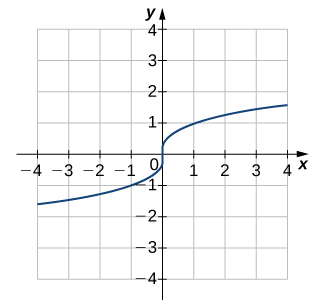
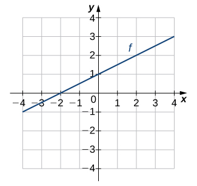

* Determine the conditions for when a function has an inverse.
* Use the horizontal line test to recognize when a function is one-to-one.
* Find the inverse of a given function.
* Draw the graph of an inverse function.
* Evaluate inverse trigonometric functions.

An inverse function reverses the operation done by a particular function. In other words, whatever a function does, the inverse function undoes it. In this section, we define an inverse function formally and state the necessary conditions for an inverse function to exist. We examine how to find an inverse function and study the relationship between the graph of a function and the graph of its inverse. Then we apply these ideas to define and discuss properties of the inverse trigonometric functions.

### Existence of an Inverse Function

We begin with an example. Given a function <math xmlns="http://www.w3.org/1998/Math/MathML"><mi>f</mi></math>

 and an output <math xmlns="http://www.w3.org/1998/Math/MathML"><mrow><mi>y</mi><mo>=</mo><mi>f</mi><mo stretchy="false">(</mo><mi>x</mi><mo stretchy="false">)</mo><mo>,</mo></mrow></math>

 we are often interested in finding what value or values <math xmlns="http://www.w3.org/1998/Math/MathML"><mi>x</mi></math>

 were mapped to <math xmlns="http://www.w3.org/1998/Math/MathML"><mi>y</mi></math>

 by <math xmlns="http://www.w3.org/1998/Math/MathML"><mi>f</mi><mo>.</mo></math>

 For example, consider the function <math xmlns="http://www.w3.org/1998/Math/MathML"><mrow><mi>f</mi><mrow><mo>(</mo><mi>x</mi><mo>)</mo></mrow><mo>=</mo><msup><mi>x</mi><mn>3</mn></msup><mo>+</mo><mn>4</mn><mo>.</mo></mrow></math>

 Since any output <math xmlns="http://www.w3.org/1998/Math/MathML"><mrow><mi>y</mi><mo>=</mo><msup><mi>x</mi><mn>3</mn></msup><mo>+</mo><mn>4</mn><mo>,</mo></mrow></math>

 we can solve this equation for <math xmlns="http://www.w3.org/1998/Math/MathML"><mi>x</mi></math>

 to find that the input is <math xmlns="http://www.w3.org/1998/Math/MathML"><mrow><mi>x</mi><mo>=</mo><mroot><mrow><mi>y</mi><mo>−</mo><mn>4</mn></mrow><mn>3</mn></mroot><mo>.</mo></mrow></math>

 This equation defines <math xmlns="http://www.w3.org/1998/Math/MathML"><mi>x</mi></math>

 as a function of <math xmlns="http://www.w3.org/1998/Math/MathML"><mi>y</mi><mo>.</mo></math>

 Denoting this function as <math xmlns="http://www.w3.org/1998/Math/MathML"><mrow><msup><mi>f</mi><mrow><mn>−1</mn></mrow></msup><mo>,</mo></mrow></math>

 and writing <math xmlns="http://www.w3.org/1998/Math/MathML"><mrow><mi>x</mi><mo>=</mo><msup><mi>f</mi><mrow><mn>−1</mn></mrow></msup><mrow><mo>(</mo><mi>y</mi><mo>)</mo></mrow><mo>=</mo><mroot><mrow><mi>y</mi><mo>−</mo><mn>4</mn></mrow><mn>3</mn></mroot><mo>,</mo></mrow></math>

 we see that for any <math xmlns="http://www.w3.org/1998/Math/MathML"><mi>x</mi></math>

 in the domain of <math xmlns="http://www.w3.org/1998/Math/MathML"><mi>f</mi><mo>,</mo><mrow><msup><mi>f</mi><mrow><mn>−1</mn></mrow></msup><mrow><mo>(</mo><mrow><mi>f</mi><mrow><mo>(</mo><mi>x</mi><mo>)</mo></mrow></mrow><mo>)</mo></mrow><mo>=</mo><msup><mi>f</mi><mrow><mn>−1</mn></mrow></msup><mrow><mo>(</mo><mrow><msup><mi>x</mi><mn>3</mn></msup><mo>+</mo><mn>4</mn></mrow><mo>)</mo></mrow><mo>=</mo><mi>x</mi><mo>.</mo></mrow></math>

 Thus, this new function, <math xmlns="http://www.w3.org/1998/Math/MathML"><mrow><msup><mi>f</mi><mrow><mn>−1</mn></mrow></msup><mo>,</mo></mrow></math>

 “undid” what the original function <math xmlns="http://www.w3.org/1998/Math/MathML"><mi>f</mi></math>

 did. A function with this property is called the inverse function of the original function.

Definition

Given a function <math xmlns="http://www.w3.org/1998/Math/MathML"><mi>f</mi></math>

 with domain <math xmlns="http://www.w3.org/1998/Math/MathML"><mi>D</mi></math>

 and range <math xmlns="http://www.w3.org/1998/Math/MathML"><mi>R</mi><mo>,</mo></math>

 its **inverse function**{: data-type="term"} (if it exists) is the function <math xmlns="http://www.w3.org/1998/Math/MathML"><mrow><msup><mi>f</mi><mrow><mn>−1</mn></mrow></msup></mrow></math>

 with domain <math xmlns="http://www.w3.org/1998/Math/MathML"><mi>R</mi></math>

 and range <math xmlns="http://www.w3.org/1998/Math/MathML"><mrow><mi>D</mi></mrow></math>

 such that <math xmlns="http://www.w3.org/1998/Math/MathML"><mrow><msup><mi>f</mi><mrow><mn>−1</mn></mrow></msup><mrow><mo>(</mo><mi>y</mi><mo>)</mo></mrow><mo>=</mo><mi>x</mi></mrow></math>

 if <math xmlns="http://www.w3.org/1998/Math/MathML"><mrow><mi>f</mi><mrow><mo>(</mo><mi>x</mi><mo>)</mo></mrow><mo>=</mo><mi>y</mi><mo>.</mo></mrow></math>

 In other words, for a function <math xmlns="http://www.w3.org/1998/Math/MathML"><mi>f</mi></math>

 and its inverse <math xmlns="http://www.w3.org/1998/Math/MathML"><mrow><msup><mi>f</mi><mrow><mn>−1</mn></mrow></msup><mo>,</mo></mrow></math>

<math xmlns="http://www.w3.org/1998/Math/MathML"><mrow><msup><mi>f</mi><mrow><mn>−1</mn></mrow></msup><mrow><mo>(</mo><mrow><mi>f</mi><mrow><mo>(</mo><mi>x</mi><mo>)</mo></mrow></mrow><mo>)</mo></mrow><mo>=</mo><mi>x</mi><mspace width="0.2em" /><mtext>for all</mtext><mspace width="0.2em" /><mi>x</mi><mspace width="0.2em" /><mtext>in</mtext><mspace width="0.2em" /><mi>D</mi><mo>,</mo><mtext>and</mtext><mspace width="0.2em" /><mi>f</mi><mrow><mo>(</mo><mrow><msup><mi>f</mi><mrow><mn>−1</mn></mrow></msup><mrow><mo>(</mo><mi>y</mi><mo>)</mo></mrow></mrow><mo>)</mo></mrow><mo>=</mo><mi>y</mi><mspace width="0.2em" /><mtext>for all</mtext><mspace width="0.2em" /><mi>y</mi><mspace width="0.2em" /><mtext>in</mtext><mspace width="0.2em" /><mi>R</mi><mo>.</mo></mrow></math>

Note that <math xmlns="http://www.w3.org/1998/Math/MathML"><mrow><msup><mi>f</mi><mrow><mn>−1</mn></mrow></msup></mrow></math>

 is read as “f inverse.” Here, the <math xmlns="http://www.w3.org/1998/Math/MathML"><mrow><mn>−1</mn></mrow></math>

 is not used as an exponent and <math xmlns="http://www.w3.org/1998/Math/MathML"><mrow><msup><mi>f</mi><mrow><mn>−1</mn></mrow></msup><mrow><mo>(</mo><mi>x</mi><mo>)</mo></mrow><mo>≠</mo><mn>1</mn><mtext>/</mtext><mi>f</mi><mo stretchy="false">(</mo><mi>x</mi><mo stretchy="false">)</mo><mo>.</mo></mrow></math>

 [\[link\]](#CNX_Calc_Figure_01_04_001) shows the relationship between the domain and range of *f* and the domain and range of <math xmlns="http://www.w3.org/1998/Math/MathML"><mrow><msup><mi>f</mi><mrow><mn>−1</mn></mrow></msup><mo>.</mo></mrow></math>

 ![An image of two bubbles. The first bubble is orange and has two labels: the top label is &#x201C;Domain of f&#x201D; and the bottom label is &#x201C;Range of f inverse&#x201D;. Within this bubble is the variable &#x201C;x&#x201D;. An orange arrow with the label &#x201C;f&#x201D; points from this bubble to the second bubble. The second bubble is blue and has two labels: the top label is &#x201C;range of f&#x201D; and the bottom label is &#x201C;domain of f inverse&#x201D;. Within this bubble is the variable &#x201C;y&#x201D;. A blue arrow with the label &#x201C;f inverse&#x201D; points from this bubble to the first bubble.](../resources/CNX_Calc_Figure_01_04_001.jpg "Given a function f and its inverse f&#x2212;1,f&#x2212;1(y)=x if and only if f(x)=y. The range of f becomes the domain of f&#x2212;1 and the domain of f becomes the range of f&#x2212;1."){: #CNX_Calc_Figure_01_04_001}

Recall that a function has exactly one output for each input. Therefore, to define an inverse function, we need to map each input to exactly one output. For example, let’s try to find the inverse function for <math xmlns="http://www.w3.org/1998/Math/MathML"><mrow><mi>f</mi><mrow><mo>(</mo><mi>x</mi><mo>)</mo></mrow><mo>=</mo><msup><mi>x</mi><mn>2</mn></msup><mo>.</mo></mrow></math>

 Solving the equation <math xmlns="http://www.w3.org/1998/Math/MathML"><mrow><mi>y</mi><mo>=</mo><msup><mi>x</mi><mn>2</mn></msup></mrow></math>

 for <math xmlns="http://www.w3.org/1998/Math/MathML"><mrow><mi>x</mi><mo>,</mo></mrow></math>

 we arrive at the equation <math xmlns="http://www.w3.org/1998/Math/MathML"><mrow><mi>x</mi><mo>=</mo><mo>±</mo><msqrt><mi>y</mi></msqrt><mo>.</mo></mrow></math>

 This equation does not describe <math xmlns="http://www.w3.org/1998/Math/MathML"><mi>x</mi></math>

 as a function of <math xmlns="http://www.w3.org/1998/Math/MathML"><mi>y</mi></math>

 because there are two solutions to this equation for every <math xmlns="http://www.w3.org/1998/Math/MathML"><mrow><mi>y</mi><mo>&gt;</mo><mn>0</mn><mo>.</mo></mrow></math>

 The problem with trying to find an inverse function for <math xmlns="http://www.w3.org/1998/Math/MathML"><mrow><mi>f</mi><mrow><mo>(</mo><mi>x</mi><mo>)</mo></mrow><mo>=</mo><msup><mi>x</mi><mn>2</mn></msup></mrow></math>

 is that two inputs are sent to the same output for each output <math xmlns="http://www.w3.org/1998/Math/MathML"><mrow><mi>y</mi><mo>&gt;</mo><mn>0</mn><mo>.</mo></mrow></math>

 The function <math xmlns="http://www.w3.org/1998/Math/MathML"><mrow><mi>f</mi><mrow><mo>(</mo><mi>x</mi><mo>)</mo></mrow><mo>=</mo><msup><mi>x</mi><mn>3</mn></msup><mo>+</mo><mn>4</mn></mrow></math>

 discussed earlier did not have this problem. For that function, each input was sent to a different output. A function that sends each input to a *different* output is called a one-to-one function.

Definition

We say a <math xmlns="http://www.w3.org/1998/Math/MathML"><mi>f</mi></math>

 is a **one-to-one function**{: data-type="term"} if <math xmlns="http://www.w3.org/1998/Math/MathML"><mrow><mi>f</mi><mrow><mo>(</mo><mrow><msub><mi>x</mi><mn>1</mn></msub></mrow><mo>)</mo></mrow><mo>≠</mo><mi>f</mi><mrow><mo>(</mo><mrow><msub><mi>x</mi><mn>2</mn></msub></mrow><mo>)</mo></mrow></mrow></math>

 when <math xmlns="http://www.w3.org/1998/Math/MathML"><mrow><msub><mi>x</mi><mn>1</mn></msub><mo>≠</mo><msub><mi>x</mi><mn>2</mn></msub><mo>.</mo></mrow></math>

One way to determine whether a function is one-to-one is by looking at its graph. If a function is one-to-one, then no two inputs can be sent to the same output. Therefore, if we draw a horizontal line anywhere in the <math xmlns="http://www.w3.org/1998/Math/MathML"><mrow><mi>x</mi><mi>y</mi></mrow></math>

-plane, according to the **horizontal line test**{: data-type="term"}, it cannot intersect the graph more than once. We note that the horizontal line test is different from the vertical line test. The vertical line test determines whether a graph is the graph of a function. The horizontal line test determines whether a function is one-to-one ([\[link\]](#CNX_Calc_Figure_01_04_002)).

Rule: Horizontal Line Test

A function <math xmlns="http://www.w3.org/1998/Math/MathML"><mi>f</mi></math>

 is one-to-one if and only if every horizontal line intersects the graph of <math xmlns="http://www.w3.org/1998/Math/MathML"><mi>f</mi></math>

 no more than once.

 ![An image of two graphs. Both graphs have an x axis that runs from -3 to 3 and a y axis that runs from -3 to 4. The first graph is of the function &#x201C;f(x) = x squared&#x201D;, which is a parabola. The function decreases until it hits the origin, where it begins to increase. The x intercept and y intercept are both at the origin. There are two orange horizontal lines also plotted on the graph, both of which run through the function at two points each. The second graph is of the function &#x201C;f(x) = x cubed&#x201D;, which is an increasing curved function. The x intercept and y intercept are both at the origin. There are three orange lines also plotted on the graph, each of which only intersects the function at one point.](../resources/CNX_Calc_Figure_01_04_002.jpg "(a) The function f(x)=x2 is not one-to-one because it fails the horizontal line test. (b) The function f(x)=x3 is one-to-one because it passes the horizontal line test."){: #CNX_Calc_Figure_01_04_002}

Determining Whether a Function Is One-to-One

For each of the following functions, use the horizontal line test to determine whether it is one-to-one.

1.   ![An image of a graph. The x axis runs from -3 to 11 and the y axis runs from -3 to 11. The graph is of a step function which contains 10 horizontal steps. Each steps starts with a closed circle and ends with an open circle. The first step starts at the origin and ends at the point (1, 0). The second step starts at the point (1, 1) and ends at the point (1, 2). Each of the following 8 steps starts 1 unit higher in the y direction than where the previous step ended. The tenth and final step starts at the point (9, 9) and ends at the point (10, 9)](../resources/CNX_Calc_Figure_01_04_003.jpg) 
2.   ![An image of a graph. The x axis runs from -3 to 6 and the y axis runs from -3 to 6. The graph is of the function &#x201C;f(x) = (1/x)&#x201D;, a curved decreasing function. The graph of the function starts right below the x axis in the 4th quadrant and begins to decreases until it comes close to the y axis. The graph keeps decreasing as it gets closer and closer to the y axis, but never touches it due to the vertical asymptote. In the first quadrant, the graph of the function starts close to the y axis and keeps decreasing until it gets close to the x axis. As the function continues to decreases it gets closer and closer to the x axis without touching it, where there is a horizontal asymptote.](../resources/CNX_Calc_Figure_01_04_004.jpg) 
{: type="a"}

1.  Since the horizontal line
    <math xmlns="http://www.w3.org/1998/Math/MathML"><mrow><mi>y</mi><mo>=</mo><mi>n</mi></mrow></math>
    
    for any integer
    <math xmlns="http://www.w3.org/1998/Math/MathML"><mrow><mi>n</mi><mo>≥</mo><mn>0</mn></mrow></math>
    
    intersects the graph more than once, this function is not one-to-one.
    * * *
    {: data-type="newline"}
    
     ![An image of a graph. The x axis runs from -3 to 11 and the y axis runs from -3 to 11. The graph is of a step function which contains 10 horizontal steps. Each steps starts with a closed circle and ends with an open circle. The first step starts at the origin and ends at the point (1, 0). The second step starts at the point (1, 1) and ends at the point (1, 2). Each of the following 8 steps starts 1 unit higher in the y direction than where the previous step ended. The tenth and final step starts at the point (9, 9) and ends at the point (10, 9). There are also two horizontal orange lines plotted on the graph, each of which run through an entire step of the function.](../resources/CNX_Calc_Figure_01_04_005.jpg) 
2.  Since every horizontal line intersects the graph once (at most), this function is one-to-one.
    * * *
    {: data-type="newline"}
    
     ![An image of a graph. The x axis runs from -3 to 6 and the y axis runs from -3 to 6. The graph is of the function &#x201C;f(x) = (1/x)&#x201D;, a curved decreasing function. The graph of the function starts right below the x axis in the 4th quadrant and begins to decreases until it comes close to the y axis. The graph keeps decreasing as it gets closer and closer to the y axis, but never touches it due to the vertical asymptote. In the first quadrant, the graph of the function starts close to the y axis and keeps decreasing until it gets close to the x axis. As the function continues to decreases it gets closer and closer to the x axis without touching it, where there is a horizontal asymptote. There are also three horizontal orange lines plotted on the graph, each of which only runs through the function at one point.](../resources/CNX_Calc_Figure_01_04_006.jpg) 
{: type="a"}

Is the function <math xmlns="http://www.w3.org/1998/Math/MathML"><mi>f</mi></math>

 graphed in the following image one-to-one?

  

No.

Hint

Use the horizontal line test.

### Finding a Function’s Inverse

We can now consider one-to-one functions and show how to find their inverses. Recall that a function maps elements in the domain of <math xmlns="http://www.w3.org/1998/Math/MathML"><mi>f</mi></math>

 to elements in the range of <math xmlns="http://www.w3.org/1998/Math/MathML"><mi>f</mi><mo>.</mo></math>

 The inverse function maps each element from the range of <math xmlns="http://www.w3.org/1998/Math/MathML"><mi>f</mi></math>

 back to its corresponding element from the domain of <math xmlns="http://www.w3.org/1998/Math/MathML"><mi>f</mi><mo>.</mo></math>

 Therefore, to find the inverse function of a one-to-one function <math xmlns="http://www.w3.org/1998/Math/MathML"><mi>f</mi><mo>,</mo></math>

 given any <math xmlns="http://www.w3.org/1998/Math/MathML"><mi>y</mi></math>

 in the range of <math xmlns="http://www.w3.org/1998/Math/MathML"><mi>f</mi><mo>,</mo></math>

 we need to determine which <math xmlns="http://www.w3.org/1998/Math/MathML"><mi>x</mi></math>

 in the domain of <math xmlns="http://www.w3.org/1998/Math/MathML"><mi>f</mi></math>

 satisfies <math xmlns="http://www.w3.org/1998/Math/MathML"><mrow><mi>f</mi><mo stretchy="false">(</mo><mi>x</mi><mo stretchy="false">)</mo><mo>=</mo><mi>y</mi><mo>.</mo></mrow></math>

 Since <math xmlns="http://www.w3.org/1998/Math/MathML"><mi>f</mi></math>

 is one-to-one, there is exactly one such value <math xmlns="http://www.w3.org/1998/Math/MathML"><mi>x</mi><mo>.</mo></math>

 We can find that value <math xmlns="http://www.w3.org/1998/Math/MathML"><mi>x</mi></math>

 by solving the equation <math xmlns="http://www.w3.org/1998/Math/MathML"><mrow><mi>f</mi><mo stretchy="false">(</mo><mi>x</mi><mo stretchy="false">)</mo><mo>=</mo><mi>y</mi></mrow></math>

 for <math xmlns="http://www.w3.org/1998/Math/MathML"><mi>x</mi><mo>.</mo></math>

 Doing so, we are able to write <math xmlns="http://www.w3.org/1998/Math/MathML"><mi>x</mi></math>

 as a function of <math xmlns="http://www.w3.org/1998/Math/MathML"><mi>y</mi></math>

 where the domain of this function is the range of <math xmlns="http://www.w3.org/1998/Math/MathML"><mi>f</mi></math>

 and the range of this new function is the domain of <math xmlns="http://www.w3.org/1998/Math/MathML"><mi>f</mi><mo>.</mo></math>

 Consequently, this function is the inverse of <math xmlns="http://www.w3.org/1998/Math/MathML"><mi>f</mi><mo>,</mo></math>

 and we write <math xmlns="http://www.w3.org/1998/Math/MathML"><mrow><mi>x</mi><mo>=</mo><msup><mi>f</mi><mrow><mn>−1</mn></mrow></msup><mo stretchy="false">(</mo><mi>y</mi><mo stretchy="false">)</mo><mo>.</mo></mrow></math>

 Since we typically use the variable <math xmlns="http://www.w3.org/1998/Math/MathML"><mi>x</mi></math>

 to denote the independent variable and <math xmlns="http://www.w3.org/1998/Math/MathML"><mi>y</mi></math>

 to denote the dependent variable, we often interchange the roles of <math xmlns="http://www.w3.org/1998/Math/MathML"><mi>x</mi></math>

 and <math xmlns="http://www.w3.org/1998/Math/MathML"><mi>y</mi><mo>,</mo></math>

 and write <math xmlns="http://www.w3.org/1998/Math/MathML"><mrow><mi>y</mi><mo>=</mo><msup><mi>f</mi><mrow><mn>−1</mn></mrow></msup><mo stretchy="false">(</mo><mi>x</mi><mo stretchy="false">)</mo><mo>.</mo></mrow></math>

 Representing the inverse function in this way is also helpful later when we graph a function <math xmlns="http://www.w3.org/1998/Math/MathML"><mi>f</mi></math>

 and its inverse <math xmlns="http://www.w3.org/1998/Math/MathML"><mrow><msup><mi>f</mi><mrow><mn>−1</mn></mrow></msup></mrow></math>

 on the same axes.

Problem-Solving Strategy: Finding an Inverse Function

1.  Solve the equation
    <math xmlns="http://www.w3.org/1998/Math/MathML"><mrow><mi>y</mi><mo>=</mo><mi>f</mi><mrow><mo>(</mo><mi>x</mi><mo>)</mo></mrow></mrow></math>
    
    for
    <math xmlns="http://www.w3.org/1998/Math/MathML"><mi>x</mi><mo>.</mo></math>

2.  Interchange the variables
    <math xmlns="http://www.w3.org/1998/Math/MathML"><mi>x</mi></math>
    
    and
    <math xmlns="http://www.w3.org/1998/Math/MathML"><mi>y</mi></math>
    
    and write
    <math xmlns="http://www.w3.org/1998/Math/MathML"><mrow><mi>y</mi><mo>=</mo><msup><mi>f</mi><mrow><mn>−1</mn></mrow></msup><mo stretchy="false">(</mo><mi>x</mi><mo stretchy="false">)</mo><mo>.</mo></mrow></math>
{: type="1"}

Finding an Inverse Function

Find the inverse for the function <math xmlns="http://www.w3.org/1998/Math/MathML"><mrow><mi>f</mi><mrow><mo>(</mo><mi>x</mi><mo>)</mo></mrow><mo>=</mo><mn>3</mn><mi>x</mi><mo>−</mo><mn>4</mn><mo>.</mo></mrow></math>

 State the domain and range of the inverse function. Verify that <math xmlns="http://www.w3.org/1998/Math/MathML"><mrow><msup><mi>f</mi><mrow><mn>−1</mn></mrow></msup><mo stretchy="false">(</mo><mi>f</mi><mo stretchy="false">(</mo><mi>x</mi><mo stretchy="false">)</mo><mo stretchy="false">)</mo><mo>=</mo><mi>x</mi><mo>.</mo></mrow></math>

Follow the steps outlined in the strategy.

Step 1. If <math xmlns="http://www.w3.org/1998/Math/MathML"><mrow><mi>y</mi><mo>=</mo><mn>3</mn><mi>x</mi><mo>−</mo><mn>4</mn><mo>,</mo></mrow></math>

 then <math xmlns="http://www.w3.org/1998/Math/MathML"><mrow><mn>3</mn><mi>x</mi><mo>=</mo><mi>y</mi><mo>+</mo><mn>4</mn></mrow></math>

 and <math xmlns="http://www.w3.org/1998/Math/MathML"><mrow><mi>x</mi><mo>=</mo><mfrac><mn>1</mn><mn>3</mn></mfrac><mi>y</mi><mo>+</mo><mfrac><mn>4</mn><mn>3</mn></mfrac><mo>.</mo></mrow></math>

Step 2. Rewrite as <math xmlns="http://www.w3.org/1998/Math/MathML"><mrow><mi>y</mi><mo>=</mo><mfrac><mn>1</mn><mn>3</mn></mfrac><mi>x</mi><mo>+</mo><mfrac><mn>4</mn><mn>3</mn></mfrac></mrow></math>

 and let <math xmlns="http://www.w3.org/1998/Math/MathML"><mrow><mi>y</mi><mo>=</mo><msup><mi>f</mi><mrow><mn>−1</mn></mrow></msup><mrow><mo>(</mo><mi>x</mi><mo>)</mo></mrow><mo>.</mo></mrow></math>

Therefore, <math xmlns="http://www.w3.org/1998/Math/MathML"><mrow><msup><mi>f</mi><mrow><mn>−1</mn></mrow></msup><mrow><mo>(</mo><mi>x</mi><mo>)</mo></mrow><mo>=</mo><mfrac><mn>1</mn><mn>3</mn></mfrac><mi>x</mi><mo>+</mo><mfrac><mn>4</mn><mn>3</mn></mfrac><mo>.</mo></mrow></math>

Since the domain of <math xmlns="http://www.w3.org/1998/Math/MathML"><mi>f</mi></math>

 is <math xmlns="http://www.w3.org/1998/Math/MathML"><mrow><mo stretchy="false">(</mo><mtext>−</mtext><mi>∞</mi><mo>,</mo><mi>∞</mi><mo stretchy="false">)</mo><mo>,</mo></mrow></math>

 the range of <math xmlns="http://www.w3.org/1998/Math/MathML"><mrow><msup><mi>f</mi><mrow><mn>−1</mn></mrow></msup></mrow></math>

 is <math xmlns="http://www.w3.org/1998/Math/MathML"><mrow><mo stretchy="false">(</mo><mtext>−</mtext><mi>∞</mi><mo>,</mo><mi>∞</mi><mo stretchy="false">)</mo><mo>.</mo></mrow></math>

 Since the range of <math xmlns="http://www.w3.org/1998/Math/MathML"><mi>f</mi></math>

 is <math xmlns="http://www.w3.org/1998/Math/MathML"><mrow><mo stretchy="false">(</mo><mtext>−</mtext><mi>∞</mi><mo>,</mo><mi>∞</mi><mo stretchy="false">)</mo><mo>,</mo></mrow></math>

 the domain of <math xmlns="http://www.w3.org/1998/Math/MathML"><mrow><msup><mi>f</mi><mrow><mn>−1</mn></mrow></msup></mrow></math>

 is <math xmlns="http://www.w3.org/1998/Math/MathML"><mrow><mo stretchy="false">(</mo><mtext>−</mtext><mi>∞</mi><mo>,</mo><mi>∞</mi><mo stretchy="false">)</mo><mo>.</mo></mrow></math>

You can verify that <math xmlns="http://www.w3.org/1998/Math/MathML"><mrow><msup><mi>f</mi><mrow><mn>−1</mn></mrow></msup><mo stretchy="false">(</mo><mi>f</mi><mo stretchy="false">(</mo><mi>x</mi><mo stretchy="false">)</mo><mo stretchy="false">)</mo><mo>=</mo><mi>x</mi></mrow></math>

 by writing

<math xmlns="http://www.w3.org/1998/Math/MathML"><mrow><msup><mi>f</mi><mrow><mn>−1</mn></mrow></msup><mo stretchy="false">(</mo><mi>f</mi><mo stretchy="false">(</mo><mi>x</mi><mo stretchy="false">)</mo><mo stretchy="false">)</mo><mo>=</mo><msup><mi>f</mi><mrow><mn>−1</mn></mrow></msup><mo stretchy="false">(</mo><mn>3</mn><mi>x</mi><mo>−</mo><mn>4</mn><mo stretchy="false">)</mo><mo>=</mo><mfrac><mn>1</mn><mn>3</mn></mfrac><mo stretchy="false">(</mo><mn>3</mn><mi>x</mi><mo>−</mo><mn>4</mn><mo stretchy="false">)</mo><mo>+</mo><mfrac><mn>4</mn><mn>3</mn></mfrac><mo>=</mo><mi>x</mi><mo>−</mo><mfrac><mn>4</mn><mn>3</mn></mfrac><mo>+</mo><mfrac><mn>4</mn><mn>3</mn></mfrac><mo>=</mo><mi>x</mi><mo>.</mo></mrow></math>

Note that for <math xmlns="http://www.w3.org/1998/Math/MathML"><mrow><msup><mi>f</mi><mrow><mn>−1</mn></mrow></msup><mo stretchy="false">(</mo><mi>x</mi><mo stretchy="false">)</mo></mrow></math>

 to be the inverse of <math xmlns="http://www.w3.org/1998/Math/MathML"><mrow><mi>f</mi><mo stretchy="false">(</mo><mi>x</mi><mo stretchy="false">)</mo><mo>,</mo></mrow></math>

 both <math xmlns="http://www.w3.org/1998/Math/MathML"><mrow><msup><mi>f</mi><mrow><mn>−1</mn></mrow></msup><mo stretchy="false">(</mo><mi>f</mi><mo stretchy="false">(</mo><mi>x</mi><mo stretchy="false">)</mo><mo stretchy="false">)</mo><mo>=</mo><mi>x</mi></mrow></math>

 and <math xmlns="http://www.w3.org/1998/Math/MathML"><mrow><mi>f</mi><mo stretchy="false">(</mo><msup><mi>f</mi><mrow><mn>−1</mn></mrow></msup><mo stretchy="false">(</mo><mi>x</mi><mo stretchy="false">)</mo><mo stretchy="false">)</mo><mo>=</mo><mi>x</mi></mrow></math>

 for all *x* in the domain of the inside function.

Find the inverse of the function <math xmlns="http://www.w3.org/1998/Math/MathML"><mrow><mi>f</mi><mrow><mo>(</mo><mi>x</mi><mo>)</mo></mrow><mo>=</mo><mn>3</mn><mi>x</mi><mtext>/</mtext><mo stretchy="false">(</mo><mi>x</mi><mo>−</mo><mn>2</mn><mo stretchy="false">)</mo><mo>.</mo></mrow></math>

 State the domain and range of the inverse function.

<math xmlns="http://www.w3.org/1998/Math/MathML"><mrow><msup><mi>f</mi><mrow><mn>−1</mn></mrow></msup><mrow><mo>(</mo><mi>x</mi><mo>)</mo></mrow><mo>=</mo><mfrac><mrow><mn>2</mn><mi>x</mi></mrow><mrow><mi>x</mi><mo>−</mo><mn>3</mn></mrow></mfrac><mo>.</mo></mrow></math>

 The domain of <math xmlns="http://www.w3.org/1998/Math/MathML"><mrow><msup><mi>f</mi><mrow><mn>−1</mn></mrow></msup></mrow></math>

 is <math xmlns="http://www.w3.org/1998/Math/MathML"><mrow><mo>{</mo><mi>x</mi><mo>\|</mo><mi>x</mi><mo>≠</mo><mn>3</mn><mo>}</mo><mo>.</mo></mrow></math>

 The range of <math xmlns="http://www.w3.org/1998/Math/MathML"><mrow><msup><mi>f</mi><mrow><mn>−1</mn></mrow></msup></mrow></math>

 is <math xmlns="http://www.w3.org/1998/Math/MathML"><mrow><mo>{</mo><mi>y</mi><mo>\|</mo><mi>y</mi><mo>≠</mo><mn>2</mn><mo>}</mo><mo>.</mo></mrow></math>

Hint

Use the [[link]](#fs-id1170572552427) for finding inverse functions.

#### Graphing Inverse Functions

Let’s consider the relationship between the graph of a function <math xmlns="http://www.w3.org/1998/Math/MathML"><mi>f</mi></math>

 and the graph of its inverse. Consider the graph of <math xmlns="http://www.w3.org/1998/Math/MathML"><mi>f</mi></math>

 shown in [\[link\]](#CNX_Calc_Figure_01_04_008) and a point <math xmlns="http://www.w3.org/1998/Math/MathML"><mrow><mrow><mo>(</mo><mrow><mi>a</mi><mo>,</mo><mi>b</mi></mrow><mo>)</mo></mrow></mrow></math>

 on the graph. Since <math xmlns="http://www.w3.org/1998/Math/MathML"><mrow><mi>b</mi><mo>=</mo><mi>f</mi><mo stretchy="false">(</mo><mi>a</mi><mo stretchy="false">)</mo><mo>,</mo></mrow></math>

 then <math xmlns="http://www.w3.org/1998/Math/MathML"><mrow><msup><mi>f</mi><mrow><mn>−1</mn></mrow></msup><mrow><mo>(</mo><mi>b</mi><mo>)</mo></mrow><mo>=</mo><mi>a</mi><mo>.</mo></mrow></math>

 Therefore, when we graph <math xmlns="http://www.w3.org/1998/Math/MathML"><mrow><msup><mi>f</mi><mrow><mn>−1</mn></mrow></msup><mo>,</mo></mrow></math>

 the point <math xmlns="http://www.w3.org/1998/Math/MathML"><mrow><mo stretchy="false">(</mo><mi>b</mi><mo>,</mo><mi>a</mi><mo stretchy="false">)</mo></mrow></math>

 is on the graph. As a result, the graph of <math xmlns="http://www.w3.org/1998/Math/MathML"><mrow><msup><mi>f</mi><mrow><mn>−1</mn></mrow></msup></mrow></math>

 is a reflection of the graph of <math xmlns="http://www.w3.org/1998/Math/MathML"><mi>f</mi></math>

 about the line <math xmlns="http://www.w3.org/1998/Math/MathML"><mrow><mi>y</mi><mo>=</mo><mi>x</mi><mo>.</mo></mrow></math>

 ![An image of two graphs. The first graph is of &#x201C;y = f(x)&#x201D;, which is a curved increasing function, that increases at a faster rate as x increases. The point (a, b) is on the graph of the function in the first quadrant. The second graph also graphs &#x201C;y = f(x)&#x201D; with the point (a, b), but also graphs the function &#x201C;y = f inverse (x)&#x201D;, an increasing curved function, that increases at a slower rate as x increases. This function includes the point (b, a). In addition to the two functions, there is a diagonal dotted line potted with the equation &#x201C;y =x&#x201D;, which shows that &#x201C;f(x)&#x201D; and &#x201C;f inverse (x)&#x201D; are mirror images about the line &#x201C;y =x&#x201D;.](../resources/CNX_Calc_Figure_01_04_017.jpg "(a) The graph of this function f shows point (a,b) on the graph of f. (b) Since (a,b) is on the graph of f, the point (b,a) is on the graph of f&#x2212;1. The graph of f&#x2212;1 is a reflection of the graph of f about the line y=x."){: #CNX_Calc_Figure_01_04_008}

Sketching Graphs of Inverse Functions

For the graph of <math xmlns="http://www.w3.org/1998/Math/MathML"><mi>f</mi></math>

 in the following image, sketch a graph of <math xmlns="http://www.w3.org/1998/Math/MathML"><mrow><msup><mi>f</mi><mrow><mn>−1</mn></mrow></msup></mrow></math>

 by sketching the line <math xmlns="http://www.w3.org/1998/Math/MathML"><mrow><mi>y</mi><mo>=</mo><mi>x</mi></mrow></math>

 and using symmetry. Identify the domain and range of <math xmlns="http://www.w3.org/1998/Math/MathML"><mrow><msup><mi>f</mi><mrow><mn>−1</mn></mrow></msup><mo>.</mo></mrow></math>

  

Reflect the graph about the line <math xmlns="http://www.w3.org/1998/Math/MathML"><mrow><mi>y</mi><mo>=</mo><mi>x</mi><mo>.</mo></mrow></math>

 The domain of <math xmlns="http://www.w3.org/1998/Math/MathML"><mrow><msup><mi>f</mi><mrow><mn>−1</mn></mrow></msup></mrow></math>

 is <math xmlns="http://www.w3.org/1998/Math/MathML"><mrow><mrow><mo>[</mo><mrow><mn>0</mn><mo>,</mo><mi>∞</mi></mrow><mo>)</mo></mrow><mo>.</mo></mrow></math>

 The range of <math xmlns="http://www.w3.org/1998/Math/MathML"><mrow><msup><mi>f</mi><mrow><mn>−1</mn></mrow></msup></mrow></math>

 is <math xmlns="http://www.w3.org/1998/Math/MathML"><mrow><mrow><mo>[</mo><mrow><mn>−2</mn><mo>,</mo><mi>∞</mi></mrow><mo>)</mo></mrow><mo>.</mo></mrow></math>

 By using the preceding strategy for finding inverse functions, we can verify that the inverse function is <math xmlns="http://www.w3.org/1998/Math/MathML"><mrow><msup><mi>f</mi><mrow><mn>−1</mn></mrow></msup><mrow><mo>(</mo><mi>x</mi><mo>)</mo></mrow><mo>=</mo><msup><mi>x</mi><mn>2</mn></msup><mo>−</mo><mn>2</mn><mo>,</mo></mrow></math>

 as shown in the graph.

 ![An image of a graph. The x axis runs from -2 to 2 and the y axis runs from -2 to 2. The graph is of two functions. The first function is &#x201C;f(x) = square root of (x +2)&#x201D;, an increasing curved function. The function starts at the point (-2, 0). The x intercept is at (-2, 0) and the y intercept is at the approximate point (0, 1.4). The second function is &#x201C;f inverse (x) = (x squared) -2&#x201D;, an increasing curved function that starts at the point (0, -2). The x intercept is at the approximate point (1.4, 0) and the y intercept is at the point (0, -2). In addition to the two functions, there is a diagonal dotted line potted with the equation &#x201C;y =x&#x201D;, which shows that &#x201C;f(x)&#x201D; and &#x201C;f inverse (x)&#x201D; are mirror images about the line &#x201C;y =x&#x201D;.](../resources/CNX_Calc_Figure_01_04_010.jpg) 

Sketch the graph of <math xmlns="http://www.w3.org/1998/Math/MathML"><mrow><mi>f</mi><mrow><mo>(</mo><mi>x</mi><mo>)</mo></mrow><mo>=</mo><mn>2</mn><mi>x</mi><mo>+</mo><mn>3</mn></mrow></math>

 and the graph of its inverse using the symmetry property of inverse functions.

* * *
{: data-type="newline"}

 ![An image of a graph. The x axis runs from -3 to 4 and the y axis runs from -3 to 5. The graph is of two functions. The first function is &#x201C;f(x) = 2x +3&#x201D;, an increasing straight line function. The function has an x intercept at (-1.5, 0) and a y intercept at (0, 3). The second function is &#x201C;f inverse (x) = (x - 3)/2&#x201D;, an increasing straight line function, which increases at a slower rate than the first function. The function has an x intercept at (3, 0) and a y intercept at (0, -1.5). In addition to the two functions, there is a diagonal dotted line potted with the equation &#x201C;y =x&#x201D;, which shows that &#x201C;f(x)&#x201D; and &#x201C;f inverse (x)&#x201D; are mirror images about the line &#x201C;y =x&#x201D;.](../resources/CNX_Calc_Figure_01_04_011.jpg) 

Hint

The graphs are symmetric about the line <math xmlns="http://www.w3.org/1998/Math/MathML"><mrow><mi>y</mi><mo>=</mo><mi>x</mi><mtext>.</mtext></mrow></math>

#### Restricting Domains

As we have seen, <math xmlns="http://www.w3.org/1998/Math/MathML"><mrow><mi>f</mi><mrow><mo>(</mo><mi>x</mi><mo>)</mo></mrow><mo>=</mo><msup><mi>x</mi><mn>2</mn></msup></mrow></math>

 does not have an inverse function because it is not one-to-one. However, we can choose a subset of the domain of <math xmlns="http://www.w3.org/1998/Math/MathML"><mi>f</mi></math>

 such that the function is one-to-one. This subset is called a **restricted domain**{: data-type="term"}. By restricting the domain of <math xmlns="http://www.w3.org/1998/Math/MathML"><mi>f</mi><mo>,</mo></math>

 we can define a new function <math xmlns="http://www.w3.org/1998/Math/MathML"><mi>g</mi></math>

 such that the domain of <math xmlns="http://www.w3.org/1998/Math/MathML"><mi>g</mi></math>

 is the restricted domain of <math xmlns="http://www.w3.org/1998/Math/MathML"><mi>f</mi></math>

 and <math xmlns="http://www.w3.org/1998/Math/MathML"><mrow><mi>g</mi><mo stretchy="false">(</mo><mi>x</mi><mo stretchy="false">)</mo><mo>=</mo><mi>f</mi><mo stretchy="false">(</mo><mi>x</mi><mo stretchy="false">)</mo></mrow></math>

 for all <math xmlns="http://www.w3.org/1998/Math/MathML"><mi>x</mi></math>

 in the domain of <math xmlns="http://www.w3.org/1998/Math/MathML"><mi>g</mi><mo>.</mo></math>

 Then we can define an inverse function for <math xmlns="http://www.w3.org/1998/Math/MathML"><mi>g</mi></math>

 on that domain. For example, since <math xmlns="http://www.w3.org/1998/Math/MathML"><mrow><mi>f</mi><mo stretchy="false">(</mo><mi>x</mi><mo stretchy="false">)</mo><mo>=</mo><msup><mi>x</mi><mn>2</mn></msup></mrow></math>

 is one-to-one on the interval <math xmlns="http://www.w3.org/1998/Math/MathML"><mrow><mo stretchy="false">[</mo><mn>0</mn><mo>,</mo><mi>∞</mi><mo stretchy="false">)</mo><mo>,</mo></mrow></math>

 we can define a new function <math xmlns="http://www.w3.org/1998/Math/MathML"><mi>g</mi></math>

 such that the domain of <math xmlns="http://www.w3.org/1998/Math/MathML"><mi>g</mi></math>

 is <math xmlns="http://www.w3.org/1998/Math/MathML"><mrow><mo stretchy="false">[</mo><mn>0</mn><mo>,</mo><mi>∞</mi><mo stretchy="false">)</mo></mrow></math>

 and <math xmlns="http://www.w3.org/1998/Math/MathML"><mrow><mi>g</mi><mo stretchy="false">(</mo><mi>x</mi><mo stretchy="false">)</mo><mo>=</mo><msup><mi>x</mi><mn>2</mn></msup></mrow></math>

 for all <math xmlns="http://www.w3.org/1998/Math/MathML"><mi>x</mi></math>

 in its domain. Since <math xmlns="http://www.w3.org/1998/Math/MathML"><mi>g</mi></math>

 is a one-to-one function, it has an inverse function, given by the formula <math xmlns="http://www.w3.org/1998/Math/MathML"><mrow><msup><mi>g</mi><mrow><mn>−1</mn></mrow></msup><mo stretchy="false">(</mo><mi>x</mi><mo stretchy="false">)</mo><mo>=</mo><msqrt><mi>x</mi></msqrt><mo>.</mo></mrow></math>

 On the other hand, the function <math xmlns="http://www.w3.org/1998/Math/MathML"><mrow><mi>f</mi><mo stretchy="false">(</mo><mi>x</mi><mo stretchy="false">)</mo><mo>=</mo><msup><mi>x</mi><mn>2</mn></msup></mrow></math>

 is also one-to-one on the domain <math xmlns="http://www.w3.org/1998/Math/MathML"><mrow><mo stretchy="false">(</mo><mtext>−</mtext><mi>∞</mi><mo>,</mo><mn>0</mn><mo stretchy="false">]</mo><mo>.</mo></mrow></math>

 Therefore, we could also define a new function <math xmlns="http://www.w3.org/1998/Math/MathML"><mi>h</mi></math>

 such that the domain of <math xmlns="http://www.w3.org/1998/Math/MathML"><mi>h</mi></math>

 is <math xmlns="http://www.w3.org/1998/Math/MathML"><mrow><mo stretchy="false">(</mo><mtext>−</mtext><mi>∞</mi><mo>,</mo><mn>0</mn><mo stretchy="false">]</mo></mrow></math>

 and <math xmlns="http://www.w3.org/1998/Math/MathML"><mrow><mi>h</mi><mo stretchy="false">(</mo><mi>x</mi><mo stretchy="false">)</mo><mo>=</mo><msup><mi>x</mi><mn>2</mn></msup></mrow></math>

 for all <math xmlns="http://www.w3.org/1998/Math/MathML"><mi>x</mi></math>

 in the domain of <math xmlns="http://www.w3.org/1998/Math/MathML"><mrow><mi>h</mi><mo>.</mo></mrow></math>

 Then <math xmlns="http://www.w3.org/1998/Math/MathML"><mrow><mi>h</mi></mrow></math>

 is a one-to-one function and must also have an inverse. Its inverse is given by the formula <math xmlns="http://www.w3.org/1998/Math/MathML"><mrow><msup><mi>h</mi><mrow><mn>−1</mn></mrow></msup><mo stretchy="false">(</mo><mi>x</mi><mo stretchy="false">)</mo><mo>=</mo><mtext>−</mtext><msqrt><mi>x</mi></msqrt></mrow></math>

 ([\[link\]](#CNX_Calc_Figure_01_04_012)).

 ![An image of two graphs. Both graphs have an x axis that runs from -2 to 5 and a y axis that runs from -2 to 5. The first graph is of two functions. The first function is &#x201C;g(x) = x squared&#x201D;, an increasing curved function that starts at the point (0, 0). This function increases at a faster rate for larger values of x. The second function is &#x201C;g inverse (x) = square root of x&#x201D;, an increasing curved function that starts at the point (0, 0). This function increases at a slower rate for larger values of x. The first function is &#x201C;h(x) = x squared&#x201D;, a decreasing curved function that ends at the point (0, 0). This function decreases at a slower rate for larger values of x. The second function is &#x201C;h inverse (x) = -(square root of x)&#x201D;, an increasing curved function that starts at the point (0, 0). This function decreases at a slower rate for larger values of x. In addition to the two functions, there is a diagonal dotted line potted with the equation &#x201C;y =x&#x201D;, which shows that &#x201C;f(x)&#x201D; and &#x201C;f inverse (x)&#x201D; are mirror images about the line &#x201C;y =x&#x201D;.](../resources/CNX_Calc_Figure_01_04_012.jpg "(a) For g(x)=x2 restricted to [0,&#x221E;),g&#x2212;1(x)=x. (b) For h(x)=x2 restricted to (&#x2212;&#x221E;,0],h&#x2212;1(x)=&#x2212;x."){: #CNX_Calc_Figure_01_04_012}

Restricting the Domain

Consider the function <math xmlns="http://www.w3.org/1998/Math/MathML"><mrow><mi>f</mi><mrow><mo>(</mo><mi>x</mi><mo>)</mo></mrow><mo>=</mo><msup><mrow><mrow><mo>(</mo><mrow><mi>x</mi><mo>+</mo><mn>1</mn></mrow><mo>)</mo></mrow></mrow><mn>2</mn></msup><mo>.</mo></mrow></math>

1.  Sketch the graph of
    <math xmlns="http://www.w3.org/1998/Math/MathML"><mi>f</mi></math>
    
    and use the horizontal line test to show that
    <math xmlns="http://www.w3.org/1998/Math/MathML"><mi>f</mi></math>
    
    is not one-to-one.
2.  Show that
    <math xmlns="http://www.w3.org/1998/Math/MathML"><mi>f</mi></math>
    
    is one-to-one on the restricted domain
    <math xmlns="http://www.w3.org/1998/Math/MathML"><mrow><mo stretchy="false">[</mo><mn>−1</mn><mo>,</mo><mi>∞</mi><mo stretchy="false">)</mo><mo>.</mo></mrow></math>
    
    Determine the domain and range for the inverse of
    <math xmlns="http://www.w3.org/1998/Math/MathML"><mi>f</mi></math>
    
    on this restricted domain and find a formula for
    <math xmlns="http://www.w3.org/1998/Math/MathML"><mrow><msup><mi>f</mi><mrow><mn>−1</mn></mrow></msup><mo>.</mo></mrow></math>
{: type="a"}

1.  The graph of
    <math xmlns="http://www.w3.org/1998/Math/MathML"><mi>f</mi></math>
    
    is the graph of
    <math xmlns="http://www.w3.org/1998/Math/MathML"><mrow><mi>y</mi><mo>=</mo><msup><mi>x</mi><mn>2</mn></msup></mrow></math>
    
    shifted left 1 unit. Since there exists a horizontal line intersecting the graph more than once,
    <math xmlns="http://www.w3.org/1998/Math/MathML"><mi>f</mi></math>
    
    is not one-to-one.
    * * *
    {: data-type="newline"}
    
      
2.  On the interval
    <math xmlns="http://www.w3.org/1998/Math/MathML"><mrow><mo stretchy="false">[</mo><mn>−1</mn><mo>,</mo><mi>∞</mi><mo stretchy="false">)</mo><mo>,</mo></mrow><mspace width="0.2em" /><mi>f</mi></math>
    
    is one-to-one.
    * * *
    {: data-type="newline"}
    
      
    * * *
    {: data-type="newline"}
    
    The domain and range of
    <math xmlns="http://www.w3.org/1998/Math/MathML"><mrow><msup><mi>f</mi><mrow><mn>−1</mn></mrow></msup></mrow></math>
    
    are given by the range and domain of
    <math xmlns="http://www.w3.org/1998/Math/MathML"><mi>f</mi><mo>,</mo></math>
    
    respectively. Therefore, the domain of
    <math xmlns="http://www.w3.org/1998/Math/MathML"><mrow><msup><mi>f</mi><mrow><mn>−1</mn></mrow></msup></mrow></math>
    
    is
    <math xmlns="http://www.w3.org/1998/Math/MathML"><mrow><mo stretchy="false">[</mo><mn>0</mn><mo>,</mo><mi>∞</mi><mo stretchy="false">)</mo></mrow></math>
    
    and the range of
    <math xmlns="http://www.w3.org/1998/Math/MathML"><mrow><msup><mi>f</mi><mrow><mn>−1</mn></mrow></msup></mrow></math>
    
    is
    <math xmlns="http://www.w3.org/1998/Math/MathML"><mrow><mrow><mo>[</mo><mrow><mn>−1</mn><mo>,</mo><mi>∞</mi></mrow><mo>)</mo></mrow><mo>.</mo></mrow></math>
    
    To find a formula for
    <math xmlns="http://www.w3.org/1998/Math/MathML"><mrow><msup><mi>f</mi><mrow><mn>−1</mn></mrow></msup><mo>,</mo></mrow></math>
    
    solve the equation
    <math xmlns="http://www.w3.org/1998/Math/MathML"><mrow><mi>y</mi><mo>=</mo><msup><mrow><mrow><mo>(</mo><mrow><mi>x</mi><mo>+</mo><mn>1</mn></mrow><mo>)</mo></mrow></mrow><mn>2</mn></msup></mrow></math>
    
    for
    <math xmlns="http://www.w3.org/1998/Math/MathML"><mi>x</mi><mo>.</mo></math>
    
    If
    <math xmlns="http://www.w3.org/1998/Math/MathML"><mrow><mi>y</mi><mo>=</mo><msup><mrow><mrow><mo>(</mo><mrow><mi>x</mi><mo>+</mo><mn>1</mn></mrow><mo>)</mo></mrow></mrow><mn>2</mn></msup><mo>,</mo></mrow></math>
    
    then
    <math xmlns="http://www.w3.org/1998/Math/MathML"><mrow><mi>x</mi><mo>=</mo><mn>−1</mn><mo>±</mo><msqrt><mi>y</mi></msqrt><mo>.</mo></mrow></math>
    
    Since we are restricting the domain to the interval where
    <math xmlns="http://www.w3.org/1998/Math/MathML"><mrow><mi>x</mi><mo>≥</mo><mn>−1</mn><mo>,</mo></mrow></math>
    
    we need
    <math xmlns="http://www.w3.org/1998/Math/MathML"><mrow><mo>±</mo><msqrt><mi>y</mi></msqrt><mo>≥</mo><mn>0</mn><mo>.</mo></mrow></math>
    
    Therefore,
    <math xmlns="http://www.w3.org/1998/Math/MathML"><mrow><mi>x</mi><mo>=</mo><mn>−1</mn><mo>+</mo><msqrt><mi>y</mi></msqrt><mo>.</mo></mrow></math>
    
    Interchanging
    <math xmlns="http://www.w3.org/1998/Math/MathML"><mrow><mi>x</mi></mrow></math>
    
    and
    <math xmlns="http://www.w3.org/1998/Math/MathML"><mi>y</mi><mo>,</mo></math>
    
    we write
    <math xmlns="http://www.w3.org/1998/Math/MathML"><mrow><mi>y</mi><mo>=</mo><mn>−1</mn><mo>+</mo><msqrt><mi>x</mi></msqrt></mrow></math>
    
    and conclude that
    <math xmlns="http://www.w3.org/1998/Math/MathML"><mrow><msup><mi>f</mi><mrow><mn>−1</mn></mrow></msup><mrow><mo>(</mo><mi>x</mi><mo>)</mo></mrow><mo>=</mo><mn>−1</mn><mo>+</mo><msqrt><mi>x</mi></msqrt><mo>.</mo></mrow></math>
{: type="a"}

Consider <math xmlns="http://www.w3.org/1998/Math/MathML"><mrow><mi>f</mi><mrow><mo>(</mo><mi>x</mi><mo>)</mo></mrow><mo>=</mo><mn>1</mn><mtext>/</mtext><msup><mi>x</mi><mn>2</mn></msup></mrow></math>

 restricted to the domain <math xmlns="http://www.w3.org/1998/Math/MathML"><mrow><mrow><mo>(</mo><mrow><mtext>−</mtext><mi>∞</mi><mo>,</mo><mn>0</mn></mrow><mo>)</mo></mrow><mo>.</mo></mrow></math>

 Verify that <math xmlns="http://www.w3.org/1998/Math/MathML"><mi>f</mi></math>

 is one-to-one on this domain. Determine the domain and range of the inverse of <math xmlns="http://www.w3.org/1998/Math/MathML"><mi>f</mi></math>

 and find a formula for <math xmlns="http://www.w3.org/1998/Math/MathML"><mrow><msup><mi>f</mi><mrow><mn>−1</mn></mrow></msup><mo>.</mo></mrow></math>

The domain of <math xmlns="http://www.w3.org/1998/Math/MathML"><mrow><msup><mi>f</mi><mrow><mn>−1</mn></mrow></msup></mrow></math>

 is <math xmlns="http://www.w3.org/1998/Math/MathML"><mrow><mrow><mo>(</mo><mrow><mn>0</mn><mo>,</mo><mi>∞</mi></mrow><mo>)</mo></mrow><mo>.</mo></mrow></math>

 The range of <math xmlns="http://www.w3.org/1998/Math/MathML"><mrow><msup><mi>f</mi><mrow><mn>−1</mn></mrow></msup></mrow></math>

 is <math xmlns="http://www.w3.org/1998/Math/MathML"><mrow><mo stretchy="false">(</mo><mtext>−</mtext><mi>∞</mi><mo>,</mo><mn>0</mn><mo stretchy="false">)</mo><mo>.</mo></mrow></math>

 The inverse function is given by the formula <math xmlns="http://www.w3.org/1998/Math/MathML"><mrow><msup><mi>f</mi><mrow><mn>−1</mn></mrow></msup><mrow><mo>(</mo><mi>x</mi><mo>)</mo></mrow><mo>=</mo><mn>−1</mn><mtext>/</mtext><msqrt><mi>x</mi></msqrt><mo>.</mo></mrow></math>

Hint

The domain and range of <math xmlns="http://www.w3.org/1998/Math/MathML"><mrow><msup><mi>f</mi><mrow><mn>−1</mn></mrow></msup></mrow></math>

 is given by the range and domain of <math xmlns="http://www.w3.org/1998/Math/MathML"><mi>f</mi><mo>,</mo></math>

 respectively. To find <math xmlns="http://www.w3.org/1998/Math/MathML"><mrow><msup><mi>f</mi><mrow><mn>−1</mn></mrow></msup><mo>,</mo></mrow></math>

 solve <math xmlns="http://www.w3.org/1998/Math/MathML"><mrow><mi>y</mi><mo>=</mo><mn>1</mn><mtext>/</mtext><msup><mi>x</mi><mn>2</mn></msup></mrow></math>

 for <math xmlns="http://www.w3.org/1998/Math/MathML"><mi>x</mi><mtext>.</mtext></math>

### Inverse Trigonometric Functions

The six basic trigonometric functions are periodic, and therefore they are not one-to-one. However, if we restrict the domain of a trigonometric function to an interval where it is one-to-one, we can define its inverse. Consider the sine function ([\[link\]](/m53479#CNX_Calc_Figure_01_03_009)). The sine function is one-to-one on an infinite number of intervals, but the standard convention is to restrict the domain to the interval <math xmlns="http://www.w3.org/1998/Math/MathML"><mrow><mrow><mo>[</mo><mrow><mo>−</mo><mfrac><mi>π</mi><mn>2</mn></mfrac><mo>,</mo><mfrac><mi>π</mi><mn>2</mn></mfrac></mrow><mo>]</mo></mrow><mo>.</mo></mrow></math>

 By doing so, we define the inverse sine function on the domain <math xmlns="http://www.w3.org/1998/Math/MathML"><mrow><mo stretchy="false">[</mo><mn>−1</mn><mo>,</mo><mn>1</mn><mo stretchy="false">]</mo></mrow></math>

 such that for any <math xmlns="http://www.w3.org/1998/Math/MathML"><mi>x</mi></math>

 in the interval <math xmlns="http://www.w3.org/1998/Math/MathML"><mrow><mo stretchy="false">[</mo><mn>−1</mn><mo>,</mo><mn>1</mn><mo stretchy="false">]</mo><mo>,</mo></mrow></math>

 the inverse sine function tells us which angle <math xmlns="http://www.w3.org/1998/Math/MathML"><mi>θ</mi></math>

 in the interval <math xmlns="http://www.w3.org/1998/Math/MathML"><mrow><mrow><mo>[</mo><mrow><mo>−</mo><mfrac><mi>π</mi><mn>2</mn></mfrac><mo>,</mo><mfrac><mi>π</mi><mn>2</mn></mfrac></mrow><mo>]</mo></mrow></mrow></math>

 satisfies <math xmlns="http://www.w3.org/1998/Math/MathML"><mrow><mtext>sin</mtext><mspace width="0.1em" /><mi>θ</mi><mo>=</mo><mi>x</mi><mo>.</mo></mrow></math>

 Similarly, we can restrict the domains of the other trigonometric functions to define **inverse trigonometric functions**{: data-type="term"}, which are functions that tell us which angle in a certain interval has a specified trigonometric value.

Definition

The inverse sine function, denoted <math xmlns="http://www.w3.org/1998/Math/MathML"><mrow><msup><mrow><mtext>sin</mtext></mrow><mrow><mn>−1</mn></mrow></msup></mrow></math>

 or arcsin, and the inverse cosine function, denoted <math xmlns="http://www.w3.org/1998/Math/MathML"><mrow><msup><mrow><mtext>cos</mtext></mrow><mrow><mn>−1</mn></mrow></msup></mrow></math>

 or arccos, are defined on the domain <math xmlns="http://www.w3.org/1998/Math/MathML"><mrow><mi>D</mi><mo>=</mo><mtext>{</mtext><mi>x</mi><mo>\|</mo><mo>−</mo><mn>1</mn><mo>≤</mo><mi>x</mi><mo>≤</mo><mn>1</mn><mo>}</mo></mrow></math>

 as follows:

<math xmlns="http://www.w3.org/1998/Math/MathML"><mtable><mtr><mtd columnalign="left"><mrow><msup><mrow><mtext>sin</mtext></mrow><mrow><mn>−1</mn></mrow></msup><mrow><mo>(</mo><mi>x</mi><mo>)</mo></mrow><mo>=</mo><mi>y</mi><mspace width="0.2em" /><mtext>if and only if</mtext><mspace width="0.2em" /><mtext>sin</mtext><mrow><mo>(</mo><mi>y</mi><mo>)</mo></mrow><mo>=</mo><mi>x</mi><mspace width="0.2em" /><mtext>and</mtext><mspace width="0.2em" /><mo>−</mo><mfrac><mi>π</mi><mn>2</mn></mfrac><mo>≤</mo><mi>y</mi><mo>≤</mo><mfrac><mi>π</mi><mn>2</mn></mfrac><mo>;</mo></mrow></mtd></mtr><mtr><mtd columnalign="left"><mrow><msup><mrow><mtext>cos</mtext></mrow><mrow><mn>−1</mn></mrow></msup><mrow><mo>(</mo><mi>x</mi><mo>)</mo></mrow><mo>=</mo><mi>y</mi><mspace width="0.2em" /><mtext>if and only if</mtext><mspace width="0.2em" /><mtext>cos</mtext><mrow><mo>(</mo><mi>y</mi><mo>)</mo></mrow><mo>=</mo><mi>x</mi><mspace width="0.2em" /><mtext>and</mtext><mspace width="0.2em" /><mn>0</mn><mo>≤</mo><mi>y</mi><mo>≤</mo><mi>π</mi><mo>.</mo></mrow></mtd></mtr></mtable></math>

The inverse tangent function, denoted <math xmlns="http://www.w3.org/1998/Math/MathML"><mrow><msup><mrow><mtext>tan</mtext></mrow><mrow><mn>−1</mn></mrow></msup></mrow></math>

 or arctan, and inverse cotangent function, denoted <math xmlns="http://www.w3.org/1998/Math/MathML"><mrow><msup><mrow><mtext>cot</mtext></mrow><mrow><mn>−1</mn></mrow></msup></mrow></math>

 or arccot, are defined on the domain <math xmlns="http://www.w3.org/1998/Math/MathML"><mrow><mi>D</mi><mo>=</mo><mo>{</mo><mi>x</mi><mo>\|</mo><mo>−</mo><mi>∞</mi><mo>&lt;</mo><mi>x</mi><mo>&lt;</mo><mi>∞</mi><mo>}</mo></mrow></math>

 as follows:

<math xmlns="http://www.w3.org/1998/Math/MathML"><mtable><mtr><mtd columnalign="left"><mrow><msup><mrow><mtext>tan</mtext></mrow><mrow><mn>−1</mn></mrow></msup><mrow><mo>(</mo><mi>x</mi><mo>)</mo></mrow><mo>=</mo><mi>y</mi><mspace width="0.2em" /><mtext>if and only if</mtext><mspace width="0.2em" /><mtext>tan</mtext><mrow><mo>(</mo><mi>y</mi><mo>)</mo></mrow><mo>=</mo><mi>x</mi><mspace width="0.2em" /><mtext>and</mtext><mspace width="0.2em" /><mo>−</mo><mfrac><mi>π</mi><mn>2</mn></mfrac><mo>&lt;</mo><mi>y</mi><mo>&lt;</mo><mfrac><mi>π</mi><mn>2</mn></mfrac><mo>;</mo></mrow></mtd></mtr><mtr><mtd columnalign="left"><mrow><msup><mrow><mtext>cot</mtext></mrow><mrow><mn>−1</mn></mrow></msup><mrow><mo>(</mo><mi>x</mi><mo>)</mo></mrow><mo>=</mo><mi>y</mi><mspace width="0.2em" /><mtext>if and only if</mtext><mspace width="0.2em" /><mtext>cot</mtext><mrow><mo>(</mo><mi>y</mi><mo>)</mo></mrow><mo>=</mo><mi>x</mi><mspace width="0.2em" /><mtext>and</mtext><mspace width="0.2em" /><mn>0</mn><mo>&lt;</mo><mi>y</mi><mo>&lt;</mo><mi>π</mi><mo>.</mo></mrow></mtd></mtr></mtable></math>

The inverse cosecant function, denoted <math xmlns="http://www.w3.org/1998/Math/MathML"><mrow><msup><mrow><mtext>csc</mtext></mrow><mrow><mn>−1</mn></mrow></msup></mrow></math>

 or arccsc, and inverse secant function, denoted <math xmlns="http://www.w3.org/1998/Math/MathML"><mrow><msup><mrow><mtext>sec</mtext></mrow><mrow><mn>−1</mn></mrow></msup></mrow></math>

 or arcsec, are defined on the domain <math xmlns="http://www.w3.org/1998/Math/MathML"><mrow><mi>D</mi><mo>=</mo><mo>{</mo><mi>x</mi><mo>\|</mo><mrow><mo>\|</mo><mi>x</mi><mo>\|</mo></mrow><mo>≥</mo><mn>1</mn><mo>}</mo></mrow></math>

 as follows:

<math xmlns="http://www.w3.org/1998/Math/MathML"><mtable><mtr><mtd columnalign="left"><mrow><msup><mrow><mtext>csc</mtext></mrow><mrow><mn>−1</mn></mrow></msup><mrow><mo>(</mo><mi>x</mi><mo>)</mo></mrow><mo>=</mo><mi>y</mi><mspace width="0.2em" /><mtext>if and only if</mtext><mspace width="0.2em" /><mtext>csc</mtext><mrow><mo>(</mo><mi>y</mi><mo>)</mo></mrow><mo>=</mo><mi>x</mi><mspace width="0.2em" /><mtext>and</mtext><mspace width="0.2em" /><mo>−</mo><mfrac><mi>π</mi><mn>2</mn></mfrac><mo>≤</mo><mi>y</mi><mo>≤</mo><mfrac><mi>π</mi><mn>2</mn></mfrac><mo>,</mo><mi>y</mi><mo>≠</mo><mn>0</mn><mo>;</mo></mrow></mtd></mtr><mtr><mtd columnalign="left"><mrow><msup><mrow><mtext>sec</mtext></mrow><mrow><mn>−1</mn></mrow></msup><mrow><mo>(</mo><mi>x</mi><mo>)</mo></mrow><mo>=</mo><mi>y</mi><mspace width="0.2em" /><mtext>if and only if</mtext><mspace width="0.2em" /><mtext>sec</mtext><mrow><mo>(</mo><mi>y</mi><mo>)</mo></mrow><mo>=</mo><mi>x</mi><mspace width="0.2em" /><mtext>and</mtext><mspace width="0.2em" /><mn>0</mn><mo>≤</mo><mi>y</mi><mo>≤</mo><mi>π</mi><mo>,</mo><mi>y</mi><mo>≠</mo><mi>π</mi><mtext>/</mtext><mn>2</mn><mo>.</mo></mrow></mtd></mtr></mtable></math>

To graph the inverse trigonometric functions, we use the graphs of the trigonometric functions restricted to the domains defined earlier and reflect the graphs about the line <math xmlns="http://www.w3.org/1998/Math/MathML"><mrow><mi>y</mi><mo>=</mo><mi>x</mi></mrow></math>

 ([\[link\]](#CNX_Calc_Figure_01_04_015)).

 ![An image of six graphs. The first graph is of the function &#x201C;f(x) = sin inverse(x)&#x201D;, which is an increasing curve function. The function starts at the point (-1, -(pi/2)) and increases until it ends at the point (1, (pi/2)). The x intercept and y intercept are at the origin. The second graph is of the function &#x201C;f(x) = cos inverse (x)&#x201D;, which is a decreasing curved function. The function starts at the point (-1, pi) and decreases until it ends at the point (1, 0). The x intercept is at the point (1, 0). The y intercept is at the point (0, (pi/2)). The third graph is of the function f(x) = tan inverse (x)&#x201D;, which is an increasing curve function. The function starts close to the horizontal line &#x201C;y = -(pi/2)&#x201D; and increases until it comes close the &#x201C;y = (pi/2)&#x201D;. The function never intersects either of these lines, it always stays between them - they are horizontal asymptotes. The x intercept and y intercept are both at the origin. The fourth graph is of the function &#x201C;f(x) = cot inverse (x)&#x201D;, which is a decreasing curved function. The function starts slightly below the horizontal line &#x201C;y = pi&#x201D; and decreases until it gets close the x axis. The function never intersects either of these lines, it always stays between them - they are horizontal asymptotes. The fifth graph is of the function &#x201C;f(x) = csc inverse (x)&#x201D;, a decreasing curved function. The function starts slightly below the x axis, then decreases until it hits a closed circle point at (-1, -(pi/2)). The function then picks up again at the point (1, (pi/2)), where is begins to decrease and approach the x axis, without ever touching the x axis. There is a horizontal asymptote at the x axis. The sixth graph is of the function &#x201C;f(x) = sec inverse (x)&#x201D;, an increasing curved function. The function starts slightly above the horizontal line &#x201C;y = (pi/2)&#x201D;, then increases until it hits a closed circle point at (-1, pi). The function then picks up again at the point (1, 0), where is begins to increase and approach the horizontal line &#x201C;y = (pi/2)&#x201D;, without ever touching the line. There is a horizontal asymptote at the &#x201C;y = (pi/2)&#x201D;.](../resources/CNX_Calc_Figure_01_04_018.jpg "The graph of each of the inverse trigonometric functions is a reflection about the line y=x of the corresponding restricted trigonometric function."){: #CNX_Calc_Figure_01_04_015}

Go to the [following site][1] for more comparisons of functions and their inverses.

When evaluating an inverse trigonometric function, the output is an angle. For example, to evaluate <math xmlns="http://www.w3.org/1998/Math/MathML"><mrow><msup><mrow><mtext>cos</mtext></mrow><mrow><mn>−1</mn></mrow></msup><mrow><mo>(</mo><mrow><mfrac><mn>1</mn><mn>2</mn></mfrac></mrow><mo>)</mo></mrow><mo>,</mo></mrow></math>

 we need to find an angle <math xmlns="http://www.w3.org/1998/Math/MathML"><mi>θ</mi></math>

 such that <math xmlns="http://www.w3.org/1998/Math/MathML"><mrow><mtext>cos</mtext><mspace width="0.1em" /><mi>θ</mi><mo>=</mo><mfrac><mn>1</mn><mn>2</mn></mfrac><mo>.</mo></mrow></math>

 Clearly, many angles have this property. However, given the definition of <math xmlns="http://www.w3.org/1998/Math/MathML"><mrow><msup><mrow><mtext>cos</mtext></mrow><mrow><mn>−1</mn></mrow></msup><mo>,</mo></mrow></math>

 we need the angle <math xmlns="http://www.w3.org/1998/Math/MathML"><mi>θ</mi></math>

 that not only solves this equation, but also lies in the interval <math xmlns="http://www.w3.org/1998/Math/MathML"><mrow><mrow><mo>[</mo><mrow><mn>0</mn><mo>,</mo><mi>π</mi></mrow><mo>]</mo></mrow><mo>.</mo></mrow></math>

 We conclude that <math xmlns="http://www.w3.org/1998/Math/MathML"><mrow><msup><mrow><mtext>cos</mtext></mrow><mrow><mn>−1</mn></mrow></msup><mrow><mo>(</mo><mrow><mfrac><mn>1</mn><mn>2</mn></mfrac></mrow><mo>)</mo></mrow><mo>=</mo><mfrac><mi>π</mi><mn>3</mn></mfrac><mo>.</mo></mrow></math>

We now consider a composition of a trigonometric function and its inverse. For example, consider the two expressions <math xmlns="http://www.w3.org/1998/Math/MathML"><mrow><mtext>sin</mtext><mrow><mo>(</mo><mrow><msup><mrow><mtext>sin</mtext></mrow><mrow><mn>−1</mn></mrow></msup><mrow><mo>(</mo><mrow><mfrac><mrow><msqrt><mn>2</mn></msqrt></mrow><mrow><mspace width="0.2em" /><mtext /><mspace width="0.2em" /><mn>2</mn></mrow></mfrac></mrow><mo>)</mo></mrow></mrow><mo>)</mo></mrow></mrow></math>

 and <math xmlns="http://www.w3.org/1998/Math/MathML"><mrow><msup><mrow><mtext>sin</mtext></mrow><mrow><mn>−1</mn></mrow></msup><mo stretchy="false">(</mo><mtext>sin</mtext><mo stretchy="false">(</mo><mi>π</mi><mo stretchy="false">)</mo><mo stretchy="false">)</mo><mo>.</mo></mrow></math>

 For the first one, we simplify as follows:

<math xmlns="http://www.w3.org/1998/Math/MathML"><mrow><mtext>sin</mtext><mrow><mo>(</mo><mrow><msup><mrow><mtext>sin</mtext></mrow><mrow><mn>−1</mn></mrow></msup><mrow><mo>(</mo><mrow><mfrac><mrow><msqrt><mn>2</mn></msqrt></mrow><mn>2</mn></mfrac></mrow><mo>)</mo></mrow></mrow><mo>)</mo></mrow><mo>=</mo><mtext>sin</mtext><mrow><mo>(</mo><mrow><mfrac><mi>π</mi><mn>4</mn></mfrac></mrow><mo>)</mo></mrow><mo>=</mo><mfrac><mrow><msqrt><mn>2</mn></msqrt></mrow><mn>2</mn></mfrac><mo>.</mo></mrow></math>

For the second one, we have

<math xmlns="http://www.w3.org/1998/Math/MathML"><mrow><msup><mrow><mtext>sin</mtext></mrow><mrow><mn>−1</mn></mrow></msup><mrow><mo>(</mo><mrow><mtext>sin</mtext><mrow><mo>(</mo><mi>π</mi><mo>)</mo></mrow></mrow><mo>)</mo></mrow><mo>=</mo><msup><mrow><mtext>sin</mtext></mrow><mrow><mn>−1</mn></mrow></msup><mrow><mo>(</mo><mn>0</mn><mo>)</mo></mrow><mo>=</mo><mn>0</mn><mo>.</mo></mrow></math>

The inverse function is supposed to “undo” the original function, so why isn’t <math xmlns="http://www.w3.org/1998/Math/MathML"><mrow><msup><mrow><mtext>sin</mtext></mrow><mrow><mn>−1</mn></mrow></msup><mrow><mo>(</mo><mrow><mtext>sin</mtext><mrow><mo>(</mo><mi>π</mi><mo>)</mo></mrow></mrow><mo>)</mo></mrow><mo>=</mo><mi>π</mi><mo>?</mo></mrow></math>

 Recalling our definition of inverse functions, a function <math xmlns="http://www.w3.org/1998/Math/MathML"><mi>f</mi></math>

 and its inverse <math xmlns="http://www.w3.org/1998/Math/MathML"><mrow><msup><mi>f</mi><mrow><mn>−1</mn></mrow></msup></mrow></math>

 satisfy the conditions <math xmlns="http://www.w3.org/1998/Math/MathML"><mrow><mi>f</mi><mrow><mo>(</mo><mrow><msup><mi>f</mi><mrow><mn>−1</mn></mrow></msup><mrow><mo>(</mo><mi>y</mi><mo>)</mo></mrow></mrow><mo>)</mo></mrow><mo>=</mo><mi>y</mi></mrow></math>

 for all <math xmlns="http://www.w3.org/1998/Math/MathML"><mi>y</mi></math>

 in the domain of <math xmlns="http://www.w3.org/1998/Math/MathML"><mrow><msup><mi>f</mi><mrow><mn>−1</mn></mrow></msup></mrow></math>

 and <math xmlns="http://www.w3.org/1998/Math/MathML"><mrow><msup><mi>f</mi><mrow><mn>−1</mn></mrow></msup><mrow><mo>(</mo><mrow><mi>f</mi><mrow><mo>(</mo><mi>x</mi><mo>)</mo></mrow></mrow><mo>)</mo></mrow><mo>=</mo><mi>x</mi></mrow></math>

 for all <math xmlns="http://www.w3.org/1998/Math/MathML"><mrow><mi>x</mi></mrow></math>

 in the domain of <math xmlns="http://www.w3.org/1998/Math/MathML"><mrow><mi>f</mi><mo>,</mo></mrow></math>

 so what happened here? The issue is that the inverse sine function, <math xmlns="http://www.w3.org/1998/Math/MathML"><mrow><msup><mrow><mtext>sin</mtext></mrow><mrow><mn>−1</mn></mrow></msup><mo>,</mo></mrow></math>

 is the inverse of the *restricted* sine function defined on the domain <math xmlns="http://www.w3.org/1998/Math/MathML"><mrow><mrow><mo>[</mo><mrow><mo>−</mo><mfrac><mi>π</mi><mn>2</mn></mfrac><mo>,</mo><mfrac><mi>π</mi><mn>2</mn></mfrac></mrow><mo>]</mo></mrow><mtext>.</mtext></mrow></math>

 Therefore, for <math xmlns="http://www.w3.org/1998/Math/MathML"><mrow><mi>x</mi></mrow></math>

 in the interval <math xmlns="http://www.w3.org/1998/Math/MathML"><mrow><mrow><mo>[</mo><mrow><mo>−</mo><mfrac><mi>π</mi><mn>2</mn></mfrac><mo>,</mo><mfrac><mi>π</mi><mn>2</mn></mfrac></mrow><mo>]</mo></mrow><mtext>,</mtext></mrow></math>

 it is true that <math xmlns="http://www.w3.org/1998/Math/MathML"><mrow><msup><mrow><mtext>sin</mtext></mrow><mrow><mn>−1</mn></mrow></msup><mrow><mo>(</mo><mrow><mtext>sin</mtext><mspace width="0.1em" /><mi>x</mi></mrow><mo>)</mo></mrow><mo>=</mo><mi>x</mi><mo>.</mo></mrow></math>

 However, for values of <math xmlns="http://www.w3.org/1998/Math/MathML"><mrow><mi>x</mi></mrow></math>

 outside this interval, the equation does not hold, even though <math xmlns="http://www.w3.org/1998/Math/MathML"><mrow><msup><mrow><mtext>sin</mtext></mrow><mrow><mn>−1</mn></mrow></msup><mo stretchy="false">(</mo><mtext>sin</mtext><mspace width="0.1em" /><mi>x</mi><mo stretchy="false">)</mo></mrow></math>

 is defined for all real numbers <math xmlns="http://www.w3.org/1998/Math/MathML"><mi>x</mi><mo>.</mo></math>

What about <math xmlns="http://www.w3.org/1998/Math/MathML"><mrow><mtext>sin</mtext><mo stretchy="false">(</mo><msup><mrow><mtext>sin</mtext></mrow><mrow><mn>−1</mn></mrow></msup><mi>y</mi><mo stretchy="false">)</mo><mo>?</mo></mrow></math>

 Does that have a similar issue? The answer is *no*. Since the domain of <math xmlns="http://www.w3.org/1998/Math/MathML"><mrow><msup><mrow><mtext>sin</mtext></mrow><mrow><mn>−1</mn></mrow></msup></mrow></math>

 is the interval <math xmlns="http://www.w3.org/1998/Math/MathML"><mrow><mrow><mo>[</mo><mrow><mn>−1</mn><mo>,</mo><mn>1</mn></mrow><mo>]</mo></mrow><mo>,</mo></mrow></math>

 we conclude that <math xmlns="http://www.w3.org/1998/Math/MathML"><mrow><mtext>sin</mtext><mo stretchy="false">(</mo><msup><mrow><mtext>sin</mtext></mrow><mrow><mn>−1</mn></mrow></msup><mi>y</mi><mo stretchy="false">)</mo><mo>=</mo><mi>y</mi></mrow></math>

 if <math xmlns="http://www.w3.org/1998/Math/MathML"><mrow><mn>−1</mn><mo>≤</mo><mi>y</mi><mo>≤</mo><mn>1</mn></mrow></math>

 and the expression is not defined for other values of <math xmlns="http://www.w3.org/1998/Math/MathML"><mrow><mi>y</mi><mo>.</mo></mrow></math>

 To summarize,

<math xmlns="http://www.w3.org/1998/Math/MathML"><mrow><mtext>sin</mtext><mo stretchy="false">(</mo><msup><mrow><mtext>sin</mtext></mrow><mrow><mn>−1</mn></mrow></msup><mi>y</mi><mo stretchy="false">)</mo><mo>=</mo><mi>y</mi><mspace width="0.2em" /><mtext>if</mtext><mspace width="0.2em" /><mn>−1</mn><mo>≤</mo><mi>y</mi><mo>≤</mo><mn>1</mn></mrow></math>

and

<math xmlns="http://www.w3.org/1998/Math/MathML"><mrow><msup><mrow><mtext>sin</mtext></mrow><mrow><mn>−1</mn></mrow></msup><mrow><mo>(</mo><mrow><mtext>sin</mtext><mspace width="0.1em" /><mi>x</mi></mrow><mo>)</mo></mrow><mo>=</mo><mi>x</mi><mspace width="0.2em" /><mtext>if</mtext><mspace width="0.2em" /><mo>−</mo><mfrac><mi>π</mi><mn>2</mn></mfrac><mo>≤</mo><mi>x</mi><mo>≤</mo><mfrac><mi>π</mi><mn>2</mn></mfrac><mo>.</mo></mrow></math>

Similarly, for the cosine function,

<math xmlns="http://www.w3.org/1998/Math/MathML"><mrow><mtext>cos</mtext><mo stretchy="false">(</mo><msup><mrow><mtext>cos</mtext></mrow><mrow><mn>−1</mn></mrow></msup><mi>y</mi><mo stretchy="false">)</mo><mo>=</mo><mi>y</mi><mspace width="0.2em" /><mtext>if</mtext><mspace width="0.2em" /><mn>−1</mn><mo>≤</mo><mi>y</mi><mo>≤</mo><mn>1</mn></mrow></math>

and

<math xmlns="http://www.w3.org/1998/Math/MathML"><mrow><msup><mrow><mtext>cos</mtext></mrow><mrow><mn>−1</mn></mrow></msup><mrow><mo>(</mo><mrow><mtext>cos</mtext><mspace width="0.1em" /><mi>x</mi></mrow><mo>)</mo></mrow><mo>=</mo><mi>x</mi><mspace width="0.2em" /><mtext>if</mtext><mspace width="0.2em" /><mn>0</mn><mo>≤</mo><mi>x</mi><mo>≤</mo><mi>π</mi><mo>.</mo></mrow></math>

Similar properties hold for the other trigonometric functions and their inverses.

Evaluating Expressions Involving Inverse Trigonometric Functions

Evaluate each of the following expressions.

1.  <math xmlns="http://www.w3.org/1998/Math/MathML"><mrow><msup><mrow><mtext>sin</mtext></mrow><mrow><mn>−1</mn></mrow></msup><mrow><mo>(</mo><mrow><mo>−</mo><mfrac><mrow><msqrt><mn>3</mn></msqrt></mrow><mn>2</mn></mfrac></mrow><mo>)</mo></mrow></mrow></math>

2.  <math xmlns="http://www.w3.org/1998/Math/MathML"><mrow><mtext>tan</mtext><mrow><mo>(</mo><mrow><msup><mrow><mtext>tan</mtext></mrow><mrow><mn>−1</mn></mrow></msup><mrow><mo>(</mo><mrow><mo>−</mo><mfrac><mn>1</mn><mrow><msqrt><mn>3</mn></msqrt></mrow></mfrac></mrow><mo>)</mo></mrow></mrow><mo>)</mo></mrow></mrow></math>

3.  <math xmlns="http://www.w3.org/1998/Math/MathML"><mrow><msup><mrow><mtext>cos</mtext></mrow><mrow><mn>−1</mn></mrow></msup><mrow><mo>(</mo><mrow><mtext>cos</mtext><mrow><mo>(</mo><mrow><mfrac><mrow><mn>5</mn><mi>π</mi></mrow><mn>4</mn></mfrac></mrow><mo>)</mo></mrow></mrow><mo>)</mo></mrow></mrow></math>

4.  <math xmlns="http://www.w3.org/1998/Math/MathML"><mrow><msup><mrow><mtext>sin</mtext></mrow><mrow><mn>−1</mn></mrow></msup><mrow><mo>(</mo><mrow><mtext>cos</mtext><mrow><mo>(</mo><mrow><mfrac><mrow><mn>2</mn><mi>π</mi></mrow><mn>3</mn></mfrac></mrow><mo>)</mo></mrow></mrow><mo>)</mo></mrow></mrow></math>
{: type="a"}

1.  Evaluating
    <math xmlns="http://www.w3.org/1998/Math/MathML"><mrow><msup><mrow><mtext>sin</mtext></mrow><mrow><mn>−1</mn></mrow></msup><mrow><mo>(</mo><mrow><mtext>−</mtext><msqrt><mn>3</mn></msqrt><mtext>/</mtext><mn>2</mn></mrow><mo>)</mo></mrow></mrow></math>
    
    is equivalent to finding the angle
    <math xmlns="http://www.w3.org/1998/Math/MathML"><mi>θ</mi></math>
    
    such that
    <math xmlns="http://www.w3.org/1998/Math/MathML"><mrow><mtext>sin</mtext><mspace width="0.1em" /><mi>θ</mi><mo>=</mo><mtext>−</mtext><msqrt><mn>3</mn></msqrt><mtext>/</mtext><mn>2</mn></mrow></math>
    
    and
    <math xmlns="http://www.w3.org/1998/Math/MathML"><mrow><mtext>−</mtext><mi>π</mi><mtext>/</mtext><mn>2</mn><mo>≤</mo><mi>θ</mi><mo>≤</mo><mi>π</mi><mtext>/</mtext><mn>2</mn><mo>.</mo></mrow></math>
    
    The angle
    <math xmlns="http://www.w3.org/1998/Math/MathML"><mrow><mi>θ</mi><mo>=</mo><mtext>−</mtext><mi>π</mi><mtext>/</mtext><mn>3</mn></mrow></math>
    
    satisfies these two conditions. Therefore,
    <math xmlns="http://www.w3.org/1998/Math/MathML"><mrow><msup><mrow><mtext>sin</mtext></mrow><mrow><mn>−1</mn></mrow></msup><mrow><mo>(</mo><mrow><mtext>−</mtext><msqrt><mn>3</mn></msqrt><mtext>/</mtext><mn>2</mn></mrow><mo>)</mo></mrow><mo>=</mo><mtext>−</mtext><mi>π</mi><mtext>/</mtext><mn>3</mn><mo>.</mo></mrow></math>

2.  First we use the fact that
    <math xmlns="http://www.w3.org/1998/Math/MathML"><mrow><msup><mrow><mtext>tan</mtext></mrow><mrow><mn>−1</mn></mrow></msup><mrow><mo>(</mo><mrow><mn>−1</mn><mtext>/</mtext><msqrt><mn>3</mn></msqrt></mrow><mo>)</mo></mrow><mo>=</mo><mtext>−</mtext><mi>π</mi><mtext>/</mtext><mn>6</mn><mo>.</mo></mrow></math>
    
    Then
    <math xmlns="http://www.w3.org/1998/Math/MathML"><mrow><mtext>tan</mtext><mrow><mo>(</mo><mrow><mi>π</mi><mtext>/</mtext><mn>6</mn></mrow><mo>)</mo></mrow><mo>=</mo><mn>−1</mn><mtext>/</mtext><msqrt><mn>3</mn></msqrt><mo>.</mo></mrow></math>
    
    Therefore,
    <math xmlns="http://www.w3.org/1998/Math/MathML"><mrow><mtext>tan</mtext><mrow><mo>(</mo><mrow><msup><mrow><mtext>tan</mtext></mrow><mrow><mn>−1</mn></mrow></msup><mrow><mo>(</mo><mrow><mn>−1</mn><mtext>/</mtext><msqrt><mn>3</mn></msqrt></mrow><mo>)</mo></mrow></mrow><mo>)</mo></mrow><mo>=</mo><mn>−1</mn><mtext>/</mtext><msqrt><mn>3</mn></msqrt><mo>.</mo></mrow></math>

3.  To evaluate
    <math xmlns="http://www.w3.org/1998/Math/MathML"><mrow><msup><mrow><mtext>cos</mtext></mrow><mrow><mn>−1</mn></mrow></msup><mrow><mo>(</mo><mrow><mtext>cos</mtext><mrow><mo>(</mo><mrow><mn>5</mn><mi>π</mi><mtext>/</mtext><mn>4</mn></mrow><mo>)</mo></mrow></mrow><mo>)</mo></mrow><mo>,</mo></mrow></math>
    
    first use the fact that
    <math xmlns="http://www.w3.org/1998/Math/MathML"><mrow><mtext>cos</mtext><mrow><mo>(</mo><mrow><mn>5</mn><mi>π</mi><mtext>/</mtext><mn>4</mn></mrow><mo>)</mo></mrow><mo>=</mo><mtext>−</mtext><msqrt><mn>2</mn></msqrt><mtext>/</mtext><mn>2</mn><mo>.</mo></mrow></math>
    
    Then we need to find the angle
    <math xmlns="http://www.w3.org/1998/Math/MathML"><mi>θ</mi></math>
    
    such that
    <math xmlns="http://www.w3.org/1998/Math/MathML"><mrow><mtext>cos</mtext><mrow><mo>(</mo><mi>θ</mi><mo>)</mo></mrow><mo>=</mo><mtext>−</mtext><msqrt><mn>2</mn></msqrt><mtext>/</mtext><mn>2</mn></mrow></math>
    
    and
    <math xmlns="http://www.w3.org/1998/Math/MathML"><mrow><mn>0</mn><mo>≤</mo><mi>θ</mi><mo>≤</mo><mi>π</mi><mo>.</mo></mrow></math>
    
    Since
    <math xmlns="http://www.w3.org/1998/Math/MathML"><mrow><mn>3</mn><mi>π</mi><mtext>/</mtext><mn>4</mn></mrow></math>
    
    satisfies both these conditions, we have
    <math xmlns="http://www.w3.org/1998/Math/MathML"><mrow><mtext>cos</mtext><mrow><mo>(</mo><mrow><msup><mrow><mtext>cos</mtext></mrow><mrow><mn>−1</mn></mrow></msup><mrow><mo>(</mo><mrow><mn>5</mn><mi>π</mi><mtext>/</mtext><mn>4</mn></mrow><mo>)</mo></mrow></mrow><mo>)</mo></mrow><mo>=</mo><mtext>cos</mtext><mrow><mo>(</mo><mrow><msup><mrow><mtext>cos</mtext></mrow><mrow><mn>−1</mn></mrow></msup><mrow><mo>(</mo><mrow><mtext>−</mtext><msqrt><mn>2</mn></msqrt><mtext>/</mtext><mn>2</mn></mrow><mo>)</mo></mrow></mrow><mo>)</mo></mrow><mo>=</mo><mn>3</mn><mi>π</mi><mtext>/</mtext><mn>4</mn><mo>.</mo></mrow></math>

4.  Since
    <math xmlns="http://www.w3.org/1998/Math/MathML"><mrow><mtext>cos</mtext><mrow><mo>(</mo><mrow><mn>2</mn><mi>π</mi><mtext>/</mtext><mn>3</mn></mrow><mo>)</mo></mrow><mo>=</mo><mn>−1</mn><mtext>/</mtext><mn>2</mn><mo>,</mo></mrow></math>
    
    we need to evaluate
    <math xmlns="http://www.w3.org/1998/Math/MathML"><mrow><msup><mrow><mtext>sin</mtext></mrow><mrow><mn>−1</mn></mrow></msup><mrow><mo>(</mo><mrow><mn>−1</mn><mtext>/</mtext><mn>2</mn></mrow><mo>)</mo></mrow><mo>.</mo></mrow></math>
    
    That is, we need to find the angle
    <math xmlns="http://www.w3.org/1998/Math/MathML"><mi>θ</mi></math>
    
    such that
    <math xmlns="http://www.w3.org/1998/Math/MathML"><mrow><mtext>sin</mtext><mrow><mo>(</mo><mi>θ</mi><mo>)</mo></mrow><mo>=</mo><mn>−1</mn><mtext>/</mtext><mn>2</mn></mrow></math>
    
    and
    <math xmlns="http://www.w3.org/1998/Math/MathML"><mrow><mtext>−</mtext><mi>π</mi><mtext>/</mtext><mn>2</mn><mo>≤</mo><mi>θ</mi><mo>≤</mo><mi>π</mi><mtext>/</mtext><mn>2</mn><mo>.</mo></mrow></math>
    
    Since
    <math xmlns="http://www.w3.org/1998/Math/MathML"><mrow><mtext>−</mtext><mi>π</mi><mtext>/</mtext><mn>6</mn></mrow></math>
    
    satisfies both these conditions, we can conclude that
    <math xmlns="http://www.w3.org/1998/Math/MathML"><mrow><msup><mrow><mtext>sin</mtext></mrow><mrow><mn>−1</mn></mrow></msup><mrow><mo>(</mo><mrow><mtext>cos</mtext><mrow><mo>(</mo><mrow><mn>2</mn><mi>π</mi><mtext>/</mtext><mn>3</mn></mrow><mo>)</mo></mrow></mrow><mo>)</mo></mrow><mo>=</mo><msup><mrow><mtext>sin</mtext></mrow><mrow><mn>−1</mn></mrow></msup><mrow><mo>(</mo><mrow><mn>−1</mn><mtext>/</mtext><mn>2</mn></mrow><mo>)</mo></mrow><mo>=</mo><mtext>−</mtext><mi>π</mi><mtext>/</mtext><mn>6</mn><mo>.</mo></mrow></math>
{: type="a"}

The Maximum Value of a Function

In many areas of science, engineering, and mathematics, it is useful to know the maximum value a function can obtain, even if we don’t know its exact value at a given instant. For instance, if we have a function describing the strength of a roof beam, we would want to know the maximum weight the beam can support without breaking. If we have a function that describes the speed of a train, we would want to know its maximum speed before it jumps off the rails. Safe design often depends on knowing maximum values.

This project describes a simple example of a function with a maximum value that depends on two equation coefficients. We will see that maximum values can depend on several factors other than the independent variable *x*.

1.  Consider the graph in [\[link\]](#CNX_Calc_Figure_01_04_016) of the function
    <math xmlns="http://www.w3.org/1998/Math/MathML"><mrow><mi>y</mi><mo>=</mo><mtext>sin</mtext><mspace width="0.1em" /><mi>x</mi><mo>+</mo><mtext>cos</mtext><mspace width="0.1em" /><mi>x</mi><mo>.</mo></mrow></math>
    
    Describe its overall shape. Is it periodic? How do you know?
    * * *
    {: data-type="newline"}
    
    {: #CNX_Calc_Figure_01_04_016}

    * * *
    {: data-type="newline"}
    
    Using a graphing calculator or other graphing device, estimate the
    <math xmlns="http://www.w3.org/1998/Math/MathML"><mi>x</mi></math>
    
    \- and
    <math xmlns="http://www.w3.org/1998/Math/MathML"><mi>y</mi></math>
    
    -values of the maximum point for the graph (the first such point where *x* &gt; 0). It may be helpful to express the
    <math xmlns="http://www.w3.org/1998/Math/MathML"><mi>x</mi></math>
    
    -value as a multiple of π.
2.  Now consider other graphs of the form
    <math xmlns="http://www.w3.org/1998/Math/MathML"><mrow><mi>y</mi><mo>=</mo><mi>A</mi><mspace width="0.1em" /><mtext>sin</mtext><mspace width="0.1em" /><mi>x</mi><mo>+</mo><mi>B</mi><mspace width="0.1em" /><mtext>cos</mtext><mspace width="0.1em" /><mi>x</mi></mrow></math>
    
    for various values of *A* and *B*. Sketch the graph when *A* = 2 and *B* = 1, and find the
    <math xmlns="http://www.w3.org/1998/Math/MathML"><mi>x</mi></math>
    
    \- and *y*-values for the maximum point. (Remember to express the *x*-value as a multiple of π, if possible.) Has it moved?
3.  Repeat for *A* = 1, *B* = 2. Is there any relationship to what you found in part (2)?
4.  Complete the following table, adding a few choices of your own for *A* and *B*\:
    * * *
    {: data-type="newline"}
    
    <table class="unnumbered" summary="A table containing 8 columns and 9 rows is shown. The first column is labeled &#x201C;A&#x201D; and contains the values &#x201C;0,1,1,1,2,2,3, and 4.&#x201D; The second column is labeled &#x201C;B&#x201D; and contains the values &#x201C;1,0,1,2,1,2,4, and 3.&#x201D; The third column is labeled &#x201C;x&#x201D; and has no values for any of the rows. The fourth column is labeled &#x201C;y&#x201D; and contains no values for any of the rows. The fifth column is separated from the fourth column by a gutter, is labeled &#x201C;A&#x201D; and contains the values &#x201C;the square root of 3,1,12, and 5.&#x201D; The sixth column is labeled &#x201C;B&#x201D; and contains the values 1, the square root of 3,5, and 12.&#x201D; The seventh column is labeled &#x201C;x&#x201D; and contains no values for any of the rows. The eighth column is labeled &#x201C;y&#x201D; and contains no values for any of the rows." data-label=""><thead>
    <tr valign="top">
    <th data-align="left"><em>A</em></th>
    <th data-align="left"><em>B</em></th>
    <th data-align="left"><em>x</em></th>
    <th data-align="left"><em>y</em></th>
    <th data-align="left" />
    <th data-align="left"><em>A</em></th>
    <th data-align="left"><em>B</em></th>
    <th data-align="left"><em>x</em></th>
    <th data-align="left"><em>y</em></th>
    </tr>
    </thead><tbody>
    <tr valign="top">
    <td data-align="left">0</td>
    <td data-align="left">1</td>
    <td data-align="left" />
    <td data-align="left" />
    <td rowspan="8" data-align="left" />
    <td data-align="left"><math xmlns="http://www.w3.org/1998/Math/MathML"><mrow><msqrt><mn>3</mn></msqrt></mrow></math></td>
    <td data-align="left">1</td>
    <td data-align="left" />
    <td data-align="left" />
    </tr>
    <tr valign="top">
    <td data-align="left">1</td>
    <td data-align="left">0</td>
    <td data-align="left" />
    <td data-align="left" />
    <td data-align="left">1</td>
    <td data-align="left"><math xmlns="http://www.w3.org/1998/Math/MathML"><mrow><msqrt><mn>3</mn></msqrt></mrow></math></td>
    <td data-align="left" />
    <td data-align="left" />
    </tr>
    <tr valign="top">
    <td data-align="left">1</td>
    <td data-align="left">1</td>
    <td data-align="left" />
    <td data-align="left" />
    <td data-align="left">12</td>
    <td data-align="left">5</td>
    <td data-align="left" />
    <td data-align="left" />
    </tr>
    <tr valign="top">
    <td data-align="left">1</td>
    <td data-align="left">2</td>
    <td data-align="left" />
    <td data-align="left" />
    <td data-align="left">5</td>
    <td data-align="left">12</td>
    <td data-align="left" />
    <td data-align="left" />
    </tr>
    <tr valign="top">
    <td data-align="left">2</td>
    <td data-align="left">1</td>
    <td data-align="left" />
    <td data-align="left" />
    <td data-align="left" />
    <td data-align="left" />
    <td data-align="left" />
    <td data-align="left" />
    </tr>
    <tr valign="top">
    <td data-align="left">2</td>
    <td data-align="left">2</td>
    <td data-align="left" />
    <td data-align="left" />
    <td data-align="left" />
    <td data-align="left" />
    <td data-align="left" />
    <td data-align="left" />
    </tr>
    <tr valign="top">
    <td data-align="left">3</td>
    <td data-align="left">4</td>
    <td data-align="left" />
    <td data-align="left" />
    <td data-align="left" />
    <td data-align="left" />
    <td data-align="left" />
    <td data-align="left" />
    </tr>
    <tr valign="top">
    <td data-align="left">4</td>
    <td data-align="left">3</td>
    <td data-align="left" />
    <td data-align="left" />
    <td data-align="left" />
    <td data-align="left" />
    <td data-align="left" />
    <td data-align="left" />
    </tr>
    </tbody></table>

5.  Try to figure out the formula for the *y*-values.
6.  The formula for the
    <math xmlns="http://www.w3.org/1998/Math/MathML"><mi>x</mi></math>
    
    -values is a little harder. The most helpful points from the table are
    <math xmlns="http://www.w3.org/1998/Math/MathML"><mrow><mrow><mo>(</mo><mrow><mn>1</mn><mo>,</mo><mn>1</mn></mrow><mo>)</mo></mrow><mo>,</mo><mrow><mo>(</mo><mrow><mn>1</mn><mo>,</mo><msqrt><mn>3</mn></msqrt></mrow><mo>)</mo></mrow><mo>,</mo><mrow><mo>(</mo><mrow><msqrt><mn>3</mn></msqrt><mo>,</mo><mn>1</mn></mrow><mo>)</mo></mrow><mo>.</mo></mrow></math>
    
    (*Hint*\: Consider inverse trigonometric functions.)
7.  If you found formulas for parts (5) and (6), show that they work together. That is, substitute the
    <math xmlns="http://www.w3.org/1998/Math/MathML"><mi>x</mi></math>
    
    -value formula you found into
    <math xmlns="http://www.w3.org/1998/Math/MathML"><mrow><mi>y</mi><mo>=</mo><mi>A</mi><mspace width="0.1em" /><mtext>sin</mtext><mspace width="0.1em" /><mi>x</mi><mo>+</mo><mi>B</mi><mspace width="0.1em" /><mtext>cos</mtext><mspace width="0.1em" /><mi>x</mi></mrow></math>
    
    and simplify it to arrive at the
    <math xmlns="http://www.w3.org/1998/Math/MathML"><mi>y</mi></math>
    
    -value formula you found.
{: type="1"}

### Key Concepts

* For a function to have an inverse, the function must be one-to-one. Given the graph of a function, we can determine whether the function is one-to-one by using the horizontal line test.
* If a function is not one-to-one, we can restrict the domain to a smaller domain where the function is one-to-one and then define the inverse of the function on the smaller domain.
* For a function
  <math xmlns="http://www.w3.org/1998/Math/MathML"><mi>f</mi></math>
  
  and its inverse
  <math xmlns="http://www.w3.org/1998/Math/MathML"><mrow><msup><mi>f</mi><mrow><mn>−1</mn></mrow></msup><mo>,</mo><mi>f</mi><mrow><mo>(</mo><mrow><msup><mi>f</mi><mrow><mn>−1</mn></mrow></msup><mrow><mo>(</mo><mi>x</mi><mo>)</mo></mrow></mrow><mo>)</mo></mrow><mo>=</mo><mi>x</mi></mrow></math>
  
  for all
  <math xmlns="http://www.w3.org/1998/Math/MathML"><mi>x</mi></math>
  
  in the domain of
  <math xmlns="http://www.w3.org/1998/Math/MathML"><mrow><msup><mi>f</mi><mrow><mn>−1</mn></mrow></msup></mrow></math>
  
  and
  <math xmlns="http://www.w3.org/1998/Math/MathML"><mrow><msup><mi>f</mi><mrow><mn>−1</mn></mrow></msup><mrow><mo>(</mo><mrow><mi>f</mi><mrow><mo>(</mo><mi>x</mi><mo>)</mo></mrow></mrow><mo>)</mo></mrow><mo>=</mo><mi>x</mi></mrow></math>
  
  for all
  <math xmlns="http://www.w3.org/1998/Math/MathML"><mrow><mi>x</mi></mrow></math>
  
  in the domain of
  <math xmlns="http://www.w3.org/1998/Math/MathML"><mrow><mi>f</mi><mo>.</mo></mrow></math>

* Since the trigonometric functions are periodic, we need to restrict their domains to define the inverse trigonometric functions.
* The graph of a function
  <math xmlns="http://www.w3.org/1998/Math/MathML"><mi>f</mi></math>
  
  and its inverse
  <math xmlns="http://www.w3.org/1998/Math/MathML"><mrow><msup><mi>f</mi><mrow><mn>−1</mn></mrow></msup></mrow></math>
  
  are symmetric about the line
  <math xmlns="http://www.w3.org/1998/Math/MathML"><mrow><mi>y</mi><mo>=</mo><mi>x</mi><mo>.</mo></mrow></math>
{: data-bullet-style="bullet"}

### Key Equations

* **Inverse functions**
  * * *
  {: data-type="newline"}
  
  <math xmlns="http://www.w3.org/1998/Math/MathML"><mrow><msup><mi>f</mi><mrow><mn>−1</mn></mrow></msup><mrow><mo>(</mo><mrow><mi>f</mi><mrow><mo>(</mo><mi>x</mi><mo>)</mo></mrow></mrow><mo>)</mo></mrow><mo>=</mo><mi>x</mi><mspace width="0.2em" /><mtext>for all</mtext><mspace width="0.2em" /><mi>x</mi><mspace width="0.2em" /><mtext>in</mtext><mspace width="0.2em" /><mi>D</mi><mo>,</mo><mtext>and</mtext><mspace width="0.2em" /><mi>f</mi><mrow><mo>(</mo><mrow><msup><mi>f</mi><mrow><mn>−1</mn></mrow></msup><mrow><mo>(</mo><mi>y</mi><mo>)</mo></mrow></mrow><mo>)</mo></mrow><mo>=</mo><mi>y</mi><mspace width="0.2em" /><mtext>for all</mtext><mspace width="0.2em" /><mi>y</mi><mspace width="0.2em" /><mtext>in</mtext><mspace width="0.2em" /><mi>R</mi><mo>.</mo></mrow></math>
{: data-bullet-style="bullet"}

<section data-depth="1" class="section-exercises" markdown="1">
For the following exercises, use the horizontal line test to determine whether each of the given graphs is one-to-one.

  

Not one-to-one

  

  

Not one-to-one

  

  

One-to-one

  

For the following exercises, a. find the inverse function, and b. find the domain and range of the inverse function.

<math xmlns="http://www.w3.org/1998/Math/MathML"><mrow><mi>f</mi><mrow><mo>(</mo><mi>x</mi><mo>)</mo></mrow><mo>=</mo><msup><mi>x</mi><mn>2</mn></msup><mo>−</mo><mn>4</mn><mo>,</mo><mi>x</mi><mo>≥</mo><mn>0</mn></mrow></math>

a. <math xmlns="http://www.w3.org/1998/Math/MathML"><mrow><msup><mi>f</mi><mrow><mn>−1</mn></mrow></msup><mrow><mo>(</mo><mi>x</mi><mo>)</mo></mrow><mo>=</mo><msqrt><mrow><mi>x</mi><mo>+</mo><mn>4</mn></mrow></msqrt></mrow></math>

 b. Domain <math xmlns="http://www.w3.org/1998/Math/MathML"><mrow><mtext>:</mtext><mspace width="0.2em" /><mi>x</mi><mo>≥</mo><mn>−4</mn><mo>,</mo><mtext>range</mtext><mtext>:</mtext><mspace width="0.2em" /><mi>y</mi><mo>≥</mo><mn>0</mn></mrow></math>

<math xmlns="http://www.w3.org/1998/Math/MathML"><mrow><mi>f</mi><mrow><mo>(</mo><mi>x</mi><mo>)</mo></mrow><mo>=</mo><mroot><mrow><mi>x</mi><mo>−</mo><mn>4</mn></mrow><mn>3</mn></mroot></mrow></math>

<math xmlns="http://www.w3.org/1998/Math/MathML"><mrow><mi>f</mi><mrow><mo>(</mo><mi>x</mi><mo>)</mo></mrow><mo>=</mo><msup><mi>x</mi><mn>3</mn></msup><mo>+</mo><mn>1</mn></mrow></math>

a. <math xmlns="http://www.w3.org/1998/Math/MathML"><mrow><msup><mi>f</mi><mrow><mn>−1</mn></mrow></msup><mrow><mo>(</mo><mi>x</mi><mo>)</mo></mrow><mo>=</mo><mroot><mrow><mi>x</mi><mo>−</mo><mn>1</mn></mrow><mn>3</mn></mroot></mrow></math>

 b. Domain: all real numbers, range: all real numbers

<math xmlns="http://www.w3.org/1998/Math/MathML"><mrow><mi>f</mi><mrow><mo>(</mo><mi>x</mi><mo>)</mo></mrow><mo>=</mo><msup><mrow><mrow><mo>(</mo><mrow><mi>x</mi><mo>−</mo><mn>1</mn></mrow><mo>)</mo></mrow></mrow><mn>2</mn></msup><mo>,</mo><mi>x</mi><mo>≤</mo><mn>1</mn></mrow></math>

<math xmlns="http://www.w3.org/1998/Math/MathML"><mrow><mi>f</mi><mrow><mo>(</mo><mi>x</mi><mo>)</mo></mrow><mo>=</mo><msqrt><mrow><mi>x</mi><mo>−</mo><mn>1</mn></mrow></msqrt></mrow></math>

a. <math xmlns="http://www.w3.org/1998/Math/MathML"><mrow><msup><mi>f</mi><mrow><mn>−1</mn></mrow></msup><mrow><mo>(</mo><mi>x</mi><mo>)</mo></mrow><mo>=</mo><msup><mi>x</mi><mn>2</mn></msup><mo>+</mo><mn>1</mn><mo>,</mo></mrow></math>

 b. Domain: <math xmlns="http://www.w3.org/1998/Math/MathML"><mrow><mi>x</mi><mo>≥</mo><mn>0</mn><mo>,</mo></mrow></math>

 range: <math xmlns="http://www.w3.org/1998/Math/MathML"><mrow><mi>y</mi><mo>≥</mo><mn>1</mn></mrow></math>

<math xmlns="http://www.w3.org/1998/Math/MathML"><mrow><mi>f</mi><mrow><mo>(</mo><mi>x</mi><mo>)</mo></mrow><mo>=</mo><mfrac><mn>1</mn><mrow><mi>x</mi><mo>+</mo><mn>2</mn></mrow></mfrac></mrow></math>

For the following exercises, use the graph of <math xmlns="http://www.w3.org/1998/Math/MathML"><mi>f</mi></math>

 to sketch the graph of its inverse function.

  

* * *
{: data-type="newline"}

  

  

  

* * *
{: data-type="newline"}

 ![An image of a graph. The x axis runs from 0 to 8 and the y axis runs from 0 to 8. The graph is of two function. The first function is an increasing straight line function labeled &#x201C;f&#x201D;. The function starts at the point (0, 1) and increases in straight line until the point (4, 6). After this point, the function continues to increase, but at a slower rate than before, as it approaches the point (8, 8). The function does not have an x intercept and the y intercept is (0, 1). The second function is an increasing straight line function labeled &#x201C;f inverse&#x201D;. The function starts at the point (1, 0) and increases in straight line until the point (6, 4). After this point, the function continues to increase, but at a faster rate than before, as it approaches the point (8, 8). The function does not have an y intercept and the x intercept is (1, 0).](../resources/CNX_Calc_Figure_01_04_212.jpg) 

  

For the following exercises, use composition to determine which pairs of functions are inverses.

<math xmlns="http://www.w3.org/1998/Math/MathML"><mrow><mi>f</mi><mrow><mo>(</mo><mi>x</mi><mo>)</mo></mrow><mo>=</mo><mn>8</mn><mi>x</mi><mo>,</mo><mi>g</mi><mrow><mo>(</mo><mi>x</mi><mo>)</mo></mrow><mo>=</mo><mfrac><mi>x</mi><mn>8</mn></mfrac></mrow></math>

These are inverses.

<math xmlns="http://www.w3.org/1998/Math/MathML"><mrow><mi>f</mi><mrow><mo>(</mo><mi>x</mi><mo>)</mo></mrow><mo>=</mo><mn>8</mn><mi>x</mi><mo>+</mo><mn>3</mn><mo>,</mo><mi>g</mi><mrow><mo>(</mo><mi>x</mi><mo>)</mo></mrow><mo>=</mo><mfrac><mrow><mi>x</mi><mo>−</mo><mn>3</mn></mrow><mn>8</mn></mfrac></mrow></math>

<math xmlns="http://www.w3.org/1998/Math/MathML"><mrow><mi>f</mi><mrow><mo>(</mo><mi>x</mi><mo>)</mo></mrow><mo>=</mo><mn>5</mn><mi>x</mi><mo>−</mo><mn>7</mn><mo>,</mo><mi>g</mi><mrow><mo>(</mo><mi>x</mi><mo>)</mo></mrow><mo>=</mo><mfrac><mrow><mi>x</mi><mo>+</mo><mn>5</mn></mrow><mn>7</mn></mfrac></mrow></math>

These are not inverses.

<math xmlns="http://www.w3.org/1998/Math/MathML"><mrow><mi>f</mi><mrow><mo>(</mo><mi>x</mi><mo>)</mo></mrow><mo>=</mo><mfrac><mn>2</mn><mn>3</mn></mfrac><mi>x</mi><mo>+</mo><mn>2</mn><mo>,</mo><mi>g</mi><mrow><mo>(</mo><mi>x</mi><mo>)</mo></mrow><mo>=</mo><mfrac><mn>3</mn><mn>2</mn></mfrac><mi>x</mi><mo>+</mo><mn>3</mn></mrow></math>

<math xmlns="http://www.w3.org/1998/Math/MathML"><mrow><mi>f</mi><mrow><mo>(</mo><mi>x</mi><mo>)</mo></mrow><mo>=</mo><mfrac><mn>1</mn><mrow><mi>x</mi><mo>−</mo><mn>1</mn></mrow></mfrac><mo>,</mo><mi>x</mi><mo>≠</mo><mn>1</mn><mo>,</mo><mi>g</mi><mrow><mo>(</mo><mi>x</mi><mo>)</mo></mrow><mo>=</mo><mfrac><mn>1</mn><mi>x</mi></mfrac><mo>+</mo><mn>1</mn><mo>,</mo><mi>x</mi><mo>≠</mo><mn>0</mn></mrow></math>

These are inverses.

<math xmlns="http://www.w3.org/1998/Math/MathML"><mrow><mi>f</mi><mrow><mo>(</mo><mi>x</mi><mo>)</mo></mrow><mo>=</mo><msup><mi>x</mi><mn>3</mn></msup><mo>+</mo><mn>1</mn><mo>,</mo><mi>g</mi><mrow><mo>(</mo><mi>x</mi><mo>)</mo></mrow><mo>=</mo><msup><mrow><mrow><mo>(</mo><mrow><mi>x</mi><mo>−</mo><mn>1</mn></mrow><mo>)</mo></mrow></mrow><mrow><mn>1</mn><mtext>/</mtext><mn>3</mn></mrow></msup></mrow></math>

<math xmlns="http://www.w3.org/1998/Math/MathML"><mrow><mi>f</mi><mo stretchy="false">(</mo><mi>x</mi><mo stretchy="false">)</mo><mo>=</mo><msup><mi>x</mi><mn>2</mn></msup><mo>+</mo><mn>2</mn><mi>x</mi><mo>+</mo><mn>1</mn><mo>,</mo><mi>x</mi><mo>≥</mo><mn>−1</mn><mo>,</mo><mspace width="1em" /><mi>g</mi><mo stretchy="false">(</mo><mi>x</mi><mo stretchy="false">)</mo><mo>=</mo><mn>−1</mn><mo>+</mo><msqrt><mi>x</mi></msqrt><mo>,</mo><mi>x</mi><mo>≥</mo><mn>0</mn></mrow></math>

These are inverses.

<math xmlns="http://www.w3.org/1998/Math/MathML"><mrow><mi>f</mi><mrow><mo>(</mo><mi>x</mi><mo>)</mo></mrow><mo>=</mo><msqrt><mrow><mn>4</mn><mo>−</mo><msup><mi>x</mi><mn>2</mn></msup></mrow></msqrt><mo>,</mo><mn>0</mn><mo>≤</mo><mi>x</mi><mo>≤</mo><mn>2</mn><mo>,</mo><mi>g</mi><mrow><mo>(</mo><mi>x</mi><mo>)</mo></mrow><mo>=</mo><msqrt><mrow><mn>4</mn><mo>−</mo><msup><mi>x</mi><mn>2</mn></msup></mrow></msqrt><mo>,</mo><mn>0</mn><mo>≤</mo><mi>x</mi><mo>≤</mo><mn>2</mn></mrow></math>

For the following exercises, evaluate the functions. Give the exact value.

<math xmlns="http://www.w3.org/1998/Math/MathML"><mrow><msup><mrow><mtext>tan</mtext></mrow><mrow><mn>−1</mn></mrow></msup><mrow><mo>(</mo><mrow><mfrac><mrow><msqrt><mn>3</mn></msqrt></mrow><mn>3</mn></mfrac></mrow><mo>)</mo></mrow></mrow></math>

<math xmlns="http://www.w3.org/1998/Math/MathML"><mrow><mfrac><mi>π</mi><mn>6</mn></mfrac></mrow></math>

<math xmlns="http://www.w3.org/1998/Math/MathML"><mrow><msup><mrow><mtext>cos</mtext></mrow><mrow><mn>−1</mn></mrow></msup><mrow><mo>(</mo><mrow><mo>−</mo><mfrac><mrow><msqrt><mn>2</mn></msqrt></mrow><mn>2</mn></mfrac></mrow><mo>)</mo></mrow></mrow></math>

<math xmlns="http://www.w3.org/1998/Math/MathML"><mrow><msup><mrow><mtext>cot</mtext></mrow><mrow><mn>−1</mn></mrow></msup><mrow><mo>(</mo><mn>1</mn><mo>)</mo></mrow></mrow></math>

<math xmlns="http://www.w3.org/1998/Math/MathML"><mrow><mfrac><mi>π</mi><mn>4</mn></mfrac></mrow></math>

<math xmlns="http://www.w3.org/1998/Math/MathML"><mrow><msup><mrow><mtext>sin</mtext></mrow><mrow><mn>−1</mn></mrow></msup><mrow><mo>(</mo><mrow><mn>−1</mn></mrow><mo>)</mo></mrow></mrow></math>

<math xmlns="http://www.w3.org/1998/Math/MathML"><mrow><msup><mrow><mtext>cos</mtext></mrow><mrow><mn>−1</mn></mrow></msup><mrow><mo>(</mo><mrow><mfrac><mrow><msqrt><mn>3</mn></msqrt></mrow><mn>2</mn></mfrac></mrow><mo>)</mo></mrow></mrow></math>

<math xmlns="http://www.w3.org/1998/Math/MathML"><mrow><mfrac><mi>π</mi><mn>6</mn></mfrac></mrow></math>

<math xmlns="http://www.w3.org/1998/Math/MathML"><mrow><mtext>cos</mtext><mrow><mo>(</mo><mrow><msup><mrow><mtext>tan</mtext></mrow><mrow><mn>−1</mn></mrow></msup><mrow><mo>(</mo><mrow><msqrt><mn>3</mn></msqrt></mrow><mo>)</mo></mrow></mrow><mo>)</mo></mrow></mrow></math>

<math xmlns="http://www.w3.org/1998/Math/MathML"><mrow><mtext>sin</mtext><mrow><mo>(</mo><mrow><msup><mrow><mtext>cos</mtext></mrow><mrow><mn>−1</mn></mrow></msup><mrow><mo>(</mo><mrow><mfrac><mrow><msqrt><mn>2</mn></msqrt></mrow><mn>2</mn></mfrac></mrow><mo>)</mo></mrow></mrow><mo>)</mo></mrow></mrow></math>

<math xmlns="http://www.w3.org/1998/Math/MathML"><mrow><mfrac><mrow><msqrt><mn>2</mn></msqrt></mrow><mn>2</mn></mfrac></mrow></math>

<math xmlns="http://www.w3.org/1998/Math/MathML"><mrow><msup><mrow><mtext>sin</mtext></mrow><mrow><mn>−1</mn></mrow></msup><mrow><mo>(</mo><mrow><mtext>sin</mtext><mrow><mo>(</mo><mrow><mfrac><mi>π</mi><mn>3</mn></mfrac></mrow><mo>)</mo></mrow></mrow><mo>)</mo></mrow></mrow></math>

<math xmlns="http://www.w3.org/1998/Math/MathML"><mrow><msup><mrow><mtext>tan</mtext></mrow><mrow><mn>−1</mn></mrow></msup><mrow><mo>(</mo><mrow><mtext>tan</mtext><mrow><mo>(</mo><mrow><mo>−</mo><mfrac><mi>π</mi><mn>6</mn></mfrac></mrow><mo>)</mo></mrow></mrow><mo>)</mo></mrow></mrow></math>

<math xmlns="http://www.w3.org/1998/Math/MathML"><mrow><mo>−</mo><mfrac><mi>π</mi><mn>6</mn></mfrac></mrow></math>

The function <math xmlns="http://www.w3.org/1998/Math/MathML"><mrow><mi>C</mi><mo>=</mo><mi>T</mi><mrow><mo>(</mo><mi>F</mi><mo>)</mo></mrow><mo>=</mo><mo stretchy="false">(</mo><mn>5</mn><mtext>/</mtext><mn>9</mn><mo stretchy="false">)</mo><mrow><mo>(</mo><mrow><mi>F</mi><mo>−</mo><mn>32</mn></mrow><mo>)</mo></mrow></mrow></math>

 converts degrees Fahrenheit to degrees Celsius.

1.  Find the inverse function
    <math xmlns="http://www.w3.org/1998/Math/MathML"><mrow><mi>F</mi><mo>=</mo><msup><mi>T</mi><mrow><mn>−1</mn></mrow></msup><mo stretchy="false">(</mo><mi>C</mi><mo stretchy="false">)</mo></mrow></math>

2.  What is the inverse function used for?
{: type="a"}

**[T]** The velocity *V* (in centimeters per second) of blood in an artery at a distance *x* cm from the center of the artery can be modeled by the function <math xmlns="http://www.w3.org/1998/Math/MathML"><mrow><mi>V</mi><mo>=</mo><mi>f</mi><mo stretchy="false">(</mo><mi>x</mi><mo stretchy="false">)</mo><mo>=</mo><mn>500</mn><mo stretchy="false">(</mo><mn>0.04</mn><mo>−</mo><msup><mi>x</mi><mn>2</mn></msup><mo stretchy="false">)</mo></mrow></math>

 for <math xmlns="http://www.w3.org/1998/Math/MathML"><mrow><mn>0</mn><mo>≤</mo><mi>x</mi><mo>≤</mo><mn>0.2</mn><mo>.</mo></mrow></math>

1.  Find
    <math xmlns="http://www.w3.org/1998/Math/MathML"><mrow><mi>x</mi><mo>=</mo><msup><mi>f</mi><mrow><mn>−1</mn></mrow></msup><mo stretchy="false">(</mo><mi>V</mi><mo stretchy="false">)</mo><mo>.</mo></mrow></math>

2.  Interpret what the inverse function is used for.
3.  Find the distance from the center of an artery with a velocity of 15 cm/sec, 10 cm/sec, and 5 cm/sec.
{: type="a"}

a. <math xmlns="http://www.w3.org/1998/Math/MathML"><mrow><mi>x</mi><mo>=</mo><msup><mi>f</mi><mrow><mn>−1</mn></mrow></msup><mrow><mo>(</mo><mi>V</mi><mo>)</mo></mrow><mo>=</mo><msqrt><mrow><mn>0.04</mn><mo>−</mo><mfrac><mi>V</mi><mrow><mn>500</mn></mrow></mfrac></mrow></msqrt></mrow></math>

 b. The inverse function determines the distance from the center of the artery at which blood is flowing with velocity *V*. c. 0.1 cm; 0.14 cm; 0.17 cm

A function that converts dress sizes in the United States to those in Europe is given by <math xmlns="http://www.w3.org/1998/Math/MathML"><mrow><mi>D</mi><mrow><mo>(</mo><mi>x</mi><mo>)</mo></mrow><mo>=</mo><mn>2</mn><mi>x</mi><mo>+</mo><mn>24</mn><mo>.</mo></mrow></math>

1.  Find the European dress sizes that correspond to sizes 6, 8, 10, and 12 in the United States.
2.  Find the function that converts European dress sizes to U.S. dress sizes.
3.  Use part b. to find the dress sizes in the United States that correspond to 46, 52, 62, and 70.
{: type="a"}

**[T]** The cost to remove a toxin from a lake is modeled by the function

<math xmlns="http://www.w3.org/1998/Math/MathML"><mrow><mi>C</mi><mo stretchy="false">(</mo><mi>p</mi><mo stretchy="false">)</mo><mo>=</mo><mrow><mrow><mn>75</mn><mi>p</mi></mrow><mtext>/</mtext><mrow><mo stretchy="false">(</mo><mn>85</mn><mo>−</mo><mi>p</mi><mo stretchy="false">)</mo><mo>,</mo></mrow></mrow></mrow></math>

 where <math xmlns="http://www.w3.org/1998/Math/MathML"><mi>C</mi></math>

 is the cost (in thousands of dollars) and <math xmlns="http://www.w3.org/1998/Math/MathML"><mi>p</mi></math>

 is the amount of toxin in a small lake (measured in parts per billion [ppb]). This model is valid only when the amount of toxin is less than 85 ppb.

1.  Find the cost to remove 25 ppb, 40 ppb, and 50 ppb of the toxin from the lake.
2.  Find the inverse function. c. Use part b. to determine how much of the toxin is removed for $50,000.
{: type="a"}

a. $31,250, $66,667, $107,143 b. <math xmlns="http://www.w3.org/1998/Math/MathML"><mrow><mrow><mo>(</mo><mrow><mi>p</mi><mo>=</mo><mfrac><mrow><mn>85</mn><mi>C</mi></mrow><mrow><mi>C</mi><mo>+</mo><mn>75</mn></mrow></mfrac></mrow><mo>)</mo></mrow></mrow></math>

 c. 34 ppb

**[T]** A race car is accelerating at a velocity given by

<math xmlns="http://www.w3.org/1998/Math/MathML"><mrow><mi>v</mi><mo stretchy="false">(</mo><mi>t</mi><mo stretchy="false">)</mo><mo>=</mo><mfrac><mrow><mn>25</mn></mrow><mn>4</mn></mfrac><mi>t</mi><mo>+</mo><mn>54</mn><mo>,</mo></mrow></math>

where *v* is the velocity (in feet per second) at time *t*.

1.  Find the velocity of the car at 10 sec.
2.  Find the inverse function.
3.  Use part b. to determine how long it takes for the car to reach a speed of 150 ft/sec.
{: type="a"}

**[T]** An airplane’s Mach number *M* is the ratio of its speed to the speed of sound. When a plane is flying at a constant altitude, then its Mach angle is given by <math xmlns="http://www.w3.org/1998/Math/MathML"><mrow><mi>μ</mi><mo>=</mo><mn>2</mn><msup><mrow><mtext>sin</mtext></mrow><mrow><mn>−1</mn></mrow></msup><mrow><mo>(</mo><mrow><mfrac><mn>1</mn><mi>M</mi></mfrac></mrow><mo>)</mo></mrow><mo>.</mo></mrow></math>

Find the Mach angle (to the nearest degree) for the following Mach numbers.

 ![An image of a birds eye view of an airplane. Directly in front of the airplane is a sideways &#x201C;V&#x201D; shape, with the airplane flying directly into the opening of the &#x201C;V&#x201D; shape. The &#x201C;V&#x201D; shape is labeled &#x201C;mach wave&#x201D;. There are two arrows with labels. The first arrow points from the nose of the airplane to the corner of the &#x201C;V&#x201D; shape. This arrow has the label &#x201C;velocity = v&#x201D;. The second arrow points diagonally from the nose of the airplane to the edge of the upper portion of the &#x201C;V&#x201D; shape. This arrow has the label &#x201C;speed of sound = a&#x201D;. Between these two arrows is an angle labeled &#x201C;Mach angle&#x201D;. There is also text in the image that reads &#x201C;mach = M &gt; 1.0&#x201D;.](../resources/CNX_Calc_Figure_01_04_215.jpg) 
1.  <math xmlns="http://www.w3.org/1998/Math/MathML"><mrow><mi>μ</mi><mo>=</mo><mn>1.4</mn></mrow></math>

2.  <math xmlns="http://www.w3.org/1998/Math/MathML"><mrow><mi>μ</mi><mo>=</mo><mn>2.8</mn></mrow></math>

3.  <math xmlns="http://www.w3.org/1998/Math/MathML"><mrow><mi>μ</mi><mo>=</mo><mn>4.3</mn></mrow></math>
{: type="a"}

a. <math xmlns="http://www.w3.org/1998/Math/MathML"><mrow><mo>~</mo><mn>92</mn><mtext>°</mtext></mrow></math>

 b. <math xmlns="http://www.w3.org/1998/Math/MathML"><mrow><mo>~</mo><mn>42</mn><mtext>°</mtext></mrow></math>

 c. <math xmlns="http://www.w3.org/1998/Math/MathML"><mrow><mo>~</mo><mn>27</mn><mtext>°</mtext></mrow></math>

**[T]** Using <math xmlns="http://www.w3.org/1998/Math/MathML"><mrow><mi>μ</mi><mo>=</mo><mn>2</mn><msup><mrow><mtext>sin</mtext></mrow><mrow><mn>−1</mn></mrow></msup><mrow><mo>(</mo><mrow><mfrac><mn>1</mn><mi>M</mi></mfrac></mrow><mo>)</mo></mrow><mo>,</mo></mrow></math>

 find the Mach number *M* for the following angles.

1.  <math xmlns="http://www.w3.org/1998/Math/MathML"><mrow><mi>μ</mi><mo>=</mo><mfrac><mi>π</mi><mn>6</mn></mfrac></mrow></math>

2.  <math xmlns="http://www.w3.org/1998/Math/MathML"><mrow><mi>μ</mi><mo>=</mo><mfrac><mrow><mn>2</mn><mi>π</mi></mrow><mn>7</mn></mfrac></mrow></math>

3.  <math xmlns="http://www.w3.org/1998/Math/MathML"><mrow><mi>μ</mi><mo>=</mo><mfrac><mrow><mn>3</mn><mi>π</mi></mrow><mn>8</mn></mfrac></mrow></math>
{: type="a"}

**[T]** The temperature (in degrees Celsius) of a city in the northern United States can be modeled by the function

<math xmlns="http://www.w3.org/1998/Math/MathML"><mrow><mi>T</mi><mrow><mo>(</mo><mi>x</mi><mo>)</mo></mrow><mo>=</mo><mn>5</mn><mo>+</mo><mn>18</mn><mspace width="0.1em" /><mtext>sin</mtext><mrow><mo>[</mo><mrow><mfrac><mi>π</mi><mn>6</mn></mfrac><mrow><mo>(</mo><mrow><mi>x</mi><mo>−</mo><mn>4.6</mn></mrow><mo>)</mo></mrow></mrow><mo>]</mo></mrow><mo>,</mo></mrow></math>

where <math xmlns="http://www.w3.org/1998/Math/MathML"><mi>x</mi></math>

 is time in months and <math xmlns="http://www.w3.org/1998/Math/MathML"><mrow><mi>x</mi><mo>=</mo><mn>1.00</mn></mrow></math>

 corresponds to January 1. Determine the month and day when the temperature is <math xmlns="http://www.w3.org/1998/Math/MathML"><mrow><mn>21</mn><mtext>°</mtext><mtext>C</mtext><mo>.</mo></mrow></math>

<math xmlns="http://www.w3.org/1998/Math/MathML"><mrow><mi>x</mi><mo>≈</mo><mn>6.69</mn><mo>,</mo><mn>8.51</mn><mo>;</mo></mrow></math>

 so, the temperature occurs on June 21 and August 15

**[T]** The depth (in feet) of water at a dock changes with the rise and fall of tides. It is modeled by the function

<math xmlns="http://www.w3.org/1998/Math/MathML"><mrow><mi>D</mi><mrow><mo>(</mo><mi>t</mi><mo>)</mo></mrow><mo>=</mo><mn>5</mn><mspace width="0.1em" /><mtext>sin</mtext><mrow><mo>(</mo><mrow><mfrac><mi>π</mi><mn>6</mn></mfrac><mi>t</mi><mo>−</mo><mfrac><mrow><mn>7</mn><mi>π</mi></mrow><mn>6</mn></mfrac></mrow><mo>)</mo></mrow><mo>+</mo><mn>8</mn><mo>,</mo></mrow></math>

where <math xmlns="http://www.w3.org/1998/Math/MathML"><mi>t</mi></math>

 is the number of hours after midnight. Determine the first time after midnight when the depth is 11.75 ft.

**[T]** An object moving in simple harmonic motion is modeled by the function

<math xmlns="http://www.w3.org/1998/Math/MathML"><mrow><mi>s</mi><mrow><mo>(</mo><mi>t</mi><mo>)</mo></mrow><mo>=</mo><mn>−6</mn><mspace width="0.1em" /><mtext>cos</mtext><mrow><mo>(</mo><mrow><mfrac><mrow><mi>π</mi><mi>t</mi></mrow><mn>2</mn></mfrac></mrow><mo>)</mo></mrow><mo>,</mo></mrow></math>

where <math xmlns="http://www.w3.org/1998/Math/MathML"><mi>s</mi></math>

 is measured in inches and <math xmlns="http://www.w3.org/1998/Math/MathML"><mi>t</mi></math>

 is measured in seconds. Determine the first time when the distance moved is 4.5 in.

<math xmlns="http://www.w3.org/1998/Math/MathML"><mrow><mo>~</mo><mn>1.5</mn><mspace width="0.2em" /><mtext>sec</mtext></mrow></math>

**[T]** A local art gallery has a portrait 3 ft in height that is hung 2.5 ft above the eye level of an average person. The viewing angle <math xmlns="http://www.w3.org/1998/Math/MathML"><mi>θ</mi></math>

 can be modeled by the function

<math xmlns="http://www.w3.org/1998/Math/MathML"><mrow><mi>θ</mi><mo>=</mo><msup><mrow><mtext>tan</mtext></mrow><mrow><mn>−1</mn></mrow></msup><mfrac><mrow><mn>5.5</mn></mrow><mi>x</mi></mfrac><mo>−</mo><msup><mrow><mtext>tan</mtext></mrow><mrow><mn>−1</mn></mrow></msup><mfrac><mrow><mn>2.5</mn></mrow><mi>x</mi></mfrac><mo>,</mo></mrow></math>

where <math xmlns="http://www.w3.org/1998/Math/MathML"><mi>x</mi></math>

 is the distance (in feet) from the portrait. Find the viewing angle when a person is 4 ft from the portrait.

**[T]** Use a calculator to evaluate <math xmlns="http://www.w3.org/1998/Math/MathML"><mrow><msup><mrow><mtext>tan</mtext></mrow><mrow><mn>−1</mn></mrow></msup><mrow><mo>(</mo><mrow><mtext>tan</mtext><mo stretchy="false">(</mo><mn>2.1</mn><mo stretchy="false">)</mo></mrow><mo>)</mo></mrow></mrow></math>

 and <math xmlns="http://www.w3.org/1998/Math/MathML"><mrow><msup><mrow><mtext>cos</mtext></mrow><mrow><mn>−1</mn></mrow></msup><mrow><mo>(</mo><mrow><mtext>cos</mtext><mo stretchy="false">(</mo><mn>2.1</mn><mo stretchy="false">)</mo></mrow><mo>)</mo></mrow><mo>.</mo></mrow></math>

 Explain the results of each.

<math xmlns="http://www.w3.org/1998/Math/MathML"><mrow><msup><mrow><mtext>tan</mtext></mrow><mrow><mn>−1</mn></mrow></msup><mrow><mo>(</mo><mrow><mtext>tan</mtext><mo stretchy="false">(</mo><mn>2.1</mn><mo stretchy="false">)</mo></mrow><mo>)</mo></mrow><mo>≈</mo><mo>−</mo><mn>1.0416</mn><mo>;</mo></mrow></math>

 the expression does not equal 2.1 since <math xmlns="http://www.w3.org/1998/Math/MathML"><mrow><mn>2.1</mn><mo>&gt;</mo><mn>1.57</mn><mo>=</mo><mfrac><mi>π</mi><mn>2</mn></mfrac></mrow></math>

—in other words, it is not in the restricted domain of <math xmlns="http://www.w3.org/1998/Math/MathML"><mrow><mtext>tan</mtext><mspace width="0.1em" /><mi>x</mi><mo>.</mo><mspace width="0.2em" /><msup><mrow><mtext>cos</mtext></mrow><mrow><mn>−1</mn></mrow></msup><mrow><mo>(</mo><mrow><mtext>cos</mtext><mo stretchy="false">(</mo><mn>2.1</mn><mo stretchy="false">)</mo></mrow><mo>)</mo></mrow><mo>=</mo><mn>2.1</mn><mo>,</mo></mrow></math>

 since 2.1 is in the restricted domain of <math xmlns="http://www.w3.org/1998/Math/MathML"><mrow><mtext>cos</mtext><mspace width="0.1em" /><mi>x</mi><mo>.</mo></mrow></math>

**[T]** Use a calculator to evaluate <math xmlns="http://www.w3.org/1998/Math/MathML"><mrow><mtext>sin</mtext><mo stretchy="false">(</mo><msup><mrow><mtext>sin</mtext></mrow><mrow><mn>−1</mn></mrow></msup><mo stretchy="false">(</mo><mn>−2</mn><mo stretchy="false">)</mo><mo stretchy="false">)</mo></mrow></math>

 and <math xmlns="http://www.w3.org/1998/Math/MathML"><mrow><mtext>tan</mtext><mo stretchy="false">(</mo><msup><mrow><mtext>tan</mtext></mrow><mrow><mn>−1</mn></mrow></msup><mo stretchy="false">(</mo><mn>−2</mn><mo stretchy="false">)</mo><mo stretchy="false">)</mo><mo>.</mo></mrow></math>

 Explain the results of each.

</section>

### Glossary
{: data-type="glossary-title"}

horizontal line test
: a function
  <math xmlns="http://www.w3.org/1998/Math/MathML"><mi>f</mi></math>
  
  is one-to-one if and only if every horizontal line intersects the graph of
  <math xmlns="http://www.w3.org/1998/Math/MathML"><mrow><mi>f</mi><mo>,</mo></mrow></math>
  
  at most, once
^

inverse function
: for a function
  <math xmlns="http://www.w3.org/1998/Math/MathML"><mi>f</mi><mo>,</mo></math>
  
  the inverse function
  <math xmlns="http://www.w3.org/1998/Math/MathML"><mrow><msup><mi>f</mi><mrow><mn>−1</mn></mrow></msup></mrow></math>
  
  satisfies
  <math xmlns="http://www.w3.org/1998/Math/MathML"><mrow><msup><mi>f</mi><mrow><mn>−1</mn></mrow></msup><mrow><mo>(</mo><mi>y</mi><mo>)</mo></mrow><mo>=</mo><mi>x</mi></mrow></math>
  
  if
  <math xmlns="http://www.w3.org/1998/Math/MathML"><mrow><mi>f</mi><mrow><mo>(</mo><mi>x</mi><mo>)</mo></mrow><mo>=</mo><mi>y</mi></mrow></math>
^

inverse trigonometric functions
: the inverses of the trigonometric functions are defined on restricted domains where they are one-to-one functions
^

one-to-one function
: a function
  <math xmlns="http://www.w3.org/1998/Math/MathML"><mi>f</mi></math>
  
  is one-to-one if
  <math xmlns="http://www.w3.org/1998/Math/MathML"><mrow><mi>f</mi><mrow><mo>(</mo><mrow><msub><mi>x</mi><mn>1</mn></msub></mrow><mo>)</mo></mrow><mo>≠</mo><mi>f</mi><mrow><mo>(</mo><mrow><msub><mi>x</mi><mn>2</mn></msub></mrow><mo>)</mo></mrow></mrow></math>
  
  if
  <math xmlns="http://www.w3.org/1998/Math/MathML"><mrow><msub><mi>x</mi><mn>1</mn></msub><mo>≠</mo><msub><mi>x</mi><mn>2</mn></msub></mrow></math>
^

restricted domain
: a subset of the domain of a function
  <math xmlns="http://www.w3.org/1998/Math/MathML"><mi>f</mi></math>

[1]: http://www.openstax.org/l/20_inversefun
