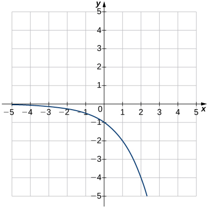
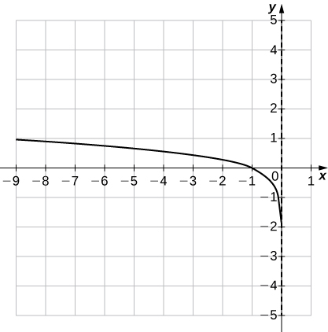
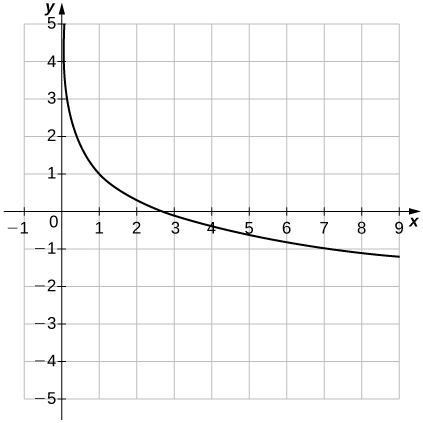
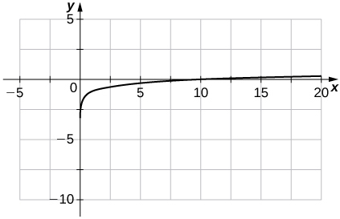

* Identify the form of an exponential function.
* Explain the difference between the graphs of
  <math xmlns="http://www.w3.org/1998/Math/MathML"><mrow><msup><mi>x</mi><mi>b</mi></msup></mrow></math>
  
  and
  <math xmlns="http://www.w3.org/1998/Math/MathML"><mrow><msup><mi>b</mi><mi>x</mi></msup><mo>.</mo></mrow></math>

* Recognize the significance of the number
  <math xmlns="http://www.w3.org/1998/Math/MathML"><mi>e</mi><mo>.</mo></math>

* Identify the form of a logarithmic function.
* Explain the relationship between exponential and logarithmic functions.
* Describe how to calculate a logarithm to a different base.
* Identify the hyperbolic functions, their graphs, and basic identities.

In this section we examine exponential and logarithmic functions. We use the properties of these functions to solve equations involving exponential or logarithmic terms, and we study the meaning and importance of the number <math xmlns="http://www.w3.org/1998/Math/MathML"><mi>e</mi><mo>.</mo></math>

 We also define hyperbolic and inverse hyperbolic functions, which involve combinations of exponential and logarithmic functions. (Note that we present alternative definitions of exponential and logarithmic functions in the chapter [Applications of Integrations](/m53638){: .target-chapter}, and prove that the functions have the same properties with either definition.)

# Exponential Functions

Exponential functions arise in many applications. One common example is **population growth**{: data-type="term" .no-emphasis}.

For example, if a population starts with <math xmlns="http://www.w3.org/1998/Math/MathML"><mrow><msub><mi>P</mi><mn>0</mn></msub></mrow></math>

 individuals and then grows at an annual rate of <math xmlns="http://www.w3.org/1998/Math/MathML"><mrow><mn>2</mn><mi>%</mi><mo>,</mo></mrow></math>

 its population after 1 year is

<math xmlns="http://www.w3.org/1998/Math/MathML"><mrow><mi>P</mi><mo stretchy="false">(</mo><mn>1</mn><mo stretchy="false">)</mo><mo>=</mo><msub><mi>P</mi><mn>0</mn></msub><mo>+</mo><mn>0.02</mn><msub><mi>P</mi><mn>0</mn></msub><mo>=</mo><msub><mi>P</mi><mn>0</mn></msub><mo stretchy="false">(</mo><mn>1</mn><mo>+</mo><mn>0.02</mn><mo stretchy="false">)</mo><mo>=</mo><msub><mi>P</mi><mn>0</mn></msub><mo stretchy="false">(</mo><mn>1.02</mn><mo stretchy="false">)</mo><mo>.</mo></mrow></math>

Its population after 2 years is

<math xmlns="http://www.w3.org/1998/Math/MathML"><mrow><mi>P</mi><mo stretchy="false">(</mo><mn>2</mn><mo stretchy="false">)</mo><mo>=</mo><mi>P</mi><mo stretchy="false">(</mo><mn>1</mn><mo stretchy="false">)</mo><mo>+</mo><mn>0.02</mn><mi>P</mi><mo stretchy="false">(</mo><mn>1</mn><mo stretchy="false">)</mo><mo>=</mo><mi>P</mi><mo stretchy="false">(</mo><mn>1</mn><mo stretchy="false">)</mo><mo stretchy="false">(</mo><mn>1.02</mn><mo stretchy="false">)</mo><mo>=</mo><msub><mi>P</mi><mn>0</mn></msub><msup><mrow><mo stretchy="false">(</mo><mn>1.02</mn><mo stretchy="false">)</mo></mrow><mn>2</mn></msup><mo>.</mo></mrow></math>

In general, its population after <math xmlns="http://www.w3.org/1998/Math/MathML"><mi>t</mi></math>

 years is

<math xmlns="http://www.w3.org/1998/Math/MathML"><mrow><mi>P</mi><mo stretchy="false">(</mo><mi>t</mi><mo stretchy="false">)</mo><mo>=</mo><msub><mi>P</mi><mn>0</mn></msub><msup><mrow><mo stretchy="false">(</mo><mn>1.02</mn><mo stretchy="false">)</mo></mrow><mi>t</mi></msup><mo>,</mo></mrow></math>

which is an exponential function. More generally, any function of the form <math xmlns="http://www.w3.org/1998/Math/MathML"><mrow><mi>f</mi><mrow><mo>(</mo><mi>x</mi><mo>)</mo></mrow><mo>=</mo><msup><mi>b</mi><mi>x</mi></msup><mo>,</mo></mrow></math>

 where <math xmlns="http://www.w3.org/1998/Math/MathML"><mrow><mi>b</mi><mo>&gt;</mo><mn>0</mn><mo>,</mo><mi>b</mi><mo>≠</mo><mn>1</mn><mo>,</mo></mrow></math>

 is an exponential function with **base**{: data-type="term"} <math xmlns="http://www.w3.org/1998/Math/MathML"><mi>b</mi></math>

 and **exponent**{: data-type="term"} *x*. Exponential functions have constant bases and variable exponents. Note that a function of the form <math xmlns="http://www.w3.org/1998/Math/MathML"><mrow><mi>f</mi><mrow><mo>(</mo><mi>x</mi><mo>)</mo></mrow><mo>=</mo><msup><mi>x</mi><mi>b</mi></msup></mrow></math>

 for some constant <math xmlns="http://www.w3.org/1998/Math/MathML"><mrow><mi>b</mi></mrow></math>

 is not an exponential function but a power function.

To see the difference between an exponential function and a power function, we compare the functions <math xmlns="http://www.w3.org/1998/Math/MathML"><mrow><mi>y</mi><mo>=</mo><msup><mi>x</mi><mn>2</mn></msup></mrow></math>

 and <math xmlns="http://www.w3.org/1998/Math/MathML"><mrow><mi>y</mi><mo>=</mo><msup><mn>2</mn><mi>x</mi></msup><mo>.</mo></mrow></math>

 In [\[link\]](#fs-id1170572205233), we see that both <math xmlns="http://www.w3.org/1998/Math/MathML"><mrow><msup><mn>2</mn><mi>x</mi></msup></mrow></math>

 and <math xmlns="http://www.w3.org/1998/Math/MathML"><mrow><msup><mi>x</mi><mn>2</mn></msup></mrow></math>

 approach infinity as <math xmlns="http://www.w3.org/1998/Math/MathML"><mrow><mi>x</mi><mo stretchy="false">→</mo><mi>∞</mi><mo>.</mo></mrow></math>

 Eventually, however, <math xmlns="http://www.w3.org/1998/Math/MathML"><mrow><msup><mn>2</mn><mi>x</mi></msup></mrow></math>

 becomes larger than <math xmlns="http://www.w3.org/1998/Math/MathML"><mrow><msup><mi>x</mi><mn>2</mn></msup></mrow></math>

 and grows more rapidly as <math xmlns="http://www.w3.org/1998/Math/MathML"><mrow><mi>x</mi><mo stretchy="false">→</mo><mi>∞</mi><mo>.</mo></mrow></math>

 In the opposite direction, as <math xmlns="http://www.w3.org/1998/Math/MathML"><mrow><mi>x</mi><mo stretchy="false">→</mo><mtext>−</mtext><mi>∞</mi><mo>,</mo><msup><mi>x</mi><mn>2</mn></msup><mo stretchy="false">→</mo><mi>∞</mi><mo>,</mo></mrow></math>

 whereas <math xmlns="http://www.w3.org/1998/Math/MathML"><mrow><msup><mn>2</mn><mi>x</mi></msup><mo stretchy="false">→</mo><mn>0</mn><mo>.</mo></mrow></math>

 The line <math xmlns="http://www.w3.org/1998/Math/MathML"><mrow><mi>y</mi><mo>=</mo><mn>0</mn></mrow></math>

 is a horizontal asymptote for <math xmlns="http://www.w3.org/1998/Math/MathML"><mrow><mi>y</mi><mo>=</mo><msup><mn>2</mn><mi>x</mi></msup><mo>.</mo></mrow></math>

<table class="column-header" summary="A table with 3 rows and 10 columns. The first row is labeled &#x201C;x&#x201D; and has the values &#x201C;-3; -2; -1; 0; 1; 2; 3; 4; 5; 6&#x201D;. The second row is labeled &#x201C;x squared&#x201D; and has the values &#x201C;9; 4; 1; 0; 1; 4; 9; 16; 25; 36&#x201D;. The third row is labeled &#x201C;2 to the power of x&#x201D; and has the values &#x201C;(1/8); (1/4); (1/2); 1; 2; 4; 8; 16; 32; 64&#x201D;."><caption>Values of <math xmlns="http://www.w3.org/1998/Math/MathML"><mrow><msup><mi>x</mi><mn>2</mn></msup></mrow></math> and <math xmlns="http://www.w3.org/1998/Math/MathML"><mrow><msup><mn>2</mn><mi>x</mi></msup></mrow></math></caption><tbody>
<tr valign="top">
<td data-align="left"><math xmlns="http://www.w3.org/1998/Math/MathML"><mtext mathvariant="bold-italic">x</mtext></math></td>
<td data-align="left"><math xmlns="http://www.w3.org/1998/Math/MathML"><mrow><mn>−3</mn></mrow></math></td>
<td data-align="left"><math xmlns="http://www.w3.org/1998/Math/MathML"><mrow><mn>−2</mn></mrow></math></td>
<td data-align="left"><math xmlns="http://www.w3.org/1998/Math/MathML"><mrow><mn>−1</mn></mrow></math></td>
<td data-align="left"><math xmlns="http://www.w3.org/1998/Math/MathML"><mn>0</mn></math></td>
<td data-align="left"><math xmlns="http://www.w3.org/1998/Math/MathML"><mn>1</mn></math></td>
<td data-align="left"><math xmlns="http://www.w3.org/1998/Math/MathML"><mn>2</mn></math></td>
<td data-align="left"><math xmlns="http://www.w3.org/1998/Math/MathML"><mn>3</mn></math></td>
<td data-align="left"><math xmlns="http://www.w3.org/1998/Math/MathML"><mn>4</mn></math></td>
<td data-align="left"><math xmlns="http://www.w3.org/1998/Math/MathML"><mn>5</mn></math></td>
<td data-align="left"><math xmlns="http://www.w3.org/1998/Math/MathML"><mn>6</mn></math></td>
</tr>
<tr valign="top">
<td data-align="left"><math xmlns="http://www.w3.org/1998/Math/MathML"><mrow><msup><mtext mathvariant="bold-italic">x</mtext><mn mathvariant="bold">2</mn></msup></mrow></math></td>
<td data-align="left"><math xmlns="http://www.w3.org/1998/Math/MathML"><mn>9</mn></math></td>
<td data-align="left"><math xmlns="http://www.w3.org/1998/Math/MathML"><mn>4</mn></math></td>
<td data-align="left"><math xmlns="http://www.w3.org/1998/Math/MathML"><mn>1</mn></math></td>
<td data-align="left"><math xmlns="http://www.w3.org/1998/Math/MathML"><mn>0</mn></math></td>
<td data-align="left"><math xmlns="http://www.w3.org/1998/Math/MathML"><mn>1</mn></math></td>
<td data-align="left"><math xmlns="http://www.w3.org/1998/Math/MathML"><mn>4</mn></math></td>
<td data-align="left"><math xmlns="http://www.w3.org/1998/Math/MathML"><mn>9</mn></math></td>
<td data-align="left"><math xmlns="http://www.w3.org/1998/Math/MathML"><mrow><mn>16</mn></mrow></math></td>
<td data-align="left"><math xmlns="http://www.w3.org/1998/Math/MathML"><mrow><mn>25</mn></mrow></math></td>
<td data-align="left"><math xmlns="http://www.w3.org/1998/Math/MathML"><mrow><mn>36</mn></mrow></math></td>
</tr>
<tr valign="top">
<td data-align="left"><math xmlns="http://www.w3.org/1998/Math/MathML"><mrow><msup><mn mathvariant="bold">2</mn><mtext mathvariant="bold-italic">x</mtext></msup></mrow></math></td>
<td data-align="left"><math xmlns="http://www.w3.org/1998/Math/MathML"><mrow><mn>1</mn><mtext>/</mtext><mn>8</mn></mrow></math></td>
<td data-align="left"><math xmlns="http://www.w3.org/1998/Math/MathML"><mrow><mn>1</mn><mtext>/</mtext><mn>4</mn></mrow></math></td>
<td data-align="left"><math xmlns="http://www.w3.org/1998/Math/MathML"><mrow><mn>1</mn><mtext>/</mtext><mn>2</mn></mrow></math></td>
<td data-align="left"><math xmlns="http://www.w3.org/1998/Math/MathML"><mn>1</mn></math></td>
<td data-align="left"><math xmlns="http://www.w3.org/1998/Math/MathML"><mn>2</mn></math></td>
<td data-align="left"><math xmlns="http://www.w3.org/1998/Math/MathML"><mn>4</mn></math></td>
<td data-align="left"><math xmlns="http://www.w3.org/1998/Math/MathML"><mn>8</mn></math></td>
<td data-align="left"><math xmlns="http://www.w3.org/1998/Math/MathML"><mrow><mn>16</mn></mrow></math></td>
<td data-align="left"><math xmlns="http://www.w3.org/1998/Math/MathML"><mrow><mn>32</mn></mrow></math></td>
<td data-align="left"><math xmlns="http://www.w3.org/1998/Math/MathML"><mrow><mn>64</mn></mrow></math></td>
</tr>
</tbody></table>

In [\[link\]](#CNX_Calc_Figure_01_05_001), we graph both <math xmlns="http://www.w3.org/1998/Math/MathML"><mrow><mi>y</mi><mo>=</mo><msup><mi>x</mi><mn>2</mn></msup></mrow></math>

 and <math xmlns="http://www.w3.org/1998/Math/MathML"><mrow><mi>y</mi><mo>=</mo><msup><mn>2</mn><mi>x</mi></msup></mrow></math>

 to show how the graphs differ.

 {: #CNX_Calc_Figure_01_05_001}

## Evaluating Exponential Functions

Recall the properties of exponents: If <math xmlns="http://www.w3.org/1998/Math/MathML"><mi>x</mi></math>

 is a positive integer, then we define <math xmlns="http://www.w3.org/1998/Math/MathML"><mrow><msup><mi>b</mi><mi>x</mi></msup><mo>=</mo><mi>b</mi><mo>·</mo><mi>b</mi><mo>⋯</mo><mi>b</mi></mrow></math>

 (with <math xmlns="http://www.w3.org/1998/Math/MathML"><mi>x</mi></math>

 factors of <math xmlns="http://www.w3.org/1998/Math/MathML"><mrow><mi>b</mi><mo stretchy="false">)</mo><mo>.</mo></mrow></math>

 If <math xmlns="http://www.w3.org/1998/Math/MathML"><mi>x</mi></math>

 is a negative integer, then <math xmlns="http://www.w3.org/1998/Math/MathML"><mrow><mi>x</mi><mo>=</mo><mtext>−</mtext><mi>y</mi></mrow></math>

 for some positive integer <math xmlns="http://www.w3.org/1998/Math/MathML"><mi>y</mi><mo>,</mo></math>

 and we define <math xmlns="http://www.w3.org/1998/Math/MathML"><mrow><msup><mi>b</mi><mi>x</mi></msup><mo>=</mo><msup><mi>b</mi><mrow><mtext>−</mtext><mi>y</mi></mrow></msup><mo>=</mo><mn>1</mn><mtext>/</mtext><msup><mi>b</mi><mi>y</mi></msup><mo>.</mo></mrow></math>

 Also, <math xmlns="http://www.w3.org/1998/Math/MathML"><mrow><msup><mi>b</mi><mn>0</mn></msup></mrow></math>

 is defined to be <math xmlns="http://www.w3.org/1998/Math/MathML"><mn>1</mn><mo>.</mo></math>

 If <math xmlns="http://www.w3.org/1998/Math/MathML"><mi>x</mi></math>

 is a rational number, then <math xmlns="http://www.w3.org/1998/Math/MathML"><mrow><mi>x</mi><mo>=</mo><mi>p</mi><mtext>/</mtext><mi>q</mi><mo>,</mo></mrow></math>

 where <math xmlns="http://www.w3.org/1998/Math/MathML"><mi>p</mi></math>

 and <math xmlns="http://www.w3.org/1998/Math/MathML"><mrow><mi>q</mi></mrow></math>

 are integers and <math xmlns="http://www.w3.org/1998/Math/MathML"><mrow><msup><mi>b</mi><mi>x</mi></msup><mo>=</mo><msup><mi>b</mi><mrow><mi>p</mi><mtext>/</mtext><mi>q</mi></mrow></msup><mo>=</mo><mroot><mrow><msup><mi>b</mi><mi>p</mi></msup></mrow><mi>q</mi></mroot><mo>.</mo></mrow></math>

 For example, <math xmlns="http://www.w3.org/1998/Math/MathML"><mrow><msup><mn>9</mn><mrow><mn>3</mn><mtext>/</mtext><mn>2</mn></mrow></msup><mo>=</mo><msqrt><mrow><msup><mn>9</mn><mn>3</mn></msup></mrow></msqrt><mo>=</mo><mn>27</mn><mo>.</mo></mrow></math>

 However, how is <math xmlns="http://www.w3.org/1998/Math/MathML"><mrow><msup><mi>b</mi><mi>x</mi></msup></mrow></math>

 defined if <math xmlns="http://www.w3.org/1998/Math/MathML"><mi>x</mi></math>

 is an irrational number? For example, what do we mean by <math xmlns="http://www.w3.org/1998/Math/MathML"><mrow><msup><mn>2</mn><mrow><msqrt><mn>2</mn></msqrt></mrow></msup><mo>?</mo></mrow></math>

 This is too complex a question for us to answer fully right now; however, we can make an approximation. In [\[link\]](#fs-id1170572480690), we list some rational numbers approaching <math xmlns="http://www.w3.org/1998/Math/MathML"><mrow><msqrt><mn>2</mn></msqrt><mo>,</mo></mrow></math>

 and the values of <math xmlns="http://www.w3.org/1998/Math/MathML"><mrow><msup><mn>2</mn><mi>x</mi></msup></mrow></math>

 for each rational number <math xmlns="http://www.w3.org/1998/Math/MathML"><mi>x</mi></math>

 are presented as well. We claim that if we choose rational numbers <math xmlns="http://www.w3.org/1998/Math/MathML"><mi>x</mi></math>

 getting closer and closer to <math xmlns="http://www.w3.org/1998/Math/MathML"><mrow><msqrt><mn>2</mn></msqrt><mo>,</mo></mrow></math>

 the values of <math xmlns="http://www.w3.org/1998/Math/MathML"><mrow><msup><mn>2</mn><mi>x</mi></msup></mrow></math>

 get closer and closer to some number <math xmlns="http://www.w3.org/1998/Math/MathML"><mi>L</mi><mo>.</mo></math>

 We define that number <math xmlns="http://www.w3.org/1998/Math/MathML"><mi>L</mi></math>

 to be <math xmlns="http://www.w3.org/1998/Math/MathML"><mrow><msup><mn>2</mn><mrow><msqrt><mn>2</mn></msqrt></mrow></msup><mo>.</mo></mrow></math>

<table class="column-header" summary="A table with 2 rows and 6 columns. The first row is labeled &#x201C;x&#x201D; and has the values &#x201C;1.4; 1.41; 1.414; 1.4142; 1.41421; 1.414213&#x201D;. The second row is labeled &#x201C;2 to the power of x&#x201D; and has the values &#x201C;2.639; 2.65737; 2.66475; 2.665119; 2.665138; 2.665143&#x201D;."><caption>Values of <math xmlns="http://www.w3.org/1998/Math/MathML"><mrow><msup><mn>2</mn><mi>x</mi></msup></mrow></math> for a List of Rational Numbers Approximating <math xmlns="http://www.w3.org/1998/Math/MathML"><mrow><msqrt><mn>2</mn></msqrt></mrow></math></caption><tbody>
<tr valign="top">
<td data-align="left"><math xmlns="http://www.w3.org/1998/Math/MathML"><mtext mathvariant="bold-italic">x</mtext></math></td>
<td data-align="left"><math xmlns="http://www.w3.org/1998/Math/MathML"><mrow><mn>1.4</mn></mrow></math></td>
<td data-align="left"><math xmlns="http://www.w3.org/1998/Math/MathML"><mrow><mn>1.41</mn></mrow></math></td>
<td data-align="left"><math xmlns="http://www.w3.org/1998/Math/MathML"><mrow><mn>1.414</mn></mrow></math></td>
<td data-align="left"><math xmlns="http://www.w3.org/1998/Math/MathML"><mrow><mn>1.4142</mn></mrow></math></td>
<td data-align="left"><math xmlns="http://www.w3.org/1998/Math/MathML"><mrow><mn>1.41421</mn></mrow></math></td>
<td data-align="left"><math xmlns="http://www.w3.org/1998/Math/MathML"><mrow><mn>1.414213</mn></mrow></math></td>
</tr>
<tr valign="top">
<td data-align="left"><math xmlns="http://www.w3.org/1998/Math/MathML"><mrow><msup><mn mathvariant="bold">2</mn><mtext mathvariant="bold-italic">x</mtext></msup></mrow></math></td>
<td data-align="left"><math xmlns="http://www.w3.org/1998/Math/MathML"><mrow><mn>2.639</mn></mrow></math></td>
<td data-align="left"><math xmlns="http://www.w3.org/1998/Math/MathML"><mrow><mn>2.65737</mn></mrow></math></td>
<td data-align="left"><math xmlns="http://www.w3.org/1998/Math/MathML"><mrow><mn>2.66475</mn></mrow></math></td>
<td data-align="left"><math xmlns="http://www.w3.org/1998/Math/MathML"><mrow><mn>2.665119</mn></mrow></math></td>
<td data-align="left"><math xmlns="http://www.w3.org/1998/Math/MathML"><mrow><mn>2.665138</mn></mrow></math></td>
<td data-align="left"><math xmlns="http://www.w3.org/1998/Math/MathML"><mrow><mn>2.665143</mn></mrow></math></td>
</tr>
</tbody></table>

Bacterial Growth

Suppose a particular population of bacteria is known to double in size every <math xmlns="http://www.w3.org/1998/Math/MathML"><mn>4</mn></math>

 hours. If a culture starts with <math xmlns="http://www.w3.org/1998/Math/MathML"><mrow><mn>1000</mn></mrow></math>

 bacteria, the number of bacteria after <math xmlns="http://www.w3.org/1998/Math/MathML"><mn>4</mn></math>

 hours is <math xmlns="http://www.w3.org/1998/Math/MathML"><mrow><mi>n</mi><mo stretchy="false">(</mo><mn>4</mn><mo stretchy="false">)</mo><mo>=</mo><mn>1000</mn><mo>·</mo><mn>2</mn><mo>.</mo></mrow></math>

 The number of bacteria after <math xmlns="http://www.w3.org/1998/Math/MathML"><mn>8</mn></math>

 hours is <math xmlns="http://www.w3.org/1998/Math/MathML"><mrow><mi>n</mi><mo stretchy="false">(</mo><mn>8</mn><mo stretchy="false">)</mo><mo>=</mo><mi>n</mi><mo stretchy="false">(</mo><mn>4</mn><mo stretchy="false">)</mo><mo>·</mo><mn>2</mn><mo>=</mo><mn>1000</mn><mo>·</mo><msup><mn>2</mn><mn>2</mn></msup><mo>.</mo></mrow></math>

 In general, the number of bacteria after <math xmlns="http://www.w3.org/1998/Math/MathML"><mrow><mn>4</mn><mi>m</mi></mrow></math>

 hours is <math xmlns="http://www.w3.org/1998/Math/MathML"><mrow><mi>n</mi><mo stretchy="false">(</mo><mn>4</mn><mi>m</mi><mo stretchy="false">)</mo><mo>=</mo><mn>1000</mn><mo>·</mo><msup><mn>2</mn><mi>m</mi></msup><mo>.</mo></mrow></math>

 Letting <math xmlns="http://www.w3.org/1998/Math/MathML"><mrow><mi>t</mi><mo>=</mo><mn>4</mn><mi>m</mi><mo>,</mo></mrow></math>

 we see that the number of bacteria after <math xmlns="http://www.w3.org/1998/Math/MathML"><mi>t</mi></math>

 hours is <math xmlns="http://www.w3.org/1998/Math/MathML"><mrow><mi>n</mi><mo stretchy="false">(</mo><mi>t</mi><mo stretchy="false">)</mo><mo>=</mo><mn>1000</mn><mo>·</mo><msup><mn>2</mn><mrow><mi>t</mi><mtext>/</mtext><mn>4</mn></mrow></msup><mo>.</mo></mrow></math>

 Find the number of bacteria after <math xmlns="http://www.w3.org/1998/Math/MathML"><mn>6</mn></math>

 hours, <math xmlns="http://www.w3.org/1998/Math/MathML"><mrow><mn>10</mn></mrow></math>

 hours, and <math xmlns="http://www.w3.org/1998/Math/MathML"><mrow><mn>24</mn></mrow></math>

 hours.

The number of bacteria after 6 hours is given by <math xmlns="http://www.w3.org/1998/Math/MathML"><mrow><mi>n</mi><mrow><mo>(</mo><mn>6</mn><mo>)</mo></mrow><mo>=</mo><mn>1000</mn><mo>·</mo><msup><mn>2</mn><mrow><mn>6</mn><mtext>/</mtext><mn>4</mn></mrow></msup><mo>≈</mo><mn>2828</mn></mrow></math>

 bacteria. The number of bacteria after <math xmlns="http://www.w3.org/1998/Math/MathML"><mrow><mn>10</mn></mrow></math>

 hours is given by <math xmlns="http://www.w3.org/1998/Math/MathML"><mrow><mi>n</mi><mrow><mo>(</mo><mrow><mn>10</mn></mrow><mo>)</mo></mrow><mo>=</mo><mn>1000</mn><mo>·</mo><msup><mn>2</mn><mrow><mn>10</mn><mtext>/</mtext><mn>4</mn></mrow></msup><mo>≈</mo><mn>5657</mn></mrow></math>

 bacteria. The number of bacteria after <math xmlns="http://www.w3.org/1998/Math/MathML"><mrow><mn>24</mn></mrow></math>

 hours is given by <math xmlns="http://www.w3.org/1998/Math/MathML"><mrow><mi>n</mi><mrow><mo>(</mo><mrow><mn>24</mn></mrow><mo>)</mo></mrow><mo>=</mo><mn>1000</mn><mo>·</mo><msup><mn>2</mn><mn>6</mn></msup><mo>=</mo><mn>64,000</mn></mrow></math>

 bacteria.

Given the exponential function <math xmlns="http://www.w3.org/1998/Math/MathML"><mrow><mi>f</mi><mrow><mo>(</mo><mi>x</mi><mo>)</mo></mrow><mo>=</mo><mn>100</mn><mo>·</mo><msup><mn>3</mn><mrow><mi>x</mi><mtext>/</mtext><mn>2</mn></mrow></msup><mo>,</mo></mrow></math>

 evaluate <math xmlns="http://www.w3.org/1998/Math/MathML"><mrow><mi>f</mi><mrow><mo>(</mo><mn>4</mn><mo>)</mo></mrow></mrow></math>

 and <math xmlns="http://www.w3.org/1998/Math/MathML"><mrow><mi>f</mi><mo stretchy="false">(</mo><mn>10</mn><mo stretchy="false">)</mo><mo>.</mo></mrow></math>

<math xmlns="http://www.w3.org/1998/Math/MathML"><mrow><mi>f</mi><mrow><mo>(</mo><mn>4</mn><mo>)</mo></mrow><mo>=</mo><mn>900</mn><mo>;</mo><mi>f</mi><mrow><mo>(</mo><mrow><mn>10</mn></mrow><mo>)</mo></mrow><mo>=</mo><mn>24</mn><mo>,</mo><mn>300</mn><mo>.</mo></mrow></math>

Go to [World Population Balance][1] for another example of exponential population growth.

## Graphing Exponential Functions

For any base <math xmlns="http://www.w3.org/1998/Math/MathML"><mrow><mi>b</mi><mo>&gt;</mo><mn>0</mn><mo>,</mo><mi>b</mi><mo>≠</mo><mn>1</mn><mo>,</mo></mrow></math>

 the exponential function <math xmlns="http://www.w3.org/1998/Math/MathML"><mrow><mi>f</mi><mo stretchy="false">(</mo><mi>x</mi><mo stretchy="false">)</mo><mo>=</mo><msup><mi>b</mi><mi>x</mi></msup></mrow></math>

 is defined for all real numbers <math xmlns="http://www.w3.org/1998/Math/MathML"><mi>x</mi></math>

 and <math xmlns="http://www.w3.org/1998/Math/MathML"><mrow><msup><mi>b</mi><mi>x</mi></msup><mo>&gt;</mo><mn>0</mn><mo>.</mo></mrow></math>

 Therefore, the domain of <math xmlns="http://www.w3.org/1998/Math/MathML"><mrow><mi>f</mi><mrow><mo>(</mo><mi>x</mi><mo>)</mo></mrow><mo>=</mo><msup><mi>b</mi><mi>x</mi></msup></mrow></math>

 is <math xmlns="http://www.w3.org/1998/Math/MathML"><mrow><mrow><mo>(</mo><mrow><mtext>−</mtext><mi>∞</mi><mo>,</mo><mi>∞</mi></mrow><mo>)</mo></mrow></mrow></math>

 and the range is <math xmlns="http://www.w3.org/1998/Math/MathML"><mrow><mrow><mo>(</mo><mrow><mn>0</mn><mo>,</mo><mi>∞</mi></mrow><mo>)</mo></mrow><mo>.</mo></mrow></math>

 To graph <math xmlns="http://www.w3.org/1998/Math/MathML"><mrow><msup><mi>b</mi><mi>x</mi></msup><mo>,</mo></mrow></math>

 we note that for <math xmlns="http://www.w3.org/1998/Math/MathML"><mrow><mi>b</mi><mo>&gt;</mo><mn>1</mn><mo>,</mo><msup><mi>b</mi><mi>x</mi></msup></mrow></math>

 is increasing on <math xmlns="http://www.w3.org/1998/Math/MathML"><mrow><mo stretchy="false">(</mo><mtext>−</mtext><mi>∞</mi><mo>,</mo><mi>∞</mi><mo stretchy="false">)</mo></mrow></math>

 and <math xmlns="http://www.w3.org/1998/Math/MathML"><mrow><msup><mi>b</mi><mi>x</mi></msup><mo stretchy="false">→</mo><mi>∞</mi></mrow></math>

 as <math xmlns="http://www.w3.org/1998/Math/MathML"><mrow><mi>x</mi><mo stretchy="false">→</mo><mi>∞</mi><mo>,</mo></mrow></math>

 whereas <math xmlns="http://www.w3.org/1998/Math/MathML"><mrow><msup><mi>b</mi><mi>x</mi></msup><mo stretchy="false">→</mo><mn>0</mn></mrow></math>

 as <math xmlns="http://www.w3.org/1998/Math/MathML"><mrow><mi>x</mi><mo stretchy="false">→</mo><mtext>−</mtext><mi>∞</mi><mo>.</mo></mrow></math>

 On the other hand, if <math xmlns="http://www.w3.org/1998/Math/MathML"><mrow><mn>0</mn><mo>&lt;</mo><mi>b</mi><mo>&lt;</mo><mn>1</mn><mo>,</mo><mi>f</mi><mrow><mo>(</mo><mi>x</mi><mo>)</mo></mrow><mo>=</mo><msup><mi>b</mi><mi>x</mi></msup></mrow></math>

 is decreasing on <math xmlns="http://www.w3.org/1998/Math/MathML"><mrow><mo stretchy="false">(</mo><mtext>−</mtext><mi>∞</mi><mo>,</mo><mi>∞</mi><mo stretchy="false">)</mo></mrow></math>

 and <math xmlns="http://www.w3.org/1998/Math/MathML"><mrow><msup><mi>b</mi><mi>x</mi></msup><mo stretchy="false">→</mo><mn>0</mn></mrow></math>

 as <math xmlns="http://www.w3.org/1998/Math/MathML"><mrow><mi>x</mi><mo stretchy="false">→</mo><mi>∞</mi></mrow></math>

 whereas <math xmlns="http://www.w3.org/1998/Math/MathML"><mrow><msup><mi>b</mi><mi>x</mi></msup><mo stretchy="false">→</mo><mi>∞</mi></mrow></math>

 as <math xmlns="http://www.w3.org/1998/Math/MathML"><mrow><mi>x</mi><mo stretchy="false">→</mo><mtext>−</mtext><mi>∞</mi></mrow></math>

 ([\[link\]](#CNX_Calc_Figure_01_05_002)).

 ![An image of a graph. The x axis runs from -3 to 3 and the y axis runs from 0 to 4. The graph is of four functions. The first function is &#x201C;f(x) = 2 to the power of x&#x201D;, an increasing curved function, which starts slightly above the x axis and begins increasing. The second function is &#x201C;f(x) = 4 to the power of x&#x201D;, an increasing curved function, which starts slightly above the x axis and begins increasing rapidly, more rapidly than the first function. The third function is &#x201C;f(x) = (1/2) to the power of x&#x201D;, a decreasing curved function with decreases until it gets close to the x axis without touching it. The third function is &#x201C;f(x) = (1/4) to the power of x&#x201D;, a decreasing curved function with decreases until it gets close to the x axis without touching it. It decrases at a faster rate than the third function.](../resources/CNX_Calc_Figure_01_05_002.jpg "If b&gt;1, then bx is increasing on (&#x2212;&#x221E;,&#x221E;). If 0&lt;b&lt;1, then bx is decreasing on (&#x2212;&#x221E;,&#x221E;)."){: #CNX_Calc_Figure_01_05_002}

Visit this [site][2] for more exploration of the graphs of exponential functions.

Note that exponential functions satisfy the general laws of exponents. To remind you of these laws, we state them as rules.

Rule: Laws of Exponents

For any constants <math xmlns="http://www.w3.org/1998/Math/MathML"><mrow><mi>a</mi><mo>&gt;</mo><mn>0</mn><mo>,</mo><mi>b</mi><mo>&gt;</mo><mn>0</mn><mo>,</mo></mrow></math>

 and for all *x* and *y*,

1.  <math xmlns="http://www.w3.org/1998/Math/MathML"><mrow><msup><mi>b</mi><mi>x</mi></msup><mo>·</mo><msup><mi>b</mi><mi>y</mi></msup><mo>=</mo><msup><mi>b</mi><mrow><mi>x</mi><mo>+</mo><mi>y</mi></mrow></msup></mrow></math>

2.  <math xmlns="http://www.w3.org/1998/Math/MathML"><mrow><mfrac><mrow><msup><mi>b</mi><mi>x</mi></msup></mrow><mrow><msup><mi>b</mi><mi>y</mi></msup></mrow></mfrac><mo>=</mo><msup><mi>b</mi><mrow><mi>x</mi><mo>−</mo><mi>y</mi></mrow></msup></mrow></math>

3.  <math xmlns="http://www.w3.org/1998/Math/MathML"><mrow><msup><mrow><mrow><mo>(</mo><mrow><msup><mi>b</mi><mi>x</mi></msup></mrow><mo>)</mo></mrow></mrow><mi>y</mi></msup><mo>=</mo><msup><mi>b</mi><mrow><mi>x</mi><mi>y</mi></mrow></msup></mrow></math>

4.  <math xmlns="http://www.w3.org/1998/Math/MathML"><mrow><msup><mrow><mrow><mo>(</mo><mrow><mi>a</mi><mi>b</mi></mrow><mo>)</mo></mrow></mrow><mi>x</mi></msup><mo>=</mo><msup><mi>a</mi><mi>x</mi></msup><msup><mi>b</mi><mi>x</mi></msup></mrow></math>

5.  <math xmlns="http://www.w3.org/1998/Math/MathML"><mrow><mfrac><mrow><msup><mi>a</mi><mi>x</mi></msup></mrow><mrow><msup><mi>b</mi><mi>x</mi></msup></mrow></mfrac><mo>=</mo><msup><mrow><mrow><mo>(</mo><mrow><mfrac><mi>a</mi><mi>b</mi></mfrac></mrow><mo>)</mo></mrow></mrow><mi>x</mi></msup></mrow></math>
{: data-number-style="arabic"}

Using the Laws of Exponents

Use the laws of exponents to simplify each of the following expressions.

1.  <math xmlns="http://www.w3.org/1998/Math/MathML"><mrow><mfrac><mrow><msup><mrow><mrow><mo>(</mo><mrow><mn>2</mn><msup><mi>x</mi><mrow><mn>2</mn><mtext>/</mtext><mn>3</mn></mrow></msup></mrow><mo>)</mo></mrow></mrow><mn>3</mn></msup></mrow><mrow><msup><mrow><mrow><mo>(</mo><mrow><mn>4</mn><msup><mi>x</mi><mrow><mn>−1</mn><mtext>/</mtext><mn>3</mn></mrow></msup></mrow><mo>)</mo></mrow></mrow><mn>2</mn></msup></mrow></mfrac></mrow></math>

2.  <math xmlns="http://www.w3.org/1998/Math/MathML"><mrow><mfrac><mrow><msup><mrow><mrow><mo>(</mo><mrow><msup><mi>x</mi><mn>3</mn></msup><msup><mi>y</mi><mrow><mn>−1</mn></mrow></msup></mrow><mo>)</mo></mrow></mrow><mn>2</mn></msup></mrow><mrow><msup><mrow><mrow><mo>(</mo><mrow><mi>x</mi><msup><mi>y</mi><mn>2</mn></msup></mrow><mo>)</mo></mrow></mrow><mrow><mn>−2</mn></mrow></msup></mrow></mfrac></mrow></math>
{: data-number-style="lower-alpha"}

1.  We can simplify as follows:
    

    <math xmlns="http://www.w3.org/1998/Math/MathML"><mrow><mfrac><mrow><msup><mrow><mrow><mo>(</mo><mrow><mn>2</mn><msup><mi>x</mi><mrow><mn>2</mn><mtext>/</mtext><mn>3</mn></mrow></msup></mrow><mo>)</mo></mrow></mrow><mn>3</mn></msup></mrow><mrow><msup><mrow><mrow><mo>(</mo><mrow><mn>4</mn><msup><mi>x</mi><mrow><mn>−1</mn><mtext>/</mtext><mn>3</mn></mrow></msup></mrow><mo>)</mo></mrow></mrow><mn>2</mn></msup></mrow></mfrac><mo>=</mo><mfrac><mrow><msup><mn>2</mn><mn>3</mn></msup><msup><mrow><mrow><mo>(</mo><mrow><msup><mi>x</mi><mrow><mn>2</mn><mtext>/</mtext><mn>3</mn></mrow></msup></mrow><mo>)</mo></mrow></mrow><mn>3</mn></msup></mrow><mrow><msup><mn>4</mn><mn>2</mn></msup><msup><mrow><mrow><mo>(</mo><mrow><msup><mi>x</mi><mrow><mn>−1</mn><mtext>/</mtext><mn>3</mn></mrow></msup></mrow><mo>)</mo></mrow></mrow><mn>2</mn></msup></mrow></mfrac><mo>=</mo><mfrac><mrow><mn>8</mn><msup><mi>x</mi><mn>2</mn></msup></mrow><mrow><mn>16</mn><msup><mi>x</mi><mrow><mn>−2</mn><mtext>/</mtext><mn>3</mn></mrow></msup></mrow></mfrac><mo>=</mo><mfrac><mrow><msup><mi>x</mi><mn>2</mn></msup><msup><mi>x</mi><mrow><mn>2</mn><mtext>/</mtext><mn>3</mn></mrow></msup></mrow><mn>2</mn></mfrac><mo>=</mo><mfrac><mrow><msup><mi>x</mi><mrow><mn>8</mn><mtext>/</mtext><mn>3</mn></mrow></msup></mrow><mn>2</mn></mfrac><mo>.</mo></mrow></math>
    

2.  We can simplify as follows:
    

    <math xmlns="http://www.w3.org/1998/Math/MathML"><mrow><mfrac><mrow><msup><mrow><mrow><mo>(</mo><mrow><msup><mi>x</mi><mn>3</mn></msup><msup><mi>y</mi><mrow><mn>−1</mn></mrow></msup></mrow><mo>)</mo></mrow></mrow><mn>2</mn></msup></mrow><mrow><msup><mrow><mrow><mo>(</mo><mrow><mi>x</mi><msup><mi>y</mi><mn>2</mn></msup></mrow><mo>)</mo></mrow></mrow><mrow><mn>−2</mn></mrow></msup></mrow></mfrac><mo>=</mo><mfrac><mrow><msup><mrow><mrow><mo>(</mo><mrow><msup><mi>x</mi><mn>3</mn></msup></mrow><mo>)</mo></mrow></mrow><mn>2</mn></msup><msup><mrow><mrow><mo>(</mo><mrow><msup><mi>y</mi><mrow><mn>−1</mn></mrow></msup></mrow><mo>)</mo></mrow></mrow><mn>2</mn></msup></mrow><mrow><msup><mi>x</mi><mrow><mn>−2</mn></mrow></msup><msup><mrow><mrow><mo>(</mo><mrow><msup><mi>y</mi><mn>2</mn></msup></mrow><mo>)</mo></mrow></mrow><mrow><mn>−2</mn></mrow></msup></mrow></mfrac><mo>=</mo><mfrac><mrow><msup><mi>x</mi><mn>6</mn></msup><msup><mi>y</mi><mrow><mn>−2</mn></mrow></msup></mrow><mrow><msup><mi>x</mi><mrow><mn>−2</mn></mrow></msup><msup><mi>y</mi><mrow><mn>−4</mn></mrow></msup></mrow></mfrac><mo>=</mo><msup><mi>x</mi><mn>6</mn></msup><msup><mi>x</mi><mn>2</mn></msup><msup><mi>y</mi><mrow><mn>−2</mn></mrow></msup><msup><mi>y</mi><mn>4</mn></msup><mo>=</mo><msup><mi>x</mi><mn>8</mn></msup><msup><mi>y</mi><mn>2</mn></msup><mo>.</mo></mrow></math>
    

{: data-number-style="lower-alpha"}

Use the laws of exponents to simplify <math xmlns="http://www.w3.org/1998/Math/MathML"><mrow><mrow><mo>(</mo><mrow><mn>6</mn><msup><mi>x</mi><mrow><mn>−3</mn></mrow></msup><msup><mi>y</mi><mn>2</mn></msup></mrow><mo>)</mo></mrow><mtext>/</mtext><mrow><mo>(</mo><mrow><mn>12</mn><msup><mi>x</mi><mrow><mn>−4</mn></mrow></msup><msup><mi>y</mi><mn>5</mn></msup></mrow><mo>)</mo></mrow><mo>.</mo></mrow></math>

<math xmlns="http://www.w3.org/1998/Math/MathML"><mrow><mi>x</mi><mtext>/</mtext><mrow><mo>(</mo><mrow><mn>2</mn><msup><mi>y</mi><mn>3</mn></msup></mrow><mo>)</mo></mrow></mrow></math>

Hint

<math xmlns="http://www.w3.org/1998/Math/MathML"><mrow><msup><mi>x</mi><mi>a</mi></msup><mtext>/</mtext><msup><mi>x</mi><mi>b</mi></msup><mo>=</mo><msup><mi>x</mi><mrow><mi>a</mi><mo>−</mo><mi>b</mi></mrow></msup></mrow></math>

# The Number *e*

A special type of exponential function appears frequently in real-world applications. To describe it, consider the following example of exponential growth, which arises from **compounding interest**{: data-type="term" .no-emphasis} in a savings account. Suppose a person invests <math xmlns="http://www.w3.org/1998/Math/MathML"><mi>P</mi></math>

 dollars in a savings account with an annual interest rate <math xmlns="http://www.w3.org/1998/Math/MathML"><mi>r</mi><mo>,</mo></math>

 compounded annually. The amount of money after 1 year is

<math xmlns="http://www.w3.org/1998/Math/MathML"><mrow><mi>A</mi><mo stretchy="false">(</mo><mn>1</mn><mo stretchy="false">)</mo><mo>=</mo><mi>P</mi><mo>+</mo><mi>r</mi><mi>P</mi><mo>=</mo><mi>P</mi><mo stretchy="false">(</mo><mn>1</mn><mo>+</mo><mi>r</mi><mo stretchy="false">)</mo><mo>.</mo></mrow></math>

The amount of money after <math xmlns="http://www.w3.org/1998/Math/MathML"><mn>2</mn></math>

 years is

<math xmlns="http://www.w3.org/1998/Math/MathML"><mrow><mi>A</mi><mo stretchy="false">(</mo><mn>2</mn><mo stretchy="false">)</mo><mo>=</mo><mi>A</mi><mo stretchy="false">(</mo><mn>1</mn><mo stretchy="false">)</mo><mo>+</mo><mi>r</mi><mi>A</mi><mo stretchy="false">(</mo><mn>1</mn><mo stretchy="false">)</mo><mo>=</mo><mi>P</mi><mo stretchy="false">(</mo><mn>1</mn><mo>+</mo><mi>r</mi><mo stretchy="false">)</mo><mo>+</mo><mi>r</mi><mi>P</mi><mo stretchy="false">(</mo><mn>1</mn><mo>+</mo><mi>r</mi><mo stretchy="false">)</mo><mo>=</mo><mi>P</mi><msup><mrow><mo stretchy="false">(</mo><mn>1</mn><mo>+</mo><mi>r</mi><mo stretchy="false">)</mo></mrow><mn>2</mn></msup><mo>.</mo></mrow></math>

More generally, the amount after <math xmlns="http://www.w3.org/1998/Math/MathML"><mi>t</mi></math>

 years is

<math xmlns="http://www.w3.org/1998/Math/MathML"><mrow><mi>A</mi><mo stretchy="false">(</mo><mi>t</mi><mo stretchy="false">)</mo><mo>=</mo><mi>P</mi><msup><mrow><mo stretchy="false">(</mo><mn>1</mn><mo>+</mo><mi>r</mi><mo stretchy="false">)</mo></mrow><mi>t</mi></msup><mo>.</mo></mrow></math>

If the money is compounded 2 times per year, the amount of money after half a year is

<math xmlns="http://www.w3.org/1998/Math/MathML"><mrow><mi>A</mi><mrow><mo>(</mo><mrow><mfrac><mn>1</mn><mn>2</mn></mfrac></mrow><mo>)</mo></mrow><mo>=</mo><mi>P</mi><mo>+</mo><mrow><mo>(</mo><mrow><mfrac><mi>r</mi><mn>2</mn></mfrac></mrow><mo>)</mo></mrow><mi>P</mi><mo>=</mo><mi>P</mi><mrow><mo>(</mo><mrow><mn>1</mn><mo>+</mo><mrow><mo>(</mo><mrow><mfrac><mi>r</mi><mn>2</mn></mfrac></mrow><mo>)</mo></mrow></mrow><mo>)</mo></mrow><mo>.</mo></mrow></math>

The amount of money after <math xmlns="http://www.w3.org/1998/Math/MathML"><mn>1</mn></math>

 year is

<math xmlns="http://www.w3.org/1998/Math/MathML"><mrow><mi>A</mi><mo stretchy="false">(</mo><mn>1</mn><mo stretchy="false">)</mo><mo>=</mo><mi>A</mi><mrow><mo>(</mo><mrow><mfrac><mn>1</mn><mn>2</mn></mfrac></mrow><mo>)</mo></mrow><mo>+</mo><mrow><mo>(</mo><mrow><mfrac><mi>r</mi><mn>2</mn></mfrac></mrow><mo>)</mo></mrow><mi>A</mi><mrow><mo>(</mo><mrow><mfrac><mn>1</mn><mn>2</mn></mfrac></mrow><mo>)</mo></mrow><mo>=</mo><mi>P</mi><mrow><mo>(</mo><mrow><mn>1</mn><mo>+</mo><mfrac><mi>r</mi><mn>2</mn></mfrac></mrow><mo>)</mo></mrow><mo>+</mo><mfrac><mi>r</mi><mn>2</mn></mfrac><mrow><mo>(</mo><mrow><mi>P</mi><mrow><mo>(</mo><mrow><mn>1</mn><mo>+</mo><mfrac><mi>r</mi><mn>2</mn></mfrac></mrow><mo>)</mo></mrow></mrow><mo>)</mo></mrow><mo>=</mo><mi>P</mi><msup><mrow><mrow><mo>(</mo><mrow><mn>1</mn><mo>+</mo><mfrac><mi>r</mi><mn>2</mn></mfrac></mrow><mo>)</mo></mrow></mrow><mn>2</mn></msup><mo>.</mo></mrow></math>

After <math xmlns="http://www.w3.org/1998/Math/MathML"><mi>t</mi></math>

 years, the amount of money in the account is

<math xmlns="http://www.w3.org/1998/Math/MathML"><mrow><mi>A</mi><mo stretchy="false">(</mo><mi>t</mi><mo stretchy="false">)</mo><mo>=</mo><mi>P</mi><msup><mrow><mrow><mo>(</mo><mrow><mn>1</mn><mo>+</mo><mfrac><mi>r</mi><mn>2</mn></mfrac></mrow><mo>)</mo></mrow></mrow><mrow><mn>2</mn><mi>t</mi></mrow></msup><mo>.</mo></mrow></math>

More generally, if the money is compounded <math xmlns="http://www.w3.org/1998/Math/MathML"><mi>n</mi></math>

 times per year, the amount of money in the account after <math xmlns="http://www.w3.org/1998/Math/MathML"><mi>t</mi></math>

 years is given by the function

<math xmlns="http://www.w3.org/1998/Math/MathML"><mrow><mi>A</mi><mo stretchy="false">(</mo><mi>t</mi><mo stretchy="false">)</mo><mo>=</mo><mi>P</mi><msup><mrow><mrow><mo>(</mo><mrow><mn>1</mn><mo>+</mo><mfrac><mi>r</mi><mi>n</mi></mfrac></mrow><mo>)</mo></mrow></mrow><mrow><mi>n</mi><mi>t</mi></mrow></msup><mo>.</mo></mrow></math>

What happens as <math xmlns="http://www.w3.org/1998/Math/MathML"><mrow><mi>n</mi><mo stretchy="false">→</mo><mi>∞</mi><mo>?</mo></mrow></math>

 To answer this question, we let <math xmlns="http://www.w3.org/1998/Math/MathML"><mrow><mi>m</mi><mo>=</mo><mi>n</mi><mtext>/</mtext><mi>r</mi></mrow></math>

 and write

<math xmlns="http://www.w3.org/1998/Math/MathML"><mrow><msup><mrow><mrow><mo>(</mo><mrow><mn>1</mn><mo>+</mo><mfrac><mi>r</mi><mi>n</mi></mfrac></mrow><mo>)</mo></mrow></mrow><mrow><mi>n</mi><mi>t</mi></mrow></msup><mo>=</mo><msup><mrow><mrow><mo>(</mo><mrow><mn>1</mn><mo>+</mo><mfrac><mn>1</mn><mi>m</mi></mfrac></mrow><mo>)</mo></mrow></mrow><mrow><mi>m</mi><mi>r</mi><mi>t</mi></mrow></msup><mo>,</mo></mrow></math>

and examine the behavior of <math xmlns="http://www.w3.org/1998/Math/MathML"><mrow><msup><mrow><mrow><mo>(</mo><mrow><mn>1</mn><mo>+</mo><mn>1</mn><mtext>/</mtext><mi>m</mi></mrow><mo>)</mo></mrow></mrow><mi>m</mi></msup></mrow></math>

 as <math xmlns="http://www.w3.org/1998/Math/MathML"><mrow><mi>m</mi><mo stretchy="false">→</mo><mi>∞</mi><mo>,</mo></mrow></math>

 using a table of values ([\[link\]](#fs-id1170572451390)).

<table class="column-header" summary="A table with 2 rows and 6 columns. The first row is labeled &#x201C;m&#x201D; and has the values &#x201C;10; 100; 1000; 10,000; 100,000; 1,000,000&#x201D;. The second row is labeled &#x201C;(1 + (1/m)) to the power of m&#x201D; and has the values &#x201C;2.5937; 2.7048; 2.71692; 2.71815; 2.718268; 2.718280&#x201D;."><caption>Values of <math xmlns="http://www.w3.org/1998/Math/MathML"><mrow><msup><mrow><mrow><mo>(</mo><mrow><mn>1</mn><mo>+</mo><mfrac><mn>1</mn><mi>m</mi></mfrac></mrow><mo>)</mo></mrow></mrow><mi>m</mi></msup></mrow></math> as <math xmlns="http://www.w3.org/1998/Math/MathML"><mrow><mi>m</mi><mo stretchy="false">→</mo><mi>∞</mi></mrow></math></caption><tbody>
<tr valign="top">
<td data-align="left"><math xmlns="http://www.w3.org/1998/Math/MathML"><mtext mathvariant="bold-italic">m</mtext></math></td>
<td data-align="left"><math xmlns="http://www.w3.org/1998/Math/MathML"><mrow><mn>10</mn></mrow></math></td>
<td data-align="left"><math xmlns="http://www.w3.org/1998/Math/MathML"><mrow><mn>100</mn></mrow></math></td>
<td data-align="left"><math xmlns="http://www.w3.org/1998/Math/MathML"><mrow><mn>1000</mn></mrow></math></td>
<td data-align="left"><math xmlns="http://www.w3.org/1998/Math/MathML"><mrow><mn>10,000</mn></mrow></math></td>
<td data-align="left"><math xmlns="http://www.w3.org/1998/Math/MathML"><mrow><mn>100,000</mn></mrow></math></td>
<td data-align="left"><math xmlns="http://www.w3.org/1998/Math/MathML"><mrow><mn>1,000,000</mn></mrow></math></td>
</tr>
<tr valign="top">
<td data-align="left"><math xmlns="http://www.w3.org/1998/Math/MathML"><mrow><msup><mrow><mrow><mo mathvariant="bold">(</mo><mrow><mn mathvariant="bold">1</mn><mo mathvariant="bold">+</mo><mfrac><mn mathvariant="bold">1</mn><mtext mathvariant="bold-italic">m</mtext></mfrac></mrow><mo mathvariant="bold">)</mo></mrow></mrow><mtext mathvariant="bold-italic">m</mtext></msup></mrow></math></td>
<td data-align="left"><math xmlns="http://www.w3.org/1998/Math/MathML"><mrow><mn>2.5937</mn></mrow></math></td>
<td data-align="left"><math xmlns="http://www.w3.org/1998/Math/MathML"><mrow><mn>2.7048</mn></mrow></math></td>
<td data-align="left"><math xmlns="http://www.w3.org/1998/Math/MathML"><mrow><mn>2.71692</mn></mrow></math></td>
<td data-align="left"><math xmlns="http://www.w3.org/1998/Math/MathML"><mrow><mn>2.71815</mn></mrow></math></td>
<td data-align="left"><math xmlns="http://www.w3.org/1998/Math/MathML"><mrow><mn>2.718268</mn></mrow></math></td>
<td data-align="left"><math xmlns="http://www.w3.org/1998/Math/MathML"><mrow><mn>2.718280</mn></mrow></math></td>
</tr>
</tbody></table>

Looking at this table, it appears that <math xmlns="http://www.w3.org/1998/Math/MathML"><mrow><msup><mrow><mrow><mo>(</mo><mrow><mn>1</mn><mo>+</mo><mn>1</mn><mtext>/</mtext><mi>m</mi></mrow><mo>)</mo></mrow></mrow><mi>m</mi></msup></mrow></math>

 is approaching a number between <math xmlns="http://www.w3.org/1998/Math/MathML"><mrow><mn>2.7</mn></mrow></math>

 and <math xmlns="http://www.w3.org/1998/Math/MathML"><mrow><mn>2.8</mn></mrow></math>

 as <math xmlns="http://www.w3.org/1998/Math/MathML"><mrow><mi>m</mi><mo stretchy="false">→</mo><mi>∞</mi><mo>.</mo></mrow></math>

 In fact, <math xmlns="http://www.w3.org/1998/Math/MathML"><mrow><msup><mrow><mrow><mo>(</mo><mrow><mn>1</mn><mo>+</mo><mn>1</mn><mtext>/</mtext><mi>m</mi></mrow><mo>)</mo></mrow></mrow><mi>m</mi></msup></mrow></math>

 does approach some number as <math xmlns="http://www.w3.org/1998/Math/MathML"><mrow><mi>m</mi><mo stretchy="false">→</mo><mi>∞</mi><mo>.</mo></mrow></math>

 We call this **number <math xmlns="http://www.w3.org/1998/Math/MathML"><mi>e</mi></math>

**{: data-type="term"}. To six decimal places of accuracy,

<math xmlns="http://www.w3.org/1998/Math/MathML"><mrow><mi>e</mi><mo>≈</mo><mn>2.718282</mn><mo>.</mo></mrow></math>

The letter <math xmlns="http://www.w3.org/1998/Math/MathML"><mi>e</mi></math>

 was first used to represent this number by the Swiss mathematician Leonhard Euler during the 1720s. Although Euler did not discover the number, he showed many important connections between <math xmlns="http://www.w3.org/1998/Math/MathML"><mi>e</mi></math>

 and logarithmic functions. We still use the notation <math xmlns="http://www.w3.org/1998/Math/MathML"><mi>e</mi></math>

 today to honor Euler’s work because it appears in many areas of mathematics and because we can use it in many practical applications.

Returning to our savings account example, we can conclude that if a person puts <math xmlns="http://www.w3.org/1998/Math/MathML"><mi>P</mi></math>

 dollars in an account at an annual interest rate <math xmlns="http://www.w3.org/1998/Math/MathML"><mi>r</mi><mo>,</mo></math>

 compounded continuously, then <math xmlns="http://www.w3.org/1998/Math/MathML"><mrow><mi>A</mi><mrow><mo>(</mo><mi>t</mi><mo>)</mo></mrow><mo>=</mo><mi>P</mi><msup><mi>e</mi><mrow><mi>r</mi><mi>t</mi></mrow></msup><mo>.</mo></mrow></math>

 This function may be familiar. Since functions involving base <math xmlns="http://www.w3.org/1998/Math/MathML"><mi>e</mi></math>

 arise often in applications, we call the function <math xmlns="http://www.w3.org/1998/Math/MathML"><mrow><mi>f</mi><mrow><mo>(</mo><mi>x</mi><mo>)</mo></mrow><mo>=</mo><msup><mi>e</mi><mi>x</mi></msup></mrow></math>

 the **natural exponential function**{: data-type="term"}. Not only is this function interesting because of the definition of the number <math xmlns="http://www.w3.org/1998/Math/MathML"><mi>e</mi><mo>,</mo></math>

 but also, as discussed next, its graph has an important property.

Since <math xmlns="http://www.w3.org/1998/Math/MathML"><mrow><mi>e</mi><mo>&gt;</mo><mn>1</mn><mo>,</mo></mrow></math>

 we know <math xmlns="http://www.w3.org/1998/Math/MathML"><mrow><msup><mi>e</mi><mi>x</mi></msup></mrow></math>

 is increasing on <math xmlns="http://www.w3.org/1998/Math/MathML"><mrow><mo stretchy="false">(</mo><mtext>−</mtext><mi>∞</mi><mo>,</mo><mi>∞</mi><mo stretchy="false">)</mo><mo>.</mo></mrow></math>

 In [\[link\]](#CNX_Calc_Figure_01_05_003), we show a graph of <math xmlns="http://www.w3.org/1998/Math/MathML"><mrow><mi>f</mi><mrow><mo>(</mo><mi>x</mi><mo>)</mo></mrow><mo>=</mo><msup><mi>e</mi><mi>x</mi></msup></mrow></math>

 along with a *tangent line* to the graph of at <math xmlns="http://www.w3.org/1998/Math/MathML"><mrow><mi>x</mi><mo>=</mo><mn>0</mn><mo>.</mo></mrow></math>

 We give a precise definition of tangent line in the next chapter; but, informally, we say a tangent line to a graph of <math xmlns="http://www.w3.org/1998/Math/MathML"><mi>f</mi></math>

 at <math xmlns="http://www.w3.org/1998/Math/MathML"><mrow><mi>x</mi><mo>=</mo><mi>a</mi></mrow></math>

 is a line that passes through the point <math xmlns="http://www.w3.org/1998/Math/MathML"><mrow><mrow><mo>(</mo><mrow><mi>a</mi><mo>,</mo><mi>f</mi><mrow><mo>(</mo><mi>a</mi><mo>)</mo></mrow></mrow><mo>)</mo></mrow></mrow></math>

 and has the same “slope” as <math xmlns="http://www.w3.org/1998/Math/MathML"><mi>f</mi></math>

 at that point <math xmlns="http://www.w3.org/1998/Math/MathML"><mrow><mo>.</mo></mrow></math>

 The function <math xmlns="http://www.w3.org/1998/Math/MathML"><mrow><mi>f</mi><mrow><mo>(</mo><mi>x</mi><mo>)</mo></mrow><mo>=</mo><msup><mi>e</mi><mi>x</mi></msup></mrow></math>

 is the only exponential function <math xmlns="http://www.w3.org/1998/Math/MathML"><mrow><msup><mi>b</mi><mi>x</mi></msup></mrow></math>

 with tangent line at <math xmlns="http://www.w3.org/1998/Math/MathML"><mrow><mi>x</mi><mo>=</mo><mn>0</mn></mrow></math>

 that has a slope of 1. As we see later in the text, having this property makes the natural exponential function the most simple exponential function to use in many instances.

 =ex has a tangent line with slope 1 at x=0."){: #CNX_Calc_Figure_01_05_003}

Compounding Interest

Suppose <math xmlns="http://www.w3.org/1998/Math/MathML"><mrow><mtext>$</mtext><mn>500</mn></mrow></math>

 is invested in an account at an annual interest rate of <math xmlns="http://www.w3.org/1998/Math/MathML"><mrow><mi>r</mi><mo>=</mo><mn>5.5</mn><mi>%</mi><mo>,</mo></mrow></math>

 compounded continuously.

1.  Let
    <math xmlns="http://www.w3.org/1998/Math/MathML"><mi>t</mi></math>
    
    denote the number of years after the initial investment and
    <math xmlns="http://www.w3.org/1998/Math/MathML"><mrow><mi>A</mi><mo stretchy="false">(</mo><mi>t</mi><mo stretchy="false">)</mo></mrow></math>
    
    denote the amount of money in the account at time
    <math xmlns="http://www.w3.org/1998/Math/MathML"><mi>t</mi><mo>.</mo></math>
    
    Find a formula for
    <math xmlns="http://www.w3.org/1998/Math/MathML"><mrow><mi>A</mi><mo stretchy="false">(</mo><mi>t</mi><mo stretchy="false">)</mo><mo>.</mo></mrow></math>

2.  Find the amount of money in the account after
    <math xmlns="http://www.w3.org/1998/Math/MathML"><mrow><mn>10</mn></mrow></math>
    
    years and after
    <math xmlns="http://www.w3.org/1998/Math/MathML"><mrow><mn>20</mn></mrow></math>
    
    years.
{: data-number-style="lower-alpha"}

1.  If
    <math xmlns="http://www.w3.org/1998/Math/MathML"><mi>P</mi></math>
    
    dollars are invested in an account at an annual interest rate
    <math xmlns="http://www.w3.org/1998/Math/MathML"><mrow><mi>r</mi><mo>,</mo></mrow></math>
    
    compounded continuously, then
    <math xmlns="http://www.w3.org/1998/Math/MathML"><mrow><mi>A</mi><mrow><mo>(</mo><mi>t</mi><mo>)</mo></mrow><mo>=</mo><mi>P</mi><msup><mi>e</mi><mrow><mi>r</mi><mi>t</mi></mrow></msup><mo>.</mo></mrow></math>
    
    Here
    <math xmlns="http://www.w3.org/1998/Math/MathML"><mrow><mi>P</mi><mo>=</mo><mtext>$</mtext><mn>500</mn></mrow></math>
    
    and
    <math xmlns="http://www.w3.org/1998/Math/MathML"><mrow><mi>r</mi><mo>=</mo><mn>0.055</mn><mo>.</mo></mrow></math>
    
    Therefore,
    <math xmlns="http://www.w3.org/1998/Math/MathML"><mrow><mi>A</mi><mrow><mo>(</mo><mi>t</mi><mo>)</mo></mrow><mo>=</mo><mn>500</mn><msup><mi>e</mi><mrow><mn>0.055</mn><mi>t</mi></mrow></msup><mo>.</mo></mrow></math>

2.  After
    <math xmlns="http://www.w3.org/1998/Math/MathML"><mrow><mn>10</mn></mrow></math>
    
    years, the amount of money in the account is
    

    <math xmlns="http://www.w3.org/1998/Math/MathML"><mrow><mi>A</mi><mrow><mo>(</mo><mrow><mn>10</mn></mrow><mo>)</mo></mrow><mo>=</mo><mn>500</mn><msup><mi>e</mi><mrow><mn>0.055</mn><mo>·</mo><mn>10</mn></mrow></msup><mo>=</mo><mn>500</mn><msup><mi>e</mi><mrow><mn>0.55</mn></mrow></msup><mo>≈</mo><mtext>$</mtext><mn>866.63</mn><mo>.</mo></mrow></math>
    

    
    * * *
    {: data-type="newline"}
    
    After
    <math xmlns="http://www.w3.org/1998/Math/MathML"><mrow><mn>20</mn></mrow></math>
    
    years, the amount of money in the account is
    

    <math xmlns="http://www.w3.org/1998/Math/MathML"><mrow><mi>A</mi><mrow><mo>(</mo><mrow><mn>20</mn></mrow><mo>)</mo></mrow><mo>=</mo><mn>500</mn><msup><mi>e</mi><mrow><mn>0.055</mn><mo>·</mo><mn>20</mn></mrow></msup><mo>=</mo><mn>500</mn><msup><mi>e</mi><mrow><mn>1.1</mn></mrow></msup><mo>≈</mo><mtext>$</mtext><mn>1</mn><mo>,</mo><mn>502.08</mn><mo>.</mo></mrow></math>
    

{: data-number-style="lower-alpha"}

If <math xmlns="http://www.w3.org/1998/Math/MathML"><mrow><mtext>$</mtext><mn>750</mn></mrow></math>

 is invested in an account at an annual interest rate of <math xmlns="http://www.w3.org/1998/Math/MathML"><mrow><mn>4</mn><mi>%</mi><mo>,</mo></mrow></math>

 compounded continuously, find a formula for the amount of money in the account after <math xmlns="http://www.w3.org/1998/Math/MathML"><mi>t</mi></math>

 years. Find the amount of money after <math xmlns="http://www.w3.org/1998/Math/MathML"><mrow><mn>30</mn></mrow></math>

 years.

<math xmlns="http://www.w3.org/1998/Math/MathML"><mrow><mi>A</mi><mrow><mo>(</mo><mi>t</mi><mo>)</mo></mrow><mo>=</mo><mn>750</mn><msup><mi>e</mi><mrow><mn>0.04</mn><mi>t</mi></mrow></msup><mo>.</mo></mrow></math>

 After <math xmlns="http://www.w3.org/1998/Math/MathML"><mrow><mn>30</mn></mrow></math>

 years, there will be approximately <math xmlns="http://www.w3.org/1998/Math/MathML"><mrow><mtext>$</mtext><mn>2</mn><mo>,</mo><mn>490.09</mn><mo>.</mo></mrow></math>

Hint

<math xmlns="http://www.w3.org/1998/Math/MathML"><mrow><mi>A</mi><mrow><mo>(</mo><mi>t</mi><mo>)</mo></mrow><mo>=</mo><mi>P</mi><msup><mi>e</mi><mrow><mi>r</mi><mi>t</mi></mrow></msup><mtext>.</mtext></mrow></math>

# Logarithmic Functions

Using our understanding of exponential functions, we can discuss their inverses, which are the logarithmic functions. These come in handy when we need to consider any phenomenon that varies over a wide range of values, such as pH in chemistry or decibels in sound levels.

The exponential function <math xmlns="http://www.w3.org/1998/Math/MathML"><mrow><mi>f</mi><mrow><mo>(</mo><mi>x</mi><mo>)</mo></mrow><mo>=</mo><msup><mi>b</mi><mi>x</mi></msup></mrow></math>

 is one-to-one, with domain <math xmlns="http://www.w3.org/1998/Math/MathML"><mrow><mo stretchy="false">(</mo><mtext>−</mtext><mi>∞</mi><mo>,</mo><mi>∞</mi><mo stretchy="false">)</mo></mrow></math>

 and range <math xmlns="http://www.w3.org/1998/Math/MathML"><mrow><mrow><mo>(</mo><mrow><mn>0</mn><mo>,</mo><mi>∞</mi></mrow><mo>)</mo></mrow><mo>.</mo></mrow></math>

 Therefore, it has an inverse function, called the *logarithmic function with base* <math xmlns="http://www.w3.org/1998/Math/MathML"><mi>b</mi><mo>.</mo></math>

 For any <math xmlns="http://www.w3.org/1998/Math/MathML"><mrow><mi>b</mi><mo>&gt;</mo><mn>0</mn><mo>,</mo><mi>b</mi><mo>≠</mo><mn>1</mn><mo>,</mo></mrow></math>

 the logarithmic function with base *b*, denoted <math xmlns="http://www.w3.org/1998/Math/MathML"><mrow><msub><mrow><mtext>log</mtext></mrow><mi>b</mi></msub><mo>,</mo></mrow></math>

 has domain <math xmlns="http://www.w3.org/1998/Math/MathML"><mrow><mo stretchy="false">(</mo><mn>0</mn><mo>,</mo><mi>∞</mi><mo stretchy="false">)</mo></mrow></math>

 and range <math xmlns="http://www.w3.org/1998/Math/MathML"><mrow><mrow><mo>(</mo><mrow><mtext>−</mtext><mi>∞</mi><mo>,</mo><mi>∞</mi></mrow><mo>)</mo></mrow><mo>,</mo></mrow></math>

 and satisfies

<math xmlns="http://www.w3.org/1998/Math/MathML"><mrow><msub><mrow><mtext>log</mtext></mrow><mi>b</mi></msub><mrow><mo>(</mo><mi>x</mi><mo>)</mo></mrow><mo>=</mo><mi>y</mi><mspace width="0.2em" /><mtext>if and only if</mtext><mspace width="0.2em" /><msup><mi>b</mi><mi>y</mi></msup><mo>=</mo><mi>x</mi><mo>.</mo></mrow></math>

For example,

<math xmlns="http://www.w3.org/1998/Math/MathML"><mtable><mtr><mtd columnalign="left"><mrow><msub><mrow><mtext>log</mtext></mrow><mn>2</mn></msub><mo stretchy="false">(</mo><mn>8</mn><mo stretchy="false">)</mo><mo>=</mo><mn>3</mn></mrow></mtd><mtd /><mtd /><mtd columnalign="left"><mrow><mtext>since</mtext><mspace width="3em" /><msup><mn>2</mn><mn>3</mn></msup><mo>=</mo><mn>8</mn><mo>,</mo></mrow></mtd></mtr><mtr><mtd columnalign="left"><mrow><msub><mrow><mtext>log</mtext></mrow><mrow><mn>10</mn></mrow></msub><mrow><mo>(</mo><mrow><mfrac><mn>1</mn><mrow><mn>100</mn></mrow></mfrac></mrow><mo>)</mo></mrow><mo>=</mo><mn>−2</mn></mrow></mtd><mtd /><mtd /><mtd columnalign="left"><mrow><mtext>since</mtext><mspace width="3em" /><msup><mrow><mn>10</mn></mrow><mrow><mn>−2</mn></mrow></msup><mo>=</mo><mfrac><mn>1</mn><mrow><msup><mrow><mn>10</mn></mrow><mn>2</mn></msup></mrow></mfrac><mo>=</mo><mfrac><mn>1</mn><mrow><mn>100</mn></mrow></mfrac><mo>,</mo></mrow></mtd></mtr><mtr><mtd columnalign="left"><mrow><msub><mrow><mtext>log</mtext></mrow><mi>b</mi></msub><mo stretchy="false">(</mo><mn>1</mn><mo stretchy="false">)</mo><mo>=</mo><mn>0</mn></mrow></mtd><mtd /><mtd /><mtd columnalign="left"><mrow><mtext>since</mtext><mspace width="3em" /><msup><mi>b</mi><mn>0</mn></msup><mo>=</mo><mn>1</mn><mspace width="0.2em" /><mtext>for any base</mtext><mspace width="0.2em" /><mi>b</mi><mo>&gt;</mo><mn>0</mn><mo>.</mo></mrow></mtd></mtr></mtable></math>

Furthermore, since <math xmlns="http://www.w3.org/1998/Math/MathML"><mrow><mi>y</mi><mo>=</mo><msub><mrow><mtext>log</mtext></mrow><mi>b</mi></msub><mo stretchy="false">(</mo><mi>x</mi><mo stretchy="false">)</mo></mrow></math>

 and <math xmlns="http://www.w3.org/1998/Math/MathML"><mrow><mi>y</mi><mo>=</mo><msup><mi>b</mi><mi>x</mi></msup></mrow></math>

 are inverse functions,

<math xmlns="http://www.w3.org/1998/Math/MathML"><mrow><msub><mrow><mtext>log</mtext></mrow><mi>b</mi></msub><mrow><mo>(</mo><mrow><msup><mi>b</mi><mi>x</mi></msup></mrow><mo>)</mo></mrow><mo>=</mo><mi>x</mi><mspace width="0.2em" /><mtext>and</mtext><mspace width="0.2em" /><msup><mi>b</mi><mrow><msub><mrow><mtext>log</mtext></mrow><mi>b</mi></msub><mrow><mo>(</mo><mi>x</mi><mo>)</mo></mrow></mrow></msup><mo>=</mo><mi>x</mi><mo>.</mo></mrow></math>

The most commonly used logarithmic function is the function <math xmlns="http://www.w3.org/1998/Math/MathML"><mrow><msub><mrow><mtext>log</mtext></mrow><mi>e</mi></msub><mo>.</mo></mrow></math>

 Since this function uses natural <math xmlns="http://www.w3.org/1998/Math/MathML"><mi>e</mi></math>

 as its base, it is called the **natural logarithm**{: data-type="term"}. Here we use the notation <math xmlns="http://www.w3.org/1998/Math/MathML"><mrow><mtext>ln</mtext><mo stretchy="false">(</mo><mi>x</mi><mo stretchy="false">)</mo></mrow></math>

 or <math xmlns="http://www.w3.org/1998/Math/MathML"><mrow><mtext>ln</mtext><mspace width="0.1em" /><mi>x</mi></mrow></math>

 to mean <math xmlns="http://www.w3.org/1998/Math/MathML"><mrow><msub><mrow><mtext>log</mtext></mrow><mi>e</mi></msub><mrow><mo>(</mo><mi>x</mi><mo>)</mo></mrow><mo>.</mo></mrow></math>

 For example,

<math xmlns="http://www.w3.org/1998/Math/MathML"><mrow><mtext>ln</mtext><mrow><mo>(</mo><mi>e</mi><mo>)</mo></mrow><mo>=</mo><msub><mrow><mtext>log</mtext></mrow><mi>e</mi></msub><mrow><mo>(</mo><mi>e</mi><mo>)</mo></mrow><mo>=</mo><mn>1</mn><mo>,</mo><mtext>ln</mtext><mrow><mo>(</mo><mrow><msup><mi>e</mi><mn>3</mn></msup></mrow><mo>)</mo></mrow><mo>=</mo><msub><mrow><mtext>log</mtext></mrow><mi>e</mi></msub><mrow><mo>(</mo><mrow><msup><mi>e</mi><mn>3</mn></msup></mrow><mo>)</mo></mrow><mo>=</mo><mn>3</mn><mo>,</mo><mtext>ln</mtext><mrow><mo>(</mo><mn>1</mn><mo>)</mo></mrow><mo>=</mo><msub><mrow><mtext>log</mtext></mrow><mi>e</mi></msub><mrow><mo>(</mo><mn>1</mn><mo>)</mo></mrow><mo>=</mo><mn>0</mn><mo>.</mo></mrow></math>

Since the functions <math xmlns="http://www.w3.org/1998/Math/MathML"><mrow><mi>f</mi><mrow><mo>(</mo><mi>x</mi><mo>)</mo></mrow><mo>=</mo><msup><mi>e</mi><mi>x</mi></msup></mrow></math>

 and <math xmlns="http://www.w3.org/1998/Math/MathML"><mrow><mi>g</mi><mrow><mo>(</mo><mi>x</mi><mo>)</mo></mrow><mo>=</mo><mtext>ln</mtext><mo stretchy="false">(</mo><mi>x</mi><mo stretchy="false">)</mo></mrow></math>

 are inverses of each other,

<math xmlns="http://www.w3.org/1998/Math/MathML"><mrow><mtext>ln</mtext><mrow><mo>(</mo><mrow><msup><mi>e</mi><mi>x</mi></msup></mrow><mo>)</mo></mrow><mo>=</mo><mi>x</mi><mspace width="0.2em" /><mtext>and</mtext><mspace width="0.2em" /><msup><mi>e</mi><mrow><mtext>ln</mtext><mspace width="0.1em" /><mi>x</mi></mrow></msup><mo>=</mo><mi>x</mi><mo>,</mo></mrow></math>

and their graphs are symmetric about the line <math xmlns="http://www.w3.org/1998/Math/MathML"><mrow><mi>y</mi><mo>=</mo><mi>x</mi></mrow></math>

 ([\[link\]](#CNX_Calc_Figure_01_05_004)).

 ![An image of a graph. The x axis runs from -3 to 3 and the y axis runs from -3 to 4. The graph is of two functions. The first function is &#x201C;f(x) = e to power of x&#x201D;, an increasing curved function that starts slightly above the x axis. The y intercept is at the point (0, 1) and there is no x intercept. The second function is &#x201C;f(x) = ln(x)&#x201D;, an increasing curved function. The x intercept is at the point (1, 0) and there is no y intercept. A dotted line with label &#x201C;y = x&#x201D; is also plotted on the graph, to show that the functions are mirror images over this line.](../resources/CNX_Calc_Figure_01_05_004.jpg "The functions y=ex and y=ln(x) are inverses of each other, so their graphs are symmetric about the line y=x."){: #CNX_Calc_Figure_01_05_004}

At this [site][3] you can see an example of a base-10 logarithmic scale.

In general, for any base <math xmlns="http://www.w3.org/1998/Math/MathML"><mrow><mi>b</mi><mo>&gt;</mo><mn>0</mn><mo>,</mo><mi>b</mi><mo>≠</mo><mn>1</mn><mo>,</mo></mrow></math>

 the function <math xmlns="http://www.w3.org/1998/Math/MathML"><mrow><mi>g</mi><mrow><mo>(</mo><mi>x</mi><mo>)</mo></mrow><mo>=</mo><msub><mrow><mtext>log</mtext></mrow><mi>b</mi></msub><mo stretchy="false">(</mo><mi>x</mi><mo stretchy="false">)</mo></mrow></math>

 is symmetric about the line <math xmlns="http://www.w3.org/1998/Math/MathML"><mrow><mi>y</mi><mo>=</mo><mi>x</mi></mrow></math>

 with the function <math xmlns="http://www.w3.org/1998/Math/MathML"><mrow><mi>f</mi><mrow><mo>(</mo><mi>x</mi><mo>)</mo></mrow><mo>=</mo><msup><mi>b</mi><mi>x</mi></msup><mo>.</mo></mrow></math>

 Using this fact and the graphs of the exponential functions, we graph functions <math xmlns="http://www.w3.org/1998/Math/MathML"><mrow><msub><mrow><mtext>log</mtext></mrow><mi>b</mi></msub></mrow></math>

 for several values of <math xmlns="http://www.w3.org/1998/Math/MathML"><mrow><mi>b</mi><mo>&gt;</mo><mn>1</mn></mrow></math>

 ([\[link\]](#CNX_Calc_Figure_01_05_005)).

 ![An image of a graph. The x axis runs from -3 to 3 and the y axis runs from 0 to 4. The graph is of three functions. All three functions a log functions that are increasing curved functions that start slightly to the right of the y axis and have an x intercept at (1, 0). The first function is &#x201C;y = log base 10 (x)&#x201D;, the second function is &#x201C;f(x) = ln(x)&#x201D;, and the third function is &#x201C;y = log base 2 (x)&#x201D;. The third function increases the most rapidly, the second function increases next most rapidly, and the third function increases the slowest.](../resources/CNX_Calc_Figure_01_05_005.jpg "Graphs of y=logb(x) are depicted for b=2,e,10."){: #CNX_Calc_Figure_01_05_005}

Before solving some equations involving exponential and logarithmic functions, let’s review the basic properties of logarithms.

Rule: Properties of Logarithms

If <math xmlns="http://www.w3.org/1998/Math/MathML"><mrow><mi>a</mi><mo>,</mo><mi>b</mi><mo>,</mo><mi>c</mi><mo>&gt;</mo><mn>0</mn><mo>,</mo><mi>b</mi><mo>≠</mo><mn>1</mn><mo>,</mo></mrow></math>

 and <math xmlns="http://www.w3.org/1998/Math/MathML"><mi>r</mi></math>

 is any real number, then

<math xmlns="http://www.w3.org/1998/Math/MathML"><mtable><mtr><mtd columnalign="left"><mrow><mn>1.</mn><mspace width="2em" /><msub><mrow><mtext>log</mtext></mrow><mi>b</mi></msub><mrow><mo>(</mo><mrow><mi>a</mi><mi>c</mi></mrow><mo>)</mo></mrow><mo>=</mo><msub><mrow><mtext>log</mtext></mrow><mi>b</mi></msub><mrow><mo>(</mo><mi>a</mi><mo>)</mo></mrow><mo>+</mo><msub><mrow><mtext>log</mtext></mrow><mi>b</mi></msub><mrow><mo>(</mo><mi>c</mi><mo>)</mo></mrow></mrow></mtd><mtd /><mtd /><mtd columnalign="left"><mtext>(Product property)</mtext></mtd></mtr><mtr><mtd columnalign="left"><mrow><mn>2.</mn><mspace width="2em" /><msub><mrow><mtext>log</mtext></mrow><mi>b</mi></msub><mrow><mo>(</mo><mrow><mfrac><mi>a</mi><mi>c</mi></mfrac></mrow><mo>)</mo></mrow><mo>=</mo><msub><mrow><mtext>log</mtext></mrow><mi>b</mi></msub><mrow><mo>(</mo><mi>a</mi><mo>)</mo></mrow><mo>−</mo><msub><mrow><mtext>log</mtext></mrow><mi>b</mi></msub><mrow><mo>(</mo><mi>c</mi><mo>)</mo></mrow></mrow></mtd><mtd /><mtd /><mtd columnalign="left"><mtext>(Quotient property)</mtext></mtd></mtr><mtr><mtd columnalign="left"><mrow><mn>3.</mn><mspace width="2em" /><msub><mrow><mtext>log</mtext></mrow><mi>b</mi></msub><mrow><mo>(</mo><mrow><msup><mi>a</mi><mi>r</mi></msup></mrow><mo>)</mo></mrow><mo>=</mo><mi>r</mi><msub><mrow><mtext>log</mtext></mrow><mi>b</mi></msub><mrow><mo>(</mo><mi>a</mi><mo>)</mo></mrow></mrow></mtd><mtd /><mtd /><mtd columnalign="left"><mtext>(Power property)</mtext></mtd></mtr></mtable></math>

Solving Equations Involving Exponential Functions

Solve each of the following equations for <math xmlns="http://www.w3.org/1998/Math/MathML"><mi>x</mi><mo>.</mo></math>

1.  <math xmlns="http://www.w3.org/1998/Math/MathML"><mrow><msup><mn>5</mn><mi>x</mi></msup><mo>=</mo><mn>2</mn></mrow></math>

2.  <math xmlns="http://www.w3.org/1998/Math/MathML"><mrow><msup><mi>e</mi><mi>x</mi></msup><mo>+</mo><mn>6</mn><msup><mi>e</mi><mrow><mtext>−</mtext><mi>x</mi></mrow></msup><mo>=</mo><mn>5</mn></mrow></math>
{: data-number-style="lower-alpha"}

1.  Applying the natural logarithm function to both sides of the equation, we have
    

    <math xmlns="http://www.w3.org/1998/Math/MathML"><mrow><mtext>ln</mtext><msup><mn>5</mn><mi>x</mi></msup><mo>=</mo><mtext>ln</mtext><mspace width="0.1em" /><mn>2</mn><mo>.</mo></mrow></math>
    

    
    * * *
    {: data-type="newline"}
    
    Using the power property of logarithms,
    

    <math xmlns="http://www.w3.org/1998/Math/MathML"><mrow><mi>x</mi><mspace width="0.1em" /><mtext>ln</mtext><mspace width="0.1em" /><mn>5</mn><mo>=</mo><mtext>ln</mtext><mspace width="0.1em" /><mn>2</mn><mo>.</mo></mrow></math>
    

    
    * * *
    {: data-type="newline"}
    
    Therefore,
    <math xmlns="http://www.w3.org/1998/Math/MathML"><mrow><mi>x</mi><mo>=</mo><mtext>ln</mtext><mspace width="0.1em" /><mn>2</mn><mtext>/</mtext><mtext>ln</mtext><mspace width="0.1em" /><mn>5</mn><mo>.</mo></mrow></math>

2.  Multiplying both sides of the equation by
    <math xmlns="http://www.w3.org/1998/Math/MathML"><mrow><msup><mi>e</mi><mi>x</mi></msup><mo>,</mo></mrow></math>
    
    we arrive at the equation
    

    <math xmlns="http://www.w3.org/1998/Math/MathML"><mrow><msup><mi>e</mi><mrow><mn>2</mn><mi>x</mi></mrow></msup><mo>+</mo><mn>6</mn><mo>=</mo><mn>5</mn><msup><mi>e</mi><mi>x</mi></msup><mo>.</mo></mrow></math>
    

    
    * * *
    {: data-type="newline"}
    
    Rewriting this equation as
    

    <math xmlns="http://www.w3.org/1998/Math/MathML"><mrow><msup><mi>e</mi><mrow><mn>2</mn><mi>x</mi></mrow></msup><mo>−</mo><mn>5</mn><msup><mi>e</mi><mi>x</mi></msup><mo>+</mo><mn>6</mn><mo>=</mo><mn>0</mn><mo>,</mo></mrow></math>
    

    
    * * *
    {: data-type="newline"}
    
    we can then rewrite it as a quadratic equation in
    <math xmlns="http://www.w3.org/1998/Math/MathML"><mrow><msup><mi>e</mi><mi>x</mi></msup><mtext>:</mtext></mrow></math>
    
    * * *
    {: data-type="newline"}
    
    

    <math xmlns="http://www.w3.org/1998/Math/MathML"><mrow><msup><mrow><mrow><mo>(</mo><mrow><msup><mi>e</mi><mi>x</mi></msup></mrow><mo>)</mo></mrow></mrow><mn>2</mn></msup><mo>−</mo><mn>5</mn><mrow><mo>(</mo><mrow><msup><mi>e</mi><mi>x</mi></msup></mrow><mo>)</mo></mrow><mo>+</mo><mn>6</mn><mo>=</mo><mn>0</mn><mo>.</mo></mrow></math>
    

    
    * * *
    {: data-type="newline"}
    
    Now we can solve the quadratic equation. Factoring this equation, we obtain
    

    <math xmlns="http://www.w3.org/1998/Math/MathML"><mrow><mrow><mo>(</mo><mrow><msup><mi>e</mi><mi>x</mi></msup><mo>−</mo><mn>3</mn></mrow><mo>)</mo></mrow><mrow><mo>(</mo><mrow><msup><mi>e</mi><mi>x</mi></msup><mo>−</mo><mn>2</mn></mrow><mo>)</mo></mrow><mo>=</mo><mn>0</mn><mo>.</mo></mrow></math>
    

    
    * * *
    {: data-type="newline"}
    
    Therefore, the solutions satisfy
    <math xmlns="http://www.w3.org/1998/Math/MathML"><mrow><msup><mi>e</mi><mi>x</mi></msup><mo>=</mo><mn>3</mn></mrow></math>
    
    and
    <math xmlns="http://www.w3.org/1998/Math/MathML"><mrow><msup><mi>e</mi><mi>x</mi></msup><mo>=</mo><mn>2</mn><mo>.</mo></mrow></math>
    
    Taking the natural logarithm of both sides gives us the solutions
    <math xmlns="http://www.w3.org/1998/Math/MathML"><mrow><mi>x</mi><mo>=</mo><mtext>ln</mtext><mspace width="0.1em" /><mn>3</mn><mo>,</mo><mtext>ln</mtext><mspace width="0.1em" /><mn>2</mn><mo>.</mo></mrow></math>
{: data-number-style="lower-alpha"}

Solve <math xmlns="http://www.w3.org/1998/Math/MathML"><mrow><msup><mi>e</mi><mrow><mn>2</mn><mi>x</mi></mrow></msup><mtext>/</mtext><mo stretchy="false">(</mo><mn>3</mn><mo>+</mo><msup><mi>e</mi><mrow><mn>2</mn><mi>x</mi></mrow></msup><mo stretchy="false">)</mo><mo>=</mo><mn>1</mn><mtext>/</mtext><mn>2</mn><mo>.</mo></mrow></math>

<math xmlns="http://www.w3.org/1998/Math/MathML"><mrow><mi>x</mi><mo>=</mo><mfrac><mrow><mtext>ln</mtext><mspace width="0.1em" /><mn>3</mn></mrow><mn>2</mn></mfrac></mrow></math>

Hint

First solve the equation for <math xmlns="http://www.w3.org/1998/Math/MathML"><mrow><msup><mi>e</mi><mrow><mn>2</mn><mi>x</mi></mrow></msup><mtext>.</mtext></mrow></math>

Solving Equations Involving Logarithmic Functions

Solve each of the following equations for <math xmlns="http://www.w3.org/1998/Math/MathML"><mi>x</mi><mo>.</mo></math>

1.  <math xmlns="http://www.w3.org/1998/Math/MathML"><mrow><mtext>ln</mtext><mrow><mo>(</mo><mrow><mfrac><mn>1</mn><mi>x</mi></mfrac></mrow><mo>)</mo></mrow><mo>=</mo><mn>4</mn></mrow></math>

2.  <math xmlns="http://www.w3.org/1998/Math/MathML"><mrow><msub><mrow><mtext>log</mtext></mrow><mrow><mn>10</mn></mrow></msub><msqrt><mi>x</mi></msqrt><mo>+</mo><msub><mrow><mtext>log</mtext></mrow><mrow><mn>10</mn></mrow></msub><mi>x</mi><mo>=</mo><mn>2</mn></mrow></math>

3.  <math xmlns="http://www.w3.org/1998/Math/MathML"><mrow><mtext>ln</mtext><mrow><mo>(</mo><mrow><mn>2</mn><mi>x</mi></mrow><mo>)</mo></mrow><mo>−</mo><mn>3</mn><mspace width="0.1em" /><mtext>ln</mtext><mrow><mo>(</mo><mrow><msup><mi>x</mi><mn>2</mn></msup></mrow><mo>)</mo></mrow><mo>=</mo><mn>0</mn></mrow></math>
{: data-number-style="lower-alpha"}

1.  By the definition of the natural logarithm function,
    

    <math xmlns="http://www.w3.org/1998/Math/MathML"><mrow><mtext>ln</mtext><mrow><mo>(</mo><mrow><mfrac><mn>1</mn><mi>x</mi></mfrac></mrow><mo>)</mo></mrow><mo>=</mo><mn>4</mn><mspace width="0.2em" /><mtext>if and only if</mtext><mspace width="0.2em" /><msup><mi>e</mi><mn>4</mn></msup><mo>=</mo><mfrac><mn>1</mn><mi>x</mi></mfrac><mo>.</mo></mrow></math>
    

    
    * * *
    {: data-type="newline"}
    
    Therefore, the solution is
    <math xmlns="http://www.w3.org/1998/Math/MathML"><mrow><mi>x</mi><mo>=</mo><mn>1</mn><mtext>/</mtext><msup><mi>e</mi><mn>4</mn></msup><mo>.</mo></mrow></math>

2.  Using the product and power properties of logarithmic functions, rewrite the left-hand side of the equation as
    

    <math xmlns="http://www.w3.org/1998/Math/MathML"><mrow><msub><mrow><mtext>log</mtext></mrow><mrow><mn>10</mn></mrow></msub><msqrt><mi>x</mi></msqrt><mo>+</mo><msub><mrow><mtext>log</mtext></mrow><mrow><mn>10</mn></mrow></msub><mi>x</mi><mo>=</mo><msub><mrow><mtext>log</mtext></mrow><mrow><mn>10</mn></mrow></msub><mi>x</mi><msqrt><mi>x</mi></msqrt><mo>=</mo><msub><mrow><mtext>log</mtext></mrow><mrow><mn>10</mn></mrow></msub><msup><mi>x</mi><mrow><mn>3</mn><mtext>/</mtext><mn>2</mn></mrow></msup><mo>=</mo><mfrac><mn>3</mn><mn>2</mn></mfrac><msub><mrow><mtext>log</mtext></mrow><mrow><mn>10</mn></mrow></msub><mi>x</mi><mo>.</mo></mrow></math>
    

    
    * * *
    {: data-type="newline"}
    
    Therefore, the equation can be rewritten as
    

    <math xmlns="http://www.w3.org/1998/Math/MathML"><mrow><mfrac><mn>3</mn><mn>2</mn></mfrac><msub><mrow><mtext>log</mtext></mrow><mrow><mn>10</mn></mrow></msub><mi>x</mi><mo>=</mo><mn>2</mn><mspace width="0.2em" /><mtext>or</mtext><mspace width="0.2em" /><msub><mrow><mtext>log</mtext></mrow><mrow><mn>10</mn></mrow></msub><mi>x</mi><mo>=</mo><mfrac><mn>4</mn><mn>3</mn></mfrac><mo>.</mo></mrow></math>
    

    
    * * *
    {: data-type="newline"}
    
    The solution is
    <math xmlns="http://www.w3.org/1998/Math/MathML"><mrow><mi>x</mi><mo>=</mo><msup><mrow><mn>10</mn></mrow><mrow><mn>4</mn><mtext>/</mtext><mn>3</mn></mrow></msup><mo>=</mo><mn>10</mn><mroot><mrow><mn>10</mn></mrow><mn>3</mn></mroot><mo>.</mo></mrow></math>

3.  Using the power property of logarithmic functions, we can rewrite the equation as
    <math xmlns="http://www.w3.org/1998/Math/MathML"><mrow><mtext>ln</mtext><mrow><mo>(</mo><mrow><mn>2</mn><mi>x</mi></mrow><mo>)</mo></mrow><mo>−</mo><mtext>ln</mtext><mrow><mo>(</mo><mrow><msup><mi>x</mi><mn>6</mn></msup></mrow><mo>)</mo></mrow><mo>=</mo><mn>0</mn><mo>.</mo></mrow></math>
    
    * * *
    {: data-type="newline"}
    
    Using the quotient property, this becomes
    

    <math xmlns="http://www.w3.org/1998/Math/MathML"><mrow><mtext>ln</mtext><mrow><mo>(</mo><mrow><mfrac><mn>2</mn><mrow><msup><mi>x</mi><mn>5</mn></msup></mrow></mfrac></mrow><mo>)</mo></mrow><mo>=</mo><mn>0</mn><mo>.</mo></mrow></math>
    

    
    * * *
    {: data-type="newline"}
    
    Therefore,
    <math xmlns="http://www.w3.org/1998/Math/MathML"><mrow><mn>2</mn><mtext>/</mtext><msup><mi>x</mi><mn>5</mn></msup><mo>=</mo><mn>1</mn><mo>,</mo></mrow></math>
    
    which implies
    <math xmlns="http://www.w3.org/1998/Math/MathML"><mrow><mi>x</mi><mo>=</mo><mroot><mn>2</mn><mn>5</mn></mroot><mo>.</mo></mrow></math>
    
    We should then check for any extraneous solutions.
{: data-number-style="lower-alpha"}

Solve <math xmlns="http://www.w3.org/1998/Math/MathML"><mrow><mtext>ln</mtext><mrow><mo>(</mo><mrow><msup><mi>x</mi><mn>3</mn></msup></mrow><mo>)</mo></mrow><mo>−</mo><mn>4</mn><mspace width="0.1em" /><mtext>ln</mtext><mrow><mo>(</mo><mi>x</mi><mo>)</mo></mrow><mo>=</mo><mn>1</mn><mo>.</mo></mrow></math>

<math xmlns="http://www.w3.org/1998/Math/MathML"><mrow><mi>x</mi><mo>=</mo><mfrac><mn>1</mn><mi>e</mi></mfrac></mrow></math>

Hint

First use the power property, then use the product property of logarithms.

When evaluating a logarithmic function with a calculator, you may have noticed that the only options are <math xmlns="http://www.w3.org/1998/Math/MathML"><msub><mrow><mtext>log</mtext></mrow><mrow><mn>10</mn></mrow></msub></math>

 or log, called the ***common logarithm***{: data-type="term" .no-emphasis}, or *ln*, which is the natural logarithm. However, exponential functions and logarithm functions can be expressed in terms of any desired base <math xmlns="http://www.w3.org/1998/Math/MathML"><mi>b</mi><mo>.</mo></math>

 If you need to use a calculator to evaluate an expression with a different base, you can apply the change-of-base formulas first. Using this change of base, we typically write a given exponential or logarithmic function in terms of the natural exponential and natural logarithmic functions.

Rule: Change-of-Base Formulas

Let <math xmlns="http://www.w3.org/1998/Math/MathML"><mrow><mi>a</mi><mo>&gt;</mo><mn>0</mn><mo>,</mo><mi>b</mi><mo>&gt;</mo><mn>0</mn><mo>,</mo></mrow></math>

 and <math xmlns="http://www.w3.org/1998/Math/MathML"><mrow><mi>a</mi><mo>≠</mo><mn>1</mn><mo>,</mo><mi>b</mi><mo>≠</mo><mn>1</mn><mo>.</mo></mrow></math>

1.  <math xmlns="http://www.w3.org/1998/Math/MathML"><mrow><msup><mi>a</mi><mi>x</mi></msup><mo>=</mo><msup><mi>b</mi><mrow><mi>x</mi><msub><mrow><mtext>log</mtext></mrow><mi>b</mi></msub><mi>a</mi></mrow></msup></mrow></math>
    
    for any real number
    <math xmlns="http://www.w3.org/1998/Math/MathML"><mi>x</mi><mo>.</mo></math>
    
    * * *
    {: data-type="newline"}
    
    If
    <math xmlns="http://www.w3.org/1998/Math/MathML"><mrow><mi>b</mi><mo>=</mo><mi>e</mi><mo>,</mo></mrow></math>
    
    this equation reduces to
    <math xmlns="http://www.w3.org/1998/Math/MathML"><mrow><msup><mi>a</mi><mi>x</mi></msup><mo>=</mo><msup><mi>e</mi><mrow><mi>x</mi><msub><mrow><mtext>log</mtext></mrow><mi>e</mi></msub><mi>a</mi></mrow></msup><mo>=</mo><msup><mi>e</mi><mrow><mi>x</mi><mspace width="0.1em" /><mtext>ln</mtext><mspace width="0.1em" /><mi>a</mi></mrow></msup><mo>.</mo></mrow></math>

2.  <math xmlns="http://www.w3.org/1998/Math/MathML"><mrow><msub><mrow><mtext>log</mtext></mrow><mi>a</mi></msub><mi>x</mi><mo>=</mo><mfrac><mrow><msub><mrow><mtext>log</mtext></mrow><mi>b</mi></msub><mi>x</mi></mrow><mrow><msub><mrow><mtext>log</mtext></mrow><mi>b</mi></msub><mi>a</mi></mrow></mfrac></mrow></math>
    
    for any real number
    <math xmlns="http://www.w3.org/1998/Math/MathML"><mrow><mi>x</mi><mo>&gt;</mo><mn>0</mn><mo>.</mo></mrow></math>
    
    * * *
    {: data-type="newline"}
    
    If
    <math xmlns="http://www.w3.org/1998/Math/MathML"><mrow><mi>b</mi><mo>=</mo><mi>e</mi><mo>,</mo></mrow></math>
    
    this equation reduces to
    <math xmlns="http://www.w3.org/1998/Math/MathML"><mrow><msub><mrow><mtext>log</mtext></mrow><mi>a</mi></msub><mi>x</mi><mo>=</mo><mfrac><mrow><mtext>ln</mtext><mspace width="0.1em" /><mi>x</mi></mrow><mrow><mtext>ln</mtext><mspace width="0.1em" /><mi>a</mi></mrow></mfrac><mo>.</mo></mrow></math>
{: data-number-style="arabic"}

## Proof

For the first change-of-base formula, we begin by making use of the power property of logarithmic functions. We know that for any base <math xmlns="http://www.w3.org/1998/Math/MathML"><mrow><mi>b</mi><mo>&gt;</mo><mn>0</mn><mo>,</mo><mi>b</mi><mo>≠</mo><mn>1</mn><mo>,</mo><msub><mrow><mtext>log</mtext></mrow><mi>b</mi></msub><mo stretchy="false">(</mo><msup><mi>a</mi><mi>x</mi></msup><mo stretchy="false">)</mo><mo>=</mo><mi>x</mi><msub><mrow><mtext>log</mtext></mrow><mi>b</mi></msub><mi>a</mi><mo>.</mo></mrow></math>

 Therefore,

<math xmlns="http://www.w3.org/1998/Math/MathML"><mrow><msup><mi>b</mi><mrow><msub><mrow><mtext>log</mtext></mrow><mi>b</mi></msub><mo stretchy="false">(</mo><msup><mi>a</mi><mi>x</mi></msup><mo stretchy="false">)</mo></mrow></msup><mo>=</mo><msup><mi>b</mi><mrow><mi>x</mi><msub><mrow><mtext>log</mtext></mrow><mi>b</mi></msub><mi>a</mi></mrow></msup><mo>.</mo></mrow></math>

In addition, we know that <math xmlns="http://www.w3.org/1998/Math/MathML"><mrow><msup><mi>b</mi><mi>x</mi></msup></mrow></math>

 and <math xmlns="http://www.w3.org/1998/Math/MathML"><mrow><msub><mrow><mtext>log</mtext></mrow><mi>b</mi></msub><mo stretchy="false">(</mo><mi>x</mi><mo stretchy="false">)</mo></mrow></math>

 are inverse functions. Therefore,

<math xmlns="http://www.w3.org/1998/Math/MathML"><mrow><msup><mi>b</mi><mrow><msub><mrow><mtext>log</mtext></mrow><mi>b</mi></msub><mo stretchy="false">(</mo><msup><mi>a</mi><mi>x</mi></msup><mo stretchy="false">)</mo></mrow></msup><mo>=</mo><msup><mi>a</mi><mi>x</mi></msup><mo>.</mo></mrow></math>

Combining these last two equalities, we conclude that <math xmlns="http://www.w3.org/1998/Math/MathML"><mrow><msup><mi>a</mi><mi>x</mi></msup><mo>=</mo><msup><mi>b</mi><mrow><mi>x</mi><msub><mrow><mtext>log</mtext></mrow><mi>b</mi></msub><mi>a</mi></mrow></msup><mo>.</mo></mrow></math>

To prove the second property, we show that

<math xmlns="http://www.w3.org/1998/Math/MathML"><mrow><mo stretchy="false">(</mo><msub><mrow><mtext>log</mtext></mrow><mi>b</mi></msub><mi>a</mi><mo stretchy="false">)</mo><mo>·</mo><mo stretchy="false">(</mo><msub><mrow><mtext>log</mtext></mrow><mi>a</mi></msub><mi>x</mi><mo stretchy="false">)</mo><mo>=</mo><msub><mrow><mtext>log</mtext></mrow><mi>b</mi></msub><mi>x</mi><mo>.</mo></mrow></math>

Let <math xmlns="http://www.w3.org/1998/Math/MathML"><mrow><mi>u</mi><mo>=</mo><msub><mrow><mtext>log</mtext></mrow><mi>b</mi></msub><mi>a</mi><mo>,</mo><mi>v</mi><mo>=</mo><msub><mrow><mtext>log</mtext></mrow><mi>a</mi></msub><mi>x</mi><mo>,</mo></mrow></math>

 and <math xmlns="http://www.w3.org/1998/Math/MathML"><mrow><mi>w</mi><mo>=</mo><msub><mrow><mtext>log</mtext></mrow><mi>b</mi></msub><mi>x</mi><mo>.</mo></mrow></math>

 We will show that <math xmlns="http://www.w3.org/1998/Math/MathML"><mrow><mi>u</mi><mo>·</mo><mi>v</mi><mo>=</mo><mi>w</mi><mo>.</mo></mrow></math>

 By the definition of logarithmic functions, we know that <math xmlns="http://www.w3.org/1998/Math/MathML"><mrow><msup><mi>b</mi><mi>u</mi></msup><mo>=</mo><mi>a</mi><mo>,</mo><msup><mi>a</mi><mi>v</mi></msup><mo>=</mo><mi>x</mi><mo>,</mo></mrow></math>

 and <math xmlns="http://www.w3.org/1998/Math/MathML"><mrow><msup><mi>b</mi><mi>w</mi></msup><mo>=</mo><mi>x</mi><mo>.</mo></mrow></math>

 From the previous equations, we see that

<math xmlns="http://www.w3.org/1998/Math/MathML"><mrow><msup><mi>b</mi><mrow><mi>u</mi><mi>v</mi></mrow></msup><mo>=</mo><msup><mrow><mo stretchy="false">(</mo><msup><mi>b</mi><mi>u</mi></msup><mo stretchy="false">)</mo></mrow><mi>v</mi></msup><mo>=</mo><msup><mi>a</mi><mi>v</mi></msup><mo>=</mo><mi>x</mi><mo>=</mo><msup><mi>b</mi><mi>w</mi></msup><mo>.</mo></mrow></math>

Therefore, <math xmlns="http://www.w3.org/1998/Math/MathML"><mrow><msup><mi>b</mi><mrow><mi>u</mi><mi>v</mi></mrow></msup><mo>=</mo><msup><mi>b</mi><mi>w</mi></msup><mo>.</mo></mrow></math>

 Since exponential functions are one-to-one, we can conclude that <math xmlns="http://www.w3.org/1998/Math/MathML"><mrow><mi>u</mi><mo>·</mo><mi>v</mi><mo>=</mo><mi>w</mi><mo>.</mo></mrow></math>

□

Changing Bases

Use a calculating utility to evaluate <math xmlns="http://www.w3.org/1998/Math/MathML"><mrow><msub><mrow><mtext>log</mtext></mrow><mn>3</mn></msub><mn>7</mn></mrow></math>

 with the change-of-base formula presented earlier.

Use the second equation with <math xmlns="http://www.w3.org/1998/Math/MathML"><mrow><mi>a</mi><mo>=</mo><mn>3</mn></mrow></math>

 and <math xmlns="http://www.w3.org/1998/Math/MathML"><mrow><mi>e</mi><mo>=</mo><mn>3</mn><mtext>:</mtext></mrow></math>

<math xmlns="http://www.w3.org/1998/Math/MathML"><mrow><msub><mrow><mtext>log</mtext></mrow><mn>3</mn></msub><mn>7</mn><mo>=</mo><mfrac><mrow><mtext>ln</mtext><mspace width="0.1em" /><mn>7</mn></mrow><mrow><mtext>ln</mtext><mspace width="0.1em" /><mn>3</mn></mrow></mfrac><mo>≈</mo><mn>1.77124</mn><mo>.</mo></mrow></math>

Use the change-of-base formula and a calculating utility to evaluate <math xmlns="http://www.w3.org/1998/Math/MathML"><mrow><msub><mrow><mtext>log</mtext></mrow><mn>4</mn></msub><mn>6</mn><mo>.</mo></mrow></math>

<math xmlns="http://www.w3.org/1998/Math/MathML"><mrow><mn>1.29248</mn></mrow></math>

Hint

Use the change of base to rewrite this expression in terms of expressions involving the natural logarithm function.

Chapter Opener: The Richter Scale for Earthquakes

"){: #CNX_Calc_Figure_01_05_010}

In 1935, Charles Richter developed a scale (now known as the ***Richter scale***{: data-type="term" .no-emphasis}) to measure the magnitude of an **earthquake**{: data-type="term" .no-emphasis}. The scale is a base-10 logarithmic scale, and it can be described as follows: Consider one earthquake with magnitude <math xmlns="http://www.w3.org/1998/Math/MathML"><mrow><msub><mi>R</mi><mn>1</mn></msub></mrow></math>

 on the Richter scale and a second earthquake with magnitude <math xmlns="http://www.w3.org/1998/Math/MathML"><mrow><msub><mi>R</mi><mn>2</mn></msub></mrow></math>

 on the Richter scale. Suppose <math xmlns="http://www.w3.org/1998/Math/MathML"><mrow><msub><mi>R</mi><mn>1</mn></msub><mo>&gt;</mo><msub><mi>R</mi><mn>2</mn></msub><mo>,</mo></mrow></math>

 which means the earthquake of magnitude <math xmlns="http://www.w3.org/1998/Math/MathML"><mrow><msub><mi>R</mi><mn>1</mn></msub></mrow></math>

 is stronger, but how much stronger is it than the other earthquake? A way of measuring the intensity of an earthquake is by using a seismograph to measure the amplitude of the earthquake waves. If <math xmlns="http://www.w3.org/1998/Math/MathML"><mrow><msub><mi>A</mi><mn>1</mn></msub></mrow></math>

 is the amplitude measured for the first earthquake and <math xmlns="http://www.w3.org/1998/Math/MathML"><mrow><msub><mi>A</mi><mn>2</mn></msub></mrow></math>

 is the amplitude measured for the second earthquake, then the amplitudes and magnitudes of the two earthquakes satisfy the following equation:

<math xmlns="http://www.w3.org/1998/Math/MathML"><mrow><msub><mi>R</mi><mn>1</mn></msub><mo>−</mo><msub><mi>R</mi><mn>2</mn></msub><mo>=</mo><msub><mrow><mtext>log</mtext></mrow><mrow><mn>10</mn></mrow></msub><mrow><mo>(</mo><mrow><mfrac><mrow><msub><mi>A</mi><mn>1</mn></msub></mrow><mrow><msub><mi>A</mi><mn>2</mn></msub></mrow></mfrac></mrow><mo>)</mo></mrow><mo>.</mo></mrow></math>

Consider an earthquake that measures 8 on the Richter scale and an earthquake that measures 7 on the Richter scale. Then,

<math xmlns="http://www.w3.org/1998/Math/MathML"><mrow><mn>8</mn><mo>−</mo><mn>7</mn><mo>=</mo><msub><mrow><mtext>log</mtext></mrow><mrow><mn>10</mn></mrow></msub><mrow><mo>(</mo><mrow><mfrac><mrow><msub><mi>A</mi><mn>1</mn></msub></mrow><mrow><msub><mi>A</mi><mn>2</mn></msub></mrow></mfrac></mrow><mo>)</mo></mrow><mo>.</mo></mrow></math>

Therefore,

<math xmlns="http://www.w3.org/1998/Math/MathML"><mrow><msub><mrow><mtext>log</mtext></mrow><mrow><mn>10</mn></mrow></msub><mrow><mo>(</mo><mrow><mfrac><mrow><msub><mi>A</mi><mn>1</mn></msub></mrow><mrow><msub><mi>A</mi><mn>2</mn></msub></mrow></mfrac></mrow><mo>)</mo></mrow><mo>=</mo><mn>1</mn><mo>,</mo></mrow></math>

which implies <math xmlns="http://www.w3.org/1998/Math/MathML"><mrow><msub><mi>A</mi><mn>1</mn></msub><mtext>/</mtext><msub><mi>A</mi><mn>2</mn></msub><mo>=</mo><mn>10</mn></mrow></math>

 or <math xmlns="http://www.w3.org/1998/Math/MathML"><mrow><msub><mi>A</mi><mn>1</mn></msub><mo>=</mo><mn>10</mn><msub><mi>A</mi><mn>2</mn></msub><mo>.</mo></mrow></math>

 Since <math xmlns="http://www.w3.org/1998/Math/MathML"><mrow><msub><mi>A</mi><mn>1</mn></msub></mrow></math>

 is 10 times the size of <math xmlns="http://www.w3.org/1998/Math/MathML"><mrow><msub><mi>A</mi><mn>2</mn></msub><mo>,</mo></mrow></math>

 we say that the first earthquake is 10 times as intense as the second earthquake. On the other hand, if one earthquake measures 8 on the Richter scale and another measures 6, then the relative intensity of the two earthquakes satisfies the equation

<math xmlns="http://www.w3.org/1998/Math/MathML"><mrow><msub><mrow><mtext>log</mtext></mrow><mrow><mn>10</mn></mrow></msub><mrow><mo>(</mo><mrow><mfrac><mrow><msub><mi>A</mi><mn>1</mn></msub></mrow><mrow><msub><mi>A</mi><mn>2</mn></msub></mrow></mfrac></mrow><mo>)</mo></mrow><mo>=</mo><mn>8</mn><mo>−</mo><mn>6</mn><mo>=</mo><mn>2</mn><mo>.</mo></mrow></math>

Therefore, <math xmlns="http://www.w3.org/1998/Math/MathML"><mrow><msub><mi>A</mi><mn>1</mn></msub><mo>=</mo><mn>100</mn><msub><mi>A</mi><mn>2</mn></msub><mo>.</mo></mrow></math>

 That is, the first earthquake is 100 times more intense than the second earthquake.

How can we use logarithmic functions to compare the relative severity of the magnitude 9 earthquake in Japan in 2011 with the magnitude 7.3 earthquake in Haiti in 2010?

To compare the Japan and Haiti earthquakes, we can use an equation presented earlier:

<math xmlns="http://www.w3.org/1998/Math/MathML"><mrow><mn>9</mn><mo>−</mo><mn>7.3</mn><mo>=</mo><msub><mrow><mtext>log</mtext></mrow><mrow><mn>10</mn></mrow></msub><mrow><mo>(</mo><mrow><mfrac><mrow><msub><mi>A</mi><mn>1</mn></msub></mrow><mrow><msub><mi>A</mi><mn>2</mn></msub></mrow></mfrac></mrow><mo>)</mo></mrow><mo>.</mo></mrow></math>

Therefore, <math xmlns="http://www.w3.org/1998/Math/MathML"><mrow><msub><mi>A</mi><mn>1</mn></msub><mtext>/</mtext><msub><mi>A</mi><mn>2</mn></msub><mo>=</mo><msup><mrow><mn>10</mn></mrow><mrow><mn>1.7</mn></mrow></msup><mo>,</mo></mrow></math>

 and we conclude that the earthquake in Japan was approximately <math xmlns="http://www.w3.org/1998/Math/MathML"><mrow><mn>50</mn></mrow></math>

 times more intense than the earthquake in Haiti.

Compare the relative severity of a magnitude <math xmlns="http://www.w3.org/1998/Math/MathML"><mrow><mn>8.4</mn></mrow></math>

 earthquake with a magnitude <math xmlns="http://www.w3.org/1998/Math/MathML"><mrow><mn>7.4</mn></mrow></math>

 earthquake.

The magnitude <math xmlns="http://www.w3.org/1998/Math/MathML"><mrow><mn>8.4</mn></mrow></math>

 earthquake is roughly <math xmlns="http://www.w3.org/1998/Math/MathML"><mrow><mn>10</mn></mrow></math>

 times as severe as the magnitude <math xmlns="http://www.w3.org/1998/Math/MathML"><mrow><mn>7.4</mn></mrow></math>

 earthquake.

Hint

<math xmlns="http://www.w3.org/1998/Math/MathML"><mrow><msub><mi>R</mi><mn>1</mn></msub><mo>−</mo><msub><mi>R</mi><mn>2</mn></msub><mo>=</mo><msub><mrow><mtext>log</mtext></mrow><mrow><mn>10</mn></mrow></msub><mrow><mo>(</mo><mrow><msub><mi>A</mi><mn>1</mn></msub><mtext>/</mtext><msub><mi>A</mi><mn>2</mn></msub></mrow><mo>)</mo></mrow><mtext>.</mtext></mrow></math>

# Hyperbolic Functions

The hyperbolic functions are defined in terms of certain combinations of <math xmlns="http://www.w3.org/1998/Math/MathML"><mrow><msup><mi>e</mi><mi>x</mi></msup></mrow></math>

 and <math xmlns="http://www.w3.org/1998/Math/MathML"><mrow><msup><mi>e</mi><mrow><mtext>−</mtext><mi>x</mi></mrow></msup><mo>.</mo></mrow></math>

 These functions arise naturally in various engineering and physics applications, including the study of water waves and vibrations of elastic membranes. Another common use for a hyperbolic function is the representation of a hanging chain or cable, also known as a catenary ([\[link\]](#CNX_Calc_Figure_01_05_006)). If we introduce a coordinate system so that the low point of the chain lies along the <math xmlns="http://www.w3.org/1998/Math/MathML"><mi>y</mi></math>

-axis, we can describe the height of the chain in terms of a hyperbolic function. First, we define the **hyperbolic functions**{: data-type="term"}.

 "){: #CNX_Calc_Figure_01_05_006}

Definition

**Hyperbolic cosine**

<math xmlns="http://www.w3.org/1998/Math/MathML"><mrow><mtext>cosh</mtext><mspace width="0.1em" /><mi>x</mi><mo>=</mo><mfrac><mrow><msup><mi>e</mi><mi>x</mi></msup><mo>+</mo><msup><mi>e</mi><mrow><mtext>−</mtext><mi>x</mi></mrow></msup></mrow><mn>2</mn></mfrac></mrow></math>

**Hyperbolic sine**

<math xmlns="http://www.w3.org/1998/Math/MathML"><mrow><mtext>sinh</mtext><mspace width="0.1em" /><mi>x</mi><mo>=</mo><mfrac><mrow><msup><mi>e</mi><mi>x</mi></msup><mo>−</mo><msup><mi>e</mi><mrow><mtext>−</mtext><mi>x</mi></mrow></msup></mrow><mn>2</mn></mfrac></mrow></math>

**Hyperbolic tangent**

<math xmlns="http://www.w3.org/1998/Math/MathML"><mrow><mtext>tanh</mtext><mspace width="0.1em" /><mi>x</mi><mo>=</mo><mfrac><mrow><mtext>sinh</mtext><mspace width="0.1em" /><mi>x</mi></mrow><mrow><mtext>cosh</mtext><mspace width="0.1em" /><mi>x</mi></mrow></mfrac><mo>=</mo><mfrac><mrow><msup><mi>e</mi><mi>x</mi></msup><mo>−</mo><msup><mi>e</mi><mrow><mtext>−</mtext><mi>x</mi></mrow></msup></mrow><mrow><msup><mi>e</mi><mi>x</mi></msup><mo>+</mo><msup><mi>e</mi><mrow><mtext>−</mtext><mi>x</mi></mrow></msup></mrow></mfrac></mrow></math>

**Hyperbolic cosecant**

<math xmlns="http://www.w3.org/1998/Math/MathML"><mrow><mtext>csch</mtext><mspace width="0.1em" /><mi>x</mi><mo>=</mo><mfrac><mn>1</mn><mrow><mtext>sinh</mtext><mspace width="0.1em" /><mi>x</mi></mrow></mfrac><mo>=</mo><mfrac><mn>2</mn><mrow><msup><mi>e</mi><mi>x</mi></msup><mo>−</mo><msup><mi>e</mi><mrow><mtext>−</mtext><mi>x</mi></mrow></msup></mrow></mfrac></mrow></math>

**Hyperbolic secant**

<math xmlns="http://www.w3.org/1998/Math/MathML"><mrow><mtext>sech</mtext><mspace width="0.1em" /><mi>x</mi><mo>=</mo><mfrac><mn>1</mn><mrow><mtext>cosh</mtext><mspace width="0.1em" /><mi>x</mi></mrow></mfrac><mo>=</mo><mfrac><mn>2</mn><mrow><msup><mi>e</mi><mi>x</mi></msup><mo>+</mo><msup><mi>e</mi><mrow><mtext>−</mtext><mi>x</mi></mrow></msup></mrow></mfrac></mrow></math>

**Hyperbolic cotangent**

<math xmlns="http://www.w3.org/1998/Math/MathML"><mrow><mtext>coth</mtext><mspace width="0.1em" /><mi>x</mi><mo>=</mo><mfrac><mrow><mtext>cosh</mtext><mspace width="0.1em" /><mi>x</mi></mrow><mrow><mtext>sinh</mtext><mspace width="0.1em" /><mi>x</mi></mrow></mfrac><mo>=</mo><mfrac><mrow><msup><mi>e</mi><mi>x</mi></msup><mo>+</mo><msup><mi>e</mi><mrow><mtext>−</mtext><mi>x</mi></mrow></msup></mrow><mrow><msup><mi>e</mi><mi>x</mi></msup><mo>−</mo><msup><mi>e</mi><mrow><mtext>−</mtext><mi>x</mi></mrow></msup></mrow></mfrac></mrow></math>

The name *cosh* rhymes with “gosh,” whereas the name *sinh* is pronounced “cinch.” *Tanh*, *sech*, *csch*, and *coth* are pronounced “tanch,” “seech,” “coseech,” and “cotanch,” respectively.

Using the definition of <math xmlns="http://www.w3.org/1998/Math/MathML"><mrow><mtext>cosh</mtext><mo stretchy="false">(</mo><mi>x</mi><mo stretchy="false">)</mo></mrow></math>

 and principles of physics, it can be shown that the height of a hanging chain, such as the one in [\[link\]](#CNX_Calc_Figure_01_05_006), can be described by the function <math xmlns="http://www.w3.org/1998/Math/MathML"><mrow><mi>h</mi><mrow><mo>(</mo><mi>x</mi><mo>)</mo></mrow><mo>=</mo><mi>a</mi><mspace width="0.1em" /><mtext>cosh</mtext><mrow><mo>(</mo><mrow><mi>x</mi><mtext>/</mtext><mi>a</mi></mrow><mo>)</mo></mrow><mo>+</mo><mi>c</mi></mrow></math>

 for certain constants <math xmlns="http://www.w3.org/1998/Math/MathML"><mi>a</mi></math>

 and <math xmlns="http://www.w3.org/1998/Math/MathML"><mi>c</mi><mo>.</mo></math>

But why are these functions called *hyperbolic functions*? To answer this question, consider the quantity <math xmlns="http://www.w3.org/1998/Math/MathML"><mrow><msup><mrow><mtext>cosh</mtext></mrow><mn>2</mn></msup><mi>t</mi><mo>−</mo><msup><mrow><mtext>sinh</mtext></mrow><mn>2</mn></msup><mi>t</mi><mo>.</mo></mrow></math>

 Using the definition of <math xmlns="http://www.w3.org/1998/Math/MathML"><mrow><mtext>cosh</mtext></mrow></math>

 and <math xmlns="http://www.w3.org/1998/Math/MathML"><mrow><mtext>sinh</mtext><mo>,</mo></mrow></math>

 we see that

<math xmlns="http://www.w3.org/1998/Math/MathML"><mrow><msup><mrow><mtext>cosh</mtext></mrow><mn>2</mn></msup><mi>t</mi><mo>−</mo><msup><mrow><mtext>sinh</mtext></mrow><mn>2</mn></msup><mi>t</mi><mo>=</mo><mfrac><mrow><msup><mi>e</mi><mrow><mn>2</mn><mi>t</mi></mrow></msup><mo>+</mo><mn>2</mn><mo>+</mo><msup><mi>e</mi><mrow><mn>−2</mn><mi>t</mi></mrow></msup></mrow><mn>4</mn></mfrac><mo>−</mo><mfrac><mrow><msup><mi>e</mi><mrow><mn>2</mn><mi>t</mi></mrow></msup><mo>−</mo><mn>2</mn><mo>+</mo><msup><mi>e</mi><mrow><mn>−2</mn><mi>t</mi></mrow></msup></mrow><mn>4</mn></mfrac><mo>=</mo><mn>1</mn><mo>.</mo></mrow></math>

This identity is the analog of the trigonometric identity <math xmlns="http://www.w3.org/1998/Math/MathML"><mrow><msup><mrow><mtext>cos</mtext></mrow><mn>2</mn></msup><mi>t</mi><mo>+</mo><msup><mrow><mtext>sin</mtext></mrow><mn>2</mn></msup><mi>t</mi><mo>=</mo><mn>1</mn><mo>.</mo></mrow></math>

 Here, given a value <math xmlns="http://www.w3.org/1998/Math/MathML"><mi>t</mi><mo>,</mo></math>

 the point <math xmlns="http://www.w3.org/1998/Math/MathML"><mrow><mrow><mo>(</mo><mrow><mi>x</mi><mo>,</mo><mi>y</mi></mrow><mo>)</mo></mrow><mo>=</mo><mrow><mo>(</mo><mrow><mtext>cosh</mtext><mspace width="0.1em" /><mi>t</mi><mo>,</mo><mtext>sinh</mtext><mspace width="0.1em" /><mi>t</mi></mrow><mo>)</mo></mrow></mrow></math>

 lies on the unit hyperbola <math xmlns="http://www.w3.org/1998/Math/MathML"><mrow><msup><mi>x</mi><mn>2</mn></msup><mo>−</mo><msup><mi>y</mi><mn>2</mn></msup><mo>=</mo><mn>1</mn></mrow></math>

 ([\[link\]](#CNX_Calc_Figure_01_05_007)).

 ![An image of a graph. The x axis runs from -1 to 3 and the y axis runs from -3 to 3. The graph is of the relation &#x201C;(x squared) - (y squared) -1&#x201D;. The left most point of the relation is at the x intercept, which is at the point (1, 0). From this point the relation both increases and decreases in curves as x increases. This relation is known as a hyperbola and it resembles a sideways &#x201C;U&#x201D; shape. There is a point plotted on the graph of the relation labeled &#x201C;(cosh(1), sinh(1))&#x201D;, which is at the approximate point (1.5, 1.2).](../resources/CNX_Calc_Figure_01_05_007.jpg "The unit hyperbola cosh2t&#x2212;sinh2t=1."){: #CNX_Calc_Figure_01_05_007}

## Graphs of Hyperbolic Functions

To graph <math xmlns="http://www.w3.org/1998/Math/MathML"><mrow><mtext>cosh</mtext><mspace width="0.1em" /><mi>x</mi></mrow></math>

 and <math xmlns="http://www.w3.org/1998/Math/MathML"><mrow><mtext>sinh</mtext><mspace width="0.1em" /><mi>x</mi><mo>,</mo></mrow></math>

 we make use of the fact that both functions approach <math xmlns="http://www.w3.org/1998/Math/MathML"><mrow><mrow><mo>(</mo><mrow><mn>1</mn><mtext>/</mtext><mn>2</mn></mrow><mo>)</mo></mrow><msup><mi>e</mi><mi>x</mi></msup></mrow></math>

 as <math xmlns="http://www.w3.org/1998/Math/MathML"><mrow><mi>x</mi><mo stretchy="false">→</mo><mi>∞</mi><mo>,</mo></mrow></math>

 since <math xmlns="http://www.w3.org/1998/Math/MathML"><mrow><msup><mi>e</mi><mrow><mtext>−</mtext><mi>x</mi></mrow></msup><mo stretchy="false">→</mo><mn>0</mn></mrow></math>

 as <math xmlns="http://www.w3.org/1998/Math/MathML"><mrow><mi>x</mi><mo stretchy="false">→</mo><mi>∞</mi><mo>.</mo></mrow></math>

 As <math xmlns="http://www.w3.org/1998/Math/MathML"><mrow><mi>x</mi><mo stretchy="false">→</mo><mtext>−</mtext><mi>∞</mi><mo>,</mo><mtext>cosh</mtext><mspace width="0.1em" /><mi>x</mi></mrow></math>

 approaches <math xmlns="http://www.w3.org/1998/Math/MathML"><mrow><mn>1</mn><mtext>/</mtext><mn>2</mn><msup><mi>e</mi><mrow><mtext>−</mtext><mi>x</mi></mrow></msup><mo>,</mo></mrow></math>

 whereas <math xmlns="http://www.w3.org/1998/Math/MathML"><mrow><mtext>sinh</mtext><mspace width="0.1em" /><mi>x</mi></mrow></math>

 approaches <math xmlns="http://www.w3.org/1998/Math/MathML"><mrow><mn>−1</mn><mtext>/</mtext><mn>2</mn><msup><mi>e</mi><mrow><mtext>−</mtext><mi>x</mi></mrow></msup><mo>.</mo></mrow></math>

 Therefore, using the graphs of <math xmlns="http://www.w3.org/1998/Math/MathML"><mrow><mn>1</mn><mtext>/</mtext><mn>2</mn><msup><mi>e</mi><mi>x</mi></msup><mo>,</mo><mn>1</mn><mtext>/</mtext><mn>2</mn><msup><mi>e</mi><mrow><mtext>−</mtext><mi>x</mi></mrow></msup><mo>,</mo></mrow></math>

 and <math xmlns="http://www.w3.org/1998/Math/MathML"><mrow><mtext>−</mtext><mn>1</mn><mtext>/</mtext><mn>2</mn><msup><mi>e</mi><mrow><mtext>−</mtext><mi>x</mi></mrow></msup></mrow></math>

 as guides, we graph <math xmlns="http://www.w3.org/1998/Math/MathML"><mrow><mtext>cosh</mtext><mspace width="0.1em" /><mi>x</mi></mrow></math>

 and <math xmlns="http://www.w3.org/1998/Math/MathML"><mrow><mtext>sinh</mtext><mspace width="0.1em" /><mi>x</mi><mo>.</mo></mrow></math>

 To graph <math xmlns="http://www.w3.org/1998/Math/MathML"><mrow><mtext>tanh</mtext><mspace width="0.1em" /><mi>x</mi><mo>,</mo></mrow></math>

 we use the fact that <math xmlns="http://www.w3.org/1998/Math/MathML"><mrow><mtext>tanh</mtext><mrow><mo>(</mo><mn>0</mn><mo>)</mo></mrow><mo>=</mo><mn>1</mn><mo>,</mo><mn>−1</mn><mo>&lt;</mo><mtext>tanh</mtext><mrow><mo>(</mo><mi>x</mi><mo>)</mo></mrow><mo>&lt;</mo><mn>1</mn></mrow></math>

 for all <math xmlns="http://www.w3.org/1998/Math/MathML"><mi>x</mi><mo>,</mo><mrow><mtext>tanh</mtext><mspace width="0.1em" /><mi>x</mi><mo stretchy="false">→</mo><mn>1</mn></mrow></math>

 as <math xmlns="http://www.w3.org/1998/Math/MathML"><mrow><mi>x</mi><mo stretchy="false">→</mo><mi>∞</mi><mo>,</mo></mrow></math>

 and <math xmlns="http://www.w3.org/1998/Math/MathML"><mrow><mtext>tanh</mtext><mspace width="0.1em" /><mi>x</mi><mo stretchy="false">→</mo><mtext>−</mtext><mn>1</mn></mrow></math>

 as <math xmlns="http://www.w3.org/1998/Math/MathML"><mrow><mi>x</mi><mo stretchy="false">→</mo><mtext>−</mtext><mi>∞</mi><mo>.</mo></mrow></math>

 The graphs of the other three hyperbolic functions can be sketched using the graphs of <math xmlns="http://www.w3.org/1998/Math/MathML"><mrow><mtext>cosh</mtext><mspace width="0.1em" /><mi>x</mi><mo>,</mo><mtext>sinh</mtext><mspace width="0.1em" /><mi>x</mi><mo>,</mo></mrow></math>

 and <math xmlns="http://www.w3.org/1998/Math/MathML"><mrow><mtext>tanh</mtext><mspace width="0.1em" /><mi>x</mi></mrow></math>

 ([\[link\]](#CNX_Calc_Figure_01_05_008)).

 ![An image of six graphs. Each graph has an x axis that runs from -3 to 3 and a y axis that runs from -4 to 4. The first graph is of the function &#x201C;y = cosh(x)&#x201D;, which is a hyperbola. The function decreases until it hits the point (0, 1), where it begins to increase. There are also two functions that serve as a boundary for this function. The first of these functions is &#x201C;y = (1/2)(e to power of -x)&#x201D;, a decreasing curved function and the second of these functions is &#x201C;y = (1/2)(e to power of x)&#x201D;, an increasing curved function. The function &#x201C;y = cosh(x)&#x201D; is always above these two functions without ever touching them. The second graph is of the function &#x201C;y = sinh(x)&#x201D;, which is an increasing curved function. There are also two functions that serve as a boundary for this function. The first of these functions is &#x201C;y = (1/2)(e to power of x)&#x201D;, an increasing curved function and the second of these functions is &#x201C;y = -(1/2)(e to power of -x)&#x201D;, an increasing curved function that approaches the x axis without touching it. The function &#x201C;y = sinh(x)&#x201D; is always between these two functions without ever touching them. The third graph is of the function &#x201C;y = sech(x)&#x201D;, which increases until the point (0, 1), where it begins to decrease. The graph of the function has a hump. The fourth graph is of the function &#x201C;y = csch(x)&#x201D;. On the left side of the y axis, the function starts slightly below the x axis and decreases until it approaches the y axis, which it never touches. On the right side of the y axis, the function starts slightly to the right of the y axis and decreases until it approaches the x axis, which it never touches. The fifth graph is of the function &#x201C;y = tanh(x)&#x201D;, an increasing curved function. There are also two functions that serve as a boundary for this function. The first of these functions is &#x201C;y = 1&#x201D;, a horizontal line function and the second of these functions is &#x201C;y = -1&#x201D;, another horizontal line function. The function &#x201C;y = tanh(x)&#x201D; is always between these two functions without ever touching them. The sixth graph is of the function &#x201C;y = coth(x)&#x201D;. On the left side of the y axis, the function starts slightly below the boundary line &#x201C;y = 1&#x201D; and decreases until it approaches the y axis, which it never touches. On the right side of the y axis, the function starts slightly to the right of the y axis and decreases until it approaches the boundary line &#x201C;y = -1&#x201D;, which it never touches.](../resources/CNX_Calc_Figure_01_05_011.jpg "The hyperbolic functions involve combinations of ex and e&#x2212;x."){: #CNX_Calc_Figure_01_05_008}

## Identities Involving Hyperbolic Functions

The identity <math xmlns="http://www.w3.org/1998/Math/MathML"><mrow><msup><mrow><mtext>cosh</mtext></mrow><mn>2</mn></msup><mi>t</mi><mo>−</mo><msup><mrow><mtext>sinh</mtext></mrow><mn>2</mn></msup><mi>t</mi><mo>,</mo></mrow></math>

 shown in [\[link\]](#CNX_Calc_Figure_01_05_007), is one of several identities involving the hyperbolic functions, some of which are listed next. The first four properties follow easily from the definitions of hyperbolic sine and hyperbolic cosine. Except for some differences in signs, most of these properties are analogous to identities for trigonometric functions.

Rule: Identities Involving Hyperbolic Functions

1.  <math xmlns="http://www.w3.org/1998/Math/MathML"><mrow><mtext>cosh</mtext><mrow><mo>(</mo><mrow><mtext>−</mtext><mi>x</mi></mrow><mo>)</mo></mrow><mo>=</mo><mtext>cosh</mtext><mspace width="0.1em" /><mi>x</mi></mrow></math>

2.  <math xmlns="http://www.w3.org/1998/Math/MathML"><mrow><mtext>sinh</mtext><mrow><mo>(</mo><mrow><mtext>−</mtext><mi>x</mi></mrow><mo>)</mo></mrow><mo>=</mo><mtext>−</mtext><mtext>sinh</mtext><mspace width="0.1em" /><mi>x</mi></mrow></math>

3.  <math xmlns="http://www.w3.org/1998/Math/MathML"><mrow><mtext>cosh</mtext><mspace width="0.1em" /><mi>x</mi><mo>+</mo><mtext>sinh</mtext><mspace width="0.1em" /><mi>x</mi><mo>=</mo><msup><mi>e</mi><mi>x</mi></msup></mrow></math>

4.  <math xmlns="http://www.w3.org/1998/Math/MathML"><mrow><mtext>cosh</mtext><mspace width="0.1em" /><mi>x</mi><mo>−</mo><mtext>sinh</mtext><mspace width="0.1em" /><mi>x</mi><mo>=</mo><msup><mi>e</mi><mrow><mtext>−</mtext><mi>x</mi></mrow></msup></mrow></math>

5.  <math xmlns="http://www.w3.org/1998/Math/MathML"><mrow><msup><mrow><mtext>cosh</mtext></mrow><mn>2</mn></msup><mi>x</mi><mo>−</mo><msup><mrow><mtext>sinh</mtext></mrow><mn>2</mn></msup><mi>x</mi><mo>=</mo><mn>1</mn></mrow></math>

6.  <math xmlns="http://www.w3.org/1998/Math/MathML"><mrow><mn>1</mn><mo>−</mo><msup><mrow><mtext>tanh</mtext></mrow><mn>2</mn></msup><mi>x</mi><mo>=</mo><msup><mrow><mtext>sech</mtext></mrow><mn>2</mn></msup><mi>x</mi></mrow></math>

7.  <math xmlns="http://www.w3.org/1998/Math/MathML"><mrow><msup><mrow><mtext>coth</mtext></mrow><mn>2</mn></msup><mi>x</mi><mo>−</mo><mn>1</mn><mo>=</mo><msup><mrow><mtext>csch</mtext></mrow><mn>2</mn></msup><mi>x</mi></mrow></math>

8.  <math xmlns="http://www.w3.org/1998/Math/MathML"><mrow><mtext>sinh</mtext><mrow><mo>(</mo><mrow><mi>x</mi><mo>±</mo><mi>y</mi></mrow><mo>)</mo></mrow><mo>=</mo><mtext>sinh</mtext><mspace width="0.1em" /><mi>x</mi><mspace width="0.1em" /><mtext>cosh</mtext><mspace width="0.1em" /><mi>y</mi><mo>±</mo><mtext>cosh</mtext><mspace width="0.1em" /><mi>x</mi><mspace width="0.1em" /><mtext>sinh</mtext><mspace width="0.1em" /><mi>y</mi></mrow></math>

9.  <math xmlns="http://www.w3.org/1998/Math/MathML"><mrow><mtext>cosh</mtext><mrow><mo>(</mo><mrow><mi>x</mi><mo>±</mo><mi>y</mi></mrow><mo>)</mo></mrow><mo>=</mo><mtext>cosh</mtext><mspace width="0.1em" /><mi>x</mi><mspace width="0.1em" /><mtext>cosh</mtext><mspace width="0.1em" /><mi>y</mi><mo>±</mo><mtext>sinh</mtext><mspace width="0.1em" /><mi>x</mi><mspace width="0.1em" /><mtext>sinh</mtext><mspace width="0.1em" /><mi>y</mi></mrow></math>
{: data-number-style="arabic"}

Evaluating Hyperbolic Functions

1.  Simplify
    <math xmlns="http://www.w3.org/1998/Math/MathML"><mrow><mtext>sinh</mtext><mo stretchy="false">(</mo><mn>5</mn><mspace width="0.1em" /><mtext>ln</mtext><mspace width="0.1em" /><mi>x</mi><mo stretchy="false">)</mo><mo>.</mo></mrow></math>

2.  If
    <math xmlns="http://www.w3.org/1998/Math/MathML"><mrow><mtext>sinh</mtext><mspace width="0.1em" /><mi>x</mi><mo>=</mo><mn>3</mn><mtext>/</mtext><mn>4</mn><mo>,</mo></mrow></math>
    
    find the values of the remaining five hyperbolic functions.
{: data-number-style="lower-alpha"}

1.  Using the definition of the
    <math xmlns="http://www.w3.org/1998/Math/MathML"><mrow><mtext>sinh</mtext></mrow></math>
    
    function, we write
    

    <math xmlns="http://www.w3.org/1998/Math/MathML"><mrow><mtext>sinh</mtext><mo stretchy="false">(</mo><mn>5</mn><mspace width="0.1em" /><mtext>ln</mtext><mspace width="0.1em" /><mi>x</mi><mo stretchy="false">)</mo><mo>=</mo><mfrac><mrow><msup><mi>e</mi><mrow><mn>5</mn><mspace width="0.1em" /><mtext>ln</mtext><mspace width="0.1em" /><mi>x</mi></mrow></msup><mo>−</mo><msup><mi>e</mi><mrow><mn>−5</mn><mspace width="0.1em" /><mtext>ln</mtext><mspace width="0.1em" /><mi>x</mi></mrow></msup></mrow><mn>2</mn></mfrac><mo>=</mo><mfrac><mrow><msup><mi>e</mi><mrow><mtext>ln</mtext><mrow><mo>(</mo><mrow><msup><mi>x</mi><mn>5</mn></msup></mrow><mo>)</mo></mrow></mrow></msup><mo>−</mo><msup><mi>e</mi><mrow><mtext>ln</mtext><mrow><mo>(</mo><mrow><msup><mi>x</mi><mrow><mn>−5</mn></mrow></msup></mrow><mo>)</mo></mrow></mrow></msup></mrow><mn>2</mn></mfrac><mo>=</mo><mfrac><mrow><msup><mi>x</mi><mn>5</mn></msup><mo>−</mo><msup><mi>x</mi><mrow><mn>−5</mn></mrow></msup></mrow><mn>2</mn></mfrac><mo>.</mo></mrow></math>
    

2.  Using the identity
    <math xmlns="http://www.w3.org/1998/Math/MathML"><mrow><msup><mrow><mtext>cosh</mtext></mrow><mn>2</mn></msup><mi>x</mi><mo>−</mo><msup><mrow><mtext>sinh</mtext></mrow><mn>2</mn></msup><mi>x</mi><mo>=</mo><mn>1</mn><mo>,</mo></mrow></math>
    
    we see that
    

    <math xmlns="http://www.w3.org/1998/Math/MathML"><mrow><msup><mrow><mtext>cosh</mtext></mrow><mn>2</mn></msup><mi>x</mi><mo>=</mo><mn>1</mn><mo>+</mo><msup><mrow><mrow><mo>(</mo><mrow><mfrac><mn>3</mn><mn>4</mn></mfrac></mrow><mo>)</mo></mrow></mrow><mn>2</mn></msup><mo>=</mo><mfrac><mrow><mn>25</mn></mrow><mrow><mn>16</mn></mrow></mfrac><mo>.</mo></mrow></math>
    

    
    * * *
    {: data-type="newline"}
    
    Since
    <math xmlns="http://www.w3.org/1998/Math/MathML"><mrow><mtext>cosh</mtext><mspace width="0.1em" /><mi>x</mi><mo>≥</mo><mn>1</mn></mrow></math>
    
    for all
    <math xmlns="http://www.w3.org/1998/Math/MathML"><mrow><mi>x</mi><mo>,</mo></mrow></math>
    
    we must have
    <math xmlns="http://www.w3.org/1998/Math/MathML"><mrow><mtext>cosh</mtext><mspace width="0.1em" /><mi>x</mi><mo>=</mo><mn>5</mn><mtext>/</mtext><mn>4</mn><mo>.</mo></mrow></math>
    
    Then, using the definitions for the other hyperbolic functions, we conclude that
    <math xmlns="http://www.w3.org/1998/Math/MathML"><mrow><mtext>tanh</mtext><mspace width="0.1em" /><mi>x</mi><mo>=</mo><mn>3</mn><mtext>/</mtext><mn>5</mn><mo>,</mo><mtext>csch</mtext><mspace width="0.1em" /><mi>x</mi><mo>=</mo><mn>4</mn><mtext>/</mtext><mn>3</mn><mo>,</mo><mtext>sech</mtext><mspace width="0.1em" /><mi>x</mi><mo>=</mo><mn>4</mn><mtext>/</mtext><mn>5</mn><mo>,</mo></mrow></math>
    
    and
    <math xmlns="http://www.w3.org/1998/Math/MathML"><mrow><mtext>coth</mtext><mspace width="0.1em" /><mi>x</mi><mo>=</mo><mn>5</mn><mtext>/</mtext><mn>3</mn><mo>.</mo></mrow></math>
{: data-number-style="lower-alpha"}

Simplify <math xmlns="http://www.w3.org/1998/Math/MathML"><mrow><mtext>cosh</mtext><mrow><mo>(</mo><mrow><mn>2</mn><mspace width="0.1em" /><mtext>ln</mtext><mspace width="0.1em" /><mi>x</mi></mrow><mo>)</mo></mrow><mo>.</mo></mrow></math>

<math xmlns="http://www.w3.org/1998/Math/MathML"><mrow><mo stretchy="false">(</mo><msup><mi>x</mi><mn>2</mn></msup><mo>+</mo><msup><mi>x</mi><mrow><mn>−2</mn></mrow></msup><mo stretchy="false">)</mo><mtext>/</mtext><mn>2</mn></mrow></math>

Hint

Use the definition of the cosh function and the power property of logarithm functions.

## Inverse Hyperbolic Functions

From the graphs of the hyperbolic functions, we see that all of them are one-to-one except <math xmlns="http://www.w3.org/1998/Math/MathML"><mrow><mtext>cosh</mtext><mspace width="0.1em" /><mi>x</mi></mrow></math>

 and <math xmlns="http://www.w3.org/1998/Math/MathML"><mrow><mtext>sech</mtext><mspace width="0.1em" /><mi>x</mi><mo>.</mo></mrow></math>

 If we restrict the domains of these two functions to the interval <math xmlns="http://www.w3.org/1998/Math/MathML"><mrow><mrow><mo>[</mo><mrow><mn>0</mn><mo>,</mo><mi>∞</mi></mrow><mo>)</mo></mrow><mo>,</mo></mrow></math>

 then all the hyperbolic functions are one-to-one, and we can define the **inverse hyperbolic functions**{: data-type="term"}. Since the hyperbolic functions themselves involve exponential functions, the inverse hyperbolic functions involve logarithmic functions.

Definition

**Inverse Hyperbolic Functions**

<math xmlns="http://www.w3.org/1998/Math/MathML"><mtable><mtr><mtd columnalign="left"><mrow><msup><mrow><mtext>sinh</mtext></mrow><mrow><mn>−1</mn></mrow></msup><mi>x</mi><mo>=</mo><mtext>arcsinh</mtext><mspace width="0.1em" /><mi>x</mi><mo>=</mo><mtext>ln</mtext><mrow><mo>(</mo><mrow><mi>x</mi><mo>+</mo><msqrt><mrow><msup><mi>x</mi><mn>2</mn></msup><mo>+</mo><mn>1</mn></mrow></msqrt></mrow><mo>)</mo></mrow></mrow></mtd><mtd /><mtd /><mtd columnalign="left"><mrow><msup><mrow><mtext>cosh</mtext></mrow><mrow><mn>−1</mn></mrow></msup><mi>x</mi><mo>=</mo><mtext>arccosh</mtext><mspace width="0.1em" /><mi>x</mi><mo>=</mo><mtext>ln</mtext><mrow><mo>(</mo><mrow><mi>x</mi><mo>+</mo><msqrt><mrow><msup><mi>x</mi><mn>2</mn></msup><mo>−</mo><mn>1</mn></mrow></msqrt></mrow><mo>)</mo></mrow></mrow></mtd></mtr><mtr><mtd columnalign="left"><mrow><msup><mrow><mtext>tanh</mtext></mrow><mrow><mn>−1</mn></mrow></msup><mi>x</mi><mo>=</mo><mtext>arctanh</mtext><mspace width="0.1em" /><mi>x</mi><mo>=</mo><mfrac><mn>1</mn><mn>2</mn></mfrac><mtext>ln</mtext><mrow><mo>(</mo><mrow><mfrac><mrow><mn>1</mn><mo>+</mo><mi>x</mi></mrow><mrow><mn>1</mn><mo>−</mo><mi>x</mi></mrow></mfrac></mrow><mo>)</mo></mrow></mrow></mtd><mtd /><mtd /><mtd columnalign="left"><mrow><msup><mrow><mtext>coth</mtext></mrow><mrow><mn>−1</mn></mrow></msup><mi>x</mi><mo>=</mo><mtext>arccot</mtext><mspace width="0.1em" /><mi>x</mi><mo>=</mo><mfrac><mn>1</mn><mn>2</mn></mfrac><mtext>ln</mtext><mrow><mo>(</mo><mrow><mfrac><mrow><mi>x</mi><mo>+</mo><mn>1</mn></mrow><mrow><mi>x</mi><mo>−</mo><mn>1</mn></mrow></mfrac></mrow><mo>)</mo></mrow></mrow></mtd></mtr><mtr><mtd columnalign="left"><mrow><msup><mrow><mtext>sech</mtext></mrow><mrow><mn>−1</mn></mrow></msup><mi>x</mi><mo>=</mo><mtext>arcsech</mtext><mspace width="0.1em" /><mi>x</mi><mo>=</mo><mtext>ln</mtext><mrow><mo>(</mo><mrow><mfrac><mrow><mn>1</mn><mo>+</mo><msqrt><mrow><mn>1</mn><mo>−</mo><msup><mi>x</mi><mn>2</mn></msup></mrow></msqrt></mrow><mi>x</mi></mfrac></mrow><mo>)</mo></mrow></mrow></mtd><mtd /><mtd /><mtd columnalign="left"><mrow><msup><mrow><mtext>csch</mtext></mrow><mrow><mn>−1</mn></mrow></msup><mi>x</mi><mo>=</mo><mtext>arccsch</mtext><mspace width="0.1em" /><mi>x</mi><mo>=</mo><mtext>ln</mtext><mrow><mo>(</mo><mrow><mfrac><mn>1</mn><mi>x</mi></mfrac><mo>+</mo><mfrac><mrow><msqrt><mrow><mn>1</mn><mo>+</mo><msup><mi>x</mi><mn>2</mn></msup></mrow></msqrt></mrow><mrow><mrow><mo>\|</mo><mi>x</mi><mo>\|</mo></mrow></mrow></mfrac></mrow><mo>)</mo></mrow></mrow></mtd></mtr></mtable></math>

Let’s look at how to derive the first equation. The others follow similarly. Suppose <math xmlns="http://www.w3.org/1998/Math/MathML"><mrow><mi>y</mi><mo>=</mo><msup><mrow><mtext>sinh</mtext></mrow><mrow><mn>−1</mn></mrow></msup><mi>x</mi><mo>.</mo></mrow></math>

 Then, <math xmlns="http://www.w3.org/1998/Math/MathML"><mrow><mi>x</mi><mo>=</mo><mtext>sinh</mtext><mspace width="0.1em" /><mi>y</mi></mrow></math>

 and, by the definition of the hyperbolic sine function, <math xmlns="http://www.w3.org/1998/Math/MathML"><mrow><mi>x</mi><mo>=</mo><mfrac><mrow><msup><mi>e</mi><mi>y</mi></msup><mo>−</mo><msup><mi>e</mi><mrow><mtext>−</mtext><mi>y</mi></mrow></msup></mrow><mn>2</mn></mfrac><mo>.</mo></mrow></math>

 Therefore,

<math xmlns="http://www.w3.org/1998/Math/MathML"><mrow><msup><mi>e</mi><mi>y</mi></msup><mo>−</mo><mn>2</mn><mi>x</mi><mo>−</mo><msup><mi>e</mi><mrow><mtext>−</mtext><mi>y</mi></mrow></msup><mo>=</mo><mn>0</mn><mo>.</mo></mrow></math>

Multiplying this equation by <math xmlns="http://www.w3.org/1998/Math/MathML"><mrow><msup><mi>e</mi><mi>y</mi></msup><mo>,</mo></mrow></math>

 we obtain

<math xmlns="http://www.w3.org/1998/Math/MathML"><mrow><msup><mi>e</mi><mrow><mn>2</mn><mi>y</mi></mrow></msup><mo>−</mo><mn>2</mn><mi>x</mi><msup><mi>e</mi><mi>y</mi></msup><mo>−</mo><mn>1</mn><mo>=</mo><mn>0</mn><mo>.</mo></mrow></math>

This can be solved like a quadratic equation, with the solution

<math xmlns="http://www.w3.org/1998/Math/MathML"><mrow><msup><mi>e</mi><mi>y</mi></msup><mo>=</mo><mfrac><mrow><mn>2</mn><mi>x</mi><mo>±</mo><msqrt><mrow><mn>4</mn><msup><mi>x</mi><mn>2</mn></msup><mo>+</mo><mn>4</mn></mrow></msqrt></mrow><mn>2</mn></mfrac><mo>=</mo><mi>x</mi><mo>±</mo><msqrt><mrow><msup><mi>x</mi><mn>2</mn></msup><mo>+</mo><mn>1</mn></mrow></msqrt><mo>.</mo></mrow></math>

Since <math xmlns="http://www.w3.org/1998/Math/MathML"><mrow><msup><mi>e</mi><mi>y</mi></msup><mo>&gt;</mo><mn>0</mn><mo>,</mo></mrow></math>

 the only solution is the one with the positive sign. Applying the natural logarithm to both sides of the equation, we conclude that

<math xmlns="http://www.w3.org/1998/Math/MathML"><mrow><mi>y</mi><mo>=</mo><mtext>ln</mtext><mrow><mo>(</mo><mrow><mi>x</mi><mo>+</mo><msqrt><mrow><msup><mi>x</mi><mn>2</mn></msup><mo>+</mo><mn>1</mn></mrow></msqrt></mrow><mo>)</mo></mrow><mo>.</mo></mrow></math>

Evaluating Inverse Hyperbolic Functions

Evaluate each of the following expressions.

<math xmlns="http://www.w3.org/1998/Math/MathML"><mrow><msup><mrow><mtext>sinh</mtext></mrow><mrow><mn>−1</mn></mrow></msup><mrow><mo>(</mo><mn>2</mn><mo>)</mo></mrow></mrow></math>

<math xmlns="http://www.w3.org/1998/Math/MathML"><mrow><msup><mrow><mtext>tanh</mtext></mrow><mrow><mn>−1</mn></mrow></msup><mo stretchy="false">(</mo><mn>1</mn><mtext>/</mtext><mn>4</mn><mo stretchy="false">)</mo></mrow></math>

<math xmlns="http://www.w3.org/1998/Math/MathML"><mrow><msup><mrow><mtext>sinh</mtext></mrow><mrow><mn>−1</mn></mrow></msup><mrow><mo>(</mo><mn>2</mn><mo>)</mo></mrow><mo>=</mo><mtext>ln</mtext><mrow><mo>(</mo><mrow><mn>2</mn><mo>+</mo><msqrt><mrow><msup><mn>2</mn><mn>2</mn></msup><mo>+</mo><mn>1</mn></mrow></msqrt></mrow><mo>)</mo></mrow><mo>=</mo><mtext>ln</mtext><mrow><mo>(</mo><mrow><mn>2</mn><mo>+</mo><msqrt><mn>5</mn></msqrt></mrow><mo>)</mo></mrow><mo>≈</mo><mn>1.4436</mn></mrow></math>

<math xmlns="http://www.w3.org/1998/Math/MathML"><mrow><msup><mrow><mtext>tanh</mtext></mrow><mrow><mn>−1</mn></mrow></msup><mo stretchy="false">(</mo><mn>1</mn><mtext>/</mtext><mn>4</mn><mo stretchy="false">)</mo><mo>=</mo><mfrac><mn>1</mn><mn>2</mn></mfrac><mtext>ln</mtext><mrow><mo>(</mo><mrow><mfrac><mrow><mn>1</mn><mo>+</mo><mn>1</mn><mtext>/</mtext><mn>4</mn></mrow><mrow><mn>1</mn><mo>−</mo><mn>1</mn><mtext>/</mtext><mn>4</mn></mrow></mfrac></mrow><mo>)</mo></mrow><mo>=</mo><mfrac><mn>1</mn><mn>2</mn></mfrac><mtext>ln</mtext><mrow><mo>(</mo><mrow><mfrac><mrow><mn>5</mn><mtext>/</mtext><mn>4</mn></mrow><mrow><mn>3</mn><mtext>/</mtext><mn>4</mn></mrow></mfrac></mrow><mo>)</mo></mrow><mo>=</mo><mfrac><mn>1</mn><mn>2</mn></mfrac><mtext>ln</mtext><mrow><mo>(</mo><mrow><mfrac><mn>5</mn><mn>3</mn></mfrac></mrow><mo>)</mo></mrow><mo>≈</mo><mn>0.2554</mn></mrow></math>

Evaluate <math xmlns="http://www.w3.org/1998/Math/MathML"><mrow><msup><mrow><mtext>tanh</mtext></mrow><mrow><mn>−1</mn></mrow></msup><mo stretchy="false">(</mo><mn>1</mn><mtext>/</mtext><mn>2</mn><mo stretchy="false">)</mo><mo>.</mo></mrow></math>

<math xmlns="http://www.w3.org/1998/Math/MathML"><mrow><mfrac><mn>1</mn><mn>2</mn></mfrac><mtext>ln</mtext><mrow><mo>(</mo><mn>3</mn><mo>)</mo></mrow><mo>≈</mo><mn>0.5493</mn><mo>.</mo></mrow></math>

Hint

Use the definition of <math xmlns="http://www.w3.org/1998/Math/MathML"><mrow><msup><mrow><mtext>tanh</mtext></mrow><mrow><mn>−1</mn></mrow></msup><mi>x</mi></mrow></math>

 and simplify.

# Key Concepts

* The exponential function
  <math xmlns="http://www.w3.org/1998/Math/MathML"><mrow><mi>y</mi><mo>=</mo><msup><mi>b</mi><mi>x</mi></msup></mrow></math>
  
  is increasing if
  <math xmlns="http://www.w3.org/1998/Math/MathML"><mrow><mi>b</mi><mo>&gt;</mo><mn>1</mn></mrow></math>
  
  and decreasing if
  <math xmlns="http://www.w3.org/1998/Math/MathML"><mrow><mn>0</mn><mo>&lt;</mo><mi>b</mi><mo>&lt;</mo><mn>1</mn><mo>.</mo></mrow></math>
  
  Its domain is
  <math xmlns="http://www.w3.org/1998/Math/MathML"><mrow><mo stretchy="false">(</mo><mtext>−</mtext><mi>∞</mi><mo>,</mo><mi>∞</mi><mo stretchy="false">)</mo></mrow></math>
  
  and its range is
  <math xmlns="http://www.w3.org/1998/Math/MathML"><mrow><mrow><mo>(</mo><mrow><mn>0</mn><mo>,</mo><mi>∞</mi></mrow><mo>)</mo></mrow><mo>.</mo></mrow></math>

* The logarithmic function
  <math xmlns="http://www.w3.org/1998/Math/MathML"><mrow><mi>y</mi><mo>=</mo><msub><mrow><mtext>log</mtext></mrow><mi>b</mi></msub><mo stretchy="false">(</mo><mi>x</mi><mo stretchy="false">)</mo></mrow></math>
  
  is the inverse of
  <math xmlns="http://www.w3.org/1998/Math/MathML"><mrow><mi>y</mi><mo>=</mo><msup><mi>b</mi><mi>x</mi></msup><mo>.</mo></mrow></math>
  
  Its domain is
  <math xmlns="http://www.w3.org/1998/Math/MathML"><mrow><mrow><mo>(</mo><mrow><mn>0</mn><mo>,</mo><mi>∞</mi></mrow><mo>)</mo></mrow></mrow></math>
  
  and its range is
  <math xmlns="http://www.w3.org/1998/Math/MathML"><mrow><mrow><mo>(</mo><mrow><mtext>−</mtext><mi>∞</mi><mo>,</mo><mi>∞</mi></mrow><mo>)</mo></mrow><mo>.</mo></mrow></math>

* The natural exponential function is
  <math xmlns="http://www.w3.org/1998/Math/MathML"><mrow><mi>y</mi><mo>=</mo><msup><mi>e</mi><mi>x</mi></msup></mrow></math>
  
  and the natural logarithmic function is
  <math xmlns="http://www.w3.org/1998/Math/MathML"><mrow><mi>y</mi><mo>=</mo><mtext>ln</mtext><mspace width="0.1em" /><mi>x</mi><mo>=</mo><msub><mrow><mtext>log</mtext></mrow><mi>e</mi></msub><mi>x</mi><mo>.</mo></mrow></math>

* Given an exponential function or logarithmic function in base
  <math xmlns="http://www.w3.org/1998/Math/MathML"><mi>a</mi><mo>,</mo></math>
  
  we can make a change of base to convert this function to any base
  <math xmlns="http://www.w3.org/1998/Math/MathML"><mrow><mi>b</mi><mo>&gt;</mo><mn>0</mn><mo>,</mo><mi>b</mi><mo>≠</mo><mn>1</mn><mo>.</mo></mrow></math>
  
  We typically convert to base
  <math xmlns="http://www.w3.org/1998/Math/MathML"><mrow><mi>e</mi><mo>.</mo></mrow></math>

* The hyperbolic functions involve combinations of the exponential functions
  <math xmlns="http://www.w3.org/1998/Math/MathML"><mrow><msup><mi>e</mi><mi>x</mi></msup></mrow></math>
  
  and
  <math xmlns="http://www.w3.org/1998/Math/MathML"><mrow><msup><mi>e</mi><mrow><mtext>−</mtext><mi>x</mi></mrow></msup><mo>.</mo></mrow></math>
  
  As a result, the inverse hyperbolic functions involve the natural logarithm.
{: data-bullet-style="bullet"}

<section data-depth="1" class="section-exercises" markdown="1">
For the following exercises, evaluate the given exponential functions as indicated, accurate to two significant digits after the decimal.

<math xmlns="http://www.w3.org/1998/Math/MathML"><mrow><mi>f</mi><mrow><mo>(</mo><mi>x</mi><mo>)</mo></mrow><mo>=</mo><msup><mn>5</mn><mi>x</mi></msup></mrow></math>

 a. <math xmlns="http://www.w3.org/1998/Math/MathML"><mrow><mi>x</mi><mo>=</mo><mn>3</mn></mrow></math>

 b. <math xmlns="http://www.w3.org/1998/Math/MathML"><mrow><mi>x</mi><mo>=</mo><mfrac><mn>1</mn><mn>2</mn></mfrac></mrow></math>

 c. <math xmlns="http://www.w3.org/1998/Math/MathML"><mrow><mi>x</mi><mo>=</mo><msqrt><mn>2</mn></msqrt></mrow></math>

a. 125 b. 2.24 c. 9.74

<math xmlns="http://www.w3.org/1998/Math/MathML"><mrow><mi>f</mi><mrow><mo>(</mo><mi>x</mi><mo>)</mo></mrow><mo>=</mo><msup><mrow><mrow><mo>(</mo><mrow><mn>0.3</mn></mrow><mo>)</mo></mrow></mrow><mi>x</mi></msup></mrow></math>

 a. <math xmlns="http://www.w3.org/1998/Math/MathML"><mrow><mi>x</mi><mo>=</mo><mn>−1</mn></mrow></math>

 b. <math xmlns="http://www.w3.org/1998/Math/MathML"><mrow><mi>x</mi><mo>=</mo><mn>4</mn></mrow></math>

 c. <math xmlns="http://www.w3.org/1998/Math/MathML"><mrow><mi>x</mi><mo>=</mo><mn>−1.5</mn></mrow></math>

<math xmlns="http://www.w3.org/1998/Math/MathML"><mrow><mi>f</mi><mrow><mo>(</mo><mi>x</mi><mo>)</mo></mrow><mo>=</mo><msup><mrow><mn>10</mn></mrow><mi>x</mi></msup></mrow></math>

 a. <math xmlns="http://www.w3.org/1998/Math/MathML"><mrow><mi>x</mi><mo>=</mo><mn>−2</mn></mrow></math>

 b. <math xmlns="http://www.w3.org/1998/Math/MathML"><mrow><mi>x</mi><mo>=</mo><mn>4</mn></mrow></math>

 c. <math xmlns="http://www.w3.org/1998/Math/MathML"><mrow><mi>x</mi><mo>=</mo><mfrac><mn>5</mn><mn>3</mn></mfrac></mrow></math>

a. 0.01 b. 10,000 c. 46.42

<math xmlns="http://www.w3.org/1998/Math/MathML"><mrow><mi>f</mi><mrow><mo>(</mo><mi>x</mi><mo>)</mo></mrow><mo>=</mo><msup><mi>e</mi><mi>x</mi></msup></mrow></math>

 a. <math xmlns="http://www.w3.org/1998/Math/MathML"><mrow><mi>x</mi><mo>=</mo><mn>2</mn></mrow></math>

 b. <math xmlns="http://www.w3.org/1998/Math/MathML"><mrow><mi>x</mi><mo>=</mo><mn>−3.2</mn></mrow></math>

 c. <math xmlns="http://www.w3.org/1998/Math/MathML"><mrow><mi>x</mi><mo>=</mo><mi>π</mi></mrow></math>

For the following exercises, match the exponential equation to the correct graph.

1.  <math xmlns="http://www.w3.org/1998/Math/MathML"><mrow><mi>y</mi><mo>=</mo><msup><mn>4</mn><mrow><mtext>−</mtext><mi>x</mi></mrow></msup></mrow></math>

2.  <math xmlns="http://www.w3.org/1998/Math/MathML"><mrow><mi>y</mi><mo>=</mo><msup><mn>3</mn><mrow><mi>x</mi><mo>−</mo><mn>1</mn></mrow></msup></mrow></math>

3.  <math xmlns="http://www.w3.org/1998/Math/MathML"><mrow><mi>y</mi><mo>=</mo><msup><mn>2</mn><mrow><mi>x</mi><mo>+</mo><mn>1</mn></mrow></msup></mrow></math>

4.  <math xmlns="http://www.w3.org/1998/Math/MathML"><mrow><mi>y</mi><mo>=</mo><msup><mrow><mrow><mo>(</mo><mrow><mfrac><mn>1</mn><mn>2</mn></mfrac></mrow><mo>)</mo></mrow></mrow><mi>x</mi></msup><mo>+</mo><mn>4</mn></mrow></math>

5.  <math xmlns="http://www.w3.org/1998/Math/MathML"><mrow><mi>y</mi><mo>=</mo><mtext>−</mtext><msup><mn>3</mn><mrow><mtext>−</mtext><mi>x</mi></mrow></msup></mrow></math>

6.  <math xmlns="http://www.w3.org/1998/Math/MathML"><mrow><mi>y</mi><mo>=</mo><mn>1</mn><mo>−</mo><msup><mn>5</mn><mi>x</mi></msup></mrow></math>
{: data-number-style="lower-alpha"}

  

d

  

  

b

  

  

e

  

For the following exercises, sketch the graph of the exponential function. Determine the domain, range, and horizontal asymptote.

<math xmlns="http://www.w3.org/1998/Math/MathML"><mrow><mi>f</mi><mrow><mo>(</mo><mi>x</mi><mo>)</mo></mrow><mo>=</mo><msup><mi>e</mi><mi>x</mi></msup><mo>+</mo><mn>2</mn></mrow></math>

  

Domain: all real numbers, range: <math xmlns="http://www.w3.org/1998/Math/MathML"><mrow><mrow><mo>(</mo><mrow><mn>2</mn><mo>,</mo><mi>∞</mi></mrow><mo>)</mo></mrow><mo>,</mo><mi>y</mi><mo>=</mo><mn>2</mn></mrow></math>

<math xmlns="http://www.w3.org/1998/Math/MathML"><mrow><mi>f</mi><mrow><mo>(</mo><mi>x</mi><mo>)</mo></mrow><mo>=</mo><mtext>−</mtext><msup><mn>2</mn><mi>x</mi></msup></mrow></math>

  

<math xmlns="http://www.w3.org/1998/Math/MathML"><mrow><mi>f</mi><mrow><mo>(</mo><mi>x</mi><mo>)</mo></mrow><mo>=</mo><msup><mn>3</mn><mrow><mi>x</mi><mo>+</mo><mn>1</mn></mrow></msup></mrow></math>

  

Domain: all real numbers, range: <math xmlns="http://www.w3.org/1998/Math/MathML"><mrow><mrow><mo>(</mo><mrow><mn>0</mn><mo>,</mo><mi>∞</mi></mrow><mo>)</mo></mrow><mo>,</mo><mi>y</mi><mo>=</mo><mn>0</mn></mrow></math>

<math xmlns="http://www.w3.org/1998/Math/MathML"><mrow><mi>f</mi><mrow><mo>(</mo><mi>x</mi><mo>)</mo></mrow><mo>=</mo><msup><mn>4</mn><mi>x</mi></msup><mo>−</mo><mn>1</mn></mrow></math>

  

<math xmlns="http://www.w3.org/1998/Math/MathML"><mrow><mi>f</mi><mrow><mo>(</mo><mi>x</mi><mo>)</mo></mrow><mo>=</mo><mn>1</mn><mo>−</mo><msup><mn>2</mn><mrow><mtext>−</mtext><mi>x</mi></mrow></msup></mrow></math>

  

Domain: all real numbers, range: <math xmlns="http://www.w3.org/1998/Math/MathML"><mrow><mrow><mo>(</mo><mrow><mtext>−</mtext><mi>∞</mi><mo>,</mo><mn>1</mn></mrow><mo>)</mo></mrow><mo>,</mo><mi>y</mi><mo>=</mo><mn>1</mn></mrow></math>

<math xmlns="http://www.w3.org/1998/Math/MathML"><mrow><mi>f</mi><mrow><mo>(</mo><mi>x</mi><mo>)</mo></mrow><mo>=</mo><msup><mn>5</mn><mrow><mi>x</mi><mo>+</mo><mn>1</mn></mrow></msup><mo>+</mo><mn>2</mn></mrow></math>

  

<math xmlns="http://www.w3.org/1998/Math/MathML"><mrow><mi>f</mi><mrow><mo>(</mo><mi>x</mi><mo>)</mo></mrow><mo>=</mo><msup><mi>e</mi><mrow><mtext>−</mtext><mi>x</mi></mrow></msup><mo>−</mo><mn>1</mn></mrow></math>

  

Domain: all real numbers, range: <math xmlns="http://www.w3.org/1998/Math/MathML"><mrow><mrow><mo>(</mo><mrow><mn>−1</mn><mo>,</mo><mi>∞</mi></mrow><mo>)</mo></mrow><mo>,</mo><mi>y</mi><mo>=</mo><mn>−1</mn></mrow></math>

For the following exercises, write the equation in equivalent exponential form.

<math xmlns="http://www.w3.org/1998/Math/MathML"><mrow><msub><mrow><mtext>log</mtext></mrow><mn>3</mn></msub><mn>81</mn><mo>=</mo><mn>4</mn></mrow></math>

<math xmlns="http://www.w3.org/1998/Math/MathML"><mrow><msub><mrow><mtext>log</mtext></mrow><mn>8</mn></msub><mn>2</mn><mo>=</mo><mfrac><mn>1</mn><mn>3</mn></mfrac></mrow></math>

<math xmlns="http://www.w3.org/1998/Math/MathML"><mrow><msup><mn>8</mn><mrow><mn>1</mn><mtext>/</mtext><mn>3</mn></mrow></msup><mo>=</mo><mn>2</mn></mrow></math>

<math xmlns="http://www.w3.org/1998/Math/MathML"><mrow><msub><mrow><mtext>log</mtext></mrow><mn>5</mn></msub><mn>1</mn><mo>=</mo><mn>0</mn></mrow></math>

<math xmlns="http://www.w3.org/1998/Math/MathML"><mrow><msub><mrow><mtext>log</mtext></mrow><mn>5</mn></msub><mn>25</mn><mo>=</mo><mn>2</mn></mrow></math>

<math xmlns="http://www.w3.org/1998/Math/MathML"><mrow><msup><mn>5</mn><mn>2</mn></msup><mo>=</mo><mn>25</mn></mrow></math>

<math xmlns="http://www.w3.org/1998/Math/MathML"><mrow><mtext>log</mtext><mspace width="0.1em" /><mn>0.1</mn><mo>=</mo><mn>−1</mn></mrow></math>

<math xmlns="http://www.w3.org/1998/Math/MathML"><mrow><mtext>ln</mtext><mrow><mo>(</mo><mrow><mfrac><mn>1</mn><mrow><msup><mi>e</mi><mn>3</mn></msup></mrow></mfrac></mrow><mo>)</mo></mrow><mo>=</mo><mn>−3</mn></mrow></math>

<math xmlns="http://www.w3.org/1998/Math/MathML"><mrow><msup><mi>e</mi><mrow><mn>−3</mn></mrow></msup><mo>=</mo><mfrac><mn>1</mn><mrow><msup><mi>e</mi><mn>3</mn></msup></mrow></mfrac></mrow></math>

<math xmlns="http://www.w3.org/1998/Math/MathML"><mrow><msub><mrow><mtext>log</mtext></mrow><mn>9</mn></msub><mn>3</mn><mo>=</mo><mn>0.5</mn></mrow></math>

<math xmlns="http://www.w3.org/1998/Math/MathML"><mrow><mtext>ln</mtext><mspace width="0.1em" /><mn>1</mn><mo>=</mo><mn>0</mn></mrow></math>

<math xmlns="http://www.w3.org/1998/Math/MathML"><mrow><msup><mi>e</mi><mn>0</mn></msup><mo>=</mo><mn>1</mn></mrow></math>

For the following exercises, write the equation in equivalent logarithmic form.

<math xmlns="http://www.w3.org/1998/Math/MathML"><mrow><msup><mn>2</mn><mn>3</mn></msup><mo>=</mo><mn>8</mn></mrow></math>

<math xmlns="http://www.w3.org/1998/Math/MathML"><mrow><msup><mn>4</mn><mrow><mn>−2</mn></mrow></msup><mo>=</mo><mfrac><mn>1</mn><mrow><mn>16</mn></mrow></mfrac></mrow></math>

<math xmlns="http://www.w3.org/1998/Math/MathML"><mrow><msub><mrow><mtext>log</mtext></mrow><mn>4</mn></msub><mrow><mo>(</mo><mrow><mfrac><mn>1</mn><mrow><mn>16</mn></mrow></mfrac></mrow><mo>)</mo></mrow><mo>=</mo><mn>−2</mn></mrow></math>

<math xmlns="http://www.w3.org/1998/Math/MathML"><mrow><msup><mrow><mn>10</mn></mrow><mn>2</mn></msup><mo>=</mo><mn>100</mn></mrow></math>

<math xmlns="http://www.w3.org/1998/Math/MathML"><mrow><msup><mn>9</mn><mn>0</mn></msup><mo>=</mo><mn>1</mn></mrow></math>

<math xmlns="http://www.w3.org/1998/Math/MathML"><mrow><msub><mrow><mtext>log</mtext></mrow><mn>9</mn></msub><mn>1</mn><mo>=</mo><mn>0</mn></mrow></math>

<math xmlns="http://www.w3.org/1998/Math/MathML"><mrow><msup><mrow><mrow><mo>(</mo><mrow><mfrac><mn>1</mn><mn>3</mn></mfrac></mrow><mo>)</mo></mrow></mrow><mn>3</mn></msup><mo>=</mo><mfrac><mn>1</mn><mrow><mn>27</mn></mrow></mfrac></mrow></math>

<math xmlns="http://www.w3.org/1998/Math/MathML"><mrow><mroot><mrow><mn>64</mn></mrow><mn>3</mn></mroot><mo>=</mo><mn>4</mn></mrow></math>

<math xmlns="http://www.w3.org/1998/Math/MathML"><mrow><msub><mrow><mtext>log</mtext></mrow><mrow><mn>64</mn></mrow></msub><mn>4</mn><mo>=</mo><mfrac><mn>1</mn><mn>3</mn></mfrac></mrow></math>

<math xmlns="http://www.w3.org/1998/Math/MathML"><mrow><msup><mi>e</mi><mi>x</mi></msup><mo>=</mo><mi>y</mi></mrow></math>

<math xmlns="http://www.w3.org/1998/Math/MathML"><mrow><msup><mn>9</mn><mi>y</mi></msup><mo>=</mo><mn>150</mn></mrow></math>

<math xmlns="http://www.w3.org/1998/Math/MathML"><mrow><msub><mrow><mtext>log</mtext></mrow><mn>9</mn></msub><mn>150</mn><mo>=</mo><mi>y</mi></mrow></math>

<math xmlns="http://www.w3.org/1998/Math/MathML"><mrow><msup><mi>b</mi><mn>3</mn></msup><mo>=</mo><mn>45</mn></mrow></math>

<math xmlns="http://www.w3.org/1998/Math/MathML"><mrow><msup><mn>4</mn><mrow><mn>−3</mn><mtext>/</mtext><mn>2</mn></mrow></msup><mo>=</mo><mn>0.125</mn></mrow></math>

<math xmlns="http://www.w3.org/1998/Math/MathML"><mrow><msub><mrow><mtext>log</mtext></mrow><mn>4</mn></msub><mn>0.125</mn><mo>=</mo><mo>−</mo><mfrac><mn>3</mn><mn>2</mn></mfrac></mrow></math>

For the following exercises, sketch the graph of the logarithmic function. Determine the domain, range, and vertical asymptote.

<math xmlns="http://www.w3.org/1998/Math/MathML"><mrow><mi>f</mi><mrow><mo>(</mo><mi>x</mi><mo>)</mo></mrow><mo>=</mo><mn>3</mn><mo>+</mo><mtext>ln</mtext><mspace width="0.1em" /><mi>x</mi></mrow></math>

  

<math xmlns="http://www.w3.org/1998/Math/MathML"><mrow><mi>f</mi><mrow><mo>(</mo><mi>x</mi><mo>)</mo></mrow><mo>=</mo><mtext>ln</mtext><mo stretchy="false">(</mo><mi>x</mi><mo>−</mo><mn>1</mn><mo stretchy="false">)</mo></mrow></math>

  

Domain: <math xmlns="http://www.w3.org/1998/Math/MathML"><mrow><mo stretchy="false">(</mo><mn>1</mn><mo>,</mo><mi>∞</mi><mo stretchy="false">)</mo><mo>,</mo></mrow></math>

 range: <math xmlns="http://www.w3.org/1998/Math/MathML"><mrow><mrow><mo>(</mo><mrow><mtext>−</mtext><mi>∞</mi><mo>,</mo><mi>∞</mi></mrow><mo>)</mo></mrow><mo>,</mo><mi>x</mi><mo>=</mo><mn>1</mn></mrow></math>

<math xmlns="http://www.w3.org/1998/Math/MathML"><mrow><mi>f</mi><mrow><mo>(</mo><mi>x</mi><mo>)</mo></mrow><mo>=</mo><mtext>ln</mtext><mo stretchy="false">(</mo><mtext>−</mtext><mi>x</mi><mo stretchy="false">)</mo></mrow></math>

  

<math xmlns="http://www.w3.org/1998/Math/MathML"><mrow><mi>f</mi><mrow><mo>(</mo><mi>x</mi><mo>)</mo></mrow><mo>=</mo><mn>1</mn><mo>−</mo><mtext>ln</mtext><mspace width="0.1em" /><mi>x</mi></mrow></math>

  

Domain: <math xmlns="http://www.w3.org/1998/Math/MathML"><mrow><mrow><mo>(</mo><mrow><mn>0</mn><mo>,</mo><mi>∞</mi></mrow><mo>)</mo></mrow><mo>,</mo></mrow></math>

 range: <math xmlns="http://www.w3.org/1998/Math/MathML"><mrow><mrow><mo>(</mo><mrow><mtext>−</mtext><mi>∞</mi><mo>,</mo><mi>∞</mi></mrow><mo>)</mo></mrow><mo>,</mo><mi>x</mi><mo>=</mo><mn>0</mn></mrow></math>

<math xmlns="http://www.w3.org/1998/Math/MathML"><mrow><mi>f</mi><mrow><mo>(</mo><mi>x</mi><mo>)</mo></mrow><mo>=</mo><mtext>log</mtext><mspace width="0.1em" /><mi>x</mi><mo>−</mo><mn>1</mn></mrow></math>

  

<math xmlns="http://www.w3.org/1998/Math/MathML"><mrow><mi>f</mi><mrow><mo>(</mo><mi>x</mi><mo>)</mo></mrow><mo>=</mo><mtext>ln</mtext><mo stretchy="false">(</mo><mi>x</mi><mo>+</mo><mn>1</mn><mo stretchy="false">)</mo></mrow></math>

  

Domain: <math xmlns="http://www.w3.org/1998/Math/MathML"><mrow><mrow><mo>(</mo><mrow><mn>−1</mn><mo>,</mo><mi>∞</mi></mrow><mo>)</mo></mrow><mo>,</mo></mrow></math>

 range: <math xmlns="http://www.w3.org/1998/Math/MathML"><mrow><mrow><mo>(</mo><mrow><mtext>−</mtext><mi>∞</mi><mo>,</mo><mi>∞</mi></mrow><mo>)</mo></mrow><mo>,</mo><mi>x</mi><mo>=</mo><mn>−1</mn></mrow></math>

For the following exercises, use properties of logarithms to write the expressions as a sum, difference, and/or product of logarithms.

<math xmlns="http://www.w3.org/1998/Math/MathML"><mrow><mtext>log</mtext><msup><mi>x</mi><mn>4</mn></msup><mi>y</mi></mrow></math>

<math xmlns="http://www.w3.org/1998/Math/MathML"><mrow><msub><mrow><mtext>log</mtext></mrow><mn>3</mn></msub><mfrac><mrow><mn>9</mn><msup><mi>a</mi><mn>3</mn></msup></mrow><mi>b</mi></mfrac></mrow></math>

<math xmlns="http://www.w3.org/1998/Math/MathML"><mrow><mn>2</mn><mo>+</mo><mn>3</mn><msub><mrow><mtext>log</mtext></mrow><mn>3</mn></msub><mi>a</mi><mo>−</mo><msub><mrow><mtext>log</mtext></mrow><mn>3</mn></msub><mi>b</mi></mrow></math>

<math xmlns="http://www.w3.org/1998/Math/MathML"><mrow><mtext>ln</mtext><mspace width="0.1em" /><mi>a</mi><mroot><mi>b</mi><mn>3</mn></mroot></mrow></math>

<math xmlns="http://www.w3.org/1998/Math/MathML"><mrow><msub><mrow><mtext>log</mtext></mrow><mn>5</mn></msub><msqrt><mrow><mn>125</mn><mi>x</mi><msup><mi>y</mi><mn>3</mn></msup></mrow></msqrt></mrow></math>

<math xmlns="http://www.w3.org/1998/Math/MathML"><mrow><mfrac><mn>3</mn><mn>2</mn></mfrac><mo>+</mo><mfrac><mn>1</mn><mn>2</mn></mfrac><msub><mrow><mtext>log</mtext></mrow><mn>5</mn></msub><mi>x</mi><mo>+</mo><mfrac><mn>3</mn><mn>2</mn></mfrac><msub><mrow><mtext>log</mtext></mrow><mn>5</mn></msub><mi>y</mi></mrow></math>

<math xmlns="http://www.w3.org/1998/Math/MathML"><mrow><msub><mrow><mtext>log</mtext></mrow><mn>4</mn></msub><mfrac><mrow><mroot><mrow><mi>x</mi><mi>y</mi></mrow><mn>3</mn></mroot></mrow><mrow><mn>64</mn></mrow></mfrac></mrow></math>

<math xmlns="http://www.w3.org/1998/Math/MathML"><mrow><mtext>ln</mtext><mrow><mo>(</mo><mrow><mfrac><mn>6</mn><mrow><msqrt><mrow><msup><mi>e</mi><mn>3</mn></msup></mrow></msqrt></mrow></mfrac></mrow><mo>)</mo></mrow></mrow></math>

<math xmlns="http://www.w3.org/1998/Math/MathML"><mrow><mo>−</mo><mfrac><mn>3</mn><mn>2</mn></mfrac><mo>+</mo><mtext>ln</mtext><mspace width="0.1em" /><mn>6</mn></mrow></math>

For the following exercises, solve the exponential equation exactly.

<math xmlns="http://www.w3.org/1998/Math/MathML"><mrow><msup><mn>5</mn><mi>x</mi></msup><mo>=</mo><mn>125</mn></mrow></math>

<math xmlns="http://www.w3.org/1998/Math/MathML"><mrow><msup><mi>e</mi><mrow><mn>3</mn><mi>x</mi></mrow></msup><mo>−</mo><mn>15</mn><mo>=</mo><mn>0</mn></mrow></math>

<math xmlns="http://www.w3.org/1998/Math/MathML"><mrow><mfrac><mrow><mtext>ln</mtext><mspace width="0.1em" /><mn>15</mn></mrow><mn>3</mn></mfrac></mrow></math>

<math xmlns="http://www.w3.org/1998/Math/MathML"><mrow><msup><mn>8</mn><mi>x</mi></msup><mo>=</mo><mn>4</mn></mrow></math>

<math xmlns="http://www.w3.org/1998/Math/MathML"><mrow><msup><mn>4</mn><mrow><mi>x</mi><mo>+</mo><mn>1</mn></mrow></msup><mo>−</mo><mn>32</mn><mo>=</mo><mn>0</mn></mrow></math>

<math xmlns="http://www.w3.org/1998/Math/MathML"><mrow><mfrac><mn>3</mn><mn>2</mn></mfrac></mrow></math>

<math xmlns="http://www.w3.org/1998/Math/MathML"><mrow><msup><mn>3</mn><mrow><mi>x</mi><mtext>/</mtext><mn>14</mn></mrow></msup><mo>=</mo><mfrac><mn>1</mn><mrow><mn>10</mn></mrow></mfrac></mrow></math>

<math xmlns="http://www.w3.org/1998/Math/MathML"><mrow><msup><mrow><mn>10</mn></mrow><mi>x</mi></msup><mo>=</mo><mn>7.21</mn></mrow></math>

<math xmlns="http://www.w3.org/1998/Math/MathML"><mrow><mtext>log</mtext><mspace width="0.1em" /><mn>7.21</mn></mrow></math>

<math xmlns="http://www.w3.org/1998/Math/MathML"><mrow><mn>4</mn><mo>·</mo><msup><mn>2</mn><mrow><mn>3</mn><mi>x</mi></mrow></msup><mo>−</mo><mn>20</mn><mo>=</mo><mn>0</mn></mrow></math>

<math xmlns="http://www.w3.org/1998/Math/MathML"><mrow><msup><mn>7</mn><mrow><mn>3</mn><mi>x</mi><mo>−</mo><mn>2</mn></mrow></msup><mo>=</mo><mn>11</mn></mrow></math>

<math xmlns="http://www.w3.org/1998/Math/MathML"><mrow><mfrac><mn>2</mn><mn>3</mn></mfrac><mo>+</mo><mfrac><mrow><mtext>log</mtext><mspace width="0.1em" /><mn>11</mn></mrow><mrow><mn>3</mn><mspace width="0.1em" /><mtext>log</mtext><mspace width="0.1em" /><mn>7</mn></mrow></mfrac></mrow></math>

For the following exercises, solve the logarithmic equation exactly, if possible.

<math xmlns="http://www.w3.org/1998/Math/MathML"><mrow><msub><mrow><mtext>log</mtext></mrow><mn>3</mn></msub><mi>x</mi><mo>=</mo><mn>0</mn></mrow></math>

<math xmlns="http://www.w3.org/1998/Math/MathML"><mrow><msub><mrow><mtext>log</mtext></mrow><mn>5</mn></msub><mi>x</mi><mo>=</mo><mn>−2</mn></mrow></math>

<math xmlns="http://www.w3.org/1998/Math/MathML"><mrow><mi>x</mi><mo>=</mo><mfrac><mn>1</mn><mrow><mn>25</mn></mrow></mfrac></mrow></math>

<math xmlns="http://www.w3.org/1998/Math/MathML"><mrow><msub><mrow><mtext>log</mtext></mrow><mn>4</mn></msub><mrow><mo>(</mo><mrow><mi>x</mi><mo>+</mo><mn>5</mn></mrow><mo>)</mo></mrow><mo>=</mo><mn>0</mn></mrow></math>

<math xmlns="http://www.w3.org/1998/Math/MathML"><mrow><mtext>log</mtext><mrow><mo>(</mo><mrow><mn>2</mn><mi>x</mi><mo>−</mo><mn>7</mn></mrow><mo>)</mo></mrow><mo>=</mo><mn>0</mn></mrow></math>

<math xmlns="http://www.w3.org/1998/Math/MathML"><mrow><mi>x</mi><mo>=</mo><mn>4</mn></mrow></math>

<math xmlns="http://www.w3.org/1998/Math/MathML"><mrow><mtext>ln</mtext><msqrt><mrow><mi>x</mi><mo>+</mo><mn>3</mn></mrow></msqrt><mo>=</mo><mn>2</mn></mrow></math>

<math xmlns="http://www.w3.org/1998/Math/MathML"><mrow><msub><mrow><mtext>log</mtext></mrow><mn>6</mn></msub><mrow><mo>(</mo><mrow><mi>x</mi><mo>+</mo><mn>9</mn></mrow><mo>)</mo></mrow><mo>+</mo><msub><mrow><mtext>log</mtext></mrow><mn>6</mn></msub><mi>x</mi><mo>=</mo><mn>2</mn></mrow></math>

<math xmlns="http://www.w3.org/1998/Math/MathML"><mrow><mi>x</mi><mo>=</mo><mn>3</mn></mrow></math>

<math xmlns="http://www.w3.org/1998/Math/MathML"><mrow><msub><mrow><mtext>log</mtext></mrow><mn>4</mn></msub><mrow><mo>(</mo><mrow><mi>x</mi><mo>+</mo><mn>2</mn></mrow><mo>)</mo></mrow><mo>−</mo><msub><mrow><mtext>log</mtext></mrow><mn>4</mn></msub><mrow><mo>(</mo><mrow><mi>x</mi><mo>−</mo><mn>1</mn></mrow><mo>)</mo></mrow><mo>=</mo><mn>0</mn></mrow></math>

<math xmlns="http://www.w3.org/1998/Math/MathML"><mrow><mtext>ln</mtext><mspace width="0.1em" /><mi>x</mi><mo>+</mo><mtext>ln</mtext><mrow><mo>(</mo><mrow><mi>x</mi><mo>−</mo><mn>2</mn></mrow><mo>)</mo></mrow><mo>=</mo><mtext>ln</mtext><mspace width="0.1em" /><mn>4</mn></mrow></math>

<math xmlns="http://www.w3.org/1998/Math/MathML"><mrow><mn>1</mn><mo>+</mo><msqrt><mn>5</mn></msqrt></mrow></math>

For the following exercises, use the change-of-base formula and either base 10 or base *e* to evaluate the given expressions. Answer in exact form and in approximate form, rounding to four decimal places.

<math xmlns="http://www.w3.org/1998/Math/MathML"><mrow><msub><mrow><mtext>log</mtext></mrow><mn>5</mn></msub><mn>47</mn></mrow></math>

<math xmlns="http://www.w3.org/1998/Math/MathML"><mrow><msub><mrow><mtext>log</mtext></mrow><mn>7</mn></msub><mn>82</mn></mrow></math>

<math xmlns="http://www.w3.org/1998/Math/MathML"><mrow><mrow><mo>(</mo><mrow><mfrac><mrow><mtext>log</mtext><mspace width="0.1em" /><mn>82</mn></mrow><mrow><mtext>log</mtext><mspace width="0.1em" /><mn>7</mn></mrow></mfrac><mo>≈</mo><mn>2.2646</mn></mrow><mo>)</mo></mrow></mrow></math>

<math xmlns="http://www.w3.org/1998/Math/MathML"><mrow><msub><mrow><mtext>log</mtext></mrow><mn>6</mn></msub><mn>103</mn></mrow></math>

<math xmlns="http://www.w3.org/1998/Math/MathML"><mrow><msub><mrow><mtext>log</mtext></mrow><mrow><mn>0.5</mn></mrow></msub><mn>211</mn></mrow></math>

<math xmlns="http://www.w3.org/1998/Math/MathML"><mrow><mrow><mo>(</mo><mrow><mfrac><mrow><mtext>log</mtext><mspace width="0.1em" /><mn>211</mn></mrow><mrow><mtext>log</mtext><mspace width="0.1em" /><mn>0.5</mn></mrow></mfrac><mo>≈</mo><mo>−</mo><mn>7.7211</mn></mrow><mo>)</mo></mrow></mrow></math>

<math xmlns="http://www.w3.org/1998/Math/MathML"><mrow><msub><mrow><mtext>log</mtext></mrow><mn>2</mn></msub><mi>π</mi></mrow></math>

<math xmlns="http://www.w3.org/1998/Math/MathML"><mrow><msub><mrow><mtext>log</mtext></mrow><mrow><mn>0.2</mn></mrow></msub><mn>0.452</mn></mrow></math>

<math xmlns="http://www.w3.org/1998/Math/MathML"><mrow><mrow><mo>(</mo><mrow><mfrac><mrow><mtext>log</mtext><mspace width="0.1em" /><mn>0.452</mn></mrow><mrow><mtext>log</mtext><mspace width="0.1em" /><mn>0.2</mn></mrow></mfrac><mo>≈</mo><mn>0.4934</mn></mrow><mo>)</mo></mrow></mrow></math>

Rewrite the following expressions in terms of exponentials and simplify.

a. <math xmlns="http://www.w3.org/1998/Math/MathML"><mrow><mn>2</mn><mspace width="0.1em" /><mtext>cosh</mtext><mrow><mo>(</mo><mrow><mtext>ln</mtext><mspace width="0.1em" /><mi>x</mi></mrow><mo>)</mo></mrow></mrow></math>

 b. <math xmlns="http://www.w3.org/1998/Math/MathML"><mrow><mtext>cosh</mtext><mspace width="0.1em" /><mn>4</mn><mi>x</mi><mo>+</mo><mtext>sinh</mtext><mspace width="0.1em" /><mn>4</mn><mi>x</mi></mrow></math>

 c. <math xmlns="http://www.w3.org/1998/Math/MathML"><mrow><mtext>cosh</mtext><mspace width="0.1em" /><mn>2</mn><mi>x</mi><mo>−</mo><mtext>sinh</mtext><mspace width="0.1em" /><mn>2</mn><mi>x</mi></mrow></math>

 d. <math xmlns="http://www.w3.org/1998/Math/MathML"><mrow><mtext>ln</mtext><mrow><mo>(</mo><mrow><mtext>cosh</mtext><mspace width="0.1em" /><mi>x</mi><mo>+</mo><mtext>sinh</mtext><mspace width="0.1em" /><mi>x</mi></mrow><mo>)</mo></mrow><mo>+</mo><mtext>ln</mtext><mrow><mo>(</mo><mrow><mtext>cosh</mtext><mspace width="0.1em" /><mi>x</mi><mo>−</mo><mtext>sinh</mtext><mspace width="0.1em" /><mi>x</mi></mrow><mo>)</mo></mrow></mrow></math>

**[T]** The number of bacteria *N* in a culture after *t* days can be modeled by the function <math xmlns="http://www.w3.org/1998/Math/MathML"><mrow><mi>N</mi><mrow><mo>(</mo><mi>t</mi><mo>)</mo></mrow><mo>=</mo><mn>1300</mn><mo>·</mo><msup><mrow><mrow><mo>(</mo><mn>2</mn><mo>)</mo></mrow></mrow><mrow><mi>t</mi><mtext>/</mtext><mn>4</mn></mrow></msup><mo>.</mo></mrow></math>

 Find the number of bacteria present after 15 days.

<math xmlns="http://www.w3.org/1998/Math/MathML"><mrow><mo>~</mo><mn>17</mn><mo>,</mo><mn>491</mn></mrow></math>

**[T]** The demand *D* (in millions of barrels) for oil in an oil-rich country is given by the function <math xmlns="http://www.w3.org/1998/Math/MathML"><mrow><mi>D</mi><mrow><mo>(</mo><mi>p</mi><mo>)</mo></mrow><mo>=</mo><mn>150</mn><mo>·</mo><msup><mrow><mrow><mo>(</mo><mrow><mn>2.7</mn></mrow><mo>)</mo></mrow></mrow><mrow><mn>−0.25</mn><mi>p</mi></mrow></msup><mo>,</mo></mrow></math>

 where *p* is the price (in dollars) of a barrel of oil. Find the amount of oil demanded (to the nearest million barrels) when the price is between $15 and $20.

**[T]** The amount *A* of a $100,000 investment paying continuously and compounded for *t* years is given by <math xmlns="http://www.w3.org/1998/Math/MathML"><mrow><mi>A</mi><mrow><mo>(</mo><mi>t</mi><mo>)</mo></mrow><mo>=</mo><mn>100,000</mn><mo>·</mo><msup><mi>e</mi><mrow><mn>0.055</mn><mi>t</mi></mrow></msup><mo>.</mo></mrow></math>

 Find the amount *A* accumulated in 5 years.

Approximately $131,653 is accumulated in 5 years.

**[T]** An investment is compounded monthly, quarterly, or yearly and is given by the function <math xmlns="http://www.w3.org/1998/Math/MathML"><mrow><mi>A</mi><mo>=</mo><mi>P</mi><msup><mrow><mrow><mo>(</mo><mrow><mn>1</mn><mo>+</mo><mfrac><mi>j</mi><mi>n</mi></mfrac></mrow><mo>)</mo></mrow></mrow><mrow><mi>n</mi><mi>t</mi></mrow></msup><mo>,</mo></mrow></math>

 where <math xmlns="http://www.w3.org/1998/Math/MathML"><mi>A</mi></math>

 is the value of the investment at time <math xmlns="http://www.w3.org/1998/Math/MathML"><mi>t</mi><mo>,</mo><mi>P</mi></math>

 is the initial principle that was invested, <math xmlns="http://www.w3.org/1998/Math/MathML"><mi>j</mi></math>

 is the annual interest rate, and <math xmlns="http://www.w3.org/1998/Math/MathML"><mi>n</mi></math>

 is the number of time the interest is compounded per year. Given a yearly interest rate of 3.5% and an initial principle of $100,000, find the amount <math xmlns="http://www.w3.org/1998/Math/MathML"><mi>A</mi></math>

 accumulated in 5 years for interest that is compounded a. daily, b., monthly, c. quarterly, and d. yearly.

**[T]** The concentration of hydrogen ions in a substance is denoted by <math xmlns="http://www.w3.org/1998/Math/MathML"><mrow><mrow><mo>[</mo><mrow><msup><mtext>H</mtext><mo>+</mo></msup></mrow><mo>]</mo></mrow><mo>,</mo></mrow></math>

 measured in moles per liter. The pH of a substance is defined by the logarithmic function <math xmlns="http://www.w3.org/1998/Math/MathML"><mrow><mtext>pH</mtext><mo>=</mo><mtext>−</mtext><mtext>log</mtext><mrow><mo>[</mo><mrow><msup><mtext>H</mtext><mo>+</mo></msup></mrow><mo>]</mo></mrow><mo>.</mo></mrow></math>

 This function is used to measure the acidity of a substance. The pH of water is 7. A substance with a pH less than 7 is an acid, whereas one that has a pH of more than 7 is a base.

1.  Find the pH of the following substances. Round answers to one digit.
2.  Determine whether the substance is an acid or a base.
    1.  Eggs:
        <math xmlns="http://www.w3.org/1998/Math/MathML"><mrow><mrow><mo>[</mo><mrow><msup><mtext>H</mtext><mo>+</mo></msup></mrow><mo>]</mo></mrow><mo>=</mo><mn>1.6</mn><mspace width="0.2em" /><mo>×</mo><mspace width="0.2em" /><msup><mrow><mn>10</mn></mrow><mrow><mn>−8</mn></mrow></msup></mrow></math>
        
        mol/L
    2.  Beer:
        <math xmlns="http://www.w3.org/1998/Math/MathML"><mrow><mrow><mo>[</mo><mrow><msup><mtext>H</mtext><mo>+</mo></msup></mrow><mo>]</mo></mrow><mo>=</mo><mn>3.16</mn><mspace width="0.2em" /><mo>×</mo><mspace width="0.2em" /><msup><mrow><mn>10</mn></mrow><mrow><mn>−3</mn></mrow></msup></mrow></math>
        
        mol/L
    3.  Tomato Juice:
        <math xmlns="http://www.w3.org/1998/Math/MathML"><mrow><mrow><mo>[</mo><mrow><msup><mtext>H</mtext><mo>+</mo></msup></mrow><mo>]</mo></mrow><mo>=</mo><mn>7.94</mn><mspace width="0.2em" /><mo>×</mo><mspace width="0.2em" /><msup><mrow><mn>10</mn></mrow><mrow><mn>−5</mn></mrow></msup></mrow></math>
        
        mol/L
    {: data-number-style="lower-roman"}
{: data-number-style="lower-alpha"}

i. a. pH = 8 b. Base ii. a. pH = 3 b. Acid iii. a. pH = 4 b. Acid

**[T]** Iodine-131 is a radioactive substance that decays according to the function <math xmlns="http://www.w3.org/1998/Math/MathML"><mrow><mi>Q</mi><mrow><mo>(</mo><mi>t</mi><mo>)</mo></mrow><mo>=</mo><msub><mi>Q</mi><mn>0</mn></msub><mo>·</mo><msup><mi>e</mi><mrow><mn>−0.08664</mn><mi>t</mi></mrow></msup><mo>,</mo></mrow></math>

 where <math xmlns="http://www.w3.org/1998/Math/MathML"><mrow><msub><mi>Q</mi><mn>0</mn></msub></mrow></math>

 is the initial quantity of a sample of the substance and *t* is in days. Determine how long it takes (to the nearest day) for 95% of a quantity to decay.

**[T]** According to the World Bank, at the end of 2013 (<math xmlns="http://www.w3.org/1998/Math/MathML"><mrow><mi>t</mi><mo>=</mo><mn>0</mn></mrow></math>

 ) the U.S. population was 316 million and was increasing according to the following model:

<math xmlns="http://www.w3.org/1998/Math/MathML"><mrow><mi>P</mi><mrow><mo>(</mo><mi>t</mi><mo>)</mo></mrow><mo>=</mo><mn>316</mn><msup><mi>e</mi><mrow><mn>0.0074</mn><mi>t</mi></mrow></msup><mo>,</mo></mrow></math>

where *P* is measured in millions of people and *t* is measured in years after 2013.

1.  Based on this model, what will be the population of the United States in 2020?
2.  Determine when the U.S. population will be twice what it is in 2013.
{: data-number-style="lower-alpha"}

a. <math xmlns="http://www.w3.org/1998/Math/MathML"><mrow><mo>~</mo><mn>333</mn></mrow></math>

 million b. 94 years from 2013, or in 2107

**[T]** The amount *A* accumulated after 1000 dollars is invested for *t* years at an interest rate of 4% is modeled by the function <math xmlns="http://www.w3.org/1998/Math/MathML"><mrow><mi>A</mi><mrow><mo>(</mo><mi>t</mi><mo>)</mo></mrow><mo>=</mo><mn>1000</mn><msup><mrow><mo stretchy="false">(</mo><mn>1.04</mn><mo stretchy="false">)</mo></mrow><mi>t</mi></msup><mo>.</mo></mrow></math>

1.  Find the amount accumulated after 5 years and 10 years.
2.  Determine how long it takes for the original investment to triple.
{: data-number-style="lower-alpha"}

**[T]** A bacterial colony grown in a lab is known to double in number in 12 hours. Suppose, initially, there are 1000 bacteria present.

1.  Use the exponential function
    <math xmlns="http://www.w3.org/1998/Math/MathML"><mrow><mi>Q</mi><mo>=</mo><msub><mi>Q</mi><mn>0</mn></msub><msup><mi>e</mi><mrow><mi>k</mi><mi>t</mi></mrow></msup></mrow></math>
    
    to determine the value
    <math xmlns="http://www.w3.org/1998/Math/MathML"><mi>k</mi><mo>,</mo></math>
    
    which is the growth rate of the bacteria. Round to four decimal places.
2.  Determine approximately how long it takes for 200,000 bacteria to grow.
{: data-number-style="lower-alpha"}

a. <math xmlns="http://www.w3.org/1998/Math/MathML"><mrow><mi>k</mi><mo>≈</mo><mn>0.0578</mn></mrow></math>

 b. <math xmlns="http://www.w3.org/1998/Math/MathML"><mrow><mo>≈</mo><mn>92</mn></mrow></math>

 hours

**[T]** The rabbit population on a game reserve doubles every 6 months. Suppose there were 120 rabbits initially.

1.  Use the exponential function
    <math xmlns="http://www.w3.org/1998/Math/MathML"><mrow><mi>P</mi><mo>=</mo><msub><mi>P</mi><mn>0</mn></msub><msup><mi>a</mi><mi>t</mi></msup></mrow></math>
    
    to determine the growth rate constant
    <math xmlns="http://www.w3.org/1998/Math/MathML"><mi>a</mi><mo>.</mo></math>
    
    Round to four decimal places.
2.  Use the function in part a. to determine approximately how long it takes for the rabbit population to reach 3500.
{: data-number-style="lower-alpha"}

**[T]** The 1906 earthquake in San Francisco had a magnitude of 8.3 on the Richter scale. At the same time, in Japan, an earthquake with magnitude 4.9 caused only minor damage. Approximately how much more energy was released by the San Francisco earthquake than by the Japanese earthquake?

The San Francisco earthquake had <math xmlns="http://www.w3.org/1998/Math/MathML"><mrow><msup><mrow><mn>10</mn></mrow><mrow><mn>3.4</mn></mrow></msup><mtext>or</mtext><mspace width="0.2em" /><mo>~</mo><mn>2512</mn></mrow></math>

 times more energy than the Japan earthquake.

</section>

# Chapter Review Exercises

*True or False*? Justify your answer with a proof or a counterexample.

A function is always one-to-one.

<math xmlns="http://www.w3.org/1998/Math/MathML"><mrow><mi>f</mi><mo>∘</mo><mi>g</mi><mo>=</mo><mi>g</mi><mo>∘</mo><mi>f</mi><mo>,</mo></mrow></math>

 assuming *f* and *g* are functions.

False

A relation that passes the horizontal and vertical line tests is a one-to-one function.

A relation passing the horizontal line test is a function.

False

For the following problems, state the domain and range of the given functions:

<math xmlns="http://www.w3.org/1998/Math/MathML"><mrow><mi>f</mi><mo>=</mo><msup><mi>x</mi><mn>2</mn></msup><mo>+</mo><mn>2</mn><mi>x</mi><mo>−</mo><mn>3</mn><mo>,</mo><mspace width="3em" /><mi>g</mi><mo>=</mo><mtext>ln</mtext><mo stretchy="false">(</mo><mi>x</mi><mo>−</mo><mn>5</mn><mo stretchy="false">)</mo><mo>,</mo><mspace width="3em" /><mi>h</mi><mo>=</mo><mfrac><mn>1</mn><mrow><mi>x</mi><mo>+</mo><mn>4</mn></mrow></mfrac></mrow></math>

*h*

*g*

Domain: <math xmlns="http://www.w3.org/1998/Math/MathML"><mrow><mi>x</mi><mo>&gt;</mo><mn>5</mn><mo>,</mo></mrow></math>

 range: all real numbers

<math xmlns="http://www.w3.org/1998/Math/MathML"><mrow><mi>h</mi><mo>∘</mo><mi>f</mi></mrow></math>

<math xmlns="http://www.w3.org/1998/Math/MathML"><mrow><mi>g</mi><mo>∘</mo><mi>f</mi></mrow></math>

Domain: <math xmlns="http://www.w3.org/1998/Math/MathML"><mrow><mi>x</mi><mo>&gt;</mo><mn>2</mn></mrow></math>

 and <math xmlns="http://www.w3.org/1998/Math/MathML"><mrow><mi>x</mi><mo>&lt;</mo><mo>−</mo><mn>4</mn><mo>,</mo></mrow></math>

 range: all real numbers

Find the degree, *y*-intercept, and zeros for the following polynomial functions.

<math xmlns="http://www.w3.org/1998/Math/MathML"><mrow><mi>f</mi><mo stretchy="false">(</mo><mi>x</mi><mo stretchy="false">)</mo><mo>=</mo><mn>2</mn><msup><mi>x</mi><mn>2</mn></msup><mo>+</mo><mn>9</mn><mi>x</mi><mo>−</mo><mn>5</mn></mrow></math>

<math xmlns="http://www.w3.org/1998/Math/MathML"><mrow><mi>f</mi><mo stretchy="false">(</mo><mi>x</mi><mo stretchy="false">)</mo><mo>=</mo><msup><mi>x</mi><mn>3</mn></msup><mo>+</mo><mn>2</mn><msup><mi>x</mi><mn>2</mn></msup><mo>−</mo><mn>2</mn><mi>x</mi></mrow></math>

Degree of 3, <math xmlns="http://www.w3.org/1998/Math/MathML"><mi>y</mi></math>

-intercept: 0, zeros: 0, <math xmlns="http://www.w3.org/1998/Math/MathML"><mrow><msqrt><mn>3</mn></msqrt><mo>−</mo><mn>1</mn><mo>,</mo><mn>−1</mn><mo>−</mo><msqrt><mn>3</mn></msqrt></mrow></math>

Simplify the following trigonometric expressions.

<math xmlns="http://www.w3.org/1998/Math/MathML"><mrow><mfrac><mrow><msup><mrow><mtext>tan</mtext></mrow><mn>2</mn></msup><mi>x</mi></mrow><mrow><msup><mrow><mtext>sec</mtext></mrow><mn>2</mn></msup><mi>x</mi></mrow></mfrac><mo>+</mo><msup><mrow><mtext>cos</mtext></mrow><mn>2</mn></msup><mi>x</mi></mrow></math>

<math xmlns="http://www.w3.org/1998/Math/MathML"><mrow><mtext>cos</mtext><mrow><mo>(</mo><mrow><mn>2</mn><mi>x</mi></mrow><mo>)</mo></mrow><mo>=</mo><msup><mrow><mtext>sin</mtext></mrow><mn>2</mn></msup><mi>x</mi></mrow></math>

<math xmlns="http://www.w3.org/1998/Math/MathML"><mrow><mtext>cos</mtext><mo stretchy="false">(</mo><mn>2</mn><mi>x</mi><mo stretchy="false">)</mo></mrow></math>

 or <math xmlns="http://www.w3.org/1998/Math/MathML"><mrow><mfrac><mn>1</mn><mn>2</mn></mfrac><mo stretchy="false">(</mo><mtext>cos</mtext><mo stretchy="false">(</mo><mn>2</mn><mi>x</mi><mo stretchy="false">)</mo><mo>+</mo><mn>1</mn><mo stretchy="false">)</mo></mrow></math>

Solve the following trigonometric equations on the interval <math xmlns="http://www.w3.org/1998/Math/MathML"><mrow><mi>θ</mi><mo>=</mo><mo stretchy="false">[</mo><mn>−2</mn><mi>π</mi><mo>,</mo><mn>2</mn><mi>π</mi><mo stretchy="false">]</mo></mrow></math>

 exactly.

<math xmlns="http://www.w3.org/1998/Math/MathML"><mrow><mn>6</mn><msup><mrow><mtext>cos</mtext></mrow><mn>2</mn></msup><mi>x</mi><mo>−</mo><mn>3</mn><mo>=</mo><mn>0</mn></mrow></math>

<math xmlns="http://www.w3.org/1998/Math/MathML"><mrow><msup><mrow><mtext>sec</mtext></mrow><mn>2</mn></msup><mi>x</mi><mo>−</mo><mn>2</mn><mspace width="0.1em" /><mtext>sec</mtext><mspace width="0.1em" /><mi>x</mi><mo>+</mo><mn>1</mn><mo>=</mo><mn>0</mn></mrow></math>

<math xmlns="http://www.w3.org/1998/Math/MathML"><mrow><mn>0</mn><mo>,</mo><mo>±</mo><mn>2</mn><mi>π</mi></mrow></math>

Solve the following logarithmic equations.

<math xmlns="http://www.w3.org/1998/Math/MathML"><mrow><msup><mn>5</mn><mi>x</mi></msup><mo>=</mo><mn>16</mn></mrow></math>

<math xmlns="http://www.w3.org/1998/Math/MathML"><mrow><msub><mrow><mtext>log</mtext></mrow><mn>2</mn></msub><mo stretchy="false">(</mo><mi>x</mi><mo>+</mo><mn>4</mn><mo stretchy="false">)</mo><mo>=</mo><mn>3</mn></mrow></math>

4

Are the following functions one-to-one over their domain of existence? Does the function have an inverse? If so, find the inverse <math xmlns="http://www.w3.org/1998/Math/MathML"><mrow><msup><mi>f</mi><mrow><mn>−1</mn></mrow></msup><mo stretchy="false">(</mo><mi>x</mi><mo stretchy="false">)</mo></mrow></math>

 of the function. Justify your answer.

<math xmlns="http://www.w3.org/1998/Math/MathML"><mrow><mi>f</mi><mo stretchy="false">(</mo><mi>x</mi><mo stretchy="false">)</mo><mo>=</mo><msup><mi>x</mi><mn>2</mn></msup><mo>+</mo><mn>2</mn><mi>x</mi><mo>+</mo><mn>1</mn></mrow></math>

<math xmlns="http://www.w3.org/1998/Math/MathML"><mrow><mi>f</mi><mo stretchy="false">(</mo><mi>x</mi><mo stretchy="false">)</mo><mo>=</mo><mfrac><mn>1</mn><mi>x</mi></mfrac></mrow></math>

One-to-one; yes, the function has an inverse; inverse: <math xmlns="http://www.w3.org/1998/Math/MathML"><mrow><msup><mi>f</mi><mrow><mn>−1</mn></mrow></msup><mo stretchy="false">(</mo><mi>x</mi><mo stretchy="false">)</mo><mo>=</mo><mfrac><mn>1</mn><mi>y</mi></mfrac></mrow></math>

For the following problems, determine the largest domain on which the function is one-to-one and find the inverse on that domain.

<math xmlns="http://www.w3.org/1998/Math/MathML"><mrow><mi>f</mi><mo stretchy="false">(</mo><mi>x</mi><mo stretchy="false">)</mo><mo>=</mo><msqrt><mrow><mn>9</mn><mo>−</mo><mi>x</mi></mrow></msqrt></mrow></math>

<math xmlns="http://www.w3.org/1998/Math/MathML"><mrow><mi>f</mi><mo stretchy="false">(</mo><mi>x</mi><mo stretchy="false">)</mo><mo>=</mo><msup><mi>x</mi><mn>2</mn></msup><mo>+</mo><mn>3</mn><mi>x</mi><mo>+</mo><mn>4</mn></mrow></math>

<math xmlns="http://www.w3.org/1998/Math/MathML"><mrow><mi>x</mi><mo>≥</mo><mo>−</mo><mfrac><mn>3</mn><mn>2</mn></mfrac><mo>,</mo><msup><mi>f</mi><mrow><mn>−1</mn></mrow></msup><mo stretchy="false">(</mo><mi>x</mi><mo stretchy="false">)</mo><mo>=</mo><mo>−</mo><mfrac><mn>3</mn><mn>2</mn></mfrac><mo>+</mo><mfrac><mn>1</mn><mn>2</mn></mfrac><msqrt><mrow><mn>4</mn><mi>y</mi><mo>−</mo><mn>7</mn></mrow></msqrt></mrow></math>

A car is racing along a circular track with diameter of 1 mi. A trainer standing in the center of the circle marks his progress every 5 sec. After 5 sec, the trainer has to turn 55° to keep up with the car. How fast is the car traveling?

For the following problems, consider a restaurant owner who wants to sell T-shirts advertising his brand. He recalls that there is a fixed cost and variable cost, although he does not remember the values. He does know that the T-shirt printing company charges $440 for 20 shirts and $1000 for 100 shirts.

a. Find the equation <math xmlns="http://www.w3.org/1998/Math/MathML"><mrow><mi>C</mi><mo>=</mo><mi>f</mi><mo stretchy="false">(</mo><mi>x</mi><mo stretchy="false">)</mo></mrow></math>

 that describes the total cost as a function of number of shirts and b. determine how many shirts he must sell to break even if he sells the shirts for $10 each.

a. <math xmlns="http://www.w3.org/1998/Math/MathML"><mrow><mi>C</mi><mo stretchy="false">(</mo><mi>x</mi><mo stretchy="false">)</mo><mo>=</mo><mn>300</mn><mo>+</mo><mn>7</mn><mi>x</mi></mrow></math>

 b. 100 shirts

a. Find the inverse function <math xmlns="http://www.w3.org/1998/Math/MathML"><mrow><mi>x</mi><mo>=</mo><msup><mi>f</mi><mrow><mn>−1</mn></mrow></msup><mo stretchy="false">(</mo><mi>C</mi><mo stretchy="false">)</mo></mrow></math>

 and describe the meaning of this function. b. Determine how many shirts the owner can buy if he has $8000 to spend.

For the following problems, consider the population of Ocean City, New Jersey, which is cyclical by season.

The population can be modeled by <math xmlns="http://www.w3.org/1998/Math/MathML"><mrow><mi>P</mi><mo stretchy="false">(</mo><mi>t</mi><mo stretchy="false">)</mo><mo>=</mo><mn>82.5</mn><mo>−</mo><mn>67.5</mn><mspace width="0.1em" /><mtext>cos</mtext><mrow><mo>[</mo><mrow><mo stretchy="false">(</mo><mi>π</mi><mtext>/</mtext><mn>6</mn><mo stretchy="false">)</mo><mi>t</mi></mrow><mo>]</mo></mrow><mo>,</mo></mrow></math>

 where <math xmlns="http://www.w3.org/1998/Math/MathML"><mi>t</mi></math>

 is time in months <math xmlns="http://www.w3.org/1998/Math/MathML"><mrow><mo stretchy="false">(</mo><mi>t</mi><mo>=</mo><mn>0</mn></mrow></math>

 represents January 1) and <math xmlns="http://www.w3.org/1998/Math/MathML"><mi>P</mi></math>

 is population (in thousands). During a year, in what intervals is the population less than 20,000? During what intervals is the population more than 140,000?

The population is less than 20,000 from December 8 through January 23 and more than 140,000 from May 29 through August 2

In reality, the overall population is most likely increasing or decreasing throughout each year. Let’s reformulate the model as <math xmlns="http://www.w3.org/1998/Math/MathML"><mrow><mi>P</mi><mo stretchy="false">(</mo><mi>t</mi><mo stretchy="false">)</mo><mo>=</mo><mn>82.5</mn><mo>−</mo><mn>67.5</mn><mspace width="0.1em" /><mtext>cos</mtext><mrow><mo>[</mo><mrow><mo stretchy="false">(</mo><mi>π</mi><mtext>/</mtext><mn>6</mn><mo stretchy="false">)</mo><mi>t</mi></mrow><mo>]</mo></mrow><mo>+</mo><mi>t</mi><mo>,</mo></mrow></math>

 where <math xmlns="http://www.w3.org/1998/Math/MathML"><mi>t</mi></math>

 is time in months (<math xmlns="http://www.w3.org/1998/Math/MathML"><mrow><mi>t</mi><mo>=</mo><mn>0</mn></mrow></math>

 represents January 1) and <math xmlns="http://www.w3.org/1998/Math/MathML"><mi>P</mi></math>

 is population (in thousands). When is the first time the population reaches 200,000?

For the following problems, consider radioactive dating. A human skeleton is found in an archeological dig. Carbon dating is implemented to determine how old the skeleton is by using the equation <math xmlns="http://www.w3.org/1998/Math/MathML"><mrow><mi>y</mi><mo>=</mo><msup><mi>e</mi><mrow><mi>r</mi><mi>t</mi></mrow></msup><mo>,</mo></mrow></math>

 where <math xmlns="http://www.w3.org/1998/Math/MathML"><mi>y</mi></math>

 is the percentage of radiocarbon still present in the material, <math xmlns="http://www.w3.org/1998/Math/MathML"><mi>t</mi></math>

 is the number of years passed, and <math xmlns="http://www.w3.org/1998/Math/MathML"><mrow><mi>r</mi><mo>=</mo><mn>−0.0001210</mn></mrow></math>

 is the decay rate of radiocarbon.

If the skeleton is expected to be 2000 years old, what percentage of radiocarbon should be present?

78\.51%

Find the inverse of the carbon-dating equation. What does it mean? If there is 25% radiocarbon, how old is the skeleton?

## Glossary
{: data-type="glossary-title"}

base
: the number
  <math xmlns="http://www.w3.org/1998/Math/MathML"><mi>b</mi></math>
  
  in the exponential function
  <math xmlns="http://www.w3.org/1998/Math/MathML"><mrow><mi>f</mi><mrow><mo>(</mo><mi>x</mi><mo>)</mo></mrow><mo>=</mo><msup><mi>b</mi><mi>x</mi></msup></mrow></math>
  
  and the logarithmic function
  <math xmlns="http://www.w3.org/1998/Math/MathML"><mrow><mi>f</mi><mrow><mo>(</mo><mi>x</mi><mo>)</mo></mrow><mo>=</mo><msub><mrow><mtext>log</mtext></mrow><mi>b</mi></msub><mi>x</mi></mrow></math>
{: .definition}

exponent
: the value
  <math xmlns="http://www.w3.org/1998/Math/MathML"><mi>x</mi></math>
  
  in the expression
  <math xmlns="http://www.w3.org/1998/Math/MathML"><mrow><msup><mi>b</mi><mi>x</mi></msup></mrow></math>
{: .definition}

hyperbolic functions
: the functions denoted
  <math xmlns="http://www.w3.org/1998/Math/MathML"><mrow><mtext>sinh</mtext><mo>,</mo><mtext>cosh</mtext><mo>,</mo><mtext>tanh</mtext><mo>,</mo><mtext>csch</mtext><mo>,</mo><mtext>sech</mtext><mo>,</mo></mrow></math>
  
  and
  <math xmlns="http://www.w3.org/1998/Math/MathML"><mrow><mtext>coth</mtext><mo>,</mo></mrow></math>
  
  which involve certain combinations of
  <math xmlns="http://www.w3.org/1998/Math/MathML"><mrow><msup><mi>e</mi><mi>x</mi></msup></mrow></math>
  
  and
  <math xmlns="http://www.w3.org/1998/Math/MathML"><mrow><msup><mi>e</mi><mrow><mtext>−</mtext><mi>x</mi></mrow></msup></mrow></math>
{: .definition}

inverse hyperbolic functions
: the inverses of the hyperbolic functions where
  <math xmlns="http://www.w3.org/1998/Math/MathML"><mrow><mtext>cosh</mtext></mrow></math>
  
  and
  <math xmlns="http://www.w3.org/1998/Math/MathML"><mrow><mtext>sech</mtext></mrow></math>
  
  are restricted to the domain
  <math xmlns="http://www.w3.org/1998/Math/MathML"><mrow><mrow><mo>[</mo><mrow><mn>0</mn><mo>,</mo><mi>∞</mi></mrow><mo>)</mo></mrow><mo>;</mo></mrow></math>
  
  each of these functions can be expressed in terms of a composition of the natural logarithm function and an algebraic function
{: .definition}

natural exponential function
: the function
  <math xmlns="http://www.w3.org/1998/Math/MathML"><mrow><mi>f</mi><mrow><mo>(</mo><mi>x</mi><mo>)</mo></mrow><mo>=</mo><msup><mi>e</mi><mi>x</mi></msup></mrow></math>
{: .definition}

natural logarithm
: the function
  <math xmlns="http://www.w3.org/1998/Math/MathML"><mrow><mtext>ln</mtext><mspace width="0.1em" /><mi>x</mi><mo>=</mo><msub><mrow><mtext>log</mtext></mrow><mi>e</mi></msub><mi>x</mi></mrow></math>
{: .definition}

number e
: as
  <math xmlns="http://www.w3.org/1998/Math/MathML"><mi>m</mi></math>
  
  gets larger, the quantity
  <math xmlns="http://www.w3.org/1998/Math/MathML"><mrow><mo stretchy="false">(</mo><mn>1</mn><mo>+</mo><msup><mrow><mo stretchy="false">(</mo><mn>1</mn><mtext>/</mtext><mi>m</mi><mo stretchy="false">)</mo></mrow><mi>m</mi></msup></mrow></math>
  
  gets closer to some real number; we define that real number to be
  <math xmlns="http://www.w3.org/1998/Math/MathML"><mi>e</mi><mo>;</mo></math>
  
  the value of
  <math xmlns="http://www.w3.org/1998/Math/MathML"><mi>e</mi></math>
  
  is approximately
  <math xmlns="http://www.w3.org/1998/Math/MathML"><mrow><mn>2.718282</mn></mrow></math>
{: .definition}

[1]: http://www.openstaxcollege.org/l/20_exponengrow
[2]: http://www.openstaxcollege.org/l/20_inverse
[3]: http://www.openstaxcollege.org/l/20_logscale
