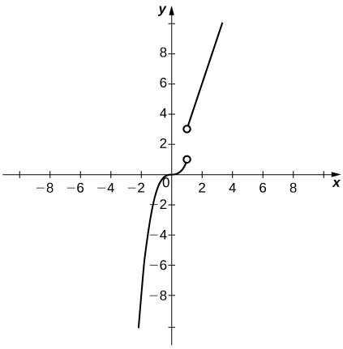
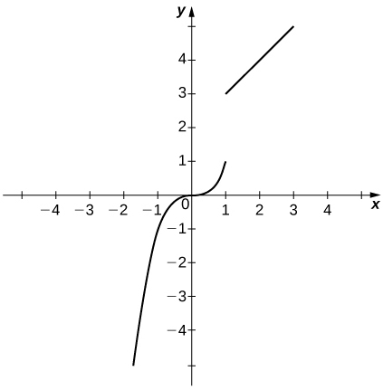

* Explain the three conditions for continuity at a point.
* Describe three kinds of discontinuities.
* Define continuity on an interval.
* State the theorem for limits of composite functions.
* Provide an example of the intermediate value theorem.

Many functions have the property that their graphs can be traced with a pencil without lifting the pencil from the page. Such functions are called *continuous*. Other functions have points at which a break in the graph occurs, but satisfy this property over intervals contained in their domains. They are continuous on these intervals and are said to have a *discontinuity at a point* where a break occurs.

We begin our investigation of continuity by exploring what it means for a function to have *continuity at a point*. Intuitively, a function is continuous at a particular point if there is no break in its graph at that point.

### Continuity at a Point

Before we look at a formal definition of what it means for a function to be continuous at a point, let’s consider various functions that fail to meet our intuitive notion of what it means to be continuous at a point. We then create a list of conditions that prevent such failures.

Our first function of interest is shown in [\[link\]](#CNX_Calc_Figure_02_04_001). We see that the graph of <math xmlns="http://www.w3.org/1998/Math/MathML"><mrow><mi>f</mi><mrow><mo>(</mo><mi>x</mi><mo>)</mo></mrow></mrow></math>

 has a hole at *a*. In fact, <math xmlns="http://www.w3.org/1998/Math/MathML"><mrow><mi>f</mi><mrow><mo>(</mo><mi>a</mi><mo>)</mo></mrow></mrow></math>

 is undefined. At the very least, for <math xmlns="http://www.w3.org/1998/Math/MathML"><mrow><mi>f</mi><mrow><mo>(</mo><mi>x</mi><mo>)</mo></mrow></mrow></math>

 to be continuous at *a*, we need the following condition:

<math xmlns="http://www.w3.org/1998/Math/MathML"><mrow><mtext>i.</mtext><mspace width="0.2em" /><mi>f</mi><mrow><mo>(</mo><mi>a</mi><mo>)</mo><mspace width="0.2em" /><mtext>is defined.</mtext></mrow></mrow></math>

  is not continuous at a because f(a) is undefined."){: #CNX_Calc_Figure_02_04_001}

However, as we see in [\[link\]](#CNX_Calc_Figure_02_04_002), this condition alone is insufficient to guarantee continuity at the point *a*. Although <math xmlns="http://www.w3.org/1998/Math/MathML"><mrow><mi>f</mi><mrow><mo>(</mo><mi>a</mi><mo>)</mo></mrow></mrow></math>

 is defined, the function has a gap at *a*. In this example, the gap exists because <math xmlns="http://www.w3.org/1998/Math/MathML"><mrow><munder><mrow><mtext>lim</mtext></mrow><mrow><mi>x</mi><mo stretchy="false">→</mo><mi>a</mi></mrow></munder><mi>f</mi><mrow><mo>(</mo><mi>x</mi><mo>)</mo></mrow></mrow></math>

 does not exist. We must add another condition for continuity at *a*—namely,

<math xmlns="http://www.w3.org/1998/Math/MathML"><mrow><mtext>ii.</mtext><mspace width="0.2em" /><munder><mrow><mtext>lim</mtext></mrow><mrow><mi>x</mi><mo stretchy="false">→</mo><mi>a</mi></mrow></munder><mi>f</mi><mrow><mo>(</mo><mi>x</mi><mo>)</mo><mspace width="0.2em" /><mtext>exists.</mtext></mrow></mrow></math>

  is not continuous at a because limx&#x2192;af(x) does not exist."){: #CNX_Calc_Figure_02_04_002}

However, as we see in [\[link\]](#CNX_Calc_Figure_02_04_003), these two conditions by themselves do not guarantee continuity at a point. The function in this figure satisfies both of our first two conditions, but is still not continuous at *a*. We must add a third condition to our list:

<math xmlns="http://www.w3.org/1998/Math/MathML"><mrow><mtext>iii.</mtext><mspace width="0.2em" /><munder><mrow><mtext>lim</mtext></mrow><mrow><mi>x</mi><mo stretchy="false">→</mo><mi>a</mi></mrow></munder><mi>f</mi><mrow><mo>(</mo><mi>x</mi><mo>)</mo></mrow><mo>=</mo><mi>f</mi><mrow><mo>(</mo><mi>a</mi><mo>)</mo></mrow><mo>.</mo></mrow></math>

  is not continuous at a because limx&#x2192;af(x)&#x2260;f(a)."){: #CNX_Calc_Figure_02_04_003}

Now we put our list of conditions together and form a definition of continuity at a point.

Definition

A function <math xmlns="http://www.w3.org/1998/Math/MathML"><mrow><mi>f</mi><mrow><mo>(</mo><mi>x</mi><mo>)</mo></mrow></mrow></math>

 is **continuous at a point**{: data-type="term"} *a* if and only if the following three conditions are satisfied:

1.  <math xmlns="http://www.w3.org/1998/Math/MathML"><mrow><mi>f</mi><mrow><mo>(</mo><mi>a</mi><mo>)</mo></mrow></mrow></math>
    
    is defined
2.  <math xmlns="http://www.w3.org/1998/Math/MathML"><mrow><munder><mrow><mtext>lim</mtext></mrow><mrow><mi>x</mi><mo stretchy="false">→</mo><mi>a</mi></mrow></munder><mi>f</mi><mrow><mo>(</mo><mi>x</mi><mo>)</mo></mrow></mrow></math>
    
    exists
3.  <math xmlns="http://www.w3.org/1998/Math/MathML"><mrow><munder><mrow><mtext>lim</mtext></mrow><mrow><mi>x</mi><mo stretchy="false">→</mo><mi>a</mi></mrow></munder><mi>f</mi><mrow><mo>(</mo><mi>x</mi><mo>)</mo></mrow><mo>=</mo><mi>f</mi><mrow><mo>(</mo><mi>a</mi><mo>)</mo></mrow></mrow></math>
{: data-number-style="lower-roman"}

A function is **discontinuous at a point**{: data-type="term"} *a* if it fails to be continuous at *a*.

The following procedure can be used to analyze the continuity of a function at a point using this definition.

Problem-Solving Strategy: Determining Continuity at a Point

1.  Check to see if
    <math xmlns="http://www.w3.org/1998/Math/MathML"><mrow><mi>f</mi><mrow><mo>(</mo><mi>a</mi><mo>)</mo></mrow></mrow></math>
    
    is defined. If
    <math xmlns="http://www.w3.org/1998/Math/MathML"><mrow><mi>f</mi><mrow><mo>(</mo><mi>a</mi><mo>)</mo></mrow></mrow></math>
    
    is undefined, we need go no further. The function is not continuous at *a*. If
    <math xmlns="http://www.w3.org/1998/Math/MathML"><mrow><mi>f</mi><mrow><mo>(</mo><mi>a</mi><mo>)</mo></mrow></mrow></math>
    
    is defined, continue to step 2.
2.  Compute
    <math xmlns="http://www.w3.org/1998/Math/MathML"><mrow><munder><mrow><mtext>lim</mtext></mrow><mrow><mi>x</mi><mo stretchy="false">→</mo><mi>a</mi></mrow></munder><mi>f</mi><mrow><mo>(</mo><mi>x</mi><mo>)</mo></mrow><mo>.</mo></mrow></math>
    
    In some cases, we may need to do this by first computing
    <math xmlns="http://www.w3.org/1998/Math/MathML"><mrow><munder><mrow><mtext>lim</mtext></mrow><mrow><mi>x</mi><mo stretchy="false">→</mo><msup><mi>a</mi><mo>−</mo></msup></mrow></munder><mi>f</mi><mrow><mo>(</mo><mi>x</mi><mo>)</mo></mrow></mrow></math>
    
    and
    <math xmlns="http://www.w3.org/1998/Math/MathML"><mrow><munder><mrow><mtext>lim</mtext></mrow><mrow><mi>x</mi><mo stretchy="false">→</mo><msup><mi>a</mi><mo>+</mo></msup></mrow></munder><mi>f</mi><mrow><mo>(</mo><mi>x</mi><mo>)</mo></mrow><mo>.</mo></mrow></math>
    
    If
    <math xmlns="http://www.w3.org/1998/Math/MathML"><mrow><munder><mrow><mtext>lim</mtext></mrow><mrow><mi>x</mi><mo stretchy="false">→</mo><mi>a</mi></mrow></munder><mi>f</mi><mrow><mo>(</mo><mi>x</mi><mo>)</mo></mrow></mrow></math>
    
    does not exist (that is, it is not a real number), then the function is not continuous at *a* and the problem is solved. If
    <math xmlns="http://www.w3.org/1998/Math/MathML"><mrow><munder><mrow><mtext>lim</mtext></mrow><mrow><mi>x</mi><mo stretchy="false">→</mo><mi>a</mi></mrow></munder><mi>f</mi><mrow><mo>(</mo><mi>x</mi><mo>)</mo></mrow></mrow></math>
    
    exists, then continue to step 3.
3.  Compare
    <math xmlns="http://www.w3.org/1998/Math/MathML"><mrow><mi>f</mi><mrow><mo>(</mo><mi>a</mi><mo>)</mo></mrow></mrow></math>
    
    and
    <math xmlns="http://www.w3.org/1998/Math/MathML"><mrow><munder><mrow><mtext>lim</mtext></mrow><mrow><mi>x</mi><mo stretchy="false">→</mo><mi>a</mi></mrow></munder><mi>f</mi><mrow><mo>(</mo><mi>x</mi><mo>)</mo></mrow><mo>.</mo></mrow></math>
    
    If
    <math xmlns="http://www.w3.org/1998/Math/MathML"><mrow><munder><mrow><mtext>lim</mtext></mrow><mrow><mi>x</mi><mo stretchy="false">→</mo><mi>a</mi></mrow></munder><mi>f</mi><mrow><mo>(</mo><mi>x</mi><mo>)</mo></mrow><mo>≠</mo><mi>f</mi><mrow><mo>(</mo><mi>a</mi><mo>)</mo></mrow><mo>,</mo></mrow></math>
    
    then the function is not continuous at *a*. If
    <math xmlns="http://www.w3.org/1998/Math/MathML"><mrow><munder><mrow><mtext>lim</mtext></mrow><mrow><mi>x</mi><mo stretchy="false">→</mo><mi>a</mi></mrow></munder><mi>f</mi><mrow><mo>(</mo><mi>x</mi><mo>)</mo></mrow><mo>=</mo><mi>f</mi><mrow><mo>(</mo><mi>a</mi><mo>)</mo></mrow><mo>,</mo></mrow></math>
    
    then the function is continuous at *a*.
{: data-number-style="arabic"}

The next three examples demonstrate how to apply this definition to determine whether a function is continuous at a given point. These examples illustrate situations in which each of the conditions for continuity in the definition succeed or fail.

Determining Continuity at a Point, Condition 1

Using the definition, determine whether the function <math xmlns="http://www.w3.org/1998/Math/MathML"><mrow><mi>f</mi><mrow><mo>(</mo><mi>x</mi><mo>)</mo></mrow><mo>=</mo><mrow><mrow><mo stretchy="false">(</mo><msup><mi>x</mi><mn>2</mn></msup><mo>−</mo><mn>4</mn><mo stretchy="false">)</mo></mrow><mtext>/</mtext><mrow><mo stretchy="false">(</mo><mi>x</mi><mo>−</mo><mn>2</mn></mrow></mrow><mo stretchy="false">)</mo></mrow></math>

 is continuous at <math xmlns="http://www.w3.org/1998/Math/MathML"><mrow><mi>x</mi><mo>=</mo><mn>2</mn><mo>.</mo></mrow></math>

 Justify the conclusion.

Let’s begin by trying to calculate <math xmlns="http://www.w3.org/1998/Math/MathML"><mrow><mi>f</mi><mrow><mo>(</mo><mn>2</mn><mo>)</mo></mrow><mo>.</mo></mrow></math>

 We can see that <math xmlns="http://www.w3.org/1998/Math/MathML"><mrow><mi>f</mi><mrow><mo>(</mo><mn>2</mn><mo>)</mo></mrow><mo>=</mo><mrow><mn>0</mn><mtext>/</mtext><mn>0</mn></mrow><mo>,</mo></mrow></math>

 which is undefined. Therefore, <math xmlns="http://www.w3.org/1998/Math/MathML"><mrow><mi>f</mi><mrow><mo>(</mo><mi>x</mi><mo>)</mo></mrow><mo>=</mo><mfrac><mrow><msup><mi>x</mi><mn>2</mn></msup><mo>−</mo><mn>4</mn></mrow><mrow><mi>x</mi><mo>−</mo><mn>2</mn></mrow></mfrac></mrow></math>

 is discontinuous at 2 because <math xmlns="http://www.w3.org/1998/Math/MathML"><mrow><mi>f</mi><mrow><mo>(</mo><mn>2</mn><mo>)</mo></mrow></mrow></math>

 is undefined. The graph of <math xmlns="http://www.w3.org/1998/Math/MathML"><mrow><mi>f</mi><mrow><mo>(</mo><mi>x</mi><mo>)</mo></mrow></mrow></math>

 is shown in [[link]](#CNX_Calc_Figure_02_04_004).

 is discontinuous at 2 because f(2) is undefined."){: #CNX_Calc_Figure_02_04_004}

Determining Continuity at a Point, Condition 2

Using the definition, determine whether the function <math xmlns="http://www.w3.org/1998/Math/MathML"><mrow><mi>f</mi><mrow><mo>(</mo><mi>x</mi><mo>)</mo></mrow><mo>=</mo><mrow><mo>{</mo><mtable columnalign="left"><mtr><mtd><mo>−</mo><msup><mi>x</mi><mn>2</mn></msup><mo>+</mo><mn>4</mn></mtd><mtd columnalign="left"><mtext>if</mtext><mspace width="0.2em" /><mi>x</mi><mo>≤</mo><mn>3</mn></mtd></mtr><mtr><mtd><mn>4</mn><mi>x</mi><mo>−</mo><mn>8</mn></mtd><mtd columnalign="left"><mtext>if</mtext><mspace width="0.2em" /><mi>x</mi><mo>&gt;</mo><mn>3</mn></mtd></mtr></mtable></mrow></mrow></math>

 is continuous at <math xmlns="http://www.w3.org/1998/Math/MathML"><mrow><mi>x</mi><mo>=</mo><mn>3</mn><mo>.</mo></mrow></math>

 Justify the conclusion.

Let’s begin by trying to calculate <math xmlns="http://www.w3.org/1998/Math/MathML"><mrow><mi>f</mi><mrow><mo>(</mo><mn>3</mn><mo>)</mo></mrow><mo>.</mo></mrow></math>

<math xmlns="http://www.w3.org/1998/Math/MathML"><mrow><mi>f</mi><mrow><mo>(</mo><mn>3</mn><mo>)</mo></mrow><mo>=</mo><mo>−</mo><mrow><mo stretchy="false">(</mo><mrow><msup><mn>3</mn><mn>2</mn></msup></mrow><mo stretchy="false">)</mo></mrow><mo>+</mo><mn>4</mn><mo>=</mo><mn>−5</mn><mo>.</mo></mrow></math>

Thus, <math xmlns="http://www.w3.org/1998/Math/MathML"><mrow><mi>f</mi><mrow><mo>(</mo><mn>3</mn><mo>)</mo></mrow></mrow></math>

 is defined. Next, we calculate <math xmlns="http://www.w3.org/1998/Math/MathML"><mrow><munder><mrow><mtext>lim</mtext></mrow><mrow><mi>x</mi><mo stretchy="false">→</mo><mn>3</mn></mrow></munder><mi>f</mi><mrow><mo>(</mo><mi>x</mi><mo>)</mo></mrow><mo>.</mo></mrow></math>

 To do this, we must compute <math xmlns="http://www.w3.org/1998/Math/MathML"><mrow><munder><mrow><mtext>lim</mtext></mrow><mrow><mi>x</mi><mo stretchy="false">→</mo><msup><mn>3</mn><mo>−</mo></msup></mrow></munder><mi>f</mi><mrow><mo>(</mo><mi>x</mi><mo>)</mo></mrow></mrow></math>

 and <math xmlns="http://www.w3.org/1998/Math/MathML"><mrow><munder><mrow><mtext>lim</mtext></mrow><mrow><mi>x</mi><mo stretchy="false">→</mo><msup><mn>3</mn><mo>+</mo></msup></mrow></munder><mi>f</mi><mrow><mo>(</mo><mi>x</mi><mo>)</mo></mrow><mtext>:</mtext></mrow></math>

<math xmlns="http://www.w3.org/1998/Math/MathML"><mrow><munder><mrow><mtext>lim</mtext></mrow><mrow><mi>x</mi><mo stretchy="false">→</mo><msup><mn>3</mn><mo>−</mo></msup></mrow></munder><mi>f</mi><mrow><mo>(</mo><mi>x</mi><mo>)</mo></mrow><mo>=</mo><mo>−</mo><mrow><mo stretchy="false">(</mo><mrow><msup><mn>3</mn><mn>2</mn></msup></mrow><mo stretchy="false">)</mo></mrow><mo>+</mo><mn>4</mn><mo>=</mo><mn>−5</mn></mrow></math>

and

<math xmlns="http://www.w3.org/1998/Math/MathML"><mrow><munder><mrow><mtext>lim</mtext></mrow><mrow><mi>x</mi><mo stretchy="false">→</mo><msup><mn>3</mn><mo>+</mo></msup></mrow></munder><mi>f</mi><mrow><mo>(</mo><mi>x</mi><mo>)</mo></mrow><mo>=</mo><mn>4</mn><mrow><mo>(</mo><mn>3</mn><mo>)</mo></mrow><mo>−</mo><mn>8</mn><mo>=</mo><mn>4</mn><mo>.</mo></mrow></math>

Therefore, <math xmlns="http://www.w3.org/1998/Math/MathML"><mrow><munder><mrow><mtext>lim</mtext></mrow><mrow><mi>x</mi><mo stretchy="false">→</mo><mn>3</mn></mrow></munder><mi>f</mi><mrow><mo>(</mo><mi>x</mi><mo>)</mo></mrow></mrow></math>

 does not exist. Thus, <math xmlns="http://www.w3.org/1998/Math/MathML"><mrow><mi>f</mi><mrow><mo>(</mo><mi>x</mi><mo>)</mo></mrow></mrow></math>

 is not continuous at 3. The graph of <math xmlns="http://www.w3.org/1998/Math/MathML"><mrow><mi>f</mi><mrow><mo>(</mo><mi>x</mi><mo>)</mo></mrow></mrow></math>

 is shown in [[link]](#CNX_Calc_Figure_02_04_005).

 is not continuous at 3 because limx&#x2192;3f(x) does not exist."){: #CNX_Calc_Figure_02_04_005}

Determining Continuity at a Point, Condition 3

Using the definition, determine whether the function <math xmlns="http://www.w3.org/1998/Math/MathML"><mrow><mi>f</mi><mrow><mo>(</mo><mi>x</mi><mo>)</mo></mrow><mo>=</mo><mrow><mo>{</mo><mtable columnalign="left"><mtr><mtd columnalign="left"><mfrac><mrow><mtext>sin</mtext><mspace width="0.1em" /><mi>x</mi></mrow><mi>x</mi></mfrac></mtd><mtd columnalign="left"><mtext>if</mtext><mspace width="0.2em" /><mi>x</mi><mo>≠</mo><mn>0</mn></mtd></mtr><mtr><mtd columnalign="right"><mn>1</mn></mtd><mtd columnalign="left"><mtext>if</mtext><mspace width="0.2em" /><mi>x</mi><mo>=</mo><mn>0</mn></mtd></mtr></mtable></mrow></mrow></math>

 is continuous at <math xmlns="http://www.w3.org/1998/Math/MathML"><mrow><mi>x</mi><mo>=</mo><mn>0</mn><mo>.</mo></mrow></math>

First, observe that

<math xmlns="http://www.w3.org/1998/Math/MathML"><mrow><mi>f</mi><mrow><mo>(</mo><mn>0</mn><mo>)</mo></mrow><mo>=</mo><mn>1</mn><mo>.</mo></mrow></math>

Next,

<math xmlns="http://www.w3.org/1998/Math/MathML"><mrow><munder><mrow><mtext>lim</mtext></mrow><mrow><mi>x</mi><mo stretchy="false">→</mo><mn>0</mn></mrow></munder><mi>f</mi><mrow><mo>(</mo><mi>x</mi><mo>)</mo></mrow><mo>=</mo><munder><mrow><mtext>lim</mtext></mrow><mrow><mi>x</mi><mo stretchy="false">→</mo><mn>0</mn></mrow></munder><mfrac><mrow><mtext>sin</mtext><mspace width="0.1em" /><mi>x</mi></mrow><mi>x</mi></mfrac><mo>=</mo><mn>1</mn><mo>.</mo></mrow></math>

Last, compare <math xmlns="http://www.w3.org/1998/Math/MathML"><mrow><mi>f</mi><mrow><mo>(</mo><mn>0</mn><mo>)</mo></mrow></mrow></math>

 and <math xmlns="http://www.w3.org/1998/Math/MathML"><mrow><munder><mrow><mtext>lim</mtext></mrow><mrow><mi>x</mi><mo stretchy="false">→</mo><mn>1</mn></mrow></munder><mi>f</mi><mrow><mo>(</mo><mi>x</mi><mo>)</mo></mrow><mo>.</mo></mrow></math>

 We see that

<math xmlns="http://www.w3.org/1998/Math/MathML"><mrow><mi>f</mi><mrow><mo>(</mo><mn>0</mn><mo>)</mo></mrow><mo>=</mo><mn>1</mn><mo>=</mo><munder><mstyle mathsize="140%" displaystyle="true"><mrow><mtext>lim</mtext></mrow></mstyle><mrow><mi>x</mi><mo stretchy="false">→</mo><mn>0</mn></mrow></munder><mi>f</mi><mrow><mo>(</mo><mi>x</mi><mo>)</mo></mrow><mo>.</mo></mrow></math>

Since all three of the conditions in the definition of continuity are satisfied, <math xmlns="http://www.w3.org/1998/Math/MathML"><mrow><mi>f</mi><mrow><mo>(</mo><mi>x</mi><mo>)</mo></mrow></mrow></math>

 is continuous at <math xmlns="http://www.w3.org/1998/Math/MathML"><mrow><mi>x</mi><mo>=</mo><mn>0</mn><mo>.</mo></mrow></math>

Using the definition, determine whether the function <math xmlns="http://www.w3.org/1998/Math/MathML"><mrow><mi>f</mi><mrow><mo>(</mo><mi>x</mi><mo>)</mo></mrow><mo>=</mo><mrow><mo>{</mo><mrow><mtable><mtr><mtd columnalign="left"><mrow><mn>2</mn><mi>x</mi><mo>+</mo><mn>1</mn></mrow></mtd><mtd columnalign="left"><mrow><mtext>if</mtext><mspace width="0.2em" /><mi>x</mi><mo>&lt;</mo><mn>1</mn></mrow></mtd></mtr><mtr><mtd columnalign="right"><mrow><mn>2</mn></mrow></mtd><mtd columnalign="left"><mrow><mtext>if</mtext><mspace width="0.2em" /><mi>x</mi><mo>=</mo><mn>1</mn></mrow></mtd></mtr><mtr><mtd columnalign="left"><mrow><mo>−</mo><mi>x</mi><mo>+</mo><mn>4</mn></mrow></mtd><mtd columnalign="left"><mrow><mtext>if</mtext><mspace width="0.2em" /><mi>x</mi><mo>&gt;</mo><mn>1</mn></mrow></mtd></mtr></mtable></mrow></mrow></mrow></math>

 is continuous at <math xmlns="http://www.w3.org/1998/Math/MathML"><mrow><mi>x</mi><mo>=</mo><mn>1</mn><mo>.</mo></mrow></math>

 If the function is not continuous at 1, indicate the condition for continuity at a point that fails to hold.

*f* is not continuous at 1 because <math xmlns="http://www.w3.org/1998/Math/MathML"><mrow><mi>f</mi><mrow><mo>(</mo><mn>1</mn><mo>)</mo></mrow><mo>=</mo><mn>2</mn><mo>≠</mo><mn>3</mn><mo>=</mo><munder><mrow><mtext>lim</mtext></mrow><mrow><mi>x</mi><mo stretchy="false">→</mo><mn>1</mn></mrow></munder><mi>f</mi><mrow><mo>(</mo><mi>x</mi><mo>)</mo></mrow><mo>.</mo></mrow></math>

Hint

Check each condition of the definition.

By applying the definition of continuity and previously established theorems concerning the evaluation of limits, we can state the following theorem.

Continuity of Polynomials and Rational Functions

Polynomials and rational functions are continuous at every point in their domains.

#### Proof

Previously, we showed that if <math xmlns="http://www.w3.org/1998/Math/MathML"><mrow><mi>p</mi><mrow><mo>(</mo><mi>x</mi><mo>)</mo></mrow></mrow></math>

 and <math xmlns="http://www.w3.org/1998/Math/MathML"><mrow><mi>q</mi><mrow><mo>(</mo><mi>x</mi><mo>)</mo></mrow></mrow></math>

 are polynomials, <math xmlns="http://www.w3.org/1998/Math/MathML"><mrow><munder><mrow><mtext>lim</mtext></mrow><mrow><mi>x</mi><mo stretchy="false">→</mo><mi>a</mi></mrow></munder><mi>p</mi><mrow><mo>(</mo><mi>x</mi><mo>)</mo></mrow><mo>=</mo><mi>p</mi><mrow><mo>(</mo><mi>a</mi><mo>)</mo></mrow></mrow></math>

 for every polynomial <math xmlns="http://www.w3.org/1998/Math/MathML"><mrow><mi>p</mi><mrow><mo>(</mo><mi>x</mi><mo>)</mo></mrow></mrow></math>

 and <math xmlns="http://www.w3.org/1998/Math/MathML"><mrow><munder><mrow><mtext>lim</mtext></mrow><mrow><mi>x</mi><mo stretchy="false">→</mo><mi>a</mi></mrow></munder><mfrac><mrow><mi>p</mi><mrow><mo>(</mo><mi>x</mi><mo>)</mo></mrow></mrow><mrow><mi>q</mi><mrow><mo>(</mo><mi>x</mi><mo>)</mo></mrow></mrow></mfrac><mo>=</mo><mfrac><mrow><mi>p</mi><mrow><mo>(</mo><mi>a</mi><mo>)</mo></mrow></mrow><mrow><mi>q</mi><mrow><mo>(</mo><mi>a</mi><mo>)</mo></mrow></mrow></mfrac></mrow></math>

 as long as <math xmlns="http://www.w3.org/1998/Math/MathML"><mrow><mi>q</mi><mrow><mo>(</mo><mi>a</mi><mo>)</mo></mrow><mo>≠</mo><mn>0</mn><mo>.</mo></mrow></math>

 Therefore, polynomials and rational functions are continuous on their domains.

□

We now apply [\[link\]](#fs-id1170573430304) to determine the points at which a given rational function is continuous.

Continuity of a Rational Function

For what values of *x* is <math xmlns="http://www.w3.org/1998/Math/MathML"><mrow><mi>f</mi><mrow><mo>(</mo><mi>x</mi><mo>)</mo></mrow><mo>=</mo><mfrac><mrow><mi>x</mi><mo>+</mo><mn>1</mn></mrow><mrow><mi>x</mi><mo>−</mo><mn>5</mn></mrow></mfrac></mrow></math>

 continuous?

The rational function <math xmlns="http://www.w3.org/1998/Math/MathML"><mrow><mi>f</mi><mrow><mo>(</mo><mi>x</mi><mo>)</mo></mrow><mo>=</mo><mfrac><mrow><mi>x</mi><mo>+</mo><mn>1</mn></mrow><mrow><mi>x</mi><mo>−</mo><mn>5</mn></mrow></mfrac></mrow></math>

 is continuous for every value of *x* except <math xmlns="http://www.w3.org/1998/Math/MathML"><mrow><mi>x</mi><mo>=</mo><mn>5</mn><mo>.</mo></mrow></math>

For what values of *x* is <math xmlns="http://www.w3.org/1998/Math/MathML"><mrow><mi>f</mi><mrow><mo>(</mo><mi>x</mi><mo>)</mo></mrow><mo>=</mo><mn>3</mn><msup><mi>x</mi><mn>4</mn></msup><mo>−</mo><mn>4</mn><msup><mi>x</mi><mn>2</mn></msup></mrow></math>

 continuous?

<math xmlns="http://www.w3.org/1998/Math/MathML"><mrow><mi>f</mi><mrow><mo>(</mo><mi>x</mi><mo>)</mo></mrow></mrow></math>

 is continuous at every real number.

Hint

Use [[link]](#fs-id1170573430304)

### Types of Discontinuities

As we have seen in [\[link\]](#fs-id1170573442080) and [\[link\]](#fs-id1170573389760), discontinuities take on several different appearances. We classify the types of discontinuities we have seen thus far as removable discontinuities, infinite discontinuities, or jump discontinuities. Intuitively, a **removable discontinuity**{: data-type="term"} is a discontinuity for which there is a hole in the graph, a **jump discontinuity**{: data-type="term"} is a noninfinite discontinuity for which the sections of the function do not meet up, and an **infinite discontinuity**{: data-type="term"} is a discontinuity located at a vertical asymptote. [\[link\]](#CNX_Calc_Figure_02_04_006) illustrates the differences in these types of discontinuities. Although these terms provide a handy way of describing three common types of discontinuities, keep in mind that not all discontinuities fit neatly into these categories.

 ![Three graphs, each showing a different discontinuity. The first is removable discontinuity. Here, the given function is a line with positive slope. At a point x=a, where a&gt;0, there is an open circle on the line and a closed circle a few units above the line. The second is a jump discontinuity. Here, there are two lines with positive slope. The first line exists for x&lt;=a, and the second exists for x&gt;a, where a&gt;0. The first line ends at a solid circle where x=a, and the second begins a few units up with an open circle at x=a. The third discontinuity type is infinite discontinuity. Here, the function has two parts separated by an asymptote x=a. The first segment is a curve stretching along the x axis to 0 as x goes to negative infinity and along the y axis to infinity as x goes to zero. The second segment is a curve stretching along the y axis to negative infinity as x goes to zero and along the x axis to 0 as x goes to infinity.](../resources/CNX_Calc_Figure_02_04_006.jpg "Discontinuities are classified as (a) removable, (b) jump, or (c) infinite."){: #CNX_Calc_Figure_02_04_006}

These three discontinuities are formally defined as follows:

Definition

If <math xmlns="http://www.w3.org/1998/Math/MathML"><mrow><mi>f</mi><mrow><mo>(</mo><mi>x</mi><mo>)</mo></mrow></mrow></math>

 is discontinuous at *a*, then

1.  <math xmlns="http://www.w3.org/1998/Math/MathML"><mi>f</mi></math>
    
    has a **removable discontinuity** at *a* if
    <math xmlns="http://www.w3.org/1998/Math/MathML"><mrow><munder><mrow><mtext>lim</mtext></mrow><mrow><mi>x</mi><mo stretchy="false">→</mo><mi>a</mi></mrow></munder><mi>f</mi><mrow><mo>(</mo><mi>x</mi><mo>)</mo></mrow></mrow></math>
    
    exists. (Note: When we state that
    <math xmlns="http://www.w3.org/1998/Math/MathML"><mrow><munder><mrow><mtext>lim</mtext></mrow><mrow><mi>x</mi><mo stretchy="false">→</mo><mi>a</mi></mrow></munder><mi>f</mi><mrow><mo>(</mo><mi>x</mi><mo>)</mo></mrow></mrow></math>
    
    exists, we mean that
    <math xmlns="http://www.w3.org/1998/Math/MathML"><mrow><munder><mrow><mtext>lim</mtext></mrow><mrow><mi>x</mi><mo stretchy="false">→</mo><mi>a</mi></mrow></munder><mi>f</mi><mrow><mo>(</mo><mi>x</mi><mo>)</mo></mrow><mo>=</mo><mi>L</mi><mo>,</mo></mrow></math>
    
    where *L* is a real number.)
2.  <math xmlns="http://www.w3.org/1998/Math/MathML"><mi>f</mi></math>
    
    has a **jump discontinuity** at *a* if
    <math xmlns="http://www.w3.org/1998/Math/MathML"><mrow><munder><mrow><mtext>lim</mtext></mrow><mrow><mi>x</mi><mo stretchy="false">→</mo><msup><mi>a</mi><mo>−</mo></msup></mrow></munder><mi>f</mi><mrow><mo>(</mo><mi>x</mi><mo>)</mo></mrow></mrow></math>
    
    and
    <math xmlns="http://www.w3.org/1998/Math/MathML"><mrow><munder><mrow><mtext>lim</mtext></mrow><mrow><mi>x</mi><mo stretchy="false">→</mo><msup><mi>a</mi><mo>+</mo></msup></mrow></munder><mi>f</mi><mrow><mo>(</mo><mi>x</mi><mo>)</mo></mrow></mrow></math>
    
    both exist, but
    <math xmlns="http://www.w3.org/1998/Math/MathML"><mrow><munder><mrow><mtext>lim</mtext></mrow><mrow><mi>x</mi><mo stretchy="false">→</mo><msup><mi>a</mi><mo>−</mo></msup></mrow></munder><mi>f</mi><mrow><mo>(</mo><mi>x</mi><mo>)</mo></mrow><mo>≠</mo><munder><mrow><mtext>lim</mtext></mrow><mrow><mi>x</mi><mo stretchy="false">→</mo><msup><mi>a</mi><mo>+</mo></msup></mrow></munder><mi>f</mi><mrow><mo>(</mo><mi>x</mi><mo>)</mo></mrow><mo>.</mo></mrow></math>
    
    (Note: When we state that
    <math xmlns="http://www.w3.org/1998/Math/MathML"><mrow><munder><mrow><mtext>lim</mtext></mrow><mrow><mi>x</mi><mo stretchy="false">→</mo><msup><mi>a</mi><mo>−</mo></msup></mrow></munder><mi>f</mi><mrow><mo>(</mo><mi>x</mi><mo>)</mo></mrow></mrow></math>
    
    and
    <math xmlns="http://www.w3.org/1998/Math/MathML"><mrow><munder><mrow><mtext>lim</mtext></mrow><mrow><mi>x</mi><mo stretchy="false">→</mo><msup><mi>a</mi><mo>+</mo></msup></mrow></munder><mi>f</mi><mrow><mo>(</mo><mi>x</mi><mo>)</mo></mrow></mrow></math>
    
    both exist, we mean that both are real-valued and that neither take on the values ±∞.)
3.  <math xmlns="http://www.w3.org/1998/Math/MathML"><mi>f</mi></math>
    
    has an **infinite discontinuity** at *a* if
    <math xmlns="http://www.w3.org/1998/Math/MathML"><mrow><munder><mrow><mtext>lim</mtext></mrow><mrow><mi>x</mi><mo stretchy="false">→</mo><msup><mi>a</mi><mo>−</mo></msup></mrow></munder><mi>f</mi><mrow><mo>(</mo><mi>x</mi><mo>)</mo></mrow><mo>=</mo><mtext>±</mtext><mi>∞</mi></mrow></math>
    
    or
    <math xmlns="http://www.w3.org/1998/Math/MathML"><mrow><munder><mrow><mtext>lim</mtext></mrow><mrow><mi>x</mi><mo stretchy="false">→</mo><msup><mi>a</mi><mo>+</mo></msup></mrow></munder><mi>f</mi><mrow><mo>(</mo><mi>x</mi><mo>)</mo></mrow><mo>=</mo><mtext>±</mtext><mi>∞</mi><mo>.</mo></mrow></math>
{: data-number-style="arabic"}

Classifying a Discontinuity

In [[link]](#fs-id1170573442080), we showed that <math xmlns="http://www.w3.org/1998/Math/MathML"><mrow><mi>f</mi><mrow><mo>(</mo><mi>x</mi><mo>)</mo></mrow><mo>=</mo><mfrac><mrow><msup><mi>x</mi><mn>2</mn></msup><mo>−</mo><mn>4</mn></mrow><mrow><mi>x</mi><mo>−</mo><mn>2</mn></mrow></mfrac></mrow></math>

 is discontinuous at <math xmlns="http://www.w3.org/1998/Math/MathML"><mrow><mi>x</mi><mo>=</mo><mn>2</mn><mo>.</mo></mrow></math>

 Classify this discontinuity as removable, jump, or infinite.

To classify the discontinuity at 2 we must evaluate <math xmlns="http://www.w3.org/1998/Math/MathML"><mrow><munder><mrow><mtext>lim</mtext></mrow><mrow><mi>x</mi><mo stretchy="false">→</mo><mn>2</mn></mrow></munder><mi>f</mi><mrow><mo>(</mo><mi>x</mi><mo>)</mo></mrow><mtext>:</mtext></mrow></math>

<math xmlns="http://www.w3.org/1998/Math/MathML"><mtable><mtr><mtd columnalign="right"><munder><mrow><mtext>lim</mtext></mrow><mrow><mi>x</mi><mo stretchy="false">→</mo><mn>2</mn></mrow></munder><mi>f</mi><mrow><mo>(</mo><mi>x</mi><mo>)</mo></mrow></mtd><mtd columnalign="left"><mo>=</mo><munder><mrow><mtext>lim</mtext></mrow><mrow><mi>x</mi><mo stretchy="false">→</mo><mn>2</mn></mrow></munder><mfrac><mrow><msup><mi>x</mi><mn>2</mn></msup><mo>−</mo><mn>4</mn></mrow><mrow><mi>x</mi><mo>−</mo><mn>2</mn></mrow></mfrac></mtd></mtr><mtr><mtd /><mtd columnalign="left"><mo>=</mo><munder><mrow><mtext>lim</mtext></mrow><mrow><mi>x</mi><mo stretchy="false">→</mo><mn>2</mn></mrow></munder><mfrac><mrow><mrow><mo>(</mo><mrow><mi>x</mi><mo>−</mo><mn>2</mn></mrow><mo>)</mo></mrow><mrow><mo>(</mo><mrow><mi>x</mi><mo>+</mo><mn>2</mn></mrow><mo>)</mo></mrow></mrow><mrow><mi>x</mi><mo>−</mo><mn>2</mn></mrow></mfrac></mtd></mtr><mtr><mtd /><mtd columnalign="left"><mo>=</mo><munder><mrow><mtext>lim</mtext></mrow><mrow><mi>x</mi><mo stretchy="false">→</mo><mn>2</mn></mrow></munder><mrow><mo>(</mo><mrow><mi>x</mi><mo>+</mo><mn>2</mn></mrow><mo>)</mo></mrow></mtd></mtr><mtr><mtd /><mtd columnalign="left"><mo>=</mo><mn>4</mn><mo>.</mo></mtd></mtr></mtable></math>

Since *f* is discontinuous at 2 and <math xmlns="http://www.w3.org/1998/Math/MathML"><mrow><munder><mrow><mtext>lim</mtext></mrow><mrow><mi>x</mi><mo stretchy="false">→</mo><mn>2</mn></mrow></munder><mi>f</mi><mrow><mo>(</mo><mi>x</mi><mo>)</mo></mrow></mrow></math>

 exists, *f* has a removable discontinuity at <math xmlns="http://www.w3.org/1998/Math/MathML"><mrow><mi>x</mi><mo>=</mo><mn>2</mn><mo>.</mo></mrow></math>

Classifying a Discontinuity

In [[link]](#fs-id1170573389760), we showed that <math xmlns="http://www.w3.org/1998/Math/MathML"><mrow><mi>f</mi><mrow><mo>(</mo><mi>x</mi><mo>)</mo></mrow><mo>=</mo><mrow><mo>{</mo><mrow><mtable><mtr><mtd><mrow><mo>−</mo><msup><mi>x</mi><mn>2</mn></msup><mo>+</mo><mn>4</mn></mrow></mtd><mtd columnalign="left"><mrow><mtext>if</mtext><mspace width="0.2em" /><mi>x</mi><mo>≤</mo><mn>3</mn></mrow></mtd></mtr><mtr><mtd><mrow><mn>4</mn><mi>x</mi><mo>−</mo><mn>8</mn></mrow></mtd><mtd columnalign="left"><mrow><mtext>if</mtext><mspace width="0.2em" /><mi>x</mi><mo>&gt;</mo><mn>3</mn></mrow></mtd></mtr></mtable></mrow></mrow></mrow></math>

 is discontinuous at <math xmlns="http://www.w3.org/1998/Math/MathML"><mrow><mi>x</mi><mo>=</mo><mn>3</mn><mo>.</mo></mrow></math>

 Classify this discontinuity as removable, jump, or infinite.

Earlier, we showed that *f* is discontinuous at 3 because <math xmlns="http://www.w3.org/1998/Math/MathML"><mrow><munder><mrow><mtext>lim</mtext></mrow><mrow><mi>x</mi><mo stretchy="false">→</mo><mn>3</mn></mrow></munder><mi>f</mi><mrow><mo>(</mo><mi>x</mi><mo>)</mo></mrow></mrow></math>

 does not exist. However, since <math xmlns="http://www.w3.org/1998/Math/MathML"><mrow><munder><mrow><mtext>lim</mtext></mrow><mrow><mi>x</mi><mo stretchy="false">→</mo><msup><mn>3</mn><mo>−</mo></msup></mrow></munder><mi>f</mi><mrow><mo>(</mo><mi>x</mi><mo>)</mo></mrow><mo>=</mo><mn>−5</mn></mrow></math>

 and <math xmlns="http://www.w3.org/1998/Math/MathML"><mrow><munder><mrow><mtext>lim</mtext></mrow><mrow><mi>x</mi><mo stretchy="false">→</mo><msup><mn>3</mn><mo>−</mo></msup></mrow></munder><mi>f</mi><mrow><mo>(</mo><mi>x</mi><mo>)</mo></mrow><mo>=</mo><mn>4</mn></mrow></math>

 both exist, we conclude that the function has a jump discontinuity at 3.

Classifying a Discontinuity

Determine whether <math xmlns="http://www.w3.org/1998/Math/MathML"><mrow><mi>f</mi><mrow><mo>(</mo><mi>x</mi><mo>)</mo></mrow><mo>=</mo><mfrac><mrow><mi>x</mi><mo>+</mo><mn>2</mn></mrow><mrow><mi>x</mi><mo>+</mo><mn>1</mn></mrow></mfrac></mrow></math>

 is continuous at −1. If the function is discontinuous at −1, classify the discontinuity as removable, jump, or infinite.

The function value <math xmlns="http://www.w3.org/1998/Math/MathML"><mrow><mi>f</mi><mrow><mo>(</mo><mrow><mn>−1</mn></mrow><mo>)</mo></mrow></mrow></math>

 is undefined. Therefore, the function is not continuous at −1. To determine the type of discontinuity, we must determine the limit at −1. We see that <math xmlns="http://www.w3.org/1998/Math/MathML"><mrow><munder><mrow><mtext>lim</mtext></mrow><mrow><mi>x</mi><mo stretchy="false">→</mo><msup><mn>−1</mn><mo>−</mo></msup></mrow></munder><mfrac><mrow><mi>x</mi><mo>+</mo><mn>2</mn></mrow><mrow><mi>x</mi><mo>+</mo><mn>1</mn></mrow></mfrac><mo>=</mo><mtext>−</mtext><mi>∞</mi></mrow></math>

 and <math xmlns="http://www.w3.org/1998/Math/MathML"><mrow><munder><mrow><mtext>lim</mtext></mrow><mrow><mi>x</mi><mo stretchy="false">→</mo><msup><mn>−1</mn><mo>+</mo></msup></mrow></munder><mfrac><mrow><mi>x</mi><mo>+</mo><mn>2</mn></mrow><mrow><mi>x</mi><mo>+</mo><mn>1</mn></mrow></mfrac><mo>=</mo><mtext>+</mtext><mi>∞</mi><mo>.</mo></mrow></math>

 Therefore, the function has an infinite discontinuity at −1.

For <math xmlns="http://www.w3.org/1998/Math/MathML"><mrow><mi>f</mi><mrow><mo>(</mo><mi>x</mi><mo>)</mo></mrow><mo>=</mo><mrow><mo>{</mo><mrow><mtable><mtr><mtd columnalign="left"><msup><mi>x</mi><mn>2</mn></msup></mtd><mtd columnalign="left"><mtext>if</mtext><mspace width="0.2em" /><mi>x</mi><mo>≠</mo><mn>1</mn></mtd></mtr><mtr><mtd columnalign="right"><mn>3</mn></mtd><mtd columnalign="left"><mtext>if</mtext><mspace width="0.2em" /><mi>x</mi><mo>=</mo><mn>1</mn></mtd></mtr></mtable></mrow></mrow><mo>,</mo></mrow></math>

 decide whether *f* is continuous at 1. If *f* is not continuous at 1, classify the discontinuity as removable, jump, or infinite.

Discontinuous at 1; removable

Hint

Follow the steps in [[link]](#fs-id1170573398041). If the function is discontinuous at 1, look at <math xmlns="http://www.w3.org/1998/Math/MathML"><mrow><munder><mrow><mtext>lim</mtext></mrow><mrow><mi>x</mi><mo stretchy="false">→</mo><mn>1</mn></mrow></munder><mi>f</mi><mrow><mo>(</mo><mi>x</mi><mo>)</mo></mrow></mrow></math>

 and use the definition to determine the type of discontinuity.

### Continuity over an Interval

Now that we have explored the concept of continuity at a point, we extend that idea to **continuity over an interval**{: data-type="term"}. As we develop this idea for different types of intervals, it may be useful to keep in mind the intuitive idea that a function is continuous over an interval if we can use a pencil to trace the function between any two points in the interval without lifting the pencil from the paper. In preparation for defining continuity on an interval, we begin by looking at the definition of what it means for a function to be continuous from the right at a point and continuous from the left at a point.

Continuity from the Right and from the Left

A function <math xmlns="http://www.w3.org/1998/Math/MathML"><mrow><mi>f</mi><mrow><mo>(</mo><mi>x</mi><mo>)</mo></mrow></mrow></math>

 is said to be **continuous from the right**{: data-type="term"} at *a* if <math xmlns="http://www.w3.org/1998/Math/MathML"><mrow><munder><mrow><mtext>lim</mtext></mrow><mrow><mi>x</mi><mo stretchy="false">→</mo><msup><mi>a</mi><mo>+</mo></msup></mrow></munder><mi>f</mi><mrow><mo>(</mo><mi>x</mi><mo>)</mo></mrow><mo>=</mo><mi>f</mi><mrow><mo>(</mo><mi>a</mi><mo>)</mo></mrow><mo>.</mo></mrow></math>

A function <math xmlns="http://www.w3.org/1998/Math/MathML"><mrow><mi>f</mi><mrow><mo>(</mo><mi>x</mi><mo>)</mo></mrow></mrow></math>

 is said to be **continuous from the left**{: data-type="term"} at *a* if <math xmlns="http://www.w3.org/1998/Math/MathML"><mrow><munder><mrow><mtext>lim</mtext></mrow><mrow><mi>x</mi><mo stretchy="false">→</mo><msup><mi>a</mi><mo>−</mo></msup></mrow></munder><mi>f</mi><mrow><mo>(</mo><mi>x</mi><mo>)</mo></mrow><mo>=</mo><mi>f</mi><mrow><mo>(</mo><mi>a</mi><mo>)</mo></mrow><mo>.</mo></mrow></math>

A function is continuous over an open interval if it is continuous at every point in the interval. A function <math xmlns="http://www.w3.org/1998/Math/MathML"><mrow><mi>f</mi><mrow><mo>(</mo><mi>x</mi><mo>)</mo></mrow></mrow></math>

 is continuous over a closed interval of the form <math xmlns="http://www.w3.org/1998/Math/MathML"><mrow><mrow><mo>[</mo><mrow><mi>a</mi><mo>,</mo><mi>b</mi></mrow><mo>]</mo></mrow></mrow></math>

 if it is continuous at every point in <math xmlns="http://www.w3.org/1998/Math/MathML"><mrow><mrow><mo>(</mo><mrow><mi>a</mi><mo>,</mo><mi>b</mi></mrow><mo>)</mo></mrow></mrow></math>

 and is continuous from the right at *a* and is continuous from the left at *b*. Analogously, a function <math xmlns="http://www.w3.org/1998/Math/MathML"><mrow><mi>f</mi><mrow><mo>(</mo><mi>x</mi><mo>)</mo></mrow></mrow></math>

 is continuous over an interval of the form <math xmlns="http://www.w3.org/1998/Math/MathML"><mrow><mrow><mo>(</mo><mrow><mi>a</mi><mo>,</mo><mi>b</mi></mrow><mo>]</mo></mrow></mrow></math>

 if it is continuous over <math xmlns="http://www.w3.org/1998/Math/MathML"><mrow><mrow><mo>(</mo><mrow><mi>a</mi><mo>,</mo><mi>b</mi></mrow><mo>)</mo></mrow></mrow></math>

 and is continuous from the left at *b*. Continuity over other types of intervals are defined in a similar fashion.

Requiring that <math xmlns="http://www.w3.org/1998/Math/MathML"><mrow><munder><mrow><mtext>lim</mtext></mrow><mrow><mi>x</mi><mo stretchy="false">→</mo><msup><mi>a</mi><mo>+</mo></msup></mrow></munder><mi>f</mi><mrow><mo>(</mo><mi>x</mi><mo>)</mo></mrow><mo>=</mo><mi>f</mi><mrow><mo>(</mo><mi>a</mi><mo>)</mo></mrow></mrow></math>

 and <math xmlns="http://www.w3.org/1998/Math/MathML"><mrow><munder><mrow><mtext>lim</mtext></mrow><mrow><mi>x</mi><mo stretchy="false">→</mo><msup><mi>b</mi><mo>−</mo></msup></mrow></munder><mi>f</mi><mrow><mo>(</mo><mi>x</mi><mo>)</mo></mrow><mo>=</mo><mi>f</mi><mrow><mo>(</mo><mi>b</mi><mo>)</mo></mrow></mrow></math>

 ensures that we can trace the graph of the function from the point <math xmlns="http://www.w3.org/1998/Math/MathML"><mrow><mrow><mo>(</mo><mrow><mi>a</mi><mo>,</mo><mi>f</mi><mrow><mo>(</mo><mi>a</mi><mo>)</mo></mrow></mrow><mo>)</mo></mrow></mrow></math>

 to the point <math xmlns="http://www.w3.org/1998/Math/MathML"><mrow><mrow><mo>(</mo><mrow><mi>b</mi><mo>,</mo><mi>f</mi><mrow><mo>(</mo><mi>b</mi><mo>)</mo></mrow></mrow><mo>)</mo></mrow></mrow></math>

 without lifting the pencil. If, for example, <math xmlns="http://www.w3.org/1998/Math/MathML"><mrow><munder><mrow><mtext>lim</mtext></mrow><mrow><mi>x</mi><mo stretchy="false">→</mo><msup><mi>a</mi><mo>+</mo></msup></mrow></munder><mi>f</mi><mrow><mo>(</mo><mi>x</mi><mo>)</mo></mrow><mo>≠</mo><mi>f</mi><mrow><mo>(</mo><mi>a</mi><mo>)</mo></mrow><mo>,</mo></mrow></math>

 we would need to lift our pencil to jump from <math xmlns="http://www.w3.org/1998/Math/MathML"><mrow><mi>f</mi><mrow><mo>(</mo><mi>a</mi><mo>)</mo></mrow></mrow></math>

 to the graph of the rest of the function over <math xmlns="http://www.w3.org/1998/Math/MathML"><mrow><mrow><mo>(</mo><mrow><mi>a</mi><mo>,</mo><mi>b</mi></mrow><mo>]</mo></mrow><mo>.</mo></mrow></math>

Continuity on an Interval

State the interval(s) over which the function <math xmlns="http://www.w3.org/1998/Math/MathML"><mrow><mi>f</mi><mrow><mo>(</mo><mi>x</mi><mo>)</mo></mrow><mo>=</mo><mfrac><mrow><mi>x</mi><mo>−</mo><mn>1</mn></mrow><mrow><msup><mi>x</mi><mn>2</mn></msup><mo>+</mo><mn>2</mn><mi>x</mi></mrow></mfrac></mrow></math>

 is continuous.

Since <math xmlns="http://www.w3.org/1998/Math/MathML"><mrow><mi>f</mi><mrow><mo>(</mo><mi>x</mi><mo>)</mo></mrow><mo>=</mo><mfrac><mrow><mi>x</mi><mo>−</mo><mn>1</mn></mrow><mrow><msup><mi>x</mi><mn>2</mn></msup><mo>+</mo><mn>2</mn><mi>x</mi></mrow></mfrac></mrow></math>

 is a rational function, it is continuous at every point in its domain. The domain of <math xmlns="http://www.w3.org/1998/Math/MathML"><mrow><mi>f</mi><mrow><mo>(</mo><mi>x</mi><mo>)</mo></mrow></mrow></math>

 is the set <math xmlns="http://www.w3.org/1998/Math/MathML"><mrow><mrow><mo>(</mo><mrow><mtext>−</mtext><mi>∞</mi><mo>,</mo><mn>−2</mn></mrow><mo>)</mo></mrow><mo>∪</mo><mrow><mo>(</mo><mrow><mn>−2</mn><mo>,</mo><mn>0</mn></mrow><mo>)</mo></mrow><mo>∪</mo><mrow><mo>(</mo><mrow><mn>0</mn><mo>,</mo><mtext>+</mtext><mi>∞</mi></mrow><mo>)</mo></mrow><mo>.</mo></mrow></math>

 Thus, <math xmlns="http://www.w3.org/1998/Math/MathML"><mrow><mi>f</mi><mrow><mo>(</mo><mi>x</mi><mo>)</mo></mrow></mrow></math>

 is continuous over each of the intervals <math xmlns="http://www.w3.org/1998/Math/MathML"><mrow><mrow><mo>(</mo><mrow><mtext>−</mtext><mi>∞</mi><mo>,</mo><mn>−2</mn></mrow><mo>)</mo></mrow><mo>,</mo><mrow><mo>(</mo><mrow><mn>−2</mn><mo>,</mo><mn>0</mn></mrow><mo>)</mo></mrow><mo>,</mo></mrow></math>

 and <math xmlns="http://www.w3.org/1998/Math/MathML"><mrow><mrow><mo>(</mo><mrow><mn>0</mn><mo>,</mo><mtext>+</mtext><mi>∞</mi></mrow><mo>)</mo></mrow><mo>.</mo></mrow></math>

Continuity over an Interval

State the interval(s) over which the function <math xmlns="http://www.w3.org/1998/Math/MathML"><mrow><mi>f</mi><mo stretchy="false">(</mo><mi>x</mi><mo stretchy="false">)</mo><mo>=</mo><msqrt><mrow><mn>4</mn><mo>−</mo><msup><mi>x</mi><mn>2</mn></msup></mrow></msqrt></mrow></math>

 is continuous.

From the limit laws, we know that <math xmlns="http://www.w3.org/1998/Math/MathML"><mrow><munder><mrow><mtext>lim</mtext></mrow><mrow><mi>x</mi><mo stretchy="false">→</mo><mi>a</mi></mrow></munder><mroot><mrow><mn>4</mn><mo>−</mo><msup><mi>x</mi><mn>2</mn></msup></mrow><mrow /></mroot><mo>=</mo><msqrt><mrow><mn>4</mn><mo>−</mo><msup><mi>a</mi><mn>2</mn></msup></mrow></msqrt></mrow></math>

 for all values of *a* in <math xmlns="http://www.w3.org/1998/Math/MathML"><mrow><mrow><mo>(</mo><mrow><mn>−2</mn><mo>,</mo><mn>2</mn></mrow><mo>)</mo></mrow><mo>.</mo></mrow></math>

 We also know that <math xmlns="http://www.w3.org/1998/Math/MathML"><mrow><munder><mrow><mtext>lim</mtext></mrow><mrow><mi>x</mi><mo stretchy="false">→</mo><msup><mn>−2</mn><mo>+</mo></msup></mrow></munder><msqrt><mrow><mn>4</mn><mo>−</mo><msup><mi>x</mi><mn>2</mn></msup></mrow></msqrt><mo>=</mo><mn>0</mn></mrow></math>

 exists and <math xmlns="http://www.w3.org/1998/Math/MathML"><mrow><munder><mrow><mtext>lim</mtext></mrow><mrow><mi>x</mi><mo stretchy="false">→</mo><msup><mn>2</mn><mo>−</mo></msup></mrow></munder><msqrt><mrow><mn>4</mn><mo>−</mo><msup><mi>x</mi><mn>2</mn></msup></mrow></msqrt><mo>=</mo><mn>0</mn></mrow></math>

 exists. Therefore, <math xmlns="http://www.w3.org/1998/Math/MathML"><mrow><mi>f</mi><mrow><mo>(</mo><mi>x</mi><mo>)</mo></mrow></mrow></math>

 is continuous over the interval <math xmlns="http://www.w3.org/1998/Math/MathML"><mrow><mrow><mo>[</mo><mrow><mn>−2</mn><mo>,</mo><mn>2</mn></mrow><mo>]</mo></mrow><mo>.</mo></mrow></math>

State the interval(s) over which the function <math xmlns="http://www.w3.org/1998/Math/MathML"><mrow><mi>f</mi><mrow><mo>(</mo><mi>x</mi><mo>)</mo></mrow><mo>=</mo><msqrt><mrow><mi>x</mi><mo>+</mo><mn>3</mn></mrow></msqrt></mrow></math>

 is continuous.

<math xmlns="http://www.w3.org/1998/Math/MathML"><mrow><mrow><mo>[</mo><mrow><mn>−3</mn><mo>,</mo><mtext>+</mtext><mi>∞</mi></mrow><mo>)</mo></mrow></mrow></math>

Hint

Use [[link]](#fs-id1170573387892) as a guide for solving.

The [\[link\]](#fs-id1170573352212) allows us to expand our ability to compute limits. In particular, this theorem ultimately allows us to demonstrate that trigonometric functions are continuous over their domains.

Composite Function Theorem

If <math xmlns="http://www.w3.org/1998/Math/MathML"><mrow><mi>f</mi><mrow><mo>(</mo><mi>x</mi><mo>)</mo></mrow></mrow></math>

 is continuous at *L* and <math xmlns="http://www.w3.org/1998/Math/MathML"><mrow><munder><mrow><mtext>lim</mtext></mrow><mrow><mi>x</mi><mo stretchy="false">→</mo><mi>a</mi></mrow></munder><mi>g</mi><mrow><mo>(</mo><mi>x</mi><mo>)</mo></mrow><mo>=</mo><mi>L</mi><mo>,</mo></mrow></math>

 then

<math xmlns="http://www.w3.org/1998/Math/MathML"><mrow><munder><mrow><mtext>lim</mtext></mrow><mrow><mi>x</mi><mo stretchy="false">→</mo><mi>a</mi></mrow></munder><mi>f</mi><mrow><mo>(</mo><mrow><mi>g</mi><mrow><mo>(</mo><mi>x</mi><mo>)</mo></mrow></mrow><mo>)</mo></mrow><mo>=</mo><mi>f</mi><mrow><mo>(</mo><mrow><munder><mrow><mtext>lim</mtext></mrow><mrow><mi>x</mi><mo stretchy="false">→</mo><mi>a</mi></mrow></munder><mi>g</mi><mrow><mo>(</mo><mi>x</mi><mo>)</mo></mrow></mrow><mo>)</mo></mrow><mo>=</mo><mi>f</mi><mrow><mo>(</mo><mi>L</mi><mo>)</mo></mrow><mo>.</mo></mrow></math>

Before we move on to [\[link\]](#fs-id1170573718134), recall that earlier, in the section on limit laws, we showed <math xmlns="http://www.w3.org/1998/Math/MathML"><mrow><munder><mrow><mtext>lim</mtext></mrow><mrow><mi>x</mi><mo stretchy="false">→</mo><mn>0</mn></mrow></munder><mtext>cos</mtext><mspace width="0.1em" /><mi>x</mi><mo>=</mo><mn>1</mn><mo>=</mo><mtext>cos</mtext><mspace width="0.1em" /><mrow><mo>(</mo><mn>0</mn><mo>)</mo></mrow><mo>.</mo></mrow></math>

 Consequently, we know that <math xmlns="http://www.w3.org/1998/Math/MathML"><mrow><mi>f</mi><mrow><mo>(</mo><mi>x</mi><mo>)</mo></mrow><mo>=</mo><mtext>cos</mtext><mspace width="0.1em" /><mi>x</mi></mrow></math>

 is continuous at 0. In [\[link\]](#fs-id1170573718134) we see how to combine this result with the composite function theorem.

Limit of a Composite Cosine Function

Evaluate <math xmlns="http://www.w3.org/1998/Math/MathML"><mrow><munder><mrow><mtext>lim</mtext></mrow><mrow><mi>x</mi><mo stretchy="false">→</mo><mi>π</mi><mtext>/</mtext><mn>2</mn></mrow></munder><mtext>cos</mtext><mspace width="0.1em" /><mrow><mo>(</mo><mrow><mi>x</mi><mo>−</mo><mfrac><mi>π</mi><mn>2</mn></mfrac></mrow><mo>)</mo></mrow><mo>.</mo></mrow></math>

The given function is a composite of <math xmlns="http://www.w3.org/1998/Math/MathML"><mrow><mtext>cos</mtext><mspace width="0.1em" /><mi>x</mi></mrow></math>

 and <math xmlns="http://www.w3.org/1998/Math/MathML"><mrow><mi>x</mi><mo>−</mo><mfrac><mi>π</mi><mn>2</mn></mfrac><mo>.</mo></mrow></math>

 Since <math xmlns="http://www.w3.org/1998/Math/MathML"><mrow><munder><mrow><mtext>lim</mtext></mrow><mrow><mi>x</mi><mo stretchy="false">→</mo><mrow><mi>π</mi><mtext>/</mtext><mn>2</mn></mrow></mrow></munder><mrow><mo>(</mo><mrow><mi>x</mi><mo>−</mo><mfrac><mi>π</mi><mn>2</mn></mfrac></mrow><mo>)</mo></mrow><mo>=</mo><mn>0</mn></mrow></math>

 and <math xmlns="http://www.w3.org/1998/Math/MathML"><mrow><mtext>cos</mtext><mspace width="0.1em" /><mi>x</mi></mrow></math>

 is continuous at 0, we may apply the composite function theorem. Thus,

<math xmlns="http://www.w3.org/1998/Math/MathML"><mrow><munder><mrow><mtext>lim</mtext></mrow><mrow><mi>x</mi><mo stretchy="false">→</mo><mi>π</mi><mtext>/</mtext><mn>2</mn></mrow></munder><mtext>cos</mtext><mspace width="0.1em" /><mrow><mo>(</mo><mrow><mi>x</mi><mo>−</mo><mfrac><mi>π</mi><mn>2</mn></mfrac></mrow><mo>)</mo></mrow><mo>=</mo><mtext>cos</mtext><mspace width="0.1em" /><mrow><mo>(</mo><mrow><munder><mrow><mtext>lim</mtext></mrow><mrow><mi>x</mi><mo stretchy="false">→</mo><mi>π</mi><mtext>/</mtext><mn>2</mn></mrow></munder><mrow><mo>(</mo><mrow><mi>x</mi><mo>−</mo><mfrac><mi>π</mi><mn>2</mn></mfrac></mrow><mo>)</mo></mrow></mrow><mo>)</mo></mrow><mo>=</mo><mtext>cos</mtext><mspace width="0.1em" /><mrow><mo>(</mo><mn>0</mn><mo>)</mo></mrow><mo>=</mo><mn>1</mn><mo>.</mo></mrow></math>

Evaluate <math xmlns="http://www.w3.org/1998/Math/MathML"><mrow><munder><mrow><mtext>lim</mtext></mrow><mrow><mi>x</mi><mo stretchy="false">→</mo><mi>π</mi></mrow></munder><mtext>sin</mtext><mspace width="0.1em" /><mrow><mo>(</mo><mrow><mi>x</mi><mo>−</mo><mi>π</mi></mrow><mo>)</mo></mrow><mo>.</mo></mrow></math>

0

Hint

<math xmlns="http://www.w3.org/1998/Math/MathML"><mrow><mi>f</mi><mrow><mo>(</mo><mi>x</mi><mo>)</mo></mrow><mo>=</mo><mtext>sin</mtext><mspace width="0.1em" /><mi>x</mi></mrow></math>

 is continuous at 0. Use [[link]](#fs-id1170573718134) as a guide.

The proof of the next theorem uses the composite function theorem as well as the continuity of <math xmlns="http://www.w3.org/1998/Math/MathML"><mrow><mi>f</mi><mrow><mo>(</mo><mi>x</mi><mo>)</mo></mrow><mo>=</mo><mtext>sin</mtext><mspace width="0.1em" /><mi>x</mi></mrow></math>

 and <math xmlns="http://www.w3.org/1998/Math/MathML"><mrow><mi>g</mi><mrow><mo>(</mo><mi>x</mi><mo>)</mo></mrow><mo>=</mo><mtext>cos</mtext><mspace width="0.1em" /><mi>x</mi></mrow></math>

 at the point 0 to show that trigonometric functions are continuous over their entire domains.

Continuity of Trigonometric Functions

Trigonometric functions are continuous over their entire domains.

### Proof

We begin by demonstrating that <math xmlns="http://www.w3.org/1998/Math/MathML"><mrow><mtext>cos</mtext><mspace width="0.1em" /><mi>x</mi></mrow></math>

 is continuous at every real number. To do this, we must show that <math xmlns="http://www.w3.org/1998/Math/MathML"><mrow><munder><mrow><mtext>lim</mtext></mrow><mrow><mi>x</mi><mo stretchy="false">→</mo><mi>a</mi></mrow></munder><mtext>cos</mtext><mspace width="0.1em" /><mi>x</mi><mo>=</mo><mtext>cos</mtext><mspace width="0.1em" /><mi>a</mi></mrow></math>

 for all values of *a*.

<math xmlns="http://www.w3.org/1998/Math/MathML"><mtable><mtr><mtd columnalign="left"><munder><mrow><mtext>lim</mtext></mrow><mrow><mi>x</mi><mo stretchy="false">→</mo><mi>a</mi></mrow></munder><mtext>cos</mtext><mspace width="0.1em" /><mi>x</mi></mtd><mtd columnalign="left"><mo>=</mo><munder><mrow><mtext>lim</mtext></mrow><mrow><mi>x</mi><mo stretchy="false">→</mo><mi>a</mi></mrow></munder><mtext>cos</mtext><mspace width="0.1em" /><mrow><mo>(</mo><mrow><mrow><mo>(</mo><mrow><mi>x</mi><mo>−</mo><mi>a</mi></mrow><mo>)</mo></mrow><mo>+</mo><mi>a</mi></mrow><mo>)</mo></mrow></mtd><mtd /><mtd /><mtd columnalign="left"><mtext>rewrite</mtext><mspace width="0.2em" /><mi>x</mi><mo>=</mo><mi>x</mi><mo>−</mo><mi>a</mi><mo>+</mo><mi>a</mi></mtd></mtr><mtr><mtd /><mtd columnalign="left"><mo>=</mo><munder><mrow><mtext>lim</mtext></mrow><mrow><mi>x</mi><mo stretchy="false">→</mo><mi>a</mi></mrow></munder><mrow><mo>(</mo><mrow><mtext>cos</mtext><mspace width="0.1em" /><mrow><mo>(</mo><mrow><mi>x</mi><mo>−</mo><mi>a</mi></mrow><mo>)</mo></mrow><mspace width="0.1em" /><mtext>cos</mtext><mspace width="0.1em" /><mi>a</mi><mo>−</mo><mtext>sin</mtext><mspace width="0.1em" /><mrow><mo>(</mo><mrow><mi>x</mi><mo>−</mo><mi>a</mi></mrow><mo>)</mo></mrow><mspace width="0.1em" /><mtext>sin</mtext><mspace width="0.1em" /><mi>a</mi></mrow><mo>)</mo></mrow></mtd><mtd /><mtd /><mtd columnalign="left"><mtext>apply the identity for the cosine of the sum of two angles</mtext></mtd></mtr><mtr><mtd /><mtd columnalign="left"><mo>=</mo><mtext>cos</mtext><mspace width="0.1em" /><mrow><mo>(</mo><mrow><munder><mrow><mtext>lim</mtext></mrow><mrow><mi>x</mi><mo stretchy="false">→</mo><mi>a</mi></mrow></munder><mrow><mo>(</mo><mrow><mi>x</mi><mo>−</mo><mi>a</mi></mrow><mo>)</mo></mrow></mrow><mo>)</mo></mrow><mspace width="0.1em" /><mtext>cos</mtext><mspace width="0.1em" /><mi>a</mi><mo>−</mo><mtext>sin</mtext><mspace width="0.1em" /><mrow><mo>(</mo><mrow><munder><mrow><mtext>lim</mtext></mrow><mrow><mi>x</mi><mo stretchy="false">→</mo><mi>a</mi></mrow></munder><mrow><mo>(</mo><mrow><mi>x</mi><mo>−</mo><mi>a</mi></mrow><mo>)</mo></mrow></mrow><mo>)</mo></mrow><mspace width="0.1em" /><mtext>sin</mtext><mspace width="0.1em" /><mi>a</mi></mtd><mtd /><mtd /><mtd columnalign="left"><munder><mrow><mtext>lim</mtext></mrow><mrow><mi>x</mi><mo stretchy="false">→</mo><mi>a</mi></mrow></munder><mrow><mo>(</mo><mrow><mi>x</mi><mo>−</mo><mi>a</mi></mrow><mo>)</mo></mrow><mo>=</mo><mn>0</mn><mo>,</mo><mspace width="0.2em" /><mtext>and</mtext><mspace width="0.2em" /><mtext>sin</mtext><mspace width="0.1em" /><mi>x</mi><mspace width="0.2em" /><mtext>and</mtext><mspace width="0.2em" /><mtext>cos</mtext><mspace width="0.1em" /><mi>x</mi><mspace width="0.2em" /><mtext>are continuous at 0</mtext></mtd></mtr><mtr><mtd /><mtd columnalign="left"><mo>=</mo><mtext>cos</mtext><mspace width="0.1em" /><mrow><mo>(</mo><mn>0</mn><mo>)</mo></mrow><mspace width="0.1em" /><mtext>cos</mtext><mspace width="0.1em" /><mi>a</mi><mo>−</mo><mtext>sin</mtext><mspace width="0.1em" /><mrow><mo>(</mo><mn>0</mn><mo>)</mo></mrow><mspace width="0.1em" /><mtext>sin</mtext><mspace width="0.1em" /><mi>a</mi></mtd><mtd /><mtd /><mtd columnalign="left"><mtext>evaluate cos(0) and sin(0) and simplify</mtext></mtd></mtr><mtr><mtd /><mtd columnalign="left"><mo>=</mo><mn>1</mn><mo>·</mo><mtext>cos</mtext><mspace width="0.1em" /><mi>a</mi><mo>−</mo><mn>0</mn><mo>·</mo><mtext>sin</mtext><mspace width="0.1em" /><mi>a</mi><mo>=</mo><mtext>cos</mtext><mspace width="0.1em" /><mi>a</mi><mo>.</mo></mtd></mtr></mtable></math>

The proof that <math xmlns="http://www.w3.org/1998/Math/MathML"><mrow><mtext>sin</mtext><mspace width="0.1em" /><mi>x</mi></mrow></math>

 is continuous at every real number is analogous. Because the remaining trigonometric functions may be expressed in terms of <math xmlns="http://www.w3.org/1998/Math/MathML"><mrow><mtext>sin</mtext><mspace width="0.1em" /><mi>x</mi></mrow></math>

 and <math xmlns="http://www.w3.org/1998/Math/MathML"><mrow><mtext>cos</mtext><mspace width="0.1em" /><mi>x</mi><mo>,</mo></mrow></math>

 their continuity follows from the quotient limit law.

□

As you can see, the composite function theorem is invaluable in demonstrating the continuity of trigonometric functions. As we continue our study of calculus, we revisit this theorem many times.

### The Intermediate Value Theorem

Functions that are continuous over intervals of the form <math xmlns="http://www.w3.org/1998/Math/MathML"><mrow><mrow><mo>[</mo><mrow><mi>a</mi><mo>,</mo><mi>b</mi></mrow><mo>]</mo></mrow><mo>,</mo></mrow></math>

 where *a* and *b* are real numbers, exhibit many useful properties. Throughout our study of calculus, we will encounter many powerful theorems concerning such functions. The first of these theorems is the **Intermediate Value Theorem**{: data-type="term"}.

The Intermediate Value Theorem

Let *f* be continuous over a closed, bounded interval <math xmlns="http://www.w3.org/1998/Math/MathML"><mrow><mrow><mo>[</mo><mrow><mi>a</mi><mo>,</mo><mi>b</mi></mrow><mo>]</mo></mrow><mo>.</mo></mrow></math>

 If *z* is any real number between <math xmlns="http://www.w3.org/1998/Math/MathML"><mrow><mi>f</mi><mrow><mo>(</mo><mi>a</mi><mo>)</mo></mrow></mrow></math>

 and <math xmlns="http://www.w3.org/1998/Math/MathML"><mrow><mi>f</mi><mrow><mo>(</mo><mi>b</mi><mo>)</mo></mrow><mo>,</mo></mrow></math>

 then there is a number *c* in <math xmlns="http://www.w3.org/1998/Math/MathML"><mrow><mrow><mo>[</mo><mrow><mi>a</mi><mo>,</mo><mi>b</mi></mrow><mo>]</mo></mrow></mrow></math>

 satisfying <math xmlns="http://www.w3.org/1998/Math/MathML"><mrow><mi>f</mi><mrow><mo>(</mo><mi>c</mi><mo>)</mo></mrow><mo>=</mo><mi>z</mi></mrow></math>

 in [\[link\]](#CNX_Calc_Figure_02_04_007).

![A diagram illustrating the intermediate value theorem. There is a generic continuous curved function shown over the interval \[a,b\]. The points fa. and fb. are marked, and dotted lines are drawn from a, b, fa., and fb. to the points (a, fa.) and (b, fb.).  A third point, c, is plotted between a and b. Since the function is continuous, there is a value for fc. along the curve, and a line is drawn from c to (c, fc.) and from (c, fc.) to fc., which is labeled as z on the y axis.](../resources/CNX_Calc_Figure_02_04_007.jpg "There is a number c&#x2208;[a,b] that satisfies f(c)=z."){: #CNX_Calc_Figure_02_04_007}

Application of the Intermediate Value Theorem

Show that <math xmlns="http://www.w3.org/1998/Math/MathML"><mrow><mi>f</mi><mrow><mo>(</mo><mi>x</mi><mo>)</mo></mrow><mo>=</mo><mi>x</mi><mo>−</mo><mtext>cos</mtext><mspace width="0.1em" /><mi>x</mi></mrow></math>

 has at least one zero.

Since <math xmlns="http://www.w3.org/1998/Math/MathML"><mrow><mi>f</mi><mrow><mo>(</mo><mi>x</mi><mo>)</mo></mrow><mo>=</mo><mi>x</mi><mo>−</mo><mtext>cos</mtext><mspace width="0.1em" /><mi>x</mi></mrow></math>

 is continuous over <math xmlns="http://www.w3.org/1998/Math/MathML"><mrow><mrow><mo>(</mo><mrow><mtext>−</mtext><mi>∞</mi><mo>,</mo><mtext>+</mtext><mi>∞</mi></mrow><mo>)</mo></mrow><mo>,</mo></mrow></math>

 it is continuous over any closed interval of the form <math xmlns="http://www.w3.org/1998/Math/MathML"><mrow><mrow><mo>[</mo><mrow><mi>a</mi><mo>,</mo><mi>b</mi></mrow><mo>]</mo></mrow><mo>.</mo></mrow></math>

 If you can find an interval <math xmlns="http://www.w3.org/1998/Math/MathML"><mrow><mrow><mo>[</mo><mrow><mi>a</mi><mo>,</mo><mi>b</mi></mrow><mo>]</mo></mrow></mrow></math>

 such that <math xmlns="http://www.w3.org/1998/Math/MathML"><mrow><mi>f</mi><mrow><mo>(</mo><mi>a</mi><mo>)</mo></mrow></mrow></math>

 and <math xmlns="http://www.w3.org/1998/Math/MathML"><mrow><mi>f</mi><mrow><mo>(</mo><mi>b</mi><mo>)</mo></mrow></mrow></math>

 have opposite signs, you can use the Intermediate Value Theorem to conclude there must be a real number *c* in <math xmlns="http://www.w3.org/1998/Math/MathML"><mrow><mrow><mo>(</mo><mrow><mi>a</mi><mo>,</mo><mi>b</mi></mrow><mo>)</mo></mrow></mrow></math>

 that satisfies <math xmlns="http://www.w3.org/1998/Math/MathML"><mrow><mi>f</mi><mrow><mo>(</mo><mi>c</mi><mo>)</mo></mrow><mo>=</mo><mn>0</mn><mo>.</mo></mrow></math>

 Note that

<math xmlns="http://www.w3.org/1998/Math/MathML"><mrow><mi>f</mi><mrow><mo>(</mo><mn>0</mn><mo>)</mo></mrow><mo>=</mo><mn>0</mn><mo>−</mo><mtext>cos</mtext><mspace width="0.1em" /><mrow><mo>(</mo><mn>0</mn><mo>)</mo></mrow><mo>=</mo><mn>−1</mn><mo>&lt;</mo><mn>0</mn></mrow></math>

and

<math xmlns="http://www.w3.org/1998/Math/MathML"><mrow><mi>f</mi><mrow><mo>(</mo><mrow><mfrac><mi>π</mi><mn>2</mn></mfrac></mrow><mo>)</mo></mrow><mo>=</mo><mfrac><mi>π</mi><mn>2</mn></mfrac><mo>−</mo><mtext>cos</mtext><mfrac><mi>π</mi><mn>2</mn></mfrac><mo>=</mo><mfrac><mi>π</mi><mn>2</mn></mfrac><mo>&gt;</mo><mn>0</mn><mo>.</mo></mrow></math>

Using the Intermediate Value Theorem, we can see that there must be a real number *c* in <math xmlns="http://www.w3.org/1998/Math/MathML"><mrow><mrow><mo>[</mo><mrow><mn>0</mn><mo>,</mo><mrow><mi>π</mi><mtext>/</mtext><mn>2</mn></mrow></mrow><mo>]</mo></mrow></mrow></math>

 that satisfies <math xmlns="http://www.w3.org/1998/Math/MathML"><mrow><mi>f</mi><mrow><mo>(</mo><mi>c</mi><mo>)</mo></mrow><mo>=</mo><mn>0</mn><mo>.</mo></mrow></math>

 Therefore, <math xmlns="http://www.w3.org/1998/Math/MathML"><mrow><mi>f</mi><mrow><mo>(</mo><mi>x</mi><mo>)</mo></mrow><mo>=</mo><mi>x</mi><mo>−</mo><mtext>cos</mtext><mspace width="0.1em" /><mi>x</mi></mrow></math>

 has at least one zero.

When Can You Apply the Intermediate Value Theorem?

If <math xmlns="http://www.w3.org/1998/Math/MathML"><mrow><mi>f</mi><mrow><mo>(</mo><mi>x</mi><mo>)</mo></mrow></mrow></math>

 is continuous over <math xmlns="http://www.w3.org/1998/Math/MathML"><mrow><mrow><mo>[</mo><mrow><mn>0</mn><mo>,</mo><mn>2</mn></mrow><mo>]</mo></mrow><mo>,</mo><mi>f</mi><mrow><mo>(</mo><mn>0</mn><mo>)</mo></mrow><mo>&gt;</mo><mn>0</mn></mrow></math>

 and <math xmlns="http://www.w3.org/1998/Math/MathML"><mrow><mi>f</mi><mrow><mo>(</mo><mn>2</mn><mo>)</mo></mrow><mo>&gt;</mo><mn>0</mn><mo>,</mo></mrow></math>

 can we use the Intermediate Value Theorem to conclude that <math xmlns="http://www.w3.org/1998/Math/MathML"><mrow><mi>f</mi><mrow><mo>(</mo><mi>x</mi><mo>)</mo></mrow></mrow></math>

 has no zeros in the interval <math xmlns="http://www.w3.org/1998/Math/MathML"><mrow><mrow><mo>[</mo><mrow><mn>0</mn><mo>,</mo><mn>2</mn></mrow><mtext>]?</mtext></mrow></mrow></math>

 Explain.

No. The Intermediate Value Theorem only allows us to conclude that we can find a value between <math xmlns="http://www.w3.org/1998/Math/MathML"><mrow><mi>f</mi><mrow><mo>(</mo><mn>0</mn><mo>)</mo></mrow></mrow></math>

 and <math xmlns="http://www.w3.org/1998/Math/MathML"><mrow><mi>f</mi><mrow><mo>(</mo><mn>2</mn><mo>)</mo></mrow><mo>;</mo></mrow></math>

 it doesn’t allow us to conclude that we can’t find other values. To see this more clearly, consider the function <math xmlns="http://www.w3.org/1998/Math/MathML"><mrow><mi>f</mi><mrow><mo>(</mo><mi>x</mi><mo>)</mo></mrow><mo>=</mo><msup><mrow><mrow><mo>(</mo><mrow><mi>x</mi><mo>−</mo><mn>1</mn></mrow><mo>)</mo></mrow></mrow><mn>2</mn></msup><mo>.</mo></mrow></math>

 It satisfies <math xmlns="http://www.w3.org/1998/Math/MathML"><mrow><mi>f</mi><mrow><mo>(</mo><mn>0</mn><mo>)</mo></mrow><mo>=</mo><mn>1</mn><mo>&gt;</mo><mn>0</mn><mo>,</mo><mi>f</mi><mrow><mo>(</mo><mn>2</mn><mo>)</mo></mrow><mo>=</mo><mn>1</mn><mo>&gt;</mo><mn>0</mn><mo>,</mo></mrow></math>

 and <math xmlns="http://www.w3.org/1998/Math/MathML"><mrow><mi>f</mi><mrow><mo>(</mo><mn>1</mn><mo>)</mo></mrow><mo>=</mo><mn>0</mn><mo>.</mo></mrow></math>

When Can You Apply the Intermediate Value Theorem?

For <math xmlns="http://www.w3.org/1998/Math/MathML"><mrow><mi>f</mi><mrow><mo>(</mo><mi>x</mi><mo>)</mo></mrow><mo>=</mo><mrow><mn>1</mn><mtext>/</mtext><mi>x</mi></mrow><mo>,</mo><mi>f</mi><mrow><mo>(</mo><mrow><mn>−1</mn></mrow><mo>)</mo></mrow><mo>=</mo><mn>−1</mn><mo>&lt;</mo><mn>0</mn></mrow></math>

 and <math xmlns="http://www.w3.org/1998/Math/MathML"><mrow><mi>f</mi><mrow><mo>(</mo><mn>1</mn><mo>)</mo></mrow><mo>=</mo><mn>1</mn><mo>&gt;</mo><mn>0</mn><mo>.</mo></mrow></math>

 Can we conclude that <math xmlns="http://www.w3.org/1998/Math/MathML"><mrow><mi>f</mi><mrow><mo>(</mo><mi>x</mi><mo>)</mo></mrow></mrow></math>

 has a zero in the interval <math xmlns="http://www.w3.org/1998/Math/MathML"><mrow><mrow><mo>[</mo><mrow><mn>−1</mn><mo>,</mo><mn>1</mn></mrow><mo>]</mo></mrow><mo>?</mo></mrow></math>

No. The function is not continuous over <math xmlns="http://www.w3.org/1998/Math/MathML"><mrow><mrow><mo>[</mo><mrow><mn>−1</mn><mo>,</mo><mn>1</mn></mrow><mo>]</mo></mrow><mo>.</mo></mrow></math>

 The Intermediate Value Theorem does not apply here.

Show that <math xmlns="http://www.w3.org/1998/Math/MathML"><mrow><mi>f</mi><mrow><mo>(</mo><mi>x</mi><mo>)</mo></mrow><mo>=</mo><msup><mi>x</mi><mn>3</mn></msup><mo>−</mo><msup><mi>x</mi><mn>2</mn></msup><mo>−</mo><mn>3</mn><mi>x</mi><mo>+</mo><mn>1</mn></mrow></math>

 has a zero over the interval <math xmlns="http://www.w3.org/1998/Math/MathML"><mrow><mrow><mo>[</mo><mrow><mn>0</mn><mo>,</mo><mn>1</mn></mrow><mo>]</mo></mrow><mo>.</mo></mrow></math>

<math xmlns="http://www.w3.org/1998/Math/MathML"><mrow><mi>f</mi><mrow><mo>(</mo><mn>0</mn><mo>)</mo></mrow><mo>=</mo><mn>1</mn><mo>&gt;</mo><mn>0</mn><mo>,</mo><mi>f</mi><mrow><mo>(</mo><mn>1</mn><mo>)</mo></mrow><mo>=</mo><mn>−2</mn><mo>&lt;</mo><mn>0</mn><mo>;</mo><mi>f</mi><mrow><mo>(</mo><mi>x</mi><mo>)</mo></mrow></mrow></math>

 is continuous over <math xmlns="http://www.w3.org/1998/Math/MathML"><mrow><mrow><mo>[</mo><mrow><mn>0</mn><mo>,</mo><mn>1</mn></mrow><mo>]</mo></mrow><mo>.</mo></mrow></math>

 It must have a zero on this interval.

Hint

Find <math xmlns="http://www.w3.org/1998/Math/MathML"><mrow><mi>f</mi><mrow><mo>(</mo><mn>0</mn><mo>)</mo></mrow></mrow></math>

 and <math xmlns="http://www.w3.org/1998/Math/MathML"><mrow><mi>f</mi><mrow><mo>(</mo><mn>1</mn><mo>)</mo></mrow><mo>.</mo></mrow></math>

 Apply the Intermediate Value Theorem.

### Key Concepts

* For a function to be continuous at a point, it must be defined at that point, its limit must exist at the point, and the value of the function at that point must equal the value of the limit at that point.
* Discontinuities may be classified as removable, jump, or infinite.
* A function is continuous over an open interval if it is continuous at every point in the interval. It is continuous over a closed interval if it is continuous at every point in its interior and is continuous at its endpoints.
* The composite function theorem states: If
  <math xmlns="http://www.w3.org/1998/Math/MathML"><mrow><mi>f</mi><mrow><mo>(</mo><mi>x</mi><mo>)</mo></mrow></mrow></math>
  
  is continuous at *L* and
  <math xmlns="http://www.w3.org/1998/Math/MathML"><mrow><munder><mrow><mtext>lim</mtext></mrow><mrow><mi>x</mi><mo stretchy="false">→</mo><mi>a</mi></mrow></munder><mi>g</mi><mrow><mo>(</mo><mi>x</mi><mo>)</mo></mrow><mo>=</mo><mi>L</mi><mo>,</mo></mrow></math>
  
  then
  <math xmlns="http://www.w3.org/1998/Math/MathML"><mrow><munder><mrow><mtext>lim</mtext></mrow><mrow><mi>x</mi><mo stretchy="false">→</mo><mi>a</mi></mrow></munder><mi>f</mi><mrow><mo>(</mo><mrow><mi>g</mi><mrow><mo>(</mo><mi>x</mi><mo>)</mo></mrow></mrow><mo>)</mo></mrow><mo>=</mo><mi>f</mi><mrow><mo>(</mo><mrow><munder><mrow><mtext>lim</mtext></mrow><mrow><mi>x</mi><mo stretchy="false">→</mo><mi>a</mi></mrow></munder><mi>g</mi><mrow><mo>(</mo><mi>x</mi><mo>)</mo></mrow></mrow><mo>)</mo></mrow><mo>=</mo><mi>f</mi><mrow><mo>(</mo><mi>L</mi><mo>)</mo></mrow><mo>.</mo></mrow></math>

* The Intermediate Value Theorem guarantees that if a function is continuous over a closed interval, then the function takes on every value between the values at its endpoints.
{: data-bullet-style="bullet"}

<section data-depth="1" class="section-exercises" markdown="1">
For the following exercises, determine the point(s), if any, at which each function is discontinuous. Classify any discontinuity as jump, removable, infinite, or other.

<math xmlns="http://www.w3.org/1998/Math/MathML"><mrow><mi>f</mi><mrow><mo>(</mo><mi>x</mi><mo>)</mo></mrow><mo>=</mo><mfrac><mn>1</mn><mrow><msqrt><mi>x</mi></msqrt></mrow></mfrac></mrow></math>

The function is defined for all *x* in the interval <math xmlns="http://www.w3.org/1998/Math/MathML"><mrow><mrow><mo>(</mo><mrow><mn>0</mn><mo>,</mo><mi>∞</mi></mrow><mo>)</mo></mrow><mo>.</mo></mrow></math>

<math xmlns="http://www.w3.org/1998/Math/MathML"><mrow><mi>f</mi><mrow><mo>(</mo><mi>x</mi><mo>)</mo></mrow><mo>=</mo><mfrac><mn>2</mn><mrow><msup><mi>x</mi><mn>2</mn></msup><mo>+</mo><mn>1</mn></mrow></mfrac></mrow></math>

<math xmlns="http://www.w3.org/1998/Math/MathML"><mrow><mi>f</mi><mrow><mo>(</mo><mi>x</mi><mo>)</mo></mrow><mo>=</mo><mfrac><mi>x</mi><mrow><msup><mi>x</mi><mn>2</mn></msup><mo>−</mo><mi>x</mi></mrow></mfrac></mrow></math>

Removable discontinuity at <math xmlns="http://www.w3.org/1998/Math/MathML"><mrow><mi>x</mi><mo>=</mo><mn>0</mn><mo>;</mo></mrow></math>

 infinite discontinuity at <math xmlns="http://www.w3.org/1998/Math/MathML"><mrow><mi>x</mi><mo>=</mo><mn>1</mn></mrow></math>

<math xmlns="http://www.w3.org/1998/Math/MathML"><mrow><mi>g</mi><mrow><mo>(</mo><mi>t</mi><mo>)</mo></mrow><mo>=</mo><msup><mi>t</mi><mrow><mn>−1</mn></mrow></msup><mo>+</mo><mn>1</mn></mrow></math>

<math xmlns="http://www.w3.org/1998/Math/MathML"><mrow><mi>f</mi><mrow><mo>(</mo><mi>x</mi><mo>)</mo></mrow><mo>=</mo><mfrac><mn>5</mn><mrow><msup><mi>e</mi><mi>x</mi></msup><mo>−</mo><mn>2</mn></mrow></mfrac></mrow></math>

Infinite discontinuity at <math xmlns="http://www.w3.org/1998/Math/MathML"><mrow><mi>x</mi><mo>=</mo><mtext>ln</mtext><mspace width="0.1em" /><mn>2</mn></mrow></math>

<math xmlns="http://www.w3.org/1998/Math/MathML"><mrow><mi>f</mi><mrow><mo>(</mo><mi>x</mi><mo>)</mo></mrow><mo>=</mo><mfrac><mrow><mrow><mo>\|</mo><mrow><mi>x</mi><mo>−</mo><mn>2</mn></mrow><mo>\|</mo></mrow></mrow><mrow><mi>x</mi><mo>−</mo><mn>2</mn></mrow></mfrac></mrow></math>

<math xmlns="http://www.w3.org/1998/Math/MathML"><mrow><mi>H</mi><mrow><mo>(</mo><mi>x</mi><mo>)</mo></mrow><mo>=</mo><mtext>tan</mtext><mspace width="0.1em" /><mn>2</mn><mi>x</mi></mrow></math>

Infinite discontinuities at <math xmlns="http://www.w3.org/1998/Math/MathML"><mrow><mi>x</mi><mo>=</mo><mfrac><mrow><mrow><mo>(</mo><mrow><mn>2</mn><mi>k</mi><mo>+</mo><mn>1</mn></mrow><mo>)</mo></mrow><mi>π</mi></mrow><mn>4</mn></mfrac><mo>,</mo></mrow></math>

 for <math xmlns="http://www.w3.org/1998/Math/MathML"><mrow><mi>k</mi><mo>=</mo><mn>0</mn><mo>,</mo><mo>±</mo><mn>1</mn><mo>,</mo><mo>±</mo><mn>2</mn><mo>,</mo><mo>±</mo><mn>3</mn><mtext>,…</mtext></mrow></math>

<math xmlns="http://www.w3.org/1998/Math/MathML"><mrow><mi>f</mi><mrow><mo>(</mo><mi>t</mi><mo>)</mo></mrow><mo>=</mo><mfrac><mrow><mi>t</mi><mo>+</mo><mn>3</mn></mrow><mrow><msup><mi>t</mi><mn>2</mn></msup><mo>+</mo><mn>5</mn><mi>t</mi><mo>+</mo><mn>6</mn></mrow></mfrac></mrow></math>

For the following exercises, decide if the function continuous at the given point. If it is discontinuous, what type of discontinuity is it?

<math xmlns="http://www.w3.org/1998/Math/MathML"><mrow><mfrac><mrow><mn>2</mn><msup><mi>x</mi><mn>2</mn></msup><mo>−</mo><mn>5</mn><mi>x</mi><mo>+</mo><mn>3</mn></mrow><mrow><mi>x</mi><mo>−</mo><mn>1</mn></mrow></mfrac></mrow></math>

 at <math xmlns="http://www.w3.org/1998/Math/MathML"><mrow><mi>x</mi><mo>=</mo><mn>1</mn></mrow></math>

No. It is a removable discontinuity.

<math xmlns="http://www.w3.org/1998/Math/MathML"><mrow><mi>h</mi><mrow><mo>(</mo><mi>θ</mi><mo>)</mo></mrow><mo>=</mo><mfrac><mrow><mtext>sin</mtext><mspace width="0.1em" /><mi>θ</mi><mo>−</mo><mtext>cos</mtext><mspace width="0.1em" /><mi>θ</mi></mrow><mrow><mtext>tan</mtext><mspace width="0.1em" /><mi>θ</mi></mrow></mfrac></mrow></math>

 at <math xmlns="http://www.w3.org/1998/Math/MathML"><mrow><mi>θ</mi><mo>=</mo><mi>π</mi></mrow></math>

<math xmlns="http://www.w3.org/1998/Math/MathML"><mrow><mi>g</mi><mrow><mo>(</mo><mi>u</mi><mo>)</mo></mrow><mo>=</mo><mrow><mo>{</mo><mtable columnalign="left"><mtr><mtd><mfrac><mrow><mn>6</mn><msup><mi>u</mi><mn>2</mn></msup><mo>+</mo><mi>u</mi><mo>−</mo><mn>2</mn></mrow><mrow><mn>2</mn><mi>u</mi><mo>−</mo><mn>1</mn></mrow></mfrac></mtd><mtd columnalign="left"><mtext>if</mtext><mspace width="0.2em" /><mi>u</mi><mo>≠</mo><mfrac><mn>1</mn><mn>2</mn></mfrac></mtd></mtr><mtr><mtd columnalign="left"><mfrac><mn>7</mn><mn>2</mn></mfrac></mtd><mtd columnalign="left"><mtext>if</mtext><mspace width="0.2em" /><mi>u</mi><mo>=</mo><mfrac><mn>1</mn><mn>2</mn></mfrac></mtd></mtr></mtable></mrow><mo>,</mo></mrow></math>

 at <math xmlns="http://www.w3.org/1998/Math/MathML"><mrow><mi>u</mi><mo>=</mo><mfrac><mn>1</mn><mn>2</mn></mfrac></mrow></math>

Yes. It is continuous.

<math xmlns="http://www.w3.org/1998/Math/MathML"><mrow><mi>f</mi><mrow><mo>(</mo><mi>y</mi><mo>)</mo></mrow><mo>=</mo><mfrac><mrow><mtext>sin</mtext><mspace width="0.1em" /><mrow><mo>(</mo><mrow><mi>π</mi><mi>y</mi></mrow><mo>)</mo></mrow></mrow><mrow><mtext>tan</mtext><mspace width="0.1em" /><mrow><mo>(</mo><mrow><mi>π</mi><mi>y</mi></mrow><mo>)</mo></mrow></mrow></mfrac><mo>,</mo></mrow></math>

 at <math xmlns="http://www.w3.org/1998/Math/MathML"><mrow><mi>y</mi><mo>=</mo><mn>1</mn></mrow></math>

<math xmlns="http://www.w3.org/1998/Math/MathML"><mrow><mi>f</mi><mrow><mo>(</mo><mi>x</mi><mo>)</mo></mrow><mo>=</mo><mrow><mo>{</mo><mtable columnalign="left"><mtr><mtd><msup><mi>x</mi><mn>2</mn></msup><mo>−</mo><msup><mi>e</mi><mi>x</mi></msup></mtd><mtd columnalign="left"><mtext>if</mtext><mspace width="0.2em" /><mi>x</mi><mo>&lt;</mo><mn>0</mn></mtd></mtr><mtr><mtd><mi>x</mi><mo>−</mo><mn>1</mn></mtd><mtd columnalign="left"><mtext>if</mtext><mspace width="0.2em" /><mi>x</mi><mo>≥</mo><mn>0</mn></mtd></mtr></mtable></mrow><mo>,</mo></mrow></math>

 at <math xmlns="http://www.w3.org/1998/Math/MathML"><mrow><mi>x</mi><mo>=</mo><mn>0</mn></mrow></math>

Yes. It is continuous.

<math xmlns="http://www.w3.org/1998/Math/MathML"><mrow><mi>f</mi><mrow><mo>(</mo><mi>x</mi><mo>)</mo></mrow><mo>=</mo><mrow><mo>{</mo><mtable columnalign="left"><mtr><mtd><mi>x</mi><mspace width="0.1em" /><mtext>sin</mtext><mspace width="0.1em" /><mrow><mo>(</mo><mi>x</mi><mo>)</mo></mrow><mspace width="0.2em" /><mtext>if</mtext><mspace width="0.2em" /><mi>x</mi><mo>≤</mo><mi>π</mi></mtd></mtr><mtr><mtd><mi>x</mi><mspace width="0.1em" /><mtext>tan</mtext><mspace width="0.1em" /><mrow><mo>(</mo><mi>x</mi><mo>)</mo></mrow><mspace width="0.2em" /><mtext>if</mtext><mspace width="0.2em" /><mi>x</mi><mo>&gt;</mo><mi>π</mi></mtd></mtr></mtable></mrow><mo>,</mo></mrow></math>

 at <math xmlns="http://www.w3.org/1998/Math/MathML"><mrow><mi>x</mi><mo>=</mo><mi>π</mi></mrow></math>

In the following exercises, find the value(s) of *k* that makes each function continuous over the given interval.

<math xmlns="http://www.w3.org/1998/Math/MathML"><mrow><mi>f</mi><mrow><mo>(</mo><mi>x</mi><mo>)</mo></mrow><mo>=</mo><mrow><mo>{</mo><mrow><mtable><mtr><mtd columnalign="left"><mrow><mn>3</mn><mi>x</mi><mo>+</mo><mn>2</mn><mo>,</mo></mrow></mtd><mtd columnalign="left"><mrow><mi>x</mi><mo>&lt;</mo><mi>k</mi></mrow></mtd></mtr><mtr><mtd columnalign="left"><mrow><mn>2</mn><mi>x</mi><mo>−</mo><mn>3</mn><mo>,</mo></mrow></mtd><mtd columnalign="left"><mrow><mi>k</mi><mo>≤</mo><mi>x</mi><mo>≤</mo><mn>8</mn></mrow></mtd></mtr></mtable></mrow></mrow></mrow></math>

<math xmlns="http://www.w3.org/1998/Math/MathML"><mrow><mi>k</mi><mo>=</mo><mn>−5</mn></mrow></math>

<math xmlns="http://www.w3.org/1998/Math/MathML"><mrow><mi>f</mi><mrow><mo>(</mo><mi>θ</mi><mo>)</mo></mrow><mo>=</mo><mrow><mo>{</mo><mtable columnalign="left"><mtr><mtd columnalign="right"><mtext>sin</mtext><mspace width="0.1em" /><mi>θ</mi><mo>,</mo></mtd><mtd columnalign="left"><mn>0</mn><mo>≤</mo><mi>θ</mi><mo>&lt;</mo><mfrac><mi>π</mi><mn>2</mn></mfrac></mtd></mtr><mtr><mtd columnalign="left"><mtext>cos</mtext><mspace width="0.1em" /><mrow><mo>(</mo><mrow><mi>θ</mi><mo>+</mo><mi>k</mi></mrow><mo>)</mo></mrow><mo>,</mo></mtd><mtd columnalign="left"><mfrac><mi>π</mi><mn>2</mn></mfrac><mo>≤</mo><mi>θ</mi><mo>≤</mo><mi>π</mi></mtd></mtr></mtable></mrow></mrow></math>

<math xmlns="http://www.w3.org/1998/Math/MathML"><mrow><mi>f</mi><mrow><mo>(</mo><mi>x</mi><mo>)</mo></mrow><mo>=</mo><mrow><mo>{</mo><mrow><mtable><mtr><mtd columnalign="left"><mrow><mfrac><mrow><msup><mi>x</mi><mn>2</mn></msup><mo>+</mo><mn>3</mn><mi>x</mi><mo>+</mo><mn>2</mn></mrow><mrow><mi>x</mi><mo>+</mo><mn>2</mn></mrow></mfrac><mo>,</mo></mrow></mtd><mtd columnalign="left"><mrow><mi>x</mi><mo>≠</mo><mo>−</mo><mn>2</mn></mrow></mtd></mtr><mtr><mtd columnalign="right"><mrow><mi>k</mi><mo>,</mo></mrow></mtd><mtd columnalign="left"><mrow><mi>x</mi><mo>=</mo><mn>−2</mn></mrow></mtd></mtr></mtable></mrow></mrow></mrow></math>

<math xmlns="http://www.w3.org/1998/Math/MathML"><mrow><mi>k</mi><mo>=</mo><mn>−1</mn></mrow></math>

<math xmlns="http://www.w3.org/1998/Math/MathML"><mrow><mi>f</mi><mrow><mo>(</mo><mi>x</mi><mo>)</mo></mrow><mo>=</mo><mrow><mo>{</mo><mrow><mtable><mtr><mtd columnalign="right"><mrow><msup><mi>e</mi><mrow><mi>k</mi><mi>x</mi></mrow></msup><mo>,</mo></mrow></mtd><mtd columnalign="left"><mrow><mn>0</mn><mo>≤</mo><mi>x</mi><mo>&lt;</mo><mn>4</mn></mrow></mtd></mtr><mtr><mtd columnalign="left"><mrow><mi>x</mi><mo>+</mo><mn>3</mn><mo>,</mo></mrow></mtd><mtd columnalign="left"><mrow><mn>4</mn><mo>≤</mo><mi>x</mi><mo>≤</mo><mn>8</mn></mrow></mtd></mtr></mtable></mrow></mrow></mrow></math>

<math xmlns="http://www.w3.org/1998/Math/MathML"><mrow><mi>f</mi><mrow><mo>(</mo><mi>x</mi><mo>)</mo></mrow><mo>=</mo><mrow><mo>{</mo><mrow><mtable><mtr><mtd columnalign="right"><mrow><msqrt><mrow><mi>k</mi><mi>x</mi></mrow></msqrt><mo>,</mo></mrow></mtd><mtd columnalign="left"><mrow><mn>0</mn><mo>≤</mo><mi>x</mi><mo>≤</mo><mn>3</mn></mrow></mtd></mtr><mtr><mtd columnalign="left"><mrow><mi>x</mi><mo>+</mo><mn>1</mn><mo>,</mo></mrow></mtd><mtd columnalign="left"><mrow><mn>3</mn><mo>&lt;</mo><mi>x</mi><mo>≤</mo><mn>10</mn></mrow></mtd></mtr></mtable></mrow></mrow></mrow></math>

<math xmlns="http://www.w3.org/1998/Math/MathML"><mrow><mi>k</mi><mo>=</mo><mfrac><mrow><mn>16</mn></mrow><mn>3</mn></mfrac></mrow></math>

In the following exercises, use the Intermediate Value Theorem (IVT).

Let <math xmlns="http://www.w3.org/1998/Math/MathML"><mrow><mi>h</mi><mrow><mo>(</mo><mi>x</mi><mo>)</mo></mrow><mo>=</mo><mrow><mo>{</mo><mtable columnalign="left"><mtr><mtd><mn>3</mn><msup><mi>x</mi><mn>2</mn></msup><mo>−</mo><mn>4</mn><mo>,</mo></mtd><mtd columnalign="left"><mi>x</mi><mo>≤</mo><mn>2</mn></mtd></mtr><mtr><mtd><mn>5</mn><mo>+</mo><mn>4</mn><mi>x</mi><mo>,</mo></mtd><mtd columnalign="left"><mi>x</mi><mo>&gt;</mo><mn>2</mn></mtd></mtr></mtable></mrow></mrow></math>

 Over the interval <math xmlns="http://www.w3.org/1998/Math/MathML"><mrow><mrow><mo>[</mo><mrow><mn>0</mn><mo>,</mo><mn>4</mn></mrow><mo>]</mo></mrow><mo>,</mo></mrow></math>

 there is no value of *x* such that <math xmlns="http://www.w3.org/1998/Math/MathML"><mrow><mi>h</mi><mrow><mo>(</mo><mi>x</mi><mo>)</mo></mrow><mo>=</mo><mn>10</mn><mo>,</mo></mrow></math>

 although <math xmlns="http://www.w3.org/1998/Math/MathML"><mrow><mi>h</mi><mrow><mo>(</mo><mn>0</mn><mo>)</mo></mrow><mo>&lt;</mo><mn>10</mn></mrow></math>

 and <math xmlns="http://www.w3.org/1998/Math/MathML"><mrow><mi>h</mi><mrow><mo>(</mo><mn>4</mn><mo>)</mo></mrow><mo>&gt;</mo><mn>10</mn><mo>.</mo></mrow></math>

 Explain why this does not contradict the IVT.

A particle moving along a line has at each time *t* a position function <math xmlns="http://www.w3.org/1998/Math/MathML"><mrow><mi>s</mi><mrow><mo>(</mo><mi>t</mi><mo>)</mo></mrow><mo>,</mo></mrow></math>

 which is continuous. Assume <math xmlns="http://www.w3.org/1998/Math/MathML"><mrow><mi>s</mi><mrow><mo>(</mo><mn>2</mn><mo>)</mo></mrow><mo>=</mo><mn>5</mn></mrow></math>

 and <math xmlns="http://www.w3.org/1998/Math/MathML"><mrow><mi>s</mi><mrow><mo>(</mo><mn>5</mn><mo>)</mo></mrow><mo>=</mo><mn>2</mn><mo>.</mo></mrow></math>

 Another particle moves such that its position is given by <math xmlns="http://www.w3.org/1998/Math/MathML"><mrow><mi>h</mi><mrow><mo>(</mo><mi>t</mi><mo>)</mo></mrow><mo>=</mo><mi>s</mi><mrow><mo>(</mo><mi>t</mi><mo>)</mo></mrow><mo>−</mo><mi>t</mi><mo>.</mo></mrow></math>

 Explain why there must be a value *c* for <math xmlns="http://www.w3.org/1998/Math/MathML"><mrow><mn>2</mn><mo>&lt;</mo><mi>c</mi><mo>&lt;</mo><mn>5</mn></mrow></math>

 such that <math xmlns="http://www.w3.org/1998/Math/MathML"><mrow><mi>h</mi><mrow><mo>(</mo><mi>c</mi><mo>)</mo></mrow><mo>=</mo><mn>0</mn><mo>.</mo></mrow></math>

Since both *s* and <math xmlns="http://www.w3.org/1998/Math/MathML"><mrow><mi>y</mi><mo>=</mo><mi>t</mi></mrow></math>

 are continuous everywhere, then <math xmlns="http://www.w3.org/1998/Math/MathML"><mrow><mi>h</mi><mrow><mo>(</mo><mi>t</mi><mo>)</mo></mrow><mo>=</mo><mi>s</mi><mrow><mo>(</mo><mi>t</mi><mo>)</mo></mrow><mo>−</mo><mi>t</mi></mrow></math>

 is continuous everywhere and, in particular, it is continuous over the closed interval <math xmlns="http://www.w3.org/1998/Math/MathML"><mrow><mrow><mo>[</mo><mrow><mn>2</mn><mo>,</mo><mn>5</mn></mrow><mo>]</mo></mrow><mo>.</mo></mrow></math>

 Also, <math xmlns="http://www.w3.org/1998/Math/MathML"><mrow><mi>h</mi><mrow><mo>(</mo><mn>2</mn><mo>)</mo></mrow><mo>=</mo><mn>3</mn><mo>&gt;</mo><mn>0</mn></mrow></math>

 and <math xmlns="http://www.w3.org/1998/Math/MathML"><mrow><mi>h</mi><mrow><mo>(</mo><mn>5</mn><mo>)</mo></mrow><mo>=</mo><mn>−3</mn><mo>&lt;</mo><mn>0</mn><mo>.</mo></mrow></math>

 Therefore, by the IVT, there is a value <math xmlns="http://www.w3.org/1998/Math/MathML"><mrow><mi>x</mi><mo>=</mo><mi>c</mi></mrow></math>

 such that <math xmlns="http://www.w3.org/1998/Math/MathML"><mrow><mi>h</mi><mrow><mo>(</mo><mi>c</mi><mo>)</mo></mrow><mo>=</mo><mn>0</mn><mo>.</mo></mrow></math>

**[T]** Use the statement “The cosine of *t* is equal to *t* cubed.”

1.  Write a mathematical equation of the statement.
2.  Prove that the equation in part a. has at least one real solution.
3.  Use a calculator to find an interval of length 0.01 that contains a solution.
{: data-number-style="lower-alpha"}

Apply the IVT to determine whether <math xmlns="http://www.w3.org/1998/Math/MathML"><mrow><msup><mn>2</mn><mi>x</mi></msup><mo>=</mo><msup><mi>x</mi><mn>3</mn></msup></mrow></math>

 has a solution in one of the intervals <math xmlns="http://www.w3.org/1998/Math/MathML"><mrow><mrow><mo>[</mo><mrow><mn>1.25</mn><mo>,</mo><mn>1.375</mn></mrow><mo>]</mo></mrow></mrow></math>

 or <math xmlns="http://www.w3.org/1998/Math/MathML"><mrow><mrow><mo>[</mo><mrow><mn>1.375</mn><mo>,</mo><mn>1.5</mn></mrow><mo>]</mo></mrow><mo>.</mo></mrow></math>

 Briefly explain your response for each interval.

The function <math xmlns="http://www.w3.org/1998/Math/MathML"><mrow><mi>f</mi><mrow><mo>(</mo><mi>x</mi><mo>)</mo></mrow><mo>=</mo><msup><mn>2</mn><mi>x</mi></msup><mo>−</mo><msup><mi>x</mi><mn>3</mn></msup></mrow></math>

 is continuous over the interval <math xmlns="http://www.w3.org/1998/Math/MathML"><mrow><mrow><mo>[</mo><mrow><mn>1.25</mn><mo>,</mo><mn>1.375</mn></mrow><mo>]</mo></mrow></mrow></math>

 and has opposite signs at the endpoints.

Consider the graph of the function <math xmlns="http://www.w3.org/1998/Math/MathML"><mrow><mi>y</mi><mo>=</mo><mi>f</mi><mrow><mo>(</mo><mi>x</mi><mo>)</mo></mrow></mrow></math>

 shown in the following graph.

![A diagram illustrating the intermediate value theorem. There is a generic continuous curved function shown over the interval \[a,b\]. The points fa. and fb. are marked, and dotted lines are drawn from a, b, fa., and fb. to the points (a, fa.) and (b, fb.).  A third point, c, is plotted between a and b. Since the function is continuous, there is a value for fc. along the curve, and a line is drawn from c to (c, fc.) and from (c, fc.) to fc., which is labeled as z on the y axis.](../resources/CNX_Calc_Figure_02_04_201.jpg)

1.  Find all values for which the function is discontinuous.
2.  For each value in part a., state why the formal definition of continuity does not apply.
3.  Classify each discontinuity as either jump, removable, or infinite.
{: data-number-style="lower-alpha"}

Let <math xmlns="http://www.w3.org/1998/Math/MathML"><mrow><mi>f</mi><mrow><mo>(</mo><mi>x</mi><mo>)</mo></mrow><mo>=</mo><mrow><mo>{</mo><mrow><mtable><mtr><mtd><mrow><mn>3</mn><mi>x</mi><mo>,</mo><mi>x</mi><mo>&gt;</mo><mn>1</mn></mrow></mtd></mtr><mtr><mtd><mrow><msup><mi>x</mi><mn>3</mn></msup><mo>,</mo><mi>x</mi><mo>&lt;</mo><mn>1</mn></mrow></mtd></mtr></mtable></mrow></mrow><mo>.</mo></mrow></math>

1.  Sketch the graph of *f*.
2.  Is it possible to find a value *k* such that
    <math xmlns="http://www.w3.org/1998/Math/MathML"><mrow><mi>f</mi><mrow><mo>(</mo><mn>1</mn><mo>)</mo></mrow><mo>=</mo><mi>k</mi><mo>,</mo></mrow></math>
    
    which makes
    <math xmlns="http://www.w3.org/1998/Math/MathML"><mrow><mi>f</mi><mrow><mo>(</mo><mi>x</mi><mo>)</mo></mrow></mrow></math>
    
    continuous for all real numbers? Briefly explain.
{: data-number-style="lower-alpha"}

a.* * *
{: data-type="newline"}

  
* * *
{: data-type="newline"}

 b. It is not possible to redefine <math xmlns="http://www.w3.org/1998/Math/MathML"><mrow><mi>f</mi><mrow><mo>(</mo><mn>1</mn><mo>)</mo></mrow></mrow></math>

 since the discontinuity is a jump discontinuity.

Let <math xmlns="http://www.w3.org/1998/Math/MathML"><mrow><mi>f</mi><mrow><mo>(</mo><mi>x</mi><mo>)</mo></mrow><mo>=</mo><mfrac><mrow><msup><mi>x</mi><mn>4</mn></msup><mo>−</mo><mn>1</mn></mrow><mrow><msup><mi>x</mi><mn>2</mn></msup><mo>−</mo><mn>1</mn></mrow></mfrac></mrow></math>

 for <math xmlns="http://www.w3.org/1998/Math/MathML"><mrow><mi>x</mi><mo>≠</mo><mo>−</mo><mn>1</mn><mo>,</mo><mn>1</mn><mo>.</mo></mrow></math>

1.  Sketch the graph of *f*.
2.  Is it possible to find values
    <math xmlns="http://www.w3.org/1998/Math/MathML"><mrow><msub><mi>k</mi><mn>1</mn></msub></mrow></math>
    
    and
    <math xmlns="http://www.w3.org/1998/Math/MathML"><mrow><msub><mi>k</mi><mn>2</mn></msub></mrow></math>
    
    such that
    <math xmlns="http://www.w3.org/1998/Math/MathML"><mrow><mi>f</mi><mrow><mo>(</mo><mrow><mn>−1</mn></mrow><mo>)</mo></mrow><mo>=</mo><mi>k</mi></mrow></math>
    
    and
    <math xmlns="http://www.w3.org/1998/Math/MathML"><mrow><mi>f</mi><mrow><mo>(</mo><mn>1</mn><mo>)</mo></mrow><mo>=</mo><msub><mi>k</mi><mn>2</mn></msub><mo>,</mo></mrow></math>
    
    and that makes
    <math xmlns="http://www.w3.org/1998/Math/MathML"><mrow><mi>f</mi><mrow><mo>(</mo><mi>x</mi><mo>)</mo></mrow></mrow></math>
    
    continuous for all real numbers? Briefly explain.
{: data-number-style="lower-alpha"}

Sketch the graph of the function <math xmlns="http://www.w3.org/1998/Math/MathML"><mrow><mi>y</mi><mo>=</mo><mi>f</mi><mrow><mo>(</mo><mi>x</mi><mo>)</mo></mrow></mrow></math>

 with properties i. through vii.

1.  The domain of *f* is
    <math xmlns="http://www.w3.org/1998/Math/MathML"><mrow><mrow><mo>(</mo><mrow><mtext>−</mtext><mi>∞</mi><mo>,</mo><mtext>+</mtext><mi>∞</mi></mrow><mo>)</mo></mrow><mo>.</mo></mrow></math>

2.  *f* has an infinite discontinuity at
    <math xmlns="http://www.w3.org/1998/Math/MathML"><mrow><mi>x</mi><mo>=</mo><mn>−6</mn><mo>.</mo></mrow></math>

3.  <math xmlns="http://www.w3.org/1998/Math/MathML"><mrow><mi>f</mi><mrow><mo>(</mo><mrow><mn>−6</mn></mrow><mo>)</mo></mrow><mo>=</mo><mn>3</mn></mrow></math>

4.  <math xmlns="http://www.w3.org/1998/Math/MathML"><mrow><munder><mrow><mtext>lim</mtext></mrow><mrow><mi>x</mi><mo stretchy="false">→</mo><msup><mn>−3</mn><mo>−</mo></msup></mrow></munder><mi>f</mi><mrow><mo>(</mo><mi>x</mi><mo>)</mo></mrow><mo>=</mo><munder><mrow><mtext>lim</mtext></mrow><mrow><mi>x</mi><mo stretchy="false">→</mo><msup><mn>−3</mn><mo>+</mo></msup></mrow></munder><mi>f</mi><mrow><mo>(</mo><mi>x</mi><mo>)</mo></mrow><mo>=</mo><mn>2</mn></mrow></math>

5.  <math xmlns="http://www.w3.org/1998/Math/MathML"><mrow><mi>f</mi><mrow><mo>(</mo><mrow><mn>−3</mn></mrow><mo>)</mo></mrow><mo>=</mo><mn>3</mn></mrow></math>

6.  *f* is left continuous but not right continuous at
    <math xmlns="http://www.w3.org/1998/Math/MathML"><mrow><mi>x</mi><mo>=</mo><mn>3</mn><mo>.</mo></mrow></math>

7.  <math xmlns="http://www.w3.org/1998/Math/MathML"><mrow><munder><mrow><mtext>lim</mtext></mrow><mrow><mi>x</mi><mo stretchy="false">→</mo><mo>−</mo><mi>∞</mi></mrow></munder><mi>f</mi><mrow><mo>(</mo><mi>x</mi><mo>)</mo></mrow><mo>=</mo><mtext>−</mtext><mi>∞</mi></mrow></math>
    
    and
    <math xmlns="http://www.w3.org/1998/Math/MathML"><mrow><munder><mrow><mtext>lim</mtext></mrow><mrow><mi>x</mi><mo stretchy="false">→</mo><mo>+</mo><mi>∞</mi></mrow></munder><mi>f</mi><mrow><mo>(</mo><mi>x</mi><mo>)</mo></mrow><mo>=</mo><mtext>+</mtext><mi>∞</mi></mrow></math>
{: data-number-style="lower-roman"}

Answers may vary; see the following example:* * *
{: data-type="newline"}

 ![A graph of a piecewise function with several segments. The first is an increasing line that exists for x &lt; -8. It ends at an open circle at (-8,-8). The second is an increasing curve that exists from -8 &lt;= x &lt; -6. It begins with a closed circle at (-8, 0 ) and goes to infinity as x goes to -6 from the left. The third is a closed circle at the point (-6, 3). The fourth is a line that exists from -6 &lt; x &lt;= 3. It begins with an open circle at (-6, 2) and ends with a closed circle at (3,2). The fifth is an increasing line starting with an open circle at (3,3). It exists for x &gt; 3.](../resources/CNX_Calc_Figure_02_04_207.jpg) 

Sketch the graph of the function <math xmlns="http://www.w3.org/1998/Math/MathML"><mrow><mi>y</mi><mo>=</mo><mi>f</mi><mrow><mo>(</mo><mi>x</mi><mo>)</mo></mrow></mrow></math>

 with properties i. through iv.

1.  The domain of *f* is
    <math xmlns="http://www.w3.org/1998/Math/MathML"><mrow><mrow><mo>[</mo><mrow><mn>0</mn><mo>,</mo><mn>5</mn></mrow><mo>]</mo></mrow><mo>.</mo></mrow></math>

2.  <math xmlns="http://www.w3.org/1998/Math/MathML"><mrow><munder><mrow><mtext>lim</mtext></mrow><mrow><mi>x</mi><mo stretchy="false">→</mo><msup><mn>1</mn><mo>+</mo></msup></mrow></munder><mi>f</mi><mrow><mo>(</mo><mi>x</mi><mo>)</mo></mrow></mrow></math>
    
    and
    <math xmlns="http://www.w3.org/1998/Math/MathML"><mrow><munder><mrow><mtext>lim</mtext></mrow><mrow><mi>x</mi><mo stretchy="false">→</mo><msup><mn>1</mn><mo>−</mo></msup></mrow></munder><mi>f</mi><mrow><mo>(</mo><mi>x</mi><mo>)</mo></mrow></mrow></math>
    
    exist and are equal.
3.  <math xmlns="http://www.w3.org/1998/Math/MathML"><mrow><mi>f</mi><mrow><mo>(</mo><mi>x</mi><mo>)</mo></mrow></mrow></math>
    
    is left continuous but not continuous at
    <math xmlns="http://www.w3.org/1998/Math/MathML"><mrow><mi>x</mi><mo>=</mo><mn>2</mn><mo>,</mo></mrow></math>
    
    and right continuous but not continuous at
    <math xmlns="http://www.w3.org/1998/Math/MathML"><mrow><mi>x</mi><mo>=</mo><mn>3</mn><mo>.</mo></mrow></math>

4.  <math xmlns="http://www.w3.org/1998/Math/MathML"><mrow><mi>f</mi><mrow><mo>(</mo><mi>x</mi><mo>)</mo></mrow></mrow></math>
    
    has a removable discontinuity at
    <math xmlns="http://www.w3.org/1998/Math/MathML"><mrow><mi>x</mi><mo>=</mo><mn>1</mn><mo>,</mo></mrow></math>
    
    a jump discontinuity at
    <math xmlns="http://www.w3.org/1998/Math/MathML"><mrow><mi>x</mi><mo>=</mo><mn>2</mn><mo>,</mo></mrow></math>
    
    and the following limits hold:
    <math xmlns="http://www.w3.org/1998/Math/MathML"><mrow><munder><mrow><mtext>lim</mtext></mrow><mrow><mi>x</mi><mo stretchy="false">→</mo><msup><mn>3</mn><mo>−</mo></msup></mrow></munder><mi>f</mi><mrow><mo>(</mo><mi>x</mi><mo>)</mo></mrow><mo>=</mo><mtext>−</mtext><mi>∞</mi></mrow></math>
    
    and
    <math xmlns="http://www.w3.org/1998/Math/MathML"><mrow><munder><mrow><mtext>lim</mtext></mrow><mrow><mi>x</mi><mo stretchy="false">→</mo><msup><mn>3</mn><mo>+</mo></msup></mrow></munder><mi>f</mi><mrow><mo>(</mo><mi>x</mi><mo>)</mo></mrow><mo>=</mo><mn>2</mn><mo>.</mo></mrow></math>
{: data-number-style="lower-roman"}

In the following exercises, suppose <math xmlns="http://www.w3.org/1998/Math/MathML"><mrow><mi>y</mi><mo>=</mo><mi>f</mi><mrow><mo>(</mo><mi>x</mi><mo>)</mo></mrow></mrow></math>

 is defined for all *x*. For each description, sketch a graph with the indicated property.

Discontinuous at <math xmlns="http://www.w3.org/1998/Math/MathML"><mrow><mi>x</mi><mo>=</mo><mn>1</mn></mrow></math>

 with <math xmlns="http://www.w3.org/1998/Math/MathML"><mrow><munder><mrow><mtext>lim</mtext></mrow><mrow><mi>x</mi><mo stretchy="false">→</mo><mn>−1</mn></mrow></munder><mi>f</mi><mrow><mo>(</mo><mi>x</mi><mo>)</mo></mrow><mo>=</mo><mn>−1</mn></mrow></math>

 and <math xmlns="http://www.w3.org/1998/Math/MathML"><mrow><munder><mrow><mtext>lim</mtext></mrow><mrow><mi>x</mi><mo stretchy="false">→</mo><mn>2</mn></mrow></munder><mi>f</mi><mrow><mo>(</mo><mi>x</mi><mo>)</mo></mrow><mo>=</mo><mn>4</mn></mrow></math>

Answers may vary; see the following example:* * *
{: data-type="newline"}

  

Discontinuous at <math xmlns="http://www.w3.org/1998/Math/MathML"><mrow><mi>x</mi><mo>=</mo><mn>2</mn></mrow></math>

 but continuous elsewhere with <math xmlns="http://www.w3.org/1998/Math/MathML"><mrow><munder><mrow><mtext>lim</mtext></mrow><mrow><mi>x</mi><mo stretchy="false">→</mo><mn>0</mn></mrow></munder><mi>f</mi><mrow><mo>(</mo><mi>x</mi><mo>)</mo></mrow><mo>=</mo><mfrac><mn>1</mn><mn>2</mn></mfrac></mrow></math>

Determine whether each of the given statements is true. Justify your response with an explanation or counterexample.

<math xmlns="http://www.w3.org/1998/Math/MathML"><mrow><mi>f</mi><mrow><mo>(</mo><mi>t</mi><mo>)</mo></mrow><mo>=</mo><mfrac><mn>2</mn><mrow><msup><mi>e</mi><mi>t</mi></msup><mo>−</mo><msup><mi>e</mi><mrow><mo>−</mo><mi>t</mi></mrow></msup></mrow></mfrac></mrow></math>

 is continuous everywhere.

False. It is continuous over <math xmlns="http://www.w3.org/1998/Math/MathML"><mrow><mrow><mo>(</mo><mrow><mtext>−</mtext><mi>∞</mi><mo>,</mo><mn>0</mn></mrow><mo>)</mo></mrow><mo>∪</mo><mrow><mo>(</mo><mrow><mn>0</mn><mo>,</mo><mi>∞</mi></mrow><mo>)</mo></mrow><mo>.</mo></mrow></math>

If the left- and right-hand limits of <math xmlns="http://www.w3.org/1998/Math/MathML"><mrow><mi>f</mi><mrow><mo>(</mo><mi>x</mi><mo>)</mo></mrow></mrow></math>

 as <math xmlns="http://www.w3.org/1998/Math/MathML"><mrow><mi>x</mi><mo stretchy="false">→</mo><mi>a</mi></mrow></math>

 exist and are equal, then *f* cannot be discontinuous at <math xmlns="http://www.w3.org/1998/Math/MathML"><mrow><mi>x</mi><mo>=</mo><mi>a</mi><mo>.</mo></mrow></math>

If a function is not continuous at a point, then it is not defined at that point.

False. Consider <math xmlns="http://www.w3.org/1998/Math/MathML"><mrow><mi>f</mi><mrow><mo>(</mo><mi>x</mi><mo>)</mo></mrow><mo>=</mo><mrow><mo>{</mo><mtable columnalign="left"><mtr><mtd><mi>x</mi><mspace width="0.2em" /><mtext>if</mtext><mspace width="0.2em" /><mi>x</mi><mo>≠</mo><mn>0</mn></mtd></mtr><mtr><mtd><mn>4</mn><mspace width="0.2em" /><mtext>if</mtext><mspace width="0.2em" /><mi>x</mi><mo>=</mo><mn>0</mn></mtd></mtr></mtable></mrow><mo>.</mo></mrow></math>

According to the IVT, <math xmlns="http://www.w3.org/1998/Math/MathML"><mrow><mtext>cos</mtext><mspace width="0.1em" /><mi>x</mi><mo>−</mo><mtext>sin</mtext><mspace width="0.1em" /><mi>x</mi><mo>−</mo><mi>x</mi><mo>=</mo><mn>2</mn></mrow></math>

 has a solution over the interval <math xmlns="http://www.w3.org/1998/Math/MathML"><mrow><mrow><mo>[</mo><mrow><mn>−1</mn><mo>,</mo><mn>1</mn></mrow><mo>]</mo></mrow><mo>.</mo></mrow></math>

If <math xmlns="http://www.w3.org/1998/Math/MathML"><mrow><mi>f</mi><mrow><mo>(</mo><mi>x</mi><mo>)</mo></mrow></mrow></math>

 is continuous such that <math xmlns="http://www.w3.org/1998/Math/MathML"><mrow><mi>f</mi><mrow><mo>(</mo><mi>a</mi><mo>)</mo></mrow></mrow></math>

 and <math xmlns="http://www.w3.org/1998/Math/MathML"><mrow><mi>f</mi><mrow><mo>(</mo><mi>b</mi><mo>)</mo></mrow></mrow></math>

 have opposite signs, then <math xmlns="http://www.w3.org/1998/Math/MathML"><mrow><mi>f</mi><mrow><mo>(</mo><mi>x</mi><mo>)</mo></mrow><mo>=</mo><mn>0</mn></mrow></math>

 has exactly one solution in <math xmlns="http://www.w3.org/1998/Math/MathML"><mrow><mrow><mo>[</mo><mrow><mi>a</mi><mo>,</mo><mi>b</mi></mrow><mo>]</mo></mrow><mo>.</mo></mrow></math>

False. Consider <math xmlns="http://www.w3.org/1998/Math/MathML"><mrow><mi>f</mi><mrow><mo>(</mo><mi>x</mi><mo>)</mo></mrow><mo>=</mo><mtext>cos</mtext><mspace width="0.1em" /><mrow><mo>(</mo><mi>x</mi><mo>)</mo></mrow></mrow></math>

 on <math xmlns="http://www.w3.org/1998/Math/MathML"><mrow><mrow><mo>[</mo><mrow><mo>−</mo><mi>π</mi><mo>,</mo><mn>2</mn><mi>π</mi></mrow><mo>]</mo></mrow><mo>.</mo></mrow></math>

The function <math xmlns="http://www.w3.org/1998/Math/MathML"><mrow><mi>f</mi><mrow><mo>(</mo><mi>x</mi><mo>)</mo></mrow><mo>=</mo><mfrac><mrow><msup><mi>x</mi><mn>2</mn></msup><mo>−</mo><mn>4</mn><mi>x</mi><mo>+</mo><mn>3</mn></mrow><mrow><msup><mi>x</mi><mn>2</mn></msup><mo>−</mo><mn>1</mn></mrow></mfrac></mrow></math>

 is continuous over the interval <math xmlns="http://www.w3.org/1998/Math/MathML"><mrow><mrow><mo>[</mo><mrow><mn>0</mn><mo>,</mo><mn>3</mn></mrow><mo>]</mo></mrow><mo>.</mo></mrow></math>

If <math xmlns="http://www.w3.org/1998/Math/MathML"><mrow><mi>f</mi><mrow><mo>(</mo><mi>x</mi><mo>)</mo></mrow></mrow></math>

 is continuous everywhere and <math xmlns="http://www.w3.org/1998/Math/MathML"><mrow><mi>f</mi><mrow><mo>(</mo><mi>a</mi><mo>)</mo></mrow><mo>,</mo><mi>f</mi><mrow><mo>(</mo><mi>b</mi><mo>)</mo></mrow><mo>&gt;</mo><mn>0</mn><mo>,</mo></mrow></math>

 then there is no root of <math xmlns="http://www.w3.org/1998/Math/MathML"><mrow><mi>f</mi><mrow><mo>(</mo><mi>x</mi><mo>)</mo></mrow></mrow></math>

 in the interval <math xmlns="http://www.w3.org/1998/Math/MathML"><mrow><mrow><mo>[</mo><mrow><mi>a</mi><mo>,</mo><mi>b</mi></mrow><mo>]</mo></mrow><mo>.</mo></mrow></math>

False. The IVT does *not* work in reverse! Consider <math xmlns="http://www.w3.org/1998/Math/MathML"><mrow><msup><mrow><mrow><mo>(</mo><mrow><mi>x</mi><mo>−</mo><mn>1</mn></mrow><mo>)</mo></mrow></mrow><mn>2</mn></msup></mrow></math>

 over the interval <math xmlns="http://www.w3.org/1998/Math/MathML"><mrow><mrow><mo>[</mo><mrow><mn>−2</mn><mo>,</mo><mn>2</mn></mrow><mo>]</mo></mrow><mo>.</mo></mrow></math>

**\[T\]** The following problems consider the scalar form of Coulomb’s law, which describes the electrostatic force between two point charges, such as electrons. It is given by the equation <math xmlns="http://www.w3.org/1998/Math/MathML"><mrow><mi>F</mi><mrow><mo>(</mo><mi>r</mi><mo>)</mo></mrow><mo>=</mo><msub><mi>k</mi><mi>e</mi></msub><mfrac><mrow><mrow><mo>\|</mo><mrow><msub><mi>q</mi><mn>1</mn></msub><msub><mi>q</mi><mn>2</mn></msub></mrow><mo>\|</mo></mrow></mrow><mrow><msup><mi>r</mi><mn>2</mn></msup></mrow></mfrac><mo>,</mo></mrow></math>

 where <math xmlns="http://www.w3.org/1998/Math/MathML"><mrow><msub><mi>k</mi><mi>e</mi></msub></mrow></math>

 is Coulomb’s constant, <math xmlns="http://www.w3.org/1998/Math/MathML"><mrow><msub><mi>q</mi><mi>i</mi></msub></mrow></math>

 are the magnitudes of the charges of the two particles, and *r* is the distance between the two particles.

To simplify the calculation of a model with many interacting particles, after some threshold value <math xmlns="http://www.w3.org/1998/Math/MathML"><mrow><mi>r</mi><mo>=</mo><mi>R</mi><mo>,</mo></mrow></math>

 we approximate *F* as zero.

1.  Explain the physical reasoning behind this assumption.
2.  What is the force equation?
3.  Evaluate the force *F* using both Coulomb’s law and our approximation, assuming two protons with a charge magnitude of
    <math xmlns="http://www.w3.org/1998/Math/MathML"><mrow><mn>1.6022</mn><mspace width="0.2em" /><mo>×</mo><mspace width="0.2em" /><msup><mrow><mn>10</mn></mrow><mrow><mn>−19</mn></mrow></msup><mspace width="0.2em" /><mtext>coulombs (C)</mtext><mo>,</mo></mrow></math>
    
    and the Coulomb constant
    <math xmlns="http://www.w3.org/1998/Math/MathML"><mrow><msub><mi>k</mi><mi>e</mi></msub><mo>=</mo><mn>8.988</mn><mspace width="0.2em" /><mo>×</mo><mspace width="0.2em" /><msup><mrow><mn>10</mn></mrow><mn>9</mn></msup><mrow><mrow><msup><mrow><mtext>Nm</mtext></mrow><mn>2</mn></msup></mrow><mtext>/</mtext><mrow><msup><mtext>C</mtext><mn>2</mn></msup></mrow></mrow></mrow></math>
    
    are 1 m apart. Also, assume
    <math xmlns="http://www.w3.org/1998/Math/MathML"><mrow><mi>R</mi><mo>&lt;</mo><mn>1</mn><mspace width="0.2em" /><mtext>m</mtext><mo>.</mo></mrow></math>
    
    How much inaccuracy does our approximation generate? Is our approximation reasonable?
4.  Is there any finite value of *R* for which this system remains continuous at *R*?
{: data-number-style="lower-alpha"}

Instead of making the force 0 at *R*, instead we let the force be 10−20 for <math xmlns="http://www.w3.org/1998/Math/MathML"><mrow><mi>r</mi><mo>≥</mo><mi>R</mi><mo>.</mo></mrow></math>

 Assume two protons, which have a magnitude of charge <math xmlns="http://www.w3.org/1998/Math/MathML"><mrow><mn>1.6022</mn><mspace width="0.2em" /><mo>×</mo><mspace width="0.2em" /><msup><mrow><mn>10</mn></mrow><mrow><mn>−19</mn></mrow></msup><mspace width="0.2em" /><mtext>C</mtext><mo>,</mo></mrow></math>

 and the Coulomb constant <math xmlns="http://www.w3.org/1998/Math/MathML"><mrow><msub><mi>k</mi><mi>e</mi></msub><mo>=</mo><mn>8.988</mn><mspace width="0.2em" /><mo>×</mo><mspace width="0.2em" /><msup><mrow><mn>10</mn></mrow><mn>9</mn></msup><mrow><mrow><msup><mrow><mtext>Nm</mtext></mrow><mn>2</mn></msup></mrow><mtext>/</mtext><mrow><msup><mtext>C</mtext><mn>2</mn></msup></mrow></mrow><mo>.</mo></mrow></math>

 Is there a value *R* that can make this system continuous? If so, find it.

<math xmlns="http://www.w3.org/1998/Math/MathML"><mrow><mi>R</mi><mo>=</mo><mn>0.0001519</mn><mspace width="0.2em" /><mtext>m</mtext></mrow></math>

Recall the discussion on spacecraft from the chapter opener. The following problems consider a rocket launch from Earth’s surface. The force of gravity on the rocket is given by <math xmlns="http://www.w3.org/1998/Math/MathML"><mrow><mi>F</mi><mrow><mo>(</mo><mi>d</mi><mo>)</mo></mrow><mo>=</mo><mo>−</mo><mrow><mrow><mi>m</mi><mi>k</mi></mrow><mtext>/</mtext><mrow><msup><mi>d</mi><mn>2</mn></msup></mrow></mrow><mo>,</mo></mrow></math>

 where *m* is the mass of the rocket, *d* is the distance of the rocket from the center of Earth, and *k* is a constant.

**[T]** Determine the value and units of *k* given that the mass of the rocket on Earth is 3 million kg. (*Hint*: The distance from the center of Earth to its surface is 6378 km.)

**[T]** After a certain distance *D* has passed, the gravitational effect of Earth becomes quite negligible, so we can approximate the force function by <math xmlns="http://www.w3.org/1998/Math/MathML"><mrow><mi>F</mi><mrow><mo>(</mo><mi>d</mi><mo>)</mo></mrow><mo>=</mo><mrow><mo>{</mo><mtable columnalign="left"><mtr><mtd columnalign="left"><mo>−</mo><mfrac><mrow><mi>m</mi><mi>k</mi></mrow><mrow><msup><mi>d</mi><mn>2</mn></msup></mrow></mfrac></mtd><mtd columnalign="left"><mtext>if</mtext><mspace width="0.2em" /><mi>d</mi><mo>&lt;</mo><mi>D</mi></mtd></mtr><mtr><mtd columnalign="left"><mn>10,000</mn></mtd><mtd columnalign="left"><mtext>if</mtext><mspace width="0.2em" /><mi>d</mi><mo>≥</mo><mi>D</mi></mtd></mtr></mtable></mrow><mo>.</mo></mrow></math>

 Find the necessary condition *D* such that the force function remains continuous.

<math xmlns="http://www.w3.org/1998/Math/MathML"><mrow><mi>D</mi><mo>=</mo><mn>63.78</mn><mspace width="0.2em" /><mtext>km</mtext></mrow></math>

As the rocket travels away from Earth’s surface, there is a distance *D* where the rocket sheds some of its mass, since it no longer needs the excess fuel storage. We can write this function as <math xmlns="http://www.w3.org/1998/Math/MathML"><mrow><mi>F</mi><mrow><mo>(</mo><mi>d</mi><mo>)</mo></mrow><mo>=</mo><mrow><mo>{</mo><mtable columnalign="left"><mtr><mtd columnalign="left"><mo>−</mo><mfrac><mrow><msub><mi>m</mi><mn>1</mn></msub><mi>k</mi></mrow><mrow><msup><mi>d</mi><mn>2</mn></msup></mrow></mfrac><mspace width="0.2em" /><mtext>if</mtext><mspace width="0.2em" /><mi>d</mi><mo>&lt;</mo><mi>D</mi></mtd></mtr><mtr><mtd columnalign="left"><mo>−</mo><mfrac><mrow><msub><mi>m</mi><mn>2</mn></msub><mi>k</mi></mrow><mrow><msup><mi>d</mi><mn>2</mn></msup></mrow></mfrac><mspace width="0.2em" /><mtext>if</mtext><mspace width="0.2em" /><mi>d</mi><mo>≥</mo><mi>D</mi></mtd></mtr></mtable></mrow><mo>.</mo></mrow></math>

 Is there a *D* value such that this function is continuous, assuming <math xmlns="http://www.w3.org/1998/Math/MathML"><mrow><msub><mi>m</mi><mn>1</mn></msub><mo>≠</mo><msub><mi>m</mi><mn>2</mn></msub><mo>?</mo></mrow></math>

Prove the following functions are continuous everywhere

<math xmlns="http://www.w3.org/1998/Math/MathML"><mrow><mi>f</mi><mrow><mo>(</mo><mi>θ</mi><mo>)</mo></mrow><mo>=</mo><mtext>sin</mtext><mspace width="0.1em" /><mi>θ</mi></mrow></math>

For all values of <math xmlns="http://www.w3.org/1998/Math/MathML"><mi>a</mi><mo>,</mo><mrow><mi>f</mi><mrow><mo>(</mo><mi>a</mi><mo>)</mo></mrow></mrow></math>

 is defined, <math xmlns="http://www.w3.org/1998/Math/MathML"><mrow><munder><mrow><mtext>lim</mtext></mrow><mrow><mi>θ</mi><mo stretchy="false">→</mo><mi>a</mi></mrow></munder><mi>f</mi><mrow><mo>(</mo><mi>θ</mi><mo>)</mo></mrow></mrow></math>

 exists, and <math xmlns="http://www.w3.org/1998/Math/MathML"><mrow><munder><mrow><mtext>lim</mtext></mrow><mrow><mi>θ</mi><mo stretchy="false">→</mo><mi>a</mi></mrow></munder><mi>f</mi><mrow><mo>(</mo><mi>θ</mi><mo>)</mo></mrow><mo>=</mo><mi>f</mi><mrow><mo>(</mo><mi>a</mi><mo>)</mo></mrow><mo>.</mo></mrow></math>

 Therefore, <math xmlns="http://www.w3.org/1998/Math/MathML"><mrow><mi>f</mi><mo stretchy="false">(</mo><mi>θ</mi><mo stretchy="false">)</mo></mrow></math>

 is continuous everywhere.

<math xmlns="http://www.w3.org/1998/Math/MathML"><mrow><mi>g</mi><mrow><mo>(</mo><mi>x</mi><mo>)</mo></mrow><mo>=</mo><mrow><mo>\|</mo><mi>x</mi><mo>\|</mo></mrow></mrow></math>

Where is <math xmlns="http://www.w3.org/1998/Math/MathML"><mrow><mi>f</mi><mrow><mo>(</mo><mi>x</mi><mo>)</mo></mrow><mo>=</mo><mrow><mo>{</mo><mtable columnalign="left"><mtr><mtd><mn>0</mn><mspace width="0.2em" /><mtext>if</mtext><mspace width="0.2em" /><mi>x</mi><mspace width="0.2em" /><mtext>is irrational</mtext></mtd></mtr><mtr><mtd><mn>1</mn><mspace width="0.2em" /><mtext>if</mtext><mspace width="0.2em" /><mi>x</mi><mspace width="0.2em" /><mtext>is rational</mtext></mtd></mtr></mtable></mrow></mrow></math>

 continuous?

Nowhere

</section>

### Glossary
{: data-type="glossary-title"}

continuity at a point
: A function
  <math xmlns="http://www.w3.org/1998/Math/MathML"><mrow><mi>f</mi><mrow><mo>(</mo><mi>x</mi><mo>)</mo></mrow></mrow></math>
  
  is continuous at a point *a* if and only if the following three conditions are satisfied: (1)
  <math xmlns="http://www.w3.org/1998/Math/MathML"><mrow><mi>f</mi><mrow><mo>(</mo><mi>a</mi><mo>)</mo></mrow></mrow></math>
  
  is defined, (2)
  <math xmlns="http://www.w3.org/1998/Math/MathML"><mrow><munder><mrow><mtext>lim</mtext></mrow><mrow><mi>x</mi><mo stretchy="false">→</mo><mi>a</mi></mrow></munder><mi>f</mi><mrow><mo>(</mo><mi>x</mi><mo>)</mo></mrow></mrow></math>
  
  exists, and (3)
  <math xmlns="http://www.w3.org/1998/Math/MathML"><mrow><munder><mrow><mtext>lim</mtext></mrow><mrow><mi>x</mi><mo stretchy="false">→</mo><mi>a</mi></mrow></munder><mi>f</mi><mrow><mo>(</mo><mi>x</mi><mo>)</mo></mrow><mo>=</mo><mi>f</mi><mrow><mo>(</mo><mi>a</mi><mo>)</mo></mrow></mrow></math>
^

continuity from the left
: A function is continuous from the left at *b* if
  <math xmlns="http://www.w3.org/1998/Math/MathML"><mrow><munder><mrow><mtext>lim</mtext></mrow><mrow><mi>x</mi><mo stretchy="false">→</mo><msup><mi>b</mi><mo>−</mo></msup></mrow></munder><mi>f</mi><mrow><mo>(</mo><mi>x</mi><mo>)</mo></mrow><mo>=</mo><mi>f</mi><mrow><mo>(</mo><mi>b</mi><mo>)</mo></mrow></mrow></math>
^

continuity from the right
: A function is continuous from the right at *a* if
  <math xmlns="http://www.w3.org/1998/Math/MathML"><mrow><munder><mrow><mtext>lim</mtext></mrow><mrow><mi>x</mi><mo stretchy="false">→</mo><msup><mi>a</mi><mo>+</mo></msup></mrow></munder><mi>f</mi><mo stretchy="false">(</mo><mi>x</mi><mo stretchy="false">)</mo><mo>=</mo><mi>f</mi><mo stretchy="false">(</mo><mi>a</mi><mo stretchy="false">)</mo></mrow></math>
^

continuity over an interval
: a function that can be traced with a pencil without lifting the pencil; a function is continuous over an open interval if it is continuous at every point in the interval; a function
  <math xmlns="http://www.w3.org/1998/Math/MathML"><mrow><mi>f</mi><mrow><mo>(</mo><mi>x</mi><mo>)</mo></mrow></mrow></math>
  
  is continuous over a closed interval of the form
  <math xmlns="http://www.w3.org/1998/Math/MathML"><mrow><mrow><mo>[</mo><mrow><mi>a</mi><mo>,</mo><mi>b</mi></mrow><mo>]</mo></mrow></mrow></math>
  
  if it is continuous at every point in
  <math xmlns="http://www.w3.org/1998/Math/MathML"><mrow><mrow><mo>(</mo><mrow><mi>a</mi><mo>,</mo><mi>b</mi></mrow><mo>)</mo></mrow><mo>,</mo></mrow></math>
  
  and it is continuous from the right at *a* and from the left at *b*
^

discontinuity at a point
: A function is discontinuous at a point or has a discontinuity at a point if it is not continuous at the point
^

infinite discontinuity
: An infinite discontinuity occurs at a point *a* if
  <math xmlns="http://www.w3.org/1998/Math/MathML"><mrow><munder><mrow><mtext>lim</mtext></mrow><mrow><mi>x</mi><mo stretchy="false">→</mo><msup><mi>a</mi><mo>−</mo></msup></mrow></munder><mi>f</mi><mrow><mo>(</mo><mi>x</mi><mo>)</mo></mrow><mo>=</mo><mtext>±</mtext><mi>∞</mi></mrow></math>
  
  or
  <math xmlns="http://www.w3.org/1998/Math/MathML"><mrow><munder><mrow><mtext>lim</mtext></mrow><mrow><mi>x</mi><mo stretchy="false">→</mo><msup><mi>a</mi><mo>+</mo></msup></mrow></munder><mi>f</mi><mrow><mo>(</mo><mi>x</mi><mo>)</mo></mrow><mo>=</mo><mtext>±</mtext><mi>∞</mi></mrow></math>
^

Intermediate Value Theorem
: Let *f* be continuous over a closed bounded interval
  <math xmlns="http://www.w3.org/1998/Math/MathML"><mrow><mrow><mo>[</mo><mrow><mtext>a</mtext><mo>,</mo><mtext>b</mtext></mrow><mo>]</mo></mrow><mo>;</mo></mrow></math>
  
  if *z* is any real number between
  <math xmlns="http://www.w3.org/1998/Math/MathML"><mrow><mi>f</mi><mrow><mo>(</mo><mi>a</mi><mo>)</mo></mrow></mrow></math>
  
  and
  <math xmlns="http://www.w3.org/1998/Math/MathML"><mrow><mi>f</mi><mrow><mo>(</mo><mi>b</mi><mo>)</mo></mrow><mo>,</mo></mrow></math>
  
  then there is a number *c* in
  <math xmlns="http://www.w3.org/1998/Math/MathML"><mrow><mrow><mo>[</mo><mrow><mi>a</mi><mo>,</mo><mi>b</mi></mrow><mo>]</mo></mrow></mrow></math>
  
  satisfying
  <math xmlns="http://www.w3.org/1998/Math/MathML"><mrow><mi>f</mi><mrow><mo>(</mo><mi>c</mi><mo>)</mo></mrow><mo>=</mo><mi>z</mi></mrow></math>
^

jump discontinuity
: A jump discontinuity occurs at a point *a* if
  <math xmlns="http://www.w3.org/1998/Math/MathML"><mrow><munder><mrow><mtext>lim</mtext></mrow><mrow><mi>x</mi><mo stretchy="false">→</mo><msup><mi>a</mi><mo>−</mo></msup></mrow></munder><mi>f</mi><mrow><mo>(</mo><mi>x</mi><mo>)</mo></mrow></mrow></math>
  
  and
  <math xmlns="http://www.w3.org/1998/Math/MathML"><mrow><munder><mrow><mtext>lim</mtext></mrow><mrow><mi>x</mi><mo stretchy="false">→</mo><msup><mi>a</mi><mo>+</mo></msup></mrow></munder><mi>f</mi><mrow><mo>(</mo><mi>x</mi><mo>)</mo></mrow></mrow></math>
  
  both exist, but
  <math xmlns="http://www.w3.org/1998/Math/MathML"><mrow><munder><mrow><mtext>lim</mtext></mrow><mrow><mi>x</mi><mo stretchy="false">→</mo><msup><mi>a</mi><mo>−</mo></msup></mrow></munder><mi>f</mi><mrow><mo>(</mo><mi>x</mi><mo>)</mo></mrow><mo>≠</mo><munder><mrow><mtext>lim</mtext></mrow><mrow><mi>x</mi><mo stretchy="false">→</mo><msup><mi>a</mi><mo>+</mo></msup></mrow></munder><mi>f</mi><mrow><mo>(</mo><mi>x</mi><mo>)</mo></mrow></mrow></math>
^

removable discontinuity
: A removable discontinuity occurs at a point *a* if
  <math xmlns="http://www.w3.org/1998/Math/MathML"><mrow><mi>f</mi><mrow><mo>(</mo><mi>x</mi><mo>)</mo></mrow></mrow></math>
  
  is discontinuous at *a*, but
  <math xmlns="http://www.w3.org/1998/Math/MathML"><mrow><munder><mrow><mtext>lim</mtext></mrow><mrow><mi>x</mi><mo stretchy="false">→</mo><mi>a</mi></mrow></munder><mi>f</mi><mrow><mo>(</mo><mi>x</mi><mo>)</mo></mrow></mrow></math>
  
  exists

