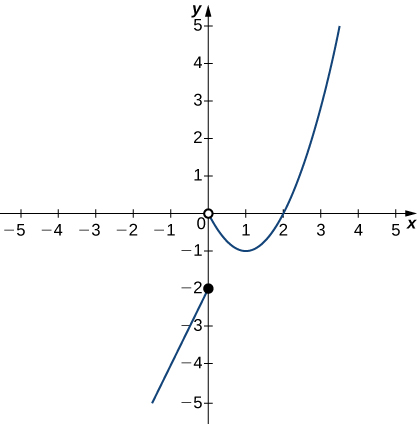
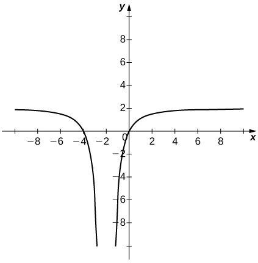

* Using correct notation, describe the limit of a function.
* Use a table of values to estimate the limit of a function or to identify when the limit does not exist.
* Use a graph to estimate the limit of a function or to identify when the limit does not exist.
* Define one-sided limits and provide examples.
* Explain the relationship between one-sided and two-sided limits.
* Using correct notation, describe an infinite limit.
* Define a vertical asymptote.

The concept of a limit or limiting process, essential to the understanding of calculus, has been around for thousands of years. In fact, early mathematicians used a limiting process to obtain better and better approximations of areas of circles. Yet, the formal definition of a limit—as we know and understand it today—did not appear until the late 19th century. We therefore begin our quest to understand limits, as our mathematical ancestors did, by using an intuitive approach. At the end of this chapter, armed with a conceptual understanding of limits, we examine the formal definition of a limit.

We begin our exploration of limits by taking a look at the graphs of the functions

<math xmlns="http://www.w3.org/1998/Math/MathML"><mrow><mi>f</mi><mrow><mo>(</mo><mi>x</mi><mo>)</mo></mrow><mo>=</mo><mfrac><mrow><msup><mi>x</mi><mn>2</mn></msup><mo>−</mo><mn>4</mn></mrow><mrow><mi>x</mi><mo>−</mo><mn>2</mn></mrow></mfrac><mo>,</mo><mspace width="0.2em" /><mi>g</mi><mrow><mo>(</mo><mi>x</mi><mo>)</mo></mrow><mo>=</mo><mfrac><mrow><mrow><mo>\|</mo><mrow><mi>x</mi><mo>−</mo><mn>2</mn></mrow><mo>\|</mo></mrow></mrow><mrow><mi>x</mi><mo>−</mo><mn>2</mn></mrow></mfrac><mo>,</mo><mspace width="0.2em" /><mtext>and</mtext><mspace width="0.2em" /><mi>h</mi><mrow><mo>(</mo><mi>x</mi><mo>)</mo></mrow><mo>=</mo><mfrac><mn>1</mn><mrow><msup><mrow><mrow><mo>(</mo><mrow><mi>x</mi><mo>−</mo><mn>2</mn></mrow><mo>)</mo></mrow></mrow><mn>2</mn></msup></mrow></mfrac><mo>,</mo></mrow></math>

which are shown in [\[link\]](#CNX_Calc_Figure_02_02_001). In particular, let’s focus our attention on the behavior of each graph at and around <math xmlns="http://www.w3.org/1998/Math/MathML"><mrow><mi>x</mi><mo>=</mo><mn>2</mn><mo>.</mo></mrow></math>

 {: #CNX_Calc_Figure_02_02_001}

Each of the three functions is undefined at <math xmlns="http://www.w3.org/1998/Math/MathML"><mrow><mi>x</mi><mo>=</mo><mn>2</mn><mo>,</mo></mrow></math>

 but if we make this statement and no other, we give a very incomplete picture of how each function behaves in the vicinity of <math xmlns="http://www.w3.org/1998/Math/MathML"><mrow><mi>x</mi><mo>=</mo><mn>2</mn><mo>.</mo></mrow></math>

 To express the behavior of each graph in the vicinity of 2 more completely, we need to introduce the concept of a limit.

# Intuitive Definition of a Limit

Let’s first take a closer look at how the function <math xmlns="http://www.w3.org/1998/Math/MathML"><mrow><mi>f</mi><mrow><mo>(</mo><mi>x</mi><mo>)</mo></mrow><mo>=</mo><mrow><mrow><mo stretchy="false">(</mo><msup><mi>x</mi><mn>2</mn></msup><mo>−</mo><mn>4</mn><mo stretchy="false">)</mo></mrow><mtext>/</mtext><mrow><mo stretchy="false">(</mo><mi>x</mi><mo>−</mo><mn>2</mn><mo stretchy="false">)</mo></mrow></mrow></mrow></math>

 behaves around <math xmlns="http://www.w3.org/1998/Math/MathML"><mrow><mi>x</mi><mo>=</mo><mn>2</mn></mrow></math>

 in [\[link\]](#CNX_Calc_Figure_02_02_001). As the values of *x* approach 2 from either side of 2, the values of <math xmlns="http://www.w3.org/1998/Math/MathML"><mrow><mi>y</mi><mo>=</mo><mi>f</mi><mrow><mo>(</mo><mi>x</mi><mo>)</mo></mrow></mrow></math>

 approach 4. Mathematically, we say that the limit of <math xmlns="http://www.w3.org/1998/Math/MathML"><mrow><mi>f</mi><mrow><mo>(</mo><mi>x</mi><mo>)</mo></mrow></mrow></math>

 as *x* approaches 2 is 4. Symbolically, we express this limit as

<math xmlns="http://www.w3.org/1998/Math/MathML"><mrow><munder><mrow><mtext>lim</mtext></mrow><mrow><mi>x</mi><mo stretchy="false">→</mo><mn>2</mn></mrow></munder><mi>f</mi><mrow><mo>(</mo><mi>x</mi><mo>)</mo></mrow><mo>=</mo><mn>4</mn><mo>.</mo></mrow></math>

From this very brief informal look at one limit, let’s start to develop an **intuitive definition of the limit**{: data-type="term"}. We can think of the limit of a function at a number *a* as being the one real number *L* that the functional values approach as the *x*-values approach *a,* provided such a real number *L* exists. Stated more carefully, we have the following definition:

Definition

Let <math xmlns="http://www.w3.org/1998/Math/MathML"><mrow><mi>f</mi><mrow><mo>(</mo><mi>x</mi><mo>)</mo></mrow></mrow></math>

 be a function defined at all values in an open interval containing *a*, with the possible exception of *a* itself, and let *L* be a real number. If *all* values of the function <math xmlns="http://www.w3.org/1998/Math/MathML"><mrow><mi>f</mi><mrow><mo>(</mo><mi>x</mi><mo>)</mo></mrow></mrow></math>

 approach the real number *L* as the values of <math xmlns="http://www.w3.org/1998/Math/MathML"><mrow><mi>x</mi><mrow><mo>(</mo><mrow><mo>≠</mo><mi>a</mi></mrow><mo>)</mo></mrow></mrow></math>

 approach the number *a*, then we say that the limit of <math xmlns="http://www.w3.org/1998/Math/MathML"><mrow><mi>f</mi><mrow><mo>(</mo><mi>x</mi><mo>)</mo></mrow></mrow></math>

 as *x* approaches *a* is *L*. (More succinct, as *x* gets closer to *a*, <math xmlns="http://www.w3.org/1998/Math/MathML"><mrow><mi>f</mi><mrow><mo>(</mo><mi>x</mi><mo>)</mo></mrow></mrow></math>

 gets closer and stays close to *L*.) Symbolically, we express this idea as

<math xmlns="http://www.w3.org/1998/Math/MathML"><mrow><munder><mrow><mtext>lim</mtext></mrow><mrow><mi>x</mi><mo stretchy="false">→</mo><mi>a</mi></mrow></munder><mi>f</mi><mrow><mo>(</mo><mi>x</mi><mo>)</mo></mrow><mo>=</mo><mi>L</mi><mo>.</mo></mrow></math>

We can estimate limits by constructing tables of functional values and by looking at their graphs. This process is described in the following Problem-Solving Strategy.

Problem-Solving Strategy: Evaluating a Limit Using a Table of Functional Values

1.  To evaluate
    <math xmlns="http://www.w3.org/1998/Math/MathML"><mrow><munder><mrow><mtext>lim</mtext></mrow><mrow><mi>x</mi><mo stretchy="false">→</mo><mi>a</mi></mrow></munder><mi>f</mi><mrow><mo>(</mo><mi>x</mi><mo>)</mo></mrow><mo>,</mo></mrow></math>
    
    we begin by completing a table of functional values. We should choose two sets of *x*-values—one set of values approaching *a* and less than *a*, and another set of values approaching *a* and greater than *a*. [\[link\]](#fs-id1170572204940) demonstrates what your tables might look like.
    * * *
    {: data-type="newline"}
    
    <table summary="There are two tables. They both have two columns and five rows. The first table has headers x and f(x) in the first row. Under x in the first column are the values a-0.1, a-0.01, a-0.001, and a-0.0001. Under f(x) in the second column are values f(a-0.1), f(a-0.01), f(a-0.001), and f(a-0.0001). At the bottom is a note that one may &#x201C;use additional values as necessary&#x201D; in both columns. The second table has headers x and f(x) in the first row. Under x in the first column are the values a+0.1, a+0.01, a+0.001, and a+0.0001. Under f(x) in the second column are values f(a+0.1), f(a+0.01), f(a+0.001), and f(a+0.0001). At the bottom is a note that one may &#x201C;use additional values as necessary&#x201D; in both columns."><caption>Table of Functional Values for <math xmlns="http://www.w3.org/1998/Math/MathML"><mrow><munder><mrow><mtext>lim</mtext></mrow><mrow><mi>x</mi><mo stretchy="false">→</mo><mi>a</mi></mrow></munder><mi>f</mi><mrow><mo>(</mo><mi>x</mi><mo>)</mo></mrow></mrow></math></caption><thead>
    <tr valign="top">
    <th data-align="left"><em>x</em></th>
    <th data-align="left"><math xmlns="http://www.w3.org/1998/Math/MathML"><mrow><mi>f</mi><mrow><mo>(</mo><mi>x</mi><mo>)</mo></mrow></mrow></math></th>
    <th data-align="left" />
    <th data-align="left"><em>x</em></th>
    <th data-align="left"><math xmlns="http://www.w3.org/1998/Math/MathML"><mrow><mi>f</mi><mrow><mo>(</mo><mi>x</mi><mo>)</mo></mrow></mrow></math></th>
    </tr>
    </thead><tbody>
    <tr valign="top">
    <td data-align="left"><math xmlns="http://www.w3.org/1998/Math/MathML"><mrow><mi>a</mi><mo>−</mo><mn>0.1</mn></mrow></math></td>
    <td data-align="left"><math xmlns="http://www.w3.org/1998/Math/MathML"><mrow><mi>f</mi><mrow><mo>(</mo><mrow><mi>a</mi><mo>−</mo><mn>0.1</mn></mrow><mo>)</mo></mrow></mrow></math></td>
    <td rowspan="5" />
    <td data-align="left"><math xmlns="http://www.w3.org/1998/Math/MathML"><mrow><mi>a</mi><mo>+</mo><mn>0.1</mn></mrow></math></td>
    <td data-align="left"><math xmlns="http://www.w3.org/1998/Math/MathML"><mrow><mi>f</mi><mrow><mo>(</mo><mrow><mi>a</mi><mo>+</mo><mn>0.1</mn></mrow><mo>)</mo></mrow></mrow></math></td>
    </tr>
    <tr valign="top">
    <td data-align="left"><math xmlns="http://www.w3.org/1998/Math/MathML"><mrow><mi>a</mi><mo>−</mo><mn>0.01</mn></mrow></math></td>
    <td data-align="left"><math xmlns="http://www.w3.org/1998/Math/MathML"><mrow><mi>f</mi><mrow><mo>(</mo><mrow><mi>a</mi><mo>−</mo><mn>0.01</mn></mrow><mo>)</mo></mrow></mrow></math></td>
    <td data-align="left"><math xmlns="http://www.w3.org/1998/Math/MathML"><mrow><mi>a</mi><mo>+</mo><mn>0.01</mn></mrow></math></td>
    <td data-align="left"><math xmlns="http://www.w3.org/1998/Math/MathML"><mrow><mi>f</mi><mrow><mo>(</mo><mrow><mi>a</mi><mo>+</mo><mn>0.01</mn></mrow><mo>)</mo></mrow></mrow></math></td>
    </tr>
    <tr valign="top">
    <td data-align="left"><math xmlns="http://www.w3.org/1998/Math/MathML"><mrow><mi>a</mi><mo>−</mo><mn>0.001</mn></mrow></math></td>
    <td data-align="left"><math xmlns="http://www.w3.org/1998/Math/MathML"><mrow><mi>f</mi><mrow><mo>(</mo><mrow><mi>a</mi><mo>−</mo><mn>0.001</mn></mrow><mo>)</mo></mrow></mrow></math></td>
    <td data-align="left"><math xmlns="http://www.w3.org/1998/Math/MathML"><mrow><mi>a</mi><mo>+</mo><mn>0.001</mn></mrow></math></td>
    <td data-align="left"><math xmlns="http://www.w3.org/1998/Math/MathML"><mrow><mi>f</mi><mrow><mo>(</mo><mrow><mi>a</mi><mo>+</mo><mn>0.001</mn></mrow><mo>)</mo></mrow></mrow></math></td>
    </tr>
    <tr valign="top">
    <td data-align="left"><math xmlns="http://www.w3.org/1998/Math/MathML"><mrow><mi>a</mi><mo>−</mo><mn>0.0001</mn></mrow></math></td>
    <td data-align="left"><math xmlns="http://www.w3.org/1998/Math/MathML"><mrow><mi>f</mi><mrow><mo>(</mo><mrow><mi>a</mi><mo>−</mo><mn>0.0001</mn></mrow><mo>)</mo></mrow></mrow></math></td>
    <td data-align="left"><math xmlns="http://www.w3.org/1998/Math/MathML"><mrow><mi>a</mi><mo>+</mo><mn>0.0001</mn></mrow></math></td>
    <td data-align="left"><math xmlns="http://www.w3.org/1998/Math/MathML"><mrow><mi>f</mi><mrow><mo>(</mo><mrow><mi>a</mi><mo>+</mo><mn>0.0001</mn></mrow><mo>)</mo></mrow></mrow></math></td>
    </tr>
    <tr valign="top">
    <td colspan="2" data-align="left">Use additional values as necessary.</td>
    <td colspan="2" data-align="left">Use additional values as necessary.</td>
    </tr>
    </tbody></table>

2.  Next, let’s look at the values in each of the
    <math xmlns="http://www.w3.org/1998/Math/MathML"><mrow><mi>f</mi><mrow><mo>(</mo><mi>x</mi><mo>)</mo></mrow></mrow></math>
    
    columns and determine whether the values seem to be approaching a single value as we move down each column. In our columns, we look at the sequence
    <math xmlns="http://www.w3.org/1998/Math/MathML"><mrow><mi>f</mi><mrow><mo>(</mo><mrow><mi>a</mi><mo>−</mo><mn>0.1</mn></mrow><mo>)</mo></mrow><mo>,</mo><mi>f</mi><mrow><mo>(</mo><mrow><mi>a</mi><mo>−</mo><mn>0.01</mn></mrow><mo>)</mo></mrow><mo>,</mo><mi>f</mi><mrow><mo>(</mo><mrow><mi>a</mi><mo>−</mo><mn>0.001</mn></mrow><mo>)</mo></mrow><mo>.</mo><mo>,</mo><mi>f</mi><mrow><mo>(</mo><mrow><mi>a</mi><mo>−</mo><mn>0.0001</mn></mrow><mo>)</mo></mrow><mo>,</mo></mrow></math>
    
    and so on, and
    <math xmlns="http://www.w3.org/1998/Math/MathML"><mrow><mi>f</mi><mrow><mo>(</mo><mrow><mi>a</mi><mo>+</mo><mn>0.1</mn></mrow><mo>)</mo></mrow><mo>,</mo><mi>f</mi><mrow><mo>(</mo><mrow><mi>a</mi><mo>+</mo><mn>0.01</mn></mrow><mo>)</mo></mrow><mo>,</mo><mi>f</mi><mrow><mo>(</mo><mrow><mi>a</mi><mo>+</mo><mn>0.001</mn></mrow><mo>)</mo></mrow><mo>,</mo><mi>f</mi><mrow><mo>(</mo><mrow><mi>a</mi><mo>+</mo><mn>0.0001</mn></mrow><mo>)</mo></mrow><mo>,</mo></mrow></math>
    
    and so on. (*Note*\: Although we have chosen the *x*-values
    <math xmlns="http://www.w3.org/1998/Math/MathML"><mrow><mi>a</mi><mo>±</mo><mn>0.1</mn><mo>,</mo><mi>a</mi><mo>±</mo><mn>0.01</mn><mo>,</mo><mi>a</mi><mo>±</mo><mn>0.001</mn><mo>,</mo><mi>a</mi><mo>±</mo><mn>0.0001</mn><mo>,</mo></mrow></math>
    
    and so forth, and these values will probably work nearly every time, on very rare occasions we may need to modify our choices.)
3.  If both columns approach a common *y*-value *L*, we state
    <math xmlns="http://www.w3.org/1998/Math/MathML"><mrow><munder><mrow><mtext>lim</mtext></mrow><mrow><mi>x</mi><mo stretchy="false">→</mo><mi>a</mi></mrow></munder><mi>f</mi><mrow><mo>(</mo><mi>x</mi><mo>)</mo></mrow><mo>=</mo><mi>L</mi><mo>.</mo></mrow></math>
    
    We can use the following strategy to confirm the result obtained from the table or as an alternative method for estimating a limit.
4.  Using a graphing calculator or computer software that allows us graph functions, we can plot the function
    <math xmlns="http://www.w3.org/1998/Math/MathML"><mrow><mi>f</mi><mrow><mo>(</mo><mi>x</mi><mo>)</mo></mrow><mo>,</mo></mrow></math>
    
    making sure the functional values of
    <math xmlns="http://www.w3.org/1998/Math/MathML"><mrow><mi>f</mi><mrow><mo>(</mo><mi>x</mi><mo>)</mo></mrow></mrow></math>
    
    for *x*-values near *a* are in our window. We can use the trace feature to move along the graph of the function and watch the *y*-value readout as the *x*-values approach *a*. If the *y*-values approach *L* as our *x*-values approach *a* from both directions, then
    <math xmlns="http://www.w3.org/1998/Math/MathML"><mrow><munder><mrow><mtext>lim</mtext></mrow><mrow><mi>x</mi><mo stretchy="false">→</mo><mi>a</mi></mrow></munder><mi>f</mi><mrow><mo>(</mo><mi>x</mi><mo>)</mo></mrow><mo>=</mo><mi>L</mi><mo>.</mo></mrow></math>
    
    We may need to zoom in on our graph and repeat this process several times.
{: data-number-style="arabic"}

We apply this Problem-Solving Strategy to compute a limit in [\[link\]](#fs-id1170572561451).

Evaluating a Limit Using a Table of Functional Values 1

Evaluate <math xmlns="http://www.w3.org/1998/Math/MathML"><mrow><munder><mrow><mtext>lim</mtext></mrow><mrow><mi>x</mi><mo stretchy="false">→</mo><mn>0</mn></mrow></munder><mfrac><mrow><mtext>sin</mtext><mspace width="0.1em" /><mi>x</mi></mrow><mi>x</mi></mfrac></mrow></math>

 using a table of functional values.

We have calculated the values of <math xmlns="http://www.w3.org/1998/Math/MathML"><mrow><mi>f</mi><mrow><mo>(</mo><mi>x</mi><mo>)</mo></mrow><mo>=</mo><mrow><mrow><mo stretchy="false">(</mo><mtext>sin</mtext><mspace width="0.1em" /><mi>x</mi><mo stretchy="false">)</mo></mrow><mtext>/</mtext><mi>x</mi></mrow></mrow></math>

 for the values of *x* listed in [[link]](#fs-id1170572208852).

<table summary="There are two tables. They both have two columns and five rows. The first table has headers x and sin(x)/x in the first row. Under x in the first column are the values -0.1, -0.01, -0.001, and -0.0001. Under sin(x)/x in the second column are values 0.998334166468, 0.999983333417, 0.999999833333, and 0.999999998333. The second table has headers x and sin(x)/x in the first row. Under x in the first column are the values 0.1, 0.01, 0.001, and 0.0001. Under sin(x)/x in the second column are values 0.998334166468, 0.999983333417, 0.999999833333, and 0.999999998333."><caption>Table of Functional Values for <math xmlns="http://www.w3.org/1998/Math/MathML"><mrow><munder><mrow><mtext>lim</mtext></mrow><mrow><mi>x</mi><mo stretchy="false">→</mo><mn>0</mn></mrow></munder><mfrac><mrow><mtext>sin</mtext><mspace width="0.1em" /><mi>x</mi></mrow><mi>x</mi></mfrac></mrow></math></caption><thead>
<tr valign="top">
<th data-align="left"><em>x</em></th>
<th data-align="left"><math xmlns="http://www.w3.org/1998/Math/MathML"><mrow><mfrac><mrow><mtext>sin</mtext><mspace width="0.1em" /><mi>x</mi></mrow><mi>x</mi></mfrac></mrow></math></th>
<th data-align="left" />
<th data-align="left"><em>x</em></th>
<th data-align="left"><math xmlns="http://www.w3.org/1998/Math/MathML"><mrow><mfrac><mrow><mtext>sin</mtext><mspace width="0.1em" /><mi>x</mi></mrow><mi>x</mi></mfrac></mrow></math></th>
</tr>
</thead><tbody>
<tr valign="top">
<td data-align="left">−0.1</td>
<td data-align="left">0.998334166468</td>
<td rowspan="4" />
<td data-align="left">0.1</td>
<td data-align="left">0.998334166468</td>
</tr>
<tr valign="top">
<td data-align="left">−0.01</td>
<td data-align="left">0.999983333417</td>
<td data-align="left">0.01</td>
<td data-align="left">0.999983333417</td>
</tr>
<tr valign="top">
<td data-align="left">−0.001</td>
<td data-align="left">0.999999833333</td>
<td data-align="left">0.001</td>
<td data-align="left">0.999999833333</td>
</tr>
<tr valign="top">
<td data-align="left">−0.0001</td>
<td data-align="left">0.999999998333</td>
<td data-align="left">0.0001</td>
<td data-align="left">0.999999998333</td>
</tr>
</tbody></table>
*Note*: The values in this table were obtained using a calculator and using all the places given in the calculator output.

As we read down each <math xmlns="http://www.w3.org/1998/Math/MathML"><mrow><mfrac><mrow><mrow><mo>(</mo><mrow><mtext>sin</mtext><mspace width="0.1em" /><mi>x</mi></mrow><mo>)</mo></mrow></mrow><mi>x</mi></mfrac></mrow></math>

 column, we see that the values in each column appear to be approaching one. Thus, it is fairly reasonable to conclude that <math xmlns="http://www.w3.org/1998/Math/MathML"><mrow><munder><mrow><mtext>lim</mtext></mrow><mrow><mi>x</mi><mo stretchy="false">→</mo><mn>0</mn></mrow></munder><mfrac><mrow><mtext>sin</mtext><mspace width="0.1em" /><mi>x</mi></mrow><mi>x</mi></mfrac><mo>=</mo><mn>1</mn><mo>.</mo></mrow></math>

 A calculator-or computer-generated graph of <math xmlns="http://www.w3.org/1998/Math/MathML"><mrow><mi>f</mi><mrow><mo>(</mo><mi>x</mi><mo>)</mo></mrow><mo>=</mo><mfrac><mrow><mrow><mo>(</mo><mrow><mtext>sin</mtext><mspace width="0.1em" /><mi>x</mi></mrow><mo>)</mo></mrow></mrow><mi>x</mi></mfrac></mrow></math>

 would be similar to that shown in [[link]](#CNX_Calc_Figure_02_02_003), and it confirms our estimate.

![A graph of f(x) = sin(x)/x over the interval \[-6, 6\]. The curving function has a y intercept at x=0 and x intercepts at y=pi and y=-pi.](../resources/CNX_Calc_Figure_02_02_003.jpg "The graph of f(x)=(sinx)/x confirms the estimate from [link]."){: #CNX_Calc_Figure_02_02_003}

Evaluating a Limit Using a Table of Functional Values 2

Evaluate <math xmlns="http://www.w3.org/1998/Math/MathML"><mrow><munder><mrow><mtext>lim</mtext></mrow><mrow><mi>x</mi><mo stretchy="false">→</mo><mn>4</mn></mrow></munder><mfrac><mrow><msqrt><mi>x</mi></msqrt><mo>−</mo><mn>2</mn></mrow><mrow><mi>x</mi><mo>−</mo><mn>4</mn></mrow></mfrac></mrow></math>

 using a table of functional values.

As before, we use a table—in this case, [[link]](#fs-id1170571595483)—to list the values of the function for the given values of *x*.

<table summary="There are two tables, each with six rows and two columns. The first table has headers x and (sqrt(x) &#x2013; 2 ) / (x-4) in the first row. In the first column under x are the values 3.9, 3.99, 3.999, 3.9999, and 3.99999. In the second column are the values 0.251582341869, 0.25015644562, 0.250015627, 0.250001563, 0.25000016. The second table has the same headers in the first row. In the first column under x are the values 4.1, 4.01, 4.001, 4.0001, and 4.00001. In the second column are the values 0.248456731317, 0.24984394501, 0.249984377, 0.249998438, and 0.24999984."><caption>Table of Functional Values for <math xmlns="http://www.w3.org/1998/Math/MathML"><mrow><munder><mrow><mtext>lim</mtext></mrow><mrow><mi>x</mi><mo stretchy="false">→</mo><mn>4</mn></mrow></munder><mfrac><mrow><msqrt><mi>x</mi></msqrt><mo>−</mo><mn>2</mn></mrow><mrow><mi>x</mi><mo>−</mo><mn>4</mn></mrow></mfrac></mrow></math></caption><thead>
<tr valign="top">
<th data-align="left"><em>x</em></th>
<th data-align="left"><math xmlns="http://www.w3.org/1998/Math/MathML"><mrow><mfrac><mrow><msqrt><mi>x</mi></msqrt><mo>−</mo><mn>2</mn></mrow><mrow><mi>x</mi><mo>−</mo><mn>4</mn></mrow></mfrac></mrow></math></th>
<th data-align="left" />
<th data-align="left"><em>x</em></th>
<th data-align="left"><math xmlns="http://www.w3.org/1998/Math/MathML"><mrow><mfrac><mrow><msqrt><mi>x</mi></msqrt><mo>−</mo><mn>2</mn></mrow><mrow><mi>x</mi><mo>−</mo><mn>4</mn></mrow></mfrac></mrow></math></th>
</tr>
</thead><tbody>
<tr valign="top">
<td data-align="left">3.9</td>
<td data-align="left">0.251582341869</td>
<td rowspan="5" />
<td data-align="left">4.1</td>
<td data-align="left">0.248456731317</td>
</tr>
<tr valign="top">
<td data-align="left">3.99</td>
<td data-align="left">0.25015644562</td>
<td data-align="left">4.01</td>
<td data-align="left">0.24984394501</td>
</tr>
<tr valign="top">
<td data-align="left">3.999</td>
<td data-align="left">0.250015627</td>
<td data-align="left">4.001</td>
<td data-align="left">0.249984377</td>
</tr>
<tr valign="top">
<td data-align="left">3.9999</td>
<td data-align="left">0.250001563</td>
<td data-align="left">4.0001</td>
<td data-align="left">0.249998438</td>
</tr>
<tr valign="top">
<td data-align="left">3.99999</td>
<td data-align="left">0.25000016</td>
<td data-align="left">4.00001</td>
<td data-align="left">0.24999984</td>
</tr>
</tbody></table>
After inspecting this table, we see that the functional values less than 4 appear to be decreasing toward 0.25 whereas the functional values greater than 4 appear to be increasing toward 0.25. We conclude that <math xmlns="http://www.w3.org/1998/Math/MathML"><mrow><munder><mrow><mtext>lim</mtext></mrow><mrow><mi>x</mi><mo stretchy="false">→</mo><mn>4</mn></mrow></munder><mfrac><mrow><msqrt><mi>x</mi></msqrt><mo>−</mo><mn>2</mn></mrow><mrow><mi>x</mi><mo>−</mo><mn>4</mn></mrow></mfrac><mo>=</mo><mn>0.25</mn><mo>.</mo></mrow></math>

 We confirm this estimate using the graph of <math xmlns="http://www.w3.org/1998/Math/MathML"><mrow><mi>f</mi><mrow><mo>(</mo><mi>x</mi><mo>)</mo></mrow><mo>=</mo><mfrac><mrow><msqrt><mi>x</mi></msqrt><mo>−</mo><mn>2</mn></mrow><mrow><mi>x</mi><mo>−</mo><mn>4</mn></mrow></mfrac></mrow></math>

 shown in [[link]](#CNX_Calc_Figure_02_02_004).

![A graph of the function f(x) = (sqrt(x) &#x2013; 2 ) / (x-4) over the interval \[0,8\]. There is an open circle on the function at x=4. The function curves asymptotically towards the x axis and y axis in quadrant one.](../resources/CNX_Calc_Figure_02_02_004.jpg "The graph of f(x)=x&#x2212;2x&#x2212;4 confirms the estimate from [link]."){: #CNX_Calc_Figure_02_02_004}

Estimate <math xmlns="http://www.w3.org/1998/Math/MathML"><mrow><munder><mrow><mtext>lim</mtext></mrow><mrow><mi>x</mi><mo stretchy="false">→</mo><mn>1</mn></mrow></munder><mfrac><mrow><mfrac><mn>1</mn><mi>x</mi></mfrac><mo>−</mo><mn>1</mn></mrow><mrow><mi>x</mi><mo>−</mo><mn>1</mn></mrow></mfrac></mrow></math>

 using a table of functional values. Use a graph to confirm your estimate.

<math xmlns="http://www.w3.org/1998/Math/MathML"><mrow><munder><mrow><mtext>lim</mtext></mrow><mrow><mi>x</mi><mo stretchy="false">→</mo><mn>1</mn></mrow></munder><mfrac><mrow><mfrac><mn>1</mn><mi>x</mi></mfrac><mo>−</mo><mn>1</mn></mrow><mrow><mi>x</mi><mo>−</mo><mn>1</mn></mrow></mfrac><mo>=</mo><mn>−1</mn></mrow></math>

Hint

Use 0.9, 0.99, 0.999, 0.9999, 0.99999 and 1.1, 1.01, 1.001, 1.0001, 1.00001 as your table values.

At this point, we see from [\[link\]](#fs-id1170572561451) and [\[link\]](#fs-id1170571656691) that it may be just as easy, if not easier, to estimate a limit of a function by inspecting its graph as it is to estimate the limit by using a table of functional values. In [\[link\]](#fs-id1170572337207), we evaluate a limit exclusively by looking at a graph rather than by using a table of functional values.

Evaluating a Limit Using a Graph

For <math xmlns="http://www.w3.org/1998/Math/MathML"><mrow><mi>g</mi><mrow><mo>(</mo><mi>x</mi><mo>)</mo></mrow></mrow></math>

 shown in [[link]](#CNX_Calc_Figure_02_02_006), evaluate <math xmlns="http://www.w3.org/1998/Math/MathML"><mrow><munder><mrow><mtext>lim</mtext></mrow><mrow><mi>x</mi><mo stretchy="false">→</mo><mn>−1</mn></mrow></munder><mi>g</mi><mrow><mo>(</mo><mi>x</mi><mo>)</mo></mrow><mo>.</mo></mrow></math>

 includes one value not on a smooth curve."){: #CNX_Calc_Figure_02_02_006}

Despite the fact that <math xmlns="http://www.w3.org/1998/Math/MathML"><mrow><mi>g</mi><mrow><mo>(</mo><mrow><mn>−1</mn></mrow><mo>)</mo></mrow><mo>=</mo><mn>4</mn><mo>,</mo></mrow></math>

 as the *x*-values approach −1 from either side, the <math xmlns="http://www.w3.org/1998/Math/MathML"><mrow><mi>g</mi><mrow><mo>(</mo><mi>x</mi><mo>)</mo></mrow></mrow></math>

 values approach 3. Therefore, <math xmlns="http://www.w3.org/1998/Math/MathML"><mrow><munder><mrow><mtext>lim</mtext></mrow><mrow><mi>x</mi><mo stretchy="false">→</mo><mn>−1</mn></mrow></munder><mi>g</mi><mrow><mo>(</mo><mi>x</mi><mo>)</mo></mrow><mo>=</mo><mn>3</mn><mo>.</mo></mrow></math>

 Note that we can determine this limit without even knowing the algebraic expression of the function.

Based on [\[link\]](#fs-id1170572337207), we make the following observation: It is possible for the limit of a function to exist at a point, and for the function to be defined at this point, but the limit of the function and the value of the function at the point may be different.

Use the graph of <math xmlns="http://www.w3.org/1998/Math/MathML"><mrow><mi>h</mi><mrow><mo>(</mo><mi>x</mi><mo>)</mo></mrow></mrow></math>

 in [[link]](#CNX_Calc_Figure_02_02_007) to evaluate <math xmlns="http://www.w3.org/1998/Math/MathML"><mrow><munder><mrow><mtext>lim</mtext></mrow><mrow><mi>x</mi><mo stretchy="false">→</mo><mn>2</mn></mrow></munder><mi>h</mi><mrow><mo>(</mo><mi>x</mi><mo>)</mo></mrow><mo>,</mo></mrow></math>

 if possible.

![A graph of the function h(x), which is a parabola graphed over \[-2.5, 5\]. There is an open circle where the vertex should be at the point (2,-1).](../resources/CNX_Calc_Figure_02_02_007.jpg){: #CNX_Calc_Figure_02_02_007}

<math xmlns="http://www.w3.org/1998/Math/MathML"><mrow><munder><mrow><mtext>lim</mtext></mrow><mrow><mi>x</mi><mo stretchy="false">→</mo><mn>2</mn></mrow></munder><mi>h</mi><mrow><mo>(</mo><mi>x</mi><mo>)</mo></mrow><mo>=</mo><mn>−1</mn><mo>.</mo></mrow></math>

Hint

What *y*-value does the function approach as the *x*-values approach 2?

Looking at a table of functional values or looking at the graph of a function provides us with useful insight into the value of the limit of a function at a given point. However, these techniques rely too much on guesswork. We eventually need to develop alternative methods of evaluating limits. These new methods are more algebraic in nature and we explore them in the next section; however, at this point we introduce two special limits that are foundational to the techniques to come.

Two Important Limits

Let *a* be a real number and *c* be a constant.

1.  

    <math xmlns="http://www.w3.org/1998/Math/MathML"><mrow><munder><mrow><mtext>lim</mtext></mrow><mrow><mi>x</mi><mo stretchy="false">→</mo><mi>a</mi></mrow></munder><mi>x</mi><mo>=</mo><mi>a</mi></mrow></math>
    

2.  

    <math xmlns="http://www.w3.org/1998/Math/MathML"><mrow><munder><mrow><mtext>lim</mtext></mrow><mrow><mi>x</mi><mo stretchy="false">→</mo><mi>a</mi></mrow></munder><mi>c</mi><mo>=</mo><mi>c</mi></mrow></math>
    

{: data-number-style="lower-roman"}

We can make the following observations about these two limits.

1.  For the first limit, observe that as *x* approaches *a*, so does
    <math xmlns="http://www.w3.org/1998/Math/MathML"><mrow><mi>f</mi><mrow><mo>(</mo><mi>x</mi><mo>)</mo></mrow><mo>,</mo></mrow></math>
    
    because
    <math xmlns="http://www.w3.org/1998/Math/MathML"><mrow><mi>f</mi><mrow><mo>(</mo><mi>x</mi><mo>)</mo></mrow><mo>=</mo><mi>x</mi><mo>.</mo></mrow></math>
    
    Consequently,
    <math xmlns="http://www.w3.org/1998/Math/MathML"><mrow><munder><mrow><mtext>lim</mtext></mrow><mrow><mi>x</mi><mo stretchy="false">→</mo><mi>a</mi></mrow></munder><mi>x</mi><mo>=</mo><mi>a</mi><mo>.</mo></mrow></math>

2.  For the second limit, consider [\[link\]](#fs-id1170571613026).
{: data-number-style="lower-roman"}

<table summary="Two tables side by side, both containing two columns and five rows. The first table has headers x and f(x) = c in the first row. Under x in the first column are the values a-0.1, a-0.01, a-0.001, and a-0.0001. All of the values in the second column under the header are c. The second table has the same headers. Under x in the first column are the values a+0.1, a+0.01, a+0.001, and a+0.0001. All of the values in the second column under the header are c."><caption>Table of Functional Values for <math xmlns="http://www.w3.org/1998/Math/MathML"><mrow><munder><mrow><mtext>lim</mtext></mrow><mrow><mi>x</mi><mo stretchy="false">→</mo><mi>a</mi></mrow></munder><mi>c</mi><mo>=</mo><mi>c</mi></mrow></math></caption><thead>
<tr valign="top">
<th data-align="left"><em>x</em></th>
<th data-align="left"><math xmlns="http://www.w3.org/1998/Math/MathML"><mrow><mi>f</mi><mrow><mo>(</mo><mi>x</mi><mo>)</mo></mrow><mo>=</mo><mi>c</mi></mrow></math></th>
<th />
<th data-align="left"><em>x</em></th>
<th data-align="left"><math xmlns="http://www.w3.org/1998/Math/MathML"><mrow><mi>f</mi><mrow><mo>(</mo><mi>x</mi><mo>)</mo></mrow><mo>=</mo><mi>c</mi></mrow></math></th>
</tr>
</thead><tbody>
<tr valign="top">
<td data-align="left"><math xmlns="http://www.w3.org/1998/Math/MathML"><mrow><mi>a</mi><mo>−</mo><mn>0.1</mn></mrow></math></td>
<td data-align="left"><em>c</em></td>
<td rowspan="4" />
<td data-align="left"><math xmlns="http://www.w3.org/1998/Math/MathML"><mrow><mi>a</mi><mo>+</mo><mn>0.1</mn></mrow></math></td>
<td data-align="left"><em>c</em></td>
</tr>
<tr valign="top">
<td data-align="left"><math xmlns="http://www.w3.org/1998/Math/MathML"><mrow><mi>a</mi><mo>−</mo><mn>0.01</mn></mrow></math></td>
<td data-align="left"><em>c</em></td>
<td data-align="left"><math xmlns="http://www.w3.org/1998/Math/MathML"><mrow><mi>a</mi><mo>+</mo><mn>0.01</mn></mrow></math></td>
<td data-align="left"><em>c</em></td>
</tr>
<tr valign="top">
<td data-align="left"><math xmlns="http://www.w3.org/1998/Math/MathML"><mrow><mi>a</mi><mo>−</mo><mn>0.001</mn></mrow></math></td>
<td data-align="left"><em>c</em></td>
<td data-align="left"><math xmlns="http://www.w3.org/1998/Math/MathML"><mrow><mi>a</mi><mo>+</mo><mn>0.001</mn></mrow></math></td>
<td data-align="left"><em>c</em></td>
</tr>
<tr valign="top">
<td data-align="left"><math xmlns="http://www.w3.org/1998/Math/MathML"><mrow><mi>a</mi><mo>−</mo><mn>0.0001</mn></mrow></math></td>
<td data-align="left"><em>c</em></td>
<td data-align="left"><math xmlns="http://www.w3.org/1998/Math/MathML"><mrow><mi>a</mi><mo>+</mo><mn>0.0001</mn></mrow></math></td>
<td data-align="left"><em>c</em></td>
</tr>
</tbody></table>

Observe that for all values of *x* (regardless of whether they are approaching *a*), the values <math xmlns="http://www.w3.org/1998/Math/MathML"><mrow><mi>f</mi><mrow><mo>(</mo><mi>x</mi><mo>)</mo></mrow></mrow></math>

 remain constant at *c*. We have no choice but to conclude <math xmlns="http://www.w3.org/1998/Math/MathML"><mrow><munder><mrow><mtext>lim</mtext></mrow><mrow><mi>x</mi><mo stretchy="false">→</mo><mi>a</mi></mrow></munder><mi>c</mi><mo>=</mo><mi>c</mi><mo>.</mo></mrow></math>

# The Existence of a Limit

As we consider the limit in the next example, keep in mind that for the limit of a function to exist at a point, the functional values must approach a single real-number value at that point. If the functional values do not approach a single value, then the limit does not exist.

Evaluating a Limit That Fails to Exist

Evaluate <math xmlns="http://www.w3.org/1998/Math/MathML"><mrow><munder><mrow><mtext>lim</mtext></mrow><mrow><mi>x</mi><mo stretchy="false">→</mo><mn>0</mn></mrow></munder><mtext>sin</mtext><mspace width="0.1em" /><mrow><mo>(</mo><mrow><mrow><mn>1</mn><mtext>/</mtext><mtext mathvariant="italic">x</mtext></mrow></mrow><mo>)</mo></mrow></mrow></math>

 using a table of values.

[[link]](#fs-id1170572233784) lists values for the function <math xmlns="http://www.w3.org/1998/Math/MathML"><mrow><mtext>sin</mtext><mo stretchy="false">(</mo><mrow><mn>1</mn><mtext>/</mtext><mrow><mi>x</mi><mo stretchy="false">)</mo></mrow></mrow></mrow></math>

 for the given values of *x*.

<table summary="Two tables side by side, each with two columns and seven rows. The headers are the same, x and sin(1/x) in the first row. In the first table, the values in the first column under x are -0.1, -0.01, -0.001, -0.0001, -0.00001, and -0.000001. The values in the second column under the header are 0.544021110889, 0.50636564111, &#x2212;0;.8268795405312, 0.305614388888, &#x2212;0;.035748797987, and 0.349993504187. In the second column, the values in the first column under x are 0.1, 0.01, 0.001, 0.0001, 0.00001, and 0.000001. The values in the second column under the header are &#x2212;0;.544021110889, &#x2212;0;.50636564111, 0.826879540532, &#x2212;0;.305614388888,  0.035748797987, and &#x2212;0;.349993504187."><caption>Table of Functional Values for <math xmlns="http://www.w3.org/1998/Math/MathML"><mrow><munder><mrow><mtext>lim</mtext></mrow><mrow><mi>x</mi><mo stretchy="false">→</mo><mn>0</mn></mrow></munder><mtext>sin</mtext><mspace width="0.1em" /><mrow><mo>(</mo><mrow><mfrac><mn>1</mn><mi>x</mi></mfrac></mrow><mo>)</mo></mrow></mrow></math></caption><thead>
<tr valign="top">
<th data-align="left"><em>x</em></th>
<th data-align="left"><math xmlns="http://www.w3.org/1998/Math/MathML"><mrow><mtext>sin</mtext><mrow><mo>(</mo><mrow><mfrac><mn>1</mn><mi>x</mi></mfrac></mrow><mo>)</mo></mrow></mrow></math></th>
<th />
<th data-align="left"><em>x</em></th>
<th data-align="left"><math xmlns="http://www.w3.org/1998/Math/MathML"><mrow><mtext>sin</mtext><mrow><mo>(</mo><mrow><mfrac><mn>1</mn><mi>x</mi></mfrac></mrow><mo>)</mo></mrow></mrow></math></th>
</tr>
</thead><tbody>
<tr valign="top">
<td data-align="left">−0.1</td>
<td data-align="left">0.544021110889</td>
<td rowspan="6" />
<td data-align="left">0.1</td>
<td data-align="left">−0.544021110889</td>
</tr>
<tr valign="top">
<td data-align="left">−0.01</td>
<td data-align="left">0.50636564111</td>
<td data-align="left">0.01</td>
<td data-align="left">−0.50636564111</td>
</tr>
<tr valign="top">
<td data-align="left">−0.001</td>
<td data-align="left">−0.8268795405312</td>
<td data-align="left">0.001</td>
<td data-align="left">0.826879540532</td>
</tr>
<tr valign="top">
<td data-align="left">−0.0001</td>
<td data-align="left">0.305614388888</td>
<td data-align="left">0.0001</td>
<td data-align="left">−0.305614388888</td>
</tr>
<tr valign="top">
<td data-align="left">−0.00001</td>
<td data-align="left">−0.035748797987</td>
<td data-align="left">0.00001</td>
<td data-align="left">0.035748797987</td>
</tr>
<tr valign="top">
<td data-align="left">−0.000001</td>
<td data-align="left">0.349993504187</td>
<td data-align="left">0.000001</td>
<td data-align="left">−0.349993504187</td>
</tr>
</tbody></table>
After examining the table of functional values, we can see that the *y*-values do not seem to approach any one single value. It appears the limit does not exist. Before drawing this conclusion, let’s take a more systematic approach. Take the following sequence of *x*-values approaching 0:

<math xmlns="http://www.w3.org/1998/Math/MathML"><mrow><mfrac><mn>2</mn><mi>π</mi></mfrac><mo>,</mo><mfrac><mn>2</mn><mrow><mn>3</mn><mi>π</mi></mrow></mfrac><mo>,</mo><mfrac><mn>2</mn><mrow><mn>5</mn><mi>π</mi></mrow></mfrac><mo>,</mo><mfrac><mn>2</mn><mrow><mn>7</mn><mi>π</mi></mrow></mfrac><mo>,</mo><mfrac><mn>2</mn><mrow><mn>9</mn><mi>π</mi></mrow></mfrac><mo>,</mo><mfrac><mn>2</mn><mrow><mn>11</mn><mi>π</mi></mrow></mfrac><mtext>,….</mtext></mrow></math>

The corresponding *y*-values are

<math xmlns="http://www.w3.org/1998/Math/MathML"><mrow><mn>1</mn><mo>,</mo><mn>−1</mn><mo>,</mo><mn>1</mn><mo>,</mo><mn>−1</mn><mo>,</mo><mn>1</mn><mo>,</mo><mn>−1</mn><mtext>,….</mtext></mrow></math>

At this point we can indeed conclude that <math xmlns="http://www.w3.org/1998/Math/MathML"><mrow><munder><mrow><mtext>lim</mtext></mrow><mrow><mi>x</mi><mo stretchy="false">→</mo><mn>0</mn></mrow></munder><mtext>sin</mtext><mspace width="0.1em" /><mrow><mo>(</mo><mrow><mrow><mn>1</mn><mtext>/</mtext><mtext mathvariant="italic">x</mtext></mrow></mrow><mo>)</mo></mrow></mrow></math>

 does not exist. (Mathematicians frequently abbreviate “does not exist” as DNE. Thus, we would write <math xmlns="http://www.w3.org/1998/Math/MathML"><mrow><munder><mrow><mtext>lim</mtext></mrow><mrow><mi>x</mi><mo stretchy="false">→</mo><mn>0</mn></mrow></munder><mtext>sin</mtext><mspace width="0.1em" /><mrow><mo>(</mo><mrow><mrow><mn>1</mn><mtext>/</mtext><mtext mathvariant="italic">x</mtext></mrow></mrow><mo>)</mo></mrow></mrow></math>

 DNE.) The graph of <math xmlns="http://www.w3.org/1998/Math/MathML"><mrow><mi>f</mi><mrow><mo>(</mo><mi>x</mi><mo>)</mo></mrow><mo>=</mo><mtext>sin</mtext><mspace width="0.1em" /><mrow><mo>(</mo><mrow><mrow><mn>1</mn><mtext>/</mtext><mi>x</mi></mrow></mrow><mo>)</mo></mrow></mrow></math>

 is shown in [[link]](#CNX_Calc_Figure_02_02_008) and it gives a clearer picture of the behavior of <math xmlns="http://www.w3.org/1998/Math/MathML"><mrow><mtext>sin</mtext><mo stretchy="false">(</mo><mrow><mn>1</mn><mtext>/</mtext><mrow><mi>x</mi><mo stretchy="false">)</mo></mrow></mrow></mrow></math>

 as *x* approaches 0. You can see that <math xmlns="http://www.w3.org/1998/Math/MathML"><mrow><mtext>sin</mtext><mo stretchy="false">(</mo><mrow><mn>1</mn><mtext>/</mtext><mrow><mtext mathvariant="italic">x</mtext><mo stretchy="false">)</mo></mrow></mrow></mrow></math>

 oscillates ever more wildly between −1 and 1 as *x* approaches 0.

=sin(1/x) oscillates rapidly between &#x2212;1 and 1 as x approaches 0."){: #CNX_Calc_Figure_02_02_008}

Use a table of functional values to evaluate <math xmlns="http://www.w3.org/1998/Math/MathML"><mrow><munder><mrow><mtext>lim</mtext></mrow><mrow><mi>x</mi><mo stretchy="false">→</mo><mn>2</mn></mrow></munder><mfrac><mrow><mrow><mo>\|</mo><mrow><msup><mi>x</mi><mn>2</mn></msup><mo>−</mo><mn>4</mn></mrow><mo>\|</mo></mrow></mrow><mrow><mi>x</mi><mo>−</mo><mn>2</mn></mrow></mfrac><mo>,</mo></mrow></math>

 if possible.

<math xmlns="http://www.w3.org/1998/Math/MathML"><mrow><munder><mrow><mtext>lim</mtext></mrow><mrow><mi>x</mi><mo stretchy="false">→</mo><mn>2</mn></mrow></munder><mfrac><mrow><mrow><mo>\|</mo><mrow><msup><mi>x</mi><mn>2</mn></msup><mo>−</mo><mn>4</mn></mrow><mo>\|</mo></mrow></mrow><mrow><mi>x</mi><mo>−</mo><mn>2</mn></mrow></mfrac></mrow></math>

 does not exist.

Hint

Use *x*-values 1.9, 1.99, 1.999, 1.9999, 1.9999 and 2.1, 2.01, 2.001, 2.0001, 2.00001 in your table.

# One-Sided Limits

Sometimes indicating that the limit of a function fails to exist at a point does not provide us with enough information about the behavior of the function at that particular point. To see this, we now revisit the function <math xmlns="http://www.w3.org/1998/Math/MathML"><mrow><mi>g</mi><mrow><mo>(</mo><mi>x</mi><mo>)</mo></mrow><mo>=</mo><mrow><mrow><mrow><mo>\|</mo><mrow><mi>x</mi><mo>−</mo><mn>2</mn></mrow><mo>\|</mo></mrow></mrow><mtext>/</mtext><mrow><mrow><mo>(</mo><mrow><mi>x</mi><mo>−</mo><mn>2</mn></mrow><mo>)</mo></mrow></mrow></mrow></mrow></math>

 introduced at the beginning of the section (see [\[link\]](#CNX_Calc_Figure_02_02_001)(b)). As we pick values of *x* close to 2, <math xmlns="http://www.w3.org/1998/Math/MathML"><mrow><mi>g</mi><mrow><mo>(</mo><mi>x</mi><mo>)</mo></mrow></mrow></math>

 does not approach a single value, so the limit as *x* approaches 2 does not exist—that is, <math xmlns="http://www.w3.org/1998/Math/MathML"><mrow><munder><mrow><mtext>lim</mtext></mrow><mrow><mi>x</mi><mo stretchy="false">→</mo><mn>2</mn></mrow></munder><mi>g</mi><mrow><mo>(</mo><mi>x</mi><mo>)</mo></mrow></mrow></math>

 DNE. However, this statement alone does not give us a complete picture of the behavior of the function around the *x*-value 2. To provide a more accurate description, we introduce the idea of a **one-sided limit**{: data-type="term"}. For all values to the left of 2 (or *the negative side of* 2), <math xmlns="http://www.w3.org/1998/Math/MathML"><mrow><mi>g</mi><mrow><mo>(</mo><mi>x</mi><mo>)</mo></mrow><mo>=</mo><mn>−1</mn><mo>.</mo></mrow></math>

 Thus, as *x* approaches 2 from the left, <math xmlns="http://www.w3.org/1998/Math/MathML"><mrow><mi>g</mi><mrow><mo>(</mo><mi>x</mi><mo>)</mo></mrow></mrow></math>

 approaches −1. Mathematically, we say that the limit as *x* approaches 2 from the left is −1. Symbolically, we express this idea as

<math xmlns="http://www.w3.org/1998/Math/MathML"><mrow><munder><mrow><mtext>lim</mtext></mrow><mrow><mi>x</mi><mo stretchy="false">→</mo><msup><mn>2</mn><mo>−</mo></msup></mrow></munder><mi>g</mi><mrow><mo>(</mo><mi>x</mi><mo>)</mo></mrow><mo>=</mo><mn>−1</mn><mo>.</mo></mrow></math>

Similarly, as *x* approaches 2 from the right (or *from the positive side*), <math xmlns="http://www.w3.org/1998/Math/MathML"><mrow><mi>g</mi><mrow><mo>(</mo><mi>x</mi><mo>)</mo></mrow></mrow></math>

 approaches 1. Symbolically, we express this idea as

<math xmlns="http://www.w3.org/1998/Math/MathML"><mrow><munder><mrow><mtext>lim</mtext></mrow><mrow><mi>x</mi><mo stretchy="false">→</mo><msup><mn>2</mn><mo>+</mo></msup></mrow></munder><mi>g</mi><mrow><mo>(</mo><mi>x</mi><mo>)</mo></mrow><mo>=</mo><mn>1</mn><mo>.</mo></mrow></math>

We can now present an informal definition of one-sided limits.

Definition

We define two types of **one-sided limits**.

*Limit from the left:* Let <math xmlns="http://www.w3.org/1998/Math/MathML"><mrow><mi>f</mi><mrow><mo>(</mo><mi>x</mi><mo>)</mo></mrow></mrow></math>

 be a function defined at all values in an open interval of the form z, and let *L* be a real number. If the values of the function <math xmlns="http://www.w3.org/1998/Math/MathML"><mrow><mi>f</mi><mrow><mo>(</mo><mi>x</mi><mo>)</mo></mrow></mrow></math>

 approach the real number *L* as the values of *x* (where <math xmlns="http://www.w3.org/1998/Math/MathML"><mrow><mi>x</mi><mo>&lt;</mo><mtext mathvariant="italic">a</mtext><mtext>)</mtext></mrow></math>

 approach the number *a*, then we say that *L* is the limit of <math xmlns="http://www.w3.org/1998/Math/MathML"><mrow><mi>f</mi><mrow><mo>(</mo><mi>x</mi><mo>)</mo></mrow></mrow></math>

 as *x* approaches a from the left. Symbolically, we express this idea as

<math xmlns="http://www.w3.org/1998/Math/MathML"><mrow><munder><mrow><mtext>lim</mtext></mrow><mrow><mi>x</mi><mo stretchy="false">→</mo><msup><mi>a</mi><mo>−</mo></msup></mrow></munder><mi>f</mi><mrow><mo>(</mo><mi>x</mi><mo>)</mo></mrow><mo>=</mo><mi>L</mi><mo>.</mo></mrow></math>

*Limit from the right:* Let <math xmlns="http://www.w3.org/1998/Math/MathML"><mrow><mi>f</mi><mrow><mo>(</mo><mi>x</mi><mo>)</mo></mrow></mrow></math>

 be a function defined at all values in an open interval of the form <math xmlns="http://www.w3.org/1998/Math/MathML"><mrow><mrow><mo>(</mo><mrow><mi>a</mi><mo>,</mo><mi>c</mi></mrow><mo>)</mo></mrow><mo>,</mo></mrow></math>

 and let *L* be a real number. If the values of the function <math xmlns="http://www.w3.org/1998/Math/MathML"><mrow><mi>f</mi><mrow><mo>(</mo><mi>x</mi><mo>)</mo></mrow></mrow></math>

 approach the real number L as the values of *x* (where <math xmlns="http://www.w3.org/1998/Math/MathML"><mrow><mi>x</mi><mo>&gt;</mo><mtext mathvariant="italic">a</mtext><mtext>)</mtext></mrow></math>

 approach the number *a*, then we say that *L* is the limit of <math xmlns="http://www.w3.org/1998/Math/MathML"><mrow><mi>f</mi><mrow><mo>(</mo><mi>x</mi><mo>)</mo></mrow></mrow></math>

 as *x* approaches *a* from the right. Symbolically, we express this idea as

<math xmlns="http://www.w3.org/1998/Math/MathML"><mrow><munder><mrow><mtext>lim</mtext></mrow><mrow><mi>x</mi><mo stretchy="false">→</mo><msup><mi>a</mi><mo>+</mo></msup></mrow></munder><mi>f</mi><mrow><mo>(</mo><mi>x</mi><mo>)</mo></mrow><mo>=</mo><mi>L</mi><mo>.</mo></mrow></math>

Evaluating One-Sided Limits

For the function <math xmlns="http://www.w3.org/1998/Math/MathML"><mrow><mi>f</mi><mrow><mo>(</mo><mi>x</mi><mo>)</mo></mrow><mo>=</mo><mrow><mo>{</mo><mtable columnalign="left"><mtr><mtd><mi>x</mi><mo>+</mo><mn>1</mn></mtd><mtd columnalign="left"><mtext>if</mtext><mspace width="0.2em" /><mi>x</mi><mo>&lt;</mo><mn>2</mn></mtd></mtr><mtr><mtd><msup><mi>x</mi><mn>2</mn></msup><mo>−</mo><mn>4</mn></mtd><mtd columnalign="left"><mtext>if</mtext><mspace width="0.2em" /><mi>x</mi><mo>≥</mo><mn>2</mn></mtd></mtr></mtable></mrow><mo>,</mo></mrow></math>

 evaluate each of the following limits.

1.  <math xmlns="http://www.w3.org/1998/Math/MathML"><mrow><munder><mrow><mtext>lim</mtext></mrow><mrow><mi>x</mi><mo stretchy="false">→</mo><msup><mn>2</mn><mo>−</mo></msup></mrow></munder><mi>f</mi><mrow><mo>(</mo><mi>x</mi><mo>)</mo></mrow></mrow></math>

2.  <math xmlns="http://www.w3.org/1998/Math/MathML"><mrow><munder><mrow><mtext>lim</mtext></mrow><mrow><mi>x</mi><mo stretchy="false">→</mo><msup><mn>2</mn><mo>+</mo></msup></mrow></munder><mi>f</mi><mrow><mo>(</mo><mi>x</mi><mo>)</mo></mrow></mrow></math>
{: data-number-style="lower-alpha"}

We can use tables of functional values again [[link]](#fs-id1170572347185). Observe that for values of *x* less than 2, we use <math xmlns="http://www.w3.org/1998/Math/MathML"><mrow><mi>f</mi><mrow><mo>(</mo><mi>x</mi><mo>)</mo></mrow><mo>=</mo><mi>x</mi><mo>+</mo><mn>1</mn></mrow></math>

 and for values of *x* greater than 2, we use <math xmlns="http://www.w3.org/1998/Math/MathML"><mrow><mi>f</mi><mrow><mo>(</mo><mi>x</mi><mo>)</mo></mrow><mo>=</mo><msup><mi>x</mi><mn>2</mn></msup><mo>−</mo><mn>4</mn><mo>.</mo></mrow></math>

<table summary="Two tables side by side, each with two columns and six rows. The headers are the same, x and f(x) = x+1 in the first row. In the first table, the values in the first column under x are 1.9, 1.99, 1.999, 1.9999, and 1.99999. The values in the second column under the header are 2.9, 2.99, 2.999, 2.9999, and 2.99999. In the second column, the values in the first column under x are 2.1, 2.01, 2.001, 2.0001, and 2.00001. The values in the second column under the header are 0.41, 0.0401, 0.004001, 0.00040001, and 0.0000400001."><caption>Table of Functional Values for <math xmlns="http://www.w3.org/1998/Math/MathML"><mrow><mi>f</mi><mrow><mo>(</mo><mi>x</mi><mo>)</mo></mrow><mo>=</mo><mrow><mo>{</mo><mtable columnalign="left"><mtr><mtd><mi>x</mi><mo>+</mo><mn>1</mn><mspace width="0.2em" /><mtext>if</mtext><mspace width="0.2em" /><mi>x</mi><mo>&lt;</mo><mn>2</mn></mtd></mtr><mtr><mtd><msup><mi>x</mi><mn>2</mn></msup><mo>−</mo><mn>4</mn><mspace width="0.2em" /><mtext>if</mtext><mspace width="0.2em" /><mi>x</mi><mo>≥</mo><mn>2</mn></mtd></mtr></mtable></mrow></mrow></math></caption><thead>
<tr valign="top">
<th data-align="left"><em>x</em></th>
<th data-align="left"><math xmlns="http://www.w3.org/1998/Math/MathML"><mrow><mi>f</mi><mo stretchy="false">(</mo><mi>x</mi><mo stretchy="false">)</mo><mo>=</mo><mi>x</mi><mo>+</mo><mn>1</mn></mrow></math></th>
<th />
<th data-align="left"><em>x</em></th>
<th data-align="left"><math xmlns="http://www.w3.org/1998/Math/MathML"><mrow><mi>f</mi><mo stretchy="false">(</mo><mi>x</mi><mo stretchy="false">)</mo><mo>=</mo><msup><mi>x</mi><mn>2</mn></msup><mn>−4</mn></mrow></math></th>
</tr>
</thead><tbody>
<tr valign="top">
<td data-align="left">1.9</td>
<td data-align="left">2.9</td>
<td rowspan="5" />
<td data-align="left">2.1</td>
<td data-align="left">0.41</td>
</tr>
<tr valign="top">
<td data-align="left">1.99</td>
<td data-align="left">2.99</td>
<td data-align="left">2.01</td>
<td data-align="left">0.0401</td>
</tr>
<tr valign="top">
<td data-align="left">1.999</td>
<td data-align="left">2.999</td>
<td data-align="left">2.001</td>
<td data-align="left">0.004001</td>
</tr>
<tr valign="top">
<td data-align="left">1.9999</td>
<td data-align="left">2.9999</td>
<td data-align="left">2.0001</td>
<td data-align="left">0.00040001</td>
</tr>
<tr valign="top">
<td data-align="left">1.99999</td>
<td data-align="left">2.99999</td>
<td data-align="left">2.00001</td>
<td data-align="left">0.0000400001</td>
</tr>
</tbody></table>
Based on this table, we can conclude that a. <math xmlns="http://www.w3.org/1998/Math/MathML"><mrow><munder><mrow><mtext>lim</mtext></mrow><mrow><mi>x</mi><mo stretchy="false">→</mo><msup><mn>2</mn><mo>−</mo></msup></mrow></munder><mi>f</mi><mrow><mo>(</mo><mi>x</mi><mo>)</mo></mrow><mo>=</mo><mn>3</mn></mrow></math>

 and b. <math xmlns="http://www.w3.org/1998/Math/MathML"><mrow><munder><mrow><mtext>lim</mtext></mrow><mrow><mi>x</mi><mo stretchy="false">→</mo><msup><mn>2</mn><mo>+</mo></msup></mrow></munder><mi>f</mi><mrow><mo>(</mo><mi>x</mi><mo>)</mo></mrow><mo>=</mo><mn>0</mn><mo>.</mo></mrow></math>

 Therefore, the (two-sided) limit of <math xmlns="http://www.w3.org/1998/Math/MathML"><mrow><mi>f</mi><mrow><mo>(</mo><mi>x</mi><mo>)</mo></mrow></mrow></math>

 does not exist at <math xmlns="http://www.w3.org/1998/Math/MathML"><mrow><mi>x</mi><mo>=</mo><mn>2</mn><mo>.</mo></mrow></math>

 [[link]](#CNX_Calc_Figure_02_02_010) shows a graph of <math xmlns="http://www.w3.org/1998/Math/MathML"><mrow><mi>f</mi><mrow><mo>(</mo><mi>x</mi><mo>)</mo></mrow></mrow></math>

 and reinforces our conclusion about these limits.

={x+1ifx&lt;2x2&#x2212;4ifx&#x2265;2 has a break at x=2."){: #CNX_Calc_Figure_02_02_010}

Use a table of functional values to estimate the following limits, if possible.

1.  <math xmlns="http://www.w3.org/1998/Math/MathML"><mrow><munder><mrow><mtext>lim</mtext></mrow><mrow><mi>x</mi><mo stretchy="false">→</mo><msup><mn>2</mn><mo>−</mo></msup></mrow></munder><mfrac><mrow><mrow><mo>\|</mo><mrow><msup><mi>x</mi><mn>2</mn></msup><mo>−</mo><mn>4</mn></mrow><mo>\|</mo></mrow></mrow><mrow><mi>x</mi><mo>−</mo><mn>2</mn></mrow></mfrac></mrow></math>

2.  <math xmlns="http://www.w3.org/1998/Math/MathML"><mrow><munder><mrow><mtext>lim</mtext></mrow><mrow><mi>x</mi><mo stretchy="false">→</mo><msup><mn>2</mn><mo>+</mo></msup></mrow></munder><mfrac><mrow><mrow><mo>\|</mo><mrow><msup><mi>x</mi><mn>2</mn></msup><mo>−</mo><mn>4</mn></mrow><mo>\|</mo></mrow></mrow><mrow><mi>x</mi><mo>−</mo><mn>2</mn></mrow></mfrac></mrow></math>
{: data-number-style="lower-alpha"}

a. <math xmlns="http://www.w3.org/1998/Math/MathML"><mrow><munder><mrow><mtext>lim</mtext></mrow><mrow><mi>x</mi><mo stretchy="false">→</mo><msup><mn>2</mn><mo>−</mo></msup></mrow></munder><mfrac><mrow><mrow><mo>\|</mo><mrow><msup><mi>x</mi><mn>2</mn></msup><mo>−</mo><mn>4</mn></mrow><mo>\|</mo></mrow></mrow><mrow><mi>x</mi><mo>−</mo><mn>2</mn></mrow></mfrac><mo>=</mo><mn>−4</mn><mo>;</mo></mrow></math>

 b. <math xmlns="http://www.w3.org/1998/Math/MathML"><mrow><munder><mrow><mtext>lim</mtext></mrow><mrow><mi>x</mi><mo stretchy="false">→</mo><msup><mn>2</mn><mo>+</mo></msup></mrow></munder><mfrac><mrow><mrow><mo>\|</mo><mrow><msup><mi>x</mi><mn>2</mn></msup><mo>−</mo><mn>4</mn></mrow><mo>\|</mo></mrow></mrow><mrow><mi>x</mi><mo>−</mo><mn>2</mn></mrow></mfrac><mo>=</mo><mn>4</mn></mrow></math>

Hint

1.  Use *x*-values 1.9, 1.99, 1.999, 1.9999, 1.9999 to estimate
    <math xmlns="http://www.w3.org/1998/Math/MathML"><mrow><munder><mrow><mtext>lim</mtext></mrow><mrow><mi>x</mi><mo stretchy="false">→</mo><msup><mn>2</mn><mo>−</mo></msup></mrow></munder><mfrac><mrow><mrow><mo>\|</mo><mrow><msup><mi>x</mi><mn>2</mn></msup><mo>−</mo><mn>4</mn></mrow><mo>\|</mo></mrow></mrow><mrow><mi>x</mi><mo>−</mo><mn>2</mn></mrow></mfrac><mo>.</mo></mrow></math>

2.  Use *x*-values 2.1, 2.01, 2.001, 2.0001, 2.00001 to estimate
    <math xmlns="http://www.w3.org/1998/Math/MathML"><mrow><munder><mrow><mtext>lim</mtext></mrow><mrow><mi>x</mi><mo stretchy="false">→</mo><msup><mn>2</mn><mo>+</mo></msup></mrow></munder><mfrac><mrow><mrow><mo>\|</mo><mrow><msup><mi>x</mi><mn>2</mn></msup><mo>−</mo><mn>4</mn></mrow><mo>\|</mo></mrow></mrow><mrow><mi>x</mi><mo>−</mo><mn>2</mn></mrow></mfrac><mo>.</mo></mrow></math>
    
    * * *
    {: data-type="newline"}
    
    (These tables are available from a previous Checkpoint problem.)
{: data-number-style="lower-alpha"}

Let us now consider the relationship between the limit of a function at a point and the limits from the right and left at that point. It seems clear that if the limit from the right and the limit from the left have a common value, then that common value is the limit of the function at that point. Similarly, if the limit from the left and the limit from the right take on different values, the limit of the function does not exist. These conclusions are summarized in [\[link\]](#fs-id1170571598073).

Relating One-Sided and Two-Sided Limits

Let <math xmlns="http://www.w3.org/1998/Math/MathML"><mrow><mi>f</mi><mrow><mo>(</mo><mi>x</mi><mo>)</mo></mrow></mrow></math>

 be a function defined at all values in an open interval containing *a*, with the possible exception of *a* itself, and let *L* be a real number. Then,

<math xmlns="http://www.w3.org/1998/Math/MathML"><mrow><munder><mrow><mtext>lim</mtext></mrow><mrow><mi>x</mi><mo stretchy="false">→</mo><mi>a</mi></mrow></munder><mi>f</mi><mrow><mo>(</mo><mi>x</mi><mo>)</mo></mrow><mo>=</mo><mi>L</mi><mo>.</mo><mspace width="0.2em" /><mtext>if and only if</mtext><mspace width="0.2em" /><munder><mrow><mtext>lim</mtext></mrow><mrow><mi>x</mi><mo stretchy="false">→</mo><msup><mi>a</mi><mo>−</mo></msup></mrow></munder><mi>f</mi><mrow><mo>(</mo><mi>x</mi><mo>)</mo></mrow><mo>=</mo><mi>L</mi><mspace width="0.2em" /><mtext>and</mtext><mspace width="0.2em" /><munder><mrow><mtext>lim</mtext></mrow><mrow><mi>x</mi><mo stretchy="false">→</mo><msup><mi>a</mi><mo>+</mo></msup></mrow></munder><mi>f</mi><mrow><mo>(</mo><mi>x</mi><mo>)</mo></mrow><mo>=</mo><mi>L</mi><mo>.</mo></mrow></math>

# Infinite Limits

Evaluating the limit of a function at a point or evaluating the limit of a function from the right and left at a point helps us to characterize the behavior of a function around a given value. As we shall see, we can also describe the behavior of functions that do not have finite limits.

We now turn our attention to <math xmlns="http://www.w3.org/1998/Math/MathML"><mrow><mi>h</mi><mrow><mo>(</mo><mi>x</mi><mo>)</mo></mrow><mo>=</mo><mrow><mn>1</mn><mtext>/</mtext><mrow><msup><mrow><mo stretchy="false">(</mo><mi>x</mi><mo>−</mo><mn>2</mn><mo stretchy="false">)</mo></mrow><mn>2</mn></msup><mo>,</mo></mrow></mrow></mrow></math>

 the third and final function introduced at the beginning of this section (see [\[link\]](#CNX_Calc_Figure_02_02_001)(c)). From its graph we see that as the values of *x* approach 2, the values of <math xmlns="http://www.w3.org/1998/Math/MathML"><mrow><mi>h</mi><mrow><mo>(</mo><mi>x</mi><mo>)</mo></mrow><mo>=</mo><mrow><mn>1</mn><mtext>/</mtext><mrow><msup><mrow><mo stretchy="false">(</mo><mi>x</mi><mo>−</mo><mn>2</mn><mo stretchy="false">)</mo></mrow><mn>2</mn></msup></mrow></mrow></mrow></math>

 become larger and larger and, in fact, become infinite. Mathematically, we say that the limit of <math xmlns="http://www.w3.org/1998/Math/MathML"><mrow><mi>h</mi><mrow><mo>(</mo><mi>x</mi><mo>)</mo></mrow></mrow></math>

 as *x* approaches 2 is positive infinity. Symbolically, we express this idea as

<math xmlns="http://www.w3.org/1998/Math/MathML"><mrow><munder><mrow><mtext>lim</mtext></mrow><mrow><mi>x</mi><mo stretchy="false">→</mo><mn>2</mn></mrow></munder><mi>h</mi><mrow><mo>(</mo><mi>x</mi><mo>)</mo></mrow><mo>=</mo><mtext>+</mtext><mi>∞</mi><mo>.</mo></mrow></math>

More generally, we define **infinite limits**{: data-type="term"} as follows:

Definition

We define three types of **infinite limits**.

*Infinite limits from the left:* Let <math xmlns="http://www.w3.org/1998/Math/MathML"><mrow><mi>f</mi><mrow><mo>(</mo><mi>x</mi><mo>)</mo></mrow></mrow></math>

 be a function defined at all values in an open interval of the form <math xmlns="http://www.w3.org/1998/Math/MathML"><mrow><mrow><mo>(</mo><mrow><mi>b</mi><mo>,</mo><mi>a</mi></mrow><mo>)</mo></mrow><mo>.</mo></mrow></math>

1.  If the values of
    <math xmlns="http://www.w3.org/1998/Math/MathML"><mrow><mi>f</mi><mrow><mo>(</mo><mi>x</mi><mo>)</mo></mrow></mrow></math>
    
    increase without bound as the values of *x* (where
    <math xmlns="http://www.w3.org/1998/Math/MathML"><mrow><mi>x</mi><mo>&lt;</mo><mtext mathvariant="italic">a</mtext><mtext>)</mtext></mrow></math>
    
    approach the number *a*, then we say that the limit as *x* approaches *a* from the left is positive infinity and we write
    * * *
    {: data-type="newline"}
    
    

    <math xmlns="http://www.w3.org/1998/Math/MathML"><mrow><munder><mrow><mtext>lim</mtext></mrow><mrow><mi>x</mi><mo stretchy="false">→</mo><msup><mi>a</mi><mo>−</mo></msup></mrow></munder><mi>f</mi><mrow><mo>(</mo><mi>x</mi><mo>)</mo></mrow><mo>=</mo><mtext>+</mtext><mi>∞</mi><mo>.</mo></mrow></math>
    

2.  If the values of
    <math xmlns="http://www.w3.org/1998/Math/MathML"><mrow><mi>f</mi><mrow><mo>(</mo><mi>x</mi><mo>)</mo></mrow></mrow></math>
    
    decrease without bound as the values of *x* (where
    <math xmlns="http://www.w3.org/1998/Math/MathML"><mrow><mi>x</mi><mo>&lt;</mo><mtext mathvariant="italic">a</mtext><mtext>)</mtext></mrow></math>
    
    approach the number *a*, then we say that the limit as *x* approaches *a* from the left is negative infinity and we write
    * * *
    {: data-type="newline"}
    
    

    <math xmlns="http://www.w3.org/1998/Math/MathML"><mrow><munder><mrow><mtext>lim</mtext></mrow><mrow><mi>x</mi><mo stretchy="false">→</mo><msup><mi>a</mi><mo>−</mo></msup></mrow></munder><mi>f</mi><mrow><mo>(</mo><mi>x</mi><mo>)</mo></mrow><mo>=</mo><mtext>−</mtext><mi>∞</mi><mo>.</mo></mrow></math>
    

{: data-number-style="lower-roman"}

*Infinite limits from the right*\: Let <math xmlns="http://www.w3.org/1998/Math/MathML"><mrow><mi>f</mi><mrow><mo>(</mo><mi>x</mi><mo>)</mo></mrow></mrow></math>

 be a function defined at all values in an open interval of the form <math xmlns="http://www.w3.org/1998/Math/MathML"><mrow><mrow><mo>(</mo><mrow><mi>a</mi><mo>,</mo><mi>c</mi></mrow><mo>)</mo></mrow><mo>.</mo></mrow></math>

1.  If the values of
    <math xmlns="http://www.w3.org/1998/Math/MathML"><mrow><mi>f</mi><mrow><mo>(</mo><mi>x</mi><mo>)</mo></mrow></mrow></math>
    
    increase without bound as the values of *x* (where
    <math xmlns="http://www.w3.org/1998/Math/MathML"><mrow><mi>x</mi><mo>&gt;</mo><mtext mathvariant="italic">a</mtext><mtext>)</mtext></mrow></math>
    
    approach the number *a*, then we say that the limit as *x* approaches *a* from the left is positive infinity and we write
    * * *
    {: data-type="newline"}
    
    

    <math xmlns="http://www.w3.org/1998/Math/MathML"><mrow><munder><mrow><mtext>lim</mtext></mrow><mrow><mi>x</mi><mo stretchy="false">→</mo><msup><mi>a</mi><mo>+</mo></msup></mrow></munder><mi>f</mi><mrow><mo>(</mo><mi>x</mi><mo>)</mo></mrow><mo>=</mo><mtext>+</mtext><mi>∞</mi><mo>.</mo></mrow></math>
    

2.  If the values of
    <math xmlns="http://www.w3.org/1998/Math/MathML"><mrow><mi>f</mi><mrow><mo>(</mo><mi>x</mi><mo>)</mo></mrow></mrow></math>
    
    decrease without bound as the values of *x* (where
    <math xmlns="http://www.w3.org/1998/Math/MathML"><mrow><mi>x</mi><mo>&gt;</mo><mtext mathvariant="italic">a</mtext><mtext>)</mtext></mrow></math>
    
    approach the number *a*, then we say that the limit as *x* approaches *a* from the left is negative infinity and we write
    * * *
    {: data-type="newline"}
    
    

    <math xmlns="http://www.w3.org/1998/Math/MathML"><mrow><munder><mrow><mtext>lim</mtext></mrow><mrow><mi>x</mi><mo stretchy="false">→</mo><msup><mi>a</mi><mo>+</mo></msup></mrow></munder><mi>f</mi><mrow><mo>(</mo><mi>x</mi><mo>)</mo></mrow><mo>=</mo><mtext>−</mtext><mi>∞</mi><mo>.</mo></mrow></math>
    

{: data-number-style="lower-roman"}

*Two-sided infinite limit:* Let <math xmlns="http://www.w3.org/1998/Math/MathML"><mrow><mi>f</mi><mrow><mo>(</mo><mi>x</mi><mo>)</mo></mrow></mrow></math>

 be defined for all <math xmlns="http://www.w3.org/1998/Math/MathML"><mrow><mi>x</mi><mo>≠</mo><mi>a</mi></mrow></math>

 in an open interval containing *a*.

1.  If the values of
    <math xmlns="http://www.w3.org/1998/Math/MathML"><mrow><mi>f</mi><mrow><mo>(</mo><mi>x</mi><mo>)</mo></mrow></mrow></math>
    
    increase without bound as the values of *x* (where
    <math xmlns="http://www.w3.org/1998/Math/MathML"><mrow><mi>x</mi><mo>≠</mo><mtext mathvariant="italic">a</mtext><mtext>)</mtext></mrow></math>
    
    approach the number *a*, then we say that the limit as *x* approaches *a* is positive infinity and we write
    * * *
    {: data-type="newline"}
    
    

    <math xmlns="http://www.w3.org/1998/Math/MathML"><mrow><munder><mrow><mtext>lim</mtext></mrow><mrow><mi>x</mi><mo stretchy="false">→</mo><mi>a</mi></mrow></munder><mi>f</mi><mrow><mo>(</mo><mi>x</mi><mo>)</mo></mrow><mo>=</mo><mtext>+</mtext><mi>∞</mi><mo>.</mo></mrow></math>
    

2.  If the values of
    <math xmlns="http://www.w3.org/1998/Math/MathML"><mrow><mi>f</mi><mrow><mo>(</mo><mi>x</mi><mo>)</mo></mrow></mrow></math>
    
    decrease without bound as the values of *x* (where
    <math xmlns="http://www.w3.org/1998/Math/MathML"><mrow><mi>x</mi><mo>≠</mo><mtext mathvariant="italic">a</mtext><mtext>)</mtext></mrow></math>
    
    approach the number *a*, then we say that the limit as *x* approaches *a* is negative infinity and we write
    * * *
    {: data-type="newline"}
    
    

    <math xmlns="http://www.w3.org/1998/Math/MathML"><mrow><munder><mrow><mtext>lim</mtext></mrow><mrow><mi>x</mi><mo stretchy="false">→</mo><mi>a</mi></mrow></munder><mi>f</mi><mrow><mo>(</mo><mi>x</mi><mo>)</mo></mrow><mo>=</mo><mtext>−</mtext><mi>∞</mi><mo>.</mo></mrow></math>
    

{: data-number-style="lower-roman"}

It is important to understand that when we write statements such as <math xmlns="http://www.w3.org/1998/Math/MathML"><mrow><munder><mrow><mtext>lim</mtext></mrow><mrow><mi>x</mi><mo stretchy="false">→</mo><mi>a</mi></mrow></munder><mi>f</mi><mrow><mo>(</mo><mi>x</mi><mo>)</mo></mrow><mo>=</mo><mtext>+</mtext><mi>∞</mi></mrow></math>

 or <math xmlns="http://www.w3.org/1998/Math/MathML"><mrow><munder><mrow><mtext>lim</mtext></mrow><mrow><mi>x</mi><mo stretchy="false">→</mo><mi>a</mi></mrow></munder><mi>f</mi><mrow><mo>(</mo><mi>x</mi><mo>)</mo></mrow><mo>=</mo><mtext>−</mtext><mi>∞</mi></mrow></math>

 we are describing the behavior of the function, as we have just defined it. We are not asserting that a limit exists. For the limit of a function <math xmlns="http://www.w3.org/1998/Math/MathML"><mrow><mi>f</mi><mrow><mo>(</mo><mi>x</mi><mo>)</mo></mrow></mrow></math>

 to exist at *a*, it must approach a real number *L* as *x* approaches *a*. That said, if, for example, <math xmlns="http://www.w3.org/1998/Math/MathML"><mrow><munder><mrow><mtext>lim</mtext></mrow><mrow><mi>x</mi><mo stretchy="false">→</mo><mi>a</mi></mrow></munder><mi>f</mi><mrow><mo>(</mo><mi>x</mi><mo>)</mo></mrow><mo>=</mo><mtext>+</mtext><mi>∞</mi><mo>,</mo></mrow></math>

 we always write <math xmlns="http://www.w3.org/1998/Math/MathML"><mrow><munder><mrow><mtext>lim</mtext></mrow><mrow><mi>x</mi><mo stretchy="false">→</mo><mi>a</mi></mrow></munder><mi>f</mi><mrow><mo>(</mo><mi>x</mi><mo>)</mo></mrow><mo>=</mo><mtext>+</mtext><mi>∞</mi></mrow></math>

 rather than <math xmlns="http://www.w3.org/1998/Math/MathML"><mrow><munder><mrow><mtext>lim</mtext></mrow><mrow><mi>x</mi><mo stretchy="false">→</mo><mi>a</mi></mrow></munder><mi>f</mi><mrow><mo>(</mo><mi>x</mi><mo>)</mo></mrow></mrow></math>

 DNE.

Recognizing an Infinite Limit

Evaluate each of the following limits, if possible. Use a table of functional values and graph <math xmlns="http://www.w3.org/1998/Math/MathML"><mrow><mi>f</mi><mrow><mo>(</mo><mi>x</mi><mo>)</mo></mrow><mo>=</mo><mrow><mn>1</mn><mtext>/</mtext><mi>x</mi></mrow></mrow></math>

 to confirm your conclusion.

1.  <math xmlns="http://www.w3.org/1998/Math/MathML"><mrow><munder><mrow><mtext>lim</mtext></mrow><mrow><mi>x</mi><mo stretchy="false">→</mo><msup><mn>0</mn><mo>−</mo></msup></mrow></munder><mfrac><mn>1</mn><mi>x</mi></mfrac></mrow></math>

2.  <math xmlns="http://www.w3.org/1998/Math/MathML"><mrow><munder><mrow><mtext>lim</mtext></mrow><mrow><mi>x</mi><mo stretchy="false">→</mo><msup><mn>0</mn><mo>+</mo></msup></mrow></munder><mfrac><mn>1</mn><mi>x</mi></mfrac></mrow></math>

3.  <math xmlns="http://www.w3.org/1998/Math/MathML"><mrow><munder><mrow><mtext>lim</mtext></mrow><mrow><mi>x</mi><mo stretchy="false">→</mo><mn>0</mn></mrow></munder><mfrac><mn>1</mn><mi>x</mi></mfrac></mrow></math>
{: data-number-style="lower-alpha"}

Begin by constructing a table of functional values.

<table summary="Two tables side by side, each with two columns and seven rows. The headers are the same, x and 1/x in the first row. In the first table, the values in the first column under x are -.01, -0.01, -0.001, -0.0001, -0.00001, and -0.000001. The values in the second column under the header are -10, -100, -1000, -10,000, -100,000, and -1,000,000. In the second column, the values in the first column under x are 0.1, 0.01, 0.001, 0.0001, 0.00001 and 0.000001. The values in the second column under the header are 10, 100, 1000, 10,000, 100,000, 1,000,000."><caption>Table of Functional Values for <math xmlns="http://www.w3.org/1998/Math/MathML"><mrow><mi>f</mi><mrow><mo>(</mo><mi>x</mi><mo>)</mo></mrow><mo>=</mo><mfrac><mn>1</mn><mi>x</mi></mfrac></mrow></math></caption><thead>
<tr valign="top">
<th data-align="left"><em>x</em></th>
<th data-align="left"><math xmlns="http://www.w3.org/1998/Math/MathML"><mrow><mfrac><mn>1</mn><mi>x</mi></mfrac></mrow></math></th>
<th />
<th data-align="left"><em>x</em></th>
<th data-align="left"><math xmlns="http://www.w3.org/1998/Math/MathML"><mrow><mfrac><mn>1</mn><mi>x</mi></mfrac></mrow></math></th>
</tr>
</thead><tbody>
<tr valign="top">
<td data-align="left">−0.1</td>
<td data-align="left">−10</td>
<td rowspan="6" />
<td data-align="left">0.1</td>
<td data-align="left">10</td>
</tr>
<tr valign="top">
<td data-align="left">−0.01</td>
<td data-align="left">−100</td>
<td data-align="left">0.01</td>
<td data-align="left">100</td>
</tr>
<tr valign="top">
<td data-align="left">−0.001</td>
<td data-align="left">−1000</td>
<td data-align="left">0.001</td>
<td data-align="left">1000</td>
</tr>
<tr valign="top">
<td data-align="left">−0.0001</td>
<td data-align="left">−10,000</td>
<td data-align="left">0.0001</td>
<td data-align="left">10,000</td>
</tr>
<tr valign="top">
<td data-align="left">−0.00001</td>
<td data-align="left">−100,000</td>
<td data-align="left">0.00001</td>
<td data-align="left">100,000</td>
</tr>
<tr valign="top">
<td data-align="left">−0.000001</td>
<td data-align="left">−1,000,000</td>
<td data-align="left">0.000001</td>
<td data-align="left">1,000,000</td>
</tr>
</tbody></table>
1.  The values of
    <math xmlns="http://www.w3.org/1998/Math/MathML"><mrow><mrow><mn>1</mn><mtext>/</mtext><mi>x</mi></mrow></mrow></math>
    
    decrease without bound as *x* approaches 0 from the left. We conclude that
    * * *
    {: data-type="newline"}
    
    

    <math xmlns="http://www.w3.org/1998/Math/MathML"><mrow><munder><mrow><mtext>lim</mtext></mrow><mrow><mi>x</mi><mo stretchy="false">→</mo><msup><mn>0</mn><mo>−</mo></msup></mrow></munder><mfrac><mn>1</mn><mi>x</mi></mfrac><mo>=</mo><mtext>−</mtext><mi>∞</mi><mo>.</mo></mrow></math>
    

2.  The values of
    <math xmlns="http://www.w3.org/1998/Math/MathML"><mrow><mrow><mn>1</mn><mtext>/</mtext><mi>x</mi></mrow></mrow></math>
    
    increase without bound as *x* approaches 0 from the right. We conclude that
    * * *
    {: data-type="newline"}
    
    

    <math xmlns="http://www.w3.org/1998/Math/MathML"><mrow><munder><mrow><mtext>lim</mtext></mrow><mrow><mi>x</mi><mo stretchy="false">→</mo><msup><mn>0</mn><mo>+</mo></msup></mrow></munder><mfrac><mn>1</mn><mi>x</mi></mfrac><mo>=</mo><mtext>+</mtext><mi>∞</mi><mo>.</mo></mrow></math>
    

3.  Since
    <math xmlns="http://www.w3.org/1998/Math/MathML"><mrow><munder><mrow><mtext>lim</mtext></mrow><mrow><mi>x</mi><mo stretchy="false">→</mo><msup><mn>0</mn><mo>−</mo></msup></mrow></munder><mfrac><mn>1</mn><mi>x</mi></mfrac><mo>=</mo><mtext>−</mtext><mi>∞</mi></mrow></math>
    
    and
    <math xmlns="http://www.w3.org/1998/Math/MathML"><mrow><munder><mrow><mtext>lim</mtext></mrow><mrow><mi>x</mi><mo stretchy="false">→</mo><msup><mn>0</mn><mo>+</mo></msup></mrow></munder><mfrac><mn>1</mn><mi>x</mi></mfrac><mo>=</mo><mtext>+</mtext><mi>∞</mi></mrow></math>
    
    have different values, we conclude that
    * * *
    {: data-type="newline"}
    
    

    <math xmlns="http://www.w3.org/1998/Math/MathML"><mrow><munder><mrow><mtext>lim</mtext></mrow><mrow><mi>x</mi><mo stretchy="false">→</mo><mn>0</mn></mrow></munder><mfrac><mn>1</mn><mi>x</mi></mfrac><mspace width="0.2em" /><mtext>DNE.</mtext></mrow></math>
    

{: data-number-style="lower-alpha"}

The graph of <math xmlns="http://www.w3.org/1998/Math/MathML"><mrow><mi>f</mi><mrow><mo>(</mo><mi>x</mi><mo>)</mo></mrow><mo>=</mo><mrow><mn>1</mn><mtext>/</mtext><mi>x</mi></mrow></mrow></math>

 in [[link]](#CNX_Calc_Figure_02_02_012) confirms these conclusions.

=1/x confirms that the limit as x approaches 0 does not exist."){: #CNX_Calc_Figure_02_02_012}

Evaluate each of the following limits, if possible. Use a table of functional values and graph <math xmlns="http://www.w3.org/1998/Math/MathML"><mrow><mi>f</mi><mrow><mo>(</mo><mi>x</mi><mo>)</mo></mrow><mo>=</mo><mrow><mn>1</mn><mtext>/</mtext><mrow><msup><mi>x</mi><mn>2</mn></msup></mrow></mrow></mrow></math>

 to confirm your conclusion.

1.  <math xmlns="http://www.w3.org/1998/Math/MathML"><mrow><munder><mrow><mtext>lim</mtext></mrow><mrow><mi>x</mi><mo stretchy="false">→</mo><msup><mn>0</mn><mo>−</mo></msup></mrow></munder><mfrac><mn>1</mn><mrow><msup><mi>x</mi><mn>2</mn></msup></mrow></mfrac></mrow></math>

2.  <math xmlns="http://www.w3.org/1998/Math/MathML"><mrow><munder><mrow><mtext>lim</mtext></mrow><mrow><mi>x</mi><mo stretchy="false">→</mo><msup><mn>0</mn><mo>+</mo></msup></mrow></munder><mfrac><mn>1</mn><mrow><msup><mi>x</mi><mn>2</mn></msup></mrow></mfrac></mrow></math>

3.  <math xmlns="http://www.w3.org/1998/Math/MathML"><mrow><munder><mrow><mtext>lim</mtext></mrow><mrow><mi>x</mi><mo stretchy="false">→</mo><mn>0</mn></mrow></munder><mfrac><mn>1</mn><mrow><msup><mi>x</mi><mn>2</mn></msup></mrow></mfrac></mrow></math>
{: data-number-style="lower-alpha"}

a. <math xmlns="http://www.w3.org/1998/Math/MathML"><mrow><munder><mrow><mtext>lim</mtext></mrow><mrow><mi>x</mi><mo stretchy="false">→</mo><msup><mn>0</mn><mo>−</mo></msup></mrow></munder><mfrac><mn>1</mn><mrow><msup><mi>x</mi><mn>2</mn></msup></mrow></mfrac><mo>=</mo><mtext>+</mtext><mi>∞</mi><mo>;</mo></mrow></math>

 b. <math xmlns="http://www.w3.org/1998/Math/MathML"><mrow><munder><mrow><mtext>lim</mtext></mrow><mrow><mi>x</mi><mo stretchy="false">→</mo><msup><mn>0</mn><mo>+</mo></msup></mrow></munder><mfrac><mn>1</mn><mrow><msup><mi>x</mi><mn>2</mn></msup></mrow></mfrac><mo>=</mo><mtext>+</mtext><mi>∞</mi><mo>;</mo></mrow></math>

 c. <math xmlns="http://www.w3.org/1998/Math/MathML"><mrow><munder><mrow><mtext>lim</mtext></mrow><mrow><mi>x</mi><mo stretchy="false">→</mo><mn>0</mn></mrow></munder><mfrac><mn>1</mn><mrow><msup><mi>x</mi><mn>2</mn></msup></mrow></mfrac><mo>=</mo><mtext>+</mtext><mi>∞</mi></mrow></math>

Hint

Follow the procedures from [[link]](#fs-id1170571611150).

It is useful to point out that functions of the form <math xmlns="http://www.w3.org/1998/Math/MathML"><mrow><mi>f</mi><mrow><mo>(</mo><mi>x</mi><mo>)</mo></mrow><mo>=</mo><mrow><mn>1</mn><mtext>/</mtext><mrow><msup><mrow><mrow><mo>(</mo><mrow><mi>x</mi><mo>−</mo><mi>a</mi></mrow><mo>)</mo></mrow></mrow><mi>n</mi></msup></mrow></mrow><mo>,</mo></mrow></math>

 where *n* is a positive integer, have infinite limits as *x* approaches *a* from either the left or right ([\[link\]](#CNX_Calc_Figure_02_02_014)). These limits are summarized in [\[link\]](#fs-id1170571654206).

 =1/(x&#x2212;a)n has infinite limits at a."){: #CNX_Calc_Figure_02_02_014}

Infinite Limits from Positive Integers

If *n* is a positive even integer, then

<math xmlns="http://www.w3.org/1998/Math/MathML"><mrow><munder><mrow><mtext>lim</mtext></mrow><mrow><mi>x</mi><mo stretchy="false">→</mo><mi>a</mi></mrow></munder><mfrac><mn>1</mn><mrow><msup><mrow><mrow><mo>(</mo><mrow><mi>x</mi><mo>−</mo><mi>a</mi></mrow><mo>)</mo></mrow></mrow><mi>n</mi></msup></mrow></mfrac><mo>=</mo><mtext>+</mtext><mi>∞</mi><mo>.</mo></mrow></math>

If *n* is a positive odd integer, then

<math xmlns="http://www.w3.org/1998/Math/MathML"><mrow><munder><mrow><mtext>lim</mtext></mrow><mrow><mi>x</mi><mo stretchy="false">→</mo><msup><mi>a</mi><mo>+</mo></msup></mrow></munder><mfrac><mn>1</mn><mrow><msup><mrow><mrow><mo>(</mo><mrow><mi>x</mi><mo>−</mo><mi>a</mi></mrow><mo>)</mo></mrow></mrow><mi>n</mi></msup></mrow></mfrac><mo>=</mo><mtext>+</mtext><mi>∞</mi></mrow></math>

and

<math xmlns="http://www.w3.org/1998/Math/MathML"><mrow><munder><mrow><mtext>lim</mtext></mrow><mrow><mi>x</mi><mo stretchy="false">→</mo><msup><mi>a</mi><mo>−</mo></msup></mrow></munder><mfrac><mn>1</mn><mrow><msup><mrow><mrow><mo>(</mo><mrow><mi>x</mi><mo>−</mo><mi>a</mi></mrow><mo>)</mo></mrow></mrow><mi>n</mi></msup></mrow></mfrac><mo>=</mo><mtext>−</mtext><mi>∞</mi><mo>.</mo></mrow></math>

We should also point out that in the graphs of <math xmlns="http://www.w3.org/1998/Math/MathML"><mrow><mi>f</mi><mrow><mo>(</mo><mi>x</mi><mo>)</mo></mrow><mo>=</mo><mrow><mn>1</mn><mtext>/</mtext><mrow><msup><mrow><mo stretchy="false">(</mo><mi>x</mi><mo>−</mo><mi>a</mi><mo stretchy="false">)</mo></mrow><mi>n</mi></msup><mo>,</mo></mrow></mrow></mrow></math>

 points on the graph having *x*-coordinates very near to *a* are very close to the vertical line <math xmlns="http://www.w3.org/1998/Math/MathML"><mrow><mi>x</mi><mo>=</mo><mi>a</mi><mo>.</mo></mrow></math>

 That is, as *x* approaches *a*, the points on the graph of <math xmlns="http://www.w3.org/1998/Math/MathML"><mrow><mi>f</mi><mrow><mo>(</mo><mi>x</mi><mo>)</mo></mrow></mrow></math>

 are closer to the line <math xmlns="http://www.w3.org/1998/Math/MathML"><mrow><mi>x</mi><mo>=</mo><mi>a</mi><mo>.</mo></mrow></math>

 The line <math xmlns="http://www.w3.org/1998/Math/MathML"><mrow><mi>x</mi><mo>=</mo><mi>a</mi></mrow></math>

 is called a **vertical asymptote**{: data-type="term"} of the graph. We formally define a vertical asymptote as follows:

Definition

Let <math xmlns="http://www.w3.org/1998/Math/MathML"><mrow><mi>f</mi><mrow><mo>(</mo><mi>x</mi><mo>)</mo></mrow></mrow></math>

 be a function. If any of the following conditions hold, then the line <math xmlns="http://www.w3.org/1998/Math/MathML"><mrow><mi>x</mi><mo>=</mo><mi>a</mi></mrow></math>

 is a **vertical asymptote** of <math xmlns="http://www.w3.org/1998/Math/MathML"><mrow><mi>f</mi><mrow><mo>(</mo><mi>x</mi><mo>)</mo></mrow><mo>.</mo></mrow></math>

<math xmlns="http://www.w3.org/1998/Math/MathML"><mrow><mtable><mtr><mtd columnalign="right"><munder><mrow><mtext>lim</mtext></mrow><mrow><mi>x</mi><mo stretchy="false">→</mo><msup><mi>a</mi><mo>−</mo></msup></mrow></munder><mi>f</mi><mrow><mo>(</mo><mi>x</mi><mo>)</mo></mrow></mtd><mtd columnalign="left"><mo>=</mo></mtd><mtd columnalign="left"><mtext>+</mtext><mi>∞</mi><mspace width="0.2em" /><mtext>or</mtext><mspace width="0.2em" /><mtext>−∞</mtext></mtd></mtr><mtr><mtd columnalign="right"><munder><mrow><mtext>lim</mtext></mrow><mrow><mi>x</mi><mo stretchy="false">→</mo><msup><mi>a</mi><mo>+</mo></msup></mrow></munder><mi>f</mi><mrow><mo>(</mo><mi>x</mi><mo>)</mo></mrow></mtd><mtd columnalign="left"><mo>=</mo></mtd><mtd columnalign="left"><mtext>+</mtext><mi>∞</mi><mspace width="0.2em" /><mtext>or</mtext><mspace width="0.2em" /><mtext>−∞</mtext></mtd></mtr><mtr><mtd /><mtd columnalign="left"><mspace width="0.2em" /><mtext>or</mtext></mtd><mtd /></mtr><mtr><mtd columnalign="right"><munder><mrow><mtext>lim</mtext></mrow><mrow><mi>x</mi><mo stretchy="false">→</mo><mi>a</mi></mrow></munder><mi>f</mi><mrow><mo>(</mo><mi>x</mi><mo>)</mo></mrow></mtd><mtd columnalign="left"><mo>=</mo></mtd><mtd columnalign="left"><mtext>+</mtext><mi>∞</mi><mspace width="0.2em" /><mtext>or</mtext><mspace width="0.2em" /><mtext>−∞</mtext></mtd></mtr></mtable></mrow></math>

Finding a Vertical Asymptote

Evaluate each of the following limits using [[link]](#fs-id1170571654206). Identify any vertical asymptotes of the function <math xmlns="http://www.w3.org/1998/Math/MathML"><mrow><mi>f</mi><mrow><mo>(</mo><mi>x</mi><mo>)</mo></mrow><mo>=</mo><mrow><mn>1</mn><mtext>/</mtext><mrow><msup><mrow><mrow><mo>(</mo><mrow><mi>x</mi><mo>+</mo><mn>3</mn></mrow><mo>)</mo></mrow></mrow><mn>4</mn></msup></mrow></mrow><mo>.</mo></mrow></math>

1.  <math xmlns="http://www.w3.org/1998/Math/MathML"><mrow><munder><mrow><mtext>lim</mtext></mrow><mrow><mi>x</mi><mo stretchy="false">→</mo><msup><mn>−3</mn><mo>−</mo></msup></mrow></munder><mfrac><mn>1</mn><mrow><msup><mrow><mrow><mo>(</mo><mrow><mi>x</mi><mo>+</mo><mn>3</mn></mrow><mo>)</mo></mrow></mrow><mn>4</mn></msup></mrow></mfrac></mrow></math>

2.  <math xmlns="http://www.w3.org/1998/Math/MathML"><mrow><munder><mrow><mtext>lim</mtext></mrow><mrow><mi>x</mi><mo stretchy="false">→</mo><msup><mn>−3</mn><mo>+</mo></msup></mrow></munder><mfrac><mn>1</mn><mrow><msup><mrow><mrow><mo>(</mo><mrow><mi>x</mi><mo>+</mo><mn>3</mn></mrow><mo>)</mo></mrow></mrow><mn>4</mn></msup></mrow></mfrac></mrow></math>

3.  <math xmlns="http://www.w3.org/1998/Math/MathML"><mrow><munder><mrow><mtext>lim</mtext></mrow><mrow><mi>x</mi><mo stretchy="false">→</mo><mn>−3</mn></mrow></munder><mfrac><mn>1</mn><mrow><msup><mrow><mrow><mo>(</mo><mrow><mi>x</mi><mo>+</mo><mn>3</mn></mrow><mo>)</mo></mrow></mrow><mn>4</mn></msup></mrow></mfrac></mrow></math>
{: data-number-style="lower-alpha"}

We can use [[link]](#fs-id1170571654206) directly.

1.  <math xmlns="http://www.w3.org/1998/Math/MathML"><mrow><munder><mrow><mtext>lim</mtext></mrow><mrow><mi>x</mi><mo stretchy="false">→</mo><msup><mn>−3</mn><mo>−</mo></msup></mrow></munder><mfrac><mn>1</mn><mrow><msup><mrow><mrow><mo>(</mo><mrow><mi>x</mi><mo>+</mo><mn>3</mn></mrow><mo>)</mo></mrow></mrow><mn>4</mn></msup></mrow></mfrac><mo>=</mo><mtext>+</mtext><mi>∞</mi></mrow></math>

2.  <math xmlns="http://www.w3.org/1998/Math/MathML"><mrow><munder><mrow><mtext>lim</mtext></mrow><mrow><mi>x</mi><mo stretchy="false">→</mo><msup><mn>−3</mn><mo>+</mo></msup></mrow></munder><mfrac><mn>1</mn><mrow><msup><mrow><mrow><mo>(</mo><mrow><mi>x</mi><mo>+</mo><mn>3</mn></mrow><mo>)</mo></mrow></mrow><mn>4</mn></msup></mrow></mfrac><mo>=</mo><mtext>+</mtext><mi>∞</mi></mrow></math>

3.  <math xmlns="http://www.w3.org/1998/Math/MathML"><mrow><munder><mrow><mtext>lim</mtext></mrow><mrow><mi>x</mi><mo stretchy="false">→</mo><mn>−3</mn></mrow></munder><mfrac><mn>1</mn><mrow><msup><mrow><mrow><mo>(</mo><mrow><mi>x</mi><mo>+</mo><mn>3</mn></mrow><mo>)</mo></mrow></mrow><mn>4</mn></msup></mrow></mfrac><mo>=</mo><mtext>+</mtext><mi>∞</mi></mrow></math>
{: data-number-style="lower-alpha"}

The function <math xmlns="http://www.w3.org/1998/Math/MathML"><mrow><mi>f</mi><mrow><mo>(</mo><mi>x</mi><mo>)</mo></mrow><mo>=</mo><mrow><mn>1</mn><mtext>/</mtext><mrow><msup><mrow><mrow><mo>(</mo><mrow><mi>x</mi><mo>+</mo><mn>3</mn></mrow><mo>)</mo></mrow></mrow><mn>4</mn></msup></mrow></mrow></mrow></math>

 has a vertical asymptote of <math xmlns="http://www.w3.org/1998/Math/MathML"><mrow><mi>x</mi><mo>=</mo><mn>−3</mn><mo>.</mo></mrow></math>

Evaluate each of the following limits. Identify any vertical asymptotes of the function <math xmlns="http://www.w3.org/1998/Math/MathML"><mrow><mi>f</mi><mrow><mo>(</mo><mi>x</mi><mo>)</mo></mrow><mo>=</mo><mfrac><mn>1</mn><mrow><msup><mrow><mrow><mo>(</mo><mrow><mi>x</mi><mo>−</mo><mn>2</mn></mrow><mo>)</mo></mrow></mrow><mn>3</mn></msup></mrow></mfrac><mo>.</mo></mrow></math>

1.  <math xmlns="http://www.w3.org/1998/Math/MathML"><mrow><munder><mrow><mtext>lim</mtext></mrow><mrow><mi>x</mi><mo stretchy="false">→</mo><msup><mn>2</mn><mo>−</mo></msup></mrow></munder><mfrac><mn>1</mn><mrow><msup><mrow><mrow><mo>(</mo><mrow><mi>x</mi><mo>−</mo><mn>2</mn></mrow><mo>)</mo></mrow></mrow><mn>3</mn></msup></mrow></mfrac></mrow></math>

2.  <math xmlns="http://www.w3.org/1998/Math/MathML"><mrow><munder><mrow><mtext>lim</mtext></mrow><mrow><mi>x</mi><mo stretchy="false">→</mo><msup><mn>2</mn><mo>+</mo></msup></mrow></munder><mfrac><mn>1</mn><mrow><msup><mrow><mrow><mo>(</mo><mrow><mi>x</mi><mo>−</mo><mn>2</mn></mrow><mo>)</mo></mrow></mrow><mn>3</mn></msup></mrow></mfrac></mrow></math>

3.  <math xmlns="http://www.w3.org/1998/Math/MathML"><mrow><munder><mrow><mtext>lim</mtext></mrow><mrow><mi>x</mi><mo stretchy="false">→</mo><mn>2</mn></mrow></munder><mfrac><mn>1</mn><mrow><msup><mrow><mrow><mo>(</mo><mrow><mi>x</mi><mo>−</mo><mn>2</mn></mrow><mo>)</mo></mrow></mrow><mn>3</mn></msup></mrow></mfrac></mrow></math>
{: data-number-style="lower-alpha"}

a. <math xmlns="http://www.w3.org/1998/Math/MathML"><mrow><munder><mrow><mtext>lim</mtext></mrow><mrow><mi>x</mi><mo stretchy="false">→</mo><msup><mn>2</mn><mo>−</mo></msup></mrow></munder><mfrac><mn>1</mn><mrow><msup><mrow><mrow><mo>(</mo><mrow><mi>x</mi><mo>−</mo><mn>2</mn></mrow><mo>)</mo></mrow></mrow><mn>3</mn></msup></mrow></mfrac><mo>=</mo><mtext>−</mtext><mi>∞</mi><mo>;</mo></mrow></math>

 b. <math xmlns="http://www.w3.org/1998/Math/MathML"><mrow><munder><mrow><mtext>lim</mtext></mrow><mrow><mi>x</mi><mo stretchy="false">→</mo><msup><mn>2</mn><mo>+</mo></msup></mrow></munder><mfrac><mn>1</mn><mrow><msup><mrow><mrow><mo>(</mo><mrow><mi>x</mi><mo>−</mo><mn>2</mn></mrow><mo>)</mo></mrow></mrow><mn>3</mn></msup></mrow></mfrac><mo>=</mo><mtext>+</mtext><mi>∞</mi><mo>;</mo></mrow></math>

 c. <math xmlns="http://www.w3.org/1998/Math/MathML"><mrow><munder><mrow><mtext>lim</mtext></mrow><mrow><mi>x</mi><mo stretchy="false">→</mo><mn>2</mn></mrow></munder><mfrac><mn>1</mn><mrow><msup><mrow><mrow><mo>(</mo><mrow><mi>x</mi><mo>−</mo><mn>2</mn></mrow><mo>)</mo></mrow></mrow><mn>3</mn></msup></mrow></mfrac></mrow></math>

 DNE. The line <math xmlns="http://www.w3.org/1998/Math/MathML"><mrow><mi>x</mi><mo>=</mo><mn>2</mn></mrow></math>

 is the vertical asymptote of <math xmlns="http://www.w3.org/1998/Math/MathML"><mrow><mi>f</mi><mrow><mo>(</mo><mi>x</mi><mo>)</mo></mrow><mo>=</mo><mrow><mn>1</mn><mtext>/</mtext><mrow><msup><mrow><mrow><mo>(</mo><mrow><mi>x</mi><mo>−</mo><mn>2</mn></mrow><mo>)</mo></mrow></mrow><mn>3</mn></msup></mrow></mrow><mo>.</mo></mrow></math>

Hint

Use [[link]](#fs-id1170571654206).

In the next example we put our knowledge of various types of limits to use to analyze the behavior of a function at several different points.

Behavior of a Function at Different Points

Use the graph of <math xmlns="http://www.w3.org/1998/Math/MathML"><mrow><mi>f</mi><mrow><mo>(</mo><mi>x</mi><mo>)</mo></mrow></mrow></math>

 in [[link]](#CNX_Calc_Figure_02_02_015) to determine each of the following values:

1.  <math xmlns="http://www.w3.org/1998/Math/MathML"><mrow><munder><mrow><mtext>lim</mtext></mrow><mrow><mi>x</mi><mo stretchy="false">→</mo><msup><mn>−4</mn><mo>−</mo></msup></mrow></munder><mi>f</mi><mrow><mo>(</mo><mi>x</mi><mo>)</mo></mrow><mo>;</mo><munder><mrow><mtext>lim</mtext></mrow><mrow><mi>x</mi><mo stretchy="false">→</mo><msup><mn>−4</mn><mo>+</mo></msup></mrow></munder><mi>f</mi><mrow><mo>(</mo><mi>x</mi><mo>)</mo></mrow><mo>;</mo><munder><mrow><mtext>lim</mtext></mrow><mrow><mi>x</mi><mo stretchy="false">→</mo><mn>−4</mn></mrow></munder><mi>f</mi><mrow><mo>(</mo><mi>x</mi><mo>)</mo></mrow><mo>;</mo><mi>f</mi><mrow><mo>(</mo><mrow><mn>−4</mn></mrow><mo>)</mo></mrow></mrow></math>

2.  <math xmlns="http://www.w3.org/1998/Math/MathML"><mrow><munder><mrow><mtext>lim</mtext></mrow><mrow><mi>x</mi><mo stretchy="false">→</mo><msup><mn>−2</mn><mo>−</mo></msup></mrow></munder><mi>f</mi><mrow><mo>(</mo><mi>x</mi><mo>)</mo></mrow><mo>;</mo><munder><mrow><mtext>lim</mtext></mrow><mrow><mi>x</mi><mo stretchy="false">→</mo><msup><mn>−2</mn><mo>+</mo></msup></mrow></munder><mi>f</mi><mrow><mo>(</mo><mi>x</mi><mo>)</mo></mrow><mo>;</mo><munder><mrow><mtext>lim</mtext></mrow><mrow><mi>x</mi><mo stretchy="false">→</mo><mn>−2</mn></mrow></munder><mi>f</mi><mrow><mo>(</mo><mi>x</mi><mo>)</mo></mrow><mo>;</mo><mi>f</mi><mrow><mo>(</mo><mrow><mn>−2</mn></mrow><mo>)</mo></mrow></mrow></math>

3.  <math xmlns="http://www.w3.org/1998/Math/MathML"><mrow><munder><mrow><mtext>lim</mtext></mrow><mrow><mi>x</mi><mo stretchy="false">→</mo><msup><mn>1</mn><mo>−</mo></msup></mrow></munder><mi>f</mi><mrow><mo>(</mo><mi>x</mi><mo>)</mo></mrow><mo>;</mo><munder><mrow><mtext>lim</mtext></mrow><mrow><mi>x</mi><mo stretchy="false">→</mo><msup><mn>1</mn><mo>+</mo></msup></mrow></munder><mi>f</mi><mrow><mo>(</mo><mi>x</mi><mo>)</mo></mrow><mo>;</mo><munder><mrow><mtext>lim</mtext></mrow><mrow><mi>x</mi><mo stretchy="false">→</mo><mn>1</mn></mrow></munder><mi>f</mi><mrow><mo>(</mo><mi>x</mi><mo>)</mo></mrow><mo>;</mo><mi>f</mi><mrow><mo>(</mo><mn>1</mn><mo>)</mo></mrow></mrow></math>

4.  <math xmlns="http://www.w3.org/1998/Math/MathML"><mrow><munder><mrow><mtext>lim</mtext></mrow><mrow><mi>x</mi><mo stretchy="false">→</mo><msup><mn>3</mn><mo>−</mo></msup></mrow></munder><mi>f</mi><mrow><mo>(</mo><mi>x</mi><mo>)</mo></mrow><mo>;</mo><munder><mrow><mtext>lim</mtext></mrow><mrow><mi>x</mi><mo stretchy="false">→</mo><msup><mn>3</mn><mo>+</mo></msup></mrow></munder><mi>f</mi><mrow><mo>(</mo><mi>x</mi><mo>)</mo></mrow><mo>;</mo><munder><mrow><mtext>lim</mtext></mrow><mrow><mi>x</mi><mo stretchy="false">→</mo><mn>3</mn></mrow></munder><mi>f</mi><mrow><mo>(</mo><mi>x</mi><mo>)</mo></mrow><mo>;</mo><mi>f</mi><mrow><mo>(</mo><mn>3</mn><mo>)</mo></mrow></mrow></math>
{: data-number-style="lower-alpha"}

![The graph of a function f(x) described by the above limits and values. There is a smooth curve for values below x=-2; at (-2, 3), there is an open circle. There is a smooth curve between (-2, 1\] with a closed circle at (1,6). There is an open circle at (1,3), and a smooth curve stretching from there down asymptotically to negative infinity along x=3. The function also curves asymptotically along x=3 on the other side, also stretching to negative infinity. The function then changes concavity in the first quadrant around y=4.5 and continues up.](../resources/CNX_Calc_Figure_02_02_015.jpg "The graph shows f(x)."){: #CNX_Calc_Figure_02_02_015}

Using [[link]](#fs-id1170571654206) and the graph for reference, we arrive at the following values:

1.  <math xmlns="http://www.w3.org/1998/Math/MathML"><mrow><munder><mrow><mtext>lim</mtext></mrow><mrow><mi>x</mi><mo stretchy="false">→</mo><msup><mn>−4</mn><mo>−</mo></msup></mrow></munder><mi>f</mi><mrow><mo>(</mo><mi>x</mi><mo>)</mo></mrow><mo>=</mo><mn>0</mn><mo>;</mo><munder><mrow><mtext>lim</mtext></mrow><mrow><mi>x</mi><mo stretchy="false">→</mo><msup><mn>−4</mn><mo>+</mo></msup></mrow></munder><mi>f</mi><mrow><mo>(</mo><mi>x</mi><mo>)</mo></mrow><mo>=</mo><mn>0</mn><mo>;</mo><munder><mrow><mtext>lim</mtext></mrow><mrow><mi>x</mi><mo stretchy="false">→</mo><mn>−4</mn></mrow></munder><mi>f</mi><mrow><mo>(</mo><mi>x</mi><mo>)</mo></mrow><mo>=</mo><mn>0</mn><mo>;</mo><mi>f</mi><mrow><mo>(</mo><mrow><mn>−4</mn></mrow><mo>)</mo></mrow><mo>=</mo><mn>0</mn></mrow></math>

2.  <math xmlns="http://www.w3.org/1998/Math/MathML"><mrow><munder><mrow><mtext>lim</mtext></mrow><mrow><mi>x</mi><mo stretchy="false">→</mo><msup><mn>−2</mn><mo>−</mo></msup></mrow></munder><mi>f</mi><mrow><mo>(</mo><mi>x</mi><mo>)</mo></mrow><mo>=</mo><mn>3</mn><mo>.</mo><mo>;</mo><munder><mrow><mtext>lim</mtext></mrow><mrow><mi>x</mi><mo stretchy="false">→</mo><msup><mn>−2</mn><mo>+</mo></msup></mrow></munder><mi>f</mi><mrow><mo>(</mo><mi>x</mi><mo>)</mo></mrow><mo>=</mo><mn>3</mn><mo>;</mo><munder><mrow><mtext>lim</mtext></mrow><mrow><mi>x</mi><mo stretchy="false">→</mo><mn>−2</mn></mrow></munder><mi>f</mi><mrow><mo>(</mo><mi>x</mi><mo>)</mo></mrow><mo>=</mo><mn>3</mn><mo>;</mo><mi>f</mi><mrow><mo>(</mo><mrow><mn>−2</mn></mrow><mo>)</mo></mrow></mrow></math>
    
    is undefined
3.  <math xmlns="http://www.w3.org/1998/Math/MathML"><mrow><munder><mrow><mtext>lim</mtext></mrow><mrow><mi>x</mi><mo stretchy="false">→</mo><msup><mn>1</mn><mo>−</mo></msup></mrow></munder><mi>f</mi><mrow><mo>(</mo><mi>x</mi><mo>)</mo></mrow><mo>=</mo><mn>6</mn><mo>;</mo><munder><mrow><mtext>lim</mtext></mrow><mrow><mi>x</mi><mo stretchy="false">→</mo><msup><mn>1</mn><mo>+</mo></msup></mrow></munder><mi>f</mi><mrow><mo>(</mo><mi>x</mi><mo>)</mo></mrow><mo>=</mo><mn>3</mn><mo>;</mo><munder><mrow><mtext>lim</mtext></mrow><mrow><mi>x</mi><mo stretchy="false">→</mo><mn>1</mn></mrow></munder><mi>f</mi><mrow><mo>(</mo><mi>x</mi><mo>)</mo></mrow></mrow></math>
    
    DNE;
    <math xmlns="http://www.w3.org/1998/Math/MathML"><mrow><mi>f</mi><mrow><mo>(</mo><mn>1</mn><mo>)</mo></mrow><mo>=</mo><mn>6</mn></mrow></math>

4.  <math xmlns="http://www.w3.org/1998/Math/MathML"><mrow><munder><mrow><mtext>lim</mtext></mrow><mrow><mi>x</mi><mo stretchy="false">→</mo><msup><mn>3</mn><mo>−</mo></msup></mrow></munder><mi>f</mi><mrow><mo>(</mo><mi>x</mi><mo>)</mo></mrow><mo>=</mo><mtext>−</mtext><mi>∞</mi><mo>;</mo><munder><mrow><mtext>lim</mtext></mrow><mrow><mi>x</mi><mo stretchy="false">→</mo><msup><mn>3</mn><mo>+</mo></msup></mrow></munder><mi>f</mi><mrow><mo>(</mo><mi>x</mi><mo>)</mo></mrow><mo>=</mo><mtext>−</mtext><mi>∞</mi><mo>;</mo><munder><mrow><mtext>lim</mtext></mrow><mrow><mi>x</mi><mo stretchy="false">→</mo><mn>3</mn></mrow></munder><mi>f</mi><mrow><mo>(</mo><mi>x</mi><mo>)</mo></mrow><mo>=</mo><mtext>−</mtext><mi>∞</mi><mo>;</mo><mi>f</mi><mrow><mo>(</mo><mn>3</mn><mo>)</mo></mrow></mrow></math>
    
    is undefined
{: data-number-style="lower-alpha"}

Evaluate <math xmlns="http://www.w3.org/1998/Math/MathML"><mrow><munder><mrow><mtext>lim</mtext></mrow><mrow><mi>x</mi><mo stretchy="false">→</mo><mn>1</mn></mrow></munder><mi>f</mi><mrow><mo>(</mo><mi>x</mi><mo>)</mo></mrow></mrow></math>

 for <math xmlns="http://www.w3.org/1998/Math/MathML"><mrow><mi>f</mi><mrow><mo>(</mo><mi>x</mi><mo>)</mo></mrow></mrow></math>

 shown here:

  

Does not exist.

Hint

Compare the limit from the right with the limit from the left.

Chapter Opener: Einstein’s Equation

"){: #CNX_Calc_Figure_02_02_018}

In the chapter opener we mentioned briefly how Albert Einstein showed that a limit exists to how fast any object can travel. Given Einstein’s equation for the mass of a moving object, what is the value of this bound?

Our starting point is Einstein’s equation for the mass of a moving object,

<math xmlns="http://www.w3.org/1998/Math/MathML"><mrow><mi>m</mi><mo>=</mo><mfrac><mrow><msub><mi>m</mi><mn>0</mn></msub></mrow><mrow><msqrt><mrow><mn>1</mn><mo>−</mo><mfrac><mrow><msup><mi>v</mi><mn>2</mn></msup></mrow><mrow><msup><mi>c</mi><mn>2</mn></msup></mrow></mfrac></mrow></msqrt></mrow></mfrac><mo>,</mo></mrow></math>

where <math xmlns="http://www.w3.org/1998/Math/MathML"><mrow><msub><mi>m</mi><mn>0</mn></msub></mrow></math>

 is the object’s mass at rest, *v* is its speed, and *c* is the speed of light. To see how the mass changes at high speeds, we can graph the ratio of masses <math xmlns="http://www.w3.org/1998/Math/MathML"><mrow><mrow><mi>m</mi><mtext>/</mtext><mrow><msub><mi>m</mi><mn>0</mn></msub></mrow></mrow></mrow></math>

 as a function of the ratio of speeds, <math xmlns="http://www.w3.org/1998/Math/MathML"><mrow><mrow><mi>v</mi><mtext>/</mtext><mi>c</mi></mrow></mrow></math>

 ([[link]](#CNX_Calc_Figure_02_02_017)).

{: #CNX_Calc_Figure_02_02_017}

We can see that as the ratio of speeds approaches 1—that is, as the speed of the object approaches the speed of light—the ratio of masses increases without bound. In other words, the function has a vertical asymptote at <math xmlns="http://www.w3.org/1998/Math/MathML"><mrow><mrow><mi>v</mi><mtext>/</mtext><mi>c</mi></mrow><mo>=</mo><mn>1</mn><mo>.</mo></mrow></math>

 We can try a few values of this ratio to test this idea.

<table summary="A table with three columns and four rows. The first row contains the headings v/c, sqrt(1 &#x2013;  v2 / c2 ), and m / m0. The values of the first column under the header are 0.99, 0.999, and 0.9999. The values of the second column under the header are 0.1411, 0.0447, and 0.0141. The values of the third column under the header are 7.089, 22.37, and 70.71."><caption>Ratio of Masses and Speeds for a Moving Object</caption><thead>
<tr valign="top">
<th data-align="left"><math xmlns="http://www.w3.org/1998/Math/MathML"><mrow><mfrac><mi>v</mi><mi>c</mi></mfrac></mrow></math></th>
<th data-align="left"><math xmlns="http://www.w3.org/1998/Math/MathML"><mrow><msqrt><mrow><mn>1</mn><mo>−</mo><mfrac><mrow><msup><mi>v</mi><mn>2</mn></msup></mrow><mrow><msup><mi>c</mi><mn>2</mn></msup></mrow></mfrac></mrow></msqrt></mrow></math></th>
<th data-align="left"><math xmlns="http://www.w3.org/1998/Math/MathML"><mrow><mfrac><mi>m</mi><mrow><msub><mi>m</mi><mn>0</mn></msub></mrow></mfrac></mrow></math></th>
</tr>
</thead><tbody>
<tr valign="top">
<td data-align="left">0.99</td>
<td data-align="left">0.1411</td>
<td data-align="left">7.089</td>
</tr>
<tr valign="top">
<td data-align="left">0.999</td>
<td data-align="left">0.0447</td>
<td data-align="left">22.37</td>
</tr>
<tr valign="top">
<td data-align="left">0.9999</td>
<td data-align="left">0.0141</td>
<td data-align="left">70.71</td>
</tr>
</tbody></table>
Thus, according to [[link]](#fs-id1170572597937), if an object with mass 100 kg is traveling at 0.9999*c*, its mass becomes 7071 kg. Since no object can have an infinite mass, we conclude that no object can travel at or more than the speed of light.

# Key Concepts

* A table of values or graph may be used to estimate a limit.
* If the limit of a function at a point does not exist, it is still possible that the limits from the left and right at that point may exist.
* If the limits of a function from the left and right exist and are equal, then the limit of the function is that common value.
* We may use limits to describe infinite behavior of a function at a point.
{: data-bullet-style="bullet"}

# Key Equations

* **Intuitive Definition of the Limit**
  * * *
  {: data-type="newline"}
  
  <math xmlns="http://www.w3.org/1998/Math/MathML"><mrow><munder><mrow><mtext>lim</mtext></mrow><mrow><mi>x</mi><mo stretchy="false">→</mo><mi>a</mi></mrow></munder><mi>f</mi><mrow><mo>(</mo><mi>x</mi><mo>)</mo></mrow><mo>=</mo><mi>L</mi></mrow></math>

* **Two Important Limits**
  * * *
  {: data-type="newline"}
  
  <math xmlns="http://www.w3.org/1998/Math/MathML"><mrow><munder><mrow><mtext>lim</mtext></mrow><mrow><mi>x</mi><mo stretchy="false">→</mo><mi>a</mi></mrow></munder><mi>x</mi><mo>=</mo><mi>a</mi><mspace width="1em" /><munder><mrow><mtext>lim</mtext></mrow><mrow><mi>x</mi><mo stretchy="false">→</mo><mi>a</mi></mrow></munder><mi>c</mi><mo>=</mo><mi>c</mi></mrow></math>

* **One-Sided Limits**
  * * *
  {: data-type="newline"}
  
  <math xmlns="http://www.w3.org/1998/Math/MathML"><mrow><munder><mrow><mtext>lim</mtext></mrow><mrow><mi>x</mi><mo stretchy="false">→</mo><msup><mi>a</mi><mo>−</mo></msup></mrow></munder><mi>f</mi><mrow><mo>(</mo><mi>x</mi><mo>)</mo></mrow><mo>=</mo><mi>L</mi><mspace width="1em" /><munder><mrow><mtext>lim</mtext></mrow><mrow><mi>x</mi><mo stretchy="false">→</mo><msup><mi>a</mi><mo>+</mo></msup></mrow></munder><mi>f</mi><mrow><mo>(</mo><mi>x</mi><mo>)</mo></mrow><mo>=</mo><mi>L</mi></mrow></math>

* **Infinite Limits from the Left**
  * * *
  {: data-type="newline"}
  
  <math xmlns="http://www.w3.org/1998/Math/MathML"><mrow><munder><mrow><mtext>lim</mtext></mrow><mrow><mi>x</mi><mo stretchy="false">→</mo><msup><mi>a</mi><mo>−</mo></msup></mrow></munder><mi>f</mi><mrow><mo>(</mo><mi>x</mi><mo>)</mo></mrow><mo>=</mo><mtext>+</mtext><mi>∞</mi><mspace width="1em" /><munder><mrow><mtext>lim</mtext></mrow><mrow><mi>x</mi><mo stretchy="false">→</mo><msup><mi>a</mi><mo>−</mo></msup></mrow></munder><mi>f</mi><mrow><mo>(</mo><mi>x</mi><mo>)</mo></mrow><mo>=</mo><mtext>−</mtext><mi>∞</mi></mrow></math>

* **Infinite Limits from the Right**
  * * *
  {: data-type="newline"}
  
  <math xmlns="http://www.w3.org/1998/Math/MathML"><mrow><munder><mrow><mtext>lim</mtext></mrow><mrow><mi>x</mi><mo stretchy="false">→</mo><msup><mi>a</mi><mo>+</mo></msup></mrow></munder><mi>f</mi><mrow><mo>(</mo><mi>x</mi><mo>)</mo></mrow><mo>=</mo><mtext>+</mtext><mi>∞</mi><mspace width="1em" /><munder><mrow><mtext>lim</mtext></mrow><mrow><mi>x</mi><mo stretchy="false">→</mo><msup><mi>a</mi><mo>+</mo></msup></mrow></munder><mi>f</mi><mrow><mo>(</mo><mi>x</mi><mo>)</mo></mrow><mo>=</mo><mtext>−</mtext><mi>∞</mi></mrow></math>

* **Two-Sided Infinite Limits**
  * * *
  {: data-type="newline"}
  
  <math xmlns="http://www.w3.org/1998/Math/MathML"><mrow><munder><mrow><mtext>lim</mtext></mrow><mrow><mi>x</mi><mo stretchy="false">→</mo><mi>a</mi></mrow></munder><mi>f</mi><mrow><mo>(</mo><mi>x</mi><mo>)</mo></mrow><mo>=</mo><mtext>+</mtext><mi>∞</mi><mo>:</mo><munder><mrow><mtext>lim</mtext></mrow><mrow><mi>x</mi><mo stretchy="false">→</mo><msup><mi>a</mi><mo>−</mo></msup></mrow></munder><mi>f</mi><mrow><mo>(</mo><mi>x</mi><mo>)</mo></mrow><mo>=</mo><mtext>+</mtext><mi>∞</mi></mrow></math>
  
  and
  <math xmlns="http://www.w3.org/1998/Math/MathML"><mrow><munder><mrow><mtext>lim</mtext></mrow><mrow><mi>x</mi><mo stretchy="false">→</mo><msup><mi>a</mi><mo>+</mo></msup></mrow></munder><mi>f</mi><mrow><mo>(</mo><mi>x</mi><mo>)</mo></mrow><mo>=</mo><mtext>+</mtext><mi>∞</mi></mrow></math>
  
  * * *
  {: data-type="newline"}
  
  <math xmlns="http://www.w3.org/1998/Math/MathML"><mrow><munder><mrow><mtext>lim</mtext></mrow><mrow><mi>x</mi><mo stretchy="false">→</mo><mi>a</mi></mrow></munder><mi>f</mi><mrow><mo>(</mo><mi>x</mi><mo>)</mo></mrow><mo>=</mo><mtext>−</mtext><mi>∞</mi><mo>:</mo><munder><mrow><mtext>lim</mtext></mrow><mrow><mi>x</mi><mo stretchy="false">→</mo><msup><mi>a</mi><mo>−</mo></msup></mrow></munder><mi>f</mi><mrow><mo>(</mo><mi>x</mi><mo>)</mo></mrow><mo>=</mo><mtext>−</mtext><mi>∞</mi></mrow></math>
  
  and
  <math xmlns="http://www.w3.org/1998/Math/MathML"><mrow><munder><mrow><mtext>lim</mtext></mrow><mrow><mi>x</mi><mo stretchy="false">→</mo><msup><mi>a</mi><mo>+</mo></msup></mrow></munder><mi>f</mi><mrow><mo>(</mo><mi>x</mi><mo>)</mo></mrow><mo>=</mo><mtext>−</mtext><mi>∞</mi></mrow></math>
{: data-bullet-style="bullet"}

<section data-depth="1" class="section-exercises" markdown="1">
For the following exercises, consider the function <math xmlns="http://www.w3.org/1998/Math/MathML"><mrow><mi>f</mi><mrow><mo>(</mo><mi>x</mi><mo>)</mo></mrow><mo>=</mo><mfrac><mrow><msup><mi>x</mi><mn>2</mn></msup><mo>−</mo><mn>1</mn></mrow><mrow><mrow><mo>\|</mo><mrow><mi>x</mi><mo>−</mo><mn>1</mn></mrow><mo>\|</mo></mrow></mrow></mfrac><mo>.</mo></mrow></math>

**[T]** Complete the following table for the function. Round your solutions to four decimal places.

| *x* | <math xmlns="http://www.w3.org/1998/Math/MathML"><mrow><mi>f</mi><mrow><mo>(</mo><mi>x</mi><mo>)</mo></mrow></mrow></math>

 | *x* | <math xmlns="http://www.w3.org/1998/Math/MathML"><mrow><mi>f</mi><mrow><mo>(</mo><mi>x</mi><mo>)</mo></mrow></mrow></math>

 |
{: valign="top"}|----------
| 0.9 | a. | 1.1 | e. |
{: valign="top"}| 0.99 | b. | 1.01 | f. |
{: valign="top"}| 0.999 | c. | 1.001 | g. |
{: valign="top"}| 0.9999 | d. | 1.0001 | h. |
{: valign="top"}{: .unnumbered summary="A table with four columns and five rows. The first row contains the headings x, f(x), x, and f(x). The values of the first column under the header are 0.9, .99, 0.999, and 0.9999. The values of the second column under the header are a, b, c, and d. The values of the third column under the header are 1.1, 1.01, 1.001, and 1.0001. The values of the fourth column under the header are e, f, g, and h."}

What do your results in the preceding exercise indicate about the two-sided limit <math xmlns="http://www.w3.org/1998/Math/MathML"><mrow><munder><mrow><mtext>lim</mtext></mrow><mrow><mi>x</mi><mo stretchy="false">→</mo><mn>1</mn></mrow></munder><mi>f</mi><mrow><mo>(</mo><mi>x</mi><mo>)</mo></mrow><mo>?</mo></mrow></math>

 Explain your response.

<math xmlns="http://www.w3.org/1998/Math/MathML"><mrow><munder><mrow><mtext>lim</mtext></mrow><mrow><mi>x</mi><mo stretchy="false">→</mo><mn>1</mn></mrow></munder><mi>f</mi><mrow><mo>(</mo><mi>x</mi><mo>)</mo></mrow></mrow></math>

 does not exist because <math xmlns="http://www.w3.org/1998/Math/MathML"><mrow><munder><mrow><mtext>lim</mtext></mrow><mrow><mi>x</mi><mo stretchy="false">→</mo><msup><mn>1</mn><mo>−</mo></msup></mrow></munder><mi>f</mi><mrow><mo>(</mo><mi>x</mi><mo>)</mo></mrow><mo>=</mo><mn>−2</mn><mo>≠</mo><munder><mrow><mtext>lim</mtext></mrow><mrow><mi>x</mi><mo stretchy="false">→</mo><msup><mn>1</mn><mo>+</mo></msup></mrow></munder><mi>f</mi><mrow><mo>(</mo><mi>x</mi><mo>)</mo></mrow><mo>=</mo><mn>2</mn><mo>.</mo></mrow></math>

For the following exercises, consider the function <math xmlns="http://www.w3.org/1998/Math/MathML"><mrow><mi>f</mi><mrow><mo>(</mo><mi>x</mi><mo>)</mo></mrow><mo>=</mo><msup><mrow><mrow><mo>(</mo><mrow><mn>1</mn><mo>+</mo><mi>x</mi></mrow><mo>)</mo></mrow></mrow><mrow><mn>1</mn><mtext>/</mtext><mi>x</mi></mrow></msup><mo>.</mo></mrow></math>

**[T]** Make a table showing the values of *f* for <math xmlns="http://www.w3.org/1998/Math/MathML"><mrow><mi>x</mi><mo>=</mo><mn>−0.01</mn><mo>,</mo><mn>−0.001</mn><mo>,</mo><mn>−0.0001</mn><mo>,</mo><mn>−0.00001</mn></mrow></math>

 and for <math xmlns="http://www.w3.org/1998/Math/MathML"><mrow><mi>x</mi><mo>=</mo><mn>0.01</mn><mo>,</mo><mn>0.001</mn><mo>,</mo><mn>0.0001</mn><mo>,</mo><mn>0.00001</mn><mo>.</mo></mrow></math>

 Round your solutions to five decimal places.

| *x* | <math xmlns="http://www.w3.org/1998/Math/MathML"><mrow><mi>f</mi><mrow><mo>(</mo><mi>x</mi><mo>)</mo></mrow></mrow></math>

 | *x* | <math xmlns="http://www.w3.org/1998/Math/MathML"><mrow><mi>f</mi><mrow><mo>(</mo><mi>x</mi><mo>)</mo></mrow></mrow></math>

 |
{: valign="top"}|----------
| −0.01 | a. | 0.01 | e. |
{: valign="top"}| −0.001 | b. | 0.001 | f. |
{: valign="top"}| −0.0001 | c. | 0.0001 | g. |
{: valign="top"}| −0.00001 | d. | 0.00001 | h. |
{: valign="top"}{: .unnumbered summary="A table with four columns and five rows. The first row contains the headings x, f(x), x, and f(x). The values of the first column under the header are -0.01, -0.001, -0.0001, and -0.00001. The values of the second column under the header are a, b, c, and d. The values of the third column under the header are 0.01, 0.001, 0.0001, and 0.00001. The values of the fourth column under the header are e, f, g, and h."}

What does the table of values in the preceding exercise indicate about the function <math xmlns="http://www.w3.org/1998/Math/MathML"><mrow><mi>f</mi><mrow><mo>(</mo><mi>x</mi><mo>)</mo></mrow><mo>=</mo><msup><mrow><mrow><mo>(</mo><mrow><mn>1</mn><mo>+</mo><mi>x</mi></mrow><mo>)</mo></mrow></mrow><mrow><mn>1</mn><mtext>/</mtext><mi>x</mi></mrow></msup><mo>?</mo></mrow></math>

<math xmlns="http://www.w3.org/1998/Math/MathML"><mrow><munder><mrow><mtext>lim</mtext></mrow><mrow><mi>x</mi><mo stretchy="false">→</mo><mn>0</mn></mrow></munder><msup><mrow><mrow><mo>(</mo><mrow><mn>1</mn><mo>+</mo><mi>x</mi></mrow><mo>)</mo></mrow></mrow><mrow><mrow><mn>1</mn><mtext>/</mtext><mi>x</mi></mrow></mrow></msup><mo>=</mo><mn>2.7183</mn></mrow></math>

To which mathematical constant does the limit in the preceding exercise appear to be getting closer?

In the following exercises, use the given values to set up a table to evaluate the limits. Round your solutions to eight decimal places.

**[T]** <math xmlns="http://www.w3.org/1998/Math/MathML"><mrow><munder><mrow><mtext>lim</mtext></mrow><mrow><mi>x</mi><mo stretchy="false">→</mo><mn>0</mn></mrow></munder><mfrac><mrow><mtext>sin</mtext><mspace width="0.1em" /><mn>2</mn><mi>x</mi></mrow><mi>x</mi></mfrac><mo>;</mo><mspace width="0.2em" /><mn>±0.1</mn><mo>,</mo><mn>±0.01</mn><mo>,</mo><mn>±0.001</mn><mo>,</mo><mn>±.0001</mn></mrow></math>

| *x* | <math xmlns="http://www.w3.org/1998/Math/MathML"><mrow><mfrac><mrow><mtext>sin</mtext><mspace width="0.1em" /><mn>2</mn><mi>x</mi></mrow><mi>x</mi></mfrac></mrow></math>

 | *x* | <math xmlns="http://www.w3.org/1998/Math/MathML"><mrow><mfrac><mrow><mtext>sin</mtext><mspace width="0.1em" /><mn>2</mn><mi>x</mi></mrow><mi>x</mi></mfrac></mrow></math>

 |
{: valign="top"}|----------
| −0.1 | a. | 0.1 | e. |
{: valign="top"}| −0.01 | b. | 0.01 | f. |
{: valign="top"}| −0.001 | c. | 0.001 | g. |
{: valign="top"}| −0.0001 | d. | 0.0001 | h. |
{: valign="top"}{: .unnumbered summary="A table with four columns and five rows. The first row contains the headings x, sin(2x)/x, x, and sin(2x) / x. The values of the first column under the header are -0.1, -0.01, -0.001, and -0.0001. The values of the second column under the header are a, b, c, and d. The values of the third column under the header are 0.1, 0.01, 0.001, and 0.0001. The values of the fourth column under the header are e, f, g, and h."}

a. 1.98669331; b. 1.99986667; c. 1.99999867; d. 1.99999999; e. 1.98669331; f. 1.99986667; g. 1.99999867; h. 1.99999999; <math xmlns="http://www.w3.org/1998/Math/MathML"><mrow><munder><mrow><mtext>lim</mtext></mrow><mrow><mi>x</mi><mo stretchy="false">→</mo><mn>0</mn></mrow></munder><mfrac><mrow><mtext>sin</mtext><mspace width="0.1em" /><mn>2</mn><mi>x</mi></mrow><mi>x</mi></mfrac><mo>=</mo><mn>2</mn></mrow></math>

**[T]** <math xmlns="http://www.w3.org/1998/Math/MathML"><mrow><munder><mrow><mtext>lim</mtext></mrow><mrow><mi>x</mi><mo stretchy="false">→</mo><mn>0</mn></mrow></munder><mfrac><mrow><mtext>sin</mtext><mspace width="0.1em" /><mn>3</mn><mi>x</mi></mrow><mi>x</mi></mfrac><mo /></mrow></math>

 ±0.1, ±0.01, ±0.001, ±0.0001

| *X* | <math xmlns="http://www.w3.org/1998/Math/MathML"><mrow><mfrac><mrow><mtext>sin</mtext><mspace width="0.1em" /><mn>3</mn><mi>x</mi></mrow><mi>x</mi></mfrac></mrow></math>

 | *x* | <math xmlns="http://www.w3.org/1998/Math/MathML"><mrow><mfrac><mrow><mtext>sin</mtext><mspace width="0.1em" /><mn>3</mn><mi>x</mi></mrow><mi>x</mi></mfrac></mrow></math>

 |
{: valign="top"}|----------
| −0.1 | a. | 0.1 | e. |
{: valign="top"}| −0.01 | b. | 0.01 | f. |
{: valign="top"}| −0.001 | c. | 0.001 | g. |
{: valign="top"}| −0.0001 | d. | 0.0001 | h. |
{: valign="top"}{: .unnumbered summary="A table with four columns and five rows. The first row contains the headings x, sin(3x)/x, x, and sin(3x) / x. The values of the first column under the header are -0.1, -0.01, -0.001, and -0.0001. The values of the second column under the header are a, b, c, and d. The values of the third column under the header are 0.1, 0.01, 0.001, and 0.0001. The values of the fourth column under the header are e, f, g, and h."}

Use the preceding two exercises to conjecture (guess) the value of the following limit: <math xmlns="http://www.w3.org/1998/Math/MathML"><mrow><munder><mrow><mtext>lim</mtext></mrow><mrow><mi>x</mi><mo stretchy="false">→</mo><mn>0</mn></mrow></munder><mfrac><mrow><mtext>sin</mtext><mspace width="0.1em" /><mi>a</mi><mi>x</mi></mrow><mi>x</mi></mfrac></mrow></math>

 for *a*, a positive real value.

<math xmlns="http://www.w3.org/1998/Math/MathML"><mrow><munder><mrow><mtext>lim</mtext></mrow><mrow><mi>x</mi><mo stretchy="false">→</mo><mn>0</mn></mrow></munder><mfrac><mrow><mtext>sin</mtext><mspace width="0.1em" /><mi>a</mi><mi>x</mi></mrow><mi>x</mi></mfrac><mo>=</mo><mi>a</mi></mrow></math>

**\[T\]** In the following exercises, set up a table of values to find the indicated limit. Round to eight digits.

<math xmlns="http://www.w3.org/1998/Math/MathML"><mrow><munder><mrow><mtext>lim</mtext></mrow><mrow><mi>x</mi><mo stretchy="false">→</mo><mn>2</mn></mrow></munder><mfrac><mrow><msup><mi>x</mi><mn>2</mn></msup><mo>−</mo><mn>4</mn></mrow><mrow><msup><mi>x</mi><mn>2</mn></msup><mo>+</mo><mi>x</mi><mo>−</mo><mn>6</mn></mrow></mfrac></mrow></math>

| *x* | <math xmlns="http://www.w3.org/1998/Math/MathML"><mrow><mfrac><mrow><msup><mi>x</mi><mn>2</mn></msup><mo>−</mo><mn>4</mn></mrow><mrow><msup><mi>x</mi><mn>2</mn></msup><mo>+</mo><mi>x</mi><mo>−</mo><mn>6</mn></mrow></mfrac></mrow></math>

 | *x* | <math xmlns="http://www.w3.org/1998/Math/MathML"><mrow><mfrac><mrow><msup><mi>x</mi><mn>2</mn></msup><mo>−</mo><mn>4</mn></mrow><mrow><msup><mi>x</mi><mn>2</mn></msup><mo>+</mo><mi>x</mi><mo>−</mo><mn>6</mn></mrow></mfrac></mrow></math>

 |
{: valign="top"}|----------
| 1.9 | a. | 2.1 | e. |
{: valign="top"}| 1.99 | b. | 2.01 | f. |
{: valign="top"}| 1.999 | c. | 2.001 | g. |
{: valign="top"}| 1.9999 | d. | 2.0001 | h. |
{: valign="top"}{: .unnumbered summary="A table with four columns and five rows. The first row contains the headings x, (x^2 &#x2013; 4) / (x^2 + x &#x2013; 6), x, and (x^2 &#x2013; 4) / (x^2 + x &#x2013; 6). The values of the first column under the header are 1.9, 1.99, 1.999, and 1.9999. The values of the second column under the header are a, b, c, and d. The values of the third column under the header are 2.1, 2.01, 2.001, and 2.0001. The values of the fourth column under the header are e, f, g, and h."}

<math xmlns="http://www.w3.org/1998/Math/MathML"><mrow><munder><mrow><mtext>lim</mtext></mrow><mrow><mi>x</mi><mo stretchy="false">→</mo><mn>1</mn></mrow></munder><mrow><mo>(</mo><mrow><mn>1</mn><mo>−</mo><mn>2</mn><mi>x</mi></mrow><mo>)</mo></mrow></mrow></math>

| *x* | <math xmlns="http://www.w3.org/1998/Math/MathML"><mrow><mn>1</mn><mo>−</mo><mn>2</mn><mi>x</mi></mrow></math>

 | *x* | <math xmlns="http://www.w3.org/1998/Math/MathML"><mrow><mn>1</mn><mo>−</mo><mn>2</mn><mi>x</mi></mrow></math>

 |
{: valign="top"}|----------
| 0.9 | a. | 1.1 | e. |
{: valign="top"}| 0.99 | b. | 1.01 | f. |
{: valign="top"}| 0.999 | c. | 1.001 | g. |
{: valign="top"}| 0.9999 | d. | 1.0001 | h. |
{: valign="top"}{: .unnumbered summary="A table with four columns and five rows. The first row contains the headings x, 1-2x, x, and 1-2x. The values of the first column under the header are 0.9, 0.99, 0.999, and 0.9999. The values of the second column under the header are a, b, c, and d. The values of the third column under the header are 1.1, 1.01, 1.001, and 1.0001. The values of the fourth column under the header are e, f, g, and h."}

a. −0.80000000; b. −0.98000000; c. −0.99800000; d. −0.99980000; e. −1.2000000; f. −1.0200000; g. −1.0020000; h. −1.0002000; <math xmlns="http://www.w3.org/1998/Math/MathML"><mrow><munder><mrow><mtext>lim</mtext></mrow><mrow><mi>x</mi><mo stretchy="false">→</mo><mn>1</mn></mrow></munder><mrow><mo>(</mo><mrow><mn>1</mn><mo>−</mo><mn>2</mn><mi>x</mi></mrow><mo>)</mo></mrow><mo>=</mo><mn>−1</mn></mrow></math>

<math xmlns="http://www.w3.org/1998/Math/MathML"><mrow><munder><mrow><mtext>lim</mtext></mrow><mrow><mi>x</mi><mo stretchy="false">→</mo><mn>0</mn></mrow></munder><mfrac><mn>5</mn><mrow><mn>1</mn><mo>−</mo><msup><mi>e</mi><mrow><mn>1</mn><mtext>/</mtext><mi>x</mi></mrow></msup></mrow></mfrac></mrow></math>

| *x* | <math xmlns="http://www.w3.org/1998/Math/MathML"><mrow><mfrac><mn>5</mn><mrow><mn>1</mn><mo>−</mo><msup><mi>e</mi><mrow><mrow><mn>1</mn><mtext>/</mtext><mi>x</mi></mrow></mrow></msup></mrow></mfrac></mrow></math>

 | *x* | <math xmlns="http://www.w3.org/1998/Math/MathML"><mrow><mfrac><mn>5</mn><mrow><mn>1</mn><mo>−</mo><msup><mi>e</mi><mrow><mrow><mn>1</mn><mtext>/</mtext><mi>x</mi></mrow></mrow></msup></mrow></mfrac></mrow></math>

 |
{: valign="top"}|----------
| −0.1 | a. | 0.1 | e. |
{: valign="top"}| −0.01 | b. | 0.01 | f. |
{: valign="top"}| −0.001 | c. | 0.001 | g. |
{: valign="top"}| −0.0001 | d. | 0.0001 | h. |
{: valign="top"}{: .unnumbered summary="A table with four columns and five rows. The first row contains the headings x, 5 / (1 &#x2013; e^ (1/x) ), x, and 5 / (1 &#x2013; e^ (1/x) ). The values of the first column under the header are -0.1, -0.01, -0.001, and -0.0001. The values of the second column under the header are a, b, c, and d. The values of the third column under the header are 0.1, 0.01, 0.001, and 0.0001. The values of the fourth column under the header are e, f, g, and h."}

<math xmlns="http://www.w3.org/1998/Math/MathML"><mrow><munder><mrow><mtext>lim</mtext></mrow><mrow><mi>z</mi><mo stretchy="false">→</mo><mn>0</mn></mrow></munder><mfrac><mrow><mi>z</mi><mo>−</mo><mn>1</mn></mrow><mrow><msup><mi>z</mi><mn>2</mn></msup><mrow><mo>(</mo><mrow><mi>z</mi><mo>+</mo><mn>3</mn></mrow><mo>)</mo></mrow></mrow></mfrac></mrow></math>

| *z* | <math xmlns="http://www.w3.org/1998/Math/MathML"><mrow><mfrac><mrow><mi>z</mi><mo>−</mo><mn>1</mn></mrow><mrow><msup><mi>z</mi><mn>2</mn></msup><mrow><mo>(</mo><mrow><mi>z</mi><mo>+</mo><mn>3</mn></mrow><mo>)</mo></mrow></mrow></mfrac></mrow></math>

 | *z* | <math xmlns="http://www.w3.org/1998/Math/MathML"><mrow><mfrac><mrow><mi>z</mi><mo>−</mo><mn>1</mn></mrow><mrow><msup><mi>z</mi><mn>2</mn></msup><mrow><mo>(</mo><mrow><mi>z</mi><mo>+</mo><mn>3</mn></mrow><mo>)</mo></mrow></mrow></mfrac></mrow></math>

 |
{: valign="top"}|----------
| −0.1 | a. | 0.1 | e. |
{: valign="top"}| −0.01 | b. | 0.01 | f. |
{: valign="top"}| −0.001 | c. | 0.001 | g. |
{: valign="top"}| −0.0001 | d. | 0.0001 | h. |
{: valign="top"}{: .unnumbered summary="A table with four columns and five rows. The first row contains the headings z, (z-1) / ((z^2)*(z+3)), z, and (z-1) / ((z^2)*(z+3)). The values of the first column under the header are -0.1, -0.01, -0.001, and -0.0001. The values of the second column under the header are a, b, c, and d. The values of the third column under the header are 0.1, 0.01, 0.001, and 0.0001. The values of the fourth column under the header are e, f, g, and h."}

a. −37.931934; b. −3377.9264; c. −333,777.93; d. −33,337,778; e. −29.032258; f. −3289.0365; g. −332,889.04; h. −33,328,889 <math xmlns="http://www.w3.org/1998/Math/MathML"><mrow><munder><mrow><mtext>lim</mtext></mrow><mrow><mi>x</mi><mo stretchy="false">→</mo><mn>0</mn></mrow></munder><mfrac><mrow><mi>z</mi><mo>−</mo><mn>1</mn></mrow><mrow><msup><mi>z</mi><mn>2</mn></msup><mrow><mo>(</mo><mrow><mi>z</mi><mo>+</mo><mn>3</mn></mrow><mo>)</mo></mrow></mrow></mfrac><mo>=</mo><mtext>−</mtext><mi>∞</mi></mrow></math>

<math xmlns="http://www.w3.org/1998/Math/MathML"><mrow><munder><mrow><mtext>lim</mtext></mrow><mrow><mi>t</mi><mo stretchy="false">→</mo><msup><mn>0</mn><mo>+</mo></msup></mrow></munder><mfrac><mrow><mtext>cos</mtext><mspace width="0.1em" /><mi>t</mi></mrow><mi>t</mi></mfrac></mrow></math>

| *t* | <math xmlns="http://www.w3.org/1998/Math/MathML"><mrow><mfrac><mrow><mtext>cos</mtext><mspace width="0.1em" /><mi>t</mi></mrow><mi>t</mi></mfrac></mrow></math>

 |
{: valign="top"}|----------
| 0.1 | a. |
{: valign="top"}| 0.01 | b. |
{: valign="top"}| 0.001 | c. |
{: valign="top"}| 0.0001 | d. |
{: valign="top"}{: .unnumbered summary="A table with two columns and five rows. The first row contains the headings t and cos(t) / t. The values of the first column under the header are 0.1, 0.01, 0.001, and 0.0001. The values of the second column under the header are a, b, c, and d."}

<math xmlns="http://www.w3.org/1998/Math/MathML"><mrow><munder><mrow><mtext>lim</mtext></mrow><mrow><mi>x</mi><mo stretchy="false">→</mo><mn>2</mn></mrow></munder><mfrac><mrow><mn>1</mn><mo>−</mo><mfrac><mn>2</mn><mi>x</mi></mfrac></mrow><mrow><msup><mi>x</mi><mn>2</mn></msup><mo>−</mo><mn>4</mn></mrow></mfrac></mrow></math>

| *x* | <math xmlns="http://www.w3.org/1998/Math/MathML"><mrow><mfrac><mrow><mn>1</mn><mo>−</mo><mfrac><mn>2</mn><mi>x</mi></mfrac></mrow><mrow><msup><mi>x</mi><mn>2</mn></msup><mo>−</mo><mn>4</mn></mrow></mfrac></mrow></math>

 | *x* | <math xmlns="http://www.w3.org/1998/Math/MathML"><mrow><mfrac><mrow><mn>1</mn><mo>−</mo><mfrac><mn>2</mn><mi>x</mi></mfrac></mrow><mrow><msup><mi>x</mi><mn>2</mn></msup><mo>−</mo><mn>4</mn></mrow></mfrac></mrow></math>

 |
{: valign="top"}|----------
| 1.9 | a. | 2.1 | e. |
{: valign="top"}| 1.99 | b. | 2.01 | f. |
{: valign="top"}| 1.999 | c. | 2.001 | g. |
{: valign="top"}| 1.9999 | d. | 2.0001 | h. |
{: valign="top"}{: .unnumbered summary="A table with four columns and five rows. The first row contains the headings x, (1- (2/x)) / (x^2 &#x2013; 4 ), x, and (1-(2/x)) / (x^2 &#x2013; 4). The values of the first column under the header are 1.9, 1.99, 1.999, and 1.9999. The values of the second column under the header are a, b, c, and d. The values of the third column under the header are 2.1, 2.01, 2.001, and 2.0001. The values of the fourth column under the header are e, f, g, and h."}

a. 0.13495277; b. 0.12594300; c. 0.12509381; d. 0.12500938; e. 0.11614402; f. 0.12406794; g. 0.12490631; h. 0.12499063; <math xmlns="http://www.w3.org/1998/Math/MathML"><mrow><mo>∴</mo><munder><mrow><mtext>lim</mtext></mrow><mrow><mi>x</mi><mo stretchy="false">→</mo><mn>2</mn></mrow></munder><mfrac><mrow><mn>1</mn><mo>−</mo><mfrac><mn>2</mn><mi>x</mi></mfrac></mrow><mrow><msup><mi>x</mi><mn>2</mn></msup><mo>−</mo><mn>4</mn></mrow></mfrac><mo>=</mo><mn>0.1250</mn><mo>=</mo><mfrac><mn>1</mn><mn>8</mn></mfrac></mrow></math>

**\[T\]** In the following exercises, set up a table of values and round to eight significant digits. Based on the table of values, make a guess about what the limit is. Then, use a calculator to graph the function and determine the limit. Was the conjecture correct? If not, why does the method of tables fail?

<math xmlns="http://www.w3.org/1998/Math/MathML"><mrow><munder><mrow><mtext>lim</mtext></mrow><mrow><mi>θ</mi><mo stretchy="false">→</mo><mn>0</mn></mrow></munder><mtext>sin</mtext><mspace width="0.1em" /><mrow><mo>(</mo><mrow><mfrac><mi>π</mi><mi>θ</mi></mfrac></mrow><mo>)</mo></mrow></mrow></math>

| *θ* | <math xmlns="http://www.w3.org/1998/Math/MathML"><mrow><mtext>sin</mtext><mspace width="0.1em" /><mrow><mo>(</mo><mrow><mfrac><mi>π</mi><mi>θ</mi></mfrac></mrow><mo>)</mo></mrow></mrow></math>

 | *θ* | <math xmlns="http://www.w3.org/1998/Math/MathML"><mrow><mtext>sin</mtext><mspace width="0.1em" /><mrow><mo>(</mo><mrow><mfrac><mi>π</mi><mi>θ</mi></mfrac></mrow><mo>)</mo></mrow></mrow></math>

 |
{: valign="top"}|----------
| −0.1 | a. | 0.1 | e. |
{: valign="top"}| −0.01 | b. | 0.01 | f. |
{: valign="top"}| −0.001 | c. | 0.001 | g. |
{: valign="top"}| −0.0001 | d. | 0.0001 | h. |
{: valign="top"}{: .unnumbered summary="A table with four columns and five rows. The first row contains the headings theta, sin(pi/theta), theta, sin(pi/theta). The values of the first column under the header are -0.1, -0.01, -0.001, and -0.0001. The values of the second column under the header are a, b, c, and d. The values of the third column under the header are 0.1, 0.01, 0.001, and 0.0001. The values of the fourth column under the header are e, f, g, and h."}

<math xmlns="http://www.w3.org/1998/Math/MathML"><mrow><munder><mrow><mtext>lim</mtext></mrow><mrow><mi>α</mi><mo stretchy="false">→</mo><msup><mn>0</mn><mo>+</mo></msup></mrow></munder><mfrac><mn>1</mn><mi>α</mi></mfrac><mspace width="0.1em" /><mtext>cos</mtext><mspace width="0.1em" /><mrow><mo>(</mo><mrow><mfrac><mi>π</mi><mi>α</mi></mfrac></mrow><mo>)</mo></mrow></mrow></math>

| *a* | <math xmlns="http://www.w3.org/1998/Math/MathML"><mrow><mfrac><mn>1</mn><mi>α</mi></mfrac><mspace width="0.1em" /><mtext>cos</mtext><mspace width="0.1em" /><mrow><mo>(</mo><mrow><mfrac><mi>π</mi><mi>α</mi></mfrac></mrow><mo>)</mo></mrow></mrow></math>

 |
{: valign="top"}|----------
| 0.1 | a. |
{: valign="top"}| 0.01 | b. |
{: valign="top"}| 0.001 | c. |
{: valign="top"}| 0.0001 | d. |
{: valign="top"}{: .unnumbered summary="A table with two columns and five rows. The first row contains the headings A and (1/alpha) * cos(pi/alpha). The values of the first column under the header are 0.1, 0.01, 0.001, and 0.0001. The values of the second column under the header are a, b, c, and d."}

a. −10.00000; b. −100.00000; c. −1000.0000; d. −10,000.000; Guess: <math xmlns="http://www.w3.org/1998/Math/MathML"><mrow><munder><mrow><mtext>lim</mtext></mrow><mrow><mi>α</mi><mo stretchy="false">→</mo><msup><mn>0</mn><mo>+</mo></msup></mrow></munder><mfrac><mn>1</mn><mi>α</mi></mfrac><mspace width="0.1em" /><mtext>cos</mtext><mspace width="0.1em" /><mrow><mo>(</mo><mrow><mfrac><mi>π</mi><mi>α</mi></mfrac></mrow><mo>)</mo></mrow><mo>=</mo><mi>∞</mi><mo>,</mo></mrow></math>

 actual: DNE* * *
{: data-type="newline"}

  ![A graph of the function (1/alpha) \* cos (pi / alpha), which oscillates gently until the interval \[-.2, .2\], where it oscillates rapidly, going to infinity and negative infinity as it approaches the y axis.](../resources/CNX_Calc_Figure_02_02_214.jpg) 

In the following exercises, consider the graph of the function <math xmlns="http://www.w3.org/1998/Math/MathML"><mrow><mi>y</mi><mo>=</mo><mi>f</mi><mrow><mo>(</mo><mi>x</mi><mo>)</mo></mrow></mrow></math>

 shown here. Which of the statements about <math xmlns="http://www.w3.org/1998/Math/MathML"><mrow><mi>y</mi><mo>=</mo><mi>f</mi><mrow><mo>(</mo><mi>x</mi><mo>)</mo></mrow></mrow></math>

 are true and which are false? Explain why a statement is false.

 ![A graph of a piecewise function with three segments and a point. The first segment is a curve opening upward with vertex at (-8, -6). This vertex is an open circle, and there is a closed circle instead at (-8, -3).  The segment ends at (-2,3), where there is a closed circle. The second segment stretches up asymptotically to infinity along x=-2, changes direction to increasing at about (0,1.25), increases until about (2.25, 3), and decreases until (6,2), where there is an open circle. The last segment starts at (6,5), increases slightly, and then decreases into quadrant four, crossing the x axis at (10,0). All of the changes in direction are smooth curves.](../resources/CNX_Calc_Figure_02_02_201.jpg) 

<math xmlns="http://www.w3.org/1998/Math/MathML"><mrow><munder><mrow><mtext>lim</mtext></mrow><mrow><mi>x</mi><mo stretchy="false">→</mo><mn>10</mn></mrow></munder><mi>f</mi><mrow><mo>(</mo><mi>x</mi><mo>)</mo></mrow><mo>=</mo><mn>0</mn></mrow></math>

<math xmlns="http://www.w3.org/1998/Math/MathML"><mrow><munder><mrow><mtext>lim</mtext></mrow><mrow><mi>x</mi><mo stretchy="false">→</mo><msup><mn>−2</mn><mo>+</mo></msup></mrow></munder><mi>f</mi><mrow><mo>(</mo><mi>x</mi><mo>)</mo></mrow><mo>=</mo><mn>3</mn></mrow></math>

False; <math xmlns="http://www.w3.org/1998/Math/MathML"><mrow><munder><mrow><mtext>lim</mtext></mrow><mrow><mi>x</mi><mo stretchy="false">→</mo><msup><mn>−2</mn><mo>+</mo></msup></mrow></munder><mi>f</mi><mrow><mo>(</mo><mi>x</mi><mo>)</mo></mrow><mo>=</mo><mtext>+</mtext><mo>∞</mo></mrow></math>

<math xmlns="http://www.w3.org/1998/Math/MathML"><mrow><munder><mrow><mtext>lim</mtext></mrow><mrow><mi>x</mi><mo stretchy="false">→</mo><mn>−8</mn></mrow></munder><mi>f</mi><mrow><mo>(</mo><mi>x</mi><mo>)</mo></mrow><mo>=</mo><mi>f</mi><mrow><mo>(</mo><mrow><mn>−8</mn></mrow><mo>)</mo></mrow></mrow></math>

<math xmlns="http://www.w3.org/1998/Math/MathML"><mrow><munder><mrow><mtext>lim</mtext></mrow><mrow><mi>x</mi><mo stretchy="false">→</mo><mn>6</mn></mrow></munder><mi>f</mi><mrow><mo>(</mo><mi>x</mi><mo>)</mo></mrow><mo>=</mo><mn>5</mn></mrow></math>

False; <math xmlns="http://www.w3.org/1998/Math/MathML"><mrow><munder><mrow><mtext>lim</mtext></mrow><mrow><mi>x</mi><mo stretchy="false">→</mo><mn>6</mn></mrow></munder><mi>f</mi><mrow><mo>(</mo><mi>x</mi><mo>)</mo></mrow></mrow></math>

 DNE since <math xmlns="http://www.w3.org/1998/Math/MathML"><mrow><munder><mrow><mtext>lim</mtext></mrow><mrow><mi>x</mi><mo stretchy="false">→</mo><msup><mn>6</mn><mo>−</mo></msup></mrow></munder><mi>f</mi><mrow><mo>(</mo><mi>x</mi><mo>)</mo></mrow><mo>=</mo><mn>2</mn></mrow></math>

 and <math xmlns="http://www.w3.org/1998/Math/MathML"><mrow><munder><mrow><mtext>lim</mtext></mrow><mrow><mi>x</mi><mo stretchy="false">→</mo><msup><mn>6</mn><mo>+</mo></msup></mrow></munder><mi>f</mi><mrow><mo>(</mo><mi>x</mi><mo>)</mo></mrow><mo>=</mo><mn>5</mn><mo>.</mo></mrow></math>

In the following exercises, use the following graph of the function <math xmlns="http://www.w3.org/1998/Math/MathML"><mrow><mi>y</mi><mo>=</mo><mi>f</mi><mrow><mo>(</mo><mi>x</mi><mo>)</mo></mrow></mrow></math>

 to find the values, if possible. Estimate when necessary.

  

<math xmlns="http://www.w3.org/1998/Math/MathML"><mrow><munder><mrow><mtext>lim</mtext></mrow><mrow><mi>x</mi><mo stretchy="false">→</mo><msup><mn>1</mn><mo>−</mo></msup></mrow></munder><mi>f</mi><mrow><mo>(</mo><mi>x</mi><mo>)</mo></mrow></mrow></math>

<math xmlns="http://www.w3.org/1998/Math/MathML"><mrow><munder><mrow><mtext>lim</mtext></mrow><mrow><mi>x</mi><mo stretchy="false">→</mo><msup><mn>1</mn><mo>+</mo></msup></mrow></munder><mi>f</mi><mrow><mo>(</mo><mi>x</mi><mo>)</mo></mrow></mrow></math>

2

<math xmlns="http://www.w3.org/1998/Math/MathML"><mrow><munder><mrow><mtext>lim</mtext></mrow><mrow><mi>x</mi><mo stretchy="false">→</mo><mn>1</mn></mrow></munder><mi>f</mi><mrow><mo>(</mo><mi>x</mi><mo>)</mo></mrow></mrow></math>

<math xmlns="http://www.w3.org/1998/Math/MathML"><mrow><munder><mrow><mtext>lim</mtext></mrow><mrow><mi>x</mi><mo stretchy="false">→</mo><mn>2</mn></mrow></munder><mi>f</mi><mrow><mo>(</mo><mi>x</mi><mo>)</mo></mrow></mrow></math>

1

<math xmlns="http://www.w3.org/1998/Math/MathML"><mrow><mi>f</mi><mrow><mo>(</mo><mn>1</mn><mo>)</mo></mrow></mrow></math>

In the following exercises, use the graph of the function <math xmlns="http://www.w3.org/1998/Math/MathML"><mrow><mi>y</mi><mo>=</mo><mi>f</mi><mrow><mo>(</mo><mi>x</mi><mo>)</mo></mrow></mrow></math>

 shown here to find the values, if possible. Estimate when necessary.

  

<math xmlns="http://www.w3.org/1998/Math/MathML"><mrow><munder><mrow><mtext>lim</mtext></mrow><mrow><mi>x</mi><mo stretchy="false">→</mo><msup><mn>0</mn><mo>−</mo></msup></mrow></munder><mi>f</mi><mrow><mo>(</mo><mi>x</mi><mo>)</mo></mrow></mrow></math>

1

<math xmlns="http://www.w3.org/1998/Math/MathML"><mrow><munder><mrow><mtext>lim</mtext></mrow><mrow><mi>x</mi><mo stretchy="false">→</mo><msup><mn>0</mn><mo>+</mo></msup></mrow></munder><mi>f</mi><mrow><mo>(</mo><mi>x</mi><mo>)</mo></mrow></mrow></math>

<math xmlns="http://www.w3.org/1998/Math/MathML"><mrow><munder><mrow><mtext>lim</mtext></mrow><mrow><mi>x</mi><mo stretchy="false">→</mo><mn>0</mn></mrow></munder><mi>f</mi><mrow><mo>(</mo><mi>x</mi><mo>)</mo></mrow></mrow></math>

DNE

<math xmlns="http://www.w3.org/1998/Math/MathML"><mrow><munder><mrow><mtext>lim</mtext></mrow><mrow><mi>x</mi><mo stretchy="false">→</mo><mn>2</mn></mrow></munder><mi>f</mi><mrow><mo>(</mo><mi>x</mi><mo>)</mo></mrow></mrow></math>

In the following exercises, use the graph of the function <math xmlns="http://www.w3.org/1998/Math/MathML"><mrow><mi>y</mi><mo>=</mo><mi>f</mi><mrow><mo>(</mo><mi>x</mi><mo>)</mo></mrow></mrow></math>

 shown here to find the values, if possible. Estimate when necessary.

 ![A graph of a piecewise function with three segments, all linear. The first exists for x &lt; -2, has a slope of 1, and ends at the open circle at (-2, 0). The second exists over the interval \[-2, 2\], has a slope of -1, goes through the origin, and has closed circles at its endpoints (-2, 2) and (2,-2). The third exists for x&gt;2, has a slope of 1, and begins at the open circle (2,2).](../resources/CNX_Calc_Figure_02_02_204.jpg) 

<math xmlns="http://www.w3.org/1998/Math/MathML"><mrow><munder><mrow><mtext>lim</mtext></mrow><mrow><mi>x</mi><mo stretchy="false">→</mo><msup><mn>−2</mn><mo>−</mo></msup></mrow></munder><mi>f</mi><mrow><mo>(</mo><mi>x</mi><mo>)</mo></mrow></mrow></math>

0

<math xmlns="http://www.w3.org/1998/Math/MathML"><mrow><munder><mrow><mtext>lim</mtext></mrow><mrow><mi>x</mi><mo stretchy="false">→</mo><msup><mn>−2</mn><mo>+</mo></msup></mrow></munder><mi>f</mi><mrow><mo>(</mo><mi>x</mi><mo>)</mo></mrow></mrow></math>

<math xmlns="http://www.w3.org/1998/Math/MathML"><mrow><munder><mrow><mtext>lim</mtext></mrow><mrow><mi>x</mi><mo stretchy="false">→</mo><mn>−2</mn></mrow></munder><mi>f</mi><mrow><mo>(</mo><mi>x</mi><mo>)</mo></mrow></mrow></math>

DNE

<math xmlns="http://www.w3.org/1998/Math/MathML"><mrow><munder><mrow><mtext>lim</mtext></mrow><mrow><mi>x</mi><mo stretchy="false">→</mo><msup><mn>2</mn><mo>−</mo></msup></mrow></munder><mi>f</mi><mrow><mo>(</mo><mi>x</mi><mo>)</mo></mrow></mrow></math>

<math xmlns="http://www.w3.org/1998/Math/MathML"><mrow><munder><mrow><mtext>lim</mtext></mrow><mrow><mi>x</mi><mo stretchy="false">→</mo><msup><mn>2</mn><mo>+</mo></msup></mrow></munder><mi>f</mi><mrow><mo>(</mo><mi>x</mi><mo>)</mo></mrow></mrow></math>

2

<math xmlns="http://www.w3.org/1998/Math/MathML"><mrow><munder><mrow><mtext>lim</mtext></mrow><mrow><mi>x</mi><mo stretchy="false">→</mo><mn>2</mn></mrow></munder><mi>f</mi><mrow><mo>(</mo><mi>x</mi><mo>)</mo></mrow></mrow></math>

In the following exercises, use the graph of the function <math xmlns="http://www.w3.org/1998/Math/MathML"><mi>y</mi><mo>=</mo><mi>g</mi><mo stretchy="false">(</mo><mi>x</mi><mo stretchy="false">)</mo></math>

 shown here to find the values, if possible. Estimate when necessary.

  

<math xmlns="http://www.w3.org/1998/Math/MathML"><mrow><munder><mrow><mtext>lim</mtext></mrow><mrow><mi>x</mi><mo stretchy="false">→</mo><msup><mn>0</mn><mo>−</mo></msup></mrow></munder><mi>g</mi><mrow><mo>(</mo><mi>x</mi><mo>)</mo></mrow></mrow></math>

3

<math xmlns="http://www.w3.org/1998/Math/MathML"><mrow><munder><mrow><mtext>lim</mtext></mrow><mrow><mi>x</mi><mo stretchy="false">→</mo><msup><mn>0</mn><mo>+</mo></msup></mrow></munder><mi>g</mi><mrow><mo>(</mo><mi>x</mi><mo>)</mo></mrow></mrow></math>

<math xmlns="http://www.w3.org/1998/Math/MathML"><mrow><munder><mrow><mtext>lim</mtext></mrow><mrow><mi>x</mi><mo stretchy="false">→</mo><mn>0</mn></mrow></munder><mi>g</mi><mrow><mo>(</mo><mi>x</mi><mo>)</mo></mrow></mrow></math>

DNE

In the following exercises, use the graph of the function <math xmlns="http://www.w3.org/1998/Math/MathML"><mrow><mi>y</mi><mo>=</mo><mi>h</mi><mrow><mo>(</mo><mi>x</mi><mo>)</mo></mrow></mrow></math>

 shown here to find the values, if possible. Estimate when necessary.

  

<math xmlns="http://www.w3.org/1998/Math/MathML"><mrow><munder><mrow><mtext>lim</mtext></mrow><mrow><mi>x</mi><mo stretchy="false">→</mo><msup><mn>0</mn><mo>−</mo></msup></mrow></munder><mi>h</mi><mrow><mo>(</mo><mi>x</mi><mo>)</mo></mrow></mrow></math>

<math xmlns="http://www.w3.org/1998/Math/MathML"><mrow><munder><mrow><mtext>lim</mtext></mrow><mrow><mi>x</mi><mo stretchy="false">→</mo><msup><mn>0</mn><mo>+</mo></msup></mrow></munder><mi>h</mi><mrow><mo>(</mo><mi>x</mi><mo>)</mo></mrow></mrow></math>

0

<math xmlns="http://www.w3.org/1998/Math/MathML"><mrow><munder><mrow><mtext>lim</mtext></mrow><mrow><mi>x</mi><mo stretchy="false">→</mo><mn>0</mn></mrow></munder><mi>h</mi><mrow><mo>(</mo><mi>x</mi><mo>)</mo></mrow></mrow></math>

In the following exercises, use the graph of the function <math xmlns="http://www.w3.org/1998/Math/MathML"><mrow><mi>y</mi><mo>=</mo><mi>f</mi><mrow><mo>(</mo><mi>x</mi><mo>)</mo></mrow></mrow></math>

 shown here to find the values, if possible. Estimate when necessary.

  

<math xmlns="http://www.w3.org/1998/Math/MathML"><mrow><munder><mrow><mtext>lim</mtext></mrow><mrow><mi>x</mi><mo stretchy="false">→</mo><msup><mn>0</mn><mo>−</mo></msup></mrow></munder><mi>f</mi><mrow><mo>(</mo><mi>x</mi><mo>)</mo></mrow></mrow></math>

−2

<math xmlns="http://www.w3.org/1998/Math/MathML"><mrow><munder><mrow><mtext>lim</mtext></mrow><mrow><mi>x</mi><mo stretchy="false">→</mo><msup><mn>0</mn><mo>+</mo></msup></mrow></munder><mi>f</mi><mrow><mo>(</mo><mi>x</mi><mo>)</mo></mrow></mrow></math>

<math xmlns="http://www.w3.org/1998/Math/MathML"><mrow><munder><mrow><mtext>lim</mtext></mrow><mrow><mi>x</mi><mo stretchy="false">→</mo><mn>0</mn></mrow></munder><mi>f</mi><mrow><mo>(</mo><mi>x</mi><mo>)</mo></mrow></mrow></math>

DNE

<math xmlns="http://www.w3.org/1998/Math/MathML"><mrow><munder><mrow><mtext>lim</mtext></mrow><mrow><mi>x</mi><mo stretchy="false">→</mo><mn>1</mn></mrow></munder><mi>f</mi><mrow><mo>(</mo><mi>x</mi><mo>)</mo></mrow></mrow></math>

<math xmlns="http://www.w3.org/1998/Math/MathML"><mrow><munder><mrow><mtext>lim</mtext></mrow><mrow><mi>x</mi><mo stretchy="false">→</mo><mn>2</mn></mrow></munder><mi>f</mi><mrow><mo>(</mo><mi>x</mi><mo>)</mo></mrow></mrow></math>

0

In the following exercises, sketch the graph of a function with the given properties.

<math xmlns="http://www.w3.org/1998/Math/MathML"><mrow><munder><mrow><mtext>lim</mtext></mrow><mrow><mi>x</mi><mo stretchy="false">→</mo><mn>2</mn></mrow></munder><mi>f</mi><mrow><mo>(</mo><mi>x</mi><mo>)</mo></mrow><mo>=</mo><mn>1</mn><mo>,</mo><munder><mrow><mtext>lim</mtext></mrow><mrow><mi>x</mi><mo stretchy="false">→</mo><msup><mn>4</mn><mo>−</mo></msup></mrow></munder><mi>f</mi><mrow><mo>(</mo><mi>x</mi><mo>)</mo></mrow><mo>=</mo><mn>3</mn><mo>,</mo><munder><mrow><mtext>lim</mtext></mrow><mrow><mi>x</mi><mo stretchy="false">→</mo><msup><mn>4</mn><mo>+</mo></msup></mrow></munder><mi>f</mi><mrow><mo>(</mo><mi>x</mi><mo>)</mo></mrow><mo>=</mo><mn>6</mn><mo>,</mo><mi>x</mi><mo>=</mo><mn>4</mn></mrow></math>

 is not defined.

<math xmlns="http://www.w3.org/1998/Math/MathML"><mrow><munder><mrow><mtext>lim</mtext></mrow><mrow><mi>x</mi><mo stretchy="false">→</mo><mo>−</mo><mi>∞</mi></mrow></munder><mi>f</mi><mrow><mo>(</mo><mi>x</mi><mo>)</mo></mrow><mo>=</mo><mn>0</mn><mo>,</mo><munder><mrow><mtext>lim</mtext></mrow><mrow><mi>x</mi><mo stretchy="false">→</mo><msup><mn>−1</mn><mo>−</mo></msup></mrow></munder><mi>f</mi><mrow><mo>(</mo><mi>x</mi><mo>)</mo></mrow><mo>=</mo><mtext>−</mtext><mi>∞</mi><mo>,</mo></mrow></math>

 <math xmlns="http://www.w3.org/1998/Math/MathML"><mrow><munder><mrow><mtext>lim</mtext></mrow><mrow><mi>x</mi><mo stretchy="false">→</mo><msup><mn>−1</mn><mo>+</mo></msup></mrow></munder><mi>f</mi><mrow><mo>(</mo><mi>x</mi><mo>)</mo></mrow><mo>=</mo><mi>∞</mi><mo>,</mo><munder><mrow><mtext>lim</mtext></mrow><mrow><mi>x</mi><mo stretchy="false">→</mo><mn>0</mn></mrow></munder><mi>f</mi><mrow><mo>(</mo><mi>x</mi><mo>)</mo></mrow><mo>=</mo><mi>f</mi><mrow><mo>(</mo><mn>0</mn><mo>)</mo></mrow><mo>,</mo><mi>f</mi><mrow><mo>(</mo><mn>0</mn><mo>)</mo></mrow><mo>=</mo><mn>1</mn><mo>,</mo><munder><mrow><mtext>lim</mtext></mrow><mrow><mi>x</mi><mo stretchy="false">→</mo><mi>∞</mi></mrow></munder><mi>f</mi><mrow><mo>(</mo><mi>x</mi><mo>)</mo></mrow><mo>=</mo><mtext>−</mtext><mi>∞</mi></mrow></math>

Answers may vary.* * *
{: data-type="newline"}

   

<math xmlns="http://www.w3.org/1998/Math/MathML"><mrow><munder><mrow><mtext>lim</mtext></mrow><mrow><mi>x</mi><mo stretchy="false">→</mo><mo>−</mo><mi>∞</mi></mrow></munder><mi>f</mi><mrow><mo>(</mo><mi>x</mi><mo>)</mo></mrow><mo>=</mo><mn>2</mn><mo>,</mo><munder><mrow><mtext>lim</mtext></mrow><mrow><mi>x</mi><mo stretchy="false">→</mo><msup><mn>3</mn><mo>−</mo></msup></mrow></munder><mi>f</mi><mrow><mo>(</mo><mi>x</mi><mo>)</mo></mrow><mo>=</mo><mtext>−</mtext><mi>∞</mi><mo>,</mo></mrow></math>

 <math xmlns="http://www.w3.org/1998/Math/MathML"><mrow><munder><mrow><mtext>lim</mtext></mrow><mrow><mi>x</mi><mo stretchy="false">→</mo><msup><mn>3</mn><mo>+</mo></msup></mrow></munder><mi>f</mi><mrow><mo>(</mo><mi>x</mi><mo>)</mo></mrow><mo>=</mo><mi>∞</mi><mo>,</mo><munder><mrow><mtext>lim</mtext></mrow><mrow><mi>x</mi><mo stretchy="false">→</mo><mi>∞</mi></mrow></munder><mi>f</mi><mrow><mo>(</mo><mi>x</mi><mo>)</mo></mrow><mo>=</mo><mn>2</mn><mo>,</mo><mi>f</mi><mrow><mo>(</mo><mn>0</mn><mo>)</mo></mrow><mo>=</mo><mfrac><mrow><mn>−1</mn></mrow><mn>3</mn></mfrac></mrow></math>

<math xmlns="http://www.w3.org/1998/Math/MathML"><mrow><munder><mrow><mtext>lim</mtext></mrow><mrow><mi>x</mi><mo stretchy="false">→</mo><mo>−</mo><mi>∞</mi></mrow></munder><mi>f</mi><mrow><mo>(</mo><mi>x</mi><mo>)</mo></mrow><mo>=</mo><mn>2</mn><mo>,</mo><munder><mrow><mtext>lim</mtext></mrow><mrow><mi>x</mi><mo stretchy="false">→</mo><mn>−2</mn></mrow></munder><mi>f</mi><mrow><mo>(</mo><mi>x</mi><mo>)</mo></mrow><mo>=</mo><mtext>−</mtext><mi>∞</mi><mo>,</mo></mrow></math>

 <math xmlns="http://www.w3.org/1998/Math/MathML"><mrow><munder><mrow><mtext>lim</mtext></mrow><mrow><mi>x</mi><mo stretchy="false">→</mo><mi>∞</mi></mrow></munder><mi>f</mi><mrow><mo>(</mo><mi>x</mi><mo>)</mo></mrow><mo>=</mo><mn>2</mn><mo>,</mo><mi>f</mi><mrow><mo>(</mo><mn>0</mn><mo>)</mo></mrow><mo>=</mo><mn>0</mn></mrow></math>

Answers may vary.* * *
{: data-type="newline"}

   

<math xmlns="http://www.w3.org/1998/Math/MathML"><mrow><munder><mrow><mtext>lim</mtext></mrow><mrow><mi>x</mi><mo stretchy="false">→</mo><mo>−</mo><mi>∞</mi></mrow></munder><mi>f</mi><mrow><mo>(</mo><mi>x</mi><mo>)</mo></mrow><mo>=</mo><mn>0</mn><mo>,</mo><munder><mrow><mtext>lim</mtext></mrow><mrow><mi>x</mi><mo stretchy="false">→</mo><msup><mn>−1</mn><mo>−</mo></msup></mrow></munder><mi>f</mi><mrow><mo>(</mo><mi>x</mi><mo>)</mo></mrow><mo>=</mo><mi>∞</mi><mo>,</mo><munder><mrow><mtext>lim</mtext></mrow><mrow><mi>x</mi><mo stretchy="false">→</mo><msup><mn>−1</mn><mo>+</mo></msup></mrow></munder><mi>f</mi><mrow><mo>(</mo><mi>x</mi><mo>)</mo></mrow><mo>=</mo><mtext>−</mtext><mi>∞</mi><mo>,</mo></mrow></math>

 <math xmlns="http://www.w3.org/1998/Math/MathML"><mrow><mi>f</mi><mrow><mo>(</mo><mn>0</mn><mo>)</mo></mrow><mo>=</mo><mn>−1</mn><mo>,</mo><munder><mrow><mtext>lim</mtext></mrow><mrow><mi>x</mi><mo stretchy="false">→</mo><msup><mn>1</mn><mo>−</mo></msup></mrow></munder><mi>f</mi><mrow><mo>(</mo><mi>x</mi><mo>)</mo></mrow><mo>=</mo><mtext>−</mtext><mi>∞</mi><mo>,</mo><munder><mrow><mtext>lim</mtext></mrow><mrow><mi>x</mi><mo stretchy="false">→</mo><msup><mn>1</mn><mo>+</mo></msup></mrow></munder><mi>f</mi><mrow><mo>(</mo><mi>x</mi><mo>)</mo></mrow><mo>=</mo><mi>∞</mi><mo>,</mo><munder><mrow><mtext>lim</mtext></mrow><mrow><mi>x</mi><mo stretchy="false">→</mo><mi>∞</mi></mrow></munder><mi>f</mi><mrow><mo>(</mo><mi>x</mi><mo>)</mo></mrow><mo>=</mo><mn>0</mn></mrow></math>

Shock waves arise in many physical applications, ranging from supernovas to detonation waves. A graph of the density of a shock wave with respect to distance, *x*, is shown here. We are mainly interested in the location of the front of the shock, labeled <math xmlns="http://www.w3.org/1998/Math/MathML"><mrow><msub><mi>x</mi><mrow><mtext>SF</mtext></mrow></msub></mrow></math>

 in the diagram.

  
1.  Evaluate
    <math xmlns="http://www.w3.org/1998/Math/MathML"><mrow><munder><mrow><mtext>lim</mtext></mrow><mrow><mi>x</mi><mo stretchy="false">→</mo><msub><mi>x</mi><mrow><mi>S</mi><mi>F</mi></mrow></msub><msup><mrow /><mo>+</mo></msup></mrow></munder><mi>ρ</mi><mrow><mo>(</mo><mi>x</mi><mo>)</mo></mrow><mo>.</mo></mrow></math>

2.  Evaluate
    <math xmlns="http://www.w3.org/1998/Math/MathML"><mrow><munder><mrow><mtext>lim</mtext></mrow><mrow><mi>x</mi><mo stretchy="false">→</mo><msub><mi>x</mi><mrow><mi>S</mi><mi>F</mi></mrow></msub><msup><mrow /><mo>−</mo></msup></mrow></munder><mi>ρ</mi><mrow><mo>(</mo><mi>x</mi><mo>)</mo></mrow><mo>.</mo></mrow></math>

3.  Evaluate
    <math xmlns="http://www.w3.org/1998/Math/MathML"><mrow><munder><mrow><mtext>lim</mtext></mrow><mrow><mi>x</mi><mo stretchy="false">→</mo><msub><mi>x</mi><mrow><mi>S</mi><mi>F</mi></mrow></msub></mrow></munder><mi>ρ</mi><mrow><mo>(</mo><mi>x</mi><mo>)</mo></mrow><mo>.</mo></mrow></math>
    
    Explain the physical meanings behind your answers.
{: data-number-style="lower-alpha"}

a. <math xmlns="http://www.w3.org/1998/Math/MathML"><mrow><msub><mi>ρ</mi><mn>2</mn></msub></mrow></math>

 b. <math xmlns="http://www.w3.org/1998/Math/MathML"><mrow><msub><mi>ρ</mi><mn>1</mn></msub></mrow></math>

 c. DNE unless <math xmlns="http://www.w3.org/1998/Math/MathML"><mrow><msub><mi>ρ</mi><mn>1</mn></msub><mo>=</mo><msub><mi>ρ</mi><mn>2</mn></msub><mo>.</mo></mrow></math>

 As you approach <math xmlns="http://www.w3.org/1998/Math/MathML"><mrow><msub><mi>x</mi><mrow><mtext>SF</mtext></mrow></msub></mrow></math>

 from the right, you are in the high-density area of the shock. When you approach from the left, you have not experienced the “shock” yet and are at a lower density.

A track coach uses a camera with a fast shutter to estimate the position of a runner with respect to time. A table of the values of position of the athlete versus time is given here, where *x* is the position in meters of the runner and *t* is time in seconds. What is <math xmlns="http://www.w3.org/1998/Math/MathML"><mrow><munder><mrow><mtext>lim</mtext></mrow><mrow><mi>t</mi><mo stretchy="false">→</mo><mn>2</mn></mrow></munder><mi>x</mi><mrow><mo>(</mo><mi>t</mi><mo>)</mo></mrow><mo>?</mo></mrow></math>

 What does it mean physically?

| *t* **(sec)** | *x* **(m)** |
{: valign="top"}|----------
| 1.75 | 4.5 |
{: valign="top"}| 1.95 | 6.1 |
{: valign="top"}| 1.99 | 6.42 |
{: valign="top"}| 2.01 | 6.58 |
{: valign="top"}| 2.05 | 6.9 |
{: valign="top"}| 2.25 | 8.5 |
{: valign="top"}{: .unnumbered summary="A table with two columns and seven rows. The first row contains the headings t (sec) and x (m). The values of the first column under the header are 1.75, 1.95, 1.99, 2.01, 2.05, and 2.25. The values of the second column under the header are 4.5, 6.1, 6.42, 6.58, 6.9, and 8.5."}

</section>

## Glossary
{: data-type="glossary-title"}

infinite limit
: A function has an infinite limit at a point *a* if it either increases or decreases without bound as it approaches *a*
{: .definition}

intuitive definition of the limit
: If all values of the function
  <math xmlns="http://www.w3.org/1998/Math/MathML"><mrow><mi>f</mi><mrow><mo>(</mo><mi>x</mi><mo>)</mo></mrow></mrow></math>
  
  approach the real number *L* as the values of
  <math xmlns="http://www.w3.org/1998/Math/MathML"><mrow><mi>x</mi><mrow><mo>(</mo><mrow><mo>≠</mo><mi>a</mi></mrow><mo>)</mo></mrow></mrow></math>
  
  approach *a*,
  <math xmlns="http://www.w3.org/1998/Math/MathML"><mrow><mi>f</mi><mrow><mo>(</mo><mi>x</mi><mo>)</mo></mrow></mrow></math>
  
  approaches *L*
{: .definition}

one-sided limit
: A one-sided limit of a function is a limit taken from either the left or the right
{: .definition}

vertical asymptote
: A function has a vertical asymptote at
  <math xmlns="http://www.w3.org/1998/Math/MathML"><mrow><mi>x</mi><mo>=</mo><mi>a</mi></mrow></math>
  
  if the limit as *x* approaches *a* from the right or left is infinite
{: .definition}

