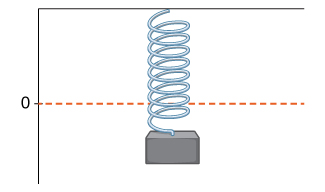
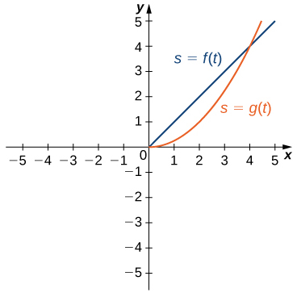
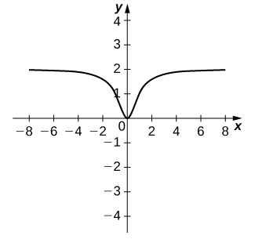

* Recognize the meaning of the tangent to a curve at a point.
* Calculate the slope of a tangent line.
* Identify the derivative as the limit of a difference quotient.
* Calculate the derivative of a given function at a point.
* Describe the velocity as a rate of change.
* Explain the difference between average velocity and instantaneous velocity.
* Estimate the derivative from a table of values.

Now that we have both a conceptual understanding of a limit and the practical ability to compute limits, we have established the foundation for our study of calculus, the branch of mathematics in which we compute derivatives and integrals. Most mathematicians and historians agree that calculus was developed independently by the Englishman Isaac **Newton**{: data-type="term" .no-emphasis} <math xmlns="http://www.w3.org/1998/Math/MathML"><mrow><mtext>(1643–1727)</mtext></mrow></math>

 and the German Gottfried **Leibniz**{: data-type="term" .no-emphasis} <math xmlns="http://www.w3.org/1998/Math/MathML"><mrow><mtext>(1646–1716),</mtext></mrow></math>

 whose images appear in [\[link\]](#CNX_Calc_Figure_03_01_001). When we credit Newton and Leibniz with developing calculus, we are really referring to the fact that Newton and Leibniz were the first to understand the relationship between the derivative and the integral. Both mathematicians benefited from the work of predecessors, such as Barrow, Fermat, and Cavalieri. The initial relationship between the two mathematicians appears to have been amicable; however, in later years a bitter controversy erupted over whose work took precedence. Although it seems likely that Newton did, indeed, arrive at the ideas behind calculus first, we are indebted to Leibniz for the notation that we commonly use today.

 {: #CNX_Calc_Figure_03_01_001}

### Tangent Lines

We begin our study of calculus by revisiting the notion of secant lines and tangent lines. Recall that we used the slope of a secant line to a function at a point <math xmlns="http://www.w3.org/1998/Math/MathML"><mrow><mo stretchy="false">(</mo><mi>a</mi><mo>,</mo><mi>f</mi><mrow><mo>(</mo><mi>a</mi><mo>)</mo></mrow><mo stretchy="false">)</mo></mrow></math>

 to estimate the rate of change, or the rate at which one variable changes in relation to another variable. We can obtain the slope of the secant by choosing a value of <math xmlns="http://www.w3.org/1998/Math/MathML"><mi>x</mi></math>

 near <math xmlns="http://www.w3.org/1998/Math/MathML"><mi>a</mi></math>

 and drawing a line through the points <math xmlns="http://www.w3.org/1998/Math/MathML"><mrow><mo stretchy="false">(</mo><mi>a</mi><mo>,</mo><mi>f</mi><mrow><mo>(</mo><mi>a</mi><mo>)</mo></mrow><mo stretchy="false">)</mo></mrow></math>

 and <math xmlns="http://www.w3.org/1998/Math/MathML"><mrow><mrow><mo>(</mo><mrow><mi>x</mi><mo>,</mo><mi>f</mi><mrow><mo>(</mo><mi>x</mi><mo>)</mo></mrow></mrow><mo>)</mo></mrow><mo>,</mo></mrow></math>

 as shown in [\[link\]](#CNX_Calc_Figure_03_01_002). The slope of this line is given by an equation in the form of a difference quotient:

<math xmlns="http://www.w3.org/1998/Math/MathML"><mrow><msub><mi>m</mi><mrow><mtext>sec</mtext></mrow></msub><mo>=</mo><mfrac><mrow><mi>f</mi><mrow><mo>(</mo><mi>x</mi><mo>)</mo></mrow><mo>−</mo><mi>f</mi><mrow><mo>(</mo><mi>a</mi><mo>)</mo></mrow></mrow><mrow><mi>x</mi><mo>−</mo><mi>a</mi></mrow></mfrac><mo>.</mo></mrow></math>

We can also calculate the slope of a secant line to a function at a value *a* by using this equation and replacing <math xmlns="http://www.w3.org/1998/Math/MathML"><mrow><mi>x</mi></mrow></math>

 with <math xmlns="http://www.w3.org/1998/Math/MathML"><mrow><mi>a</mi><mo>+</mo><mi>h</mi><mo>,</mo></mrow></math>

 where <math xmlns="http://www.w3.org/1998/Math/MathML"><mi>h</mi></math>

 is a value close to <math xmlns="http://www.w3.org/1998/Math/MathML"><mi>a</mi><mo>.</mo></math>

 We can then calculate the slope of the line through the points <math xmlns="http://www.w3.org/1998/Math/MathML"><mrow><mo stretchy="false">(</mo><mi>a</mi><mo>,</mo><mi>f</mi><mrow><mo>(</mo><mi>a</mi><mo>)</mo></mrow><mo stretchy="false">)</mo></mrow></math>

 and <math xmlns="http://www.w3.org/1998/Math/MathML"><mrow><mo stretchy="false">(</mo><mi>a</mi><mo>+</mo><mi>h</mi><mo>,</mo><mi>f</mi><mrow><mo>(</mo><mrow><mi>a</mi><mo>+</mo><mi>h</mi></mrow><mo>)</mo></mrow><mo stretchy="false">)</mo><mo>.</mo></mrow></math>

 In this case, we find the secant line has a slope given by the following difference quotient with increment <math xmlns="http://www.w3.org/1998/Math/MathML"><mi>h</mi><mtext>:</mtext></math>

<math xmlns="http://www.w3.org/1998/Math/MathML"><mrow><msub><mi>m</mi><mrow><mtext>sec</mtext></mrow></msub><mo>=</mo><mfrac><mrow><mi>f</mi><mrow><mo>(</mo><mrow><mi>a</mi><mo>+</mo><mi>h</mi></mrow><mo>)</mo></mrow><mo>−</mo><mi>f</mi><mrow><mo>(</mo><mi>a</mi><mo>)</mo></mrow></mrow><mrow><mi>a</mi><mo>+</mo><mi>h</mi><mo>−</mo><mi>a</mi></mrow></mfrac><mo>=</mo><mfrac><mrow><mi>f</mi><mrow><mo>(</mo><mrow><mi>a</mi><mo>+</mo><mi>h</mi></mrow><mo>)</mo></mrow><mo>−</mo><mi>f</mi><mrow><mo>(</mo><mi>a</mi><mo>)</mo></mrow></mrow><mi>h</mi></mfrac><mo>.</mo></mrow></math>

Definition

Let <math xmlns="http://www.w3.org/1998/Math/MathML"><mi>f</mi></math>

 be a function defined on an interval <math xmlns="http://www.w3.org/1998/Math/MathML"><mi>I</mi></math>

 containing <math xmlns="http://www.w3.org/1998/Math/MathML"><mi>a</mi><mo>.</mo></math>

 If <math xmlns="http://www.w3.org/1998/Math/MathML"><mrow><mi>x</mi><mo>≠</mo><mi>a</mi></mrow></math>

 is in <math xmlns="http://www.w3.org/1998/Math/MathML"><mi>I</mi><mo>,</mo></math>

 then

<math xmlns="http://www.w3.org/1998/Math/MathML"><mrow><mi>Q</mi><mo>=</mo><mfrac><mrow><mi>f</mi><mrow><mo>(</mo><mi>x</mi><mo>)</mo></mrow><mo>−</mo><mi>f</mi><mo stretchy="false">(</mo><mi>a</mi><mo stretchy="false">)</mo></mrow><mrow><mi>x</mi><mo>−</mo><mi>a</mi></mrow></mfrac></mrow></math>

is a **difference quotient**{: data-type="term"}.

Also, if <math xmlns="http://www.w3.org/1998/Math/MathML"><mrow><mi>h</mi><mo>≠</mo><mn>0</mn></mrow></math>

 is chosen so that <math xmlns="http://www.w3.org/1998/Math/MathML"><mrow><mi>a</mi><mo>+</mo><mi>h</mi></mrow></math>

 is in <math xmlns="http://www.w3.org/1998/Math/MathML"><mrow><mi>I</mi><mo>,</mo></mrow></math>

 then

<math xmlns="http://www.w3.org/1998/Math/MathML"><mrow><mi>Q</mi><mo>=</mo><mfrac><mrow><mi>f</mi><mrow><mo>(</mo><mrow><mi>a</mi><mo>+</mo><mi>h</mi></mrow><mo>)</mo></mrow><mo>−</mo><mi>f</mi><mo stretchy="false">(</mo><mi>a</mi><mo stretchy="false">)</mo></mrow><mi>h</mi></mfrac></mrow></math>

is a difference quotient with increment <math xmlns="http://www.w3.org/1998/Math/MathML"><mi>h</mi><mo>.</mo></math>

View several Java [applets][1] on the development of the derivative.

These two expressions for calculating the slope of a secant line are illustrated in [\[link\]](#CNX_Calc_Figure_03_01_002). We will see that each of these two methods for finding the slope of a secant line is of value. Depending on the setting, we can choose one or the other. The primary consideration in our choice usually depends on ease of calculation.

 ![This figure consists of two graphs labeled a and b. Figure a shows the Cartesian coordinate plane with 0, a, and x marked on the x-axis. There is a curve labeled y = f(x) with points marked (a, f(a)) and (x, f(x)). There is also a straight line that crosses these two points (a, f(a)) and (x, f(x)). At the bottom of the graph, the equation msec = (f(x) - f(a))/(x - a) is given. Figure b shows a similar graph, but this time a + h is marked on the x-axis instead of x. Consequently, the curve labeled y = f(x) passes through (a, f(a)) and (a + h, f(a + h)) as does the straight line. At the bottom of the graph, the equation msec = (f(a + h) - f(a))/h is given.](../resources/CNX_Calc_Figure_03_01_002.jpg "We can calculate the slope of a secant line in either of two ways."){: #CNX_Calc_Figure_03_01_002}

In [\[link\]](#CNX_Calc_Figure_03_01_003)(a) we see that, as the values of <math xmlns="http://www.w3.org/1998/Math/MathML"><mi>x</mi></math>

 approach <math xmlns="http://www.w3.org/1998/Math/MathML"><mrow><mi>a</mi><mo>,</mo></mrow></math>

 the slopes of the secant lines provide better estimates of the rate of change of the function at <math xmlns="http://www.w3.org/1998/Math/MathML"><mrow><mi>a</mi><mo>.</mo></mrow></math>

 Furthermore, the secant lines themselves approach the tangent line to the function at <math xmlns="http://www.w3.org/1998/Math/MathML"><mi>a</mi><mo>,</mo></math>

 which represents the limit of the secant lines. Similarly, [\[link\]](#CNX_Calc_Figure_03_01_003)(b) shows that as the values of <math xmlns="http://www.w3.org/1998/Math/MathML"><mi>h</mi></math>

 get closer to <math xmlns="http://www.w3.org/1998/Math/MathML"><mrow><mn>0</mn><mo>,</mo></mrow></math>

 the secant lines also approach the tangent line. The slope of the tangent line at <math xmlns="http://www.w3.org/1998/Math/MathML"><mi>a</mi></math>

 is the rate of change of the function at <math xmlns="http://www.w3.org/1998/Math/MathML"><mi>a</mi><mo>,</mo></math>

 as shown in [\[link\]](#CNX_Calc_Figure_03_01_003)(c).

 ![This figure consists of three graphs labeled a, b, and c. Figure a shows the Cartesian coordinate plane with 0, a, x2, and x1 marked in order on the x-axis. There is a curve labeled y = f(x) with points marked (a, f(a)), (x2, f(x2)), and (x1, f(x1)). There are three straight lines: the first crosses (a, f(a)) and (x1, f(x1)); the second crosses (a, f(a)) and (x2, f(x2)); and the third only touches (a, f(a)), making it the tangent. At the bottom of the graph, the equation mtan = limx &#x2192; a (f(x) - f(a))/(x - a) is given. Figure b shows a similar graph, but this time a + h2 and a + h1 are marked on the x-axis instead of x2 and x1. Consequently, the curve labeled y = f(x) passes through (a, f(a)), (a + h2, f(a + h2)), and (a + h1, f(a + h1)) and the straight lines similarly cross the graph as in Figure a. At the bottom of the graph, the equation mtan = limh &#x2192; 0 (f(a + h) - f(a))/h is given. Figure c shows only the curve labeled y = f(x) and its tangent at point (a, f(a)).](../resources/CNX_Calc_Figure_03_01_003.jpg "The secant lines approach the tangent line (shown in green) as the second point approaches the first."){: #CNX_Calc_Figure_03_01_003}

You can use this [site][2] to explore graphs to see if they have a tangent line at a point.

In [\[link\]](#CNX_Calc_Figure_03_01_008) we show the graph of <math xmlns="http://www.w3.org/1998/Math/MathML"><mrow><mi>f</mi><mrow><mo>(</mo><mi>x</mi><mo>)</mo></mrow><mo>=</mo><msqrt><mi>x</mi></msqrt></mrow></math>

 and its tangent line at <math xmlns="http://www.w3.org/1998/Math/MathML"><mrow><mo stretchy="false">(</mo><mn>1</mn><mo>,</mo><mn>1</mn><mo stretchy="false">)</mo></mrow></math>

 in a series of tighter intervals about <math xmlns="http://www.w3.org/1998/Math/MathML"><mrow><mi>x</mi><mo>=</mo><mn>1</mn><mo>.</mo></mrow></math>

 As the intervals become narrower, the graph of the function and its tangent line appear to coincide, making the values on the tangent line a good approximation to the values of the function for choices of <math xmlns="http://www.w3.org/1998/Math/MathML"><mi>x</mi></math>

 close to <math xmlns="http://www.w3.org/1998/Math/MathML"><mrow><mn>1</mn><mo>.</mo></mrow></math>

 In fact, the graph of <math xmlns="http://www.w3.org/1998/Math/MathML"><mrow><mi>f</mi><mo stretchy="false">(</mo><mi>x</mi><mo stretchy="false">)</mo></mrow></math>

 itself appears to be locally linear in the immediate vicinity of <math xmlns="http://www.w3.org/1998/Math/MathML"><mrow><mi>x</mi><mo>=</mo><mn>1</mn><mo>.</mo></mrow></math>

 ![This figure consists of four graphs labeled a, b, c, and d. Figure a shows the graphs of the square root of x and the equation y = (x + 1)/2 with the x-axis going from 0 to 4 and the y-axis going from 0 to 2.5. The graphs of these two functions look very close near 1; there is a box around where these graphs look close. Figure b shows a close up of these same two functions in the area of the box from Figure a, specifically x going from 0 to 2 and y going from 0 to 1.4. Figure c is the same graph as Figure b, but this one has a box from 0 to 1.1 in the x coordinate and 0.8 and 1 on the y coordinate. There is an arrow indicating that this is blown up in Figure d. Figure d shows a very close picture of the box from Figure c, and the two functions appear to be touching for almost the entire length of the graph.](../resources/CNX_Calc_Figure_03_01_008.jpg "For values of x close to 1, the graph of f(x)=x and its tangent line appear to coincide."){: #CNX_Calc_Figure_03_01_008}

Formally we may define the tangent line to the graph of a function as follows.

Definition

Let <math xmlns="http://www.w3.org/1998/Math/MathML"><mrow><mi>f</mi><mo stretchy="false">(</mo><mi>x</mi><mo stretchy="false">)</mo></mrow></math>

 be a function defined in an open interval containing <math xmlns="http://www.w3.org/1998/Math/MathML"><mi>a</mi><mo>.</mo></math>

 The *tangent line* to <math xmlns="http://www.w3.org/1998/Math/MathML"><mrow><mi>f</mi><mo stretchy="false">(</mo><mi>x</mi><mo stretchy="false">)</mo></mrow></math>

 at <math xmlns="http://www.w3.org/1998/Math/MathML"><mi>a</mi></math>

 is the line passing through the point <math xmlns="http://www.w3.org/1998/Math/MathML"><mrow><mrow><mo>(</mo><mrow><mi>a</mi><mo>,</mo><mi>f</mi><mrow><mo>(</mo><mi>a</mi><mo>)</mo></mrow></mrow><mo>)</mo></mrow></mrow></math>

 having slope

<math xmlns="http://www.w3.org/1998/Math/MathML"><mrow><msub><mi>m</mi><mrow><mtext>tan</mtext></mrow></msub><mo>=</mo><munder><mrow><mtext>lim</mtext></mrow><mrow><mi>x</mi><mo stretchy="false">→</mo><mi>a</mi></mrow></munder><mfrac><mrow><mi>f</mi><mrow><mo>(</mo><mi>x</mi><mo>)</mo></mrow><mo>−</mo><mi>f</mi><mo stretchy="false">(</mo><mi>a</mi><mo stretchy="false">)</mo></mrow><mrow><mi>x</mi><mo>−</mo><mi>a</mi></mrow></mfrac></mrow></math>

provided this limit exists.

Equivalently, we may define the tangent line to <math xmlns="http://www.w3.org/1998/Math/MathML"><mrow><mi>f</mi><mrow><mo>(</mo><mi>x</mi><mo>)</mo></mrow></mrow></math>

 at <math xmlns="http://www.w3.org/1998/Math/MathML"><mi>a</mi></math>

 to be the line passing through the point <math xmlns="http://www.w3.org/1998/Math/MathML"><mrow><mrow><mo>(</mo><mrow><mi>a</mi><mo>,</mo><mi>f</mi><mrow><mo>(</mo><mi>a</mi><mo>)</mo></mrow></mrow><mo>)</mo></mrow></mrow></math>

 having slope

<math xmlns="http://www.w3.org/1998/Math/MathML"><mrow><msub><mi>m</mi><mrow><mtext>tan</mtext></mrow></msub><mo>=</mo><munder><mrow><mtext>lim</mtext></mrow><mrow><mi>h</mi><mo stretchy="false">→</mo><mn>0</mn></mrow></munder><mfrac><mrow><mi>f</mi><mrow><mo>(</mo><mrow><mi>a</mi><mo>+</mo><mi>h</mi></mrow><mo>)</mo></mrow><mo>−</mo><mi>f</mi><mo stretchy="false">(</mo><mi>a</mi><mo stretchy="false">)</mo></mrow><mi>h</mi></mfrac></mrow></math>

provided this limit exists.

Just as we have used two different expressions to define the slope of a secant line, we use two different forms to define the slope of the tangent line. In this text we use both forms of the definition. As before, the choice of definition will depend on the setting. Now that we have formally defined a tangent line to a function at a point, we can use this definition to find equations of tangent lines.

Finding a Tangent Line

Find the equation of the line tangent to the graph of <math xmlns="http://www.w3.org/1998/Math/MathML"><mrow><mi>f</mi><mrow><mo>(</mo><mi>x</mi><mo>)</mo></mrow><mo>=</mo><msup><mi>x</mi><mn>2</mn></msup></mrow></math>

 at <math xmlns="http://www.w3.org/1998/Math/MathML"><mrow><mi>x</mi><mo>=</mo><mn>3</mn><mo>.</mo></mrow></math>

First find the slope of the tangent line. In this example, use [[link]](#fs-id1169739226063).

<math xmlns="http://www.w3.org/1998/Math/MathML"><mrow><mtable><mtr><mtd columnalign="right"><msub><mi>m</mi><mrow><mtext>tan</mtext></mrow></msub></mtd><mtd columnalign="left"><mo>=</mo><munder><mrow><mtext>lim</mtext></mrow><mrow><mi>x</mi><mo stretchy="false">→</mo><mn>3</mn></mrow></munder><mfrac><mrow><mi>f</mi><mrow><mo>(</mo><mi>x</mi><mo>)</mo></mrow><mo>−</mo><mi>f</mi><mrow><mo>(</mo><mn>3</mn><mo>)</mo></mrow></mrow><mrow><mi>x</mi><mo>−</mo><mn>3</mn></mrow></mfrac></mtd><mtd /><mtd /><mtd columnalign="left"><mtext>Apply the definition.</mtext></mtd></mtr><mtr><mtd /><mtd columnalign="left"><mrow><mo>=</mo><munder><mrow><mtext>lim</mtext></mrow><mrow><mi>x</mi><mo stretchy="false">→</mo><mn>3</mn></mrow></munder><mfrac><mrow><msup><mi>x</mi><mn>2</mn></msup><mo>−</mo><mn>9</mn></mrow><mrow><mi>x</mi><mo>−</mo><mn>3</mn></mrow></mfrac></mrow></mtd><mtd /><mtd /><mtd columnalign="left"><mtext>Substitute</mtext><mspace width="0.2em" /><mi>f</mi><mrow><mo>(</mo><mi>x</mi><mo>)</mo></mrow><mo>=</mo><msup><mi>x</mi><mn>2</mn></msup><mspace width="0.2em" /><mtext>and</mtext><mspace width="0.2em" /><mi>f</mi><mrow><mo>(</mo><mn>3</mn><mo>)</mo></mrow><mo>=</mo><mn>9</mn><mo>.</mo></mtd></mtr><mtr><mtd /><mtd columnalign="left"><mo>=</mo><munder><mrow><mtext>lim</mtext></mrow><mrow><mi>x</mi><mo stretchy="false">→</mo><mn>3</mn></mrow></munder><mfrac><mrow><mrow><mo>(</mo><mrow><mi>x</mi><mo>−</mo><mn>3</mn></mrow><mo>)</mo></mrow><mrow><mo>(</mo><mrow><mi>x</mi><mo>+</mo><mn>3</mn></mrow><mo>)</mo></mrow></mrow><mrow><mi>x</mi><mo>−</mo><mn>3</mn></mrow></mfrac><mo>=</mo><munder><mrow><mtext>lim</mtext></mrow><mrow><mi>x</mi><mo stretchy="false">→</mo><mn>3</mn></mrow></munder><mrow><mo>(</mo><mrow><mi>x</mi><mo>+</mo><mn>3</mn></mrow><mo>)</mo></mrow><mo>=</mo><mn>6</mn></mtd><mtd /><mtd /><mtd columnalign="left"><mtext>Factor the numerator to evaluate the limit.</mtext></mtd></mtr></mtable></mrow></math>

Next, find a point on the tangent line. Since the line is tangent to the graph of <math xmlns="http://www.w3.org/1998/Math/MathML"><mrow><mi>f</mi><mo stretchy="false">(</mo><mi>x</mi><mo stretchy="false">)</mo></mrow></math>

 at <math xmlns="http://www.w3.org/1998/Math/MathML"><mrow><mi>x</mi><mo>=</mo><mn>3</mn><mo>,</mo></mrow></math>

 it passes through the point <math xmlns="http://www.w3.org/1998/Math/MathML"><mrow><mrow><mo>(</mo><mrow><mn>3</mn><mo>,</mo><mi>f</mi><mrow><mo>(</mo><mn>3</mn><mo>)</mo></mrow></mrow><mo>)</mo></mrow><mo>.</mo></mrow></math>

 We have <math xmlns="http://www.w3.org/1998/Math/MathML"><mrow><mi>f</mi><mrow><mo>(</mo><mn>3</mn><mo>)</mo></mrow><mo>=</mo><mn>9</mn><mo>,</mo></mrow></math>

 so the tangent line passes through the point <math xmlns="http://www.w3.org/1998/Math/MathML"><mrow><mrow><mo>(</mo><mrow><mn>3</mn><mo>,</mo><mn>9</mn></mrow><mo>)</mo></mrow><mo>.</mo></mrow></math>

Using the point-slope equation of the line with the slope <math xmlns="http://www.w3.org/1998/Math/MathML"><mrow><mi>m</mi><mo>=</mo><mn>6</mn></mrow></math>

 and the point <math xmlns="http://www.w3.org/1998/Math/MathML"><mrow><mrow><mo>(</mo><mrow><mn>3</mn><mo>,</mo><mn>9</mn></mrow><mo>)</mo></mrow><mo>,</mo></mrow></math>

 we obtain the line <math xmlns="http://www.w3.org/1998/Math/MathML"><mrow><mi>y</mi><mo>−</mo><mn>9</mn><mo>=</mo><mn>6</mn><mrow><mo>(</mo><mrow><mi>x</mi><mo>−</mo><mn>3</mn></mrow><mo>)</mo></mrow><mo>.</mo></mrow></math>

 Simplifying, we have <math xmlns="http://www.w3.org/1998/Math/MathML"><mrow><mi>y</mi><mo>=</mo><mn>6</mn><mi>x</mi><mo>−</mo><mn>9</mn><mo>.</mo></mrow></math>

 The graph of <math xmlns="http://www.w3.org/1998/Math/MathML"><mrow><mi>f</mi><mrow><mo>(</mo><mi>x</mi><mo>)</mo></mrow><mo>=</mo><msup><mi>x</mi><mn>2</mn></msup></mrow></math>

 and its tangent line at <math xmlns="http://www.w3.org/1998/Math/MathML"><mn>3</mn></math>

 are shown in [[link]](#CNX_Calc_Figure_03_01_005).

 at x=3."){: #CNX_Calc_Figure_03_01_005}

The Slope of a Tangent Line Revisited

Use [[link]](#fs-id1169738970614) to find the slope of the line tangent to the graph of <math xmlns="http://www.w3.org/1998/Math/MathML"><mrow><mi>f</mi><mrow><mo>(</mo><mi>x</mi><mo>)</mo></mrow><mo>=</mo><msup><mi>x</mi><mn>2</mn></msup></mrow></math>

 at <math xmlns="http://www.w3.org/1998/Math/MathML"><mrow><mi>x</mi><mo>=</mo><mn>3</mn><mo>.</mo></mrow></math>

The steps are very similar to [[link]](#fs-id1169739298611). See [[link]](#fs-id1169738970614) for the definition.

<math xmlns="http://www.w3.org/1998/Math/MathML"><mrow><mtable><mtr><mtd columnalign="right"><msub><mi>m</mi><mrow><mtext>tan</mtext></mrow></msub></mtd><mtd columnalign="left"><mo>=</mo><munder><mrow><mtext>lim</mtext></mrow><mrow><mi>h</mi><mo stretchy="false">→</mo><mn>0</mn></mrow></munder><mfrac><mrow><mi>f</mi><mrow><mo>(</mo><mrow><mn>3</mn><mo>+</mo><mi>h</mi></mrow><mo>)</mo></mrow><mo>−</mo><mi>f</mi><mrow><mo>(</mo><mn>3</mn><mo>)</mo></mrow></mrow><mi>h</mi></mfrac></mtd><mtd /><mtd /><mtd columnalign="left"><mtext>Apply the definition.</mtext></mtd></mtr><mtr><mtd /><mtd columnalign="left"><mo>=</mo><munder><mrow><mtext>lim</mtext></mrow><mrow><mi>h</mi><mo stretchy="false">→</mo><mn>0</mn></mrow></munder><mfrac><mrow><msup><mrow><mrow><mo>(</mo><mrow><mn>3</mn><mo>+</mo><mi>h</mi></mrow><mo>)</mo></mrow></mrow><mn>2</mn></msup><mo>−</mo><mn>9</mn></mrow><mi>h</mi></mfrac></mtd><mtd /><mtd /><mtd columnalign="left"><mtext>Substitute</mtext><mspace width="0.2em" /><mi>f</mi><mrow><mo>(</mo><mrow><mn>3</mn><mo>+</mo><mi>h</mi></mrow><mo>)</mo></mrow><mo>=</mo><msup><mrow><mo stretchy="false">(</mo><mn>3</mn><mo>+</mo><mi>h</mi><mo stretchy="false">)</mo></mrow><mn>2</mn></msup><mspace width="0.2em" /><mtext>and</mtext><mspace width="0.2em" /><mi>f</mi><mrow><mo>(</mo><mn>3</mn><mo>)</mo></mrow><mo>=</mo><mn>9</mn><mo>.</mo></mtd></mtr><mtr><mtd /><mtd columnalign="left"><mo>=</mo><munder><mrow><mtext>lim</mtext></mrow><mrow><mi>h</mi><mo stretchy="false">→</mo><mn>0</mn></mrow></munder><mfrac><mrow><mn>9</mn><mo>+</mo><mn>6</mn><mi>h</mi><mo>+</mo><msup><mi>h</mi><mn>2</mn></msup><mo>−</mo><mn>9</mn></mrow><mi>h</mi></mfrac></mtd><mtd /><mtd /><mtd columnalign="left"><mtext>Expand and simplify to evaluate the limit.</mtext></mtd></mtr><mtr><mtd /><mtd columnalign="left"><mo>=</mo><munder><mrow><mtext>lim</mtext></mrow><mrow><mi>h</mi><mo stretchy="false">→</mo><mn>0</mn></mrow></munder><mfrac><mrow><mi>h</mi><mrow><mo>(</mo><mrow><mn>6</mn><mo>+</mo><mi>h</mi></mrow><mo>)</mo></mrow></mrow><mi>h</mi></mfrac><mo>=</mo><munder><mrow><mtext>lim</mtext></mrow><mrow><mi>h</mi><mo stretchy="false">→</mo><mn>0</mn></mrow></munder><mrow><mo>(</mo><mrow><mn>6</mn><mo>+</mo><mi>h</mi></mrow><mo>)</mo></mrow><mo>=</mo><mn>6</mn></mtd></mtr></mtable></mrow></math>

We obtained the same value for the slope of the tangent line by using the other definition, demonstrating that the formulas can be interchanged.

Finding the Equation of a Tangent Line

Find the equation of the line tangent to the graph of <math xmlns="http://www.w3.org/1998/Math/MathML"><mrow><mi>f</mi><mrow><mo>(</mo><mi>x</mi><mo>)</mo></mrow><mo>=</mo><mn>1</mn><mtext>/</mtext><mi>x</mi></mrow></math>

 at <math xmlns="http://www.w3.org/1998/Math/MathML"><mrow><mi>x</mi><mo>=</mo><mn>2</mn><mo>.</mo></mrow></math>

We can use [[link]](#fs-id1169739226063), but as we have seen, the results are the same if we use [[link]](#fs-id1169738970614).

<math xmlns="http://www.w3.org/1998/Math/MathML"><mrow><mtable><mtr><mtd columnalign="right"><msub><mi>m</mi><mrow><mtext>tan</mtext></mrow></msub></mtd><mtd columnalign="left"><mo>=</mo><munder><mrow><mtext>lim</mtext></mrow><mrow><mi>x</mi><mo stretchy="false">→</mo><mn>2</mn></mrow></munder><mfrac><mrow><mi>f</mi><mrow><mo>(</mo><mi>x</mi><mo>)</mo></mrow><mo>−</mo><mi>f</mi><mrow><mo>(</mo><mn>2</mn><mo>)</mo></mrow></mrow><mrow><mi>x</mi><mo>−</mo><mn>2</mn></mrow></mfrac></mtd><mtd /><mtd /><mtd columnalign="left"><mtext>Apply the definition.</mtext></mtd></mtr><mtr><mtd /><mtd columnalign="left"><mo>=</mo><munder><mrow><mtext>lim</mtext></mrow><mrow><mi>x</mi><mo stretchy="false">→</mo><mn>2</mn></mrow></munder><mfrac><mrow><mfrac><mn>1</mn><mi>x</mi></mfrac><mo>−</mo><mfrac><mn>1</mn><mn>2</mn></mfrac></mrow><mrow><mi>x</mi><mo>−</mo><mn>2</mn></mrow></mfrac></mtd><mtd /><mtd /><mtd columnalign="left"><mtext>Substitute</mtext><mspace width="0.2em" /><mi>f</mi><mrow><mo>(</mo><mi>x</mi><mo>)</mo></mrow><mo>=</mo><mfrac><mn>1</mn><mi>x</mi></mfrac><mspace width="0.2em" /><mtext>and</mtext><mspace width="0.1em" /><mi>f</mi><mrow><mo>(</mo><mn>2</mn><mo>)</mo></mrow><mo>=</mo><mfrac><mn>1</mn><mn>2</mn></mfrac><mo>.</mo></mtd></mtr><mtr><mtd /><mtd columnalign="left"><mo>=</mo><munder><mrow><mtext>lim</mtext></mrow><mrow><mi>x</mi><mo stretchy="false">→</mo><mn>2</mn></mrow></munder><mfrac><mrow><mfrac><mn>1</mn><mi>x</mi></mfrac><mo>−</mo><mfrac><mn>1</mn><mn>2</mn></mfrac></mrow><mrow><mi>x</mi><mo>−</mo><mn>2</mn></mrow></mfrac><mo>·</mo><mfrac><mrow><mn>2</mn><mi>x</mi></mrow><mrow><mn>2</mn><mi>x</mi></mrow></mfrac></mtd><mtd /><mtd /><mtd columnalign="left"><mtable><mtr><mtd columnalign="left"><mtext>Multiply numerator and denominator by</mtext><mspace width="0.2em" /><mn>2</mn><mi>x</mi><mspace width="0.2em" /><mtext>to</mtext></mtd></mtr><mtr><mtd columnalign="left"><mtext>simplify fractions.</mtext></mtd></mtr></mtable></mtd></mtr><mtr><mtd /><mtd columnalign="left"><mo>=</mo><munder><mrow><mtext>lim</mtext></mrow><mrow><mi>x</mi><mo stretchy="false">→</mo><mn>2</mn></mrow></munder><mfrac><mrow><mrow><mo>(</mo><mrow><mn>2</mn><mo>−</mo><mi>x</mi></mrow><mo>)</mo></mrow></mrow><mrow><mrow><mo>(</mo><mrow><mi>x</mi><mo>−</mo><mn>2</mn></mrow><mo>)</mo></mrow><mrow><mo>(</mo><mrow><mn>2</mn><mi>x</mi></mrow><mo>)</mo></mrow></mrow></mfrac></mtd><mtd /><mtd /><mtd columnalign="left"><mtext>Simplify.</mtext></mtd></mtr><mtr><mtd /><mtd columnalign="left"><mo>=</mo><munder><mrow><mtext>lim</mtext></mrow><mrow><mi>x</mi><mo stretchy="false">→</mo><mn>2</mn></mrow></munder><mfrac><mrow><mn>−1</mn></mrow><mrow><mn>2</mn><mi>x</mi></mrow></mfrac></mtd><mtd /><mtd /><mtd columnalign="left"><mtext>Simplify using</mtext><mspace width="0.2em" /><mfrac><mrow><mn>2</mn><mo>−</mo><mi>x</mi></mrow><mrow><mi>x</mi><mo>−</mo><mn>2</mn></mrow></mfrac><mo>=</mo><mn>−1</mn><mo>,</mo><mtext>for</mtext><mspace width="0.2em" /><mi>x</mi><mo>≠</mo><mn>2</mn><mo>.</mo></mtd></mtr><mtr><mtd /><mtd columnalign="left"><mo>=</mo><mo>−</mo><mfrac><mn>1</mn><mn>4</mn></mfrac></mtd><mtd /><mtd /><mtd columnalign="left"><mtext>Evaluate the limit.</mtext></mtd></mtr></mtable></mrow></math>

We now know that the slope of the tangent line is <math xmlns="http://www.w3.org/1998/Math/MathML"><mrow><mo>−</mo><mfrac><mn>1</mn><mn>4</mn></mfrac><mo>.</mo></mrow></math>

 To find the equation of the tangent line, we also need a point on the line. We know that <math xmlns="http://www.w3.org/1998/Math/MathML"><mrow><mi>f</mi><mrow><mo>(</mo><mn>2</mn><mo>)</mo></mrow><mo>=</mo><mfrac><mn>1</mn><mn>2</mn></mfrac><mo>.</mo></mrow></math>

 Since the tangent line passes through the point <math xmlns="http://www.w3.org/1998/Math/MathML"><mrow><mo stretchy="false">(</mo><mn>2</mn><mo>,</mo><mfrac><mn>1</mn><mn>2</mn></mfrac><mo stretchy="false">)</mo></mrow></math>

 we can use the point-slope equation of a line to find the equation of the tangent line. Thus the tangent line has the equation <math xmlns="http://www.w3.org/1998/Math/MathML"><mrow><mi>y</mi><mo>=</mo><mo>−</mo><mfrac><mn>1</mn><mn>4</mn></mfrac><mi>x</mi><mo>+</mo><mn>1</mn><mo>.</mo></mrow></math>

 The graphs of <math xmlns="http://www.w3.org/1998/Math/MathML"><mrow><mi>f</mi><mrow><mo>(</mo><mi>x</mi><mo>)</mo></mrow><mo>=</mo><mfrac><mn>1</mn><mi>x</mi></mfrac></mrow></math>

 and <math xmlns="http://www.w3.org/1998/Math/MathML"><mrow><mi>y</mi><mo>=</mo><mo>−</mo><mfrac><mn>1</mn><mn>4</mn></mfrac><mi>x</mi><mo>+</mo><mn>1</mn></mrow></math>

 are shown in [[link]](#CNX_Calc_Figure_03_01_006).

 at x=2."){: #CNX_Calc_Figure_03_01_006}

Find the slope of the line tangent to the graph of <math xmlns="http://www.w3.org/1998/Math/MathML"><mrow><mi>f</mi><mrow><mo>(</mo><mi>x</mi><mo>)</mo></mrow><mo>=</mo><msqrt><mi>x</mi></msqrt></mrow></math>

 at <math xmlns="http://www.w3.org/1998/Math/MathML"><mrow><mi>x</mi><mo>=</mo><mn>4</mn><mo>.</mo></mrow></math>

<math xmlns="http://www.w3.org/1998/Math/MathML"><mrow><mfrac><mn>1</mn><mn>4</mn></mfrac></mrow></math>

Hint

Use either [[link]](#fs-id1169739226063) or [[link]](#fs-id1169738970614). Multiply the numerator and the denominator by a conjugate.

### The Derivative of a Function at a Point

The type of limit we compute in order to find the slope of the line tangent to a function at a point occurs in many applications across many disciplines. These applications include velocity and acceleration in physics, marginal profit functions in business, and growth rates in biology. This limit occurs so frequently that we give this value a special name: the **derivative**{: data-type="term"}. The process of finding a derivative is called **differentiation**{: data-type="term"}.

Definition

Let <math xmlns="http://www.w3.org/1998/Math/MathML"><mrow><mi>f</mi><mo stretchy="false">(</mo><mi>x</mi><mo stretchy="false">)</mo></mrow></math>

 be a function defined in an open interval containing <math xmlns="http://www.w3.org/1998/Math/MathML"><mrow><mi>a</mi><mo>.</mo></mrow></math>

 The derivative of the function <math xmlns="http://www.w3.org/1998/Math/MathML"><mrow><mi>f</mi><mo stretchy="false">(</mo><mi>x</mi><mo stretchy="false">)</mo></mrow></math>

 at <math xmlns="http://www.w3.org/1998/Math/MathML"><mrow><mi>a</mi><mo>,</mo></mrow></math>

 denoted by <math xmlns="http://www.w3.org/1998/Math/MathML"><mrow><msup><mi>f</mi><mo>′</mo></msup><mrow><mo>(</mo><mi>a</mi><mo>)</mo></mrow><mo>,</mo></mrow></math>

 is defined by

<math xmlns="http://www.w3.org/1998/Math/MathML"><mrow><msup><mi>f</mi><mo>′</mo></msup><mrow><mo>(</mo><mi>a</mi><mo>)</mo></mrow><mo>=</mo><munder><mrow><mtext>lim</mtext></mrow><mrow><mi>x</mi><mo stretchy="false">→</mo><mi>a</mi></mrow></munder><mfrac><mrow><mi>f</mi><mrow><mo>(</mo><mi>x</mi><mo>)</mo></mrow><mo>−</mo><mi>f</mi><mo stretchy="false">(</mo><mi>a</mi><mo stretchy="false">)</mo></mrow><mrow><mi>x</mi><mo>−</mo><mi>a</mi></mrow></mfrac></mrow></math>

provided this limit exists.

Alternatively, we may also define the derivative of <math xmlns="http://www.w3.org/1998/Math/MathML"><mrow><mi>f</mi><mo stretchy="false">(</mo><mi>x</mi><mo stretchy="false">)</mo></mrow></math>

 at <math xmlns="http://www.w3.org/1998/Math/MathML"><mi>a</mi></math>

 as

<math xmlns="http://www.w3.org/1998/Math/MathML"><mrow><msup><mi>f</mi><mo>′</mo></msup><mrow><mo>(</mo><mi>a</mi><mo>)</mo></mrow><mo>=</mo><munder><mrow><mtext>lim</mtext></mrow><mrow><mi>h</mi><mo stretchy="false">→</mo><mn>0</mn></mrow></munder><mfrac><mrow><mi>f</mi><mrow><mo>(</mo><mrow><mi>a</mi><mo>+</mo><mi>h</mi></mrow><mo>)</mo></mrow><mo>−</mo><mi>f</mi><mrow><mo>(</mo><mi>a</mi><mo>)</mo></mrow></mrow><mi>h</mi></mfrac><mo>.</mo></mrow></math>

Estimating a Derivative

For <math xmlns="http://www.w3.org/1998/Math/MathML"><mrow><mi>f</mi><mrow><mo>(</mo><mi>x</mi><mo>)</mo></mrow><mo>=</mo><msup><mi>x</mi><mn>2</mn></msup><mo>,</mo></mrow></math>

 use a table to estimate <math xmlns="http://www.w3.org/1998/Math/MathML"><mrow><msup><mi>f</mi><mo>′</mo></msup><mo stretchy="false">(</mo><mn>3</mn><mo stretchy="false">)</mo></mrow></math>

 using [[link]](#fs-id1169739179144).

Create a table using values of <math xmlns="http://www.w3.org/1998/Math/MathML"><mi>x</mi></math>

 just below <math xmlns="http://www.w3.org/1998/Math/MathML"><mn>3</mn></math>

 and just above <math xmlns="http://www.w3.org/1998/Math/MathML"><mrow><mn>3</mn><mo>.</mo></mrow></math>

| <math xmlns="http://www.w3.org/1998/Math/MathML"><mi>x</mi></math>

 | <math xmlns="http://www.w3.org/1998/Math/MathML"><mrow><mfrac><mrow><msup><mi>x</mi><mn>2</mn></msup><mo>−</mo><mn>9</mn></mrow><mrow><mi>x</mi><mo>−</mo><mn>3</mn></mrow></mfrac></mrow></math>

 |
{: valign="top"}|----------
| <math xmlns="http://www.w3.org/1998/Math/MathML"><mrow><mn>2.9</mn></mrow></math>

 | <math xmlns="http://www.w3.org/1998/Math/MathML"><mrow><mn>5.9</mn></mrow></math>

 |
| <math xmlns="http://www.w3.org/1998/Math/MathML"><mrow><mn>2.99</mn></mrow></math>

 | <math xmlns="http://www.w3.org/1998/Math/MathML"><mrow><mn>5.99</mn></mrow></math>

 |
| <math xmlns="http://www.w3.org/1998/Math/MathML"><mrow><mn>2.999</mn></mrow></math>

 | <math xmlns="http://www.w3.org/1998/Math/MathML"><mrow><mn>5.999</mn></mrow></math>

 |
| <math xmlns="http://www.w3.org/1998/Math/MathML"><mrow><mn>3.001</mn></mrow></math>

 | <math xmlns="http://www.w3.org/1998/Math/MathML"><mrow><mn>6.001</mn></mrow></math>

 |
| <math xmlns="http://www.w3.org/1998/Math/MathML"><mrow><mn>3.01</mn></mrow></math>

 | <math xmlns="http://www.w3.org/1998/Math/MathML"><mrow><mn>6.01</mn></mrow></math>

 |
| <math xmlns="http://www.w3.org/1998/Math/MathML"><mrow><mn>3.1</mn></mrow></math>

 | <math xmlns="http://www.w3.org/1998/Math/MathML"><mrow><mn>6.1</mn></mrow></math>

 |
{: .unnumbered summary="This table has seven rows and two columns. The first row is a header row and it labels each column. The first column header is x and the second column is (x2 &#x2212; 9)/(x &#x2212; 3). Under the first column are the values 2.9, 2.99, 2.999, 3.001, 3.01, and 3.1. Under the second column are the values 5.9, 5.99, 5.999, 6.001, 6.01, and 6.1." data-label=""}

After examining the table, we see that a good estimate is <math xmlns="http://www.w3.org/1998/Math/MathML"><mrow><msup><mi>f</mi><mo>′</mo></msup><mrow><mo>(</mo><mn>3</mn><mo>)</mo></mrow><mo>=</mo><mn>6.</mn></mrow></math>

For <math xmlns="http://www.w3.org/1998/Math/MathML"><mrow><mi>f</mi><mrow><mo>(</mo><mi>x</mi><mo>)</mo></mrow><mo>=</mo><msup><mi>x</mi><mn>2</mn></msup><mo>,</mo></mrow></math>

 use a table to estimate <math xmlns="http://www.w3.org/1998/Math/MathML"><mrow><msup><mi>f</mi><mo>′</mo></msup><mo stretchy="false">(</mo><mn>3</mn><mo stretchy="false">)</mo></mrow></math>

 using [[link]](#fs-id1169739188551).

<math xmlns="http://www.w3.org/1998/Math/MathML"><mn>6</mn></math>

Hint

Evaluate <math xmlns="http://www.w3.org/1998/Math/MathML"><mrow><mfrac><mrow><mrow><mo>(</mo><mrow><mi>x</mi><mo>+</mo><mi>h</mi></mrow><mo>)</mo></mrow><mo>−</mo><msup><mi>x</mi><mn>2</mn></msup></mrow><mi>h</mi></mfrac></mrow></math>

 at <math xmlns="http://www.w3.org/1998/Math/MathML"><mrow><mi>h</mi><mo>=</mo><mn>−0.1</mn><mo>,</mo><mn>−0.01</mn><mo>,</mo><mn>−0.001</mn><mo>,</mo><mn>0.001</mn><mo>,</mo><mn>0.01</mn><mo>,</mo><mn>0.1</mn></mrow></math>

Finding a Derivative

For <math xmlns="http://www.w3.org/1998/Math/MathML"><mrow><mi>f</mi><mrow><mo>(</mo><mi>x</mi><mo>)</mo></mrow><mo>=</mo><mn>3</mn><msup><mi>x</mi><mn>2</mn></msup><mo>−</mo><mn>4</mn><mi>x</mi><mo>+</mo><mn>1</mn><mo>,</mo></mrow></math>

 find <math xmlns="http://www.w3.org/1998/Math/MathML"><mrow><msup><mi>f</mi><mo>′</mo></msup><mo stretchy="false">(</mo><mn>2</mn><mo stretchy="false">)</mo></mrow></math>

 by using [[link]](#fs-id1169739179144).

Substitute the given function and value directly into the equation.

<math xmlns="http://www.w3.org/1998/Math/MathML"><mrow><mtable><mtr><mtd columnalign="right"><msup><mi>f</mi><mo>′</mo></msup><mrow><mo>(</mo><mi>x</mi><mo>)</mo></mrow></mtd><mtd columnalign="left"><mo>=</mo><munder><mrow><mtext>lim</mtext></mrow><mrow><mi>x</mi><mo stretchy="false">→</mo><mn>2</mn></mrow></munder><mfrac><mrow><mi>f</mi><mrow><mo>(</mo><mi>x</mi><mo>)</mo></mrow><mo>−</mo><mi>f</mi><mrow><mo>(</mo><mn>2</mn><mo>)</mo></mrow></mrow><mrow><mi>x</mi><mo>−</mo><mn>2</mn></mrow></mfrac></mtd><mtd /><mtd /><mtd columnalign="left"><mtext>Apply the definition.</mtext></mtd></mtr><mtr><mtd /><mtd columnalign="left"><mo>=</mo><munder><mrow><mtext>lim</mtext></mrow><mrow><mi>x</mi><mo stretchy="false">→</mo><mn>2</mn></mrow></munder><mfrac><mrow><mrow><mo>(</mo><mrow><mn>3</mn><msup><mi>x</mi><mn>2</mn></msup><mo>−</mo><mn>4</mn><mi>x</mi><mo>+</mo><mn>1</mn></mrow><mo>)</mo></mrow><mo>−</mo><mn>5</mn></mrow><mrow><mi>x</mi><mo>−</mo><mn>2</mn></mrow></mfrac></mtd><mtd /><mtd /><mtd columnalign="left"><mtext>Substitute</mtext><mspace width="0.2em" /><mi>f</mi><mrow><mo>(</mo><mi>x</mi><mo>)</mo></mrow><mo>=</mo><mn>3</mn><msup><mi>x</mi><mn>2</mn></msup><mo>−</mo><mn>4</mn><mi>x</mi><mo>+</mo><mn>1</mn><mspace width="0.2em" /><mtext>and</mtext><mspace width="0.2em" /><mi>f</mi><mrow><mo>(</mo><mn>2</mn><mo>)</mo></mrow><mo>=</mo><mn>5</mn><mo>.</mo></mtd></mtr><mtr><mtd /><mtd columnalign="left"><mo>=</mo><munder><mrow><mtext>lim</mtext></mrow><mrow><mi>x</mi><mo stretchy="false">→</mo><mn>2</mn></mrow></munder><mfrac><mrow><mo stretchy="false">(</mo><mi>x</mi><mo>−</mo><mn>2</mn><mo stretchy="false">)</mo><mo stretchy="false">(</mo><mn>3</mn><mi>x</mi><mo>+</mo><mn>2</mn><mo stretchy="false">)</mo></mrow><mrow><mi>x</mi><mo>−</mo><mn>2</mn></mrow></mfrac></mtd><mtd /><mtd /><mtd columnalign="left"><mtext>Simplify and factor the numerator.</mtext></mtd></mtr><mtr><mtd /><mtd columnalign="left"><mo>=</mo><munder><mrow><mtext>lim</mtext></mrow><mrow><mi>x</mi><mo stretchy="false">→</mo><mn>2</mn></mrow></munder><mo stretchy="false">(</mo><mn>3</mn><mi>x</mi><mo>+</mo><mn>2</mn><mo stretchy="false">)</mo></mtd><mtd /><mtd /><mtd columnalign="left"><mtext>Cancel the common factor.</mtext></mtd></mtr><mtr><mtd /><mtd columnalign="left"><mo>=</mo><mn>8</mn></mtd><mtd /><mtd /><mtd columnalign="left"><mtext>Evaluate the limit.</mtext></mtd></mtr></mtable></mrow></math>

Revisiting the Derivative

For <math xmlns="http://www.w3.org/1998/Math/MathML"><mrow><mi>f</mi><mrow><mo>(</mo><mi>x</mi><mo>)</mo></mrow><mo>=</mo><mn>3</mn><msup><mi>x</mi><mn>2</mn></msup><mo>−</mo><mn>4</mn><mi>x</mi><mo>+</mo><mn>1</mn><mo>,</mo></mrow></math>

 find <math xmlns="http://www.w3.org/1998/Math/MathML"><mrow><msup><mi>f</mi><mo>′</mo></msup><mo stretchy="false">(</mo><mn>2</mn><mo stretchy="false">)</mo></mrow></math>

 by using [[link]](#fs-id1169739188551).

Using this equation, we can substitute two values of the function into the equation, and we should get the same value as in [[link]](#fs-id1169739044032).

<math xmlns="http://www.w3.org/1998/Math/MathML"><mrow><mtable><mtr><mtd columnalign="right"><msup><mi>f</mi><mo>′</mo></msup><mrow><mo>(</mo><mn>2</mn><mo>)</mo></mrow></mtd><mtd columnalign="left"><mo>=</mo><munder><mrow><mtext>lim</mtext></mrow><mrow><mi>h</mi><mo stretchy="false">→</mo><mn>0</mn></mrow></munder><mfrac><mrow><mi>f</mi><mrow><mo>(</mo><mrow><mn>2</mn><mo>+</mo><mi>h</mi></mrow><mo>)</mo></mrow><mo>−</mo><mi>f</mi><mo stretchy="false">(</mo><mn>2</mn><mo stretchy="false">)</mo></mrow><mi>h</mi></mfrac></mtd><mtd /><mtd /><mtd columnalign="left"><mtext>Apply the definition.</mtext></mtd></mtr><mtr><mtd /><mtd columnalign="left"><mo>=</mo><munder><mrow><mtext>lim</mtext></mrow><mrow><mi>h</mi><mo stretchy="false">→</mo><mn>0</mn></mrow></munder><mfrac><mrow><mo stretchy="false">(</mo><mn>3</mn><msup><mrow><mo stretchy="false">(</mo><mn>2</mn><mo>+</mo><mi>h</mi><mo stretchy="false">)</mo></mrow><mn>2</mn></msup><mo>−</mo><mn>4</mn><mrow><mo>(</mo><mrow><mn>2</mn><mo>+</mo><mi>h</mi></mrow><mo>)</mo></mrow><mo>+</mo><mn>1</mn><mo stretchy="false">)</mo><mo>−</mo><mn>5</mn></mrow><mi>h</mi></mfrac></mtd><mtd /><mtd /><mtd columnalign="left"><mtable><mtr><mtd columnalign="left"><mtext>Substitute</mtext><mspace width="0.2em" /><mi>f</mi><mrow><mo>(</mo><mn>2</mn><mo>)</mo></mrow><mo>=</mo><mn>5</mn><mspace width="0.2em" /><mtext>and</mtext></mtd></mtr><mtr><mtd columnalign="left"><mi>f</mi><mrow><mo>(</mo><mrow><mn>2</mn><mo>+</mo><mi>h</mi></mrow><mo>)</mo></mrow><mo>=</mo><mn>3</mn><msup><mrow><mo stretchy="false">(</mo><mn>2</mn><mo>+</mo><mi>h</mi><mo stretchy="false">)</mo></mrow><mn>2</mn></msup><mo>−</mo><mn>4</mn><mrow><mo>(</mo><mrow><mn>2</mn><mo>+</mo><mi>h</mi></mrow><mo>)</mo></mrow><mo>+</mo><mn>1</mn><mo>.</mo></mtd></mtr></mtable></mtd></mtr><mtr><mtd /><mtd columnalign="left"><mo>=</mo><munder><mrow><mtext>lim</mtext></mrow><mrow><mi>h</mi><mo stretchy="false">→</mo><mn>0</mn></mrow></munder><mfrac><mrow><mn>3</mn><msup><mi>h</mi><mn>2</mn></msup><mo>+</mo><mn>8</mn><mi>h</mi></mrow><mi>h</mi></mfrac></mtd><mtd /><mtd /><mtd columnalign="left"><mtext>Simplify the numerator.</mtext></mtd></mtr><mtr><mtd /><mtd columnalign="left"><mo>=</mo><munder><mrow><mtext>lim</mtext></mrow><mrow><mi>h</mi><mo stretchy="false">→</mo><mn>0</mn></mrow></munder><mfrac><mrow><mi>h</mi><mo stretchy="false">(</mo><mn>3</mn><mi>h</mi><mo>+</mo><mn>8</mn><mo stretchy="false">)</mo></mrow><mi>h</mi></mfrac></mtd><mtd /><mtd /><mtd columnalign="left"><mtext>Factor the numerator.</mtext></mtd></mtr><mtr><mtd /><mtd columnalign="left"><mo>=</mo><munder><mrow><mtext>lim</mtext></mrow><mrow><mi>h</mi><mo stretchy="false">→</mo><mn>0</mn></mrow></munder><mo stretchy="false">(</mo><mn>3</mn><mi>h</mi><mo>+</mo><mn>8</mn><mo stretchy="false">)</mo></mtd><mtd /><mtd /><mtd columnalign="left"><mtext>Cancel the common factor.</mtext></mtd></mtr><mtr><mtd /><mtd columnalign="left"><mo>=</mo><mn>8</mn></mtd><mtd /><mtd /><mtd columnalign="left"><mtext>Evaluate the limit.</mtext></mtd></mtr></mtable></mrow></math>

The results are the same whether we use [[link]](#fs-id1169739179144) or [[link]](#fs-id1169739188551).

For <math xmlns="http://www.w3.org/1998/Math/MathML"><mrow><mi>f</mi><mrow><mo>(</mo><mi>x</mi><mo>)</mo></mrow><mo>=</mo><msup><mi>x</mi><mn>2</mn></msup><mo>+</mo><mn>3</mn><mi>x</mi><mo>+</mo><mn>2</mn><mo>,</mo></mrow></math>

 find <math xmlns="http://www.w3.org/1998/Math/MathML"><mrow><msup><mi>f</mi><mo>′</mo></msup><mrow><mo>(</mo><mn>1</mn><mo>)</mo></mrow><mo>.</mo></mrow></math>

<math xmlns="http://www.w3.org/1998/Math/MathML"><mrow><msup><mi>f</mi><mo>′</mo></msup><mrow><mo>(</mo><mn>1</mn><mo>)</mo></mrow><mo>=</mo><mn>5</mn></mrow></math>

Hint

Use either [[link]](#fs-id1169739179144), [[link]](#fs-id1169739188551), or try both. Use either [[link]](#fs-id1169738966727) or [[link]](#fs-id1169739198956) as a guide.

### Velocities and Rates of Change

Now that we can evaluate a derivative, we can use it in velocity applications. Recall that if <math xmlns="http://www.w3.org/1998/Math/MathML"><mrow><mi>s</mi><mrow><mo>(</mo><mi>t</mi><mo>)</mo></mrow></mrow></math>

 is the position of an object moving along a coordinate axis, the **average velocity**{: data-type="term" .no-emphasis} of the object over a time interval <math xmlns="http://www.w3.org/1998/Math/MathML"><mrow><mrow><mo>[</mo><mrow><mi>a</mi><mo>,</mo><mi>t</mi></mrow><mo>]</mo></mrow></mrow></math>

 if <math xmlns="http://www.w3.org/1998/Math/MathML"><mrow><mi>t</mi><mo>&gt;</mo><mi>a</mi></mrow></math>

 or <math xmlns="http://www.w3.org/1998/Math/MathML"><mrow><mrow><mo>[</mo><mrow><mi>t</mi><mo>,</mo><mi>a</mi></mrow><mo>]</mo></mrow></mrow></math>

 if <math xmlns="http://www.w3.org/1998/Math/MathML"><mrow><mi>t</mi><mo>&lt;</mo><mi>a</mi></mrow></math>

 is given by the difference quotient

<math xmlns="http://www.w3.org/1998/Math/MathML"><mrow><msub><mi>v</mi><mrow><mtext>ave</mtext></mrow></msub><mo>=</mo><mfrac><mrow><mi>s</mi><mrow><mo>(</mo><mi>t</mi><mo>)</mo></mrow><mo>−</mo><mi>s</mi><mo stretchy="false">(</mo><mi>a</mi><mo stretchy="false">)</mo></mrow><mrow><mi>t</mi><mo>−</mo><mi>a</mi></mrow></mfrac><mo>.</mo></mrow></math>

As the values of <math xmlns="http://www.w3.org/1998/Math/MathML"><mi>t</mi></math>

 approach <math xmlns="http://www.w3.org/1998/Math/MathML"><mi>a</mi><mo>,</mo></math>

 the values of <math xmlns="http://www.w3.org/1998/Math/MathML"><mrow><msub><mi>v</mi><mrow><mtext>ave</mtext></mrow></msub></mrow></math>

 approach the value we call the **instantaneous velocity**{: data-type="term" .no-emphasis} at <math xmlns="http://www.w3.org/1998/Math/MathML"><mrow><mi>a</mi><mo>.</mo></mrow></math>

 That is, instantaneous velocity at <math xmlns="http://www.w3.org/1998/Math/MathML"><mrow><mi>a</mi><mo>,</mo></mrow></math>

 denoted <math xmlns="http://www.w3.org/1998/Math/MathML"><mrow><mi>v</mi><mrow><mo>(</mo><mi>a</mi><mo>)</mo></mrow><mo>,</mo></mrow></math>

 is given by

<math xmlns="http://www.w3.org/1998/Math/MathML"><mrow><mi>v</mi><mrow><mo>(</mo><mi>a</mi><mo>)</mo></mrow><mo>=</mo><msup><mi>s</mi><mo>′</mo></msup><mrow><mo>(</mo><mi>a</mi><mo>)</mo></mrow><mo>=</mo><munder><mrow><mtext>lim</mtext></mrow><mrow><mi>t</mi><mo stretchy="false">→</mo><mi>a</mi></mrow></munder><mfrac><mrow><mi>s</mi><mrow><mo>(</mo><mi>t</mi><mo>)</mo></mrow><mo>−</mo><mi>s</mi><mo stretchy="false">(</mo><mi>a</mi><mo stretchy="false">)</mo></mrow><mrow><mi>t</mi><mo>−</mo><mi>a</mi></mrow></mfrac><mo>.</mo></mrow></math>

To better understand the relationship between average velocity and instantaneous velocity, see [\[link\]](#CNX_Calc_Figure_03_01_007). In this figure, the slope of the tangent line (shown in red) is the instantaneous velocity of the object at time <math xmlns="http://www.w3.org/1998/Math/MathML"><mrow><mi>t</mi><mo>=</mo><mi>a</mi></mrow></math>

 whose position at time <math xmlns="http://www.w3.org/1998/Math/MathML"><mi>t</mi></math>

 is given by the function <math xmlns="http://www.w3.org/1998/Math/MathML"><mrow><mi>s</mi><mrow><mo>(</mo><mi>t</mi><mo>)</mo></mrow><mo>.</mo></mrow></math>

 The slope of the secant line (shown in green) is the average velocity of the object over the time interval <math xmlns="http://www.w3.org/1998/Math/MathML"><mrow><mrow><mo>[</mo><mrow><mi>a</mi><mo>,</mo><mi>t</mi></mrow><mo>]</mo></mrow><mo>.</mo></mrow></math>

 {: #CNX_Calc_Figure_03_01_007}

We can use [\[link\]](#fs-id1169739179144) to calculate the instantaneous velocity, or we can estimate the velocity of a moving object by using a table of values. We can then confirm the estimate by using [\[link\]](#fs-id1169739303202).

Estimating Velocity

A lead weight on a spring is oscillating up and down. Its position at time <math xmlns="http://www.w3.org/1998/Math/MathML"><mi>t</mi></math>

 with respect to a fixed horizontal line is given by <math xmlns="http://www.w3.org/1998/Math/MathML"><mrow><mi>s</mi><mrow><mo>(</mo><mi>t</mi><mo>)</mo></mrow><mo>=</mo><mtext>sin</mtext><mspace width="0.2em" /><mi>t</mi></mrow></math>

 ([[link]](#CNX_Calc_Figure_03_01_010)). Use a table of values to estimate <math xmlns="http://www.w3.org/1998/Math/MathML"><mrow><mi>v</mi><mrow><mo>(</mo><mn>0</mn><mo>)</mo></mrow><mo>.</mo></mrow></math>

 Check the estimate by using [[link]](#fs-id1169739179144).

{: #CNX_Calc_Figure_03_01_010}

We can estimate the instantaneous velocity at <math xmlns="http://www.w3.org/1998/Math/MathML"><mrow><mi>t</mi><mo>=</mo><mn>0</mn></mrow></math>

 by computing a table of average velocities using values of <math xmlns="http://www.w3.org/1998/Math/MathML"><mi>t</mi></math>

 approaching <math xmlns="http://www.w3.org/1998/Math/MathML"><mrow><mn>0</mn><mo>,</mo></mrow></math>

 as shown in [[link]](#fs-id1169739242675).

<table summary="This table has seven rows and two columns. The first row is a header row and it labels each column. The first column header is x and the second column is (sin t - sin 0)/(t &#x2212; 0) = (sin t)/t. Under the first column are the values -0.1, -0.01, -0.001, 0.001, 0.01, and 0.1. Under the second column are the values 0.998334166, 0.9999833333, 0.999999833, 0.999999833, 0.9999833333, and 0.998334166."><caption>Average velocities using values of <em>t</em> approaching 0</caption><thead>
<tr valign="top">
<th data-valign="top" data-align="left"><math xmlns="http://www.w3.org/1998/Math/MathML"><mi>t</mi></math></th>
<th data-valign="top" data-align="left"><math xmlns="http://www.w3.org/1998/Math/MathML"><mrow><mfrac><mrow><mtext>sin</mtext><mspace width="0.1em" /><mi>t</mi><mo>−</mo><mtext>sin</mtext><mspace width="0.1em" /><mn>0</mn></mrow><mrow><mi>t</mi><mo>−</mo><mn>0</mn></mrow></mfrac><mo>=</mo><mfrac><mrow><mtext>sin</mtext><mspace width="0.1em" /><mi>t</mi></mrow><mi>t</mi></mfrac></mrow></math></th>
</tr>
</thead><tbody>
<tr>
<td data-valign="top" data-align="left"><math xmlns="http://www.w3.org/1998/Math/MathML"><mrow><mn>−0.1</mn></mrow></math></td>
<td data-valign="top" data-align="left"><math xmlns="http://www.w3.org/1998/Math/MathML"><mrow><mn>0.998334166</mn></mrow></math></td>
</tr>
<tr>
<td data-valign="top" data-align="left"><math xmlns="http://www.w3.org/1998/Math/MathML"><mrow><mn>−0.01</mn></mrow></math></td>
<td data-valign="top" data-align="left"><math xmlns="http://www.w3.org/1998/Math/MathML"><mrow><mn>0.9999833333</mn></mrow></math></td>
</tr>
<tr>
<td data-valign="top" data-align="left"><math xmlns="http://www.w3.org/1998/Math/MathML"><mrow><mn>−0.001</mn></mrow></math></td>
<td data-valign="top" data-align="left"><math xmlns="http://www.w3.org/1998/Math/MathML"><mrow><mn>0.999999833</mn></mrow></math></td>
</tr>
<tr>
<td data-valign="top" data-align="left"><math xmlns="http://www.w3.org/1998/Math/MathML"><mrow><mn>0.001</mn></mrow></math></td>
<td data-valign="top" data-align="left"><math xmlns="http://www.w3.org/1998/Math/MathML"><mrow><mn>0.999999833</mn></mrow></math></td>
</tr>
<tr>
<td data-valign="top" data-align="left"><math xmlns="http://www.w3.org/1998/Math/MathML"><mrow><mn>0.01</mn></mrow></math></td>
<td data-valign="top" data-align="left"><math xmlns="http://www.w3.org/1998/Math/MathML"><mrow><mn>0.9999833333</mn></mrow></math></td>
</tr>
<tr>
<td data-valign="top" data-align="left"><math xmlns="http://www.w3.org/1998/Math/MathML"><mrow><mn>0.1</mn></mrow></math></td>
<td data-valign="top" data-align="left"><math xmlns="http://www.w3.org/1998/Math/MathML"><mrow><mn>0.998334166</mn></mrow></math></td>
</tr>
</tbody></table>
From the table we see that the average velocity over the time interval <math xmlns="http://www.w3.org/1998/Math/MathML"><mrow><mrow><mo>[</mo><mrow><mn>−0.1</mn><mo>,</mo><mn>0</mn></mrow><mo>]</mo></mrow></mrow></math>

 is <math xmlns="http://www.w3.org/1998/Math/MathML"><mrow><mn>0.998334166</mn><mo>,</mo></mrow></math>

 the average velocity over the time interval <math xmlns="http://www.w3.org/1998/Math/MathML"><mrow><mrow><mo>[</mo><mrow><mn>−0.01</mn><mo>,</mo><mn>0</mn></mrow><mo>]</mo></mrow></mrow></math>

 is <math xmlns="http://www.w3.org/1998/Math/MathML"><mrow><mn>0.9999833333</mn><mo>,</mo></mrow></math>

 and so forth. Using this table of values, it appears that a good estimate is <math xmlns="http://www.w3.org/1998/Math/MathML"><mrow><mi>v</mi><mrow><mo>(</mo><mn>0</mn><mo>)</mo></mrow><mo>=</mo><mn>1</mn><mo>.</mo></mrow></math>

By using [[link]](#fs-id1169739179144), we can see that

<math xmlns="http://www.w3.org/1998/Math/MathML"><mrow><mi>v</mi><mrow><mo>(</mo><mn>0</mn><mo>)</mo></mrow><mo>=</mo><msup><mi>s</mi><mo>′</mo></msup><mrow><mo>(</mo><mn>0</mn><mo>)</mo></mrow><mo>=</mo><munder><mrow><mtext>lim</mtext></mrow><mrow><mi>t</mi><mo stretchy="false">→</mo><mn>0</mn></mrow></munder><mfrac><mrow><mtext>sin</mtext><mspace width="0.1em" /><mi>t</mi><mo>−</mo><mtext>sin</mtext><mspace width="0.1em" /><mn>0</mn></mrow><mrow><mi>t</mi><mo>−</mo><mn>0</mn></mrow></mfrac><mo>=</mo><munder><mrow><mtext>lim</mtext></mrow><mrow><mi>t</mi><mo stretchy="false">→</mo><mn>0</mn></mrow></munder><mfrac><mrow><mtext>sin</mtext><mspace width="0.1em" /><mi>t</mi></mrow><mi>t</mi></mfrac><mo>=</mo><mn>1</mn><mo>.</mo></mrow></math>

Thus, in fact, <math xmlns="http://www.w3.org/1998/Math/MathML"><mrow><mi>v</mi><mrow><mo>(</mo><mn>0</mn><mo>)</mo></mrow><mo>=</mo><mn>1</mn><mo>.</mo></mrow></math>

A rock is dropped from a height of <math xmlns="http://www.w3.org/1998/Math/MathML"><mrow><mn>64</mn></mrow></math>

 feet. Its height above ground at time <math xmlns="http://www.w3.org/1998/Math/MathML"><mi>t</mi></math>

 seconds later is given by <math xmlns="http://www.w3.org/1998/Math/MathML"><mrow><mi>s</mi><mrow><mo>(</mo><mi>t</mi><mo>)</mo></mrow><mo>=</mo><mn>−16</mn><msup><mi>t</mi><mn>2</mn></msup><mo>+</mo><mn>64</mn><mo>,</mo><mn>0</mn><mo>≤</mo><mi>t</mi><mo>≤</mo><mn>2</mn><mo>.</mo></mrow></math>

 Find its instantaneous velocity <math xmlns="http://www.w3.org/1998/Math/MathML"><mn>1</mn></math>

 second after it is dropped, using [[link]](#fs-id1169739179144).

<math xmlns="http://www.w3.org/1998/Math/MathML"><mrow><mn>−32</mn></mrow></math>

 ft/s

Hint

<math xmlns="http://www.w3.org/1998/Math/MathML"><mrow><mi>v</mi><mrow><mo>(</mo><mi>t</mi><mo>)</mo></mrow><mo>=</mo><msup><mi>s</mi><mo>′</mo></msup><mrow><mo>(</mo><mi>t</mi><mo>)</mo></mrow><mo>.</mo></mrow></math>

 Follow the earlier examples of the derivative using [[link]](#fs-id1169739179144).

As we have seen throughout this section, the slope of a tangent line to a function and instantaneous velocity are related concepts. Each is calculated by computing a derivative and each measures the instantaneous rate of change of a function, or the rate of change of a function at any point along the function.

Definition

The **instantaneous rate of change**{: data-type="term"} of a function <math xmlns="http://www.w3.org/1998/Math/MathML"><mrow><mi>f</mi><mo stretchy="false">(</mo><mi>x</mi><mo stretchy="false">)</mo></mrow></math>

 at a value <math xmlns="http://www.w3.org/1998/Math/MathML"><mi>a</mi></math>

 is its derivative <math xmlns="http://www.w3.org/1998/Math/MathML"><mrow><msup><mi>f</mi><mo>′</mo></msup><mo stretchy="false">(</mo><mi>a</mi><mo stretchy="false">)</mo><mo>.</mo></mrow></math>

Chapter Opener: Estimating Rate of Change of Velocity

"){: #CNX_Calc_Figure_03_01_009}

Reaching a top speed of <math xmlns="http://www.w3.org/1998/Math/MathML"><mrow><mn>270.49</mn></mrow></math>

 mph, the Hennessey Venom GT is one of the fastest cars in the world. In tests it went from <math xmlns="http://www.w3.org/1998/Math/MathML"><mn>0</mn></math>

 to <math xmlns="http://www.w3.org/1998/Math/MathML"><mrow><mn>60</mn></mrow></math>

 mph in <math xmlns="http://www.w3.org/1998/Math/MathML"><mrow><mn>3.05</mn></mrow></math>

 seconds, from <math xmlns="http://www.w3.org/1998/Math/MathML"><mrow><mn>0</mn><mspace width="0.2em" /><mtext>to</mtext><mspace width="0.2em" /><mn>100</mn></mrow></math>

 mph in <math xmlns="http://www.w3.org/1998/Math/MathML"><mrow><mn>5.88</mn></mrow></math>

 seconds, from <math xmlns="http://www.w3.org/1998/Math/MathML"><mrow><mn>0</mn><mspace width="0.2em" /><mtext>to</mtext><mspace width="0.2em" /><mn>200</mn></mrow></math>

 mph in <math xmlns="http://www.w3.org/1998/Math/MathML"><mrow><mn>14.51</mn></mrow></math>

 seconds, and from <math xmlns="http://www.w3.org/1998/Math/MathML"><mrow><mn>0</mn><mspace width="0.2em" /><mtext>to</mtext><mspace width="0.2em" /><mn>229.9</mn></mrow></math>

 mph in <math xmlns="http://www.w3.org/1998/Math/MathML"><mrow><mn>19.96</mn></mrow></math>

 seconds. Use this data to draw a conclusion about the rate of change of velocity (that is, its **acceleration**{: data-type="term" .no-emphasis}) as it approaches <math xmlns="http://www.w3.org/1998/Math/MathML"><mrow><mn>229.9</mn></mrow></math>

 mph. Does the rate at which the car is accelerating appear to be increasing, decreasing, or constant?

First observe that <math xmlns="http://www.w3.org/1998/Math/MathML"><mrow><mn>60</mn></mrow></math>

 mph = <math xmlns="http://www.w3.org/1998/Math/MathML"><mrow><mn>88</mn></mrow></math>

 ft/s, <math xmlns="http://www.w3.org/1998/Math/MathML"><mrow><mn>100</mn></mrow></math>

 mph <math xmlns="http://www.w3.org/1998/Math/MathML"><mrow><mo>≈</mo><mn>146.67</mn></mrow></math>

 ft/s, <math xmlns="http://www.w3.org/1998/Math/MathML"><mrow><mn>200</mn></mrow></math>

 mph <math xmlns="http://www.w3.org/1998/Math/MathML"><mrow><mo>≈</mo><mn>293.33</mn></mrow></math>

 ft/s, and <math xmlns="http://www.w3.org/1998/Math/MathML"><mrow><mn>229.9</mn></mrow></math>

 mph <math xmlns="http://www.w3.org/1998/Math/MathML"><mrow><mo>≈</mo><mn>337.19</mn></mrow></math>

 ft/s. We can summarize the information in a table.

<table summary="This table has six rows and two columns. The first row is a header row and it labels each column. The first column header is x and the second column is v(t). Under the first column are the values 0, 3.05, 5.88, 14.51, and 19.96. Under the second column are the values 0, 88, 147.67, 293.33, and 337.19."><caption><math xmlns="http://www.w3.org/1998/Math/MathML"><mrow><mi>v</mi><mrow><mo>(</mo><mi>t</mi><mo>)</mo></mrow></mrow></math> at different values of <em>t</em></caption><thead>
<tr valign="top">
<th data-valign="top" data-align="left"><math xmlns="http://www.w3.org/1998/Math/MathML"><mi>t</mi></math></th>
<th data-valign="top" data-align="left"><math xmlns="http://www.w3.org/1998/Math/MathML"><mrow><mi>v</mi><mo stretchy="false">(</mo><mi>t</mi><mo stretchy="false">)</mo></mrow></math></th>
</tr>
</thead><tbody>
<tr>
<td data-valign="top" data-align="left"><math xmlns="http://www.w3.org/1998/Math/MathML"><mn>0</mn></math></td>
<td data-valign="top" data-align="left"><math xmlns="http://www.w3.org/1998/Math/MathML"><mn>0</mn></math></td>
</tr>
<tr>
<td data-valign="top" data-align="left"><math xmlns="http://www.w3.org/1998/Math/MathML"><mrow><mn>3.05</mn></mrow></math></td>
<td data-valign="top" data-align="left"><math xmlns="http://www.w3.org/1998/Math/MathML"><mrow><mn>88</mn></mrow></math></td>
</tr>
<tr>
<td data-valign="top" data-align="left"><math xmlns="http://www.w3.org/1998/Math/MathML"><mrow><mn>5.88</mn></mrow></math></td>
<td data-valign="top" data-align="left"><math xmlns="http://www.w3.org/1998/Math/MathML"><mrow><mn>147.67</mn></mrow></math></td>
</tr>
<tr>
<td data-valign="top" data-align="left"><math xmlns="http://www.w3.org/1998/Math/MathML"><mrow><mn>14.51</mn></mrow></math></td>
<td data-valign="top" data-align="left"><math xmlns="http://www.w3.org/1998/Math/MathML"><mrow><mn>293.33</mn></mrow></math></td>
</tr>
<tr>
<td data-valign="top" data-align="left"><math xmlns="http://www.w3.org/1998/Math/MathML"><mrow><mn>19.96</mn></mrow></math></td>
<td data-valign="top" data-align="left"><math xmlns="http://www.w3.org/1998/Math/MathML"><mrow><mn>337.19</mn></mrow></math></td>
</tr>
</tbody></table>
Now compute the average acceleration of the car in feet per second on intervals of the form <math xmlns="http://www.w3.org/1998/Math/MathML"><mrow><mrow><mo>[</mo><mrow><mi>t</mi><mo>,</mo><mn>19.96</mn></mrow><mo>]</mo></mrow></mrow></math>

 as <math xmlns="http://www.w3.org/1998/Math/MathML"><mi>t</mi></math>

 approaches <math xmlns="http://www.w3.org/1998/Math/MathML"><mrow><mn>19.96</mn><mo>,</mo></mrow></math>

 as shown in the following table.

<table summary="This table has five rows and two columns. The first row is a header row and it labels each column. The first column header is x and the second column is (v(t) - v(19.96))/(t - 19.96) = (v(t) - 337.19)/(t - 19.96). Under the first column are the values 0, 3.05, 5.88, and 14.51. Under the second column are the values 16.89, 14.74, 13.46, and 8.05."><caption>Average acceleration</caption><thead>
<tr valign="top">
<th data-valign="top" data-align="left"><math xmlns="http://www.w3.org/1998/Math/MathML"><mi>t</mi></math></th>
<th data-valign="top" data-align="left"><math xmlns="http://www.w3.org/1998/Math/MathML"><mrow><mfrac><mrow><mi>v</mi><mrow><mo>(</mo><mi>t</mi><mo>)</mo></mrow><mo>−</mo><mi>v</mi><mo stretchy="false">(</mo><mn>19.96</mn><mo stretchy="false">)</mo></mrow><mrow><mi>t</mi><mo>−</mo><mn>19.96</mn></mrow></mfrac><mo>=</mo><mfrac><mrow><mi>v</mi><mrow><mo>(</mo><mi>t</mi><mo>)</mo></mrow><mo>−</mo><mn>337.19</mn></mrow><mrow><mi>t</mi><mo>−</mo><mn>19.96</mn></mrow></mfrac></mrow></math></th>
</tr>
</thead><tbody>
<tr>
<td data-valign="top" data-align="left"><math xmlns="http://www.w3.org/1998/Math/MathML"><mrow><mn>0.0</mn></mrow></math></td>
<td data-valign="top" data-align="left"><math xmlns="http://www.w3.org/1998/Math/MathML"><mrow><mn>16.89</mn></mrow></math></td>
</tr>
<tr>
<td data-valign="top" data-align="left"><math xmlns="http://www.w3.org/1998/Math/MathML"><mrow><mn>3.05</mn></mrow></math></td>
<td data-valign="top" data-align="left"><math xmlns="http://www.w3.org/1998/Math/MathML"><mrow><mn>14.74</mn></mrow></math></td>
</tr>
<tr>
<td data-valign="top" data-align="left"><math xmlns="http://www.w3.org/1998/Math/MathML"><mrow><mn>5.88</mn></mrow></math></td>
<td data-valign="top" data-align="left"><math xmlns="http://www.w3.org/1998/Math/MathML"><mrow><mn>13.46</mn></mrow></math></td>
</tr>
<tr>
<td data-valign="top" data-align="left"><math xmlns="http://www.w3.org/1998/Math/MathML"><mrow><mn>14.51</mn></mrow></math></td>
<td data-valign="top" data-align="left"><math xmlns="http://www.w3.org/1998/Math/MathML"><mrow><mn>8.05</mn></mrow></math></td>
</tr>
</tbody></table>
The rate at which the car is accelerating is decreasing as its velocity approaches <math xmlns="http://www.w3.org/1998/Math/MathML"><mrow><mn>229.9</mn></mrow></math>

 mph <math xmlns="http://www.w3.org/1998/Math/MathML"><mrow><mtext>(</mtext><mn>337.19</mn></mrow></math>

 ft/s).

Rate of Change of Temperature

A homeowner sets the thermostat so that the temperature in the house begins to drop from <math xmlns="http://www.w3.org/1998/Math/MathML"><mrow><mn>70</mn><mtext>°</mtext><mtext>F</mtext></mrow></math>

 at <math xmlns="http://www.w3.org/1998/Math/MathML"><mn>9</mn></math>

 p.m., reaches a low of <math xmlns="http://www.w3.org/1998/Math/MathML"><mrow><mn>60</mn><mtext>°</mtext></mrow></math>

 during the night, and rises back to <math xmlns="http://www.w3.org/1998/Math/MathML"><mrow><mn>70</mn><mtext>°</mtext></mrow></math>

 by <math xmlns="http://www.w3.org/1998/Math/MathML"><mn>7</mn></math>

 a.m. the next morning. Suppose that the temperature in the house is given by <math xmlns="http://www.w3.org/1998/Math/MathML"><mrow><mi>T</mi><mrow><mo>(</mo><mi>t</mi><mo>)</mo></mrow><mo>=</mo><mn>0.4</mn><msup><mi>t</mi><mn>2</mn></msup><mo>−</mo><mn>4</mn><mi>t</mi><mo>+</mo><mn>70</mn></mrow></math>

 for <math xmlns="http://www.w3.org/1998/Math/MathML"><mrow><mn>0</mn><mo>≤</mo><mi>t</mi><mo>≤</mo><mn>10</mn><mo>,</mo></mrow></math>

 where <math xmlns="http://www.w3.org/1998/Math/MathML"><mi>t</mi></math>

 is the number of hours past <math xmlns="http://www.w3.org/1998/Math/MathML"><mn>9</mn></math>

 p.m. Find the instantaneous rate of change of the temperature at midnight.

Since midnight is <math xmlns="http://www.w3.org/1998/Math/MathML"><mn>3</mn></math>

 hours past <math xmlns="http://www.w3.org/1998/Math/MathML"><mn>9</mn></math>

 p.m., we want to compute <math xmlns="http://www.w3.org/1998/Math/MathML"><mrow><msup><mi>T</mi><mo>′</mo></msup><mo stretchy="false">(</mo><mn>3</mn><mo stretchy="false">)</mo><mo>.</mo></mrow></math>

 Refer to [[link]](#fs-id1169739179144).

<math xmlns="http://www.w3.org/1998/Math/MathML"><mrow><mtable><mtr><mtd columnalign="right"><msup><mi>T</mi><mo>′</mo></msup><mrow><mo>(</mo><mn>3</mn><mo>)</mo></mrow></mtd><mtd columnalign="left"><mo>=</mo><munder><mrow><mtext>lim</mtext></mrow><mrow><mi>t</mi><mo stretchy="false">→</mo><mn>3</mn></mrow></munder><mfrac><mrow><mi>T</mi><mrow><mo>(</mo><mi>t</mi><mo>)</mo></mrow><mo>−</mo><mi>T</mi><mo stretchy="false">(</mo><mn>3</mn><mo stretchy="false">)</mo></mrow><mrow><mi>t</mi><mo>−</mo><mn>3</mn></mrow></mfrac></mtd><mtd /><mtd /><mtd columnalign="left"><mtext>Apply the definition.</mtext></mtd></mtr><mtr><mtd /><mtd columnalign="left"><mo>=</mo><munder><mrow><mtext>lim</mtext></mrow><mrow><mi>t</mi><mo stretchy="false">→</mo><mn>3</mn></mrow></munder><mfrac><mrow><mn>0.4</mn><msup><mi>t</mi><mn>2</mn></msup><mo>−</mo><mn>4</mn><mi>t</mi><mo>+</mo><mn>70</mn><mo>−</mo><mn>61.6</mn></mrow><mrow><mi>t</mi><mo>−</mo><mn>3</mn></mrow></mfrac></mtd><mtd /><mtd /><mtd columnalign="left"><mtable><mtr><mtd columnalign="left"><mtext>Substitute</mtext><mspace width="0.2em" /><mi>T</mi><mrow><mo>(</mo><mi>t</mi><mo>)</mo></mrow><mo>=</mo><mn>0.4</mn><msup><mi>t</mi><mn>2</mn></msup><mo>−</mo><mn>4</mn><mi>t</mi><mo>+</mo><mn>70</mn><mspace width="0.2em" /><mtext>and</mtext></mtd></mtr><mtr><mtd columnalign="left"><mi>T</mi><mrow><mo>(</mo><mn>3</mn><mo>)</mo></mrow><mo>=</mo><mn>61.6</mn><mo>.</mo></mtd></mtr></mtable></mtd></mtr><mtr><mtd /><mtd columnalign="left"><mo>=</mo><munder><mrow><mtext>lim</mtext></mrow><mrow><mi>t</mi><mo stretchy="false">→</mo><mn>3</mn></mrow></munder><mfrac><mrow><mn>0.4</mn><msup><mi>t</mi><mn>2</mn></msup><mo>−</mo><mn>4</mn><mi>t</mi><mo>+</mo><mn>8.4</mn></mrow><mrow><mi>t</mi><mo>−</mo><mn>3</mn></mrow></mfrac></mtd><mtd /><mtd /><mtd columnalign="left"><mtext>Simplify.</mtext></mtd></mtr><mtr><mtd /><mtd columnalign="left"><mo>=</mo><munder><mrow><mtext>lim</mtext></mrow><mrow><mi>t</mi><mo stretchy="false">→</mo><mn>3</mn></mrow></munder><mfrac><mrow><mn>0.4</mn><mo stretchy="false">(</mo><mi>t</mi><mo>−</mo><mn>3</mn><mo stretchy="false">)</mo><mo stretchy="false">(</mo><mi>t</mi><mo>−</mo><mn>7</mn><mo stretchy="false">)</mo></mrow><mrow><mi>t</mi><mo>−</mo><mn>3</mn></mrow></mfrac></mtd><mtd /><mtd /><mtd columnalign="left"><mo>=</mo><munder><mrow><mtext>lim</mtext></mrow><mrow><mi>t</mi><mo stretchy="false">→</mo><mn>3</mn></mrow></munder><mfrac><mrow><mn>0.4</mn><mo stretchy="false">(</mo><mi>t</mi><mo>−</mo><mn>3</mn><mo stretchy="false">)</mo><mo stretchy="false">(</mo><mi>t</mi><mo>−</mo><mn>7</mn><mo stretchy="false">)</mo></mrow><mrow><mi>t</mi><mo>−</mo><mn>3</mn></mrow></mfrac></mtd></mtr><mtr><mtd /><mtd columnalign="left"><mo>=</mo><munder><mrow><mtext>lim</mtext></mrow><mrow><mi>t</mi><mo stretchy="false">→</mo><mn>3</mn></mrow></munder><mn>0.4</mn><mo stretchy="false">(</mo><mi>t</mi><mo>−</mo><mn>7</mn><mo stretchy="false">)</mo></mtd><mtd /><mtd /><mtd columnalign="left"><mtext>Cancel.</mtext></mtd></mtr><mtr><mtd /><mtd columnalign="left"><mo>=</mo><mn>−1.6</mn></mtd><mtd /><mtd /><mtd columnalign="left"><mtext>Evaluate the limit.</mtext></mtd></mtr></mtable></mrow></math>

The instantaneous rate of change of the temperature at midnight is <math xmlns="http://www.w3.org/1998/Math/MathML"><mrow><mn>−1.6</mn><mtext>°</mtext><mtext>F</mtext></mrow></math>

 per hour.

Rate of Change of Profit

A toy company can sell <math xmlns="http://www.w3.org/1998/Math/MathML"><mi>x</mi></math>

 electronic gaming systems at a price of <math xmlns="http://www.w3.org/1998/Math/MathML"><mrow><mi>p</mi><mo>=</mo><mn>−0.01</mn><mi>x</mi><mo>+</mo><mn>400</mn></mrow></math>

 dollars per gaming system. The cost of manufacturing <math xmlns="http://www.w3.org/1998/Math/MathML"><mi>x</mi></math>

 systems is given by <math xmlns="http://www.w3.org/1998/Math/MathML"><mrow><mi>C</mi><mrow><mo>(</mo><mi>x</mi><mo>)</mo></mrow><mo>=</mo><mn>100</mn><mi>x</mi><mo>+</mo><mn>10,000</mn></mrow></math>

 dollars. Find the rate of change of profit when <math xmlns="http://www.w3.org/1998/Math/MathML"><mrow><mn>10,000</mn></mrow></math>

 games are produced. Should the toy company increase or decrease production?

The profit <math xmlns="http://www.w3.org/1998/Math/MathML"><mrow><mi>P</mi><mrow><mo>(</mo><mi>x</mi><mo>)</mo></mrow></mrow></math>

 earned by producing <math xmlns="http://www.w3.org/1998/Math/MathML"><mi>x</mi></math>

 gaming systems is <math xmlns="http://www.w3.org/1998/Math/MathML"><mrow><mi>R</mi><mrow><mo>(</mo><mi>x</mi><mo>)</mo></mrow><mo>−</mo><mi>C</mi><mrow><mo>(</mo><mi>x</mi><mo>)</mo></mrow><mo>,</mo></mrow></math>

 where <math xmlns="http://www.w3.org/1998/Math/MathML"><mrow><mi>R</mi><mrow><mo>(</mo><mi>x</mi><mo>)</mo></mrow></mrow></math>

 is the revenue obtained from the sale of <math xmlns="http://www.w3.org/1998/Math/MathML"><mi>x</mi></math>

 games. Since the company can sell <math xmlns="http://www.w3.org/1998/Math/MathML"><mi>x</mi></math>

 games at <math xmlns="http://www.w3.org/1998/Math/MathML"><mrow><mi>p</mi><mo>=</mo><mn>−0.01</mn><mi>x</mi><mo>+</mo><mn>400</mn></mrow></math>

 per game,

<math xmlns="http://www.w3.org/1998/Math/MathML"><mrow><mi>R</mi><mrow><mo>(</mo><mi>x</mi><mo>)</mo></mrow><mo>=</mo><mi>x</mi><mi>p</mi><mo>=</mo><mi>x</mi><mrow><mo>(</mo><mrow><mn>−0.01</mn><mi>x</mi><mo>+</mo><mn>400</mn></mrow><mo>)</mo></mrow><mo>=</mo><mn>−0.01</mn><msup><mi>x</mi><mn>2</mn></msup><mo>+</mo><mn>400</mn><mi>x</mi><mo>.</mo></mrow></math>

Consequently,

<math xmlns="http://www.w3.org/1998/Math/MathML"><mrow><mi>P</mi><mrow><mo>(</mo><mi>x</mi><mo>)</mo></mrow><mo>=</mo><mn>−0.01</mn><msup><mi>x</mi><mn>2</mn></msup><mo>+</mo><mn>300</mn><mi>x</mi><mo>−</mo><mn>10,000</mn><mo>.</mo></mrow></math>

Therefore, evaluating the rate of change of profit gives

<math xmlns="http://www.w3.org/1998/Math/MathML"><mtable><mtr><mtd columnalign="right"><msup><mi>P</mi><mo>′</mo></msup><mrow><mo>(</mo><mrow><mn>10000</mn></mrow><mo>)</mo></mrow></mtd><mtd columnalign="left"><mo>=</mo><munder><mrow><mtext>lim</mtext></mrow><mrow><mi>x</mi><mo stretchy="false">→</mo><mn>10000</mn></mrow></munder><mfrac><mrow><mi>P</mi><mrow><mo>(</mo><mi>x</mi><mo>)</mo></mrow><mo>−</mo><mi>P</mi><mo stretchy="false">(</mo><mn>10000</mn><mo stretchy="false">)</mo></mrow><mrow><mi>x</mi><mo>−</mo><mn>10000</mn></mrow></mfrac></mtd></mtr><mtr><mtd /><mtd columnalign="left"><mo>=</mo><munder><mrow><mtext>lim</mtext></mrow><mrow><mi>x</mi><mo stretchy="false">→</mo><mn>10000</mn></mrow></munder><mfrac><mrow><mn>−0.01</mn><msup><mi>x</mi><mn>2</mn></msup><mo>+</mo><mn>300</mn><mi>x</mi><mo>−</mo><mn>10000</mn><mo>−</mo><mn>1990000</mn></mrow><mrow><mi>x</mi><mo>−</mo><mn>10000</mn></mrow></mfrac></mtd></mtr><mtr><mtd /><mtd columnalign="left"><mo>=</mo><munder><mrow><mtext>lim</mtext></mrow><mrow><mi>x</mi><mo stretchy="false">→</mo><mn>10000</mn></mrow></munder><mfrac><mrow><mn>−0.01</mn><msup><mi>x</mi><mn>2</mn></msup><mo>+</mo><mn>300</mn><mi>x</mi><mo>−</mo><mn>2000000</mn></mrow><mrow><mi>x</mi><mo>−</mo><mn>10000</mn></mrow></mfrac></mtd></mtr><mtr><mtd /><mtd columnalign="left"><mo>=</mo><mn>100</mn><mo>.</mo></mtd></mtr></mtable></math>

Since the rate of change of profit <math xmlns="http://www.w3.org/1998/Math/MathML"><mrow><msup><mi>P</mi><mo>′</mo></msup><mrow><mo>(</mo><mrow><mn>10,000</mn></mrow><mo>)</mo></mrow><mo>&gt;</mo><mn>0</mn></mrow></math>

 and <math xmlns="http://www.w3.org/1998/Math/MathML"><mrow><mi>P</mi><mrow><mo>(</mo><mrow><mn>10,000</mn></mrow><mo>)</mo></mrow><mo>&gt;</mo><mn>0</mn><mo>,</mo></mrow></math>

 the company should increase production.

A coffee shop determines that the daily profit on scones obtained by charging <math xmlns="http://www.w3.org/1998/Math/MathML"><mi>s</mi></math>

 dollars per scone is <math xmlns="http://www.w3.org/1998/Math/MathML"><mrow><mi>P</mi><mrow><mo>(</mo><mi>s</mi><mo>)</mo></mrow><mo>=</mo><mn>−20</mn><msup><mi>s</mi><mn>2</mn></msup><mo>+</mo><mn>150</mn><mi>s</mi><mo>−</mo><mn>10</mn><mo>.</mo></mrow></math>

 The coffee shop currently charges <math xmlns="http://www.w3.org/1998/Math/MathML"><mrow><mtext>$</mtext><mn>3.25</mn></mrow></math>

 per scone. Find <math xmlns="http://www.w3.org/1998/Math/MathML"><mrow><msup><mi>P</mi><mo>′</mo></msup><mo stretchy="false">(</mo><mn>3.25</mn><mo stretchy="false">)</mo><mo>,</mo></mrow></math>

 the rate of change of profit when the price is <math xmlns="http://www.w3.org/1998/Math/MathML"><mrow><mtext>$</mtext><mn>3.25</mn></mrow></math>

 and decide whether or not the coffee shop should consider raising or lowering its prices on scones.

<math xmlns="http://www.w3.org/1998/Math/MathML"><mrow><msup><mi>P</mi><mo>′</mo></msup><mrow><mo>(</mo><mrow><mn>3.25</mn></mrow><mo>)</mo></mrow><mo>=</mo><mn>20</mn><mo>&gt;</mo><mn>0</mn><mo>;</mo></mrow></math>

 raise prices

Hint

Use [[link]](#fs-id1169739253544) for a guide.

### Key Concepts

* The slope of the tangent line to a curve measures the instantaneous rate of change of a curve. We can calculate it by finding the limit of the difference quotient or the difference quotient with increment
  <math xmlns="http://www.w3.org/1998/Math/MathML"><mrow><mi>h</mi><mo>.</mo></mrow></math>

* The derivative of a function
  <math xmlns="http://www.w3.org/1998/Math/MathML"><mrow><mi>f</mi><mrow><mo>(</mo><mi>x</mi><mo>)</mo></mrow></mrow></math>
  
  at a value
  <math xmlns="http://www.w3.org/1998/Math/MathML"><mi>a</mi></math>
  
  is found using either of the definitions for the slope of the tangent line.
* Velocity is the rate of change of position. As such, the velocity
  <math xmlns="http://www.w3.org/1998/Math/MathML"><mrow><mi>v</mi><mrow><mo>(</mo><mi>t</mi><mo>)</mo></mrow></mrow></math>
  
  at time
  <math xmlns="http://www.w3.org/1998/Math/MathML"><mi>t</mi></math>
  
  is the derivative of the position
  <math xmlns="http://www.w3.org/1998/Math/MathML"><mrow><mi>s</mi><mrow><mo>(</mo><mi>t</mi><mo>)</mo></mrow></mrow></math>
  
  at time
  <math xmlns="http://www.w3.org/1998/Math/MathML"><mi>t</mi><mo>.</mo></math>
  
  Average velocity is given by
  * * *
  {: data-type="newline"}
  
  

  <math xmlns="http://www.w3.org/1998/Math/MathML"><mrow><msub><mi>v</mi><mrow><mtext>ave</mtext></mrow></msub><mo>=</mo><mfrac><mrow><mi>s</mi><mrow><mo>(</mo><mi>t</mi><mo>)</mo></mrow><mo>−</mo><mi>s</mi><mo stretchy="false">(</mo><mi>a</mi><mo stretchy="false">)</mo></mrow><mrow><mi>t</mi><mo>−</mo><mi>a</mi></mrow></mfrac><mo>.</mo></mrow></math>
  

  
  * * *
  {: data-type="newline"}
  
  Instantaneous velocity is given by
  * * *
  {: data-type="newline"}
  
  

  <math xmlns="http://www.w3.org/1998/Math/MathML"><mrow><mi>v</mi><mrow><mo>(</mo><mi>a</mi><mo>)</mo></mrow><mo>=</mo><msup><mi>s</mi><mo>′</mo></msup><mrow><mo>(</mo><mi>a</mi><mo>)</mo></mrow><mo>=</mo><munder><mrow><mtext>lim</mtext></mrow><mrow><mi>t</mi><mo stretchy="false">→</mo><mi>a</mi></mrow></munder><mfrac><mrow><mi>s</mi><mrow><mo>(</mo><mi>t</mi><mo>)</mo></mrow><mo>−</mo><mi>s</mi><mo stretchy="false">(</mo><mi>a</mi><mo stretchy="false">)</mo></mrow><mrow><mi>t</mi><mo>−</mo><mi>a</mi></mrow></mfrac><mo>.</mo></mrow></math>
  

* We may estimate a derivative by using a table of values.
{: data-bullet-style="bullet"}

### Key Equations

* **Difference quotient**
  * * *
  {: data-type="newline"}
  
  <math xmlns="http://www.w3.org/1998/Math/MathML"><mrow><mi>Q</mi><mo>=</mo><mfrac><mrow><mi>f</mi><mrow><mo>(</mo><mi>x</mi><mo>)</mo></mrow><mo>−</mo><mi>f</mi><mo stretchy="false">(</mo><mi>a</mi><mo stretchy="false">)</mo></mrow><mrow><mi>x</mi><mo>−</mo><mi>a</mi></mrow></mfrac></mrow></math>

* **Difference quotient with increment**
  <math xmlns="http://www.w3.org/1998/Math/MathML"><mi>h</mi></math>
  
  * * *
  {: data-type="newline"}
  
  <math xmlns="http://www.w3.org/1998/Math/MathML"><mrow><mi>Q</mi><mo>=</mo><mfrac><mrow><mi>f</mi><mrow><mo>(</mo><mrow><mi>a</mi><mo>+</mo><mi>h</mi></mrow><mo>)</mo></mrow><mo>−</mo><mi>f</mi><mo stretchy="false">(</mo><mi>a</mi><mo stretchy="false">)</mo></mrow><mrow><mi>a</mi><mo>+</mo><mi>h</mi><mo>−</mo><mi>a</mi></mrow></mfrac><mo>=</mo><mfrac><mrow><mi>f</mi><mrow><mo>(</mo><mrow><mi>a</mi><mo>+</mo><mi>h</mi></mrow><mo>)</mo></mrow><mo>−</mo><mi>f</mi><mo stretchy="false">(</mo><mi>a</mi><mo stretchy="false">)</mo></mrow><mi>h</mi></mfrac></mrow></math>

* **Slope of tangent line**
  * * *
  {: data-type="newline"}
  
  <math xmlns="http://www.w3.org/1998/Math/MathML"><mrow><msub><mi>m</mi><mrow><mtext>tan</mtext></mrow></msub><mo>=</mo><munder><mrow><mtext>lim</mtext></mrow><mrow><mi>x</mi><mo stretchy="false">→</mo><mi>a</mi></mrow></munder><mfrac><mrow><mi>f</mi><mrow><mo>(</mo><mi>x</mi><mo>)</mo></mrow><mo>−</mo><mi>f</mi><mo stretchy="false">(</mo><mi>a</mi><mo stretchy="false">)</mo></mrow><mrow><mi>x</mi><mo>−</mo><mi>a</mi></mrow></mfrac></mrow></math>
  
  * * *
  {: data-type="newline"}
  
  <math xmlns="http://www.w3.org/1998/Math/MathML"><mrow><msub><mi>m</mi><mrow><mtext>tan</mtext></mrow></msub><mo>=</mo><munder><mrow><mtext>lim</mtext></mrow><mrow><mi>h</mi><mo stretchy="false">→</mo><mn>0</mn></mrow></munder><mfrac><mrow><mi>f</mi><mrow><mo>(</mo><mrow><mi>a</mi><mo>+</mo><mi>h</mi></mrow><mo>)</mo></mrow><mo>−</mo><mi>f</mi><mo stretchy="false">(</mo><mi>a</mi><mo stretchy="false">)</mo></mrow><mi>h</mi></mfrac></mrow></math>

* **Derivative of**
  <math xmlns="http://www.w3.org/1998/Math/MathML"><mrow><mi>f</mi><mo stretchy="false">(</mo><mi>x</mi><mo stretchy="false">)</mo></mrow></math>
  
  **at**
  <math xmlns="http://www.w3.org/1998/Math/MathML"><mi>a</mi></math>
  
  * * *
  {: data-type="newline"}
  
  <math xmlns="http://www.w3.org/1998/Math/MathML"><mrow><msup><mi>f</mi><mo>′</mo></msup><mrow><mo>(</mo><mi>a</mi><mo>)</mo></mrow><mo>=</mo><munder><mrow><mtext>lim</mtext></mrow><mrow><mi>x</mi><mo stretchy="false">→</mo><mi>a</mi></mrow></munder><mfrac><mrow><mi>f</mi><mrow><mo>(</mo><mi>x</mi><mo>)</mo></mrow><mo>−</mo><mi>f</mi><mrow><mo>(</mo><mi>a</mi><mo>)</mo></mrow></mrow><mrow><mi>x</mi><mo>−</mo><mi>a</mi></mrow></mfrac></mrow></math>
  
  * * *
  {: data-type="newline"}
  
  <math xmlns="http://www.w3.org/1998/Math/MathML"><mrow><msup><mi>f</mi><mo>′</mo></msup><mo stretchy="false">(</mo><mi>a</mi><mo stretchy="false">)</mo><mo>=</mo><munder><mrow><mtext>lim</mtext></mrow><mrow><mi>h</mi><mo stretchy="false">→</mo><mn>0</mn></mrow></munder><mfrac><mrow><mi>f</mi><mrow><mo>(</mo><mrow><mi>a</mi><mo>+</mo><mi>h</mi></mrow><mo>)</mo></mrow><mo>−</mo><mi>f</mi><mo stretchy="false">(</mo><mi>a</mi><mo stretchy="false">)</mo></mrow><mi>h</mi></mfrac></mrow></math>

* **Average velocity**
  * * *
  {: data-type="newline"}
  
  <math xmlns="http://www.w3.org/1998/Math/MathML"><mrow><msub><mi>v</mi><mrow><mi>a</mi><mtext>ve</mtext></mrow></msub><mo>=</mo><mfrac><mrow><mi>s</mi><mrow><mo>(</mo><mi>t</mi><mo>)</mo></mrow><mo>−</mo><mi>s</mi><mo stretchy="false">(</mo><mi>a</mi><mo stretchy="false">)</mo></mrow><mrow><mi>t</mi><mo>−</mo><mi>a</mi></mrow></mfrac></mrow></math>

* **Instantaneous velocity**
  * * *
  {: data-type="newline"}
  
  <math xmlns="http://www.w3.org/1998/Math/MathML"><mrow><mi>v</mi><mrow><mo>(</mo><mi>a</mi><mo>)</mo></mrow><mo>=</mo><msup><mi>s</mi><mo>′</mo></msup><mrow><mo>(</mo><mi>a</mi><mo>)</mo></mrow><mo>=</mo><munder><mrow><mtext>lim</mtext></mrow><mrow><mi>t</mi><mo stretchy="false">→</mo><mi>a</mi></mrow></munder><mfrac><mrow><mi>s</mi><mrow><mo>(</mo><mi>t</mi><mo>)</mo></mrow><mo>−</mo><mi>s</mi><mo stretchy="false">(</mo><mi>a</mi><mo stretchy="false">)</mo></mrow><mrow><mi>t</mi><mo>−</mo><mi>a</mi></mrow></mfrac></mrow></math>
{: data-bullet-style="bullet"}

<section data-depth="1" class="section-exercises" markdown="1">
For the following exercises, use [\[link\]](#fs-id1169739226063) to find the slope of the secant line between the values <math xmlns="http://www.w3.org/1998/Math/MathML"><mrow><msub><mi>x</mi><mn>1</mn></msub></mrow></math>

 and <math xmlns="http://www.w3.org/1998/Math/MathML"><mrow><msub><mi>x</mi><mn>2</mn></msub></mrow></math>

 for each function <math xmlns="http://www.w3.org/1998/Math/MathML"><mrow><mi>y</mi><mo>=</mo><mi>f</mi><mrow><mo>(</mo><mi>x</mi><mo>)</mo></mrow><mo>.</mo></mrow></math>

<math xmlns="http://www.w3.org/1998/Math/MathML"><mrow><mi>f</mi><mrow><mo>(</mo><mi>x</mi><mo>)</mo></mrow><mo>=</mo><mn>4</mn><mi>x</mi><mo>+</mo><mn>7</mn><mo>;</mo><msub><mi>x</mi><mn>1</mn></msub><mo>=</mo><mn>2</mn><mo>,</mo><msub><mi>x</mi><mn>2</mn></msub><mo>=</mo><mn>5</mn></mrow></math>

<math xmlns="http://www.w3.org/1998/Math/MathML"><mn>4</mn></math>

<math xmlns="http://www.w3.org/1998/Math/MathML"><mrow><mi>f</mi><mrow><mo>(</mo><mi>x</mi><mo>)</mo></mrow><mo>=</mo><mn>8</mn><mi>x</mi><mo>−</mo><mn>3</mn><mo>;</mo><msub><mi>x</mi><mn>1</mn></msub><mo>=</mo><mn>−1</mn><mo>,</mo><msub><mi>x</mi><mn>2</mn></msub><mo>=</mo><mn>3</mn></mrow></math>

<math xmlns="http://www.w3.org/1998/Math/MathML"><mrow><mi>f</mi><mrow><mo>(</mo><mi>x</mi><mo>)</mo></mrow><mo>=</mo><msup><mi>x</mi><mn>2</mn></msup><mo>+</mo><mn>2</mn><mi>x</mi><mo>+</mo><mn>1</mn><mo>;</mo><msub><mi>x</mi><mn>1</mn></msub><mo>=</mo><mn>3</mn><mo>,</mo><msub><mi>x</mi><mn>2</mn></msub><mo>=</mo><mn>3.5</mn></mrow></math>

<math xmlns="http://www.w3.org/1998/Math/MathML"><mrow><mn>8.5</mn></mrow></math>

<math xmlns="http://www.w3.org/1998/Math/MathML"><mrow><mi>f</mi><mrow><mo>(</mo><mi>x</mi><mo>)</mo></mrow><mo>=</mo><mtext>−</mtext><msup><mi>x</mi><mn>2</mn></msup><mo>+</mo><mi>x</mi><mo>+</mo><mn>2</mn><mo>;</mo><msub><mi>x</mi><mn>1</mn></msub><mo>=</mo><mn>0.5</mn><mo>,</mo><msub><mi>x</mi><mn>2</mn></msub><mo>=</mo><mn>1.5</mn></mrow></math>

<math xmlns="http://www.w3.org/1998/Math/MathML"><mrow><mi>f</mi><mrow><mo>(</mo><mi>x</mi><mo>)</mo></mrow><mo>=</mo><mfrac><mn>4</mn><mrow><mn>3</mn><mi>x</mi><mo>−</mo><mn>1</mn></mrow></mfrac><mo>;</mo><msub><mi>x</mi><mn>1</mn></msub><mo>=</mo><mn>1</mn><mo>,</mo><msub><mi>x</mi><mn>2</mn></msub><mo>=</mo><mn>3</mn></mrow></math>

<math xmlns="http://www.w3.org/1998/Math/MathML"><mrow><mo>−</mo><mfrac><mn>3</mn><mn>4</mn></mfrac></mrow></math>

<math xmlns="http://www.w3.org/1998/Math/MathML"><mrow><mi>f</mi><mrow><mo>(</mo><mi>x</mi><mo>)</mo></mrow><mo>=</mo><mfrac><mrow><mi>x</mi><mo>−</mo><mn>7</mn></mrow><mrow><mn>2</mn><mi>x</mi><mo>+</mo><mn>1</mn></mrow></mfrac><mo>;</mo><msub><mi>x</mi><mn>1</mn></msub><mo>=</mo><mn>−2</mn><mo>,</mo><msub><mi>x</mi><mn>2</mn></msub><mo>=</mo><mn>0</mn></mrow></math>

<math xmlns="http://www.w3.org/1998/Math/MathML"><mrow><mi>f</mi><mrow><mo>(</mo><mi>x</mi><mo>)</mo></mrow><mo>=</mo><msqrt><mi>x</mi></msqrt><mo>;</mo><msub><mi>x</mi><mn>1</mn></msub><mo>=</mo><mn>1</mn><mo>,</mo><msub><mi>x</mi><mn>2</mn></msub><mo>=</mo><mn>16</mn></mrow></math>

<math xmlns="http://www.w3.org/1998/Math/MathML"><mrow><mn>0.2</mn></mrow></math>

<math xmlns="http://www.w3.org/1998/Math/MathML"><mrow><mi>f</mi><mrow><mo>(</mo><mi>x</mi><mo>)</mo></mrow><mo>=</mo><msqrt><mrow><mi>x</mi><mo>−</mo><mn>9</mn></mrow></msqrt><mo>;</mo><msub><mi>x</mi><mn>1</mn></msub><mo>=</mo><mn>10</mn><mo>,</mo><msub><mi>x</mi><mn>2</mn></msub><mo>=</mo><mn>13</mn></mrow></math>

<math xmlns="http://www.w3.org/1998/Math/MathML"><mrow><mi>f</mi><mrow><mo>(</mo><mi>x</mi><mo>)</mo></mrow><mo>=</mo><msup><mi>x</mi><mrow><mn>1</mn><mtext>/</mtext><mn>3</mn></mrow></msup><mo>+</mo><mn>1</mn><mo>;</mo><msub><mi>x</mi><mn>1</mn></msub><mo>=</mo><mn>0</mn><mo>,</mo><msub><mi>x</mi><mn>2</mn></msub><mo>=</mo><mn>8</mn></mrow></math>

<math xmlns="http://www.w3.org/1998/Math/MathML"><mrow><mn>0.25</mn></mrow></math>

<math xmlns="http://www.w3.org/1998/Math/MathML"><mrow><mi>f</mi><mrow><mo>(</mo><mi>x</mi><mo>)</mo></mrow><mo>=</mo><mn>6</mn><msup><mi>x</mi><mrow><mn>2</mn><mtext>/</mtext><mn>3</mn></mrow></msup><mo>+</mo><mn>2</mn><msup><mi>x</mi><mrow><mn>1</mn><mtext>/</mtext><mn>3</mn></mrow></msup><mo>;</mo><msub><mi>x</mi><mn>1</mn></msub><mo>=</mo><mn>1</mn><mo>,</mo><msub><mi>x</mi><mn>2</mn></msub><mo>=</mo><mn>27</mn></mrow></math>

For the following functions,

1.  use [\[link\]](#fs-id1169738970614) to find the slope of the tangent line
    <math xmlns="http://www.w3.org/1998/Math/MathML"><mrow><msub><mi>m</mi><mrow><mtext>tan</mtext></mrow></msub><mo>=</mo><msup><mi>f</mi><mo>′</mo></msup><mrow><mo>(</mo><mi>a</mi><mo>)</mo></mrow><mo>,</mo></mrow></math>
    
    and
2.  find the equation of the tangent line to
    <math xmlns="http://www.w3.org/1998/Math/MathML"><mi>f</mi></math>
    
    at
    <math xmlns="http://www.w3.org/1998/Math/MathML"><mrow><mi>x</mi><mo>=</mo><mi>a</mi><mo>.</mo></mrow></math>
{: data-number-style="lower-alpha"}

<math xmlns="http://www.w3.org/1998/Math/MathML"><mrow><mi>f</mi><mrow><mo>(</mo><mi>x</mi><mo>)</mo></mrow><mo>=</mo><mn>3</mn><mo>−</mo><mn>4</mn><mi>x</mi><mo>,</mo><mi>a</mi><mo>=</mo><mn>2</mn></mrow></math>

a. <math xmlns="http://www.w3.org/1998/Math/MathML"><mrow><mn>−4</mn></mrow></math>

 b. <math xmlns="http://www.w3.org/1998/Math/MathML"><mrow><mi>y</mi><mo>=</mo><mn>3</mn><mo>−</mo><mn>4</mn><mi>x</mi></mrow></math>

<math xmlns="http://www.w3.org/1998/Math/MathML"><mrow><mi>f</mi><mrow><mo>(</mo><mi>x</mi><mo>)</mo></mrow><mo>=</mo><mfrac><mi>x</mi><mn>5</mn></mfrac><mo>+</mo><mn>6</mn><mo>,</mo><mi>a</mi><mo>=</mo><mn>−1</mn></mrow></math>

<math xmlns="http://www.w3.org/1998/Math/MathML"><mrow><mi>f</mi><mrow><mo>(</mo><mi>x</mi><mo>)</mo></mrow><mo>=</mo><msup><mi>x</mi><mn>2</mn></msup><mo>+</mo><mi>x</mi><mo>,</mo><mi>a</mi><mo>=</mo><mn>1</mn></mrow></math>

a. <math xmlns="http://www.w3.org/1998/Math/MathML"><mn>3</mn></math>

 b. <math xmlns="http://www.w3.org/1998/Math/MathML"><mrow><mi>y</mi><mo>=</mo><mn>3</mn><mi>x</mi><mo>−</mo><mn>1</mn></mrow></math>

<math xmlns="http://www.w3.org/1998/Math/MathML"><mrow><mi>f</mi><mrow><mo>(</mo><mi>x</mi><mo>)</mo></mrow><mo>=</mo><mn>1</mn><mo>−</mo><mi>x</mi><mo>−</mo><msup><mi>x</mi><mn>2</mn></msup><mo>,</mo><mi>a</mi><mo>=</mo><mn>0</mn></mrow></math>

<math xmlns="http://www.w3.org/1998/Math/MathML"><mrow><mi>f</mi><mrow><mo>(</mo><mi>x</mi><mo>)</mo></mrow><mo>=</mo><mfrac><mn>7</mn><mi>x</mi></mfrac><mo>,</mo><mi>a</mi><mo>=</mo><mn>3</mn></mrow></math>

a. <math xmlns="http://www.w3.org/1998/Math/MathML"><mrow><mfrac><mrow><mn>−7</mn></mrow><mn>9</mn></mfrac></mrow></math>

 b. <math xmlns="http://www.w3.org/1998/Math/MathML"><mrow><mi>y</mi><mo>=</mo><mfrac><mrow><mn>−7</mn></mrow><mn>9</mn></mfrac><mi>x</mi><mo>+</mo><mfrac><mrow><mn>14</mn></mrow><mn>3</mn></mfrac></mrow></math>

<math xmlns="http://www.w3.org/1998/Math/MathML"><mrow><mi>f</mi><mrow><mo>(</mo><mi>x</mi><mo>)</mo></mrow><mo>=</mo><msqrt><mrow><mi>x</mi><mo>+</mo><mn>8</mn></mrow></msqrt><mo>,</mo><mi>a</mi><mo>=</mo><mn>1</mn></mrow></math>

<math xmlns="http://www.w3.org/1998/Math/MathML"><mrow><mi>f</mi><mrow><mo>(</mo><mi>x</mi><mo>)</mo></mrow><mo>=</mo><mn>2</mn><mo>−</mo><mn>3</mn><msup><mi>x</mi><mn>2</mn></msup><mo>,</mo><mi>a</mi><mo>=</mo><mn>−2</mn></mrow></math>

a. <math xmlns="http://www.w3.org/1998/Math/MathML"><mrow><mn>12</mn></mrow></math>

 b. <math xmlns="http://www.w3.org/1998/Math/MathML"><mrow><mi>y</mi><mo>=</mo><mn>12</mn><mi>x</mi><mo>+</mo><mn>14</mn></mrow></math>

<math xmlns="http://www.w3.org/1998/Math/MathML"><mrow><mi>f</mi><mrow><mo>(</mo><mi>x</mi><mo>)</mo></mrow><mo>=</mo><mfrac><mrow><mn>−3</mn></mrow><mrow><mi>x</mi><mo>−</mo><mn>1</mn></mrow></mfrac><mo>,</mo><mi>a</mi><mo>=</mo><mn>4</mn></mrow></math>

<math xmlns="http://www.w3.org/1998/Math/MathML"><mrow><mi>f</mi><mrow><mo>(</mo><mi>x</mi><mo>)</mo></mrow><mo>=</mo><mfrac><mn>2</mn><mrow><mi>x</mi><mo>+</mo><mn>3</mn></mrow></mfrac><mo>,</mo><mi>a</mi><mo>=</mo><mn>−4</mn></mrow></math>

a. <math xmlns="http://www.w3.org/1998/Math/MathML"><mrow><mn>−2</mn></mrow></math>

 b. <math xmlns="http://www.w3.org/1998/Math/MathML"><mrow><mi>y</mi><mo>=</mo><mn>−2</mn><mi>x</mi><mo>−</mo><mn>10</mn></mrow></math>

<math xmlns="http://www.w3.org/1998/Math/MathML"><mrow><mi>f</mi><mrow><mo>(</mo><mi>x</mi><mo>)</mo></mrow><mo>=</mo><mfrac><mn>3</mn><mrow><msup><mi>x</mi><mn>2</mn></msup></mrow></mfrac><mo>,</mo><mi>a</mi><mo>=</mo><mn>3</mn></mrow></math>

For the following functions <math xmlns="http://www.w3.org/1998/Math/MathML"><mrow><mi>y</mi><mo>=</mo><mi>f</mi><mrow><mo>(</mo><mi>x</mi><mo>)</mo></mrow><mo>,</mo></mrow></math>

 find <math xmlns="http://www.w3.org/1998/Math/MathML"><mrow><msup><mi>f</mi><mo>′</mo></msup><mrow><mo>(</mo><mi>a</mi><mo>)</mo></mrow></mrow></math>

 using [\[link\]](#fs-id1169739226063).

<math xmlns="http://www.w3.org/1998/Math/MathML"><mrow><mi>f</mi><mrow><mo>(</mo><mi>x</mi><mo>)</mo></mrow><mo>=</mo><mn>5</mn><mi>x</mi><mo>+</mo><mn>4</mn><mo>,</mo><mi>a</mi><mo>=</mo><mn>−1</mn></mrow></math>

<math xmlns="http://www.w3.org/1998/Math/MathML"><mn>5</mn></math>

<math xmlns="http://www.w3.org/1998/Math/MathML"><mrow><mi>f</mi><mrow><mo>(</mo><mi>x</mi><mo>)</mo></mrow><mo>=</mo><mn>−7</mn><mi>x</mi><mo>+</mo><mn>1</mn><mo>,</mo><mi>a</mi><mo>=</mo><mn>3</mn></mrow></math>

<math xmlns="http://www.w3.org/1998/Math/MathML"><mrow><mi>f</mi><mrow><mo>(</mo><mi>x</mi><mo>)</mo></mrow><mo>=</mo><msup><mi>x</mi><mn>2</mn></msup><mo>+</mo><mn>9</mn><mi>x</mi><mo>,</mo><mi>a</mi><mo>=</mo><mn>2</mn></mrow></math>

<math xmlns="http://www.w3.org/1998/Math/MathML"><mrow><mn>13</mn></mrow></math>

<math xmlns="http://www.w3.org/1998/Math/MathML"><mrow><mi>f</mi><mrow><mo>(</mo><mi>x</mi><mo>)</mo></mrow><mo>=</mo><mn>3</mn><msup><mi>x</mi><mn>2</mn></msup><mo>−</mo><mi>x</mi><mo>+</mo><mn>2</mn><mo>,</mo><mi>a</mi><mo>=</mo><mn>1</mn></mrow></math>

<math xmlns="http://www.w3.org/1998/Math/MathML"><mrow><mi>f</mi><mrow><mo>(</mo><mi>x</mi><mo>)</mo></mrow><mo>=</mo><msqrt><mi>x</mi></msqrt><mo>,</mo><mi>a</mi><mo>=</mo><mn>4</mn></mrow></math>

<math xmlns="http://www.w3.org/1998/Math/MathML"><mrow><mfrac><mn>1</mn><mn>4</mn></mfrac></mrow></math>

<math xmlns="http://www.w3.org/1998/Math/MathML"><mrow><mi>f</mi><mrow><mo>(</mo><mi>x</mi><mo>)</mo></mrow><mo>=</mo><msqrt><mrow><mi>x</mi><mo>−</mo><mn>2</mn></mrow></msqrt><mo>,</mo><mi>a</mi><mo>=</mo><mn>6</mn></mrow></math>

<math xmlns="http://www.w3.org/1998/Math/MathML"><mrow><mi>f</mi><mrow><mo>(</mo><mi>x</mi><mo>)</mo></mrow><mo>=</mo><mfrac><mn>1</mn><mi>x</mi></mfrac><mo>,</mo><mi>a</mi><mo>=</mo><mn>2</mn></mrow></math>

<math xmlns="http://www.w3.org/1998/Math/MathML"><mrow><mo>−</mo><mfrac><mn>1</mn><mn>4</mn></mfrac></mrow></math>

<math xmlns="http://www.w3.org/1998/Math/MathML"><mrow><mi>f</mi><mrow><mo>(</mo><mi>x</mi><mo>)</mo></mrow><mo>=</mo><mfrac><mn>1</mn><mrow><mi>x</mi><mo>−</mo><mn>3</mn></mrow></mfrac><mo>,</mo><mi>a</mi><mo>=</mo><mn>−1</mn></mrow></math>

<math xmlns="http://www.w3.org/1998/Math/MathML"><mrow><mi>f</mi><mrow><mo>(</mo><mi>x</mi><mo>)</mo></mrow><mo>=</mo><mfrac><mn>1</mn><mrow><msup><mi>x</mi><mn>3</mn></msup></mrow></mfrac><mo>,</mo><mi>a</mi><mo>=</mo><mn>1</mn></mrow></math>

<math xmlns="http://www.w3.org/1998/Math/MathML"><mrow><mn>−3</mn></mrow></math>

<math xmlns="http://www.w3.org/1998/Math/MathML"><mrow><mi>f</mi><mrow><mo>(</mo><mi>x</mi><mo>)</mo></mrow><mo>=</mo><mfrac><mn>1</mn><mrow><msqrt><mi>x</mi></msqrt></mrow></mfrac><mo>,</mo><mi>a</mi><mo>=</mo><mn>4</mn></mrow></math>

For the following exercises, given the function <math xmlns="http://www.w3.org/1998/Math/MathML"><mrow><mi>y</mi><mo>=</mo><mi>f</mi><mrow><mo>(</mo><mi>x</mi><mo>)</mo></mrow><mo>,</mo></mrow></math>

1.  find the slope of the secant line
    <math xmlns="http://www.w3.org/1998/Math/MathML"><mrow><mi>P</mi><mi>Q</mi></mrow></math>
    
    for each point
    <math xmlns="http://www.w3.org/1998/Math/MathML"><mrow><mi>Q</mi><mrow><mo>(</mo><mrow><mi>x</mi><mo>,</mo><mi>f</mi><mrow><mo>(</mo><mi>x</mi><mo>)</mo></mrow></mrow><mo>)</mo></mrow></mrow></math>
    
    with
    <math xmlns="http://www.w3.org/1998/Math/MathML"><mi>x</mi></math>
    
    value given in the table.
2.  Use the answers from a. to estimate the value of the slope of the tangent line at
    <math xmlns="http://www.w3.org/1998/Math/MathML"><mrow><mi>P</mi><mo>.</mo></mrow></math>

3.  Use the answer from b. to find the equation of the tangent line to
    <math xmlns="http://www.w3.org/1998/Math/MathML"><mi>f</mi></math>
    
    at point
    <math xmlns="http://www.w3.org/1998/Math/MathML"><mrow><mi>P</mi><mo>.</mo></mrow></math>
{: data-number-style="lower-alpha"}

**[T]** <math xmlns="http://www.w3.org/1998/Math/MathML"><mrow><mi>f</mi><mrow><mo>(</mo><mi>x</mi><mo>)</mo></mrow><mo>=</mo><msup><mi>x</mi><mn>2</mn></msup><mo>+</mo><mn>3</mn><mi>x</mi><mo>+</mo><mn>4</mn><mo>,</mo><mi>P</mi><mrow><mo>(</mo><mrow><mn>1</mn><mo>,</mo><mn>8</mn></mrow><mo>)</mo></mrow></mrow></math>

 (Round to <math xmlns="http://www.w3.org/1998/Math/MathML"><mn>6</mn></math>

 decimal places.)

| *x* | Slope <math xmlns="http://www.w3.org/1998/Math/MathML"><mrow><msub><mi>m</mi><mrow><mi>P</mi><mi>Q</mi></mrow></msub></mrow></math>

 | *x* | Slope <math xmlns="http://www.w3.org/1998/Math/MathML"><mrow><msub><mi>m</mi><mrow><mi>P</mi><mi>Q</mi></mrow></msub></mrow></math>

 |
{: valign="top"}|----------
| 1.1 | (i) | 0.9 | (vii) |
| 1.01 | (ii) | 0.99 | (viii) |
| 1.001 | (iii) | 0.999 | (ix) |
| 1.0001 | (iv) | 0.9999 | (x) |
| 1.00001 | (v) | 0.99999 | (xi) |
| 1.000001 | (vi) | 0.999999 | (xii) |
{: .unnumbered summary="This table has seven rows and four columns. The first row is a header row and it labels each column. The first column header is x, the second is Slope mPQ, the third is x, and the fourth is Slope mPQ. Under the first column are the values 1.1, 1.01, 1.001, 1.0001, 1.00001, 1.000001. Under the second column are the labels (i), (ii), (iii), (iv), (v), and (vi). Under the third column are the values 0.9, 0.99, 0.999, 0.9999, 0.99999, and 0.999999. Under the fourth column are the labels (vii), (viii), (ix), (x), (xi), and (xii)." data-label=""}

a. <math xmlns="http://www.w3.org/1998/Math/MathML"><mrow><mtext>(i)</mtext><mspace width="0.2em" /><mn>5.100000</mn><mo>,</mo></mrow></math>

 <math xmlns="http://www.w3.org/1998/Math/MathML"><mrow><mtext>(ii)</mtext><mspace width="0.2em" /><mn>5.010000</mn><mo>,</mo></mrow></math>

 <math xmlns="http://www.w3.org/1998/Math/MathML"><mrow><mtext>(iii)</mtext><mspace width="0.2em" /><mn>5.001000</mn><mo>,</mo></mrow></math>

 <math xmlns="http://www.w3.org/1998/Math/MathML"><mrow><mtext>(iv)</mtext><mspace width="0.2em" /><mn>5.000100</mn><mo>,</mo></mrow></math>

 <math xmlns="http://www.w3.org/1998/Math/MathML"><mrow><mtext>(v)</mtext><mspace width="0.2em" /><mn>5.000010</mn><mo>,</mo></mrow></math>

 <math xmlns="http://www.w3.org/1998/Math/MathML"><mrow><mtext>(vi)</mtext><mspace width="0.2em" /><mn>5.000001</mn><mo>,</mo></mrow></math>

 <math xmlns="http://www.w3.org/1998/Math/MathML"><mrow><mtext>(vii)</mtext><mspace width="0.2em" /><mn>4.900000</mn><mo>,</mo></mrow></math>

 <math xmlns="http://www.w3.org/1998/Math/MathML"><mrow><mtext>(viii)</mtext><mspace width="0.2em" /><mn>4.990000</mn><mo>,</mo></mrow></math>

 <math xmlns="http://www.w3.org/1998/Math/MathML"><mrow><mtext>(ix)</mtext><mspace width="0.2em" /><mn>4.999000</mn><mo>,</mo></mrow></math>

 <math xmlns="http://www.w3.org/1998/Math/MathML"><mrow><mtext>(x)</mtext><mspace width="0.2em" /><mn>4.999900</mn><mo>,</mo></mrow></math>

 <math xmlns="http://www.w3.org/1998/Math/MathML"><mrow><mtext>(xi)</mtext><mspace width="0.2em" /><mn>4.999990</mn><mo>,</mo></mrow></math>

 <math xmlns="http://www.w3.org/1998/Math/MathML"><mrow><mtext>(x)</mtext><mspace width="0.2em" /><mn>4.999999</mn></mrow></math>

 b. <math xmlns="http://www.w3.org/1998/Math/MathML"><mrow><msub><mi>m</mi><mrow><mtext>tan</mtext></mrow></msub><mo>=</mo><mn>5</mn></mrow></math>

 c. <math xmlns="http://www.w3.org/1998/Math/MathML"><mrow><mi>y</mi><mo>=</mo><mn>5</mn><mi>x</mi><mo>+</mo><mn>3</mn></mrow></math>

**[T]** <math xmlns="http://www.w3.org/1998/Math/MathML"><mrow><mi>f</mi><mrow><mo>(</mo><mi>x</mi><mo>)</mo></mrow><mo>=</mo><mfrac><mrow><mi>x</mi><mo>+</mo><mn>1</mn></mrow><mrow><msup><mi>x</mi><mn>2</mn></msup><mo>−</mo><mn>1</mn></mrow></mfrac><mo>,</mo><mi>P</mi><mrow><mo>(</mo><mrow><mn>0</mn><mo>,</mo><mn>−1</mn></mrow><mo>)</mo></mrow></mrow></math>

| *x* | Slope <math xmlns="http://www.w3.org/1998/Math/MathML"><mrow><msub><mi>m</mi><mrow><mi>P</mi><mi>Q</mi></mrow></msub></mrow></math>

 | *x* | Slope <math xmlns="http://www.w3.org/1998/Math/MathML"><mrow><msub><mi>m</mi><mrow><mi>P</mi><mi>Q</mi></mrow></msub></mrow></math>

 |
{: valign="top"}|----------
| 0.1 | (i) | <math xmlns="http://www.w3.org/1998/Math/MathML"><mrow><mn>−0.1</mn></mrow></math>

 | (vii) |
| 0.01 | (ii) | <math xmlns="http://www.w3.org/1998/Math/MathML"><mrow><mn>−0.01</mn></mrow></math>

 | (viii) |
| 0.001 | (iii) | <math xmlns="http://www.w3.org/1998/Math/MathML"><mrow><mn>−0.001</mn></mrow></math>

 | (ix) |
| 0.0001 | (iv) | <math xmlns="http://www.w3.org/1998/Math/MathML"><mrow><mn>−0.0001</mn></mrow></math>

 | (x) |
| 0.00001 | (v) | <math xmlns="http://www.w3.org/1998/Math/MathML"><mrow><mn>−0.00001</mn></mrow></math>

 | (xi) |
| 0.000001 | (vi) | <math xmlns="http://www.w3.org/1998/Math/MathML"><mrow><mn>−0.000001</mn></mrow></math>

 | (xii) |
{: .unnumbered summary="This table has seven rows and four columns. The first row is a header row and it labels each column. The first column header is x, the second is Slope mPQ, the third is x, and the fourth is Slope mPQ. Under the first column are the values 0.1, 0.01, 0.001, 0.0001, 0.00001, and 0.000001. Under the second column are the labels (i), (ii), (iii), (iv), (v), and (vi). Under the third column are the values &#x2212;0.1, &#x2212;0.01, &#x2212;0.001, &#x2212;0.0001, &#x2212;0.00001, and &#x2212;0.000001. Under the fourth column are the labels (vii), (viii), (ix), (x), (xi), and (xii)."}

**[T]** <math xmlns="http://www.w3.org/1998/Math/MathML"><mrow><mi>f</mi><mrow><mo>(</mo><mi>x</mi><mo>)</mo></mrow><mo>=</mo><mn>10</mn><msup><mi>e</mi><mrow><mn>0.5</mn><mi>x</mi></mrow></msup><mo>,</mo><mi>P</mi><mrow><mo>(</mo><mrow><mn>0</mn><mo>,</mo><mn>10</mn></mrow><mo>)</mo></mrow></mrow></math>

 (Round to <math xmlns="http://www.w3.org/1998/Math/MathML"><mn>4</mn></math>

 decimal places.)

| *x* | Slope <math xmlns="http://www.w3.org/1998/Math/MathML"><mrow><msub><mi>m</mi><mrow><mi>P</mi><mi>Q</mi></mrow></msub></mrow></math>

 |
{: valign="top"}|----------
| <math xmlns="http://www.w3.org/1998/Math/MathML"><mrow><mn>−0.1</mn></mrow></math>

 | (i) |
| <math xmlns="http://www.w3.org/1998/Math/MathML"><mrow><mn>−0.01</mn></mrow></math>

 | (ii) |
| <math xmlns="http://www.w3.org/1998/Math/MathML"><mrow><mn>−0.001</mn></mrow></math>

 | (iii) |
| <math xmlns="http://www.w3.org/1998/Math/MathML"><mrow><mn>−0.0001</mn></mrow></math>

 | (iv) |
| <math xmlns="http://www.w3.org/1998/Math/MathML"><mrow><mn>−0.00001</mn></mrow></math>

 | (v) |
| −0.000001 | (vi) |
{: .unnumbered summary="This table has seven rows and two columns. The first row is a header row and it labels each column. The first column header is x, and the second column header is Slope mPQ. Under the first column are the values &#x2212;0.1, &#x2212;0.01, &#x2212;0.001, &#x2212;0.0001, &#x2212;0.00001, and &#x2212;0.000001. Under the second column are the labels (i), (ii), (iii), (iv), (v), and (vi)."}

a. <math xmlns="http://www.w3.org/1998/Math/MathML"><mrow><mtext>(i)</mtext><mspace width="0.2em" /><mn>4.8771</mn><mo>,</mo></mrow></math>

 <math xmlns="http://www.w3.org/1998/Math/MathML"><mrow><mtext>(ii)</mtext><mspace width="0.2em" /><mn>4.9875</mn><mspace width="0.2em" /><mtext>(iii)</mtext><mspace width="0.2em" /><mn>4.9988</mn><mo>,</mo></mrow></math>

 <math xmlns="http://www.w3.org/1998/Math/MathML"><mrow><mtext>(iv)</mtext><mspace width="0.2em" /><mn>4.9999</mn><mo>,</mo></mrow></math>

 <math xmlns="http://www.w3.org/1998/Math/MathML"><mrow><mtext>(v)</mtext><mspace width="0.2em" /><mn>4.9999</mn><mo>,</mo></mrow></math>

 <math xmlns="http://www.w3.org/1998/Math/MathML"><mrow><mtext>(vi)</mtext><mspace width="0.2em" /><mn>4.9999</mn></mrow></math>

 b. <math xmlns="http://www.w3.org/1998/Math/MathML"><mrow><msub><mi>m</mi><mrow><mtext>tan</mtext></mrow></msub><mo>=</mo><mn>5</mn></mrow></math>

 c. <math xmlns="http://www.w3.org/1998/Math/MathML"><mrow><mi>y</mi><mo>=</mo><mn>5</mn><mi>x</mi><mo>+</mo><mn>10</mn></mrow></math>

**[T]** <math xmlns="http://www.w3.org/1998/Math/MathML"><mrow><mi>f</mi><mrow><mo>(</mo><mi>x</mi><mo>)</mo></mrow><mo>=</mo><mtext>tan</mtext><mspace width="0.1em" /><mrow><mo>(</mo><mi>x</mi><mo>)</mo></mrow><mo>,</mo><mi>P</mi><mrow><mo>(</mo><mrow><mi>π</mi><mo>,</mo><mn>0</mn></mrow><mo>)</mo></mrow></mrow></math>

| *x* | Slope <math xmlns="http://www.w3.org/1998/Math/MathML"><mrow><msub><mi>m</mi><mrow><mi>P</mi><mi>Q</mi></mrow></msub></mrow></math>

 |
{: valign="top"}|----------
| 3.1 | (i) |
| 3.14 | (ii) |
| 3.141 | (iii) |
| 3.1415 | (iv) |
| 3.14159 | (v) |
| 3.141592 | (vi) |
{: .unnumbered summary="This table has seven rows and two columns. The first row is a header row and it labels each column. The first column header is x, and the second column header is Slope mPQ. Under the first column are the values 3.1, 3.14, 3.141, 3.1415, 3.14159, and 3.141592. Under the second column are the labels (i), (ii), (iii), (iv), (v), and (vi)."}

**\[T\]** For the following position functions <math xmlns="http://www.w3.org/1998/Math/MathML"><mrow><mi>y</mi><mo>=</mo><mi>s</mi><mrow><mo>(</mo><mi>t</mi><mo>)</mo></mrow><mo>,</mo></mrow></math>

 an object is moving along a straight line, where <math xmlns="http://www.w3.org/1998/Math/MathML"><mi>t</mi></math>

 is in seconds and <math xmlns="http://www.w3.org/1998/Math/MathML"><mi>s</mi></math>

 is in meters. Find

1.  the simplified expression for the average velocity from
    <math xmlns="http://www.w3.org/1998/Math/MathML"><mrow><mi>t</mi><mo>=</mo><mn>2</mn></mrow></math>
    
    to
    <math xmlns="http://www.w3.org/1998/Math/MathML"><mrow><mi>t</mi><mo>=</mo><mn>2</mn><mo>+</mo><mi>h</mi><mo>;</mo></mrow></math>

2.  the average velocity between
    <math xmlns="http://www.w3.org/1998/Math/MathML"><mrow><mi>t</mi><mo>=</mo><mn>2</mn></mrow></math>
    
    and
    <math xmlns="http://www.w3.org/1998/Math/MathML"><mrow><mi>t</mi><mo>=</mo><mn>2</mn><mo>+</mo><mi>h</mi><mo>,</mo></mrow></math>
    
    where
    <math xmlns="http://www.w3.org/1998/Math/MathML"><mrow><mtext>(i)</mtext><mspace width="0.2em" /><mi>h</mi><mo>=</mo><mn>0.1</mn><mo>,</mo></mrow></math>
    
    <math xmlns="http://www.w3.org/1998/Math/MathML"><mrow><mtext>(ii)</mtext><mspace width="0.2em" /><mi>h</mi><mo>=</mo><mn>0.01</mn><mo>,</mo></mrow></math>
    
    <math xmlns="http://www.w3.org/1998/Math/MathML"><mrow><mtext>(iii)</mtext><mspace width="0.2em" /><mi>h</mi><mo>=</mo><mn>0.001</mn><mo>,</mo></mrow></math>
    
    and
    <math xmlns="http://www.w3.org/1998/Math/MathML"><mrow><mtext>(iv)</mtext><mspace width="0.2em" /><mi>h</mi><mo>=</mo><mn>0.0001</mn><mo>;</mo></mrow></math>
    
    and
3.  use the answer from a. to estimate the instantaneous velocity at
    <math xmlns="http://www.w3.org/1998/Math/MathML"><mrow><mi>t</mi><mo>=</mo><mn>2</mn></mrow></math>
    
    second.
{: data-number-style="lower-alpha"}

<math xmlns="http://www.w3.org/1998/Math/MathML"><mrow><mi>s</mi><mrow><mo>(</mo><mi>t</mi><mo>)</mo></mrow><mo>=</mo><mfrac><mn>1</mn><mn>3</mn></mfrac><mi>t</mi><mo>+</mo><mn>5</mn></mrow></math>

a. <math xmlns="http://www.w3.org/1998/Math/MathML"><mrow><mfrac><mn>1</mn><mn>3</mn></mfrac><mo>;</mo></mrow></math>

 b. <math xmlns="http://www.w3.org/1998/Math/MathML"><mrow><mtext>(i)</mtext><mspace width="0.2em" /><mn>0.</mn><mover><mn>3</mn><mo>–</mo></mover></mrow></math>

 m/s, <math xmlns="http://www.w3.org/1998/Math/MathML"><mrow><mtext>(ii)</mtext><mspace width="0.2em" /><mn>0.</mn><mover><mn>3</mn><mo>–</mo></mover></mrow></math>

 m/s, <math xmlns="http://www.w3.org/1998/Math/MathML"><mrow><mtext>(iii)</mtext><mspace width="0.2em" /><mn>0.</mn><mover><mn>3</mn><mo>–</mo></mover></mrow></math>

 m/s, <math xmlns="http://www.w3.org/1998/Math/MathML"><mrow><mtext>(iv)</mtext><mspace width="0.2em" /><mn>0.</mn><mover><mn>3</mn><mo>–</mo></mover></mrow></math>

 m/s; c. <math xmlns="http://www.w3.org/1998/Math/MathML"><mrow><mn>0.</mn><mover><mn>3</mn><mo>–</mo></mover><mo>=</mo><mfrac><mn>1</mn><mn>3</mn></mfrac></mrow></math>

 m/s

<math xmlns="http://www.w3.org/1998/Math/MathML"><mrow><mi>s</mi><mrow><mo>(</mo><mi>t</mi><mo>)</mo></mrow><mo>=</mo><msup><mi>t</mi><mn>2</mn></msup><mo>−</mo><mn>2</mn><mi>t</mi></mrow></math>

<math xmlns="http://www.w3.org/1998/Math/MathML"><mrow><mi>s</mi><mrow><mo>(</mo><mi>t</mi><mo>)</mo></mrow><mo>=</mo><mn>2</mn><msup><mi>t</mi><mn>3</mn></msup><mo>+</mo><mn>3</mn></mrow></math>

a. <math xmlns="http://www.w3.org/1998/Math/MathML"><mrow><mn>2</mn><mrow><mo>(</mo><mrow><msup><mi>h</mi><mn>2</mn></msup><mo>+</mo><mn>6</mn><mi>h</mi><mo>+</mo><mn>12</mn></mrow><mo>)</mo></mrow><mo>;</mo></mrow></math>

 b. <math xmlns="http://www.w3.org/1998/Math/MathML"><mrow><mtext>(i)</mtext><mspace width="0.2em" /><mn>25.22</mn></mrow></math>

 m/s, <math xmlns="http://www.w3.org/1998/Math/MathML"><mrow><mtext>(ii)</mtext><mspace width="0.2em" /><mn>24.12</mn></mrow></math>

 m/s, <math xmlns="http://www.w3.org/1998/Math/MathML"><mrow><mtext>(iii)</mtext><mspace width="0.2em" /><mn>24.01</mn></mrow></math>

 m/s, <math xmlns="http://www.w3.org/1998/Math/MathML"><mrow><mtext>(iv)</mtext><mspace width="0.2em" /><mn>24</mn></mrow></math>

 m/s; c. <math xmlns="http://www.w3.org/1998/Math/MathML"><mrow><mn>24</mn></mrow></math>

 m/s

<math xmlns="http://www.w3.org/1998/Math/MathML"><mrow><mi>s</mi><mrow><mo>(</mo><mi>t</mi><mo>)</mo></mrow><mo>=</mo><mfrac><mrow><mn>16</mn></mrow><mrow><msup><mi>t</mi><mn>2</mn></msup></mrow></mfrac><mo>−</mo><mfrac><mn>4</mn><mi>t</mi></mfrac></mrow></math>

Use the following graph to evaluate a. <math xmlns="http://www.w3.org/1998/Math/MathML"><mrow><msup><mi>f</mi><mo>′</mo></msup><mrow><mo>(</mo><mn>1</mn><mo>)</mo></mrow></mrow></math>

 and b. <math xmlns="http://www.w3.org/1998/Math/MathML"><mrow><msup><mi>f</mi><mo>′</mo></msup><mrow><mo>(</mo><mn>6</mn><mo>)</mo></mrow><mo>.</mo></mrow></math>

a. <math xmlns="http://www.w3.org/1998/Math/MathML"><mrow><mn>1.25</mn><mo>;</mo></mrow></math>

 b. <math xmlns="http://www.w3.org/1998/Math/MathML"><mrow><mn>0.5</mn></mrow></math>

Use the following graph to evaluate a. <math xmlns="http://www.w3.org/1998/Math/MathML"><mrow><msup><mi>f</mi><mo>′</mo></msup><mrow><mo>(</mo><mrow><mn>−3</mn></mrow><mo>)</mo></mrow></mrow></math>

 and b. <math xmlns="http://www.w3.org/1998/Math/MathML"><mrow><msup><mi>f</mi><mo>′</mo></msup><mrow><mo>(</mo><mrow><mn>1.5</mn></mrow><mo>)</mo></mrow><mo>.</mo></mrow></math>

For the following exercises, use the limit definition of derivative to show that the derivative does not exist at <math xmlns="http://www.w3.org/1998/Math/MathML"><mrow><mi>x</mi><mo>=</mo><mi>a</mi></mrow></math>

 for each of the given functions.

<math xmlns="http://www.w3.org/1998/Math/MathML"><mrow><mi>f</mi><mrow><mo>(</mo><mi>x</mi><mo>)</mo></mrow><mo>=</mo><msup><mi>x</mi><mrow><mn>1</mn><mtext>/</mtext><mn>3</mn></mrow></msup><mo>,</mo><mi>x</mi><mo>=</mo><mn>0</mn></mrow></math>

<math xmlns="http://www.w3.org/1998/Math/MathML"><mrow><munder><mrow><mtext>lim</mtext></mrow><mrow><mi>x</mi><mo stretchy="false">→</mo><msup><mn>0</mn><mo>−</mo></msup></mrow></munder><mfrac><mrow><msup><mi>x</mi><mrow><mn>1</mn><mtext>/</mtext><mn>3</mn></mrow></msup><mo>−</mo><mn>0</mn></mrow><mrow><mi>x</mi><mo>−</mo><mn>0</mn></mrow></mfrac><mo>=</mo><munder><mrow><mtext>lim</mtext></mrow><mrow><mi>x</mi><mo stretchy="false">→</mo><msup><mn>0</mn><mo>−</mo></msup></mrow></munder><mfrac><mn>1</mn><mrow><msup><mi>x</mi><mrow><mn>2</mn><mtext>/</mtext><mn>3</mn></mrow></msup></mrow></mfrac><mo>=</mo><mi>∞</mi></mrow></math>

<math xmlns="http://www.w3.org/1998/Math/MathML"><mrow><mi>f</mi><mrow><mo>(</mo><mi>x</mi><mo>)</mo></mrow><mo>=</mo><msup><mi>x</mi><mrow><mn>2</mn><mtext>/</mtext><mn>3</mn></mrow></msup><mo>,</mo><mi>x</mi><mo>=</mo><mn>0</mn></mrow></math>

<math xmlns="http://www.w3.org/1998/Math/MathML"><mrow><mi>f</mi><mrow><mo>(</mo><mi>x</mi><mo>)</mo></mrow><mo>=</mo><mrow><mo>{</mo><mrow><mtable><mtr><mtd><mrow><mn>1</mn><mo>,</mo><mi>x</mi><mo>&lt;</mo><mn>1</mn></mrow></mtd></mtr><mtr><mtd><mrow><mi>x</mi><mo>,</mo><mi>x</mi><mo>≥</mo><mn>1</mn></mrow></mtd></mtr></mtable></mrow></mrow><mo>,</mo><mi>x</mi><mo>=</mo><mn>1</mn></mrow></math>

<math xmlns="http://www.w3.org/1998/Math/MathML"><mrow><munder><mrow><mtext>lim</mtext></mrow><mrow><mi>x</mi><mo stretchy="false">→</mo><msup><mn>1</mn><mo>−</mo></msup></mrow></munder><mfrac><mrow><mn>1</mn><mo>−</mo><mn>1</mn></mrow><mrow><mi>x</mi><mo>−</mo><mn>1</mn></mrow></mfrac><mo>=</mo><mn>0</mn><mo>≠</mo><mn>1</mn><mo>=</mo><munder><mrow><mtext>lim</mtext></mrow><mrow><mi>x</mi><mo stretchy="false">→</mo><msup><mn>1</mn><mo>+</mo></msup></mrow></munder><mfrac><mrow><mi>x</mi><mo>−</mo><mn>1</mn></mrow><mrow><mi>x</mi><mo>−</mo><mn>1</mn></mrow></mfrac></mrow></math>

<math xmlns="http://www.w3.org/1998/Math/MathML"><mrow><mi>f</mi><mrow><mo>(</mo><mi>x</mi><mo>)</mo></mrow><mo>=</mo><mfrac><mrow><mrow><mo>\|</mo><mi>x</mi><mo>\|</mo></mrow></mrow><mi>x</mi></mfrac><mo>,</mo><mi>x</mi><mo>=</mo><mn>0</mn></mrow></math>

**[T]** The position in feet of a race car along a straight track after <math xmlns="http://www.w3.org/1998/Math/MathML"><mi>t</mi></math>

 seconds is modeled by the function <math xmlns="http://www.w3.org/1998/Math/MathML"><mrow><mi>s</mi><mrow><mo>(</mo><mi>t</mi><mo>)</mo></mrow><mo>=</mo><mn>8</mn><msup><mi>t</mi><mn>2</mn></msup><mo>−</mo><mfrac><mn>1</mn><mrow><mn>16</mn></mrow></mfrac><msup><mi>t</mi><mn>3</mn></msup><mo>.</mo></mrow></math>

1.  Find the average velocity of the vehicle over the following time intervals to four decimal places:
    1.  [4, 4.1]
    2.  [4, 4.01]
    3.  [4, 4.001]
    4.  [4, 4.0001]
    {: data-number-style="lower-roman"}

2.  Use a. to draw a conclusion about the instantaneous velocity of the vehicle at
    <math xmlns="http://www.w3.org/1998/Math/MathML"><mrow><mi>t</mi><mo>=</mo><mn>4</mn></mrow></math>
    
    seconds.
{: data-number-style="lower-alpha"}

a. <math xmlns="http://www.w3.org/1998/Math/MathML"><mrow><mtext>(i)</mtext><mspace width="0.2em" /><mn>61.7244</mn></mrow></math>

 ft/s, <math xmlns="http://www.w3.org/1998/Math/MathML"><mrow><mtext>(ii)</mtext><mspace width="0.2em" /><mn>61.0725</mn></mrow></math>

 ft/s <math xmlns="http://www.w3.org/1998/Math/MathML"><mrow><mtext>(iii)</mtext><mspace width="0.2em" /><mn>61.0072</mn></mrow></math>

 ft/s <math xmlns="http://www.w3.org/1998/Math/MathML"><mrow><mtext>(iv)</mtext><mspace width="0.2em" /><mn>61.0007</mn></mrow></math>

 ft/s b. At <math xmlns="http://www.w3.org/1998/Math/MathML"><mn>4</mn></math>

 seconds the race car is traveling at a rate/velocity of <math xmlns="http://www.w3.org/1998/Math/MathML"><mrow><mn>61</mn></mrow></math>

 ft/s.

**[T]** The distance in feet that a ball rolls down an incline is modeled by the function <math xmlns="http://www.w3.org/1998/Math/MathML"><mrow><mi>s</mi><mrow><mo>(</mo><mi>t</mi><mo>)</mo></mrow><mo>=</mo><mn>14</mn><msup><mi>t</mi><mn>2</mn></msup><mo>,</mo></mrow></math>

 where *t* is seconds after the ball begins rolling.

1.  Find the average velocity of the ball over the following time intervals:
    1.  [5, 5.1]
    2.  [5, 5.01]
    3.  [5, 5.001]
    4.  [5, 5.0001]
    {: data-number-style="lower-roman"}

2.  Use the answers from a. to draw a conclusion about the instantaneous velocity of the ball at
    <math xmlns="http://www.w3.org/1998/Math/MathML"><mrow><mi>t</mi><mo>=</mo><mn>5</mn></mrow></math>
    
    seconds.
{: data-number-style="lower-alpha"}

Two vehicles start out traveling side by side along a straight road. Their position functions, shown in the following graph, are given by <math xmlns="http://www.w3.org/1998/Math/MathML"><mrow><mi>s</mi><mo>=</mo><mi>f</mi><mo stretchy="false">(</mo><mi>t</mi><mo stretchy="false">)</mo></mrow></math>

 and <math xmlns="http://www.w3.org/1998/Math/MathML"><mrow><mi>s</mi><mo>=</mo><mi>g</mi><mrow><mo>(</mo><mi>t</mi><mo>)</mo></mrow><mo>,</mo></mrow></math>

 where <math xmlns="http://www.w3.org/1998/Math/MathML"><mi>s</mi></math>

 is measured in feet and <math xmlns="http://www.w3.org/1998/Math/MathML"><mi>t</mi></math>

 is measured in seconds.

1.  Which vehicle has traveled farther at
    <math xmlns="http://www.w3.org/1998/Math/MathML"><mrow><mi>t</mi><mo>=</mo><mn>2</mn></mrow></math>
    
    seconds?
2.  What is the approximate velocity of each vehicle at
    <math xmlns="http://www.w3.org/1998/Math/MathML"><mrow><mi>t</mi><mo>=</mo><mn>3</mn></mrow></math>
    
    seconds?
3.  Which vehicle is traveling faster at
    <math xmlns="http://www.w3.org/1998/Math/MathML"><mrow><mi>t</mi><mo>=</mo><mn>4</mn></mrow></math>
    
    seconds?
4.  What is true about the positions of the vehicles at
    <math xmlns="http://www.w3.org/1998/Math/MathML"><mrow><mi>t</mi><mo>=</mo><mn>4</mn></mrow></math>
    
    seconds?
{: data-number-style="lower-alpha"}

a. The vehicle represented by <math xmlns="http://www.w3.org/1998/Math/MathML"><mrow><mi>f</mi><mrow><mo>(</mo><mi>t</mi><mo>)</mo></mrow><mo>,</mo></mrow></math>

 because it has traveled <math xmlns="http://www.w3.org/1998/Math/MathML"><mn>2</mn></math>

 feet, whereas <math xmlns="http://www.w3.org/1998/Math/MathML"><mrow><mi>g</mi><mrow><mo>(</mo><mi>t</mi><mo>)</mo></mrow></mrow></math>

 has traveled <math xmlns="http://www.w3.org/1998/Math/MathML"><mn>1</mn></math>

 foot. b. The velocity of <math xmlns="http://www.w3.org/1998/Math/MathML"><mrow><mi>f</mi><mrow><mo>(</mo><mi>t</mi><mo>)</mo></mrow></mrow></math>

 is constant at <math xmlns="http://www.w3.org/1998/Math/MathML"><mn>1</mn></math>

 ft/s, while the velocity of <math xmlns="http://www.w3.org/1998/Math/MathML"><mrow><mi>g</mi><mrow><mo>(</mo><mi>t</mi><mo>)</mo></mrow></mrow></math>

 is approximately <math xmlns="http://www.w3.org/1998/Math/MathML"><mn>2</mn></math>

 ft/s. c. The vehicle represented by <math xmlns="http://www.w3.org/1998/Math/MathML"><mrow><mi>g</mi><mrow><mo>(</mo><mi>t</mi><mo>)</mo></mrow><mo>,</mo></mrow></math>

 with a velocity of approximately <math xmlns="http://www.w3.org/1998/Math/MathML"><mn>4</mn></math>

 ft/s. d. Both have traveled <math xmlns="http://www.w3.org/1998/Math/MathML"><mn>4</mn></math>

 feet in <math xmlns="http://www.w3.org/1998/Math/MathML"><mn>4</mn></math>

 seconds.

**[T]** The total cost <math xmlns="http://www.w3.org/1998/Math/MathML"><mrow><mi>C</mi><mo stretchy="false">(</mo><mi>x</mi><mo stretchy="false">)</mo><mo>,</mo></mrow></math>

 in hundreds of dollars, to produce <math xmlns="http://www.w3.org/1998/Math/MathML"><mi>x</mi></math>

 jars of mayonnaise is given by <math xmlns="http://www.w3.org/1998/Math/MathML"><mrow><mi>C</mi><mrow><mo>(</mo><mi>x</mi><mo>)</mo></mrow><mo>=</mo><mn>0.000003</mn><msup><mi>x</mi><mn>3</mn></msup><mo>+</mo><mn>4</mn><mi>x</mi><mo>+</mo><mn>300</mn><mo>.</mo></mrow></math>

1.  Calculate the average cost per jar over the following intervals:
    1.  [100, 100.1]
    2.  [100, 100.01]
    3.  [100, 100.001]
    4.  [100, 100.0001]
    {: data-number-style="lower-roman"}

2.  Use the answers from a. to estimate the average cost to produce
    <math xmlns="http://www.w3.org/1998/Math/MathML"><mrow><mn>100</mn></mrow></math>
    
    jars of mayonnaise.
{: data-number-style="lower-alpha"}

**[T]** For the function <math xmlns="http://www.w3.org/1998/Math/MathML"><mrow><mi>f</mi><mrow><mo>(</mo><mi>x</mi><mo>)</mo></mrow><mo>=</mo><msup><mi>x</mi><mn>3</mn></msup><mo>−</mo><mn>2</mn><msup><mi>x</mi><mn>2</mn></msup><mo>−</mo><mn>11</mn><mi>x</mi><mo>+</mo><mn>12</mn><mo>,</mo></mrow></math>

 do the following.

1.  Use a graphing calculator to graph *f* in an appropriate viewing window.
2.  Use the ZOOM feature on the calculator to approximate the two values of
    <math xmlns="http://www.w3.org/1998/Math/MathML"><mrow><mi>x</mi><mo>=</mo><mi>a</mi></mrow></math>
    
    for which
    <math xmlns="http://www.w3.org/1998/Math/MathML"><mrow><msub><mi>m</mi><mrow><mtext>tan</mtext></mrow></msub><mo>=</mo><msup><mi>f</mi><mo>′</mo></msup><mrow><mo>(</mo><mi>a</mi><mo>)</mo></mrow><mo>=</mo><mn>0</mn><mo>.</mo></mrow></math>
{: data-number-style="lower-alpha"}

a.* * *
{: data-type="newline"}

  
* * *
{: data-type="newline"}

 b. <math xmlns="http://www.w3.org/1998/Math/MathML"><mrow><mi>a</mi><mo>≈</mo><mo>−</mo><mn>1.361</mn><mo>,</mo><mn>2.694</mn></mrow></math>

**[T]** For the function <math xmlns="http://www.w3.org/1998/Math/MathML"><mrow><mi>f</mi><mrow><mo>(</mo><mi>x</mi><mo>)</mo></mrow><mo>=</mo><mfrac><mi>x</mi><mrow><mn>1</mn><mo>+</mo><msup><mi>x</mi><mn>2</mn></msup></mrow></mfrac><mo>,</mo></mrow></math>

 do the following.

1.  Use a graphing calculator to graph
    <math xmlns="http://www.w3.org/1998/Math/MathML"><mi>f</mi></math>
    
    in an appropriate viewing window.
2.  Use the ZOOM feature on the calculator to approximate the values of
    <math xmlns="http://www.w3.org/1998/Math/MathML"><mrow><mi>x</mi><mo>=</mo><mi>a</mi></mrow></math>
    
    for which
    <math xmlns="http://www.w3.org/1998/Math/MathML"><mrow><msub><mi>m</mi><mrow><mtext>tan</mtext></mrow></msub><mo>=</mo><msup><mi>f</mi><mo>′</mo></msup><mrow><mo>(</mo><mi>a</mi><mo>)</mo></mrow><mo>=</mo><mn>0</mn><mo>.</mo></mrow></math>
{: data-number-style="lower-alpha"}

Suppose that <math xmlns="http://www.w3.org/1998/Math/MathML"><mrow><mi>N</mi><mrow><mo>(</mo><mi>x</mi><mo>)</mo></mrow></mrow></math>

 computes the number of gallons of gas used by a vehicle traveling <math xmlns="http://www.w3.org/1998/Math/MathML"><mi>x</mi></math>

 miles. Suppose the vehicle gets <math xmlns="http://www.w3.org/1998/Math/MathML"><mrow><mn>30</mn></mrow></math>

 mpg.

1.  Find a mathematical expression for
    <math xmlns="http://www.w3.org/1998/Math/MathML"><mrow><mi>N</mi><mrow><mo>(</mo><mi>x</mi><mo>)</mo></mrow><mo>.</mo></mrow></math>

2.  What is
    <math xmlns="http://www.w3.org/1998/Math/MathML"><mrow><mi>N</mi><mo stretchy="false">(</mo><mn>100</mn><mtext>)?</mtext></mrow></math>
    
    Explain the physical meaning.
3.  What is
    <math xmlns="http://www.w3.org/1998/Math/MathML"><mrow><msup><mi>N</mi><mo>′</mo></msup><mo stretchy="false">(</mo><mn>100</mn><mo stretchy="false">)</mo><mo>?</mo></mrow></math>
    
    Explain the physical meaning.
{: data-number-style="lower-alpha"}

a. <math xmlns="http://www.w3.org/1998/Math/MathML"><mrow><mi>N</mi><mrow><mo>(</mo><mi>x</mi><mo>)</mo></mrow><mo>=</mo><mfrac><mi>x</mi><mrow><mn>30</mn></mrow></mfrac></mrow></math>

 b. <math xmlns="http://www.w3.org/1998/Math/MathML"><mrow><mo>∼</mo><mn>3.3</mn></mrow></math>

 gallons. When the vehicle travels <math xmlns="http://www.w3.org/1998/Math/MathML"><mrow><mn>100</mn></mrow></math>

 miles, it has used <math xmlns="http://www.w3.org/1998/Math/MathML"><mrow><mn>3.3</mn></mrow></math>

 gallons of gas. c. <math xmlns="http://www.w3.org/1998/Math/MathML"><mrow><mfrac><mn>1</mn><mrow><mn>30</mn></mrow></mfrac><mo>.</mo></mrow></math>

 The rate of gas consumption in gallons per mile that the vehicle is achieving after having traveled <math xmlns="http://www.w3.org/1998/Math/MathML"><mrow><mn>100</mn></mrow></math>

 miles.

**[T]** For the function <math xmlns="http://www.w3.org/1998/Math/MathML"><mrow><mi>f</mi><mrow><mo>(</mo><mi>x</mi><mo>)</mo></mrow><mo>=</mo><msup><mi>x</mi><mn>4</mn></msup><mo>−</mo><mn>5</mn><msup><mi>x</mi><mn>2</mn></msup><mo>+</mo><mn>4</mn><mo>,</mo></mrow></math>

 do the following.

1.  Use a graphing calculator to graph
    <math xmlns="http://www.w3.org/1998/Math/MathML"><mi>f</mi></math>
    
    in an appropriate viewing window.
2.  Use the
    <math xmlns="http://www.w3.org/1998/Math/MathML"><mrow><mtext>nDeriv</mtext></mrow></math>
    
    function, which numerically finds the derivative, on a graphing calculator to estimate
    <math xmlns="http://www.w3.org/1998/Math/MathML"><mrow><msup><mi>f</mi><mo>′</mo></msup><mrow><mo>(</mo><mrow><mn>−2</mn></mrow><mo>)</mo></mrow><mo>,</mo><msup><mi>f</mi><mo>′</mo></msup><mo stretchy="false">(</mo><mn>−0.5</mn><mo stretchy="false">)</mo><mo>,</mo><msup><mi>f</mi><mo>′</mo></msup><mo stretchy="false">(</mo><mn>1.7</mn><mo stretchy="false">)</mo><mo>,</mo></mrow></math>
    
    and
    <math xmlns="http://www.w3.org/1998/Math/MathML"><mrow><msup><mi>f</mi><mo>′</mo></msup><mo stretchy="false">(</mo><mn>2.718</mn><mo stretchy="false">)</mo><mo>.</mo></mrow></math>
{: data-number-style="lower-alpha"}

**[T]** For the function <math xmlns="http://www.w3.org/1998/Math/MathML"><mrow><mi>f</mi><mrow><mo>(</mo><mi>x</mi><mo>)</mo></mrow><mo>=</mo><mfrac><mrow><msup><mi>x</mi><mn>2</mn></msup></mrow><mrow><msup><mi>x</mi><mn>2</mn></msup><mo>+</mo><mn>1</mn></mrow></mfrac><mo>,</mo></mrow></math>

 do the following.

1.  Use a graphing calculator to graph
    <math xmlns="http://www.w3.org/1998/Math/MathML"><mi>f</mi></math>
    
    in an appropriate viewing window.
2.  Use the
    <math xmlns="http://www.w3.org/1998/Math/MathML"><mrow><mtext>nDeriv</mtext></mrow></math>
    
    function on a graphing calculator to find
    <math xmlns="http://www.w3.org/1998/Math/MathML"><mrow><msup><mi>f</mi><mo>′</mo></msup><mrow><mo>(</mo><mrow><mn>−4</mn></mrow><mo>)</mo></mrow><mo>,</mo><msup><mi>f</mi><mo>′</mo></msup><mo stretchy="false">(</mo><mn>−2</mn><mo stretchy="false">)</mo><mo>,</mo><msup><mi>f</mi><mo>′</mo></msup><mo stretchy="false">(</mo><mn>2</mn><mo stretchy="false">)</mo><mo>,</mo></mrow></math>
    
    and
    <math xmlns="http://www.w3.org/1998/Math/MathML"><mrow><msup><mi>f</mi><mo>′</mo></msup><mo stretchy="false">(</mo><mn>4</mn><mo stretchy="false">)</mo><mo>.</mo></mrow></math>
{: data-number-style="lower-alpha"}

a.* * *
{: data-type="newline"}

  
* * *
{: data-type="newline"}

 b. <math xmlns="http://www.w3.org/1998/Math/MathML"><mrow><mn>−0.028</mn><mo>,</mo><mn>−0.16</mn><mo>,</mo><mn>0.16</mn><mo>,</mo><mn>0.028</mn></mrow></math>

</section>

### Glossary
{: data-type="glossary-title"}

derivative
: the slope of the tangent line to a function at a point, calculated by taking the limit of the difference quotient, is the derivative
^

difference quotient
: of a function
  <math xmlns="http://www.w3.org/1998/Math/MathML"><mrow><mi>f</mi><mrow><mo>(</mo><mi>x</mi><mo>)</mo></mrow></mrow></math>
  
  at
  <math xmlns="http://www.w3.org/1998/Math/MathML"><mi>a</mi></math>
  
  is given by
  * * *
  {: data-type="newline"}
  
  

  <math xmlns="http://www.w3.org/1998/Math/MathML"><mrow><mfrac><mrow><mi>f</mi><mrow><mo>(</mo><mrow><mi>a</mi><mo>+</mo><mi>h</mi></mrow><mo>)</mo></mrow><mo>−</mo><mi>f</mi><mo stretchy="false">(</mo><mi>a</mi><mo stretchy="false">)</mo></mrow><mi>h</mi></mfrac><mspace width="0.2em" /><mtext>or</mtext><mspace width="0.2em" /><mfrac><mrow><mi>f</mi><mrow><mo>(</mo><mi>x</mi><mo>)</mo></mrow><mo>−</mo><mi>f</mi><mo stretchy="false">(</mo><mi>a</mi><mo stretchy="false">)</mo></mrow><mrow><mi>x</mi><mo>−</mo><mi>a</mi></mrow></mfrac></mrow></math>
  

^

differentiation
: the process of taking a derivative
^

instantaneous rate of change
: the rate of change of a function at any point along the function
  <math xmlns="http://www.w3.org/1998/Math/MathML"><mrow><mi>a</mi><mo>,</mo></mrow></math>
  
  also called
  <math xmlns="http://www.w3.org/1998/Math/MathML"><mrow><msup><mi>f</mi><mo>′</mo></msup><mo stretchy="false">(</mo><mi>a</mi><mo stretchy="false">)</mo><mo>,</mo></mrow></math>
  
  or the derivative of the function at
  <math xmlns="http://www.w3.org/1998/Math/MathML"><mi>a</mi></math>

[1]: http://www.openstaxcollege.org/l/20_calcapplets
[2]: http://www.openstaxcollege.org/l/20_diffmicros
