

* Define the derivative function of a given function.
* Graph a derivative function from the graph of a given function.
* State the connection between derivatives and continuity.
* Describe three conditions for when a function does not have a derivative.
* Explain the meaning of a higher-order derivative.

As we have seen, the derivative of a function at a given point gives us the rate of change or slope of the tangent line to the function at that point. If we differentiate a position function at a given time, we obtain the velocity at that time. It seems reasonable to conclude that knowing the derivative of the function at every point would produce valuable information about the behavior of the function. However, the process of finding the derivative at even a handful of values using the techniques of the preceding section would quickly become quite tedious. In this section we define the derivative function and learn a process for finding it.

# Derivative Functions

The derivative function gives the derivative of a function at each point in the domain of the original function for which the derivative is defined. We can formally define a derivative function as follows.

Definition

Let <math xmlns="http://www.w3.org/1998/Math/MathML"><mi>f</mi></math>

 be a function. The **derivative function**{: data-type="term"}, denoted by <math xmlns="http://www.w3.org/1998/Math/MathML"><msup><mi>f</mi><mo>′</mo></msup><mo>,</mo></math>

 is the function whose domain consists of those values of <math xmlns="http://www.w3.org/1998/Math/MathML"><mi>x</mi></math>

 such that the following limit exists:

<math xmlns="http://www.w3.org/1998/Math/MathML"><mrow><msup><mi>f</mi><mo>′</mo></msup><mrow><mo>(</mo><mi>x</mi><mo>)</mo></mrow><mo>=</mo><munder><mrow><mtext>lim</mtext></mrow><mrow><mi>h</mi><mo stretchy="false">→</mo><mn>0</mn></mrow></munder><mfrac><mrow><mi>f</mi><mrow><mo>(</mo><mrow><mi>x</mi><mo>+</mo><mi>h</mi></mrow><mo>)</mo></mrow><mo>−</mo><mi>f</mi><mo stretchy="false">(</mo><mi>x</mi><mo stretchy="false">)</mo></mrow><mi>h</mi></mfrac><mo>.</mo></mrow></math>

A function <math xmlns="http://www.w3.org/1998/Math/MathML"><mrow><mi>f</mi><mo stretchy="false">(</mo><mi>x</mi><mo stretchy="false">)</mo></mrow></math>

 is said to be **differentiable at <math xmlns="http://www.w3.org/1998/Math/MathML"><mi>a</mi></math>

**{: data-type="term"} if <math xmlns="http://www.w3.org/1998/Math/MathML"><mrow><mi>f</mi><mo stretchy="false">(</mo><mi>a</mi><mo stretchy="false">)</mo></mrow></math>

 exists. More generally, a function is said to be **differentiable on <math xmlns="http://www.w3.org/1998/Math/MathML"><mrow><mi>S</mi></mrow></math>

**{: data-type="term"} if it is differentiable at every point in an open set <math xmlns="http://www.w3.org/1998/Math/MathML"><mrow><mi>S</mi><mo>,</mo></mrow></math>

 and a **differentiable function**{: data-type="term"} is one in which <math xmlns="http://www.w3.org/1998/Math/MathML"><mrow><msup><mi>f</mi><mo>′</mo></msup><mo stretchy="false">(</mo><mi>x</mi><mo stretchy="false">)</mo></mrow></math>

 exists on its domain.

In the next few examples we use [\[link\]](#fs-id1169738143059) to find the derivative of a function.

Finding the Derivative of a Square-Root Function

Find the derivative of <math xmlns="http://www.w3.org/1998/Math/MathML"><mrow><mi>f</mi><mrow><mo>(</mo><mi>x</mi><mo>)</mo></mrow><mo>=</mo><msqrt><mi>x</mi></msqrt><mo>.</mo></mrow></math>

Start directly with the definition of the derivative function. Use [[link]](/m53495#fs-id1169738850293).

<math xmlns="http://www.w3.org/1998/Math/MathML"><mtable><mtr><mtd columnalign="right"><msup><mi>f</mi><mo>′</mo></msup><mrow><mo>(</mo><mi>x</mi><mo>)</mo></mrow></mtd><mtd columnalign="left"><mo>=</mo><munder><mrow><mtext>lim</mtext></mrow><mrow><mi>h</mi><mo stretchy="false">→</mo><mn>0</mn></mrow></munder><mfrac><mrow><msqrt><mrow><mi>x</mi><mo>+</mo><mi>h</mi></mrow></msqrt><mo>−</mo><msqrt><mi>x</mi></msqrt></mrow><mi>h</mi></mfrac></mtd><mtd /><mtd /><mtd columnalign="left"><mtable><mtr><mtd columnalign="left"><mtext>Substitute</mtext><mspace width="0.2em" /><mi>f</mi><mrow><mo>(</mo><mrow><mi>x</mi><mo>+</mo><mi>h</mi></mrow><mo>)</mo></mrow><mo>=</mo><msqrt><mrow><mi>x</mi><mo>+</mo><mi>h</mi></mrow></msqrt><mspace width="0.2em" /><mtext>and</mtext><mspace width="0.2em" /><mi>f</mi><mrow><mo>(</mo><mi>x</mi><mo>)</mo></mrow><mo>=</mo><msqrt><mi>x</mi></msqrt></mtd></mtr><mtr><mtd columnalign="left"><mtext>into</mtext><mspace width="0.2em" /><msup><mi>f</mi><mo>′</mo></msup><mrow><mo>(</mo><mi>x</mi><mo>)</mo></mrow><mo>=</mo><munder><mrow><mtext>lim</mtext></mrow><mrow><mi>h</mi><mo stretchy="false">→</mo><mn>0</mn></mrow></munder><mfrac><mrow><mi>f</mi><mrow><mo>(</mo><mrow><mi>x</mi><mo>+</mo><mi>h</mi></mrow><mo>)</mo></mrow><mo>−</mo><mi>f</mi><mo stretchy="false">(</mo><mi>x</mi><mo stretchy="false">)</mo></mrow><mi>h</mi></mfrac><mo>.</mo></mtd></mtr></mtable></mtd></mtr><mtr><mtd /><mtd columnalign="left"><mo>=</mo><munder><mrow><mtext>lim</mtext></mrow><mrow><mi>h</mi><mo stretchy="false">→</mo><mn>0</mn></mrow></munder><mfrac><mrow><msqrt><mrow><mi>x</mi><mo>+</mo><mi>h</mi></mrow></msqrt><mo>−</mo><msqrt><mi>x</mi></msqrt></mrow><mi>h</mi></mfrac><mo>·</mo><mfrac><mrow><msqrt><mrow><mi>x</mi><mo>+</mo><mi>h</mi></mrow></msqrt><mo>+</mo><msqrt><mi>x</mi></msqrt></mrow><mrow><msqrt><mrow><mi>x</mi><mo>+</mo><mi>h</mi></mrow></msqrt><mo>+</mo><msqrt><mi>x</mi></msqrt></mrow></mfrac></mtd><mtd /><mtd /><mtd columnalign="left"><mtable><mtr><mtd columnalign="left"><mtext>Multiply numerator and denominator by</mtext></mtd></mtr><mtr><mtd columnalign="left"><msqrt><mrow><mi>x</mi><mo>+</mo><mi>h</mi></mrow></msqrt><mo>+</mo><msqrt><mi>x</mi></msqrt><mspace width="0.2em" /><mtext>without distributing in the</mtext></mtd></mtr><mtr><mtd columnalign="left"><mtext>denominator.</mtext></mtd></mtr></mtable></mtd></mtr><mtr><mtd /><mtd columnalign="left"><mo>=</mo><munder><mrow><mtext>lim</mtext></mrow><mrow><mi>h</mi><mo stretchy="false">→</mo><mn>0</mn></mrow></munder><mfrac><mi>h</mi><mrow><mi>h</mi><mo stretchy="false">(</mo><msqrt><mrow><mi>x</mi><mo>+</mo><mi>h</mi></mrow></msqrt><mo>+</mo><msqrt><mi>x</mi></msqrt><mo stretchy="false">)</mo></mrow></mfrac></mtd><mtd /><mtd /><mtd columnalign="left"><mtext>Multiply the numerators and simplify.</mtext></mtd></mtr><mtr><mtd /><mtd columnalign="left"><mo>=</mo><munder><mrow><mtext>lim</mtext></mrow><mrow><mi>h</mi><mo stretchy="false">→</mo><mn>0</mn></mrow></munder><mfrac><mn>1</mn><mrow><mo stretchy="false">(</mo><msqrt><mrow><mi>x</mi><mo>+</mo><mi>h</mi></mrow></msqrt><mo>+</mo><msqrt><mi>x</mi></msqrt><mo stretchy="false">)</mo></mrow></mfrac></mtd><mtd /><mtd /><mtd columnalign="left"><mtext>Cancel the</mtext><mspace width="0.2em" /><mi>h</mi><mo>.</mo></mtd></mtr><mtr><mtd /><mtd columnalign="left"><mo>=</mo><mfrac><mn>1</mn><mrow><mn>2</mn><msqrt><mi>x</mi></msqrt></mrow></mfrac></mtd><mtd /><mtd /><mtd columnalign="left"><mtext>Evaluate the limit.</mtext></mtd></mtr></mtable></math>

Finding the Derivative of a Quadratic Function

Find the derivative of the function <math xmlns="http://www.w3.org/1998/Math/MathML"><mrow><mi>f</mi><mrow><mo>(</mo><mi>x</mi><mo>)</mo></mrow><mo>=</mo><msup><mi>x</mi><mn>2</mn></msup><mo>−</mo><mn>2</mn><mi>x</mi><mo>.</mo></mrow></math>

Follow the same procedure here, but without having to multiply by the conjugate.

<math xmlns="http://www.w3.org/1998/Math/MathML"><mtable><mtr><mtd columnalign="right"><msup><mi>f</mi><mo>′</mo></msup><mrow><mo>(</mo><mi>x</mi><mo>)</mo></mrow></mtd><mtd columnalign="left"><mo>=</mo><munder><mrow><mtext>lim</mtext></mrow><mrow><mi>h</mi><mo stretchy="false">→</mo><mn>0</mn></mrow></munder><mfrac><mrow><mo stretchy="false">(</mo><msup><mrow><mo stretchy="false">(</mo><mi>x</mi><mo>+</mo><mi>h</mi><mo stretchy="false">)</mo></mrow><mn>2</mn></msup><mo>−</mo><mn>2</mn><mrow><mo>(</mo><mrow><mi>x</mi><mo>+</mo><mi>h</mi></mrow><mo>)</mo></mrow><mo stretchy="false">)</mo><mo>−</mo><mo stretchy="false">(</mo><msup><mi>x</mi><mn>2</mn></msup><mo>−</mo><mn>2</mn><mi>x</mi><mo stretchy="false">)</mo></mrow><mi>h</mi></mfrac></mtd><mtd /><mtd /><mtd columnalign="left"><mtable><mtr><mtd columnalign="left"><mtext>Substitute</mtext><mspace width="0.2em" /><mi>f</mi><mrow><mo>(</mo><mrow><mi>x</mi><mo>+</mo><mi>h</mi></mrow><mo>)</mo></mrow><mo>=</mo><msup><mrow><mo stretchy="false">(</mo><mi>x</mi><mo>+</mo><mi>h</mi><mo stretchy="false">)</mo></mrow><mn>2</mn></msup><mo>−</mo><mn>2</mn><mo stretchy="false">(</mo><mi>x</mi><mo>+</mo><mi>h</mi><mo stretchy="false">)</mo><mspace width="0.2em" /><mtext>and</mtext></mtd></mtr><mtr><mtd columnalign="left"><mi>f</mi><mrow><mo>(</mo><mi>x</mi><mo>)</mo></mrow><mo>=</mo><msup><mi>x</mi><mn>2</mn></msup><mo>−</mo><mn>2</mn><mi>x</mi><mspace width="0.2em" /><mtext>into</mtext></mtd></mtr><mtr><mtd columnalign="left"><msup><mi>f</mi><mo>′</mo></msup><mrow><mo>(</mo><mi>x</mi><mo>)</mo></mrow><mo>=</mo><munder><mrow><mtext>lim</mtext></mrow><mrow><mi>h</mi><mo stretchy="false">→</mo><mn>0</mn></mrow></munder><mfrac><mrow><mi>f</mi><mrow><mo>(</mo><mrow><mi>x</mi><mo>+</mo><mi>h</mi></mrow><mo>)</mo></mrow><mo>−</mo><mi>f</mi><mo stretchy="false">(</mo><mi>x</mi><mo stretchy="false">)</mo></mrow><mi>h</mi></mfrac><mo>.</mo></mtd></mtr></mtable></mtd></mtr><mtr><mtd /><mtd columnalign="left"><mo>=</mo><munder><mrow><mtext>lim</mtext></mrow><mrow><mi>h</mi><mo stretchy="false">→</mo><mn>0</mn></mrow></munder><mfrac><mrow><msup><mi>x</mi><mn>2</mn></msup><mo>+</mo><mn>2</mn><mi>x</mi><mi>h</mi><mo>+</mo><msup><mi>h</mi><mn>2</mn></msup><mo>−</mo><mn>2</mn><mi>x</mi><mo>−</mo><mn>2</mn><mi>h</mi><mo>−</mo><msup><mi>x</mi><mn>2</mn></msup><mo>+</mo><mn>2</mn><mi>x</mi></mrow><mi>h</mi></mfrac></mtd><mtd /><mtd /><mtd columnalign="left"><mtext>Expand</mtext><mspace width="0.2em" /><msup><mrow><mo stretchy="false">(</mo><mi>x</mi><mo>+</mo><mi>h</mi><mo stretchy="false">)</mo></mrow><mn>2</mn></msup><mo>−</mo><mn>2</mn><mo stretchy="false">(</mo><mi>x</mi><mo>+</mo><mi>h</mi><mo stretchy="false">)</mo><mo>.</mo></mtd></mtr><mtr><mtd /><mtd columnalign="left"><mo>=</mo><munder><mrow><mtext>lim</mtext></mrow><mrow><mi>h</mi><mo stretchy="false">→</mo><mn>0</mn></mrow></munder><mfrac><mrow><mn>2</mn><mi>x</mi><mi>h</mi><mo>−</mo><mn>2</mn><mi>h</mi><mo>+</mo><msup><mi>h</mi><mn>2</mn></msup></mrow><mi>h</mi></mfrac></mtd><mtd /><mtd /><mtd columnalign="left"><mtext>Simplify.</mtext></mtd></mtr><mtr><mtd /><mtd columnalign="left"><mo>=</mo><munder><mrow><mtext>lim</mtext></mrow><mrow><mi>h</mi><mo stretchy="false">→</mo><mn>0</mn></mrow></munder><mfrac><mrow><mi>h</mi><mo stretchy="false">(</mo><mn>2</mn><mi>x</mi><mo>−</mo><mn>2</mn><mo>+</mo><mi>h</mi><mo stretchy="false">)</mo></mrow><mi>h</mi></mfrac></mtd><mtd /><mtd /><mtd columnalign="left"><mtext>Factor out</mtext><mspace width="0.2em" /><mi>h</mi><mspace width="0.2em" /><mtext>from the numerator.</mtext></mtd></mtr><mtr><mtd /><mtd columnalign="left"><mo>=</mo><munder><mrow><mtext>lim</mtext></mrow><mrow><mi>h</mi><mo stretchy="false">→</mo><mn>0</mn></mrow></munder><mo stretchy="false">(</mo><mn>2</mn><mi>x</mi><mo>−</mo><mn>2</mn><mo>+</mo><mi>h</mi><mo stretchy="false">)</mo></mtd><mtd /><mtd /><mtd columnalign="left"><mtext>Cancel the common factor of</mtext><mspace width="0.2em" /><mi>h</mi><mo>.</mo></mtd></mtr><mtr><mtd /><mtd columnalign="left"><mo>=</mo><mn>2</mn><mi>x</mi><mo>−</mo><mn>2</mn></mtd><mtd /><mtd /><mtd columnalign="left"><mtext>Evaluate the limit.</mtext></mtd></mtr></mtable></math>

Find the derivative of <math xmlns="http://www.w3.org/1998/Math/MathML"><mrow><mi>f</mi><mrow><mo>(</mo><mi>x</mi><mo>)</mo></mrow><mo>=</mo><msup><mi>x</mi><mn>2</mn></msup><mo>.</mo></mrow></math>

<math xmlns="http://www.w3.org/1998/Math/MathML"><mrow><msup><mi>f</mi><mo>′</mo></msup><mrow><mo>(</mo><mi>x</mi><mo>)</mo></mrow><mo>=</mo><mn>2</mn><mi>x</mi></mrow></math>

Hint

Use [[link]](#fs-id1169738143059) and follow the example.

We use a variety of different notations to express the derivative of a function. In [\[link\]](#fs-id1169737774001) we showed that if <math xmlns="http://www.w3.org/1998/Math/MathML"><mrow><mi>f</mi><mrow><mo>(</mo><mi>x</mi><mo>)</mo></mrow><mo>=</mo><msup><mi>x</mi><mn>2</mn></msup><mo>−</mo><mn>2</mn><mi>x</mi><mo>,</mo></mrow></math>

 then <math xmlns="http://www.w3.org/1998/Math/MathML"><mrow><msup><mi>f</mi><mo>′</mo></msup><mrow><mo>(</mo><mi>x</mi><mo>)</mo></mrow><mo>=</mo><mn>2</mn><mi>x</mi><mo>−</mo><mn>2</mn><mo>.</mo></mrow></math>

 If we had expressed this function in the form <math xmlns="http://www.w3.org/1998/Math/MathML"><mrow><mi>y</mi><mo>=</mo><msup><mi>x</mi><mn>2</mn></msup><mo>−</mo><mn>2</mn><mi>x</mi><mo>,</mo></mrow></math>

 we could have expressed the derivative as <math xmlns="http://www.w3.org/1998/Math/MathML"><mrow><msup><mi>y</mi><mo>′</mo></msup><mo>=</mo><mn>2</mn><mi>x</mi><mo>−</mo><mn>2</mn></mrow></math>

 or <math xmlns="http://www.w3.org/1998/Math/MathML"><mrow><mfrac><mrow><mi>d</mi><mi>y</mi></mrow><mrow><mi>d</mi><mi>x</mi></mrow></mfrac><mo>=</mo><mn>2</mn><mi>x</mi><mo>−</mo><mn>2</mn><mo>.</mo></mrow></math>

 We could have conveyed the same information by writing <math xmlns="http://www.w3.org/1998/Math/MathML"><mrow><mfrac><mi>d</mi><mrow><mi>d</mi><mi>x</mi></mrow></mfrac><mrow><mo>(</mo><mrow><msup><mi>x</mi><mn>2</mn></msup><mo>−</mo><mn>2</mn><mi>x</mi></mrow><mo>)</mo></mrow><mo>=</mo><mn>2</mn><mi>x</mi><mo>−</mo><mn>2</mn><mo>.</mo></mrow></math>

 Thus, for the function <math xmlns="http://www.w3.org/1998/Math/MathML"><mrow><mi>y</mi><mo>=</mo><mi>f</mi><mrow><mo>(</mo><mi>x</mi><mo>)</mo></mrow><mo>,</mo></mrow></math>

 each of the following notations represents the derivative of <math xmlns="http://www.w3.org/1998/Math/MathML"><mrow><mi>f</mi><mrow><mo>(</mo><mi>x</mi><mo>)</mo></mrow><mtext>:</mtext></mrow></math>

<math xmlns="http://www.w3.org/1998/Math/MathML"><mrow><msup><mi>f</mi><mo>′</mo></msup><mrow><mo>(</mo><mi>x</mi><mo>)</mo></mrow><mo>,</mo><mtext /><mspace width="0.2em" /><mfrac><mrow><mi>d</mi><mi>y</mi></mrow><mrow><mi>d</mi><mi>x</mi></mrow></mfrac><mo>,</mo><mtext /><mspace width="0.2em" /><msup><mi>y</mi><mo>′</mo></msup><mo>,</mo><mtext /><mspace width="0.2em" /><mfrac><mi>d</mi><mrow><mi>d</mi><mi>x</mi></mrow></mfrac><mrow><mo>(</mo><mrow><mi>f</mi><mrow><mo>(</mo><mi>x</mi><mo>)</mo></mrow></mrow><mo>)</mo></mrow><mo>.</mo></mrow></math>

In place of <math xmlns="http://www.w3.org/1998/Math/MathML"><mrow><msup><mi>f</mi><mo>′</mo></msup><mrow><mo>(</mo><mi>a</mi><mo>)</mo></mrow></mrow></math>

 we may also use <math xmlns="http://www.w3.org/1998/Math/MathML"><mrow><mfrac><mrow><mi>d</mi><mi>y</mi></mrow><mrow><mi>d</mi><mi>x</mi></mrow></mfrac><mrow><mo>\|</mo><mtable columnalign="left"><mtr><mtd><mrow /></mtd></mtr><mtr><mtd><msub><mrow /><mrow><mrow><mi>x</mi><mo>=</mo><mi>a</mi></mrow></mrow></msub></mtd></mtr></mtable></mrow></mrow></math>

 Use of the <math xmlns="http://www.w3.org/1998/Math/MathML"><mrow><mfrac><mrow><mi>d</mi><mi>y</mi></mrow><mrow><mi>d</mi><mi>x</mi></mrow></mfrac></mrow></math>

 notation (called Leibniz notation) is quite common in engineering and physics. To understand this notation better, recall that the derivative of a function at a point is the limit of the slopes of secant lines as the secant lines approach the tangent line. The slopes of these secant lines are often expressed in the form <math xmlns="http://www.w3.org/1998/Math/MathML"><mrow><mfrac><mrow><mtext>Δ</mtext><mi>y</mi></mrow><mrow><mtext>Δ</mtext><mi>x</mi></mrow></mfrac></mrow></math>

 where <math xmlns="http://www.w3.org/1998/Math/MathML"><mrow><mtext>Δ</mtext><mi>y</mi></mrow></math>

 is the difference in the <math xmlns="http://www.w3.org/1998/Math/MathML"><mi>y</mi></math>

 values corresponding to the difference in the <math xmlns="http://www.w3.org/1998/Math/MathML"><mi>x</mi></math>

 values, which are expressed as <math xmlns="http://www.w3.org/1998/Math/MathML"><mrow><mtext>Δ</mtext><mi>x</mi></mrow></math>

 ([\[link\]](#CNX_Calc_Figure_03_02_001)). Thus the derivative, which can be thought of as the instantaneous rate of change of <math xmlns="http://www.w3.org/1998/Math/MathML"><mi>y</mi></math>

 with respect to <math xmlns="http://www.w3.org/1998/Math/MathML"><mrow><mi>x</mi><mo>,</mo></mrow></math>

 is expressed as

<math xmlns="http://www.w3.org/1998/Math/MathML"><mrow><mfrac><mrow><mi>d</mi><mi>y</mi></mrow><mrow><mi>d</mi><mi>x</mi></mrow></mfrac><mo>=</mo><munder><mrow><mtext>lim</mtext></mrow><mrow><mtext>Δ</mtext><mi>x</mi><mo stretchy="false">→</mo><mn>0</mn></mrow></munder><mfrac><mrow><mtext>Δ</mtext><mi>y</mi></mrow><mrow><mtext>Δ</mtext><mi>x</mi></mrow></mfrac><mo>.</mo></mrow></math>

 ![The function y = f(x) is graphed and it shows up as a curve in the first quadrant. The x-axis is marked with 0, a, and a + &#x394;x. The y-axis is marked with 0, f(a), and f(a) + &#x394;y. There is a straight line crossing y = f(x) at (a, f(a)) and (a + &#x394;x, f(a) + &#x394;y). From the point (a, f(a)), a horizontal line is drawn; from the point (a + &#x394;x, f(a) + &#x394;y), a vertical line is drawn. The distance from (a, f(a)) to (a + &#x394;x, f(a)) is denoted &#x394;x; the distance from (a + &#x394;x, f(a) + &#x394;y) to (a + &#x394;x, f(a)) is denoted &#x394;y.](../resources/CNX_Calc_Figure_03_02_001.jpg "The derivative is expressed as dydx=lim&#x394;x&#x2192;0&#x394;y&#x394;x."){: #CNX_Calc_Figure_03_02_001}

# Graphing a Derivative

We have already discussed how to graph a function, so given the equation of a function or the equation of a derivative function, we could graph it. Given both, we would expect to see a correspondence between the graphs of these two functions, since <math xmlns="http://www.w3.org/1998/Math/MathML"><mrow><msup><mi>f</mi><mo>′</mo></msup><mo stretchy="false">(</mo><mi>x</mi><mo stretchy="false">)</mo></mrow></math>

 gives the rate of change of a function <math xmlns="http://www.w3.org/1998/Math/MathML"><mrow><mi>f</mi><mrow><mo>(</mo><mi>x</mi><mo>)</mo></mrow></mrow></math>

 (or slope of the tangent line to <math xmlns="http://www.w3.org/1998/Math/MathML"><mrow><mi>f</mi><mo stretchy="false">(</mo><mi>x</mi><mo stretchy="false">)</mo><mo>).</mo></mrow></math>

In [\[link\]](#fs-id1169737770972) we found that for <math xmlns="http://www.w3.org/1998/Math/MathML"><mrow><mi>f</mi><mrow><mo>(</mo><mi>x</mi><mo>)</mo></mrow><mo>=</mo><msqrt><mi>x</mi></msqrt><mo>,</mo><msup><mi>f</mi><mo>′</mo></msup><mo stretchy="false">(</mo><mi>x</mi><mo stretchy="false">)</mo><mo>=</mo><mn>1</mn><mtext>/</mtext><mn>2</mn><msqrt><mi>x</mi></msqrt><mo>.</mo></mrow></math>

 If we graph these functions on the same axes, as in [\[link\]](#CNX_Calc_Figure_03_02_002), we can use the graphs to understand the relationship between these two functions. First, we notice that <math xmlns="http://www.w3.org/1998/Math/MathML"><mrow><mi>f</mi><mo stretchy="false">(</mo><mi>x</mi><mo stretchy="false">)</mo></mrow></math>

 is increasing over its entire domain, which means that the slopes of its tangent lines at all points are positive. Consequently, we expect <math xmlns="http://www.w3.org/1998/Math/MathML"><mrow><msup><mi>f</mi><mo>′</mo></msup><mrow><mo>(</mo><mi>x</mi><mo>)</mo></mrow><mo>&gt;</mo><mn>0</mn></mrow></math>

 for all values of <math xmlns="http://www.w3.org/1998/Math/MathML"><mi>x</mi></math>

 in its domain. Furthermore, as <math xmlns="http://www.w3.org/1998/Math/MathML"><mi>x</mi></math>

 increases, the slopes of the tangent lines to <math xmlns="http://www.w3.org/1998/Math/MathML"><mrow><mi>f</mi><mo stretchy="false">(</mo><mi>x</mi><mo stretchy="false">)</mo></mrow></math>

 are decreasing and we expect to see a corresponding decrease in <math xmlns="http://www.w3.org/1998/Math/MathML"><mrow><msup><mi>f</mi><mo>′</mo></msup><mo stretchy="false">(</mo><mi>x</mi><mo stretchy="false">)</mo><mo>.</mo></mrow></math>

 We also observe that <math xmlns="http://www.w3.org/1998/Math/MathML"><mrow><mi>f</mi><mrow><mo>(</mo><mn>0</mn><mo>)</mo></mrow></mrow></math>

 is undefined and that <math xmlns="http://www.w3.org/1998/Math/MathML"><mrow><munder><mrow><mtext>lim</mtext></mrow><mrow><mi>x</mi><mo stretchy="false">→</mo><msup><mn>0</mn><mo>+</mo></msup></mrow></munder><msup><mi>f</mi><mo>′</mo></msup><mrow><mo>(</mo><mi>x</mi><mo>)</mo></mrow><mo>=</mo><mtext>+</mtext><mi>∞</mi><mo>,</mo></mrow></math>

 corresponding to a vertical tangent to <math xmlns="http://www.w3.org/1998/Math/MathML"><mrow><mi>f</mi><mo stretchy="false">(</mo><mi>x</mi><mo stretchy="false">)</mo></mrow></math>

 at <math xmlns="http://www.w3.org/1998/Math/MathML"><mrow><mn>0</mn><mo>.</mo></mrow></math>

  is positive everywhere because the function f(x) is increasing."){: #CNX_Calc_Figure_03_02_002}

In [\[link\]](#fs-id1169737774001) we found that for <math xmlns="http://www.w3.org/1998/Math/MathML"><mrow><mi>f</mi><mrow><mo>(</mo><mi>x</mi><mo>)</mo></mrow><mo>=</mo><msup><mi>x</mi><mn>2</mn></msup><mo>−</mo><mn>2</mn><mi>x</mi><mo>,</mo><msup><mi>f</mi><mo>′</mo></msup><mrow><mo>(</mo><mi>x</mi><mo>)</mo></mrow><mo>=</mo><mn>2</mn><mi>x</mi><mo>−</mo><mn>2</mn><mo>.</mo></mrow></math>

 The graphs of these functions are shown in [\[link\]](#CNX_Calc_Figure_03_02_003). Observe that <math xmlns="http://www.w3.org/1998/Math/MathML"><mrow><mi>f</mi><mo stretchy="false">(</mo><mi>x</mi><mo stretchy="false">)</mo></mrow></math>

 is decreasing for <math xmlns="http://www.w3.org/1998/Math/MathML"><mrow><mi>x</mi><mo>&lt;</mo><mn>1</mn><mo>.</mo></mrow></math>

 For these same values of <math xmlns="http://www.w3.org/1998/Math/MathML"><mrow><mi>x</mi><mo>,</mo><msup><mi>f</mi><mo>′</mo></msup><mrow><mo>(</mo><mi>x</mi><mo>)</mo></mrow><mo>&lt;</mo><mn>0</mn><mo>.</mo></mrow></math>

 For values of <math xmlns="http://www.w3.org/1998/Math/MathML"><mrow><mi>x</mi><mo>&gt;</mo><mn>1</mn><mo>,</mo><mi>f</mi><mo stretchy="false">(</mo><mi>x</mi><mo stretchy="false">)</mo></mrow></math>

 is increasing and <math xmlns="http://www.w3.org/1998/Math/MathML"><mrow><msup><mi>f</mi><mo>′</mo></msup><mrow><mo>(</mo><mi>x</mi><mo>)</mo></mrow><mo>&gt;</mo><mn>0</mn><mo>.</mo></mrow></math>

 Also, <math xmlns="http://www.w3.org/1998/Math/MathML"><mrow><mi>f</mi><mo stretchy="false">(</mo><mi>x</mi><mo stretchy="false">)</mo></mrow></math>

 has a horizontal tangent at <math xmlns="http://www.w3.org/1998/Math/MathML"><mrow><mi>x</mi><mo>=</mo><mn>1</mn></mrow></math>

 and <math xmlns="http://www.w3.org/1998/Math/MathML"><mrow><msup><mi>f</mi><mo>′</mo></msup><mrow><mo>(</mo><mn>1</mn><mo>)</mo></mrow><mo>=</mo><mn>0</mn><mo>.</mo></mrow></math>

 &lt;0 where the function f(x) is decreasing and f&#x2032;(x)&gt;0 where f(x) is increasing. The derivative is zero where the function has a horizontal tangent."){: #CNX_Calc_Figure_03_02_003}

Sketching a Derivative Using a Function

Use the following graph of <math xmlns="http://www.w3.org/1998/Math/MathML"><mrow><mi>f</mi><mrow><mo>(</mo><mi>x</mi><mo>)</mo></mrow></mrow></math>

 to sketch a graph of <math xmlns="http://www.w3.org/1998/Math/MathML"><mrow><msup><mi>f</mi><mo>′</mo></msup><mrow><mo>(</mo><mi>x</mi><mo>)</mo></mrow><mo>.</mo></mrow></math>

 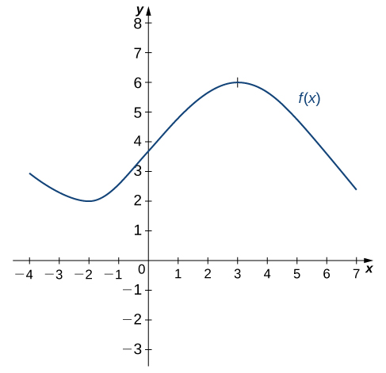 

The solution is shown in the following graph. Observe that <math xmlns="http://www.w3.org/1998/Math/MathML"><mrow><mi>f</mi><mo stretchy="false">(</mo><mi>x</mi><mo stretchy="false">)</mo></mrow></math>

 is increasing and <math xmlns="http://www.w3.org/1998/Math/MathML"><mrow><msup><mi>f</mi><mo>′</mo></msup><mrow><mo>(</mo><mi>x</mi><mo>)</mo></mrow><mo>&gt;</mo><mn>0</mn></mrow></math>

 on <math xmlns="http://www.w3.org/1998/Math/MathML"><mrow><mrow><mo>(</mo><mrow><mo>–</mo><mn>2</mn><mo>,</mo><mn>3</mn></mrow><mo>)</mo></mrow><mo>.</mo></mrow></math>

 Also, <math xmlns="http://www.w3.org/1998/Math/MathML"><mrow><mi>f</mi><mo stretchy="false">(</mo><mi>x</mi><mo stretchy="false">)</mo></mrow></math>

 is decreasing and <math xmlns="http://www.w3.org/1998/Math/MathML"><mrow><msup><mi>f</mi><mo>′</mo></msup><mrow><mo>(</mo><mi>x</mi><mo>)</mo></mrow><mo>&lt;</mo><mn>0</mn></mrow></math>

 on <math xmlns="http://www.w3.org/1998/Math/MathML"><mrow><mrow><mo>(</mo><mrow><mtext>−</mtext><mi>∞</mi><mo>,</mo><mn>−2</mn></mrow><mo>)</mo></mrow></mrow></math>

 and on <math xmlns="http://www.w3.org/1998/Math/MathML"><mrow><mrow><mo>(</mo><mrow><mn>3</mn><mo>,</mo><mtext>+</mtext><mi>∞</mi></mrow><mo>)</mo></mrow><mo>.</mo></mrow></math>

 Also note that <math xmlns="http://www.w3.org/1998/Math/MathML"><mrow><mi>f</mi><mo stretchy="false">(</mo><mi>x</mi><mo stretchy="false">)</mo></mrow></math>

 has horizontal tangents at <math xmlns="http://www.w3.org/1998/Math/MathML"><mrow><mo>–</mo><mn>2</mn></mrow></math>

 and <math xmlns="http://www.w3.org/1998/Math/MathML"><mrow><mn>3</mn><mo>,</mo></mrow></math>

 and <math xmlns="http://www.w3.org/1998/Math/MathML"><mrow><msup><mi>f</mi><mo>′</mo></msup><mrow><mo>(</mo><mrow><mn>−2</mn></mrow><mo>)</mo></mrow><mo>=</mo><mn>0</mn></mrow></math>

 and <math xmlns="http://www.w3.org/1998/Math/MathML"><mrow><msup><mi>f</mi><mo>′</mo></msup><mrow><mo>(</mo><mn>3</mn><mo>)</mo></mrow><mo>=</mo><mn>0</mn><mo>.</mo></mrow></math>

  

Sketch the graph of <math xmlns="http://www.w3.org/1998/Math/MathML"><mrow><mi>f</mi><mrow><mo>(</mo><mi>x</mi><mo>)</mo></mrow><mo>=</mo><msup><mi>x</mi><mn>2</mn></msup><mo>−</mo><mn>4</mn><mo>.</mo></mrow></math>

 On what interval is the graph of <math xmlns="http://www.w3.org/1998/Math/MathML"><mrow><msup><mi>f</mi><mo>′</mo></msup><mrow><mo>(</mo><mi>x</mi><mo>)</mo></mrow></mrow></math>

 above the <math xmlns="http://www.w3.org/1998/Math/MathML"><mi>x</mi></math>

-axis?

<math xmlns="http://www.w3.org/1998/Math/MathML"><mrow><mrow><mo>(</mo><mrow><mn>0</mn><mo>,</mo><mtext>+</mtext><mi>∞</mi></mrow><mo>)</mo></mrow></mrow></math>

Hint

The graph of <math xmlns="http://www.w3.org/1998/Math/MathML"><mrow><msup><mi>f</mi><mo>′</mo></msup><mo stretchy="false">(</mo><mi>x</mi><mo stretchy="false">)</mo></mrow></math>

 is positive where <math xmlns="http://www.w3.org/1998/Math/MathML"><mrow><mi>f</mi><mo stretchy="false">(</mo><mi>x</mi><mo stretchy="false">)</mo></mrow></math>

 is increasing.

# Derivatives and Continuity

Now that we can graph a derivative, let’s examine the behavior of the graphs. First, we consider the relationship between differentiability and continuity. We will see that if a function is differentiable at a point, it must be continuous there; however, a function that is continuous at a point need not be differentiable at that point. In fact, a function may be continuous at a point and fail to be differentiable at the point for one of several reasons.

Differentiability Implies Continuity

Let <math xmlns="http://www.w3.org/1998/Math/MathML"><mrow><mi>f</mi><mo stretchy="false">(</mo><mi>x</mi><mo stretchy="false">)</mo></mrow></math>

 be a function and <math xmlns="http://www.w3.org/1998/Math/MathML"><mi>a</mi></math>

 be in its domain. If <math xmlns="http://www.w3.org/1998/Math/MathML"><mrow><mi>f</mi><mo stretchy="false">(</mo><mi>x</mi><mo stretchy="false">)</mo></mrow></math>

 is differentiable at <math xmlns="http://www.w3.org/1998/Math/MathML"><mrow><mi>a</mi><mo>,</mo></mrow></math>

 then <math xmlns="http://www.w3.org/1998/Math/MathML"><mi>f</mi></math>

 is continuous at <math xmlns="http://www.w3.org/1998/Math/MathML"><mrow><mi>a</mi><mo>.</mo></mrow></math>

## Proof

If <math xmlns="http://www.w3.org/1998/Math/MathML"><mrow><mi>f</mi><mo stretchy="false">(</mo><mi>x</mi><mo stretchy="false">)</mo></mrow></math>

 is differentiable at <math xmlns="http://www.w3.org/1998/Math/MathML"><mi>a</mi><mo>,</mo></math>

 then <math xmlns="http://www.w3.org/1998/Math/MathML"><mrow><msup><mi>f</mi><mo>′</mo></msup><mo stretchy="false">(</mo><mi>a</mi><mo stretchy="false">)</mo></mrow></math>

 exists and

<math xmlns="http://www.w3.org/1998/Math/MathML"><mrow><msup><mi>f</mi><mo>′</mo></msup><mrow><mo>(</mo><mi>a</mi><mo>)</mo></mrow><mo>=</mo><munder><mrow><mtext>lim</mtext></mrow><mrow><mi>x</mi><mo stretchy="false">→</mo><mi>a</mi></mrow></munder><mfrac><mrow><mi>f</mi><mrow><mo>(</mo><mi>x</mi><mo>)</mo></mrow><mo>−</mo><mi>f</mi><mo stretchy="false">(</mo><mi>a</mi><mo stretchy="false">)</mo></mrow><mrow><mi>x</mi><mo>−</mo><mi>a</mi></mrow></mfrac><mo>.</mo></mrow></math>

We want to show that <math xmlns="http://www.w3.org/1998/Math/MathML"><mrow><mi>f</mi><mo stretchy="false">(</mo><mi>x</mi><mo stretchy="false">)</mo></mrow></math>

 is continuous at <math xmlns="http://www.w3.org/1998/Math/MathML"><mrow><mi>a</mi></mrow></math>

 by showing that <math xmlns="http://www.w3.org/1998/Math/MathML"><mrow><munder><mrow><mtext>lim</mtext></mrow><mrow><mi>x</mi><mo stretchy="false">→</mo><mi>a</mi></mrow></munder><mi>f</mi><mo stretchy="false">(</mo><mi>x</mi><mo stretchy="false">)</mo><mo>=</mo><mi>f</mi><mo stretchy="false">(</mo><mi>a</mi><mo stretchy="false">)</mo><mo>.</mo></mrow></math>

 Thus,

<math xmlns="http://www.w3.org/1998/Math/MathML"><mtable><mtr><mtd columnalign="right"><munder><mrow><mtext>lim</mtext></mrow><mrow><mi>x</mi><mo stretchy="false">→</mo><mi>a</mi></mrow></munder><mi>f</mi><mrow><mo>(</mo><mi>x</mi><mo>)</mo></mrow></mtd><mtd columnalign="left"><mo>=</mo><munder><mrow><mtext>lim</mtext></mrow><mrow><mi>x</mi><mo stretchy="false">→</mo><mi>a</mi></mrow></munder><mrow><mo>(</mo><mrow><mi>f</mi><mrow><mo>(</mo><mi>x</mi><mo>)</mo></mrow><mo>−</mo><mi>f</mi><mrow><mo>(</mo><mi>a</mi><mo>)</mo></mrow><mo>+</mo><mi>f</mi><mo stretchy="false">(</mo><mi>a</mi><mo stretchy="false">)</mo></mrow><mo>)</mo></mrow></mtd><mtd /><mtd /><mtd /></mtr><mtr><mtd /><mtd columnalign="left"><mo>=</mo><munder><mrow><mtext>lim</mtext></mrow><mrow><mi>x</mi><mo stretchy="false">→</mo><mi>a</mi></mrow></munder><mrow><mo>(</mo><mrow><mfrac><mrow><mi>f</mi><mrow><mo>(</mo><mi>x</mi><mo>)</mo></mrow><mo>−</mo><mi>f</mi><mo stretchy="false">(</mo><mi>a</mi><mo stretchy="false">)</mo></mrow><mrow><mi>x</mi><mo>−</mo><mi>a</mi></mrow></mfrac><mo>·</mo><mrow><mo>(</mo><mrow><mi>x</mi><mo>−</mo><mi>a</mi></mrow><mo>)</mo></mrow><mo>+</mo><mi>f</mi><mo stretchy="false">(</mo><mi>a</mi><mo stretchy="false">)</mo></mrow><mo>)</mo></mrow></mtd><mtd /><mtd /><mtd columnalign="left"><mtext>Multiply and divide</mtext><mspace width="0.2em" /><mi>f</mi><mrow><mo>(</mo><mi>x</mi><mo>)</mo></mrow><mo>−</mo><mi>f</mi><mo stretchy="false">(</mo><mi>a</mi><mo stretchy="false">)</mo><mspace width="0.2em" /><mtext>by</mtext><mspace width="0.2em" /><mi>x</mi><mo>−</mo><mi>a</mi><mo>.</mo></mtd></mtr><mtr><mtd /><mtd columnalign="left"><mo>=</mo><mrow><mo>(</mo><mrow><munder><mrow><mtext>lim</mtext></mrow><mrow><mi>x</mi><mo stretchy="false">→</mo><mi>a</mi></mrow></munder><mfrac><mrow><mi>f</mi><mrow><mo>(</mo><mi>x</mi><mo>)</mo></mrow><mo>−</mo><mi>f</mi><mo stretchy="false">(</mo><mi>a</mi><mo stretchy="false">)</mo></mrow><mrow><mi>x</mi><mo>−</mo><mi>a</mi></mrow></mfrac></mrow><mo>)</mo></mrow><mo>·</mo><mrow><mo>(</mo><mrow><munder><mrow><mtext>lim</mtext></mrow><mrow><mi>x</mi><mo stretchy="false">→</mo><mi>a</mi></mrow></munder><mrow><mo>(</mo><mrow><mi>x</mi><mo>−</mo><mi>a</mi></mrow><mo>)</mo></mrow></mrow><mo>)</mo></mrow><mo>+</mo><munder><mrow><mtext>lim</mtext></mrow><mrow><mi>x</mi><mo stretchy="false">→</mo><mi>a</mi></mrow></munder><mi>f</mi><mo stretchy="false">(</mo><mi>a</mi><mo stretchy="false">)</mo></mtd><mtd /><mtd /><mtd /></mtr><mtr><mtd /><mtd columnalign="left"><mo>=</mo><mi>f</mi><mrow><mo>(</mo><mi>a</mi><mo>)</mo></mrow><mo>·</mo><mn>0</mn><mo>+</mo><mi>f</mi><mrow><mo>(</mo><mi>a</mi><mo>)</mo></mrow></mtd><mtd /><mtd /><mtd /></mtr><mtr><mtd /><mtd columnalign="left"><mo>=</mo><mi>f</mi><mo stretchy="false">(</mo><mi>a</mi><mo stretchy="false">).</mo></mtd><mtd /><mtd /><mtd /></mtr></mtable></math>

Therefore, since <math xmlns="http://www.w3.org/1998/Math/MathML"><mrow><mi>f</mi><mrow><mo>(</mo><mi>a</mi><mo>)</mo></mrow></mrow></math>

 is defined and <math xmlns="http://www.w3.org/1998/Math/MathML"><mrow><munder><mrow><mtext>lim</mtext></mrow><mrow><mi>x</mi><mo stretchy="false">→</mo><mi>a</mi></mrow></munder><mi>f</mi><mrow><mo>(</mo><mi>x</mi><mo>)</mo></mrow><mo>=</mo><mi>f</mi><mo stretchy="false">(</mo><mi>a</mi><mo stretchy="false">)</mo><mo>,</mo></mrow></math>

 we conclude that <math xmlns="http://www.w3.org/1998/Math/MathML"><mi>f</mi></math>

 is continuous at <math xmlns="http://www.w3.org/1998/Math/MathML"><mi>a</mi><mo>.</mo></math>

□

We have just proven that differentiability implies continuity, but now we consider whether continuity implies differentiability. To determine an answer to this question, we examine the function <math xmlns="http://www.w3.org/1998/Math/MathML"><mrow><mi>f</mi><mrow><mo>(</mo><mi>x</mi><mo>)</mo></mrow><mo>=</mo><mrow><mo>\|</mo><mi>x</mi><mo>\|</mo></mrow><mo>.</mo></mrow></math>

 This function is continuous everywhere; however, <math xmlns="http://www.w3.org/1998/Math/MathML"><mrow><msup><mi>f</mi><mo>′</mo></msup><mo stretchy="false">(</mo><mn>0</mn><mo stretchy="false">)</mo></mrow></math>

 is undefined. This observation leads us to believe that continuity does not imply differentiability. Let’s explore further. For <math xmlns="http://www.w3.org/1998/Math/MathML"><mrow><mi>f</mi><mrow><mo>(</mo><mi>x</mi><mo>)</mo></mrow><mo>=</mo><mrow><mo>\|</mo><mi>x</mi><mo>\|</mo></mrow><mo>,</mo></mrow></math>

<math xmlns="http://www.w3.org/1998/Math/MathML"><mrow><msup><mi>f</mi><mo>′</mo></msup><mrow><mo>(</mo><mn>0</mn><mo>)</mo></mrow><mo>=</mo><munder><mrow><mtext>lim</mtext></mrow><mrow><mi>x</mi><mo stretchy="false">→</mo><mn>0</mn></mrow></munder><mfrac><mrow><mi>f</mi><mrow><mo>(</mo><mi>x</mi><mo>)</mo></mrow><mo>−</mo><mi>f</mi><mrow><mo>(</mo><mn>0</mn><mo>)</mo></mrow></mrow><mrow><mi>x</mi><mo>−</mo><mn>0</mn></mrow></mfrac><mo>=</mo><munder><mrow><mtext>lim</mtext></mrow><mrow><mi>x</mi><mo stretchy="false">→</mo><mn>0</mn></mrow></munder><mfrac><mrow><mrow><mo>\|</mo><mi>x</mi><mo>\|</mo></mrow><mo>−</mo><mrow><mo>\|</mo><mn>0</mn><mo>\|</mo></mrow></mrow><mrow><mi>x</mi><mo>−</mo><mn>0</mn></mrow></mfrac><mo>=</mo><munder><mrow><mtext>lim</mtext></mrow><mrow><mi>x</mi><mo stretchy="false">→</mo><mn>0</mn></mrow></munder><mfrac><mrow><mrow><mo>\|</mo><mi>x</mi><mo>\|</mo></mrow></mrow><mi>x</mi></mfrac><mo>.</mo></mrow></math>

This limit does not exist because

<math xmlns="http://www.w3.org/1998/Math/MathML"><mrow><munder><mrow><mtext>lim</mtext></mrow><mrow><mi>x</mi><mo stretchy="false">→</mo><msup><mn>0</mn><mo>−</mo></msup></mrow></munder><mfrac><mrow><mrow><mo>\|</mo><mi>x</mi><mo>\|</mo></mrow></mrow><mi>x</mi></mfrac><mo>=</mo><mn>−1</mn><mspace width="0.2em" /><mtext>and</mtext><mspace width="0.2em" /><munder><mrow><mtext>lim</mtext></mrow><mrow><mi>x</mi><mo stretchy="false">→</mo><msup><mn>0</mn><mo>+</mo></msup></mrow></munder><mfrac><mrow><mrow><mo>\|</mo><mi>x</mi><mo>\|</mo></mrow></mrow><mi>x</mi></mfrac><mo>=</mo><mn>1</mn><mo>.</mo></mrow></math>

See [\[link\]](#CNX_Calc_Figure_03_02_006).

 =|x| is continuous at 0 but is not differentiable at 0."){: #CNX_Calc_Figure_03_02_006}

Let’s consider some additional situations in which a continuous function fails to be differentiable. Consider the function <math xmlns="http://www.w3.org/1998/Math/MathML"><mrow><mi>f</mi><mrow><mo>(</mo><mi>x</mi><mo>)</mo></mrow><mo>=</mo><mroot><mi>x</mi><mn>3</mn></mroot><mtext>:</mtext></mrow></math>

<math xmlns="http://www.w3.org/1998/Math/MathML"><mrow><msup><mi>f</mi><mo>′</mo></msup><mrow><mo>(</mo><mn>0</mn><mo>)</mo></mrow><mo>=</mo><munder><mrow><mtext>lim</mtext></mrow><mrow><mi>x</mi><mo stretchy="false">→</mo><mn>0</mn></mrow></munder><mfrac><mrow><mroot><mi>x</mi><mn>3</mn></mroot><mo>−</mo><mn>0</mn></mrow><mrow><mi>x</mi><mo>−</mo><mn>0</mn></mrow></mfrac><mo>=</mo><munder><mrow><mtext>lim</mtext></mrow><mrow><mi>x</mi><mo stretchy="false">→</mo><mn>0</mn></mrow></munder><mfrac><mn>1</mn><mrow><mroot><mrow><msup><mi>x</mi><mn>2</mn></msup></mrow><mn>3</mn></mroot></mrow></mfrac><mo>=</mo><mtext>+</mtext><mi>∞</mi><mo>.</mo></mrow></math>

Thus <math xmlns="http://www.w3.org/1998/Math/MathML"><mrow><msup><mi>f</mi><mo>′</mo></msup><mrow><mo>(</mo><mn>0</mn><mo>)</mo></mrow></mrow></math>

 does not exist. A quick look at the graph of <math xmlns="http://www.w3.org/1998/Math/MathML"><mrow><mi>f</mi><mrow><mo>(</mo><mi>x</mi><mo>)</mo></mrow><mo>=</mo><mroot><mi>x</mi><mn>3</mn></mroot></mrow></math>

 clarifies the situation. The function has a vertical tangent line at <math xmlns="http://www.w3.org/1998/Math/MathML"><mn>0</mn></math>

 ([\[link\]](#CNX_Calc_Figure_03_02_007)).

 =x3 has a vertical tangent at x=0. It is continuous at 0 but is not differentiable at 0."){: #CNX_Calc_Figure_03_02_007}

The function <math xmlns="http://www.w3.org/1998/Math/MathML"><mrow><mi>f</mi><mrow><mo>(</mo><mi>x</mi><mo>)</mo></mrow><mo>=</mo><mrow><mo>{</mo><mtable columnalign="left"><mtr><mtd><mi>x</mi><mspace width="0.1em" /><mtext>sin</mtext><mspace width="0.1em" /><mrow><mo>(</mo><mrow><mfrac><mn>1</mn><mi>x</mi></mfrac></mrow><mo>)</mo></mrow><mspace width="0.2em" /><mtext>if</mtext><mspace width="0.2em" /><mi>x</mi><mo>≠</mo><mn>0</mn></mtd></mtr><mtr><mtd><mn>0</mn><mspace width="0.2em" /><mtext>if</mtext><mspace width="0.2em" /><mi>x</mi><mo>=</mo><mn>0</mn></mtd></mtr></mtable></mrow></mrow></math>

 also has a derivative that exhibits interesting behavior at <math xmlns="http://www.w3.org/1998/Math/MathML"><mn>0</mn><mo>.</mo></math>

 We see that

<math xmlns="http://www.w3.org/1998/Math/MathML"><mrow><msup><mi>f</mi><mo>′</mo></msup><mrow><mo>(</mo><mn>0</mn><mo>)</mo></mrow><mo>=</mo><munder><mrow><mtext>lim</mtext></mrow><mrow><mi>x</mi><mo stretchy="false">→</mo><mn>0</mn></mrow></munder><mfrac><mrow><mi>x</mi><mspace width="0.1em" /><mtext>sin</mtext><mspace width="0.1em" /><mrow><mo>(</mo><mrow><mrow><mn>1</mn><mtext>/</mtext><mi>x</mi></mrow></mrow><mo>)</mo></mrow><mo>−</mo><mn>0</mn></mrow><mrow><mi>x</mi><mo>−</mo><mn>0</mn></mrow></mfrac><mo>=</mo><munder><mrow><mtext>lim</mtext></mrow><mrow><mi>x</mi><mo stretchy="false">→</mo><mn>0</mn></mrow></munder><mtext>sin</mtext><mspace width="0.1em" /><mrow><mo>(</mo><mrow><mfrac><mn>1</mn><mi>x</mi></mfrac></mrow><mo>)</mo></mrow><mo>.</mo></mrow></math>

This limit does not exist, essentially because the slopes of the secant lines continuously change direction as they approach zero ([\[link\]](#CNX_Calc_Figure_03_02_008)).

 ={xsin(1x)ifx&#x2260;00ifx=0 is not differentiable at 0."){: #CNX_Calc_Figure_03_02_008}

In summary:

1.  We observe that if a function is not continuous, it cannot be differentiable, since every differentiable function must be continuous. However, if a function is continuous, it may still fail to be differentiable.
2.  We saw that
    <math xmlns="http://www.w3.org/1998/Math/MathML"><mrow><mi>f</mi><mrow><mo>(</mo><mi>x</mi><mo>)</mo></mrow><mo>=</mo><mrow><mo>\|</mo><mi>x</mi><mo>\|</mo></mrow></mrow></math>
    
    failed to be differentiable at
    <math xmlns="http://www.w3.org/1998/Math/MathML"><mn>0</mn></math>
    
    because the limit of the slopes of the tangent lines on the left and right were not the same. Visually, this resulted in a sharp corner on the graph of the function at
    <math xmlns="http://www.w3.org/1998/Math/MathML"><mn>0</mn><mo>.</mo></math>
    
    From this we conclude that in order to be differentiable at a point, a function must be “smooth” at that point.
3.  As we saw in the example of
    <math xmlns="http://www.w3.org/1998/Math/MathML"><mrow><mi>f</mi><mrow><mo>(</mo><mi>x</mi><mo>)</mo></mrow><mo>=</mo><mroot><mi>x</mi><mn>3</mn></mroot><mo>,</mo></mrow></math>
    
    a function fails to be differentiable at a point where there is a vertical tangent line.
4.  As we saw with
    <math xmlns="http://www.w3.org/1998/Math/MathML"><mrow><mi>f</mi><mrow><mo>(</mo><mi>x</mi><mo>)</mo></mrow><mo>=</mo><mrow><mo>{</mo><mtable columnalign="left"><mtr><mtd><mi>x</mi><mspace width="0.1em" /><mtext>sin</mtext><mspace width="0.1em" /><mrow><mo>(</mo><mrow><mfrac><mn>1</mn><mi>x</mi></mfrac></mrow><mo>)</mo></mrow><mspace width="0.2em" /><mtext>if</mtext><mspace width="0.2em" /><mi>x</mi><mo>≠</mo><mn>0</mn></mtd></mtr><mtr><mtd><mn>0</mn><mspace width="0.2em" /><mtext>if</mtext><mspace width="0.2em" /><mi>x</mi><mo>=</mo><mn>0</mn></mtd></mtr></mtable></mrow></mrow></math>
    
    a function may fail to be differentiable at a point in more complicated ways as well.
{: data-number-style="arabic"}

A Piecewise Function that is Continuous and Differentiable

A toy company wants to design a track for a toy car that starts out along a parabolic curve and then converts to a straight line ([[link]](#CNX_Calc_Figure_03_02_009)). The function that describes the track is to have the form <math xmlns="http://www.w3.org/1998/Math/MathML"><mrow><mi>f</mi><mrow><mo>(</mo><mi>x</mi><mo>)</mo></mrow><mo>=</mo><mrow><mo>{</mo><mrow><mtable><mtr><mtd><mrow><mfrac><mn>1</mn><mrow><mn>10</mn></mrow></mfrac><msup><mi>x</mi><mn>2</mn></msup><mo>+</mo><mi>b</mi><mi>x</mi><mo>+</mo><mi>c</mi><mspace width="0.1em" /><mtext>if</mtext><mspace width="0.1em" /><mi>x</mi><mo>&lt;</mo><mn>−10</mn></mrow></mtd></mtr><mtr><mtd><mrow><mo>−</mo><mfrac><mn>1</mn><mn>4</mn></mfrac><mi>x</mi><mo>+</mo><mfrac><mn>5</mn><mn>2</mn></mfrac><mspace width="0.1em" /><mtext>if</mtext><mspace width="0.1em" /><mi>x</mi><mo>≥</mo><mn>−10</mn></mrow></mtd></mtr></mtable></mrow></mrow></mrow></math>

 where <math xmlns="http://www.w3.org/1998/Math/MathML"><mi>x</mi></math>

 and <math xmlns="http://www.w3.org/1998/Math/MathML"><mrow><mi>f</mi><mo stretchy="false">(</mo><mi>x</mi><mo stretchy="false">)</mo></mrow></math>

 are in inches. For the car to move smoothly along the track, the function <math xmlns="http://www.w3.org/1998/Math/MathML"><mrow><mi>f</mi><mo stretchy="false">(</mo><mi>x</mi><mo stretchy="false">)</mo></mrow></math>

 must be both continuous and differentiable at <math xmlns="http://www.w3.org/1998/Math/MathML"><mrow><mn>−10</mn><mo>.</mo></mrow></math>

 Find values of <math xmlns="http://www.w3.org/1998/Math/MathML"><mi>b</mi></math>

 and <math xmlns="http://www.w3.org/1998/Math/MathML"><mi>c</mi></math>

 that make <math xmlns="http://www.w3.org/1998/Math/MathML"><mrow><mi>f</mi><mo stretchy="false">(</mo><mi>x</mi><mo stretchy="false">)</mo></mrow></math>

 both continuous and differentiable.

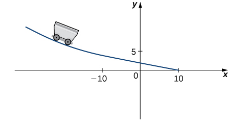{: #CNX_Calc_Figure_03_02_009}

For the function to be continuous at <math xmlns="http://www.w3.org/1998/Math/MathML"><mrow><mi>x</mi><mo>=</mo><mn>−10</mn><mo>,</mo><munder><mrow><mtext>lim</mtext></mrow><mrow><mi>x</mi><mo stretchy="false">→</mo><msup><mrow><mn>10</mn></mrow><mo>−</mo></msup></mrow></munder><mi>f</mi><mrow><mo>(</mo><mi>x</mi><mo>)</mo></mrow><mo>=</mo><mi>f</mi><mrow><mo>(</mo><mrow><mn>−10</mn></mrow><mo>)</mo></mrow><mo>.</mo></mrow></math>

 Thus, since

<math xmlns="http://www.w3.org/1998/Math/MathML"><mrow><munder><mrow><mtext>lim</mtext></mrow><mrow><mi>x</mi><mo stretchy="false">→</mo><mtext>−</mtext><msup><mrow><mn>10</mn></mrow><mo>−</mo></msup></mrow></munder><mi>f</mi><mrow><mo>(</mo><mi>x</mi><mo>)</mo></mrow><mo>=</mo><mfrac><mn>1</mn><mrow><mn>10</mn></mrow></mfrac><msup><mrow><mo stretchy="false">(</mo><mn>−10</mn><mo stretchy="false">)</mo></mrow><mn>2</mn></msup><mo>−</mo><mn>10</mn><mi>b</mi><mo>+</mo><mi>c</mi><mo>=</mo><mn>10</mn><mo>−</mo><mn>10</mn><mi>b</mi><mo>+</mo><mi>c</mi></mrow></math>

and <math xmlns="http://www.w3.org/1998/Math/MathML"><mrow><mi>f</mi><mrow><mo>(</mo><mrow><mn>−10</mn></mrow><mo>)</mo></mrow><mo>=</mo><mn>5</mn><mo>,</mo></mrow></math>

 we must have <math xmlns="http://www.w3.org/1998/Math/MathML"><mrow><mn>10</mn><mo>−</mo><mn>10</mn><mi>b</mi><mo>+</mo><mi>c</mi><mo>=</mo><mn>5</mn><mo>.</mo></mrow></math>

 Equivalently, we have <math xmlns="http://www.w3.org/1998/Math/MathML"><mrow><mi>c</mi><mo>=</mo><mn>10</mn><mi>b</mi><mo>−</mo><mn>5</mn><mo>.</mo></mrow></math>

For the function to be differentiable at <math xmlns="http://www.w3.org/1998/Math/MathML"><mrow><mn>−10</mn><mo>,</mo></mrow></math>

<math xmlns="http://www.w3.org/1998/Math/MathML"><mrow><msup><mi>f</mi><mo>′</mo></msup><mrow><mo>(</mo><mrow><mn>10</mn></mrow><mo>)</mo></mrow><mo>=</mo><munder><mrow><mtext>lim</mtext></mrow><mrow><mi>x</mi><mo stretchy="false">→</mo><mtext>−</mtext><mn>10</mn></mrow></munder><mfrac><mrow><mi>f</mi><mrow><mo>(</mo><mi>x</mi><mo>)</mo></mrow><mo>−</mo><mi>f</mi><mo stretchy="false">(</mo><mn>−10</mn><mo stretchy="false">)</mo></mrow><mrow><mi>x</mi><mo>+</mo><mn>10</mn></mrow></mfrac></mrow></math>

must exist. Since <math xmlns="http://www.w3.org/1998/Math/MathML"><mrow><mi>f</mi><mrow><mo>(</mo><mi>x</mi><mo>)</mo></mrow></mrow></math>

 is defined using different rules on the right and the left, we must evaluate this limit from the right and the left and then set them equal to each other:

<math xmlns="http://www.w3.org/1998/Math/MathML"><mtable><mtr><mtd columnalign="right"><munder><mrow><mtext>lim</mtext></mrow><mrow><mi>x</mi><mo stretchy="false">→</mo><mtext>−</mtext><msup><mrow><mn>10</mn></mrow><mo>−</mo></msup></mrow></munder><mfrac><mrow><mi>f</mi><mrow><mo>(</mo><mi>x</mi><mo>)</mo></mrow><mo>−</mo><mi>f</mi><mo stretchy="false">(</mo><mn>−10</mn><mo stretchy="false">)</mo></mrow><mrow><mi>x</mi><mo>+</mo><mn>10</mn></mrow></mfrac></mtd><mtd columnalign="left"><mo>=</mo><munder><mrow><mtext>lim</mtext></mrow><mrow><mi>x</mi><mo stretchy="false">→</mo><mtext>−</mtext><msup><mrow><mn>10</mn></mrow><mo>−</mo></msup></mrow></munder><mfrac><mrow><mfrac><mn>1</mn><mrow><mn>10</mn></mrow></mfrac><msup><mi>x</mi><mn>2</mn></msup><mo>+</mo><mi>b</mi><mi>x</mi><mo>+</mo><mi>c</mi><mo>−</mo><mn>5</mn></mrow><mrow><mi>x</mi><mo>+</mo><mn>10</mn></mrow></mfrac></mtd><mtd /><mtd /><mtd /></mtr><mtr><mtd /><mtd columnalign="left"><mo>=</mo><munder><mrow><mtext>lim</mtext></mrow><mrow><mi>x</mi><mo stretchy="false">→</mo><mtext>−</mtext><msup><mrow><mn>10</mn></mrow><mo>−</mo></msup></mrow></munder><mfrac><mrow><mfrac><mn>1</mn><mrow><mn>10</mn></mrow></mfrac><msup><mi>x</mi><mn>2</mn></msup><mo>+</mo><mi>b</mi><mi>x</mi><mo>+</mo><mrow><mo>(</mo><mrow><mn>10</mn><mi>b</mi><mo>−</mo><mn>5</mn></mrow><mo>)</mo></mrow><mo>−</mo><mn>5</mn></mrow><mrow><mi>x</mi><mo>+</mo><mn>10</mn></mrow></mfrac></mtd><mtd /><mtd /><mtd columnalign="left"><mtext>Substitute</mtext><mspace width="0.2em" /><mi>c</mi><mo>=</mo><mn>10</mn><mi>b</mi><mo>−</mo><mn>5.</mn></mtd></mtr><mtr><mtd /><mtd columnalign="left"><mo>=</mo><munder><mrow><mtext>lim</mtext></mrow><mrow><mi>x</mi><mo stretchy="false">→</mo><mtext>−</mtext><msup><mrow><mn>10</mn></mrow><mo>−</mo></msup></mrow></munder><mfrac><mrow><msup><mi>x</mi><mn>2</mn></msup><mo>−</mo><mn>100</mn><mo>+</mo><mn>10</mn><mi>b</mi><mi>x</mi><mo>+</mo><mn>100</mn><mi>b</mi></mrow><mrow><mn>10</mn><mo stretchy="false">(</mo><mi>x</mi><mo>+</mo><mn>10</mn><mo stretchy="false">)</mo></mrow></mfrac></mtd><mtd /><mtd /><mtd /></mtr><mtr><mtd /><mtd columnalign="left"><mo>=</mo><munder><mrow><mtext>lim</mtext></mrow><mrow><mi>x</mi><mo stretchy="false">→</mo><mtext>−</mtext><msup><mrow><mn>10</mn></mrow><mo>−</mo></msup></mrow></munder><mfrac><mrow><mo stretchy="false">(</mo><mi>x</mi><mo>+</mo><mn>10</mn><mo stretchy="false">)</mo><mo stretchy="false">(</mo><mi>x</mi><mo>−</mo><mn>10</mn><mo>+</mo><mn>10</mn><mi>b</mi><mo stretchy="false">)</mo></mrow><mrow><mn>10</mn><mo stretchy="false">(</mo><mi>x</mi><mo>+</mo><mn>10</mn><mo stretchy="false">)</mo></mrow></mfrac></mtd><mtd /><mtd /><mtd columnalign="left"><mtext>Factor by grouping.</mtext></mtd></mtr><mtr><mtd /><mtd columnalign="left"><mo>=</mo><mi>b</mi><mo>−</mo><mn>2.</mn></mtd><mtd /><mtd /><mtd /></mtr></mtable></math>

We also have

<math xmlns="http://www.w3.org/1998/Math/MathML"><mtable><mtr><mtd columnalign="right"><munder><mrow><mtext>lim</mtext></mrow><mrow><mi>x</mi><mo stretchy="false">→</mo><mtext>−</mtext><msup><mrow><mn>10</mn></mrow><mo>+</mo></msup></mrow></munder><mfrac><mrow><mi>f</mi><mrow><mo>(</mo><mi>x</mi><mo>)</mo></mrow><mo>−</mo><mi>f</mi><mo stretchy="false">(</mo><mn>−10</mn><mo stretchy="false">)</mo></mrow><mrow><mi>x</mi><mo>+</mo><mn>10</mn></mrow></mfrac></mtd><mtd columnalign="left"><mo>=</mo><munder><mrow><mtext>lim</mtext></mrow><mrow><mi>x</mi><mo stretchy="false">→</mo><mtext>−</mtext><msup><mrow><mn>10</mn></mrow><mo>+</mo></msup></mrow></munder><mfrac><mrow><mo>−</mo><mfrac><mn>1</mn><mn>4</mn></mfrac><mi>x</mi><mo>+</mo><mfrac><mn>5</mn><mn>2</mn></mfrac><mo>−</mo><mn>5</mn></mrow><mrow><mi>x</mi><mo>+</mo><mn>10</mn></mrow></mfrac></mtd></mtr><mtr><mtd /><mtd columnalign="left"><mo>=</mo><munder><mrow><mtext>lim</mtext></mrow><mrow><mi>x</mi><mo stretchy="false">→</mo><mtext>−</mtext><msup><mrow><mn>10</mn></mrow><mo>+</mo></msup></mrow></munder><mfrac><mrow><mtext>−</mtext><mo stretchy="false">(</mo><mi>x</mi><mo>+</mo><mn>10</mn><mo stretchy="false">)</mo></mrow><mrow><mn>4</mn><mo stretchy="false">(</mo><mi>x</mi><mo>+</mo><mn>10</mn><mo stretchy="false">)</mo></mrow></mfrac></mtd></mtr><mtr><mtd /><mtd columnalign="left"><mo>=</mo><mo>−</mo><mfrac><mn>1</mn><mn>4</mn></mfrac><mo>.</mo></mtd></mtr></mtable></math>

This gives us <math xmlns="http://www.w3.org/1998/Math/MathML"><mrow><mi>b</mi><mo>−</mo><mn>2</mn><mo>=</mo><mo>−</mo><mfrac><mn>1</mn><mn>4</mn></mfrac><mo>.</mo></mrow></math>

 Thus <math xmlns="http://www.w3.org/1998/Math/MathML"><mrow><mi>b</mi><mo>=</mo><mfrac><mn>7</mn><mn>4</mn></mfrac></mrow></math>

 and <math xmlns="http://www.w3.org/1998/Math/MathML"><mrow><mi>c</mi><mo>=</mo><mn>10</mn><mrow><mo>(</mo><mrow><mfrac><mn>7</mn><mn>4</mn></mfrac></mrow><mo>)</mo></mrow><mo>−</mo><mn>5</mn><mo>=</mo><mfrac><mrow><mn>25</mn></mrow><mn>2</mn></mfrac><mo>.</mo></mrow></math>

Find values of <math xmlns="http://www.w3.org/1998/Math/MathML"><mi>a</mi></math>

 and <math xmlns="http://www.w3.org/1998/Math/MathML"><mi>b</mi></math>

 that make <math xmlns="http://www.w3.org/1998/Math/MathML"><mrow><mi>f</mi><mrow><mo>(</mo><mi>x</mi><mo>)</mo></mrow><mo>=</mo><mrow><mo>{</mo><mrow><mtable><mtr><mtd><mrow><mi>a</mi><mi>x</mi><mo>+</mo><mi>b</mi><mspace width="0.2em" /><mtext>if</mtext><mspace width="0.2em" /><mi>x</mi><mo>&lt;</mo><mn>3</mn></mrow></mtd></mtr><mtr><mtd><mrow><msup><mi>x</mi><mn>2</mn></msup><mspace width="0.2em" /><mtext>if</mtext><mspace width="0.2em" /><mi>x</mi><mo>≥</mo><mn>3</mn></mrow></mtd></mtr></mtable></mrow></mrow></mrow></math>

 both continuous and differentiable at <math xmlns="http://www.w3.org/1998/Math/MathML"><mn>3</mn><mo>.</mo></math>

<math xmlns="http://www.w3.org/1998/Math/MathML"><mrow><mi>a</mi><mo>=</mo><mn>6</mn></mrow></math>

 and <math xmlns="http://www.w3.org/1998/Math/MathML"><mrow><mi>b</mi><mo>=</mo><mn>−9</mn></mrow></math>

Hint

Use [[link]](#fs-id1169738218186) as a guide.

# Higher-Order Derivatives

The derivative of a function is itself a function, so we can find the derivative of a derivative. For example, the derivative of a position function is the rate of change of position, or velocity. The derivative of velocity is the rate of change of velocity, which is acceleration. The new function obtained by differentiating the derivative is called the second derivative. Furthermore, we can continue to take derivatives to obtain the third derivative, fourth derivative, and so on. Collectively, these are referred to as **higher-order derivatives**{: data-type="term"}. The notation for the higher-order derivatives of <math xmlns="http://www.w3.org/1998/Math/MathML"><mrow><mi>y</mi><mo>=</mo><mi>f</mi><mo stretchy="false">(</mo><mi>x</mi><mo stretchy="false">)</mo></mrow></math>

 can be expressed in any of the following forms:

<math xmlns="http://www.w3.org/1998/Math/MathML"><mrow><mi>f</mi><mtext>″</mtext><mrow><mo>(</mo><mi>x</mi><mo>)</mo></mrow><mo>,</mo><mtext /><mspace width="0.2em" /><mi>f</mi><mtext>‴</mtext><mrow><mo>(</mo><mi>x</mi><mo>)</mo></mrow><mo>,</mo><msup><mi>f</mi><mrow><mrow><mo>(</mo><mn>4</mn><mo>)</mo></mrow></mrow></msup><mrow><mo>(</mo><mi>x</mi><mo>)</mo></mrow><mtext>,…</mtext><mo>,</mo><msup><mi>f</mi><mrow><mrow><mo>(</mo><mi>n</mi><mo>)</mo></mrow></mrow></msup><mrow><mo>(</mo><mi>x</mi><mo>)</mo></mrow></mrow></math>

<math xmlns="http://www.w3.org/1998/Math/MathML"><mrow><mi>y</mi><mtext>″</mtext><mrow><mo>(</mo><mi>x</mi><mo>)</mo></mrow><mo>,</mo><mi>y</mi><mtext>‴</mtext><mrow><mo>(</mo><mi>x</mi><mo>)</mo></mrow><mo>,</mo><msup><mi>y</mi><mrow><mrow><mo>(</mo><mn>4</mn><mo>)</mo></mrow></mrow></msup><mrow><mo>(</mo><mi>x</mi><mo>)</mo></mrow><mtext>,…</mtext><mo>,</mo><msup><mi>y</mi><mrow><mrow><mo>(</mo><mi>n</mi><mo>)</mo></mrow></mrow></msup><mrow><mo>(</mo><mi>x</mi><mo>)</mo></mrow></mrow></math>

<math xmlns="http://www.w3.org/1998/Math/MathML"><mrow><mfrac><mrow><msup><mi>d</mi><mn>2</mn></msup><mi>y</mi></mrow><mrow><mi>d</mi><msup><mi>x</mi><mn>2</mn></msup></mrow></mfrac><mo>,</mo><mfrac><mrow><msup><mi>d</mi><mn>3</mn></msup><mi>y</mi></mrow><mrow><mi>d</mi><msup><mi>y</mi><mn>3</mn></msup></mrow></mfrac><mo>,</mo><mfrac><mrow><msup><mi>d</mi><mn>4</mn></msup><mi>y</mi></mrow><mrow><mi>d</mi><msup><mi>y</mi><mn>4</mn></msup></mrow></mfrac><mtext>,…</mtext><mo>,</mo><mfrac><mrow><msup><mi>d</mi><mi>n</mi></msup><mi>y</mi></mrow><mrow><mi>d</mi><msup><mi>y</mi><mi>n</mi></msup></mrow></mfrac><mo>.</mo></mrow></math>

It is interesting to note that the notation for <math xmlns="http://www.w3.org/1998/Math/MathML"><mrow><mfrac><mrow><msup><mi>d</mi><mn>2</mn></msup><mi>y</mi></mrow><mrow><mi>d</mi><msup><mi>x</mi><mn>2</mn></msup></mrow></mfrac></mrow></math>

 may be viewed as an attempt to express <math xmlns="http://www.w3.org/1998/Math/MathML"><mrow><mfrac><mi>d</mi><mrow><mi>d</mi><mi>x</mi></mrow></mfrac><mrow><mo>(</mo><mrow><mfrac><mrow><mi>d</mi><mi>y</mi></mrow><mrow><mi>d</mi><mi>x</mi></mrow></mfrac></mrow><mo>)</mo></mrow></mrow></math>

 more compactly. Analogously, <math xmlns="http://www.w3.org/1998/Math/MathML"><mrow><mfrac><mi>d</mi><mrow><mi>d</mi><mi>x</mi></mrow></mfrac><mrow><mo>(</mo><mrow><mfrac><mi>d</mi><mrow><mi>d</mi><mi>x</mi></mrow></mfrac><mrow><mo>(</mo><mrow><mfrac><mrow><mi>d</mi><mi>y</mi></mrow><mrow><mi>d</mi><mi>x</mi></mrow></mfrac></mrow><mo>)</mo></mrow></mrow><mo>)</mo></mrow><mo>=</mo><mfrac><mi>d</mi><mrow><mi>d</mi><mi>x</mi></mrow></mfrac><mrow><mo>(</mo><mrow><mfrac><mrow><msup><mi>d</mi><mn>2</mn></msup><mi>y</mi></mrow><mrow><mi>d</mi><msup><mi>x</mi><mn>2</mn></msup></mrow></mfrac></mrow><mo>)</mo></mrow><mo>=</mo><mfrac><mrow><msup><mi>d</mi><mn>3</mn></msup><mi>y</mi></mrow><mrow><mi>d</mi><msup><mi>x</mi><mn>3</mn></msup></mrow></mfrac><mo>.</mo></mrow></math>

Finding a Second Derivative

For <math xmlns="http://www.w3.org/1998/Math/MathML"><mrow><mi>f</mi><mrow><mo>(</mo><mi>x</mi><mo>)</mo></mrow><mo>=</mo><mn>2</mn><msup><mi>x</mi><mn>2</mn></msup><mo>−</mo><mn>3</mn><mi>x</mi><mo>+</mo><mn>1</mn><mo>,</mo></mrow></math>

 find <math xmlns="http://www.w3.org/1998/Math/MathML"><mrow><mi>f</mi><mtext>″</mtext><mo stretchy="false">(</mo><mi>x</mi><mo stretchy="false">)</mo><mo>.</mo></mrow></math>

First find <math xmlns="http://www.w3.org/1998/Math/MathML"><mrow><msup><mi>f</mi><mo>′</mo></msup><mo stretchy="false">(</mo><mi>x</mi><mo stretchy="false">)</mo><mo>.</mo></mrow></math>

<math xmlns="http://www.w3.org/1998/Math/MathML"><mtable><mtr><mtd columnalign="right"><msup><mi>f</mi><mo>′</mo></msup><mrow><mo>(</mo><mi>x</mi><mo>)</mo></mrow></mtd><mtd columnalign="left"><mo>=</mo><munder><mrow><mtext>lim</mtext></mrow><mrow><mi>h</mi><mo stretchy="false">→</mo><mn>0</mn></mrow></munder><mfrac><mrow><mrow><mo>(</mo><mrow><mn>2</mn><msup><mrow><mo stretchy="false">(</mo><mi>x</mi><mo>+</mo><mi>h</mi><mo stretchy="false">)</mo></mrow><mn>2</mn></msup><mo>−</mo><mn>3</mn><mrow><mo>(</mo><mrow><mi>x</mi><mo>+</mo><mi>h</mi></mrow><mo>)</mo></mrow><mo>+</mo><mn>1</mn></mrow><mo>)</mo></mrow><mo>−</mo><mo stretchy="false">(</mo><mn>2</mn><msup><mi>x</mi><mn>2</mn></msup><mo>−</mo><mn>3</mn><mi>x</mi><mo>+</mo><mn>1</mn><mo stretchy="false">)</mo></mrow><mi>h</mi></mfrac></mtd><mtd /><mtd /><mtd columnalign="left"><mtable><mtr><mtd columnalign="left"><mtext>Substitute</mtext><mspace width="0.2em" /><mi>f</mi><mrow><mo>(</mo><mi>x</mi><mo>)</mo></mrow><mo>=</mo><mn>2</mn><msup><mi>x</mi><mn>2</mn></msup><mo>−</mo><mn>3</mn><mi>x</mi><mo>+</mo><mn>1</mn></mtd></mtr><mtr><mtd columnalign="left"><mtext>and</mtext></mtd></mtr><mtr><mtd columnalign="left"><mi>f</mi><mrow><mo>(</mo><mrow><mi>x</mi><mo>+</mo><mi>h</mi></mrow><mo>)</mo></mrow><mo>=</mo><mn>2</mn><msup><mrow><mo stretchy="false">(</mo><mi>x</mi><mo>+</mo><mi>h</mi><mo stretchy="false">)</mo></mrow><mn>2</mn></msup><mo>−</mo><mn>3</mn><mrow><mo>(</mo><mrow><mi>x</mi><mo>+</mo><mi>h</mi></mrow><mo>)</mo></mrow><mo>+</mo><mn>1</mn></mtd></mtr><mtr><mtd columnalign="left"><mtext>into</mtext><mspace width="0.2em" /><msup><mi>f</mi><mo>′</mo></msup><mrow><mo>(</mo><mi>x</mi><mo>)</mo></mrow><mo>=</mo><munder><mrow><mtext>lim</mtext></mrow><mrow><mi>h</mi><mo stretchy="false">→</mo><mn>0</mn></mrow></munder><mfrac><mrow><mi>f</mi><mrow><mo>(</mo><mrow><mi>x</mi><mo>+</mo><mi>h</mi></mrow><mo>)</mo></mrow><mo>−</mo><mi>f</mi><mo stretchy="false">(</mo><mi>x</mi><mo stretchy="false">)</mo></mrow><mi>h</mi></mfrac><mo>.</mo></mtd></mtr></mtable></mtd></mtr><mtr><mtd /><mtd columnalign="left"><mo>=</mo><munder><mrow><mtext>lim</mtext></mrow><mrow><mi>h</mi><mo stretchy="false">→</mo><mn>0</mn></mrow></munder><mfrac><mrow><mn>4</mn><mi>x</mi><mi>h</mi><mo>+</mo><msup><mi>h</mi><mn>2</mn></msup><mo>−</mo><mn>3</mn><mi>h</mi></mrow><mi>h</mi></mfrac></mtd><mtd /><mtd /><mtd columnalign="left"><mtext>Simplify the numerator.</mtext></mtd></mtr><mtr><mtd /><mtd columnalign="left"><mo>=</mo><munder><mrow><mtext>lim</mtext></mrow><mrow><mi>h</mi><mo stretchy="false">→</mo><mn>0</mn></mrow></munder><mrow><mo>(</mo><mrow><mn>4</mn><mi>x</mi><mo>+</mo><mi>h</mi><mo>−</mo><mn>3</mn></mrow><mo>)</mo></mrow></mtd><mtd /><mtd /><mtd columnalign="left"><mtable><mtr><mtd columnalign="left"><mtext>Factor out the</mtext><mspace width="0.2em" /><mi>h</mi><mspace width="0.2em" /><mtext>in the numerator</mtext></mtd></mtr><mtr><mtd columnalign="left"><mtext>and cancel with the</mtext><mspace width="0.2em" /><mi>h</mi><mspace width="0.2em" /><mtext>in the</mtext></mtd></mtr><mtr><mtd columnalign="left"><mtext>denominator.</mtext></mtd></mtr></mtable></mtd></mtr><mtr><mtd /><mtd columnalign="left"><mo>=</mo><mn>4</mn><mi>x</mi><mo>−</mo><mn>3</mn></mtd><mtd /><mtd /><mtd columnalign="left"><mtext>Take the limit.</mtext></mtd></mtr></mtable></math>

Next, find <math xmlns="http://www.w3.org/1998/Math/MathML"><mrow><mi>f</mi><mtext>″</mtext><mo stretchy="false">(</mo><mi>x</mi><mo stretchy="false">)</mo></mrow></math>

 by taking the derivative of <math xmlns="http://www.w3.org/1998/Math/MathML"><mrow><msup><mi>f</mi><mo>′</mo></msup><mrow><mo>(</mo><mi>x</mi><mo>)</mo></mrow><mo>=</mo><mn>4</mn><mi>x</mi><mo>−</mo><mn>3</mn><mo>.</mo></mrow></math>

<math xmlns="http://www.w3.org/1998/Math/MathML"><mtable><mtr><mtd columnalign="right"><mi>f</mi><mtext>″</mtext><mrow><mo>(</mo><mi>x</mi><mo>)</mo></mrow></mtd><mtd columnalign="left"><mo>=</mo><munder><mrow><mtext>lim</mtext></mrow><mrow><mi>h</mi><mo stretchy="false">→</mo><mn>0</mn></mrow></munder><mfrac><mrow><msup><mi>f</mi><mo>′</mo></msup><mrow><mo>(</mo><mrow><mi>x</mi><mo>+</mo><mi>h</mi></mrow><mo>)</mo></mrow><mo>−</mo><msup><mi>f</mi><mo>′</mo></msup><mo stretchy="false">(</mo><mi>x</mi><mo stretchy="false">)</mo></mrow><mi>h</mi></mfrac></mtd><mtd /><mtd /><mtd columnalign="left"><mtable><mtr><mtd columnalign="left"><mtext>Use</mtext><mspace width="0.2em" /><msup><mi>f</mi><mo>′</mo></msup><mrow><mo>(</mo><mi>x</mi><mo>)</mo></mrow><mo>=</mo><munder><mrow><mtext>lim</mtext></mrow><mrow><mi>h</mi><mo stretchy="false">→</mo><mn>0</mn></mrow></munder><mfrac><mrow><mi>f</mi><mrow><mo>(</mo><mrow><mi>x</mi><mo>+</mo><mi>h</mi></mrow><mo>)</mo></mrow><mo>−</mo><mi>f</mi><mo stretchy="false">(</mo><mi>x</mi><mo stretchy="false">)</mo></mrow><mi>h</mi></mfrac><mspace width="0.2em" /><mtext>with</mtext><mspace width="0.2em" /><msup><mi>f</mi><mo>′</mo></msup><mo stretchy="false">(</mo><mi>x</mi><mo stretchy="false">)</mo><mspace width="0.2em" /><mtext>in</mtext></mtd></mtr><mtr><mtd columnalign="left"><mtext>place of</mtext><mspace width="0.2em" /><mi>f</mi><mo stretchy="false">(</mo><mi>x</mi><mo stretchy="false">)</mo><mo>.</mo></mtd></mtr></mtable></mtd></mtr><mtr><mtd /><mtd columnalign="left"><mo>=</mo><munder><mrow><mtext>lim</mtext></mrow><mrow><mi>h</mi><mo stretchy="false">→</mo><mn>0</mn></mrow></munder><mfrac><mrow><mrow><mo>(</mo><mrow><mn>4</mn><mrow><mo>(</mo><mrow><mi>x</mi><mo>+</mo><mi>h</mi></mrow><mo>)</mo></mrow><mo>−</mo><mn>3</mn></mrow><mo>)</mo></mrow><mo>−</mo><mo stretchy="false">(</mo><mn>4</mn><mi>x</mi><mo>−</mo><mn>3</mn><mo stretchy="false">)</mo></mrow><mi>h</mi></mfrac></mtd><mtd /><mtd /><mtd columnalign="left"><mtable><mtr><mtd columnalign="left"><mtext>Substitute</mtext><mspace width="0.2em" /><msup><mi>f</mi><mo>′</mo></msup><mrow><mo>(</mo><mrow><mi>x</mi><mo>+</mo><mi>h</mi></mrow><mo>)</mo></mrow><mo>=</mo><mn>4</mn><mrow><mo>(</mo><mrow><mi>x</mi><mo>+</mo><mi>h</mi></mrow><mo>)</mo></mrow><mo>−</mo><mn>3</mn><mspace width="0.2em" /><mtext>and</mtext></mtd></mtr><mtr><mtd columnalign="left"><msup><mi>f</mi><mo>′</mo></msup><mrow><mo>(</mo><mi>x</mi><mo>)</mo></mrow><mo>=</mo><mn>4</mn><mi>x</mi><mo>−</mo><mn>3.</mn></mtd></mtr></mtable></mtd></mtr><mtr><mtd /><mtd columnalign="left"><mo>=</mo><munder><mrow><mtext>lim</mtext></mrow><mrow><mi>h</mi><mo stretchy="false">→</mo><mn>0</mn></mrow></munder><mn>4</mn></mtd><mtd /><mtd /><mtd columnalign="left"><mtext>Simplify.</mtext></mtd></mtr><mtr><mtd /><mtd columnalign="left"><mo>=</mo><mn>4</mn></mtd><mtd /><mtd /><mtd columnalign="left"><mtext>Take the limit.</mtext></mtd></mtr></mtable></math>

Find <math xmlns="http://www.w3.org/1998/Math/MathML"><mrow><mi>f</mi><mtext>″</mtext><mo stretchy="false">(</mo><mi>x</mi><mo stretchy="false">)</mo></mrow></math>

 for <math xmlns="http://www.w3.org/1998/Math/MathML"><mrow><mi>f</mi><mrow><mo>(</mo><mi>x</mi><mo>)</mo></mrow><mo>=</mo><msup><mi>x</mi><mn>2</mn></msup><mo>.</mo></mrow></math>

<math xmlns="http://www.w3.org/1998/Math/MathML"><mrow><mi>f</mi><mtext>″</mtext><mrow><mo>(</mo><mi>x</mi><mo>)</mo></mrow><mo>=</mo><mn>2</mn></mrow></math>

Hint

We found <math xmlns="http://www.w3.org/1998/Math/MathML"><mrow><msup><mi>f</mi><mo>′</mo></msup><mrow><mo>(</mo><mi>x</mi><mo>)</mo></mrow><mo>=</mo><mn>2</mn><mi>x</mi></mrow></math>

 in a previous checkpoint. Use [[link]](#fs-id1169738143059) to find the derivative of <math xmlns="http://www.w3.org/1998/Math/MathML"><mrow><msup><mi>f</mi><mo>′</mo></msup><mo stretchy="false">(</mo><mi>x</mi><mo stretchy="false">)</mo></mrow></math>

Finding Acceleration

The position of a particle along a coordinate axis at time <math xmlns="http://www.w3.org/1998/Math/MathML"><mi>t</mi></math>

 (in seconds) is given by <math xmlns="http://www.w3.org/1998/Math/MathML"><mrow><mi>s</mi><mrow><mo>(</mo><mi>t</mi><mo>)</mo></mrow><mo>=</mo><mn>3</mn><msup><mi>t</mi><mn>2</mn></msup><mo>−</mo><mn>4</mn><mi>t</mi><mo>+</mo><mn>1</mn></mrow></math>

 (in meters). Find the function that describes its acceleration at time <math xmlns="http://www.w3.org/1998/Math/MathML"><mrow><mi>t</mi><mo>.</mo></mrow></math>

Since <math xmlns="http://www.w3.org/1998/Math/MathML"><mrow><mi>v</mi><mrow><mo>(</mo><mi>t</mi><mo>)</mo></mrow><mo>=</mo><msup><mi>s</mi><mo>′</mo></msup><mo stretchy="false">(</mo><mi>t</mi><mo stretchy="false">)</mo></mrow></math>

 and <math xmlns="http://www.w3.org/1998/Math/MathML"><mrow><mi>a</mi><mrow><mo>(</mo><mi>t</mi><mo>)</mo></mrow><mo>=</mo><msup><mi>v</mi><mo>′</mo></msup><mrow><mo>(</mo><mi>t</mi><mo>)</mo></mrow><mo>=</mo><mi>s</mi><mtext>″</mtext><mrow><mo>(</mo><mi>t</mi><mo>)</mo></mrow><mo>,</mo></mrow></math>

 we begin by finding the derivative of <math xmlns="http://www.w3.org/1998/Math/MathML"><mrow><mi>s</mi><mo stretchy="false">(</mo><mi>t</mi><mo stretchy="false">)</mo><mo>:</mo></mrow></math>

<math xmlns="http://www.w3.org/1998/Math/MathML"><mtable><mtr><mtd columnalign="right"><msup><mi>s</mi><mo>′</mo></msup><mrow><mo>(</mo><mi>t</mi><mo>)</mo></mrow></mtd><mtd columnalign="left"><mo>=</mo><munder><mrow><mtext>lim</mtext></mrow><mrow><mi>h</mi><mo stretchy="false">→</mo><mn>0</mn></mrow></munder><mfrac><mrow><mi>s</mi><mrow><mo>(</mo><mrow><mi>t</mi><mo>+</mo><mi>h</mi></mrow><mo>)</mo></mrow><mo>−</mo><mi>s</mi><mo stretchy="false">(</mo><mi>t</mi><mo stretchy="false">)</mo></mrow><mi>h</mi></mfrac></mtd></mtr><mtr><mtd /><mtd columnalign="left"><mo>=</mo><munder><mrow><mtext>lim</mtext></mrow><mrow><mi>h</mi><mo stretchy="false">→</mo><mn>0</mn></mrow></munder><mfrac><mrow><mn>3</mn><msup><mrow><mrow><mo>(</mo><mrow><mi>t</mi><mo>+</mo><mi>h</mi></mrow><mo>)</mo></mrow></mrow><mn>2</mn></msup><mo>−</mo><mn>4</mn><mrow><mo>(</mo><mrow><mi>t</mi><mo>+</mo><mi>h</mi></mrow><mo>)</mo></mrow><mo>+</mo><mn>1</mn><mo>−</mo><mrow><mo>(</mo><mrow><mn>3</mn><msup><mi>t</mi><mn>2</mn></msup><mo>−</mo><mn>4</mn><mi>t</mi><mo>+</mo><mn>1</mn></mrow><mo>)</mo></mrow></mrow><mi>h</mi></mfrac></mtd></mtr><mtr><mtd /><mtd columnalign="left"><mo>=</mo><mn>6</mn><mi>t</mi><mo>−</mo><mn>4.</mn></mtd></mtr></mtable></math>

Next,

<math xmlns="http://www.w3.org/1998/Math/MathML"><mtable><mtr><mtd columnalign="right"><mi>s</mi><mtext>″</mtext><mrow><mo>(</mo><mi>t</mi><mo>)</mo></mrow></mtd><mtd columnalign="left"><mo>=</mo><munder><mrow><mtext>lim</mtext></mrow><mrow><mi>h</mi><mo stretchy="false">→</mo><mn>0</mn></mrow></munder><mfrac><mrow><msup><mi>s</mi><mo>′</mo></msup><mrow><mo>(</mo><mrow><mi>t</mi><mo>+</mo><mi>h</mi></mrow><mo>)</mo></mrow><mo>−</mo><msup><mi>s</mi><mo>′</mo></msup><mo stretchy="false">(</mo><mi>t</mi><mo stretchy="false">)</mo></mrow><mi>h</mi></mfrac></mtd></mtr><mtr><mtd /><mtd columnalign="left"><mo>=</mo><munder><mrow><mtext>lim</mtext></mrow><mrow><mi>h</mi><mo stretchy="false">→</mo><mn>0</mn></mrow></munder><mfrac><mrow><mn>6</mn><mrow><mo>(</mo><mrow><mi>t</mi><mo>+</mo><mi>h</mi></mrow><mo>)</mo></mrow><mo>−</mo><mn>4</mn><mo>−</mo><mo stretchy="false">(</mo><mn>6</mn><mi>t</mi><mo>−</mo><mn>4</mn><mo stretchy="false">)</mo></mrow><mi>h</mi></mfrac></mtd></mtr><mtr><mtd /><mtd columnalign="left"><mo>=</mo><mn>6.</mn></mtd></mtr></mtable></math>

Thus, <math xmlns="http://www.w3.org/1998/Math/MathML"><mrow><mi>a</mi><mo>=</mo><mn>6</mn><msup><mrow><mspace width="0.2em" /><mtext>m/s</mtext></mrow><mn>2</mn></msup><mo>.</mo></mrow></math>

For <math xmlns="http://www.w3.org/1998/Math/MathML"><mrow><mi>s</mi><mrow><mo>(</mo><mi>t</mi><mo>)</mo></mrow><mo>=</mo><msup><mi>t</mi><mn>3</mn></msup><mo>,</mo></mrow></math>

 find <math xmlns="http://www.w3.org/1998/Math/MathML"><mrow><mi>a</mi><mo stretchy="false">(</mo><mi>t</mi><mo stretchy="false">)</mo><mo>.</mo></mrow></math>

<math xmlns="http://www.w3.org/1998/Math/MathML"><mrow><mi>a</mi><mrow><mo>(</mo><mi>t</mi><mo>)</mo></mrow><mo>=</mo><mn>6</mn><mi>t</mi></mrow></math>

Hint

Use [[link]](#fs-id1169737966982) as a guide.

# Key Concepts

* The derivative of a function
  <math xmlns="http://www.w3.org/1998/Math/MathML"><mrow><mi>f</mi><mo stretchy="false">(</mo><mi>x</mi><mo stretchy="false">)</mo></mrow></math>
  
  is the function whose value at
  <math xmlns="http://www.w3.org/1998/Math/MathML"><mi>x</mi></math>
  
  is
  <math xmlns="http://www.w3.org/1998/Math/MathML"><mrow><msup><mi>f</mi><mo>′</mo></msup><mo stretchy="false">(</mo><mi>x</mi><mo stretchy="false">)</mo><mo>.</mo></mrow></math>

* The graph of a derivative of a function
  <math xmlns="http://www.w3.org/1998/Math/MathML"><mrow><mi>f</mi><mo stretchy="false">(</mo><mi>x</mi><mo stretchy="false">)</mo></mrow></math>
  
  is related to the graph of
  <math xmlns="http://www.w3.org/1998/Math/MathML"><mrow><mi>f</mi><mo stretchy="false">(</mo><mi>x</mi><mo stretchy="false">)</mo><mo>.</mo></mrow></math>
  
  Where
  <math xmlns="http://www.w3.org/1998/Math/MathML"><mrow><mi>f</mi><mo stretchy="false">(</mo><mi>x</mi><mo stretchy="false">)</mo></mrow></math>
  
  has a tangent line with positive slope,
  <math xmlns="http://www.w3.org/1998/Math/MathML"><mrow><msup><mi>f</mi><mo>′</mo></msup><mrow><mo>(</mo><mi>x</mi><mo>)</mo></mrow><mo>&gt;</mo><mn>0</mn><mo>.</mo></mrow></math>
  
  Where
  <math xmlns="http://www.w3.org/1998/Math/MathML"><mrow><mi>f</mi><mo stretchy="false">(</mo><mi>x</mi><mo stretchy="false">)</mo></mrow></math>
  
  has a tangent line with negative slope,
  <math xmlns="http://www.w3.org/1998/Math/MathML"><mrow><msup><mi>f</mi><mo>′</mo></msup><mrow><mo>(</mo><mi>x</mi><mo>)</mo></mrow><mo>&lt;</mo><mn>0</mn><mo>.</mo></mrow></math>
  
  Where
  <math xmlns="http://www.w3.org/1998/Math/MathML"><mrow><mi>f</mi><mo stretchy="false">(</mo><mi>x</mi><mo stretchy="false">)</mo></mrow></math>
  
  has a horizontal tangent line,
  <math xmlns="http://www.w3.org/1998/Math/MathML"><mrow><msup><mi>f</mi><mo>′</mo></msup><mrow><mo>(</mo><mi>x</mi><mo>)</mo></mrow><mo>=</mo><mn>0</mn><mo>.</mo></mrow></math>

* If a function is differentiable at a point, then it is continuous at that point. A function is not differentiable at a point if it is not continuous at the point, if it has a vertical tangent line at the point, or if the graph has a sharp corner or cusp.
* Higher-order derivatives are derivatives of derivatives, from the second derivative to the
  <math xmlns="http://www.w3.org/1998/Math/MathML"><mrow><mi>n</mi><mtext>th</mtext></mrow></math>
  
  derivative.
{: data-bullet-style="bullet"}

# Key Equations

* **The derivative function**
  * * *
  {: data-type="newline"}
  
  <math xmlns="http://www.w3.org/1998/Math/MathML"><mrow><msup><mi>f</mi><mo>′</mo></msup><mrow><mo>(</mo><mi>x</mi><mo>)</mo></mrow><mo>=</mo><munder><mrow><mtext>lim</mtext></mrow><mrow><mi>h</mi><mo stretchy="false">→</mo><mn>0</mn></mrow></munder><mfrac><mrow><mi>f</mi><mrow><mo>(</mo><mrow><mi>x</mi><mo>+</mo><mi>h</mi></mrow><mo>)</mo></mrow><mo>−</mo><mi>f</mi><mrow><mo>(</mo><mi>x</mi><mo>)</mo></mrow></mrow><mi>h</mi></mfrac></mrow></math>
{: data-bullet-style="bullet"}

<section data-depth="1" class="section-exercises" markdown="1">
For the following exercises, use the definition of a derivative to find <math xmlns="http://www.w3.org/1998/Math/MathML"><mrow><msup><mi>f</mi><mo>′</mo></msup><mrow><mo>(</mo><mi>x</mi><mo>)</mo></mrow><mo>.</mo></mrow></math>

<math xmlns="http://www.w3.org/1998/Math/MathML"><mrow><mi>f</mi><mrow><mo>(</mo><mi>x</mi><mo>)</mo></mrow><mo>=</mo><mn>6</mn></mrow></math>

<math xmlns="http://www.w3.org/1998/Math/MathML"><mrow><mi>f</mi><mrow><mo>(</mo><mi>x</mi><mo>)</mo></mrow><mo>=</mo><mn>2</mn><mo>−</mo><mn>3</mn><mi>x</mi></mrow></math>

<math xmlns="http://www.w3.org/1998/Math/MathML"><mrow><mn>−3</mn></mrow></math>

<math xmlns="http://www.w3.org/1998/Math/MathML"><mrow><mi>f</mi><mrow><mo>(</mo><mi>x</mi><mo>)</mo></mrow><mo>=</mo><mfrac><mrow><mn>2</mn><mi>x</mi></mrow><mn>7</mn></mfrac><mo>+</mo><mn>1</mn></mrow></math>

<math xmlns="http://www.w3.org/1998/Math/MathML"><mrow><mi>f</mi><mrow><mo>(</mo><mi>x</mi><mo>)</mo></mrow><mo>=</mo><mn>4</mn><msup><mi>x</mi><mn>2</mn></msup></mrow></math>

<math xmlns="http://www.w3.org/1998/Math/MathML"><mrow><mn>8</mn><mi>x</mi></mrow></math>

<math xmlns="http://www.w3.org/1998/Math/MathML"><mrow><mi>f</mi><mrow><mo>(</mo><mi>x</mi><mo>)</mo></mrow><mo>=</mo><mn>5</mn><mi>x</mi><mo>−</mo><msup><mi>x</mi><mn>2</mn></msup></mrow></math>

<math xmlns="http://www.w3.org/1998/Math/MathML"><mrow><mi>f</mi><mrow><mo>(</mo><mi>x</mi><mo>)</mo></mrow><mo>=</mo><msqrt><mrow><mn>2</mn><mi>x</mi></mrow></msqrt></mrow></math>

<math xmlns="http://www.w3.org/1998/Math/MathML"><mrow><mfrac><mn>1</mn><mrow><msqrt><mrow><mn>2</mn><mi>x</mi></mrow></msqrt></mrow></mfrac></mrow></math>

<math xmlns="http://www.w3.org/1998/Math/MathML"><mrow><mi>f</mi><mrow><mo>(</mo><mi>x</mi><mo>)</mo></mrow><mo>=</mo><msqrt><mrow><mi>x</mi><mo>−</mo><mn>6</mn></mrow></msqrt></mrow></math>

<math xmlns="http://www.w3.org/1998/Math/MathML"><mrow><mi>f</mi><mrow><mo>(</mo><mi>x</mi><mo>)</mo></mrow><mo>=</mo><mfrac><mn>9</mn><mi>x</mi></mfrac></mrow></math>

<math xmlns="http://www.w3.org/1998/Math/MathML"><mrow><mfrac><mrow><mn>−9</mn></mrow><mrow><msup><mi>x</mi><mn>2</mn></msup></mrow></mfrac></mrow></math>

<math xmlns="http://www.w3.org/1998/Math/MathML"><mrow><mi>f</mi><mrow><mo>(</mo><mi>x</mi><mo>)</mo></mrow><mo>=</mo><mi>x</mi><mo>+</mo><mfrac><mn>1</mn><mi>x</mi></mfrac></mrow></math>

<math xmlns="http://www.w3.org/1998/Math/MathML"><mrow><mi>f</mi><mrow><mo>(</mo><mi>x</mi><mo>)</mo></mrow><mo>=</mo><mfrac><mn>1</mn><mrow><msqrt><mi>x</mi></msqrt></mrow></mfrac></mrow></math>

<math xmlns="http://www.w3.org/1998/Math/MathML"><mrow><mfrac><mrow><mn>−1</mn></mrow><mrow><mn>2</mn><msup><mi>x</mi><mrow><mn>3</mn><mtext>/</mtext><mn>2</mn></mrow></msup></mrow></mfrac></mrow></math>

For the following exercises, use the graph of <math xmlns="http://www.w3.org/1998/Math/MathML"><mrow><mi>y</mi><mo>=</mo><mi>f</mi><mo stretchy="false">(</mo><mi>x</mi><mo stretchy="false">)</mo></mrow></math>

 to sketch the graph of its derivative <math xmlns="http://www.w3.org/1998/Math/MathML"><mrow><msup><mi>f</mi><mo>′</mo></msup><mrow><mo>(</mo><mi>x</mi><mo>)</mo></mrow><mo>.</mo></mrow></math>

  

  

* * *
{: data-type="newline"}

  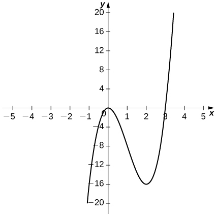 

  

 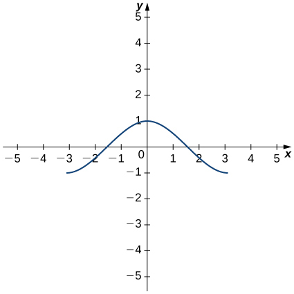 

* * *
{: data-type="newline"}

  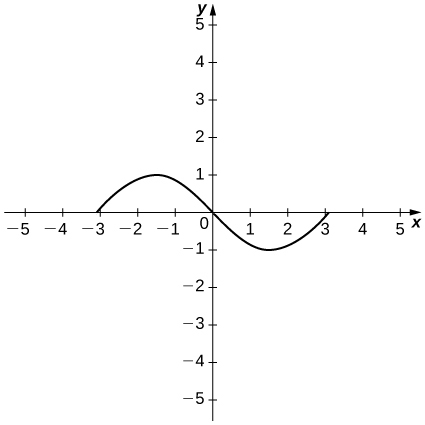 

For the following exercises, the given limit represents the derivative of a function <math xmlns="http://www.w3.org/1998/Math/MathML"><mrow><mi>y</mi><mo>=</mo><mi>f</mi><mrow><mo>(</mo><mi>x</mi><mo>)</mo></mrow></mrow></math>

 at <math xmlns="http://www.w3.org/1998/Math/MathML"><mrow><mi>x</mi><mo>=</mo><mi>a</mi><mo>.</mo></mrow></math>

 Find <math xmlns="http://www.w3.org/1998/Math/MathML"><mrow><mi>f</mi><mrow><mo>(</mo><mi>x</mi><mo>)</mo></mrow></mrow></math>

 and <math xmlns="http://www.w3.org/1998/Math/MathML"><mi>a</mi><mo>.</mo></math>

<math xmlns="http://www.w3.org/1998/Math/MathML"><mrow><munder><mrow><mtext>lim</mtext></mrow><mrow><mi>h</mi><mo stretchy="false">→</mo><mn>0</mn></mrow></munder><mfrac><mrow><msup><mrow><mrow><mo>(</mo><mrow><mn>1</mn><mo>+</mo><mi>h</mi></mrow><mo>)</mo></mrow></mrow><mrow><mn>2</mn><mtext>/</mtext><mn>3</mn></mrow></msup><mo>−</mo><mn>1</mn></mrow><mi>h</mi></mfrac></mrow></math>

<math xmlns="http://www.w3.org/1998/Math/MathML"><mrow><munder><mrow><mtext>lim</mtext></mrow><mrow><mi>h</mi><mo stretchy="false">→</mo><mn>0</mn></mrow></munder><mfrac><mrow><mrow><mo>[</mo><mrow><mn>3</mn><msup><mrow><mrow><mo>(</mo><mrow><mn>2</mn><mo>+</mo><mi>h</mi></mrow><mo>)</mo></mrow></mrow><mn>2</mn></msup><mo>+</mo><mn>2</mn></mrow><mo>]</mo></mrow><mo>−</mo><mn>14</mn></mrow><mi>h</mi></mfrac></mrow></math>

<math xmlns="http://www.w3.org/1998/Math/MathML"><mrow><mi>f</mi><mrow><mo>(</mo><mi>x</mi><mo>)</mo></mrow><mo>=</mo><mn>3</mn><msup><mi>x</mi><mn>2</mn></msup><mo>+</mo><mn>2</mn><mo>,</mo><mi>a</mi><mo>=</mo><mn>2</mn></mrow></math>

<math xmlns="http://www.w3.org/1998/Math/MathML"><mrow><munder><mrow><mtext>lim</mtext></mrow><mrow><mi>h</mi><mo stretchy="false">→</mo><mn>0</mn></mrow></munder><mfrac><mrow><mtext>cos</mtext><mspace width="0.1em" /><mrow><mo>(</mo><mrow><mi>π</mi><mo>+</mo><mi>h</mi></mrow><mo>)</mo></mrow><mo>+</mo><mn>1</mn></mrow><mi>h</mi></mfrac></mrow></math>

<math xmlns="http://www.w3.org/1998/Math/MathML"><mrow><munder><mrow><mtext>lim</mtext></mrow><mrow><mi>h</mi><mo stretchy="false">→</mo><mn>0</mn></mrow></munder><mfrac><mrow><msup><mrow><mrow><mo>(</mo><mrow><mn>2</mn><mo>+</mo><mi>h</mi></mrow><mo>)</mo></mrow></mrow><mn>4</mn></msup><mo>−</mo><mn>16</mn></mrow><mi>h</mi></mfrac></mrow></math>

<math xmlns="http://www.w3.org/1998/Math/MathML"><mrow><mi>f</mi><mrow><mo>(</mo><mi>x</mi><mo>)</mo></mrow><mo>=</mo><msup><mi>x</mi><mn>4</mn></msup><mo>,</mo><mi>a</mi><mo>=</mo><mn>2</mn></mrow></math>

<math xmlns="http://www.w3.org/1998/Math/MathML"><mrow><munder><mrow><mtext>lim</mtext></mrow><mrow><mi>h</mi><mo stretchy="false">→</mo><mn>0</mn></mrow></munder><mfrac><mrow><mo stretchy="false">[</mo><mn>2</mn><msup><mrow><mrow><mo>(</mo><mrow><mn>3</mn><mo>+</mo><mi>h</mi></mrow><mo>)</mo></mrow></mrow><mn>2</mn></msup><mo>−</mo><mrow><mo>(</mo><mrow><mn>3</mn><mo>+</mo><mi>h</mi></mrow><mo>)</mo></mrow><mo stretchy="false">]</mo><mo>−</mo><mn>15</mn></mrow><mi>h</mi></mfrac></mrow></math>

<math xmlns="http://www.w3.org/1998/Math/MathML"><mrow><munder><mrow><mtext>lim</mtext></mrow><mrow><mi>h</mi><mo stretchy="false">→</mo><mn>0</mn></mrow></munder><mfrac><mrow><msup><mi>e</mi><mi>h</mi></msup><mo>−</mo><mn>1</mn></mrow><mi>h</mi></mfrac></mrow></math>

<math xmlns="http://www.w3.org/1998/Math/MathML"><mrow><mi>f</mi><mrow><mo>(</mo><mi>x</mi><mo>)</mo></mrow><mo>=</mo><msup><mi>e</mi><mi>x</mi></msup><mo>,</mo><mi>a</mi><mo>=</mo><mn>0</mn></mrow></math>

For the following functions,

1.  sketch the graph and
2.  use the definition of a derivative to show that the function is not differentiable at
    <math xmlns="http://www.w3.org/1998/Math/MathML"><mrow><mi>x</mi><mo>=</mo><mn>1</mn><mo>.</mo></mrow></math>
{: data-number-style="lower-alpha"}

<math xmlns="http://www.w3.org/1998/Math/MathML"><mrow><mi>f</mi><mo stretchy="false">(</mo><mi>x</mi><mo stretchy="false">)</mo><mo>=</mo><mrow><mo>{</mo><mtable columnalign="left"><mtr><mtd><mn>2</mn><msqrt><mi>x</mi></msqrt><mo>,</mo><mn>0</mn><mo>≤</mo><mi>x</mi><mo>≤</mo><mn>1</mn></mtd></mtr><mtr><mtd><mn>3</mn><mi>x</mi><mo>−</mo><mn>1</mn><mo>,</mo><mi>x</mi><mo>&gt;</mo><mn>1</mn></mtd></mtr></mtable></mrow></mrow></math>

<math xmlns="http://www.w3.org/1998/Math/MathML"><mrow><mi>f</mi><mo stretchy="false">(</mo><mi>x</mi><mo stretchy="false">)</mo><mo>=</mo><mrow><mo>{</mo><mtable columnalign="left"><mtr><mtd><mn>3</mn><mo>,</mo><mi>x</mi><mo>&lt;</mo><mn>1</mn></mtd></mtr><mtr><mtd><mn>3</mn><mi>x</mi><mo>,</mo><mi>x</mi><mo>≥</mo><mn>1</mn></mtd></mtr></mtable></mrow></mrow></math>

a.* * *
{: data-type="newline"}

  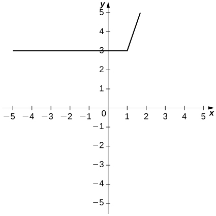 * * *
{: data-type="newline"}

 b. <math xmlns="http://www.w3.org/1998/Math/MathML"><mrow><munder><mrow><mtext>lim</mtext></mrow><mrow><mi>h</mi><mo stretchy="false">→</mo><msup><mn>1</mn><mo>−</mo></msup></mrow></munder><mfrac><mrow><mn>3</mn><mo>−</mo><mn>3</mn></mrow><mi>h</mi></mfrac><mo>≠</mo><munder><mrow><mtext>lim</mtext></mrow><mrow><mi>h</mi><mo stretchy="false">→</mo><msup><mn>1</mn><mo>+</mo></msup></mrow></munder><mfrac><mrow><mn>3</mn><mi>h</mi></mrow><mi>h</mi></mfrac></mrow></math>

<math xmlns="http://www.w3.org/1998/Math/MathML"><mrow><mi>f</mi><mo stretchy="false">(</mo><mi>x</mi><mo stretchy="false">)</mo><mo>=</mo><mrow><mo>{</mo><mtable columnalign="left"><mtr><mtd><mo>−</mo><msup><mi>x</mi><mn>2</mn></msup><mo>+</mo><mn>2</mn><mo>,</mo><mi>x</mi><mo>≤</mo><mn>1</mn></mtd></mtr><mtr><mtd><mi>x</mi><mo>,</mo><mi>x</mi><mo>&gt;</mo><mn>1</mn></mtd></mtr></mtable></mrow></mrow></math>

<math xmlns="http://www.w3.org/1998/Math/MathML"><mrow><mi>f</mi><mo stretchy="false">(</mo><mi>x</mi><mo stretchy="false">)</mo><mo>=</mo><mrow><mo>{</mo><mtable columnalign="left"><mtr><mtd><mn>2</mn><mi>x</mi><mo>,</mo><mi>x</mi><mo>≤</mo><mn>1</mn></mtd></mtr><mtr><mtd><mfrac><mn>2</mn><mi>x</mi></mfrac><mo>,</mo><mi>x</mi><mo>&gt;</mo><mn>1</mn></mtd></mtr></mtable></mrow></mrow></math>

a.* * *
{: data-type="newline"}

  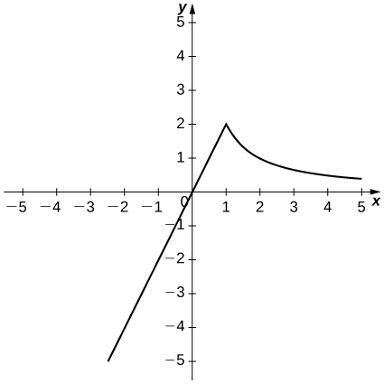 * * *
{: data-type="newline"}

 b. <math xmlns="http://www.w3.org/1998/Math/MathML"><mrow><munder><mrow><mtext>lim</mtext></mrow><mrow><mi>h</mi><mo stretchy="false">→</mo><msup><mn>1</mn><mo>−</mo></msup></mrow></munder><mfrac><mrow><mn>2</mn><mi>h</mi></mrow><mi>h</mi></mfrac><mo>≠</mo><munder><mrow><mtext>lim</mtext></mrow><mrow><mi>h</mi><mo stretchy="false">→</mo><msup><mn>1</mn><mo>+</mo></msup></mrow></munder><mfrac><mrow><mfrac><mn>2</mn><mrow><mi>x</mi><mo>+</mo><mi>h</mi></mrow></mfrac><mo>−</mo><mfrac><mn>2</mn><mi>x</mi></mfrac></mrow><mi>h</mi></mfrac><mo>.</mo></mrow></math>

For the following graphs,

1.  determine for which values of
    <math xmlns="http://www.w3.org/1998/Math/MathML"><mrow><mi>x</mi><mo>=</mo><mi>a</mi></mrow></math>
    
    the
    <math xmlns="http://www.w3.org/1998/Math/MathML"><mrow><munder><mrow><mtext>lim</mtext></mrow><mrow><mi>x</mi><mo stretchy="false">→</mo><mi>a</mi></mrow></munder><mi>f</mi><mo stretchy="false">(</mo><mi>x</mi><mo stretchy="false">)</mo></mrow></math>
    
    exists but
    <math xmlns="http://www.w3.org/1998/Math/MathML"><mi>f</mi></math>
    
    is not continuous at
    <math xmlns="http://www.w3.org/1998/Math/MathML"><mrow><mi>x</mi><mo>=</mo><mi>a</mi><mo>,</mo></mrow></math>
    
    and
2.  determine for which values of
    <math xmlns="http://www.w3.org/1998/Math/MathML"><mrow><mi>x</mi><mo>=</mo><mi>a</mi></mrow></math>
    
    the function is continuous but not differentiable at
    <math xmlns="http://www.w3.org/1998/Math/MathML"><mrow><mi>x</mi><mo>=</mo><mi>a</mi><mo>.</mo></mrow></math>
{: data-number-style="lower-alpha"}

  

  

a. <math xmlns="http://www.w3.org/1998/Math/MathML"><mrow><mi>x</mi><mo>=</mo><mn>1</mn><mo>,</mo></mrow></math>

 b. <math xmlns="http://www.w3.org/1998/Math/MathML"><mrow><mi>x</mi><mo>=</mo><mn>2</mn></mrow></math>

Use the graph to evaluate a. <math xmlns="http://www.w3.org/1998/Math/MathML"><mrow><msup><mi>f</mi><mo>′</mo></msup><mrow><mo>(</mo><mrow><mn>−0.5</mn></mrow><mo>)</mo></mrow><mo>,</mo></mrow></math>

 b. <math xmlns="http://www.w3.org/1998/Math/MathML"><mrow><msup><mi>f</mi><mo>′</mo></msup><mrow><mo>(</mo><mn>0</mn><mo>)</mo></mrow><mo>,</mo></mrow></math>

 c. <math xmlns="http://www.w3.org/1998/Math/MathML"><mrow><msup><mi>f</mi><mo>′</mo></msup><mrow><mo>(</mo><mn>1</mn><mo>)</mo></mrow><mo>,</mo></mrow></math>

 d. <math xmlns="http://www.w3.org/1998/Math/MathML"><mrow><msup><mi>f</mi><mo>′</mo></msup><mrow><mo>(</mo><mn>2</mn><mo>)</mo></mrow><mo>,</mo></mrow></math>

 and e. <math xmlns="http://www.w3.org/1998/Math/MathML"><mrow><msup><mi>f</mi><mo>′</mo></msup><mrow><mo>(</mo><mn>3</mn><mo>)</mo></mrow><mo>,</mo></mrow></math>

 if it exists.

 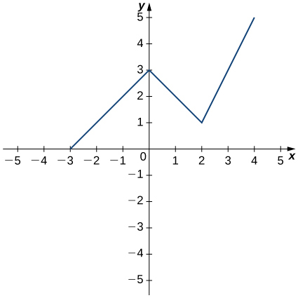 

For the following functions, use <math xmlns="http://www.w3.org/1998/Math/MathML"><mrow><mi>f</mi><mtext>″</mtext><mrow><mo>(</mo><mi>x</mi><mo>)</mo></mrow><mo>=</mo><munder><mrow><mtext>lim</mtext></mrow><mrow><mi>h</mi><mo stretchy="false">→</mo><mn>0</mn></mrow></munder><mfrac><mrow><msup><mi>f</mi><mo>′</mo></msup><mrow><mo>(</mo><mrow><mi>x</mi><mo>+</mo><mi>h</mi></mrow><mo>)</mo></mrow><mo>−</mo><msup><mi>f</mi><mo>′</mo></msup><mo stretchy="false">(</mo><mi>x</mi><mo stretchy="false">)</mo></mrow><mi>h</mi></mfrac></mrow></math>

 to find <math xmlns="http://www.w3.org/1998/Math/MathML"><mrow><mi>f</mi><mtext>″</mtext><mo stretchy="false">(</mo><mi>x</mi><mo stretchy="false">)</mo><mo>.</mo></mrow></math>

<math xmlns="http://www.w3.org/1998/Math/MathML"><mrow><mi>f</mi><mo stretchy="false">(</mo><mi>x</mi><mo stretchy="false">)</mo><mo>=</mo><mn>2</mn><mo>−</mo><mn>3</mn><mi>x</mi></mrow></math>

<math xmlns="http://www.w3.org/1998/Math/MathML"><mn>0</mn></math>

<math xmlns="http://www.w3.org/1998/Math/MathML"><mrow><mi>f</mi><mo stretchy="false">(</mo><mi>x</mi><mo stretchy="false">)</mo><mo>=</mo><mn>4</mn><msup><mi>x</mi><mn>2</mn></msup></mrow></math>

<math xmlns="http://www.w3.org/1998/Math/MathML"><mrow><mi>f</mi><mo stretchy="false">(</mo><mi>x</mi><mo stretchy="false">)</mo><mo>=</mo><mi>x</mi><mo>+</mo><mfrac><mn>1</mn><mi>x</mi></mfrac></mrow></math>

<math xmlns="http://www.w3.org/1998/Math/MathML"><mrow><mfrac><mn>2</mn><mrow><msup><mi>x</mi><mn>3</mn></msup></mrow></mfrac></mrow></math>

For the following exercises, use a calculator to graph <math xmlns="http://www.w3.org/1998/Math/MathML"><mrow><mi>f</mi><mrow><mo>(</mo><mi>x</mi><mo>)</mo></mrow><mo>.</mo></mrow></math>

 Determine the function <math xmlns="http://www.w3.org/1998/Math/MathML"><mrow><msup><mi>f</mi><mo>′</mo></msup><mrow><mo>(</mo><mi>x</mi><mo>)</mo></mrow><mo>,</mo></mrow></math>

 then use a calculator to graph <math xmlns="http://www.w3.org/1998/Math/MathML"><mrow><msup><mi>f</mi><mo>′</mo></msup><mrow><mo>(</mo><mi>x</mi><mo>)</mo></mrow><mo>.</mo></mrow></math>

**[T]** <math xmlns="http://www.w3.org/1998/Math/MathML"><mrow><mi>f</mi><mrow><mo>(</mo><mi>x</mi><mo>)</mo></mrow><mo>=</mo><mo>−</mo><mfrac><mn>5</mn><mi>x</mi></mfrac></mrow></math>

**[T]** <math xmlns="http://www.w3.org/1998/Math/MathML"><mrow><mi>f</mi><mrow><mo>(</mo><mi>x</mi><mo>)</mo></mrow><mo>=</mo><mn>3</mn><msup><mi>x</mi><mn>2</mn></msup><mo>+</mo><mn>2</mn><mi>x</mi><mo>+</mo><mn>4</mn><mo>.</mo></mrow></math>

<math xmlns="http://www.w3.org/1998/Math/MathML"><mrow><msup><mi>f</mi><mo>′</mo></msup><mrow><mo>(</mo><mi>x</mi><mo>)</mo></mrow><mo>=</mo><mn>6</mn><mi>x</mi><mo>+</mo><mn>2</mn></mrow></math>

* * *
{: data-type="newline"}

  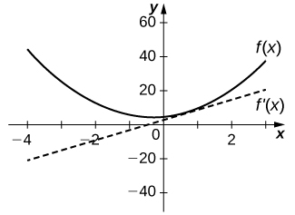 

**[T]** <math xmlns="http://www.w3.org/1998/Math/MathML"><mrow><mi>f</mi><mrow><mo>(</mo><mi>x</mi><mo>)</mo></mrow><mo>=</mo><msqrt><mi>x</mi></msqrt><mo>+</mo><mn>3</mn><mi>x</mi></mrow></math>

**[T]** <math xmlns="http://www.w3.org/1998/Math/MathML"><mrow><mi>f</mi><mrow><mo>(</mo><mi>x</mi><mo>)</mo></mrow><mo>=</mo><mfrac><mn>1</mn><mrow><msqrt><mrow><mn>2</mn><mi>x</mi></mrow></msqrt></mrow></mfrac></mrow></math>

<math xmlns="http://www.w3.org/1998/Math/MathML"><mrow><msup><mi>f</mi><mo>′</mo></msup><mrow><mo>(</mo><mi>x</mi><mo>)</mo></mrow><mo>=</mo><mo>−</mo><mfrac><mn>1</mn><mrow><msup><mrow><mrow><mo>(</mo><mrow><mn>2</mn><mi>x</mi></mrow><mo>)</mo></mrow></mrow><mrow><mn>3</mn><mtext>/</mtext><mn>2</mn></mrow></msup></mrow></mfrac></mrow></math>

* * *
{: data-type="newline"}

  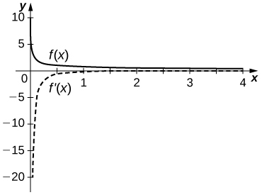 

**[T]** <math xmlns="http://www.w3.org/1998/Math/MathML"><mrow><mi>f</mi><mrow><mo>(</mo><mi>x</mi><mo>)</mo></mrow><mo>=</mo><mn>1</mn><mo>+</mo><mi>x</mi><mo>+</mo><mfrac><mn>1</mn><mi>x</mi></mfrac></mrow></math>

**[T]** <math xmlns="http://www.w3.org/1998/Math/MathML"><mrow><mi>f</mi><mrow><mo>(</mo><mi>x</mi><mo>)</mo></mrow><mo>=</mo><msup><mi>x</mi><mn>3</mn></msup><mo>+</mo><mn>1</mn></mrow></math>

<math xmlns="http://www.w3.org/1998/Math/MathML"><mrow><msup><mi>f</mi><mo>′</mo></msup><mrow><mo>(</mo><mi>x</mi><mo>)</mo></mrow><mo>=</mo><mn>3</mn><msup><mi>x</mi><mn>2</mn></msup></mrow></math>

* * *
{: data-type="newline"}

  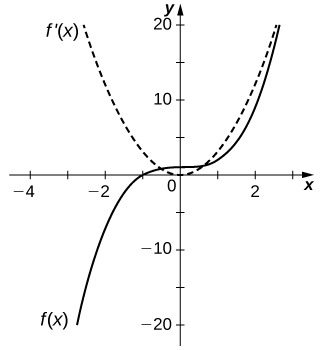 

For the following exercises, describe what the two expressions represent in terms of each of the given situations. Be sure to include units.

1.  <math xmlns="http://www.w3.org/1998/Math/MathML"><mrow><mfrac><mrow><mi>f</mi><mrow><mo>(</mo><mrow><mi>x</mi><mo>+</mo><mi>h</mi></mrow><mo>)</mo></mrow><mo>−</mo><mi>f</mi><mo stretchy="false">(</mo><mi>x</mi><mo stretchy="false">)</mo></mrow><mi>h</mi></mfrac></mrow></math>

2.  <math xmlns="http://www.w3.org/1998/Math/MathML"><mrow><msup><mi>f</mi><mo>′</mo></msup><mrow><mo>(</mo><mi>x</mi><mo>)</mo></mrow><mo>=</mo><munder><mrow><mtext>lim</mtext></mrow><mrow><mi>h</mi><mo stretchy="false">→</mo><mn>0</mn></mrow></munder><mfrac><mrow><mi>f</mi><mrow><mo>(</mo><mrow><mi>x</mi><mo>+</mo><mi>h</mi></mrow><mo>)</mo></mrow><mo>−</mo><mi>f</mi><mo stretchy="false">(</mo><mi>x</mi><mo stretchy="false">)</mo></mrow><mi>h</mi></mfrac></mrow></math>
{: data-number-style="lower-alpha"}

<math xmlns="http://www.w3.org/1998/Math/MathML"><mrow><mi>P</mi><mo stretchy="false">(</mo><mi>x</mi><mo stretchy="false">)</mo></mrow></math>

 denotes the population of a city at time <math xmlns="http://www.w3.org/1998/Math/MathML"><mi>x</mi></math>

 in years.

<math xmlns="http://www.w3.org/1998/Math/MathML"><mrow><mi>C</mi><mo stretchy="false">(</mo><mi>x</mi><mo stretchy="false">)</mo></mrow></math>

 denotes the total amount of money (in thousands of dollars) spent on concessions by <math xmlns="http://www.w3.org/1998/Math/MathML"><mi>x</mi></math>

 customers at an amusement park.

a. Average rate at which customers spent on concessions in thousands per customer. b. Rate (in thousands per customer) at which <math xmlns="http://www.w3.org/1998/Math/MathML"><mi>x</mi></math>

 customers spent money on concessions in thousands per customer.

<math xmlns="http://www.w3.org/1998/Math/MathML"><mrow><mi>R</mi><mo stretchy="false">(</mo><mi>x</mi><mo stretchy="false">)</mo></mrow></math>

 denotes the total cost (in thousands of dollars) of manufacturing <math xmlns="http://www.w3.org/1998/Math/MathML"><mi>x</mi></math>

 clock radios.

<math xmlns="http://www.w3.org/1998/Math/MathML"><mrow><mi>g</mi><mo stretchy="false">(</mo><mi>x</mi><mo stretchy="false">)</mo></mrow></math>

 denotes the grade (in percentage points) received on a test, given <math xmlns="http://www.w3.org/1998/Math/MathML"><mi>x</mi></math>

 hours of studying.

a. Average grade received on the test with an average study time between two values. b. Rate (in percentage points per hour) at which the grade on the test increased or decreased for a given average study time of <math xmlns="http://www.w3.org/1998/Math/MathML"><mi>x</mi></math>

 hours.

<math xmlns="http://www.w3.org/1998/Math/MathML"><mrow><mi>B</mi><mo stretchy="false">(</mo><mi>x</mi><mo stretchy="false">)</mo></mrow></math>

 denotes the cost (in dollars) of a sociology textbook at university bookstores in the United States in <math xmlns="http://www.w3.org/1998/Math/MathML"><mi>x</mi></math>

 years since <math xmlns="http://www.w3.org/1998/Math/MathML"><mrow><mn>1990</mn><mo>.</mo></mrow></math>

<math xmlns="http://www.w3.org/1998/Math/MathML"><mrow><mi>p</mi><mrow><mo>(</mo><mi>x</mi><mo>)</mo></mrow></mrow></math>

 denotes atmospheric pressure at an altitude of <math xmlns="http://www.w3.org/1998/Math/MathML"><mi>x</mi></math>

 feet.

a. Average change of atmospheric pressure between two different altitudes. b. Rate (torr per foot) at which atmospheric pressure is increasing or decreasing at <math xmlns="http://www.w3.org/1998/Math/MathML"><mi>x</mi></math>

 feet.

Sketch the graph of a function <math xmlns="http://www.w3.org/1998/Math/MathML"><mrow><mi>y</mi><mo>=</mo><mi>f</mi><mrow><mo>(</mo><mi>x</mi><mo>)</mo></mrow></mrow></math>

 with all of the following properties:

1.  <math xmlns="http://www.w3.org/1998/Math/MathML"><mrow><msup><mi>f</mi><mo>′</mo></msup><mrow><mo>(</mo><mi>x</mi><mo>)</mo></mrow><mo>&gt;</mo><mn>0</mn></mrow></math>
    
    for
    <math xmlns="http://www.w3.org/1998/Math/MathML"><mrow><mn>−2</mn><mo>≤</mo><mi>x</mi><mo>&lt;</mo><mn>1</mn></mrow></math>

2.  <math xmlns="http://www.w3.org/1998/Math/MathML"><mrow><msup><mi>f</mi><mo>′</mo></msup><mrow><mo>(</mo><mn>2</mn><mo>)</mo></mrow><mo>=</mo><mn>0</mn></mrow></math>

3.  <math xmlns="http://www.w3.org/1998/Math/MathML"><mrow><msup><mi>f</mi><mo>′</mo></msup><mrow><mo>(</mo><mi>x</mi><mo>)</mo></mrow><mo>&gt;</mo><mn>0</mn></mrow></math>
    
    for
    <math xmlns="http://www.w3.org/1998/Math/MathML"><mrow><mi>x</mi><mo>&gt;</mo><mn>2</mn></mrow></math>

4.  <math xmlns="http://www.w3.org/1998/Math/MathML"><mrow><mi>f</mi><mrow><mo>(</mo><mn>2</mn><mo>)</mo></mrow><mo>=</mo><mn>2</mn></mrow></math>
    
    and
    <math xmlns="http://www.w3.org/1998/Math/MathML"><mrow><mi>f</mi><mrow><mo>(</mo><mn>0</mn><mo>)</mo></mrow><mo>=</mo><mn>1</mn></mrow></math>

5.  <math xmlns="http://www.w3.org/1998/Math/MathML"><mrow><munder><mrow><mtext>lim</mtext></mrow><mrow><mi>x</mi><mo stretchy="false">→</mo><mtext>−</mtext><mi>∞</mi></mrow></munder><mi>f</mi><mrow><mo>(</mo><mi>x</mi><mo>)</mo></mrow><mo>=</mo><mn>0</mn></mrow></math>
    
    and
    <math xmlns="http://www.w3.org/1998/Math/MathML"><mrow><munder><mrow><mtext>lim</mtext></mrow><mrow><mi>x</mi><mo stretchy="false">→</mo><mi>∞</mi></mrow></munder><mi>f</mi><mrow><mo>(</mo><mi>x</mi><mo>)</mo></mrow><mo>=</mo><mi>∞</mi></mrow></math>

6.  <math xmlns="http://www.w3.org/1998/Math/MathML"><mrow><msup><mi>f</mi><mo>′</mo></msup><mrow><mo>(</mo><mn>1</mn><mo>)</mo></mrow></mrow></math>
    
    does not exist.
{: data-number-style="lower-alpha"}

Suppose temperature <math xmlns="http://www.w3.org/1998/Math/MathML"><mi>T</mi></math>

 in degrees Fahrenheit at a height <math xmlns="http://www.w3.org/1998/Math/MathML"><mi>x</mi></math>

 in feet above the ground is given by <math xmlns="http://www.w3.org/1998/Math/MathML"><mrow><mi>y</mi><mo>=</mo><mi>T</mi><mo stretchy="false">(</mo><mi>x</mi><mo stretchy="false">)</mo><mo>.</mo></mrow></math>

1.  Give a physical interpretation, with units, of
    <math xmlns="http://www.w3.org/1998/Math/MathML"><mrow><msup><mi>T</mi><mo>′</mo></msup><mo stretchy="false">(</mo><mi>x</mi><mo stretchy="false">)</mo><mo>.</mo></mrow></math>

2.  If we know that
    <math xmlns="http://www.w3.org/1998/Math/MathML"><mrow><msup><mi>T</mi><mo>′</mo></msup><mrow><mo>(</mo><mrow><mn>1000</mn></mrow><mo>)</mo></mrow><mo>=</mo><mn>−0.1</mn><mo>,</mo></mrow></math>
    
    explain the physical meaning.
{: data-number-style="lower-alpha"}

a. The rate (in degrees per foot) at which temperature is increasing or decreasing for a given height <math xmlns="http://www.w3.org/1998/Math/MathML"><mi>x</mi><mo>.</mo></math>

 b. The rate of change of temperature as altitude changes at <math xmlns="http://www.w3.org/1998/Math/MathML"><mrow><mn>1000</mn></mrow></math>

 feet is <math xmlns="http://www.w3.org/1998/Math/MathML"><mrow><mn>−0.1</mn></mrow></math>

 degrees per foot.

Suppose the total profit of a company is <math xmlns="http://www.w3.org/1998/Math/MathML"><mrow><mi>y</mi><mo>=</mo><mi>P</mi><mo stretchy="false">(</mo><mi>x</mi><mo stretchy="false">)</mo></mrow></math>

 thousand dollars when <math xmlns="http://www.w3.org/1998/Math/MathML"><mi>x</mi></math>

 units of an item are sold.

1.  What does
    <math xmlns="http://www.w3.org/1998/Math/MathML"><mrow><mfrac><mrow><mi>P</mi><mrow><mo>(</mo><mi>b</mi><mo>)</mo></mrow><mo>−</mo><mi>P</mi><mo stretchy="false">(</mo><mi>a</mi><mo stretchy="false">)</mo></mrow><mrow><mi>b</mi><mo>−</mo><mi>a</mi></mrow></mfrac></mrow></math>
    
    for
    <math xmlns="http://www.w3.org/1998/Math/MathML"><mrow><mn>0</mn><mo>&lt;</mo><mi>a</mi><mo>&lt;</mo><mi>b</mi></mrow></math>
    
    measure, and what are the units?
2.  What does
    <math xmlns="http://www.w3.org/1998/Math/MathML"><mrow><msup><mi>P</mi><mo>′</mo></msup><mo stretchy="false">(</mo><mi>x</mi><mo stretchy="false">)</mo></mrow></math>
    
    measure, and what are the units?
3.  Suppose that
    <math xmlns="http://www.w3.org/1998/Math/MathML"><mrow><msup><mi>P</mi><mo>′</mo></msup><mrow><mo>(</mo><mrow><mn>30</mn></mrow><mo>)</mo></mrow><mo>=</mo><mn>5</mn><mo>,</mo></mrow></math>
    
    what is the approximate change in profit if the number of items sold increases from
    <math xmlns="http://www.w3.org/1998/Math/MathML"><mrow><mn>30</mn><mspace width="0.2em" /><mtext>to</mtext><mspace width="0.2em" /><mn>31</mn><mo>?</mo></mrow></math>
{: data-number-style="lower-alpha"}

The graph in the following figure models the number of people <math xmlns="http://www.w3.org/1998/Math/MathML"><mrow><mi>N</mi><mo stretchy="false">(</mo><mi>t</mi><mo stretchy="false">)</mo></mrow></math>

 who have come down with the flu <math xmlns="http://www.w3.org/1998/Math/MathML"><mi>t</mi></math>

 weeks after its initial outbreak in a town with a population of <math xmlns="http://www.w3.org/1998/Math/MathML"><mrow><mn>50,000</mn></mrow></math>

 citizens.

1.  Describe what
    <math xmlns="http://www.w3.org/1998/Math/MathML"><mrow><msup><mi>N</mi><mo>′</mo></msup><mo stretchy="false">(</mo><mi>t</mi><mo stretchy="false">)</mo></mrow></math>
    
    represents and how it behaves as
    <math xmlns="http://www.w3.org/1998/Math/MathML"><mi>t</mi></math>
    
    increases.
2.  What does the derivative tell us about how this town is affected by the flu outbreak?
    * * *
    {: data-type="newline"}
{: data-number-style="lower-alpha"}

 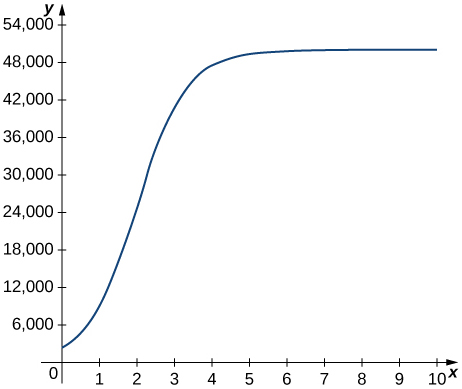 

a. The rate at which the number of people who have come down with the flu is changing <math xmlns="http://www.w3.org/1998/Math/MathML"><mi>t</mi></math>

 weeks after the initial outbreak. b. The rate is increasing sharply up to the third week, at which point it slows down and then becomes constant.

For the following exercises, use the following table, which shows the height <math xmlns="http://www.w3.org/1998/Math/MathML"><mi>h</mi></math>

 of the Saturn <math xmlns="http://www.w3.org/1998/Math/MathML"><mtext>V</mtext></math>

 rocket for the Apollo <math xmlns="http://www.w3.org/1998/Math/MathML"><mrow><mn>11</mn></mrow></math>

 mission <math xmlns="http://www.w3.org/1998/Math/MathML"><mi>t</mi></math>

 seconds after launch.

| Time (seconds) | Height (meters) |
{: valign="top"}|----------
| <math xmlns="http://www.w3.org/1998/Math/MathML"><mn>0</mn></math>

 | <math xmlns="http://www.w3.org/1998/Math/MathML"><mn>0</mn></math>

 |
{: valign="top"}| <math xmlns="http://www.w3.org/1998/Math/MathML"><mn>1</mn></math>

 | <math xmlns="http://www.w3.org/1998/Math/MathML"><mn>2</mn></math>

 |
{: valign="top"}| <math xmlns="http://www.w3.org/1998/Math/MathML"><mn>2</mn></math>

 | <math xmlns="http://www.w3.org/1998/Math/MathML"><mn>4</mn></math>

 |
{: valign="top"}| <math xmlns="http://www.w3.org/1998/Math/MathML"><mn>3</mn></math>

 | <math xmlns="http://www.w3.org/1998/Math/MathML"><mrow><mn>13</mn></mrow></math>

 |
{: valign="top"}| <math xmlns="http://www.w3.org/1998/Math/MathML"><mn>4</mn></math>

 | <math xmlns="http://www.w3.org/1998/Math/MathML"><mrow><mn>25</mn></mrow></math>

 |
{: valign="top"}| <math xmlns="http://www.w3.org/1998/Math/MathML"><mn>5</mn></math>

 | <math xmlns="http://www.w3.org/1998/Math/MathML"><mrow><mn>32</mn></mrow></math>

 |
{: valign="top"}{: .unnumbered summary="This table has seven rows and two columns. The first row is a header row and it labels each column. The first column header is Time (seconds) and the second column is Height (meters). Under the first column are the values 0, 1, 2, 3, 4, and 5. Under the second column are the values 0, 2, 4, 13, 25, and 32." data-label=""}

What is the physical meaning of <math xmlns="http://www.w3.org/1998/Math/MathML"><mrow><msup><mi>h</mi><mo>′</mo></msup><mrow><mo>(</mo><mi>t</mi><mo>)</mo></mrow><mo>?</mo></mrow></math>

 What are the units?

**[T]** Construct a table of values for <math xmlns="http://www.w3.org/1998/Math/MathML"><mrow><msup><mi>h</mi><mo>′</mo></msup><mrow><mo>(</mo><mi>t</mi><mo>)</mo></mrow></mrow></math>

 and graph both <math xmlns="http://www.w3.org/1998/Math/MathML"><mrow><mi>h</mi><mrow><mo>(</mo><mi>t</mi><mo>)</mo></mrow></mrow></math>

 and <math xmlns="http://www.w3.org/1998/Math/MathML"><mrow><msup><mi>h</mi><mo>′</mo></msup><mrow><mo>(</mo><mi>t</mi><mo>)</mo></mrow></mrow></math>

 on the same graph. (*Hint:* for interior points, estimate both the left limit and right limit and average them.)

| Time (seconds) | <math xmlns="http://www.w3.org/1998/Math/MathML"><mrow><msup><mi>h</mi><mo>′</mo></msup><mrow><mo>(</mo><mi>t</mi><mo>)</mo></mrow><mspace width="0.2em" /><mtext>(m/s)</mtext></mrow></math>

 |
{: valign="top"}|----------
| <math xmlns="http://www.w3.org/1998/Math/MathML"><mn>0</mn></math>

 | <math xmlns="http://www.w3.org/1998/Math/MathML"><mn>2</mn></math>

 |
{: valign="top"}| <math xmlns="http://www.w3.org/1998/Math/MathML"><mn>1</mn></math>

 | <math xmlns="http://www.w3.org/1998/Math/MathML"><mn>2</mn></math>

 |
{: valign="top"}| <math xmlns="http://www.w3.org/1998/Math/MathML"><mn>2</mn></math>

 | <math xmlns="http://www.w3.org/1998/Math/MathML"><mrow><mn>5.5</mn></mrow></math>

 |
{: valign="top"}| <math xmlns="http://www.w3.org/1998/Math/MathML"><mn>3</mn></math>

 | <math xmlns="http://www.w3.org/1998/Math/MathML"><mrow><mn>10.5</mn></mrow></math>

 |
{: valign="top"}| <math xmlns="http://www.w3.org/1998/Math/MathML"><mn>4</mn></math>

 | <math xmlns="http://www.w3.org/1998/Math/MathML"><mrow><mn>9.5</mn></mrow></math>

 |
{: valign="top"}| <math xmlns="http://www.w3.org/1998/Math/MathML"><mn>5</mn></math>

 | <math xmlns="http://www.w3.org/1998/Math/MathML"><mn>7</mn></math>

 |
{: valign="top"}{: .unnumbered summary="This table has seven rows and two columns. The first row is a header row and it labels each column. The first column header is Time (seconds) and the second column is h&#x2019;(t) (m/s). Under the first column are the values 0, 1, 2, 3, 4, and 5. Under the second column are the values 2, 2, 5.5, 10.5, 9.5, and 7." data-label=""}

**[T]** The best linear fit to the data is given by <math xmlns="http://www.w3.org/1998/Math/MathML"><mrow><mi>H</mi><mrow><mo>(</mo><mi>t</mi><mo>)</mo></mrow><mo>=</mo><mn>7.229</mn><mi>t</mi><mo>−</mo><mn>4.905</mn><mo>,</mo></mrow></math>

 where <math xmlns="http://www.w3.org/1998/Math/MathML"><mi>H</mi></math>

 is the height of the rocket (in meters) and <math xmlns="http://www.w3.org/1998/Math/MathML"><mi>t</mi></math>

 is the time elapsed since takeoff. From this equation, determine <math xmlns="http://www.w3.org/1998/Math/MathML"><mrow><msup><mi>H</mi><mo>′</mo></msup><mrow><mo>(</mo><mi>t</mi><mo>)</mo></mrow><mo>.</mo></mrow></math>

 Graph <math xmlns="http://www.w3.org/1998/Math/MathML"><mrow><mi>H</mi><mrow><mo>(</mo><mi>t</mi><mo>)</mo></mrow></mrow></math>

 with the given data and, on a separate coordinate plane, graph <math xmlns="http://www.w3.org/1998/Math/MathML"><mrow><msup><mi>H</mi><mo>′</mo></msup><mrow><mo>(</mo><mi>t</mi><mo>)</mo></mrow><mo>.</mo></mrow></math>

**[T]** The best quadratic fit to the data is given by <math xmlns="http://www.w3.org/1998/Math/MathML"><mrow><mi>G</mi><mrow><mo>(</mo><mi>t</mi><mo>)</mo></mrow><mo>=</mo><mn>1.429</mn><msup><mi>t</mi><mn>2</mn></msup><mo>+</mo><mn>0.0857</mn><mi>t</mi><mo>−</mo><mn>0.1429</mn><mo>,</mo></mrow></math>

 where <math xmlns="http://www.w3.org/1998/Math/MathML"><mi>G</mi></math>

 is the height of the rocket (in meters) and <math xmlns="http://www.w3.org/1998/Math/MathML"><mi>t</mi></math>

 is the time elapsed since takeoff. From this equation, determine <math xmlns="http://www.w3.org/1998/Math/MathML"><mrow><msup><mi>G</mi><mo>′</mo></msup><mrow><mo>(</mo><mi>t</mi><mo>)</mo></mrow><mo>.</mo></mrow></math>

 Graph <math xmlns="http://www.w3.org/1998/Math/MathML"><mrow><mi>G</mi><mrow><mo>(</mo><mi>t</mi><mo>)</mo></mrow></mrow></math>

 with the given data and, on a separate coordinate plane, graph <math xmlns="http://www.w3.org/1998/Math/MathML"><mrow><msup><mi>G</mi><mo>′</mo></msup><mrow><mo>(</mo><mi>t</mi><mo>)</mo></mrow><mo>.</mo></mrow></math>

<math xmlns="http://www.w3.org/1998/Math/MathML"><mrow><msup><mi>G</mi><mo>′</mo></msup><mrow><mo>(</mo><mi>t</mi><mo>)</mo></mrow><mo>=</mo><mn>2.858</mn><mi>t</mi><mo>+</mo><mn>0.0857</mn></mrow></math>

* * *
{: data-type="newline"}

  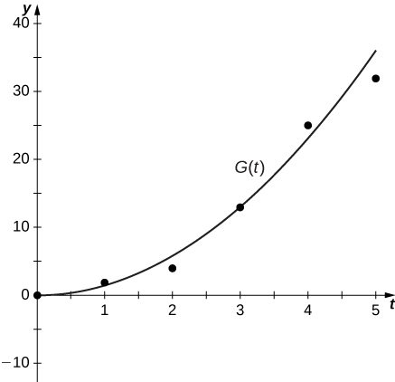 * * *
{: data-type="newline"}

  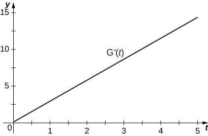 

**[T]** The best cubic fit to the data is given by <math xmlns="http://www.w3.org/1998/Math/MathML"><mrow><mi>F</mi><mrow><mo>(</mo><mi>t</mi><mo>)</mo></mrow><mo>=</mo><mn>0.2037</mn><msup><mi>t</mi><mn>3</mn></msup><mo>+</mo><mn>2.956</mn><msup><mi>t</mi><mn>2</mn></msup><mo>−</mo><mn>2.705</mn><mi>t</mi><mo>+</mo><mn>0.4683</mn><mo>,</mo></mrow></math>

 where <math xmlns="http://www.w3.org/1998/Math/MathML"><mi>F</mi></math>

 is the height of the rocket (in m) and <math xmlns="http://www.w3.org/1998/Math/MathML"><mi>t</mi></math>

 is the time elapsed since take off. From this equation, determine <math xmlns="http://www.w3.org/1998/Math/MathML"><mrow><msup><mi>F</mi><mo>′</mo></msup><mrow><mo>(</mo><mi>t</mi><mo>)</mo></mrow><mo>.</mo></mrow></math>

 Graph <math xmlns="http://www.w3.org/1998/Math/MathML"><mrow><mi>F</mi><mrow><mo>(</mo><mi>t</mi><mo>)</mo></mrow></mrow></math>

 with the given data and, on a separate coordinate plane, graph <math xmlns="http://www.w3.org/1998/Math/MathML"><mrow><msup><mi>F</mi><mo>′</mo></msup><mrow><mo>(</mo><mi>t</mi><mo>)</mo></mrow><mo>.</mo></mrow></math>

 Does the linear, quadratic, or cubic function fit the data best?

Using the best linear, quadratic, and cubic fits to the data, determine what <math xmlns="http://www.w3.org/1998/Math/MathML"><mrow><mi>H</mi><mtext>″</mtext><mrow><mo>(</mo><mi>t</mi><mo>)</mo></mrow><mo>,</mo><mi>G</mi><mtext>″</mtext><mrow><mo>(</mo><mi>t</mi><mo>)</mo></mrow><mspace width="0.2em" /><mtext>and</mtext><mspace width="0.2em" /><mi>F</mi><mtext>″</mtext><mrow><mo>(</mo><mi>t</mi><mo>)</mo></mrow></mrow></math>

 are. What are the physical meanings of <math xmlns="http://www.w3.org/1998/Math/MathML"><mrow><mi>H</mi><mtext>″</mtext><mrow><mo>(</mo><mi>t</mi><mo>)</mo></mrow><mo>,</mo><mi>G</mi><mtext>″</mtext><mrow><mo>(</mo><mi>t</mi><mo>)</mo></mrow><mspace width="0.2em" /><mtext>and</mtext><mspace width="0.2em" /><mi>F</mi><mtext>″</mtext><mrow><mo>(</mo><mi>t</mi><mo>)</mo></mrow><mo>,</mo></mrow></math>

 and what are their units?

<math xmlns="http://www.w3.org/1998/Math/MathML"><mrow><mi>H</mi><mtext>″</mtext><mrow><mo>(</mo><mi>t</mi><mo>)</mo></mrow><mo>=</mo><mn>0</mn><mo>,</mo><mi>G</mi><mtext>″</mtext><mrow><mo>(</mo><mi>t</mi><mo>)</mo></mrow><mo>=</mo><mn>2.858</mn><mspace width="0.2em" /><mtext>and</mtext><mspace width="0.2em" /><mi>f</mi><mtext>″</mtext><mrow><mo>(</mo><mi>t</mi><mo>)</mo></mrow><mo>=</mo><mn>1.222</mn><mi>t</mi><mo>+</mo><mn>5.912</mn></mrow></math>

 represent the acceleration of the rocket, with units of meters per second squared <math xmlns="http://www.w3.org/1998/Math/MathML"><mrow><mo>(</mo><msup><mrow><mtext>m/s</mtext></mrow><mn>2</mn></msup><mo>).</mo></mrow></math>

</section>

