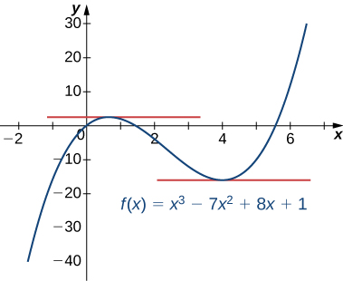
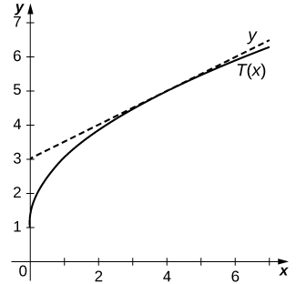
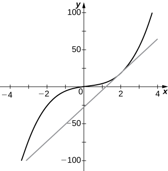
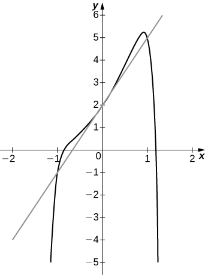

* State the constant, constant multiple, and power rules.
* Apply the sum and difference rules to combine derivatives.
* Use the product rule for finding the derivative of a product of functions.
* Use the quotient rule for finding the derivative of a quotient of functions.
* Extend the power rule to functions with negative exponents.
* Combine the differentiation rules to find the derivative of a polynomial or rational function.

Finding derivatives of functions by using the definition of the derivative can be a lengthy and, for certain functions, a rather challenging process. For example, previously we found that <math xmlns="http://www.w3.org/1998/Math/MathML"><mrow><mfrac><mi>d</mi><mrow><mi>d</mi><mi>x</mi></mrow></mfrac><mrow><mo>(</mo><mrow><msqrt><mi>x</mi></msqrt></mrow><mo>)</mo></mrow><mo>=</mo><mfrac><mn>1</mn><mrow><mn>2</mn><msqrt><mi>x</mi></msqrt></mrow></mfrac></mrow></math>

 by using a process that involved multiplying an expression by a conjugate prior to evaluating a limit. The process that we could use to evaluate <math xmlns="http://www.w3.org/1998/Math/MathML"><mrow><mfrac><mi>d</mi><mrow><mi>d</mi><mi>x</mi></mrow></mfrac><mrow><mo>(</mo><mrow><mroot><mi>x</mi><mn>3</mn></mroot></mrow><mo>)</mo></mrow></mrow></math>

 using the definition, while similar, is more complicated. In this section, we develop rules for finding derivatives that allow us to bypass this process. We begin with the basics.

### The Basic Rules

The functions <math xmlns="http://www.w3.org/1998/Math/MathML"><mrow><mi>f</mi><mrow><mo>(</mo><mi>x</mi><mo>)</mo></mrow><mo>=</mo><mi>c</mi></mrow></math>

 and <math xmlns="http://www.w3.org/1998/Math/MathML"><mrow><mi>g</mi><mrow><mo>(</mo><mi>x</mi><mo>)</mo></mrow><mo>=</mo><msup><mi>x</mi><mi>n</mi></msup></mrow></math>

 where <math xmlns="http://www.w3.org/1998/Math/MathML"><mi>n</mi></math>

 is a positive integer are the building blocks from which all polynomials and rational functions are constructed. To find derivatives of polynomials and rational functions efficiently without resorting to the limit definition of the derivative, we must first develop formulas for differentiating these basic functions.

#### The Constant Rule

We first apply the limit definition of the derivative to find the derivative of the constant function, <math xmlns="http://www.w3.org/1998/Math/MathML"><mrow><mi>f</mi><mrow><mo>(</mo><mi>x</mi><mo>)</mo></mrow><mo>=</mo><mi>c</mi><mo>.</mo></mrow></math>

 For this function, both <math xmlns="http://www.w3.org/1998/Math/MathML"><mrow><mi>f</mi><mrow><mo>(</mo><mi>x</mi><mo>)</mo></mrow><mo>=</mo><mi>c</mi></mrow></math>

 and <math xmlns="http://www.w3.org/1998/Math/MathML"><mrow><mi>f</mi><mrow><mo>(</mo><mrow><mi>x</mi><mo>+</mo><mi>h</mi></mrow><mo>)</mo></mrow><mo>=</mo><mi>c</mi><mo>,</mo></mrow></math>

 so we obtain the following result:

<math xmlns="http://www.w3.org/1998/Math/MathML"><mtable><mtr><mtd columnalign="right"><msup><mi>f</mi><mo>′</mo></msup><mrow><mo>(</mo><mi>x</mi><mo>)</mo></mrow></mtd><mtd columnalign="left"><mo>=</mo><munder><mrow><mtext>lim</mtext></mrow><mrow><mi>h</mi><mo stretchy="false">→</mo><mn>0</mn></mrow></munder><mfrac><mrow><mi>f</mi><mrow><mo>(</mo><mrow><mi>x</mi><mo>+</mo><mi>h</mi></mrow><mo>)</mo></mrow><mo>−</mo><mi>f</mi><mrow><mo>(</mo><mi>x</mi><mo>)</mo></mrow></mrow><mi>h</mi></mfrac></mtd></mtr><mtr><mtd /><mtd columnalign="left"><mo>=</mo><munder><mrow><mtext>lim</mtext></mrow><mrow><mi>h</mi><mo stretchy="false">→</mo><mn>0</mn></mrow></munder><mfrac><mrow><mi>c</mi><mo>−</mo><mi>c</mi></mrow><mi>h</mi></mfrac></mtd></mtr><mtr><mtd /><mtd columnalign="left"><mo>=</mo><munder><mrow><mtext>lim</mtext></mrow><mrow><mi>h</mi><mo stretchy="false">→</mo><mn>0</mn></mrow></munder><mfrac><mn>0</mn><mi>h</mi></mfrac></mtd></mtr><mtr><mtd /><mtd columnalign="left"><mo>=</mo><munder><mrow><mtext>lim</mtext></mrow><mrow><mi>h</mi><mo stretchy="false">→</mo><mn>0</mn></mrow></munder><mn>0</mn><mo>=</mo><mn>0.</mn></mtd></mtr></mtable></math>

The rule for differentiating constant functions is called the **constant rule**{: data-type="term"}. It states that the derivative of a constant function is zero; that is, since a constant function is a horizontal line, the slope, or the rate of change, of a constant function is <math xmlns="http://www.w3.org/1998/Math/MathML"><mrow><mn>0</mn><mo>.</mo></mrow></math>

 We restate this rule in the following theorem.

The Constant Rule

Let <math xmlns="http://www.w3.org/1998/Math/MathML"><mi>c</mi></math>

 be a constant.

If <math xmlns="http://www.w3.org/1998/Math/MathML"><mrow><mi>f</mi><mrow><mo>(</mo><mi>x</mi><mo>)</mo></mrow><mo>=</mo><mi>c</mi><mo>,</mo></mrow></math>

 then <math xmlns="http://www.w3.org/1998/Math/MathML"><mrow><msup><mi>f</mi><mo>′</mo></msup><mo stretchy="false">(</mo><mi>c</mi><mo stretchy="false">)</mo><mo>=</mo><mn>0</mn><mo>.</mo></mrow></math>

Alternatively, we may express this rule as

<math xmlns="http://www.w3.org/1998/Math/MathML"><mrow><mfrac><mi>d</mi><mrow><mi>d</mi><mi>x</mi></mrow></mfrac><mrow><mo>(</mo><mi>c</mi><mo>)</mo></mrow><mo>=</mo><mn>0.</mn></mrow></math>

Applying the Constant Rule

Find the derivative of <math xmlns="http://www.w3.org/1998/Math/MathML"><mrow><mi>f</mi><mrow><mo>(</mo><mi>x</mi><mo>)</mo></mrow><mo>=</mo><mn>8</mn><mo>.</mo></mrow></math>

This is just a one-step application of the rule:

<math xmlns="http://www.w3.org/1998/Math/MathML"><mrow><msup><mi>f</mi><mo>′</mo></msup><mo stretchy="false">(</mo><mn>8</mn><mo stretchy="false">)</mo><mo>=</mo><mn>0.</mn></mrow></math>

Find the derivative of <math xmlns="http://www.w3.org/1998/Math/MathML"><mrow><mi>g</mi><mrow><mo>(</mo><mi>x</mi><mo>)</mo></mrow><mo>=</mo><mn>−3</mn><mo>.</mo></mrow></math>

0

Hint

Use the preceding example as a guide.

### The Power Rule

We have shown that

<math xmlns="http://www.w3.org/1998/Math/MathML"><mrow><mfrac><mi>d</mi><mrow><mi>d</mi><mi>x</mi></mrow></mfrac><mrow><mo>(</mo><mrow><msup><mi>x</mi><mn>2</mn></msup></mrow><mo>)</mo></mrow><mo>=</mo><mn>2</mn><mi>x</mi><mspace width="0.2em" /><mtext>and</mtext><mspace width="0.2em" /><mfrac><mi>d</mi><mrow><mi>d</mi><mi>x</mi></mrow></mfrac><mrow><mo>(</mo><mrow><msup><mi>x</mi><mrow><mrow><mn>1</mn><mtext>/</mtext><mn>2</mn></mrow></mrow></msup></mrow><mo>)</mo></mrow><mo>=</mo><mfrac><mn>1</mn><mn>2</mn></mfrac><msup><mi>x</mi><mrow><mtext>−</mtext><mrow><mn>1</mn><mtext>/</mtext><mn>2</mn></mrow></mrow></msup><mo>.</mo></mrow></math>

At this point, you might see a pattern beginning to develop for derivatives of the form <math xmlns="http://www.w3.org/1998/Math/MathML"><mrow><mfrac><mi>d</mi><mrow><mi>d</mi><mi>x</mi></mrow></mfrac><mrow><mo>(</mo><mrow><msup><mi>x</mi><mi>n</mi></msup></mrow><mo>)</mo></mrow><mo>.</mo></mrow></math>

 We continue our examination of derivative formulas by differentiating power functions of the form <math xmlns="http://www.w3.org/1998/Math/MathML"><mrow><mi>f</mi><mrow><mo>(</mo><mi>x</mi><mo>)</mo></mrow><mo>=</mo><msup><mi>x</mi><mi>n</mi></msup></mrow></math>

 where <math xmlns="http://www.w3.org/1998/Math/MathML"><mi>n</mi></math>

 is a positive integer. We develop formulas for derivatives of this type of function in stages, beginning with positive integer powers. Before stating and proving the general rule for derivatives of functions of this form, we take a look at a specific case, <math xmlns="http://www.w3.org/1998/Math/MathML"><mrow><mfrac><mi>d</mi><mrow><mi>d</mi><mi>x</mi></mrow></mfrac><mo stretchy="false">(</mo><msup><mi>x</mi><mn>3</mn></msup><mo stretchy="false">)</mo><mo>.</mo></mrow></math>

 As we go through this derivation, pay special attention to the portion of the expression in boldface, as the technique used in this case is essentially the same as the technique used to prove the general case.

Differentiating
<math xmlns="http://www.w3.org/1998/Math/MathML"><mrow><msup><mi>x</mi><mn>3</mn></msup></mrow></math>

Find <math xmlns="http://www.w3.org/1998/Math/MathML"><mrow><mfrac><mi>d</mi><mrow><mi>d</mi><mi>x</mi></mrow></mfrac><mrow><mo>(</mo><mrow><msup><mi>x</mi><mn>3</mn></msup></mrow><mo>)</mo></mrow><mo>.</mo></mrow></math>

<math xmlns="http://www.w3.org/1998/Math/MathML"><mtable><mtr><mtd columnalign="right"><mfrac><mi>d</mi><mrow><mi>d</mi><mi>x</mi></mrow></mfrac><mrow><mo>(</mo><mrow><msup><mi>x</mi><mn>3</mn></msup></mrow><mo>)</mo></mrow></mtd><mtd columnalign="left"><mo>=</mo><munder><mrow><mtext>lim</mtext></mrow><mrow><mi>h</mi><mo stretchy="false">→</mo><mn>0</mn></mrow></munder><mfrac><mrow><msup><mrow><mo stretchy="false">(</mo><mi>x</mi><mo>+</mo><mi>h</mi><mo stretchy="false">)</mo></mrow><mn>3</mn></msup><mo>−</mo><msup><mi>x</mi><mn>3</mn></msup></mrow><mi>h</mi></mfrac></mtd><mtd /><mtd /><mtd /></mtr><mtr><mtd /><mtd columnalign="left"><mo>=</mo><munder><mrow><mtext>lim</mtext></mrow><mrow><mi>h</mi><mo stretchy="false">→</mo><mn>0</mn></mrow></munder><mfrac><mrow><msup><mi>x</mi><mn>3</mn></msup><mo>+</mo><mn>3</mn><msup><mi>x</mi><mn>2</mn></msup><mi>h</mi><mo>+</mo><mn>3</mn><mi>x</mi><msup><mi>h</mi><mn>2</mn></msup><mo>+</mo><msup><mi>h</mi><mn>3</mn></msup><mo>−</mo><msup><mi>x</mi><mn>3</mn></msup></mrow><mi>h</mi></mfrac></mtd><mtd /><mtd /><mtd columnalign="left"><mtable><mtr><mtd columnalign="left"><mtext>Notice that the first term in the expansion of</mtext></mtd></mtr><mtr><mtd columnalign="left"><msup><mrow><mo stretchy="false">(</mo><mi>x</mi><mo>+</mo><mi>h</mi><mo stretchy="false">)</mo></mrow><mn>3</mn></msup><mspace width="0.2em" /><mtext>is</mtext><mspace width="0.2em" /><msup><mi>x</mi><mn>3</mn></msup><mspace width="0.2em" /><mtext>and the second term is</mtext><mspace width="0.2em" /><mn>3</mn><msup><mi>x</mi><mn>2</mn></msup><mi>h</mi><mo>.</mo><mspace width="0.2em" /><mtext>All</mtext></mtd></mtr><mtr><mtd columnalign="left"><mtext>other terms contain powers of</mtext><mspace width="0.2em" /><mi>h</mi><mspace width="0.2em" /><mtext>that are two or</mtext></mtd></mtr><mtr><mtd columnalign="left"><mtext>greater.</mtext></mtd></mtr></mtable></mtd></mtr><mtr><mtd /><mtd columnalign="left"><mo>=</mo><munder><mrow><mtext>lim</mtext></mrow><mrow><mi>h</mi><mo stretchy="false">→</mo><mn>0</mn></mrow></munder><mfrac><mrow><mn>3</mn><msup><mi>x</mi><mn>2</mn></msup><mi>h</mi><mo>+</mo><mn>3</mn><mi>x</mi><msup><mi>h</mi><mn>2</mn></msup><mo>+</mo><msup><mi>h</mi><mn>3</mn></msup></mrow><mi>h</mi></mfrac></mtd><mtd /><mtd /><mtd columnalign="left"><mtable><mtr><mtd columnalign="left"><mtext>In this step the</mtext><mspace width="0.2em" /><msup><mi>x</mi><mn>3</mn></msup><mspace width="0.2em" /><mtext>terms have been cancelled,</mtext></mtd></mtr><mtr><mtd columnalign="left"><mtext>leaving only terms containing</mtext><mspace width="0.2em" /><mi>h</mi><mo>.</mo></mtd></mtr></mtable></mtd></mtr><mtr><mtd /><mtd columnalign="left"><mo>=</mo><munder><mrow><mtext>lim</mtext></mrow><mrow><mi>h</mi><mo stretchy="false">→</mo><mn>0</mn></mrow></munder><mfrac><mrow><mi>h</mi><mo stretchy="false">(</mo><mn>3</mn><msup><mi>x</mi><mn>2</mn></msup><mo>+</mo><mn>3</mn><mi>x</mi><mi>h</mi><mo>+</mo><msup><mi>h</mi><mn>2</mn></msup><mo stretchy="false">)</mo></mrow><mi>h</mi></mfrac></mtd><mtd /><mtd /><mtd columnalign="left"><mtext>Factor out the common factor of</mtext><mspace width="0.2em" /><mi>h</mi><mo>.</mo></mtd></mtr><mtr><mtd /><mtd columnalign="left"><mo>=</mo><munder><mrow><mtext>lim</mtext></mrow><mrow><mi>h</mi><mo stretchy="false">→</mo><mn>0</mn></mrow></munder><mo stretchy="false">(</mo><mn>3</mn><msup><mi>x</mi><mn>2</mn></msup><mo>+</mo><mn>3</mn><mi>x</mi><mi>h</mi><mo>+</mo><msup><mi>h</mi><mn>2</mn></msup><mo stretchy="false">)</mo></mtd><mtd /><mtd /><mtd columnalign="left"><mtable><mtr><mtd columnalign="left"><mtext>After cancelling the common factor of</mtext><mspace width="0.2em" /><mi>h</mi><mo>,</mo><mtext>the</mtext></mtd></mtr><mtr><mtd columnalign="left"><mtext>only term not containing</mtext><mspace width="0.2em" /><mi>h</mi><mspace width="0.2em" /><mtext>is</mtext><mspace width="0.2em" /><mn>3</mn><msup><mi>x</mi><mn>2</mn></msup><mo>.</mo></mtd></mtr></mtable></mtd></mtr><mtr><mtd /><mtd columnalign="left"><mo>=</mo><mn>3</mn><msup><mi>x</mi><mn>2</mn></msup></mtd><mtd /><mtd /><mtd columnalign="left"><mtext>Let</mtext><mspace width="0.2em" /><mi>h</mi><mspace width="0.2em" /><mtext>go to 0.</mtext></mtd></mtr></mtable></math>

Find <math xmlns="http://www.w3.org/1998/Math/MathML"><mrow><mfrac><mi>d</mi><mrow><mi>d</mi><mi>x</mi></mrow></mfrac><mrow><mo>(</mo><mrow><msup><mi>x</mi><mn>4</mn></msup></mrow><mo>)</mo></mrow><mo>.</mo></mrow></math>

<math xmlns="http://www.w3.org/1998/Math/MathML"><mrow><mn>4</mn><msup><mi>x</mi><mn>3</mn></msup></mrow></math>

Hint

Use <math xmlns="http://www.w3.org/1998/Math/MathML"><mrow><msup><mrow><mo stretchy="false">(</mo><mi>x</mi><mo>+</mo><mi>h</mi><mo stretchy="false">)</mo></mrow><mn>4</mn></msup><mo>=</mo><msup><mi>x</mi><mn>4</mn></msup><mo>+</mo><mn>4</mn><msup><mi>x</mi><mn>3</mn></msup><mi>h</mi><mo>+</mo><mn>6</mn><msup><mi>x</mi><mn>2</mn></msup><msup><mi>h</mi><mn>2</mn></msup><mo>+</mo><mn>4</mn><mi>x</mi><msup><mi>h</mi><mn>3</mn></msup><mo>+</mo><msup><mi>h</mi><mn>4</mn></msup></mrow></math>

 and follow the procedure outlined in the preceding example.

As we shall see, the procedure for finding the derivative of the general form <math xmlns="http://www.w3.org/1998/Math/MathML"><mrow><mi>f</mi><mrow><mo>(</mo><mi>x</mi><mo>)</mo></mrow><mo>=</mo><msup><mi>x</mi><mi>n</mi></msup></mrow></math>

 is very similar. Although it is often unwise to draw general conclusions from specific examples, we note that when we differentiate <math xmlns="http://www.w3.org/1998/Math/MathML"><mrow><mi>f</mi><mrow><mo>(</mo><mi>x</mi><mo>)</mo></mrow><mo>=</mo><msup><mi>x</mi><mn>3</mn></msup><mo>,</mo></mrow></math>

 the power on <math xmlns="http://www.w3.org/1998/Math/MathML"><mi>x</mi></math>

 becomes the coefficient of <math xmlns="http://www.w3.org/1998/Math/MathML"><mrow><msup><mi>x</mi><mn>2</mn></msup></mrow></math>

 in the derivative and the power on <math xmlns="http://www.w3.org/1998/Math/MathML"><mi>x</mi></math>

 in the derivative decreases by 1. The following theorem states that the **power rule**{: data-type="term"} holds for all positive integer powers of <math xmlns="http://www.w3.org/1998/Math/MathML"><mrow><mi>x</mi><mo>.</mo></mrow></math>

 We will eventually extend this result to negative integer powers. Later, we will see that this rule may also be extended first to rational powers of <math xmlns="http://www.w3.org/1998/Math/MathML"><mi>x</mi></math>

 and then to arbitrary powers of <math xmlns="http://www.w3.org/1998/Math/MathML"><mrow><mi>x</mi><mo>.</mo></mrow></math>

 Be aware, however, that this rule does not apply to functions in which a constant is raised to a variable power, such as <math xmlns="http://www.w3.org/1998/Math/MathML"><mrow><mi>f</mi><mo stretchy="false">(</mo><mi>x</mi><mo stretchy="false">)</mo><mo>=</mo><msup><mn>3</mn><mi>x</mi></msup><mo>.</mo></mrow></math>

The Power Rule

Let <math xmlns="http://www.w3.org/1998/Math/MathML"><mi>n</mi></math>

 be a positive integer. If <math xmlns="http://www.w3.org/1998/Math/MathML"><mrow><mi>f</mi><mrow><mo>(</mo><mi>x</mi><mo>)</mo></mrow><mo>=</mo><msup><mi>x</mi><mi>n</mi></msup><mo>,</mo></mrow></math>

 then

<math xmlns="http://www.w3.org/1998/Math/MathML"><mrow><msup><mi>f</mi><mo>′</mo></msup><mrow><mo>(</mo><mi>x</mi><mo>)</mo></mrow><mo>=</mo><mi>n</mi><msup><mi>x</mi><mrow><mi>n</mi><mo>−</mo><mn>1</mn></mrow></msup><mo>.</mo></mrow></math>

Alternatively, we may express this rule as

<math xmlns="http://www.w3.org/1998/Math/MathML"><mrow><mfrac><mi>d</mi><mrow><mi>d</mi><mi>x</mi></mrow></mfrac><msup><mi>x</mi><mi>n</mi></msup><mo>=</mo><mi>n</mi><msup><mi>x</mi><mrow><mi>n</mi><mo>−</mo><mn>1</mn></mrow></msup><mo>.</mo></mrow></math>

#### Proof

For <math xmlns="http://www.w3.org/1998/Math/MathML"><mrow><mi>f</mi><mrow><mo>(</mo><mi>x</mi><mo>)</mo></mrow><mo>=</mo><msup><mi>x</mi><mi>n</mi></msup></mrow></math>

 where <math xmlns="http://www.w3.org/1998/Math/MathML"><mi>n</mi></math>

 is a positive integer, we have

<math xmlns="http://www.w3.org/1998/Math/MathML"><mrow><msup><mi>f</mi><mo>′</mo></msup><mrow><mo>(</mo><mi>x</mi><mo>)</mo></mrow><mo>=</mo><munder><mrow><mtext>lim</mtext></mrow><mrow><mi>h</mi><mo stretchy="false">→</mo><mn>0</mn></mrow></munder><mfrac><mrow><msup><mrow><mo stretchy="false">(</mo><mi>x</mi><mo>+</mo><mi>h</mi><mo stretchy="false">)</mo></mrow><mi>n</mi></msup><mo>−</mo><msup><mi>x</mi><mi>n</mi></msup></mrow><mi>h</mi></mfrac><mo>.</mo></mrow></math>

<math xmlns="http://www.w3.org/1998/Math/MathML"><mrow><mtext>Since</mtext><mspace width="0.2em" /><msup><mrow><mo stretchy="false">(</mo><mi>x</mi><mo>+</mo><mi>h</mi><mo stretchy="false">)</mo></mrow><mi>n</mi></msup><mo>=</mo><msup><mi>x</mi><mi>n</mi></msup><mo>+</mo><mi>n</mi><msup><mi>x</mi><mrow><mi>n</mi><mo>−</mo><mn>1</mn></mrow></msup><mi>h</mi><mo>+</mo><mrow><mo>(</mo><mrow><mtable><mtr><mtd><mi>n</mi></mtd></mtr><mtr><mtd><mn>2</mn></mtd></mtr></mtable></mrow><mo>)</mo></mrow><mspace width="0.2em" /><msup><mi>x</mi><mrow><mi>n</mi><mo>−</mo><mn>2</mn></mrow></msup><msup><mi>h</mi><mn>2</mn></msup><mo>+</mo><mrow><mo>(</mo><mrow><mtable><mtr><mtd><mi>n</mi></mtd></mtr><mtr><mtd><mn>3</mn></mtd></mtr></mtable></mrow><mo>)</mo></mrow><mspace width="0.2em" /><msup><mi>x</mi><mrow><mi>n</mi><mo>−</mo><mn>3</mn></mrow></msup><msup><mi>h</mi><mn>3</mn></msup><mo>+</mo><mtext>…</mtext><mo>+</mo><mi>n</mi><mi>x</mi><msup><mi>h</mi><mrow><mi>n</mi><mo>−</mo><mn>1</mn></mrow></msup><mo>+</mo><msup><mi>h</mi><mi>n</mi></msup><mo>,</mo></mrow></math>

we see that

<math xmlns="http://www.w3.org/1998/Math/MathML"><mrow><msup><mrow><mo stretchy="false">(</mo><mi>x</mi><mo>+</mo><mi>h</mi><mo stretchy="false">)</mo></mrow><mi>n</mi></msup><mo>−</mo><msup><mi>x</mi><mi>n</mi></msup><mo>=</mo><mi>n</mi><msup><mi>x</mi><mrow><mi>n</mi><mo>−</mo><mn>1</mn></mrow></msup><mi>h</mi><mo>+</mo><mrow><mo>(</mo><mrow><mtable><mtr><mtd><mi>n</mi></mtd></mtr><mtr><mtd><mn>2</mn></mtd></mtr></mtable></mrow><mo>)</mo></mrow><mspace width="0.2em" /><msup><mi>x</mi><mrow><mi>n</mi><mo>−</mo><mn>2</mn></mrow></msup><msup><mi>h</mi><mn>2</mn></msup><mo>+</mo><mrow><mo>(</mo><mrow><mtable><mtr><mtd><mi>n</mi></mtd></mtr><mtr><mtd><mn>3</mn></mtd></mtr></mtable></mrow><mo>)</mo></mrow><mspace width="0.2em" /><msup><mi>x</mi><mrow><mi>n</mi><mo>−</mo><mn>3</mn></mrow></msup><msup><mi>h</mi><mn>3</mn></msup><mo>+</mo><mtext>…</mtext><mo>+</mo><mi>n</mi><mi>x</mi><msup><mi>h</mi><mrow><mi>n</mi><mo>−</mo><mn>1</mn></mrow></msup><mo>+</mo><msup><mi>h</mi><mi>n</mi></msup><mo>.</mo></mrow></math>

Next, divide both sides by *h*\:

<math xmlns="http://www.w3.org/1998/Math/MathML"><mrow><mfrac><mrow><msup><mrow><mrow><mo>(</mo><mrow><mi>x</mi><mo>+</mo><mi>h</mi></mrow><mo>)</mo></mrow></mrow><mi>n</mi></msup><mo>−</mo><msup><mi>x</mi><mi>n</mi></msup></mrow><mi>h</mi></mfrac><mo>=</mo><mfrac><mrow><mi>n</mi><msup><mi>x</mi><mrow><mi>n</mi><mo>−</mo><mn>1</mn></mrow></msup><mi>h</mi><mo>+</mo><mrow><mo>(</mo><mrow><mtable><mtr><mtd><mi>n</mi></mtd></mtr><mtr><mtd><mn>2</mn></mtd></mtr></mtable></mrow><mo>)</mo></mrow><mspace width="0.2em" /><msup><mi>x</mi><mrow><mi>n</mi><mo>−</mo><mn>2</mn></mrow></msup><msup><mi>h</mi><mn>2</mn></msup><mo>+</mo><mrow><mo>(</mo><mrow><mtable><mtr><mtd><mi>n</mi></mtd></mtr><mtr><mtd><mn>3</mn></mtd></mtr></mtable></mrow><mo>)</mo></mrow><mspace width="0.2em" /><msup><mi>x</mi><mrow><mi>n</mi><mo>−</mo><mn>3</mn></mrow></msup><msup><mi>h</mi><mn>3</mn></msup><mo>+</mo><mtext>…</mtext><mo>+</mo><mi>n</mi><mi>x</mi><msup><mi>h</mi><mrow><mi>n</mi><mo>−</mo><mn>1</mn></mrow></msup><mo>+</mo><msup><mi>h</mi><mi>n</mi></msup></mrow><mi>h</mi></mfrac><mo>.</mo></mrow></math>

Thus,

<math xmlns="http://www.w3.org/1998/Math/MathML"><mrow><mfrac><mrow><msup><mrow><mrow><mo>(</mo><mrow><mi>x</mi><mo>+</mo><mi>h</mi></mrow><mo>)</mo></mrow></mrow><mi>n</mi></msup><mo>−</mo><msup><mi>x</mi><mi>n</mi></msup></mrow><mi>h</mi></mfrac><mo>=</mo><mi>n</mi><msup><mi>x</mi><mrow><mi>n</mi><mo>−</mo><mn>1</mn></mrow></msup><mo>+</mo><mrow><mo>(</mo><mrow><mtable><mtr><mtd><mi>n</mi></mtd></mtr><mtr><mtd><mn>2</mn></mtd></mtr></mtable></mrow><mo>)</mo></mrow><mspace width="0.2em" /><msup><mi>x</mi><mrow><mi>n</mi><mo>−</mo><mn>2</mn></mrow></msup><mi>h</mi><mo>+</mo><mrow><mo>(</mo><mrow><mtable><mtr><mtd><mi>n</mi></mtd></mtr><mtr><mtd><mn>3</mn></mtd></mtr></mtable></mrow><mo>)</mo></mrow><mspace width="0.2em" /><msup><mi>x</mi><mrow><mi>n</mi><mo>−</mo><mn>3</mn></mrow></msup><msup><mi>h</mi><mn>2</mn></msup><mo>+</mo><mtext>…</mtext><mo>+</mo><mi>n</mi><mi>x</mi><msup><mi>h</mi><mrow><mi>n</mi><mo>−</mo><mn>2</mn></mrow></msup><mo>+</mo><msup><mi>h</mi><mrow><mi>n</mi><mo>−</mo><mn>1</mn></mrow></msup><mo>.</mo></mrow></math>

Finally,

<math xmlns="http://www.w3.org/1998/Math/MathML"><mtable><mtr><mtd columnalign="right"><msup><mi>f</mi><mo>′</mo></msup><mrow><mo>(</mo><mi>x</mi><mo>)</mo></mrow></mtd><mtd columnalign="left"><mo>=</mo><munder><mrow><mtext>lim</mtext></mrow><mrow><mi>h</mi><mo stretchy="false">→</mo><mn>0</mn></mrow></munder><mrow><mo>(</mo><mrow><mi>n</mi><msup><mi>x</mi><mrow><mi>n</mi><mo>−</mo><mn>1</mn></mrow></msup><mo>+</mo><mrow><mo>(</mo><mrow><mtable><mtr><mtd><mi>n</mi></mtd></mtr><mtr><mtd><mn>2</mn></mtd></mtr></mtable></mrow><mo>)</mo></mrow><mspace width="0.2em" /><msup><mi>x</mi><mrow><mi>n</mi><mo>−</mo><mn>2</mn></mrow></msup><mi>h</mi><mo>+</mo><mrow><mo>(</mo><mrow><mtable><mtr><mtd><mi>n</mi></mtd></mtr><mtr><mtd><mn>3</mn></mtd></mtr></mtable></mrow><mo>)</mo></mrow><mspace width="0.2em" /><msup><mi>x</mi><mrow><mi>n</mi><mo>−</mo><mn>3</mn></mrow></msup><msup><mi>h</mi><mn>2</mn></msup><mo>+</mo><mtext>…</mtext><mo>+</mo><mi>n</mi><mi>x</mi><msup><mi>h</mi><mrow><mi>n</mi><mo>−</mo><mn>1</mn></mrow></msup><mo>+</mo><msup><mi>h</mi><mi>n</mi></msup></mrow><mo>)</mo></mrow></mtd></mtr><mtr><mtd /><mtd columnalign="left"><mo>=</mo><mi>n</mi><msup><mi>x</mi><mrow><mi>n</mi><mo>−</mo><mn>1</mn></mrow></msup><mo>.</mo></mtd></mtr></mtable></math>

□

Applying the Power Rule

Find the derivative of the function <math xmlns="http://www.w3.org/1998/Math/MathML"><mrow><mi>f</mi><mrow><mo>(</mo><mi>x</mi><mo>)</mo></mrow><mo>=</mo><msup><mi>x</mi><mrow><mn>10</mn></mrow></msup></mrow></math>

 by applying the power rule.

Using the power rule with <math xmlns="http://www.w3.org/1998/Math/MathML"><mrow><mi>n</mi><mo>=</mo><mn>10</mn><mo>,</mo></mrow></math>

 we obtain

<math xmlns="http://www.w3.org/1998/Math/MathML"><mrow><mi>f</mi><mo>′</mo><mrow><mo>(</mo><mi>x</mi><mo>)</mo></mrow><mo>=</mo><mn>10</mn><msup><mi>x</mi><mrow><mn>10</mn><mo>−</mo><mn>1</mn></mrow></msup><mo>=</mo><mn>10</mn><msup><mi>x</mi><mn>9</mn></msup><mo>.</mo></mrow></math>

Find the derivative of <math xmlns="http://www.w3.org/1998/Math/MathML"><mrow><mi>f</mi><mrow><mo>(</mo><mi>x</mi><mo>)</mo></mrow><mo>=</mo><msup><mi>x</mi><mn>7</mn></msup><mo>.</mo></mrow></math>

<math xmlns="http://www.w3.org/1998/Math/MathML"><mrow><msup><mi>f</mi><mo>′</mo></msup><mrow><mo>(</mo><mi>x</mi><mo>)</mo></mrow><mo>=</mo><mn>7</mn><msup><mi>x</mi><mn>6</mn></msup></mrow></math>

Hint

Use the power rule with <math xmlns="http://www.w3.org/1998/Math/MathML"><mrow><mi>n</mi><mo>=</mo><mn>7</mn><mo>.</mo></mrow></math>

### The Sum, Difference, and Constant Multiple Rules

We find our next differentiation rules by looking at derivatives of sums, differences, and constant multiples of functions. Just as when we work with functions, there are rules that make it easier to find derivatives of functions that we add, subtract, or multiply by a constant. These rules are summarized in the following theorem.

Sum, Difference, and Constant Multiple Rules

Let <math xmlns="http://www.w3.org/1998/Math/MathML"><mrow><mi>f</mi><mo stretchy="false">(</mo><mi>x</mi><mo stretchy="false">)</mo></mrow></math>

 and <math xmlns="http://www.w3.org/1998/Math/MathML"><mrow><mi>g</mi><mo stretchy="false">(</mo><mi>x</mi><mo stretchy="false">)</mo></mrow></math>

 be differentiable functions and <math xmlns="http://www.w3.org/1998/Math/MathML"><mi>k</mi></math>

 be a constant. Then each of the following equations holds.

**Sum Rule**{: data-type="term"}. The derivative of the sum of a function <math xmlns="http://www.w3.org/1998/Math/MathML"><mi>f</mi></math>

 and a function <math xmlns="http://www.w3.org/1998/Math/MathML"><mi>g</mi></math>

 is the same as the sum of the derivative of <math xmlns="http://www.w3.org/1998/Math/MathML"><mi>f</mi></math>

 and the derivative of <math xmlns="http://www.w3.org/1998/Math/MathML"><mrow><mi>g</mi><mo>.</mo></mrow></math>

<math xmlns="http://www.w3.org/1998/Math/MathML"><mrow><mfrac><mi>d</mi><mrow><mi>d</mi><mi>x</mi></mrow></mfrac><mrow><mo>(</mo><mrow><mi>f</mi><mrow><mo>(</mo><mi>x</mi><mo>)</mo></mrow><mo>+</mo><mi>g</mi><mrow><mo>(</mo><mi>x</mi><mo>)</mo></mrow></mrow><mo>)</mo></mrow><mo>=</mo><mfrac><mi>d</mi><mrow><mi>d</mi><mi>x</mi></mrow></mfrac><mrow><mo>(</mo><mrow><mi>f</mi><mrow><mo>(</mo><mi>x</mi><mo>)</mo></mrow></mrow><mo>)</mo></mrow><mo>+</mo><mfrac><mi>d</mi><mrow><mi>d</mi><mi>x</mi></mrow></mfrac><mrow><mo>(</mo><mrow><mi>g</mi><mrow><mo>(</mo><mi>x</mi><mo>)</mo></mrow></mrow><mo>)</mo></mrow><mo>;</mo></mrow></math>

that is,

<math xmlns="http://www.w3.org/1998/Math/MathML"><mrow><mtext>for</mtext><mspace width="0.2em" /><mi>j</mi><mrow><mo>(</mo><mi>x</mi><mo>)</mo></mrow><mo>=</mo><mi>f</mi><mrow><mo>(</mo><mi>x</mi><mo>)</mo></mrow><mo>+</mo><mi>g</mi><mrow><mo>(</mo><mi>x</mi><mo>)</mo></mrow><mo>,</mo><msup><mi>j</mi><mo>′</mo></msup><mrow><mo>(</mo><mi>x</mi><mo>)</mo></mrow><mo>=</mo><msup><mi>f</mi><mo>′</mo></msup><mrow><mo>(</mo><mi>x</mi><mo>)</mo></mrow><mo>+</mo><msup><mi>g</mi><mo>′</mo></msup><mo stretchy="false">(</mo><mi>x</mi><mo stretchy="false">)</mo><mo>.</mo></mrow></math>

**Difference Rule**{: data-type="term"}. The derivative of the difference of a function *f* and a function *g* is the same as the difference of the derivative of *f* and the derivative of <math xmlns="http://www.w3.org/1998/Math/MathML"><mrow><mi>g</mi><mtext>:</mtext></mrow></math>

<math xmlns="http://www.w3.org/1998/Math/MathML"><mrow><mfrac><mi>d</mi><mrow><mi>d</mi><mi>x</mi></mrow></mfrac><mrow><mo>(</mo><mrow><mi>f</mi><mrow><mo>(</mo><mi>x</mi><mo>)</mo></mrow><mo>−</mo><mi>g</mi><mrow><mo>(</mo><mi>x</mi><mo>)</mo></mrow></mrow><mo>)</mo></mrow><mo>=</mo><mfrac><mi>d</mi><mrow><mi>d</mi><mi>x</mi></mrow></mfrac><mrow><mo>(</mo><mrow><mi>f</mi><mrow><mo>(</mo><mi>x</mi><mo>)</mo></mrow></mrow><mo>)</mo></mrow><mo>−</mo><mfrac><mi>d</mi><mrow><mi>d</mi><mi>x</mi></mrow></mfrac><mrow><mo>(</mo><mrow><mi>g</mi><mrow><mo>(</mo><mi>x</mi><mo>)</mo></mrow></mrow><mo>)</mo></mrow><mo>;</mo></mrow></math>

that is,

<math xmlns="http://www.w3.org/1998/Math/MathML"><mrow><mtext>for</mtext><mspace width="0.2em" /><mi>j</mi><mrow><mo>(</mo><mi>x</mi><mo>)</mo></mrow><mo>=</mo><mi>f</mi><mrow><mo>(</mo><mi>x</mi><mo>)</mo></mrow><mo>−</mo><mi>g</mi><mrow><mo>(</mo><mi>x</mi><mo>)</mo></mrow><mo>,</mo><msup><mi>j</mi><mo>′</mo></msup><mrow><mo>(</mo><mi>x</mi><mo>)</mo></mrow><mo>=</mo><msup><mi>f</mi><mo>′</mo></msup><mrow><mo>(</mo><mi>x</mi><mo>)</mo></mrow><mo>−</mo><msup><mi>g</mi><mo>′</mo></msup><mo stretchy="false">(</mo><mi>x</mi><mo stretchy="false">)</mo><mo>.</mo></mrow></math>

**Constant Multiple Rule**{: data-type="term"}. The derivative of a constant *c* multiplied by a function *f* is the same as the constant multiplied by the derivative: <math xmlns="http://www.w3.org/1998/Math/MathML" />

<math xmlns="http://www.w3.org/1998/Math/MathML"><mrow><mfrac><mi>d</mi><mrow><mi>d</mi><mi>x</mi></mrow></mfrac><mrow><mo>(</mo><mrow><mi>k</mi><mi>f</mi><mrow><mo>(</mo><mi>x</mi><mo>)</mo></mrow></mrow><mo>)</mo></mrow><mo>=</mo><mi>k</mi><mfrac><mi>d</mi><mrow><mi>d</mi><mi>x</mi></mrow></mfrac><mrow><mo>(</mo><mrow><mi>f</mi><mrow><mo>(</mo><mi>x</mi><mo>)</mo></mrow></mrow><mo>)</mo></mrow><mo>;</mo></mrow></math>

that is,

<math xmlns="http://www.w3.org/1998/Math/MathML"><mrow><mtext>for</mtext><mspace width="0.2em" /><mi>j</mi><mrow><mo>(</mo><mi>x</mi><mo>)</mo></mrow><mo>=</mo><mi>k</mi><mi>f</mi><mo stretchy="false">(</mo><mi>x</mi><mo stretchy="false">)</mo><mo>,</mo><msup><mi>j</mi><mo>′</mo></msup><mrow><mo>(</mo><mi>x</mi><mo>)</mo></mrow><mo>=</mo><mi>k</mi><msup><mi>f</mi><mo>′</mo></msup><mo stretchy="false">(</mo><mi>x</mi><mo stretchy="false">)</mo><mo>.</mo></mrow></math>

#### Proof

We provide only the proof of the sum rule here. The rest follow in a similar manner.

For differentiable functions <math xmlns="http://www.w3.org/1998/Math/MathML"><mrow><mi>f</mi><mrow><mo>(</mo><mi>x</mi><mo>)</mo></mrow></mrow></math>

 and <math xmlns="http://www.w3.org/1998/Math/MathML"><mrow><mi>g</mi><mrow><mo>(</mo><mi>x</mi><mo>)</mo></mrow><mo>,</mo></mrow></math>

 we set <math xmlns="http://www.w3.org/1998/Math/MathML"><mrow><mi>j</mi><mrow><mo>(</mo><mi>x</mi><mo>)</mo></mrow><mo>=</mo><mi>f</mi><mrow><mo>(</mo><mi>x</mi><mo>)</mo></mrow><mo>+</mo><mi>g</mi><mrow><mo>(</mo><mi>x</mi><mo>)</mo></mrow><mo>.</mo></mrow></math>

 Using the limit definition of the derivative we have

<math xmlns="http://www.w3.org/1998/Math/MathML"><mrow><msup><mi>j</mi><mo>′</mo></msup><mrow><mo>(</mo><mi>x</mi><mo>)</mo></mrow><mo>=</mo><munder><mrow><mtext>lim</mtext></mrow><mrow><mi>h</mi><mo stretchy="false">→</mo><mn>0</mn></mrow></munder><mfrac><mrow><mi>j</mi><mrow><mo>(</mo><mrow><mi>x</mi><mo>+</mo><mi>h</mi></mrow><mo>)</mo></mrow><mo>−</mo><mi>j</mi><mrow><mo>(</mo><mi>x</mi><mo>)</mo></mrow></mrow><mi>h</mi></mfrac><mo>.</mo></mrow></math>

By substituting <math xmlns="http://www.w3.org/1998/Math/MathML"><mrow><mi>j</mi><mrow><mo>(</mo><mrow><mi>x</mi><mo>+</mo><mi>h</mi></mrow><mo>)</mo></mrow><mo>=</mo><mi>f</mi><mrow><mo>(</mo><mrow><mi>x</mi><mo>+</mo><mi>h</mi></mrow><mo>)</mo></mrow><mo>+</mo><mi>g</mi><mrow><mo>(</mo><mrow><mi>x</mi><mo>+</mo><mi>h</mi></mrow><mo>)</mo></mrow></mrow></math>

 and <math xmlns="http://www.w3.org/1998/Math/MathML"><mrow><mi>j</mi><mrow><mo>(</mo><mi>x</mi><mo>)</mo></mrow><mo>=</mo><mi>f</mi><mrow><mo>(</mo><mi>x</mi><mo>)</mo></mrow><mo>+</mo><mi>g</mi><mrow><mo>(</mo><mi>x</mi><mo>)</mo></mrow><mo>,</mo></mrow></math>

 we obtain

<math xmlns="http://www.w3.org/1998/Math/MathML"><mrow><msup><mi>j</mi><mo>′</mo></msup><mo stretchy="false">(</mo><mi>x</mi><mo stretchy="false">)</mo><mo>=</mo><munder><mrow><mtext>lim</mtext></mrow><mrow><mi>h</mi><mo stretchy="false">→</mo><mn>0</mn></mrow></munder><mfrac><mrow><mrow><mo>(</mo><mrow><mi>f</mi><mrow><mo>(</mo><mrow><mi>x</mi><mo>+</mo><mi>h</mi></mrow><mo>)</mo></mrow><mo>+</mo><mi>g</mi><mrow><mo>(</mo><mrow><mi>x</mi><mo>+</mo><mi>h</mi></mrow><mo>)</mo></mrow></mrow><mo>)</mo></mrow><mo>−</mo><mrow><mo>(</mo><mrow><mi>f</mi><mrow><mo>(</mo><mi>x</mi><mo>)</mo></mrow><mo>+</mo><mi>g</mi><mrow><mo>(</mo><mi>x</mi><mo>)</mo></mrow></mrow><mo>)</mo></mrow></mrow><mi>h</mi></mfrac><mo>.</mo></mrow></math>

Rearranging and regrouping the terms, we have

<math xmlns="http://www.w3.org/1998/Math/MathML"><mrow><msup><mi>j</mi><mo>′</mo></msup><mo stretchy="false">(</mo><mi>x</mi><mo stretchy="false">)</mo><mo>=</mo><munder><mrow><mtext>lim</mtext></mrow><mrow><mi>h</mi><mo stretchy="false">→</mo><mn>0</mn></mrow></munder><mrow><mo>(</mo><mrow><mfrac><mrow><mi>f</mi><mrow><mo>(</mo><mrow><mi>x</mi><mo>+</mo><mi>h</mi></mrow><mo>)</mo></mrow><mo>−</mo><mi>f</mi><mo stretchy="false">(</mo><mi>x</mi><mo stretchy="false">)</mo></mrow><mi>h</mi></mfrac><mo>+</mo><mfrac><mrow><mi>g</mi><mrow><mo>(</mo><mrow><mi>x</mi><mo>+</mo><mi>h</mi></mrow><mo>)</mo></mrow><mo>−</mo><mi>g</mi><mo stretchy="false">(</mo><mi>x</mi><mo stretchy="false">)</mo></mrow><mi>h</mi></mfrac></mrow><mo>)</mo></mrow><mo>.</mo></mrow></math>

We now apply the sum law for limits and the definition of the derivative to obtain

<math xmlns="http://www.w3.org/1998/Math/MathML"><mrow><msup><mi>j</mi><mo>′</mo></msup><mo stretchy="false">(</mo><mi>x</mi><mo stretchy="false">)</mo><mo>=</mo><munder><mrow><mtext>lim</mtext></mrow><mrow><mi>h</mi><mo stretchy="false">→</mo><mn>0</mn></mrow></munder><mrow><mo>(</mo><mrow><mfrac><mrow><mi>f</mi><mrow><mo>(</mo><mrow><mi>x</mi><mo>+</mo><mi>h</mi></mrow><mo>)</mo></mrow><mo>−</mo><mi>f</mi><mo stretchy="false">(</mo><mi>x</mi><mo stretchy="false">)</mo></mrow><mi>h</mi></mfrac></mrow><mo>)</mo></mrow><mo>+</mo><munder><mrow><mtext>lim</mtext></mrow><mrow><mi>h</mi><mo stretchy="false">→</mo><mn>0</mn></mrow></munder><mrow><mo>(</mo><mrow><mfrac><mrow><mi>g</mi><mrow><mo>(</mo><mrow><mi>x</mi><mo>+</mo><mi>h</mi></mrow><mo>)</mo></mrow><mo>−</mo><mi>g</mi><mo stretchy="false">(</mo><mi>x</mi><mo stretchy="false">)</mo></mrow><mi>h</mi></mfrac></mrow><mo>)</mo></mrow><mo>=</mo><msup><mi>f</mi><mo>′</mo></msup><mrow><mo>(</mo><mi>x</mi><mo>)</mo></mrow><mo>+</mo><msup><mi>g</mi><mo>′</mo></msup><mrow><mo>(</mo><mi>x</mi><mo>)</mo></mrow><mo>.</mo></mrow></math>

□

Applying the Constant Multiple Rule

Find the derivative of <math xmlns="http://www.w3.org/1998/Math/MathML"><mrow><mi>g</mi><mrow><mo>(</mo><mi>x</mi><mo>)</mo></mrow><mo>=</mo><mn>3</mn><msup><mi>x</mi><mn>2</mn></msup></mrow></math>

 and compare it to the derivative of <math xmlns="http://www.w3.org/1998/Math/MathML"><mrow><mi>f</mi><mrow><mo>(</mo><mi>x</mi><mo>)</mo></mrow><mo>=</mo><msup><mi>x</mi><mn>2</mn></msup><mo>.</mo></mrow></math>

We use the power rule directly:

<math xmlns="http://www.w3.org/1998/Math/MathML"><mrow><msup><mi>g</mi><mo>′</mo></msup><mrow><mo>(</mo><mi>x</mi><mo>)</mo></mrow><mo>=</mo><mfrac><mi>d</mi><mrow><mi>d</mi><mi>x</mi></mrow></mfrac><mrow><mo>(</mo><mrow><mn>3</mn><msup><mi>x</mi><mn>2</mn></msup></mrow><mo>)</mo></mrow><mo>=</mo><mn>3</mn><mfrac><mi>d</mi><mrow><mi>d</mi><mi>x</mi></mrow></mfrac><mrow><mo>(</mo><mrow><msup><mi>x</mi><mn>2</mn></msup></mrow><mo>)</mo></mrow><mo>=</mo><mn>3</mn><mrow><mo>(</mo><mrow><mn>2</mn><mi>x</mi></mrow><mo>)</mo></mrow><mo>=</mo><mn>6</mn><mi>x</mi><mo>.</mo></mrow></math>

Since <math xmlns="http://www.w3.org/1998/Math/MathML"><mrow><mi>f</mi><mrow><mo>(</mo><mi>x</mi><mo>)</mo></mrow><mo>=</mo><msup><mi>x</mi><mn>2</mn></msup></mrow></math>

 has derivative <math xmlns="http://www.w3.org/1998/Math/MathML"><mrow><msup><mi>f</mi><mo>′</mo></msup><mrow><mo>(</mo><mi>x</mi><mo>)</mo></mrow><mo>=</mo><mn>2</mn><mi>x</mi><mo>,</mo></mrow></math>

 we see that the derivative of <math xmlns="http://www.w3.org/1998/Math/MathML"><mrow><mi>g</mi><mrow><mo>(</mo><mi>x</mi><mo>)</mo></mrow></mrow></math>

 is 3 times the derivative of <math xmlns="http://www.w3.org/1998/Math/MathML"><mrow><mi>f</mi><mrow><mo>(</mo><mi>x</mi><mo>)</mo></mrow><mo>.</mo></mrow></math>

 This relationship is illustrated in [[link]](#CNX_Calc_Figure_03_03_001).

 is 3 times the derivative of f(x)."){: #CNX_Calc_Figure_03_03_001}

Applying Basic Derivative Rules

Find the derivative of <math xmlns="http://www.w3.org/1998/Math/MathML"><mrow><mi>f</mi><mrow><mo>(</mo><mi>x</mi><mo>)</mo></mrow><mo>=</mo><mn>2</mn><msup><mi>x</mi><mn>5</mn></msup><mo>+</mo><mn>7</mn><mo>.</mo></mrow></math>

We begin by applying the rule for differentiating the sum of two functions, followed by the rules for differentiating constant multiples of functions and the rule for differentiating powers. To better understand the sequence in which the differentiation rules are applied, we use Leibniz notation throughout the solution:

<math xmlns="http://www.w3.org/1998/Math/MathML"><mtable><mtr><mtd columnalign="right"><msup><mi>f</mi><mo>′</mo></msup><mrow><mo>(</mo><mi>x</mi><mo>)</mo></mrow></mtd><mtd columnalign="left"><mo>=</mo><mfrac><mi>d</mi><mrow><mi>d</mi><mi>x</mi></mrow></mfrac><mrow><mo>(</mo><mrow><mn>2</mn><msup><mi>x</mi><mn>5</mn></msup><mo>+</mo><mn>7</mn></mrow><mo>)</mo></mrow></mtd><mtd /><mtd /><mtd /></mtr><mtr><mtd /><mtd columnalign="left"><mo>=</mo><mfrac><mi>d</mi><mrow><mi>d</mi><mi>x</mi></mrow></mfrac><mrow><mo>(</mo><mrow><mn>2</mn><msup><mi>x</mi><mn>5</mn></msup></mrow><mo>)</mo></mrow><mo>+</mo><mfrac><mi>d</mi><mrow><mi>d</mi><mi>x</mi></mrow></mfrac><mrow><mo>(</mo><mn>7</mn><mo>)</mo></mrow></mtd><mtd /><mtd /><mtd columnalign="left"><mtext>Apply the sum rule.</mtext></mtd></mtr><mtr><mtd /><mtd columnalign="left"><mo>=</mo><mn>2</mn><mfrac><mi>d</mi><mrow><mi>d</mi><mi>x</mi></mrow></mfrac><mrow><mo>(</mo><mrow><msup><mi>x</mi><mn>5</mn></msup></mrow><mo>)</mo></mrow><mo>+</mo><mfrac><mi>d</mi><mrow><mi>d</mi><mi>x</mi></mrow></mfrac><mrow><mo>(</mo><mn>7</mn><mo>)</mo></mrow></mtd><mtd /><mtd /><mtd columnalign="left"><mtext>Apply the constant multiple rule.</mtext></mtd></mtr><mtr><mtd /><mtd columnalign="left"><mo>=</mo><mn>2</mn><mrow><mo>(</mo><mrow><mn>5</mn><msup><mi>x</mi><mn>4</mn></msup></mrow><mo>)</mo></mrow><mo>+</mo><mn>0</mn></mtd><mtd /><mtd /><mtd columnalign="left"><mtext>Apply the power rule and the constant rule.</mtext></mtd></mtr><mtr><mtd /><mtd columnalign="left"><mo>=</mo><mn>10</mn><msup><mi>x</mi><mn>4</mn></msup><mo>.</mo></mtd><mtd /><mtd /><mtd columnalign="left"><mtext>Simplify.</mtext></mtd></mtr></mtable></math>

Find the derivative of <math xmlns="http://www.w3.org/1998/Math/MathML"><mrow><mi>f</mi><mrow><mo>(</mo><mi>x</mi><mo>)</mo></mrow><mo>=</mo><mn>2</mn><msup><mi>x</mi><mn>3</mn></msup><mo>−</mo><mn>6</mn><msup><mi>x</mi><mn>2</mn></msup><mo>+</mo><mn>3</mn><mo>.</mo></mrow></math>

<math xmlns="http://www.w3.org/1998/Math/MathML"><mrow><msup><mi>f</mi><mo>′</mo></msup><mrow><mo>(</mo><mi>x</mi><mo>)</mo></mrow><mo>=</mo><mn>6</mn><msup><mi>x</mi><mn>2</mn></msup><mo>−</mo><mn>12</mn><mi>x</mi><mo>.</mo></mrow></math>

Hint

Use the preceding example as a guide.

Finding the Equation of a Tangent Line

Find the equation of the line tangent to the graph of <math xmlns="http://www.w3.org/1998/Math/MathML"><mrow><mi>f</mi><mrow><mo>(</mo><mi>x</mi><mo>)</mo></mrow><mo>=</mo><msup><mi>x</mi><mn>2</mn></msup><mo>−</mo><mn>4</mn><mi>x</mi><mo>+</mo><mn>6</mn></mrow></math>

 at <math xmlns="http://www.w3.org/1998/Math/MathML"><mrow><mi>x</mi><mo>=</mo><mn>1</mn><mo>.</mo></mrow></math>

To find the equation of the tangent line, we need a point and a slope. To find the point, compute

<math xmlns="http://www.w3.org/1998/Math/MathML"><mrow><mi>f</mi><mrow><mo>(</mo><mn>1</mn><mo>)</mo></mrow><mo>=</mo><msup><mn>1</mn><mn>2</mn></msup><mo>−</mo><mn>4</mn><mrow><mo>(</mo><mn>1</mn><mo>)</mo></mrow><mo>+</mo><mn>6</mn><mo>=</mo><mn>3</mn><mo>.</mo></mrow></math>

This gives us the point <math xmlns="http://www.w3.org/1998/Math/MathML"><mrow><mrow><mo>(</mo><mrow><mn>1</mn><mo>,</mo><mn>3</mn></mrow><mo>)</mo></mrow><mo>.</mo></mrow></math>

 Since the slope of the tangent line at 1 is <math xmlns="http://www.w3.org/1998/Math/MathML"><mrow><msup><mi>f</mi><mo>′</mo></msup><mrow><mo>(</mo><mn>1</mn><mo>)</mo></mrow><mo>,</mo></mrow></math>

 we must first find <math xmlns="http://www.w3.org/1998/Math/MathML"><mrow><msup><mi>f</mi><mo>′</mo></msup><mrow><mo>(</mo><mi>x</mi><mo>)</mo></mrow><mo>.</mo></mrow></math>

 Using the definition of a derivative, we have

<math xmlns="http://www.w3.org/1998/Math/MathML"><mrow><msup><mi>f</mi><mo>′</mo></msup><mrow><mo>(</mo><mi>x</mi><mo>)</mo></mrow><mo>=</mo><mn>2</mn><mi>x</mi><mo>−</mo><mn>4</mn></mrow></math>

so the slope of the tangent line is <math xmlns="http://www.w3.org/1998/Math/MathML"><mrow><msup><mi>f</mi><mo>′</mo></msup><mrow><mo>(</mo><mn>1</mn><mo>)</mo></mrow><mo>=</mo><mn>−2</mn><mo>.</mo></mrow></math>

 Using the point-slope formula, we see that the equation of the tangent line is

<math xmlns="http://www.w3.org/1998/Math/MathML"><mrow><mi>y</mi><mo>−</mo><mn>3</mn><mo>=</mo><mn>−2</mn><mrow><mo>(</mo><mrow><mi>x</mi><mo>−</mo><mn>1</mn></mrow><mo>)</mo></mrow><mo>.</mo></mrow></math>

Putting the equation of the line in slope-intercept form, we obtain

<math xmlns="http://www.w3.org/1998/Math/MathML"><mrow><mi>y</mi><mo>=</mo><mn>−2</mn><mi>x</mi><mo>+</mo><mn>5</mn><mo>.</mo></mrow></math>

Find the equation of the line tangent to the graph of <math xmlns="http://www.w3.org/1998/Math/MathML"><mrow><mi>f</mi><mrow><mo>(</mo><mi>x</mi><mo>)</mo></mrow><mo>=</mo><mn>3</mn><msup><mi>x</mi><mn>2</mn></msup><mo>−</mo><mn>11</mn></mrow></math>

 at <math xmlns="http://www.w3.org/1998/Math/MathML"><mrow><mi>x</mi><mo>=</mo><mn>2</mn><mo>.</mo></mrow></math>

 Use the point-slope form.

<math xmlns="http://www.w3.org/1998/Math/MathML"><mrow><mi>y</mi><mo>=</mo><mn>12</mn><mi>x</mi><mo>−</mo><mn>23</mn></mrow></math>

Hint

Use the preceding example as a guide.

### The Product Rule

Now that we have examined the basic rules, we can begin looking at some of the more advanced rules. The first one examines the derivative of the product of two functions. Although it might be tempting to assume that the derivative of the product is the product of the derivatives, similar to the sum and difference rules, the **product rule**{: data-type="term"} does not follow this pattern. To see why we cannot use this pattern, consider the function <math xmlns="http://www.w3.org/1998/Math/MathML"><mrow><mi>f</mi><mrow><mo>(</mo><mi>x</mi><mo>)</mo></mrow><mo>=</mo><msup><mi>x</mi><mn>2</mn></msup><mo>,</mo></mrow></math>

 whose derivative is <math xmlns="http://www.w3.org/1998/Math/MathML"><mrow><msup><mi>f</mi><mo>′</mo></msup><mrow><mo>(</mo><mi>x</mi><mo>)</mo></mrow><mo>=</mo><mn>2</mn><mi>x</mi></mrow></math>

 and not <math xmlns="http://www.w3.org/1998/Math/MathML"><mrow><mfrac><mi>d</mi><mrow><mi>d</mi><mi>x</mi></mrow></mfrac><mrow><mo>(</mo><mi>x</mi><mo>)</mo></mrow><mo>·</mo><mfrac><mi>d</mi><mrow><mi>d</mi><mi>x</mi></mrow></mfrac><mrow><mo>(</mo><mi>x</mi><mo>)</mo></mrow><mo>=</mo><mn>1</mn><mo>·</mo><mn>1</mn><mo>=</mo><mn>1</mn><mo>.</mo></mrow></math>

Product Rule

Let <math xmlns="http://www.w3.org/1998/Math/MathML"><mrow><mi>f</mi><mo stretchy="false">(</mo><mi>x</mi><mo stretchy="false">)</mo></mrow></math>

 and <math xmlns="http://www.w3.org/1998/Math/MathML"><mrow><mi>g</mi><mo stretchy="false">(</mo><mi>x</mi><mo stretchy="false">)</mo></mrow></math>

 be differentiable functions. Then

<math xmlns="http://www.w3.org/1998/Math/MathML"><mrow><mfrac><mi>d</mi><mrow><mi>d</mi><mi>x</mi></mrow></mfrac><mrow><mo>(</mo><mrow><mi>f</mi><mrow><mo>(</mo><mi>x</mi><mo>)</mo></mrow><mi>g</mi><mrow><mo>(</mo><mi>x</mi><mo>)</mo></mrow></mrow><mo>)</mo></mrow><mo>=</mo><mfrac><mi>d</mi><mrow><mi>d</mi><mi>x</mi></mrow></mfrac><mrow><mo>(</mo><mrow><mi>f</mi><mrow><mo>(</mo><mi>x</mi><mo>)</mo></mrow></mrow><mo>)</mo></mrow><mo>·</mo><mi>g</mi><mrow><mo>(</mo><mi>x</mi><mo>)</mo></mrow><mo>+</mo><mfrac><mi>d</mi><mrow><mi>d</mi><mi>x</mi></mrow></mfrac><mrow><mo>(</mo><mrow><mi>g</mi><mrow><mo>(</mo><mi>x</mi><mo>)</mo></mrow></mrow><mo>)</mo></mrow><mo>·</mo><mi>f</mi><mo stretchy="false">(</mo><mi>x</mi><mo stretchy="false">)</mo><mo>.</mo></mrow></math>

That is,

<math xmlns="http://www.w3.org/1998/Math/MathML"><mrow><mtext>if</mtext><mspace width="0.2em" /><mi>j</mi><mrow><mo>(</mo><mi>x</mi><mo>)</mo></mrow><mo>=</mo><mi>f</mi><mrow><mo>(</mo><mi>x</mi><mo>)</mo></mrow><mi>g</mi><mo stretchy="false">(</mo><mi>x</mi><mo stretchy="false">)</mo><mo>,</mo><mtext>then</mtext><mspace width="0.2em" /><msup><mi>j</mi><mo>′</mo></msup><mrow><mo>(</mo><mi>x</mi><mo>)</mo></mrow><mo>=</mo><msup><mi>f</mi><mo>′</mo></msup><mrow><mo>(</mo><mi>x</mi><mo>)</mo></mrow><mi>g</mi><mrow><mo>(</mo><mi>x</mi><mo>)</mo></mrow><mo>+</mo><msup><mi>g</mi><mo>′</mo></msup><mrow><mo>(</mo><mi>x</mi><mo>)</mo></mrow><mi>f</mi><mo stretchy="false">(</mo><mi>x</mi><mo stretchy="false">)</mo><mo>.</mo></mrow></math>

This means that the derivative of a product of two functions is the derivative of the first function times the second function plus the derivative of the second function times the first function.

#### Proof

We begin by assuming that <math xmlns="http://www.w3.org/1998/Math/MathML"><mrow><mi>f</mi><mo stretchy="false">(</mo><mi>x</mi><mo stretchy="false">)</mo></mrow></math>

 and <math xmlns="http://www.w3.org/1998/Math/MathML"><mrow><mi>g</mi><mo stretchy="false">(</mo><mi>x</mi><mo stretchy="false">)</mo></mrow></math>

 are differentiable functions. At a key point in this proof we need to use the fact that, since <math xmlns="http://www.w3.org/1998/Math/MathML"><mrow><mi>g</mi><mo stretchy="false">(</mo><mi>x</mi><mo stretchy="false">)</mo></mrow></math>

 is differentiable, it is also continuous. In particular, we use the fact that since <math xmlns="http://www.w3.org/1998/Math/MathML"><mrow><mi>g</mi><mo stretchy="false">(</mo><mi>x</mi><mo stretchy="false">)</mo></mrow></math>

 is continuous, <math xmlns="http://www.w3.org/1998/Math/MathML"><mrow><munder><mrow><mtext>lim</mtext></mrow><mrow><mi>h</mi><mo stretchy="false">→</mo><mn>0</mn></mrow></munder><mi>g</mi><mrow><mo>(</mo><mrow><mi>x</mi><mo>+</mo><mi>h</mi></mrow><mo>)</mo></mrow><mo>=</mo><mi>g</mi><mo stretchy="false">(</mo><mi>x</mi><mo stretchy="false">)</mo><mo>.</mo></mrow></math>

By applying the limit definition of the derivative to <math xmlns="http://www.w3.org/1998/Math/MathML"><mrow><mi>j</mi><mrow><mo>(</mo><mi>x</mi><mo>)</mo></mrow><mo>=</mo><mi>f</mi><mrow><mo>(</mo><mi>x</mi><mo>)</mo></mrow><mi>g</mi><mrow><mo>(</mo><mi>x</mi><mo>)</mo></mrow><mo>,</mo></mrow></math>

 we obtain

<math xmlns="http://www.w3.org/1998/Math/MathML"><mrow><msup><mi>j</mi><mo>′</mo></msup><mrow><mo>(</mo><mi>x</mi><mo>)</mo></mrow><mo>=</mo><munder><mrow><mtext>lim</mtext></mrow><mrow><mi>h</mi><mo stretchy="false">→</mo><mn>0</mn></mrow></munder><mfrac><mrow><mi>f</mi><mrow><mo>(</mo><mrow><mi>x</mi><mo>+</mo><mi>h</mi></mrow><mo>)</mo></mrow><mi>g</mi><mrow><mo>(</mo><mrow><mi>x</mi><mo>+</mo><mi>h</mi></mrow><mo>)</mo></mrow><mo>−</mo><mi>f</mi><mrow><mo>(</mo><mi>x</mi><mo>)</mo></mrow><mi>g</mi><mrow><mo>(</mo><mi>x</mi><mo>)</mo></mrow></mrow><mi>h</mi></mfrac><mo>.</mo></mrow></math>

By adding and subtracting <math xmlns="http://www.w3.org/1998/Math/MathML"><mrow><mi>f</mi><mrow><mo>(</mo><mi>x</mi><mo>)</mo></mrow><mi>g</mi><mo stretchy="false">(</mo><mi>x</mi><mo>+</mo><mi>h</mi><mo stretchy="false">)</mo></mrow></math>

 in the numerator, we have

<math xmlns="http://www.w3.org/1998/Math/MathML"><mrow><msup><mi>j</mi><mo>′</mo></msup><mrow><mo>(</mo><mi>x</mi><mo>)</mo></mrow><mo>=</mo><munder><mrow><mtext>lim</mtext></mrow><mrow><mi>h</mi><mo stretchy="false">→</mo><mn>0</mn></mrow></munder><mfrac><mrow><mi>f</mi><mrow><mo>(</mo><mrow><mi>x</mi><mo>+</mo><mi>h</mi></mrow><mo>)</mo></mrow><mi>g</mi><mrow><mo>(</mo><mrow><mi>x</mi><mo>+</mo><mi>h</mi></mrow><mo>)</mo></mrow><mo>−</mo><mi>f</mi><mrow><mo>(</mo><mi>x</mi><mo>)</mo></mrow><mi>g</mi><mrow><mo>(</mo><mrow><mi>x</mi><mo>+</mo><mi>h</mi></mrow><mo>)</mo></mrow><mo>+</mo><mi>f</mi><mrow><mo>(</mo><mi>x</mi><mo>)</mo></mrow><mi>g</mi><mrow><mo>(</mo><mrow><mi>x</mi><mo>+</mo><mi>h</mi></mrow><mo>)</mo></mrow><mo>−</mo><mi>f</mi><mrow><mo>(</mo><mi>x</mi><mo>)</mo></mrow><mi>g</mi><mrow><mo>(</mo><mi>x</mi><mo>)</mo></mrow></mrow><mi>h</mi></mfrac><mo>.</mo></mrow></math>

After breaking apart this quotient and applying the sum law for limits, the derivative becomes

<math xmlns="http://www.w3.org/1998/Math/MathML"><mrow><msup><mi>j</mi><mo>′</mo></msup><mrow><mo>(</mo><mi>x</mi><mo>)</mo></mrow><mo>=</mo><munder><mrow><mtext>lim</mtext></mrow><mrow><mi>h</mi><mo stretchy="false">→</mo><mn>0</mn></mrow></munder><mrow><mo>(</mo><mrow><mfrac><mrow><mi>f</mi><mrow><mo>(</mo><mrow><mi>x</mi><mo>+</mo><mi>h</mi></mrow><mo>)</mo></mrow><mi>g</mi><mrow><mo>(</mo><mrow><mi>x</mi><mo>+</mo><mi>h</mi></mrow><mo>)</mo></mrow><mo>−</mo><mi>f</mi><mrow><mo>(</mo><mi>x</mi><mo>)</mo></mrow><mi>g</mi><mrow><mo>(</mo><mrow><mi>x</mi><mo>+</mo><mi>h</mi></mrow><mo>)</mo></mrow></mrow><mi>h</mi></mfrac></mrow><mo>)</mo></mrow><mo>+</mo><munder><mrow><mtext>lim</mtext></mrow><mrow><mi>h</mi><mo stretchy="false">→</mo><mn>0</mn></mrow></munder><mrow><mo>(</mo><mrow><mfrac><mrow><mi>f</mi><mo stretchy="false">(</mo><mi>x</mi><mo stretchy="false">)</mo><mi>g</mi><mrow><mo>(</mo><mrow><mi>x</mi><mo>+</mo><mi>h</mi></mrow><mo>)</mo></mrow><mo>−</mo><mi>f</mi><mrow><mo>(</mo><mi>x</mi><mo>)</mo></mrow><mi>g</mi><mrow><mo>(</mo><mi>x</mi><mo>)</mo></mrow></mrow><mi>h</mi></mfrac></mrow><mo>)</mo></mrow><mo>.</mo></mrow></math>

Rearranging, we obtain

<math xmlns="http://www.w3.org/1998/Math/MathML"><mrow><msup><mi>j</mi><mo>′</mo></msup><mrow><mo>(</mo><mi>x</mi><mo>)</mo></mrow><mo>=</mo><munder><mrow><mtext>lim</mtext></mrow><mrow><mi>h</mi><mo stretchy="false">→</mo><mn>0</mn></mrow></munder><mrow><mo>(</mo><mrow><mfrac><mrow><mi>f</mi><mrow><mo>(</mo><mrow><mi>x</mi><mo>+</mo><mi>h</mi></mrow><mo>)</mo></mrow><mo>−</mo><mi>f</mi><mrow><mo>(</mo><mi>x</mi><mo>)</mo></mrow></mrow><mi>h</mi></mfrac><mo>·</mo><mi>g</mi><mo stretchy="false">(</mo><mi>x</mi><mo>+</mo><mi>h</mi><mo stretchy="false">)</mo></mrow><mo>)</mo></mrow><mo>+</mo><munder><mrow><mtext>lim</mtext></mrow><mrow><mi>h</mi><mo stretchy="false">→</mo><mn>0</mn></mrow></munder><mrow><mo>(</mo><mrow><mfrac><mrow><mi>g</mi><mrow><mo>(</mo><mrow><mi>x</mi><mo>+</mo><mi>h</mi></mrow><mo>)</mo></mrow><mo>−</mo><mi>g</mi><mrow><mo>(</mo><mi>x</mi><mo>)</mo></mrow></mrow><mi>h</mi></mfrac><mo>·</mo><mi>f</mi><mo stretchy="false">(</mo><mi>x</mi><mo stretchy="false">)</mo></mrow><mo>)</mo></mrow><mo>.</mo></mrow></math>

By using the continuity of <math xmlns="http://www.w3.org/1998/Math/MathML"><mrow><mi>g</mi><mrow><mo>(</mo><mi>x</mi><mo>)</mo></mrow><mo>,</mo></mrow></math>

 the definition of the derivatives of <math xmlns="http://www.w3.org/1998/Math/MathML"><mrow><mi>f</mi><mo stretchy="false">(</mo><mi>x</mi><mo stretchy="false">)</mo></mrow></math>

 and <math xmlns="http://www.w3.org/1998/Math/MathML"><mrow><mi>g</mi><mo stretchy="false">(</mo><mi>x</mi><mo stretchy="false">)</mo><mo>,</mo></mrow></math>

 and applying the limit laws, we arrive at the product rule,

<math xmlns="http://www.w3.org/1998/Math/MathML"><mrow><msup><mi>j</mi><mo>′</mo></msup><mrow><mo>(</mo><mi>x</mi><mo>)</mo></mrow><mo>=</mo><msup><mi>f</mi><mo>′</mo></msup><mrow><mo>(</mo><mi>x</mi><mo>)</mo></mrow><mi>g</mi><mrow><mo>(</mo><mi>x</mi><mo>)</mo></mrow><mo>+</mo><msup><mi>g</mi><mo>′</mo></msup><mrow><mo>(</mo><mi>x</mi><mo>)</mo></mrow><mi>f</mi><mo stretchy="false">(</mo><mi>x</mi><mo stretchy="false">)</mo><mo>.</mo></mrow></math>

□

Applying the Product Rule to Constant Functions

For <math xmlns="http://www.w3.org/1998/Math/MathML"><mrow><mi>j</mi><mrow><mo>(</mo><mi>x</mi><mo>)</mo></mrow><mo>=</mo><mi>f</mi><mrow><mo>(</mo><mi>x</mi><mo>)</mo></mrow><mi>g</mi><mrow><mo>(</mo><mi>x</mi><mo>)</mo></mrow><mo>,</mo></mrow></math>

 use the product rule to find <math xmlns="http://www.w3.org/1998/Math/MathML"><mrow><msup><mi>j</mi><mo>′</mo></msup><mo stretchy="false">(</mo><mn>2</mn><mo stretchy="false">)</mo></mrow></math>

 if <math xmlns="http://www.w3.org/1998/Math/MathML"><mrow><mi>f</mi><mrow><mo>(</mo><mn>2</mn><mo>)</mo></mrow><mo>=</mo><mn>3</mn><mo>,</mo><msup><mi>f</mi><mo>′</mo></msup><mrow><mo>(</mo><mn>2</mn><mo>)</mo></mrow><mo>=</mo><mn>−4</mn><mo>,</mo><mi>g</mi><mrow><mo>(</mo><mn>2</mn><mo>)</mo></mrow><mo>=</mo><mn>1</mn><mo>,</mo></mrow></math>

 and <math xmlns="http://www.w3.org/1998/Math/MathML"><mrow><msup><mi>g</mi><mo>′</mo></msup><mrow><mo>(</mo><mn>2</mn><mo>)</mo></mrow><mo>=</mo><mn>6</mn><mo>.</mo></mrow></math>

Since <math xmlns="http://www.w3.org/1998/Math/MathML"><mrow><mi>j</mi><mrow><mo>(</mo><mi>x</mi><mo>)</mo></mrow><mo>=</mo><mi>f</mi><mrow><mo>(</mo><mi>x</mi><mo>)</mo></mrow><mi>g</mi><mrow><mo>(</mo><mi>x</mi><mo>)</mo></mrow><mo>,</mo><msup><mi>j</mi><mo>′</mo></msup><mrow><mo>(</mo><mi>x</mi><mo>)</mo></mrow><mo>=</mo><msup><mi>f</mi><mo>′</mo></msup><mrow><mo>(</mo><mi>x</mi><mo>)</mo></mrow><mi>g</mi><mrow><mo>(</mo><mi>x</mi><mo>)</mo></mrow><mo>+</mo><msup><mi>g</mi><mo>′</mo></msup><mrow><mo>(</mo><mi>x</mi><mo>)</mo></mrow><mi>f</mi><mo stretchy="false">(</mo><mi>x</mi><mo stretchy="false">)</mo><mo>,</mo></mrow></math>

 and hence

<math xmlns="http://www.w3.org/1998/Math/MathML"><mrow><msup><mi>j</mi><mo>′</mo></msup><mrow><mo>(</mo><mn>2</mn><mo>)</mo></mrow><mo>=</mo><msup><mi>f</mi><mo>′</mo></msup><mrow><mo>(</mo><mn>2</mn><mo>)</mo></mrow><mi>g</mi><mrow><mo>(</mo><mn>2</mn><mo>)</mo></mrow><mo>+</mo><msup><mi>g</mi><mo>′</mo></msup><mrow><mo>(</mo><mn>2</mn><mo>)</mo></mrow><mi>f</mi><mrow><mo>(</mo><mn>2</mn><mo>)</mo></mrow><mo>=</mo><mrow><mo>(</mo><mrow><mn>−4</mn></mrow><mo>)</mo></mrow><mrow><mo>(</mo><mn>1</mn><mo>)</mo></mrow><mo>+</mo><mrow><mo>(</mo><mn>6</mn><mo>)</mo></mrow><mrow><mo>(</mo><mn>3</mn><mo>)</mo></mrow><mo>=</mo><mn>14</mn><mo>.</mo></mrow></math>

Applying the Product Rule to Binomials

For <math xmlns="http://www.w3.org/1998/Math/MathML"><mrow><mi>j</mi><mrow><mo>(</mo><mi>x</mi><mo>)</mo></mrow><mo>=</mo><mo stretchy="false">(</mo><msup><mi>x</mi><mn>2</mn></msup><mo>+</mo><mn>2</mn><mo stretchy="false">)</mo><mo stretchy="false">(</mo><mn>3</mn><msup><mi>x</mi><mn>3</mn></msup><mo>−</mo><mn>5</mn><mi>x</mi><mo stretchy="false">)</mo><mo>,</mo></mrow></math>

 find <math xmlns="http://www.w3.org/1998/Math/MathML"><mrow><msup><mi>j</mi><mo>′</mo></msup><mo stretchy="false">(</mo><mi>x</mi><mo stretchy="false">)</mo></mrow></math>

 by applying the product rule. Check the result by first finding the product and then differentiating.

If we set <math xmlns="http://www.w3.org/1998/Math/MathML"><mrow><mi>f</mi><mrow><mo>(</mo><mi>x</mi><mo>)</mo></mrow><mo>=</mo><msup><mi>x</mi><mn>2</mn></msup><mo>+</mo><mn>2</mn></mrow></math>

 and <math xmlns="http://www.w3.org/1998/Math/MathML"><mrow><mi>g</mi><mrow><mo>(</mo><mi>x</mi><mo>)</mo></mrow><mo>=</mo><mn>3</mn><msup><mi>x</mi><mn>3</mn></msup><mo>−</mo><mn>5</mn><mi>x</mi><mo>,</mo></mrow></math>

 then <math xmlns="http://www.w3.org/1998/Math/MathML"><mrow><msup><mi>f</mi><mo>′</mo></msup><mrow><mo>(</mo><mi>x</mi><mo>)</mo></mrow><mo>=</mo><mn>2</mn><mi>x</mi></mrow></math>

 and <math xmlns="http://www.w3.org/1998/Math/MathML"><mrow><msup><mi>g</mi><mo>′</mo></msup><mrow><mo>(</mo><mi>x</mi><mo>)</mo></mrow><mo>=</mo><mn>9</mn><msup><mi>x</mi><mn>2</mn></msup><mo>−</mo><mn>5</mn><mo>.</mo></mrow></math>

 Thus,

<math xmlns="http://www.w3.org/1998/Math/MathML"><mrow><msup><mi>j</mi><mo>′</mo></msup><mrow><mo>(</mo><mi>x</mi><mo>)</mo></mrow><mo>=</mo><msup><mi>f</mi><mo>′</mo></msup><mrow><mo>(</mo><mi>x</mi><mo>)</mo></mrow><mi>g</mi><mrow><mo>(</mo><mi>x</mi><mo>)</mo></mrow><mo>+</mo><msup><mi>g</mi><mo>′</mo></msup><mrow><mo>(</mo><mi>x</mi><mo>)</mo></mrow><mi>f</mi><mrow><mo>(</mo><mi>x</mi><mo>)</mo></mrow><mo>=</mo><mrow><mo>(</mo><mrow><mn>2</mn><mi>x</mi></mrow><mo>)</mo></mrow><mrow><mo>(</mo><mrow><mn>3</mn><msup><mi>x</mi><mn>3</mn></msup><mo>−</mo><mn>5</mn><mi>x</mi></mrow><mo>)</mo></mrow><mo>+</mo><mo stretchy="false">(</mo><mn>9</mn><msup><mi>x</mi><mn>2</mn></msup><mo>−</mo><mn>5</mn><mo stretchy="false">)</mo><mo stretchy="false">(</mo><msup><mi>x</mi><mn>2</mn></msup><mo>+</mo><mn>2</mn><mo stretchy="false">)</mo><mo>.</mo></mrow></math>

Simplifying, we have

<math xmlns="http://www.w3.org/1998/Math/MathML"><mrow><msup><mi>j</mi><mo>′</mo></msup><mrow><mo>(</mo><mi>x</mi><mo>)</mo></mrow><mo>=</mo><mn>15</mn><msup><mi>x</mi><mn>4</mn></msup><mo>+</mo><mn>3</mn><msup><mi>x</mi><mn>2</mn></msup><mo>−</mo><mn>10</mn><mo>.</mo></mrow></math>

To check, we see that <math xmlns="http://www.w3.org/1998/Math/MathML"><mrow><mi>j</mi><mrow><mo>(</mo><mi>x</mi><mo>)</mo></mrow><mo>=</mo><mn>3</mn><msup><mi>x</mi><mn>5</mn></msup><mo>+</mo><msup><mi>x</mi><mn>3</mn></msup><mo>−</mo><mn>10</mn><mi>x</mi></mrow></math>

 and, consequently, <math xmlns="http://www.w3.org/1998/Math/MathML"><mrow><msup><mi>j</mi><mo>′</mo></msup><mrow><mo>(</mo><mi>x</mi><mo>)</mo></mrow><mo>=</mo><mn>15</mn><msup><mi>x</mi><mn>4</mn></msup><mo>+</mo><mn>3</mn><msup><mi>x</mi><mn>2</mn></msup><mo>−</mo><mn>10</mn><mo>.</mo></mrow></math>

Use the product rule to obtain the derivative of <math xmlns="http://www.w3.org/1998/Math/MathML"><mrow><mi>j</mi><mrow><mo>(</mo><mi>x</mi><mo>)</mo></mrow><mo>=</mo><mn>2</mn><msup><mi>x</mi><mn>5</mn></msup><mrow><mo>(</mo><mrow><mn>4</mn><msup><mi>x</mi><mn>2</mn></msup><mo>+</mo><mi>x</mi></mrow><mo>)</mo></mrow><mo>.</mo></mrow></math>

<math xmlns="http://www.w3.org/1998/Math/MathML"><mrow><msup><mi>j</mi><mo>′</mo></msup><mrow><mo>(</mo><mi>x</mi><mo>)</mo></mrow><mo>=</mo><mn>10</mn><msup><mi>x</mi><mn>4</mn></msup><mrow><mo>(</mo><mrow><mn>4</mn><msup><mi>x</mi><mn>2</mn></msup><mo>+</mo><mi>x</mi></mrow><mo>)</mo></mrow><mo>+</mo><mrow><mo>(</mo><mrow><mn>8</mn><mi>x</mi><mo>+</mo><mn>1</mn></mrow><mo>)</mo></mrow><mrow><mo>(</mo><mrow><mn>2</mn><msup><mi>x</mi><mn>5</mn></msup></mrow><mo>)</mo></mrow><mo>=</mo><mn>56</mn><msup><mi>x</mi><mn>6</mn></msup><mo>+</mo><mn>12</mn><msup><mi>x</mi><mn>5</mn></msup><mo>.</mo></mrow></math>

Hint

Set <math xmlns="http://www.w3.org/1998/Math/MathML"><mrow><mi>f</mi><mrow><mo>(</mo><mi>x</mi><mo>)</mo></mrow><mo>=</mo><mn>2</mn><msup><mi>x</mi><mn>5</mn></msup></mrow></math>

 and <math xmlns="http://www.w3.org/1998/Math/MathML"><mrow><mi>g</mi><mrow><mo>(</mo><mi>x</mi><mo>)</mo></mrow><mo>=</mo><mn>4</mn><msup><mi>x</mi><mn>2</mn></msup><mo>+</mo><mi>x</mi></mrow></math>

 and use the preceding example as a guide.

### The Quotient Rule

Having developed and practiced the product rule, we now consider differentiating quotients of functions. As we see in the following theorem, the derivative of the quotient is not the quotient of the derivatives; rather, it is the derivative of the function in the numerator times the function in the denominator minus the derivative of the function in the denominator times the function in the numerator, all divided by the square of the function in the denominator. In order to better grasp why we cannot simply take the quotient of the derivatives, keep in mind that

<math xmlns="http://www.w3.org/1998/Math/MathML"><mrow><mfrac><mi>d</mi><mrow><mi>d</mi><mi>x</mi></mrow></mfrac><mrow><mo>(</mo><mrow><msup><mi>x</mi><mn>2</mn></msup></mrow><mo>)</mo></mrow><mo>=</mo><mn>2</mn><mi>x</mi><mo>,</mo><mtext>not</mtext><mspace width="0.2em" /><mfrac><mrow><mfrac><mi>d</mi><mrow><mi>d</mi><mi>x</mi></mrow></mfrac><mrow><mo>(</mo><mrow><msup><mi>x</mi><mn>3</mn></msup></mrow><mo>)</mo></mrow></mrow><mrow><mfrac><mi>d</mi><mrow><mi>d</mi><mi>x</mi></mrow></mfrac><mrow><mo>(</mo><mi>x</mi><mo>)</mo></mrow></mrow></mfrac><mo>=</mo><mfrac><mrow><mn>3</mn><msup><mi>x</mi><mn>2</mn></msup></mrow><mn>1</mn></mfrac><mo>=</mo><mn>3</mn><msup><mi>x</mi><mn>2</mn></msup><mo>.</mo></mrow></math>

The Quotient Rule

Let <math xmlns="http://www.w3.org/1998/Math/MathML"><mrow><mi>f</mi><mo stretchy="false">(</mo><mi>x</mi><mo stretchy="false">)</mo></mrow></math>

 and <math xmlns="http://www.w3.org/1998/Math/MathML"><mrow><mi>g</mi><mo stretchy="false">(</mo><mi>x</mi><mo stretchy="false">)</mo></mrow></math>

 be differentiable functions. Then

<math xmlns="http://www.w3.org/1998/Math/MathML"><mrow><mfrac><mi>d</mi><mrow><mi>d</mi><mi>x</mi></mrow></mfrac><mrow><mo>(</mo><mrow><mfrac><mrow><mi>f</mi><mo stretchy="false">(</mo><mi>x</mi><mo stretchy="false">)</mo></mrow><mrow><mi>g</mi><mo stretchy="false">(</mo><mi>x</mi><mo stretchy="false">)</mo></mrow></mfrac></mrow><mo>)</mo></mrow><mo>=</mo><mfrac><mrow><mfrac><mi>d</mi><mrow><mi>d</mi><mi>x</mi></mrow></mfrac><mo stretchy="false">(</mo><mi>f</mi><mrow><mo>(</mo><mi>x</mi><mo>)</mo></mrow><mo stretchy="false">)</mo><mo>·</mo><mi>g</mi><mrow><mo>(</mo><mi>x</mi><mo>)</mo></mrow><mo>−</mo><mfrac><mi>d</mi><mrow><mi>d</mi><mi>x</mi></mrow></mfrac><mo stretchy="false">(</mo><mi>g</mi><mrow><mo>(</mo><mi>x</mi><mo>)</mo></mrow><mo stretchy="false">)</mo><mo>·</mo><mi>f</mi><mo stretchy="false">(</mo><mi>x</mi><mo stretchy="false">)</mo></mrow><mrow><msup><mrow><mo stretchy="false">(</mo><mi>g</mi><mrow><mo>(</mo><mi>x</mi><mo>)</mo></mrow><mo stretchy="false">)</mo></mrow><mn>2</mn></msup></mrow></mfrac><mo>.</mo></mrow></math>

That is,

<math xmlns="http://www.w3.org/1998/Math/MathML"><mrow><mtext>if</mtext><mspace width="0.2em" /><mi>j</mi><mrow><mo>(</mo><mi>x</mi><mo>)</mo></mrow><mo>=</mo><mfrac><mrow><mi>f</mi><mo stretchy="false">(</mo><mi>x</mi><mo stretchy="false">)</mo></mrow><mrow><mi>g</mi><mo stretchy="false">(</mo><mi>x</mi><mo stretchy="false">)</mo></mrow></mfrac><mo>,</mo><mtext>then</mtext><mspace width="0.2em" /><msup><mi>j</mi><mo>′</mo></msup><mrow><mo>(</mo><mi>x</mi><mo>)</mo></mrow><mo>=</mo><mfrac><mrow><msup><mi>f</mi><mo>′</mo></msup><mrow><mo>(</mo><mi>x</mi><mo>)</mo></mrow><mi>g</mi><mrow><mo>(</mo><mi>x</mi><mo>)</mo></mrow><mo>−</mo><msup><mi>g</mi><mo>′</mo></msup><mrow><mo>(</mo><mi>x</mi><mo>)</mo></mrow><mi>f</mi><mo stretchy="false">(</mo><mi>x</mi><mo stretchy="false">)</mo></mrow><mrow><msup><mrow><mo stretchy="false">(</mo><mi>g</mi><mrow><mo>(</mo><mi>x</mi><mo>)</mo></mrow><mo stretchy="false">)</mo></mrow><mn>2</mn></msup></mrow></mfrac><mo>.</mo></mrow></math>

The proof of the **quotient rule**{: data-type="term"} is very similar to the proof of the product rule, so it is omitted here. Instead, we apply this new rule for finding derivatives in the next example.

Applying the Quotient Rule

Use the quotient rule to find the derivative of <math xmlns="http://www.w3.org/1998/Math/MathML"><mrow><mi>k</mi><mrow><mo>(</mo><mi>x</mi><mo>)</mo></mrow><mo>=</mo><mfrac><mrow><mn>5</mn><msup><mi>x</mi><mn>2</mn></msup></mrow><mrow><mn>4</mn><mi>x</mi><mo>+</mo><mn>3</mn></mrow></mfrac><mo>.</mo></mrow></math>

Let <math xmlns="http://www.w3.org/1998/Math/MathML"><mrow><mi>f</mi><mrow><mo>(</mo><mi>x</mi><mo>)</mo></mrow><mo>=</mo><mn>5</mn><msup><mi>x</mi><mn>2</mn></msup></mrow></math>

 and <math xmlns="http://www.w3.org/1998/Math/MathML"><mrow><mi>g</mi><mrow><mo>(</mo><mi>x</mi><mo>)</mo></mrow><mo>=</mo><mn>4</mn><mi>x</mi><mo>+</mo><mn>3</mn><mo>.</mo></mrow></math>

 Thus, <math xmlns="http://www.w3.org/1998/Math/MathML"><mrow><msup><mi>f</mi><mo>′</mo></msup><mrow><mo>(</mo><mi>x</mi><mo>)</mo></mrow><mo>=</mo><mn>10</mn><mi>x</mi></mrow></math>

 and <math xmlns="http://www.w3.org/1998/Math/MathML"><mrow><msup><mi>g</mi><mo>′</mo></msup><mrow><mo>(</mo><mi>x</mi><mo>)</mo></mrow><mo>=</mo><mn>4</mn><mo>.</mo></mrow></math>

 Substituting into the quotient rule, we have

<math xmlns="http://www.w3.org/1998/Math/MathML"><mrow><msup><mi>k</mi><mo>′</mo></msup><mrow><mo>(</mo><mi>x</mi><mo>)</mo></mrow><mo>=</mo><mfrac><mrow><msup><mi>f</mi><mo>′</mo></msup><mrow><mo>(</mo><mi>x</mi><mo>)</mo></mrow><mi>g</mi><mrow><mo>(</mo><mi>x</mi><mo>)</mo></mrow><mo>−</mo><msup><mi>g</mi><mo>′</mo></msup><mrow><mo>(</mo><mi>x</mi><mo>)</mo></mrow><mi>f</mi><mo stretchy="false">(</mo><mi>x</mi><mo stretchy="false">)</mo></mrow><mrow><msup><mrow><mo stretchy="false">(</mo><mi>g</mi><mrow><mo>(</mo><mi>x</mi><mo>)</mo></mrow><mo stretchy="false">)</mo></mrow><mn>2</mn></msup></mrow></mfrac><mo>=</mo><mfrac><mrow><mn>10</mn><mi>x</mi><mrow><mo>(</mo><mrow><mn>4</mn><mi>x</mi><mo>+</mo><mn>3</mn></mrow><mo>)</mo></mrow><mo>−</mo><mn>4</mn><mo stretchy="false">(</mo><mn>5</mn><msup><mi>x</mi><mn>2</mn></msup><mo stretchy="false">)</mo></mrow><mrow><msup><mrow><mo stretchy="false">(</mo><mn>4</mn><mi>x</mi><mo>+</mo><mn>3</mn><mo stretchy="false">)</mo></mrow><mn>2</mn></msup></mrow></mfrac><mo>.</mo></mrow></math>

Simplifying, we obtain

<math xmlns="http://www.w3.org/1998/Math/MathML"><mrow><msup><mi>k</mi><mo>′</mo></msup><mrow><mo>(</mo><mi>x</mi><mo>)</mo></mrow><mo>=</mo><mfrac><mrow><mn>20</mn><msup><mi>x</mi><mn>2</mn></msup><mo>+</mo><mn>30</mn><mi>x</mi></mrow><mrow><msup><mrow><mo stretchy="false">(</mo><mn>4</mn><mi>x</mi><mo>+</mo><mn>3</mn><mo stretchy="false">)</mo></mrow><mn>2</mn></msup></mrow></mfrac><mo>.</mo></mrow></math>

Find the derivative of <math xmlns="http://www.w3.org/1998/Math/MathML"><mrow><mi>h</mi><mrow><mo>(</mo><mi>x</mi><mo>)</mo></mrow><mo>=</mo><mfrac><mrow><mn>3</mn><mi>x</mi><mo>+</mo><mn>1</mn></mrow><mrow><mn>4</mn><mi>x</mi><mo>−</mo><mn>3</mn></mrow></mfrac><mo>.</mo></mrow></math>

<math xmlns="http://www.w3.org/1998/Math/MathML"><mrow><msup><mi>k</mi><mo>′</mo></msup><mrow><mo>(</mo><mi>x</mi><mo>)</mo></mrow><mo>=</mo><mo>−</mo><mfrac><mrow><mn>13</mn></mrow><mrow><msup><mrow><mo stretchy="false">(</mo><mn>4</mn><mi>x</mi><mo>−</mo><mn>3</mn><mo stretchy="false">)</mo></mrow><mn>2</mn></msup></mrow></mfrac><mo>.</mo></mrow></math>

Hint

Apply the quotient rule with <math xmlns="http://www.w3.org/1998/Math/MathML"><mrow><mi>f</mi><mrow><mo>(</mo><mi>x</mi><mo>)</mo></mrow><mo>=</mo><mn>3</mn><mi>x</mi><mo>+</mo><mn>1</mn></mrow></math>

 and <math xmlns="http://www.w3.org/1998/Math/MathML"><mrow><mi>g</mi><mrow><mo>(</mo><mi>x</mi><mo>)</mo></mrow><mo>=</mo><mn>4</mn><mi>x</mi><mo>−</mo><mn>3</mn><mo>.</mo></mrow></math>

It is now possible to use the quotient rule to extend the power rule to find derivatives of functions of the form <math xmlns="http://www.w3.org/1998/Math/MathML"><mrow><msup><mi>x</mi><mi>k</mi></msup></mrow></math>

 where <math xmlns="http://www.w3.org/1998/Math/MathML"><mrow><mi>k</mi></mrow></math>

 is a negative integer.

Extended Power Rule

If <math xmlns="http://www.w3.org/1998/Math/MathML"><mi>k</mi></math>

 is a negative integer, then

<math xmlns="http://www.w3.org/1998/Math/MathML"><mrow><mfrac><mi>d</mi><mrow><mi>d</mi><mi>x</mi></mrow></mfrac><mrow><mo>(</mo><mrow><msup><mi>x</mi><mi>k</mi></msup></mrow><mo>)</mo></mrow><mo>=</mo><mi>k</mi><msup><mi>x</mi><mrow><mi>k</mi><mo>−</mo><mn>1</mn></mrow></msup><mo>.</mo></mrow></math>

#### Proof

If <math xmlns="http://www.w3.org/1998/Math/MathML"><mi>k</mi></math>

 is a negative integer, we may set <math xmlns="http://www.w3.org/1998/Math/MathML"><mrow><mi>n</mi><mo>=</mo><mtext>−</mtext><mi>k</mi><mo>,</mo></mrow></math>

 so that *n* is a positive integer with <math xmlns="http://www.w3.org/1998/Math/MathML"><mrow><mi>k</mi><mo>=</mo><mtext>−</mtext><mi>n</mi><mo>.</mo></mrow></math>

 Since for each positive integer <math xmlns="http://www.w3.org/1998/Math/MathML"><mrow><mi>n</mi><mo>,</mo><msup><mi>x</mi><mrow><mtext>−</mtext><mi>n</mi></mrow></msup><mo>=</mo><mfrac><mn>1</mn><mrow><msup><mi>x</mi><mi>n</mi></msup></mrow></mfrac><mo>,</mo></mrow></math>

 we may now apply the quotient rule by setting <math xmlns="http://www.w3.org/1998/Math/MathML"><mrow><mi>f</mi><mrow><mo>(</mo><mi>x</mi><mo>)</mo></mrow><mo>=</mo><mn>1</mn></mrow></math>

 and <math xmlns="http://www.w3.org/1998/Math/MathML"><mrow><mi>g</mi><mrow><mo>(</mo><mi>x</mi><mo>)</mo></mrow><mo>=</mo><msup><mi>x</mi><mi>n</mi></msup><mo>.</mo></mrow></math>

 In this case, <math xmlns="http://www.w3.org/1998/Math/MathML"><mrow><msup><mi>f</mi><mo>′</mo></msup><mrow><mo>(</mo><mi>x</mi><mo>)</mo></mrow><mo>=</mo><mn>0</mn></mrow></math>

 and <math xmlns="http://www.w3.org/1998/Math/MathML"><mrow><msup><mi>g</mi><mo>′</mo></msup><mrow><mo>(</mo><mi>x</mi><mo>)</mo></mrow><mo>=</mo><mi>n</mi><msup><mi>x</mi><mrow><mi>n</mi><mo>−</mo><mn>1</mn></mrow></msup><mo>.</mo></mrow></math>

 Thus,

<math xmlns="http://www.w3.org/1998/Math/MathML"><mrow><mfrac><mi>d</mi><mi>d</mi></mfrac><mrow><mo>(</mo><mrow><msup><mi>x</mi><mrow><mtext>−</mtext><mi>n</mi></mrow></msup></mrow><mo>)</mo></mrow><mo>=</mo><mfrac><mrow><mn>0</mn><mrow><mo>(</mo><mrow><msup><mi>x</mi><mi>n</mi></msup></mrow><mo>)</mo></mrow><mo>−</mo><mn>1</mn><mrow><mo>(</mo><mrow><mi>n</mi><msup><mi>x</mi><mrow><mi>n</mi><mo>−</mo><mn>1</mn></mrow></msup></mrow><mo>)</mo></mrow></mrow><mrow><msup><mrow><mrow><mo>(</mo><mrow><msup><mi>x</mi><mi>n</mi></msup></mrow><mo>)</mo></mrow></mrow><mn>2</mn></msup></mrow></mfrac><mo>.</mo></mrow></math>

Simplifying, we see that

<math xmlns="http://www.w3.org/1998/Math/MathML"><mrow><mfrac><mi>d</mi><mi>d</mi></mfrac><mrow><mo>(</mo><mrow><msup><mi>x</mi><mrow><mtext>−</mtext><mi>n</mi></mrow></msup></mrow><mo>)</mo></mrow><mo>=</mo><mfrac><mrow><mtext>−</mtext><mi>n</mi><msup><mi>x</mi><mrow><mi>n</mi><mo>−</mo><mn>1</mn></mrow></msup></mrow><mrow><msup><mi>x</mi><mrow><mn>2</mn><mi>n</mi></mrow></msup></mrow></mfrac><mo>=</mo><mtext>−</mtext><mi>n</mi><msup><mi>x</mi><mrow><mrow><mo>(</mo><mrow><mi>n</mi><mo>−</mo><mn>1</mn></mrow><mo>)</mo></mrow><mo>−</mo><mn>2</mn><mi>n</mi></mrow></msup><mo>=</mo><mtext>−</mtext><mi>n</mi><msup><mi>x</mi><mrow><mtext>−</mtext><mi>n</mi><mo>−</mo><mn>1</mn></mrow></msup><mo>.</mo></mrow></math>

Finally, observe that since <math xmlns="http://www.w3.org/1998/Math/MathML"><mrow><mi>k</mi><mo>=</mo><mtext>−</mtext><mi>n</mi><mo>,</mo></mrow></math>

 by substituting we have

<math xmlns="http://www.w3.org/1998/Math/MathML"><mrow><mfrac><mi>d</mi><mrow><mi>d</mi><mi>x</mi></mrow></mfrac><mrow><mo>(</mo><mrow><msup><mi>x</mi><mi>k</mi></msup></mrow><mo>)</mo></mrow><mo>=</mo><mi>k</mi><msup><mi>x</mi><mrow><mi>k</mi><mo>−</mo><mn>1</mn></mrow></msup><mo>.</mo></mrow></math>

□

Using the Extended Power Rule

Find <math xmlns="http://www.w3.org/1998/Math/MathML"><mrow><mfrac><mi>d</mi><mrow><mi>d</mi><mi>x</mi></mrow></mfrac><mrow><mo>(</mo><mrow><msup><mi>x</mi><mrow><mn>−4</mn></mrow></msup></mrow><mo>)</mo></mrow><mo>.</mo></mrow></math>

By applying the extended power rule with <math xmlns="http://www.w3.org/1998/Math/MathML"><mrow><mi>k</mi><mo>=</mo><mn>−4</mn><mo>,</mo></mrow></math>

 we obtain

<math xmlns="http://www.w3.org/1998/Math/MathML"><mrow><mfrac><mi>d</mi><mrow><mi>d</mi><mi>x</mi></mrow></mfrac><mrow><mo>(</mo><mrow><msup><mi>x</mi><mrow><mn>−4</mn></mrow></msup></mrow><mo>)</mo></mrow><mo>=</mo><mn>−4</mn><msup><mi>x</mi><mrow><mn>−4</mn><mo>−</mo><mn>1</mn></mrow></msup><mo>=</mo><mn>−4</mn><msup><mi>x</mi><mrow><mn>−5</mn></mrow></msup><mo>.</mo></mrow></math>

Using the Extended Power Rule and the Constant Multiple Rule

Use the extended power rule and the constant multiple rule to find <math xmlns="http://www.w3.org/1998/Math/MathML"><mrow><mi>f</mi><mrow><mo>(</mo><mi>x</mi><mo>)</mo></mrow><mo>=</mo><mfrac><mn>6</mn><mrow><msup><mi>x</mi><mn>2</mn></msup></mrow></mfrac><mo>.</mo></mrow></math>

It may seem tempting to use the quotient rule to find this derivative, and it would certainly not be incorrect to do so. However, it is far easier to differentiate this function by first rewriting it as <math xmlns="http://www.w3.org/1998/Math/MathML"><mrow><mi>f</mi><mrow><mo>(</mo><mi>x</mi><mo>)</mo></mrow><mo>=</mo><mn>6</mn><msup><mi>x</mi><mrow><mn>−2</mn></mrow></msup><mo>.</mo></mrow></math>

<math xmlns="http://www.w3.org/1998/Math/MathML"><mtable><mtr><mtd columnalign="right"><msup><mi>f</mi><mo>′</mo></msup><mrow><mo>(</mo><mi>x</mi><mo>)</mo></mrow></mtd><mtd columnalign="left"><mo>=</mo><mfrac><mi>d</mi><mrow><mi>d</mi><mi>x</mi></mrow></mfrac><mrow><mo>(</mo><mrow><mfrac><mn>6</mn><mrow><msup><mi>x</mi><mn>2</mn></msup></mrow></mfrac></mrow><mo>)</mo></mrow><mo>=</mo><mfrac><mi>d</mi><mrow><mi>d</mi><mi>x</mi></mrow></mfrac><mrow><mo>(</mo><mrow><mn>6</mn><msup><mi>x</mi><mrow><mn>−2</mn></mrow></msup></mrow><mo>)</mo></mrow></mtd><mtd /><mtd /><mtd columnalign="left"><mtext>Rewrite</mtext><mspace width="0.2em" /><mfrac><mn>6</mn><mrow><msup><mi>x</mi><mn>2</mn></msup></mrow></mfrac><mspace width="0.2em" /><mtext>as</mtext><mspace width="0.2em" /><mn>6</mn><msup><mi>x</mi><mrow><mn>−2</mn></mrow></msup><mo>.</mo></mtd></mtr><mtr><mtd /><mtd columnalign="left"><mo>=</mo><mn>6</mn><mfrac><mi>d</mi><mrow><mi>d</mi><mi>x</mi></mrow></mfrac><mo stretchy="false">(</mo><msup><mi>x</mi><mrow><mn>−2</mn></mrow></msup><mo stretchy="false">)</mo></mtd><mtd /><mtd /><mtd columnalign="left"><mtext>Apply the constant multiple rule.</mtext></mtd></mtr><mtr><mtd /><mtd columnalign="left"><mo>=</mo><mn>6</mn><mo stretchy="false">(</mo><mn>−2</mn><msup><mi>x</mi><mrow><mn>−3</mn></mrow></msup><mo stretchy="false">)</mo></mtd><mtd /><mtd /><mtd columnalign="left"><mtext>Use the extended power rule to differentiate</mtext><mspace width="0.2em" /><msup><mi>x</mi><mrow><mn>−2</mn></mrow></msup><mo>.</mo></mtd></mtr><mtr><mtd /><mtd columnalign="left"><mo>=</mo><mn>−12</mn><msup><mi>x</mi><mrow><mn>−3</mn></mrow></msup></mtd><mtd /><mtd /><mtd columnalign="left"><mtext>Simplify.</mtext></mtd></mtr></mtable></math>

Find the derivative of <math xmlns="http://www.w3.org/1998/Math/MathML"><mrow><mi>g</mi><mrow><mo>(</mo><mi>x</mi><mo>)</mo></mrow><mo>=</mo><mfrac><mn>1</mn><mrow><msup><mi>x</mi><mn>7</mn></msup></mrow></mfrac></mrow></math>

 using the extended power rule.

<math xmlns="http://www.w3.org/1998/Math/MathML"><mrow><msup><mi>g</mi><mo>′</mo></msup><mrow><mo>(</mo><mi>x</mi><mo>)</mo></mrow><mo>=</mo><mn>−7</mn><msup><mi>x</mi><mrow><mn>−8</mn></mrow></msup><mo>.</mo></mrow></math>

Hint

Rewrite <math xmlns="http://www.w3.org/1998/Math/MathML"><mrow><mi>g</mi><mrow><mo>(</mo><mi>x</mi><mo>)</mo></mrow><mo>=</mo><mfrac><mn>1</mn><mrow><msup><mi>x</mi><mn>7</mn></msup></mrow></mfrac><mo>=</mo><msup><mi>x</mi><mrow><mn>−7</mn></mrow></msup><mo>.</mo></mrow></math>

 Use the extended power rule with <math xmlns="http://www.w3.org/1998/Math/MathML"><mrow><mi>k</mi><mo>=</mo><mn>−7</mn><mo>.</mo></mrow></math>

### Combining Differentiation Rules

As we have seen throughout the examples in this section, it seldom happens that we are called on to apply just one differentiation rule to find the derivative of a given function. At this point, by combining the differentiation rules, we may find the derivatives of any polynomial or rational function. Later on we will encounter more complex combinations of differentiation rules. A good rule of thumb to use when applying several rules is to apply the rules in reverse of the order in which we would evaluate the function.

Combining Differentiation Rules

For <math xmlns="http://www.w3.org/1998/Math/MathML"><mrow><mi>k</mi><mrow><mo>(</mo><mi>x</mi><mo>)</mo></mrow><mo>=</mo><mn>3</mn><mi>h</mi><mrow><mo>(</mo><mi>x</mi><mo>)</mo></mrow><mo>+</mo><msup><mi>x</mi><mn>2</mn></msup><mi>g</mi><mo stretchy="false">(</mo><mi>x</mi><mo stretchy="false">)</mo><mo>,</mo></mrow></math>

 find <math xmlns="http://www.w3.org/1998/Math/MathML"><mrow><msup><mi>k</mi><mo>′</mo></msup><mo stretchy="false">(</mo><mi>x</mi><mo stretchy="false">)</mo><mo>.</mo></mrow></math>

Finding this derivative requires the sum rule, the constant multiple rule, and the product rule.

<math xmlns="http://www.w3.org/1998/Math/MathML"><mtable><mtr><mtd columnalign="right"><msup><mi>k</mi><mo>′</mo></msup><mrow><mo>(</mo><mi>x</mi><mo>)</mo></mrow></mtd><mtd columnalign="left"><mo>=</mo><mfrac><mi>d</mi><mrow><mi>d</mi><mi>x</mi></mrow></mfrac><mrow><mo>(</mo><mrow><mn>3</mn><mi>h</mi><mrow><mo>(</mo><mi>x</mi><mo>)</mo></mrow><mo>+</mo><msup><mi>x</mi><mn>2</mn></msup><mi>g</mi><mo stretchy="false">(</mo><mi>x</mi><mo stretchy="false">)</mo></mrow><mo>)</mo></mrow><mo>=</mo><mfrac><mi>d</mi><mrow><mi>d</mi><mi>x</mi></mrow></mfrac><mrow><mo>(</mo><mrow><mn>3</mn><mi>h</mi><mrow><mo>(</mo><mi>x</mi><mo>)</mo></mrow></mrow><mo>)</mo></mrow><mo>+</mo><mfrac><mi>d</mi><mrow><mi>d</mi><mi>x</mi></mrow></mfrac><mrow><mo>(</mo><mrow><msup><mi>x</mi><mn>2</mn></msup><mi>g</mi><mrow><mo>(</mo><mi>x</mi><mo>)</mo></mrow></mrow><mo>)</mo></mrow></mtd><mtd /><mtd /><mtd columnalign="left"><mtext>Apply the sum rule.</mtext></mtd></mtr><mtr><mtd /><mtd columnalign="left"><mo>=</mo><mn>3</mn><mfrac><mi>d</mi><mrow><mi>d</mi><mi>x</mi></mrow></mfrac><mrow><mo>(</mo><mrow><mi>h</mi><mrow><mo>(</mo><mi>x</mi><mo>)</mo></mrow></mrow><mo>)</mo></mrow><mo>+</mo><mrow><mo>(</mo><mrow><mfrac><mi>d</mi><mrow><mi>d</mi><mi>x</mi></mrow></mfrac><mrow><mo>(</mo><mrow><msup><mi>x</mi><mn>2</mn></msup></mrow><mo>)</mo></mrow><mi>g</mi><mo stretchy="false">(</mo><mi>x</mi><mo stretchy="false">)</mo><mo>+</mo><mfrac><mi>d</mi><mrow><mi>d</mi><mi>x</mi></mrow></mfrac><mrow><mo>(</mo><mrow><mi>g</mi><mrow><mo>(</mo><mi>x</mi><mo>)</mo></mrow></mrow><mo>)</mo></mrow><msup><mi>x</mi><mn>2</mn></msup></mrow><mo>)</mo></mrow></mtd><mtd /><mtd /><mtd columnalign="left"><mtable><mtr><mtd columnalign="left"><mtext>Apply the constant multiple rule to</mtext></mtd></mtr><mtr><mtd columnalign="left"><mtext>differentiate</mtext><mspace width="0.2em" /><mn>3</mn><mi>h</mi><mrow><mo>(</mo><mi>x</mi><mo>)</mo></mrow><mspace width="0.2em" /><mtext>and the product</mtext></mtd></mtr><mtr><mtd columnalign="left"><mtext>rule to differentiate</mtext><mspace width="0.2em" /><msup><mi>x</mi><mn>2</mn></msup><mi>g</mi><mrow><mo>(</mo><mi>x</mi><mo>)</mo></mrow><mo>.</mo></mtd></mtr></mtable></mtd></mtr><mtr><mtd /><mtd columnalign="left"><mo>=</mo><mn>3</mn><msup><mi>h</mi><mo>′</mo></msup><mrow><mo>(</mo><mi>x</mi><mo>)</mo></mrow><mo>+</mo><mn>2</mn><mi>x</mi><mi>g</mi><mrow><mo>(</mo><mi>x</mi><mo>)</mo></mrow><mo>+</mo><msup><mi>g</mi><mo>′</mo></msup><mo stretchy="false">(</mo><mi>x</mi><mo stretchy="false">)</mo><msup><mi>x</mi><mn>2</mn></msup></mtd><mtd /><mtd /><mtd /></mtr></mtable></math>

Extending the Product Rule

For <math xmlns="http://www.w3.org/1998/Math/MathML"><mrow><mi>k</mi><mrow><mo>(</mo><mi>x</mi><mo>)</mo></mrow><mo>=</mo><mi>f</mi><mrow><mo>(</mo><mi>x</mi><mo>)</mo></mrow><mi>g</mi><mrow><mo>(</mo><mi>x</mi><mo>)</mo></mrow><mi>h</mi><mo stretchy="false">(</mo><mi>x</mi><mo stretchy="false">)</mo><mo>,</mo></mrow></math>

 express <math xmlns="http://www.w3.org/1998/Math/MathML"><mrow><msup><mi>k</mi><mo>′</mo></msup><mrow><mo>(</mo><mi>x</mi><mo>)</mo></mrow></mrow></math>

 in terms of <math xmlns="http://www.w3.org/1998/Math/MathML"><mrow><mi>f</mi><mrow><mo>(</mo><mi>x</mi><mo>)</mo></mrow><mo>,</mo><mi>g</mi><mrow><mo>(</mo><mi>x</mi><mo>)</mo></mrow><mo>,</mo><mi>h</mi><mrow><mo>(</mo><mi>x</mi><mo>)</mo></mrow><mo>,</mo></mrow></math>

 and their derivatives.

We can think of the function <math xmlns="http://www.w3.org/1998/Math/MathML"><mrow><mi>k</mi><mo stretchy="false">(</mo><mi>x</mi><mo stretchy="false">)</mo></mrow></math>

 as the product of the function <math xmlns="http://www.w3.org/1998/Math/MathML"><mrow><mi>f</mi><mrow><mo>(</mo><mi>x</mi><mo>)</mo></mrow><mi>g</mi><mrow><mo>(</mo><mi>x</mi><mo>)</mo></mrow></mrow></math>

 and the function <math xmlns="http://www.w3.org/1998/Math/MathML"><mrow><mi>h</mi><mrow><mo>(</mo><mi>x</mi><mo>)</mo></mrow><mo>.</mo></mrow></math>

 That is, <math xmlns="http://www.w3.org/1998/Math/MathML"><mrow><mi>k</mi><mrow><mo>(</mo><mi>x</mi><mo>)</mo></mrow><mo>=</mo><mrow><mo>(</mo><mrow><mi>f</mi><mrow><mo>(</mo><mi>x</mi><mo>)</mo></mrow><mi>g</mi><mrow><mo>(</mo><mi>x</mi><mo>)</mo></mrow></mrow><mo>)</mo></mrow><mo>·</mo><mi>h</mi><mrow><mo>(</mo><mi>x</mi><mo>)</mo></mrow><mo>.</mo></mrow></math>

 Thus,

<math xmlns="http://www.w3.org/1998/Math/MathML"><mtable><mtr><mtd columnalign="right"><msup><mi>k</mi><mo>′</mo></msup><mo stretchy="false">(</mo><mi>x</mi><mo stretchy="false">)</mo></mtd><mtd columnalign="left"><mo>=</mo><mfrac><mi>d</mi><mrow><mi>d</mi><mi>x</mi></mrow></mfrac><mrow><mo>(</mo><mrow><mi>f</mi><mrow><mo>(</mo><mi>x</mi><mo>)</mo></mrow><mi>g</mi><mrow><mo>(</mo><mi>x</mi><mo>)</mo></mrow></mrow><mo>)</mo></mrow><mo>·</mo><mi>h</mi><mrow><mo>(</mo><mi>x</mi><mo>)</mo></mrow><mo>+</mo><mfrac><mi>d</mi><mrow><mi>d</mi><mi>x</mi></mrow></mfrac><mrow><mo>(</mo><mrow><mi>h</mi><mrow><mo>(</mo><mi>x</mi><mo>)</mo></mrow></mrow><mo>)</mo></mrow><mo>·</mo><mrow><mo>(</mo><mrow><mi>f</mi><mrow><mo>(</mo><mi>x</mi><mo>)</mo></mrow><mi>g</mi><mrow><mo>(</mo><mi>x</mi><mo>)</mo></mrow></mrow><mo>)</mo></mrow></mtd><mtd /><mtd /><mtd columnalign="left"><mtable><mtr><mtd columnalign="left"><mtext>Apply the product rule to the product</mtext></mtd></mtr><mtr><mtd columnalign="left"><mtext>of</mtext><mspace width="0.2em" /><mi>f</mi><mrow><mo>(</mo><mi>x</mi><mo>)</mo></mrow><mi>g</mi><mrow><mo>(</mo><mi>x</mi><mo>)</mo></mrow><mspace width="0.2em" /><mtext>and</mtext><mspace width="0.2em" /><mi>h</mi><mrow><mo>(</mo><mi>x</mi><mo>)</mo></mrow><mo>.</mo></mtd></mtr></mtable></mtd></mtr><mtr><mtd /><mtd columnalign="left"><mo>=</mo><mrow><mo>(</mo><mrow><msup><mi>f</mi><mo>′</mo></msup><mrow><mo>(</mo><mi>x</mi><mo>)</mo></mrow><mi>g</mi><mrow><mo>(</mo><mi>x</mi><mo>)</mo></mrow><mo>+</mo><msup><mi>g</mi><mo>′</mo></msup><mrow><mo>(</mo><mi>x</mi><mo>)</mo></mrow><mi>f</mi><mrow><mo>(</mo><mi>x</mi><mo>)</mo></mrow><mi>h</mi></mrow><mo>)</mo></mrow><mrow><mo>(</mo><mi>x</mi><mo>)</mo></mrow><mo>+</mo><msup><mi>h</mi><mo>′</mo></msup><mrow><mo>(</mo><mi>x</mi><mo>)</mo></mrow><mi>f</mi><mrow><mo>(</mo><mi>x</mi><mo>)</mo></mrow><mi>g</mi><mrow><mo>(</mo><mi>x</mi><mo>)</mo></mrow></mtd><mtd /><mtd /><mtd columnalign="left"><mtext>Apply the product rule to</mtext><mspace width="0.2em" /><mi>f</mi><mrow><mo>(</mo><mi>x</mi><mo>)</mo></mrow><mi>g</mi><mrow><mo>(</mo><mi>x</mi><mo>)</mo></mrow><mo>.</mo></mtd></mtr><mtr><mtd /><mtd columnalign="left"><mo>=</mo><msup><mi>f</mi><mo>′</mo></msup><mrow><mo>(</mo><mi>x</mi><mo>)</mo></mrow><mi>g</mi><mrow><mo>(</mo><mi>x</mi><mo>)</mo></mrow><mi>h</mi><mrow><mo>(</mo><mi>x</mi><mo>)</mo></mrow><mo>+</mo><mi>f</mi><mrow><mo>(</mo><mi>x</mi><mo>)</mo></mrow><msup><mi>g</mi><mo>′</mo></msup><mrow><mo>(</mo><mi>x</mi><mo>)</mo></mrow><mi>h</mi><mrow><mo>(</mo><mi>x</mi><mo>)</mo></mrow><mo>+</mo><mi>f</mi><mrow><mo>(</mo><mi>x</mi><mo>)</mo></mrow><mi>g</mi><mo stretchy="false">(</mo><mi>x</mi><mo stretchy="false">)</mo><msup><mi>h</mi><mo>′</mo></msup><mrow><mo>(</mo><mi>x</mi><mo>).</mo></mrow></mtd><mtd /><mtd /><mtd columnalign="left"><mtext>Simplify.</mtext></mtd></mtr></mtable></math>

Combining the Quotient Rule and the Product Rule

For <math xmlns="http://www.w3.org/1998/Math/MathML"><mrow><mi>h</mi><mrow><mo>(</mo><mi>x</mi><mo>)</mo></mrow><mo>=</mo><mfrac><mrow><mn>2</mn><msup><mi>x</mi><mn>3</mn></msup><mi>k</mi><mrow><mo>(</mo><mi>x</mi><mo>)</mo></mrow></mrow><mrow><mn>3</mn><mi>x</mi><mo>+</mo><mn>2</mn></mrow></mfrac><mo>,</mo></mrow></math>

 find <math xmlns="http://www.w3.org/1998/Math/MathML"><mrow><msup><mi>h</mi><mo>′</mo></msup><mo stretchy="false">(</mo><mi>x</mi><mo stretchy="false">)</mo><mo>.</mo></mrow></math>

This procedure is typical for finding the derivative of a rational function.

<math xmlns="http://www.w3.org/1998/Math/MathML"><mtable><mtr><mtd columnalign="right"><msup><mi>h</mi><mo>′</mo></msup><mrow><mo>(</mo><mi>x</mi><mo>)</mo></mrow></mtd><mtd columnalign="left"><mo>=</mo><mfrac><mrow><mfrac><mi>d</mi><mrow><mi>d</mi><mi>x</mi></mrow></mfrac><mrow><mo>(</mo><mrow><mn>2</mn><msup><mi>x</mi><mn>3</mn></msup><mi>k</mi><mrow><mo>(</mo><mi>x</mi><mo>)</mo></mrow></mrow><mo>)</mo></mrow><mo>·</mo><mrow><mo>(</mo><mrow><mn>3</mn><mi>x</mi><mo>+</mo><mn>2</mn></mrow><mo>)</mo></mrow><mo>−</mo><mfrac><mi>d</mi><mrow><mi>d</mi><mi>x</mi></mrow></mfrac><mrow><mo>(</mo><mrow><mn>3</mn><mi>x</mi><mo>+</mo><mn>2</mn></mrow><mo>)</mo></mrow><mo>·</mo><mrow><mo>(</mo><mrow><mn>2</mn><msup><mi>x</mi><mn>3</mn></msup><mi>k</mi><mrow><mo>(</mo><mi>x</mi><mo>)</mo></mrow></mrow><mo>)</mo></mrow></mrow><mrow><msup><mrow><mo stretchy="false">(</mo><mn>3</mn><mi>x</mi><mo>+</mo><mn>2</mn><mo stretchy="false">)</mo></mrow><mn>2</mn></msup></mrow></mfrac></mtd><mtd /><mtd /><mtd columnalign="left"><mtext>Apply the quotient rule.</mtext></mtd></mtr><mtr><mtd /><mtd columnalign="left"><mo>=</mo><mfrac><mrow><mrow><mo>(</mo><mrow><mn>6</mn><msup><mi>x</mi><mn>2</mn></msup><mi>k</mi><mrow><mo>(</mo><mi>x</mi><mo>)</mo></mrow><mo>+</mo><msup><mi>k</mi><mo>′</mo></msup><mrow><mo>(</mo><mi>x</mi><mo>)</mo></mrow><mo>·</mo><mn>2</mn><msup><mi>x</mi><mn>3</mn></msup></mrow><mo>)</mo></mrow><mrow><mo>(</mo><mrow><mn>3</mn><mi>x</mi><mo>+</mo><mn>2</mn></mrow><mo>)</mo></mrow><mo>−</mo><mn>3</mn><mrow><mo>(</mo><mrow><mn>2</mn><msup><mi>x</mi><mn>3</mn></msup><mi>k</mi><mrow><mo>(</mo><mi>x</mi><mo>)</mo></mrow></mrow><mo>)</mo></mrow></mrow><mrow><msup><mrow><mo stretchy="false">(</mo><mn>3</mn><mi>x</mi><mo>+</mo><mn>2</mn><mo stretchy="false">)</mo></mrow><mn>2</mn></msup></mrow></mfrac></mtd><mtd /><mtd /><mtd columnalign="left"><mtable><mtr><mtd columnalign="left"><mtext>Apply the product rule to find</mtext></mtd></mtr><mtr><mtd columnalign="left"><mfrac><mi>d</mi><mrow><mi>d</mi><mi>x</mi></mrow></mfrac><mrow><mo>(</mo><mrow><mn>2</mn><msup><mi>x</mi><mn>3</mn></msup><mi>k</mi><mrow><mo>(</mo><mi>x</mi><mo>)</mo></mrow></mrow><mo>)</mo></mrow><mo>.</mo><mspace width="0.2em" /><mtext>Use</mtext><mspace width="0.2em" /><mfrac><mi>d</mi><mrow><mi>d</mi><mi>x</mi></mrow></mfrac><mrow><mo>(</mo><mrow><mn>3</mn><mi>x</mi><mo>+</mo><mn>2</mn></mrow><mo>)</mo></mrow><mo>=</mo><mn>3</mn><mo>.</mo></mtd></mtr></mtable></mtd></mtr><mtr><mtd /><mtd columnalign="left"><mo>=</mo><mfrac><mrow><mn>−6</mn><msup><mi>x</mi><mn>3</mn></msup><mi>k</mi><mrow><mo>(</mo><mi>x</mi><mo>)</mo></mrow><mo>+</mo><mn>18</mn><msup><mi>x</mi><mn>3</mn></msup><mi>k</mi><mrow><mo>(</mo><mi>x</mi><mo>)</mo></mrow><mo>+</mo><mn>12</mn><msup><mi>x</mi><mn>2</mn></msup><mi>k</mi><mrow><mo>(</mo><mi>x</mi><mo>)</mo></mrow><mo>+</mo><mn>6</mn><msup><mi>x</mi><mn>4</mn></msup><msup><mi>k</mi><mo>′</mo></msup><mrow><mo>(</mo><mi>x</mi><mo>)</mo></mrow><mo>+</mo><mn>4</mn><msup><mi>x</mi><mn>3</mn></msup><msup><mi>k</mi><mo>′</mo></msup><mrow><mo>(</mo><mi>x</mi><mo>)</mo></mrow></mrow><mrow><msup><mrow><mrow><mo>(</mo><mrow><mn>3</mn><mi>x</mi><mo>+</mo><mn>2</mn></mrow><mo>)</mo></mrow></mrow><mn>2</mn></msup></mrow></mfrac></mtd><mtd /><mtd /><mtd columnalign="left"><mtext>Simplify.</mtext></mtd></mtr></mtable></math>

Find <math xmlns="http://www.w3.org/1998/Math/MathML"><mrow><mfrac><mi>d</mi><mrow><mi>d</mi><mi>x</mi></mrow></mfrac><mrow><mo>(</mo><mrow><mn>3</mn><mi>f</mi><mrow><mo>(</mo><mi>x</mi><mo>)</mo></mrow><mo>−</mo><mn>2</mn><mi>g</mi><mrow><mo>(</mo><mi>x</mi><mo>)</mo></mrow></mrow><mo>)</mo></mrow><mo>.</mo></mrow></math>

<math xmlns="http://www.w3.org/1998/Math/MathML"><mrow><mn>3</mn><msup><mi>f</mi><mo>′</mo></msup><mrow><mo>(</mo><mi>x</mi><mo>)</mo></mrow><mo>−</mo><mn>2</mn><msup><mi>g</mi><mo>′</mo></msup><mrow><mo>(</mo><mi>x</mi><mo>)</mo></mrow><mo>.</mo></mrow></math>

Hint

Apply the difference rule and the constant multiple rule.

Determining Where a Function Has a Horizontal Tangent

Determine the values of <math xmlns="http://www.w3.org/1998/Math/MathML"><mrow><mi>x</mi></mrow></math>

 for which <math xmlns="http://www.w3.org/1998/Math/MathML"><mrow><mi>f</mi><mrow><mo>(</mo><mi>x</mi><mo>)</mo></mrow><mo>=</mo><msup><mi>x</mi><mn>3</mn></msup><mo>−</mo><mn>7</mn><msup><mi>x</mi><mn>2</mn></msup><mo>+</mo><mn>8</mn><mi>x</mi><mo>+</mo><mn>1</mn></mrow></math>

 has a horizontal tangent line.

To find the values of <math xmlns="http://www.w3.org/1998/Math/MathML"><mi>x</mi></math>

 for which <math xmlns="http://www.w3.org/1998/Math/MathML"><mrow><mi>f</mi><mo stretchy="false">(</mo><mi>x</mi><mo stretchy="false">)</mo></mrow></math>

 has a horizontal tangent line, we must solve <math xmlns="http://www.w3.org/1998/Math/MathML"><mrow><msup><mi>f</mi><mo>′</mo></msup><mrow><mo>(</mo><mi>x</mi><mo>)</mo></mrow><mo>=</mo><mn>0</mn><mo>.</mo></mrow></math>

 Since

<math xmlns="http://www.w3.org/1998/Math/MathML"><mrow><msup><mi>f</mi><mo>′</mo></msup><mrow><mo>(</mo><mi>x</mi><mo>)</mo></mrow><mo>=</mo><mn>3</mn><msup><mi>x</mi><mn>2</mn></msup><mo>−</mo><mn>14</mn><mi>x</mi><mo>+</mo><mn>8</mn><mo>=</mo><mrow><mo>(</mo><mrow><mn>3</mn><mi>x</mi><mo>−</mo><mn>2</mn></mrow><mo>)</mo></mrow><mrow><mo>(</mo><mrow><mi>x</mi><mo>−</mo><mn>4</mn></mrow><mo>)</mo></mrow><mo>,</mo></mrow></math>

we must solve <math xmlns="http://www.w3.org/1998/Math/MathML"><mrow><mrow><mo>(</mo><mrow><mn>3</mn><mi>x</mi><mo>−</mo><mn>2</mn></mrow><mo>)</mo></mrow><mrow><mo>(</mo><mrow><mi>x</mi><mo>−</mo><mn>4</mn></mrow><mo>)</mo></mrow><mo>=</mo><mn>0</mn><mo>.</mo></mrow></math>

 Thus we see that the function has horizontal tangent lines at <math xmlns="http://www.w3.org/1998/Math/MathML"><mrow><mi>x</mi><mo>=</mo><mfrac><mn>2</mn><mn>3</mn></mfrac></mrow></math>

 and <math xmlns="http://www.w3.org/1998/Math/MathML"><mrow><mi>x</mi><mo>=</mo><mn>4</mn></mrow></math>

 as shown in the following graph.

{: #CNX_Calc_Figure_03_03_002}

Finding a Velocity

The position of an object on a coordinate axis at time <math xmlns="http://www.w3.org/1998/Math/MathML"><mi>t</mi></math>

 is given by <math xmlns="http://www.w3.org/1998/Math/MathML"><mrow><mi>s</mi><mrow><mo>(</mo><mi>t</mi><mo>)</mo></mrow><mo>=</mo><mfrac><mi>t</mi><mrow><msup><mi>t</mi><mn>2</mn></msup><mo>+</mo><mn>1</mn></mrow></mfrac><mo>.</mo></mrow></math>

 What is the initial velocity of the object?

Since the initial velocity is <math xmlns="http://www.w3.org/1998/Math/MathML"><mrow><mi>v</mi><mrow><mo>(</mo><mn>0</mn><mo>)</mo></mrow><mo>=</mo><msup><mi>s</mi><mo>′</mo></msup><mrow><mo>(</mo><mn>0</mn><mo>)</mo></mrow><mo>,</mo></mrow></math>

 begin by finding <math xmlns="http://www.w3.org/1998/Math/MathML"><mrow><msup><mi>s</mi><mo>′</mo></msup><mo stretchy="false">(</mo><mi>t</mi><mo stretchy="false">)</mo></mrow></math>

 by applying the quotient rule:

<math xmlns="http://www.w3.org/1998/Math/MathML"><mrow><msup><mi>s</mi><mo>′</mo></msup><mrow><mo>(</mo><mi>t</mi><mo>)</mo></mrow><mo>=</mo><mfrac><mrow><mn>1</mn><mrow><mo>(</mo><mrow><msup><mi>t</mi><mn>2</mn></msup><mo>+</mo><mn>1</mn></mrow><mo>)</mo></mrow><mo>−</mo><mn>2</mn><mi>t</mi><mo stretchy="false">(</mo><mi>t</mi><mo stretchy="false">)</mo></mrow><mrow><msup><mrow><mrow><mo>(</mo><mrow><msup><mi>t</mi><mn>2</mn></msup><mo>+</mo><mn>1</mn></mrow><mo>)</mo></mrow></mrow><mn>2</mn></msup></mrow></mfrac><mo>=</mo><mfrac><mrow><mn>1</mn><mo>−</mo><msup><mi>t</mi><mn>2</mn></msup></mrow><mrow><msup><mrow><mrow><mo>(</mo><mrow><msup><mi>t</mi><mn>2</mn></msup><mo>+</mo><mn>1</mn></mrow><mo>)</mo></mrow></mrow><mn>2</mn></msup></mrow></mfrac><mo>.</mo></mrow></math>

After evaluating, we see that <math xmlns="http://www.w3.org/1998/Math/MathML"><mrow><mi>v</mi><mrow><mo>(</mo><mn>0</mn><mo>)</mo></mrow><mo>=</mo><mn>1</mn><mo>.</mo></mrow></math>

Find the values of <math xmlns="http://www.w3.org/1998/Math/MathML"><mi>x</mi></math>

 for which the line tangent to the graph of <math xmlns="http://www.w3.org/1998/Math/MathML"><mrow><mi>f</mi><mrow><mo>(</mo><mi>x</mi><mo>)</mo></mrow><mo>=</mo><mn>4</mn><msup><mi>x</mi><mn>2</mn></msup><mo>−</mo><mn>3</mn><mi>x</mi><mo>+</mo><mn>2</mn></mrow></math>

 has a tangent line parallel to the line <math xmlns="http://www.w3.org/1998/Math/MathML"><mrow><mi>y</mi><mo>=</mo><mn>2</mn><mi>x</mi><mo>+</mo><mn>3</mn><mo>.</mo></mrow></math>

<math xmlns="http://www.w3.org/1998/Math/MathML"><mrow><mfrac><mn>5</mn><mn>8</mn></mfrac></mrow></math>

Hint

Solve <math xmlns="http://www.w3.org/1998/Math/MathML"><mrow><msup><mi>f</mi><mo>′</mo></msup><mrow><mo>(</mo><mi>x</mi><mo>)</mo></mrow><mo>=</mo><mn>2</mn><mo>.</mo></mrow></math>

Formula One Grandstands

Formula One car races can be very exciting to watch and attract a lot of spectators. Formula One track designers have to ensure sufficient grandstand space is available around the track to accommodate these viewers. However, car racing can be dangerous, and safety considerations are paramount. The grandstands must be placed where spectators will not be in danger should a driver lose control of a car ([\[link\]](#CNX_Calc_Figure_03_03_003)).

{: #CNX_Calc_Figure_03_03_003}

\*\*\*\*\*\*\*\*\*\*
Safety is especially a concern on turns. If a driver does not slow down enough before entering the turn, the car may slide off the racetrack. Normally, this just results in a wider turn, which slows the driver down. But if the driver loses control completely, the car may fly off the track entirely, on a path tangent to the curve of the racetrack.

Suppose you are designing a new Formula One track. One section of the track can be modeled by the function <math xmlns="http://www.w3.org/1998/Math/MathML"><mrow><mi>f</mi><mrow><mo>(</mo><mi>x</mi><mo>)</mo></mrow><mo>=</mo><msup><mi>x</mi><mn>3</mn></msup><mo>+</mo><mn>3</mn><mi>x</mi><mo>+</mo><mi>x</mi></mrow></math>

 ([\[link\]](#CNX_Calc_Figure_03_03_004)). The current plan calls for grandstands to be built along the first straightaway and around a portion of the first curve. The plans call for the front corner of the grandstand to be located at the point <math xmlns="http://www.w3.org/1998/Math/MathML"><mrow><mrow><mo>(</mo><mrow><mn>−1.9</mn><mo>,</mo><mn>2.8</mn></mrow><mo>)</mo></mrow><mo>.</mo></mrow></math>

 We want to determine whether this location puts the spectators in danger if a driver loses control of the car.

 One section of the racetrack can be modeled by the function f(x)=x3+3x+x. (b) The front corner of the grandstand is located at (&#x2212;1.9,2.8)."){: #CNX_Calc_Figure_03_03_004}

1.  Physicists have determined that drivers are most likely to lose control of their cars as they are coming into a turn, at the point where the slope of the tangent line is 1. Find the
    <math xmlns="http://www.w3.org/1998/Math/MathML"><mrow><mrow><mo>(</mo><mrow><mi>x</mi><mo>,</mo><mi>y</mi></mrow><mo>)</mo></mrow></mrow></math>
    
    coordinates of this point near the turn.
2.  Find the equation of the tangent line to the curve at this point.
3.  To determine whether the spectators are in danger in this scenario, find the *x*-coordinate of the point where the tangent line crosses the line
    <math xmlns="http://www.w3.org/1998/Math/MathML"><mrow><mi>y</mi><mo>=</mo><mn>2.8</mn><mo>.</mo></mrow></math>
    
    Is this point safely to the right of the grandstand? Or are the spectators in danger?
4.  What if a driver loses control earlier than the physicists project? Suppose a driver loses control at the point
    <math xmlns="http://www.w3.org/1998/Math/MathML"><mrow><mrow><mo>(</mo><mrow><mn>−2.5</mn><mo>,</mo><mn>0.625</mn></mrow><mo>)</mo></mrow><mo>.</mo></mrow></math>
    
    What is the slope of the tangent line at this point?
5.  If a driver loses control as described in part 4, are the spectators safe?
6.  Should you proceed with the current design for the grandstand, or should the grandstands be moved?
{: data-number-style="arabic"}

### Key Concepts

* The derivative of a constant function is zero.
* The derivative of a power function is a function in which the power on
  <math xmlns="http://www.w3.org/1998/Math/MathML"><mi>x</mi></math>
  
  becomes the coefficient of the term and the power on
  <math xmlns="http://www.w3.org/1998/Math/MathML"><mi>x</mi></math>
  
  in the derivative decreases by 1.
* The derivative of a constant *c* multiplied by a function *f* is the same as the constant multiplied by the derivative.
* The derivative of the sum of a function *f* and a function *g* is the same as the sum of the derivative of *f* and the derivative of *g.*
* The derivative of the difference of a function *f* and a function *g* is the same as the difference of the derivative of *f* and the derivative of *g.*
* The derivative of a product of two functions is the derivative of the first function times the second function plus the derivative of the second function times the first function.
* The derivative of the quotient of two functions is the derivative of the first function times the second function minus the derivative of the second function times the first function, all divided by the square of the second function.
* We used the limit definition of the derivative to develop formulas that allow us to find derivatives without resorting to the definition of the derivative. These formulas can be used singly or in combination with each other.
{: data-bullet-style="bullet"}

<section data-depth="1" class="section-exercises" markdown="1">
For the following exercises, find <math xmlns="http://www.w3.org/1998/Math/MathML"><mrow><msup><mi>f</mi><mo>′</mo></msup><mo stretchy="false">(</mo><mi>x</mi><mo stretchy="false">)</mo></mrow></math>

 for each function.

<math xmlns="http://www.w3.org/1998/Math/MathML"><mrow><mi>f</mi><mrow><mo>(</mo><mi>x</mi><mo>)</mo></mrow><mo>=</mo><msup><mi>x</mi><mn>7</mn></msup><mo>+</mo><mn>10</mn></mrow></math>

<math xmlns="http://www.w3.org/1998/Math/MathML"><mrow><mi>f</mi><mrow><mo>(</mo><mi>x</mi><mo>)</mo></mrow><mo>=</mo><mn>5</mn><msup><mi>x</mi><mn>3</mn></msup><mo>−</mo><mi>x</mi><mo>+</mo><mn>1</mn></mrow></math>

<math xmlns="http://www.w3.org/1998/Math/MathML"><mrow><msup><mi>f</mi><mo>′</mo></msup><mrow><mo>(</mo><mi>x</mi><mo>)</mo></mrow><mo>=</mo><mn>15</mn><msup><mi>x</mi><mn>2</mn></msup><mo>−</mo><mn>1</mn></mrow></math>

<math xmlns="http://www.w3.org/1998/Math/MathML"><mrow><mi>f</mi><mrow><mo>(</mo><mi>x</mi><mo>)</mo></mrow><mo>=</mo><mn>4</mn><msup><mi>x</mi><mn>2</mn></msup><mo>−</mo><mn>7</mn><mi>x</mi></mrow></math>

<math xmlns="http://www.w3.org/1998/Math/MathML"><mrow><mi>f</mi><mrow><mo>(</mo><mi>x</mi><mo>)</mo></mrow><mo>=</mo><mn>8</mn><msup><mi>x</mi><mn>4</mn></msup><mo>+</mo><mn>9</mn><msup><mi>x</mi><mn>2</mn></msup><mo>−</mo><mn>1</mn></mrow></math>

<math xmlns="http://www.w3.org/1998/Math/MathML"><mrow><msup><mi>f</mi><mo>′</mo></msup><mrow><mo>(</mo><mi>x</mi><mo>)</mo></mrow><mo>=</mo><mn>32</mn><msup><mi>x</mi><mn>3</mn></msup><mo>+</mo><mn>18</mn><mi>x</mi></mrow></math>

<math xmlns="http://www.w3.org/1998/Math/MathML"><mrow><mi>f</mi><mrow><mo>(</mo><mi>x</mi><mo>)</mo></mrow><mo>=</mo><msup><mi>x</mi><mn>4</mn></msup><mo>+</mo><mfrac><mn>2</mn><mi>x</mi></mfrac></mrow></math>

<math xmlns="http://www.w3.org/1998/Math/MathML"><mrow><mi>f</mi><mrow><mo>(</mo><mi>x</mi><mo>)</mo></mrow><mo>=</mo><mn>3</mn><mi>x</mi><mrow><mo>(</mo><mrow><mn>18</mn><msup><mi>x</mi><mn>4</mn></msup><mo>+</mo><mfrac><mrow><mn>13</mn></mrow><mrow><mi>x</mi><mo>+</mo><mn>1</mn></mrow></mfrac></mrow><mo>)</mo></mrow></mrow></math>

<math xmlns="http://www.w3.org/1998/Math/MathML"><mrow><msup><mi>f</mi><mo>′</mo></msup><mrow><mo>(</mo><mi>x</mi><mo>)</mo></mrow><mo>=</mo><mn>270</mn><msup><mi>x</mi><mn>4</mn></msup><mo>+</mo><mfrac><mrow><mn>39</mn></mrow><mrow><msup><mrow><mrow><mo>(</mo><mrow><mi>x</mi><mo>+</mo><mn>1</mn></mrow><mo>)</mo></mrow></mrow><mn>2</mn></msup></mrow></mfrac></mrow></math>

<math xmlns="http://www.w3.org/1998/Math/MathML"><mrow><mi>f</mi><mrow><mo>(</mo><mi>x</mi><mo>)</mo></mrow><mo>=</mo><mrow><mo>(</mo><mrow><mi>x</mi><mo>+</mo><mn>2</mn></mrow><mo>)</mo></mrow><mrow><mo>(</mo><mrow><mn>2</mn><msup><mi>x</mi><mn>2</mn></msup><mo>−</mo><mn>3</mn></mrow><mo>)</mo></mrow></mrow></math>

<math xmlns="http://www.w3.org/1998/Math/MathML"><mrow><mi>f</mi><mrow><mo>(</mo><mi>x</mi><mo>)</mo></mrow><mo>=</mo><msup><mi>x</mi><mn>2</mn></msup><mrow><mo>(</mo><mrow><mfrac><mn>2</mn><mrow><msup><mi>x</mi><mn>2</mn></msup></mrow></mfrac><mo>+</mo><mfrac><mn>5</mn><mrow><msup><mi>x</mi><mn>3</mn></msup></mrow></mfrac></mrow><mo>)</mo></mrow></mrow></math>

<math xmlns="http://www.w3.org/1998/Math/MathML"><mrow><msup><mi>f</mi><mo>′</mo></msup><mrow><mo>(</mo><mi>x</mi><mo>)</mo></mrow><mo>=</mo><mfrac><mrow><mn>−5</mn></mrow><mrow><msup><mi>x</mi><mn>2</mn></msup></mrow></mfrac></mrow></math>

<math xmlns="http://www.w3.org/1998/Math/MathML"><mrow><mi>f</mi><mrow><mo>(</mo><mi>x</mi><mo>)</mo></mrow><mo>=</mo><mfrac><mrow><msup><mi>x</mi><mn>3</mn></msup><mo>+</mo><mn>2</mn><msup><mi>x</mi><mn>2</mn></msup><mo>−</mo><mn>4</mn></mrow><mn>3</mn></mfrac></mrow></math>

<math xmlns="http://www.w3.org/1998/Math/MathML"><mrow><mi>f</mi><mrow><mo>(</mo><mi>x</mi><mo>)</mo></mrow><mo>=</mo><mfrac><mrow><mn>4</mn><msup><mi>x</mi><mn>3</mn></msup><mo>−</mo><mn>2</mn><mi>x</mi><mo>+</mo><mn>1</mn></mrow><mrow><msup><mi>x</mi><mn>2</mn></msup></mrow></mfrac></mrow></math>

<math xmlns="http://www.w3.org/1998/Math/MathML"><mrow><msup><mi>f</mi><mo>′</mo></msup><mrow><mo>(</mo><mi>x</mi><mo>)</mo></mrow><mo>=</mo><mfrac><mrow><mn>4</mn><msup><mi>x</mi><mn>4</mn></msup><mo>+</mo><mn>2</mn><msup><mi>x</mi><mn>2</mn></msup><mo>−</mo><mn>2</mn><mi>x</mi></mrow><mrow><msup><mi>x</mi><mn>4</mn></msup></mrow></mfrac></mrow></math>

<math xmlns="http://www.w3.org/1998/Math/MathML"><mrow><mi>f</mi><mrow><mo>(</mo><mi>x</mi><mo>)</mo></mrow><mo>=</mo><mfrac><mrow><msup><mi>x</mi><mn>2</mn></msup><mo>+</mo><mn>4</mn></mrow><mrow><msup><mi>x</mi><mn>2</mn></msup><mo>−</mo><mn>4</mn></mrow></mfrac></mrow></math>

<math xmlns="http://www.w3.org/1998/Math/MathML"><mrow><mi>f</mi><mrow><mo>(</mo><mi>x</mi><mo>)</mo></mrow><mo>=</mo><mfrac><mrow><mi>x</mi><mo>+</mo><mn>9</mn></mrow><mrow><msup><mi>x</mi><mn>2</mn></msup><mo>−</mo><mn>7</mn><mi>x</mi><mo>+</mo><mn>1</mn></mrow></mfrac></mrow></math>

<math xmlns="http://www.w3.org/1998/Math/MathML"><mrow><msup><mi>f</mi><mo>′</mo></msup><mrow><mo>(</mo><mi>x</mi><mo>)</mo></mrow><mo>=</mo><mfrac><mrow><mtext>−</mtext><msup><mi>x</mi><mn>2</mn></msup><mo>−</mo><mn>18</mn><mi>x</mi><mo>+</mo><mn>64</mn></mrow><mrow><msup><mrow><mrow><mo>(</mo><mrow><msup><mi>x</mi><mn>2</mn></msup><mo>−</mo><mn>7</mn><mi>x</mi><mo>+</mo><mn>1</mn></mrow><mo>)</mo></mrow></mrow><mn>2</mn></msup></mrow></mfrac></mrow></math>

For the following exercises, find the equation of the tangent line <math xmlns="http://www.w3.org/1998/Math/MathML"><mrow><mi>T</mi><mrow><mo>(</mo><mi>x</mi><mo>)</mo></mrow></mrow></math>

 to the graph of the given function at the indicated point. Use a graphing calculator to graph the function and the tangent line.

**[T]** <math xmlns="http://www.w3.org/1998/Math/MathML"><mrow><mi>y</mi><mo>=</mo><mn>3</mn><msup><mi>x</mi><mn>2</mn></msup><mo>+</mo><mn>4</mn><mi>x</mi><mo>+</mo><mn>1</mn></mrow></math>

 at <math xmlns="http://www.w3.org/1998/Math/MathML"><mrow><mrow><mo>(</mo><mrow><mn>0</mn><mo>,</mo><mn>1</mn></mrow><mo>)</mo></mrow></mrow></math>

**[T]** <math xmlns="http://www.w3.org/1998/Math/MathML"><mrow><mi>y</mi><mo>=</mo><mn>2</mn><msqrt><mi>x</mi></msqrt><mo>+</mo><mn>1</mn></mrow></math>

 at <math xmlns="http://www.w3.org/1998/Math/MathML"><mrow><mrow><mo>(</mo><mrow><mn>4</mn><mo>,</mo><mn>5</mn></mrow><mo>)</mo></mrow></mrow></math>

* * *
{: data-type="newline"}

  
* * *
{: data-type="newline"}

 <math xmlns="http://www.w3.org/1998/Math/MathML"><mrow><mi>T</mi><mo stretchy="false">(</mo><mi>x</mi><mo stretchy="false">)</mo><mo>=</mo><mfrac><mn>1</mn><mn>2</mn></mfrac><mi>x</mi><mo>+</mo><mn>3</mn></mrow></math>

**[T]** <math xmlns="http://www.w3.org/1998/Math/MathML"><mrow><mi>y</mi><mo>=</mo><mfrac><mrow><mn>2</mn><mi>x</mi></mrow><mrow><mi>x</mi><mo>−</mo><mn>1</mn></mrow></mfrac></mrow></math>

 at <math xmlns="http://www.w3.org/1998/Math/MathML"><mrow><mrow><mo>(</mo><mrow><mn>−1</mn><mo>,</mo><mn>1</mn></mrow><mo>)</mo></mrow></mrow></math>

**[T]** <math xmlns="http://www.w3.org/1998/Math/MathML"><mrow><mi>y</mi><mo>=</mo><mfrac><mn>2</mn><mi>x</mi></mfrac><mo>−</mo><mfrac><mn>3</mn><mrow><msup><mi>x</mi><mn>2</mn></msup></mrow></mfrac></mrow></math>

 at <math xmlns="http://www.w3.org/1998/Math/MathML"><mrow><mrow><mo>(</mo><mrow><mn>1</mn><mo>,</mo><mn>−1</mn></mrow><mo>)</mo></mrow></mrow></math>

* * *
{: data-type="newline"}

  
* * *
{: data-type="newline"}

 <math xmlns="http://www.w3.org/1998/Math/MathML"><mrow><mi>T</mi><mrow><mo>(</mo><mi>x</mi><mo>)</mo></mrow><mo>=</mo><mn>4</mn><mi>x</mi><mo>−</mo><mn>5</mn></mrow></math>

For the following exercises, assume that <math xmlns="http://www.w3.org/1998/Math/MathML"><mrow><mi>f</mi><mo stretchy="false">(</mo><mi>x</mi><mo stretchy="false">)</mo></mrow></math>

 and <math xmlns="http://www.w3.org/1998/Math/MathML"><mrow><mi>g</mi><mrow><mo>(</mo><mi>x</mi><mo>)</mo></mrow></mrow></math>

 are both differentiable functions for all <math xmlns="http://www.w3.org/1998/Math/MathML"><mrow><mi>x</mi><mo>.</mo></mrow></math>

 Find the derivative of each of the functions <math xmlns="http://www.w3.org/1998/Math/MathML"><mrow><mi>h</mi><mrow><mo>(</mo><mi>x</mi><mo>)</mo></mrow><mo>.</mo></mrow></math>

<math xmlns="http://www.w3.org/1998/Math/MathML"><mrow><mi>h</mi><mrow><mo>(</mo><mi>x</mi><mo>)</mo></mrow><mo>=</mo><mn>4</mn><mi>f</mi><mrow><mo>(</mo><mi>x</mi><mo>)</mo></mrow><mo>+</mo><mfrac><mrow><mi>g</mi><mo stretchy="false">(</mo><mi>x</mi><mo stretchy="false">)</mo></mrow><mn>7</mn></mfrac></mrow></math>

<math xmlns="http://www.w3.org/1998/Math/MathML"><mrow><mi>h</mi><mrow><mo>(</mo><mi>x</mi><mo>)</mo></mrow><mo>=</mo><msup><mi>x</mi><mn>3</mn></msup><mi>f</mi><mo stretchy="false">(</mo><mi>x</mi><mo stretchy="false">)</mo></mrow></math>

<math xmlns="http://www.w3.org/1998/Math/MathML"><mrow><msup><mi>h</mi><mo>′</mo></msup><mrow><mo>(</mo><mi>x</mi><mo>)</mo></mrow><mo>=</mo><mn>3</mn><msup><mi>x</mi><mn>2</mn></msup><mi>f</mi><mrow><mo>(</mo><mi>x</mi><mo>)</mo></mrow><mo>+</mo><msup><mi>x</mi><mn>3</mn></msup><msup><mi>f</mi><mo>′</mo></msup><mrow><mo>(</mo><mi>x</mi><mo>)</mo></mrow></mrow></math>

<math xmlns="http://www.w3.org/1998/Math/MathML"><mrow><mi>h</mi><mrow><mo>(</mo><mi>x</mi><mo>)</mo></mrow><mo>=</mo><mfrac><mrow><mi>f</mi><mrow><mo>(</mo><mi>x</mi><mo>)</mo></mrow><mi>g</mi><mo stretchy="false">(</mo><mi>x</mi><mo stretchy="false">)</mo></mrow><mn>2</mn></mfrac></mrow></math>

<math xmlns="http://www.w3.org/1998/Math/MathML"><mrow><mi>h</mi><mrow><mo>(</mo><mi>x</mi><mo>)</mo></mrow><mo>=</mo><mfrac><mrow><mn>3</mn><mi>f</mi><mrow><mo>(</mo><mi>x</mi><mo>)</mo></mrow></mrow><mrow><mi>g</mi><mrow><mo>(</mo><mi>x</mi><mo>)</mo></mrow><mo>+</mo><mn>2</mn></mrow></mfrac></mrow></math>

<math xmlns="http://www.w3.org/1998/Math/MathML"><mrow><msup><mi>h</mi><mo>′</mo></msup><mrow><mo>(</mo><mi>x</mi><mo>)</mo></mrow><mo>=</mo><mfrac><mrow><mn>3</mn><msup><mi>f</mi><mo>′</mo></msup><mrow><mo>(</mo><mi>x</mi><mo>)</mo></mrow><mrow><mo>(</mo><mrow><mi>g</mi><mrow><mo>(</mo><mi>x</mi><mo>)</mo></mrow><mo>+</mo><mn>2</mn></mrow><mo>)</mo></mrow><mo>−</mo><mn>3</mn><mi>f</mi><mrow><mo>(</mo><mi>x</mi><mo>)</mo></mrow><msup><mi>g</mi><mo>′</mo></msup><mrow><mo>(</mo><mi>x</mi><mo>)</mo></mrow></mrow><mrow><msup><mrow><mrow><mo>(</mo><mrow><mi>g</mi><mrow><mo>(</mo><mi>x</mi><mo>)</mo></mrow><mo>+</mo><mn>2</mn></mrow><mo>)</mo></mrow></mrow><mn>2</mn></msup></mrow></mfrac></mrow></math>

For the following exercises, assume that <math xmlns="http://www.w3.org/1998/Math/MathML"><mrow><mi>f</mi><mo stretchy="false">(</mo><mi>x</mi><mo stretchy="false">)</mo></mrow></math>

 and <math xmlns="http://www.w3.org/1998/Math/MathML"><mrow><mi>g</mi><mrow><mo>(</mo><mi>x</mi><mo>)</mo></mrow></mrow></math>

 are both differentiable functions with values as given in the following table. Use the following table to calculate the following derivatives.

| **<math xmlns="http://www.w3.org/1998/Math/MathML"><mi>x</mi></math>

** | <math xmlns="http://www.w3.org/1998/Math/MathML"><mn>1</mn></math>

 | <math xmlns="http://www.w3.org/1998/Math/MathML"><mn>2</mn></math>

 | <math xmlns="http://www.w3.org/1998/Math/MathML"><mn>3</mn></math>

 | <math xmlns="http://www.w3.org/1998/Math/MathML"><mn>4</mn></math>

 |
{: valign="top"}| **<math xmlns="http://www.w3.org/1998/Math/MathML"><mrow><mi>f</mi><mo stretchy="false">(</mo><mi>x</mi><mo stretchy="false">)</mo></mrow></math>

** | <math xmlns="http://www.w3.org/1998/Math/MathML"><mn>3</mn></math>

 | <math xmlns="http://www.w3.org/1998/Math/MathML"><mn>5</mn></math>

 | <math xmlns="http://www.w3.org/1998/Math/MathML"><mrow><mn>−2</mn></mrow></math>

 | <math xmlns="http://www.w3.org/1998/Math/MathML"><mn>0</mn></math>

 |
{: valign="top"}| **<math xmlns="http://www.w3.org/1998/Math/MathML"><mrow><mi>g</mi><mo stretchy="false">(</mo><mi>x</mi><mo stretchy="false">)</mo></mrow></math>

** | <math xmlns="http://www.w3.org/1998/Math/MathML"><mn>2</mn></math>

 | <math xmlns="http://www.w3.org/1998/Math/MathML"><mn>3</mn></math>

 | <math xmlns="http://www.w3.org/1998/Math/MathML"><mrow><mn>−4</mn></mrow></math>

 | <math xmlns="http://www.w3.org/1998/Math/MathML"><mn>6</mn></math>

 |
{: valign="top"}| **<math xmlns="http://www.w3.org/1998/Math/MathML"><mrow><msup><mi>f</mi><mo>′</mo></msup><mo stretchy="false">(</mo><mi>x</mi><mo stretchy="false">)</mo></mrow></math>

** | <math xmlns="http://www.w3.org/1998/Math/MathML"><mrow><mn>−1</mn></mrow></math>

 | <math xmlns="http://www.w3.org/1998/Math/MathML"><mn>7</mn></math>

 | <math xmlns="http://www.w3.org/1998/Math/MathML"><mn>8</mn></math>

 | <math xmlns="http://www.w3.org/1998/Math/MathML"><mrow><mn>−3</mn></mrow></math>

 |
{: valign="top"}| **<math xmlns="http://www.w3.org/1998/Math/MathML"><mrow><msup><mi>g</mi><mo>′</mo></msup><mo stretchy="false">(</mo><mi>x</mi><mo stretchy="false">)</mo></mrow></math>

** | <math xmlns="http://www.w3.org/1998/Math/MathML"><mn>4</mn></math>

 | <math xmlns="http://www.w3.org/1998/Math/MathML"><mn>1</mn></math>

 | <math xmlns="http://www.w3.org/1998/Math/MathML"><mn>2</mn></math>

 | <math xmlns="http://www.w3.org/1998/Math/MathML"><mn>9</mn></math>

 |
{: valign="top"}{: .unnumbered .column-header summary="This table has five rows and five columns. The first column is a header column and it labels each row. The row headers from top to bottom are x, f(x), g(x), f&#x2019;(x), and g&#x2019;(x). To the right of the first row header are the values 1, 2, 3, and 4. To the right of the second row header are the values 3, 5, &#x2212;2, and 0.To the right of the third row header are the values 2, 3, &#x2212;4, and 6. To the right of the fourth row header are the values &#x2212;1, 7, 8, and &#x2212;3. To the right of the fifth row header are the values 4, 1, 2, and 9." data-label=""}

Find <math xmlns="http://www.w3.org/1998/Math/MathML"><mrow><msup><mi>h</mi><mo>′</mo></msup><mo stretchy="false">(</mo><mn>1</mn><mo stretchy="false">)</mo></mrow></math>

 if <math xmlns="http://www.w3.org/1998/Math/MathML"><mrow><mi>h</mi><mrow><mo>(</mo><mi>x</mi><mo>)</mo></mrow><mo>=</mo><mi>x</mi><mi>f</mi><mrow><mo>(</mo><mi>x</mi><mo>)</mo></mrow><mo>+</mo><mn>4</mn><mi>g</mi><mrow><mo>(</mo><mi>x</mi><mo>)</mo></mrow><mo>.</mo></mrow></math>

Find <math xmlns="http://www.w3.org/1998/Math/MathML"><mrow><msup><mi>h</mi><mo>′</mo></msup><mrow><mo>(</mo><mn>2</mn><mo>)</mo></mrow></mrow></math>

 if <math xmlns="http://www.w3.org/1998/Math/MathML"><mrow><mi>h</mi><mrow><mo>(</mo><mi>x</mi><mo>)</mo></mrow><mo>=</mo><mfrac><mrow><mi>f</mi><mo stretchy="false">(</mo><mi>x</mi><mo stretchy="false">)</mo></mrow><mrow><mi>g</mi><mo stretchy="false">(</mo><mi>x</mi><mo stretchy="false">)</mo></mrow></mfrac><mo>.</mo></mrow></math>

<math xmlns="http://www.w3.org/1998/Math/MathML"><mrow><mfrac><mrow><mn>16</mn></mrow><mn>9</mn></mfrac></mrow></math>

Find <math xmlns="http://www.w3.org/1998/Math/MathML"><mrow><msup><mi>h</mi><mo>′</mo></msup><mrow><mo>(</mo><mn>3</mn><mo>)</mo></mrow></mrow></math>

 if <math xmlns="http://www.w3.org/1998/Math/MathML"><mrow><mi>h</mi><mrow><mo>(</mo><mi>x</mi><mo>)</mo></mrow><mo>=</mo><mn>2</mn><mi>x</mi><mo>+</mo><mi>f</mi><mrow><mo>(</mo><mi>x</mi><mo>)</mo></mrow><mi>g</mi><mrow><mo>(</mo><mi>x</mi><mo>)</mo></mrow><mo>.</mo></mrow></math>

Find <math xmlns="http://www.w3.org/1998/Math/MathML"><mrow><msup><mi>h</mi><mo>′</mo></msup><mrow><mo>(</mo><mn>4</mn><mo>)</mo></mrow></mrow></math>

 if <math xmlns="http://www.w3.org/1998/Math/MathML"><mrow><mi>h</mi><mrow><mo>(</mo><mi>x</mi><mo>)</mo></mrow><mo>=</mo><mfrac><mn>1</mn><mi>x</mi></mfrac><mo>+</mo><mfrac><mrow><mi>g</mi><mo stretchy="false">(</mo><mi>x</mi><mo stretchy="false">)</mo></mrow><mrow><mi>f</mi><mo stretchy="false">(</mo><mi>x</mi><mo stretchy="false">)</mo></mrow></mfrac><mo>.</mo></mrow></math>

Undefined

For the following exercises, use the following figure to find the indicated derivatives, if they exist.

Let <math xmlns="http://www.w3.org/1998/Math/MathML"><mrow><mi>h</mi><mrow><mo>(</mo><mi>x</mi><mo>)</mo></mrow><mo>=</mo><mi>f</mi><mrow><mo>(</mo><mi>x</mi><mo>)</mo></mrow><mo>+</mo><mi>g</mi><mrow><mo>(</mo><mi>x</mi><mo>)</mo></mrow><mo>.</mo></mrow></math>

 Find

1.  <math xmlns="http://www.w3.org/1998/Math/MathML"><mrow><msup><mi>h</mi><mo>′</mo></msup><mrow><mo>(</mo><mn>1</mn><mo>)</mo></mrow><mo>,</mo></mrow></math>

2.  <math xmlns="http://www.w3.org/1998/Math/MathML"><mrow><msup><mi>h</mi><mo>′</mo></msup><mrow><mo>(</mo><mn>3</mn><mo>)</mo></mrow><mo>,</mo></mrow></math>
    
    and
3.  <math xmlns="http://www.w3.org/1998/Math/MathML"><mrow><msup><mi>h</mi><mo>′</mo></msup><mrow><mo>(</mo><mn>4</mn><mo>)</mo></mrow><mo>.</mo></mrow></math>
{: data-number-style="lower-alpha"}

Let <math xmlns="http://www.w3.org/1998/Math/MathML"><mrow><mi>h</mi><mrow><mo>(</mo><mi>x</mi><mo>)</mo></mrow><mo>=</mo><mi>f</mi><mrow><mo>(</mo><mi>x</mi><mo>)</mo></mrow><mi>g</mi><mrow><mo>(</mo><mi>x</mi><mo>)</mo></mrow><mo>.</mo></mrow></math>

 Find

1.  <math xmlns="http://www.w3.org/1998/Math/MathML"><mrow><msup><mi>h</mi><mo>′</mo></msup><mrow><mo>(</mo><mn>1</mn><mo>)</mo></mrow><mo>,</mo></mrow></math>

2.  <math xmlns="http://www.w3.org/1998/Math/MathML"><mrow><msup><mi>h</mi><mo>′</mo></msup><mrow><mo>(</mo><mn>3</mn><mo>)</mo></mrow><mo>,</mo></mrow></math>
    
    and
3.  <math xmlns="http://www.w3.org/1998/Math/MathML"><mrow><msup><mi>h</mi><mo>′</mo></msup><mrow><mo>(</mo><mn>4</mn><mo>)</mo></mrow><mo>.</mo></mrow></math>
{: data-number-style="lower-alpha"}

a. <math xmlns="http://www.w3.org/1998/Math/MathML"><mn>2</mn><mo>,</mo></math>

 b. does not exist, c. <math xmlns="http://www.w3.org/1998/Math/MathML"><mrow><mn>2.5</mn></mrow></math>

Let <math xmlns="http://www.w3.org/1998/Math/MathML"><mrow><mi>h</mi><mrow><mo>(</mo><mi>x</mi><mo>)</mo></mrow><mo>=</mo><mfrac><mrow><mi>f</mi><mrow><mo>(</mo><mi>x</mi><mo>)</mo></mrow></mrow><mrow><mi>g</mi><mrow><mo>(</mo><mi>x</mi><mo>)</mo></mrow></mrow></mfrac><mo>.</mo></mrow></math>

 Find

1.  <math xmlns="http://www.w3.org/1998/Math/MathML"><mrow><msup><mi>h</mi><mo>′</mo></msup><mrow><mo>(</mo><mn>1</mn><mo>)</mo></mrow><mo>,</mo></mrow></math>

2.  <math xmlns="http://www.w3.org/1998/Math/MathML"><mrow><msup><mi>h</mi><mo>′</mo></msup><mrow><mo>(</mo><mn>3</mn><mo>)</mo></mrow><mo>,</mo></mrow></math>
    
    and
3.  <math xmlns="http://www.w3.org/1998/Math/MathML"><mrow><msup><mi>h</mi><mo>′</mo></msup><mrow><mo>(</mo><mn>4</mn><mo>)</mo></mrow><mo>.</mo></mrow></math>
{: data-number-style="lower-alpha"}

For the following exercises,

1.  evaluate
    <math xmlns="http://www.w3.org/1998/Math/MathML"><mrow><msup><mi>f</mi><mo>′</mo></msup><mrow><mo>(</mo><mi>a</mi><mo>)</mo></mrow><mo>,</mo></mrow></math>
    
    and
2.  graph the function
    <math xmlns="http://www.w3.org/1998/Math/MathML"><mrow><mi>f</mi><mrow><mo>(</mo><mi>x</mi><mo>)</mo></mrow></mrow></math>
    
    and the tangent line at
    <math xmlns="http://www.w3.org/1998/Math/MathML"><mrow><mi>x</mi><mo>=</mo><mi>a</mi><mo>.</mo></mrow></math>
{: data-number-style="lower-alpha"}

**[T]** <math xmlns="http://www.w3.org/1998/Math/MathML"><mrow><mi>f</mi><mrow><mo>(</mo><mi>x</mi><mo>)</mo></mrow><mo>=</mo><mn>2</mn><msup><mi>x</mi><mn>3</mn></msup><mo>+</mo><mn>3</mn><mi>x</mi><mo>−</mo><msup><mi>x</mi><mn>2</mn></msup><mo>,</mo><mi>a</mi><mo>=</mo><mn>2</mn></mrow></math>

a. 23, b. <math xmlns="http://www.w3.org/1998/Math/MathML"><mrow><mi>y</mi><mo>=</mo><mn>23</mn><mi>x</mi><mo>−</mo><mn>28</mn></mrow></math>

* * *
{: data-type="newline"}

  

**[T]** <math xmlns="http://www.w3.org/1998/Math/MathML"><mrow><mi>f</mi><mrow><mo>(</mo><mi>x</mi><mo>)</mo></mrow><mo>=</mo><mfrac><mn>1</mn><mi>x</mi></mfrac><mo>−</mo><msup><mi>x</mi><mn>2</mn></msup><mo>,</mo><mi>a</mi><mo>=</mo><mn>1</mn></mrow></math>

**[T]** <math xmlns="http://www.w3.org/1998/Math/MathML"><mrow><mi>f</mi><mrow><mo>(</mo><mi>x</mi><mo>)</mo></mrow><mo>=</mo><msup><mi>x</mi><mn>2</mn></msup><mo>−</mo><msup><mi>x</mi><mrow><mn>12</mn></mrow></msup><mo>+</mo><mn>3</mn><mi>x</mi><mo>+</mo><mn>2</mn><mo>,</mo><mi>a</mi><mo>=</mo><mn>0</mn></mrow></math>

a. 3, b. <math xmlns="http://www.w3.org/1998/Math/MathML"><mrow><mi>y</mi><mo>=</mo><mn>3</mn><mi>x</mi><mo>+</mo><mn>2</mn></mrow></math>

* * *
{: data-type="newline"}

  

**[T]** <math xmlns="http://www.w3.org/1998/Math/MathML"><mrow><mi>f</mi><mrow><mo>(</mo><mi>x</mi><mo>)</mo></mrow><mo>=</mo><mfrac><mn>1</mn><mi>x</mi></mfrac><mo>−</mo><msup><mi>x</mi><mrow><mrow><mn>2</mn><mtext>/</mtext><mn>3</mn></mrow></mrow></msup><mo>,</mo><mi>a</mi><mo>=</mo><mn>−1</mn></mrow></math>

Find the equation of the tangent line to the graph of <math xmlns="http://www.w3.org/1998/Math/MathML"><mrow><mi>f</mi><mrow><mo>(</mo><mi>x</mi><mo>)</mo></mrow><mo>=</mo><mn>2</mn><msup><mi>x</mi><mn>3</mn></msup><mo>+</mo><mn>4</mn><msup><mi>x</mi><mn>2</mn></msup><mo>−</mo><mn>5</mn><mi>x</mi><mo>−</mo><mn>3</mn></mrow></math>

 at <math xmlns="http://www.w3.org/1998/Math/MathML"><mrow><mi>x</mi><mo>=</mo><mn>−1</mn><mo>.</mo></mrow></math>

<math xmlns="http://www.w3.org/1998/Math/MathML"><mrow><mi>y</mi><mo>=</mo><mn>−7</mn><mi>x</mi><mo>−</mo><mn>3</mn></mrow></math>

Find the equation of the tangent line to the graph of <math xmlns="http://www.w3.org/1998/Math/MathML"><mrow><mi>f</mi><mrow><mo>(</mo><mi>x</mi><mo>)</mo></mrow><mo>=</mo><msup><mi>x</mi><mn>2</mn></msup><mo>+</mo><mfrac><mn>4</mn><mi>x</mi></mfrac><mo>−</mo><mn>10</mn></mrow></math>

 at <math xmlns="http://www.w3.org/1998/Math/MathML"><mrow><mi>x</mi><mo>=</mo><mn>8</mn><mo>.</mo></mrow></math>

Find the equation of the tangent line to the graph of <math xmlns="http://www.w3.org/1998/Math/MathML"><mrow><mi>f</mi><mrow><mo>(</mo><mi>x</mi><mo>)</mo></mrow><mo>=</mo><mo stretchy="false">(</mo><mn>3</mn><mi>x</mi><mo>−</mo><msup><mi>x</mi><mn>2</mn></msup><mo stretchy="false">)</mo><mo stretchy="false">(</mo><mn>3</mn><mo>−</mo><mi>x</mi><mo>−</mo><msup><mi>x</mi><mn>2</mn></msup><mo stretchy="false">)</mo></mrow></math>

 at <math xmlns="http://www.w3.org/1998/Math/MathML"><mrow><mi>x</mi><mo>=</mo><mn>1</mn><mo>.</mo></mrow></math>

<math xmlns="http://www.w3.org/1998/Math/MathML"><mrow><mi>y</mi><mo>=</mo><mn>−5</mn><mi>x</mi><mo>+</mo><mn>7</mn></mrow></math>

Find the point on the graph of <math xmlns="http://www.w3.org/1998/Math/MathML"><mrow><mi>f</mi><mrow><mo>(</mo><mi>x</mi><mo>)</mo></mrow><mo>=</mo><msup><mi>x</mi><mn>3</mn></msup></mrow></math>

 such that the tangent line at that point has an <math xmlns="http://www.w3.org/1998/Math/MathML"><mi>x</mi></math>

 intercept of 6.

Find the equation of the line passing through the point <math xmlns="http://www.w3.org/1998/Math/MathML"><mrow><mi>P</mi><mo stretchy="false">(</mo><mn>3</mn><mo>,</mo><mn>3</mn><mo stretchy="false">)</mo></mrow></math>

 and tangent to the graph of <math xmlns="http://www.w3.org/1998/Math/MathML"><mrow><mi>f</mi><mrow><mo>(</mo><mi>x</mi><mo>)</mo></mrow><mo>=</mo><mfrac><mn>6</mn><mrow><mi>x</mi><mo>−</mo><mn>1</mn></mrow></mfrac><mo>.</mo></mrow></math>

<math xmlns="http://www.w3.org/1998/Math/MathML"><mrow><mi>y</mi><mo>=</mo><mo>−</mo><mfrac><mn>3</mn><mn>2</mn></mfrac><mi>x</mi><mo>+</mo><mfrac><mrow><mn>15</mn></mrow><mn>2</mn></mfrac></mrow></math>

Determine all points on the graph of <math xmlns="http://www.w3.org/1998/Math/MathML"><mrow><mi>f</mi><mrow><mo>(</mo><mi>x</mi><mo>)</mo></mrow><mo>=</mo><msup><mi>x</mi><mn>3</mn></msup><mo>+</mo><msup><mi>x</mi><mn>2</mn></msup><mo>−</mo><mi>x</mi><mo>−</mo><mn>1</mn></mrow></math>

 for which the slope of the tangent line is

1.  horizontal
2.  <math xmlns="http://www.w3.org/1998/Math/MathML"><mrow><mn>−1</mn><mo>.</mo></mrow></math>
{: data-number-style="lower-alpha"}

Find a quadratic polynomial such that <math xmlns="http://www.w3.org/1998/Math/MathML"><mrow><mi>f</mi><mrow><mo>(</mo><mn>1</mn><mo>)</mo></mrow><mo>=</mo><mn>5</mn><mo>,</mo><msup><mi>f</mi><mo>′</mo></msup><mrow><mo>(</mo><mn>1</mn><mo>)</mo></mrow><mo>=</mo><mn>3</mn></mrow></math>

 and <math xmlns="http://www.w3.org/1998/Math/MathML"><mrow><mi>f</mi><mtext>″</mtext><mrow><mo>(</mo><mn>1</mn><mo>)</mo></mrow><mo>=</mo><mn>−6</mn><mo>.</mo></mrow></math>

<math xmlns="http://www.w3.org/1998/Math/MathML"><mrow><mi>y</mi><mo>=</mo><mn>−3</mn><msup><mi>x</mi><mn>2</mn></msup><mo>+</mo><mn>9</mn><mi>x</mi><mo>−</mo><mn>1</mn></mrow></math>

A car driving along a freeway with traffic has traveled <math xmlns="http://www.w3.org/1998/Math/MathML"><mrow><mi>s</mi><mrow><mo>(</mo><mi>t</mi><mo>)</mo></mrow><mo>=</mo><msup><mi>t</mi><mn>3</mn></msup><mo>−</mo><mn>6</mn><msup><mi>t</mi><mn>2</mn></msup><mo>+</mo><mn>9</mn><mi>t</mi></mrow></math>

 meters in <math xmlns="http://www.w3.org/1998/Math/MathML"><mi>t</mi></math>

 seconds.

1.  Determine the time in seconds when the velocity of the car is 0.
2.  Determine the acceleration of the car when the velocity is 0.
{: data-number-style="lower-alpha"}

**[T]** A herring swimming along a straight line has traveled <math xmlns="http://www.w3.org/1998/Math/MathML"><mrow><mi>s</mi><mrow><mo>(</mo><mi>t</mi><mo>)</mo></mrow><mo>=</mo><mfrac><mrow><msup><mi>t</mi><mn>2</mn></msup></mrow><mrow><msup><mi>t</mi><mn>2</mn></msup><mo>+</mo><mn>2</mn></mrow></mfrac></mrow></math>

 feet in <math xmlns="http://www.w3.org/1998/Math/MathML"><mi>t</mi></math>

 seconds.

Determine the velocity of the herring when it has traveled 3 seconds.

<math xmlns="http://www.w3.org/1998/Math/MathML"><mrow><mfrac><mrow><mn>12</mn></mrow><mrow><mn>121</mn></mrow></mfrac></mrow></math>

 or 0.0992 ft/s

The population in millions of arctic flounder in the Atlantic Ocean is modeled by the function <math xmlns="http://www.w3.org/1998/Math/MathML"><mrow><mi>P</mi><mrow><mo>(</mo><mi>t</mi><mo>)</mo></mrow><mo>=</mo><mfrac><mrow><mn>8</mn><mi>t</mi><mo>+</mo><mn>3</mn></mrow><mrow><mn>0.2</mn><msup><mi>t</mi><mn>2</mn></msup><mo>+</mo><mn>1</mn></mrow></mfrac><mo>,</mo></mrow></math>

 where <math xmlns="http://www.w3.org/1998/Math/MathML"><mi>t</mi></math>

 is measured in years.

1.  Determine the initial flounder population.
2.  Determine
    <math xmlns="http://www.w3.org/1998/Math/MathML"><mrow><msup><mi>P</mi><mo>′</mo></msup><mrow><mo>(</mo><mrow><mn>10</mn></mrow><mo>)</mo></mrow></mrow></math>
    
    and briefly interpret the result.
{: data-number-style="lower-alpha"}

**[T]** The concentration of antibiotic in the bloodstream <math xmlns="http://www.w3.org/1998/Math/MathML"><mi>t</mi></math>

 hours after being injected is given by the function <math xmlns="http://www.w3.org/1998/Math/MathML"><mrow><mi>C</mi><mrow><mo>(</mo><mi>t</mi><mo>)</mo></mrow><mo>=</mo><mfrac><mrow><mn>2</mn><msup><mi>t</mi><mn>2</mn></msup><mo>+</mo><mi>t</mi></mrow><mrow><msup><mi>t</mi><mn>3</mn></msup><mo>+</mo><mn>50</mn></mrow></mfrac><mo>,</mo></mrow></math>

 where <math xmlns="http://www.w3.org/1998/Math/MathML"><mi>C</mi></math>

 is measured in milligrams per liter of blood.

1.  Find the rate of change of
    <math xmlns="http://www.w3.org/1998/Math/MathML"><mrow><mi>C</mi><mrow><mo>(</mo><mi>t</mi><mo>)</mo></mrow><mo>.</mo></mrow></math>

2.  Determine the rate of change for
    <math xmlns="http://www.w3.org/1998/Math/MathML"><mrow><mi>t</mi><mo>=</mo><mn>8</mn><mo>,</mo><mn>12</mn><mo>,</mo><mn>24</mn><mo>,</mo></mrow></math>
    
    and
    <math xmlns="http://www.w3.org/1998/Math/MathML"><mrow><mn>36.</mn></mrow></math>

3.  Briefly describe what seems to be occurring as the number of hours increases.
{: data-number-style="lower-alpha"}

a. <math xmlns="http://www.w3.org/1998/Math/MathML"><mrow><mfrac><mrow><mn>−2</mn><msup><mi>t</mi><mn>4</mn></msup><mo>−</mo><mn>2</mn><msup><mi>t</mi><mn>3</mn></msup><mo>+</mo><mn>200</mn><mi>t</mi><mo>+</mo><mn>50</mn></mrow><mrow><msup><mrow><mrow><mo>(</mo><mrow><msup><mi>t</mi><mn>3</mn></msup><mo>+</mo><mn>50</mn></mrow><mo>)</mo></mrow></mrow><mn>2</mn></msup></mrow></mfrac></mrow></math>

 b. <math xmlns="http://www.w3.org/1998/Math/MathML"><mrow><mn>−0.02395</mn></mrow></math>

 mg/L-hr, −0.01344 mg/L-hr, −0.003566 mg/L-hr, −0.001579 mg/L-hr c. The rate at which the concentration of drug in the bloodstream decreases is slowing to 0 as time increases.

A book publisher has a cost function given by <math xmlns="http://www.w3.org/1998/Math/MathML"><mrow><mi>C</mi><mrow><mo>(</mo><mi>x</mi><mo>)</mo></mrow><mo>=</mo><mfrac><mrow><msup><mi>x</mi><mn>3</mn></msup><mo>+</mo><mn>2</mn><mi>x</mi><mo>+</mo><mn>3</mn></mrow><mrow><msup><mi>x</mi><mn>2</mn></msup></mrow></mfrac><mo>,</mo></mrow></math>

 where *x* is the number of copies of a book in thousands and *C* is the cost, per book, measured in dollars. Evaluate <math xmlns="http://www.w3.org/1998/Math/MathML"><mrow><msup><mi>C</mi><mo>′</mo></msup><mrow><mo>(</mo><mn>2</mn><mo>)</mo></mrow></mrow></math>

 and explain its meaning.

**[T]** According to Newton’s law of universal gravitation, the force <math xmlns="http://www.w3.org/1998/Math/MathML"><mi>F</mi></math>

 between two bodies of constant mass <math xmlns="http://www.w3.org/1998/Math/MathML"><mrow><msub><mi>m</mi><mn>1</mn></msub></mrow></math>

 and <math xmlns="http://www.w3.org/1998/Math/MathML"><mrow><msub><mi>m</mi><mn>2</mn></msub></mrow></math>

 is given by the formula <math xmlns="http://www.w3.org/1998/Math/MathML"><mrow><mi>F</mi><mo>=</mo><mfrac><mrow><mi>G</mi><msub><mi>m</mi><mn>1</mn></msub><msub><mi>m</mi><mn>2</mn></msub></mrow><mrow><msup><mi>d</mi><mn>2</mn></msup></mrow></mfrac><mo>,</mo></mrow></math>

 where <math xmlns="http://www.w3.org/1998/Math/MathML"><mi>G</mi></math>

 is the gravitational constant and <math xmlns="http://www.w3.org/1998/Math/MathML"><mi>d</mi></math>

 is the distance between the bodies.

1.  Suppose that
    <math xmlns="http://www.w3.org/1998/Math/MathML"><mrow><mi>G</mi><mo>,</mo><msub><mi>m</mi><mn>1</mn></msub><mo>,</mo><mtext>and</mtext><mspace width="0.2em" /><msub><mi>m</mi><mn>2</mn></msub></mrow></math>
    
    are constants. Find the rate of change of force
    <math xmlns="http://www.w3.org/1998/Math/MathML"><mi>F</mi></math>
    
    with respect to distance
    <math xmlns="http://www.w3.org/1998/Math/MathML"><mi>d</mi><mo>.</mo></math>

2.  Find the rate of change of force
    <math xmlns="http://www.w3.org/1998/Math/MathML"><mi>F</mi></math>
    
    with gravitational constant
    <math xmlns="http://www.w3.org/1998/Math/MathML"><mrow><mi>G</mi><mo>=</mo><mn>6.67</mn><mspace width="0.2em" /><mo>×</mo><mspace width="0.2em" /><msup><mrow><mn>10</mn></mrow><mrow><mn>−11</mn></mrow></msup></mrow></math>
    
    <math xmlns="http://www.w3.org/1998/Math/MathML"><mrow><msup><mrow><mtext>Nm</mtext></mrow><mn>2</mn></msup><mtext>/</mtext><msup><mrow><mtext>kg</mtext></mrow><mn>2</mn></msup><mo>,</mo></mrow></math>
    
    on two bodies 10 meters apart, each with a mass of 1000 kilograms.
{: data-number-style="lower-alpha"}

a. <math xmlns="http://www.w3.org/1998/Math/MathML"><mrow><mi>F</mi><mo>′</mo><mo stretchy="false">(</mo><mi>d</mi><mo stretchy="false">)</mo><mo>=</mo><mfrac><mrow><mn>−2</mn><mi>G</mi><msub><mi>m</mi><mn>1</mn></msub><msub><mi>m</mi><mn>2</mn></msub></mrow><mrow><msup><mi>d</mi><mn>3</mn></msup></mrow></mfrac></mrow></math>

 b. <math xmlns="http://www.w3.org/1998/Math/MathML"><mrow><mn>−1.33</mn><mspace width="0.2em" /><mo>×</mo><mspace width="0.2em" /><msup><mrow><mn>10</mn></mrow><mrow><mn>−7</mn></mrow></msup></mrow></math>

 N/m

</section>

### Glossary
{: data-type="glossary-title"}

constant multiple rule
: the derivative of a constant *c* multiplied by a function *f* is the same as the constant multiplied by the derivative:
  <math xmlns="http://www.w3.org/1998/Math/MathML"><mrow><mfrac><mi>d</mi><mrow><mi>d</mi><mi>x</mi></mrow></mfrac><mrow><mo>(</mo><mrow><mi>c</mi><mi>f</mi><mrow><mo>(</mo><mi>x</mi><mo>)</mo></mrow></mrow><mo>)</mo></mrow><mo>=</mo><mi>c</mi><msup><mi>f</mi><mo>′</mo></msup><mrow><mo>(</mo><mi>x</mi><mo>)</mo></mrow></mrow></math>
^

constant rule
: the derivative of a constant function is zero:
  <math xmlns="http://www.w3.org/1998/Math/MathML"><mrow><mfrac><mi>d</mi><mrow><mi>d</mi><mi>x</mi></mrow></mfrac><mrow><mo>(</mo><mi>c</mi><mo>)</mo></mrow><mo>=</mo><mn>0</mn><mo>,</mo></mrow></math>
  
  where *c* is a constant
^

difference rule
: the derivative of the difference of a function *f* and a function *g* is the same as the difference of the derivative of *f* and the derivative of *g*\:
  <math xmlns="http://www.w3.org/1998/Math/MathML"><mrow><mfrac><mi>d</mi><mrow><mi>d</mi><mi>x</mi></mrow></mfrac><mrow><mo>(</mo><mrow><mi>f</mi><mrow><mo>(</mo><mi>x</mi><mo>)</mo></mrow><mo>−</mo><mi>g</mi><mrow><mo>(</mo><mi>x</mi><mo>)</mo></mrow></mrow><mo>)</mo></mrow><mo>=</mo><msup><mi>f</mi><mo>′</mo></msup><mrow><mo>(</mo><mi>x</mi><mo>)</mo></mrow><mo>−</mo><msup><mi>g</mi><mo>′</mo></msup><mrow><mo>(</mo><mi>x</mi><mo>)</mo></mrow></mrow></math>
^

power rule
: the derivative of a power function is a function in which the power on
  <math xmlns="http://www.w3.org/1998/Math/MathML"><mi>x</mi></math>
  
  becomes the coefficient of the term and the power on
  <math xmlns="http://www.w3.org/1998/Math/MathML"><mi>x</mi></math>
  
  in the derivative decreases by 1: If
  <math xmlns="http://www.w3.org/1998/Math/MathML"><mi>n</mi></math>
  
  is an integer, then
  <math xmlns="http://www.w3.org/1998/Math/MathML"><mrow><mfrac><mi>d</mi><mrow><mi>d</mi><mi>x</mi></mrow></mfrac><msup><mi>x</mi><mi>n</mi></msup><mo>=</mo><mi>n</mi><msup><mi>x</mi><mrow><mi>n</mi><mo>−</mo><mn>1</mn></mrow></msup></mrow></math>
^

product rule
: the derivative of a product of two functions is the derivative of the first function times the second function plus the derivative of the second function times the first function:
  <math xmlns="http://www.w3.org/1998/Math/MathML"><mrow><mfrac><mi>d</mi><mrow><mi>d</mi><mi>x</mi></mrow></mfrac><mrow><mo>(</mo><mrow><mi>f</mi><mrow><mo>(</mo><mi>x</mi><mo>)</mo></mrow><mi>g</mi><mo stretchy="false">(</mo><mi>x</mi><mo stretchy="false">)</mo></mrow><mo>)</mo></mrow><mo>=</mo><msup><mi>f</mi><mo>′</mo></msup><mrow><mo>(</mo><mi>x</mi><mo>)</mo></mrow><mi>g</mi><mrow><mo>(</mo><mi>x</mi><mo>)</mo></mrow><mo>+</mo><msup><mi>g</mi><mo>′</mo></msup><mrow><mo>(</mo><mi>x</mi><mo>)</mo></mrow><mi>f</mi><mrow><mo>(</mo><mi>x</mi><mo>)</mo></mrow></mrow></math>
^

quotient rule
: the derivative of the quotient of two functions is the derivative of the first function times the second function minus the derivative of the second function times the first function, all divided by the square of the second function:
  <math xmlns="http://www.w3.org/1998/Math/MathML"><mrow><mfrac><mi>d</mi><mrow><mi>d</mi><mi>x</mi></mrow></mfrac><mrow><mo>(</mo><mrow><mfrac><mrow><mi>f</mi><mo stretchy="false">(</mo><mi>x</mi><mo stretchy="false">)</mo></mrow><mrow><mi>g</mi><mo stretchy="false">(</mo><mi>x</mi><mo stretchy="false">)</mo></mrow></mfrac></mrow><mo>)</mo></mrow><mo>=</mo><mfrac><mrow><msup><mi>f</mi><mo>′</mo></msup><mrow><mo>(</mo><mi>x</mi><mo>)</mo></mrow><mi>g</mi><mrow><mo>(</mo><mi>x</mi><mo>)</mo></mrow><mo>−</mo><msup><mi>g</mi><mo>′</mo></msup><mrow><mo>(</mo><mi>x</mi><mo>)</mo></mrow><mi>f</mi><mrow><mo>(</mo><mi>x</mi><mo>)</mo></mrow></mrow><mrow><msup><mrow><mrow><mo>(</mo><mrow><mi>g</mi><mrow><mo>(</mo><mi>x</mi><mo>)</mo></mrow></mrow><mo>)</mo></mrow></mrow><mn>2</mn></msup></mrow></mfrac></mrow></math>
^

sum rule
: the derivative of the sum of a function *f* and a function *g* is the same as the sum of the derivative of *f* and the derivative of *g*\:
  <math xmlns="http://www.w3.org/1998/Math/MathML"><mrow><mfrac><mi>d</mi><mrow><mi>d</mi><mi>x</mi></mrow></mfrac><mrow><mo>(</mo><mrow><mi>f</mi><mrow><mo>(</mo><mi>x</mi><mo>)</mo></mrow><mo>+</mo><mi>g</mi><mrow><mo>(</mo><mi>x</mi><mo>)</mo></mrow></mrow><mo>)</mo></mrow><mo>=</mo><msup><mi>f</mi><mo>′</mo></msup><mrow><mo>(</mo><mi>x</mi><mo>)</mo></mrow><mo>+</mo><msup><mi>g</mi><mo>′</mo></msup><mrow><mo>(</mo><mi>x</mi><mo>)</mo></mrow></mrow></math>

