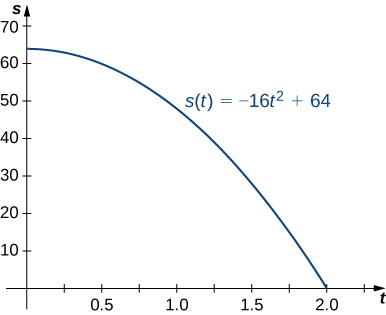
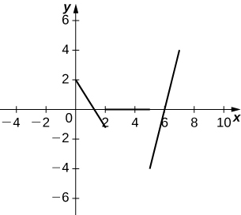
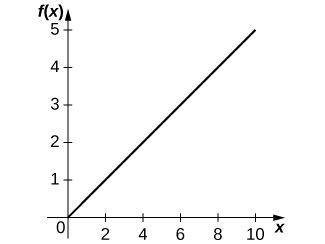
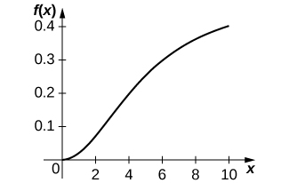

* Determine a new value of a quantity from the old value and the amount of change.
* Calculate the average rate of change and explain how it differs from the instantaneous rate of change.
* Apply rates of change to displacement, velocity, and acceleration of an object moving along a straight line.
* Predict the future population from the present value and the population growth rate.
* Use derivatives to calculate marginal cost and revenue in a business situation.

In this section we look at some applications of the derivative by focusing on the interpretation of the derivative as the rate of change of a function. These applications include **acceleration**{: data-type="term"} and velocity in physics, **population growth rates**{: data-type="term"} in biology, and marginal functions in economics.

### Amount of Change Formula

One application for derivatives is to estimate an unknown value of a function at a point by using a known value of a function at some given point together with its rate of change at the given point. If <math xmlns="http://www.w3.org/1998/Math/MathML"><mrow><mi>f</mi><mo stretchy="false">(</mo><mi>x</mi><mo stretchy="false">)</mo></mrow></math>

 is a function defined on an interval <math xmlns="http://www.w3.org/1998/Math/MathML"><mrow><mrow><mo>[</mo><mrow><mi>a</mi><mo>,</mo><mi>a</mi><mo>+</mo><mi>h</mi></mrow><mo>]</mo></mrow><mo>,</mo></mrow></math>

 then the **amount of change**{: data-type="term"} of <math xmlns="http://www.w3.org/1998/Math/MathML"><mrow><mi>f</mi><mo stretchy="false">(</mo><mi>x</mi><mo stretchy="false">)</mo></mrow></math>

 over the interval is the change in the <math xmlns="http://www.w3.org/1998/Math/MathML"><mi>y</mi></math>

 values of the function over that interval and is given by

<math xmlns="http://www.w3.org/1998/Math/MathML"><mrow><mi>f</mi><mrow><mo>(</mo><mrow><mi>a</mi><mo>+</mo><mi>h</mi></mrow><mo>)</mo></mrow><mo>−</mo><mi>f</mi><mo stretchy="false">(</mo><mi>a</mi><mo stretchy="false">)</mo><mo>.</mo></mrow></math>

The **average rate of change**{: data-type="term"} of the function <math xmlns="http://www.w3.org/1998/Math/MathML"><mi>f</mi></math>

 over that same interval is the ratio of the amount of change over that interval to the corresponding change in the <math xmlns="http://www.w3.org/1998/Math/MathML"><mi>x</mi></math>

 values. It is given by

<math xmlns="http://www.w3.org/1998/Math/MathML"><mrow><mfrac><mrow><mi>f</mi><mrow><mo>(</mo><mrow><mi>a</mi><mo>+</mo><mi>h</mi></mrow><mo>)</mo></mrow><mo>−</mo><mi>f</mi><mo stretchy="false">(</mo><mi>a</mi><mo stretchy="false">)</mo></mrow><mi>h</mi></mfrac><mo>.</mo></mrow></math>

As we already know, the instantaneous rate of change of <math xmlns="http://www.w3.org/1998/Math/MathML"><mrow><mi>f</mi><mo stretchy="false">(</mo><mi>x</mi><mo stretchy="false">)</mo></mrow></math>

 at <math xmlns="http://www.w3.org/1998/Math/MathML"><mi>a</mi></math>

 is its derivative

<math xmlns="http://www.w3.org/1998/Math/MathML"><mrow><msup><mi>f</mi><mo>′</mo></msup><mrow><mo>(</mo><mi>a</mi><mo>)</mo></mrow><mo>=</mo><munder><mrow><mtext>lim</mtext></mrow><mrow><mi>h</mi><mo stretchy="false">→</mo><mn>0</mn></mrow></munder><mfrac><mrow><mi>f</mi><mrow><mo>(</mo><mrow><mi>a</mi><mo>+</mo><mi>h</mi></mrow><mo>)</mo></mrow><mo>−</mo><mi>f</mi><mo stretchy="false">(</mo><mi>a</mi><mo stretchy="false">)</mo></mrow><mi>h</mi></mfrac><mo>.</mo></mrow></math>

For small enough values of <math xmlns="http://www.w3.org/1998/Math/MathML"><mrow><mi>h</mi><mo>,</mo><msup><mi>f</mi><mo>′</mo></msup><mrow><mo>(</mo><mi>a</mi><mo>)</mo></mrow><mo>≈</mo><mfrac><mrow><mi>f</mi><mrow><mo>(</mo><mrow><mi>a</mi><mo>+</mo><mi>h</mi></mrow><mo>)</mo></mrow><mo>−</mo><mi>f</mi><mrow><mo>(</mo><mi>a</mi><mo>)</mo></mrow></mrow><mi>h</mi></mfrac><mo>.</mo></mrow></math>

 We can then solve for <math xmlns="http://www.w3.org/1998/Math/MathML"><mrow><mi>f</mi><mrow><mo>(</mo><mrow><mi>a</mi><mo>+</mo><mi>h</mi></mrow><mo>)</mo></mrow></mrow></math>

 to get the amount of change formula:

<math xmlns="http://www.w3.org/1998/Math/MathML"><mrow><mi>f</mi><mo stretchy="false">(</mo><mi>a</mi><mo>+</mo><mi>h</mi><mo stretchy="false">)</mo><mo>≈</mo><mi>f</mi><mo stretchy="false">(</mo><mi>a</mi><mo stretchy="false">)</mo><mo>+</mo><msup><mi>f</mi><mo>′</mo></msup><mo stretchy="false">(</mo><mi>a</mi><mo stretchy="false">)</mo><mi>h</mi><mo>.</mo></mrow></math>

We can use this formula if we know only <math xmlns="http://www.w3.org/1998/Math/MathML"><mrow><mi>f</mi><mo stretchy="false">(</mo><mi>a</mi><mo stretchy="false">)</mo></mrow></math>

 and <math xmlns="http://www.w3.org/1998/Math/MathML"><mrow><msup><mi>f</mi><mo>′</mo></msup><mo stretchy="false">(</mo><mi>a</mi><mo stretchy="false">)</mo></mrow></math>

 and wish to estimate the value of <math xmlns="http://www.w3.org/1998/Math/MathML"><mrow><mi>f</mi><mrow><mo>(</mo><mrow><mi>a</mi><mo>+</mo><mi>h</mi></mrow><mo>)</mo></mrow><mo>.</mo></mrow></math>

 For example, we may use the current population of a city and the rate at which it is growing to estimate its population in the near future. As we can see in [\[link\]](#CNX_Calc_Figure_03_04_001), we are approximating <math xmlns="http://www.w3.org/1998/Math/MathML"><mrow><mi>f</mi><mo stretchy="false">(</mo><mi>a</mi><mo>+</mo><mi>h</mi><mo stretchy="false">)</mo></mrow></math>

 by the <math xmlns="http://www.w3.org/1998/Math/MathML"><mi>y</mi></math>

 coordinate at <math xmlns="http://www.w3.org/1998/Math/MathML"><mrow><mi>a</mi><mo>+</mo><mi>h</mi></mrow></math>

 on the line tangent to <math xmlns="http://www.w3.org/1998/Math/MathML"><mrow><mi>f</mi><mo stretchy="false">(</mo><mi>x</mi><mo stretchy="false">)</mo></mrow></math>

 at <math xmlns="http://www.w3.org/1998/Math/MathML"><mrow><mi>x</mi><mo>=</mo><mi>a</mi><mo>.</mo></mrow></math>

 Observe that the accuracy of this estimate depends on the value of <math xmlns="http://www.w3.org/1998/Math/MathML"><mi>h</mi></math>

 as well as the value of <math xmlns="http://www.w3.org/1998/Math/MathML"><mrow><msup><mi>f</mi><mo>′</mo></msup><mrow><mo>(</mo><mi>a</mi><mo>)</mo></mrow><mo>.</mo></mrow></math>

 &#x2248;f(a)+f&#x2032;(a)h."){: #CNX_Calc_Figure_03_04_001}

Here is an interesting [demonstration][1] of rate of change.

Estimating the Value of a Function

If <math xmlns="http://www.w3.org/1998/Math/MathML"><mrow><mi>f</mi><mrow><mo>(</mo><mn>3</mn><mo>)</mo></mrow><mo>=</mo><mn>2</mn></mrow></math>

 and <math xmlns="http://www.w3.org/1998/Math/MathML"><mrow><msup><mi>f</mi><mo>′</mo></msup><mrow><mo>(</mo><mn>3</mn><mo>)</mo></mrow><mo>=</mo><mn>5</mn><mo>,</mo></mrow></math>

 estimate <math xmlns="http://www.w3.org/1998/Math/MathML"><mrow><mi>f</mi><mo stretchy="false">(</mo><mn>3.2</mn><mo stretchy="false">)</mo><mo>.</mo></mrow></math>

Begin by finding <math xmlns="http://www.w3.org/1998/Math/MathML"><mrow><mi>h</mi><mo>.</mo></mrow></math>

 We have <math xmlns="http://www.w3.org/1998/Math/MathML"><mrow><mi>h</mi><mo>=</mo><mn>3.2</mn><mo>−</mo><mn>3</mn><mo>=</mo><mn>0.2</mn><mo>.</mo></mrow></math>

 Thus,

<math xmlns="http://www.w3.org/1998/Math/MathML"><mrow><mi>f</mi><mrow><mo>(</mo><mrow><mn>3.2</mn></mrow><mo>)</mo></mrow><mo>=</mo><mi>f</mi><mrow><mo>(</mo><mrow><mn>3</mn><mo>+</mo><mn>0.2</mn></mrow><mo>)</mo></mrow><mo>≈</mo><mi>f</mi><mrow><mo>(</mo><mn>3</mn><mo>)</mo></mrow><mo>+</mo><mrow><mo>(</mo><mrow><mn>0.2</mn></mrow><mo>)</mo></mrow><msup><mi>f</mi><mo>′</mo></msup><mrow><mo>(</mo><mn>3</mn><mo>)</mo></mrow><mo>=</mo><mn>2</mn><mo>+</mo><mn>0.2</mn><mrow><mo>(</mo><mn>5</mn><mo>)</mo></mrow><mo>=</mo><mn>3</mn><mo>.</mo></mrow></math>

Given <math xmlns="http://www.w3.org/1998/Math/MathML"><mrow><mi>f</mi><mrow><mo>(</mo><mrow><mn>10</mn></mrow><mo>)</mo></mrow><mo>=</mo><mn>−5</mn></mrow></math>

 and <math xmlns="http://www.w3.org/1998/Math/MathML"><mrow><msup><mi>f</mi><mo>′</mo></msup><mrow><mo>(</mo><mrow><mn>10</mn></mrow><mo>)</mo></mrow><mo>=</mo><mn>6</mn><mo>,</mo></mrow></math>

 estimate <math xmlns="http://www.w3.org/1998/Math/MathML"><mrow><mi>f</mi><mrow><mo>(</mo><mrow><mn>10.1</mn></mrow><mo>)</mo></mrow><mo>.</mo></mrow></math>

<math xmlns="http://www.w3.org/1998/Math/MathML"><mrow><mn>−4.4</mn></mrow></math>

Hint

Use the same process as in the preceding example.

### Motion along a Line

Another use for the derivative is to analyze motion along a line. We have described velocity as the rate of change of position. If we take the derivative of the velocity, we can find the acceleration, or the rate of change of velocity. It is also important to introduce the idea of **speed**{: data-type="term"}, which is the magnitude of velocity. Thus, we can state the following mathematical definitions.

Definition

Let <math xmlns="http://www.w3.org/1998/Math/MathML"><mrow><mi>s</mi><mrow><mo>(</mo><mi>t</mi><mo>)</mo></mrow></mrow></math>

 be a function giving the position of an object at time <math xmlns="http://www.w3.org/1998/Math/MathML"><mrow><mi>t</mi><mo>.</mo></mrow></math>

The velocity of the object at time <math xmlns="http://www.w3.org/1998/Math/MathML"><mi>t</mi></math>

 is given by <math xmlns="http://www.w3.org/1998/Math/MathML"><mrow><mi>v</mi><mrow><mo>(</mo><mi>t</mi><mo>)</mo></mrow><mo>=</mo><msup><mi>s</mi><mo>′</mo></msup><mrow><mo>(</mo><mi>t</mi><mo>)</mo></mrow><mo>.</mo></mrow></math>

The speed of the object at time <math xmlns="http://www.w3.org/1998/Math/MathML"><mi>t</mi></math>

 is given by <math xmlns="http://www.w3.org/1998/Math/MathML"><mrow><mrow><mo>\|</mo><mrow><mi>v</mi><mrow><mo>(</mo><mi>t</mi><mo>)</mo></mrow></mrow><mo>\|</mo></mrow><mo>.</mo></mrow></math>

The acceleration of the object at <math xmlns="http://www.w3.org/1998/Math/MathML"><mi>t</mi></math>

 is given by <math xmlns="http://www.w3.org/1998/Math/MathML"><mrow><mi>a</mi><mrow><mo>(</mo><mi>t</mi><mo>)</mo></mrow><mo>=</mo><msup><mi>v</mi><mo>′</mo></msup><mrow><mo>(</mo><mi>t</mi><mo>)</mo></mrow><mo>=</mo><mi>s</mi><mtext>″</mtext><mrow><mo>(</mo><mi>t</mi><mo>)</mo></mrow><mo>.</mo></mrow></math>

Comparing Instantaneous Velocity and Average Velocity

A ball is dropped from a height of 64 feet. Its height above ground (in feet) <math xmlns="http://www.w3.org/1998/Math/MathML"><mi>t</mi></math>

 seconds later is given by <math xmlns="http://www.w3.org/1998/Math/MathML"><mrow><mi>s</mi><mrow><mo>(</mo><mi>t</mi><mo>)</mo></mrow><mo>=</mo><mn>−16</mn><msup><mi>t</mi><mn>2</mn></msup><mo>+</mo><mn>64</mn><mo>.</mo></mrow></math>

1.  What is the instantaneous velocity of the ball when it hits the ground?
2.  What is the average velocity during its fall?
{: data-number-style="lower-alpha"}

The first thing to do is determine how long it takes the ball to reach the ground. To do this, set <math xmlns="http://www.w3.org/1998/Math/MathML"><mrow><mi>s</mi><mrow><mo>(</mo><mi>t</mi><mo>)</mo></mrow><mo>=</mo><mn>0</mn><mo>.</mo></mrow></math>

 Solving <math xmlns="http://www.w3.org/1998/Math/MathML"><mrow><mn>−16</mn><msup><mi>t</mi><mn>2</mn></msup><mo>+</mo><mn>64</mn><mo>=</mo><mn>0</mn><mo>,</mo></mrow></math>

 we get <math xmlns="http://www.w3.org/1998/Math/MathML"><mrow><mi>t</mi><mo>=</mo><mn>2</mn><mo>,</mo></mrow></math>

 so it take 2 seconds for the ball to reach the ground.

1.  The instantaneous velocity of the ball as it strikes the ground is
    <math xmlns="http://www.w3.org/1998/Math/MathML"><mrow><mi>v</mi><mrow><mo>(</mo><mn>2</mn><mo>)</mo></mrow><mo>.</mo></mrow></math>
    
    Since
    <math xmlns="http://www.w3.org/1998/Math/MathML"><mrow><mi>v</mi><mrow><mo>(</mo><mi>t</mi><mo>)</mo></mrow><mo>=</mo><msup><mi>s</mi><mo>′</mo></msup><mrow><mo>(</mo><mi>t</mi><mo>)</mo></mrow><mo>=</mo><mn>−32</mn><mi>t</mi><mo>,</mo></mrow></math>
    
    we obtain
    <math xmlns="http://www.w3.org/1998/Math/MathML"><mrow><mi>v</mi><mrow><mo>(</mo><mi>t</mi><mo>)</mo></mrow><mo>=</mo><mn>−64</mn><mspace width="0.2em" /><mtext>ft/s</mtext><mo>.</mo></mrow></math>

2.  The average velocity of the ball during its fall is
    * * *
    {: data-type="newline"}
    
    

    <math xmlns="http://www.w3.org/1998/Math/MathML"><mrow><msub><mi>v</mi><mrow><mi>a</mi><mi>v</mi><mi>e</mi></mrow></msub><mo>=</mo><mfrac><mrow><mi>s</mi><mrow><mo>(</mo><mn>2</mn><mo>)</mo></mrow><mo>−</mo><mi>s</mi><mrow><mo>(</mo><mn>0</mn><mo>)</mo></mrow></mrow><mrow><mn>2</mn><mo>−</mo><mn>0</mn></mrow></mfrac><mo>=</mo><mfrac><mrow><mn>0</mn><mo>−</mo><mn>64</mn></mrow><mn>2</mn></mfrac><mo>=</mo><mn>−32</mn><mspace width="0.2em" /><mtext>ft/s</mtext><mo>.</mo></mrow></math>
    

{: data-number-style="lower-alpha"}

Interpreting the Relationship between
<math xmlns="http://www.w3.org/1998/Math/MathML"><mrow><mi>v</mi><mrow><mo>(</mo><mi>t</mi><mo>)</mo></mrow></mrow></math>
and
<math xmlns="http://www.w3.org/1998/Math/MathML"><mrow><mi>a</mi><mrow><mo>(</mo><mi>t</mi><mo>)</mo></mrow></mrow></math>

A particle moves along a coordinate axis in the positive direction to the right. Its position at time <math xmlns="http://www.w3.org/1998/Math/MathML"><mi>t</mi></math>

 is given by <math xmlns="http://www.w3.org/1998/Math/MathML"><mrow><mi>s</mi><mrow><mo>(</mo><mi>t</mi><mo>)</mo></mrow><mo>=</mo><msup><mi>t</mi><mn>3</mn></msup><mo>−</mo><mn>4</mn><mi>t</mi><mo>+</mo><mn>2</mn><mo>.</mo></mrow></math>

 Find <math xmlns="http://www.w3.org/1998/Math/MathML"><mrow><mi>v</mi><mrow><mo>(</mo><mn>1</mn><mo>)</mo></mrow></mrow></math>

 and <math xmlns="http://www.w3.org/1998/Math/MathML"><mrow><mi>a</mi><mrow><mo>(</mo><mn>1</mn><mo>)</mo></mrow></mrow></math>

 and use these values to answer the following questions.

1.  Is the particle moving from left to right or from right to left at time
    <math xmlns="http://www.w3.org/1998/Math/MathML"><mrow><mi>t</mi><mo>=</mo><mn>1</mn><mo>?</mo></mrow></math>

2.  Is the particle speeding up or slowing down at time
    <math xmlns="http://www.w3.org/1998/Math/MathML"><mrow><mi>t</mi><mo>=</mo><mn>1</mn><mo>?</mo></mrow></math>
{: data-number-style="lower-alpha"}

Begin by finding <math xmlns="http://www.w3.org/1998/Math/MathML"><mrow><mi>v</mi><mrow><mo>(</mo><mi>t</mi><mo>)</mo></mrow></mrow></math>

 and <math xmlns="http://www.w3.org/1998/Math/MathML"><mrow><mi>a</mi><mrow><mo>(</mo><mi>t</mi><mo>)</mo></mrow><mo>.</mo></mrow></math>

and <math xmlns="http://www.w3.org/1998/Math/MathML"><mrow><mi>a</mi><mrow><mo>(</mo><mi>t</mi><mo>)</mo></mrow><mo>=</mo><msup><mi>v</mi><mo>′</mo></msup><mrow><mo>(</mo><mi>t</mi><mo>)</mo></mrow><mo>=</mo><mi>s</mi><mtext>″</mtext><mrow><mo>(</mo><mi>t</mi><mo>)</mo></mrow><mo>=</mo><mn>6</mn><mi>t</mi><mo>.</mo></mrow></math>

Evaluating these functions at <math xmlns="http://www.w3.org/1998/Math/MathML"><mrow><mi>t</mi><mo>=</mo><mn>1</mn><mo>,</mo></mrow></math>

 we obtain <math xmlns="http://www.w3.org/1998/Math/MathML"><mrow><mi>v</mi><mrow><mo>(</mo><mn>1</mn><mo>)</mo></mrow><mo>=</mo><mn>−1</mn></mrow></math>

 and <math xmlns="http://www.w3.org/1998/Math/MathML"><mrow><mi>a</mi><mrow><mo>(</mo><mn>1</mn><mo>)</mo></mrow><mo>=</mo><mn>6</mn><mo>.</mo></mrow></math>

1.  Because
    <math xmlns="http://www.w3.org/1998/Math/MathML"><mrow><mi>v</mi><mrow><mo>(</mo><mn>1</mn><mo>)</mo></mrow><mo>&lt;</mo><mn>0</mn><mo>,</mo></mrow></math>
    
    the particle is moving from right to left.
2.  Because
    <math xmlns="http://www.w3.org/1998/Math/MathML"><mrow><mi>v</mi><mrow><mo>(</mo><mn>1</mn><mo>)</mo></mrow><mo>&lt;</mo><mn>0</mn></mrow></math>
    
    and
    <math xmlns="http://www.w3.org/1998/Math/MathML"><mrow><mi>a</mi><mrow><mo>(</mo><mn>1</mn><mo>)</mo></mrow><mo>&gt;</mo><mn>0</mn><mo>,</mo></mrow></math>
    
    velocity and acceleration are acting in opposite directions. In other words, the particle is being accelerated in the direction opposite the direction in which it is traveling, causing
    <math xmlns="http://www.w3.org/1998/Math/MathML"><mrow><mrow><mo>\|</mo><mrow><mi>v</mi><mrow><mo>(</mo><mi>t</mi><mo>)</mo></mrow></mrow><mo>\|</mo></mrow></mrow></math>
    
    to decrease. The particle is slowing down.
{: data-number-style="lower-alpha"}

Position and Velocity

The position of a particle moving along a coordinate axis is given by <math xmlns="http://www.w3.org/1998/Math/MathML"><mrow><mi>s</mi><mrow><mo>(</mo><mi>t</mi><mo>)</mo></mrow><mo>=</mo><msup><mi>t</mi><mn>3</mn></msup><mo>−</mo><mn>9</mn><msup><mi>t</mi><mn>2</mn></msup><mo>+</mo><mn>24</mn><mi>t</mi><mo>+</mo><mn>4</mn><mo>,</mo><mi>t</mi><mo>≥</mo><mn>0</mn><mo>.</mo></mrow></math>

1.  Find
    <math xmlns="http://www.w3.org/1998/Math/MathML"><mrow><mi>v</mi><mrow><mo>(</mo><mi>t</mi><mo>)</mo></mrow><mo>.</mo></mrow></math>

2.  At what time(s) is the particle at rest?
3.  On what time intervals is the particle moving from left to right? From right to left?
4.  Use the information obtained to sketch the path of the particle along a coordinate axis.
{: data-number-style="lower-alpha"}

1.  The velocity is the derivative of the position function:
    * * *
    {: data-type="newline"}
    
    

    <math xmlns="http://www.w3.org/1998/Math/MathML"><mrow><mi>v</mi><mrow><mo>(</mo><mi>t</mi><mo>)</mo></mrow><mo>=</mo><msup><mi>s</mi><mo>′</mo></msup><mrow><mo>(</mo><mi>t</mi><mo>)</mo></mrow><mo>=</mo><mn>3</mn><msup><mi>t</mi><mn>2</mn></msup><mo>−</mo><mn>18</mn><mi>t</mi><mo>+</mo><mn>24</mn><mo>.</mo></mrow></math>
    

2.  The particle is at rest when
    <math xmlns="http://www.w3.org/1998/Math/MathML"><mrow><mi>v</mi><mrow><mo>(</mo><mi>t</mi><mo>)</mo></mrow><mo>=</mo><mn>0</mn><mo>,</mo></mrow></math>
    
    so set
    <math xmlns="http://www.w3.org/1998/Math/MathML"><mrow><mn>3</mn><msup><mi>t</mi><mn>2</mn></msup><mo>−</mo><mn>18</mn><mi>t</mi><mo>+</mo><mn>24</mn><mo>=</mo><mn>0</mn><mo>.</mo></mrow></math>
    
    Factoring the left-hand side of the equation produces
    <math xmlns="http://www.w3.org/1998/Math/MathML"><mrow><mn>3</mn><mrow><mo>(</mo><mrow><mi>t</mi><mo>−</mo><mn>2</mn></mrow><mo>)</mo></mrow><mrow><mo>(</mo><mrow><mi>t</mi><mo>−</mo><mn>4</mn></mrow><mo>)</mo></mrow><mo>=</mo><mn>0</mn><mo>.</mo></mrow></math>
    
    Solving, we find that the particle is at rest at
    <math xmlns="http://www.w3.org/1998/Math/MathML"><mrow><mi>t</mi><mo>=</mo><mn>2</mn></mrow></math>
    
    and
    <math xmlns="http://www.w3.org/1998/Math/MathML"><mrow><mi>t</mi><mo>=</mo><mn>4</mn><mo>.</mo></mrow></math>

3.  The particle is moving from left to right when
    <math xmlns="http://www.w3.org/1998/Math/MathML"><mrow><mi>v</mi><mrow><mo>(</mo><mi>t</mi><mo>)</mo></mrow><mo>&gt;</mo><mn>0</mn></mrow></math>
    
    and from right to left when
    <math xmlns="http://www.w3.org/1998/Math/MathML"><mrow><mi>v</mi><mrow><mo>(</mo><mi>t</mi><mo>)</mo></mrow><mo>&lt;</mo><mn>0</mn><mo>.</mo></mrow></math>
    
    [[link]](#CNX_Calc_Figure_03_04_003) gives the analysis of the sign of
    <math xmlns="http://www.w3.org/1998/Math/MathML"><mrow><mi>v</mi><mrow><mo>(</mo><mi>t</mi><mo>)</mo></mrow></mrow></math>
    
    for
    <math xmlns="http://www.w3.org/1998/Math/MathML"><mrow><mi>t</mi><mo>≥</mo><mn>0</mn><mo>,</mo></mrow></math>
    
    but it does not represent the axis along which the particle is moving.
    * * *
    {: data-type="newline"}
    
     determines the direction of the particle."){: #CNX_Calc_Figure_03_04_003}

    * * *
    {: data-type="newline"}
    
    Since
    <math xmlns="http://www.w3.org/1998/Math/MathML"><mrow><mn>3</mn><msup><mi>t</mi><mn>2</mn></msup><mo>−</mo><mn>18</mn><mi>t</mi><mo>+</mo><mn>24</mn><mo>&gt;</mo><mn>0</mn></mrow></math>
    
    on
    <math xmlns="http://www.w3.org/1998/Math/MathML"><mrow><mo stretchy="false">[</mo><mn>0</mn><mo>,</mo><mn>2</mn><mo stretchy="false">)</mo><mstyle mathsize="140%" displaystyle="true"><mo>∪</mo></mstyle><mo stretchy="false">(</mo><mn>2</mn><mo>,</mo><mtext>+</mtext><mi>∞</mi><mo stretchy="false">)</mo><mo>,</mo></mrow></math>
    
    the particle is moving from left to right on these intervals.
    * * *
    {: data-type="newline"}
    
    Since
    <math xmlns="http://www.w3.org/1998/Math/MathML"><mrow><mn>3</mn><msup><mi>t</mi><mn>2</mn></msup><mo>−</mo><mn>18</mn><mi>t</mi><mo>+</mo><mn>24</mn><mo>&lt;</mo><mn>0</mn></mrow></math>
    
    on
    <math xmlns="http://www.w3.org/1998/Math/MathML"><mrow><mrow><mo>(</mo><mrow><mn>2</mn><mo>,</mo><mn>4</mn></mrow><mo>)</mo></mrow><mo>,</mo></mrow></math>
    
    the particle is moving from right to left on this interval.
4.  Before we can sketch the graph of the particle, we need to know its position at the time it starts moving
    <math xmlns="http://www.w3.org/1998/Math/MathML"><mrow><mo>(</mo><mi>t</mi><mo>=</mo><mn>0</mn><mo stretchy="false">)</mo></mrow></math>
    
    and at the times that it changes direction
    <math xmlns="http://www.w3.org/1998/Math/MathML"><mrow><mrow><mo>(</mo><mrow><mi>t</mi><mo>=</mo><mn>2</mn><mo>,</mo><mn>4</mn></mrow><mo>)</mo></mrow><mo>.</mo></mrow></math>
    
    We have
    <math xmlns="http://www.w3.org/1998/Math/MathML"><mrow><mi>s</mi><mrow><mo>(</mo><mn>0</mn><mo>)</mo></mrow><mo>=</mo><mn>4</mn><mo>,</mo><mi>s</mi><mrow><mo>(</mo><mn>2</mn><mo>)</mo></mrow><mo>=</mo><mn>24</mn><mo>,</mo></mrow></math>
    
    and
    <math xmlns="http://www.w3.org/1998/Math/MathML"><mrow><mi>s</mi><mrow><mo>(</mo><mn>4</mn><mo>)</mo></mrow><mo>=</mo><mn>20</mn><mo>.</mo></mrow></math>
    
    This means that the particle begins on the coordinate axis at 4 and changes direction at 0 and 20 on the coordinate axis. The path of the particle is shown on a coordinate axis in [[link]](#CNX_Calc_Figure_03_04_004). ."){: #CNX_Calc_Figure_03_04_004}

{: data-number-style="lower-alpha"}

A particle moves along a coordinate axis. Its position at time <math xmlns="http://www.w3.org/1998/Math/MathML"><mi>t</mi></math>

 is given by <math xmlns="http://www.w3.org/1998/Math/MathML"><mrow><mi>s</mi><mrow><mo>(</mo><mi>t</mi><mo>)</mo></mrow><mo>=</mo><msup><mi>t</mi><mn>2</mn></msup><mo>−</mo><mn>5</mn><mi>t</mi><mo>+</mo><mn>1</mn><mo>.</mo></mrow></math>

 Is the particle moving from right to left or from left to right at time <math xmlns="http://www.w3.org/1998/Math/MathML"><mrow><mi>t</mi><mo>=</mo><mn>3</mn><mo>?</mo></mrow></math>

left to right

Hint

Find <math xmlns="http://www.w3.org/1998/Math/MathML"><mrow><mi>v</mi><mrow><mo>(</mo><mn>3</mn><mo>)</mo></mrow></mrow></math>

 and look at the sign.

### Population Change

In addition to analyzing velocity, speed, acceleration, and position, we can use derivatives to analyze various types of populations, including those as diverse as bacteria colonies and cities. We can use a current population, together with a growth rate, to estimate the size of a population in the future. The population growth rate is the rate of change of a population and consequently can be represented by the derivative of the size of the population.

Definition

If <math xmlns="http://www.w3.org/1998/Math/MathML"><mrow><mi>P</mi><mrow><mo>(</mo><mi>t</mi><mo>)</mo></mrow></mrow></math>

 is the number of entities present in a population, then the population growth rate of <math xmlns="http://www.w3.org/1998/Math/MathML"><mrow><mi>P</mi><mrow><mo>(</mo><mi>t</mi><mo>)</mo></mrow></mrow></math>

 is defined to be <math xmlns="http://www.w3.org/1998/Math/MathML"><mrow><msup><mi>P</mi><mo>′</mo></msup><mrow><mo>(</mo><mi>t</mi><mo>)</mo></mrow><mo>.</mo></mrow></math>

Estimating a Population

The population of a city is tripling every 5 years. If its current population is 10,000, what will be its approximate population 2 years from now?

Let <math xmlns="http://www.w3.org/1998/Math/MathML"><mrow><mi>P</mi><mrow><mo>(</mo><mi>t</mi><mo>)</mo></mrow></mrow></math>

 be the population (in thousands) <math xmlns="http://www.w3.org/1998/Math/MathML"><mi>t</mi></math>

 years from now. Thus, we know that <math xmlns="http://www.w3.org/1998/Math/MathML"><mrow><mi>P</mi><mrow><mo>(</mo><mn>0</mn><mo>)</mo></mrow><mo>=</mo><mn>10</mn></mrow></math>

 and based on the information, we anticipate <math xmlns="http://www.w3.org/1998/Math/MathML"><mrow><mi>P</mi><mrow><mo>(</mo><mn>5</mn><mo>)</mo></mrow><mo>=</mo><mn>30</mn><mo>.</mo></mrow></math>

 Now estimate <math xmlns="http://www.w3.org/1998/Math/MathML"><mrow><msup><mi>P</mi><mo>′</mo></msup><mrow><mo>(</mo><mn>0</mn><mo>)</mo></mrow><mo>,</mo></mrow></math>

 the current growth rate, using

<math xmlns="http://www.w3.org/1998/Math/MathML"><mrow><msup><mi>P</mi><mo>′</mo></msup><mrow><mo>(</mo><mn>0</mn><mo>)</mo></mrow><mo>≈</mo><mfrac><mrow><mi>P</mi><mrow><mo>(</mo><mn>5</mn><mo>)</mo></mrow><mo>−</mo><mi>P</mi><mrow><mo>(</mo><mn>0</mn><mo>)</mo></mrow></mrow><mrow><mn>5</mn><mo>−</mo><mn>0</mn></mrow></mfrac><mo>=</mo><mfrac><mrow><mn>30</mn><mo>−</mo><mn>10</mn></mrow><mn>5</mn></mfrac><mo>=</mo><mn>4</mn><mo>.</mo></mrow></math>

By applying [[link]](#fs-id1169739034265) to <math xmlns="http://www.w3.org/1998/Math/MathML"><mrow><mi>P</mi><mrow><mo>(</mo><mi>t</mi><mo>)</mo></mrow><mo>,</mo></mrow></math>

 we can estimate the population 2 years from now by writing

<math xmlns="http://www.w3.org/1998/Math/MathML"><mrow><mi>P</mi><mrow><mo>(</mo><mn>2</mn><mo>)</mo></mrow><mo>≈</mo><mi>P</mi><mrow><mo>(</mo><mn>0</mn><mo>)</mo></mrow><mo>+</mo><mrow><mo>(</mo><mn>2</mn><mo>)</mo></mrow><msup><mi>P</mi><mo>′</mo></msup><mrow><mo>(</mo><mn>0</mn><mo>)</mo></mrow><mo>≈</mo><mn>10</mn><mo>+</mo><mn>2</mn><mrow><mo>(</mo><mn>4</mn><mo>)</mo></mrow><mo>=</mo><mn>18</mn><mo>;</mo></mrow></math>

thus, in 2 years the population will be 18,000.

The current population of a mosquito colony is known to be 3,000; that is, <math xmlns="http://www.w3.org/1998/Math/MathML"><mrow><mi>P</mi><mrow><mo>(</mo><mn>0</mn><mo>)</mo></mrow><mo>=</mo><mn>3,000</mn><mo>.</mo></mrow></math>

 If <math xmlns="http://www.w3.org/1998/Math/MathML"><mrow><msup><mi>P</mi><mo>′</mo></msup><mrow><mo>(</mo><mn>0</mn><mo>)</mo></mrow><mo>=</mo><mn>100</mn><mo>,</mo></mrow></math>

 estimate the size of the population in 3 days, where <math xmlns="http://www.w3.org/1998/Math/MathML"><mi>t</mi></math>

 is measured in days.

3,300

Hint

Use <math xmlns="http://www.w3.org/1998/Math/MathML"><mrow><mi>P</mi><mrow><mo>(</mo><mn>3</mn><mo>)</mo></mrow><mo>≈</mo><mi>P</mi><mrow><mo>(</mo><mn>0</mn><mo>)</mo></mrow><mo>+</mo><mn>3</mn><msup><mi>P</mi><mo>′</mo></msup><mrow><mo>(</mo><mn>0</mn><mo>)</mo></mrow><mo>.</mo></mrow></math>

### Changes in Cost and Revenue

In addition to analyzing motion along a line and population growth, derivatives are useful in analyzing changes in cost, revenue, and profit. The concept of a marginal function is common in the fields of business and economics and implies the use of derivatives. The marginal cost is the derivative of the cost function. The marginal revenue is the derivative of the revenue function. The marginal profit is the derivative of the profit function, which is based on the cost function and the revenue function.

Definition

If <math xmlns="http://www.w3.org/1998/Math/MathML"><mrow><mi>C</mi><mrow><mo>(</mo><mi>x</mi><mo>)</mo></mrow></mrow></math>

 is the cost of producing *x* items, then the **marginal cost**{: data-type="term"} <math xmlns="http://www.w3.org/1998/Math/MathML"><mrow><mi>M</mi><mi>C</mi><mrow><mo>(</mo><mi>x</mi><mo>)</mo></mrow></mrow></math>

 is <math xmlns="http://www.w3.org/1998/Math/MathML"><mrow><mi>M</mi><mi>C</mi><mrow><mo>(</mo><mi>x</mi><mo>)</mo></mrow><mo>=</mo><msup><mi>C</mi><mo>′</mo></msup><mrow><mo>(</mo><mi>x</mi><mo>)</mo></mrow><mo>.</mo></mrow></math>

If <math xmlns="http://www.w3.org/1998/Math/MathML"><mrow><mi>R</mi><mrow><mo>(</mo><mi>x</mi><mo>)</mo></mrow></mrow></math>

 is the revenue obtained from selling <math xmlns="http://www.w3.org/1998/Math/MathML"><mi>x</mi></math>

 items, then the marginal revenue <math xmlns="http://www.w3.org/1998/Math/MathML"><mrow><mi>M</mi><mi>R</mi><mrow><mo>(</mo><mi>x</mi><mo>)</mo></mrow></mrow></math>

 is <math xmlns="http://www.w3.org/1998/Math/MathML"><mrow><mi>M</mi><mi>R</mi><mrow><mo>(</mo><mi>x</mi><mo>)</mo></mrow><mo>=</mo><msup><mi>R</mi><mo>′</mo></msup><mrow><mo>(</mo><mi>x</mi><mo>)</mo></mrow><mo>.</mo></mrow></math>

If <math xmlns="http://www.w3.org/1998/Math/MathML"><mrow><mi>P</mi><mrow><mo>(</mo><mi>x</mi><mo>)</mo></mrow><mo>=</mo><mi>R</mi><mrow><mo>(</mo><mi>x</mi><mo>)</mo></mrow><mo>−</mo><mi>C</mi><mrow><mo>(</mo><mi>x</mi><mo>)</mo></mrow></mrow></math>

 is the profit obtained from selling *x* items, then the **marginal profit**{: data-type="term"} <math xmlns="http://www.w3.org/1998/Math/MathML"><mrow><mi>M</mi><mi>P</mi><mo stretchy="false">(</mo><mi>x</mi><mo stretchy="false">)</mo></mrow></math>

 is defined to be <math xmlns="http://www.w3.org/1998/Math/MathML"><mrow><mi>M</mi><mi>P</mi><mrow><mo>(</mo><mi>x</mi><mo>)</mo></mrow><mo>=</mo><msup><mi>P</mi><mo>′</mo></msup><mrow><mo>(</mo><mi>x</mi><mo>)</mo></mrow><mo>=</mo><mi>M</mi><mi>R</mi><mrow><mo>(</mo><mi>x</mi><mo>)</mo></mrow><mo>−</mo><mi>M</mi><mi>C</mi><mrow><mo>(</mo><mi>x</mi><mo>)</mo></mrow><mo>=</mo><msup><mi>R</mi><mo>′</mo></msup><mrow><mo>(</mo><mi>x</mi><mo>)</mo></mrow><mo>−</mo><msup><mi>C</mi><mo>′</mo></msup><mrow><mo>(</mo><mi>x</mi><mo>)</mo></mrow><mo>.</mo></mrow></math>

We can roughly approximate

<math xmlns="http://www.w3.org/1998/Math/MathML"><mrow><mi>M</mi><mi>C</mi><mrow><mo>(</mo><mi>x</mi><mo>)</mo></mrow><mo>=</mo><msup><mi>C</mi><mo>′</mo></msup><mrow><mo>(</mo><mi>x</mi><mo>)</mo></mrow><mo>=</mo><munder><mrow><mtext>lim</mtext></mrow><mrow><mi>h</mi><mo stretchy="false">→</mo><mn>0</mn></mrow></munder><mfrac><mrow><mi>C</mi><mrow><mo>(</mo><mrow><mi>x</mi><mo>+</mo><mi>h</mi></mrow><mo>)</mo></mrow><mo>−</mo><mi>C</mi><mrow><mo>(</mo><mi>x</mi><mo>)</mo></mrow></mrow><mi>h</mi></mfrac></mrow></math>

by choosing an appropriate value for <math xmlns="http://www.w3.org/1998/Math/MathML"><mi>h</mi><mo>.</mo></math>

 Since *x* represents objects, a reasonable and small value for <math xmlns="http://www.w3.org/1998/Math/MathML"><mi>h</mi></math>

 is 1. Thus, by substituting <math xmlns="http://www.w3.org/1998/Math/MathML"><mrow><mi>h</mi><mo>=</mo><mn>1</mn><mo>,</mo></mrow></math>

 we get the approximation <math xmlns="http://www.w3.org/1998/Math/MathML"><mrow><mi>M</mi><mi>C</mi><mrow><mo>(</mo><mi>x</mi><mo>)</mo></mrow><mo>=</mo><msup><mi>C</mi><mo>′</mo></msup><mrow><mo>(</mo><mi>x</mi><mo>)</mo></mrow><mo>≈</mo><mi>C</mi><mrow><mo>(</mo><mrow><mi>x</mi><mo>+</mo><mn>1</mn></mrow><mo>)</mo></mrow><mo>−</mo><mi>C</mi><mrow><mo>(</mo><mi>x</mi><mo>)</mo></mrow><mo>.</mo></mrow></math>

 Consequently, <math xmlns="http://www.w3.org/1998/Math/MathML"><mrow><msup><mi>C</mi><mo>′</mo></msup><mrow><mo>(</mo><mi>x</mi><mo>)</mo></mrow></mrow></math>

 for a given value of <math xmlns="http://www.w3.org/1998/Math/MathML"><mi>x</mi></math>

 can be thought of as the change in cost associated with producing one additional item. In a similar way, <math xmlns="http://www.w3.org/1998/Math/MathML"><mrow><mi>M</mi><mi>R</mi><mrow><mo>(</mo><mi>x</mi><mo>)</mo></mrow><mo>=</mo><msup><mi>R</mi><mo>′</mo></msup><mrow><mo>(</mo><mi>x</mi><mo>)</mo></mrow></mrow></math>

 approximates the revenue obtained by selling one additional item, and <math xmlns="http://www.w3.org/1998/Math/MathML"><mrow><mi>M</mi><mi>P</mi><mrow><mo>(</mo><mi>x</mi><mo>)</mo></mrow><mo>=</mo><msup><mi>P</mi><mo>′</mo></msup><mrow><mo>(</mo><mi>x</mi><mo>)</mo></mrow></mrow></math>

 approximates the profit obtained by producing and selling one additional item.

Applying Marginal Revenue

Assume that the number of barbeque dinners that can be sold, <math xmlns="http://www.w3.org/1998/Math/MathML"><mrow><mi>x</mi><mo>,</mo></mrow></math>

 can be related to the price charged, <math xmlns="http://www.w3.org/1998/Math/MathML"><mrow><mi>p</mi><mo>,</mo></mrow></math>

 by the equation <math xmlns="http://www.w3.org/1998/Math/MathML"><mrow><mi>p</mi><mrow><mo>(</mo><mi>x</mi><mo>)</mo></mrow><mo>=</mo><mn>9</mn><mo>−</mo><mn>0.03</mn><mi>x</mi><mo>,</mo><mn>0</mn><mo>≤</mo><mi>x</mi><mo>≤</mo><mn>300</mn><mo>.</mo></mrow></math>

In this case, the revenue in dollars obtained by selling <math xmlns="http://www.w3.org/1998/Math/MathML"><mi>x</mi></math>

 barbeque dinners is given by

<math xmlns="http://www.w3.org/1998/Math/MathML"><mrow><mi>R</mi><mrow><mo>(</mo><mi>x</mi><mo>)</mo></mrow><mo>=</mo><mi>x</mi><mi>p</mi><mrow><mo>(</mo><mi>x</mi><mo>)</mo></mrow><mo>=</mo><mi>x</mi><mrow><mo>(</mo><mrow><mn>9</mn><mo>−</mo><mn>0.03</mn><mi>x</mi></mrow><mo>)</mo></mrow><mo>=</mo><mn>−0.03</mn><msup><mi>x</mi><mn>2</mn></msup><mo>+</mo><mn>9</mn><mi>x</mi><mspace width="0.2em" /><mtext>for</mtext><mspace width="0.2em" /><mn>0</mn><mo>≤</mo><mi>x</mi><mo>≤</mo><mn>300</mn><mo>.</mo></mrow></math>

Use the marginal revenue function to estimate the revenue obtained from selling the 101st barbeque dinner. Compare this to the actual revenue obtained from the sale of this dinner.

First, find the marginal revenue function: <math xmlns="http://www.w3.org/1998/Math/MathML"><mrow><mi>M</mi><mi>R</mi><mrow><mo>(</mo><mi>x</mi><mo>)</mo></mrow><mo>=</mo><msup><mi>R</mi><mo>′</mo></msup><mrow><mo>(</mo><mi>x</mi><mo>)</mo></mrow><mo>=</mo><mn>−0.06</mn><mi>x</mi><mo>+</mo><mn>9</mn><mo>.</mo></mrow></math>

Next, use <math xmlns="http://www.w3.org/1998/Math/MathML"><mrow><msup><mi>R</mi><mo>′</mo></msup><mrow><mo>(</mo><mrow><mn>100</mn></mrow><mo>)</mo></mrow></mrow></math>

 to approximate <math xmlns="http://www.w3.org/1998/Math/MathML"><mrow><mi>R</mi><mrow><mo>(</mo><mrow><mn>101</mn></mrow><mo>)</mo></mrow><mo>−</mo><mi>R</mi><mrow><mo>(</mo><mrow><mn>100</mn></mrow><mo>)</mo></mrow><mo>,</mo></mrow></math>

 the revenue obtained from the sale of the 101st dinner. Since <math xmlns="http://www.w3.org/1998/Math/MathML"><mrow><msup><mi>R</mi><mo>′</mo></msup><mrow><mo>(</mo><mrow><mn>100</mn></mrow><mo>)</mo></mrow><mo>=</mo><mn>3</mn><mo>,</mo></mrow></math>

 the revenue obtained from the sale of the 101st dinner is approximately $3.

The actual revenue obtained from the sale of the 101st dinner is

<math xmlns="http://www.w3.org/1998/Math/MathML"><mrow><mi>R</mi><mrow><mo>(</mo><mrow><mn>101</mn></mrow><mo>)</mo></mrow><mo>−</mo><mi>R</mi><mrow><mo>(</mo><mrow><mn>100</mn></mrow><mo>)</mo></mrow><mo>=</mo><mn>602.97</mn><mo>−</mo><mn>600</mn><mo>=</mo><mn>2.97</mn><mo>,</mo><mtext>or</mtext><mspace width="0.2em" /><mn>$2.97</mn><mo>.</mo></mrow></math>

The marginal revenue is a fairly good estimate in this case and has the advantage of being easy to compute.

Suppose that the profit obtained from the sale of <math xmlns="http://www.w3.org/1998/Math/MathML"><mi>x</mi></math>

 fish-fry dinners is given by <math xmlns="http://www.w3.org/1998/Math/MathML"><mrow><mi>P</mi><mrow><mo>(</mo><mi>x</mi><mo>)</mo></mrow><mo>=</mo><mn>−0.03</mn><msup><mi>x</mi><mn>2</mn></msup><mo>+</mo><mn>8</mn><mi>x</mi><mo>−</mo><mn>50</mn><mo>.</mo></mrow></math>

 Use the marginal profit function to estimate the profit from the sale of the 101st fish-fry dinner.

$2

Hint

Use <math xmlns="http://www.w3.org/1998/Math/MathML"><mrow><msup><mi>P</mi><mo>′</mo></msup><mrow><mo>(</mo><mrow><mn>100</mn></mrow><mo>)</mo></mrow></mrow></math>

 to approximate <math xmlns="http://www.w3.org/1998/Math/MathML"><mrow><mi>P</mi><mrow><mo>(</mo><mrow><mn>101</mn></mrow><mo>)</mo></mrow><mo>−</mo><mi>P</mi><mrow><mo>(</mo><mrow><mn>100</mn></mrow><mo>)</mo></mrow><mo>.</mo></mrow></math>

### Key Concepts

* Using
  <math xmlns="http://www.w3.org/1998/Math/MathML"><mrow><mi>f</mi><mrow><mo>(</mo><mrow><mi>a</mi><mo>+</mo><mi>h</mi></mrow><mo>)</mo></mrow><mo>≈</mo><mi>f</mi><mrow><mo>(</mo><mi>a</mi><mo>)</mo></mrow><mo>+</mo><msup><mi>f</mi><mo>′</mo></msup><mrow><mo>(</mo><mi>a</mi><mo>)</mo></mrow><mi>h</mi><mo>,</mo></mrow></math>
  
  it is possible to estimate
  <math xmlns="http://www.w3.org/1998/Math/MathML"><mrow><mi>f</mi><mrow><mo>(</mo><mrow><mi>a</mi><mo>+</mo><mi>h</mi></mrow><mo>)</mo></mrow></mrow></math>
  
  given
  <math xmlns="http://www.w3.org/1998/Math/MathML"><mrow><msup><mi>f</mi><mo>′</mo></msup><mrow><mo>(</mo><mi>a</mi><mo>)</mo></mrow></mrow></math>
  
  and
  <math xmlns="http://www.w3.org/1998/Math/MathML"><mrow><mi>f</mi><mrow><mo>(</mo><mi>a</mi><mo>)</mo></mrow><mo>.</mo></mrow></math>

* The rate of change of position is velocity, and the rate of change of velocity is acceleration. Speed is the absolute value, or magnitude, of velocity.
* The population growth rate and the present population can be used to predict the size of a future population.
* Marginal cost, marginal revenue, and marginal profit functions can be used to predict, respectively, the cost of producing one more item, the revenue obtained by selling one more item, and the profit obtained by producing and selling one more item.
{: data-bullet-style="bullet"}

<section data-depth="1" class="section-exercises" markdown="1">
For the following exercises, the given functions represent the position of a particle traveling along a horizontal line.

1.  Find the velocity and acceleration functions.
2.  Determine the time intervals when the object is slowing down or speeding up.
{: data-number-style="lower-alpha"}

<math xmlns="http://www.w3.org/1998/Math/MathML"><mrow><mi>s</mi><mrow><mo>(</mo><mi>t</mi><mo>)</mo></mrow><mo>=</mo><mn>2</mn><msup><mi>t</mi><mn>3</mn></msup><mo>−</mo><mn>3</mn><msup><mi>t</mi><mn>2</mn></msup><mo>−</mo><mn>12</mn><mi>t</mi><mo>+</mo><mn>8</mn></mrow></math>

<math xmlns="http://www.w3.org/1998/Math/MathML"><mrow><mi>s</mi><mrow><mo>(</mo><mi>t</mi><mo>)</mo></mrow><mo>=</mo><mn>2</mn><msup><mi>t</mi><mn>3</mn></msup><mo>−</mo><mn>15</mn><msup><mi>t</mi><mn>2</mn></msup><mo>+</mo><mn>36</mn><mi>t</mi><mo>−</mo><mn>10</mn></mrow></math>

a. <math xmlns="http://www.w3.org/1998/Math/MathML"><mrow><mi>v</mi><mrow><mo>(</mo><mi>t</mi><mo>)</mo></mrow><mo>=</mo><mn>6</mn><msup><mi>t</mi><mn>2</mn></msup><mo>−</mo><mn>30</mn><mi>t</mi><mo>+</mo><mn>36</mn><mo>,</mo><mi>a</mi><mrow><mo>(</mo><mi>t</mi><mo>)</mo></mrow><mo>=</mo><mn>12</mn><mi>t</mi><mo>−</mo><mn>30</mn><mo>;</mo></mrow></math>

 b. speeds up <math xmlns="http://www.w3.org/1998/Math/MathML"><mrow><mrow><mo>(</mo><mrow><mn>2</mn><mo>,</mo><mn>2.5</mn></mrow><mo>)</mo></mrow><mstyle mathsize="140%" displaystyle="true"><mo>∪</mo></mstyle><mrow><mo>(</mo><mrow><mn>3</mn><mo>,</mo><mi>∞</mi></mrow><mo>)</mo></mrow><mo>,</mo></mrow></math>

 slows down <math xmlns="http://www.w3.org/1998/Math/MathML"><mrow><mrow><mo>(</mo><mrow><mn>0</mn><mo>,</mo><mn>2</mn></mrow><mo>)</mo></mrow><mstyle mathsize="140%" displaystyle="true"><mo>∪</mo></mstyle><mrow><mo>(</mo><mrow><mn>2.5</mn><mo>,</mo><mn>3</mn></mrow><mo>)</mo></mrow></mrow></math>

<math xmlns="http://www.w3.org/1998/Math/MathML"><mrow><mi>s</mi><mrow><mo>(</mo><mi>t</mi><mo>)</mo></mrow><mo>=</mo><mfrac><mi>t</mi><mrow><mn>1</mn><mo>+</mo><msup><mi>t</mi><mn>2</mn></msup></mrow></mfrac></mrow></math>

A rocket is fired vertically upward from the ground. The distance <math xmlns="http://www.w3.org/1998/Math/MathML"><mrow><mi>s</mi></mrow></math>

 in feet that the rocket travels from the ground after <math xmlns="http://www.w3.org/1998/Math/MathML"><mi>t</mi></math>

 seconds is given by <math xmlns="http://www.w3.org/1998/Math/MathML"><mrow><mi>s</mi><mrow><mo>(</mo><mi>t</mi><mo>)</mo></mrow><mo>=</mo><mn>−16</mn><msup><mi>t</mi><mn>2</mn></msup><mo>+</mo><mn>560</mn><mi>t</mi><mo>.</mo></mrow></math>

1.  Find the velocity of the rocket 3 seconds after being fired.
2.  Find the acceleration of the rocket 3 seconds after being fired.
{: data-number-style="lower-alpha"}

a. <math xmlns="http://www.w3.org/1998/Math/MathML"><mrow><mn>464</mn><msup><mrow><mspace width="0.2em" /><mtext>ft/s</mtext></mrow><mn>2</mn></msup></mrow></math>

 b. <math xmlns="http://www.w3.org/1998/Math/MathML"><mrow><mn>−32</mn><msup><mrow><mspace width="0.2em" /><mtext>ft/s</mtext></mrow><mn>2</mn></msup></mrow></math>

A ball is thrown downward with a speed of 8 ft/s from the top of a 64-foot-tall building. After *t* seconds, its height above the ground is given by <math xmlns="http://www.w3.org/1998/Math/MathML"><mrow><mi>s</mi><mrow><mo>(</mo><mi>t</mi><mo>)</mo></mrow><mo>=</mo><mn>−16</mn><msup><mi>t</mi><mn>2</mn></msup><mo>−</mo><mn>8</mn><mi>t</mi><mo>+</mo><mn>64</mn><mo>.</mo></mrow></math>

1.  Determine how long it takes for the ball to hit the ground.
2.  Determine the velocity of the ball when it hits the ground.
{: data-number-style="lower-alpha"}

The position function <math xmlns="http://www.w3.org/1998/Math/MathML"><mrow><mi>s</mi><mrow><mo>(</mo><mi>t</mi><mo>)</mo></mrow><mo>=</mo><msup><mi>t</mi><mn>2</mn></msup><mo>−</mo><mn>3</mn><mi>t</mi><mo>−</mo><mn>4</mn></mrow></math>

 represents the position of the back of a car backing out of a driveway and then driving in a straight line, where <math xmlns="http://www.w3.org/1998/Math/MathML"><mi>s</mi></math>

 is in feet and <math xmlns="http://www.w3.org/1998/Math/MathML"><mi>t</mi></math>

 is in seconds. In this case, <math xmlns="http://www.w3.org/1998/Math/MathML"><mrow><mi>s</mi><mrow><mo>(</mo><mi>t</mi><mo>)</mo></mrow><mo>=</mo><mn>0</mn></mrow></math>

 represents the time at which the back of the car is at the garage door, so <math xmlns="http://www.w3.org/1998/Math/MathML"><mrow><mi>s</mi><mrow><mo>(</mo><mn>0</mn><mo>)</mo></mrow><mo>=</mo><mn>−4</mn></mrow></math>

 is the starting position of the car, 4 feet inside the garage.

1.  Determine the velocity of the car when
    <math xmlns="http://www.w3.org/1998/Math/MathML"><mrow><mi>s</mi><mrow><mo>(</mo><mi>t</mi><mo>)</mo></mrow><mo>=</mo><mn>0</mn><mo>.</mo></mrow></math>

2.  Determine the velocity of the car when
    <math xmlns="http://www.w3.org/1998/Math/MathML"><mrow><mi>s</mi><mrow><mo>(</mo><mi>t</mi><mo>)</mo></mrow><mo>=</mo><mn>14</mn><mo>.</mo></mrow></math>
{: data-number-style="lower-alpha"}

a. 5 ft/s b. 9 ft/s

The position of a hummingbird flying along a straight line in <math xmlns="http://www.w3.org/1998/Math/MathML"><mi>t</mi></math>

 seconds is given by <math xmlns="http://www.w3.org/1998/Math/MathML"><mrow><mi>s</mi><mrow><mo>(</mo><mi>t</mi><mo>)</mo></mrow><mo>=</mo><mn>3</mn><msup><mi>t</mi><mn>3</mn></msup><mo>−</mo><mn>7</mn><mi>t</mi></mrow></math>

 meters.

1.  Determine the velocity of the bird at
    <math xmlns="http://www.w3.org/1998/Math/MathML"><mrow><mi>t</mi><mo>=</mo><mn>1</mn></mrow></math>
    
    sec.
2.  Determine the acceleration of the bird at
    <math xmlns="http://www.w3.org/1998/Math/MathML"><mrow><mi>t</mi><mo>=</mo><mn>1</mn></mrow></math>
    
    sec.
3.  Determine the acceleration of the bird when the velocity equals 0.
{: data-number-style="lower-alpha"}

A potato is launched vertically upward with an initial velocity of 100 ft/s from a potato gun at the top of an 85-foot-tall building. The distance in feet that the potato travels from the ground after <math xmlns="http://www.w3.org/1998/Math/MathML"><mi>t</mi></math>

 seconds is given by <math xmlns="http://www.w3.org/1998/Math/MathML"><mrow><mi>s</mi><mrow><mo>(</mo><mi>t</mi><mo>)</mo></mrow><mo>=</mo><mn>−16</mn><msup><mi>t</mi><mn>2</mn></msup><mo>+</mo><mn>100</mn><mi>t</mi><mo>+</mo><mn>85</mn><mo>.</mo></mrow></math>

1.  Find the velocity of the potato after
    <math xmlns="http://www.w3.org/1998/Math/MathML"><mrow><mn>0.5</mn><mspace width="0.2em" /><mtext>s</mtext></mrow></math>
    
    and
    <math xmlns="http://www.w3.org/1998/Math/MathML"><mrow><mn>5.75</mn><mspace width="0.2em" /><mtext>s</mtext><mo>.</mo></mrow></math>

2.  Find the speed of the potato at 0.5 s and 5.75 s.
3.  Determine when the potato reaches its maximum height.
4.  Find the acceleration of the potato at 0.5 s and 1.5 s.
5.  Determine how long the potato is in the air.
6.  Determine the velocity of the potato upon hitting the ground.
{: data-number-style="lower-alpha"}

a. 84 ft/s, −84 ft/s b. 84 ft/s c. <math xmlns="http://www.w3.org/1998/Math/MathML"><mrow><mfrac><mrow><mn>25</mn></mrow><mn>8</mn></mfrac><mspace width="0.2em" /><mtext>s</mtext></mrow></math>

 d. <math xmlns="http://www.w3.org/1998/Math/MathML"><mrow><mn>−32</mn><msup><mrow><mspace width="0.2em" /><mtext>ft/s</mtext></mrow><mn>2</mn></msup></mrow></math>

 in both cases e. <math xmlns="http://www.w3.org/1998/Math/MathML"><mrow><mfrac><mn>1</mn><mn>8</mn></mfrac><mrow><mo>(</mo><mrow><mn>25</mn><mo>+</mo><msqrt><mrow><mn>965</mn></mrow></msqrt></mrow><mo>)</mo></mrow><mspace width="0.2em" /><mtext>s</mtext></mrow></math>

 f. <math xmlns="http://www.w3.org/1998/Math/MathML"><mrow><mn>−4</mn><msqrt><mrow><mn>965</mn></mrow></msqrt><mspace width="0.2em" /><mtext>ft/s</mtext></mrow></math>

The position function <math xmlns="http://www.w3.org/1998/Math/MathML"><mrow><mi>s</mi><mrow><mo>(</mo><mi>t</mi><mo>)</mo></mrow><mo>=</mo><msup><mi>t</mi><mn>3</mn></msup><mo>−</mo><mn>8</mn><mi>t</mi></mrow></math>

 gives the position in miles of a freight train where east is the positive direction and <math xmlns="http://www.w3.org/1998/Math/MathML"><mi>t</mi></math>

 is measured in hours.

1.  Determine the direction the train is traveling when
    <math xmlns="http://www.w3.org/1998/Math/MathML"><mrow><mi>s</mi><mrow><mo>(</mo><mi>t</mi><mo>)</mo></mrow><mo>=</mo><mn>0</mn><mo>.</mo></mrow></math>

2.  Determine the direction the train is traveling when
    <math xmlns="http://www.w3.org/1998/Math/MathML"><mrow><mi>a</mi><mrow><mo>(</mo><mi>t</mi><mo>)</mo></mrow><mo>=</mo><mn>0</mn><mo>.</mo></mrow></math>

3.  Determine the time intervals when the train is slowing down or speeding up.
{: data-number-style="lower-alpha"}

The following graph shows the position <math xmlns="http://www.w3.org/1998/Math/MathML"><mrow><mi>y</mi><mo>=</mo><mi>s</mi><mrow><mo>(</mo><mi>t</mi><mo>)</mo></mrow></mrow></math>

 of an object moving along a straight line.

1.  Use the graph of the position function to determine the time intervals when the velocity is positive, negative, or zero.
2.  Sketch the graph of the velocity function.
3.  Use the graph of the velocity function to determine the time intervals when the acceleration is positive, negative, or zero.
4.  Determine the time intervals when the object is speeding up or slowing down.
{: data-number-style="lower-alpha"}

a. Velocity is positive on <math xmlns="http://www.w3.org/1998/Math/MathML"><mrow><mrow><mo>(</mo><mrow><mn>0</mn><mo>,</mo><mn>1.5</mn></mrow><mo>)</mo></mrow><mstyle mathsize="140%" displaystyle="true"><mo>∪</mo></mstyle><mrow><mo>(</mo><mrow><mn>6</mn><mo>,</mo><mn>7</mn></mrow><mo>)</mo></mrow><mo>,</mo></mrow></math>

 negative on <math xmlns="http://www.w3.org/1998/Math/MathML"><mrow><mrow><mo>(</mo><mrow><mn>1.5</mn><mo>,</mo><mn>2</mn></mrow><mo>)</mo></mrow><mstyle mathsize="140%" displaystyle="true"><mo>∪</mo></mstyle><mrow><mo>(</mo><mrow><mn>5</mn><mo>,</mo><mn>6</mn></mrow><mo>)</mo></mrow><mo>,</mo></mrow></math>

 and zero on <math xmlns="http://www.w3.org/1998/Math/MathML"><mrow><mrow><mo>(</mo><mrow><mn>2</mn><mo>,</mo><mn>5</mn></mrow><mo>)</mo></mrow><mo>.</mo></mrow></math>

 b.* * *
{: data-type="newline"}

  
* * *
{: data-type="newline"}

 c. Acceleration is positive on <math xmlns="http://www.w3.org/1998/Math/MathML"><mrow><mrow><mo>(</mo><mrow><mn>5</mn><mo>,</mo><mn>7</mn></mrow><mo>)</mo></mrow><mo>,</mo></mrow></math>

 negative on <math xmlns="http://www.w3.org/1998/Math/MathML"><mrow><mrow><mo>(</mo><mrow><mn>0</mn><mo>,</mo><mn>2</mn></mrow><mo>)</mo></mrow><mo>,</mo></mrow></math>

 and zero on <math xmlns="http://www.w3.org/1998/Math/MathML"><mrow><mrow><mo>(</mo><mrow><mn>2</mn><mo>,</mo><mn>5</mn></mrow><mo>)</mo></mrow><mo>.</mo></mrow></math>

 d. The object is speeding up on <math xmlns="http://www.w3.org/1998/Math/MathML"><mrow><mrow><mo>(</mo><mrow><mn>6</mn><mo>,</mo><mn>7</mn></mrow><mo>)</mo></mrow><mstyle mathsize="140%" displaystyle="true"><mo>∪</mo></mstyle><mrow><mo>(</mo><mrow><mn>1.5</mn><mo>,</mo><mn>2</mn></mrow><mo>)</mo></mrow></mrow></math>

 and slowing down on <math xmlns="http://www.w3.org/1998/Math/MathML"><mrow><mrow><mo>(</mo><mrow><mn>0</mn><mo>,</mo><mn>1.5</mn></mrow><mo>)</mo></mrow><mstyle mathsize="140%" displaystyle="true"><mo>∪</mo></mstyle><mrow><mo>(</mo><mrow><mn>5</mn><mo>,</mo><mn>6</mn></mrow><mo>)</mo></mrow><mo>.</mo></mrow></math>

The cost function, in dollars, of a company that manufactures food processors is given by <math xmlns="http://www.w3.org/1998/Math/MathML"><mrow><mi>C</mi><mrow><mo>(</mo><mi>x</mi><mo>)</mo></mrow><mo>=</mo><mn>200</mn><mo>+</mo><mfrac><mn>7</mn><mi>x</mi></mfrac><mo>+</mo><mfrac><mrow><msup><mi>x</mi><mn>2</mn></msup></mrow><mn>7</mn></mfrac><mo>,</mo></mrow></math>

 where <math xmlns="http://www.w3.org/1998/Math/MathML"><mi>x</mi></math>

 is the number of food processors manufactured.

1.  Find the marginal cost function.
2.  Find the marginal cost of manufacturing 12 food processors.
3.  Find the actual cost of manufacturing the thirteenth food processor.
{: data-number-style="lower-alpha"}

The price <math xmlns="http://www.w3.org/1998/Math/MathML"><mi>p</mi></math>

 (in dollars) and the demand <math xmlns="http://www.w3.org/1998/Math/MathML"><mi>x</mi></math>

 for a certain digital clock radio is given by the price–demand function <math xmlns="http://www.w3.org/1998/Math/MathML"><mrow><mi>p</mi><mo>=</mo><mn>10</mn><mo>−</mo><mn>0.001</mn><mi>x</mi><mo>.</mo></mrow></math>

1.  Find the revenue function
    <math xmlns="http://www.w3.org/1998/Math/MathML"><mrow><mi>R</mi><mrow><mo>(</mo><mi>x</mi><mo>)</mo></mrow><mo>.</mo></mrow></math>

2.  Find the marginal revenue function.
3.  Find the marginal revenue at
    <math xmlns="http://www.w3.org/1998/Math/MathML"><mrow><mi>x</mi><mo>=</mo><mn>2000</mn></mrow></math>
    
    and
    <math xmlns="http://www.w3.org/1998/Math/MathML"><mrow><mn>5000</mn><mo>.</mo></mrow></math>
{: data-number-style="lower-alpha"}

a. <math xmlns="http://www.w3.org/1998/Math/MathML"><mrow><mi>R</mi><mrow><mo>(</mo><mi>x</mi><mo>)</mo></mrow><mo>=</mo><mn>10</mn><mi>x</mi><mo>−</mo><mn>0.001</mn><msup><mi>x</mi><mn>2</mn></msup></mrow></math>

 b. <math xmlns="http://www.w3.org/1998/Math/MathML"><mrow><msup><mi>R</mi><mo>′</mo></msup><mrow><mo>(</mo><mi>x</mi><mo>)</mo></mrow><mo>=</mo><mn>10</mn><mo>−</mo><mn>0.002</mn><mi>x</mi></mrow></math>

 c. $6 per item, $0 per item

**[T]** A profit is earned when revenue exceeds cost. Suppose the profit function for a skateboard manufacturer is given by <math xmlns="http://www.w3.org/1998/Math/MathML"><mrow><mi>P</mi><mrow><mo>(</mo><mi>x</mi><mo>)</mo></mrow><mo>=</mo><mn>30</mn><mi>x</mi><mo>−</mo><mn>0.3</mn><msup><mi>x</mi><mn>2</mn></msup><mo>−</mo><mn>250</mn><mo>,</mo></mrow></math>

 where <math xmlns="http://www.w3.org/1998/Math/MathML"><mi>x</mi></math>

 is the number of skateboards sold.

1.  Find the exact profit from the sale of the thirtieth skateboard.
2.  Find the marginal profit function and use it to estimate the profit from the sale of the thirtieth skateboard.
{: data-number-style="lower-alpha"}

**[T]** In general, the profit function is the difference between the revenue and cost functions: <math xmlns="http://www.w3.org/1998/Math/MathML"><mrow><mi>P</mi><mrow><mo>(</mo><mi>x</mi><mo>)</mo></mrow><mo>=</mo><mi>R</mi><mrow><mo>(</mo><mi>x</mi><mo>)</mo></mrow><mo>−</mo><mi>C</mi><mrow><mo>(</mo><mi>x</mi><mo>)</mo></mrow><mo>.</mo></mrow></math>

Suppose the price-demand and cost functions for the production of cordless drills is given respectively by <math xmlns="http://www.w3.org/1998/Math/MathML"><mrow><mi>p</mi><mo>=</mo><mn>143</mn><mo>−</mo><mn>0.03</mn><mi>x</mi></mrow></math>

 and <math xmlns="http://www.w3.org/1998/Math/MathML"><mrow><mi>C</mi><mrow><mo>(</mo><mi>x</mi><mo>)</mo></mrow><mo>=</mo><mn>75,000</mn><mo>+</mo><mn>65</mn><mi>x</mi><mo>,</mo></mrow></math>

 where <math xmlns="http://www.w3.org/1998/Math/MathML"><mi>x</mi></math>

 is the number of cordless drills that are sold at a price of <math xmlns="http://www.w3.org/1998/Math/MathML"><mi>p</mi></math>

 dollars per drill and <math xmlns="http://www.w3.org/1998/Math/MathML"><mrow><mi>C</mi><mrow><mo>(</mo><mi>x</mi><mo>)</mo></mrow></mrow></math>

 is the cost of producing <math xmlns="http://www.w3.org/1998/Math/MathML"><mi>x</mi></math>

 cordless drills.

1.  Find the marginal cost function.
2.  Find the revenue and marginal revenue functions.
3.  Find
    <math xmlns="http://www.w3.org/1998/Math/MathML"><mrow><msup><mi>R</mi><mo>′</mo></msup><mo stretchy="false">(</mo><mn>1000</mn><mo stretchy="false">)</mo></mrow></math>
    
    and
    <math xmlns="http://www.w3.org/1998/Math/MathML"><mrow><msup><mi>R</mi><mo>′</mo></msup><mo stretchy="false">(</mo><mn>4000</mn><mo stretchy="false">)</mo><mo>.</mo></mrow></math>
    
    Interpret the results.
4.  Find the profit and marginal profit functions.
5.  Find
    <math xmlns="http://www.w3.org/1998/Math/MathML"><mrow><msup><mi>P</mi><mo>′</mo></msup><mo stretchy="false">(</mo><mn>1000</mn><mo stretchy="false">)</mo></mrow></math>
    
    and
    <math xmlns="http://www.w3.org/1998/Math/MathML"><mrow><msup><mi>P</mi><mo>′</mo></msup><mo stretchy="false">(</mo><mn>4000</mn><mo stretchy="false">)</mo><mo>.</mo></mrow></math>
    
    Interpret the results.
{: data-number-style="lower-alpha"}

a. <math xmlns="http://www.w3.org/1998/Math/MathML"><mrow><msup><mi>C</mi><mo>′</mo></msup><mrow><mo>(</mo><mi>x</mi><mo>)</mo></mrow><mo>=</mo><mn>65</mn></mrow></math>

 b. <math xmlns="http://www.w3.org/1998/Math/MathML"><mrow><mi>R</mi><mrow><mo>(</mo><mi>x</mi><mo>)</mo></mrow><mo>=</mo><mn>143</mn><mi>x</mi><mo>−</mo><mn>0.03</mn><msup><mi>x</mi><mn>2</mn></msup><mo>,</mo><msup><mi>R</mi><mo>′</mo></msup><mrow><mo>(</mo><mi>x</mi><mo>)</mo></mrow><mo>=</mo><mn>143</mn><mo>−</mo><mn>0.06</mn><mi>x</mi></mrow></math>

 c. <math xmlns="http://www.w3.org/1998/Math/MathML"><mrow><mn>83</mn><mo>,</mo><mn>−97</mn><mo>.</mo></mrow></math>

 At a production level of 1000 cordless drills, revenue is increasing at a rate of $83 per drill; at a production level of 4000 cordless drills, revenue is decreasing at a rate of $97 per drill. d. <math xmlns="http://www.w3.org/1998/Math/MathML"><mrow><mi>P</mi><mrow><mo>(</mo><mi>x</mi><mo>)</mo></mrow><mo>=</mo><mn>−0.03</mn><msup><mi>x</mi><mn>2</mn></msup><mo>+</mo><mn>78</mn><mi>x</mi><mo>−</mo><mn>75000</mn><mo>,</mo><msup><mi>P</mi><mo>′</mo></msup><mrow><mo>(</mo><mi>x</mi><mo>)</mo></mrow><mo>=</mo><mn>−0.06</mn><mi>x</mi><mo>+</mo><mn>78</mn></mrow></math>

 e. <math xmlns="http://www.w3.org/1998/Math/MathML"><mrow><mn>18</mn><mo>,</mo><mn>−162</mn><mo>.</mo></mrow></math>

 At a production level of 1000 cordless drills, profit is increasing at a rate of $18 per drill; at a production level of 4000 cordless drills, profit is decreasing at a rate of $162 per drill.

A small town in Ohio commissioned an actuarial firm to conduct a study that modeled the rate of change of the town’s population. The study found that the town’s population (measured in thousands of people) can be modeled by the function <math xmlns="http://www.w3.org/1998/Math/MathML"><mrow><mi>P</mi><mrow><mo>(</mo><mi>t</mi><mo>)</mo></mrow><mo>=</mo><mo>−</mo><mfrac><mn>1</mn><mn>3</mn></mfrac><msup><mi>t</mi><mn>3</mn></msup><mo>+</mo><mn>64</mn><mi>t</mi><mo>+</mo><mn>3000</mn><mo>,</mo></mrow></math>

 where <math xmlns="http://www.w3.org/1998/Math/MathML"><mrow><mi>t</mi></mrow></math>

 is measured in years.

1.  Find the rate of change function
    <math xmlns="http://www.w3.org/1998/Math/MathML"><mrow><msup><mi>P</mi><mo>′</mo></msup><mrow><mo>(</mo><mi>t</mi><mo>)</mo></mrow></mrow></math>
    
    of the population function.
2.  Find
    <math xmlns="http://www.w3.org/1998/Math/MathML"><mrow><msup><mi>P</mi><mo>′</mo></msup><mrow><mo>(</mo><mn>1</mn><mo>)</mo></mrow><mo>,</mo><msup><mi>P</mi><mo>′</mo></msup><mrow><mo>(</mo><mn>2</mn><mo>)</mo></mrow><mo>,</mo><msup><mi>P</mi><mo>′</mo></msup><mrow><mo>(</mo><mn>3</mn><mo>)</mo></mrow><mo>,</mo></mrow></math>
    
    and
    <math xmlns="http://www.w3.org/1998/Math/MathML"><mrow><msup><mi>P</mi><mo>′</mo></msup><mrow><mo>(</mo><mn>4</mn><mo>)</mo></mrow><mo>.</mo></mrow></math>
    
    Interpret what the results mean for the town.
3.  Find
    <math xmlns="http://www.w3.org/1998/Math/MathML"><mrow><mi>P</mi><mtext>″</mtext><mrow><mo>(</mo><mn>1</mn><mo>)</mo></mrow><mo>,</mo><mi>P</mi><mtext>″</mtext><mrow><mo>(</mo><mn>2</mn><mo>)</mo></mrow><mo>,</mo><mi>P</mi><mtext>″</mtext><mrow><mo>(</mo><mn>3</mn><mo>)</mo></mrow><mo>,</mo></mrow></math>
    
    and
    <math xmlns="http://www.w3.org/1998/Math/MathML"><mrow><mi>P</mi><mtext>″</mtext><mrow><mo>(</mo><mn>4</mn><mo>)</mo></mrow><mo>.</mo></mrow></math>
    
    Interpret what the results mean for the town’s population.
{: data-number-style="lower-alpha"}

**[T]** A culture of bacteria grows in number according to the function <math xmlns="http://www.w3.org/1998/Math/MathML"><mrow><mi>N</mi><mrow><mo>(</mo><mi>t</mi><mo>)</mo></mrow><mo>=</mo><mn>3000</mn><mrow><mo>(</mo><mrow><mn>1</mn><mo>+</mo><mfrac><mrow><mn>4</mn><mi>t</mi></mrow><mrow><msup><mi>t</mi><mn>2</mn></msup><mo>+</mo><mn>100</mn></mrow></mfrac></mrow><mo>)</mo></mrow><mo>,</mo></mrow></math>

 where <math xmlns="http://www.w3.org/1998/Math/MathML"><mi>t</mi></math>

 is measured in hours.

1.  Find the rate of change of the number of bacteria.
2.  Find
    <math xmlns="http://www.w3.org/1998/Math/MathML"><mrow><msup><mi>N</mi><mo>′</mo></msup><mrow><mo>(</mo><mn>0</mn><mo>)</mo></mrow><mo>,</mo><msup><mi>N</mi><mo>′</mo></msup><mrow><mo>(</mo><mrow><mn>10</mn></mrow><mo>)</mo></mrow><mo>,</mo><msup><mi>N</mi><mo>′</mo></msup><mrow><mo>(</mo><mrow><mn>20</mn></mrow><mo>)</mo></mrow><mo>,</mo></mrow></math>
    
    and
    <math xmlns="http://www.w3.org/1998/Math/MathML"><mrow><msup><mi>N</mi><mo>′</mo></msup><mrow><mo>(</mo><mrow><mn>30</mn></mrow><mo>)</mo></mrow><mo>.</mo></mrow></math>

3.  Interpret the results in (b).
4.  Find
    <math xmlns="http://www.w3.org/1998/Math/MathML"><mrow><mi>N</mi><mtext>″</mtext><mrow><mo>(</mo><mn>0</mn><mo>)</mo></mrow><mo>,</mo><mi>N</mi><mtext>″</mtext><mrow><mo>(</mo><mrow><mn>10</mn></mrow><mo>)</mo></mrow><mo>,</mo><mi>N</mi><mtext>″</mtext><mrow><mo>(</mo><mrow><mn>20</mn></mrow><mo>)</mo></mrow><mo>,</mo></mrow></math>
    
    and
    <math xmlns="http://www.w3.org/1998/Math/MathML"><mrow><mi>N</mi><mtext>″</mtext><mrow><mo>(</mo><mrow><mn>30</mn></mrow><mo>)</mo></mrow><mo>.</mo></mrow></math>
    
    Interpret what the answers imply about the bacteria population growth.
{: data-number-style="lower-alpha"}

a. <math xmlns="http://www.w3.org/1998/Math/MathML"><mrow><msup><mi>N</mi><mo>′</mo></msup><mrow><mo>(</mo><mi>t</mi><mo>)</mo></mrow><mo>=</mo><mn>3000</mn><mrow><mo>(</mo><mrow><mfrac><mrow><mn>−4</mn><msup><mi>t</mi><mn>2</mn></msup><mo>+</mo><mn>400</mn></mrow><mrow><msup><mrow><mrow><mo>(</mo><mrow><msup><mi>t</mi><mn>2</mn></msup><mo>+</mo><mn>100</mn></mrow><mo>)</mo></mrow></mrow><mn>2</mn></msup></mrow></mfrac></mrow><mo>)</mo></mrow></mrow></math>

 b. <math xmlns="http://www.w3.org/1998/Math/MathML"><mrow><mn>120</mn><mo>,</mo><mn>0</mn><mo>,</mo><mn>−14.4</mn><mo>,</mo><mn>−9.6</mn></mrow></math>

 c. The bacteria population increases from time 0 to 10 hours; afterwards, the bacteria population decreases. d. <math xmlns="http://www.w3.org/1998/Math/MathML"><mrow><mn>0</mn><mo>,</mo><mn>−6</mn><mo>,</mo><mn>0.384</mn><mo>,</mo><mn>0.432</mn><mo>.</mo></mrow></math>

 The rate at which the bacteria is increasing is decreasing during the first 10 hours. Afterwards, the bacteria population is decreasing at a decreasing rate.

The centripetal force of an object of mass <math xmlns="http://www.w3.org/1998/Math/MathML"><mi>m</mi></math>

 is given by <math xmlns="http://www.w3.org/1998/Math/MathML"><mrow><mi>F</mi><mrow><mo>(</mo><mi>r</mi><mo>)</mo></mrow><mo>=</mo><mfrac><mrow><mi>m</mi><msup><mi>v</mi><mn>2</mn></msup></mrow><mi>r</mi></mfrac><mo>,</mo></mrow></math>

 where <math xmlns="http://www.w3.org/1998/Math/MathML"><mi>v</mi></math>

 is the speed of rotation and <math xmlns="http://www.w3.org/1998/Math/MathML"><mi>r</mi></math>

 is the distance from the center of rotation.

1.  Find the rate of change of centripetal force with respect to the distance from the center of rotation.
2.  Find the rate of change of centripetal force of an object with mass 1000 kilograms, velocity of 13.89 m/s, and a distance from the center of rotation of 200 meters.
{: data-number-style="lower-alpha"}

The following questions concern the population (in millions) of London by decade in the 19th century, which is listed in the following table.

<table summary="This table has 11 rows and two columns. The first row is a header row and it labels each column. The first column header is Years since 1800 and the second column is Population (millions). Under the first column are the values 1, 11, 21, 31, 41, 51, 61, 71, 81, and 91. Under the second column are the values 0.8795, 1.040, 1.264, 1.516, 1.661, 2.000, 2.634, 3.272, 3.911, and 4.422."><caption>Population of LondonSource: http://en.wikipedia.org/wiki/Demographics\_of\_London.</caption><thead>
<tr valign="top">
<th data-valign="top" data-align="left">Years since 1800</th>
<th data-valign="top" data-align="left">Population (millions)</th>
</tr>
</thead><tbody>
<tr valign="top">
<td data-valign="top" data-align="left">1</td>
<td data-valign="top" data-align="left">0.8795</td>
</tr>
<tr valign="top">
<td data-valign="top" data-align="left">11</td>
<td data-valign="top" data-align="left">1.040</td>
</tr>
<tr valign="top">
<td data-valign="top" data-align="left">21</td>
<td data-valign="top" data-align="left">1.264</td>
</tr>
<tr valign="top">
<td data-valign="top" data-align="left">31</td>
<td data-valign="top" data-align="left">1.516</td>
</tr>
<tr valign="top">
<td data-valign="top" data-align="left">41</td>
<td data-valign="top" data-align="left">1.661</td>
</tr>
<tr valign="top">
<td data-valign="top" data-align="left">51</td>
<td data-valign="top" data-align="left">2.000</td>
</tr>
<tr valign="top">
<td data-valign="top" data-align="left">61</td>
<td data-valign="top" data-align="left">2.634</td>
</tr>
<tr valign="top">
<td data-valign="top" data-align="left">71</td>
<td data-valign="top" data-align="left">3.272</td>
</tr>
<tr valign="top">
<td data-valign="top" data-align="left">81</td>
<td data-valign="top" data-align="left">3.911</td>
</tr>
<tr valign="top">
<td data-valign="top" data-align="left">91</td>
<td data-valign="top" data-align="left">4.422</td>
</tr>
</tbody></table>

**[T]**

1.  Using a calculator or a computer program, find the best-fit linear function to measure the population.
2.  Find the derivative of the equation in a. and explain its physical meaning.
3.  Find the second derivative of the equation and explain its physical meaning.
{: data-number-style="lower-alpha"}

a. <math xmlns="http://www.w3.org/1998/Math/MathML"><mrow><mi>P</mi><mrow><mo>(</mo><mi>t</mi><mo>)</mo></mrow><mo>=</mo><mn>0.03983</mn><mo>+</mo><mn>0.4280</mn></mrow></math>

 b. <math xmlns="http://www.w3.org/1998/Math/MathML"><mrow><msup><mi>P</mi><mo>′</mo></msup><mrow><mo>(</mo><mi>t</mi><mo>)</mo></mrow><mo>=</mo><mn>0.03983</mn><mo>.</mo></mrow></math>

 The population is increasing. c. <math xmlns="http://www.w3.org/1998/Math/MathML"><mrow><mi>P</mi><mtext>″</mtext><mrow><mo>(</mo><mi>t</mi><mo>)</mo></mrow><mo>=</mo><mn>0</mn><mo>.</mo></mrow></math>

 The rate at which the population is increasing is constant.

**[T]**

1.  Using a calculator or a computer program, find the best-fit quadratic curve through the data.
2.  Find the derivative of the equation and explain its physical meaning.
3.  Find the second derivative of the equation and explain its physical meaning.
{: data-number-style="lower-alpha"}

For the following exercises, consider an astronaut on a large planet in another galaxy. To learn more about the composition of this planet, the astronaut drops an electronic sensor into a deep trench. The sensor transmits its vertical position every second in relation to the astronaut’s position. The summary of the falling sensor data is displayed in the following table.

| Time after dropping (s) | Position (m) |
{: valign="top"}|----------
| 0 | 0 |
{: valign="top"}| 1 | −1 |
{: valign="top"}| 2 | −2 |
{: valign="top"}| 3 | −5 |
{: valign="top"}| 4 | −7 |
{: valign="top"}| 5 | −14 |
{: valign="top"}{: .unnumbered summary="This table has seven rows and two columns. The first row is a header row and it labels each column. The first column header is Time after dropping (s) and the second column is Position (m). Under the first column are the values 0, 1, 2, 3, 4, and 5. Under the second column are the values 0, &#x2212;1, &#x2212;2, &#x2212;5, &#x2212;7, and &#x2212;14." data-label=""}

**[T]**

1.  Using a calculator or computer program, find the best-fit quadratic curve to the data.
2.  Find the derivative of the position function and explain its physical meaning.
3.  Find the second derivative of the position function and explain its physical meaning.
{: data-number-style="lower-alpha"}

a. <math xmlns="http://www.w3.org/1998/Math/MathML"><mrow><mi>p</mi><mo stretchy="false">(</mo><mi>t</mi><mo stretchy="false">)</mo><mo>=</mo><mn>−0.6071</mn><msup><mi>x</mi><mn>2</mn></msup><mo>+</mo><mn>0.4357</mn><mi>x</mi><mo>−</mo><mn>0.3571</mn></mrow></math>

 b. <math xmlns="http://www.w3.org/1998/Math/MathML"><mrow><msup><mi>p</mi><mo>′</mo></msup><mrow><mo>(</mo><mi>t</mi><mo>)</mo></mrow><mo>=</mo><mn>−1.214</mn><mi>x</mi><mo>+</mo><mn>0.4357</mn><mo>.</mo></mrow></math>

 This is the velocity of the sensor. c. <math xmlns="http://www.w3.org/1998/Math/MathML"><mrow><mi>p</mi><mtext>″</mtext><mrow><mo>(</mo><mi>t</mi><mo>)</mo></mrow><mo>=</mo><mn>−1.214</mn><mo>.</mo></mrow></math>

 This is the acceleration of the sensor; it is a constant acceleration downward.

**[T]**

1.  Using a calculator or computer program, find the best-fit cubic curve to the data.
2.  Find the derivative of the position function and explain its physical meaning.
3.  Find the second derivative of the position function and explain its physical meaning.
4.  Using the result from c. explain why a cubic function is not a good choice for this problem.
{: data-number-style="lower-alpha"}

The following problems deal with the Holling type I, II, and III equations. These equations describe the ecological event of growth of a predator population given the amount of prey available for consumption.

**[T]** The **Holling type I equation**{: data-type="term" .no-emphasis} is described by <math xmlns="http://www.w3.org/1998/Math/MathML"><mrow><mi>f</mi><mrow><mo>(</mo><mi>x</mi><mo>)</mo></mrow><mo>=</mo><mi>a</mi><mi>x</mi><mo>,</mo></mrow></math>

 where <math xmlns="http://www.w3.org/1998/Math/MathML"><mi>x</mi></math>

 is the amount of prey available and <math xmlns="http://www.w3.org/1998/Math/MathML"><mrow><mi>a</mi><mo>&gt;</mo><mn>0</mn></mrow></math>

 is the rate at which the predator meets the prey for consumption.

1.  Graph the Holling type I equation, given
    <math xmlns="http://www.w3.org/1998/Math/MathML"><mrow><mi>a</mi><mo>=</mo><mn>0.5</mn><mo>.</mo></mrow></math>

2.  Determine the first derivative of the Holling type I equation and explain physically what the derivative implies.
3.  Determine the second derivative of the Holling type I equation and explain physically what the derivative implies.
4.  Using the interpretations from b. and c. explain why the Holling type I equation may not be realistic.
{: data-number-style="lower-alpha"}

a.* * *
{: data-type="newline"}

  
* * *
{: data-type="newline"}

 b. <math xmlns="http://www.w3.org/1998/Math/MathML"><mrow><msup><mi>f</mi><mo>′</mo></msup><mrow><mo>(</mo><mi>x</mi><mo>)</mo></mrow><mo>=</mo><mi>a</mi><mo>.</mo></mrow></math>

 The more increase in prey, the more growth for predators. c. <math xmlns="http://www.w3.org/1998/Math/MathML"><mrow><mi>f</mi><mtext>″</mtext><mrow><mo>(</mo><mi>x</mi><mo>)</mo></mrow><mo>=</mo><mn>0</mn><mo>.</mo></mrow></math>

 As the amount of prey increases, the rate at which the predator population growth increases is constant. d. This equation assumes that if there is more prey, the predator is able to increase consumption linearly. This assumption is unphysical because we would expect there to be some saturation point at which there is too much prey for the predator to consume adequately.

**[T]** The Holling type II equation is described by <math xmlns="http://www.w3.org/1998/Math/MathML"><mrow><mi>f</mi><mrow><mo>(</mo><mi>x</mi><mo>)</mo></mrow><mo>=</mo><mfrac><mrow><mi>a</mi><mi>x</mi></mrow><mrow><mi>n</mi><mo>+</mo><mi>x</mi></mrow></mfrac><mo>,</mo></mrow></math>

 where <math xmlns="http://www.w3.org/1998/Math/MathML"><mi>x</mi></math>

 is the amount of prey available and <math xmlns="http://www.w3.org/1998/Math/MathML"><mrow><mi>a</mi><mo>&gt;</mo><mn>0</mn></mrow></math>

 is the maximum consumption rate of the predator.

1.  Graph the Holling type II equation given
    <math xmlns="http://www.w3.org/1998/Math/MathML"><mrow><mi>a</mi><mo>=</mo><mn>0.5</mn></mrow></math>
    
    and
    <math xmlns="http://www.w3.org/1998/Math/MathML"><mrow><mi>n</mi><mo>=</mo><mn>5</mn><mo>.</mo></mrow></math>
    
    What are the differences between the Holling type I and II equations?
2.  Take the first derivative of the Holling type II equation and interpret the physical meaning of the derivative.
3.  Show that
    <math xmlns="http://www.w3.org/1998/Math/MathML"><mrow><mi>f</mi><mrow><mo>(</mo><mi>n</mi><mo>)</mo></mrow><mo>=</mo><mfrac><mn>1</mn><mn>2</mn></mfrac><mi>a</mi></mrow></math>
    
    and interpret the meaning of the parameter
    <math xmlns="http://www.w3.org/1998/Math/MathML"><mi>n</mi><mo>.</mo></math>

4.  Find and interpret the meaning of the second derivative. What makes the Holling type II function more realistic than the Holling type I function?
{: data-number-style="lower-alpha"}

**[T]** The Holling type III equation is described by <math xmlns="http://www.w3.org/1998/Math/MathML"><mrow><mi>f</mi><mrow><mo>(</mo><mi>x</mi><mo>)</mo></mrow><mo>=</mo><mfrac><mrow><mi>a</mi><msup><mi>x</mi><mn>2</mn></msup></mrow><mrow><msup><mi>n</mi><mn>2</mn></msup><mo>+</mo><msup><mi>x</mi><mn>2</mn></msup></mrow></mfrac><mo>,</mo></mrow></math>

 where <math xmlns="http://www.w3.org/1998/Math/MathML"><mi>x</mi></math>

 is the amount of prey available and <math xmlns="http://www.w3.org/1998/Math/MathML"><mrow><mi>a</mi><mo>&gt;</mo><mn>0</mn></mrow></math>

 is the maximum consumption rate of the predator.

1.  Graph the Holling type III equation given
    <math xmlns="http://www.w3.org/1998/Math/MathML"><mrow><mi>a</mi><mo>=</mo><mn>0.5</mn></mrow></math>
    
    and
    <math xmlns="http://www.w3.org/1998/Math/MathML"><mrow><mi>n</mi><mo>=</mo><mn>5</mn><mo>.</mo></mrow></math>
    
    What are the differences between the Holling type II and III equations?
2.  Take the first derivative of the Holling type III equation and interpret the physical meaning of the derivative.
3.  Find and interpret the meaning of the second derivative (it may help to graph the second derivative).
4.  What additional ecological phenomena does the Holling type III function describe compared with the Holling type II function?
{: data-number-style="lower-alpha"}

a.* * *
{: data-type="newline"}

  
* * *
{: data-type="newline"}

 b. <math xmlns="http://www.w3.org/1998/Math/MathML"><mrow><msup><mi>f</mi><mo>′</mo></msup><mrow><mo>(</mo><mi>x</mi><mo>)</mo></mrow><mo>=</mo><mfrac><mrow><mn>2</mn><mi>a</mi><mi>x</mi><msup><mi>n</mi><mn>2</mn></msup></mrow><mrow><msup><mrow><mrow><mo>(</mo><mrow><msup><mi>n</mi><mn>2</mn></msup><mo>+</mo><msup><mi>x</mi><mn>2</mn></msup></mrow><mo>)</mo></mrow></mrow><mn>2</mn></msup></mrow></mfrac><mo>.</mo></mrow></math>

 When the amount of prey increases, the predator growth increases. c. <math xmlns="http://www.w3.org/1998/Math/MathML"><mrow><mi>f</mi><mtext>″</mtext><mrow><mo>(</mo><mi>x</mi><mo>)</mo></mrow><mo>=</mo><mfrac><mrow><mn>2</mn><mi>a</mi><msup><mi>n</mi><mn>2</mn></msup><mrow><mo>(</mo><mrow><msup><mi>n</mi><mn>2</mn></msup><mo>−</mo><mn>3</mn><msup><mi>x</mi><mn>2</mn></msup></mrow><mo>)</mo></mrow></mrow><mrow><msup><mrow><mrow><mo>(</mo><mrow><msup><mi>n</mi><mn>2</mn></msup><mo>+</mo><msup><mi>x</mi><mn>2</mn></msup></mrow><mo>)</mo></mrow></mrow><mn>3</mn></msup></mrow></mfrac><mo>.</mo></mrow></math>

 When the amount of prey is extremely small, the rate at which predator growth is increasing is increasing, but when the amount of prey reaches above a certain threshold, the rate at which predator growth is increasing begins to decrease. d. At lower levels of prey, the prey is more easily able to avoid detection by the predator, so fewer prey individuals are consumed, resulting in less predator growth.

**[T]** The populations of the snowshoe hare (in thousands) and the lynx (in hundreds) collected over 7 years from 1937 to 1943 are shown in the following table. The snowshoe hare is the primary prey of the lynx.

<table summary="This table has five rows and two columns. The first row is a header row and it labels each column. The first column header is Population of snowshoe hare (thousands) and the second column is Population of lynx (hundreds). Under the first column are the values 20, 55, 65, and 95. Under the second column are the values 10, 15, 55, and 60."><caption>Snowshoe Hare and Lynx PopulationsSource: http://www.biotopics.co.uk/newgcse/predatorprey.html.</caption><thead>
<tr valign="top">
<th data-valign="top" data-align="left">Population of snowshoe hare (thousands)</th>
<th data-valign="top" data-align="left">Population of lynx (hundreds)</th>
</tr>
</thead><tbody>
<tr valign="top">
<td data-valign="top" data-align="left">20</td>
<td data-valign="top" data-align="left">10</td>
</tr>
<tr valign="top">
<td data-valign="top" data-align="left">55</td>
<td data-valign="top" data-align="left">15</td>
</tr>
<tr valign="top">
<td data-valign="top" data-align="left">65</td>
<td data-valign="top" data-align="left">55</td>
</tr>
<tr valign="top">
<td data-valign="top" data-align="left">95</td>
<td data-valign="top" data-align="left">60</td>
</tr>
</tbody></table>
1.  Graph the data points and determine which Holling-type function fits the data best.
2.  Using the meanings of the parameters
    <math xmlns="http://www.w3.org/1998/Math/MathML"><mi>a</mi></math>
    
    and
    <math xmlns="http://www.w3.org/1998/Math/MathML"><mrow><mi>n</mi><mo>,</mo></mrow></math>
    
    determine values for those parameters by examining a graph of the data. Recall that
    <math xmlns="http://www.w3.org/1998/Math/MathML"><mi>n</mi></math>
    
    measures what prey value results in the half-maximum of the predator value.
3.  Plot the resulting Holling-type I, II, and III functions on top of the data. Was the result from part a. correct?
{: data-number-style="lower-alpha"}

</section>

### Glossary
{: data-type="glossary-title"}

acceleration
: is the rate of change of the velocity, that is, the derivative of velocity
^

amount of change
: the amount of a function
  <math xmlns="http://www.w3.org/1998/Math/MathML"><mrow><mi>f</mi><mrow><mo>(</mo><mi>x</mi><mo>)</mo></mrow></mrow></math>
  
  over an interval
  <math xmlns="http://www.w3.org/1998/Math/MathML"><mrow><mrow><mo>[</mo><mrow><mi>x</mi><mo>,</mo><mi>x</mi><mo>+</mo><mi>h</mi></mrow><mo>]</mo></mrow></mrow></math>
  
  is
  <math xmlns="http://www.w3.org/1998/Math/MathML"><mrow><mi>f</mi><mrow><mo>(</mo><mrow><mi>x</mi><mo>+</mo><mi>h</mi></mrow><mo>)</mo></mrow><mo>−</mo><mi>f</mi><mrow><mo>(</mo><mi>x</mi><mo>)</mo></mrow></mrow></math>
^

average rate of change
: is a function
  <math xmlns="http://www.w3.org/1998/Math/MathML"><mrow><mi>f</mi><mrow><mo>(</mo><mi>x</mi><mo>)</mo></mrow></mrow></math>
  
  over an interval
  <math xmlns="http://www.w3.org/1998/Math/MathML"><mrow><mrow><mo>[</mo><mrow><mi>x</mi><mo>,</mo><mi>x</mi><mo>+</mo><mi>h</mi></mrow><mo>]</mo></mrow></mrow></math>
  
  is
  <math xmlns="http://www.w3.org/1998/Math/MathML"><mrow><mfrac><mrow><mi>f</mi><mrow><mo>(</mo><mrow><mi>x</mi><mo>+</mo><mi>h</mi></mrow><mo>)</mo></mrow><mo>−</mo><mi>f</mi><mrow><mo>(</mo><mi>a</mi><mo>)</mo></mrow></mrow><mrow><mi>b</mi><mo>−</mo><mi>a</mi></mrow></mfrac></mrow></math>
^

marginal cost
: is the derivative of the cost function, or the approximate cost of producing one more item
^

marginal revenue
: is the derivative of the revenue function, or the approximate revenue obtained by selling one more item
^

marginal profit
: is the derivative of the cost function, or the approximate profit obtained by producing and selling one more item
^

population growth rate
: is the derivative of the population with respect to time
^

speed
: is the absolute value of velocity, that is,
  <math xmlns="http://www.w3.org/1998/Math/MathML"><mrow><mrow><mo>\|</mo><mrow><mi>v</mi><mrow><mo>(</mo><mi>t</mi><mo>)</mo></mrow></mrow><mo>\|</mo></mrow></mrow></math>
  
  is the speed of an object at time
  <math xmlns="http://www.w3.org/1998/Math/MathML"><mi>t</mi></math>
  
  whose velocity is given by
  <math xmlns="http://www.w3.org/1998/Math/MathML"><mrow><mi>v</mi><mrow><mo>(</mo><mi>t</mi><mo>)</mo></mrow></mrow></math>

[1]: http://www.openstaxcollege.org/l/20_chainrule
