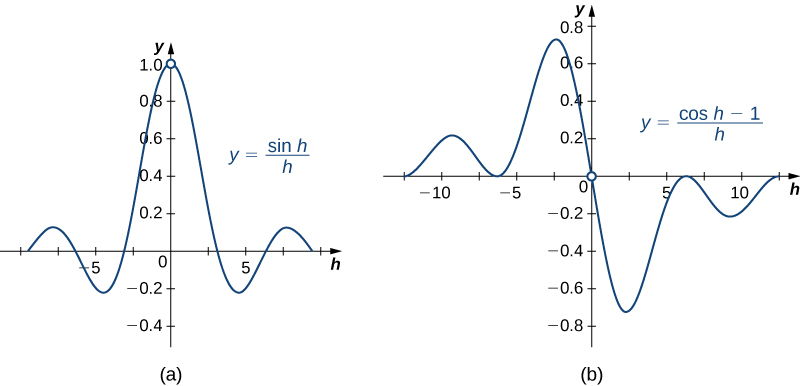
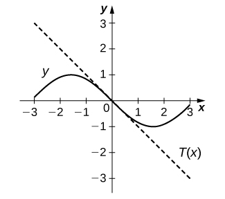
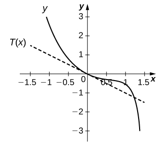

* Find the derivatives of the sine and cosine function.
* Find the derivatives of the standard trigonometric functions.
* Calculate the higher-order derivatives of the sine and cosine.

One of the most important types of motion in physics is simple harmonic motion, which is associated with such systems as an object with mass oscillating on a spring. Simple harmonic motion can be described by using either sine or cosine functions. In this section we expand our knowledge of derivative formulas to include derivatives of these and other trigonometric functions. We begin with the derivatives of the sine and cosine functions and then use them to obtain formulas for the derivatives of the remaining four trigonometric functions. Being able to calculate the derivatives of the sine and cosine functions will enable us to find the velocity and acceleration of simple harmonic motion.

### Derivatives of the Sine and Cosine Functions

We begin our exploration of the derivative for the sine function by using the formula to make a reasonable guess at its derivative. Recall that for a function <math xmlns="http://www.w3.org/1998/Math/MathML"><mrow><mi>f</mi><mo stretchy="false">(</mo><mi>x</mi><mo stretchy="false">)</mo><mo>,</mo></mrow></math>

<math xmlns="http://www.w3.org/1998/Math/MathML"><mrow><msup><mi>f</mi><mo>′</mo></msup><mrow><mo>(</mo><mi>x</mi><mo>)</mo></mrow><mo>=</mo><munder><mrow><mtext>lim</mtext></mrow><mrow><mi>h</mi><mo stretchy="false">→</mo><mn>0</mn></mrow></munder><mfrac><mrow><mi>f</mi><mrow><mo>(</mo><mrow><mi>x</mi><mo>+</mo><mi>h</mi></mrow><mo>)</mo></mrow><mo>−</mo><mi>f</mi><mo stretchy="false">(</mo><mi>x</mi><mo stretchy="false">)</mo></mrow><mi>h</mi></mfrac><mo>.</mo></mrow></math>

Consequently, for values of <math xmlns="http://www.w3.org/1998/Math/MathML"><mi>h</mi></math>

 very close to 0, <math xmlns="http://www.w3.org/1998/Math/MathML"><mrow><msup><mi>f</mi><mo>′</mo></msup><mrow><mo>(</mo><mi>x</mi><mo>)</mo></mrow><mo>≈</mo><mfrac><mrow><mi>f</mi><mrow><mo>(</mo><mrow><mi>x</mi><mo>+</mo><mi>h</mi></mrow><mo>)</mo></mrow><mo>−</mo><mi>f</mi><mo stretchy="false">(</mo><mi>x</mi><mo stretchy="false">)</mo></mrow><mi>h</mi></mfrac><mo>.</mo></mrow></math>

 We see that by using <math xmlns="http://www.w3.org/1998/Math/MathML"><mrow><mi>h</mi><mo>=</mo><mn>0.01</mn><mo>,</mo></mrow></math>

<math xmlns="http://www.w3.org/1998/Math/MathML"><mrow><mfrac><mi>d</mi><mrow><mi>d</mi><mi>x</mi></mrow></mfrac><mo stretchy="false">(</mo><mtext>sin</mtext><mspace width="0.1em" /><mi>x</mi><mo stretchy="false">)</mo><mo>≈</mo><mfrac><mrow><mtext>sin</mtext><mspace width="0.1em" /><mrow><mo>(</mo><mrow><mi>x</mi><mo>+</mo><mn>0.01</mn></mrow><mo>)</mo></mrow><mo>−</mo><mtext>sin</mtext><mspace width="0.1em" /><mi>x</mi></mrow><mrow><mn>0.01</mn></mrow></mfrac></mrow></math>

By setting <math xmlns="http://www.w3.org/1998/Math/MathML"><mrow><mi>D</mi><mrow><mo>(</mo><mi>x</mi><mo>)</mo></mrow><mo>=</mo><mfrac><mrow><mtext>sin</mtext><mspace width="0.1em" /><mrow><mo>(</mo><mrow><mi>x</mi><mo>+</mo><mn>0.01</mn></mrow><mo>)</mo></mrow><mo>−</mo><mtext>sin</mtext><mspace width="0.1em" /><mi>x</mi></mrow><mrow><mn>0.01</mn></mrow></mfrac></mrow></math>

 and using a graphing utility, we can get a graph of an approximation to the derivative of <math xmlns="http://www.w3.org/1998/Math/MathML"><mrow><mtext>sin</mtext><mspace width="0.1em" /><mi>x</mi></mrow></math>

 ([\[link\]](#CNX_Calc_Figure_03_05_001)).

  looks a lot like a cosine curve."){: #CNX_Calc_Figure_03_05_001}

Upon inspection, the graph of <math xmlns="http://www.w3.org/1998/Math/MathML"><mrow><mi>D</mi><mo stretchy="false">(</mo><mi>x</mi><mo stretchy="false">)</mo></mrow></math>

 appears to be very close to the graph of the cosine function. Indeed, we will show that

<math xmlns="http://www.w3.org/1998/Math/MathML"><mrow><mfrac><mi>d</mi><mrow><mi>d</mi><mi>x</mi></mrow></mfrac><mrow><mo>(</mo><mrow><mtext>sin</mtext><mspace width="0.1em" /><mi>x</mi></mrow><mo>)</mo></mrow><mo>=</mo><mtext>cos</mtext><mspace width="0.1em" /><mi>x</mi><mo>.</mo></mrow></math>

If we were to follow the same steps to approximate the derivative of the cosine function, we would find that

<math xmlns="http://www.w3.org/1998/Math/MathML"><mrow><mfrac><mi>d</mi><mrow><mi>d</mi><mi>x</mi></mrow></mfrac><mo stretchy="false">(</mo><mtext>cos</mtext><mspace width="0.1em" /><mi>x</mi><mo stretchy="false">)</mo><mo>=</mo><mtext>−</mtext><mtext>sin</mtext><mspace width="0.1em" /><mi>x.</mi></mrow></math>

The Derivatives of sin *x* and cos *x*

The derivative of the sine function is the cosine and the derivative of the cosine function is the negative sine.

<math xmlns="http://www.w3.org/1998/Math/MathML"><mrow><mfrac><mi>d</mi><mrow><mi>d</mi><mi>x</mi></mrow></mfrac><mrow><mo>(</mo><mrow><mtext>sin</mtext><mspace width="0.1em" /><mi>x</mi></mrow><mo>)</mo></mrow><mo>=</mo><mtext>cos</mtext><mspace width="0.1em" /><mi>x</mi></mrow></math>

<math xmlns="http://www.w3.org/1998/Math/MathML"><mrow><mfrac><mi>d</mi><mrow><mi>d</mi><mi>x</mi></mrow></mfrac><mrow><mo>(</mo><mrow><mtext>cos</mtext><mspace width="0.1em" /><mi>x</mi></mrow><mo>)</mo></mrow><mo>=</mo><mtext>−</mtext><mtext>sin</mtext><mspace width="0.1em" /><mi>x</mi></mrow></math>

#### Proof

Because the proofs for <math xmlns="http://www.w3.org/1998/Math/MathML"><mrow><mfrac><mi>d</mi><mrow><mi>d</mi><mi>x</mi></mrow></mfrac><mrow><mo>(</mo><mrow><mtext>sin</mtext><mspace width="0.1em" /><mi>x</mi></mrow><mo>)</mo></mrow><mo>=</mo><mtext>cos</mtext><mspace width="0.1em" /><mi>x</mi></mrow></math>

 and <math xmlns="http://www.w3.org/1998/Math/MathML"><mrow><mfrac><mi>d</mi><mrow><mi>d</mi><mi>x</mi></mrow></mfrac><mrow><mo>(</mo><mrow><mtext>cos</mtext><mspace width="0.1em" /><mi>x</mi></mrow><mo>)</mo></mrow><mo>=</mo><mtext>−</mtext><mtext>sin</mtext><mspace width="0.1em" /><mi>x</mi></mrow></math>

 use similar techniques, we provide only the proof for <math xmlns="http://www.w3.org/1998/Math/MathML"><mrow><mfrac><mi>d</mi><mrow><mi>d</mi><mi>x</mi></mrow></mfrac><mrow><mo>(</mo><mrow><mtext>sin</mtext><mspace width="0.1em" /><mi>x</mi></mrow><mo>)</mo></mrow><mo>=</mo><mtext>cos</mtext><mspace width="0.1em" /><mi>x</mi><mo>.</mo></mrow></math>

 Before beginning, recall two important trigonometric limits we learned in [Introduction to Limits](/m53483){: .target-chapter}\:

<math xmlns="http://www.w3.org/1998/Math/MathML"><mrow><munder><mrow><mtext>lim</mtext></mrow><mrow><mi>h</mi><mo stretchy="false">→</mo><mn>0</mn></mrow></munder><mfrac><mrow><mtext>sin</mtext><mspace width="0.1em" /><mi>h</mi></mrow><mi>h</mi></mfrac><mo>=</mo><mn>1</mn><mspace width="0.2em" /><mtext>and</mtext><mspace width="0.2em" /><munder><mrow><mtext>lim</mtext></mrow><mrow><mi>h</mi><mo stretchy="false">→</mo><mn>0</mn></mrow></munder><mfrac><mrow><mtext>cosh</mtext><mspace width="0.1em" /><mi>h</mi><mo>−</mo><mn>1</mn></mrow><mi>h</mi></mfrac><mo>=</mo><mn>0</mn><mo>.</mo></mrow></math>

The graphs of <math xmlns="http://www.w3.org/1998/Math/MathML"><mrow><mi>y</mi><mo>=</mo><mfrac><mrow><mrow><mo>(</mo><mrow><mtext>sin</mtext><mspace width="0.1em" /><mi>h</mi></mrow><mo>)</mo></mrow></mrow><mi>h</mi></mfrac></mrow></math>

 and <math xmlns="http://www.w3.org/1998/Math/MathML"><mrow><mi>y</mi><mo>=</mo><mfrac><mrow><mrow><mo>(</mo><mrow><mtext>cos</mtext><mspace width="0.1em" /><mi>h</mi><mo>−</mo><mn>1</mn></mrow><mo>)</mo></mrow></mrow><mi>h</mi></mfrac></mrow></math>

 are shown in [\[link\]](#CNX_Calc_Figure_03_05_002).

 {: #CNX_Calc_Figure_03_05_002}

We also recall the following trigonometric identity for the sine of the sum of two angles:

<math xmlns="http://www.w3.org/1998/Math/MathML"><mrow><mtext>sin</mtext><mspace width="0.1em" /><mrow><mo>(</mo><mrow><mi>x</mi><mo>+</mo><mi>h</mi></mrow><mo>)</mo></mrow><mo>=</mo><mtext>sin</mtext><mspace width="0.1em" /><mi>x</mi><mspace width="0.1em" /><mtext>cos</mtext><mspace width="0.1em" /><mi>h</mi><mo>+</mo><mtext>cos</mtext><mspace width="0.1em" /><mi>x</mi><mspace width="0.1em" /><mtext>sin</mtext><mspace width="0.1em" /><mi>h</mi><mo>.</mo></mrow></math>

Now that we have gathered all the necessary equations and identities, we proceed with the proof.

<math xmlns="http://www.w3.org/1998/Math/MathML"><mtable><mtr><mtd columnalign="right"><mfrac><mi>d</mi><mrow><mi>d</mi><mi>x</mi></mrow></mfrac><mspace width="0.1em" /><mtext>sin</mtext><mspace width="0.1em" /><mi>x</mi></mtd><mtd columnalign="left"><mo>=</mo><munder><mrow><mtext>lim</mtext></mrow><mrow><mi>h</mi><mo stretchy="false">→</mo><mn>0</mn></mrow></munder><mfrac><mrow><mtext>sin</mtext><mspace width="0.1em" /><mrow><mo>(</mo><mrow><mi>x</mi><mo>+</mo><mi>h</mi></mrow><mo>)</mo></mrow><mo>−</mo><mtext>sin</mtext><mspace width="0.1em" /><mi>x</mi></mrow><mi>h</mi></mfrac></mtd><mtd /><mtd /><mtd columnalign="left"><mtext>Apply the definition of the derivative.</mtext></mtd></mtr><mtr><mtd /><mtd columnalign="left"><mo>=</mo><munder><mrow><mtext>lim</mtext></mrow><mrow><mi>h</mi><mo stretchy="false">→</mo><mn>0</mn></mrow></munder><mfrac><mrow><mtext>sin</mtext><mspace width="0.1em" /><mi>x</mi><mspace width="0.1em" /><mtext>cos</mtext><mspace width="0.1em" /><mi>h</mi><mo>+</mo><mtext>cos</mtext><mspace width="0.1em" /><mi>x</mi><mspace width="0.1em" /><mtext>sin</mtext><mspace width="0.1em" /><mi>h</mi><mo>−</mo><mtext>sin</mtext><mspace width="0.1em" /><mi>x</mi></mrow><mi>h</mi></mfrac></mtd><mtd /><mtd /><mtd columnalign="left"><mtext>Use trig identity for the sine of the sum of two angles.</mtext></mtd></mtr><mtr><mtd /><mtd columnalign="left"><mo>=</mo><munder><mrow><mtext>lim</mtext></mrow><mrow><mi>h</mi><mo stretchy="false">→</mo><mn>0</mn></mrow></munder><mrow><mo>(</mo><mrow><mfrac><mrow><mtext>sin</mtext><mspace width="0.1em" /><mi>x</mi><mspace width="0.1em" /><mtext>cos</mtext><mspace width="0.1em" /><mi>h</mi><mo>−</mo><mtext>sin</mtext><mspace width="0.1em" /><mi>x</mi></mrow><mi>h</mi></mfrac><mo>+</mo><mfrac><mrow><mtext>cos</mtext><mspace width="0.1em" /><mi>x</mi><mspace width="0.1em" /><mtext>sin</mtext><mspace width="0.1em" /><mi>h</mi></mrow><mi>h</mi></mfrac></mrow><mo>)</mo></mrow></mtd><mtd /><mtd /><mtd columnalign="left"><mtext>Regroup.</mtext></mtd></mtr><mtr><mtd /><mtd columnalign="left"><mo>=</mo><munder><mrow><mtext>lim</mtext></mrow><mrow><mi>h</mi><mo stretchy="false">→</mo><mn>0</mn></mrow></munder><mrow><mo>(</mo><mrow><mtext>sin</mtext><mspace width="0.1em" /><mi>x</mi><mrow><mo>(</mo><mrow><mfrac><mrow><mtext>cos</mtext><mspace width="0.1em" /><mi>h</mi><mo>−</mo><mn>1</mn></mrow><mi>h</mi></mfrac></mrow><mo>)</mo></mrow><mo>+</mo><mtext>cos</mtext><mspace width="0.1em" /><mi>x</mi><mrow><mo>(</mo><mrow><mfrac><mrow><mtext>sin</mtext><mspace width="0.1em" /><mi>h</mi></mrow><mi>h</mi></mfrac></mrow><mo>)</mo></mrow></mrow><mo>)</mo></mrow></mtd><mtd /><mtd /><mtd columnalign="left"><mtext>Factor out</mtext><mspace width="0.2em" /><mtext>sin</mtext><mspace width="0.1em" /><mi>x</mi><mspace width="0.2em" /><mtext>and</mtext><mspace width="0.2em" /><mtext>cos</mtext><mspace width="0.1em" /><mi>x</mi><mo>.</mo></mtd></mtr> <mtr><mtd /><mtd columnalign="left"><mo>=</mo><mtext>sin</mtext><mspace width="0.1em" /><mi>x</mi><mrow><mo>(</mo><mn>0</mn><mo>)</mo></mrow><mo>+</mo><mtext>cos</mtext><mspace width="0.1em" /><mi>x</mi><mrow><mo>(</mo><mn>1</mn><mo>)</mo></mrow></mtd><mtd /><mtd /><mtd columnalign="left"><mtext>Apply trig limit formulas.</mtext></mtd></mtr><mtr><mtd /><mtd columnalign="left"><mo>=</mo><mtext>cos</mtext><mspace width="0.1em" /><mi>x</mi></mtd><mtd /><mtd /><mtd columnalign="left"><mtext>Simplify.</mtext></mtd></mtr></mtable></math>

□

[\[link\]](#CNX_Calc_Figure_03_05_003) shows the relationship between the graph of <math xmlns="http://www.w3.org/1998/Math/MathML"><mrow><mi>f</mi><mrow><mo>(</mo><mi>x</mi><mo>)</mo></mrow><mo>=</mo><mtext>sin</mtext><mspace width="0.1em" /><mi>x</mi></mrow></math>

 and its derivative <math xmlns="http://www.w3.org/1998/Math/MathML"><mrow><msup><mi>f</mi><mo>′</mo></msup><mrow><mo>(</mo><mi>x</mi><mo>)</mo></mrow><mo>=</mo><mtext>cos</mtext><mspace width="0.1em" /><mi>x</mi><mo>.</mo></mrow></math>

 Notice that at the points where <math xmlns="http://www.w3.org/1998/Math/MathML"><mrow><mi>f</mi><mrow><mo>(</mo><mi>x</mi><mo>)</mo></mrow><mo>=</mo><mtext>sin</mtext><mspace width="0.1em" /><mi>x</mi></mrow></math>

 has a horizontal tangent, its derivative <math xmlns="http://www.w3.org/1998/Math/MathML"><mrow><msup><mi>f</mi><mo>′</mo></msup><mrow><mo>(</mo><mi>x</mi><mo>)</mo></mrow><mo>=</mo><mtext>cos</mtext><mspace width="0.1em" /><mi>x</mi></mrow></math>

 takes on the value zero. We also see that where <math xmlns="http://www.w3.org/1998/Math/MathML"><mrow><mi>f</mi><mrow><mo>(</mo><mi>x</mi><mo>)</mo></mrow><mo>=</mo><mtext>sin</mtext><mspace width="0.1em" /><mi>x</mi></mrow></math>

 is increasing, <math xmlns="http://www.w3.org/1998/Math/MathML"><mrow><msup><mi>f</mi><mo>′</mo></msup><mrow><mo>(</mo><mi>x</mi><mo>)</mo></mrow><mo>=</mo><mtext>cos</mtext><mspace width="0.1em" /><mi>x</mi><mo>&gt;</mo><mn>0</mn></mrow></math>

 and where <math xmlns="http://www.w3.org/1998/Math/MathML"><mrow><mi>f</mi><mrow><mo>(</mo><mi>x</mi><mo>)</mo></mrow><mo>=</mo><mtext>sin</mtext><mspace width="0.1em" /><mi>x</mi></mrow></math>

 is decreasing, <math xmlns="http://www.w3.org/1998/Math/MathML"><mrow><msup><mi>f</mi><mo>′</mo></msup><mrow><mo>(</mo><mi>x</mi><mo>)</mo></mrow><mo>=</mo><mtext>cos</mtext><mspace width="0.1em" /><mi>x</mi><mo>&lt;</mo><mn>0</mn><mo>.</mo></mrow></math>

  has a maximum or a minimum, f&#x2032;(x)=0 that is, f&#x2032;(x)=0 where f(x) has a horizontal tangent. These points are noted with dots on the graphs."){: #CNX_Calc_Figure_03_05_003}

Differentiating a Function Containing sin *x*

Find the derivative of <math xmlns="http://www.w3.org/1998/Math/MathML"><mrow><mi>f</mi><mrow><mo>(</mo><mi>x</mi><mo>)</mo></mrow><mo>=</mo><mn>5</mn><msup><mi>x</mi><mn>3</mn></msup><mtext>sin</mtext><mspace width="0.1em" /><mi>x</mi><mo>.</mo></mrow></math>

Using the product rule, we have

<math xmlns="http://www.w3.org/1998/Math/MathML"><mtable><mtr><mtd columnalign="right"><mi>f</mi><mo>′</mo><mrow><mo>(</mo><mi>x</mi><mo>)</mo></mrow></mtd><mtd columnalign="left"><mo>=</mo><mfrac><mi>d</mi><mrow><mi>d</mi><mi>x</mi></mrow></mfrac><mrow><mo>(</mo><mrow><mn>5</mn><msup><mi>x</mi><mn>3</mn></msup></mrow><mo>)</mo></mrow><mo>·</mo><mtext>sin</mtext><mspace width="0.1em" /><mi>x</mi><mo>+</mo><mfrac><mi>d</mi><mrow><mi>d</mi><mi>x</mi></mrow></mfrac><mrow><mo>(</mo><mrow><mtext>sin</mtext><mspace width="0.1em" /><mi>x</mi></mrow><mo>)</mo></mrow><mo>·</mo><mn>5</mn><msup><mi>x</mi><mn>3</mn></msup></mtd></mtr><mtr><mtd /><mtd columnalign="left"><mo>=</mo><mn>15</mn><msup><mi>x</mi><mn>2</mn></msup><mo>·</mo><mtext>sin</mtext><mspace width="0.1em" /><mi>x</mi><mo>+</mo><mtext>cos</mtext><mspace width="0.1em" /><mi>x</mi><mo>·</mo><mn>5</mn><msup><mi>x</mi><mn>3</mn></msup><mo>.</mo></mtd></mtr></mtable></math>

After simplifying, we obtain

<math xmlns="http://www.w3.org/1998/Math/MathML"><mrow><msup><mi>f</mi><mo>′</mo></msup><mrow><mo>(</mo><mi>x</mi><mo>)</mo></mrow><mo>=</mo><mn>15</mn><msup><mi>x</mi><mn>2</mn></msup><mtext>sin</mtext><mspace width="0.1em" /><mi>x</mi><mo>+</mo><mn>5</mn><msup><mi>x</mi><mn>3</mn></msup><mtext>cos</mtext><mspace width="0.1em" /><mi>x</mi><mo>.</mo></mrow></math>

Find the derivative of <math xmlns="http://www.w3.org/1998/Math/MathML"><mrow><mi>f</mi><mrow><mo>(</mo><mi>x</mi><mo>)</mo></mrow><mo>=</mo><mtext>sin</mtext><mspace width="0.1em" /><mi>x</mi><mspace width="0.1em" /><mtext>cos</mtext><mspace width="0.1em" /><mi>x</mi><mo>.</mo></mrow></math>

<math xmlns="http://www.w3.org/1998/Math/MathML"><mrow><msup><mi>f</mi><mo>′</mo></msup><mrow><mo>(</mo><mi>x</mi><mo>)</mo></mrow><mo>=</mo><msup><mrow><mtext>cos</mtext></mrow><mn>2</mn></msup><mi>x</mi><mo>−</mo><msup><mrow><mtext>sin</mtext></mrow><mn>2</mn></msup><mi>x</mi></mrow></math>

Hint

Don’t forget to use the product rule.

Finding the Derivative of a Function Containing cos *x*

Find the derivative of <math xmlns="http://www.w3.org/1998/Math/MathML"><mrow><mi>g</mi><mrow><mo>(</mo><mi>x</mi><mo>)</mo></mrow><mo>=</mo><mfrac><mrow><mtext>cos</mtext><mspace width="0.1em" /><mi>x</mi></mrow><mrow><mn>4</mn><msup><mi>x</mi><mn>2</mn></msup></mrow></mfrac><mo>.</mo></mrow></math>

By applying the quotient rule, we have

<math xmlns="http://www.w3.org/1998/Math/MathML"><mrow><msup><mi>g</mi><mo>′</mo></msup><mrow><mo>(</mo><mi>x</mi><mo>)</mo></mrow><mo>=</mo><mfrac><mrow><mo stretchy="false">(</mo><mtext>−</mtext><mtext>sin</mtext><mspace width="0.1em" /><mi>x</mi><mo stretchy="false">)</mo><mn>4</mn><msup><mi>x</mi><mn>2</mn></msup><mo>−</mo><mn>8</mn><mi>x</mi><mo stretchy="false">(</mo><mtext>cos</mtext><mspace width="0.1em" /><mi>x</mi><mo stretchy="false">)</mo></mrow><mrow><msup><mrow><mrow><mo>(</mo><mrow><mn>4</mn><msup><mi>x</mi><mn>2</mn></msup></mrow><mo>)</mo></mrow></mrow><mn>2</mn></msup></mrow></mfrac><mo>.</mo></mrow></math>

Simplifying, we obtain

<math xmlns="http://www.w3.org/1998/Math/MathML"><mtable><mtr><mtd columnalign="right"><msup><mi>g</mi><mo>′</mo></msup><mrow><mo>(</mo><mi>x</mi><mo>)</mo></mrow></mtd><mtd columnalign="left"><mo>=</mo><mfrac><mrow><mn>−4</mn><msup><mi>x</mi><mn>2</mn></msup><mtext>sin</mtext><mspace width="0.1em" /><mi>x</mi><mo>−</mo><mn>8</mn><mi>x</mi><mspace width="0.1em" /><mtext>cos</mtext><mspace width="0.1em" /><mi>x</mi></mrow><mrow><mn>16</mn><msup><mi>x</mi><mn>4</mn></msup></mrow></mfrac></mtd></mtr><mtr><mtd /><mtd columnalign="left"><mo>=</mo><mfrac><mrow><mtext>−</mtext><mi>x</mi><mspace width="0.1em" /><mtext>sin</mtext><mspace width="0.1em" /><mi>x</mi><mo>−</mo><mn>2</mn><mspace width="0.1em" /><mtext>cos</mtext><mspace width="0.1em" /><mi>x</mi></mrow><mrow><mn>4</mn><msup><mi>x</mi><mn>3</mn></msup></mrow></mfrac><mo>.</mo></mtd></mtr></mtable></math>

Find the derivative of <math xmlns="http://www.w3.org/1998/Math/MathML"><mrow><mi>f</mi><mrow><mo>(</mo><mi>x</mi><mo>)</mo></mrow><mo>=</mo><mfrac><mi>x</mi><mrow><mtext>cos</mtext><mspace width="0.1em" /><mi>x</mi></mrow></mfrac><mo>.</mo></mrow></math>

<math xmlns="http://www.w3.org/1998/Math/MathML"><mrow><mfrac><mrow><mtext>cos</mtext><mspace width="0.1em" /><mi>x</mi><mo>+</mo><mi>x</mi><mspace width="0.1em" /><mtext>sin</mtext><mspace width="0.1em" /><mi>x</mi></mrow><mrow><msup><mrow><mtext>cos</mtext></mrow><mn>2</mn></msup><mi>x</mi></mrow></mfrac></mrow></math>

Hint

Use the quotient rule.

An Application to Velocity

A particle moves along a coordinate axis in such a way that its position at time <math xmlns="http://www.w3.org/1998/Math/MathML"><mi>t</mi></math>

 is given by <math xmlns="http://www.w3.org/1998/Math/MathML"><mrow><mi>s</mi><mrow><mo>(</mo><mi>t</mi><mo>)</mo></mrow><mo>=</mo><mn>2</mn><mspace width="0.1em" /><mtext>sin</mtext><mspace width="0.1em" /><mi>t</mi><mo>−</mo><mi>t</mi></mrow></math>

 for <math xmlns="http://www.w3.org/1998/Math/MathML"><mrow><mn>0</mn><mo>≤</mo><mi>t</mi><mo>≤</mo><mn>2</mn><mi>π</mi><mo>.</mo></mrow></math>

 At what times is the particle at rest?

To determine when the particle is at rest, set <math xmlns="http://www.w3.org/1998/Math/MathML"><mrow><msup><mi>s</mi><mo>′</mo></msup><mrow><mo>(</mo><mi>t</mi><mo>)</mo></mrow><mo>=</mo><mi>v</mi><mrow><mo>(</mo><mi>t</mi><mo>)</mo></mrow><mo>=</mo><mn>0</mn><mo>.</mo></mrow></math>

 Begin by finding <math xmlns="http://www.w3.org/1998/Math/MathML"><mrow><msup><mi>s</mi><mo>′</mo></msup><mrow><mo>(</mo><mi>t</mi><mo>)</mo></mrow><mo>.</mo></mrow></math>

 We obtain

<math xmlns="http://www.w3.org/1998/Math/MathML"><mrow><msup><mi>s</mi><mo>′</mo></msup><mrow><mo>(</mo><mi>t</mi><mo>)</mo></mrow><mo>=</mo><mn>2</mn><mspace width="0.1em" /><mtext>cos</mtext><mspace width="0.1em" /><mi>t</mi><mo>−</mo><mn>1</mn><mo>,</mo></mrow></math>

so we must solve

<math xmlns="http://www.w3.org/1998/Math/MathML"><mrow><mn>2</mn><mspace width="0.1em" /><mtext>cos</mtext><mspace width="0.1em" /><mi>t</mi><mo>−</mo><mn>1</mn><mo>=</mo><mn>0</mn><mspace width="0.2em" /><mtext>for</mtext><mspace width="0.2em" /><mn>0</mn><mo>≤</mo><mi>t</mi><mo>≤</mo><mn>2</mn><mi>π</mi><mo>.</mo></mrow></math>

The solutions to this equation are <math xmlns="http://www.w3.org/1998/Math/MathML"><mrow><mi>t</mi><mo>=</mo><mfrac><mi>π</mi><mn>3</mn></mfrac></mrow></math>

 and <math xmlns="http://www.w3.org/1998/Math/MathML"><mrow><mi>t</mi><mo>=</mo><mfrac><mrow><mn>5</mn><mi>π</mi></mrow><mn>3</mn></mfrac><mo>.</mo></mrow></math>

 Thus the particle is at rest at times <math xmlns="http://www.w3.org/1998/Math/MathML"><mrow><mi>t</mi><mo>=</mo><mfrac><mi>π</mi><mn>3</mn></mfrac></mrow></math>

 and <math xmlns="http://www.w3.org/1998/Math/MathML"><mrow><mi>t</mi><mo>=</mo><mfrac><mrow><mn>5</mn><mi>π</mi></mrow><mn>3</mn></mfrac><mo>.</mo></mrow></math>

A particle moves along a coordinate axis. Its position at time <math xmlns="http://www.w3.org/1998/Math/MathML"><mi>t</mi></math>

 is given by <math xmlns="http://www.w3.org/1998/Math/MathML"><mrow><mi>s</mi><mrow><mo>(</mo><mi>t</mi><mo>)</mo></mrow><mo>=</mo><msqrt><mn>3</mn></msqrt><mi>t</mi><mo>+</mo><mn>2</mn><mspace width="0.1em" /><mtext>cos</mtext><mspace width="0.1em" /><mi>t</mi></mrow></math>

 for <math xmlns="http://www.w3.org/1998/Math/MathML"><mrow><mn>0</mn><mo>≤</mo><mi>t</mi><mo>≤</mo><mn>2</mn><mi>π</mi><mo>.</mo></mrow></math>

 At what times is the particle at rest?

<math xmlns="http://www.w3.org/1998/Math/MathML"><mrow><mi>t</mi><mo>=</mo><mfrac><mi>π</mi><mn>3</mn></mfrac><mo>,</mo><mi>t</mi><mo>=</mo><mfrac><mrow><mn>2</mn><mi>π</mi></mrow><mn>3</mn></mfrac></mrow></math>

Hint

Use the previous example as a guide.

### Derivatives of Other Trigonometric Functions

Since the remaining four trigonometric functions may be expressed as quotients involving sine, cosine, or both, we can use the quotient rule to find formulas for their derivatives.

The Derivative of the Tangent Function

Find the derivative of <math xmlns="http://www.w3.org/1998/Math/MathML"><mrow><mi>f</mi><mrow><mo>(</mo><mi>x</mi><mo>)</mo></mrow><mo>=</mo><mtext>tan</mtext><mspace width="0.1em" /><mi>x</mi><mo>.</mo></mrow></math>

Start by expressing <math xmlns="http://www.w3.org/1998/Math/MathML"><mrow><mtext>tan</mtext><mspace width="0.1em" /><mi>x</mi></mrow></math>

 as the quotient of <math xmlns="http://www.w3.org/1998/Math/MathML"><mrow><mtext>sin</mtext><mspace width="0.1em" /><mi>x</mi></mrow></math>

 and <math xmlns="http://www.w3.org/1998/Math/MathML"><mrow><mtext>cos</mtext><mspace width="0.1em" /><mi>x</mi><mo>:</mo></mrow></math>

<math xmlns="http://www.w3.org/1998/Math/MathML"><mrow><mi>f</mi><mrow><mo>(</mo><mi>x</mi><mo>)</mo></mrow><mo>=</mo><mtext>tan</mtext><mspace width="0.1em" /><mi>x</mi><mo>=</mo><mfrac><mrow><mtext>sin</mtext><mspace width="0.1em" /><mi>x</mi></mrow><mrow><mtext>cos</mtext><mspace width="0.1em" /><mi>x</mi></mrow></mfrac><mo>.</mo></mrow></math>

Now apply the quotient rule to obtain

<math xmlns="http://www.w3.org/1998/Math/MathML"><mrow><msup><mi>f</mi><mo>′</mo></msup><mrow><mo>(</mo><mi>x</mi><mo>)</mo></mrow><mo>=</mo><mfrac><mrow><mtext>cos</mtext><mspace width="0.1em" /><mi>x</mi><mspace width="0.1em" /><mtext>cos</mtext><mspace width="0.1em" /><mi>x</mi><mo>−</mo><mo stretchy="false">(</mo><mtext>−</mtext><mtext>sin</mtext><mspace width="0.1em" /><mi>x</mi><mo stretchy="false">)</mo><mtext>sin</mtext><mspace width="0.1em" /><mi>x</mi></mrow><mrow><msup><mrow><mrow><mo>(</mo><mrow><mtext>cos</mtext><mspace width="0.1em" /><mi>x</mi></mrow><mo>)</mo></mrow></mrow><mn>2</mn></msup></mrow></mfrac><mo>.</mo></mrow></math>

Simplifying, we obtain

<math xmlns="http://www.w3.org/1998/Math/MathML"><mrow><msup><mi>f</mi><mo>′</mo></msup><mrow><mo>(</mo><mi>x</mi><mo>)</mo></mrow><mo>=</mo><mfrac><mrow><msup><mrow><mtext>cos</mtext></mrow><mn>2</mn></msup><mi>x</mi><mo>+</mo><msup><mrow><mspace width="0.2em" /><mtext>sin</mtext></mrow><mn>2</mn></msup><mi>x</mi></mrow><mrow><msup><mrow><mtext>cos</mtext></mrow><mn>2</mn></msup><mi>x</mi></mrow></mfrac><mo>.</mo></mrow></math>

Recognizing that <math xmlns="http://www.w3.org/1998/Math/MathML"><mrow><msup><mrow><mtext>cos</mtext></mrow><mn>2</mn></msup><mi>x</mi><mo>+</mo><msup><mrow><mtext>sin</mtext></mrow><mn>2</mn></msup><mi>x</mi><mo>=</mo><mn>1</mn><mo>,</mo></mrow></math>

 by the Pythagorean theorem, we now have

<math xmlns="http://www.w3.org/1998/Math/MathML"><mrow><msup><mi>f</mi><mo>′</mo></msup><mrow><mo>(</mo><mi>x</mi><mo>)</mo></mrow><mo>=</mo><mfrac><mn>1</mn><mrow><msup><mrow><mtext>cos</mtext></mrow><mn>2</mn></msup><mi>x</mi></mrow></mfrac><mo>.</mo></mrow></math>

Finally, use the identity <math xmlns="http://www.w3.org/1998/Math/MathML"><mrow><mtext>sec</mtext><mspace width="0.1em" /><mi>x</mi><mo>=</mo><mfrac><mn>1</mn><mrow><mtext>cos</mtext><mspace width="0.1em" /><mi>x</mi></mrow></mfrac></mrow></math>

 to obtain

<math xmlns="http://www.w3.org/1998/Math/MathML"><mrow><msup><mi>f</mi><mo>′</mo></msup><mrow><mo>(</mo><mi>x</mi><mo>)</mo></mrow><mo>=</mo><msup><mrow><mtext>sec</mtext></mrow><mn>2</mn></msup><mi>x</mi><mo>.</mo></mrow></math>

Find the derivative of <math xmlns="http://www.w3.org/1998/Math/MathML"><mrow><mi>f</mi><mrow><mo>(</mo><mi>x</mi><mo>)</mo></mrow><mo>=</mo><mtext>cot</mtext><mspace width="0.1em" /><mi>x</mi><mo>.</mo></mrow></math>

<math xmlns="http://www.w3.org/1998/Math/MathML"><mrow><msup><mi>f</mi><mo>′</mo></msup><mrow><mo>(</mo><mi>x</mi><mo>)</mo></mrow><mo>=</mo><mtext>−</mtext><msup><mrow><mtext>csc</mtext></mrow><mn>2</mn></msup><mi>x</mi></mrow></math>

Hint

Rewrite <math xmlns="http://www.w3.org/1998/Math/MathML"><mrow><mtext>cot</mtext><mspace width="0.1em" /><mi>x</mi></mrow></math>

 as <math xmlns="http://www.w3.org/1998/Math/MathML"><mrow><mfrac><mrow><mtext>cos</mtext><mspace width="0.1em" /><mi>x</mi></mrow><mrow><mtext>sin</mtext><mspace width="0.1em" /><mi>x</mi></mrow></mfrac></mrow></math>

 and use the quotient rule.

The derivatives of the remaining trigonometric functions may be obtained by using similar techniques. We provide these formulas in the following theorem.

Derivatives of
<math xmlns="http://www.w3.org/1998/Math/MathML"><mrow><mtext>tan</mtext><mspace width="0.1em" /><mi>x</mi><mo>,</mo><mtext>cot</mtext><mspace width="0.1em" /><mi>x</mi><mo>,</mo><mtext>sec</mtext><mspace width="0.1em" /><mi>x</mi><mo>,</mo></mrow></math>
and
<math xmlns="http://www.w3.org/1998/Math/MathML"><mrow><mtext>csc</mtext><mspace width="0.1em" /><mi>x</mi></mrow></math>

The derivatives of the remaining trigonometric functions are as follows:

<math xmlns="http://www.w3.org/1998/Math/MathML"><mrow><mfrac><mi>d</mi><mrow><mi>d</mi><mi>x</mi></mrow></mfrac><mrow><mo>(</mo><mrow><mtext>tan</mtext><mspace width="0.1em" /><mi>x</mi></mrow><mo>)</mo></mrow><mo>=</mo><msup><mrow><mtext>sec</mtext></mrow><mn>2</mn></msup><mi>x</mi></mrow></math>

<math xmlns="http://www.w3.org/1998/Math/MathML"><mrow><mspace width="0.72em" /><mfrac><mi>d</mi><mrow><mi>d</mi><mi>x</mi></mrow></mfrac><mo stretchy="false">(</mo><mtext>cot</mtext><mspace width="0.1em" /><mi>x</mi><mo stretchy="false">)</mo><mo>=</mo><mtext>−</mtext><msup><mrow><mtext>csc</mtext></mrow><mn>2</mn></msup><mi>x</mi></mrow></math>

<math xmlns="http://www.w3.org/1998/Math/MathML"><mrow><mspace width="1.4em" /><mfrac><mi>d</mi><mrow><mi>d</mi><mi>x</mi></mrow></mfrac><mo stretchy="false">(</mo><mtext>sec</mtext><mspace width="0.1em" /><mi>x</mi><mo stretchy="false">)</mo><mo>=</mo><mtext>sec</mtext><mspace width="0.1em" /><mi>x</mi><mspace width="0.1em" /><mtext>tan</mtext><mspace width="0.1em" /><mi>x</mi></mrow></math>

<math xmlns="http://www.w3.org/1998/Math/MathML"><mrow><mspace width="2.2em" /><mfrac><mi>d</mi><mrow><mi>d</mi><mi>x</mi></mrow></mfrac><mo stretchy="false">(</mo><mtext>csc</mtext><mspace width="0.1em" /><mi>x</mi><mo stretchy="false">)</mo><mo>=</mo><mtext>−</mtext><mtext>csc</mtext><mspace width="0.1em" /><mi>x</mi><mspace width="0.1em" /><mtext>cot</mtext><mspace width="0.1em" /><mi>x.</mi></mrow></math>

Finding the Equation of a Tangent Line

Find the equation of a line tangent to the graph of <math xmlns="http://www.w3.org/1998/Math/MathML"><mrow><mi>f</mi><mrow><mo>(</mo><mi>x</mi><mo>)</mo></mrow><mo>=</mo><mtext>cot</mtext><mspace width="0.1em" /><mi>x</mi></mrow></math>

 at <math xmlns="http://www.w3.org/1998/Math/MathML"><mrow><mi>x</mi><mo>=</mo><mfrac><mtext>π</mtext><mn>4</mn></mfrac><mo>.</mo></mrow></math>

To find the equation of the tangent line, we need a point and a slope at that point. To find the point, compute

<math xmlns="http://www.w3.org/1998/Math/MathML"><mrow><mi>f</mi><mrow><mo>(</mo><mrow><mfrac><mi>π</mi><mn>4</mn></mfrac></mrow><mo>)</mo></mrow><mo>=</mo><mtext>cot</mtext><mspace width="0.2em" /><mfrac><mi>π</mi><mn>4</mn></mfrac><mo>=</mo><mn>1</mn><mo>.</mo></mrow></math>

Thus the tangent line passes through the point <math xmlns="http://www.w3.org/1998/Math/MathML"><mrow><mrow><mo>(</mo><mrow><mfrac><mi>π</mi><mn>4</mn></mfrac><mo>,</mo><mn>1</mn></mrow><mo>)</mo></mrow><mo>.</mo></mrow></math>

 Next, find the slope by finding the derivative of <math xmlns="http://www.w3.org/1998/Math/MathML"><mrow><mi>f</mi><mrow><mo>(</mo><mi>x</mi><mo>)</mo></mrow><mo>=</mo><mtext>cot</mtext><mspace width="0.1em" /><mi>x</mi></mrow></math>

 and evaluating it at <math xmlns="http://www.w3.org/1998/Math/MathML"><mrow><mfrac><mi>π</mi><mn>4</mn></mfrac><mtext>:</mtext></mrow></math>

<math xmlns="http://www.w3.org/1998/Math/MathML"><mrow><msup><mi>f</mi><mo>′</mo></msup><mrow><mo>(</mo><mi>x</mi><mo>)</mo></mrow><mo>=</mo><mtext>−</mtext><msup><mrow><mtext>csc</mtext></mrow><mn>2</mn></msup><mi>x</mi><mspace width="0.2em" /><mtext>and</mtext><mspace width="0.2em" /><msup><mi>f</mi><mo>′</mo></msup><mrow><mo>(</mo><mrow><mfrac><mi>π</mi><mn>4</mn></mfrac></mrow><mo>)</mo></mrow><mo>=</mo><mtext>−</mtext><msup><mrow><mtext>csc</mtext></mrow><mn>2</mn></msup><mrow><mo>(</mo><mrow><mfrac><mi>π</mi><mn>4</mn></mfrac></mrow><mo>)</mo></mrow><mo>=</mo><mn>−2</mn><mo>.</mo></mrow></math>

Using the point-slope equation of the line, we obtain

<math xmlns="http://www.w3.org/1998/Math/MathML"><mrow><mi>y</mi><mo>−</mo><mn>1</mn><mo>=</mo><mn>−2</mn><mrow><mo>(</mo><mrow><mi>x</mi><mo>−</mo><mfrac><mi>π</mi><mn>4</mn></mfrac></mrow><mo>)</mo></mrow></mrow></math>

or equivalently,

<math xmlns="http://www.w3.org/1998/Math/MathML"><mrow><mi>y</mi><mo>=</mo><mn>−2</mn><mi>x</mi><mo>+</mo><mn>1</mn><mo>+</mo><mfrac><mi>π</mi><mn>2</mn></mfrac><mo>.</mo></mrow></math>

Finding the Derivative of Trigonometric Functions

Find the derivative of <math xmlns="http://www.w3.org/1998/Math/MathML"><mrow><mi>f</mi><mrow><mo>(</mo><mi>x</mi><mo>)</mo></mrow><mo>=</mo><mtext>csc</mtext><mspace width="0.1em" /><mi>x</mi><mo>+</mo><mi>x</mi><mspace width="0.1em" /><mtext>tan</mtext><mspace width="0.1em" /><mi>x</mi><mo>.</mo></mrow></math>

To find this derivative, we must use both the sum rule and the product rule. Using the sum rule, we find

<math xmlns="http://www.w3.org/1998/Math/MathML"><mrow><msup><mi>f</mi><mo>′</mo></msup><mrow><mo>(</mo><mi>x</mi><mo>)</mo></mrow><mo>=</mo><mfrac><mi>d</mi><mrow><mi>d</mi><mi>x</mi></mrow></mfrac><mrow><mo>(</mo><mrow><mtext>csc</mtext><mspace width="0.1em" /><mi>x</mi></mrow><mo>)</mo></mrow><mo>+</mo><mfrac><mi>d</mi><mrow><mi>d</mi><mi>x</mi></mrow></mfrac><mo stretchy="false">(</mo><mi>x</mi><mspace width="0.1em" /><mtext>tan</mtext><mspace width="0.1em" /><mi>x</mi><mo stretchy="false">)</mo><mo>.</mo></mrow></math>

In the first term, <math xmlns="http://www.w3.org/1998/Math/MathML"><mrow><mfrac><mi>d</mi><mrow><mi>d</mi><mi>x</mi></mrow></mfrac><mrow><mo>(</mo><mrow><mtext>csc</mtext><mspace width="0.1em" /><mi>x</mi></mrow><mo>)</mo></mrow><mo>=</mo><mtext>−</mtext><mtext>csc</mtext><mspace width="0.1em" /><mi>x</mi><mspace width="0.1em" /><mtext>cot</mtext><mspace width="0.1em" /><mi>x</mi><mo>,</mo></mrow></math>

 and by applying the product rule to the second term we obtain

<math xmlns="http://www.w3.org/1998/Math/MathML"><mrow><mfrac><mi>d</mi><mrow><mi>d</mi><mi>x</mi></mrow></mfrac><mo stretchy="false">(</mo><mi>x</mi><mspace width="0.1em" /><mtext>tan</mtext><mspace width="0.1em" /><mi>x</mi><mo stretchy="false">)</mo><mo>=</mo><mo stretchy="false">(</mo><mn>1</mn><mo stretchy="false">)</mo><mo stretchy="false">(</mo><mtext>tan</mtext><mspace width="0.1em" /><mi>x</mi><mo stretchy="false">)</mo><mo>+</mo><mo stretchy="false">(</mo><msup><mrow><mtext>sec</mtext></mrow><mn>2</mn></msup><mi>x</mi><mo stretchy="false">)</mo><mo stretchy="false">(</mo><mi>x</mi><mo stretchy="false">)</mo><mo>.</mo></mrow></math>

Therefore, we have

<math xmlns="http://www.w3.org/1998/Math/MathML"><mrow><msup><mi>f</mi><mo>′</mo></msup><mrow><mo>(</mo><mi>x</mi><mo>)</mo></mrow><mo>=</mo><mtext>−</mtext><mtext>csc</mtext><mspace width="0.1em" /><mi>x</mi><mspace width="0.1em" /><mtext>cot</mtext><mspace width="0.1em" /><mi>x</mi><mo>+</mo><mtext>tan</mtext><mspace width="0.1em" /><mi>x</mi><mo>+</mo><mi>x</mi><mspace width="0.1em" /><msup><mrow><mtext>sec</mtext></mrow><mn>2</mn></msup><mi>x</mi><mo>.</mo></mrow></math>

Find the derivative of <math xmlns="http://www.w3.org/1998/Math/MathML"><mrow><mi>f</mi><mrow><mo>(</mo><mi>x</mi><mo>)</mo></mrow><mo>=</mo><mn>2</mn><mspace width="0.1em" /><mtext>tan</mtext><mspace width="0.1em" /><mi>x</mi><mo>−</mo><mn>3</mn><mspace width="0.1em" /><mtext>cot</mtext><mspace width="0.1em" /><mi>x</mi><mo>.</mo></mrow></math>

<math xmlns="http://www.w3.org/1998/Math/MathML"><mrow><msup><mi>f</mi><mo>′</mo></msup><mrow><mo>(</mo><mi>x</mi><mo>)</mo></mrow><mo>=</mo><mn>2</mn><mspace width="0.1em" /><msup><mrow><mtext>sec</mtext></mrow><mn>2</mn></msup><mi>x</mi><mo>+</mo><mn>3</mn><mspace width="0.1em" /><msup><mrow><mtext>csc</mtext></mrow><mn>2</mn></msup><mi>x</mi></mrow></math>

Hint

Use the rule for differentiating a constant multiple and the rule for differentiating a difference of two functions.

Find the slope of the line tangent to the graph of <math xmlns="http://www.w3.org/1998/Math/MathML"><mrow><mi>f</mi><mrow><mo>(</mo><mi>x</mi><mo>)</mo></mrow><mo>=</mo><mtext>tan</mtext><mspace width="0.1em" /><mi>x</mi></mrow></math>

 at <math xmlns="http://www.w3.org/1998/Math/MathML"><mrow><mi>x</mi><mo>=</mo><mfrac><mi>π</mi><mn>6</mn></mfrac><mo>.</mo></mrow></math>

<math xmlns="http://www.w3.org/1998/Math/MathML"><mrow><mfrac><mn>4</mn><mn>3</mn></mfrac></mrow></math>

Hint

Evaluate the derivative at <math xmlns="http://www.w3.org/1998/Math/MathML"><mrow><mi>x</mi><mo>=</mo><mfrac><mi>π</mi><mn>6</mn></mfrac><mo>.</mo></mrow></math>

### Higher-Order Derivatives

The higher-order derivatives of <math xmlns="http://www.w3.org/1998/Math/MathML"><mrow><mtext>sin</mtext><mspace width="0.1em" /><mi>x</mi></mrow></math>

 and <math xmlns="http://www.w3.org/1998/Math/MathML"><mrow><mtext>cos</mtext><mspace width="0.1em" /><mi>x</mi></mrow></math>

 follow a repeating pattern. By following the pattern, we can find any higher-order derivative of <math xmlns="http://www.w3.org/1998/Math/MathML"><mrow><mtext>sin</mtext><mspace width="0.1em" /><mi>x</mi></mrow></math>

 and <math xmlns="http://www.w3.org/1998/Math/MathML"><mrow><mtext>cos</mtext><mspace width="0.1em" /><mi>x</mi><mo>.</mo></mrow></math>

Finding Higher-Order Derivatives of
<math xmlns="http://www.w3.org/1998/Math/MathML"><mrow><mi>y</mi><mo>=</mo><mtext>sin</mtext><mspace width="0.1em" /><mi>x</mi></mrow></math>

Find the first four derivatives of <math xmlns="http://www.w3.org/1998/Math/MathML"><mrow><mi>y</mi><mo>=</mo><mtext>sin</mtext><mspace width="0.1em" /><mi>x</mi><mo>.</mo></mrow></math>

Each step in the chain is straightforward:

<math xmlns="http://www.w3.org/1998/Math/MathML"><mtable><mtr><mtd columnalign="right"><mi>y</mi></mtd><mtd columnalign="left"><mo>=</mo></mtd><mtd columnalign="left"><mtext>sin</mtext><mspace width="0.1em" /><mi>x</mi></mtd></mtr><mtr><mtd columnalign="right"><mfrac><mrow><mi>d</mi><mi>y</mi></mrow><mrow><mi>d</mi><mi>x</mi></mrow></mfrac></mtd><mtd columnalign="left"><mo>=</mo></mtd><mtd columnalign="left"><mtext>cos</mtext><mspace width="0.1em" /><mi>x</mi></mtd></mtr><mtr><mtd columnalign="right"><mfrac><mrow><msup><mi>d</mi><mn>2</mn></msup><mi>y</mi></mrow><mrow><mi>d</mi><msup><mi>x</mi><mn>2</mn></msup></mrow></mfrac></mtd><mtd columnalign="left"><mo>=</mo></mtd><mtd columnalign="left"><mtext>−</mtext><mtext>sin</mtext><mspace width="0.1em" /><mi>x</mi></mtd></mtr><mtr><mtd columnalign="right"><mfrac><mrow><msup><mi>d</mi><mn>3</mn></msup><mi>y</mi></mrow><mrow><mi>d</mi><msup><mi>x</mi><mn>3</mn></msup></mrow></mfrac></mtd><mtd columnalign="left"><mo>=</mo></mtd><mtd columnalign="left"><mtext>−</mtext><mtext>cos</mtext><mspace width="0.1em" /><mi>x</mi></mtd></mtr><mtr><mtd columnalign="right"><mfrac><mrow><msup><mi>d</mi><mn>4</mn></msup><mi>y</mi></mrow><mrow><mi>d</mi><msup><mi>x</mi><mn>4</mn></msup></mrow></mfrac></mtd><mtd columnalign="left"><mo>=</mo></mtd><mtd columnalign="left"><mtext>sin</mtext><mspace width="0.1em" /><mi>x</mi><mo>.</mo></mtd></mtr></mtable></math>

Analysis

Once we recognize the pattern of derivatives, we can find any higher-order derivative by determining the step in the pattern to which it corresponds. For example, every fourth derivative of sin *x* equals sin *x*, so

<math xmlns="http://www.w3.org/1998/Math/MathML"><mtable columnalign="left"><mtr><mtd><mfrac><mrow><msup><mi>d</mi><mn>4</mn></msup></mrow><mrow><mi>d</mi><msup><mi>x</mi><mn>4</mn></msup></mrow></mfrac><mrow><mo>(</mo><mrow><mtext>sin</mtext><mspace width="0.1em" /><mi>x</mi></mrow><mo>)</mo></mrow><mo>=</mo><mfrac><mrow><msup><mi>d</mi><mn>8</mn></msup></mrow><mrow><mi>d</mi><msup><mi>x</mi><mn>8</mn></msup></mrow></mfrac><mrow><mo>(</mo><mrow><mtext>sin</mtext><mspace width="0.1em" /><mi>x</mi></mrow><mo>)</mo></mrow><mo>=</mo><mfrac><mrow><msup><mi>d</mi><mrow><mn>12</mn></mrow></msup></mrow><mrow><mi>d</mi><msup><mi>x</mi><mrow><mn>12</mn></mrow></msup></mrow></mfrac><mrow><mo>(</mo><mrow><mtext>sin</mtext><mspace width="0.1em" /><mi>x</mi></mrow><mo>)</mo></mrow><mo>=</mo><mtext>…</mtext><mo>=</mo><mfrac><mrow><msup><mi>d</mi><mrow><mn>4</mn><mi>n</mi></mrow></msup></mrow><mrow><mi>d</mi><msup><mi>x</mi><mrow><mn>4</mn><mi>n</mi></mrow></msup></mrow></mfrac><mrow><mo>(</mo><mrow><mtext>sin</mtext><mspace width="0.1em" /><mi>x</mi></mrow><mo>)</mo></mrow><mo>=</mo><mtext>sin</mtext><mspace width="0.1em" /><mi>x</mi></mtd></mtr><mtr><mtd><mfrac><mrow><msup><mi>d</mi><mn>5</mn></msup></mrow><mrow><mi>d</mi><msup><mi>x</mi><mn>5</mn></msup></mrow></mfrac><mrow><mo>(</mo><mrow><mtext>sin</mtext><mspace width="0.1em" /><mi>x</mi></mrow><mo>)</mo></mrow><mo>=</mo><mfrac><mrow><msup><mi>d</mi><mn>9</mn></msup></mrow><mrow><mi>d</mi><msup><mi>x</mi><mn>9</mn></msup></mrow></mfrac><mrow><mo>(</mo><mrow><mtext>sin</mtext><mspace width="0.1em" /><mi>x</mi></mrow><mo>)</mo></mrow><mo>=</mo><mfrac><mrow><msup><mi>d</mi><mrow><mn>13</mn></mrow></msup></mrow><mrow><mi>d</mi><msup><mi>x</mi><mrow><mn>13</mn></mrow></msup></mrow></mfrac><mrow><mo>(</mo><mrow><mtext>sin</mtext><mspace width="0.1em" /><mi>x</mi></mrow><mo>)</mo></mrow><mo>=</mo><mtext>…</mtext><mo>=</mo><mfrac><mrow><msup><mi>d</mi><mrow><mn>4</mn><mi>n</mi><mo>+</mo><mn>1</mn></mrow></msup></mrow><mrow><mi>d</mi><msup><mi>x</mi><mrow><mn>4</mn><mi>n</mi><mo>+</mo><mn>1</mn></mrow></msup></mrow></mfrac><mrow><mo>(</mo><mrow><mtext>sin</mtext><mspace width="0.1em" /><mi>x</mi></mrow><mo>)</mo></mrow><mo>=</mo><mtext>cos</mtext><mspace width="0.1em" /><mi>x</mi><mo>.</mo></mtd></mtr></mtable></math>

For <math xmlns="http://www.w3.org/1998/Math/MathML"><mrow><mi>y</mi><mo>=</mo><mtext>cos</mtext><mspace width="0.1em" /><mi>x</mi><mo>,</mo></mrow></math>

 find <math xmlns="http://www.w3.org/1998/Math/MathML"><mrow><mfrac><mrow><msup><mi>d</mi><mn>4</mn></msup><mi>y</mi></mrow><mrow><mi>d</mi><msup><mi>x</mi><mn>4</mn></msup></mrow></mfrac><mo>.</mo></mrow></math>

<math xmlns="http://www.w3.org/1998/Math/MathML"><mrow><mtext>cos</mtext><mspace width="0.1em" /><mi>x</mi></mrow></math>

Hint

See the previous example.

Using the Pattern for Higher-Order Derivatives of
<math xmlns="http://www.w3.org/1998/Math/MathML"><mrow><mi>y</mi><mo>=</mo><mtext>sin</mtext><mspace width="0.1em" /><mi>x</mi></mrow></math>

Find <math xmlns="http://www.w3.org/1998/Math/MathML"><mrow><mfrac><mrow><msup><mi>d</mi><mrow><mn>74</mn></mrow></msup></mrow><mrow><mi>d</mi><msup><mi>x</mi><mrow><mn>74</mn></mrow></msup></mrow></mfrac><mrow><mo>(</mo><mrow><mtext>sin</mtext><mspace width="0.1em" /><mi>x</mi></mrow><mo>)</mo></mrow><mo>.</mo></mrow></math>

We can see right away that for the 74th derivative of <math xmlns="http://www.w3.org/1998/Math/MathML"><mrow><mtext>sin</mtext><mspace width="0.1em" /><mi>x</mi><mo>,</mo><mn>74</mn><mo>=</mo><mn>4</mn><mrow><mo>(</mo><mrow><mn>18</mn></mrow><mo>)</mo></mrow><mo>+</mo><mn>2</mn><mo>,</mo></mrow></math>

 so

<math xmlns="http://www.w3.org/1998/Math/MathML"><mrow><mfrac><mrow><msup><mi>d</mi><mrow><mn>74</mn></mrow></msup></mrow><mrow><mi>d</mi><msup><mi>x</mi><mrow><mn>74</mn></mrow></msup></mrow></mfrac><mrow><mo>(</mo><mrow><mtext>sin</mtext><mspace width="0.1em" /><mi>x</mi></mrow><mo>)</mo></mrow><mo>=</mo><mfrac><mrow><msup><mi>d</mi><mrow><mn>72</mn><mo>+</mo><mn>2</mn></mrow></msup></mrow><mrow><mi>d</mi><msup><mi>x</mi><mrow><mn>72</mn><mo>+</mo><mn>2</mn></mrow></msup></mrow></mfrac><mrow><mo>(</mo><mrow><mtext>sin</mtext><mspace width="0.1em" /><mi>x</mi></mrow><mo>)</mo></mrow><mo>=</mo><mfrac><mrow><msup><mi>d</mi><mn>2</mn></msup></mrow><mrow><mi>d</mi><msup><mi>x</mi><mn>2</mn></msup></mrow></mfrac><mrow><mo>(</mo><mrow><mtext>sin</mtext><mspace width="0.1em" /><mi>x</mi></mrow><mo>)</mo></mrow><mo>=</mo><mtext>−</mtext><mtext>sin</mtext><mspace width="0.1em" /><mi>x</mi><mo>.</mo></mrow></math>

For <math xmlns="http://www.w3.org/1998/Math/MathML"><mrow><mi>y</mi><mo>=</mo><mtext>sin</mtext><mspace width="0.1em" /><mi>x</mi><mo>,</mo></mrow></math>

 find <math xmlns="http://www.w3.org/1998/Math/MathML"><mrow><mfrac><mrow><msup><mi>d</mi><mrow><mn>59</mn></mrow></msup></mrow><mrow><mi>d</mi><msup><mi>x</mi><mrow><mn>59</mn></mrow></msup></mrow></mfrac><mrow><mo>(</mo><mrow><mtext>sin</mtext><mspace width="0.1em" /><mi>x</mi></mrow><mo>)</mo></mrow><mo>.</mo></mrow></math>

<math xmlns="http://www.w3.org/1998/Math/MathML"><mrow><mtext>−</mtext><mtext>cos</mtext><mspace width="0.1em" /><mi>x</mi></mrow></math>

Hint

<math xmlns="http://www.w3.org/1998/Math/MathML"><mrow><mfrac><mrow><msup><mi>d</mi><mrow><mn>59</mn></mrow></msup></mrow><mrow><mi>d</mi><msup><mi>x</mi><mrow><mn>59</mn></mrow></msup></mrow></mfrac><mrow><mo>(</mo><mrow><mtext>sin</mtext><mspace width="0.1em" /><mi>x</mi></mrow><mo>)</mo></mrow><mo>=</mo><mfrac><mrow><msup><mi>d</mi><mrow><mn>4</mn><mo>·</mo><mn>14</mn><mo>+</mo><mn>3</mn></mrow></msup></mrow><mrow><mi>d</mi><msup><mi>x</mi><mrow><mn>4</mn><mo>·</mo><mn>14</mn><mo>+</mo><mn>3</mn></mrow></msup></mrow></mfrac><mrow><mo>(</mo><mrow><mtext>sin</mtext><mspace width="0.1em" /><mi>x</mi></mrow><mo>)</mo></mrow></mrow></math>

An Application to Acceleration

A particle moves along a coordinate axis in such a way that its position at time <math xmlns="http://www.w3.org/1998/Math/MathML"><mi>t</mi></math>

 is given by <math xmlns="http://www.w3.org/1998/Math/MathML"><mrow><mi>s</mi><mrow><mo>(</mo><mi>t</mi><mo>)</mo></mrow><mo>=</mo><mn>2</mn><mo>−</mo><mtext>sin</mtext><mspace width="0.1em" /><mi>t</mi><mo>.</mo></mrow></math>

 Find <math xmlns="http://www.w3.org/1998/Math/MathML"><mrow><mi>v</mi><mrow><mo>(</mo><mrow><mi>π</mi><mtext>/</mtext><mn>4</mn></mrow><mo>)</mo></mrow></mrow></math>

 and <math xmlns="http://www.w3.org/1998/Math/MathML"><mrow><mi>a</mi><mrow><mo>(</mo><mrow><mi>π</mi><mtext>/</mtext><mn>4</mn></mrow><mo>)</mo></mrow><mo>.</mo></mrow></math>

 Compare these values and decide whether the particle is speeding up or slowing down.

First find <math xmlns="http://www.w3.org/1998/Math/MathML"><mrow><mi>v</mi><mrow><mo>(</mo><mi>t</mi><mo>)</mo></mrow><mo>=</mo><msup><mi>s</mi><mo>′</mo></msup><mrow><mo>(</mo><mi>t</mi><mo>)</mo></mrow><mtext>:</mtext></mrow></math>

<math xmlns="http://www.w3.org/1998/Math/MathML"><mrow><mi>v</mi><mrow><mo>(</mo><mi>t</mi><mo>)</mo></mrow><mo>=</mo><msup><mi>s</mi><mo>′</mo></msup><mrow><mo>(</mo><mi>t</mi><mo>)</mo></mrow><mo>=</mo><mtext>−</mtext><mtext>cos</mtext><mspace width="0.1em" /><mi>t</mi><mo>.</mo></mrow></math>

Thus,

<math xmlns="http://www.w3.org/1998/Math/MathML"><mrow><mi>v</mi><mrow><mo>(</mo><mrow><mfrac><mi>π</mi><mn>4</mn></mfrac></mrow><mo>)</mo></mrow><mo>=</mo><mo>−</mo><mfrac><mn>1</mn><mrow><msqrt><mn>2</mn></msqrt></mrow></mfrac><mo>.</mo></mrow></math>

Next, find <math xmlns="http://www.w3.org/1998/Math/MathML"><mrow><mi>a</mi><mrow><mo>(</mo><mi>t</mi><mo>)</mo></mrow><mo>=</mo><msup><mi>v</mi><mo>′</mo></msup><mo stretchy="false">(</mo><mi>t</mi><mo stretchy="false">)</mo><mo>.</mo></mrow></math>

 Thus, <math xmlns="http://www.w3.org/1998/Math/MathML"><mrow><mi>a</mi><mrow><mo>(</mo><mi>t</mi><mo>)</mo></mrow><mo>=</mo><msup><mi>v</mi><mo>′</mo></msup><mrow><mo>(</mo><mi>t</mi><mo>)</mo></mrow><mo>=</mo><mtext>sin</mtext><mspace width="0.1em" /><mi>t</mi></mrow></math>

 and we have

<math xmlns="http://www.w3.org/1998/Math/MathML"><mrow><mi>a</mi><mrow><mo>(</mo><mrow><mfrac><mi>π</mi><mn>4</mn></mfrac></mrow><mo>)</mo></mrow><mo>=</mo><mfrac><mn>1</mn><mrow><msqrt><mn>2</mn></msqrt></mrow></mfrac><mo>.</mo></mrow></math>

Since <math xmlns="http://www.w3.org/1998/Math/MathML"><mrow><mi>v</mi><mrow><mo>(</mo><mrow><mfrac><mi>π</mi><mn>4</mn></mfrac></mrow><mo>)</mo></mrow><mo>=</mo><mo>−</mo><mfrac><mn>1</mn><mrow><msqrt><mn>2</mn></msqrt></mrow></mfrac><mo>&lt;</mo><mn>0</mn></mrow></math>

 and <math xmlns="http://www.w3.org/1998/Math/MathML"><mrow><mi>a</mi><mrow><mo>(</mo><mrow><mfrac><mi>π</mi><mn>4</mn></mfrac></mrow><mo>)</mo></mrow><mo>=</mo><mfrac><mn>1</mn><mrow><msqrt><mn>2</mn></msqrt></mrow></mfrac><mo>&gt;</mo><mn>0</mn><mo>,</mo></mrow></math>

 we see that velocity and acceleration are acting in opposite directions; that is, the object is being accelerated in the direction opposite to the direction in which it is travelling. Consequently, the particle is slowing down.

A block attached to a spring is moving vertically. Its position at time <math xmlns="http://www.w3.org/1998/Math/MathML"><mi>t</mi></math>

 is given by <math xmlns="http://www.w3.org/1998/Math/MathML"><mrow><mi>s</mi><mrow><mo>(</mo><mi>t</mi><mo>)</mo></mrow><mo>=</mo><mn>2</mn><mspace width="0.1em" /><mtext>sin</mtext><mspace width="0.1em" /><mi>t</mi><mo>.</mo></mrow></math>

 Find <math xmlns="http://www.w3.org/1998/Math/MathML"><mrow><mi>v</mi><mo>(</mo><mfrac><mrow><mn>5</mn><mi>π</mi></mrow><mn>6</mn></mfrac><mo>)</mo></mrow></math>

 and <math xmlns="http://www.w3.org/1998/Math/MathML"><mrow><mi>a</mi><mrow><mo>(</mo><mrow><mfrac><mrow><mn>5</mn><mi>π</mi></mrow><mn>6</mn></mfrac></mrow><mo>)</mo></mrow><mo>.</mo></mrow></math>

 Compare these values and decide whether the block is speeding up or slowing down.

<math xmlns="http://www.w3.org/1998/Math/MathML"><mrow><mi>v</mi><mrow><mo>(</mo><mrow><mfrac><mrow><mn>5</mn><mi>π</mi></mrow><mn>6</mn></mfrac></mrow><mo>)</mo></mrow><mo>=</mo><mtext>−</mtext><msqrt><mn>3</mn></msqrt><mo>&lt;</mo><mn>0</mn></mrow></math>

 and <math xmlns="http://www.w3.org/1998/Math/MathML"><mrow><mi>a</mi><mrow><mo>(</mo><mrow><mfrac><mrow><mn>5</mn><mi>π</mi></mrow><mn>6</mn></mfrac></mrow><mo>)</mo></mrow><mo>=</mo><mn>−1</mn><mo>&lt;</mo><mn>0</mn><mo>.</mo></mrow></math>

 The block is speeding up.

Hint

Use [[link]](#fs-id1169739376125) as a guide.

### Key Concepts

* We can find the derivatives of sin *x* and cos *x* by using the definition of derivative and the limit formulas found earlier. The results are
  * * *
  {: data-type="newline"}
  
  

  <math xmlns="http://www.w3.org/1998/Math/MathML"><mrow><mfrac><mi>d</mi><mrow><mi>d</mi><mi>x</mi></mrow></mfrac><mspace width="0.1em" /><mtext>sin</mtext><mspace width="0.1em" /><mi>x</mi><mo>=</mo><mtext>cos</mtext><mspace width="0.1em" /><mi>x</mi><mspace width="0.2em" /><mfrac><mi>d</mi><mrow><mi>d</mi><mi>x</mi></mrow></mfrac><mspace width="0.1em" /><mtext>cos</mtext><mspace width="0.1em" /><mi>x</mi><mo>=</mo><mtext>−</mtext><mtext>sin</mtext><mspace width="0.1em" /><mi>x</mi><mo>.</mo></mrow></math>
  

* With these two formulas, we can determine the derivatives of all six basic trigonometric functions.
{: data-bullet-style="bullet"}

### Key Equations

* **Derivative of sine function**
  * * *
  {: data-type="newline"}
  
  <math xmlns="http://www.w3.org/1998/Math/MathML"><mrow><mfrac><mi>d</mi><mrow><mi>d</mi><mi>x</mi></mrow></mfrac><mo stretchy="false">(</mo><mtext>sin</mtext><mspace width="0.1em" /><mi>x</mi><mo stretchy="false">)</mo><mo>=</mo><mtext>cos</mtext><mspace width="0.1em" /><mi>x</mi></mrow></math>

* **Derivative of cosine function**
  * * *
  {: data-type="newline"}
  
  <math xmlns="http://www.w3.org/1998/Math/MathML"><mrow><mfrac><mi>d</mi><mrow><mi>d</mi><mi>x</mi></mrow></mfrac><mo stretchy="false">(</mo><mtext>cos</mtext><mspace width="0.1em" /><mi>x</mi><mo stretchy="false">)</mo><mo>=</mo><mtext>−</mtext><mtext>sin</mtext><mspace width="0.1em" /><mi>x</mi></mrow></math>

* **Derivative of tangent function**
  * * *
  {: data-type="newline"}
  
  <math xmlns="http://www.w3.org/1998/Math/MathML"><mrow><mfrac><mi>d</mi><mrow><mi>d</mi><mi>x</mi></mrow></mfrac><mrow><mo>(</mo><mrow><mtext>tan</mtext><mspace width="0.1em" /><mi>x</mi></mrow><mo>)</mo></mrow><mo>=</mo><msup><mrow><mtext>sec</mtext></mrow><mn>2</mn></msup><mi>x</mi></mrow></math>

* **Derivative of cotangent function**
  * * *
  {: data-type="newline"}
  
  <math xmlns="http://www.w3.org/1998/Math/MathML"><mrow><mfrac><mi>d</mi><mrow><mi>d</mi><mi>x</mi></mrow></mfrac><mo stretchy="false">(</mo><mtext>cot</mtext><mspace width="0.1em" /><mi>x</mi><mo stretchy="false">)</mo><mo>=</mo><mtext>−</mtext><msup><mrow><mtext>csc</mtext></mrow><mn>2</mn></msup><mi>x</mi></mrow></math>

* **Derivative of secant function**
  * * *
  {: data-type="newline"}
  
  <math xmlns="http://www.w3.org/1998/Math/MathML"><mrow><mfrac><mi>d</mi><mrow><mi>d</mi><mi>x</mi></mrow></mfrac><mo stretchy="false">(</mo><mtext>sec</mtext><mspace width="0.1em" /><mi>x</mi><mo stretchy="false">)</mo><mo>=</mo><mtext>sec</mtext><mspace width="0.1em" /><mi>x</mi><mspace width="0.1em" /><mtext>tan</mtext><mspace width="0.1em" /><mi>x</mi></mrow></math>

* **Derivative of cosecant function**
  * * *
  {: data-type="newline"}
  
  <math xmlns="http://www.w3.org/1998/Math/MathML"><mrow><mfrac><mi>d</mi><mrow><mi>d</mi><mi>x</mi></mrow></mfrac><mo stretchy="false">(</mo><mtext>csc</mtext><mspace width="0.1em" /><mi>x</mi><mo stretchy="false">)</mo><mo>=</mo><mtext>−</mtext><mtext>csc</mtext><mspace width="0.1em" /><mi>x</mi><mspace width="0.1em" /><mtext>cot</mtext><mspace width="0.1em" /><mi>x</mi></mrow></math>
{: data-bullet-style="bullet"}

<section data-depth="1" class="section-exercises" markdown="1">
For the following exercises, find <math xmlns="http://www.w3.org/1998/Math/MathML"><mrow><mfrac><mrow><mi>d</mi><mi>y</mi></mrow><mrow><mi>d</mi><mi>x</mi></mrow></mfrac></mrow></math>

 for the given functions.

<math xmlns="http://www.w3.org/1998/Math/MathML"><mrow><mi>y</mi><mo>=</mo><msup><mi>x</mi><mn>2</mn></msup><mo>−</mo><mtext>sec</mtext><mspace width="0.1em" /><mi>x</mi><mo>+</mo><mn>1</mn></mrow></math>

<math xmlns="http://www.w3.org/1998/Math/MathML"><mrow><mfrac><mrow><mi>d</mi><mi>y</mi></mrow><mrow><mi>d</mi><mi>x</mi></mrow></mfrac><mo>=</mo><mn>2</mn><mi>x</mi><mo>−</mo><mtext>sec</mtext><mspace width="0.1em" /><mi>x</mi><mspace width="0.1em" /><mtext>tan</mtext><mspace width="0.1em" /><mi>x</mi></mrow></math>

<math xmlns="http://www.w3.org/1998/Math/MathML"><mrow><mi>y</mi><mo>=</mo><mn>3</mn><mspace width="0.1em" /><mtext>csc</mtext><mspace width="0.1em" /><mi>x</mi><mo>+</mo><mfrac><mn>5</mn><mi>x</mi></mfrac></mrow></math>

<math xmlns="http://www.w3.org/1998/Math/MathML"><mrow><mi>y</mi><mo>=</mo><msup><mi>x</mi><mn>2</mn></msup><mtext>cot</mtext><mspace width="0.1em" /><mi>x</mi></mrow></math>

<math xmlns="http://www.w3.org/1998/Math/MathML"><mrow><mfrac><mrow><mi>d</mi><mi>y</mi></mrow><mrow><mi>d</mi><mi>x</mi></mrow></mfrac><mo>=</mo><mn>2</mn><mi>x</mi><mspace width="0.1em" /><mtext>cot</mtext><mspace width="0.1em" /><mi>x</mi><mo>−</mo><msup><mi>x</mi><mn>2</mn></msup><msup><mrow><mtext>csc</mtext></mrow><mn>2</mn></msup><mi>x</mi></mrow></math>

<math xmlns="http://www.w3.org/1998/Math/MathML"><mrow><mi>y</mi><mo>=</mo><mi>x</mi><mo>−</mo><msup><mi>x</mi><mn>3</mn></msup><mtext>sin</mtext><mspace width="0.1em" /><mi>x</mi></mrow></math>

<math xmlns="http://www.w3.org/1998/Math/MathML"><mrow><mi>y</mi><mo>=</mo><mfrac><mrow><mtext>sec</mtext><mspace width="0.1em" /><mi>x</mi></mrow><mi>x</mi></mfrac></mrow></math>

<math xmlns="http://www.w3.org/1998/Math/MathML"><mrow><mfrac><mrow><mi>d</mi><mi>y</mi></mrow><mrow><mi>d</mi><mi>x</mi></mrow></mfrac><mo>=</mo><mfrac><mrow><mi>x</mi><mspace width="0.1em" /><mtext>sec</mtext><mspace width="0.1em" /><mi>x</mi><mspace width="0.1em" /><mtext>tan</mtext><mspace width="0.1em" /><mi>x</mi><mo>−</mo><mtext>sec</mtext><mspace width="0.1em" /><mi>x</mi></mrow><mrow><msup><mi>x</mi><mn>2</mn></msup></mrow></mfrac></mrow></math>

<math xmlns="http://www.w3.org/1998/Math/MathML"><mrow><mi>y</mi><mo>=</mo><mtext>sin</mtext><mspace width="0.1em" /><mi>x</mi><mspace width="0.1em" /><mtext>tan</mtext><mspace width="0.1em" /><mi>x</mi></mrow></math>

<math xmlns="http://www.w3.org/1998/Math/MathML"><mrow><mi>y</mi><mo>=</mo><mrow><mo>(</mo><mrow><mi>x</mi><mo>+</mo><mtext>cos</mtext><mspace width="0.1em" /><mi>x</mi></mrow><mo>)</mo></mrow><mrow><mo>(</mo><mrow><mn>1</mn><mo>−</mo><mtext>sin</mtext><mspace width="0.1em" /><mi>x</mi></mrow><mo>)</mo></mrow></mrow></math>

<math xmlns="http://www.w3.org/1998/Math/MathML"><mrow><mfrac><mrow><mi>d</mi><mi>y</mi></mrow><mrow><mi>d</mi><mi>x</mi></mrow></mfrac><mo>=</mo><mrow><mo>(</mo><mrow><mn>1</mn><mo>−</mo><mtext>sin</mtext><mspace width="0.1em" /><mi>x</mi></mrow><mo>)</mo></mrow><mrow><mo>(</mo><mrow><mn>1</mn><mo>−</mo><mtext>sin</mtext><mspace width="0.1em" /><mi>x</mi></mrow><mo>)</mo></mrow><mo>−</mo><mtext>cos</mtext><mspace width="0.1em" /><mi>x</mi><mrow><mo>(</mo><mrow><mi>x</mi><mo>+</mo><mtext>cos</mtext><mspace width="0.1em" /><mi>x</mi></mrow><mo>)</mo></mrow></mrow></math>

<math xmlns="http://www.w3.org/1998/Math/MathML"><mrow><mi>y</mi><mo>=</mo><mfrac><mrow><mtext>tan</mtext><mspace width="0.1em" /><mi>x</mi></mrow><mrow><mn>1</mn><mo>−</mo><mtext>sec</mtext><mspace width="0.1em" /><mi>x</mi></mrow></mfrac></mrow></math>

<math xmlns="http://www.w3.org/1998/Math/MathML"><mrow><mi>y</mi><mo>=</mo><mfrac><mrow><mn>1</mn><mo>−</mo><mtext>cot</mtext><mspace width="0.1em" /><mi>x</mi></mrow><mrow><mn>1</mn><mo>+</mo><mtext>cot</mtext><mspace width="0.1em" /><mi>x</mi></mrow></mfrac></mrow></math>

<math xmlns="http://www.w3.org/1998/Math/MathML"><mrow><mfrac><mrow><mi>d</mi><mi>y</mi></mrow><mrow><mi>d</mi><mi>x</mi></mrow></mfrac><mo>=</mo><mfrac><mrow><mn>2</mn><mspace width="0.1em" /><msup><mrow><mtext>csc</mtext></mrow><mn>2</mn></msup><mi>x</mi></mrow><mrow><msup><mrow><mrow><mo>(</mo><mrow><mn>1</mn><mo>+</mo><mtext>cot</mtext><mspace width="0.1em" /><mi>x</mi></mrow><mo>)</mo></mrow></mrow><mn>2</mn></msup></mrow></mfrac></mrow></math>

<math xmlns="http://www.w3.org/1998/Math/MathML"><mrow><mi>y</mi><mo>=</mo><mtext>cos</mtext><mspace width="0.1em" /><mi>x</mi><mrow><mo>(</mo><mrow><mn>1</mn><mo>+</mo><mtext>csc</mtext><mspace width="0.1em" /><mi>x</mi></mrow><mo>)</mo></mrow></mrow></math>

For the following exercises, find the equation of the tangent line to each of the given functions at the indicated values of <math xmlns="http://www.w3.org/1998/Math/MathML"><mi>x</mi><mo>.</mo></math>

 Then use a calculator to graph both the function and the tangent line to ensure the equation for the tangent line is correct.

**[T]** <math xmlns="http://www.w3.org/1998/Math/MathML"><mrow><mi>f</mi><mrow><mo>(</mo><mi>x</mi><mo>)</mo></mrow><mo>=</mo><mtext>−</mtext><mtext>sin</mtext><mspace width="0.1em" /><mi>x</mi><mo>,</mo><mi>x</mi><mo>=</mo><mn>0</mn></mrow></math>

<math xmlns="http://www.w3.org/1998/Math/MathML"><mrow><mi>y</mi><mo>=</mo><mtext>−</mtext><mi>x</mi></mrow></math>

* * *
{: data-type="newline"}

  

**[T]** <math xmlns="http://www.w3.org/1998/Math/MathML"><mrow><mi>f</mi><mrow><mo>(</mo><mi>x</mi><mo>)</mo></mrow><mo>=</mo><mtext>csc</mtext><mspace width="0.1em" /><mi>x</mi><mo>,</mo><mi>x</mi><mo>=</mo><mfrac><mi>π</mi><mn>2</mn></mfrac></mrow></math>

**[T]** <math xmlns="http://www.w3.org/1998/Math/MathML"><mrow><mi>f</mi><mrow><mo>(</mo><mi>x</mi><mo>)</mo></mrow><mo>=</mo><mn>1</mn><mo>+</mo><mtext>cos</mtext><mspace width="0.1em" /><mi>x</mi><mo>,</mo><mi>x</mi><mo>=</mo><mfrac><mrow><mn>3</mn><mi>π</mi></mrow><mn>2</mn></mfrac></mrow></math>

<math xmlns="http://www.w3.org/1998/Math/MathML"><mrow><mi>y</mi><mo>=</mo><mi>x</mi><mo>+</mo><mfrac><mrow><mn>2</mn><mo>−</mo><mn>3</mn><mi>π</mi></mrow><mn>2</mn></mfrac></mrow></math>

* * *
{: data-type="newline"}

  

**[T]** <math xmlns="http://www.w3.org/1998/Math/MathML"><mrow><mi>f</mi><mrow><mo>(</mo><mi>x</mi><mo>)</mo></mrow><mo>=</mo><mtext>sec</mtext><mspace width="0.1em" /><mi>x</mi><mo>,</mo><mi>x</mi><mo>=</mo><mfrac><mi>π</mi><mn>4</mn></mfrac></mrow></math>

**[T]** <math xmlns="http://www.w3.org/1998/Math/MathML"><mrow><mi>f</mi><mrow><mo>(</mo><mi>x</mi><mo>)</mo></mrow><mo>=</mo><msup><mi>x</mi><mn>2</mn></msup><mo>−</mo><mtext>tan</mtext><mspace width="0.1em" /><mi>x</mi><mspace width="0.2em" /><mi>x</mi><mo>=</mo><mn>0</mn></mrow></math>

<math xmlns="http://www.w3.org/1998/Math/MathML"><mrow><mi>y</mi><mo>=</mo><mtext>−</mtext><mi>x</mi></mrow></math>

* * *
{: data-type="newline"}

  

**[T]** <math xmlns="http://www.w3.org/1998/Math/MathML"><mrow><mi>f</mi><mrow><mo>(</mo><mi>x</mi><mo>)</mo></mrow><mo>=</mo><mn>5</mn><mspace width="0.1em" /><mtext>cot</mtext><mspace width="0.1em" /><mi>x</mi><mspace width="0.2em" /><mi>x</mi><mo>=</mo><mfrac><mi>π</mi><mn>4</mn></mfrac></mrow></math>

For the following exercises, find <math xmlns="http://www.w3.org/1998/Math/MathML"><mrow><mfrac><mrow><msup><mi>d</mi><mn>2</mn></msup><mi>y</mi></mrow><mrow><mi>d</mi><msup><mi>x</mi><mn>2</mn></msup></mrow></mfrac></mrow></math>

 for the given functions.

<math xmlns="http://www.w3.org/1998/Math/MathML"><mrow><mi>y</mi><mo>=</mo><mi>x</mi><mspace width="0.1em" /><mtext>sin</mtext><mspace width="0.1em" /><mi>x</mi><mo>−</mo><mtext>cos</mtext><mspace width="0.1em" /><mi>x</mi></mrow></math>

<math xmlns="http://www.w3.org/1998/Math/MathML"><mrow><mn>3</mn><mspace width="0.1em" /><mtext>cos</mtext><mspace width="0.1em" /><mi>x</mi><mo>−</mo><mi>x</mi><mspace width="0.1em" /><mtext>sin</mtext><mspace width="0.1em" /><mi>x</mi></mrow></math>

<math xmlns="http://www.w3.org/1998/Math/MathML"><mrow><mi>y</mi><mo>=</mo><mtext>sin</mtext><mspace width="0.1em" /><mi>x</mi><mspace width="0.1em" /><mtext>cos</mtext><mspace width="0.1em" /><mi>x</mi></mrow></math>

<math xmlns="http://www.w3.org/1998/Math/MathML"><mrow><mi>y</mi><mo>=</mo><mi>x</mi><mo>−</mo><mfrac><mn>1</mn><mn>2</mn></mfrac><mspace width="0.1em" /><mtext>sin</mtext><mspace width="0.1em" /><mi>x</mi></mrow></math>

<math xmlns="http://www.w3.org/1998/Math/MathML"><mrow><mfrac><mn>1</mn><mn>2</mn></mfrac><mspace width="0.1em" /><mtext>sin</mtext><mspace width="0.1em" /><mi>x</mi></mrow></math>

<math xmlns="http://www.w3.org/1998/Math/MathML"><mrow><mi>y</mi><mo>=</mo><mfrac><mn>1</mn><mi>x</mi></mfrac><mo>+</mo><mtext>tan</mtext><mspace width="0.1em" /><mi>x</mi></mrow></math>

<math xmlns="http://www.w3.org/1998/Math/MathML"><mrow><mi>y</mi><mo>=</mo><mn>2</mn><mspace width="0.1em" /><mtext>csc</mtext><mspace width="0.1em" /><mi>x</mi></mrow></math>

<math xmlns="http://www.w3.org/1998/Math/MathML"><mrow><mtext>csc</mtext><mspace width="0.1em" /><mrow><mo>(</mo><mi>x</mi><mo>)</mo></mrow><mrow><mo>(</mo><mrow><mn>3</mn><mspace width="0.1em" /><msup><mrow><mtext>csc</mtext></mrow><mn>2</mn></msup><mrow><mo>(</mo><mi>x</mi><mo>)</mo></mrow><mo>−</mo><mn>1</mn><mo>+</mo><msup><mrow><mtext>cot</mtext></mrow><mn>2</mn></msup><mrow><mo>(</mo><mi>x</mi><mo>)</mo></mrow></mrow><mo>)</mo></mrow></mrow></math>

<math xmlns="http://www.w3.org/1998/Math/MathML"><mrow><mi>y</mi><mo>=</mo><msup><mrow><mtext>sec</mtext></mrow><mn>2</mn></msup><mi>x</mi></mrow></math>

Find all <math xmlns="http://www.w3.org/1998/Math/MathML"><mi>x</mi></math>

 values on the graph of <math xmlns="http://www.w3.org/1998/Math/MathML"><mrow><mi>f</mi><mrow><mo>(</mo><mi>x</mi><mo>)</mo></mrow><mo>=</mo><mn>−3</mn><mspace width="0.1em" /><mtext>sin</mtext><mspace width="0.1em" /><mi>x</mi><mspace width="0.1em" /><mtext>cos</mtext><mspace width="0.1em" /><mi>x</mi></mrow></math>

 where the tangent line is horizontal.

<math xmlns="http://www.w3.org/1998/Math/MathML"><mrow><mfrac><mrow><mo stretchy="false">(</mo><mn>2</mn><mi>n</mi><mo>+</mo><mn>1</mn><mo stretchy="false">)</mo><mi>π</mi></mrow><mn>4</mn></mfrac><mo>,</mo><mtext>where</mtext><mspace width="0.2em" /><mi>n</mi><mspace width="0.1em" /><mtext>is an integer</mtext></mrow></math>

Find all <math xmlns="http://www.w3.org/1998/Math/MathML"><mi>x</mi></math>

 values on the graph of <math xmlns="http://www.w3.org/1998/Math/MathML"><mrow><mi>f</mi><mrow><mo>(</mo><mi>x</mi><mo>)</mo></mrow><mo>=</mo><mi>x</mi><mo>−</mo><mn>2</mn><mspace width="0.1em" /><mtext>cos</mtext><mspace width="0.1em" /><mi>x</mi></mrow></math>

 for <math xmlns="http://www.w3.org/1998/Math/MathML"><mrow><mn>0</mn><mo>&lt;</mo><mi>x</mi><mo>&lt;</mo><mn>2</mn><mi>π</mi></mrow></math>

 where the tangent line has slope 2.

Let <math xmlns="http://www.w3.org/1998/Math/MathML"><mrow><mi>f</mi><mrow><mo>(</mo><mi>x</mi><mo>)</mo></mrow><mo>=</mo><mtext>cot</mtext><mspace width="0.1em" /><mi>x</mi><mo>.</mo></mrow></math>

 Determine the points on the graph of <math xmlns="http://www.w3.org/1998/Math/MathML"><mrow><mi>f</mi></mrow></math>

 for <math xmlns="http://www.w3.org/1998/Math/MathML"><mrow><mn>0</mn><mo>&lt;</mo><mi>x</mi><mo>&lt;</mo><mn>2</mn><mi>π</mi></mrow></math>

 where the tangent line(s) is (are) parallel to the line <math xmlns="http://www.w3.org/1998/Math/MathML"><mrow><mi>y</mi><mo>=</mo><mn>−2</mn><mi>x</mi><mo>.</mo></mrow></math>

<math xmlns="http://www.w3.org/1998/Math/MathML"><mrow><mrow><mo>(</mo><mrow><mfrac><mi>π</mi><mn>4</mn></mfrac><mo>,</mo><mn>1</mn></mrow><mo>)</mo></mrow><mo>,</mo><mrow><mo>(</mo><mrow><mfrac><mrow><mn>3</mn><mi>π</mi></mrow><mn>4</mn></mfrac><mo>,</mo><mn>−1</mn></mrow><mo>)</mo></mrow></mrow></math>

**[T]** A mass on a spring bounces up and down in simple harmonic motion, modeled by the function <math xmlns="http://www.w3.org/1998/Math/MathML"><mrow><mi>s</mi><mrow><mo>(</mo><mi>t</mi><mo>)</mo></mrow><mo>=</mo><mn>−6</mn><mspace width="0.1em" /><mtext>cos</mtext><mspace width="0.1em" /><mi>t</mi></mrow></math>

 where <math xmlns="http://www.w3.org/1998/Math/MathML"><mi>s</mi></math>

 is measured in inches and <math xmlns="http://www.w3.org/1998/Math/MathML"><mi>t</mi></math>

 is measured in seconds. Find the rate at which the spring is oscillating at <math xmlns="http://www.w3.org/1998/Math/MathML"><mrow><mi>t</mi><mo>=</mo><mn>5</mn></mrow></math>

 s.

Let the position of a swinging pendulum in simple harmonic motion be given by <math xmlns="http://www.w3.org/1998/Math/MathML"><mrow><mi>s</mi><mrow><mo>(</mo><mi>t</mi><mo>)</mo></mrow><mo>=</mo><mi>a</mi><mspace width="0.1em" /><mtext>cos</mtext><mspace width="0.1em" /><mi>t</mi><mo>+</mo><mi>b</mi><mspace width="0.1em" /><mtext>sin</mtext><mspace width="0.1em" /><mi>t</mi><mo>.</mo></mrow></math>

 Find the constants <math xmlns="http://www.w3.org/1998/Math/MathML"><mi>a</mi></math>

 and <math xmlns="http://www.w3.org/1998/Math/MathML"><mi>b</mi></math>

 such that when the velocity is 3 cm/s, <math xmlns="http://www.w3.org/1998/Math/MathML"><mrow><mi>s</mi><mo>=</mo><mn>0</mn></mrow></math>

 and <math xmlns="http://www.w3.org/1998/Math/MathML"><mrow><mi>t</mi><mo>=</mo><mn>0</mn><mo>.</mo></mrow></math>

<math xmlns="http://www.w3.org/1998/Math/MathML"><mrow><mi>a</mi><mo>=</mo><mn>0</mn><mo>,</mo><mi>b</mi><mo>=</mo><mn>3</mn></mrow></math>

After a diver jumps off a diving board, the edge of the board oscillates with position given by <math xmlns="http://www.w3.org/1998/Math/MathML"><mrow><mi>s</mi><mo stretchy="false">(</mo><mi>t</mi><mo stretchy="false">)</mo><mo>=</mo><mn>−5</mn><mspace width="0.1em" /><mtext>cos</mtext><mspace width="0.1em" /><mi>t</mi></mrow></math>

 cm at <math xmlns="http://www.w3.org/1998/Math/MathML"><mi>t</mi></math>

 seconds after the jump.

1.  Sketch one period of the position function for
    <math xmlns="http://www.w3.org/1998/Math/MathML"><mrow><mi>t</mi><mo>≥</mo><mn>0</mn><mo>.</mo></mrow></math>

2.  Find the velocity function.
3.  Sketch one period of the velocity function for
    <math xmlns="http://www.w3.org/1998/Math/MathML"><mrow><mi>t</mi><mo>≥</mo><mn>0</mn><mo>.</mo></mrow></math>

4.  Determine the times when the velocity is 0 over one period.
5.  Find the acceleration function.
6.  Sketch one period of the acceleration function for
    <math xmlns="http://www.w3.org/1998/Math/MathML"><mrow><mi>t</mi><mo>≥</mo><mn>0</mn><mo>.</mo></mrow></math>
{: type="a"}

The number of hamburgers sold at a fast-food restaurant in Pasadena, California, is given by <math xmlns="http://www.w3.org/1998/Math/MathML"><mrow><mi>y</mi><mo>=</mo><mn>10</mn><mo>+</mo><mn>5</mn><mspace width="0.1em" /><mtext>sin</mtext><mspace width="0.1em" /><mi>x</mi></mrow></math>

 where <math xmlns="http://www.w3.org/1998/Math/MathML"><mi>y</mi></math>

 is the number of hamburgers sold and <math xmlns="http://www.w3.org/1998/Math/MathML"><mi>x</mi></math>

 represents the number of hours after the restaurant opened at 11 a.m. until 11 p.m., when the store closes. Find <math xmlns="http://www.w3.org/1998/Math/MathML"><mrow><mi>y</mi><mo>′</mo></mrow></math>

 and determine the intervals where the number of burgers being sold is increasing.

<math xmlns="http://www.w3.org/1998/Math/MathML"><mrow><msup><mi>y</mi><mo>′</mo></msup><mo>=</mo><mn>5</mn><mspace width="0.1em" /><mtext>cos</mtext><mspace width="0.1em" /><mrow><mo>(</mo><mi>x</mi><mo>)</mo></mrow><mo>,</mo></mrow></math>

 increasing on <math xmlns="http://www.w3.org/1998/Math/MathML"><mrow><mrow><mo>(</mo><mrow><mn>0</mn><mo>,</mo><mfrac><mi>π</mi><mn>2</mn></mfrac></mrow><mo>)</mo></mrow><mo>,</mo><mrow><mo>(</mo><mrow><mfrac><mrow><mn>3</mn><mi>π</mi></mrow><mn>2</mn></mfrac><mo>,</mo><mfrac><mrow><mn>5</mn><mi>π</mi></mrow><mn>2</mn></mfrac></mrow><mo>)</mo></mrow><mo>,</mo></mrow></math>

 and <math xmlns="http://www.w3.org/1998/Math/MathML"><mrow><mrow><mo>(</mo><mrow><mfrac><mrow><mn>7</mn><mi>π</mi></mrow><mn>2</mn></mfrac><mo>,</mo><mn>12</mn></mrow><mo>)</mo></mrow></mrow></math>

**[T]** The amount of rainfall per month in Phoenix, Arizona, can be approximated by <math xmlns="http://www.w3.org/1998/Math/MathML"><mrow><mi>y</mi><mrow><mo>(</mo><mi>t</mi><mo>)</mo></mrow><mo>=</mo><mn>0.5</mn><mo>+</mo><mn>0.3</mn><mspace width="0.1em" /><mtext>cos</mtext><mspace width="0.1em" /><mi>t</mi><mo>,</mo></mrow></math>

 where <math xmlns="http://www.w3.org/1998/Math/MathML"><mrow><mi>t</mi></mrow></math>

 is months since January. Find <math xmlns="http://www.w3.org/1998/Math/MathML"><msup><mi>y</mi><mo>′</mo></msup></math>

 and use a calculator to determine the intervals where the amount of rain falling is decreasing.

For the following exercises, use the quotient rule to derive the given equations.

<math xmlns="http://www.w3.org/1998/Math/MathML"><mrow><mfrac><mi>d</mi><mrow><mi>d</mi><mi>x</mi></mrow></mfrac><mo stretchy="false">(</mo><mtext>cot</mtext><mspace width="0.1em" /><mi>x</mi><mo stretchy="false">)</mo><mo>=</mo><mtext>−</mtext><msup><mrow><mtext>csc</mtext></mrow><mn>2</mn></msup><mi>x</mi></mrow></math>

<math xmlns="http://www.w3.org/1998/Math/MathML"><mrow><mfrac><mi>d</mi><mrow><mi>d</mi><mi>x</mi></mrow></mfrac><mo stretchy="false">(</mo><mtext>sec</mtext><mspace width="0.1em" /><mi>x</mi><mo stretchy="false">)</mo><mo>=</mo><mtext>sec</mtext><mspace width="0.1em" /><mi>x</mi><mspace width="0.1em" /><mtext>tan</mtext><mspace width="0.1em" /><mi>x</mi></mrow></math>

<math xmlns="http://www.w3.org/1998/Math/MathML"><mrow><mfrac><mi>d</mi><mrow><mi>d</mi><mi>x</mi></mrow></mfrac><mo stretchy="false">(</mo><mtext>csc</mtext><mspace width="0.1em" /><mi>x</mi><mo stretchy="false">)</mo><mo>=</mo><mtext>−</mtext><mtext>csc</mtext><mspace width="0.1em" /><mi>x</mi><mspace width="0.1em" /><mtext>cot</mtext><mspace width="0.1em" /><mi>x</mi></mrow></math>

Use the definition of derivative and the identity

<math xmlns="http://www.w3.org/1998/Math/MathML"><mrow><mtext>cos</mtext><mspace width="0.1em" /><mrow><mo>(</mo><mrow><mi>x</mi><mo>+</mo><mi>h</mi></mrow><mo>)</mo></mrow><mo>=</mo><mtext>cos</mtext><mspace width="0.1em" /><mi>x</mi><mspace width="0.1em" /><mtext>cos</mtext><mspace width="0.1em" /><mi>h</mi><mo>−</mo><mtext>sin</mtext><mspace width="0.1em" /><mi>x</mi><mspace width="0.1em" /><mtext>sin</mtext><mspace width="0.1em" /><mi>h</mi></mrow></math>

 to prove that <math xmlns="http://www.w3.org/1998/Math/MathML"><mrow><mfrac><mrow><mi>d</mi><mrow><mo>(</mo><mrow><mtext>cos</mtext><mspace width="0.1em" /><mi>x</mi></mrow><mo>)</mo></mrow></mrow><mrow><mi>d</mi><mi>x</mi></mrow></mfrac><mo>=</mo><mtext>−</mtext><mtext>sin</mtext><mspace width="0.1em" /><mi>x</mi><mo>.</mo></mrow></math>

For the following exercises, find the requested higher-order derivative for the given functions.

<math xmlns="http://www.w3.org/1998/Math/MathML"><mrow><mfrac><mrow><msup><mi>d</mi><mn>3</mn></msup><mi>y</mi></mrow><mrow><mi>d</mi><msup><mi>x</mi><mn>3</mn></msup></mrow></mfrac></mrow></math>

 of <math xmlns="http://www.w3.org/1998/Math/MathML"><mrow><mi>y</mi><mo>=</mo><mn>3</mn><mspace width="0.1em" /><mtext>cos</mtext><mspace width="0.1em" /><mi>x</mi></mrow></math>

<math xmlns="http://www.w3.org/1998/Math/MathML"><mrow><mn>3</mn><mspace width="0.1em" /><mtext>sin</mtext><mspace width="0.1em" /><mi>x</mi></mrow></math>

<math xmlns="http://www.w3.org/1998/Math/MathML"><mrow><mfrac><mrow><msup><mi>d</mi><mn>2</mn></msup><mi>y</mi></mrow><mrow><mi>d</mi><msup><mi>x</mi><mn>2</mn></msup></mrow></mfrac></mrow></math>

 of <math xmlns="http://www.w3.org/1998/Math/MathML"><mrow><mi>y</mi><mo>=</mo><mn>3</mn><mspace width="0.1em" /><mtext>sin</mtext><mspace width="0.1em" /><mi>x</mi><mo>+</mo><msup><mi>x</mi><mn>2</mn></msup><mtext>cos</mtext><mspace width="0.1em" /><mi>x</mi></mrow></math>

<math xmlns="http://www.w3.org/1998/Math/MathML"><mrow><mfrac><mrow><msup><mi>d</mi><mn>4</mn></msup><mi>y</mi></mrow><mrow><mi>d</mi><msup><mi>x</mi><mn>4</mn></msup></mrow></mfrac></mrow></math>

 of <math xmlns="http://www.w3.org/1998/Math/MathML"><mrow><mi>y</mi><mo>=</mo><mn>5</mn><mspace width="0.1em" /><mtext>cos</mtext><mspace width="0.1em" /><mi>x</mi></mrow></math>

<math xmlns="http://www.w3.org/1998/Math/MathML"><mrow><mn>5</mn><mspace width="0.1em" /><mtext>cos</mtext><mspace width="0.1em" /><mi>x</mi></mrow></math>

<math xmlns="http://www.w3.org/1998/Math/MathML"><mrow><mfrac><mrow><msup><mi>d</mi><mn>2</mn></msup><mi>y</mi></mrow><mrow><mi>d</mi><msup><mi>x</mi><mn>2</mn></msup></mrow></mfrac></mrow></math>

 of <math xmlns="http://www.w3.org/1998/Math/MathML"><mrow><mi>y</mi><mo>=</mo><mtext>sec</mtext><mspace width="0.1em" /><mi>x</mi><mo>+</mo><mtext>cot</mtext><mspace width="0.1em" /><mi>x</mi></mrow></math>

<math xmlns="http://www.w3.org/1998/Math/MathML"><mrow><mfrac><mrow><msup><mi>d</mi><mn>3</mn></msup><mi>y</mi></mrow><mrow><mi>d</mi><msup><mi>x</mi><mn>3</mn></msup></mrow></mfrac></mrow></math>

 of <math xmlns="http://www.w3.org/1998/Math/MathML"><mrow><mi>y</mi><mo>=</mo><msup><mi>x</mi><mrow><mn>10</mn></mrow></msup><mo>−</mo><mtext>sec</mtext><mspace width="0.1em" /><mi>x</mi></mrow></math>

<math xmlns="http://www.w3.org/1998/Math/MathML"><mrow><mn>720</mn><msup><mi>x</mi><mn>7</mn></msup><mo>−</mo><mn>5</mn><mspace width="0.1em" /><mtext>tan</mtext><mspace width="0.1em" /><mrow><mo>(</mo><mi>x</mi><mo>)</mo></mrow><msup><mrow><mtext>sec</mtext></mrow><mn>3</mn></msup><mrow><mo>(</mo><mi>x</mi><mo>)</mo></mrow><mo>−</mo><msup><mrow><mtext>tan</mtext></mrow><mn>3</mn></msup><mrow><mo>(</mo><mi>x</mi><mo>)</mo></mrow><mspace width="0.1em" /><mtext>sec</mtext><mspace width="0.1em" /><mrow><mo>(</mo><mi>x</mi><mo>)</mo></mrow></mrow></math>

</section>

