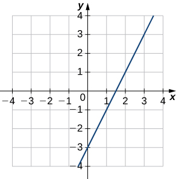
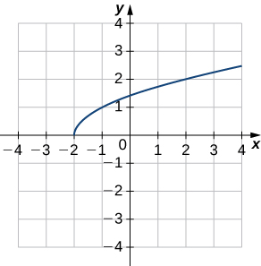
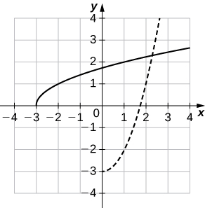
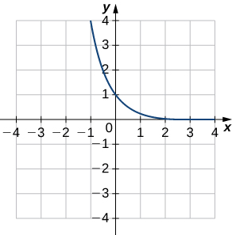
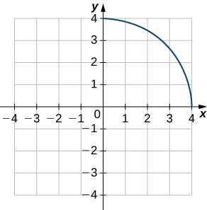
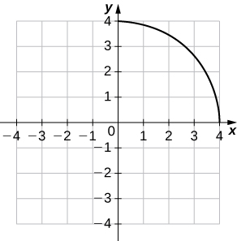
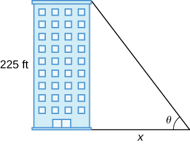
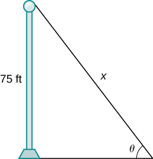
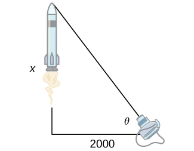

* Calculate the derivative of an inverse function.
* Recognize the derivatives of the standard inverse trigonometric functions.

In this section we explore the relationship between the derivative of a function and the derivative of its inverse. For functions whose derivatives we already know, we can use this relationship to find derivatives of inverses without having to use the limit definition of the derivative. In particular, we will apply the formula for derivatives of inverse functions to trigonometric functions. This formula may also be used to extend the power rule to rational exponents.

### The Derivative of an Inverse Function

We begin by considering a function and its inverse. If <math xmlns="http://www.w3.org/1998/Math/MathML"><mrow><mi>f</mi><mo stretchy="false">(</mo><mi>x</mi><mo stretchy="false">)</mo></mrow></math>

 is both invertible and differentiable, it seems reasonable that the inverse of <math xmlns="http://www.w3.org/1998/Math/MathML"><mrow><mi>f</mi><mo stretchy="false">(</mo><mi>x</mi><mo stretchy="false">)</mo></mrow></math>

 is also differentiable. [\[link\]](#CNX_Calc_Figure_03_07_001) shows the relationship between a function <math xmlns="http://www.w3.org/1998/Math/MathML"><mrow><mi>f</mi><mo stretchy="false">(</mo><mi>x</mi><mo stretchy="false">)</mo></mrow></math>

 and its inverse <math xmlns="http://www.w3.org/1998/Math/MathML"><mrow><msup><mi>f</mi><mrow><mn>−1</mn></mrow></msup><mrow><mo>(</mo><mi>x</mi><mo>)</mo></mrow><mo>.</mo></mrow></math>

 Look at the point <math xmlns="http://www.w3.org/1998/Math/MathML"><mrow><mrow><mo>(</mo><mrow><mi>a</mi><mo>,</mo><msup><mi>f</mi><mrow><mn>−1</mn></mrow></msup><mrow><mo>(</mo><mi>a</mi><mo>)</mo></mrow></mrow><mo>)</mo></mrow></mrow></math>

 on the graph of <math xmlns="http://www.w3.org/1998/Math/MathML"><mrow><msup><mi>f</mi><mrow><mn>−1</mn></mrow></msup><mo stretchy="false">(</mo><mi>x</mi><mo stretchy="false">)</mo></mrow></math>

 having a tangent line with a slope of <math xmlns="http://www.w3.org/1998/Math/MathML"><mrow><msup><mrow><mrow><mo>(</mo><mrow><msup><mi>f</mi><mrow><mn>−1</mn></mrow></msup></mrow><mo>)</mo></mrow></mrow><mo>′</mo></msup><mrow><mo>(</mo><mi>a</mi><mo>)</mo></mrow><mo>=</mo><mfrac><mi>p</mi><mi>q</mi></mfrac><mo>.</mo></mrow></math>

 This point corresponds to a point <math xmlns="http://www.w3.org/1998/Math/MathML"><mrow><mrow><mo>(</mo><mrow><msup><mi>f</mi><mrow><mn>−1</mn></mrow></msup><mrow><mo>(</mo><mi>a</mi><mo>)</mo></mrow><mo>,</mo><mi>a</mi></mrow><mo>)</mo></mrow></mrow></math>

 on the graph of <math xmlns="http://www.w3.org/1998/Math/MathML"><mrow><mi>f</mi><mo stretchy="false">(</mo><mi>x</mi><mo stretchy="false">)</mo></mrow></math>

 having a tangent line with a slope of <math xmlns="http://www.w3.org/1998/Math/MathML"><mrow><msup><mi>f</mi><mo>′</mo></msup><mrow><mo>(</mo><mrow><msup><mi>f</mi><mrow><mn>−1</mn></mrow></msup><mrow><mo>(</mo><mi>a</mi><mo>)</mo></mrow></mrow><mo>)</mo></mrow><mo>=</mo><mfrac><mi>q</mi><mi>p</mi></mfrac><mo>.</mo></mrow></math>

 Thus, if <math xmlns="http://www.w3.org/1998/Math/MathML"><mrow><msup><mi>f</mi><mrow><mn>−1</mn></mrow></msup><mo stretchy="false">(</mo><mi>x</mi><mo stretchy="false">)</mo></mrow></math>

 is differentiable at <math xmlns="http://www.w3.org/1998/Math/MathML"><mrow><mi>a</mi><mo>,</mo></mrow></math>

 then it must be the case that

<math xmlns="http://www.w3.org/1998/Math/MathML"><mrow><msup><mrow><mrow><mo>(</mo><mrow><msup><mi>f</mi><mrow><mn>−1</mn></mrow></msup></mrow><mo>)</mo></mrow></mrow><mo>′</mo></msup><mrow><mo>(</mo><mi>a</mi><mo>)</mo></mrow><mo>=</mo><mfrac><mn>1</mn><mrow><msup><mi>f</mi><mo>′</mo></msup><mrow><mo>(</mo><mrow><msup><mi>f</mi><mrow><mn>−1</mn></mrow></msup><mrow><mo>(</mo><mi>a</mi><mo>)</mo></mrow></mrow><mo>)</mo></mrow></mrow></mfrac><mo>.</mo></mrow></math>

 {: #CNX_Calc_Figure_03_07_001}

We may also derive the formula for the derivative of the inverse by first recalling that <math xmlns="http://www.w3.org/1998/Math/MathML"><mrow><mi>x</mi><mo>=</mo><mi>f</mi><mrow><mo>(</mo><mrow><msup><mi>f</mi><mrow><mn>−1</mn></mrow></msup><mrow><mo>(</mo><mi>x</mi><mo>)</mo></mrow></mrow><mo>)</mo></mrow><mo>.</mo></mrow></math>

 Then by differentiating both sides of this equation (using the chain rule on the right), we obtain

<math xmlns="http://www.w3.org/1998/Math/MathML"><mrow><mn>1</mn><mo>=</mo><msup><mi>f</mi><mo>′</mo></msup><mrow><mo>(</mo><mrow><msup><mi>f</mi><mrow><mn>−1</mn></mrow></msup><mrow><mo>(</mo><mi>x</mi><mo>)</mo></mrow></mrow><mo>)</mo></mrow><mrow><mo>(</mo><mrow><msup><mi>f</mi><mrow><mn>−1</mn></mrow></msup><msup><mo stretchy="false">)</mo><mo>′</mo></msup><mrow><mo>(</mo><mi>x</mi><mo>)</mo></mrow></mrow><mo>)</mo></mrow><mo>.</mo></mrow></math>

Solving for <math xmlns="http://www.w3.org/1998/Math/MathML"><mrow><mo stretchy="false">(</mo><msup><mi>f</mi><mrow><mn>−1</mn></mrow></msup><msup><mo stretchy="false">)</mo><mo>′</mo></msup><mrow><mo>(</mo><mi>x</mi><mo>)</mo></mrow><mo>,</mo></mrow></math>

 we obtain

<math xmlns="http://www.w3.org/1998/Math/MathML"><mrow><msup><mrow><mrow><mo>(</mo><mrow><msup><mi>f</mi><mrow><mn>−1</mn></mrow></msup></mrow><mo>)</mo></mrow></mrow><mo>′</mo></msup><mrow><mo>(</mo><mi>x</mi><mo>)</mo></mrow><mo>=</mo><mfrac><mn>1</mn><mrow><msup><mi>f</mi><mo>′</mo></msup><mrow><mo>(</mo><mrow><msup><mi>f</mi><mrow><mn>−1</mn></mrow></msup><mrow><mo>(</mo><mi>x</mi><mo>)</mo></mrow></mrow><mo>)</mo></mrow></mrow></mfrac><mo>.</mo></mrow></math>

We summarize this result in the following theorem.

Inverse Function Theorem

Let <math xmlns="http://www.w3.org/1998/Math/MathML"><mrow><mi>f</mi><mo stretchy="false">(</mo><mi>x</mi><mo stretchy="false">)</mo></mrow></math>

 be a function that is both invertible and differentiable. Let <math xmlns="http://www.w3.org/1998/Math/MathML"><mrow><mi>y</mi><mo>=</mo><msup><mi>f</mi><mrow><mn>−1</mn></mrow></msup><mrow><mo>(</mo><mi>x</mi><mo>)</mo></mrow></mrow></math>

 be the inverse of <math xmlns="http://www.w3.org/1998/Math/MathML"><mrow><mi>f</mi><mo stretchy="false">(</mo><mi>x</mi><mo stretchy="false">)</mo><mo>.</mo></mrow></math>

 For all <math xmlns="http://www.w3.org/1998/Math/MathML"><mi>x</mi></math>

 satisfying <math xmlns="http://www.w3.org/1998/Math/MathML"><mrow><msup><mi>f</mi><mo>′</mo></msup><mrow><mo>(</mo><mrow><msup><mi>f</mi><mrow><mn>−1</mn></mrow></msup><mrow><mo>(</mo><mi>x</mi><mo>)</mo></mrow></mrow><mo>)</mo></mrow><mo>≠</mo><mn>0</mn><mo>,</mo></mrow></math>

<math xmlns="http://www.w3.org/1998/Math/MathML"><mrow><mfrac><mrow><mi>d</mi><mi>y</mi></mrow><mrow><mi>d</mi><mi>x</mi></mrow></mfrac><mo>=</mo><mfrac><mi>d</mi><mrow><mi>d</mi><mi>x</mi></mrow></mfrac><mrow><mo>(</mo><mrow><msup><mi>f</mi><mrow><mn>−1</mn></mrow></msup><mo stretchy="false">(</mo><mi>x</mi><mo stretchy="false">)</mo></mrow><mo>)</mo></mrow><mo>=</mo><msup><mrow><mrow><mo>(</mo><mrow><msup><mi>f</mi><mrow><mn>−1</mn></mrow></msup></mrow><mo>)</mo></mrow></mrow><mo>′</mo></msup><mrow><mo>(</mo><mi>x</mi><mo>)</mo></mrow><mo>=</mo><mfrac><mn>1</mn><mrow><msup><mi>f</mi><mo>′</mo></msup><mrow><mo>(</mo><mrow><msup><mi>f</mi><mrow><mn>−1</mn></mrow></msup><mrow><mo>(</mo><mi>x</mi><mo>)</mo></mrow></mrow><mo>)</mo></mrow></mrow></mfrac><mo>.</mo></mrow></math>

Alternatively, if <math xmlns="http://www.w3.org/1998/Math/MathML"><mrow><mi>y</mi><mo>=</mo><mi>g</mi><mrow><mo>(</mo><mi>x</mi><mo>)</mo></mrow></mrow></math>

 is the inverse of <math xmlns="http://www.w3.org/1998/Math/MathML"><mrow><mi>f</mi><mrow><mo>(</mo><mi>x</mi><mo>)</mo></mrow><mo>,</mo></mrow></math>

 then

<math xmlns="http://www.w3.org/1998/Math/MathML"><mrow><mi>g</mi><mrow><mo>(</mo><mi>x</mi><mo>)</mo></mrow><mo>=</mo><mfrac><mn>1</mn><mrow><msup><mi>f</mi><mo>′</mo></msup><mrow><mo>(</mo><mrow><mi>g</mi><mrow><mo>(</mo><mi>x</mi><mo>)</mo></mrow></mrow><mo>)</mo></mrow></mrow></mfrac><mo>.</mo></mrow></math>

Applying the Inverse Function Theorem

Use the inverse function theorem to find the derivative of <math xmlns="http://www.w3.org/1998/Math/MathML"><mrow><mi>g</mi><mrow><mo>(</mo><mi>x</mi><mo>)</mo></mrow><mo>=</mo><mfrac><mrow><mi>x</mi><mo>+</mo><mn>2</mn></mrow><mi>x</mi></mfrac><mo>.</mo></mrow></math>

 Compare the resulting derivative to that obtained by differentiating the function directly.

The inverse of <math xmlns="http://www.w3.org/1998/Math/MathML"><mrow><mi>g</mi><mrow><mo>(</mo><mi>x</mi><mo>)</mo></mrow><mo>=</mo><mfrac><mrow><mi>x</mi><mo>+</mo><mn>2</mn></mrow><mi>x</mi></mfrac></mrow></math>

 is <math xmlns="http://www.w3.org/1998/Math/MathML"><mrow><mi>f</mi><mrow><mo>(</mo><mi>x</mi><mo>)</mo></mrow><mo>=</mo><mfrac><mn>2</mn><mrow><mi>x</mi><mo>−</mo><mn>1</mn></mrow></mfrac><mo>.</mo></mrow></math>

 Since <math xmlns="http://www.w3.org/1998/Math/MathML"><mrow><msup><mi>g</mi><mo>′</mo></msup><mrow><mo>(</mo><mi>x</mi><mo>)</mo></mrow><mo>=</mo><mfrac><mn>1</mn><mrow><msup><mi>f</mi><mo>′</mo></msup><mrow><mo>(</mo><mrow><mi>g</mi><mrow><mo>(</mo><mi>x</mi><mo>)</mo></mrow></mrow><mo>)</mo></mrow></mrow></mfrac><mo>,</mo></mrow></math>

 begin by finding <math xmlns="http://www.w3.org/1998/Math/MathML"><mrow><msup><mi>f</mi><mo>′</mo></msup><mrow><mo>(</mo><mi>x</mi><mo>)</mo></mrow><mo>.</mo></mrow></math>

 Thus,

<math xmlns="http://www.w3.org/1998/Math/MathML"><mrow><msup><mi>f</mi><mo>′</mo></msup><mrow><mo>(</mo><mi>x</mi><mo>)</mo></mrow><mo>=</mo><mfrac><mrow><mn>−2</mn></mrow><mrow><msup><mrow><mrow><mo>(</mo><mrow><mi>x</mi><mo>−</mo><mn>1</mn></mrow><mo>)</mo></mrow></mrow><mn>2</mn></msup></mrow></mfrac><mspace width="0.2em" /><mtext>and</mtext><mspace width="0.2em" /><msup><mi>f</mi><mo>′</mo></msup><mrow><mo>(</mo><mrow><mi>g</mi><mrow><mo>(</mo><mi>x</mi><mo>)</mo></mrow></mrow><mo>)</mo></mrow><mo>=</mo><mfrac><mrow><mn>−2</mn></mrow><mrow><msup><mrow><mrow><mo>(</mo><mrow><mi>g</mi><mrow><mo>(</mo><mi>x</mi><mo>)</mo></mrow><mo>−</mo><mn>1</mn></mrow><mo>)</mo></mrow></mrow><mn>2</mn></msup></mrow></mfrac><mo>=</mo><mfrac><mrow><mn>−2</mn></mrow><mrow><msup><mrow><mrow><mo>(</mo><mrow><mfrac><mrow><mi>x</mi><mo>+</mo><mn>2</mn></mrow><mi>x</mi></mfrac><mo>−</mo><mn>1</mn></mrow><mo>)</mo></mrow></mrow><mn>2</mn></msup></mrow></mfrac><mo>=</mo><mo>−</mo><mfrac><mrow><msup><mi>x</mi><mn>2</mn></msup></mrow><mn>2</mn></mfrac><mo>.</mo></mrow></math>

Finally,

<math xmlns="http://www.w3.org/1998/Math/MathML"><mrow><msup><mi>g</mi><mo>′</mo></msup><mrow><mo>(</mo><mi>x</mi><mo>)</mo></mrow><mo>=</mo><mfrac><mn>1</mn><mrow><msup><mi>f</mi><mo>′</mo></msup><mrow><mo>(</mo><mrow><mi>g</mi><mrow><mo>(</mo><mi>x</mi><mo>)</mo></mrow></mrow><mo>)</mo></mrow></mrow></mfrac><mo>=</mo><mo>−</mo><mfrac><mn>2</mn><mrow><msup><mi>x</mi><mn>2</mn></msup></mrow></mfrac><mo>.</mo></mrow></math>

We can verify that this is the correct derivative by applying the quotient rule to <math xmlns="http://www.w3.org/1998/Math/MathML"><mrow><mi>g</mi><mrow><mo>(</mo><mi>x</mi><mo>)</mo></mrow></mrow></math>

 to obtain

<math xmlns="http://www.w3.org/1998/Math/MathML"><mrow><msup><mi>g</mi><mo>′</mo></msup><mrow><mo>(</mo><mi>x</mi><mo>)</mo></mrow><mo>=</mo><mo>−</mo><mfrac><mn>2</mn><mrow><msup><mi>x</mi><mn>2</mn></msup></mrow></mfrac><mo>.</mo></mrow></math>

Use the inverse function theorem to find the derivative of <math xmlns="http://www.w3.org/1998/Math/MathML"><mrow><mi>g</mi><mrow><mo>(</mo><mi>x</mi><mo>)</mo></mrow><mo>=</mo><mfrac><mn>1</mn><mrow><mi>x</mi><mo>+</mo><mn>2</mn></mrow></mfrac><mo>.</mo></mrow></math>

 Compare the result obtained by differentiating <math xmlns="http://www.w3.org/1998/Math/MathML"><mrow><mi>g</mi><mrow><mo>(</mo><mi>x</mi><mo>)</mo></mrow></mrow></math>

 directly.

<math xmlns="http://www.w3.org/1998/Math/MathML"><mrow><msup><mi>g</mi><mo>′</mo></msup><mrow><mo>(</mo><mi>x</mi><mo>)</mo></mrow><mo>=</mo><mo>−</mo><mfrac><mn>1</mn><mrow><msup><mrow><mo stretchy="false">(</mo><mi>x</mi><mo>+</mo><mn>2</mn><mo stretchy="false">)</mo></mrow><mn>2</mn></msup></mrow></mfrac></mrow></math>

Hint

Use the preceding example as a guide.

Applying the Inverse Function Theorem

Use the inverse function theorem to find the derivative of <math xmlns="http://www.w3.org/1998/Math/MathML"><mrow><mi>g</mi><mrow><mo>(</mo><mi>x</mi><mo>)</mo></mrow><mo>=</mo><mroot><mi>x</mi><mn>3</mn></mroot><mo>.</mo></mrow></math>

The function <math xmlns="http://www.w3.org/1998/Math/MathML"><mrow><mi>g</mi><mrow><mo>(</mo><mi>x</mi><mo>)</mo></mrow><mo>=</mo><mroot><mi>x</mi><mn>3</mn></mroot></mrow></math>

 is the inverse of the function <math xmlns="http://www.w3.org/1998/Math/MathML"><mrow><mi>f</mi><mrow><mo>(</mo><mi>x</mi><mo>)</mo></mrow><mo>=</mo><msup><mi>x</mi><mn>3</mn></msup><mo>.</mo></mrow></math>

 Since <math xmlns="http://www.w3.org/1998/Math/MathML"><mrow><msup><mi>g</mi><mo>′</mo></msup><mrow><mo>(</mo><mi>x</mi><mo>)</mo></mrow><mo>=</mo><mfrac><mn>1</mn><mrow><msup><mi>f</mi><mo>′</mo></msup><mrow><mo>(</mo><mrow><mi>g</mi><mrow><mo>(</mo><mi>x</mi><mo>)</mo></mrow></mrow><mo>)</mo></mrow></mrow></mfrac><mo>,</mo></mrow></math>

 begin by finding <math xmlns="http://www.w3.org/1998/Math/MathML"><mrow><msup><mi>f</mi><mo>′</mo></msup><mrow><mo>(</mo><mi>x</mi><mo>)</mo></mrow><mo>.</mo></mrow></math>

 Thus,

<math xmlns="http://www.w3.org/1998/Math/MathML"><mrow><msup><mi>f</mi><mo>′</mo></msup><mrow><mo>(</mo><mi>x</mi><mo>)</mo></mrow><mo>=</mo><mn>3</mn><msup><mi>x</mi><mn>3</mn></msup><mspace width="0.2em" /><mtext>and</mtext><mspace width="0.2em" /><msup><mi>f</mi><mo>′</mo></msup><mrow><mo>(</mo><mrow><mi>g</mi><mrow><mo>(</mo><mi>x</mi><mo>)</mo></mrow></mrow><mo>)</mo></mrow><mo>=</mo><mn>3</mn><msup><mrow><mrow><mo>(</mo><mrow><mroot><mi>x</mi><mn>3</mn></mroot></mrow><mo>)</mo></mrow></mrow><mn>2</mn></msup><mo>=</mo><mn>3</mn><msup><mi>x</mi><mrow><mn>2</mn><mtext>/</mtext><mn>3</mn></mrow></msup><mo>.</mo></mrow></math>

Finally,

<math xmlns="http://www.w3.org/1998/Math/MathML"><mrow><msup><mi>g</mi><mo>′</mo></msup><mrow><mo>(</mo><mi>x</mi><mo>)</mo></mrow><mo>=</mo><mfrac><mn>1</mn><mrow><mn>3</mn><msup><mi>x</mi><mrow><mn>2</mn><mtext>/</mtext><mn>3</mn></mrow></msup></mrow></mfrac><mo>=</mo><mfrac><mn>1</mn><mn>3</mn></mfrac><msup><mi>x</mi><mrow><mn>−2</mn><mtext>/</mtext><mn>3</mn></mrow></msup><mo>.</mo></mrow></math>

Find the derivative of <math xmlns="http://www.w3.org/1998/Math/MathML"><mrow><mi>g</mi><mrow><mo>(</mo><mi>x</mi><mo>)</mo></mrow><mo>=</mo><mroot><mi>x</mi><mn>5</mn></mroot></mrow></math>

 by applying the inverse function theorem.

<math xmlns="http://www.w3.org/1998/Math/MathML"><mrow><mi>g</mi><mrow><mo>(</mo><mi>x</mi><mo>)</mo></mrow><mo>=</mo><mfrac><mn>1</mn><mn>5</mn></mfrac><msup><mi>x</mi><mrow><mtext>−</mtext><mrow><mn>4</mn><mtext>/</mtext><mn>5</mn></mrow></mrow></msup></mrow></math>

Hint

<math xmlns="http://www.w3.org/1998/Math/MathML"><mrow><mi>g</mi><mrow><mo>(</mo><mi>x</mi><mo>)</mo></mrow></mrow></math>

 is the inverse of <math xmlns="http://www.w3.org/1998/Math/MathML"><mrow><mi>f</mi><mrow><mo>(</mo><mi>x</mi><mo>)</mo></mrow><mo>=</mo><msup><mi>x</mi><mn>5</mn></msup><mo>.</mo></mrow></math>

From the previous example, we see that we can use the inverse function theorem to extend the power rule to exponents of the form <math xmlns="http://www.w3.org/1998/Math/MathML"><mrow><mfrac><mn>1</mn><mi>n</mi></mfrac><mo>,</mo></mrow></math>

 where <math xmlns="http://www.w3.org/1998/Math/MathML"><mi>n</mi></math>

 is a positive integer. This extension will ultimately allow us to differentiate <math xmlns="http://www.w3.org/1998/Math/MathML"><mrow><msup><mi>x</mi><mi>q</mi></msup><mo>,</mo></mrow></math>

 where <math xmlns="http://www.w3.org/1998/Math/MathML"><mi>q</mi></math>

 is any rational number.

Extending the Power Rule to Rational Exponents

The power rule may be extended to rational exponents. That is, if <math xmlns="http://www.w3.org/1998/Math/MathML"><mi>n</mi></math>

 is a positive integer, then

<math xmlns="http://www.w3.org/1998/Math/MathML"><mrow><mfrac><mi>d</mi><mrow><mi>d</mi><mi>x</mi></mrow></mfrac><mrow><mo>(</mo><mrow><msup><mi>x</mi><mrow><mrow><mn>1</mn><mtext>/</mtext><mi>n</mi></mrow></mrow></msup></mrow><mo>)</mo></mrow><mo>=</mo><mfrac><mn>1</mn><mi>n</mi></mfrac><msup><mi>x</mi><mrow><mrow><mo>(</mo><mrow><mrow><mn>1</mn><mtext>/</mtext><mi>n</mi></mrow></mrow><mo>)</mo></mrow><mo>−</mo><mn>1</mn></mrow></msup><mo>.</mo></mrow></math>

Also, if <math xmlns="http://www.w3.org/1998/Math/MathML"><mi>n</mi></math>

 is a positive integer and <math xmlns="http://www.w3.org/1998/Math/MathML"><mi>m</mi></math>

 is an arbitrary integer, then

<math xmlns="http://www.w3.org/1998/Math/MathML"><mrow><mfrac><mi>d</mi><mrow><mi>d</mi><mi>x</mi></mrow></mfrac><mrow><mo>(</mo><mrow><msup><mi>x</mi><mrow><mrow><mi>m</mi><mtext>/</mtext><mi>n</mi></mrow></mrow></msup></mrow><mo>)</mo></mrow><mo>=</mo><mfrac><mi>m</mi><mi>n</mi></mfrac><msup><mi>x</mi><mrow><mrow><mo>(</mo><mrow><mrow><mi>m</mi><mtext>/</mtext><mi>n</mi></mrow></mrow><mo>)</mo></mrow><mo>−</mo><mn>1</mn></mrow></msup><mo>.</mo></mrow></math>

#### Proof

The function <math xmlns="http://www.w3.org/1998/Math/MathML"><mrow><mi>g</mi><mrow><mo>(</mo><mi>x</mi><mo>)</mo></mrow><mo>=</mo><msup><mi>x</mi><mrow><mn>1</mn><mtext>/</mtext><mi>n</mi></mrow></msup></mrow></math>

 is the inverse of the function <math xmlns="http://www.w3.org/1998/Math/MathML"><mrow><mi>f</mi><mrow><mo>(</mo><mi>x</mi><mo>)</mo></mrow><mo>=</mo><msup><mi>x</mi><mi>n</mi></msup><mo>.</mo></mrow></math>

 Since <math xmlns="http://www.w3.org/1998/Math/MathML"><mrow><msup><mi>g</mi><mo>′</mo></msup><mrow><mo>(</mo><mi>x</mi><mo>)</mo></mrow><mo>=</mo><mfrac><mn>1</mn><mrow><msup><mi>f</mi><mo>′</mo></msup><mrow><mo>(</mo><mrow><mi>g</mi><mrow><mo>(</mo><mi>x</mi><mo>)</mo></mrow></mrow><mo>)</mo></mrow></mrow></mfrac><mo>,</mo></mrow></math>

 begin by finding <math xmlns="http://www.w3.org/1998/Math/MathML"><mrow><msup><mi>f</mi><mo>′</mo></msup><mrow><mo>(</mo><mi>x</mi><mo>)</mo></mrow><mo>.</mo></mrow></math>

 Thus,

<math xmlns="http://www.w3.org/1998/Math/MathML"><mrow><msup><mi>f</mi><mo>′</mo></msup><mrow><mo>(</mo><mi>x</mi><mo>)</mo></mrow><mo>=</mo><mi>n</mi><msup><mi>x</mi><mrow><mi>n</mi><mo>−</mo><mn>1</mn></mrow></msup><mspace width="0.2em" /><mtext>and</mtext><mspace width="0.2em" /><msup><mi>f</mi><mo>′</mo></msup><mrow><mo>(</mo><mrow><mi>g</mi><mrow><mo>(</mo><mi>x</mi><mo>)</mo></mrow></mrow><mo>)</mo></mrow><mo>=</mo><mi>n</mi><msup><mrow><mo stretchy="false">(</mo><msup><mi>x</mi><mrow><mrow><mn>1</mn><mtext>/</mtext><mi>n</mi></mrow></mrow></msup><mo stretchy="false">)</mo></mrow><mrow><mi>n</mi><mo>−</mo><mn>1</mn></mrow></msup><mo>=</mo><mi>n</mi><msup><mi>x</mi><mrow><mrow><mrow><mrow><mo>(</mo><mrow><mi>n</mi><mo>−</mo><mn>1</mn></mrow><mo>)</mo></mrow></mrow><mtext>/</mtext><mi>n</mi></mrow></mrow></msup><mo>.</mo></mrow></math>

Finally,

<math xmlns="http://www.w3.org/1998/Math/MathML"><mrow><msup><mi>g</mi><mo>′</mo></msup><mrow><mo>(</mo><mi>x</mi><mo>)</mo></mrow><mo>=</mo><mfrac><mn>1</mn><mrow><mi>n</mi><msup><mi>x</mi><mrow><mrow><mrow><mrow><mo>(</mo><mrow><mi>n</mi><mo>−</mo><mn>1</mn></mrow><mo>)</mo></mrow></mrow><mtext>/</mtext><mi>n</mi></mrow></mrow></msup></mrow></mfrac><mo>=</mo><mfrac><mn>1</mn><mi>n</mi></mfrac><msup><mi>x</mi><mrow><mrow><mrow><mrow><mo>(</mo><mrow><mn>1</mn><mo>−</mo><mi>n</mi></mrow><mo>)</mo></mrow></mrow><mtext>/</mtext><mi>n</mi></mrow></mrow></msup><mo>=</mo><mfrac><mn>1</mn><mi>n</mi></mfrac><msup><mi>x</mi><mrow><mrow><mo>(</mo><mrow><mrow><mn>1</mn><mtext>/</mtext><mi>n</mi></mrow></mrow><mo>)</mo></mrow><mo>−</mo><mn>1</mn></mrow></msup><mo>.</mo></mrow></math>

To differentiate <math xmlns="http://www.w3.org/1998/Math/MathML"><mrow><msup><mi>x</mi><mrow><mrow><mi>m</mi><mtext>/</mtext><mi>n</mi></mrow></mrow></msup></mrow></math>

 we must rewrite it as <math xmlns="http://www.w3.org/1998/Math/MathML"><mrow><msup><mrow><mrow><mo>(</mo><mrow><msup><mi>x</mi><mrow><mrow><mn>1</mn><mtext>/</mtext><mi>n</mi></mrow></mrow></msup></mrow><mo>)</mo></mrow></mrow><mi>m</mi></msup></mrow></math>

 and apply the chain rule. Thus,

<math xmlns="http://www.w3.org/1998/Math/MathML"><mrow><mfrac><mi>d</mi><mrow><mi>d</mi><mi>x</mi></mrow></mfrac><mrow><mo>(</mo><mrow><msup><mi>x</mi><mrow><mrow><mi>m</mi><mtext>/</mtext><mi>n</mi></mrow></mrow></msup></mrow><mo>)</mo></mrow><mo>=</mo><mfrac><mi>d</mi><mrow><mi>d</mi><mi>x</mi></mrow></mfrac><mrow><mo>(</mo><mrow><msup><mrow><mrow><mo>(</mo><mrow><msup><mi>x</mi><mrow><mrow><mn>1</mn><mtext>/</mtext><mi>n</mi></mrow></mrow></msup></mrow><mo>)</mo></mrow></mrow><mi>m</mi></msup></mrow><mo>)</mo></mrow><mo>=</mo><mi>m</mi><msup><mrow><mrow><mo>(</mo><mrow><msup><mi>x</mi><mrow><mrow><mn>1</mn><mtext>/</mtext><mi>n</mi></mrow></mrow></msup></mrow><mo>)</mo></mrow></mrow><mrow><mi>m</mi><mo>−</mo><mn>1</mn></mrow></msup><mo>·</mo><mfrac><mn>1</mn><mi>n</mi></mfrac><msup><mi>x</mi><mrow><mrow><mo>(</mo><mrow><mrow><mn>1</mn><mtext>/</mtext><mi>n</mi></mrow></mrow><mo>)</mo></mrow><mo>−</mo><mn>1</mn></mrow></msup><mo>=</mo><mfrac><mi>m</mi><mi>n</mi></mfrac><msup><mi>x</mi><mrow><mrow><mo>(</mo><mrow><mrow><mi>m</mi><mtext>/</mtext><mi>n</mi></mrow></mrow><mo>)</mo></mrow><mo>−</mo><mn>1</mn></mrow></msup><mo>.</mo></mrow></math>

□

Applying the Power Rule to a Rational Power

Find the equation of the line tangent to the graph of <math xmlns="http://www.w3.org/1998/Math/MathML"><mrow><mi>y</mi><mo>=</mo><msup><mi>x</mi><mrow><mn>2</mn><mtext>/</mtext><mn>3</mn></mrow></msup></mrow></math>

 at <math xmlns="http://www.w3.org/1998/Math/MathML"><mrow><mi>x</mi><mo>=</mo><mn>8</mn><mo>.</mo></mrow></math>

First find <math xmlns="http://www.w3.org/1998/Math/MathML"><mrow><mfrac><mrow><mi>d</mi><mi>y</mi></mrow><mrow><mi>d</mi><mi>x</mi></mrow></mfrac></mrow></math>

 and evaluate it at <math xmlns="http://www.w3.org/1998/Math/MathML"><mrow><mi>x</mi><mo>=</mo><mn>8</mn><mo>.</mo></mrow></math>

 Since

<math xmlns="http://www.w3.org/1998/Math/MathML"><mrow><mfrac><mrow><mi>d</mi><mi>y</mi></mrow><mrow><mi>d</mi><mi>x</mi></mrow></mfrac><mo>=</mo><mfrac><mn>2</mn><mn>3</mn></mfrac><msup><mi>x</mi><mrow><mn>−1</mn><mtext>/</mtext><mn>3</mn></mrow></msup><mspace width="0.2em" /><mtext>and</mtext><mspace width="0.2em" /><mrow><mfrac><mrow><mi>d</mi><mi>y</mi></mrow><mrow><mi>d</mi><mi>x</mi></mrow></mfrac></mrow><mrow><mo>\|</mo><mtable columnalign="left"><mtr><mtd><mrow /></mtd></mtr><mtr><mtd><msub><mrow /><mrow><mrow><mi>x</mi><mo>=</mo><mn>8</mn></mrow></mrow></msub></mtd></mtr></mtable></mrow><mo>=</mo><mfrac><mn>1</mn><mn>3</mn></mfrac></mrow></math>

the slope of the tangent line to the graph at <math xmlns="http://www.w3.org/1998/Math/MathML"><mrow><mi>x</mi><mo>=</mo><mn>8</mn></mrow></math>

 is <math xmlns="http://www.w3.org/1998/Math/MathML"><mrow><mfrac><mn>1</mn><mn>3</mn></mfrac><mo>.</mo></mrow></math>

Substituting <math xmlns="http://www.w3.org/1998/Math/MathML"><mrow><mi>x</mi><mo>=</mo><mn>8</mn></mrow></math>

 into the original function, we obtain <math xmlns="http://www.w3.org/1998/Math/MathML"><mrow><mi>y</mi><mo>=</mo><mn>4</mn><mo>.</mo></mrow></math>

 Thus, the tangent line passes through the point <math xmlns="http://www.w3.org/1998/Math/MathML"><mrow><mo stretchy="false">(</mo><mn>8</mn><mo>,</mo><mn>4</mn><mo stretchy="false">)</mo><mo>.</mo></mrow></math>

 Substituting into the point-slope formula for a line, we obtain the tangent line

<math xmlns="http://www.w3.org/1998/Math/MathML"><mrow><mi>y</mi><mo>=</mo><mfrac><mn>1</mn><mn>3</mn></mfrac><mi>x</mi><mo>+</mo><mfrac><mn>4</mn><mn>3</mn></mfrac><mo>.</mo></mrow></math>

Find the derivative of <math xmlns="http://www.w3.org/1998/Math/MathML"><mrow><mi>s</mi><mrow><mo>(</mo><mi>t</mi><mo>)</mo></mrow><mo>=</mo><msqrt><mrow><mn>2</mn><mi>t</mi><mo>+</mo><mn>1</mn></mrow></msqrt><mo>.</mo></mrow></math>

<math xmlns="http://www.w3.org/1998/Math/MathML"><mrow><msup><mi>s</mi><mo>′</mo></msup><mrow><mo>(</mo><mi>t</mi><mo>)</mo></mrow><mo>=</mo><msup><mrow><mrow><mo>(</mo><mrow><mn>2</mn><mi>t</mi><mo>+</mo><mn>1</mn></mrow><mo>)</mo></mrow></mrow><mrow><mtext>−</mtext><mrow><mn>1</mn><mtext>/</mtext><mn>2</mn></mrow></mrow></msup></mrow></math>

Hint

Use the chain rule.

### Derivatives of Inverse Trigonometric Functions

We now turn our attention to finding derivatives of inverse trigonometric functions. These derivatives will prove invaluable in the study of integration later in this text. The derivatives of inverse trigonometric functions are quite surprising in that their derivatives are actually algebraic functions. Previously, derivatives of algebraic functions have proven to be algebraic functions and derivatives of trigonometric functions have been shown to be trigonometric functions. Here, for the first time, we see that the derivative of a function need not be of the same type as the original function.

Derivative of the Inverse Sine Function

Use the inverse function theorem to find the derivative of <math xmlns="http://www.w3.org/1998/Math/MathML"><mrow><mi>g</mi><mrow><mo>(</mo><mi>x</mi><mo>)</mo></mrow><mo>=</mo><msup><mrow><mtext>sin</mtext></mrow><mrow><mn>−1</mn></mrow></msup><mi>x</mi><mo>.</mo></mrow></math>

Since for <math xmlns="http://www.w3.org/1998/Math/MathML"><mi>x</mi></math>

 in the interval <math xmlns="http://www.w3.org/1998/Math/MathML"><mrow><mrow><mo>[</mo><mrow><mo>−</mo><mfrac><mi>π</mi><mn>2</mn></mfrac><mo>,</mo><mfrac><mi>π</mi><mn>2</mn></mfrac></mrow><mo>]</mo></mrow><mo>,</mo><mi>f</mi><mrow><mo>(</mo><mi>x</mi><mo>)</mo></mrow><mo>=</mo><mtext>sin</mtext><mspace width="0.1em" /><mi>x</mi></mrow></math>

 is the inverse of <math xmlns="http://www.w3.org/1998/Math/MathML"><mrow><mi>g</mi><mrow><mo>(</mo><mi>x</mi><mo>)</mo></mrow><mo>=</mo><msup><mtext>sin</mtext><mrow><mn>−1</mn></mrow></msup><mi>x</mi><mo>,</mo></mrow></math>

 begin by finding <math xmlns="http://www.w3.org/1998/Math/MathML"><mrow><msup><mi>f</mi><mo>′</mo></msup><mo stretchy="false">(</mo><mi>x</mi><mo stretchy="false">)</mo><mo>.</mo></mrow></math>

 Since

<math xmlns="http://www.w3.org/1998/Math/MathML"><mrow><msup><mi>f</mi><mo>′</mo></msup><mrow><mo>(</mo><mi>x</mi><mo>)</mo></mrow><mo>=</mo><mtext>cos</mtext><mspace width="0.1em" /><mi>x</mi><mspace width="0.2em" /><mtext>and</mtext><mspace width="0.2em" /><msup><mi>f</mi><mo>′</mo></msup><mrow><mo>(</mo><mrow><mi>g</mi><mrow><mo>(</mo><mi>x</mi><mo>)</mo></mrow></mrow><mo>)</mo></mrow><mo>=</mo><mtext>cos</mtext><mspace width="0.1em" /><mrow><mo>(</mo><mrow><msup><mrow><mtext>sin</mtext></mrow><mrow><mn>−1</mn></mrow></msup><mi>x</mi></mrow><mo>)</mo></mrow><mo>=</mo><msqrt><mrow><mn>1</mn><mo>−</mo><msup><mi>x</mi><mn>2</mn></msup></mrow></msqrt><mo>,</mo></mrow></math>

we see that

<math xmlns="http://www.w3.org/1998/Math/MathML"><mrow><msup><mi>g</mi><mo>′</mo></msup><mrow><mo>(</mo><mi>x</mi><mo>)</mo></mrow><mo>=</mo><mfrac><mi>d</mi><mrow><mi>d</mi><mi>x</mi></mrow></mfrac><mrow><mo>(</mo><mrow><msup><mrow><mtext>sin</mtext></mrow><mrow><mn>−1</mn></mrow></msup><mi>x</mi></mrow><mo>)</mo></mrow><mo>=</mo><mfrac><mn>1</mn><mrow><msup><mi>f</mi><mo>′</mo></msup><mrow><mo>(</mo><mrow><mi>g</mi><mrow><mo>(</mo><mi>x</mi><mo>)</mo></mrow></mrow><mo>)</mo></mrow></mrow></mfrac><mo>=</mo><mfrac><mn>1</mn><mrow><msqrt><mrow><mn>1</mn><mo>−</mo><msup><mi>x</mi><mn>2</mn></msup></mrow></msqrt></mrow></mfrac><mo>.</mo></mrow></math>

Analysis

To see that <math xmlns="http://www.w3.org/1998/Math/MathML"><mrow><mtext>cos</mtext><mspace width="0.1em" /><mrow><mo>(</mo><mrow><msup><mrow><mtext>sin</mtext></mrow><mrow><mn>−1</mn></mrow></msup><mi>x</mi></mrow><mo>)</mo></mrow><mo>=</mo><msqrt><mrow><mn>1</mn><mo>−</mo><msup><mi>x</mi><mn>2</mn></msup></mrow></msqrt><mo>,</mo></mrow></math>

 consider the following argument. Set <math xmlns="http://www.w3.org/1998/Math/MathML"><mrow><msup><mrow><mtext>sin</mtext></mrow><mrow><mn>−1</mn></mrow></msup><mi>x</mi><mo>=</mo><mi>θ</mi><mo>.</mo></mrow></math>

 In this case, <math xmlns="http://www.w3.org/1998/Math/MathML"><mrow><mtext>sin</mtext><mspace width="0.1em" /><mi>θ</mi><mo>=</mo><mi>x</mi></mrow></math>

 where <math xmlns="http://www.w3.org/1998/Math/MathML"><mrow><mo>−</mo><mfrac><mi>π</mi><mn>2</mn></mfrac><mo>≤</mo><mi>θ</mi><mo>≤</mo><mfrac><mi>π</mi><mn>2</mn></mfrac><mo>.</mo></mrow></math>

 We begin by considering the case where <math xmlns="http://www.w3.org/1998/Math/MathML"><mrow><mn>0</mn><mo>&lt;</mo><mi>θ</mi><mo>&lt;</mo><mfrac><mi>π</mi><mn>2</mn></mfrac><mo>.</mo></mrow></math>

 Since <math xmlns="http://www.w3.org/1998/Math/MathML"><mi>θ</mi></math>

 is an acute angle, we may construct a right triangle having acute angle <math xmlns="http://www.w3.org/1998/Math/MathML"><mrow><mi>θ</mi><mo>,</mo></mrow></math>

 a hypotenuse of length <math xmlns="http://www.w3.org/1998/Math/MathML"><mn>1</mn></math>

 and the side opposite angle <math xmlns="http://www.w3.org/1998/Math/MathML"><mi>θ</mi></math>

 having length <math xmlns="http://www.w3.org/1998/Math/MathML"><mrow><mi>x</mi><mo>.</mo></mrow></math>

 From the Pythagorean theorem, the side adjacent to angle <math xmlns="http://www.w3.org/1998/Math/MathML"><mi>θ</mi></math>

 has length <math xmlns="http://www.w3.org/1998/Math/MathML"><mrow><msqrt><mrow><mn>1</mn><mo>−</mo><msup><mi>x</mi><mn>2</mn></msup></mrow></msqrt><mo>.</mo></mrow></math>

 This triangle is shown in [[link]](#CNX_Calc_Figure_03_07_002). Using the triangle, we see that <math xmlns="http://www.w3.org/1998/Math/MathML"><mrow><mtext>cos</mtext><mspace width="0.1em" /><mrow><mo>(</mo><mrow><msup><mrow><mtext>sin</mtext></mrow><mrow><mn>−1</mn></mrow></msup><mi>x</mi></mrow><mo>)</mo></mrow><mo>=</mo><mtext>cos</mtext><mspace width="0.1em" /><mi>θ</mi><mo>=</mo><msqrt><mrow><mn>1</mn><mo>−</mo><msup><mi>x</mi><mn>2</mn></msup></mrow></msqrt><mo>.</mo></mrow></math>

=cos&#x3B8;=1&#x2212;x2."){: #CNX_Calc_Figure_03_07_002}

In the case where <math xmlns="http://www.w3.org/1998/Math/MathML"><mrow><mo>−</mo><mfrac><mi>π</mi><mn>2</mn></mfrac><mo>&lt;</mo><mi>θ</mi><mo>&lt;</mo><mn>0</mn><mo>,</mo></mrow></math>

 we make the observation that <math xmlns="http://www.w3.org/1998/Math/MathML"><mrow><mn>0</mn><mo>&lt;</mo><mtext>−</mtext><mi>θ</mi><mo>&lt;</mo><mfrac><mi>π</mi><mn>2</mn></mfrac></mrow></math>

 and hence

<math xmlns="http://www.w3.org/1998/Math/MathML"><mrow><mtext>cos</mtext><mspace width="0.1em" /><mrow><mo>(</mo><mrow><msup><mrow><mtext>sin</mtext></mrow><mrow><mn>−1</mn></mrow></msup><mi>x</mi></mrow><mo>)</mo></mrow><mo>=</mo><mtext>cos</mtext><mspace width="0.1em" /><mi>θ</mi><mo>=</mo><mtext>cos</mtext><mspace width="0.1em" /><mrow><mo>(</mo><mrow><mtext>−</mtext><mi>θ</mi></mrow><mo>)</mo></mrow><mo>=</mo><msqrt><mrow><mn>1</mn><mo>−</mo><msup><mi>x</mi><mn>2</mn></msup></mrow></msqrt><mo>.</mo></mrow></math>

Now if <math xmlns="http://www.w3.org/1998/Math/MathML"><mrow><mi>θ</mi><mo>=</mo><mfrac><mi>π</mi><mn>2</mn></mfrac></mrow></math>

 or <math xmlns="http://www.w3.org/1998/Math/MathML"><mrow><mi>θ</mi><mo>=</mo><mo>−</mo><mfrac><mi>π</mi><mn>2</mn></mfrac><mo>,</mo><mi>x</mi><mo>=</mo><mn>1</mn></mrow></math>

 or <math xmlns="http://www.w3.org/1998/Math/MathML"><mrow><mi>x</mi><mo>=</mo><mn>−1</mn><mo>,</mo></mrow></math>

 and since in either case <math xmlns="http://www.w3.org/1998/Math/MathML"><mrow><mtext>cos</mtext><mspace width="0.1em" /><mi>θ</mi><mo>=</mo><mn>0</mn></mrow></math>

 and <math xmlns="http://www.w3.org/1998/Math/MathML"><mrow><msqrt><mrow><mn>1</mn><mo>−</mo><msup><mi>x</mi><mn>2</mn></msup></mrow></msqrt><mo>=</mo><mn>0</mn><mo>,</mo></mrow></math>

 we have

<math xmlns="http://www.w3.org/1998/Math/MathML"><mrow><mtext>cos</mtext><mspace width="0.1em" /><mrow><mo>(</mo><mrow><msup><mrow><mtext>sin</mtext></mrow><mrow><mn>−1</mn></mrow></msup><mi>x</mi></mrow><mo>)</mo></mrow><mo>=</mo><mtext>cos</mtext><mspace width="0.1em" /><mi>θ</mi><mo>=</mo><msqrt><mrow><mn>1</mn><mo>−</mo><msup><mi>x</mi><mn>2</mn></msup></mrow></msqrt><mo>.</mo></mrow></math>

Consequently, in all cases, <math xmlns="http://www.w3.org/1998/Math/MathML"><mrow><mtext>cos</mtext><mspace width="0.1em" /><mrow><mo>(</mo><mrow><msup><mrow><mtext>sin</mtext></mrow><mrow><mn>−1</mn></mrow></msup><mi>x</mi></mrow><mo>)</mo></mrow><mo>=</mo><msqrt><mrow><mn>1</mn><mo>−</mo><msup><mi>x</mi><mn>2</mn></msup></mrow></msqrt><mo>.</mo></mrow></math>

Applying the Chain Rule to the Inverse Sine Function

Apply the chain rule to the formula derived in [[link]](#fs-id1169738977168) to find the derivative of <math xmlns="http://www.w3.org/1998/Math/MathML"><mrow><mi>h</mi><mrow><mo>(</mo><mi>x</mi><mo>)</mo></mrow><mo>=</mo><msup><mrow><mtext>sin</mtext></mrow><mrow><mn>−1</mn></mrow></msup><mrow><mo>(</mo><mrow><mi>g</mi><mrow><mo>(</mo><mi>x</mi><mo>)</mo></mrow></mrow><mo>)</mo></mrow></mrow></math>

 and use this result to find the derivative of <math xmlns="http://www.w3.org/1998/Math/MathML"><mrow><mi>h</mi><mrow><mo>(</mo><mi>x</mi><mo>)</mo></mrow><mo>=</mo><msup><mrow><mtext>sin</mtext></mrow><mrow><mn>−1</mn></mrow></msup><mrow><mo>(</mo><mrow><mn>2</mn><msup><mi>x</mi><mn>3</mn></msup></mrow><mo>)</mo></mrow><mo>.</mo></mrow></math>

Applying the chain rule to <math xmlns="http://www.w3.org/1998/Math/MathML"><mrow><mi>h</mi><mrow><mo>(</mo><mi>x</mi><mo>)</mo></mrow><mo>=</mo><msup><mrow><mtext>sin</mtext></mrow><mrow><mn>−1</mn></mrow></msup><mrow><mo>(</mo><mrow><mi>g</mi><mrow><mo>(</mo><mi>x</mi><mo>)</mo></mrow></mrow><mo>)</mo></mrow><mo>,</mo></mrow></math>

 we have

<math xmlns="http://www.w3.org/1998/Math/MathML"><mrow><msup><mi>h</mi><mo>′</mo></msup><mrow><mo>(</mo><mi>x</mi><mo>)</mo></mrow><mo>=</mo><mfrac><mn>1</mn><mrow><msqrt><mrow><mn>1</mn><mo>−</mo><msup><mrow><mrow><mo>(</mo><mrow><mi>g</mi><mrow><mo>(</mo><mi>x</mi><mo>)</mo></mrow></mrow><mo>)</mo></mrow></mrow><mn>2</mn></msup></mrow></msqrt></mrow></mfrac><msup><mi>g</mi><mo>′</mo></msup><mrow><mo>(</mo><mi>x</mi><mo>)</mo></mrow><mo>.</mo></mrow></math>

Now let <math xmlns="http://www.w3.org/1998/Math/MathML"><mrow><mi>g</mi><mrow><mo>(</mo><mi>x</mi><mo>)</mo></mrow><mo>=</mo><mn>2</mn><msup><mi>x</mi><mn>3</mn></msup><mo>,</mo></mrow></math>

 so <math xmlns="http://www.w3.org/1998/Math/MathML"><mrow><msup><mi>g</mi><mo>′</mo></msup><mrow><mo>(</mo><mi>x</mi><mo>)</mo></mrow><mo>=</mo><mn>6</mn><msup><mi>x</mi><mn>2</mn></msup><mo>.</mo></mrow></math>

 Substituting into the previous result, we obtain

<math xmlns="http://www.w3.org/1998/Math/MathML"><mtable><mtr><mtd columnalign="right"><msup><mi>h</mi><mo>′</mo></msup><mrow><mo>(</mo><mi>x</mi><mo>)</mo></mrow></mtd><mtd columnalign="left"><mo>=</mo><mfrac><mn>1</mn><mrow><msqrt><mrow><mn>1</mn><mo>−</mo><mn>4</mn><msup><mi>x</mi><mn>6</mn></msup></mrow></msqrt></mrow></mfrac><mo>·</mo><mn>6</mn><msup><mi>x</mi><mn>2</mn></msup></mtd></mtr><mtr><mtd /><mtd columnalign="left"><mo>=</mo><mfrac><mrow><mn>6</mn><msup><mi>x</mi><mn>2</mn></msup></mrow><mrow><msqrt><mrow><mn>1</mn><mo>−</mo><mn>4</mn><msup><mi>x</mi><mn>6</mn></msup></mrow></msqrt></mrow></mfrac><mo>.</mo></mtd></mtr></mtable></math>

Use the inverse function theorem to find the derivative of <math xmlns="http://www.w3.org/1998/Math/MathML"><mrow><mi>g</mi><mrow><mo>(</mo><mi>x</mi><mo>)</mo></mrow><mo>=</mo><msup><mrow><mtext>tan</mtext></mrow><mrow><mn>−1</mn></mrow></msup><mi>x</mi><mo>.</mo></mrow></math>

<math xmlns="http://www.w3.org/1998/Math/MathML"><mrow><msup><mi>g</mi><mo>′</mo></msup><mrow><mo>(</mo><mi>x</mi><mo>)</mo></mrow><mo>=</mo><mfrac><mn>1</mn><mrow><mn>1</mn><mo>+</mo><msup><mi>x</mi><mn>2</mn></msup></mrow></mfrac></mrow></math>

Hint

The inverse of <math xmlns="http://www.w3.org/1998/Math/MathML"><mrow><mi>g</mi><mo stretchy="false">(</mo><mi>x</mi><mo stretchy="false">)</mo></mrow></math>

 is <math xmlns="http://www.w3.org/1998/Math/MathML"><mrow><mi>f</mi><mrow><mo>(</mo><mi>x</mi><mo>)</mo></mrow><mo>=</mo><mtext>tan</mtext><mspace width="0.1em" /><mi>x</mi><mo>.</mo></mrow></math>

 Use [[link]](#fs-id1169738977168) as a guide.

The derivatives of the remaining inverse trigonometric functions may also be found by using the inverse function theorem. These formulas are provided in the following theorem.

Derivatives of Inverse Trigonometric Functions

<math xmlns="http://www.w3.org/1998/Math/MathML"><mrow><mspace width="0.4em" /><mfrac><mi>d</mi><mrow><mi>d</mi><mi>x</mi></mrow></mfrac><mspace width="0.1em" /><msup><mrow><mtext>sin</mtext></mrow><mrow><mn>−1</mn></mrow></msup><mi>x</mi><mo>=</mo><mfrac><mn>1</mn><mrow><msqrt><mrow><mn>1</mn><mo>−</mo><msup><mrow><mrow><mo>(</mo><mi>x</mi><mo>)</mo></mrow></mrow><mn>2</mn></msup></mrow></msqrt></mrow></mfrac></mrow></math>

<math xmlns="http://www.w3.org/1998/Math/MathML"><mrow><mspace width="0.29em" /><mfrac><mi>d</mi><mrow><mi>d</mi><mi>x</mi></mrow></mfrac><mspace width="0.1em" /><msup><mrow><mtext>cos</mtext></mrow><mrow><mn>−1</mn></mrow></msup><mi>x</mi><mo>=</mo><mfrac><mrow><mn>−1</mn></mrow><mrow><msqrt><mrow><mn>1</mn><mo>−</mo><msup><mrow><mrow><mo>(</mo><mi>x</mi><mo>)</mo></mrow></mrow><mn>2</mn></msup></mrow></msqrt></mrow></mfrac></mrow></math>

<math xmlns="http://www.w3.org/1998/Math/MathML"><mrow><mfrac><mi>d</mi><mrow><mi>d</mi><mi>x</mi></mrow></mfrac><mspace width="0.1em" /><msup><mrow><mtext>tan</mtext></mrow><mrow><mn>−1</mn></mrow></msup><mi>x</mi><mo>=</mo><mfrac><mn>1</mn><mrow><mn>1</mn><mo>+</mo><msup><mrow><mrow><mo>(</mo><mi>x</mi><mo>)</mo></mrow></mrow><mn>2</mn></msup></mrow></mfrac></mrow></math>

<math xmlns="http://www.w3.org/1998/Math/MathML"><mrow><mspace width="0.23em" /><mfrac><mi>d</mi><mrow><mi>d</mi><mi>x</mi></mrow></mfrac><msup><mrow><mtext>cot</mtext></mrow><mrow><mn>−1</mn></mrow></msup><mi>x</mi><mo>=</mo><mfrac><mrow><mn>−1</mn></mrow><mrow><mn>1</mn><mo>+</mo><msup><mrow><mrow><mo>(</mo><mi>x</mi><mo>)</mo></mrow></mrow><mn>2</mn></msup></mrow></mfrac></mrow></math>

<math xmlns="http://www.w3.org/1998/Math/MathML"><mrow><mspace width="1.5em" /><mfrac><mi>d</mi><mrow><mi>d</mi><mi>x</mi></mrow></mfrac><mspace width="0.1em" /><msup><mrow><mtext>sec</mtext></mrow><mrow><mn>−1</mn></mrow></msup><mi>x</mi><mo>=</mo><mfrac><mn>1</mn><mrow><mrow><mo>\|</mo><mi>x</mi><mo>\|</mo></mrow><msqrt><mrow><msup><mrow><mo stretchy="false">(</mo><mi>x</mi><mo stretchy="false">)</mo></mrow><mn>2</mn></msup><mo>−</mo><mn>1</mn></mrow></msqrt></mrow></mfrac></mrow></math>

<math xmlns="http://www.w3.org/1998/Math/MathML"><mrow><mspace width="1.75em" /><mfrac><mi>d</mi><mrow><mi>d</mi><mi>x</mi></mrow></mfrac><mspace width="0.1em" /><msup><mrow><mtext>csc</mtext></mrow><mrow><mn>−1</mn></mrow></msup><mi>x</mi><mo>=</mo><mfrac><mrow><mn>−1</mn></mrow><mrow><mrow><mo>\|</mo><mi>x</mi><mo>\|</mo></mrow><msqrt><mrow><msup><mrow><mo stretchy="false">(</mo><mi>x</mi><mo stretchy="false">)</mo></mrow><mn>2</mn></msup><mo>−</mo><mn>1</mn></mrow></msqrt></mrow></mfrac></mrow></math>

Applying Differentiation Formulas to an Inverse Tangent Function

Find the derivative of <math xmlns="http://www.w3.org/1998/Math/MathML"><mrow><mi>f</mi><mrow><mo>(</mo><mi>x</mi><mo>)</mo></mrow><mo>=</mo><msup><mrow><mtext>tan</mtext></mrow><mrow><mn>−1</mn></mrow></msup><mrow><mo>(</mo><mrow><msup><mi>x</mi><mn>2</mn></msup></mrow><mo>)</mo></mrow><mo>.</mo></mrow></math>

Let <math xmlns="http://www.w3.org/1998/Math/MathML"><mrow><mi>g</mi><mrow><mo>(</mo><mi>x</mi><mo>)</mo></mrow><mo>=</mo><msup><mi>x</mi><mn>2</mn></msup><mo>,</mo></mrow></math>

 so <math xmlns="http://www.w3.org/1998/Math/MathML"><mrow><msup><mi>g</mi><mo>′</mo></msup><mrow><mo>(</mo><mi>x</mi><mo>)</mo></mrow><mo>=</mo><mn>2</mn><mi>x</mi><mo>.</mo></mrow></math>

 Substituting into [[link]](#fs-id1169739307948), we obtain

<math xmlns="http://www.w3.org/1998/Math/MathML"><mrow><msup><mi>f</mi><mo>′</mo></msup><mrow><mo>(</mo><mi>x</mi><mo>)</mo></mrow><mo>=</mo><mfrac><mn>1</mn><mrow><mn>1</mn><mo>+</mo><msup><mrow><mrow><mo>(</mo><mrow><msup><mi>x</mi><mn>2</mn></msup></mrow><mo>)</mo></mrow></mrow><mn>2</mn></msup></mrow></mfrac><mo>·</mo><mrow><mo>(</mo><mrow><mn>2</mn><mi>x</mi></mrow><mo>)</mo></mrow><mo>.</mo></mrow></math>

Simplifying, we have

<math xmlns="http://www.w3.org/1998/Math/MathML"><mrow><msup><mi>f</mi><mo>′</mo></msup><mrow><mo>(</mo><mi>x</mi><mo>)</mo></mrow><mo>=</mo><mfrac><mrow><mn>2</mn><mi>x</mi></mrow><mrow><mn>1</mn><mo>+</mo><msup><mi>x</mi><mn>4</mn></msup></mrow></mfrac><mo>.</mo></mrow></math>

Applying Differentiation Formulas to an Inverse Sine Function

Find the derivative of <math xmlns="http://www.w3.org/1998/Math/MathML"><mrow><mi>h</mi><mrow><mo>(</mo><mi>x</mi><mo>)</mo></mrow><mo>=</mo><msup><mi>x</mi><mn>2</mn></msup><msup><mrow><mtext>sin</mtext></mrow><mrow><mn>−1</mn></mrow></msup><mi>x</mi><mo>.</mo></mrow></math>

By applying the product rule, we have

<math xmlns="http://www.w3.org/1998/Math/MathML"><mrow><msup><mi>h</mi><mo>′</mo></msup><mrow><mo>(</mo><mi>x</mi><mo>)</mo></mrow><mo>=</mo><mn>2</mn><mi>x</mi><mspace width="0.1em" /><msup><mrow><mtext>sin</mtext></mrow><mrow><mn>−1</mn></mrow></msup><mi>x</mi><mo>+</mo><mfrac><mn>1</mn><mrow><msqrt><mrow><mn>1</mn><mo>−</mo><msup><mi>x</mi><mn>2</mn></msup></mrow></msqrt></mrow></mfrac><mo>·</mo><msup><mi>x</mi><mn>2</mn></msup><mo>.</mo></mrow></math>

Find the derivative of <math xmlns="http://www.w3.org/1998/Math/MathML"><mrow><mi>h</mi><mrow><mo>(</mo><mi>x</mi><mo>)</mo></mrow><mo>=</mo><msup><mrow><mtext>cos</mtext></mrow><mrow><mn>−1</mn></mrow></msup><mrow><mo>(</mo><mrow><mn>3</mn><mi>x</mi><mo>−</mo><mn>1</mn></mrow><mo>)</mo></mrow><mo>.</mo></mrow></math>

<math xmlns="http://www.w3.org/1998/Math/MathML"><mrow><msup><mi>h</mi><mo>′</mo></msup><mrow><mo>(</mo><mi>x</mi><mo>)</mo></mrow><mo>=</mo><mfrac><mrow><mn>−3</mn></mrow><mrow><msqrt><mrow><mn>6</mn><mi>x</mi><mo>−</mo><mn>9</mn><msup><mi>x</mi><mn>2</mn></msup></mrow></msqrt></mrow></mfrac></mrow></math>

Hint

Use [[link]](#fs-id1169736659297). with <math xmlns="http://www.w3.org/1998/Math/MathML"><mrow><mi>g</mi><mrow><mo>(</mo><mi>x</mi><mo>)</mo></mrow><mo>=</mo><mn>3</mn><mi>x</mi><mo>−</mo><mn>1</mn></mrow></math>

Applying the Inverse Tangent Function

The position of a particle at time <math xmlns="http://www.w3.org/1998/Math/MathML"><mi>t</mi></math>

 is given by <math xmlns="http://www.w3.org/1998/Math/MathML"><mrow><mi>s</mi><mrow><mo>(</mo><mi>t</mi><mo>)</mo></mrow><mo>=</mo><msup><mrow><mtext>tan</mtext></mrow><mrow><mn>−1</mn></mrow></msup><mrow><mo>(</mo><mrow><mfrac><mn>1</mn><mi>t</mi></mfrac></mrow><mo>)</mo></mrow></mrow></math>

 for <math xmlns="http://www.w3.org/1998/Math/MathML"><mrow><mi>t</mi><mo>≥</mo><mfrac><mn>1</mn><mn>2</mn></mfrac><mo>.</mo></mrow></math>

 Find the velocity of the particle at time <math xmlns="http://www.w3.org/1998/Math/MathML"><mrow><mi>t</mi><mo>=</mo><mn>1</mn><mo>.</mo></mrow></math>

Begin by differentiating <math xmlns="http://www.w3.org/1998/Math/MathML"><mrow><mi>s</mi><mrow><mo>(</mo><mi>t</mi><mo>)</mo></mrow></mrow></math>

 in order to find <math xmlns="http://www.w3.org/1998/Math/MathML"><mrow><mi>v</mi><mrow><mo>(</mo><mi>t</mi><mo>)</mo></mrow><mo>.</mo></mrow></math>

 Thus,

<math xmlns="http://www.w3.org/1998/Math/MathML"><mrow><mi>v</mi><mrow><mo>(</mo><mi>t</mi><mo>)</mo></mrow><mo>=</mo><msup><mi>s</mi><mo>′</mo></msup><mrow><mo>(</mo><mi>t</mi><mo>)</mo></mrow><mo>=</mo><mfrac><mn>1</mn><mrow><mn>1</mn><mo>+</mo><msup><mrow><mrow><mo>(</mo><mrow><mfrac><mn>1</mn><mi>t</mi></mfrac></mrow><mo>)</mo></mrow></mrow><mn>2</mn></msup></mrow></mfrac><mo>·</mo><mfrac><mrow><mn>−1</mn></mrow><mrow><msup><mi>t</mi><mn>2</mn></msup></mrow></mfrac><mo>.</mo></mrow></math>

Simplifying, we have

<math xmlns="http://www.w3.org/1998/Math/MathML"><mrow><mi>v</mi><mrow><mo>(</mo><mi>t</mi><mo>)</mo></mrow><mo>=</mo><mo>−</mo><mfrac><mn>1</mn><mrow><msup><mi>t</mi><mn>2</mn></msup><mo>+</mo><mn>1</mn></mrow></mfrac><mo>.</mo></mrow></math>

Thus, <math xmlns="http://www.w3.org/1998/Math/MathML"><mrow><mi>v</mi><mrow><mo>(</mo><mn>1</mn><mo>)</mo></mrow><mo>=</mo><mo>−</mo><mfrac><mn>1</mn><mn>2</mn></mfrac><mo>.</mo></mrow></math>

Find the equation of the line tangent to the graph of <math xmlns="http://www.w3.org/1998/Math/MathML"><mrow><mi>f</mi><mrow><mo>(</mo><mi>x</mi><mo>)</mo></mrow><mo>=</mo><msup><mrow><mtext>sin</mtext></mrow><mrow><mn>−1</mn></mrow></msup><mi>x</mi></mrow></math>

 at <math xmlns="http://www.w3.org/1998/Math/MathML"><mrow><mi>x</mi><mo>=</mo><mn>0</mn><mo>.</mo></mrow></math>

<math xmlns="http://www.w3.org/1998/Math/MathML"><mrow><mi>y</mi><mo>=</mo><mi>x</mi></mrow></math>

Hint

<math xmlns="http://www.w3.org/1998/Math/MathML"><mrow><msup><mi>f</mi><mo>′</mo></msup><mrow><mo>(</mo><mn>0</mn><mo>)</mo></mrow></mrow></math>

 is the slope of the tangent line.

### Key Concepts

* The inverse function theorem allows us to compute derivatives of inverse functions without using the limit definition of the derivative.
* We can use the inverse function theorem to develop differentiation formulas for the inverse trigonometric functions.
{: data-bullet-style="bullet"}

### Key Equations

* **Inverse function theorem**
  * * *
  {: data-type="newline"}
  
  <math xmlns="http://www.w3.org/1998/Math/MathML"><mrow><msup><mrow><mrow><mo>(</mo><mrow><msup><mi>f</mi><mrow><mn>−1</mn></mrow></msup></mrow><mo>)</mo></mrow></mrow><mo>′</mo></msup><mrow><mo>(</mo><mi>x</mi><mo>)</mo></mrow><mo>=</mo><mfrac><mn>1</mn><mrow><msup><mi>f</mi><mo>′</mo></msup><mrow><mo>(</mo><mrow><msup><mi>f</mi><mrow><mn>−1</mn></mrow></msup><mrow><mo>(</mo><mi>x</mi><mo>)</mo></mrow></mrow><mo>)</mo></mrow></mrow></mfrac></mrow></math>
  
  whenever
  <math xmlns="http://www.w3.org/1998/Math/MathML"><mrow><msup><mi>f</mi><mo>′</mo></msup><mrow><mo>(</mo><mrow><msup><mi>f</mi><mrow><mn>−1</mn></mrow></msup><mrow><mo>(</mo><mi>x</mi><mo>)</mo></mrow></mrow><mo>)</mo></mrow><mo>≠</mo><mn>0</mn></mrow></math>
  
  and
  <math xmlns="http://www.w3.org/1998/Math/MathML"><mrow><mi>f</mi><mo stretchy="false">(</mo><mi>x</mi><mo stretchy="false">)</mo></mrow></math>
  
  is differentiable.
* **Power rule with rational exponents**
  * * *
  {: data-type="newline"}
  
  <math xmlns="http://www.w3.org/1998/Math/MathML"><mrow><mfrac><mi>d</mi><mrow><mi>d</mi><mi>x</mi></mrow></mfrac><mrow><mo>(</mo><mrow><msup><mi>x</mi><mrow><mrow><mi>m</mi><mtext>/</mtext><mi>n</mi></mrow></mrow></msup></mrow><mo>)</mo></mrow><mo>=</mo><mfrac><mi>m</mi><mi>n</mi></mfrac><msup><mi>x</mi><mrow><mrow><mo>(</mo><mrow><mrow><mi>m</mi><mtext>/</mtext><mi>n</mi></mrow></mrow><mo>)</mo></mrow><mo>−</mo><mn>1</mn></mrow></msup><mo>.</mo></mrow></math>

* **Derivative of inverse sine function**
  * * *
  {: data-type="newline"}
  
  <math xmlns="http://www.w3.org/1998/Math/MathML"><mrow><mfrac><mi>d</mi><mrow><mi>d</mi><mi>x</mi></mrow></mfrac><mspace width="0.1em" /><msup><mrow><mtext>sin</mtext></mrow><mrow><mn>−1</mn></mrow></msup><mi>x</mi><mo>=</mo><mfrac><mn>1</mn><mrow><msqrt><mrow><mn>1</mn><mo>−</mo><msup><mrow><mrow><mo>(</mo><mi>x</mi><mo>)</mo></mrow></mrow><mn>2</mn></msup></mrow></msqrt></mrow></mfrac></mrow></math>

* **Derivative of inverse cosine function**
  * * *
  {: data-type="newline"}
  
  <math xmlns="http://www.w3.org/1998/Math/MathML"><mrow><mfrac><mi>d</mi><mrow><mi>d</mi><mi>x</mi></mrow></mfrac><mspace width="0.1em" /><msup><mrow><mtext>cos</mtext></mrow><mrow><mn>−1</mn></mrow></msup><mi>x</mi><mo>=</mo><mfrac><mrow><mn>−1</mn></mrow><mrow><msqrt><mrow><mn>1</mn><mo>−</mo><msup><mrow><mrow><mo>(</mo><mi>x</mi><mo>)</mo></mrow></mrow><mn>2</mn></msup></mrow></msqrt></mrow></mfrac></mrow></math>

* **Derivative of inverse tangent function**
  * * *
  {: data-type="newline"}
  
  <math xmlns="http://www.w3.org/1998/Math/MathML"><mrow><mfrac><mi>d</mi><mrow><mi>d</mi><mi>x</mi></mrow></mfrac><mspace width="0.1em" /><msup><mtext>tan</mtext><mrow><mn>−1</mn></mrow></msup><mi>x</mi><mo>=</mo><mfrac><mn>1</mn><mrow><mn>1</mn><mo>+</mo><msup><mrow><mrow><mo>(</mo><mi>x</mi><mo>)</mo></mrow></mrow><mn>2</mn></msup></mrow></mfrac></mrow></math>

* **Derivative of inverse cotangent function**
  * * *
  {: data-type="newline"}
  
  <math xmlns="http://www.w3.org/1998/Math/MathML"><mrow><mfrac><mi>d</mi><mrow><mi>d</mi><mi>x</mi></mrow></mfrac><mspace width="0.1em" /><msup><mtext>cot</mtext><mrow><mn>−1</mn></mrow></msup><mi>x</mi><mo>=</mo><mfrac><mrow><mn>−1</mn></mrow><mrow><mn>1</mn><mo>+</mo><msup><mrow><mrow><mo>(</mo><mi>x</mi><mo>)</mo></mrow></mrow><mn>2</mn></msup></mrow></mfrac></mrow></math>

* **Derivative of inverse secant function**
  * * *
  {: data-type="newline"}
  
  <math xmlns="http://www.w3.org/1998/Math/MathML"><mrow><mfrac><mi>d</mi><mrow><mi>d</mi><mi>x</mi></mrow></mfrac><mspace width="0.1em" /><msup><mtext>sec</mtext><mrow><mn>−1</mn></mrow></msup><mi>x</mi><mo>=</mo><mfrac><mn>1</mn><mrow><mrow><mo>\|</mo><mi>x</mi><mo>\|</mo></mrow><msqrt><mrow><msup><mrow><mo stretchy="false">(</mo><mi>x</mi><mo stretchy="false">)</mo></mrow><mn>2</mn></msup><mo>−</mo><mn>1</mn></mrow></msqrt></mrow></mfrac></mrow></math>

* **Derivative of inverse cosecant function**
  * * *
  {: data-type="newline"}
  
  <math xmlns="http://www.w3.org/1998/Math/MathML"><mrow><mfrac><mi>d</mi><mrow><mi>d</mi><mi>x</mi></mrow></mfrac><mspace width="0.1em" /><msup><mtext>csc</mtext><mrow><mn>−1</mn></mrow></msup><mi>x</mi><mo>=</mo><mfrac><mrow><mn>−1</mn></mrow><mrow><mrow><mo>\|</mo><mi>x</mi><mo>\|</mo></mrow><msqrt><mrow><msup><mrow><mo stretchy="false">(</mo><mi>x</mi><mo stretchy="false">)</mo></mrow><mn>2</mn></msup><mo>−</mo><mn>1</mn></mrow></msqrt></mrow></mfrac></mrow></math>
{: data-bullet-style="bullet"}

<section data-depth="1" class="section-exercises" markdown="1">
For the following exercises, use the graph of <math xmlns="http://www.w3.org/1998/Math/MathML"><mrow><mi>y</mi><mo>=</mo><mi>f</mi><mrow><mo>(</mo><mi>x</mi><mo>)</mo></mrow></mrow></math>

 to

1.  sketch the graph of
    <math xmlns="http://www.w3.org/1998/Math/MathML"><mrow><mi>y</mi><mo>=</mo><msup><mi>f</mi><mrow><mn>−1</mn></mrow></msup><mrow><mo>(</mo><mi>x</mi><mo>)</mo></mrow><mo>,</mo></mrow></math>
    
    and
2.  use part a. to estimate
    <math xmlns="http://www.w3.org/1998/Math/MathML"><mrow><msup><mrow><mrow><mo>(</mo><mrow><msup><mi>f</mi><mrow><mn>−1</mn></mrow></msup></mrow><mo>)</mo></mrow></mrow><mo>′</mo></msup><mrow><mo>(</mo><mn>1</mn><mo>)</mo></mrow><mo>.</mo></mrow></math>
{: type="a"}

  

  

a.* * *
{: data-type="newline"}

  
* * *
{: data-type="newline"}

 b. <math xmlns="http://www.w3.org/1998/Math/MathML"><mrow><msup><mrow><mrow><mo>(</mo><mrow><msup><mi>f</mi><mrow><mn>−1</mn></mrow></msup></mrow><mo>)</mo></mrow></mrow><mo>′</mo></msup><mrow><mo>(</mo><mn>1</mn><mo>)</mo></mrow><mo>~</mo><mn>2</mn></mrow></math>

  

  

a.* * *
{: data-type="newline"}

  
* * *
{: data-type="newline"}

 b. <math xmlns="http://www.w3.org/1998/Math/MathML"><mrow><msup><mrow><mrow><mo>(</mo><mrow><msup><mi>f</mi><mrow><mn>−1</mn></mrow></msup></mrow><mo>)</mo></mrow></mrow><mo>′</mo></msup><mrow><mo>(</mo><mn>1</mn><mo>)</mo></mrow><mo>~</mo><mo>−</mo><mn>1</mn><mtext>/</mtext><msqrt><mn>3</mn></msqrt></mrow></math>

For the following exercises, use the functions <math xmlns="http://www.w3.org/1998/Math/MathML"><mrow><mi>y</mi><mo>=</mo><mi>f</mi><mrow><mo>(</mo><mi>x</mi><mo>)</mo></mrow></mrow></math>

 to find

1.  <math xmlns="http://www.w3.org/1998/Math/MathML"><mrow><mfrac><mrow><mi>d</mi><mi>f</mi></mrow><mrow><mi>d</mi><mi>x</mi></mrow></mfrac></mrow></math>
    
    at
    <math xmlns="http://www.w3.org/1998/Math/MathML"><mrow><mi>x</mi><mo>=</mo><mi>a</mi></mrow></math>
    
    and
2.  <math xmlns="http://www.w3.org/1998/Math/MathML"><mrow><mi>x</mi><mo>=</mo><msup><mi>f</mi><mrow><mn>−1</mn></mrow></msup><mrow><mo>(</mo><mi>y</mi><mo>)</mo></mrow><mo>.</mo></mrow></math>

3.  Then use part b. to find
    <math xmlns="http://www.w3.org/1998/Math/MathML"><mrow><mfrac><mrow><mi>d</mi><msup><mi>f</mi><mrow><mn>−1</mn></mrow></msup></mrow><mrow><mi>d</mi><mi>y</mi></mrow></mfrac></mrow></math>
    
    at
    <math xmlns="http://www.w3.org/1998/Math/MathML"><mrow><mi>y</mi><mo>=</mo><mi>f</mi><mrow><mo>(</mo><mi>a</mi><mo>)</mo></mrow><mo>.</mo></mrow></math>
{: type="a"}

<math xmlns="http://www.w3.org/1998/Math/MathML"><mrow><mi>f</mi><mrow><mo>(</mo><mi>x</mi><mo>)</mo></mrow><mo>=</mo><mn>6</mn><mi>x</mi><mo>−</mo><mn>1</mn><mo>,</mo><mi>x</mi><mo>=</mo><mn>−2</mn></mrow></math>

<math xmlns="http://www.w3.org/1998/Math/MathML"><mrow><mi>f</mi><mrow><mo>(</mo><mi>x</mi><mo>)</mo></mrow><mo>=</mo><mn>2</mn><msup><mi>x</mi><mn>3</mn></msup><mo>−</mo><mn>3</mn><mo>,</mo><mi>x</mi><mo>=</mo><mn>1</mn></mrow></math>

a. 6, b. <math xmlns="http://www.w3.org/1998/Math/MathML"><mrow><mi>x</mi><mo>=</mo><msup><mi>f</mi><mrow><mn>−1</mn></mrow></msup><mrow><mo>(</mo><mi>y</mi><mo>)</mo></mrow><mo>=</mo><msup><mrow><mrow><mo>(</mo><mrow><mfrac><mrow><mi>y</mi><mo>+</mo><mn>3</mn></mrow><mn>2</mn></mfrac></mrow><mo>)</mo></mrow></mrow><mrow><mn>1</mn><mtext>/</mtext><mn>3</mn></mrow></msup><mo>,</mo></mrow></math>

 c. <math xmlns="http://www.w3.org/1998/Math/MathML"><mrow><mfrac><mn>1</mn><mn>6</mn></mfrac></mrow></math>

<math xmlns="http://www.w3.org/1998/Math/MathML"><mrow><mi>f</mi><mrow><mo>(</mo><mi>x</mi><mo>)</mo></mrow><mo>=</mo><mn>9</mn><mo>−</mo><msup><mi>x</mi><mn>2</mn></msup><mo>,</mo><mn>0</mn><mo>≤</mo><mi>x</mi><mo>≤</mo><mn>3</mn><mo>,</mo><mi>x</mi><mo>=</mo><mn>2</mn></mrow></math>

<math xmlns="http://www.w3.org/1998/Math/MathML"><mrow><mi>f</mi><mrow><mo>(</mo><mi>x</mi><mo>)</mo></mrow><mo>=</mo><mtext>sin</mtext><mspace width="0.1em" /><mi>x</mi><mo>,</mo><mi>x</mi><mo>=</mo><mn>0</mn></mrow></math>

a. <math xmlns="http://www.w3.org/1998/Math/MathML"><mn>1</mn><mo>,</mo></math>

 b. <math xmlns="http://www.w3.org/1998/Math/MathML"><mrow><mi>x</mi><mo>=</mo><msup><mi>f</mi><mrow><mn>−1</mn></mrow></msup><mo stretchy="false">(</mo><mi>y</mi><mo stretchy="false">)</mo><mo>=</mo><msup><mrow><mtext>sin</mtext></mrow><mrow><mn>−1</mn></mrow></msup><mi>y</mi><mo>,</mo></mrow></math>

 c. <math xmlns="http://www.w3.org/1998/Math/MathML"><mn>1</mn></math>

For each of the following functions, find <math xmlns="http://www.w3.org/1998/Math/MathML"><mrow><msup><mrow><mrow><mo>(</mo><mrow><msup><mi>f</mi><mrow><mn>−1</mn></mrow></msup></mrow><mo>)</mo></mrow></mrow><mo>′</mo></msup><mrow><mo>(</mo><mi>a</mi><mo>)</mo></mrow><mo>.</mo></mrow></math>

<math xmlns="http://www.w3.org/1998/Math/MathML"><mrow><mi>f</mi><mrow><mo>(</mo><mi>x</mi><mo>)</mo></mrow><mo>=</mo><msup><mi>x</mi><mn>2</mn></msup><mo>+</mo><mn>3</mn><mi>x</mi><mo>+</mo><mn>2</mn><mo>,</mo><mi>x</mi><mo>≥</mo><mn>−1</mn><mo>,</mo><mi>a</mi><mo>=</mo><mn>2</mn></mrow></math>

<math xmlns="http://www.w3.org/1998/Math/MathML"><mrow><mi>f</mi><mrow><mo>(</mo><mi>x</mi><mo>)</mo></mrow><mo>=</mo><msup><mi>x</mi><mn>3</mn></msup><mo>+</mo><mn>2</mn><mi>x</mi><mo>+</mo><mn>3</mn><mo>,</mo><mi>a</mi><mo>=</mo><mn>0</mn></mrow></math>

<math xmlns="http://www.w3.org/1998/Math/MathML"><mrow><mfrac><mn>1</mn><mn>5</mn></mfrac></mrow></math>

<math xmlns="http://www.w3.org/1998/Math/MathML"><mrow><mi>f</mi><mrow><mo>(</mo><mi>x</mi><mo>)</mo></mrow><mo>=</mo><mi>x</mi><mo>+</mo><msqrt><mi>x</mi></msqrt><mo>,</mo><mi>a</mi><mo>=</mo><mn>2</mn></mrow></math>

<math xmlns="http://www.w3.org/1998/Math/MathML"><mrow><mi>f</mi><mrow><mo>(</mo><mi>x</mi><mo>)</mo></mrow><mo>=</mo><mi>x</mi><mo>−</mo><mfrac><mn>2</mn><mi>x</mi></mfrac><mo>,</mo><mi>x</mi><mo>&lt;</mo><mn>0</mn><mo>,</mo><mi>a</mi><mo>=</mo><mn>1</mn></mrow></math>

<math xmlns="http://www.w3.org/1998/Math/MathML"><mrow><mfrac><mn>1</mn><mn>3</mn></mfrac></mrow></math>

<math xmlns="http://www.w3.org/1998/Math/MathML"><mrow><mi>f</mi><mrow><mo>(</mo><mi>x</mi><mo>)</mo></mrow><mo>=</mo><mi>x</mi><mo>+</mo><mtext>sin</mtext><mspace width="0.1em" /><mi>x</mi><mo>,</mo><mi>a</mi><mo>=</mo><mn>0</mn></mrow></math>

<math xmlns="http://www.w3.org/1998/Math/MathML"><mrow><mi>f</mi><mrow><mo>(</mo><mi>x</mi><mo>)</mo></mrow><mo>=</mo><mtext>tan</mtext><mspace width="0.1em" /><mi>x</mi><mo>+</mo><mn>3</mn><msup><mi>x</mi><mn>2</mn></msup><mo>,</mo><mi>a</mi><mo>=</mo><mn>0</mn></mrow></math>

<math xmlns="http://www.w3.org/1998/Math/MathML"><mn>1</mn></math>

For each of the given functions <math xmlns="http://www.w3.org/1998/Math/MathML"><mrow><mi>y</mi><mo>=</mo><mi>f</mi><mrow><mo>(</mo><mi>x</mi><mo>)</mo></mrow><mo>,</mo></mrow></math>

1.  find the slope of the tangent line to its inverse function
    <math xmlns="http://www.w3.org/1998/Math/MathML"><mrow><msup><mi>f</mi><mrow><mn>−1</mn></mrow></msup></mrow></math>
    
    at the indicated point
    <math xmlns="http://www.w3.org/1998/Math/MathML"><mrow><mi>P</mi><mo>,</mo></mrow></math>
    
    and
2.  find the equation of the tangent line to the graph of
    <math xmlns="http://www.w3.org/1998/Math/MathML"><mrow><msup><mi>f</mi><mrow><mn>−1</mn></mrow></msup></mrow></math>
    
    at the indicated point.
{: type="a"}

<math xmlns="http://www.w3.org/1998/Math/MathML"><mrow><mi>f</mi><mrow><mo>(</mo><mi>x</mi><mo>)</mo></mrow><mo>=</mo><mfrac><mn>4</mn><mrow><mn>1</mn><mo>+</mo><msup><mi>x</mi><mn>2</mn></msup></mrow></mfrac><mo>,</mo><mi>P</mi><mrow><mo>(</mo><mrow><mn>2</mn><mo>,</mo><mn>1</mn></mrow><mo>)</mo></mrow></mrow></math>

<math xmlns="http://www.w3.org/1998/Math/MathML"><mrow><mi>f</mi><mrow><mo>(</mo><mi>x</mi><mo>)</mo></mrow><mo>=</mo><msqrt><mrow><mi>x</mi><mo>−</mo><mn>4</mn></mrow></msqrt><mo>,</mo><mi>P</mi><mrow><mo>(</mo><mrow><mn>2</mn><mo>,</mo><mn>8</mn></mrow><mo>)</mo></mrow></mrow></math>

a. <math xmlns="http://www.w3.org/1998/Math/MathML"><mn>4</mn><mo>,</mo></math>

 b. <math xmlns="http://www.w3.org/1998/Math/MathML"><mrow><mi>y</mi><mo>=</mo><mn>4</mn><mi>x</mi></mrow></math>

<math xmlns="http://www.w3.org/1998/Math/MathML"><mrow><mi>f</mi><mrow><mo>(</mo><mi>x</mi><mo>)</mo></mrow><mo>=</mo><msup><mrow><mrow><mo>(</mo><mrow><msup><mi>x</mi><mn>3</mn></msup><mo>+</mo><mn>1</mn></mrow><mo>)</mo></mrow></mrow><mn>4</mn></msup><mo>,</mo><mi>P</mi><mrow><mo>(</mo><mrow><mn>16</mn><mo>,</mo><mn>1</mn></mrow><mo>)</mo></mrow></mrow></math>

<math xmlns="http://www.w3.org/1998/Math/MathML"><mrow><mi>f</mi><mrow><mo>(</mo><mi>x</mi><mo>)</mo></mrow><mo>=</mo><mtext>−</mtext><msup><mi>x</mi><mn>3</mn></msup><mo>−</mo><mi>x</mi><mo>+</mo><mn>2</mn><mo>,</mo><mi>P</mi><mrow><mo>(</mo><mrow><mn>−8</mn><mo>,</mo><mn>2</mn></mrow><mo>)</mo></mrow></mrow></math>

a. <math xmlns="http://www.w3.org/1998/Math/MathML"><mrow><mo>−</mo><mfrac><mn>1</mn><mrow><mn>96</mn></mrow></mfrac><mo>,</mo></mrow></math>

 b. <math xmlns="http://www.w3.org/1998/Math/MathML"><mrow><mi>y</mi><mo>=</mo><mo>−</mo><mfrac><mn>1</mn><mrow><mn>13</mn></mrow></mfrac><mi>x</mi><mo>+</mo><mfrac><mrow><mn>18</mn></mrow><mrow><mn>13</mn></mrow></mfrac></mrow></math>

<math xmlns="http://www.w3.org/1998/Math/MathML"><mrow><mi>f</mi><mrow><mo>(</mo><mi>x</mi><mo>)</mo></mrow><mo>=</mo><msup><mi>x</mi><mn>5</mn></msup><mo>+</mo><mn>3</mn><msup><mi>x</mi><mn>3</mn></msup><mo>−</mo><mn>4</mn><mi>x</mi><mo>−</mo><mn>8</mn><mo>,</mo><mi>P</mi><mo stretchy="false">(</mo><mn>−8</mn><mo>,</mo><mn>1</mn><mo stretchy="false">)</mo></mrow></math>

For the following exercises, find <math xmlns="http://www.w3.org/1998/Math/MathML"><mrow><mfrac><mrow><mi>d</mi><mi>y</mi></mrow><mrow><mi>d</mi><mi>x</mi></mrow></mfrac></mrow></math>

 for the given function.

<math xmlns="http://www.w3.org/1998/Math/MathML"><mrow><mi>y</mi><mo>=</mo><msup><mrow><mtext>sin</mtext></mrow><mrow><mn>−1</mn></mrow></msup><mrow><mo>(</mo><mrow><msup><mi>x</mi><mn>2</mn></msup></mrow><mo>)</mo></mrow></mrow></math>

<math xmlns="http://www.w3.org/1998/Math/MathML"><mrow><mfrac><mrow><mn>2</mn><mi>x</mi></mrow><mrow><msqrt><mrow><mn>1</mn><mo>−</mo><msup><mi>x</mi><mn>4</mn></msup></mrow></msqrt></mrow></mfrac></mrow></math>

<math xmlns="http://www.w3.org/1998/Math/MathML"><mrow><mi>y</mi><mo>=</mo><msup><mrow><mtext>cos</mtext></mrow><mrow><mn>−1</mn></mrow></msup><mrow><mo>(</mo><mrow><msqrt><mi>x</mi></msqrt></mrow><mo>)</mo></mrow></mrow></math>

<math xmlns="http://www.w3.org/1998/Math/MathML"><mrow><mi>y</mi><mo>=</mo><msup><mrow><mtext>sec</mtext></mrow><mrow><mn>−1</mn></mrow></msup><mrow><mo>(</mo><mrow><mfrac><mn>1</mn><mi>x</mi></mfrac></mrow><mo>)</mo></mrow></mrow></math>

<math xmlns="http://www.w3.org/1998/Math/MathML"><mrow><mfrac><mrow><mn>−1</mn></mrow><mrow><msqrt><mrow><mn>1</mn><mo>−</mo><msup><mi>x</mi><mn>2</mn></msup></mrow></msqrt></mrow></mfrac></mrow></math>

<math xmlns="http://www.w3.org/1998/Math/MathML"><mrow><mi>y</mi><mo>=</mo><msqrt><mrow><msup><mrow><mtext>csc</mtext></mrow><mrow><mn>−1</mn></mrow></msup><mi>x</mi></mrow></msqrt></mrow></math>

<math xmlns="http://www.w3.org/1998/Math/MathML"><mrow><mi>y</mi><mo>=</mo><msup><mrow><mrow><mo>(</mo><mrow><mn>1</mn><mo>+</mo><msup><mrow><mtext>tan</mtext></mrow><mrow><mn>−1</mn></mrow></msup><mi>x</mi></mrow><mo>)</mo></mrow></mrow><mn>3</mn></msup></mrow></math>

<math xmlns="http://www.w3.org/1998/Math/MathML"><mrow><mfrac><mrow><mn>3</mn><msup><mrow><mrow><mo>(</mo><mrow><mn>1</mn><mo>+</mo><msup><mrow><mtext>tan</mtext></mrow><mrow><mn>−1</mn></mrow></msup><mi>x</mi></mrow><mo>)</mo></mrow></mrow><mn>2</mn></msup></mrow><mrow><mn>1</mn><mo>+</mo><msup><mi>x</mi><mn>2</mn></msup></mrow></mfrac></mrow></math>

<math xmlns="http://www.w3.org/1998/Math/MathML"><mrow><mi>y</mi><mo>=</mo><msup><mrow><mtext>cos</mtext></mrow><mrow><mn>−1</mn></mrow></msup><mrow><mo>(</mo><mrow><mn>2</mn><mi>x</mi></mrow><mo>)</mo></mrow><mo>·</mo><msup><mrow><mtext>sin</mtext></mrow><mrow><mn>−1</mn></mrow></msup><mrow><mo>(</mo><mrow><mn>2</mn><mi>x</mi></mrow><mo>)</mo></mrow></mrow></math>

<math xmlns="http://www.w3.org/1998/Math/MathML"><mrow><mi>y</mi><mo>=</mo><mfrac><mn>1</mn><mrow><msup><mrow><mtext>tan</mtext></mrow><mrow><mn>−1</mn></mrow></msup><mrow><mo>(</mo><mi>x</mi><mo>)</mo></mrow></mrow></mfrac></mrow></math>

<math xmlns="http://www.w3.org/1998/Math/MathML"><mrow><mfrac><mrow><mn>−1</mn></mrow><mrow><mrow><mo>(</mo><mrow><mn>1</mn><mo>+</mo><msup><mi>x</mi><mn>2</mn></msup></mrow><mo>)</mo></mrow><msup><mrow><mrow><mo>(</mo><mrow><msup><mrow><mtext>tan</mtext></mrow><mrow><mn>−1</mn></mrow></msup><mi>x</mi></mrow><mo>)</mo></mrow></mrow><mn>2</mn></msup></mrow></mfrac></mrow></math>

<math xmlns="http://www.w3.org/1998/Math/MathML"><mrow><mi>y</mi><mo>=</mo><msup><mrow><mtext>sec</mtext></mrow><mrow><mn>−1</mn></mrow></msup><mrow><mo>(</mo><mrow><mtext>−</mtext><mi>x</mi></mrow><mo>)</mo></mrow></mrow></math>

<math xmlns="http://www.w3.org/1998/Math/MathML"><mrow><mi>y</mi><mo>=</mo><msup><mrow><mtext>cot</mtext></mrow><mrow><mn>−1</mn></mrow></msup><msqrt><mrow><mn>4</mn><mo>−</mo><msup><mi>x</mi><mn>2</mn></msup></mrow></msqrt></mrow></math>

<math xmlns="http://www.w3.org/1998/Math/MathML"><mrow><mfrac><mi>x</mi><mrow><mrow><mo>(</mo><mrow><mn>5</mn><mo>−</mo><msup><mi>x</mi><mn>2</mn></msup></mrow><mo>)</mo></mrow><msqrt><mrow><mn>4</mn><mo>−</mo><msup><mi>x</mi><mn>2</mn></msup></mrow></msqrt></mrow></mfrac></mrow></math>

<math xmlns="http://www.w3.org/1998/Math/MathML"><mrow><mi>y</mi><mo>=</mo><mi>x</mi><mo>·</mo><msup><mrow><mtext>csc</mtext></mrow><mrow><mn>−1</mn></mrow></msup><mi>x</mi></mrow></math>

For the following exercises, use the given values to find <math xmlns="http://www.w3.org/1998/Math/MathML"><mrow><msup><mrow><mrow><mo>(</mo><mrow><msup><mi>f</mi><mrow><mn>−1</mn></mrow></msup></mrow><mo>)</mo></mrow></mrow><mo>′</mo></msup><mrow><mo>(</mo><mi>a</mi><mo>)</mo></mrow><mo>.</mo></mrow></math>

<math xmlns="http://www.w3.org/1998/Math/MathML"><mrow><mi>f</mi><mrow><mo>(</mo><mi>π</mi><mo>)</mo></mrow><mo>=</mo><mn>0</mn><mo>,</mo><mi>f</mi><mo>′</mo><mrow><mo>(</mo><mi>π</mi><mo>)</mo></mrow><mo>=</mo><mn>−1</mn><mo>,</mo><mi>a</mi><mo>=</mo><mn>0</mn></mrow></math>

<math xmlns="http://www.w3.org/1998/Math/MathML"><mrow><mn>−1</mn></mrow></math>

<math xmlns="http://www.w3.org/1998/Math/MathML"><mrow><mi>f</mi><mrow><mo>(</mo><mn>6</mn><mo>)</mo></mrow><mo>=</mo><mn>2</mn><mo>,</mo><msup><mi>f</mi><mo>′</mo></msup><mrow><mo>(</mo><mn>6</mn><mo>)</mo></mrow><mo>=</mo><mfrac><mn>1</mn><mn>3</mn></mfrac><mo>,</mo><mi>a</mi><mo>=</mo><mn>2</mn></mrow></math>

<math xmlns="http://www.w3.org/1998/Math/MathML"><mrow><mi>f</mi><mrow><mo>(</mo><mrow><mfrac><mn>1</mn><mn>3</mn></mfrac></mrow><mo>)</mo></mrow><mo>=</mo><mn>−8</mn><mo>,</mo><mi>f</mi><msup><mo>′</mo></msup><mrow><mo>(</mo><mrow><mfrac><mn>1</mn><mn>3</mn></mfrac></mrow><mo>)</mo></mrow><mo>=</mo><mn>2</mn><mo>,</mo><mi>a</mi><mo>=</mo><mn>−8</mn></mrow></math>

<math xmlns="http://www.w3.org/1998/Math/MathML"><mrow><mfrac><mn>1</mn><mn>2</mn></mfrac></mrow></math>

<math xmlns="http://www.w3.org/1998/Math/MathML"><mrow><mi>f</mi><mrow><mo>(</mo><mrow><msqrt><mn>3</mn></msqrt></mrow><mo>)</mo></mrow><mo>=</mo><mfrac><mn>1</mn><mn>2</mn></mfrac><mo>,</mo><mi>f</mi><msup><mo>′</mo></msup><mrow><mo>(</mo><mrow><msqrt><mn>3</mn></msqrt></mrow><mo>)</mo></mrow><mo>=</mo><mfrac><mn>2</mn><mn>3</mn></mfrac><mo>,</mo><mi>a</mi><mo>=</mo><mfrac><mn>1</mn><mn>2</mn></mfrac></mrow></math>

<math xmlns="http://www.w3.org/1998/Math/MathML"><mrow><mi>f</mi><mrow><mo>(</mo><mn>1</mn><mo>)</mo></mrow><mo>=</mo><mn>−3</mn><mo>,</mo><mi>f</mi><mo>′</mo><mrow><mo>(</mo><mn>1</mn><mo>)</mo></mrow><mo>=</mo><mn>10</mn><mo>,</mo><mi>a</mi><mo>=</mo><mn>−3</mn></mrow></math>

<math xmlns="http://www.w3.org/1998/Math/MathML"><mrow><mfrac><mn>1</mn><mrow><mn>10</mn></mrow></mfrac></mrow></math>

<math xmlns="http://www.w3.org/1998/Math/MathML"><mrow><mi>f</mi><mrow><mo>(</mo><mn>1</mn><mo>)</mo></mrow><mo>=</mo><mn>0</mn><mo>,</mo><mi>f</mi><msup><mo>′</mo></msup><mrow><mo>(</mo><mn>1</mn><mo>)</mo></mrow><mo>=</mo><mn>−2</mn><mo>,</mo><mi>a</mi><mo>=</mo><mn>0</mn></mrow></math>

**[T]** The position of a moving hockey puck after <math xmlns="http://www.w3.org/1998/Math/MathML"><mi>t</mi></math>

 seconds is <math xmlns="http://www.w3.org/1998/Math/MathML"><mrow><mi>s</mi><mrow><mo>(</mo><mi>t</mi><mo>)</mo></mrow><mo>=</mo><msup><mrow><mtext>tan</mtext></mrow><mrow><mn>−1</mn></mrow></msup><mi>t</mi></mrow></math>

 where <math xmlns="http://www.w3.org/1998/Math/MathML"><mi>s</mi></math>

 is in meters.

1.  Find the velocity of the hockey puck at any time
    <math xmlns="http://www.w3.org/1998/Math/MathML"><mi>t</mi><mo>.</mo></math>

2.  Find the acceleration of the puck at any time
    <math xmlns="http://www.w3.org/1998/Math/MathML"><mi>t</mi><mo>.</mo></math>

3.  Evaluate a. and b. for
    <math xmlns="http://www.w3.org/1998/Math/MathML"><mrow><mi>t</mi><mo>=</mo><mn>2</mn><mo>,</mo><mn>4</mn><mo>,</mo></mrow></math>
    
    and
    <math xmlns="http://www.w3.org/1998/Math/MathML"><mn>6</mn></math>
    
    seconds.
4.  What conclusion can be drawn from the results in c.?
{: type="a"}

a. <math xmlns="http://www.w3.org/1998/Math/MathML"><mrow><mi>v</mi><mrow><mo>(</mo><mi>t</mi><mo>)</mo></mrow><mo>=</mo><mfrac><mn>1</mn><mrow><mn>1</mn><mo>+</mo><msup><mi>t</mi><mn>2</mn></msup></mrow></mfrac></mrow></math>

 b. <math xmlns="http://www.w3.org/1998/Math/MathML"><mrow><mi>a</mi><mrow><mo>(</mo><mi>t</mi><mo>)</mo></mrow><mo>=</mo><mfrac><mrow><mn>−2</mn><mi>t</mi></mrow><mrow><msup><mrow><mrow><mo>(</mo><mrow><mn>1</mn><mo>+</mo><msup><mi>t</mi><mn>2</mn></msup></mrow><mo>)</mo></mrow></mrow><mn>2</mn></msup></mrow></mfrac></mrow></math>

 c. <math xmlns="http://www.w3.org/1998/Math/MathML"><mrow><mrow><mo>(</mo><mi>a</mi><mo>)</mo></mrow><mn>0.2</mn><mo>,</mo><mn>0.06</mn><mo>,</mo><mn>0.03</mn><mo>;</mo><mrow><mo>(</mo><mi>b</mi><mo>)</mo></mrow><mo>−</mo><mn>0.16</mn><mo>,</mo><mn>−0.028</mn><mo>,</mo><mn>−0.0088</mn></mrow></math>

 d. The hockey puck is decelerating/slowing down at 2, 4, and 6 seconds.

**[T]** A building that is 225 feet tall casts a shadow of various lengths <math xmlns="http://www.w3.org/1998/Math/MathML"><mi>x</mi></math>

 as the day goes by. An angle of elevation <math xmlns="http://www.w3.org/1998/Math/MathML"><mi>θ</mi></math>

 is formed by lines from the top and bottom of the building to the tip of the shadow, as seen in the following figure. Find the rate of change of the angle of elevation <math xmlns="http://www.w3.org/1998/Math/MathML"><mrow><mfrac><mrow><mi>d</mi><mi>θ</mi></mrow><mrow><mi>d</mi><mi>x</mi></mrow></mfrac></mrow></math>

 when <math xmlns="http://www.w3.org/1998/Math/MathML"><mrow><mi>x</mi><mo>=</mo><mn>272</mn></mrow></math>

 feet.

  

**[T]** A pole stands 75 feet tall. An angle <math xmlns="http://www.w3.org/1998/Math/MathML"><mi>θ</mi></math>

 is formed when wires of various lengths of <math xmlns="http://www.w3.org/1998/Math/MathML"><mi>x</mi></math>

 feet are attached from the ground to the top of the pole, as shown in the following figure. Find the rate of change of the angle <math xmlns="http://www.w3.org/1998/Math/MathML"><mrow><mfrac><mrow><mi>d</mi><mi>θ</mi></mrow><mrow><mi>d</mi><mi>x</mi></mrow></mfrac></mrow></math>

 when a wire of length 90 feet is attached.

  

<math xmlns="http://www.w3.org/1998/Math/MathML"><mrow><mn>−0.0168</mn></mrow></math>

 radians per foot

**[T]** A television camera at ground level is 2000 feet away from the launching pad of a space rocket that is set to take off vertically, as seen in the following figure. The angle of elevation of the camera can be found by <math xmlns="http://www.w3.org/1998/Math/MathML"><mrow><mi>θ</mi><mo>=</mo><msup><mrow><mtext>tan</mtext></mrow><mrow><mn>−1</mn></mrow></msup><mrow><mo>(</mo><mrow><mfrac><mi>x</mi><mrow><mn>2000</mn></mrow></mfrac></mrow><mo>)</mo></mrow><mo>,</mo></mrow></math>

 where <math xmlns="http://www.w3.org/1998/Math/MathML"><mi>x</mi></math>

 is the height of the rocket. Find the rate of change of the angle of elevation after launch when the camera and the rocket are 5000 feet apart.

  

**[T]** A local movie theater with a 30-foot-high screen that is 10 feet above a person’s eye level when seated has a viewing angle <math xmlns="http://www.w3.org/1998/Math/MathML"><mi>θ</mi></math>

 (in radians) given by <math xmlns="http://www.w3.org/1998/Math/MathML"><mrow><mi>θ</mi><mo>=</mo><msup><mrow><mtext>cot</mtext></mrow><mrow><mn>−1</mn></mrow></msup><mfrac><mi>x</mi><mrow><mn>40</mn></mrow></mfrac><mo>−</mo><msup><mrow><mtext>cot</mtext></mrow><mrow><mn>−1</mn></mrow></msup><mfrac><mi>x</mi><mrow><mn>10</mn></mrow></mfrac><mo>,</mo></mrow></math>

where <math xmlns="http://www.w3.org/1998/Math/MathML"><mi>x</mi></math>

 is the distance in feet away from the movie screen that the person is sitting, as shown in the following figure.

  
1.  Find
    <math xmlns="http://www.w3.org/1998/Math/MathML"><mrow><mfrac><mrow><mi>d</mi><mi>θ</mi></mrow><mrow><mi>d</mi><mi>x</mi></mrow></mfrac><mo>.</mo></mrow></math>

2.  Evaluate
    <math xmlns="http://www.w3.org/1998/Math/MathML"><mrow><mfrac><mrow><mi>d</mi><mi>θ</mi></mrow><mrow><mi>d</mi><mi>x</mi></mrow></mfrac></mrow></math>
    
    for
    <math xmlns="http://www.w3.org/1998/Math/MathML"><mrow><mi>x</mi><mo>=</mo><mn>5</mn><mo>,</mo><mn>10</mn><mo>,</mo><mn>15</mn><mo>,</mo></mrow></math>
    
    and 20.
3.  Interpret the results in b..
4.  Evaluate
    <math xmlns="http://www.w3.org/1998/Math/MathML"><mrow><mfrac><mrow><mi>d</mi><mi>θ</mi></mrow><mrow><mi>d</mi><mi>x</mi></mrow></mfrac></mrow></math>
    
    for
    <math xmlns="http://www.w3.org/1998/Math/MathML"><mrow><mi>x</mi><mo>=</mo><mn>25</mn><mo>,</mo><mn>30</mn><mo>,</mo><mn>35</mn><mo>,</mo></mrow></math>
    
    and 40
5.  Interpret the results in d. At what distance
    <math xmlns="http://www.w3.org/1998/Math/MathML"><mi>x</mi></math>
    
    should the person stand to maximize his or her viewing angle?
{: type="a"}

a. <math xmlns="http://www.w3.org/1998/Math/MathML"><mrow><mfrac><mrow><mi>d</mi><mi>θ</mi></mrow><mrow><mi>d</mi><mi>x</mi></mrow></mfrac><mo>=</mo><mfrac><mrow><mn>10</mn></mrow><mrow><mn>100</mn><mo>+</mo><msup><mi>x</mi><mn>2</mn></msup></mrow></mfrac><mo>−</mo><mfrac><mrow><mn>40</mn></mrow><mrow><mn>1600</mn><mo>+</mo><msup><mi>x</mi><mn>2</mn></msup></mrow></mfrac></mrow></math>

 b. <math xmlns="http://www.w3.org/1998/Math/MathML"><mrow><mfrac><mrow><mn>18</mn></mrow><mrow><mn>325</mn></mrow></mfrac><mo>,</mo><mfrac><mn>9</mn><mrow><mn>340</mn></mrow></mfrac><mo>,</mo><mfrac><mrow><mn>42</mn></mrow><mrow><mn>4745</mn></mrow></mfrac><mo>,</mo><mn>0</mn></mrow></math>

 c. As a person moves farther away from the screen, the viewing angle is increasing, which implies that as he or she moves farther away, his or her screen vision is widening. d. <math xmlns="http://www.w3.org/1998/Math/MathML"><mrow><mo>−</mo><mfrac><mrow><mn>54</mn></mrow><mrow><mn>12905</mn></mrow></mfrac><mo>,</mo><mo>−</mo><mfrac><mn>3</mn><mrow><mn>500</mn></mrow></mfrac><mo>,</mo><mo>−</mo><mfrac><mrow><mn>198</mn></mrow><mrow><mn>29945</mn></mrow></mfrac><mo>,</mo><mo>−</mo><mfrac><mn>9</mn><mrow><mn>1360</mn></mrow></mfrac></mrow></math>

 e. As the person moves beyond 20 feet from the screen, the viewing angle is decreasing. The optimal distance the person should stand for maximizing the viewing angle is 20 feet.

</section>

