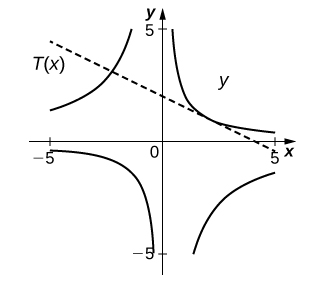
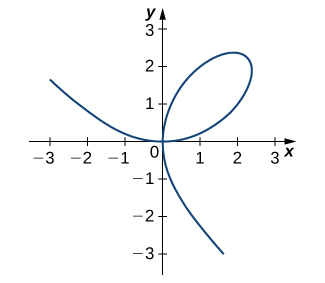

* Find the derivative of a complicated function by using implicit differentiation.
* Use implicit differentiation to determine the equation of a tangent line.

We have already studied how to find equations of tangent lines to functions and the rate of change of a function at a specific point. In all these cases we had the explicit equation for the function and differentiated these functions explicitly. Suppose instead that we want to determine the equation of a tangent line to an arbitrary curve or the rate of change of an arbitrary curve at a point. In this section, we solve these problems by finding the derivatives of functions that define <math xmlns="http://www.w3.org/1998/Math/MathML"><mi>y</mi></math>

 implicitly in terms of <math xmlns="http://www.w3.org/1998/Math/MathML"><mi>x</mi><mo>.</mo></math>

### Implicit Differentiation

In most discussions of math, if the dependent variable <math xmlns="http://www.w3.org/1998/Math/MathML"><mi>y</mi></math>

 is a function of the independent variable <math xmlns="http://www.w3.org/1998/Math/MathML"><mrow><mi>x</mi><mo>,</mo></mrow></math>

 we express *y* in terms of <math xmlns="http://www.w3.org/1998/Math/MathML"><mrow><mi>x</mi><mo>.</mo></mrow></math>

 If this is the case, we say that <math xmlns="http://www.w3.org/1998/Math/MathML"><mi>y</mi></math>

 is an explicit function of <math xmlns="http://www.w3.org/1998/Math/MathML"><mrow><mi>x</mi><mo>.</mo></mrow></math>

 For example, when we write the equation <math xmlns="http://www.w3.org/1998/Math/MathML"><mrow><mi>y</mi><mo>=</mo><msup><mi>x</mi><mn>2</mn></msup><mo>+</mo><mn>1</mn><mo>,</mo></mrow></math>

 we are defining *y* explicitly in terms of <math xmlns="http://www.w3.org/1998/Math/MathML"><mrow><mi>x</mi><mo>.</mo></mrow></math>

 On the other hand, if the relationship between the function <math xmlns="http://www.w3.org/1998/Math/MathML"><mi>y</mi></math>

 and the variable <math xmlns="http://www.w3.org/1998/Math/MathML"><mi>x</mi></math>

 is expressed by an equation where <math xmlns="http://www.w3.org/1998/Math/MathML"><mi>y</mi></math>

 is not expressed entirely in terms of <math xmlns="http://www.w3.org/1998/Math/MathML"><mrow><mi>x</mi><mo>,</mo></mrow></math>

 we say that the equation defines *y* implicitly in terms of <math xmlns="http://www.w3.org/1998/Math/MathML"><mrow><mi>x</mi><mo>.</mo></mrow></math>

 For example, the equation <math xmlns="http://www.w3.org/1998/Math/MathML"><mrow><mi>y</mi><mo>−</mo><msup><mi>x</mi><mn>2</mn></msup><mo>=</mo><mn>1</mn></mrow></math>

 defines the function <math xmlns="http://www.w3.org/1998/Math/MathML"><mrow><mi>y</mi><mo>=</mo><msup><mi>x</mi><mn>2</mn></msup><mo>+</mo><mn>1</mn></mrow></math>

 implicitly.

Implicit differentiation allows us to find slopes of tangents to curves that are clearly not functions (they fail the vertical line test). We are using the idea that portions of <math xmlns="http://www.w3.org/1998/Math/MathML"><mi>y</mi></math>

 are functions that satisfy the given equation, but that <math xmlns="http://www.w3.org/1998/Math/MathML"><mi>y</mi></math>

 is not actually a function of <math xmlns="http://www.w3.org/1998/Math/MathML"><mi>x</mi><mo>.</mo></math>

In general, an equation defines a function implicitly if the function satisfies that equation. An equation may define many different functions implicitly. For example, the functions

<math xmlns="http://www.w3.org/1998/Math/MathML"><mrow><mi>y</mi><mo>=</mo><msqrt><mrow><mn>25</mn><mo>−</mo><msup><mi>x</mi><mn>2</mn></msup></mrow></msqrt></mrow></math>

 and <math xmlns="http://www.w3.org/1998/Math/MathML"><mrow><mi>y</mi><mo>=</mo><mrow><mo>{</mo><mrow><mtable><mtr><mtd><mrow><msqrt><mrow><mn>25</mn><mo>−</mo><msup><mi>x</mi><mn>2</mn></msup></mrow></msqrt><mspace width="0.2em" /><mtext>if</mtext><mo>−</mo><mn>25</mn><mo>≤</mo><mi>x</mi><mo>&lt;</mo><mn>0</mn></mrow></mtd></mtr><mtr><mtd><mrow><mtext>−</mtext><msqrt><mrow><mn>25</mn><mo>−</mo><msup><mi>x</mi><mn>2</mn></msup></mrow></msqrt><mspace width="0.2em" /><mtext>if</mtext><mspace width="0.2em" /><mn>0</mn><mo>≤</mo><mi>x</mi><mo>≤</mo><mn>25</mn></mrow></mtd></mtr></mtable></mrow></mrow><mo>,</mo></mrow></math>

 which are illustrated in [\[link\]](#CNX_Calc_Figure_03_08_001), are just three of the many functions defined implicitly by the equation <math xmlns="http://www.w3.org/1998/Math/MathML"><mrow><msup><mi>x</mi><mn>2</mn></msup><mo>+</mo><msup><mi>y</mi><mn>2</mn></msup><mo>=</mo><mn>25</mn><mo>.</mo></mrow></math>

 {: #CNX_Calc_Figure_03_08_001}

If we want to find the slope of the line tangent to the graph of <math xmlns="http://www.w3.org/1998/Math/MathML"><mrow><msup><mi>x</mi><mn>2</mn></msup><mo>+</mo><msup><mi>y</mi><mn>2</mn></msup><mo>=</mo><mn>25</mn></mrow></math>

 at the point <math xmlns="http://www.w3.org/1998/Math/MathML"><mrow><mrow><mo>(</mo><mrow><mn>3</mn><mo>,</mo><mn>4</mn></mrow><mo>)</mo></mrow><mo>,</mo></mrow></math>

 we could evaluate the derivative of the function <math xmlns="http://www.w3.org/1998/Math/MathML"><mrow><mi>y</mi><mo>=</mo><msqrt><mrow><mn>25</mn><mo>−</mo><msup><mi>x</mi><mn>2</mn></msup></mrow></msqrt></mrow></math>

 at <math xmlns="http://www.w3.org/1998/Math/MathML"><mrow><mi>x</mi><mo>=</mo><mn>3</mn><mo>.</mo></mrow></math>

 On the other hand, if we want the slope of the tangent line at the point <math xmlns="http://www.w3.org/1998/Math/MathML"><mrow><mrow><mo>(</mo><mrow><mn>3</mn><mo>,</mo><mn>−4</mn></mrow><mo>)</mo></mrow><mo>,</mo></mrow></math>

 we could use the derivative of <math xmlns="http://www.w3.org/1998/Math/MathML"><mrow><mi>y</mi><mo>=</mo><mtext>−</mtext><msqrt><mrow><mn>25</mn><mo>−</mo><msup><mi>x</mi><mn>2</mn></msup></mrow></msqrt><mo>.</mo></mrow></math>

 However, it is not always easy to solve for a function defined implicitly by an equation. Fortunately, the technique of **implicit differentiation**{: data-type="term"} allows us to find the derivative of an implicitly defined function without ever solving for the function explicitly. The process of finding <math xmlns="http://www.w3.org/1998/Math/MathML"><mrow><mfrac><mrow><mi>d</mi><mi>y</mi></mrow><mrow><mi>d</mi><mi>x</mi></mrow></mfrac></mrow></math>

 using implicit differentiation is described in the following problem-solving strategy.

Problem-Solving Strategy: Implicit Differentiation

To perform implicit differentiation on an equation that defines a function <math xmlns="http://www.w3.org/1998/Math/MathML"><mi>y</mi></math>

 implicitly in terms of a variable <math xmlns="http://www.w3.org/1998/Math/MathML"><mrow><mi>x</mi><mo>,</mo></mrow></math>

 use the following steps:

1.  Take the derivative of both sides of the equation. Keep in mind that *y* is a function of *x*. Consequently, whereas
    <math xmlns="http://www.w3.org/1998/Math/MathML"><mrow><mfrac><mi>d</mi><mrow><mi>d</mi><mi>x</mi></mrow></mfrac><mrow><mo>(</mo><mrow><mtext>sin</mtext><mspace width="0.1em" /><mi>x</mi></mrow><mo>)</mo></mrow><mo>=</mo><mtext>cos</mtext><mspace width="0.1em" /><mi>x</mi><mo>,</mo><mfrac><mi>d</mi><mrow><mi>d</mi><mi>x</mi></mrow></mfrac><mo stretchy="false">(</mo><mtext>sin</mtext><mspace width="0.1em" /><mi>y</mi><mo stretchy="false">)</mo><mo>=</mo><mtext>cos</mtext><mspace width="0.1em" /><mi>y</mi><mfrac><mrow><mi>d</mi><mi>y</mi></mrow><mrow><mi>d</mi><mi>x</mi></mrow></mfrac></mrow></math>
    
    because we must use the chain rule to differentiate
    <math xmlns="http://www.w3.org/1998/Math/MathML"><mrow><mtext>sin</mtext><mspace width="0.1em" /><mi>y</mi></mrow></math>
    
    with respect to
    <math xmlns="http://www.w3.org/1998/Math/MathML"><mrow><mi>x</mi><mo>.</mo></mrow></math>

2.  Rewrite the equation so that all terms containing
    <math xmlns="http://www.w3.org/1998/Math/MathML"><mrow><mfrac><mrow><mi>d</mi><mi>y</mi></mrow><mrow><mi>d</mi><mi>x</mi></mrow></mfrac></mrow></math>
    
    are on the left and all terms that do not contain
    <math xmlns="http://www.w3.org/1998/Math/MathML"><mrow><mfrac><mrow><mi>d</mi><mi>y</mi></mrow><mrow><mi>d</mi><mi>x</mi></mrow></mfrac></mrow></math>
    
    are on the right.
3.  Factor out
    <math xmlns="http://www.w3.org/1998/Math/MathML"><mrow><mfrac><mrow><mi>d</mi><mi>y</mi></mrow><mrow><mi>d</mi><mi>x</mi></mrow></mfrac></mrow></math>
    
    on the left.
4.  Solve for
    <math xmlns="http://www.w3.org/1998/Math/MathML"><mrow><mfrac><mrow><mi>d</mi><mi>y</mi></mrow><mrow><mi>d</mi><mi>x</mi></mrow></mfrac></mrow></math>
    
    by dividing both sides of the equation by an appropriate algebraic expression.
{: data-number-style="arabic"}

Using Implicit Differentiation

Assuming that <math xmlns="http://www.w3.org/1998/Math/MathML"><mi>y</mi></math>

 is defined implicitly by the equation <math xmlns="http://www.w3.org/1998/Math/MathML"><mrow><msup><mi>x</mi><mn>2</mn></msup><mo>+</mo><msup><mi>y</mi><mn>2</mn></msup><mo>=</mo><mn>25</mn><mo>,</mo></mrow></math>

 find <math xmlns="http://www.w3.org/1998/Math/MathML"><mrow><mfrac><mrow><mi>d</mi><mi>y</mi></mrow><mrow><mi>d</mi><mi>x</mi></mrow></mfrac><mo>.</mo></mrow></math>

Follow the steps in the problem-solving strategy.

<math xmlns="http://www.w3.org/1998/Math/MathML"><mtable><mtr><mtd columnalign="right"><mfrac><mi>d</mi><mrow><mi>d</mi><mi>x</mi></mrow></mfrac><mrow><mo>(</mo><mrow><msup><mi>x</mi><mn>2</mn></msup><mo>+</mo><msup><mi>y</mi><mn>2</mn></msup></mrow><mo>)</mo></mrow></mtd><mtd columnalign="left"><mo>=</mo></mtd><mtd columnalign="left"><mfrac><mi>d</mi><mrow><mi>d</mi><mi>x</mi></mrow></mfrac><mrow><mo>(</mo><mrow><mn>25</mn></mrow><mo>)</mo></mrow></mtd><mtd /><mtd /><mtd columnalign="left"><mtext>Step 1. Differentiate both sides of the equation.</mtext></mtd></mtr><mtr><mtd columnalign="right"><mfrac><mi>d</mi><mrow><mi>d</mi><mi>x</mi></mrow></mfrac><mrow><mo>(</mo><mrow><msup><mi>x</mi><mn>2</mn></msup></mrow><mo>)</mo></mrow><mo>+</mo><mfrac><mi>d</mi><mrow><mi>d</mi><mi>x</mi></mrow></mfrac><mrow><mo>(</mo><mrow><msup><mi>y</mi><mn>2</mn></msup></mrow><mo>)</mo></mrow></mtd><mtd columnalign="left"><mo>=</mo></mtd><mtd columnalign="left"><mn>0</mn></mtd><mtd /><mtd /><mtd columnalign="left"><mtable><mtr><mtd columnalign="left"><mtext>Step 1.1. Use the sum rule on the left.</mtext></mtd></mtr><mtr><mtd columnalign="left"><mtext>On the right</mtext><mspace width="0.2em" /><mfrac><mi>d</mi><mrow><mi>d</mi><mi>x</mi></mrow></mfrac><mrow><mo>(</mo><mrow><mn>25</mn></mrow><mo>)</mo></mrow><mo>=</mo><mn>0</mn><mo>.</mo></mtd></mtr></mtable></mtd></mtr><mtr><mtd columnalign="right"><mn>2</mn><mi>x</mi><mo>+</mo><mn>2</mn><mi>y</mi><mfrac><mrow><mi>d</mi><mi>y</mi></mrow><mrow><mi>d</mi><mi>x</mi></mrow></mfrac></mtd><mtd columnalign="left"><mo>=</mo></mtd><mtd columnalign="left"><mn>0</mn></mtd><mtd /><mtd /><mtd columnalign="left"><mtable><mtr><mtd columnalign="left"><mtext>Step 1.2. Take the derivatives, so</mtext><mspace width="0.2em" /><mfrac><mi>d</mi><mrow><mi>d</mi><mi>x</mi></mrow></mfrac><mrow><mo>(</mo><mrow><msup><mi>x</mi><mn>2</mn></msup></mrow><mo>)</mo></mrow><mo>=</mo><mn>2</mn><mi>x</mi></mtd></mtr><mtr><mtd columnalign="left"><mtext>and</mtext><mspace width="0.2em" /><mfrac><mi>d</mi><mrow><mi>d</mi><mi>x</mi></mrow></mfrac><mrow><mo>(</mo><mrow><msup><mi>y</mi><mn>2</mn></msup></mrow><mo>)</mo></mrow><mo>=</mo><mn>2</mn><mi>y</mi><mfrac><mrow><mi>d</mi><mi>y</mi></mrow><mrow><mi>d</mi><mi>x</mi></mrow></mfrac><mo>.</mo></mtd></mtr></mtable></mtd></mtr><mtr><mtd columnalign="right"><mn>2</mn><mi>y</mi><mfrac><mrow><mi>d</mi><mi>y</mi></mrow><mrow><mi>d</mi><mi>x</mi></mrow></mfrac></mtd><mtd columnalign="left"><mo>=</mo></mtd><mtd columnalign="left"><mn>−2</mn><mi>x</mi></mtd><mtd /><mtd /><mtd columnalign="left"><mtable><mtr><mtd columnalign="left"><mtext>Step 2. Keep the terms with</mtext><mspace width="0.2em" /><mfrac><mrow><mi>d</mi><mi>y</mi></mrow><mrow><mi>d</mi><mi>x</mi></mrow></mfrac><mspace width="0.2em" /><mtext>on the left.</mtext></mtd></mtr><mtr><mtd columnalign="left"><mtext>Move the remaining terms to the right.</mtext></mtd></mtr></mtable></mtd></mtr><mtr><mtd columnalign="right"><mfrac><mrow><mi>d</mi><mi>y</mi></mrow><mrow><mi>d</mi><mi>x</mi></mrow></mfrac></mtd><mtd columnalign="left"><mo>=</mo></mtd><mtd columnalign="left"><mo>−</mo><mfrac><mi>x</mi><mi>y</mi></mfrac></mtd><mtd /><mtd /><mtd columnalign="left"><mtable><mtr><mtd columnalign="left"><mtext>Step 4. Divide both sides of the equation by</mtext></mtd></mtr><mtr><mtd columnalign="left"><mn>2</mn><mi>y</mi><mo>.</mo><mspace width="0.2em" /><mtext>(Step 3 does not apply in this case.)</mtext></mtd></mtr></mtable></mtd></mtr></mtable></math>

Analysis

Note that the resulting expression for <math xmlns="http://www.w3.org/1998/Math/MathML"><mrow><mfrac><mrow><mi>d</mi><mi>y</mi></mrow><mrow><mi>d</mi><mi>x</mi></mrow></mfrac></mrow></math>

 is in terms of both the independent variable <math xmlns="http://www.w3.org/1998/Math/MathML"><mi>x</mi></math>

 and the dependent variable <math xmlns="http://www.w3.org/1998/Math/MathML"><mrow><mi>y</mi><mo>.</mo></mrow></math>

 Although in some cases it may be possible to express <math xmlns="http://www.w3.org/1998/Math/MathML"><mrow><mfrac><mrow><mi>d</mi><mi>y</mi></mrow><mrow><mi>d</mi><mi>x</mi></mrow></mfrac></mrow></math>

 in terms of <math xmlns="http://www.w3.org/1998/Math/MathML"><mi>x</mi></math>

 only, it is generally not possible to do so.

Using Implicit Differentiation and the Product Rule

Assuming that <math xmlns="http://www.w3.org/1998/Math/MathML"><mi>y</mi></math>

 is defined implicitly by the equation <math xmlns="http://www.w3.org/1998/Math/MathML"><mrow><msup><mi>x</mi><mn>3</mn></msup><mspace width="0.1em" /><mtext>sin</mtext><mspace width="0.1em" /><mi>y</mi><mo>+</mo><mi>y</mi><mo>=</mo><mn>4</mn><mi>x</mi><mo>+</mo><mn>3</mn><mo>,</mo></mrow></math>

 find <math xmlns="http://www.w3.org/1998/Math/MathML"><mrow><mfrac><mrow><mi>d</mi><mi>y</mi></mrow><mrow><mi>d</mi><mi>x</mi></mrow></mfrac><mo>.</mo></mrow></math>

<math xmlns="http://www.w3.org/1998/Math/MathML"><mtable><mtr><mtd columnalign="right"><mfrac><mi>d</mi><mrow><mi>d</mi><mi>x</mi></mrow></mfrac><mrow><mo>(</mo><mrow><msup><mi>x</mi><mn>3</mn></msup><mtext>sin</mtext><mspace width="0.1em" /><mi>y</mi><mo>+</mo><mi>y</mi></mrow><mo>)</mo></mrow></mtd><mtd columnalign="left"><mo>=</mo></mtd><mtd columnalign="left"><mfrac><mi>d</mi><mrow><mi>d</mi><mi>x</mi></mrow></mfrac><mrow><mo>(</mo><mrow><mn>4</mn><mi>x</mi><mo>+</mo><mn>3</mn></mrow><mo>)</mo></mrow></mtd><mtd /><mtd /><mtd columnalign="left"><mtext>Step 1: Differentiate both sides of the equation.</mtext></mtd></mtr><mtr><mtd columnalign="right"><mfrac><mi>d</mi><mrow><mi>d</mi><mi>x</mi></mrow></mfrac><mrow><mo>(</mo><mrow><msup><mi>x</mi><mn>3</mn></msup><mtext>sin</mtext><mspace width="0.1em" /><mi>y</mi></mrow><mo>)</mo></mrow><mo>+</mo><mfrac><mi>d</mi><mrow><mi>d</mi><mi>x</mi></mrow></mfrac><mrow><mo>(</mo><mi>y</mi><mo>)</mo></mrow></mtd><mtd columnalign="left"><mo>=</mo></mtd><mtd columnalign="left"><mn>4</mn></mtd><mtd /><mtd /><mtd columnalign="left"><mtable><mtr><mtd columnalign="left"><mtext>Step 1.1: Apply the sum rule on the left.</mtext></mtd></mtr><mtr><mtd columnalign="left"><mtext>On the right,</mtext><mspace width="0.2em" /><mfrac><mi>d</mi><mrow><mi>d</mi><mi>x</mi></mrow></mfrac><mrow><mo>(</mo><mrow><mn>4</mn><mi>x</mi><mo>+</mo><mn>3</mn></mrow><mo>)</mo></mrow><mo>=</mo><mn>4</mn><mo>.</mo></mtd></mtr></mtable></mtd></mtr><mtr><mtd columnalign="right"><mrow><mo>(</mo><mrow><mfrac><mi>d</mi><mrow><mi>d</mi><mi>x</mi></mrow></mfrac><mrow><mo>(</mo><mrow><msup><mi>x</mi><mn>3</mn></msup></mrow><mo>)</mo></mrow><mo>·</mo><mtext>sin</mtext><mspace width="0.1em" /><mi>y</mi><mo>+</mo><mfrac><mi>d</mi><mrow><mi>d</mi><mi>x</mi></mrow></mfrac><mrow><mo>(</mo><mrow><mtext>sin</mtext><mspace width="0.1em" /><mi>y</mi></mrow><mo>)</mo></mrow><mo>·</mo><msup><mi>x</mi><mn>3</mn></msup></mrow><mo>)</mo></mrow><mo>+</mo><mfrac><mrow><mi>d</mi><mi>y</mi></mrow><mrow><mi>d</mi><mi>x</mi></mrow></mfrac></mtd><mtd columnalign="left"><mo>=</mo></mtd><mtd columnalign="left"><mn>4</mn></mtd><mtd /><mtd /><mtd columnalign="left"><mtable><mtr><mtd columnalign="left"><mtext>Step 1.2: Use the product rule to find</mtext></mtd></mtr><mtr><mtd columnalign="left"><mfrac><mi>d</mi><mrow><mi>d</mi><mi>x</mi></mrow></mfrac><mrow><mo>(</mo><mrow><msup><mi>x</mi><mn>3</mn></msup><mtext>sin</mtext><mspace width="0.1em" /><mi>y</mi></mrow><mo>)</mo></mrow><mo>.</mo><mspace width="0.2em" /><mtext>Observe that</mtext><mspace width="0.2em" /><mfrac><mi>d</mi><mrow><mi>d</mi><mi>x</mi></mrow></mfrac><mrow><mo>(</mo><mi>y</mi><mo>)</mo></mrow><mo>=</mo><mfrac><mrow><mi>d</mi><mi>y</mi></mrow><mrow><mi>d</mi><mi>x</mi></mrow></mfrac><mo>.</mo></mtd></mtr></mtable></mtd></mtr><mtr><mtd columnalign="right"><mn>3</mn><msup><mi>x</mi><mn>2</mn></msup><mtext>sin</mtext><mspace width="0.1em" /><mi>y</mi><mo>+</mo><mrow><mo>(</mo><mrow><mtext>cos</mtext><mspace width="0.1em" /><mi>y</mi><mfrac><mrow><mi>d</mi><mi>y</mi></mrow><mrow><mi>d</mi><mi>x</mi></mrow></mfrac></mrow><mo>)</mo></mrow><mo>·</mo><msup><mi>x</mi><mn>3</mn></msup><mo>+</mo><mfrac><mrow><mi>d</mi><mi>y</mi></mrow><mrow><mi>d</mi><mi>x</mi></mrow></mfrac></mtd><mtd columnalign="left"><mo>=</mo></mtd><mtd columnalign="left"><mn>4</mn></mtd><mtd /><mtd /><mtd columnalign="left"><mtable><mtr><mtd columnalign="left"><mtext>Step 1.3: We know</mtext><mspace width="0.2em" /><mfrac><mi>d</mi><mrow><mi>d</mi><mi>x</mi></mrow></mfrac><mrow><mo>(</mo><mrow><msup><mi>x</mi><mn>3</mn></msup></mrow><mo>)</mo></mrow><mo>=</mo><mn>3</mn><msup><mi>x</mi><mn>2</mn></msup><mo>.</mo><mspace width="0.2em" /><mtext>Use the</mtext></mtd></mtr><mtr><mtd columnalign="left"><mtext>chain rule to obtain</mtext><mspace width="0.2em" /><mfrac><mi>d</mi><mrow><mi>d</mi><mi>x</mi></mrow></mfrac><mrow><mo>(</mo><mrow><mtext>sin</mtext><mspace width="0.1em" /><mi>y</mi></mrow><mo>)</mo></mrow><mo>=</mo><mtext>cos</mtext><mspace width="0.1em" /><mi>y</mi><mfrac><mrow><mi>d</mi><mi>y</mi></mrow><mrow><mi>d</mi><mi>x</mi></mrow></mfrac><mo>.</mo></mtd></mtr></mtable></mtd></mtr><mtr><mtd columnalign="right"><msup><mtext>x</mtext><mn>3</mn></msup><mtext>cos</mtext><mspace width="0.1em" /><mi>y</mi><mfrac><mrow><mi>d</mi><mi>y</mi></mrow><mrow><mi>d</mi><mi>x</mi></mrow></mfrac><mo>+</mo><mfrac><mrow><mi>d</mi><mi>y</mi></mrow><mrow><mi>d</mi><mi>x</mi></mrow></mfrac></mtd><mtd columnalign="left"><mo>=</mo></mtd><mtd columnalign="left"><mn>4</mn><mo>−</mo><mn>3</mn><msup><mi>x</mi><mn>2</mn></msup><mtext>sin</mtext><mspace width="0.1em" /><mi>y</mi></mtd><mtd /><mtd /><mtd columnalign="left"><mtable><mtr><mtd columnalign="left"><mtext>Step 2: Keep all terms containing</mtext><mspace width="0.2em" /><mfrac><mrow><mi>d</mi><mi>y</mi></mrow><mrow><mi>d</mi><mi>x</mi></mrow></mfrac><mspace width="0.2em" /><mtext>on the</mtext></mtd></mtr><mtr><mtd columnalign="left"><mtext>left. Move all other terms to the right.</mtext></mtd></mtr></mtable></mtd></mtr><mtr><mtd columnalign="right"><mfrac><mrow><mi>d</mi><mi>y</mi></mrow><mrow><mi>d</mi><mi>x</mi></mrow></mfrac><mrow><mo>(</mo><mrow><msup><mtext>x</mtext><mn>3</mn></msup><mtext>cos</mtext><mspace width="0.1em" /><mi>y</mi><mo>+</mo><mn>1</mn></mrow><mo>)</mo></mrow></mtd><mtd columnalign="left"><mo>=</mo></mtd><mtd columnalign="left"><mn>4</mn><mo>−</mo><mn>3</mn><msup><mi>x</mi><mn>2</mn></msup><mtext>sin</mtext><mspace width="0.1em" /><mi>y</mi></mtd><mtd /><mtd /><mtd columnalign="left"><mtext>Step 3: Factor out</mtext><mspace width="0.2em" /><mfrac><mrow><mi>d</mi><mi>y</mi></mrow><mrow><mi>d</mi><mi>x</mi></mrow></mfrac><mspace width="0.2em" /><mtext>on the left.</mtext></mtd></mtr><mtr><mtd columnalign="right"><mfrac><mrow><mi>d</mi><mi>y</mi></mrow><mrow><mi>d</mi><mi>x</mi></mrow></mfrac></mtd><mtd columnalign="left"><mo>=</mo></mtd><mtd columnalign="left"><mfrac><mrow><mn>4</mn><mo>−</mo><mn>3</mn><msup><mi>x</mi><mn>2</mn></msup><mtext>sin</mtext><mspace width="0.1em" /><mi>y</mi></mrow><mrow><msup><mi>x</mi><mn>3</mn></msup><mtext>cos</mtext><mspace width="0.1em" /><mi>y</mi><mo>+</mo><mn>1</mn></mrow></mfrac></mtd><mtd /><mtd /><mtd columnalign="left"><mtable><mtr><mtd columnalign="left"><mtext>Step 4: Solve for</mtext><mspace width="0.2em" /><mfrac><mrow><mi>d</mi><mi>y</mi></mrow><mrow><mi>d</mi><mi>x</mi></mrow></mfrac><mspace width="0.2em" /><mtext>by dividing both sides of</mtext></mtd></mtr><mtr><mtd columnalign="left"><mtext>the equation by</mtext><mspace width="0.2em" /><msup><mtext>x</mtext><mn>3</mn></msup><mtext>cos</mtext><mspace width="0.1em" /><mi>y</mi><mo>+</mo><mn>1</mn><mo>.</mo></mtd></mtr></mtable></mtd></mtr></mtable></math>

Using Implicit Differentiation to Find a Second Derivative

Find <math xmlns="http://www.w3.org/1998/Math/MathML"><mrow><mfrac><mrow><msup><mi>d</mi><mn>2</mn></msup><mi>y</mi></mrow><mrow><mi>d</mi><msup><mi>x</mi><mn>2</mn></msup></mrow></mfrac></mrow></math>

 if <math xmlns="http://www.w3.org/1998/Math/MathML"><mrow><msup><mi>x</mi><mn>2</mn></msup><mo>+</mo><msup><mi>y</mi><mn>2</mn></msup><mo>=</mo><mn>25</mn><mo>.</mo></mrow></math>

In [[link]](#fs-id1169737819953), we showed that <math xmlns="http://www.w3.org/1998/Math/MathML"><mrow><mfrac><mrow><mi>d</mi><mi>y</mi></mrow><mrow><mi>d</mi><mi>x</mi></mrow></mfrac><mo>=</mo><mo>−</mo><mfrac><mi>x</mi><mi>y</mi></mfrac><mo>.</mo></mrow></math>

 We can take the derivative of both sides of this equation to find <math xmlns="http://www.w3.org/1998/Math/MathML"><mrow><mfrac><mrow><msup><mi>d</mi><mn>2</mn></msup><mi>y</mi></mrow><mrow><mi>d</mi><msup><mi>x</mi><mn>2</mn></msup></mrow></mfrac><mo>.</mo></mrow></math>

<math xmlns="http://www.w3.org/1998/Math/MathML"><mtable><mtr><mtd columnalign="right"><mfrac><mrow><msup><mi>d</mi><mn>2</mn></msup><mi>y</mi></mrow><mrow><mi>d</mi><msup><mi>x</mi><mn>2</mn></msup></mrow></mfrac></mtd><mtd columnalign="left"><mo>=</mo><mfrac><mi>d</mi><mrow><mi>d</mi><mi>y</mi></mrow></mfrac><mrow><mo>(</mo><mrow><mo>−</mo><mfrac><mi>x</mi><mi>y</mi></mfrac></mrow><mo>)</mo></mrow></mtd><mtd /><mtd /><mtd columnalign="left"><mtext>Differentiate both sides of</mtext><mspace width="0.2em" /><mfrac><mrow><mi>d</mi><mi>y</mi></mrow><mrow><mi>d</mi><mi>x</mi></mrow></mfrac><mo>=</mo><mo>−</mo><mfrac><mi>x</mi><mi>y</mi></mfrac><mo>.</mo></mtd></mtr><mtr><mtd /><mtd columnalign="left"><mo>=</mo><mo>−</mo><mfrac><mrow><mrow><mo>(</mo><mrow><mn>1</mn><mo>·</mo><mi>y</mi><mo>−</mo><mi>x</mi><mfrac><mrow><mi>d</mi><mi>y</mi></mrow><mrow><mi>d</mi><mi>x</mi></mrow></mfrac></mrow><mo>)</mo></mrow></mrow><mrow><msup><mi>y</mi><mn>2</mn></msup></mrow></mfrac></mtd><mtd /><mtd /><mtd columnalign="left"><mtext>Use the quotient rule to find</mtext><mspace width="0.2em" /><mfrac><mi>d</mi><mrow><mi>d</mi><mi>y</mi></mrow></mfrac><mrow><mo>(</mo><mrow><mo>−</mo><mfrac><mi>x</mi><mi>y</mi></mfrac></mrow><mo>)</mo></mrow><mo>.</mo></mtd></mtr><mtr><mtd /><mtd columnalign="left"><mo>=</mo><mfrac><mrow><mtext>−</mtext><mi>y</mi><mo>+</mo><mi>x</mi><mfrac><mrow><mi>d</mi><mi>y</mi></mrow><mrow><mi>d</mi><mi>x</mi></mrow></mfrac></mrow><mrow><msup><mi>y</mi><mn>2</mn></msup></mrow></mfrac></mtd><mtd /><mtd /><mtd columnalign="left"><mtext>Simplify.</mtext></mtd></mtr><mtr><mtd /><mtd columnalign="left"><mo>=</mo><mfrac><mrow><mtext>−</mtext><mi>y</mi><mo>+</mo><mi>x</mi><mrow><mo>(</mo><mrow><mo>−</mo><mfrac><mi>x</mi><mi>y</mi></mfrac></mrow><mo>)</mo></mrow></mrow><mrow><msup><mi>y</mi><mn>2</mn></msup></mrow></mfrac></mtd><mtd /><mtd /><mtd columnalign="left"><mtext>Substitute</mtext><mspace width="0.2em" /><mfrac><mrow><mi>d</mi><mi>y</mi></mrow><mrow><mi>d</mi><mi>x</mi></mrow></mfrac><mo>=</mo><mo>−</mo><mfrac><mi>x</mi><mi>y</mi></mfrac><mo>.</mo></mtd></mtr><mtr><mtd /><mtd columnalign="left"><mo>=</mo><mfrac><mrow><mtext>−</mtext><msup><mi>y</mi><mn>2</mn></msup><mo>−</mo><msup><mi>x</mi><mn>2</mn></msup></mrow><mrow><msup><mi>y</mi><mn>3</mn></msup></mrow></mfrac></mtd><mtd /><mtd /><mtd columnalign="left"><mtext>Simplify.</mtext></mtd></mtr></mtable></math>

At this point we have found an expression for <math xmlns="http://www.w3.org/1998/Math/MathML"><mrow><mfrac><mrow><msup><mi>d</mi><mn>2</mn></msup><mi>y</mi></mrow><mrow><mi>d</mi><msup><mi>x</mi><mn>2</mn></msup></mrow></mfrac><mo>.</mo></mrow></math>

 If we choose, we can simplify the expression further by recalling that <math xmlns="http://www.w3.org/1998/Math/MathML"><mrow><msup><mi>x</mi><mn>2</mn></msup><mo>+</mo><msup><mi>y</mi><mn>2</mn></msup><mo>=</mo><mn>25</mn></mrow></math>

 and making this substitution in the numerator to obtain <math xmlns="http://www.w3.org/1998/Math/MathML"><mrow><mfrac><mrow><msup><mi>d</mi><mn>2</mn></msup><mi>y</mi></mrow><mrow><mi>d</mi><msup><mi>x</mi><mn>2</mn></msup></mrow></mfrac><mo>=</mo><mo>−</mo><mfrac><mrow><mn>25</mn></mrow><mrow><msup><mi>y</mi><mn>3</mn></msup></mrow></mfrac><mo>.</mo></mrow></math>

Find <math xmlns="http://www.w3.org/1998/Math/MathML"><mrow><mfrac><mrow><mi>d</mi><mi>y</mi></mrow><mrow><mi>d</mi><mi>x</mi></mrow></mfrac></mrow></math>

 for <math xmlns="http://www.w3.org/1998/Math/MathML"><mi>y</mi></math>

 defined implicitly by the equation <math xmlns="http://www.w3.org/1998/Math/MathML"><mrow><mn>4</mn><msup><mi>x</mi><mn>5</mn></msup><mo>+</mo><mtext>tan</mtext><mspace width="0.1em" /><mi>y</mi><mo>=</mo><msup><mi>y</mi><mn>2</mn></msup><mo>+</mo><mn>5</mn><mi>x</mi><mo>.</mo></mrow></math>

<math xmlns="http://www.w3.org/1998/Math/MathML"><mrow><mfrac><mrow><mi>d</mi><mi>y</mi></mrow><mrow><mi>d</mi><mi>x</mi></mrow></mfrac><mo>=</mo><mfrac><mrow><mn>5</mn><mo>−</mo><mn>20</mn><msup><mi>x</mi><mn>4</mn></msup></mrow><mrow><msup><mrow><mtext>sec</mtext></mrow><mn>2</mn></msup><mi>y</mi><mo>−</mo><mn>2</mn><mi>y</mi></mrow></mfrac></mrow></math>

Hint

Follow the problem solving strategy, remembering to apply the chain rule to differentiate <math xmlns="http://www.w3.org/1998/Math/MathML"><mrow><mtext>tan</mtext></mrow></math>

 and <math xmlns="http://www.w3.org/1998/Math/MathML"><mrow><msup><mi>y</mi><mn>2</mn></msup><mo>.</mo></mrow></math>

### Finding Tangent Lines Implicitly

Now that we have seen the technique of implicit differentiation, we can apply it to the problem of finding equations of tangent lines to curves described by equations.

Finding a Tangent Line to a Circle

Find the equation of the line tangent to the curve <math xmlns="http://www.w3.org/1998/Math/MathML"><mrow><msup><mi>x</mi><mn>2</mn></msup><mo>+</mo><msup><mi>y</mi><mn>2</mn></msup><mo>=</mo><mn>25</mn></mrow></math>

 at the point <math xmlns="http://www.w3.org/1998/Math/MathML"><mrow><mrow><mo>(</mo><mrow><mn>3</mn><mo>,</mo><mn>−4</mn></mrow><mo>)</mo></mrow><mo>.</mo></mrow></math>

Although we could find this equation without using implicit differentiation, using that method makes it much easier. In [[link]](#fs-id1169737819953), we found <math xmlns="http://www.w3.org/1998/Math/MathML"><mrow><mfrac><mrow><mi>d</mi><mi>y</mi></mrow><mrow><mi>d</mi><mi>x</mi></mrow></mfrac><mo>=</mo><mo>−</mo><mfrac><mi>x</mi><mi>y</mi></mfrac><mo>.</mo></mrow></math>

The slope of the tangent line is found by substituting <math xmlns="http://www.w3.org/1998/Math/MathML"><mrow><mrow><mo>(</mo><mrow><mn>3</mn><mo>,</mo><mn>−4</mn></mrow><mo>)</mo></mrow></mrow></math>

 into this expression. Consequently, the slope of the tangent line is <math xmlns="http://www.w3.org/1998/Math/MathML"><mrow><mfrac><mrow><mi>d</mi><mi>y</mi></mrow><mrow><mi>d</mi><mi>x</mi></mrow></mfrac><mrow><mo>\|</mo><mtable columnalign="left"><mtr><mtd><mrow /></mtd></mtr><mtr><mtd><msub><mrow /><mrow><mrow><mo>(</mo><mrow><mn>3</mn><mo>,</mo><mn>−4</mn></mrow><mo>)</mo></mrow></mrow></msub></mtd></mtr></mtable></mrow><mo>=</mo><mo>−</mo><mfrac><mn>3</mn><mrow><mn>−4</mn></mrow></mfrac><mo>=</mo><mfrac><mn>3</mn><mn>4</mn></mfrac><mo>.</mo></mrow></math>

Using the point <math xmlns="http://www.w3.org/1998/Math/MathML"><mrow><mrow><mo>(</mo><mrow><mn>3</mn><mo>,</mo><mn>−4</mn></mrow><mo>)</mo></mrow></mrow></math>

 and the slope <math xmlns="http://www.w3.org/1998/Math/MathML"><mrow><mfrac><mn>3</mn><mn>4</mn></mfrac></mrow></math>

 in the point-slope equation of the line, we obtain the equation <math xmlns="http://www.w3.org/1998/Math/MathML"><mrow><mi>y</mi><mo>=</mo><mfrac><mn>3</mn><mn>4</mn></mfrac><mi>x</mi><mo>−</mo><mfrac><mrow><mn>25</mn></mrow><mn>4</mn></mfrac></mrow></math>

 ([[link]](#CNX_Calc_Figure_03_08_002)).

."){: #CNX_Calc_Figure_03_08_002}

Finding the Equation of the Tangent Line to a Curve

Find the equation of the line tangent to the graph of <math xmlns="http://www.w3.org/1998/Math/MathML"><mrow><msup><mi>y</mi><mn>3</mn></msup><mo>+</mo><msup><mi>x</mi><mn>3</mn></msup><mo>−</mo><mn>3</mn><mi>x</mi><mi>y</mi><mo>=</mo><mn>0</mn></mrow></math>

 at the point <math xmlns="http://www.w3.org/1998/Math/MathML"><mrow><mrow><mo>(</mo><mrow><mfrac><mn>3</mn><mn>2</mn></mfrac><mo>,</mo><mfrac><mn>3</mn><mn>2</mn></mfrac></mrow><mo>)</mo></mrow></mrow></math>

 ([[link]](#CNX_Calc_Figure_03_08_003)). This curve is known as the folium (or leaf) of Descartes.

."){: #CNX_Calc_Figure_03_08_003}

Begin by finding <math xmlns="http://www.w3.org/1998/Math/MathML"><mrow><mfrac><mrow><mi>d</mi><mi>y</mi></mrow><mrow><mi>d</mi><mi>x</mi></mrow></mfrac><mo>.</mo></mrow></math>

<math xmlns="http://www.w3.org/1998/Math/MathML"><mtable><mtr><mtd columnalign="right"><mfrac><mi>d</mi><mrow><mi>d</mi><mi>x</mi></mrow></mfrac><mrow><mo>(</mo><mrow><msup><mi>y</mi><mn>3</mn></msup><mo>+</mo><msup><mi>x</mi><mn>3</mn></msup><mo>−</mo><mn>3</mn><mi>x</mi><mi>y</mi></mrow><mo>)</mo></mrow></mtd><mtd columnalign="left"><mo>=</mo></mtd><mtd columnalign="left"><mfrac><mi>d</mi><mrow><mi>d</mi><mi>x</mi></mrow></mfrac><mrow><mo>(</mo><mn>0</mn><mo>)</mo></mrow></mtd></mtr><mtr><mtd columnalign="right"><mn>3</mn><msup><mi>y</mi><mn>2</mn></msup><mfrac><mrow><mi>d</mi><mi>y</mi></mrow><mrow><mi>d</mi><mi>x</mi></mrow></mfrac><mo>+</mo><mn>3</mn><msup><mi>x</mi><mn>2</mn></msup><mo>−</mo><mrow><mo>(</mo><mrow><mn>3</mn><mi>y</mi><mo>+</mo><mfrac><mrow><mi>d</mi><mi>y</mi></mrow><mrow><mi>d</mi><mi>x</mi></mrow></mfrac><mn>3</mn><mi>x</mi></mrow><mo>)</mo></mrow></mtd><mtd columnalign="left"><mo>=</mo></mtd><mtd columnalign="left"><mn>0</mn></mtd></mtr><mtr><mtd columnalign="right"><mfrac><mrow><mi>d</mi><mi>y</mi></mrow><mrow><mi>d</mi><mi>x</mi></mrow></mfrac></mtd><mtd columnalign="left"><mo>=</mo></mtd><mtd columnalign="left"><mfrac><mrow><mn>3</mn><mi>y</mi><mo>−</mo><mn>3</mn><msup><mi>x</mi><mn>2</mn></msup></mrow><mrow><mn>3</mn><msup><mi>y</mi><mn>2</mn></msup><mo>−</mo><mn>3</mn><mi>x</mi></mrow></mfrac><mo>.</mo></mtd></mtr></mtable></math>

Next, substitute <math xmlns="http://www.w3.org/1998/Math/MathML"><mrow><mrow><mo>(</mo><mrow><mfrac><mn>3</mn><mn>2</mn></mfrac><mo>,</mo><mfrac><mn>3</mn><mn>2</mn></mfrac></mrow><mo>)</mo></mrow></mrow></math>

 into <math xmlns="http://www.w3.org/1998/Math/MathML"><mrow><mfrac><mrow><mi>d</mi><mi>y</mi></mrow><mrow><mi>d</mi><mi>x</mi></mrow></mfrac><mo>=</mo><mfrac><mrow><mn>3</mn><mi>y</mi><mo>−</mo><mn>3</mn><msup><mi>x</mi><mn>2</mn></msup></mrow><mrow><mn>3</mn><msup><mi>y</mi><mn>2</mn></msup><mo>−</mo><mn>3</mn><mi>x</mi></mrow></mfrac></mrow></math>

 to find the slope of the tangent line:

<math xmlns="http://www.w3.org/1998/Math/MathML"><mrow><mfrac><mrow><mi>d</mi><mi>y</mi></mrow><mrow><mi>d</mi><mi>x</mi></mrow></mfrac><mrow><mo>\|</mo><mtable columnalign="left"><mtr><mtd><mrow /></mtd></mtr><mtr><mtd><msub><mrow /><mrow><mrow><mo>(</mo><mrow><mfrac><mn>3</mn><mn>2</mn></mfrac><mo>,</mo><mfrac><mn>3</mn><mn>2</mn></mfrac></mrow><mo>)</mo></mrow></mrow></msub></mtd></mtr></mtable></mrow><mo>=</mo><mn>−1</mn><mo>.</mo></mrow></math>

Finally, substitute into the point-slope equation of the line to obtain

<math xmlns="http://www.w3.org/1998/Math/MathML"><mrow><mi>y</mi><mo>=</mo><mtext>−</mtext><mi>x</mi><mo>+</mo><mn>3</mn><mo>.</mo></mrow></math>

Applying Implicit Differentiation

In a simple video game, a rocket travels in an elliptical orbit whose path is described by the equation <math xmlns="http://www.w3.org/1998/Math/MathML"><mrow><mn>4</mn><msup><mi>x</mi><mn>2</mn></msup><mo>+</mo><mn>25</mn><msup><mi>y</mi><mn>2</mn></msup><mo>=</mo><mn>100</mn><mo>.</mo></mrow></math>

 The rocket can fire missiles along lines tangent to its path. The object of the game is to destroy an incoming asteroid traveling along the positive *x*-axis toward <math xmlns="http://www.w3.org/1998/Math/MathML"><mrow><mrow><mo>(</mo><mrow><mn>0</mn><mo>,</mo><mn>0</mn></mrow><mo>)</mo></mrow><mo>.</mo></mrow></math>

 If the rocket fires a missile when it is located at <math xmlns="http://www.w3.org/1998/Math/MathML"><mrow><mrow><mo>(</mo><mrow><mn>3</mn><mo>,</mo><mfrac><mn>8</mn><mn>3</mn></mfrac></mrow><mo>)</mo></mrow><mo>,</mo></mrow></math>

 where will it intersect the *x*-axis?

To solve this problem, we must determine where the line tangent to the graph of

<math xmlns="http://www.w3.org/1998/Math/MathML"><mrow><mn>4</mn><msup><mi>x</mi><mn>2</mn></msup><mo>+</mo><mn>25</mn><msup><mi>y</mi><mn>2</mn></msup><mo>=</mo><mn>100</mn></mrow></math>

 at <math xmlns="http://www.w3.org/1998/Math/MathML"><mrow><mrow><mo>(</mo><mrow><mn>3</mn><mo>,</mo><mfrac><mn>8</mn><mn>3</mn></mfrac></mrow><mo>)</mo></mrow></mrow></math>

 intersects the *x*-axis. Begin by finding <math xmlns="http://www.w3.org/1998/Math/MathML"><mrow><mfrac><mrow><mi>d</mi><mi>y</mi></mrow><mrow><mi>d</mi><mi>x</mi></mrow></mfrac></mrow></math>

 implicitly.

Differentiating, we have

<math xmlns="http://www.w3.org/1998/Math/MathML"><mrow><mn>8</mn><mi>x</mi><mo>+</mo><mn>50</mn><mi>y</mi><mfrac><mrow><mi>d</mi><mi>y</mi></mrow><mrow><mi>d</mi><mi>x</mi></mrow></mfrac><mo>=</mo><mn>0</mn><mo>.</mo></mrow></math>

Solving for <math xmlns="http://www.w3.org/1998/Math/MathML"><mrow><mfrac><mrow><mi>d</mi><mi>y</mi></mrow><mrow><mi>d</mi><mi>x</mi></mrow></mfrac><mo>,</mo></mrow></math>

 we have

<math xmlns="http://www.w3.org/1998/Math/MathML"><mrow><mfrac><mrow><mi>d</mi><mi>y</mi></mrow><mrow><mi>d</mi><mi>x</mi></mrow></mfrac><mo>=</mo><mo>−</mo><mfrac><mrow><mn>4</mn><mi>x</mi></mrow><mrow><mn>25</mn><mi>y</mi></mrow></mfrac><mo>.</mo></mrow></math>

The slope of the tangent line is <math xmlns="http://www.w3.org/1998/Math/MathML"><mrow><mfrac><mrow><mi>d</mi><mi>y</mi></mrow><mrow><mi>d</mi><mi>x</mi></mrow></mfrac><mrow><mo>\|</mo><mrow><msub><mrow /><mrow><mrow><mo>(</mo><mrow><mn>3</mn><mo>,</mo><mfrac><mn>8</mn><mn>3</mn></mfrac></mrow><mo>)</mo></mrow></mrow></msub></mrow></mrow><mo>=</mo><mo>−</mo><mfrac><mn>9</mn><mrow><mn>50</mn></mrow></mfrac><mo>.</mo></mrow></math>

 The equation of the tangent line is <math xmlns="http://www.w3.org/1998/Math/MathML"><mrow><mi>y</mi><mo>=</mo><mo>−</mo><mfrac><mn>9</mn><mrow><mn>50</mn></mrow></mfrac><mi>x</mi><mo>+</mo><mfrac><mrow><mn>183</mn></mrow><mrow><mn>200</mn></mrow></mfrac><mo>.</mo></mrow></math>

 To determine where the line intersects the *x*-axis, solve <math xmlns="http://www.w3.org/1998/Math/MathML"><mrow><mn>0</mn><mo>=</mo><mo>−</mo><mfrac><mn>9</mn><mrow><mn>50</mn></mrow></mfrac><mi>x</mi><mo>+</mo><mfrac><mrow><mn>183</mn></mrow><mrow><mn>200</mn></mrow></mfrac><mo>.</mo></mrow></math>

 The solution is <math xmlns="http://www.w3.org/1998/Math/MathML"><mrow><mi>x</mi><mo>=</mo><mfrac><mrow><mn>61</mn></mrow><mn>3</mn></mfrac><mo>.</mo></mrow></math>

 The missile intersects the *x*-axis at the point <math xmlns="http://www.w3.org/1998/Math/MathML"><mrow><mrow><mo>(</mo><mrow><mfrac><mrow><mn>61</mn></mrow><mn>3</mn></mfrac><mo>,</mo><mn>0</mn></mrow><mo>)</mo></mrow><mo>.</mo></mrow></math>

Find the equation of the line tangent to the hyperbola <math xmlns="http://www.w3.org/1998/Math/MathML"><mrow><msup><mi>x</mi><mn>2</mn></msup><mo>−</mo><msup><mi>y</mi><mn>2</mn></msup><mo>=</mo><mn>16</mn></mrow></math>

 at the point <math xmlns="http://www.w3.org/1998/Math/MathML"><mrow><mrow><mo>(</mo><mrow><mn>5</mn><mo>,</mo><mn>3</mn></mrow><mo>)</mo></mrow><mo>.</mo></mrow></math>

<math xmlns="http://www.w3.org/1998/Math/MathML"><mrow><mi>y</mi><mo>=</mo><mfrac><mn>5</mn><mn>3</mn></mfrac><mi>x</mi><mo>−</mo><mfrac><mrow><mn>16</mn></mrow><mn>3</mn></mfrac></mrow></math>

Hint

<math xmlns="http://www.w3.org/1998/Math/MathML"><mrow><mfrac><mrow><mi>d</mi><mi>y</mi></mrow><mrow><mi>d</mi><mi>x</mi></mrow></mfrac><mo>=</mo><mfrac><mi>x</mi><mi>y</mi></mfrac></mrow></math>

### Key Concepts

* We use implicit differentiation to find derivatives of implicitly defined functions (functions defined by equations).
* By using implicit differentiation, we can find the equation of a tangent line to the graph of a curve.
{: data-bullet-style="bullet"}

<section data-depth="1" class="section-exercises" markdown="1">
For the following exercises, use implicit differentiation to find <math xmlns="http://www.w3.org/1998/Math/MathML"><mrow><mfrac><mrow><mi>d</mi><mi>y</mi></mrow><mrow><mi>d</mi><mi>x</mi></mrow></mfrac><mo>.</mo></mrow></math>

<math xmlns="http://www.w3.org/1998/Math/MathML"><mrow><msup><mi>x</mi><mn>2</mn></msup><mo>−</mo><msup><mi>y</mi><mn>2</mn></msup><mo>=</mo><mn>4</mn></mrow></math>

<math xmlns="http://www.w3.org/1998/Math/MathML"><mrow><mn>6</mn><msup><mi>x</mi><mn>2</mn></msup><mo>+</mo><mn>3</mn><msup><mi>y</mi><mn>2</mn></msup><mo>=</mo><mn>12</mn></mrow></math>

<math xmlns="http://www.w3.org/1998/Math/MathML"><mrow><mfrac><mrow><mi>d</mi><mi>y</mi></mrow><mrow><mi>d</mi><mi>x</mi></mrow></mfrac><mo>=</mo><mfrac><mrow><mn>−2</mn><mi>x</mi></mrow><mi>y</mi></mfrac></mrow></math>

<math xmlns="http://www.w3.org/1998/Math/MathML"><mrow><msup><mi>x</mi><mn>2</mn></msup><mi>y</mi><mo>=</mo><mi>y</mi><mo>−</mo><mn>7</mn></mrow></math>

<math xmlns="http://www.w3.org/1998/Math/MathML"><mrow><mn>3</mn><msup><mi>x</mi><mn>3</mn></msup><mo>+</mo><mn>9</mn><mi>x</mi><msup><mi>y</mi><mn>2</mn></msup><mo>=</mo><mn>5</mn><msup><mi>x</mi><mn>3</mn></msup></mrow></math>

<math xmlns="http://www.w3.org/1998/Math/MathML"><mrow><mfrac><mrow><mi>d</mi><mi>y</mi></mrow><mrow><mi>d</mi><mi>x</mi></mrow></mfrac><mo>=</mo><mfrac><mi>x</mi><mrow><mn>3</mn><mi>y</mi></mrow></mfrac><mo>−</mo><mfrac><mi>y</mi><mrow><mn>2</mn><mi>x</mi></mrow></mfrac></mrow></math>

<math xmlns="http://www.w3.org/1998/Math/MathML"><mrow><mi>x</mi><mi>y</mi><mo>−</mo><mtext>cos</mtext><mspace width="0.1em" /><mrow><mo>(</mo><mrow><mi>x</mi><mi>y</mi></mrow><mo>)</mo></mrow><mo>=</mo><mn>1</mn></mrow></math>

<math xmlns="http://www.w3.org/1998/Math/MathML"><mrow><mi>y</mi><msqrt><mrow><mi>x</mi><mo>+</mo><mn>4</mn></mrow></msqrt><mo>=</mo><mi>x</mi><mi>y</mi><mo>+</mo><mn>8</mn></mrow></math>

<math xmlns="http://www.w3.org/1998/Math/MathML"><mrow><mfrac><mrow><mi>d</mi><mi>y</mi></mrow><mrow><mi>d</mi><mi>x</mi></mrow></mfrac><mo>=</mo><mfrac><mrow><mi>y</mi><mo>−</mo><mfrac><mi>y</mi><mrow><mn>2</mn><msqrt><mrow><mi>x</mi><mo>+</mo><mn>4</mn></mrow></msqrt></mrow></mfrac></mrow><mrow><msqrt><mrow><mi>x</mi><mo>+</mo><mn>4</mn></mrow></msqrt><mo>−</mo><mi>x</mi></mrow></mfrac></mrow></math>

<math xmlns="http://www.w3.org/1998/Math/MathML"><mrow><mtext>−</mtext><mi>x</mi><mi>y</mi><mo>−</mo><mn>2</mn><mo>=</mo><mfrac><mi>x</mi><mn>7</mn></mfrac></mrow></math>

<math xmlns="http://www.w3.org/1998/Math/MathML"><mrow><mi>y</mi><mspace width="0.1em" /><mtext>sin</mtext><mspace width="0.1em" /><mrow><mo>(</mo><mrow><mi>x</mi><mi>y</mi></mrow><mo>)</mo></mrow><mo>=</mo><msup><mi>y</mi><mn>2</mn></msup><mo>+</mo><mn>2</mn></mrow></math>

<math xmlns="http://www.w3.org/1998/Math/MathML"><mrow><mfrac><mrow><mi>d</mi><mi>y</mi></mrow><mrow><mi>d</mi><mi>x</mi></mrow></mfrac><mo>=</mo><mfrac><mrow><msup><mi>y</mi><mn>2</mn></msup><mtext>cos</mtext><mspace width="0.1em" /><mrow><mo>(</mo><mrow><mi>x</mi><mi>y</mi></mrow><mo>)</mo></mrow></mrow><mrow><mn>2</mn><mi>y</mi><mo>−</mo><mtext>sin</mtext><mspace width="0.1em" /><mrow><mo>(</mo><mrow><mi>x</mi><mi>y</mi></mrow><mo>)</mo></mrow><mo>−</mo><mi>x</mi><mi>y</mi><mspace width="0.1em" /><mtext>cos</mtext><mspace width="0.1em" /><mi>x</mi><mi>y</mi></mrow></mfrac></mrow></math>

<math xmlns="http://www.w3.org/1998/Math/MathML"><mrow><msup><mrow><mrow><mo>(</mo><mrow><mi>x</mi><mi>y</mi></mrow><mo>)</mo></mrow></mrow><mn>2</mn></msup><mo>+</mo><mn>3</mn><mi>x</mi><mo>=</mo><msup><mi>y</mi><mn>2</mn></msup></mrow></math>

<math xmlns="http://www.w3.org/1998/Math/MathML"><mrow><msup><mi>x</mi><mn>3</mn></msup><mi>y</mi><mo>+</mo><mi>x</mi><msup><mi>y</mi><mn>3</mn></msup><mo>=</mo><mn>−8</mn></mrow></math>

<math xmlns="http://www.w3.org/1998/Math/MathML"><mrow><mfrac><mrow><mi>d</mi><mi>y</mi></mrow><mrow><mi>d</mi><mi>x</mi></mrow></mfrac><mo>=</mo><mfrac><mrow><mn>−3</mn><msup><mi>x</mi><mn>2</mn></msup><mi>y</mi><mo>−</mo><msup><mi>y</mi><mn>3</mn></msup></mrow><mrow><msup><mi>x</mi><mn>3</mn></msup><mo>+</mo><mn>3</mn><mi>x</mi><msup><mi>y</mi><mn>2</mn></msup></mrow></mfrac></mrow></math>

For the following exercises, find the equation of the tangent line to the graph of the given equation at the indicated point. Use a calculator or computer software to graph the function and the tangent line.

**[T]** <math xmlns="http://www.w3.org/1998/Math/MathML"><mrow><msup><mi>x</mi><mn>4</mn></msup><mi>y</mi><mo>−</mo><mi>x</mi><msup><mi>y</mi><mn>3</mn></msup><mo>=</mo><mn>−2</mn><mo>,</mo><mrow><mo>(</mo><mrow><mn>−1</mn><mo>,</mo><mn>−1</mn></mrow><mo>)</mo></mrow></mrow></math>

**[T]** <math xmlns="http://www.w3.org/1998/Math/MathML"><mrow><msup><mi>x</mi><mn>2</mn></msup><msup><mi>y</mi><mn>2</mn></msup><mo>+</mo><mn>5</mn><mi>x</mi><mi>y</mi><mo>=</mo><mn>14</mn><mo>,</mo><mrow><mo>(</mo><mrow><mn>2</mn><mo>,</mo><mn>1</mn></mrow><mo>)</mo></mrow></mrow></math>

* * *
{: data-type="newline"}

  
* * *
{: data-type="newline"}

 <math xmlns="http://www.w3.org/1998/Math/MathML"><mrow><mi>y</mi><mo>=</mo><mfrac><mrow><mn>−1</mn></mrow><mn>2</mn></mfrac><mi>x</mi><mo>+</mo><mn>2</mn></mrow></math>

**[T]** <math xmlns="http://www.w3.org/1998/Math/MathML"><mrow><mtext>tan</mtext><mspace width="0.1em" /><mrow><mo>(</mo><mrow><mi>x</mi><mi>y</mi></mrow><mo>)</mo></mrow><mo>=</mo><mi>y</mi><mo>,</mo><mrow><mo>(</mo><mrow><mfrac><mi>π</mi><mn>4</mn></mfrac><mo>,</mo><mn>1</mn></mrow><mo>)</mo></mrow></mrow></math>

**[T]** <math xmlns="http://www.w3.org/1998/Math/MathML"><mrow><mi>x</mi><msup><mi>y</mi><mn>2</mn></msup><mo>+</mo><mtext>sin</mtext><mspace width="0.1em" /><mrow><mo>(</mo><mrow><mi>π</mi><mi>y</mi></mrow><mo>)</mo></mrow><mo>−</mo><mn>2</mn><msup><mi>x</mi><mn>2</mn></msup><mo>=</mo><mn>10</mn><mo>,</mo><mrow><mo>(</mo><mrow><mn>2</mn><mo>,</mo><mn>−3</mn></mrow><mo>)</mo></mrow></mrow></math>

* * *
{: data-type="newline"}

  
* * *
{: data-type="newline"}

 <math xmlns="http://www.w3.org/1998/Math/MathML"><mrow><mi>y</mi><mo>=</mo><mfrac><mn>1</mn><mrow><mi>π</mi><mo>+</mo><mn>12</mn></mrow></mfrac><mi>x</mi><mo>−</mo><mfrac><mrow><mn>3</mn><mi>π</mi><mo>+</mo><mn>38</mn></mrow><mrow><mi>π</mi><mo>+</mo><mn>12</mn></mrow></mfrac></mrow></math>

**[T]** <math xmlns="http://www.w3.org/1998/Math/MathML"><mrow><mfrac><mi>x</mi><mi>y</mi></mfrac><mo>+</mo><mn>5</mn><mi>x</mi><mo>−</mo><mn>7</mn><mo>=</mo><mo>−</mo><mfrac><mn>3</mn><mn>4</mn></mfrac><mi>y</mi><mo>,</mo><mrow><mo>(</mo><mrow><mn>1</mn><mo>,</mo><mn>2</mn></mrow><mo>)</mo></mrow></mrow></math>

**[T]** <math xmlns="http://www.w3.org/1998/Math/MathML"><mrow><mi>x</mi><mi>y</mi><mo>+</mo><mtext>sin</mtext><mspace width="0.1em" /><mrow><mo>(</mo><mi>x</mi><mo>)</mo></mrow><mo>=</mo><mn>1</mn><mo>,</mo><mrow><mo>(</mo><mrow><mfrac><mi>π</mi><mn>2</mn></mfrac><mo>,</mo><mn>0</mn></mrow><mo>)</mo></mrow></mrow></math>

* * *
{: data-type="newline"}

  
* * *
{: data-type="newline"}

 <math xmlns="http://www.w3.org/1998/Math/MathML"><mrow><mi>y</mi><mo>=</mo><mn>0</mn></mrow></math>

**[T]** The graph of a folium of Descartes with equation <math xmlns="http://www.w3.org/1998/Math/MathML"><mrow><mn>2</mn><msup><mi>x</mi><mn>3</mn></msup><mo>+</mo><mn>2</mn><msup><mi>y</mi><mn>3</mn></msup><mo>−</mo><mn>9</mn><mi>x</mi><mi>y</mi><mo>=</mo><mn>0</mn></mrow></math>

 is given in the following graph.

1.  Find the equation of the tangent line at the point
    <math xmlns="http://www.w3.org/1998/Math/MathML"><mrow><mrow><mo>(</mo><mrow><mn>2</mn><mo>,</mo><mn>1</mn></mrow><mo>)</mo></mrow><mo>.</mo></mrow></math>
    
    Graph the tangent line along with the folium.
2.  Find the equation of the normal line to the tangent line in a. at the point
    <math xmlns="http://www.w3.org/1998/Math/MathML"><mrow><mrow><mo>(</mo><mrow><mn>2</mn><mo>,</mo><mn>1</mn></mrow><mo>)</mo></mrow><mo>.</mo></mrow></math>
{: data-number-style="lower-alpha"}

For the equation <math xmlns="http://www.w3.org/1998/Math/MathML"><mrow><msup><mi>x</mi><mn>2</mn></msup><mo>+</mo><mn>2</mn><mi>x</mi><mi>y</mi><mo>−</mo><mn>3</mn><msup><mi>y</mi><mn>2</mn></msup><mo>=</mo><mn>0</mn><mo>,</mo></mrow></math>

1.  Find the equation of the normal to the tangent line at the point
    <math xmlns="http://www.w3.org/1998/Math/MathML"><mrow><mrow><mo>(</mo><mrow><mn>1</mn><mo>,</mo><mn>1</mn></mrow><mo>)</mo></mrow><mo>.</mo></mrow></math>

2.  At what other point does the normal line in a. intersect the graph of the equation?
{: data-number-style="lower-alpha"}

a. <math xmlns="http://www.w3.org/1998/Math/MathML"><mrow><mi>y</mi><mo>=</mo><mtext>−</mtext><mi>x</mi><mo>+</mo><mn>2</mn></mrow></math>

 b. <math xmlns="http://www.w3.org/1998/Math/MathML"><mrow><mrow><mo>(</mo><mrow><mn>3</mn><mo>,</mo><mn>−1</mn></mrow><mo>)</mo></mrow></mrow></math>

Find all points on the graph of <math xmlns="http://www.w3.org/1998/Math/MathML"><mrow><msup><mi>y</mi><mn>3</mn></msup><mo>−</mo><mn>27</mn><mi>y</mi><mo>=</mo><msup><mi>x</mi><mn>2</mn></msup><mo>−</mo><mn>90</mn></mrow></math>

 at which the tangent line is vertical.

For the equation <math xmlns="http://www.w3.org/1998/Math/MathML"><mrow><msup><mi>x</mi><mn>2</mn></msup><mo>+</mo><mi>x</mi><mi>y</mi><mo>+</mo><msup><mi>y</mi><mn>2</mn></msup><mo>=</mo><mn>7</mn><mo>,</mo></mrow></math>

1.  Find the
    <math xmlns="http://www.w3.org/1998/Math/MathML"><mi>x</mi></math>
    
    -intercept(s).
2.  Find the slope of the tangent line(s) at the *x*-intercept(s).
3.  What does the value(s) in b. indicate about the tangent line(s)?
{: data-number-style="lower-alpha"}

a. <math xmlns="http://www.w3.org/1998/Math/MathML"><mrow><mrow><mo>(</mo><mrow><mo>±</mo><msqrt><mn>7</mn></msqrt><mo>,</mo><mn>0</mn></mrow><mo>)</mo></mrow></mrow></math>

 b. <math xmlns="http://www.w3.org/1998/Math/MathML"><mrow><mn>−2</mn></mrow></math>

 c. They are parallel since the slope is the same at both intercepts.

Find the equation of the tangent line to the graph of the equation <math xmlns="http://www.w3.org/1998/Math/MathML"><mrow><msup><mrow><mtext>sin</mtext></mrow><mrow><mn>−1</mn></mrow></msup><mi>x</mi><mo>+</mo><msup><mrow><mtext>sin</mtext></mrow><mrow><mn>−1</mn></mrow></msup><mi>y</mi><mo>=</mo><mfrac><mi>π</mi><mn>6</mn></mfrac></mrow></math>

 at the point <math xmlns="http://www.w3.org/1998/Math/MathML"><mrow><mrow><mo>(</mo><mrow><mn>0</mn><mo>,</mo><mfrac><mn>1</mn><mn>2</mn></mfrac></mrow><mo>)</mo></mrow><mo>.</mo></mrow></math>

Find the equation of the tangent line to the graph of the equation <math xmlns="http://www.w3.org/1998/Math/MathML"><mrow><msup><mrow><mtext>tan</mtext></mrow><mrow><mn>−1</mn></mrow></msup><mrow><mo>(</mo><mrow><mi>x</mi><mo>+</mo><mi>y</mi></mrow><mo>)</mo></mrow><mo>=</mo><msup><mi>x</mi><mn>2</mn></msup><mo>+</mo><mfrac><mi>π</mi><mn>4</mn></mfrac></mrow></math>

 at the point <math xmlns="http://www.w3.org/1998/Math/MathML"><mrow><mrow><mo>(</mo><mrow><mn>0</mn><mo>,</mo><mn>1</mn></mrow><mo>)</mo></mrow><mo>.</mo></mrow></math>

<math xmlns="http://www.w3.org/1998/Math/MathML"><mrow><mi>y</mi><mo>=</mo><mtext>−</mtext><mi>x</mi><mo>+</mo><mn>1</mn></mrow></math>

Find <math xmlns="http://www.w3.org/1998/Math/MathML"><msup><mi>y</mi><mo>′</mo></msup></math>

 and <math xmlns="http://www.w3.org/1998/Math/MathML"><mi>y</mi><mtext>″</mtext></math>

 for <math xmlns="http://www.w3.org/1998/Math/MathML"><mrow><msup><mi>x</mi><mn>2</mn></msup><mo>+</mo><mn>6</mn><mi>x</mi><mi>y</mi><mo>−</mo><mn>2</mn><msup><mi>y</mi><mn>2</mn></msup><mo>=</mo><mn>3</mn><mo>.</mo></mrow></math>

**[T]** The number of cell phones produced when <math xmlns="http://www.w3.org/1998/Math/MathML"><mi>x</mi></math>

 dollars is spent on labor and <math xmlns="http://www.w3.org/1998/Math/MathML"><mi>y</mi></math>

 dollars is spent on capital invested by a manufacturer can be modeled by the equation <math xmlns="http://www.w3.org/1998/Math/MathML"><mrow><mn>60</mn><msup><mi>x</mi><mrow><mn>3</mn><mtext>/</mtext><mn>4</mn></mrow></msup><msup><mi>y</mi><mrow><mn>1</mn><mtext>/</mtext><mn>4</mn></mrow></msup><mo>=</mo><mn>3240</mn><mo>.</mo></mrow></math>

1.  Find
    <math xmlns="http://www.w3.org/1998/Math/MathML"><mrow><mfrac><mrow><mi>d</mi><mi>y</mi></mrow><mrow><mi>d</mi><mi>x</mi></mrow></mfrac></mrow></math>
    
    and evaluate at the point
    <math xmlns="http://www.w3.org/1998/Math/MathML"><mrow><mrow><mo>(</mo><mrow><mn>81</mn><mo>,</mo><mn>16</mn></mrow><mo>)</mo></mrow><mo>.</mo></mrow></math>

2.  Interpret the result of a.
{: data-number-style="lower-alpha"}

a. <math xmlns="http://www.w3.org/1998/Math/MathML"><mrow><mn>−0.5926</mn></mrow></math>

 b. When $81 is spent on labor and $16 is spent on capital, the amount spent on capital is decreasing by $0.5926 per $1 spent on labor.

**[T]** The number of cars produced when <math xmlns="http://www.w3.org/1998/Math/MathML"><mi>x</mi></math>

 dollars is spent on labor and <math xmlns="http://www.w3.org/1998/Math/MathML"><mi>y</mi></math>

 dollars is spent on capital invested by a manufacturer can be modeled by the equation <math xmlns="http://www.w3.org/1998/Math/MathML"><mrow><mn>30</mn><msup><mi>x</mi><mrow><mn>1</mn><mtext>/</mtext><mn>3</mn></mrow></msup><msup><mi>y</mi><mrow><mn>2</mn><mtext>/</mtext><mn>3</mn></mrow></msup><mo>=</mo><mn>360</mn><mo>.</mo></mrow></math>

(Both <math xmlns="http://www.w3.org/1998/Math/MathML"><mi>x</mi></math>

 and <math xmlns="http://www.w3.org/1998/Math/MathML"><mi>y</mi></math>

 are measured in thousands of dollars.)

1.  Find
    <math xmlns="http://www.w3.org/1998/Math/MathML"><mrow><mfrac><mrow><mi>d</mi><mi>y</mi></mrow><mrow><mi>d</mi><mi>x</mi></mrow></mfrac></mrow></math>
    
    and evaluate at the point
    <math xmlns="http://www.w3.org/1998/Math/MathML"><mrow><mrow><mo>(</mo><mrow><mn>27</mn><mo>,</mo><mn>8</mn></mrow><mo>)</mo></mrow><mo>.</mo></mrow></math>

2.  Interpret the result of a.
{: data-number-style="lower-alpha"}

The volume of a right circular cone of radius <math xmlns="http://www.w3.org/1998/Math/MathML"><mi>x</mi></math>

 and height <math xmlns="http://www.w3.org/1998/Math/MathML"><mi>y</mi></math>

 is given by <math xmlns="http://www.w3.org/1998/Math/MathML"><mrow><mi>V</mi><mo>=</mo><mfrac><mn>1</mn><mn>3</mn></mfrac><mi>π</mi><msup><mi>x</mi><mn>2</mn></msup><mi>y</mi><mo>.</mo></mrow></math>

 Suppose that the volume of the cone is <math xmlns="http://www.w3.org/1998/Math/MathML"><mrow><mn>85</mn><mi>π</mi><mspace width="0.1em" /><msup><mrow><mtext>cm</mtext></mrow><mn>3</mn></msup><mo>.</mo></mrow></math>

 Find <math xmlns="http://www.w3.org/1998/Math/MathML"><mrow><mfrac><mrow><mi>d</mi><mi>y</mi></mrow><mrow><mi>d</mi><mi>x</mi></mrow></mfrac></mrow></math>

 when <math xmlns="http://www.w3.org/1998/Math/MathML"><mrow><mi>x</mi><mo>=</mo><mn>4</mn></mrow></math>

 and <math xmlns="http://www.w3.org/1998/Math/MathML"><mrow><mi>y</mi><mo>=</mo><mn>16</mn><mo>.</mo></mrow></math>

<math xmlns="http://www.w3.org/1998/Math/MathML"><mrow><mn>−8</mn></mrow></math>

For the following exercises, consider a closed rectangular box with a square base with side <math xmlns="http://www.w3.org/1998/Math/MathML"><mi>x</mi></math>

 and height <math xmlns="http://www.w3.org/1998/Math/MathML"><mrow><mi>y</mi><mo>.</mo></mrow></math>

Find an equation for the surface area of the rectangular box, <math xmlns="http://www.w3.org/1998/Math/MathML"><mrow><mi>S</mi><mrow><mo>(</mo><mrow><mi>x</mi><mo>,</mo><mi>y</mi></mrow><mo>)</mo></mrow><mo>.</mo></mrow></math>

If the surface area of the rectangular box is 78 square feet, find <math xmlns="http://www.w3.org/1998/Math/MathML"><mrow><mfrac><mrow><mi>d</mi><mi>y</mi></mrow><mrow><mi>d</mi><mi>x</mi></mrow></mfrac></mrow></math>

 when <math xmlns="http://www.w3.org/1998/Math/MathML"><mrow><mi>x</mi><mo>=</mo><mn>3</mn></mrow></math>

 feet and <math xmlns="http://www.w3.org/1998/Math/MathML"><mrow><mi>y</mi><mo>=</mo><mn>5</mn></mrow></math>

 feet.

<math xmlns="http://www.w3.org/1998/Math/MathML"><mrow><mn>−2.67</mn></mrow></math>

For the following exercises, use implicit differentiation to determine <math xmlns="http://www.w3.org/1998/Math/MathML"><mrow><msup><mi>y</mi><mo>′</mo></msup><mo>.</mo></mrow></math>

 Does the answer agree with the formulas we have previously determined?

<math xmlns="http://www.w3.org/1998/Math/MathML"><mrow><mi>x</mi><mo>=</mo><mtext>sin</mtext><mspace width="0.1em" /><mi>y</mi></mrow></math>

<math xmlns="http://www.w3.org/1998/Math/MathML"><mrow><mi>x</mi><mo>=</mo><mtext>cos</mtext><mspace width="0.1em" /><mi>y</mi></mrow></math>

<math xmlns="http://www.w3.org/1998/Math/MathML"><mrow><msup><mi>y</mi><mo>′</mo></msup><mo>=</mo><mo>−</mo><mfrac><mn>1</mn><mrow><msqrt><mrow><mn>1</mn><mo>−</mo><msup><mi>x</mi><mn>2</mn></msup></mrow></msqrt></mrow></mfrac></mrow></math>

<math xmlns="http://www.w3.org/1998/Math/MathML"><mrow><mi>x</mi><mo>=</mo><mtext>tan</mtext><mspace width="0.1em" /><mi>y</mi></mrow></math>

</section>

### Glossary
{: data-type="glossary-title"}

implicit differentiation
: is a technique for computing
  <math xmlns="http://www.w3.org/1998/Math/MathML"><mrow><mfrac><mrow><mi>d</mi><mi>y</mi></mrow><mrow><mi>d</mi><mi>x</mi></mrow></mfrac></mrow></math>
  
  for a function defined by an equation, accomplished by differentiating both sides of the equation (remembering to treat the variable
  <math xmlns="http://www.w3.org/1998/Math/MathML"><mi>y</mi></math>
  
  as a function) and solving for
  <math xmlns="http://www.w3.org/1998/Math/MathML"><mrow><mfrac><mrow><mi>d</mi><mi>y</mi></mrow><mrow><mi>d</mi><mi>x</mi></mrow></mfrac></mrow></math>

