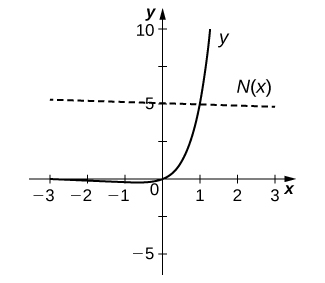
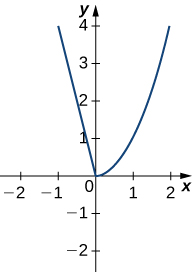
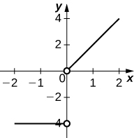

* Find the derivative of exponential functions.
* Find the derivative of logarithmic functions.
* Use logarithmic differentiation to determine the derivative of a function.

So far, we have learned how to differentiate a variety of functions, including trigonometric, inverse, and implicit functions. In this section, we explore derivatives of exponential and logarithmic functions. As we discussed in [Introduction to Functions and Graphs](/m53472){: .target-chapter}, exponential functions play an important role in modeling population growth and the decay of radioactive materials. Logarithmic functions can help rescale large quantities and are particularly helpful for rewriting complicated expressions.

# Derivative of the Exponential Function

Just as when we found the derivatives of other functions, we can find the derivatives of exponential and logarithmic functions using formulas. As we develop these formulas, we need to make certain basic assumptions. The proofs that these assumptions hold are beyond the scope of this course.

First of all, we begin with the assumption that the function <math xmlns="http://www.w3.org/1998/Math/MathML"><mrow><mi>B</mi><mrow><mo>(</mo><mi>x</mi><mo>)</mo></mrow><mo>=</mo><msup><mi>b</mi><mi>x</mi></msup><mo>,</mo><mi>b</mi><mo>&gt;</mo><mn>0</mn><mo>,</mo></mrow></math>

 is defined for every real number and is continuous. In previous courses, the values of exponential functions for all rational numbers were defined—beginning with the definition of <math xmlns="http://www.w3.org/1998/Math/MathML"><mrow><msup><mi>b</mi><mi>n</mi></msup><mo>,</mo></mrow></math>

 where <math xmlns="http://www.w3.org/1998/Math/MathML"><mi>n</mi></math>

 is a positive integer—as the product of <math xmlns="http://www.w3.org/1998/Math/MathML"><mrow><mi>b</mi></mrow></math>

 multiplied by itself <math xmlns="http://www.w3.org/1998/Math/MathML"><mi>n</mi></math>

 times. Later, we defined <math xmlns="http://www.w3.org/1998/Math/MathML"><mrow><msup><mi>b</mi><mn>0</mn></msup><mo>=</mo><mn>1</mn><mo>,</mo><msup><mi>b</mi><mrow><mtext>−</mtext><mi>n</mi></mrow></msup><mo>=</mo><mfrac><mn>1</mn><mrow><msup><mi>b</mi><mi>n</mi></msup></mrow></mfrac><mo>,</mo></mrow></math>

 for a positive integer <math xmlns="http://www.w3.org/1998/Math/MathML"><mrow><mi>n</mi><mo>,</mo></mrow></math>

 and <math xmlns="http://www.w3.org/1998/Math/MathML"><mrow><msup><mi>b</mi><mrow><mi>s</mi><mtext>/</mtext><mi>t</mi></mrow></msup><mo>=</mo><mo stretchy="false">(</mo><mroot><mi>b</mi><mi>t</mi></mroot><msup><mo stretchy="false">)</mo><mrow><mi>s</mi></mrow></msup></mrow></math>

 for positive integers <math xmlns="http://www.w3.org/1998/Math/MathML"><mi>s</mi></math>

 and <math xmlns="http://www.w3.org/1998/Math/MathML"><mrow><mi>t</mi><mo>.</mo></mrow></math>

 These definitions leave open the question of the value of <math xmlns="http://www.w3.org/1998/Math/MathML"><mrow><msup><mi>b</mi><mi>r</mi></msup></mrow></math>

 where <math xmlns="http://www.w3.org/1998/Math/MathML"><mi>r</mi></math>

 is an arbitrary real number. By assuming the *continuity* of <math xmlns="http://www.w3.org/1998/Math/MathML"><mrow><mi>B</mi><mrow><mo>(</mo><mi>x</mi><mo>)</mo></mrow><mo>=</mo><msup><mi>b</mi><mi>x</mi></msup><mo>,</mo><mi>b</mi><mo>&gt;</mo><mn>0</mn><mo>,</mo></mrow></math>

 we may interpret <math xmlns="http://www.w3.org/1998/Math/MathML"><mrow><msup><mi>b</mi><mi>r</mi></msup></mrow></math>

 as <math xmlns="http://www.w3.org/1998/Math/MathML"><mrow><munder><mrow><mtext>lim</mtext></mrow><mrow><mi>x</mi><mo stretchy="false">→</mo><mi>r</mi></mrow></munder><msup><mi>b</mi><mi>x</mi></msup></mrow></math>

 where the values of <math xmlns="http://www.w3.org/1998/Math/MathML"><mi>x</mi></math>

 as we take the limit are rational. For example, we may view <math xmlns="http://www.w3.org/1998/Math/MathML"><mrow><msup><mn>4</mn><mi>π</mi></msup></mrow></math>

 as the number satisfying

<math xmlns="http://www.w3.org/1998/Math/MathML"><mtable columnalign="left"><mtr><mtd><msup><mn>4</mn><mn>3</mn></msup><mo>&lt;</mo><msup><mn>4</mn><mi>π</mi></msup><mo>&lt;</mo><msup><mn>4</mn><mn>4</mn></msup><mo>,</mo><msup><mn>4</mn><mrow><mn>3.1</mn></mrow></msup><mo>&lt;</mo><msup><mn>4</mn><mi>π</mi></msup><mo>&lt;</mo><msup><mn>4</mn><mrow><mn>3.2</mn></mrow></msup><mo>,</mo><msup><mn>4</mn><mrow><mn>3.14</mn></mrow></msup><mo>&lt;</mo><msup><mn>4</mn><mi>π</mi></msup><mo>&lt;</mo><msup><mn>4</mn><mrow><mn>3.15</mn></mrow></msup><mo>,</mo></mtd></mtr><mtr><mtd><msup><mn>4</mn><mrow><mn>3.141</mn></mrow></msup><mo>&lt;</mo><msup><mn>4</mn><mi>π</mi></msup><mo>&lt;</mo><msup><mn>4</mn><mrow><mn>3.142</mn></mrow></msup><mo>,</mo><msup><mn>4</mn><mrow><mn>3.1415</mn></mrow></msup><mo>&lt;</mo><msup><mn>4</mn><mi>π</mi></msup><mo>&lt;</mo><msup><mn>4</mn><mrow><mn>3.1416</mn></mrow></msup><mtext>,</mtext><mtext>…</mtext><mo>.</mo></mtd></mtr></mtable></math>

As we see in the following table, <math xmlns="http://www.w3.org/1998/Math/MathML"><mrow><msup><mn>4</mn><mi>π</mi></msup><mo>≈</mo><mn>77.88</mn><mo>.</mo></mrow></math>

<table summary="This table has seven rows and four columns. The first row is a header row and it labels each column. The first column header is x, the second column header is 4x, the third column header is x, and the fourth column header is 4x. Under the first column are the values 43, 43.1, 43.14, 43.141, 43.1415. Under the second column are the values 64, 73.5166947198, 77.7084726013, 77.8162741237, 77.8702309526, 77.8799471543. Under the third column are the values 43.141593, 43.1416, 43.142, 43.15, 43.2, and 44. Under the fourth column are the values 77.8802710486, 77.8810268071, 77.9242251944, 78.7932424541, 84.4485062895, and 256."><caption>Approximating a Value of <math xmlns="http://www.w3.org/1998/Math/MathML"><mrow><msup><mn>4</mn><mi>π</mi></msup></mrow></math></caption><thead>
<tr valign="top">
<th data-valign="top" data-align="left"><math xmlns="http://www.w3.org/1998/Math/MathML"><mi>x</mi></math></th>
<th data-valign="top" data-align="left"><math xmlns="http://www.w3.org/1998/Math/MathML"><mrow><msup><mn>4</mn><mi>x</mi></msup></mrow></math></th>
<th data-valign="top" data-align="left"><math xmlns="http://www.w3.org/1998/Math/MathML"><mi>x</mi></math></th>
<th data-valign="top" data-align="left"><math xmlns="http://www.w3.org/1998/Math/MathML"><mrow><msup><mn>4</mn><mi>x</mi></msup></mrow></math></th>
</tr>
</thead><tbody>
<tr valign="top">
<td data-valign="top" data-align="left"><math xmlns="http://www.w3.org/1998/Math/MathML"><mrow><msup><mn>4</mn><mn>3</mn></msup></mrow></math></td>
<td data-valign="top" data-align="left">64</td>
<td data-valign="top" data-align="left"><math xmlns="http://www.w3.org/1998/Math/MathML"><mrow><msup><mn>4</mn><mrow><mn>3.141593</mn></mrow></msup></mrow></math></td>
<td data-valign="top" data-align="left">77.8802710486</td>
</tr>
<tr valign="top">
<td data-valign="top" data-align="left"><math xmlns="http://www.w3.org/1998/Math/MathML"><mrow><msup><mn>4</mn><mrow><mn>3.1</mn></mrow></msup></mrow></math></td>
<td data-valign="top" data-align="left">73.5166947198</td>
<td data-valign="top" data-align="left"><math xmlns="http://www.w3.org/1998/Math/MathML"><mrow><msup><mn>4</mn><mrow><mn>3.1416</mn></mrow></msup></mrow></math></td>
<td data-valign="top" data-align="left">77.8810268071</td>
</tr>
<tr valign="top">
<td data-valign="top" data-align="left"><math xmlns="http://www.w3.org/1998/Math/MathML"><mrow><msup><mn>4</mn><mrow><mn>3.14</mn></mrow></msup></mrow></math></td>
<td data-valign="top" data-align="left">77.7084726013</td>
<td data-valign="top" data-align="left"><math xmlns="http://www.w3.org/1998/Math/MathML"><mrow><msup><mn>4</mn><mrow><mn>3.142</mn></mrow></msup></mrow></math></td>
<td data-valign="top" data-align="left">77.9242251944</td>
</tr>
<tr valign="top">
<td data-valign="top" data-align="left"><math xmlns="http://www.w3.org/1998/Math/MathML"><mrow><msup><mn>4</mn><mrow><mn>3.141</mn></mrow></msup></mrow></math></td>
<td data-valign="top" data-align="left">77.8162741237</td>
<td data-valign="top" data-align="left"><math xmlns="http://www.w3.org/1998/Math/MathML"><mrow><msup><mn>4</mn><mrow><mn>3.15</mn></mrow></msup></mrow></math></td>
<td data-valign="top" data-align="left">78.7932424541</td>
</tr>
<tr valign="top">
<td data-valign="top" data-align="left"><math xmlns="http://www.w3.org/1998/Math/MathML"><mrow><msup><mn>4</mn><mrow><mn>3.1415</mn></mrow></msup></mrow></math></td>
<td data-valign="top" data-align="left">77.8702309526</td>
<td data-valign="top" data-align="left"><math xmlns="http://www.w3.org/1998/Math/MathML"><mrow><msup><mn>4</mn><mrow><mn>3.2</mn></mrow></msup></mrow></math></td>
<td data-valign="top" data-align="left">84.4485062895</td>
</tr>
<tr valign="top">
<td data-valign="top" data-align="left"><math xmlns="http://www.w3.org/1998/Math/MathML"><mrow><msup><mn>4</mn><mrow><mn>3.14159</mn></mrow></msup></mrow></math></td>
<td data-valign="top" data-align="left">77.8799471543</td>
<td data-valign="top" data-align="left"><math xmlns="http://www.w3.org/1998/Math/MathML"><mrow><msup><mn>4</mn><mn>4</mn></msup></mrow></math></td>
<td data-valign="top" data-align="left">256</td>
</tr>
</tbody></table>

We also assume that for <math xmlns="http://www.w3.org/1998/Math/MathML"><mrow><mi>B</mi><mrow><mo>(</mo><mi>x</mi><mo>)</mo></mrow><mo>=</mo><msup><mi>b</mi><mi>x</mi></msup><mo>,</mo><mi>b</mi><mo>&gt;</mo><mn>0</mn><mo>,</mo></mrow></math>

 the value <math xmlns="http://www.w3.org/1998/Math/MathML"><mrow><msup><mi>B</mi><mo>′</mo></msup><mrow><mo>(</mo><mn>0</mn><mo>)</mo></mrow></mrow></math>

 of the derivative exists. In this section, we show that by making this one additional assumption, it is possible to prove that the function <math xmlns="http://www.w3.org/1998/Math/MathML"><mrow><mi>B</mi><mrow><mo>(</mo><mi>x</mi><mo>)</mo></mrow></mrow></math>

 is differentiable everywhere.

We make one final assumption: that there is a unique value of <math xmlns="http://www.w3.org/1998/Math/MathML"><mrow><mi>b</mi><mo>&gt;</mo><mn>0</mn></mrow></math>

 for which <math xmlns="http://www.w3.org/1998/Math/MathML"><mrow><msup><mi>B</mi><mo>′</mo></msup><mrow><mo>(</mo><mn>0</mn><mo>)</mo></mrow><mo>=</mo><mn>1</mn><mo>.</mo></mrow></math>

 We define <math xmlns="http://www.w3.org/1998/Math/MathML"><mrow><mi>e</mi></mrow></math>

 to be this unique value, as we did in [Introduction to Functions and Graphs](/m53472){: .target-chapter}. [\[link\]](#CNX_Calc_Figure_03_09_001) provides graphs of the functions <math xmlns="http://www.w3.org/1998/Math/MathML"><mrow><mi>y</mi><mo>=</mo><msup><mn>2</mn><mi>x</mi></msup><mo>,</mo><mi>y</mi><mo>=</mo><msup><mn>3</mn><mi>x</mi></msup><mo>,</mo><mi>y</mi><mo>=</mo><msup><mrow><mn>2.7</mn></mrow><mi>x</mi></msup><mo>,</mo></mrow></math>

 and <math xmlns="http://www.w3.org/1998/Math/MathML"><mrow><mi>y</mi><mo>=</mo><msup><mrow><mn>2.8</mn></mrow><mi>x</mi></msup><mo>.</mo></mrow></math>

 A visual estimate of the slopes of the tangent lines to these functions at 0 provides evidence that the value of *e* lies somewhere between 2.7 and 2.8. The function <math xmlns="http://www.w3.org/1998/Math/MathML"><mrow><mi>E</mi><mrow><mo>(</mo><mi>x</mi><mo>)</mo></mrow><mo>=</mo><msup><mi>e</mi><mi>x</mi></msup></mrow></math>

 is called the **natural exponential function**{: data-type="term"}. Its inverse, <math xmlns="http://www.w3.org/1998/Math/MathML"><mrow><mi>L</mi><mrow><mo>(</mo><mi>x</mi><mo>)</mo></mrow><mo>=</mo><msub><mtext>log</mtext><mi>e</mi></msub><mi>x</mi><mo>=</mo><mtext>ln</mtext><mspace width="0.1em" /><mi>x</mi></mrow></math>

 is called the **natural logarithmic function**{: data-type="term"}.

 =ex is between y=2x and y=3x."){: #CNX_Calc_Figure_03_09_001}

For a better estimate of <math xmlns="http://www.w3.org/1998/Math/MathML"><mrow><mi>e</mi><mo>,</mo></mrow></math>

 we may construct a table of estimates of <math xmlns="http://www.w3.org/1998/Math/MathML"><mrow><msup><mi>B</mi><mo>′</mo></msup><mrow><mo>(</mo><mn>0</mn><mo>)</mo></mrow></mrow></math>

 for functions of the form <math xmlns="http://www.w3.org/1998/Math/MathML"><mrow><mi>B</mi><mrow><mo>(</mo><mi>x</mi><mo>)</mo></mrow><mo>=</mo><msup><mi>b</mi><mi>x</mi></msup><mo>.</mo></mrow></math>

 Before doing this, recall that

<math xmlns="http://www.w3.org/1998/Math/MathML"><mrow><msup><mi>B</mi><mo>′</mo></msup><mrow><mo>(</mo><mn>0</mn><mo>)</mo></mrow><mo>=</mo><munder><mrow><mtext>lim</mtext></mrow><mrow><mi>x</mi><mo stretchy="false">→</mo><mn>0</mn></mrow></munder><mfrac><mrow><msup><mi>b</mi><mi>x</mi></msup><mo>−</mo><msup><mi>b</mi><mn>0</mn></msup></mrow><mrow><mi>x</mi><mo>−</mo><mn>0</mn></mrow></mfrac><mo>=</mo><munder><mrow><mtext>lim</mtext></mrow><mrow><mi>x</mi><mo stretchy="false">→</mo><mn>0</mn></mrow></munder><mfrac><mrow><msup><mi>b</mi><mi>x</mi></msup><mo>−</mo><mn>1</mn></mrow><mi>x</mi></mfrac><mo>≈</mo><mfrac><mrow><msup><mi>b</mi><mi>x</mi></msup><mo>−</mo><mn>1</mn></mrow><mi>x</mi></mfrac></mrow></math>

for values of <math xmlns="http://www.w3.org/1998/Math/MathML"><mi>x</mi></math>

 very close to zero. For our estimates, we choose <math xmlns="http://www.w3.org/1998/Math/MathML"><mrow><mi>x</mi><mo>=</mo><mn>0.00001</mn></mrow></math>

 and <math xmlns="http://www.w3.org/1998/Math/MathML"><mrow><mi>x</mi><mo>=</mo><mn>−0.00001</mn></mrow></math>

 to obtain the estimate

<math xmlns="http://www.w3.org/1998/Math/MathML"><mrow><mfrac><mrow><msup><mi>b</mi><mrow><mn>−0.00001</mn></mrow></msup><mo>−</mo><mn>1</mn></mrow><mrow><mn>−0.00001</mn></mrow></mfrac><mo>&lt;</mo><msup><mi>B</mi><mo>′</mo></msup><mrow><mo>(</mo><mn>0</mn><mo>)</mo></mrow><mo>&lt;</mo><mfrac><mrow><msup><mi>b</mi><mrow><mn>0.00001</mn></mrow></msup><mo>−</mo><mn>1</mn></mrow><mrow><mn>0.00001</mn></mrow></mfrac><mo>.</mo></mrow></math>

See the following table.

<table summary="This table has six rows and four columns. The first row is a header row and it labels each column. The first column header is b, the second column header is (b&#x2212;0.00001 &#x2212; 1)/&#x2212;0.00001 &lt; B&#x2019;(0) &lt; (b0.00001 &#x2212; 1)/0.00001, the third column header is b, and the fourth column header is (b&#x2212;0.00001 &#x2212; 1)/&#x2212;0.00001 &lt; B&#x2019;(0) &lt; (b0.00001 &#x2212; 1)/0.00001. Under the first column are the values 2, 2.7, 2.71, 2.718, and 2.7182. Under the second column are the values 0.693145&lt;B&#x2019;(0)&lt;0.69315, 0.993247&lt;B&#x2019;(0)&lt; 0.993257, 0.996944&lt;B&#x2019;(0)&lt;0.996954, 0.999891&lt;B&#x2019;(0)&lt; 0.999901, and 0.999965&lt;B&#x2019;(0)&lt;0.999975. Under the third column are the values 2.7183, 2.719, 2.72, 2.8, and 3. Under the fourth column are the values 1.000002&lt;B&#x2019;(0)&lt; 1.000012, 1.000259&lt;B&#x2019;(0)&lt; 1.000269, 1.000627&lt;B&#x2019;(0)&lt;1.000637, 1.029614&lt;B&#x2019;(0)&lt;1.029625, and 1.098606&lt;B&#x2019;(00&lt;1.098618."><caption>Estimating a Value of <math xmlns="http://www.w3.org/1998/Math/MathML"><mrow><mi>e</mi></mrow></math></caption><thead>
<tr valign="top">
<th data-valign="top" data-align="left"><math xmlns="http://www.w3.org/1998/Math/MathML"><mi>b</mi></math></th>
<th data-valign="top" data-align="left"><math xmlns="http://www.w3.org/1998/Math/MathML"><mrow><mfrac><mrow><msup><mi>b</mi><mrow><mn>−0.00001</mn></mrow></msup><mo>−</mo><mn>1</mn></mrow><mrow><mn>−0.00001</mn></mrow></mfrac><mo>&lt;</mo><msup><mi>B</mi><mo>′</mo></msup><mrow><mo>(</mo><mn>0</mn><mo>)</mo></mrow><mo>&lt;</mo><mfrac><mrow><msup><mi>b</mi><mrow><mn>0.00001</mn></mrow></msup><mo>−</mo><mn>1</mn></mrow><mrow><mn>0.00001</mn></mrow></mfrac></mrow></math></th>
<th data-valign="top" data-align="left"><math xmlns="http://www.w3.org/1998/Math/MathML"><mi>b</mi></math></th>
<th data-valign="top" data-align="left"><math xmlns="http://www.w3.org/1998/Math/MathML"><mrow><mfrac><mrow><msup><mi>b</mi><mrow><mn>−0.00001</mn></mrow></msup><mo>−</mo><mn>1</mn></mrow><mrow><mn>−0.00001</mn></mrow></mfrac><mo>&lt;</mo><msup><mi>B</mi><mo>′</mo></msup><mrow><mo>(</mo><mn>0</mn><mo>)</mo></mrow><mo>&lt;</mo><mfrac><mrow><msup><mi>b</mi><mrow><mn>0.00001</mn></mrow></msup><mo>−</mo><mn>1</mn></mrow><mrow><mn>0.00001</mn></mrow></mfrac></mrow></math></th>
</tr>
</thead><tbody>
<tr valign="top">
<td data-valign="top" data-align="left"><math xmlns="http://www.w3.org/1998/Math/MathML"><mrow><mn>2</mn></mrow></math></td>
<td data-valign="top" data-align="left"><math xmlns="http://www.w3.org/1998/Math/MathML"><mrow><mn>0.693145</mn><mo>&lt;</mo><msup><mi>B</mi><mo>′</mo></msup><mrow><mo>(</mo><mn>0</mn><mo>)</mo></mrow><mo>&lt;</mo><mn>0.69315</mn></mrow></math></td>
<td data-valign="top" data-align="left"><math xmlns="http://www.w3.org/1998/Math/MathML"><mrow><mn>2.7183</mn></mrow></math></td>
<td data-valign="top" data-align="left"><math xmlns="http://www.w3.org/1998/Math/MathML"><mrow><mn>1.000002</mn><mo>&lt;</mo><msup><mi>B</mi><mo>′</mo></msup><mrow><mo>(</mo><mn>0</mn><mo>)</mo></mrow><mo>&lt;</mo><mn>1.000012</mn></mrow></math></td>
</tr>
<tr valign="top">
<td data-valign="top" data-align="left"><math xmlns="http://www.w3.org/1998/Math/MathML"><mrow><mn>2.7</mn></mrow></math></td>
<td data-valign="top" data-align="left"><math xmlns="http://www.w3.org/1998/Math/MathML"><mrow><mn>0.993247</mn><mo>&lt;</mo><msup><mi>B</mi><mo>′</mo></msup><mrow><mo>(</mo><mn>0</mn><mo>)</mo></mrow><mo>&lt;</mo><mn>0.993257</mn></mrow></math></td>
<td data-valign="top" data-align="left"><math xmlns="http://www.w3.org/1998/Math/MathML"><mrow><mn>2.719</mn></mrow></math></td>
<td data-valign="top" data-align="left"><math xmlns="http://www.w3.org/1998/Math/MathML"><mrow><mn>1.000259</mn><mo>&lt;</mo><msup><mi>B</mi><mo>′</mo></msup><mrow><mo>(</mo><mn>0</mn><mo>)</mo></mrow><mo>&lt;</mo><mn>1.000269</mn></mrow></math></td>
</tr>
<tr valign="top">
<td data-valign="top" data-align="left"><math xmlns="http://www.w3.org/1998/Math/MathML"><mrow><mn>2.71</mn></mrow></math></td>
<td data-valign="top" data-align="left"><math xmlns="http://www.w3.org/1998/Math/MathML"><mrow><mn>0.996944</mn><mo>&lt;</mo><msup><mi>B</mi><mo>′</mo></msup><mrow><mo>(</mo><mn>0</mn><mo>)</mo></mrow><mo>&lt;</mo><mn>0.996954</mn></mrow></math></td>
<td data-valign="top" data-align="left"><math xmlns="http://www.w3.org/1998/Math/MathML"><mrow><mn>2.72</mn></mrow></math></td>
<td data-valign="top" data-align="left"><math xmlns="http://www.w3.org/1998/Math/MathML"><mrow><mn>1.000627</mn><mo>&lt;</mo><msup><mi>B</mi><mo>′</mo></msup><mrow><mo>(</mo><mn>0</mn><mo>)</mo></mrow><mo>&lt;</mo><mn>1.000637</mn></mrow></math></td>
</tr>
<tr valign="top">
<td data-valign="top" data-align="left"><math xmlns="http://www.w3.org/1998/Math/MathML"><mrow><mn>2.718</mn></mrow></math></td>
<td data-valign="top" data-align="left"><math xmlns="http://www.w3.org/1998/Math/MathML"><mrow><mn>0.999891</mn><mo>&lt;</mo><msup><mi>B</mi><mo>′</mo></msup><mrow><mo>(</mo><mn>0</mn><mo>)</mo></mrow><mo>&lt;</mo><mn>0.999901</mn></mrow></math></td>
<td data-valign="top" data-align="left"><math xmlns="http://www.w3.org/1998/Math/MathML"><mrow><mn>2.8</mn></mrow></math></td>
<td data-valign="top" data-align="left"><math xmlns="http://www.w3.org/1998/Math/MathML"><mrow><mn>1.029614</mn><mo>&lt;</mo><msup><mi>B</mi><mo>′</mo></msup><mrow><mo>(</mo><mn>0</mn><mo>)</mo></mrow><mo>&lt;</mo><mn>1.029625</mn></mrow></math></td>
</tr>
<tr valign="top">
<td data-valign="top" data-align="left"><math xmlns="http://www.w3.org/1998/Math/MathML"><mrow><mn>2.7182</mn></mrow></math></td>
<td data-valign="top" data-align="left"><math xmlns="http://www.w3.org/1998/Math/MathML"><mrow><mn>0.999965</mn><mo>&lt;</mo><msup><mi>B</mi><mo>′</mo></msup><mrow><mo>(</mo><mn>0</mn><mo>)</mo></mrow><mo>&lt;</mo><mn>0.999975</mn></mrow></math></td>
<td data-valign="top" data-align="left"><math xmlns="http://www.w3.org/1998/Math/MathML"><mrow><mn>3</mn></mrow></math></td>
<td data-valign="top" data-align="left"><math xmlns="http://www.w3.org/1998/Math/MathML"><mrow><mn>1.098606</mn><mo>&lt;</mo><msup><mi>B</mi><mo>′</mo></msup><mrow><mo>(</mo><mn>0</mn><mo>)</mo></mrow><mo>&lt;</mo><mn>1.098618</mn></mrow></math></td>
</tr>
</tbody></table>

The evidence from the table suggests that <math xmlns="http://www.w3.org/1998/Math/MathML"><mrow><mn>2.7182</mn><mo>&lt;</mo><mi>e</mi><mo>&lt;</mo><mn>2.7183</mn><mo>.</mo></mrow></math>

The graph of <math xmlns="http://www.w3.org/1998/Math/MathML"><mrow><mi>E</mi><mrow><mo>(</mo><mi>x</mi><mo>)</mo></mrow><mo>=</mo><msup><mi>e</mi><mi>x</mi></msup></mrow></math>

 together with the line <math xmlns="http://www.w3.org/1998/Math/MathML"><mrow><mi>y</mi><mo>=</mo><mi>x</mi><mo>+</mo><mn>1</mn></mrow></math>

 are shown in [\[link\]](#CNX_Calc_Figure_03_09_002). This line is tangent to the graph of <math xmlns="http://www.w3.org/1998/Math/MathML"><mrow><mi>E</mi><mrow><mo>(</mo><mi>x</mi><mo>)</mo></mrow><mo>=</mo><msup><mi>e</mi><mi>x</mi></msup></mrow></math>

 at <math xmlns="http://www.w3.org/1998/Math/MathML"><mrow><mi>x</mi><mo>=</mo><mn>0</mn><mo>.</mo></mrow></math>

 =ex at x=0 has slope 1."){: #CNX_Calc_Figure_03_09_002}

Now that we have laid out our basic assumptions, we begin our investigation by exploring the derivative of <math xmlns="http://www.w3.org/1998/Math/MathML"><mrow><mi>B</mi><mrow><mo>(</mo><mi>x</mi><mo>)</mo></mrow><mo>=</mo><msup><mi>b</mi><mi>x</mi></msup><mo>,</mo><mi>b</mi><mo>&gt;</mo><mn>0</mn><mo>.</mo></mrow></math>

 Recall that we have assumed that <math xmlns="http://www.w3.org/1998/Math/MathML"><mrow><msup><mi>B</mi><mo>′</mo></msup><mrow><mo>(</mo><mn>0</mn><mo>)</mo></mrow></mrow></math>

 exists. By applying the limit definition to the derivative we conclude that

<math xmlns="http://www.w3.org/1998/Math/MathML"><mrow><msup><mi>B</mi><mo>′</mo></msup><mrow><mo>(</mo><mn>0</mn><mo>)</mo></mrow><mo>=</mo><munder><mrow><mtext>lim</mtext></mrow><mrow><mi>h</mi><mo stretchy="false">→</mo><mn>0</mn></mrow></munder><mfrac><mrow><msup><mi>b</mi><mrow><mn>0</mn><mo>+</mo><mi>h</mi></mrow></msup><mo>−</mo><msup><mi>b</mi><mn>0</mn></msup></mrow><mi>h</mi></mfrac><mo>=</mo><munder><mrow><mtext>lim</mtext></mrow><mrow><mi>h</mi><mo stretchy="false">→</mo><mn>0</mn></mrow></munder><mfrac><mrow><msup><mi>b</mi><mi>h</mi></msup><mo>−</mo><mn>1</mn></mrow><mi>h</mi></mfrac><mo>.</mo></mrow></math>

Turning to <math xmlns="http://www.w3.org/1998/Math/MathML"><mrow><msup><mi>B</mi><mo>′</mo></msup><mrow><mo>(</mo><mi>x</mi><mo>)</mo></mrow><mo>,</mo></mrow></math>

 we obtain the following.

<math xmlns="http://www.w3.org/1998/Math/MathML"><mtable><mtr><mtd columnalign="right"><msup><mi>B</mi><mo>′</mo></msup><mrow><mo>(</mo><mi>x</mi><mo>)</mo></mrow></mtd><mtd columnalign="left"><mo>=</mo><munder><mrow><mtext>lim</mtext></mrow><mrow><mi>h</mi><mo stretchy="false">→</mo><mn>0</mn></mrow></munder><mfrac><mrow><msup><mi>b</mi><mrow><mi>x</mi><mo>+</mo><mi>h</mi></mrow></msup><mo>−</mo><msup><mi>b</mi><mi>x</mi></msup></mrow><mi>h</mi></mfrac></mtd><mtd /><mtd /><mtd columnalign="left"><mtext>Apply the limit definition of the derivative.</mtext></mtd></mtr><mtr><mtd /><mtd columnalign="left"><mo>=</mo><munder><mrow><mtext>lim</mtext></mrow><mrow><mi>h</mi><mo stretchy="false">→</mo><mn>0</mn></mrow></munder><mfrac><mrow><msup><mi>b</mi><mi>x</mi></msup><msup><mi>b</mi><mi>h</mi></msup><mo>−</mo><msup><mi>b</mi><mi>x</mi></msup></mrow><mi>h</mi></mfrac></mtd><mtd /><mtd /><mtd columnalign="left"><mtext>Note that</mtext><mspace width="0.2em" /><msup><mi>b</mi><mrow><mi>x</mi><mo>+</mo><mi>h</mi></mrow></msup><mo>=</mo><msup><mi>b</mi><mi>x</mi></msup><msup><mi>b</mi><mi>h</mi></msup><mo>.</mo></mtd></mtr><mtr><mtd /><mtd columnalign="left"><mo>=</mo><munder><mrow><mtext>lim</mtext></mrow><mrow><mi>h</mi><mo stretchy="false">→</mo><mn>0</mn></mrow></munder><mfrac><mrow><msup><mi>b</mi><mi>x</mi></msup><mo stretchy="false">(</mo><msup><mi>b</mi><mi>h</mi></msup><mo>−</mo><mn>1</mn><mo stretchy="false">)</mo></mrow><mi>h</mi></mfrac></mtd><mtd /><mtd /><mtd columnalign="left"><mtext>Factor out</mtext><mspace width="0.2em" /><msup><mi>b</mi><mi>x</mi></msup><mo>.</mo></mtd></mtr><mtr><mtd /><mtd columnalign="left"><mo>=</mo><msup><mi>b</mi><mi>x</mi></msup><munder><mrow><mtext>lim</mtext></mrow><mrow><mi>h</mi><mo stretchy="false">→</mo><mn>0</mn></mrow></munder><mfrac><mrow><msup><mi>b</mi><mi>h</mi></msup><mo>−</mo><mn>1</mn></mrow><mi>h</mi></mfrac></mtd><mtd /><mtd /><mtd columnalign="left"><mtext>Apply a property of limits.</mtext></mtd></mtr><mtr><mtd /><mtd columnalign="left"><mo>=</mo><msup><mi>b</mi><mi>x</mi></msup><msup><mi>B</mi><mo>′</mo></msup><mrow><mo>(</mo><mn>0</mn><mo>)</mo></mrow></mtd><mtd /><mtd /><mtd columnalign="left"><mtext>Use</mtext><mspace width="0.2em" /><msup><mi>B</mi><mo>′</mo></msup><mrow><mo>(</mo><mn>0</mn><mo>)</mo></mrow><mo>=</mo><munder><mrow><mtext>lim</mtext></mrow><mrow><mi>h</mi><mo stretchy="false">→</mo><mn>0</mn></mrow></munder><mfrac><mrow><msup><mi>b</mi><mrow><mn>0</mn><mo>+</mo><mi>h</mi></mrow></msup><mo>−</mo><msup><mi>b</mi><mn>0</mn></msup></mrow><mi>h</mi></mfrac><mo>=</mo><munder><mrow><mtext>lim</mtext></mrow><mrow><mi>h</mi><mo stretchy="false">→</mo><mn>0</mn></mrow></munder><mfrac><mrow><msup><mi>b</mi><mi>h</mi></msup><mo>−</mo><mn>1</mn></mrow><mi>h</mi></mfrac><mo>.</mo></mtd></mtr></mtable></math>

We see that on the basis of the assumption that <math xmlns="http://www.w3.org/1998/Math/MathML"><mrow><mi>B</mi><mrow><mo>(</mo><mi>x</mi><mo>)</mo></mrow><mo>=</mo><msup><mi>b</mi><mi>x</mi></msup></mrow></math>

 is differentiable at <math xmlns="http://www.w3.org/1998/Math/MathML"><mrow><mn>0</mn><mo>,</mo><mi>B</mi><mrow><mo>(</mo><mi>x</mi><mo>)</mo></mrow></mrow></math>

 is not only differentiable everywhere, but its derivative is

<math xmlns="http://www.w3.org/1998/Math/MathML"><mrow><msup><mi>B</mi><mo>′</mo></msup><mrow><mo>(</mo><mi>x</mi><mo>)</mo></mrow><mo>=</mo><msup><mi>b</mi><mi>x</mi></msup><msup><mi>B</mi><mo>′</mo></msup><mrow><mo>(</mo><mn>0</mn><mo>)</mo></mrow><mo>.</mo></mrow></math>

For <math xmlns="http://www.w3.org/1998/Math/MathML"><mrow><mi>E</mi><mrow><mo>(</mo><mi>x</mi><mo>)</mo></mrow><mo>=</mo><msup><mi>e</mi><mi>x</mi></msup><mo>,</mo><msup><mi>E</mi><mo>′</mo></msup><mrow><mo>(</mo><mn>0</mn><mo>)</mo></mrow><mo>=</mo><mn>1</mn><mo>.</mo></mrow></math>

 Thus, we have <math xmlns="http://www.w3.org/1998/Math/MathML"><mrow><msup><mi>E</mi><mo>′</mo></msup><mrow><mo>(</mo><mi>x</mi><mo>)</mo></mrow><mo>=</mo><msup><mi>e</mi><mi>x</mi></msup><mo>.</mo></mrow></math>

 (The value of <math xmlns="http://www.w3.org/1998/Math/MathML"><mrow><msup><mi>B</mi><mo>′</mo></msup><mrow><mo>(</mo><mn>0</mn><mo>)</mo></mrow></mrow></math>

 for an arbitrary function of the form <math xmlns="http://www.w3.org/1998/Math/MathML"><mrow><mi>B</mi><mrow><mo>(</mo><mi>x</mi><mo>)</mo></mrow><mo>=</mo><msup><mi>b</mi><mi>x</mi></msup><mo>,</mo><mi>b</mi><mo>&gt;</mo><mn>0</mn><mo>,</mo></mrow></math>

 will be derived later.)

Derivative of the Natural Exponential Function

Let <math xmlns="http://www.w3.org/1998/Math/MathML"><mrow><mi>E</mi><mrow><mo>(</mo><mi>x</mi><mo>)</mo></mrow><mo>=</mo><msup><mi>e</mi><mi>x</mi></msup></mrow></math>

 be the natural exponential function. Then

<math xmlns="http://www.w3.org/1998/Math/MathML"><mrow><msup><mi>E</mi><mo>′</mo></msup><mrow><mo>(</mo><mi>x</mi><mo>)</mo></mrow><mo>=</mo><msup><mi>e</mi><mi>x</mi></msup><mo>.</mo></mrow></math>

In general,

<math xmlns="http://www.w3.org/1998/Math/MathML"><mrow><mfrac><mi>d</mi><mrow><mi>d</mi><mi>x</mi></mrow></mfrac><mrow><mo>(</mo><mrow><msup><mi>e</mi><mrow><mi>g</mi><mo stretchy="false">(</mo><mi>x</mi><mo stretchy="false">)</mo></mrow></msup></mrow><mo>)</mo></mrow><mo>=</mo><msup><mi>e</mi><mrow><mi>g</mi><mo stretchy="false">(</mo><mi>x</mi><mo stretchy="false">)</mo></mrow></msup><msup><mi>g</mi><mo>′</mo></msup><mrow><mo>(</mo><mi>x</mi><mo>)</mo></mrow><mo>.</mo></mrow></math>

Derivative of an Exponential Function

Find the derivative of <math xmlns="http://www.w3.org/1998/Math/MathML"><mrow><mi>f</mi><mrow><mo>(</mo><mi>x</mi><mo>)</mo></mrow><mo>=</mo><msup><mi>e</mi><mrow><mtext>tan</mtext><mo stretchy="false">(</mo><mn>2</mn><mi>x</mi><mo stretchy="false">)</mo></mrow></msup><mo>.</mo></mrow></math>

Using the derivative formula and the chain rule,

<math xmlns="http://www.w3.org/1998/Math/MathML"><mtable><mtr><mtd columnalign="right"><msup><mi>f</mi><mo>′</mo></msup><mrow><mo>(</mo><mi>x</mi><mo>)</mo></mrow></mtd><mtd columnalign="left"><mo>=</mo><msup><mi>e</mi><mrow><mtext>tan</mtext><mspace width="0.1em" /><mrow><mo>(</mo><mrow><mn>2</mn><mi>x</mi></mrow><mo>)</mo></mrow></mrow></msup><mfrac><mi>d</mi><mrow><mi>d</mi><mi>x</mi></mrow></mfrac><mrow><mo>(</mo><mrow><mtext>tan</mtext><mspace width="0.1em" /><mrow><mo>(</mo><mrow><mn>2</mn><mi>x</mi></mrow><mo>)</mo></mrow></mrow><mo>)</mo></mrow></mtd></mtr><mtr><mtd /><mtd columnalign="left"><mo>=</mo><msup><mi>e</mi><mrow><mtext>tan</mtext><mo stretchy="false">(</mo><mn>2</mn><mi>x</mi><mo stretchy="false">)</mo></mrow></msup><msup><mrow><mtext>sec</mtext></mrow><mn>2</mn></msup><mrow><mo>(</mo><mrow><mn>2</mn><mi>x</mi></mrow><mo>)</mo></mrow><mo>·</mo><mn>2</mn><mo>.</mo></mtd></mtr></mtable></math>

Combining Differentiation Rules

Find the derivative of <math xmlns="http://www.w3.org/1998/Math/MathML"><mrow><mi>y</mi><mo>=</mo><mfrac><mrow><msup><mi>e</mi><mrow><msup><mi>x</mi><mn>2</mn></msup></mrow></msup></mrow><mi>x</mi></mfrac><mo>.</mo></mrow></math>

Use the derivative of the natural exponential function, the quotient rule, and the chain rule.

<math xmlns="http://www.w3.org/1998/Math/MathML"><mtable><mtr><mtd columnalign="right"><msup><mi>y</mi><mo>′</mo></msup></mtd><mtd columnalign="left"><mo>=</mo><mfrac><mrow><mrow><mo>(</mo><mrow><msup><mi>e</mi><mrow><msup><mi>x</mi><mn>2</mn></msup></mrow></msup><mo>·</mo><mn>2</mn></mrow><mo>)</mo></mrow><mi>x</mi><mo>·</mo><mi>x</mi><mo>−</mo><mn>1</mn><mo>·</mo><msup><mi>e</mi><mrow><msup><mi>x</mi><mn>2</mn></msup></mrow></msup></mrow><mrow><msup><mi>x</mi><mn>2</mn></msup></mrow></mfrac></mtd><mtd /><mtd /><mtd columnalign="left"><mtext>Apply the quotient rule.</mtext></mtd></mtr> <mtr><mtd /><mtd columnalign="left"><mo>=</mo><mfrac><mrow><msup><mi>e</mi><mrow><msup><mi>x</mi><mn>2</mn></msup></mrow></msup><mrow><mo>(</mo><mrow><mn>2</mn><msup><mi>x</mi><mn>2</mn></msup><mo>−</mo><mn>1</mn></mrow><mo>)</mo></mrow></mrow><mrow><msup><mi>x</mi><mn>2</mn></msup></mrow></mfrac></mtd><mtd /><mtd /><mtd columnalign="left"><mtext>Simplify.</mtext></mtd></mtr></mtable></math>

Find the derivative of <math xmlns="http://www.w3.org/1998/Math/MathML"><mrow><mi>h</mi><mrow><mo>(</mo><mi>x</mi><mo>)</mo></mrow><mo>=</mo><mi>x</mi><msup><mi>e</mi><mrow><mn>2</mn><mi>x</mi></mrow></msup><mo>.</mo></mrow></math>

<math xmlns="http://www.w3.org/1998/Math/MathML"><mrow><msup><mi>h</mi><mo>′</mo></msup><mrow><mo>(</mo><mi>x</mi><mo>)</mo></mrow><mo>=</mo><msup><mi>e</mi><mrow><mn>2</mn><mi>x</mi></mrow></msup><mo>+</mo><mn>2</mn><mi>x</mi><msup><mi>e</mi><mrow><mn>2</mn><mi>x</mi></mrow></msup></mrow></math>

Hint

Don’t forget to use the product rule.

Applying the Natural Exponential Function

A colony of mosquitoes has an initial population of 1000. After <math xmlns="http://www.w3.org/1998/Math/MathML"><mi>t</mi></math>

 days, the population is given by <math xmlns="http://www.w3.org/1998/Math/MathML"><mrow><mi>A</mi><mrow><mo>(</mo><mi>t</mi><mo>)</mo></mrow><mo>=</mo><mn>1000</mn><msup><mi>e</mi><mrow><mn>0.3</mn><mi>t</mi></mrow></msup><mo>.</mo></mrow></math>

 Show that the ratio of the rate of change of the population, <math xmlns="http://www.w3.org/1998/Math/MathML"><mrow><msup><mi>A</mi><mo>′</mo></msup><mrow><mo>(</mo><mi>t</mi><mo>)</mo></mrow><mo>,</mo></mrow></math>

 to the population, <math xmlns="http://www.w3.org/1998/Math/MathML"><mrow><mi>A</mi><mrow><mo>(</mo><mi>t</mi><mo>)</mo></mrow></mrow></math>

 is constant.

First find <math xmlns="http://www.w3.org/1998/Math/MathML"><mrow><msup><mi>A</mi><mo>′</mo></msup><mrow><mo>(</mo><mi>t</mi><mo>)</mo></mrow><mo>.</mo></mrow></math>

 By using the chain rule, we have <math xmlns="http://www.w3.org/1998/Math/MathML"><mrow><msup><mi>A</mi><mo>′</mo></msup><mrow><mo>(</mo><mi>t</mi><mo>)</mo></mrow><mo>=</mo><mn>300</mn><msup><mi>e</mi><mrow><mn>0.3</mn><mi>t</mi></mrow></msup><mo>.</mo></mrow></math>

 Thus, the ratio of the rate of change of the population to the population is given by

<math xmlns="http://www.w3.org/1998/Math/MathML"><mrow><msup><mi>A</mi><mo>′</mo></msup><mrow><mo>(</mo><mi>t</mi><mo>)</mo></mrow><mo>=</mo><mfrac><mrow><mn>300</mn><msup><mi>e</mi><mrow><mn>0.3</mn><mi>t</mi></mrow></msup></mrow><mrow><mn>1000</mn><msup><mi>e</mi><mrow><mn>0.3</mn><mi>t</mi></mrow></msup></mrow></mfrac><mo>=</mo><mn>0.3</mn><mo>.</mo></mrow></math>

The ratio of the rate of change of the population to the population is the constant 0.3.

If <math xmlns="http://www.w3.org/1998/Math/MathML"><mrow><mi>A</mi><mrow><mo>(</mo><mi>t</mi><mo>)</mo></mrow><mo>=</mo><mn>1000</mn><msup><mi>e</mi><mrow><mn>0.3</mn><mi>t</mi></mrow></msup></mrow></math>

 describes the mosquito population after <math xmlns="http://www.w3.org/1998/Math/MathML"><mi>t</mi></math>

 days, as in the preceding example, what is the rate of change of <math xmlns="http://www.w3.org/1998/Math/MathML"><mrow><mi>A</mi><mrow><mo>(</mo><mi>t</mi><mo>)</mo></mrow></mrow></math>

 after 4 days?

996

Hint

Find <math xmlns="http://www.w3.org/1998/Math/MathML"><mrow><msup><mi>A</mi><mo>′</mo></msup><mrow><mo>(</mo><mn>4</mn><mo>)</mo></mrow><mo>.</mo></mrow></math>

# Derivative of the Logarithmic Function

Now that we have the derivative of the natural exponential function, we can use implicit differentiation to find the derivative of its inverse, the natural logarithmic function.

The Derivative of the Natural Logarithmic Function

If <math xmlns="http://www.w3.org/1998/Math/MathML"><mrow><mi>x</mi><mo>&gt;</mo><mn>0</mn></mrow></math>

 and <math xmlns="http://www.w3.org/1998/Math/MathML"><mrow><mi>y</mi><mo>=</mo><mtext>ln</mtext><mspace width="0.1em" /><mi>x</mi><mo>,</mo></mrow></math>

 then

<math xmlns="http://www.w3.org/1998/Math/MathML"><mrow><mfrac><mrow><mi>d</mi><mi>y</mi></mrow><mrow><mi>d</mi><mi>x</mi></mrow></mfrac><mo>=</mo><mfrac><mn>1</mn><mi>x</mi></mfrac><mo>.</mo></mrow></math>

More generally, let <math xmlns="http://www.w3.org/1998/Math/MathML"><mrow><mi>g</mi><mrow><mo>(</mo><mi>x</mi><mo>)</mo></mrow></mrow></math>

 be a differentiable function. For all values of <math xmlns="http://www.w3.org/1998/Math/MathML"><mi>x</mi></math>

 for which <math xmlns="http://www.w3.org/1998/Math/MathML"><mrow><msup><mi>g</mi><mo>′</mo></msup><mrow><mo>(</mo><mi>x</mi><mo>)</mo></mrow><mo>&gt;</mo><mn>0</mn><mo>,</mo></mrow></math>

 the derivative of <math xmlns="http://www.w3.org/1998/Math/MathML"><mrow><mi>h</mi><mrow><mo>(</mo><mi>x</mi><mo>)</mo></mrow><mo>=</mo><mtext>ln</mtext><mspace width="0.1em" /><mrow><mo>(</mo><mrow><mi>g</mi><mrow><mo>(</mo><mi>x</mi><mo>)</mo></mrow></mrow><mo>)</mo></mrow></mrow></math>

 is given by

<math xmlns="http://www.w3.org/1998/Math/MathML"><mrow><msup><mi>h</mi><mo>′</mo></msup><mrow><mo>(</mo><mi>x</mi><mo>)</mo></mrow><mo>=</mo><mfrac><mn>1</mn><mrow><mi>g</mi><mrow><mo>(</mo><mi>x</mi><mo>)</mo></mrow></mrow></mfrac><msup><mi>g</mi><mo>′</mo></msup><mrow><mo>(</mo><mi>x</mi><mo>)</mo></mrow><mo>.</mo></mrow></math>

## Proof

If <math xmlns="http://www.w3.org/1998/Math/MathML"><mrow><mi>x</mi><mo>&gt;</mo><mn>0</mn></mrow></math>

 and <math xmlns="http://www.w3.org/1998/Math/MathML"><mrow><mi>y</mi><mo>=</mo><mtext>ln</mtext><mspace width="0.1em" /><mi>x</mi><mo>,</mo></mrow></math>

 then <math xmlns="http://www.w3.org/1998/Math/MathML"><mrow><msup><mi>e</mi><mi>y</mi></msup><mo>=</mo><mi>x</mi><mo>.</mo></mrow></math>

 Differentiating both sides of this equation results in the equation

<math xmlns="http://www.w3.org/1998/Math/MathML"><mrow><msup><mi>e</mi><mi>y</mi></msup><mfrac><mrow><mi>d</mi><mi>y</mi></mrow><mrow><mi>d</mi><mi>x</mi></mrow></mfrac><mo>=</mo><mn>1</mn><mo>.</mo></mrow></math>

Solving for <math xmlns="http://www.w3.org/1998/Math/MathML"><mrow><mfrac><mrow><mi>d</mi><mi>y</mi></mrow><mrow><mi>d</mi><mi>x</mi></mrow></mfrac></mrow></math>

 yields

<math xmlns="http://www.w3.org/1998/Math/MathML"><mrow><mfrac><mrow><mi>d</mi><mi>y</mi></mrow><mrow><mi>d</mi><mi>x</mi></mrow></mfrac><mo>=</mo><mfrac><mn>1</mn><mrow><msup><mi>e</mi><mi>y</mi></msup></mrow></mfrac><mo>.</mo></mrow></math>

Finally, we substitute <math xmlns="http://www.w3.org/1998/Math/MathML"><mrow><mi>x</mi><mo>=</mo><msup><mi>e</mi><mi>y</mi></msup></mrow></math>

 to obtain

<math xmlns="http://www.w3.org/1998/Math/MathML"><mrow><mfrac><mrow><mi>d</mi><mi>y</mi></mrow><mrow><mi>d</mi><mi>x</mi></mrow></mfrac><mo>=</mo><mfrac><mn>1</mn><mi>x</mi></mfrac><mo>.</mo></mrow></math>

We may also derive this result by applying the inverse function theorem, as follows. Since <math xmlns="http://www.w3.org/1998/Math/MathML"><mrow><mi>y</mi><mo>=</mo><mi>g</mi><mo stretchy="false">(</mo><mi>x</mi><mo stretchy="false">)</mo><mo>=</mo><mtext>ln</mtext><mspace width="0.1em" /><mi>x</mi></mrow></math>

 is the inverse of <math xmlns="http://www.w3.org/1998/Math/MathML"><mrow><mi>f</mi><mrow><mo>(</mo><mi>x</mi><mo>)</mo></mrow><mo>=</mo><msup><mi>e</mi><mi>x</mi></msup><mo>,</mo></mrow></math>

 by applying the inverse function theorem we have

<math xmlns="http://www.w3.org/1998/Math/MathML"><mrow><mfrac><mrow><mi>d</mi><mi>y</mi></mrow><mrow><mi>d</mi><mi>x</mi></mrow></mfrac><mo>=</mo><mfrac><mn>1</mn><mrow><msup><mi>f</mi><mo>′</mo></msup><mrow><mo>(</mo><mrow><mi>g</mi><mrow><mo>(</mo><mi>x</mi><mo>)</mo></mrow></mrow><mo>)</mo></mrow></mrow></mfrac><mo>=</mo><mfrac><mn>1</mn><mrow><msup><mi>e</mi><mrow><mtext>ln</mtext><mspace width="0.1em" /><mi>x</mi></mrow></msup></mrow></mfrac><mo>=</mo><mfrac><mn>1</mn><mi>x</mi></mfrac><mo>.</mo></mrow></math>

Using this result and applying the chain rule to <math xmlns="http://www.w3.org/1998/Math/MathML"><mrow><mi>h</mi><mrow><mo>(</mo><mi>x</mi><mo>)</mo></mrow><mo>=</mo><mtext>ln</mtext><mspace width="0.1em" /><mrow><mo>(</mo><mrow><mi>g</mi><mrow><mo>(</mo><mi>x</mi><mo>)</mo></mrow></mrow><mo>)</mo></mrow></mrow></math>

 yields

<math xmlns="http://www.w3.org/1998/Math/MathML"><mrow><msup><mi>h</mi><mo>′</mo></msup><mrow><mo>(</mo><mi>x</mi><mo>)</mo></mrow><mo>=</mo><mfrac><mn>1</mn><mrow><mi>g</mi><mrow><mo>(</mo><mi>x</mi><mo>)</mo></mrow></mrow></mfrac><msup><mi>g</mi><mo>′</mo></msup><mrow><mo>(</mo><mi>x</mi><mo>)</mo></mrow><mo>.</mo></mrow></math>

□

The graph of <math xmlns="http://www.w3.org/1998/Math/MathML"><mrow><mi>y</mi><mo>=</mo><mtext>ln</mtext><mspace width="0.1em" /><mi>x</mi></mrow></math>

 and its derivative <math xmlns="http://www.w3.org/1998/Math/MathML"><mrow><mfrac><mrow><mi>d</mi><mi>y</mi></mrow><mrow><mi>d</mi><mi>x</mi></mrow></mfrac><mo>=</mo><mfrac><mn>1</mn><mi>x</mi></mfrac></mrow></math>

 are shown in [\[link\]](#CNX_Calc_Figure_03_09_003).

 . Its derivative y&#x2032;=1x is greater than zero on (0,+&#x221E;)."){: #CNX_Calc_Figure_03_09_003}

Taking a Derivative of a Natural Logarithm

Find the derivative of <math xmlns="http://www.w3.org/1998/Math/MathML"><mrow><mi>f</mi><mrow><mo>(</mo><mi>x</mi><mo>)</mo></mrow><mo>=</mo><mtext>ln</mtext><mspace width="0.1em" /><mrow><mo>(</mo><mrow><msup><mi>x</mi><mn>3</mn></msup><mo>+</mo><mn>3</mn><mi>x</mi><mo>−</mo><mn>4</mn></mrow><mo>)</mo></mrow><mo>.</mo></mrow></math>

Use [[link]](#fs-id1169737919348) directly.

<math xmlns="http://www.w3.org/1998/Math/MathML"><mtable><mtr><mtd columnalign="right"><msup><mi>f</mi><mo>′</mo></msup><mrow><mo>(</mo><mi>x</mi><mo>)</mo></mrow></mtd><mtd columnalign="left"><mo>=</mo><mfrac><mn>1</mn><mrow><msup><mi>x</mi><mn>3</mn></msup><mo>+</mo><mn>3</mn><mi>x</mi><mo>−</mo><mn>4</mn></mrow></mfrac><mo>·</mo><mrow><mo>(</mo><mrow><mn>3</mn><msup><mi>x</mi><mn>2</mn></msup><mo>+</mo><mn>3</mn></mrow><mo>)</mo></mrow></mtd><mtd /><mtd /><mtd columnalign="left"><mtext>Use</mtext><mspace width="0.2em" /><mi>g</mi><mrow><mo>(</mo><mi>x</mi><mo>)</mo></mrow><mo>=</mo><msup><mi>x</mi><mn>3</mn></msup><mo>+</mo><mn>3</mn><mi>x</mi><mo>−</mo><mn>4</mn><mspace width="0.2em" /><mtext>in</mtext><mspace width="0.2em" /><msup><mi>h</mi><mo>′</mo></msup><mrow><mo>(</mo><mi>x</mi><mo>)</mo></mrow><mo>=</mo><mfrac><mn>1</mn><mrow><mi>g</mi><mrow><mo>(</mo><mi>x</mi><mo>)</mo></mrow></mrow></mfrac><msup><mi>g</mi><mo>′</mo></msup><mrow><mo>(</mo><mi>x</mi><mo>)</mo></mrow><mo>.</mo></mtd></mtr><mtr><mtd /><mtd columnalign="left"><mo>=</mo><mfrac><mrow><mn>3</mn><msup><mi>x</mi><mn>2</mn></msup><mo>+</mo><mn>3</mn></mrow><mrow><msup><mi>x</mi><mn>3</mn></msup><mo>+</mo><mn>3</mn><mi>x</mi><mo>−</mo><mn>4</mn></mrow></mfrac></mtd><mtd /><mtd /><mtd columnalign="left"><mtext>Rewrite.</mtext></mtd></mtr></mtable></math>

Using Properties of Logarithms in a Derivative

Find the derivative of <math xmlns="http://www.w3.org/1998/Math/MathML"><mrow><mi>f</mi><mrow><mo>(</mo><mi>x</mi><mo>)</mo></mrow><mo>=</mo><mtext>ln</mtext><mspace width="0.1em" /><mrow><mo>(</mo><mrow><mfrac><mrow><msup><mi>x</mi><mn>2</mn></msup><mtext>sin</mtext><mspace width="0.1em" /><mi>x</mi></mrow><mrow><mn>2</mn><mi>x</mi><mo>+</mo><mn>1</mn></mrow></mfrac></mrow><mo>)</mo></mrow><mo>.</mo></mrow></math>

At first glance, taking this derivative appears rather complicated. However, by using the properties of logarithms prior to finding the derivative, we can make the problem much simpler.

<math xmlns="http://www.w3.org/1998/Math/MathML"><mtable><mtr><mtd columnalign="right"><mi>f</mi><mrow><mo>(</mo><mi>x</mi><mo>)</mo></mrow></mtd><mtd columnalign="left"><mo>=</mo></mtd><mtd columnalign="left"><mtext>ln</mtext><mspace width="0.1em" /><mrow><mo>(</mo><mrow><mfrac><mrow><msup><mi>x</mi><mn>2</mn></msup><mtext>sin</mtext><mspace width="0.1em" /><mi>x</mi></mrow><mrow><mn>2</mn><mi>x</mi><mo>+</mo><mn>1</mn></mrow></mfrac></mrow><mo>)</mo></mrow><mo>=</mo><mn>2</mn><mspace width="0.1em" /><mtext>ln</mtext><mspace width="0.1em" /><mi>x</mi><mo>+</mo><mtext>ln</mtext><mspace width="0.1em" /><mrow><mo>(</mo><mrow><mtext>sin</mtext><mspace width="0.1em" /><mi>x</mi></mrow><mo>)</mo></mrow><mo>−</mo><mtext>ln</mtext><mspace width="0.1em" /><mrow><mo>(</mo><mrow><mn>2</mn><mi>x</mi><mo>+</mo><mn>1</mn></mrow><mo>)</mo></mrow></mtd><mtd /><mtd /><mtd columnalign="left"><mtext>Apply properties of logarithms.</mtext></mtd></mtr><mtr><mtd columnalign="right"><msup><mi>f</mi><mo>′</mo></msup><mrow><mo>(</mo><mi>x</mi><mo>)</mo></mrow></mtd><mtd columnalign="left"><mo>=</mo></mtd><mtd columnalign="left"><mfrac><mn>2</mn><mi>x</mi></mfrac><mo>+</mo><mtext>cot</mtext><mspace width="0.1em" /><mi>x</mi><mo>−</mo><mfrac><mn>2</mn><mrow><mn>2</mn><mi>x</mi><mo>+</mo><mn>1</mn></mrow></mfrac></mtd><mtd /><mtd /><mtd columnalign="left"><mtext>Apply sum rule and</mtext><mspace width="0.2em" /><msup><mi>h</mi><mo>′</mo></msup><mrow><mo>(</mo><mi>x</mi><mo>)</mo></mrow><mo>=</mo><mfrac><mn>1</mn><mrow><mi>g</mi><mrow><mo>(</mo><mi>x</mi><mo>)</mo></mrow></mrow></mfrac><msup><mi>g</mi><mo>′</mo></msup><mrow><mo>(</mo><mi>x</mi><mo>)</mo></mrow><mo>.</mo></mtd></mtr></mtable></math>

Differentiate: <math xmlns="http://www.w3.org/1998/Math/MathML"><mrow><mi>f</mi><mrow><mo>(</mo><mi>x</mi><mo>)</mo></mrow><mo>=</mo><mtext>ln</mtext><msup><mrow><mrow><mo>(</mo><mrow><mn>3</mn><mi>x</mi><mo>+</mo><mn>2</mn></mrow><mo>)</mo></mrow></mrow><mn>5</mn></msup><mo>.</mo></mrow></math>

<math xmlns="http://www.w3.org/1998/Math/MathML"><mrow><msup><mi>f</mi><mo>′</mo></msup><mrow><mo>(</mo><mi>x</mi><mo>)</mo></mrow><mo>=</mo><mfrac><mrow><mn>15</mn></mrow><mrow><mn>3</mn><mi>x</mi><mo>+</mo><mn>2</mn></mrow></mfrac></mrow></math>

Hint

Use a property of logarithms to simplify before taking the derivative.

Now that we can differentiate the natural logarithmic function, we can use this result to find the derivatives of <math xmlns="http://www.w3.org/1998/Math/MathML"><mrow><mi>y</mi><mo>=</mo><mi>l</mi><mi>o</mi><msub><mi>g</mi><mi>b</mi></msub><mi>x</mi></mrow></math>

 and <math xmlns="http://www.w3.org/1998/Math/MathML"><mrow><mi>y</mi><mo>=</mo><msup><mi>b</mi><mi>x</mi></msup></mrow></math>

 for <math xmlns="http://www.w3.org/1998/Math/MathML"><mrow><mi>b</mi><mo>&gt;</mo><mn>0</mn><mo>,</mo><mi>b</mi><mo>≠</mo><mn>1</mn><mo>.</mo></mrow></math>

Derivatives of General Exponential and Logarithmic Functions

Let <math xmlns="http://www.w3.org/1998/Math/MathML"><mrow><mi>b</mi><mo>&gt;</mo><mn>0</mn><mo>,</mo><mi>b</mi><mo>≠</mo><mn>1</mn><mo>,</mo></mrow></math>

 and let <math xmlns="http://www.w3.org/1998/Math/MathML"><mrow><mi>g</mi><mrow><mo>(</mo><mi>x</mi><mo>)</mo></mrow></mrow></math>

 be a differentiable function.

1.  If,
    <math xmlns="http://www.w3.org/1998/Math/MathML"><mrow><mi>y</mi><mo>=</mo><msub><mrow><mtext>log</mtext></mrow><mi>b</mi></msub><mi>x</mi><mo>,</mo></mrow></math>
    
    then
    * * *
    {: data-type="newline"}
    
    

    <math xmlns="http://www.w3.org/1998/Math/MathML"><mrow><mfrac><mrow><mi>d</mi><mi>y</mi></mrow><mrow><mi>d</mi><mi>x</mi></mrow></mfrac><mo>=</mo><mfrac><mn>1</mn><mrow><mi>x</mi><mspace width="0.1em" /><mtext>ln</mtext><mspace width="0.1em" /><mi>b</mi></mrow></mfrac><mo>.</mo></mrow></math>
    

    
    * * *
    {: data-type="newline"}
    
    More generally, if
    <math xmlns="http://www.w3.org/1998/Math/MathML"><mrow><mi>h</mi><mrow><mo>(</mo><mi>x</mi><mo>)</mo></mrow><mo>=</mo><msub><mrow><mtext>log</mtext></mrow><mi>b</mi></msub><mrow><mo>(</mo><mrow><mi>g</mi><mrow><mo>(</mo><mi>x</mi><mo>)</mo></mrow></mrow><mo>)</mo></mrow><mo>,</mo></mrow></math>
    
    then for all values of *x* for which
    <math xmlns="http://www.w3.org/1998/Math/MathML"><mrow><mi>g</mi><mrow><mo>(</mo><mi>x</mi><mo>)</mo></mrow><mo>&gt;</mo><mn>0</mn><mo>,</mo></mrow></math>
    
    * * *
    {: data-type="newline"}
    
    

    <math xmlns="http://www.w3.org/1998/Math/MathML"><mrow><msup><mi>h</mi><mo>′</mo></msup><mrow><mo>(</mo><mi>x</mi><mo>)</mo></mrow><mo>=</mo><mfrac><mrow><msup><mi>g</mi><mo>′</mo></msup><mrow><mo>(</mo><mi>x</mi><mo>)</mo></mrow></mrow><mrow><mi>g</mi><mrow><mo>(</mo><mi>x</mi><mo>)</mo></mrow><mspace width="0.1em" /><mtext>ln</mtext><mspace width="0.1em" /><mi>b</mi></mrow></mfrac><mo>.</mo></mrow></math>
    

2.  If
    <math xmlns="http://www.w3.org/1998/Math/MathML"><mrow><mi>y</mi><mo>=</mo><msup><mi>b</mi><mi>x</mi></msup><mo>,</mo></mrow></math>
    
    then
    * * *
    {: data-type="newline"}
    
    

    <math xmlns="http://www.w3.org/1998/Math/MathML"><mrow><mfrac><mrow><mi>d</mi><mi>y</mi></mrow><mrow><mi>d</mi><mi>x</mi></mrow></mfrac><mo>=</mo><msup><mi>b</mi><mi>x</mi></msup><mtext>ln</mtext><mspace width="0.1em" /><mi>b</mi><mo>.</mo></mrow></math>
    

    
    * * *
    {: data-type="newline"}
    
    More generally, if
    <math xmlns="http://www.w3.org/1998/Math/MathML"><mrow><mi>h</mi><mrow><mo>(</mo><mi>x</mi><mo>)</mo></mrow><mo>=</mo><msup><mi>b</mi><mrow><mi>g</mi><mo stretchy="false">(</mo><mi>x</mi><mo stretchy="false">)</mo></mrow></msup><mo>,</mo></mrow></math>
    
    then
    * * *
    {: data-type="newline"}
    
    

    <math xmlns="http://www.w3.org/1998/Math/MathML"><mrow><msup><mi>h</mi><mo>′</mo></msup><mrow><mo>(</mo><mi>x</mi><mo>)</mo></mrow><mo>=</mo><msup><mi>b</mi><mrow><mi>g</mi><mo stretchy="false">(</mo><mi>x</mi><mo stretchy="false">)</mo></mrow></msup><mi>g</mi><mtext>″</mtext><mrow><mo>(</mo><mi>x</mi><mo>)</mo></mrow><mspace width="0.1em" /><mtext>ln</mtext><mspace width="0.1em" /><mi>b</mi><mo>.</mo></mrow></math>
    

{: data-number-style="lower-roman"}

## Proof

If <math xmlns="http://www.w3.org/1998/Math/MathML"><mrow><mi>y</mi><mo>=</mo><msub><mrow><mtext>log</mtext></mrow><mi>b</mi></msub><mi>x</mi><mo>,</mo></mrow></math>

 then <math xmlns="http://www.w3.org/1998/Math/MathML"><mrow><msup><mi>b</mi><mi>y</mi></msup><mo>=</mo><mi>x</mi><mo>.</mo></mrow></math>

 It follows that <math xmlns="http://www.w3.org/1998/Math/MathML"><mrow><mtext>ln</mtext><mspace width="0.1em" /><mrow><mo>(</mo><mrow><msup><mi>b</mi><mi>y</mi></msup></mrow><mo>)</mo></mrow><mo>=</mo><mtext>ln</mtext><mspace width="0.2em" /><mi>x</mi><mo>.</mo></mrow></math>

 Thus <math xmlns="http://www.w3.org/1998/Math/MathML"><mrow><mi>y</mi><mspace width="0.2em" /><mtext>ln</mtext><mspace width="0.2em" /><mi>b</mi><mo>=</mo><mtext>ln</mtext><mspace width="0.2em" /><mi>x</mi><mo>.</mo></mrow></math>

 Solving for <math xmlns="http://www.w3.org/1998/Math/MathML"><mrow><mi>y</mi><mo>,</mo></mrow></math>

 we have <math xmlns="http://www.w3.org/1998/Math/MathML"><mrow><mi>y</mi><mo>=</mo><mfrac><mrow><mtext>ln</mtext><mspace width="0.1em" /><mi>x</mi></mrow><mrow><mtext>ln</mtext><mspace width="0.1em" /><mi>b</mi></mrow></mfrac><mo>.</mo></mrow></math>

 Differentiating and keeping in mind that <math xmlns="http://www.w3.org/1998/Math/MathML"><mrow><mtext>ln</mtext><mspace width="0.1em" /><mi>b</mi></mrow></math>

 is a constant, we see that

<math xmlns="http://www.w3.org/1998/Math/MathML"><mrow><mfrac><mrow><mi>d</mi><mi>y</mi></mrow><mrow><mi>d</mi><mi>x</mi></mrow></mfrac><mo>=</mo><mfrac><mn>1</mn><mrow><mi>x</mi><mspace width="0.1em" /><mtext>ln</mtext><mspace width="0.1em" /><mi>b</mi></mrow></mfrac><mo>.</mo></mrow></math>

The derivative in [\[link\]](#fs-id1169738186308) now follows from the chain rule.

If <math xmlns="http://www.w3.org/1998/Math/MathML"><mrow><mi>y</mi><mo>=</mo><msup><mi>b</mi><mi>x</mi></msup><mo>,</mo></mrow></math>

 then <math xmlns="http://www.w3.org/1998/Math/MathML"><mrow><mtext>ln</mtext><mspace width="0.2em" /><mi>y</mi><mo>=</mo><mi>x</mi><mspace width="0.1em" /><mtext>ln</mtext><mspace width="0.1em" /><mi>b</mi><mo>.</mo></mrow></math>

 Using implicit differentiation, again keeping in mind that <math xmlns="http://www.w3.org/1998/Math/MathML"><mrow><mtext>ln</mtext><mspace width="0.1em" /><mi>b</mi></mrow></math>

 is constant, it follows that <math xmlns="http://www.w3.org/1998/Math/MathML"><mrow><mfrac><mn>1</mn><mi>y</mi></mfrac><mspace width="0.2em" /><mfrac><mrow><mi>d</mi><mi>y</mi></mrow><mrow><mi>d</mi><mi>x</mi></mrow></mfrac><mo>=</mo><mtext>ln</mtext><mspace width="0.1em" /><mi>b</mi><mo>.</mo></mrow></math>

 Solving for <math xmlns="http://www.w3.org/1998/Math/MathML"><mrow><mfrac><mrow><mi>d</mi><mi>y</mi></mrow><mrow><mi>d</mi><mi>x</mi></mrow></mfrac></mrow></math>

 and substituting <math xmlns="http://www.w3.org/1998/Math/MathML"><mrow><mi>y</mi><mo>=</mo><msup><mi>b</mi><mi>x</mi></msup><mo>,</mo></mrow></math>

 we see that

<math xmlns="http://www.w3.org/1998/Math/MathML"><mrow><mfrac><mrow><mi>d</mi><mi>y</mi></mrow><mrow><mi>d</mi><mi>x</mi></mrow></mfrac><mo>=</mo><mi>y</mi><mspace width="0.1em" /><mtext>ln</mtext><mspace width="0.1em" /><mi>b</mi><mo>=</mo><msup><mi>b</mi><mi>x</mi></msup><mtext>ln</mtext><mspace width="0.1em" /><mi>b</mi><mo>.</mo></mrow></math>

The more general derivative ([\[link\]](#fs-id1169738045159)) follows from the chain rule.

□

Applying Derivative Formulas

Find the derivative of <math xmlns="http://www.w3.org/1998/Math/MathML"><mrow><mi>h</mi><mrow><mo>(</mo><mi>x</mi><mo>)</mo></mrow><mo>=</mo><mfrac><mrow><msup><mn>3</mn><mi>x</mi></msup></mrow><mrow><msup><mn>3</mn><mi>x</mi></msup><mo>+</mo><mn>2</mn></mrow></mfrac><mo>.</mo></mrow></math>

Use the quotient rule and [[link]](#fs-id1169738238181).

<math xmlns="http://www.w3.org/1998/Math/MathML"><mtable><mtr><mtd columnalign="right"><msup><mi>h</mi><mo>′</mo></msup><mrow><mo>(</mo><mi>x</mi><mo>)</mo></mrow></mtd><mtd columnalign="left"><mo>=</mo><mfrac><mrow><msup><mn>3</mn><mi>x</mi></msup><mspace width="0.1em" /><mtext>ln</mtext><mspace width="0.1em" /><mn>3</mn><mrow><mo>(</mo><mrow><msup><mn>3</mn><mi>x</mi></msup><mo>+</mo><mn>2</mn></mrow><mo>)</mo></mrow><mo>−</mo><msup><mn>3</mn><mi>x</mi></msup><mspace width="0.1em" /><mtext>ln</mtext><mspace width="0.1em" /><mn>3</mn><mrow><mo>(</mo><mrow><msup><mn>3</mn><mi>x</mi></msup></mrow><mo>)</mo></mrow></mrow><mrow><msup><mrow><mrow><mo>(</mo><mrow><msup><mn>3</mn><mi>x</mi></msup><mo>+</mo><mn>2</mn></mrow><mo>)</mo></mrow></mrow><mn>2</mn></msup></mrow></mfrac></mtd><mtd /><mtd /><mtd columnalign="left"><mtext>Apply the quotient rule.</mtext></mtd></mtr><mtr><mtd /><mtd columnalign="left"><mo>=</mo><mfrac><mrow><mn>2</mn><mo>·</mo><msup><mn>3</mn><mi>x</mi></msup><mspace width="0.1em" /><mtext>ln</mtext><mspace width="0.1em" /><mn>3</mn></mrow><mrow><msup><mrow><mrow><mo>(</mo><mrow><msup><mn>3</mn><mi>x</mi></msup><mo>+</mo><mn>2</mn></mrow><mo>)</mo></mrow></mrow><mn>2</mn></msup></mrow></mfrac></mtd><mtd /><mtd /><mtd columnalign="left"><mtext>Simplify.</mtext></mtd></mtr></mtable></math>

Finding the Slope of a Tangent Line

Find the slope of the line tangent to the graph of <math xmlns="http://www.w3.org/1998/Math/MathML"><mrow><mi>y</mi><mo>=</mo><msub><mrow><mtext>log</mtext></mrow><mn>2</mn></msub><mrow><mo>(</mo><mrow><mn>3</mn><mi>x</mi><mo>+</mo><mn>1</mn></mrow><mo>)</mo></mrow></mrow></math>

 at <math xmlns="http://www.w3.org/1998/Math/MathML"><mrow><mi>x</mi><mo>=</mo><mn>1</mn><mo>.</mo></mrow></math>

To find the slope, we must evaluate <math xmlns="http://www.w3.org/1998/Math/MathML"><mrow><mfrac><mrow><mi>d</mi><mi>y</mi></mrow><mrow><mi>d</mi><mi>x</mi></mrow></mfrac></mrow></math>

 at <math xmlns="http://www.w3.org/1998/Math/MathML"><mrow><mi>x</mi><mo>=</mo><mn>1</mn><mo>.</mo></mrow></math>

 Using [[link]](#fs-id1169738186308), we see that

<math xmlns="http://www.w3.org/1998/Math/MathML"><mrow><mfrac><mrow><mi>d</mi><mi>y</mi></mrow><mrow><mi>d</mi><mi>x</mi></mrow></mfrac><mo>=</mo><mfrac><mn>3</mn><mrow><mspace width="0.1em" /><mtext>ln</mtext><mspace width="0.1em" /><mn>2</mn><mrow><mo>(</mo><mrow><mn>3</mn><mi>x</mi><mo>+</mo><mn>1</mn></mrow><mo>)</mo></mrow></mrow></mfrac><mo>.</mo></mrow></math>

By evaluating the derivative at <math xmlns="http://www.w3.org/1998/Math/MathML"><mrow><mi>x</mi><mo>=</mo><mn>1</mn><mo>,</mo></mrow></math>

 we see that the tangent line has slope

<math xmlns="http://www.w3.org/1998/Math/MathML"><mrow><mfrac><mrow><mi>d</mi><mi>y</mi></mrow><mrow><mi>d</mi><mi>x</mi></mrow></mfrac></mrow><mrow><mrow><mo>\|</mo><mtable columnalign="left"><mtr><mtd><mrow /></mtd></mtr><mtr><mtd><msub><mrow /><mrow><mrow><mi>x</mi><mo>=</mo><mn>1</mn></mrow></mrow></msub></mtd></mtr></mtable></mrow><mo>=</mo><mfrac><mn>3</mn><mrow><mn>4</mn><mspace width="0.1em" /><mtext>ln</mtext><mspace width="0.1em" /><mn>2</mn></mrow></mfrac><mo>=</mo><mfrac><mn>3</mn><mrow><mspace width="0.1em" /><mtext>ln</mtext><mspace width="0.1em" /><mn>16</mn></mrow></mfrac><mo>.</mo></mrow></math>

Find the slope for the line tangent to <math xmlns="http://www.w3.org/1998/Math/MathML"><mrow><mi>y</mi><mo>=</mo><msup><mn>3</mn><mi>x</mi></msup></mrow></math>

 at <math xmlns="http://www.w3.org/1998/Math/MathML"><mrow><mi>x</mi><mo>=</mo><mn>2</mn><mo>.</mo></mrow></math>

<math xmlns="http://www.w3.org/1998/Math/MathML"><mrow><mn>9</mn><mspace width="0.1em" /><mtext>ln</mtext><mspace width="0.1em" /><mrow><mo>(</mo><mn>3</mn><mo>)</mo></mrow></mrow></math>

Hint

Evaluate the derivative at <math xmlns="http://www.w3.org/1998/Math/MathML"><mrow><mi>x</mi><mo>=</mo><mn>2</mn><mo>.</mo></mrow></math>

# Logarithmic Differentiation

At this point, we can take derivatives of functions of the form <math xmlns="http://www.w3.org/1998/Math/MathML"><mrow><mi>y</mi><mo>=</mo><msup><mrow><mrow><mo>(</mo><mrow><mi>g</mi><mrow><mo>(</mo><mi>x</mi><mo>)</mo></mrow></mrow><mo>)</mo></mrow></mrow><mi>n</mi></msup></mrow></math>

 for certain values of <math xmlns="http://www.w3.org/1998/Math/MathML"><mrow><mi>n</mi><mo>,</mo></mrow></math>

 as well as functions of the form <math xmlns="http://www.w3.org/1998/Math/MathML"><mrow><mi>y</mi><mo>=</mo><msup><mi>b</mi><mrow><mi>g</mi><mo stretchy="false">(</mo><mi>x</mi><mo stretchy="false">)</mo></mrow></msup><mo>,</mo></mrow></math>

 where <math xmlns="http://www.w3.org/1998/Math/MathML"><mrow><mi>b</mi><mo>&gt;</mo><mn>0</mn></mrow></math>

 and <math xmlns="http://www.w3.org/1998/Math/MathML"><mrow><mi>b</mi><mo>≠</mo><mn>1</mn><mo>.</mo></mrow></math>

 Unfortunately, we still do not know the derivatives of functions such as <math xmlns="http://www.w3.org/1998/Math/MathML"><mrow><mi>y</mi><mo>=</mo><msup><mi>x</mi><mi>x</mi></msup></mrow></math>

 or <math xmlns="http://www.w3.org/1998/Math/MathML"><mrow><mi>y</mi><mo>=</mo><msup><mi>x</mi><mi>π</mi></msup><mo>.</mo></mrow></math>

 These functions require a technique called **logarithmic differentiation**{: data-type="term"}, which allows us to differentiate any function of the form <math xmlns="http://www.w3.org/1998/Math/MathML"><mrow><mi>h</mi><mrow><mo>(</mo><mi>x</mi><mo>)</mo></mrow><mo>=</mo><mi>g</mi><msup><mrow><mrow><mo>(</mo><mi>x</mi><mo>)</mo></mrow></mrow><mrow><mi>f</mi><mo stretchy="false">(</mo><mi>x</mi><mo stretchy="false">)</mo></mrow></msup><mo>.</mo></mrow></math>

 It can also be used to convert a very complex differentiation problem into a simpler one, such as finding the derivative of <math xmlns="http://www.w3.org/1998/Math/MathML"><mrow><mi>y</mi><mo>=</mo><mfrac><mrow><mi>x</mi><msqrt><mrow><mn>2</mn><mi>x</mi><mo>+</mo><mn>1</mn></mrow></msqrt></mrow><mrow><msup><mi>e</mi><mi>x</mi></msup><msup><mrow><mtext>sin</mtext></mrow><mn>3</mn></msup><mi>x</mi></mrow></mfrac><mo>.</mo></mrow></math>

 We outline this technique in the following problem-solving strategy.

Problem-Solving Strategy: Using Logarithmic Differentiation

1.  To differentiate
    <math xmlns="http://www.w3.org/1998/Math/MathML"><mrow><mi>y</mi><mo>=</mo><mi>h</mi><mrow><mo>(</mo><mi>x</mi><mo>)</mo></mrow></mrow></math>
    
    using logarithmic differentiation, take the natural logarithm of both sides of the equation to obtain
    <math xmlns="http://www.w3.org/1998/Math/MathML"><mrow><mtext>ln</mtext><mspace width="0.2em" /><mi>y</mi><mo>=</mo><mtext>ln</mtext><mspace width="0.1em" /><mrow><mo>(</mo><mrow><mi>h</mi><mrow><mo>(</mo><mi>x</mi><mo>)</mo></mrow></mrow><mo>)</mo></mrow><mo>.</mo></mrow></math>

2.  Use properties of logarithms to expand
    <math xmlns="http://www.w3.org/1998/Math/MathML"><mrow><mtext>ln</mtext><mspace width="0.1em" /><mrow><mo>(</mo><mrow><mi>h</mi><mrow><mo>(</mo><mi>x</mi><mo>)</mo></mrow></mrow><mo>)</mo></mrow></mrow></math>
    
    as much as possible.
3.  Differentiate both sides of the equation. On the left we will have
    <math xmlns="http://www.w3.org/1998/Math/MathML"><mrow><mfrac><mn>1</mn><mi>y</mi></mfrac><mspace width="0.2em" /><mfrac><mrow><mi>d</mi><mi>y</mi></mrow><mrow><mi>d</mi><mi>x</mi></mrow></mfrac><mo>.</mo></mrow></math>

4.  Multiply both sides of the equation by
    <math xmlns="http://www.w3.org/1998/Math/MathML"><mi>y</mi></math>
    
    to solve for
    <math xmlns="http://www.w3.org/1998/Math/MathML"><mrow><mfrac><mrow><mi>d</mi><mi>y</mi></mrow><mrow><mi>d</mi><mi>x</mi></mrow></mfrac><mo>.</mo></mrow></math>

5.  Replace
    <math xmlns="http://www.w3.org/1998/Math/MathML"><mi>y</mi></math>
    
    by
    <math xmlns="http://www.w3.org/1998/Math/MathML"><mrow><mi>h</mi><mrow><mo>(</mo><mi>x</mi><mo>)</mo></mrow><mo>.</mo></mrow></math>
{: data-number-style="arabic"}

Using Logarithmic Differentiation

Find the derivative of <math xmlns="http://www.w3.org/1998/Math/MathML"><mrow><mi>y</mi><mo>=</mo><msup><mrow><mrow><mo>(</mo><mrow><mn>2</mn><msup><mi>x</mi><mn>4</mn></msup><mo>+</mo><mn>1</mn></mrow><mo>)</mo></mrow></mrow><mrow><mtext>tan</mtext><mspace width="0.1em" /><mi>x</mi></mrow></msup><mo>.</mo></mrow></math>

Use logarithmic differentiation to find this derivative.

<math xmlns="http://www.w3.org/1998/Math/MathML"><mtable><mtr><mtd columnalign="right"><mtext>ln</mtext><mspace width="0.1em" /><mi>y</mi></mtd><mtd columnalign="left"><mo>=</mo></mtd><mtd columnalign="left"><mtext>ln</mtext><msup><mrow><mrow><mo>(</mo><mrow><mn>2</mn><msup><mi>x</mi><mn>4</mn></msup><mo>+</mo><mn>1</mn></mrow><mo>)</mo></mrow></mrow><mrow><mtext>tan</mtext><mspace width="0.1em" /><mi>x</mi></mrow></msup></mtd><mtd /><mtd /><mtd columnalign="left"><mtext>Step 1. Take the natural logarithm of both sides.</mtext></mtd></mtr><mtr><mtd columnalign="right"><mtext>ln</mtext><mspace width="0.1em" /><mi>y</mi></mtd><mtd columnalign="left"><mo>=</mo></mtd><mtd columnalign="left"><mtext>tan</mtext><mspace width="0.1em" /><mi>x</mi><mspace width="0.1em" /><mtext>ln</mtext><mspace width="0.1em" /><mrow><mo>(</mo><mrow><mn>2</mn><msup><mi>x</mi><mn>4</mn></msup><mo>+</mo><mn>1</mn></mrow><mo>)</mo></mrow></mtd><mtd /><mtd /><mtd columnalign="left"><mtext>Step 2. Expand using properties of logarithms.</mtext></mtd></mtr><mtr><mtd columnalign="right"><mfrac><mn>1</mn><mi>y</mi></mfrac><mspace width="0.2em" /><mfrac><mrow><mi>d</mi><mi>y</mi></mrow><mrow><mi>d</mi><mi>x</mi></mrow></mfrac></mtd><mtd columnalign="left"><mo>=</mo></mtd><mtd columnalign="left"><msup><mrow><mtext>sec</mtext></mrow><mn>2</mn></msup><mi>x</mi><mspace width="0.1em" /><mtext>ln</mtext><mspace width="0.1em" /><mrow><mo>(</mo><mrow><mn>2</mn><msup><mi>x</mi><mn>4</mn></msup><mo>+</mo><mn>1</mn></mrow><mo>)</mo></mrow><mo>+</mo><mfrac><mrow><mn>8</mn><msup><mi>x</mi><mn>3</mn></msup></mrow><mrow><mn>2</mn><msup><mi>x</mi><mn>4</mn></msup><mo>+</mo><mn>1</mn></mrow></mfrac><mo>·</mo><mtext>tan</mtext><mspace width="0.1em" /><mi>x</mi></mtd><mtd /><mtd /><mtd columnalign="left"><mtable><mtr><mtd columnalign="left"><mtext>Step 3. Differentiate both sides. Use the</mtext></mtd></mtr><mtr><mtd columnalign="left"><mtext>product rule on the right.</mtext></mtd></mtr></mtable></mtd></mtr><mtr><mtd columnalign="right"><mfrac><mrow><mi>d</mi><mi>y</mi></mrow><mrow><mi>d</mi><mi>x</mi></mrow></mfrac></mtd><mtd columnalign="left"><mo>=</mo></mtd><mtd columnalign="left"><mi>y</mi><mo>·</mo><mrow><mo>(</mo><mrow><msup><mrow><mtext>sec</mtext></mrow><mn>2</mn></msup><mi>x</mi><mspace width="0.1em" /><mtext>ln</mtext><mspace width="0.1em" /><mrow><mo>(</mo><mrow><mn>2</mn><msup><mi>x</mi><mn>4</mn></msup><mo>+</mo><mn>1</mn></mrow><mo>)</mo></mrow><mo>+</mo><mfrac><mrow><mn>8</mn><msup><mi>x</mi><mn>3</mn></msup></mrow><mrow><mn>2</mn><msup><mi>x</mi><mn>4</mn></msup><mo>+</mo><mn>1</mn></mrow></mfrac><mo>·</mo><mtext>tan</mtext><mspace width="0.1em" /><mi>x</mi></mrow><mo>)</mo></mrow></mtd><mtd /><mtd /><mtd columnalign="left"><mtext>Step 4. Multiply by</mtext><mspace width="0.2em" /><mi>y</mi><mspace width="0.2em" /><mtext>on both sides.</mtext></mtd></mtr><mtr><mtd columnalign="right"><mfrac><mrow><mi>d</mi><mi>y</mi></mrow><mrow><mi>d</mi><mi>x</mi></mrow></mfrac></mtd><mtd columnalign="left"><mo>=</mo></mtd><mtd columnalign="left"><msup><mrow><mrow><mo>(</mo><mrow><mn>2</mn><msup><mi>x</mi><mn>4</mn></msup><mo>+</mo><mn>1</mn></mrow><mo>)</mo></mrow></mrow><mrow><mtext>tan</mtext><mspace width="0.1em" /><mi>x</mi></mrow></msup><mrow><mo>(</mo><mrow><msup><mrow><mtext>sec</mtext></mrow><mn>2</mn></msup><mi>x</mi><mspace width="0.1em" /><mtext>ln</mtext><mspace width="0.1em" /><mrow><mo>(</mo><mrow><mn>2</mn><msup><mi>x</mi><mn>4</mn></msup><mo>+</mo><mn>1</mn></mrow><mo>)</mo></mrow><mo>+</mo><mfrac><mrow><mn>8</mn><msup><mi>x</mi><mn>3</mn></msup></mrow><mrow><mn>2</mn><msup><mi>x</mi><mn>4</mn></msup><mo>+</mo><mn>1</mn></mrow></mfrac><mo>·</mo><mtext>tan</mtext><mspace width="0.1em" /><mi>x</mi></mrow><mo>)</mo></mrow></mtd><mtd /><mtd /><mtd columnalign="left"><mtext>Step 5. Substitute</mtext><mspace width="0.2em" /><mi>y</mi><mo>=</mo><msup><mrow><mrow><mo>(</mo><mrow><mn>2</mn><msup><mi>x</mi><mn>4</mn></msup><mo>+</mo><mn>1</mn></mrow><mo>)</mo></mrow></mrow><mrow><mtext>tan</mtext><mspace width="0.1em" /><mi>x</mi></mrow></msup><mo>.</mo></mtd></mtr></mtable></math>

Using Logarithmic Differentiation

Find the derivative of <math xmlns="http://www.w3.org/1998/Math/MathML"><mrow><mi>y</mi><mo>=</mo><mfrac><mrow><mi>x</mi><msqrt><mrow><mn>2</mn><mi>x</mi><mo>+</mo><mn>1</mn></mrow></msqrt></mrow><mrow><msup><mi>e</mi><mi>x</mi></msup><msup><mrow><mtext>sin</mtext></mrow><mn>3</mn></msup><mi>x</mi></mrow></mfrac><mo>.</mo></mrow></math>

This problem really makes use of the properties of logarithms and the differentiation rules given in this chapter.

<math xmlns="http://www.w3.org/1998/Math/MathML"><mtable><mtr><mtd columnalign="right"><mtext>ln</mtext><mspace width="0.1em" /><mi>y</mi></mtd><mtd columnalign="left"><mo>=</mo></mtd><mtd columnalign="left"><mtext>ln</mtext><mspace width="0.2em" /><mfrac><mrow><mi>x</mi><msqrt><mrow><mn>2</mn><mi>x</mi><mo>+</mo><mn>1</mn></mrow></msqrt></mrow><mrow><msup><mi>e</mi><mi>x</mi></msup><msup><mrow><mtext>sin</mtext></mrow><mn>3</mn></msup><mi>x</mi></mrow></mfrac></mtd><mtd /><mtd /><mtd columnalign="left"><mtext>Step 1. Take the natural logarithm of both sides.</mtext></mtd></mtr><mtr><mtd columnalign="right"><mtext>ln</mtext><mspace width="0.1em" /><mi>y</mi></mtd><mtd columnalign="left"><mo>=</mo></mtd><mtd columnalign="left"><mtext>ln</mtext><mspace width="0.1em" /><mi>x</mi><mo>+</mo><mfrac><mn>1</mn><mn>2</mn></mfrac><mspace width="0.1em" /><mtext>ln</mtext><mspace width="0.1em" /><mrow><mo>(</mo><mrow><mn>2</mn><mi>x</mi><mo>+</mo><mn>1</mn></mrow><mo>)</mo></mrow><mo>−</mo><mi>x</mi><mspace width="0.1em" /><mtext>ln</mtext><mspace width="0.1em" /><mi>e</mi><mo>−</mo><mn>3</mn><mspace width="0.1em" /><mtext>ln</mtext><mspace width="0.1em" /><mtext>sin</mtext><mspace width="0.1em" /><mi>x</mi></mtd><mtd /><mtd /><mtd columnalign="left"><mtext>Step 2. Expand using properties of logarithms.</mtext></mtd></mtr><mtr><mtd columnalign="right"><mfrac><mn>1</mn><mi>y</mi></mfrac><mspace width="0.2em" /><mfrac><mrow><mi>d</mi><mi>y</mi></mrow><mrow><mi>d</mi><mi>x</mi></mrow></mfrac></mtd><mtd columnalign="left"><mo>=</mo></mtd><mtd columnalign="left"><mfrac><mn>1</mn><mi>x</mi></mfrac><mo>+</mo><mfrac><mn>1</mn><mrow><mn>2</mn><mi>x</mi><mo>+</mo><mn>1</mn></mrow></mfrac><mo>−</mo><mn>1</mn><mo>−</mo><mn>3</mn><mfrac><mrow><mtext>cos</mtext><mspace width="0.1em" /><mi>x</mi></mrow><mrow><mtext>sin</mtext><mspace width="0.1em" /><mi>x</mi></mrow></mfrac></mtd><mtd /><mtd /><mtd columnalign="left"><mtext>Step 3. Differentiate both sides.</mtext></mtd></mtr><mtr><mtd columnalign="right"><mfrac><mrow><mi>d</mi><mi>y</mi></mrow><mrow><mi>d</mi><mi>x</mi></mrow></mfrac></mtd><mtd columnalign="left"><mo>=</mo></mtd><mtd columnalign="left"><mi>y</mi><mrow><mo>(</mo><mrow><mfrac><mn>1</mn><mi>x</mi></mfrac><mo>+</mo><mfrac><mn>1</mn><mrow><mn>2</mn><mi>x</mi><mo>+</mo><mn>1</mn></mrow></mfrac><mo>−</mo><mn>1</mn><mo>−</mo><mn>3</mn><mspace width="0.1em" /><mtext>cot</mtext><mspace width="0.1em" /><mi>x</mi></mrow><mo>)</mo></mrow></mtd><mtd /><mtd /><mtd columnalign="left"><mtext>Step 4. Multiply by</mtext><mspace width="0.2em" /><mi>y</mi><mspace width="0.2em" /><mtext>on both sides.</mtext></mtd></mtr><mtr><mtd columnalign="right"><mfrac><mrow><mi>d</mi><mi>y</mi></mrow><mrow><mi>d</mi><mi>x</mi></mrow></mfrac></mtd><mtd columnalign="left"><mo>=</mo></mtd><mtd columnalign="left"><mfrac><mrow><mi>x</mi><msqrt><mrow><mn>2</mn><mi>x</mi><mo>+</mo><mn>1</mn></mrow></msqrt></mrow><mrow><msup><mi>e</mi><mi>x</mi></msup><msup><mrow><mtext>sin</mtext></mrow><mn>3</mn></msup><mi>x</mi></mrow></mfrac><mrow><mo>(</mo><mrow><mfrac><mn>1</mn><mi>x</mi></mfrac><mo>+</mo><mfrac><mn>1</mn><mrow><mn>2</mn><mi>x</mi><mo>+</mo><mn>1</mn></mrow></mfrac><mo>−</mo><mn>1</mn><mo>−</mo><mn>3</mn><mspace width="0.1em" /><mtext>cot</mtext><mspace width="0.1em" /><mi>x</mi></mrow><mo>)</mo></mrow></mtd><mtd /><mtd /><mtd columnalign="left"><mtext>Step 5. Substitute</mtext><mspace width="0.2em" /><mi>y</mi><mo>=</mo><mfrac><mrow><mi>x</mi><msqrt><mrow><mn>2</mn><mi>x</mi><mo>+</mo><mn>1</mn></mrow></msqrt></mrow><mrow><msup><mi>e</mi><mi>x</mi></msup><msup><mrow><mtext>sin</mtext></mrow><mn>3</mn></msup><mi>x</mi></mrow></mfrac><mo>.</mo></mtd></mtr></mtable></math>

Extending the Power Rule

Find the derivative of <math xmlns="http://www.w3.org/1998/Math/MathML"><mrow><mi>y</mi><mo>=</mo><msup><mi>x</mi><mi>r</mi></msup></mrow></math>

 where <math xmlns="http://www.w3.org/1998/Math/MathML"><mi>r</mi></math>

 is an arbitrary real number.

The process is the same as in [[link]](#fs-id1169738068346), though with fewer complications.

<math xmlns="http://www.w3.org/1998/Math/MathML"><mtable><mtr><mtd columnalign="right"><mtext>ln</mtext><mspace width="0.1em" /><mi>y</mi></mtd><mtd columnalign="left"><mo>=</mo></mtd><mtd columnalign="left"><mtext>ln</mtext><msup><mi>x</mi><mi>r</mi></msup></mtd><mtd /><mtd /><mtd columnalign="left"><mtext>Step 1. Take the natural logarithm of both sides.</mtext></mtd></mtr><mtr><mtd columnalign="right"><mtext>ln</mtext><mspace width="0.1em" /><mi>y</mi></mtd><mtd columnalign="left"><mo>=</mo></mtd><mtd columnalign="left"><mi>r</mi><mspace width="0.1em" /><mtext>ln</mtext><mspace width="0.1em" /><mi>x</mi></mtd><mtd /><mtd /><mtd columnalign="left"><mtext>Step 2. Expand using properties of logarithms.</mtext></mtd></mtr><mtr><mtd columnalign="right"><mfrac><mn>1</mn><mi>y</mi></mfrac><mspace width="0.2em" /><mfrac><mrow><mi>d</mi><mi>y</mi></mrow><mrow><mi>d</mi><mi>x</mi></mrow></mfrac></mtd><mtd columnalign="left"><mo>=</mo></mtd><mtd columnalign="left"><mi>r</mi><mfrac><mn>1</mn><mi>x</mi></mfrac></mtd><mtd /><mtd /><mtd columnalign="left"><mtext>Step 3. Differentiate both sides.</mtext></mtd></mtr><mtr><mtd columnalign="right"><mfrac><mrow><mi>d</mi><mi>y</mi></mrow><mrow><mi>d</mi><mi>x</mi></mrow></mfrac></mtd><mtd columnalign="left"><mo>=</mo></mtd><mtd columnalign="left"><mi>y</mi><mfrac><mi>r</mi><mi>x</mi></mfrac></mtd><mtd /><mtd /><mtd columnalign="left"><mtext>Step 4. Multiply by</mtext><mspace width="0.2em" /><mi>y</mi><mspace width="0.2em" /><mtext>on both sides.</mtext></mtd></mtr><mtr><mtd columnalign="right"><mfrac><mrow><mi>d</mi><mi>y</mi></mrow><mrow><mi>d</mi><mi>x</mi></mrow></mfrac></mtd><mtd columnalign="left"><mo>=</mo></mtd><mtd columnalign="left"><msup><mi>x</mi><mi>r</mi></msup><mfrac><mi>r</mi><mi>x</mi></mfrac></mtd><mtd /><mtd /><mtd columnalign="left"><mtext>Step 5. Substitute</mtext><mspace width="0.2em" /><mi>y</mi><mo>=</mo><msup><mi>x</mi><mi>r</mi></msup><mo>.</mo></mtd></mtr><mtr><mtd columnalign="right"><mfrac><mrow><mi>d</mi><mi>y</mi></mrow><mrow><mi>d</mi><mi>x</mi></mrow></mfrac></mtd><mtd columnalign="left"><mo>=</mo></mtd><mtd columnalign="left"><mi>r</mi><msup><mi>x</mi><mrow><mi>r</mi><mo>−</mo><mn>1</mn></mrow></msup></mtd><mtd /><mtd /><mtd columnalign="left"><mtext>Simplify.</mtext></mtd></mtr></mtable></math>

Use logarithmic differentiation to find the derivative of <math xmlns="http://www.w3.org/1998/Math/MathML"><mrow><mi>y</mi><mo>=</mo><msup><mi>x</mi><mi>x</mi></msup><mo>.</mo></mrow></math>

<math xmlns="http://www.w3.org/1998/Math/MathML"><mrow><mfrac><mrow><mi>d</mi><mi>y</mi></mrow><mrow><mi>d</mi><mi>x</mi></mrow></mfrac><mo>=</mo><msup><mi>x</mi><mi>x</mi></msup><mrow><mo>(</mo><mrow><mn>1</mn><mo>+</mo><mtext>ln</mtext><mspace width="0.1em" /><mi>x</mi></mrow><mo>)</mo></mrow></mrow></math>

Hint

Follow the problem solving strategy.

Find the derivative of <math xmlns="http://www.w3.org/1998/Math/MathML"><mrow><mi>y</mi><mo>=</mo><msup><mrow><mrow><mo>(</mo><mrow><mtext>tan</mtext><mspace width="0.1em" /><mi>x</mi></mrow><mo>)</mo></mrow></mrow><mi>π</mi></msup><mo>.</mo></mrow></math>

<math xmlns="http://www.w3.org/1998/Math/MathML"><mrow><msup><mi>y</mi><mo>′</mo></msup><mo>=</mo><mi>π</mi><msup><mrow><mrow><mo>(</mo><mrow><mtext>tan</mtext><mspace width="0.1em" /><mi>x</mi></mrow><mo>)</mo></mrow></mrow><mrow><mi>π</mi><mo>−</mo><mn>1</mn></mrow></msup><msup><mrow><mtext>sec</mtext></mrow><mn>2</mn></msup><mi>x</mi></mrow></math>

Hint

Use the result from [[link]](#fs-id1169738228453).

# Key Concepts

* On the basis of the assumption that the exponential function
  <math xmlns="http://www.w3.org/1998/Math/MathML"><mrow><mi>y</mi><mo>=</mo><msup><mi>b</mi><mi>x</mi></msup><mo>,</mo><mi>b</mi><mo>&gt;</mo><mn>0</mn></mrow></math>
  
  is continuous everywhere and differentiable at 0, this function is differentiable everywhere and there is a formula for its derivative.
* We can use a formula to find the derivative of
  <math xmlns="http://www.w3.org/1998/Math/MathML"><mrow><mi>y</mi><mo>=</mo><mtext>ln</mtext><mspace width="0.1em" /><mi>x</mi><mo>,</mo></mrow></math>
  
  and the relationship
  <math xmlns="http://www.w3.org/1998/Math/MathML"><mrow><msub><mrow><mtext>log</mtext></mrow><mi>b</mi></msub><mi>x</mi><mo>=</mo><mfrac><mrow><mtext>ln</mtext><mspace width="0.1em" /><mi>x</mi></mrow><mrow><mtext>ln</mtext><mspace width="0.1em" /><mi>b</mi></mrow></mfrac></mrow></math>
  
  allows us to extend our differentiation formulas to include logarithms with arbitrary bases.
* Logarithmic differentiation allows us to differentiate functions of the form
  <math xmlns="http://www.w3.org/1998/Math/MathML"><mrow><mi>y</mi><mo>=</mo><mi>g</mi><msup><mrow><mo stretchy="false">(</mo><mi>x</mi><mo stretchy="false">)</mo></mrow><mrow><mi>f</mi><mo stretchy="false">(</mo><mi>x</mi><mo stretchy="false">)</mo></mrow></msup></mrow></math>
  
  or very complex functions by taking the natural logarithm of both sides and exploiting the properties of logarithms before differentiating.
{: data-bullet-style="bullet"}

# Key Equations

* **Derivative of the natural exponential function**
  * * *
  {: data-type="newline"}
  
  <math xmlns="http://www.w3.org/1998/Math/MathML"><mrow><mfrac><mi>d</mi><mrow><mi>d</mi><mi>x</mi></mrow></mfrac><mrow><mo>(</mo><mrow><msup><mi>e</mi><mrow><mi>g</mi><mo stretchy="false">(</mo><mi>x</mi><mo stretchy="false">)</mo></mrow></msup></mrow><mo>)</mo></mrow><mo>=</mo><msup><mi>e</mi><mrow><mi>g</mi><mo stretchy="false">(</mo><mi>x</mi><mo stretchy="false">)</mo></mrow></msup><msup><mi>g</mi><mo>′</mo></msup><mrow><mo>(</mo><mi>x</mi><mo>)</mo></mrow></mrow></math>

* **Derivative of the natural logarithmic function**
  * * *
  {: data-type="newline"}
  
  <math xmlns="http://www.w3.org/1998/Math/MathML"><mrow><mfrac><mi>d</mi><mrow><mi>d</mi><mi>x</mi></mrow></mfrac><mrow><mo>(</mo><mrow><mtext>ln</mtext><mspace width="0.1em" /><mi>g</mi><mrow><mo>(</mo><mi>x</mi><mo>)</mo></mrow></mrow><mo>)</mo></mrow><mo>=</mo><mfrac><mn>1</mn><mrow><mi>g</mi><mo stretchy="false">(</mo><mi>x</mi><mo stretchy="false">)</mo></mrow></mfrac><msup><mi>g</mi><mo>′</mo></msup><mrow><mo>(</mo><mi>x</mi><mo>)</mo></mrow></mrow></math>

* **Derivative of the general exponential function**
  * * *
  {: data-type="newline"}
  
  <math xmlns="http://www.w3.org/1998/Math/MathML"><mrow><mfrac><mi>d</mi><mrow><mi>d</mi><mi>x</mi></mrow></mfrac><mrow><mo>(</mo><mrow><msup><mi>b</mi><mrow><mi>g</mi><mrow><mo>(</mo><mi>x</mi><mo>)</mo></mrow></mrow></msup></mrow><mo>)</mo></mrow><mo>=</mo><msup><mi>b</mi><mrow><mi>g</mi><mo stretchy="false">(</mo><mi>x</mi><mo stretchy="false">)</mo></mrow></msup><msup><mi>g</mi><mo>′</mo></msup><mrow><mo>(</mo><mi>x</mi><mo>)</mo></mrow><mspace width="0.1em" /><mtext>ln</mtext><mspace width="0.1em" /><mi>b</mi></mrow></math>

* **Derivative of the general logarithmic function**
  * * *
  {: data-type="newline"}
  
  <math xmlns="http://www.w3.org/1998/Math/MathML"><mrow><mfrac><mi>d</mi><mrow><mi>d</mi><mi>x</mi></mrow></mfrac><mrow><mo>(</mo><mrow><msub><mrow><mtext>log</mtext></mrow><mi>b</mi></msub><mi>g</mi><mrow><mo>(</mo><mi>x</mi><mo>)</mo></mrow></mrow><mo>)</mo></mrow><mo>=</mo><mfrac><mrow><msup><mi>g</mi><mo>′</mo></msup><mrow><mo>(</mo><mi>x</mi><mo>)</mo></mrow></mrow><mrow><mi>g</mi><mrow><mo>(</mo><mi>x</mi><mo>)</mo></mrow><mspace width="0.1em" /><mtext>ln</mtext><mspace width="0.1em" /><mi>b</mi></mrow></mfrac></mrow></math>
{: data-bullet-style="bullet"}

<section data-depth="1" class="section-exercises" markdown="1">
For the following exercises, find <math xmlns="http://www.w3.org/1998/Math/MathML"><mrow><msup><mi>f</mi><mo>′</mo></msup><mrow><mo>(</mo><mi>x</mi><mo>)</mo></mrow></mrow></math>

 for each function.

<math xmlns="http://www.w3.org/1998/Math/MathML"><mrow><mi>f</mi><mrow><mo>(</mo><mi>x</mi><mo>)</mo></mrow><mo>=</mo><msup><mi>x</mi><mn>2</mn></msup><msup><mi>e</mi><mi>x</mi></msup></mrow></math>

<math xmlns="http://www.w3.org/1998/Math/MathML"><mrow><mn>2</mn><mi>x</mi><msup><mi>e</mi><mi>x</mi></msup><mo>+</mo><msup><mi>x</mi><mn>2</mn></msup><msup><mi>e</mi><mi>x</mi></msup></mrow></math>

<math xmlns="http://www.w3.org/1998/Math/MathML"><mrow><mi>f</mi><mrow><mo>(</mo><mi>x</mi><mo>)</mo></mrow><mo>=</mo><mfrac><mrow><msup><mi>e</mi><mrow><mtext>−</mtext><mi>x</mi></mrow></msup></mrow><mi>x</mi></mfrac></mrow></math>

<math xmlns="http://www.w3.org/1998/Math/MathML"><mrow><mi>f</mi><mrow><mo>(</mo><mi>x</mi><mo>)</mo></mrow><mo>=</mo><msup><mi>e</mi><mrow><msup><mi>x</mi><mn>3</mn></msup><mtext>ln</mtext><mspace width="0.1em" /><mi>x</mi></mrow></msup></mrow></math>

<math xmlns="http://www.w3.org/1998/Math/MathML"><mrow><msup><mi>e</mi><mrow><msup><mi>x</mi><mn>3</mn></msup><mtext>ln</mtext><mspace width="0.1em" /><mi>x</mi></mrow></msup><mrow><mo>(</mo><mrow><mn>3</mn><msup><mi>x</mi><mn>2</mn></msup><mtext>ln</mtext><mspace width="0.1em" /><mi>x</mi><mo>+</mo><msup><mi>x</mi><mn>2</mn></msup></mrow><mo>)</mo></mrow></mrow></math>

<math xmlns="http://www.w3.org/1998/Math/MathML"><mrow><mi>f</mi><mrow><mo>(</mo><mi>x</mi><mo>)</mo></mrow><mo>=</mo><msqrt><mrow><msup><mi>e</mi><mrow><mn>2</mn><mi>x</mi></mrow></msup><mo>+</mo><mn>2</mn><mi>x</mi></mrow></msqrt></mrow></math>

<math xmlns="http://www.w3.org/1998/Math/MathML"><mrow><mi>f</mi><mrow><mo>(</mo><mi>x</mi><mo>)</mo></mrow><mo>=</mo><mfrac><mrow><msup><mi>e</mi><mi>x</mi></msup><mo>−</mo><msup><mi>e</mi><mrow><mtext>−</mtext><mi>x</mi></mrow></msup></mrow><mrow><msup><mi>e</mi><mi>x</mi></msup><mo>+</mo><msup><mi>e</mi><mrow><mtext>−</mtext><mi>x</mi></mrow></msup></mrow></mfrac></mrow></math>

<math xmlns="http://www.w3.org/1998/Math/MathML"><mrow><mfrac><mn>4</mn><mrow><msup><mrow><mrow><mo>(</mo><mrow><msup><mi>e</mi><mi>x</mi></msup><mo>+</mo><msup><mi>e</mi><mrow><mtext>−</mtext><mi>x</mi></mrow></msup></mrow><mo>)</mo></mrow></mrow><mn>2</mn></msup></mrow></mfrac></mrow></math>

<math xmlns="http://www.w3.org/1998/Math/MathML"><mrow><mi>f</mi><mrow><mo>(</mo><mi>x</mi><mo>)</mo></mrow><mo>=</mo><mfrac><mrow><msup><mrow><mn>10</mn></mrow><mi>x</mi></msup></mrow><mrow><mtext>ln</mtext><mspace width="0.1em" /><mn>10</mn></mrow></mfrac></mrow></math>

<math xmlns="http://www.w3.org/1998/Math/MathML"><mrow><mi>f</mi><mrow><mo>(</mo><mi>x</mi><mo>)</mo></mrow><mo>=</mo><msup><mn>2</mn><mrow><mn>4</mn><mi>x</mi></mrow></msup><mo>+</mo><mn>4</mn><msup><mi>x</mi><mn>2</mn></msup></mrow></math>

<math xmlns="http://www.w3.org/1998/Math/MathML"><mrow><msup><mn>2</mn><mrow><mn>4</mn><mi>x</mi><mo>+</mo><mn>2</mn></mrow></msup><mo>·</mo><mtext>ln</mtext><mspace width="0.1em" /><mn>2</mn><mo>+</mo><mn>8</mn><mi>x</mi></mrow></math>

<math xmlns="http://www.w3.org/1998/Math/MathML"><mrow><mi>f</mi><mrow><mo>(</mo><mi>x</mi><mo>)</mo></mrow><mo>=</mo><msup><mn>3</mn><mrow><mtext>sin</mtext><mspace width="0.1em" /><mn>3</mn><mtext>x</mtext></mrow></msup></mrow></math>

<math xmlns="http://www.w3.org/1998/Math/MathML"><mrow><mi>f</mi><mrow><mo>(</mo><mi>x</mi><mo>)</mo></mrow><mo>=</mo><msup><mi>x</mi><mi>π</mi></msup><mo>·</mo><msup><mi>π</mi><mi>x</mi></msup></mrow></math>

<math xmlns="http://www.w3.org/1998/Math/MathML"><mrow><mi>π</mi><msup><mi>x</mi><mrow><mi>π</mi><mo>−</mo><mn>1</mn></mrow></msup><mo>·</mo><msup><mi>π</mi><mi>x</mi></msup><mo>+</mo><msup><mi>x</mi><mi>π</mi></msup><mo>·</mo><msup><mi>π</mi><mi>x</mi></msup><mtext>ln</mtext><mspace width="0.1em" /><mi>π</mi></mrow></math>

<math xmlns="http://www.w3.org/1998/Math/MathML"><mrow><mi>f</mi><mrow><mo>(</mo><mi>x</mi><mo>)</mo></mrow><mo>=</mo><mtext>ln</mtext><mspace width="0.1em" /><mrow><mo>(</mo><mrow><mn>4</mn><msup><mi>x</mi><mn>3</mn></msup><mo>+</mo><mi>x</mi></mrow><mo>)</mo></mrow></mrow></math>

<math xmlns="http://www.w3.org/1998/Math/MathML"><mrow><mi>f</mi><mrow><mo>(</mo><mi>x</mi><mo>)</mo></mrow><mo>=</mo><mtext>ln</mtext><msqrt><mrow><mn>5</mn><mi>x</mi><mo>−</mo><mn>7</mn></mrow></msqrt></mrow></math>

<math xmlns="http://www.w3.org/1998/Math/MathML"><mrow><mfrac><mn>5</mn><mrow><mn>2</mn><mrow><mo>(</mo><mrow><mn>5</mn><mi>x</mi><mo>−</mo><mn>7</mn></mrow><mo>)</mo></mrow></mrow></mfrac></mrow></math>

<math xmlns="http://www.w3.org/1998/Math/MathML"><mrow><mi>f</mi><mrow><mo>(</mo><mi>x</mi><mo>)</mo></mrow><mo>=</mo><msup><mi>x</mi><mn>2</mn></msup><mtext>ln</mtext><mspace width="0.1em" /><mn>9</mn><mi>x</mi></mrow></math>

<math xmlns="http://www.w3.org/1998/Math/MathML"><mrow><mi>f</mi><mrow><mo>(</mo><mi>x</mi><mo>)</mo></mrow><mo>=</mo><mtext>log</mtext><mspace width="0.1em" /><mrow><mo>(</mo><mrow><mtext>sec</mtext><mspace width="0.1em" /><mi>x</mi></mrow><mo>)</mo></mrow></mrow></math>

<math xmlns="http://www.w3.org/1998/Math/MathML"><mrow><mfrac><mrow><mtext>tan</mtext><mspace width="0.1em" /><mi>x</mi></mrow><mrow><mtext>ln</mtext><mspace width="0.1em" /><mn>10</mn></mrow></mfrac></mrow></math>

<math xmlns="http://www.w3.org/1998/Math/MathML"><mrow><mi>f</mi><mrow><mo>(</mo><mi>x</mi><mo>)</mo></mrow><mo>=</mo><msub><mrow><mtext>log</mtext></mrow><mn>7</mn></msub><msup><mrow><mrow><mo>(</mo><mrow><mn>6</mn><msup><mi>x</mi><mn>4</mn></msup><mo>+</mo><mn>3</mn></mrow><mo>)</mo></mrow></mrow><mn>5</mn></msup></mrow></math>

<math xmlns="http://www.w3.org/1998/Math/MathML"><mrow><mi>f</mi><mrow><mo>(</mo><mi>x</mi><mo>)</mo></mrow><mo>=</mo><msup><mn>2</mn><mi>x</mi></msup><mo>·</mo><msub><mrow><mtext>log</mtext></mrow><mn>3</mn></msub><msup><mn>7</mn><mrow><msup><mi>x</mi><mn>2</mn></msup><mo>−</mo><mn>4</mn></mrow></msup></mrow></math>

<math xmlns="http://www.w3.org/1998/Math/MathML"><mrow><msup><mn>2</mn><mi>x</mi></msup><mo>·</mo><mtext>ln</mtext><mspace width="0.1em" /><mn>2</mn><mo>·</mo><msub><mrow><mtext>log</mtext></mrow><mn>3</mn></msub><msup><mn>7</mn><mrow><msup><mi>x</mi><mn>2</mn></msup><mo>−</mo><mn>4</mn></mrow></msup><mo>+</mo><msup><mn>2</mn><mi>x</mi></msup><mo>·</mo><mfrac><mrow><mn>2</mn><mi>x</mi><mspace width="0.1em" /><mtext>ln</mtext><mspace width="0.1em" /><mn>7</mn></mrow><mrow><mtext>ln</mtext><mspace width="0.1em" /><mn>3</mn></mrow></mfrac></mrow></math>

For the following exercises, use logarithmic differentiation to find <math xmlns="http://www.w3.org/1998/Math/MathML"><mrow><mfrac><mrow><mi>d</mi><mi>y</mi></mrow><mrow><mi>d</mi><mi>x</mi></mrow></mfrac><mo>.</mo></mrow></math>

<math xmlns="http://www.w3.org/1998/Math/MathML"><mrow><mi>y</mi><mo>=</mo><msup><mi>x</mi><mrow><msqrt><mi>x</mi></msqrt></mrow></msup></mrow></math>

<math xmlns="http://www.w3.org/1998/Math/MathML"><mrow><mi>y</mi><mo>=</mo><msup><mrow><mrow><mo>(</mo><mrow><mtext>sin</mtext><mspace width="0.1em" /><mn>2</mn><mi>x</mi></mrow><mo>)</mo></mrow></mrow><mrow><mn>4</mn><mi>x</mi></mrow></msup></mrow></math>

<math xmlns="http://www.w3.org/1998/Math/MathML"><mrow><msup><mrow><mrow><mo>(</mo><mrow><mtext>sin</mtext><mspace width="0.1em" /><mn>2</mn><mi>x</mi></mrow><mo>)</mo></mrow></mrow><mrow><mn>4</mn><mi>x</mi></mrow></msup><mrow><mo>[</mo><mrow><mn>4</mn><mo>·</mo><mtext>ln</mtext><mspace width="0.1em" /><mrow><mo>(</mo><mrow><mtext>sin</mtext><mspace width="0.1em" /><mn>2</mn><mi>x</mi></mrow><mo>)</mo></mrow><mo>+</mo><mn>8</mn><mi>x</mi><mo>·</mo><mtext>cot</mtext><mspace width="0.1em" /><mn>2</mn><mi>x</mi></mrow><mo>]</mo></mrow></mrow></math>

<math xmlns="http://www.w3.org/1998/Math/MathML"><mrow><mi>y</mi><mo>=</mo><msup><mrow><mrow><mo>(</mo><mrow><mtext>ln</mtext><mspace width="0.1em" /><mi>x</mi></mrow><mo>)</mo></mrow></mrow><mrow><mtext>ln</mtext><mspace width="0.1em" /><mi>x</mi></mrow></msup></mrow></math>

<math xmlns="http://www.w3.org/1998/Math/MathML"><mrow><mi>y</mi><mo>=</mo><msup><mi>x</mi><mrow><msub><mrow><mtext>log</mtext></mrow><mn>2</mn></msub><mi>x</mi></mrow></msup></mrow></math>

<math xmlns="http://www.w3.org/1998/Math/MathML"><mrow><msup><mi>x</mi><mrow><msub><mrow><mtext>log</mtext></mrow><mn>2</mn></msub><mi>x</mi></mrow></msup><mo>·</mo><mfrac><mrow><mn>2</mn><mspace width="0.1em" /><mtext>ln</mtext><mspace width="0.1em" /><mi>x</mi></mrow><mrow><mi>x</mi><mspace width="0.1em" /><mtext>ln</mtext><mspace width="0.1em" /><mn>2</mn></mrow></mfrac></mrow></math>

<math xmlns="http://www.w3.org/1998/Math/MathML"><mrow><mi>y</mi><mo>=</mo><msup><mrow><mrow><mo>(</mo><mrow><msup><mi>x</mi><mn>2</mn></msup><mo>−</mo><mn>1</mn></mrow><mo>)</mo></mrow></mrow><mrow><mtext>ln</mtext><mspace width="0.1em" /><mi>x</mi></mrow></msup></mrow></math>

<math xmlns="http://www.w3.org/1998/Math/MathML"><mrow><mi>y</mi><mo>=</mo><msup><mi>x</mi><mrow><mtext>cot</mtext><mspace width="0.1em" /><mi>x</mi></mrow></msup></mrow></math>

<math xmlns="http://www.w3.org/1998/Math/MathML"><mrow><msup><mi>x</mi><mrow><mtext>cot</mtext><mspace width="0.1em" /><mi>x</mi></mrow></msup><mo>·</mo><mrow><mo>[</mo><mrow><mtext>−</mtext><msup><mrow><mtext>csc</mtext></mrow><mn>2</mn></msup><mi>x</mi><mo>·</mo><mtext>ln</mtext><mspace width="0.1em" /><mi>x</mi><mo>+</mo><mfrac><mrow><mtext>cot</mtext><mspace width="0.1em" /><mi>x</mi></mrow><mi>x</mi></mfrac></mrow><mo>]</mo></mrow></mrow></math>

<math xmlns="http://www.w3.org/1998/Math/MathML"><mrow><mi>y</mi><mo>=</mo><mfrac><mrow><mi>x</mi><mo>+</mo><mn>11</mn></mrow><mrow><mroot><mrow><msup><mi>x</mi><mn>2</mn></msup><mo>−</mo><mn>4</mn></mrow><mn>3</mn></mroot></mrow></mfrac></mrow></math>

<math xmlns="http://www.w3.org/1998/Math/MathML"><mrow><mi>y</mi><mo>=</mo><msup><mi>x</mi><mrow><mn>−1</mn><mtext>/</mtext><mn>2</mn></mrow></msup><msup><mrow><mrow><mo>(</mo><mrow><msup><mi>x</mi><mn>2</mn></msup><mo>+</mo><mn>3</mn></mrow><mo>)</mo></mrow></mrow><mrow><mn>2</mn><mtext>/</mtext><mn>3</mn></mrow></msup><msup><mrow><mrow><mo>(</mo><mrow><mn>3</mn><mi>x</mi><mo>−</mo><mn>4</mn></mrow><mo>)</mo></mrow></mrow><mn>4</mn></msup></mrow></math>

<math xmlns="http://www.w3.org/1998/Math/MathML"><mrow><msup><mi>x</mi><mrow><mn>−1</mn><mtext>/</mtext><mn>2</mn></mrow></msup><msup><mrow><mrow><mo>(</mo><mrow><msup><mi>x</mi><mn>2</mn></msup><mo>+</mo><mn>3</mn></mrow><mo>)</mo></mrow></mrow><mrow><mn>2</mn><mtext>/</mtext><mn>3</mn></mrow></msup><msup><mrow><mrow><mo>(</mo><mrow><mn>3</mn><mi>x</mi><mo>−</mo><mn>4</mn></mrow><mo>)</mo></mrow></mrow><mn>4</mn></msup><mo>·</mo><mrow><mo>[</mo><mrow><mfrac><mrow><mn>−1</mn></mrow><mrow><mn>2</mn><mi>x</mi></mrow></mfrac><mo>+</mo><mfrac><mrow><mn>4</mn><mi>x</mi></mrow><mrow><mn>3</mn><mrow><mo>(</mo><mrow><msup><mi>x</mi><mn>2</mn></msup><mo>+</mo><mn>3</mn></mrow><mo>)</mo></mrow></mrow></mfrac><mo>+</mo><mfrac><mrow><mn>12</mn></mrow><mrow><mn>3</mn><mi>x</mi><mo>−</mo><mn>4</mn></mrow></mfrac></mrow><mo>]</mo></mrow></mrow></math>

**[T]** Find an equation of the tangent line to the graph of <math xmlns="http://www.w3.org/1998/Math/MathML"><mrow><mi>f</mi><mrow><mo>(</mo><mi>x</mi><mo>)</mo></mrow><mo>=</mo><mn>4</mn><mi>x</mi><msup><mi>e</mi><mrow><mrow><mo>(</mo><mrow><msup><mi>x</mi><mn>2</mn></msup><mo>−</mo><mn>1</mn></mrow><mo>)</mo></mrow></mrow></msup></mrow></math>

 at the point where

<math xmlns="http://www.w3.org/1998/Math/MathML"><mrow><mi>x</mi><mo>=</mo><mn>−1</mn><mo>.</mo></mrow></math>

 Graph both the function and the tangent line.

**[T]** Find the equation of the line that is normal to the graph of <math xmlns="http://www.w3.org/1998/Math/MathML"><mrow><mi>f</mi><mrow><mo>(</mo><mi>x</mi><mo>)</mo></mrow><mo>=</mo><mi>x</mi><mo>·</mo><msup><mn>5</mn><mi>x</mi></msup></mrow></math>

 at the point where <math xmlns="http://www.w3.org/1998/Math/MathML"><mrow><mi>x</mi><mo>=</mo><mn>1</mn><mo>.</mo></mrow></math>

 Graph both the function and the normal line.

* * *
{: data-type="newline"}

   * * *
{: data-type="newline"}

 <math xmlns="http://www.w3.org/1998/Math/MathML"><mrow><mi>y</mi><mo>=</mo><mfrac><mrow><mn>−1</mn></mrow><mrow><mn>5</mn><mo>+</mo><mn>5</mn><mspace width="0.1em" /><mtext>ln</mtext><mspace width="0.1em" /><mn>5</mn></mrow></mfrac><mi>x</mi><mo>+</mo><mrow><mo>(</mo><mrow><mn>5</mn><mo>+</mo><mfrac><mn>1</mn><mrow><mn>5</mn><mo>+</mo><mn>5</mn><mspace width="0.1em" /><mtext>ln</mtext><mspace width="0.1em" /><mn>5</mn></mrow></mfrac></mrow><mo>)</mo></mrow></mrow></math>

**[T]** Find the equation of the tangent line to the graph of <math xmlns="http://www.w3.org/1998/Math/MathML"><mrow><msup><mi>x</mi><mn>3</mn></msup><mo>−</mo><mi>x</mi><mspace width="0.1em" /><mtext>ln</mtext><mspace width="0.1em" /><mi>y</mi><mo>+</mo><msup><mi>y</mi><mn>3</mn></msup><mo>=</mo><mn>2</mn><mi>x</mi><mo>+</mo><mn>5</mn></mrow></math>

 at the point where <math xmlns="http://www.w3.org/1998/Math/MathML"><mrow><mi>x</mi><mo>=</mo><mn>2</mn><mo>.</mo></mrow></math>

 (*Hint*: Use implicit differentiation to find <math xmlns="http://www.w3.org/1998/Math/MathML"><mrow><mfrac><mrow><mi>d</mi><mi>y</mi></mrow><mrow><mi>d</mi><mi>x</mi></mrow></mfrac><mo>.</mo><mo stretchy="false">)</mo></mrow></math>

 Graph both the curve and the tangent line.

Consider the function <math xmlns="http://www.w3.org/1998/Math/MathML"><mrow><mi>y</mi><mo>=</mo><msup><mi>x</mi><mrow><mn>1</mn><mtext>/</mtext><mi>x</mi></mrow></msup></mrow></math>

 for <math xmlns="http://www.w3.org/1998/Math/MathML"><mrow><mi>x</mi><mo>&gt;</mo><mn>0</mn><mo>.</mo></mrow></math>

1.  Determine the points on the graph where the tangent line is horizontal.
2.  Determine the points on the graph where
    <math xmlns="http://www.w3.org/1998/Math/MathML"><mrow><msup><mi>y</mi><mo>′</mo></msup><mo>&gt;</mo><mn>0</mn></mrow></math>
    
    and those where
    <math xmlns="http://www.w3.org/1998/Math/MathML"><mrow><msup><mi>y</mi><mo>′</mo></msup><mo>&lt;</mo><mn>0</mn><mo>.</mo></mrow></math>
{: data-number-style="lower-alpha"}

a. <math xmlns="http://www.w3.org/1998/Math/MathML"><mrow><mi>x</mi><mo>=</mo><mi>e</mi><mo>~</mo><mn>2.718</mn></mrow></math>

 b. <math xmlns="http://www.w3.org/1998/Math/MathML"><mrow><mrow><mo>(</mo><mrow><mi>e</mi><mo>,</mo><mi>∞</mi></mrow><mo>)</mo></mrow><mo>,</mo><mrow><mo>(</mo><mrow><mn>0</mn><mo>,</mo><mi>e</mi></mrow><mo>)</mo></mrow></mrow></math>

The formula <math xmlns="http://www.w3.org/1998/Math/MathML"><mrow><mi>I</mi><mrow><mo>(</mo><mi>t</mi><mo>)</mo></mrow><mo>=</mo><mfrac><mrow><mtext>sin</mtext><mspace width="0.1em" /><mi>t</mi></mrow><mrow><msup><mi>e</mi><mi>t</mi></msup></mrow></mfrac></mrow></math>

 is the formula for a decaying alternating current.

1.  Complete the following table with the appropriate values.
    * * *
    {: data-type="newline"}
    
    | <math xmlns="http://www.w3.org/1998/Math/MathML"><mi>t</mi></math>
    
     | <math xmlns="http://www.w3.org/1998/Math/MathML"><mrow><mfrac><mrow><mtext>sin</mtext><mspace width="0.1em" /><mi>t</mi></mrow><mrow><msup><mi>e</mi><mi>t</mi></msup></mrow></mfrac></mrow></math>
    
     |
    {: valign="top"}|----------
    | 0 | (i) |
    {: valign="top"}| <math xmlns="http://www.w3.org/1998/Math/MathML"><mrow><mfrac><mi>π</mi><mn>2</mn></mfrac></mrow></math>
    
     | (ii) |
    {: valign="top"}| <math xmlns="http://www.w3.org/1998/Math/MathML"><mi>π</mi></math>
    
     | (iii) |
    {: valign="top"}| <math xmlns="http://www.w3.org/1998/Math/MathML"><mrow><mfrac><mrow><mn>3</mn><mi>π</mi></mrow><mn>2</mn></mfrac></mrow></math>
    
     | (iv) |
    {: valign="top"}| <math xmlns="http://www.w3.org/1998/Math/MathML"><mrow><mn>2</mn><mi>π</mi></mrow></math>
    
     | (v) |
    {: valign="top"}| <math xmlns="http://www.w3.org/1998/Math/MathML"><mrow><mn>2</mn><mi>π</mi></mrow></math>
    
     | (vi) |
    {: valign="top"}| <math xmlns="http://www.w3.org/1998/Math/MathML"><mrow><mn>3</mn><mi>π</mi></mrow></math>
    
     | (vii) |
    {: valign="top"}| <math xmlns="http://www.w3.org/1998/Math/MathML"><mrow><mfrac><mrow><mn>7</mn><mi>π</mi></mrow><mn>2</mn></mfrac></mrow></math>
    
     | (viii) |
    {: valign="top"}| <math xmlns="http://www.w3.org/1998/Math/MathML"><mrow><mn>4</mn><mi>π</mi></mrow></math>
    
     | (ix) |
    {: valign="top"}{: .unnumbered summary="This table has two columns and 10 rows. The first column reads t, 0, &#x3C0;/2, &#x3C0;, 3&#x3C0;/2, 2&#x3C0;, 5&#x3C0;/2, 3&#x3C0;, 7&#x3C0;/2, and 4&#x3C0;. The second column reads (sin t)/et, (i), (ii), (iii), (iv), (v), (vi), (vii), (viii), and (ix)." data-label=""}

2.  Using only the values in the table, determine where the tangent line to the graph of
    <math xmlns="http://www.w3.org/1998/Math/MathML"><mrow><mi>I</mi><mrow><mo>(</mo><mi>t</mi><mo>)</mo></mrow></mrow></math>
    
    is horizontal.
{: data-number-style="lower-alpha"}

**[T]** The population of Toledo, Ohio, in 2000 was approximately 500,000. Assume the population is increasing at a rate of 5% per year.

1.  Write the exponential function that relates the total population as a function of
    <math xmlns="http://www.w3.org/1998/Math/MathML"><mi>t</mi><mo>.</mo></math>

2.  Use a. to determine the rate at which the population is increasing in
    <math xmlns="http://www.w3.org/1998/Math/MathML"><mi>t</mi></math>
    
    years.
3.  Use b. to determine the rate at which the population is increasing in 10 years.
{: data-number-style="lower-alpha"}

a. <math xmlns="http://www.w3.org/1998/Math/MathML"><mrow><mi>P</mi><mo>=</mo><mn>500,000</mn><msup><mrow><mrow><mo>(</mo><mrow><mn>1.05</mn></mrow><mo>)</mo></mrow></mrow><mi>t</mi></msup></mrow></math>

 individuals b. <math xmlns="http://www.w3.org/1998/Math/MathML"><mrow><msup><mi>P</mi><mo>′</mo></msup><mrow><mo>(</mo><mi>t</mi><mo>)</mo></mrow><mo>=</mo><mn>24395</mn><mo>·</mo><msup><mrow><mrow><mo>(</mo><mrow><mn>1.05</mn></mrow><mo>)</mo></mrow></mrow><mi>t</mi></msup></mrow></math>

 individuals per year c. <math xmlns="http://www.w3.org/1998/Math/MathML"><mrow><mn>39,737</mn></mrow></math>

 individuals per year

**[T]** An isotope of the element erbium has a half-life of approximately 12 hours. Initially there are 9 grams of the isotope present.

1.  Write the exponential function that relates the amount of substance remaining as a function of
    <math xmlns="http://www.w3.org/1998/Math/MathML"><mi>t</mi><mo>,</mo></math>
    
    measured in hours.
2.  Use a. to determine the rate at which the substance is decaying in
    <math xmlns="http://www.w3.org/1998/Math/MathML"><mi>t</mi></math>
    
    hours.
3.  Use b. to determine the rate of decay at
    <math xmlns="http://www.w3.org/1998/Math/MathML"><mrow><mi>t</mi><mo>=</mo><mn>4</mn></mrow></math>
    
    hours.
{: data-number-style="lower-alpha"}

**[T]** The number of cases of influenza in New York City from the beginning of 1960 to the beginning of 1961 is modeled by the function

<math xmlns="http://www.w3.org/1998/Math/MathML"><mrow><mi>N</mi><mrow><mo>(</mo><mi>t</mi><mo>)</mo></mrow><mo>=</mo><mn>5.3</mn><msup><mi>e</mi><mrow><mn>0.093</mn><msup><mi>t</mi><mn>2</mn></msup><mo>−</mo><mn>0.87</mn><mi>t</mi></mrow></msup><mo>,</mo><mo stretchy="false">(</mo><mn>0</mn><mo>≤</mo><mi>t</mi><mo>≤</mo><mn>4</mn><mo stretchy="false">)</mo><mo>,</mo></mrow></math>

where <math xmlns="http://www.w3.org/1998/Math/MathML"><mrow><mi>N</mi><mrow><mo>(</mo><mi>t</mi><mo>)</mo></mrow></mrow></math>

 gives the number of cases (in thousands) and *t* is measured in years, with <math xmlns="http://www.w3.org/1998/Math/MathML"><mrow><mi>t</mi><mo>=</mo><mn>0</mn></mrow></math>

 corresponding to the beginning of 1960.

1.  Show work that evaluates
    <math xmlns="http://www.w3.org/1998/Math/MathML"><mrow><mi>N</mi><mrow><mo>(</mo><mn>0</mn><mo>)</mo></mrow></mrow></math>
    
    and
    <math xmlns="http://www.w3.org/1998/Math/MathML"><mrow><mi>N</mi><mrow><mo>(</mo><mn>4</mn><mo>)</mo></mrow><mo>.</mo></mrow></math>
    
    Briefly describe what these values indicate about the disease in New York City.
2.  Show work that evaluates
    <math xmlns="http://www.w3.org/1998/Math/MathML"><mrow><msup><mi>N</mi><mo>′</mo></msup><mrow><mo>(</mo><mn>0</mn><mo>)</mo></mrow></mrow></math>
    
    and
    <math xmlns="http://www.w3.org/1998/Math/MathML"><mrow><msup><mi>N</mi><mo>′</mo></msup><mrow><mo>(</mo><mn>3</mn><mo>)</mo></mrow><mo>.</mo></mrow></math>
    
    Briefly describe what these values indicate about the disease in the United States.
{: data-number-style="lower-alpha"}

a. At the beginning of 1960 there were 5.3 thousand cases of the disease in New York City. At the beginning of 1963 there were approximately 723 cases of the disease in the United States. b. At the beginning of 1960 the number of cases of the disease was decreasing at rate of <math xmlns="http://www.w3.org/1998/Math/MathML"><mrow><mn>−4.611</mn></mrow></math>

 thousand per year; at the beginning of 1963, the number of cases of the disease was decreasing at a rate of <math xmlns="http://www.w3.org/1998/Math/MathML"><mrow><mn>−0.2808</mn></mrow></math>

 thousand per year.

**[T]** The *relative rate of change* of a differentiable function <math xmlns="http://www.w3.org/1998/Math/MathML"><mrow><mi>y</mi><mo>=</mo><mi>f</mi><mrow><mo>(</mo><mi>x</mi><mo>)</mo></mrow></mrow></math>

 is given by <math xmlns="http://www.w3.org/1998/Math/MathML"><mrow><mfrac><mrow><mn>100</mn><mo>·</mo><msup><mi>f</mi><mo>′</mo></msup><mrow><mo>(</mo><mi>x</mi><mo>)</mo></mrow></mrow><mrow><mi>f</mi><mrow><mo>(</mo><mi>x</mi><mo>)</mo></mrow></mrow></mfrac><mtext>%</mtext><mo>.</mo></mrow></math>

 One model for population growth is a Gompertz growth function, given by <math xmlns="http://www.w3.org/1998/Math/MathML"><mrow><mi>P</mi><mrow><mo>(</mo><mi>x</mi><mo>)</mo></mrow><mo>=</mo><mi>a</mi><msup><mi>e</mi><mrow><mtext>−</mtext><mi>b</mi><mo>·</mo><msup><mi>e</mi><mrow><mtext>−</mtext><mi>c</mi><mi>x</mi></mrow></msup></mrow></msup></mrow></math>

 where <math xmlns="http://www.w3.org/1998/Math/MathML"><mrow><mi>a</mi><mo>,</mo><mi>b</mi><mo>,</mo></mrow></math>

 and <math xmlns="http://www.w3.org/1998/Math/MathML"><mi>c</mi></math>

 are constants.

1.  Find the relative rate of change formula for the generic Gompertz function.
2.  Use a. to find the relative rate of change of a population in
    <math xmlns="http://www.w3.org/1998/Math/MathML"><mrow><mi>x</mi><mo>=</mo><mn>20</mn></mrow></math>
    
    months when
    <math xmlns="http://www.w3.org/1998/Math/MathML"><mrow><mi>a</mi><mo>=</mo><mn>204</mn><mo>,</mo><mi>b</mi><mo>=</mo><mn>0.0198</mn><mo>,</mo></mrow></math>
    
    and
    <math xmlns="http://www.w3.org/1998/Math/MathML"><mrow><mi>c</mi><mo>=</mo><mn>0.15</mn><mo>.</mo></mrow></math>

3.  Briefly interpret what the result of b. means.
{: data-number-style="lower-alpha"}

For the following exercises, use the population of New York City from 1790 to 1860, given in the following table.

<table summary="This table has nine rows and two columns. The first row is a header row and it labels each column. The first column header is Years since 1790 and the second column is Population. Under the first column are the values 0, 10, 20, 30, 40, 50, 60, and 70. Under the second column are the values 33,131; 60,515; 96,373; 123,706; 202,300; 312,710; 515,547; and 813,669."><caption>New York City Population Over TimeSource: http://en.wikipedia.org/wiki/Largest\_cities\_in\_the\_United\_States
\_by\_population\_by\_decade.</caption><thead>
<tr valign="top">
<th data-valign="top" data-align="left">Years since 1790</th>
<th data-valign="top" data-align="left">Population</th>
</tr>
</thead><tbody>
<tr valign="top">
<td data-valign="top" data-align="left">0</td>
<td data-valign="top" data-align="left">33,131</td>
</tr>
<tr valign="top">
<td data-valign="top" data-align="left">10</td>
<td data-valign="top" data-align="left">60,515</td>
</tr>
<tr valign="top">
<td data-valign="top" data-align="left">20</td>
<td data-valign="top" data-align="left">96,373</td>
</tr>
<tr valign="top">
<td data-valign="top" data-align="left">30</td>
<td data-valign="top" data-align="left">123,706</td>
</tr>
<tr valign="top">
<td data-valign="top" data-align="left">40</td>
<td data-valign="top" data-align="left">202,300</td>
</tr>
<tr valign="top">
<td data-valign="top" data-align="left">50</td>
<td data-valign="top" data-align="left">312,710</td>
</tr>
<tr valign="top">
<td data-valign="top" data-align="left">60</td>
<td data-valign="top" data-align="left">515,547</td>
</tr>
<tr valign="top">
<td data-valign="top" data-align="left">70</td>
<td data-valign="top" data-align="left">813,669</td>
</tr>
</tbody></table>

**[T]** Using a computer program or a calculator, fit a growth curve to the data of the form <math xmlns="http://www.w3.org/1998/Math/MathML"><mrow><mi>p</mi><mo>=</mo><mi>a</mi><msup><mi>b</mi><mi>t</mi></msup><mo>.</mo></mrow></math>

<math xmlns="http://www.w3.org/1998/Math/MathML"><mrow><mi>p</mi><mo>=</mo><mn>35741</mn><msup><mrow><mrow><mo>(</mo><mrow><mn>1.045</mn></mrow><mo>)</mo></mrow></mrow><mi>t</mi></msup></mrow></math>

**[T]** Using the exponential best fit for the data, write a table containing the derivatives evaluated at each year.

**[T]** Using the exponential best fit for the data, write a table containing the second derivatives evaluated at each year.

| Years since 1790 | <math xmlns="http://www.w3.org/1998/Math/MathML"><mi>P</mi><mtext>″</mtext></math>

 |
{: valign="top"}|----------
| 0 | 69.25 |
{: valign="top"}| 10 | 107.5 |
{: valign="top"}| 20 | 167.0 |
{: valign="top"}| 30 | 259.4 |
{: valign="top"}| 40 | 402.8 |
{: valign="top"}| 50 | 625.5 |
{: valign="top"}| 60 | 971.4 |
{: valign="top"}| 70 | 1508.5 |
{: valign="top"}{: .unnumbered summary="This table has nine rows and two columns. The first row is a header row and it labels each column. The first column header is Years since 1790 and the second column is P&#x2019;&#x2019;. Under the first column are the values 0, 10, 20, 30, 40, 50, 60, and 70. Under the second column are the values 69.25, 107.5, 167.0, 259.4, 402.8, 625.5, 971.4, and 1508.5." data-label=""}

**[T]** Using the tables of first and second derivatives and the best fit, answer the following questions:

1.  Will the model be accurate in predicting the future population of New York City? Why or why not?
2.  Estimate the population in 2010. Was the prediction correct from a.?
{: data-number-style="lower-alpha"}

</section>

# Chapter Review Exercises

*True or False*? Justify the answer with a proof or a counterexample.

Every function has a derivative.

False.

A continuous function has a continuous derivative.

A continuous function has a derivative.

False

If a function is differentiable, it is continuous.

Use the limit definition of the derivative to exactly evaluate the derivative.

<math xmlns="http://www.w3.org/1998/Math/MathML"><mrow><mi>f</mi><mrow><mo>(</mo><mi>x</mi><mo>)</mo></mrow><mo>=</mo><msqrt><mrow><mi>x</mi><mo>+</mo><mn>4</mn></mrow></msqrt></mrow></math>

<math xmlns="http://www.w3.org/1998/Math/MathML"><mrow><mfrac><mn>1</mn><mrow><mn>2</mn><msqrt><mrow><mi>x</mi><mo>+</mo><mn>4</mn></mrow></msqrt></mrow></mfrac></mrow></math>

<math xmlns="http://www.w3.org/1998/Math/MathML"><mrow><mi>f</mi><mrow><mo>(</mo><mi>x</mi><mo>)</mo></mrow><mo>=</mo><mfrac><mn>3</mn><mi>x</mi></mfrac></mrow></math>

Find the derivatives of the following functions.

<math xmlns="http://www.w3.org/1998/Math/MathML"><mrow><mi>f</mi><mrow><mo>(</mo><mi>x</mi><mo>)</mo></mrow><mo>=</mo><mn>3</mn><msup><mi>x</mi><mn>3</mn></msup><mo>−</mo><mfrac><mn>4</mn><mrow><msup><mi>x</mi><mn>2</mn></msup></mrow></mfrac></mrow></math>

<math xmlns="http://www.w3.org/1998/Math/MathML"><mrow><mn>9</mn><msup><mi>x</mi><mn>2</mn></msup><mo>+</mo><mfrac><mn>8</mn><mrow><msup><mi>x</mi><mn>3</mn></msup></mrow></mfrac></mrow></math>

<math xmlns="http://www.w3.org/1998/Math/MathML"><mrow><mi>f</mi><mrow><mo>(</mo><mi>x</mi><mo>)</mo></mrow><mo>=</mo><msup><mrow><mrow><mo>(</mo><mrow><mn>4</mn><mo>−</mo><msup><mi>x</mi><mn>2</mn></msup></mrow><mo>)</mo></mrow></mrow><mn>3</mn></msup></mrow></math>

<math xmlns="http://www.w3.org/1998/Math/MathML"><mrow><mi>f</mi><mrow><mo>(</mo><mi>x</mi><mo>)</mo></mrow><mo>=</mo><msup><mi>e</mi><mrow><mtext>sin</mtext><mspace width="0.1em" /><mi>x</mi></mrow></msup></mrow></math>

<math xmlns="http://www.w3.org/1998/Math/MathML"><mrow><msup><mi>e</mi><mrow><mtext>sin</mtext><mspace width="0.1em" /><mi>x</mi></mrow></msup><mtext>cos</mtext><mspace width="0.1em" /><mi>x</mi></mrow></math>

<math xmlns="http://www.w3.org/1998/Math/MathML"><mrow><mi>f</mi><mrow><mo>(</mo><mi>x</mi><mo>)</mo></mrow><mo>=</mo><mtext>ln</mtext><mspace width="0.1em" /><mrow><mo>(</mo><mrow><mi>x</mi><mo>+</mo><mn>2</mn></mrow><mo>)</mo></mrow></mrow></math>

<math xmlns="http://www.w3.org/1998/Math/MathML"><mrow><mi>f</mi><mrow><mo>(</mo><mi>x</mi><mo>)</mo></mrow><mo>=</mo><msup><mi>x</mi><mn>2</mn></msup><mtext>cos</mtext><mspace width="0.1em" /><mi>x</mi><mo>+</mo><mi>x</mi><mspace width="0.1em" /><mtext>tan</mtext><mspace width="0.1em" /><mrow><mo>(</mo><mi>x</mi><mo>)</mo></mrow></mrow></math>

<math xmlns="http://www.w3.org/1998/Math/MathML"><mrow><mi>x</mi><mspace width="0.1em" /><msup><mrow><mtext>sec</mtext></mrow><mn>2</mn></msup><mrow><mo>(</mo><mi>x</mi><mo>)</mo></mrow><mo>+</mo><mn>2</mn><mi>x</mi><mspace width="0.1em" /><mtext>cos</mtext><mspace width="0.1em" /><mrow><mo>(</mo><mi>x</mi><mo>)</mo></mrow><mo>+</mo><mtext>tan</mtext><mspace width="0.1em" /><mrow><mo>(</mo><mi>x</mi><mo>)</mo></mrow><mo>−</mo><msup><mi>x</mi><mn>2</mn></msup><mtext>sin</mtext><mspace width="0.1em" /><mrow><mo>(</mo><mi>x</mi><mo>)</mo></mrow></mrow></math>

<math xmlns="http://www.w3.org/1998/Math/MathML"><mrow><mi>f</mi><mrow><mo>(</mo><mi>x</mi><mo>)</mo></mrow><mo>=</mo><msqrt><mrow><mn>3</mn><msup><mi>x</mi><mn>2</mn></msup><mo>+</mo><mn>2</mn></mrow></msqrt></mrow></math>

<math xmlns="http://www.w3.org/1998/Math/MathML"><mrow><mi>f</mi><mrow><mo>(</mo><mi>x</mi><mo>)</mo></mrow><mo>=</mo><mfrac><mi>x</mi><mn>4</mn></mfrac><mspace width="0.1em" /><msup><mrow><mtext>sin</mtext></mrow><mrow><mn>−1</mn></mrow></msup><mrow><mo>(</mo><mi>x</mi><mo>)</mo></mrow></mrow></math>

<math xmlns="http://www.w3.org/1998/Math/MathML"><mrow><mfrac><mn>1</mn><mn>4</mn></mfrac><mrow><mo>(</mo><mrow><mfrac><mi>x</mi><mrow><msqrt><mrow><mn>1</mn><mo>−</mo><msup><mi>x</mi><mn>2</mn></msup></mrow></msqrt></mrow></mfrac><mo>+</mo><msup><mrow><mtext>sin</mtext></mrow><mrow><mn>−1</mn></mrow></msup><mrow><mo>(</mo><mi>x</mi><mo>)</mo></mrow></mrow><mo>)</mo></mrow></mrow></math>

<math xmlns="http://www.w3.org/1998/Math/MathML"><mrow><msup><mi>x</mi><mn>2</mn></msup><mi>y</mi><mo>=</mo><mrow><mo>(</mo><mrow><mi>y</mi><mo>+</mo><mn>2</mn></mrow><mo>)</mo></mrow><mo>+</mo><mi>x</mi><mi>y</mi><mspace width="0.1em" /><mtext>sin</mtext><mspace width="0.1em" /><mrow><mo>(</mo><mi>x</mi><mo>)</mo></mrow></mrow></math>

Find the following derivatives of various orders.

First derivative of <math xmlns="http://www.w3.org/1998/Math/MathML"><mrow><mi>y</mi><mo>=</mo><mi>x</mi><mspace width="0.1em" /><mtext>ln</mtext><mspace width="0.1em" /><mrow><mo>(</mo><mi>x</mi><mo>)</mo></mrow><mspace width="0.1em" /><mtext>cos</mtext><mspace width="0.1em" /><mi>x</mi></mrow></math>

<math xmlns="http://www.w3.org/1998/Math/MathML"><mrow><mtext>cos</mtext><mspace width="0.1em" /><mi>x</mi><mo>·</mo><mrow><mo>(</mo><mrow><mtext>ln</mtext><mspace width="0.1em" /><mi>x</mi><mo>+</mo><mn>1</mn></mrow><mo>)</mo></mrow><mo>−</mo><mi>x</mi><mspace width="0.1em" /><mtext>ln</mtext><mspace width="0.1em" /><mrow><mo>(</mo><mi>x</mi><mo>)</mo></mrow><mspace width="0.1em" /><mtext>sin</mtext><mspace width="0.1em" /><mi>x</mi></mrow></math>

Third derivative of <math xmlns="http://www.w3.org/1998/Math/MathML"><mrow><mi>y</mi><mo>=</mo><msup><mrow><mrow><mo>(</mo><mrow><mn>3</mn><mi>x</mi><mo>+</mo><mn>2</mn></mrow><mo>)</mo></mrow></mrow><mn>2</mn></msup></mrow></math>

Second derivative of <math xmlns="http://www.w3.org/1998/Math/MathML"><mrow><mi>y</mi><mo>=</mo><msup><mn>4</mn><mi>x</mi></msup><mo>+</mo><msup><mi>x</mi><mn>2</mn></msup><mtext>sin</mtext><mspace width="0.1em" /><mrow><mo>(</mo><mi>x</mi><mo>)</mo></mrow></mrow></math>

<math xmlns="http://www.w3.org/1998/Math/MathML"><mrow><msup><mn>4</mn><mi>x</mi></msup><msup><mrow><mrow><mo>(</mo><mrow><mtext>ln</mtext><mspace width="0.1em" /><mn>4</mn></mrow><mo>)</mo></mrow></mrow><mn>2</mn></msup><mo>+</mo><mn>2</mn><mspace width="0.1em" /><mtext>sin</mtext><mspace width="0.1em" /><mi>x</mi><mo>+</mo><mn>4</mn><mi>x</mi><mspace width="0.1em" /><mtext>cos</mtext><mspace width="0.1em" /><mi>x</mi><mo>−</mo><msup><mi>x</mi><mn>2</mn></msup><mtext>sin</mtext><mspace width="0.1em" /><mi>x</mi></mrow></math>

Find the equation of the tangent line to the following equations at the specified point.

<math xmlns="http://www.w3.org/1998/Math/MathML"><mrow><mi>y</mi><mo>=</mo><msup><mrow><mtext>cos</mtext></mrow><mrow><mn>−1</mn></mrow></msup><mrow><mo>(</mo><mi>x</mi><mo>)</mo></mrow><mo>+</mo><mi>x</mi></mrow></math>

 at <math xmlns="http://www.w3.org/1998/Math/MathML"><mrow><mi>x</mi><mo>=</mo><mn>0</mn></mrow></math>

<math xmlns="http://www.w3.org/1998/Math/MathML"><mrow><mi>y</mi><mo>=</mo><mi>x</mi><mo>+</mo><msup><mi>e</mi><mi>x</mi></msup><mo>−</mo><mfrac><mn>1</mn><mi>x</mi></mfrac></mrow></math>

 at <math xmlns="http://www.w3.org/1998/Math/MathML"><mrow><mi>x</mi><mo>=</mo><mn>1</mn></mrow></math>

<math xmlns="http://www.w3.org/1998/Math/MathML"><mrow><mi>T</mi><mo>=</mo><mrow><mo>(</mo><mrow><mn>2</mn><mo>+</mo><mi>e</mi></mrow><mo>)</mo></mrow><mi>x</mi><mo>−</mo><mn>2</mn></mrow></math>

Draw the derivative for the following graphs.

  

  

* * *
{: data-type="newline"}

   

The following questions concern the water level in Ocean City, New Jersey, in January, which can be approximated by <math xmlns="http://www.w3.org/1998/Math/MathML"><mrow><mi>w</mi><mrow><mo>(</mo><mi>t</mi><mo>)</mo></mrow><mo>=</mo><mn>1.9</mn><mo>+</mo><mn>2.9</mn><mspace width="0.1em" /><mtext>cos</mtext><mspace width="0.1em" /><mrow><mo>(</mo><mrow><mfrac><mi>π</mi><mn>6</mn></mfrac><mi>t</mi></mrow><mo>)</mo></mrow><mo>,</mo></mrow></math>

 where *t* is measured in hours after midnight, and the height is measured in feet.

Find and graph the derivative. What is the physical meaning?

Find <math xmlns="http://www.w3.org/1998/Math/MathML"><mrow><msup><mi>w</mi><mo>′</mo></msup><mrow><mo>(</mo><mn>3</mn><mo>)</mo></mrow><mo>.</mo></mrow></math>

 What is the physical meaning of this value?

<math xmlns="http://www.w3.org/1998/Math/MathML"><mrow><msup><mi>w</mi><mo>′</mo></msup><mrow><mo>(</mo><mn>3</mn><mo>)</mo></mrow><mo>=</mo><mo>−</mo><mfrac><mrow><mn>2.9</mn><mi>π</mi></mrow><mn>6</mn></mfrac><mo>.</mo></mrow></math>

 At 3 a.m. the tide is decreasing at a rate of 1.514 ft/hr.

The following questions consider the wind speeds of Hurricane Katrina, which affected New Orleans, Louisiana, in August 2005. The data are displayed in a table.

<table summary="This table has eleven rows and two columns. The first row is a header row and it labels each column. The first column header is Hours after Midnight, August 26 and the second column is Wind Speed (mph). Under the first column are the values 1, 5, 11, 29, 49, 58, 73, 81, 85, and 107. Under the second column are the values 45, 75, 100, 115, 145, 175, 155, 125, 95, and 35."><caption>Wind Speeds of Hurricane KatrinaSource: http://news.nationalgeographic.com/news/2005/09/0914\_050914\_katrina\_timeline.html.</caption><thead>
<tr valign="top">
<th data-valign="top" data-align="left">Hours after Midnight, August 26</th>
<th data-valign="top" data-align="left">Wind Speed (mph)</th>
</tr>
</thead><tbody>
<tr valign="top">
<td data-valign="top" data-align="left">1</td>
<td data-valign="top" data-align="left">45</td>
</tr>
<tr valign="top">
<td data-valign="top" data-align="left">5</td>
<td data-valign="top" data-align="left">75</td>
</tr>
<tr valign="top">
<td data-valign="top" data-align="left">11</td>
<td data-valign="top" data-align="left">100</td>
</tr>
<tr valign="top">
<td data-valign="top" data-align="left">29</td>
<td data-valign="top" data-align="left">115</td>
</tr>
<tr valign="top">
<td data-valign="top" data-align="left">49</td>
<td data-valign="top" data-align="left">145</td>
</tr>
<tr valign="top">
<td data-valign="top" data-align="left">58</td>
<td data-valign="top" data-align="left">175</td>
</tr>
<tr valign="top">
<td data-valign="top" data-align="left">73</td>
<td data-valign="top" data-align="left">155</td>
</tr>
<tr valign="top">
<td data-valign="top" data-align="left">81</td>
<td data-valign="top" data-align="left">125</td>
</tr>
<tr valign="top">
<td data-valign="top" data-align="left">85</td>
<td data-valign="top" data-align="left">95</td>
</tr>
<tr valign="top">
<td data-valign="top" data-align="left">107</td>
<td data-valign="top" data-align="left">35</td>
</tr>
</tbody></table>

Using the table, estimate the derivative of the wind speed at hour 39. What is the physical meaning?

Estimate the derivative of the wind speed at hour 83. What is the physical meaning?

<math xmlns="http://www.w3.org/1998/Math/MathML"><mrow><mn>−7.5</mn><mo>.</mo></mrow></math>

 The wind speed is decreasing at a rate of 7.5 mph/hr

## Glossary
{: data-type="glossary-title"}

logarithmic differentiation
: is a technique that allows us to differentiate a function by first taking the natural logarithm of both sides of an equation, applying properties of logarithms to simplify the equation, and differentiating implicitly
{: .definition}

