

* Calculate the limit of a function as
  <math xmlns="http://www.w3.org/1998/Math/MathML"><mi>x</mi></math>
  
  increases or decreases without bound.
* Recognize a horizontal asymptote on the graph of a function.
* Estimate the end behavior of a function as
  <math xmlns="http://www.w3.org/1998/Math/MathML"><mi>x</mi></math>
  
  increases or decreases without bound.
* Recognize an oblique asymptote on the graph of a function.
* Analyze a function and its derivatives to draw its graph.

We have shown how to use the first and second derivatives of a function to describe the shape of a graph. To graph a function <math xmlns="http://www.w3.org/1998/Math/MathML"><mi>f</mi></math>

 defined on an unbounded domain, we also need to know the behavior of <math xmlns="http://www.w3.org/1998/Math/MathML"><mi>f</mi></math>

 as <math xmlns="http://www.w3.org/1998/Math/MathML"><mrow><mi>x</mi><mo stretchy="false">→</mo><mtext>±</mtext><mi>∞</mi><mo>.</mo></mrow></math>

 In this section, we define limits at infinity and show how these limits affect the graph of a function. At the end of this section, we outline a strategy for graphing an arbitrary function <math xmlns="http://www.w3.org/1998/Math/MathML"><mrow><mi>f</mi><mo>.</mo></mrow></math>

# Limits at Infinity

We begin by examining what it means for a function to have a finite limit at infinity. Then we study the idea of a function with an infinite limit at infinity. Back in [Introduction to Functions and Graphs](/m53472){: .target-chapter}, we looked at vertical asymptotes; in this section we deal with horizontal and oblique asymptotes.

## Limits at Infinity and Horizontal Asymptotes

Recall that <math xmlns="http://www.w3.org/1998/Math/MathML"><mrow><munder><mrow><mtext>lim</mtext></mrow><mrow><mi>x</mi><mo stretchy="false">→</mo><mi>a</mi></mrow></munder><mi>f</mi><mrow><mo>(</mo><mi>x</mi><mo>)</mo></mrow><mo>=</mo><mi>L</mi></mrow></math>

 means <math xmlns="http://www.w3.org/1998/Math/MathML"><mrow><mi>f</mi><mrow><mo>(</mo><mi>x</mi><mo>)</mo></mrow></mrow></math>

 becomes arbitrarily close to <math xmlns="http://www.w3.org/1998/Math/MathML"><mi>L</mi></math>

 as long as <math xmlns="http://www.w3.org/1998/Math/MathML"><mi>x</mi></math>

 is sufficiently close to <math xmlns="http://www.w3.org/1998/Math/MathML"><mrow><mi>a</mi><mo>.</mo></mrow></math>

 We can extend this idea to limits at infinity. For example, consider the function <math xmlns="http://www.w3.org/1998/Math/MathML"><mrow><mi>f</mi><mrow><mo>(</mo><mi>x</mi><mo>)</mo></mrow><mo>=</mo><mn>2</mn><mo>+</mo><mfrac><mn>1</mn><mi>x</mi></mfrac><mo>.</mo></mrow></math>

 As can be seen graphically in [\[link\]](#CNX_Calc_Figure_04_06_001) and numerically in [\[link\]](#fs-id1165043428402), as the values of <math xmlns="http://www.w3.org/1998/Math/MathML"><mi>x</mi></math>

 get larger, the values of <math xmlns="http://www.w3.org/1998/Math/MathML"><mrow><mi>f</mi><mrow><mo>(</mo><mi>x</mi><mo>)</mo></mrow></mrow></math>

 approach <math xmlns="http://www.w3.org/1998/Math/MathML"><mrow><mn>2</mn><mo>.</mo></mrow></math>

 We say the limit as <math xmlns="http://www.w3.org/1998/Math/MathML"><mi>x</mi></math>

 approaches <math xmlns="http://www.w3.org/1998/Math/MathML"><mi>∞</mi></math>

 of <math xmlns="http://www.w3.org/1998/Math/MathML"><mrow><mi>f</mi><mrow><mo>(</mo><mi>x</mi><mo>)</mo></mrow></mrow></math>

 is <math xmlns="http://www.w3.org/1998/Math/MathML"><mn>2</mn></math>

 and write <math xmlns="http://www.w3.org/1998/Math/MathML"><mrow><munder><mrow><mtext>lim</mtext></mrow><mrow><mi>x</mi><mo stretchy="false">→</mo><mi>∞</mi></mrow></munder><mi>f</mi><mrow><mo>(</mo><mi>x</mi><mo>)</mo></mrow><mo>=</mo><mn>2</mn><mo>.</mo></mrow></math>

 Similarly, for <math xmlns="http://www.w3.org/1998/Math/MathML"><mrow><mi>x</mi><mo>&lt;</mo><mn>0</mn><mo>,</mo></mrow></math>

 as the values <math xmlns="http://www.w3.org/1998/Math/MathML"><mrow><mrow><mo>\|</mo><mi>x</mi><mo>\|</mo></mrow></mrow></math>

 get larger, the values of <math xmlns="http://www.w3.org/1998/Math/MathML"><mrow><mi>f</mi><mrow><mo>(</mo><mi>x</mi><mo>)</mo></mrow></mrow></math>

 approaches <math xmlns="http://www.w3.org/1998/Math/MathML"><mrow><mn>2</mn><mo>.</mo></mrow></math>

 We say the limit as <math xmlns="http://www.w3.org/1998/Math/MathML"><mi>x</mi></math>

 approaches <math xmlns="http://www.w3.org/1998/Math/MathML"><mrow><mtext>−</mtext><mi>∞</mi></mrow></math>

 of <math xmlns="http://www.w3.org/1998/Math/MathML"><mrow><mi>f</mi><mo stretchy="false">(</mo><mi>x</mi><mo stretchy="false">)</mo></mrow></math>

 is <math xmlns="http://www.w3.org/1998/Math/MathML"><mn>2</mn></math>

 and write <math xmlns="http://www.w3.org/1998/Math/MathML"><mrow><munder><mrow><mtext>lim</mtext></mrow><mrow><mi>x</mi><mo stretchy="false">→</mo><mi>a</mi></mrow></munder><mi>f</mi><mrow><mo>(</mo><mi>x</mi><mo>)</mo></mrow><mo>=</mo><mn>2</mn><mo>.</mo></mrow></math>

 {: #CNX_Calc_Figure_04_06_001}

<table class="column-header" summary="The table has four rows and five columns. The first column is a header column and it reads x, 2 + 1/x, x, and 2 + 1/x. After the header, the first row reads 10, 100, 1000, and 10000. The second row reads 2.1, 2.01, 2.001, and 2.0001. The third row reads &#x2212;10, &#x2212;100, &#x2212;1000, and &#x2212;10000. The fourth row reads 1.9, 1.99, 1.999, and 1.9999."><caption>Values of a function <math xmlns="http://www.w3.org/1998/Math/MathML"><mi>f</mi></math> as <math xmlns="http://www.w3.org/1998/Math/MathML"><mrow><mi>x</mi><mo stretchy="false">→</mo><mtext>±</mtext><mi>∞</mi></mrow></math></caption><tbody>
<tr valign="top">
<td><strong><math xmlns="http://www.w3.org/1998/Math/MathML"><mi>x</mi></math></strong></td>
<td><math xmlns="http://www.w3.org/1998/Math/MathML"><mrow><mn>10</mn></mrow></math></td>
<td><math xmlns="http://www.w3.org/1998/Math/MathML"><mrow><mn>100</mn></mrow></math></td>
<td><math xmlns="http://www.w3.org/1998/Math/MathML"><mrow><mn>1,000</mn></mrow></math></td>
<td><math xmlns="http://www.w3.org/1998/Math/MathML"><mrow><mn>10,000</mn></mrow></math></td>
</tr>
<tr valign="top">
<td><strong><math xmlns="http://www.w3.org/1998/Math/MathML"><mrow><mn>2</mn><mo>+</mo><mfrac><mn>1</mn><mi>x</mi></mfrac></mrow></math></strong></td>
<td><math xmlns="http://www.w3.org/1998/Math/MathML"><mrow><mn>2.1</mn></mrow></math></td>
<td><math xmlns="http://www.w3.org/1998/Math/MathML"><mrow><mn>2.01</mn></mrow></math></td>
<td><math xmlns="http://www.w3.org/1998/Math/MathML"><mrow><mn>2.001</mn></mrow></math></td>
<td><math xmlns="http://www.w3.org/1998/Math/MathML"><mrow><mn>2.0001</mn></mrow></math></td>
</tr>
<tr valign="top">
<td><strong><math xmlns="http://www.w3.org/1998/Math/MathML"><mi>x</mi></math></strong></td>
<td><math xmlns="http://www.w3.org/1998/Math/MathML"><mrow><mn>−10</mn></mrow></math></td>
<td><math xmlns="http://www.w3.org/1998/Math/MathML"><mrow><mn>−100</mn></mrow></math></td>
<td><math xmlns="http://www.w3.org/1998/Math/MathML"><mrow><mn>−1000</mn></mrow></math></td>
<td><math xmlns="http://www.w3.org/1998/Math/MathML"><mrow><mn>−10,000</mn></mrow></math></td>
</tr>
<tr valign="top">
<td><strong><math xmlns="http://www.w3.org/1998/Math/MathML"><mrow><mn>2</mn><mo>+</mo><mfrac><mn>1</mn><mi>x</mi></mfrac></mrow></math></strong></td>
<td><math xmlns="http://www.w3.org/1998/Math/MathML"><mrow><mn>1.9</mn></mrow></math></td>
<td><math xmlns="http://www.w3.org/1998/Math/MathML"><mrow><mn>1.99</mn></mrow></math></td>
<td><math xmlns="http://www.w3.org/1998/Math/MathML"><mrow><mn>1.999</mn></mrow></math></td>
<td><math xmlns="http://www.w3.org/1998/Math/MathML"><mrow><mn>1.9999</mn></mrow></math></td>
</tr>
</tbody></table>

More generally, for any function <math xmlns="http://www.w3.org/1998/Math/MathML"><mrow><mi>f</mi><mo>,</mo></mrow></math>

 we say the limit as <math xmlns="http://www.w3.org/1998/Math/MathML"><mrow><mi>x</mi><mo stretchy="false">→</mo><mi>∞</mi></mrow></math>

 of <math xmlns="http://www.w3.org/1998/Math/MathML"><mrow><mi>f</mi><mrow><mo>(</mo><mi>x</mi><mo>)</mo></mrow></mrow></math>

 is <math xmlns="http://www.w3.org/1998/Math/MathML"><mi>L</mi></math>

 if <math xmlns="http://www.w3.org/1998/Math/MathML"><mrow><mi>f</mi><mrow><mo>(</mo><mi>x</mi><mo>)</mo></mrow></mrow></math>

 becomes arbitrarily close to <math xmlns="http://www.w3.org/1998/Math/MathML"><mi>L</mi></math>

 as long as <math xmlns="http://www.w3.org/1998/Math/MathML"><mi>x</mi></math>

 is sufficiently large. In that case, we write <math xmlns="http://www.w3.org/1998/Math/MathML"><mrow><munder><mrow><mtext>lim</mtext></mrow><mrow><mi>x</mi><mo stretchy="false">→</mo><mi>a</mi></mrow></munder><mi>f</mi><mrow><mo>(</mo><mi>x</mi><mo>)</mo></mrow><mo>=</mo><mi>L</mi><mo>.</mo></mrow></math>

 Similarly, we say the limit as <math xmlns="http://www.w3.org/1998/Math/MathML"><mrow><mi>x</mi><mo stretchy="false">→</mo><mtext>−</mtext><mi>∞</mi></mrow></math>

 of <math xmlns="http://www.w3.org/1998/Math/MathML"><mrow><mi>f</mi><mrow><mo>(</mo><mi>x</mi><mo>)</mo></mrow></mrow></math>

 is <math xmlns="http://www.w3.org/1998/Math/MathML"><mi>L</mi></math>

 if <math xmlns="http://www.w3.org/1998/Math/MathML"><mrow><mi>f</mi><mrow><mo>(</mo><mi>x</mi><mo>)</mo></mrow></mrow></math>

 becomes arbitrarily close to <math xmlns="http://www.w3.org/1998/Math/MathML"><mi>L</mi></math>

 as long as <math xmlns="http://www.w3.org/1998/Math/MathML"><mrow><mi>x</mi><mo>&lt;</mo><mn>0</mn></mrow></math>

 and <math xmlns="http://www.w3.org/1998/Math/MathML"><mrow><mrow><mo>\|</mo><mi>x</mi><mo>\|</mo></mrow></mrow></math>

 is sufficiently large. In that case, we write <math xmlns="http://www.w3.org/1998/Math/MathML"><mrow><munder><mrow><mtext>lim</mtext></mrow><mrow><mi>x</mi><mo stretchy="false">→</mo><mtext>−</mtext><mi>∞</mi></mrow></munder><mi>f</mi><mrow><mo>(</mo><mi>x</mi><mo>)</mo></mrow><mo>=</mo><mi>L</mi><mo>.</mo></mrow></math>

 We now look at the definition of a function having a limit at infinity.

Definition

(Informal) If the values of <math xmlns="http://www.w3.org/1998/Math/MathML"><mrow><mi>f</mi><mrow><mo>(</mo><mi>x</mi><mo>)</mo></mrow></mrow></math>

 become arbitrarily close to <math xmlns="http://www.w3.org/1998/Math/MathML"><mi>L</mi></math>

 as <math xmlns="http://www.w3.org/1998/Math/MathML"><mi>x</mi></math>

 becomes sufficiently large, we say the function <math xmlns="http://www.w3.org/1998/Math/MathML"><mi>f</mi></math>

 has a **limit at infinity**{: data-type="term"} and write

<math xmlns="http://www.w3.org/1998/Math/MathML"><mrow><munder><mrow><mtext>lim</mtext></mrow><mrow><mi>x</mi><mo stretchy="false">→</mo><mi>∞</mi></mrow></munder><mi>f</mi><mrow><mo>(</mo><mi>x</mi><mo>)</mo></mrow><mo>=</mo><mi>L</mi><mo>.</mo></mrow></math>

If the values of <math xmlns="http://www.w3.org/1998/Math/MathML"><mrow><mi>f</mi><mrow><mo>(</mo><mi>x</mi><mo>)</mo></mrow></mrow></math>

 becomes arbitrarily close to <math xmlns="http://www.w3.org/1998/Math/MathML"><mi>L</mi></math>

 for <math xmlns="http://www.w3.org/1998/Math/MathML"><mrow><mi>x</mi><mo>&lt;</mo><mn>0</mn></mrow></math>

 as <math xmlns="http://www.w3.org/1998/Math/MathML"><mrow><mrow><mo>\|</mo><mi>x</mi><mo>\|</mo></mrow></mrow></math>

 becomes sufficiently large, we say that the function <math xmlns="http://www.w3.org/1998/Math/MathML"><mi>f</mi></math>

 has a limit at negative infinity and write

<math xmlns="http://www.w3.org/1998/Math/MathML"><mrow><munder><mrow><mtext>lim</mtext></mrow><mrow><mi>x</mi><mo stretchy="false">→</mo><mi>∞</mi></mrow></munder><mi>f</mi><mrow><mo>(</mo><mi>x</mi><mo>)</mo></mrow><mo>=</mo><mi>L</mi><mo>.</mo></mrow></math>

If the values <math xmlns="http://www.w3.org/1998/Math/MathML"><mrow><mi>f</mi><mrow><mo>(</mo><mi>x</mi><mo>)</mo></mrow></mrow></math>

 are getting arbitrarily close to some finite value <math xmlns="http://www.w3.org/1998/Math/MathML"><mi>L</mi></math>

 as <math xmlns="http://www.w3.org/1998/Math/MathML"><mrow><mi>x</mi><mo stretchy="false">→</mo><mi>∞</mi></mrow></math>

 or <math xmlns="http://www.w3.org/1998/Math/MathML"><mrow><mi>x</mi><mo stretchy="false">→</mo><mtext>−</mtext><mi>∞</mi><mo>,</mo></mrow></math>

 the graph of <math xmlns="http://www.w3.org/1998/Math/MathML"><mi>f</mi></math>

 approaches the line <math xmlns="http://www.w3.org/1998/Math/MathML"><mrow><mi>y</mi><mo>=</mo><mi>L</mi><mo>.</mo></mrow></math>

 In that case, the line <math xmlns="http://www.w3.org/1998/Math/MathML"><mrow><mi>y</mi><mo>=</mo><mi>L</mi></mrow></math>

 is a horizontal asymptote of <math xmlns="http://www.w3.org/1998/Math/MathML"><mi>f</mi></math>

 ([\[link\]](#CNX_Calc_Figure_04_06_002)). For example, for the function <math xmlns="http://www.w3.org/1998/Math/MathML"><mrow><mi>f</mi><mrow><mo>(</mo><mi>x</mi><mo>)</mo></mrow><mo>=</mo><mfrac><mn>1</mn><mi>x</mi></mfrac><mo>,</mo></mrow></math>

 since <math xmlns="http://www.w3.org/1998/Math/MathML"><mrow><munder><mrow><mtext>lim</mtext></mrow><mrow><mi>x</mi><mo stretchy="false">→</mo><mi>∞</mi></mrow></munder><mi>f</mi><mrow><mo>(</mo><mi>x</mi><mo>)</mo></mrow><mo>=</mo><mn>0</mn><mo>,</mo></mrow></math>

 the line <math xmlns="http://www.w3.org/1998/Math/MathML"><mrow><mi>y</mi><mo>=</mo><mn>0</mn></mrow></math>

 is a horizontal asymptote of <math xmlns="http://www.w3.org/1998/Math/MathML"><mrow><mi>f</mi><mrow><mo>(</mo><mi>x</mi><mo>)</mo></mrow><mo>=</mo><mfrac><mn>1</mn><mi>x</mi></mfrac><mo>.</mo></mrow></math>

Definition

If <math xmlns="http://www.w3.org/1998/Math/MathML"><mrow><munder><mrow><mtext>lim</mtext></mrow><mrow><mi>x</mi><mo stretchy="false">→</mo><mi>∞</mi></mrow></munder><mi>f</mi><mrow><mo>(</mo><mi>x</mi><mo>)</mo></mrow><mo>=</mo><mi>L</mi></mrow></math>

 or <math xmlns="http://www.w3.org/1998/Math/MathML"><mrow><munder><mrow><mtext>lim</mtext></mrow><mrow><mi>x</mi><mo stretchy="false">→</mo><mtext>−</mtext><mi>∞</mi></mrow></munder><mi>f</mi><mrow><mo>(</mo><mi>x</mi><mo>)</mo></mrow><mo>=</mo><mi>L</mi><mo>,</mo></mrow></math>

 we say the line <math xmlns="http://www.w3.org/1998/Math/MathML"><mrow><mi>y</mi><mo>=</mo><mi>L</mi></mrow></math>

 is a **horizontal asymptote**{: data-type="term"} of <math xmlns="http://www.w3.org/1998/Math/MathML"><mrow><mi>f</mi><mo>.</mo></mrow></math>

  As x&#x2192;&#x221E;, the values of f are getting arbitrarily close to L. The line y=L is a horizontal asymptote of f. (b) As x&#x2192;&#x2212;&#x221E;, the values of f are getting arbitrarily close to M. The line y=M is a horizontal asymptote of f."){: #CNX_Calc_Figure_04_06_002}

A function cannot cross a vertical asymptote because the graph must approach infinity (or <math xmlns="http://www.w3.org/1998/Math/MathML"><mrow><mtext>−</mtext><mi>∞</mi><mo stretchy="false">)</mo></mrow></math>

 from at least one direction as <math xmlns="http://www.w3.org/1998/Math/MathML"><mi>x</mi></math>

 approaches the vertical asymptote. However, a function may cross a horizontal asymptote. In fact, a function may cross a horizontal asymptote an unlimited number of times. For example, the function <math xmlns="http://www.w3.org/1998/Math/MathML"><mrow><mi>f</mi><mrow><mo>(</mo><mi>x</mi><mo>)</mo></mrow><mo>=</mo><mfrac><mrow><mrow><mo>(</mo><mrow><mtext>cos</mtext><mspace width="0.1em" /><mi>x</mi></mrow><mo>)</mo></mrow></mrow><mrow><mi>x</mi><mo>+</mo><mn>1</mn></mrow></mfrac></mrow></math>

 shown in [\[link\]](#CNX_Calc_Figure_04_06_003) intersects the horizontal asymptote <math xmlns="http://www.w3.org/1998/Math/MathML"><mrow><mi>y</mi><mo>=</mo><mn>1</mn></mrow></math>

 an infinite number of times as it oscillates around the asymptote with ever-decreasing amplitude.

 =(cosx)/x+1 crosses its horizontal asymptote y=1 an infinite number of times."){: #CNX_Calc_Figure_04_06_003}

The algebraic limit laws and squeeze theorem we introduced in [Introduction to Limits](/m53483){: .target-chapter} also apply to limits at infinity. We illustrate how to use these laws to compute several limits at infinity.

Computing Limits at Infinity

For each of the following functions <math xmlns="http://www.w3.org/1998/Math/MathML"><mrow><mi>f</mi><mo>,</mo></mrow></math>

 evaluate <math xmlns="http://www.w3.org/1998/Math/MathML"><mrow><munder><mrow><mtext>lim</mtext></mrow><mrow><mi>x</mi><mo stretchy="false">→</mo><mi>∞</mi></mrow></munder><mi>f</mi><mrow><mo>(</mo><mi>x</mi><mo>)</mo></mrow></mrow></math>

 and <math xmlns="http://www.w3.org/1998/Math/MathML"><mrow><munder><mrow><mtext>lim</mtext></mrow><mrow><mi>x</mi><mo stretchy="false">→</mo><mtext>−</mtext><mi>∞</mi></mrow></munder><mi>f</mi><mrow><mo>(</mo><mi>x</mi><mo>)</mo></mrow><mo>.</mo></mrow></math>

 Determine the horizontal asymptote(s) for <math xmlns="http://www.w3.org/1998/Math/MathML"><mrow><mi>f</mi><mo>.</mo></mrow></math>

1.  <math xmlns="http://www.w3.org/1998/Math/MathML"><mrow><mi>f</mi><mrow><mo>(</mo><mi>x</mi><mo>)</mo></mrow><mo>=</mo><mn>5</mn><mo>−</mo><mfrac><mn>2</mn><mrow><msup><mi>x</mi><mn>2</mn></msup></mrow></mfrac></mrow></math>

2.  <math xmlns="http://www.w3.org/1998/Math/MathML"><mrow><mi>f</mi><mrow><mo>(</mo><mi>x</mi><mo>)</mo></mrow><mo>=</mo><mfrac><mrow><mtext>sin</mtext><mspace width="0.1em" /><mi>x</mi></mrow><mi>x</mi></mfrac></mrow></math>

3.  <math xmlns="http://www.w3.org/1998/Math/MathML"><mrow><mi>f</mi><mrow><mo>(</mo><mi>x</mi><mo>)</mo></mrow><mo>=</mo><msup><mrow><mtext>tan</mtext></mrow><mrow><mn>−1</mn></mrow></msup><mrow><mo>(</mo><mi>x</mi><mo>)</mo></mrow></mrow></math>
{: data-number-style="lower-alpha"}

1.  Using the algebraic limit laws, we have
    <math xmlns="http://www.w3.org/1998/Math/MathML"><mrow><munder><mrow><mtext>lim</mtext></mrow><mrow><mi>x</mi><mo stretchy="false">→</mo><mi>∞</mi></mrow></munder><mrow><mo>(</mo><mrow><mn>5</mn><mo>−</mo><mfrac><mn>2</mn><mrow><msup><mi>x</mi><mn>2</mn></msup></mrow></mfrac></mrow><mo>)</mo></mrow><mo>=</mo><munder><mrow><mtext>lim</mtext></mrow><mrow><mi>x</mi><mo stretchy="false">→</mo><mi>∞</mi></mrow></munder><mn>5</mn><mo>−</mo><mn>2</mn><mrow><mo>(</mo><mrow><munder><mrow><mtext>lim</mtext></mrow><mrow><mi>x</mi><mo stretchy="false">→</mo><mi>∞</mi></mrow></munder><mfrac><mn>1</mn><mi>x</mi></mfrac></mrow><mo>)</mo></mrow><mo>.</mo><mrow><mo>(</mo><mrow><munder><mrow><mtext>lim</mtext></mrow><mrow><mi>x</mi><mo stretchy="false">→</mo><mi>∞</mi></mrow></munder><mfrac><mn>1</mn><mi>x</mi></mfrac></mrow><mo>)</mo></mrow><mo>=</mo><mn>5</mn><mo>−</mo><mn>2</mn><mo>·</mo><mn>0</mn><mo>=</mo><mn>5</mn><mo>.</mo></mrow></math>
    
    * * *
    {: data-type="newline"}
    
    Similarly,
    <math xmlns="http://www.w3.org/1998/Math/MathML"><mrow><munder><mrow><mtext>lim</mtext></mrow><mrow><mi>x</mi><mo stretchy="false">→</mo><mi>∞</mi></mrow></munder><mi>f</mi><mrow><mo>(</mo><mi>x</mi><mo>)</mo></mrow><mo>=</mo><mn>5</mn><mo>.</mo></mrow></math>
    
    Therefore,
    <math xmlns="http://www.w3.org/1998/Math/MathML"><mrow><mi>f</mi><mrow><mo>(</mo><mi>x</mi><mo>)</mo></mrow><mo>=</mo><mfrac><mrow><mn>5</mn><mo>−</mo><mn>2</mn></mrow><mrow><msup><mi>x</mi><mn>2</mn></msup></mrow></mfrac></mrow></math>
    
    has a horizontal asymptote of
    <math xmlns="http://www.w3.org/1998/Math/MathML"><mrow><mi>y</mi><mo>=</mo><mn>5</mn></mrow></math>
    
    and
    <math xmlns="http://www.w3.org/1998/Math/MathML"><mi>f</mi></math>
    
    approaches this horizontal asymptote as
    <math xmlns="http://www.w3.org/1998/Math/MathML"><mrow><mi>x</mi><mo stretchy="false">→</mo><mtext>±</mtext><mi>∞</mi></mrow></math>
    
    as shown in the following graph.
    * * *
    {: data-type="newline"}
    
    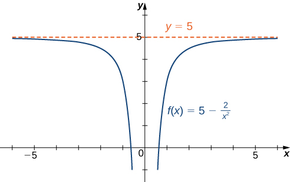{: #CNX_Calc_Figure_04_06_004}

2.  Since
    <math xmlns="http://www.w3.org/1998/Math/MathML"><mrow><mn>−1</mn><mo>≤</mo><mtext>sin</mtext><mspace width="0.1em" /><mi>x</mi><mo>≤</mo><mn>1</mn></mrow></math>
    
    for all
    <math xmlns="http://www.w3.org/1998/Math/MathML"><mrow><mi>x</mi><mo>,</mo></mrow></math>
    
    we have
    * * *
    {: data-type="newline"}
    
    

    <math xmlns="http://www.w3.org/1998/Math/MathML"><mrow><mfrac><mrow><mn>−1</mn></mrow><mi>x</mi></mfrac><mo>≤</mo><mfrac><mrow><mtext>sin</mtext><mspace width="0.1em" /><mi>x</mi></mrow><mi>x</mi></mfrac><mo>≤</mo><mfrac><mn>1</mn><mi>x</mi></mfrac></mrow></math>
    

    
    * * *
    {: data-type="newline"}
    
    for all
    <math xmlns="http://www.w3.org/1998/Math/MathML"><mrow><mi>x</mi><mo>≠</mo><mn>0</mn><mo>.</mo></mrow></math>
    
    Also, since
    * * *
    {: data-type="newline"}
    
    

    <math xmlns="http://www.w3.org/1998/Math/MathML"><mrow><munder><mrow><mtext>lim</mtext></mrow><mrow><mi>x</mi><mo stretchy="false">→</mo><mi>∞</mi></mrow></munder><mfrac><mrow><mn>−1</mn></mrow><mi>x</mi></mfrac><mo>=</mo><mn>0</mn><mo>=</mo><munder><mrow><mtext>lim</mtext></mrow><mrow><mi>x</mi><mo stretchy="false">→</mo><mi>∞</mi></mrow></munder><mfrac><mn>1</mn><mi>x</mi></mfrac><mo>,</mo></mrow></math>
    

    
    * * *
    {: data-type="newline"}
    
    we can apply the squeeze theorem to conclude that
    * * *
    {: data-type="newline"}
    
    

    <math xmlns="http://www.w3.org/1998/Math/MathML"><mrow><munder><mrow><mtext>lim</mtext></mrow><mrow><mi>x</mi><mo stretchy="false">→</mo><mi>∞</mi></mrow></munder><mfrac><mrow><mtext>sin</mtext><mspace width="0.1em" /><mi>x</mi></mrow><mi>x</mi></mfrac><mo>=</mo><mn>0</mn><mo>.</mo></mrow></math>
    

    
    * * *
    {: data-type="newline"}
    
    Similarly,
    * * *
    {: data-type="newline"}
    
    

    <math xmlns="http://www.w3.org/1998/Math/MathML"><mrow><munder><mrow><mtext>lim</mtext></mrow><mrow><mi>x</mi><mo stretchy="false">→</mo><mtext>−</mtext><mi>∞</mi></mrow></munder><mfrac><mrow><mtext>sin</mtext><mspace width="0.1em" /><mi>x</mi></mrow><mi>x</mi></mfrac><mo>=</mo><mn>0</mn><mo>.</mo></mrow></math>
    

    
    * * *
    {: data-type="newline"}
    
    Thus,
    <math xmlns="http://www.w3.org/1998/Math/MathML"><mrow><mi>f</mi><mrow><mo>(</mo><mi>x</mi><mo>)</mo></mrow><mo>=</mo><mfrac><mrow><mtext>sin</mtext><mspace width="0.1em" /><mi>x</mi></mrow><mi>x</mi></mfrac></mrow></math>
    
    has a horizontal asymptote of
    <math xmlns="http://www.w3.org/1998/Math/MathML"><mrow><mi>y</mi><mo>=</mo><mn>0</mn></mrow></math>
    
    and
    <math xmlns="http://www.w3.org/1998/Math/MathML"><mrow><mi>f</mi><mrow><mo>(</mo><mi>x</mi><mo>)</mo></mrow></mrow></math>
    
    approaches this horizontal asymptote as
    <math xmlns="http://www.w3.org/1998/Math/MathML"><mrow><mi>x</mi><mo stretchy="false">→</mo><mtext>±</mtext><mi>∞</mi></mrow></math>
    
    as shown in the following graph.
    * * *
    {: data-type="newline"}
    
    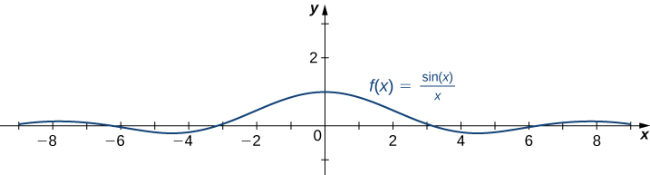{: #CNX_Calc_Figure_04_06_005}

3.  To evaluate
    <math xmlns="http://www.w3.org/1998/Math/MathML"><mrow><munder><mrow><mtext>lim</mtext></mrow><mrow><mi>x</mi><mo stretchy="false">→</mo><mi>∞</mi></mrow></munder><msup><mrow><mtext>tan</mtext></mrow><mrow><mn>−1</mn></mrow></msup><mrow><mo>(</mo><mi>x</mi><mo>)</mo></mrow></mrow></math>
    
    and
    <math xmlns="http://www.w3.org/1998/Math/MathML"><mrow><munder><mrow><mtext>lim</mtext></mrow><mrow><mi>x</mi><mo stretchy="false">→</mo><mtext>−</mtext><mi>∞</mi></mrow></munder><msup><mrow><mtext>tan</mtext></mrow><mrow><mn>−1</mn></mrow></msup><mrow><mo>(</mo><mi>x</mi><mo>)</mo></mrow><mo>,</mo></mrow></math>
    
    we first consider the graph of
    <math xmlns="http://www.w3.org/1998/Math/MathML"><mrow><mi>y</mi><mo>=</mo><mtext>tan</mtext><mrow><mo>(</mo><mi>x</mi><mo>)</mo></mrow></mrow></math>
    
    over the interval
    <math xmlns="http://www.w3.org/1998/Math/MathML"><mrow><mrow><mo>(</mo><mrow><mtext>−</mtext><mi>π</mi><mtext>/</mtext><mn>2</mn><mo>,</mo><mi>π</mi><mtext>/</mtext><mn>2</mn></mrow><mo>)</mo></mrow></mrow></math>
    
    as shown in the following graph.
    * * *
    {: data-type="newline"}
    
    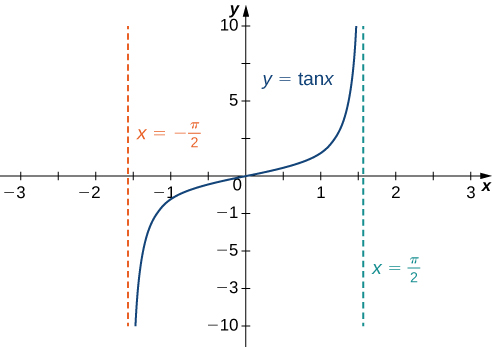{: #CNX_Calc_Figure_04_06_006}

{: data-number-style="lower-alpha"}

Since

<math xmlns="http://www.w3.org/1998/Math/MathML"><mrow><munder><mrow><mtext>lim</mtext></mrow><mrow><mi>x</mi><mo stretchy="false">→</mo><msup><mrow><mo stretchy="false">(</mo><mi>π</mi><mtext>/</mtext><mn>2</mn><mo stretchy="false">)</mo></mrow><mo>−</mo></msup></mrow></munder><mtext>tan</mtext><mspace width="0.1em" /><mi>x</mi><mo>=</mo><mi>∞</mi><mo>,</mo></mrow></math>

it follows that

<math xmlns="http://www.w3.org/1998/Math/MathML"><mrow><munder><mrow><mtext>lim</mtext></mrow><mrow><mi>x</mi><mo stretchy="false">→</mo><mi>∞</mi></mrow></munder><msup><mrow><mtext>tan</mtext></mrow><mrow><mn>−1</mn></mrow></msup><mo stretchy="false">(</mo><mi>x</mi><mo stretchy="false">)</mo><mo>=</mo><mfrac><mi>π</mi><mn>2</mn></mfrac><mo>.</mo></mrow></math>

Similarly, since

<math xmlns="http://www.w3.org/1998/Math/MathML"><mrow><munder><mrow><mtext>lim</mtext></mrow><mrow><mi>x</mi><mo stretchy="false">→</mo><msup><mrow><mo stretchy="false">(</mo><mi>π</mi><mtext>/</mtext><mn>2</mn><mo stretchy="false">)</mo></mrow><mo>+</mo></msup></mrow></munder><mtext>tan</mtext><mspace width="0.1em" /><mi>x</mi><mo>=</mo><mtext>−</mtext><mi>∞</mi><mo>,</mo></mrow></math>

it follows that

<math xmlns="http://www.w3.org/1998/Math/MathML"><mrow><munder><mrow><mtext>lim</mtext></mrow><mrow><mi>x</mi><mo stretchy="false">→</mo><mtext>−</mtext><mi>∞</mi></mrow></munder><msup><mrow><mtext>tan</mtext></mrow><mrow><mn>−1</mn></mrow></msup><mrow><mo>(</mo><mi>x</mi><mo>)</mo></mrow><mo>=</mo><mo>−</mo><mfrac><mi>π</mi><mn>2</mn></mfrac><mo>.</mo></mrow></math>

As a result, <math xmlns="http://www.w3.org/1998/Math/MathML"><mrow><mi>y</mi><mo>=</mo><mfrac><mi>π</mi><mn>2</mn></mfrac></mrow></math>

 and <math xmlns="http://www.w3.org/1998/Math/MathML"><mrow><mi>y</mi><mo>=</mo><mo>−</mo><mfrac><mi>π</mi><mn>2</mn></mfrac></mrow></math>

 are horizontal asymptotes of <math xmlns="http://www.w3.org/1998/Math/MathML"><mrow><mi>f</mi><mrow><mo>(</mo><mi>x</mi><mo>)</mo></mrow><mo>=</mo><msup><mrow><mtext>tan</mtext></mrow><mrow><mn>−1</mn></mrow></msup><mrow><mo>(</mo><mi>x</mi><mo>)</mo></mrow></mrow></math>

 as shown in the following graph.

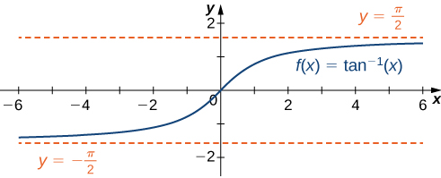{: #CNX_Calc_Figure_04_06_007}

Evaluate <math xmlns="http://www.w3.org/1998/Math/MathML"><mrow><munder><mrow><mtext>lim</mtext></mrow><mrow><mi>x</mi><mo stretchy="false">→</mo><mtext>−</mtext><mi>∞</mi></mrow></munder><mrow><mo>(</mo><mrow><mn>3</mn><mo>+</mo><mfrac><mn>4</mn><mi>x</mi></mfrac></mrow><mo>)</mo></mrow></mrow></math>

 and <math xmlns="http://www.w3.org/1998/Math/MathML"><mrow><munder><mrow><mtext>lim</mtext></mrow><mrow><mi>x</mi><mo stretchy="false">→</mo><mi>∞</mi></mrow></munder><mrow><mo>(</mo><mrow><mn>3</mn><mo>+</mo><mfrac><mn>4</mn><mi>x</mi></mfrac></mrow><mo>)</mo></mrow><mo>.</mo></mrow></math>

 Determine the horizontal asymptotes of <math xmlns="http://www.w3.org/1998/Math/MathML"><mrow><mi>f</mi><mrow><mo>(</mo><mi>x</mi><mo>)</mo></mrow><mo>=</mo><mn>3</mn><mo>+</mo><mfrac><mn>4</mn><mi>x</mi></mfrac><mo>,</mo></mrow></math>

 if any.

Both limits are <math xmlns="http://www.w3.org/1998/Math/MathML"><mrow><mn>3</mn><mo>.</mo></mrow></math>

 The line <math xmlns="http://www.w3.org/1998/Math/MathML"><mrow><mi>y</mi><mo>=</mo><mn>3</mn></mrow></math>

 is a horizontal asymptote.

Hint

<math xmlns="http://www.w3.org/1998/Math/MathML"><mrow><munder><mrow><mtext>lim</mtext></mrow><mrow><mi>x</mi><mo stretchy="false">→</mo><mtext>±</mtext><mi>∞</mi></mrow></munder><mn>1</mn><mtext>/</mtext><mi>x</mi><mo>=</mo><mn>0</mn></mrow></math>

## Infinite Limits at Infinity

Sometimes the values of a function <math xmlns="http://www.w3.org/1998/Math/MathML"><mi>f</mi></math>

 become arbitrarily large as <math xmlns="http://www.w3.org/1998/Math/MathML"><mrow><mi>x</mi><mo stretchy="false">→</mo><mi>∞</mi></mrow></math>

 (or as <math xmlns="http://www.w3.org/1998/Math/MathML"><mrow><mi>x</mi><mo stretchy="false">→</mo><mtext>−</mtext><mi>∞</mi><mo stretchy="false">)</mo><mo>.</mo></mrow></math>

 In this case, we write <math xmlns="http://www.w3.org/1998/Math/MathML"><mrow><munder><mrow><mtext>lim</mtext></mrow><mrow><mi>x</mi><mo stretchy="false">→</mo><mi>∞</mi></mrow></munder><mi>f</mi><mrow><mo>(</mo><mi>x</mi><mo>)</mo></mrow><mo>=</mo><mi>∞</mi></mrow></math>

 (or <math xmlns="http://www.w3.org/1998/Math/MathML"><mrow><munder><mrow><mtext>lim</mtext></mrow><mrow><mi>x</mi><mo stretchy="false">→</mo><mtext>−</mtext><mi>∞</mi></mrow></munder><mi>f</mi><mrow><mo>(</mo><mi>x</mi><mo>)</mo></mrow><mo>=</mo><mi>∞</mi><mo stretchy="false">)</mo><mo>.</mo></mrow></math>

 On the other hand, if the values of <math xmlns="http://www.w3.org/1998/Math/MathML"><mi>f</mi></math>

 are negative but become arbitrarily large in magnitude as <math xmlns="http://www.w3.org/1998/Math/MathML"><mrow><mi>x</mi><mo stretchy="false">→</mo><mi>∞</mi></mrow></math>

 (or as <math xmlns="http://www.w3.org/1998/Math/MathML"><mrow><mi>x</mi><mo stretchy="false">→</mo><mtext>−</mtext><mi>∞</mi><mo stretchy="false">)</mo><mo>,</mo></mrow></math>

 we write <math xmlns="http://www.w3.org/1998/Math/MathML"><mrow><munder><mrow><mtext>lim</mtext></mrow><mrow><mi>x</mi><mo stretchy="false">→</mo><mi>∞</mi></mrow></munder><mi>f</mi><mrow><mo>(</mo><mi>x</mi><mo>)</mo></mrow><mo>=</mo><mtext>−</mtext><mi>∞</mi></mrow></math>

 (or <math xmlns="http://www.w3.org/1998/Math/MathML"><mrow><munder><mrow><mtext>lim</mtext></mrow><mrow><mi>x</mi><mo stretchy="false">→</mo><mtext>−</mtext><mi>∞</mi></mrow></munder><mi>f</mi><mrow><mo>(</mo><mi>x</mi><mo>)</mo></mrow><mo>=</mo><mtext>−</mtext><mi>∞</mi><mo stretchy="false">)</mo><mo>.</mo></mrow></math>

For example, consider the function <math xmlns="http://www.w3.org/1998/Math/MathML"><mrow><mi>f</mi><mrow><mo>(</mo><mi>x</mi><mo>)</mo></mrow><mo>=</mo><msup><mi>x</mi><mn>3</mn></msup><mo>.</mo></mrow></math>

 As seen in [\[link\]](#fs-id1165042406634) and [\[link\]](#CNX_Calc_Figure_04_06_008), as <math xmlns="http://www.w3.org/1998/Math/MathML"><mrow><mi>x</mi><mo stretchy="false">→</mo><mi>∞</mi></mrow></math>

 the values <math xmlns="http://www.w3.org/1998/Math/MathML"><mrow><mi>f</mi><mrow><mo>(</mo><mi>x</mi><mo>)</mo></mrow></mrow></math>

 become arbitrarily large. Therefore, <math xmlns="http://www.w3.org/1998/Math/MathML"><mrow><munder><mrow><mtext>lim</mtext></mrow><mrow><mi>x</mi><mo stretchy="false">→</mo><mi>∞</mi></mrow></munder><msup><mi>x</mi><mn>3</mn></msup><mo>=</mo><mi>∞</mi><mo>.</mo></mrow></math>

 On the other hand, as <math xmlns="http://www.w3.org/1998/Math/MathML"><mrow><mi>x</mi><mo stretchy="false">→</mo><mtext>−</mtext><mi>∞</mi><mo>,</mo></mrow></math>

 the values of <math xmlns="http://www.w3.org/1998/Math/MathML"><mrow><mi>f</mi><mrow><mo>(</mo><mi>x</mi><mo>)</mo></mrow><mo>=</mo><msup><mi>x</mi><mn>3</mn></msup></mrow></math>

 are negative but become arbitrarily large in magnitude. Consequently, <math xmlns="http://www.w3.org/1998/Math/MathML"><mrow><munder><mrow><mtext>lim</mtext></mrow><mrow><mi>x</mi><mo stretchy="false">→</mo><mtext>−</mtext><mi>∞</mi></mrow></munder><msup><mi>x</mi><mn>3</mn></msup><mo>=</mo><mtext>−</mtext><mi>∞</mi><mo>.</mo></mrow></math>

<table class="column-header" summary="The table has four rows and six columns. The first column is a header column and it reads x, x3, x, and x3. After the header, the first row reads 10, 20, 50, 100, and 1000. The second row reads 1000, 8000, 125000, 1,000,000, and 1,000,000,000. The third row reads &#x2212;10, &#x2212;20, &#x2212;50, &#x2212;100, and &#x2212;1000. The forth row reads &#x2212;1000, &#x2212;8000, &#x2212;125,000, &#x2212;1,000,000, and &#x2212;1,000,000,000."><caption>Values of a power function as <math xmlns="http://www.w3.org/1998/Math/MathML"><mrow><mi>x</mi><mo stretchy="false">→</mo><mtext>±</mtext><mi>∞</mi></mrow></math></caption><tbody>
<tr valign="top">
<td><strong><math xmlns="http://www.w3.org/1998/Math/MathML"><mi>x</mi></math></strong></td>
<td><math xmlns="http://www.w3.org/1998/Math/MathML"><mrow><mn>10</mn></mrow></math></td>
<td><math xmlns="http://www.w3.org/1998/Math/MathML"><mrow><mn>20</mn></mrow></math></td>
<td><math xmlns="http://www.w3.org/1998/Math/MathML"><mrow><mn>50</mn></mrow></math></td>
<td><math xmlns="http://www.w3.org/1998/Math/MathML"><mrow><mn>100</mn></mrow></math></td>
<td><math xmlns="http://www.w3.org/1998/Math/MathML"><mrow><mn>1000</mn></mrow></math></td>
</tr>
<tr valign="top">
<td><strong><math xmlns="http://www.w3.org/1998/Math/MathML"><mrow><msup><mi>x</mi><mn>3</mn></msup></mrow></math></strong></td>
<td><math xmlns="http://www.w3.org/1998/Math/MathML"><mrow><mn>1000</mn></mrow></math></td>
<td><math xmlns="http://www.w3.org/1998/Math/MathML"><mrow><mn>8000</mn></mrow></math></td>
<td><math xmlns="http://www.w3.org/1998/Math/MathML"><mrow><mn>125,000</mn></mrow></math></td>
<td><math xmlns="http://www.w3.org/1998/Math/MathML"><mrow><mn>1,000,000</mn></mrow></math></td>
<td><math xmlns="http://www.w3.org/1998/Math/MathML"><mrow><mn>1,000,000,000</mn></mrow></math></td>
</tr>
<tr valign="top">
<td><strong><math xmlns="http://www.w3.org/1998/Math/MathML"><mi>x</mi></math></strong></td>
<td><math xmlns="http://www.w3.org/1998/Math/MathML"><mrow><mn>−10</mn></mrow></math></td>
<td><math xmlns="http://www.w3.org/1998/Math/MathML"><mrow><mn>−20</mn></mrow></math></td>
<td><math xmlns="http://www.w3.org/1998/Math/MathML"><mrow><mn>−50</mn></mrow></math></td>
<td><math xmlns="http://www.w3.org/1998/Math/MathML"><mrow><mn>−100</mn></mrow></math></td>
<td><math xmlns="http://www.w3.org/1998/Math/MathML"><mrow><mn>−1000</mn></mrow></math></td>
</tr>
<tr valign="top">
<td><strong><math xmlns="http://www.w3.org/1998/Math/MathML"><mrow><msup><mi>x</mi><mn>3</mn></msup></mrow></math></strong></td>
<td><math xmlns="http://www.w3.org/1998/Math/MathML"><mrow><mn>−1000</mn></mrow></math></td>
<td><math xmlns="http://www.w3.org/1998/Math/MathML"><mrow><mn>−8000</mn></mrow></math></td>
<td><math xmlns="http://www.w3.org/1998/Math/MathML"><mrow><mn>−125,000</mn></mrow></math></td>
<td><math xmlns="http://www.w3.org/1998/Math/MathML"><mrow><mn>−1,000,000</mn></mrow></math></td>
<td><math xmlns="http://www.w3.org/1998/Math/MathML"><mrow><mn>−1,000,000,000</mn></mrow></math></td>
</tr>
</tbody></table>

 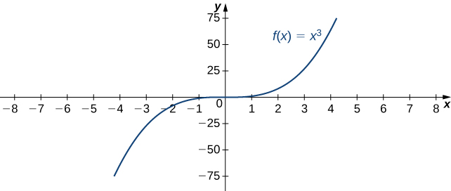{: #CNX_Calc_Figure_04_06_008}

Definition

(Informal) We say a function <math xmlns="http://www.w3.org/1998/Math/MathML"><mi>f</mi></math>

 has an infinite limit at infinity and write

<math xmlns="http://www.w3.org/1998/Math/MathML"><mrow><munder><mrow><mtext>lim</mtext></mrow><mrow><mi>x</mi><mo stretchy="false">→</mo><mi>∞</mi></mrow></munder><mi>f</mi><mrow><mo>(</mo><mi>x</mi><mo>)</mo></mrow><mo>=</mo><mi>∞</mi><mo>.</mo></mrow></math>

if <math xmlns="http://www.w3.org/1998/Math/MathML"><mrow><mi>f</mi><mrow><mo>(</mo><mi>x</mi><mo>)</mo></mrow></mrow></math>

 becomes arbitrarily large for <math xmlns="http://www.w3.org/1998/Math/MathML"><mi>x</mi></math>

 sufficiently large. We say a function has a negative infinite limit at infinity and write

<math xmlns="http://www.w3.org/1998/Math/MathML"><mrow><munder><mrow><mtext>lim</mtext></mrow><mrow><mi>x</mi><mo stretchy="false">→</mo><mi>∞</mi></mrow></munder><mi>f</mi><mrow><mo>(</mo><mi>x</mi><mo>)</mo></mrow><mo>=</mo><mtext>−</mtext><mi>∞</mi><mo>.</mo></mrow></math>

if <math xmlns="http://www.w3.org/1998/Math/MathML"><mrow><mi>f</mi><mrow><mo>(</mo><mi>x</mi><mo>)</mo></mrow><mo>&lt;</mo><mn>0</mn></mrow></math>

 and <math xmlns="http://www.w3.org/1998/Math/MathML"><mrow><mrow><mo>\|</mo><mrow><mi>f</mi><mrow><mo>(</mo><mi>x</mi><mo>)</mo></mrow></mrow><mo>\|</mo></mrow></mrow></math>

 becomes arbitrarily large for <math xmlns="http://www.w3.org/1998/Math/MathML"><mi>x</mi></math>

 sufficiently large. Similarly, we can define infinite limits as <math xmlns="http://www.w3.org/1998/Math/MathML"><mrow><mi>x</mi><mo stretchy="false">→</mo><mtext>−</mtext><mi>∞</mi><mo>.</mo></mrow></math>

## Formal Definitions

Earlier, we used the terms *arbitrarily close*, *arbitrarily large*, and *sufficiently large* to define limits at infinity informally. Although these terms provide accurate descriptions of limits at infinity, they are not precise mathematically. Here are more formal definitions of limits at infinity. We then look at how to use these definitions to prove results involving limits at infinity.

Definition

(Formal) We say a function <math xmlns="http://www.w3.org/1998/Math/MathML"><mi>f</mi></math>

 has a **limit at infinity**{: data-type="term"}, if there exists a real number <math xmlns="http://www.w3.org/1998/Math/MathML"><mi>L</mi></math>

 such that for all <math xmlns="http://www.w3.org/1998/Math/MathML"><mrow><mi>ε</mi><mo>&gt;</mo><mn>0</mn><mo>,</mo></mrow></math>

 there exists <math xmlns="http://www.w3.org/1998/Math/MathML"><mrow><mi>N</mi><mo>&gt;</mo><mn>0</mn></mrow></math>

 such that

<math xmlns="http://www.w3.org/1998/Math/MathML"><mrow><mrow><mo>\|</mo><mrow><mi>f</mi><mo stretchy="false">(</mo><mi>x</mi><mo stretchy="false">)</mo><mo>−</mo><mi>L</mi></mrow><mo>\|</mo></mrow><mo>&lt;</mo><mi>ε</mi></mrow></math>

for all <math xmlns="http://www.w3.org/1998/Math/MathML"><mrow><mi>x</mi><mo>&gt;</mo><mi>N</mi><mo>.</mo></mrow></math>

 In that case, we write

<math xmlns="http://www.w3.org/1998/Math/MathML"><mrow><munder><mrow><mtext>lim</mtext></mrow><mrow><mi>x</mi><mo stretchy="false">→</mo><mi>∞</mi></mrow></munder><mi>f</mi><mrow><mo>(</mo><mi>x</mi><mo>)</mo></mrow><mo>=</mo><mi>L</mi></mrow></math>

(see [\[link\]](#CNX_Calc_Figure_04_06_009)).

We say a function <math xmlns="http://www.w3.org/1998/Math/MathML"><mi>f</mi></math>

 has a limit at negative infinity if there exists a real number <math xmlns="http://www.w3.org/1998/Math/MathML"><mi>L</mi></math>

 such that for all <math xmlns="http://www.w3.org/1998/Math/MathML"><mrow><mi>ε</mi><mo>&gt;</mo><mn>0</mn><mo>,</mo></mrow></math>

 there exists <math xmlns="http://www.w3.org/1998/Math/MathML"><mrow><mi>N</mi><mo>&lt;</mo><mn>0</mn></mrow></math>

 such that

<math xmlns="http://www.w3.org/1998/Math/MathML"><mrow><mrow><mo>\|</mo><mrow><mi>f</mi><mo stretchy="false">(</mo><mi>x</mi><mo stretchy="false">)</mo><mo>−</mo><mi>L</mi></mrow><mo>\|</mo></mrow><mo>&lt;</mo><mi>ε</mi></mrow></math>

for all <math xmlns="http://www.w3.org/1998/Math/MathML"><mrow><mi>x</mi><mo>&lt;</mo><mi>N</mi><mo>.</mo></mrow></math>

 In that case, we write

<math xmlns="http://www.w3.org/1998/Math/MathML"><mrow><munder><mrow><mtext>lim</mtext></mrow><mrow><mi>x</mi><mo stretchy="false">→</mo><mtext>−</mtext><mi>∞</mi></mrow></munder><mi>f</mi><mrow><mo>(</mo><mi>x</mi><mo>)</mo></mrow><mo>=</mo><mi>L</mi><mo>.</mo></mrow></math>

 &#x2212;L|&lt;&#x3B5;."){: #CNX_Calc_Figure_04_06_009}

Earlier in this section, we used graphical evidence in [\[link\]](#CNX_Calc_Figure_04_06_001) and numerical evidence in [\[link\]](#fs-id1165043428402) to conclude that <math xmlns="http://www.w3.org/1998/Math/MathML"><mrow><munder><mrow><mtext>lim</mtext></mrow><mrow><mi>x</mi><mo stretchy="false">→</mo><mi>∞</mi></mrow></munder><mrow><mo>(</mo><mrow><mfrac><mrow><mn>2</mn><mo>+</mo><mn>1</mn></mrow><mi>x</mi></mfrac></mrow><mo>)</mo></mrow><mo>=</mo><mn>2</mn><mo>.</mo></mrow></math>

 Here we use the formal definition of limit at infinity to prove this result rigorously.

Use the formal definition of limit at infinity to prove that <math xmlns="http://www.w3.org/1998/Math/MathML"><mrow><munder><mrow><mtext>lim</mtext></mrow><mrow><mi>x</mi><mo stretchy="false">→</mo><mi>∞</mi></mrow></munder><mrow><mo>(</mo><mrow><mfrac><mrow><mn>2</mn><mo>+</mo><mn>1</mn></mrow><mi>x</mi></mfrac></mrow><mo>)</mo></mrow><mo>=</mo><mn>2</mn><mo>.</mo></mrow></math>

Let <math xmlns="http://www.w3.org/1998/Math/MathML"><mrow><mi>ε</mi><mo>&gt;</mo><mn>0</mn><mo>.</mo></mrow></math>

 Let <math xmlns="http://www.w3.org/1998/Math/MathML"><mrow><mi>N</mi><mo>=</mo><mfrac><mn>1</mn><mi>ε</mi></mfrac><mo>.</mo></mrow></math>

 Therefore, for all <math xmlns="http://www.w3.org/1998/Math/MathML"><mrow><mi>x</mi><mo>&gt;</mo><mi>N</mi><mo>,</mo></mrow></math>

 we have

<math xmlns="http://www.w3.org/1998/Math/MathML"><mrow><mrow><mo>\|</mo><mrow><mn>2</mn><mo>+</mo><mfrac><mn>1</mn><mi>x</mi></mfrac><mo>−</mo><mn>2</mn></mrow><mo>\|</mo></mrow><mo>=</mo><mrow><mo>\|</mo><mrow><mfrac><mn>1</mn><mi>x</mi></mfrac></mrow><mo>\|</mo></mrow><mo>=</mo><mfrac><mn>1</mn><mi>x</mi></mfrac><mo>&lt;</mo><mfrac><mn>1</mn><mi>N</mi></mfrac><mo>=</mo><mi>ε</mi></mrow></math>

Use the formal definition of limit at infinity to prove that <math xmlns="http://www.w3.org/1998/Math/MathML"><mrow><munder><mrow><mtext>lim</mtext></mrow><mrow><mi>x</mi><mo stretchy="false">→</mo><mi>∞</mi></mrow></munder><mrow><mo>(</mo><mrow><mfrac><mrow><mn>3</mn><mo>−</mo><mn>1</mn></mrow><mrow><msup><mi>x</mi><mn>2</mn></msup></mrow></mfrac></mrow><mo>)</mo></mrow><mo>=</mo><mn>3</mn><mo>.</mo></mrow></math>

Let <math xmlns="http://www.w3.org/1998/Math/MathML"><mrow><mi>ε</mi><mo>&gt;</mo><mn>0</mn><mo>.</mo></mrow></math>

 Let <math xmlns="http://www.w3.org/1998/Math/MathML"><mrow><mi>N</mi><mo>=</mo><mfrac><mn>1</mn><mrow><msqrt><mi>ε</mi></msqrt></mrow></mfrac><mo>.</mo></mrow></math>

 Therefore, for all <math xmlns="http://www.w3.org/1998/Math/MathML"><mrow><mi>x</mi><mo>&gt;</mo><mi>N</mi><mo>,</mo></mrow></math>

 we have

<math xmlns="http://www.w3.org/1998/Math/MathML"><mrow><mrow><mo>\|</mo><mrow><mn>3</mn><mo>−</mo><mfrac><mn>1</mn><mrow><msup><mi>x</mi><mn>2</mn></msup></mrow></mfrac><mo>−</mo><mn>3</mn></mrow><mo>\|</mo></mrow><mo>=</mo><mfrac><mn>1</mn><mrow><msup><mi>x</mi><mn>2</mn></msup></mrow></mfrac><mo>&lt;</mo><mfrac><mn>1</mn><mrow><msup><mi>N</mi><mn>2</mn></msup></mrow></mfrac><mo>=</mo><mi>ε</mi></mrow></math>

Therefore, <math xmlns="http://www.w3.org/1998/Math/MathML"><mrow><munder><mrow><mtext>lim</mtext></mrow><mrow><mi>x</mi><mo stretchy="false">→</mo><mi>∞</mi></mrow></munder><mrow><mo>(</mo><mrow><mn>3</mn><mo>−</mo><mn>1</mn><mtext>/</mtext><msup><mi>x</mi><mn>2</mn></msup></mrow><mo>)</mo></mrow><mo>=</mo><mn>3</mn><mo>.</mo></mrow></math>

Hint

Let <math xmlns="http://www.w3.org/1998/Math/MathML"><mrow><mi>N</mi><mo>=</mo><mfrac><mn>1</mn><mrow><msqrt><mi>ε</mi></msqrt></mrow></mfrac><mo>.</mo></mrow></math>

We now turn our attention to a more precise definition for an infinite limit at infinity.

Definition

(Formal) We say a function <math xmlns="http://www.w3.org/1998/Math/MathML"><mi>f</mi></math>

 has an **infinite limit at infinity**{: data-type="term"} and write

<math xmlns="http://www.w3.org/1998/Math/MathML"><mrow><munder><mrow><mtext>lim</mtext></mrow><mrow><mi>x</mi><mo stretchy="false">→</mo><mi>∞</mi></mrow></munder><mi>f</mi><mrow><mo>(</mo><mi>x</mi><mo>)</mo></mrow><mo>=</mo><mi>∞</mi></mrow></math>

if for all <math xmlns="http://www.w3.org/1998/Math/MathML"><mrow><mi>M</mi><mo>&gt;</mo><mn>0</mn><mo>,</mo></mrow></math>

 there exists an <math xmlns="http://www.w3.org/1998/Math/MathML"><mrow><mi>N</mi><mo>&gt;</mo><mn>0</mn></mrow></math>

 such that

<math xmlns="http://www.w3.org/1998/Math/MathML"><mrow><mi>f</mi><mrow><mo>(</mo><mi>x</mi><mo>)</mo></mrow><mo>&gt;</mo><mi>M</mi></mrow></math>

for all <math xmlns="http://www.w3.org/1998/Math/MathML"><mrow><mi>x</mi><mo>&gt;</mo><mi>N</mi></mrow></math>

 (see [\[link\]](#CNX_Calc_Figure_04_06_010)).

We say a function has a negative infinite limit at infinity and write

<math xmlns="http://www.w3.org/1998/Math/MathML"><mrow><munder><mrow><mtext>lim</mtext></mrow><mrow><mi>x</mi><mo stretchy="false">→</mo><mi>∞</mi></mrow></munder><mi>f</mi><mrow><mo>(</mo><mi>x</mi><mo>)</mo></mrow><mo>=</mo><mtext>−</mtext><mi>∞</mi></mrow></math>

if for all <math xmlns="http://www.w3.org/1998/Math/MathML"><mrow><mi>M</mi><mo>&lt;</mo><mn>0</mn><mo>,</mo></mrow></math>

 there exists an <math xmlns="http://www.w3.org/1998/Math/MathML"><mrow><mi>N</mi><mo>&gt;</mo><mn>0</mn></mrow></math>

 such that

<math xmlns="http://www.w3.org/1998/Math/MathML"><mrow><mi>f</mi><mrow><mo>(</mo><mi>x</mi><mo>)</mo></mrow><mo>&lt;</mo><mi>M</mi></mrow></math>

for all <math xmlns="http://www.w3.org/1998/Math/MathML"><mrow><mi>x</mi><mo>&gt;</mo><mi>N</mi><mo>.</mo></mrow></math>

Similarly we can define limits as <math xmlns="http://www.w3.org/1998/Math/MathML"><mrow><mi>x</mi><mo stretchy="false">→</mo><mtext>−</mtext><mi>∞</mi><mo>.</mo></mrow></math>

 &gt;M."){: #CNX_Calc_Figure_04_06_010}

Earlier, we used graphical evidence ([\[link\]](#CNX_Calc_Figure_04_06_008)) and numerical evidence ([\[link\]](#fs-id1165042406634)) to conclude that <math xmlns="http://www.w3.org/1998/Math/MathML"><mrow><munder><mrow><mtext>lim</mtext></mrow><mrow><mi>x</mi><mo stretchy="false">→</mo><mi>∞</mi></mrow></munder><msup><mi>x</mi><mn>3</mn></msup><mo>=</mo><mi>∞</mi><mo>.</mo></mrow></math>

 Here we use the formal definition of infinite limit at infinity to prove that result.

Use the formal definition of infinite limit at infinity to prove that <math xmlns="http://www.w3.org/1998/Math/MathML"><mrow><munder><mrow><mtext>lim</mtext></mrow><mrow><mi>x</mi><mo stretchy="false">→</mo><mi>∞</mi></mrow></munder><msup><mi>x</mi><mn>3</mn></msup><mo>=</mo><mi>∞</mi><mo>.</mo></mrow></math>

Let <math xmlns="http://www.w3.org/1998/Math/MathML"><mrow><mi>M</mi><mo>&gt;</mo><mn>0</mn><mo>.</mo></mrow></math>

 Let <math xmlns="http://www.w3.org/1998/Math/MathML"><mrow><mi>N</mi><mo>=</mo><mroot><mi>M</mi><mn>3</mn></mroot><mo>.</mo></mrow></math>

 Then, for all <math xmlns="http://www.w3.org/1998/Math/MathML"><mrow><mi>x</mi><mo>&gt;</mo><mi>N</mi><mo>,</mo></mrow></math>

 we have

<math xmlns="http://www.w3.org/1998/Math/MathML"><mrow><msup><mi>x</mi><mn>3</mn></msup><mo>&gt;</mo><msup><mi>N</mi><mn>3</mn></msup><mo>=</mo><msup><mrow><mrow><mo>(</mo><mrow><mroot><mi>M</mi><mn>3</mn></mroot></mrow><mo>)</mo></mrow></mrow><mn>3</mn></msup><mo>=</mo><mi>M</mi><mo>.</mo></mrow></math>

Therefore, <math xmlns="http://www.w3.org/1998/Math/MathML"><mrow><munder><mrow><mtext>lim</mtext></mrow><mrow><mi>x</mi><mo stretchy="false">→</mo><mi>∞</mi></mrow></munder><msup><mi>x</mi><mn>3</mn></msup><mo>=</mo><mi>∞</mi><mo>.</mo></mrow></math>

Use the formal definition of infinite limit at infinity to prove that <math xmlns="http://www.w3.org/1998/Math/MathML"><mrow><munder><mrow><mtext>lim</mtext></mrow><mrow><mi>x</mi><mo stretchy="false">→</mo><mi>∞</mi></mrow></munder><mn>3</mn><msup><mi>x</mi><mn>2</mn></msup><mo>=</mo><mi>∞</mi><mo>.</mo></mrow></math>

Let <math xmlns="http://www.w3.org/1998/Math/MathML"><mrow><mi>M</mi><mo>&gt;</mo><mn>0</mn><mo>.</mo></mrow></math>

 Let <math xmlns="http://www.w3.org/1998/Math/MathML"><mrow><mi>N</mi><mo>=</mo><msqrt><mrow><mfrac><mi>M</mi><mn>3</mn></mfrac></mrow></msqrt><mo>.</mo></mrow></math>

 Then, for all <math xmlns="http://www.w3.org/1998/Math/MathML"><mrow><mi>x</mi><mo>&gt;</mo><mi>N</mi><mo>,</mo></mrow></math>

 we have

<math xmlns="http://www.w3.org/1998/Math/MathML"><mrow><mn>3</mn><msup><mi>x</mi><mn>2</mn></msup><mo>&gt;</mo><mn>3</mn><msup><mi>N</mi><mn>2</mn></msup><mo>=</mo><mn>3</mn><msup><mrow><mrow><mo>(</mo><mrow><msqrt><mrow><mfrac><mi>M</mi><mn>3</mn></mfrac></mrow></msqrt></mrow><mo>)</mo></mrow></mrow><mn>2</mn></msup><msup><mn>2</mn></msup><mo>=</mo><mfrac><mrow><mn>3</mn><mi>M</mi></mrow><mn>3</mn></mfrac><mo>=</mo><mi>M</mi></mrow></math>

Hint

Let <math xmlns="http://www.w3.org/1998/Math/MathML"><mrow><mi>N</mi><mo>=</mo><msqrt><mrow><mfrac><mi>M</mi><mn>3</mn></mfrac></mrow></msqrt><mo>.</mo></mrow></math>

# End Behavior

The behavior of a function as <math xmlns="http://www.w3.org/1998/Math/MathML"><mrow><mi>x</mi><mo stretchy="false">→</mo><mtext>±</mtext><mi>∞</mi></mrow></math>

 is called the function’s **end behavior**{: data-type="term"}. At each of the function’s ends, the function could exhibit one of the following types of behavior:

1.  The function
    <math xmlns="http://www.w3.org/1998/Math/MathML"><mrow><mi>f</mi><mrow><mo>(</mo><mi>x</mi><mo>)</mo></mrow></mrow></math>
    
    approaches a horizontal asymptote
    <math xmlns="http://www.w3.org/1998/Math/MathML"><mrow><mi>y</mi><mo>=</mo><mi>L</mi><mo>.</mo></mrow></math>

2.  The function
    <math xmlns="http://www.w3.org/1998/Math/MathML"><mrow><mi>f</mi><mrow><mo>(</mo><mi>x</mi><mo>)</mo></mrow><mo stretchy="false">→</mo><mi>∞</mi></mrow></math>
    
    or
    <math xmlns="http://www.w3.org/1998/Math/MathML"><mrow><mi>f</mi><mrow><mo>(</mo><mi>x</mi><mo>)</mo></mrow><mo stretchy="false">→</mo><mtext>−</mtext><mi>∞</mi><mo>.</mo></mrow></math>

3.  The function does not approach a finite limit, nor does it approach
    <math xmlns="http://www.w3.org/1998/Math/MathML"><mi>∞</mi></math>
    
    or
    <math xmlns="http://www.w3.org/1998/Math/MathML"><mrow><mtext>−</mtext><mi>∞</mi><mo>.</mo></mrow></math>
    
    In this case, the function may have some oscillatory behavior.
{: data-number-style="arabic"}

Let’s consider several classes of functions here and look at the different types of end behaviors for these functions.

## End Behavior for Polynomial Functions

Consider the power function <math xmlns="http://www.w3.org/1998/Math/MathML"><mrow><mi>f</mi><mrow><mo>(</mo><mi>x</mi><mo>)</mo></mrow><mo>=</mo><msup><mi>x</mi><mi>n</mi></msup></mrow></math>

 where <math xmlns="http://www.w3.org/1998/Math/MathML"><mi>n</mi></math>

 is a positive integer. From [\[link\]](#CNX_Calc_Figure_04_06_011) and [\[link\]](#CNX_Calc_Figure_04_06_012), we see that

<math xmlns="http://www.w3.org/1998/Math/MathML"><mrow><munder><mrow><mtext>lim</mtext></mrow><mrow><mi>x</mi><mo stretchy="false">→</mo><mi>∞</mi></mrow></munder><msup><mi>x</mi><mi>n</mi></msup><mo>=</mo><mi>∞</mi><mo>;</mo><mi>n</mi><mo>=</mo><mn>1</mn><mo>,</mo><mn>2</mn><mo>,</mo><mn>3</mn><mtext>,…</mtext></mrow></math>

and

<math xmlns="http://www.w3.org/1998/Math/MathML"><mrow><munder><mrow><mtext>lim</mtext></mrow><mrow><mi>x</mi><mo stretchy="false">→</mo><mtext>−</mtext><mi>∞</mi></mrow></munder><msup><mi>x</mi><mi>n</mi></msup><mo>=</mo><mrow><mo>{</mo><mrow><mtable><mtr><mtd columnalign="left"><mi>∞</mi><mo>;</mo><mi>n</mi><mo>=</mo><mn>2</mn><mo>,</mo><mn>4</mn><mo>,</mo><mn>6</mn><mtext>,…</mtext></mtd></mtr><mtr><mtd columnalign="left"><mtext>−</mtext><mi>∞</mi><mo>;</mo><mi>n</mi><mo>=</mo><mn>1</mn><mo>,</mo><mn>3</mn><mo>,</mo><mn>5</mn><mtext>,…</mtext></mtd></mtr></mtable><mo>.</mo></mrow></mrow></mrow></math>

 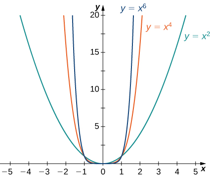{: #CNX_Calc_Figure_04_06_011}

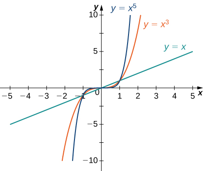{: #CNX_Calc_Figure_04_06_012}

Using these facts, it is not difficult to evaluate <math xmlns="http://www.w3.org/1998/Math/MathML"><mrow><munder><mrow><mtext>lim</mtext></mrow><mrow><mi>x</mi><mo stretchy="false">→</mo><mi>∞</mi></mrow></munder><mi>c</mi><msup><mi>x</mi><mi>n</mi></msup></mrow></math>

 and <math xmlns="http://www.w3.org/1998/Math/MathML"><mrow><munder><mrow><mtext>lim</mtext></mrow><mrow><mi>x</mi><mo stretchy="false">→</mo><mtext>−</mtext><mi>∞</mi></mrow></munder><mi>c</mi><msup><mi>x</mi><mi>n</mi></msup><mo>,</mo></mrow></math>

 where <math xmlns="http://www.w3.org/1998/Math/MathML"><mi>c</mi></math>

 is any constant and <math xmlns="http://www.w3.org/1998/Math/MathML"><mi>n</mi></math>

 is a positive integer. If <math xmlns="http://www.w3.org/1998/Math/MathML"><mrow><mi>c</mi><mo>&gt;</mo><mn>0</mn><mo>,</mo></mrow></math>

 the graph of <math xmlns="http://www.w3.org/1998/Math/MathML"><mrow><mi>y</mi><mo>=</mo><mi>c</mi><msup><mi>x</mi><mi>n</mi></msup></mrow></math>

 is a vertical stretch or compression of <math xmlns="http://www.w3.org/1998/Math/MathML"><mrow><mi>y</mi><mo>=</mo><msup><mi>x</mi><mi>n</mi></msup><mo>,</mo></mrow></math>

 and therefore

<math xmlns="http://www.w3.org/1998/Math/MathML"><mrow><munder><mrow><mtext>lim</mtext></mrow><mrow><mi>x</mi><mo stretchy="false">→</mo><mi>∞</mi></mrow></munder><mi>c</mi><msup><mi>x</mi><mi>n</mi></msup><mo>=</mo><munder><mrow><mtext>lim</mtext></mrow><mrow><mi>x</mi><mo stretchy="false">→</mo><mi>∞</mi></mrow></munder><msup><mi>x</mi><mi>n</mi></msup><mspace width="0.2em" /><mtext>and</mtext><mspace width="0.2em" /><munder><mrow><mtext>lim</mtext></mrow><mrow><mi>x</mi><mo stretchy="false">→</mo><mtext>−</mtext><mi>∞</mi></mrow></munder><mi>c</mi><msup><mi>x</mi><mi>n</mi></msup><mo>=</mo><munder><mrow><mtext>lim</mtext></mrow><mrow><mi>x</mi><mo stretchy="false">→</mo><mtext>−</mtext><mi>∞</mi></mrow></munder><msup><mi>x</mi><mi>n</mi></msup><mspace width="0.2em" /><mtext>if</mtext><mspace width="0.2em" /><mi>c</mi><mo>&gt;</mo><mn>0</mn><mo>.</mo></mrow></math>

If <math xmlns="http://www.w3.org/1998/Math/MathML"><mrow><mi>c</mi><mo>&lt;</mo><mn>0</mn><mo>,</mo></mrow></math>

 the graph of <math xmlns="http://www.w3.org/1998/Math/MathML"><mrow><mi>y</mi><mo>=</mo><mi>c</mi><msup><mi>x</mi><mi>n</mi></msup></mrow></math>

 is a vertical stretch or compression combined with a reflection about the <math xmlns="http://www.w3.org/1998/Math/MathML"><mi>x</mi></math>

-axis, and therefore

<math xmlns="http://www.w3.org/1998/Math/MathML"><mrow><munder><mrow><mtext>lim</mtext></mrow><mrow><mi>x</mi><mo stretchy="false">→</mo><mi>∞</mi></mrow></munder><mi>c</mi><msup><mi>x</mi><mi>n</mi></msup><mo>=</mo><mtext>−</mtext><munder><mrow><mtext>lim</mtext></mrow><mrow><mi>x</mi><mo stretchy="false">→</mo><mi>∞</mi></mrow></munder><msup><mi>x</mi><mi>n</mi></msup><mspace width="0.2em" /><mtext>and</mtext><mspace width="0.2em" /><munder><mrow><mtext>lim</mtext></mrow><mrow><mi>x</mi><mo stretchy="false">→</mo><mtext>−</mtext><mi>∞</mi></mrow></munder><mi>c</mi><msup><mi>x</mi><mi>n</mi></msup><mo>=</mo><mtext>−</mtext><munder><mrow><mtext>lim</mtext></mrow><mrow><mi>x</mi><mo stretchy="false">→</mo><mtext>−</mtext><mi>∞</mi></mrow></munder><msup><mi>x</mi><mi>n</mi></msup><mspace width="0.2em" /><mtext>if</mtext><mspace width="0.2em" /><mi>c</mi><mo>&lt;</mo><mn>0</mn><mo>.</mo></mrow></math>

If <math xmlns="http://www.w3.org/1998/Math/MathML"><mrow><mi>c</mi><mo>=</mo><mn>0</mn><mo>,</mo><mi>y</mi><mo>=</mo><mi>c</mi><msup><mi>x</mi><mi>n</mi></msup><mo>=</mo><mn>0</mn><mo>,</mo></mrow></math>

 in which case <math xmlns="http://www.w3.org/1998/Math/MathML"><mrow><munder><mrow><mtext>lim</mtext></mrow><mrow><mi>x</mi><mo stretchy="false">→</mo><mi>∞</mi></mrow></munder><mi>c</mi><msup><mi>x</mi><mi>n</mi></msup><mo>=</mo><mn>0</mn><mo>=</mo><munder><mrow><mtext>lim</mtext></mrow><mrow><mi>x</mi><mo stretchy="false">→</mo><mtext>−</mtext><mi>∞</mi></mrow></munder><mi>c</mi><msup><mi>x</mi><mi>n</mi></msup><mo>.</mo></mrow></math>

Limits at Infinity for Power Functions

For each function <math xmlns="http://www.w3.org/1998/Math/MathML"><mrow><mi>f</mi><mo>,</mo></mrow></math>

 evaluate <math xmlns="http://www.w3.org/1998/Math/MathML"><mrow><munder><mrow><mtext>lim</mtext></mrow><mrow><mi>x</mi><mo stretchy="false">→</mo><mi>∞</mi></mrow></munder><mi>f</mi><mrow><mo>(</mo><mi>x</mi><mo>)</mo></mrow></mrow></math>

 and <math xmlns="http://www.w3.org/1998/Math/MathML"><mrow><munder><mrow><mtext>lim</mtext></mrow><mrow><mi>x</mi><mo stretchy="false">→</mo><mtext>−</mtext><mi>∞</mi></mrow></munder><mi>f</mi><mrow><mo>(</mo><mi>x</mi><mo>)</mo></mrow><mo>.</mo></mrow></math>

1.  <math xmlns="http://www.w3.org/1998/Math/MathML"><mrow><mi>f</mi><mrow><mo>(</mo><mi>x</mi><mo>)</mo></mrow><mo>=</mo><mn>−5</mn><msup><mi>x</mi><mn>3</mn></msup></mrow></math>

2.  <math xmlns="http://www.w3.org/1998/Math/MathML"><mrow><mi>f</mi><mrow><mo>(</mo><mi>x</mi><mo>)</mo></mrow><mo>=</mo><mn>2</mn><msup><mi>x</mi><mn>4</mn></msup></mrow></math>
{: data-number-style="lower-alpha"}

1.  Since the coefficient of
    <math xmlns="http://www.w3.org/1998/Math/MathML"><mrow><msup><mi>x</mi><mn>3</mn></msup></mrow></math>
    
    is
    <math xmlns="http://www.w3.org/1998/Math/MathML"><mrow><mn>−5</mn><mo>,</mo></mrow></math>
    
    the graph of
    <math xmlns="http://www.w3.org/1998/Math/MathML"><mrow><mi>f</mi><mrow><mo>(</mo><mi>x</mi><mo>)</mo></mrow><mo>=</mo><mn>−5</mn><msup><mi>x</mi><mn>3</mn></msup></mrow></math>
    
    involves a vertical stretch and reflection of the graph of
    <math xmlns="http://www.w3.org/1998/Math/MathML"><mrow><mi>y</mi><mo>=</mo><msup><mi>x</mi><mn>3</mn></msup></mrow></math>
    
    about the
    <math xmlns="http://www.w3.org/1998/Math/MathML"><mi>x</mi></math>
    
    -axis. Therefore,
    <math xmlns="http://www.w3.org/1998/Math/MathML"><mrow><munder><mrow><mtext>lim</mtext></mrow><mrow><mi>x</mi><mo stretchy="false">→</mo><mi>∞</mi></mrow></munder><mrow><mo>(</mo><mrow><mn>−5</mn><msup><mi>x</mi><mn>3</mn></msup></mrow><mo>)</mo></mrow><mo>=</mo><mtext>−</mtext><mi>∞</mi></mrow></math>
    
    and
    <math xmlns="http://www.w3.org/1998/Math/MathML"><mrow><munder><mrow><mtext>lim</mtext></mrow><mrow><mi>x</mi><mo stretchy="false">→</mo><mtext>−</mtext><mi>∞</mi></mrow></munder><mrow><mo>(</mo><mrow><mn>−5</mn><msup><mi>x</mi><mn>3</mn></msup></mrow><mo>)</mo></mrow><mo>=</mo><mi>∞</mi><mo>.</mo></mrow></math>

2.  Since the coefficient of
    <math xmlns="http://www.w3.org/1998/Math/MathML"><mrow><msup><mi>x</mi><mn>4</mn></msup></mrow></math>
    
    is
    <math xmlns="http://www.w3.org/1998/Math/MathML"><mrow><mn>2</mn><mo>,</mo></mrow></math>
    
    the graph of
    <math xmlns="http://www.w3.org/1998/Math/MathML"><mrow><mi>f</mi><mrow><mo>(</mo><mi>x</mi><mo>)</mo></mrow><mo>=</mo><mn>2</mn><msup><mi>x</mi><mn>4</mn></msup></mrow></math>
    
    is a vertical stretch of the graph of
    <math xmlns="http://www.w3.org/1998/Math/MathML"><mrow><mi>y</mi><mo>=</mo><msup><mi>x</mi><mn>4</mn></msup><mo>.</mo></mrow></math>
    
    Therefore,
    <math xmlns="http://www.w3.org/1998/Math/MathML"><mrow><munder><mrow><mtext>lim</mtext></mrow><mrow><mi>x</mi><mo stretchy="false">→</mo><mi>∞</mi></mrow></munder><mn>2</mn><msup><mi>x</mi><mn>4</mn></msup><mo>=</mo><mi>∞</mi></mrow></math>
    
    and
    <math xmlns="http://www.w3.org/1998/Math/MathML"><mrow><munder><mrow><mtext>lim</mtext></mrow><mrow><mi>x</mi><mo stretchy="false">→</mo><mtext>−</mtext><mi>∞</mi></mrow></munder><mn>2</mn><msup><mi>x</mi><mn>4</mn></msup><mo>=</mo><mi>∞</mi><mo>.</mo></mrow></math>
{: data-number-style="lower-alpha"}

Let <math xmlns="http://www.w3.org/1998/Math/MathML"><mrow><mi>f</mi><mrow><mo>(</mo><mi>x</mi><mo>)</mo></mrow><mo>=</mo><mn>−3</mn><msup><mi>x</mi><mn>4</mn></msup><mo>.</mo></mrow></math>

 Find <math xmlns="http://www.w3.org/1998/Math/MathML"><mrow><munder><mrow><mtext>lim</mtext></mrow><mrow><mi>x</mi><mo stretchy="false">→</mo><mi>∞</mi></mrow></munder><mi>f</mi><mrow><mo>(</mo><mi>x</mi><mo>)</mo></mrow><mo>.</mo></mrow></math>

<math xmlns="http://www.w3.org/1998/Math/MathML"><mrow><mtext>−</mtext><mi>∞</mi></mrow></math>

Hint

The coefficient <math xmlns="http://www.w3.org/1998/Math/MathML"><mrow><mn>−3</mn></mrow></math>

 is negative.

We now look at how the limits at infinity for power functions can be used to determine <math xmlns="http://www.w3.org/1998/Math/MathML"><mrow><munder><mrow><mtext>lim</mtext></mrow><mrow><mi>x</mi><mo stretchy="false">→</mo><mtext>±</mtext><mi>∞</mi></mrow></munder><mi>f</mi><mrow><mo>(</mo><mi>x</mi><mo>)</mo></mrow></mrow></math>

 for any polynomial function <math xmlns="http://www.w3.org/1998/Math/MathML"><mrow><mi>f</mi><mo>.</mo></mrow></math>

 Consider a polynomial function

<math xmlns="http://www.w3.org/1998/Math/MathML"><mrow><mi>f</mi><mrow><mo>(</mo><mi>x</mi><mo>)</mo></mrow><mo>=</mo><msub><mi>a</mi><mi>n</mi></msub><msup><mi>x</mi><mi>n</mi></msup><mo>+</mo><msub><mi>a</mi><mrow><mi>n</mi><mo>−</mo><mn>1</mn></mrow></msub><msup><mi>x</mi><mrow><mi>n</mi><mo>−</mo><mn>1</mn></mrow></msup><mo>+</mo><mtext>…</mtext><mo>+</mo><msub><mi>a</mi><mn>1</mn></msub><mi>x</mi><mo>+</mo><msub><mi>a</mi><mn>0</mn></msub></mrow></math>

of degree <math xmlns="http://www.w3.org/1998/Math/MathML"><mrow><mi>n</mi><mo>≥</mo><mn>1</mn></mrow></math>

 so that <math xmlns="http://www.w3.org/1998/Math/MathML"><mrow><msub><mi>a</mi><mi>n</mi></msub><mo>≠</mo><mn>0</mn><mo>.</mo></mrow></math>

 Factoring, we see that

<math xmlns="http://www.w3.org/1998/Math/MathML"><mrow><mi>f</mi><mrow><mo>(</mo><mi>x</mi><mo>)</mo></mrow><mo>=</mo><msub><mi>a</mi><mi>n</mi></msub><msup><mi>x</mi><mi>n</mi></msup><mrow><mo>(</mo><mrow><mn>1</mn><mo>+</mo><mfrac><mrow><msub><mi>a</mi><mrow><mi>n</mi><mo>−</mo><mn>1</mn></mrow></msub></mrow><mrow><msub><mi>a</mi><mi>n</mi></msub></mrow></mfrac><mspace width="0.2em" /><mfrac><mn>1</mn><mi>x</mi></mfrac><mo>+</mo><mtext>…</mtext><mo>+</mo><mfrac><mrow><msub><mi>a</mi><mn>1</mn></msub></mrow><mrow><msub><mi>a</mi><mi>n</mi></msub></mrow></mfrac><mspace width="0.2em" /><mfrac><mn>1</mn><mrow><msup><mi>x</mi><mrow><mi>n</mi><mo>−</mo><mn>1</mn></mrow></msup></mrow></mfrac><mo>+</mo><mfrac><mrow><msub><mi>a</mi><mn>0</mn></msub></mrow><mrow><msub><mi>a</mi><mi>n</mi></msub></mrow></mfrac></mrow><mo>)</mo></mrow><mo>.</mo></mrow></math>

As <math xmlns="http://www.w3.org/1998/Math/MathML"><mrow><mi>x</mi><mo stretchy="false">→</mo><mtext>±</mtext><mi>∞</mi><mo>,</mo></mrow></math>

 all the terms inside the parentheses approach zero except the first term. We conclude that

<math xmlns="http://www.w3.org/1998/Math/MathML"><mrow><munder><mrow><mtext>lim</mtext></mrow><mrow><mi>x</mi><mo stretchy="false">→</mo><mtext>±</mtext><mi>∞</mi></mrow></munder><mi>f</mi><mrow><mo>(</mo><mi>x</mi><mo>)</mo></mrow><mo>=</mo><munder><mrow><mtext>lim</mtext></mrow><mrow><mi>x</mi><mo stretchy="false">→</mo><mtext>±</mtext><mi>∞</mi></mrow></munder><msub><mi>a</mi><mi>n</mi></msub><msup><mi>x</mi><mi>n</mi></msup><mo>.</mo></mrow></math>

For example, the function <math xmlns="http://www.w3.org/1998/Math/MathML"><mrow><mi>f</mi><mrow><mo>(</mo><mi>x</mi><mo>)</mo></mrow><mo>=</mo><mn>5</mn><msup><mi>x</mi><mn>3</mn></msup><mo>−</mo><mn>3</mn><msup><mi>x</mi><mn>2</mn></msup><mo>+</mo><mn>4</mn></mrow></math>

 behaves like <math xmlns="http://www.w3.org/1998/Math/MathML"><mrow><mi>g</mi><mrow><mo>(</mo><mi>x</mi><mo>)</mo></mrow><mo>=</mo><mn>5</mn><msup><mi>x</mi><mn>3</mn></msup></mrow></math>

 as <math xmlns="http://www.w3.org/1998/Math/MathML"><mrow><mi>x</mi><mo stretchy="false">→</mo><mtext>±</mtext><mi>∞</mi></mrow></math>

 as shown in [\[link\]](#CNX_Calc_Figure_04_06_013) and [\[link\]](#fs-id1165043250976).

 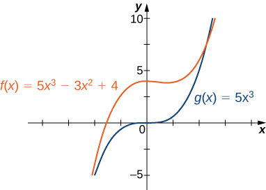{: #CNX_Calc_Figure_04_06_013}

<table class="column-header" summary="The table has six rows and four columns. The first column is a header column and it reads x, f(x) = 5x3 &#x2013; 3x2 + 4, g(x) = 5x3, x, f(x) = 5x3 &#x2013; 3x2 + 4, and g(x) = 5x3. After the header, the first row reads 10, 100, and 1000. The second row reads 4704, 4,970,004, and 4,997,000,004. The third row reads 5000, 5,000,000, 5,000,000,000. The fourth row reads &#x2212;10, &#x2212;100, and &#x2212;1000. The fifth row reads &#x2212;5296, &#x2212;5,029,996, and &#x2212;5,002,999,996. The sixth row reads &#x2212;5000, &#x2212;5,000,000, and &#x2212;5,000,000,000."><caption>A polynomial’s end behavior is determined by the term with the largest exponent.</caption><tbody>
<tr valign="top">
<td><strong><math xmlns="http://www.w3.org/1998/Math/MathML"><mi>x</mi></math></strong></td>
<td><math xmlns="http://www.w3.org/1998/Math/MathML"><mrow><mn>10</mn></mrow></math></td>
<td><math xmlns="http://www.w3.org/1998/Math/MathML"><mrow><mn>100</mn></mrow></math></td>
<td><math xmlns="http://www.w3.org/1998/Math/MathML"><mrow><mn>1000</mn></mrow></math></td>
</tr>
<tr valign="top">
<td><strong><math xmlns="http://www.w3.org/1998/Math/MathML"><mrow><mi>f</mi><mrow><mo>(</mo><mi>x</mi><mo>)</mo></mrow><mo>=</mo><mn>5</mn><msup><mi>x</mi><mn>3</mn></msup><mo>−</mo><mn>3</mn><msup><mi>x</mi><mn>2</mn></msup><mo>+</mo><mn>4</mn></mrow></math></strong></td>
<td><math xmlns="http://www.w3.org/1998/Math/MathML"><mrow><mn>4704</mn></mrow></math></td>
<td><math xmlns="http://www.w3.org/1998/Math/MathML"><mrow><mn>4,970,004</mn></mrow></math></td>
<td><math xmlns="http://www.w3.org/1998/Math/MathML"><mrow><mn>4,997,000,004</mn></mrow></math></td>
</tr>
<tr valign="top">
<td><strong><math xmlns="http://www.w3.org/1998/Math/MathML"><mrow><mi>g</mi><mrow><mo>(</mo><mi>x</mi><mo>)</mo></mrow><mo>=</mo><mn>5</mn><msup><mi>x</mi><mn>3</mn></msup></mrow></math></strong></td>
<td><math xmlns="http://www.w3.org/1998/Math/MathML"><mrow><mn>5000</mn></mrow></math></td>
<td><math xmlns="http://www.w3.org/1998/Math/MathML"><mrow><mn>5,000,000</mn></mrow></math></td>
<td><math xmlns="http://www.w3.org/1998/Math/MathML"><mrow><mn>5,000,000,000</mn></mrow></math></td>
</tr>
<tr valign="top">
<td><strong><math xmlns="http://www.w3.org/1998/Math/MathML"><mi>x</mi></math></strong></td>
<td><math xmlns="http://www.w3.org/1998/Math/MathML"><mrow><mn>−10</mn></mrow></math></td>
<td><math xmlns="http://www.w3.org/1998/Math/MathML"><mrow><mn>−100</mn></mrow></math></td>
<td><math xmlns="http://www.w3.org/1998/Math/MathML"><mrow><mn>−1000</mn></mrow></math></td>
</tr>
<tr valign="top">
<td><strong><math xmlns="http://www.w3.org/1998/Math/MathML"><mrow><mi>f</mi><mrow><mo>(</mo><mi>x</mi><mo>)</mo></mrow><mo>=</mo><mn>5</mn><msup><mi>x</mi><mn>3</mn></msup><mo>−</mo><mn>3</mn><msup><mi>x</mi><mn>2</mn></msup><mo>+</mo><mn>4</mn></mrow></math></strong></td>
<td><math xmlns="http://www.w3.org/1998/Math/MathML"><mrow><mn>−5296</mn></mrow></math></td>
<td><math xmlns="http://www.w3.org/1998/Math/MathML"><mrow><mn>−5,029,996</mn></mrow></math></td>
<td><math xmlns="http://www.w3.org/1998/Math/MathML"><mrow><mn>−5,002,999,996</mn></mrow></math></td>
</tr>
<tr valign="top">
<td><strong><math xmlns="http://www.w3.org/1998/Math/MathML"><mrow><mi>g</mi><mrow><mo>(</mo><mi>x</mi><mo>)</mo></mrow><mo>=</mo><mn>5</mn><msup><mi>x</mi><mn>3</mn></msup></mrow></math></strong></td>
<td><math xmlns="http://www.w3.org/1998/Math/MathML"><mrow><mn>−5000</mn></mrow></math></td>
<td><math xmlns="http://www.w3.org/1998/Math/MathML"><mrow><mn>−5,000,000</mn></mrow></math></td>
<td><math xmlns="http://www.w3.org/1998/Math/MathML"><mrow><mn>−5,000,000,000</mn></mrow></math></td>
</tr>
</tbody></table>

## End Behavior for Algebraic Functions

The end behavior for rational functions and functions involving radicals is a little more complicated than for polynomials. In [\[link\]](#fs-id1165042638553), we show that the limits at infinity of a rational function <math xmlns="http://www.w3.org/1998/Math/MathML"><mrow><mi>f</mi><mrow><mo>(</mo><mi>x</mi><mo>)</mo></mrow><mo>=</mo><mfrac><mrow><mi>p</mi><mrow><mo>(</mo><mi>x</mi><mo>)</mo></mrow></mrow><mrow><mi>q</mi><mrow><mo>(</mo><mi>x</mi><mo>)</mo></mrow></mrow></mfrac></mrow></math>

 depend on the relationship between the degree of the numerator and the degree of the denominator. To evaluate the limits at infinity for a rational function, we divide the numerator and denominator by the highest power of <math xmlns="http://www.w3.org/1998/Math/MathML"><mi>x</mi></math>

 appearing in the denominator. This determines which term in the overall expression dominates the behavior of the function at large values of <math xmlns="http://www.w3.org/1998/Math/MathML"><mrow><mi>x</mi><mo>.</mo></mrow></math>

Determining End Behavior for Rational Functions

For each of the following functions, determine the limits as <math xmlns="http://www.w3.org/1998/Math/MathML"><mrow><mi>x</mi><mo stretchy="false">→</mo><mi>∞</mi></mrow></math>

 and <math xmlns="http://www.w3.org/1998/Math/MathML"><mrow><mi>x</mi><mo stretchy="false">→</mo><mtext>−</mtext><mi>∞</mi><mo>.</mo></mrow></math>

 Then, use this information to describe the end behavior of the function.

1.  <math xmlns="http://www.w3.org/1998/Math/MathML"><mrow><mi>f</mi><mrow><mo>(</mo><mi>x</mi><mo>)</mo></mrow><mo>=</mo><mfrac><mrow><mn>3</mn><mi>x</mi><mo>−</mo><mn>1</mn></mrow><mrow><mn>2</mn><mi>x</mi><mo>+</mo><mn>5</mn></mrow></mfrac></mrow></math>
    
    (Note: The degree of the numerator and the denominator are the same.)
2.  <math xmlns="http://www.w3.org/1998/Math/MathML"><mrow><mi>f</mi><mrow><mo>(</mo><mi>x</mi><mo>)</mo></mrow><mo>=</mo><mfrac><mrow><mn>3</mn><msup><mi>x</mi><mn>2</mn></msup><mo>+</mo><mn>2</mn><mi>x</mi></mrow><mrow><mn>4</mn><msup><mi>x</mi><mn>3</mn></msup><mo>−</mo><mn>5</mn><mi>x</mi><mo>+</mo><mn>7</mn></mrow></mfrac></mrow></math>
    
    (Note: The degree of numerator is less than the degree of the denominator.)
3.  <math xmlns="http://www.w3.org/1998/Math/MathML"><mrow><mi>f</mi><mrow><mo>(</mo><mi>x</mi><mo>)</mo></mrow><mo>=</mo><mfrac><mrow><mn>3</mn><msup><mi>x</mi><mn>2</mn></msup><mo>+</mo><mn>4</mn><mi>x</mi></mrow><mrow><mi>x</mi><mo>+</mo><mn>2</mn></mrow></mfrac></mrow></math>
    
    (Note: The degree of numerator is greater than the degree of the denominator.)
{: data-number-style="lower-alpha"}

1.  The highest power of
    <math xmlns="http://www.w3.org/1998/Math/MathML"><mi>x</mi></math>
    
    in the denominator is
    <math xmlns="http://www.w3.org/1998/Math/MathML"><mrow><mi>x</mi><mo>.</mo></mrow></math>
    
    Therefore, dividing the numerator and denominator by
    <math xmlns="http://www.w3.org/1998/Math/MathML"><mi>x</mi></math>
    
    and applying the algebraic limit laws, we see that
    * * *
    {: data-type="newline"}
    
    

    <math xmlns="http://www.w3.org/1998/Math/MathML"><mtable><mtr><mtd columnalign="right"><munder><mrow><mtext>lim</mtext></mrow><mrow><mi>x</mi><mo stretchy="false">→</mo><mtext>±</mtext><mi>∞</mi></mrow></munder><mfrac><mrow><mn>3</mn><mi>x</mi><mo>−</mo><mn>1</mn></mrow><mrow><mn>2</mn><mi>x</mi><mo>+</mo><mn>5</mn></mrow></mfrac></mtd><mtd columnalign="left"><mo>=</mo><munder><mrow><mtext>lim</mtext></mrow><mrow><mi>x</mi><mo stretchy="false">→</mo><mtext>±</mtext><mi>∞</mi></mrow></munder><mfrac><mrow><mn>3</mn><mo>−</mo><mn>1</mn><mtext>/</mtext><mi>x</mi></mrow><mrow><mn>2</mn><mo>+</mo><mn>5</mn><mtext>/</mtext><mi>x</mi></mrow></mfrac></mtd></mtr><mtr><mtd /><mtd columnalign="left"><mo>=</mo><mfrac><mrow><munder><mrow><mtext>lim</mtext></mrow><mrow><mi>x</mi><mo stretchy="false">→</mo><mtext>±</mtext><mi>∞</mi></mrow></munder><mrow><mo>(</mo><mrow><mn>3</mn><mo>−</mo><mn>1</mn><mtext>/</mtext><mi>x</mi></mrow><mo>)</mo></mrow></mrow><mrow><munder><mrow><mtext>lim</mtext></mrow><mrow><mi>x</mi><mo stretchy="false">→</mo><mtext>±</mtext><mi>∞</mi></mrow></munder><mrow><mo>(</mo><mrow><mn>2</mn><mo>+</mo><mn>5</mn><mtext>/</mtext><mi>x</mi></mrow><mo>)</mo></mrow></mrow></mfrac></mtd></mtr><mtr><mtd /><mtd columnalign="left"><mo>=</mo><mfrac><mrow><munder><mrow><mtext>lim</mtext></mrow><mrow><mi>x</mi><mo stretchy="false">→</mo><mtext>±</mtext><mi>∞</mi></mrow></munder><mn>3</mn><mo>−</mo><munder><mrow><mtext>lim</mtext></mrow><mrow><mi>x</mi><mo stretchy="false">→</mo><mtext>±</mtext><mi>∞</mi></mrow></munder><mn>1</mn><mtext>/</mtext><mi>x</mi></mrow><mrow><munder><mrow><mtext>lim</mtext></mrow><mrow><mi>x</mi><mo stretchy="false">→</mo><mtext>±</mtext><mi>∞</mi></mrow></munder><mn>2</mn><mo>+</mo><munder><mrow><mtext>lim</mtext></mrow><mrow><mi>x</mi><mo stretchy="false">→</mo><mtext>±</mtext><mi>∞</mi></mrow></munder><mn>5</mn><mtext>/</mtext><mi>x</mi></mrow></mfrac></mtd></mtr><mtr><mtd /><mtd columnalign="left"><mo>=</mo><mfrac><mrow><mn>3</mn><mo>−</mo><mn>0</mn></mrow><mrow><mn>2</mn><mo>+</mo><mn>0</mn></mrow></mfrac><mo>=</mo><mfrac><mn>3</mn><mn>2</mn></mfrac><mo>.</mo></mtd></mtr></mtable></math>
    

    
    * * *
    {: data-type="newline"}
    
    Since
    <math xmlns="http://www.w3.org/1998/Math/MathML"><mrow><munder><mrow><mtext>lim</mtext></mrow><mrow><mi>x</mi><mo stretchy="false">→</mo><mtext>±</mtext><mi>∞</mi></mrow></munder><mi>f</mi><mrow><mo>(</mo><mi>x</mi><mo>)</mo></mrow><mo>=</mo><mfrac><mn>3</mn><mn>2</mn></mfrac><mo>,</mo></mrow></math>
    
    we know that
    <math xmlns="http://www.w3.org/1998/Math/MathML"><mrow><mi>y</mi><mo>=</mo><mfrac><mn>3</mn><mn>2</mn></mfrac></mrow></math>
    
    is a horizontal asymptote for this function as shown in the following graph.
    * * *
    {: data-type="newline"}
    
    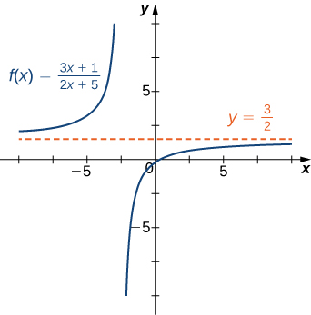{: #CNX_Calc_Figure_04_06_014}

2.  Since the largest power of
    <math xmlns="http://www.w3.org/1998/Math/MathML"><mi>x</mi></math>
    
    appearing in the denominator is
    <math xmlns="http://www.w3.org/1998/Math/MathML"><mrow><msup><mi>x</mi><mn>3</mn></msup><mo>,</mo></mrow></math>
    
    divide the numerator and denominator by
    <math xmlns="http://www.w3.org/1998/Math/MathML"><mrow><msup><mi>x</mi><mn>3</mn></msup><mo>.</mo></mrow></math>
    
    After doing so and applying algebraic limit laws, we obtain
    * * *
    {: data-type="newline"}
    
    

    <math xmlns="http://www.w3.org/1998/Math/MathML"><mrow><munder><mrow><mtext>lim</mtext></mrow><mrow><mi>x</mi><mo stretchy="false">→</mo><mtext>±</mtext><mi>∞</mi></mrow></munder><mfrac><mrow><mn>3</mn><msup><mi>x</mi><mn>2</mn></msup><mo>+</mo><mn>2</mn><mi>x</mi></mrow><mrow><mn>4</mn><msup><mi>x</mi><mn>3</mn></msup><mo>−</mo><mn>5</mn><mi>x</mi><mo>+</mo><mn>7</mn></mrow></mfrac><mo>=</mo><munder><mrow><mtext>lim</mtext></mrow><mrow><mi>x</mi><mo stretchy="false">→</mo><mtext>±</mtext><mi>∞</mi></mrow></munder><mfrac><mrow><mn>3</mn><mtext>/</mtext><mi>x</mi><mo>+</mo><mn>2</mn><mtext>/</mtext><msup><mi>x</mi><mn>2</mn></msup></mrow><mrow><mn>4</mn><mo>−</mo><mn>5</mn><mtext>/</mtext><msup><mi>x</mi><mn>2</mn></msup><mo>+</mo><mn>7</mn><mtext>/</mtext><msup><mi>x</mi><mn>3</mn></msup></mrow></mfrac><mo>=</mo><mfrac><mrow><mn>3.0</mn><mo>+</mo><mn>2.0</mn></mrow><mrow><mn>4</mn><mo>−</mo><mn>5.0</mn><mo>+</mo><mn>7.0</mn></mrow></mfrac><mo>=</mo><mn>0</mn><mo>.</mo></mrow></math>
    

    
    * * *
    {: data-type="newline"}
    
    Therefore
    <math xmlns="http://www.w3.org/1998/Math/MathML"><mi>f</mi></math>
    
    has a horizontal asymptote of
    <math xmlns="http://www.w3.org/1998/Math/MathML"><mrow><mi>y</mi><mo>=</mo><mn>0</mn></mrow></math>
    
    as shown in the following graph.
    * * *
    {: data-type="newline"}
    
    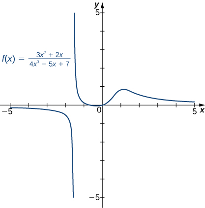{: #CNX_Calc_Figure_04_06_015}

3.  Dividing the numerator and denominator by
    <math xmlns="http://www.w3.org/1998/Math/MathML"><mrow><mi>x</mi><mo>,</mo></mrow></math>
    
    we have
    * * *
    {: data-type="newline"}
    
    

    <math xmlns="http://www.w3.org/1998/Math/MathML"><mrow><munder><mrow><mtext>lim</mtext></mrow><mrow><mi>x</mi><mo stretchy="false">→</mo><mtext>±</mtext><mi>∞</mi></mrow></munder><mfrac><mrow><mn>3</mn><msup><mi>x</mi><mn>2</mn></msup><mo>+</mo><mn>4</mn><mi>x</mi></mrow><mrow><mi>x</mi><mo>+</mo><mn>2</mn></mrow></mfrac><mo>=</mo><munder><mrow><mtext>lim</mtext></mrow><mrow><mi>x</mi><mo stretchy="false">→</mo><mtext>±</mtext><mi>∞</mi></mrow></munder><mfrac><mrow><mn>3</mn><mi>x</mi><mo>+</mo><mn>4</mn></mrow><mrow><mn>1</mn><mo>+</mo><mn>2</mn><mtext>/</mtext><mi>x</mi></mrow></mfrac><mo>.</mo></mrow></math>
    

    
    * * *
    {: data-type="newline"}
    
    As
    <math xmlns="http://www.w3.org/1998/Math/MathML"><mrow><mi>x</mi><mo stretchy="false">→</mo><mtext>±</mtext><mi>∞</mi><mo>,</mo></mrow></math>
    
    the denominator approaches
    <math xmlns="http://www.w3.org/1998/Math/MathML"><mn>1</mn><mo>.</mo></math>
    
    As
    <math xmlns="http://www.w3.org/1998/Math/MathML"><mrow><mi>x</mi><mo stretchy="false">→</mo><mi>∞</mi><mo>,</mo></mrow></math>
    
    the numerator approaches
    <math xmlns="http://www.w3.org/1998/Math/MathML"><mrow><mo>+</mo><mi>∞</mi><mo>.</mo></mrow></math>
    
    As
    <math xmlns="http://www.w3.org/1998/Math/MathML"><mrow><mi>x</mi><mo stretchy="false">→</mo><mtext>−</mtext><mi>∞</mi><mo>,</mo></mrow></math>
    
    the numerator approaches
    <math xmlns="http://www.w3.org/1998/Math/MathML"><mrow><mtext>−</mtext><mi>∞</mi><mo>.</mo></mrow></math>
    
    Therefore
    <math xmlns="http://www.w3.org/1998/Math/MathML"><mrow><munder><mrow><mtext>lim</mtext></mrow><mrow><mi>x</mi><mo stretchy="false">→</mo><mi>∞</mi></mrow></munder><mi>f</mi><mrow><mo>(</mo><mi>x</mi><mo>)</mo></mrow><mo>=</mo><mi>∞</mi><mo>,</mo></mrow></math>
    
    whereas
    <math xmlns="http://www.w3.org/1998/Math/MathML"><mrow><munder><mrow><mtext>lim</mtext></mrow><mrow><mi>x</mi><mo stretchy="false">→</mo><mtext>−</mtext><mi>∞</mi></mrow></munder><mi>f</mi><mrow><mo>(</mo><mi>x</mi><mo>)</mo></mrow><mo>=</mo><mtext>−</mtext><mi>∞</mi></mrow></math>
    
    as shown in the following figure.
    * * *
    {: data-type="newline"}
    
    &#x2192;&#x221E;. As x&#x2192;&#x2212;&#x221E;, the values f(x)&#x2192;&#x2212;&#x221E;."){: #CNX_Calc_Figure_04_06_016}

{: data-number-style="lower-alpha"}

Evaluate <math xmlns="http://www.w3.org/1998/Math/MathML"><mrow><munder><mrow><mtext>lim</mtext></mrow><mrow><mi>x</mi><mo stretchy="false">→</mo><mtext>±</mtext><mi>∞</mi></mrow></munder><mfrac><mrow><mn>3</mn><msup><mi>x</mi><mn>2</mn></msup><mo>+</mo><mn>2</mn><mi>x</mi><mo>−</mo><mn>1</mn></mrow><mrow><mn>5</mn><msup><mi>x</mi><mn>2</mn></msup><mo>−</mo><mn>4</mn><mi>x</mi><mo>+</mo><mn>7</mn></mrow></mfrac></mrow></math>

 and use these limits to determine the end behavior of <math xmlns="http://www.w3.org/1998/Math/MathML"><mrow><mi>f</mi><mrow><mo>(</mo><mi>x</mi><mo>)</mo></mrow><mo>=</mo><mfrac><mrow><mn>3</mn><msup><mi>x</mi><mn>2</mn></msup><mo>+</mo><mn>2</mn><mi>x</mi><mo>−</mo><mn>2</mn></mrow><mrow><mn>5</mn><msup><mi>x</mi><mn>2</mn></msup><mo>−</mo><mn>4</mn><mi>x</mi><mo>+</mo><mn>7</mn></mrow></mfrac><mo>.</mo></mrow></math>

<math xmlns="http://www.w3.org/1998/Math/MathML"><mrow><mfrac><mn>3</mn><mn>5</mn></mfrac></mrow></math>

Hint

Divide the numerator and denominator by <math xmlns="http://www.w3.org/1998/Math/MathML"><mrow><msup><mi>x</mi><mn>2</mn></msup><mo>.</mo></mrow></math>

Before proceeding, consider the graph of <math xmlns="http://www.w3.org/1998/Math/MathML"><mrow><mi>f</mi><mrow><mo>(</mo><mi>x</mi><mo>)</mo></mrow><mo>=</mo><mfrac><mrow><mrow><mo>(</mo><mrow><mn>3</mn><msup><mi>x</mi><mn>2</mn></msup><mo>+</mo><mn>4</mn><mi>x</mi></mrow><mo>)</mo></mrow></mrow><mrow><mrow><mo>(</mo><mrow><mi>x</mi><mo>+</mo><mn>2</mn></mrow><mo>)</mo></mrow></mrow></mfrac></mrow></math>

 shown in [\[link\]](#CNX_Calc_Figure_04_06_017). As <math xmlns="http://www.w3.org/1998/Math/MathML"><mrow><mi>x</mi><mo stretchy="false">→</mo><mi>∞</mi></mrow></math>

 and <math xmlns="http://www.w3.org/1998/Math/MathML"><mrow><mi>x</mi><mo stretchy="false">→</mo><mtext>−</mtext><mi>∞</mi><mo>,</mo></mrow></math>

 the graph of <math xmlns="http://www.w3.org/1998/Math/MathML"><mi>f</mi></math>

 appears almost linear. Although <math xmlns="http://www.w3.org/1998/Math/MathML"><mi>f</mi></math>

 is certainly not a linear function, we now investigate why the graph of <math xmlns="http://www.w3.org/1998/Math/MathML"><mi>f</mi></math>

 seems to be approaching a linear function. First, using long division of polynomials, we can write

<math xmlns="http://www.w3.org/1998/Math/MathML"><mrow><mi>f</mi><mrow><mo>(</mo><mi>x</mi><mo>)</mo></mrow><mo>=</mo><mfrac><mrow><mn>3</mn><msup><mi>x</mi><mn>2</mn></msup><mo>+</mo><mn>4</mn><mi>x</mi></mrow><mrow><mi>x</mi><mo>+</mo><mn>2</mn></mrow></mfrac><mo>=</mo><mn>3</mn><mi>x</mi><mo>−</mo><mn>2</mn><mo>+</mo><mfrac><mn>4</mn><mrow><mi>x</mi><mo>+</mo><mn>2</mn></mrow></mfrac><mo>.</mo></mrow></math>

Since <math xmlns="http://www.w3.org/1998/Math/MathML"><mrow><mfrac><mn>4</mn><mrow><mrow><mo>(</mo><mrow><mi>x</mi><mo>+</mo><mn>2</mn></mrow><mo>)</mo></mrow></mrow></mfrac><mo stretchy="false">→</mo><mn>0</mn></mrow></math>

 as <math xmlns="http://www.w3.org/1998/Math/MathML"><mrow><mi>x</mi><mo stretchy="false">→</mo><mtext>±</mtext><mi>∞</mi><mo>,</mo></mrow></math>

 we conclude that

<math xmlns="http://www.w3.org/1998/Math/MathML"><mrow><munder><mrow><mtext>lim</mtext></mrow><mrow><mi>x</mi><mo stretchy="false">→</mo><mtext>±</mtext><mi>∞</mi></mrow></munder><mrow><mo>(</mo><mrow><mi>f</mi><mrow><mo>(</mo><mi>x</mi><mo>)</mo></mrow><mo>−</mo><mrow><mo>(</mo><mrow><mn>3</mn><mi>x</mi><mo>−</mo><mn>2</mn></mrow><mo>)</mo></mrow></mrow><mo>)</mo></mrow><mo>=</mo><munder><mrow><mtext>lim</mtext></mrow><mrow><mi>x</mi><mo stretchy="false">→</mo><mtext>±</mtext><mi>∞</mi></mrow></munder><mfrac><mn>4</mn><mrow><mi>x</mi><mo>+</mo><mn>2</mn></mrow></mfrac><mo>=</mo><mn>0</mn><mo>.</mo></mrow></math>

Therefore, the graph of <math xmlns="http://www.w3.org/1998/Math/MathML"><mi>f</mi></math>

 approaches the line <math xmlns="http://www.w3.org/1998/Math/MathML"><mrow><mi>y</mi><mo>=</mo><mn>3</mn><mi>x</mi><mo>−</mo><mn>2</mn></mrow></math>

 as <math xmlns="http://www.w3.org/1998/Math/MathML"><mrow><mi>x</mi><mo stretchy="false">→</mo><mtext>±</mtext><mi>∞</mi><mo>.</mo></mrow></math>

 This line is known as an **oblique asymptote**{: data-type="term"} for <math xmlns="http://www.w3.org/1998/Math/MathML"><mi>f</mi></math>

 ([\[link\]](#CNX_Calc_Figure_04_06_017)).

 =(3x2+4x)/(x+2) approaches the oblique asymptote y=3x&#x2212;2asx&#x2192;&#xB1;&#x221E;."){: #CNX_Calc_Figure_04_06_017}

We can summarize the results of [\[link\]](#fs-id1165042638553) to make the following conclusion regarding end behavior for rational functions. Consider a rational function

<math xmlns="http://www.w3.org/1998/Math/MathML"><mrow><mi>f</mi><mrow><mo>(</mo><mi>x</mi><mo>)</mo></mrow><mo>=</mo><mfrac><mrow><mi>p</mi><mrow><mo>(</mo><mi>x</mi><mo>)</mo></mrow></mrow><mrow><mi>q</mi><mrow><mo>(</mo><mi>x</mi><mo>)</mo></mrow></mrow></mfrac><mo>=</mo><mfrac><mrow><msub><mi>a</mi><mi>n</mi></msub><msup><mi>x</mi><mi>n</mi></msup><mo>+</mo><msub><mi>a</mi><mrow><mi>n</mi><mo>−</mo><mn>1</mn></mrow></msub><msup><mi>x</mi><mrow><mi>n</mi><mo>−</mo><mn>1</mn></mrow></msup><mo>+</mo><mtext>…</mtext><mo>+</mo><msub><mi>a</mi><mn>1</mn></msub><mi>x</mi><mo>+</mo><msub><mi>a</mi><mn>0</mn></msub></mrow><mrow><msub><mi>b</mi><mi>m</mi></msub><msup><mi>x</mi><mi>m</mi></msup><mo>+</mo><msub><mi>b</mi><mrow><mi>m</mi><mo>−</mo><mn>1</mn></mrow></msub><msup><mi>x</mi><mrow><mi>m</mi><mo>−</mo><mn>1</mn></mrow></msup><mo>+</mo><mtext>…</mtext><mo>+</mo><msub><mi>b</mi><mn>1</mn></msub><mi>x</mi><mo>+</mo><msub><mi>b</mi><mn>0</mn></msub></mrow></mfrac><mo>,</mo></mrow></math>

where <math xmlns="http://www.w3.org/1998/Math/MathML"><mrow><msub><mi>a</mi><mi>n</mi></msub><mo>≠</mo><mn>0</mn><mspace width="0.2em" /><mtext>and</mtext><mspace width="0.2em" /><msub><mi>b</mi><mi>m</mi></msub><mo>≠</mo><mn>0</mn><mo>.</mo></mrow></math>

1.  If the degree of the numerator is the same as the degree of the denominator
    <math xmlns="http://www.w3.org/1998/Math/MathML"><mrow><mrow><mo>(</mo><mrow><mi>n</mi><mo>=</mo><mi>m</mi></mrow><mo>)</mo></mrow><mo>,</mo></mrow></math>
    
    then
    <math xmlns="http://www.w3.org/1998/Math/MathML"><mi>f</mi></math>
    
    has a horizontal asymptote of
    <math xmlns="http://www.w3.org/1998/Math/MathML"><mrow><mi>y</mi><mo>=</mo><msub><mi>a</mi><mi>n</mi></msub><mtext>/</mtext><msub><mi>b</mi><mi>m</mi></msub></mrow></math>
    
    as
    <math xmlns="http://www.w3.org/1998/Math/MathML"><mrow><mi>x</mi><mo stretchy="false">→</mo><mtext>±</mtext><mi>∞</mi><mo>.</mo></mrow></math>

2.  If the degree of the numerator is less than the degree of the denominator
    <math xmlns="http://www.w3.org/1998/Math/MathML"><mrow><mrow><mo>(</mo><mrow><mi>n</mi><mo>&lt;</mo><mi>m</mi></mrow><mo>)</mo></mrow><mo>,</mo></mrow></math>
    
    then
    <math xmlns="http://www.w3.org/1998/Math/MathML"><mi>f</mi></math>
    
    has a horizontal asymptote of
    <math xmlns="http://www.w3.org/1998/Math/MathML"><mrow><mi>y</mi><mo>=</mo><mn>0</mn></mrow></math>
    
    as
    <math xmlns="http://www.w3.org/1998/Math/MathML"><mrow><mi>x</mi><mo stretchy="false">→</mo><mtext>±</mtext><mi>∞</mi><mo>.</mo></mrow></math>

3.  If the degree of the numerator is greater than the degree of the denominator
    <math xmlns="http://www.w3.org/1998/Math/MathML"><mrow><mrow><mo>(</mo><mrow><mi>n</mi><mo>&gt;</mo><mi>m</mi></mrow><mo>)</mo></mrow><mo>,</mo></mrow></math>
    
    then
    <math xmlns="http://www.w3.org/1998/Math/MathML"><mi>f</mi></math>
    
    does not have a horizontal asymptote. The limits at infinity are either positive or negative infinity, depending on the signs of the leading terms. In addition, using long division, the function can be rewritten as
    * * *
    {: data-type="newline"}
    
    

    <math xmlns="http://www.w3.org/1998/Math/MathML"><mrow><mi>f</mi><mrow><mo>(</mo><mi>x</mi><mo>)</mo></mrow><mo>=</mo><mfrac><mrow><mi>p</mi><mrow><mo>(</mo><mi>x</mi><mo>)</mo></mrow></mrow><mrow><mi>q</mi><mrow><mo>(</mo><mi>x</mi><mo>)</mo></mrow></mrow></mfrac><mo>=</mo><mi>g</mi><mrow><mo>(</mo><mi>x</mi><mo>)</mo></mrow><mo>+</mo><mfrac><mrow><mi>r</mi><mrow><mo>(</mo><mi>x</mi><mo>)</mo></mrow></mrow><mrow><mi>q</mi><mrow><mo>(</mo><mi>x</mi><mo>)</mo></mrow></mrow></mfrac><mo>,</mo></mrow></math>
    

    
    * * *
    {: data-type="newline"}
    
    where the degree of
    <math xmlns="http://www.w3.org/1998/Math/MathML"><mrow><mi>r</mi><mrow><mo>(</mo><mi>x</mi><mo>)</mo></mrow></mrow></math>
    
    is less than the degree of
    <math xmlns="http://www.w3.org/1998/Math/MathML"><mrow><mi>q</mi><mrow><mo>(</mo><mi>x</mi><mo>)</mo></mrow><mo>.</mo></mrow></math>
    
    As a result,
    <math xmlns="http://www.w3.org/1998/Math/MathML"><mrow><munder><mrow><mtext>lim</mtext></mrow><mrow><mi>x</mi><mo stretchy="false">→</mo><mtext>±</mtext><mi>∞</mi></mrow></munder><mi>r</mi><mrow><mo>(</mo><mi>x</mi><mo>)</mo></mrow><mtext>/</mtext><mi>q</mi><mrow><mo>(</mo><mi>x</mi><mo>)</mo></mrow><mo>=</mo><mn>0</mn><mo>.</mo></mrow></math>
    
    Therefore, the values of
    <math xmlns="http://www.w3.org/1998/Math/MathML"><mrow><mrow><mo>[</mo><mrow><mi>f</mi><mrow><mo>(</mo><mi>x</mi><mo>)</mo></mrow><mo>−</mo><mi>g</mi><mrow><mo>(</mo><mi>x</mi><mo>)</mo></mrow></mrow><mo>]</mo></mrow></mrow></math>
    
    approach zero as
    <math xmlns="http://www.w3.org/1998/Math/MathML"><mrow><mi>x</mi><mo stretchy="false">→</mo><mtext>±</mtext><mi>∞</mi><mo>.</mo></mrow></math>
    
    If the degree of
    <math xmlns="http://www.w3.org/1998/Math/MathML"><mrow><mi>p</mi><mrow><mo>(</mo><mi>x</mi><mo>)</mo></mrow></mrow></math>
    
    is exactly one more than the degree of
    <math xmlns="http://www.w3.org/1998/Math/MathML"><mrow><mi>q</mi><mrow><mo>(</mo><mi>x</mi><mo>)</mo></mrow></mrow></math>
    
    <math xmlns="http://www.w3.org/1998/Math/MathML"><mrow><mrow><mo>(</mo><mrow><mi>n</mi><mo>=</mo><mi>m</mi><mo>+</mo><mn>1</mn></mrow><mo>)</mo></mrow><mo>,</mo></mrow></math>
    
    the function
    <math xmlns="http://www.w3.org/1998/Math/MathML"><mrow><mi>g</mi><mrow><mo>(</mo><mi>x</mi><mo>)</mo></mrow></mrow></math>
    
    is a linear function. In this case, we call
    <math xmlns="http://www.w3.org/1998/Math/MathML"><mrow><mi>g</mi><mrow><mo>(</mo><mi>x</mi><mo>)</mo></mrow></mrow></math>
    
    an oblique asymptote.
    * * *
    {: data-type="newline"}
    
    Now let’s consider the end behavior for functions involving a radical.
{: data-number-style="arabic"}

Determining End Behavior for a Function Involving a Radical

Find the limits as <math xmlns="http://www.w3.org/1998/Math/MathML"><mrow><mi>x</mi><mo stretchy="false">→</mo><mi>∞</mi></mrow></math>

 and <math xmlns="http://www.w3.org/1998/Math/MathML"><mrow><mi>x</mi><mo stretchy="false">→</mo><mtext>−</mtext><mi>∞</mi></mrow></math>

 for <math xmlns="http://www.w3.org/1998/Math/MathML"><mrow><mi>f</mi><mrow><mo>(</mo><mi>x</mi><mo>)</mo></mrow><mo>=</mo><mfrac><mrow><mn>3</mn><mi>x</mi><mo>−</mo><mn>2</mn></mrow><mrow><msqrt><mrow><mn>4</mn><msup><mi>x</mi><mn>2</mn></msup><mo>+</mo><mn>5</mn></mrow></msqrt></mrow></mfrac></mrow></math>

 and describe the end behavior of <math xmlns="http://www.w3.org/1998/Math/MathML"><mrow><mi>f</mi><mo>.</mo></mrow></math>

Let’s use the same strategy as we did for rational functions: divide the numerator and denominator by a power of <math xmlns="http://www.w3.org/1998/Math/MathML"><mrow><mi>x</mi><mo>.</mo></mrow></math>

 To determine the appropriate power of <math xmlns="http://www.w3.org/1998/Math/MathML"><mrow><mi>x</mi><mo>,</mo></mrow></math>

 consider the expression <math xmlns="http://www.w3.org/1998/Math/MathML"><mrow><msqrt><mrow><mn>4</mn><msup><mi>x</mi><mn>2</mn></msup><mo>+</mo><mn>5</mn></mrow></msqrt></mrow></math>

 in the denominator. Since

<math xmlns="http://www.w3.org/1998/Math/MathML"><mrow><msqrt><mrow><mn>4</mn><msup><mi>x</mi><mn>2</mn></msup><mo>+</mo><mn>5</mn></mrow></msqrt><mo>≈</mo><msqrt><mrow><mn>4</mn><msup><mi>x</mi><mn>2</mn></msup></mrow></msqrt><mo>=</mo><mn>2</mn><mrow><mo>\|</mo><mi>x</mi><mo>\|</mo></mrow></mrow></math>

for large values of <math xmlns="http://www.w3.org/1998/Math/MathML"><mi>x</mi></math>

 in effect <math xmlns="http://www.w3.org/1998/Math/MathML"><mi>x</mi></math>

 appears just to the first power in the denominator. Therefore, we divide the numerator and denominator by <math xmlns="http://www.w3.org/1998/Math/MathML"><mrow><mrow><mo>\|</mo><mi>x</mi><mo>\|</mo></mrow><mo>.</mo></mrow></math>

 Then, using the fact that <math xmlns="http://www.w3.org/1998/Math/MathML"><mrow><mrow><mo>\|</mo><mi>x</mi><mo>\|</mo></mrow><mo>=</mo><mi>x</mi></mrow></math>

 for <math xmlns="http://www.w3.org/1998/Math/MathML"><mrow><mi>x</mi><mo>&gt;</mo><mn>0</mn><mo>,</mo></mrow></math>

 <math xmlns="http://www.w3.org/1998/Math/MathML"><mrow><mrow><mo>\|</mo><mi>x</mi><mo>\|</mo></mrow><mo>=</mo><mtext>−</mtext><mi>x</mi></mrow></math>

 for <math xmlns="http://www.w3.org/1998/Math/MathML"><mrow><mi>x</mi><mo>&lt;</mo><mn>0</mn><mo>,</mo></mrow></math>

 and <math xmlns="http://www.w3.org/1998/Math/MathML"><mrow><mrow><mo>\|</mo><mi>x</mi><mo>\|</mo></mrow><mo>=</mo><msqrt><mrow><msup><mi>x</mi><mn>2</mn></msup></mrow></msqrt></mrow></math>

 for all <math xmlns="http://www.w3.org/1998/Math/MathML"><mrow><mi>x</mi><mo>,</mo></mrow></math>

 we calculate the limits as follows:

<math xmlns="http://www.w3.org/1998/Math/MathML"><mtable><mtr><mtd columnalign="right"><munder><mrow><mtext>lim</mtext></mrow><mrow><mi>x</mi><mo stretchy="false">→</mo><mi>∞</mi></mrow></munder><mfrac><mrow><mn>3</mn><mi>x</mi><mo>−</mo><mn>2</mn></mrow><mrow><msqrt><mrow><mn>4</mn><msup><mi>x</mi><mn>2</mn></msup><mo>+</mo><mn>5</mn></mrow></msqrt></mrow></mfrac></mtd><mtd columnalign="left"><mo>=</mo></mtd><mtd columnalign="left"><munder><mrow><mtext>lim</mtext></mrow><mrow><mi>x</mi><mo stretchy="false">→</mo><mi>∞</mi></mrow></munder><mfrac><mrow><mrow><mo>(</mo><mrow><mn>1</mn><mtext>/</mtext><mrow><mo>\|</mo><mi>x</mi><mo>\|</mo></mrow></mrow><mo>)</mo></mrow><mrow><mo>(</mo><mrow><mn>3</mn><mi>x</mi><mo>−</mo><mn>2</mn></mrow><mo>)</mo></mrow></mrow><mrow><mrow><mo>(</mo><mrow><mn>1</mn><mtext>/</mtext><mrow><mo>\|</mo><mi>x</mi><mo>\|</mo></mrow></mrow><mo>)</mo></mrow><msqrt><mrow><mn>4</mn><msup><mi>x</mi><mn>2</mn></msup><mo>+</mo><mn>5</mn></mrow></msqrt></mrow></mfrac></mtd></mtr><mtr><mtd /><mtd columnalign="left"><mo>=</mo></mtd><mtd columnalign="left"><munder><mrow><mtext>lim</mtext></mrow><mrow><mi>x</mi><mo stretchy="false">→</mo><mi>∞</mi></mrow></munder><mfrac><mrow><mrow><mo>(</mo><mrow><mn>1</mn><mtext>/</mtext><mi>x</mi></mrow><mo>)</mo></mrow><mrow><mo>(</mo><mrow><mn>3</mn><mi>x</mi><mo>−</mo><mn>2</mn></mrow><mo>)</mo></mrow></mrow><mrow><msqrt><mrow><mrow><mo>(</mo><mrow><mn>1</mn><mtext>/</mtext><msup><mi>x</mi><mn>2</mn></msup></mrow><mo>)</mo></mrow><mrow><mo>(</mo><mrow><mn>4</mn><msup><mi>x</mi><mn>2</mn></msup><mo>+</mo><mn>5</mn></mrow><mo>)</mo></mrow></mrow></msqrt></mrow></mfrac></mtd></mtr><mtr><mtd /><mtd columnalign="left"><mo>=</mo></mtd><mtd columnalign="left"><munder><mrow><mtext>lim</mtext></mrow><mrow><mi>x</mi><mo stretchy="false">→</mo><mi>∞</mi></mrow></munder><mfrac><mrow><mn>3</mn><mo>−</mo><mn>2</mn><mtext>/</mtext><mi>x</mi></mrow><mrow><msqrt><mrow><mn>4</mn><mo>+</mo><mn>5</mn><mtext>/</mtext><msup><mi>x</mi><mn>2</mn></msup></mrow></msqrt></mrow></mfrac><mo>=</mo><mfrac><mn>3</mn><mrow><msqrt><mn>4</mn></msqrt></mrow></mfrac><mo>=</mo><mfrac><mn>3</mn><mn>2</mn></mfrac></mtd></mtr><mtr><mtd columnalign="right"><munder><mrow><mtext>lim</mtext></mrow><mrow><mi>x</mi><mo stretchy="false">→</mo><mtext>−</mtext><mi>∞</mi></mrow></munder><mfrac><mrow><mn>3</mn><mi>x</mi><mo>−</mo><mn>2</mn></mrow><mrow><msqrt><mrow><mn>4</mn><msup><mi>x</mi><mn>2</mn></msup><mo>+</mo><mn>5</mn></mrow></msqrt></mrow></mfrac></mtd><mtd columnalign="left"><mo>=</mo></mtd><mtd columnalign="left"><munder><mrow><mtext>lim</mtext></mrow><mrow><mi>x</mi><mo stretchy="false">→</mo><mtext>−</mtext><mi>∞</mi></mrow></munder><mfrac><mrow><mrow><mo>(</mo><mrow><mn>1</mn><mtext>/</mtext><mrow><mo>\|</mo><mi>x</mi><mo>\|</mo></mrow></mrow><mo>)</mo></mrow><mrow><mo>(</mo><mrow><mn>3</mn><mi>x</mi><mo>−</mo><mn>2</mn></mrow><mo>)</mo></mrow></mrow><mrow><mrow><mo>(</mo><mrow><mn>1</mn><mtext>/</mtext><mrow><mo>\|</mo><mi>x</mi><mo>\|</mo></mrow></mrow><mo>)</mo></mrow><msqrt><mrow><mn>4</mn><msup><mi>x</mi><mn>2</mn></msup><mo>+</mo><mn>5</mn></mrow></msqrt></mrow></mfrac></mtd></mtr><mtr><mtd /><mtd columnalign="left"><mo>=</mo></mtd><mtd columnalign="left"><munder><mrow><mtext>lim</mtext></mrow><mrow><mi>x</mi><mo stretchy="false">→</mo><mtext>−</mtext><mi>∞</mi></mrow></munder><mfrac><mrow><mrow><mo>(</mo><mrow><mn>−1</mn><mtext>/</mtext><mi>x</mi></mrow><mo>)</mo></mrow><mrow><mo>(</mo><mrow><mn>3</mn><mi>x</mi><mo>−</mo><mn>2</mn></mrow><mo>)</mo></mrow></mrow><mrow><msqrt><mrow><mrow><mo>(</mo><mrow><mn>1</mn><mtext>/</mtext><msup><mi>x</mi><mn>2</mn></msup></mrow><mo>)</mo></mrow><mrow><mo>(</mo><mrow><mn>4</mn><msup><mi>x</mi><mn>2</mn></msup><mo>+</mo><mn>5</mn></mrow><mo>)</mo></mrow></mrow></msqrt></mrow></mfrac></mtd></mtr><mtr><mtd /><mtd columnalign="left"><mo>=</mo></mtd><mtd columnalign="left"><munder><mrow><mtext>lim</mtext></mrow><mrow><mi>x</mi><mo stretchy="false">→</mo><mtext>−</mtext><mi>∞</mi></mrow></munder><mfrac><mrow><mn>−3</mn><mo>+</mo><mn>2</mn><mtext>/</mtext><mi>x</mi></mrow><mrow><msqrt><mrow><mn>4</mn><mo>+</mo><mn>5</mn><mtext>/</mtext><msup><mi>x</mi><mn>2</mn></msup></mrow></msqrt></mrow></mfrac><mo>=</mo><mfrac><mrow><mn>−3</mn></mrow><mrow><msqrt><mn>4</mn></msqrt></mrow></mfrac><mo>=</mo><mfrac><mrow><mn>−3</mn></mrow><mn>2</mn></mfrac><mo>.</mo></mtd></mtr></mtable></math>

Therefore, <math xmlns="http://www.w3.org/1998/Math/MathML"><mrow><mi>f</mi><mrow><mo>(</mo><mi>x</mi><mo>)</mo></mrow></mrow></math>

 approaches the horizontal asymptote <math xmlns="http://www.w3.org/1998/Math/MathML"><mrow><mi>y</mi><mo>=</mo><mfrac><mn>3</mn><mn>2</mn></mfrac></mrow></math>

 as <math xmlns="http://www.w3.org/1998/Math/MathML"><mrow><mi>x</mi><mo stretchy="false">→</mo><mi>∞</mi></mrow></math>

 and the horizontal asymptote <math xmlns="http://www.w3.org/1998/Math/MathML"><mrow><mi>y</mi><mo>=</mo><mo>−</mo><mfrac><mn>3</mn><mn>2</mn></mfrac></mrow></math>

 as <math xmlns="http://www.w3.org/1998/Math/MathML"><mrow><mi>x</mi><mo stretchy="false">→</mo><mtext>−</mtext><mi>∞</mi></mrow></math>

 as shown in the following graph.

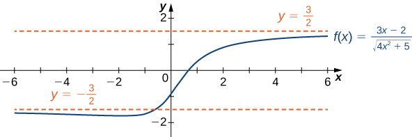{: #CNX_Calc_Figure_04_06_018}

Evaluate <math xmlns="http://www.w3.org/1998/Math/MathML"><mrow><munder><mrow><mtext>lim</mtext></mrow><mrow><mi>x</mi><mo stretchy="false">→</mo><mi>∞</mi></mrow></munder><mfrac><mrow><msqrt><mrow><mn>3</mn><msup><mi>x</mi><mn>2</mn></msup><mo>+</mo><mn>4</mn></mrow></msqrt></mrow><mrow><mi>x</mi><mo>+</mo><mn>6</mn></mrow></mfrac><mo>.</mo></mrow></math>

<math xmlns="http://www.w3.org/1998/Math/MathML"><mrow><mtext>±</mtext><msqrt><mn>3</mn></msqrt></mrow></math>

Hint

Divide the numerator and denominator by <math xmlns="http://www.w3.org/1998/Math/MathML"><mrow><mrow><mo>\|</mo><mi>x</mi><mo>\|</mo></mrow><mo>.</mo></mrow></math>

## Determining End Behavior for Transcendental Functions

The six basic trigonometric functions are periodic and do not approach a finite limit as <math xmlns="http://www.w3.org/1998/Math/MathML"><mrow><mi>x</mi><mo stretchy="false">→</mo><mtext>±</mtext><mi>∞</mi><mo>.</mo></mrow></math>

 For example, <math xmlns="http://www.w3.org/1998/Math/MathML"><mrow><mtext>sin</mtext><mspace width="0.1em" /><mi>x</mi></mrow></math>

 oscillates between <math xmlns="http://www.w3.org/1998/Math/MathML"><mrow><mn>1</mn><mspace width="0.2em" /><mtext>and</mtext><mspace width="0.2em" /><mn>−1</mn></mrow></math>

 ([\[link\]](#CNX_Calc_Figure_04_06_019)). The tangent function <math xmlns="http://www.w3.org/1998/Math/MathML"><mrow><mi>x</mi></mrow></math>

 has an infinite number of vertical asymptotes as <math xmlns="http://www.w3.org/1998/Math/MathML"><mrow><mi>x</mi><mo stretchy="false">→</mo><mtext>±</mtext><mi>∞</mi><mo>;</mo></mrow></math>

 therefore, it does not approach a finite limit nor does it approach <math xmlns="http://www.w3.org/1998/Math/MathML"><mrow><mtext>±</mtext><mi>∞</mi></mrow></math>

 as <math xmlns="http://www.w3.org/1998/Math/MathML"><mrow><mi>x</mi><mo stretchy="false">→</mo><mtext>±</mtext><mi>∞</mi></mrow></math>

 as shown in [\[link\]](#CNX_Calc_Figure_04_06_020).

 =sinx oscillates between 1and&#x2212;1 as x&#x2192;&#xB1;&#x221E;"){: #CNX_Calc_Figure_04_06_019}

=tanx does not approach a limit and does not approach &#xB1;&#x221E; as x&#x2192;&#xB1;&#x221E;"){: #CNX_Calc_Figure_04_06_020}

Recall that for any base <math xmlns="http://www.w3.org/1998/Math/MathML"><mrow><mi>b</mi><mo>&gt;</mo><mn>0</mn><mo>,</mo><mi>b</mi><mo>≠</mo><mn>1</mn><mo>,</mo></mrow></math>

 the function <math xmlns="http://www.w3.org/1998/Math/MathML"><mrow><mi>y</mi><mo>=</mo><msup><mi>b</mi><mi>x</mi></msup></mrow></math>

 is an exponential function with domain <math xmlns="http://www.w3.org/1998/Math/MathML"><mrow><mrow><mo>(</mo><mrow><mtext>−</mtext><mi>∞</mi><mo>,</mo><mi>∞</mi></mrow><mo>)</mo></mrow></mrow></math>

 and range <math xmlns="http://www.w3.org/1998/Math/MathML"><mrow><mrow><mo>(</mo><mrow><mn>0</mn><mo>,</mo><mi>∞</mi></mrow><mo>)</mo></mrow><mo>.</mo></mrow></math>

 If <math xmlns="http://www.w3.org/1998/Math/MathML"><mrow><mi>b</mi><mo>&gt;</mo><mn>1</mn><mo>,</mo><mi>y</mi><mo>=</mo><msup><mi>b</mi><mi>x</mi></msup></mrow></math>

 is increasing over <math xmlns="http://www.w3.org/1998/Math/MathML"><mrow><mo>`</mo><mrow><mo>(</mo><mrow><mtext>−</mtext><mi>∞</mi><mo>,</mo><mi>∞</mi></mrow><mo>)</mo></mrow><mo>.</mo></mrow></math>

 If <math xmlns="http://www.w3.org/1998/Math/MathML"><mrow><mn>0</mn><mo>&lt;</mo><mi>b</mi><mo>&lt;</mo><mn>1</mn><mo>,</mo></mrow></math>

 <math xmlns="http://www.w3.org/1998/Math/MathML"><mrow><mi>y</mi><mo>=</mo><msup><mi>b</mi><mi>x</mi></msup></mrow></math>

 is decreasing over <math xmlns="http://www.w3.org/1998/Math/MathML"><mrow><mrow><mo>(</mo><mrow><mtext>−</mtext><mi>∞</mi><mo>,</mo><mi>∞</mi></mrow><mo>)</mo></mrow><mo>.</mo></mrow></math>

 For the natural exponential function <math xmlns="http://www.w3.org/1998/Math/MathML"><mrow><mi>f</mi><mrow><mo>(</mo><mi>x</mi><mo>)</mo></mrow><mo>=</mo><msup><mi>e</mi><mi>x</mi></msup><mo>,</mo></mrow></math>

 <math xmlns="http://www.w3.org/1998/Math/MathML"><mrow><mi>e</mi><mo>≈</mo><mn>2.718</mn><mo>&gt;</mo><mn>1</mn><mo>.</mo></mrow></math>

 Therefore, <math xmlns="http://www.w3.org/1998/Math/MathML"><mrow><mi>f</mi><mrow><mo>(</mo><mi>x</mi><mo>)</mo></mrow><mo>=</mo><msup><mi>e</mi><mi>x</mi></msup></mrow></math>

 is increasing on <math xmlns="http://www.w3.org/1998/Math/MathML"><mrow><mo>`</mo><mrow><mo>(</mo><mrow><mtext>−</mtext><mi>∞</mi><mo>,</mo><mi>∞</mi></mrow><mo>)</mo></mrow></mrow></math>

 and the range is <math xmlns="http://www.w3.org/1998/Math/MathML"><mrow><mo>`</mo><mrow><mo>(</mo><mrow><mn>0</mn><mo>,</mo><mi>∞</mi></mrow><mo>)</mo></mrow><mo>.</mo></mrow></math>

 The exponential function <math xmlns="http://www.w3.org/1998/Math/MathML"><mrow><mi>f</mi><mrow><mo>(</mo><mi>x</mi><mo>)</mo></mrow><mo>=</mo><msup><mi>e</mi><mi>x</mi></msup></mrow></math>

 approaches <math xmlns="http://www.w3.org/1998/Math/MathML"><mi>∞</mi></math>

 as <math xmlns="http://www.w3.org/1998/Math/MathML"><mrow><mi>x</mi><mo stretchy="false">→</mo><mi>∞</mi></mrow></math>

 and approaches <math xmlns="http://www.w3.org/1998/Math/MathML"><mn>0</mn></math>

 as <math xmlns="http://www.w3.org/1998/Math/MathML"><mrow><mi>x</mi><mo stretchy="false">→</mo><mtext>−</mtext><mi>∞</mi></mrow></math>

 as shown in [\[link\]](#fs-id1165042542966) and [\[link\]](#CNX_Calc_Figure_04_06_021).

<table class="column-header" summary="The table has two rows and six columns. The first column is a header column and it reads x and ex. After the header, the first row reads &#x2212;5, &#x2212;2, 0, 2, and 5. The second row reads 0.00674, 0.135, 1, 7.389, and 148.413."><caption>End behavior of the natural exponential function</caption><tbody>
<tr valign="top">
<td><strong><math xmlns="http://www.w3.org/1998/Math/MathML"><mi>x</mi></math></strong></td>
<td><math xmlns="http://www.w3.org/1998/Math/MathML"><mrow><mn>−5</mn></mrow></math></td>
<td><math xmlns="http://www.w3.org/1998/Math/MathML"><mrow><mn>−2</mn></mrow></math></td>
<td><math xmlns="http://www.w3.org/1998/Math/MathML"><mn>0</mn></math></td>
<td><math xmlns="http://www.w3.org/1998/Math/MathML"><mn>2</mn></math></td>
<td><math xmlns="http://www.w3.org/1998/Math/MathML"><mn>5</mn></math></td>
</tr>
<tr valign="top">
<td><strong><math xmlns="http://www.w3.org/1998/Math/MathML"><mrow><msup><mi>e</mi><mi>x</mi></msup></mrow></math></strong></td>
<td><math xmlns="http://www.w3.org/1998/Math/MathML"><mrow><mn>0.00674</mn></mrow></math></td>
<td><math xmlns="http://www.w3.org/1998/Math/MathML"><mrow><mn>0.135</mn></mrow></math></td>
<td><math xmlns="http://www.w3.org/1998/Math/MathML"><mn>1</mn></math></td>
<td><math xmlns="http://www.w3.org/1998/Math/MathML"><mrow><mn>7.389</mn></mrow></math></td>
<td><math xmlns="http://www.w3.org/1998/Math/MathML"><mrow><mn>148.413</mn></mrow></math></td>
</tr>
</tbody></table>

 {: #CNX_Calc_Figure_04_06_021}

Recall that the natural logarithm function <math xmlns="http://www.w3.org/1998/Math/MathML"><mrow><mi>f</mi><mrow><mo>(</mo><mi>x</mi><mo>)</mo></mrow><mo>=</mo><mtext>ln</mtext><mrow><mo>(</mo><mi>x</mi><mo>)</mo></mrow></mrow></math>

 is the inverse of the natural exponential function <math xmlns="http://www.w3.org/1998/Math/MathML"><mrow><mi>y</mi><mo>=</mo><msup><mi>e</mi><mi>x</mi></msup><mo>.</mo></mrow></math>

 Therefore, the domain of <math xmlns="http://www.w3.org/1998/Math/MathML"><mrow><mi>f</mi><mrow><mo>(</mo><mi>x</mi><mo>)</mo></mrow><mo>=</mo><mtext>ln</mtext><mrow><mo>(</mo><mi>x</mi><mo>)</mo></mrow></mrow></math>

 is <math xmlns="http://www.w3.org/1998/Math/MathML"><mrow><mrow><mo>(</mo><mrow><mn>0</mn><mo>,</mo><mi>∞</mi></mrow><mo>)</mo></mrow></mrow></math>

 and the range is <math xmlns="http://www.w3.org/1998/Math/MathML"><mrow><mrow><mo>(</mo><mrow><mtext>−</mtext><mi>∞</mi><mo>,</mo><mi>∞</mi></mrow><mo>)</mo></mrow><mo>.</mo></mrow></math>

 The graph of <math xmlns="http://www.w3.org/1998/Math/MathML"><mrow><mi>f</mi><mrow><mo>(</mo><mi>x</mi><mo>)</mo></mrow><mo>=</mo><mtext>ln</mtext><mrow><mo>(</mo><mi>x</mi><mo>)</mo></mrow></mrow></math>

 is the reflection of the graph of <math xmlns="http://www.w3.org/1998/Math/MathML"><mrow><mi>y</mi><mo>=</mo><msup><mi>e</mi><mi>x</mi></msup></mrow></math>

 about the line <math xmlns="http://www.w3.org/1998/Math/MathML"><mrow><mi>y</mi><mo>=</mo><mi>x</mi><mo>.</mo></mrow></math>

 Therefore, <math xmlns="http://www.w3.org/1998/Math/MathML"><mrow><mtext>ln</mtext><mrow><mo>(</mo><mi>x</mi><mo>)</mo></mrow><mo stretchy="false">→</mo><mtext>−</mtext><mi>∞</mi></mrow></math>

 as <math xmlns="http://www.w3.org/1998/Math/MathML"><mrow><mi>x</mi><mo stretchy="false">→</mo><msup><mn>0</mn><mo>+</mo></msup></mrow></math>

 and <math xmlns="http://www.w3.org/1998/Math/MathML"><mrow><mtext>ln</mtext><mrow><mo>(</mo><mi>x</mi><mo>)</mo></mrow><mo stretchy="false">→</mo><mi>∞</mi></mrow></math>

 as <math xmlns="http://www.w3.org/1998/Math/MathML"><mrow><mi>x</mi><mo stretchy="false">→</mo><mi>∞</mi></mrow></math>

 as shown in [\[link\]](#CNX_Calc_Figure_04_06_022) and [\[link\]](#fs-id1165042460463).

<table class="column-header" summary="The table has two rows and six columns. The first column is a header column and it reads x and ln(x). After the header, the first row reads 0.01, 0.1, 1, 10, and 100. The second row reads &#x2212;4.605, &#x2212;2.303, 0, 2.303, and 4.605."><caption>End behavior of the natural logarithm function</caption><tbody>
<tr valign="top">
<td><strong><math xmlns="http://www.w3.org/1998/Math/MathML"><mi>x</mi></math></strong></td>
<td><math xmlns="http://www.w3.org/1998/Math/MathML"><mrow><mn>0.01</mn></mrow></math></td>
<td><math xmlns="http://www.w3.org/1998/Math/MathML"><mrow><mn>0.1</mn></mrow></math></td>
<td><math xmlns="http://www.w3.org/1998/Math/MathML"><mn>1</mn></math></td>
<td><math xmlns="http://www.w3.org/1998/Math/MathML"><mrow><mn>10</mn></mrow></math></td>
<td><math xmlns="http://www.w3.org/1998/Math/MathML"><mrow><mn>100</mn></mrow></math></td>
</tr>
<tr valign="top">
<td><strong><math xmlns="http://www.w3.org/1998/Math/MathML"><mrow><mtext>ln</mtext><mrow><mo>(</mo><mi>x</mi><mo>)</mo></mrow></mrow></math></strong></td>
<td><math xmlns="http://www.w3.org/1998/Math/MathML"><mrow><mn>−4.605</mn></mrow></math></td>
<td><math xmlns="http://www.w3.org/1998/Math/MathML"><mrow><mn>−2.303</mn></mrow></math></td>
<td><math xmlns="http://www.w3.org/1998/Math/MathML"><mn>0</mn></math></td>
<td><math xmlns="http://www.w3.org/1998/Math/MathML"><mrow><mn>2.303</mn></mrow></math></td>
<td><math xmlns="http://www.w3.org/1998/Math/MathML"><mrow><mn>4.605</mn></mrow></math></td>
</tr>
</tbody></table>

 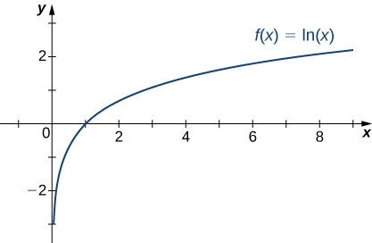{: #CNX_Calc_Figure_04_06_022}

Determining End Behavior for a Transcendental Function

Find the limits as <math xmlns="http://www.w3.org/1998/Math/MathML"><mrow><mi>x</mi><mo stretchy="false">→</mo><mi>∞</mi></mrow></math>

 and <math xmlns="http://www.w3.org/1998/Math/MathML"><mrow><mi>x</mi><mo stretchy="false">→</mo><mtext>−</mtext><mi>∞</mi></mrow></math>

 for <math xmlns="http://www.w3.org/1998/Math/MathML"><mrow><mi>f</mi><mrow><mo>(</mo><mi>x</mi><mo>)</mo></mrow><mo>=</mo><mfrac><mrow><mrow><mo>(</mo><mrow><mn>2</mn><mo>+</mo><mn>3</mn><msup><mi>e</mi><mi>x</mi></msup></mrow><mo>)</mo></mrow></mrow><mrow><mrow><mo>(</mo><mrow><mn>7</mn><mo>−</mo><mn>5</mn><msup><mi>e</mi><mi>x</mi></msup></mrow><mo>)</mo></mrow></mrow></mfrac></mrow></math>

 and describe the end behavior of <math xmlns="http://www.w3.org/1998/Math/MathML"><mrow><mi>f</mi><mo>.</mo></mrow></math>

To find the limit as <math xmlns="http://www.w3.org/1998/Math/MathML"><mrow><mi>x</mi><mo stretchy="false">→</mo><mi>∞</mi><mo>,</mo></mrow></math>

 divide the numerator and denominator by <math xmlns="http://www.w3.org/1998/Math/MathML"><mrow><msup><mi>e</mi><mi>x</mi></msup><mtext>:</mtext></mrow></math>

<math xmlns="http://www.w3.org/1998/Math/MathML"><mtable><mtr><mtd columnalign="right"><munder><mrow><mtext>lim</mtext></mrow><mrow><mi>x</mi><mo stretchy="false">→</mo><mi>∞</mi></mrow></munder><mi>f</mi><mrow><mo>(</mo><mi>x</mi><mo>)</mo></mrow></mtd><mtd columnalign="left"><mo>=</mo><munder><mrow><mtext>lim</mtext></mrow><mrow><mi>x</mi><mo stretchy="false">→</mo><mi>∞</mi></mrow></munder><mfrac><mrow><mn>2</mn><mo>+</mo><mn>3</mn><msup><mi>e</mi><mi>x</mi></msup></mrow><mrow><mn>7</mn><mo>−</mo><mn>5</mn><msup><mi>e</mi><mi>x</mi></msup></mrow></mfrac></mtd></mtr><mtr><mtd /><mtd columnalign="left"><mo>=</mo><munder><mrow><mtext>lim</mtext></mrow><mrow><mi>x</mi><mo stretchy="false">→</mo><mi>∞</mi></mrow></munder><mfrac><mrow><mrow><mo>(</mo><mrow><mn>2</mn><mtext>/</mtext><msup><mi>e</mi><mi>x</mi></msup></mrow><mo>)</mo></mrow><mo>+</mo><mn>3</mn></mrow><mrow><mrow><mo>(</mo><mrow><mn>7</mn><mtext>/</mtext><msup><mi>e</mi><mi>x</mi></msup></mrow><mo>)</mo></mrow><mo>−</mo><mn>5</mn></mrow></mfrac><mo>.</mo></mtd></mtr></mtable></math>

As shown in [[link]](#CNX_Calc_Figure_04_06_021), <math xmlns="http://www.w3.org/1998/Math/MathML"><mrow><msup><mi>e</mi><mi>x</mi></msup><mo stretchy="false">→</mo><mi>∞</mi></mrow></math>

 as <math xmlns="http://www.w3.org/1998/Math/MathML"><mrow><mi>x</mi><mo stretchy="false">→</mo><mi>∞</mi><mo>.</mo></mrow></math>

 Therefore,

<math xmlns="http://www.w3.org/1998/Math/MathML"><mrow><munder><mrow><mtext>lim</mtext></mrow><mrow><mi>x</mi><mo stretchy="false">→</mo><mi>∞</mi></mrow></munder><mfrac><mn>2</mn><mrow><msup><mi>e</mi><mi>x</mi></msup></mrow></mfrac><mo>=</mo><mn>0</mn><mo>=</mo><munder><mrow><mtext>lim</mtext></mrow><mrow><mi>x</mi><mo stretchy="false">→</mo><mi>∞</mi></mrow></munder><mfrac><mn>7</mn><mrow><msup><mi>e</mi><mi>x</mi></msup></mrow></mfrac><mo>.</mo></mrow></math>

We conclude that <math xmlns="http://www.w3.org/1998/Math/MathML"><mrow><munder><mrow><mtext>lim</mtext></mrow><mrow><mi>x</mi><mo stretchy="false">→</mo><mi>∞</mi></mrow></munder><mi>f</mi><mrow><mo>(</mo><mi>x</mi><mo>)</mo></mrow><mo>=</mo><mo>−</mo><mfrac><mn>3</mn><mn>5</mn></mfrac><mo>,</mo></mrow></math>

 and the graph of <math xmlns="http://www.w3.org/1998/Math/MathML"><mi>f</mi></math>

 approaches the horizontal asymptote <math xmlns="http://www.w3.org/1998/Math/MathML"><mrow><mi>y</mi><mo>=</mo><mo>−</mo><mfrac><mn>3</mn><mn>5</mn></mfrac></mrow></math>

 as <math xmlns="http://www.w3.org/1998/Math/MathML"><mrow><mi>x</mi><mo stretchy="false">→</mo><mi>∞</mi><mo>.</mo></mrow></math>

 To find the limit as <math xmlns="http://www.w3.org/1998/Math/MathML"><mrow><mi>x</mi><mo stretchy="false">→</mo><mtext>−</mtext><mi>∞</mi><mo>,</mo></mrow></math>

 use the fact that <math xmlns="http://www.w3.org/1998/Math/MathML"><mrow><msup><mi>e</mi><mi>x</mi></msup><mo stretchy="false">→</mo><mn>0</mn></mrow></math>

 as <math xmlns="http://www.w3.org/1998/Math/MathML"><mrow><mi>x</mi><mo stretchy="false">→</mo><mtext>−</mtext><mi>∞</mi></mrow></math>

 to conclude that <math xmlns="http://www.w3.org/1998/Math/MathML"><mrow><munder><mrow><mtext>lim</mtext></mrow><mrow><mi>x</mi><mo stretchy="false">→</mo><mi>∞</mi></mrow></munder><mi>f</mi><mrow><mo>(</mo><mi>x</mi><mo>)</mo></mrow><mo>=</mo><mfrac><mn>2</mn><mn>7</mn></mfrac><mo>,</mo></mrow></math>

 and therefore the graph of approaches the horizontal asymptote <math xmlns="http://www.w3.org/1998/Math/MathML"><mrow><mi>y</mi><mo>=</mo><mfrac><mn>2</mn><mn>7</mn></mfrac></mrow></math>

 as <math xmlns="http://www.w3.org/1998/Math/MathML"><mrow><mi>x</mi><mo stretchy="false">→</mo><mtext>−</mtext><mi>∞</mi><mo>.</mo></mrow></math>

Find the limits as <math xmlns="http://www.w3.org/1998/Math/MathML"><mrow><mi>x</mi><mo stretchy="false">→</mo><mi>∞</mi></mrow></math>

 and <math xmlns="http://www.w3.org/1998/Math/MathML"><mrow><mi>x</mi><mo stretchy="false">→</mo><mtext>−</mtext><mi>∞</mi></mrow></math>

 for <math xmlns="http://www.w3.org/1998/Math/MathML"><mrow><mi>f</mi><mrow><mo>(</mo><mi>x</mi><mo>)</mo></mrow><mo>=</mo><mfrac><mrow><mrow><mo>(</mo><mrow><mn>3</mn><msup><mi>e</mi><mi>x</mi></msup><mo>−</mo><mn>4</mn></mrow><mo>)</mo></mrow></mrow><mrow><mrow><mo>(</mo><mrow><mn>5</mn><msup><mi>e</mi><mi>x</mi></msup><mo>+</mo><mn>2</mn></mrow><mo>)</mo></mrow></mrow></mfrac><mo>.</mo></mrow></math>

<math xmlns="http://www.w3.org/1998/Math/MathML"><mrow><munder><mrow><mtext>lim</mtext></mrow><mrow><mi>x</mi><mo stretchy="false">→</mo><mi>∞</mi></mrow></munder><mi>f</mi><mrow><mo>(</mo><mi>x</mi><mo>)</mo></mrow><mo>=</mo><mfrac><mn>3</mn><mn>5</mn></mfrac><mo>,</mo></mrow></math>

 <math xmlns="http://www.w3.org/1998/Math/MathML"><mrow><munder><mrow><mtext>lim</mtext></mrow><mrow><mi>x</mi><mo stretchy="false">→</mo><mtext>−</mtext><mi>∞</mi></mrow></munder><mi>f</mi><mrow><mo>(</mo><mi>x</mi><mo>)</mo></mrow><mo>=</mo><mn>−2</mn></mrow></math>

Hint

<math xmlns="http://www.w3.org/1998/Math/MathML"><mrow><munder><mrow><mtext>lim</mtext></mrow><mrow><mi>x</mi><mo stretchy="false">→</mo><mi>∞</mi></mrow></munder><msup><mi>e</mi><mi>x</mi></msup><mo>=</mo><mi>∞</mi></mrow></math>

 and <math xmlns="http://www.w3.org/1998/Math/MathML"><mrow><munder><mrow><mtext>lim</mtext></mrow><mrow><mi>x</mi><mo stretchy="false">→</mo><mi>∞</mi></mrow></munder><msup><mi>e</mi><mi>x</mi></msup><mo>=</mo><mn>0</mn><mo>.</mo></mrow></math>

# Guidelines for Drawing the Graph of a Function

We now have enough analytical tools to draw graphs of a wide variety of algebraic and transcendental functions. Before showing how to graph specific functions, let’s look at a general strategy to use when graphing any function.

Problem-Solving Strategy: Drawing the Graph of a Function

Given a function <math xmlns="http://www.w3.org/1998/Math/MathML"><mrow><mi>f</mi><mo>,</mo></mrow></math>

 use the following steps to sketch a graph of <math xmlns="http://www.w3.org/1998/Math/MathML"><mrow><mi>f</mi><mtext>:</mtext></mrow></math>

1.  Determine the domain of the function.
2.  Locate the
    <math xmlns="http://www.w3.org/1998/Math/MathML"><mi>x</mi></math>
    
    \- and
    <math xmlns="http://www.w3.org/1998/Math/MathML"><mi>y</mi></math>
    
    -intercepts.
3.  Evaluate
    <math xmlns="http://www.w3.org/1998/Math/MathML"><mrow><munder><mrow><mtext>lim</mtext></mrow><mrow><mi>x</mi><mo stretchy="false">→</mo><mi>∞</mi></mrow></munder><mi>f</mi><mrow><mo>(</mo><mi>x</mi><mo>)</mo></mrow></mrow></math>
    
    and
    <math xmlns="http://www.w3.org/1998/Math/MathML"><mrow><munder><mrow><mtext>lim</mtext></mrow><mrow><mi>x</mi><mo stretchy="false">→</mo><mtext>−</mtext><mi>∞</mi></mrow></munder><mi>f</mi><mrow><mo>(</mo><mi>x</mi><mo>)</mo></mrow></mrow></math>
    
    to determine the end behavior. If either of these limits is a finite number
    <math xmlns="http://www.w3.org/1998/Math/MathML"><mrow><mi>L</mi><mo>,</mo></mrow></math>
    
    then
    <math xmlns="http://www.w3.org/1998/Math/MathML"><mrow><mi>y</mi><mo>=</mo><mi>L</mi></mrow></math>
    
    is a horizontal asymptote. If either of these limits is
    <math xmlns="http://www.w3.org/1998/Math/MathML"><mi>∞</mi></math>
    
    or
    <math xmlns="http://www.w3.org/1998/Math/MathML"><mrow><mtext>−</mtext><mi>∞</mi><mo>,</mo></mrow></math>
    
    determine whether
    <math xmlns="http://www.w3.org/1998/Math/MathML"><mi>f</mi></math>
    
    has an oblique asymptote. If
    <math xmlns="http://www.w3.org/1998/Math/MathML"><mi>f</mi></math>
    
    is a rational function such that
    <math xmlns="http://www.w3.org/1998/Math/MathML"><mrow><mi>f</mi><mrow><mo>(</mo><mi>x</mi><mo>)</mo></mrow><mo>=</mo><mfrac><mrow><mi>p</mi><mrow><mo>(</mo><mi>x</mi><mo>)</mo></mrow></mrow><mrow><mi>q</mi><mrow><mo>(</mo><mi>x</mi><mo>)</mo></mrow></mrow></mfrac><mo>,</mo></mrow></math>
    
    where the degree of the numerator is greater than the degree of the denominator, then
    <math xmlns="http://www.w3.org/1998/Math/MathML"><mi>f</mi></math>
    
    can be written as
    * * *
    {: data-type="newline"}
    
    

    <math xmlns="http://www.w3.org/1998/Math/MathML"><mrow><mi>f</mi><mrow><mo>(</mo><mi>x</mi><mo>)</mo></mrow><mo>=</mo><mfrac><mrow><mi>p</mi><mrow><mo>(</mo><mi>x</mi><mo>)</mo></mrow></mrow><mrow><mi>q</mi><mrow><mo>(</mo><mi>x</mi><mo>)</mo></mrow></mrow></mfrac><mo>=</mo><mi>g</mi><mrow><mo>(</mo><mi>x</mi><mo>)</mo></mrow><mo>+</mo><mfrac><mrow><mi>r</mi><mrow><mo>(</mo><mi>x</mi><mo>)</mo></mrow></mrow><mrow><mi>q</mi><mrow><mo>(</mo><mi>x</mi><mo>)</mo></mrow></mrow></mfrac><mo>,</mo></mrow></math>
    

    
    * * *
    {: data-type="newline"}
    
    where the degree of
    <math xmlns="http://www.w3.org/1998/Math/MathML"><mrow><mi>r</mi><mrow><mo>(</mo><mi>x</mi><mo>)</mo></mrow></mrow></math>
    
    is less than the degree of
    <math xmlns="http://www.w3.org/1998/Math/MathML"><mrow><mi>q</mi><mrow><mo>(</mo><mi>x</mi><mo>)</mo></mrow><mo>.</mo></mrow></math>
    
    The values of
    <math xmlns="http://www.w3.org/1998/Math/MathML"><mrow><mi>f</mi><mrow><mo>(</mo><mi>x</mi><mo>)</mo></mrow></mrow></math>
    
    approach the values of
    <math xmlns="http://www.w3.org/1998/Math/MathML"><mrow><mi>g</mi><mrow><mo>(</mo><mi>x</mi><mo>)</mo></mrow></mrow></math>
    
    as
    <math xmlns="http://www.w3.org/1998/Math/MathML"><mrow><mi>x</mi><mo stretchy="false">→</mo><mtext>±</mtext><mi>∞</mi><mo>.</mo></mrow></math>
    
    If
    <math xmlns="http://www.w3.org/1998/Math/MathML"><mrow><mi>g</mi><mrow><mo>(</mo><mi>x</mi><mo>)</mo></mrow></mrow></math>
    
    is a linear function, it is known as an *oblique asymptote*.
4.  Determine whether
    <math xmlns="http://www.w3.org/1998/Math/MathML"><mi>f</mi></math>
    
    has any vertical asymptotes.
5.  Calculate
    <math xmlns="http://www.w3.org/1998/Math/MathML"><mrow><msup><mi>f</mi><mo>′</mo></msup><mo>.</mo></mrow></math>
    
    Find all critical points and determine the intervals where
    <math xmlns="http://www.w3.org/1998/Math/MathML"><mi>f</mi></math>
    
    is increasing and where
    <math xmlns="http://www.w3.org/1998/Math/MathML"><mi>f</mi></math>
    
    is decreasing. Determine whether
    <math xmlns="http://www.w3.org/1998/Math/MathML"><mi>f</mi></math>
    
    has any local extrema.
6.  Calculate
    <math xmlns="http://www.w3.org/1998/Math/MathML"><mrow><mi>f</mi><mtext>″</mtext><mo>.</mo></mrow></math>
    
    Determine the intervals where
    <math xmlns="http://www.w3.org/1998/Math/MathML"><mi>f</mi></math>
    
    is concave up and where
    <math xmlns="http://www.w3.org/1998/Math/MathML"><mi>f</mi></math>
    
    is concave down. Use this information to determine whether
    <math xmlns="http://www.w3.org/1998/Math/MathML"><mi>f</mi></math>
    
    has any inflection points. The second derivative can also be used as an alternate means to determine or verify that
    <math xmlns="http://www.w3.org/1998/Math/MathML"><mi>f</mi></math>
    
    has a local extremum at a critical point.
{: data-number-style="arabic"}

Now let’s use this strategy to graph several different functions. We start by graphing a polynomial function.

Sketching a Graph of a Polynomial

Sketch a graph of <math xmlns="http://www.w3.org/1998/Math/MathML"><mrow><mi>f</mi><mrow><mo>(</mo><mi>x</mi><mo>)</mo></mrow><mo>=</mo><msup><mrow><mrow><mo>(</mo><mrow><mi>x</mi><mo>−</mo><mn>1</mn></mrow><mo>)</mo></mrow></mrow><mn>2</mn></msup><mrow><mo>(</mo><mrow><mi>x</mi><mo>+</mo><mn>2</mn></mrow><mo>)</mo></mrow><mo>.</mo></mrow></math>

Step 1: Since <math xmlns="http://www.w3.org/1998/Math/MathML"><mi>f</mi></math>

 is a polynomial, the domain is the set of all real numbers.

Step 2: When <math xmlns="http://www.w3.org/1998/Math/MathML"><mrow><mi>x</mi><mo>=</mo><mn>0</mn><mo>,</mo><mi>f</mi><mrow><mo>(</mo><mi>x</mi><mo>)</mo></mrow><mo>=</mo><mn>2</mn><mo>.</mo></mrow></math>

 Therefore, the <math xmlns="http://www.w3.org/1998/Math/MathML"><mi>y</mi></math>

-intercept is <math xmlns="http://www.w3.org/1998/Math/MathML"><mrow><mrow><mo>(</mo><mrow><mn>0</mn><mo>,</mo><mn>2</mn></mrow><mo>)</mo></mrow><mo>.</mo></mrow></math>

 To find the <math xmlns="http://www.w3.org/1998/Math/MathML"><mi>x</mi></math>

-intercepts, we need to solve the equation <math xmlns="http://www.w3.org/1998/Math/MathML"><mrow><msup><mrow><mrow><mo>(</mo><mrow><mi>x</mi><mo>−</mo><mn>1</mn></mrow><mo>)</mo></mrow></mrow><mn>2</mn></msup><mrow><mo>(</mo><mrow><mi>x</mi><mo>+</mo><mn>2</mn></mrow><mo>)</mo></mrow><mo>=</mo><mn>0</mn><mo>,</mo></mrow></math>

 gives us the <math xmlns="http://www.w3.org/1998/Math/MathML"><mi>x</mi></math>

-intercepts <math xmlns="http://www.w3.org/1998/Math/MathML"><mrow><mrow><mo>(</mo><mrow><mn>1</mn><mo>,</mo><mn>0</mn></mrow><mo>)</mo></mrow></mrow></math>

 and <math xmlns="http://www.w3.org/1998/Math/MathML"><mrow><mrow><mo>(</mo><mrow><mn>−2</mn><mo>,</mo><mn>0</mn></mrow><mo>)</mo></mrow></mrow></math>

Step 3: We need to evaluate the end behavior of <math xmlns="http://www.w3.org/1998/Math/MathML"><mrow><mi>f</mi><mo>.</mo></mrow></math>

 As <math xmlns="http://www.w3.org/1998/Math/MathML"><mrow><mi>x</mi><mo stretchy="false">→</mo><mi>∞</mi><mo>,</mo></mrow></math>

 <math xmlns="http://www.w3.org/1998/Math/MathML"><mrow><msup><mrow><mrow><mo>(</mo><mrow><mi>x</mi><mo>−</mo><mn>1</mn></mrow><mo>)</mo></mrow></mrow><mn>2</mn></msup><mo stretchy="false">→</mo><mi>∞</mi></mrow></math>

 and <math xmlns="http://www.w3.org/1998/Math/MathML"><mrow><mrow><mo>(</mo><mrow><mi>x</mi><mo>+</mo><mn>2</mn></mrow><mo>)</mo></mrow><mo stretchy="false">→</mo><mi>∞</mi><mo>.</mo></mrow></math>

 Therefore, <math xmlns="http://www.w3.org/1998/Math/MathML"><mrow><munder><mrow><mtext>lim</mtext></mrow><mrow><mi>x</mi><mo stretchy="false">→</mo><mi>∞</mi></mrow></munder><mi>f</mi><mrow><mo>(</mo><mi>x</mi><mo>)</mo></mrow><mo>=</mo><mi>∞</mi><mo>.</mo></mrow></math>

 As <math xmlns="http://www.w3.org/1998/Math/MathML"><mrow><mi>x</mi><mo stretchy="false">→</mo><mtext>−</mtext><mi>∞</mi><mo>,</mo></mrow></math>

 <math xmlns="http://www.w3.org/1998/Math/MathML"><mrow><msup><mrow><mrow><mo>(</mo><mrow><mi>x</mi><mo>−</mo><mn>1</mn></mrow><mo>)</mo></mrow></mrow><mn>2</mn></msup><mo stretchy="false">→</mo><mi>∞</mi></mrow></math>

 and <math xmlns="http://www.w3.org/1998/Math/MathML"><mrow><mrow><mo>(</mo><mrow><mi>x</mi><mo>+</mo><mn>2</mn></mrow><mo>)</mo></mrow><mo stretchy="false">→</mo><mtext>−</mtext><mi>∞</mi><mo>.</mo></mrow></math>

 Therefore, <math xmlns="http://www.w3.org/1998/Math/MathML"><mrow><munder><mrow><mtext>lim</mtext></mrow><mrow><mi>x</mi><mo stretchy="false">→</mo><mi>∞</mi></mrow></munder><mi>f</mi><mrow><mo>(</mo><mi>x</mi><mo>)</mo></mrow><mo>=</mo><mtext>−</mtext><mi>∞</mi><mo>.</mo></mrow></math>

 To get even more information about the end behavior of <math xmlns="http://www.w3.org/1998/Math/MathML"><mrow><mi>f</mi><mo>,</mo></mrow></math>

 we can multiply the factors of <math xmlns="http://www.w3.org/1998/Math/MathML"><mrow><mi>f</mi><mo>.</mo></mrow></math>

 When doing so, we see that

<math xmlns="http://www.w3.org/1998/Math/MathML"><mrow><mi>f</mi><mrow><mo>(</mo><mi>x</mi><mo>)</mo></mrow><mo>=</mo><msup><mrow><mrow><mo>(</mo><mrow><mi>x</mi><mo>−</mo><mn>1</mn></mrow><mo>)</mo></mrow></mrow><mn>2</mn></msup><mrow><mo>(</mo><mrow><mi>x</mi><mo>+</mo><mn>2</mn></mrow><mo>)</mo></mrow><mo>=</mo><msup><mi>x</mi><mn>3</mn></msup><mo>−</mo><mn>3</mn><mi>x</mi><mo>+</mo><mn>2</mn><mo>.</mo></mrow></math>

Since the leading term of <math xmlns="http://www.w3.org/1998/Math/MathML"><mi>f</mi></math>

 is <math xmlns="http://www.w3.org/1998/Math/MathML"><mrow><msup><mi>x</mi><mn>3</mn></msup><mo>,</mo></mrow></math>

 we conclude that <math xmlns="http://www.w3.org/1998/Math/MathML"><mi>f</mi></math>

 behaves like <math xmlns="http://www.w3.org/1998/Math/MathML"><mrow><mi>y</mi><mo>=</mo><msup><mi>x</mi><mn>3</mn></msup></mrow></math>

 as <math xmlns="http://www.w3.org/1998/Math/MathML"><mrow><mi>x</mi><mo stretchy="false">→</mo><mtext>±</mtext><mi>∞</mi><mo>.</mo></mrow></math>

Step 4: Since <math xmlns="http://www.w3.org/1998/Math/MathML"><mi>f</mi></math>

 is a polynomial function, it does not have any vertical asymptotes.

Step 5: The first derivative of <math xmlns="http://www.w3.org/1998/Math/MathML"><mi>f</mi></math>

 is

<math xmlns="http://www.w3.org/1998/Math/MathML"><mrow><msup><mi>f</mi><mo>′</mo></msup><mrow><mo>(</mo><mi>x</mi><mo>)</mo></mrow><mo>=</mo><mn>3</mn><msup><mi>x</mi><mn>2</mn></msup><mo>−</mo><mn>3</mn><mo>.</mo></mrow></math>

Therefore, <math xmlns="http://www.w3.org/1998/Math/MathML"><mi>f</mi></math>

 has two critical points: <math xmlns="http://www.w3.org/1998/Math/MathML"><mrow><mi>x</mi><mo>=</mo><mn>1</mn><mo>,</mo><mn>−1</mn><mo>.</mo></mrow></math>

 Divide the interval <math xmlns="http://www.w3.org/1998/Math/MathML"><mrow><mrow><mo>(</mo><mrow><mtext>−</mtext><mi>∞</mi><mo>,</mo><mi>∞</mi></mrow><mo>)</mo></mrow></mrow></math>

 into the three smaller intervals: <math xmlns="http://www.w3.org/1998/Math/MathML"><mrow><mrow><mo>(</mo><mrow><mtext>−</mtext><mi>∞</mi><mo>,</mo><mn>−1</mn></mrow><mo>)</mo></mrow><mo>,</mo></mrow></math>

 <math xmlns="http://www.w3.org/1998/Math/MathML"><mrow><mrow><mo>(</mo><mrow><mn>−1</mn><mo>,</mo><mn>1</mn></mrow><mo>)</mo></mrow><mo>,</mo></mrow></math>

 and <math xmlns="http://www.w3.org/1998/Math/MathML"><mrow><mrow><mo>(</mo><mrow><mn>1</mn><mo>,</mo><mi>∞</mi></mrow><mo>)</mo></mrow><mo>.</mo></mrow></math>

 Then, choose test points <math xmlns="http://www.w3.org/1998/Math/MathML"><mrow><mi>x</mi><mo>=</mo><mn>−2</mn><mo>,</mo></mrow></math>

 <math xmlns="http://www.w3.org/1998/Math/MathML"><mrow><mi>x</mi><mo>=</mo><mn>0</mn><mo>,</mo></mrow></math>

 and <math xmlns="http://www.w3.org/1998/Math/MathML"><mrow><mi>x</mi><mo>=</mo><mn>2</mn></mrow></math>

 from these intervals and evaluate the sign of <math xmlns="http://www.w3.org/1998/Math/MathML"><mrow><msup><mi>f</mi><mo>′</mo></msup><mrow><mo>(</mo><mi>x</mi><mo>)</mo></mrow></mrow></math>

 at each of these test points, as shown in the following table.

| Interval | Test Point | Sign of Derivative <math xmlns="http://www.w3.org/1998/Math/MathML"><mrow><mi>f</mi><mo>′</mo><mrow><mo>(</mo><mi>x</mi><mo>)</mo></mrow><mo>=</mo><mn>3</mn><msup><mi>x</mi><mn>2</mn></msup><mo>−</mo><mn>3</mn><mo>=</mo><mn>3</mn><mrow><mo>(</mo><mrow><mi>x</mi><mo>−</mo><mn>1</mn></mrow><mo>)</mo></mrow><mrow><mo>(</mo><mrow><mi>x</mi><mo>+</mo><mn>1</mn></mrow><mo>)</mo></mrow></mrow></math>

 | Conclusion |
{: valign="top"}|----------
| <math xmlns="http://www.w3.org/1998/Math/MathML"><mrow><mrow><mo>(</mo><mrow><mtext>−</mtext><mi>∞</mi><mo>,</mo><mn>−1</mn></mrow><mo>)</mo></mrow></mrow></math>

 | <math xmlns="http://www.w3.org/1998/Math/MathML"><mrow><mi>x</mi><mo>=</mo><mn>−2</mn></mrow></math>

 | <math xmlns="http://www.w3.org/1998/Math/MathML"><mrow><mrow><mo>(</mo><mtext>+</mtext><mo>)</mo></mrow><mrow><mo>(</mo><mtext>−</mtext><mo>)</mo></mrow><mrow><mo>(</mo><mtext>−</mtext><mo>)</mo></mrow><mo>=</mo><mo>+</mo></mrow></math>

 | <math xmlns="http://www.w3.org/1998/Math/MathML"><mi>f</mi></math>

 is increasing. |
{: valign="top"}| <math xmlns="http://www.w3.org/1998/Math/MathML"><mrow><mrow><mo>(</mo><mrow><mn>−1</mn><mo>,</mo><mn>1</mn></mrow><mo>)</mo></mrow></mrow></math>

 | <math xmlns="http://www.w3.org/1998/Math/MathML"><mrow><mi>x</mi><mo>=</mo><mn>0</mn></mrow></math>

 | <math xmlns="http://www.w3.org/1998/Math/MathML"><mrow><mrow><mo>(</mo><mtext>+</mtext><mo>)</mo></mrow><mrow><mo>(</mo><mtext>−</mtext><mo>)</mo></mrow><mrow><mo>(</mo><mtext>+</mtext><mo>)</mo></mrow><mo>=</mo><mtext>−</mtext></mrow></math>

 | <math xmlns="http://www.w3.org/1998/Math/MathML"><mi>f</mi></math>

 is decreasing. |
{: valign="top"}| <math xmlns="http://www.w3.org/1998/Math/MathML"><mrow><mrow><mo>(</mo><mrow><mn>1</mn><mo>,</mo><mi>∞</mi></mrow><mo>)</mo></mrow></mrow></math>

 | <math xmlns="http://www.w3.org/1998/Math/MathML"><mrow><mi>x</mi><mo>=</mo><mn>2</mn></mrow></math>

 | <math xmlns="http://www.w3.org/1998/Math/MathML"><mrow><mrow><mo>(</mo><mtext>+</mtext><mo>)</mo></mrow><mrow><mo>(</mo><mtext>+</mtext><mo>)</mo></mrow><mrow><mo>(</mo><mtext>+</mtext><mo>)</mo></mrow><mo>=</mo><mo>+</mo></mrow></math>

 | <math xmlns="http://www.w3.org/1998/Math/MathML"><mi>f</mi></math>

 is increasing. |
{: valign="top"}{: .unnumbered summary="This table has four rows and four columns. The first row is a header row, and it reads Interval, Test Point, Sign of Derivative f&#x2019;(x) = 3x2 &#x2013; 3 = 3(x &#x2013; 1)(x + 1), and Conclusion. Under the header row, the first column reads (&#x2212;&#x221E;, &#x2212;1), (&#x2212;1, 1), and (1, &#x221E;). The second column reads x = &#x2212;2, x = 0, and x = 2. The third column reads (+)(&#x2212;)(&#x2212;) = +, (+)(&#x2212;)(+) = &#x2212;, and (+)(+)(+) = +. The fourth column reads f is increasing, f is decreasing, and f is increasing." data-label=""}

From the table, we see that <math xmlns="http://www.w3.org/1998/Math/MathML"><mi>f</mi></math>

 has a local maximum at <math xmlns="http://www.w3.org/1998/Math/MathML"><mrow><mi>x</mi><mo>=</mo><mn>−1</mn></mrow></math>

 and a local minimum at <math xmlns="http://www.w3.org/1998/Math/MathML"><mrow><mi>x</mi><mo>=</mo><mn>1</mn><mo>.</mo></mrow></math>

 Evaluating <math xmlns="http://www.w3.org/1998/Math/MathML"><mrow><mi>f</mi><mrow><mo>(</mo><mi>x</mi><mo>)</mo></mrow></mrow></math>

 at those two points, we find that the local maximum value is <math xmlns="http://www.w3.org/1998/Math/MathML"><mrow><mi>f</mi><mrow><mo>(</mo><mrow><mn>−1</mn></mrow><mo>)</mo></mrow><mo>=</mo><mn>4</mn></mrow></math>

 and the local minimum value is <math xmlns="http://www.w3.org/1998/Math/MathML"><mrow><mi>f</mi><mrow><mo>(</mo><mn>1</mn><mo>)</mo></mrow><mo>=</mo><mn>0</mn><mo>.</mo></mrow></math>

Step 6: The second derivative of <math xmlns="http://www.w3.org/1998/Math/MathML"><mi>f</mi></math>

 is

<math xmlns="http://www.w3.org/1998/Math/MathML"><mrow><mi>f</mi><mtext>″</mtext><mrow><mo>(</mo><mi>x</mi><mo>)</mo></mrow><mo>=</mo><mn>6</mn><mi>x</mi><mo>.</mo></mrow></math>

The second derivative is zero at <math xmlns="http://www.w3.org/1998/Math/MathML"><mrow><mi>x</mi><mo>=</mo><mn>0</mn><mo>.</mo></mrow></math>

 Therefore, to determine the concavity of <math xmlns="http://www.w3.org/1998/Math/MathML"><mrow><mi>f</mi><mo>,</mo></mrow></math>

 divide the interval <math xmlns="http://www.w3.org/1998/Math/MathML"><mrow><mrow><mo>(</mo><mrow><mtext>−</mtext><mi>∞</mi><mo>,</mo><mi>∞</mi></mrow><mo>)</mo></mrow></mrow></math>

 into the smaller intervals <math xmlns="http://www.w3.org/1998/Math/MathML"><mrow><mrow><mo>(</mo><mrow><mtext>−</mtext><mi>∞</mi><mo>,</mo><mn>0</mn></mrow><mo>)</mo></mrow></mrow></math>

 and <math xmlns="http://www.w3.org/1998/Math/MathML"><mrow><mrow><mo>(</mo><mrow><mn>0</mn><mo>,</mo><mi>∞</mi></mrow><mo>)</mo></mrow><mo>,</mo></mrow></math>

 and choose test points <math xmlns="http://www.w3.org/1998/Math/MathML"><mrow><mi>x</mi><mo>=</mo><mn>−1</mn></mrow></math>

 and <math xmlns="http://www.w3.org/1998/Math/MathML"><mrow><mi>x</mi><mo>=</mo><mn>1</mn></mrow></math>

 to determine the concavity of <math xmlns="http://www.w3.org/1998/Math/MathML"><mi>f</mi></math>

 on each of these smaller intervals as shown in the following table.

| Interval | Test Point | Sign of <math xmlns="http://www.w3.org/1998/Math/MathML"><mrow><mi>f</mi><mtext>″</mtext><mrow><mo>(</mo><mi>x</mi><mo>)</mo></mrow><mo>=</mo><mn>6</mn><mi>x</mi></mrow></math>

 | Conclusion |
{: valign="top"}|----------
| <math xmlns="http://www.w3.org/1998/Math/MathML"><mrow><mrow><mo>(</mo><mrow><mtext>−</mtext><mi>∞</mi><mo>,</mo><mn>0</mn></mrow><mo>)</mo></mrow></mrow></math>

 | <math xmlns="http://www.w3.org/1998/Math/MathML"><mrow><mi>x</mi><mo>=</mo><mn>−1</mn></mrow></math>

 | <math xmlns="http://www.w3.org/1998/Math/MathML"><mo>−</mo></math>

 | <math xmlns="http://www.w3.org/1998/Math/MathML"><mi>f</mi></math>

 is concave down. |
{: valign="top"}| <math xmlns="http://www.w3.org/1998/Math/MathML"><mrow><mrow><mo>(</mo><mrow><mn>0</mn><mo>,</mo><mi>∞</mi></mrow><mo>)</mo></mrow></mrow></math>

 | <math xmlns="http://www.w3.org/1998/Math/MathML"><mrow><mi>x</mi><mo>=</mo><mn>1</mn></mrow></math>

 | <math xmlns="http://www.w3.org/1998/Math/MathML"><mo>+</mo></math>

 | <math xmlns="http://www.w3.org/1998/Math/MathML"><mi>f</mi></math>

 is concave up. |
{: valign="top"}{: .unnumbered summary="This table has three rows and four columns. The first row is a header row, and it reads Interval, Test Point, Sign of f&#x2019;&#x2019;(x) = 6x, and Conclusion. Under the header row, the first column reads (&#x2212;&#x221E;, 0) and (0, &#x221E;). The second column reads x = &#x2212;1 and x = 1. The third column reads &#x2212; and +. The fourth column reads f is concave down and f is concave up." data-label=""}

We note that the information in the preceding table confirms the fact, found in step <math xmlns="http://www.w3.org/1998/Math/MathML"><mrow><mn>5</mn><mo>,</mo></mrow></math>

 that <math xmlns="http://www.w3.org/1998/Math/MathML"><mi>f</mi></math>

 has a local maximum at <math xmlns="http://www.w3.org/1998/Math/MathML"><mrow><mi>x</mi><mo>=</mo><mn>−1</mn></mrow></math>

 and a local minimum at <math xmlns="http://www.w3.org/1998/Math/MathML"><mrow><mi>x</mi><mo>=</mo><mn>1</mn><mo>.</mo></mrow></math>

 In addition, the information found in step <math xmlns="http://www.w3.org/1998/Math/MathML"><mn>5</mn></math>

—namely, <math xmlns="http://www.w3.org/1998/Math/MathML"><mi>f</mi></math>

 has a local maximum at <math xmlns="http://www.w3.org/1998/Math/MathML"><mrow><mi>x</mi><mo>=</mo><mn>−1</mn></mrow></math>

 and a local minimum at <math xmlns="http://www.w3.org/1998/Math/MathML"><mrow><mi>x</mi><mo>=</mo><mn>1</mn><mo>,</mo></mrow></math>

 and <math xmlns="http://www.w3.org/1998/Math/MathML"><mrow><msup><mi>f</mi><mo>′</mo></msup><mrow><mo>(</mo><mi>x</mi><mo>)</mo></mrow><mo>=</mo><mn>0</mn></mrow></math>

 at those points—combined with the fact that <math xmlns="http://www.w3.org/1998/Math/MathML"><mi>f</mi><mtext>″</mtext></math>

 changes sign only at <math xmlns="http://www.w3.org/1998/Math/MathML"><mrow><mi>x</mi><mo>=</mo><mn>0</mn></mrow></math>

 confirms the results found in step <math xmlns="http://www.w3.org/1998/Math/MathML"><mn>6</mn></math>

 on the concavity of <math xmlns="http://www.w3.org/1998/Math/MathML"><mrow><mi>f</mi><mo>.</mo></mrow></math>

Combining this information, we arrive at the graph of <math xmlns="http://www.w3.org/1998/Math/MathML"><mrow><mi>f</mi><mrow><mo>(</mo><mi>x</mi><mo>)</mo></mrow><mo>=</mo><msup><mrow><mrow><mo>(</mo><mrow><mi>x</mi><mo>−</mo><mn>1</mn></mrow><mo>)</mo></mrow></mrow><mn>2</mn></msup><mrow><mo>(</mo><mrow><mi>x</mi><mo>+</mo><mn>2</mn></mrow><mo>)</mo></mrow></mrow></math>

 shown in the following graph.

 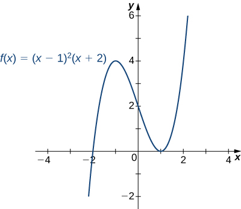 

Sketch a graph of <math xmlns="http://www.w3.org/1998/Math/MathML"><mrow><mi>f</mi><mrow><mo>(</mo><mi>x</mi><mo>)</mo></mrow><mo>=</mo><msup><mrow><mrow><mo>(</mo><mrow><mi>x</mi><mo>−</mo><mn>1</mn></mrow><mo>)</mo></mrow></mrow><mn>3</mn></msup><mrow><mo>(</mo><mrow><mi>x</mi><mo>+</mo><mn>2</mn></mrow><mo>)</mo></mrow><mo>.</mo></mrow></math>

* * *
{: data-type="newline"}

  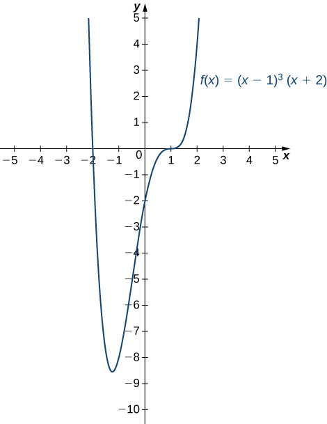 

Hint

<math xmlns="http://www.w3.org/1998/Math/MathML"><mi>f</mi></math>

 is a fourth-degree polynomial.

Sketching a Rational Function

Sketch the graph of <math xmlns="http://www.w3.org/1998/Math/MathML"><mrow><mi>f</mi><mrow><mo>(</mo><mi>x</mi><mo>)</mo></mrow><mo>=</mo><mfrac><mrow><msup><mi>x</mi><mn>2</mn></msup></mrow><mrow><mrow><mo>(</mo><mrow><mn>1</mn><mo>−</mo><msup><mi>x</mi><mn>2</mn></msup></mrow><mo>)</mo></mrow></mrow></mfrac></mrow></math>

Step 1: The function <math xmlns="http://www.w3.org/1998/Math/MathML"><mi>f</mi></math>

 is defined as long as the denominator is not zero. Therefore, the domain is the set of all real numbers <math xmlns="http://www.w3.org/1998/Math/MathML"><mi>x</mi></math>

 except <math xmlns="http://www.w3.org/1998/Math/MathML"><mrow><mi>x</mi><mo>=</mo><mtext>±</mtext><mn>1</mn><mo>.</mo></mrow></math>

Step 2: Find the intercepts. If <math xmlns="http://www.w3.org/1998/Math/MathML"><mrow><mi>x</mi><mo>=</mo><mn>0</mn><mo>,</mo></mrow></math>

 then <math xmlns="http://www.w3.org/1998/Math/MathML"><mrow><mi>f</mi><mrow><mo>(</mo><mi>x</mi><mo>)</mo></mrow><mo>=</mo><mn>0</mn><mo>,</mo></mrow></math>

 so <math xmlns="http://www.w3.org/1998/Math/MathML"><mn>0</mn></math>

 is an intercept. If <math xmlns="http://www.w3.org/1998/Math/MathML"><mrow><mi>y</mi><mo>=</mo><mn>0</mn><mo>,</mo></mrow></math>

 then <math xmlns="http://www.w3.org/1998/Math/MathML"><mrow><mfrac><mrow><msup><mi>x</mi><mn>2</mn></msup></mrow><mrow><mrow><mo>(</mo><mrow><mn>1</mn><mo>−</mo><msup><mi>x</mi><mn>2</mn></msup></mrow><mo>)</mo></mrow></mrow></mfrac><mo>=</mo><mn>0</mn><mo>,</mo></mrow></math>

 which implies <math xmlns="http://www.w3.org/1998/Math/MathML"><mrow><mi>x</mi><mo>=</mo><mn>0</mn><mo>.</mo></mrow></math>

 Therefore, <math xmlns="http://www.w3.org/1998/Math/MathML"><mrow><mrow><mo>(</mo><mrow><mn>0</mn><mo>,</mo><mn>0</mn></mrow><mo>)</mo></mrow></mrow></math>

 is the only intercept.

Step 3: Evaluate the limits at infinity. Since <math xmlns="http://www.w3.org/1998/Math/MathML"><mi>f</mi></math>

 is a rational function, divide the numerator and denominator by the highest power in the denominator: <math xmlns="http://www.w3.org/1998/Math/MathML"><mrow><msup><mi>x</mi><mn>2</mn></msup><mo>.</mo></mrow></math>

 We obtain

<math xmlns="http://www.w3.org/1998/Math/MathML"><mrow><munder><mrow><mtext>lim</mtext></mrow><mrow><mi>x</mi><mo stretchy="false">→</mo><mtext>±</mtext><mi>∞</mi></mrow></munder><mfrac><mrow><msup><mi>x</mi><mn>2</mn></msup></mrow><mrow><mn>1</mn><mo>−</mo><msup><mi>x</mi><mn>2</mn></msup></mrow></mfrac><mo>=</mo><munder><mrow><mtext>lim</mtext></mrow><mrow><mi>x</mi><mo stretchy="false">→</mo><mtext>±</mtext><mi>∞</mi></mrow></munder><mfrac><mn>1</mn><mrow><mfrac><mn>1</mn><mrow><msup><mi>x</mi><mn>2</mn></msup></mrow></mfrac><mo>−</mo><mn>1</mn></mrow></mfrac><mo>=</mo><mn>−1</mn><mo>.</mo></mrow></math>

Therefore, <math xmlns="http://www.w3.org/1998/Math/MathML"><mi>f</mi></math>

 has a horizontal asymptote of <math xmlns="http://www.w3.org/1998/Math/MathML"><mrow><mi>y</mi><mo>=</mo><mn>−1</mn></mrow></math>

 as <math xmlns="http://www.w3.org/1998/Math/MathML"><mrow><mi>x</mi><mo stretchy="false">→</mo><mi>∞</mi></mrow></math>

 and <math xmlns="http://www.w3.org/1998/Math/MathML"><mrow><mi>x</mi><mo stretchy="false">→</mo><mtext>−</mtext><mi>∞</mi><mo>.</mo></mrow></math>

Step 4: To determine whether <math xmlns="http://www.w3.org/1998/Math/MathML"><mi>f</mi></math>

 has any vertical asymptotes, first check to see whether the denominator has any zeroes. We find the denominator is zero when <math xmlns="http://www.w3.org/1998/Math/MathML"><mrow><mi>x</mi><mo>=</mo><mtext>±</mtext><mn>1</mn><mo>.</mo></mrow></math>

 To determine whether the lines <math xmlns="http://www.w3.org/1998/Math/MathML"><mrow><mi>x</mi><mo>=</mo><mn>1</mn></mrow></math>

 or <math xmlns="http://www.w3.org/1998/Math/MathML"><mrow><mi>x</mi><mo>=</mo><mn>−1</mn></mrow></math>

 are vertical asymptotes of <math xmlns="http://www.w3.org/1998/Math/MathML"><mrow><mi>f</mi><mo>,</mo></mrow></math>

 evaluate <math xmlns="http://www.w3.org/1998/Math/MathML"><mrow><munder><mrow><mtext>lim</mtext></mrow><mrow><mi>x</mi><mo stretchy="false">→</mo><mn>1</mn></mrow></munder><mi>f</mi><mrow><mo>(</mo><mi>x</mi><mo>)</mo></mrow></mrow></math>

 and <math xmlns="http://www.w3.org/1998/Math/MathML"><mrow><munder><mrow><mtext>lim</mtext></mrow><mrow><mi>x</mi><mo stretchy="false">→</mo><mtext>−</mtext><mn>1</mn></mrow></munder><mi>f</mi><mrow><mo>(</mo><mi>x</mi><mo>)</mo></mrow><mo>.</mo></mrow></math>

 By looking at each one-sided limit as <math xmlns="http://www.w3.org/1998/Math/MathML"><mrow><mi>x</mi><mo stretchy="false">→</mo><mn>1</mn><mo>,</mo></mrow></math>

 we see that

<math xmlns="http://www.w3.org/1998/Math/MathML"><mrow><munder><mrow><mtext>lim</mtext></mrow><mrow><mi>x</mi><mo stretchy="false">→</mo><msup><mn>1</mn><mo>+</mo></msup></mrow></munder><mfrac><mrow><msup><mi>x</mi><mn>2</mn></msup></mrow><mrow><mn>1</mn><mo>−</mo><msup><mi>x</mi><mn>2</mn></msup></mrow></mfrac><mo>=</mo><mtext>−</mtext><mi>∞</mi><mspace width="0.2em" /><mtext>and</mtext><mspace width="0.2em" /><munder><mrow><mtext>lim</mtext></mrow><mrow><mi>x</mi><mo stretchy="false">→</mo><msup><mn>1</mn><mo>−</mo></msup></mrow></munder><mfrac><mrow><msup><mi>x</mi><mn>2</mn></msup></mrow><mrow><mn>1</mn><mo>−</mo><msup><mi>x</mi><mn>2</mn></msup></mrow></mfrac><mo>=</mo><mi>∞</mi><mo>.</mo></mrow></math>

In addition, by looking at each one-sided limit as <math xmlns="http://www.w3.org/1998/Math/MathML"><mrow><mi>x</mi><mo stretchy="false">→</mo><mtext>−</mtext><mn>1</mn><mo>,</mo></mrow></math>

 we find that

<math xmlns="http://www.w3.org/1998/Math/MathML"><mrow><munder><mrow><mtext>lim</mtext></mrow><mrow><mi>x</mi><mo stretchy="false">→</mo><mtext>−</mtext><msup><mn>1</mn><mo>+</mo></msup></mrow></munder><mfrac><mrow><msup><mi>x</mi><mn>2</mn></msup></mrow><mrow><mn>1</mn><mo>−</mo><msup><mi>x</mi><mn>2</mn></msup></mrow></mfrac><mo>=</mo><mi>∞</mi><mspace width="0.2em" /><mtext>and</mtext><mspace width="0.2em" /><munder><mrow><mtext>lim</mtext></mrow><mrow><mi>x</mi><mo stretchy="false">→</mo><mtext>−</mtext><msup><mn>1</mn><mo>−</mo></msup></mrow></munder><mfrac><mrow><msup><mi>x</mi><mn>2</mn></msup></mrow><mrow><mn>1</mn><mo>−</mo><msup><mi>x</mi><mn>2</mn></msup></mrow></mfrac><mo>=</mo><mtext>−</mtext><mi>∞</mi><mo>.</mo></mrow></math>

Step 5: Calculate the first derivative:

<math xmlns="http://www.w3.org/1998/Math/MathML"><mrow><msup><mi>f</mi><mo>′</mo></msup><mrow><mo>(</mo><mi>x</mi><mo>)</mo></mrow><mo>=</mo><mfrac><mrow><mrow><mo>(</mo><mrow><mn>1</mn><mo>−</mo><msup><mi>x</mi><mn>2</mn></msup></mrow><mo>)</mo></mrow><mrow><mo>(</mo><mrow><mn>2</mn><mi>x</mi></mrow><mo>)</mo></mrow><mo>−</mo><msup><mi>x</mi><mn>2</mn></msup><mrow><mo>(</mo><mrow><mn>−2</mn><mi>x</mi></mrow><mo>)</mo></mrow></mrow><mrow><msup><mrow><mrow><mo>(</mo><mrow><mn>1</mn><mo>−</mo><msup><mi>x</mi><mn>2</mn></msup></mrow><mo>)</mo></mrow></mrow><mn>2</mn></msup></mrow></mfrac><mo>=</mo><mfrac><mrow><mn>2</mn><mi>x</mi></mrow><mrow><msup><mrow><mrow><mo>(</mo><mrow><mn>1</mn><mo>−</mo><msup><mi>x</mi><mn>2</mn></msup></mrow><mo>)</mo></mrow></mrow><mn>2</mn></msup></mrow></mfrac><mo>.</mo></mrow></math>

Critical points occur at points <math xmlns="http://www.w3.org/1998/Math/MathML"><mi>x</mi></math>

 where <math xmlns="http://www.w3.org/1998/Math/MathML"><mrow><msup><mi>f</mi><mo>′</mo></msup><mrow><mo>(</mo><mi>x</mi><mo>)</mo></mrow><mo>=</mo><mn>0</mn></mrow></math>

 or <math xmlns="http://www.w3.org/1998/Math/MathML"><mrow><msup><mi>f</mi><mo>′</mo></msup><mrow><mo>(</mo><mi>x</mi><mo>)</mo></mrow></mrow></math>

 is undefined. We see that <math xmlns="http://www.w3.org/1998/Math/MathML"><mrow><msup><mi>f</mi><mo>′</mo></msup><mrow><mo>(</mo><mi>x</mi><mo>)</mo></mrow><mo>=</mo><mn>0</mn></mrow></math>

 when <math xmlns="http://www.w3.org/1998/Math/MathML"><mrow><mi>x</mi><mo>=</mo><mn>0</mn><mo>.</mo></mrow></math>

 The derivative <math xmlns="http://www.w3.org/1998/Math/MathML"><msup><mi>f</mi><mo>′</mo></msup></math>

 is not undefined at any point in the domain of <math xmlns="http://www.w3.org/1998/Math/MathML"><mrow><mi>f</mi><mo>.</mo></mrow></math>

 However, <math xmlns="http://www.w3.org/1998/Math/MathML"><mrow><mi>x</mi><mo>=</mo><mtext>±</mtext><mn>1</mn></mrow></math>

 are not in the domain of <math xmlns="http://www.w3.org/1998/Math/MathML"><mrow><mi>f</mi><mo>.</mo></mrow></math>

 Therefore, to determine where <math xmlns="http://www.w3.org/1998/Math/MathML"><mi>f</mi></math>

 is increasing and where <math xmlns="http://www.w3.org/1998/Math/MathML"><mi>f</mi></math>

 is decreasing, divide the interval <math xmlns="http://www.w3.org/1998/Math/MathML"><mrow><mrow><mo>(</mo><mrow><mtext>−</mtext><mi>∞</mi><mo>,</mo><mi>∞</mi></mrow><mo>)</mo></mrow></mrow></math>

 into four smaller intervals: <math xmlns="http://www.w3.org/1998/Math/MathML"><mrow><mrow><mo>(</mo><mrow><mtext>−</mtext><mi>∞</mi><mo>,</mo><mn>−1</mn></mrow><mo>)</mo></mrow><mo>,</mo></mrow></math>

 <math xmlns="http://www.w3.org/1998/Math/MathML"><mrow><mrow><mo>(</mo><mrow><mn>−1</mn><mo>,</mo><mn>0</mn></mrow><mo>)</mo></mrow><mo>,</mo></mrow></math>

 <math xmlns="http://www.w3.org/1998/Math/MathML"><mrow><mrow><mo>(</mo><mrow><mn>0</mn><mo>,</mo><mn>1</mn></mrow><mo>)</mo></mrow><mo>,</mo></mrow></math>

 and <math xmlns="http://www.w3.org/1998/Math/MathML"><mrow><mrow><mo>(</mo><mrow><mn>1</mn><mo>,</mo><mi>∞</mi></mrow><mo>)</mo></mrow><mo>,</mo></mrow></math>

 and choose a test point in each interval to determine the sign of <math xmlns="http://www.w3.org/1998/Math/MathML"><mrow><msup><mi>f</mi><mo>′</mo></msup><mrow><mo>(</mo><mi>x</mi><mo>)</mo></mrow></mrow></math>

 in each of these intervals. The values <math xmlns="http://www.w3.org/1998/Math/MathML"><mrow><mi>x</mi><mo>=</mo><mn>−2</mn><mo>,</mo></mrow></math>

 <math xmlns="http://www.w3.org/1998/Math/MathML"><mrow><mi>x</mi><mo>=</mo><mo>−</mo><mfrac><mn>1</mn><mn>2</mn></mfrac><mo>,</mo></mrow></math>

 <math xmlns="http://www.w3.org/1998/Math/MathML"><mrow><mi>x</mi><mo>=</mo><mfrac><mn>1</mn><mn>2</mn></mfrac><mo>,</mo></mrow></math>

 and <math xmlns="http://www.w3.org/1998/Math/MathML"><mrow><mi>x</mi><mo>=</mo><mn>2</mn></mrow></math>

 are good choices for test points as shown in the following table.

| Interval | Test Point | Sign of <math xmlns="http://www.w3.org/1998/Math/MathML"><mrow><msup><mi>f</mi><mo>′</mo></msup><mrow><mo>(</mo><mi>x</mi><mo>)</mo></mrow><mo>=</mo><mfrac><mrow><mn>2</mn><mi>x</mi></mrow><mrow><msup><mrow><mrow><mo>(</mo><mrow><mn>1</mn><mo>−</mo><msup><mi>x</mi><mn>2</mn></msup></mrow><mo>)</mo></mrow></mrow><mn>2</mn></msup></mrow></mfrac></mrow></math>

 | Conclusion |
{: valign="top"}|----------
| <math xmlns="http://www.w3.org/1998/Math/MathML"><mrow><mrow><mo>(</mo><mrow><mtext>−</mtext><mi>∞</mi><mo>,</mo><mn>−1</mn></mrow><mo>)</mo></mrow></mrow></math>

 | <math xmlns="http://www.w3.org/1998/Math/MathML"><mrow><mi>x</mi><mo>=</mo><mn>−2</mn></mrow></math>

 | <math xmlns="http://www.w3.org/1998/Math/MathML"><mrow><mtext>−</mtext><mtext>/</mtext><mo>+</mo><mo>=</mo><mtext>−</mtext></mrow></math>

 | <math xmlns="http://www.w3.org/1998/Math/MathML"><mi>f</mi></math>

 is decreasing. |
{: valign="top"}| <math xmlns="http://www.w3.org/1998/Math/MathML"><mrow><mrow><mo>(</mo><mrow><mn>−1</mn><mo>,</mo><mn>0</mn></mrow><mo>)</mo></mrow></mrow></math>

 | <math xmlns="http://www.w3.org/1998/Math/MathML"><mrow><mi>x</mi><mo>=</mo><mn>−1</mn><mtext>/</mtext><mn>2</mn></mrow></math>

 | <math xmlns="http://www.w3.org/1998/Math/MathML"><mrow><mtext>−</mtext><mtext>/</mtext><mo>+</mo><mo>=</mo><mtext>−</mtext></mrow></math>

 | <math xmlns="http://www.w3.org/1998/Math/MathML"><mi>f</mi></math>

 is decreasing. |
{: valign="top"}| <math xmlns="http://www.w3.org/1998/Math/MathML"><mrow><mrow><mo>(</mo><mrow><mn>0</mn><mo>,</mo><mn>1</mn></mrow><mo>)</mo></mrow></mrow></math>

 | <math xmlns="http://www.w3.org/1998/Math/MathML"><mrow><mi>x</mi><mo>=</mo><mn>1</mn><mtext>/</mtext><mn>2</mn></mrow></math>

 | <math xmlns="http://www.w3.org/1998/Math/MathML"><mrow><mo>+</mo><mtext>/</mtext><mo>+</mo><mo>=</mo><mo>+</mo></mrow></math>

 | <math xmlns="http://www.w3.org/1998/Math/MathML"><mi>f</mi></math>

 is increasing. |
{: valign="top"}| <math xmlns="http://www.w3.org/1998/Math/MathML"><mrow><mrow><mo>(</mo><mrow><mn>1</mn><mo>,</mo><mi>∞</mi></mrow><mo>)</mo></mrow></mrow></math>

 | <math xmlns="http://www.w3.org/1998/Math/MathML"><mrow><mi>x</mi><mo>=</mo><mn>2</mn></mrow></math>

 | <math xmlns="http://www.w3.org/1998/Math/MathML"><mrow><mo>+</mo><mtext>/</mtext><mo>+</mo><mo>=</mo><mo>+</mo></mrow></math>

 | <math xmlns="http://www.w3.org/1998/Math/MathML"><mi>f</mi></math>

 is increasing. |
{: valign="top"}{: .unnumbered summary="This table has four columns and five rows. The first row is a header row, and it reads Interval, Test Point, Sign of f&#x2019;(x) = 2x/(1 &#x2212; x2)2, and Conclusion. Under the header row, the first column reads (&#x2212;&#x221E;, &#x2212;1), (&#x2212;1, 0), (0, 1), and (1, &#x221E;). The second column reads x = &#x2212;2, x = &#x2212;1/2, x = 1/2, and x = 2. The third column reads &#x2212;/+ = &#x2212;, &#x2212;/+ = &#x2212;, +/+ = +, and +/+ = +. The fourth column reads f is decreasing, f is decreasing, f is increasing, and f is increasing." data-label=""}

From this analysis, we conclude that <math xmlns="http://www.w3.org/1998/Math/MathML"><mi>f</mi></math>

 has a local minimum at <math xmlns="http://www.w3.org/1998/Math/MathML"><mrow><mi>x</mi><mo>=</mo><mn>0</mn></mrow></math>

 but no local maximum.

Step 6: Calculate the second derivative:

<math xmlns="http://www.w3.org/1998/Math/MathML"><mtable><mtr><mtd columnalign="right"><mi>f</mi><mtext>″</mtext><mrow><mo>(</mo><mi>x</mi><mo>)</mo></mrow></mtd><mtd columnalign="right"><mo>=</mo><mfrac><mrow><msup><mrow><mrow><mo>(</mo><mrow><mn>1</mn><mo>−</mo><msup><mi>x</mi><mn>2</mn></msup></mrow><mo>)</mo></mrow></mrow><mn>2</mn></msup><mrow><mo>(</mo><mn>2</mn><mo>)</mo></mrow><mo>−</mo><mn>2</mn><mi>x</mi><mrow><mo>(</mo><mrow><mn>2</mn><mrow><mo>(</mo><mrow><mn>1</mn><mo>−</mo><msup><mi>x</mi><mn>2</mn></msup></mrow><mo>)</mo></mrow><mrow><mo>(</mo><mrow><mn>−2</mn><mi>x</mi></mrow><mo>)</mo></mrow></mrow><mo>)</mo></mrow></mrow><mrow><msup><mrow><mrow><mo>(</mo><mrow><mn>1</mn><mo>−</mo><msup><mi>x</mi><mn>2</mn></msup></mrow><mo>)</mo></mrow></mrow><mn>4</mn></msup></mrow></mfrac></mtd></mtr><mtr><mtd /><mtd columnalign="left"><mo>=</mo><mfrac><mrow><mrow><mo>(</mo><mrow><mn>1</mn><mo>−</mo><msup><mi>x</mi><mn>2</mn></msup></mrow><mo>)</mo></mrow><mrow><mo>[</mo><mrow><mn>2</mn><mrow><mo>(</mo><mrow><mn>1</mn><mo>−</mo><msup><mi>x</mi><mn>2</mn></msup></mrow><mo>)</mo></mrow><mo>+</mo><mn>8</mn><msup><mi>x</mi><mn>2</mn></msup></mrow><mo>]</mo></mrow></mrow><mrow><msup><mrow><mrow><mo>(</mo><mrow><mn>1</mn><mo>−</mo><msup><mi>x</mi><mn>2</mn></msup></mrow><mo>)</mo></mrow></mrow><mn>4</mn></msup></mrow></mfrac></mtd></mtr><mtr><mtd /><mtd columnalign="left"><mo>=</mo><mfrac><mrow><mn>2</mn><mrow><mo>(</mo><mrow><mn>1</mn><mo>−</mo><msup><mi>x</mi><mn>2</mn></msup></mrow><mo>)</mo></mrow><mo>+</mo><mn>8</mn><msup><mi>x</mi><mn>2</mn></msup></mrow><mrow><msup><mrow><mrow><mo>(</mo><mrow><mn>1</mn><mo>−</mo><msup><mi>x</mi><mn>2</mn></msup></mrow><mo>)</mo></mrow></mrow><mn>3</mn></msup></mrow></mfrac></mtd></mtr><mtr><mtd /><mtd columnalign="left"><mo>=</mo><mfrac><mrow><mn>6</mn><msup><mi>x</mi><mn>2</mn></msup><mo>+</mo><mn>2</mn></mrow><mrow><msup><mrow><mrow><mo>(</mo><mrow><mn>1</mn><mo>−</mo><msup><mi>x</mi><mn>2</mn></msup></mrow><mo>)</mo></mrow></mrow><mn>3</mn></msup></mrow></mfrac><mo>.</mo></mtd></mtr></mtable></math>

To determine the intervals where <math xmlns="http://www.w3.org/1998/Math/MathML"><mi>f</mi></math>

 is concave up and where <math xmlns="http://www.w3.org/1998/Math/MathML"><mi>f</mi></math>

 is concave down, we first need to find all points <math xmlns="http://www.w3.org/1998/Math/MathML"><mi>x</mi></math>

 where <math xmlns="http://www.w3.org/1998/Math/MathML"><mrow><mi>f</mi><mtext>″</mtext><mrow><mo>(</mo><mi>x</mi><mo>)</mo></mrow><mo>=</mo><mn>0</mn></mrow></math>

 or <math xmlns="http://www.w3.org/1998/Math/MathML"><mrow><mi>f</mi><mtext>″</mtext><mrow><mo>(</mo><mi>x</mi><mo>)</mo></mrow></mrow></math>

 is undefined. Since the numerator <math xmlns="http://www.w3.org/1998/Math/MathML"><mrow><mn>6</mn><msup><mi>x</mi><mn>2</mn></msup><mo>+</mo><mn>2</mn><mo>≠</mo><mn>0</mn></mrow></math>

 for any <math xmlns="http://www.w3.org/1998/Math/MathML"><mrow><mi>x</mi><mo>,</mo></mrow></math>

 <math xmlns="http://www.w3.org/1998/Math/MathML"><mrow><mi>f</mi><mtext>″</mtext><mrow><mo>(</mo><mi>x</mi><mo>)</mo></mrow></mrow></math>

 is never zero. Furthermore, <math xmlns="http://www.w3.org/1998/Math/MathML"><mi>f</mi><mtext>″</mtext></math>

 is not undefined for any <math xmlns="http://www.w3.org/1998/Math/MathML"><mi>x</mi></math>

 in the domain of <math xmlns="http://www.w3.org/1998/Math/MathML"><mrow><mi>f</mi><mo>.</mo></mrow></math>

 However, as discussed earlier, <math xmlns="http://www.w3.org/1998/Math/MathML"><mrow><mi>x</mi><mo>=</mo><mtext>±</mtext><mn>1</mn></mrow></math>

 are not in the domain of <math xmlns="http://www.w3.org/1998/Math/MathML"><mrow><mi>f</mi><mo>.</mo></mrow></math>

 Therefore, to determine the concavity of <math xmlns="http://www.w3.org/1998/Math/MathML"><mrow><mi>f</mi><mo>,</mo></mrow></math>

 we divide the interval <math xmlns="http://www.w3.org/1998/Math/MathML"><mrow><mrow><mo>(</mo><mrow><mtext>−</mtext><mi>∞</mi><mo>,</mo><mi>∞</mi></mrow><mo>)</mo></mrow></mrow></math>

 into the three smaller intervals <math xmlns="http://www.w3.org/1998/Math/MathML"><mrow><mrow><mo>(</mo><mrow><mtext>−</mtext><mi>∞</mi><mo>,</mo><mn>−1</mn></mrow><mo>)</mo></mrow><mo>,</mo></mrow></math>

 <math xmlns="http://www.w3.org/1998/Math/MathML"><mrow><mrow><mo>(</mo><mrow><mn>−1</mn><mo>,</mo><mn>−1</mn></mrow><mo>)</mo></mrow><mo>,</mo></mrow></math>

 and <math xmlns="http://www.w3.org/1998/Math/MathML"><mrow><mrow><mo>(</mo><mrow><mn>1</mn><mo>,</mo><mi>∞</mi></mrow><mo>)</mo></mrow><mo>,</mo></mrow></math>

 and choose a test point in each of these intervals to evaluate the sign of <math xmlns="http://www.w3.org/1998/Math/MathML"><mrow><mi>f</mi><mtext>″</mtext><mrow><mo>(</mo><mi>x</mi><mo>)</mo></mrow><mo>.</mo></mrow></math>

 in each of these intervals. The values <math xmlns="http://www.w3.org/1998/Math/MathML"><mrow><mi>x</mi><mo>=</mo><mn>−2</mn><mo>,</mo></mrow></math>

 <math xmlns="http://www.w3.org/1998/Math/MathML"><mrow><mi>x</mi><mo>=</mo><mn>0</mn><mo>,</mo></mrow></math>

 and <math xmlns="http://www.w3.org/1998/Math/MathML"><mrow><mi>x</mi><mo>=</mo><mn>2</mn></mrow></math>

 are possible test points as shown in the following table.

| Interval | Test Point | Sign of <math xmlns="http://www.w3.org/1998/Math/MathML"><mrow><mi>f</mi><mtext>″</mtext><mrow><mo>(</mo><mi>x</mi><mo>)</mo></mrow><mo>=</mo><mfrac><mrow><mn>6</mn><msup><mi>x</mi><mn>2</mn></msup><mo>+</mo><mn>2</mn></mrow><mrow><msup><mrow><mrow><mo>(</mo><mrow><mn>1</mn><mo>−</mo><msup><mi>x</mi><mn>2</mn></msup></mrow><mo>)</mo></mrow></mrow><mn>3</mn></msup></mrow></mfrac></mrow></math>

 | Conclusion |
{: valign="top"}|----------
| <math xmlns="http://www.w3.org/1998/Math/MathML"><mrow><mrow><mo>(</mo><mrow><mtext>−</mtext><mi>∞</mi><mo>,</mo><mn>−1</mn></mrow><mo>)</mo></mrow></mrow></math>

 | <math xmlns="http://www.w3.org/1998/Math/MathML"><mrow><mi>x</mi><mo>=</mo><mn>−2</mn></mrow></math>

 | <math xmlns="http://www.w3.org/1998/Math/MathML"><mrow><mo>+</mo><mtext>/</mtext><mo>−</mo><mo>=</mo><mtext>−</mtext></mrow></math>

 | <math xmlns="http://www.w3.org/1998/Math/MathML"><mi>f</mi></math>

 is concave down. |
{: valign="top"}| <math xmlns="http://www.w3.org/1998/Math/MathML"><mrow><mrow><mo>(</mo><mrow><mn>−1</mn><mo>,</mo><mn>−1</mn></mrow><mo>)</mo></mrow></mrow></math>

 | <math xmlns="http://www.w3.org/1998/Math/MathML"><mrow><mi>x</mi><mo>=</mo><mn>0</mn></mrow></math>

 | <math xmlns="http://www.w3.org/1998/Math/MathML"><mrow><mo>+</mo><mtext>/</mtext><mo>+</mo><mo>=</mo><mo>+</mo></mrow></math>

 | <math xmlns="http://www.w3.org/1998/Math/MathML"><mi>f</mi></math>

 is concave up. |
{: valign="top"}| <math xmlns="http://www.w3.org/1998/Math/MathML"><mrow><mrow><mo>(</mo><mrow><mn>1</mn><mo>,</mo><mi>∞</mi></mrow><mo>)</mo></mrow></mrow></math>

 | <math xmlns="http://www.w3.org/1998/Math/MathML"><mrow><mi>x</mi><mo>=</mo><mn>2</mn></mrow></math>

 | <math xmlns="http://www.w3.org/1998/Math/MathML"><mrow><mo>+</mo><mtext>/</mtext><mo>−</mo><mo>=</mo><mtext>−</mtext></mrow></math>

 | <math xmlns="http://www.w3.org/1998/Math/MathML"><mi>f</mi></math>

 is concave down. |
{: valign="top"}{: .unnumbered summary="This table has four columns and four rows. The first row is a header row, and it reads Interval, Test Point, Sign of f&#x2019;&#x2019;(x) = (6x2 + 2)/(1 &#x2212; x2)3, and Conclusion. Under the header row, the first column reads (&#x2212;&#x221E;, &#x2212;1), (&#x2212;1, 1), and (1, &#x221E;). The second column reads x = &#x2212;2, x = 0, and x = 2. The third column reads +/&#x2212; = &#x2212;, +/+ = +, and +/&#x2212; = &#x2212;. The fourth column reads f is concave down, f is concave up, and f is concave down." data-label=""}

Combining all this information, we arrive at the graph of <math xmlns="http://www.w3.org/1998/Math/MathML"><mi>f</mi></math>

 shown below. Note that, although <math xmlns="http://www.w3.org/1998/Math/MathML"><mi>f</mi></math>

 changes concavity at <math xmlns="http://www.w3.org/1998/Math/MathML"><mrow><mi>x</mi><mo>=</mo><mn>−1</mn></mrow></math>

 and <math xmlns="http://www.w3.org/1998/Math/MathML"><mrow><mi>x</mi><mo>=</mo><mn>1</mn><mo>,</mo></mrow></math>

 there are no inflection points at either of these places because <math xmlns="http://www.w3.org/1998/Math/MathML"><mi>f</mi></math>

 is not continuous at <math xmlns="http://www.w3.org/1998/Math/MathML"><mrow><mi>x</mi><mo>=</mo><mn>−1</mn></mrow></math>

 or <math xmlns="http://www.w3.org/1998/Math/MathML"><mrow><mi>x</mi><mo>=</mo><mn>1</mn><mo>.</mo></mrow></math>

 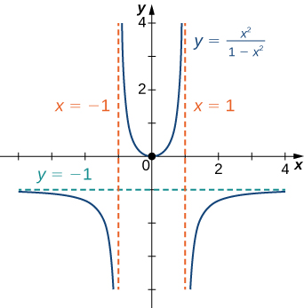 

Sketch a graph of <math xmlns="http://www.w3.org/1998/Math/MathML"><mrow><mi>f</mi><mrow><mo>(</mo><mi>x</mi><mo>)</mo></mrow><mo>=</mo><mfrac><mrow><mrow><mo>(</mo><mrow><mn>3</mn><mi>x</mi><mo>+</mo><mn>5</mn></mrow><mo>)</mo></mrow></mrow><mrow><mrow><mo>(</mo><mrow><mn>8</mn><mo>+</mo><mn>4</mn><mi>x</mi></mrow><mo>)</mo></mrow></mrow></mfrac><mo>.</mo></mrow></math>

* * *
{: data-type="newline"}

  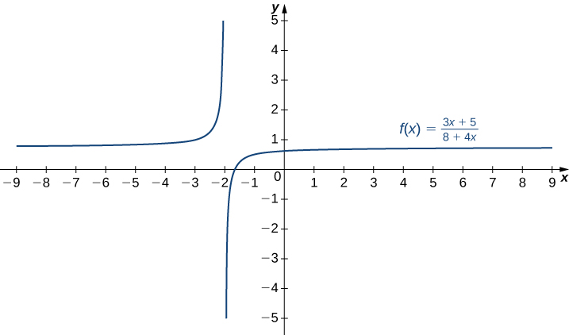 

Hint

A line <math xmlns="http://www.w3.org/1998/Math/MathML"><mrow><mi>y</mi><mo>=</mo><mi>L</mi></mrow></math>

 is a horizontal asymptote of <math xmlns="http://www.w3.org/1998/Math/MathML"><mi>f</mi></math>

 if the limit as <math xmlns="http://www.w3.org/1998/Math/MathML"><mrow><mi>x</mi><mo stretchy="false">→</mo><mi>∞</mi></mrow></math>

 or the limit as <math xmlns="http://www.w3.org/1998/Math/MathML"><mrow><mi>x</mi><mo stretchy="false">→</mo><mtext>−</mtext><mi>∞</mi></mrow></math>

 of <math xmlns="http://www.w3.org/1998/Math/MathML"><mrow><mi>f</mi><mrow><mo>(</mo><mi>x</mi><mo>)</mo></mrow></mrow></math>

 is <math xmlns="http://www.w3.org/1998/Math/MathML"><mrow><mi>L</mi><mo>.</mo></mrow></math>

 A line <math xmlns="http://www.w3.org/1998/Math/MathML"><mrow><mi>x</mi><mo>=</mo><mi>a</mi></mrow></math>

 is a vertical asymptote if at least one of the one-sided limits of <math xmlns="http://www.w3.org/1998/Math/MathML"><mi>f</mi></math>

 as <math xmlns="http://www.w3.org/1998/Math/MathML"><mrow><mi>x</mi><mo stretchy="false">→</mo><mi>a</mi></mrow></math>

 is <math xmlns="http://www.w3.org/1998/Math/MathML"><mi>∞</mi></math>

 or <math xmlns="http://www.w3.org/1998/Math/MathML"><mrow><mtext>−</mtext><mi>∞</mi><mo>.</mo></mrow></math>

Sketching a Rational Function with an Oblique Asymptote

Sketch the graph of <math xmlns="http://www.w3.org/1998/Math/MathML"><mrow><mi>f</mi><mrow><mo>(</mo><mi>x</mi><mo>)</mo></mrow><mo>=</mo><mfrac><mrow><msup><mi>x</mi><mn>2</mn></msup></mrow><mrow><mrow><mo>(</mo><mrow><mi>x</mi><mo>−</mo><mn>1</mn></mrow><mo>)</mo></mrow></mrow></mfrac></mrow></math>

Step 1: The domain of <math xmlns="http://www.w3.org/1998/Math/MathML"><mi>f</mi></math>

 is the set of all real numbers <math xmlns="http://www.w3.org/1998/Math/MathML"><mi>x</mi></math>

 except <math xmlns="http://www.w3.org/1998/Math/MathML"><mrow><mi>x</mi><mo>=</mo><mn>1</mn><mo>.</mo></mrow></math>

Step 2: Find the intercepts. We can see that when <math xmlns="http://www.w3.org/1998/Math/MathML"><mrow><mi>x</mi><mo>=</mo><mn>0</mn><mo>,</mo></mrow></math>

 <math xmlns="http://www.w3.org/1998/Math/MathML"><mrow><mi>f</mi><mrow><mo>(</mo><mi>x</mi><mo>)</mo></mrow><mo>=</mo><mn>0</mn><mo>,</mo></mrow></math>

 so <math xmlns="http://www.w3.org/1998/Math/MathML"><mrow><mrow><mo>(</mo><mrow><mn>0</mn><mo>,</mo><mn>0</mn></mrow><mo>)</mo></mrow></mrow></math>

 is the only intercept.

Step 3: Evaluate the limits at infinity. Since the degree of the numerator is one more than the degree of the denominator, <math xmlns="http://www.w3.org/1998/Math/MathML"><mi>f</mi></math>

 must have an oblique asymptote. To find the oblique asymptote, use long division of polynomials to write

<math xmlns="http://www.w3.org/1998/Math/MathML"><mrow><mi>f</mi><mrow><mo>(</mo><mi>x</mi><mo>)</mo></mrow><mo>=</mo><mfrac><mrow><msup><mi>x</mi><mn>2</mn></msup></mrow><mrow><mi>x</mi><mo>−</mo><mn>1</mn></mrow></mfrac><mo>=</mo><mi>x</mi><mo>+</mo><mn>1</mn><mo>+</mo><mfrac><mn>1</mn><mrow><mi>x</mi><mo>−</mo><mn>1</mn></mrow></mfrac><mo>.</mo></mrow></math>

Since <math xmlns="http://www.w3.org/1998/Math/MathML"><mrow><mn>1</mn><mtext>/</mtext><mrow><mo>(</mo><mrow><mi>x</mi><mo>−</mo><mn>1</mn></mrow><mo>)</mo></mrow><mo stretchy="false">→</mo><mn>0</mn></mrow></math>

 as <math xmlns="http://www.w3.org/1998/Math/MathML"><mrow><mi>x</mi><mo stretchy="false">→</mo><mtext>±</mtext><mi>∞</mi><mo>,</mo></mrow></math>

 <math xmlns="http://www.w3.org/1998/Math/MathML"><mrow><mi>f</mi><mrow><mo>(</mo><mi>x</mi><mo>)</mo></mrow></mrow></math>

 approaches the line <math xmlns="http://www.w3.org/1998/Math/MathML"><mrow><mi>y</mi><mo>=</mo><mi>x</mi><mo>+</mo><mn>1</mn></mrow></math>

 as <math xmlns="http://www.w3.org/1998/Math/MathML"><mrow><mi>x</mi><mo stretchy="false">→</mo><mtext>±</mtext><mi>∞</mi><mo>.</mo></mrow></math>

 The line <math xmlns="http://www.w3.org/1998/Math/MathML"><mrow><mi>y</mi><mo>=</mo><mi>x</mi><mo>+</mo><mn>1</mn></mrow></math>

 is an oblique asymptote for <math xmlns="http://www.w3.org/1998/Math/MathML"><mrow><mi>f</mi><mo>.</mo></mrow></math>

Step 4: To check for vertical asymptotes, look at where the denominator is zero. Here the denominator is zero at <math xmlns="http://www.w3.org/1998/Math/MathML"><mrow><mi>x</mi><mo>=</mo><mn>1</mn><mo>.</mo></mrow></math>

 Looking at both one-sided limits as <math xmlns="http://www.w3.org/1998/Math/MathML"><mrow><mi>x</mi><mo stretchy="false">→</mo><mn>1</mn><mo>,</mo></mrow></math>

 we find

<math xmlns="http://www.w3.org/1998/Math/MathML"><mrow><munder><mrow><mtext>lim</mtext></mrow><mrow><mi>x</mi><mo stretchy="false">→</mo><msup><mn>1</mn><mo>+</mo></msup></mrow></munder><mfrac><mrow><msup><mi>x</mi><mn>2</mn></msup></mrow><mrow><mi>x</mi><mo>−</mo><mn>1</mn></mrow></mfrac><mo>=</mo><mi>∞</mi><mspace width="0.2em" /><mtext>and</mtext><mspace width="0.2em" /><munder><mrow><mtext>lim</mtext></mrow><mrow><mi>x</mi><mo stretchy="false">→</mo><msup><mn>1</mn><mo>−</mo></msup></mrow></munder><mfrac><mrow><msup><mi>x</mi><mn>2</mn></msup></mrow><mrow><mi>x</mi><mo>−</mo><mn>1</mn></mrow></mfrac><mo>=</mo><mtext>−</mtext><mi>∞</mi><mo>.</mo></mrow></math>

Therefore, <math xmlns="http://www.w3.org/1998/Math/MathML"><mrow><mi>x</mi><mo>=</mo><mn>1</mn></mrow></math>

 is a vertical asymptote, and we have determined the behavior of <math xmlns="http://www.w3.org/1998/Math/MathML"><mi>f</mi></math>

 as <math xmlns="http://www.w3.org/1998/Math/MathML"><mi>x</mi></math>

 approaches <math xmlns="http://www.w3.org/1998/Math/MathML"><mn>1</mn></math>

 from the right and the left.

Step 5: Calculate the first derivative:

<math xmlns="http://www.w3.org/1998/Math/MathML"><mrow><msup><mi>f</mi><mo>′</mo></msup><mrow><mo>(</mo><mi>x</mi><mo>)</mo></mrow><mo>=</mo><mfrac><mrow><mrow><mo>(</mo><mrow><mi>x</mi><mo>−</mo><mn>1</mn></mrow><mo>)</mo></mrow><mrow><mo>(</mo><mrow><mn>2</mn><mi>x</mi></mrow><mo>)</mo></mrow><mo>−</mo><msup><mi>x</mi><mn>2</mn></msup><mrow><mo>(</mo><mn>1</mn><mo>)</mo></mrow></mrow><mrow><msup><mrow><mrow><mo>(</mo><mrow><mi>x</mi><mo>−</mo><mn>1</mn></mrow><mo>)</mo></mrow></mrow><mn>2</mn></msup></mrow></mfrac><mo>=</mo><mfrac><mrow><msup><mi>x</mi><mn>2</mn></msup><mo>−</mo><mn>2</mn><mi>x</mi></mrow><mrow><msup><mrow><mrow><mo>(</mo><mrow><mi>x</mi><mo>−</mo><mn>1</mn></mrow><mo>)</mo></mrow></mrow><mn>2</mn></msup></mrow></mfrac><mo>.</mo></mrow></math>

We have <math xmlns="http://www.w3.org/1998/Math/MathML"><mrow><msup><mi>f</mi><mo>′</mo></msup><mrow><mo>(</mo><mi>x</mi><mo>)</mo></mrow><mo>=</mo><mn>0</mn></mrow></math>

 when <math xmlns="http://www.w3.org/1998/Math/MathML"><mrow><msup><mi>x</mi><mn>2</mn></msup><mo>−</mo><mn>2</mn><mi>x</mi><mo>=</mo><mi>x</mi><mrow><mo>(</mo><mrow><mi>x</mi><mo>−</mo><mn>2</mn></mrow><mo>)</mo></mrow><mo>=</mo><mn>0</mn><mo>.</mo></mrow></math>

 Therefore, <math xmlns="http://www.w3.org/1998/Math/MathML"><mrow><mi>x</mi><mo>=</mo><mn>0</mn></mrow></math>

 and <math xmlns="http://www.w3.org/1998/Math/MathML"><mrow><mi>x</mi><mo>=</mo><mn>2</mn></mrow></math>

 are critical points. Since <math xmlns="http://www.w3.org/1998/Math/MathML"><mi>f</mi></math>

 is undefined at <math xmlns="http://www.w3.org/1998/Math/MathML"><mrow><mi>x</mi><mo>=</mo><mn>1</mn><mo>,</mo></mrow></math>

 we need to divide the interval <math xmlns="http://www.w3.org/1998/Math/MathML"><mrow><mrow><mo>(</mo><mrow><mtext>−</mtext><mi>∞</mi><mo>,</mo><mi>∞</mi></mrow><mo>)</mo></mrow></mrow></math>

 into the smaller intervals <math xmlns="http://www.w3.org/1998/Math/MathML"><mrow><mrow><mo>(</mo><mrow><mtext>−</mtext><mi>∞</mi><mo>,</mo><mn>0</mn></mrow><mo>)</mo></mrow><mo>,</mo></mrow></math>

 <math xmlns="http://www.w3.org/1998/Math/MathML"><mrow><mrow><mo>(</mo><mrow><mn>0</mn><mo>,</mo><mn>1</mn></mrow><mo>)</mo></mrow><mo>,</mo></mrow></math>

 <math xmlns="http://www.w3.org/1998/Math/MathML"><mrow><mrow><mo>(</mo><mrow><mn>1</mn><mo>,</mo><mn>2</mn></mrow><mo>)</mo></mrow><mo>,</mo></mrow></math>

 and <math xmlns="http://www.w3.org/1998/Math/MathML"><mrow><mrow><mo>(</mo><mrow><mn>2</mn><mo>,</mo><mi>∞</mi></mrow><mo>)</mo></mrow><mo>,</mo></mrow></math>

 and choose a test point from each interval to evaluate the sign of <math xmlns="http://www.w3.org/1998/Math/MathML"><mrow><msup><mi>f</mi><mo>′</mo></msup><mrow><mo>(</mo><mi>x</mi><mo>)</mo></mrow></mrow></math>

 in each of these smaller intervals. For example, let <math xmlns="http://www.w3.org/1998/Math/MathML"><mrow><mi>x</mi><mo>=</mo><mn>−1</mn><mo>,</mo></mrow></math>

 <math xmlns="http://www.w3.org/1998/Math/MathML"><mrow><mi>x</mi><mo>=</mo><mfrac><mn>1</mn><mn>2</mn></mfrac><mo>,</mo></mrow></math>

 <math xmlns="http://www.w3.org/1998/Math/MathML"><mrow><mi>x</mi><mo>=</mo><mfrac><mn>3</mn><mn>2</mn></mfrac><mo>,</mo></mrow></math>

 and <math xmlns="http://www.w3.org/1998/Math/MathML"><mrow><mi>x</mi><mo>=</mo><mn>3</mn></mrow></math>

 be the test points as shown in the following table.

| Interval | Test Point | Sign of <math xmlns="http://www.w3.org/1998/Math/MathML"><mrow><mi>f</mi><mo>′</mo><mrow><mo>(</mo><mi>x</mi><mo>)</mo></mrow><mo>=</mo><mfrac><mrow><msup><mi>x</mi><mn>2</mn></msup><mo>−</mo><mn>2</mn><mi>x</mi></mrow><mrow><msup><mrow><mrow><mo>(</mo><mrow><mi>x</mi><mo>−</mo><mn>1</mn></mrow><mo>)</mo></mrow></mrow><mn>2</mn></msup></mrow></mfrac><mo>=</mo><mfrac><mrow><mi>x</mi><mrow><mo>(</mo><mrow><mi>x</mi><mo>−</mo><mn>2</mn></mrow><mo>)</mo></mrow></mrow><mrow><msup><mrow><mrow><mo>(</mo><mrow><mi>x</mi><mo>−</mo><mn>1</mn></mrow><mo>)</mo></mrow></mrow><mn>2</mn></msup></mrow></mfrac></mrow></math>

 | Conclusion |
{: valign="top"}|----------
| <math xmlns="http://www.w3.org/1998/Math/MathML"><mrow><mrow><mo>(</mo><mrow><mtext>−</mtext><mi>∞</mi><mo>,</mo><mn>0</mn></mrow><mo>)</mo></mrow></mrow></math>

 | <math xmlns="http://www.w3.org/1998/Math/MathML"><mrow><mi>x</mi><mo>=</mo><mn>−1</mn></mrow></math>

 | <math xmlns="http://www.w3.org/1998/Math/MathML"><mrow><mrow><mo>(</mo><mtext>−</mtext><mo>)</mo></mrow><mrow><mo>(</mo><mtext>−</mtext><mo>)</mo></mrow><mtext>/</mtext><mo>+</mo><mo>=</mo><mo>+</mo></mrow></math>

 | <math xmlns="http://www.w3.org/1998/Math/MathML"><mi>f</mi></math>

 is increasing. |
{: valign="top"}| <math xmlns="http://www.w3.org/1998/Math/MathML"><mrow><mrow><mo>(</mo><mrow><mn>0</mn><mo>,</mo><mn>1</mn></mrow><mo>)</mo></mrow></mrow></math>

 | <math xmlns="http://www.w3.org/1998/Math/MathML"><mrow><mi>x</mi><mo>=</mo><mn>1</mn><mtext>/</mtext><mn>2</mn></mrow></math>

 | <math xmlns="http://www.w3.org/1998/Math/MathML"><mrow><mrow><mo>(</mo><mtext>+</mtext><mo>)</mo></mrow><mrow><mo>(</mo><mtext>−</mtext><mo>)</mo></mrow><mtext>/</mtext><mo>+</mo><mo>=</mo><mtext>−</mtext></mrow></math>

 | <math xmlns="http://www.w3.org/1998/Math/MathML"><mi>f</mi></math>

 is decreasing. |
{: valign="top"}| <math xmlns="http://www.w3.org/1998/Math/MathML"><mrow><mrow><mo>(</mo><mrow><mn>1</mn><mo>,</mo><mn>2</mn></mrow><mo>)</mo></mrow></mrow></math>

 | <math xmlns="http://www.w3.org/1998/Math/MathML"><mrow><mi>x</mi><mo>=</mo><mn>3</mn><mtext>/</mtext><mn>2</mn></mrow></math>

 | <math xmlns="http://www.w3.org/1998/Math/MathML"><mrow><mrow><mo>(</mo><mtext>+</mtext><mo>)</mo></mrow><mrow><mo>(</mo><mtext>−</mtext><mo>)</mo></mrow><mtext>/</mtext><mo>+</mo><mo>=</mo><mtext>−</mtext></mrow></math>

 | <math xmlns="http://www.w3.org/1998/Math/MathML"><mi>f</mi></math>

 is decreasing. |
{: valign="top"}| <math xmlns="http://www.w3.org/1998/Math/MathML"><mrow><mrow><mo>(</mo><mrow><mn>2</mn><mo>,</mo><mi>∞</mi></mrow><mo>)</mo></mrow></mrow></math>

 | <math xmlns="http://www.w3.org/1998/Math/MathML"><mrow><mi>x</mi><mo>=</mo><mn>3</mn></mrow></math>

 | <math xmlns="http://www.w3.org/1998/Math/MathML"><mrow><mrow><mo>(</mo><mtext>+</mtext><mo>)</mo></mrow><mrow><mo>(</mo><mtext>+</mtext><mo>)</mo></mrow><mtext>/</mtext><mo>+</mo><mo>=</mo><mo>+</mo></mrow></math>

 | <math xmlns="http://www.w3.org/1998/Math/MathML"><mi>f</mi></math>

 is increasing. |
{: valign="top"}{: .unnumbered summary="This table has four columns and five rows. The first row is a header row, and it reads Interval, Test Point, Sign of f&#x2019;(x) = (x2 &#x2212; 2x)/(x &#x2212; 1)2 = x(x &#x2212; 2)/(x &#x2212; 1)2, and Conclusion. Under the header row, the first column reads (&#x2212;&#x221E;, 0), (0, 1), (1, 2), and (2, &#x221E;). The second column reads x = &#x2212;1, x = 1/2, x = 3/2, and x = 3. The third column reads (&#x2212;)(&#x2212;)/+ = +, (+)(&#x2212;)/+ = &#x2212;, (+)(&#x2212;)/+ = &#x2212;, and (+)(+)/+ = +. The fourth column reads f is increasing, f is decreasing, f is decreasing, and f is increasing." data-label=""}

From this table, we see that <math xmlns="http://www.w3.org/1998/Math/MathML"><mi>f</mi></math>

 has a local maximum at <math xmlns="http://www.w3.org/1998/Math/MathML"><mrow><mi>x</mi><mo>=</mo><mn>0</mn></mrow></math>

 and a local minimum at <math xmlns="http://www.w3.org/1998/Math/MathML"><mrow><mi>x</mi><mo>=</mo><mn>2</mn><mo>.</mo></mrow></math>

 The value of <math xmlns="http://www.w3.org/1998/Math/MathML"><mi>f</mi></math>

 at the local maximum is <math xmlns="http://www.w3.org/1998/Math/MathML"><mrow><mi>f</mi><mrow><mo>(</mo><mn>0</mn><mo>)</mo></mrow><mo>=</mo><mn>0</mn></mrow></math>

 and the value of <math xmlns="http://www.w3.org/1998/Math/MathML"><mi>f</mi></math>

 at the local minimum is <math xmlns="http://www.w3.org/1998/Math/MathML"><mrow><mi>f</mi><mrow><mo>(</mo><mn>2</mn><mo>)</mo></mrow><mo>=</mo><mn>4</mn><mo>.</mo></mrow></math>

 Therefore, <math xmlns="http://www.w3.org/1998/Math/MathML"><mrow><mrow><mo>(</mo><mrow><mn>0</mn><mo>,</mo><mn>0</mn></mrow><mo>)</mo></mrow></mrow></math>

 and <math xmlns="http://www.w3.org/1998/Math/MathML"><mrow><mrow><mo>(</mo><mrow><mn>2</mn><mo>,</mo><mn>4</mn></mrow><mo>)</mo></mrow></mrow></math>

 are important points on the graph.

Step 6: Calculate the second derivative:

<math xmlns="http://www.w3.org/1998/Math/MathML"><mtable><mtr><mtd columnalign="right"><mi>f</mi><mtext>″</mtext><mrow><mo>(</mo><mi>x</mi><mo>)</mo></mrow></mtd><mtd columnalign="left"><mo>=</mo><mfrac><mrow><msup><mrow><mrow><mo>(</mo><mrow><mi>x</mi><mo>−</mo><mn>1</mn></mrow><mo>)</mo></mrow></mrow><mn>2</mn></msup><mrow><mo>(</mo><mrow><mn>2</mn><mi>x</mi><mo>−</mo><mn>2</mn></mrow><mo>)</mo></mrow><mo>−</mo><mrow><mo>(</mo><mrow><msup><mi>x</mi><mn>2</mn></msup><mo>−</mo><mn>2</mn><mi>x</mi></mrow><mo>)</mo></mrow><mrow><mo>(</mo><mrow><mn>2</mn><mrow><mo>(</mo><mrow><mi>x</mi><mo>−</mo><mn>1</mn></mrow><mo>)</mo></mrow></mrow><mo>)</mo></mrow></mrow><mrow><msup><mrow><mrow><mo>(</mo><mrow><mi>x</mi><mo>−</mo><mn>1</mn></mrow><mo>)</mo></mrow></mrow><mn>4</mn></msup></mrow></mfrac></mtd></mtr><mtr><mtd /><mtd columnalign="left"><mo>=</mo><mfrac><mrow><mrow><mo>(</mo><mrow><mi>x</mi><mo>−</mo><mn>1</mn></mrow><mo>)</mo></mrow><mrow><mo>[</mo><mrow><mrow><mo>(</mo><mrow><mi>x</mi><mo>−</mo><mn>1</mn></mrow><mo>)</mo></mrow><mrow><mo>(</mo><mrow><mn>2</mn><mi>x</mi><mo>−</mo><mn>2</mn></mrow><mo>)</mo></mrow><mo>−</mo><mn>2</mn><mrow><mo>(</mo><mrow><msup><mi>x</mi><mn>2</mn></msup><mo>−</mo><mn>2</mn><mi>x</mi></mrow><mo>)</mo></mrow></mrow><mo>]</mo></mrow></mrow><mrow><msup><mrow><mrow><mo>(</mo><mrow><mi>x</mi><mo>−</mo><mn>1</mn></mrow><mo>)</mo></mrow></mrow><mn>4</mn></msup></mrow></mfrac></mtd></mtr><mtr><mtd /><mtd columnalign="left"><mo>=</mo><mfrac><mrow><mrow><mo>(</mo><mrow><mi>x</mi><mo>−</mo><mn>1</mn></mrow><mo>)</mo></mrow><mrow><mo>(</mo><mrow><mn>2</mn><mi>x</mi><mo>−</mo><mn>2</mn></mrow><mo>)</mo></mrow><mo>−</mo><mn>2</mn><mrow><mo>(</mo><mrow><msup><mi>x</mi><mn>2</mn></msup><mo>−</mo><mn>2</mn><mi>x</mi></mrow><mo>)</mo></mrow></mrow><mrow><msup><mrow><mrow><mo>(</mo><mrow><mi>x</mi><mo>−</mo><mn>1</mn></mrow><mo>)</mo></mrow></mrow><mn>3</mn></msup></mrow></mfrac></mtd></mtr><mtr><mtd /><mtd columnalign="left"><mo>=</mo><mfrac><mrow><mn>2</mn><msup><mi>x</mi><mn>2</mn></msup><mo>−</mo><mn>4</mn><mi>x</mi><mo>+</mo><mn>2</mn><mo>−</mo><mrow><mo>(</mo><mrow><mn>2</mn><msup><mi>x</mi><mn>2</mn></msup><mo>−</mo><mn>4</mn><mi>x</mi></mrow><mo>)</mo></mrow></mrow><mrow><msup><mrow><mrow><mo>(</mo><mrow><mi>x</mi><mo>−</mo><mn>1</mn></mrow><mo>)</mo></mrow></mrow><mn>3</mn></msup></mrow></mfrac></mtd></mtr><mtr><mtd /><mtd columnalign="left"><mo>=</mo><mfrac><mn>2</mn><mrow><msup><mrow><mrow><mo>(</mo><mrow><mi>x</mi><mo>−</mo><mn>1</mn></mrow><mo>)</mo></mrow></mrow><mn>3</mn></msup></mrow></mfrac><mo>.</mo></mtd></mtr></mtable></math>

We see that <math xmlns="http://www.w3.org/1998/Math/MathML"><mrow><mi>f</mi><mtext>″</mtext><mrow><mo>(</mo><mi>x</mi><mo>)</mo></mrow></mrow></math>

 is never zero or undefined for <math xmlns="http://www.w3.org/1998/Math/MathML"><mi>x</mi></math>

 in the domain of <math xmlns="http://www.w3.org/1998/Math/MathML"><mrow><mi>f</mi><mo>.</mo></mrow></math>

 Since <math xmlns="http://www.w3.org/1998/Math/MathML"><mi>f</mi></math>

 is undefined at <math xmlns="http://www.w3.org/1998/Math/MathML"><mrow><mi>x</mi><mo>=</mo><mn>1</mn><mo>,</mo></mrow></math>

 to check concavity we just divide the interval <math xmlns="http://www.w3.org/1998/Math/MathML"><mrow><mrow><mo>(</mo><mrow><mtext>−</mtext><mi>∞</mi><mo>,</mo><mi>∞</mi></mrow><mo>)</mo></mrow></mrow></math>

 into the two smaller intervals <math xmlns="http://www.w3.org/1998/Math/MathML"><mrow><mrow><mo>(</mo><mrow><mtext>−</mtext><mi>∞</mi><mo>,</mo><mn>1</mn></mrow><mo>)</mo></mrow></mrow></math>

 and <math xmlns="http://www.w3.org/1998/Math/MathML"><mrow><mrow><mo>(</mo><mrow><mn>1</mn><mo>,</mo><mi>∞</mi></mrow><mo>)</mo></mrow><mo>,</mo></mrow></math>

 and choose a test point from each interval to evaluate the sign of <math xmlns="http://www.w3.org/1998/Math/MathML"><mrow><mi>f</mi><mtext>″</mtext><mrow><mo>(</mo><mi>x</mi><mo>)</mo></mrow></mrow></math>

 in each of these intervals. The values <math xmlns="http://www.w3.org/1998/Math/MathML"><mrow><mi>x</mi><mo>=</mo><mn>0</mn></mrow></math>

 and <math xmlns="http://www.w3.org/1998/Math/MathML"><mrow><mi>x</mi><mo>=</mo><mn>2</mn></mrow></math>

 are possible test points as shown in the following table.

| Interval | Test Point | Sign of <math xmlns="http://www.w3.org/1998/Math/MathML"><mrow><mi>f</mi><mtext>″</mtext><mrow><mo>(</mo><mi>x</mi><mo>)</mo></mrow><mo>=</mo><mfrac><mn>2</mn><mrow><msup><mrow><mrow><mo>(</mo><mrow><mi>x</mi><mo>−</mo><mn>1</mn></mrow><mo>)</mo></mrow></mrow><mn>3</mn></msup></mrow></mfrac></mrow></math>

 | Conclusion |
{: valign="top"}|----------
| <math xmlns="http://www.w3.org/1998/Math/MathML"><mrow><mrow><mo>(</mo><mrow><mtext>−</mtext><mi>∞</mi><mo>,</mo><mn>1</mn></mrow><mo>)</mo></mrow></mrow></math>

 | <math xmlns="http://www.w3.org/1998/Math/MathML"><mrow><mi>x</mi><mo>=</mo><mn>0</mn></mrow></math>

 | <math xmlns="http://www.w3.org/1998/Math/MathML"><mrow><mo>+</mo><mtext>/</mtext><mo>−</mo><mo>=</mo><mtext>−</mtext></mrow></math>

 | <math xmlns="http://www.w3.org/1998/Math/MathML"><mi>f</mi></math>

 is concave down. |
{: valign="top"}| <math xmlns="http://www.w3.org/1998/Math/MathML"><mrow><mrow><mo>(</mo><mrow><mn>1</mn><mo>,</mo><mi>∞</mi></mrow><mo>)</mo></mrow></mrow></math>

 | <math xmlns="http://www.w3.org/1998/Math/MathML"><mrow><mi>x</mi><mo>=</mo><mn>2</mn></mrow></math>

 | <math xmlns="http://www.w3.org/1998/Math/MathML"><mrow><mo>+</mo><mtext>/</mtext><mo>+</mo><mo>=</mo><mo>+</mo></mrow></math>

 | <math xmlns="http://www.w3.org/1998/Math/MathML"><mi>f</mi></math>

 is concave up. |
{: valign="top"}{: .unnumbered summary="This table has four columns and three rows. The first row is a header row, and it reads Interval, Test Point, Sign of f&#x2019;&#x2019;(x) = 2/(x &#x2212; 1)3, and Conclusion. Under the header row, the first column reads (&#x2212;&#x221E;, 1) and (1, &#x221E;). The column row reads x = 0 and x = 2. The third column reads +/&#x2212; = &#x2212; and +/+ = +. The fourth column reads f is concave down and f is concave up." data-label=""}

From the information gathered, we arrive at the following graph for <math xmlns="http://www.w3.org/1998/Math/MathML"><mrow><mi>f</mi><mo>.</mo></mrow></math>

 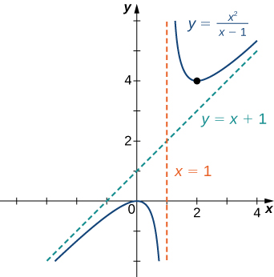 

Find the oblique asymptote for <math xmlns="http://www.w3.org/1998/Math/MathML"><mrow><mi>f</mi><mrow><mo>(</mo><mi>x</mi><mo>)</mo></mrow><mo>=</mo><mfrac><mrow><mrow><mo>(</mo><mrow><mn>3</mn><msup><mi>x</mi><mn>3</mn></msup><mo>−</mo><mn>2</mn><mi>x</mi><mo>+</mo><mn>1</mn></mrow><mo>)</mo></mrow></mrow><mrow><mrow><mo>(</mo><mrow><mn>2</mn><msup><mi>x</mi><mn>2</mn></msup><mo>−</mo><mn>4</mn></mrow><mo>)</mo></mrow></mrow></mfrac><mo>.</mo></mrow></math>

<math xmlns="http://www.w3.org/1998/Math/MathML"><mrow><mi>y</mi><mo>=</mo><mfrac><mn>3</mn><mn>2</mn></mfrac><mi>x</mi></mrow></math>

Hint

Use long division of polynomials.

Sketching the Graph of a Function with a Cusp

Sketch a graph of <math xmlns="http://www.w3.org/1998/Math/MathML"><mrow><mi>f</mi><mrow><mo>(</mo><mi>x</mi><mo>)</mo></mrow><mo>=</mo><msup><mrow><mrow><mo>(</mo><mrow><mi>x</mi><mo>−</mo><mn>1</mn></mrow><mo>)</mo></mrow></mrow><mrow><mn>2</mn><mtext>/</mtext><mn>3</mn></mrow></msup><mo>.</mo></mrow></math>

Step 1: Since the cube-root function is defined for all real numbers <math xmlns="http://www.w3.org/1998/Math/MathML"><mi>x</mi></math>

 and <math xmlns="http://www.w3.org/1998/Math/MathML"><mrow><msup><mrow><mrow><mo>(</mo><mrow><mi>x</mi><mo>−</mo><mn>1</mn></mrow><mo>)</mo></mrow></mrow><mrow><mn>2</mn><mtext>/</mtext><mn>3</mn></mrow></msup><mo>=</mo><msup><mrow><mrow><mo>(</mo><mrow><mroot><mrow><mi>x</mi><mo>−</mo><mn>1</mn></mrow><mn>3</mn></mroot></mrow><mo>)</mo></mrow></mrow><mn>2</mn></msup><mo>,</mo></mrow></math>

 the domain of <math xmlns="http://www.w3.org/1998/Math/MathML"><mi>f</mi></math>

 is all real numbers.

Step 2: To find the <math xmlns="http://www.w3.org/1998/Math/MathML"><mi>y</mi></math>

-intercept, evaluate <math xmlns="http://www.w3.org/1998/Math/MathML"><mrow><mi>f</mi><mrow><mo>(</mo><mn>0</mn><mo>)</mo></mrow><mo>.</mo></mrow></math>

 Since <math xmlns="http://www.w3.org/1998/Math/MathML"><mrow><mi>f</mi><mrow><mo>(</mo><mn>0</mn><mo>)</mo></mrow><mo>=</mo><mn>1</mn><mo>,</mo></mrow></math>

 the <math xmlns="http://www.w3.org/1998/Math/MathML"><mi>y</mi></math>

-intercept is <math xmlns="http://www.w3.org/1998/Math/MathML"><mrow><mrow><mo>(</mo><mrow><mn>0</mn><mo>,</mo><mn>1</mn></mrow><mo>)</mo></mrow><mo>.</mo></mrow></math>

 To find the <math xmlns="http://www.w3.org/1998/Math/MathML"><mi>x</mi></math>

-intercept, solve <math xmlns="http://www.w3.org/1998/Math/MathML"><mrow><msup><mrow><mrow><mo>(</mo><mrow><mi>x</mi><mo>−</mo><mn>1</mn></mrow><mo>)</mo></mrow></mrow><mrow><mn>2</mn><mtext>/</mtext><mn>3</mn></mrow></msup><mo>=</mo><mn>0</mn><mo>.</mo></mrow></math>

 The solution of this equation is <math xmlns="http://www.w3.org/1998/Math/MathML"><mrow><mi>x</mi><mo>=</mo><mn>1</mn><mo>,</mo></mrow></math>

 so the <math xmlns="http://www.w3.org/1998/Math/MathML"><mi>x</mi></math>

-intercept is <math xmlns="http://www.w3.org/1998/Math/MathML"><mrow><mrow><mo>(</mo><mrow><mn>1</mn><mo>,</mo><mn>0</mn></mrow><mo>)</mo></mrow><mo>.</mo></mrow></math>

Step 3: Since <math xmlns="http://www.w3.org/1998/Math/MathML"><mrow><munder><mrow><mtext>lim</mtext></mrow><mrow><mi>x</mi><mo stretchy="false">→</mo><mtext>±</mtext><mi>∞</mi></mrow></munder><msup><mrow><mrow><mo>(</mo><mrow><mi>x</mi><mo>−</mo><mn>1</mn></mrow><mo>)</mo></mrow></mrow><mrow><mn>2</mn><mtext>/</mtext><mn>3</mn></mrow></msup><mo>=</mo><mi>∞</mi><mo>,</mo></mrow></math>

 the function continues to grow without bound as <math xmlns="http://www.w3.org/1998/Math/MathML"><mrow><mi>x</mi><mo stretchy="false">→</mo><mi>∞</mi></mrow></math>

 and <math xmlns="http://www.w3.org/1998/Math/MathML"><mrow><mi>x</mi><mo stretchy="false">→</mo><mtext>−</mtext><mi>∞</mi><mo>.</mo></mrow></math>

Step 4: The function has no vertical asymptotes.

Step 5: To determine where <math xmlns="http://www.w3.org/1998/Math/MathML"><mi>f</mi></math>

 is increasing or decreasing, calculate <math xmlns="http://www.w3.org/1998/Math/MathML"><mrow><msup><mi>f</mi><mo>′</mo></msup><mo>.</mo></mrow></math>

 We find

<math xmlns="http://www.w3.org/1998/Math/MathML"><mrow><msup><mi>f</mi><mo>′</mo></msup><mrow><mo>(</mo><mi>x</mi><mo>)</mo></mrow><mo>=</mo><mfrac><mn>2</mn><mn>3</mn></mfrac><msup><mrow><mrow><mo>(</mo><mrow><mi>x</mi><mo>−</mo><mn>1</mn></mrow><mo>)</mo></mrow></mrow><mrow><mn>−1</mn><mtext>/</mtext><mn>3</mn></mrow></msup><mo>=</mo><mfrac><mn>2</mn><mrow><mn>3</mn><msup><mrow><mrow><mo>(</mo><mrow><mi>x</mi><mo>−</mo><mn>1</mn></mrow><mo>)</mo></mrow></mrow><mrow><mn>1</mn><mtext>/</mtext><mn>3</mn></mrow></msup></mrow></mfrac><mo>.</mo></mrow></math>

This function is not zero anywhere, but it is undefined when <math xmlns="http://www.w3.org/1998/Math/MathML"><mrow><mi>x</mi><mo>=</mo><mn>1</mn><mo>.</mo></mrow></math>

 Therefore, the only critical point is <math xmlns="http://www.w3.org/1998/Math/MathML"><mrow><mi>x</mi><mo>=</mo><mn>1</mn><mo>.</mo></mrow></math>

 Divide the interval <math xmlns="http://www.w3.org/1998/Math/MathML"><mrow><mrow><mo>(</mo><mrow><mtext>−</mtext><mi>∞</mi><mo>,</mo><mi>∞</mi></mrow><mo>)</mo></mrow></mrow></math>

 into the smaller intervals <math xmlns="http://www.w3.org/1998/Math/MathML"><mrow><mrow><mo>(</mo><mrow><mtext>−</mtext><mi>∞</mi><mo>,</mo><mn>1</mn></mrow><mo>)</mo></mrow></mrow></math>

 and <math xmlns="http://www.w3.org/1998/Math/MathML"><mrow><mrow><mo>(</mo><mrow><mn>1</mn><mo>,</mo><mi>∞</mi></mrow><mo>)</mo></mrow><mo>,</mo></mrow></math>

 and choose test points in each of these intervals to determine the sign of <math xmlns="http://www.w3.org/1998/Math/MathML"><mrow><msup><mi>f</mi><mo>′</mo></msup><mrow><mo>(</mo><mi>x</mi><mo>)</mo></mrow></mrow></math>

 in each of these smaller intervals. Let <math xmlns="http://www.w3.org/1998/Math/MathML"><mrow><mi>x</mi><mo>=</mo><mn>0</mn></mrow></math>

 and <math xmlns="http://www.w3.org/1998/Math/MathML"><mrow><mi>x</mi><mo>=</mo><mn>2</mn></mrow></math>

 be the test points as shown in the following table.

| Interval | Test Point | Sign of <math xmlns="http://www.w3.org/1998/Math/MathML"><mrow><msup><mi>f</mi><mo>′</mo></msup><mrow><mo>(</mo><mi>x</mi><mo>)</mo></mrow><mo>=</mo><mfrac><mn>2</mn><mrow><mn>3</mn><msup><mrow><mrow><mo>(</mo><mrow><mi>x</mi><mo>−</mo><mn>1</mn></mrow><mo>)</mo></mrow></mrow><mrow><mn>1</mn><mtext>/</mtext><mn>3</mn></mrow></msup></mrow></mfrac></mrow></math>

 | Conclusion |
{: valign="top"}|----------
| <math xmlns="http://www.w3.org/1998/Math/MathML"><mrow><mrow><mo>(</mo><mrow><mtext>−</mtext><mi>∞</mi><mo>,</mo><mn>1</mn></mrow><mo>)</mo></mrow></mrow></math>

 | <math xmlns="http://www.w3.org/1998/Math/MathML"><mrow><mi>x</mi><mo>=</mo><mn>0</mn></mrow></math>

 | <math xmlns="http://www.w3.org/1998/Math/MathML"><mrow><mo>+</mo><mtext>/</mtext><mo>−</mo><mo>=</mo><mtext>−</mtext></mrow></math>

 | <math xmlns="http://www.w3.org/1998/Math/MathML"><mi>f</mi></math>

 is decreasing. |
{: valign="top"}| <math xmlns="http://www.w3.org/1998/Math/MathML"><mrow><mrow><mo>(</mo><mrow><mn>1</mn><mo>,</mo><mi>∞</mi></mrow><mo>)</mo></mrow></mrow></math>

 | <math xmlns="http://www.w3.org/1998/Math/MathML"><mrow><mi>x</mi><mo>=</mo><mn>2</mn></mrow></math>

 | <math xmlns="http://www.w3.org/1998/Math/MathML"><mrow><mo>+</mo><mtext>/</mtext><mo>+</mo><mo>=</mo><mo>+</mo></mrow></math>

 | <math xmlns="http://www.w3.org/1998/Math/MathML"><mi>f</mi></math>

 is increasing. |
{: valign="top"}{: .unnumbered summary="This table has four columns and three rows. The first row is a header row, and it reads Interval, Test Point, Sign of f&#x2019;(x) = 2/(3(x &#x2212; 1)1/3), and Conclusion. Under the header row, the first column reads (&#x2212;&#x221E;, 1) and (1, &#x221E;). The second column reads x = 0 and x = 2. The third column reads +/&#x2212; = &#x2212; and +/+ = +. The fourth column reads f is decreasing and f is increasing." data-label=""}

We conclude that <math xmlns="http://www.w3.org/1998/Math/MathML"><mi>f</mi></math>

 has a local minimum at <math xmlns="http://www.w3.org/1998/Math/MathML"><mrow><mi>x</mi><mo>=</mo><mn>1</mn><mo>.</mo></mrow></math>

 Evaluating <math xmlns="http://www.w3.org/1998/Math/MathML"><mi>f</mi></math>

 at <math xmlns="http://www.w3.org/1998/Math/MathML"><mrow><mi>x</mi><mo>=</mo><mn>1</mn><mo>,</mo></mrow></math>

 we find that the value of <math xmlns="http://www.w3.org/1998/Math/MathML"><mi>f</mi></math>

 at the local minimum is zero. Note that <math xmlns="http://www.w3.org/1998/Math/MathML"><mrow><msup><mi>f</mi><mo>′</mo></msup><mrow><mo>(</mo><mn>1</mn><mo>)</mo></mrow></mrow></math>

 is undefined, so to determine the behavior of the function at this critical point, we need to examine <math xmlns="http://www.w3.org/1998/Math/MathML"><mrow><munder><mrow><mtext>lim</mtext></mrow><mrow><mi>x</mi><mo stretchy="false">→</mo><mn>1</mn></mrow></munder><msup><mi>f</mi><mo>′</mo></msup><mrow><mo>(</mo><mi>x</mi><mo>)</mo></mrow><mo>.</mo></mrow></math>

 Looking at the one-sided limits, we have

<math xmlns="http://www.w3.org/1998/Math/MathML"><mrow><munder><mrow><mtext>lim</mtext></mrow><mrow><mi>x</mi><mo stretchy="false">→</mo><msup><mn>1</mn><mo>+</mo></msup></mrow></munder><mfrac><mn>2</mn><mrow><mn>3</mn><msup><mrow><mrow><mo>(</mo><mrow><mi>x</mi><mo>−</mo><mn>1</mn></mrow><mo>)</mo></mrow></mrow><mrow><mn>1</mn><mtext>/</mtext><mn>3</mn></mrow></msup></mrow></mfrac><mo>=</mo><mi>∞</mi><mspace width="0.2em" /><mtext>and</mtext><mspace width="0.2em" /><munder><mrow><mtext>lim</mtext></mrow><mrow><mi>x</mi><mo stretchy="false">→</mo><msup><mn>1</mn><mo>−</mo></msup></mrow></munder><mfrac><mn>2</mn><mrow><mn>3</mn><msup><mrow><mrow><mo>(</mo><mrow><mi>x</mi><mo>−</mo><mn>1</mn></mrow><mo>)</mo></mrow></mrow><mrow><mn>1</mn><mtext>/</mtext><mn>3</mn></mrow></msup></mrow></mfrac><mo>=</mo><mtext>−</mtext><mi>∞</mi><mo>.</mo></mrow></math>

Therefore, <math xmlns="http://www.w3.org/1998/Math/MathML"><mi>f</mi></math>

 has a cusp at <math xmlns="http://www.w3.org/1998/Math/MathML"><mrow><mi>x</mi><mo>=</mo><mn>1</mn><mo>.</mo></mrow></math>

Step 6: To determine concavity, we calculate the second derivative of <math xmlns="http://www.w3.org/1998/Math/MathML"><mrow><mi>f</mi><mtext>:</mtext></mrow></math>

<math xmlns="http://www.w3.org/1998/Math/MathML"><mrow><mi>f</mi><mtext>″</mtext><mrow><mo>(</mo><mi>x</mi><mo>)</mo></mrow><mo>=</mo><mo>−</mo><mfrac><mn>2</mn><mn>9</mn></mfrac><msup><mrow><mrow><mo>(</mo><mrow><mi>x</mi><mo>−</mo><mn>1</mn></mrow><mo>)</mo></mrow></mrow><mrow><mn>−4</mn><mtext>/</mtext><mn>3</mn></mrow></msup><mo>=</mo><mfrac><mrow><mn>−2</mn></mrow><mrow><mn>9</mn><msup><mrow><mrow><mo>(</mo><mrow><mi>x</mi><mo>−</mo><mn>1</mn></mrow><mo>)</mo></mrow></mrow><mrow><mn>4</mn><mtext>/</mtext><mn>3</mn></mrow></msup></mrow></mfrac><mo>.</mo></mrow></math>

We find that <math xmlns="http://www.w3.org/1998/Math/MathML"><mrow><mi>f</mi><mtext>″</mtext><mrow><mo>(</mo><mi>x</mi><mo>)</mo></mrow></mrow></math>

 is defined for all <math xmlns="http://www.w3.org/1998/Math/MathML"><mi>x</mi><mo>,</mo></math>

 but is undefined when <math xmlns="http://www.w3.org/1998/Math/MathML"><mrow><mi>x</mi><mo>=</mo><mn>1</mn><mo>.</mo></mrow></math>

 Therefore, divide the interval <math xmlns="http://www.w3.org/1998/Math/MathML"><mrow><mrow><mo>(</mo><mrow><mtext>−</mtext><mi>∞</mi><mo>,</mo><mi>∞</mi></mrow><mo>)</mo></mrow></mrow></math>

 into the smaller intervals <math xmlns="http://www.w3.org/1998/Math/MathML"><mrow><mrow><mo>(</mo><mrow><mtext>−</mtext><mi>∞</mi><mo>,</mo><mn>1</mn></mrow><mo>)</mo></mrow></mrow></math>

 and <math xmlns="http://www.w3.org/1998/Math/MathML"><mrow><mrow><mo>(</mo><mrow><mn>1</mn><mo>,</mo><mi>∞</mi></mrow><mo>)</mo></mrow><mo>,</mo></mrow></math>

 and choose test points to evaluate the sign of <math xmlns="http://www.w3.org/1998/Math/MathML"><mrow><mi>f</mi><mtext>″</mtext><mrow><mo>(</mo><mi>x</mi><mo>)</mo></mrow></mrow></math>

 in each of these intervals. As we did earlier, let <math xmlns="http://www.w3.org/1998/Math/MathML"><mrow><mi>x</mi><mo>=</mo><mn>0</mn></mrow></math>

 and <math xmlns="http://www.w3.org/1998/Math/MathML"><mrow><mi>x</mi><mo>=</mo><mn>2</mn></mrow></math>

 be test points as shown in the following table.

| Interval | Test Point | Sign of <math xmlns="http://www.w3.org/1998/Math/MathML"><mrow><mi>f</mi><mtext>″</mtext><mrow><mo>(</mo><mi>x</mi><mo>)</mo></mrow><mo>=</mo><mfrac><mrow><mn>−2</mn></mrow><mrow><mn>9</mn><msup><mrow><mrow><mo>(</mo><mrow><mi>x</mi><mo>−</mo><mn>1</mn></mrow><mo>)</mo></mrow></mrow><mrow><mn>4</mn><mtext>/</mtext><mn>3</mn></mrow></msup></mrow></mfrac></mrow></math>

 | Conclusion |
{: valign="top"}|----------
| <math xmlns="http://www.w3.org/1998/Math/MathML"><mrow><mrow><mo>(</mo><mrow><mtext>−</mtext><mi>∞</mi><mo>,</mo><mn>1</mn></mrow><mo>)</mo></mrow></mrow></math>

 | <math xmlns="http://www.w3.org/1998/Math/MathML"><mrow><mi>x</mi><mo>=</mo><mn>0</mn></mrow></math>

 | <math xmlns="http://www.w3.org/1998/Math/MathML"><mrow><mtext>−</mtext><mtext>/</mtext><mo>+</mo><mo>=</mo><mtext>−</mtext></mrow></math>

 | <math xmlns="http://www.w3.org/1998/Math/MathML"><mi>f</mi></math>

 is concave down. |
{: valign="top"}| <math xmlns="http://www.w3.org/1998/Math/MathML"><mrow><mrow><mo>(</mo><mrow><mn>1</mn><mo>,</mo><mi>∞</mi></mrow><mo>)</mo></mrow></mrow></math>

 | <math xmlns="http://www.w3.org/1998/Math/MathML"><mrow><mi>x</mi><mo>=</mo><mn>2</mn></mrow></math>

 | <math xmlns="http://www.w3.org/1998/Math/MathML"><mrow><mtext>−</mtext><mtext>/</mtext><mo>+</mo><mo>=</mo><mtext>−</mtext></mrow></math>

 | <math xmlns="http://www.w3.org/1998/Math/MathML"><mi>f</mi></math>

 is concave down. |
{: valign="top"}{: .unnumbered summary="This table has four columns and three rows. The first row is a header row, and it reads Interval, Test Point, Sign of f&#x2019;&#x2019;(x) = &#x2212;2/(9(x &#x2212; 1)4/3), and Conclusion. Under the header row, the first column reads (&#x2212;&#x221E;, 1) and (1, &#x221E;). The second column reads x = 0 and x = 2. The third column reads &#x2212;/+ = &#x2212; and &#x2212;/+ = &#x2212;. The fourth column reads f is concave down and f is concave down." data-label=""}

From this table, we conclude that <math xmlns="http://www.w3.org/1998/Math/MathML"><mi>f</mi></math>

 is concave down everywhere. Combining all of this information, we arrive at the following graph for <math xmlns="http://www.w3.org/1998/Math/MathML"><mrow><mi>f</mi><mo>.</mo></mrow></math>

  

Consider the function <math xmlns="http://www.w3.org/1998/Math/MathML"><mrow><mi>f</mi><mrow><mo>(</mo><mi>x</mi><mo>)</mo></mrow><mo>=</mo><mn>5</mn><mo>−</mo><msup><mi>x</mi><mrow><mn>2</mn><mtext>/</mtext><mn>3</mn></mrow></msup><mo>.</mo></mrow></math>

 Determine the point on the graph where a cusp is located. Determine the end behavior of <math xmlns="http://www.w3.org/1998/Math/MathML"><mi>f</mi><mo>.</mo></math>

The function <math xmlns="http://www.w3.org/1998/Math/MathML"><mi>f</mi></math>

 has a cusp at <math xmlns="http://www.w3.org/1998/Math/MathML"><mrow><mrow><mo>(</mo><mrow><mn>0</mn><mo>,</mo><mn>5</mn></mrow><mo>)</mo></mrow></mrow></math>

 <math xmlns="http://www.w3.org/1998/Math/MathML"><mrow><munder><mrow><mtext>lim</mtext></mrow><mrow><mi>x</mi><mo stretchy="false">→</mo><msup><mn>0</mn><mo>−</mo></msup></mrow></munder><msup><mi>f</mi><mo>′</mo></msup><mrow><mo>(</mo><mi>x</mi><mo>)</mo></mrow><mo>=</mo><mi>∞</mi><mo>,</mo></mrow></math>

 <math xmlns="http://www.w3.org/1998/Math/MathML"><mrow><munder><mrow><mtext>lim</mtext></mrow><mrow><mi>x</mi><mo stretchy="false">→</mo><msup><mn>0</mn><mo>+</mo></msup></mrow></munder><msup><mi>f</mi><mo>′</mo></msup><mrow><mo>(</mo><mi>x</mi><mo>)</mo></mrow><mo>=</mo><mtext>−</mtext><mi>∞</mi><mo>.</mo></mrow></math>

 For end behavior, <math xmlns="http://www.w3.org/1998/Math/MathML"><mrow><munder><mrow><mtext>lim</mtext></mrow><mrow><mi>x</mi><mo stretchy="false">→</mo><mtext>±</mtext><mi>∞</mi></mrow></munder><mi>f</mi><mrow><mo>(</mo><mi>x</mi><mo>)</mo></mrow><mo>=</mo><mtext>−</mtext><mi>∞</mi><mo>.</mo></mrow></math>

Hint

A function <math xmlns="http://www.w3.org/1998/Math/MathML"><mi>f</mi></math>

 has a cusp at a point <math xmlns="http://www.w3.org/1998/Math/MathML"><mi>a</mi></math>

 if <math xmlns="http://www.w3.org/1998/Math/MathML"><mrow><mi>f</mi><mrow><mo>(</mo><mi>a</mi><mo>)</mo></mrow></mrow></math>

 exists, <math xmlns="http://www.w3.org/1998/Math/MathML"><mrow><mi>f</mi><mo>′</mo><mrow><mo>(</mo><mi>a</mi><mo>)</mo></mrow></mrow></math>

 is undefined, one of the one-sided limits as <math xmlns="http://www.w3.org/1998/Math/MathML"><mrow><mi>x</mi><mo stretchy="false">→</mo><mi>a</mi></mrow></math>

 of <math xmlns="http://www.w3.org/1998/Math/MathML"><mrow><mi>f</mi><mo>′</mo><mrow><mo>(</mo><mi>x</mi><mo>)</mo></mrow></mrow></math>

 is <math xmlns="http://www.w3.org/1998/Math/MathML"><mrow><mo>+</mo><mi>∞</mi><mo>,</mo></mrow></math>

 and the other one-sided limit is <math xmlns="http://www.w3.org/1998/Math/MathML"><mrow><mtext>−</mtext><mi>∞</mi><mo>.</mo></mrow></math>

# Key Concepts

* The limit of
  <math xmlns="http://www.w3.org/1998/Math/MathML"><mrow><mi>f</mi><mrow><mo>(</mo><mi>x</mi><mo>)</mo></mrow></mrow></math>
  
  is
  <math xmlns="http://www.w3.org/1998/Math/MathML"><mi>L</mi></math>
  
  as
  <math xmlns="http://www.w3.org/1998/Math/MathML"><mrow><mi>x</mi><mo stretchy="false">→</mo><mi>∞</mi></mrow></math>
  
  (or as
  <math xmlns="http://www.w3.org/1998/Math/MathML"><mrow><mi>x</mi><mo stretchy="false">→</mo><mtext>−</mtext><mi>∞</mi><mo stretchy="false">)</mo></mrow></math>
  
  if the values
  <math xmlns="http://www.w3.org/1998/Math/MathML"><mrow><mi>f</mi><mrow><mo>(</mo><mi>x</mi><mo>)</mo></mrow></mrow></math>
  
  become arbitrarily close to
  <math xmlns="http://www.w3.org/1998/Math/MathML"><mi>L</mi></math>
  
  as
  <math xmlns="http://www.w3.org/1998/Math/MathML"><mi>x</mi></math>
  
  becomes sufficiently large.
* The limit of
  <math xmlns="http://www.w3.org/1998/Math/MathML"><mrow><mi>f</mi><mrow><mo>(</mo><mi>x</mi><mo>)</mo></mrow></mrow></math>
  
  is
  <math xmlns="http://www.w3.org/1998/Math/MathML"><mi>∞</mi></math>
  
  as
  <math xmlns="http://www.w3.org/1998/Math/MathML"><mrow><mi>x</mi><mo stretchy="false">→</mo><mi>∞</mi></mrow></math>
  
  if
  <math xmlns="http://www.w3.org/1998/Math/MathML"><mrow><mi>f</mi><mrow><mo>(</mo><mi>x</mi><mo>)</mo></mrow></mrow></math>
  
  becomes arbitrarily large as
  <math xmlns="http://www.w3.org/1998/Math/MathML"><mi>x</mi></math>
  
  becomes sufficiently large. The limit of
  <math xmlns="http://www.w3.org/1998/Math/MathML"><mrow><mi>f</mi><mrow><mo>(</mo><mi>x</mi><mo>)</mo></mrow></mrow></math>
  
  is
  <math xmlns="http://www.w3.org/1998/Math/MathML"><mrow><mtext>−</mtext><mi>∞</mi></mrow></math>
  
  as
  <math xmlns="http://www.w3.org/1998/Math/MathML"><mrow><mi>x</mi><mo stretchy="false">→</mo><mi>∞</mi></mrow></math>
  
  if
  <math xmlns="http://www.w3.org/1998/Math/MathML"><mrow><mi>f</mi><mrow><mo>(</mo><mi>x</mi><mo>)</mo></mrow><mo>&lt;</mo><mn>0</mn></mrow></math>
  
  and
  <math xmlns="http://www.w3.org/1998/Math/MathML"><mrow><mrow><mo>\|</mo><mrow><mi>f</mi><mrow><mo>(</mo><mi>x</mi><mo>)</mo></mrow></mrow><mo>\|</mo></mrow></mrow></math>
  
  becomes arbitrarily large as
  <math xmlns="http://www.w3.org/1998/Math/MathML"><mi>x</mi></math>
  
  becomes sufficiently large. We can define the limit of
  <math xmlns="http://www.w3.org/1998/Math/MathML"><mrow><mi>f</mi><mrow><mo>(</mo><mi>x</mi><mo>)</mo></mrow></mrow></math>
  
  as
  <math xmlns="http://www.w3.org/1998/Math/MathML"><mi>x</mi></math>
  
  approaches
  <math xmlns="http://www.w3.org/1998/Math/MathML"><mrow><mtext>−</mtext><mi>∞</mi></mrow></math>
  
  similarly.
* For a polynomial function
  <math xmlns="http://www.w3.org/1998/Math/MathML"><mrow><mi>p</mi><mrow><mo>(</mo><mi>x</mi><mo>)</mo></mrow><mo>=</mo><msub><mi>a</mi><mi>n</mi></msub><msup><mi>x</mi><mi>n</mi></msup><mo>+</mo><msub><mi>a</mi><mrow><mi>n</mi><mo>−</mo><mn>1</mn></mrow></msub><msup><mi>x</mi><mrow><mi>n</mi><mo>−</mo><mn>1</mn></mrow></msup><mo>+</mo><mtext>…</mtext><mo>+</mo><msub><mi>a</mi><mn>1</mn></msub><mi>x</mi><mo>+</mo><msub><mi>a</mi><mn>0</mn></msub><mo>,</mo></mrow></math>
  
  where
  <math xmlns="http://www.w3.org/1998/Math/MathML"><mrow><msub><mi>a</mi><mi>n</mi></msub><mo>≠</mo><mn>0</mn><mo>,</mo></mrow></math>
  
  the end behavior is determined by the leading term
  <math xmlns="http://www.w3.org/1998/Math/MathML"><mrow><msub><mi>a</mi><mi>n</mi></msub><msup><mi>x</mi><mi>n</mi></msup><mo>.</mo></mrow></math>
  
  If
  <math xmlns="http://www.w3.org/1998/Math/MathML"><mrow><mi>n</mi><mo>≠</mo><mn>0</mn><mo>,</mo></mrow></math>
  
  <math xmlns="http://www.w3.org/1998/Math/MathML"><mrow><mi>p</mi><mrow><mo>(</mo><mi>x</mi><mo>)</mo></mrow></mrow></math>
  
  approaches
  <math xmlns="http://www.w3.org/1998/Math/MathML"><mi>∞</mi></math>
  
  or
  <math xmlns="http://www.w3.org/1998/Math/MathML"><mrow><mtext>−</mtext><mi>∞</mi></mrow></math>
  
  at each end.
* For a rational function
  <math xmlns="http://www.w3.org/1998/Math/MathML"><mrow><mi>f</mi><mrow><mo>(</mo><mi>x</mi><mo>)</mo></mrow><mo>=</mo><mfrac><mrow><mi>p</mi><mrow><mo>(</mo><mi>x</mi><mo>)</mo></mrow></mrow><mrow><mi>q</mi><mrow><mo>(</mo><mi>x</mi><mo>)</mo></mrow></mrow></mfrac><mo>,</mo></mrow></math>
  
  the end behavior is determined by the relationship between the degree of
  <math xmlns="http://www.w3.org/1998/Math/MathML"><mi>p</mi></math>
  
  and the degree of
  <math xmlns="http://www.w3.org/1998/Math/MathML"><mrow><mi>q</mi><mo>.</mo></mrow></math>
  
  If the degree of
  <math xmlns="http://www.w3.org/1998/Math/MathML"><mi>p</mi></math>
  
  is less than the degree of
  <math xmlns="http://www.w3.org/1998/Math/MathML"><mrow><mi>q</mi><mo>,</mo></mrow></math>
  
  the line
  <math xmlns="http://www.w3.org/1998/Math/MathML"><mrow><mi>y</mi><mo>=</mo><mn>0</mn></mrow></math>
  
  is a horizontal asymptote for
  <math xmlns="http://www.w3.org/1998/Math/MathML"><mrow><mi>f</mi><mo>.</mo></mrow></math>
  
  If the degree of
  <math xmlns="http://www.w3.org/1998/Math/MathML"><mi>p</mi></math>
  
  is equal to the degree of
  <math xmlns="http://www.w3.org/1998/Math/MathML"><mrow><mi>q</mi><mo>,</mo></mrow></math>
  
  then the line
  <math xmlns="http://www.w3.org/1998/Math/MathML"><mrow><mi>y</mi><mo>=</mo><mfrac><mrow><msub><mi>a</mi><mi>n</mi></msub></mrow><mrow><msub><mi>b</mi><mi>n</mi></msub></mrow></mfrac></mrow></math>
  
  is a horizontal asymptote, where
  <math xmlns="http://www.w3.org/1998/Math/MathML"><mrow><msub><mi>a</mi><mi>n</mi></msub></mrow></math>
  
  and
  <math xmlns="http://www.w3.org/1998/Math/MathML"><mrow><msub><mi>b</mi><mi>n</mi></msub></mrow></math>
  
  are the leading coefficients of
  <math xmlns="http://www.w3.org/1998/Math/MathML"><mi>p</mi></math>
  
  and
  <math xmlns="http://www.w3.org/1998/Math/MathML"><mrow><mi>q</mi><mo>,</mo></mrow></math>
  
  respectively. If the degree of
  <math xmlns="http://www.w3.org/1998/Math/MathML"><mi>p</mi></math>
  
  is greater than the degree of
  <math xmlns="http://www.w3.org/1998/Math/MathML"><mrow><mi>q</mi><mo>,</mo></mrow></math>
  
  then
  <math xmlns="http://www.w3.org/1998/Math/MathML"><mi>f</mi></math>
  
  approaches
  <math xmlns="http://www.w3.org/1998/Math/MathML"><mi>∞</mi></math>
  
  or
  <math xmlns="http://www.w3.org/1998/Math/MathML"><mrow><mtext>−</mtext><mi>∞</mi></mrow></math>
  
  at each end.
{: data-bullet-style="bullet"}

<section data-depth="1" class="section-exercises" markdown="1">
For the following exercises, examine the graphs. Identify where the vertical asymptotes are located.

 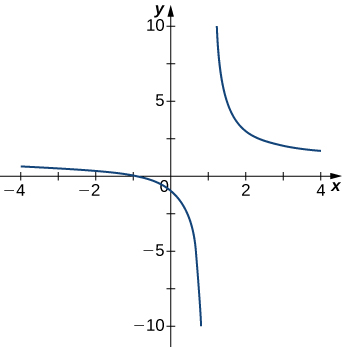 

<math xmlns="http://www.w3.org/1998/Math/MathML"><mrow><mi>x</mi><mo>=</mo><mn>1</mn></mrow></math>

  

  

<math xmlns="http://www.w3.org/1998/Math/MathML"><mrow><mi>x</mi><mo>=</mo><mn>−1</mn><mo>,</mo><mi>x</mi><mo>=</mo><mn>2</mn></mrow></math>

  

  

<math xmlns="http://www.w3.org/1998/Math/MathML"><mrow><mi>x</mi><mo>=</mo><mn>0</mn></mrow></math>

For the following functions <math xmlns="http://www.w3.org/1998/Math/MathML"><mrow><mi>f</mi><mrow><mo>(</mo><mi>x</mi><mo>)</mo></mrow><mo>,</mo></mrow></math>

 determine whether there is an asymptote at <math xmlns="http://www.w3.org/1998/Math/MathML"><mrow><mi>x</mi><mo>=</mo><mi>a</mi><mo>.</mo></mrow></math>

 Justify your answer without graphing on a calculator.

<math xmlns="http://www.w3.org/1998/Math/MathML"><mrow><mi>f</mi><mrow><mo>(</mo><mi>x</mi><mo>)</mo></mrow><mo>=</mo><mfrac><mrow><mi>x</mi><mo>+</mo><mn>1</mn></mrow><mrow><msup><mi>x</mi><mn>2</mn></msup><mo>+</mo><mn>5</mn><mi>x</mi><mo>+</mo><mn>4</mn></mrow></mfrac><mo>,</mo><mi>a</mi><mo>=</mo><mn>−1</mn></mrow></math>

<math xmlns="http://www.w3.org/1998/Math/MathML"><mrow><mi>f</mi><mrow><mo>(</mo><mi>x</mi><mo>)</mo></mrow><mo>=</mo><mfrac><mi>x</mi><mrow><mi>x</mi><mo>−</mo><mn>2</mn></mrow></mfrac><mo>,</mo><mi>a</mi><mo>=</mo><mn>2</mn></mrow></math>

Yes, there is a vertical asymptote

<math xmlns="http://www.w3.org/1998/Math/MathML"><mrow><mi>f</mi><mrow><mo>(</mo><mi>x</mi><mo>)</mo></mrow><mo>=</mo><msup><mrow><mrow><mo>(</mo><mrow><mi>x</mi><mo>+</mo><mn>2</mn></mrow><mo>)</mo></mrow></mrow><mrow><mn>3</mn><mtext>/</mtext><mn>2</mn></mrow></msup><mo>,</mo><mi>a</mi><mo>=</mo><mn>−2</mn></mrow></math>

<math xmlns="http://www.w3.org/1998/Math/MathML"><mrow><mi>f</mi><mrow><mo>(</mo><mi>x</mi><mo>)</mo></mrow><mo>=</mo><msup><mrow><mrow><mo>(</mo><mrow><mi>x</mi><mo>−</mo><mn>1</mn></mrow><mo>)</mo></mrow></mrow><mrow><mn>−1</mn><mtext>/</mtext><mn>3</mn></mrow></msup><mo>,</mo><mi>a</mi><mo>=</mo><mn>1</mn></mrow></math>

Yes, there is vertical asymptote

<math xmlns="http://www.w3.org/1998/Math/MathML"><mrow><mi>f</mi><mrow><mo>(</mo><mi>x</mi><mo>)</mo></mrow><mo>=</mo><mn>1</mn><mo>+</mo><msup><mi>x</mi><mrow><mn>−2</mn><mtext>/</mtext><mn>5</mn></mrow></msup><mo>,</mo><mi>a</mi><mo>=</mo><mn>1</mn></mrow></math>

For the following exercises, evaluate the limit.

<math xmlns="http://www.w3.org/1998/Math/MathML"><mrow><munder><mrow><mtext>lim</mtext></mrow><mrow><mi>x</mi><mo stretchy="false">→</mo><mi>∞</mi></mrow></munder><mfrac><mn>1</mn><mrow><mn>3</mn><mi>x</mi><mo>+</mo><mn>6</mn></mrow></mfrac></mrow></math>

<math xmlns="http://www.w3.org/1998/Math/MathML"><mn>0</mn></math>

<math xmlns="http://www.w3.org/1998/Math/MathML"><mrow><munder><mrow><mtext>lim</mtext></mrow><mrow><mi>x</mi><mo stretchy="false">→</mo><mi>∞</mi></mrow></munder><mfrac><mrow><mn>2</mn><mi>x</mi><mo>−</mo><mn>5</mn></mrow><mrow><mn>4</mn><mi>x</mi></mrow></mfrac></mrow></math>

<math xmlns="http://www.w3.org/1998/Math/MathML"><mrow><munder><mrow><mtext>lim</mtext></mrow><mrow><mi>x</mi><mo stretchy="false">→</mo><mi>∞</mi></mrow></munder><mfrac><mrow><msup><mi>x</mi><mn>2</mn></msup><mo>−</mo><mn>2</mn><mi>x</mi><mo>+</mo><mn>5</mn></mrow><mrow><mi>x</mi><mo>+</mo><mn>2</mn></mrow></mfrac></mrow></math>

<math xmlns="http://www.w3.org/1998/Math/MathML"><mi>∞</mi></math>

<math xmlns="http://www.w3.org/1998/Math/MathML"><mrow><munder><mrow><mtext>lim</mtext></mrow><mrow><mi>x</mi><mo stretchy="false">→</mo><mtext>−</mtext><mi>∞</mi></mrow></munder><mfrac><mrow><mn>3</mn><msup><mi>x</mi><mn>3</mn></msup><mo>−</mo><mn>2</mn><mi>x</mi></mrow><mrow><msup><mi>x</mi><mn>2</mn></msup><mo>+</mo><mn>2</mn><mi>x</mi><mo>+</mo><mn>8</mn></mrow></mfrac></mrow></math>

<math xmlns="http://www.w3.org/1998/Math/MathML"><mrow><munder><mrow><mtext>lim</mtext></mrow><mrow><mi>x</mi><mo stretchy="false">→</mo><mtext>−</mtext><mi>∞</mi></mrow></munder><mfrac><mrow><msup><mi>x</mi><mn>4</mn></msup><mo>−</mo><mn>4</mn><msup><mi>x</mi><mn>3</mn></msup><mo>+</mo><mn>1</mn></mrow><mrow><mn>2</mn><mo>−</mo><mn>2</mn><msup><mi>x</mi><mn>2</mn></msup><mo>−</mo><mn>7</mn><msup><mi>x</mi><mn>4</mn></msup></mrow></mfrac></mrow></math>

<math xmlns="http://www.w3.org/1998/Math/MathML"><mrow><mo>−</mo><mfrac><mn>1</mn><mn>7</mn></mfrac></mrow></math>

<math xmlns="http://www.w3.org/1998/Math/MathML"><mrow><munder><mrow><mtext>lim</mtext></mrow><mrow><mi>x</mi><mo stretchy="false">→</mo><mi>∞</mi></mrow></munder><mfrac><mrow><mn>3</mn><mi>x</mi></mrow><mrow><msqrt><mrow><msup><mi>x</mi><mn>2</mn></msup><mo>+</mo><mn>1</mn></mrow></msqrt></mrow></mfrac></mrow></math>

<math xmlns="http://www.w3.org/1998/Math/MathML"><mrow><munder><mrow><mtext>lim</mtext></mrow><mrow><mi>x</mi><mo stretchy="false">→</mo><mtext>−</mtext><mi>∞</mi></mrow></munder><mfrac><mrow><msqrt><mrow><mn>4</mn><msup><mi>x</mi><mn>2</mn></msup><mo>−</mo><mn>1</mn></mrow></msqrt></mrow><mrow><mi>x</mi><mo>+</mo><mn>2</mn></mrow></mfrac></mrow></math>

<math xmlns="http://www.w3.org/1998/Math/MathML"><mrow><mn>−2</mn></mrow></math>

<math xmlns="http://www.w3.org/1998/Math/MathML"><mrow><munder><mrow><mtext>lim</mtext></mrow><mrow><mi>x</mi><mo stretchy="false">→</mo><mi>∞</mi></mrow></munder><mfrac><mrow><mn>4</mn><mi>x</mi></mrow><mrow><msqrt><mrow><msup><mi>x</mi><mn>2</mn></msup><mo>−</mo><mn>1</mn></mrow></msqrt></mrow></mfrac></mrow></math>

<math xmlns="http://www.w3.org/1998/Math/MathML"><mrow><munder><mrow><mtext>lim</mtext></mrow><mrow><mi>x</mi><mo stretchy="false">→</mo><mtext>−</mtext><mi>∞</mi></mrow></munder><mfrac><mrow><mn>4</mn><mi>x</mi></mrow><mrow><msqrt><mrow><msup><mi>x</mi><mn>2</mn></msup><mo>−</mo><mn>1</mn></mrow></msqrt></mrow></mfrac></mrow></math>

<math xmlns="http://www.w3.org/1998/Math/MathML"><mrow><mn>−4</mn></mrow></math>

<math xmlns="http://www.w3.org/1998/Math/MathML"><mrow><munder><mrow><mtext>lim</mtext></mrow><mrow><mi>x</mi><mo stretchy="false">→</mo><mi>∞</mi></mrow></munder><mfrac><mrow><mn>2</mn><msqrt><mi>x</mi></msqrt></mrow><mrow><mi>x</mi><mo>−</mo><msqrt><mi>x</mi></msqrt><mo>+</mo><mn>1</mn></mrow></mfrac></mrow></math>

For the following exercises, find the horizontal and vertical asymptotes.

<math xmlns="http://www.w3.org/1998/Math/MathML"><mrow><mi>f</mi><mrow><mo>(</mo><mi>x</mi><mo>)</mo></mrow><mo>=</mo><mi>x</mi><mo>−</mo><mfrac><mn>9</mn><mi>x</mi></mfrac></mrow></math>

Horizontal: none, vertical: <math xmlns="http://www.w3.org/1998/Math/MathML"><mrow><mi>x</mi><mo>=</mo><mn>0</mn></mrow></math>

<math xmlns="http://www.w3.org/1998/Math/MathML"><mrow><mi>f</mi><mrow><mo>(</mo><mi>x</mi><mo>)</mo></mrow><mo>=</mo><mfrac><mn>1</mn><mrow><mn>1</mn><mo>−</mo><msup><mi>x</mi><mn>2</mn></msup></mrow></mfrac></mrow></math>

<math xmlns="http://www.w3.org/1998/Math/MathML"><mrow><mi>f</mi><mrow><mo>(</mo><mi>x</mi><mo>)</mo></mrow><mo>=</mo><mfrac><mrow><msup><mi>x</mi><mn>3</mn></msup></mrow><mrow><mn>4</mn><mo>−</mo><msup><mi>x</mi><mn>2</mn></msup></mrow></mfrac></mrow></math>

Horizontal: none, vertical: <math xmlns="http://www.w3.org/1998/Math/MathML"><mrow><mi>x</mi><mo>=</mo><mtext>±</mtext><mn>2</mn></mrow></math>

<math xmlns="http://www.w3.org/1998/Math/MathML"><mrow><mi>f</mi><mrow><mo>(</mo><mi>x</mi><mo>)</mo></mrow><mo>=</mo><mfrac><mrow><msup><mi>x</mi><mn>2</mn></msup><mo>+</mo><mn>3</mn></mrow><mrow><msup><mi>x</mi><mn>2</mn></msup><mo>+</mo><mn>1</mn></mrow></mfrac></mrow></math>

<math xmlns="http://www.w3.org/1998/Math/MathML"><mrow><mi>f</mi><mrow><mo>(</mo><mi>x</mi><mo>)</mo></mrow><mo>=</mo><mtext>sin</mtext><mrow><mo>(</mo><mi>x</mi><mo>)</mo></mrow><mspace width="0.1em" /><mtext>sin</mtext><mrow><mo>(</mo><mrow><mn>2</mn><mi>x</mi></mrow><mo>)</mo></mrow></mrow></math>

Horizontal: none, vertical: none

<math xmlns="http://www.w3.org/1998/Math/MathML"><mrow><mi>f</mi><mrow><mo>(</mo><mi>x</mi><mo>)</mo></mrow><mo>=</mo><mtext>cos</mtext><mspace width="0.1em" /><mi>x</mi><mo>+</mo><mtext>cos</mtext><mrow><mo>(</mo><mrow><mn>3</mn><mi>x</mi></mrow><mo>)</mo></mrow><mo>+</mo><mtext>cos</mtext><mrow><mo>(</mo><mrow><mn>5</mn><mi>x</mi></mrow><mo>)</mo></mrow></mrow></math>

<math xmlns="http://www.w3.org/1998/Math/MathML"><mrow><mi>f</mi><mrow><mo>(</mo><mi>x</mi><mo>)</mo></mrow><mo>=</mo><mfrac><mrow><mi>x</mi><mspace width="0.1em" /><mtext>sin</mtext><mrow><mo>(</mo><mi>x</mi><mo>)</mo></mrow></mrow><mrow><msup><mi>x</mi><mn>2</mn></msup><mo>−</mo><mn>1</mn></mrow></mfrac></mrow></math>

Horizontal: <math xmlns="http://www.w3.org/1998/Math/MathML"><mrow><mi>y</mi><mo>=</mo><mn>0</mn><mo>,</mo></mrow></math>

 vertical: <math xmlns="http://www.w3.org/1998/Math/MathML"><mrow><mi>x</mi><mo>=</mo><mtext>±</mtext><mn>1</mn></mrow></math>

<math xmlns="http://www.w3.org/1998/Math/MathML"><mrow><mi>f</mi><mrow><mo>(</mo><mi>x</mi><mo>)</mo></mrow><mo>=</mo><mfrac><mi>x</mi><mrow><mtext>sin</mtext><mrow><mo>(</mo><mi>x</mi><mo>)</mo></mrow></mrow></mfrac></mrow></math>

<math xmlns="http://www.w3.org/1998/Math/MathML"><mrow><mi>f</mi><mrow><mo>(</mo><mi>x</mi><mo>)</mo></mrow><mo>=</mo><mfrac><mn>1</mn><mrow><msup><mi>x</mi><mn>3</mn></msup><mo>+</mo><msup><mi>x</mi><mn>2</mn></msup></mrow></mfrac></mrow></math>

Horizontal: <math xmlns="http://www.w3.org/1998/Math/MathML"><mrow><mi>y</mi><mo>=</mo><mn>0</mn><mo>,</mo></mrow></math>

 vertical: <math xmlns="http://www.w3.org/1998/Math/MathML"><mrow><mi>x</mi><mo>=</mo><mn>0</mn></mrow></math>

 and <math xmlns="http://www.w3.org/1998/Math/MathML"><mrow><mi>x</mi><mo>=</mo><mn>−1</mn></mrow></math>

<math xmlns="http://www.w3.org/1998/Math/MathML"><mrow><mi>f</mi><mrow><mo>(</mo><mi>x</mi><mo>)</mo></mrow><mo>=</mo><mfrac><mn>1</mn><mrow><mi>x</mi><mo>−</mo><mn>1</mn></mrow></mfrac><mo>−</mo><mn>2</mn><mi>x</mi></mrow></math>

<math xmlns="http://www.w3.org/1998/Math/MathML"><mrow><mi>f</mi><mrow><mo>(</mo><mi>x</mi><mo>)</mo></mrow><mo>=</mo><mfrac><mrow><msup><mi>x</mi><mn>3</mn></msup><mo>+</mo><mn>1</mn></mrow><mrow><msup><mi>x</mi><mn>3</mn></msup><mo>−</mo><mn>1</mn></mrow></mfrac></mrow></math>

Horizontal: <math xmlns="http://www.w3.org/1998/Math/MathML"><mrow><mi>y</mi><mo>=</mo><mn>1</mn><mo>,</mo></mrow></math>

 vertical: <math xmlns="http://www.w3.org/1998/Math/MathML"><mrow><mi>x</mi><mo>=</mo><mn>1</mn></mrow></math>

<math xmlns="http://www.w3.org/1998/Math/MathML"><mrow><mi>f</mi><mrow><mo>(</mo><mi>x</mi><mo>)</mo></mrow><mo>=</mo><mfrac><mrow><mtext>sin</mtext><mspace width="0.1em" /><mi>x</mi><mo>+</mo><mtext>cos</mtext><mspace width="0.1em" /><mi>x</mi></mrow><mrow><mtext>sin</mtext><mspace width="0.1em" /><mi>x</mi><mo>−</mo><mtext>cos</mtext><mspace width="0.1em" /><mi>x</mi></mrow></mfrac></mrow></math>

<math xmlns="http://www.w3.org/1998/Math/MathML"><mrow><mi>f</mi><mrow><mo>(</mo><mi>x</mi><mo>)</mo></mrow><mo>=</mo><mi>x</mi><mo>−</mo><mtext>sin</mtext><mspace width="0.1em" /><mi>x</mi></mrow></math>

Horizontal: none, vertical: none

<math xmlns="http://www.w3.org/1998/Math/MathML"><mrow><mi>f</mi><mrow><mo>(</mo><mi>x</mi><mo>)</mo></mrow><mo>=</mo><mfrac><mn>1</mn><mi>x</mi></mfrac><mo>−</mo><msqrt><mi>x</mi></msqrt></mrow></math>

For the following exercises, construct a function <math xmlns="http://www.w3.org/1998/Math/MathML"><mrow><mi>f</mi><mrow><mo>(</mo><mi>x</mi><mo>)</mo></mrow></mrow></math>

 that has the given asymptotes.

<math xmlns="http://www.w3.org/1998/Math/MathML"><mrow><mi>x</mi><mo>=</mo><mn>1</mn></mrow></math>

 and <math xmlns="http://www.w3.org/1998/Math/MathML"><mrow><mi>y</mi><mo>=</mo><mn>2</mn></mrow></math>

Answers will vary, for example: <math xmlns="http://www.w3.org/1998/Math/MathML"><mrow><mi>y</mi><mo>=</mo><mfrac><mrow><mn>2</mn><mi>x</mi></mrow><mrow><mi>x</mi><mo>−</mo><mn>1</mn></mrow></mfrac></mrow></math>

<math xmlns="http://www.w3.org/1998/Math/MathML"><mrow><mi>x</mi><mo>=</mo><mn>1</mn></mrow></math>

 and <math xmlns="http://www.w3.org/1998/Math/MathML"><mrow><mi>y</mi><mo>=</mo><mn>0</mn></mrow></math>

<math xmlns="http://www.w3.org/1998/Math/MathML"><mrow><mi>y</mi><mo>=</mo><mn>4</mn><mo>,</mo></mrow></math>

 <math xmlns="http://www.w3.org/1998/Math/MathML"><mrow><mi>x</mi><mo>=</mo><mn>−1</mn></mrow></math>

Answers will vary, for example: <math xmlns="http://www.w3.org/1998/Math/MathML"><mrow><mi>y</mi><mo>=</mo><mfrac><mrow><mn>4</mn><mi>x</mi></mrow><mrow><mi>x</mi><mo>+</mo><mn>1</mn></mrow></mfrac></mrow></math>

<math xmlns="http://www.w3.org/1998/Math/MathML"><mrow><mi>x</mi><mo>=</mo><mn>0</mn></mrow></math>

For the following exercises, graph the function on a graphing calculator on the window <math xmlns="http://www.w3.org/1998/Math/MathML"><mrow><mi>x</mi><mo>=</mo><mrow><mo>[</mo><mrow><mn>−5</mn><mo>,</mo><mn>5</mn></mrow><mo>]</mo></mrow></mrow></math>

 and estimate the horizontal asymptote or limit. Then, calculate the actual horizontal asymptote or limit.

**[T]** <math xmlns="http://www.w3.org/1998/Math/MathML"><mrow><mi>f</mi><mrow><mo>(</mo><mi>x</mi><mo>)</mo></mrow><mo>=</mo><mfrac><mn>1</mn><mrow><mi>x</mi><mo>+</mo><mn>10</mn></mrow></mfrac></mrow></math>

<math xmlns="http://www.w3.org/1998/Math/MathML"><mrow><mi>y</mi><mo>=</mo><mn>0</mn></mrow></math>

**[T]** <math xmlns="http://www.w3.org/1998/Math/MathML"><mrow><mi>f</mi><mrow><mo>(</mo><mi>x</mi><mo>)</mo></mrow><mo>=</mo><mfrac><mrow><mi>x</mi><mo>+</mo><mn>1</mn></mrow><mrow><msup><mi>x</mi><mn>2</mn></msup><mo>+</mo><mn>7</mn><mi>x</mi><mo>+</mo><mn>6</mn></mrow></mfrac></mrow></math>

**[T]** <math xmlns="http://www.w3.org/1998/Math/MathML"><mrow><munder><mrow><mtext>lim</mtext></mrow><mrow><mi>x</mi><mo stretchy="false">→</mo><mtext>−</mtext><mi>∞</mi></mrow></munder><msup><mi>x</mi><mn>2</mn></msup><mo>+</mo><mn>10</mn><mi>x</mi><mo>+</mo><mn>25</mn></mrow></math>

<math xmlns="http://www.w3.org/1998/Math/MathML"><mi>∞</mi></math>

**[T]** <math xmlns="http://www.w3.org/1998/Math/MathML"><mrow><munder><mrow><mtext>lim</mtext></mrow><mrow><mi>x</mi><mo stretchy="false">→</mo><mtext>−</mtext><mi>∞</mi></mrow></munder><mfrac><mrow><mi>x</mi><mo>+</mo><mn>2</mn></mrow><mrow><msup><mi>x</mi><mn>2</mn></msup><mo>+</mo><mn>7</mn><mi>x</mi><mo>+</mo><mn>6</mn></mrow></mfrac></mrow></math>

**[T]** <math xmlns="http://www.w3.org/1998/Math/MathML"><mrow><munder><mrow><mtext>lim</mtext></mrow><mrow><mi>x</mi><mo stretchy="false">→</mo><mi>∞</mi></mrow></munder><mfrac><mrow><mn>3</mn><mi>x</mi><mo>+</mo><mn>2</mn></mrow><mrow><mi>x</mi><mo>+</mo><mn>5</mn></mrow></mfrac></mrow></math>

<math xmlns="http://www.w3.org/1998/Math/MathML"><mrow><mi>y</mi><mo>=</mo><mn>3</mn></mrow></math>

For the following exercises, draw a graph of the functions without using a calculator. Be sure to notice all important features of the graph: local maxima and minima, inflection points, and asymptotic behavior.

<math xmlns="http://www.w3.org/1998/Math/MathML"><mrow><mi>y</mi><mo>=</mo><mn>3</mn><msup><mi>x</mi><mn>2</mn></msup><mo>+</mo><mn>2</mn><mi>x</mi><mo>+</mo><mn>4</mn></mrow></math>

<math xmlns="http://www.w3.org/1998/Math/MathML"><mrow><mi>y</mi><mo>=</mo><msup><mi>x</mi><mn>3</mn></msup><mo>−</mo><mn>3</mn><msup><mi>x</mi><mn>2</mn></msup><mo>+</mo><mn>4</mn></mrow></math>

* * *
{: data-type="newline"}

  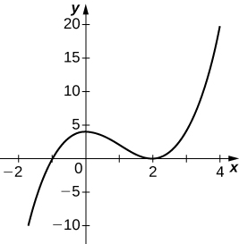 

<math xmlns="http://www.w3.org/1998/Math/MathML"><mrow><mi>y</mi><mo>=</mo><mfrac><mrow><mn>2</mn><mi>x</mi><mo>+</mo><mn>1</mn></mrow><mrow><msup><mi>x</mi><mn>2</mn></msup><mo>+</mo><mn>6</mn><mi>x</mi><mo>+</mo><mn>5</mn></mrow></mfrac></mrow></math>

<math xmlns="http://www.w3.org/1998/Math/MathML"><mrow><mi>y</mi><mo>=</mo><mfrac><mrow><msup><mi>x</mi><mn>3</mn></msup><mo>+</mo><mn>4</mn><msup><mi>x</mi><mn>2</mn></msup><mo>+</mo><mn>3</mn><mi>x</mi></mrow><mrow><mn>3</mn><mi>x</mi><mo>+</mo><mn>9</mn></mrow></mfrac></mrow></math>

* * *
{: data-type="newline"}

  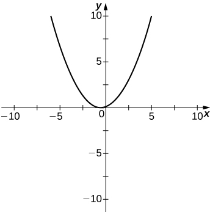 

<math xmlns="http://www.w3.org/1998/Math/MathML"><mrow><mi>y</mi><mo>=</mo><mfrac><mrow><msup><mi>x</mi><mn>2</mn></msup><mo>+</mo><mi>x</mi><mo>−</mo><mn>2</mn></mrow><mrow><msup><mi>x</mi><mn>2</mn></msup><mo>−</mo><mn>3</mn><mi>x</mi><mo>−</mo><mn>4</mn></mrow></mfrac></mrow></math>

<math xmlns="http://www.w3.org/1998/Math/MathML"><mrow><mi>y</mi><mo>=</mo><msqrt><mrow><msup><mi>x</mi><mn>2</mn></msup><mo>−</mo><mn>5</mn><mi>x</mi><mo>+</mo><mn>4</mn></mrow></msqrt></mrow></math>

* * *
{: data-type="newline"}

  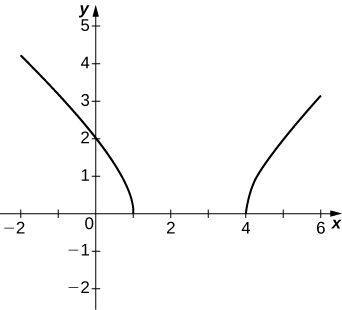 

<math xmlns="http://www.w3.org/1998/Math/MathML"><mrow><mi>y</mi><mo>=</mo><mn>2</mn><mi>x</mi><msqrt><mrow><mn>16</mn><mo>−</mo><msup><mi>x</mi><mn>2</mn></msup></mrow></msqrt></mrow></math>

<math xmlns="http://www.w3.org/1998/Math/MathML"><mrow><mi>y</mi><mo>=</mo><mfrac><mrow><mtext>cos</mtext><mspace width="0.1em" /><mi>x</mi></mrow><mi>x</mi></mfrac><mo>,</mo></mrow></math>

 on <math xmlns="http://www.w3.org/1998/Math/MathML"><mrow><mi>x</mi><mo>=</mo><mrow><mo>[</mo><mrow><mn>−2</mn><mi>π</mi><mo>,</mo><mn>2</mn><mi>π</mi></mrow><mo>]</mo></mrow></mrow></math>

* * *
{: data-type="newline"}

  ![This graph has vertical asymptote at x = 0. The first part of the function occurs in the second and third quadrants and starts in the third quadrant just below (&#x2212;2&#x3C0;, 0), increases and passes through the x axis at &#x2212;3&#x3C0;/2, reaches a maximum and then decreases through the x axis at &#x2212;&#x3C0;/2 before approaching the asymptote. On the other side of the asymptote, the function starts in the first quadrant, decreases quickly to pass through &#x3C0;/2, decreases to a local minimum and then increases through (3&#x3C0;/2, 0) before staying just above (2&#x3C0;, 0).](../resources/CNX_Calc_Figure_04_06_213.jpg) 

<math xmlns="http://www.w3.org/1998/Math/MathML"><mrow><mi>y</mi><mo>=</mo><msup><mi>e</mi><mi>x</mi></msup><mo>−</mo><msup><mi>x</mi><mn>3</mn></msup></mrow></math>

<math xmlns="http://www.w3.org/1998/Math/MathML"><mrow><mi>y</mi><mo>=</mo><mi>x</mi><mspace width="0.1em" /><mtext>tan</mtext><mspace width="0.1em" /><mi>x</mi><mo>,</mo><mi>x</mi><mo>=</mo><mrow><mo>[</mo><mrow><mtext>−</mtext><mi>π</mi><mo>,</mo><mi>π</mi></mrow><mo>]</mo></mrow></mrow></math>

* * *
{: data-type="newline"}

   

<math xmlns="http://www.w3.org/1998/Math/MathML"><mrow><mi>y</mi><mo>=</mo><mi>x</mi><mspace width="0.1em" /><mtext>ln</mtext><mrow><mo>(</mo><mi>x</mi><mo>)</mo></mrow><mo>,</mo><mi>x</mi><mo>&gt;</mo><mn>0</mn></mrow></math>

<math xmlns="http://www.w3.org/1998/Math/MathML"><mrow><mi>y</mi><mo>=</mo><msup><mi>x</mi><mn>2</mn></msup><mtext>sin</mtext><mrow><mo>(</mo><mi>x</mi><mo>)</mo></mrow><mo>,</mo><mi>x</mi><mo>=</mo><mrow><mo>[</mo><mrow><mn>−2</mn><mi>π</mi><mo>,</mo><mn>2</mn><mi>π</mi></mrow><mo>]</mo></mrow></mrow></math>

* * *
{: data-type="newline"}

   

For <math xmlns="http://www.w3.org/1998/Math/MathML"><mrow><mi>f</mi><mrow><mo>(</mo><mi>x</mi><mo>)</mo></mrow><mo>=</mo><mfrac><mrow><mi>P</mi><mrow><mo>(</mo><mi>x</mi><mo>)</mo></mrow></mrow><mrow><mi>Q</mi><mrow><mo>(</mo><mi>x</mi><mo>)</mo></mrow></mrow></mfrac></mrow></math>

 to have an asymptote at <math xmlns="http://www.w3.org/1998/Math/MathML"><mrow><mi>y</mi><mo>=</mo><mn>2</mn></mrow></math>

 then the polynomials <math xmlns="http://www.w3.org/1998/Math/MathML"><mrow><mi>P</mi><mrow><mo>(</mo><mi>x</mi><mo>)</mo></mrow></mrow></math>

 and <math xmlns="http://www.w3.org/1998/Math/MathML"><mrow><mi>Q</mi><mrow><mo>(</mo><mi>x</mi><mo>)</mo></mrow></mrow></math>

 must have what relation?

For <math xmlns="http://www.w3.org/1998/Math/MathML"><mrow><mi>f</mi><mrow><mo>(</mo><mi>x</mi><mo>)</mo></mrow><mo>=</mo><mfrac><mrow><mi>P</mi><mrow><mo>(</mo><mi>x</mi><mo>)</mo></mrow></mrow><mrow><mi>Q</mi><mrow><mo>(</mo><mi>x</mi><mo>)</mo></mrow></mrow></mfrac></mrow></math>

 to have an asymptote at <math xmlns="http://www.w3.org/1998/Math/MathML"><mrow><mi>x</mi><mo>=</mo><mn>0</mn><mo>,</mo></mrow></math>

 then the polynomials <math xmlns="http://www.w3.org/1998/Math/MathML"><mrow><mi>P</mi><mrow><mo>(</mo><mi>x</mi><mo>)</mo></mrow></mrow></math>

 and <math xmlns="http://www.w3.org/1998/Math/MathML"><mrow><mi>Q</mi><mrow><mo>(</mo><mi>x</mi><mo>)</mo></mrow><mo>.</mo></mrow></math>

 must have what relation?

<math xmlns="http://www.w3.org/1998/Math/MathML"><mrow><mi>Q</mi><mrow><mo>(</mo><mi>x</mi><mo>)</mo></mrow><mo>.</mo></mrow></math>

 must have have <math xmlns="http://www.w3.org/1998/Math/MathML"><mrow><msup><mi>x</mi><mrow><mi>k</mi><mo>+</mo><mn>1</mn></mrow></msup></mrow></math>

 as a factor, where <math xmlns="http://www.w3.org/1998/Math/MathML"><mrow><mi>P</mi><mrow><mo>(</mo><mi>x</mi><mo>)</mo></mrow></mrow></math>

 has <math xmlns="http://www.w3.org/1998/Math/MathML"><mrow><msup><mi>x</mi><mi>k</mi></msup></mrow></math>

 as a factor.

If <math xmlns="http://www.w3.org/1998/Math/MathML"><mrow><msup><mi>f</mi><mo>′</mo></msup><mrow><mo>(</mo><mi>x</mi><mo>)</mo></mrow></mrow></math>

 has asymptotes at <math xmlns="http://www.w3.org/1998/Math/MathML"><mrow><mi>y</mi><mo>=</mo><mn>3</mn></mrow></math>

 and <math xmlns="http://www.w3.org/1998/Math/MathML"><mrow><mi>x</mi><mo>=</mo><mn>1</mn><mo>,</mo></mrow></math>

 then <math xmlns="http://www.w3.org/1998/Math/MathML"><mrow><mi>f</mi><mrow><mo>(</mo><mi>x</mi><mo>)</mo></mrow></mrow></math>

 has what asymptotes?

Both <math xmlns="http://www.w3.org/1998/Math/MathML"><mrow><mi>f</mi><mrow><mo>(</mo><mi>x</mi><mo>)</mo></mrow><mo>=</mo><mfrac><mn>1</mn><mrow><mrow><mo>(</mo><mrow><mi>x</mi><mo>−</mo><mn>1</mn></mrow><mo>)</mo></mrow></mrow></mfrac></mrow></math>

 and <math xmlns="http://www.w3.org/1998/Math/MathML"><mrow><mi>g</mi><mrow><mo>(</mo><mi>x</mi><mo>)</mo></mrow><mo>=</mo><mfrac><mn>1</mn><mrow><msup><mrow><mrow><mo>(</mo><mrow><mi>x</mi><mo>−</mo><mn>1</mn></mrow><mo>)</mo></mrow></mrow><mn>2</mn></msup></mrow></mfrac></mrow></math>

 have asymptotes at <math xmlns="http://www.w3.org/1998/Math/MathML"><mrow><mi>x</mi><mo>=</mo><mn>1</mn></mrow></math>

 and <math xmlns="http://www.w3.org/1998/Math/MathML"><mrow><mi>y</mi><mo>=</mo><mn>0</mn><mo>.</mo></mrow></math>

 What is the most obvious difference between these two functions?

<math xmlns="http://www.w3.org/1998/Math/MathML"><mrow><munder><mrow><mtext>lim</mtext></mrow><mrow><mi>x</mi><mo stretchy="false">→</mo><msup><mn>1</mn><mo>−</mo></msup></mrow></munder><mi>f</mi><mrow><mo>(</mo><mi>x</mi><mo>)</mo></mrow><mspace width="0.2em" /><mtext>and</mtext><mspace width="0.2em" /><munder><mrow><mtext>lim</mtext></mrow><mrow><mi>x</mi><mo stretchy="false">→</mo><msup><mn>1</mn><mo>−</mo></msup></mrow></munder><mi>g</mi><mrow><mo>(</mo><mi>x</mi><mo>)</mo></mrow></mrow></math>

True or false: Every ratio of polynomials has vertical asymptotes.

</section>

