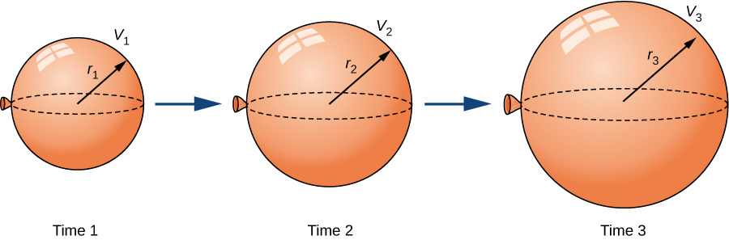
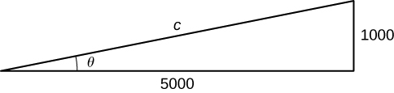
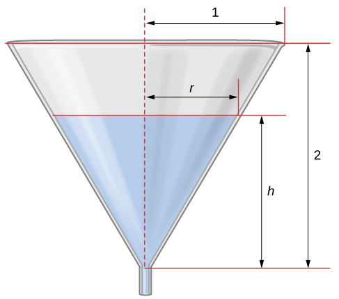
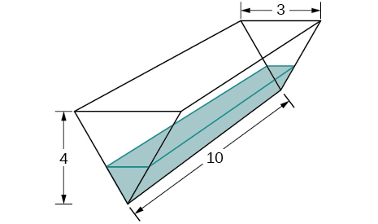

* Express changing quantities in terms of derivatives.
* Find relationships among the derivatives in a given problem.
* Use the chain rule to find the rate of change of one quantity that depends on the rate of change of other quantities.

We have seen that for quantities that are changing over time, the rates at which these quantities change are given by derivatives. If two related quantities are changing over time, the rates at which the quantities change are related. For example, if a balloon is being filled with air, both the radius of the balloon and the volume of the balloon are increasing. In this section, we consider several problems in which two or more related quantities are changing and we study how to determine the relationship between the rates of change of these quantities.

### Setting up Related-Rates Problems

In many real-world applications, related quantities are changing with respect to time. For example, if we consider the balloon example again, we can say that the rate of change in the volume, <math xmlns="http://www.w3.org/1998/Math/MathML"><mrow><mi>V</mi><mo>,</mo></mrow></math>

 is related to the rate of change in the radius, <math xmlns="http://www.w3.org/1998/Math/MathML"><mrow><mi>r</mi><mo>.</mo></mrow></math>

 In this case, we say that <math xmlns="http://www.w3.org/1998/Math/MathML"><mrow><mfrac><mrow><mi>d</mi><mi>V</mi></mrow><mrow><mi>d</mi><mi>t</mi></mrow></mfrac></mrow></math>

 and <math xmlns="http://www.w3.org/1998/Math/MathML"><mrow><mfrac><mrow><mi>d</mi><mi>r</mi></mrow><mrow><mi>d</mi><mi>t</mi></mrow></mfrac></mrow></math>

 are **related rates**{: data-type="term"} because *V* is related to *r*. Here we study several examples of related quantities that are changing with respect to time and we look at how to calculate one rate of change given another rate of change.

Inflating a Balloon

A spherical balloon is being filled with air at the constant rate of <math xmlns="http://www.w3.org/1998/Math/MathML"><mrow><mn>2</mn><msup><mrow><mspace width="0.2em" /><mtext>cm</mtext></mrow><mn>3</mn></msup><mtext>/</mtext><mtext>sec</mtext></mrow></math>

 ([[link]](#CNX_Calc_Figure_04_01_001)). How fast is the radius increasing when the radius is <math xmlns="http://www.w3.org/1998/Math/MathML"><mrow><mn>3</mn><mspace width="0.2em" /><mtext>cm</mtext><mo>?</mo></mrow></math>

{: #CNX_Calc_Figure_04_01_001}

The volume of a sphere of radius <math xmlns="http://www.w3.org/1998/Math/MathML"><mi>r</mi></math>

 centimeters is

<math xmlns="http://www.w3.org/1998/Math/MathML"><mrow><mi>V</mi><mo>=</mo><mfrac><mn>4</mn><mn>3</mn></mfrac><mi>π</mi><msup><mi>r</mi><mn>3</mn></msup><msup><mtext>cm</mtext><mn>3</mn></msup><mo>.</mo></mrow></math>

Since the balloon is being filled with air, both the volume and the radius are functions of time. Therefore, <math xmlns="http://www.w3.org/1998/Math/MathML"><mi>t</mi></math>

 seconds after beginning to fill the balloon with air, the volume of air in the balloon is

<math xmlns="http://www.w3.org/1998/Math/MathML"><mrow><mi>V</mi><mo stretchy="false">(</mo><mi>t</mi><mo stretchy="false">)</mo><mo>=</mo><mfrac><mn>4</mn><mn>3</mn></mfrac><mi>π</mi><msup><mrow><mo stretchy="false">[</mo><mi>r</mi><mo stretchy="false">(</mo><mi>t</mi><mo stretchy="false">)</mo><mo stretchy="false">]</mo></mrow><mn>3</mn></msup><msup><mtext>cm</mtext><mn>3</mn></msup><mo>.</mo></mrow></math>

Differentiating both sides of this equation with respect to time and applying the chain rule, we see that the rate of change in the volume is related to the rate of change in the radius by the equation

<math xmlns="http://www.w3.org/1998/Math/MathML"><mrow><mi>V</mi><mo>′</mo><mrow><mo>(</mo><mi>t</mi><mo>)</mo></mrow><mo>=</mo><mn>4</mn><mi>π</mi><msup><mrow><mrow><mo>[</mo><mrow><mi>r</mi><mrow><mo>(</mo><mi>t</mi><mo>)</mo></mrow></mrow><mo>]</mo></mrow></mrow><mn>2</mn></msup><msup><mi>r</mi><mo>′</mo></msup><mrow><mo>(</mo><mi>t</mi><mo>)</mo></mrow><mo>.</mo></mrow></math>

The balloon is being filled with air at the constant rate of 2 cm3/sec, so <math xmlns="http://www.w3.org/1998/Math/MathML"><mrow><mi>V</mi><mo>′</mo><mo stretchy="false">(</mo><mi>t</mi><mo stretchy="false">)</mo><mo>=</mo><mn>2</mn><msup><mrow><mspace width="0.2em" /><mtext>cm</mtext></mrow><mn>3</mn></msup><mtext>/</mtext><mtext>sec</mtext><mo>.</mo></mrow></math>

 Therefore,

<math xmlns="http://www.w3.org/1998/Math/MathML"><mrow><mn>2</mn><msup><mrow><mtext>cm</mtext></mrow><mn>3</mn></msup><mtext>/</mtext><mtext>sec</mtext><mo>=</mo><mrow><mo>(</mo><mrow><mn>4</mn><mi>π</mi><msup><mrow><mrow><mo>[</mo><mrow><mi>r</mi><mo stretchy="false">(</mo><mi>t</mi><mo stretchy="false">)</mo></mrow><mo>]</mo></mrow></mrow><mn>2</mn></msup><msup><mrow><mtext>cm</mtext></mrow><mn>2</mn></msup></mrow><mo>)</mo></mrow><mo>·</mo><mrow><mo>(</mo><mrow><mi>r</mi><mo>′</mo><mrow><mo>(</mo><mi>t</mi><mo>)</mo></mrow><mtext>cm/s</mtext></mrow><mo>)</mo></mrow><mtext>,</mtext></mrow></math>

which implies

<math xmlns="http://www.w3.org/1998/Math/MathML"><mrow><mi>r</mi><mo>′</mo><mrow><mo>(</mo><mi>t</mi><mo>)</mo></mrow><mo>=</mo><mfrac><mn>1</mn><mrow><mn>2</mn><mi>π</mi><msup><mrow><mrow><mo>[</mo><mrow><mi>r</mi><mrow><mo>(</mo><mi>t</mi><mo>)</mo></mrow></mrow><mo>]</mo></mrow></mrow><mn>2</mn></msup></mrow></mfrac><mspace width="0.1em" /><mtext>cm/sec</mtext><mo>.</mo></mrow></math>

When the radius <math xmlns="http://www.w3.org/1998/Math/MathML"><mrow><mi>r</mi><mo>=</mo><mn>3</mn><mspace width="0.2em" /><mtext>cm,</mtext></mrow></math>

<math xmlns="http://www.w3.org/1998/Math/MathML"><mrow><mi>r</mi><mo>′</mo><mo stretchy="false">(</mo><mi>t</mi><mo stretchy="false">)</mo><mo>=</mo><mfrac><mn>1</mn><mrow><mn>18</mn><mi>π</mi></mrow></mfrac><mspace width="0.1em" /><mtext>cm/sec</mtext><mo>.</mo></mrow></math>

What is the instantaneous rate of change of the radius when <math xmlns="http://www.w3.org/1998/Math/MathML"><mrow><mi>r</mi><mo>=</mo><mn>6</mn><mspace width="0.2em" /><mtext>cm</mtext><mo>?</mo></mrow></math>

<math xmlns="http://www.w3.org/1998/Math/MathML"><mrow><mfrac><mn>1</mn><mrow><mn>72</mn><mi>π</mi></mrow></mfrac><mspace width="0.2em" /><mtext>cm/sec</mtext><mo>,</mo></mrow></math>

 or approximately 0.0044 cm/sec

Hint

<math xmlns="http://www.w3.org/1998/Math/MathML"><mrow><mfrac><mrow><mi>d</mi><mi>r</mi></mrow><mrow><mi>d</mi><mi>t</mi></mrow></mfrac><mo>=</mo><mfrac><mn>1</mn><mrow><mn>2</mn><mi>π</mi><msup><mi>r</mi><mn>2</mn></msup></mrow></mfrac></mrow></math>

Before looking at other examples, let’s outline the problem-solving strategy we will be using to solve related-rates problems.

Problem-Solving Strategy: Solving a Related-Rates Problem

1.  Assign symbols to all variables involved in the problem. Draw a figure if applicable.
2.  State, in terms of the variables, the information that is given and the rate to be determined.
3.  Find an equation relating the variables introduced in step 1.
4.  Using the chain rule, differentiate both sides of the equation found in step 3 with respect to the independent variable. This new equation will relate the derivatives.
5.  Substitute all known values into the equation from step 4, then solve for the unknown rate of change.
{: type="1"}

Note that when solving a related-rates problem, it is crucial not to substitute known values too soon. For example, if the value for a changing quantity is substituted into an equation before both sides of the equation are differentiated, then that quantity will behave as a constant and its derivative will not appear in the new equation found in step 4. We examine this potential error in the following example.

### Examples of the Process

Let’s now implement the strategy just described to solve several related-rates problems. The first example involves a plane flying overhead. The relationship we are studying is between the speed of the plane and the rate at which the distance between the plane and a person on the ground is changing.

An Airplane Flying at a Constant Elevation

An airplane is flying overhead at a constant elevation of <math xmlns="http://www.w3.org/1998/Math/MathML"><mrow><mn>4000</mn><mspace width="0.2em" /><mtext>ft</mtext><mo>.</mo></mrow></math>

 A man is viewing the plane from a position <math xmlns="http://www.w3.org/1998/Math/MathML"><mrow><mn>3000</mn><mspace width="0.2em" /><mtext>ft</mtext></mrow></math>

 from the base of a radio tower. The airplane is flying horizontally away from the man. If the plane is flying at the rate of <math xmlns="http://www.w3.org/1998/Math/MathML"><mrow><mn>600</mn><mspace width="0.2em" /><mtext>ft/sec</mtext><mo>,</mo></mrow></math>

 at what rate is the distance between the man and the plane increasing when the plane passes over the radio tower?

Step 1. Draw a picture, introducing variables to represent the different quantities involved.

{: #CNX_Calc_Figure_04_01_002}

As shown, <math xmlns="http://www.w3.org/1998/Math/MathML"><mi>x</mi></math>

 denotes the distance between the man and the position on the ground directly below the airplane. The variable <math xmlns="http://www.w3.org/1998/Math/MathML"><mi>s</mi></math>

 denotes the distance between the man and the plane. Note that both <math xmlns="http://www.w3.org/1998/Math/MathML"><mi>x</mi></math>

 and <math xmlns="http://www.w3.org/1998/Math/MathML"><mi>s</mi></math>

 are functions of time. We do not introduce a variable for the height of the plane because it remains at a constant elevation of <math xmlns="http://www.w3.org/1998/Math/MathML"><mrow><mn>4000</mn><mspace width="0.2em" /><mtext>ft</mtext><mo>.</mo></mrow></math>

 Since an object’s height above the ground is measured as the shortest distance between the object and the ground, the line segment of length 4000 ft is perpendicular to the line segment of length <math xmlns="http://www.w3.org/1998/Math/MathML"><mi>x</mi></math>

 feet, creating a right triangle.

Step 2. Since <math xmlns="http://www.w3.org/1998/Math/MathML"><mi>x</mi></math>

 denotes the horizontal distance between the man and the point on the ground below the plane, <math xmlns="http://www.w3.org/1998/Math/MathML"><mrow><mi>d</mi><mi>x</mi><mtext>/</mtext><mi>d</mi><mi>t</mi></mrow></math>

 represents the speed of the plane. We are told the speed of the plane is 600 ft/sec. Therefore, <math xmlns="http://www.w3.org/1998/Math/MathML"><mrow><mfrac><mrow><mi>d</mi><mi>x</mi></mrow><mrow><mi>d</mi><mi>t</mi></mrow></mfrac><mo>=</mo><mn>600</mn></mrow></math>

 ft/sec. Since we are asked to find the rate of change in the distance between the man and the plane when the plane is directly above the radio tower, we need to find <math xmlns="http://www.w3.org/1998/Math/MathML"><mrow><mi>d</mi><mi>s</mi><mtext>/</mtext><mi>d</mi><mi>t</mi></mrow></math>

 when <math xmlns="http://www.w3.org/1998/Math/MathML"><mrow><mi>x</mi><mo>=</mo><mn>3000</mn><mspace width="0.2em" /><mtext>ft</mtext><mo>.</mo></mrow></math>

Step 3. From the figure, we can use the **Pythagorean theorem**{: data-type="term" .no-emphasis} to write an equation relating <math xmlns="http://www.w3.org/1998/Math/MathML"><mi>x</mi></math>

 and <math xmlns="http://www.w3.org/1998/Math/MathML"><mi>s</mi><mtext>:</mtext></math>

<math xmlns="http://www.w3.org/1998/Math/MathML"><mrow><msup><mrow><mrow><mo>[</mo><mrow><mi>x</mi><mrow><mo>(</mo><mi>t</mi><mo>)</mo></mrow></mrow><mo>]</mo></mrow></mrow><mn>2</mn></msup><mo>+</mo><msup><mrow><mn>4000</mn></mrow><mn>2</mn></msup><mo>=</mo><msup><mrow><mrow><mo>[</mo><mrow><mi>s</mi><mrow><mo>(</mo><mi>t</mi><mo>)</mo></mrow></mrow><mo>]</mo></mrow></mrow><mn>2</mn></msup><mo>.</mo></mrow></math>

Step 4. Differentiating this equation with respect to time and using the fact that the derivative of a constant is zero, we arrive at the equation

<math xmlns="http://www.w3.org/1998/Math/MathML"><mrow><mi>x</mi><mfrac><mrow><mi>d</mi><mi>x</mi></mrow><mrow><mi>d</mi><mi>t</mi></mrow></mfrac><mo>=</mo><mi>s</mi><mfrac><mrow><mi>d</mi><mi>s</mi></mrow><mrow><mi>d</mi><mi>t</mi></mrow></mfrac><mo>.</mo></mrow></math>

Step 5. Find the rate at which the distance between the man and the plane is increasing when the plane is directly over the radio tower. That is, find <math xmlns="http://www.w3.org/1998/Math/MathML"><mrow><mfrac><mrow><mi>d</mi><mi>s</mi></mrow><mrow><mi>d</mi><mi>t</mi></mrow></mfrac></mrow></math>

 when <math xmlns="http://www.w3.org/1998/Math/MathML"><mrow><mi>x</mi><mo>=</mo><mn>3000</mn><mspace width="0.2em" /><mtext>ft</mtext><mo>.</mo></mrow></math>

 Since the speed of the plane is <math xmlns="http://www.w3.org/1998/Math/MathML"><mrow><mn>600</mn><mspace width="0.2em" /><mtext>ft/sec</mtext><mo>,</mo></mrow></math>

 we know that <math xmlns="http://www.w3.org/1998/Math/MathML"><mrow><mfrac><mrow><mi>d</mi><mi>x</mi></mrow><mrow><mi>d</mi><mi>t</mi></mrow></mfrac><mo>=</mo><mn>600</mn><mspace width="0.2em" /><mtext>ft/sec</mtext><mo>.</mo></mrow></math>

 We are not given an explicit value for <math xmlns="http://www.w3.org/1998/Math/MathML"><mrow><mi>s</mi><mo>;</mo></mrow></math>

 however, since we are trying to find <math xmlns="http://www.w3.org/1998/Math/MathML"><mrow><mfrac><mrow><mi>d</mi><mi>s</mi></mrow><mrow><mi>d</mi><mi>t</mi></mrow></mfrac></mrow></math>

 when <math xmlns="http://www.w3.org/1998/Math/MathML"><mrow><mi>x</mi><mo>=</mo><mn>3000</mn><mspace width="0.2em" /><mtext>ft</mtext><mo>,</mo></mrow></math>

 we can use the Pythagorean theorem to determine the distance <math xmlns="http://www.w3.org/1998/Math/MathML"><mi>s</mi></math>

 when <math xmlns="http://www.w3.org/1998/Math/MathML"><mrow><mi>x</mi><mo>=</mo><mn>3000</mn></mrow></math>

 and the height is <math xmlns="http://www.w3.org/1998/Math/MathML"><mrow><mn>4000</mn><mspace width="0.2em" /><mtext>ft</mtext><mo>.</mo></mrow></math>

 Solving the equation

<math xmlns="http://www.w3.org/1998/Math/MathML"><mrow><msup><mrow><mn>3000</mn></mrow><mn>2</mn></msup><mo>+</mo><msup><mrow><mn>4000</mn></mrow><mn>2</mn></msup><mo>=</mo><msup><mi>s</mi><mn>2</mn></msup></mrow></math>

for <math xmlns="http://www.w3.org/1998/Math/MathML"><mrow><mi>s</mi><mo>,</mo></mrow></math>

 we have <math xmlns="http://www.w3.org/1998/Math/MathML"><mrow><mi>s</mi><mo>=</mo><mn>5000</mn><mspace width="0.2em" /><mtext>ft</mtext></mrow></math>

 at the time of interest. Using these values, we conclude that <math xmlns="http://www.w3.org/1998/Math/MathML"><mrow><mi>d</mi><mi>s</mi><mtext>/</mtext><mi>d</mi><mi>t</mi></mrow></math>

 is a solution of the equation

<math xmlns="http://www.w3.org/1998/Math/MathML"><mrow><mo stretchy="false">(</mo><mn>3000</mn><mo stretchy="false">)</mo><mo stretchy="false">(</mo><mn>600</mn><mo stretchy="false">)</mo><mo>=</mo><mo stretchy="false">(</mo><mn>5000</mn><mo stretchy="false">)</mo><mo>·</mo><mfrac><mrow><mi>d</mi><mi>s</mi></mrow><mrow><mi>d</mi><mi>t</mi></mrow></mfrac><mo>.</mo></mrow></math>

Therefore,

<math xmlns="http://www.w3.org/1998/Math/MathML"><mrow><mfrac><mrow><mi>d</mi><mi>s</mi></mrow><mrow><mi>d</mi><mi>t</mi></mrow></mfrac><mo>=</mo><mfrac><mrow><mn>3000</mn><mo>·</mo><mn>600</mn></mrow><mrow><mn>5000</mn></mrow></mfrac><mo>=</mo><mn>360</mn><mspace width="0.2em" /><mtext>ft/sec</mtext><mo>.</mo></mrow></math>

*Note*: When solving related-rates problems, it is important not to substitute values for the variables too soon. For example, in step 3, we related the variable quantities <math xmlns="http://www.w3.org/1998/Math/MathML"><mrow><mi>x</mi><mrow><mo>(</mo><mi>t</mi><mo>)</mo></mrow></mrow></math>

 and <math xmlns="http://www.w3.org/1998/Math/MathML"><mrow><mi>s</mi><mrow><mo>(</mo><mi>t</mi><mo>)</mo></mrow></mrow></math>

 by the equation

<math xmlns="http://www.w3.org/1998/Math/MathML"><mrow><msup><mrow><mrow><mo>[</mo><mrow><mi>x</mi><mrow><mo>(</mo><mi>t</mi><mo>)</mo></mrow></mrow><mo>]</mo></mrow></mrow><mn>2</mn></msup><mo>+</mo><msup><mrow><mn>4000</mn></mrow><mn>2</mn></msup><mo>=</mo><msup><mrow><mrow><mo>[</mo><mrow><mi>s</mi><mrow><mo>(</mo><mi>t</mi><mo>)</mo></mrow></mrow><mo>]</mo></mrow></mrow><mn>2</mn></msup><mo>.</mo></mrow></math>

Since the plane remains at a constant height, it is not necessary to introduce a variable for the height, and we are allowed to use the constant 4000 to denote that quantity. However, the other two quantities are changing. If we mistakenly substituted <math xmlns="http://www.w3.org/1998/Math/MathML"><mrow><mi>x</mi><mo stretchy="false">(</mo><mi>t</mi><mo stretchy="false">)</mo><mo>=</mo><mn>3000</mn></mrow></math>

 into the equation before differentiating, our equation would have been

<math xmlns="http://www.w3.org/1998/Math/MathML"><mrow><msup><mrow><mn>3000</mn></mrow><mn>2</mn></msup><mo>+</mo><msup><mrow><mn>4000</mn></mrow><mn>2</mn></msup><mo>=</mo><msup><mrow><mrow><mo>[</mo><mrow><mi>s</mi><mrow><mo>(</mo><mi>t</mi><mo>)</mo></mrow></mrow><mo>]</mo></mrow></mrow><mn>2</mn></msup><mo>.</mo></mrow></math>

After differentiating, our equation would become

<math xmlns="http://www.w3.org/1998/Math/MathML"><mrow><mn>0</mn><mo>=</mo><mi>s</mi><mrow><mo>(</mo><mi>t</mi><mo>)</mo></mrow><mfrac><mrow><mi>d</mi><mi>s</mi></mrow><mrow><mi>d</mi><mi>t</mi></mrow></mfrac><mo>.</mo></mrow></math>

As a result, we would incorrectly conclude that <math xmlns="http://www.w3.org/1998/Math/MathML"><mrow><mfrac><mrow><mi>d</mi><mi>s</mi></mrow><mrow><mi>d</mi><mi>t</mi></mrow></mfrac><mo>=</mo><mn>0</mn><mo>.</mo></mrow></math>

What is the speed of the plane if the distance between the person and the plane is increasing at the rate of <math xmlns="http://www.w3.org/1998/Math/MathML"><mrow><mn>300</mn><mspace width="0.2em" /><mtext>ft/sec</mtext><mo>?</mo></mrow></math>

<math xmlns="http://www.w3.org/1998/Math/MathML"><mrow><mn>500</mn><mspace width="0.2em" /><mtext>ft/sec</mtext></mrow></math>

Hint

<math xmlns="http://www.w3.org/1998/Math/MathML"><mrow><mfrac><mrow><mi>d</mi><mi>s</mi></mrow><mrow><mi>d</mi><mi>t</mi></mrow></mfrac><mo>=</mo><mn>300</mn><mspace width="0.2em" /><mtext>ft/sec</mtext></mrow></math>

We now return to the problem involving the rocket launch from the beginning of the chapter.

Chapter Opener: A Rocket Launch

"){:}

A rocket is launched so that it rises vertically. A camera is positioned <math xmlns="http://www.w3.org/1998/Math/MathML"><mrow><mn>5000</mn><mspace width="0.2em" /><mtext>ft</mtext></mrow></math>

 from the launch pad. When the rocket is <math xmlns="http://www.w3.org/1998/Math/MathML"><mrow><mn>1000</mn><mspace width="0.2em" /><mtext>ft</mtext></mrow></math>

 above the launch pad, its velocity is <math xmlns="http://www.w3.org/1998/Math/MathML"><mrow><mn>600</mn><mspace width="0.2em" /><mtext>ft/sec</mtext><mo>.</mo></mrow></math>

 Find the necessary rate of change of the camera’s angle as a function of time so that it stays focused on the rocket.

Step 1. Draw a picture introducing the variables.

{: #CNX_Calc_Figure_04_01_003}

Let <math xmlns="http://www.w3.org/1998/Math/MathML"><mi>h</mi></math>

 denote the height of the rocket above the launch pad and <math xmlns="http://www.w3.org/1998/Math/MathML"><mi>θ</mi></math>

 be the angle between the camera lens and the ground.

Step 2. We are trying to find the rate of change in the angle of the camera with respect to time when the rocket is 1000 ft off the ground. That is, we need to find <math xmlns="http://www.w3.org/1998/Math/MathML"><mrow><mfrac><mrow><mi>d</mi><mi>θ</mi></mrow><mrow><mi>d</mi><mi>t</mi></mrow></mfrac></mrow></math>

 when <math xmlns="http://www.w3.org/1998/Math/MathML"><mrow><mi>h</mi><mo>=</mo><mn>1000</mn><mspace width="0.2em" /><mtext>ft</mtext><mo>.</mo></mrow></math>

 At that time, we know the velocity of the rocket is <math xmlns="http://www.w3.org/1998/Math/MathML"><mrow><mfrac><mrow><mi>d</mi><mi>h</mi></mrow><mrow><mi>d</mi><mi>t</mi></mrow></mfrac><mo>=</mo><mn>600</mn><mspace width="0.2em" /><mtext>ft/sec</mtext><mo>.</mo></mrow></math>

Step 3. Now we need to find an equation relating the two quantities that are changing with respect to time: <math xmlns="http://www.w3.org/1998/Math/MathML"><mi>h</mi></math>

 and <math xmlns="http://www.w3.org/1998/Math/MathML"><mrow><mi>θ</mi><mo>.</mo></mrow></math>

 How can we create such an equation? Using the fact that we have drawn a right triangle, it is natural to think about trigonometric functions. Recall that <math xmlns="http://www.w3.org/1998/Math/MathML"><mrow><mtext>tan</mtext><mspace width="0.1em" /><mi>θ</mi></mrow></math>

 is the ratio of the length of the opposite side of the triangle to the length of the adjacent side. Thus, we have

<math xmlns="http://www.w3.org/1998/Math/MathML"><mrow><mtext>tan</mtext><mspace width="0.1em" /><mi>θ</mi><mo>=</mo><mfrac><mi>h</mi><mrow><mn>5000</mn></mrow></mfrac><mo>.</mo></mrow></math>

This gives us the equation

<math xmlns="http://www.w3.org/1998/Math/MathML"><mrow><mi>h</mi><mo>=</mo><mn>5000</mn><mspace width="0.1em" /><mtext>tan</mtext><mspace width="0.1em" /><mi>θ</mi><mo>.</mo></mrow></math>

Step 4. Differentiating this equation with respect to time <math xmlns="http://www.w3.org/1998/Math/MathML"><mrow><mi>t</mi><mo>,</mo></mrow></math>

 we obtain

<math xmlns="http://www.w3.org/1998/Math/MathML"><mrow><mfrac><mrow><mi>d</mi><mi>h</mi></mrow><mrow><mi>d</mi><mi>t</mi></mrow></mfrac><mo>=</mo><mn>5000</mn><mspace width="0.1em" /><msup><mrow><mtext>sec</mtext></mrow><mn>2</mn></msup><mi>θ</mi><mspace width="0.1em" /><mfrac><mrow><mi>d</mi><mi>θ</mi></mrow><mrow><mi>d</mi><mi>t</mi></mrow></mfrac><mo>.</mo></mrow></math>

Step 5. We want to find <math xmlns="http://www.w3.org/1998/Math/MathML"><mrow><mfrac><mrow><mi>d</mi><mi>θ</mi></mrow><mrow><mi>d</mi><mi>t</mi></mrow></mfrac></mrow></math>

 when <math xmlns="http://www.w3.org/1998/Math/MathML"><mrow><mi>h</mi><mo>=</mo><mn>1000</mn><mspace width="0.2em" /><mtext>ft</mtext><mo>.</mo></mrow></math>

 At this time, we know that <math xmlns="http://www.w3.org/1998/Math/MathML"><mrow><mfrac><mrow><mi>d</mi><mi>h</mi></mrow><mrow><mi>d</mi><mi>t</mi></mrow></mfrac><mo>=</mo><mn>600</mn><mspace width="0.2em" /><mtext>ft/sec</mtext><mo>.</mo></mrow></math>

 We need to determine <math xmlns="http://www.w3.org/1998/Math/MathML"><mrow><msup><mrow><mtext>sec</mtext></mrow><mn>2</mn></msup><mi>θ</mi><mo>.</mo></mrow></math>

 Recall that <math xmlns="http://www.w3.org/1998/Math/MathML"><mrow><mtext>sec</mtext><mspace width="0.1em" /><mi>θ</mi></mrow></math>

 is the ratio of the length of the hypotenuse to the length of the adjacent side. We know the length of the adjacent side is <math xmlns="http://www.w3.org/1998/Math/MathML"><mrow><mn>5000</mn><mspace width="0.2em" /><mtext>ft</mtext><mo>.</mo></mrow></math>

 To determine the length of the hypotenuse, we use the Pythagorean theorem, where the length of one leg is <math xmlns="http://www.w3.org/1998/Math/MathML"><mrow><mn>5000</mn><mspace width="0.2em" /><mtext>ft</mtext><mo>,</mo></mrow></math>

 the length of the other leg is <math xmlns="http://www.w3.org/1998/Math/MathML"><mrow><mi>h</mi><mo>=</mo><mn>1000</mn><mspace width="0.2em" /><mtext>ft</mtext><mo>,</mo></mrow></math>

 and the length of the hypotenuse is <math xmlns="http://www.w3.org/1998/Math/MathML"><mi>c</mi></math>

 feet as shown in the following figure.

  
We see that

<math xmlns="http://www.w3.org/1998/Math/MathML"><mrow><msup><mrow><mn>1000</mn></mrow><mn>2</mn></msup><mo>+</mo><msup><mrow><mn>5000</mn></mrow><mn>2</mn></msup><mo>=</mo><msup><mi>c</mi><mn>2</mn></msup></mrow></math>

and we conclude that the hypotenuse is

<math xmlns="http://www.w3.org/1998/Math/MathML"><mrow><mi>c</mi><mo>=</mo><mn>1000</mn><msqrt><mrow><mn>26</mn></mrow></msqrt><mspace width="0.2em" /><mtext>ft</mtext><mo>.</mo></mrow></math>

Therefore, when <math xmlns="http://www.w3.org/1998/Math/MathML"><mrow><mi>h</mi><mo>=</mo><mn>1000</mn><mo>,</mo></mrow></math>

 we have

<math xmlns="http://www.w3.org/1998/Math/MathML"><mrow><msup><mrow><mtext>sec</mtext></mrow><mn>2</mn></msup><mi>θ</mi><mo>=</mo><msup><mrow><mrow><mo>(</mo><mrow><mfrac><mrow><mn>1000</mn><msqrt><mrow><mn>26</mn></mrow></msqrt></mrow><mrow><mn>5000</mn></mrow></mfrac></mrow><mo>)</mo></mrow></mrow><mn>2</mn></msup><mo>=</mo><mfrac><mrow><mn>26</mn></mrow><mrow><mn>25</mn></mrow></mfrac><mo>.</mo></mrow></math>

Recall from step 4 that the equation relating <math xmlns="http://www.w3.org/1998/Math/MathML"><mrow><mfrac><mrow><mi>d</mi><mi>θ</mi></mrow><mrow><mi>d</mi><mi>t</mi></mrow></mfrac></mrow></math>

 to our known values is

<math xmlns="http://www.w3.org/1998/Math/MathML"><mrow><mfrac><mrow><mi>d</mi><mi>h</mi></mrow><mrow><mi>d</mi><mi>t</mi></mrow></mfrac><mo>=</mo><mn>5000</mn><mspace width="0.1em" /><msup><mrow><mtext>sec</mtext></mrow><mn>2</mn></msup><mi>θ</mi><mspace width="0.1em" /><mfrac><mrow><mi>d</mi><mi>θ</mi></mrow><mrow><mi>d</mi><mi>t</mi></mrow></mfrac><mo>.</mo></mrow></math>

When <math xmlns="http://www.w3.org/1998/Math/MathML"><mrow><mi>h</mi><mo>=</mo><mn>1000</mn><mspace width="0.2em" /><mtext>ft</mtext><mo>,</mo></mrow></math>

 we know that <math xmlns="http://www.w3.org/1998/Math/MathML"><mrow><mfrac><mrow><mi>d</mi><mi>h</mi></mrow><mrow><mi>d</mi><mi>t</mi></mrow></mfrac><mo>=</mo><mn>600</mn><mspace width="0.2em" /><mtext>ft/sec</mtext></mrow></math>

 and <math xmlns="http://www.w3.org/1998/Math/MathML"><mrow><msup><mrow><mtext>sec</mtext></mrow><mn>2</mn></msup><mi>θ</mi><mo>=</mo><mfrac><mrow><mn>26</mn></mrow><mrow><mn>25</mn></mrow></mfrac><mo>.</mo></mrow></math>

 Substituting these values into the previous equation, we arrive at the equation

<math xmlns="http://www.w3.org/1998/Math/MathML"><mrow><mn>600</mn><mo>=</mo><mn>5000</mn><mrow><mo>(</mo><mrow><mfrac><mrow><mn>26</mn></mrow><mrow><mn>25</mn></mrow></mfrac></mrow><mo>)</mo></mrow><mfrac><mrow><mi>d</mi><mi>θ</mi></mrow><mrow><mi>d</mi><mi>t</mi></mrow></mfrac><mtext>.</mtext></mrow></math>

Therefore, <math xmlns="http://www.w3.org/1998/Math/MathML"><mrow><mfrac><mrow><mi>d</mi><mi>θ</mi></mrow><mrow><mi>d</mi><mi>t</mi></mrow></mfrac><mo>=</mo><mfrac><mn>3</mn><mrow><mn>26</mn></mrow></mfrac><mspace width="0.2em" /><mtext>rad/sec</mtext><mo>.</mo></mrow></math>

What rate of change is necessary for the elevation angle of the camera if the camera is placed on the ground at a distance of <math xmlns="http://www.w3.org/1998/Math/MathML"><mrow><mn>4000</mn><mspace width="0.2em" /><mtext>ft</mtext></mrow></math>

 from the launch pad and the velocity of the rocket is 500 ft/sec when the rocket is <math xmlns="http://www.w3.org/1998/Math/MathML"><mrow><mn>2000</mn><mspace width="0.2em" /><mtext>ft</mtext></mrow></math>

 off the ground?

<math xmlns="http://www.w3.org/1998/Math/MathML"><mrow><mfrac><mn>1</mn><mrow><mn>10</mn></mrow></mfrac><mspace width="0.2em" /><mtext>rad/sec</mtext></mrow></math>

Hint

Find <math xmlns="http://www.w3.org/1998/Math/MathML"><mrow><mfrac><mrow><mi>d</mi><mi>θ</mi></mrow><mrow><mi>d</mi><mi>t</mi></mrow></mfrac></mrow></math>

 when <math xmlns="http://www.w3.org/1998/Math/MathML"><mrow><mi>h</mi><mo>=</mo><mn>2000</mn><mspace width="0.2em" /><mtext>ft</mtext><mo>.</mo></mrow></math>

 At that time, <math xmlns="http://www.w3.org/1998/Math/MathML"><mrow><mfrac><mrow><mi>d</mi><mi>h</mi></mrow><mrow><mi>d</mi><mi>t</mi></mrow></mfrac><mo>=</mo><mn>500</mn><mspace width="0.2em" /><mtext>ft/sec</mtext><mo>.</mo></mrow></math>

In the next example, we consider water draining from a cone-shaped funnel. We compare the rate at which the level of water in the cone is decreasing with the rate at which the volume of water is decreasing.

Water Draining from a Funnel

Water is draining from the bottom of a cone-shaped funnel at the rate of <math xmlns="http://www.w3.org/1998/Math/MathML"><mrow><mn>0.0</mn><msup><mrow><mn>3</mn><mspace width="0.2em" /><mtext>ft</mtext></mrow><mn>3</mn></msup><mtext>/sec</mtext><mo>.</mo></mrow></math>

 The height of the funnel is 2 ft and the radius at the top of the funnel is <math xmlns="http://www.w3.org/1998/Math/MathML"><mrow><mn>1</mn><mspace width="0.2em" /><mtext>ft</mtext><mo>.</mo></mrow></math>

 At what rate is the height of the water in the funnel changing when the height of the water is <math xmlns="http://www.w3.org/1998/Math/MathML"><mrow><mfrac><mn>1</mn><mn>2</mn></mfrac><mspace width="0.2em" /><mtext>ft</mtext><mo>?</mo></mrow></math>

Step 1: Draw a picture introducing the variables.

{: #CNX_Calc_Figure_04_01_004}

Let <math xmlns="http://www.w3.org/1998/Math/MathML"><mi>h</mi></math>

 denote the height of the water in the funnel, <math xmlns="http://www.w3.org/1998/Math/MathML"><mi>r</mi></math>

 denote the radius of the water at its surface, and <math xmlns="http://www.w3.org/1998/Math/MathML"><mi>V</mi></math>

 denote the volume of the water.

Step 2: We need to determine <math xmlns="http://www.w3.org/1998/Math/MathML"><mrow><mfrac><mrow><mi>d</mi><mi>h</mi></mrow><mrow><mi>d</mi><mi>t</mi></mrow></mfrac></mrow></math>

 when <math xmlns="http://www.w3.org/1998/Math/MathML"><mrow><mi>h</mi><mo>=</mo><mfrac><mn>1</mn><mn>2</mn></mfrac><mspace width="0.2em" /><mtext>ft</mtext><mo>.</mo></mrow></math>

 We know that <math xmlns="http://www.w3.org/1998/Math/MathML"><mrow><mfrac><mrow><mi>d</mi><mi>V</mi></mrow><mrow><mi>d</mi><mi>t</mi></mrow></mfrac><mo>=</mo><mn>−0.03</mn><mspace width="0.2em" /><mtext>ft/sec</mtext><mo>.</mo></mrow></math>

Step 3: The volume of water in the cone is

<math xmlns="http://www.w3.org/1998/Math/MathML"><mrow><mi>V</mi><mo>=</mo><mfrac><mn>1</mn><mn>3</mn></mfrac><mi>π</mi><msup><mi>r</mi><mn>2</mn></msup><mi>h</mi><mo>.</mo></mrow></math>

From the figure, we see that we have similar triangles. Therefore, the ratio of the sides in the two triangles is the same. Therefore, <math xmlns="http://www.w3.org/1998/Math/MathML"><mrow><mfrac><mi>r</mi><mi>h</mi></mfrac><mo>=</mo><mfrac><mn>1</mn><mn>2</mn></mfrac></mrow></math>

 or <math xmlns="http://www.w3.org/1998/Math/MathML"><mrow><mi>r</mi><mo>=</mo><mfrac><mi>h</mi><mn>2</mn></mfrac><mo>.</mo></mrow></math>

 Using this fact, the equation for volume can be simplified to

<math xmlns="http://www.w3.org/1998/Math/MathML"><mrow><mi>V</mi><mo>=</mo><mfrac><mn>1</mn><mn>3</mn></mfrac><mi>π</mi><msup><mrow><mrow><mo>(</mo><mrow><mfrac><mi>h</mi><mn>2</mn></mfrac></mrow><mo>)</mo></mrow></mrow><mn>2</mn></msup><mi>h</mi><mo>=</mo><mfrac><mi>π</mi><mrow><mn>12</mn></mrow></mfrac><mspace width="0.1em" /><msup><mi>h</mi><mn>3</mn></msup><mo>.</mo></mrow></math>

Step 4: Applying the chain rule while differentiating both sides of this equation with respect to time <math xmlns="http://www.w3.org/1998/Math/MathML"><mi>t</mi><mo>,</mo></math>

 we obtain

<math xmlns="http://www.w3.org/1998/Math/MathML"><mrow><mfrac><mrow><mi>d</mi><mi>V</mi></mrow><mrow><mi>d</mi><mi>t</mi></mrow></mfrac><mo>=</mo><mfrac><mi>π</mi><mn>4</mn></mfrac><mspace width="0.1em" /><msup><mi>h</mi><mn>2</mn></msup><mfrac><mrow><mi>d</mi><mi>h</mi></mrow><mrow><mi>d</mi><mi>t</mi></mrow></mfrac><mo>.</mo></mrow></math>

Step 5: We want to find <math xmlns="http://www.w3.org/1998/Math/MathML"><mrow><mfrac><mrow><mi>d</mi><mi>h</mi></mrow><mrow><mi>d</mi><mi>t</mi></mrow></mfrac></mrow></math>

 when <math xmlns="http://www.w3.org/1998/Math/MathML"><mrow><mi>h</mi><mo>=</mo><mfrac><mn>1</mn><mn>2</mn></mfrac><mspace width="0.2em" /><mtext>ft</mtext><mo>.</mo></mrow></math>

 Since water is leaving at the rate of <math xmlns="http://www.w3.org/1998/Math/MathML"><mrow><mn>0.0</mn><msup><mrow><mn>3</mn><mspace width="0.2em" /><mtext>ft</mtext></mrow><mn>3</mn></msup><mtext>/sec</mtext><mo>,</mo></mrow></math>

 we know that <math xmlns="http://www.w3.org/1998/Math/MathML"><mrow><mfrac><mrow><mi>d</mi><mi>V</mi></mrow><mrow><mi>d</mi><mi>t</mi></mrow></mfrac><mo>=</mo><mn>−0.03</mn><msup><mrow><mspace width="0.2em" /><mtext>ft</mtext></mrow><mn>3</mn></msup><mtext>/sec</mtext><mo>.</mo></mrow></math>

 Therefore,

<math xmlns="http://www.w3.org/1998/Math/MathML"><mrow><mn>−0.03</mn><mo>=</mo><mfrac><mi>π</mi><mn>4</mn></mfrac><msup><mrow><mrow><mo>(</mo><mrow><mfrac><mn>1</mn><mn>2</mn></mfrac></mrow><mo>)</mo></mrow></mrow><mn>2</mn></msup><mfrac><mrow><mi>d</mi><mi>h</mi></mrow><mrow><mi>d</mi><mi>t</mi></mrow></mfrac><mtext /><mo>,</mo></mrow></math>

which implies

<math xmlns="http://www.w3.org/1998/Math/MathML"><mrow><mn>−0.03</mn><mo>=</mo><mfrac><mi>π</mi><mrow><mn>16</mn></mrow></mfrac><mspace width="0.2em" /><mfrac><mrow><mi>d</mi><mi>h</mi></mrow><mrow><mi>d</mi><mi>t</mi></mrow></mfrac><mo>.</mo></mrow></math>

It follows that

<math xmlns="http://www.w3.org/1998/Math/MathML"><mrow><mfrac><mrow><mi>d</mi><mi>h</mi></mrow><mrow><mi>d</mi><mi>t</mi></mrow></mfrac><mo>=</mo><mo>−</mo><mfrac><mrow><mn>0.48</mn></mrow><mi>π</mi></mfrac><mo>=</mo><mn>−0.153</mn><mspace width="0.2em" /><mtext>ft/sec</mtext><mo>.</mo></mrow></math>

At what rate is the height of the water changing when the height of the water is <math xmlns="http://www.w3.org/1998/Math/MathML"><mrow><mfrac><mn>1</mn><mn>4</mn></mfrac><mspace width="0.2em" /><mtext>ft</mtext><mo>?</mo></mrow></math>

<math xmlns="http://www.w3.org/1998/Math/MathML"><mrow><mn>−0.61</mn><mspace width="0.2em" /><mtext>ft/sec</mtext></mrow></math>

Hint

We need to find <math xmlns="http://www.w3.org/1998/Math/MathML"><mrow><mfrac><mrow><mi>d</mi><mi>h</mi></mrow><mrow><mi>d</mi><mi>t</mi></mrow></mfrac></mrow></math>

 when <math xmlns="http://www.w3.org/1998/Math/MathML"><mrow><mi>h</mi><mo>=</mo><mfrac><mn>1</mn><mn>4</mn></mfrac><mo>.</mo></mrow></math>

### Key Concepts

* To solve a related rates problem, first draw a picture that illustrates the relationship between the two or more related quantities that are changing with respect to time.
* In terms of the quantities, state the information given and the rate to be found.
* Find an equation relating the quantities.
* Use differentiation, applying the chain rule as necessary, to find an equation that relates the rates.
* Be sure not to substitute a variable quantity for one of the variables until after finding an equation relating the rates.
{: data-bullet-style="bullet"}

<section data-depth="1" class="section-exercises" markdown="1">
For the following exercises, find the quantities for the given equation.

Find <math xmlns="http://www.w3.org/1998/Math/MathML"><mrow><mfrac><mrow><mi>d</mi><mi>y</mi></mrow><mrow><mi>d</mi><mi>t</mi></mrow></mfrac></mrow></math>

 at <math xmlns="http://www.w3.org/1998/Math/MathML"><mrow><mi>x</mi><mo>=</mo><mn>1</mn></mrow></math>

 and <math xmlns="http://www.w3.org/1998/Math/MathML"><mrow><mi>y</mi><mo>=</mo><msup><mi>x</mi><mn>2</mn></msup><mo>+</mo><mn>3</mn></mrow></math>

 if <math xmlns="http://www.w3.org/1998/Math/MathML"><mrow><mfrac><mrow><mi>d</mi><mi>x</mi></mrow><mrow><mi>d</mi><mi>t</mi></mrow></mfrac><mo>=</mo><mn>4</mn><mo>.</mo></mrow></math>

<math xmlns="http://www.w3.org/1998/Math/MathML"><mn>8</mn></math>

Find <math xmlns="http://www.w3.org/1998/Math/MathML"><mrow><mfrac><mrow><mi>d</mi><mi>x</mi></mrow><mrow><mi>d</mi><mi>t</mi></mrow></mfrac></mrow></math>

 at <math xmlns="http://www.w3.org/1998/Math/MathML"><mrow><mi>x</mi><mo>=</mo><mn>−2</mn></mrow></math>

 and <math xmlns="http://www.w3.org/1998/Math/MathML"><mrow><mi>y</mi><mo>=</mo><mn>2</mn><msup><mi>x</mi><mn>2</mn></msup><mo>+</mo><mn>1</mn></mrow></math>

 if <math xmlns="http://www.w3.org/1998/Math/MathML"><mrow><mfrac><mrow><mi>d</mi><mi>y</mi></mrow><mrow><mi>d</mi><mi>t</mi></mrow></mfrac><mo>=</mo><mn>−1</mn><mo>.</mo></mrow></math>

Find <math xmlns="http://www.w3.org/1998/Math/MathML"><mrow><mfrac><mrow><mi>d</mi><mi>z</mi></mrow><mrow><mi>d</mi><mi>t</mi></mrow></mfrac></mrow></math>

 at <math xmlns="http://www.w3.org/1998/Math/MathML"><mrow><mrow><mo>(</mo><mrow><mi>x</mi><mo>,</mo><mi>y</mi></mrow><mo>)</mo></mrow><mo>=</mo><mrow><mo>(</mo><mrow><mn>1</mn><mo>,</mo><mn>3</mn></mrow><mo>)</mo></mrow></mrow></math>

 and <math xmlns="http://www.w3.org/1998/Math/MathML"><mrow><msup><mi>z</mi><mn>2</mn></msup><mo>=</mo><msup><mi>x</mi><mn>2</mn></msup><mo>+</mo><msup><mi>y</mi><mn>2</mn></msup></mrow></math>

 if <math xmlns="http://www.w3.org/1998/Math/MathML"><mrow><mfrac><mrow><mi>d</mi><mi>x</mi></mrow><mrow><mi>d</mi><mi>t</mi></mrow></mfrac><mo>=</mo><mn>4</mn></mrow></math>

 and <math xmlns="http://www.w3.org/1998/Math/MathML"><mrow><mfrac><mrow><mi>d</mi><mi>y</mi></mrow><mrow><mi>d</mi><mi>t</mi></mrow></mfrac><mo>=</mo><mn>3</mn><mo>.</mo></mrow></math>

<math xmlns="http://www.w3.org/1998/Math/MathML"><mrow><mfrac><mrow><mn>13</mn></mrow><mrow><msqrt><mrow><mn>10</mn></mrow></msqrt></mrow></mfrac></mrow></math>

For the following exercises, sketch the situation if necessary and used related rates to solve for the quantities.

**[T]** If two electrical resistors are connected in parallel, the total resistance (measured in ohms, denoted by the Greek capital letter omega, <math xmlns="http://www.w3.org/1998/Math/MathML"><mrow><mtext>Ω</mtext><mo stretchy="false">)</mo></mrow></math>

 is given by the equation <math xmlns="http://www.w3.org/1998/Math/MathML"><mrow><mfrac><mn>1</mn><mi>R</mi></mfrac><mo>=</mo><mfrac><mn>1</mn><mrow><msub><mi>R</mi><mn>1</mn></msub></mrow></mfrac><mo>+</mo><mfrac><mn>1</mn><mrow><msub><mi>R</mi><mn>2</mn></msub></mrow></mfrac><mo>.</mo></mrow></math>

 If <math xmlns="http://www.w3.org/1998/Math/MathML"><mrow><msub><mi>R</mi><mn>1</mn></msub></mrow></math>

 is increasing at a rate of <math xmlns="http://www.w3.org/1998/Math/MathML"><mrow><mn>0.5</mn><mspace width="0.2em" /><mtext>Ω</mtext><mtext>/</mtext><mtext>min</mtext></mrow></math>

 and <math xmlns="http://www.w3.org/1998/Math/MathML"><mrow><msub><mi>R</mi><mn>2</mn></msub></mrow></math>

 decreases at a rate of <math xmlns="http://www.w3.org/1998/Math/MathML"><mrow><mn>1.1</mn><mtext>Ω/min</mtext><mo>,</mo></mrow></math>

 at what rate does the total resistance change when <math xmlns="http://www.w3.org/1998/Math/MathML"><mrow><msub><mi>R</mi><mn>1</mn></msub><mo>=</mo><mn>20</mn><mtext>Ω</mtext></mrow></math>

 and <math xmlns="http://www.w3.org/1998/Math/MathML"><mrow><msub><mi>R</mi><mn>2</mn></msub><mo>=</mo><mn>50</mn><mtext>Ω</mtext><mtext>/</mtext><mtext>min</mtext><mo>?</mo></mrow></math>

A 10-ft ladder is leaning against a wall. If the top of the ladder slides down the wall at a rate of 2 ft/sec, how fast is the bottom moving along the ground when the bottom of the ladder is 5 ft from the wall?

  

<math xmlns="http://www.w3.org/1998/Math/MathML"><mrow><mn>2</mn><msqrt><mn>3</mn></msqrt></mrow></math>

 ft/sec

A 25-ft ladder is leaning against a wall. If we push the ladder toward the wall at a rate of 1 ft/sec, and the bottom of the ladder is initially <math xmlns="http://www.w3.org/1998/Math/MathML"><mrow><mn>20</mn><mspace width="0.2em" /><mtext>ft</mtext></mrow></math>

 away from the wall, how fast does the ladder move up the wall <math xmlns="http://www.w3.org/1998/Math/MathML"><mrow><mn>5</mn><mspace width="0.2em" /><mtext>sec</mtext></mrow></math>

 after we start pushing?

Two airplanes are flying in the air at the same height: airplane *A* is flying east at 250 mi/h and airplane *B* is flying north at <math xmlns="http://www.w3.org/1998/Math/MathML"><mrow><mn>300</mn><mspace width="0.2em" /><mtext>mi/h</mtext><mo>.</mo></mrow></math>

 If they are both heading to the same airport, located 30 miles east of airplane *A* and 40 miles north of airplane *B*, at what rate is the distance between the airplanes changing?

  

The distance is decreasing at <math xmlns="http://www.w3.org/1998/Math/MathML"><mrow><mn>390</mn><mspace width="0.2em" /><mtext>mi/h</mtext><mo>.</mo></mrow></math>

You and a friend are riding your bikes to a restaurant that you think is east; your friend thinks the restaurant is north. You both leave from the same point, with you riding at 16 mph east and your friend riding <math xmlns="http://www.w3.org/1998/Math/MathML"><mrow><mn>12</mn><mspace width="0.2em" /><mtext>mph</mtext></mrow></math>

 north. After you traveled <math xmlns="http://www.w3.org/1998/Math/MathML"><mrow><mn>4</mn><mspace width="0.2em" /><mtext>mi,</mtext></mrow></math>

 at what rate is the distance between you changing?

Two buses are driving along parallel freeways that are <math xmlns="http://www.w3.org/1998/Math/MathML"><mrow><mn>5</mn><mspace width="0.2em" /><mtext>mi</mtext></mrow></math>

 apart, one heading east and the other heading west. Assuming that each bus drives a constant <math xmlns="http://www.w3.org/1998/Math/MathML"><mrow><mn>55</mn><mspace width="0.2em" /><mtext>mph,</mtext></mrow></math>

 find the rate at which the distance between the buses is changing when they are <math xmlns="http://www.w3.org/1998/Math/MathML"><mrow><mn>13</mn><mspace width="0.2em" /><mtext>mi</mtext></mrow></math>

 apart, heading toward each other.

The distance between them shrinks at a rate of <math xmlns="http://www.w3.org/1998/Math/MathML"><mrow><mfrac><mrow><mn>1320</mn></mrow><mrow><mn>13</mn></mrow></mfrac><mo>≈</mo><mn>101.5</mn><mspace width="0.2em" /><mtext>mph</mtext><mo>.</mo></mrow></math>

A 6-ft-tall person walks away from a 10-ft lamppost at a constant rate of <math xmlns="http://www.w3.org/1998/Math/MathML"><mrow><mn>3</mn><mspace width="0.2em" /><mtext>ft/sec</mtext><mo>.</mo></mrow></math>

 What is the rate that the tip of the shadow moves away from the pole when the person is <math xmlns="http://www.w3.org/1998/Math/MathML"><mrow><mn>10</mn><mspace width="0.2em" /><mtext>ft</mtext></mrow></math>

 away from the pole?

  

Using the previous problem, what is the rate at which the tip of the shadow moves away from the person when the person is 10 ft from the pole?

<math xmlns="http://www.w3.org/1998/Math/MathML"><mrow><mfrac><mn>9</mn><mn>2</mn></mfrac></mrow></math>

 ft/sec

A 5-ft-tall person walks toward a wall at a rate of 2 ft/sec. A spotlight is located on the ground 40 ft from the wall. How fast does the height of the person’s shadow on the wall change when the person is 10 ft from the wall?

Using the previous problem, what is the rate at which the shadow changes when the person is 10 ft from the wall, if the person is walking away from the wall at a rate of 2 ft/sec?

It grows at a rate <math xmlns="http://www.w3.org/1998/Math/MathML"><mrow><mfrac><mn>4</mn><mn>9</mn></mfrac></mrow></math>

 ft/sec

A helicopter starting on the ground is rising directly into the air at a rate of 25 ft/sec. You are running on the ground starting directly under the helicopter at a rate of 10 ft/sec. Find the rate of change of the distance between the helicopter and yourself after 5 sec.

Using the previous problem, what is the rate at which the distance between you and the helicopter is changing when the helicopter has risen to a height of 60 ft in the air, assuming that, initially, it was 30 ft above you?

The distance is increasing at <math xmlns="http://www.w3.org/1998/Math/MathML"><mrow><mfrac><mrow><mrow><mo>(</mo><mrow><mn>135</mn><msqrt><mrow><mn>26</mn></mrow></msqrt></mrow><mo>)</mo></mrow></mrow><mrow><mn>26</mn></mrow></mfrac></mrow></math>

 ft/sec

For the following exercises, draw and label diagrams to help solve the related-rates problems.

The side of a cube increases at a rate of <math xmlns="http://www.w3.org/1998/Math/MathML"><mrow><mfrac><mn>1</mn><mn>2</mn></mfrac></mrow></math>

 m/sec. Find the rate at which the volume of the cube increases when the side of the cube is 4 m.

The volume of a cube decreases at a rate of <math xmlns="http://www.w3.org/1998/Math/MathML"><mrow><mn>10</mn></mrow></math>

 m/sec. Find the rate at which the side of the cube changes when the side of the cube is 2 m.

<math xmlns="http://www.w3.org/1998/Math/MathML"><mrow><mo>−</mo><mfrac><mn>5</mn><mn>6</mn></mfrac></mrow></math>

 m/sec

The radius of a circle increases at a rate of <math xmlns="http://www.w3.org/1998/Math/MathML"><mn>2</mn></math>

 m/sec. Find the rate at which the area of the circle increases when the radius is 5 m.

The radius of a sphere decreases at a rate of <math xmlns="http://www.w3.org/1998/Math/MathML"><mn>3</mn></math>

 m/sec. Find the rate at which the surface area decreases when the radius is 10 m.

<math xmlns="http://www.w3.org/1998/Math/MathML"><mrow><mn>240</mn><mi>π</mi></mrow></math>

 m2/sec

The radius of a sphere increases at a rate of <math xmlns="http://www.w3.org/1998/Math/MathML"><mn>1</mn></math>

 m/sec. Find the rate at which the volume increases when the radius is <math xmlns="http://www.w3.org/1998/Math/MathML"><mrow><mn>20</mn></mrow></math>

 m.

The radius of a sphere is increasing at a rate of 9 cm/sec. Find the radius of the sphere when the volume and the radius of the sphere are increasing at the same numerical rate.

<math xmlns="http://www.w3.org/1998/Math/MathML"><mrow><mfrac><mn>1</mn><mrow><mn>2</mn><msqrt><mi>π</mi></msqrt></mrow></mfrac></mrow></math>

 cm

The base of a triangle is shrinking at a rate of 1 cm/min and the height of the triangle is increasing at a rate of 5 cm/min. Find the rate at which the area of the triangle changes when the height is 22 cm and the base is 10 cm.

A triangle has two constant sides of length 3 ft and 5 ft. The angle between these two sides is increasing at a rate of 0.1 rad/sec. Find the rate at which the area of the triangle is changing when the angle between the two sides is <math xmlns="http://www.w3.org/1998/Math/MathML"><mrow><mi>π</mi><mtext>/</mtext><mn>6</mn><mo>.</mo></mrow></math>

The area is increasing at a rate <math xmlns="http://www.w3.org/1998/Math/MathML"><mrow><mfrac><mrow><mrow><mo>(</mo><mrow><mn>3</mn><msqrt><mn>3</mn></msqrt></mrow><mo>)</mo></mrow></mrow><mn>8</mn></mfrac><mspace width="0.2em" /><msup><mtext>ft</mtext><mspace width="0.2em" /><mn>2</mn></msup><mtext>/sec.</mtext></mrow></math>

A triangle has a height that is increasing at a rate of 2 cm/sec and its area is increasing at a rate of 4 cm2/sec. Find the rate at which the base of the triangle is changing when the height of the triangle is 4 cm and the area is 20 cm2.

For the following exercises, consider a right cone that is leaking water. The dimensions of the conical tank are a height of 16 ft and a radius of 5 ft.

How fast does the depth of the water change when the water is 10 ft high if the cone leaks water at a rate of 10 ft3/min?

The depth of the water decreases at <math xmlns="http://www.w3.org/1998/Math/MathML"><mrow><mfrac><mrow><mn>128</mn></mrow><mrow><mn>125</mn><mi>π</mi></mrow></mfrac></mrow></math>

 ft/min.

Find the rate at which the surface area of the water changes when the water is 10 ft high if the cone leaks water at a rate of 10 ft3/min.

If the water level is decreasing at a rate of 3 in./min when the depth of the water is 8 ft, determine the rate at which water is leaking out of the cone.

The volume is decreasing at a rate of <math xmlns="http://www.w3.org/1998/Math/MathML"><mrow><mfrac><mrow><mrow><mo>(</mo><mrow><mn>25</mn><mi>π</mi></mrow><mo>)</mo></mrow></mrow><mrow><mn>16</mn></mrow></mfrac><msup><mrow><mtext>ft</mtext></mrow><mn>3</mn></msup><mtext>/min</mtext><mo>.</mo></mrow></math>

A vertical cylinder is leaking water at a rate of 1 ft3/sec. If the cylinder has a height of 10 ft and a radius of 1 ft, at what rate is the height of the water changing when the height is 6 ft?

A cylinder is leaking water but you are unable to determine at what rate. The cylinder has a height of 2 m and a radius of 2 m. Find the rate at which the water is leaking out of the cylinder if the rate at which the height is decreasing is 10 cm/min when the height is 1 m.

The water flows out at rate <math xmlns="http://www.w3.org/1998/Math/MathML"><mrow><mfrac><mrow><mrow><mo>(</mo><mrow><mn>2</mn><mi>π</mi></mrow><mo>)</mo></mrow></mrow><mn>5</mn></mfrac><mspace width="0.2em" /><msup><mtext>m</mtext><mspace width="0.2em" /><mn>3</mn></msup><mtext>/min.</mtext></mrow></math>

A trough has ends shaped like isosceles triangles, with width 3 m and height 4 m, and the trough is 10 m long. Water is being pumped into the trough at a rate of <math xmlns="http://www.w3.org/1998/Math/MathML"><mrow><mn>5</mn><mspace width="0.2em" /><msup><mrow><mtext>m</mtext></mrow><mn>3</mn></msup><mtext>/min</mtext><mo>.</mo></mrow></math>

 At what rate does the height of the water change when the water is 1 m deep?

  

A tank is shaped like an upside-down square pyramid, with base of 4 m by 4 m and a height of 12 m (see the following figure). How fast does the height increase when the water is 2 m deep if water is being pumped in at a rate of <math xmlns="http://www.w3.org/1998/Math/MathML"><mrow><mfrac><mn>2</mn><mn>3</mn></mfrac></mrow></math>

 m/sec?

  

<math xmlns="http://www.w3.org/1998/Math/MathML"><mrow><mfrac><mn>3</mn><mn>2</mn></mfrac></mrow></math>

 m/sec

For the following problems, consider a pool shaped like the bottom half of a sphere, that is being filled at a rate of 25 ft3/min. The radius of the pool is 10 ft.

Find the rate at which the depth of the water is changing when the water has a depth of 5 ft.

Find the rate at which the depth of the water is changing when the water has a depth of 1 ft.

<math xmlns="http://www.w3.org/1998/Math/MathML"><mrow><mfrac><mrow><mn>25</mn></mrow><mrow><mn>19</mn><mi>π</mi></mrow></mfrac></mrow></math>

 ft/min

If the height is increasing at a rate of 1 in./sec when the depth of the water is 2 ft, find the rate at which water is being pumped in.

Gravel is being unloaded from a truck and falls into a pile shaped like a cone at a rate of 10 ft3/min. The radius of the cone base is three times the height of the cone. Find the rate at which the height of the gravel changes when the pile has a height of 5 ft.

<math xmlns="http://www.w3.org/1998/Math/MathML"><mrow><mfrac><mn>2</mn><mrow><mn>45</mn><mi>π</mi></mrow></mfrac></mrow></math>

 ft/min

Using a similar setup from the preceding problem, find the rate at which the gravel is being unloaded if the pile is 5 ft high and the height is increasing at a rate of 4 in./min.

For the following exercises, draw the situations and solve the related-rate problems.

You are stationary on the ground and are watching a bird fly horizontally at a rate of <math xmlns="http://www.w3.org/1998/Math/MathML"><mrow><mn>10</mn></mrow></math>

 m/sec. The bird is located 40 m above your head. How fast does the angle of elevation change when the horizontal distance between you and the bird is 9 m?

The angle decreases at <math xmlns="http://www.w3.org/1998/Math/MathML"><mrow><mfrac><mrow><mn>400</mn></mrow><mrow><mn>1681</mn></mrow></mfrac><mspace width="0.2em" /><mtext>rad/sec</mtext><mo>.</mo></mrow></math>

You stand 40 ft from a bottle rocket on the ground and watch as it takes off vertically into the air at a rate of 20 ft/sec. Find the rate at which the angle of elevation changes when the rocket is 30 ft in the air.

A lighthouse, *L*, is on an island 4 mi away from the closest point, *P*, on the beach (see the following image). If the lighthouse light rotates clockwise at a constant rate of 10 revolutions/min, how fast does the beam of light move across the beach 2 mi away from the closest point on the beach?

  

<math xmlns="http://www.w3.org/1998/Math/MathML"><mrow><mn>100</mn><mi>π</mi><mtext>/</mtext><mtext>min</mtext></mrow></math>

Using the same setup as the previous problem, determine at what rate the beam of light moves across the beach 1 mi away from the closest point on the beach.

You are walking to a bus stop at a right-angle corner. You move north at a rate of 2 m/sec and are 20 m south of the intersection. The bus travels west at a rate of 10 m/sec away from the intersection – you have missed the bus! What is the rate at which the angle between you and the bus is changing when you are 20 m south of the intersection and the bus is 10 m west of the intersection?

The angle is changing at a rate of <math xmlns="http://www.w3.org/1998/Math/MathML"><mrow><mfrac><mrow><mn>21</mn></mrow><mrow><mn>25</mn></mrow></mfrac><mspace width="0.2em" /><mtext>rad/sec</mtext><mo>.</mo></mrow></math>

For the following exercises, refer to the figure of baseball diamond, which has sides of 90 ft.

  

**[T]** A batter hits a ball toward third base at 75 ft/sec and runs toward first base at a rate of 24 ft/sec. At what rate does the distance between the ball and the batter change when 2 sec have passed?

**[T]** A batter hits a ball toward second base at 80 ft/sec and runs toward first base at a rate of 30 ft/sec. At what rate does the distance between the ball and the batter change when the runner has covered one-third of the distance to first base? (*Hint*: Recall the law of cosines.)

The distance is increasing at a rate of <math xmlns="http://www.w3.org/1998/Math/MathML"><mrow><mn>62.50</mn></mrow></math>

 ft/sec.

**[T]** A batter hits the ball and runs toward first base at a speed of 22 ft/sec. At what rate does the distance between the runner and second base change when the runner has run 30 ft?

**[T]** Runners start at first and second base. When the baseball is hit, the runner at first base runs at a speed of 18 ft/sec toward second base and the runner at second base runs at a speed of 20 ft/sec toward third base. How fast is the distance between runners changing 1 sec after the ball is hit?

The distance is decreasing at a rate of <math xmlns="http://www.w3.org/1998/Math/MathML"><mrow><mn>11.99</mn></mrow></math>

 ft/sec.

</section>

### Glossary
{: data-type="glossary-title"}

related rates
: are rates of change associated with two or more related quantities that are changing over time

