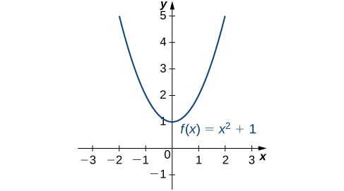
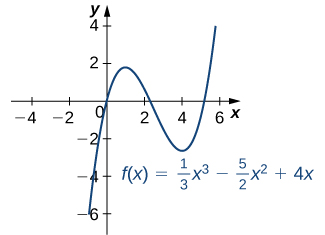
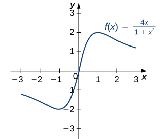
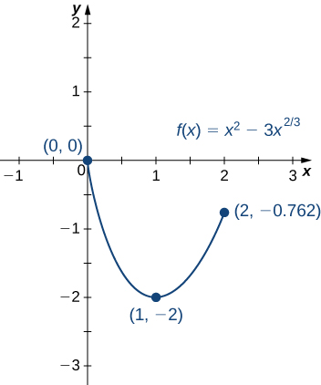
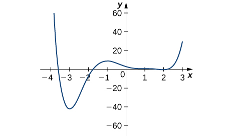
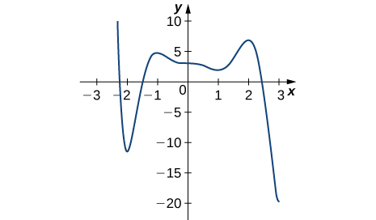
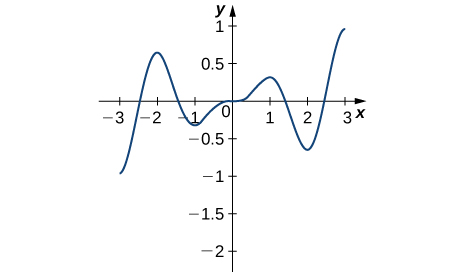

* Define absolute extrema.
* Define local extrema.
* Explain how to find the critical points of a function over a closed interval.
* Describe how to use critical points to locate absolute extrema over a closed interval.

Given a particular function, we are often interested in determining the largest and smallest values of the function. This information is important in creating accurate graphs. Finding the maximum and minimum values of a function also has practical significance because we can use this method to solve optimization problems, such as maximizing profit, minimizing the amount of material used in manufacturing an aluminum can, or finding the maximum height a rocket can reach. In this section, we look at how to use derivatives to find the largest and smallest values for a function.

# Absolute Extrema

Consider the function <math xmlns="http://www.w3.org/1998/Math/MathML"><mrow><mi>f</mi><mo stretchy="false">(</mo><mi>x</mi><mo stretchy="false">)</mo><mo>=</mo><msup><mi>x</mi><mn>2</mn></msup><mo>+</mo><mn>1</mn></mrow></math>

 over the interval <math xmlns="http://www.w3.org/1998/Math/MathML"><mrow><mo stretchy="false">(</mo><mtext>−</mtext><mi>∞</mi><mo>,</mo><mi>∞</mi><mo stretchy="false">)</mo><mo>.</mo></mrow></math>

 As <math xmlns="http://www.w3.org/1998/Math/MathML"><mrow><mi>x</mi><mo stretchy="false">→</mo><mtext>±</mtext><mi>∞</mi><mo>,</mo></mrow></math>

 <math xmlns="http://www.w3.org/1998/Math/MathML"><mrow><mi>f</mi><mo stretchy="false">(</mo><mi>x</mi><mo stretchy="false">)</mo><mo stretchy="false">→</mo><mi>∞</mi><mo>.</mo></mrow></math>

 Therefore, the function does not have a largest value. However, since <math xmlns="http://www.w3.org/1998/Math/MathML"><mrow><msup><mi>x</mi><mn>2</mn></msup><mo>+</mo><mn>1</mn><mo>≥</mo><mn>1</mn></mrow></math>

 for all real numbers <math xmlns="http://www.w3.org/1998/Math/MathML"><mi>x</mi></math>

 and <math xmlns="http://www.w3.org/1998/Math/MathML"><mrow><msup><mi>x</mi><mn>2</mn></msup><mo>+</mo><mn>1</mn><mo>=</mo><mn>1</mn></mrow></math>

 when <math xmlns="http://www.w3.org/1998/Math/MathML"><mrow><mi>x</mi><mo>=</mo><mn>0</mn><mo>,</mo></mrow></math>

 the function has a smallest value, 1, when <math xmlns="http://www.w3.org/1998/Math/MathML"><mrow><mi>x</mi><mo>=</mo><mn>0</mn><mo>.</mo></mrow></math>

 We say that 1 is the absolute minimum of <math xmlns="http://www.w3.org/1998/Math/MathML"><mrow><mi>f</mi><mo stretchy="false">(</mo><mi>x</mi><mo stretchy="false">)</mo><mo>=</mo><msup><mi>x</mi><mn>2</mn></msup><mo>+</mo><mn>1</mn></mrow></math>

 and it occurs at <math xmlns="http://www.w3.org/1998/Math/MathML"><mrow><mi>x</mi><mo>=</mo><mn>0</mn><mo>.</mo></mrow></math>

 We say that <math xmlns="http://www.w3.org/1998/Math/MathML"><mrow><mi>f</mi><mo stretchy="false">(</mo><mi>x</mi><mo stretchy="false">)</mo><mo>=</mo><msup><mi>x</mi><mn>2</mn></msup><mo>+</mo><mn>1</mn></mrow></math>

 does not have an absolute maximum (see the following figure).

 {: #CNX_Calc_Figure_04_03_001}

Definition

Let <math xmlns="http://www.w3.org/1998/Math/MathML"><mi>f</mi></math>

 be a function defined over an interval <math xmlns="http://www.w3.org/1998/Math/MathML"><mi>I</mi></math>

 and let <math xmlns="http://www.w3.org/1998/Math/MathML"><mrow><mi>c</mi><mo>∈</mo><mi>I</mi><mo>.</mo></mrow></math>

 We say <math xmlns="http://www.w3.org/1998/Math/MathML"><mi>f</mi></math>

 has an **absolute maximum**{: data-type="term"} on <math xmlns="http://www.w3.org/1998/Math/MathML"><mi>I</mi></math>

 at <math xmlns="http://www.w3.org/1998/Math/MathML"><mi>c</mi></math>

 if <math xmlns="http://www.w3.org/1998/Math/MathML"><mrow><mi>f</mi><mo stretchy="false">(</mo><mi>c</mi><mo stretchy="false">)</mo><mo>≥</mo><mi>f</mi><mo stretchy="false">(</mo><mi>x</mi><mo stretchy="false">)</mo></mrow></math>

 for all <math xmlns="http://www.w3.org/1998/Math/MathML"><mrow><mi>x</mi><mo>∈</mo><mi>I</mi><mo>.</mo></mrow></math>

 We say <math xmlns="http://www.w3.org/1998/Math/MathML"><mi>f</mi></math>

 has an **absolute minimum**{: data-type="term"} on <math xmlns="http://www.w3.org/1998/Math/MathML"><mi>I</mi></math>

 at <math xmlns="http://www.w3.org/1998/Math/MathML"><mi>c</mi></math>

 if <math xmlns="http://www.w3.org/1998/Math/MathML"><mrow><mi>f</mi><mo stretchy="false">(</mo><mi>c</mi><mo stretchy="false">)</mo><mo>≤</mo><mi>f</mi><mo stretchy="false">(</mo><mi>x</mi><mo stretchy="false">)</mo></mrow></math>

 for all <math xmlns="http://www.w3.org/1998/Math/MathML"><mrow><mi>x</mi><mo>∈</mo><mi>I</mi><mo>.</mo></mrow></math>

 If <math xmlns="http://www.w3.org/1998/Math/MathML"><mi>f</mi></math>

 has an absolute maximum on <math xmlns="http://www.w3.org/1998/Math/MathML"><mi>I</mi></math>

 at <math xmlns="http://www.w3.org/1998/Math/MathML"><mi>c</mi></math>

 or an absolute minimum on <math xmlns="http://www.w3.org/1998/Math/MathML"><mi>I</mi></math>

 at <math xmlns="http://www.w3.org/1998/Math/MathML"><mrow><mi>c</mi><mo>,</mo></mrow></math>

 we say <math xmlns="http://www.w3.org/1998/Math/MathML"><mi>f</mi></math>

 has an **absolute extremum**{: data-type="term"} on <math xmlns="http://www.w3.org/1998/Math/MathML"><mi>I</mi></math>

 at <math xmlns="http://www.w3.org/1998/Math/MathML"><mrow><mi>c</mi><mo>.</mo></mrow></math>

Before proceeding, let’s note two important issues regarding this definition. First, the term *absolute* here does not refer to absolute value. An absolute extremum may be positive, negative, or zero. Second, if a function <math xmlns="http://www.w3.org/1998/Math/MathML"><mi>f</mi></math>

 has an absolute extremum over an interval <math xmlns="http://www.w3.org/1998/Math/MathML"><mi>I</mi></math>

 at <math xmlns="http://www.w3.org/1998/Math/MathML"><mrow><mi>c</mi><mo>,</mo></mrow></math>

 the absolute extremum is <math xmlns="http://www.w3.org/1998/Math/MathML"><mrow><mi>f</mi><mo stretchy="false">(</mo><mi>c</mi><mo stretchy="false">)</mo><mo>.</mo></mrow></math>

 The real number <math xmlns="http://www.w3.org/1998/Math/MathML"><mi>c</mi></math>

 is a point in the domain at which the absolute extremum occurs. For example, consider the function <math xmlns="http://www.w3.org/1998/Math/MathML"><mrow><mi>f</mi><mo stretchy="false">(</mo><mi>x</mi><mo stretchy="false">)</mo><mo>=</mo><mn>1</mn><mtext>/</mtext><mo stretchy="false">(</mo><msup><mi>x</mi><mn>2</mn></msup><mo>+</mo><mn>1</mn><mo stretchy="false">)</mo></mrow></math>

 over the interval <math xmlns="http://www.w3.org/1998/Math/MathML"><mrow><mo stretchy="false">(</mo><mtext>−</mtext><mi>∞</mi><mo>,</mo><mi>∞</mi><mo stretchy="false">)</mo><mo>.</mo></mrow></math>

 Since

<math xmlns="http://www.w3.org/1998/Math/MathML"><mrow><mi>f</mi><mo stretchy="false">(</mo><mn>0</mn><mo stretchy="false">)</mo><mo>=</mo><mn>1</mn><mo>≥</mo><mfrac><mn>1</mn><mrow><msup><mi>x</mi><mn>2</mn></msup><mo>+</mo><mn>1</mn></mrow></mfrac><mo>=</mo><mi>f</mi><mo stretchy="false">(</mo><mi>x</mi><mo stretchy="false">)</mo></mrow></math>

for all real numbers <math xmlns="http://www.w3.org/1998/Math/MathML"><mrow><mi>x</mi><mo>,</mo></mrow></math>

 we say <math xmlns="http://www.w3.org/1998/Math/MathML"><mi>f</mi></math>

 has an absolute maximum over <math xmlns="http://www.w3.org/1998/Math/MathML"><mrow><mo stretchy="false">(</mo><mtext>−</mtext><mi>∞</mi><mo>,</mo><mi>∞</mi><mo stretchy="false">)</mo></mrow></math>

 at <math xmlns="http://www.w3.org/1998/Math/MathML"><mrow><mi>x</mi><mo>=</mo><mn>0</mn><mo>.</mo></mrow></math>

 The absolute maximum is <math xmlns="http://www.w3.org/1998/Math/MathML"><mrow><mi>f</mi><mo stretchy="false">(</mo><mn>0</mn><mo stretchy="false">)</mo><mo>=</mo><mn>1</mn><mo>.</mo></mrow></math>

 It occurs at <math xmlns="http://www.w3.org/1998/Math/MathML"><mrow><mi>x</mi><mo>=</mo><mn>0</mn><mo>,</mo></mrow></math>

 as shown in [\[link\]](#CNX_Calc_Figure_04_03_002)(b).

A function may have both an absolute maximum and an absolute minimum, just one extremum, or neither. [\[link\]](#CNX_Calc_Figure_04_03_002) shows several functions and some of the different possibilities regarding absolute extrema. However, the following theorem, called the **Extreme Value Theorem**{: data-type="term"}, guarantees that a continuous function <math xmlns="http://www.w3.org/1998/Math/MathML"><mi>f</mi></math>

 over a closed, bounded interval <math xmlns="http://www.w3.org/1998/Math/MathML"><mrow><mo stretchy="false">[</mo><mi>a</mi><mo>,</mo><mi>b</mi><mo stretchy="false">]</mo></mrow></math>

 has both an absolute maximum and an absolute minimum.

 ![This figure has six parts a, b, c, d, e, and f. In figure a, the line f(x) = x3 is shown, and it is noted that it has no absolute minimum and no absolute maximum. In figure b, the line f(x) = 1/(x2 + 1) is shown, which is near 0 for most of its length and rises to a bump at (0, 1); it has no absolute minimum, but does have an absolute maximum of 1 at x = 0. In figure c, the line f(x) = cos x is shown, which has absolute minimums of &#x2212;1 at &#xB1;&#x3C0;, &#xB1;3&#x3C0;, &#x2026; and absolute maximums of 1 at 0, &#xB1;2&#x3C0;, &#xB1;4&#x3C0;, &#x2026;. In figure d, the piecewise function f(x) = 2 &#x2013; x2 for 0 &#x2264; x &lt; 2 and x &#x2013; 3 for 2 &#x2264; x &#x2264; 4 is shown, with absolute maximum of 2 at x = 0 and no absolute minimum. In figure e, the function f(x) = (x &#x2013; 2)2 is shown on \[1, 4\], which has absolute maximum of 4 at x = 4 and absolute minimum of 0 at x = 2. In figure f, the function f(x) = x/(2 &#x2212; x) is shown on \[0, 2), with absolute minimum of 0 at x = 0 and no absolute maximum.](../resources/CNX_Calc_Figure_04_03_010.jpg "Graphs (a), (b), and (c) show several possibilities for absolute extrema for functions with a domain of (&#x2212;&#x221E;,&#x221E;). Graphs (d), (e), and (f) show several possibilities for absolute extrema for functions with a domain that is a bounded interval."){: #CNX_Calc_Figure_04_03_002}

Extreme Value Theorem

If <math xmlns="http://www.w3.org/1998/Math/MathML"><mi>f</mi></math>

 is a continuous function over the closed, bounded interval <math xmlns="http://www.w3.org/1998/Math/MathML"><mrow><mo stretchy="false">[</mo><mi>a</mi><mo>,</mo><mi>b</mi><mo stretchy="false">]</mo><mo>,</mo></mrow></math>

 then there is a point in <math xmlns="http://www.w3.org/1998/Math/MathML"><mrow><mo stretchy="false">[</mo><mi>a</mi><mo>,</mo><mi>b</mi><mo stretchy="false">]</mo></mrow></math>

 at which <math xmlns="http://www.w3.org/1998/Math/MathML"><mi>f</mi></math>

 has an absolute maximum over <math xmlns="http://www.w3.org/1998/Math/MathML"><mrow><mo stretchy="false">[</mo><mi>a</mi><mo>,</mo><mi>b</mi><mo stretchy="false">]</mo></mrow></math>

 and there is a point in <math xmlns="http://www.w3.org/1998/Math/MathML"><mrow><mo stretchy="false">[</mo><mi>a</mi><mo>,</mo><mi>b</mi><mo stretchy="false">]</mo></mrow></math>

 at which <math xmlns="http://www.w3.org/1998/Math/MathML"><mi>f</mi></math>

 has an absolute minimum over <math xmlns="http://www.w3.org/1998/Math/MathML"><mrow><mo stretchy="false">[</mo><mi>a</mi><mo>,</mo><mi>b</mi><mo stretchy="false">]</mo><mo>.</mo></mrow></math>

The proof of the extreme value theorem is beyond the scope of this text. Typically, it is proved in a course on real analysis. There are a couple of key points to note about the statement of this theorem. For the extreme value theorem to apply, the function must be continuous over a closed, bounded interval. If the interval <math xmlns="http://www.w3.org/1998/Math/MathML"><mi>I</mi></math>

 is open or the function has even one point of discontinuity, the function may not have an absolute maximum or absolute minimum over <math xmlns="http://www.w3.org/1998/Math/MathML"><mi>I</mi><mo>.</mo></math>

 For example, consider the functions shown in [\[link\]](#CNX_Calc_Figure_04_03_002)(d), (e), and (f). All three of these functions are defined over bounded intervals. However, the function in graph (e) is the only one that has both an absolute maximum and an absolute minimum over its domain. The extreme value theorem cannot be applied to the functions in graphs (d) and (f) because neither of these functions is continuous over a closed, bounded interval. Although the function in graph (d) is defined over the closed interval <math xmlns="http://www.w3.org/1998/Math/MathML"><mrow><mo stretchy="false">[</mo><mn>0</mn><mo>,</mo><mn>4</mn><mo stretchy="false">]</mo><mo>,</mo></mrow></math>

 the function is discontinuous at <math xmlns="http://www.w3.org/1998/Math/MathML"><mrow><mi>x</mi><mo>=</mo><mn>2</mn><mo>.</mo></mrow></math>

 The function has an absolute maximum over <math xmlns="http://www.w3.org/1998/Math/MathML"><mrow><mo stretchy="false">[</mo><mn>0</mn><mo>,</mo><mn>4</mn><mo stretchy="false">]</mo></mrow></math>

 but does not have an absolute minimum. The function in graph (f) is continuous over the half-open interval <math xmlns="http://www.w3.org/1998/Math/MathML"><mrow><mo stretchy="false">[</mo><mn>0</mn><mo>,</mo><mn>2</mn><mo stretchy="false">)</mo><mo>,</mo></mrow></math>

 but is not defined at <math xmlns="http://www.w3.org/1998/Math/MathML"><mrow><mi>x</mi><mo>=</mo><mn>2</mn><mo>,</mo></mrow></math>

 and therefore is not continuous over a closed, bounded interval. The function has an absolute minimum over <math xmlns="http://www.w3.org/1998/Math/MathML"><mrow><mo stretchy="false">[</mo><mn>0</mn><mo>,</mo><mn>2</mn><mo stretchy="false">)</mo><mo>,</mo></mrow></math>

 but does not have an absolute maximum over <math xmlns="http://www.w3.org/1998/Math/MathML"><mrow><mo stretchy="false">[</mo><mn>0</mn><mo>,</mo><mn>2</mn><mo stretchy="false">)</mo><mo>.</mo></mrow></math>

 These two graphs illustrate why a function over a bounded interval may fail to have an absolute maximum and/or absolute minimum.

Before looking at how to find absolute extrema, let’s examine the related concept of local extrema. This idea is useful in determining where absolute extrema occur.

# Local Extrema and Critical Points

Consider the function <math xmlns="http://www.w3.org/1998/Math/MathML"><mi>f</mi></math>

 shown in [\[link\]](#CNX_Calc_Figure_04_03_003). The graph can be described as two mountains with a valley in the middle. The absolute maximum value of the function occurs at the higher peak, at <math xmlns="http://www.w3.org/1998/Math/MathML"><mrow><mi>x</mi><mo>=</mo><mn>2</mn><mo>.</mo></mrow></math>

 However, <math xmlns="http://www.w3.org/1998/Math/MathML"><mrow><mi>x</mi><mo>=</mo><mn>0</mn></mrow></math>

 is also a point of interest. Although <math xmlns="http://www.w3.org/1998/Math/MathML"><mrow><mi>f</mi><mrow><mo>(</mo><mn>0</mn><mo>)</mo></mrow></mrow></math>

 is not the largest value of <math xmlns="http://www.w3.org/1998/Math/MathML"><mrow><mi>f</mi><mo>,</mo></mrow></math>

 the value <math xmlns="http://www.w3.org/1998/Math/MathML"><mrow><mi>f</mi><mrow><mo>(</mo><mn>0</mn><mo>)</mo></mrow></mrow></math>

 is larger than <math xmlns="http://www.w3.org/1998/Math/MathML"><mrow><mi>f</mi><mrow><mo>(</mo><mi>x</mi><mo>)</mo></mrow></mrow></math>

 for all <math xmlns="http://www.w3.org/1998/Math/MathML"><mi>x</mi></math>

 near 0. We say <math xmlns="http://www.w3.org/1998/Math/MathML"><mi>f</mi></math>

 has a local maximum at <math xmlns="http://www.w3.org/1998/Math/MathML"><mrow><mi>x</mi><mo>=</mo><mn>0</mn><mo>.</mo></mrow></math>

 Similarly, the function <math xmlns="http://www.w3.org/1998/Math/MathML"><mi>f</mi></math>

 does not have an absolute minimum, but it does have a local minimum at <math xmlns="http://www.w3.org/1998/Math/MathML"><mrow><mi>x</mi><mo>=</mo><mn>1</mn></mrow></math>

 because <math xmlns="http://www.w3.org/1998/Math/MathML"><mrow><mi>f</mi><mrow><mo>(</mo><mn>1</mn><mo>)</mo></mrow></mrow></math>

 is less than <math xmlns="http://www.w3.org/1998/Math/MathML"><mrow><mi>f</mi><mrow><mo>(</mo><mi>x</mi><mo>)</mo></mrow></mrow></math>

 for <math xmlns="http://www.w3.org/1998/Math/MathML"><mi>x</mi></math>

 near 1.

 {: #CNX_Calc_Figure_04_03_003}

Definition

A function <math xmlns="http://www.w3.org/1998/Math/MathML"><mi>f</mi></math>

 has a **local maximum**{: data-type="term"} at <math xmlns="http://www.w3.org/1998/Math/MathML"><mi>c</mi></math>

 if there exists an open interval <math xmlns="http://www.w3.org/1998/Math/MathML"><mi>I</mi></math>

 containing <math xmlns="http://www.w3.org/1998/Math/MathML"><mi>c</mi></math>

 such that <math xmlns="http://www.w3.org/1998/Math/MathML"><mi>I</mi></math>

 is contained in the domain of <math xmlns="http://www.w3.org/1998/Math/MathML"><mi>f</mi></math>

 and <math xmlns="http://www.w3.org/1998/Math/MathML"><mrow><mi>f</mi><mo stretchy="false">(</mo><mi>c</mi><mo stretchy="false">)</mo><mo>≥</mo><mi>f</mi><mo stretchy="false">(</mo><mi>x</mi><mo stretchy="false">)</mo></mrow></math>

 for all <math xmlns="http://www.w3.org/1998/Math/MathML"><mrow><mi>x</mi><mo>∈</mo><mi>I</mi><mo>.</mo></mrow></math>

 A function <math xmlns="http://www.w3.org/1998/Math/MathML"><mi>f</mi></math>

 has a **local minimum**{: data-type="term"} at <math xmlns="http://www.w3.org/1998/Math/MathML"><mi>c</mi></math>

 if there exists an open interval <math xmlns="http://www.w3.org/1998/Math/MathML"><mi>I</mi></math>

 containing <math xmlns="http://www.w3.org/1998/Math/MathML"><mi>c</mi></math>

 such that <math xmlns="http://www.w3.org/1998/Math/MathML"><mi>I</mi></math>

 is contained in the domain of <math xmlns="http://www.w3.org/1998/Math/MathML"><mi>f</mi></math>

 and <math xmlns="http://www.w3.org/1998/Math/MathML"><mrow><mi>f</mi><mo stretchy="false">(</mo><mi>c</mi><mo stretchy="false">)</mo><mo>≤</mo><mi>f</mi><mo stretchy="false">(</mo><mi>x</mi><mo stretchy="false">)</mo></mrow></math>

 for all <math xmlns="http://www.w3.org/1998/Math/MathML"><mrow><mi>x</mi><mo>∈</mo><mi>I</mi><mo>.</mo></mrow></math>

 A function <math xmlns="http://www.w3.org/1998/Math/MathML"><mi>f</mi></math>

 has a **local extremum**{: data-type="term"} at <math xmlns="http://www.w3.org/1998/Math/MathML"><mi>c</mi></math>

 if <math xmlns="http://www.w3.org/1998/Math/MathML"><mi>f</mi></math>

 has a local maximum at <math xmlns="http://www.w3.org/1998/Math/MathML"><mi>c</mi></math>

 or <math xmlns="http://www.w3.org/1998/Math/MathML"><mi>f</mi></math>

 has a local minimum at <math xmlns="http://www.w3.org/1998/Math/MathML"><mrow><mi>c</mi><mo>.</mo></mrow></math>

Note that if <math xmlns="http://www.w3.org/1998/Math/MathML"><mi>f</mi></math>

 has an absolute extremum at <math xmlns="http://www.w3.org/1998/Math/MathML"><mi>c</mi></math>

 and <math xmlns="http://www.w3.org/1998/Math/MathML"><mi>f</mi></math>

 is defined over an interval containing <math xmlns="http://www.w3.org/1998/Math/MathML"><mrow><mi>c</mi><mo>,</mo></mrow></math>

 then <math xmlns="http://www.w3.org/1998/Math/MathML"><mrow><mi>f</mi><mo stretchy="false">(</mo><mi>c</mi><mo stretchy="false">)</mo></mrow></math>

 is also considered a local extremum. If an absolute extremum for a function <math xmlns="http://www.w3.org/1998/Math/MathML"><mi>f</mi></math>

 occurs at an endpoint, we do not consider that to be a local extremum, but instead refer to that as an endpoint extremum.

Given the graph of a function <math xmlns="http://www.w3.org/1998/Math/MathML"><mrow><mi>f</mi><mo>,</mo></mrow></math>

 it is sometimes easy to see where a local maximum or local minimum occurs. However, it is not always easy to see, since the interesting features on the graph of a function may not be visible because they occur at a very small scale. Also, we may not have a graph of the function. In these cases, how can we use a formula for a function to determine where these extrema occur?

To answer this question, let’s look at [\[link\]](#CNX_Calc_Figure_04_03_003) again. The local extrema occur at <math xmlns="http://www.w3.org/1998/Math/MathML"><mrow><mi>x</mi><mo>=</mo><mn>0</mn><mo>,</mo></mrow></math>

 <math xmlns="http://www.w3.org/1998/Math/MathML"><mrow><mi>x</mi><mo>=</mo><mn>1</mn><mo>,</mo></mrow></math>

 and <math xmlns="http://www.w3.org/1998/Math/MathML"><mrow><mi>x</mi><mo>=</mo><mn>2</mn><mo>.</mo></mrow></math>

 Notice that at <math xmlns="http://www.w3.org/1998/Math/MathML"><mrow><mi>x</mi><mo>=</mo><mn>0</mn></mrow></math>

 and <math xmlns="http://www.w3.org/1998/Math/MathML"><mrow><mi>x</mi><mo>=</mo><mn>1</mn><mo>,</mo></mrow></math>

 the derivative <math xmlns="http://www.w3.org/1998/Math/MathML"><mrow><mi>f</mi><mo>′</mo><mo stretchy="false">(</mo><mi>x</mi><mo stretchy="false">)</mo><mo>=</mo><mn>0</mn><mo>.</mo></mrow></math>

 At <math xmlns="http://www.w3.org/1998/Math/MathML"><mrow><mi>x</mi><mo>=</mo><mn>2</mn><mo>,</mo></mrow></math>

 the derivative <math xmlns="http://www.w3.org/1998/Math/MathML"><mrow><mi>f</mi><mo>′</mo><mrow><mo>(</mo><mi>x</mi><mo>)</mo></mrow></mrow></math>

 does not exist, since the function <math xmlns="http://www.w3.org/1998/Math/MathML"><mi>f</mi></math>

 has a corner there. In fact, if <math xmlns="http://www.w3.org/1998/Math/MathML"><mi>f</mi></math>

 has a local extremum at a point <math xmlns="http://www.w3.org/1998/Math/MathML"><mrow><mi>x</mi><mo>=</mo><mi>c</mi><mo>,</mo></mrow></math>

 the derivative <math xmlns="http://www.w3.org/1998/Math/MathML"><mrow><mi>f</mi><mo>′</mo><mo stretchy="false">(</mo><mi>c</mi><mo stretchy="false">)</mo></mrow></math>

 must satisfy one of the following conditions: either <math xmlns="http://www.w3.org/1998/Math/MathML"><mrow><mi>f</mi><mo>′</mo><mo stretchy="false">(</mo><mi>c</mi><mo stretchy="false">)</mo><mo>=</mo><mn>0</mn></mrow></math>

 or <math xmlns="http://www.w3.org/1998/Math/MathML"><mrow><mi>f</mi><mo>′</mo><mrow><mo>(</mo><mi>c</mi><mo>)</mo></mrow></mrow></math>

 is undefined. Such a value <math xmlns="http://www.w3.org/1998/Math/MathML"><mi>c</mi></math>

 is known as a critical point and it is important in finding extreme values for functions.

Definition

Let <math xmlns="http://www.w3.org/1998/Math/MathML"><mi>c</mi></math>

 be an interior point in the domain of <math xmlns="http://www.w3.org/1998/Math/MathML"><mrow><mi>f</mi><mo>.</mo></mrow></math>

 We say that <math xmlns="http://www.w3.org/1998/Math/MathML"><mi>c</mi></math>

 is a **critical point**{: data-type="term"} of <math xmlns="http://www.w3.org/1998/Math/MathML"><mi>f</mi></math>

 if <math xmlns="http://www.w3.org/1998/Math/MathML"><mrow><mi>f</mi><mo>′</mo><mrow><mo>(</mo><mi>c</mi><mo>)</mo></mrow><mo>=</mo><mn>0</mn></mrow></math>

 or <math xmlns="http://www.w3.org/1998/Math/MathML"><mrow><mi>f</mi><mo>′</mo><mrow><mo>(</mo><mi>c</mi><mo>)</mo></mrow></mrow></math>

 is undefined.

As mentioned earlier, if <math xmlns="http://www.w3.org/1998/Math/MathML"><mi>f</mi></math>

 has a local extremum at a point <math xmlns="http://www.w3.org/1998/Math/MathML"><mrow><mi>x</mi><mo>=</mo><mi>c</mi><mo>,</mo></mrow></math>

 then <math xmlns="http://www.w3.org/1998/Math/MathML"><mi>c</mi></math>

 must be a critical point of <math xmlns="http://www.w3.org/1998/Math/MathML"><mrow><mi>f</mi><mo>.</mo></mrow></math>

 This fact is known as **Fermat’s theorem**{: data-type="term"}.

Fermat’s Theorem

If <math xmlns="http://www.w3.org/1998/Math/MathML"><mi>f</mi></math>

 has a local extremum at <math xmlns="http://www.w3.org/1998/Math/MathML"><mi>c</mi></math>

 and <math xmlns="http://www.w3.org/1998/Math/MathML"><mi>f</mi></math>

 is differentiable at <math xmlns="http://www.w3.org/1998/Math/MathML"><mrow><mi>c</mi><mo>,</mo></mrow></math>

 then <math xmlns="http://www.w3.org/1998/Math/MathML"><mrow><mi>f</mi><mo>′</mo><mrow><mo>(</mo><mi>c</mi><mo>)</mo></mrow><mo>=</mo><mn>0</mn><mo>.</mo></mrow></math>

## Proof

Suppose <math xmlns="http://www.w3.org/1998/Math/MathML"><mi>f</mi></math>

 has a local extremum at <math xmlns="http://www.w3.org/1998/Math/MathML"><mi>c</mi></math>

 and <math xmlns="http://www.w3.org/1998/Math/MathML"><mi>f</mi></math>

 is differentiable at <math xmlns="http://www.w3.org/1998/Math/MathML"><mrow><mi>c</mi><mo>.</mo></mrow></math>

 We need to show that <math xmlns="http://www.w3.org/1998/Math/MathML"><mrow><mi>f</mi><mo>′</mo><mrow><mo>(</mo><mi>c</mi><mo>)</mo></mrow><mo>=</mo><mn>0</mn><mo>.</mo></mrow></math>

 To do this, we will show that <math xmlns="http://www.w3.org/1998/Math/MathML"><mrow><mi>f</mi><mo>′</mo><mrow><mo>(</mo><mi>c</mi><mo>)</mo></mrow><mo>≥</mo><mn>0</mn></mrow></math>

 and <math xmlns="http://www.w3.org/1998/Math/MathML"><mrow><mi>f</mi><mo>′</mo><mrow><mo>(</mo><mi>c</mi><mo>)</mo></mrow><mo>≤</mo><mn>0</mn><mo>,</mo></mrow></math>

 and therefore <math xmlns="http://www.w3.org/1998/Math/MathML"><mrow><mi>f</mi><mo>′</mo><mrow><mo>(</mo><mi>c</mi><mo>)</mo></mrow><mo>=</mo><mn>0</mn><mo>.</mo></mrow></math>

 Since <math xmlns="http://www.w3.org/1998/Math/MathML"><mi>f</mi></math>

 has a local extremum at <math xmlns="http://www.w3.org/1998/Math/MathML"><mrow><mi>c</mi><mo>,</mo></mrow></math>

 <math xmlns="http://www.w3.org/1998/Math/MathML"><mi>f</mi></math>

 has a local maximum or local minimum at <math xmlns="http://www.w3.org/1998/Math/MathML"><mrow><mi>c</mi><mo>.</mo></mrow></math>

 Suppose <math xmlns="http://www.w3.org/1998/Math/MathML"><mi>f</mi></math>

 has a local maximum at <math xmlns="http://www.w3.org/1998/Math/MathML"><mrow><mi>c</mi><mo>.</mo></mrow></math>

 The case in which <math xmlns="http://www.w3.org/1998/Math/MathML"><mi>f</mi></math>

 has a local minimum at <math xmlns="http://www.w3.org/1998/Math/MathML"><mi>c</mi></math>

 can be handled similarly. There then exists an open interval <math xmlns="http://www.w3.org/1998/Math/MathML"><mi>I</mi></math>

 such that <math xmlns="http://www.w3.org/1998/Math/MathML"><mrow><mi>f</mi><mrow><mo>(</mo><mi>c</mi><mo>)</mo></mrow><mo>≥</mo><mi>f</mi><mrow><mo>(</mo><mi>x</mi><mo>)</mo></mrow></mrow></math>

 for all <math xmlns="http://www.w3.org/1998/Math/MathML"><mrow><mi>x</mi><mo>∈</mo><mi>I</mi><mo>.</mo></mrow></math>

 Since <math xmlns="http://www.w3.org/1998/Math/MathML"><mi>f</mi></math>

 is differentiable at <math xmlns="http://www.w3.org/1998/Math/MathML"><mrow><mi>c</mi><mo>,</mo></mrow></math>

 from the definition of the derivative, we know that

<math xmlns="http://www.w3.org/1998/Math/MathML"><mrow><mi>f</mi><mo>′</mo><mo stretchy="false">(</mo><mi>c</mi><mo stretchy="false">)</mo><mo>=</mo><munder><mrow><mtext>lim</mtext></mrow><mrow><mi>x</mi><mo stretchy="false">→</mo><mi>c</mi></mrow></munder><mfrac><mrow><mi>f</mi><mrow><mo>(</mo><mi>x</mi><mo>)</mo></mrow><mo>−</mo><mi>f</mi><mrow><mo>(</mo><mi>c</mi><mo>)</mo></mrow></mrow><mrow><mi>x</mi><mo>−</mo><mi>c</mi></mrow></mfrac><mo>.</mo></mrow></math>

Since this limit exists, both one-sided limits also exist and equal <math xmlns="http://www.w3.org/1998/Math/MathML"><mrow><mi>f</mi><mo>′</mo><mo stretchy="false">(</mo><mi>c</mi><mo stretchy="false">)</mo><mo>.</mo></mrow></math>

 Therefore,

<math xmlns="http://www.w3.org/1998/Math/MathML"><mrow><mi>f</mi><mo>′</mo><mo stretchy="false">(</mo><mi>c</mi><mo stretchy="false">)</mo><mo>=</mo><munder><mrow><mtext>lim</mtext></mrow><mrow><mi>x</mi><mo stretchy="false">→</mo><msup><mi>c</mi><mo>+</mo></msup></mrow></munder><mfrac><mrow><mi>f</mi><mo stretchy="false">(</mo><mi>x</mi><mo stretchy="false">)</mo><mo>−</mo><mi>f</mi><mo stretchy="false">(</mo><mi>c</mi><mo stretchy="false">)</mo></mrow><mrow><mi>x</mi><mo>−</mo><mi>c</mi></mrow></mfrac><mo>,</mo></mrow></math>

and

<math xmlns="http://www.w3.org/1998/Math/MathML"><mrow><mi>f</mi><mo>′</mo><mo stretchy="false">(</mo><mi>c</mi><mo stretchy="false">)</mo><mo>=</mo><munder><mrow><mtext>lim</mtext></mrow><mrow><mi>x</mi><mo stretchy="false">→</mo><msup><mi>c</mi><mo>−</mo></msup></mrow></munder><mfrac><mrow><mi>f</mi><mo stretchy="false">(</mo><mi>x</mi><mo stretchy="false">)</mo><mo>−</mo><mi>f</mi><mo stretchy="false">(</mo><mi>c</mi><mo stretchy="false">)</mo></mrow><mrow><mi>x</mi><mo>−</mo><mi>c</mi></mrow></mfrac><mo>.</mo></mrow></math>

Since <math xmlns="http://www.w3.org/1998/Math/MathML"><mrow><mi>f</mi><mo stretchy="false">(</mo><mi>c</mi><mo stretchy="false">)</mo></mrow></math>

 is a local maximum, we see that <math xmlns="http://www.w3.org/1998/Math/MathML"><mrow><mi>f</mi><mo stretchy="false">(</mo><mi>x</mi><mo stretchy="false">)</mo><mo>−</mo><mi>f</mi><mo stretchy="false">(</mo><mi>c</mi><mo stretchy="false">)</mo><mo>≤</mo><mn>0</mn></mrow></math>

 for <math xmlns="http://www.w3.org/1998/Math/MathML"><mi>x</mi></math>

 near <math xmlns="http://www.w3.org/1998/Math/MathML"><mrow><mi>c</mi><mo>.</mo></mrow></math>

 Therefore, for <math xmlns="http://www.w3.org/1998/Math/MathML"><mi>x</mi></math>

 near <math xmlns="http://www.w3.org/1998/Math/MathML"><mrow><mi>c</mi><mo>,</mo></mrow></math>

 but <math xmlns="http://www.w3.org/1998/Math/MathML"><mrow><mi>x</mi><mo>&gt;</mo><mi>c</mi><mo>,</mo></mrow></math>

 we have <math xmlns="http://www.w3.org/1998/Math/MathML"><mrow><mfrac><mrow><mi>f</mi><mrow><mo>(</mo><mi>x</mi><mo>)</mo></mrow><mo>−</mo><mi>f</mi><mrow><mo>(</mo><mi>c</mi><mo>)</mo></mrow></mrow><mrow><mi>x</mi><mo>−</mo><mi>c</mi></mrow></mfrac><mo>≤</mo><mn>0</mn><mo>.</mo></mrow></math>

 From [\[link\]](#fs-id1165040744293) we conclude that <math xmlns="http://www.w3.org/1998/Math/MathML"><mrow><mi>f</mi><mo>′</mo><mo stretchy="false">(</mo><mi>c</mi><mo stretchy="false">)</mo><mo>≤</mo><mn>0</mn><mo>.</mo></mrow></math>

 Similarly, it can be shown that <math xmlns="http://www.w3.org/1998/Math/MathML"><mrow><mi>f</mi><mo>′</mo><mrow><mo>(</mo><mi>c</mi><mo>)</mo></mrow><mo>≥</mo><mn>0</mn><mo>.</mo></mrow></math>

 Therefore, <math xmlns="http://www.w3.org/1998/Math/MathML"><mrow><mi>f</mi><mo>′</mo><mo stretchy="false">(</mo><mi>c</mi><mo stretchy="false">)</mo><mo>=</mo><mn>0</mn><mo>.</mo></mrow></math>

□

From Fermat’s theorem, we conclude that if <math xmlns="http://www.w3.org/1998/Math/MathML"><mi>f</mi></math>

 has a local extremum at <math xmlns="http://www.w3.org/1998/Math/MathML"><mrow><mi>c</mi><mo>,</mo></mrow></math>

 then either <math xmlns="http://www.w3.org/1998/Math/MathML"><mrow><mi>f</mi><mo>′</mo><mrow><mo>(</mo><mi>c</mi><mo>)</mo></mrow><mo>=</mo><mn>0</mn></mrow></math>

 or <math xmlns="http://www.w3.org/1998/Math/MathML"><mrow><mi>f</mi><mo>′</mo><mrow><mo>(</mo><mi>c</mi><mo>)</mo></mrow></mrow></math>

 is undefined. In other words, local extrema can only occur at critical points.

Note this theorem does not claim that a function <math xmlns="http://www.w3.org/1998/Math/MathML"><mi>f</mi></math>

 must have a local extremum at a critical point. Rather, it states that critical points are candidates for local extrema. For example, consider the function <math xmlns="http://www.w3.org/1998/Math/MathML"><mrow><mi>f</mi><mrow><mo>(</mo><mi>x</mi><mo>)</mo></mrow><mo>=</mo><msup><mi>x</mi><mn>3</mn></msup><mo>.</mo></mrow></math>

 We have <math xmlns="http://www.w3.org/1998/Math/MathML"><mrow><mi>f</mi><mo>′</mo><mrow><mo>(</mo><mi>x</mi><mo>)</mo></mrow><mo>=</mo><mn>3</mn><msup><mi>x</mi><mn>2</mn></msup><mo>=</mo><mn>0</mn></mrow></math>

 when <math xmlns="http://www.w3.org/1998/Math/MathML"><mrow><mi>x</mi><mo>=</mo><mn>0</mn><mo>.</mo></mrow></math>

 Therefore, <math xmlns="http://www.w3.org/1998/Math/MathML"><mrow><mi>x</mi><mo>=</mo><mn>0</mn></mrow></math>

 is a critical point. However, <math xmlns="http://www.w3.org/1998/Math/MathML"><mrow><mi>f</mi><mo stretchy="false">(</mo><mi>x</mi><mo stretchy="false">)</mo><mo>=</mo><msup><mi>x</mi><mn>3</mn></msup></mrow></math>

 is increasing over <math xmlns="http://www.w3.org/1998/Math/MathML"><mrow><mo stretchy="false">(</mo><mtext>−</mtext><mi>∞</mi><mo>,</mo><mi>∞</mi><mo stretchy="false">)</mo><mo>,</mo></mrow></math>

 and thus <math xmlns="http://www.w3.org/1998/Math/MathML"><mi>f</mi></math>

 does not have a local extremum at <math xmlns="http://www.w3.org/1998/Math/MathML"><mrow><mi>x</mi><mo>=</mo><mn>0</mn><mo>.</mo></mrow></math>

 In [\[link\]](#CNX_Calc_Figure_04_03_004), we see several different possibilities for critical points. In some of these cases, the functions have local extrema at critical points, whereas in other cases the functions do not. Note that these graphs do not show all possibilities for the behavior of a function at a critical point.

 ![This figure has five parts a, b, c, d, and e. In figure a, a parabola is shown facing down in quadrant I; there is a horizontal tangent line at the local maximum marked f&#x2019;(c) = 0. In figure b, there is a function drawn with an asymptote at c, meaning that the function increases toward infinity on both sides of c; it is noted that f&#x2019;(c) is undefined. In figure c, a version of the absolute value graph is shown that has been shifted so that its minimum is in quadrant I with x = c. It is noted that f&#x2019;(c) is undefined. In figure d, a version of the function f(x) = x3 is shown that has been shifted so that its inflection point is in quadrant I with x = c. Its inflection point at (c, f(c)) has a horizontal line through it, and it is noted that f&#x2019;(c) = 0. In figure e, a version of the function f(x) = x1/3 is shown that has been shifted so that its inflection point is in quadrant I with x = c. Its inflection point at (c, f(c)) has a vertical line through it, and it is noted that f&#x2019;(c) is undefined.](../resources/CNX_Calc_Figure_04_03_004.jpg "(a&#x2013;e) A function f has a critical point at c if f&#x2032;(c)=0 or f&#x2032;(c) is undefined. A function may or may not have a local extremum at a critical point."){: #CNX_Calc_Figure_04_03_004}

Later in this chapter we look at analytical methods for determining whether a function actually has a local extremum at a critical point. For now, let’s turn our attention to finding critical points. We will use graphical observations to determine whether a critical point is associated with a local extremum.

Locating Critical Points

For each of the following functions, find all critical points. Use a graphing utility to determine whether the function has a local extremum at each of the critical points.

1.  <math xmlns="http://www.w3.org/1998/Math/MathML"><mrow><mi>f</mi><mrow><mo>(</mo><mi>x</mi><mo>)</mo></mrow><mo>=</mo><mfrac><mn>1</mn><mn>3</mn></mfrac><msup><mi>x</mi><mn>3</mn></msup><mo>−</mo><mfrac><mn>5</mn><mn>2</mn></mfrac><msup><mi>x</mi><mn>2</mn></msup><mo>+</mo><mn>4</mn><mi>x</mi></mrow></math>

2.  <math xmlns="http://www.w3.org/1998/Math/MathML"><mrow><mi>f</mi><mrow><mo>(</mo><mi>x</mi><mo>)</mo></mrow><mo>=</mo><msup><mrow><mrow><mo>(</mo><mrow><msup><mi>x</mi><mn>2</mn></msup><mo>−</mo><mn>1</mn></mrow><mo>)</mo></mrow></mrow><mn>3</mn></msup></mrow></math>

3.  <math xmlns="http://www.w3.org/1998/Math/MathML"><mrow><mi>f</mi><mrow><mo>(</mo><mi>x</mi><mo>)</mo></mrow><mo>=</mo><mfrac><mrow><mn>4</mn><mi>x</mi></mrow><mrow><mn>1</mn><mo>+</mo><msup><mi>x</mi><mn>2</mn></msup></mrow></mfrac></mrow></math>
{: data-number-style="lower-alpha"}

1.  The derivative
    <math xmlns="http://www.w3.org/1998/Math/MathML"><mrow><mi>f</mi><mo>′</mo><mrow><mo>(</mo><mi>x</mi><mo>)</mo></mrow><mo>=</mo><msup><mi>x</mi><mn>2</mn></msup><mo>−</mo><mn>5</mn><mi>x</mi><mo>+</mo><mn>4</mn></mrow></math>
    
    is defined for all real numbers
    <math xmlns="http://www.w3.org/1998/Math/MathML"><mrow><mi>x</mi><mo>.</mo></mrow></math>
    
    Therefore, we only need to find the values for
    <math xmlns="http://www.w3.org/1998/Math/MathML"><mi>x</mi></math>
    
    where
    <math xmlns="http://www.w3.org/1998/Math/MathML"><mrow><mi>f</mi><mo>′</mo><mrow><mo>(</mo><mi>x</mi><mo>)</mo></mrow><mo>=</mo><mn>0</mn><mo>.</mo></mrow></math>
    
    Since
    <math xmlns="http://www.w3.org/1998/Math/MathML"><mrow><mi>f</mi><mo>′</mo><mrow><mo>(</mo><mi>x</mi><mo>)</mo></mrow><mo>=</mo><msup><mi>x</mi><mn>2</mn></msup><mo>−</mo><mn>5</mn><mi>x</mi><mo>+</mo><mn>4</mn><mo>=</mo><mrow><mo>(</mo><mrow><mi>x</mi><mo>−</mo><mn>4</mn></mrow><mo>)</mo></mrow><mrow><mo>(</mo><mrow><mi>x</mi><mo>−</mo><mn>1</mn></mrow><mo>)</mo></mrow><mo>,</mo></mrow></math>
    
    the critical points are
    <math xmlns="http://www.w3.org/1998/Math/MathML"><mrow><mi>x</mi><mo>=</mo><mn>1</mn></mrow></math>
    
    and
    <math xmlns="http://www.w3.org/1998/Math/MathML"><mrow><mi>x</mi><mo>=</mo><mn>4</mn><mo>.</mo></mrow></math>
    
    From the graph of
    <math xmlns="http://www.w3.org/1998/Math/MathML"><mi>f</mi></math>
    
    in [[link]](#CNX_Calc_Figure_04_03_005), we see that
    <math xmlns="http://www.w3.org/1998/Math/MathML"><mi>f</mi></math>
    
    has a local maximum at
    <math xmlns="http://www.w3.org/1998/Math/MathML"><mrow><mi>x</mi><mo>=</mo><mn>1</mn></mrow></math>
    
    and a local minimum at
    <math xmlns="http://www.w3.org/1998/Math/MathML"><mrow><mi>x</mi><mo>=</mo><mn>4</mn><mo>.</mo></mrow></math>
    
    * * *
    {: data-type="newline"}
    
    {: #CNX_Calc_Figure_04_03_005}

2.  Using the chain rule, we see the derivative is
    * * *
    {: data-type="newline"}
    
    

    <math xmlns="http://www.w3.org/1998/Math/MathML"><mrow><mi>f</mi><mo>′</mo><mrow><mo>(</mo><mi>x</mi><mo>)</mo></mrow><mo>=</mo><mn>3</mn><msup><mrow><mrow><mo>(</mo><mrow><msup><mi>x</mi><mn>2</mn></msup><mo>−</mo><mn>1</mn></mrow><mo>)</mo></mrow></mrow><mn>2</mn></msup><mrow><mo>(</mo><mrow><mn>2</mn><mi>x</mi></mrow><mo>)</mo></mrow><mo>=</mo><mn>6</mn><mi>x</mi><msup><mrow><mrow><mo>(</mo><mrow><msup><mi>x</mi><mn>2</mn></msup><mo>−</mo><mn>1</mn></mrow><mo>)</mo></mrow></mrow><mn>2</mn></msup><mo>.</mo></mrow></math>
    

    
    * * *
    {: data-type="newline"}
    
    Therefore,
    <math xmlns="http://www.w3.org/1998/Math/MathML"><mi>f</mi></math>
    
    has critical points when
    <math xmlns="http://www.w3.org/1998/Math/MathML"><mrow><mi>x</mi><mo>=</mo><mn>0</mn></mrow></math>
    
    and when
    <math xmlns="http://www.w3.org/1998/Math/MathML"><mrow><msup><mi>x</mi><mn>2</mn></msup><mo>−</mo><mn>1</mn><mo>=</mo><mn>0</mn><mo>.</mo></mrow></math>
    
    We conclude that the critical points are
    <math xmlns="http://www.w3.org/1998/Math/MathML"><mrow><mi>x</mi><mo>=</mo><mn>0</mn><mo>,</mo><mtext>±</mtext><mn>1</mn><mo>.</mo></mrow></math>
    
    From the graph of
    <math xmlns="http://www.w3.org/1998/Math/MathML"><mi>f</mi></math>
    
    in [[link]](#CNX_Calc_Figure_04_03_006), we see that
    <math xmlns="http://www.w3.org/1998/Math/MathML"><mi>f</mi></math>
    
    has a local (and absolute) minimum at
    <math xmlns="http://www.w3.org/1998/Math/MathML"><mrow><mi>x</mi><mo>=</mo><mn>0</mn><mo>,</mo></mrow></math>
    
    but does not have a local extremum at
    <math xmlns="http://www.w3.org/1998/Math/MathML"><mrow><mi>x</mi><mo>=</mo><mn>1</mn></mrow></math>
    
    or
    <math xmlns="http://www.w3.org/1998/Math/MathML"><mrow><mi>x</mi><mo>=</mo><mn>−1</mn><mo>.</mo></mrow></math>
    
    * * *
    {: data-type="newline"}
    
     minimum at x=0, but does not have extrema at the other two critical points."){: #CNX_Calc_Figure_04_03_006}

3.  By the chain rule, we see that the derivative is
    * * *
    {: data-type="newline"}
    
    

    <math xmlns="http://www.w3.org/1998/Math/MathML"><mrow><mi>f</mi><mo>′</mo><mrow><mo>(</mo><mi>x</mi><mo>)</mo></mrow><mo>=</mo><mfrac><mrow><mrow><mo>(</mo><mrow><mn>1</mn><mo>+</mo><msup><mi>x</mi><mn>2</mn></msup><mn>4</mn></mrow><mo>)</mo></mrow><mo>−</mo><mn>4</mn><mi>x</mi><mrow><mo>(</mo><mrow><mn>2</mn><mi>x</mi></mrow><mo>)</mo></mrow></mrow><mrow><msup><mrow><mrow><mo>(</mo><mrow><mn>1</mn><mo>+</mo><msup><mi>x</mi><mn>2</mn></msup></mrow><mo>)</mo></mrow></mrow><mn>2</mn></msup></mrow></mfrac><mo>=</mo><mfrac><mrow><mn>4</mn><mo>−</mo><mn>4</mn><msup><mi>x</mi><mn>2</mn></msup></mrow><mrow><msup><mrow><mrow><mo>(</mo><mrow><mn>1</mn><mo>+</mo><msup><mi>x</mi><mn>2</mn></msup></mrow><mo>)</mo></mrow></mrow><mn>2</mn></msup></mrow></mfrac><mo>.</mo></mrow></math>
    

    
    * * *
    {: data-type="newline"}
    
    The derivative is defined everywhere. Therefore, we only need to find values for
    <math xmlns="http://www.w3.org/1998/Math/MathML"><mi>x</mi></math>
    
    where
    <math xmlns="http://www.w3.org/1998/Math/MathML"><mrow><mi>f</mi><mo>′</mo><mrow><mo>(</mo><mi>x</mi><mo>)</mo></mrow><mo>=</mo><mn>0</mn><mo>.</mo></mrow></math>
    
    Solving
    <math xmlns="http://www.w3.org/1998/Math/MathML"><mrow><mi>f</mi><mo>′</mo><mrow><mo>(</mo><mi>x</mi><mo>)</mo></mrow><mo>=</mo><mn>0</mn><mo>,</mo></mrow></math>
    
    we see that
    <math xmlns="http://www.w3.org/1998/Math/MathML"><mrow><mn>4</mn><mo>−</mo><mn>4</mn><msup><mi>x</mi><mn>2</mn></msup><mo>=</mo><mn>0</mn><mo>,</mo></mrow></math>
    
    which implies
    <math xmlns="http://www.w3.org/1998/Math/MathML"><mrow><mi>x</mi><mo>=</mo><mtext>±</mtext><mn>1</mn><mo>.</mo></mrow></math>
    
    Therefore, the critical points are
    <math xmlns="http://www.w3.org/1998/Math/MathML"><mrow><mi>x</mi><mo>=</mo><mtext>±</mtext><mn>1</mn><mo>.</mo></mrow></math>
    
    From the graph of
    <math xmlns="http://www.w3.org/1998/Math/MathML"><mi>f</mi></math>
    
    in [[link]](#CNX_Calc_Figure_04_03_007), we see that
    <math xmlns="http://www.w3.org/1998/Math/MathML"><mi>f</mi></math>
    
    has an absolute maximum at
    <math xmlns="http://www.w3.org/1998/Math/MathML"><mrow><mi>x</mi><mo>=</mo><mn>1</mn></mrow></math>
    
    and an absolute minimum at
    <math xmlns="http://www.w3.org/1998/Math/MathML"><mrow><mi>x</mi><mo>=</mo><mn>−1</mn><mo>.</mo></mrow></math>
    
    Hence,
    <math xmlns="http://www.w3.org/1998/Math/MathML"><mi>f</mi></math>
    
    has a local maximum at
    <math xmlns="http://www.w3.org/1998/Math/MathML"><mrow><mi>x</mi><mo>=</mo><mn>1</mn></mrow></math>
    
    and a local minimum at
    <math xmlns="http://www.w3.org/1998/Math/MathML"><mrow><mi>x</mi><mo>=</mo><mn>−1</mn><mo>.</mo></mrow></math>
    
    (Note that if
    <math xmlns="http://www.w3.org/1998/Math/MathML"><mi>f</mi></math>
    
    has an absolute extremum over an interval
    <math xmlns="http://www.w3.org/1998/Math/MathML"><mi>I</mi></math>
    
    at a point
    <math xmlns="http://www.w3.org/1998/Math/MathML"><mi>c</mi></math>
    
    that is not an endpoint of
    <math xmlns="http://www.w3.org/1998/Math/MathML"><mi>I</mi><mo>,</mo></math>
    
    then
    <math xmlns="http://www.w3.org/1998/Math/MathML"><mi>f</mi></math>
    
    has a local extremum at
    <math xmlns="http://www.w3.org/1998/Math/MathML"><mi>c</mi><mo>.</mo><mo stretchy="false">)</mo></math>
    
    * * *
    {: data-type="newline"}
    
    {: #CNX_Calc_Figure_04_03_007}

{: data-number-style="lower-alpha"}

Find all critical points for <math xmlns="http://www.w3.org/1998/Math/MathML"><mrow><mi>f</mi><mrow><mo>(</mo><mi>x</mi><mo>)</mo></mrow><mo>=</mo><msup><mi>x</mi><mn>3</mn></msup><mo>−</mo><mfrac><mn>1</mn><mn>2</mn></mfrac><msup><mi>x</mi><mn>2</mn></msup><mo>−</mo><mn>2</mn><mi>x</mi><mo>+</mo><mn>1</mn><mo>.</mo></mrow></math>

<math xmlns="http://www.w3.org/1998/Math/MathML"><mrow><mi>x</mi><mo>=</mo><mo>−</mo><mfrac><mn>2</mn><mn>3</mn></mfrac><mo>,</mo></mrow></math>

 <math xmlns="http://www.w3.org/1998/Math/MathML"><mrow><mi>x</mi><mo>=</mo><mn>1</mn></mrow></math>

Hint

Calculate <math xmlns="http://www.w3.org/1998/Math/MathML"><mrow><mi>f</mi><mo>′</mo><mrow><mo>(</mo><mi>x</mi><mo>)</mo></mrow><mo>.</mo></mrow></math>

# Locating Absolute Extrema

The extreme value theorem states that a continuous function over a closed, bounded interval has an absolute maximum and an absolute minimum. As shown in [\[link\]](#CNX_Calc_Figure_04_03_002), one or both of these absolute extrema could occur at an endpoint. If an absolute extremum does not occur at an endpoint, however, it must occur at an interior point, in which case the absolute extremum is a local extremum. Therefore, by [\[link\]](#fs-id1165041796868), the point <math xmlns="http://www.w3.org/1998/Math/MathML"><mi>c</mi></math>

 at which the local extremum occurs must be a critical point. We summarize this result in the following theorem.

Location of Absolute Extrema

Let <math xmlns="http://www.w3.org/1998/Math/MathML"><mi>f</mi></math>

 be a continuous function over a closed, bounded interval <math xmlns="http://www.w3.org/1998/Math/MathML"><mi>I</mi><mo>.</mo></math>

 The absolute maximum of <math xmlns="http://www.w3.org/1998/Math/MathML"><mi>f</mi></math>

 over <math xmlns="http://www.w3.org/1998/Math/MathML"><mi>I</mi></math>

 and the absolute minimum of <math xmlns="http://www.w3.org/1998/Math/MathML"><mi>f</mi></math>

 over <math xmlns="http://www.w3.org/1998/Math/MathML"><mi>I</mi></math>

 must occur at endpoints of <math xmlns="http://www.w3.org/1998/Math/MathML"><mi>I</mi></math>

 or at critical points of <math xmlns="http://www.w3.org/1998/Math/MathML"><mi>f</mi></math>

 in <math xmlns="http://www.w3.org/1998/Math/MathML"><mrow><mi>I</mi><mo>.</mo></mrow></math>

With this idea in mind, let’s examine a procedure for locating absolute extrema.

Problem-Solving Strategy: Locating Absolute Extrema over a Closed Interval

Consider a continuous function <math xmlns="http://www.w3.org/1998/Math/MathML"><mi>f</mi></math>

 defined over the closed interval <math xmlns="http://www.w3.org/1998/Math/MathML"><mrow><mo stretchy="false">[</mo><mi>a</mi><mo>,</mo><mi>b</mi><mo stretchy="false">]</mo><mo>.</mo></mrow></math>

1.  Evaluate
    <math xmlns="http://www.w3.org/1998/Math/MathML"><mi>f</mi></math>
    
    at the endpoints
    <math xmlns="http://www.w3.org/1998/Math/MathML"><mrow><mi>x</mi><mo>=</mo><mi>a</mi></mrow></math>
    
    and
    <math xmlns="http://www.w3.org/1998/Math/MathML"><mrow><mi>x</mi><mo>=</mo><mi>b</mi><mo>.</mo></mrow></math>

2.  Find all critical points of
    <math xmlns="http://www.w3.org/1998/Math/MathML"><mi>f</mi></math>
    
    that lie over the interval
    <math xmlns="http://www.w3.org/1998/Math/MathML"><mrow><mrow><mo>(</mo><mrow><mi>a</mi><mo>,</mo><mi>b</mi></mrow><mo>)</mo></mrow></mrow></math>
    
    and evaluate
    <math xmlns="http://www.w3.org/1998/Math/MathML"><mi>f</mi></math>
    
    at those critical points.
3.  Compare all values found in (1) and (2). From [\[link\]](#fs-id1165040757685), the absolute extrema must occur at endpoints or critical points. Therefore, the largest of these values is the absolute maximum of
    <math xmlns="http://www.w3.org/1998/Math/MathML"><mi>f</mi><mo>.</mo></math>
    
    The smallest of these values is the absolute minimum of
    <math xmlns="http://www.w3.org/1998/Math/MathML"><mi>f</mi><mo>.</mo></math>
{: data-number-style="arabic"}

Now let’s look at how to use this strategy to find the absolute maximum and absolute minimum values for continuous functions.

Locating Absolute Extrema

For each of the following functions, find the absolute maximum and absolute minimum over the specified interval and state where those values occur.

1.  <math xmlns="http://www.w3.org/1998/Math/MathML"><mrow><mi>f</mi><mo stretchy="false">(</mo><mi>x</mi><mo stretchy="false">)</mo><mo>=</mo><mtext>−</mtext><msup><mi>x</mi><mn>2</mn></msup><mo>+</mo><mn>3</mn><mi>x</mi><mo>−</mo><mn>2</mn></mrow></math>
    
    over
    <math xmlns="http://www.w3.org/1998/Math/MathML"><mrow><mrow><mo>[</mo><mrow><mn>1</mn><mo>,</mo><mn>3</mn></mrow><mo>]</mo></mrow><mo>.</mo></mrow></math>

2.  <math xmlns="http://www.w3.org/1998/Math/MathML"><mrow><mi>f</mi><mo stretchy="false">(</mo><mi>x</mi><mo stretchy="false">)</mo><mo>=</mo><msup><mi>x</mi><mn>2</mn></msup><mo>−</mo><mn>3</mn><msup><mi>x</mi><mrow><mn>2</mn><mtext>/</mtext><mn>3</mn></mrow></msup></mrow></math>
    
    over
    <math xmlns="http://www.w3.org/1998/Math/MathML"><mrow><mrow><mo>[</mo><mrow><mn>0</mn><mo>,</mo><mn>2</mn></mrow><mo>]</mo></mrow><mo>.</mo></mrow></math>
{: data-number-style="lower-alpha"}

1.  Step 1. Evaluate
    <math xmlns="http://www.w3.org/1998/Math/MathML"><mi>f</mi></math>
    
    at the endpoints
    <math xmlns="http://www.w3.org/1998/Math/MathML"><mrow><mi>x</mi><mo>=</mo><mn>1</mn></mrow></math>
    
    and
    <math xmlns="http://www.w3.org/1998/Math/MathML"><mrow><mi>x</mi><mo>=</mo><mn>3</mn><mo>.</mo></mrow></math>
    
    * * *
    {: data-type="newline"}
    
    

    <math xmlns="http://www.w3.org/1998/Math/MathML"><mrow><mi>f</mi><mrow><mo>(</mo><mn>1</mn><mo>)</mo></mrow><mo>=</mo><mn>0</mn><mspace width="0.2em" /><mtext>and</mtext><mspace width="0.2em" /><mi>f</mi><mrow><mo>(</mo><mn>3</mn><mo>)</mo></mrow><mo>=</mo><mn>−2</mn></mrow></math>
    

    
    * * *
    {: data-type="newline"}
    
    Step 2. Since
    <math xmlns="http://www.w3.org/1998/Math/MathML"><mrow><mi>f</mi><mo>′</mo><mrow><mo>(</mo><mi>x</mi><mo>)</mo></mrow><mo>=</mo><mn>−2</mn><mi>x</mi><mo>+</mo><mn>3</mn><mo>,</mo></mrow></math>
    
    <math xmlns="http://www.w3.org/1998/Math/MathML"><mrow><mi>f</mi><mo>′</mo></mrow></math>
    
    is defined for all real numbers
    <math xmlns="http://www.w3.org/1998/Math/MathML"><mrow><mi>x</mi><mo>.</mo></mrow></math>
    
    Therefore, there are no critical points where the derivative is undefined. It remains to check where
    <math xmlns="http://www.w3.org/1998/Math/MathML"><mrow><mi>f</mi><mo>′</mo><mrow><mo>(</mo><mi>x</mi><mo>)</mo></mrow><mo>=</mo><mn>0</mn><mo>.</mo></mrow></math>
    
    Since
    <math xmlns="http://www.w3.org/1998/Math/MathML"><mrow><mi>f</mi><mo>′</mo><mo stretchy="false">(</mo><mi>x</mi><mo stretchy="false">)</mo><mo>=</mo><mn>−2</mn><mi>x</mi><mo>+</mo><mn>3</mn><mo>=</mo><mn>0</mn></mrow></math>
    
    at
    <math xmlns="http://www.w3.org/1998/Math/MathML"><mrow><mi>x</mi><mo>=</mo><mfrac><mn>3</mn><mn>2</mn></mfrac></mrow></math>
    
    and
    <math xmlns="http://www.w3.org/1998/Math/MathML"><mrow><mfrac><mn>3</mn><mn>2</mn></mfrac></mrow></math>
    
    is in the interval
    <math xmlns="http://www.w3.org/1998/Math/MathML"><mrow><mrow><mo>[</mo><mrow><mn>1</mn><mo>,</mo><mn>3</mn></mrow><mo>]</mo></mrow><mo>,</mo></mrow></math>
    
    <math xmlns="http://www.w3.org/1998/Math/MathML"><mrow><mi>f</mi><mrow><mo>(</mo><mrow><mfrac><mn>3</mn><mn>2</mn></mfrac></mrow><mo>)</mo></mrow></mrow></math>
    
    is a candidate for an absolute extremum of
    <math xmlns="http://www.w3.org/1998/Math/MathML"><mi>f</mi></math>
    
    over
    <math xmlns="http://www.w3.org/1998/Math/MathML"><mrow><mrow><mo>[</mo><mrow><mn>1</mn><mo>,</mo><mn>3</mn></mrow><mo>]</mo></mrow><mo>.</mo></mrow></math>
    
    We evaluate
    <math xmlns="http://www.w3.org/1998/Math/MathML"><mrow><mi>f</mi><mrow><mo>(</mo><mrow><mfrac><mn>3</mn><mn>2</mn></mfrac></mrow><mo>)</mo></mrow></mrow></math>
    
    and find
    * * *
    {: data-type="newline"}
    
    

    <math xmlns="http://www.w3.org/1998/Math/MathML"><mrow><mi>f</mi><mrow><mo>(</mo><mrow><mfrac><mn>3</mn><mn>2</mn></mfrac></mrow><mo>)</mo></mrow><mo>=</mo><mfrac><mn>1</mn><mn>4</mn></mfrac><mo>.</mo></mrow></math>
    

    
    * * *
    {: data-type="newline"}
    
    Step 3. We set up the following table to compare the values found in steps 1 and 2.
    * * *
    {: data-type="newline"}
    
    | <math xmlns="http://www.w3.org/1998/Math/MathML"><mi>x</mi></math>
    
     | <math xmlns="http://www.w3.org/1998/Math/MathML"><mrow><mi>f</mi><mrow><mo>(</mo><mi>x</mi><mo>)</mo></mrow></mrow></math>
    
     | Conclusion |
    {: valign="top"}|----------
    | <math xmlns="http://www.w3.org/1998/Math/MathML"><mn>0</mn></math>
    
     | <math xmlns="http://www.w3.org/1998/Math/MathML"><mn>0</mn></math>
    
     |  |
    | <math xmlns="http://www.w3.org/1998/Math/MathML"><mrow><mfrac><mn>3</mn><mn>2</mn></mfrac></mrow></math>
    
     | <math xmlns="http://www.w3.org/1998/Math/MathML"><mrow><mfrac><mn>1</mn><mn>4</mn></mfrac></mrow></math>
    
     | Absolute maximum |
    | <math xmlns="http://www.w3.org/1998/Math/MathML"><mn>3</mn></math>
    
     | <math xmlns="http://www.w3.org/1998/Math/MathML"><mrow><mn>−2</mn></mrow></math>
    
     | Absolute minimum |
    {: .unnumbered summary="This table has three columns and four rows. The first row is a header row, and it reads x, f(x), and Conclusion. Below the header row, the first column reads 0, 0, and blank. The second column reads 3/2, 1/4, and Absolute maximum. The third column reads 3, &#x2212;2, and Absolute minimum." data-label=""}
    
    * * *
    {: data-type="newline"}
    
    From the table, we find that the absolute maximum of
    <math xmlns="http://www.w3.org/1998/Math/MathML"><mi>f</mi></math>
    
    over the interval [1, 3] is
    <math xmlns="http://www.w3.org/1998/Math/MathML"><mrow><mfrac><mn>1</mn><mn>4</mn></mfrac><mo>,</mo></mrow></math>
    
    and it occurs at
    <math xmlns="http://www.w3.org/1998/Math/MathML"><mrow><mi>x</mi><mo>=</mo><mfrac><mn>3</mn><mn>2</mn></mfrac><mo>.</mo></mrow></math>
    
    The absolute minimum of
    <math xmlns="http://www.w3.org/1998/Math/MathML"><mi>f</mi></math>
    
    over the interval [1, 3] is
    <math xmlns="http://www.w3.org/1998/Math/MathML"><mrow><mn>−2</mn><mo>,</mo></mrow></math>
    
    and it occurs at
    <math xmlns="http://www.w3.org/1998/Math/MathML"><mrow><mi>x</mi><mo>=</mo><mn>3</mn></mrow></math>
    
    as shown in the following graph.
    * * *
    {: data-type="newline"}
    
    {: #CNX_Calc_Figure_04_03_008}

2.  Step 1. Evaluate
    <math xmlns="http://www.w3.org/1998/Math/MathML"><mi>f</mi></math>
    
    at the endpoints
    <math xmlns="http://www.w3.org/1998/Math/MathML"><mrow><mi>x</mi><mo>=</mo><mn>0</mn></mrow></math>
    
    and
    <math xmlns="http://www.w3.org/1998/Math/MathML"><mrow><mi>x</mi><mo>=</mo><mn>2</mn><mo>.</mo></mrow></math>
    
    * * *
    {: data-type="newline"}
    
    

    <math xmlns="http://www.w3.org/1998/Math/MathML"><mrow><mi>f</mi><mo stretchy="false">(</mo><mn>0</mn><mo stretchy="false">)</mo><mo>=</mo><mn>0</mn><mspace width="0.2em" /><mtext>and</mtext><mspace width="0.2em" /><mi>f</mi><mo stretchy="false">(</mo><mn>2</mn><mo stretchy="false">)</mo><mo>=</mo><mn>4</mn><mo>−</mo><mn>3</mn><mroot><mn>4</mn><mn>3</mn></mroot><mo>≈</mo><mo>−</mo><mn>0.762</mn></mrow></math>
    

    
    * * *
    {: data-type="newline"}
    
    Step 2. The derivative of
    <math xmlns="http://www.w3.org/1998/Math/MathML"><mi>f</mi></math>
    
    is given by
    * * *
    {: data-type="newline"}
    
    

    <math xmlns="http://www.w3.org/1998/Math/MathML"><mrow><mi>f</mi><mo>′</mo><mo stretchy="false">(</mo><mi>x</mi><mo stretchy="false">)</mo><mo>=</mo><mn>2</mn><mi>x</mi><mo>−</mo><mfrac><mn>2</mn><mrow><msup><mi>x</mi><mrow><mn>1</mn><mtext>/</mtext><mn>3</mn></mrow></msup></mrow></mfrac><mo>=</mo><mfrac><mrow><mn>2</mn><msup><mi>x</mi><mrow><mn>4</mn><mtext>/</mtext><mn>3</mn></mrow></msup><mo>−</mo><mn>2</mn></mrow><mrow><msup><mi>x</mi><mrow><mn>1</mn><mtext>/</mtext><mn>3</mn></mrow></msup></mrow></mfrac></mrow></math>
    

    
    * * *
    {: data-type="newline"}
    
    for
    <math xmlns="http://www.w3.org/1998/Math/MathML"><mrow><mi>x</mi><mo>≠</mo><mn>0</mn><mo>.</mo></mrow></math>
    
    The derivative is zero when
    <math xmlns="http://www.w3.org/1998/Math/MathML"><mrow><mn>2</mn><msup><mi>x</mi><mrow><mn>4</mn><mtext>/</mtext><mn>3</mn></mrow></msup><mo>−</mo><mn>2</mn><mo>=</mo><mn>0</mn><mo>,</mo></mrow></math>
    
    which implies
    <math xmlns="http://www.w3.org/1998/Math/MathML"><mrow><mi>x</mi><mo>=</mo><mtext>±</mtext><mn>1</mn><mo>.</mo></mrow></math>
    
    The derivative is undefined at
    <math xmlns="http://www.w3.org/1998/Math/MathML"><mrow><mi>x</mi><mo>=</mo><mn>0</mn><mo>.</mo></mrow></math>
    
    Therefore, the critical points of
    <math xmlns="http://www.w3.org/1998/Math/MathML"><mi>f</mi></math>
    
    are
    <math xmlns="http://www.w3.org/1998/Math/MathML"><mrow><mi>x</mi><mo>=</mo><mn>0</mn><mo>,</mo><mn>1</mn><mo>,</mo><mn>−1</mn><mo>.</mo></mrow></math>
    
    The point
    <math xmlns="http://www.w3.org/1998/Math/MathML"><mrow><mi>x</mi><mo>=</mo><mn>0</mn></mrow></math>
    
    is an endpoint, so we already evaluated
    <math xmlns="http://www.w3.org/1998/Math/MathML"><mrow><mi>f</mi><mo stretchy="false">(</mo><mn>0</mn><mo stretchy="false">)</mo></mrow></math>
    
    in step 1. The point
    <math xmlns="http://www.w3.org/1998/Math/MathML"><mrow><mi>x</mi><mo>=</mo><mn>−1</mn></mrow></math>
    
    is not in the interval of interest, so we need only evaluate
    <math xmlns="http://www.w3.org/1998/Math/MathML"><mrow><mi>f</mi><mrow><mo>(</mo><mn>1</mn><mo>)</mo></mrow><mo>.</mo></mrow></math>
    
    We find that
    * * *
    {: data-type="newline"}
    
    

    <math xmlns="http://www.w3.org/1998/Math/MathML"><mrow><mi>f</mi><mrow><mo>(</mo><mn>1</mn><mo>)</mo></mrow><mo>=</mo><mn>−2</mn><mo>.</mo></mrow></math>
    

    
    * * *
    {: data-type="newline"}
    
    Step 3. We compare the values found in steps 1 and 2, in the following table.
    * * *
    {: data-type="newline"}
    
    | <math xmlns="http://www.w3.org/1998/Math/MathML"><mi>x</mi></math>
    
     | <math xmlns="http://www.w3.org/1998/Math/MathML"><mrow><mi>f</mi><mrow><mo>(</mo><mi>x</mi><mo>)</mo></mrow></mrow></math>
    
     | Conclusion |
    {: valign="top"}|----------
    | <math xmlns="http://www.w3.org/1998/Math/MathML"><mn>0</mn></math>
    
     | <math xmlns="http://www.w3.org/1998/Math/MathML"><mn>0</mn></math>
    
     | Absolute maximum |
    | <math xmlns="http://www.w3.org/1998/Math/MathML"><mn>1</mn></math>
    
     | <math xmlns="http://www.w3.org/1998/Math/MathML"><mrow><mn>−2</mn></mrow></math>
    
     | Absolute minimum |
    | <math xmlns="http://www.w3.org/1998/Math/MathML"><mn>2</mn></math>
    
     | <math xmlns="http://www.w3.org/1998/Math/MathML"><mrow><mn>−0.762</mn></mrow></math>
    
     |  |
    {: .unnumbered summary="This table has three columns and four rows. The first row is a header row, and it reads x, f(x), and Conclusion. Below the header row, the first column reads 0, 0, and Absolute maximum. The second column reads 1, &#x2212;2, and Absolute minimum. The third column reads 2, &#x2212;0.762, and blank." data-label=""}
    
    * * *
    {: data-type="newline"}
    
    We conclude that the absolute maximum of
    <math xmlns="http://www.w3.org/1998/Math/MathML"><mi>f</mi></math>
    
    over the interval [0, 2] is zero, and it occurs at
    <math xmlns="http://www.w3.org/1998/Math/MathML"><mrow><mi>x</mi><mo>=</mo><mn>0</mn><mo>.</mo></mrow></math>
    
    The absolute minimum is −2, and it occurs at
    <math xmlns="http://www.w3.org/1998/Math/MathML"><mrow><mi>x</mi><mo>=</mo><mn>1</mn></mrow></math>
    
    as shown in the following graph.
    * * *
    {: data-type="newline"}
    
    {: #CNX_Calc_Figure_04_03_009}

{: data-number-style="lower-alpha"}

Find the absolute maximum and absolute minimum of <math xmlns="http://www.w3.org/1998/Math/MathML"><mrow><mi>f</mi><mo stretchy="false">(</mo><mi>x</mi><mo stretchy="false">)</mo><mo>=</mo><msup><mi>x</mi><mn>2</mn></msup><mo>−</mo><mn>4</mn><mi>x</mi><mo>+</mo><mn>3</mn></mrow></math>

 over the interval <math xmlns="http://www.w3.org/1998/Math/MathML"><mrow><mo stretchy="false">[</mo><mn>1</mn><mo>,</mo><mn>4</mn><mo stretchy="false">]</mo><mo>.</mo></mrow></math>

The absolute maximum is <math xmlns="http://www.w3.org/1998/Math/MathML"><mn>3</mn></math>

 and it occurs at <math xmlns="http://www.w3.org/1998/Math/MathML"><mrow><mi>x</mi><mo>=</mo><mn>4</mn><mo>.</mo></mrow></math>

 The absolute minimum is <math xmlns="http://www.w3.org/1998/Math/MathML"><mrow><mn>−1</mn></mrow></math>

 and it occurs at <math xmlns="http://www.w3.org/1998/Math/MathML"><mrow><mi>x</mi><mo>=</mo><mn>2</mn><mo>.</mo></mrow></math>

Hint

Look for critical points. Evaluate <math xmlns="http://www.w3.org/1998/Math/MathML"><mi>f</mi></math>

 at all critical points and at the endpoints.

At this point, we know how to locate absolute extrema for continuous functions over closed intervals. We have also defined local extrema and determined that if a function <math xmlns="http://www.w3.org/1998/Math/MathML"><mi>f</mi></math>

 has a local extremum at a point <math xmlns="http://www.w3.org/1998/Math/MathML"><mrow><mi>c</mi><mo>,</mo></mrow></math>

 then <math xmlns="http://www.w3.org/1998/Math/MathML"><mi>c</mi></math>

 must be a critical point of <math xmlns="http://www.w3.org/1998/Math/MathML"><mrow><mi>f</mi><mo>.</mo></mrow></math>

 However, <math xmlns="http://www.w3.org/1998/Math/MathML"><mi>c</mi></math>

 being a critical point is not a sufficient condition for <math xmlns="http://www.w3.org/1998/Math/MathML"><mi>f</mi></math>

 to have a local extremum at <math xmlns="http://www.w3.org/1998/Math/MathML"><mrow><mi>c</mi><mo>.</mo></mrow></math>

 Later in this chapter, we show how to determine whether a function actually has a local extremum at a critical point. First, however, we need to introduce the Mean Value Theorem, which will help as we analyze the behavior of the graph of a function.

# Key Concepts

* A function may have both an absolute maximum and an absolute minimum, have just one absolute extremum, or have no absolute maximum or absolute minimum.
* If a function has a local extremum, the point at which it occurs must be a critical point. However, a function need not have a local extremum at a critical point.
* A continuous function over a closed, bounded interval has an absolute maximum and an absolute minimum. Each extremum occurs at a critical point or an endpoint.
{: data-bullet-style="bullet"}

<section data-depth="1" class="section-exercises" markdown="1">

In precalculus, you learned a formula for the position of the maximum or minimum of a quadratic equation <math xmlns="http://www.w3.org/1998/Math/MathML"><mrow><mi>y</mi><mo>=</mo><mi>a</mi><msup><mi>x</mi><mn>2</mn></msup><mo>+</mo><mi>b</mi><mi>x</mi><mo>+</mo><mi>c</mi><mo>,</mo></mrow></math>

 which was <math xmlns="http://www.w3.org/1998/Math/MathML"><mrow><mi>m</mi><mo>=</mo><mo>−</mo><mfrac><mi>b</mi><mrow><mrow><mo>(</mo><mrow><mn>2</mn><mi>a</mi></mrow><mo>)</mo></mrow></mrow></mfrac><mo>.</mo></mrow></math>

 Prove this formula using calculus.

If you are finding an absolute minimum over an interval <math xmlns="http://www.w3.org/1998/Math/MathML"><mrow><mo stretchy="false">[</mo><mi>a</mi><mo>,</mo><mi>b</mi><mo stretchy="false">]</mo><mo>,</mo></mrow></math>

 why do you need to check the endpoints? Draw a graph that supports your hypothesis.

Answers may vary

If you are examining a function over an interval <math xmlns="http://www.w3.org/1998/Math/MathML"><mrow><mo stretchy="false">(</mo><mi>a</mi><mo>,</mo><mi>b</mi><mo stretchy="false">)</mo><mo>,</mo></mrow></math>

 for <math xmlns="http://www.w3.org/1998/Math/MathML"><mi>a</mi></math>

 and <math xmlns="http://www.w3.org/1998/Math/MathML"><mi>b</mi></math>

 finite, is it possible not to have an absolute maximum or absolute minimum?

When you are checking for critical points, explain why you also need to determine points where <math xmlns="http://www.w3.org/1998/Math/MathML"><mrow><mi>f</mi><mrow><mo>(</mo><mi>x</mi><mo>)</mo></mrow></mrow></math>

 is undefined. Draw a graph to support your explanation.

Answers will vary

Can you have a finite absolute maximum for <math xmlns="http://www.w3.org/1998/Math/MathML"><mrow><mi>y</mi><mo>=</mo><mi>a</mi><msup><mi>x</mi><mn>2</mn></msup><mo>+</mo><mi>b</mi><mi>x</mi><mo>+</mo><mi>c</mi></mrow></math>

 over <math xmlns="http://www.w3.org/1998/Math/MathML"><mrow><mo stretchy="false">(</mo><mtext>−</mtext><mi>∞</mi><mo>,</mo><mi>∞</mi><mo stretchy="false">)</mo><mo>?</mo></mrow></math>

 Explain why or why not using graphical arguments.

Can you have a finite absolute maximum for <math xmlns="http://www.w3.org/1998/Math/MathML"><mrow><mi>y</mi><mo>=</mo><mi>a</mi><msup><mi>x</mi><mn>3</mn></msup><mo>+</mo><mi>b</mi><msup><mi>x</mi><mn>2</mn></msup><mo>+</mo><mi>c</mi><mi>x</mi><mo>+</mo><mi>d</mi></mrow></math>

 over <math xmlns="http://www.w3.org/1998/Math/MathML"><mrow><mo stretchy="false">(</mo><mtext>−</mtext><mi>∞</mi><mo>,</mo><mi>∞</mi><mo stretchy="false">)</mo></mrow></math>

 assuming *a* is non-zero? Explain why or why not using graphical arguments.

No; answers will vary

Let <math xmlns="http://www.w3.org/1998/Math/MathML"><mi>m</mi></math>

 be the number of local minima and <math xmlns="http://www.w3.org/1998/Math/MathML"><mi>M</mi></math>

 be the number of local maxima. Can you create a function where <math xmlns="http://www.w3.org/1998/Math/MathML"><mrow><mi>M</mi><mo>&gt;</mo><mi>m</mi><mo>+</mo><mn>2</mn><mo>?</mo></mrow></math>

 Draw a graph to support your explanation.

Is it possible to have more than one absolute maximum? Use a graphical argument to prove your hypothesis.

Since the absolute maximum is the function (output) value rather than the *x* value, the answer is no; answers will vary

Is it possible to have no absolute minimum or maximum for a function? If so, construct such a function. If not, explain why this is not possible.

**[T]** Graph the function <math xmlns="http://www.w3.org/1998/Math/MathML"><mrow><mi>y</mi><mo>=</mo><msup><mi>e</mi><mrow><mi>a</mi><mi>x</mi></mrow></msup><mo>.</mo></mrow></math>

 For which values of <math xmlns="http://www.w3.org/1998/Math/MathML"><mi>a</mi><mo>,</mo></math>

 on any infinite domain, will you have an absolute minimum and absolute maximum?

When <math xmlns="http://www.w3.org/1998/Math/MathML"><mrow><mi>a</mi><mo>=</mo><mn>0</mn></mrow></math>

For the following exercises, determine where the local and absolute maxima and minima occur on the graph given. Assume domains are closed intervals unless otherwise specified.

  

  

Absolute minimum at 3; Absolute maximum at −2.2; local minima at −2, 1; local maxima at −1, 2

  

  

Absolute minima at −2, 2; absolute maxima at −2.5, 2.5; local minimum at 0; local maxima at −1, 1

For the following problems, draw graphs of <math xmlns="http://www.w3.org/1998/Math/MathML"><mrow><mi>f</mi><mrow><mo>(</mo><mi>x</mi><mo>)</mo></mrow><mo>,</mo></mrow></math>

 which is continuous, over the interval <math xmlns="http://www.w3.org/1998/Math/MathML"><mrow><mo stretchy="false">[</mo><mn>−4</mn><mo>,</mo><mn>4</mn><mo stretchy="false">]</mo></mrow></math>

 with the following properties:

Absolute maximum at <math xmlns="http://www.w3.org/1998/Math/MathML"><mrow><mi>x</mi><mo>=</mo><mn>2</mn></mrow></math>

 and absolute minima at <math xmlns="http://www.w3.org/1998/Math/MathML"><mrow><mi>x</mi><mo>=</mo><mtext>±</mtext><mn>3</mn></mrow></math>

Absolute minimum at <math xmlns="http://www.w3.org/1998/Math/MathML"><mrow><mi>x</mi><mo>=</mo><mn>1</mn></mrow></math>

 and absolute maximum at <math xmlns="http://www.w3.org/1998/Math/MathML"><mrow><mi>x</mi><mo>=</mo><mn>2</mn></mrow></math>

Answers may vary.

Absolute maximum at <math xmlns="http://www.w3.org/1998/Math/MathML"><mrow><mi>x</mi><mo>=</mo><mn>4</mn><mo>,</mo></mrow></math>

 absolute minimum at <math xmlns="http://www.w3.org/1998/Math/MathML"><mrow><mi>x</mi><mo>=</mo><mn>−1</mn><mo>,</mo></mrow></math>

 local maximum at <math xmlns="http://www.w3.org/1998/Math/MathML"><mrow><mi>x</mi><mo>=</mo><mn>−2</mn><mo>,</mo></mrow></math>

 and a critical point that is not a maximum or minimum at <math xmlns="http://www.w3.org/1998/Math/MathML"><mrow><mi>x</mi><mo>=</mo><mn>2</mn></mrow></math>

Absolute maxima at <math xmlns="http://www.w3.org/1998/Math/MathML"><mrow><mi>x</mi><mo>=</mo><mn>2</mn></mrow></math>

 and <math xmlns="http://www.w3.org/1998/Math/MathML"><mrow><mi>x</mi><mo>=</mo><mn>−3</mn><mo>,</mo></mrow></math>

 local minimum at <math xmlns="http://www.w3.org/1998/Math/MathML"><mrow><mi>x</mi><mo>=</mo><mn>1</mn><mo>,</mo></mrow></math>

 and absolute minimum at <math xmlns="http://www.w3.org/1998/Math/MathML"><mrow><mi>x</mi><mo>=</mo><mn>4</mn></mrow></math>

Answers may vary.

For the following exercises, find the critical points in the domains of the following functions.

<math xmlns="http://www.w3.org/1998/Math/MathML"><mrow><mi>y</mi><mo>=</mo><mn>4</mn><msup><mi>x</mi><mn>3</mn></msup><mo>−</mo><mn>3</mn><mi>x</mi></mrow></math>

<math xmlns="http://www.w3.org/1998/Math/MathML"><mrow><mi>y</mi><mo>=</mo><mn>4</mn><msqrt><mi>x</mi></msqrt><mo>−</mo><msup><mi>x</mi><mn>2</mn></msup></mrow></math>

<math xmlns="http://www.w3.org/1998/Math/MathML"><mrow><mi>x</mi><mo>=</mo><mn>1</mn></mrow></math>

<math xmlns="http://www.w3.org/1998/Math/MathML"><mrow><mi>y</mi><mo>=</mo><mfrac><mn>1</mn><mrow><mi>x</mi><mo>−</mo><mn>1</mn></mrow></mfrac></mrow></math>

<math xmlns="http://www.w3.org/1998/Math/MathML"><mrow><mi>y</mi><mo>=</mo><mtext>ln</mtext><mo stretchy="false">(</mo><mi>x</mi><mo>−</mo><mn>2</mn><mo stretchy="false">)</mo></mrow></math>

None

<math xmlns="http://www.w3.org/1998/Math/MathML"><mrow><mi>y</mi><mo>=</mo><mtext>tan</mtext><mo stretchy="false">(</mo><mi>x</mi><mo stretchy="false">)</mo></mrow></math>

<math xmlns="http://www.w3.org/1998/Math/MathML"><mrow><mi>y</mi><mo>=</mo><msqrt><mrow><mn>4</mn><mo>−</mo><msup><mi>x</mi><mn>2</mn></msup></mrow></msqrt></mrow></math>

<math xmlns="http://www.w3.org/1998/Math/MathML"><mrow><mi>x</mi><mo>=</mo><mn>0</mn></mrow></math>

<math xmlns="http://www.w3.org/1998/Math/MathML"><mrow><mi>y</mi><mo>=</mo><msup><mi>x</mi><mrow><mrow><mn>3</mn><mtext>/</mtext><mn>2</mn></mrow></mrow></msup><mo>−</mo><mn>3</mn><msup><mi>x</mi><mrow><mrow><mn>5</mn><mtext>/</mtext><mn>2</mn></mrow></mrow></msup></mrow></math>

<math xmlns="http://www.w3.org/1998/Math/MathML"><mrow><mi>y</mi><mo>=</mo><mfrac><mrow><msup><mi>x</mi><mn>2</mn></msup><mo>−</mo><mn>1</mn></mrow><mrow><msup><mi>x</mi><mn>2</mn></msup><mo>+</mo><mn>2</mn><mi>x</mi><mo>−</mo><mn>3</mn></mrow></mfrac></mrow></math>

None

<math xmlns="http://www.w3.org/1998/Math/MathML"><mrow><mi>y</mi><mo>=</mo><msup><mrow><mtext>sin</mtext></mrow><mn>2</mn></msup><mo stretchy="false">(</mo><mi>x</mi><mo stretchy="false">)</mo></mrow></math>

<math xmlns="http://www.w3.org/1998/Math/MathML"><mrow><mi>y</mi><mo>=</mo><mi>x</mi><mo>+</mo><mfrac><mn>1</mn><mi>x</mi></mfrac></mrow></math>

<math xmlns="http://www.w3.org/1998/Math/MathML"><mrow><mi>x</mi><mo>=</mo><mn>−1</mn><mo>,</mo><mn>1</mn></mrow></math>

For the following exercises, find the local and/or absolute maxima for the functions over the specified domain.

<math xmlns="http://www.w3.org/1998/Math/MathML"><mrow><mi>f</mi><mo stretchy="false">(</mo><mi>x</mi><mo stretchy="false">)</mo><mo>=</mo><msup><mi>x</mi><mn>2</mn></msup><mo>+</mo><mn>3</mn></mrow></math>

 over <math xmlns="http://www.w3.org/1998/Math/MathML"><mrow><mo stretchy="false">[</mo><mn>−1</mn><mo>,</mo><mn>4</mn><mo stretchy="false">]</mo></mrow></math>

<math xmlns="http://www.w3.org/1998/Math/MathML"><mrow><mi>y</mi><mo>=</mo><msup><mi>x</mi><mn>2</mn></msup><mo>+</mo><mfrac><mn>2</mn><mi>x</mi></mfrac></mrow></math>

 over <math xmlns="http://www.w3.org/1998/Math/MathML"><mrow><mo stretchy="false">[</mo><mn>1</mn><mo>,</mo><mn>4</mn><mo stretchy="false">]</mo></mrow></math>

Absolute maximum: <math xmlns="http://www.w3.org/1998/Math/MathML"><mrow><mi>x</mi><mo>=</mo><mn>4</mn><mo>,</mo></mrow></math>

 <math xmlns="http://www.w3.org/1998/Math/MathML"><mrow><mi>y</mi><mo>=</mo><mfrac><mrow><mn>33</mn></mrow><mn>2</mn></mfrac><mo>;</mo></mrow></math>

 absolute minimum: <math xmlns="http://www.w3.org/1998/Math/MathML"><mrow><mi>x</mi><mo>=</mo><mn>1</mn><mo>,</mo></mrow></math>

 <math xmlns="http://www.w3.org/1998/Math/MathML"><mrow><mi>y</mi><mo>=</mo><mn>3</mn></mrow></math>

<math xmlns="http://www.w3.org/1998/Math/MathML"><mrow><mi>y</mi><mo>=</mo><msup><mrow><mrow><mo>(</mo><mrow><mi>x</mi><mo>−</mo><msup><mi>x</mi><mn>2</mn></msup></mrow><mo>)</mo></mrow></mrow><mn>2</mn></msup></mrow></math>

 over <math xmlns="http://www.w3.org/1998/Math/MathML"><mrow><mo stretchy="false">[</mo><mn>−1</mn><mo>,</mo><mn>1</mn><mo stretchy="false">]</mo></mrow></math>

<math xmlns="http://www.w3.org/1998/Math/MathML"><mrow><mi>y</mi><mo>=</mo><mfrac><mn>1</mn><mrow><mrow><mo>(</mo><mrow><mi>x</mi><mo>−</mo><msup><mi>x</mi><mn>2</mn></msup></mrow><mo>)</mo></mrow></mrow></mfrac></mrow></math>

 over <math xmlns="http://www.w3.org/1998/Math/MathML"><mrow><mo stretchy="false">[</mo><mn>0</mn><mo>,</mo><mn>1</mn><mo stretchy="false">]</mo></mrow></math>

Absolute minimum: <math xmlns="http://www.w3.org/1998/Math/MathML"><mrow><mi>x</mi><mo>=</mo><mfrac><mn>1</mn><mn>2</mn></mfrac><mo>,</mo></mrow></math>

 <math xmlns="http://www.w3.org/1998/Math/MathML"><mrow><mi>y</mi><mo>=</mo><mn>4</mn></mrow></math>

<math xmlns="http://www.w3.org/1998/Math/MathML"><mrow><mi>y</mi><mo>=</mo><msqrt><mrow><mn>9</mn><mo>−</mo><mi>x</mi></mrow></msqrt></mrow></math>

 over <math xmlns="http://www.w3.org/1998/Math/MathML"><mrow><mo stretchy="false">[</mo><mn>1</mn><mo>,</mo><mn>9</mn><mo stretchy="false">]</mo></mrow></math>

<math xmlns="http://www.w3.org/1998/Math/MathML"><mrow><mi>y</mi><mo>=</mo><mi>x</mi><mo>+</mo><mtext>sin</mtext><mo stretchy="false">(</mo><mi>x</mi><mo stretchy="false">)</mo></mrow></math>

 over <math xmlns="http://www.w3.org/1998/Math/MathML"><mrow><mo stretchy="false">[</mo><mn>0</mn><mo>,</mo><mn>2</mn><mi>π</mi><mo stretchy="false">]</mo></mrow></math>

Absolute maximum: <math xmlns="http://www.w3.org/1998/Math/MathML"><mrow><mi>x</mi><mo>=</mo><mn>2</mn><mi>π</mi><mo>,</mo></mrow></math>

 <math xmlns="http://www.w3.org/1998/Math/MathML"><mrow><mi>y</mi><mo>=</mo><mn>2</mn><mi>π</mi><mo>;</mo></mrow></math>

 absolute minimum: <math xmlns="http://www.w3.org/1998/Math/MathML"><mrow><mi>x</mi><mo>=</mo><mn>0</mn><mo>,</mo></mrow></math>

 <math xmlns="http://www.w3.org/1998/Math/MathML"><mrow><mi>y</mi><mo>=</mo><mn>0</mn></mrow></math>

<math xmlns="http://www.w3.org/1998/Math/MathML"><mrow><mi>y</mi><mo>=</mo><mfrac><mi>x</mi><mrow><mn>1</mn><mo>+</mo><mi>x</mi></mrow></mfrac></mrow></math>

 over <math xmlns="http://www.w3.org/1998/Math/MathML"><mrow><mo stretchy="false">[</mo><mn>0</mn><mo>,</mo><mn>100</mn><mo stretchy="false">]</mo></mrow></math>

<math xmlns="http://www.w3.org/1998/Math/MathML"><mrow><mi>y</mi><mo>=</mo><mrow><mo>\|</mo><mrow><mi>x</mi><mo>+</mo><mn>1</mn></mrow><mo>\|</mo></mrow><mo>+</mo><mrow><mo>\|</mo><mrow><mi>x</mi><mo>−</mo><mn>1</mn></mrow><mo>\|</mo></mrow></mrow></math>

 over <math xmlns="http://www.w3.org/1998/Math/MathML"><mrow><mo stretchy="false">[</mo><mn>−3</mn><mo>,</mo><mn>2</mn><mo stretchy="false">]</mo></mrow></math>

Absolute maximum: <math xmlns="http://www.w3.org/1998/Math/MathML"><mrow><mi>x</mi><mo>=</mo><mn>−3</mn><mo>;</mo></mrow></math>

 absolute minimum: <math xmlns="http://www.w3.org/1998/Math/MathML"><mrow><mn>−1</mn><mo>≤</mo><mi>x</mi><mo>≤</mo><mn>1</mn><mo>,</mo></mrow></math>

 <math xmlns="http://www.w3.org/1998/Math/MathML"><mrow><mi>y</mi><mo>=</mo><mn>2</mn></mrow></math>

<math xmlns="http://www.w3.org/1998/Math/MathML"><mrow><mi>y</mi><mo>=</mo><msqrt><mi>x</mi></msqrt><mo>−</mo><msqrt><mrow><msup><mi>x</mi><mn>3</mn></msup></mrow></msqrt></mrow></math>

 over <math xmlns="http://www.w3.org/1998/Math/MathML"><mrow><mo stretchy="false">[</mo><mn>0</mn><mo>,</mo><mn>4</mn><mo stretchy="false">]</mo></mrow></math>

<math xmlns="http://www.w3.org/1998/Math/MathML"><mrow><mi>y</mi><mo>=</mo><mtext>sin</mtext><mspace width="0.1em" /><mi>x</mi><mo>+</mo><mtext>cos</mtext><mspace width="0.1em" /><mi>x</mi></mrow></math>

 over <math xmlns="http://www.w3.org/1998/Math/MathML"><mrow><mo stretchy="false">[</mo><mn>0</mn><mo>,</mo><mn>2</mn><mi>π</mi><mo stretchy="false">]</mo></mrow></math>

Absolute maximum: <math xmlns="http://www.w3.org/1998/Math/MathML"><mrow><mi>x</mi><mo>=</mo><mfrac><mi>π</mi><mn>4</mn></mfrac><mo>,</mo></mrow></math>

 <math xmlns="http://www.w3.org/1998/Math/MathML"><mrow><mi>y</mi><mo>=</mo><msqrt><mn>2</mn></msqrt><mo>;</mo></mrow></math>

 absolute minimum: <math xmlns="http://www.w3.org/1998/Math/MathML"><mrow><mi>x</mi><mo>=</mo><mfrac><mrow><mn>5</mn><mi>π</mi></mrow><mn>4</mn></mfrac><mo>,</mo></mrow></math>

 <math xmlns="http://www.w3.org/1998/Math/MathML"><mrow><mi>y</mi><mo>=</mo><mtext>−</mtext><msqrt><mn>2</mn></msqrt></mrow></math>

<math xmlns="http://www.w3.org/1998/Math/MathML"><mrow><mi>y</mi><mo>=</mo><mn>4</mn><mspace width="0.1em" /><mtext>sin</mtext><mspace width="0.1em" /><mi>θ</mi><mo>−</mo><mn>3</mn><mspace width="0.1em" /><mtext>cos</mtext><mspace width="0.1em" /><mi>θ</mi></mrow></math>

 over <math xmlns="http://www.w3.org/1998/Math/MathML"><mrow><mo stretchy="false">[</mo><mn>0</mn><mo>,</mo><mn>2</mn><mi>π</mi><mo stretchy="false">]</mo></mrow></math>

For the following exercises, find the local and absolute minima and maxima for the functions over <math xmlns="http://www.w3.org/1998/Math/MathML"><mrow><mrow><mo>(</mo><mrow><mtext>−</mtext><mi>∞</mi><mo>,</mo><mi>∞</mi></mrow><mo>)</mo></mrow><mo>.</mo></mrow></math>

<math xmlns="http://www.w3.org/1998/Math/MathML"><mrow><mi>y</mi><mo>=</mo><msup><mi>x</mi><mn>2</mn></msup><mo>+</mo><mn>4</mn><mi>x</mi><mo>+</mo><mn>5</mn></mrow></math>

Absolute minimum: <math xmlns="http://www.w3.org/1998/Math/MathML"><mrow><mi>x</mi><mo>=</mo><mn>−2</mn><mo>,</mo></mrow></math>

 <math xmlns="http://www.w3.org/1998/Math/MathML"><mrow><mi>y</mi><mo>=</mo><mn>1</mn></mrow></math>

<math xmlns="http://www.w3.org/1998/Math/MathML"><mrow><mi>y</mi><mo>=</mo><msup><mi>x</mi><mn>3</mn></msup><mo>−</mo><mn>12</mn><mi>x</mi></mrow></math>

<math xmlns="http://www.w3.org/1998/Math/MathML"><mrow><mi>y</mi><mo>=</mo><mn>3</mn><msup><mi>x</mi><mn>4</mn></msup><mo>+</mo><mn>8</mn><msup><mi>x</mi><mn>3</mn></msup><mo>−</mo><mn>18</mn><msup><mi>x</mi><mn>2</mn></msup></mrow></math>

Absolute minimum: <math xmlns="http://www.w3.org/1998/Math/MathML"><mrow><mi>x</mi><mo>=</mo><mn>−3</mn><mo>,</mo></mrow></math>

 <math xmlns="http://www.w3.org/1998/Math/MathML"><mrow><mi>y</mi><mo>=</mo><mn>−135</mn><mo>;</mo></mrow></math>

 local maximum: <math xmlns="http://www.w3.org/1998/Math/MathML"><mrow><mi>x</mi><mo>=</mo><mn>0</mn><mo>,</mo></mrow></math>

 <math xmlns="http://www.w3.org/1998/Math/MathML"><mrow><mi>y</mi><mo>=</mo><mn>0</mn><mo>;</mo></mrow></math>

 local minimum: <math xmlns="http://www.w3.org/1998/Math/MathML"><mrow><mi>x</mi><mo>=</mo><mn>1</mn><mo>,</mo></mrow></math>

 <math xmlns="http://www.w3.org/1998/Math/MathML"><mrow><mi>y</mi><mo>=</mo><mn>−7</mn></mrow></math>

<math xmlns="http://www.w3.org/1998/Math/MathML"><mrow><mi>y</mi><mo>=</mo><msup><mi>x</mi><mn>3</mn></msup><msup><mrow><mrow><mo>(</mo><mrow><mn>1</mn><mo>−</mo><mi>x</mi></mrow><mo>)</mo></mrow></mrow><mn>6</mn></msup></mrow></math>

<math xmlns="http://www.w3.org/1998/Math/MathML"><mrow><mi>y</mi><mo>=</mo><mfrac><mrow><msup><mi>x</mi><mn>2</mn></msup><mo>+</mo><mi>x</mi><mo>+</mo><mn>6</mn></mrow><mrow><mi>x</mi><mo>−</mo><mn>1</mn></mrow></mfrac></mrow></math>

Local maximum: <math xmlns="http://www.w3.org/1998/Math/MathML"><mrow><mi>x</mi><mo>=</mo><mn>1</mn><mo>−</mo><mn>2</mn><msqrt><mn>2</mn></msqrt><mo>,</mo></mrow></math>

 <math xmlns="http://www.w3.org/1998/Math/MathML"><mrow><mi>y</mi><mo>=</mo><mn>3</mn><mo>−</mo><mn>4</mn><msqrt><mn>2</mn></msqrt><mo>;</mo></mrow></math>

 local minimum: <math xmlns="http://www.w3.org/1998/Math/MathML"><mrow><mi>x</mi><mo>=</mo><mn>1</mn><mo>+</mo><mn>2</mn><msqrt><mn>2</mn></msqrt><mo>,</mo></mrow></math>

 <math xmlns="http://www.w3.org/1998/Math/MathML"><mrow><mi>y</mi><mo>=</mo><mn>3</mn><mo>+</mo><mn>4</mn><msqrt><mn>2</mn></msqrt></mrow></math>

<math xmlns="http://www.w3.org/1998/Math/MathML"><mrow><mi>y</mi><mo>=</mo><mfrac><mrow><msup><mi>x</mi><mn>2</mn></msup><mo>−</mo><mn>1</mn></mrow><mrow><mi>x</mi><mo>−</mo><mn>1</mn></mrow></mfrac></mrow></math>

For the following functions, use a calculator to graph the function and to estimate the absolute and local maxima and minima. Then, solve for them explicitly.

**[T]** <math xmlns="http://www.w3.org/1998/Math/MathML"><mrow><mi>y</mi><mo>=</mo><mn>3</mn><mi>x</mi><msqrt><mrow><mn>1</mn><mo>−</mo><msup><mi>x</mi><mn>2</mn></msup></mrow></msqrt></mrow></math>

Absolute maximum: <math xmlns="http://www.w3.org/1998/Math/MathML"><mrow><mi>x</mi><mo>=</mo><mfrac><mrow><msqrt><mn>2</mn></msqrt></mrow><mn>2</mn></mfrac><mo>,</mo></mrow></math>

 <math xmlns="http://www.w3.org/1998/Math/MathML"><mrow><mi>y</mi><mo>=</mo><mfrac><mn>3</mn><mn>2</mn></mfrac><mo>;</mo></mrow></math>

 absolute minimum: <math xmlns="http://www.w3.org/1998/Math/MathML"><mrow><mi>x</mi><mo>=</mo><mo>−</mo><mfrac><mrow><msqrt><mn>2</mn></msqrt></mrow><mn>2</mn></mfrac><mo>,</mo></mrow></math>

 <math xmlns="http://www.w3.org/1998/Math/MathML"><mrow><mi>y</mi><mo>=</mo><mo>−</mo><mfrac><mn>3</mn><mn>2</mn></mfrac></mrow></math>

**[T]** <math xmlns="http://www.w3.org/1998/Math/MathML"><mrow><mi>y</mi><mo>=</mo><mi>x</mi><mo>+</mo><mtext>sin</mtext><mo stretchy="false">(</mo><mi>x</mi><mo stretchy="false">)</mo></mrow></math>

**[T]** <math xmlns="http://www.w3.org/1998/Math/MathML"><mrow><mi>y</mi><mo>=</mo><mn>12</mn><msup><mi>x</mi><mn>5</mn></msup><mo>+</mo><mn>45</mn><msup><mi>x</mi><mn>4</mn></msup><mo>+</mo><mn>20</mn><msup><mi>x</mi><mn>3</mn></msup><mo>−</mo><mn>90</mn><msup><mi>x</mi><mn>2</mn></msup><mo>−</mo><mn>120</mn><mi>x</mi><mo>+</mo><mn>3</mn></mrow></math>

Local maximum: <math xmlns="http://www.w3.org/1998/Math/MathML"><mrow><mi>x</mi><mo>=</mo><mn>−2</mn><mo>,</mo></mrow></math>

 <math xmlns="http://www.w3.org/1998/Math/MathML"><mrow><mi>y</mi><mo>=</mo><mn>59</mn><mo>;</mo></mrow></math>

 local minimum: <math xmlns="http://www.w3.org/1998/Math/MathML"><mrow><mi>x</mi><mo>=</mo><mn>1</mn><mo>,</mo></mrow></math>

 <math xmlns="http://www.w3.org/1998/Math/MathML"><mrow><mi>y</mi><mo>=</mo><mn>−130</mn></mrow></math>

**[T]** <math xmlns="http://www.w3.org/1998/Math/MathML"><mrow><mi>y</mi><mo>=</mo><mfrac><mrow><msup><mi>x</mi><mn>3</mn></msup><mo>+</mo><mn>6</mn><msup><mi>x</mi><mn>2</mn></msup><mo>−</mo><mi>x</mi><mo>−</mo><mn>30</mn></mrow><mrow><mi>x</mi><mo>−</mo><mn>2</mn></mrow></mfrac></mrow></math>

**[T]** <math xmlns="http://www.w3.org/1998/Math/MathML"><mrow><mi>y</mi><mo>=</mo><mfrac><mrow><msqrt><mrow><mn>4</mn><mo>−</mo><msup><mi>x</mi><mn>2</mn></msup></mrow></msqrt></mrow><mrow><msqrt><mrow><mn>4</mn><mo>+</mo><msup><mi>x</mi><mn>2</mn></msup></mrow></msqrt></mrow></mfrac></mrow></math>

Absolute maximum: <math xmlns="http://www.w3.org/1998/Math/MathML"><mrow><mi>x</mi><mo>=</mo><mn>0</mn><mo>,</mo></mrow></math>

 <math xmlns="http://www.w3.org/1998/Math/MathML"><mrow><mi>y</mi><mo>=</mo><mn>1</mn><mo>;</mo></mrow></math>

 absolute minimum: <math xmlns="http://www.w3.org/1998/Math/MathML"><mrow><mi>x</mi><mo>=</mo><mn>−2</mn><mo>,</mo><mn>2</mn><mo>,</mo></mrow></math>

 <math xmlns="http://www.w3.org/1998/Math/MathML"><mrow><mi>y</mi><mo>=</mo><mn>0</mn></mrow></math>

A company that produces cell phones has a cost function of <math xmlns="http://www.w3.org/1998/Math/MathML"><mrow><mi>C</mi><mo>=</mo><msup><mi>x</mi><mn>2</mn></msup><mo>−</mo><mn>1200</mn><mi>x</mi><mo>+</mo><mn>36,400</mn><mo>,</mo></mrow></math>

 where <math xmlns="http://www.w3.org/1998/Math/MathML"><mi>C</mi></math>

 is cost in dollars and <math xmlns="http://www.w3.org/1998/Math/MathML"><mi>x</mi></math>

 is number of cell phones produced (in thousands). How many units of cell phone (in thousands) minimizes this cost function?

A ball is thrown into the air and its position is given by <math xmlns="http://www.w3.org/1998/Math/MathML"><mrow><mi>h</mi><mrow><mo>(</mo><mi>t</mi><mo>)</mo></mrow><mo>=</mo><mn>−4.9</mn><msup><mi>t</mi><mn>2</mn></msup><mo>+</mo><mn>60</mn><mi>t</mi><mo>+</mo><mn>5</mn><mspace width="0.2em" /><mtext>m</mtext><mo>.</mo></mrow></math>

 Find the height at which the ball stops ascending. How long after it is thrown does this happen?

<math xmlns="http://www.w3.org/1998/Math/MathML"><mrow><mi>h</mi><mo>=</mo><mfrac><mrow><mn>9245</mn></mrow><mrow><mn>49</mn></mrow></mfrac><mspace width="0.2em" /><mtext>m,</mtext></mrow></math>

 <math xmlns="http://www.w3.org/1998/Math/MathML"><mrow><mi>t</mi><mo>=</mo><mfrac><mrow><mn>300</mn></mrow><mrow><mn>49</mn></mrow></mfrac><mspace width="0.2em" /><mtext>s</mtext></mrow></math>

For the following exercises, consider the production of gold during the California gold rush (1848–1888). The production of gold can be modeled by <math xmlns="http://www.w3.org/1998/Math/MathML"><mrow><mi>G</mi><mrow><mo>(</mo><mi>t</mi><mo>)</mo></mrow><mo>=</mo><mfrac><mrow><mrow><mo>(</mo><mrow><mn>25</mn><mi>t</mi></mrow><mo>)</mo></mrow></mrow><mrow><mrow><mo>(</mo><mrow><msup><mi>t</mi><mn>2</mn></msup><mo>+</mo><mn>16</mn></mrow><mo>)</mo></mrow></mrow></mfrac><mo>,</mo></mrow></math>

 where <math xmlns="http://www.w3.org/1998/Math/MathML"><mi>t</mi></math>

 is the number of years since the rush began <math xmlns="http://www.w3.org/1998/Math/MathML"><mrow><mo>(</mo><mn>0</mn><mo>≤</mo><mi>t</mi><mo>≤</mo><mn>40</mn><mo>)</mo></mrow></math>

 and <math xmlns="http://www.w3.org/1998/Math/MathML"><mi>G</mi></math>

 is ounces of gold produced (in millions). A summary of the data is shown in the following figure.

 ![The bar graph shows gold (in millions of troy ounces) per year, starting in 1848 and ending in 1888. In 1848, the bar graph shows 0.05; in 1849, 0.5; in 1850, 2; in 1851, 3.6; in 1852, 3.9; in 1853, 3.3; in 1854, 3.4; in 1855, 2.6; in 1856, 2.75; in 1857, 2.1; in 1858, 2.2; in 1859, 2.15; in 1860, 2.1; in 1861, 2; in 1862, 1.8; in 1863, 1.1; in 1864, 1.15; in 1865, 0.9; in 1866, 0.85; in 1867, 0.9; in 1868, 0.85; in 1869, 0.9; in 1870, 0.85; in 1871, 0.85; in 1872, 0.75; in 1873, 0.7; in 1874, 0.8; in 1875, 0.75; in 1876, 0.7; in 1877, 0.73; in 1878, 0.9; in 1879, 0.95; in 1880, 1; in 1881, 0.95; in 1882, 0.85; in 1883, 1.1; in 1884, 0.6; in 1885, 0.55; in 1886, 0.65; in 1887, 0.6; and in 1888, 0.55.](../resources/CNX_Calc_Figure_04_03_205.jpg) 

Find when the maximum (local and global) gold production occurred, and the amount of gold produced during that maximum.

Find when the minimum (local and global) gold production occurred. What was the amount of gold produced during this minimum?

The global minimum was in 1848, when no gold was produced.

Find the critical points, maxima, and minima for the following piecewise functions.

<math xmlns="http://www.w3.org/1998/Math/MathML"><mrow><mi>y</mi><mo>=</mo><mrow><mo>{</mo><mrow><mtable><mtr><mtd><mrow><msup><mi>x</mi><mn>2</mn></msup><mo>−</mo><mn>4</mn><mi>x</mi></mrow></mtd><mtd><mrow><mn>0</mn><mo>≤</mo><mi>x</mi><mo>≤</mo><mn>1</mn></mrow></mtd></mtr><mtr><mtd><mrow><msup><mi>x</mi><mn>2</mn></msup><mo>−</mo><mn>4</mn></mrow></mtd><mtd><mrow><mn>1</mn><mo>&lt;</mo><mi>x</mi><mo>≤</mo><mn>2</mn></mrow></mtd></mtr></mtable></mrow></mrow></mrow></math>

<math xmlns="http://www.w3.org/1998/Math/MathML"><mrow><mi>y</mi><mo>=</mo><mrow><mo>{</mo><mrow><mtable><mtr><mtd><mrow><msup><mi>x</mi><mn>2</mn></msup><mo>+</mo><mn>1</mn></mrow></mtd><mtd><mrow><mi>x</mi><mo>≤</mo><mn>1</mn></mrow></mtd></mtr><mtr><mtd><mrow><msup><mi>x</mi><mn>2</mn></msup><mo>−</mo><mn>4</mn><mi>x</mi><mo>+</mo><mn>5</mn></mrow></mtd><mtd><mrow><mi>x</mi><mo>&gt;</mo><mn>1</mn></mrow></mtd></mtr></mtable></mrow></mrow></mrow></math>

Absolute minima: <math xmlns="http://www.w3.org/1998/Math/MathML"><mrow><mi>x</mi><mo>=</mo><mn>0</mn><mo>,</mo></mrow></math>

 <math xmlns="http://www.w3.org/1998/Math/MathML"><mrow><mi>x</mi><mo>=</mo><mn>2</mn><mo>,</mo></mrow></math>

 <math xmlns="http://www.w3.org/1998/Math/MathML"><mrow><mi>y</mi><mo>=</mo><mn>1</mn><mo>;</mo></mrow></math>

 local maximum at <math xmlns="http://www.w3.org/1998/Math/MathML"><mrow><mi>x</mi><mo>=</mo><mn>1</mn><mo>,</mo></mrow></math>

 <math xmlns="http://www.w3.org/1998/Math/MathML"><mrow><mi>y</mi><mo>=</mo><mn>2</mn></mrow></math>

For the following exercises, find the critical points of the following generic functions. Are they maxima, minima, or neither? State the necessary conditions.

<math xmlns="http://www.w3.org/1998/Math/MathML"><mrow><mi>y</mi><mo>=</mo><mi>a</mi><msup><mi>x</mi><mn>2</mn></msup><mo>+</mo><mi>b</mi><mi>x</mi><mo>+</mo><mi>c</mi><mo>,</mo></mrow></math>

 given that <math xmlns="http://www.w3.org/1998/Math/MathML"><mrow><mi>a</mi><mo>&gt;</mo><mn>0</mn></mrow></math>

<math xmlns="http://www.w3.org/1998/Math/MathML"><mrow><mi>y</mi><mo>=</mo><msup><mrow><mrow><mo>(</mo><mrow><mi>x</mi><mo>−</mo><mn>1</mn></mrow><mo>)</mo></mrow></mrow><mi>a</mi></msup><mo>,</mo></mrow></math>

 given that <math xmlns="http://www.w3.org/1998/Math/MathML"><mrow><mi>a</mi><mo>&gt;</mo><mn>1</mn></mrow></math>

No maxima/minima if <math xmlns="http://www.w3.org/1998/Math/MathML"><mi>a</mi></math>

 is odd, minimum at <math xmlns="http://www.w3.org/1998/Math/MathML"><mrow><mi>x</mi><mo>=</mo><mn>1</mn></mrow></math>

 if <math xmlns="http://www.w3.org/1998/Math/MathML"><mi>a</mi></math>

 is even

</section>

## Glossary
{: data-type="glossary-title"}

absolute extremum
: if
  <math xmlns="http://www.w3.org/1998/Math/MathML"><mi>f</mi></math>
  
  has an absolute maximum or absolute minimum at
  <math xmlns="http://www.w3.org/1998/Math/MathML"><mi>c</mi><mo>,</mo></math>
  
  we say
  <math xmlns="http://www.w3.org/1998/Math/MathML"><mi>f</mi></math>
  
  has an absolute extremum at
  <math xmlns="http://www.w3.org/1998/Math/MathML"><mi>c</mi></math>
{: .definition}

absolute maximum
: if
  <math xmlns="http://www.w3.org/1998/Math/MathML"><mrow><mi>f</mi><mrow><mo>(</mo><mi>c</mi><mo>)</mo></mrow><mo>≥</mo><mi>f</mi><mrow><mo>(</mo><mi>x</mi><mo>)</mo></mrow></mrow></math>
  
  for all
  <math xmlns="http://www.w3.org/1998/Math/MathML"><mi>x</mi></math>
  
  in the domain of
  <math xmlns="http://www.w3.org/1998/Math/MathML"><mi>f</mi><mo>,</mo></math>
  
  we say
  <math xmlns="http://www.w3.org/1998/Math/MathML"><mi>f</mi></math>
  
  has an absolute maximum at
  <math xmlns="http://www.w3.org/1998/Math/MathML"><mi>c</mi></math>
{: .definition}

absolute minimum
: if
  <math xmlns="http://www.w3.org/1998/Math/MathML"><mrow><mi>f</mi><mrow><mo>(</mo><mi>c</mi><mo>)</mo></mrow><mo>≤</mo><mi>f</mi><mrow><mo>(</mo><mi>x</mi><mo>)</mo></mrow></mrow></math>
  
  for all
  <math xmlns="http://www.w3.org/1998/Math/MathML"><mi>x</mi></math>
  
  in the domain of
  <math xmlns="http://www.w3.org/1998/Math/MathML"><mi>f</mi><mo>,</mo></math>
  
  we say
  <math xmlns="http://www.w3.org/1998/Math/MathML"><mi>f</mi></math>
  
  has an absolute minimum at
  <math xmlns="http://www.w3.org/1998/Math/MathML"><mi>c</mi></math>
{: .definition}

critical point
: if
  <math xmlns="http://www.w3.org/1998/Math/MathML"><mrow><mi>f</mi><mo>′</mo><mrow><mo>(</mo><mi>c</mi><mo>)</mo></mrow><mo>=</mo><mn>0</mn></mrow></math>
  
  or
  <math xmlns="http://www.w3.org/1998/Math/MathML"><mrow><mi>f</mi><mo>′</mo><mrow><mo>(</mo><mi>c</mi><mo>)</mo></mrow></mrow></math>
  
  is undefined, we say that
  <math xmlns="http://www.w3.org/1998/Math/MathML"><mi>c</mi></math>
  
  is a critical point of
  <math xmlns="http://www.w3.org/1998/Math/MathML"><mi>f</mi></math>
{: .definition}

extreme value theorem
: if
  <math xmlns="http://www.w3.org/1998/Math/MathML"><mi>f</mi></math>
  
  is a continuous function over a finite, closed interval, then
  <math xmlns="http://www.w3.org/1998/Math/MathML"><mi>f</mi></math>
  
  has an absolute maximum and an absolute minimum
{: .definition}

Fermat’s theorem
: if
  <math xmlns="http://www.w3.org/1998/Math/MathML"><mi>f</mi></math>
  
  has a local extremum at
  <math xmlns="http://www.w3.org/1998/Math/MathML"><mi>c</mi><mo>,</mo></math>
  
  then
  <math xmlns="http://www.w3.org/1998/Math/MathML"><mi>c</mi></math>
  
  is a critical point of
  <math xmlns="http://www.w3.org/1998/Math/MathML"><mi>f</mi></math>
{: .definition}

local extremum
: if
  <math xmlns="http://www.w3.org/1998/Math/MathML"><mi>f</mi></math>
  
  has a local maximum or local minimum at
  <math xmlns="http://www.w3.org/1998/Math/MathML"><mi>c</mi><mo>,</mo></math>
  
  we say
  <math xmlns="http://www.w3.org/1998/Math/MathML"><mi>f</mi></math>
  
  has a local extremum at
  <math xmlns="http://www.w3.org/1998/Math/MathML"><mi>c</mi></math>
{: .definition}

local maximum
: if there exists an interval
  <math xmlns="http://www.w3.org/1998/Math/MathML"><mi>I</mi></math>
  
  such that
  <math xmlns="http://www.w3.org/1998/Math/MathML"><mrow><mi>f</mi><mrow><mo>(</mo><mi>c</mi><mo>)</mo></mrow><mo>≥</mo><mi>f</mi><mrow><mo>(</mo><mi>x</mi><mo>)</mo></mrow></mrow></math>
  
  for all
  <math xmlns="http://www.w3.org/1998/Math/MathML"><mrow><mi>x</mi><mo>∈</mo><mi>I</mi><mo>,</mo></mrow></math>
  
  we say
  <math xmlns="http://www.w3.org/1998/Math/MathML"><mi>f</mi></math>
  
  has a local maximum at
  <math xmlns="http://www.w3.org/1998/Math/MathML"><mi>c</mi></math>
{: .definition}

local minimum
: if there exists an interval
  <math xmlns="http://www.w3.org/1998/Math/MathML"><mi>I</mi></math>
  
  such that
  <math xmlns="http://www.w3.org/1998/Math/MathML"><mrow><mi>f</mi><mrow><mo>(</mo><mi>c</mi><mo>)</mo></mrow><mo>≤</mo><mi>f</mi><mrow><mo>(</mo><mi>x</mi><mo>)</mo></mrow></mrow></math>
  
  for all
  <math xmlns="http://www.w3.org/1998/Math/MathML"><mrow><mi>x</mi><mo>∈</mo><mi>I</mi><mo>,</mo></mrow></math>
  
  we say
  <math xmlns="http://www.w3.org/1998/Math/MathML"><mi>f</mi></math>
  
  has a local minimum at
  <math xmlns="http://www.w3.org/1998/Math/MathML"><mi>c</mi></math>
{: .definition}

