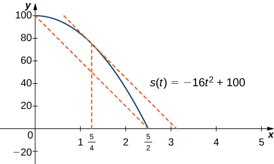

* Explain the meaning of Rolle’s theorem.
* Describe the significance of the Mean Value Theorem.
* State three important consequences of the Mean Value Theorem.

The **Mean Value Theorem**{: data-type="term"} is one of the most important theorems in calculus. We look at some of its implications at the end of this section. First, let’s start with a special case of the Mean Value Theorem, called Rolle’s theorem.

### Rolle’s Theorem

Informally, **Rolle’s theorem**{: data-type="term"} states that if the outputs of a differentiable function <math xmlns="http://www.w3.org/1998/Math/MathML"><mi>f</mi></math>

 are equal at the endpoints of an interval, then there must be an interior point <math xmlns="http://www.w3.org/1998/Math/MathML"><mi>c</mi></math>

 where <math xmlns="http://www.w3.org/1998/Math/MathML"><mrow><mi>f</mi><mo>′</mo><mrow><mo>(</mo><mi>c</mi><mo>)</mo></mrow><mo>=</mo><mn>0</mn><mo>.</mo></mrow></math>

 [\[link\]](#CNX_Calc_Figure_04_04_001) illustrates this theorem.

 ![The figure is divided into three parts labeled a, b, and c. Figure a shows the first quadrant with values a, c, and b marked on the x-axis. A downward-facing parabola is drawn such that its values at a and b are the same. The point c is the global maximum, and it is noted that f&#x2019;(c) = 0. Figure b shows the first quadrant with values a, c, and b marked on the x-axis. An upward-facing parabola is drawn such that its values at a and b are the same. The point c is the global minimum, and it is noted that f&#x2019;(c) = 0. Figure c shows the first quadrant with points a, c1, c2, and b marked on the x-axis. One period of a sine wave is drawn such that its values at a and b are equal. The point c1 is the global maximum, and it is noted that f&#x2019;(c1) = 0. The point c2 is the global minimum, and it is noted that f&#x2019;(c2) = 0.](../resources/CNX_Calc_Figure_04_04_009.jpg "If a differentiable function f satisfies f(a)=f(b), then its derivative must be zero at some point(s) between a and b."){: #CNX_Calc_Figure_04_04_001}

Rolle’s Theorem

Let <math xmlns="http://www.w3.org/1998/Math/MathML"><mi>f</mi></math>

 be a continuous function over the closed interval <math xmlns="http://www.w3.org/1998/Math/MathML"><mrow><mo stretchy="false">[</mo><mi>a</mi><mo>,</mo><mi>b</mi><mo stretchy="false">]</mo></mrow></math>

 and differentiable over the open interval <math xmlns="http://www.w3.org/1998/Math/MathML"><mrow><mrow><mo>(</mo><mrow><mi>a</mi><mo>,</mo><mi>b</mi></mrow><mo>)</mo></mrow></mrow></math>

 such that <math xmlns="http://www.w3.org/1998/Math/MathML"><mrow><mi>f</mi><mrow><mo>(</mo><mi>a</mi><mo>)</mo></mrow><mo>=</mo><mi>f</mi><mrow><mo>(</mo><mi>b</mi><mo>)</mo></mrow><mo>.</mo></mrow></math>

 There then exists at least one <math xmlns="http://www.w3.org/1998/Math/MathML"><mrow><mi>c</mi><mo>∈</mo><mrow><mo>(</mo><mrow><mi>a</mi><mo>,</mo><mi>b</mi></mrow><mo>)</mo></mrow></mrow></math>

 such that <math xmlns="http://www.w3.org/1998/Math/MathML"><mrow><mi>f</mi><mo>′</mo><mrow><mo>(</mo><mi>c</mi><mo>)</mo></mrow><mo>=</mo><mn>0</mn><mo>.</mo></mrow></math>

#### Proof

Let <math xmlns="http://www.w3.org/1998/Math/MathML"><mrow><mi>k</mi><mo>=</mo><mi>f</mi><mo stretchy="false">(</mo><mi>a</mi><mo stretchy="false">)</mo><mo>=</mo><mi>f</mi><mo stretchy="false">(</mo><mi>b</mi><mo stretchy="false">)</mo><mo>.</mo></mrow></math>

 We consider three cases:

1.  <math xmlns="http://www.w3.org/1998/Math/MathML"><mrow><mi>f</mi><mrow><mo>(</mo><mi>x</mi><mo>)</mo></mrow><mo>=</mo><mi>k</mi></mrow></math>
    
    for all
    <math xmlns="http://www.w3.org/1998/Math/MathML"><mrow><mi>x</mi><mo>∈</mo><mrow><mo>(</mo><mrow><mi>a</mi><mo>,</mo><mi>b</mi></mrow><mo>)</mo></mrow><mo>.</mo></mrow></math>

2.  There exists
    <math xmlns="http://www.w3.org/1998/Math/MathML"><mrow><mi>x</mi><mo>∈</mo><mo stretchy="false">(</mo><mi>a</mi><mo>,</mo><mi>b</mi><mo stretchy="false">)</mo></mrow></math>
    
    such that
    <math xmlns="http://www.w3.org/1998/Math/MathML"><mrow><mi>f</mi><mrow><mo>(</mo><mi>x</mi><mo>)</mo></mrow><mo>&gt;</mo><mi>k</mi><mo>.</mo></mrow></math>

3.  There exists
    <math xmlns="http://www.w3.org/1998/Math/MathML"><mrow><mi>x</mi><mo>∈</mo><mo stretchy="false">(</mo><mi>a</mi><mo>,</mo><mi>b</mi><mo stretchy="false">)</mo></mrow></math>
    
    such that
    <math xmlns="http://www.w3.org/1998/Math/MathML"><mrow><mi>f</mi><mrow><mo>(</mo><mi>x</mi><mo>)</mo></mrow><mo>&lt;</mo><mi>k</mi><mo>.</mo></mrow></math>
{: type="1"}

Case 1: If <math xmlns="http://www.w3.org/1998/Math/MathML"><mrow><mi>f</mi><mrow><mo>(</mo><mi>x</mi><mo>)</mo></mrow><mo>=</mo><mn>0</mn></mrow></math>

 for all <math xmlns="http://www.w3.org/1998/Math/MathML"><mrow><mi>x</mi><mo>∈</mo><mrow><mo>(</mo><mrow><mi>a</mi><mo>,</mo><mi>b</mi></mrow><mo>)</mo></mrow><mo>,</mo></mrow></math>

 then <math xmlns="http://www.w3.org/1998/Math/MathML"><mrow><mi>f</mi><mo>′</mo><mrow><mo>(</mo><mi>x</mi><mo>)</mo></mrow><mo>=</mo><mn>0</mn></mrow></math>

 for all <math xmlns="http://www.w3.org/1998/Math/MathML"><mrow><mi>x</mi><mo>∈</mo><mrow><mo>(</mo><mrow><mi>a</mi><mo>,</mo><mi>b</mi></mrow><mo>)</mo></mrow><mo>.</mo></mrow></math>

Case 2: Since <math xmlns="http://www.w3.org/1998/Math/MathML"><mi>f</mi></math>

 is a continuous function over the closed, bounded interval <math xmlns="http://www.w3.org/1998/Math/MathML"><mrow><mo stretchy="false">[</mo><mi>a</mi><mo>,</mo><mi>b</mi><mo stretchy="false">]</mo><mo>,</mo></mrow></math>

 by the extreme value theorem, it has an absolute maximum. Also, since there is a point <math xmlns="http://www.w3.org/1998/Math/MathML"><mrow><mi>x</mi><mo>∈</mo><mrow><mo>(</mo><mrow><mi>a</mi><mo>,</mo><mi>b</mi></mrow><mo>)</mo></mrow></mrow></math>

 such that <math xmlns="http://www.w3.org/1998/Math/MathML"><mrow><mi>f</mi><mrow><mo>(</mo><mi>x</mi><mo>)</mo></mrow><mo>&gt;</mo><mi>k</mi><mo>,</mo></mrow></math>

 the absolute maximum is greater than <math xmlns="http://www.w3.org/1998/Math/MathML"><mrow><mi>k</mi><mo>.</mo></mrow></math>

 Therefore, the absolute maximum does not occur at either endpoint. As a result, the absolute maximum must occur at an interior point <math xmlns="http://www.w3.org/1998/Math/MathML"><mrow><mi>c</mi><mo>∈</mo><mrow><mo>(</mo><mrow><mi>a</mi><mo>,</mo><mi>b</mi></mrow><mo>)</mo></mrow><mo>.</mo></mrow></math>

 Because <math xmlns="http://www.w3.org/1998/Math/MathML"><mi>f</mi></math>

 has a maximum at an interior point <math xmlns="http://www.w3.org/1998/Math/MathML"><mrow><mi>c</mi><mo>,</mo></mrow></math>

 and <math xmlns="http://www.w3.org/1998/Math/MathML"><mi>f</mi></math>

 is differentiable at <math xmlns="http://www.w3.org/1998/Math/MathML"><mrow><mi>c</mi><mo>,</mo></mrow></math>

 by Fermat’s theorem, <math xmlns="http://www.w3.org/1998/Math/MathML"><mrow><mi>f</mi><mo>′</mo><mrow><mo>(</mo><mi>c</mi><mo>)</mo></mrow><mo>=</mo><mn>0</mn><mo>.</mo></mrow></math>

Case 3: The case when there exists a point <math xmlns="http://www.w3.org/1998/Math/MathML"><mrow><mi>x</mi><mo>∈</mo><mrow><mo>(</mo><mrow><mi>a</mi><mo>,</mo><mi>b</mi></mrow><mo>)</mo></mrow></mrow></math>

 such that <math xmlns="http://www.w3.org/1998/Math/MathML"><mrow><mi>f</mi><mrow><mo>(</mo><mi>x</mi><mo>)</mo></mrow><mo>&lt;</mo><mi>k</mi></mrow></math>

 is analogous to case 2, with maximum replaced by minimum.

□

An important point about Rolle’s theorem is that the differentiability of the function <math xmlns="http://www.w3.org/1998/Math/MathML"><mi>f</mi></math>

 is critical. If <math xmlns="http://www.w3.org/1998/Math/MathML"><mi>f</mi></math>

 is not differentiable, even at a single point, the result may not hold. For example, the function <math xmlns="http://www.w3.org/1998/Math/MathML"><mrow><mi>f</mi><mrow><mo>(</mo><mi>x</mi><mo>)</mo></mrow><mo>=</mo><mo>\|</mo><mi>x</mi><mo>\|</mo><mo>−</mo><mn>1</mn></mrow></math>

 is continuous over <math xmlns="http://www.w3.org/1998/Math/MathML"><mrow><mo stretchy="false">[</mo><mn>−1</mn><mo>,</mo><mn>1</mn><mo stretchy="false">]</mo></mrow></math>

 and <math xmlns="http://www.w3.org/1998/Math/MathML"><mrow><mi>f</mi><mrow><mo>(</mo><mrow><mn>−1</mn></mrow><mo>)</mo></mrow><mo>=</mo><mn>0</mn><mo>=</mo><mi>f</mi><mrow><mo>(</mo><mn>1</mn><mo>)</mo></mrow><mo>,</mo></mrow></math>

 but <math xmlns="http://www.w3.org/1998/Math/MathML"><mrow><mi>f</mi><mo>′</mo><mrow><mo>(</mo><mi>c</mi><mo>)</mo></mrow><mo>≠</mo><mn>0</mn></mrow></math>

 for any <math xmlns="http://www.w3.org/1998/Math/MathML"><mrow><mi>c</mi><mo>∈</mo><mo stretchy="false">(</mo><mn>−1</mn><mo>,</mo><mn>1</mn><mo stretchy="false">)</mo></mrow></math>

 as shown in the following figure.

 =|x|&#x2212;1 is not differentiable at x=0, the conditions of Rolle&#x2019;s theorem are not satisfied. In fact, the conclusion does not hold here; there is no c&#x2208;(&#x2212;1,1) such that f&#x2032;(c)=0."){: #CNX_Calc_Figure_04_04_002}

Let’s now consider functions that satisfy the conditions of Rolle’s theorem and calculate explicitly the points <math xmlns="http://www.w3.org/1998/Math/MathML"><mi>c</mi></math>

 where <math xmlns="http://www.w3.org/1998/Math/MathML"><mrow><mi>f</mi><mo>′</mo><mo stretchy="false">(</mo><mi>c</mi><mo stretchy="false">)</mo><mo>=</mo><mn>0</mn><mo>.</mo></mrow></math>

Using Rolle’s Theorem

For each of the following functions, verify that the function satisfies the criteria stated in Rolle’s theorem and find all values <math xmlns="http://www.w3.org/1998/Math/MathML"><mi>c</mi></math>

 in the given interval where <math xmlns="http://www.w3.org/1998/Math/MathML"><mrow><mi>f</mi><mo>′</mo><mrow><mo>(</mo><mi>c</mi><mo>)</mo></mrow><mo>=</mo><mn>0</mn><mo>.</mo></mrow></math>

1.  <math xmlns="http://www.w3.org/1998/Math/MathML"><mrow><mi>f</mi><mrow><mo>(</mo><mi>x</mi><mo>)</mo></mrow><mo>=</mo><msup><mi>x</mi><mn>2</mn></msup><mo>+</mo><mn>2</mn><mi>x</mi></mrow></math>
    
    over
    <math xmlns="http://www.w3.org/1998/Math/MathML"><mrow><mo stretchy="false">[</mo><mn>−2</mn><mo>,</mo><mn>0</mn><mo stretchy="false">]</mo></mrow></math>

2.  <math xmlns="http://www.w3.org/1998/Math/MathML"><mrow><mi>f</mi><mrow><mo>(</mo><mi>x</mi><mo>)</mo></mrow><mo>=</mo><msup><mi>x</mi><mn>3</mn></msup><mo>−</mo><mn>4</mn><mi>x</mi></mrow></math>
    
    over
    <math xmlns="http://www.w3.org/1998/Math/MathML"><mrow><mo stretchy="false">[</mo><mn>−2</mn><mo>,</mo><mn>2</mn><mo stretchy="false">]</mo></mrow></math>
{: type="a"}

1.  Since
    <math xmlns="http://www.w3.org/1998/Math/MathML"><mi>f</mi></math>
    
    is a polynomial, it is continuous and differentiable everywhere. In addition,
    <math xmlns="http://www.w3.org/1998/Math/MathML"><mrow><mi>f</mi><mrow><mo>(</mo><mrow><mn>−2</mn></mrow><mo>)</mo></mrow><mo>=</mo><mn>0</mn><mo>=</mo><mi>f</mi><mrow><mo>(</mo><mn>0</mn><mo>)</mo></mrow><mo>.</mo></mrow></math>
    
    Therefore,
    <math xmlns="http://www.w3.org/1998/Math/MathML"><mi>f</mi></math>
    
    satisfies the criteria of Rolle’s theorem. We conclude that there exists at least one value
    <math xmlns="http://www.w3.org/1998/Math/MathML"><mrow><mi>c</mi><mo>∈</mo><mrow><mo>(</mo><mrow><mn>−2</mn><mo>,</mo><mn>0</mn></mrow><mo>)</mo></mrow></mrow></math>
    
    such that
    <math xmlns="http://www.w3.org/1998/Math/MathML"><mrow><mi>f</mi><mo>′</mo><mrow><mo>(</mo><mi>c</mi><mo>)</mo></mrow><mo>=</mo><mn>0</mn><mo>.</mo></mrow></math>
    
    Since
    <math xmlns="http://www.w3.org/1998/Math/MathML"><mrow><mi>f</mi><mo>′</mo><mrow><mo>(</mo><mi>x</mi><mo>)</mo></mrow><mo>=</mo><mn>2</mn><mi>x</mi><mo>+</mo><mn>2</mn><mo>=</mo><mn>2</mn><mrow><mo>(</mo><mrow><mi>x</mi><mo>+</mo><mn>1</mn></mrow><mo>)</mo></mrow><mo>,</mo></mrow></math>
    
    we see that
    <math xmlns="http://www.w3.org/1998/Math/MathML"><mrow><mi>f</mi><mo>′</mo><mrow><mo>(</mo><mi>c</mi><mo>)</mo></mrow><mo>=</mo><mn>2</mn><mrow><mo>(</mo><mrow><mi>c</mi><mo>+</mo><mn>1</mn></mrow><mo>)</mo></mrow><mo>=</mo><mn>0</mn></mrow></math>
    
    implies
    <math xmlns="http://www.w3.org/1998/Math/MathML"><mrow><mi>c</mi><mo>=</mo><mn>−1</mn></mrow></math>
    
    as shown in the following graph.
    * * *
    {: data-type="newline"}
    
    =0 when c=&#x2212;1."){: #CNX_Calc_Figure_04_04_003}

2.  As in part a.
    <math xmlns="http://www.w3.org/1998/Math/MathML"><mi>f</mi></math>
    
    is a polynomial and therefore is continuous and differentiable everywhere. Also,
    <math xmlns="http://www.w3.org/1998/Math/MathML"><mrow><mi>f</mi><mrow><mo>(</mo><mrow><mn>−2</mn></mrow><mo>)</mo></mrow><mo>=</mo><mn>0</mn><mo>=</mo><mi>f</mi><mrow><mo>(</mo><mn>2</mn><mo>)</mo></mrow><mo>.</mo></mrow></math>
    
    That said,
    <math xmlns="http://www.w3.org/1998/Math/MathML"><mi>f</mi></math>
    
    satisfies the criteria of Rolle’s theorem. Differentiating, we find that
    <math xmlns="http://www.w3.org/1998/Math/MathML"><mrow><mi>f</mi><mo>′</mo><mrow><mo>(</mo><mi>x</mi><mo>)</mo></mrow><mo>=</mo><mn>3</mn><msup><mi>x</mi><mn>2</mn></msup><mo>−</mo><mn>4</mn><mo>.</mo></mrow></math>
    
    Therefore,
    <math xmlns="http://www.w3.org/1998/Math/MathML"><mrow><mi>f</mi><mo>′</mo><mrow><mo>(</mo><mi>c</mi><mo>)</mo></mrow><mo>=</mo><mn>0</mn></mrow></math>
    
    when
    <math xmlns="http://www.w3.org/1998/Math/MathML"><mrow><mi>x</mi><mo>=</mo><mtext>±</mtext><mfrac><mn>2</mn><mrow><msqrt><mn>3</mn></msqrt></mrow></mfrac><mo>.</mo></mrow></math>
    
    Both points are in the interval
    <math xmlns="http://www.w3.org/1998/Math/MathML"><mrow><mo stretchy="false">[</mo><mn>−2</mn><mo>,</mo><mn>2</mn><mo stretchy="false">]</mo><mo>,</mo></mrow></math>
    
    and, therefore, both points satisfy the conclusion of Rolle’s theorem as shown in the following graph.
    * * *
    {: data-type="newline"}
    
    =0 at x=&#xB1;2/3."){: #CNX_Calc_Figure_04_04_004}

{: type="a"}

Verify that the function <math xmlns="http://www.w3.org/1998/Math/MathML"><mrow><mi>f</mi><mrow><mo>(</mo><mi>x</mi><mo>)</mo></mrow><mo>=</mo><mn>2</mn><msup><mi>x</mi><mn>2</mn></msup><mo>−</mo><mn>8</mn><mi>x</mi><mo>+</mo><mn>6</mn></mrow></math>

 defined over the interval <math xmlns="http://www.w3.org/1998/Math/MathML"><mrow><mo stretchy="false">[</mo><mn>1</mn><mo>,</mo><mn>3</mn><mo stretchy="false">]</mo></mrow></math>

 satisfies the conditions of Rolle’s theorem. Find all points <math xmlns="http://www.w3.org/1998/Math/MathML"><mi>c</mi></math>

 guaranteed by Rolle’s theorem.

<math xmlns="http://www.w3.org/1998/Math/MathML"><mrow><mi>c</mi><mo>=</mo><mn>2</mn></mrow></math>

Hint

Find all values <math xmlns="http://www.w3.org/1998/Math/MathML"><mrow><mi>c</mi><mo>,</mo></mrow></math>

 where <math xmlns="http://www.w3.org/1998/Math/MathML"><mrow><mi>f</mi><mo>′</mo><mrow><mo>(</mo><mi>c</mi><mo>)</mo></mrow><mo>=</mo><mn>0</mn><mo>.</mo></mrow></math>

### The Mean Value Theorem and Its Meaning

Rolle’s theorem is a special case of the Mean Value Theorem. In Rolle’s theorem, we consider differentiable functions <math xmlns="http://www.w3.org/1998/Math/MathML"><mi>f</mi></math>

 defined on a closed interval <math xmlns="http://www.w3.org/1998/Math/MathML"><mrow><mo stretchy="false">[</mo><mi>a</mi><mo>,</mo><mi>b</mi><mo stretchy="false">]</mo></mrow></math>

 with <math xmlns="http://www.w3.org/1998/Math/MathML"><mi>f</mi><mo>(</mo><mi>a</mi><mo>)</mo><mo>=</mo><mi>f</mi><mo>(</mo><mi>b</mi><mo>)</mo></math>

. The Mean Value Theorem generalizes Rolle’s theorem by considering functions that do not necessarily have equal value at the endpoints. Consequently, we can view the Mean Value Theorem as a slanted version of Rolle’s theorem ([\[link\]](#CNX_Calc_Figure_04_04_005)). The Mean Value Theorem states that if <math xmlns="http://www.w3.org/1998/Math/MathML"><mi>f</mi></math>

 is continuous over the closed interval <math xmlns="http://www.w3.org/1998/Math/MathML"><mrow><mo stretchy="false">[</mo><mi>a</mi><mo>,</mo><mi>b</mi><mo stretchy="false">]</mo></mrow></math>

 and differentiable over the open interval <math xmlns="http://www.w3.org/1998/Math/MathML"><mrow><mrow><mo>(</mo><mrow><mi>a</mi><mo>,</mo><mi>b</mi></mrow><mo>)</mo></mrow><mo>,</mo></mrow></math>

 then there exists a point <math xmlns="http://www.w3.org/1998/Math/MathML"><mrow><mi>c</mi><mo>∈</mo><mrow><mo>(</mo><mrow><mi>a</mi><mo>,</mo><mi>b</mi></mrow><mo>)</mo></mrow></mrow></math>

 such that the tangent line to the graph of <math xmlns="http://www.w3.org/1998/Math/MathML"><mi>f</mi></math>

 at <math xmlns="http://www.w3.org/1998/Math/MathML"><mi>c</mi></math>

 is parallel to the secant line connecting <math xmlns="http://www.w3.org/1998/Math/MathML"><mrow><mrow><mo>(</mo><mrow><mi>a</mi><mo>,</mo><mi>f</mi><mrow><mo>(</mo><mi>a</mi><mo>)</mo></mrow></mrow><mo>)</mo></mrow></mrow></math>

 and <math xmlns="http://www.w3.org/1998/Math/MathML"><mrow><mrow><mo>(</mo><mrow><mi>b</mi><mo>,</mo><mi>f</mi><mrow><mo>(</mo><mi>b</mi><mo>)</mo></mrow></mrow><mo>)</mo></mrow><mo>.</mo></mrow></math>

![A vaguely sinusoidal function y = f(x) is drawn. On the x-axis, a, c1, c2, and b are marked. On the y-axis, f(a) and f(b) are marked. The function f(x) starts at (a, f(a)), decreases to c1, increases to c2, and then decreases to (b, f(b)). A secant line is drawn between (a, f(a)) and (b, f(b)), and it is noted that this line has slope (f(b) &#x2013; f(a))/(b &#x2212; a). The tangent lines at c1 and c2 are drawn, and these lines are parallel to the secant line. It is noted that the slopes of these tangent lines are f&#x2019;(c1) and f&#x2019;(c2), respectively.](../resources/CNX_Calc_Figure_04_04_010.jpg "The Mean Value Theorem says that for a function that meets its conditions, at some point the tangent line has the same slope as the secant line between the ends. For this function, there are two values c1 and c2 such that the tangent line to f at c1 and c2 has the same slope as the secant line."){: #CNX_Calc_Figure_04_04_005}

Mean Value Theorem

Let <math xmlns="http://www.w3.org/1998/Math/MathML"><mi>f</mi></math>

 be continuous over the closed interval <math xmlns="http://www.w3.org/1998/Math/MathML"><mrow><mo stretchy="false">[</mo><mi>a</mi><mo>,</mo><mi>b</mi><mo stretchy="false">]</mo></mrow></math>

 and differentiable over the open interval <math xmlns="http://www.w3.org/1998/Math/MathML"><mrow><mo stretchy="false">(</mo><mi>a</mi><mo>,</mo><mi>b</mi><mo stretchy="false">)</mo><mo>.</mo></mrow></math>

 Then, there exists at least one point <math xmlns="http://www.w3.org/1998/Math/MathML"><mrow><mi>c</mi><mo>∈</mo><mrow><mo>(</mo><mrow><mi>a</mi><mo>,</mo><mi>b</mi></mrow><mo>)</mo></mrow></mrow></math>

 such that

<math xmlns="http://www.w3.org/1998/Math/MathML"><mrow><mi>f</mi><mo>′</mo><mrow><mo>(</mo><mi>c</mi><mo>)</mo></mrow><mo>=</mo><mfrac><mrow><mi>f</mi><mrow><mo>(</mo><mi>b</mi><mo>)</mo></mrow><mo>−</mo><mi>f</mi><mrow><mo>(</mo><mi>a</mi><mo>)</mo></mrow></mrow><mrow><mi>b</mi><mo>−</mo><mi>a</mi></mrow></mfrac><mo>.</mo></mrow></math>

#### Proof

The proof follows from Rolle’s theorem by introducing an appropriate function that satisfies the criteria of Rolle’s theorem. Consider the line connecting <math xmlns="http://www.w3.org/1998/Math/MathML"><mrow><mrow><mo>(</mo><mrow><mi>a</mi><mo>,</mo><mi>f</mi><mrow><mo>(</mo><mi>a</mi><mo>)</mo></mrow></mrow><mo>)</mo></mrow></mrow></math>

 and <math xmlns="http://www.w3.org/1998/Math/MathML"><mrow><mrow><mo>(</mo><mrow><mi>b</mi><mo>,</mo><mi>f</mi><mrow><mo>(</mo><mi>b</mi><mo>)</mo></mrow></mrow><mo>)</mo></mrow><mo>.</mo></mrow></math>

 Since the slope of that line is

<math xmlns="http://www.w3.org/1998/Math/MathML"><mrow><mfrac><mrow><mi>f</mi><mrow><mo>(</mo><mi>b</mi><mo>)</mo></mrow><mo>−</mo><mi>f</mi><mrow><mo>(</mo><mi>a</mi><mo>)</mo></mrow></mrow><mrow><mi>b</mi><mo>−</mo><mi>a</mi></mrow></mfrac></mrow></math>

and the line passes through the point <math xmlns="http://www.w3.org/1998/Math/MathML"><mrow><mrow><mo>(</mo><mrow><mi>a</mi><mo>,</mo><mi>f</mi><mrow><mo>(</mo><mi>a</mi><mo>)</mo></mrow></mrow><mo>)</mo></mrow><mo>,</mo></mrow></math>

 the equation of that line can be written as

<math xmlns="http://www.w3.org/1998/Math/MathML"><mrow><mi>y</mi><mo>=</mo><mfrac><mrow><mi>f</mi><mrow><mo>(</mo><mi>b</mi><mo>)</mo></mrow><mo>−</mo><mi>f</mi><mrow><mo>(</mo><mi>a</mi><mo>)</mo></mrow></mrow><mrow><mi>b</mi><mo>−</mo><mi>a</mi></mrow></mfrac><mrow><mo>(</mo><mrow><mi>x</mi><mo>−</mo><mi>a</mi></mrow><mo>)</mo></mrow><mo>+</mo><mi>f</mi><mrow><mo>(</mo><mi>a</mi><mo>)</mo></mrow><mo>.</mo></mrow></math>

Let <math xmlns="http://www.w3.org/1998/Math/MathML"><mrow><mi>g</mi><mrow><mo>(</mo><mi>x</mi><mo>)</mo></mrow></mrow></math>

 denote the vertical difference between the point <math xmlns="http://www.w3.org/1998/Math/MathML"><mrow><mrow><mo>(</mo><mrow><mi>x</mi><mo>,</mo><mi>f</mi><mrow><mo>(</mo><mi>x</mi><mo>)</mo></mrow></mrow><mo>)</mo></mrow></mrow></math>

 and the point <math xmlns="http://www.w3.org/1998/Math/MathML"><mrow><mrow><mo>(</mo><mrow><mi>x</mi><mo>,</mo><mi>y</mi></mrow><mo>)</mo></mrow></mrow></math>

 on that line. Therefore,

<math xmlns="http://www.w3.org/1998/Math/MathML"><mrow><mi>g</mi><mrow><mo>(</mo><mi>x</mi><mo>)</mo></mrow><mo>=</mo><mi>f</mi><mrow><mo>(</mo><mi>x</mi><mo>)</mo></mrow><mo>−</mo><mrow><mo>[</mo><mrow><mfrac><mrow><mi>f</mi><mrow><mo>(</mo><mi>b</mi><mo>)</mo></mrow><mo>−</mo><mi>f</mi><mrow><mo>(</mo><mi>a</mi><mo>)</mo></mrow></mrow><mrow><mi>b</mi><mo>−</mo><mi>a</mi></mrow></mfrac><mrow><mo>(</mo><mrow><mi>x</mi><mo>−</mo><mi>a</mi></mrow><mo>)</mo></mrow><mo>+</mo><mi>f</mi><mrow><mo>(</mo><mi>a</mi><mo>)</mo></mrow></mrow><mo>]</mo></mrow></mrow><mtext>.</mtext></math>

 is the vertical difference between the point (x,f(x)) and the point (x,y) on the secant line connecting (a,f(a)) and (b,f(b))."){: #CNX_Calc_Figure_04_04_006}

Since the graph of <math xmlns="http://www.w3.org/1998/Math/MathML"><mi>f</mi></math>

 intersects the secant line when <math xmlns="http://www.w3.org/1998/Math/MathML"><mrow><mi>x</mi><mo>=</mo><mi>a</mi></mrow></math>

 and <math xmlns="http://www.w3.org/1998/Math/MathML"><mrow><mi>x</mi><mo>=</mo><mi>b</mi><mo>,</mo></mrow></math>

 we see that <math xmlns="http://www.w3.org/1998/Math/MathML"><mrow><mi>g</mi><mrow><mo>(</mo><mi>a</mi><mo>)</mo></mrow><mo>=</mo><mn>0</mn><mo>=</mo><mi>g</mi><mrow><mo>(</mo><mi>b</mi><mo>)</mo></mrow><mo>.</mo></mrow></math>

 Since <math xmlns="http://www.w3.org/1998/Math/MathML"><mi>f</mi></math>

 is a differentiable function over <math xmlns="http://www.w3.org/1998/Math/MathML"><mrow><mrow><mo>(</mo><mrow><mi>a</mi><mo>,</mo><mi>b</mi></mrow><mo>)</mo></mrow><mo>,</mo></mrow></math>

 <math xmlns="http://www.w3.org/1998/Math/MathML"><mi>g</mi></math>

 is also a differentiable function over <math xmlns="http://www.w3.org/1998/Math/MathML"><mrow><mrow><mo>(</mo><mrow><mi>a</mi><mo>,</mo><mi>b</mi></mrow><mo>)</mo></mrow><mo>.</mo></mrow></math>

 Furthermore, since <math xmlns="http://www.w3.org/1998/Math/MathML"><mi>f</mi></math>

 is continuous over <math xmlns="http://www.w3.org/1998/Math/MathML"><mrow><mo stretchy="false">[</mo><mi>a</mi><mo>,</mo><mi>b</mi><mo stretchy="false">]</mo><mo>,</mo></mrow></math>

 <math xmlns="http://www.w3.org/1998/Math/MathML"><mi>g</mi></math>

 is also continuous over <math xmlns="http://www.w3.org/1998/Math/MathML"><mrow><mo stretchy="false">[</mo><mi>a</mi><mo>,</mo><mi>b</mi><mo stretchy="false">]</mo><mo>.</mo></mrow></math>

 Therefore, <math xmlns="http://www.w3.org/1998/Math/MathML"><mi>g</mi></math>

 satisfies the criteria of Rolle’s theorem. Consequently, there exists a point <math xmlns="http://www.w3.org/1998/Math/MathML"><mrow><mi>c</mi><mo>∈</mo><mrow><mo>(</mo><mrow><mi>a</mi><mo>,</mo><mi>b</mi></mrow><mo>)</mo></mrow></mrow></math>

 such that <math xmlns="http://www.w3.org/1998/Math/MathML"><mrow><mi>g</mi><mo>′</mo><mrow><mo>(</mo><mi>c</mi><mo>)</mo></mrow><mo>=</mo><mn>0</mn><mo>.</mo></mrow></math>

 Since

<math xmlns="http://www.w3.org/1998/Math/MathML"><mrow><mi>g</mi><mo>′</mo><mrow><mo>(</mo><mi>x</mi><mo>)</mo></mrow><mo>=</mo><mi>f</mi><mo>′</mo><mrow><mo>(</mo><mi>x</mi><mo>)</mo></mrow><mo>−</mo><mfrac><mrow><mi>f</mi><mrow><mo>(</mo><mi>b</mi><mo>)</mo></mrow><mo>−</mo><mi>f</mi><mrow><mo>(</mo><mi>a</mi><mo>)</mo></mrow></mrow><mrow><mi>b</mi><mo>−</mo><mi>a</mi></mrow></mfrac><mo>,</mo></mrow></math>

we see that

<math xmlns="http://www.w3.org/1998/Math/MathML"><mrow><mi>g</mi><mo>′</mo><mrow><mo>(</mo><mi>c</mi><mo>)</mo></mrow><mo>=</mo><mi>f</mi><mo>′</mo><mrow><mo>(</mo><mi>c</mi><mo>)</mo></mrow><mo>−</mo><mfrac><mrow><mi>f</mi><mrow><mo>(</mo><mi>b</mi><mo>)</mo></mrow><mo>−</mo><mi>f</mi><mrow><mo>(</mo><mi>a</mi><mo>)</mo></mrow></mrow><mrow><mi>b</mi><mo>−</mo><mi>a</mi></mrow></mfrac><mo>.</mo></mrow></math>

Since <math xmlns="http://www.w3.org/1998/Math/MathML"><mrow><mi>g</mi><mo>′</mo><mo stretchy="false">(</mo><mi>c</mi><mo stretchy="false">)</mo><mo>=</mo><mn>0</mn><mo>,</mo></mrow></math>

 we conclude that

<math xmlns="http://www.w3.org/1998/Math/MathML"><mrow><mi>f</mi><mo>′</mo><mrow><mo>(</mo><mi>c</mi><mo>)</mo></mrow><mo>=</mo><mfrac><mrow><mi>f</mi><mrow><mo>(</mo><mi>b</mi><mo>)</mo></mrow><mo>−</mo><mi>f</mi><mrow><mo>(</mo><mi>a</mi><mo>)</mo></mrow></mrow><mrow><mi>b</mi><mo>−</mo><mi>a</mi></mrow></mfrac><mo>.</mo></mrow></math>

□

In the next example, we show how the Mean Value Theorem can be applied to the function <math xmlns="http://www.w3.org/1998/Math/MathML"><mrow><mi>f</mi><mo stretchy="false">(</mo><mi>x</mi><mo stretchy="false">)</mo><mo>=</mo><msqrt><mi>x</mi></msqrt></mrow></math>

 over the interval <math xmlns="http://www.w3.org/1998/Math/MathML"><mrow><mo stretchy="false">[</mo><mn>0</mn><mo>,</mo><mn>9</mn><mo stretchy="false">]</mo><mo>.</mo></mrow></math>

 The method is the same for other functions, although sometimes with more interesting consequences.

Verifying that the Mean Value Theorem Applies

For <math xmlns="http://www.w3.org/1998/Math/MathML"><mrow><mi>f</mi><mrow><mo>(</mo><mi>x</mi><mo>)</mo></mrow><mo>=</mo><msqrt><mi>x</mi></msqrt></mrow></math>

 over the interval <math xmlns="http://www.w3.org/1998/Math/MathML"><mrow><mo stretchy="false">[</mo><mn>0</mn><mo>,</mo><mn>9</mn><mo stretchy="false">]</mo><mo>,</mo></mrow></math>

 show that <math xmlns="http://www.w3.org/1998/Math/MathML"><mi>f</mi></math>

 satisfies the hypothesis of the Mean Value Theorem, and therefore there exists at least one value <math xmlns="http://www.w3.org/1998/Math/MathML"><mrow><mi>c</mi><mo>∈</mo><mo stretchy="false">(</mo><mn>0</mn><mo>,</mo><mn>9</mn><mo stretchy="false">)</mo></mrow></math>

 such that <math xmlns="http://www.w3.org/1998/Math/MathML"><mrow><msup><mi>f</mi><mo>′</mo></msup><mo stretchy="false">(</mo><mi>c</mi><mo stretchy="false">)</mo></mrow></math>

 is equal to the slope of the line connecting <math xmlns="http://www.w3.org/1998/Math/MathML"><mrow><mrow><mo>(</mo><mrow><mn>0</mn><mo>,</mo><mi>f</mi><mrow><mo>(</mo><mn>0</mn><mo>)</mo></mrow></mrow><mo>)</mo></mrow></mrow></math>

 and <math xmlns="http://www.w3.org/1998/Math/MathML"><mrow><mrow><mo>(</mo><mrow><mn>9</mn><mo>,</mo><mi>f</mi><mrow><mo>(</mo><mn>9</mn><mo>)</mo></mrow></mrow><mo>)</mo></mrow><mo>.</mo></mrow></math>

 Find these values <math xmlns="http://www.w3.org/1998/Math/MathML"><mi>c</mi></math>

 guaranteed by the Mean Value Theorem.

We know that <math xmlns="http://www.w3.org/1998/Math/MathML"><mrow><mi>f</mi><mo stretchy="false">(</mo><mi>x</mi><mo stretchy="false">)</mo><mo>=</mo><msqrt><mi>x</mi></msqrt></mrow></math>

 is continuous over <math xmlns="http://www.w3.org/1998/Math/MathML"><mrow><mo stretchy="false">[</mo><mn>0</mn><mo>,</mo><mn>9</mn><mo stretchy="false">]</mo></mrow></math>

 and differentiable over <math xmlns="http://www.w3.org/1998/Math/MathML"><mrow><mrow><mo>(</mo><mrow><mn>0</mn><mo>,</mo><mn>9</mn></mrow><mo>)</mo></mrow><mo>.</mo></mrow></math>

 Therefore, <math xmlns="http://www.w3.org/1998/Math/MathML"><mi>f</mi></math>

 satisfies the hypotheses of the Mean Value Theorem, and there must exist at least one value <math xmlns="http://www.w3.org/1998/Math/MathML"><mrow><mi>c</mi><mo>∈</mo><mrow><mo>(</mo><mrow><mn>0</mn><mo>,</mo><mn>9</mn></mrow><mo>)</mo></mrow></mrow></math>

 such that <math xmlns="http://www.w3.org/1998/Math/MathML"><mrow><msup><mi>f</mi><mo>′</mo></msup><mrow><mo>(</mo><mi>c</mi><mo>)</mo></mrow></mrow></math>

 is equal to the slope of the line connecting <math xmlns="http://www.w3.org/1998/Math/MathML"><mrow><mrow><mo>(</mo><mrow><mn>0</mn><mo>,</mo><mi>f</mi><mrow><mo>(</mo><mn>0</mn><mo>)</mo></mrow></mrow><mo>)</mo></mrow></mrow></math>

 and <math xmlns="http://www.w3.org/1998/Math/MathML"><mrow><mrow><mo>(</mo><mrow><mn>9</mn><mo>,</mo><mi>f</mi><mrow><mo>(</mo><mn>9</mn><mo>)</mo></mrow></mrow><mo>)</mo></mrow></mrow></math>

 ([[link]](#CNX_Calc_Figure_04_04_007)). To determine which value(s) of <math xmlns="http://www.w3.org/1998/Math/MathML"><mi>c</mi></math>

 are guaranteed, first calculate the derivative of <math xmlns="http://www.w3.org/1998/Math/MathML"><mrow><mi>f</mi><mo>.</mo></mrow></math>

 The derivative <math xmlns="http://www.w3.org/1998/Math/MathML"><mrow><msup><mi>f</mi><mo>′</mo></msup><mrow><mo>(</mo><mi>x</mi><mo>)</mo></mrow><mo>=</mo><mfrac><mn>1</mn><mrow><mo stretchy="false">(</mo><mn>2</mn><msqrt><mi>x</mi></msqrt><mo stretchy="false">)</mo></mrow></mfrac><mo>.</mo></mrow></math>

 The slope of the line connecting <math xmlns="http://www.w3.org/1998/Math/MathML"><mrow><mo stretchy="false">(</mo><mn>0</mn><mo>,</mo><mi>f</mi><mo stretchy="false">(</mo><mn>0</mn><mo stretchy="false">)</mo><mo stretchy="false">)</mo></mrow></math>

 and <math xmlns="http://www.w3.org/1998/Math/MathML"><mrow><mo stretchy="false">(</mo><mn>9</mn><mo>,</mo><mi>f</mi><mo stretchy="false">(</mo><mn>9</mn><mo stretchy="false">)</mo><mo stretchy="false">)</mo></mrow></math>

 is given by

<math xmlns="http://www.w3.org/1998/Math/MathML"><mrow><mfrac><mrow><mi>f</mi><mo stretchy="false">(</mo><mn>9</mn><mo stretchy="false">)</mo><mo>−</mo><mi>f</mi><mo stretchy="false">(</mo><mn>0</mn><mo stretchy="false">)</mo></mrow><mrow><mn>9</mn><mo>−</mo><mn>0</mn></mrow></mfrac><mo>=</mo><mfrac><mrow><msqrt><mn>9</mn></msqrt><mo>−</mo><msqrt><mn>0</mn></msqrt></mrow><mrow><mn>9</mn><mo>−</mo><mn>0</mn></mrow></mfrac><mo>=</mo><mfrac><mn>3</mn><mn>9</mn></mfrac><mo>=</mo><mfrac><mn>1</mn><mn>3</mn></mfrac><mo>.</mo></mrow></math>

We want to find <math xmlns="http://www.w3.org/1998/Math/MathML"><mi>c</mi></math>

 such that <math xmlns="http://www.w3.org/1998/Math/MathML"><mrow><msup><mi>f</mi><mo>′</mo></msup><mo stretchy="false">(</mo><mi>c</mi><mo stretchy="false">)</mo><mo>=</mo><mfrac><mn>1</mn><mn>3</mn></mfrac><mo>.</mo></mrow></math>

 That is, we want to find <math xmlns="http://www.w3.org/1998/Math/MathML"><mi>c</mi></math>

 such that

<math xmlns="http://www.w3.org/1998/Math/MathML"><mrow><mfrac><mn>1</mn><mrow><mn>2</mn><msqrt><mi>c</mi></msqrt></mrow></mfrac><mo>=</mo><mfrac><mn>1</mn><mn>3</mn></mfrac><mo>.</mo></mrow></math>

Solving this equation for <math xmlns="http://www.w3.org/1998/Math/MathML"><mrow><mi>c</mi><mo>,</mo></mrow></math>

 we obtain <math xmlns="http://www.w3.org/1998/Math/MathML"><mrow><mi>c</mi><mo>=</mo><mfrac><mn>9</mn><mn>4</mn></mfrac><mo>.</mo></mrow></math>

 At this point, the slope of the tangent line equals the slope of the line joining the endpoints.

 and (9,3)."){: #CNX_Calc_Figure_04_04_007}

One application that helps illustrate the Mean Value Theorem involves velocity. For example, suppose we drive a car for 1 h down a straight road with an average velocity of 45 mph. Let <math xmlns="http://www.w3.org/1998/Math/MathML"><mrow><mi>s</mi><mo stretchy="false">(</mo><mi>t</mi><mo stretchy="false">)</mo></mrow></math>

 and <math xmlns="http://www.w3.org/1998/Math/MathML"><mrow><mi>v</mi><mrow><mo>(</mo><mi>t</mi><mo>)</mo></mrow></mrow></math>

 denote the position and velocity of the car, respectively, for <math xmlns="http://www.w3.org/1998/Math/MathML"><mrow><mn>0</mn><mo>≤</mo><mi>t</mi><mo>≤</mo><mn>1</mn></mrow></math>

 h. Assuming that the position function <math xmlns="http://www.w3.org/1998/Math/MathML"><mrow><mi>s</mi><mrow><mo>(</mo><mi>t</mi><mo>)</mo></mrow></mrow></math>

 is differentiable, we can apply the Mean Value Theorem to conclude that, at some time <math xmlns="http://www.w3.org/1998/Math/MathML"><mrow><mi>c</mi><mo>∈</mo><mrow><mo>(</mo><mrow><mn>0</mn><mo>,</mo><mn>1</mn></mrow><mo>)</mo></mrow><mo>,</mo></mrow></math>

 the speed of the car was exactly

<math xmlns="http://www.w3.org/1998/Math/MathML"><mrow><mi>v</mi><mrow><mo>(</mo><mi>c</mi><mo>)</mo></mrow><mo>=</mo><msup><mi>s</mi><mo>′</mo></msup><mrow><mo>(</mo><mi>c</mi><mo>)</mo></mrow><mo>=</mo><mfrac><mrow><mi>s</mi><mrow><mo>(</mo><mn>1</mn><mo>)</mo></mrow><mo>−</mo><mi>s</mi><mrow><mo>(</mo><mn>0</mn><mo>)</mo></mrow></mrow><mrow><mn>1</mn><mo>−</mo><mn>0</mn></mrow></mfrac><mo>=</mo><mn>45</mn><mspace width="0.2em" /><mtext>mph</mtext><mo>.</mo></mrow></math>

Mean Value Theorem and Velocity

If a rock is dropped from a height of 100 ft, its position <math xmlns="http://www.w3.org/1998/Math/MathML"><mi>t</mi></math>

 seconds after it is dropped until it hits the ground is given by the function <math xmlns="http://www.w3.org/1998/Math/MathML"><mrow><mi>s</mi><mrow><mo>(</mo><mi>t</mi><mo>)</mo></mrow><mo>=</mo><mn>−16</mn><msup><mi>t</mi><mn>2</mn></msup><mo>+</mo><mn>100</mn><mo>.</mo></mrow></math>

1.  Determine how long it takes before the rock hits the ground.
2.  Find the average velocity
    <math xmlns="http://www.w3.org/1998/Math/MathML"><mrow><msub><mi>v</mi><mrow><mtext>avg</mtext></mrow></msub></mrow></math>
    
    of the rock for when the rock is released and the rock hits the ground.
3.  Find the time
    <math xmlns="http://www.w3.org/1998/Math/MathML"><mi>t</mi></math>
    
    guaranteed by the Mean Value Theorem when the instantaneous velocity of the rock is
    <math xmlns="http://www.w3.org/1998/Math/MathML"><mrow><msub><mi>v</mi><mrow><mtext>avg</mtext></mrow></msub><mo>.</mo></mrow></math>
{: type="a"}

1.  When the rock hits the ground, its position is
    <math xmlns="http://www.w3.org/1998/Math/MathML"><mrow><mi>s</mi><mo stretchy="false">(</mo><mi>t</mi><mo stretchy="false">)</mo><mo>=</mo><mn>0</mn><mo>.</mo></mrow></math>
    
    Solving the equation
    <math xmlns="http://www.w3.org/1998/Math/MathML"><mrow><mn>−16</mn><msup><mi>t</mi><mn>2</mn></msup><mo>+</mo><mn>100</mn><mo>=</mo><mn>0</mn></mrow></math>
    
    for
    <math xmlns="http://www.w3.org/1998/Math/MathML"><mrow><mi>t</mi><mo>,</mo></mrow></math>
    
    we find that
    <math xmlns="http://www.w3.org/1998/Math/MathML"><mrow><mi>t</mi><mo>=</mo><mtext>±</mtext><mfrac><mn>5</mn><mn>2</mn></mfrac><mspace width="0.1em" /><mtext>sec</mtext><mo>.</mo></mrow></math>
    
    Since we are only considering
    <math xmlns="http://www.w3.org/1998/Math/MathML"><mrow><mi>t</mi><mo>≥</mo><mn>0</mn><mo>,</mo></mrow></math>
    
    the ball will hit the ground
    <math xmlns="http://www.w3.org/1998/Math/MathML"><mrow><mfrac><mn>5</mn><mn>2</mn></mfrac></mrow></math>
    
    sec after it is dropped.
2.  The average velocity is given by
    * * *
    {: data-type="newline"}
    
    

    <math xmlns="http://www.w3.org/1998/Math/MathML"><mrow><msub><mi>v</mi><mrow><mtext>avg</mtext></mrow></msub><mo>=</mo><mfrac><mrow><mi>s</mi><mo stretchy="false">(</mo><mn>5</mn><mtext>/</mtext><mn>2</mn><mo stretchy="false">)</mo><mo>−</mo><mi>s</mi><mo stretchy="false">(</mo><mn>0</mn><mo stretchy="false">)</mo></mrow><mrow><mn>5</mn><mtext>/</mtext><mn>2</mn><mo>−</mo><mn>0</mn></mrow></mfrac><mo>=</mo><mfrac><mrow><mn>1</mn><mo>−</mo><mn>100</mn></mrow><mrow><mn>5</mn><mtext>/</mtext><mn>2</mn></mrow></mfrac><mo>=</mo><mn>−40</mn><mspace width="0.2em" /><mtext>ft/sec</mtext><mo>.</mo></mrow></math>
    

3.  The instantaneous velocity is given by the derivative of the position function. Therefore, we need to find a time
    <math xmlns="http://www.w3.org/1998/Math/MathML"><mi>t</mi></math>
    
    such that
    <math xmlns="http://www.w3.org/1998/Math/MathML"><mrow><mi>v</mi><mo stretchy="false">(</mo><mi>t</mi><mo stretchy="false">)</mo><mo>=</mo><msup><mi>s</mi><mo>′</mo></msup><mo stretchy="false">(</mo><mi>t</mi><mo stretchy="false">)</mo><mo>=</mo><msub><mi>v</mi><mrow><mtext>avg</mtext></mrow></msub><mo>=</mo><mn>−40</mn><mspace width="0.2em" /><mtext>ft/sec</mtext><mo>.</mo></mrow></math>
    
    Since
    <math xmlns="http://www.w3.org/1998/Math/MathML"><mrow><mi>s</mi><mo stretchy="false">(</mo><mi>t</mi><mo stretchy="false">)</mo></mrow></math>
    
    is continuous over the interval
    <math xmlns="http://www.w3.org/1998/Math/MathML"><mrow><mo stretchy="false">[</mo><mn>0</mn><mo>,</mo><mn>5</mn><mtext>/</mtext><mn>2</mn><mo stretchy="false">]</mo></mrow></math>
    
    and differentiable over the interval
    <math xmlns="http://www.w3.org/1998/Math/MathML"><mrow><mo stretchy="false">(</mo><mn>0</mn><mo>,</mo><mn>5</mn><mtext>/</mtext><mn>2</mn><mo stretchy="false">)</mo><mo>,</mo></mrow></math>
    
    by the Mean Value Theorem, there is guaranteed to be a point
    <math xmlns="http://www.w3.org/1998/Math/MathML"><mrow><mi>c</mi><mo>∈</mo><mo stretchy="false">(</mo><mn>0</mn><mo>,</mo><mn>5</mn><mtext>/</mtext><mn>2</mn><mo stretchy="false">)</mo></mrow></math>
    
    such that
    * * *
    {: data-type="newline"}
    
    

    <math xmlns="http://www.w3.org/1998/Math/MathML"><mrow><msup><mi>s</mi><mo>′</mo></msup><mrow><mo>(</mo><mi>c</mi><mo>)</mo></mrow><mo>=</mo><mfrac><mrow><mi>s</mi><mrow><mo>(</mo><mrow><mn>5</mn><mtext>/</mtext><mn>2</mn></mrow><mo>)</mo></mrow><mo>−</mo><mi>s</mi><mrow><mo>(</mo><mn>0</mn><mo>)</mo></mrow></mrow><mrow><mn>5</mn><mtext>/</mtext><mn>2</mn><mo>−</mo><mn>0</mn></mrow></mfrac><mo>=</mo><mn>−40</mn><mo>.</mo></mrow></math>
    

    
    * * *
    {: data-type="newline"}
    
    Taking the derivative of the position function
    <math xmlns="http://www.w3.org/1998/Math/MathML"><mrow><mi>s</mi><mrow><mo>(</mo><mi>t</mi><mo>)</mo></mrow><mo>,</mo></mrow></math>
    
    we find that
    <math xmlns="http://www.w3.org/1998/Math/MathML"><mrow><msup><mi>s</mi><mo>′</mo></msup><mrow><mo>(</mo><mi>t</mi><mo>)</mo></mrow><mo>=</mo><mn>−32</mn><mi>t</mi><mo>.</mo></mrow></math>
    
    Therefore, the equation reduces to
    <math xmlns="http://www.w3.org/1998/Math/MathML"><mrow><msup><mi>s</mi><mo>′</mo></msup><mrow><mo>(</mo><mi>c</mi><mo>)</mo></mrow><mo>=</mo><mn>−32</mn><mi>c</mi><mo>=</mo><mn>−40</mn><mo>.</mo></mrow></math>
    
    Solving this equation for
    <math xmlns="http://www.w3.org/1998/Math/MathML"><mrow><mi>c</mi><mo>,</mo></mrow></math>
    
    we have
    <math xmlns="http://www.w3.org/1998/Math/MathML"><mrow><mi>c</mi><mo>=</mo><mfrac><mn>5</mn><mn>4</mn></mfrac><mo>.</mo></mrow></math>
    
    Therefore,
    <math xmlns="http://www.w3.org/1998/Math/MathML"><mrow><mfrac><mn>5</mn><mn>4</mn></mfrac></mrow></math>
    
    sec after the rock is dropped, the instantaneous velocity equals the average velocity of the rock during its free fall:
    <math xmlns="http://www.w3.org/1998/Math/MathML"><mrow><mn>−40</mn></mrow></math>
    
    ft/sec.
    * * *
    {: data-type="newline"}
    
    {: #CNX_Calc_Figure_04_04_008}

{: type="a"}

Suppose a ball is dropped from a height of 200 ft. Its position at time <math xmlns="http://www.w3.org/1998/Math/MathML"><mi>t</mi></math>

 is <math xmlns="http://www.w3.org/1998/Math/MathML"><mrow><mi>s</mi><mrow><mo>(</mo><mi>t</mi><mo>)</mo></mrow><mo>=</mo><mn>−16</mn><msup><mi>t</mi><mn>2</mn></msup><mo>+</mo><mn>200</mn><mo>.</mo></mrow></math>

 Find the time <math xmlns="http://www.w3.org/1998/Math/MathML"><mi>t</mi></math>

 when the instantaneous velocity of the ball equals its average velocity.

<math xmlns="http://www.w3.org/1998/Math/MathML"><mrow><mfrac><mn>5</mn><mrow><mn>2</mn><msqrt><mn>2</mn></msqrt></mrow></mfrac></mrow></math>

 sec

Hint

First, determine how long it takes for the ball to hit the ground. Then, find the average velocity of the ball from the time it is dropped until it hits the ground.

### Corollaries of the Mean Value Theorem

Let’s now look at three corollaries of the Mean Value Theorem. These results have important consequences, which we use in upcoming sections.

At this point, we know the derivative of any constant function is zero. The Mean Value Theorem allows us to conclude that the converse is also true. In particular, if <math xmlns="http://www.w3.org/1998/Math/MathML"><mrow><msup><mi>f</mi><mo>′</mo></msup><mrow><mo>(</mo><mi>x</mi><mo>)</mo></mrow><mo>=</mo><mn>0</mn></mrow></math>

 for all <math xmlns="http://www.w3.org/1998/Math/MathML"><mi>x</mi></math>

 in some interval <math xmlns="http://www.w3.org/1998/Math/MathML"><mrow><mi>I</mi><mo>,</mo></mrow></math>

 then <math xmlns="http://www.w3.org/1998/Math/MathML"><mrow><mi>f</mi><mrow><mo>(</mo><mi>x</mi><mo>)</mo></mrow></mrow></math>

 is constant over that interval. This result may seem intuitively obvious, but it has important implications that are not obvious, and we discuss them shortly.

Corollary 1: Functions with a Derivative of Zero

Let <math xmlns="http://www.w3.org/1998/Math/MathML"><mi>f</mi></math>

 be differentiable over an interval <math xmlns="http://www.w3.org/1998/Math/MathML"><mrow><mi>I</mi><mo>.</mo></mrow></math>

 If <math xmlns="http://www.w3.org/1998/Math/MathML"><mrow><msup><mi>f</mi><mo>′</mo></msup><mrow><mo>(</mo><mi>x</mi><mo>)</mo></mrow><mo>=</mo><mn>0</mn></mrow></math>

 for all <math xmlns="http://www.w3.org/1998/Math/MathML"><mrow><mi>x</mi><mo>∈</mo><mi>I</mi><mo>,</mo></mrow></math>

 then <math xmlns="http://www.w3.org/1998/Math/MathML"><mrow><mi>f</mi><mrow><mo>(</mo><mi>x</mi><mo>)</mo></mrow><mo>=</mo></mrow></math>

 constant for all <math xmlns="http://www.w3.org/1998/Math/MathML"><mrow><mi>x</mi><mo>∈</mo><mi>I</mi><mo>.</mo></mrow></math>

#### Proof

Since <math xmlns="http://www.w3.org/1998/Math/MathML"><mi>f</mi></math>

 is differentiable over <math xmlns="http://www.w3.org/1998/Math/MathML"><mrow><mi>I</mi><mo>,</mo></mrow></math>

 <math xmlns="http://www.w3.org/1998/Math/MathML"><mi>f</mi></math>

 must be continuous over <math xmlns="http://www.w3.org/1998/Math/MathML"><mrow><mi>I</mi><mo>.</mo></mrow></math>

 Suppose <math xmlns="http://www.w3.org/1998/Math/MathML"><mrow><mi>f</mi><mrow><mo>(</mo><mi>x</mi><mo>)</mo></mrow></mrow></math>

 is not constant for all <math xmlns="http://www.w3.org/1998/Math/MathML"><mi>x</mi></math>

 in <math xmlns="http://www.w3.org/1998/Math/MathML"><mrow><mi>I</mi><mo>.</mo></mrow></math>

 Then there exist <math xmlns="http://www.w3.org/1998/Math/MathML"><mrow><mi>a</mi><mo>,</mo><mi>b</mi><mo>∈</mo><mi>I</mi><mo>,</mo></mrow></math>

 where <math xmlns="http://www.w3.org/1998/Math/MathML"><mrow><mi>a</mi><mo>≠</mo><mi>b</mi></mrow></math>

 and <math xmlns="http://www.w3.org/1998/Math/MathML"><mrow><mi>f</mi><mrow><mo>(</mo><mi>a</mi><mo>)</mo></mrow><mo>≠</mo><mi>f</mi><mrow><mo>(</mo><mi>b</mi><mo>)</mo></mrow><mo>.</mo></mrow></math>

 Choose the notation so that <math xmlns="http://www.w3.org/1998/Math/MathML"><mrow><mi>a</mi><mo>&lt;</mo><mi>b</mi><mo>.</mo></mrow></math>

 Therefore,

<math xmlns="http://www.w3.org/1998/Math/MathML"><mrow><mfrac><mrow><mi>f</mi><mrow><mo>(</mo><mi>b</mi><mo>)</mo></mrow><mo>−</mo><mi>f</mi><mrow><mo>(</mo><mi>a</mi><mo>)</mo></mrow></mrow><mrow><mi>b</mi><mo>−</mo><mi>a</mi></mrow></mfrac><mo>≠</mo><mn>0</mn><mo>.</mo></mrow></math>

Since <math xmlns="http://www.w3.org/1998/Math/MathML"><mi>f</mi></math>

 is a differentiable function, by the Mean Value Theorem, there exists <math xmlns="http://www.w3.org/1998/Math/MathML"><mrow><mi>c</mi><mo>∈</mo><mo stretchy="false">(</mo><mi>a</mi><mo>,</mo><mi>b</mi><mo stretchy="false">)</mo></mrow></math>

 such that

<math xmlns="http://www.w3.org/1998/Math/MathML"><mrow><msup><mi>f</mi><mo>′</mo></msup><mrow><mo>(</mo><mi>c</mi><mo>)</mo></mrow><mo>=</mo><mfrac><mrow><mi>f</mi><mrow><mo>(</mo><mi>b</mi><mo>)</mo></mrow><mo>−</mo><mi>f</mi><mrow><mo>(</mo><mi>a</mi><mo>)</mo></mrow></mrow><mrow><mi>b</mi><mo>−</mo><mi>a</mi></mrow></mfrac><mo>.</mo></mrow></math>

Therefore, there exists <math xmlns="http://www.w3.org/1998/Math/MathML"><mrow><mi>c</mi><mo>∈</mo><mi>I</mi></mrow></math>

 such that <math xmlns="http://www.w3.org/1998/Math/MathML"><mrow><msup><mi>f</mi><mo>′</mo></msup><mrow><mo>(</mo><mi>c</mi><mo>)</mo></mrow><mo>≠</mo><mn>0</mn><mo>,</mo></mrow></math>

 which contradicts the assumption that <math xmlns="http://www.w3.org/1998/Math/MathML"><mrow><msup><mi>f</mi><mo>′</mo></msup><mrow><mo>(</mo><mi>x</mi><mo>)</mo></mrow><mo>=</mo><mn>0</mn></mrow></math>

 for all <math xmlns="http://www.w3.org/1998/Math/MathML"><mrow><mi>x</mi><mo>∈</mo><mi>I</mi><mo>.</mo></mrow></math>

□

From [\[link\]](#fs-id1165042645708), it follows that if two functions have the same derivative, they differ by, at most, a constant.

Corollary 2: Constant Difference Theorem

If <math xmlns="http://www.w3.org/1998/Math/MathML"><mi>f</mi></math>

 and <math xmlns="http://www.w3.org/1998/Math/MathML"><mi>g</mi></math>

 are differentiable over an interval <math xmlns="http://www.w3.org/1998/Math/MathML"><mi>I</mi></math>

 and <math xmlns="http://www.w3.org/1998/Math/MathML"><mrow><msup><mi>f</mi><mo>′</mo></msup><mrow><mo>(</mo><mi>x</mi><mo>)</mo></mrow><mo>=</mo><msup><mi>g</mi><mo>′</mo></msup><mrow><mo>(</mo><mi>x</mi><mo>)</mo></mrow></mrow></math>

 for all <math xmlns="http://www.w3.org/1998/Math/MathML"><mrow><mi>x</mi><mo>∈</mo><mi>I</mi><mo>,</mo></mrow></math>

 then <math xmlns="http://www.w3.org/1998/Math/MathML"><mrow><mi>f</mi><mrow><mo>(</mo><mi>x</mi><mo>)</mo></mrow><mo>=</mo><mi>g</mi><mrow><mo>(</mo><mi>x</mi><mo>)</mo></mrow><mo>+</mo><mi>C</mi></mrow></math>

 for some constant <math xmlns="http://www.w3.org/1998/Math/MathML"><mrow><mi>C</mi><mo>.</mo></mrow></math>

#### Proof

Let <math xmlns="http://www.w3.org/1998/Math/MathML"><mrow><mi>h</mi><mrow><mo>(</mo><mi>x</mi><mo>)</mo></mrow><mo>=</mo><mi>f</mi><mrow><mo>(</mo><mi>x</mi><mo>)</mo></mrow><mo>−</mo><mi>g</mi><mrow><mo>(</mo><mi>x</mi><mo>)</mo></mrow><mo>.</mo></mrow></math>

 Then, <math xmlns="http://www.w3.org/1998/Math/MathML"><mrow><msup><mi>h</mi><mo>′</mo></msup><mrow><mo>(</mo><mi>x</mi><mo>)</mo></mrow><mo>=</mo><msup><mi>f</mi><mo>′</mo></msup><mrow><mo>(</mo><mi>x</mi><mo>)</mo></mrow><mo>−</mo><msup><mi>g</mi><mo>′</mo></msup><mrow><mo>(</mo><mi>x</mi><mo>)</mo></mrow><mo>=</mo><mn>0</mn></mrow></math>

 for all <math xmlns="http://www.w3.org/1998/Math/MathML"><mrow><mi>x</mi><mo>∈</mo><mi>I</mi><mo>.</mo></mrow></math>

 By Corollary 1, there is a constant <math xmlns="http://www.w3.org/1998/Math/MathML"><mi>C</mi></math>

 such that <math xmlns="http://www.w3.org/1998/Math/MathML"><mrow><mi>h</mi><mo stretchy="false">(</mo><mi>x</mi><mo stretchy="false">)</mo><mo>=</mo><mi>C</mi></mrow></math>

 for all <math xmlns="http://www.w3.org/1998/Math/MathML"><mrow><mi>x</mi><mo>∈</mo><mi>I</mi><mo>.</mo></mrow></math>

 Therefore, <math xmlns="http://www.w3.org/1998/Math/MathML"><mrow><mi>f</mi><mo stretchy="false">(</mo><mi>x</mi><mo stretchy="false">)</mo><mo>=</mo><mi>g</mi><mo stretchy="false">(</mo><mi>x</mi><mo stretchy="false">)</mo><mo>+</mo><mi>C</mi></mrow></math>

 for all <math xmlns="http://www.w3.org/1998/Math/MathML"><mrow><mi>x</mi><mo>∈</mo><mi>I</mi><mo>.</mo></mrow></math>

□

The third corollary of the Mean Value Theorem discusses when a function is increasing and when it is decreasing. Recall that a function <math xmlns="http://www.w3.org/1998/Math/MathML"><mi>f</mi></math>

 is increasing over <math xmlns="http://www.w3.org/1998/Math/MathML"><mi>I</mi></math>

 if <math xmlns="http://www.w3.org/1998/Math/MathML"><mrow><mi>f</mi><mrow><mo>(</mo><mrow><msub><mi>x</mi><mn>1</mn></msub></mrow><mo>)</mo></mrow><mo>&lt;</mo><mi>f</mi><mrow><mo>(</mo><mrow><msub><mi>x</mi><mn>2</mn></msub></mrow><mo>)</mo></mrow></mrow></math>

 whenever <math xmlns="http://www.w3.org/1998/Math/MathML"><mrow><msub><mi>x</mi><mn>1</mn></msub><mo>&lt;</mo><msub><mi>x</mi><mn>2</mn></msub><mo>,</mo></mrow></math>

 whereas <math xmlns="http://www.w3.org/1998/Math/MathML"><mi>f</mi></math>

 is decreasing over <math xmlns="http://www.w3.org/1998/Math/MathML"><mi>I</mi></math>

 if <math xmlns="http://www.w3.org/1998/Math/MathML"><mrow><mi>f</mi><msub><mrow><mrow><mo>(</mo><mi>x</mi><mo>)</mo></mrow></mrow><mn>1</mn></msub><mo>&gt;</mo><mi>f</mi><mrow><mo>(</mo><mrow><msub><mi>x</mi><mn>2</mn></msub></mrow><mo>)</mo></mrow></mrow></math>

 whenever <math xmlns="http://www.w3.org/1998/Math/MathML"><mrow><msub><mi>x</mi><mn>1</mn></msub><mo>&lt;</mo><msub><mi>x</mi><mn>2</mn></msub><mo>.</mo></mrow></math>

 Using the Mean Value Theorem, we can show that if the derivative of a function is positive, then the function is increasing; if the derivative is negative, then the function is decreasing ([\[link\]](#CNX_Calc_Figure_04_04_009)). We make use of this fact in the next section, where we show how to use the derivative of a function to locate local maximum and minimum values of the function, and how to determine the shape of the graph.

This fact is important because it means that for a given function <math xmlns="http://www.w3.org/1998/Math/MathML"><mrow><mi>f</mi><mo>,</mo></mrow></math>

 if there exists a function <math xmlns="http://www.w3.org/1998/Math/MathML"><mi>F</mi></math>

 such that <math xmlns="http://www.w3.org/1998/Math/MathML"><mrow><msup><mi>F</mi><mo>′</mo></msup><mrow><mo>(</mo><mi>x</mi><mo>)</mo></mrow><mo>=</mo><mi>f</mi><mrow><mo>(</mo><mi>x</mi><mo>)</mo></mrow><mo>;</mo></mrow></math>

 then, the only other functions that have a derivative equal to <math xmlns="http://www.w3.org/1998/Math/MathML"><mi>f</mi></math>

 are <math xmlns="http://www.w3.org/1998/Math/MathML"><mrow><mi>F</mi><mo stretchy="false">(</mo><mi>x</mi><mo stretchy="false">)</mo><mo>+</mo><mi>C</mi></mrow></math>

 for some constant <math xmlns="http://www.w3.org/1998/Math/MathML"><mrow><mi>C</mi><mo>.</mo></mrow></math>

 We discuss this result in more detail later in the chapter.

 {: #CNX_Calc_Figure_04_04_009}

Corollary 3: Increasing and Decreasing Functions

Let <math xmlns="http://www.w3.org/1998/Math/MathML"><mi>f</mi></math>

 be continuous over the closed interval <math xmlns="http://www.w3.org/1998/Math/MathML"><mrow><mo stretchy="false">[</mo><mi>a</mi><mo>,</mo><mi>b</mi><mo stretchy="false">]</mo></mrow></math>

 and differentiable over the open interval <math xmlns="http://www.w3.org/1998/Math/MathML"><mrow><mrow><mo>(</mo><mrow><mi>a</mi><mo>,</mo><mi>b</mi></mrow><mo>)</mo></mrow><mo>.</mo></mrow></math>

1.  If
    <math xmlns="http://www.w3.org/1998/Math/MathML"><mrow><msup><mi>f</mi><mo>′</mo></msup><mrow><mo>(</mo><mi>x</mi><mo>)</mo></mrow><mo>&gt;</mo><mn>0</mn></mrow></math>
    
    for all
    <math xmlns="http://www.w3.org/1998/Math/MathML"><mrow><mi>x</mi><mo>∈</mo><mo stretchy="false">(</mo><mi>a</mi><mo>,</mo><mi>b</mi><mo stretchy="false">)</mo><mo>,</mo></mrow></math>
    
    then
    <math xmlns="http://www.w3.org/1998/Math/MathML"><mi>f</mi></math>
    
    is an increasing function over
    <math xmlns="http://www.w3.org/1998/Math/MathML"><mrow><mo stretchy="false">[</mo><mi>a</mi><mo>,</mo><mi>b</mi><mo stretchy="false">]</mo><mo>.</mo></mrow></math>

2.  If
    <math xmlns="http://www.w3.org/1998/Math/MathML"><mrow><msup><mi>f</mi><mo>′</mo></msup><mo stretchy="false">(</mo><mi>x</mi><mo stretchy="false">)</mo><mo>&lt;</mo><mn>0</mn></mrow></math>
    
    for all
    <math xmlns="http://www.w3.org/1998/Math/MathML"><mrow><mi>x</mi><mo>∈</mo><mo stretchy="false">(</mo><mi>a</mi><mo>,</mo><mi>b</mi><mo stretchy="false">)</mo><mo>,</mo></mrow></math>
    
    then
    <math xmlns="http://www.w3.org/1998/Math/MathML"><mi>f</mi></math>
    
    is a decreasing function over
    <math xmlns="http://www.w3.org/1998/Math/MathML"><mrow><mo stretchy="false">[</mo><mi>a</mi><mo>,</mo><mi>b</mi><mo stretchy="false">]</mo><mo>.</mo></mrow></math>
{: type="i"}

#### Proof

We will prove i.; the proof of ii. is similar. Suppose <math xmlns="http://www.w3.org/1998/Math/MathML"><mi>f</mi></math>

 is not an increasing function on <math xmlns="http://www.w3.org/1998/Math/MathML"><mrow><mi>I</mi><mo>.</mo></mrow></math>

 Then there exist <math xmlns="http://www.w3.org/1998/Math/MathML"><mi>a</mi></math>

 and <math xmlns="http://www.w3.org/1998/Math/MathML"><mi>b</mi></math>

 in <math xmlns="http://www.w3.org/1998/Math/MathML"><mi>I</mi></math>

 such that <math xmlns="http://www.w3.org/1998/Math/MathML"><mrow><mi>a</mi><mo>&lt;</mo><mi>b</mi><mo>,</mo></mrow></math>

 but <math xmlns="http://www.w3.org/1998/Math/MathML"><mrow><mi>f</mi><mrow><mo>(</mo><mi>a</mi><mo>)</mo></mrow><mo>≥</mo><mi>f</mi><mrow><mo>(</mo><mi>b</mi><mo>)</mo></mrow><mo>.</mo></mrow></math>

 Since <math xmlns="http://www.w3.org/1998/Math/MathML"><mi>f</mi></math>

 is a differentiable function over <math xmlns="http://www.w3.org/1998/Math/MathML"><mrow><mi>I</mi><mo>,</mo></mrow></math>

 by the Mean Value Theorem there exists <math xmlns="http://www.w3.org/1998/Math/MathML"><mrow><mi>c</mi><mo>∈</mo><mrow><mo>(</mo><mrow><mi>a</mi><mo>,</mo><mi>b</mi></mrow><mo>)</mo></mrow></mrow></math>

 such that

<math xmlns="http://www.w3.org/1998/Math/MathML"><mrow><msup><mi>f</mi><mo>′</mo></msup><mrow><mo>(</mo><mi>c</mi><mo>)</mo></mrow><mo>=</mo><mfrac><mrow><mi>f</mi><mrow><mo>(</mo><mi>b</mi><mo>)</mo></mrow><mo>−</mo><mi>f</mi><mrow><mo>(</mo><mi>a</mi><mo>)</mo></mrow></mrow><mrow><mi>b</mi><mo>−</mo><mi>a</mi></mrow></mfrac><mo>.</mo></mrow></math>

Since <math xmlns="http://www.w3.org/1998/Math/MathML"><mrow><mi>f</mi><mrow><mo>(</mo><mi>a</mi><mo>)</mo></mrow><mo>≥</mo><mi>f</mi><mrow><mo>(</mo><mi>b</mi><mo>)</mo></mrow><mo>,</mo></mrow></math>

 we know that <math xmlns="http://www.w3.org/1998/Math/MathML"><mrow><mi>f</mi><mo stretchy="false">(</mo><mi>b</mi><mo stretchy="false">)</mo><mo>−</mo><mi>f</mi><mo stretchy="false">(</mo><mi>a</mi><mo stretchy="false">)</mo><mo>≤</mo><mn>0</mn><mo>.</mo></mrow></math>

 Also, <math xmlns="http://www.w3.org/1998/Math/MathML"><mrow><mi>a</mi><mo>&lt;</mo><mi>b</mi></mrow></math>

 tells us that <math xmlns="http://www.w3.org/1998/Math/MathML"><mrow><mi>b</mi><mo>−</mo><mi>a</mi><mo>&gt;</mo><mn>0</mn><mo>.</mo></mrow></math>

 We conclude that

<math xmlns="http://www.w3.org/1998/Math/MathML"><mrow><msup><mi>f</mi><mo>′</mo></msup><mrow><mo>(</mo><mi>c</mi><mo>)</mo></mrow><mo>=</mo><mfrac><mrow><mi>f</mi><mrow><mo>(</mo><mi>b</mi><mo>)</mo></mrow><mo>−</mo><mi>f</mi><mrow><mo>(</mo><mi>a</mi><mo>)</mo></mrow></mrow><mrow><mi>b</mi><mo>−</mo><mi>a</mi></mrow></mfrac><mo>≤</mo><mn>0</mn><mo>.</mo></mrow></math>

However, <math xmlns="http://www.w3.org/1998/Math/MathML"><mrow><msup><mi>f</mi><mo>′</mo></msup><mrow><mo>(</mo><mi>x</mi><mo>)</mo></mrow><mo>&gt;</mo><mn>0</mn></mrow></math>

 for all <math xmlns="http://www.w3.org/1998/Math/MathML"><mrow><mi>x</mi><mo>∈</mo><mi>I</mi><mo>.</mo></mrow></math>

 This is a contradiction, and therefore <math xmlns="http://www.w3.org/1998/Math/MathML"><mi>f</mi></math>

 must be an increasing function over <math xmlns="http://www.w3.org/1998/Math/MathML"><mrow><mi>I</mi><mo>.</mo></mrow></math>

□

### Key Concepts

* If
  <math xmlns="http://www.w3.org/1998/Math/MathML"><mi>f</mi></math>
  
  is continuous over
  <math xmlns="http://www.w3.org/1998/Math/MathML"><mrow><mo stretchy="false">[</mo><mi>a</mi><mo>,</mo><mi>b</mi><mo stretchy="false">]</mo></mrow></math>
  
  and differentiable over
  <math xmlns="http://www.w3.org/1998/Math/MathML"><mrow><mrow><mo>(</mo><mrow><mi>a</mi><mo>,</mo><mi>b</mi></mrow><mo>)</mo></mrow></mrow></math>
  
  and
  <math xmlns="http://www.w3.org/1998/Math/MathML"><mrow><mi>f</mi><mrow><mo>(</mo><mi>a</mi><mo>)</mo></mrow><mo>=</mo><mn>0</mn><mo>=</mo><mi>f</mi><mrow><mo>(</mo><mi>b</mi><mo>)</mo></mrow><mo>,</mo></mrow></math>
  
  then there exists a point
  <math xmlns="http://www.w3.org/1998/Math/MathML"><mrow><mi>c</mi><mo>∈</mo><mrow><mo>(</mo><mrow><mi>a</mi><mo>,</mo><mi>b</mi></mrow><mo>)</mo></mrow></mrow></math>
  
  such that
  <math xmlns="http://www.w3.org/1998/Math/MathML"><mrow><msup><mi>f</mi><mo>′</mo></msup><mrow><mo>(</mo><mi>c</mi><mo>)</mo></mrow><mo>=</mo><mn>0</mn><mo>.</mo></mrow></math>
  
  This is Rolle’s theorem.
* If
  <math xmlns="http://www.w3.org/1998/Math/MathML"><mi>f</mi></math>
  
  is continuous over
  <math xmlns="http://www.w3.org/1998/Math/MathML"><mrow><mo stretchy="false">[</mo><mi>a</mi><mo>,</mo><mi>b</mi><mo stretchy="false">]</mo></mrow></math>
  
  and differentiable over
  <math xmlns="http://www.w3.org/1998/Math/MathML"><mrow><mrow><mo>(</mo><mrow><mi>a</mi><mo>,</mo><mi>b</mi></mrow><mo>)</mo></mrow><mo>,</mo></mrow></math>
  
  then there exists a point
  <math xmlns="http://www.w3.org/1998/Math/MathML"><mrow><mi>c</mi><mo>∈</mo><mrow><mo>(</mo><mrow><mi>a</mi><mo>,</mo><mi>b</mi></mrow><mo>)</mo></mrow></mrow></math>
  
  such that
  * * *
  {: data-type="newline"}
  
  

  <math xmlns="http://www.w3.org/1998/Math/MathML"><mrow><mi>f</mi><mo>′</mo><mrow><mo>(</mo><mi>c</mi><mo>)</mo></mrow><mo>=</mo><mfrac><mrow><mi>f</mi><mrow><mo>(</mo><mi>b</mi><mo>)</mo></mrow><mo>−</mo><mi>f</mi><mrow><mo>(</mo><mi>a</mi><mo>)</mo></mrow></mrow><mrow><mi>b</mi><mo>−</mo><mi>a</mi></mrow></mfrac><mo>.</mo></mrow></math>
  

  
  * * *
  {: data-type="newline"}
  
  This is the Mean Value Theorem.
* If
  <math xmlns="http://www.w3.org/1998/Math/MathML"><mrow><mi>f</mi><mo>′</mo><mo stretchy="false">(</mo><mi>x</mi><mo stretchy="false">)</mo><mo>=</mo><mn>0</mn></mrow></math>
  
  over an interval
  <math xmlns="http://www.w3.org/1998/Math/MathML"><mrow><mi>I</mi><mo>,</mo></mrow></math>
  
  then
  <math xmlns="http://www.w3.org/1998/Math/MathML"><mi>f</mi></math>
  
  is constant over
  <math xmlns="http://www.w3.org/1998/Math/MathML"><mrow><mi>I</mi><mo>.</mo></mrow></math>

* If two differentiable functions
  <math xmlns="http://www.w3.org/1998/Math/MathML"><mi>f</mi></math>
  
  and
  <math xmlns="http://www.w3.org/1998/Math/MathML"><mi>g</mi></math>
  
  satisfy
  <math xmlns="http://www.w3.org/1998/Math/MathML"><mrow><msup><mi>f</mi><mo>′</mo></msup><mo stretchy="false">(</mo><mi>x</mi><mo stretchy="false">)</mo><mo>=</mo><msup><mi>g</mi><mo>′</mo></msup><mo stretchy="false">(</mo><mi>x</mi><mo stretchy="false">)</mo></mrow></math>
  
  over
  <math xmlns="http://www.w3.org/1998/Math/MathML"><mrow><mi>I</mi><mo>,</mo></mrow></math>
  
  then
  <math xmlns="http://www.w3.org/1998/Math/MathML"><mrow><mi>f</mi><mrow><mo>(</mo><mi>x</mi><mo>)</mo></mrow><mo>=</mo><mi>g</mi><mrow><mo>(</mo><mi>x</mi><mo>)</mo></mrow><mo>+</mo><mi>C</mi></mrow></math>
  
  for some constant
  <math xmlns="http://www.w3.org/1998/Math/MathML"><mrow><mi>C</mi><mo>.</mo></mrow></math>

* If
  <math xmlns="http://www.w3.org/1998/Math/MathML"><mrow><msup><mi>f</mi><mo>′</mo></msup><mrow><mo>(</mo><mi>x</mi><mo>)</mo></mrow><mo>&gt;</mo><mn>0</mn></mrow></math>
  
  over an interval
  <math xmlns="http://www.w3.org/1998/Math/MathML"><mrow><mi>I</mi><mo>,</mo></mrow></math>
  
  then
  <math xmlns="http://www.w3.org/1998/Math/MathML"><mi>f</mi></math>
  
  is increasing over
  <math xmlns="http://www.w3.org/1998/Math/MathML"><mrow><mi>I</mi><mo>.</mo></mrow></math>
  
  If
  <math xmlns="http://www.w3.org/1998/Math/MathML"><mrow><msup><mi>f</mi><mo>′</mo></msup><mo stretchy="false">(</mo><mi>x</mi><mo stretchy="false">)</mo><mo>&lt;</mo><mn>0</mn></mrow></math>
  
  over
  <math xmlns="http://www.w3.org/1998/Math/MathML"><mrow><mi>I</mi><mo>,</mo></mrow></math>
  
  then
  <math xmlns="http://www.w3.org/1998/Math/MathML"><mi>f</mi></math>
  
  is decreasing over
  <math xmlns="http://www.w3.org/1998/Math/MathML"><mrow><mi>I</mi><mo>.</mo></mrow></math>
{: data-bullet-style="bullet"}

<section data-depth="1" class="section-exercises" markdown="1">

Why do you need continuity to apply the Mean Value Theorem? Construct a counterexample.

Why do you need differentiability to apply the Mean Value Theorem? Find a counterexample.

One example is <math xmlns="http://www.w3.org/1998/Math/MathML"><mrow><mi>f</mi><mo stretchy="false">(</mo><mi>x</mi><mo stretchy="false">)</mo><mo>=</mo><mo>\|</mo><mi>x</mi><mo>\|</mo><mo>+</mo><mn>3</mn><mo>,</mo><mspace width="0.2em" /><mn>−2</mn><mo>≤</mo><mi>x</mi><mo>≤</mo><mn>2</mn></mrow></math>

When are Rolle’s theorem and the Mean Value Theorem equivalent?

If you have a function with a discontinuity, is it still possible to have <math xmlns="http://www.w3.org/1998/Math/MathML"><mrow><msup><mi>f</mi><mo>′</mo></msup><mrow><mo>(</mo><mi>c</mi><mo>)</mo></mrow><mrow><mo>(</mo><mrow><mi>b</mi><mo>−</mo><mi>a</mi></mrow><mo>)</mo></mrow><mo>=</mo><mi>f</mi><mrow><mo>(</mo><mi>b</mi><mo>)</mo></mrow><mo>−</mo><mi>f</mi><mrow><mo>(</mo><mi>a</mi><mo>)</mo></mrow><mo>?</mo></mrow></math>

 Draw such an example or prove why not.

Yes, but the Mean Value Theorem still does not apply

For the following exercises, determine over what intervals (if any) the Mean Value Theorem applies. Justify your answer.

<math xmlns="http://www.w3.org/1998/Math/MathML"><mrow><mi>y</mi><mo>=</mo><mtext>sin</mtext><mrow><mo>(</mo><mrow><mi>π</mi><mi>x</mi></mrow><mo>)</mo></mrow></mrow></math>

<math xmlns="http://www.w3.org/1998/Math/MathML"><mrow><mi>y</mi><mo>=</mo><mfrac><mn>1</mn><mrow><msup><mi>x</mi><mn>3</mn></msup></mrow></mfrac></mrow></math>

<math xmlns="http://www.w3.org/1998/Math/MathML"><mrow><mrow><mo>(</mo><mrow><mtext>−</mtext><mi>∞</mi><mo>,</mo><mn>0</mn></mrow><mo>)</mo></mrow><mo>,</mo><mrow><mo>(</mo><mrow><mn>0</mn><mo>,</mo><mi>∞</mi></mrow><mo>)</mo></mrow></mrow></math>

<math xmlns="http://www.w3.org/1998/Math/MathML"><mrow><mi>y</mi><mo>=</mo><msqrt><mrow><mn>4</mn><mo>−</mo><msup><mi>x</mi><mn>2</mn></msup></mrow></msqrt></mrow></math>

<math xmlns="http://www.w3.org/1998/Math/MathML"><mrow><mi>y</mi><mo>=</mo><msqrt><mrow><msup><mi>x</mi><mn>2</mn></msup><mo>−</mo><mn>4</mn></mrow></msqrt></mrow></math>

<math xmlns="http://www.w3.org/1998/Math/MathML"><mrow><mrow><mo>(</mo><mrow><mtext>−</mtext><mi>∞</mi><mo>,</mo><mn>−2</mn></mrow><mo>)</mo></mrow><mo>,</mo><mrow><mo>(</mo><mrow><mn>2</mn><mo>,</mo><mi>∞</mi></mrow><mo>)</mo></mrow></mrow></math>

<math xmlns="http://www.w3.org/1998/Math/MathML"><mrow><mi>y</mi><mo>=</mo><mtext>ln</mtext><mo stretchy="false">(</mo><mn>3</mn><mi>x</mi><mo>−</mo><mn>5</mn><mo stretchy="false">)</mo></mrow></math>

For the following exercises, graph the functions on a calculator and draw the secant line that connects the endpoints. Estimate the number of points <math xmlns="http://www.w3.org/1998/Math/MathML"><mi>c</mi></math>

 such that <math xmlns="http://www.w3.org/1998/Math/MathML"><mrow><msup><mi>f</mi><mo>′</mo></msup><mo stretchy="false">(</mo><mi>c</mi><mo stretchy="false">)</mo><mo stretchy="false">(</mo><mi>b</mi><mo>−</mo><mi>a</mi><mo stretchy="false">)</mo><mo>=</mo><mi>f</mi><mo stretchy="false">(</mo><mi>b</mi><mo stretchy="false">)</mo><mo>−</mo><mi>f</mi><mo stretchy="false">(</mo><mi>a</mi><mo stretchy="false">)</mo><mo>.</mo></mrow></math>

**[T]** <math xmlns="http://www.w3.org/1998/Math/MathML"><mrow><mi>y</mi><mo>=</mo><mn>3</mn><msup><mi>x</mi><mn>3</mn></msup><mo>+</mo><mn>2</mn><mi>x</mi><mo>+</mo><mn>1</mn></mrow></math>

 over <math xmlns="http://www.w3.org/1998/Math/MathML"><mrow><mo stretchy="false">[</mo><mn>−1</mn><mo>,</mo><mn>1</mn><mo stretchy="false">]</mo></mrow></math>

2 points

**[T]** <math xmlns="http://www.w3.org/1998/Math/MathML"><mrow><mi>y</mi><mo>=</mo><mtext>tan</mtext><mrow><mo>(</mo><mrow><mfrac><mi>π</mi><mn>4</mn></mfrac><mi>x</mi></mrow><mo>)</mo></mrow></mrow></math>

 over <math xmlns="http://www.w3.org/1998/Math/MathML"><mrow><mrow><mo>[</mo><mrow><mo>−</mo><mfrac><mn>3</mn><mn>2</mn></mfrac><mo>,</mo><mfrac><mn>3</mn><mn>2</mn></mfrac></mrow><mo>]</mo></mrow></mrow></math>

**[T]** <math xmlns="http://www.w3.org/1998/Math/MathML"><mrow><mi>y</mi><mo>=</mo><msup><mi>x</mi><mn>2</mn></msup><mtext>cos</mtext><mrow><mo>(</mo><mrow><mi>π</mi><mi>x</mi></mrow><mo>)</mo></mrow></mrow></math>

 over <math xmlns="http://www.w3.org/1998/Math/MathML"><mrow><mo stretchy="false">[</mo><mn>−2</mn><mo>,</mo><mn>2</mn><mo stretchy="false">]</mo></mrow></math>

5 points

**[T]** <math xmlns="http://www.w3.org/1998/Math/MathML"><mrow><mi>y</mi><mo>=</mo><msup><mi>x</mi><mn>6</mn></msup><mo>−</mo><mfrac><mn>3</mn><mn>4</mn></mfrac><msup><mi>x</mi><mn>5</mn></msup><mo>−</mo><mfrac><mn>9</mn><mn>8</mn></mfrac><msup><mi>x</mi><mn>4</mn></msup><mo>+</mo><mfrac><mrow><mn>15</mn></mrow><mrow><mn>16</mn></mrow></mfrac><msup><mi>x</mi><mn>3</mn></msup><mo>+</mo><mfrac><mn>3</mn><mrow><mn>32</mn></mrow></mfrac><msup><mi>x</mi><mn>2</mn></msup><mo>+</mo><mfrac><mn>3</mn><mrow><mn>16</mn></mrow></mfrac><mi>x</mi><mo>+</mo><mfrac><mn>1</mn><mrow><mn>32</mn></mrow></mfrac></mrow></math>

 over <math xmlns="http://www.w3.org/1998/Math/MathML"><mrow><mo stretchy="false">[</mo><mn>−1</mn><mo>,</mo><mn>1</mn><mo stretchy="false">]</mo></mrow></math>

For the following exercises, use the Mean Value Theorem and find all points <math xmlns="http://www.w3.org/1998/Math/MathML"><mrow><mn>0</mn><mo>&lt;</mo><mi>c</mi><mo>&lt;</mo><mn>2</mn></mrow></math>

 such that <math xmlns="http://www.w3.org/1998/Math/MathML"><mrow><mi>f</mi><mrow><mo>(</mo><mn>2</mn><mo>)</mo></mrow><mo>−</mo><mi>f</mi><mrow><mo>(</mo><mn>0</mn><mo>)</mo></mrow><mo>=</mo><msup><mi>f</mi><mo>′</mo></msup><mrow><mo>(</mo><mi>c</mi><mo>)</mo></mrow><mrow><mo>(</mo><mrow><mn>2</mn><mo>−</mo><mn>0</mn></mrow><mo>)</mo></mrow><mo>.</mo></mrow></math>

<math xmlns="http://www.w3.org/1998/Math/MathML"><mrow><mi>f</mi><mo stretchy="false">(</mo><mi>x</mi><mo stretchy="false">)</mo><mo>=</mo><msup><mi>x</mi><mn>3</mn></msup></mrow></math>

<math xmlns="http://www.w3.org/1998/Math/MathML"><mrow><mi>c</mi><mo>=</mo><mfrac><mrow><mn>2</mn><msqrt><mn>3</mn></msqrt></mrow><mn>3</mn></mfrac></mrow></math>

<math xmlns="http://www.w3.org/1998/Math/MathML"><mrow><mi>f</mi><mo stretchy="false">(</mo><mi>x</mi><mo stretchy="false">)</mo><mo>=</mo><mtext>sin</mtext><mo stretchy="false">(</mo><mi>π</mi><mi>x</mi><mo stretchy="false">)</mo></mrow></math>

<math xmlns="http://www.w3.org/1998/Math/MathML"><mrow><mi>f</mi><mo stretchy="false">(</mo><mi>x</mi><mo stretchy="false">)</mo><mo>=</mo><mtext>cos</mtext><mo stretchy="false">(</mo><mn>2</mn><mi>π</mi><mi>x</mi><mo stretchy="false">)</mo></mrow></math>

<math xmlns="http://www.w3.org/1998/Math/MathML"><mrow><mi>c</mi><mo>=</mo><mfrac><mn>1</mn><mn>2</mn></mfrac><mo>,</mo><mn>1</mn><mo>,</mo><mfrac><mn>3</mn><mn>2</mn></mfrac></mrow></math>

<math xmlns="http://www.w3.org/1998/Math/MathML"><mrow><mi>f</mi><mo stretchy="false">(</mo><mi>x</mi><mo stretchy="false">)</mo><mo>=</mo><mn>1</mn><mo>+</mo><mi>x</mi><mo>+</mo><msup><mi>x</mi><mn>2</mn></msup></mrow></math>

<math xmlns="http://www.w3.org/1998/Math/MathML"><mrow><mi>f</mi><mo stretchy="false">(</mo><mi>x</mi><mo stretchy="false">)</mo><mo>=</mo><msup><mrow><mo stretchy="false">(</mo><mi>x</mi><mo>−</mo><mn>1</mn><mo stretchy="false">)</mo></mrow><mrow><mn>10</mn></mrow></msup></mrow></math>

<math xmlns="http://www.w3.org/1998/Math/MathML"><mrow><mi>c</mi><mo>=</mo><mn>1</mn></mrow></math>

<math xmlns="http://www.w3.org/1998/Math/MathML"><mrow><mi>f</mi><mrow><mo>(</mo><mi>x</mi><mo>)</mo></mrow><mo>=</mo><msup><mrow><mrow><mo>(</mo><mrow><mi>x</mi><mo>−</mo><mn>1</mn></mrow><mo>)</mo></mrow></mrow><mn>9</mn></msup></mrow></math>

For the following exercises, show there is no <math xmlns="http://www.w3.org/1998/Math/MathML"><mi>c</mi></math>

 such that <math xmlns="http://www.w3.org/1998/Math/MathML"><mrow><mi>f</mi><mrow><mo>(</mo><mn>1</mn><mo>)</mo></mrow><mo>−</mo><mi>f</mi><mrow><mo>(</mo><mrow><mn>−1</mn></mrow><mo>)</mo></mrow><mo>=</mo><msup><mi>f</mi><mo>′</mo></msup><mrow><mo>(</mo><mi>c</mi><mo>)</mo></mrow><mrow><mo>(</mo><mn>2</mn><mo>)</mo></mrow><mo>.</mo></mrow></math>

 Explain why the Mean Value Theorem does not apply over the interval <math xmlns="http://www.w3.org/1998/Math/MathML"><mrow><mo stretchy="false">[</mo><mn>−1</mn><mo>,</mo><mn>1</mn><mo stretchy="false">]</mo><mo>.</mo></mrow></math>

<math xmlns="http://www.w3.org/1998/Math/MathML"><mrow><mi>f</mi><mrow><mo>(</mo><mi>x</mi><mo>)</mo></mrow><mo>=</mo><mrow><mo>\|</mo><mrow><mi>x</mi><mo>−</mo><mfrac><mn>1</mn><mn>2</mn></mfrac></mrow><mo>\|</mo></mrow></mrow></math>

Not differentiable

<math xmlns="http://www.w3.org/1998/Math/MathML"><mrow><mi>f</mi><mo stretchy="false">(</mo><mi>x</mi><mo stretchy="false">)</mo><mo>=</mo><mfrac><mn>1</mn><mrow><msup><mi>x</mi><mn>2</mn></msup></mrow></mfrac></mrow></math>

<math xmlns="http://www.w3.org/1998/Math/MathML"><mrow><mi>f</mi><mo stretchy="false">(</mo><mi>x</mi><mo stretchy="false">)</mo><mo>=</mo><msqrt><mrow><mrow><mo>\|</mo><mi>x</mi><mo>\|</mo></mrow></mrow></msqrt></mrow></math>

Not differentiable

<math xmlns="http://www.w3.org/1998/Math/MathML"><mrow><mi>f</mi><mrow><mo>(</mo><mi>x</mi><mo>)</mo></mrow><mo>=</mo><mrow><mo>⌊</mo><mi>x</mi><mo>⌋</mo></mrow></mrow></math>

 (*Hint*: This is called the *floor function* and it is defined so that <math xmlns="http://www.w3.org/1998/Math/MathML"><mrow><mi>f</mi><mo stretchy="false">(</mo><mi>x</mi><mo stretchy="false">)</mo></mrow></math>

 is the largest integer less than or equal to <math xmlns="http://www.w3.org/1998/Math/MathML"><mrow><mi>x</mi><mo>.</mo><mo stretchy="false">)</mo></mrow></math>

For the following exercises, determine whether the Mean Value Theorem applies for the functions over the given interval <math xmlns="http://www.w3.org/1998/Math/MathML"><mrow><mo stretchy="false">[</mo><mi>a</mi><mo>,</mo><mi>b</mi><mo stretchy="false">]</mo><mo>.</mo></mrow></math>

 Justify your answer.

<math xmlns="http://www.w3.org/1998/Math/MathML"><mrow><mi>y</mi><mo>=</mo><msup><mi>e</mi><mi>x</mi></msup></mrow></math>

 over <math xmlns="http://www.w3.org/1998/Math/MathML"><mrow><mo stretchy="false">[</mo><mn>0</mn><mo>,</mo><mn>1</mn><mo stretchy="false">]</mo></mrow></math>

Yes

<math xmlns="http://www.w3.org/1998/Math/MathML"><mrow><mi>y</mi><mo>=</mo><mtext>ln</mtext><mo stretchy="false">(</mo><mn>2</mn><mi>x</mi><mo>+</mo><mn>3</mn><mo stretchy="false">)</mo></mrow></math>

 over <math xmlns="http://www.w3.org/1998/Math/MathML"><mrow><mrow><mo>[</mo><mrow><mo>−</mo><mfrac><mn>3</mn><mn>2</mn></mfrac><mo>,</mo><mn>0</mn></mrow><mo>]</mo></mrow></mrow></math>

<math xmlns="http://www.w3.org/1998/Math/MathML"><mrow><mi>f</mi><mo stretchy="false">(</mo><mi>x</mi><mo stretchy="false">)</mo><mo>=</mo><mtext>tan</mtext><mo stretchy="false">(</mo><mn>2</mn><mi>π</mi><mi>x</mi><mo stretchy="false">)</mo></mrow></math>

 over <math xmlns="http://www.w3.org/1998/Math/MathML"><mrow><mo stretchy="false">[</mo><mn>0</mn><mo>,</mo><mn>2</mn><mo stretchy="false">]</mo></mrow></math>

The Mean Value Theorem does not apply since the function is discontinuous at <math xmlns="http://www.w3.org/1998/Math/MathML"><mrow><mi>x</mi><mo>=</mo><mfrac><mn>1</mn><mn>4</mn></mfrac><mo>,</mo><mfrac><mn>3</mn><mn>4</mn></mfrac><mo>,</mo><mfrac><mn>5</mn><mn>4</mn></mfrac><mo>,</mo><mfrac><mn>7</mn><mn>4</mn></mfrac><mo>.</mo></mrow></math>

<math xmlns="http://www.w3.org/1998/Math/MathML"><mrow><mi>y</mi><mo>=</mo><msqrt><mrow><mn>9</mn><mo>−</mo><msup><mi>x</mi><mn>2</mn></msup></mrow></msqrt></mrow></math>

 over <math xmlns="http://www.w3.org/1998/Math/MathML"><mrow><mo stretchy="false">[</mo><mn>−3</mn><mo>,</mo><mn>3</mn><mo stretchy="false">]</mo></mrow></math>

<math xmlns="http://www.w3.org/1998/Math/MathML"><mrow><mi>y</mi><mo>=</mo><mfrac><mn>1</mn><mrow><mrow><mo>\|</mo><mrow><mi>x</mi><mo>+</mo><mn>1</mn></mrow><mo>\|</mo></mrow></mrow></mfrac></mrow></math>

 over <math xmlns="http://www.w3.org/1998/Math/MathML"><mrow><mo stretchy="false">[</mo><mn>0</mn><mo>,</mo><mn>3</mn><mo stretchy="false">]</mo></mrow></math>

Yes

<math xmlns="http://www.w3.org/1998/Math/MathML"><mrow><mi>y</mi><mo>=</mo><msup><mi>x</mi><mn>3</mn></msup><mo>+</mo><mn>2</mn><mi>x</mi><mo>+</mo><mn>1</mn></mrow></math>

 over <math xmlns="http://www.w3.org/1998/Math/MathML"><mrow><mo stretchy="false">[</mo><mn>0</mn><mo>,</mo><mn>6</mn><mo stretchy="false">]</mo></mrow></math>

<math xmlns="http://www.w3.org/1998/Math/MathML"><mrow><mi>y</mi><mo>=</mo><mfrac><mrow><msup><mi>x</mi><mn>2</mn></msup><mo>+</mo><mn>3</mn><mi>x</mi><mo>+</mo><mn>2</mn></mrow><mi>x</mi></mfrac></mrow></math>

 over <math xmlns="http://www.w3.org/1998/Math/MathML"><mrow><mo stretchy="false">[</mo><mn>−1</mn><mo>,</mo><mn>1</mn><mo stretchy="false">]</mo></mrow></math>

The Mean Value Theorem does not apply; discontinuous at <math xmlns="http://www.w3.org/1998/Math/MathML"><mrow><mi>x</mi><mo>=</mo><mn>0</mn><mo>.</mo></mrow></math>

<math xmlns="http://www.w3.org/1998/Math/MathML"><mrow><mi>y</mi><mo>=</mo><mfrac><mi>x</mi><mrow><mtext>sin</mtext><mo stretchy="false">(</mo><mi>π</mi><mi>x</mi><mo stretchy="false">)</mo><mo>+</mo><mn>1</mn></mrow></mfrac></mrow></math>

 over <math xmlns="http://www.w3.org/1998/Math/MathML"><mrow><mo stretchy="false">[</mo><mn>0</mn><mo>,</mo><mn>1</mn><mo stretchy="false">]</mo></mrow></math>

<math xmlns="http://www.w3.org/1998/Math/MathML"><mrow><mi>y</mi><mo>=</mo><mtext>ln</mtext><mo stretchy="false">(</mo><mi>x</mi><mo>+</mo><mn>1</mn><mo stretchy="false">)</mo></mrow></math>

 over <math xmlns="http://www.w3.org/1998/Math/MathML"><mrow><mo stretchy="false">[</mo><mn>0</mn><mo>,</mo><mi>e</mi><mo>−</mo><mn>1</mn><mo stretchy="false">]</mo></mrow></math>

Yes

<math xmlns="http://www.w3.org/1998/Math/MathML"><mrow><mi>y</mi><mo>=</mo><mi>x</mi><mspace width="0.1em" /><mtext>sin</mtext><mo stretchy="false">(</mo><mi>π</mi><mi>x</mi><mo stretchy="false">)</mo></mrow></math>

 over <math xmlns="http://www.w3.org/1998/Math/MathML"><mrow><mo stretchy="false">[</mo><mn>0</mn><mo>,</mo><mn>2</mn><mo stretchy="false">]</mo></mrow></math>

<math xmlns="http://www.w3.org/1998/Math/MathML"><mrow><mi>y</mi><mo>=</mo><mn>5</mn><mo>+</mo><mo>\|</mo><mi>x</mi><mo>\|</mo></mrow></math>

 over <math xmlns="http://www.w3.org/1998/Math/MathML"><mrow><mo stretchy="false">[</mo><mn>−1</mn><mo>,</mo><mn>1</mn><mo stretchy="false">]</mo></mrow></math>

The Mean Value Theorem does not apply; not differentiable at <math xmlns="http://www.w3.org/1998/Math/MathML"><mrow><mi>x</mi><mo>=</mo><mn>0</mn><mo>.</mo></mrow></math>

For the following exercises, consider the roots of the equation.

Show that the equation <math xmlns="http://www.w3.org/1998/Math/MathML"><mrow><mi>y</mi><mo>=</mo><msup><mi>x</mi><mn>3</mn></msup><mo>+</mo><mn>3</mn><msup><mi>x</mi><mn>2</mn></msup><mo>+</mo><mn>16</mn></mrow></math>

 has exactly one real root. What is it?

Find the conditions for exactly one root (double root) for the equation <math xmlns="http://www.w3.org/1998/Math/MathML"><mrow><mi>y</mi><mo>=</mo><msup><mi>x</mi><mn>2</mn></msup><mo>+</mo><mi>b</mi><mi>x</mi><mo>+</mo><mi>c</mi></mrow></math>

<math xmlns="http://www.w3.org/1998/Math/MathML"><mrow><mi>b</mi><mo>=</mo><mtext>±</mtext><mn>2</mn><msqrt><mi>c</mi></msqrt></mrow></math>

Find the conditions for <math xmlns="http://www.w3.org/1998/Math/MathML"><mrow><mi>y</mi><mo>=</mo><msup><mi>e</mi><mi>x</mi></msup><mo>−</mo><mi>b</mi></mrow></math>

 to have one root. Is it possible to have more than one root?

For the following exercises, use a calculator to graph the function over the interval <math xmlns="http://www.w3.org/1998/Math/MathML"><mrow><mo stretchy="false">[</mo><mi>a</mi><mo>,</mo><mi>b</mi><mo stretchy="false">]</mo></mrow></math>

 and graph the secant line from <math xmlns="http://www.w3.org/1998/Math/MathML"><mi>a</mi></math>

 to <math xmlns="http://www.w3.org/1998/Math/MathML"><mrow><mi>b</mi><mo>.</mo></mrow></math>

 Use the calculator to estimate all values of <math xmlns="http://www.w3.org/1998/Math/MathML"><mi>c</mi></math>

 as guaranteed by the Mean Value Theorem. Then, find the exact value of <math xmlns="http://www.w3.org/1998/Math/MathML"><mrow><mi>c</mi><mo>,</mo></mrow></math>

 if possible, or write the final equation and use a calculator to estimate to four digits.

**[T]** <math xmlns="http://www.w3.org/1998/Math/MathML"><mrow><mi>y</mi><mo>=</mo><mtext>tan</mtext><mo stretchy="false">(</mo><mi>π</mi><mi>x</mi><mo stretchy="false">)</mo></mrow></math>

 over <math xmlns="http://www.w3.org/1998/Math/MathML"><mrow><mrow><mo>[</mo><mrow><mo>−</mo><mfrac><mn>1</mn><mn>4</mn></mfrac><mo>,</mo><mfrac><mn>1</mn><mn>4</mn></mfrac></mrow><mo>]</mo></mrow></mrow></math>

<math xmlns="http://www.w3.org/1998/Math/MathML"><mrow><mi>c</mi><mo>=</mo><mtext>±</mtext><mfrac><mn>1</mn><mi>π</mi></mfrac><msup><mrow><mtext>cos</mtext></mrow><mrow><mn>−1</mn></mrow></msup><mrow><mo>(</mo><mrow><mfrac><mrow><msqrt><mi>π</mi></msqrt></mrow><mn>2</mn></mfrac></mrow><mo>)</mo></mrow><mo>,</mo></mrow></math>

 <math xmlns="http://www.w3.org/1998/Math/MathML"><mrow><mi>c</mi><mo>=</mo><mtext>±</mtext><mn>0.1533</mn></mrow></math>

**[T]** <math xmlns="http://www.w3.org/1998/Math/MathML"><mrow><mi>y</mi><mo>=</mo><mfrac><mn>1</mn><mrow><msqrt><mrow><mi>x</mi><mo>+</mo><mn>1</mn></mrow></msqrt></mrow></mfrac></mrow></math>

 over <math xmlns="http://www.w3.org/1998/Math/MathML"><mrow><mo stretchy="false">[</mo><mn>0</mn><mo>,</mo><mn>3</mn><mo stretchy="false">]</mo></mrow></math>

**[T]** <math xmlns="http://www.w3.org/1998/Math/MathML"><mrow><mi>y</mi><mo>=</mo><mrow><mo>\|</mo><mrow><msup><mi>x</mi><mn>2</mn></msup><mo>+</mo><mn>2</mn><mi>x</mi><mo>−</mo><mn>4</mn></mrow><mo>\|</mo></mrow></mrow></math>

 over <math xmlns="http://www.w3.org/1998/Math/MathML"><mrow><mo stretchy="false">[</mo><mn>−4</mn><mo>,</mo><mn>0</mn><mo stretchy="false">]</mo></mrow></math>

The Mean Value Theorem does not apply.

**[T]** <math xmlns="http://www.w3.org/1998/Math/MathML"><mrow><mi>y</mi><mo>=</mo><mi>x</mi><mo>+</mo><mfrac><mn>1</mn><mi>x</mi></mfrac></mrow></math>

 over <math xmlns="http://www.w3.org/1998/Math/MathML"><mrow><mrow><mo>[</mo><mrow><mfrac><mn>1</mn><mn>2</mn></mfrac><mo>,</mo><mn>4</mn></mrow><mo>]</mo></mrow></mrow></math>

**[T]** <math xmlns="http://www.w3.org/1998/Math/MathML"><mrow><mi>y</mi><mo>=</mo><msqrt><mrow><mi>x</mi><mo>+</mo><mn>1</mn></mrow></msqrt><mo>+</mo><mfrac><mn>1</mn><mrow><msup><mi>x</mi><mn>2</mn></msup></mrow></mfrac></mrow></math>

 over <math xmlns="http://www.w3.org/1998/Math/MathML"><mrow><mo stretchy="false">[</mo><mn>3</mn><mo>,</mo><mn>8</mn><mo stretchy="false">]</mo></mrow></math>

<math xmlns="http://www.w3.org/1998/Math/MathML"><mrow><mfrac><mn>1</mn><mrow><mn>2</mn><msqrt><mrow><mi>c</mi><mo>+</mo><mn>1</mn></mrow></msqrt></mrow></mfrac><mo>−</mo><mfrac><mn>2</mn><mrow><msup><mi>c</mi><mn>3</mn></msup></mrow></mfrac><mo>=</mo><mfrac><mrow><mn>521</mn></mrow><mrow><mn>2880</mn></mrow></mfrac><mo>;</mo></mrow></math>

 <math xmlns="http://www.w3.org/1998/Math/MathML"><mrow><mi>c</mi><mo>=</mo><mn>3.133</mn><mo>,</mo><mn>5.867</mn></mrow></math>

At 10:17 a.m., you pass a police car at 55 mph that is stopped on the freeway. You pass a second police car at 55 mph at 10:53 a.m., which is located 39 mi from the first police car. If the speed limit is 60 mph, can the police cite you for speeding?

Two cars drive from one spotlight to the next, leaving at the same time and arriving at the same time. Is there ever a time when they are going the same speed? Prove or disprove.

Yes

Show that <math xmlns="http://www.w3.org/1998/Math/MathML"><mrow><mi>y</mi><mo>=</mo><msup><mrow><mtext>sec</mtext></mrow><mn>2</mn></msup><mi>x</mi></mrow></math>

 and <math xmlns="http://www.w3.org/1998/Math/MathML"><mrow><mi>y</mi><mo>=</mo><msup><mrow><mtext>tan</mtext></mrow><mn>2</mn></msup><mi>x</mi></mrow></math>

 have the same derivative. What can you say about <math xmlns="http://www.w3.org/1998/Math/MathML"><mrow><mi>y</mi><mo>=</mo><msup><mrow><mtext>sec</mtext></mrow><mn>2</mn></msup><mi>x</mi><mo>−</mo><msup><mrow><mtext>tan</mtext></mrow><mn>2</mn></msup><mi>x</mi><mo>?</mo></mrow></math>

Show that <math xmlns="http://www.w3.org/1998/Math/MathML"><mrow><mi>y</mi><mo>=</mo><msup><mrow><mtext>csc</mtext></mrow><mn>2</mn></msup><mi>x</mi></mrow></math>

 and <math xmlns="http://www.w3.org/1998/Math/MathML"><mrow><mi>y</mi><mo>=</mo><msup><mrow><mtext>cot</mtext></mrow><mn>2</mn></msup><mi>x</mi></mrow></math>

 have the same derivative. What can you say about <math xmlns="http://www.w3.org/1998/Math/MathML"><mrow><mi>y</mi><mo>=</mo><msup><mrow><mtext>csc</mtext></mrow><mn>2</mn></msup><mi>x</mi><mo>−</mo><msup><mrow><mtext>cot</mtext></mrow><mn>2</mn></msup><mi>x</mi><mo>?</mo></mrow></math>

It is constant.

</section>

### Glossary
{: data-type="glossary-title"}

mean value theorem
: if
  <math xmlns="http://www.w3.org/1998/Math/MathML"><mi>f</mi></math>
  
  is continuous over
  <math xmlns="http://www.w3.org/1998/Math/MathML"><mrow><mo stretchy="false">[</mo><mi>a</mi><mo>,</mo><mi>b</mi><mo stretchy="false">]</mo></mrow></math>
  
  and differentiable over
  <math xmlns="http://www.w3.org/1998/Math/MathML"><mrow><mrow><mo>(</mo><mrow><mi>a</mi><mo>,</mo><mi>b</mi></mrow><mo>)</mo></mrow><mo>,</mo></mrow></math>
  
  then there exists
  <math xmlns="http://www.w3.org/1998/Math/MathML"><mrow><mi>c</mi><mo>∈</mo><mrow><mo>(</mo><mrow><mi>a</mi><mo>,</mo><mi>b</mi></mrow><mo>)</mo></mrow></mrow></math>
  
  such that
  * * *
  {: data-type="newline"}
  
  

  <math xmlns="http://www.w3.org/1998/Math/MathML"><mrow><msup><mi>f</mi><mo>′</mo></msup><mrow><mo>(</mo><mi>c</mi><mo>)</mo></mrow><mo>=</mo><mfrac><mrow><mi>f</mi><mrow><mo>(</mo><mi>b</mi><mo>)</mo></mrow><mo>−</mo><mi>f</mi><mrow><mo>(</mo><mi>a</mi><mo>)</mo></mrow></mrow><mrow><mi>b</mi><mo>−</mo><mi>a</mi></mrow></mfrac></mrow></math>
  

^

rolle’s theorem
: if
  <math xmlns="http://www.w3.org/1998/Math/MathML"><mi>f</mi></math>
  
  is continuous over
  <math xmlns="http://www.w3.org/1998/Math/MathML"><mrow><mo stretchy="false">[</mo><mi>a</mi><mo>,</mo><mi>b</mi><mo stretchy="false">]</mo></mrow></math>
  
  and differentiable over
  <math xmlns="http://www.w3.org/1998/Math/MathML"><mrow><mrow><mo>(</mo><mrow><mi>a</mi><mo>,</mo><mi>b</mi></mrow><mo>)</mo></mrow><mo>,</mo></mrow></math>
  
  and if
  <math xmlns="http://www.w3.org/1998/Math/MathML"><mrow><mi>f</mi><mrow><mo>(</mo><mi>a</mi><mo>)</mo></mrow><mo>=</mo><mi>f</mi><mrow><mo>(</mo><mi>b</mi><mo>)</mo></mrow><mo>,</mo></mrow></math>
  
  then there exists
  <math xmlns="http://www.w3.org/1998/Math/MathML"><mrow><mi>c</mi><mo>∈</mo><mrow><mo>(</mo><mrow><mi>a</mi><mo>,</mo><mi>b</mi></mrow><mo>)</mo></mrow></mrow></math>
  
  such that
  <math xmlns="http://www.w3.org/1998/Math/MathML"><mrow><msup><mi>f</mi><mo>′</mo></msup><mrow><mo>(</mo><mi>c</mi><mo>)</mo></mrow><mo>=</mo><mn>0</mn></mrow></math>

