

* Explain how the sign of the first derivative affects the shape of a function’s graph.
* State the first derivative test for critical points.
* Use concavity and inflection points to explain how the sign of the second derivative affects the shape of a function’s graph.
* Explain the concavity test for a function over an open interval.
* Explain the relationship between a function and its first and second derivatives.
* State the second derivative test for local extrema.

Earlier in this chapter we stated that if a function <math xmlns="http://www.w3.org/1998/Math/MathML"><mi>f</mi></math>

 has a local extremum at a point <math xmlns="http://www.w3.org/1998/Math/MathML"><mrow><mi>c</mi><mo>,</mo></mrow></math>

 then <math xmlns="http://www.w3.org/1998/Math/MathML"><mi>c</mi></math>

 must be a critical point of <math xmlns="http://www.w3.org/1998/Math/MathML"><mrow><mi>f</mi><mo>.</mo></mrow></math>

 However, a function is not guaranteed to have a local extremum at a critical point. For example, <math xmlns="http://www.w3.org/1998/Math/MathML"><mrow><mi>f</mi><mo stretchy="false">(</mo><mi>x</mi><mo stretchy="false">)</mo><mo>=</mo><msup><mi>x</mi><mn>3</mn></msup></mrow></math>

 has a critical point at <math xmlns="http://www.w3.org/1998/Math/MathML"><mrow><mi>x</mi><mo>=</mo><mn>0</mn></mrow></math>

 since <math xmlns="http://www.w3.org/1998/Math/MathML"><mrow><mi>f</mi><mo>′</mo><mo stretchy="false">(</mo><mi>x</mi><mo stretchy="false">)</mo><mo>=</mo><mn>3</mn><msup><mi>x</mi><mn>2</mn></msup></mrow></math>

 is zero at <math xmlns="http://www.w3.org/1998/Math/MathML"><mrow><mi>x</mi><mo>=</mo><mn>0</mn><mo>,</mo></mrow></math>

 but <math xmlns="http://www.w3.org/1998/Math/MathML"><mi>f</mi></math>

 does not have a local extremum at <math xmlns="http://www.w3.org/1998/Math/MathML"><mrow><mi>x</mi><mo>=</mo><mn>0</mn><mo>.</mo></mrow></math>

 Using the results from the previous section, we are now able to determine whether a critical point of a function actually corresponds to a local extreme value. In this section, we also see how the second derivative provides information about the shape of a graph by describing whether the graph of a function curves upward or curves downward.

### The First Derivative Test

Corollary <math xmlns="http://www.w3.org/1998/Math/MathML"><mn>3</mn></math>

 of the Mean Value Theorem showed that if the derivative of a function is positive over an interval <math xmlns="http://www.w3.org/1998/Math/MathML"><mi>I</mi></math>

 then the function is increasing over <math xmlns="http://www.w3.org/1998/Math/MathML"><mrow><mi>I</mi><mo>.</mo></mrow></math>

 On the other hand, if the derivative of the function is negative over an interval <math xmlns="http://www.w3.org/1998/Math/MathML"><mrow><mi>I</mi><mo>,</mo></mrow></math>

 then the function is decreasing over <math xmlns="http://www.w3.org/1998/Math/MathML"><mi>I</mi></math>

 as shown in the following figure.

 ![This figure is broken into four figures labeled a, b, c, and d. Figure a shows a function increasing convexly from (a, f(a)) to (b, f(b)). At two points the derivative is taken and it is noted that at both f&#x2019; &gt; 0. In other words, f is increasing. Figure b shows a function increasing concavely from (a, f(a)) to (b, f(b)). At two points the derivative is taken and it is noted that at both f&#x2019; &gt; 0. In other words, f is increasing. Figure c shows a function decreasing concavely from (a, f(a)) to (b, f(b)). At two points the derivative is taken and it is noted that at both f&#x2019; &lt; 0. In other words, f is decreasing. Figure d shows a function decreasing convexly from (a, f(a)) to (b, f(b)). At two points the derivative is taken and it is noted that at both f&#x2019; &lt; 0. In other words, f is decreasing.](../resources/CNX_Calc_Figure_04_05_001.jpg "Both functions are increasing over the interval (a,b). At each point x, the derivative f&#x2032;(x)&gt;0. Both functions are decreasing over the interval (a,b). At each point x, the derivative f&#x2032;(x)&lt;0."){: #CNX_Calc_Figure_04_05_001}

A continuous function <math xmlns="http://www.w3.org/1998/Math/MathML"><mi>f</mi></math>

 has a local maximum at point <math xmlns="http://www.w3.org/1998/Math/MathML"><mi>c</mi></math>

 if and only if <math xmlns="http://www.w3.org/1998/Math/MathML"><mi>f</mi></math>

 switches from increasing to decreasing at point <math xmlns="http://www.w3.org/1998/Math/MathML"><mrow><mi>c</mi><mo>.</mo></mrow></math>

 Similarly, <math xmlns="http://www.w3.org/1998/Math/MathML"><mi>f</mi></math>

 has a local minimum at <math xmlns="http://www.w3.org/1998/Math/MathML"><mi>c</mi></math>

 if and only if <math xmlns="http://www.w3.org/1998/Math/MathML"><mi>f</mi></math>

 switches from decreasing to increasing at <math xmlns="http://www.w3.org/1998/Math/MathML"><mrow><mi>c</mi><mo>.</mo></mrow></math>

 If <math xmlns="http://www.w3.org/1998/Math/MathML"><mi>f</mi></math>

 is a continuous function over an interval <math xmlns="http://www.w3.org/1998/Math/MathML"><mi>I</mi></math>

 containing <math xmlns="http://www.w3.org/1998/Math/MathML"><mi>c</mi></math>

 and differentiable over <math xmlns="http://www.w3.org/1998/Math/MathML"><mi>I</mi><mo>,</mo></math>

 except possibly at <math xmlns="http://www.w3.org/1998/Math/MathML"><mrow><mi>c</mi><mo>,</mo></mrow></math>

 the only way <math xmlns="http://www.w3.org/1998/Math/MathML"><mi>f</mi></math>

 can switch from increasing to decreasing (or vice versa) at point <math xmlns="http://www.w3.org/1998/Math/MathML"><mi>c</mi></math>

 is if <math xmlns="http://www.w3.org/1998/Math/MathML"><msup><mi>f</mi><mo>′</mo></msup></math>

 changes sign as <math xmlns="http://www.w3.org/1998/Math/MathML"><mi>x</mi></math>

 increases through <math xmlns="http://www.w3.org/1998/Math/MathML"><mrow><mi>c</mi><mo>.</mo></mrow></math>

 If <math xmlns="http://www.w3.org/1998/Math/MathML"><mi>f</mi></math>

 is differentiable at <math xmlns="http://www.w3.org/1998/Math/MathML"><mi>c</mi><mo>,</mo></math>

 the only way that <math xmlns="http://www.w3.org/1998/Math/MathML"><mrow><msup><mi>f</mi><mo>′</mo></msup><mo>.</mo></mrow></math>

 can change sign as <math xmlns="http://www.w3.org/1998/Math/MathML"><mi>x</mi></math>

 increases through <math xmlns="http://www.w3.org/1998/Math/MathML"><mi>c</mi></math>

 is if <math xmlns="http://www.w3.org/1998/Math/MathML"><mrow><msup><mi>f</mi><mo>′</mo></msup><mrow><mo>(</mo><mi>c</mi><mo>)</mo></mrow><mo>=</mo><mn>0</mn><mo>.</mo></mrow></math>

 Therefore, for a function <math xmlns="http://www.w3.org/1998/Math/MathML"><mi>f</mi></math>

 that is continuous over an interval <math xmlns="http://www.w3.org/1998/Math/MathML"><mi>I</mi></math>

 containing <math xmlns="http://www.w3.org/1998/Math/MathML"><mi>c</mi></math>

 and differentiable over <math xmlns="http://www.w3.org/1998/Math/MathML"><mrow><mi>I</mi><mo>,</mo></mrow></math>

 except possibly at <math xmlns="http://www.w3.org/1998/Math/MathML"><mrow><mi>c</mi><mo>,</mo></mrow></math>

 the only way <math xmlns="http://www.w3.org/1998/Math/MathML"><mi>f</mi></math>

 can switch from increasing to decreasing (or vice versa) is if <math xmlns="http://www.w3.org/1998/Math/MathML"><mrow><mi>f</mi><mo>′</mo><mrow><mo>(</mo><mi>c</mi><mo>)</mo></mrow><mo>=</mo><mn>0</mn></mrow></math>

 or <math xmlns="http://www.w3.org/1998/Math/MathML"><mrow><msup><mi>f</mi><mo>′</mo></msup><mrow><mo>(</mo><mi>c</mi><mo>)</mo></mrow></mrow></math>

 is undefined. Consequently, to locate local extrema for a function <math xmlns="http://www.w3.org/1998/Math/MathML"><mrow><mi>f</mi><mo>,</mo></mrow></math>

 we look for points <math xmlns="http://www.w3.org/1998/Math/MathML"><mi>c</mi></math>

 in the domain of <math xmlns="http://www.w3.org/1998/Math/MathML"><mi>f</mi></math>

 such that <math xmlns="http://www.w3.org/1998/Math/MathML"><mrow><mi>f</mi><mo>′</mo><mrow><mo>(</mo><mi>c</mi><mo>)</mo></mrow><mo>=</mo><mn>0</mn></mrow></math>

 or <math xmlns="http://www.w3.org/1998/Math/MathML"><mrow><msup><mi>f</mi><mo>′</mo></msup><mrow><mo>(</mo><mi>c</mi><mo>)</mo></mrow></mrow></math>

 is undefined. Recall that such points are called critical points of <math xmlns="http://www.w3.org/1998/Math/MathML"><mrow><mi>f</mi><mo>.</mo></mrow></math>

Note that <math xmlns="http://www.w3.org/1998/Math/MathML"><mi>f</mi></math>

 need not have a local extrema at a critical point. The critical points are candidates for local extrema only. In [\[link\]](#CNX_Calc_Figure_04_05_002), we show that if a continuous function <math xmlns="http://www.w3.org/1998/Math/MathML"><mi>f</mi></math>

 has a local extremum, it must occur at a critical point, but a function may not have a local extremum at a critical point. We show that if <math xmlns="http://www.w3.org/1998/Math/MathML"><mi>f</mi></math>

 has a local extremum at a critical point, then the sign of <math xmlns="http://www.w3.org/1998/Math/MathML"><msup><mi>f</mi><mo>′</mo></msup></math>

 switches as <math xmlns="http://www.w3.org/1998/Math/MathML"><mi>x</mi></math>

 increases through that point.

 ![A function f(x) is graphed. It starts in the second quadrant and increases to x = a, which is too sharp and hence f&#x2019;(a) is undefined. In this section f&#x2019; &gt; 0. Then, f decreases from x = a to x = b (so f&#x2019; &lt; 0 here), before increasing at x = b. It is noted that f&#x2019;(b) = 0. While increasing from x = b to x = c, f&#x2019; &gt; 0. The function has an inversion point at c, and it is marked f&#x2019;(c) = 0. The function increases some more to d (so f&#x2019; &gt; 0), which is the global maximum. It is marked that f&#x2019;(d) = 0. Then the function decreases and it is marked that f&#x2019; &gt; 0.](../resources/CNX_Calc_Figure_04_05_002.jpg "The function f has four critical points: a,b,c,andd. The function f has local maxima at a and d, and a local minimum at b. The function f does not have a local extremum at c. The sign of f&#x2032; changes at all local extrema."){: #CNX_Calc_Figure_04_05_002}

Using [\[link\]](#CNX_Calc_Figure_04_05_002), we summarize the main results regarding local extrema.

* If a continuous function
  <math xmlns="http://www.w3.org/1998/Math/MathML"><mi>f</mi></math>
  
  has a local extremum, it must occur at a critical point
  <math xmlns="http://www.w3.org/1998/Math/MathML"><mi>c</mi><mo>.</mo></math>

* The function has a local extremum at the critical point
  <math xmlns="http://www.w3.org/1998/Math/MathML"><mi>c</mi></math>
  
  if and only if the derivative
  <math xmlns="http://www.w3.org/1998/Math/MathML"><msup><mi>f</mi><mo>′</mo></msup></math>
  
  switches sign as
  <math xmlns="http://www.w3.org/1998/Math/MathML"><mi>x</mi></math>
  
  increases through
  <math xmlns="http://www.w3.org/1998/Math/MathML"><mrow><mi>c</mi><mo>.</mo></mrow></math>

* Therefore, to test whether a function has a local extremum at a critical point
  <math xmlns="http://www.w3.org/1998/Math/MathML"><mrow><mi>c</mi><mo>,</mo></mrow></math>
  
  we must determine the sign of
  <math xmlns="http://www.w3.org/1998/Math/MathML"><mrow><msup><mi>f</mi><mo>′</mo></msup><mrow><mo>(</mo><mi>x</mi><mo>)</mo></mrow></mrow></math>
  
  to the left and right of
  <math xmlns="http://www.w3.org/1998/Math/MathML"><mrow><mi>c</mi><mo>.</mo></mrow></math>
{: data-bullet-style="bullet"}

This result is known as the **first derivative test**{: data-type="term"}.

First Derivative Test

Suppose that <math xmlns="http://www.w3.org/1998/Math/MathML"><mi>f</mi></math>

 is a continuous function over an interval <math xmlns="http://www.w3.org/1998/Math/MathML"><mi>I</mi></math>

 containing a critical point <math xmlns="http://www.w3.org/1998/Math/MathML"><mrow><mi>c</mi><mo>.</mo></mrow></math>

 If <math xmlns="http://www.w3.org/1998/Math/MathML"><mi>f</mi></math>

 is differentiable over <math xmlns="http://www.w3.org/1998/Math/MathML"><mrow><mi>I</mi><mo>,</mo></mrow></math>

 except possibly at point <math xmlns="http://www.w3.org/1998/Math/MathML"><mrow><mi>c</mi><mo>,</mo></mrow></math>

 then <math xmlns="http://www.w3.org/1998/Math/MathML"><mrow><mi>f</mi><mrow><mo>(</mo><mi>c</mi><mo>)</mo></mrow></mrow></math>

 satisfies one of the following descriptions:

1.  If
    <math xmlns="http://www.w3.org/1998/Math/MathML"><msup><mi>f</mi><mo>′</mo></msup></math>
    
    changes sign from positive when
    <math xmlns="http://www.w3.org/1998/Math/MathML"><mrow><mi>x</mi><mo>&lt;</mo><mi>c</mi></mrow></math>
    
    to negative when
    <math xmlns="http://www.w3.org/1998/Math/MathML"><mrow><mi>x</mi><mo>&gt;</mo><mi>c</mi><mo>,</mo></mrow></math>
    
    then
    <math xmlns="http://www.w3.org/1998/Math/MathML"><mrow><mi>f</mi><mrow><mo>(</mo><mi>c</mi><mo>)</mo></mrow></mrow></math>
    
    is a local maximum of
    <math xmlns="http://www.w3.org/1998/Math/MathML"><mrow><mi>f</mi><mo>.</mo></mrow></math>

2.  If
    <math xmlns="http://www.w3.org/1998/Math/MathML"><msup><mi>f</mi><mo>′</mo></msup></math>
    
    changes sign from negative when
    <math xmlns="http://www.w3.org/1998/Math/MathML"><mrow><mi>x</mi><mo>&lt;</mo><mi>c</mi></mrow></math>
    
    to positive when
    <math xmlns="http://www.w3.org/1998/Math/MathML"><mrow><mi>x</mi><mo>&gt;</mo><mi>c</mi><mo>,</mo></mrow></math>
    
    then
    <math xmlns="http://www.w3.org/1998/Math/MathML"><mrow><mi>f</mi><mrow><mo>(</mo><mi>c</mi><mo>)</mo></mrow></mrow></math>
    
    is a local minimum of
    <math xmlns="http://www.w3.org/1998/Math/MathML"><mrow><mi>f</mi><mo>.</mo></mrow></math>

3.  If
    <math xmlns="http://www.w3.org/1998/Math/MathML"><mrow><mi>f</mi><mo>′</mo></mrow></math>
    
    has the same sign for
    <math xmlns="http://www.w3.org/1998/Math/MathML"><mrow><mi>x</mi><mo>&lt;</mo><mi>c</mi></mrow></math>
    
    and
    <math xmlns="http://www.w3.org/1998/Math/MathML"><mrow><mi>x</mi><mo>&gt;</mo><mi>c</mi><mo>,</mo></mrow></math>
    
    then
    <math xmlns="http://www.w3.org/1998/Math/MathML"><mrow><mi>f</mi><mrow><mo>(</mo><mi>c</mi><mo>)</mo></mrow></mrow></math>
    
    is neither a local maximum nor a local minimum of
    <math xmlns="http://www.w3.org/1998/Math/MathML"><mrow><mi>f</mi><mo>.</mo></mrow></math>
{: type="i"}

We can summarize the first derivative test as a strategy for locating local extrema.

Problem-Solving Strategy: Using the First Derivative Test

Consider a function <math xmlns="http://www.w3.org/1998/Math/MathML"><mi>f</mi></math>

 that is continuous over an interval <math xmlns="http://www.w3.org/1998/Math/MathML"><mrow><mi>I</mi><mo>.</mo></mrow></math>

1.  Find all critical points of
    <math xmlns="http://www.w3.org/1998/Math/MathML"><mi>f</mi></math>
    
    and divide the interval
    <math xmlns="http://www.w3.org/1998/Math/MathML"><mi>I</mi></math>
    
    into smaller intervals using the critical points as endpoints.
2.  Analyze the sign of
    <math xmlns="http://www.w3.org/1998/Math/MathML"><mrow><mi>f</mi><mo>′</mo></mrow></math>
    
    in each of the subintervals. If
    <math xmlns="http://www.w3.org/1998/Math/MathML"><mrow><mi>f</mi><mo>′</mo></mrow></math>
    
    is continuous over a given subinterval (which is typically the case), then the sign of
    <math xmlns="http://www.w3.org/1998/Math/MathML"><mrow><mi>f</mi><mo>′</mo></mrow></math>
    
    in that subinterval does not change and, therefore, can be determined by choosing an arbitrary test point
    <math xmlns="http://www.w3.org/1998/Math/MathML"><mi>x</mi></math>
    
    in that subinterval and by evaluating the sign of
    <math xmlns="http://www.w3.org/1998/Math/MathML"><mrow><mi>f</mi><mo>′</mo></mrow></math>
    
    at that test point. Use the sign analysis to determine whether
    <math xmlns="http://www.w3.org/1998/Math/MathML"><mi>f</mi></math>
    
    is increasing or decreasing over that interval.
3.  Use [\[link\]](#fs-id1165042327970) and the results of step
    <math xmlns="http://www.w3.org/1998/Math/MathML"><mn>2</mn></math>
    
    to determine whether
    <math xmlns="http://www.w3.org/1998/Math/MathML"><mi>f</mi></math>
    
    has a local maximum, a local minimum, or neither at each of the critical points.
{: type="1"}

Now let’s look at how to use this strategy to locate all local extrema for particular functions.

Using the First Derivative Test to Find Local Extrema

Use the first derivative test to find the location of all local extrema for <math xmlns="http://www.w3.org/1998/Math/MathML"><mrow><mi>f</mi><mrow><mo>(</mo><mi>x</mi><mo>)</mo></mrow><mo>=</mo><msup><mi>x</mi><mn>3</mn></msup><mo>−</mo><mn>3</mn><msup><mi>x</mi><mn>2</mn></msup><mo>−</mo><mn>9</mn><mi>x</mi><mo>−</mo><mn>1</mn><mo>.</mo></mrow></math>

 Use a graphing utility to confirm your results.

Step 1. The derivative is <math xmlns="http://www.w3.org/1998/Math/MathML"><mrow><msup><mi>f</mi><mo>′</mo></msup><mrow><mo>(</mo><mi>x</mi><mo>)</mo></mrow><mo>=</mo><mn>3</mn><msup><mi>x</mi><mn>2</mn></msup><mo>−</mo><mn>6</mn><mi>x</mi><mo>−</mo><mn>9</mn><mo>.</mo></mrow></math>

 To find the critical points, we need to find where <math xmlns="http://www.w3.org/1998/Math/MathML"><mrow><msup><mi>f</mi><mo>′</mo></msup><mrow><mo>(</mo><mi>x</mi><mo>)</mo></mrow><mo>=</mo><mn>0</mn><mo>.</mo></mrow></math>

 Factoring the polynomial, we conclude that the critical points must satisfy

<math xmlns="http://www.w3.org/1998/Math/MathML"><mrow><mn>3</mn><mrow><mo stretchy="false">(</mo><mrow><msup><mi>x</mi><mn>2</mn></msup><mo>−</mo><mn>2</mn><mi>x</mi><mo>−</mo><mn>3</mn></mrow><mo stretchy="false">)</mo></mrow><mo>=</mo><mn>3</mn><mrow><mo>(</mo><mrow><mi>x</mi><mo>−</mo><mn>3</mn></mrow><mo>)</mo></mrow><mrow><mo>(</mo><mrow><mi>x</mi><mo>+</mo><mn>1</mn></mrow><mo>)</mo></mrow><mo>=</mo><mn>0</mn><mo>.</mo></mrow></math>

Therefore, the critical points are <math xmlns="http://www.w3.org/1998/Math/MathML"><mrow><mi>x</mi><mo>=</mo><mn>3</mn><mo>,</mo><mn>−1</mn><mo>.</mo></mrow></math>

 Now divide the interval <math xmlns="http://www.w3.org/1998/Math/MathML"><mrow><mrow><mo>(</mo><mrow><mtext>−</mtext><mi>∞</mi><mo>,</mo><mi>∞</mi></mrow><mo>)</mo></mrow></mrow></math>

 into the smaller intervals <math xmlns="http://www.w3.org/1998/Math/MathML"><mrow><mrow><mo>(</mo><mrow><mtext>−</mtext><mi>∞</mi><mo>,</mo><mn>−1</mn></mrow><mo>)</mo></mrow><mo>,</mo><mrow><mo>(</mo><mrow><mn>−1</mn><mo>,</mo><mn>3</mn></mrow><mo>)</mo></mrow><mspace width="0.2em" /><mtext>and</mtext><mspace width="0.2em" /><mrow><mo>(</mo><mrow><mn>3</mn><mo>,</mo><mi>∞</mi></mrow><mo>)</mo></mrow><mo>.</mo></mrow></math>

Step 2. Since <math xmlns="http://www.w3.org/1998/Math/MathML"><mrow><mi>f</mi><mo>′</mo></mrow></math>

 is a continuous function, to determine the sign of <math xmlns="http://www.w3.org/1998/Math/MathML"><mrow><msup><mi>f</mi><mo>′</mo></msup><mrow><mo>(</mo><mi>x</mi><mo>)</mo></mrow></mrow></math>

 over each subinterval, it suffices to choose a point over each of the intervals <math xmlns="http://www.w3.org/1998/Math/MathML"><mrow><mrow><mo>(</mo><mrow><mtext>−</mtext><mi>∞</mi><mo>,</mo><mn>−1</mn></mrow><mo>)</mo></mrow><mo>,</mo><mrow><mo>(</mo><mrow><mn>−1</mn><mo>,</mo><mn>3</mn></mrow><mo>)</mo></mrow><mspace width="0.2em" /><mtext>and</mtext><mspace width="0.2em" /><mrow><mo>(</mo><mrow><mn>3</mn><mo>,</mo><mi>∞</mi></mrow><mo>)</mo></mrow></mrow></math>

 and determine the sign of <math xmlns="http://www.w3.org/1998/Math/MathML"><msup><mi>f</mi><mo>′</mo></msup></math>

 at each of these points. For example, let’s choose <math xmlns="http://www.w3.org/1998/Math/MathML"><mrow><mi>x</mi><mo>=</mo><mn>−2</mn><mo>,</mo><mi>x</mi><mo>=</mo><mn>0</mn><mo>,</mo><mspace width="0.2em" /><mtext>and</mtext><mspace width="0.2em" /><mi>x</mi><mo>=</mo><mn>4</mn></mrow></math>

 as test points.

| Interval | Test Point | Sign of <math xmlns="http://www.w3.org/1998/Math/MathML"><mrow><msup><mi>f</mi><mo>′</mo></msup><mrow><mo>(</mo><mi>x</mi><mo>)</mo></mrow><mo>=</mo><mn>3</mn><mrow><mo>(</mo><mrow><mi>x</mi><mo>−</mo><mn>3</mn></mrow><mo>)</mo></mrow><mrow><mo>(</mo><mrow><mi>x</mi><mo>+</mo><mn>1</mn></mrow><mo>)</mo></mrow></mrow></math>

 at Test Point | Conclusion |
{: valign="top"}|----------
| <math xmlns="http://www.w3.org/1998/Math/MathML"><mrow><mrow><mo>(</mo><mrow><mtext>−</mtext><mi>∞</mi><mo>,</mo><mn>−1</mn></mrow><mo>)</mo></mrow></mrow></math>

 | <math xmlns="http://www.w3.org/1998/Math/MathML"><mrow><mi>x</mi><mo>=</mo><mn>−2</mn></mrow></math>

 | <math xmlns="http://www.w3.org/1998/Math/MathML"><mrow><mrow><mo>(</mo><mtext>+</mtext><mo>)</mo></mrow><mrow><mo>(</mo><mtext>−</mtext><mo>)</mo></mrow><mrow><mo>(</mo><mtext>−</mtext><mo>)</mo></mrow><mo>=</mo><mo>+</mo></mrow></math>

 | <math xmlns="http://www.w3.org/1998/Math/MathML"><mi>f</mi></math>

 is increasing. |
{: valign="top"}| <math xmlns="http://www.w3.org/1998/Math/MathML"><mrow><mrow><mo>(</mo><mrow><mn>−1</mn><mo>,</mo><mn>3</mn></mrow><mo>)</mo></mrow></mrow></math>

 | <math xmlns="http://www.w3.org/1998/Math/MathML"><mrow><mi>x</mi><mo>=</mo><mn>0</mn></mrow></math>

 | <math xmlns="http://www.w3.org/1998/Math/MathML"><mrow><mrow><mo>(</mo><mtext>+</mtext><mo>)</mo></mrow><mrow><mo>(</mo><mtext>−</mtext><mo>)</mo></mrow><mrow><mo>(</mo><mtext>+</mtext><mo>)</mo></mrow><mo>=</mo><mtext>−</mtext></mrow></math>

 | <math xmlns="http://www.w3.org/1998/Math/MathML"><mi>f</mi></math>

 is decreasing. |
{: valign="top"}| <math xmlns="http://www.w3.org/1998/Math/MathML"><mrow><mrow><mo>(</mo><mrow><mn>3</mn><mo>,</mo><mi>∞</mi></mrow><mo>)</mo></mrow></mrow></math>

 | <math xmlns="http://www.w3.org/1998/Math/MathML"><mrow><mi>x</mi><mo>=</mo><mn>4</mn></mrow></math>

 | <math xmlns="http://www.w3.org/1998/Math/MathML"><mrow><mrow><mo>(</mo><mtext>+</mtext><mo>)</mo></mrow><mrow><mo>(</mo><mtext>+</mtext><mo>)</mo></mrow><mrow><mo>(</mo><mtext>+</mtext><mo>)</mo></mrow><mo>=</mo><mo>+</mo></mrow></math>

 | <math xmlns="http://www.w3.org/1998/Math/MathML"><mi>f</mi></math>

 is increasing. |
{: valign="top"}{: .unnumbered summary="This table has four rows and four columns. The first row is a header row, and it reads from left to right Interval, Test Point, Sign of f&#x2019;(x) = 3(x &#x2212;3)(x + 1) at Test Point, and Conclusion. Below the header, the first column reads (&#x2212;&#x221E;, &#x2212;1), (&#x2212;1, 3), and (3, &#x221E;). The second column reads x = &#x2212;2, x = 0, and x = 4. The third column reads (+)(&#x2212;)(&#x2212;) = +, (+)(&#x2212;)(+) = &#x2212;, and (+)(+)(+) = +. The fourth column reads f is increasing, f is decreasing, and f is increasing." data-label=""}

Step 3. Since <math xmlns="http://www.w3.org/1998/Math/MathML"><msup><mi>f</mi><mo>′</mo></msup></math>

 switches sign from positive to negative as <math xmlns="http://www.w3.org/1998/Math/MathML"><mi>x</mi></math>

 increases through <math xmlns="http://www.w3.org/1998/Math/MathML"><mrow><mn>1</mn><mo>,</mo><mi>f</mi></mrow></math>

 has a local maximum at <math xmlns="http://www.w3.org/1998/Math/MathML"><mrow><mi>x</mi><mo>=</mo><mn>−1</mn><mo>.</mo></mrow></math>

 Since <math xmlns="http://www.w3.org/1998/Math/MathML"><msup><mi>f</mi><mo>′</mo></msup></math>

 switches sign from negative to positive as <math xmlns="http://www.w3.org/1998/Math/MathML"><mi>x</mi></math>

 increases through <math xmlns="http://www.w3.org/1998/Math/MathML"><mrow><mn>3</mn><mo>,</mo><mi>f</mi></mrow></math>

 has a local minimum at <math xmlns="http://www.w3.org/1998/Math/MathML"><mrow><mi>x</mi><mo>=</mo><mn>3</mn><mo>.</mo></mrow></math>

 These analytical results agree with the following graph.

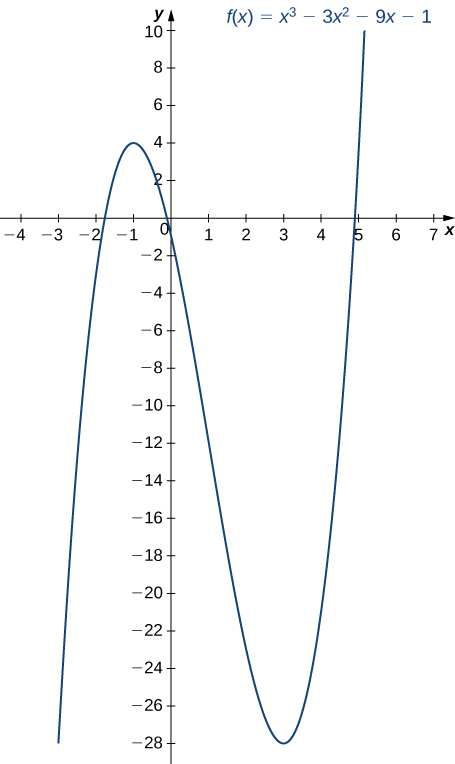{: #CNX_Calc_Figure_04_05_003}

Use the first derivative test to locate all local extrema for <math xmlns="http://www.w3.org/1998/Math/MathML"><mrow><mi>f</mi><mrow><mo>(</mo><mi>x</mi><mo>)</mo></mrow><mo>=</mo><mtext>−</mtext><msup><mi>x</mi><mn>3</mn></msup><mo>+</mo><mfrac><mn>3</mn><mn>2</mn></mfrac><msup><mi>x</mi><mn>2</mn></msup><mo>+</mo><mn>18</mn><mi>x</mi><mo>.</mo></mrow></math>

<math xmlns="http://www.w3.org/1998/Math/MathML"><mi>f</mi></math>

 has a local minimum at <math xmlns="http://www.w3.org/1998/Math/MathML"><mrow><mn>−2</mn></mrow></math>

 and a local maximum at <math xmlns="http://www.w3.org/1998/Math/MathML"><mrow><mn>3</mn><mo>.</mo></mrow></math>

Hint

Find all critical points of <math xmlns="http://www.w3.org/1998/Math/MathML"><mi>f</mi></math>

 and determine the signs of <math xmlns="http://www.w3.org/1998/Math/MathML"><mrow><msup><mi>f</mi><mo>′</mo></msup><mrow><mo>(</mo><mi>x</mi><mo>)</mo></mrow></mrow></math>

 over particular intervals determined by the critical points.

Using the First Derivative Test

Use the first derivative test to find the location of all local extrema for <math xmlns="http://www.w3.org/1998/Math/MathML"><mrow><mi>f</mi><mrow><mo>(</mo><mi>x</mi><mo>)</mo></mrow><mo>=</mo><mn>5</mn><msup><mi>x</mi><mrow><mn>1</mn><mtext>/</mtext><mn>3</mn></mrow></msup><mo>−</mo><msup><mi>x</mi><mrow><mn>5</mn><mtext>/</mtext><mn>3</mn></mrow></msup><mo>.</mo></mrow></math>

 Use a graphing utility to confirm your results.

Step 1. The derivative is

<math xmlns="http://www.w3.org/1998/Math/MathML"><mrow><msup><mi>f</mi><mo>′</mo></msup><mrow><mo>(</mo><mi>x</mi><mo>)</mo></mrow><mo>=</mo><mfrac><mn>5</mn><mn>3</mn></mfrac><msup><mi>x</mi><mrow><mn>−2</mn><mtext>/</mtext><mn>3</mn></mrow></msup><mo>−</mo><mfrac><mn>5</mn><mn>3</mn></mfrac><msup><mi>x</mi><mrow><mn>2</mn><mtext>/</mtext><mn>3</mn></mrow></msup><mo>=</mo><mfrac><mn>5</mn><mrow><mn>3</mn><msup><mi>x</mi><mrow><mn>2</mn><mtext>/</mtext><mn>3</mn></mrow></msup></mrow></mfrac><mo>−</mo><mfrac><mrow><mn>5</mn><msup><mi>x</mi><mrow><mn>2</mn><mtext>/</mtext><mn>3</mn></mrow></msup></mrow><mn>3</mn></mfrac><mo>=</mo><mfrac><mrow><mn>5</mn><mo>−</mo><mn>5</mn><msup><mi>x</mi><mrow><mn>4</mn><mtext>/</mtext><mn>3</mn></mrow></msup></mrow><mrow><mn>3</mn><msup><mi>x</mi><mrow><mn>2</mn><mtext>/</mtext><mn>3</mn></mrow></msup></mrow></mfrac><mo>=</mo><mfrac><mrow><mn>5</mn><mrow><mo>(</mo><mrow><mn>1</mn><mo>−</mo><msup><mi>x</mi><mrow><mn>4</mn><mtext>/</mtext><mn>3</mn></mrow></msup></mrow><mo>)</mo></mrow></mrow><mrow><mn>3</mn><msup><mi>x</mi><mrow><mn>2</mn><mtext>/</mtext><mn>3</mn></mrow></msup></mrow></mfrac><mo>.</mo></mrow></math>

The derivative <math xmlns="http://www.w3.org/1998/Math/MathML"><mrow><msup><mi>f</mi><mo>′</mo></msup><mrow><mo>(</mo><mi>x</mi><mo>)</mo></mrow><mo>=</mo><mn>0</mn></mrow></math>

 when <math xmlns="http://www.w3.org/1998/Math/MathML"><mrow><mn>1</mn><mo>−</mo><msup><mi>x</mi><mrow><mn>4</mn><mtext>/</mtext><mn>3</mn></mrow></msup><mo>=</mo><mn>0</mn><mo>.</mo></mrow></math>

 Therefore, <math xmlns="http://www.w3.org/1998/Math/MathML"><mrow><msup><mi>f</mi><mo>′</mo></msup><mrow><mo>(</mo><mi>x</mi><mo>)</mo></mrow><mo>=</mo><mn>0</mn></mrow></math>

 at <math xmlns="http://www.w3.org/1998/Math/MathML"><mrow><mi>x</mi><mo>=</mo><mtext>±</mtext><mn>1</mn><mo>.</mo></mrow></math>

 The derivative <math xmlns="http://www.w3.org/1998/Math/MathML"><mrow><msup><mi>f</mi><mo>′</mo></msup><mrow><mo>(</mo><mi>x</mi><mo>)</mo></mrow></mrow></math>

 is undefined at <math xmlns="http://www.w3.org/1998/Math/MathML"><mrow><mi>x</mi><mo>=</mo><mn>0</mn><mo>.</mo></mrow></math>

 Therefore, we have three critical points: <math xmlns="http://www.w3.org/1998/Math/MathML"><mrow><mi>x</mi><mo>=</mo><mn>0</mn><mo>,</mo></mrow></math>

 <math xmlns="http://www.w3.org/1998/Math/MathML"><mrow><mi>x</mi><mo>=</mo><mn>1</mn><mo>,</mo></mrow></math>

 and <math xmlns="http://www.w3.org/1998/Math/MathML"><mrow><mi>x</mi><mo>=</mo><mn>−1</mn><mo>.</mo></mrow></math>

 Consequently, divide the interval <math xmlns="http://www.w3.org/1998/Math/MathML"><mrow><mrow><mo>(</mo><mrow><mtext>−</mtext><mi>∞</mi><mo>,</mo><mi>∞</mi></mrow><mo>)</mo></mrow></mrow></math>

 into the smaller intervals <math xmlns="http://www.w3.org/1998/Math/MathML"><mrow><mrow><mo>(</mo><mrow><mtext>−</mtext><mi>∞</mi><mo>,</mo><mn>−1</mn></mrow><mo>)</mo></mrow><mo>,</mo><mrow><mo>(</mo><mrow><mn>−1</mn><mo>,</mo><mn>0</mn></mrow><mo>)</mo></mrow><mo>,</mo><mrow><mo>(</mo><mrow><mn>0</mn><mo>,</mo><mn>1</mn></mrow><mo>)</mo></mrow><mo>,</mo></mrow></math>

 and <math xmlns="http://www.w3.org/1998/Math/MathML"><mrow><mrow><mo>(</mo><mrow><mn>1</mn><mo>,</mo><mi>∞</mi></mrow><mo>)</mo></mrow><mo>.</mo></mrow></math>

Step 2: Since <math xmlns="http://www.w3.org/1998/Math/MathML"><msup><mi>f</mi><mo>′</mo></msup></math>

 is continuous over each subinterval, it suffices to choose a test point <math xmlns="http://www.w3.org/1998/Math/MathML"><mi>x</mi></math>

 in each of the intervals from step <math xmlns="http://www.w3.org/1998/Math/MathML"><mn>1</mn></math>

 and determine the sign of <math xmlns="http://www.w3.org/1998/Math/MathML"><msup><mi>f</mi><mo>′</mo></msup></math>

 at each of these points. The points <math xmlns="http://www.w3.org/1998/Math/MathML"><mrow><mi>x</mi><mo>=</mo><mn>−2</mn><mo>,</mo><mi>x</mi><mo>=</mo><mo>−</mo><mfrac><mn>1</mn><mn>2</mn></mfrac><mo>,</mo><mi>x</mi><mo>=</mo><mfrac><mn>1</mn><mn>2</mn></mfrac><mo>,</mo><mspace width="0.2em" /><mtext>and</mtext><mspace width="0.2em" /><mi>x</mi><mo>=</mo><mn>2</mn></mrow></math>

 are test points for these intervals.

| Interval | Test Point | Sign of <math xmlns="http://www.w3.org/1998/Math/MathML"><mrow><msup><mi>f</mi><mo>′</mo></msup><mrow><mo>(</mo><mi>x</mi><mo>)</mo></mrow><mo>=</mo><mfrac><mrow><mn>5</mn><mrow><mo>(</mo><mrow><mn>1</mn><mo>−</mo><msup><mi>x</mi><mrow><mn>4</mn><mtext>/</mtext><mn>3</mn></mrow></msup></mrow><mo>)</mo></mrow></mrow><mrow><mn>3</mn><msup><mi>x</mi><mrow><mn>2</mn><mtext>/</mtext><mn>3</mn></mrow></msup></mrow></mfrac></mrow></math>

 at Test Point | Conclusion |
{: valign="top"}|----------
| <math xmlns="http://www.w3.org/1998/Math/MathML"><mrow><mrow><mo>(</mo><mrow><mtext>−</mtext><mi>∞</mi><mo>,</mo><mn>−1</mn></mrow><mo>)</mo></mrow></mrow></math>

 | <math xmlns="http://www.w3.org/1998/Math/MathML"><mrow><mi>x</mi><mo>=</mo><mn>−2</mn></mrow></math>

 | <math xmlns="http://www.w3.org/1998/Math/MathML"><mrow><mfrac><mrow><mrow><mo>(</mo><mtext>+</mtext><mo>)</mo></mrow><mrow><mo>(</mo><mtext>−</mtext><mo>)</mo></mrow></mrow><mo>+</mo></mfrac><mo>=</mo><mtext>−</mtext></mrow></math>

 | <math xmlns="http://www.w3.org/1998/Math/MathML"><mi>f</mi></math>

 is decreasing. |
{: valign="top"}| <math xmlns="http://www.w3.org/1998/Math/MathML"><mrow><mrow><mo>(</mo><mrow><mn>−1</mn><mo>,</mo><mn>0</mn></mrow><mo>)</mo></mrow></mrow></math>

 | <math xmlns="http://www.w3.org/1998/Math/MathML"><mrow><mi>x</mi><mo>=</mo><mo>−</mo><mfrac><mn>1</mn><mn>2</mn></mfrac></mrow></math>

 | <math xmlns="http://www.w3.org/1998/Math/MathML"><mrow><mfrac><mrow><mrow><mo>(</mo><mtext>+</mtext><mo>)</mo></mrow><mrow><mo>(</mo><mtext>+</mtext><mo>)</mo></mrow></mrow><mo>+</mo></mfrac><mo>=</mo><mo>+</mo></mrow></math>

 | <math xmlns="http://www.w3.org/1998/Math/MathML"><mi>f</mi></math>

 is increasing. |
{: valign="top"}| <math xmlns="http://www.w3.org/1998/Math/MathML"><mrow><mrow><mo>(</mo><mrow><mn>0</mn><mo>,</mo><mn>1</mn></mrow><mo>)</mo></mrow></mrow></math>

 | <math xmlns="http://www.w3.org/1998/Math/MathML"><mrow><mi>x</mi><mo>=</mo><mfrac><mn>1</mn><mn>2</mn></mfrac></mrow></math>

 | <math xmlns="http://www.w3.org/1998/Math/MathML"><mrow><mfrac><mrow><mrow><mo>(</mo><mtext>+</mtext><mo>)</mo></mrow><mrow><mo>(</mo><mtext>+</mtext><mo>)</mo></mrow></mrow><mo>+</mo></mfrac><mo>=</mo><mo>+</mo></mrow></math>

 | <math xmlns="http://www.w3.org/1998/Math/MathML"><mi>f</mi></math>

 is increasing. |
{: valign="top"}| <math xmlns="http://www.w3.org/1998/Math/MathML"><mrow><mrow><mo>(</mo><mrow><mn>1</mn><mo>,</mo><mi>∞</mi></mrow><mo>)</mo></mrow></mrow></math>

 | <math xmlns="http://www.w3.org/1998/Math/MathML"><mrow><mi>x</mi><mo>=</mo><mn>2</mn></mrow></math>

 | <math xmlns="http://www.w3.org/1998/Math/MathML"><mrow><mfrac><mrow><mrow><mo>(</mo><mtext>+</mtext><mo>)</mo></mrow><mrow><mo>(</mo><mtext>−</mtext><mo>)</mo></mrow></mrow><mo>+</mo></mfrac><mo>=</mo><mtext>−</mtext></mrow></math>

 | <math xmlns="http://www.w3.org/1998/Math/MathML"><mi>f</mi></math>

 is decreasing. |
{: valign="top"}{: .unnumbered summary="This table has five rows and four columns. The first row is a header row, and it reads from left to right Interval, Test Point, Sign of f&#x2019;(x) = 5(1 &#x2013; x4/3)/(3x2/3) at Test Point, and Conclusion. Below the header, the first column reads (&#x2212;&#x221E;, &#x2212;1), (&#x2212;1, 0), (0, 1), and (1, &#x221E;). The second column reads x = &#x2212;2, x = &#x2212;1/2, x = 1/2, and x = 2. The third column reads (+)(&#x2212;)/(+) = &#x2212;, (+)(+)/(+) = +, (+)(+)/(+) = +, and (+)(&#x2212;)/(+) = &#x2212;. The fourth column reads f is decreasing, f is increasing, f is increasing, and f is decreasing." data-label=""}

Step 3: Since <math xmlns="http://www.w3.org/1998/Math/MathML"><mi>f</mi></math>

 is decreasing over the interval <math xmlns="http://www.w3.org/1998/Math/MathML"><mrow><mrow><mo>(</mo><mrow><mtext>−</mtext><mi>∞</mi><mo>,</mo><mn>−1</mn></mrow><mo>)</mo></mrow></mrow></math>

 and increasing over the interval <math xmlns="http://www.w3.org/1998/Math/MathML"><mrow><mrow><mo>(</mo><mrow><mn>−1</mn><mo>,</mo><mn>0</mn></mrow><mo>)</mo></mrow><mo>,</mo></mrow></math>

 <math xmlns="http://www.w3.org/1998/Math/MathML"><mi>f</mi></math>

 has a local minimum at <math xmlns="http://www.w3.org/1998/Math/MathML"><mrow><mi>x</mi><mo>=</mo><mn>−1</mn><mo>.</mo></mrow></math>

 Since <math xmlns="http://www.w3.org/1998/Math/MathML"><mi>f</mi></math>

 is increasing over the interval <math xmlns="http://www.w3.org/1998/Math/MathML"><mrow><mrow><mo>(</mo><mrow><mn>−1</mn><mo>,</mo><mn>0</mn></mrow><mo>)</mo></mrow></mrow></math>

 and the interval <math xmlns="http://www.w3.org/1998/Math/MathML"><mrow><mrow><mo>(</mo><mrow><mn>0</mn><mo>,</mo><mn>1</mn></mrow><mo>)</mo></mrow><mo>,</mo></mrow></math>

 <math xmlns="http://www.w3.org/1998/Math/MathML"><mi>f</mi></math>

 does not have a local extremum at <math xmlns="http://www.w3.org/1998/Math/MathML"><mrow><mi>x</mi><mo>=</mo><mn>0</mn><mo>.</mo></mrow></math>

 Since <math xmlns="http://www.w3.org/1998/Math/MathML"><mi>f</mi></math>

 is increasing over the interval <math xmlns="http://www.w3.org/1998/Math/MathML"><mrow><mrow><mo>(</mo><mrow><mn>0</mn><mo>,</mo><mn>1</mn></mrow><mo>)</mo></mrow></mrow></math>

 and decreasing over the interval <math xmlns="http://www.w3.org/1998/Math/MathML"><mrow><mrow><mo>(</mo><mrow><mn>1</mn><mo>,</mo><mi>∞</mi></mrow><mo>)</mo></mrow><mo>,</mo><mi>f</mi></mrow></math>

 has a local maximum at <math xmlns="http://www.w3.org/1998/Math/MathML"><mrow><mi>x</mi><mo>=</mo><mn>1</mn><mo>.</mo></mrow></math>

 The analytical results agree with the following graph.

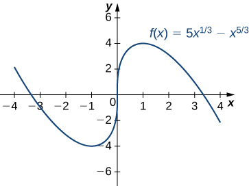{: #CNX_Calc_Figure_04_05_004}

Use the first derivative test to find all local extrema for <math xmlns="http://www.w3.org/1998/Math/MathML"><mrow><mi>f</mi><mrow><mo>(</mo><mi>x</mi><mo>)</mo></mrow><mo>=</mo><mroot><mrow><mi>x</mi><mo>−</mo><mn>1</mn></mrow><mn>3</mn></mroot><mo>.</mo></mrow></math>

<math xmlns="http://www.w3.org/1998/Math/MathML"><mi>f</mi></math>

 has no local extrema because <math xmlns="http://www.w3.org/1998/Math/MathML"><msup><mi>f</mi><mo>′</mo></msup></math>

 does not change sign at <math xmlns="http://www.w3.org/1998/Math/MathML"><mrow><mi>x</mi><mo>=</mo><mn>1</mn><mo>.</mo></mrow></math>

Hint

The only critical point of <math xmlns="http://www.w3.org/1998/Math/MathML"><mi>f</mi></math>

 is <math xmlns="http://www.w3.org/1998/Math/MathML"><mrow><mi>x</mi><mo>=</mo><mn>1</mn><mo>.</mo></mrow></math>

### Concavity and Points of Inflection

We now know how to determine where a function is increasing or decreasing. However, there is another issue to consider regarding the shape of the graph of a function. If the graph curves, does it curve upward or curve downward? This notion is called the **concavity**{: data-type="term"} of the function.

[\[link\]](#CNX_Calc_Figure_04_05_005)(a) shows a function <math xmlns="http://www.w3.org/1998/Math/MathML"><mi>f</mi></math>

 with a graph that curves upward. As <math xmlns="http://www.w3.org/1998/Math/MathML"><mi>x</mi></math>

 increases, the slope of the tangent line increases. Thus, since the derivative increases as <math xmlns="http://www.w3.org/1998/Math/MathML"><mi>x</mi></math>

 increases, <math xmlns="http://www.w3.org/1998/Math/MathML"><msup><mi>f</mi><mo>′</mo></msup></math>

 is an increasing function. We say this function <math xmlns="http://www.w3.org/1998/Math/MathML"><mi>f</mi></math>

 is concave up. [\[link\]](#CNX_Calc_Figure_04_05_005)(b) shows a function <math xmlns="http://www.w3.org/1998/Math/MathML"><mi>f</mi></math>

 that curves downward. As <math xmlns="http://www.w3.org/1998/Math/MathML"><mi>x</mi></math>

 increases, the slope of the tangent line decreases. Since the derivative decreases as <math xmlns="http://www.w3.org/1998/Math/MathML"><mi>x</mi></math>

 increases, <math xmlns="http://www.w3.org/1998/Math/MathML"><msup><mi>f</mi><mo>′</mo></msup></math>

 is a decreasing function. We say this function <math xmlns="http://www.w3.org/1998/Math/MathML"><mi>f</mi></math>

 is concave down.

Definition

Let <math xmlns="http://www.w3.org/1998/Math/MathML"><mi>f</mi></math>

 be a function that is differentiable over an open interval <math xmlns="http://www.w3.org/1998/Math/MathML"><mi>I</mi><mo>.</mo></math>

 If <math xmlns="http://www.w3.org/1998/Math/MathML"><msup><mi>f</mi><mo>′</mo></msup></math>

 is increasing over <math xmlns="http://www.w3.org/1998/Math/MathML"><mrow><mi>I</mi><mo>,</mo></mrow></math>

 we say <math xmlns="http://www.w3.org/1998/Math/MathML"><mi>f</mi></math>

 is **concave up**{: data-type="term"} over <math xmlns="http://www.w3.org/1998/Math/MathML"><mrow><mi>I</mi><mo>.</mo></mrow></math>

 If <math xmlns="http://www.w3.org/1998/Math/MathML"><msup><mi>f</mi><mo>′</mo></msup></math>

 is decreasing over <math xmlns="http://www.w3.org/1998/Math/MathML"><mrow><mi>I</mi><mo>,</mo></mrow></math>

 we say <math xmlns="http://www.w3.org/1998/Math/MathML"><mi>f</mi></math>

 is **concave down**{: data-type="term"} over <math xmlns="http://www.w3.org/1998/Math/MathML"><mrow><mi>I</mi><mo>.</mo></mrow></math>

 ![This figure is broken into four figures labeled a, b, c, and d. Figure a shows a function increasing convexly from (a, f(a)) to (b, f(b)). At two points the derivative is taken and both are increasing, but the one taken further to the right is increasing more. It is noted that f&#x2019; is increasing and f is concave up. Figure b shows a function increasing concavely from (a, f(a)) to (b, f(b)). At two points the derivative is taken and both are increasing, but the one taken further to the right is increasing less. It is noted that f&#x2019; is decreasing and f is concave down. Figure c shows a function decreasing concavely from (a, f(a)) to (b, f(b)). At two points the derivative is taken and both are decreasing, but the one taken further to the right is decreasing less. It is noted that f&#x2019; is increasing and f is concave up. Figure d shows a function decreasing convexly from (a, f(a)) to (b, f(b)). At two points the derivative is taken and both are decreasing, but the one taken further to the right is decreasing more. It is noted that f&#x2019; is decreasing and f is concave down.](../resources/CNX_Calc_Figure_04_05_010.jpg "(a), (c) Since f&#x2032; is increasing over the interval (a,b), we say f is concave up over (a,b). (b), (d) Since f&#x2032; is decreasing over the interval (a,b), we say f is concave down over (a,b)."){: #CNX_Calc_Figure_04_05_005}

In general, without having the graph of a function <math xmlns="http://www.w3.org/1998/Math/MathML"><mrow><mi>f</mi><mo>,</mo></mrow></math>

 how can we determine its concavity? By definition, a function <math xmlns="http://www.w3.org/1998/Math/MathML"><mi>f</mi></math>

 is concave up if <math xmlns="http://www.w3.org/1998/Math/MathML"><msup><mi>f</mi><mo>′</mo></msup></math>

 is increasing. From Corollary <math xmlns="http://www.w3.org/1998/Math/MathML"><mn>3</mn><mo>,</mo></math>

 we know that if <math xmlns="http://www.w3.org/1998/Math/MathML"><msup><mi>f</mi><mo>′</mo></msup></math>

 is a differentiable function, then <math xmlns="http://www.w3.org/1998/Math/MathML"><msup><mi>f</mi><mo>′</mo></msup></math>

 is increasing if its derivative <math xmlns="http://www.w3.org/1998/Math/MathML"><mrow><mi>f</mi><mtext>″</mtext><mrow><mo>(</mo><mi>x</mi><mo>)</mo></mrow><mo>&gt;</mo><mn>0</mn><mo>.</mo></mrow></math>

 Therefore, a function <math xmlns="http://www.w3.org/1998/Math/MathML"><mi>f</mi></math>

 that is twice differentiable is concave up when <math xmlns="http://www.w3.org/1998/Math/MathML"><mrow><mi>f</mi><mtext>″</mtext><mrow><mo>(</mo><mi>x</mi><mo>)</mo></mrow><mo>&gt;</mo><mn>0</mn><mo>.</mo></mrow></math>

 Similarly, a function <math xmlns="http://www.w3.org/1998/Math/MathML"><mi>f</mi></math>

 is concave down if <math xmlns="http://www.w3.org/1998/Math/MathML"><msup><mi>f</mi><mo>′</mo></msup></math>

 is decreasing. We know that a differentiable function <math xmlns="http://www.w3.org/1998/Math/MathML"><msup><mi>f</mi><mo>′</mo></msup></math>

 is decreasing if its derivative <math xmlns="http://www.w3.org/1998/Math/MathML"><mrow><mi>f</mi><mtext>″</mtext><mrow><mo>(</mo><mi>x</mi><mo>)</mo></mrow><mo>&lt;</mo><mn>0</mn><mo>.</mo></mrow></math>

 Therefore, a twice-differentiable function <math xmlns="http://www.w3.org/1998/Math/MathML"><mi>f</mi></math>

 is concave down when <math xmlns="http://www.w3.org/1998/Math/MathML"><mrow><mi>f</mi><mtext>″</mtext><mrow><mo>(</mo><mi>x</mi><mo>)</mo></mrow><mo>&lt;</mo><mn>0</mn><mo>.</mo></mrow></math>

 Applying this logic is known as the **concavity test**{: data-type="term"}.

Test for Concavity

Let <math xmlns="http://www.w3.org/1998/Math/MathML"><mi>f</mi></math>

 be a function that is twice differentiable over an interval <math xmlns="http://www.w3.org/1998/Math/MathML"><mrow><mi>I</mi><mo>.</mo></mrow></math>

1.  If
    <math xmlns="http://www.w3.org/1998/Math/MathML"><mrow><mi>f</mi><mtext>″</mtext><mrow><mo>(</mo><mi>x</mi><mo>)</mo></mrow><mo>&gt;</mo><mn>0</mn></mrow></math>
    
    for all
    <math xmlns="http://www.w3.org/1998/Math/MathML"><mrow><mi>x</mi><mo>∈</mo><mi>I</mi><mo>,</mo></mrow></math>
    
    then
    <math xmlns="http://www.w3.org/1998/Math/MathML"><mi>f</mi></math>
    
    is concave up over
    <math xmlns="http://www.w3.org/1998/Math/MathML"><mrow><mi>I</mi><mo>.</mo></mrow></math>

2.  If
    <math xmlns="http://www.w3.org/1998/Math/MathML"><mrow><mi>f</mi><mtext>″</mtext><mrow><mo>(</mo><mi>x</mi><mo>)</mo></mrow><mo>&lt;</mo><mn>0</mn></mrow></math>
    
    for all
    <math xmlns="http://www.w3.org/1998/Math/MathML"><mrow><mi>x</mi><mo>∈</mo><mi>I</mi><mo>,</mo></mrow></math>
    
    then
    <math xmlns="http://www.w3.org/1998/Math/MathML"><mi>f</mi></math>
    
    is concave down over
    <math xmlns="http://www.w3.org/1998/Math/MathML"><mrow><mi>I</mi><mo>.</mo></mrow></math>
{: type="i"}

We conclude that we can determine the concavity of a function <math xmlns="http://www.w3.org/1998/Math/MathML"><mi>f</mi></math>

 by looking at the second derivative of <math xmlns="http://www.w3.org/1998/Math/MathML"><mrow><mi>f</mi><mo>.</mo></mrow></math>

 In addition, we observe that a function <math xmlns="http://www.w3.org/1998/Math/MathML"><mi>f</mi></math>

 can switch concavity ([\[link\]](#CNX_Calc_Figure_04_05_006)). However, a continuous function can switch concavity only at a point <math xmlns="http://www.w3.org/1998/Math/MathML"><mi>x</mi></math>

 if <math xmlns="http://www.w3.org/1998/Math/MathML"><mrow><mi>f</mi><mtext>″</mtext><mrow><mo>(</mo><mi>x</mi><mo>)</mo></mrow><mo>=</mo><mn>0</mn></mrow></math>

 or <math xmlns="http://www.w3.org/1998/Math/MathML"><mrow><mi>f</mi><mtext>″</mtext><mrow><mo>(</mo><mi>x</mi><mo>)</mo></mrow></mrow></math>

 is undefined. Consequently, to determine the intervals where a function <math xmlns="http://www.w3.org/1998/Math/MathML"><mi>f</mi></math>

 is concave up and concave down, we look for those values of <math xmlns="http://www.w3.org/1998/Math/MathML"><mi>x</mi></math>

 where <math xmlns="http://www.w3.org/1998/Math/MathML"><mrow><mi>f</mi><mtext>″</mtext><mrow><mo>(</mo><mi>x</mi><mo>)</mo></mrow><mo>=</mo><mn>0</mn></mrow></math>

 or <math xmlns="http://www.w3.org/1998/Math/MathML"><mrow><mi>f</mi><mtext>″</mtext><mrow><mo>(</mo><mi>x</mi><mo>)</mo></mrow></mrow></math>

 is undefined. When we have determined these points, we divide the domain of <math xmlns="http://www.w3.org/1998/Math/MathML"><mi>f</mi></math>

 into smaller intervals and determine the sign of <math xmlns="http://www.w3.org/1998/Math/MathML"><mi>f</mi><mtext>″</mtext></math>

 over each of these smaller intervals. If <math xmlns="http://www.w3.org/1998/Math/MathML"><mi>f</mi><mtext>″</mtext></math>

 changes sign as we pass through a point <math xmlns="http://www.w3.org/1998/Math/MathML"><mrow><mi>x</mi><mo>,</mo></mrow></math>

 then <math xmlns="http://www.w3.org/1998/Math/MathML"><mi>f</mi></math>

 changes concavity. It is important to remember that a function <math xmlns="http://www.w3.org/1998/Math/MathML"><mi>f</mi></math>

 may not change concavity at a point <math xmlns="http://www.w3.org/1998/Math/MathML"><mi>x</mi></math>

 even if <math xmlns="http://www.w3.org/1998/Math/MathML"><mrow><mi>f</mi><mtext>″</mtext><mrow><mo>(</mo><mi>x</mi><mo>)</mo></mrow><mo>=</mo><mn>0</mn></mrow></math>

 or <math xmlns="http://www.w3.org/1998/Math/MathML"><mrow><mi>f</mi><mtext>″</mtext><mrow><mo>(</mo><mi>x</mi><mo>)</mo></mrow></mrow></math>

 is undefined. If, however, <math xmlns="http://www.w3.org/1998/Math/MathML"><mi>f</mi></math>

 does change concavity at a point <math xmlns="http://www.w3.org/1998/Math/MathML"><mi>a</mi></math>

 and <math xmlns="http://www.w3.org/1998/Math/MathML"><mi>f</mi></math>

 is continuous at <math xmlns="http://www.w3.org/1998/Math/MathML"><mrow><mi>a</mi><mo>,</mo></mrow></math>

 we say the point <math xmlns="http://www.w3.org/1998/Math/MathML"><mrow><mrow><mo>(</mo><mrow><mi>a</mi><mo>,</mo><mi>f</mi><mrow><mo>(</mo><mi>a</mi><mo>)</mo></mrow></mrow><mo>)</mo></mrow></mrow></math>

 is an inflection point of <math xmlns="http://www.w3.org/1998/Math/MathML"><mrow><mi>f</mi><mo>.</mo></mrow></math>

Definition

If <math xmlns="http://www.w3.org/1998/Math/MathML"><mi>f</mi></math>

 is continuous at <math xmlns="http://www.w3.org/1998/Math/MathML"><mi>a</mi></math>

 and <math xmlns="http://www.w3.org/1998/Math/MathML"><mi>f</mi></math>

 changes concavity at <math xmlns="http://www.w3.org/1998/Math/MathML"><mrow><mi>a</mi><mo>,</mo></mrow></math>

 the point <math xmlns="http://www.w3.org/1998/Math/MathML"><mrow><mrow><mo>(</mo><mrow><mi>a</mi><mo>,</mo><mi>f</mi><mrow><mo>(</mo><mi>a</mi><mo>)</mo></mrow></mrow><mo>)</mo></mrow></mrow></math>

 is an **inflection point**{: data-type="term"} of <math xmlns="http://www.w3.org/1998/Math/MathML"><mrow><mi>f</mi><mo>.</mo></mrow></math>

 ![A sinusoidal function is shown that has been shifted into the first quadrant. The function starts decreasing, so f&#x2019; &lt; 0 and f&#x2019;&#x2019; &gt; 0. The function reaches the local minimum and starts increasing, so f&#x2019; &gt; 0 and f&#x2019;&#x2019; &gt; 0. It is noted that the slope is increasing for these two intervals. The function then reaches an inflection point (a, f(a)) and from here the slop is decreasing even though the function continues to increase, so f&#x2019; &gt; 0 and f&#x2019;&#x2019; &lt; 0. The function reaches the maximum and then starts decreasing, so f&#x2019; &lt; 0 and f&#x2019;&#x2019; &lt; 0.](../resources/CNX_Calc_Figure_04_05_004.jpg "Since f&#x2033;(x)&gt;0 for x&lt;a, the function f is concave up over the interval (&#x2212;&#x221E;,a). Since f&#x2033;(x)&lt;0 for x&gt;a, the function f is concave down over the interval (a,&#x221E;). The point (a,f(a)) is an inflection point of f."){: #CNX_Calc_Figure_04_05_006}

Testing for Concavity

For the function <math xmlns="http://www.w3.org/1998/Math/MathML"><mrow><mi>f</mi><mrow><mo>(</mo><mi>x</mi><mo>)</mo></mrow><mo>=</mo><msup><mi>x</mi><mn>3</mn></msup><mo>−</mo><mn>6</mn><msup><mi>x</mi><mn>2</mn></msup><mo>+</mo><mn>9</mn><mi>x</mi><mo>+</mo><mn>30</mn><mo>,</mo></mrow></math>

 determine all intervals where <math xmlns="http://www.w3.org/1998/Math/MathML"><mi>f</mi></math>

 is concave up and all intervals where <math xmlns="http://www.w3.org/1998/Math/MathML"><mi>f</mi></math>

 is concave down. List all inflection points for <math xmlns="http://www.w3.org/1998/Math/MathML"><mrow><mi>f</mi><mo>.</mo></mrow></math>

 Use a graphing utility to confirm your results.

To determine concavity, we need to find the second derivative <math xmlns="http://www.w3.org/1998/Math/MathML"><mrow><mi>f</mi><mtext>″</mtext><mrow><mo>(</mo><mi>x</mi><mo>)</mo></mrow><mo>.</mo></mrow></math>

 The first derivative is <math xmlns="http://www.w3.org/1998/Math/MathML"><mrow><mi>f</mi><mo>′</mo><mrow><mo>(</mo><mi>x</mi><mo>)</mo></mrow><mo>=</mo><mn>3</mn><msup><mi>x</mi><mn>2</mn></msup><mo>−</mo><mn>12</mn><mi>x</mi><mo>+</mo><mn>9</mn><mo>,</mo></mrow></math>

 so the second derivative is <math xmlns="http://www.w3.org/1998/Math/MathML"><mrow><mi>f</mi><mtext>″</mtext><mrow><mo>(</mo><mi>x</mi><mo>)</mo></mrow><mo>=</mo><mn>6</mn><mi>x</mi><mo>−</mo><mn>12</mn><mo>.</mo></mrow></math>

 If the function changes concavity, it occurs either when <math xmlns="http://www.w3.org/1998/Math/MathML"><mrow><mi>f</mi><mtext>″</mtext><mrow><mo>(</mo><mi>x</mi><mo>)</mo></mrow><mo>=</mo><mn>0</mn></mrow></math>

 or <math xmlns="http://www.w3.org/1998/Math/MathML"><mrow><mi>f</mi><mtext>″</mtext><mrow><mo>(</mo><mi>x</mi><mo>)</mo></mrow></mrow></math>

 is undefined. Since <math xmlns="http://www.w3.org/1998/Math/MathML"><mi>f</mi><mtext>″</mtext></math>

 is defined for all real numbers <math xmlns="http://www.w3.org/1998/Math/MathML"><mrow><mi>x</mi><mo>,</mo></mrow></math>

 we need only find where <math xmlns="http://www.w3.org/1998/Math/MathML"><mrow><mi>f</mi><mtext>″</mtext><mrow><mo>(</mo><mi>x</mi><mo>)</mo></mrow><mo>=</mo><mn>0</mn><mo>.</mo></mrow></math>

 Solving the equation <math xmlns="http://www.w3.org/1998/Math/MathML"><mrow><mn>6</mn><mi>x</mi><mo>−</mo><mn>12</mn><mo>=</mo><mn>0</mn><mo>,</mo></mrow></math>

 we see that <math xmlns="http://www.w3.org/1998/Math/MathML"><mrow><mi>x</mi><mo>=</mo><mn>2</mn></mrow></math>

 is the only place where <math xmlns="http://www.w3.org/1998/Math/MathML"><mi>f</mi></math>

 could change concavity. We now test points over the intervals <math xmlns="http://www.w3.org/1998/Math/MathML"><mrow><mrow><mo>(</mo><mrow><mtext>−</mtext><mi>∞</mi><mo>,</mo><mn>2</mn></mrow><mo>)</mo></mrow></mrow></math>

 and <math xmlns="http://www.w3.org/1998/Math/MathML"><mrow><mrow><mo>(</mo><mrow><mn>2</mn><mo>,</mo><mi>∞</mi></mrow><mo>)</mo></mrow></mrow></math>

 to determine the concavity of <math xmlns="http://www.w3.org/1998/Math/MathML"><mrow><mi>f</mi><mo>.</mo></mrow></math>

 The points <math xmlns="http://www.w3.org/1998/Math/MathML"><mrow><mi>x</mi><mo>=</mo><mn>0</mn></mrow></math>

 and <math xmlns="http://www.w3.org/1998/Math/MathML"><mrow><mi>x</mi><mo>=</mo><mn>3</mn></mrow></math>

 are test points for these intervals.

| Interval | Test Point | Sign of <math xmlns="http://www.w3.org/1998/Math/MathML"><mrow><mi>f</mi><mtext>″</mtext><mrow><mo>(</mo><mi>x</mi><mo>)</mo></mrow><mo>=</mo><mn>6</mn><mi>x</mi><mo>−</mo><mn>12</mn></mrow></math>

 at Test Point | Conclusion |
{: valign="top"}|----------
| <math xmlns="http://www.w3.org/1998/Math/MathML"><mrow><mrow><mo>(</mo><mrow><mtext>−</mtext><mi>∞</mi><mo>,</mo><mn>2</mn></mrow><mo>)</mo></mrow></mrow></math>

 | <math xmlns="http://www.w3.org/1998/Math/MathML"><mrow><mi>x</mi><mo>=</mo><mn>0</mn></mrow></math>

 | <math xmlns="http://www.w3.org/1998/Math/MathML"><mo>−</mo></math>

 | <math xmlns="http://www.w3.org/1998/Math/MathML"><mi>f</mi></math>

 is concave down |
{: valign="top"}| <math xmlns="http://www.w3.org/1998/Math/MathML"><mrow><mrow><mo>(</mo><mrow><mn>2</mn><mo>,</mo><mi>∞</mi></mrow><mo>)</mo></mrow></mrow></math>

 | <math xmlns="http://www.w3.org/1998/Math/MathML"><mrow><mi>x</mi><mo>=</mo><mn>3</mn></mrow></math>

 | <math xmlns="http://www.w3.org/1998/Math/MathML"><mo>+</mo></math>

 | <math xmlns="http://www.w3.org/1998/Math/MathML"><mi>f</mi></math>

 is concave up. |
{: valign="top"}{: .unnumbered summary="This table has three rows and four columns. The first row is a header row, and it reads from left to right Interval, Test Point, Sign of f&#x2019;&#x2019;(x) = 6x &#x2013; 12 at Test Point, and Conclusion. Below the header, the first column reads (&#x2212;&#x221E;, 2) and (2, &#x221E;). The second column reads x = 0 and x = 3. The third column reads &#x2212; and +. The fourth column reads f is concave down and f is concave up." data-label=""}

We conclude that <math xmlns="http://www.w3.org/1998/Math/MathML"><mi>f</mi></math>

 is concave down over the interval <math xmlns="http://www.w3.org/1998/Math/MathML"><mrow><mrow><mo>(</mo><mrow><mtext>−</mtext><mi>∞</mi><mo>,</mo><mn>2</mn></mrow><mo>)</mo></mrow></mrow></math>

 and concave up over the interval <math xmlns="http://www.w3.org/1998/Math/MathML"><mrow><mrow><mo>(</mo><mrow><mn>2</mn><mo>,</mo><mi>∞</mi></mrow><mo>)</mo></mrow><mo>.</mo></mrow></math>

 Since <math xmlns="http://www.w3.org/1998/Math/MathML"><mi>f</mi></math>

 changes concavity at <math xmlns="http://www.w3.org/1998/Math/MathML"><mrow><mi>x</mi><mo>=</mo><mn>2</mn><mo>,</mo></mrow></math>

 the point <math xmlns="http://www.w3.org/1998/Math/MathML"><mrow><mrow><mo>(</mo><mrow><mn>2</mn><mo>,</mo><mi>f</mi><mrow><mo>(</mo><mn>2</mn><mo>)</mo></mrow></mrow><mo>)</mo></mrow><mo>=</mo><mrow><mo>(</mo><mrow><mn>2</mn><mo>,</mo><mn>32</mn></mrow><mo>)</mo></mrow></mrow></math>

 is an inflection point. [[link]](#CNX_Calc_Figure_04_05_007) confirms the analytical results.

 where the graph changes concavity."){: #CNX_Calc_Figure_04_05_007}

For <math xmlns="http://www.w3.org/1998/Math/MathML"><mrow><mi>f</mi><mrow><mo>(</mo><mi>x</mi><mo>)</mo></mrow><mo>=</mo><mtext>−</mtext><msup><mi>x</mi><mn>3</mn></msup><mo>+</mo><mfrac><mn>3</mn><mn>2</mn></mfrac><msup><mi>x</mi><mn>2</mn></msup><mo>+</mo><mn>18</mn><mi>x</mi><mo>,</mo></mrow></math>

 find all intervals where <math xmlns="http://www.w3.org/1998/Math/MathML"><mi>f</mi></math>

 is concave up and all intervals where <math xmlns="http://www.w3.org/1998/Math/MathML"><mi>f</mi></math>

 is concave down.

<math xmlns="http://www.w3.org/1998/Math/MathML"><mi>f</mi></math>

 is concave up over the interval <math xmlns="http://www.w3.org/1998/Math/MathML"><mrow><mrow><mo>(</mo><mrow><mtext>−</mtext><mi>∞</mi><mo>,</mo><mfrac><mn>1</mn><mn>2</mn></mfrac></mrow><mo>)</mo></mrow></mrow></math>

 and concave down over the interval <math xmlns="http://www.w3.org/1998/Math/MathML"><mrow><mrow><mo>(</mo><mrow><mfrac><mn>1</mn><mn>2</mn></mfrac><mo>,</mo><mi>∞</mi></mrow><mo>)</mo></mrow></mrow></math>

Hint

Find where <math xmlns="http://www.w3.org/1998/Math/MathML"><mrow><mi>f</mi><mtext>″</mtext><mrow><mo>(</mo><mi>x</mi><mo>)</mo></mrow><mo>=</mo><mn>0</mn><mo>.</mo></mrow></math>

We now summarize, in [\[link\]](#fs-id1165043353366), the information that the first and second derivatives of a function <math xmlns="http://www.w3.org/1998/Math/MathML"><mi>f</mi></math>

 provide about the graph of <math xmlns="http://www.w3.org/1998/Math/MathML"><mrow><mi>f</mi><mo>,</mo></mrow></math>

 and illustrate this information in [\[link\]](#CNX_Calc_Figure_04_05_008).

<table summary="This table has five rows and four columns. The first row is a header row, and it reads from left to right Sign of f&#x2019;, Sign of f&#x2019;&#x2019;, Is f increasing or decreasing?, and Concavity. Below the header, the first column reads Positive, Positive, Negative, and Negative. The second column reads Positive, Negative, Positive, and Negative. The third column reads Increasing, Increasing, Decreasing, and Decreasing. The fourth column reads Concave up, Concave down, Concave up, and Concave down."><caption>What Derivatives Tell Us about Graphs</caption><thead>
<tr valign="top">
<th data-valign="top" data-align="left">Sign of <math xmlns="http://www.w3.org/1998/Math/MathML"><mrow><mi>f</mi><mo>′</mo></mrow></math></th>
<th data-valign="top" data-align="left">Sign of <math xmlns="http://www.w3.org/1998/Math/MathML"><mrow><mi>f</mi><mtext>″</mtext></mrow></math></th>
<th data-valign="top" data-align="left">Is <math xmlns="http://www.w3.org/1998/Math/MathML"><mi>f</mi></math> increasing or decreasing?</th>
<th data-valign="top" data-align="left">Concavity</th>
</tr>
</thead><tbody>
<tr valign="top">
<td data-valign="top" data-align="left">Positive</td>
<td data-valign="top" data-align="left">Positive</td>
<td data-valign="top" data-align="left">Increasing</td>
<td data-valign="top" data-align="left">Concave up</td>
</tr>
<tr valign="top">
<td data-valign="top" data-align="left">Positive</td>
<td data-valign="top" data-align="left">Negative</td>
<td data-valign="top" data-align="left">Increasing</td>
<td data-valign="top" data-align="left">Concave down</td>
</tr>
<tr valign="top">
<td data-valign="top" data-align="left">Negative</td>
<td data-valign="top" data-align="left">Positive</td>
<td data-valign="top" data-align="left">Decreasing</td>
<td data-valign="top" data-align="left">Concave up</td>
</tr>
<tr valign="top">
<td data-valign="top" data-align="left">Negative</td>
<td data-valign="top" data-align="left">Negative</td>
<td data-valign="top" data-align="left">Decreasing</td>
<td data-valign="top" data-align="left">Concave down</td>
</tr>
</tbody></table>

 ![A function is graphed in the first quadrant. It is broken up into four sections, with the breaks coming at the local minimum, inflection point, and local maximum, respectively. The first section is decreasing and concave up; here, f&#x2019; &lt; 0 and f&#x2019;&#x2019; &gt; 0. The second section is increasing and concave up; here, f&#x2019; &gt; 0 and f&#x2019;&#x2019; &gt; 0. The third section is increasing and concave down; here, f&#x2019; &gt; 0 and f&#x2019;&#x2019; &lt; 0. The fourth section is increasing and concave down; here, f&#x2019; &lt; 0 and f&#x2019;&#x2019; &lt; 0.](../resources/CNX_Calc_Figure_04_05_005.jpg "Consider a twice-differentiable function f over an open interval I. If f&#x2032;(x)&gt;0 for all x&#x2208;I, the function is increasing over I. If f&#x2032;(x)&lt;0 for all x&#x2208;I, the function is decreasing over I. If f&#x2033;(x)&gt;0 for all x&#x2208;I, the function is concave up. If f&#x2033;(x)&lt;0 for all x&#x2208;I, the function is concave down on I."){: #CNX_Calc_Figure_04_05_008}

### The Second Derivative Test

The first derivative test provides an analytical tool for finding local extrema, but the second derivative can also be used to locate extreme values. Using the second derivative can sometimes be a simpler method than using the first derivative.

We know that if a continuous function has a local extrema, it must occur at a critical point. However, a function need not have a local extrema at a critical point. Here we examine how the **second derivative test**{: data-type="term"} can be used to determine whether a function has a local extremum at a critical point. Let <math xmlns="http://www.w3.org/1998/Math/MathML"><mi>f</mi></math>

 be a twice-differentiable function such that <math xmlns="http://www.w3.org/1998/Math/MathML"><mrow><msup><mi>f</mi><mo>′</mo></msup><mrow><mo>(</mo><mi>a</mi><mo>)</mo></mrow><mo>=</mo><mn>0</mn></mrow></math>

 and <math xmlns="http://www.w3.org/1998/Math/MathML"><mi>f</mi><mtext>″</mtext></math>

 is continuous over an open interval <math xmlns="http://www.w3.org/1998/Math/MathML"><mi>I</mi></math>

 containing <math xmlns="http://www.w3.org/1998/Math/MathML"><mrow><mi>a</mi><mo>.</mo></mrow></math>

 Suppose <math xmlns="http://www.w3.org/1998/Math/MathML"><mrow><mi>f</mi><mtext>″</mtext><mrow><mo>(</mo><mi>a</mi><mo>)</mo></mrow><mo>&lt;</mo><mn>0</mn><mo>.</mo></mrow></math>

 Since <math xmlns="http://www.w3.org/1998/Math/MathML"><mi>f</mi><mtext>″</mtext></math>

 is continuous over <math xmlns="http://www.w3.org/1998/Math/MathML"><mrow><mi>I</mi><mo>,</mo></mrow></math>

 <math xmlns="http://www.w3.org/1998/Math/MathML"><mrow><mi>f</mi><mtext>″</mtext><mrow><mo>(</mo><mi>x</mi><mo>)</mo></mrow><mo>&lt;</mo><mn>0</mn></mrow></math>

 for all <math xmlns="http://www.w3.org/1998/Math/MathML"><mrow><mi>x</mi><mo>∈</mo><mi>I</mi></mrow></math>

 ([\[link\]](#CNX_Calc_Figure_04_05_009)). Then, by Corollary <math xmlns="http://www.w3.org/1998/Math/MathML"><mn>3</mn><mo>,</mo></math>

 <math xmlns="http://www.w3.org/1998/Math/MathML"><msup><mi>f</mi><mo>′</mo></msup></math>

 is a decreasing function over <math xmlns="http://www.w3.org/1998/Math/MathML"><mrow><mi>I</mi><mo>.</mo></mrow></math>

 Since <math xmlns="http://www.w3.org/1998/Math/MathML"><mrow><msup><mi>f</mi><mo>′</mo></msup><mrow><mo>(</mo><mi>a</mi><mo>)</mo></mrow><mo>=</mo><mn>0</mn><mo>,</mo></mrow></math>

 we conclude that for all <math xmlns="http://www.w3.org/1998/Math/MathML"><mrow><mi>x</mi><mo>∈</mo><mi>I</mi><mo>,</mo><msup><mi>f</mi><mo>′</mo></msup><mrow><mo>(</mo><mi>x</mi><mo>)</mo></mrow><mo>&gt;</mo><mn>0</mn></mrow></math>

 if <math xmlns="http://www.w3.org/1998/Math/MathML"><mrow><mi>x</mi><mo>&lt;</mo><mi>a</mi></mrow></math>

 and <math xmlns="http://www.w3.org/1998/Math/MathML"><mrow><msup><mi>f</mi><mo>′</mo></msup><mrow><mo>(</mo><mi>x</mi><mo>)</mo></mrow><mo>&lt;</mo><mn>0</mn></mrow></math>

 if <math xmlns="http://www.w3.org/1998/Math/MathML"><mrow><mi>x</mi><mo>&gt;</mo><mi>a</mi><mo>.</mo></mrow></math>

 Therefore, by the first derivative test, <math xmlns="http://www.w3.org/1998/Math/MathML"><mi>f</mi></math>

 has a local maximum at <math xmlns="http://www.w3.org/1998/Math/MathML"><mrow><mi>x</mi><mo>=</mo><mi>a</mi><mo>.</mo></mrow></math>

 On the other hand, suppose there exists a point <math xmlns="http://www.w3.org/1998/Math/MathML"><mi>b</mi></math>

 such that <math xmlns="http://www.w3.org/1998/Math/MathML"><mrow><msup><mi>f</mi><mo>′</mo></msup><mrow><mo>(</mo><mi>b</mi><mo>)</mo></mrow><mo>=</mo><mn>0</mn></mrow></math>

 but <math xmlns="http://www.w3.org/1998/Math/MathML"><mrow><mi>f</mi><mtext>″</mtext><mrow><mo>(</mo><mi>b</mi><mo>)</mo></mrow><mo>&gt;</mo><mn>0</mn><mo>.</mo></mrow></math>

 Since <math xmlns="http://www.w3.org/1998/Math/MathML"><mi>f</mi><mtext>″</mtext></math>

 is continuous over an open interval <math xmlns="http://www.w3.org/1998/Math/MathML"><mi>I</mi></math>

 containing <math xmlns="http://www.w3.org/1998/Math/MathML"><mrow><mi>b</mi><mo>,</mo></mrow></math>

 then <math xmlns="http://www.w3.org/1998/Math/MathML"><mrow><mi>f</mi><mtext>″</mtext><mrow><mo>(</mo><mi>x</mi><mo>)</mo></mrow><mo>&gt;</mo><mn>0</mn></mrow></math>

 for all <math xmlns="http://www.w3.org/1998/Math/MathML"><mrow><mi>x</mi><mo>∈</mo><mi>I</mi></mrow></math>

 ([\[link\]](#CNX_Calc_Figure_04_05_009)). Then, by Corollary <math xmlns="http://www.w3.org/1998/Math/MathML"><mrow><mn>3</mn><mo>,</mo><msup><mi>f</mi><mo>′</mo></msup></mrow></math>

 is an increasing function over <math xmlns="http://www.w3.org/1998/Math/MathML"><mrow><mi>I</mi><mo>.</mo></mrow></math>

 Since <math xmlns="http://www.w3.org/1998/Math/MathML"><mrow><msup><mi>f</mi><mo>′</mo></msup><mrow><mo>(</mo><mi>b</mi><mo>)</mo></mrow><mo>=</mo><mn>0</mn><mo>,</mo></mrow></math>

 we conclude that for all <math xmlns="http://www.w3.org/1998/Math/MathML"><mrow><mi>x</mi><mo>∈</mo><mi>I</mi><mo>,</mo></mrow></math>

 <math xmlns="http://www.w3.org/1998/Math/MathML"><mrow><msup><mi>f</mi><mo>′</mo></msup><mrow><mo>(</mo><mi>x</mi><mo>)</mo></mrow><mo>&lt;</mo><mn>0</mn></mrow></math>

 if <math xmlns="http://www.w3.org/1998/Math/MathML"><mrow><mi>x</mi><mo>&lt;</mo><mi>b</mi></mrow></math>

 and <math xmlns="http://www.w3.org/1998/Math/MathML"><mrow><msup><mi>f</mi><mo>′</mo></msup><mrow><mo>(</mo><mi>x</mi><mo>)</mo></mrow><mo>&gt;</mo><mn>0</mn></mrow></math>

 if <math xmlns="http://www.w3.org/1998/Math/MathML"><mrow><mi>x</mi><mo>&gt;</mo><mi>b</mi><mo>.</mo></mrow></math>

 Therefore, by the first derivative test, <math xmlns="http://www.w3.org/1998/Math/MathML"><mi>f</mi></math>

 has a local minimum at <math xmlns="http://www.w3.org/1998/Math/MathML"><mrow><mi>x</mi><mo>=</mo><mi>b</mi><mo>.</mo></mrow></math>

 =0 and f&#x2033;(a)&lt;0, there is an interval I containing a such that for all x in I, f is increasing if x&lt;a and f is decreasing if x&gt;a. As a result, f has a local maximum at x=a. Since f&#x2032;(b)=0 and f&#x2033;(b)&gt;0, there is an interval I containing b such that for all x in I, f is decreasing if x&lt;b and f is increasing if x&gt;b. As a result, f has a local minimum at x=b."){: #CNX_Calc_Figure_04_05_009}

Second Derivative Test

Suppose <math xmlns="http://www.w3.org/1998/Math/MathML"><mrow><msup><mi>f</mi><mo>′</mo></msup><mrow><mo>(</mo><mi>c</mi><mo>)</mo></mrow><mo>=</mo><mn>0</mn><mo>,</mo><mi>f</mi><mtext>″</mtext></mrow></math>

 is continuous over an interval containing <math xmlns="http://www.w3.org/1998/Math/MathML"><mrow><mi>c</mi><mo>.</mo></mrow></math>

1.  If
    <math xmlns="http://www.w3.org/1998/Math/MathML"><mrow><mi>f</mi><mtext>″</mtext><mrow><mo>(</mo><mi>c</mi><mo>)</mo></mrow><mo>&gt;</mo><mn>0</mn><mo>,</mo></mrow></math>
    
    then
    <math xmlns="http://www.w3.org/1998/Math/MathML"><mi>f</mi></math>
    
    has a local minimum at
    <math xmlns="http://www.w3.org/1998/Math/MathML"><mrow><mi>c</mi><mo>.</mo></mrow></math>

2.  If
    <math xmlns="http://www.w3.org/1998/Math/MathML"><mrow><mi>f</mi><mtext>″</mtext><mrow><mo>(</mo><mi>c</mi><mo>)</mo></mrow><mo>&lt;</mo><mn>0</mn><mo>,</mo></mrow></math>
    
    then
    <math xmlns="http://www.w3.org/1998/Math/MathML"><mi>f</mi></math>
    
    has a local maximum at
    <math xmlns="http://www.w3.org/1998/Math/MathML"><mrow><mi>c</mi><mo>.</mo></mrow></math>

3.  If
    <math xmlns="http://www.w3.org/1998/Math/MathML"><mrow><mi>f</mi><mtext>″</mtext><mrow><mo>(</mo><mi>c</mi><mo>)</mo></mrow><mo>=</mo><mn>0</mn><mo>,</mo></mrow></math>
    
    then the test is inconclusive.
{: type="i"}

Note that for case iii. when <math xmlns="http://www.w3.org/1998/Math/MathML"><mrow><mi>f</mi><mtext>″</mtext><mrow><mo>(</mo><mi>c</mi><mo>)</mo></mrow><mo>=</mo><mn>0</mn><mo>,</mo></mrow></math>

 then <math xmlns="http://www.w3.org/1998/Math/MathML"><mi>f</mi></math>

 may have a local maximum, local minimum, or neither at <math xmlns="http://www.w3.org/1998/Math/MathML"><mrow><mi>c</mi><mo>.</mo></mrow></math>

 For example, the functions <math xmlns="http://www.w3.org/1998/Math/MathML"><mrow><mi>f</mi><mrow><mo>(</mo><mi>x</mi><mo>)</mo></mrow><mo>=</mo><msup><mi>x</mi><mn>3</mn></msup><mo>,</mo></mrow></math>

 <math xmlns="http://www.w3.org/1998/Math/MathML"><mrow><mi>f</mi><mrow><mo>(</mo><mi>x</mi><mo>)</mo></mrow><mo>=</mo><msup><mi>x</mi><mn>4</mn></msup><mo>,</mo></mrow></math>

 and <math xmlns="http://www.w3.org/1998/Math/MathML"><mrow><mi>f</mi><mrow><mo>(</mo><mi>x</mi><mo>)</mo></mrow><mo>=</mo><mtext>−</mtext><msup><mi>x</mi><mn>4</mn></msup></mrow></math>

 all have critical points at <math xmlns="http://www.w3.org/1998/Math/MathML"><mrow><mi>x</mi><mo>=</mo><mn>0</mn><mo>.</mo></mrow></math>

 In each case, the second derivative is zero at <math xmlns="http://www.w3.org/1998/Math/MathML"><mrow><mi>x</mi><mo>=</mo><mn>0</mn><mo>.</mo></mrow></math>

 However, the function <math xmlns="http://www.w3.org/1998/Math/MathML"><mrow><mi>f</mi><mrow><mo>(</mo><mi>x</mi><mo>)</mo></mrow><mo>=</mo><msup><mi>x</mi><mn>4</mn></msup></mrow></math>

 has a local minimum at <math xmlns="http://www.w3.org/1998/Math/MathML"><mrow><mi>x</mi><mo>=</mo><mn>0</mn></mrow></math>

 whereas the function <math xmlns="http://www.w3.org/1998/Math/MathML"><mrow><mi>f</mi><mrow><mo>(</mo><mi>x</mi><mo>)</mo></mrow><mo>=</mo><mtext>−</mtext><msup><mi>x</mi><mn>4</mn></msup></mrow></math>

 has a local maximum at <math xmlns="http://www.w3.org/1998/Math/MathML"><mrow><mi>x</mi><mo>,</mo></mrow></math>

 and the function <math xmlns="http://www.w3.org/1998/Math/MathML"><mrow><mi>f</mi><mrow><mo>(</mo><mi>x</mi><mo>)</mo></mrow><mo>=</mo><msup><mi>x</mi><mn>3</mn></msup></mrow></math>

 does not have a local extremum at <math xmlns="http://www.w3.org/1998/Math/MathML"><mrow><mi>x</mi><mo>=</mo><mn>0</mn><mo>.</mo></mrow></math>

Let’s now look at how to use the second derivative test to determine whether <math xmlns="http://www.w3.org/1998/Math/MathML"><mi>f</mi></math>

 has a local maximum or local minimum at a critical point <math xmlns="http://www.w3.org/1998/Math/MathML"><mi>c</mi></math>

 where <math xmlns="http://www.w3.org/1998/Math/MathML"><mrow><msup><mi>f</mi><mo>′</mo></msup><mrow><mo>(</mo><mi>c</mi><mo>)</mo></mrow><mo>=</mo><mn>0</mn><mo>.</mo></mrow></math>

Using the Second Derivative Test

Use the second derivative to find the location of all local extrema for <math xmlns="http://www.w3.org/1998/Math/MathML"><mrow><mi>f</mi><mrow><mo>(</mo><mi>x</mi><mo>)</mo></mrow><mo>=</mo><msup><mi>x</mi><mn>5</mn></msup><mo>−</mo><mn>5</mn><msup><mi>x</mi><mn>3</mn></msup><mo>.</mo></mrow></math>

To apply the second derivative test, we first need to find critical points <math xmlns="http://www.w3.org/1998/Math/MathML"><mi>c</mi></math>

 where <math xmlns="http://www.w3.org/1998/Math/MathML"><mrow><msup><mi>f</mi><mo>′</mo></msup><mrow><mo>(</mo><mi>c</mi><mo>)</mo></mrow><mo>=</mo><mn>0</mn><mo>.</mo></mrow></math>

 The derivative is <math xmlns="http://www.w3.org/1998/Math/MathML"><mrow><msup><mi>f</mi><mo>′</mo></msup><mrow><mo>(</mo><mi>x</mi><mo>)</mo></mrow><mo>=</mo><mn>5</mn><msup><mi>x</mi><mn>4</mn></msup><mo>−</mo><mn>15</mn><msup><mi>x</mi><mn>2</mn></msup><mo>.</mo></mrow></math>

 Therefore, <math xmlns="http://www.w3.org/1998/Math/MathML"><mrow><msup><mi>f</mi><mo>′</mo></msup><mrow><mo>(</mo><mi>x</mi><mo>)</mo></mrow><mo>=</mo><mn>5</mn><msup><mi>x</mi><mn>4</mn></msup><mo>−</mo><mn>15</mn><msup><mi>x</mi><mn>2</mn></msup><mo>=</mo><mn>5</mn><msup><mi>x</mi><mn>2</mn></msup><mrow><mo>(</mo><mrow><msup><mi>x</mi><mn>2</mn></msup><mo>−</mo><mn>3</mn></mrow><mo>)</mo></mrow><mo>=</mo><mn>0</mn></mrow></math>

 when <math xmlns="http://www.w3.org/1998/Math/MathML"><mrow><mi>x</mi><mo>=</mo><mn>0</mn><mo>,</mo><mtext>±</mtext><msqrt><mn>3</mn></msqrt><mo>.</mo></mrow></math>

To determine whether <math xmlns="http://www.w3.org/1998/Math/MathML"><mi>f</mi></math>

 has a local extrema at any of these points, we need to evaluate the sign of <math xmlns="http://www.w3.org/1998/Math/MathML"><mi>f</mi><mtext>″</mtext></math>

 at these points. The second derivative is

<math xmlns="http://www.w3.org/1998/Math/MathML"><mrow><mi>f</mi><mtext>″</mtext><mrow><mo>(</mo><mi>x</mi><mo>)</mo></mrow><mo>=</mo><mn>20</mn><msup><mi>x</mi><mn>3</mn></msup><mo>−</mo><mn>30</mn><mi>x</mi><mo>=</mo><mn>10</mn><mi>x</mi><mrow><mo>(</mo><mrow><mn>2</mn><msup><mi>x</mi><mn>2</mn></msup><mo>−</mo><mn>3</mn></mrow><mo>)</mo></mrow><mo>.</mo></mrow></math>

In the following table, we evaluate the second derivative at each of the critical points and use the second derivative test to determine whether <math xmlns="http://www.w3.org/1998/Math/MathML"><mi>f</mi></math>

 has a local maximum or local minimum at any of these points.

| <math xmlns="http://www.w3.org/1998/Math/MathML"><mi>x</mi></math>

 | <math xmlns="http://www.w3.org/1998/Math/MathML"><mrow><mi>f</mi><mtext>″</mtext><mrow><mo>(</mo><mi>x</mi><mo>)</mo></mrow></mrow></math>

 | Conclusion |
{: valign="top"}|----------
| <math xmlns="http://www.w3.org/1998/Math/MathML"><mrow><mtext>−</mtext><msqrt><mn>3</mn></msqrt></mrow></math>

 | <math xmlns="http://www.w3.org/1998/Math/MathML"><mrow><mn>−30</mn><msqrt><mn>3</mn></msqrt></mrow></math>

 | Local maximum |
{: valign="top"}| <math xmlns="http://www.w3.org/1998/Math/MathML"><mn>0</mn></math>

 | <math xmlns="http://www.w3.org/1998/Math/MathML"><mn>0</mn></math>

 | Second derivative test is inconclusive |
{: valign="top"}| <math xmlns="http://www.w3.org/1998/Math/MathML"><mrow><msqrt><mn>3</mn></msqrt></mrow></math>

 | <math xmlns="http://www.w3.org/1998/Math/MathML"><mrow><mn>30</mn><msqrt><mn>3</mn></msqrt></mrow></math>

 | Local minimum |
{: valign="top"}{: .unnumbered summary="This table has four rows and three columns. The first row is a header row, and it reads x, f&#x2019;&#x2019;(x), and Conclusion. After the header, the first column reads negative square root of 3, 0, and square root of 3. The second column reads negative 30 times the square root of 3, 0, and 30 times the square root of 3. The third column reads Local maxiumum, Second derivative test is inconclusive, and Local minimum." data-label=""}

By the second derivative test, we conclude that <math xmlns="http://www.w3.org/1998/Math/MathML"><mi>f</mi></math>

 has a local maximum at <math xmlns="http://www.w3.org/1998/Math/MathML"><mrow><mi>x</mi><mo>=</mo><mtext>−</mtext><msqrt><mn>3</mn></msqrt></mrow></math>

 and <math xmlns="http://www.w3.org/1998/Math/MathML"><mi>f</mi></math>

 has a local minimum at <math xmlns="http://www.w3.org/1998/Math/MathML"><mrow><mi>x</mi><mo>=</mo><msqrt><mn>3</mn></msqrt><mo>.</mo></mrow></math>

 The second derivative test is inconclusive at <math xmlns="http://www.w3.org/1998/Math/MathML"><mrow><mi>x</mi><mo>=</mo><mn>0</mn><mo>.</mo></mrow></math>

 To determine whether <math xmlns="http://www.w3.org/1998/Math/MathML"><mi>f</mi></math>

 has a local extrema at <math xmlns="http://www.w3.org/1998/Math/MathML"><mrow><mi>x</mi><mo>=</mo><mn>0</mn><mo>,</mo></mrow></math>

 we apply the first derivative test. To evaluate the sign of <math xmlns="http://www.w3.org/1998/Math/MathML"><mrow><msup><mi>f</mi><mo>′</mo></msup><mrow><mo>(</mo><mi>x</mi><mo>)</mo></mrow><mo>=</mo><mn>5</mn><msup><mi>x</mi><mn>2</mn></msup><mrow><mo>(</mo><mrow><msup><mi>x</mi><mn>2</mn></msup><mo>−</mo><mn>3</mn></mrow><mo>)</mo></mrow></mrow></math>

 for <math xmlns="http://www.w3.org/1998/Math/MathML"><mrow><mi>x</mi><mo>∈</mo><mrow><mo>(</mo><mrow><mtext>−</mtext><msqrt><mn>3</mn></msqrt><mo>,</mo><mn>0</mn></mrow><mo>)</mo></mrow></mrow></math>

 and <math xmlns="http://www.w3.org/1998/Math/MathML"><mrow><mi>x</mi><mo>∈</mo><mrow><mo>(</mo><mrow><mn>0</mn><mo>,</mo><msqrt><mn>3</mn></msqrt></mrow><mo>)</mo></mrow><mo>,</mo></mrow></math>

 let <math xmlns="http://www.w3.org/1998/Math/MathML"><mrow><mi>x</mi><mo>=</mo><mn>−1</mn></mrow></math>

 and <math xmlns="http://www.w3.org/1998/Math/MathML"><mrow><mi>x</mi><mo>=</mo><mn>1</mn></mrow></math>

 be the two test points. Since <math xmlns="http://www.w3.org/1998/Math/MathML"><mrow><msup><mi>f</mi><mo>′</mo></msup><mrow><mo>(</mo><mrow><mn>−1</mn></mrow><mo>)</mo></mrow><mo>&lt;</mo><mn>0</mn></mrow></math>

 and <math xmlns="http://www.w3.org/1998/Math/MathML"><mrow><msup><mi>f</mi><mo>′</mo></msup><mrow><mo>(</mo><mn>1</mn><mo>)</mo></mrow><mo>&lt;</mo><mn>0</mn><mo>,</mo></mrow></math>

 we conclude that <math xmlns="http://www.w3.org/1998/Math/MathML"><mi>f</mi></math>

 is decreasing on both intervals and, therefore, <math xmlns="http://www.w3.org/1998/Math/MathML"><mi>f</mi></math>

 does not have a local extrema at <math xmlns="http://www.w3.org/1998/Math/MathML"><mrow><mi>x</mi><mo>=</mo><mn>0</mn></mrow></math>

 as shown in the following graph.

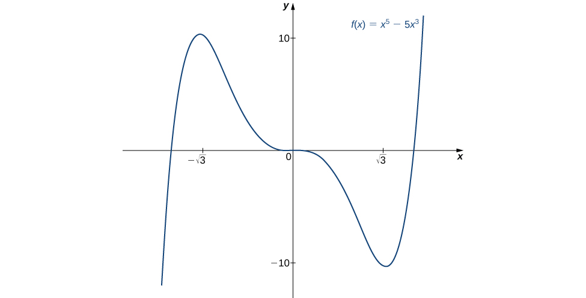{: #CNX_Calc_Figure_04_05_010}

Consider the function <math xmlns="http://www.w3.org/1998/Math/MathML"><mrow><mi>f</mi><mrow><mo>(</mo><mi>x</mi><mo>)</mo></mrow><mo>=</mo><msup><mi>x</mi><mn>3</mn></msup><mo>−</mo><mrow><mo>(</mo><mrow><mfrac><mn>3</mn><mn>2</mn></mfrac></mrow><mo>)</mo></mrow><msup><mi>x</mi><mn>2</mn></msup><mo>−</mo><mn>18</mn><mi>x</mi><mo>.</mo></mrow></math>

 The points <math xmlns="http://www.w3.org/1998/Math/MathML"><mrow><mi>c</mi><mo>=</mo><mn>3</mn><mo>,</mo><mn>−2</mn></mrow></math>

 satisfy <math xmlns="http://www.w3.org/1998/Math/MathML"><mrow><msup><mi>f</mi><mo>′</mo></msup><mrow><mo>(</mo><mi>c</mi><mo>)</mo></mrow><mo>=</mo><mn>0</mn><mo>.</mo></mrow></math>

 Use the second derivative test to determine whether <math xmlns="http://www.w3.org/1998/Math/MathML"><mi>f</mi></math>

 has a local maximum or local minimum at those points.

<math xmlns="http://www.w3.org/1998/Math/MathML"><mi>f</mi></math>

 has a local maximum at <math xmlns="http://www.w3.org/1998/Math/MathML"><mrow><mn>−2</mn></mrow></math>

 and a local minimum at <math xmlns="http://www.w3.org/1998/Math/MathML"><mrow><mn>3</mn><mo>.</mo></mrow></math>

Hint

<math xmlns="http://www.w3.org/1998/Math/MathML"><mrow><mi>f</mi><mtext>″</mtext><mrow><mo>(</mo><mi>x</mi><mo>)</mo></mrow><mo>=</mo><mn>6</mn><mi>x</mi><mo>−</mo><mn>3</mn></mrow></math>

We have now developed the tools we need to determine where a function is increasing and decreasing, as well as acquired an understanding of the basic shape of the graph. In the next section we discuss what happens to a function as <math xmlns="http://www.w3.org/1998/Math/MathML"><mrow><mi>x</mi><mo stretchy="false">→</mo><mtext>±</mtext><mi>∞</mi><mo>.</mo></mrow></math>

 At that point, we have enough tools to provide accurate graphs of a large variety of functions.

### Key Concepts

* If
  <math xmlns="http://www.w3.org/1998/Math/MathML"><mi>c</mi></math>
  
  is a critical point of
  <math xmlns="http://www.w3.org/1998/Math/MathML"><mi>f</mi></math>
  
  and
  <math xmlns="http://www.w3.org/1998/Math/MathML"><mrow><msup><mi>f</mi><mo>′</mo></msup><mrow><mo>(</mo><mi>x</mi><mo>)</mo></mrow><mo>&gt;</mo><mn>0</mn></mrow></math>
  
  for
  <math xmlns="http://www.w3.org/1998/Math/MathML"><mrow><mi>x</mi><mo>&lt;</mo><mi>c</mi></mrow></math>
  
  and
  <math xmlns="http://www.w3.org/1998/Math/MathML"><mrow><msup><mi>f</mi><mo>′</mo></msup><mrow><mo>(</mo><mi>x</mi><mo>)</mo></mrow><mo>&lt;</mo><mn>0</mn></mrow></math>
  
  for
  <math xmlns="http://www.w3.org/1998/Math/MathML"><mrow><mi>x</mi><mo>&gt;</mo><mi>c</mi><mo>,</mo></mrow></math>
  
  then
  <math xmlns="http://www.w3.org/1998/Math/MathML"><mi>f</mi></math>
  
  has a local maximum at
  <math xmlns="http://www.w3.org/1998/Math/MathML"><mrow><mi>c</mi><mo>.</mo></mrow></math>

* If
  <math xmlns="http://www.w3.org/1998/Math/MathML"><mi>c</mi></math>
  
  is a critical point of
  <math xmlns="http://www.w3.org/1998/Math/MathML"><mi>f</mi></math>
  
  and
  <math xmlns="http://www.w3.org/1998/Math/MathML"><mrow><msup><mi>f</mi><mo>′</mo></msup><mrow><mo>(</mo><mi>x</mi><mo>)</mo></mrow><mo>&lt;</mo><mn>0</mn></mrow></math>
  
  for
  <math xmlns="http://www.w3.org/1998/Math/MathML"><mrow><mi>x</mi><mo>&lt;</mo><mi>c</mi></mrow></math>
  
  and
  <math xmlns="http://www.w3.org/1998/Math/MathML"><mrow><msup><mi>f</mi><mo>′</mo></msup><mrow><mo>(</mo><mi>x</mi><mo>)</mo></mrow><mo>&gt;</mo><mn>0</mn></mrow></math>
  
  for
  <math xmlns="http://www.w3.org/1998/Math/MathML"><mrow><mi>x</mi><mo>&gt;</mo><mi>c</mi><mo>,</mo></mrow></math>
  
  then
  <math xmlns="http://www.w3.org/1998/Math/MathML"><mi>f</mi></math>
  
  has a local minimum at
  <math xmlns="http://www.w3.org/1998/Math/MathML"><mrow><mi>c</mi><mo>.</mo></mrow></math>

* If
  <math xmlns="http://www.w3.org/1998/Math/MathML"><mrow><mi>f</mi><mtext>″</mtext><mrow><mo>(</mo><mi>x</mi><mo>)</mo></mrow><mo>&gt;</mo><mn>0</mn></mrow></math>
  
  over an interval
  <math xmlns="http://www.w3.org/1998/Math/MathML"><mrow><mi>I</mi><mo>,</mo></mrow></math>
  
  then
  <math xmlns="http://www.w3.org/1998/Math/MathML"><mi>f</mi></math>
  
  is concave up over
  <math xmlns="http://www.w3.org/1998/Math/MathML"><mrow><mi>I</mi><mo>.</mo></mrow></math>

* If
  <math xmlns="http://www.w3.org/1998/Math/MathML"><mrow><mi>f</mi><mtext>″</mtext><mrow><mo>(</mo><mi>x</mi><mo>)</mo></mrow><mo>&lt;</mo><mn>0</mn></mrow></math>
  
  over an interval
  <math xmlns="http://www.w3.org/1998/Math/MathML"><mrow><mi>I</mi><mo>,</mo></mrow></math>
  
  then
  <math xmlns="http://www.w3.org/1998/Math/MathML"><mi>f</mi></math>
  
  is concave down over
  <math xmlns="http://www.w3.org/1998/Math/MathML"><mrow><mi>I</mi><mo>.</mo></mrow></math>

* If
  <math xmlns="http://www.w3.org/1998/Math/MathML"><mrow><msup><mi>f</mi><mo>′</mo></msup><mrow><mo>(</mo><mi>c</mi><mo>)</mo></mrow><mo>=</mo><mn>0</mn></mrow></math>
  
  and
  <math xmlns="http://www.w3.org/1998/Math/MathML"><mrow><mi>f</mi><mtext>″</mtext><mrow><mo>(</mo><mi>c</mi><mo>)</mo></mrow><mo>&gt;</mo><mn>0</mn><mo>,</mo></mrow></math>
  
  then
  <math xmlns="http://www.w3.org/1998/Math/MathML"><mi>f</mi></math>
  
  has a local minimum at
  <math xmlns="http://www.w3.org/1998/Math/MathML"><mrow><mi>c</mi><mo>.</mo></mrow></math>

* If
  <math xmlns="http://www.w3.org/1998/Math/MathML"><mrow><msup><mi>f</mi><mo>′</mo></msup><mrow><mo>(</mo><mi>c</mi><mo>)</mo></mrow><mo>=</mo><mn>0</mn></mrow></math>
  
  and
  <math xmlns="http://www.w3.org/1998/Math/MathML"><mrow><mi>f</mi><mtext>″</mtext><mrow><mo>(</mo><mi>c</mi><mo>)</mo></mrow><mo>&lt;</mo><mn>0</mn><mo>,</mo></mrow></math>
  
  then
  <math xmlns="http://www.w3.org/1998/Math/MathML"><mi>f</mi></math>
  
  has a local maximum at
  <math xmlns="http://www.w3.org/1998/Math/MathML"><mrow><mi>c</mi><mo>.</mo></mrow></math>

* If
  <math xmlns="http://www.w3.org/1998/Math/MathML"><mrow><msup><mi>f</mi><mo>′</mo></msup><mrow><mo>(</mo><mi>c</mi><mo>)</mo></mrow><mo>=</mo><mn>0</mn></mrow></math>
  
  and
  <math xmlns="http://www.w3.org/1998/Math/MathML"><mrow><mi>f</mi><mtext>″</mtext><mrow><mo>(</mo><mi>c</mi><mo>)</mo></mrow><mo>=</mo><mn>0</mn><mo>,</mo></mrow></math>
  
  then evaluate
  <math xmlns="http://www.w3.org/1998/Math/MathML"><mrow><msup><mi>f</mi><mo>′</mo></msup><mrow><mo>(</mo><mi>x</mi><mo>)</mo></mrow></mrow></math>
  
  at a test point
  <math xmlns="http://www.w3.org/1998/Math/MathML"><mi>x</mi></math>
  
  to the left of
  <math xmlns="http://www.w3.org/1998/Math/MathML"><mi>c</mi></math>
  
  and a test point
  <math xmlns="http://www.w3.org/1998/Math/MathML"><mi>x</mi></math>
  
  to the right of
  <math xmlns="http://www.w3.org/1998/Math/MathML"><mrow><mi>c</mi><mo>,</mo></mrow></math>
  
  to determine whether
  <math xmlns="http://www.w3.org/1998/Math/MathML"><mi>f</mi></math>
  
  has a local extremum at
  <math xmlns="http://www.w3.org/1998/Math/MathML"><mrow><mi>c</mi><mo>.</mo></mrow></math>
{: data-bullet-style="bullet"}

<section data-depth="1" class="section-exercises" markdown="1">

If <math xmlns="http://www.w3.org/1998/Math/MathML"><mi>c</mi></math>

 is a critical point of <math xmlns="http://www.w3.org/1998/Math/MathML"><mrow><mi>f</mi><mrow><mo>(</mo><mi>x</mi><mo>)</mo></mrow><mo>,</mo></mrow></math>

 when is there no local maximum or minimum at <math xmlns="http://www.w3.org/1998/Math/MathML"><mrow><mi>c</mi><mo>?</mo></mrow></math>

 Explain.

For the function <math xmlns="http://www.w3.org/1998/Math/MathML"><mrow><mi>y</mi><mo>=</mo><msup><mi>x</mi><mn>3</mn></msup><mo>,</mo></mrow></math>

 is <math xmlns="http://www.w3.org/1998/Math/MathML"><mrow><mi>x</mi><mo>=</mo><mn>0</mn></mrow></math>

 both an inflection point and a local maximum/minimum?

It is not a local maximum/minimum because <math xmlns="http://www.w3.org/1998/Math/MathML"><msup><mi>f</mi><mo>′</mo></msup></math>

 does not change sign

For the function <math xmlns="http://www.w3.org/1998/Math/MathML"><mrow><mi>y</mi><mo>=</mo><msup><mi>x</mi><mn>3</mn></msup><mo>,</mo></mrow></math>

 is <math xmlns="http://www.w3.org/1998/Math/MathML"><mrow><mi>x</mi><mo>=</mo><mn>0</mn></mrow></math>

 an inflection point?

Is it possible for a point <math xmlns="http://www.w3.org/1998/Math/MathML"><mi>c</mi></math>

 to be both an inflection point and a local extrema of a twice differentiable function?

No

Why do you need continuity for the first derivative test? Come up with an example.

Explain whether a concave-down function has to cross <math xmlns="http://www.w3.org/1998/Math/MathML"><mrow><mi>y</mi><mo>=</mo><mn>0</mn></mrow></math>

 for some value of <math xmlns="http://www.w3.org/1998/Math/MathML"><mrow><mi>x</mi><mo>.</mo></mrow></math>

False; for example, <math xmlns="http://www.w3.org/1998/Math/MathML"><mrow><mi>y</mi><mo>=</mo><msqrt><mi>x</mi></msqrt><mo>.</mo></mrow></math>

Explain whether a polynomial of degree <math xmlns="http://www.w3.org/1998/Math/MathML"><mn>2</mn></math>

 can have an inflection point.

For the following exercises, analyze the graphs of <math xmlns="http://www.w3.org/1998/Math/MathML"><mrow><msup><mi>f</mi><mo>′</mo></msup><mo>,</mo></mrow></math>

 then list all intervals where <math xmlns="http://www.w3.org/1998/Math/MathML"><mi>f</mi></math>

 is increasing or decreasing.

  

Increasing for <math xmlns="http://www.w3.org/1998/Math/MathML"><mrow><mn>−2</mn><mo>&lt;</mo><mi>x</mi><mo>&lt;</mo><mn>−1</mn></mrow></math>

 and <math xmlns="http://www.w3.org/1998/Math/MathML"><mrow><mi>x</mi><mo>&gt;</mo><mn>2</mn><mo>;</mo></mrow></math>

 decreasing for <math xmlns="http://www.w3.org/1998/Math/MathML"><mrow><mi>x</mi><mo>&lt;</mo><mn>−2</mn></mrow></math>

 and <math xmlns="http://www.w3.org/1998/Math/MathML"><mrow><mn>−1</mn><mo>&lt;</mo><mi>x</mi><mo>&lt;</mo><mn>2</mn></mrow></math>

  

 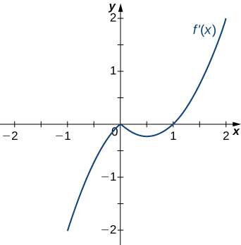 

Decreasing for <math xmlns="http://www.w3.org/1998/Math/MathML"><mrow><mi>x</mi><mo>&lt;</mo><mn>1</mn><mo>,</mo></mrow></math>

 increasing for <math xmlns="http://www.w3.org/1998/Math/MathML"><mrow><mi>x</mi><mo>&gt;</mo><mn>1</mn></mrow></math>

 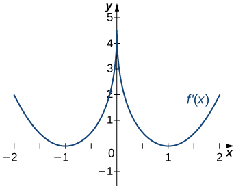 

  

Decreasing for <math xmlns="http://www.w3.org/1998/Math/MathML"><mrow><mn>−2</mn><mo>&lt;</mo><mi>x</mi><mo>&lt;</mo><mn>−1</mn></mrow></math>

 and <math xmlns="http://www.w3.org/1998/Math/MathML"><mrow><mn>1</mn><mo>&lt;</mo><mi>x</mi><mo>&lt;</mo><mn>2</mn><mo>;</mo></mrow></math>

 increasing for <math xmlns="http://www.w3.org/1998/Math/MathML"><mrow><mn>−1</mn><mo>&lt;</mo><mi>x</mi><mo>&lt;</mo><mn>1</mn></mrow></math>

 and <math xmlns="http://www.w3.org/1998/Math/MathML"><mrow><mi>x</mi><mo>&lt;</mo><mn>−2</mn></mrow></math>

 and <math xmlns="http://www.w3.org/1998/Math/MathML"><mrow><mi>x</mi><mo>&gt;</mo><mn>2</mn></mrow></math>

For the following exercises, analyze the graphs of <math xmlns="http://www.w3.org/1998/Math/MathML"><mrow><msup><mi>f</mi><mo>′</mo></msup><mo>,</mo></mrow></math>

 then list all intervals where

1.  <math xmlns="http://www.w3.org/1998/Math/MathML"><mi>f</mi></math>
    
    is increasing and decreasing and
2.  the minima and maxima are located.
{: type="a"}

 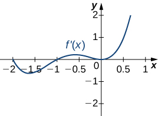 

  

a. Increasing over <math xmlns="http://www.w3.org/1998/Math/MathML"><mrow><mn>−2</mn><mo>&lt;</mo><mi>x</mi><mo>&lt;</mo><mn>−1</mn><mo>,</mo><mn>0</mn><mo>&lt;</mo><mi>x</mi><mo>&lt;</mo><mn>1</mn><mo>,</mo><mi>x</mi><mo>&gt;</mo><mn>2</mn><mo>,</mo></mrow></math>

 decreasing over <math xmlns="http://www.w3.org/1998/Math/MathML"><mrow><mi>x</mi><mo>&lt;</mo><mn>−2</mn><mo>,</mo></mrow></math>

 <math xmlns="http://www.w3.org/1998/Math/MathML"><mrow><mn>−1</mn><mo>&lt;</mo><mi>x</mi><mo>&lt;</mo><mn>0</mn><mo>,</mo><mn>1</mn><mo>&lt;</mo><mi>x</mi><mo>&lt;</mo><mn>2</mn><mo>;</mo></mrow></math>

 b. maxima at <math xmlns="http://www.w3.org/1998/Math/MathML"><mrow><mi>x</mi><mo>=</mo><mn>−1</mn></mrow></math>

 and <math xmlns="http://www.w3.org/1998/Math/MathML"><mrow><mi>x</mi><mo>=</mo><mn>1</mn><mo>,</mo></mrow></math>

 minima at <math xmlns="http://www.w3.org/1998/Math/MathML"><mrow><mi>x</mi><mo>=</mo><mn>−2</mn></mrow></math>

 and <math xmlns="http://www.w3.org/1998/Math/MathML"><mrow><mi>x</mi><mo>=</mo><mn>0</mn></mrow></math>

 and <math xmlns="http://www.w3.org/1998/Math/MathML"><mrow><mi>x</mi><mo>=</mo><mn>2</mn></mrow></math>

 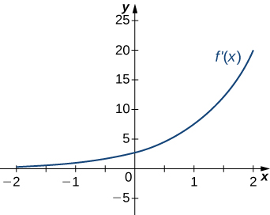 

 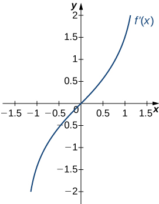 

a. Increasing over <math xmlns="http://www.w3.org/1998/Math/MathML"><mrow><mi>x</mi><mo>&gt;</mo><mn>0</mn><mo>,</mo></mrow></math>

 decreasing over <math xmlns="http://www.w3.org/1998/Math/MathML"><mrow><mi>x</mi><mo>&lt;</mo><mn>0</mn><mo>;</mo></mrow></math>

 b. Minimum at <math xmlns="http://www.w3.org/1998/Math/MathML"><mrow><mi>x</mi><mo>=</mo><mn>0</mn></mrow></math>

  

For the following exercises, analyze the graphs of <math xmlns="http://www.w3.org/1998/Math/MathML"><mrow><msup><mi>f</mi><mo>′</mo></msup><mo>,</mo></mrow></math>

 then list all inflection points and intervals <math xmlns="http://www.w3.org/1998/Math/MathML"><mi>f</mi></math>

 that are concave up and concave down.

 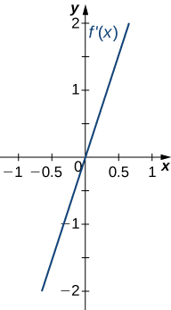 

Concave up on all <math xmlns="http://www.w3.org/1998/Math/MathML"><mrow><mi>x</mi><mo>,</mo></mrow></math>

 no inflection points

 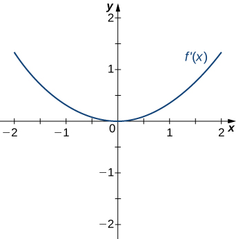 

 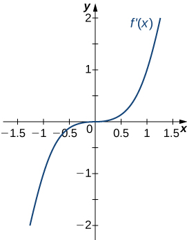 

Concave up on all <math xmlns="http://www.w3.org/1998/Math/MathML"><mrow><mi>x</mi><mo>,</mo></mrow></math>

 no inflection points

 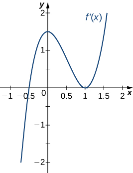 

 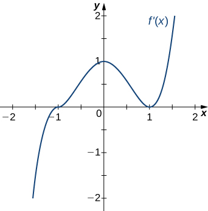 

Concave up for <math xmlns="http://www.w3.org/1998/Math/MathML"><mrow><mi>x</mi><mo>&lt;</mo><mn>0</mn></mrow></math>

 and <math xmlns="http://www.w3.org/1998/Math/MathML"><mrow><mi>x</mi><mo>&gt;</mo><mn>1</mn><mo>,</mo></mrow></math>

 concave down for <math xmlns="http://www.w3.org/1998/Math/MathML"><mrow><mn>0</mn><mo>&lt;</mo><mi>x</mi><mo>&lt;</mo><mn>1</mn><mo>,</mo></mrow></math>

 inflection points at <math xmlns="http://www.w3.org/1998/Math/MathML"><mrow><mi>x</mi><mo>=</mo><mn>0</mn></mrow></math>

 and <math xmlns="http://www.w3.org/1998/Math/MathML"><mrow><mi>x</mi><mo>=</mo><mn>1</mn></mrow></math>

For the following exercises, draw a graph that satisfies the given specifications for the domain <math xmlns="http://www.w3.org/1998/Math/MathML"><mrow><mi>x</mi><mo>=</mo><mo stretchy="false">[</mo><mn>−3</mn><mo>,</mo><mn>3</mn><mo stretchy="false">]</mo><mo>.</mo></mrow></math>

 The function does not have to be continuous or differentiable.

<math xmlns="http://www.w3.org/1998/Math/MathML"><mrow><mi>f</mi><mrow><mo>(</mo><mi>x</mi><mo>)</mo></mrow><mo>&gt;</mo><mn>0</mn><mo>,</mo><msup><mi>f</mi><mo>′</mo></msup><mrow><mo>(</mo><mi>x</mi><mo>)</mo></mrow><mo>&gt;</mo><mn>0</mn></mrow></math>

 over <math xmlns="http://www.w3.org/1998/Math/MathML"><mrow><mi>x</mi><mo>&gt;</mo><mn>1</mn><mo>,</mo><mn>−3</mn><mo>&lt;</mo><mi>x</mi><mo>&lt;</mo><mn>0</mn><mo>,</mo><msup><mi>f</mi><mo>′</mo></msup><mrow><mo>(</mo><mi>x</mi><mo>)</mo></mrow><mo>=</mo><mn>0</mn></mrow></math>

 over <math xmlns="http://www.w3.org/1998/Math/MathML"><mrow><mn>0</mn><mo>&lt;</mo><mi>x</mi><mo>&lt;</mo><mn>1</mn></mrow></math>

<math xmlns="http://www.w3.org/1998/Math/MathML"><mrow><msup><mi>f</mi><mo>′</mo></msup><mrow><mo>(</mo><mi>x</mi><mo>)</mo></mrow><mo>&gt;</mo><mn>0</mn></mrow></math>

 over <math xmlns="http://www.w3.org/1998/Math/MathML"><mrow><mi>x</mi><mo>&gt;</mo><mn>2</mn><mo>,</mo><mn>−3</mn><mo>&lt;</mo><mi>x</mi><mo>&lt;</mo><mn>−1</mn><mo>,</mo><msup><mi>f</mi><mo>′</mo></msup><mrow><mo>(</mo><mi>x</mi><mo>)</mo></mrow><mo>&lt;</mo><mn>0</mn></mrow></math>

 over <math xmlns="http://www.w3.org/1998/Math/MathML"><mrow><mn>−1</mn><mo>&lt;</mo><mi>x</mi><mo>&lt;</mo><mn>2</mn><mo>,</mo><mi>f</mi><mtext>″</mtext><mrow><mo>(</mo><mi>x</mi><mo>)</mo></mrow><mo>&lt;</mo><mn>0</mn></mrow></math>

 for all <math xmlns="http://www.w3.org/1998/Math/MathML"><mi>x</mi></math>

Answers will vary

<math xmlns="http://www.w3.org/1998/Math/MathML"><mrow><mi>f</mi><mtext>″</mtext><mrow><mo>(</mo><mi>x</mi><mo>)</mo></mrow><mo>&lt;</mo><mn>0</mn></mrow></math>

 over <math xmlns="http://www.w3.org/1998/Math/MathML"><mrow><mn>−1</mn><mo>&lt;</mo><mi>x</mi><mo>&lt;</mo><mn>1</mn><mo>,</mo><mi>f</mi><mtext>″</mtext><mrow><mo>(</mo><mi>x</mi><mo>)</mo></mrow><mo>&gt;</mo><mn>0</mn><mo>,</mo><mn>−3</mn><mo>&lt;</mo><mi>x</mi><mo>&lt;</mo><mn>−1</mn><mo>,</mo><mn>1</mn><mo>&lt;</mo><mi>x</mi><mo>&lt;</mo><mn>3</mn><mo>,</mo></mrow></math>

 local maximum at <math xmlns="http://www.w3.org/1998/Math/MathML"><mrow><mi>x</mi><mo>=</mo><mn>0</mn><mo>,</mo></mrow></math>

 local minima at <math xmlns="http://www.w3.org/1998/Math/MathML"><mrow><mi>x</mi><mo>=</mo><mtext>±</mtext><mn>2</mn></mrow></math>

There is a local maximum at <math xmlns="http://www.w3.org/1998/Math/MathML"><mrow><mi>x</mi><mo>=</mo><mn>2</mn><mo>,</mo></mrow></math>

 local minimum at <math xmlns="http://www.w3.org/1998/Math/MathML"><mrow><mi>x</mi><mo>=</mo><mn>1</mn><mo>,</mo></mrow></math>

 and the graph is neither concave up nor concave down.

Answers will vary

There are local maxima at <math xmlns="http://www.w3.org/1998/Math/MathML"><mrow><mi>x</mi><mo>=</mo><mtext>±</mtext><mn>1</mn><mo>,</mo></mrow></math>

 the function is concave up for all <math xmlns="http://www.w3.org/1998/Math/MathML"><mrow><mi>x</mi><mo>,</mo></mrow></math>

 and the function remains positive for all <math xmlns="http://www.w3.org/1998/Math/MathML"><mrow><mi>x</mi><mo>.</mo></mrow></math>

For the following exercises, determine

1.  intervals where
    <math xmlns="http://www.w3.org/1998/Math/MathML"><mi>f</mi></math>
    
    is increasing or decreasing and
2.  local minima and maxima of
    <math xmlns="http://www.w3.org/1998/Math/MathML"><mrow><mi>f</mi><mo>.</mo></mrow></math>
{: type="a"}

<math xmlns="http://www.w3.org/1998/Math/MathML"><mrow><mi>f</mi><mrow><mo>(</mo><mi>x</mi><mo>)</mo></mrow><mo>=</mo><mtext>sin</mtext><mspace width="0.1em" /><mi>x</mi><mo>+</mo><msup><mrow><mtext>sin</mtext></mrow><mn>3</mn></msup><mi>x</mi></mrow></math>

 over <math xmlns="http://www.w3.org/1998/Math/MathML"><mrow><mtext>−</mtext><mi>π</mi><mo>&lt;</mo><mi>x</mi><mo>&lt;</mo><mi>π</mi></mrow></math>

a. Increasing over <math xmlns="http://www.w3.org/1998/Math/MathML"><mrow><mo>−</mo><mfrac><mi>π</mi><mn>2</mn></mfrac><mo>&lt;</mo><mi>x</mi><mo>&lt;</mo><mfrac><mi>π</mi><mn>2</mn></mfrac><mo>,</mo></mrow></math>

 decreasing over <math xmlns="http://www.w3.org/1998/Math/MathML"><mrow><mi>x</mi><mo>&lt;</mo><mo>−</mo><mfrac><mi>π</mi><mn>2</mn></mfrac><mo>,</mo><mi>x</mi><mo>&gt;</mo><mfrac><mi>π</mi><mn>2</mn></mfrac></mrow></math>

 b. Local maximum at <math xmlns="http://www.w3.org/1998/Math/MathML"><mrow><mi>x</mi><mo>=</mo><mfrac><mi>π</mi><mn>2</mn></mfrac><mo>;</mo></mrow></math>

 local minimum at <math xmlns="http://www.w3.org/1998/Math/MathML"><mrow><mi>x</mi><mo>=</mo><mo>−</mo><mfrac><mi>π</mi><mn>2</mn></mfrac></mrow></math>

<math xmlns="http://www.w3.org/1998/Math/MathML"><mrow><mi>f</mi><mrow><mo>(</mo><mi>x</mi><mo>)</mo></mrow><mo>=</mo><msup><mi>x</mi><mn>2</mn></msup><mo>+</mo><mtext>cos</mtext><mspace width="0.1em" /><mi>x</mi></mrow></math>

For the following exercises, determine a. intervals where <math xmlns="http://www.w3.org/1998/Math/MathML"><mi>f</mi></math>

 is concave up or concave down, and b. the inflection points of <math xmlns="http://www.w3.org/1998/Math/MathML"><mrow><mi>f</mi><mo>.</mo></mrow></math>

<math xmlns="http://www.w3.org/1998/Math/MathML"><mrow><mi>f</mi><mrow><mo>(</mo><mi>x</mi><mo>)</mo></mrow><mo>=</mo><msup><mi>x</mi><mn>3</mn></msup><mo>−</mo><mn>4</mn><msup><mi>x</mi><mn>2</mn></msup><mo>+</mo><mi>x</mi><mo>+</mo><mn>2</mn></mrow></math>

a. Concave up for <math xmlns="http://www.w3.org/1998/Math/MathML"><mrow><mi>x</mi><mo>&gt;</mo><mfrac><mn>4</mn><mn>3</mn></mfrac><mo>,</mo></mrow></math>

 concave down for <math xmlns="http://www.w3.org/1998/Math/MathML"><mrow><mi>x</mi><mo>&lt;</mo><mfrac><mn>4</mn><mn>3</mn></mfrac></mrow></math>

 b. Inflection point at <math xmlns="http://www.w3.org/1998/Math/MathML"><mrow><mi>x</mi><mo>=</mo><mfrac><mn>4</mn><mn>3</mn></mfrac></mrow></math>

For the following exercises, determine

1.  intervals where
    <math xmlns="http://www.w3.org/1998/Math/MathML"><mi>f</mi></math>
    
    is increasing or decreasing,
2.  local minima and maxima of
    <math xmlns="http://www.w3.org/1998/Math/MathML"><mrow><mi>f</mi><mo>,</mo></mrow></math>

3.  intervals where
    <math xmlns="http://www.w3.org/1998/Math/MathML"><mi>f</mi></math>
    
    is concave up and concave down, and
4.  the inflection points of
    <math xmlns="http://www.w3.org/1998/Math/MathML"><mrow><mi>f</mi><mo>.</mo></mrow></math>
{: type="a"}

<math xmlns="http://www.w3.org/1998/Math/MathML"><mrow><mi>f</mi><mrow><mo>(</mo><mi>x</mi><mo>)</mo></mrow><mo>=</mo><msup><mi>x</mi><mn>2</mn></msup><mo>−</mo><mn>6</mn><mi>x</mi></mrow></math>

<math xmlns="http://www.w3.org/1998/Math/MathML"><mrow><mi>f</mi><mrow><mo>(</mo><mi>x</mi><mo>)</mo></mrow><mo>=</mo><msup><mi>x</mi><mn>3</mn></msup><mo>−</mo><mn>6</mn><msup><mi>x</mi><mn>2</mn></msup></mrow></math>

a. Increasing over <math xmlns="http://www.w3.org/1998/Math/MathML"><mrow><mi>x</mi><mo>&lt;</mo><mn>0</mn></mrow></math>

 and <math xmlns="http://www.w3.org/1998/Math/MathML"><mrow><mi>x</mi><mo>&gt;</mo><mn>4</mn><mo>,</mo></mrow></math>

 decreasing over <math xmlns="http://www.w3.org/1998/Math/MathML"><mrow><mn>0</mn><mo>&lt;</mo><mi>x</mi><mo>&lt;</mo><mn>4</mn></mrow></math>

 b. Maximum at <math xmlns="http://www.w3.org/1998/Math/MathML"><mrow><mi>x</mi><mo>=</mo><mn>0</mn><mo>,</mo></mrow></math>

 minimum at <math xmlns="http://www.w3.org/1998/Math/MathML"><mrow><mi>x</mi><mo>=</mo><mn>4</mn></mrow></math>

 c. Concave up for <math xmlns="http://www.w3.org/1998/Math/MathML"><mrow><mi>x</mi><mo>&gt;</mo><mn>2</mn><mo>,</mo></mrow></math>

 concave down for <math xmlns="http://www.w3.org/1998/Math/MathML"><mrow><mi>x</mi><mo>&lt;</mo><mn>2</mn></mrow></math>

 d. Infection point at <math xmlns="http://www.w3.org/1998/Math/MathML"><mrow><mi>x</mi><mo>=</mo><mn>2</mn></mrow></math>

<math xmlns="http://www.w3.org/1998/Math/MathML"><mrow><mi>f</mi><mrow><mo>(</mo><mi>x</mi><mo>)</mo></mrow><mo>=</mo><msup><mi>x</mi><mn>4</mn></msup><mo>−</mo><mn>6</mn><msup><mi>x</mi><mn>3</mn></msup></mrow></math>

<math xmlns="http://www.w3.org/1998/Math/MathML"><mrow><mi>f</mi><mrow><mo>(</mo><mi>x</mi><mo>)</mo></mrow><mo>=</mo><msup><mi>x</mi><mrow><mn>11</mn></mrow></msup><mo>−</mo><mn>6</mn><msup><mi>x</mi><mrow><mn>10</mn></mrow></msup></mrow></math>

a. Increasing over <math xmlns="http://www.w3.org/1998/Math/MathML"><mrow><mi>x</mi><mo>&lt;</mo><mn>0</mn></mrow></math>

 and <math xmlns="http://www.w3.org/1998/Math/MathML"><mrow><mi>x</mi><mo>&gt;</mo><mfrac><mrow><mn>60</mn></mrow><mrow><mn>11</mn></mrow></mfrac><mo>,</mo></mrow></math>

 decreasing over <math xmlns="http://www.w3.org/1998/Math/MathML"><mrow><mn>0</mn><mo>&lt;</mo><mi>x</mi><mo>&lt;</mo><mfrac><mrow><mn>60</mn></mrow><mrow><mn>11</mn></mrow></mfrac></mrow></math>

 b. Minimum at <math xmlns="http://www.w3.org/1998/Math/MathML"><mrow><mi>x</mi><mo>=</mo><mfrac><mrow><mn>60</mn></mrow><mrow><mn>11</mn></mrow></mfrac></mrow></math>

 c. Concave down for <math xmlns="http://www.w3.org/1998/Math/MathML"><mrow><mi>x</mi><mo>&lt;</mo><mfrac><mrow><mn>54</mn></mrow><mrow><mn>11</mn></mrow></mfrac><mo>,</mo></mrow></math>

 concave up for <math xmlns="http://www.w3.org/1998/Math/MathML"><mrow><mi>x</mi><mo>&gt;</mo><mfrac><mrow><mn>54</mn></mrow><mrow><mn>11</mn></mrow></mfrac></mrow></math>

 d. Inflection point at <math xmlns="http://www.w3.org/1998/Math/MathML"><mrow><mi>x</mi><mo>=</mo><mfrac><mrow><mn>54</mn></mrow><mrow><mn>11</mn></mrow></mfrac></mrow></math>

<math xmlns="http://www.w3.org/1998/Math/MathML"><mrow><mi>f</mi><mrow><mo>(</mo><mi>x</mi><mo>)</mo></mrow><mo>=</mo><mi>x</mi><mo>+</mo><msup><mi>x</mi><mn>2</mn></msup><mo>−</mo><msup><mi>x</mi><mn>3</mn></msup></mrow></math>

<math xmlns="http://www.w3.org/1998/Math/MathML"><mrow><mi>f</mi><mrow><mo>(</mo><mi>x</mi><mo>)</mo></mrow><mo>=</mo><msup><mi>x</mi><mn>2</mn></msup><mo>+</mo><mi>x</mi><mo>+</mo><mn>1</mn></mrow></math>

a. Increasing over <math xmlns="http://www.w3.org/1998/Math/MathML"><mrow><mi>x</mi><mo>&gt;</mo><mo>−</mo><mfrac><mn>1</mn><mn>2</mn></mfrac><mo>,</mo></mrow></math>

 decreasing over <math xmlns="http://www.w3.org/1998/Math/MathML"><mrow><mi>x</mi><mo>&lt;</mo><mo>−</mo><mfrac><mn>1</mn><mn>2</mn></mfrac></mrow></math>

 b. Minimum at <math xmlns="http://www.w3.org/1998/Math/MathML"><mrow><mi>x</mi><mo>=</mo><mo>−</mo><mfrac><mn>1</mn><mn>2</mn></mfrac></mrow></math>

 c. Concave up for all <math xmlns="http://www.w3.org/1998/Math/MathML"><mi>x</mi></math>

 d. No inflection points

<math xmlns="http://www.w3.org/1998/Math/MathML"><mrow><mi>f</mi><mrow><mo>(</mo><mi>x</mi><mo>)</mo></mrow><mo>=</mo><msup><mi>x</mi><mn>3</mn></msup><mo>+</mo><msup><mi>x</mi><mn>4</mn></msup></mrow></math>

For the following exercises, determine

1.  intervals where
    <math xmlns="http://www.w3.org/1998/Math/MathML"><mi>f</mi></math>
    
    is increasing or decreasing,
2.  local minima and maxima of
    <math xmlns="http://www.w3.org/1998/Math/MathML"><mrow><mi>f</mi><mo>,</mo></mrow></math>

3.  intervals where
    <math xmlns="http://www.w3.org/1998/Math/MathML"><mi>f</mi></math>
    
    is concave up and concave down, and
4.  the inflection points of
    <math xmlns="http://www.w3.org/1998/Math/MathML"><mrow><mi>f</mi><mo>.</mo></mrow></math>
    
    Sketch the curve, then use a calculator to compare your answer. If you cannot determine the exact answer analytically, use a calculator.
{: type="a"}

**[T]** <math xmlns="http://www.w3.org/1998/Math/MathML"><mrow><mi>f</mi><mrow><mo>(</mo><mi>x</mi><mo>)</mo></mrow><mo>=</mo><mtext>sin</mtext><mrow><mo>(</mo><mrow><mi>π</mi><mi>x</mi></mrow><mo>)</mo></mrow><mo>−</mo><mtext>cos</mtext><mrow><mo>(</mo><mrow><mi>π</mi><mi>x</mi></mrow><mo>)</mo></mrow></mrow></math>

 over <math xmlns="http://www.w3.org/1998/Math/MathML"><mrow><mi>x</mi><mo>=</mo><mrow><mo>[</mo><mrow><mn>−1</mn><mo>,</mo><mn>1</mn></mrow><mo>]</mo></mrow></mrow></math>

a. Increases over <math xmlns="http://www.w3.org/1998/Math/MathML"><mrow><mo>−</mo><mfrac><mn>1</mn><mn>4</mn></mfrac><mo>&lt;</mo><mi>x</mi><mo>&lt;</mo><mfrac><mn>3</mn><mn>4</mn></mfrac><mo>,</mo></mrow></math>

 decreases over <math xmlns="http://www.w3.org/1998/Math/MathML"><mrow><mi>x</mi><mo>&gt;</mo><mfrac><mn>3</mn><mn>4</mn></mfrac></mrow></math>

 and <math xmlns="http://www.w3.org/1998/Math/MathML"><mrow><mi>x</mi><mo>&lt;</mo><mo>−</mo><mfrac><mn>1</mn><mn>4</mn></mfrac></mrow></math>

 b. Minimum at <math xmlns="http://www.w3.org/1998/Math/MathML"><mrow><mi>x</mi><mo>=</mo><mo>−</mo><mfrac><mn>1</mn><mn>4</mn></mfrac><mo>,</mo></mrow></math>

 maximum at <math xmlns="http://www.w3.org/1998/Math/MathML"><mrow><mi>x</mi><mo>=</mo><mfrac><mn>3</mn><mn>4</mn></mfrac></mrow></math>

 c. Concave up for <math xmlns="http://www.w3.org/1998/Math/MathML"><mrow><mo>−</mo><mfrac><mn>3</mn><mn>4</mn></mfrac><mo>&lt;</mo><mi>x</mi><mo>&lt;</mo><mfrac><mn>1</mn><mn>4</mn></mfrac><mo>,</mo></mrow></math>

 concave down for <math xmlns="http://www.w3.org/1998/Math/MathML"><mrow><mi>x</mi><mo>&lt;</mo><mo>−</mo><mfrac><mn>3</mn><mn>4</mn></mfrac></mrow></math>

 and <math xmlns="http://www.w3.org/1998/Math/MathML"><mrow><mi>x</mi><mo>&gt;</mo><mfrac><mn>1</mn><mn>4</mn></mfrac></mrow></math>

 d. Inflection points at <math xmlns="http://www.w3.org/1998/Math/MathML"><mrow><mi>x</mi><mo>=</mo><mo>−</mo><mfrac><mn>3</mn><mn>4</mn></mfrac><mo>,</mo><mi>x</mi><mo>=</mo><mfrac><mn>1</mn><mn>4</mn></mfrac></mrow></math>

**[T]** <math xmlns="http://www.w3.org/1998/Math/MathML"><mrow><mi>f</mi><mrow><mo>(</mo><mi>x</mi><mo>)</mo></mrow><mo>=</mo><mi>x</mi><mo>+</mo><mtext>sin</mtext><mrow><mo>(</mo><mrow><mn>2</mn><mi>x</mi></mrow><mo>)</mo></mrow></mrow></math>

 over <math xmlns="http://www.w3.org/1998/Math/MathML"><mrow><mi>x</mi><mo>=</mo><mrow><mo>[</mo><mrow><mo>−</mo><mfrac><mi>π</mi><mn>2</mn></mfrac><mo>,</mo><mfrac><mi>π</mi><mn>2</mn></mfrac></mrow><mo>]</mo></mrow></mrow></math>

**[T]** <math xmlns="http://www.w3.org/1998/Math/MathML"><mrow><mi>f</mi><mrow><mo>(</mo><mi>x</mi><mo>)</mo></mrow><mo>=</mo><mtext>sin</mtext><mspace width="0.1em" /><mi>x</mi><mo>+</mo><mtext>tan</mtext><mspace width="0.1em" /><mi>x</mi></mrow></math>

 over <math xmlns="http://www.w3.org/1998/Math/MathML"><mrow><mrow><mo>(</mo><mrow><mo>−</mo><mfrac><mi>π</mi><mn>2</mn></mfrac><mo>,</mo><mfrac><mi>π</mi><mn>2</mn></mfrac></mrow><mo>)</mo></mrow></mrow></math>

a. Increasing for all <math xmlns="http://www.w3.org/1998/Math/MathML"><mi>x</mi></math>

 b. No local minimum or maximum c. Concave up for <math xmlns="http://www.w3.org/1998/Math/MathML"><mrow><mi>x</mi><mo>&gt;</mo><mn>0</mn><mo>,</mo></mrow></math>

 concave down for <math xmlns="http://www.w3.org/1998/Math/MathML"><mrow><mi>x</mi><mo>&lt;</mo><mn>0</mn></mrow></math>

 d. Inflection point at <math xmlns="http://www.w3.org/1998/Math/MathML"><mrow><mi>x</mi><mo>=</mo><mn>0</mn></mrow></math>

**[T]** <math xmlns="http://www.w3.org/1998/Math/MathML"><mrow><mi>f</mi><mrow><mo>(</mo><mi>x</mi><mo>)</mo></mrow><mo>=</mo><msup><mrow><mrow><mo>(</mo><mrow><mi>x</mi><mo>−</mo><mn>2</mn></mrow><mo>)</mo></mrow></mrow><mn>2</mn></msup><msup><mrow><mrow><mo>(</mo><mrow><mi>x</mi><mo>−</mo><mn>4</mn></mrow><mo>)</mo></mrow></mrow><mn>2</mn></msup></mrow></math>

**[T]** <math xmlns="http://www.w3.org/1998/Math/MathML"><mrow><mi>f</mi><mrow><mo>(</mo><mi>x</mi><mo>)</mo></mrow><mo>=</mo><mfrac><mn>1</mn><mrow><mn>1</mn><mo>−</mo><mi>x</mi></mrow></mfrac><mo>,</mo><mi>x</mi><mo>≠</mo><mn>1</mn></mrow></math>

a. Increasing for all <math xmlns="http://www.w3.org/1998/Math/MathML"><mi>x</mi></math>

 where defined b. No local minima or maxima c. Concave up for <math xmlns="http://www.w3.org/1998/Math/MathML"><mrow><mi>x</mi><mo>&lt;</mo><mn>1</mn><mo>;</mo></mrow></math>

 concave down for <math xmlns="http://www.w3.org/1998/Math/MathML"><mrow><mi>x</mi><mo>&gt;</mo><mn>1</mn></mrow></math>

 d. No inflection points in domain

**[T]** <math xmlns="http://www.w3.org/1998/Math/MathML"><mrow><mi>f</mi><mrow><mo>(</mo><mi>x</mi><mo>)</mo></mrow><mo>=</mo><mfrac><mrow><mtext>sin</mtext><mspace width="0.1em" /><mi>x</mi></mrow><mi>x</mi></mfrac></mrow></math>

 over <math xmlns="http://www.w3.org/1998/Math/MathML"><mrow><mi>x</mi><mo>=</mo><mrow><mo>[</mo><mrow><mn>−2</mn><mi>π</mi><mo>,</mo><mn>2</mn><mi>π</mi></mrow><mo>]</mo></mrow></mrow></math>

 <math xmlns="http://www.w3.org/1998/Math/MathML"><mrow><mo stretchy="false">[</mo><mn>2</mn><mi>π</mi><mo>,</mo><mn>0</mn><mo stretchy="false">)</mo><mo>∪</mo><mo stretchy="false">(</mo><mn>0</mn><mo>,</mo><mn>2</mn><mi>π</mi><mo stretchy="false">]</mo></mrow></math>

<math xmlns="http://www.w3.org/1998/Math/MathML"><mrow><mi>f</mi><mrow><mo>(</mo><mi>x</mi><mo>)</mo></mrow><mo>=</mo><mtext>sin</mtext><mrow><mo>(</mo><mi>x</mi><mo>)</mo></mrow><msup><mi>e</mi><mi>x</mi></msup></mrow></math>

 over <math xmlns="http://www.w3.org/1998/Math/MathML"><mrow><mi>x</mi><mo>=</mo><mrow><mo>[</mo><mrow><mtext>−</mtext><mi>π</mi><mo>,</mo><mi>π</mi></mrow><mo>]</mo></mrow></mrow></math>

a. Increasing over <math xmlns="http://www.w3.org/1998/Math/MathML"><mrow><mo>−</mo><mfrac><mi>π</mi><mn>4</mn></mfrac><mo>&lt;</mo><mi>x</mi><mo>&lt;</mo><mfrac><mrow><mn>3</mn><mi>π</mi></mrow><mn>4</mn></mfrac><mo>,</mo></mrow></math>

 decreasing over <math xmlns="http://www.w3.org/1998/Math/MathML"><mrow><mi>x</mi><mo>&gt;</mo><mfrac><mrow><mn>3</mn><mi>π</mi></mrow><mn>4</mn></mfrac><mo>,</mo><mi>x</mi><mo>&lt;</mo><mo>−</mo><mfrac><mi>π</mi><mn>4</mn></mfrac></mrow></math>

 b. Minimum at <math xmlns="http://www.w3.org/1998/Math/MathML"><mrow><mi>x</mi><mo>=</mo><mo>−</mo><mfrac><mi>π</mi><mn>4</mn></mfrac><mo>,</mo></mrow></math>

 maximum at <math xmlns="http://www.w3.org/1998/Math/MathML"><mrow><mi>x</mi><mo>=</mo><mfrac><mrow><mn>3</mn><mi>π</mi></mrow><mn>4</mn></mfrac></mrow></math>

 c. Concave up for <math xmlns="http://www.w3.org/1998/Math/MathML"><mrow><mo>−</mo><mfrac><mi>π</mi><mn>2</mn></mfrac><mo>&lt;</mo><mi>x</mi><mo>&lt;</mo><mfrac><mi>π</mi><mn>2</mn></mfrac><mo>,</mo></mrow></math>

 concave down for <math xmlns="http://www.w3.org/1998/Math/MathML"><mrow><mi>x</mi><mo>&lt;</mo><mo>−</mo><mfrac><mi>π</mi><mn>2</mn></mfrac><mo>,</mo><mi>x</mi><mo>&gt;</mo><mfrac><mi>π</mi><mn>2</mn></mfrac></mrow></math>

 d. Infection points at <math xmlns="http://www.w3.org/1998/Math/MathML"><mrow><mi>x</mi><mo>=</mo><mtext>±</mtext><mfrac><mi>π</mi><mn>2</mn></mfrac></mrow></math>

<math xmlns="http://www.w3.org/1998/Math/MathML"><mrow><mi>f</mi><mrow><mo>(</mo><mi>x</mi><mo>)</mo></mrow><mo>=</mo><mtext>ln</mtext><mspace width="0.1em" /><mi>x</mi><msqrt><mi>x</mi></msqrt><mo>,</mo><mi>x</mi><mo>&gt;</mo><mn>0</mn></mrow></math>

<math xmlns="http://www.w3.org/1998/Math/MathML"><mrow><mi>f</mi><mrow><mo>(</mo><mi>x</mi><mo>)</mo></mrow><mo>=</mo><mfrac><mn>1</mn><mn>4</mn></mfrac><msqrt><mi>x</mi></msqrt><mo>+</mo><mfrac><mn>1</mn><mi>x</mi></mfrac><mo>,</mo><mi>x</mi><mo>&gt;</mo><mn>0</mn></mrow></math>

a. Increasing over <math xmlns="http://www.w3.org/1998/Math/MathML"><mrow><mi>x</mi><mo>&gt;</mo><mn>4</mn><mo>,</mo></mrow></math>

 decreasing over <math xmlns="http://www.w3.org/1998/Math/MathML"><mrow><mn>0</mn><mo>&lt;</mo><mi>x</mi><mo>&lt;</mo><mn>4</mn></mrow></math>

 b. Minimum at <math xmlns="http://www.w3.org/1998/Math/MathML"><mrow><mi>x</mi><mo>=</mo><mn>4</mn></mrow></math>

 c. Concave up for <math xmlns="http://www.w3.org/1998/Math/MathML"><mrow><mn>0</mn><mo>&lt;</mo><mi>x</mi><mo>&lt;</mo><mn>8</mn><mroot><mn>2</mn><mn>3</mn></mroot><mo>,</mo></mrow></math>

 concave down for <math xmlns="http://www.w3.org/1998/Math/MathML"><mrow><mi>x</mi><mo>&gt;</mo><mn>8</mn><mroot><mn>2</mn><mn>3</mn></mroot></mrow></math>

 d. Inflection point at <math xmlns="http://www.w3.org/1998/Math/MathML"><mrow><mi>x</mi><mo>=</mo><mn>8</mn><mroot><mn>2</mn><mn>3</mn></mroot></mrow></math>

<math xmlns="http://www.w3.org/1998/Math/MathML"><mrow><mi>f</mi><mrow><mo>(</mo><mi>x</mi><mo>)</mo></mrow><mo>=</mo><mfrac><mrow><msup><mi>e</mi><mi>x</mi></msup></mrow><mi>x</mi></mfrac><mo>,</mo><mi>x</mi><mo>≠</mo><mn>0</mn></mrow></math>

For the following exercises, interpret the sentences in terms of <math xmlns="http://www.w3.org/1998/Math/MathML"><mrow><mi>f</mi><mo>,</mo><msup><mi>f</mi><mo>′</mo></msup><mo>,</mo><mspace width="0.2em" /><mtext>and</mtext><mspace width="0.2em" /><mi>f</mi><mtext>″</mtext><mo>.</mo></mrow></math>

The population is growing more slowly. Here <math xmlns="http://www.w3.org/1998/Math/MathML"><mi>f</mi></math>

 is the population.

<math xmlns="http://www.w3.org/1998/Math/MathML"><mrow><mi>f</mi><mo>&gt;</mo><mn>0</mn><mo>,</mo><msup><mi>f</mi><mo>′</mo></msup><mo>&gt;</mo><mn>0</mn><mo>,</mo><mi>f</mi><mtext>″</mtext><mo>&lt;</mo><mn>0</mn></mrow></math>

A bike accelerates faster, but a car goes faster. Here <math xmlns="http://www.w3.org/1998/Math/MathML"><mrow><mi>f</mi><mo>=</mo></mrow></math>

 Bike’s position minus Car’s position.

The airplane lands smoothly. Here <math xmlns="http://www.w3.org/1998/Math/MathML"><mi>f</mi></math>

 is the plane’s altitude.

<math xmlns="http://www.w3.org/1998/Math/MathML"><mrow><mi>f</mi><mo>&gt;</mo><mn>0</mn><mo>,</mo><msup><mi>f</mi><mo>′</mo></msup><mo>&lt;</mo><mn>0</mn><mo>,</mo><mi>f</mi><mtext>″</mtext><mo>&lt;</mo><mn>0</mn></mrow></math>

Stock prices are at their peak. Here <math xmlns="http://www.w3.org/1998/Math/MathML"><mi>f</mi></math>

 is the stock price.

The economy is picking up speed. Here <math xmlns="http://www.w3.org/1998/Math/MathML"><mi>f</mi></math>

 is a measure of the economy, such as GDP.

<math xmlns="http://www.w3.org/1998/Math/MathML"><mrow><mi>f</mi><mo>&gt;</mo><mn>0</mn><mo>,</mo><msup><mi>f</mi><mo>′</mo></msup><mo>&gt;</mo><mn>0</mn><mo>,</mo><mi>f</mi><mtext>″</mtext><mo>&gt;</mo><mn>0</mn></mrow></math>

For the following exercises, consider a third-degree polynomial <math xmlns="http://www.w3.org/1998/Math/MathML"><mrow><mi>f</mi><mrow><mo>(</mo><mi>x</mi><mo>)</mo></mrow><mo>,</mo></mrow></math>

 which has the properties <math xmlns="http://www.w3.org/1998/Math/MathML"><mrow><msup><mi>f</mi><mo>′</mo></msup><mrow><mo>(</mo><mn>1</mn><mo>)</mo></mrow><mo>=</mo><mn>0</mn><mo>,</mo><msup><mi>f</mi><mo>′</mo></msup><mrow><mo>(</mo><mn>3</mn><mo>)</mo></mrow><mo>=</mo><mn>0</mn><mo>.</mo></mrow></math>

 Determine whether the following statements are *true or false*. Justify your answer.

<math xmlns="http://www.w3.org/1998/Math/MathML"><mrow><mi>f</mi><mrow><mo>(</mo><mi>x</mi><mo>)</mo></mrow><mo>=</mo><mn>0</mn></mrow></math>

 for some <math xmlns="http://www.w3.org/1998/Math/MathML"><mrow><mn>1</mn><mo>≤</mo><mi>x</mi><mo>≤</mo><mn>3</mn></mrow></math>

<math xmlns="http://www.w3.org/1998/Math/MathML"><mrow><mi>f</mi><mtext>″</mtext><mrow><mo>(</mo><mi>x</mi><mo>)</mo></mrow><mo>=</mo><mn>0</mn></mrow></math>

 for some <math xmlns="http://www.w3.org/1998/Math/MathML"><mrow><mn>1</mn><mo>≤</mo><mi>x</mi><mo>≤</mo><mn>3</mn></mrow></math>

True, by the Mean Value Theorem

There is no absolute maximum at <math xmlns="http://www.w3.org/1998/Math/MathML"><mrow><mi>x</mi><mo>=</mo><mn>3</mn></mrow></math>

If <math xmlns="http://www.w3.org/1998/Math/MathML"><mrow><mi>f</mi><mrow><mo>(</mo><mi>x</mi><mo>)</mo></mrow></mrow></math>

 has three roots, then it has <math xmlns="http://www.w3.org/1998/Math/MathML"><mn>1</mn></math>

 inflection point.

True, examine derivative

If <math xmlns="http://www.w3.org/1998/Math/MathML"><mrow><mi>f</mi><mrow><mo>(</mo><mi>x</mi><mo>)</mo></mrow></mrow></math>

 has one inflection point, then it has three real roots.

</section>

### Glossary
{: data-type="glossary-title"}

concave down
: if
  <math xmlns="http://www.w3.org/1998/Math/MathML"><mi>f</mi></math>
  
  is differentiable over an interval
  <math xmlns="http://www.w3.org/1998/Math/MathML"><mi>I</mi></math>
  
  and
  <math xmlns="http://www.w3.org/1998/Math/MathML"><msup><mi>f</mi><mo>′</mo></msup></math>
  
  is decreasing over
  <math xmlns="http://www.w3.org/1998/Math/MathML"><mrow><mi>I</mi><mo>,</mo></mrow></math>
  
  then
  <math xmlns="http://www.w3.org/1998/Math/MathML"><mi>f</mi></math>
  
  is concave down over
  <math xmlns="http://www.w3.org/1998/Math/MathML"><mi>I</mi></math>
^

concave up
: if
  <math xmlns="http://www.w3.org/1998/Math/MathML"><mi>f</mi></math>
  
  is differentiable over an interval
  <math xmlns="http://www.w3.org/1998/Math/MathML"><mi>I</mi></math>
  
  and
  <math xmlns="http://www.w3.org/1998/Math/MathML"><msup><mi>f</mi><mo>′</mo></msup></math>
  
  is increasing over
  <math xmlns="http://www.w3.org/1998/Math/MathML"><mrow><mi>I</mi><mo>,</mo></mrow></math>
  
  then
  <math xmlns="http://www.w3.org/1998/Math/MathML"><mi>f</mi></math>
  
  is concave up over
  <math xmlns="http://www.w3.org/1998/Math/MathML"><mi>I</mi></math>
^

concavity
: the upward or downward curve of the graph of a function
^

concavity test
: suppose
  <math xmlns="http://www.w3.org/1998/Math/MathML"><mi>f</mi></math>
  
  is twice differentiable over an interval
  <math xmlns="http://www.w3.org/1998/Math/MathML"><mrow><mi>I</mi><mo>;</mo></mrow></math>
  
  if
  <math xmlns="http://www.w3.org/1998/Math/MathML"><mrow><mi>f</mi><mtext>″</mtext><mo>&gt;</mo><mn>0</mn></mrow></math>
  
  over
  <math xmlns="http://www.w3.org/1998/Math/MathML"><mrow><mi>I</mi><mo>,</mo></mrow></math>
  
  then
  <math xmlns="http://www.w3.org/1998/Math/MathML"><mi>f</mi></math>
  
  is concave up over
  <math xmlns="http://www.w3.org/1998/Math/MathML"><mrow><mi>I</mi><mo>;</mo></mrow></math>
  
  if
  <math xmlns="http://www.w3.org/1998/Math/MathML"><mrow><mi>f</mi><mtext>″</mtext><mo>&lt;</mo><mn>0</mn></mrow></math>
  
  over
  <math xmlns="http://www.w3.org/1998/Math/MathML"><mrow><mi>I</mi><mo>,</mo></mrow></math>
  
  then
  <math xmlns="http://www.w3.org/1998/Math/MathML"><mi>f</mi></math>
  
  is concave down over
  <math xmlns="http://www.w3.org/1998/Math/MathML"><mi>I</mi></math>
^

first derivative test
: let
  <math xmlns="http://www.w3.org/1998/Math/MathML"><mi>f</mi></math>
  
  be a continuous function over an interval
  <math xmlns="http://www.w3.org/1998/Math/MathML"><mi>I</mi></math>
  
  containing a critical point
  <math xmlns="http://www.w3.org/1998/Math/MathML"><mi>c</mi></math>
  
  such that
  <math xmlns="http://www.w3.org/1998/Math/MathML"><mi>f</mi></math>
  
  is differentiable over
  <math xmlns="http://www.w3.org/1998/Math/MathML"><mi>I</mi></math>
  
  except possibly at
  <math xmlns="http://www.w3.org/1998/Math/MathML"><mrow><mi>c</mi><mo>;</mo></mrow></math>
  
  if
  <math xmlns="http://www.w3.org/1998/Math/MathML"><msup><mi>f</mi><mo>′</mo></msup></math>
  
  changes sign from positive to negative as
  <math xmlns="http://www.w3.org/1998/Math/MathML"><mi>x</mi></math>
  
  increases through
  <math xmlns="http://www.w3.org/1998/Math/MathML"><mrow><mi>c</mi><mo>,</mo></mrow></math>
  
  then
  <math xmlns="http://www.w3.org/1998/Math/MathML"><mi>f</mi></math>
  
  has a local maximum at
  <math xmlns="http://www.w3.org/1998/Math/MathML"><mrow><mi>c</mi><mo>;</mo></mrow></math>
  
  if
  <math xmlns="http://www.w3.org/1998/Math/MathML"><msup><mi>f</mi><mo>′</mo></msup></math>
  
  changes sign from negative to positive as
  <math xmlns="http://www.w3.org/1998/Math/MathML"><mi>x</mi></math>
  
  increases through
  <math xmlns="http://www.w3.org/1998/Math/MathML"><mrow><mi>c</mi><mo>,</mo></mrow></math>
  
  then
  <math xmlns="http://www.w3.org/1998/Math/MathML"><mi>f</mi></math>
  
  has a local minimum at
  <math xmlns="http://www.w3.org/1998/Math/MathML"><mrow><mi>c</mi><mo>;</mo></mrow></math>
  
  if
  <math xmlns="http://www.w3.org/1998/Math/MathML"><msup><mi>f</mi><mo>′</mo></msup></math>
  
  does not change sign as
  <math xmlns="http://www.w3.org/1998/Math/MathML"><mi>x</mi></math>
  
  increases through
  <math xmlns="http://www.w3.org/1998/Math/MathML"><mrow><mi>c</mi><mo>,</mo></mrow></math>
  
  then
  <math xmlns="http://www.w3.org/1998/Math/MathML"><mi>f</mi></math>
  
  does not have a local extremum at
  <math xmlns="http://www.w3.org/1998/Math/MathML"><mi>c</mi></math>
^

inflection point
: if
  <math xmlns="http://www.w3.org/1998/Math/MathML"><mi>f</mi></math>
  
  is continuous at
  <math xmlns="http://www.w3.org/1998/Math/MathML"><mi>c</mi></math>
  
  and
  <math xmlns="http://www.w3.org/1998/Math/MathML"><mi>f</mi></math>
  
  changes concavity at
  <math xmlns="http://www.w3.org/1998/Math/MathML"><mrow><mi>c</mi><mo>,</mo></mrow></math>
  
  the point
  <math xmlns="http://www.w3.org/1998/Math/MathML"><mrow><mrow><mo>(</mo><mrow><mi>c</mi><mo>,</mo><mi>f</mi><mrow><mo>(</mo><mi>c</mi><mo>)</mo></mrow></mrow><mo>)</mo></mrow></mrow></math>
  
  is an inflection point of
  <math xmlns="http://www.w3.org/1998/Math/MathML"><mi>f</mi></math>
^

second derivative test
: suppose
  <math xmlns="http://www.w3.org/1998/Math/MathML"><mrow><msup><mi>f</mi><mo>′</mo></msup><mrow><mo>(</mo><mi>c</mi><mo>)</mo></mrow><mo>=</mo><mn>0</mn></mrow></math>
  
  and
  <math xmlns="http://www.w3.org/1998/Math/MathML"><mi>f</mi><mtext>″</mtext></math>
  
  is continuous over an interval containing
  <math xmlns="http://www.w3.org/1998/Math/MathML"><mrow><mi>c</mi><mo>;</mo></mrow></math>
  
  if
  <math xmlns="http://www.w3.org/1998/Math/MathML"><mrow><mi>f</mi><mtext>″</mtext><mrow><mo>(</mo><mi>c</mi><mo>)</mo></mrow><mo>&gt;</mo><mn>0</mn><mo>,</mo></mrow></math>
  
  then
  <math xmlns="http://www.w3.org/1998/Math/MathML"><mi>f</mi></math>
  
  has a local minimum at
  <math xmlns="http://www.w3.org/1998/Math/MathML"><mrow><mi>c</mi><mo>;</mo></mrow></math>
  
  if
  <math xmlns="http://www.w3.org/1998/Math/MathML"><mrow><mi>f</mi><mtext>″</mtext><mrow><mo>(</mo><mi>c</mi><mo>)</mo></mrow><mo>&lt;</mo><mn>0</mn><mo>,</mo></mrow></math>
  
  then
  <math xmlns="http://www.w3.org/1998/Math/MathML"><mi>f</mi></math>
  
  has a local maximum at
  <math xmlns="http://www.w3.org/1998/Math/MathML"><mrow><mi>c</mi><mo>;</mo></mrow></math>
  
  if
  <math xmlns="http://www.w3.org/1998/Math/MathML"><mrow><mi>f</mi><mtext>″</mtext><mrow><mo>(</mo><mi>c</mi><mo>)</mo></mrow><mo>=</mo><mn>0</mn><mo>,</mo></mrow></math>
  
  then the test is inconclusive

