

* Set up and solve optimization problems in several applied fields.

One common application of calculus is calculating the minimum or maximum value of a function. For example, companies often want to minimize production costs or maximize revenue. In manufacturing, it is often desirable to minimize the amount of material used to package a product with a certain volume. In this section, we show how to set up these types of minimization and maximization problems and solve them by using the tools developed in this chapter.

### Solving Optimization Problems over a Closed, Bounded Interval

The basic idea of the **optimization problems**{: data-type="term"} that follow is the same. We have a particular quantity that we are interested in maximizing or minimizing. However, we also have some auxiliary condition that needs to be satisfied. For example, in [\[link\]](#fs-id1165043431956), we are interested in maximizing the area of a rectangular garden. Certainly, if we keep making the side lengths of the garden larger, the area will continue to become larger. However, what if we have some restriction on how much fencing we can use for the perimeter? In this case, we cannot make the garden as large as we like. Let’s look at how we can maximize the area of a rectangle subject to some constraint on the perimeter.

Maximizing the Area of a Garden

A rectangular garden is to be constructed using a rock wall as one side of the garden and wire fencing for the other three sides ([[link]](#CNX_Calc_Figure_04_07_001)). Given <math xmlns="http://www.w3.org/1998/Math/MathML"><mrow><mn>100</mn></mrow></math>

 ft of wire fencing, determine the dimensions that would create a garden of maximum area. What is the maximum area?

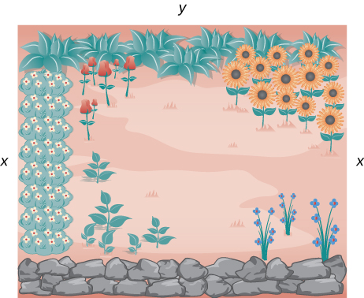{: #CNX_Calc_Figure_04_07_001}

Let <math xmlns="http://www.w3.org/1998/Math/MathML"><mi>x</mi></math>

 denote the length of the side of the garden perpendicular to the rock wall and <math xmlns="http://www.w3.org/1998/Math/MathML"><mi>y</mi></math>

 denote the length of the side parallel to the rock wall. Then the area of the garden is

<math xmlns="http://www.w3.org/1998/Math/MathML"><mrow><mi>A</mi><mo>=</mo><mi>x</mi><mo>·</mo><mi>y</mi><mo>.</mo></mrow></math>

We want to find the maximum possible area subject to the constraint that the total fencing is <math xmlns="http://www.w3.org/1998/Math/MathML"><mrow><mn>100</mn><mspace width="0.2em" /><mtext>ft</mtext><mo>.</mo></mrow></math>

 From [[link]](#CNX_Calc_Figure_04_07_001), the total amount of fencing used will be <math xmlns="http://www.w3.org/1998/Math/MathML"><mrow><mn>2</mn><mi>x</mi><mo>+</mo><mi>y</mi><mo>.</mo></mrow></math>

 Therefore, the constraint equation is

<math xmlns="http://www.w3.org/1998/Math/MathML"><mrow><mn>2</mn><mi>x</mi><mo>+</mo><mi>y</mi><mo>=</mo><mn>100</mn><mo>.</mo></mrow></math>

Solving this equation for <math xmlns="http://www.w3.org/1998/Math/MathML"><mrow><mi>y</mi><mo>,</mo></mrow></math>

 we have <math xmlns="http://www.w3.org/1998/Math/MathML"><mrow><mi>y</mi><mo>=</mo><mn>100</mn><mo>−</mo><mn>2</mn><mi>x</mi><mo>.</mo></mrow></math>

 Thus, we can write the area as

<math xmlns="http://www.w3.org/1998/Math/MathML"><mrow><mi>A</mi><mrow><mo>(</mo><mi>x</mi><mo>)</mo></mrow><mo>=</mo><mi>x</mi><mo>·</mo><mrow><mo>(</mo><mrow><mn>100</mn><mo>−</mo><mn>2</mn><mi>x</mi></mrow><mo>)</mo></mrow><mo>=</mo><mn>100</mn><mi>x</mi><mo>−</mo><mn>2</mn><msup><mi>x</mi><mn>2</mn></msup><mo>.</mo></mrow></math>

Before trying to maximize the area function <math xmlns="http://www.w3.org/1998/Math/MathML"><mrow><mi>A</mi><mrow><mo>(</mo><mi>x</mi><mo>)</mo></mrow><mo>=</mo><mn>100</mn><mi>x</mi><mo>−</mo><mn>2</mn><msup><mi>x</mi><mn>2</mn></msup><mo>,</mo></mrow></math>

 we need to determine the domain under consideration. To construct a rectangular garden, we certainly need the lengths of both sides to be positive. Therefore, we need <math xmlns="http://www.w3.org/1998/Math/MathML"><mrow><mi>x</mi><mo>&gt;</mo><mn>0</mn></mrow></math>

 and <math xmlns="http://www.w3.org/1998/Math/MathML"><mrow><mi>y</mi><mo>&gt;</mo><mn>0</mn><mo>.</mo></mrow></math>

 Since <math xmlns="http://www.w3.org/1998/Math/MathML"><mrow><mi>y</mi><mo>=</mo><mn>100</mn><mo>−</mo><mn>2</mn><mi>x</mi><mo>,</mo></mrow></math>

 if <math xmlns="http://www.w3.org/1998/Math/MathML"><mrow><mi>y</mi><mo>&gt;</mo><mn>0</mn><mo>,</mo></mrow></math>

 then <math xmlns="http://www.w3.org/1998/Math/MathML"><mrow><mi>x</mi><mo>&lt;</mo><mn>50</mn><mo>.</mo></mrow></math>

 Therefore, we are trying to determine the maximum value of <math xmlns="http://www.w3.org/1998/Math/MathML"><mrow><mi>A</mi><mrow><mo>(</mo><mi>x</mi><mo>)</mo></mrow></mrow></math>

 for <math xmlns="http://www.w3.org/1998/Math/MathML"><mi>x</mi></math>

 over the open interval <math xmlns="http://www.w3.org/1998/Math/MathML"><mrow><mrow><mo>(</mo><mrow><mn>0</mn><mo>,</mo><mn>50</mn></mrow><mo>)</mo></mrow><mo>.</mo></mrow></math>

 We do not know that a function necessarily has a maximum value over an open interval. However, we do know that a continuous function has an absolute maximum (and absolute minimum) over a closed interval. Therefore, let’s consider the function <math xmlns="http://www.w3.org/1998/Math/MathML"><mrow><mi>A</mi><mrow><mo>(</mo><mi>x</mi><mo>)</mo></mrow><mo>=</mo><mn>100</mn><mi>x</mi><mo>−</mo><mn>2</mn><msup><mi>x</mi><mn>2</mn></msup></mrow></math>

 over the closed interval <math xmlns="http://www.w3.org/1998/Math/MathML"><mrow><mrow><mo>[</mo><mrow><mn>0</mn><mo>,</mo><mn>50</mn></mrow><mo>]</mo></mrow><mo>.</mo></mrow></math>

 If the maximum value occurs at an interior point, then we have found the value <math xmlns="http://www.w3.org/1998/Math/MathML"><mi>x</mi></math>

 in the open interval <math xmlns="http://www.w3.org/1998/Math/MathML"><mrow><mrow><mo>(</mo><mrow><mn>0</mn><mo>,</mo><mn>50</mn></mrow><mo>)</mo></mrow></mrow></math>

 that maximizes the area of the garden. Therefore, we consider the following problem:

Maximize <math xmlns="http://www.w3.org/1998/Math/MathML"><mrow><mi>A</mi><mrow><mo>(</mo><mi>x</mi><mo>)</mo></mrow><mo>=</mo><mn>100</mn><mi>x</mi><mo>−</mo><mn>2</mn><msup><mi>x</mi><mn>2</mn></msup></mrow></math>

 over the interval <math xmlns="http://www.w3.org/1998/Math/MathML"><mrow><mrow><mo>[</mo><mrow><mn>0</mn><mo>,</mo><mn>50</mn></mrow><mo>]</mo></mrow><mo>.</mo></mrow></math>

As mentioned earlier, since <math xmlns="http://www.w3.org/1998/Math/MathML"><mi>A</mi></math>

 is a continuous function on a closed, bounded interval, by the extreme value theorem, it has a maximum and a minimum. These extreme values occur either at endpoints or critical points. At the endpoints, <math xmlns="http://www.w3.org/1998/Math/MathML"><mrow><mi>A</mi><mrow><mo>(</mo><mi>x</mi><mo>)</mo></mrow><mo>=</mo><mn>0</mn><mo>.</mo></mrow></math>

 Since the area is positive for all <math xmlns="http://www.w3.org/1998/Math/MathML"><mi>x</mi></math>

 in the open interval <math xmlns="http://www.w3.org/1998/Math/MathML"><mrow><mrow><mo>(</mo><mrow><mn>0</mn><mo>,</mo><mn>50</mn></mrow><mo>)</mo></mrow><mo>,</mo></mrow></math>

 the maximum must occur at a critical point. Differentiating the function <math xmlns="http://www.w3.org/1998/Math/MathML"><mrow><mi>A</mi><mrow><mo>(</mo><mi>x</mi><mo>)</mo></mrow><mo>,</mo></mrow></math>

 we obtain

<math xmlns="http://www.w3.org/1998/Math/MathML"><mrow><msup><mi>A</mi><mo>′</mo></msup><mrow><mo>(</mo><mi>x</mi><mo>)</mo></mrow><mo>=</mo><mn>100</mn><mo>−</mo><mn>4</mn><mi>x</mi><mo>.</mo></mrow></math>

Therefore, the only critical point is <math xmlns="http://www.w3.org/1998/Math/MathML"><mrow><mi>x</mi><mo>=</mo><mn>25</mn></mrow></math>

 ([[link]](#CNX_Calc_Figure_04_07_002)). We conclude that the maximum area must occur when <math xmlns="http://www.w3.org/1998/Math/MathML"><mrow><mi>x</mi><mo>=</mo><mn>25</mn><mo>.</mo></mrow></math>

 Then we have <math xmlns="http://www.w3.org/1998/Math/MathML"><mrow><mi>y</mi><mo>=</mo><mn>100</mn><mo>−</mo><mn>2</mn><mi>x</mi><mo>=</mo><mn>100</mn><mo>−</mo><mn>2</mn><mrow><mo>(</mo><mrow><mn>25</mn></mrow><mo>)</mo></mrow><mo>=</mo><mn>50</mn><mo>.</mo></mrow></math>

 To maximize the area of the garden, let <math xmlns="http://www.w3.org/1998/Math/MathML"><mrow><mi>x</mi><mo>=</mo><mn>25</mn></mrow></math>

 ft and <math xmlns="http://www.w3.org/1998/Math/MathML"><mrow><mi>y</mi><mo>=</mo><mn>50</mn><mspace width="0.2em" /><mtext>ft</mtext><mo>.</mo></mrow></math>

 The area of this garden is <math xmlns="http://www.w3.org/1998/Math/MathML"><mrow><mn>1250</mn><msup><mrow><mspace width="0.2em" /><mtext>ft</mtext></mrow><mn>2</mn></msup><mo>.</mo></mrow></math>

=100x&#x2212;2x2."){: #CNX_Calc_Figure_04_07_002}

Determine the maximum area if we want to make the same rectangular garden as in [[link]](#CNX_Calc_Figure_04_07_002), but we have <math xmlns="http://www.w3.org/1998/Math/MathML"><mrow><mn>200</mn></mrow></math>

 ft of fencing.

The maximum area is <math xmlns="http://www.w3.org/1998/Math/MathML"><mrow><mn>5000</mn><msup><mrow><mspace width="0.2em" /><mtext>ft</mtext></mrow><mn>2</mn></msup><mo>.</mo></mrow></math>

Hint

We need to maximize the function <math xmlns="http://www.w3.org/1998/Math/MathML"><mrow><mi>A</mi><mrow><mo>(</mo><mi>x</mi><mo>)</mo></mrow><mo>=</mo><mn>200</mn><mi>x</mi><mo>−</mo><mn>2</mn><msup><mi>x</mi><mn>2</mn></msup></mrow></math>

 over the interval <math xmlns="http://www.w3.org/1998/Math/MathML"><mrow><mrow><mo>[</mo><mrow><mn>0</mn><mo>,</mo><mn>100</mn></mrow><mo>]</mo></mrow><mo>.</mo></mrow></math>

Now let’s look at a general strategy for solving optimization problems similar to [\[link\]](#fs-id1165043431956).

Problem-Solving Strategy: Solving Optimization Problems

1.  Introduce all variables. If applicable, draw a figure and label all variables.
2.  Determine which quantity is to be maximized or minimized, and for what range of values of the other variables (if this can be determined at this time).
3.  Write a formula for the quantity to be maximized or minimized in terms of the variables. This formula may involve more than one variable.
4.  Write any equations relating the independent variables in the formula from step
    <math xmlns="http://www.w3.org/1998/Math/MathML"><mn>3</mn><mo>.</mo></math>
    
    Use these equations to write the quantity to be maximized or minimized as a function of one variable.
5.  Identify the domain of consideration for the function in step
    <math xmlns="http://www.w3.org/1998/Math/MathML"><mn>4</mn></math>
    
    based on the physical problem to be solved.
6.  Locate the maximum or minimum value of the function from step
    <math xmlns="http://www.w3.org/1998/Math/MathML"><mn>4</mn><mo>.</mo></math>
    
    This step typically involves looking for critical points and evaluating a function at endpoints.
{: data-number-style="arabic"}

Now let’s apply this strategy to maximize the volume of an open-top box given a constraint on the amount of material to be used.

Maximizing the Volume of a Box

An open-top box is to be made from a <math xmlns="http://www.w3.org/1998/Math/MathML"><mrow><mn>24</mn></mrow></math>

 in. by <math xmlns="http://www.w3.org/1998/Math/MathML"><mrow><mn>36</mn></mrow></math>

 in. piece of cardboard by removing a square from each corner of the box and folding up the flaps on each side. What size square should be cut out of each corner to get a box with the maximum volume?

Step 1: Let <math xmlns="http://www.w3.org/1998/Math/MathML"><mi>x</mi></math>

 be the side length of the square to be removed from each corner ([[link]](#CNX_Calc_Figure_04_07_003)). Then, the remaining four flaps can be folded up to form an open-top box. Let <math xmlns="http://www.w3.org/1998/Math/MathML"><mi>V</mi></math>

 be the volume of the resulting box.

{: #CNX_Calc_Figure_04_07_003}

Step 2: We are trying to maximize the volume of a box. Therefore, the problem is to maximize <math xmlns="http://www.w3.org/1998/Math/MathML"><mi>V</mi><mo>.</mo></math>

Step 3: As mentioned in step <math xmlns="http://www.w3.org/1998/Math/MathML"><mn>2</mn><mo>,</mo></math>

 are trying to maximize the volume of a box. The volume of a box is <math xmlns="http://www.w3.org/1998/Math/MathML"><mrow><mi>V</mi><mo>=</mo><mi>L</mi><mo>·</mo><mi>W</mi><mo>·</mo><mi>H</mi><mo>,</mo></mrow></math>

 where <math xmlns="http://www.w3.org/1998/Math/MathML"><mrow><mi>L</mi><mo>,</mo><mi>W</mi><mo>,</mo><mspace width="0.2em" /><mtext>and</mtext><mspace width="0.2em" /><mi>H</mi></mrow></math>

 are the length, width, and height, respectively.

Step 4: From [[link]](#CNX_Calc_Figure_04_07_003), we see that the height of the box is <math xmlns="http://www.w3.org/1998/Math/MathML"><mi>x</mi></math>

 inches, the length is <math xmlns="http://www.w3.org/1998/Math/MathML"><mrow><mn>36</mn><mo>−</mo><mn>2</mn><mi>x</mi></mrow></math>

 inches, and the width is <math xmlns="http://www.w3.org/1998/Math/MathML"><mrow><mn>24</mn><mo>−</mo><mn>2</mn><mi>x</mi></mrow></math>

 inches. Therefore, the volume of the box is

<math xmlns="http://www.w3.org/1998/Math/MathML"><mrow><mi>V</mi><mrow><mo>(</mo><mi>x</mi><mo>)</mo></mrow><mo>=</mo><mrow><mo>(</mo><mrow><mn>36</mn><mo>−</mo><mn>2</mn><mi>x</mi></mrow><mo>)</mo></mrow><mrow><mo>(</mo><mrow><mn>24</mn><mo>−</mo><mn>2</mn><mi>x</mi></mrow><mo>)</mo></mrow><mi>x</mi><mo>=</mo><mn>4</mn><msup><mi>x</mi><mn>3</mn></msup><mo>−</mo><mn>120</mn><msup><mi>x</mi><mn>2</mn></msup><mo>+</mo><mn>864</mn><mi>x</mi><mo>.</mo></mrow></math>

Step 5: To determine the domain of consideration, let’s examine [[link]](#CNX_Calc_Figure_04_07_003). Certainly, we need <math xmlns="http://www.w3.org/1998/Math/MathML"><mrow><mi>x</mi><mo>&gt;</mo><mn>0</mn><mo>.</mo></mrow></math>

 Furthermore, the side length of the square cannot be greater than or equal to half the length of the shorter side, <math xmlns="http://www.w3.org/1998/Math/MathML"><mrow><mn>24</mn></mrow></math>

 in.; otherwise, one of the flaps would be completely cut off. Therefore, we are trying to determine whether there is a maximum volume of the box for <math xmlns="http://www.w3.org/1998/Math/MathML"><mi>x</mi></math>

 over the open interval <math xmlns="http://www.w3.org/1998/Math/MathML"><mrow><mrow><mo>(</mo><mrow><mn>0</mn><mo>,</mo><mn>12</mn></mrow><mo>)</mo></mrow><mo>.</mo></mrow></math>

 Since <math xmlns="http://www.w3.org/1998/Math/MathML"><mi>V</mi></math>

 is a continuous function over the closed interval <math xmlns="http://www.w3.org/1998/Math/MathML"><mrow><mrow><mo>[</mo><mrow><mn>0</mn><mo>,</mo><mn>12</mn></mrow><mo>]</mo></mrow><mo>,</mo></mrow></math>

 we know <math xmlns="http://www.w3.org/1998/Math/MathML"><mi>V</mi></math>

 will have an absolute maximum over the closed interval. Therefore, we consider <math xmlns="http://www.w3.org/1998/Math/MathML"><mi>V</mi></math>

 over the closed interval <math xmlns="http://www.w3.org/1998/Math/MathML"><mrow><mrow><mo>[</mo><mrow><mn>0</mn><mo>,</mo><mn>12</mn></mrow><mo>]</mo></mrow></mrow></math>

 and check whether the absolute maximum occurs at an interior point.

Step 6: Since <math xmlns="http://www.w3.org/1998/Math/MathML"><mrow><mi>V</mi><mrow><mo>(</mo><mi>x</mi><mo>)</mo></mrow></mrow></math>

 is a continuous function over the closed, bounded interval <math xmlns="http://www.w3.org/1998/Math/MathML"><mrow><mrow><mo>[</mo><mrow><mn>0</mn><mo>,</mo><mn>12</mn></mrow><mo>]</mo></mrow><mo>,</mo></mrow></math>

 <math xmlns="http://www.w3.org/1998/Math/MathML"><mi>V</mi></math>

 must have an absolute maximum (and an absolute minimum). Since <math xmlns="http://www.w3.org/1998/Math/MathML"><mrow><mi>V</mi><mrow><mo>(</mo><mi>x</mi><mo>)</mo></mrow><mo>=</mo><mn>0</mn></mrow></math>

 at the endpoints and <math xmlns="http://www.w3.org/1998/Math/MathML"><mrow><mi>V</mi><mrow><mo>(</mo><mi>x</mi><mo>)</mo></mrow><mo>&gt;</mo><mn>0</mn></mrow></math>

 for <math xmlns="http://www.w3.org/1998/Math/MathML"><mrow><mn>0</mn><mo>&lt;</mo><mi>x</mi><mo>&lt;</mo><mn>12</mn><mo>,</mo></mrow></math>

 the maximum must occur at a critical point. The derivative is

<math xmlns="http://www.w3.org/1998/Math/MathML"><mrow><msup><mi>V</mi><mo>′</mo></msup><mrow><mo>(</mo><mi>x</mi><mo>)</mo></mrow><mo>=</mo><mn>12</mn><msup><mi>x</mi><mn>2</mn></msup><mo>−</mo><mn>240</mn><mi>x</mi><mo>+</mo><mn>864</mn><mo>.</mo></mrow></math>

To find the critical points, we need to solve the equation

<math xmlns="http://www.w3.org/1998/Math/MathML"><mrow><mn>12</mn><msup><mi>x</mi><mn>2</mn></msup><mo>−</mo><mn>240</mn><mi>x</mi><mo>+</mo><mn>864</mn><mo>=</mo><mn>0</mn><mo>.</mo></mrow></math>

Dividing both sides of this equation by <math xmlns="http://www.w3.org/1998/Math/MathML"><mrow><mn>12</mn><mo>,</mo></mrow></math>

 the problem simplifies to solving the equation

<math xmlns="http://www.w3.org/1998/Math/MathML"><mrow><msup><mi>x</mi><mn>2</mn></msup><mo>−</mo><mn>20</mn><mi>x</mi><mo>+</mo><mn>72</mn><mo>=</mo><mn>0</mn><mo>.</mo></mrow></math>

Using the quadratic formula, we find that the critical points are

<math xmlns="http://www.w3.org/1998/Math/MathML"><mrow><mi>x</mi><mo>=</mo><mfrac><mrow><mn>20</mn><mtext>±</mtext><msqrt><mrow><msup><mrow><mrow><mo>(</mo><mrow><mn>−20</mn></mrow><mo>)</mo></mrow></mrow><mn>2</mn></msup><mo>−</mo><mn>4</mn><mrow><mo>(</mo><mn>1</mn><mo>)</mo></mrow><mrow><mo>(</mo><mrow><mn>72</mn></mrow><mo>)</mo></mrow></mrow></msqrt></mrow><mn>2</mn></mfrac><mo>=</mo><mfrac><mrow><mn>20</mn><mtext>±</mtext><msqrt><mrow><mn>112</mn></mrow></msqrt></mrow><mn>2</mn></mfrac><mo>=</mo><mfrac><mrow><mn>20</mn><mtext>±</mtext><mn>4</mn><msqrt><mn>7</mn></msqrt></mrow><mn>2</mn></mfrac><mo>=</mo><mn>10</mn><mtext>±</mtext><mn>2</mn><msqrt><mn>7</mn></msqrt><mo>.</mo></mrow></math>

Since <math xmlns="http://www.w3.org/1998/Math/MathML"><mrow><mn>10</mn><mo>+</mo><mn>2</mn><msqrt><mn>7</mn></msqrt></mrow></math>

 is not in the domain of consideration, the only critical point we need to consider is <math xmlns="http://www.w3.org/1998/Math/MathML"><mrow><mn>10</mn><mo>−</mo><mn>2</mn><msqrt><mn>7</mn></msqrt><mo>.</mo></mrow></math>

 Therefore, the volume is maximized if we let <math xmlns="http://www.w3.org/1998/Math/MathML"><mrow><mi>x</mi><mo>=</mo><mn>10</mn><mo>−</mo><mn>2</mn><msqrt><mn>7</mn></msqrt><mspace width="0.2em" /><mtext>in</mtext><mo>.</mo></mrow></math>

 The maximum volume is <math xmlns="http://www.w3.org/1998/Math/MathML"><mrow><mi>V</mi><mrow><mo>(</mo><mrow><mn>10</mn><mo>−</mo><mn>2</mn><msqrt><mn>7</mn></msqrt></mrow><mo>)</mo></mrow><mo>=</mo><mn>640</mn><mo>+</mo><mn>448</mn><msqrt><mn>7</mn></msqrt><mo>≈</mo><mn>1825</mn><mspace width="0.2em" /><mtext>in</mtext><msup><mo>.</mo><mn>3</mn></msup></mrow></math>

 as shown in the following graph.

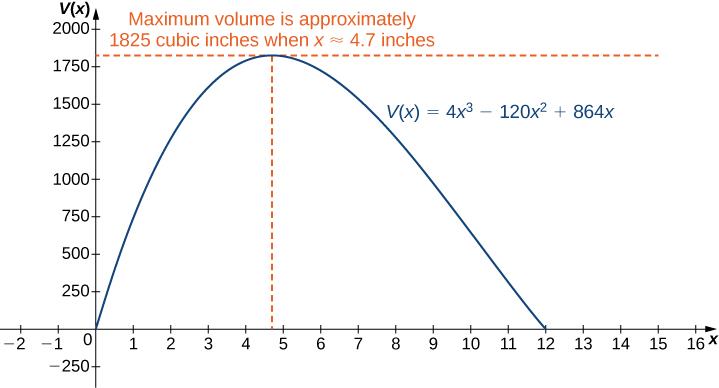{: #CNX_Calc_Figure_04_07_004}

Watch a [video][1] about optimizing the volume of a box.

Suppose the dimensions of the cardboard in [[link]](#fs-id1165043024669) are 20 in. by 30 in. Let <math xmlns="http://www.w3.org/1998/Math/MathML"><mi>x</mi></math>

 be the side length of each square and write the volume of the open-top box as a function of <math xmlns="http://www.w3.org/1998/Math/MathML"><mi>x</mi><mo>.</mo></math>

 Determine the domain of consideration for <math xmlns="http://www.w3.org/1998/Math/MathML"><mrow><mi>x</mi><mo>.</mo></mrow></math>

<math xmlns="http://www.w3.org/1998/Math/MathML"><mrow><mi>V</mi><mrow><mo>(</mo><mi>x</mi><mo>)</mo></mrow><mo>=</mo><mi>x</mi><mrow><mo>(</mo><mrow><mn>20</mn><mo>−</mo><mn>2</mn><mi>x</mi></mrow><mo>)</mo></mrow><mrow><mo>(</mo><mrow><mn>30</mn><mo>−</mo><mn>2</mn><mi>x</mi></mrow><mo>)</mo></mrow><mo>.</mo></mrow></math>

 The domain is <math xmlns="http://www.w3.org/1998/Math/MathML"><mrow><mrow><mo>[</mo><mrow><mn>0</mn><mo>,</mo><mn>10</mn></mrow><mo>]</mo></mrow><mo>.</mo></mrow></math>

Hint

The volume of the box is <math xmlns="http://www.w3.org/1998/Math/MathML"><mrow><mi>L</mi><mo>·</mo><mi>W</mi><mo>·</mo><mi>H</mi><mo>.</mo></mrow></math>

Minimizing Travel Time

An island is <math xmlns="http://www.w3.org/1998/Math/MathML"><mrow><mn>2</mn><mspace width="0.2em" /><mtext>mi</mtext></mrow></math>

 due north of its closest point along a straight shoreline. A visitor is staying at a cabin on the shore that is <math xmlns="http://www.w3.org/1998/Math/MathML"><mrow><mn>6</mn><mspace width="0.2em" /><mtext>mi</mtext></mrow></math>

 west of that point. The visitor is planning to go from the cabin to the island. Suppose the visitor runs at a rate of <math xmlns="http://www.w3.org/1998/Math/MathML"><mrow><mn>8</mn><mspace width="0.2em" /><mtext>mph</mtext></mrow></math>

 and swims at a rate of <math xmlns="http://www.w3.org/1998/Math/MathML"><mrow><mn>3</mn><mspace width="0.2em" /><mtext>mph</mtext><mo>.</mo></mrow></math>

 How far should the visitor run before swimming to minimize the time it takes to reach the island?

Step 1: Let <math xmlns="http://www.w3.org/1998/Math/MathML"><mi>x</mi></math>

 be the distance running and let <math xmlns="http://www.w3.org/1998/Math/MathML"><mi>y</mi></math>

 be the distance swimming ([[link]](#CNX_Calc_Figure_04_07_005)). Let <math xmlns="http://www.w3.org/1998/Math/MathML"><mi>T</mi></math>

 be the time it takes to get from the cabin to the island.

{: #CNX_Calc_Figure_04_07_005}

Step 2: The problem is to minimize <math xmlns="http://www.w3.org/1998/Math/MathML"><mrow><mi>T</mi><mo>.</mo></mrow></math>

Step 3: To find the time spent traveling from the cabin to the island, add the time spent running and the time spent swimming. Since Distance <math xmlns="http://www.w3.org/1998/Math/MathML"><mo>=</mo></math>

 Rate <math xmlns="http://www.w3.org/1998/Math/MathML"><mspace width="0.2em" /><mo>×</mo><mspace width="0.2em" /></math>

 Time <math xmlns="http://www.w3.org/1998/Math/MathML"><mrow><mo stretchy="false">(</mo><mi>D</mi><mo>=</mo><mi>R</mi><mspace width="0.2em" /><mo>×</mo><mspace width="0.2em" /><mi>T</mi><mo stretchy="false">)</mo><mo>,</mo></mrow></math>

 the time spent running is

<math xmlns="http://www.w3.org/1998/Math/MathML"><mrow><msub><mi>T</mi><mrow><mtext>running</mtext></mrow></msub><mo>=</mo><mfrac><mrow><msub><mi>D</mi><mrow><mtext>running</mtext></mrow></msub></mrow><mrow><msub><mi>R</mi><mrow><mtext>running</mtext></mrow></msub></mrow></mfrac><mo>=</mo><mfrac><mi>x</mi><mn>8</mn></mfrac><mo>,</mo></mrow></math>

and the time spent swimming is

<math xmlns="http://www.w3.org/1998/Math/MathML"><mrow><msub><mi>T</mi><mrow><mtext>swimming</mtext></mrow></msub><mo>=</mo><mfrac><mrow><msub><mi>D</mi><mrow><mtext>swimming</mtext></mrow></msub></mrow><mrow><msub><mi>R</mi><mrow><mtext>swimming</mtext></mrow></msub></mrow></mfrac><mo>=</mo><mfrac><mi>y</mi><mn>3</mn></mfrac><mo>.</mo></mrow></math>

Therefore, the total time spent traveling is

<math xmlns="http://www.w3.org/1998/Math/MathML"><mrow><mi>T</mi><mo>=</mo><mfrac><mi>x</mi><mn>8</mn></mfrac><mo>+</mo><mfrac><mi>y</mi><mn>3</mn></mfrac><mo>.</mo></mrow></math>

Step 4: From [[link]](#CNX_Calc_Figure_04_07_005), the line segment of <math xmlns="http://www.w3.org/1998/Math/MathML"><mi>y</mi></math>

 miles forms the hypotenuse of a right triangle with legs of length <math xmlns="http://www.w3.org/1998/Math/MathML"><mrow><mn>2</mn><mspace width="0.2em" /><mtext>mi</mtext></mrow></math>

 and <math xmlns="http://www.w3.org/1998/Math/MathML"><mrow><mn>6</mn><mo>−</mo><mi>x</mi><mspace width="0.2em" /><mtext>mi</mtext><mo>.</mo></mrow></math>

 Therefore, by the Pythagorean theorem, <math xmlns="http://www.w3.org/1998/Math/MathML"><mrow><msup><mn>2</mn><mn>2</mn></msup><mo>+</mo><msup><mrow><mrow><mo>(</mo><mrow><mn>6</mn><mo>−</mo><mi>x</mi></mrow><mo>)</mo></mrow></mrow><mn>2</mn></msup><mo>=</mo><msup><mi>y</mi><mn>2</mn></msup><mo>,</mo></mrow></math>

 and we obtain <math xmlns="http://www.w3.org/1998/Math/MathML"><mrow><mi>y</mi><mo>=</mo><msqrt><mrow><msup><mrow><mrow><mo>(</mo><mrow><mn>6</mn><mo>−</mo><mi>x</mi></mrow><mo>)</mo></mrow></mrow><mn>2</mn></msup><mo>+</mo><mn>4</mn></mrow></msqrt><mo>.</mo></mrow></math>

 Thus, the total time spent traveling is given by the function

<math xmlns="http://www.w3.org/1998/Math/MathML"><mrow><mi>T</mi><mrow><mo>(</mo><mi>x</mi><mo>)</mo></mrow><mo>=</mo><mfrac><mi>x</mi><mn>8</mn></mfrac><mo>+</mo><mfrac><mrow><msqrt><mrow><msup><mrow><mrow><mo>(</mo><mrow><mn>6</mn><mo>−</mo><mi>x</mi></mrow><mo>)</mo></mrow></mrow><mn>2</mn></msup><mo>+</mo><mn>4</mn></mrow></msqrt></mrow><mn>3</mn></mfrac><mo>.</mo></mrow></math>

Step 5: From [[link]](#CNX_Calc_Figure_04_07_005), we see that <math xmlns="http://www.w3.org/1998/Math/MathML"><mrow><mn>0</mn><mo>≤</mo><mi>x</mi><mo>≤</mo><mn>6</mn><mo>.</mo></mrow></math>

 Therefore, <math xmlns="http://www.w3.org/1998/Math/MathML"><mrow><mrow><mo>[</mo><mrow><mn>0</mn><mo>,</mo><mn>6</mn></mrow><mo>]</mo></mrow></mrow></math>

 is the domain of consideration.

Step 6: Since <math xmlns="http://www.w3.org/1998/Math/MathML"><mrow><mi>T</mi><mrow><mo>(</mo><mi>x</mi><mo>)</mo></mrow></mrow></math>

 is a continuous function over a closed, bounded interval, it has a maximum and a minimum. Let’s begin by looking for any critical points of <math xmlns="http://www.w3.org/1998/Math/MathML"><mi>T</mi></math>

 over the interval <math xmlns="http://www.w3.org/1998/Math/MathML"><mrow><mrow><mo>[</mo><mrow><mn>0</mn><mo>,</mo><mn>6</mn></mrow><mo>]</mo></mrow><mo>.</mo></mrow></math>

 The derivative is

<math xmlns="http://www.w3.org/1998/Math/MathML"><mrow><msup><mi>T</mi><mo>′</mo></msup><mrow><mo>(</mo><mi>x</mi><mo>)</mo></mrow><mo>=</mo><mfrac><mn>1</mn><mn>8</mn></mfrac><mo>−</mo><mfrac><mn>1</mn><mn>2</mn></mfrac><mspace width="0.2em" /><mfrac><mrow><msup><mrow><mrow><mo>[</mo><mrow><msup><mrow><mrow><mo>(</mo><mrow><mn>6</mn><mo>−</mo><mi>x</mi></mrow><mo>)</mo></mrow></mrow><mn>2</mn></msup><mo>+</mo><mn>4</mn></mrow><mo>]</mo></mrow></mrow><mrow><mn>−1</mn><mtext>/</mtext><mn>2</mn></mrow></msup></mrow><mn>3</mn></mfrac><mo>·</mo><mn>2</mn><mrow><mo>(</mo><mrow><mn>6</mn><mo>−</mo><mi>x</mi></mrow><mo>)</mo></mrow><mo>=</mo><mfrac><mn>1</mn><mn>8</mn></mfrac><mo>−</mo><mfrac><mrow><mrow><mo>(</mo><mrow><mn>6</mn><mo>−</mo><mi>x</mi></mrow><mo>)</mo></mrow></mrow><mrow><mn>3</mn><msqrt><mrow><msup><mrow><mrow><mo>(</mo><mrow><mn>6</mn><mo>−</mo><mi>x</mi></mrow><mo>)</mo></mrow></mrow><mn>2</mn></msup><mo>+</mo><mn>4</mn></mrow></msqrt></mrow></mfrac><mo>.</mo></mrow></math>

If <math xmlns="http://www.w3.org/1998/Math/MathML"><mrow><msup><mi>T</mi><mo>′</mo></msup><mrow><mo>(</mo><mi>x</mi><mo>)</mo></mrow><mo>=</mo><mn>0</mn><mo>,</mo></mrow></math>

 then

<math xmlns="http://www.w3.org/1998/Math/MathML"><mrow><mfrac><mn>1</mn><mn>8</mn></mfrac><mo>=</mo><mfrac><mrow><mn>6</mn><mo>−</mo><mi>x</mi></mrow><mrow><mn>3</mn><msqrt><mrow><msup><mrow><mrow><mo>(</mo><mrow><mn>6</mn><mo>−</mo><mi>x</mi></mrow><mo>)</mo></mrow></mrow><mn>2</mn></msup><mo>+</mo><mn>4</mn></mrow></msqrt></mrow></mfrac><mo>.</mo></mrow></math>

Therefore,

<math xmlns="http://www.w3.org/1998/Math/MathML"><mrow><mn>3</mn><msqrt><mrow><msup><mrow><mrow><mo>(</mo><mrow><mn>6</mn><mo>−</mo><mi>x</mi></mrow><mo>)</mo></mrow></mrow><mn>2</mn></msup><mo>+</mo><mn>4</mn></mrow></msqrt><mo>=</mo><mn>8</mn><mrow><mo>(</mo><mrow><mn>6</mn><mo>−</mo><mi>x</mi></mrow><mo>)</mo><mo>.</mo></mrow></mrow></math>

Squaring both sides of this equation, we see that if <math xmlns="http://www.w3.org/1998/Math/MathML"><mi>x</mi></math>

 satisfies this equation, then <math xmlns="http://www.w3.org/1998/Math/MathML"><mi>x</mi></math>

 must satisfy

<math xmlns="http://www.w3.org/1998/Math/MathML"><mrow><mn>9</mn><mrow><mo>[</mo><mrow><msup><mrow><mrow><mo>(</mo><mrow><mn>6</mn><mo>−</mo><mi>x</mi></mrow><mo>)</mo></mrow></mrow><mn>2</mn></msup><mo>+</mo><mn>4</mn></mrow><mo>]</mo></mrow><mo>=</mo><mn>64</mn><msup><mrow><mrow><mo>(</mo><mrow><mn>6</mn><mo>−</mo><mi>x</mi></mrow><mo>)</mo></mrow></mrow><mn>2</mn></msup><mo>,</mo></mrow></math>

which implies

<math xmlns="http://www.w3.org/1998/Math/MathML"><mrow><mn>55</mn><msup><mrow><mrow><mo>(</mo><mrow><mn>6</mn><mo>−</mo><mi>x</mi></mrow><mo>)</mo></mrow></mrow><mn>2</mn></msup><mo>=</mo><mn>36</mn><mo>.</mo></mrow></math>

We conclude that if <math xmlns="http://www.w3.org/1998/Math/MathML"><mi>x</mi></math>

 is a critical point, then <math xmlns="http://www.w3.org/1998/Math/MathML"><mi>x</mi></math>

 satisfies

<math xmlns="http://www.w3.org/1998/Math/MathML"><mrow><msup><mrow><mrow><mo>(</mo><mrow><mi>x</mi><mo>−</mo><mn>6</mn></mrow><mo>)</mo></mrow></mrow><mn>2</mn></msup><mo>=</mo><mfrac><mrow><mn>36</mn></mrow><mrow><mn>55</mn></mrow></mfrac><mo>.</mo></mrow></math>

Therefore, the possibilities for critical points are

<math xmlns="http://www.w3.org/1998/Math/MathML"><mrow><mi>x</mi><mo>=</mo><mn>6</mn><mtext>±</mtext><mfrac><mn>6</mn><mrow><msqrt><mrow><mn>55</mn></mrow></msqrt></mrow></mfrac><mo>.</mo></mrow></math>

Since <math xmlns="http://www.w3.org/1998/Math/MathML"><mrow><mi>x</mi><mo>=</mo><mn>6</mn><mo>+</mo><mn>6</mn><mtext>/</mtext><msqrt><mrow><mn>55</mn></mrow></msqrt></mrow></math>

 is not in the domain, it is not a possibility for a critical point. On the other hand, <math xmlns="http://www.w3.org/1998/Math/MathML"><mrow><mi>x</mi><mo>=</mo><mn>6</mn><mo>−</mo><mn>6</mn><mtext>/</mtext><msqrt><mrow><mn>55</mn></mrow></msqrt></mrow></math>

 is in the domain. Since we squared both sides of [[link]](#fs-id1165042343282) to arrive at the possible critical points, it remains to verify that <math xmlns="http://www.w3.org/1998/Math/MathML"><mrow><mi>x</mi><mo>=</mo><mn>6</mn><mo>−</mo><mn>6</mn><mtext>/</mtext><msqrt><mrow><mn>55</mn></mrow></msqrt></mrow></math>

 satisfies [[link]](#fs-id1165042343282). Since <math xmlns="http://www.w3.org/1998/Math/MathML"><mrow><mi>x</mi><mo>=</mo><mn>6</mn><mo>−</mo><mn>6</mn><mtext>/</mtext><msqrt><mrow><mn>55</mn></mrow></msqrt></mrow></math>

 does satisfy that equation, we conclude that <math xmlns="http://www.w3.org/1998/Math/MathML"><mrow><mi>x</mi><mo>=</mo><mn>6</mn><mo>−</mo><mn>6</mn><mtext>/</mtext><msqrt><mrow><mn>55</mn></mrow></msqrt></mrow></math>

 is a critical point, and it is the only one. To justify that the time is minimized for this value of <math xmlns="http://www.w3.org/1998/Math/MathML"><mrow><mi>x</mi><mo>,</mo></mrow></math>

 we just need to check the values of <math xmlns="http://www.w3.org/1998/Math/MathML"><mrow><mi>T</mi><mrow><mo>(</mo><mi>x</mi><mo>)</mo></mrow></mrow></math>

 at the endpoints <math xmlns="http://www.w3.org/1998/Math/MathML"><mrow><mi>x</mi><mo>=</mo><mn>0</mn></mrow></math>

 and <math xmlns="http://www.w3.org/1998/Math/MathML"><mrow><mi>x</mi><mo>=</mo><mn>6</mn><mo>,</mo></mrow></math>

 and compare them with the value of <math xmlns="http://www.w3.org/1998/Math/MathML"><mrow><mi>T</mi><mrow><mo>(</mo><mi>x</mi><mo>)</mo></mrow></mrow></math>

 at the critical point <math xmlns="http://www.w3.org/1998/Math/MathML"><mrow><mi>x</mi><mo>=</mo><mn>6</mn><mo>−</mo><mn>6</mn><mtext>/</mtext><msqrt><mrow><mn>55</mn></mrow></msqrt><mo>.</mo></mrow></math>

 We find that <math xmlns="http://www.w3.org/1998/Math/MathML"><mrow><mi>T</mi><mrow><mo>(</mo><mn>0</mn><mo>)</mo></mrow><mo>≈</mo><mn>2.108</mn><mspace width="0.2em" /><mtext>h</mtext></mrow></math>

 and <math xmlns="http://www.w3.org/1998/Math/MathML"><mrow><mi>T</mi><mrow><mo>(</mo><mn>6</mn><mo>)</mo></mrow><mo>≈</mo><mn>1.417</mn><mspace width="0.2em" /><mtext>h,</mtext></mrow></math>

 whereas <math xmlns="http://www.w3.org/1998/Math/MathML"><mrow><mi>T</mi><mrow><mo>(</mo><mrow><mn>6</mn><mo>−</mo><mn>6</mn><mtext>/</mtext><msqrt><mrow><mn>55</mn></mrow></msqrt></mrow><mo>)</mo></mrow><mo>≈</mo><mn>1.368</mn><mspace width="0.2em" /><mtext>h</mtext><mo>.</mo></mrow></math>

 Therefore, we conclude that <math xmlns="http://www.w3.org/1998/Math/MathML"><mi>T</mi></math>

 has a local minimum at <math xmlns="http://www.w3.org/1998/Math/MathML"><mrow><mi>x</mi><mo>≈</mo><mn>5.19</mn></mrow></math>

 mi.

Suppose the island is <math xmlns="http://www.w3.org/1998/Math/MathML"><mn>1</mn></math>

 mi from shore, and the distance from the cabin to the point on the shore closest to the island is <math xmlns="http://www.w3.org/1998/Math/MathML"><mrow><mn>15</mn><mspace width="0.2em" /><mtext>mi</mtext><mo>.</mo></mrow></math>

 Suppose a visitor swims at the rate of <math xmlns="http://www.w3.org/1998/Math/MathML"><mrow><mn>2.5</mn><mspace width="0.2em" /><mtext>mph</mtext></mrow></math>

 and runs at a rate of <math xmlns="http://www.w3.org/1998/Math/MathML"><mrow><mn>6</mn><mspace width="0.2em" /><mtext>mph</mtext><mo>.</mo></mrow></math>

 Let <math xmlns="http://www.w3.org/1998/Math/MathML"><mi>x</mi></math>

 denote the distance the visitor will run before swimming, and find a function for the time it takes the visitor to get from the cabin to the island.

<math xmlns="http://www.w3.org/1998/Math/MathML"><mrow><mi>T</mi><mrow><mo>(</mo><mi>x</mi><mo>)</mo></mrow><mo>=</mo><mfrac><mi>x</mi><mn>6</mn></mfrac><mo>+</mo><mfrac><mrow><msqrt><mrow><msup><mrow><mrow><mo>(</mo><mrow><mn>15</mn><mo>−</mo><mi>x</mi></mrow><mo>)</mo></mrow></mrow><mn>2</mn></msup><mo>+</mo><mn>1</mn></mrow></msqrt></mrow><mrow><mn>2.5</mn></mrow></mfrac></mrow></math>

Hint

The time <math xmlns="http://www.w3.org/1998/Math/MathML"><mrow><mi>T</mi><mo>=</mo><msub><mi>T</mi><mrow><mtext>running</mtext></mrow></msub><mo>+</mo><msub><mi>T</mi><mrow><mtext>swimming</mtext></mrow></msub><mo>.</mo></mrow></math>

In business, companies are interested in **maximizing revenue**{: data-type="term" .no-emphasis}. In the following example, we consider a scenario in which a company has collected data on how many cars it is able to lease, depending on the price it charges its customers to rent a car. Let’s use these data to determine the price the company should charge to maximize the amount of money it brings in.

Maximizing Revenue

Owners of a car rental company have determined that if they charge customers <math xmlns="http://www.w3.org/1998/Math/MathML"><mi>p</mi></math>

 dollars per day to rent a car, where <math xmlns="http://www.w3.org/1998/Math/MathML"><mrow><mn>50</mn><mo>≤</mo><mi>p</mi><mo>≤</mo><mn>200</mn><mo>,</mo></mrow></math>

 the number of cars <math xmlns="http://www.w3.org/1998/Math/MathML"><mi>n</mi></math>

 they rent per day can be modeled by the linear function <math xmlns="http://www.w3.org/1998/Math/MathML"><mrow><mi>n</mi><mrow><mo>(</mo><mi>p</mi><mo>)</mo></mrow><mo>=</mo><mn>1000</mn><mo>−</mo><mn>5</mn><mi>p</mi><mo>.</mo></mrow></math>

 If they charge <math xmlns="http://www.w3.org/1998/Math/MathML"><mrow><mtext>$</mtext><mn>50</mn></mrow></math>

 per day or less, they will rent all their cars. If they charge <math xmlns="http://www.w3.org/1998/Math/MathML"><mrow><mtext>$</mtext><mn>200</mn></mrow></math>

 per day or more, they will not rent any cars. Assuming the owners plan to charge customers between $50 per day and <math xmlns="http://www.w3.org/1998/Math/MathML"><mrow><mtext>$</mtext><mn>200</mn></mrow></math>

 per day to rent a car, how much should they charge to maximize their revenue?

Step 1: Let <math xmlns="http://www.w3.org/1998/Math/MathML"><mi>p</mi></math>

 be the price charged per car per day and let <math xmlns="http://www.w3.org/1998/Math/MathML"><mi>n</mi></math>

 be the number of cars rented per day. Let <math xmlns="http://www.w3.org/1998/Math/MathML"><mi>R</mi></math>

 be the revenue per day.

Step 2: The problem is to maximize <math xmlns="http://www.w3.org/1998/Math/MathML"><mrow><mi>R</mi><mo>.</mo></mrow></math>

Step 3: The revenue (per day) is equal to the number of cars rented per day times the price charged per car per day—that is, <math xmlns="http://www.w3.org/1998/Math/MathML"><mrow><mi>R</mi><mo>=</mo><mi>n</mi><mspace width="0.2em" /><mo>×</mo><mspace width="0.2em" /><mi>p</mi><mo>.</mo></mrow></math>

Step 4: Since the number of cars rented per day is modeled by the linear function <math xmlns="http://www.w3.org/1998/Math/MathML"><mrow><mi>n</mi><mrow><mo>(</mo><mi>p</mi><mo>)</mo></mrow><mo>=</mo><mn>1000</mn><mo>−</mo><mn>5</mn><mi>p</mi><mo>,</mo></mrow></math>

 the revenue <math xmlns="http://www.w3.org/1998/Math/MathML"><mi>R</mi></math>

 can be represented by the function

<math xmlns="http://www.w3.org/1998/Math/MathML"><mrow><mi>R</mi><mrow><mo>(</mo><mi>p</mi><mo>)</mo></mrow><mo>=</mo><mi>n</mi><mspace width="0.2em" /><mo>×</mo><mspace width="0.2em" /><mi>p</mi><mo>=</mo><mrow><mo>(</mo><mrow><mn>1000</mn><mo>−</mo><mn>5</mn><mi>p</mi></mrow><mo>)</mo></mrow><mi>p</mi><mo>=</mo><mn>−5</mn><msup><mi>p</mi><mn>2</mn></msup><mo>+</mo><mn>1000</mn><mi>p</mi><mo>.</mo></mrow></math>

Step 5: Since the owners plan to charge between <math xmlns="http://www.w3.org/1998/Math/MathML"><mrow><mtext>$</mtext><mn>50</mn></mrow></math>

 per car per day and <math xmlns="http://www.w3.org/1998/Math/MathML"><mrow><mtext>$</mtext><mn>200</mn></mrow></math>

 per car per day, the problem is to find the maximum revenue <math xmlns="http://www.w3.org/1998/Math/MathML"><mrow><mi>R</mi><mrow><mo>(</mo><mi>p</mi><mo>)</mo></mrow></mrow></math>

 for <math xmlns="http://www.w3.org/1998/Math/MathML"><mi>p</mi></math>

 in the closed interval <math xmlns="http://www.w3.org/1998/Math/MathML"><mrow><mrow><mo>[</mo><mrow><mn>50</mn><mo>,</mo><mn>200</mn></mrow><mo>]</mo></mrow><mo>.</mo></mrow></math>

Step 6: Since <math xmlns="http://www.w3.org/1998/Math/MathML"><mi>R</mi></math>

 is a continuous function over the closed, bounded interval <math xmlns="http://www.w3.org/1998/Math/MathML"><mrow><mrow><mo>[</mo><mrow><mn>50</mn><mo>,</mo><mn>200</mn></mrow><mo>]</mo></mrow><mo>,</mo></mrow></math>

 it has an absolute maximum (and an absolute minimum) in that interval. To find the maximum value, look for critical points. The derivative is <math xmlns="http://www.w3.org/1998/Math/MathML"><mrow><msup><mi>R</mi><mo>′</mo></msup><mrow><mo>(</mo><mi>p</mi><mo>)</mo></mrow><mo>=</mo><mn>−10</mn><mi>p</mi><mo>+</mo><mn>1000</mn><mo>.</mo></mrow></math>

 Therefore, the critical point is <math xmlns="http://www.w3.org/1998/Math/MathML"><mrow><mi>p</mi><mo>=</mo><mn>100</mn></mrow></math>

 When <math xmlns="http://www.w3.org/1998/Math/MathML"><mrow><mi>p</mi><mo>=</mo><mn>100</mn><mo>,</mo></mrow></math>

 <math xmlns="http://www.w3.org/1998/Math/MathML"><mrow><mi>R</mi><mrow><mo>(</mo><mrow><mn>100</mn></mrow><mo>)</mo></mrow><mo>=</mo><mtext>$</mtext><mn>50,000</mn><mo>.</mo></mrow></math>

 When <math xmlns="http://www.w3.org/1998/Math/MathML"><mrow><mi>p</mi><mo>=</mo><mn>50</mn><mo>,</mo></mrow></math>

 <math xmlns="http://www.w3.org/1998/Math/MathML"><mrow><mi>R</mi><mrow><mo>(</mo><mi>p</mi><mo>)</mo></mrow><mo>=</mo><mtext>$</mtext><mn>37,500</mn><mo>.</mo></mrow></math>

 When <math xmlns="http://www.w3.org/1998/Math/MathML"><mrow><mi>p</mi><mo>=</mo><mn>200</mn><mo>,</mo></mrow></math>

 <math xmlns="http://www.w3.org/1998/Math/MathML"><mrow><mi>R</mi><mrow><mo>(</mo><mi>p</mi><mo>)</mo></mrow><mo>=</mo><mtext>$</mtext><mn>0</mn><mo>.</mo></mrow></math>

 Therefore, the absolute maximum occurs at <math xmlns="http://www.w3.org/1998/Math/MathML"><mrow><mi>p</mi><mo>=</mo><mtext>$</mtext><mn>100</mn><mo>.</mo></mrow></math>

 The car rental company should charge <math xmlns="http://www.w3.org/1998/Math/MathML"><mrow><mtext>$</mtext><mn>100</mn></mrow></math>

 per day per car to maximize revenue as shown in the following figure.

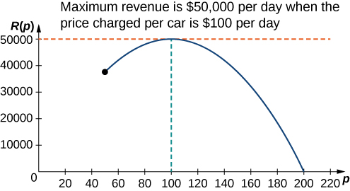{: #CNX_Calc_Figure_04_07_006}

A car rental company charges its customers <math xmlns="http://www.w3.org/1998/Math/MathML"><mi>p</mi></math>

 dollars per day, where <math xmlns="http://www.w3.org/1998/Math/MathML"><mrow><mn>60</mn><mo>≤</mo><mi>p</mi><mo>≤</mo><mn>150</mn><mo>.</mo></mrow></math>

 It has found that the number of cars rented per day can be modeled by the linear function <math xmlns="http://www.w3.org/1998/Math/MathML"><mrow><mi>n</mi><mrow><mo>(</mo><mi>p</mi><mo>)</mo></mrow><mo>=</mo><mn>750</mn><mo>−</mo><mn>5</mn><mi>p</mi><mo>.</mo></mrow></math>

 How much should the company charge each customer to maximize revenue?

The company should charge <math xmlns="http://www.w3.org/1998/Math/MathML"><mrow><mtext>$</mtext><mn>75</mn></mrow></math>

 per car per day.

Hint

<math xmlns="http://www.w3.org/1998/Math/MathML"><mrow><mi>R</mi><mrow><mo>(</mo><mi>p</mi><mo>)</mo></mrow><mo>=</mo><mi>n</mi><mspace width="0.2em" /><mo>×</mo><mspace width="0.2em" /><mi>p</mi><mo>,</mo></mrow></math>

 where <math xmlns="http://www.w3.org/1998/Math/MathML"><mi>n</mi></math>

 is the number of cars rented and <math xmlns="http://www.w3.org/1998/Math/MathML"><mi>p</mi></math>

 is the price charged per car.

Maximizing the Area of an Inscribed Rectangle

A rectangle is to be inscribed in the ellipse

<math xmlns="http://www.w3.org/1998/Math/MathML"><mrow><mfrac><mrow><msup><mi>x</mi><mn>2</mn></msup></mrow><mn>4</mn></mfrac><mo>+</mo><msup><mi>y</mi><mn>2</mn></msup><mo>=</mo><mn>1</mn><mo>.</mo></mrow></math>

What should the dimensions of the rectangle be to maximize its area? What is the maximum area?

Step 1: For a rectangle to be inscribed in the ellipse, the sides of the rectangle must be parallel to the axes. Let <math xmlns="http://www.w3.org/1998/Math/MathML"><mi>L</mi></math>

 be the length of the rectangle and <math xmlns="http://www.w3.org/1998/Math/MathML"><mi>W</mi></math>

 be its width. Let <math xmlns="http://www.w3.org/1998/Math/MathML"><mi>A</mi></math>

 be the area of the rectangle.

{: #CNX_Calc_Figure_04_07_007}

Step 2: The problem is to maximize <math xmlns="http://www.w3.org/1998/Math/MathML"><mrow><mi>A</mi><mo>.</mo></mrow></math>

Step 3: The area of the rectangle is <math xmlns="http://www.w3.org/1998/Math/MathML"><mrow><mi>A</mi><mo>=</mo><mi>L</mi><mi>W</mi><mo>.</mo></mrow></math>

Step 4: Let <math xmlns="http://www.w3.org/1998/Math/MathML"><mrow><mrow><mo>(</mo><mrow><mi>x</mi><mo>,</mo><mi>y</mi></mrow><mo>)</mo></mrow></mrow></math>

 be the corner of the rectangle that lies in the first quadrant, as shown in [[link]](#CNX_Calc_Figure_04_07_007). We can write length <math xmlns="http://www.w3.org/1998/Math/MathML"><mrow><mi>L</mi><mo>=</mo><mn>2</mn><mi>x</mi></mrow></math>

 and width <math xmlns="http://www.w3.org/1998/Math/MathML"><mrow><mi>W</mi><mo>=</mo><mn>2</mn><mi>y</mi><mo>.</mo></mrow></math>

 Since <math xmlns="http://www.w3.org/1998/Math/MathML"><mrow><mfrac><mrow><msup><mi>x</mi><mn>2</mn></msup></mrow><mrow><mn>4</mn><mo>+</mo><msup><mi>y</mi><mn>2</mn></msup><mo>=</mo><mn>1</mn></mrow></mfrac></mrow></math>

 and <math xmlns="http://www.w3.org/1998/Math/MathML"><mrow><mi>y</mi><mo>&gt;</mo><mn>0</mn><mo>,</mo></mrow></math>

 we have <math xmlns="http://www.w3.org/1998/Math/MathML"><mrow><mi>y</mi><mo>=</mo><msqrt><mrow><mfrac><mrow><mn>1</mn><mo>−</mo><msup><mi>x</mi><mn>2</mn></msup></mrow><mn>4</mn></mfrac></mrow></msqrt><mo>.</mo></mrow></math>

 Therefore, the area is

<math xmlns="http://www.w3.org/1998/Math/MathML"><mrow><mi>A</mi><mo>=</mo><mi>L</mi><mi>W</mi><mo>=</mo><mrow><mo>(</mo><mrow><mn>2</mn><mi>x</mi></mrow><mo>)</mo></mrow><mrow><mo>(</mo><mrow><mn>2</mn><mi>y</mi></mrow><mo>)</mo></mrow><mo>=</mo><mn>4</mn><mi>x</mi><msqrt><mrow><mfrac><mrow><mn>1</mn><mo>−</mo><msup><mi>x</mi><mn>2</mn></msup></mrow><mn>4</mn></mfrac></mrow></msqrt><mo>=</mo><mn>2</mn><mi>x</mi><msqrt><mrow><mn>4</mn><mo>−</mo><msup><mi>x</mi><mn>2</mn></msup></mrow></msqrt><mo>.</mo></mrow></math>

Step 5: From [[link]](#CNX_Calc_Figure_04_07_007), we see that to inscribe a rectangle in the ellipse, the <math xmlns="http://www.w3.org/1998/Math/MathML"><mi>x</mi></math>

-coordinate of the corner in the first quadrant must satisfy <math xmlns="http://www.w3.org/1998/Math/MathML"><mrow><mn>0</mn><mo>&lt;</mo><mi>x</mi><mo>&lt;</mo><mn>2</mn><mo>.</mo></mrow></math>

 Therefore, the problem reduces to looking for the maximum value of <math xmlns="http://www.w3.org/1998/Math/MathML"><mrow><mi>A</mi><mrow><mo>(</mo><mi>x</mi><mo>)</mo></mrow></mrow></math>

 over the open interval <math xmlns="http://www.w3.org/1998/Math/MathML"><mrow><mrow><mo>(</mo><mrow><mn>0</mn><mo>,</mo><mn>2</mn></mrow><mo>)</mo></mrow><mo>.</mo></mrow></math>

 Since <math xmlns="http://www.w3.org/1998/Math/MathML"><mrow><mi>A</mi><mrow><mo>(</mo><mi>x</mi><mo>)</mo></mrow></mrow></math>

 will have an absolute maximum (and absolute minimum) over the closed interval <math xmlns="http://www.w3.org/1998/Math/MathML"><mrow><mrow><mo>[</mo><mrow><mn>0</mn><mo>,</mo><mn>2</mn></mrow><mo>]</mo></mrow><mo>,</mo></mrow></math>

 we consider <math xmlns="http://www.w3.org/1998/Math/MathML"><mrow><mi>A</mi><mrow><mo>(</mo><mi>x</mi><mo>)</mo></mrow><mo>=</mo><mn>2</mn><mi>x</mi><msqrt><mrow><mn>4</mn><mo>−</mo><msup><mi>x</mi><mn>2</mn></msup></mrow></msqrt></mrow></math>

 over the interval <math xmlns="http://www.w3.org/1998/Math/MathML"><mrow><mrow><mo>[</mo><mrow><mn>0</mn><mo>,</mo><mn>2</mn></mrow><mo>]</mo></mrow><mo>.</mo></mrow></math>

 If the absolute maximum occurs at an interior point, then we have found an absolute maximum in the open interval.

Step 6: As mentioned earlier, <math xmlns="http://www.w3.org/1998/Math/MathML"><mrow><mi>A</mi><mrow><mo>(</mo><mi>x</mi><mo>)</mo></mrow></mrow></math>

 is a continuous function over the closed, bounded interval <math xmlns="http://www.w3.org/1998/Math/MathML"><mrow><mrow><mo>[</mo><mrow><mn>0</mn><mo>,</mo><mn>2</mn></mrow><mo>]</mo></mrow><mo>.</mo></mrow></math>

 Therefore, it has an absolute maximum (and absolute minimum). At the endpoints <math xmlns="http://www.w3.org/1998/Math/MathML"><mrow><mi>x</mi><mo>=</mo><mn>0</mn></mrow></math>

 and <math xmlns="http://www.w3.org/1998/Math/MathML"><mrow><mi>x</mi><mo>=</mo><mn>2</mn><mo>,</mo></mrow></math>

 <math xmlns="http://www.w3.org/1998/Math/MathML"><mrow><mi>A</mi><mrow><mo>(</mo><mi>x</mi><mo>)</mo></mrow><mo>=</mo><mn>0</mn><mo>.</mo></mrow></math>

 For <math xmlns="http://www.w3.org/1998/Math/MathML"><mrow><mn>0</mn><mo>&lt;</mo><mi>x</mi><mo>&lt;</mo><mn>2</mn><mo>,</mo></mrow></math>

 <math xmlns="http://www.w3.org/1998/Math/MathML"><mrow><mi>A</mi><mrow><mo>(</mo><mi>x</mi><mo>)</mo></mrow><mo>&gt;</mo><mn>0</mn><mo>.</mo></mrow></math>

 Therefore, the maximum must occur at a critical point. Taking the derivative of <math xmlns="http://www.w3.org/1998/Math/MathML"><mrow><mi>A</mi><mrow><mo>(</mo><mi>x</mi><mo>)</mo></mrow><mo>,</mo></mrow></math>

 we obtain

<math xmlns="http://www.w3.org/1998/Math/MathML"><mtable><mtr><mtd columnalign="right"><mi>A</mi><mo>′</mo><mrow><mo>(</mo><mi>x</mi><mo>)</mo></mrow></mtd><mtd columnalign="left"><mo>=</mo><mn>2</mn><msqrt><mrow><mn>4</mn><mo>−</mo><msup><mi>x</mi><mn>2</mn></msup></mrow></msqrt><mo>+</mo><mn>2</mn><mi>x</mi><mo>·</mo><mfrac><mn>1</mn><mrow><mn>2</mn><msqrt><mrow><mn>4</mn><mo>−</mo><msup><mi>x</mi><mn>2</mn></msup></mrow></msqrt></mrow></mfrac><mrow><mo>(</mo><mrow><mn>−2</mn><mi>x</mi></mrow><mo>)</mo></mrow></mtd></mtr><mtr><mtd /><mtd columnalign="left"><mo>=</mo><mn>2</mn><msqrt><mrow><mn>4</mn><mo>−</mo><msup><mi>x</mi><mn>2</mn></msup></mrow></msqrt><mo>−</mo><mfrac><mrow><mn>2</mn><msup><mi>x</mi><mn>2</mn></msup></mrow><mrow><msqrt><mrow><mn>4</mn><mo>−</mo><msup><mi>x</mi><mn>2</mn></msup></mrow></msqrt></mrow></mfrac></mtd></mtr><mtr><mtd /><mtd columnalign="left"><mo>=</mo><mfrac><mrow><mn>8</mn><mo>−</mo><mn>4</mn><msup><mi>x</mi><mn>2</mn></msup></mrow><mrow><msqrt><mrow><mn>4</mn><mo>−</mo><msup><mi>x</mi><mn>2</mn></msup></mrow></msqrt></mrow></mfrac><mo>.</mo></mtd></mtr></mtable></math>

To find critical points, we need to find where <math xmlns="http://www.w3.org/1998/Math/MathML"><mrow><mi>A</mi><mo>′</mo><mrow><mo>(</mo><mi>x</mi><mo>)</mo></mrow><mo>=</mo><mn>0</mn><mo>.</mo></mrow></math>

 We can see that if <math xmlns="http://www.w3.org/1998/Math/MathML"><mi>x</mi></math>

 is a solution of

<math xmlns="http://www.w3.org/1998/Math/MathML"><mrow><mfrac><mrow><mn>8</mn><mo>−</mo><mn>4</mn><msup><mi>x</mi><mn>2</mn></msup></mrow><mrow><msqrt><mrow><mn>4</mn><mo>−</mo><msup><mi>x</mi><mn>2</mn></msup></mrow></msqrt></mrow></mfrac><mo>=</mo><mn>0</mn><mo>,</mo></mrow></math>

then <math xmlns="http://www.w3.org/1998/Math/MathML"><mi>x</mi></math>

 must satisfy

<math xmlns="http://www.w3.org/1998/Math/MathML"><mrow><mn>8</mn><mo>−</mo><mn>4</mn><msup><mi>x</mi><mn>2</mn></msup><mo>=</mo><mn>0</mn><mo>.</mo></mrow></math>

Therefore, <math xmlns="http://www.w3.org/1998/Math/MathML"><mrow><msup><mi>x</mi><mn>2</mn></msup><mo>=</mo><mn>2</mn><mo>.</mo></mrow></math>

 Thus, <math xmlns="http://www.w3.org/1998/Math/MathML"><mrow><mi>x</mi><mo>=</mo><mtext>±</mtext><msqrt><mn>2</mn></msqrt></mrow></math>

 are the possible solutions of [[link]](#fs-id1165043354675). Since we are considering <math xmlns="http://www.w3.org/1998/Math/MathML"><mi>x</mi></math>

 over the interval <math xmlns="http://www.w3.org/1998/Math/MathML"><mrow><mrow><mo>[</mo><mrow><mn>0</mn><mo>,</mo><mn>2</mn></mrow><mo>]</mo></mrow><mo>,</mo></mrow></math>

 <math xmlns="http://www.w3.org/1998/Math/MathML"><mrow><mi>x</mi><mo>=</mo><msqrt><mn>2</mn></msqrt></mrow></math>

 is a possibility for a critical point, but <math xmlns="http://www.w3.org/1998/Math/MathML"><mrow><mi>x</mi><mo>=</mo><mtext>−</mtext><msqrt><mn>2</mn></msqrt></mrow></math>

 is not. Therefore, we check whether <math xmlns="http://www.w3.org/1998/Math/MathML"><mrow><msqrt><mn>2</mn></msqrt></mrow></math>

 is a solution of [[link]](#fs-id1165043354675). Since <math xmlns="http://www.w3.org/1998/Math/MathML"><mrow><mi>x</mi><mo>=</mo><msqrt><mn>2</mn></msqrt></mrow></math>

 is a solution of [[link]](#fs-id1165043354675), we conclude that <math xmlns="http://www.w3.org/1998/Math/MathML"><mrow><msqrt><mn>2</mn></msqrt></mrow></math>

 is the only critical point of <math xmlns="http://www.w3.org/1998/Math/MathML"><mrow><mi>A</mi><mrow><mo>(</mo><mi>x</mi><mo>)</mo></mrow></mrow></math>

 in the interval <math xmlns="http://www.w3.org/1998/Math/MathML"><mrow><mrow><mo>[</mo><mrow><mn>0</mn><mo>,</mo><mn>2</mn></mrow><mo>]</mo></mrow><mo>.</mo></mrow></math>

 Therefore, <math xmlns="http://www.w3.org/1998/Math/MathML"><mrow><mi>A</mi><mrow><mo>(</mo><mi>x</mi><mo>)</mo></mrow></mrow></math>

 must have an absolute maximum at the critical point <math xmlns="http://www.w3.org/1998/Math/MathML"><mrow><mi>x</mi><mo>=</mo><msqrt><mn>2</mn></msqrt><mo>.</mo></mrow></math>

 To determine the dimensions of the rectangle, we need to find the length <math xmlns="http://www.w3.org/1998/Math/MathML"><mi>L</mi></math>

 and the width <math xmlns="http://www.w3.org/1998/Math/MathML"><mrow><mi>W</mi><mo>.</mo></mrow></math>

 If <math xmlns="http://www.w3.org/1998/Math/MathML"><mrow><mi>x</mi><mo>=</mo><msqrt><mn>2</mn></msqrt></mrow></math>

 then

<math xmlns="http://www.w3.org/1998/Math/MathML"><mrow><mi>y</mi><mo>=</mo><msqrt><mrow><mn>1</mn><mo>−</mo><mfrac><mrow><msup><mrow><mrow><mo>(</mo><mrow><msqrt><mn>2</mn></msqrt></mrow><mo>)</mo></mrow></mrow><mn>2</mn></msup></mrow><mn>4</mn></mfrac></mrow></msqrt><mo>=</mo><msqrt><mrow><mn>1</mn><mo>−</mo><mfrac><mn>1</mn><mn>2</mn></mfrac></mrow></msqrt><mo>=</mo><mfrac><mn>1</mn><mrow><msqrt><mn>2</mn></msqrt></mrow></mfrac><mo>.</mo></mrow></math>

Therefore, the dimensions of the rectangle are <math xmlns="http://www.w3.org/1998/Math/MathML"><mrow><mi>L</mi><mo>=</mo><mn>2</mn><mi>x</mi><mo>=</mo><mn>2</mn><msqrt><mn>2</mn></msqrt></mrow></math>

 and <math xmlns="http://www.w3.org/1998/Math/MathML"><mrow><mi>W</mi><mo>=</mo><mn>2</mn><mi>y</mi><mo>=</mo><mfrac><mn>2</mn><mrow><msqrt><mn>2</mn></msqrt></mrow></mfrac><mo>=</mo><msqrt><mn>2</mn></msqrt><mo>.</mo></mrow></math>

 The area of this rectangle is <math xmlns="http://www.w3.org/1998/Math/MathML"><mrow><mi>A</mi><mo>=</mo><mi>L</mi><mi>W</mi><mo>=</mo><mrow><mo>(</mo><mrow><mn>2</mn><msqrt><mn>2</mn></msqrt></mrow><mo>)</mo></mrow><mrow><mo>(</mo><mrow><msqrt><mn>2</mn></msqrt></mrow><mo>)</mo></mrow><mo>=</mo><mn>4</mn><mo>.</mo></mrow></math>

Modify the area function <math xmlns="http://www.w3.org/1998/Math/MathML"><mi>A</mi></math>

 if the rectangle is to be inscribed in the unit circle <math xmlns="http://www.w3.org/1998/Math/MathML"><mrow><msup><mi>x</mi><mn>2</mn></msup><mo>+</mo><msup><mi>y</mi><mn>2</mn></msup><mo>=</mo><mn>1</mn><mo>.</mo></mrow></math>

 What is the domain of consideration?

<math xmlns="http://www.w3.org/1998/Math/MathML"><mrow><mi>A</mi><mrow><mo>(</mo><mi>x</mi><mo>)</mo></mrow><mo>=</mo><mn>4</mn><mi>x</mi><msqrt><mrow><mn>1</mn><mo>−</mo><msup><mi>x</mi><mn>2</mn></msup></mrow></msqrt><mo>.</mo></mrow></math>

 The domain of consideration is <math xmlns="http://www.w3.org/1998/Math/MathML"><mrow><mrow><mo>[</mo><mrow><mn>0</mn><mo>,</mo><mn>1</mn></mrow><mo>]</mo></mrow><mo>.</mo></mrow></math>

Hint

If <math xmlns="http://www.w3.org/1998/Math/MathML"><mrow><mrow><mo>(</mo><mrow><mi>x</mi><mo>,</mo><mi>y</mi></mrow><mo>)</mo></mrow></mrow></math>

 is the vertex of the square that lies in the first quadrant, then the area of the square is <math xmlns="http://www.w3.org/1998/Math/MathML"><mrow><mi>A</mi><mo>=</mo><mrow><mo>(</mo><mrow><mn>2</mn><mi>x</mi></mrow><mo>)</mo></mrow><mrow><mo>(</mo><mrow><mn>2</mn><mi>y</mi></mrow><mo>)</mo></mrow><mo>=</mo><mn>4</mn><mi>x</mi><mi>y</mi><mo>.</mo></mrow></math>

### Solving Optimization Problems when the Interval Is Not Closed or Is Unbounded

In the previous examples, we considered functions on closed, bounded domains. Consequently, by the extreme value theorem, we were guaranteed that the functions had absolute extrema. Let’s now consider functions for which the domain is neither closed nor bounded.

Many functions still have at least one absolute extrema, even if the domain is not closed or the domain is unbounded. For example, the function <math xmlns="http://www.w3.org/1998/Math/MathML"><mrow><mi>f</mi><mrow><mo>(</mo><mi>x</mi><mo>)</mo></mrow><mo>=</mo><msup><mi>x</mi><mn>2</mn></msup><mo>+</mo><mn>4</mn></mrow></math>

 over <math xmlns="http://www.w3.org/1998/Math/MathML"><mrow><mrow><mo>(</mo><mrow><mtext>−</mtext><mi>∞</mi><mo>,</mo><mi>∞</mi></mrow><mo>)</mo></mrow></mrow></math>

 has an absolute minimum of <math xmlns="http://www.w3.org/1998/Math/MathML"><mn>4</mn></math>

 at <math xmlns="http://www.w3.org/1998/Math/MathML"><mrow><mi>x</mi><mo>=</mo><mn>0</mn><mo>.</mo></mrow></math>

 Therefore, we can still consider functions over unbounded domains or open intervals and determine whether they have any absolute extrema. In the next example, we try to minimize a function over an unbounded domain. We will see that, although the domain of consideration is <math xmlns="http://www.w3.org/1998/Math/MathML"><mrow><mrow><mo>(</mo><mrow><mn>0</mn><mo>,</mo><mi>∞</mi></mrow><mo>)</mo></mrow><mo>,</mo></mrow></math>

 the function has an absolute minimum.

In the following example, we look at constructing a box of least surface area with a prescribed volume. It is not difficult to show that for a closed-top box, by symmetry, among all boxes with a specified volume, a cube will have the smallest surface area. Consequently, we consider the modified problem of determining which open-topped box with a specified volume has the smallest surface area.

Minimizing Surface Area

A rectangular box with a square base, an open top, and a volume of <math xmlns="http://www.w3.org/1998/Math/MathML"><mrow><mn>216</mn></mrow></math>

 in.3 is to be constructed. What should the dimensions of the box be to minimize the surface area of the box? What is the minimum surface area?

Step 1: Draw a rectangular box and introduce the variable <math xmlns="http://www.w3.org/1998/Math/MathML"><mi>x</mi></math>

 to represent the length of each side of the square base; let <math xmlns="http://www.w3.org/1998/Math/MathML"><mi>y</mi></math>

 represent the height of the box. Let <math xmlns="http://www.w3.org/1998/Math/MathML"><mi>S</mi></math>

 denote the surface area of the open-top box.

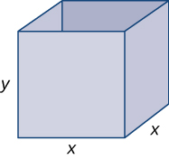{: #CNX_Calc_Figure_04_07_008}

Step 2: We need to minimize the surface area. Therefore, we need to minimize <math xmlns="http://www.w3.org/1998/Math/MathML"><mrow><mi>S</mi><mo>.</mo></mrow></math>

Step 3: Since the box has an open top, we need only determine the area of the four vertical sides and the base. The area of each of the four vertical sides is <math xmlns="http://www.w3.org/1998/Math/MathML"><mrow><mi>x</mi><mo>·</mo><mi>y</mi><mo>.</mo></mrow></math>

 The area of the base is <math xmlns="http://www.w3.org/1998/Math/MathML"><mrow><msup><mi>x</mi><mn>2</mn></msup><mo>.</mo></mrow></math>

 Therefore, the surface area of the box is

<math xmlns="http://www.w3.org/1998/Math/MathML"><mrow><mi>S</mi><mo>=</mo><mn>4</mn><mi>x</mi><mi>y</mi><mo>+</mo><msup><mi>x</mi><mn>2</mn></msup><mo>.</mo></mrow></math>

Step 4: Since the volume of this box is <math xmlns="http://www.w3.org/1998/Math/MathML"><mrow><msup><mi>x</mi><mn>2</mn></msup><mi>y</mi></mrow></math>

 and the volume is given as <math xmlns="http://www.w3.org/1998/Math/MathML"><mrow><mn>216</mn><mspace width="0.2em" /><mtext>in</mtext><msup><mo>.</mo><mn>3</mn></msup><mo>,</mo></mrow></math>

 the constraint equation is

<math xmlns="http://www.w3.org/1998/Math/MathML"><mrow><msup><mi>x</mi><mn>2</mn></msup><mi>y</mi><mo>=</mo><mn>216</mn><mo>.</mo></mrow></math>

Solving the constraint equation for <math xmlns="http://www.w3.org/1998/Math/MathML"><mi>y</mi><mo>,</mo></math>

 we have <math xmlns="http://www.w3.org/1998/Math/MathML"><mrow><mi>y</mi><mo>=</mo><mfrac><mrow><mn>216</mn></mrow><mrow><msup><mi>x</mi><mn>2</mn></msup></mrow></mfrac><mo>.</mo></mrow></math>

 Therefore, we can write the surface area as a function of <math xmlns="http://www.w3.org/1998/Math/MathML"><mi>x</mi></math>

 only:

<math xmlns="http://www.w3.org/1998/Math/MathML"><mrow><mi>S</mi><mrow><mo>(</mo><mi>x</mi><mo>)</mo></mrow><mo>=</mo><mn>4</mn><mi>x</mi><mrow><mo>(</mo><mrow><mfrac><mrow><mn>216</mn></mrow><mrow><msup><mi>x</mi><mn>2</mn></msup></mrow></mfrac></mrow><mo>)</mo></mrow><mo>+</mo><msup><mi>x</mi><mn>2</mn></msup><mo>.</mo></mrow></math>

Therefore, <math xmlns="http://www.w3.org/1998/Math/MathML"><mrow><mi>S</mi><mrow><mo>(</mo><mi>x</mi><mo>)</mo></mrow><mo>=</mo><mfrac><mrow><mn>864</mn></mrow><mi>x</mi></mfrac><mo>+</mo><msup><mi>x</mi><mn>2</mn></msup><mo>.</mo></mrow></math>

Step 5: Since we are requiring that <math xmlns="http://www.w3.org/1998/Math/MathML"><mrow><msup><mi>x</mi><mn>2</mn></msup><mi>y</mi><mo>=</mo><mn>216</mn><mo>,</mo></mrow></math>

 we cannot have <math xmlns="http://www.w3.org/1998/Math/MathML"><mrow><mi>x</mi><mo>=</mo><mn>0</mn><mo>.</mo></mrow></math>

 Therefore, we need <math xmlns="http://www.w3.org/1998/Math/MathML"><mrow><mi>x</mi><mo>&gt;</mo><mn>0</mn><mo>.</mo></mrow></math>

 On the other hand, <math xmlns="http://www.w3.org/1998/Math/MathML"><mi>x</mi></math>

 is allowed to have any positive value. Note that as <math xmlns="http://www.w3.org/1998/Math/MathML"><mi>x</mi></math>

 becomes large, the height of the box <math xmlns="http://www.w3.org/1998/Math/MathML"><mi>y</mi></math>

 becomes correspondingly small so that <math xmlns="http://www.w3.org/1998/Math/MathML"><mrow><msup><mi>x</mi><mn>2</mn></msup><mi>y</mi><mo>=</mo><mn>216</mn><mo>.</mo></mrow></math>

 Similarly, as <math xmlns="http://www.w3.org/1998/Math/MathML"><mi>x</mi></math>

 becomes small, the height of the box becomes correspondingly large. We conclude that the domain is the open, unbounded interval <math xmlns="http://www.w3.org/1998/Math/MathML"><mrow><mrow><mo>(</mo><mrow><mn>0</mn><mo>,</mo><mi>∞</mi></mrow><mo>)</mo></mrow><mo>.</mo></mrow></math>

 Note that, unlike the previous examples, we cannot reduce our problem to looking for an absolute maximum or absolute minimum over a closed, bounded interval. However, in the next step, we discover why this function must have an absolute minimum over the interval <math xmlns="http://www.w3.org/1998/Math/MathML"><mrow><mrow><mo>(</mo><mrow><mn>0</mn><mo>,</mo><mi>∞</mi></mrow><mo>)</mo></mrow><mo>.</mo></mrow></math>

Step 6: Note that as <math xmlns="http://www.w3.org/1998/Math/MathML"><mrow><mi>x</mi><mo stretchy="false">→</mo><msup><mn>0</mn><mo>+</mo></msup><mo>,</mo></mrow></math>

 <math xmlns="http://www.w3.org/1998/Math/MathML"><mrow><mi>S</mi><mrow><mo>(</mo><mi>x</mi><mo>)</mo></mrow><mo stretchy="false">→</mo><mi>∞</mi><mo>.</mo></mrow></math>

 Also, as <math xmlns="http://www.w3.org/1998/Math/MathML"><mrow><mi>x</mi><mo stretchy="false">→</mo><mi>∞</mi><mo>,</mo></mrow></math>

 <math xmlns="http://www.w3.org/1998/Math/MathML"><mrow><mi>S</mi><mrow><mo>(</mo><mi>x</mi><mo>)</mo></mrow><mo stretchy="false">→</mo><mi>∞</mi><mo>.</mo></mrow></math>

 Since <math xmlns="http://www.w3.org/1998/Math/MathML"><mi>S</mi></math>

 is a continuous function that approaches infinity at the ends, it must have an absolute minimum at some <math xmlns="http://www.w3.org/1998/Math/MathML"><mrow><mi>x</mi><mo>∈</mo><mrow><mo>(</mo><mrow><mn>0</mn><mo>,</mo><mi>∞</mi></mrow><mo>)</mo></mrow><mo>.</mo></mrow></math>

 This minimum must occur at a critical point of <math xmlns="http://www.w3.org/1998/Math/MathML"><mrow><mi>S</mi><mo>.</mo></mrow></math>

 The derivative is

<math xmlns="http://www.w3.org/1998/Math/MathML"><mrow><msup><mi>S</mi><mo>′</mo></msup><mrow><mo>(</mo><mi>x</mi><mo>)</mo></mrow><mo>=</mo><mo>−</mo><mfrac><mrow><mn>864</mn></mrow><mrow><msup><mi>x</mi><mn>2</mn></msup></mrow></mfrac><mo>+</mo><mn>2</mn><mi>x</mi><mo>.</mo></mrow></math>

Therefore, <math xmlns="http://www.w3.org/1998/Math/MathML"><mrow><msup><mi>S</mi><mo>′</mo></msup><mrow><mo>(</mo><mi>x</mi><mo>)</mo></mrow><mo>=</mo><mn>0</mn></mrow></math>

 when <math xmlns="http://www.w3.org/1998/Math/MathML"><mrow><mn>2</mn><mi>x</mi><mo>=</mo><mfrac><mrow><mn>864</mn></mrow><mrow><msup><mi>x</mi><mn>2</mn></msup></mrow></mfrac><mo>.</mo></mrow></math>

 Solving this equation for <math xmlns="http://www.w3.org/1998/Math/MathML"><mrow><mi>x</mi><mo>,</mo></mrow></math>

 we obtain <math xmlns="http://www.w3.org/1998/Math/MathML"><mrow><msup><mi>x</mi><mn>3</mn></msup><mo>=</mo><mn>432</mn><mo>,</mo></mrow></math>

 so <math xmlns="http://www.w3.org/1998/Math/MathML"><mrow><mi>x</mi><mo>=</mo><mroot><mrow><mn>432</mn></mrow><mn>3</mn></mroot><mo>=</mo><mn>6</mn><mroot><mn>2</mn><mn>3</mn></mroot><mo>.</mo></mrow></math>

 Since this is the only critical point of <math xmlns="http://www.w3.org/1998/Math/MathML"><mrow><mi>S</mi><mo>,</mo></mrow></math>

 the absolute minimum must occur at <math xmlns="http://www.w3.org/1998/Math/MathML"><mrow><mi>x</mi><mo>=</mo><mn>6</mn><mroot><mn>2</mn><mn>3</mn></mroot></mrow></math>

 (see [[link]](#CNX_Calc_Figure_04_07_009)). When <math xmlns="http://www.w3.org/1998/Math/MathML"><mrow><mi>x</mi><mo>=</mo><mn>6</mn><mroot><mn>2</mn><mn>3</mn></mroot><mo>,</mo></mrow></math>

 <math xmlns="http://www.w3.org/1998/Math/MathML"><mrow><mi>y</mi><mo>=</mo><mfrac><mrow><mn>216</mn></mrow><mrow><msup><mrow><mrow><mo>(</mo><mrow><mn>6</mn><mroot><mn>2</mn><mn>3</mn></mroot></mrow><mo>)</mo></mrow></mrow><mn>2</mn></msup></mrow></mfrac><mo>=</mo><mn>3</mn><mroot><mn>2</mn><mn>3</mn></mroot><mspace width="0.2em" /><mtext>in</mtext><mo>.</mo></mrow></math>

 Therefore, the dimensions of the box should be <math xmlns="http://www.w3.org/1998/Math/MathML"><mrow><mi>x</mi><mo>=</mo><mn>6</mn><mroot><mn>2</mn><mn>3</mn></mroot><mspace width="0.2em" /><mtext>in</mtext><mo>.</mo></mrow></math>

 and <math xmlns="http://www.w3.org/1998/Math/MathML"><mrow><mi>y</mi><mo>=</mo><mn>3</mn><mroot><mn>2</mn><mn>3</mn></mroot><mspace width="0.2em" /><mtext>in</mtext><mo>.</mo></mrow></math>

 With these dimensions, the surface area is

<math xmlns="http://www.w3.org/1998/Math/MathML"><mrow><mi>S</mi><mrow><mo>(</mo><mrow><mn>6</mn><mroot><mn>2</mn><mn>3</mn></mroot></mrow><mo>)</mo></mrow><mo>=</mo><mfrac><mrow><mn>864</mn></mrow><mrow><mn>6</mn><mroot><mn>2</mn><mn>3</mn></mroot></mrow></mfrac><mo>+</mo><msup><mrow><mrow><mo>(</mo><mrow><mn>6</mn><mroot><mn>2</mn><mn>3</mn></mroot></mrow><mo>)</mo></mrow></mrow><mn>2</mn></msup><mo>=</mo><mn>108</mn><mroot><mn>4</mn><mn>3</mn></mroot><mspace width="0.2em" /><mtext>in</mtext><msup><mo>.</mo><mn>2</mn></msup></mrow></math>

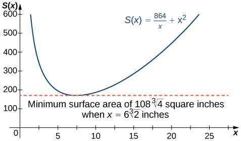{: #CNX_Calc_Figure_04_07_009}

Consider the same open-top box, which is to have volume <math xmlns="http://www.w3.org/1998/Math/MathML"><mrow><mn>216</mn><mspace width="0.2em" /><mtext>in</mtext><msup><mo>.</mo><mn>3</mn></msup><mo>.</mo></mrow></math>

 Suppose the cost of the material for the base is <math xmlns="http://www.w3.org/1998/Math/MathML"><mrow><mrow><mrow><mn>20</mn><mo>¢</mo></mrow><mtext>/</mtext><mrow><mtext>in</mtext></mrow></mrow><msup><mo>.</mo><mn>2</mn></msup></mrow></math>

 and the cost of the material for the sides is <math xmlns="http://www.w3.org/1998/Math/MathML"><mrow><mrow><mrow><mn>30</mn><mo>¢</mo></mrow><mtext>/</mtext><mrow><mtext>in</mtext></mrow></mrow><msup><mo>.</mo><mn>2</mn></msup></mrow></math>

 and we are trying to minimize the cost of this box. Write the cost as a function of the side lengths of the base. (Let <math xmlns="http://www.w3.org/1998/Math/MathML"><mi>x</mi></math>

 be the side length of the base and <math xmlns="http://www.w3.org/1998/Math/MathML"><mi>y</mi></math>

 be the height of the box.)

<math xmlns="http://www.w3.org/1998/Math/MathML"><mrow><mi>c</mi><mrow><mo>(</mo><mi>x</mi><mo>)</mo></mrow><mo>=</mo><mfrac><mrow><mn>259.2</mn></mrow><mi>x</mi></mfrac><mo>+</mo><mn>0.2</mn><msup><mi>x</mi><mn>2</mn></msup></mrow></math>

 dollars

Hint

If the cost of one of the sides is <math xmlns="http://www.w3.org/1998/Math/MathML"><mrow><mrow><mrow><mn>30</mn><mo>¢</mo></mrow><mtext>/</mtext><mrow><mtext>in</mtext></mrow></mrow><msup><mo>.</mo><mn>2</mn></msup><mo>,</mo></mrow></math>

 the cost of that side is <math xmlns="http://www.w3.org/1998/Math/MathML"><mrow><mn>0.30</mn><mi>x</mi><mi>y</mi><mo>.</mo></mrow></math>

### Key Concepts

* To solve an optimization problem, begin by drawing a picture and introducing variables.
* Find an equation relating the variables.
* Find a function of one variable to describe the quantity that is to be minimized or maximized.
* Look for critical points to locate local extrema.
{: data-bullet-style="bullet"}

<section data-depth="1" class="section-exercises" markdown="1">
For the following exercises, answer by proof, counterexample, or explanation.

When you find the maximum for an optimization problem, why do you need to check the sign of the derivative around the critical points?

The critical points can be the minima, maxima, or neither.

Why do you need to check the endpoints for optimization problems?

*True or False*. For every continuous nonlinear function, you can find the value <math xmlns="http://www.w3.org/1998/Math/MathML"><mi>x</mi></math>

 that maximizes the function.

False; <math xmlns="http://www.w3.org/1998/Math/MathML"><mrow><mi>y</mi><mo>=</mo><mtext>−</mtext><msup><mi>x</mi><mn>2</mn></msup></mrow></math>

 has a minimum only

*True or False*. For every continuous nonconstant function on a closed, finite domain, there exists at least one <math xmlns="http://www.w3.org/1998/Math/MathML"><mi>x</mi></math>

 that minimizes or maximizes the function.

For the following exercises, set up and evaluate each optimization problem.

To carry a suitcase on an airplane, the length <math xmlns="http://www.w3.org/1998/Math/MathML"><mrow><mo>+</mo><mtext>width</mtext><mo>+</mo></mrow></math>

 height of the box must be less than or equal to <math xmlns="http://www.w3.org/1998/Math/MathML"><mrow><mn>62</mn><mspace width="0.2em" /><mtext>in</mtext><mo>.</mo></mrow></math>

 Assuming the height is fixed, show that the maximum volume is <math xmlns="http://www.w3.org/1998/Math/MathML"><mrow><mi>V</mi><mo>=</mo><mi>h</mi><msup><mrow><mrow><mo>(</mo><mrow><mn>31</mn><mo>−</mo><mrow><mo>(</mo><mrow><mfrac><mn>1</mn><mn>2</mn></mfrac></mrow><mo>)</mo></mrow><mspace width="0.1em" /><mi>h</mi></mrow><mo>)</mo></mrow></mrow><mn>2</mn></msup><mo>.</mo></mrow></math>

 What height allows you to have the largest volume?

<math xmlns="http://www.w3.org/1998/Math/MathML"><mrow><mi>h</mi><mo>=</mo><mfrac><mrow><mn>62</mn></mrow><mn>3</mn></mfrac></mrow></math>

 in.

You are constructing a cardboard box with the dimensions <math xmlns="http://www.w3.org/1998/Math/MathML"><mrow><mtext>2 m by 4 m</mtext><mo>.</mo></mrow></math>

 You then cut equal-size squares from each corner so you may fold the edges. What are the dimensions of the box with the largest volume?

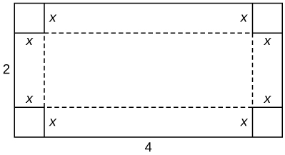

Find the positive integer that minimizes the sum of the number and its reciprocal.

<math xmlns="http://www.w3.org/1998/Math/MathML"><mn>1</mn></math>

Find two positive integers such that their sum is <math xmlns="http://www.w3.org/1998/Math/MathML"><mrow><mn>10</mn><mo>,</mo></mrow></math>

 and minimize and maximize the sum of their squares.

For the following exercises, consider the construction of a pen to enclose an area.

You have <math xmlns="http://www.w3.org/1998/Math/MathML"><mrow><mn>400</mn><mspace width="0.2em" /><mtext>ft</mtext></mrow></math>

 of fencing to construct a rectangular pen for cattle. What are the dimensions of the pen that maximize the area?

<math xmlns="http://www.w3.org/1998/Math/MathML"><mrow><mn>100</mn><mspace width="0.2em" /><mtext>ft by</mtext><mspace width="0.2em" /><mn>100</mn><mspace width="0.2em" /><mtext>ft</mtext></mrow></math>

You have <math xmlns="http://www.w3.org/1998/Math/MathML"><mrow><mn>800</mn><mspace width="0.2em" /><mtext>ft</mtext></mrow></math>

 of fencing to make a pen for hogs. If you have a river on one side of your property, what is the dimension of the rectangular pen that maximizes the area?

You need to construct a fence around an area of <math xmlns="http://www.w3.org/1998/Math/MathML"><mrow><mn>1600</mn><mspace width="0.2em" /><mtext>ft</mtext><mo>.</mo></mrow></math>

 What are the dimensions of the rectangular pen to minimize the amount of material needed?

<math xmlns="http://www.w3.org/1998/Math/MathML"><mrow><mn>40</mn><mspace width="0.2em" /><mtext>ft by</mtext><mspace width="0.2em" /><mn>40</mn><mspace width="0.2em" /><mtext>ft</mtext></mrow></math>

Two poles are connected by a wire that is also connected to the ground. The first pole is <math xmlns="http://www.w3.org/1998/Math/MathML"><mrow><mn>20</mn><mspace width="0.2em" /><mtext>ft</mtext></mrow></math>

 tall and the second pole is <math xmlns="http://www.w3.org/1998/Math/MathML"><mrow><mn>10</mn><mspace width="0.2em" /><mtext>ft</mtext></mrow></math>

 tall. There is a distance of <math xmlns="http://www.w3.org/1998/Math/MathML"><mrow><mn>30</mn><mspace width="0.2em" /><mtext>ft</mtext></mrow></math>

 between the two poles. Where should the wire be anchored to the ground to minimize the amount of wire needed?

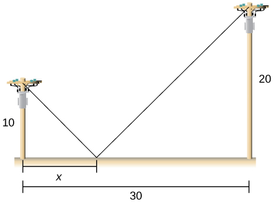

**[T]** You are moving into a new apartment and notice there is a corner where the hallway narrows from <math xmlns="http://www.w3.org/1998/Math/MathML"><mrow><mtext>8 ft to 6 ft</mtext><mo>.</mo></mrow></math>

 What is the length of the longest item that can be carried horizontally around the corner?

<math xmlns="http://www.w3.org/1998/Math/MathML"><mrow><mn>19.73</mn><mspace width="0.2em" /><mtext>ft</mtext><mo>.</mo></mrow></math>

A patient’s pulse measures <math xmlns="http://www.w3.org/1998/Math/MathML"><mrow><mtext>70 bpm, 80 bpm, then 120 bpm</mtext><mo>.</mo></mrow></math>

 To determine an accurate measurement of pulse, the doctor wants to know what value minimizes the expression <math xmlns="http://www.w3.org/1998/Math/MathML"><mrow><msup><mrow><mrow><mo>(</mo><mrow><mi>x</mi><mo>−</mo><mn>70</mn></mrow><mo>)</mo></mrow></mrow><mn>2</mn></msup><mo>+</mo><msup><mrow><mrow><mo>(</mo><mrow><mi>x</mi><mo>−</mo><mn>80</mn></mrow><mo>)</mo></mrow></mrow><mn>2</mn></msup><mo>+</mo><msup><mrow><mrow><mo>(</mo><mrow><mi>x</mi><mo>−</mo><mn>120</mn></mrow><mo>)</mo></mrow></mrow><mn>2</mn></msup><mo>?</mo></mrow></math>

 What value minimizes it?

In the previous problem, assume the patient was nervous during the third measurement, so we only weight that value half as much as the others. What is the value that minimizes <math xmlns="http://www.w3.org/1998/Math/MathML"><mrow><msup><mrow><mrow><mo>(</mo><mrow><mi>x</mi><mo>−</mo><mn>70</mn></mrow><mo>)</mo></mrow></mrow><mn>2</mn></msup><mo>+</mo><msup><mrow><mrow><mo>(</mo><mrow><mi>x</mi><mo>−</mo><mn>80</mn></mrow><mo>)</mo></mrow></mrow><mn>2</mn></msup><mo>+</mo><mfrac><mn>1</mn><mn>2</mn></mfrac><msup><mrow><mrow><mo>(</mo><mrow><mi>x</mi><mo>−</mo><mn>120</mn></mrow><mo>)</mo></mrow></mrow><mn>2</mn></msup><mo>?</mo></mrow></math>

<math xmlns="http://www.w3.org/1998/Math/MathML"><mrow><mn>84</mn><mspace width="0.2em" /><mtext>bpm</mtext></mrow></math>

You can run at a speed of <math xmlns="http://www.w3.org/1998/Math/MathML"><mn>6</mn></math>

 mph and swim at a speed of <math xmlns="http://www.w3.org/1998/Math/MathML"><mn>3</mn></math>

 mph and are located on the shore, <math xmlns="http://www.w3.org/1998/Math/MathML"><mn>4</mn></math>

 miles east of an island that is <math xmlns="http://www.w3.org/1998/Math/MathML"><mn>1</mn></math>

 mile north of the shoreline. How far should you run west to minimize the time needed to reach the island?

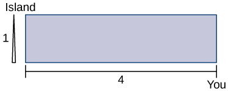

For the following problems, consider a lifeguard at a circular pool with diameter <math xmlns="http://www.w3.org/1998/Math/MathML"><mrow><mn>40</mn><mspace width="0.2em" /><mtext>m</mtext><mo>.</mo></mrow></math>

 He must reach someone who is drowning on the exact opposite side of the pool, at position <math xmlns="http://www.w3.org/1998/Math/MathML"><mrow><mi>C</mi><mo>.</mo></mrow></math>

 The lifeguard swims with a speed <math xmlns="http://www.w3.org/1998/Math/MathML"><mi>v</mi></math>

 and runs around the pool at speed <math xmlns="http://www.w3.org/1998/Math/MathML"><mrow><mi>w</mi><mo>=</mo><mn>3</mn><mi>v</mi><mo>.</mo></mrow></math>

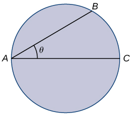

Find a function that measures the total amount of time it takes to reach the drowning person as a function of the swim angle, <math xmlns="http://www.w3.org/1998/Math/MathML"><mrow><mi>θ</mi><mo>.</mo></mrow></math>

<math xmlns="http://www.w3.org/1998/Math/MathML"><mrow><mi>T</mi><mrow><mo>(</mo><mi>θ</mi><mo>)</mo></mrow><mo>=</mo><mfrac><mrow><mn>40</mn><mi>θ</mi></mrow><mrow><mn>3</mn><mi>v</mi></mrow></mfrac><mo>+</mo><mfrac><mrow><mn>40</mn><mspace width="0.1em" /><mtext>cos</mtext><mspace width="0.1em" /><mi>θ</mi></mrow><mi>v</mi></mfrac></mrow></math>

Find at what angle <math xmlns="http://www.w3.org/1998/Math/MathML"><mi>θ</mi></math>

 the lifeguard should swim to reach the drowning person in the least amount of time.

A truck uses gas as <math xmlns="http://www.w3.org/1998/Math/MathML"><mrow><mi>g</mi><mrow><mo>(</mo><mi>v</mi><mo>)</mo></mrow><mo>=</mo><mi>a</mi><mi>v</mi><mo>+</mo><mfrac><mi>b</mi><mi>v</mi></mfrac><mo>,</mo></mrow></math>

 where <math xmlns="http://www.w3.org/1998/Math/MathML"><mi>v</mi></math>

 represents the speed of the truck and <math xmlns="http://www.w3.org/1998/Math/MathML"><mi>g</mi></math>

 represents the gallons of fuel per mile. At what speed is fuel consumption minimized?

<math xmlns="http://www.w3.org/1998/Math/MathML"><mrow><mi>v</mi><mo>=</mo><msqrt><mrow><mfrac><mi>b</mi><mi>a</mi></mfrac></mrow></msqrt></mrow></math>

For the following exercises, consider a limousine that gets <math xmlns="http://www.w3.org/1998/Math/MathML"><mrow><mi>m</mi><mrow><mo>(</mo><mi>v</mi><mo>)</mo></mrow><mo>=</mo><mfrac><mrow><mrow><mo>(</mo><mrow><mn>120</mn><mo>−</mo><mn>2</mn><mi>v</mi></mrow><mo>)</mo></mrow></mrow><mn>5</mn></mfrac><mspace width="0.2em" /><mtext>mi/gal</mtext></mrow></math>

 at speed <math xmlns="http://www.w3.org/1998/Math/MathML"><mrow><mi>v</mi><mo>,</mo></mrow></math>

 the chauffeur costs <math xmlns="http://www.w3.org/1998/Math/MathML"><mrow><mtext>$15/h</mtext><mo>,</mo></mrow></math>

 and gas is <math xmlns="http://www.w3.org/1998/Math/MathML"><mrow><mtext>$</mtext><mn>3.5</mn><mtext>/</mtext><mtext>gal</mtext><mo>.</mo></mrow></math>

Find the cost per mile at speed <math xmlns="http://www.w3.org/1998/Math/MathML"><mrow><mi>v</mi><mo>.</mo></mrow></math>

Find the cheapest driving speed.

approximately <math xmlns="http://www.w3.org/1998/Math/MathML"><mrow><mn>34.02</mn><mspace width="0.2em" /><mtext>mph</mtext></mrow></math>

For the following exercises, consider a pizzeria that sell pizzas for a revenue of <math xmlns="http://www.w3.org/1998/Math/MathML"><mrow><mi>R</mi><mrow><mo>(</mo><mi>x</mi><mo>)</mo></mrow><mo>=</mo><mi>a</mi><mi>x</mi></mrow></math>

 and costs <math xmlns="http://www.w3.org/1998/Math/MathML"><mrow><mi>C</mi><mrow><mo>(</mo><mi>x</mi><mo>)</mo></mrow><mo>=</mo><mi>b</mi><mo>+</mo><mi>c</mi><mi>x</mi><mo>+</mo><mi>d</mi><msup><mi>x</mi><mn>2</mn></msup><mo>,</mo></mrow></math>

 where <math xmlns="http://www.w3.org/1998/Math/MathML"><mi>x</mi></math>

 represents the number of pizzas.

Find the profit function for the number of pizzas. How many pizzas gives the largest profit per pizza?

Assume that <math xmlns="http://www.w3.org/1998/Math/MathML"><mrow><mi>R</mi><mrow><mo>(</mo><mi>x</mi><mo>)</mo></mrow><mo>=</mo><mn>10</mn><mi>x</mi></mrow></math>

 and <math xmlns="http://www.w3.org/1998/Math/MathML"><mrow><mi>C</mi><mrow><mo>(</mo><mi>x</mi><mo>)</mo></mrow><mo>=</mo><mn>2</mn><mi>x</mi><mo>+</mo><msup><mi>x</mi><mn>2</mn></msup><mo>.</mo></mrow></math>

 How many pizzas sold maximizes the profit?

<math xmlns="http://www.w3.org/1998/Math/MathML"><mn>4</mn></math>

Assume that <math xmlns="http://www.w3.org/1998/Math/MathML"><mrow><mi>R</mi><mrow><mo>(</mo><mi>x</mi><mo>)</mo></mrow><mo>=</mo><mn>15</mn><mi>x</mi><mo>,</mo></mrow></math>

 and <math xmlns="http://www.w3.org/1998/Math/MathML"><mrow><mi>C</mi><mrow><mo>(</mo><mi>x</mi><mo>)</mo></mrow><mo>=</mo><mn>60</mn><mo>+</mo><mn>3</mn><mi>x</mi><mo>+</mo><mfrac><mn>1</mn><mn>2</mn></mfrac><msup><mi>x</mi><mn>2</mn></msup><mo>.</mo></mrow></math>

 How many pizzas sold maximizes the profit?

For the following exercises, consider a wire <math xmlns="http://www.w3.org/1998/Math/MathML"><mrow><mn>4</mn><mspace width="0.2em" /><mtext>ft</mtext></mrow></math>

 long cut into two pieces. One piece forms a circle with radius <math xmlns="http://www.w3.org/1998/Math/MathML"><mi>r</mi></math>

 and the other forms a square of side <math xmlns="http://www.w3.org/1998/Math/MathML"><mrow><mi>x</mi><mo>.</mo></mrow></math>

Choose <math xmlns="http://www.w3.org/1998/Math/MathML"><mi>x</mi></math>

 to maximize the sum of their areas.

<math xmlns="http://www.w3.org/1998/Math/MathML"><mn>0</mn></math>

Choose <math xmlns="http://www.w3.org/1998/Math/MathML"><mi>x</mi></math>

 to minimize the sum of their areas.

For the following exercises, consider two nonnegative numbers <math xmlns="http://www.w3.org/1998/Math/MathML"><mi>x</mi></math>

 and <math xmlns="http://www.w3.org/1998/Math/MathML"><mi>y</mi></math>

 such that <math xmlns="http://www.w3.org/1998/Math/MathML"><mrow><mi>x</mi><mo>+</mo><mi>y</mi><mo>=</mo><mn>10</mn><mo>.</mo></mrow></math>

 Maximize and minimize the quantities.

<math xmlns="http://www.w3.org/1998/Math/MathML"><mrow><mi>x</mi><mi>y</mi></mrow></math>

Maximal: <math xmlns="http://www.w3.org/1998/Math/MathML"><mrow><mi>x</mi><mo>=</mo><mn>5</mn><mo>,</mo><mi>y</mi><mo>=</mo><mn>5</mn><mo>;</mo></mrow></math>

 minimal: <math xmlns="http://www.w3.org/1998/Math/MathML"><mrow><mi>x</mi><mo>=</mo><mn>0</mn><mo>,</mo><mi>y</mi><mo>=</mo><mn>10</mn></mrow></math>

 and <math xmlns="http://www.w3.org/1998/Math/MathML"><mrow><mi>y</mi><mo>=</mo><mn>0</mn><mo>,</mo><mi>x</mi><mo>=</mo><mn>10</mn></mrow></math>

<math xmlns="http://www.w3.org/1998/Math/MathML"><mrow><msup><mi>x</mi><mn>2</mn></msup><msup><mi>y</mi><mn>2</mn></msup></mrow></math>

<math xmlns="http://www.w3.org/1998/Math/MathML"><mrow><mi>y</mi><mo>−</mo><mfrac><mn>1</mn><mi>x</mi></mfrac></mrow></math>

Maximal: <math xmlns="http://www.w3.org/1998/Math/MathML"><mrow><mi>x</mi><mo>=</mo><mn>1</mn><mo>,</mo><mi>y</mi><mo>=</mo><mn>9</mn><mo>;</mo></mrow></math>

 minimal: none

<math xmlns="http://www.w3.org/1998/Math/MathML"><mrow><msup><mi>x</mi><mn>2</mn></msup><mo>−</mo><mi>y</mi></mrow></math>

For the following exercises, draw the given optimization problem and solve.

Find the volume of the largest right circular cylinder that fits in a sphere of radius <math xmlns="http://www.w3.org/1998/Math/MathML"><mrow><mn>1</mn><mo>.</mo></mrow></math>

<math xmlns="http://www.w3.org/1998/Math/MathML"><mrow><mfrac><mrow><mn>4</mn><mi>π</mi></mrow><mrow><mn>3</mn><msqrt><mn>3</mn></msqrt></mrow></mfrac></mrow></math>

Find the volume of the largest right cone that fits in a sphere of radius <math xmlns="http://www.w3.org/1998/Math/MathML"><mrow><mn>1</mn><mo>.</mo></mrow></math>

Find the area of the largest rectangle that fits into the triangle with sides <math xmlns="http://www.w3.org/1998/Math/MathML"><mrow><mi>x</mi><mo>=</mo><mn>0</mn><mo>,</mo><mi>y</mi><mo>=</mo><mn>0</mn></mrow></math>

 and <math xmlns="http://www.w3.org/1998/Math/MathML"><mrow><mfrac><mi>x</mi><mn>4</mn></mfrac><mo>+</mo><mfrac><mi>y</mi><mn>6</mn></mfrac><mo>=</mo><mn>1</mn><mo>.</mo></mrow></math>

<math xmlns="http://www.w3.org/1998/Math/MathML"><mn>6</mn></math>

Find the largest volume of a cylinder that fits into a cone that has base radius <math xmlns="http://www.w3.org/1998/Math/MathML"><mi>R</mi></math>

 and height <math xmlns="http://www.w3.org/1998/Math/MathML"><mrow><mi>h</mi><mo>.</mo></mrow></math>

Find the dimensions of the closed cylinder volume <math xmlns="http://www.w3.org/1998/Math/MathML"><mrow><mi>V</mi><mo>=</mo><mn>16</mn><mi>π</mi></mrow></math>

 that has the least amount of surface area.

<math xmlns="http://www.w3.org/1998/Math/MathML"><mrow><mi>r</mi><mo>=</mo><mn>2</mn><mo>,</mo><mi>h</mi><mo>=</mo><mn>4</mn></mrow></math>

Find the dimensions of a right cone with surface area <math xmlns="http://www.w3.org/1998/Math/MathML"><mrow><mi>S</mi><mo>=</mo><mn>4</mn><mi>π</mi></mrow></math>

 that has the largest volume.

For the following exercises, consider the points on the given graphs. Use a calculator to graph the functions.

**[T]** Where is the line <math xmlns="http://www.w3.org/1998/Math/MathML"><mrow><mi>y</mi><mo>=</mo><mn>5</mn><mo>−</mo><mn>2</mn><mi>x</mi></mrow></math>

 closest to the origin?

<math xmlns="http://www.w3.org/1998/Math/MathML"><mrow><mrow><mo>(</mo><mrow><mn>2</mn><mo>,</mo><mn>1</mn></mrow><mo>)</mo></mrow></mrow></math>

**[T]** Where is the line <math xmlns="http://www.w3.org/1998/Math/MathML"><mrow><mi>y</mi><mo>=</mo><mn>5</mn><mo>−</mo><mn>2</mn><mi>x</mi></mrow></math>

 closest to point <math xmlns="http://www.w3.org/1998/Math/MathML"><mrow><mrow><mo>(</mo><mrow><mn>1</mn><mo>,</mo><mn>1</mn></mrow><mo>)</mo></mrow><mo>?</mo></mrow></math>

**[T]** Where is the parabola <math xmlns="http://www.w3.org/1998/Math/MathML"><mrow><mi>y</mi><mo>=</mo><msup><mi>x</mi><mn>2</mn></msup></mrow></math>

 closest to point <math xmlns="http://www.w3.org/1998/Math/MathML"><mrow><mrow><mo>(</mo><mrow><mn>2</mn><mo>,</mo><mn>0</mn></mrow><mo>)</mo></mrow><mo>?</mo></mrow></math>

<math xmlns="http://www.w3.org/1998/Math/MathML"><mrow><mrow><mo>(</mo><mrow><mn>0.8351</mn><mo>,</mo><mn>0.6974</mn></mrow><mo>)</mo></mrow></mrow></math>

**[T]** Where is the parabola <math xmlns="http://www.w3.org/1998/Math/MathML"><mrow><mi>y</mi><mo>=</mo><msup><mi>x</mi><mn>2</mn></msup></mrow></math>

 closest to point <math xmlns="http://www.w3.org/1998/Math/MathML"><mrow><mrow><mo>(</mo><mrow><mn>0</mn><mo>,</mo><mn>3</mn></mrow><mo>)</mo></mrow><mo>?</mo></mrow></math>

For the following exercises, set up, but do not evaluate, each optimization problem.

A window is composed of a semicircle placed on top of a rectangle. If you have <math xmlns="http://www.w3.org/1998/Math/MathML"><mrow><mn>20</mn><mspace width="0.2em" /><mtext>ft</mtext></mrow></math>

 of window-framing materials for the outer frame, what is the maximum size of the window you can create? Use <math xmlns="http://www.w3.org/1998/Math/MathML"><mi>r</mi></math>

 to represent the radius of the semicircle.

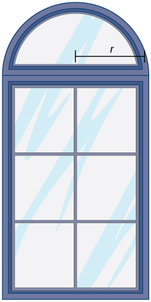

<math xmlns="http://www.w3.org/1998/Math/MathML"><mrow><mi>A</mi><mo>=</mo><mn>20</mn><mi>r</mi><mo>−</mo><mn>2</mn><msup><mi>r</mi><mn>2</mn></msup><mo>−</mo><mfrac><mn>1</mn><mn>2</mn></mfrac><mi>π</mi><msup><mi>r</mi><mn>2</mn></msup></mrow></math>

You have a garden row of <math xmlns="http://www.w3.org/1998/Math/MathML"><mrow><mn>20</mn></mrow></math>

 watermelon plants that produce an average of <math xmlns="http://www.w3.org/1998/Math/MathML"><mrow><mn>30</mn></mrow></math>

 watermelons apiece. For any additional watermelon plants planted, the output per watermelon plant drops by one watermelon. How many extra watermelon plants should you plant?

You are constructing a box for your cat to sleep in. The plush material for the square bottom of the box costs <math xmlns="http://www.w3.org/1998/Math/MathML"><mrow><mtext>$</mtext><mn>5</mn><mtext>/</mtext><msup><mrow><mtext>ft</mtext></mrow><mn>2</mn></msup></mrow></math>

 and the material for the sides costs <math xmlns="http://www.w3.org/1998/Math/MathML"><mrow><mtext>$</mtext><mn>2</mn><mtext>/</mtext><msup><mrow><mtext>ft</mtext></mrow><mn>2</mn></msup><mo>.</mo></mrow></math>

 You need a box with volume <math xmlns="http://www.w3.org/1998/Math/MathML"><mrow><mn>4</mn><msup><mrow><mspace width="0.2em" /><mtext>ft</mtext></mrow><mn>2</mn></msup><mo>.</mo></mrow></math>

 Find the dimensions of the box that minimize cost. Use <math xmlns="http://www.w3.org/1998/Math/MathML"><mi>x</mi></math>

 to represent the length of the side of the box.

<math xmlns="http://www.w3.org/1998/Math/MathML"><mrow><mi>C</mi><mrow><mo>(</mo><mi>x</mi><mo>)</mo></mrow><mo>=</mo><mn>5</mn><msup><mi>x</mi><mn>2</mn></msup><mo>+</mo><mfrac><mrow><mn>32</mn></mrow><mi>x</mi></mfrac></mrow></math>

You are building five identical pens adjacent to each other with a total area of <math xmlns="http://www.w3.org/1998/Math/MathML"><mrow><mn>1000</mn><msup><mrow><mspace width="0.2em" /><mtext>m</mtext></mrow><mn>2</mn></msup><mo>,</mo></mrow></math>

 as shown in the following figure. What dimensions should you use to minimize the amount of fencing?

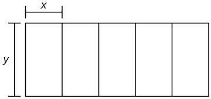

You are the manager of an apartment complex with <math xmlns="http://www.w3.org/1998/Math/MathML"><mrow><mn>50</mn></mrow></math>

 units. When you set rent at <math xmlns="http://www.w3.org/1998/Math/MathML"><mrow><mtext>$</mtext><mn>800</mn><mtext>/</mtext><mtext>month,</mtext></mrow></math>

 all apartments are rented. As you increase rent by <math xmlns="http://www.w3.org/1998/Math/MathML"><mrow><mtext>$</mtext><mn>25</mn><mtext>/</mtext><mtext>month,</mtext></mrow></math>

 one fewer apartment is rented. Maintenance costs run <math xmlns="http://www.w3.org/1998/Math/MathML"><mrow><mtext>$</mtext><mn>50</mn><mtext>/</mtext><mtext>month</mtext></mrow></math>

 for each occupied unit. What is the rent that maximizes the total amount of profit?

<math xmlns="http://www.w3.org/1998/Math/MathML"><mrow><mi>P</mi><mrow><mo>(</mo><mi>x</mi><mo>)</mo></mrow><mo>=</mo><mrow><mo>(</mo><mrow><mn>50</mn><mo>−</mo><mi>x</mi></mrow><mo>)</mo></mrow><mrow><mo>(</mo><mrow><mn>800</mn><mo>+</mo><mn>25</mn><mi>x</mi><mo>−</mo><mn>50</mn></mrow><mo>)</mo></mrow></mrow></math>

</section>

### Glossary
{: data-type="glossary-title"}

optimization problems
: problems that are solved by finding the maximum or minimum value of a function

[1]: http://www.openstaxcollege.org/l/20_boxvolume
