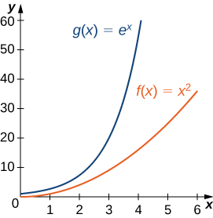
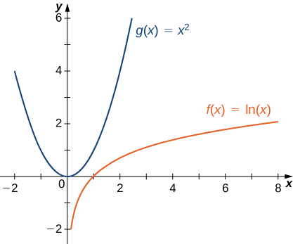

* Recognize when to apply L’Hôpital’s rule.
* Identify indeterminate forms produced by quotients, products, subtractions, and powers, and apply L’Hôpital’s rule in each case.
* Describe the relative growth rates of functions.

In this section, we examine a powerful tool for evaluating limits. This tool, known as **L’Hôpital’s rule**{: data-type="term"}, uses derivatives to calculate limits. With this rule, we will be able to evaluate many limits we have not yet been able to determine. Instead of relying on numerical evidence to conjecture that a limit exists, we will be able to show definitively that a limit exists and to determine its exact value.

### Applying L’Hôpital’s Rule

L’Hôpital’s rule can be used to evaluate limits involving the quotient of two functions. Consider

<math xmlns="http://www.w3.org/1998/Math/MathML"><mrow><munder><mrow><mtext>lim</mtext></mrow><mrow><mi>x</mi><mo stretchy="false">→</mo><mi>a</mi></mrow></munder><mfrac><mrow><mi>f</mi><mrow><mo>(</mo><mi>x</mi><mo>)</mo></mrow></mrow><mrow><mi>g</mi><mrow><mo>(</mo><mi>x</mi><mo>)</mo></mrow></mrow></mfrac><mo>.</mo></mrow></math>

If <math xmlns="http://www.w3.org/1998/Math/MathML"><mrow><munder><mrow><mtext>lim</mtext></mrow><mrow><mi>x</mi><mo stretchy="false">→</mo><mi>a</mi></mrow></munder><mi>f</mi><mrow><mo>(</mo><mi>x</mi><mo>)</mo></mrow><mo>=</mo><msub><mi>L</mi><mn>1</mn></msub><mspace width="0.2em" /><mtext>and</mtext><mspace width="0.2em" /><munder><mrow><mtext>lim</mtext></mrow><mrow><mi>x</mi><mo stretchy="false">→</mo><mi>a</mi></mrow></munder><mi>g</mi><mrow><mo>(</mo><mi>x</mi><mo>)</mo></mrow><mo>=</mo><msub><mi>L</mi><mn>2</mn></msub><mo>≠</mo><mn>0</mn><mo>,</mo></mrow></math>

 then

<math xmlns="http://www.w3.org/1998/Math/MathML"><mrow><munder><mrow><mtext>lim</mtext></mrow><mrow><mi>x</mi><mo stretchy="false">→</mo><mi>a</mi></mrow></munder><mfrac><mrow><mi>f</mi><mrow><mo>(</mo><mi>x</mi><mo>)</mo></mrow></mrow><mrow><mi>g</mi><mrow><mo>(</mo><mi>x</mi><mo>)</mo></mrow></mrow></mfrac><mo>=</mo><mfrac><mrow><msub><mi>L</mi><mn>1</mn></msub></mrow><mrow><msub><mi>L</mi><mn>2</mn></msub></mrow></mfrac><mo>.</mo></mrow></math>

However, what happens if <math xmlns="http://www.w3.org/1998/Math/MathML"><mrow><munder><mrow><mtext>lim</mtext></mrow><mrow><mi>x</mi><mo stretchy="false">→</mo><mi>a</mi></mrow></munder><mi>f</mi><mrow><mo>(</mo><mi>x</mi><mo>)</mo></mrow><mo>=</mo><mn>0</mn></mrow></math>

 and <math xmlns="http://www.w3.org/1998/Math/MathML"><mrow><munder><mrow><mtext>lim</mtext></mrow><mrow><mi>x</mi><mo stretchy="false">→</mo><mi>a</mi></mrow></munder><mi>g</mi><mrow><mo>(</mo><mi>x</mi><mo>)</mo></mrow><mo>=</mo><mn>0</mn><mo>?</mo></mrow></math>

 We call this one of the **indeterminate forms**{: data-type="term"}, of type <math xmlns="http://www.w3.org/1998/Math/MathML"><mrow><mfrac><mn>0</mn><mn>0</mn></mfrac><mo>.</mo></mrow></math>

 This is considered an indeterminate form because we cannot determine the exact behavior of <math xmlns="http://www.w3.org/1998/Math/MathML"><mrow><mfrac><mrow><mi>f</mi><mrow><mo>(</mo><mi>x</mi><mo>)</mo></mrow></mrow><mrow><mi>g</mi><mrow><mo>(</mo><mi>x</mi><mo>)</mo></mrow></mrow></mfrac></mrow></math>

 as <math xmlns="http://www.w3.org/1998/Math/MathML"><mrow><mi>x</mi><mo stretchy="false">→</mo><mi>a</mi></mrow></math>

 without further analysis. We have seen examples of this earlier in the text. For example, consider

<math xmlns="http://www.w3.org/1998/Math/MathML"><mrow><munder><mrow><mtext>lim</mtext></mrow><mrow><mi>x</mi><mo stretchy="false">→</mo><mn>2</mn></mrow></munder><mfrac><mrow><msup><mi>x</mi><mn>2</mn></msup><mo>−</mo><mn>4</mn></mrow><mrow><mi>x</mi><mo>−</mo><mn>2</mn></mrow></mfrac><mspace width="0.2em" /><mtext>and</mtext><mspace width="0.2em" /><munder><mrow><mtext>lim</mtext></mrow><mrow><mi>x</mi><mo stretchy="false">→</mo><mn>0</mn></mrow></munder><mfrac><mrow><mtext>sin</mtext><mspace width="0.1em" /><mi>x</mi></mrow><mi>x</mi></mfrac><mo>.</mo></mrow></math>

For the first of these examples, we can evaluate the limit by factoring the numerator and writing

<math xmlns="http://www.w3.org/1998/Math/MathML"><mrow><munder><mrow><mtext>lim</mtext></mrow><mrow><mi>x</mi><mo stretchy="false">→</mo><mn>2</mn></mrow></munder><mfrac><mrow><msup><mi>x</mi><mn>2</mn></msup><mo>−</mo><mn>4</mn></mrow><mrow><mi>x</mi><mo>−</mo><mn>2</mn></mrow></mfrac><mo>=</mo><munder><mrow><mtext>lim</mtext></mrow><mrow><mi>x</mi><mo stretchy="false">→</mo><mn>2</mn></mrow></munder><mfrac><mrow><mrow><mo>(</mo><mrow><mi>x</mi><mo>+</mo><mn>2</mn></mrow><mo>)</mo></mrow><mrow><mo>(</mo><mrow><mi>x</mi><mo>−</mo><mn>2</mn></mrow><mo>)</mo></mrow></mrow><mrow><mi>x</mi><mo>−</mo><mn>2</mn></mrow></mfrac><mo>=</mo><munder><mrow><mtext>lim</mtext></mrow><mrow><mi>x</mi><mo stretchy="false">→</mo><mn>2</mn></mrow></munder><mrow><mo>(</mo><mrow><mi>x</mi><mo>+</mo><mn>2</mn></mrow><mo>)</mo></mrow><mo>=</mo><mn>2</mn><mo>+</mo><mn>2</mn><mo>=</mo><mn>4</mn><mo>.</mo></mrow></math>

For <math xmlns="http://www.w3.org/1998/Math/MathML"><mrow><munder><mrow><mtext>lim</mtext></mrow><mrow><mi>x</mi><mo stretchy="false">→</mo><mn>0</mn></mrow></munder><mfrac><mrow><mtext>sin</mtext><mspace width="0.1em" /><mi>x</mi></mrow><mi>x</mi></mfrac></mrow></math>

 we were able to show, using a geometric argument, that

<math xmlns="http://www.w3.org/1998/Math/MathML"><mrow><munder><mrow><mtext>lim</mtext></mrow><mrow><mi>x</mi><mo stretchy="false">→</mo><mn>0</mn></mrow></munder><mfrac><mrow><mtext>sin</mtext><mspace width="0.1em" /><mi>x</mi></mrow><mi>x</mi></mfrac><mo>=</mo><mn>1</mn><mo>.</mo></mrow></math>

Here we use a different technique for evaluating limits such as these. Not only does this technique provide an easier way to evaluate these limits, but also, and more important, it provides us with a way to evaluate many other limits that we could not calculate previously.

The idea behind L’Hôpital’s rule can be explained using local linear approximations. Consider two differentiable functions <math xmlns="http://www.w3.org/1998/Math/MathML"><mi>f</mi></math>

 and <math xmlns="http://www.w3.org/1998/Math/MathML"><mi>g</mi></math>

 such that <math xmlns="http://www.w3.org/1998/Math/MathML"><mrow><munder><mrow><mtext>lim</mtext></mrow><mrow><mi>x</mi><mo stretchy="false">→</mo><mi>a</mi></mrow></munder><mi>f</mi><mrow><mo>(</mo><mi>x</mi><mo>)</mo></mrow><mo>=</mo><mn>0</mn><mo>=</mo><munder><mrow><mtext>lim</mtext></mrow><mrow><mi>x</mi><mo stretchy="false">→</mo><mi>a</mi></mrow></munder><mi>g</mi><mrow><mo>(</mo><mi>x</mi><mo>)</mo></mrow></mrow></math>

 and such that <math xmlns="http://www.w3.org/1998/Math/MathML"><mrow><msup><mi>g</mi><mo>′</mo></msup><mrow><mo>(</mo><mi>a</mi><mo>)</mo></mrow><mo>≠</mo><mn>0</mn></mrow></math>

 For <math xmlns="http://www.w3.org/1998/Math/MathML"><mi>x</mi></math>

 near <math xmlns="http://www.w3.org/1998/Math/MathML"><mrow><mi>a</mi><mo>,</mo></mrow></math>

 we can write

<math xmlns="http://www.w3.org/1998/Math/MathML"><mrow><mi>f</mi><mrow><mo>(</mo><mi>x</mi><mo>)</mo></mrow><mo>≈</mo><mi>f</mi><mrow><mo>(</mo><mi>a</mi><mo>)</mo></mrow><mo>+</mo><msup><mi>f</mi><mo>′</mo></msup><mrow><mo>(</mo><mi>a</mi><mo>)</mo></mrow><mrow><mo>(</mo><mrow><mi>x</mi><mo>−</mo><mi>a</mi></mrow><mo>)</mo></mrow></mrow></math>

and

<math xmlns="http://www.w3.org/1998/Math/MathML"><mrow><mi>g</mi><mrow><mo>(</mo><mi>x</mi><mo>)</mo></mrow><mo>≈</mo><mi>g</mi><mrow><mo>(</mo><mi>a</mi><mo>)</mo></mrow><mo>+</mo><msup><mi>g</mi><mo>′</mo></msup><mrow><mo>(</mo><mi>a</mi><mo>)</mo></mrow><mrow><mo>(</mo><mrow><mi>x</mi><mo>−</mo><mi>a</mi></mrow><mo>)</mo><mo>.</mo></mrow></mrow></math>

Therefore,

<math xmlns="http://www.w3.org/1998/Math/MathML"><mrow><mfrac><mrow><mi>f</mi><mrow><mo>(</mo><mi>x</mi><mo>)</mo></mrow></mrow><mrow><mi>g</mi><mrow><mo>(</mo><mi>x</mi><mo>)</mo></mrow></mrow></mfrac><mo>≈</mo><mfrac><mrow><mi>f</mi><mrow><mo>(</mo><mi>a</mi><mo>)</mo></mrow><mo>+</mo><msup><mi>f</mi><mo>′</mo></msup><mrow><mo>(</mo><mi>a</mi><mo>)</mo></mrow><mrow><mo>(</mo><mrow><mi>x</mi><mo>−</mo><mi>a</mi></mrow><mo>)</mo></mrow></mrow><mrow><mi>g</mi><mrow><mo>(</mo><mi>a</mi><mo>)</mo></mrow><mo>+</mo><msup><mi>g</mi><mo>′</mo></msup><mrow><mo>(</mo><mi>a</mi><mo>)</mo></mrow><mrow><mo>(</mo><mrow><mi>x</mi><mo>−</mo><mi>a</mi></mrow><mo>)</mo></mrow></mrow></mfrac><mo>.</mo></mrow></math>

 =limx&#x2192;ag(x), then the ratio f(x)/g(x) is approximately equal to the ratio of their linear approximations near a."){: #CNX_Calc_Figure_04_08_001}

Since <math xmlns="http://www.w3.org/1998/Math/MathML"><mi>f</mi></math>

 is differentiable at <math xmlns="http://www.w3.org/1998/Math/MathML"><mrow><mi>a</mi><mo>,</mo></mrow></math>

 then <math xmlns="http://www.w3.org/1998/Math/MathML"><mi>f</mi></math>

 is continuous at <math xmlns="http://www.w3.org/1998/Math/MathML"><mrow><mi>a</mi><mo>,</mo></mrow></math>

 and therefore <math xmlns="http://www.w3.org/1998/Math/MathML"><mrow><mi>f</mi><mrow><mo>(</mo><mi>a</mi><mo>)</mo></mrow><mo>=</mo><munder><mrow><mtext>lim</mtext></mrow><mrow><mi>x</mi><mo stretchy="false">→</mo><mi>a</mi></mrow></munder><mi>f</mi><mrow><mo>(</mo><mi>x</mi><mo>)</mo></mrow><mo>=</mo><mn>0</mn><mo>.</mo></mrow></math>

 Similarly, <math xmlns="http://www.w3.org/1998/Math/MathML"><mrow><mi>g</mi><mrow><mo>(</mo><mi>a</mi><mo>)</mo></mrow><mo>=</mo><munder><mrow><mtext>lim</mtext></mrow><mrow><mi>x</mi><mo stretchy="false">→</mo><mi>a</mi></mrow></munder><mi>g</mi><mrow><mo>(</mo><mi>x</mi><mo>)</mo></mrow><mo>=</mo><mn>0</mn><mo>.</mo></mrow></math>

 If we also assume that <math xmlns="http://www.w3.org/1998/Math/MathML"><msup><mi>f</mi><mo>′</mo></msup></math>

 and <math xmlns="http://www.w3.org/1998/Math/MathML"><msup><mi>g</mi><mo>′</mo></msup></math>

 are continuous at <math xmlns="http://www.w3.org/1998/Math/MathML"><mrow><mi>x</mi><mo>=</mo><mi>a</mi><mo>,</mo></mrow></math>

 then <math xmlns="http://www.w3.org/1998/Math/MathML"><mrow><msup><mi>f</mi><mo>′</mo></msup><mrow><mo>(</mo><mi>a</mi><mo>)</mo></mrow><mo>=</mo><munder><mrow><mtext>lim</mtext></mrow><mrow><mi>x</mi><mo stretchy="false">→</mo><mi>a</mi></mrow></munder><msup><mi>f</mi><mo>′</mo></msup><mrow><mo>(</mo><mi>x</mi><mo>)</mo></mrow></mrow></math>

 and <math xmlns="http://www.w3.org/1998/Math/MathML"><mrow><msup><mi>g</mi><mo>′</mo></msup><mrow><mo>(</mo><mi>a</mi><mo>)</mo></mrow><mo>=</mo><munder><mrow><mtext>lim</mtext></mrow><mrow><mi>x</mi><mo stretchy="false">→</mo><mi>a</mi></mrow></munder><msup><mi>g</mi><mo>′</mo></msup><mrow><mo>(</mo><mi>x</mi><mo>)</mo></mrow><mo>.</mo></mrow></math>

 Using these ideas, we conclude that

<math xmlns="http://www.w3.org/1998/Math/MathML"><mrow><munder><mrow><mtext>lim</mtext></mrow><mrow><mi>x</mi><mo stretchy="false">→</mo><mi>a</mi></mrow></munder><mfrac><mrow><mi>f</mi><mrow><mo>(</mo><mi>x</mi><mo>)</mo></mrow></mrow><mrow><mi>g</mi><mrow><mo>(</mo><mi>x</mi><mo>)</mo></mrow></mrow></mfrac><mo>=</mo><munder><mrow><mtext>lim</mtext></mrow><mrow><mi>x</mi><mo stretchy="false">→</mo><mi>a</mi></mrow></munder><mfrac><mrow><msup><mi>f</mi><mo>′</mo></msup><mrow><mo>(</mo><mi>x</mi><mo>)</mo></mrow><mrow><mo>(</mo><mrow><mi>x</mi><mo>−</mo><mi>a</mi></mrow><mo>)</mo></mrow></mrow><mrow><msup><mi>g</mi><mo>′</mo></msup><mrow><mo>(</mo><mi>x</mi><mo>)</mo></mrow><mrow><mo>(</mo><mrow><mi>x</mi><mo>−</mo><mi>a</mi></mrow><mo>)</mo></mrow></mrow></mfrac><mo>=</mo><munder><mrow><mtext>lim</mtext></mrow><mrow><mi>x</mi><mo stretchy="false">→</mo><mi>a</mi></mrow></munder><mfrac><mrow><msup><mi>f</mi><mo>′</mo></msup><mrow><mo>(</mo><mi>x</mi><mo>)</mo></mrow></mrow><mrow><msup><mi>g</mi><mo>′</mo></msup><mrow><mo>(</mo><mi>x</mi><mo>)</mo></mrow></mrow></mfrac><mo>.</mo></mrow></math>

Note that the assumption that <math xmlns="http://www.w3.org/1998/Math/MathML"><msup><mi>f</mi><mo>′</mo></msup></math>

 and <math xmlns="http://www.w3.org/1998/Math/MathML"><msup><mi>g</mi><mo>′</mo></msup></math>

 are continuous at <math xmlns="http://www.w3.org/1998/Math/MathML"><mi>a</mi></math>

 and <math xmlns="http://www.w3.org/1998/Math/MathML"><mrow><msup><mi>g</mi><mo>′</mo></msup><mrow><mo>(</mo><mi>a</mi><mo>)</mo></mrow><mo>≠</mo><mn>0</mn></mrow></math>

 can be loosened. We state L’Hôpital’s rule formally for the indeterminate form <math xmlns="http://www.w3.org/1998/Math/MathML"><mrow><mfrac><mn>0</mn><mn>0</mn></mfrac><mo>.</mo></mrow></math>

 Also note that the notation <math xmlns="http://www.w3.org/1998/Math/MathML"><mrow><mfrac><mn>0</mn><mn>0</mn></mfrac></mrow></math>

 does not mean we are actually dividing zero by zero. Rather, we are using the notation <math xmlns="http://www.w3.org/1998/Math/MathML"><mrow><mfrac><mn>0</mn><mn>0</mn></mfrac></mrow></math>

 to represent a quotient of limits, each of which is zero.

L’Hôpital’s Rule (0/0 Case)

Suppose <math xmlns="http://www.w3.org/1998/Math/MathML"><mi>f</mi></math>

 and <math xmlns="http://www.w3.org/1998/Math/MathML"><mi>g</mi></math>

 are differentiable functions over an open interval containing <math xmlns="http://www.w3.org/1998/Math/MathML"><mrow><mi>a</mi><mo>,</mo></mrow></math>

 except possibly at <math xmlns="http://www.w3.org/1998/Math/MathML"><mrow><mi>a</mi><mo>.</mo></mrow></math>

 If <math xmlns="http://www.w3.org/1998/Math/MathML"><mrow><munder><mrow><mtext>lim</mtext></mrow><mrow><mi>x</mi><mo stretchy="false">→</mo><mi>a</mi></mrow></munder><mi>f</mi><mrow><mo>(</mo><mi>x</mi><mo>)</mo></mrow><mo>=</mo><mn>0</mn></mrow></math>

 and <math xmlns="http://www.w3.org/1998/Math/MathML"><mrow><munder><mrow><mtext>lim</mtext></mrow><mrow><mi>x</mi><mo stretchy="false">→</mo><mi>a</mi></mrow></munder><mi>g</mi><mrow><mo>(</mo><mi>x</mi><mo>)</mo></mrow><mo>=</mo><mn>0</mn><mo>,</mo></mrow></math>

 then

<math xmlns="http://www.w3.org/1998/Math/MathML"><mrow><munder><mrow><mtext>lim</mtext></mrow><mrow><mi>x</mi><mo stretchy="false">→</mo><mi>a</mi></mrow></munder><mfrac><mrow><mi>f</mi><mrow><mo>(</mo><mi>x</mi><mo>)</mo></mrow></mrow><mrow><mi>g</mi><mrow><mo>(</mo><mi>x</mi><mo>)</mo></mrow></mrow></mfrac><mo>=</mo><munder><mrow><mtext>lim</mtext></mrow><mrow><mi>x</mi><mo stretchy="false">→</mo><mi>a</mi></mrow></munder><mfrac><mrow><msup><mi>f</mi><mo>′</mo></msup><mrow><mo>(</mo><mi>x</mi><mo>)</mo></mrow></mrow><mrow><msup><mi>g</mi><mo>′</mo></msup><mrow><mo>(</mo><mi>x</mi><mo>)</mo></mrow></mrow></mfrac><mo>,</mo></mrow></math>

assuming the limit on the right exists or is <math xmlns="http://www.w3.org/1998/Math/MathML"><mi>∞</mi></math>

 or <math xmlns="http://www.w3.org/1998/Math/MathML"><mrow><mtext>−</mtext><mi>∞</mi><mo>.</mo></mrow></math>

 This result also holds if we are considering one-sided limits, or if <math xmlns="http://www.w3.org/1998/Math/MathML"><mrow><mi>a</mi><mo>=</mo><mi>∞</mi><mspace width="0.2em" /><mtext>and</mtext><mspace width="0.2em" /><mo>−</mo><mi>∞</mi><mo>.</mo></mrow></math>

#### Proof

We provide a proof of this theorem in the special case when <math xmlns="http://www.w3.org/1998/Math/MathML"><mrow><mi>f</mi><mo>,</mo><mi>g</mi><mo>,</mo><msup><mi>f</mi><mo>′</mo></msup><mo>,</mo></mrow></math>

 and <math xmlns="http://www.w3.org/1998/Math/MathML"><msup><mi>g</mi><mo>′</mo></msup></math>

 are all continuous over an open interval containing <math xmlns="http://www.w3.org/1998/Math/MathML"><mrow><mi>a</mi><mo>.</mo></mrow></math>

 In that case, since <math xmlns="http://www.w3.org/1998/Math/MathML"><mrow><munder><mrow><mtext>lim</mtext></mrow><mrow><mi>x</mi><mo stretchy="false">→</mo><mi>a</mi></mrow></munder><mi>f</mi><mrow><mo>(</mo><mi>x</mi><mo>)</mo></mrow><mo>=</mo><mn>0</mn><mo>=</mo><munder><mrow><mtext>lim</mtext></mrow><mrow><mi>x</mi><mo stretchy="false">→</mo><mi>a</mi></mrow></munder><mi>g</mi><mrow><mo>(</mo><mi>x</mi><mo>)</mo></mrow></mrow></math>

 and <math xmlns="http://www.w3.org/1998/Math/MathML"><mi>f</mi></math>

 and <math xmlns="http://www.w3.org/1998/Math/MathML"><mi>g</mi></math>

 are continuous at <math xmlns="http://www.w3.org/1998/Math/MathML"><mrow><mi>a</mi><mo>,</mo></mrow></math>

 it follows that <math xmlns="http://www.w3.org/1998/Math/MathML"><mrow><mi>f</mi><mrow><mo>(</mo><mi>a</mi><mo>)</mo></mrow><mo>=</mo><mn>0</mn><mo>=</mo><mi>g</mi><mrow><mo>(</mo><mi>a</mi><mo>)</mo></mrow><mo>.</mo></mrow></math>

 Therefore,

<math xmlns="http://www.w3.org/1998/Math/MathML"><mtable><mtr><mtd columnalign="right"><munder><mrow><mtext>lim</mtext></mrow><mrow><mi>x</mi><mo stretchy="false">→</mo><mi>a</mi></mrow></munder><mfrac><mrow><mi>f</mi><mrow><mo>(</mo><mi>x</mi><mo>)</mo></mrow></mrow><mrow><mi>g</mi><mrow><mo>(</mo><mi>x</mi><mo>)</mo></mrow></mrow></mfrac></mtd><mtd columnalign="left"><mo>=</mo><munder><mrow><mtext>lim</mtext></mrow><mrow><mi>x</mi><mo stretchy="false">→</mo><mi>a</mi></mrow></munder><mfrac><mrow><mi>f</mi><mrow><mo>(</mo><mi>x</mi><mo>)</mo></mrow><mo>−</mo><mi>f</mi><mrow><mo>(</mo><mi>a</mi><mo>)</mo></mrow></mrow><mrow><mi>g</mi><mrow><mo>(</mo><mi>x</mi><mo>)</mo></mrow><mo>−</mo><mi>g</mi><mrow><mo>(</mo><mi>a</mi><mo>)</mo></mrow></mrow></mfrac></mtd><mtd /><mtd /><mtd columnalign="left"><mtext>since</mtext><mspace width="0.2em" /><mi>f</mi><mrow><mo>(</mo><mi>a</mi><mo>)</mo></mrow><mo>=</mo><mn>0</mn><mo>=</mo><mi>g</mi><mrow><mo>(</mo><mi>a</mi><mo>)</mo></mrow></mtd></mtr><mtr><mtd /><mtd columnalign="left"><mo>=</mo><munder><mrow><mtext>lim</mtext></mrow><mrow><mi>x</mi><mo stretchy="false">→</mo><mi>a</mi></mrow></munder><mfrac><mrow><mfrac><mrow><mi>f</mi><mrow><mo>(</mo><mi>x</mi><mo>)</mo></mrow><mo>−</mo><mi>f</mi><mrow><mo>(</mo><mi>a</mi><mo>)</mo></mrow></mrow><mrow><mi>x</mi><mo>−</mo><mi>a</mi></mrow></mfrac></mrow><mrow><mfrac><mrow><mi>g</mi><mrow><mo>(</mo><mi>x</mi><mo>)</mo></mrow><mo>−</mo><mi>g</mi><mrow><mo>(</mo><mi>a</mi><mo>)</mo></mrow></mrow><mrow><mi>x</mi><mo>−</mo><mi>a</mi></mrow></mfrac></mrow></mfrac></mtd><mtd /><mtd /><mtd columnalign="left"><mtext>algebra</mtext></mtd></mtr><mtr><mtd /><mtd columnalign="left"><mo>=</mo><mfrac><mrow><munder><mrow><mtext>lim</mtext></mrow><mrow><mi>x</mi><mo stretchy="false">→</mo><mi>a</mi></mrow></munder><mfrac><mrow><mi>f</mi><mrow><mo>(</mo><mi>x</mi><mo>)</mo></mrow><mo>−</mo><mi>f</mi><mrow><mo>(</mo><mi>a</mi><mo>)</mo></mrow></mrow><mrow><mi>x</mi><mo>−</mo><mi>a</mi></mrow></mfrac></mrow><mrow><munder><mrow><mtext>lim</mtext></mrow><mrow><mi>x</mi><mo stretchy="false">→</mo><mi>a</mi></mrow></munder><mfrac><mrow><mi>g</mi><mrow><mo>(</mo><mi>x</mi><mo>)</mo></mrow><mo>−</mo><mi>g</mi><mrow><mo>(</mo><mi>a</mi><mo>)</mo></mrow></mrow><mrow><mi>x</mi><mo>−</mo><mi>a</mi></mrow></mfrac></mrow></mfrac></mtd><mtd /><mtd /><mtd columnalign="left"><mtext>limit of a quotient</mtext></mtd></mtr><mtr><mtd /><mtd columnalign="left"><mo>=</mo><mfrac><mrow><msup><mi>f</mi><mo>′</mo></msup><mrow><mo>(</mo><mi>a</mi><mo>)</mo></mrow></mrow><mrow><msup><mi>g</mi><mo>′</mo></msup><mrow><mo>(</mo><mi>a</mi><mo>)</mo></mrow></mrow></mfrac></mtd><mtd /><mtd /><mtd columnalign="left"><mtext>definition of the derivative</mtext></mtd></mtr><mtr><mtd /><mtd columnalign="left"><mo>=</mo><mfrac><mrow><munder><mrow><mtext>lim</mtext></mrow><mrow><mi>x</mi><mo stretchy="false">→</mo><mi>a</mi></mrow></munder><msup><mi>f</mi><mo>′</mo></msup><mrow><mo>(</mo><mi>x</mi><mo>)</mo></mrow></mrow><mrow><munder><mrow><mtext>lim</mtext></mrow><mrow><mi>x</mi><mo stretchy="false">→</mo><mi>a</mi></mrow></munder><msup><mi>g</mi><mo>′</mo></msup><mrow><mo>(</mo><mi>x</mi><mo>)</mo></mrow></mrow></mfrac></mtd><mtd /><mtd /><mtd columnalign="left"><mtext>continuity of</mtext><mspace width="0.2em" /><msup><mi>f</mi><mo>′</mo></msup><mspace width="0.2em" /><mtext>and</mtext><mspace width="0.2em" /><msup><mi>g</mi><mo>′</mo></msup></mtd></mtr><mtr><mtd /><mtd columnalign="left"><mo>=</mo><munder><mrow><mtext>lim</mtext></mrow><mrow><mi>x</mi><mo stretchy="false">→</mo><mi>a</mi></mrow></munder><mfrac><mrow><msup><mi>f</mi><mo>′</mo></msup><mrow><mo>(</mo><mi>x</mi><mo>)</mo></mrow></mrow><mrow><msup><mi>g</mi><mo>′</mo></msup><mrow><mo>(</mo><mi>x</mi><mo>)</mo></mrow></mrow></mfrac><mo>.</mo></mtd><mtd /><mtd /><mtd columnalign="left"><mtext>limit of a quotient</mtext></mtd></mtr></mtable></math>

Note that L’Hôpital’s rule states we can calculate the limit of a quotient <math xmlns="http://www.w3.org/1998/Math/MathML"><mrow><mfrac><mi>f</mi><mi>g</mi></mfrac></mrow></math>

 by considering the limit of the quotient of the derivatives <math xmlns="http://www.w3.org/1998/Math/MathML"><mrow><mfrac><msup><mi>f</mi><mo>′</mo></msup><msup><mi>g</mi><mo>′</mo></msup></mfrac><mo>.</mo></mrow></math>

 It is important to realize that we are not calculating the derivative of the quotient <math xmlns="http://www.w3.org/1998/Math/MathML"><mrow><mfrac><mi>f</mi><mi>g</mi></mfrac><mo>.</mo></mrow></math>

□

Applying L’Hôpital’s Rule (0/0 Case)

Evaluate each of the following limits by applying L’Hôpital’s rule.

1.  <math xmlns="http://www.w3.org/1998/Math/MathML"><mrow><munder><mrow><mtext>lim</mtext></mrow><mrow><mi>x</mi><mo stretchy="false">→</mo><mn>0</mn></mrow></munder><mfrac><mrow><mn>1</mn><mo>−</mo><mtext>cos</mtext><mspace width="0.1em" /><mi>x</mi></mrow><mi>x</mi></mfrac></mrow></math>

2.  <math xmlns="http://www.w3.org/1998/Math/MathML"><mrow><munder><mrow><mtext>lim</mtext></mrow><mrow><mi>x</mi><mo stretchy="false">→</mo><mn>1</mn></mrow></munder><mfrac><mrow><mtext>sin</mtext><mrow><mo>(</mo><mrow><mi>π</mi><mi>x</mi></mrow><mo>)</mo></mrow></mrow><mrow><mtext>ln</mtext><mspace width="0.1em" /><mi>x</mi></mrow></mfrac></mrow></math>

3.  <math xmlns="http://www.w3.org/1998/Math/MathML"><mrow><munder><mrow><mtext>lim</mtext></mrow><mrow><mi>x</mi><mo stretchy="false">→</mo><mi>∞</mi></mrow></munder><mfrac><mrow><msup><mi>e</mi><mrow><mn>1</mn><mtext>/</mtext><mi>x</mi></mrow></msup><mo>−</mo><mn>1</mn></mrow><mrow><mn>1</mn><mtext>/</mtext><mi>x</mi></mrow></mfrac></mrow></math>

4.  <math xmlns="http://www.w3.org/1998/Math/MathML"><mrow><munder><mrow><mtext>lim</mtext></mrow><mrow><mi>x</mi><mo stretchy="false">→</mo><mn>0</mn></mrow></munder><mfrac><mrow><mtext>sin</mtext><mspace width="0.1em" /><mi>x</mi><mo>−</mo><mi>x</mi></mrow><mrow><msup><mi>x</mi><mn>2</mn></msup></mrow></mfrac></mrow></math>
{: data-number-style="lower-alpha"}

1.  Since the numerator
    <math xmlns="http://www.w3.org/1998/Math/MathML"><mrow><mn>1</mn><mo>−</mo><mtext>cos</mtext><mspace width="0.1em" /><mi>x</mi><mo stretchy="false">→</mo><mn>0</mn></mrow></math>
    
    and the denominator
    <math xmlns="http://www.w3.org/1998/Math/MathML"><mrow><mi>x</mi><mo stretchy="false">→</mo><mn>0</mn><mo>,</mo></mrow></math>
    
    we can apply L’Hôpital’s rule to evaluate this limit. We have
    * * *
    {: data-type="newline"}
    
    

    <math xmlns="http://www.w3.org/1998/Math/MathML"><mtable><mtr><mtd columnalign="right"><munder><mrow><mtext>lim</mtext></mrow><mrow><mi>x</mi><mo stretchy="false">→</mo><mn>0</mn></mrow></munder><mfrac><mrow><mn>1</mn><mo>−</mo><mtext>cos</mtext><mspace width="0.1em" /><mi>x</mi></mrow><mi>x</mi></mfrac></mtd><mtd columnalign="left"><mo>=</mo><munder><mrow><mtext>lim</mtext></mrow><mrow><mi>x</mi><mo stretchy="false">→</mo><mn>0</mn></mrow></munder><mfrac><mrow><mfrac><mi>d</mi><mrow><mi>d</mi><mi>x</mi></mrow></mfrac><mrow><mo>(</mo><mrow><mn>1</mn><mo>−</mo><mtext>cos</mtext><mspace width="0.1em" /><mi>x</mi></mrow><mo>)</mo></mrow></mrow><mrow><mfrac><mi>d</mi><mrow><mi>d</mi><mi>x</mi></mrow></mfrac><mrow><mo>(</mo><mi>x</mi><mo>)</mo></mrow></mrow></mfrac></mtd></mtr><mtr><mtd /><mtd columnalign="left"><mo>=</mo><munder><mrow><mtext>lim</mtext></mrow><mrow><mi>x</mi><mo stretchy="false">→</mo><mn>0</mn></mrow></munder><mfrac><mrow><mtext>sin</mtext><mspace width="0.1em" /><mi>x</mi></mrow><mn>1</mn></mfrac></mtd></mtr><mtr><mtd /><mtd columnalign="left"><mo>=</mo><mfrac><mrow><munder><mrow><mtext>lim</mtext></mrow><mrow><mi>x</mi><mo stretchy="false">→</mo><mn>0</mn></mrow></munder><mrow><mo>(</mo><mrow><mtext>sin</mtext><mspace width="0.1em" /><mi>x</mi></mrow><mo>)</mo></mrow></mrow><mrow><munder><mrow><mtext>lim</mtext></mrow><mrow><mi>x</mi><mo stretchy="false">→</mo><mn>0</mn></mrow></munder><mrow><mo>(</mo><mn>1</mn><mo>)</mo></mrow></mrow></mfrac></mtd></mtr><mtr><mtd /><mtd columnalign="left"><mo>=</mo><mfrac><mn>0</mn><mn>1</mn></mfrac><mo>=</mo><mn>0.</mn></mtd></mtr></mtable></math>
    

2.  As
    <math xmlns="http://www.w3.org/1998/Math/MathML"><mrow><mi>x</mi><mo stretchy="false">→</mo><mn>1</mn><mo>,</mo></mrow></math>
    
    the numerator
    <math xmlns="http://www.w3.org/1998/Math/MathML"><mrow><mtext>sin</mtext><mrow><mo>(</mo><mrow><mi>π</mi><mi>x</mi></mrow><mo>)</mo></mrow><mo stretchy="false">→</mo><mn>0</mn></mrow></math>
    
    and the denominator
    <math xmlns="http://www.w3.org/1998/Math/MathML"><mrow><mtext>ln</mtext><mrow><mo>(</mo><mi>x</mi><mo>)</mo></mrow><mo stretchy="false">→</mo><mn>0</mn><mo>.</mo></mrow></math>
    
    Therefore, we can apply L’Hôpital’s rule. We obtain
    * * *
    {: data-type="newline"}
    
    

    <math xmlns="http://www.w3.org/1998/Math/MathML"><mtable><mtr><mtd columnalign="right"><munder><mrow><mtext>lim</mtext></mrow><mrow><mi>x</mi><mo stretchy="false">→</mo><mn>1</mn></mrow></munder><mfrac><mrow><mtext>sin</mtext><mrow><mo>(</mo><mrow><mi>π</mi><mi>x</mi></mrow><mo>)</mo></mrow></mrow><mrow><mtext>ln</mtext><mspace width="0.1em" /><mi>x</mi></mrow></mfrac></mtd><mtd columnalign="left"><mo>=</mo><munder><mrow><mtext>lim</mtext></mrow><mrow><mi>x</mi><mo stretchy="false">→</mo><mn>1</mn></mrow></munder><mfrac><mrow><mi>π</mi><mspace width="0.1em" /><mtext>cos</mtext><mrow><mo>(</mo><mrow><mi>π</mi><mi>x</mi></mrow><mo>)</mo></mrow></mrow><mrow><mn>1</mn><mtext>/</mtext><mi>x</mi></mrow></mfrac></mtd></mtr><mtr><mtd /><mtd columnalign="left"><mo>=</mo><munder><mrow><mtext>lim</mtext></mrow><mrow><mi>x</mi><mo stretchy="false">→</mo><mn>1</mn></mrow></munder><mrow><mo>(</mo><mrow><mi>π</mi><mi>x</mi></mrow><mo>)</mo></mrow><mtext>cos</mtext><mrow><mo>(</mo><mrow><mi>π</mi><mi>x</mi></mrow><mo>)</mo></mrow></mtd></mtr><mtr><mtd /><mtd columnalign="left"><mo>=</mo><mrow><mo>(</mo><mrow><mi>π</mi><mo>·</mo><mn>1</mn></mrow><mo>)</mo></mrow><mrow><mo>(</mo><mrow><mn>−1</mn></mrow><mo>)</mo></mrow><mo>=</mo><mtext>−</mtext><mi>π</mi><mo>.</mo></mtd></mtr></mtable></math>
    

3.  As
    <math xmlns="http://www.w3.org/1998/Math/MathML"><mrow><mi>x</mi><mo stretchy="false">→</mo><mi>∞</mi><mo>,</mo></mrow></math>
    
    the numerator
    <math xmlns="http://www.w3.org/1998/Math/MathML"><mrow><msup><mi>e</mi><mrow><mn>1</mn><mtext>/</mtext><mi>x</mi></mrow></msup><mo>−</mo><mn>1</mn><mo stretchy="false">→</mo><mn>0</mn></mrow></math>
    
    and the denominator
    <math xmlns="http://www.w3.org/1998/Math/MathML"><mrow><mrow><mo>(</mo><mrow><mfrac><mn>1</mn><mi>x</mi></mfrac></mrow><mo>)</mo></mrow><mo stretchy="false">→</mo><mn>0</mn><mo>.</mo></mrow></math>
    
    Therefore, we can apply L’Hôpital’s rule. We obtain
    * * *
    {: data-type="newline"}
    
    

    <math xmlns="http://www.w3.org/1998/Math/MathML"><mrow><munder><mrow><mtext>lim</mtext></mrow><mrow><mi>x</mi><mo stretchy="false">→</mo><mi>∞</mi></mrow></munder><mfrac><mrow><msup><mi>e</mi><mrow><mn>1</mn><mtext>/</mtext><mi>x</mi></mrow></msup><mo>−</mo><mn>1</mn></mrow><mrow><mfrac><mn>1</mn><mi>x</mi></mfrac></mrow></mfrac><mo>=</mo><munder><mrow><mtext>lim</mtext></mrow><mrow><mi>x</mi><mo stretchy="false">→</mo><mi>∞</mi></mrow></munder><mfrac><mrow><msup><mi>e</mi><mrow><mn>1</mn><mtext>/</mtext><mi>x</mi></mrow></msup><mrow><mo>(</mo><mrow><mfrac><mrow><mn>−1</mn></mrow><mrow><msup><mi>x</mi><mn>2</mn></msup></mrow></mfrac></mrow><mo>)</mo></mrow></mrow><mrow><mrow><mo>(</mo><mrow><mfrac><mrow><mn>−1</mn></mrow><mrow><msup><mi>x</mi><mn>2</mn></msup></mrow></mfrac></mrow><mo>)</mo></mrow></mrow></mfrac><mo>=</mo><munder><mrow><mtext>lim</mtext></mrow><mrow><mi>x</mi><mo stretchy="false">→</mo><mi>∞</mi></mrow></munder><msup><mi>e</mi><mrow><mn>1</mn><mtext>/</mtext><mi>x</mi></mrow></msup><mo>=</mo><msup><mi>e</mi><mn>0</mn></msup><mo>=</mo><mn>1</mn><mo>·</mo><munder><mrow><mtext>lim</mtext></mrow><mrow><mi>x</mi><mo stretchy="false">→</mo><mi>∞</mi></mrow></munder><mfrac><mrow><msup><mi>e</mi><mrow><mn>1</mn><mtext>/</mtext><mi>x</mi></mrow></msup><mo>−</mo><mn>1</mn></mrow><mrow><mtext>ln</mtext><mspace width="0.1em" /><mi>x</mi></mrow></mfrac><mo>.</mo></mrow></math>
    

4.  As
    <math xmlns="http://www.w3.org/1998/Math/MathML"><mrow><mi>x</mi><mo stretchy="false">→</mo><mn>0</mn><mo>,</mo></mrow></math>
    
    both the numerator and denominator approach zero. Therefore, we can apply L’Hôpital’s rule. We obtain
    * * *
    {: data-type="newline"}
    
    

    <math xmlns="http://www.w3.org/1998/Math/MathML"><mrow><munder><mrow><mtext>lim</mtext></mrow><mrow><mi>x</mi><mo stretchy="false">→</mo><mn>0</mn></mrow></munder><mfrac><mrow><mtext>sin</mtext><mspace width="0.1em" /><mi>x</mi><mo>−</mo><mi>x</mi></mrow><mrow><msup><mi>x</mi><mn>2</mn></msup></mrow></mfrac><mo>=</mo><munder><mrow><mtext>lim</mtext></mrow><mrow><mi>x</mi><mo stretchy="false">→</mo><mn>0</mn></mrow></munder><mfrac><mrow><mtext>cos</mtext><mspace width="0.1em" /><mi>x</mi><mo>−</mo><mn>1</mn></mrow><mrow><mn>2</mn><mi>x</mi></mrow></mfrac><mo>.</mo></mrow></math>
    

    
    * * *
    {: data-type="newline"}
    
    Since the numerator and denominator of this new quotient both approach zero as
    <math xmlns="http://www.w3.org/1998/Math/MathML"><mrow><mi>x</mi><mo stretchy="false">→</mo><mn>0</mn><mo>,</mo></mrow></math>
    
    we apply L’Hôpital’s rule again. In doing so, we see that
    * * *
    {: data-type="newline"}
    
    

    <math xmlns="http://www.w3.org/1998/Math/MathML"><mrow><munder><mrow><mtext>lim</mtext></mrow><mrow><mi>x</mi><mo stretchy="false">→</mo><mn>0</mn></mrow></munder><mfrac><mrow><mtext>cos</mtext><mspace width="0.1em" /><mi>x</mi><mo>−</mo><mn>1</mn></mrow><mrow><mn>2</mn><mi>x</mi></mrow></mfrac><mo>=</mo><munder><mrow><mtext>lim</mtext></mrow><mrow><mi>x</mi><mo stretchy="false">→</mo><mn>0</mn></mrow></munder><mfrac><mrow><mtext>−</mtext><mtext>sin</mtext><mspace width="0.1em" /><mi>x</mi></mrow><mn>2</mn></mfrac><mo>=</mo><mn>0</mn><mo>.</mo></mrow></math>
    

    
    * * *
    {: data-type="newline"}
    
    Therefore, we conclude that
    * * *
    {: data-type="newline"}
    
    

    <math xmlns="http://www.w3.org/1998/Math/MathML"><mrow><munder><mrow><mtext>lim</mtext></mrow><mrow><mi>x</mi><mo stretchy="false">→</mo><mn>0</mn></mrow></munder><mfrac><mrow><mtext>sin</mtext><mspace width="0.1em" /><mi>x</mi><mo>−</mo><mi>x</mi></mrow><mrow><msup><mi>x</mi><mn>2</mn></msup></mrow></mfrac><mo>=</mo><mn>0</mn><mo>.</mo></mrow></math>
    

{: data-number-style="lower-alpha"}

Evaluate <math xmlns="http://www.w3.org/1998/Math/MathML"><mrow><munder><mrow><mtext>lim</mtext></mrow><mrow><mi>x</mi><mo stretchy="false">→</mo><mn>0</mn></mrow></munder><mfrac><mi>x</mi><mrow><mtext>tan</mtext><mspace width="0.1em" /><mi>x</mi></mrow></mfrac><mo>.</mo></mrow></math>

<math xmlns="http://www.w3.org/1998/Math/MathML"><mn>1</mn></math>

Hint

<math xmlns="http://www.w3.org/1998/Math/MathML"><mrow><mfrac><mi>d</mi><mrow><mi>d</mi><mi>x</mi></mrow></mfrac><mspace width="0.1em" /><mtext>tan</mtext><mspace width="0.1em" /><mi>x</mi><mo>=</mo><msup><mrow><mtext>sec</mtext></mrow><mn>2</mn></msup><mi>x</mi></mrow></math>

We can also use L’Hôpital’s rule to evaluate limits of quotients <math xmlns="http://www.w3.org/1998/Math/MathML"><mrow><mfrac><mrow><mi>f</mi><mrow><mo>(</mo><mi>x</mi><mo>)</mo></mrow></mrow><mrow><mi>g</mi><mrow><mo>(</mo><mi>x</mi><mo>)</mo></mrow></mrow></mfrac></mrow></math>

 in which <math xmlns="http://www.w3.org/1998/Math/MathML"><mrow><mi>f</mi><mrow><mo>(</mo><mi>x</mi><mo>)</mo></mrow><mo stretchy="false">→</mo><mtext>±</mtext><mi>∞</mi></mrow></math>

 and <math xmlns="http://www.w3.org/1998/Math/MathML"><mrow><mi>g</mi><mrow><mo>(</mo><mi>x</mi><mo>)</mo></mrow><mo stretchy="false">→</mo><mtext>±</mtext><mi>∞</mi><mo>.</mo></mrow></math>

 Limits of this form are classified as *indeterminate forms of type* <math xmlns="http://www.w3.org/1998/Math/MathML"><mrow><mi>∞</mi><mtext>/</mtext><mi>∞</mi><mo>.</mo></mrow></math>

 Again, note that we are not actually dividing <math xmlns="http://www.w3.org/1998/Math/MathML"><mi>∞</mi></math>

 by <math xmlns="http://www.w3.org/1998/Math/MathML"><mrow><mi>∞</mi><mo>.</mo></mrow></math>

 Since <math xmlns="http://www.w3.org/1998/Math/MathML"><mi>∞</mi></math>

 is not a real number, that is impossible; rather, <math xmlns="http://www.w3.org/1998/Math/MathML"><mrow><mi>∞</mi><mtext>/</mtext><mi>∞</mi><mo>.</mo></mrow></math>

 is used to represent a quotient of limits, each of which is <math xmlns="http://www.w3.org/1998/Math/MathML"><mi>∞</mi></math>

 or <math xmlns="http://www.w3.org/1998/Math/MathML"><mrow><mtext>−</mtext><mi>∞</mi><mo>.</mo></mrow></math>

L’Hôpital’s Rule
<math xmlns="http://www.w3.org/1998/Math/MathML"><mrow><mo stretchy="false">(</mo><mi>∞</mi><mtext>/</mtext><mi>∞</mi></mrow></math>
Case)

Suppose <math xmlns="http://www.w3.org/1998/Math/MathML"><mi>f</mi></math>

 and <math xmlns="http://www.w3.org/1998/Math/MathML"><mi>g</mi></math>

 are differentiable functions over an open interval containing <math xmlns="http://www.w3.org/1998/Math/MathML"><mrow><mi>a</mi><mo>,</mo></mrow></math>

 except possibly at <math xmlns="http://www.w3.org/1998/Math/MathML"><mrow><mi>a</mi><mo>.</mo></mrow></math>

 Suppose <math xmlns="http://www.w3.org/1998/Math/MathML"><mrow><munder><mrow><mtext>lim</mtext></mrow><mrow><mi>x</mi><mo stretchy="false">→</mo><mi>a</mi></mrow></munder><mi>f</mi><mrow><mo>(</mo><mi>x</mi><mo>)</mo></mrow><mo>=</mo><mi>∞</mi></mrow></math>

 (or <math xmlns="http://www.w3.org/1998/Math/MathML"><mrow><mtext>−</mtext><mi>∞</mi><mo stretchy="false">)</mo></mrow></math>

 and <math xmlns="http://www.w3.org/1998/Math/MathML"><mrow><munder><mrow><mtext>lim</mtext></mrow><mrow><mi>x</mi><mo stretchy="false">→</mo><mi>a</mi></mrow></munder><mi>g</mi><mrow><mo>(</mo><mi>x</mi><mo>)</mo></mrow><mo>=</mo><mi>∞</mi></mrow></math>

 (or <math xmlns="http://www.w3.org/1998/Math/MathML"><mrow><mtext>−</mtext><mi>∞</mi><mo stretchy="false">)</mo><mo>.</mo></mrow></math>

 Then,

<math xmlns="http://www.w3.org/1998/Math/MathML"><mrow><munder><mrow><mtext>lim</mtext></mrow><mrow><mi>x</mi><mo stretchy="false">→</mo><mi>a</mi></mrow></munder><mfrac><mrow><mi>f</mi><mrow><mo>(</mo><mi>x</mi><mo>)</mo></mrow></mrow><mrow><mi>g</mi><mrow><mo>(</mo><mi>x</mi><mo>)</mo></mrow></mrow></mfrac><mo>=</mo><munder><mrow><mtext>lim</mtext></mrow><mrow><mi>x</mi><mo stretchy="false">→</mo><mi>a</mi></mrow></munder><mfrac><mrow><msup><mi>f</mi><mo>′</mo></msup><mrow><mo>(</mo><mi>x</mi><mo>)</mo></mrow></mrow><mrow><msup><mi>g</mi><mo>′</mo></msup><mrow><mo>(</mo><mi>x</mi><mo>)</mo></mrow></mrow></mfrac><mo>,</mo></mrow></math>

assuming the limit on the right exists or is <math xmlns="http://www.w3.org/1998/Math/MathML"><mi>∞</mi></math>

 or <math xmlns="http://www.w3.org/1998/Math/MathML"><mrow><mtext>−</mtext><mi>∞</mi><mo>.</mo></mrow></math>

 This result also holds if the limit is infinite, if <math xmlns="http://www.w3.org/1998/Math/MathML"><mrow><mi>a</mi><mo>=</mo><mi>∞</mi></mrow></math>

 or <math xmlns="http://www.w3.org/1998/Math/MathML"><mrow><mtext>−</mtext><mi>∞</mi><mo>,</mo></mrow></math>

 or the limit is one-sided.

Applying L’Hôpital’s Rule
<math xmlns="http://www.w3.org/1998/Math/MathML"><mrow><mo stretchy="false">(</mo><mi>∞</mi><mtext>/</mtext><mi>∞</mi></mrow></math>
Case)

Evaluate each of the following limits by applying L’Hôpital’s rule.

1.  <math xmlns="http://www.w3.org/1998/Math/MathML"><mrow><munder><mrow><mtext>lim</mtext></mrow><mrow><mi>x</mi><mo stretchy="false">→</mo><mi>∞</mi></mrow></munder><mfrac><mrow><mn>3</mn><mi>x</mi><mo>+</mo><mn>5</mn></mrow><mrow><mn>2</mn><mi>x</mi><mo>+</mo><mn>1</mn></mrow></mfrac></mrow></math>

2.  <math xmlns="http://www.w3.org/1998/Math/MathML"><mrow><munder><mrow><mtext>lim</mtext></mrow><mrow><mi>x</mi><mo stretchy="false">→</mo><msup><mn>0</mn><mo>+</mo></msup></mrow></munder><mfrac><mrow><mtext>ln</mtext><mspace width="0.1em" /><mi>x</mi></mrow><mrow><mtext>cot</mtext><mspace width="0.1em" /><mi>x</mi></mrow></mfrac></mrow></math>
{: data-number-style="lower-alpha"}

1.  Since
    <math xmlns="http://www.w3.org/1998/Math/MathML"><mrow><mn>3</mn><mi>x</mi><mo>+</mo><mn>5</mn></mrow></math>
    
    and
    <math xmlns="http://www.w3.org/1998/Math/MathML"><mrow><mn>2</mn><mi>x</mi><mo>+</mo><mn>1</mn></mrow></math>
    
    are first-degree polynomials with positive leading coefficients,
    <math xmlns="http://www.w3.org/1998/Math/MathML"><mrow><munder><mrow><mtext>lim</mtext></mrow><mrow><mi>x</mi><mo stretchy="false">→</mo><mi>∞</mi></mrow></munder><mrow><mo>(</mo><mrow><mn>3</mn><mi>x</mi><mo>+</mo><mn>5</mn></mrow><mo>)</mo></mrow><mo>=</mo><mi>∞</mi></mrow></math>
    
    and
    <math xmlns="http://www.w3.org/1998/Math/MathML"><mrow><munder><mrow><mtext>lim</mtext></mrow><mrow><mi>x</mi><mo stretchy="false">→</mo><mi>∞</mi></mrow></munder><mrow><mo>(</mo><mrow><mn>2</mn><mi>x</mi><mo>+</mo><mn>1</mn></mrow><mo>)</mo></mrow><mo>=</mo><mi>∞</mi><mo>.</mo></mrow></math>
    
    Therefore, we apply L’Hôpital’s rule and obtain
    * * *
    {: data-type="newline"}
    
    

    <math xmlns="http://www.w3.org/1998/Math/MathML"><mrow><munder><mrow><mtext>lim</mtext></mrow><mrow><mi>x</mi><mo stretchy="false">→</mo><mi>∞</mi></mrow></munder><mfrac><mrow><mn>3</mn><mi>x</mi><mo>+</mo><mn>5</mn></mrow><mrow><mn>2</mn><mi>x</mi><mo>+</mo><mn>1</mn></mrow></mfrac><mo>=</mo><munder><mrow><mtext>lim</mtext></mrow><mrow><mi>x</mi><mo stretchy="false">→</mo><mi>∞</mi></mrow></munder><mfrac><mrow><mn>3</mn><mo>+</mo><mn>5</mn><mtext>/</mtext><mi>x</mi></mrow><mrow><mn>2</mn><mi>x</mi><mo>+</mo><mn>1</mn></mrow></mfrac><mo>=</mo><munder><mrow><mtext>lim</mtext></mrow><mrow><mi>x</mi><mo stretchy="false">→</mo><mi>∞</mi></mrow></munder><mfrac><mn>3</mn><mn>2</mn></mfrac><mo>=</mo><mfrac><mn>3</mn><mn>2</mn></mfrac><mo>.</mo></mrow></math>
    

    
    * * *
    {: data-type="newline"}
    
    Note that this limit can also be calculated without invoking L’Hôpital’s rule. Earlier in the chapter we showed how to evaluate such a limit by dividing the numerator and denominator by the highest power of
    <math xmlns="http://www.w3.org/1998/Math/MathML"><mi>x</mi></math>
    
    in the denominator. In doing so, we saw that
    * * *
    {: data-type="newline"}
    
    

    <math xmlns="http://www.w3.org/1998/Math/MathML"><mrow><munder><mrow><mtext>lim</mtext></mrow><mrow><mi>x</mi><mo stretchy="false">→</mo><mi>∞</mi></mrow></munder><mfrac><mrow><mn>3</mn><mi>x</mi><mo>+</mo><mn>5</mn></mrow><mrow><mn>2</mn><mi>x</mi><mo>+</mo><mn>1</mn></mrow></mfrac><mo>=</mo><munder><mrow><mtext>lim</mtext></mrow><mrow><mi>x</mi><mo stretchy="false">→</mo><mi>∞</mi></mrow></munder><mfrac><mrow><mn>3</mn><mo>+</mo><mn>5</mn><mtext>/</mtext><mi>x</mi></mrow><mrow><mn>2</mn><mi>x</mi><mo>+</mo><mn>1</mn></mrow></mfrac><mo>=</mo><mfrac><mn>3</mn><mn>2</mn></mfrac><mo>.</mo></mrow></math>
    

    
    * * *
    {: data-type="newline"}
    
    L’Hôpital’s rule provides us with an alternative means of evaluating this type of limit.
2.  Here,
    <math xmlns="http://www.w3.org/1998/Math/MathML"><mrow><munder><mrow><mtext>lim</mtext></mrow><mrow><mi>x</mi><mo stretchy="false">→</mo><msup><mn>0</mn><mo>+</mo></msup></mrow></munder><mtext>ln</mtext><mspace width="0.1em" /><mi>x</mi><mo>=</mo><mtext>−</mtext><mi>∞</mi></mrow></math>
    
    and
    <math xmlns="http://www.w3.org/1998/Math/MathML"><mrow><munder><mrow><mtext>lim</mtext></mrow><mrow><mi>x</mi><mo stretchy="false">→</mo><msup><mn>0</mn><mo>+</mo></msup></mrow></munder><mtext>cot</mtext><mspace width="0.1em" /><mi>x</mi><mo>=</mo><mi>∞</mi><mo>.</mo></mrow></math>
    
    Therefore, we can apply L’Hôpital’s rule and obtain
    * * *
    {: data-type="newline"}
    
    

    <math xmlns="http://www.w3.org/1998/Math/MathML"><mrow><munder><mrow><mtext>lim</mtext></mrow><mrow><mi>x</mi><mo stretchy="false">→</mo><msup><mn>0</mn><mo>+</mo></msup></mrow></munder><mfrac><mrow><mtext>ln</mtext><mspace width="0.1em" /><mi>x</mi></mrow><mrow><mtext>cot</mtext><mspace width="0.1em" /><mi>x</mi></mrow></mfrac><mo>=</mo><munder><mrow><mtext>lim</mtext></mrow><mrow><mi>x</mi><mo stretchy="false">→</mo><msup><mn>0</mn><mo>+</mo></msup></mrow></munder><mfrac><mrow><mn>1</mn><mtext>/</mtext><mi>x</mi></mrow><mrow><mtext>−</mtext><msup><mrow><mtext>csc</mtext></mrow><mn>2</mn></msup><mi>x</mi></mrow></mfrac><mo>=</mo><munder><mrow><mtext>lim</mtext></mrow><mrow><mi>x</mi><mo stretchy="false">→</mo><msup><mn>0</mn><mo>+</mo></msup></mrow></munder><mfrac><mn>1</mn><mrow><mtext>−</mtext><mi>x</mi><mspace width="0.1em" /><msup><mrow><mtext>csc</mtext></mrow><mn>2</mn></msup><mi>x</mi></mrow></mfrac><mo>.</mo></mrow></math>
    

    
    * * *
    {: data-type="newline"}
    
    Now as
    <math xmlns="http://www.w3.org/1998/Math/MathML"><mrow><mi>x</mi><mo stretchy="false">→</mo><msup><mn>0</mn><mo>+</mo></msup><mo>,</mo></mrow></math>
    
    <math xmlns="http://www.w3.org/1998/Math/MathML"><mrow><msup><mrow><mtext>csc</mtext></mrow><mn>2</mn></msup><mi>x</mi><mo stretchy="false">→</mo><mi>∞</mi><mo>.</mo></mrow></math>
    
    Therefore, the first term in the denominator is approaching zero and the second term is getting really large. In such a case, anything can happen with the product. Therefore, we cannot make any conclusion yet. To evaluate the limit, we use the definition of
    <math xmlns="http://www.w3.org/1998/Math/MathML"><mrow><mtext>csc</mtext><mspace width="0.1em" /><mi>x</mi></mrow></math>
    
    to write
    * * *
    {: data-type="newline"}
    
    

    <math xmlns="http://www.w3.org/1998/Math/MathML"><mrow><munder><mrow><mtext>lim</mtext></mrow><mrow><mi>x</mi><mo stretchy="false">→</mo><msup><mn>0</mn><mo>+</mo></msup></mrow></munder><mfrac><mn>1</mn><mrow><mtext>−</mtext><mi>x</mi><mspace width="0.1em" /><msup><mrow><mtext>csc</mtext></mrow><mn>2</mn></msup><mi>x</mi></mrow></mfrac><mo>=</mo><munder><mrow><mtext>lim</mtext></mrow><mrow><mi>x</mi><mo stretchy="false">→</mo><msup><mn>0</mn><mo>+</mo></msup></mrow></munder><mfrac><mrow><msup><mrow><mtext>sin</mtext></mrow><mn>2</mn></msup><mi>x</mi></mrow><mrow><mtext>−</mtext><mi>x</mi></mrow></mfrac><mo>.</mo></mrow></math>
    

    
    * * *
    {: data-type="newline"}
    
    Now
    <math xmlns="http://www.w3.org/1998/Math/MathML"><mrow><munder><mrow><mtext>lim</mtext></mrow><mrow><mi>x</mi><mo stretchy="false">→</mo><msup><mn>0</mn><mo>+</mo></msup></mrow></munder><msup><mrow><mtext>sin</mtext></mrow><mn>2</mn></msup><mi>x</mi><mo>=</mo><mn>0</mn></mrow></math>
    
    and
    <math xmlns="http://www.w3.org/1998/Math/MathML"><mrow><munder><mrow><mtext>lim</mtext></mrow><mrow><mi>x</mi><mo stretchy="false">→</mo><msup><mn>0</mn><mo>+</mo></msup></mrow></munder><mi>x</mi><mo>=</mo><mn>0</mn><mo>,</mo></mrow></math>
    
    so we apply L’Hôpital’s rule again. We find
    * * *
    {: data-type="newline"}
    
    

    <math xmlns="http://www.w3.org/1998/Math/MathML"><mrow><munder><mrow><mtext>lim</mtext></mrow><mrow><mi>x</mi><mo stretchy="false">→</mo><msup><mn>0</mn><mo>+</mo></msup></mrow></munder><mfrac><mrow><msup><mrow><mtext>sin</mtext></mrow><mn>2</mn></msup><mi>x</mi></mrow><mrow><mtext>−</mtext><mi>x</mi></mrow></mfrac><mo>=</mo><munder><mrow><mtext>lim</mtext></mrow><mrow><mi>x</mi><mo stretchy="false">→</mo><msup><mn>0</mn><mo>+</mo></msup></mrow></munder><mfrac><mrow><mn>2</mn><mspace width="0.1em" /><mtext>sin</mtext><mspace width="0.1em" /><mi>x</mi><mspace width="0.1em" /><mtext>cos</mtext><mspace width="0.1em" /><mi>x</mi></mrow><mrow><mn>−1</mn></mrow></mfrac><mo>=</mo><mfrac><mn>0</mn><mrow><mn>−1</mn></mrow></mfrac><mo>=</mo><mn>0</mn><mo>.</mo></mrow></math>
    

    
    * * *
    {: data-type="newline"}
    
    We conclude that
    * * *
    {: data-type="newline"}
    
    

    <math xmlns="http://www.w3.org/1998/Math/MathML"><mrow><munder><mrow><mtext>lim</mtext></mrow><mrow><mi>x</mi><mo stretchy="false">→</mo><msup><mn>0</mn><mo>+</mo></msup></mrow></munder><mfrac><mrow><mtext>ln</mtext><mspace width="0.1em" /><mi>x</mi></mrow><mrow><mtext>cot</mtext><mspace width="0.1em" /><mi>x</mi></mrow></mfrac><mo>=</mo><mn>0</mn><mo>.</mo></mrow></math>
    

{: data-number-style="lower-alpha"}

Evaluate <math xmlns="http://www.w3.org/1998/Math/MathML"><mrow><munder><mrow><mtext>lim</mtext></mrow><mrow><mi>x</mi><mo stretchy="false">→</mo><mi>∞</mi></mrow></munder><mfrac><mrow><mtext>ln</mtext><mspace width="0.1em" /><mi>x</mi></mrow><mrow><mn>5</mn><mi>x</mi></mrow></mfrac><mo>.</mo></mrow></math>

<math xmlns="http://www.w3.org/1998/Math/MathML"><mn>0</mn></math>

Hint

<math xmlns="http://www.w3.org/1998/Math/MathML"><mrow><mfrac><mi>d</mi><mrow><mi>d</mi><mi>x</mi></mrow></mfrac><mspace width="0.1em" /><mtext>ln</mtext><mspace width="0.1em" /><mi>x</mi><mo>=</mo><mfrac><mn>1</mn><mi>x</mi></mfrac></mrow></math>

As mentioned, L’Hôpital’s rule is an extremely useful tool for evaluating limits. It is important to remember, however, that to apply L’Hôpital’s rule to a quotient <math xmlns="http://www.w3.org/1998/Math/MathML"><mrow><mfrac><mrow><mi>f</mi><mrow><mo>(</mo><mi>x</mi><mo>)</mo></mrow></mrow><mrow><mi>g</mi><mrow><mo>(</mo><mi>x</mi><mo>)</mo></mrow></mrow></mfrac><mo>,</mo></mrow></math>

 it is essential that the limit of <math xmlns="http://www.w3.org/1998/Math/MathML"><mrow><mfrac><mrow><mi>f</mi><mrow><mo>(</mo><mi>x</mi><mo>)</mo></mrow></mrow><mrow><mi>g</mi><mrow><mo>(</mo><mi>x</mi><mo>)</mo></mrow></mrow></mfrac></mrow></math>

 be of the form <math xmlns="http://www.w3.org/1998/Math/MathML"><mrow><mfrac><mn>0</mn><mn>0</mn></mfrac></mrow></math>

 or <math xmlns="http://www.w3.org/1998/Math/MathML"><mrow><mi>∞</mi><mtext>/</mtext><mi>∞</mi><mo>.</mo></mrow></math>

 Consider the following example.

When L’Hôpital’s Rule Does Not Apply

Consider <math xmlns="http://www.w3.org/1998/Math/MathML"><mrow><munder><mrow><mtext>lim</mtext></mrow><mrow><mi>x</mi><mo stretchy="false">→</mo><mn>1</mn></mrow></munder><mfrac><mrow><msup><mi>x</mi><mn>2</mn></msup><mo>+</mo><mn>5</mn></mrow><mrow><mn>3</mn><mi>x</mi><mo>+</mo><mn>4</mn></mrow></mfrac><mo>.</mo></mrow></math>

 Show that the limit cannot be evaluated by applying L’Hôpital’s rule.

Because the limits of the numerator and denominator are not both zero and are not both infinite, we cannot apply L’Hôpital’s rule. If we try to do so, we get

<math xmlns="http://www.w3.org/1998/Math/MathML"><mrow><mfrac><mi>d</mi><mrow><mi>d</mi><mi>x</mi></mrow></mfrac><mrow><mo>(</mo><mrow><msup><mi>x</mi><mn>2</mn></msup><mo>+</mo><mn>5</mn></mrow><mo>)</mo></mrow><mo>=</mo><mn>2</mn><mi>x</mi></mrow></math>

and

<math xmlns="http://www.w3.org/1998/Math/MathML"><mrow><mfrac><mi>d</mi><mrow><mi>d</mi><mi>x</mi></mrow></mfrac><mrow><mo>(</mo><mrow><mn>3</mn><mi>x</mi><mo>+</mo><mn>4</mn></mrow><mo>)</mo></mrow><mo>=</mo><mn>3</mn><mo>.</mo></mrow></math>

At which point we would conclude erroneously that

<math xmlns="http://www.w3.org/1998/Math/MathML"><mrow><munder><mrow><mtext>lim</mtext></mrow><mrow><mi>x</mi><mo stretchy="false">→</mo><mn>1</mn></mrow></munder><mfrac><mrow><msup><mi>x</mi><mn>2</mn></msup><mo>+</mo><mn>5</mn></mrow><mrow><mn>3</mn><mi>x</mi><mo>+</mo><mn>4</mn></mrow></mfrac><mo>=</mo><munder><mrow><mtext>lim</mtext></mrow><mrow><mi>x</mi><mo stretchy="false">→</mo><mn>1</mn></mrow></munder><mfrac><mrow><mn>2</mn><mi>x</mi></mrow><mn>3</mn></mfrac><mo>=</mo><mfrac><mn>2</mn><mn>3</mn></mfrac><mo>.</mo></mrow></math>

However, since <math xmlns="http://www.w3.org/1998/Math/MathML"><mrow><munder><mrow><mtext>lim</mtext></mrow><mrow><mi>x</mi><mo stretchy="false">→</mo><mn>1</mn></mrow></munder><mrow><mo>(</mo><mrow><msup><mi>x</mi><mn>2</mn></msup><mo>+</mo><mn>5</mn></mrow><mo>)</mo></mrow><mo>=</mo><mn>6</mn></mrow></math>

 and <math xmlns="http://www.w3.org/1998/Math/MathML"><mrow><munder><mrow><mtext>lim</mtext></mrow><mrow><mi>x</mi><mo stretchy="false">→</mo><mn>1</mn></mrow></munder><mrow><mo>(</mo><mrow><mn>3</mn><mi>x</mi><mo>+</mo><mn>4</mn></mrow><mo>)</mo></mrow><mo>=</mo><mn>7</mn><mo>,</mo></mrow></math>

 we actually have

<math xmlns="http://www.w3.org/1998/Math/MathML"><mrow><munder><mrow><mtext>lim</mtext></mrow><mrow><mi>x</mi><mo stretchy="false">→</mo><mn>1</mn></mrow></munder><mfrac><mrow><msup><mi>x</mi><mn>2</mn></msup><mo>+</mo><mn>5</mn></mrow><mrow><mn>3</mn><mi>x</mi><mo>+</mo><mn>4</mn></mrow></mfrac><mo>=</mo><mfrac><mn>6</mn><mn>7</mn></mfrac><mo>.</mo></mrow></math>

We can conclude that

<math xmlns="http://www.w3.org/1998/Math/MathML"><mrow><munder><mrow><mtext>lim</mtext></mrow><mrow><mi>x</mi><mo stretchy="false">→</mo><mn>1</mn></mrow></munder><mfrac><mrow><msup><mi>x</mi><mn>2</mn></msup><mo>+</mo><mn>5</mn></mrow><mrow><mn>3</mn><mi>x</mi><mo>+</mo><mn>4</mn></mrow></mfrac><mo>≠</mo><munder><mrow><mtext>lim</mtext></mrow><mrow><mi>x</mi><mo stretchy="false">→</mo><mn>1</mn></mrow></munder><mfrac><mrow><mfrac><mi>d</mi><mrow><mi>d</mi><mi>x</mi></mrow></mfrac><mrow><mo>(</mo><mrow><msup><mi>x</mi><mn>2</mn></msup><mo>+</mo><mn>5</mn></mrow><mo>)</mo></mrow></mrow><mrow><mfrac><mi>d</mi><mrow><mi>d</mi><mi>x</mi></mrow></mfrac><mrow><mo>(</mo><mrow><mn>3</mn><mi>x</mi><mo>+</mo><mn>4</mn></mrow><mo>)</mo></mrow></mrow></mfrac><mo>.</mo></mrow></math>

Explain why we cannot apply L’Hôpital’s rule to evaluate <math xmlns="http://www.w3.org/1998/Math/MathML"><mrow><munder><mrow><mtext>lim</mtext></mrow><mrow><mi>x</mi><mo stretchy="false">→</mo><msup><mn>0</mn><mo>+</mo></msup></mrow></munder><mfrac><mrow><mtext>cos</mtext><mspace width="0.1em" /><mi>x</mi></mrow><mi>x</mi></mfrac><mo>.</mo></mrow></math>

 Evaluate <math xmlns="http://www.w3.org/1998/Math/MathML"><mrow><munder><mrow><mtext>lim</mtext></mrow><mrow><mi>x</mi><mo stretchy="false">→</mo><msup><mn>0</mn><mo>+</mo></msup></mrow></munder><mfrac><mrow><mtext>cos</mtext><mspace width="0.1em" /><mi>x</mi></mrow><mi>x</mi></mfrac></mrow></math>

 by other means.

<math xmlns="http://www.w3.org/1998/Math/MathML"><mrow><munder><mrow><mtext>lim</mtext></mrow><mrow><mi>x</mi><mo stretchy="false">→</mo><msup><mn>0</mn><mo>+</mo></msup></mrow></munder><mtext>cos</mtext><mspace width="0.1em" /><mi>x</mi><mo>=</mo><mn>1</mn><mo>.</mo></mrow></math>

 Therefore, we cannot apply L’Hôpital’s rule. The limit of the quotient is <math xmlns="http://www.w3.org/1998/Math/MathML"><mi>∞</mi></math>

Hint

Determine the limits of the numerator and denominator separately.

### Other Indeterminate Forms

L’Hôpital’s rule is very useful for evaluating limits involving the indeterminate forms <math xmlns="http://www.w3.org/1998/Math/MathML"><mrow><mfrac><mn>0</mn><mn>0</mn></mfrac></mrow></math>

 and <math xmlns="http://www.w3.org/1998/Math/MathML"><mrow><mi>∞</mi><mtext>/</mtext><mi>∞</mi><mo>.</mo></mrow></math>

 However, we can also use L’Hôpital’s rule to help evaluate limits involving other indeterminate forms that arise when evaluating limits. The expressions <math xmlns="http://www.w3.org/1998/Math/MathML"><mrow><mn>0</mn><mo>·</mo><mi>∞</mi><mo>,</mo></mrow></math>

 <math xmlns="http://www.w3.org/1998/Math/MathML"><mrow><mi>∞</mi><mo>−</mo><mi>∞</mi><mo>,</mo></mrow></math>

 <math xmlns="http://www.w3.org/1998/Math/MathML"><mrow><msup><mn>1</mn><mi>∞</mi></msup><mo>,</mo></mrow></math>

 <math xmlns="http://www.w3.org/1998/Math/MathML"><mrow><msup><mi>∞</mi><mn>0</mn></msup><mo>,</mo></mrow></math>

 and <math xmlns="http://www.w3.org/1998/Math/MathML"><mrow><msup><mn>0</mn><mn>0</mn></msup></mrow></math>

 are all considered indeterminate forms. These expressions are not real numbers. Rather, they represent forms that arise when trying to evaluate certain limits. Next we realize why these are indeterminate forms and then understand how to use L’Hôpital’s rule in these cases. The key idea is that we must rewrite the indeterminate forms in such a way that we arrive at the indeterminate form <math xmlns="http://www.w3.org/1998/Math/MathML"><mrow><mfrac><mn>0</mn><mn>0</mn></mfrac></mrow></math>

 or <math xmlns="http://www.w3.org/1998/Math/MathML"><mrow><mi>∞</mi><mtext>/</mtext><mi>∞</mi><mo>.</mo></mrow></math>

#### Indeterminate Form of Type <math xmlns="http://www.w3.org/1998/Math/MathML"><mrow><mn>0</mn><mo>·</mo><mi>∞</mi></mrow></math>

Suppose we want to evaluate <math xmlns="http://www.w3.org/1998/Math/MathML"><mrow><munder><mrow><mtext>lim</mtext></mrow><mrow><mi>x</mi><mo stretchy="false">→</mo><mi>a</mi></mrow></munder><mrow><mo>(</mo><mrow><mi>f</mi><mrow><mo>(</mo><mi>x</mi><mo>)</mo></mrow><mo>·</mo><mi>g</mi><mrow><mo>(</mo><mi>x</mi><mo>)</mo></mrow></mrow><mo>)</mo></mrow><mo>,</mo></mrow></math>

 where <math xmlns="http://www.w3.org/1998/Math/MathML"><mrow><mi>f</mi><mrow><mo>(</mo><mi>x</mi><mo>)</mo></mrow><mo stretchy="false">→</mo><mn>0</mn></mrow></math>

 and <math xmlns="http://www.w3.org/1998/Math/MathML"><mrow><mi>g</mi><mrow><mo>(</mo><mi>x</mi><mo>)</mo></mrow><mo stretchy="false">→</mo><mi>∞</mi></mrow></math>

 (or <math xmlns="http://www.w3.org/1998/Math/MathML"><mrow><mtext>−</mtext><mi>∞</mi><mo stretchy="false">)</mo></mrow></math>

 as <math xmlns="http://www.w3.org/1998/Math/MathML"><mrow><mi>x</mi><mo stretchy="false">→</mo><mi>a</mi><mo>.</mo></mrow></math>

 Since one term in the product is approaching zero but the other term is becoming arbitrarily large (in magnitude), anything can happen to the product. We use the notation <math xmlns="http://www.w3.org/1998/Math/MathML"><mrow><mn>0</mn><mo>·</mo><mi>∞</mi></mrow></math>

 to denote the form that arises in this situation. The expression <math xmlns="http://www.w3.org/1998/Math/MathML"><mrow><mn>0</mn><mo>·</mo><mi>∞</mi></mrow></math>

 is considered indeterminate because we cannot determine without further analysis the exact behavior of the product <math xmlns="http://www.w3.org/1998/Math/MathML"><mrow><mi>f</mi><mrow><mo>(</mo><mi>x</mi><mo>)</mo></mrow><mi>g</mi><mrow><mo>(</mo><mi>x</mi><mo>)</mo></mrow></mrow></math>

 as <math xmlns="http://www.w3.org/1998/Math/MathML"><mrow><mi>x</mi><mo stretchy="false">→</mo><mi>∞</mi><mo>.</mo></mrow></math>

 For example, let <math xmlns="http://www.w3.org/1998/Math/MathML"><mi>n</mi></math>

 be a positive integer and consider

<math xmlns="http://www.w3.org/1998/Math/MathML"><mrow><mi>f</mi><mrow><mo>(</mo><mi>x</mi><mo>)</mo></mrow><mo>=</mo><mfrac><mn>1</mn><mrow><mrow><mo>(</mo><mrow><msup><mi>x</mi><mi>n</mi></msup><mo>+</mo><mn>1</mn></mrow><mo>)</mo></mrow></mrow></mfrac><mspace width="0.2em" /><mtext>and</mtext><mspace width="0.2em" /><mi>g</mi><mrow><mo>(</mo><mi>x</mi><mo>)</mo></mrow><mo>=</mo><mn>3</mn><msup><mi>x</mi><mn>2</mn></msup><mo>.</mo></mrow></math>

As <math xmlns="http://www.w3.org/1998/Math/MathML"><mrow><mi>x</mi><mo stretchy="false">→</mo><mi>∞</mi><mo>,</mo></mrow></math>

 <math xmlns="http://www.w3.org/1998/Math/MathML"><mrow><mi>f</mi><mrow><mo>(</mo><mi>x</mi><mo>)</mo></mrow><mo stretchy="false">→</mo><mn>0</mn></mrow></math>

 and <math xmlns="http://www.w3.org/1998/Math/MathML"><mrow><mi>g</mi><mrow><mo>(</mo><mi>x</mi><mo>)</mo></mrow><mo stretchy="false">→</mo><mi>∞</mi><mo>.</mo></mrow></math>

 However, the limit as <math xmlns="http://www.w3.org/1998/Math/MathML"><mrow><mi>x</mi><mo stretchy="false">→</mo><mi>∞</mi></mrow></math>

 of <math xmlns="http://www.w3.org/1998/Math/MathML"><mrow><mi>f</mi><mrow><mo>(</mo><mi>x</mi><mo>)</mo></mrow><mi>g</mi><mrow><mo>(</mo><mi>x</mi><mo>)</mo></mrow><mo>=</mo><mfrac><mrow><mn>3</mn><msup><mi>x</mi><mn>2</mn></msup></mrow><mrow><mrow><mo>(</mo><mrow><msup><mi>x</mi><mi>n</mi></msup><mo>+</mo><mn>1</mn></mrow><mo>)</mo></mrow></mrow></mfrac></mrow></math>

 varies, depending on <math xmlns="http://www.w3.org/1998/Math/MathML"><mrow><mi>n</mi><mo>.</mo></mrow></math>

 If <math xmlns="http://www.w3.org/1998/Math/MathML"><mrow><mi>n</mi><mo>=</mo><mn>2</mn><mo>,</mo></mrow></math>

 then <math xmlns="http://www.w3.org/1998/Math/MathML"><mrow><munder><mrow><mtext>lim</mtext></mrow><mrow><mi>x</mi><mo stretchy="false">→</mo><mi>∞</mi></mrow></munder><mi>f</mi><mrow><mo>(</mo><mi>x</mi><mo>)</mo></mrow><mi>g</mi><mrow><mo>(</mo><mi>x</mi><mo>)</mo></mrow><mo>=</mo><mn>3</mn><mo>.</mo></mrow></math>

 If <math xmlns="http://www.w3.org/1998/Math/MathML"><mrow><mi>n</mi><mo>=</mo><mn>1</mn><mo>,</mo></mrow></math>

 then <math xmlns="http://www.w3.org/1998/Math/MathML"><mrow><munder><mrow><mtext>lim</mtext></mrow><mrow><mi>x</mi><mo stretchy="false">→</mo><mi>∞</mi></mrow></munder><mi>f</mi><mrow><mo>(</mo><mi>x</mi><mo>)</mo></mrow><mi>g</mi><mrow><mo>(</mo><mi>x</mi><mo>)</mo></mrow><mo>=</mo><mi>∞</mi><mo>.</mo></mrow></math>

 If <math xmlns="http://www.w3.org/1998/Math/MathML"><mrow><mi>n</mi><mo>=</mo><mn>3</mn><mo>,</mo></mrow></math>

 then <math xmlns="http://www.w3.org/1998/Math/MathML"><mrow><munder><mrow><mtext>lim</mtext></mrow><mrow><mi>x</mi><mo stretchy="false">→</mo><mi>∞</mi></mrow></munder><mi>f</mi><mrow><mo>(</mo><mi>x</mi><mo>)</mo></mrow><mi>g</mi><mrow><mo>(</mo><mi>x</mi><mo>)</mo></mrow><mo>=</mo><mn>0</mn><mo>.</mo></mrow></math>

 Here we consider another limit involving the indeterminate form <math xmlns="http://www.w3.org/1998/Math/MathML"><mrow><mn>0</mn><mo>·</mo><mi>∞</mi></mrow></math>

 and show how to rewrite the function as a quotient to use L’Hôpital’s rule.

Indeterminate Form of Type
<math xmlns="http://www.w3.org/1998/Math/MathML"><mrow><mn>0</mn><mo>·</mo><mi>∞</mi></mrow></math>

Evaluate <math xmlns="http://www.w3.org/1998/Math/MathML"><mrow><munder><mrow><mtext>lim</mtext></mrow><mrow><mi>x</mi><mo stretchy="false">→</mo><msup><mn>0</mn><mo>+</mo></msup></mrow></munder><mi>x</mi><mspace width="0.1em" /><mtext>ln</mtext><mspace width="0.1em" /><mi>x</mi><mo>.</mo></mrow></math>

First, rewrite the function <math xmlns="http://www.w3.org/1998/Math/MathML"><mrow><mi>x</mi><mspace width="0.1em" /><mtext>ln</mtext><mspace width="0.1em" /><mi>x</mi></mrow></math>

 as a quotient to apply L’Hôpital’s rule. If we write

<math xmlns="http://www.w3.org/1998/Math/MathML"><mrow><mi>x</mi><mspace width="0.1em" /><mtext>ln</mtext><mspace width="0.1em" /><mi>x</mi><mo>=</mo><mfrac><mrow><mtext>ln</mtext><mspace width="0.1em" /><mi>x</mi></mrow><mrow><mn>1</mn><mtext>/</mtext><mi>x</mi></mrow></mfrac><mo>,</mo></mrow></math>

we see that <math xmlns="http://www.w3.org/1998/Math/MathML"><mrow><mtext>ln</mtext><mspace width="0.1em" /><mi>x</mi><mo stretchy="false">→</mo><mtext>−</mtext><mi>∞</mi></mrow></math>

 as <math xmlns="http://www.w3.org/1998/Math/MathML"><mrow><mi>x</mi><mo stretchy="false">→</mo><msup><mn>0</mn><mo>+</mo></msup></mrow></math>

 and <math xmlns="http://www.w3.org/1998/Math/MathML"><mrow><mfrac><mn>1</mn><mi>x</mi></mfrac><mo stretchy="false">→</mo><mi>∞</mi></mrow></math>

 as <math xmlns="http://www.w3.org/1998/Math/MathML"><mrow><mi>x</mi><mo stretchy="false">→</mo><msup><mn>0</mn><mo>+</mo></msup><mo>.</mo></mrow></math>

 Therefore, we can apply L’Hôpital’s rule and obtain

<math xmlns="http://www.w3.org/1998/Math/MathML"><mrow><munder><mrow><mtext>lim</mtext></mrow><mrow><mi>x</mi><mo stretchy="false">→</mo><msup><mn>0</mn><mo>+</mo></msup></mrow></munder><mfrac><mrow><mtext>ln</mtext><mspace width="0.1em" /><mi>x</mi></mrow><mrow><mn>1</mn><mtext>/</mtext><mi>x</mi></mrow></mfrac><mo>=</mo><munder><mrow><mtext>lim</mtext></mrow><mrow><mi>x</mi><mo stretchy="false">→</mo><msup><mn>0</mn><mo>+</mo></msup></mrow></munder><mfrac><mrow><mfrac><mi>d</mi><mrow><mi>d</mi><mi>x</mi></mrow></mfrac><mrow><mo>(</mo><mrow><mtext>ln</mtext><mspace width="0.1em" /><mi>x</mi></mrow><mo>)</mo></mrow></mrow><mrow><mfrac><mi>d</mi><mrow><mi>d</mi><mi>x</mi></mrow></mfrac><mrow><mo>(</mo><mrow><mn>1</mn><mtext>/</mtext><mi>x</mi></mrow><mo>)</mo></mrow></mrow></mfrac><mo>=</mo><munder><mrow><mtext>lim</mtext></mrow><mrow><mi>x</mi><mo stretchy="false">→</mo><msup><mn>0</mn><mo>+</mo></msup></mrow></munder><mfrac><mrow><mn>1</mn><mtext>/</mtext><msup><mi>x</mi><mn>2</mn></msup></mrow><mrow><mn>−1</mn><mtext>/</mtext><mi>x</mi></mrow></mfrac><mo>=</mo><munder><mrow><mtext>lim</mtext></mrow><mrow><mi>x</mi><mo stretchy="false">→</mo><msup><mn>0</mn><mo>+</mo></msup></mrow></munder><mrow><mo>(</mo><mrow><mtext>−</mtext><mi>x</mi></mrow><mo>)</mo></mrow><mo>=</mo><mn>0</mn><mo>.</mo></mrow></math>

We conclude that

<math xmlns="http://www.w3.org/1998/Math/MathML"><mrow><munder><mrow><mtext>lim</mtext></mrow><mrow><mi>x</mi><mo stretchy="false">→</mo><msup><mn>0</mn><mo>+</mo></msup></mrow></munder><mi>x</mi><mspace width="0.1em" /><mtext>ln</mtext><mspace width="0.1em" /><mi>x</mi><mo>=</mo><mn>0</mn><mo>.</mo></mrow></math>

=xlnx."){: #CNX_Calc_Figure_04_08_002}

Evaluate <math xmlns="http://www.w3.org/1998/Math/MathML"><mrow><munder><mrow><mtext>lim</mtext></mrow><mrow><mi>x</mi><mo stretchy="false">→</mo><mn>0</mn></mrow></munder><mi>x</mi><mspace width="0.1em" /><mtext>cot</mtext><mspace width="0.1em" /><mi>x</mi><mo>.</mo></mrow></math>

<math xmlns="http://www.w3.org/1998/Math/MathML"><mn>1</mn></math>

Hint

Write <math xmlns="http://www.w3.org/1998/Math/MathML"><mrow><mi>x</mi><mspace width="0.1em" /><mtext>cot</mtext><mspace width="0.1em" /><mi>x</mi><mo>=</mo><mfrac><mrow><mi>x</mi><mspace width="0.1em" /><mtext>cos</mtext><mspace width="0.1em" /><mi>x</mi></mrow><mrow><mtext>sin</mtext><mspace width="0.1em" /><mi>x</mi></mrow></mfrac></mrow></math>

#### Indeterminate Form of Type <math xmlns="http://www.w3.org/1998/Math/MathML"><mrow><mi>∞</mi><mo>−</mo><mi>∞</mi></mrow></math>

Another type of indeterminate form is <math xmlns="http://www.w3.org/1998/Math/MathML"><mrow><mi>∞</mi><mo>−</mo><mi>∞</mi><mo>.</mo></mrow></math>

 Consider the following example. Let <math xmlns="http://www.w3.org/1998/Math/MathML"><mi>n</mi></math>

 be a positive integer and let <math xmlns="http://www.w3.org/1998/Math/MathML"><mrow><mi>f</mi><mrow><mo>(</mo><mi>x</mi><mo>)</mo></mrow><mo>=</mo><mn>3</mn><msup><mi>x</mi><mi>n</mi></msup></mrow></math>

 and <math xmlns="http://www.w3.org/1998/Math/MathML"><mrow><mi>g</mi><mrow><mo>(</mo><mi>x</mi><mo>)</mo></mrow><mo>=</mo><mn>3</mn><msup><mi>x</mi><mn>2</mn></msup><mo>+</mo><mn>5</mn><mo>.</mo></mrow></math>

 As <math xmlns="http://www.w3.org/1998/Math/MathML"><mrow><mi>x</mi><mo stretchy="false">→</mo><mi>∞</mi><mo>,</mo></mrow></math>

 <math xmlns="http://www.w3.org/1998/Math/MathML"><mrow><mi>f</mi><mrow><mo>(</mo><mi>x</mi><mo>)</mo></mrow><mo stretchy="false">→</mo><mi>∞</mi></mrow></math>

 and <math xmlns="http://www.w3.org/1998/Math/MathML"><mrow><mi>g</mi><mrow><mo>(</mo><mi>x</mi><mo>)</mo></mrow><mo stretchy="false">→</mo><mi>∞</mi><mo>.</mo></mrow></math>

 We are interested in <math xmlns="http://www.w3.org/1998/Math/MathML"><mrow><munder><mrow><mtext>lim</mtext></mrow><mrow><mi>x</mi><mo stretchy="false">→</mo><mi>∞</mi></mrow></munder><mrow><mo>(</mo><mrow><mi>f</mi><mrow><mo>(</mo><mi>x</mi><mo>)</mo></mrow><mo>−</mo><mi>g</mi><mrow><mo>(</mo><mi>x</mi><mo>)</mo></mrow></mrow><mo>)</mo></mrow><mo>.</mo></mrow></math>

 Depending on whether <math xmlns="http://www.w3.org/1998/Math/MathML"><mrow><mi>f</mi><mrow><mo>(</mo><mi>x</mi><mo>)</mo></mrow></mrow></math>

 grows faster, <math xmlns="http://www.w3.org/1998/Math/MathML"><mrow><mi>g</mi><mrow><mo>(</mo><mi>x</mi><mo>)</mo></mrow></mrow></math>

 grows faster, or they grow at the same rate, as we see next, anything can happen in this limit. Since <math xmlns="http://www.w3.org/1998/Math/MathML"><mrow><mi>f</mi><mrow><mo>(</mo><mi>x</mi><mo>)</mo></mrow><mo stretchy="false">→</mo><mi>∞</mi></mrow></math>

 and <math xmlns="http://www.w3.org/1998/Math/MathML"><mrow><mi>g</mi><mrow><mo>(</mo><mi>x</mi><mo>)</mo></mrow><mo stretchy="false">→</mo><mi>∞</mi><mo>,</mo></mrow></math>

 we write <math xmlns="http://www.w3.org/1998/Math/MathML"><mrow><mi>∞</mi><mo>−</mo><mi>∞</mi></mrow></math>

 to denote the form of this limit. As with our other indeterminate forms, <math xmlns="http://www.w3.org/1998/Math/MathML"><mrow><mi>∞</mi><mo>−</mo><mi>∞</mi></mrow></math>

 has no meaning on its own and we must do more analysis to determine the value of the limit. For example, suppose the exponent <math xmlns="http://www.w3.org/1998/Math/MathML"><mi>n</mi></math>

 in the function <math xmlns="http://www.w3.org/1998/Math/MathML"><mrow><mi>f</mi><mrow><mo>(</mo><mi>x</mi><mo>)</mo></mrow><mo>=</mo><mn>3</mn><msup><mi>x</mi><mi>n</mi></msup></mrow></math>

 is <math xmlns="http://www.w3.org/1998/Math/MathML"><mrow><mi>n</mi><mo>=</mo><mn>3</mn><mo>,</mo></mrow></math>

 then

<math xmlns="http://www.w3.org/1998/Math/MathML"><mrow><munder><mrow><mtext>lim</mtext></mrow><mrow><mi>x</mi><mo stretchy="false">→</mo><mi>∞</mi></mrow></munder><mrow><mo>(</mo><mrow><mi>f</mi><mrow><mo>(</mo><mi>x</mi><mo>)</mo></mrow><mo>−</mo><mi>g</mi><mrow><mo>(</mo><mi>x</mi><mo>)</mo></mrow></mrow><mo>)</mo></mrow><mo>=</mo><munder><mrow><mtext>lim</mtext></mrow><mrow><mi>x</mi><mo stretchy="false">→</mo><mi>∞</mi></mrow></munder><mrow><mo>(</mo><mrow><mn>3</mn><msup><mi>x</mi><mn>3</mn></msup><mo>−</mo><mn>3</mn><msup><mi>x</mi><mn>2</mn></msup><mo>−</mo><mn>5</mn></mrow><mo>)</mo></mrow><mo>=</mo><mi>∞</mi><mo>.</mo></mrow></math>

On the other hand, if <math xmlns="http://www.w3.org/1998/Math/MathML"><mrow><mi>n</mi><mo>=</mo><mn>2</mn><mo>,</mo></mrow></math>

 then

<math xmlns="http://www.w3.org/1998/Math/MathML"><mrow><munder><mrow><mtext>lim</mtext></mrow><mrow><mi>x</mi><mo stretchy="false">→</mo><mi>∞</mi></mrow></munder><mrow><mo>(</mo><mrow><mi>f</mi><mrow><mo>(</mo><mi>x</mi><mo>)</mo></mrow><mo>−</mo><mi>g</mi><mrow><mo>(</mo><mi>x</mi><mo>)</mo></mrow></mrow><mo>)</mo></mrow><mo>=</mo><munder><mrow><mtext>lim</mtext></mrow><mrow><mi>x</mi><mo stretchy="false">→</mo><mi>∞</mi></mrow></munder><mrow><mo>(</mo><mrow><mn>3</mn><msup><mi>x</mi><mn>2</mn></msup><mo>−</mo><mn>3</mn><msup><mi>x</mi><mn>2</mn></msup><mo>−</mo><mn>5</mn></mrow><mo>)</mo></mrow><mo>=</mo><mn>−5</mn><mo>.</mo></mrow></math>

However, if <math xmlns="http://www.w3.org/1998/Math/MathML"><mrow><mi>n</mi><mo>=</mo><mn>1</mn><mo>,</mo></mrow></math>

 then

<math xmlns="http://www.w3.org/1998/Math/MathML"><mrow><munder><mrow><mtext>lim</mtext></mrow><mrow><mi>x</mi><mo stretchy="false">→</mo><mi>∞</mi></mrow></munder><mrow><mo>(</mo><mrow><mi>f</mi><mrow><mo>(</mo><mi>x</mi><mo>)</mo></mrow><mo>−</mo><mi>g</mi><mrow><mo>(</mo><mi>x</mi><mo>)</mo></mrow></mrow><mo>)</mo></mrow><mo>=</mo><munder><mrow><mtext>lim</mtext></mrow><mrow><mi>x</mi><mo stretchy="false">→</mo><mi>∞</mi></mrow></munder><mrow><mo>(</mo><mrow><mn>3</mn><mi>x</mi><mo>−</mo><mn>3</mn><msup><mi>x</mi><mn>2</mn></msup><mo>−</mo><mn>5</mn></mrow><mo>)</mo></mrow><mo>=</mo><mtext>−</mtext><mi>∞</mi><mo>.</mo></mrow></math>

Therefore, the limit cannot be determined by considering only <math xmlns="http://www.w3.org/1998/Math/MathML"><mrow><mi>∞</mi><mo>−</mo><mi>∞</mi><mo>.</mo></mrow></math>

 Next we see how to rewrite an expression involving the indeterminate form <math xmlns="http://www.w3.org/1998/Math/MathML"><mrow><mi>∞</mi><mo>−</mo><mi>∞</mi></mrow></math>

 as a fraction to apply L’Hôpital’s rule.

Indeterminate Form of Type
<math xmlns="http://www.w3.org/1998/Math/MathML"><mrow><mi>∞</mi><mo>−</mo><mi>∞</mi></mrow></math>

Evaluate <math xmlns="http://www.w3.org/1998/Math/MathML"><mrow><munder><mrow><mtext>lim</mtext></mrow><mrow><mi>x</mi><mo stretchy="false">→</mo><msup><mn>0</mn><mo>+</mo></msup></mrow></munder><mrow><mo>(</mo><mrow><mfrac><mn>1</mn><mrow><msup><mi>x</mi><mn>2</mn></msup></mrow></mfrac><mo>−</mo><mfrac><mn>1</mn><mrow><mtext>tan</mtext><mspace width="0.1em" /><mi>x</mi></mrow></mfrac></mrow><mo>)</mo></mrow><mo>.</mo></mrow></math>

By combining the fractions, we can write the function as a quotient. Since the least common denominator is <math xmlns="http://www.w3.org/1998/Math/MathML"><mrow><msup><mi>x</mi><mn>2</mn></msup><mtext>tan</mtext><mspace width="0.1em" /><mi>x</mi><mo>,</mo></mrow></math>

 we have

<math xmlns="http://www.w3.org/1998/Math/MathML"><mrow><mfrac><mn>1</mn><mrow><msup><mi>x</mi><mn>2</mn></msup></mrow></mfrac><mo>−</mo><mfrac><mn>1</mn><mrow><mtext>tan</mtext><mspace width="0.1em" /><mi>x</mi></mrow></mfrac><mo>=</mo><mfrac><mrow><mrow><mo>(</mo><mrow><mtext>tan</mtext><mspace width="0.1em" /><mi>x</mi></mrow><mo>)</mo></mrow><mo>−</mo><msup><mi>x</mi><mn>2</mn></msup></mrow><mrow><msup><mi>x</mi><mn>2</mn></msup><mtext>tan</mtext><mspace width="0.1em" /><mi>x</mi></mrow></mfrac><mo>.</mo></mrow></math>

As <math xmlns="http://www.w3.org/1998/Math/MathML"><mrow><mi>x</mi><mo stretchy="false">→</mo><msup><mn>0</mn><mo>+</mo></msup><mo>,</mo></mrow></math>

 the numerator <math xmlns="http://www.w3.org/1998/Math/MathML"><mrow><mtext>tan</mtext><mspace width="0.1em" /><mi>x</mi><mo>−</mo><msup><mi>x</mi><mn>2</mn></msup><mo stretchy="false">→</mo><mn>0</mn></mrow></math>

 and the denominator <math xmlns="http://www.w3.org/1998/Math/MathML"><mrow><msup><mi>x</mi><mn>2</mn></msup><mtext>tan</mtext><mspace width="0.1em" /><mi>x</mi><mo stretchy="false">→</mo><mn>0</mn><mo>.</mo></mrow></math>

 Therefore, we can apply L’Hôpital’s rule. Taking the derivatives of the numerator and the denominator, we have

<math xmlns="http://www.w3.org/1998/Math/MathML"><mrow><munder><mrow><mtext>lim</mtext></mrow><mrow><mi>x</mi><mo stretchy="false">→</mo><msup><mn>0</mn><mo>+</mo></msup></mrow></munder><mfrac><mrow><mrow><mo>(</mo><mrow><mtext>tan</mtext><mspace width="0.1em" /><mi>x</mi></mrow><mo>)</mo></mrow><mo>−</mo><msup><mi>x</mi><mn>2</mn></msup></mrow><mrow><msup><mi>x</mi><mn>2</mn></msup><mtext>tan</mtext><mspace width="0.1em" /><mi>x</mi></mrow></mfrac><mo>=</mo><munder><mrow><mtext>lim</mtext></mrow><mrow><mi>x</mi><mo stretchy="false">→</mo><msup><mn>0</mn><mo>+</mo></msup></mrow></munder><mfrac><mrow><mrow><mo>(</mo><mrow><msup><mrow><mtext>sec</mtext></mrow><mn>2</mn></msup><mi>x</mi></mrow><mo>)</mo></mrow><mo>−</mo><mn>2</mn><mi>x</mi></mrow><mrow><msup><mi>x</mi><mn>2</mn></msup><msup><mrow><mtext>sec</mtext></mrow><mn>2</mn></msup><mi>x</mi><mo>+</mo><mn>2</mn><mi>x</mi><mspace width="0.1em" /><mtext>tan</mtext><mspace width="0.1em" /><mi>x</mi></mrow></mfrac><mo>.</mo></mrow></math>

As <math xmlns="http://www.w3.org/1998/Math/MathML"><mrow><mi>x</mi><mo stretchy="false">→</mo><msup><mn>0</mn><mo>+</mo></msup><mo>,</mo></mrow></math>

 <math xmlns="http://www.w3.org/1998/Math/MathML"><mrow><mrow><mo>(</mo><mrow><msup><mrow><mtext>sec</mtext></mrow><mn>2</mn></msup><mi>x</mi></mrow><mo>)</mo></mrow><mo>−</mo><mn>2</mn><mi>x</mi><mo stretchy="false">→</mo><mn>1</mn></mrow></math>

 and <math xmlns="http://www.w3.org/1998/Math/MathML"><mrow><msup><mi>x</mi><mn>2</mn></msup><msup><mrow><mtext>sec</mtext></mrow><mn>2</mn></msup><mi>x</mi><mo>+</mo><mn>2</mn><mi>x</mi><mspace width="0.1em" /><mtext>tan</mtext><mspace width="0.1em" /><mi>x</mi><mo stretchy="false">→</mo><mn>0</mn><mo>.</mo></mrow></math>

 Since the denominator is positive as <math xmlns="http://www.w3.org/1998/Math/MathML"><mi>x</mi></math>

 approaches zero from the right, we conclude that

<math xmlns="http://www.w3.org/1998/Math/MathML"><mrow><munder><mrow><mtext>lim</mtext></mrow><mrow><mi>x</mi><mo stretchy="false">→</mo><msup><mn>0</mn><mo>+</mo></msup></mrow></munder><mfrac><mrow><mrow><mo>(</mo><mrow><msup><mrow><mtext>sec</mtext></mrow><mn>2</mn></msup><mi>x</mi></mrow><mo>)</mo></mrow><mo>−</mo><mn>2</mn><mi>x</mi></mrow><mrow><msup><mi>x</mi><mn>2</mn></msup><msup><mrow><mtext>sec</mtext></mrow><mn>2</mn></msup><mi>x</mi><mo>+</mo><mn>2</mn><mi>x</mi><mspace width="0.1em" /><mtext>tan</mtext><mspace width="0.1em" /><mi>x</mi></mrow></mfrac><mo>=</mo><mi>∞</mi><mo>.</mo></mrow></math>

Therefore,

<math xmlns="http://www.w3.org/1998/Math/MathML"><mrow><munder><mrow><mtext>lim</mtext></mrow><mrow><mi>x</mi><mo stretchy="false">→</mo><msup><mn>0</mn><mo>+</mo></msup></mrow></munder><mrow><mo>(</mo><mrow><mfrac><mn>1</mn><mrow><msup><mi>x</mi><mn>2</mn></msup></mrow></mfrac><mo>−</mo><mfrac><mn>1</mn><mrow><mtext>tan</mtext><mspace width="0.1em" /><mi>x</mi></mrow></mfrac></mrow><mo>)</mo></mrow><mo>=</mo><mi>∞</mi><mo>.</mo></mrow></math>

Evaluate <math xmlns="http://www.w3.org/1998/Math/MathML"><mrow><munder><mrow><mtext>lim</mtext></mrow><mrow><mi>x</mi><mo stretchy="false">→</mo><msup><mn>0</mn><mo>+</mo></msup></mrow></munder><mrow><mo>(</mo><mrow><mfrac><mn>1</mn><mi>x</mi></mfrac><mo>−</mo><mfrac><mn>1</mn><mrow><mtext>sin</mtext><mspace width="0.1em" /><mi>x</mi></mrow></mfrac></mrow><mo>)</mo></mrow><mo>.</mo></mrow></math>

<math xmlns="http://www.w3.org/1998/Math/MathML"><mn>0</mn></math>

Hint

Rewrite the difference of fractions as a single fraction.

Another type of indeterminate form that arises when evaluating limits involves exponents. The expressions <math xmlns="http://www.w3.org/1998/Math/MathML"><mrow><msup><mn>0</mn><mn>0</mn></msup><mo>,</mo></mrow></math>

 <math xmlns="http://www.w3.org/1998/Math/MathML"><mrow><msup><mi>∞</mi><mn>0</mn></msup><mo>,</mo></mrow></math>

 and <math xmlns="http://www.w3.org/1998/Math/MathML"><mrow><msup><mn>1</mn><mi>∞</mi></msup></mrow></math>

 are all indeterminate forms. On their own, these expressions are meaningless because we cannot actually evaluate these expressions as we would evaluate an expression involving real numbers. Rather, these expressions represent forms that arise when finding limits. Now we examine how L’Hôpital’s rule can be used to evaluate limits involving these indeterminate forms.

Since L’Hôpital’s rule applies to quotients, we use the natural logarithm function and its properties to reduce a problem evaluating a limit involving exponents to a related problem involving a limit of a quotient. For example, suppose we want to evaluate <math xmlns="http://www.w3.org/1998/Math/MathML"><mrow><munder><mrow><mtext>lim</mtext></mrow><mrow><mi>x</mi><mo stretchy="false">→</mo><mi>a</mi></mrow></munder><mi>f</mi><msup><mrow><mrow><mo>(</mo><mi>x</mi><mo>)</mo></mrow></mrow><mrow><mi>g</mi><mrow><mo>(</mo><mi>x</mi><mo>)</mo></mrow></mrow></msup></mrow></math>

 and we arrive at the indeterminate form <math xmlns="http://www.w3.org/1998/Math/MathML"><mrow><msup><mi>∞</mi><mn>0</mn></msup><mo>.</mo></mrow></math>

 (The indeterminate forms <math xmlns="http://www.w3.org/1998/Math/MathML"><mrow><msup><mn>0</mn><mn>0</mn></msup></mrow></math>

 and <math xmlns="http://www.w3.org/1998/Math/MathML"><mrow><msup><mn>1</mn><mi>∞</mi></msup></mrow></math>

 can be handled similarly.) We proceed as follows. Let

<math xmlns="http://www.w3.org/1998/Math/MathML"><mrow><mi>y</mi><mo>=</mo><mi>f</mi><msup><mrow><mrow><mo>(</mo><mi>x</mi><mo>)</mo></mrow></mrow><mrow><mi>g</mi><mrow><mo>(</mo><mi>x</mi><mo>)</mo></mrow></mrow></msup><mo>.</mo></mrow></math>

Then,

<math xmlns="http://www.w3.org/1998/Math/MathML"><mrow><mtext>ln</mtext><mspace width="0.1em" /><mi>y</mi><mo>=</mo><mtext>ln</mtext><mrow><mo>(</mo><mrow><mi>f</mi><msup><mrow><mrow><mo>(</mo><mi>x</mi><mo>)</mo></mrow></mrow><mrow><mi>g</mi><mrow><mo>(</mo><mi>x</mi><mo>)</mo></mrow></mrow></msup></mrow><mo>)</mo></mrow><mo>=</mo><mi>g</mi><mrow><mo>(</mo><mi>x</mi><mo>)</mo></mrow><mtext>ln</mtext><mrow><mo>(</mo><mrow><mi>f</mi><mrow><mo>(</mo><mi>x</mi><mo>)</mo></mrow></mrow><mo>)</mo></mrow><mo>.</mo></mrow></math>

Therefore,

<math xmlns="http://www.w3.org/1998/Math/MathML"><mrow><munder><mrow><mtext>lim</mtext></mrow><mrow><mi>x</mi><mo stretchy="false">→</mo><mi>a</mi></mrow></munder><mrow><mo>[</mo><mrow><mtext>ln</mtext><mrow><mo>(</mo><mi>y</mi><mo>)</mo></mrow></mrow><mo>]</mo></mrow><mo>=</mo><munder><mrow><mtext>lim</mtext></mrow><mrow><mi>x</mi><mo stretchy="false">→</mo><mi>a</mi></mrow></munder><mrow><mo>[</mo><mrow><mi>g</mi><mrow><mo>(</mo><mi>x</mi><mo>)</mo></mrow><mtext>ln</mtext><mrow><mo>(</mo><mrow><mi>f</mi><mrow><mo>(</mo><mi>x</mi><mo>)</mo></mrow></mrow><mo>)</mo></mrow></mrow><mo>]</mo></mrow><mo>.</mo></mrow></math>

Since <math xmlns="http://www.w3.org/1998/Math/MathML"><mrow><munder><mrow><mtext>lim</mtext></mrow><mrow><mi>x</mi><mo stretchy="false">→</mo><mi>a</mi></mrow></munder><mi>f</mi><mrow><mo>(</mo><mi>x</mi><mo>)</mo></mrow><mo>=</mo><mi>∞</mi><mo>,</mo></mrow></math>

 we know that <math xmlns="http://www.w3.org/1998/Math/MathML"><mrow><munder><mrow><mtext>lim</mtext></mrow><mrow><mi>x</mi><mo stretchy="false">→</mo><mi>a</mi></mrow></munder><mtext>ln</mtext><mrow><mo>(</mo><mrow><mi>f</mi><mrow><mo>(</mo><mi>x</mi><mo>)</mo></mrow></mrow><mo>)</mo></mrow><mo>=</mo><mi>∞</mi><mo>.</mo></mrow></math>

 Therefore, <math xmlns="http://www.w3.org/1998/Math/MathML"><mrow><munder><mrow><mtext>lim</mtext></mrow><mrow><mi>x</mi><mo stretchy="false">→</mo><mi>a</mi></mrow></munder><mi>g</mi><mrow><mo>(</mo><mi>x</mi><mo>)</mo></mrow><mtext>ln</mtext><mrow><mo>(</mo><mrow><mi>f</mi><mrow><mo>(</mo><mi>x</mi><mo>)</mo></mrow></mrow><mo>)</mo></mrow></mrow></math>

 is of the indeterminate form <math xmlns="http://www.w3.org/1998/Math/MathML"><mrow><mn>0</mn><mo>·</mo><mi>∞</mi><mo>,</mo></mrow></math>

 and we can use the techniques discussed earlier to rewrite the expression <math xmlns="http://www.w3.org/1998/Math/MathML"><mrow><mi>g</mi><mrow><mo>(</mo><mi>x</mi><mo>)</mo></mrow><mtext>ln</mtext><mrow><mo>(</mo><mrow><mi>f</mi><mrow><mo>(</mo><mi>x</mi><mo>)</mo></mrow></mrow><mo>)</mo></mrow></mrow></math>

 in a form so that we can apply L’Hôpital’s rule. Suppose <math xmlns="http://www.w3.org/1998/Math/MathML"><mrow><munder><mrow><mtext>lim</mtext></mrow><mrow><mi>x</mi><mo stretchy="false">→</mo><mi>a</mi></mrow></munder><mi>g</mi><mrow><mo>(</mo><mi>x</mi><mo>)</mo></mrow><mtext>ln</mtext><mrow><mo>(</mo><mrow><mi>f</mi><mrow><mo>(</mo><mi>x</mi><mo>)</mo></mrow></mrow><mo>)</mo></mrow><mo>=</mo><mi>L</mi><mo>,</mo></mrow></math>

 where <math xmlns="http://www.w3.org/1998/Math/MathML"><mi>L</mi></math>

 may be <math xmlns="http://www.w3.org/1998/Math/MathML"><mi>∞</mi></math>

 or <math xmlns="http://www.w3.org/1998/Math/MathML"><mrow><mtext>−</mtext><mi>∞</mi><mo>.</mo></mrow></math>

 Then

<math xmlns="http://www.w3.org/1998/Math/MathML"><mrow><munder><mrow><mtext>lim</mtext></mrow><mrow><mi>x</mi><mo stretchy="false">→</mo><mi>a</mi></mrow></munder><mrow><mo>[</mo><mrow><mtext>ln</mtext><mrow><mo>(</mo><mi>y</mi><mo>)</mo></mrow></mrow><mo>]</mo></mrow><mo>=</mo><mi>L</mi><mo>.</mo></mrow></math>

Since the natural logarithm function is continuous, we conclude that

<math xmlns="http://www.w3.org/1998/Math/MathML"><mrow><mtext>ln</mtext><mrow><mo>(</mo><mrow><munder><mrow><mtext>lim</mtext></mrow><mrow><mi>x</mi><mo stretchy="false">→</mo><mi>a</mi></mrow></munder><mi>y</mi></mrow><mo>)</mo></mrow><mo>=</mo><mi>L</mi><mo>,</mo></mrow></math>

which gives us

<math xmlns="http://www.w3.org/1998/Math/MathML"><mrow><munder><mrow><mtext>lim</mtext></mrow><mrow><mi>x</mi><mo stretchy="false">→</mo><mi>a</mi></mrow></munder><mi>y</mi><mo>=</mo><munder><mrow><mtext>lim</mtext></mrow><mrow><mi>x</mi><mo stretchy="false">→</mo><mi>a</mi></mrow></munder><mi>f</mi><msup><mrow><mrow><mo>(</mo><mi>x</mi><mo>)</mo></mrow></mrow><mrow><mi>g</mi><mrow><mo>(</mo><mi>x</mi><mo>)</mo></mrow></mrow></msup><mo>=</mo><msup><mi>e</mi><mi>L</mi></msup><mo>.</mo></mrow></math>

Indeterminate Form of Type
<math xmlns="http://www.w3.org/1998/Math/MathML"><mrow><msup><mi>∞</mi><mn>0</mn></msup></mrow></math>

Evaluate <math xmlns="http://www.w3.org/1998/Math/MathML"><mrow><munder><mrow><mtext>lim</mtext></mrow><mrow><mi>x</mi><mo stretchy="false">→</mo><mi>∞</mi></mrow></munder><msup><mi>x</mi><mrow><mn>1</mn><mtext>/</mtext><mi>x</mi></mrow></msup><mo>.</mo></mrow></math>

Let <math xmlns="http://www.w3.org/1998/Math/MathML"><mrow><mi>y</mi><mo>=</mo><msup><mi>x</mi><mrow><mn>1</mn><mtext>/</mtext><mi>x</mi></mrow></msup><mo>.</mo></mrow></math>

 Then,

<math xmlns="http://www.w3.org/1998/Math/MathML"><mrow><mtext>ln</mtext><mrow><mo>(</mo><mrow><msup><mi>x</mi><mrow><mn>1</mn><mtext>/</mtext><mi>x</mi></mrow></msup></mrow><mo>)</mo></mrow><mo>=</mo><mfrac><mn>1</mn><mi>x</mi></mfrac><mspace width="0.1em" /><mtext>ln</mtext><mspace width="0.1em" /><mi>x</mi><mo>=</mo><mfrac><mrow><mtext>ln</mtext><mspace width="0.1em" /><mi>x</mi></mrow><mi>x</mi></mfrac><mo>.</mo></mrow></math>

We need to evaluate <math xmlns="http://www.w3.org/1998/Math/MathML"><mrow><munder><mrow><mtext>lim</mtext></mrow><mrow><mi>x</mi><mo stretchy="false">→</mo><mi>∞</mi></mrow></munder><mfrac><mrow><mtext>ln</mtext><mspace width="0.1em" /><mi>x</mi></mrow><mi>x</mi></mfrac><mo>.</mo></mrow></math>

 Applying L’Hôpital’s rule, we obtain

<math xmlns="http://www.w3.org/1998/Math/MathML"><mrow><munder><mrow><mtext>lim</mtext></mrow><mrow><mi>x</mi><mo stretchy="false">→</mo><mi>∞</mi></mrow></munder><mtext>ln</mtext><mspace width="0.1em" /><mi>y</mi><mo>=</mo><munder><mrow><mtext>lim</mtext></mrow><mrow><mi>x</mi><mo stretchy="false">→</mo><mi>∞</mi></mrow></munder><mfrac><mrow><mtext>ln</mtext><mspace width="0.1em" /><mi>x</mi></mrow><mi>x</mi></mfrac><mo>=</mo><munder><mrow><mtext>lim</mtext></mrow><mrow><mi>x</mi><mo stretchy="false">→</mo><mi>∞</mi></mrow></munder><mfrac><mrow><mn>1</mn><mtext>/</mtext><mi>x</mi></mrow><mn>1</mn></mfrac><mo>=</mo><mn>0</mn><mo>.</mo></mrow></math>

Therefore, <math xmlns="http://www.w3.org/1998/Math/MathML"><mrow><munder><mrow><mtext>lim</mtext></mrow><mrow><mi>x</mi><mo stretchy="false">→</mo><mi>∞</mi></mrow></munder><mtext>ln</mtext><mspace width="0.1em" /><mi>y</mi><mo>=</mo><mn>0</mn><mo>.</mo></mrow></math>

 Since the natural logarithm function is continuous, we conclude that

<math xmlns="http://www.w3.org/1998/Math/MathML"><mrow><mtext>ln</mtext><mrow><mo>(</mo><mrow><munder><mrow><mtext>lim</mtext></mrow><mrow><mi>x</mi><mo stretchy="false">→</mo><mi>∞</mi></mrow></munder><mi>y</mi></mrow><mo>)</mo></mrow><mo>=</mo><mn>0</mn><mo>,</mo></mrow></math>

which leads to

<math xmlns="http://www.w3.org/1998/Math/MathML"><mrow><munder><mrow><mtext>lim</mtext></mrow><mrow><mi>x</mi><mo stretchy="false">→</mo><mi>∞</mi></mrow></munder><mi>y</mi><mo>=</mo><munder><mrow><mtext>lim</mtext></mrow><mrow><mi>x</mi><mo stretchy="false">→</mo><mi>∞</mi></mrow></munder><mfrac><mrow><mtext>ln</mtext><mspace width="0.1em" /><mi>x</mi></mrow><mi>x</mi></mfrac><mo>=</mo><msup><mi>e</mi><mn>0</mn></msup><mo>=</mo><mn>1</mn><mo>.</mo></mrow></math>

Hence,

<math xmlns="http://www.w3.org/1998/Math/MathML"><mrow><munder><mrow><mtext>lim</mtext></mrow><mrow><mi>x</mi><mo stretchy="false">→</mo><mi>∞</mi></mrow></munder><msup><mi>x</mi><mrow><mn>1</mn><mtext>/</mtext><mi>x</mi></mrow></msup><mo>=</mo><mn>1</mn><mo>.</mo></mrow></math>

Evaluate <math xmlns="http://www.w3.org/1998/Math/MathML"><mrow><munder><mrow><mtext>lim</mtext></mrow><mrow><mi>x</mi><mo stretchy="false">→</mo><mi>∞</mi></mrow></munder><msup><mi>x</mi><mrow><mn>1</mn><mtext>/</mtext><mtext>ln</mtext><mrow><mo>(</mo><mi>x</mi><mo>)</mo></mrow></mrow></msup><mo>.</mo></mrow></math>

<math xmlns="http://www.w3.org/1998/Math/MathML"><mi>e</mi></math>

Hint

Let <math xmlns="http://www.w3.org/1998/Math/MathML"><mrow><mi>y</mi><mo>=</mo><msup><mi>x</mi><mrow><mn>1</mn><mtext>/</mtext><mtext>ln</mtext><mrow><mo>(</mo><mi>x</mi><mo>)</mo></mrow></mrow></msup></mrow></math>

 and apply the natural logarithm to both sides of the equation.

Indeterminate Form of Type
<math xmlns="http://www.w3.org/1998/Math/MathML"><mrow><msup><mn>0</mn><mn>0</mn></msup></mrow></math>

Evaluate <math xmlns="http://www.w3.org/1998/Math/MathML"><mrow><munder><mrow><mtext>lim</mtext></mrow><mrow><mi>x</mi><mo stretchy="false">→</mo><msup><mn>0</mn><mo>+</mo></msup></mrow></munder><msup><mi>x</mi><mrow><mtext>sin</mtext><mspace width="0.1em" /><mi>x</mi></mrow></msup><mo>.</mo></mrow></math>

Let

<math xmlns="http://www.w3.org/1998/Math/MathML"><mrow><mi>y</mi><mo>=</mo><msup><mi>x</mi><mrow><mtext>sin</mtext><mspace width="0.1em" /><mi>x</mi></mrow></msup><mo>.</mo></mrow></math>

Therefore,

<math xmlns="http://www.w3.org/1998/Math/MathML"><mrow><mtext>ln</mtext><mspace width="0.1em" /><mi>y</mi><mo>=</mo><mtext>ln</mtext><mrow><mo>(</mo><mrow><msup><mi>x</mi><mrow><mtext>sin</mtext><mspace width="0.1em" /><mi>x</mi></mrow></msup></mrow><mo>)</mo></mrow><mo>=</mo><mtext>sin</mtext><mspace width="0.1em" /><mi>x</mi><mspace width="0.1em" /><mtext>ln</mtext><mspace width="0.1em" /><mi>x</mi><mo>.</mo></mrow></math>

We now evaluate <math xmlns="http://www.w3.org/1998/Math/MathML"><mrow><munder><mrow><mtext>lim</mtext></mrow><mrow><mi>x</mi><mo stretchy="false">→</mo><msup><mn>0</mn><mo>+</mo></msup></mrow></munder><mtext>sin</mtext><mspace width="0.1em" /><mi>x</mi><mspace width="0.1em" /><mtext>ln</mtext><mspace width="0.1em" /><mi>x</mi><mo>.</mo></mrow></math>

 Since <math xmlns="http://www.w3.org/1998/Math/MathML"><mrow><munder><mrow><mtext>lim</mtext></mrow><mrow><mi>x</mi><mo stretchy="false">→</mo><msup><mn>0</mn><mo>+</mo></msup></mrow></munder><mtext>sin</mtext><mspace width="0.1em" /><mi>x</mi><mo>=</mo><mn>0</mn></mrow></math>

 and <math xmlns="http://www.w3.org/1998/Math/MathML"><mrow><munder><mrow><mtext>lim</mtext></mrow><mrow><mi>x</mi><mo stretchy="false">→</mo><msup><mn>0</mn><mo>+</mo></msup></mrow></munder><mtext>ln</mtext><mspace width="0.1em" /><mi>x</mi><mo>=</mo><mtext>−</mtext><mi>∞</mi><mo>,</mo></mrow></math>

 we have the indeterminate form <math xmlns="http://www.w3.org/1998/Math/MathML"><mrow><mn>0</mn><mo>·</mo><mi>∞</mi><mo>.</mo></mrow></math>

 To apply L’Hôpital’s rule, we need to rewrite <math xmlns="http://www.w3.org/1998/Math/MathML"><mrow><mtext>sin</mtext><mspace width="0.1em" /><mi>x</mi><mspace width="0.1em" /><mtext>ln</mtext><mspace width="0.1em" /><mi>x</mi></mrow></math>

 as a fraction. We could write

<math xmlns="http://www.w3.org/1998/Math/MathML"><mrow><mtext>sin</mtext><mspace width="0.1em" /><mi>x</mi><mspace width="0.1em" /><mtext>ln</mtext><mspace width="0.1em" /><mi>x</mi><mo>=</mo><mfrac><mrow><mtext>sin</mtext><mspace width="0.1em" /><mi>x</mi></mrow><mrow><mn>1</mn><mtext>/</mtext><mtext>ln</mtext><mspace width="0.1em" /><mi>x</mi></mrow></mfrac></mrow></math>

or

<math xmlns="http://www.w3.org/1998/Math/MathML"><mrow><mtext>sin</mtext><mspace width="0.1em" /><mi>x</mi><mspace width="0.1em" /><mtext>ln</mtext><mspace width="0.1em" /><mi>x</mi><mo>=</mo><mfrac><mrow><mtext>ln</mtext><mspace width="0.1em" /><mi>x</mi></mrow><mrow><mn>1</mn><mtext>/</mtext><mtext>sin</mtext><mspace width="0.1em" /><mi>x</mi></mrow></mfrac><mo>=</mo><mfrac><mrow><mtext>ln</mtext><mspace width="0.1em" /><mi>x</mi></mrow><mrow><mtext>csc</mtext><mspace width="0.1em" /><mi>x</mi></mrow></mfrac><mo>.</mo></mrow></math>

Let’s consider the first option. In this case, applying L’Hôpital’s rule, we would obtain

<math xmlns="http://www.w3.org/1998/Math/MathML"><mrow><munder><mrow><mtext>lim</mtext></mrow><mrow><mi>x</mi><mo stretchy="false">→</mo><msup><mn>0</mn><mo>+</mo></msup></mrow></munder><mtext>sin</mtext><mspace width="0.1em" /><mi>x</mi><mspace width="0.1em" /><mtext>ln</mtext><mspace width="0.1em" /><mi>x</mi><mo>=</mo><munder><mrow><mtext>lim</mtext></mrow><mrow><mi>x</mi><mo stretchy="false">→</mo><msup><mn>0</mn><mo>+</mo></msup></mrow></munder><mfrac><mrow><mtext>sin</mtext><mspace width="0.1em" /><mi>x</mi></mrow><mrow><mn>1</mn><mtext>/</mtext><mtext>ln</mtext><mspace width="0.1em" /><mi>x</mi></mrow></mfrac><mo>=</mo><munder><mrow><mtext>lim</mtext></mrow><mrow><mi>x</mi><mo stretchy="false">→</mo><msup><mn>0</mn><mo>+</mo></msup></mrow></munder><mfrac><mrow><mtext>cos</mtext><mspace width="0.1em" /><mi>x</mi></mrow><mrow><mn>−1</mn><mtext>/</mtext><mrow><mo>(</mo><mrow><mi>x</mi><msup><mrow><mrow><mo>(</mo><mrow><mtext>ln</mtext><mspace width="0.1em" /><mi>x</mi></mrow><mo>)</mo></mrow></mrow><mn>2</mn></msup></mrow><mo>)</mo></mrow></mrow></mfrac><mo>=</mo><munder><mrow><mtext>lim</mtext></mrow><mrow><mi>x</mi><mo stretchy="false">→</mo><msup><mn>0</mn><mo>+</mo></msup></mrow></munder><mrow><mo>(</mo><mrow><mtext>−</mtext><mi>x</mi><msup><mrow><mrow><mo>(</mo><mrow><mtext>ln</mtext><mspace width="0.1em" /><mi>x</mi></mrow><mo>)</mo></mrow></mrow><mn>2</mn></msup><mtext>cos</mtext><mspace width="0.1em" /><mi>x</mi></mrow><mo>)</mo></mrow><mo>.</mo></mrow></math>

Unfortunately, we not only have another expression involving the indeterminate form <math xmlns="http://www.w3.org/1998/Math/MathML"><mrow><mn>0</mn><mo>·</mo><mi>∞</mi><mo>,</mo></mrow></math>

 but the new limit is even more complicated to evaluate than the one with which we started. Instead, we try the second option. By writing

<math xmlns="http://www.w3.org/1998/Math/MathML"><mrow><mtext>sin</mtext><mspace width="0.1em" /><mi>x</mi><mspace width="0.1em" /><mtext>ln</mtext><mspace width="0.1em" /><mi>x</mi><mo>=</mo><mfrac><mrow><mtext>ln</mtext><mspace width="0.1em" /><mi>x</mi></mrow><mrow><mn>1</mn><mtext>/</mtext><mtext>sin</mtext><mspace width="0.1em" /><mi>x</mi></mrow></mfrac><mo>=</mo><mfrac><mrow><mtext>ln</mtext><mspace width="0.1em" /><mi>x</mi></mrow><mrow><mtext>csc</mtext><mspace width="0.1em" /><mi>x</mi></mrow></mfrac><mo>,</mo></mrow></math>

and applying L’Hôpital’s rule, we obtain

<math xmlns="http://www.w3.org/1998/Math/MathML"><mrow><munder><mrow><mtext>lim</mtext></mrow><mrow><mi>x</mi><mo stretchy="false">→</mo><msup><mn>0</mn><mo>+</mo></msup></mrow></munder><mtext>sin</mtext><mspace width="0.1em" /><mi>x</mi><mspace width="0.1em" /><mtext>ln</mtext><mspace width="0.1em" /><mi>x</mi><mo>=</mo><munder><mrow><mtext>lim</mtext></mrow><mrow><mi>x</mi><mo stretchy="false">→</mo><msup><mn>0</mn><mo>+</mo></msup></mrow></munder><mfrac><mrow><mtext>ln</mtext><mspace width="0.1em" /><mi>x</mi></mrow><mrow><mtext>csc</mtext><mspace width="0.1em" /><mi>x</mi></mrow></mfrac><mo>=</mo><munder><mrow><mtext>lim</mtext></mrow><mrow><mi>x</mi><mo stretchy="false">→</mo><msup><mn>0</mn><mo>+</mo></msup></mrow></munder><mfrac><mrow><mn>1</mn><mtext>/</mtext><mi>x</mi></mrow><mrow><mtext>−</mtext><mtext>csc</mtext><mspace width="0.1em" /><mi>x</mi><mspace width="0.1em" /><mtext>cot</mtext><mspace width="0.1em" /><mi>x</mi></mrow></mfrac><mo>=</mo><munder><mrow><mtext>lim</mtext></mrow><mrow><mi>x</mi><mo stretchy="false">→</mo><msup><mn>0</mn><mo>+</mo></msup></mrow></munder><mfrac><mrow><mn>−1</mn></mrow><mrow><mi>x</mi><mspace width="0.1em" /><mtext>csc</mtext><mspace width="0.1em" /><mi>x</mi><mspace width="0.1em" /><mtext>cot</mtext><mspace width="0.1em" /><mi>x</mi></mrow></mfrac><mo>.</mo></mrow></math>

Using the fact that <math xmlns="http://www.w3.org/1998/Math/MathML"><mrow><mtext>csc</mtext><mspace width="0.1em" /><mi>x</mi><mo>=</mo><mfrac><mn>1</mn><mrow><mtext>sin</mtext><mspace width="0.1em" /><mi>x</mi></mrow></mfrac></mrow></math>

 and <math xmlns="http://www.w3.org/1998/Math/MathML"><mrow><mtext>cot</mtext><mspace width="0.1em" /><mi>x</mi><mo>=</mo><mfrac><mrow><mtext>cos</mtext><mspace width="0.1em" /><mi>x</mi></mrow><mrow><mtext>sin</mtext><mspace width="0.1em" /><mi>x</mi></mrow></mfrac><mo>,</mo></mrow></math>

 we can rewrite the expression on the right-hand side as

<math xmlns="http://www.w3.org/1998/Math/MathML"><mrow><munder><mrow><mtext>lim</mtext></mrow><mrow><mi>x</mi><mo stretchy="false">→</mo><msup><mn>0</mn><mo>+</mo></msup></mrow></munder><mfrac><mrow><mtext>−</mtext><msup><mrow><mtext>sin</mtext></mrow><mn>2</mn></msup><mi>x</mi></mrow><mrow><mi>x</mi><mspace width="0.1em" /><mtext>cos</mtext><mspace width="0.1em" /><mi>x</mi></mrow></mfrac><mo>=</mo><munder><mrow><mtext>lim</mtext></mrow><mrow><mi>x</mi><mo stretchy="false">→</mo><msup><mn>0</mn><mo>+</mo></msup></mrow></munder><mrow><mo>[</mo><mrow><mfrac><mrow><mtext>sin</mtext><mspace width="0.1em" /><mi>x</mi></mrow><mi>x</mi></mfrac><mo>·</mo><mrow><mo>(</mo><mrow><mtext>−</mtext><mtext>tan</mtext><mspace width="0.1em" /><mi>x</mi></mrow><mo>)</mo></mrow></mrow><mo>]</mo></mrow><mo>=</mo><mrow><mo>(</mo><mrow><munder><mrow><mtext>lim</mtext></mrow><mrow><mi>x</mi><mo stretchy="false">→</mo><msup><mn>0</mn><mo>+</mo></msup></mrow></munder><mfrac><mrow><mtext>sin</mtext><mspace width="0.1em" /><mi>x</mi></mrow><mi>x</mi></mfrac></mrow><mo>)</mo></mrow><mo>·</mo><mrow><mo>(</mo><mrow><munder><mrow><mtext>lim</mtext></mrow><mrow><mi>x</mi><mo stretchy="false">→</mo><msup><mn>0</mn><mo>+</mo></msup></mrow></munder><mrow><mo>(</mo><mrow><mtext>−</mtext><mtext>tan</mtext><mspace width="0.1em" /><mi>x</mi></mrow><mo>)</mo></mrow></mrow><mo>)</mo></mrow><mo>=</mo><mn>1</mn><mo>·</mo><mn>0</mn><mo>=</mo><mn>0</mn><mo>.</mo></mrow></math>

We conclude that <math xmlns="http://www.w3.org/1998/Math/MathML"><mrow><munder><mrow><mtext>lim</mtext></mrow><mrow><mi>x</mi><mo stretchy="false">→</mo><msup><mn>0</mn><mo>+</mo></msup></mrow></munder><mtext>ln</mtext><mspace width="0.1em" /><mi>y</mi><mo>=</mo><mn>0</mn><mo>.</mo></mrow></math>

 Therefore, <math xmlns="http://www.w3.org/1998/Math/MathML"><mrow><mtext>ln</mtext><mrow><mo>(</mo><mrow><munder><mrow><mtext>lim</mtext></mrow><mrow><mi>x</mi><mo stretchy="false">→</mo><msup><mn>0</mn><mo>+</mo></msup></mrow></munder><mi>y</mi></mrow><mo>)</mo></mrow><mo>=</mo><mn>0</mn></mrow></math>

 and we have

<math xmlns="http://www.w3.org/1998/Math/MathML"><mrow><munder><mrow><mtext>lim</mtext></mrow><mrow><mi>x</mi><mo stretchy="false">→</mo><msup><mn>0</mn><mo>+</mo></msup></mrow></munder><mi>y</mi><mo>=</mo><munder><mrow><mtext>lim</mtext></mrow><mrow><mi>x</mi><mo stretchy="false">→</mo><msup><mn>0</mn><mo>+</mo></msup></mrow></munder><msup><mi>x</mi><mrow><mtext>sin</mtext><mspace width="0.1em" /><mi>x</mi></mrow></msup><mo>=</mo><msup><mi>e</mi><mn>0</mn></msup><mo>=</mo><mn>1</mn><mo>.</mo></mrow></math>

Hence,

<math xmlns="http://www.w3.org/1998/Math/MathML"><mrow><munder><mrow><mtext>lim</mtext></mrow><mrow><mi>x</mi><mo stretchy="false">→</mo><msup><mn>0</mn><mo>+</mo></msup></mrow></munder><msup><mi>x</mi><mrow><mtext>sin</mtext><mspace width="0.1em" /><mi>x</mi></mrow></msup><mo>=</mo><mn>1</mn><mo>.</mo></mrow></math>

Evaluate <math xmlns="http://www.w3.org/1998/Math/MathML"><mrow><munder><mrow><mtext>lim</mtext></mrow><mrow><mi>x</mi><mo stretchy="false">→</mo><msup><mn>0</mn><mo>+</mo></msup></mrow></munder><msup><mi>x</mi><mi>x</mi></msup><mo>.</mo></mrow></math>

<math xmlns="http://www.w3.org/1998/Math/MathML"><mn>1</mn></math>

Hint

Let <math xmlns="http://www.w3.org/1998/Math/MathML"><mrow><mi>y</mi><mo>=</mo><msup><mi>x</mi><mi>x</mi></msup></mrow></math>

 and take the natural logarithm of both sides of the equation.

### Growth Rates of Functions

Suppose the functions <math xmlns="http://www.w3.org/1998/Math/MathML"><mi>f</mi></math>

 and <math xmlns="http://www.w3.org/1998/Math/MathML"><mi>g</mi></math>

 both approach infinity as <math xmlns="http://www.w3.org/1998/Math/MathML"><mrow><mi>x</mi><mo stretchy="false">→</mo><mi>∞</mi><mo>.</mo></mrow></math>

 Although the values of both functions become arbitrarily large as the values of <math xmlns="http://www.w3.org/1998/Math/MathML"><mi>x</mi></math>

 become sufficiently large, sometimes one function is growing more quickly than the other. For example, <math xmlns="http://www.w3.org/1998/Math/MathML"><mrow><mi>f</mi><mrow><mo>(</mo><mi>x</mi><mo>)</mo></mrow><mo>=</mo><msup><mi>x</mi><mn>2</mn></msup></mrow></math>

 and <math xmlns="http://www.w3.org/1998/Math/MathML"><mrow><mi>g</mi><mrow><mo>(</mo><mi>x</mi><mo>)</mo></mrow><mo>=</mo><msup><mi>x</mi><mn>3</mn></msup></mrow></math>

 both approach infinity as <math xmlns="http://www.w3.org/1998/Math/MathML"><mrow><mi>x</mi><mo stretchy="false">→</mo><mi>∞</mi><mo>.</mo></mrow></math>

 However, as shown in the following table, the values of <math xmlns="http://www.w3.org/1998/Math/MathML"><mrow><msup><mi>x</mi><mn>3</mn></msup></mrow></math>

 are growing much faster than the values of <math xmlns="http://www.w3.org/1998/Math/MathML"><mrow><msup><mi>x</mi><mn>2</mn></msup><mo>.</mo></mrow></math>

<table class="column-header" summary="This table has three rows and five columns. The first column is a header column, and it reads from top to bottom x, f(x) = x2, and g(x) = x3. To the right of the header, the first row reads 10, 100, 1000, and 10,000. The second row reads 100, 10,000, 1,000,000, and 100,000,000. The third row reads 1000, 1,000,000, 1,000,000,000, and 1,000,000,000,000."><caption>Comparing the Growth Rates of <math xmlns="http://www.w3.org/1998/Math/MathML"><mrow><msup><mi>x</mi><mn>2</mn></msup></mrow></math> and <math xmlns="http://www.w3.org/1998/Math/MathML"><mrow><msup><mi>x</mi><mn>3</mn></msup></mrow></math></caption><tbody>
<tr valign="top">
<td data-valign="middle" data-align="center"><strong><math xmlns="http://www.w3.org/1998/Math/MathML"><mi>x</mi></math></strong></td>
<td data-valign="middle" data-align="center"><math xmlns="http://www.w3.org/1998/Math/MathML"><mrow><mn>10</mn></mrow></math></td>
<td data-valign="middle" data-align="center"><math xmlns="http://www.w3.org/1998/Math/MathML"><mrow><mn>100</mn></mrow></math></td>
<td data-valign="middle" data-align="center"><math xmlns="http://www.w3.org/1998/Math/MathML"><mrow><mn>1000</mn></mrow></math></td>
<td data-valign="middle" data-align="center"><math xmlns="http://www.w3.org/1998/Math/MathML"><mrow><mn>10,000</mn></mrow></math></td>
</tr>
<tr valign="top">
<td data-valign="middle" data-align="center"><strong><math xmlns="http://www.w3.org/1998/Math/MathML"><mrow><mi>f</mi><mrow><mo>(</mo><mi>x</mi><mo>)</mo></mrow><mo>=</mo><msup><mi>x</mi><mn>2</mn></msup></mrow></math></strong></td>
<td data-valign="middle" data-align="center"><math xmlns="http://www.w3.org/1998/Math/MathML"><mrow><mn>100</mn></mrow></math></td>
<td data-valign="middle" data-align="center"><math xmlns="http://www.w3.org/1998/Math/MathML"><mrow><mn>10,000</mn></mrow></math></td>
<td data-valign="middle" data-align="center"><math xmlns="http://www.w3.org/1998/Math/MathML"><mrow><mn>1,000,000</mn></mrow></math></td>
<td data-valign="middle" data-align="center"><math xmlns="http://www.w3.org/1998/Math/MathML"><mrow><mn>100,000,000</mn></mrow></math></td>
</tr>
<tr valign="top">
<td data-valign="middle" data-align="center"><strong><math xmlns="http://www.w3.org/1998/Math/MathML"><mrow><mi>g</mi><mrow><mo>(</mo><mi>x</mi><mo>)</mo></mrow><mo>=</mo><msup><mi>x</mi><mn>3</mn></msup></mrow></math></strong></td>
<td data-valign="middle" data-align="center"><math xmlns="http://www.w3.org/1998/Math/MathML"><mrow><mn>1000</mn></mrow></math></td>
<td data-valign="middle" data-align="center"><math xmlns="http://www.w3.org/1998/Math/MathML"><mrow><mn>1,000,000</mn></mrow></math></td>
<td data-valign="middle" data-align="center"><math xmlns="http://www.w3.org/1998/Math/MathML"><mrow><mn>1,000,000,000</mn></mrow></math></td>
<td data-valign="middle" data-align="center"><math xmlns="http://www.w3.org/1998/Math/MathML"><mrow><mn>1,000,000,000,000</mn></mrow></math></td>
</tr>
</tbody></table>

In fact,

<math xmlns="http://www.w3.org/1998/Math/MathML"><mrow><munder><mrow><mtext>lim</mtext></mrow><mrow><mi>x</mi><mo stretchy="false">→</mo><mi>∞</mi></mrow></munder><mfrac><mrow><msup><mi>x</mi><mn>3</mn></msup></mrow><mrow><msup><mi>x</mi><mn>2</mn></msup></mrow></mfrac><mo>=</mo><munder><mrow><mtext>lim</mtext></mrow><mrow><mi>x</mi><mo stretchy="false">→</mo><mi>∞</mi></mrow></munder><mi>x</mi><mo>=</mo><mi>∞</mi><mo>.</mo><mspace width="0.2em" /><mtext>or, equivalently,</mtext><mspace width="0.2em" /><munder><mrow><mtext>lim</mtext></mrow><mrow><mi>x</mi><mo stretchy="false">→</mo><mi>∞</mi></mrow></munder><mfrac><mrow><msup><mi>x</mi><mn>2</mn></msup></mrow><mrow><msup><mi>x</mi><mn>3</mn></msup></mrow></mfrac><mo>=</mo><munder><mrow><mtext>lim</mtext></mrow><mrow><mi>x</mi><mo stretchy="false">→</mo><mi>∞</mi></mrow></munder><mfrac><mn>1</mn><mi>x</mi></mfrac><mo>=</mo><mn>0</mn><mo>.</mo></mrow></math>

As a result, we say <math xmlns="http://www.w3.org/1998/Math/MathML"><mrow><msup><mi>x</mi><mn>3</mn></msup></mrow></math>

 is growing more rapidly than <math xmlns="http://www.w3.org/1998/Math/MathML"><mrow><msup><mi>x</mi><mn>2</mn></msup></mrow></math>

 as <math xmlns="http://www.w3.org/1998/Math/MathML"><mrow><mi>x</mi><mo stretchy="false">→</mo><mi>∞</mi><mo>.</mo></mrow></math>

 On the other hand, for <math xmlns="http://www.w3.org/1998/Math/MathML"><mrow><mi>f</mi><mrow><mo>(</mo><mi>x</mi><mo>)</mo></mrow><mo>=</mo><msup><mi>x</mi><mn>2</mn></msup></mrow></math>

 and <math xmlns="http://www.w3.org/1998/Math/MathML"><mrow><mi>g</mi><mrow><mo>(</mo><mi>x</mi><mo>)</mo></mrow><mo>=</mo><mn>3</mn><msup><mi>x</mi><mn>2</mn></msup><mo>+</mo><mn>4</mn><mi>x</mi><mo>+</mo><mn>1</mn><mo>,</mo></mrow></math>

 although the values of <math xmlns="http://www.w3.org/1998/Math/MathML"><mrow><mi>g</mi><mrow><mo>(</mo><mi>x</mi><mo>)</mo></mrow></mrow></math>

 are always greater than the values of <math xmlns="http://www.w3.org/1998/Math/MathML"><mrow><mi>f</mi><mrow><mo>(</mo><mi>x</mi><mo>)</mo></mrow></mrow></math>

 for <math xmlns="http://www.w3.org/1998/Math/MathML"><mrow><mi>x</mi><mo>&gt;</mo><mn>0</mn><mo>,</mo></mrow></math>

 each value of <math xmlns="http://www.w3.org/1998/Math/MathML"><mrow><mi>g</mi><mrow><mo>(</mo><mi>x</mi><mo>)</mo></mrow></mrow></math>

 is roughly three times the corresponding value of <math xmlns="http://www.w3.org/1998/Math/MathML"><mrow><mi>f</mi><mrow><mo>(</mo><mi>x</mi><mo>)</mo></mrow></mrow></math>

 as <math xmlns="http://www.w3.org/1998/Math/MathML"><mrow><mi>x</mi><mo stretchy="false">→</mo><mi>∞</mi><mo>,</mo></mrow></math>

 as shown in the following table. In fact,

<math xmlns="http://www.w3.org/1998/Math/MathML"><mrow><munder><mrow><mtext>lim</mtext></mrow><mrow><mi>x</mi><mo stretchy="false">→</mo><mi>∞</mi></mrow></munder><mfrac><mrow><msup><mi>x</mi><mn>2</mn></msup></mrow><mrow><mn>3</mn><msup><mi>x</mi><mn>2</mn></msup><mo>+</mo><mn>4</mn><mi>x</mi><mo>+</mo><mn>1</mn></mrow></mfrac><mo>=</mo><mfrac><mn>1</mn><mn>3</mn></mfrac><mo>.</mo></mrow></math>

<table class="column-header" summary="This table has three rows and five columns. The first column is a header column, and it reads from top to bottom x, f(x) = x2, and g(x) = 3x2 + 4x + 1. To the right of the header, the first row reads 10, 100, 1000, and 10,000. The second row reads 100, 10,000, 1,000,000, and 100,000,000. The third row reads 341, 30,401, 3,004,001, and 300,040,001."><caption>Comparing the Growth Rates of <math xmlns="http://www.w3.org/1998/Math/MathML"><mrow><msup><mi>x</mi><mn>2</mn></msup></mrow></math> and <math xmlns="http://www.w3.org/1998/Math/MathML"><mrow><mn>3</mn><msup><mi>x</mi><mn>2</mn></msup><mo>+</mo><mn>4</mn><mi>x</mi><mo>+</mo><mn>1</mn></mrow></math></caption><tbody>
<tr valign="top">
<td data-valign="middle" data-align="center"><strong><math xmlns="http://www.w3.org/1998/Math/MathML"><mi>x</mi></math></strong></td>
<td data-valign="middle" data-align="center"><math xmlns="http://www.w3.org/1998/Math/MathML"><mrow><mn>10</mn></mrow></math></td>
<td data-valign="middle" data-align="center"><math xmlns="http://www.w3.org/1998/Math/MathML"><mrow><mn>100</mn></mrow></math></td>
<td data-valign="middle" data-align="center"><math xmlns="http://www.w3.org/1998/Math/MathML"><mrow><mn>1000</mn></mrow></math></td>
<td data-valign="middle" data-align="center"><math xmlns="http://www.w3.org/1998/Math/MathML"><mrow><mn>10,000</mn></mrow></math></td>
</tr>
<tr valign="top">
<td data-valign="middle" data-align="center"><strong><math xmlns="http://www.w3.org/1998/Math/MathML"><mrow><mi>f</mi><mrow><mo>(</mo><mi>x</mi><mo>)</mo></mrow><mo>=</mo><msup><mi>x</mi><mn>2</mn></msup></mrow></math></strong></td>
<td data-valign="middle" data-align="center"><math xmlns="http://www.w3.org/1998/Math/MathML"><mrow><mn>100</mn></mrow></math></td>
<td data-valign="middle" data-align="center"><math xmlns="http://www.w3.org/1998/Math/MathML"><mrow><mn>10,000</mn></mrow></math></td>
<td data-valign="middle" data-align="center"><math xmlns="http://www.w3.org/1998/Math/MathML"><mrow><mn>1,000,000</mn></mrow></math></td>
<td data-valign="middle" data-align="center"><math xmlns="http://www.w3.org/1998/Math/MathML"><mrow><mn>100,000,000</mn></mrow></math></td>
</tr>
<tr valign="top">
<td data-valign="middle" data-align="center"><strong><math xmlns="http://www.w3.org/1998/Math/MathML"><mrow><mi>g</mi><mrow><mo>(</mo><mi>x</mi><mo>)</mo></mrow><mo>=</mo><mn>3</mn><msup><mi>x</mi><mn>2</mn></msup><mo>+</mo><mn>4</mn><mi>x</mi><mo>+</mo><mn>1</mn></mrow></math></strong></td>
<td data-valign="middle" data-align="center"><math xmlns="http://www.w3.org/1998/Math/MathML"><mrow><mn>341</mn></mrow></math></td>
<td data-valign="middle" data-align="center"><math xmlns="http://www.w3.org/1998/Math/MathML"><mrow><mn>30,401</mn></mrow></math></td>
<td data-valign="middle" data-align="center"><math xmlns="http://www.w3.org/1998/Math/MathML"><mrow><mn>3,004,001</mn></mrow></math></td>
<td data-valign="middle" data-align="center"><math xmlns="http://www.w3.org/1998/Math/MathML"><mrow><mn>300,040,001</mn></mrow></math></td>
</tr>
</tbody></table>

In this case, we say that <math xmlns="http://www.w3.org/1998/Math/MathML"><mrow><msup><mi>x</mi><mn>2</mn></msup></mrow></math>

 and <math xmlns="http://www.w3.org/1998/Math/MathML"><mrow><mn>3</mn><msup><mi>x</mi><mn>2</mn></msup><mo>+</mo><mn>4</mn><mi>x</mi><mo>+</mo><mn>1</mn></mrow></math>

 are growing at the same rate as <math xmlns="http://www.w3.org/1998/Math/MathML"><mrow><mi>x</mi><mo stretchy="false">→</mo><mi>∞</mi><mo>.</mo></mrow></math>

More generally, suppose <math xmlns="http://www.w3.org/1998/Math/MathML"><mi>f</mi></math>

 and <math xmlns="http://www.w3.org/1998/Math/MathML"><mi>g</mi></math>

 are two functions that approach infinity as <math xmlns="http://www.w3.org/1998/Math/MathML"><mrow><mi>x</mi><mo stretchy="false">→</mo><mi>∞</mi><mo>.</mo></mrow></math>

 We say <math xmlns="http://www.w3.org/1998/Math/MathML"><mi>g</mi></math>

 grows more rapidly than <math xmlns="http://www.w3.org/1998/Math/MathML"><mi>f</mi></math>

 as <math xmlns="http://www.w3.org/1998/Math/MathML"><mrow><mi>x</mi><mo stretchy="false">→</mo><mi>∞</mi></mrow></math>

 if

<math xmlns="http://www.w3.org/1998/Math/MathML"><mrow><munder><mrow><mtext>lim</mtext></mrow><mrow><mi>x</mi><mo stretchy="false">→</mo><mi>∞</mi></mrow></munder><mfrac><mrow><mi>g</mi><mrow><mo>(</mo><mi>x</mi><mo>)</mo></mrow></mrow><mrow><mi>f</mi><mrow><mo>(</mo><mi>x</mi><mo>)</mo></mrow></mrow></mfrac><mo>=</mo><mi>∞</mi><mo>;</mo><mspace width="0.2em" /><mtext>or, equivalently,</mtext><mspace width="0.2em" /><munder><mrow><mtext>lim</mtext></mrow><mrow><mi>x</mi><mo stretchy="false">→</mo><mi>∞</mi></mrow></munder><mfrac><mrow><mi>f</mi><mrow><mo>(</mo><mi>x</mi><mo>)</mo></mrow></mrow><mrow><mi>g</mi><mrow><mo>(</mo><mi>x</mi><mo>)</mo></mrow></mrow></mfrac><mo>=</mo><mn>0</mn><mo>.</mo></mrow></math>

On the other hand, if there exists a constant <math xmlns="http://www.w3.org/1998/Math/MathML"><mrow><mi>M</mi><mo>≠</mo><mn>0</mn></mrow></math>

 such that

<math xmlns="http://www.w3.org/1998/Math/MathML"><mrow><munder><mrow><mtext>lim</mtext></mrow><mrow><mi>x</mi><mo stretchy="false">→</mo><mi>∞</mi></mrow></munder><mfrac><mrow><mi>f</mi><mrow><mo>(</mo><mi>x</mi><mo>)</mo></mrow></mrow><mrow><mi>g</mi><mrow><mo>(</mo><mi>x</mi><mo>)</mo></mrow></mrow></mfrac><mo>=</mo><mi>M</mi><mo>,</mo></mrow></math>

we say <math xmlns="http://www.w3.org/1998/Math/MathML"><mi>f</mi></math>

 and <math xmlns="http://www.w3.org/1998/Math/MathML"><mi>g</mi></math>

 grow at the same rate as <math xmlns="http://www.w3.org/1998/Math/MathML"><mrow><mi>x</mi><mo stretchy="false">→</mo><mi>∞</mi><mo>.</mo></mrow></math>

Next we see how to use L’Hôpital’s rule to compare the growth rates of power, exponential, and logarithmic functions.

Comparing the Growth Rates of
<math xmlns="http://www.w3.org/1998/Math/MathML"><mrow><mtext>ln</mtext><mrow><mo>(</mo><mi>x</mi><mo>)</mo></mrow><mo>,</mo></mrow></math>
<math xmlns="http://www.w3.org/1998/Math/MathML"><mrow><msup><mi>x</mi><mn>2</mn></msup><mo>,</mo></mrow></math>
and
<math xmlns="http://www.w3.org/1998/Math/MathML"><mrow><msup><mi>e</mi><mi>x</mi></msup></mrow></math>

For each of the following pairs of functions, use L’Hôpital’s rule to evaluate <math xmlns="http://www.w3.org/1998/Math/MathML"><mrow><munder><mrow><mtext>lim</mtext></mrow><mrow><mi>x</mi><mo stretchy="false">→</mo><mi>∞</mi></mrow></munder><mrow><mo>(</mo><mrow><mfrac><mrow><mi>f</mi><mrow><mo>(</mo><mi>x</mi><mo>)</mo></mrow></mrow><mrow><mi>g</mi><mrow><mo>(</mo><mi>x</mi><mo>)</mo></mrow></mrow></mfrac></mrow><mo>)</mo></mrow><mo>.</mo></mrow></math>

1.  <math xmlns="http://www.w3.org/1998/Math/MathML"><mrow><mi>f</mi><mrow><mo>(</mo><mi>x</mi><mo>)</mo></mrow><mo>=</mo><msup><mi>x</mi><mn>2</mn></msup><mspace width="0.2em" /><mtext>and</mtext><mspace width="0.2em" /><mi>g</mi><mrow><mo>(</mo><mi>x</mi><mo>)</mo></mrow><mo>=</mo><msup><mi>e</mi><mi>x</mi></msup></mrow></math>

2.  <math xmlns="http://www.w3.org/1998/Math/MathML"><mrow><mi>f</mi><mrow><mo>(</mo><mi>x</mi><mo>)</mo></mrow><mo>=</mo><mtext>ln</mtext><mrow><mo>(</mo><mi>x</mi><mo>)</mo></mrow><mspace width="0.2em" /><mtext>and</mtext><mspace width="0.2em" /><mi>g</mi><mrow><mo>(</mo><mi>x</mi><mo>)</mo></mrow><mo>=</mo><msup><mi>x</mi><mn>2</mn></msup></mrow></math>
{: data-number-style="lower-alpha"}

1.  Since
    <math xmlns="http://www.w3.org/1998/Math/MathML"><mrow><munder><mrow><mtext>lim</mtext></mrow><mrow><mi>x</mi><mo stretchy="false">→</mo><mi>∞</mi></mrow></munder><msup><mi>x</mi><mn>2</mn></msup><mo>=</mo><mi>∞</mi></mrow></math>
    
    and
    <math xmlns="http://www.w3.org/1998/Math/MathML"><mrow><munder><mrow><mtext>lim</mtext></mrow><mrow><mi>x</mi><mo stretchy="false">→</mo><mi>∞</mi></mrow></munder><msup><mi>e</mi><mi>x</mi></msup><mo>,</mo></mrow></math>
    
    we can use L’Hôpital’s rule to evaluate
    <math xmlns="http://www.w3.org/1998/Math/MathML"><mrow><munder><mrow><mtext>lim</mtext></mrow><mrow><mi>x</mi><mo stretchy="false">→</mo><mi>∞</mi></mrow></munder><mrow><mo>[</mo><mrow><mfrac><mrow><msup><mi>x</mi><mn>2</mn></msup></mrow><mrow><msup><mi>e</mi><mi>x</mi></msup></mrow></mfrac></mrow><mo>]</mo></mrow><mo>.</mo></mrow></math>
    
    We obtain
    * * *
    {: data-type="newline"}
    
    

    <math xmlns="http://www.w3.org/1998/Math/MathML"><mrow><munder><mrow><mtext>lim</mtext></mrow><mrow><mi>x</mi><mo stretchy="false">→</mo><mi>∞</mi></mrow></munder><mfrac><mrow><msup><mi>x</mi><mn>2</mn></msup></mrow><mrow><msup><mi>e</mi><mi>x</mi></msup></mrow></mfrac><mo>=</mo><munder><mrow><mtext>lim</mtext></mrow><mrow><mi>x</mi><mo stretchy="false">→</mo><mi>∞</mi></mrow></munder><mfrac><mrow><mn>2</mn><mi>x</mi></mrow><mrow><msup><mi>e</mi><mi>x</mi></msup></mrow></mfrac><mo>.</mo></mrow></math>
    

    
    * * *
    {: data-type="newline"}
    
    Since
    <math xmlns="http://www.w3.org/1998/Math/MathML"><mrow><munder><mrow><mtext>lim</mtext></mrow><mrow><mi>x</mi><mo stretchy="false">→</mo><mi>∞</mi></mrow></munder><mn>2</mn><mi>x</mi><mo>=</mo><mi>∞</mi></mrow></math>
    
    and
    <math xmlns="http://www.w3.org/1998/Math/MathML"><mrow><munder><mrow><mtext>lim</mtext></mrow><mrow><mi>x</mi><mo stretchy="false">→</mo><mi>∞</mi></mrow></munder><msup><mi>e</mi><mi>x</mi></msup><mo>=</mo><mi>∞</mi><mo>,</mo></mrow></math>
    
    we can apply L’Hôpital’s rule again. Since
    * * *
    {: data-type="newline"}
    
    

    <math xmlns="http://www.w3.org/1998/Math/MathML"><mrow><munder><mrow><mtext>lim</mtext></mrow><mrow><mi>x</mi><mo stretchy="false">→</mo><mi>∞</mi></mrow></munder><mfrac><mrow><mn>2</mn><mi>x</mi></mrow><mrow><msup><mi>e</mi><mi>x</mi></msup></mrow></mfrac><mo>=</mo><munder><mrow><mtext>lim</mtext></mrow><mrow><mi>x</mi><mo stretchy="false">→</mo><mi>∞</mi></mrow></munder><mfrac><mn>2</mn><mrow><msup><mi>e</mi><mi>x</mi></msup></mrow></mfrac><mo>=</mo><mn>0</mn><mo>,</mo></mrow></math>
    

    
    * * *
    {: data-type="newline"}
    
    we conclude that
    * * *
    {: data-type="newline"}
    
    

    <math xmlns="http://www.w3.org/1998/Math/MathML"><mrow><munder><mrow><mtext>lim</mtext></mrow><mrow><mi>x</mi><mo stretchy="false">→</mo><mi>∞</mi></mrow></munder><mfrac><mrow><msup><mi>x</mi><mn>2</mn></msup></mrow><mrow><msup><mi>e</mi><mi>x</mi></msup></mrow></mfrac><mo>=</mo><mn>0</mn><mo>.</mo></mrow></math>
    

    
    * * *
    {: data-type="newline"}
    
    Therefore,
    <math xmlns="http://www.w3.org/1998/Math/MathML"><mrow><msup><mi>e</mi><mi>x</mi></msup></mrow></math>
    
    grows more rapidly than
    <math xmlns="http://www.w3.org/1998/Math/MathML"><mrow><msup><mi>x</mi><mn>2</mn></msup></mrow></math>
    
    as
    <math xmlns="http://www.w3.org/1998/Math/MathML"><mrow><mi>x</mi><mo stretchy="false">→</mo><mi>∞</mi></mrow></math>
    
    (See [[link]](#CNX_Calc_Figure_04_08_003) and [[link]](#fs-id1165042418200)).
    * * *
    {: data-type="newline"}
    
    {: #CNX_Calc_Figure_04_08_003}

    <table class="column-header" summary="This table has three rows and five columns. The first column is a header column, and it reads from top to bottom x, x2, and ex. To the right of the header, the first row reads 5, 10, 15, and 20. The second row reads 25, 100, 225, and 400. The third row reads 148, 22,026, 3,269,017, and 485,165,195."><caption>Growth rates of a power function and an exponential function.</caption><tbody>
    <tr valign="top">
    <td data-valign="middle" data-align="center"><strong><math xmlns="http://www.w3.org/1998/Math/MathML"><mi>x</mi></math></strong></td>
    <td data-valign="middle" data-align="center"><math xmlns="http://www.w3.org/1998/Math/MathML"><mn>5</mn></math></td>
    <td data-valign="middle" data-align="center"><math xmlns="http://www.w3.org/1998/Math/MathML"><mrow><mn>10</mn></mrow></math></td>
    <td data-valign="middle" data-align="center"><math xmlns="http://www.w3.org/1998/Math/MathML"><mrow><mn>15</mn></mrow></math></td>
    <td data-valign="middle" data-align="center"><math xmlns="http://www.w3.org/1998/Math/MathML"><mrow><mn>20</mn></mrow></math></td>
    </tr>
    <tr valign="top">
    <td data-valign="middle" data-align="center"><strong><math xmlns="http://www.w3.org/1998/Math/MathML"><mrow><msup><mi>x</mi><mn>2</mn></msup></mrow></math></strong></td>
    <td data-valign="middle" data-align="center"><math xmlns="http://www.w3.org/1998/Math/MathML"><mrow><mn>25</mn></mrow></math></td>
    <td data-valign="middle" data-align="center"><math xmlns="http://www.w3.org/1998/Math/MathML"><mrow><mn>100</mn></mrow></math></td>
    <td data-valign="middle" data-align="center"><math xmlns="http://www.w3.org/1998/Math/MathML"><mrow><mn>225</mn></mrow></math></td>
    <td data-valign="middle" data-align="center"><math xmlns="http://www.w3.org/1998/Math/MathML"><mrow><mn>400</mn></mrow></math></td>
    </tr>
    <tr valign="top">
    <td data-valign="middle" data-align="center"><strong><math xmlns="http://www.w3.org/1998/Math/MathML"><mrow><msup><mi>e</mi><mi>x</mi></msup></mrow></math></strong></td>
    <td data-valign="middle" data-align="center"><math xmlns="http://www.w3.org/1998/Math/MathML"><mrow><mn>148</mn></mrow></math></td>
    <td data-valign="middle" data-align="center"><math xmlns="http://www.w3.org/1998/Math/MathML"><mrow><mn>22,026</mn></mrow></math></td>
    <td data-valign="middle" data-align="center"><math xmlns="http://www.w3.org/1998/Math/MathML"><mrow><mn>3,269,017</mn></mrow></math></td>
    <td data-valign="middle" data-align="center"><math xmlns="http://www.w3.org/1998/Math/MathML"><mrow><mn>485,165,195</mn></mrow></math></td>
    </tr>
    </tbody></table>

2.  Since
    <math xmlns="http://www.w3.org/1998/Math/MathML"><mrow><munder><mrow><mtext>lim</mtext></mrow><mrow><mi>x</mi><mo stretchy="false">→</mo><mi>∞</mi></mrow></munder><mtext>ln</mtext><mspace width="0.1em" /><mi>x</mi><mo>=</mo><mi>∞</mi></mrow></math>
    
    and
    <math xmlns="http://www.w3.org/1998/Math/MathML"><mrow><munder><mrow><mtext>lim</mtext></mrow><mrow><mi>x</mi><mo stretchy="false">→</mo><mi>∞</mi></mrow></munder><msup><mi>x</mi><mn>2</mn></msup><mo>=</mo><mi>∞</mi><mo>,</mo></mrow></math>
    
    we can use L’Hôpital’s rule to evaluate
    <math xmlns="http://www.w3.org/1998/Math/MathML"><mrow><munder><mrow><mtext>lim</mtext></mrow><mrow><mi>x</mi><mo stretchy="false">→</mo><mi>∞</mi></mrow></munder><mrow><mfrac><mrow><mtext>ln</mtext><mspace width="0.1em" /><mi>x</mi></mrow><mrow><msup><mi>x</mi><mn>2</mn></msup></mrow></mfrac></mrow><mo>.</mo></mrow></math>
    
    We obtain
    * * *
    {: data-type="newline"}
    
    

    <math xmlns="http://www.w3.org/1998/Math/MathML"><mrow><munder><mrow><mtext>lim</mtext></mrow><mrow><mi>x</mi><mo stretchy="false">→</mo><mi>∞</mi></mrow></munder><mfrac><mrow><mtext>ln</mtext><mspace width="0.1em" /><mi>x</mi></mrow><mrow><msup><mi>x</mi><mn>2</mn></msup></mrow></mfrac><mo>=</mo><munder><mrow><mtext>lim</mtext></mrow><mrow><mi>x</mi><mo stretchy="false">→</mo><mi>∞</mi></mrow></munder><mfrac><mrow><mn>1</mn><mtext>/</mtext><mi>x</mi></mrow><mrow><mn>2</mn><mi>x</mi></mrow></mfrac><mo>=</mo><munder><mrow><mtext>lim</mtext></mrow><mrow><mi>x</mi><mo stretchy="false">→</mo><mi>∞</mi></mrow></munder><mfrac><mn>1</mn><mrow><mn>2</mn><msup><mi>x</mi><mn>2</mn></msup></mrow></mfrac><mo>=</mo><mn>0</mn><mo>.</mo></mrow></math>
    

    
    * * *
    {: data-type="newline"}
    
    Thus,
    <math xmlns="http://www.w3.org/1998/Math/MathML"><mrow><msup><mi>x</mi><mn>2</mn></msup></mrow></math>
    
    grows more rapidly than
    <math xmlns="http://www.w3.org/1998/Math/MathML"><mrow><mtext>ln</mtext><mspace width="0.1em" /><mi>x</mi></mrow></math>
    
    as
    <math xmlns="http://www.w3.org/1998/Math/MathML"><mrow><mi>x</mi><mo stretchy="false">→</mo><mi>∞</mi></mrow></math>
    
    (see [[link]](#CNX_Calc_Figure_04_08_004) and [[link]](#fs-id1165042471354)).
    * * *
    {: data-type="newline"}
    
    {: #CNX_Calc_Figure_04_08_004}

    <table class="column-header" summary="This table has three rows and five columns. The first column is a header column, and it reads from top to bottom x, ln(x), and x2. To the right of the header, the first row reads 10, 100, 1000, and 10,000. The second row reads 2.303, 4.605, 6.908, and 9.210. The third row reads 100, 10,000, 1,000,000, and 100,000,000."><caption>Growth rates of a power function and a logarithmic function</caption><tbody>
    <tr valign="top">
    <td data-valign="middle" data-align="center"><strong><math xmlns="http://www.w3.org/1998/Math/MathML"><mi>x</mi></math></strong></td>
    <td data-valign="middle" data-align="center"><math xmlns="http://www.w3.org/1998/Math/MathML"><mrow><mn>10</mn></mrow></math></td>
    <td data-valign="middle" data-align="center"><math xmlns="http://www.w3.org/1998/Math/MathML"><mrow><mn>100</mn></mrow></math></td>
    <td data-valign="middle" data-align="center"><math xmlns="http://www.w3.org/1998/Math/MathML"><mrow><mn>1000</mn></mrow></math></td>
    <td data-valign="middle" data-align="center"><math xmlns="http://www.w3.org/1998/Math/MathML"><mrow><mn>10,000</mn></mrow></math></td>
    </tr>
    <tr valign="top">
    <td data-valign="middle" data-align="center"><strong><math xmlns="http://www.w3.org/1998/Math/MathML"><mrow><mtext>ln</mtext><mrow><mo>(</mo><mi>x</mi><mo>)</mo></mrow></mrow></math></strong></td>
    <td data-valign="middle" data-align="center"><math xmlns="http://www.w3.org/1998/Math/MathML"><mrow><mn>2.303</mn></mrow></math></td>
    <td data-valign="middle" data-align="center"><math xmlns="http://www.w3.org/1998/Math/MathML"><mrow><mn>4.605</mn></mrow></math></td>
    <td data-valign="middle" data-align="center"><math xmlns="http://www.w3.org/1998/Math/MathML"><mrow><mn>6.908</mn></mrow></math></td>
    <td data-valign="middle" data-align="center"><math xmlns="http://www.w3.org/1998/Math/MathML"><mrow><mn>9.210</mn></mrow></math></td>
    </tr>
    <tr valign="top">
    <td data-valign="middle" data-align="center"><strong><math xmlns="http://www.w3.org/1998/Math/MathML"><mrow><msup><mi>x</mi><mn>2</mn></msup></mrow></math></strong></td>
    <td data-valign="middle" data-align="center"><math xmlns="http://www.w3.org/1998/Math/MathML"><mrow><mn>100</mn></mrow></math></td>
    <td data-valign="middle" data-align="center"><math xmlns="http://www.w3.org/1998/Math/MathML"><mrow><mn>10,000</mn></mrow></math></td>
    <td data-valign="middle" data-align="center"><math xmlns="http://www.w3.org/1998/Math/MathML"><mrow><mn>1,000,000</mn></mrow></math></td>
    <td data-valign="middle" data-align="center"><math xmlns="http://www.w3.org/1998/Math/MathML"><mrow><mn>100,000,000</mn></mrow></math></td>
    </tr>
    </tbody></table>
{: data-number-style="lower-alpha"}

Compare the growth rates of <math xmlns="http://www.w3.org/1998/Math/MathML"><mrow><msup><mi>x</mi><mrow><mn>100</mn></mrow></msup></mrow></math>

 and <math xmlns="http://www.w3.org/1998/Math/MathML"><mrow><msup><mn>2</mn><mi>x</mi></msup><mo>.</mo></mrow></math>

The function <math xmlns="http://www.w3.org/1998/Math/MathML"><mrow><msup><mn>2</mn><mi>x</mi></msup></mrow></math>

 grows faster than <math xmlns="http://www.w3.org/1998/Math/MathML"><mrow><msup><mi>x</mi><mrow><mn>100</mn></mrow></msup><mo>.</mo></mrow></math>

Hint

Apply L’Hôpital’s rule to <math xmlns="http://www.w3.org/1998/Math/MathML"><mrow><msup><mi>x</mi><mrow><mn>100</mn></mrow></msup><mtext>/</mtext><msup><mn>2</mn><mi>x</mi></msup></mrow></math>

Using the same ideas as in [\[link\]](#fs-id1165043422462)a. it is not difficult to show that <math xmlns="http://www.w3.org/1998/Math/MathML"><mrow><msup><mi>e</mi><mi>x</mi></msup></mrow></math>

 grows more rapidly than <math xmlns="http://www.w3.org/1998/Math/MathML"><mrow><msup><mi>x</mi><mi>p</mi></msup></mrow></math>

 for any <math xmlns="http://www.w3.org/1998/Math/MathML"><mrow><mi>p</mi><mo>&gt;</mo><mn>0</mn><mo>.</mo></mrow></math>

 In [\[link\]](#CNX_Calc_Figure_04_08_005) and [\[link\]](#fs-id1165043327297), we compare <math xmlns="http://www.w3.org/1998/Math/MathML"><mrow><msup><mi>e</mi><mi>x</mi></msup></mrow></math>

 with <math xmlns="http://www.w3.org/1998/Math/MathML"><mrow><msup><mi>x</mi><mn>3</mn></msup></mrow></math>

 and <math xmlns="http://www.w3.org/1998/Math/MathML"><mrow><msup><mi>x</mi><mn>4</mn></msup></mrow></math>

 as <math xmlns="http://www.w3.org/1998/Math/MathML"><mrow><mi>x</mi><mo stretchy="false">→</mo><mi>∞</mi><mo>.</mo></mrow></math>

  A comparison of ex with x3. (b) A comparison of ex with x4."){: #CNX_Calc_Figure_04_08_005}

<table class="column-header" summary="This table has four rows and five columns. The first column is a header column, and it reads from top to bottom x, x3, x4, and ex. To the right of the header, the first row reads 5, 10, 15, and 20. The second row reads 125, 1000, 3375, and 8000. The third row reads 625, 10,000, 50,625, and 160,000. The fourth row reads 148, 22,026, 3,269,017, and 485,165,195."><caption>An exponential function grows at a faster rate than any power function</caption><tbody>
<tr valign="top">
<td data-valign="middle" data-align="center"><strong><math xmlns="http://www.w3.org/1998/Math/MathML"><mi>x</mi></math></strong></td>
<td data-valign="middle" data-align="center"><math xmlns="http://www.w3.org/1998/Math/MathML"><mn>5</mn></math></td>
<td data-valign="middle" data-align="center"><math xmlns="http://www.w3.org/1998/Math/MathML"><mrow><mn>10</mn></mrow></math></td>
<td data-valign="middle" data-align="center"><math xmlns="http://www.w3.org/1998/Math/MathML"><mrow><mn>15</mn></mrow></math></td>
<td data-valign="middle" data-align="center"><math xmlns="http://www.w3.org/1998/Math/MathML"><mrow><mn>20</mn></mrow></math></td>
</tr>
<tr valign="top">
<td data-valign="middle" data-align="center"><strong><math xmlns="http://www.w3.org/1998/Math/MathML"><mrow><msup><mi>x</mi><mn>3</mn></msup></mrow></math></strong></td>
<td data-valign="middle" data-align="center"><math xmlns="http://www.w3.org/1998/Math/MathML"><mrow><mn>125</mn></mrow></math></td>
<td data-valign="middle" data-align="center"><math xmlns="http://www.w3.org/1998/Math/MathML"><mrow><mn>1000</mn></mrow></math></td>
<td data-valign="middle" data-align="center"><math xmlns="http://www.w3.org/1998/Math/MathML"><mrow><mn>3375</mn></mrow></math></td>
<td data-valign="middle" data-align="center"><math xmlns="http://www.w3.org/1998/Math/MathML"><mrow><mn>8000</mn></mrow></math></td>
</tr>
<tr valign="top">
<td data-valign="middle" data-align="center"><strong><math xmlns="http://www.w3.org/1998/Math/MathML"><mrow><msup><mi>x</mi><mn>4</mn></msup></mrow></math></strong></td>
<td data-valign="middle" data-align="center"><math xmlns="http://www.w3.org/1998/Math/MathML"><mrow><mn>625</mn></mrow></math></td>
<td data-valign="middle" data-align="center"><math xmlns="http://www.w3.org/1998/Math/MathML"><mrow><mn>10,000</mn></mrow></math></td>
<td data-valign="middle" data-align="center"><math xmlns="http://www.w3.org/1998/Math/MathML"><mrow><mn>50,625</mn></mrow></math></td>
<td data-valign="middle" data-align="center"><math xmlns="http://www.w3.org/1998/Math/MathML"><mrow><mn>160,000</mn></mrow></math></td>
</tr>
<tr valign="top">
<td data-valign="middle" data-align="center"><strong><math xmlns="http://www.w3.org/1998/Math/MathML"><mrow><msup><mi>e</mi><mi>x</mi></msup></mrow></math></strong></td>
<td data-valign="middle" data-align="center"><math xmlns="http://www.w3.org/1998/Math/MathML"><mrow><mn>148</mn></mrow></math></td>
<td data-valign="middle" data-align="center"><math xmlns="http://www.w3.org/1998/Math/MathML"><mrow><mn>22,026</mn></mrow></math></td>
<td data-valign="middle" data-align="center"><math xmlns="http://www.w3.org/1998/Math/MathML"><mrow><mn>3,269,017</mn></mrow></math></td>
<td data-valign="middle" data-align="center"><math xmlns="http://www.w3.org/1998/Math/MathML"><mrow><mn>485,165,195</mn></mrow></math></td>
</tr>
</tbody></table>

Similarly, it is not difficult to show that <math xmlns="http://www.w3.org/1998/Math/MathML"><mrow><msup><mi>x</mi><mi>p</mi></msup></mrow></math>

 grows more rapidly than <math xmlns="http://www.w3.org/1998/Math/MathML"><mrow><mtext>ln</mtext><mspace width="0.1em" /><mi>x</mi></mrow></math>

 for any <math xmlns="http://www.w3.org/1998/Math/MathML"><mrow><mi>p</mi><mo>&gt;</mo><mn>0</mn><mo>.</mo></mrow></math>

 In [\[link\]](#CNX_Calc_Figure_04_08_006) and [\[link\]](#fs-id1165042460279), we compare <math xmlns="http://www.w3.org/1998/Math/MathML"><mrow><mtext>ln</mtext><mspace width="0.1em" /><mi>x</mi></mrow></math>

 with <math xmlns="http://www.w3.org/1998/Math/MathML"><mrow><mroot><mi>x</mi><mn>3</mn></mroot></mrow></math>

 and <math xmlns="http://www.w3.org/1998/Math/MathML"><mrow><msqrt><mi>x</mi></msqrt><mo>.</mo></mrow></math>

  grows more slowly than xp for any p&gt;0 as x&#x2192;&#x221E;."){: #CNX_Calc_Figure_04_08_006}

<table class="column-header" summary="This table has four rows and five columns. The first column is a header column, and it reads from top to bottom x, ln(x), the cube root of x, and the square root of x. To the right of the header, the first row reads 10, 100, 1000, and 10,000. The second row reads 2.303, 4.605, 6.908, and 9.210. The third row reads 2.154, 4.642, 10, and 21.544. The fourth row reads 3.162, 10, 31.623, and 100."><caption>A logarithmic function grows at a slower rate than any root function</caption><tbody>
<tr valign="top">
<td data-valign="middle" data-align="center"><strong><math xmlns="http://www.w3.org/1998/Math/MathML"><mi>x</mi></math></strong></td>
<td data-valign="middle" data-align="center"><math xmlns="http://www.w3.org/1998/Math/MathML"><mrow><mn>10</mn></mrow></math></td>
<td data-valign="middle" data-align="center"><math xmlns="http://www.w3.org/1998/Math/MathML"><mrow><mn>100</mn></mrow></math></td>
<td data-valign="middle" data-align="center"><math xmlns="http://www.w3.org/1998/Math/MathML"><mrow><mn>1000</mn></mrow></math></td>
<td data-valign="middle" data-align="center"><math xmlns="http://www.w3.org/1998/Math/MathML"><mrow><mn>10,000</mn></mrow></math></td>
</tr>
<tr valign="top">
<td data-valign="middle" data-align="center"><strong><math xmlns="http://www.w3.org/1998/Math/MathML"><mrow><mtext>ln</mtext><mrow><mo>(</mo><mi>x</mi><mo>)</mo></mrow></mrow></math></strong></td>
<td data-valign="middle" data-align="center"><math xmlns="http://www.w3.org/1998/Math/MathML"><mrow><mn>2.303</mn></mrow></math></td>
<td data-valign="middle" data-align="center"><math xmlns="http://www.w3.org/1998/Math/MathML"><mrow><mn>4.605</mn></mrow></math></td>
<td data-valign="middle" data-align="center"><math xmlns="http://www.w3.org/1998/Math/MathML"><mrow><mn>6.908</mn></mrow></math></td>
<td data-valign="middle" data-align="center"><math xmlns="http://www.w3.org/1998/Math/MathML"><mrow><mn>9.210</mn></mrow></math></td>
</tr>
<tr valign="top">
<td data-valign="middle" data-align="center"><strong><math xmlns="http://www.w3.org/1998/Math/MathML"><mrow><mroot><mi>x</mi><mn>3</mn></mroot></mrow></math></strong></td>
<td data-valign="middle" data-align="center"><math xmlns="http://www.w3.org/1998/Math/MathML"><mrow><mn>2.154</mn></mrow></math></td>
<td data-valign="middle" data-align="center"><math xmlns="http://www.w3.org/1998/Math/MathML"><mrow><mn>4.642</mn></mrow></math></td>
<td data-valign="middle" data-align="center"><math xmlns="http://www.w3.org/1998/Math/MathML"><mrow><mn>10</mn></mrow></math></td>
<td data-valign="middle" data-align="center"><math xmlns="http://www.w3.org/1998/Math/MathML"><mrow><mn>21.544</mn></mrow></math></td>
</tr>
<tr valign="top">
<td data-valign="middle" data-align="center"><strong><math xmlns="http://www.w3.org/1998/Math/MathML"><mrow><msqrt><mi>x</mi></msqrt></mrow></math></strong></td>
<td data-valign="middle" data-align="center"><math xmlns="http://www.w3.org/1998/Math/MathML"><mrow><mn>3.162</mn></mrow></math></td>
<td data-valign="middle" data-align="center"><math xmlns="http://www.w3.org/1998/Math/MathML"><mrow><mn>10</mn></mrow></math></td>
<td data-valign="middle" data-align="center"><math xmlns="http://www.w3.org/1998/Math/MathML"><mrow><mn>31.623</mn></mrow></math></td>
<td data-valign="middle" data-align="center"><math xmlns="http://www.w3.org/1998/Math/MathML"><mrow><mn>100</mn></mrow></math></td>
</tr>
</tbody></table>

### Key Concepts

* L’Hôpital’s rule can be used to evaluate the limit of a quotient when the indeterminate form
  <math xmlns="http://www.w3.org/1998/Math/MathML"><mrow><mfrac><mn>0</mn><mn>0</mn></mfrac></mrow></math>
  
  or
  <math xmlns="http://www.w3.org/1998/Math/MathML"><mrow><mi>∞</mi><mtext>/</mtext><mi>∞</mi></mrow></math>
  
  arises.
* L’Hôpital’s rule can also be applied to other indeterminate forms if they can be rewritten in terms of a limit involving a quotient that has the indeterminate form
  <math xmlns="http://www.w3.org/1998/Math/MathML"><mrow><mfrac><mn>0</mn><mn>0</mn></mfrac></mrow></math>
  
  or
  <math xmlns="http://www.w3.org/1998/Math/MathML"><mrow><mi>∞</mi><mtext>/</mtext><mi>∞</mi><mo>.</mo></mrow></math>

* The exponential function
  <math xmlns="http://www.w3.org/1998/Math/MathML"><mrow><msup><mi>e</mi><mi>x</mi></msup></mrow></math>
  
  grows faster than any power function
  <math xmlns="http://www.w3.org/1998/Math/MathML"><mrow><msup><mi>x</mi><mi>p</mi></msup><mo>,</mo></mrow></math>
  
  <math xmlns="http://www.w3.org/1998/Math/MathML"><mrow><mi>p</mi><mo>&gt;</mo><mn>0</mn><mo>.</mo></mrow></math>

* The logarithmic function
  <math xmlns="http://www.w3.org/1998/Math/MathML"><mrow><mtext>ln</mtext><mspace width="0.1em" /><mi>x</mi></mrow></math>
  
  grows more slowly than any power function
  <math xmlns="http://www.w3.org/1998/Math/MathML"><mrow><msup><mi>x</mi><mi>p</mi></msup><mo>,</mo></mrow></math>
  
  <math xmlns="http://www.w3.org/1998/Math/MathML"><mrow><mi>p</mi><mo>&gt;</mo><mn>0</mn><mo>.</mo></mrow></math>
{: data-bullet-style="bullet"}

<section data-depth="1" class="section-exercises" markdown="1">
For the following exercises, evaluate the limit.

Evaluate the limit <math xmlns="http://www.w3.org/1998/Math/MathML"><mrow><munder><mrow><mtext>lim</mtext></mrow><mrow><mi>x</mi><mo stretchy="false">→</mo><mi>∞</mi></mrow></munder><mfrac><mrow><msup><mi>e</mi><mi>x</mi></msup></mrow><mi>x</mi></mfrac><mo>.</mo></mrow></math>

Evaluate the limit <math xmlns="http://www.w3.org/1998/Math/MathML"><mrow><munder><mrow><mtext>lim</mtext></mrow><mrow><mi>x</mi><mo stretchy="false">→</mo><mi>∞</mi></mrow></munder><mfrac><mrow><msup><mi>e</mi><mi>x</mi></msup></mrow><mrow><msup><mi>x</mi><mi>k</mi></msup></mrow></mfrac><mo>.</mo></mrow></math>

<math xmlns="http://www.w3.org/1998/Math/MathML"><mi>∞</mi></math>

Evaluate the limit <math xmlns="http://www.w3.org/1998/Math/MathML"><mrow><munder><mrow><mtext>lim</mtext></mrow><mrow><mi>x</mi><mo stretchy="false">→</mo><mi>∞</mi></mrow></munder><mfrac><mrow><mtext>ln</mtext><mspace width="0.1em" /><mi>x</mi></mrow><mrow><msup><mi>x</mi><mi>k</mi></msup></mrow></mfrac><mo>.</mo></mrow></math>

Evaluate the limit <math xmlns="http://www.w3.org/1998/Math/MathML"><mrow><munder><mrow><mtext>lim</mtext></mrow><mrow><mi>x</mi><mo stretchy="false">→</mo><mi>a</mi></mrow></munder><mfrac><mrow><mi>x</mi><mo>−</mo><mi>a</mi></mrow><mrow><msup><mi>x</mi><mn>2</mn></msup><mo>−</mo><msup><mi>a</mi><mn>2</mn></msup></mrow></mfrac><mo>.</mo></mrow></math>

<math xmlns="http://www.w3.org/1998/Math/MathML"><mrow><mfrac><mn>1</mn><mrow><mn>2</mn><mi>a</mi></mrow></mfrac></mrow></math>

Evaluate the limit <math xmlns="http://www.w3.org/1998/Math/MathML"><mrow><munder><mrow><mtext>lim</mtext></mrow><mrow><mi>x</mi><mo stretchy="false">→</mo><mi>a</mi></mrow></munder><mfrac><mrow><mi>x</mi><mo>−</mo><mi>a</mi></mrow><mrow><msup><mi>x</mi><mn>3</mn></msup><mo>−</mo><msup><mi>a</mi><mn>3</mn></msup></mrow></mfrac><mo>.</mo></mrow></math>

Evaluate the limit <math xmlns="http://www.w3.org/1998/Math/MathML"><mrow><munder><mrow><mtext>lim</mtext></mrow><mrow><mi>x</mi><mo stretchy="false">→</mo><mi>a</mi></mrow></munder><mfrac><mrow><mi>x</mi><mo>−</mo><mi>a</mi></mrow><mrow><msup><mi>x</mi><mi>n</mi></msup><mo>−</mo><msup><mi>a</mi><mi>n</mi></msup></mrow></mfrac><mo>.</mo></mrow></math>

<math xmlns="http://www.w3.org/1998/Math/MathML"><mrow><mfrac><mn>1</mn><mrow><mi>n</mi><msup><mi>a</mi><mrow><mi>n</mi><mo>−</mo><mn>1</mn></mrow></msup></mrow></mfrac></mrow></math>

For the following exercises, determine whether you can apply L’Hôpital’s rule directly. Explain why or why not. Then, indicate if there is some way you can alter the limit so you can apply L’Hôpital’s rule.

<math xmlns="http://www.w3.org/1998/Math/MathML"><mrow><munder><mrow><mtext>lim</mtext></mrow><mrow><mi>x</mi><mo stretchy="false">→</mo><msup><mn>0</mn><mo>+</mo></msup></mrow></munder><msup><mi>x</mi><mn>2</mn></msup><mtext>ln</mtext><mspace width="0.1em" /><mi>x</mi></mrow></math>

<math xmlns="http://www.w3.org/1998/Math/MathML"><mrow><munder><mrow><mtext>lim</mtext></mrow><mrow><mi>x</mi><mo stretchy="false">→</mo><mi>∞</mi></mrow></munder><msup><mi>x</mi><mrow><mn>1</mn><mtext>/</mtext><mi>x</mi></mrow></msup></mrow></math>

Cannot apply directly; use logarithms

<math xmlns="http://www.w3.org/1998/Math/MathML"><mrow><munder><mrow><mtext>lim</mtext></mrow><mrow><mi>x</mi><mo stretchy="false">→</mo><mn>0</mn></mrow></munder><msup><mi>x</mi><mrow><mn>2</mn><mtext>/</mtext><mi>x</mi></mrow></msup></mrow></math>

<math xmlns="http://www.w3.org/1998/Math/MathML"><mrow><munder><mrow><mtext>lim</mtext></mrow><mrow><mi>x</mi><mo stretchy="false">→</mo><mn>0</mn></mrow></munder><mfrac><mrow><msup><mi>x</mi><mn>2</mn></msup></mrow><mrow><mn>1</mn><mtext>/</mtext><mi>x</mi></mrow></mfrac></mrow></math>

Cannot apply directly; rewrite as <math xmlns="http://www.w3.org/1998/Math/MathML"><mrow><munder><mrow><mtext>lim</mtext></mrow><mrow><mi>x</mi><mo stretchy="false">→</mo><mn>0</mn></mrow></munder><msup><mi>x</mi><mn>3</mn></msup></mrow></math>

<math xmlns="http://www.w3.org/1998/Math/MathML"><mrow><munder><mrow><mtext>lim</mtext></mrow><mrow><mi>x</mi><mo stretchy="false">→</mo><mi>∞</mi></mrow></munder><mfrac><mrow><msup><mi>e</mi><mi>x</mi></msup></mrow><mi>x</mi></mfrac></mrow></math>

For the following exercises, evaluate the limits with either L’Hôpital’s rule or previously learned methods.

<math xmlns="http://www.w3.org/1998/Math/MathML"><mrow><munder><mrow><mtext>lim</mtext></mrow><mrow><mi>x</mi><mo stretchy="false">→</mo><mn>3</mn></mrow></munder><mfrac><mrow><msup><mi>x</mi><mn>2</mn></msup><mo>−</mo><mn>9</mn></mrow><mrow><mi>x</mi><mo>−</mo><mn>3</mn></mrow></mfrac></mrow></math>

<math xmlns="http://www.w3.org/1998/Math/MathML"><mn>6</mn></math>

<math xmlns="http://www.w3.org/1998/Math/MathML"><mrow><munder><mrow><mtext>lim</mtext></mrow><mrow><mi>x</mi><mo stretchy="false">→</mo><mn>3</mn></mrow></munder><mfrac><mrow><msup><mi>x</mi><mn>2</mn></msup><mo>−</mo><mn>9</mn></mrow><mrow><mi>x</mi><mo>+</mo><mn>3</mn></mrow></mfrac></mrow></math>

<math xmlns="http://www.w3.org/1998/Math/MathML"><mrow><munder><mrow><mtext>lim</mtext></mrow><mrow><mi>x</mi><mo stretchy="false">→</mo><mn>0</mn></mrow></munder><mfrac><mrow><msup><mrow><mrow><mo>(</mo><mrow><mn>1</mn><mo>+</mo><mi>x</mi></mrow><mo>)</mo></mrow></mrow><mrow><mn>−2</mn></mrow></msup><mo>−</mo><mn>1</mn></mrow><mi>x</mi></mfrac></mrow></math>

<math xmlns="http://www.w3.org/1998/Math/MathML"><mrow><mn>−2</mn></mrow></math>

<math xmlns="http://www.w3.org/1998/Math/MathML"><mrow><munder><mrow><mtext>lim</mtext></mrow><mrow><mi>x</mi><mo stretchy="false">→</mo><mrow><mi>π</mi><mtext>/</mtext><mn>2</mn></mrow></mrow></munder><mfrac><mrow><mtext>cos</mtext><mspace width="0.1em" /><mi>x</mi></mrow><mrow><msubsup><mrow><mn /></mrow><mn>2</mn><mi>π</mi></msubsup><mo>−</mo><mi>x</mi></mrow></mfrac></mrow></math>

<math xmlns="http://www.w3.org/1998/Math/MathML"><mrow><munder><mrow><mtext>lim</mtext></mrow><mrow><mi>x</mi><mo stretchy="false">→</mo><mi>π</mi></mrow></munder><mfrac><mrow><mi>x</mi><mo>−</mo><mi>π</mi></mrow><mrow><mtext>sin</mtext><mspace width="0.1em" /><mi>x</mi></mrow></mfrac></mrow></math>

<math xmlns="http://www.w3.org/1998/Math/MathML"><mrow><mn>−1</mn></mrow></math>

<math xmlns="http://www.w3.org/1998/Math/MathML"><mrow><munder><mrow><mtext>lim</mtext></mrow><mrow><mi>x</mi><mo stretchy="false">→</mo><mn>1</mn></mrow></munder><mfrac><mrow><mi>x</mi><mo>−</mo><mn>1</mn></mrow><mrow><mtext>sin</mtext><mspace width="0.1em" /><mi>x</mi></mrow></mfrac></mrow></math>

<math xmlns="http://www.w3.org/1998/Math/MathML"><mrow><munder><mrow><mtext>lim</mtext></mrow><mrow><mi>x</mi><mo stretchy="false">→</mo><mn>0</mn></mrow></munder><mfrac><mrow><msup><mrow><mrow><mo>(</mo><mrow><mn>1</mn><mo>+</mo><mi>x</mi></mrow><mo>)</mo></mrow></mrow><mi>n</mi></msup><mo>−</mo><mn>1</mn></mrow><mi>x</mi></mfrac></mrow></math>

<math xmlns="http://www.w3.org/1998/Math/MathML"><mi>n</mi></math>

<math xmlns="http://www.w3.org/1998/Math/MathML"><mrow><munder><mrow><mtext>lim</mtext></mrow><mrow><mi>x</mi><mo stretchy="false">→</mo><mn>0</mn></mrow></munder><mfrac><mrow><msup><mrow><mrow><mo>(</mo><mrow><mn>1</mn><mo>+</mo><mi>x</mi></mrow><mo>)</mo></mrow></mrow><mi>n</mi></msup><mo>−</mo><mn>1</mn><mo>−</mo><mi>n</mi><mi>x</mi></mrow><mrow><msup><mi>x</mi><mn>2</mn></msup></mrow></mfrac></mrow></math>

<math xmlns="http://www.w3.org/1998/Math/MathML"><mrow><munder><mrow><mtext>lim</mtext></mrow><mrow><mi>x</mi><mo stretchy="false">→</mo><mn>0</mn></mrow></munder><mfrac><mrow><mtext>sin</mtext><mspace width="0.1em" /><mi>x</mi><mo>−</mo><mtext>tan</mtext><mspace width="0.1em" /><mi>x</mi></mrow><mrow><msup><mi>x</mi><mn>3</mn></msup></mrow></mfrac></mrow></math>

<math xmlns="http://www.w3.org/1998/Math/MathML"><mrow><mo>−</mo><mfrac><mn>1</mn><mn>2</mn></mfrac></mrow></math>

<math xmlns="http://www.w3.org/1998/Math/MathML"><mrow><munder><mrow><mtext>lim</mtext></mrow><mrow><mi>x</mi><mo stretchy="false">→</mo><mn>0</mn></mrow></munder><mfrac><mrow><msqrt><mrow><mn>1</mn><mo>+</mo><mi>x</mi></mrow></msqrt><mo>−</mo><msqrt><mrow><mn>1</mn><mo>−</mo><mi>x</mi></mrow></msqrt></mrow><mi>x</mi></mfrac></mrow></math>

<math xmlns="http://www.w3.org/1998/Math/MathML"><mrow><munder><mrow><mtext>lim</mtext></mrow><mrow><mi>x</mi><mo stretchy="false">→</mo><mn>0</mn></mrow></munder><mfrac><mrow><msup><mi>e</mi><mi>x</mi></msup><mo>−</mo><mi>x</mi><mo>−</mo><mn>1</mn></mrow><mrow><msup><mi>x</mi><mn>2</mn></msup></mrow></mfrac></mrow></math>

<math xmlns="http://www.w3.org/1998/Math/MathML"><mrow><mfrac><mn>1</mn><mn>2</mn></mfrac></mrow></math>

<math xmlns="http://www.w3.org/1998/Math/MathML"><mrow><munder><mrow><mtext>lim</mtext></mrow><mrow><mi>x</mi><mo stretchy="false">→</mo><mn>0</mn></mrow></munder><mfrac><mrow><mtext>tan</mtext><mspace width="0.1em" /><mi>x</mi></mrow><mrow><msqrt><mi>x</mi></msqrt></mrow></mfrac></mrow></math>

<math xmlns="http://www.w3.org/1998/Math/MathML"><mrow><munder><mrow><mtext>lim</mtext></mrow><mrow><mi>x</mi><mo stretchy="false">→</mo><mn>1</mn></mrow></munder><mfrac><mrow><mi>x</mi><mo>−</mo><mn>1</mn></mrow><mrow><mtext>ln</mtext><mspace width="0.1em" /><mi>x</mi></mrow></mfrac></mrow></math>

<math xmlns="http://www.w3.org/1998/Math/MathML"><mn>1</mn></math>

<math xmlns="http://www.w3.org/1998/Math/MathML"><mrow><munder><mrow><mtext>lim</mtext></mrow><mrow><mi>x</mi><mo stretchy="false">→</mo><mn>0</mn></mrow></munder><msup><mrow><mrow><mo>(</mo><mrow><mi>x</mi><mo>+</mo><mn>1</mn></mrow><mo>)</mo></mrow></mrow><mrow><mn>1</mn><mtext>/</mtext><mi>x</mi></mrow></msup></mrow></math>

<math xmlns="http://www.w3.org/1998/Math/MathML"><mrow><munder><mrow><mtext>lim</mtext></mrow><mrow><mi>x</mi><mo stretchy="false">→</mo><mn>1</mn></mrow></munder><mfrac><mrow><msqrt><mi>x</mi></msqrt><mo>−</mo><mroot><mi>x</mi><mn>3</mn></mroot></mrow><mrow><mi>x</mi><mo>−</mo><mn>1</mn></mrow></mfrac></mrow></math>

<math xmlns="http://www.w3.org/1998/Math/MathML"><mrow><mfrac><mn>1</mn><mn>6</mn></mfrac></mrow></math>

<math xmlns="http://www.w3.org/1998/Math/MathML"><mrow><munder><mrow><mtext>lim</mtext></mrow><mrow><mi>x</mi><mo stretchy="false">→</mo><msup><mn>0</mn><mo>+</mo></msup></mrow></munder><msup><mi>x</mi><mrow><mn>2</mn><mi>x</mi></mrow></msup></mrow></math>

<math xmlns="http://www.w3.org/1998/Math/MathML"><mrow><munder><mrow><mtext>lim</mtext></mrow><mrow><mi>x</mi><mo stretchy="false">→</mo><mi>∞</mi></mrow></munder><mi>x</mi><mspace width="0.1em" /><mtext>sin</mtext><mrow><mo>(</mo><mrow><mfrac><mn>1</mn><mi>x</mi></mfrac></mrow><mo>)</mo></mrow></mrow></math>

<math xmlns="http://www.w3.org/1998/Math/MathML"><mn>1</mn></math>

<math xmlns="http://www.w3.org/1998/Math/MathML"><mrow><munder><mrow><mtext>lim</mtext></mrow><mrow><mi>x</mi><mo stretchy="false">→</mo><mn>0</mn></mrow></munder><mfrac><mrow><mtext>sin</mtext><mspace width="0.1em" /><mi>x</mi><mo>−</mo><mi>x</mi></mrow><mrow><msup><mi>x</mi><mn>2</mn></msup></mrow></mfrac></mrow></math>

<math xmlns="http://www.w3.org/1998/Math/MathML"><mrow><munder><mrow><mtext>lim</mtext></mrow><mrow><mi>x</mi><mo stretchy="false">→</mo><msup><mn>0</mn><mo>+</mo></msup></mrow></munder><mi>x</mi><mspace width="0.1em" /><mtext>ln</mtext><mrow><mo>(</mo><mrow><msup><mi>x</mi><mn>4</mn></msup></mrow><mo>)</mo></mrow></mrow></math>

<math xmlns="http://www.w3.org/1998/Math/MathML"><mn>0</mn></math>

<math xmlns="http://www.w3.org/1998/Math/MathML"><mrow><munder><mrow><mtext>lim</mtext></mrow><mrow><mi>x</mi><mo stretchy="false">→</mo><mi>∞</mi></mrow></munder><mrow><mo>(</mo><mrow><mi>x</mi><mo>−</mo><msup><mi>e</mi><mi>x</mi></msup></mrow><mo>)</mo></mrow></mrow></math>

<math xmlns="http://www.w3.org/1998/Math/MathML"><mrow><munder><mrow><mtext>lim</mtext></mrow><mrow><mi>x</mi><mo stretchy="false">→</mo><mi>∞</mi></mrow></munder><msup><mi>x</mi><mn>2</mn></msup><msup><mi>e</mi><mrow><mtext>−</mtext><mi>x</mi></mrow></msup></mrow></math>

<math xmlns="http://www.w3.org/1998/Math/MathML"><mn>0</mn></math>

<math xmlns="http://www.w3.org/1998/Math/MathML"><mrow><munder><mrow><mtext>lim</mtext></mrow><mrow><mi>x</mi><mo stretchy="false">→</mo><mn>0</mn></mrow></munder><mfrac><mrow><msup><mn>3</mn><mi>x</mi></msup><mo>−</mo><msup><mn>2</mn><mi>x</mi></msup></mrow><mi>x</mi></mfrac></mrow></math>

<math xmlns="http://www.w3.org/1998/Math/MathML"><mrow><munder><mrow><mtext>lim</mtext></mrow><mrow><mi>x</mi><mo stretchy="false">→</mo><mn>0</mn></mrow></munder><mfrac><mrow><mn>1</mn><mo>+</mo><mn>1</mn><mtext>/</mtext><mi>x</mi></mrow><mrow><mn>1</mn><mo>−</mo><mn>1</mn><mtext>/</mtext><mi>x</mi></mrow></mfrac></mrow></math>

<math xmlns="http://www.w3.org/1998/Math/MathML"><mrow><mn>−1</mn></mrow></math>

<math xmlns="http://www.w3.org/1998/Math/MathML"><mrow><munder><mrow><mtext>lim</mtext></mrow><mrow><mi>x</mi><mo stretchy="false">→</mo><mrow><mi>π</mi><mtext>/</mtext><mn>4</mn></mrow></mrow></munder><mrow><mo>(</mo><mrow><mn>1</mn><mo>−</mo><mtext>tan</mtext><mspace width="0.1em" /><mi>x</mi></mrow><mo>)</mo></mrow><mtext>cot</mtext><mspace width="0.1em" /><mi>x</mi></mrow></math>

<math xmlns="http://www.w3.org/1998/Math/MathML"><mrow><munder><mrow><mtext>lim</mtext></mrow><mrow><mi>x</mi><mo stretchy="false">→</mo><mi>∞</mi></mrow></munder><mi>x</mi><msup><mi>e</mi><mrow><mn>1</mn><mtext>/</mtext><mi>x</mi></mrow></msup></mrow></math>

<math xmlns="http://www.w3.org/1998/Math/MathML"><mi>∞</mi></math>

<math xmlns="http://www.w3.org/1998/Math/MathML"><mrow><munder><mrow><mtext>lim</mtext></mrow><mrow><mi>x</mi><mo stretchy="false">→</mo><mn>0</mn></mrow></munder><msup><mi>x</mi><mrow><mn>1</mn><mtext>/</mtext><mtext>cos</mtext><mspace width="0.1em" /><mi>x</mi></mrow></msup></mrow></math>

<math xmlns="http://www.w3.org/1998/Math/MathML"><mrow><munder><mrow><mtext>lim</mtext></mrow><mrow><mi>x</mi><mo stretchy="false">→</mo><mn>0</mn></mrow></munder><msup><mi>x</mi><mrow><mn>1</mn><mtext>/</mtext><mi>x</mi></mrow></msup></mrow></math>

<math xmlns="http://www.w3.org/1998/Math/MathML"><mn>1</mn></math>

<math xmlns="http://www.w3.org/1998/Math/MathML"><mrow><munder><mrow><mtext>lim</mtext></mrow><mrow><mi>x</mi><mo stretchy="false">→</mo><mn>0</mn></mrow></munder><msup><mrow><mrow><mo>(</mo><mrow><mn>1</mn><mo>−</mo><mfrac><mn>1</mn><mi>x</mi></mfrac></mrow><mo>)</mo></mrow></mrow><mi>x</mi></msup></mrow></math>

<math xmlns="http://www.w3.org/1998/Math/MathML"><mrow><munder><mrow><mtext>lim</mtext></mrow><mrow><mi>x</mi><mo stretchy="false">→</mo><mi>∞</mi></mrow></munder><msup><mrow><mrow><mo>(</mo><mrow><mn>1</mn><mo>−</mo><mfrac><mn>1</mn><mi>x</mi></mfrac></mrow><mo>)</mo></mrow></mrow><mi>x</mi></msup></mrow></math>

<math xmlns="http://www.w3.org/1998/Math/MathML"><mrow><mfrac><mn>1</mn><mi>e</mi></mfrac></mrow></math>

For the following exercises, use a calculator to graph the function and estimate the value of the limit, then use L’Hôpital’s rule to find the limit directly.

**[T]** <math xmlns="http://www.w3.org/1998/Math/MathML"><mrow><munder><mrow><mtext>lim</mtext></mrow><mrow><mi>x</mi><mo stretchy="false">→</mo><mn>0</mn></mrow></munder><mfrac><mrow><msup><mi>e</mi><mi>x</mi></msup><mo>−</mo><mn>1</mn></mrow><mi>x</mi></mfrac></mrow></math>

**[T]** <math xmlns="http://www.w3.org/1998/Math/MathML"><mrow><munder><mrow><mtext>lim</mtext></mrow><mrow><mi>x</mi><mo stretchy="false">→</mo><mn>0</mn></mrow></munder><mi>x</mi><mspace width="0.1em" /><mtext>sin</mtext><mrow><mo>(</mo><mrow><mfrac><mn>1</mn><mi>x</mi></mfrac></mrow><mo>)</mo></mrow></mrow></math>

<math xmlns="http://www.w3.org/1998/Math/MathML"><mn>0</mn></math>

**[T]** <math xmlns="http://www.w3.org/1998/Math/MathML"><mrow><munder><mrow><mtext>lim</mtext></mrow><mrow><mi>x</mi><mo stretchy="false">→</mo><mn>1</mn></mrow></munder><mfrac><mrow><mi>x</mi><mo>−</mo><mn>1</mn></mrow><mrow><mn>1</mn><mo>−</mo><mtext>cos</mtext><mrow><mo>(</mo><mrow><mi>π</mi><mi>x</mi></mrow><mo>)</mo></mrow></mrow></mfrac></mrow></math>

**[T]** <math xmlns="http://www.w3.org/1998/Math/MathML"><mrow><munder><mrow><mtext>lim</mtext></mrow><mrow><mi>x</mi><mo stretchy="false">→</mo><mn>1</mn></mrow></munder><mfrac><mrow><msup><mi>e</mi><mrow><mrow><mo>(</mo><mrow><mi>x</mi><mo>−</mo><mn>1</mn></mrow><mo>)</mo></mrow></mrow></msup><mo>−</mo><mn>1</mn></mrow><mrow><mi>x</mi><mo>−</mo><mn>1</mn></mrow></mfrac></mrow></math>

<math xmlns="http://www.w3.org/1998/Math/MathML"><mn>1</mn></math>

**[T]** <math xmlns="http://www.w3.org/1998/Math/MathML"><mrow><munder><mrow><mtext>lim</mtext></mrow><mrow><mi>x</mi><mo stretchy="false">→</mo><mn>1</mn></mrow></munder><mfrac><mrow><msup><mrow><mrow><mo>(</mo><mrow><mi>x</mi><mo>−</mo><mn>1</mn></mrow><mo>)</mo></mrow></mrow><mn>2</mn></msup></mrow><mrow><mtext>ln</mtext><mspace width="0.1em" /><mi>x</mi></mrow></mfrac></mrow></math>

**[T]** <math xmlns="http://www.w3.org/1998/Math/MathML"><mrow><munder><mrow><mtext>lim</mtext></mrow><mrow><mi>x</mi><mo stretchy="false">→</mo><mi>π</mi></mrow></munder><mfrac><mrow><mn>1</mn><mo>+</mo><mtext>cos</mtext><mspace width="0.1em" /><mi>x</mi></mrow><mrow><mtext>sin</mtext><mspace width="0.1em" /><mi>x</mi></mrow></mfrac></mrow></math>

<math xmlns="http://www.w3.org/1998/Math/MathML"><mn>0</mn></math>

**[T]** <math xmlns="http://www.w3.org/1998/Math/MathML"><mrow><munder><mrow><mtext>lim</mtext></mrow><mrow><mi>x</mi><mo stretchy="false">→</mo><mn>0</mn></mrow></munder><mrow><mo>(</mo><mrow><mtext>csc</mtext><mspace width="0.1em" /><mi>x</mi><mo>−</mo><mfrac><mn>1</mn><mi>x</mi></mfrac></mrow><mo>)</mo></mrow></mrow></math>

**[T]** <math xmlns="http://www.w3.org/1998/Math/MathML"><mrow><munder><mrow><mtext>lim</mtext></mrow><mrow><mi>x</mi><mo stretchy="false">→</mo><msup><mn>0</mn><mo>+</mo></msup></mrow></munder><mtext>tan</mtext><mrow><mo>(</mo><mrow><msup><mi>x</mi><mi>x</mi></msup></mrow><mo>)</mo></mrow></mrow></math>

<math xmlns="http://www.w3.org/1998/Math/MathML"><mrow><mtext>tan</mtext><mrow><mo>(</mo><mn>1</mn><mo>)</mo></mrow></mrow></math>

**[T]** <math xmlns="http://www.w3.org/1998/Math/MathML"><mrow><munder><mrow><mtext>lim</mtext></mrow><mrow><mi>x</mi><mo stretchy="false">→</mo><msup><mn>0</mn><mo>+</mo></msup></mrow></munder><mfrac><mrow><mtext>ln</mtext><mspace width="0.1em" /><mi>x</mi></mrow><mrow><mtext>sin</mtext><mspace width="0.1em" /><mi>x</mi></mrow></mfrac></mrow></math>

**[T]** <math xmlns="http://www.w3.org/1998/Math/MathML"><mrow><munder><mrow><mtext>lim</mtext></mrow><mrow><mi>x</mi><mo stretchy="false">→</mo><mn>0</mn></mrow></munder><mfrac><mrow><msup><mi>e</mi><mi>x</mi></msup><mo>−</mo><msup><mi>e</mi><mrow><mtext>−</mtext><mi>x</mi></mrow></msup></mrow><mi>x</mi></mfrac></mrow></math>

<math xmlns="http://www.w3.org/1998/Math/MathML"><mn>2</mn></math>

</section>

### Glossary
{: data-type="glossary-title"}

indeterminate forms
: when evaluating a limit, the forms
  <math xmlns="http://www.w3.org/1998/Math/MathML"><mrow><mfrac><mn>0</mn><mn>0</mn></mfrac><mo>,</mo></mrow></math>
  
  <math xmlns="http://www.w3.org/1998/Math/MathML"><mrow><mi>∞</mi><mtext>/</mtext><mi>∞</mi><mo>,</mo></mrow></math>
  
  <math xmlns="http://www.w3.org/1998/Math/MathML"><mrow><mn>0</mn><mo>·</mo><mi>∞</mi><mo>,</mo></mrow></math>
  
  <math xmlns="http://www.w3.org/1998/Math/MathML"><mrow><mi>∞</mi><mo>−</mo><mi>∞</mi><mo>,</mo></mrow></math>
  
  <math xmlns="http://www.w3.org/1998/Math/MathML"><mrow><msup><mn>0</mn><mn>0</mn></msup><mo>,</mo></mrow></math>
  
  <math xmlns="http://www.w3.org/1998/Math/MathML"><mrow><msup><mi>∞</mi><mn>0</mn></msup><mo>,</mo></mrow></math>
  
  and
  <math xmlns="http://www.w3.org/1998/Math/MathML"><mrow><msup><mn>1</mn><mi>∞</mi></msup></mrow></math>
  
  are considered indeterminate because further analysis is required to determine whether the limit exists and, if so, what its value is
^

L’Hôpital’s rule
: if
  <math xmlns="http://www.w3.org/1998/Math/MathML"><mi>f</mi></math>
  
  and
  <math xmlns="http://www.w3.org/1998/Math/MathML"><mi>g</mi></math>
  
  are differentiable functions over an interval
  <math xmlns="http://www.w3.org/1998/Math/MathML"><mrow><mi>a</mi><mo>,</mo></mrow></math>
  
  except possibly at
  <math xmlns="http://www.w3.org/1998/Math/MathML"><mrow><mi>a</mi><mo>,</mo></mrow></math>
  
  and
  <math xmlns="http://www.w3.org/1998/Math/MathML"><mrow><munder><mrow><mtext>lim</mtext></mrow><mrow><mi>x</mi><mo stretchy="false">→</mo><mi>a</mi></mrow></munder><mi>f</mi><mrow><mo>(</mo><mi>x</mi><mo>)</mo></mrow><mo>=</mo><mn>0</mn><mo>=</mo><munder><mrow><mtext>lim</mtext></mrow><mrow><mi>x</mi><mo stretchy="false">→</mo><mi>a</mi></mrow></munder><mi>g</mi><mrow><mo>(</mo><mi>x</mi><mo>)</mo></mrow></mrow></math>
  
  or
  <math xmlns="http://www.w3.org/1998/Math/MathML"><mrow><munder><mrow><mtext>lim</mtext></mrow><mrow><mi>x</mi><mo stretchy="false">→</mo><mi>a</mi></mrow></munder><mi>f</mi><mrow><mo>(</mo><mi>x</mi><mo>)</mo></mrow></mrow></math>
  
  and
  <math xmlns="http://www.w3.org/1998/Math/MathML"><mrow><munder><mrow><mtext>lim</mtext></mrow><mrow><mi>x</mi><mo stretchy="false">→</mo><mi>a</mi></mrow></munder><mi>g</mi><mrow><mo>(</mo><mi>x</mi><mo>)</mo></mrow></mrow></math>
  
  are infinite, then
  <math xmlns="http://www.w3.org/1998/Math/MathML"><mrow><munder><mrow><mtext>lim</mtext></mrow><mrow><mi>x</mi><mo stretchy="false">→</mo><mi>a</mi></mrow></munder><mfrac><mrow><mi>f</mi><mrow><mo>(</mo><mi>x</mi><mo>)</mo></mrow></mrow><mrow><mi>g</mi><mrow><mo>(</mo><mi>x</mi><mo>)</mo></mrow></mrow></mfrac><mo>=</mo><munder><mrow><mtext>lim</mtext></mrow><mrow><mi>x</mi><mo stretchy="false">→</mo><mi>a</mi></mrow></munder><mfrac><mrow><msup><mi>f</mi><mo>′</mo></msup><mrow><mo>(</mo><mi>x</mi><mo>)</mo></mrow></mrow><mrow><msup><mi>g</mi><mo>′</mo></msup><mrow><mo>(</mo><mi>x</mi><mo>)</mo></mrow></mrow></mfrac><mo>,</mo></mrow></math>
  
  assuming the limit on the right exists or is
  <math xmlns="http://www.w3.org/1998/Math/MathML"><mi>∞</mi></math>
  
  or
  <math xmlns="http://www.w3.org/1998/Math/MathML"><mrow><mtext>−</mtext><mi>∞</mi></mrow></math>

