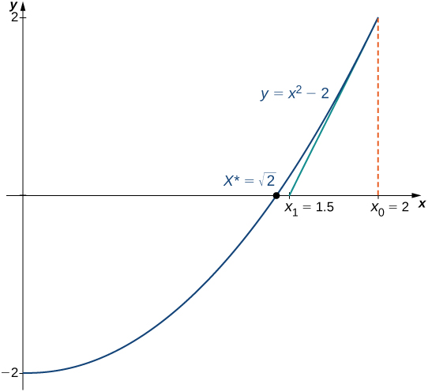
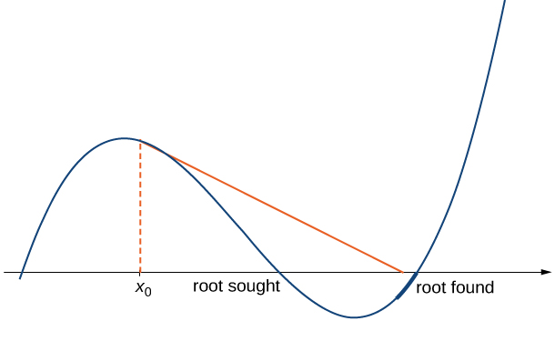
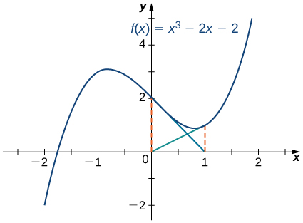

* Describe the steps of Newton’s method.
* Explain what an iterative process means.
* Recognize when Newton’s method does not work.
* Apply iterative processes to various situations.

In many areas of pure and applied mathematics, we are interested in finding solutions to an equation of the form <math xmlns="http://www.w3.org/1998/Math/MathML"><mrow><mi>f</mi><mrow><mo>(</mo><mi>x</mi><mo>)</mo></mrow><mo>=</mo><mn>0</mn><mo>.</mo></mrow></math>

 For most functions, however, it is difficult—if not impossible—to calculate their zeroes explicitly. In this section, we take a look at a technique that provides a very efficient way of approximating the **zeroes of functions**{: data-type="term" .no-emphasis}. This technique makes use of tangent line approximations and is behind the method used often by calculators and computers to find zeroes.

# Describing Newton’s Method

Consider the task of finding the solutions of <math xmlns="http://www.w3.org/1998/Math/MathML"><mrow><mi>f</mi><mrow><mo>(</mo><mi>x</mi><mo>)</mo></mrow><mo>=</mo><mn>0</mn><mo>.</mo></mrow></math>

 If <math xmlns="http://www.w3.org/1998/Math/MathML"><mi>f</mi></math>

 is the first-degree polynomial <math xmlns="http://www.w3.org/1998/Math/MathML"><mrow><mi>f</mi><mrow><mo>(</mo><mi>x</mi><mo>)</mo></mrow><mo>=</mo><mi>a</mi><mi>x</mi><mo>+</mo><mi>b</mi><mo>,</mo></mrow></math>

 then the solution of <math xmlns="http://www.w3.org/1998/Math/MathML"><mrow><mi>f</mi><mrow><mo>(</mo><mi>x</mi><mo>)</mo></mrow><mo>=</mo><mn>0</mn></mrow></math>

 is given by the formula <math xmlns="http://www.w3.org/1998/Math/MathML"><mrow><mi>x</mi><mo>=</mo><mo>−</mo><mfrac><mi>b</mi><mi>a</mi></mfrac><mo>.</mo></mrow></math>

 If <math xmlns="http://www.w3.org/1998/Math/MathML"><mi>f</mi></math>

 is the second-degree polynomial <math xmlns="http://www.w3.org/1998/Math/MathML"><mrow><mi>f</mi><mrow><mo>(</mo><mi>x</mi><mo>)</mo></mrow><mo>=</mo><mi>a</mi><msup><mi>x</mi><mn>2</mn></msup><mo>+</mo><mi>b</mi><mi>x</mi><mo>+</mo><mi>c</mi><mo>,</mo></mrow></math>

 the solutions of <math xmlns="http://www.w3.org/1998/Math/MathML"><mrow><mi>f</mi><mrow><mo>(</mo><mi>x</mi><mo>)</mo></mrow><mo>=</mo><mn>0</mn></mrow></math>

 can be found by using the quadratic formula. However, for polynomials of degree <math xmlns="http://www.w3.org/1998/Math/MathML"><mn>3</mn></math>

 or more, finding roots of <math xmlns="http://www.w3.org/1998/Math/MathML"><mi>f</mi></math>

 becomes more complicated. Although formulas exist for third- and fourth-degree polynomials, they are quite complicated. Also, if <math xmlns="http://www.w3.org/1998/Math/MathML"><mi>f</mi></math>

 is a polynomial of degree <math xmlns="http://www.w3.org/1998/Math/MathML"><mn>5</mn></math>

 or greater, it is known that no such formulas exist. For example, consider the function

<math xmlns="http://www.w3.org/1998/Math/MathML"><mrow><mi>f</mi><mrow><mo>(</mo><mi>x</mi><mo>)</mo></mrow><mo>=</mo><msup><mi>x</mi><mn>5</mn></msup><mo>+</mo><mn>8</mn><msup><mi>x</mi><mn>4</mn></msup><mo>+</mo><mn>4</mn><msup><mi>x</mi><mn>3</mn></msup><mo>−</mo><mn>2</mn><mi>x</mi><mo>−</mo><mn>7</mn><mo>.</mo></mrow></math>

No formula exists that allows us to find the solutions of <math xmlns="http://www.w3.org/1998/Math/MathML"><mrow><mi>f</mi><mrow><mo>(</mo><mi>x</mi><mo>)</mo></mrow><mo>=</mo><mn>0</mn><mo>.</mo></mrow></math>

 Similar difficulties exist for nonpolynomial functions. For example, consider the task of finding solutions of <math xmlns="http://www.w3.org/1998/Math/MathML"><mrow><mtext>tan</mtext><mrow><mo>(</mo><mi>x</mi><mo>)</mo></mrow><mo>−</mo><mi>x</mi><mo>=</mo><mn>0</mn><mo>.</mo></mrow></math>

 No simple formula exists for the solutions of this equation. In cases such as these, we can use Newton’s method to approximate the roots.

**Newton’s method**{: data-type="term"} makes use of the following idea to approximate the solutions of <math xmlns="http://www.w3.org/1998/Math/MathML"><mrow><mi>f</mi><mrow><mo>(</mo><mi>x</mi><mo>)</mo></mrow><mo>=</mo><mn>0</mn><mo>.</mo></mrow></math>

 By sketching a graph of <math xmlns="http://www.w3.org/1998/Math/MathML"><mrow><mi>f</mi><mo>,</mo></mrow></math>

 we can estimate a root of <math xmlns="http://www.w3.org/1998/Math/MathML"><mrow><mi>f</mi><mrow><mo>(</mo><mi>x</mi><mo>)</mo></mrow><mo>=</mo><mn>0</mn><mo>.</mo></mrow></math>

 Let’s call this estimate <math xmlns="http://www.w3.org/1998/Math/MathML"><mrow><msub><mi>x</mi><mn>0</mn></msub><mo>.</mo></mrow></math>

 We then draw the tangent line to <math xmlns="http://www.w3.org/1998/Math/MathML"><mi>f</mi></math>

 at <math xmlns="http://www.w3.org/1998/Math/MathML"><mrow><msub><mi>x</mi><mn>0</mn></msub><mo>.</mo></mrow></math>

 If <math xmlns="http://www.w3.org/1998/Math/MathML"><mrow><msup><mi>f</mi><mo>′</mo></msup><mrow><mo>(</mo><mrow><msub><mi>x</mi><mn>0</mn></msub></mrow><mo>)</mo></mrow><mo>≠</mo><mn>0</mn><mo>,</mo></mrow></math>

 this tangent line intersects the <math xmlns="http://www.w3.org/1998/Math/MathML"><mi>x</mi></math>

-axis at some point <math xmlns="http://www.w3.org/1998/Math/MathML"><mrow><mrow><mo>(</mo><mrow><msub><mi>x</mi><mn>1</mn></msub><mo>,</mo><mn>0</mn></mrow><mo>)</mo></mrow><mo>.</mo></mrow></math>

 Now let <math xmlns="http://www.w3.org/1998/Math/MathML"><mrow><msub><mi>x</mi><mn>1</mn></msub></mrow></math>

 be the next approximation to the actual root. Typically, <math xmlns="http://www.w3.org/1998/Math/MathML"><mrow><msub><mi>x</mi><mn>1</mn></msub></mrow></math>

 is closer than <math xmlns="http://www.w3.org/1998/Math/MathML"><mrow><msub><mi>x</mi><mn>0</mn></msub></mrow></math>

 to an actual root. Next we draw the tangent line to <math xmlns="http://www.w3.org/1998/Math/MathML"><mi>f</mi></math>

 at <math xmlns="http://www.w3.org/1998/Math/MathML"><mrow><msub><mi>x</mi><mn>1</mn></msub><mo>.</mo></mrow></math>

 If <math xmlns="http://www.w3.org/1998/Math/MathML"><mrow><msup><mi>f</mi><mo>′</mo></msup><mrow><mo>(</mo><mrow><msub><mi>x</mi><mn>1</mn></msub></mrow><mo>)</mo></mrow><mo>≠</mo><mn>0</mn><mo>,</mo></mrow></math>

 this tangent line also intersects the <math xmlns="http://www.w3.org/1998/Math/MathML"><mi>x</mi></math>

-axis, producing another approximation, <math xmlns="http://www.w3.org/1998/Math/MathML"><mrow><msub><mi>x</mi><mn>2</mn></msub><mo>.</mo></mrow></math>

 We continue in this way, deriving a list of approximations: <math xmlns="http://www.w3.org/1998/Math/MathML"><mrow><msub><mi>x</mi><mn>0</mn></msub><mo>,</mo><msub><mi>x</mi><mn>1</mn></msub><mo>,</mo><msub><mi>x</mi><mn>2</mn></msub><mtext>,…</mtext><mo>.</mo></mrow></math>

 Typically, the numbers <math xmlns="http://www.w3.org/1998/Math/MathML"><mrow><msub><mi>x</mi><mn>0</mn></msub><mo>,</mo><msub><mi>x</mi><mn>1</mn></msub><mo>,</mo><msub><mi>x</mi><mn>2</mn></msub><mtext>,…</mtext></mrow></math>

 quickly approach an actual root <math xmlns="http://www.w3.org/1998/Math/MathML"><mrow><mi>x</mi><mo>*</mo><mo>,</mo></mrow></math>

 as shown in the following figure.

 {: #CNX_Calc_Figure_04_09_001}

Now let’s look at how to calculate the approximations <math xmlns="http://www.w3.org/1998/Math/MathML"><mrow><msub><mi>x</mi><mn>0</mn></msub><mo>,</mo><msub><mi>x</mi><mn>1</mn></msub><mo>,</mo><msub><mi>x</mi><mn>2</mn></msub><mtext>,…</mtext><mo>.</mo></mrow></math>

 If <math xmlns="http://www.w3.org/1998/Math/MathML"><mrow><msub><mi>x</mi><mn>0</mn></msub></mrow></math>

 is our first approximation, the approximation <math xmlns="http://www.w3.org/1998/Math/MathML"><mrow><msub><mi>x</mi><mn>1</mn></msub></mrow></math>

 is defined by letting <math xmlns="http://www.w3.org/1998/Math/MathML"><mrow><mrow><mo>(</mo><mrow><msub><mi>x</mi><mn>1</mn></msub><mo>,</mo><mn>0</mn></mrow><mo>)</mo></mrow></mrow></math>

 be the <math xmlns="http://www.w3.org/1998/Math/MathML"><mi>x</mi></math>

-intercept of the tangent line to <math xmlns="http://www.w3.org/1998/Math/MathML"><mi>f</mi></math>

 at <math xmlns="http://www.w3.org/1998/Math/MathML"><mrow><msub><mi>x</mi><mn>0</mn></msub><mo>.</mo></mrow></math>

 The equation of this tangent line is given by

<math xmlns="http://www.w3.org/1998/Math/MathML"><mrow><mi>y</mi><mo>=</mo><mi>f</mi><mrow><mo>(</mo><mrow><msub><mi>x</mi><mn>0</mn></msub></mrow><mo>)</mo></mrow><mo>+</mo><msup><mi>f</mi><mo>′</mo></msup><mrow><mo>(</mo><mrow><msub><mi>x</mi><mn>0</mn></msub></mrow><mo>)</mo></mrow><mrow><mo>(</mo><mrow><mi>x</mi><mo>−</mo><msub><mi>x</mi><mn>0</mn></msub></mrow><mo>)</mo></mrow><mo>.</mo></mrow></math>

Therefore, <math xmlns="http://www.w3.org/1998/Math/MathML"><mrow><msub><mi>x</mi><mn>1</mn></msub></mrow></math>

 must satisfy

<math xmlns="http://www.w3.org/1998/Math/MathML"><mrow><mi>f</mi><mrow><mo>(</mo><mrow><msub><mi>x</mi><mn>0</mn></msub></mrow><mo>)</mo></mrow><mo>+</mo><msup><mi>f</mi><mo>′</mo></msup><mrow><mo>(</mo><mrow><msub><mi>x</mi><mn>0</mn></msub></mrow><mo>)</mo></mrow><mrow><mo>(</mo><mrow><msub><mi>x</mi><mn>1</mn></msub><mo>−</mo><msub><mi>x</mi><mn>0</mn></msub></mrow><mo>)</mo></mrow><mo>=</mo><mn>0</mn><mo>.</mo></mrow></math>

Solving this equation for <math xmlns="http://www.w3.org/1998/Math/MathML"><mrow><msub><mi>x</mi><mn>1</mn></msub><mo>,</mo></mrow></math>

 we conclude that

<math xmlns="http://www.w3.org/1998/Math/MathML"><mrow><msub><mi>x</mi><mn>1</mn></msub><mo>=</mo><msub><mi>x</mi><mn>0</mn></msub><mo>−</mo><mfrac><mrow><mi>f</mi><mrow><mo>(</mo><mrow><msub><mi>x</mi><mn>0</mn></msub></mrow><mo>)</mo></mrow></mrow><mrow><mi>f</mi><mo>′</mo><mrow><mo>(</mo><mrow><msub><mi>x</mi><mn>0</mn></msub></mrow><mo>)</mo></mrow></mrow></mfrac><mo>.</mo></mrow></math>

Similarly, the point <math xmlns="http://www.w3.org/1998/Math/MathML"><mrow><mrow><mo>(</mo><mrow><msub><mi>x</mi><mn>2</mn></msub><mo>,</mo><mn>0</mn></mrow><mo>)</mo></mrow></mrow></math>

 is the <math xmlns="http://www.w3.org/1998/Math/MathML"><mi>x</mi></math>

-intercept of the tangent line to <math xmlns="http://www.w3.org/1998/Math/MathML"><mi>f</mi></math>

 at <math xmlns="http://www.w3.org/1998/Math/MathML"><mrow><msub><mi>x</mi><mn>1</mn></msub><mo>.</mo></mrow></math>

 Therefore, <math xmlns="http://www.w3.org/1998/Math/MathML"><mrow><msub><mi>x</mi><mn>2</mn></msub></mrow></math>

 satisfies the equation

<math xmlns="http://www.w3.org/1998/Math/MathML"><mrow><msub><mi>x</mi><mn>2</mn></msub><mo>=</mo><msub><mi>x</mi><mn>1</mn></msub><mo>−</mo><mfrac><mrow><mi>f</mi><mrow><mo>(</mo><mrow><msub><mi>x</mi><mn>1</mn></msub></mrow><mo>)</mo></mrow></mrow><mrow><mi>f</mi><mo>′</mo><mrow><mo>(</mo><mrow><msub><mi>x</mi><mn>1</mn></msub></mrow><mo>)</mo></mrow></mrow></mfrac><mo>.</mo></mrow></math>

In general, for <math xmlns="http://www.w3.org/1998/Math/MathML"><mrow><mi>n</mi><mo>&gt;</mo><mn>0</mn><mo>,</mo><msub><mi>x</mi><mi>n</mi></msub></mrow></math>

 satisfies

<math xmlns="http://www.w3.org/1998/Math/MathML"><mrow><msub><mi>x</mi><mi>n</mi></msub><mo>=</mo><msub><mi>x</mi><mrow><mi>n</mi><mo>−</mo><mn>1</mn></mrow></msub><mo>−</mo><mfrac><mrow><mi>f</mi><mrow><mo>(</mo><mrow><msub><mi>x</mi><mrow><mi>n</mi><mo>−</mo><mn>1</mn></mrow></msub></mrow><mo>)</mo></mrow></mrow><mrow><mi>f</mi><mo>′</mo><mrow><mo>(</mo><mrow><msub><mi>x</mi><mrow><mi>n</mi><mo>−</mo><mn>1</mn></mrow></msub></mrow><mo>)</mo></mrow></mrow></mfrac><mo>.</mo></mrow></math>

Next we see how to make use of this technique to approximate the root of the polynomial <math xmlns="http://www.w3.org/1998/Math/MathML"><mrow><mi>f</mi><mrow><mo>(</mo><mi>x</mi><mo>)</mo></mrow><mo>=</mo><msup><mi>x</mi><mn>3</mn></msup><mo>−</mo><mn>3</mn><mi>x</mi><mo>+</mo><mn>1</mn><mo>.</mo></mrow></math>

Finding a Root of a Polynomial

Use Newton’s method to approximate a root of <math xmlns="http://www.w3.org/1998/Math/MathML"><mrow><mi>f</mi><mrow><mo>(</mo><mi>x</mi><mo>)</mo></mrow><mo>=</mo><msup><mi>x</mi><mn>3</mn></msup><mo>−</mo><mn>3</mn><mi>x</mi><mo>+</mo><mn>1</mn></mrow></math>

 in the interval <math xmlns="http://www.w3.org/1998/Math/MathML"><mrow><mrow><mo>[</mo><mrow><mn>1</mn><mo>,</mo><mn>2</mn></mrow><mo>]</mo></mrow><mo>.</mo></mrow></math>

 Let <math xmlns="http://www.w3.org/1998/Math/MathML"><mrow><msub><mi>x</mi><mn>0</mn></msub><mo>=</mo><mn>2</mn></mrow></math>

 and find <math xmlns="http://www.w3.org/1998/Math/MathML"><mrow><msub><mi>x</mi><mn>1</mn></msub><mo>,</mo><msub><mi>x</mi><mn>2</mn></msub><mo>,</mo><msub><mi>x</mi><mn>3</mn></msub><mo>,</mo><msub><mi>x</mi><mn>4</mn></msub><mo>,</mo></mrow></math>

 and <math xmlns="http://www.w3.org/1998/Math/MathML"><mrow><msub><mi>x</mi><mn>5</mn></msub><mo>.</mo></mrow></math>

From [[link]](#CNX_Calc_Figure_04_09_002), we see that <math xmlns="http://www.w3.org/1998/Math/MathML"><mi>f</mi></math>

 has one root over the interval <math xmlns="http://www.w3.org/1998/Math/MathML"><mrow><mrow><mo>(</mo><mrow><mn>1</mn><mo>,</mo><mn>2</mn></mrow><mo>)</mo></mrow><mo>.</mo></mrow></math>

 Therefore <math xmlns="http://www.w3.org/1998/Math/MathML"><mrow><msub><mi>x</mi><mn>0</mn></msub><mo>=</mo><mn>2</mn></mrow></math>

 seems like a reasonable first approximation. To find the next approximation, we use [[link]](#fs-id1165043389758). Since <math xmlns="http://www.w3.org/1998/Math/MathML"><mrow><mi>f</mi><mrow><mo>(</mo><mi>x</mi><mo>)</mo></mrow><mo>=</mo><msup><mi>x</mi><mn>3</mn></msup><mo>−</mo><mn>3</mn><mi>x</mi><mo>+</mo><mn>1</mn><mo>,</mo></mrow></math>

 the derivative is <math xmlns="http://www.w3.org/1998/Math/MathML"><mrow><msup><mi>f</mi><mo>′</mo></msup><mrow><mo>(</mo><mi>x</mi><mo>)</mo></mrow><mo>=</mo><mn>3</mn><msup><mi>x</mi><mn>2</mn></msup><mo>−</mo><mn>3</mn><mo>.</mo></mrow></math>

 Using [[link]](#fs-id1165043389758) with <math xmlns="http://www.w3.org/1998/Math/MathML"><mrow><mi>n</mi><mo>=</mo><mn>1</mn></mrow></math>

 (and a calculator that displays <math xmlns="http://www.w3.org/1998/Math/MathML"><mrow><mn>10</mn></mrow></math>

 digits), we obtain

<math xmlns="http://www.w3.org/1998/Math/MathML"><mrow><msub><mi>x</mi><mn>1</mn></msub><mo>=</mo><msub><mi>x</mi><mn>0</mn></msub><mo>−</mo><mfrac><mrow><mi>f</mi><mrow><mo>(</mo><mrow><msub><mi>x</mi><mn>0</mn></msub></mrow><mo>)</mo></mrow></mrow><mrow><mi>f</mi><mo>′</mo><mrow><mo>(</mo><mrow><msub><mi>x</mi><mn>0</mn></msub></mrow><mo>)</mo></mrow></mrow></mfrac><mo>=</mo><mn>2</mn><mo>−</mo><mfrac><mrow><mi>f</mi><mrow><mo>(</mo><mn>2</mn><mo>)</mo></mrow></mrow><mrow><mi>f</mi><mo>′</mo><mrow><mo>(</mo><mn>2</mn><mo>)</mo></mrow></mrow></mfrac><mo>=</mo><mn>2</mn><mo>−</mo><mfrac><mn>3</mn><mn>9</mn></mfrac><mo>≈</mo><mn>1.666666667</mn><mo>.</mo></mrow></math>

To find the next approximation, <math xmlns="http://www.w3.org/1998/Math/MathML"><mrow><msub><mi>x</mi><mn>2</mn></msub><mo>,</mo></mrow></math>

 we use [[link]](#fs-id1165043389758) with <math xmlns="http://www.w3.org/1998/Math/MathML"><mrow><mi>n</mi><mo>=</mo><mn>2</mn></mrow></math>

 and the value of <math xmlns="http://www.w3.org/1998/Math/MathML"><mrow><msub><mi>x</mi><mn>1</mn></msub></mrow></math>

 stored on the calculator. We find that

<math xmlns="http://www.w3.org/1998/Math/MathML"><mrow><msub><mi>x</mi><mn>2</mn></msub><mo>=</mo><msub><mi>x</mi><mn>1</mn></msub><mo>=</mo><mfrac><mrow><mi>f</mi><mrow><mo>(</mo><mrow><msub><mi>x</mi><mn>1</mn></msub></mrow><mo>)</mo></mrow></mrow><mrow><mi>f</mi><mo>′</mo><mrow><mo>(</mo><mrow><msub><mi>x</mi><mn>1</mn></msub></mrow><mo>)</mo></mrow></mrow></mfrac><mo>≈</mo><mn>1.548611111</mn><mo>.</mo></mrow></math>

Continuing in this way, we obtain the following results:

<math xmlns="http://www.w3.org/1998/Math/MathML"><mtable><mtr><mtd columnalign="left"><msub><mi>x</mi><mn>1</mn></msub><mo>≈</mo><mn>1.666666667</mn></mtd></mtr><mtr><mtd columnalign="left"><msub><mi>x</mi><mn>2</mn></msub><mo>≈</mo><mn>1.548611111</mn></mtd></mtr><mtr><mtd columnalign="left"><msub><mi>x</mi><mn>3</mn></msub><mo>≈</mo><mn>1.532390162</mn></mtd></mtr><mtr><mtd columnalign="left"><msub><mi>x</mi><mn>4</mn></msub><mo>≈</mo><mn>1.532088989</mn></mtd></mtr><mtr><mtd columnalign="left"><msub><mi>x</mi><mn>5</mn></msub><mo>≈</mo><mn>1.532088886</mn></mtd></mtr><mtr><mtd columnalign="left"><msub><mi>x</mi><mn>6</mn></msub><mo>≈</mo><mn>1.532088886</mn><mo>.</mo></mtd></mtr></mtable></math>

We note that we obtained the same value for <math xmlns="http://www.w3.org/1998/Math/MathML"><mrow><msub><mi>x</mi><mn>5</mn></msub></mrow></math>

 and <math xmlns="http://www.w3.org/1998/Math/MathML"><mrow><msub><mi>x</mi><mn>6</mn></msub><mo>.</mo></mrow></math>

 Therefore, any subsequent application of Newton’s method will most likely give the same value for <math xmlns="http://www.w3.org/1998/Math/MathML"><mrow><msub><mi>x</mi><mi>n</mi></msub><mo>.</mo></mrow></math>

=x3&#x2212;3x+1 has one root over the interval [1,2]."){: #CNX_Calc_Figure_04_09_002}

Letting <math xmlns="http://www.w3.org/1998/Math/MathML"><mrow><msub><mi>x</mi><mn>0</mn></msub><mo>=</mo><mn>0</mn><mo>,</mo></mrow></math>

 let’s use Newton’s method to approximate the root of <math xmlns="http://www.w3.org/1998/Math/MathML"><mrow><mi>f</mi><mrow><mo>(</mo><mi>x</mi><mo>)</mo></mrow><mo>=</mo><msup><mi>x</mi><mn>3</mn></msup><mo>−</mo><mn>3</mn><mi>x</mi><mo>+</mo><mn>1</mn></mrow></math>

 over the interval <math xmlns="http://www.w3.org/1998/Math/MathML"><mrow><mrow><mo>[</mo><mrow><mn>0</mn><mo>,</mo><mn>1</mn></mrow><mo>]</mo></mrow></mrow></math>

 by calculating <math xmlns="http://www.w3.org/1998/Math/MathML"><mrow><msub><mi>x</mi><mn>1</mn></msub></mrow></math>

 and <math xmlns="http://www.w3.org/1998/Math/MathML"><mrow><msub><mi>x</mi><mn>2</mn></msub><mo>.</mo></mrow></math>

<math xmlns="http://www.w3.org/1998/Math/MathML"><mrow><msub><mi>x</mi><mn>1</mn></msub><mo>≈</mo><mn>0.33333333</mn><mo>,</mo><msub><mi>x</mi><mn>2</mn></msub><mo>≈</mo><mn>0.347222222</mn></mrow></math>

Hint

Use [[link]](#fs-id1165043389758).

Newton’s method can also be used to approximate square roots. Here we show how to approximate <math xmlns="http://www.w3.org/1998/Math/MathML"><mrow><msqrt><mn>2</mn></msqrt><mo>.</mo></mrow></math>

 This method can be modified to approximate the square root of any positive number.

Finding a Square Root

Use Newton’s method to approximate <math xmlns="http://www.w3.org/1998/Math/MathML"><mrow><msqrt><mn>2</mn></msqrt></mrow></math>

 ([[link]](#CNX_Calc_Figure_04_09_003)). Let <math xmlns="http://www.w3.org/1998/Math/MathML"><mrow><mi>f</mi><mrow><mo>(</mo><mi>x</mi><mo>)</mo></mrow><mo>=</mo><msup><mi>x</mi><mn>2</mn></msup><mo>−</mo><mn>2</mn><mo>,</mo></mrow></math>

 let <math xmlns="http://www.w3.org/1998/Math/MathML"><mrow><msub><mi>x</mi><mn>0</mn></msub><mo>=</mo><mn>2</mn><mo>,</mo></mrow></math>

 and calculate <math xmlns="http://www.w3.org/1998/Math/MathML"><mrow><msub><mi>x</mi><mn>1</mn></msub><mo>,</mo><msub><mi>x</mi><mn>2</mn></msub><mo>,</mo><msub><mi>x</mi><mn>3</mn></msub><mo>,</mo><msub><mi>x</mi><mn>4</mn></msub><mo>,</mo><msub><mi>x</mi><mn>5</mn></msub><mo>.</mo></mrow></math>

 (We note that since <math xmlns="http://www.w3.org/1998/Math/MathML"><mrow><mi>f</mi><mrow><mo>(</mo><mi>x</mi><mo>)</mo></mrow><mo>=</mo><msup><mi>x</mi><mn>2</mn></msup><mo>−</mo><mn>2</mn></mrow></math>

 has a zero at <math xmlns="http://www.w3.org/1998/Math/MathML"><mrow><msqrt><mn>2</mn></msqrt><mo>,</mo></mrow></math>

 the initial value <math xmlns="http://www.w3.org/1998/Math/MathML"><mrow><msub><mi>x</mi><mn>0</mn></msub><mo>=</mo><mn>2</mn></mrow></math>

 is a reasonable choice to approximate <math xmlns="http://www.w3.org/1998/Math/MathML"><mrow><msqrt><mn>2</mn></msqrt><mo>.</mo><mo stretchy="false">)</mo></mrow></math>

For <math xmlns="http://www.w3.org/1998/Math/MathML"><mrow><mi>f</mi><mrow><mo>(</mo><mi>x</mi><mo>)</mo></mrow><mo>=</mo><msup><mi>x</mi><mn>2</mn></msup><mo>−</mo><mn>2</mn><mo>,</mo><msup><mi>f</mi><mo>′</mo></msup><mrow><mo>(</mo><mi>x</mi><mo>)</mo></mrow><mo>=</mo><mn>2</mn><mi>x</mi><mo>.</mo></mrow></math>

 From [[link]](#fs-id1165043389758), we know that

<math xmlns="http://www.w3.org/1998/Math/MathML"><mtable><mtr><mtd columnalign="right"><msub><mi>x</mi><mi>n</mi></msub></mtd><mtd columnalign="left"><mo>=</mo><msub><mi>x</mi><mrow><mi>n</mi><mo>−</mo><mn>1</mn></mrow></msub><mo>−</mo><mfrac><mrow><mi>f</mi><mrow><mo>(</mo><mrow><msub><mi>x</mi><mrow><mi>n</mi><mo>−</mo><mn>1</mn></mrow></msub></mrow><mo>)</mo></mrow></mrow><mrow><mi>f</mi><mo>′</mo><mrow><mo>(</mo><mrow><msub><mi>x</mi><mrow><mi>n</mi><mo>−</mo><mn>1</mn></mrow></msub></mrow><mo>)</mo></mrow></mrow></mfrac></mtd></mtr><mtr><mtd /><mtd columnalign="left"><mo>=</mo><msub><mi>x</mi><mrow><mi>n</mi><mo>−</mo><mn>1</mn></mrow></msub><mo>−</mo><mfrac><mrow><msup><mi>x</mi><mn>2</mn></msup><msub><mrow /><mrow><mi>n</mi><mo>−</mo><mn>1</mn></mrow></msub><mo>−</mo><mn>2</mn></mrow><mrow><mn>2</mn><msub><mi>x</mi><mrow><mi>n</mi><mo>−</mo><mn>1</mn></mrow></msub></mrow></mfrac></mtd></mtr><mtr><mtd /><mtd columnalign="left"><mo>=</mo><mfrac><mn>1</mn><mn>2</mn></mfrac><msub><mi>x</mi><mrow><mi>n</mi><mo>−</mo><mn>1</mn></mrow></msub><mo>+</mo><mfrac><mn>1</mn><mrow><msub><mi>x</mi><mrow><mi>n</mi><mo>−</mo><mn>1</mn></mrow></msub></mrow></mfrac></mtd></mtr><mtr><mtd /><mtd columnalign="left"><mo>=</mo><mfrac><mn>1</mn><mn>2</mn></mfrac><mrow><mo>(</mo><mrow><msub><mi>x</mi><mrow><mi>n</mi><mo>−</mo><mn>1</mn></mrow></msub><mo>+</mo><mfrac><mn>2</mn><mrow><msub><mi>x</mi><mrow><mi>n</mi><mo>−</mo><mn>1</mn></mrow></msub></mrow></mfrac></mrow><mo>)</mo></mrow><mo>.</mo></mtd></mtr></mtable></math>

Therefore,

<math xmlns="http://www.w3.org/1998/Math/MathML"><mtable><mtr /><mtr /><mtr><mtd columnalign="left"><msub><mi>x</mi><mn>1</mn></msub><mo>=</mo><mfrac><mn>1</mn><mn>2</mn></mfrac><mrow><mo>(</mo><mrow><msub><mi>x</mi><mn>0</mn></msub><mo>+</mo><mfrac><mn>2</mn><mrow><msub><mi>x</mi><mn>0</mn></msub></mrow></mfrac></mrow><mo>)</mo></mrow><mo>=</mo><mfrac><mn>1</mn><mn>2</mn></mfrac><mrow><mo>(</mo><mrow><mn>2</mn><mo>+</mo><mfrac><mn>2</mn><mn>2</mn></mfrac></mrow><mo>)</mo></mrow><mo>=</mo><mn>1.5</mn></mtd></mtr><mtr><mtd columnalign="left"><msub><mi>x</mi><mn>2</mn></msub><mo>=</mo><mfrac><mn>1</mn><mn>2</mn></mfrac><mrow><mo>(</mo><mrow><msub><mi>x</mi><mn>1</mn></msub><mo>+</mo><mfrac><mn>2</mn><mrow><msub><mi>x</mi><mn>1</mn></msub></mrow></mfrac></mrow><mo>)</mo></mrow><mo>=</mo><mfrac><mn>1</mn><mn>2</mn></mfrac><mrow><mo>(</mo><mrow><mn>1.5</mn><mo>+</mo><mfrac><mn>2</mn><mrow><mn>1.5</mn></mrow></mfrac></mrow><mo>)</mo></mrow><mo>≈</mo><mn>1.416666667.</mn></mtd></mtr></mtable></math>

Continuing in this way, we find that

<math xmlns="http://www.w3.org/1998/Math/MathML"><mtable><mtr><mtd columnalign="left"><msub><mi>x</mi><mn>1</mn></msub><mo>=</mo><mn>1.5</mn></mtd></mtr><mtr><mtd columnalign="left"><msub><mi>x</mi><mn>2</mn></msub><mo>≈</mo><mn>1.416666667</mn></mtd></mtr><mtr><mtd columnalign="left"><msub><mi>x</mi><mn>3</mn></msub><mo>≈</mo><mn>1.414215686</mn></mtd></mtr><mtr><mtd columnalign="left"><msub><mi>x</mi><mn>4</mn></msub><mo>≈</mo><mn>1.414213562</mn></mtd></mtr><mtr><mtd columnalign="left"><msub><mi>x</mi><mn>5</mn></msub><mo>≈</mo><mn>1.414213562.</mn></mtd></mtr></mtable></math>

Since we obtained the same value for <math xmlns="http://www.w3.org/1998/Math/MathML"><mrow><msub><mi>x</mi><mn>4</mn></msub></mrow></math>

 and <math xmlns="http://www.w3.org/1998/Math/MathML"><mrow><msub><mi>x</mi><mn>5</mn></msub><mo>,</mo></mrow></math>

 it is unlikely that the value <math xmlns="http://www.w3.org/1998/Math/MathML"><mrow><msub><mi>x</mi><mi>n</mi></msub></mrow></math>

 will change on any subsequent application of Newton’s method. We conclude that <math xmlns="http://www.w3.org/1998/Math/MathML"><mrow><msqrt><mn>2</mn></msqrt><mo>≈</mo><mn>1.414213562</mn><mo>.</mo></mrow></math>

{: #CNX_Calc_Figure_04_09_003}

Use Newton’s method to approximate <math xmlns="http://www.w3.org/1998/Math/MathML"><mrow><msqrt><mn>3</mn></msqrt></mrow></math>

 by letting <math xmlns="http://www.w3.org/1998/Math/MathML"><mrow><mi>f</mi><mrow><mo>(</mo><mi>x</mi><mo>)</mo></mrow><mo>=</mo><msup><mi>x</mi><mn>2</mn></msup><mo>−</mo><mn>3</mn></mrow></math>

 and <math xmlns="http://www.w3.org/1998/Math/MathML"><mrow><msub><mi>x</mi><mn>0</mn></msub><mo>=</mo><mn>3</mn><mo>.</mo></mrow></math>

 Find <math xmlns="http://www.w3.org/1998/Math/MathML"><mrow><msub><mi>x</mi><mn>1</mn></msub></mrow></math>

 and <math xmlns="http://www.w3.org/1998/Math/MathML"><mrow><msub><mi>x</mi><mn>2</mn></msub><mo>.</mo></mrow></math>

<math xmlns="http://www.w3.org/1998/Math/MathML"><mrow><msub><mi>x</mi><mn>1</mn></msub><mo>=</mo><mn>2</mn><mo>,</mo><msub><mi>x</mi><mn>2</mn></msub><mo>=</mo><mn>1.75</mn></mrow></math>

Hint

For <math xmlns="http://www.w3.org/1998/Math/MathML"><mrow><mi>f</mi><mrow><mo>(</mo><mi>x</mi><mo>)</mo></mrow><mo>=</mo><msup><mi>x</mi><mn>2</mn></msup><mo>−</mo><mn>3</mn><mo>,</mo></mrow></math>

 [[link]](#fs-id1165043389758) reduces to <math xmlns="http://www.w3.org/1998/Math/MathML"><mrow><msub><mi>x</mi><mi>n</mi></msub><mo>=</mo><mfrac><mrow><msub><mi>x</mi><mrow><mi>n</mi><mo>−</mo><mn>1</mn></mrow></msub></mrow><mn>2</mn></mfrac><mo>+</mo><mfrac><mn>3</mn><mrow><mn>2</mn><msub><mi>x</mi><mrow><mi>n</mi><mo>−</mo><mn>1</mn></mrow></msub></mrow></mfrac><mo>.</mo></mrow></math>

When using Newton’s method, each approximation after the initial guess is defined in terms of the previous approximation by using the same formula. In particular, by defining the function <math xmlns="http://www.w3.org/1998/Math/MathML"><mrow><mi>F</mi><mrow><mo>(</mo><mi>x</mi><mo>)</mo></mrow><mo>=</mo><mi>x</mi><mo>−</mo><mrow><mo>[</mo><mrow><mfrac><mrow><mi>f</mi><mrow><mo>(</mo><mi>x</mi><mo>)</mo></mrow></mrow><mrow><msup><mi>f</mi><mo>′</mo></msup><mrow><mo>(</mo><mi>x</mi><mo>)</mo></mrow></mrow></mfrac></mrow><mo>]</mo></mrow><mo>,</mo></mrow></math>

 we can rewrite [\[link\]](#fs-id1165043389758) as <math xmlns="http://www.w3.org/1998/Math/MathML"><mrow><msub><mi>x</mi><mi>n</mi></msub><mo>=</mo><mi>F</mi><mrow><mo>(</mo><mrow><msub><mi>x</mi><mrow><mi>n</mi><mo>−</mo><mn>1</mn></mrow></msub></mrow><mo>)</mo></mrow><mo>.</mo></mrow></math>

 This type of process, where each <math xmlns="http://www.w3.org/1998/Math/MathML"><mrow><msub><mi>x</mi><mi>n</mi></msub></mrow></math>

 is defined in terms of <math xmlns="http://www.w3.org/1998/Math/MathML"><mrow><msub><mi>x</mi><mrow><mi>n</mi><mo>−</mo><mn>1</mn></mrow></msub></mrow></math>

 by repeating the same function, is an example of an **iterative process**{: data-type="term"}. Shortly, we examine other iterative processes. First, let’s look at the reasons why Newton’s method could fail to find a root.

# Failures of Newton’s Method

Typically, Newton’s method is used to find roots fairly quickly. However, things can go wrong. Some reasons why Newton’s method might fail include the following:

1.  At one of the approximations
    <math xmlns="http://www.w3.org/1998/Math/MathML"><mrow><msub><mi>x</mi><mi>n</mi></msub><mo>,</mo></mrow></math>
    
    the derivative
    <math xmlns="http://www.w3.org/1998/Math/MathML"><msup><mi>f</mi><mo>′</mo></msup></math>
    
    is zero at
    <math xmlns="http://www.w3.org/1998/Math/MathML"><mrow><msub><mi>x</mi><mi>n</mi></msub><mo>,</mo></mrow></math>
    
    but
    <math xmlns="http://www.w3.org/1998/Math/MathML"><mrow><mi>f</mi><mrow><mo>(</mo><mrow><msub><mi>x</mi><mi>n</mi></msub></mrow><mo>)</mo></mrow><mo>≠</mo><mn>0</mn><mo>.</mo></mrow></math>
    
    As a result, the tangent line of
    <math xmlns="http://www.w3.org/1998/Math/MathML"><mi>f</mi></math>
    
    at
    <math xmlns="http://www.w3.org/1998/Math/MathML"><mrow><msub><mi>x</mi><mi>n</mi></msub></mrow></math>
    
    does not intersect the
    <math xmlns="http://www.w3.org/1998/Math/MathML"><mi>x</mi></math>
    
    -axis. Therefore, we cannot continue the iterative process.
2.  The approximations
    <math xmlns="http://www.w3.org/1998/Math/MathML"><mrow><msub><mi>x</mi><mn>0</mn></msub><mo>,</mo><msub><mi>x</mi><mn>1</mn></msub><mo>,</mo><msub><mi>x</mi><mn>2</mn></msub><mtext>,…</mtext></mrow></math>
    
    may approach a different root. If the function
    <math xmlns="http://www.w3.org/1998/Math/MathML"><mi>f</mi></math>
    
    has more than one root, it is possible that our approximations do not approach the one for which we are looking, but approach a different root (see [\[link\]](#CNX_Calc_Figure_04_09_004)). This event most often occurs when we do not choose the approximation
    <math xmlns="http://www.w3.org/1998/Math/MathML"><mrow><msub><mi>x</mi><mn>0</mn></msub></mrow></math>
    
    close enough to the desired root.
3.  The approximations may fail to approach a root entirely. In [\[link\]](#fs-id1165043091063), we provide an example of a function and an initial guess
    <math xmlns="http://www.w3.org/1998/Math/MathML"><mrow><msub><mi>x</mi><mn>0</mn></msub></mrow></math>
    
    such that the successive approximations never approach a root because the successive approximations continue to alternate back and forth between two values.
{: data-number-style="arabic"}

 {: #CNX_Calc_Figure_04_09_004}

When Newton’s Method Fails

Consider the function <math xmlns="http://www.w3.org/1998/Math/MathML"><mrow><mi>f</mi><mrow><mo>(</mo><mi>x</mi><mo>)</mo></mrow><mo>=</mo><msup><mi>x</mi><mn>3</mn></msup><mo>−</mo><mn>2</mn><mi>x</mi><mo>+</mo><mn>2</mn><mo>.</mo></mrow></math>

 Let <math xmlns="http://www.w3.org/1998/Math/MathML"><mrow><msub><mi>x</mi><mn>0</mn></msub><mo>=</mo><mn>0</mn><mo>.</mo></mrow></math>

 Show that the sequence <math xmlns="http://www.w3.org/1998/Math/MathML"><mrow><msub><mi>x</mi><mn>1</mn></msub><mo>,</mo><msub><mi>x</mi><mn>2</mn></msub><mtext>,…</mtext></mrow></math>

 fails to approach a root of <math xmlns="http://www.w3.org/1998/Math/MathML"><mrow><mi>f</mi><mo>.</mo></mrow></math>

For <math xmlns="http://www.w3.org/1998/Math/MathML"><mrow><mi>f</mi><mrow><mo>(</mo><mi>x</mi><mo>)</mo></mrow><mo>=</mo><msup><mi>x</mi><mn>3</mn></msup><mo>−</mo><mn>2</mn><mi>x</mi><mo>+</mo><mn>2</mn><mo>,</mo></mrow></math>

 the derivative is <math xmlns="http://www.w3.org/1998/Math/MathML"><mrow><msup><mi>f</mi><mo>′</mo></msup><mrow><mo>(</mo><mi>x</mi><mo>)</mo></mrow><mo>=</mo><mn>3</mn><msup><mi>x</mi><mn>2</mn></msup><mo>−</mo><mn>2</mn><mo>.</mo></mrow></math>

 Therefore,

<math xmlns="http://www.w3.org/1998/Math/MathML"><mrow><msub><mi>x</mi><mn>1</mn></msub><mo>=</mo><msub><mi>x</mi><mn>0</mn></msub><mo>−</mo><mfrac><mrow><mi>f</mi><mrow><mo>(</mo><mrow><msub><mi>x</mi><mn>0</mn></msub></mrow><mo>)</mo></mrow></mrow><mrow><msup><mi>f</mi><mo>′</mo></msup><mrow><mo>(</mo><mrow><msub><mi>x</mi><mn>0</mn></msub></mrow><mo>)</mo></mrow></mrow></mfrac><mo>=</mo><mn>0</mn><mo>−</mo><mfrac><mrow><mi>f</mi><mrow><mo>(</mo><mn>0</mn><mo>)</mo></mrow></mrow><mrow><msup><mi>f</mi><mo>′</mo></msup><mrow><mo>(</mo><mn>0</mn><mo>)</mo></mrow></mrow></mfrac><mo>=</mo><mo>−</mo><mfrac><mn>2</mn><mrow><mn>−2</mn></mrow></mfrac><mo>=</mo><mn>1</mn><mo>.</mo></mrow></math>

In the next step,

<math xmlns="http://www.w3.org/1998/Math/MathML"><mrow><msub><mi>x</mi><mn>2</mn></msub><mo>=</mo><msub><mi>x</mi><mn>1</mn></msub><mo>−</mo><mfrac><mrow><mi>f</mi><mrow><mo>(</mo><mrow><msub><mi>x</mi><mn>1</mn></msub></mrow><mo>)</mo></mrow></mrow><mrow><mi>f</mi><mo>′</mo><mrow><mo>(</mo><mrow><msub><mi>x</mi><mn>1</mn></msub></mrow><mo>)</mo></mrow></mrow></mfrac><mo>=</mo><mn>1</mn><mo>−</mo><mfrac><mrow><mi>f</mi><mrow><mo>(</mo><mn>1</mn><mo>)</mo></mrow></mrow><mrow><msup><mi>f</mi><mo>′</mo></msup><mrow><mo>(</mo><mn>1</mn><mo>)</mo></mrow></mrow></mfrac><mo>=</mo><mn>1</mn><mo>−</mo><mfrac><mn>1</mn><mn>1</mn></mfrac><mo>=</mo><mn>0</mn><mo>.</mo></mrow></math>

Consequently, the numbers <math xmlns="http://www.w3.org/1998/Math/MathML"><mrow><msub><mi>x</mi><mn>0</mn></msub><mo>,</mo><msub><mi>x</mi><mn>1</mn></msub><mo>,</mo><msub><mi>x</mi><mn>2</mn></msub><mtext>,…</mtext></mrow></math>

 continue to bounce back and forth between <math xmlns="http://www.w3.org/1998/Math/MathML"><mn>0</mn></math>

 and <math xmlns="http://www.w3.org/1998/Math/MathML"><mn>1</mn></math>

 and never get closer to the root of <math xmlns="http://www.w3.org/1998/Math/MathML"><mi>f</mi></math>

 which is over the interval <math xmlns="http://www.w3.org/1998/Math/MathML"><mrow><mrow><mo>[</mo><mrow><mn>−2</mn><mo>,</mo><mn>−1</mn></mrow><mo>]</mo></mrow></mrow></math>

 (see [[link]](#CNX_Calc_Figure_04_09_005)). Fortunately, if we choose an initial approximation <math xmlns="http://www.w3.org/1998/Math/MathML"><mrow><msub><mi>x</mi><mn>0</mn></msub></mrow></math>

 closer to the actual root, we can avoid this situation.

{: #CNX_Calc_Figure_04_09_005}

For <math xmlns="http://www.w3.org/1998/Math/MathML"><mrow><mi>f</mi><mrow><mo>(</mo><mi>x</mi><mo>)</mo></mrow><mo>=</mo><msup><mi>x</mi><mn>3</mn></msup><mo>−</mo><mn>2</mn><mi>x</mi><mo>+</mo><mn>2</mn><mo>,</mo></mrow></math>

 let <math xmlns="http://www.w3.org/1998/Math/MathML"><mrow><msub><mi>x</mi><mn>0</mn></msub><mo>=</mo><mn>−1.5</mn></mrow></math>

 and find <math xmlns="http://www.w3.org/1998/Math/MathML"><mrow><msub><mi>x</mi><mn>1</mn></msub></mrow></math>

 and <math xmlns="http://www.w3.org/1998/Math/MathML"><mrow><msub><mi>x</mi><mn>2</mn></msub><mo>.</mo></mrow></math>

<math xmlns="http://www.w3.org/1998/Math/MathML"><mrow><msub><mi>x</mi><mn>1</mn></msub><mo>≈</mo><mo>−</mo><mn>1.842105263</mn><mo>,</mo><msub><mi>x</mi><mn>2</mn></msub><mo>≈</mo><mo>−</mo><mn>1.772826920</mn></mrow></math>

Hint

Use [[link]](#fs-id1165043389758).

From [\[link\]](#fs-id1165043091063), we see that Newton’s method does not always work. However, when it does work, the sequence of approximations approaches the root very quickly. Discussions of how quickly the sequence of approximations approach a root found using Newton’s method are included in texts on numerical analysis.

# Other Iterative Processes

As mentioned earlier, Newton’s method is a type of iterative process. We now look at an example of a different type of iterative process.

Consider a function <math xmlns="http://www.w3.org/1998/Math/MathML"><mi>F</mi></math>

 and an initial number <math xmlns="http://www.w3.org/1998/Math/MathML"><mrow><msub><mi>x</mi><mn>0</mn></msub><mo>.</mo></mrow></math>

 Define the subsequent numbers <math xmlns="http://www.w3.org/1998/Math/MathML"><mrow><msub><mi>x</mi><mi>n</mi></msub></mrow></math>

 by the formula <math xmlns="http://www.w3.org/1998/Math/MathML"><mrow><msub><mi>x</mi><mi>n</mi></msub><mo>=</mo><mi>F</mi><mrow><mo>(</mo><mrow><msub><mi>x</mi><mrow><mi>n</mi><mo>−</mo><mn>1</mn></mrow></msub></mrow><mo>)</mo></mrow><mo>.</mo></mrow></math>

 This process is an iterative process that creates a list of numbers <math xmlns="http://www.w3.org/1998/Math/MathML"><mrow><msub><mi>x</mi><mn>0</mn></msub><mo>,</mo><msub><mi>x</mi><mn>1</mn></msub><mo>,</mo><msub><mi>x</mi><mn>2</mn></msub><mtext>,…</mtext><mo>,</mo><msub><mi>x</mi><mi>n</mi></msub><mtext>,…</mtext><mo>.</mo></mrow></math>

 This list of numbers may approach a finite number <math xmlns="http://www.w3.org/1998/Math/MathML"><mrow><mi>x</mi><mo>*</mo></mrow></math>

 as <math xmlns="http://www.w3.org/1998/Math/MathML"><mi>n</mi></math>

 gets larger, or it may not. In [\[link\]](#fs-id1165043210088), we see an example of a function <math xmlns="http://www.w3.org/1998/Math/MathML"><mi>F</mi></math>

 and an initial guess <math xmlns="http://www.w3.org/1998/Math/MathML"><mrow><msub><mi>x</mi><mn>0</mn></msub></mrow></math>

 such that the resulting list of numbers approaches a finite value.

Finding a Limit for an Iterative Process

Let <math xmlns="http://www.w3.org/1998/Math/MathML"><mrow><mi>F</mi><mrow><mo>(</mo><mi>x</mi><mo>)</mo></mrow><mo>=</mo><mfrac><mn>1</mn><mn>2</mn></mfrac><mi>x</mi><mo>+</mo><mn>4</mn></mrow></math>

 and let <math xmlns="http://www.w3.org/1998/Math/MathML"><mrow><msub><mi>x</mi><mn>0</mn></msub><mo>=</mo><mn>0</mn><mo>.</mo></mrow></math>

 For all <math xmlns="http://www.w3.org/1998/Math/MathML"><mrow><mi>n</mi><mo>≥</mo><mn>1</mn><mo>,</mo></mrow></math>

 let <math xmlns="http://www.w3.org/1998/Math/MathML"><mrow><msub><mi>x</mi><mi>n</mi></msub><mo>=</mo><mi>F</mi><mrow><mo>(</mo><mrow><msub><mi>x</mi><mrow><mi>n</mi><mo>−</mo><mn>1</mn></mrow></msub></mrow><mo>)</mo></mrow><mo>.</mo></mrow></math>

 Find the values <math xmlns="http://www.w3.org/1998/Math/MathML"><mrow><msub><mi>x</mi><mn>1</mn></msub><mo>,</mo><msub><mi>x</mi><mn>2</mn></msub><mo>,</mo><msub><mi>x</mi><mn>3</mn></msub><mo>,</mo><msub><mi>x</mi><mn>4</mn></msub><mo>,</mo><msub><mi>x</mi><mn>5</mn></msub><mo>.</mo></mrow></math>

 Make a conjecture about what happens to this list of numbers <math xmlns="http://www.w3.org/1998/Math/MathML"><mrow><msub><mi>x</mi><mn>1</mn></msub><mo>,</mo><msub><mi>x</mi><mn>2</mn></msub><mo>,</mo><msub><mi>x</mi><mn>3</mn></msub><mtext>…</mtext><mo>,</mo><msub><mi>x</mi><mi>n</mi></msub><mtext>,…</mtext></mrow></math>

 as <math xmlns="http://www.w3.org/1998/Math/MathML"><mrow><mi>n</mi><mo stretchy="false">→</mo><mi>∞</mi><mo>.</mo></mrow></math>

 If the list of numbers <math xmlns="http://www.w3.org/1998/Math/MathML"><mrow><msub><mi>x</mi><mn>1</mn></msub><mo>,</mo><msub><mi>x</mi><mn>2</mn></msub><mo>,</mo><msub><mi>x</mi><mn>3</mn></msub><mtext>,…</mtext></mrow></math>

 approaches a finite number <math xmlns="http://www.w3.org/1998/Math/MathML"><mrow><mi>x</mi><mo>*</mo><mo>,</mo></mrow></math>

 then <math xmlns="http://www.w3.org/1998/Math/MathML"><mrow><mi>x</mi><mo>*</mo></mrow></math>

 satisfies <math xmlns="http://www.w3.org/1998/Math/MathML"><mrow><mi>x</mi><mo>*</mo><mo>=</mo><mi>F</mi><mrow><mo>(</mo><mrow><mi>x</mi><mo>*</mo></mrow><mo>)</mo></mrow><mo>,</mo></mrow></math>

 and <math xmlns="http://www.w3.org/1998/Math/MathML"><mrow><mi>x</mi><mo>*</mo></mrow></math>

 is called a fixed point of <math xmlns="http://www.w3.org/1998/Math/MathML"><mrow><mi>F</mi><mo>.</mo></mrow></math>

If <math xmlns="http://www.w3.org/1998/Math/MathML"><mrow><msub><mi>x</mi><mn>0</mn></msub><mo>=</mo><mn>0</mn><mo>,</mo></mrow></math>

 then

<math xmlns="http://www.w3.org/1998/Math/MathML"><mtable><mtr /><mtr /><mtr><mtd columnalign="left"><msub><mi>x</mi><mn>1</mn></msub><mo>=</mo><mfrac><mn>1</mn><mn>2</mn></mfrac><mrow><mo>(</mo><mn>0</mn><mo>)</mo></mrow><mo>+</mo><mn>4</mn><mo>=</mo><mn>4</mn></mtd></mtr><mtr><mtd columnalign="left"><msub><mi>x</mi><mn>2</mn></msub><mo>=</mo><mfrac><mn>1</mn><mn>2</mn></mfrac><mrow><mo>(</mo><mn>4</mn><mo>)</mo></mrow><mo>+</mo><mn>4</mn><mo>=</mo><mn>6</mn></mtd></mtr><mtr><mtd columnalign="left"><msub><mi>x</mi><mn>3</mn></msub><mo>=</mo><mfrac><mn>1</mn><mn>2</mn></mfrac><mrow><mo>(</mo><mn>6</mn><mo>)</mo></mrow><mo>+</mo><mn>4</mn><mo>=</mo><mn>7</mn></mtd></mtr><mtr><mtd columnalign="left"><msub><mi>x</mi><mn>4</mn></msub><mo>=</mo><mfrac><mn>1</mn><mn>2</mn></mfrac><mrow><mo>(</mo><mn>7</mn><mo>)</mo></mrow><mo>+</mo><mn>4</mn><mo>=</mo><mn>7.5</mn></mtd></mtr><mtr><mtd columnalign="left"><msub><mi>x</mi><mn>5</mn></msub><mo>=</mo><mfrac><mn>1</mn><mn>2</mn></mfrac><mrow><mo>(</mo><mrow><mn>7.5</mn></mrow><mo>)</mo></mrow><mo>+</mo><mn>4</mn><mo>=</mo><mn>7.75</mn></mtd></mtr><mtr><mtd columnalign="left"><msub><mi>x</mi><mn>6</mn></msub><mo>=</mo><mfrac><mn>1</mn><mn>2</mn></mfrac><mrow><mo>(</mo><mrow><mn>7.75</mn></mrow><mo>)</mo></mrow><mo>+</mo><mn>4</mn><mo>=</mo><mn>7.875</mn></mtd></mtr><mtr><mtd columnalign="left"><msub><mi>x</mi><mn>7</mn></msub><mo>=</mo><mfrac><mn>1</mn><mn>2</mn></mfrac><mrow><mo>(</mo><mrow><mn>7.875</mn></mrow><mo>)</mo></mrow><mo>+</mo><mn>4</mn><mo>=</mo><mn>7.9375</mn></mtd></mtr><mtr><mtd columnalign="left"><msub><mi>x</mi><mn>8</mn></msub><mo>=</mo><mfrac><mn>1</mn><mn>2</mn></mfrac><mrow><mo>(</mo><mrow><mn>7.9375</mn></mrow><mo>)</mo></mrow><mo>+</mo><mn>4</mn><mo>=</mo><mn>7.96875</mn></mtd></mtr><mtr><mtd columnalign="left"><msub><mi>x</mi><mn>9</mn></msub><mo>=</mo><mfrac><mn>1</mn><mn>2</mn></mfrac><mrow><mo>(</mo><mrow><mn>7.96875</mn></mrow><mo>)</mo></mrow><mo>+</mo><mn>4</mn><mo>=</mo><mn>7.984375.</mn></mtd></mtr></mtable></math>

From this list, we conjecture that the values <math xmlns="http://www.w3.org/1998/Math/MathML"><mrow><msub><mi>x</mi><mi>n</mi></msub></mrow></math>

 approach <math xmlns="http://www.w3.org/1998/Math/MathML"><mrow><mn>8</mn><mo>.</mo></mrow></math>

[[link]](#CNX_Calc_Figure_04_09_006) provides a graphical argument that the values approach <math xmlns="http://www.w3.org/1998/Math/MathML"><mn>8</mn></math>

 as <math xmlns="http://www.w3.org/1998/Math/MathML"><mrow><mi>n</mi><mo stretchy="false">→</mo><mi>∞</mi><mo>.</mo></mrow></math>

 Starting at the point <math xmlns="http://www.w3.org/1998/Math/MathML"><mrow><mrow><mo>(</mo><mrow><msub><mi>x</mi><mn>0</mn></msub><mo>,</mo><msub><mi>x</mi><mn>0</mn></msub></mrow><mo>)</mo></mrow><mo>,</mo></mrow></math>

 we draw a vertical line to the point <math xmlns="http://www.w3.org/1998/Math/MathML"><mrow><mrow><mo>(</mo><mrow><msub><mi>x</mi><mn>0</mn></msub><mo>,</mo><mi>F</mi><mrow><mo>(</mo><mrow><msub><mi>x</mi><mn>0</mn></msub></mrow><mo>)</mo></mrow></mrow><mo>)</mo></mrow><mo>.</mo></mrow></math>

 The next number in our list is <math xmlns="http://www.w3.org/1998/Math/MathML"><mrow><msub><mi>x</mi><mn>1</mn></msub><mo>=</mo><mi>F</mi><mrow><mo>(</mo><mrow><msub><mi>x</mi><mn>0</mn></msub></mrow><mo>)</mo></mrow><mo>.</mo></mrow></math>

 We use <math xmlns="http://www.w3.org/1998/Math/MathML"><mrow><msub><mi>x</mi><mn>1</mn></msub></mrow></math>

 to calculate <math xmlns="http://www.w3.org/1998/Math/MathML"><mrow><msub><mi>x</mi><mn>2</mn></msub><mo>.</mo></mrow></math>

 Therefore, we draw a horizontal line connecting <math xmlns="http://www.w3.org/1998/Math/MathML"><mrow><mrow><mo>(</mo><mrow><msub><mi>x</mi><mn>0</mn></msub><mo>,</mo><msub><mi>x</mi><mn>1</mn></msub></mrow><mo>)</mo></mrow></mrow></math>

 to the point <math xmlns="http://www.w3.org/1998/Math/MathML"><mrow><mrow><mo>(</mo><mrow><msub><mi>x</mi><mn>1</mn></msub><mo>,</mo><msub><mi>x</mi><mn>1</mn></msub></mrow><mo>)</mo></mrow></mrow></math>

 on the line <math xmlns="http://www.w3.org/1998/Math/MathML"><mrow><mi>y</mi><mo>=</mo><mi>x</mi><mo>,</mo></mrow></math>

 and then draw a vertical line connecting <math xmlns="http://www.w3.org/1998/Math/MathML"><mrow><mrow><mo>(</mo><mrow><msub><mi>x</mi><mn>1</mn></msub><mo>,</mo><msub><mi>x</mi><mn>1</mn></msub></mrow><mo>)</mo></mrow></mrow></math>

 to the point <math xmlns="http://www.w3.org/1998/Math/MathML"><mrow><mrow><mo>(</mo><mrow><msub><mi>x</mi><mn>1</mn></msub><mo>,</mo><mi>F</mi><mrow><mo>(</mo><mrow><msub><mi>x</mi><mn>1</mn></msub></mrow><mo>)</mo></mrow></mrow><mo>)</mo></mrow><mo>.</mo></mrow></math>

 The output <math xmlns="http://www.w3.org/1998/Math/MathML"><mrow><mi>F</mi><mrow><mo>(</mo><mrow><msub><mi>x</mi><mn>1</mn></msub></mrow><mo>)</mo></mrow></mrow></math>

 becomes <math xmlns="http://www.w3.org/1998/Math/MathML"><mrow><msub><mi>x</mi><mn>2</mn></msub><mo>.</mo></mrow></math>

 Continuing in this way, we could create an infinite number of line segments. These line segments are trapped between the lines <math xmlns="http://www.w3.org/1998/Math/MathML"><mrow><mi>F</mi><mrow><mo>(</mo><mi>x</mi><mo>)</mo></mrow><mo>=</mo><mfrac><mi>x</mi><mn>2</mn></mfrac><mo>+</mo><mn>4</mn></mrow></math>

 and <math xmlns="http://www.w3.org/1998/Math/MathML"><mrow><mi>y</mi><mo>=</mo><mi>x</mi><mo>.</mo></mrow></math>

 The line segments get closer to the intersection point of these two lines, which occurs when <math xmlns="http://www.w3.org/1998/Math/MathML"><mrow><mi>x</mi><mo>=</mo><mi>F</mi><mrow><mo>(</mo><mi>x</mi><mo>)</mo></mrow><mo>.</mo></mrow></math>

 Solving the equation <math xmlns="http://www.w3.org/1998/Math/MathML"><mrow><mi>x</mi><mo>=</mo><mfrac><mi>x</mi><mn>2</mn></mfrac><mo>+</mo><mn>4</mn><mo>,</mo></mrow></math>

 we conclude they intersect at <math xmlns="http://www.w3.org/1998/Math/MathML"><mrow><mi>x</mi><mo>=</mo><mn>8</mn><mo>.</mo></mrow></math>

 Therefore, our graphical evidence agrees with our numerical evidence that the list of numbers <math xmlns="http://www.w3.org/1998/Math/MathML"><mrow><msub><mi>x</mi><mn>0</mn></msub><mo>,</mo><msub><mi>x</mi><mn>1</mn></msub><mo>,</mo><msub><mi>x</mi><mn>2</mn></msub><mtext>,…</mtext></mrow></math>

 approaches <math xmlns="http://www.w3.org/1998/Math/MathML"><mrow><mi>x</mi><mo>*</mo><mo>=</mo><mn>8</mn></mrow></math>

 as <math xmlns="http://www.w3.org/1998/Math/MathML"><mrow><mi>n</mi><mo stretchy="false">→</mo><mi>∞</mi><mo>.</mo></mrow></math>

{: #CNX_Calc_Figure_04_09_006}

Consider the function <math xmlns="http://www.w3.org/1998/Math/MathML"><mrow><mi>F</mi><mrow><mo>(</mo><mi>x</mi><mo>)</mo></mrow><mo>=</mo><mfrac><mn>1</mn><mn>3</mn></mfrac><mi>x</mi><mo>+</mo><mn>6</mn><mo>.</mo></mrow></math>

 Let <math xmlns="http://www.w3.org/1998/Math/MathML"><mrow><msub><mi>x</mi><mn>0</mn></msub><mo>=</mo><mn>0</mn></mrow></math>

 and let <math xmlns="http://www.w3.org/1998/Math/MathML"><mrow><msub><mi>x</mi><mi>n</mi></msub><mo>=</mo><mi>F</mi><mrow><mo>(</mo><mrow><msub><mi>x</mi><mrow><mi>n</mi><mo>−</mo><mn>1</mn></mrow></msub></mrow><mo>)</mo></mrow></mrow></math>

 for <math xmlns="http://www.w3.org/1998/Math/MathML"><mrow><mi>n</mi><mo>≥</mo><mn>2</mn><mo>.</mo></mrow></math>

 Find <math xmlns="http://www.w3.org/1998/Math/MathML"><mrow><msub><mi>x</mi><mn>1</mn></msub><mo>,</mo><msub><mi>x</mi><mn>2</mn></msub><mo>,</mo><msub><mi>x</mi><mn>3</mn></msub><mo>,</mo><msub><mi>x</mi><mn>4</mn></msub><mo>,</mo><msub><mi>x</mi><mn>5</mn></msub><mo>.</mo></mrow></math>

 Make a conjecture about what happens to the list of numbers <math xmlns="http://www.w3.org/1998/Math/MathML"><mrow><msub><mi>x</mi><mn>1</mn></msub><mo>,</mo><msub><mi>x</mi><mn>2</mn></msub><mo>,</mo><msub><mi>x</mi><mn>3</mn></msub><mtext>,…</mtext><msub><mi>x</mi><mi>n</mi></msub><mtext>,…</mtext></mrow></math>

 as <math xmlns="http://www.w3.org/1998/Math/MathML"><mrow><mi>n</mi><mo stretchy="false">→</mo><mi>∞</mi><mo>.</mo></mrow></math>

<math xmlns="http://www.w3.org/1998/Math/MathML"><mrow><msub><mi>x</mi><mn>1</mn></msub><mo>=</mo><mn>6</mn><mo>,</mo><msub><mi>x</mi><mn>2</mn></msub><mo>=</mo><mn>8</mn><mo>,</mo><msub><mi>x</mi><mn>3</mn></msub><mo>=</mo><mfrac><mrow><mn>26</mn></mrow><mn>3</mn></mfrac><mo>,</mo><msub><mi>x</mi><mn>4</mn></msub><mo>=</mo><mfrac><mrow><mn>80</mn></mrow><mn>9</mn></mfrac><mo>,</mo><msub><mi>x</mi><mn>5</mn></msub><mo>=</mo><mfrac><mrow><mn>242</mn></mrow><mrow><mn>27</mn></mrow></mfrac><mo>;</mo><mi>x</mi><mo>*</mo><mo>=</mo><mn>9</mn></mrow></math>

Hint

Consider the point where the lines <math xmlns="http://www.w3.org/1998/Math/MathML"><mrow><mi>y</mi><mo>=</mo><mi>x</mi></mrow></math>

 and <math xmlns="http://www.w3.org/1998/Math/MathML"><mrow><mi>y</mi><mo>=</mo><mi>F</mi><mrow><mo>(</mo><mi>x</mi><mo>)</mo></mrow></mrow></math>

 intersect.

Iterative Processes and Chaos

Iterative processes can yield some very interesting behavior. In this section, we have seen several examples of iterative processes that converge to a fixed point. We also saw in [\[link\]](#fs-id1165043091063) that the iterative process bounced back and forth between two values. We call this kind of behavior a <math xmlns="http://www.w3.org/1998/Math/MathML"><mn>2</mn></math>

-*cycle*. Iterative processes can converge to cycles with various periodicities, such as <math xmlns="http://www.w3.org/1998/Math/MathML"><mrow><mn>2</mn><mo>−</mo><mtext>cycles</mtext><mo>,</mo><mspace width="0.2em" /><mn>4</mn><mo>−</mo><mtext>cycles</mtext></mrow></math>

 (where the iterative process repeats a sequence of four values), 8-cycles, and so on.

Some iterative processes yield what mathematicians call *chaos*. In this case, the iterative process jumps from value to value in a seemingly random fashion and never converges or settles into a cycle. Although a complete exploration of **chaos**{: data-type="term" .no-emphasis} is beyond the scope of this text, in this project we look at one of the key properties of a chaotic iterative process: sensitive dependence on initial conditions. This property refers to the concept that small changes in initial conditions can generate drastically different behavior in the iterative process.

Probably the best-known example of chaos is the **Mandelbrot set**{: data-type="term" .no-emphasis} (see [\[link\]](#CNX_Calc_Figure_04_09_007)), named after Benoit Mandelbrot (1924–2010), who investigated its properties and helped popularize the field of chaos theory. The Mandelbrot set is usually generated by computer and shows fascinating details on enlargement, including self-replication of the set. Several colorized versions of the set have been shown in museums and can be found online and in popular books on the subject.

{: #CNX_Calc_Figure_04_09_007}

In this project we use the logistic map

<math xmlns="http://www.w3.org/1998/Math/MathML"><mrow><mi>f</mi><mrow><mo>(</mo><mi>x</mi><mo>)</mo></mrow><mo>=</mo><mi>r</mi><mi>x</mi><mrow><mo>(</mo><mrow><mn>1</mn><mo>−</mo><mi>x</mi></mrow><mo>)</mo></mrow><mo>,</mo><mspace width="0.2em" /><mtext>where</mtext><mspace width="0.2em" /><mi>x</mi><mo>∈</mo><mrow><mo>[</mo><mrow><mn>0</mn><mo>,</mo><mn>1</mn></mrow><mo>]</mo></mrow><mspace width="0.2em" /><mtext>and</mtext><mspace width="0.2em" /><mi>r</mi><mo>&gt;</mo><mn>0</mn></mrow></math>

as the function in our iterative process. The logistic map is a deceptively simple function; but, depending on the value of <math xmlns="http://www.w3.org/1998/Math/MathML"><mrow><mi>r</mi><mo>,</mo></mrow></math>

 the resulting iterative process displays some very interesting behavior. It can lead to fixed points, cycles, and even chaos.

To visualize the long-term behavior of the iterative process associated with the logistic map, we will use a tool called a *cobweb diagram*. As we did with the iterative process we examined earlier in this section, we first draw a vertical line from the point <math xmlns="http://www.w3.org/1998/Math/MathML"><mrow><mrow><mo>(</mo><mrow><msub><mi>x</mi><mn>0</mn></msub><mo>,</mo><mn>0</mn></mrow><mo>)</mo></mrow></mrow></math>

 to the point <math xmlns="http://www.w3.org/1998/Math/MathML"><mrow><mrow><mo>(</mo><mrow><msub><mi>x</mi><mn>0</mn></msub><mo>,</mo><mi>f</mi><mrow><mo>(</mo><mrow><msub><mi>x</mi><mn>0</mn></msub></mrow><mo>)</mo></mrow></mrow><mo>)</mo></mrow><mo>=</mo><mrow><mo>(</mo><mrow><msub><mi>x</mi><mn>0</mn></msub><mo>,</mo><msub><mi>x</mi><mn>1</mn></msub></mrow><mo>)</mo></mrow><mo>.</mo></mrow></math>

 We then draw a horizontal line from that point to the point <math xmlns="http://www.w3.org/1998/Math/MathML"><mrow><mrow><mo>(</mo><mrow><msub><mi>x</mi><mn>1</mn></msub><mo>,</mo><msub><mi>x</mi><mn>1</mn></msub></mrow><mo>)</mo></mrow><mo>,</mo></mrow></math>

 then draw a vertical line to <math xmlns="http://www.w3.org/1998/Math/MathML"><mrow><mrow><mo>(</mo><mrow><msub><mi>x</mi><mn>1</mn></msub><mo>,</mo><mi>f</mi><mrow><mo>(</mo><mrow><msub><mi>x</mi><mn>1</mn></msub></mrow><mo>)</mo></mrow></mrow><mo>)</mo></mrow><mo>=</mo><mrow><mo>(</mo><mrow><msub><mi>x</mi><mn>1</mn></msub><mo>,</mo><msub><mi>x</mi><mn>2</mn></msub></mrow><mo>)</mo></mrow><mo>,</mo></mrow></math>

 and continue the process until the long-term behavior of the system becomes apparent. [\[link\]](#CNX_Calc_Figure_04_09_008) shows the long-term behavior of the logistic map when <math xmlns="http://www.w3.org/1998/Math/MathML"><mrow><mi>r</mi><mo>=</mo><mn>3.55</mn></mrow></math>

 and <math xmlns="http://www.w3.org/1998/Math/MathML"><mrow><msub><mi>x</mi><mn>0</mn></msub><mo>=</mo><mn>0.2</mn><mo>.</mo></mrow></math>

 (The first <math xmlns="http://www.w3.org/1998/Math/MathML"><mrow><mn>100</mn></mrow></math>

 iterations are not plotted.) The long-term behavior of this iterative process is an <math xmlns="http://www.w3.org/1998/Math/MathML"><mrow><mn>8</mn></mrow></math>

-cycle.

=3.55x(1&#x2212;x) is presented here. The sequence of values results in an 8-cycle."){: #CNX_Calc_Figure_04_09_008}

1.  Let
    <math xmlns="http://www.w3.org/1998/Math/MathML"><mrow><mi>r</mi><mo>=</mo><mn>0.5</mn></mrow></math>
    
    and choose
    <math xmlns="http://www.w3.org/1998/Math/MathML"><mrow><msub><mi>x</mi><mn>0</mn></msub><mo>=</mo><mn>0.2</mn><mo>.</mo></mrow></math>
    
    Either by hand or by using a computer, calculate the first
    <math xmlns="http://www.w3.org/1998/Math/MathML"><mrow><mn>10</mn></mrow></math>
    
    values in the sequence. Does the sequence appear to converge? If so, to what value? Does it result in a cycle? If so, what kind of cycle (for example,
    <math xmlns="http://www.w3.org/1998/Math/MathML"><mrow><mn>2</mn><mo>−</mo><mtext>cycle</mtext><mo>,</mo><mspace width="0.2em" /><mn>4</mn><mo>−</mo><mtext>cycle</mtext><mo>.</mo><mo stretchy="false">)</mo><mo>?</mo></mrow></math>

2.  What happens when
    <math xmlns="http://www.w3.org/1998/Math/MathML"><mrow><mi>r</mi><mo>=</mo><mn>2</mn><mo>?</mo></mrow></math>

3.  For
    <math xmlns="http://www.w3.org/1998/Math/MathML"><mrow><mi>r</mi><mo>=</mo><mn>3.2</mn></mrow></math>
    
    and
    <math xmlns="http://www.w3.org/1998/Math/MathML"><mrow><mi>r</mi><mo>=</mo><mn>3.5</mn><mo>,</mo></mrow></math>
    
    calculate the first
    <math xmlns="http://www.w3.org/1998/Math/MathML"><mrow><mn>100</mn></mrow></math>
    
    sequence values. Generate a cobweb diagram for each iterative process. (Several free applets are available online that generate cobweb diagrams for the logistic map.) What is the long-term behavior in each of these cases?
4.  Now let
    <math xmlns="http://www.w3.org/1998/Math/MathML"><mrow><mi>r</mi><mo>=</mo><mn>4</mn><mo>.</mo></mrow></math>
    
    Calculate the first
    <math xmlns="http://www.w3.org/1998/Math/MathML"><mrow><mn>100</mn></mrow></math>
    
    sequence values and generate a cobweb diagram. What is the long-term behavior in this case?
5.  Repeat the process for
    <math xmlns="http://www.w3.org/1998/Math/MathML"><mrow><mi>r</mi><mo>=</mo><mn>4</mn><mo>,</mo></mrow></math>
    
    but let
    <math xmlns="http://www.w3.org/1998/Math/MathML"><mrow><msub><mi>x</mi><mn>0</mn></msub><mo>=</mo><mn>0.201</mn><mo>.</mo></mrow></math>
    
    How does this behavior compare with the behavior for
    <math xmlns="http://www.w3.org/1998/Math/MathML"><mrow><msub><mi>x</mi><mn>0</mn></msub><mo>=</mo><mn>0.2</mn><mo>?</mo></mrow></math>
{: data-number-style="arabic"}

# Key Concepts

* Newton’s method approximates roots of
  <math xmlns="http://www.w3.org/1998/Math/MathML"><mrow><mi>f</mi><mrow><mo>(</mo><mi>x</mi><mo>)</mo></mrow><mo>=</mo><mn>0</mn></mrow></math>
  
  by starting with an initial approximation
  <math xmlns="http://www.w3.org/1998/Math/MathML"><mrow><msub><mi>x</mi><mn>0</mn></msub><mo>,</mo></mrow></math>
  
  then uses tangent lines to the graph of
  <math xmlns="http://www.w3.org/1998/Math/MathML"><mi>f</mi></math>
  
  to create a sequence of approximations
  <math xmlns="http://www.w3.org/1998/Math/MathML"><mrow><msub><mi>x</mi><mn>1</mn></msub><mo>,</mo><msub><mi>x</mi><mn>2</mn></msub><mo>,</mo><msub><mi>x</mi><mn>3</mn></msub><mtext>,…</mtext><mo>.</mo></mrow></math>

* Typically, Newton’s method is an efficient method for finding a particular root. In certain cases, Newton’s method fails to work because the list of numbers
  <math xmlns="http://www.w3.org/1998/Math/MathML"><mrow><msub><mi>x</mi><mn>0</mn></msub><mo>,</mo><msub><mi>x</mi><mn>1</mn></msub><mo>,</mo><msub><mi>x</mi><mn>2</mn></msub><mtext>,…</mtext></mrow></math>
  
  does not approach a finite value or it approaches a value other than the root sought.
* Any process in which a list of numbers
  <math xmlns="http://www.w3.org/1998/Math/MathML"><mrow><msub><mi>x</mi><mn>0</mn></msub><mo>,</mo><msub><mi>x</mi><mn>1</mn></msub><mo>,</mo><msub><mi>x</mi><mn>2</mn></msub><mtext>,…</mtext></mrow></math>
  
  is generated by defining an initial number
  <math xmlns="http://www.w3.org/1998/Math/MathML"><mrow><msub><mi>x</mi><mn>0</mn></msub></mrow></math>
  
  and defining the subsequent numbers by the equation
  <math xmlns="http://www.w3.org/1998/Math/MathML"><mrow><msub><mi>x</mi><mi>n</mi></msub><mo>=</mo><mi>F</mi><mrow><mo>(</mo><mrow><msub><mi>x</mi><mrow><mi>n</mi><mo>−</mo><mn>1</mn></mrow></msub></mrow><mo>)</mo></mrow></mrow></math>
  
  for some function
  <math xmlns="http://www.w3.org/1998/Math/MathML"><mi>F</mi></math>
  
  is an iterative process. Newton’s method is an example of an iterative process, where the function
  <math xmlns="http://www.w3.org/1998/Math/MathML"><mrow><mi>F</mi><mrow><mo>(</mo><mi>x</mi><mo>)</mo></mrow><mo>=</mo><mi>x</mi><mo>−</mo><mrow><mo>[</mo><mrow><mfrac><mrow><mi>f</mi><mrow><mo>(</mo><mi>x</mi><mo>)</mo></mrow></mrow><mrow><msup><mi>f</mi><mo>′</mo></msup><mrow><mo>(</mo><mi>x</mi><mo>)</mo></mrow></mrow></mfrac></mrow><mo>]</mo></mrow></mrow></math>
  
  for a given function
  <math xmlns="http://www.w3.org/1998/Math/MathML"><mrow><mi>f</mi><mo>.</mo></mrow></math>
{: data-bullet-style="bullet"}

<section data-depth="1" class="section-exercises" markdown="1">
For the following exercises, write Newton’s formula as <math xmlns="http://www.w3.org/1998/Math/MathML"><mrow><msub><mi>x</mi><mrow><mi>n</mi><mo>+</mo><mn>1</mn></mrow></msub><mo>=</mo><mi>F</mi><mrow><mo>(</mo><mrow><msub><mi>x</mi><mi>n</mi></msub></mrow><mo>)</mo></mrow></mrow></math>

 for solving <math xmlns="http://www.w3.org/1998/Math/MathML"><mrow><mi>f</mi><mrow><mo>(</mo><mi>x</mi><mo>)</mo></mrow><mo>=</mo><mn>0</mn><mo>.</mo></mrow></math>

<math xmlns="http://www.w3.org/1998/Math/MathML"><mrow><mi>f</mi><mrow><mo>(</mo><mi>x</mi><mo>)</mo></mrow><mo>=</mo><msup><mi>x</mi><mn>2</mn></msup><mo>+</mo><mn>1</mn></mrow></math>

<math xmlns="http://www.w3.org/1998/Math/MathML"><mrow><mi>f</mi><mrow><mo>(</mo><mi>x</mi><mo>)</mo></mrow><mo>=</mo><msup><mi>x</mi><mn>3</mn></msup><mo>+</mo><mn>2</mn><mi>x</mi><mo>+</mo><mn>1</mn></mrow></math>

<math xmlns="http://www.w3.org/1998/Math/MathML"><mrow><mi>F</mi><mrow><mo>(</mo><mrow><msub><mi>x</mi><mi>n</mi></msub></mrow><mo>)</mo></mrow><mo>=</mo><msub><mi>x</mi><mi>n</mi></msub><mo>−</mo><mfrac><mrow><msub><mi>x</mi><mi>n</mi></msub><msup><mrow /><mn>3</mn></msup><mo>+</mo><mn>2</mn><msub><mi>x</mi><mi>n</mi></msub><mo>+</mo><mn>1</mn></mrow><mrow><mn>3</mn><msub><mi>x</mi><mi>n</mi></msub><msup><mrow /><mn>2</mn></msup><mo>+</mo><mn>2</mn></mrow></mfrac></mrow></math>

<math xmlns="http://www.w3.org/1998/Math/MathML"><mrow><mi>f</mi><mo stretchy="false">(</mo><mi>x</mi><mo stretchy="false">)</mo><mo>=</mo><mtext>sin</mtext><mspace width="0.1em" /><mi>x</mi></mrow></math>

<math xmlns="http://www.w3.org/1998/Math/MathML"><mrow><mi>f</mi><mo stretchy="false">(</mo><mi>x</mi><mo stretchy="false">)</mo><mo>=</mo><msup><mi>e</mi><mi>x</mi></msup></mrow></math>

<math xmlns="http://www.w3.org/1998/Math/MathML"><mrow><mi>F</mi><mrow><mo>(</mo><mrow><msub><mi>x</mi><mi>n</mi></msub></mrow><mo>)</mo></mrow><mo>=</mo><msub><mi>x</mi><mi>n</mi></msub><mo>−</mo><mfrac><mrow><msup><mi>e</mi><mrow><msub><mi>x</mi><mi>n</mi></msub></mrow></msup></mrow><mrow><msup><mi>e</mi><mrow><msub><mi>x</mi><mi>n</mi></msub></mrow></msup></mrow></mfrac></mrow></math>

<math xmlns="http://www.w3.org/1998/Math/MathML"><mrow><mi>f</mi><mo stretchy="false">(</mo><mi>x</mi><mo stretchy="false">)</mo><mo>=</mo><msup><mi>x</mi><mn>3</mn></msup><mo>+</mo><mn>3</mn><mi>x</mi><msup><mi>e</mi><mi>x</mi></msup></mrow></math>

For the following exercises, solve <math xmlns="http://www.w3.org/1998/Math/MathML"><mrow><mi>f</mi><mrow><mo>(</mo><mi>x</mi><mo>)</mo></mrow><mo>=</mo><mn>0</mn></mrow></math>

 using the iteration <math xmlns="http://www.w3.org/1998/Math/MathML"><mrow><msub><mi>x</mi><mrow><mi>n</mi><mo>+</mo><mn>1</mn></mrow></msub><mo>=</mo><msub><mi>x</mi><mi>n</mi></msub><mo>−</mo><mi>c</mi><mi>f</mi><mrow><mo>(</mo><mrow><msub><mi>x</mi><mi>n</mi></msub></mrow><mo>)</mo></mrow><mo>,</mo></mrow></math>

 which differs slightly from Newton’s method. Find a <math xmlns="http://www.w3.org/1998/Math/MathML"><mi>c</mi></math>

 that works and a <math xmlns="http://www.w3.org/1998/Math/MathML"><mi>c</mi></math>

 that fails to converge, with the exception of <math xmlns="http://www.w3.org/1998/Math/MathML"><mrow><mi>c</mi><mo>=</mo><mn>0</mn><mo>.</mo></mrow></math>

<math xmlns="http://www.w3.org/1998/Math/MathML"><mrow><mi>f</mi><mrow><mo>(</mo><mi>x</mi><mo>)</mo></mrow><mo>=</mo><msup><mi>x</mi><mn>2</mn></msup><mo>−</mo><mn>4</mn><mo>,</mo></mrow></math>

 with <math xmlns="http://www.w3.org/1998/Math/MathML"><mrow><msub><mi>x</mi><mn>0</mn></msub><mo>=</mo><mn>0</mn></mrow></math>

<math xmlns="http://www.w3.org/1998/Math/MathML"><mrow><mrow><mo>\|</mo><mi>c</mi><mo>\|</mo></mrow><mo>&gt;</mo><mn>0.5</mn></mrow></math>

 fails, <math xmlns="http://www.w3.org/1998/Math/MathML"><mrow><mrow><mo>\|</mo><mi>c</mi><mo>\|</mo></mrow><mo>≤</mo><mn>0.5</mn></mrow></math>

 works

<math xmlns="http://www.w3.org/1998/Math/MathML"><mrow><mi>f</mi><mrow><mo>(</mo><mi>x</mi><mo>)</mo></mrow><mo>=</mo><msup><mi>x</mi><mn>2</mn></msup><mo>−</mo><mn>4</mn><mi>x</mi><mo>+</mo><mn>3</mn><mo>,</mo></mrow></math>

 with <math xmlns="http://www.w3.org/1998/Math/MathML"><mrow><msub><mi>x</mi><mn>0</mn></msub><mo>=</mo><mn>2</mn></mrow></math>

What is the value of <math xmlns="http://www.w3.org/1998/Math/MathML"><mtext>“</mtext><mi>c</mi><mtext>”</mtext></math>

 for Newton’s method?

<math xmlns="http://www.w3.org/1998/Math/MathML"><mrow><mi>c</mi><mo>=</mo><mfrac><mn>1</mn><mrow><msup><mi>f</mi><mo>′</mo></msup><mrow><mo>(</mo><mrow><msub><mi>x</mi><mi>n</mi></msub></mrow><mo>)</mo></mrow></mrow></mfrac></mrow></math>

For the following exercises, start at

a. <math xmlns="http://www.w3.org/1998/Math/MathML"><mrow><msub><mi>x</mi><mn>0</mn></msub><mo>=</mo><mn>0.6</mn></mrow></math>

 and

b. <math xmlns="http://www.w3.org/1998/Math/MathML"><mrow><msub><mi>x</mi><mn>0</mn></msub><mo>=</mo><mn>2</mn><mo>.</mo></mrow></math>

Compute <math xmlns="http://www.w3.org/1998/Math/MathML"><mrow><msub><mi>x</mi><mn>1</mn></msub></mrow></math>

 and <math xmlns="http://www.w3.org/1998/Math/MathML"><mrow><msub><mi>x</mi><mn>2</mn></msub></mrow></math>

 using the specified iterative method.

<math xmlns="http://www.w3.org/1998/Math/MathML"><mrow><msub><mi>x</mi><mrow><mi>n</mi><mo>+</mo><mn>1</mn></mrow></msub><mo>=</mo><msub><mi>x</mi><mi>n</mi></msub><msup><mrow /><mn>2</mn></msup><mo>−</mo><mfrac><mn>1</mn><mn>2</mn></mfrac></mrow></math>

<math xmlns="http://www.w3.org/1998/Math/MathML"><mrow><msub><mi>x</mi><mrow><mi>n</mi><mo>+</mo><mn>1</mn></mrow></msub><mo>=</mo><mn>2</mn><msub><mi>x</mi><mi>n</mi></msub><mrow><mo>(</mo><mrow><mn>1</mn><mo>−</mo><msub><mi>x</mi><mi>n</mi></msub></mrow><mo>)</mo></mrow></mrow></math>

a. <math xmlns="http://www.w3.org/1998/Math/MathML"><mrow><msub><mi>x</mi><mn>1</mn></msub><mo>=</mo><mfrac><mrow><mn>12</mn></mrow><mrow><mn>25</mn></mrow></mfrac><mo>,</mo><msub><mi>x</mi><mn>2</mn></msub><mo>=</mo><mfrac><mrow><mn>312</mn></mrow><mrow><mn>625</mn></mrow></mfrac><mo>;</mo></mrow></math>

 b. <math xmlns="http://www.w3.org/1998/Math/MathML"><mrow><msub><mi>x</mi><mn>1</mn></msub><mo>=</mo><mn>−4</mn><mo>,</mo><msub><mi>x</mi><mn>2</mn></msub><mo>=</mo><mn>−40</mn></mrow></math>

<math xmlns="http://www.w3.org/1998/Math/MathML"><mrow><msub><mi>x</mi><mrow><mi>n</mi><mo>+</mo><mn>1</mn></mrow></msub><mo>=</mo><msqrt><mrow><msub><mi>x</mi><mi>n</mi></msub></mrow></msqrt></mrow></math>

<math xmlns="http://www.w3.org/1998/Math/MathML"><mrow><msub><mi>x</mi><mrow><mi>n</mi><mo>+</mo><mn>1</mn></mrow></msub><mo>=</mo><mfrac><mn>1</mn><mrow><msqrt><mrow><msub><mi>x</mi><mi>n</mi></msub></mrow></msqrt></mrow></mfrac></mrow></math>

a. <math xmlns="http://www.w3.org/1998/Math/MathML"><mrow><msub><mi>x</mi><mn>1</mn></msub><mo>=</mo><mn>1.291</mn><mo>,</mo><msub><mi>x</mi><mn>2</mn></msub><mo>=</mo><mn>0.8801</mn><mo>;</mo></mrow></math>

 b. <math xmlns="http://www.w3.org/1998/Math/MathML"><mrow><msub><mi>x</mi><mn>1</mn></msub><mo>=</mo><mn>0.7071</mn><mo>,</mo><msub><mi>x</mi><mn>2</mn></msub><mo>=</mo><mn>1.189</mn></mrow></math>

<math xmlns="http://www.w3.org/1998/Math/MathML"><mrow><msub><mi>x</mi><mrow><mi>n</mi><mo>+</mo><mn>1</mn></mrow></msub><mo>=</mo><mn>3</mn><msub><mi>x</mi><mi>n</mi></msub><mrow><mo>(</mo><mrow><mn>1</mn><mo>−</mo><msub><mi>x</mi><mi>n</mi></msub></mrow><mo>)</mo></mrow></mrow></math>

<math xmlns="http://www.w3.org/1998/Math/MathML"><mrow><msub><mi>x</mi><mrow><mi>n</mi><mo>+</mo><mn>1</mn></mrow></msub><mo>=</mo><msub><mi>x</mi><mi>n</mi></msub><msup><mrow /><mn>2</mn></msup><mo>+</mo><msub><mi>x</mi><mi>n</mi></msub><mo>−</mo><mn>2</mn></mrow></math>

a. <math xmlns="http://www.w3.org/1998/Math/MathML"><mrow><msub><mi>x</mi><mn>1</mn></msub><mo>=</mo><mo>−</mo><mfrac><mrow><mn>26</mn></mrow><mrow><mn>25</mn></mrow></mfrac><mo>,</mo><msub><mi>x</mi><mn>2</mn></msub><mo>=</mo><mo>−</mo><mfrac><mrow><mn>1224</mn></mrow><mrow><mn>625</mn></mrow></mfrac><mo>;</mo></mrow></math>

 b. <math xmlns="http://www.w3.org/1998/Math/MathML"><mrow><msub><mi>x</mi><mn>1</mn></msub><mo>=</mo><mn>4</mn><mo>,</mo><msub><mi>x</mi><mn>2</mn></msub><mo>=</mo><mn>18</mn></mrow></math>

<math xmlns="http://www.w3.org/1998/Math/MathML"><mrow><msub><mi>x</mi><mrow><mi>n</mi><mo>+</mo><mn>1</mn></mrow></msub><mo>=</mo><mfrac><mn>1</mn><mn>2</mn></mfrac><msub><mi>x</mi><mi>n</mi></msub><mo>−</mo><mn>1</mn></mrow></math>

<math xmlns="http://www.w3.org/1998/Math/MathML"><mrow><msub><mi>x</mi><mrow><mi>n</mi><mo>+</mo><mn>1</mn></mrow></msub><mo>=</mo><mrow><mo>\|</mo><mrow><msub><mi>x</mi><mi>n</mi></msub></mrow><mo>\|</mo></mrow></mrow></math>

a. <math xmlns="http://www.w3.org/1998/Math/MathML"><mrow><msub><mi>x</mi><mn>1</mn></msub><mo>=</mo><mfrac><mn>6</mn><mrow><mn>10</mn></mrow></mfrac><mo>,</mo><msub><mi>x</mi><mn>2</mn></msub><mo>=</mo><mfrac><mn>6</mn><mrow><mn>10</mn></mrow></mfrac><mo>;</mo></mrow></math>

 b. <math xmlns="http://www.w3.org/1998/Math/MathML"><mrow><msub><mi>x</mi><mn>1</mn></msub><mo>=</mo><mn>2</mn><mo>,</mo><msub><mi>x</mi><mn>2</mn></msub><mo>=</mo><mn>2</mn></mrow></math>

For the following exercises, solve to four decimal places using Newton’s method and a computer or calculator. Choose any initial guess <math xmlns="http://www.w3.org/1998/Math/MathML"><mrow><msub><mi>x</mi><mn>0</mn></msub></mrow></math>

 that is not the exact root.

<math xmlns="http://www.w3.org/1998/Math/MathML"><mrow><msup><mi>x</mi><mn>2</mn></msup><mo>−</mo><mn>10</mn><mo>=</mo><mn>0</mn></mrow></math>

<math xmlns="http://www.w3.org/1998/Math/MathML"><mrow><msup><mi>x</mi><mn>4</mn></msup><mo>−</mo><mn>100</mn><mo>=</mo><mn>0</mn></mrow></math>

<math xmlns="http://www.w3.org/1998/Math/MathML"><mrow><mn>3.1623</mn><mspace width="0.2em" /><mtext>or</mtext><mspace width="0.2em" /><mo>−</mo><mn>3.1623</mn></mrow></math>

<math xmlns="http://www.w3.org/1998/Math/MathML"><mrow><msup><mi>x</mi><mn>2</mn></msup><mo>−</mo><mi>x</mi><mo>=</mo><mn>0</mn></mrow></math>

<math xmlns="http://www.w3.org/1998/Math/MathML"><mrow><msup><mi>x</mi><mn>3</mn></msup><mo>−</mo><mi>x</mi><mo>=</mo><mn>0</mn></mrow></math>

<math xmlns="http://www.w3.org/1998/Math/MathML"><mrow><mn>0</mn><mo>,</mo><mn>−1</mn><mspace width="0.2em" /><mtext>or</mtext><mspace width="0.2em" /><mn>1</mn></mrow></math>

<math xmlns="http://www.w3.org/1998/Math/MathML"><mrow><mi>x</mi><mo>+</mo><mn>5</mn><mspace width="0.1em" /><mtext>cos</mtext><mrow><mo>(</mo><mi>x</mi><mo>)</mo></mrow><mo>=</mo><mn>0</mn></mrow></math>

<math xmlns="http://www.w3.org/1998/Math/MathML"><mrow><mi>x</mi><mo>+</mo><mtext>tan</mtext><mrow><mo>(</mo><mi>x</mi><mo>)</mo></mrow><mo>=</mo><mn>0</mn><mo>,</mo></mrow></math>

 choose <math xmlns="http://www.w3.org/1998/Math/MathML"><mrow><msub><mi>x</mi><mn>0</mn></msub><mo>∈</mo><mrow><mo>(</mo><mrow><mo>−</mo><mfrac><mi>π</mi><mn>2</mn></mfrac><mo>,</mo><mfrac><mi>π</mi><mn>2</mn></mfrac></mrow><mo>)</mo></mrow></mrow></math>

<math xmlns="http://www.w3.org/1998/Math/MathML"><mn>0</mn></math>

<math xmlns="http://www.w3.org/1998/Math/MathML"><mrow><mfrac><mn>1</mn><mrow><mn>1</mn><mo>−</mo><mi>x</mi></mrow></mfrac><mo>=</mo><mn>2</mn></mrow></math>

<math xmlns="http://www.w3.org/1998/Math/MathML"><mrow><mn>1</mn><mo>+</mo><mi>x</mi><mo>+</mo><msup><mi>x</mi><mn>2</mn></msup><mo>+</mo><msup><mi>x</mi><mn>3</mn></msup><mo>+</mo><msup><mi>x</mi><mn>4</mn></msup><mo>=</mo><mn>2</mn></mrow></math>

<math xmlns="http://www.w3.org/1998/Math/MathML"><mrow><mn>0.5188</mn><mspace width="0.2em" /><mtext>or</mtext><mspace width="0.2em" /><mo>−</mo><mn>1.2906</mn></mrow></math>

<math xmlns="http://www.w3.org/1998/Math/MathML"><mrow><msup><mi>x</mi><mn>3</mn></msup><mo>+</mo><msup><mrow><mrow><mo>(</mo><mrow><mi>x</mi><mo>+</mo><mn>1</mn></mrow><mo>)</mo></mrow></mrow><mn>3</mn></msup><mo>=</mo><msup><mrow><mn>10</mn></mrow><mn>3</mn></msup></mrow></math>

<math xmlns="http://www.w3.org/1998/Math/MathML"><mrow><mi>x</mi><mo>=</mo><msup><mrow><mtext>sin</mtext></mrow><mn>2</mn></msup><mrow><mo>(</mo><mi>x</mi><mo>)</mo></mrow></mrow></math>

<math xmlns="http://www.w3.org/1998/Math/MathML"><mn>0</mn></math>

For the following exercises, use Newton’s method to find the fixed points of the function where <math xmlns="http://www.w3.org/1998/Math/MathML"><mrow><mi>f</mi><mrow><mo>(</mo><mi>x</mi><mo>)</mo></mrow><mo>=</mo><mi>x</mi><mo>;</mo></mrow></math>

 round to three decimals.

<math xmlns="http://www.w3.org/1998/Math/MathML"><mrow><mtext>sin</mtext><mspace width="0.1em" /><mi>x</mi></mrow></math>

<math xmlns="http://www.w3.org/1998/Math/MathML"><mrow><mtext>tan</mtext><mrow><mo>(</mo><mi>x</mi><mo>)</mo></mrow></mrow></math>

 on <math xmlns="http://www.w3.org/1998/Math/MathML"><mrow><mi>x</mi><mo>=</mo><mrow><mo>(</mo><mrow><mfrac><mi>π</mi><mn>2</mn></mfrac><mo>,</mo><mfrac><mrow><mn>3</mn><mi>π</mi></mrow><mn>2</mn></mfrac></mrow><mo>)</mo></mrow></mrow></math>

<math xmlns="http://www.w3.org/1998/Math/MathML"><mrow><mn>4.493</mn></mrow></math>

<math xmlns="http://www.w3.org/1998/Math/MathML"><mrow><msup><mi>e</mi><mi>x</mi></msup><mo>−</mo><mn>2</mn></mrow></math>

<math xmlns="http://www.w3.org/1998/Math/MathML"><mrow><mtext>ln</mtext><mrow><mo>(</mo><mi>x</mi><mo>)</mo></mrow><mo>+</mo><mn>2</mn></mrow></math>

<math xmlns="http://www.w3.org/1998/Math/MathML"><mrow><mn>0.159</mn><mo>,</mo><mn>3.146</mn></mrow></math>

Newton’s method can be used to find maxima and minima of functions in addition to the roots. In this case apply Newton’s method to the derivative function <math xmlns="http://www.w3.org/1998/Math/MathML"><mrow><msup><mi>f</mi><mo>′</mo></msup><mrow><mo>(</mo><mi>x</mi><mo>)</mo></mrow></mrow></math>

 to find its roots, instead of the original function. For the following exercises, consider the formulation of the method.

To find candidates for maxima and minima, we need to find the critical points <math xmlns="http://www.w3.org/1998/Math/MathML"><mrow><msup><mi>f</mi><mo>′</mo></msup><mrow><mo>(</mo><mi>x</mi><mo>)</mo></mrow><mo>=</mo><mn>0</mn><mo>.</mo></mrow></math>

 Show that to solve for the critical points of a function <math xmlns="http://www.w3.org/1998/Math/MathML"><mrow><mi>f</mi><mrow><mo>(</mo><mi>x</mi><mo>)</mo></mrow><mo>,</mo></mrow></math>

 Newton’s method is given by <math xmlns="http://www.w3.org/1998/Math/MathML"><mrow><msub><mi>x</mi><mrow><mi>n</mi><mo>+</mo><mn>1</mn></mrow></msub><mo>=</mo><msub><mi>x</mi><mi>n</mi></msub><mo>−</mo><mfrac><mrow><msup><mi>f</mi><mo>′</mo></msup><mrow><mo>(</mo><mrow><msub><mi>x</mi><mi>n</mi></msub></mrow><mo>)</mo></mrow></mrow><mrow><mi>f</mi><mtext>″</mtext><mrow><mo>(</mo><mrow><msub><mi>x</mi><mi>n</mi></msub></mrow><mo>)</mo></mrow></mrow></mfrac><mo>.</mo></mrow></math>

What additional restrictions are necessary on the function <math xmlns="http://www.w3.org/1998/Math/MathML"><mi>f</mi><mo>?</mo></math>

We need <math xmlns="http://www.w3.org/1998/Math/MathML"><mi>f</mi></math>

 to be twice continuously differentiable.

For the following exercises, use Newton’s method to find the location of the local minima and/or maxima of the following functions; round to three decimals.

Minimum of <math xmlns="http://www.w3.org/1998/Math/MathML"><mrow><mi>f</mi><mrow><mo>(</mo><mi>x</mi><mo>)</mo></mrow><mo>=</mo><msup><mi>x</mi><mn>2</mn></msup><mo>+</mo><mn>2</mn><mi>x</mi><mo>+</mo><mn>4</mn></mrow></math>

Minimum of <math xmlns="http://www.w3.org/1998/Math/MathML"><mrow><mi>f</mi><mrow><mo>(</mo><mi>x</mi><mo>)</mo></mrow><mo>=</mo><mn>3</mn><msup><mi>x</mi><mn>3</mn></msup><mo>+</mo><mn>2</mn><msup><mi>x</mi><mn>2</mn></msup><mo>−</mo><mn>16</mn></mrow></math>

<math xmlns="http://www.w3.org/1998/Math/MathML"><mrow><mi>x</mi><mo>=</mo><mn>0</mn></mrow></math>

Minimum of <math xmlns="http://www.w3.org/1998/Math/MathML"><mrow><mi>f</mi><mrow><mo>(</mo><mi>x</mi><mo>)</mo></mrow><mo>=</mo><msup><mi>x</mi><mn>2</mn></msup><msup><mi>e</mi><mi>x</mi></msup></mrow></math>

Maximum of <math xmlns="http://www.w3.org/1998/Math/MathML"><mrow><mi>f</mi><mrow><mo>(</mo><mi>x</mi><mo>)</mo></mrow><mo>=</mo><mi>x</mi><mo>+</mo><mfrac><mn>1</mn><mi>x</mi></mfrac></mrow></math>

<math xmlns="http://www.w3.org/1998/Math/MathML"><mrow><mi>x</mi><mo>=</mo><mn>−1</mn></mrow></math>

Maximum of <math xmlns="http://www.w3.org/1998/Math/MathML"><mrow><mi>f</mi><mrow><mo>(</mo><mi>x</mi><mo>)</mo></mrow><mo>=</mo><msup><mi>x</mi><mn>3</mn></msup><mo>+</mo><mn>10</mn><msup><mi>x</mi><mn>2</mn></msup><mo>+</mo><mn>15</mn><mi>x</mi><mo>−</mo><mn>2</mn></mrow></math>

Maximum of <math xmlns="http://www.w3.org/1998/Math/MathML"><mrow><mi>f</mi><mrow><mo>(</mo><mi>x</mi><mo>)</mo></mrow><mo>=</mo><mfrac><mrow><msqrt><mi>x</mi></msqrt><mo>−</mo><mroot><mi>x</mi><mn>3</mn></mroot></mrow><mi>x</mi></mfrac></mrow></math>

<math xmlns="http://www.w3.org/1998/Math/MathML"><mrow><mi>x</mi><mo>=</mo><mn>5.619</mn></mrow></math>

Minimum of <math xmlns="http://www.w3.org/1998/Math/MathML"><mrow><mi>f</mi><mrow><mo>(</mo><mi>x</mi><mo>)</mo></mrow><mo>=</mo><msup><mi>x</mi><mn>2</mn></msup><mtext>sin</mtext><mspace width="0.1em" /><mi>x</mi><mo>,</mo></mrow></math>

 closest non-zero minimum to <math xmlns="http://www.w3.org/1998/Math/MathML"><mrow><mi>x</mi><mo>=</mo><mn>0</mn></mrow></math>

Minimum of <math xmlns="http://www.w3.org/1998/Math/MathML"><mrow><mi>f</mi><mrow><mo>(</mo><mi>x</mi><mo>)</mo></mrow><mo>=</mo><msup><mi>x</mi><mn>4</mn></msup><mo>+</mo><msup><mi>x</mi><mn>3</mn></msup><mo>+</mo><mn>3</mn><msup><mi>x</mi><mn>2</mn></msup><mo>+</mo><mn>12</mn><mi>x</mi><mo>+</mo><mn>6</mn></mrow></math>

<math xmlns="http://www.w3.org/1998/Math/MathML"><mrow><mi>x</mi><mo>=</mo><mn>−1.326</mn></mrow></math>

For the following exercises, use the specified method to solve the equation. If it does not work, explain why it does not work.

Newton’s method, <math xmlns="http://www.w3.org/1998/Math/MathML"><mrow><msup><mi>x</mi><mn>2</mn></msup><mo>+</mo><mn>2</mn><mo>=</mo><mn>0</mn></mrow></math>

Newton’s method, <math xmlns="http://www.w3.org/1998/Math/MathML"><mrow><mn>0</mn><mo>=</mo><msup><mi>e</mi><mi>x</mi></msup></mrow></math>

There is no solution to the equation.

Newton’s method, <math xmlns="http://www.w3.org/1998/Math/MathML"><mrow><mn>0</mn><mo>=</mo><mn>1</mn><mo>+</mo><msup><mi>x</mi><mn>2</mn></msup></mrow></math>

 starting at <math xmlns="http://www.w3.org/1998/Math/MathML"><mrow><msub><mi>x</mi><mn>0</mn></msub><mo>=</mo><mn>0</mn></mrow></math>

Solving <math xmlns="http://www.w3.org/1998/Math/MathML"><mrow><msub><mi>x</mi><mrow><mi>n</mi><mo>+</mo><mn>1</mn></mrow></msub><mo>=</mo><mtext>−</mtext><msub><mi>x</mi><mi>n</mi></msub><msup><mrow /><mn>3</mn></msup></mrow></math>

 starting at <math xmlns="http://www.w3.org/1998/Math/MathML"><mrow><msub><mi>x</mi><mn>0</mn></msub><mo>=</mo><mn>−1</mn></mrow></math>

It enters a cycle.

For the following exercises, use the **secant method**{: data-type="term" .no-emphasis}, an alternative iterative method to Newton’s method. The formula is given by

<math xmlns="http://www.w3.org/1998/Math/MathML"><mrow><msub><mi>x</mi><mi>n</mi></msub><mo>=</mo><msub><mi>x</mi><mrow><mi>n</mi><mo>−</mo><mn>1</mn></mrow></msub><mo>−</mo><mi>f</mi><mrow><mo>(</mo><mrow><msub><mi>x</mi><mrow><mi>n</mi><mo>−</mo><mn>1</mn></mrow></msub></mrow><mo>)</mo></mrow><mfrac><mrow><msub><mi>x</mi><mrow><mi>n</mi><mo>−</mo><mn>1</mn></mrow></msub><mo>−</mo><msub><mi>x</mi><mrow><mi>n</mi><mo>−</mo><mn>2</mn></mrow></msub></mrow><mrow><mi>f</mi><mrow><mo>(</mo><mrow><msub><mi>x</mi><mrow><mi>n</mi><mo>−</mo><mn>1</mn></mrow></msub></mrow><mo>)</mo></mrow><mo>−</mo><mi>f</mi><mrow><mo>(</mo><mrow><msub><mi>x</mi><mrow><mi>n</mi><mo>−</mo><mn>2</mn></mrow></msub></mrow><mo>)</mo></mrow></mrow></mfrac><mo>.</mo></mrow></math>

Find a root to <math xmlns="http://www.w3.org/1998/Math/MathML"><mrow><mn>0</mn><mo>=</mo><msup><mi>x</mi><mn>2</mn></msup><mo>−</mo><mi>x</mi><mo>−</mo><mn>3</mn></mrow></math>

 accurate to three decimal places.

Find a root to <math xmlns="http://www.w3.org/1998/Math/MathML"><mrow><mn>0</mn><mo>=</mo><mtext>sin</mtext><mspace width="0.1em" /><mi>x</mi><mo>+</mo><mn>3</mn><mi>x</mi></mrow></math>

 accurate to four decimal places.

<math xmlns="http://www.w3.org/1998/Math/MathML"><mn>0</mn></math>

Find a root to <math xmlns="http://www.w3.org/1998/Math/MathML"><mrow><mn>0</mn><mo>=</mo><msup><mi>e</mi><mi>x</mi></msup><mo>−</mo><mn>2</mn></mrow></math>

 accurate to four decimal places.

Find a root to <math xmlns="http://www.w3.org/1998/Math/MathML"><mrow><mtext>ln</mtext><mrow><mo>(</mo><mrow><mi>x</mi><mo>+</mo><mn>2</mn></mrow><mo>)</mo></mrow><mo>=</mo><mfrac><mn>1</mn><mn>2</mn></mfrac></mrow></math>

 accurate to four decimal places.

<math xmlns="http://www.w3.org/1998/Math/MathML"><mrow><mn>−0.3513</mn></mrow></math>

Why would you use the secant method over Newton’s method? What are the necessary restrictions on <math xmlns="http://www.w3.org/1998/Math/MathML"><mrow><mi>f</mi><mo>?</mo></mrow></math>

For the following exercises, use both Newton’s method and the secant method to calculate a root for the following equations. Use a calculator or computer to calculate how many iterations of each are needed to reach within three decimal places of the exact answer. For the secant method, use the first guess from Newton’s method.

<math xmlns="http://www.w3.org/1998/Math/MathML"><mrow><mi>f</mi><mrow><mo>(</mo><mi>x</mi><mo>)</mo></mrow><mo>=</mo><msup><mi>x</mi><mn>2</mn></msup><mo>+</mo><mn>2</mn><mi>x</mi><mo>+</mo><mn>1</mn><mo>,</mo><msub><mi>x</mi><mn>0</mn></msub><mo>=</mo><mn>1</mn></mrow></math>

Newton: <math xmlns="http://www.w3.org/1998/Math/MathML"><mrow><mn>11</mn></mrow></math>

 iterations, secant: <math xmlns="http://www.w3.org/1998/Math/MathML"><mrow><mn>16</mn></mrow></math>

 iterations

<math xmlns="http://www.w3.org/1998/Math/MathML"><mrow><mi>f</mi><mrow><mo>(</mo><mi>x</mi><mo>)</mo></mrow><mo>=</mo><msup><mi>x</mi><mn>2</mn></msup><mo>,</mo><msub><mi>x</mi><mn>0</mn></msub><mo>=</mo><mn>1</mn></mrow></math>

<math xmlns="http://www.w3.org/1998/Math/MathML"><mrow><mi>f</mi><mrow><mo>(</mo><mi>x</mi><mo>)</mo></mrow><mo>=</mo><mtext>sin</mtext><mspace width="0.1em" /><mi>x</mi><mo>,</mo><msub><mi>x</mi><mn>0</mn></msub><mo>=</mo><mn>1</mn></mrow></math>

Newton: three iterations, secant: six iterations

<math xmlns="http://www.w3.org/1998/Math/MathML"><mrow><mi>f</mi><mrow><mo>(</mo><mi>x</mi><mo>)</mo></mrow><mo>=</mo><msup><mi>e</mi><mi>x</mi></msup><mo>−</mo><mn>1</mn><mo>,</mo><msub><mi>x</mi><mn>0</mn></msub><mo>=</mo><mn>2</mn></mrow></math>

<math xmlns="http://www.w3.org/1998/Math/MathML"><mrow><mi>f</mi><mrow><mo>(</mo><mi>x</mi><mo>)</mo></mrow><mo>=</mo><msup><mi>x</mi><mn>3</mn></msup><mo>+</mo><mn>2</mn><mi>x</mi><mo>+</mo><mn>4</mn><mo>,</mo><msub><mi>x</mi><mn>0</mn></msub><mo>=</mo><mn>0</mn></mrow></math>

Newton: five iterations, secant: eight iterations

In the following exercises, consider Kepler’s equation regarding planetary orbits, <math xmlns="http://www.w3.org/1998/Math/MathML"><mrow><mi>M</mi><mo>=</mo><mi>E</mi><mo>−</mo><mi>ε</mi><mspace width="0.1em" /><mtext>sin</mtext><mrow><mo>(</mo><mi>E</mi><mo>)</mo></mrow><mo>,</mo></mrow></math>

 where <math xmlns="http://www.w3.org/1998/Math/MathML"><mi>M</mi></math>

 is the mean anomaly, <math xmlns="http://www.w3.org/1998/Math/MathML"><mi>E</mi></math>

 is eccentric anomaly, and <math xmlns="http://www.w3.org/1998/Math/MathML"><mi>ε</mi></math>

 measures eccentricity.

Use Newton’s method to solve for the eccentric anomaly <math xmlns="http://www.w3.org/1998/Math/MathML"><mi>E</mi></math>

 when the mean anomaly <math xmlns="http://www.w3.org/1998/Math/MathML"><mrow><mi>M</mi><mo>=</mo><mfrac><mi>π</mi><mn>3</mn></mfrac></mrow></math>

 and the eccentricity of the orbit <math xmlns="http://www.w3.org/1998/Math/MathML"><mrow><mi>ε</mi><mo>=</mo><mn>0.25</mn><mo>;</mo></mrow></math>

 round to three decimals.

Use Newton’s method to solve for the eccentric anomaly <math xmlns="http://www.w3.org/1998/Math/MathML"><mi>E</mi></math>

 when the mean anomaly <math xmlns="http://www.w3.org/1998/Math/MathML"><mrow><mi>M</mi><mo>=</mo><mfrac><mrow><mn>3</mn><mi>π</mi></mrow><mn>2</mn></mfrac></mrow></math>

 and the eccentricity of the orbit <math xmlns="http://www.w3.org/1998/Math/MathML"><mrow><mi>ε</mi><mo>=</mo><mn>0.8</mn><mo>;</mo></mrow></math>

 round to three decimals.

<math xmlns="http://www.w3.org/1998/Math/MathML"><mrow><mi>E</mi><mo>=</mo><mn>4.071</mn></mrow></math>

The following two exercises consider a bank investment. The initial investment is <math xmlns="http://www.w3.org/1998/Math/MathML"><mrow><mtext>$</mtext><mn>10,000</mn><mo>.</mo></mrow></math>

 After <math xmlns="http://www.w3.org/1998/Math/MathML"><mrow><mn>25</mn></mrow></math>

 years, the investment has tripled to <math xmlns="http://www.w3.org/1998/Math/MathML"><mrow><mtext>$</mtext><mn>30,000</mn><mo>.</mo></mrow></math>

Use Newton’s method to determine the interest rate if the interest was compounded annually.

Use Newton’s method to determine the interest rate if the interest was compounded continuously.

<math xmlns="http://www.w3.org/1998/Math/MathML"><mrow><mn>4</mn><mo>.</mo><mn>394</mn><mtext>%</mtext></mrow></math>

The cost for printing a book can be given by the equation <math xmlns="http://www.w3.org/1998/Math/MathML"><mrow><mi>C</mi><mrow><mo>(</mo><mi>x</mi><mo>)</mo></mrow><mo>=</mo><mn>1000</mn><mo>+</mo><mn>12</mn><mi>x</mi><mo>+</mo><mrow><mo>(</mo><mrow><mfrac><mn>1</mn><mn>2</mn></mfrac></mrow><mo>)</mo></mrow><msup><mi>x</mi><mrow><mn>2</mn><mtext>/</mtext><mn>3</mn></mrow></msup><mo>.</mo></mrow></math>

 Use Newton’s method to find the break-even point if the printer sells each book for <math xmlns="http://www.w3.org/1998/Math/MathML"><mrow><mtext>$</mtext><mn>2</mn><mn>0</mn><mo>.</mo></mrow></math>

</section>

## Glossary
{: data-type="glossary-title"}

iterative process
: process in which a list of numbers
  <math xmlns="http://www.w3.org/1998/Math/MathML"><mrow><msub><mi>x</mi><mn>0</mn></msub><mo>,</mo><msub><mi>x</mi><mn>1</mn></msub><mo>,</mo><msub><mi>x</mi><mn>2</mn></msub><mo>,</mo><msub><mi>x</mi><mn>3</mn></msub><mtext>…</mtext></mrow></math>
  
  is generated by starting with a number
  <math xmlns="http://www.w3.org/1998/Math/MathML"><mrow><msub><mi>x</mi><mn>0</mn></msub></mrow></math>
  
  and defining
  <math xmlns="http://www.w3.org/1998/Math/MathML"><mrow><msub><mi>x</mi><mi>n</mi></msub><mo>=</mo><mi>F</mi><mrow><mo>(</mo><mrow><msub><mi>x</mi><mrow><mi>n</mi><mo>−</mo><mn>1</mn></mrow></msub></mrow><mo>)</mo></mrow></mrow></math>
  
  for
  <math xmlns="http://www.w3.org/1998/Math/MathML"><mrow><mi>n</mi><mo>≥</mo><mn>1</mn></mrow></math>
{: .definition}

Newton’s method
: method for approximating roots of
  <math xmlns="http://www.w3.org/1998/Math/MathML"><mrow><mi>f</mi><mrow><mo>(</mo><mi>x</mi><mo>)</mo></mrow><mo>=</mo><mn>0</mn><mo>;</mo></mrow></math>
  
  using an initial guess
  <math xmlns="http://www.w3.org/1998/Math/MathML"><mrow><msub><mi>x</mi><mn>0</mn></msub><mo>;</mo></mrow></math>
  
  each subsequent approximation is defined by the equation
  <math xmlns="http://www.w3.org/1998/Math/MathML"><mrow><msub><mi>x</mi><mi>n</mi></msub><mo>=</mo><msub><mi>x</mi><mrow><mi>n</mi><mo>−</mo><mn>1</mn></mrow></msub><mo>−</mo><mfrac><mrow><mi>f</mi><mrow><mo>(</mo><mrow><msub><mi>x</mi><mrow><mi>n</mi><mo>−</mo><mn>1</mn></mrow></msub></mrow><mo>)</mo></mrow></mrow><mrow><mi>f</mi><mo>′</mo><mrow><mo>(</mo><mrow><msub><mi>x</mi><mrow><mi>n</mi><mo>−</mo><mn>1</mn></mrow></msub></mrow><mo>)</mo></mrow></mrow></mfrac></mrow></math>
{: .definition}

