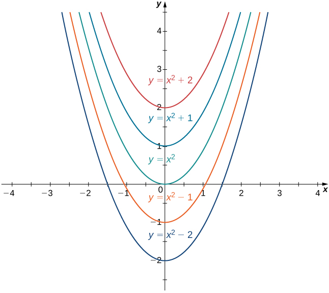

* Find the general antiderivative of a given function.
* Explain the terms and notation used for an indefinite integral.
* State the power rule for integrals.
* Use antidifferentiation to solve simple initial-value problems.

At this point, we have seen how to calculate derivatives of many functions and have been introduced to a variety of their applications. We now ask a question that turns this process around: Given a function <math xmlns="http://www.w3.org/1998/Math/MathML"><mrow><mi>f</mi><mo>,</mo></mrow></math>

 how do we find a function with the derivative <math xmlns="http://www.w3.org/1998/Math/MathML"><mi>f</mi></math>

 and why would we be interested in such a function?

We answer the first part of this question by defining antiderivatives. The antiderivative of a function <math xmlns="http://www.w3.org/1998/Math/MathML"><mi>f</mi></math>

 is a function with a derivative <math xmlns="http://www.w3.org/1998/Math/MathML"><mrow><mi>f</mi><mo>.</mo></mrow></math>

 Why are we interested in antiderivatives? The need for antiderivatives arises in many situations, and we look at various examples throughout the remainder of the text. Here we examine one specific example that involves rectilinear motion. In our examination in [Derivatives](/m53494){: .target-chapter} of rectilinear motion, we showed that given a position function <math xmlns="http://www.w3.org/1998/Math/MathML"><mrow><mi>s</mi><mrow><mo>(</mo><mi>t</mi><mo>)</mo></mrow></mrow></math>

 of an object, then its velocity function <math xmlns="http://www.w3.org/1998/Math/MathML"><mrow><mi>v</mi><mrow><mo>(</mo><mi>t</mi><mo>)</mo></mrow></mrow></math>

 is the derivative of <math xmlns="http://www.w3.org/1998/Math/MathML"><mrow><mi>s</mi><mrow><mo>(</mo><mi>t</mi><mo>)</mo></mrow></mrow></math>

—that is, <math xmlns="http://www.w3.org/1998/Math/MathML"><mrow><mi>v</mi><mrow><mo>(</mo><mi>t</mi><mo>)</mo></mrow><mo>=</mo><msup><mi>s</mi><mo>′</mo></msup><mrow><mo>(</mo><mi>t</mi><mo>)</mo></mrow><mo>.</mo></mrow></math>

 Furthermore, the acceleration <math xmlns="http://www.w3.org/1998/Math/MathML"><mrow><mi>a</mi><mrow><mo>(</mo><mi>t</mi><mo>)</mo></mrow></mrow></math>

 is the derivative of the velocity <math xmlns="http://www.w3.org/1998/Math/MathML"><mrow><mi>v</mi><mrow><mo>(</mo><mi>t</mi><mo>)</mo></mrow></mrow></math>

—that is, <math xmlns="http://www.w3.org/1998/Math/MathML"><mrow><mi>a</mi><mrow><mo>(</mo><mi>t</mi><mo>)</mo></mrow><mo>=</mo><msup><mi>v</mi><mo>′</mo></msup><mrow><mo>(</mo><mi>t</mi><mo>)</mo></mrow><mo>=</mo><mi>s</mi><mtext>″</mtext><mrow><mo>(</mo><mi>t</mi><mo>)</mo></mrow><mo>.</mo></mrow></math>

 Now suppose we are given an acceleration function <math xmlns="http://www.w3.org/1998/Math/MathML"><mi>a</mi><mo>,</mo></math>

 but not the velocity function <math xmlns="http://www.w3.org/1998/Math/MathML"><mi>v</mi></math>

 or the position function <math xmlns="http://www.w3.org/1998/Math/MathML"><mi>s</mi><mo>.</mo></math>

 Since <math xmlns="http://www.w3.org/1998/Math/MathML"><mrow><mi>a</mi><mrow><mo>(</mo><mi>t</mi><mo>)</mo></mrow><mo>=</mo><msup><mi>v</mi><mo>′</mo></msup><mrow><mo>(</mo><mi>t</mi><mo>)</mo></mrow><mo>,</mo></mrow></math>

 determining the velocity function requires us to find an antiderivative of the acceleration function. Then, since <math xmlns="http://www.w3.org/1998/Math/MathML"><mrow><mi>v</mi><mrow><mo>(</mo><mi>t</mi><mo>)</mo></mrow><mo>=</mo><msup><mi>s</mi><mo>′</mo></msup><mrow><mo>(</mo><mi>t</mi><mo>)</mo></mrow><mo>,</mo></mrow></math>

 determining the position function requires us to find an antiderivative of the velocity function. Rectilinear motion is just one case in which the need for antiderivatives arises. We will see many more examples throughout the remainder of the text. For now, let’s look at the terminology and notation for antiderivatives, and determine the antiderivatives for several types of functions. We examine various techniques for finding antiderivatives of more complicated functions later in the text ([Introduction to Techniques of Integration](/m53654){: .target-chapter}).

# The Reverse of Differentiation

At this point, we know how to find derivatives of various functions. We now ask the opposite question. Given a function <math xmlns="http://www.w3.org/1998/Math/MathML"><mrow><mi>f</mi><mo>,</mo></mrow></math>

 how can we find a function with derivative <math xmlns="http://www.w3.org/1998/Math/MathML"><mrow><mi>f</mi><mo>?</mo></mrow></math>

 If we can find a function <math xmlns="http://www.w3.org/1998/Math/MathML"><mi>F</mi></math>

 derivative <math xmlns="http://www.w3.org/1998/Math/MathML"><mrow><mi>f</mi><mo>,</mo></mrow></math>

 we call <math xmlns="http://www.w3.org/1998/Math/MathML"><mi>F</mi></math>

 an antiderivative of <math xmlns="http://www.w3.org/1998/Math/MathML"><mrow><mi>f</mi><mo>.</mo></mrow></math>

Definition

A function <math xmlns="http://www.w3.org/1998/Math/MathML"><mi>F</mi></math>

 is an **antiderivative**{: data-type="term"} of the function <math xmlns="http://www.w3.org/1998/Math/MathML"><mi>f</mi></math>

 if

<math xmlns="http://www.w3.org/1998/Math/MathML"><mrow><msup><mi>F</mi><mo>′</mo></msup><mrow><mo>(</mo><mi>x</mi><mo>)</mo></mrow><mo>=</mo><mi>f</mi><mrow><mo>(</mo><mi>x</mi><mo>)</mo></mrow></mrow></math>

for all <math xmlns="http://www.w3.org/1998/Math/MathML"><mi>x</mi></math>

 in the domain of <math xmlns="http://www.w3.org/1998/Math/MathML"><mrow><mi>f</mi><mo>.</mo></mrow></math>

Consider the function <math xmlns="http://www.w3.org/1998/Math/MathML"><mrow><mi>f</mi><mrow><mo>(</mo><mi>x</mi><mo>)</mo></mrow><mo>=</mo><mn>2</mn><mi>x</mi><mo>.</mo></mrow></math>

 Knowing the power rule of differentiation, we conclude that <math xmlns="http://www.w3.org/1998/Math/MathML"><mrow><mi>F</mi><mrow><mo>(</mo><mi>x</mi><mo>)</mo></mrow><mo>=</mo><msup><mi>x</mi><mn>2</mn></msup></mrow></math>

 is an antiderivative of <math xmlns="http://www.w3.org/1998/Math/MathML"><mi>f</mi></math>

 since <math xmlns="http://www.w3.org/1998/Math/MathML"><mrow><msup><mi>F</mi><mo>′</mo></msup><mrow><mo>(</mo><mi>x</mi><mo>)</mo></mrow><mo>=</mo><mn>2</mn><mi>x</mi><mo>.</mo></mrow></math>

 Are there any other antiderivatives of <math xmlns="http://www.w3.org/1998/Math/MathML"><mrow><mi>f</mi><mo>?</mo></mrow></math>

 Yes; since the derivative of any constant <math xmlns="http://www.w3.org/1998/Math/MathML"><mi>C</mi></math>

 is zero, <math xmlns="http://www.w3.org/1998/Math/MathML"><mrow><msup><mi>x</mi><mn>2</mn></msup><mo>+</mo><mi>C</mi></mrow></math>

 is also an antiderivative of <math xmlns="http://www.w3.org/1998/Math/MathML"><mrow><mn>2</mn><mi>x</mi><mo>.</mo></mrow></math>

 Therefore, <math xmlns="http://www.w3.org/1998/Math/MathML"><mrow><msup><mi>x</mi><mn>2</mn></msup><mo>+</mo><mn>5</mn></mrow></math>

 and <math xmlns="http://www.w3.org/1998/Math/MathML"><mrow><msup><mi>x</mi><mn>2</mn></msup><mo>−</mo><msqrt><mn>2</mn></msqrt></mrow></math>

 are also antiderivatives. Are there any others that are not of the form <math xmlns="http://www.w3.org/1998/Math/MathML"><mrow><msup><mi>x</mi><mn>2</mn></msup><mo>+</mo><mi>C</mi></mrow></math>

 for some constant <math xmlns="http://www.w3.org/1998/Math/MathML"><mrow><mi>C</mi><mo>?</mo></mrow></math>

 The answer is no. From Corollary <math xmlns="http://www.w3.org/1998/Math/MathML"><mn>2</mn></math>

 of the Mean Value Theorem, we know that if <math xmlns="http://www.w3.org/1998/Math/MathML"><mi>F</mi></math>

 and <math xmlns="http://www.w3.org/1998/Math/MathML"><mi>G</mi></math>

 are differentiable functions such that <math xmlns="http://www.w3.org/1998/Math/MathML"><mrow><msup><mi>F</mi><mo>′</mo></msup><mrow><mo>(</mo><mi>x</mi><mo>)</mo></mrow><mo>=</mo><msup><mi>G</mi><mo>′</mo></msup><mrow><mo>(</mo><mi>x</mi><mo>)</mo></mrow><mo>,</mo></mrow></math>

 then <math xmlns="http://www.w3.org/1998/Math/MathML"><mrow><mi>F</mi><mrow><mo>(</mo><mi>x</mi><mo>)</mo></mrow><mo>−</mo><mi>G</mi><mrow><mo>(</mo><mi>x</mi><mo>)</mo></mrow><mo>=</mo><mi>C</mi></mrow></math>

 for some constant <math xmlns="http://www.w3.org/1998/Math/MathML"><mrow><mi>C</mi><mo>.</mo></mrow></math>

 This fact leads to the following important theorem.

General Form of an Antiderivative

Let <math xmlns="http://www.w3.org/1998/Math/MathML"><mi>F</mi></math>

 be an antiderivative of <math xmlns="http://www.w3.org/1998/Math/MathML"><mi>f</mi></math>

 over an interval <math xmlns="http://www.w3.org/1998/Math/MathML"><mrow><mi>I</mi><mo>.</mo></mrow></math>

 Then,

1.  for each constant
    <math xmlns="http://www.w3.org/1998/Math/MathML"><mrow><mi>C</mi><mo>,</mo></mrow></math>
    
    the function
    <math xmlns="http://www.w3.org/1998/Math/MathML"><mrow><mi>F</mi><mrow><mo>(</mo><mi>x</mi><mo>)</mo></mrow><mo>+</mo><mi>C</mi></mrow></math>
    
    is also an antiderivative of
    <math xmlns="http://www.w3.org/1998/Math/MathML"><mi>f</mi></math>
    
    over
    <math xmlns="http://www.w3.org/1998/Math/MathML"><mrow><mi>I</mi><mo>;</mo></mrow></math>

2.  if
    <math xmlns="http://www.w3.org/1998/Math/MathML"><mi>G</mi></math>
    
    is an antiderivative of
    <math xmlns="http://www.w3.org/1998/Math/MathML"><mi>f</mi></math>
    
    over
    <math xmlns="http://www.w3.org/1998/Math/MathML"><mrow><mi>I</mi><mo>,</mo></mrow></math>
    
    there is a constant
    <math xmlns="http://www.w3.org/1998/Math/MathML"><mi>C</mi></math>
    
    for which
    <math xmlns="http://www.w3.org/1998/Math/MathML"><mrow><mi>G</mi><mrow><mo>(</mo><mi>x</mi><mo>)</mo></mrow><mo>=</mo><mi>F</mi><mrow><mo>(</mo><mi>x</mi><mo>)</mo></mrow><mo>+</mo><mi>C</mi></mrow></math>
    
    over
    <math xmlns="http://www.w3.org/1998/Math/MathML"><mrow><mi>I</mi><mo>.</mo></mrow></math>
{: data-number-style="lower-roman"}

In other words, the most general form of the antiderivative of <math xmlns="http://www.w3.org/1998/Math/MathML"><mi>f</mi></math>

 over <math xmlns="http://www.w3.org/1998/Math/MathML"><mi>I</mi></math>

 is <math xmlns="http://www.w3.org/1998/Math/MathML"><mrow><mi>F</mi><mrow><mo>(</mo><mi>x</mi><mo>)</mo></mrow><mo>+</mo><mi>C</mi><mo>.</mo></mrow></math>

We use this fact and our knowledge of derivatives to find all the antiderivatives for several functions.

Finding Antiderivatives

For each of the following functions, find all antiderivatives.

1.  <math xmlns="http://www.w3.org/1998/Math/MathML"><mrow><mi>f</mi><mrow><mo>(</mo><mi>x</mi><mo>)</mo></mrow><mo>=</mo><mn>3</mn><msup><mi>x</mi><mn>2</mn></msup></mrow></math>

2.  <math xmlns="http://www.w3.org/1998/Math/MathML"><mrow><mi>f</mi><mrow><mo>(</mo><mi>x</mi><mo>)</mo></mrow><mo>=</mo><mfrac><mn>1</mn><mi>x</mi></mfrac></mrow></math>

3.  <math xmlns="http://www.w3.org/1998/Math/MathML"><mrow><mi>f</mi><mo stretchy="false">(</mo><mi>x</mi><mo stretchy="false">)</mo><mo>=</mo><mtext>cos</mtext><mspace width="0.1em" /><mi>x</mi></mrow></math>

4.  <math xmlns="http://www.w3.org/1998/Math/MathML"><mrow><mi>f</mi><mo stretchy="false">(</mo><mi>x</mi><mo stretchy="false">)</mo><mo>=</mo><msup><mi>e</mi><mi>x</mi></msup></mrow></math>
{: data-number-style="lower-alpha"}

1.  Because
    * * *
    {: data-type="newline"}
    
    

    <math xmlns="http://www.w3.org/1998/Math/MathML"><mrow><mfrac><mi>d</mi><mrow><mi>d</mi><mi>x</mi></mrow></mfrac><mrow><mo>(</mo><mrow><msup><mi>x</mi><mn>3</mn></msup></mrow><mo>)</mo></mrow><mo>=</mo><mn>3</mn><msup><mi>x</mi><mn>2</mn></msup></mrow></math>
    

    
    * * *
    {: data-type="newline"}
    
    then
    <math xmlns="http://www.w3.org/1998/Math/MathML"><mrow><mi>F</mi><mrow><mo>(</mo><mi>x</mi><mo>)</mo></mrow><mo>=</mo><msup><mi>x</mi><mn>3</mn></msup></mrow></math>
    
    is an antiderivative of
    <math xmlns="http://www.w3.org/1998/Math/MathML"><mrow><mn>3</mn><msup><mi>x</mi><mn>2</mn></msup><mo>.</mo></mrow></math>
    
    Therefore, every antiderivative of
    <math xmlns="http://www.w3.org/1998/Math/MathML"><mrow><mn>3</mn><msup><mi>x</mi><mn>2</mn></msup></mrow></math>
    
    is of the form
    <math xmlns="http://www.w3.org/1998/Math/MathML"><mrow><msup><mi>x</mi><mn>3</mn></msup><mo>+</mo><mi>C</mi></mrow></math>
    
    for some constant
    <math xmlns="http://www.w3.org/1998/Math/MathML"><mrow><mi>C</mi><mo>,</mo></mrow></math>
    
    and every function of the form
    <math xmlns="http://www.w3.org/1998/Math/MathML"><mrow><msup><mi>x</mi><mn>3</mn></msup><mo>+</mo><mi>C</mi></mrow></math>
    
    is an antiderivative of
    <math xmlns="http://www.w3.org/1998/Math/MathML"><mrow><mn>3</mn><msup><mi>x</mi><mn>2</mn></msup><mo>.</mo></mrow></math>

2.  Let
    <math xmlns="http://www.w3.org/1998/Math/MathML"><mrow><mi>f</mi><mrow><mo>(</mo><mi>x</mi><mo>)</mo></mrow><mo>=</mo><mtext>ln</mtext><mrow><mo>\|</mo><mi>x</mi><mo>\|</mo></mrow><mo>.</mo></mrow></math>
    
    For
    <math xmlns="http://www.w3.org/1998/Math/MathML"><mrow><mi>x</mi><mo>&gt;</mo><mn>0</mn><mo>,</mo><mi>f</mi><mrow><mo>(</mo><mi>x</mi><mo>)</mo></mrow><mo>=</mo><mtext>ln</mtext><mrow><mo>(</mo><mi>x</mi><mo>)</mo></mrow></mrow></math>
    
    and
    * * *
    {: data-type="newline"}
    
    

    <math xmlns="http://www.w3.org/1998/Math/MathML"><mrow><mfrac><mi>d</mi><mrow><mi>d</mi><mi>x</mi></mrow></mfrac><mrow><mo>(</mo><mrow><mtext>ln</mtext><mspace width="0.1em" /><mi>x</mi></mrow><mo>)</mo></mrow><mo>=</mo><mfrac><mn>1</mn><mi>x</mi></mfrac><mo>.</mo></mrow></math>
    

    
    * * *
    {: data-type="newline"}
    
    For
    <math xmlns="http://www.w3.org/1998/Math/MathML"><mrow><mi>x</mi><mo>&lt;</mo><mn>0</mn><mo>,</mo><mi>f</mi><mrow><mo>(</mo><mi>x</mi><mo>)</mo></mrow><mo>=</mo><mtext>ln</mtext><mrow><mo>(</mo><mrow><mtext>−</mtext><mi>x</mi></mrow><mo>)</mo></mrow></mrow></math>
    
    and
    * * *
    {: data-type="newline"}
    
    

    <math xmlns="http://www.w3.org/1998/Math/MathML"><mrow><mfrac><mi>d</mi><mrow><mi>d</mi><mi>x</mi></mrow></mfrac><mrow><mo>(</mo><mrow><mtext>ln</mtext><mrow><mo>(</mo><mrow><mtext>−</mtext><mi>x</mi></mrow><mo>)</mo></mrow></mrow><mo>)</mo></mrow><mo>=</mo><mo>−</mo><mfrac><mn>1</mn><mrow><mtext>−</mtext><mi>x</mi></mrow></mfrac><mo>=</mo><mfrac><mn>1</mn><mi>x</mi></mfrac><mo>.</mo></mrow></math>
    

    
    * * *
    {: data-type="newline"}
    
    Therefore,
    * * *
    {: data-type="newline"}
    
    

    <math xmlns="http://www.w3.org/1998/Math/MathML"><mrow><mfrac><mi>d</mi><mrow><mi>d</mi><mi>x</mi></mrow></mfrac><mrow><mo>(</mo><mrow><mtext>ln</mtext><mrow><mo>\|</mo><mi>x</mi><mo>\|</mo></mrow></mrow><mo>)</mo></mrow><mo>=</mo><mfrac><mn>1</mn><mi>x</mi></mfrac><mo>.</mo></mrow></math>
    

    
    * * *
    {: data-type="newline"}
    
    Thus,
    <math xmlns="http://www.w3.org/1998/Math/MathML"><mrow><mi>F</mi><mrow><mo>(</mo><mi>x</mi><mo>)</mo></mrow><mo>=</mo><mtext>ln</mtext><mrow><mo>\|</mo><mi>x</mi><mo>\|</mo></mrow></mrow></math>
    
    is an antiderivative of
    <math xmlns="http://www.w3.org/1998/Math/MathML"><mrow><mfrac><mn>1</mn><mi>x</mi></mfrac><mo>.</mo></mrow></math>
    
    Therefore, every antiderivative of
    <math xmlns="http://www.w3.org/1998/Math/MathML"><mrow><mfrac><mn>1</mn><mi>x</mi></mfrac></mrow></math>
    
    is of the form
    <math xmlns="http://www.w3.org/1998/Math/MathML"><mrow><mtext>ln</mtext><mrow><mo>\|</mo><mi>x</mi><mo>\|</mo></mrow><mo>+</mo><mi>C</mi></mrow></math>
    
    for some constant
    <math xmlns="http://www.w3.org/1998/Math/MathML"><mi>C</mi></math>
    
    and every function of the form
    <math xmlns="http://www.w3.org/1998/Math/MathML"><mrow><mtext>ln</mtext><mrow><mo>\|</mo><mi>x</mi><mo>\|</mo></mrow><mo>+</mo><mi>C</mi></mrow></math>
    
    is an antiderivative of
    <math xmlns="http://www.w3.org/1998/Math/MathML"><mrow><mfrac><mn>1</mn><mi>x</mi></mfrac><mo>.</mo></mrow></math>

3.  We have
    * * *
    {: data-type="newline"}
    
    

    <math xmlns="http://www.w3.org/1998/Math/MathML"><mrow><mfrac><mi>d</mi><mrow><mi>d</mi><mi>x</mi></mrow></mfrac><mrow><mo>(</mo><mrow><mtext>sin</mtext><mspace width="0.1em" /><mi>x</mi></mrow><mo>)</mo></mrow><mo>=</mo><mtext>cos</mtext><mspace width="0.1em" /><mi>x</mi><mo>,</mo></mrow></math>
    

    
    * * *
    {: data-type="newline"}
    
    so
    <math xmlns="http://www.w3.org/1998/Math/MathML"><mrow><mi>F</mi><mrow><mo>(</mo><mi>x</mi><mo>)</mo></mrow><mo>=</mo><mtext>sin</mtext><mspace width="0.1em" /><mi>x</mi></mrow></math>
    
    is an antiderivative of
    <math xmlns="http://www.w3.org/1998/Math/MathML"><mrow><mtext>cos</mtext><mspace width="0.1em" /><mi>x</mi><mo>.</mo></mrow></math>
    
    Therefore, every antiderivative of
    <math xmlns="http://www.w3.org/1998/Math/MathML"><mrow><mtext>cos</mtext><mspace width="0.1em" /><mi>x</mi></mrow></math>
    
    is of the form
    <math xmlns="http://www.w3.org/1998/Math/MathML"><mrow><mtext>sin</mtext><mspace width="0.1em" /><mi>x</mi><mo>+</mo><mi>C</mi></mrow></math>
    
    for some constant
    <math xmlns="http://www.w3.org/1998/Math/MathML"><mi>C</mi></math>
    
    and every function of the form
    <math xmlns="http://www.w3.org/1998/Math/MathML"><mrow><mtext>sin</mtext><mspace width="0.1em" /><mi>x</mi><mo>+</mo><mi>C</mi></mrow></math>
    
    is an antiderivative of
    <math xmlns="http://www.w3.org/1998/Math/MathML"><mrow><mtext>cos</mtext><mspace width="0.1em" /><mi>x</mi><mo>.</mo></mrow></math>

4.  Since
    * * *
    {: data-type="newline"}
    
    

    <math xmlns="http://www.w3.org/1998/Math/MathML"><mrow><mfrac><mi>d</mi><mrow><mi>d</mi><mi>x</mi></mrow></mfrac><mrow><mo>(</mo><mrow><msup><mi>e</mi><mi>x</mi></msup></mrow><mo>)</mo></mrow><mo>=</mo><msup><mi>e</mi><mi>x</mi></msup><mo>,</mo></mrow></math>
    

    
    * * *
    {: data-type="newline"}
    
    then
    <math xmlns="http://www.w3.org/1998/Math/MathML"><mrow><mi>F</mi><mrow><mo>(</mo><mi>x</mi><mo>)</mo></mrow><mo>=</mo><msup><mi>e</mi><mi>x</mi></msup></mrow></math>
    
    is an antiderivative of
    <math xmlns="http://www.w3.org/1998/Math/MathML"><mrow><msup><mi>e</mi><mi>x</mi></msup><mo>.</mo></mrow></math>
    
    Therefore, every antiderivative of
    <math xmlns="http://www.w3.org/1998/Math/MathML"><mrow><msup><mi>e</mi><mi>x</mi></msup></mrow></math>
    
    is of the form
    <math xmlns="http://www.w3.org/1998/Math/MathML"><mrow><msup><mi>e</mi><mi>x</mi></msup><mo>+</mo><mi>C</mi></mrow></math>
    
    for some constant
    <math xmlns="http://www.w3.org/1998/Math/MathML"><mi>C</mi></math>
    
    and every function of the form
    <math xmlns="http://www.w3.org/1998/Math/MathML"><mrow><msup><mi>e</mi><mi>x</mi></msup><mo>+</mo><mi>C</mi></mrow></math>
    
    is an antiderivative of
    <math xmlns="http://www.w3.org/1998/Math/MathML"><mrow><msup><mi>e</mi><mi>x</mi></msup><mo>.</mo></mrow></math>
{: data-number-style="lower-alpha"}

Find all antiderivatives of <math xmlns="http://www.w3.org/1998/Math/MathML"><mrow><mi>f</mi><mrow><mo>(</mo><mi>x</mi><mo>)</mo></mrow><mo>=</mo><mtext>sin</mtext><mspace width="0.1em" /><mi>x</mi><mo>.</mo></mrow></math>

<math xmlns="http://www.w3.org/1998/Math/MathML"><mrow><mtext>−</mtext><mtext>cos</mtext><mspace width="0.1em" /><mi>x</mi><mo>+</mo><mi>C</mi></mrow></math>

Hint

What function has a derivative of <math xmlns="http://www.w3.org/1998/Math/MathML"><mrow><mtext>sin</mtext><mspace width="0.1em" /><mi>x</mi><mo>?</mo></mrow></math>

# Indefinite Integrals

We now look at the formal notation used to represent antiderivatives and examine some of their properties. These properties allow us to find antiderivatives of more complicated functions. Given a function <math xmlns="http://www.w3.org/1998/Math/MathML"><mrow><mi>f</mi><mo>,</mo></mrow></math>

 we use the notation <math xmlns="http://www.w3.org/1998/Math/MathML"><mrow><msup><mi>f</mi><mo>′</mo></msup><mrow><mo>(</mo><mi>x</mi><mo>)</mo></mrow></mrow></math>

 or <math xmlns="http://www.w3.org/1998/Math/MathML"><mrow><mfrac><mrow><mi>d</mi><mi>f</mi></mrow><mrow><mi>d</mi><mi>x</mi></mrow></mfrac></mrow></math>

 to denote the derivative of <math xmlns="http://www.w3.org/1998/Math/MathML"><mi>f</mi><mo>.</mo></math>

 Here we introduce notation for antiderivatives. If <math xmlns="http://www.w3.org/1998/Math/MathML"><mi>F</mi></math>

 is an antiderivative of <math xmlns="http://www.w3.org/1998/Math/MathML"><mrow><mi>f</mi><mo>,</mo></mrow></math>

 we say that <math xmlns="http://www.w3.org/1998/Math/MathML"><mrow><mi>F</mi><mrow><mo>(</mo><mi>x</mi><mo>)</mo></mrow><mo>+</mo><mi>C</mi></mrow></math>

 is the most general antiderivative of <math xmlns="http://www.w3.org/1998/Math/MathML"><mi>f</mi></math>

 and write

<math xmlns="http://www.w3.org/1998/Math/MathML"><mrow><mstyle displaystyle="true"><mrow><mo stretchy="false">∫</mo><mrow><mi>f</mi><mrow><mo>(</mo><mi>x</mi><mo>)</mo></mrow><mi>d</mi><mi>x</mi></mrow></mrow></mstyle><mo>=</mo><mi>F</mi><mrow><mo>(</mo><mi>x</mi><mo>)</mo></mrow><mo>+</mo><mi>C</mi><mo>.</mo></mrow></math>

The symbol <math xmlns="http://www.w3.org/1998/Math/MathML"><mrow><mstyle displaystyle="true"><mrow><mo stretchy="false">∫</mo></mrow></mstyle></mrow></math>

 is called an *integral sign*, and <math xmlns="http://www.w3.org/1998/Math/MathML"><mrow><mstyle displaystyle="true"><mrow><mo stretchy="false">∫</mo><mrow><mi>f</mi><mrow><mo>(</mo><mi>x</mi><mo>)</mo></mrow><mi>d</mi><mi>x</mi></mrow></mrow></mstyle></mrow></math>

 is called the indefinite integral of <math xmlns="http://www.w3.org/1998/Math/MathML"><mrow><mi>f</mi><mo>.</mo></mrow></math>

Definition

Given a function <math xmlns="http://www.w3.org/1998/Math/MathML"><mrow><mi>f</mi><mo>,</mo></mrow></math>

 the **indefinite integral**{: data-type="term"} of <math xmlns="http://www.w3.org/1998/Math/MathML"><mrow><mi>f</mi><mo>,</mo></mrow></math>

 denoted

<math xmlns="http://www.w3.org/1998/Math/MathML"><mrow><mstyle displaystyle="true"><mrow><mo stretchy="false">∫</mo><mrow><mi>f</mi><mrow><mo>(</mo><mi>x</mi><mo>)</mo></mrow><mi>d</mi><mi>x</mi></mrow></mrow></mstyle><mo>,</mo></mrow></math>

is the most general antiderivative of <math xmlns="http://www.w3.org/1998/Math/MathML"><mi>f</mi><mo>.</mo></math>

 If <math xmlns="http://www.w3.org/1998/Math/MathML"><mi>F</mi></math>

 is an antiderivative of <math xmlns="http://www.w3.org/1998/Math/MathML"><mrow><mi>f</mi><mo>,</mo></mrow></math>

 then

<math xmlns="http://www.w3.org/1998/Math/MathML"><mrow><mstyle displaystyle="true"><mrow><mo stretchy="false">∫</mo><mrow><mi>f</mi><mrow><mo>(</mo><mi>x</mi><mo>)</mo></mrow><mi>d</mi><mi>x</mi></mrow></mrow></mstyle><mo>=</mo><mi>F</mi><mrow><mo>(</mo><mi>x</mi><mo>)</mo></mrow><mo>+</mo><mi>C</mi><mo>.</mo></mrow></math>

The expression <math xmlns="http://www.w3.org/1998/Math/MathML"><mrow><mi>f</mi><mrow><mo>(</mo><mi>x</mi><mo>)</mo></mrow></mrow></math>

 is called the *integrand* and the variable <math xmlns="http://www.w3.org/1998/Math/MathML"><mi>x</mi></math>

 is the *variable of integration*.

Given the terminology introduced in this definition, the act of finding the antiderivatives of a function <math xmlns="http://www.w3.org/1998/Math/MathML"><mi>f</mi></math>

 is usually referred to as *integrating* <math xmlns="http://www.w3.org/1998/Math/MathML"><mrow><mi>f</mi><mo>.</mo></mrow></math>

For a function <math xmlns="http://www.w3.org/1998/Math/MathML"><mi>f</mi></math>

 and an antiderivative <math xmlns="http://www.w3.org/1998/Math/MathML"><mrow><mi>F</mi><mo>,</mo></mrow></math>

 the functions <math xmlns="http://www.w3.org/1998/Math/MathML"><mrow><mi>F</mi><mrow><mo>(</mo><mi>x</mi><mo>)</mo></mrow><mo>+</mo><mi>C</mi><mo>,</mo></mrow></math>

 where <math xmlns="http://www.w3.org/1998/Math/MathML"><mi>C</mi></math>

 is any real number, is often referred to as *the family of antiderivatives of* <math xmlns="http://www.w3.org/1998/Math/MathML"><mrow><mi>f</mi><mo>.</mo></mrow></math>

 For example, since <math xmlns="http://www.w3.org/1998/Math/MathML"><mrow><msup><mi>x</mi><mn>2</mn></msup></mrow></math>

 is an antiderivative of <math xmlns="http://www.w3.org/1998/Math/MathML"><mrow><mn>2</mn><mi>x</mi></mrow></math>

 and any antiderivative of <math xmlns="http://www.w3.org/1998/Math/MathML"><mrow><mn>2</mn><mi>x</mi></mrow></math>

 is of the form <math xmlns="http://www.w3.org/1998/Math/MathML"><mrow><msup><mi>x</mi><mn>2</mn></msup><mo>+</mo><mi>C</mi><mo>,</mo></mrow></math>

 we write

<math xmlns="http://www.w3.org/1998/Math/MathML"><mrow><mstyle displaystyle="true"><mrow><mo stretchy="false">∫</mo><mrow><mn>2</mn><mi>x</mi><mspace width="0.1em" /><mi>d</mi><mi>x</mi><mo>=</mo><msup><mi>x</mi><mn>2</mn></msup><mo>+</mo><mi>C</mi></mrow></mrow></mstyle><mo>.</mo></mrow></math>

The collection of all functions of the form <math xmlns="http://www.w3.org/1998/Math/MathML"><mrow><msup><mi>x</mi><mn>2</mn></msup><mo>+</mo><mi>C</mi><mo>,</mo></mrow></math>

 where <math xmlns="http://www.w3.org/1998/Math/MathML"><mi>C</mi></math>

 is any real number, is known as the *family of antiderivatives of* <math xmlns="http://www.w3.org/1998/Math/MathML"><mrow><mn>2</mn><mi>x</mi><mo>.</mo></mrow></math>

 [\[link\]](#CNX_Calc_Figure_04_10_001) shows a graph of this family of antiderivatives.

 {: #CNX_Calc_Figure_04_10_001}

For some functions, evaluating indefinite integrals follows directly from properties of derivatives. For example, for <math xmlns="http://www.w3.org/1998/Math/MathML"><mrow><mi>n</mi><mo>≠</mo><mtext>−</mtext><mn>1</mn><mo>,</mo></mrow></math>

<math xmlns="http://www.w3.org/1998/Math/MathML"><mrow><mstyle displaystyle="true"><mrow><mo stretchy="false">∫</mo><mrow><msup><mi>x</mi><mi>n</mi></msup><mi>d</mi><mi>x</mi><mo>=</mo><mfrac><mrow><msup><mi>x</mi><mrow><mi>n</mi><mo>+</mo><mn>1</mn></mrow></msup></mrow><mrow><mi>n</mi><mo>+</mo><mn>1</mn></mrow></mfrac><mo>+</mo><mi>C</mi></mrow></mrow></mstyle><mo>,</mo></mrow></math>

which comes directly from

<math xmlns="http://www.w3.org/1998/Math/MathML"><mrow><mfrac><mi>d</mi><mrow><mi>d</mi><mi>x</mi></mrow></mfrac><mrow><mo>(</mo><mrow><mfrac><mrow><msup><mi>x</mi><mrow><mi>n</mi><mo>+</mo><mn>1</mn></mrow></msup></mrow><mrow><mi>n</mi><mo>+</mo><mn>1</mn></mrow></mfrac></mrow><mo>)</mo></mrow><mo>=</mo><mrow><mo>(</mo><mrow><mi>n</mi><mo>+</mo><mn>1</mn></mrow><mo>)</mo></mrow><mfrac><mrow><msup><mi>x</mi><mi>n</mi></msup></mrow><mrow><mi>n</mi><mo>+</mo><mn>1</mn></mrow></mfrac><mo>=</mo><msup><mi>x</mi><mi>n</mi></msup><mo>.</mo></mrow></math>

This fact is known as *the power rule for integrals*.

Power Rule for Integrals

For <math xmlns="http://www.w3.org/1998/Math/MathML"><mrow><mi>n</mi><mo>≠</mo><mtext>−</mtext><mn>1</mn><mo>,</mo></mrow></math>

<math xmlns="http://www.w3.org/1998/Math/MathML"><mrow><mstyle displaystyle="true"><mrow><mo stretchy="false">∫</mo><mrow><msup><mi>x</mi><mi>n</mi></msup><mi>d</mi><mi>x</mi><mo>=</mo><mfrac><mrow><msup><mi>x</mi><mrow><mi>n</mi><mo>+</mo><mn>1</mn></mrow></msup></mrow><mrow><mi>n</mi><mo>+</mo><mn>1</mn></mrow></mfrac><mo>+</mo><mi>C</mi></mrow></mrow></mstyle><mo>.</mo></mrow></math>

Evaluating indefinite integrals for some other functions is also a straightforward calculation. The following table lists the indefinite integrals for several common functions. A more complete list appears in [Appendix B](/m54050){: .target-chapter}.

<table summary="This is a table with two columns and fourteen rows, titled &#x201C;Integration Formulas.&#x201D; The first row is a header row, and labels column one &#x201C;Differentiation Formula&#x201D; and column two &#x201C;Indefinite Integral.&#x201D; The second row reads d/dx (k) = 0, the integral of kdx = the integral of kx^0dx = kx + C. The third row reads d/dx(x^n) = nx^(x-1), the integral of x^ndn = (x^n+1)/(n+1) + C for n is not equal to negative 1. The fourth row reads d/dx(ln(the absolute value of x))=1/x, the integral of (1/x)dx = ln(the absolute value of x) + C. The fifth row reads d/dx(e^x) = e^x, the integral of e^xdx = e^x + C. The sixth row reads d/dx(sinx) = cosx, the integral of cosxdx = sinx + C. The seventh row reads d/dx(cosx) = negative sinx, the integral of sinxdx = negative cosx + C. The eighth row reads d/dx(tanx) = sec squared x, the integral of sec squared xdx = tanx + C. The ninth row reads d/dx(cscx) = negative cscxcotx, the integral of cscxcotxdx = negative cscx + C. The tenth row reads d/dx(secx) = secxtanx, the integral of secxtanxdx = secx + C. The eleventh row reads d/dx(cotx) = negative csc squared x, the integral of csc squared xdx = negative cot x + C. The twelfth row reads d/dx(sin^-1(x)) = 1/the square root of (1 &#x2013; x^2), the integral of 1/(the square root of (x^2 &#x2013; 1) = sin^-1(x) + C. The thirteenth row reads d/dx (tan^-1(x)) = 1/(1 + x^2), the integral of 1/(1 + x^2)dx = tan^-1(x) + C. The fourteenth row reads d/dx(sec^-1(the absolute value of x)) = 1/x(the square root of x^2 &#x2013; 1), the integral of 1/x(the square root of x^2 &#x2013; 1)dx = sec^-1(the absolute value of x) + C."><caption>Integration Formulas</caption><thead>
<tr valign="top">
<th data-valign="top" data-align="left">Differentiation Formula</th>
<th data-valign="top" data-align="left">Indefinite Integral</th>
</tr>
</thead><tbody>
<tr valign="top">
<td data-valign="top" data-align="left"><math xmlns="http://www.w3.org/1998/Math/MathML"><mrow><mfrac><mi>d</mi><mrow><mi>d</mi><mi>x</mi></mrow></mfrac><mrow><mo>(</mo><mi>k</mi><mo>)</mo></mrow><mo>=</mo><mn>0</mn></mrow></math></td>
<td data-valign="top" data-align="left"><math xmlns="http://www.w3.org/1998/Math/MathML"><mrow><mstyle displaystyle="true"><mrow><mo stretchy="false">∫</mo><mrow><mi>k</mi><mi>d</mi><mi>x</mi><mo>=</mo><mstyle displaystyle="true"><mrow><mo stretchy="false">∫</mo><mrow><mi>k</mi><msup><mi>x</mi><mn>0</mn></msup><mi>d</mi><mi>x</mi></mrow></mrow></mstyle></mrow></mrow></mstyle><mo>=</mo><mi>k</mi><mi>x</mi><mo>+</mo><mi>C</mi></mrow></math></td>
</tr>
<tr valign="top">
<td data-valign="top" data-align="left"><math xmlns="http://www.w3.org/1998/Math/MathML"><mrow><mfrac><mi>d</mi><mrow><mi>d</mi><mi>x</mi></mrow></mfrac><mrow><mo>(</mo><mrow><msup><mi>x</mi><mi>n</mi></msup></mrow><mo>)</mo></mrow><mo>=</mo><mi>n</mi><msup><mi>x</mi><mrow><mi>n</mi><mo>−</mo><mn>1</mn></mrow></msup></mrow></math></td>
<td data-valign="top" data-align="left"><math xmlns="http://www.w3.org/1998/Math/MathML"><mrow><mstyle displaystyle="true"><mrow><mo stretchy="false">∫</mo><mrow><msup><mi>x</mi><mi>n</mi></msup><mi>d</mi><mi>n</mi></mrow></mrow></mstyle><mo>=</mo><mfrac><mrow><msup><mi>x</mi><mrow><mi>n</mi><mo>+</mo><mn>1</mn></mrow></msup></mrow><mrow><mi>n</mi><mo>+</mo><mn>1</mn></mrow></mfrac><mo>+</mo><mi>C</mi></mrow></math> for <math xmlns="http://www.w3.org/1998/Math/MathML"><mrow><mi>n</mi><mo>≠</mo><mtext>−</mtext><mn>1</mn></mrow></math></td>
</tr>
<tr valign="top">
<td data-valign="top" data-align="left"><math xmlns="http://www.w3.org/1998/Math/MathML"><mrow><mfrac><mi>d</mi><mrow><mi>d</mi><mi>x</mi></mrow></mfrac><mrow><mo>(</mo><mrow><mtext>ln</mtext><mrow><mo>\|</mo><mi>x</mi><mo>\|</mo></mrow></mrow><mo>)</mo></mrow><mo>=</mo><mfrac><mn>1</mn><mi>x</mi></mfrac></mrow></math></td>
<td data-valign="top" data-align="left"><math xmlns="http://www.w3.org/1998/Math/MathML"><mrow><mstyle displaystyle="true"><mrow><mo stretchy="false">∫</mo><mrow><mfrac><mn>1</mn><mi>x</mi></mfrac><mi>d</mi><mi>x</mi><mo>=</mo><mtext>ln</mtext><mrow><mo>\|</mo><mi>x</mi><mo>\|</mo></mrow></mrow></mrow></mstyle><mo>+</mo><mi>C</mi></mrow></math></td>
</tr>
<tr valign="top">
<td data-valign="top" data-align="left"><math xmlns="http://www.w3.org/1998/Math/MathML"><mrow><mfrac><mi>d</mi><mrow><mi>d</mi><mi>x</mi></mrow></mfrac><mrow><mo>(</mo><mrow><msup><mi>e</mi><mi>x</mi></msup></mrow><mo>)</mo></mrow><mo>=</mo><msup><mi>e</mi><mi>x</mi></msup></mrow></math></td>
<td data-valign="top" data-align="left"><math xmlns="http://www.w3.org/1998/Math/MathML"><mrow><mstyle displaystyle="true"><mrow><mo stretchy="false">∫</mo><mrow><msup><mi>e</mi><mi>x</mi></msup><mi>d</mi><mi>x</mi></mrow></mrow></mstyle><mo>=</mo><msup><mi>e</mi><mi>x</mi></msup><mo>+</mo><mi>C</mi></mrow></math></td>
</tr>
<tr valign="top">
<td data-valign="top" data-align="left"><math xmlns="http://www.w3.org/1998/Math/MathML"><mrow><mfrac><mi>d</mi><mrow><mi>d</mi><mi>x</mi></mrow></mfrac><mrow><mo>(</mo><mrow><mtext>sin</mtext><mspace width="0.1em" /><mi>x</mi></mrow><mo>)</mo></mrow><mo>=</mo><mtext>cos</mtext><mspace width="0.1em" /><mi>x</mi></mrow></math></td>
<td data-valign="top" data-align="left"><math xmlns="http://www.w3.org/1998/Math/MathML"><mrow><mstyle displaystyle="true"><mrow><mo stretchy="false">∫</mo><mrow><mtext>cos</mtext><mspace width="0.1em" /><mi>x</mi><mspace width="0.1em" /><mi>d</mi><mi>x</mi><mo>=</mo><mtext>sin</mtext><mspace width="0.1em" /><mi>x</mi><mo>+</mo><mi>C</mi></mrow></mrow></mstyle></mrow></math></td>
</tr>
<tr valign="top">
<td data-valign="top" data-align="left"><math xmlns="http://www.w3.org/1998/Math/MathML"><mrow><mfrac><mi>d</mi><mrow><mi>d</mi><mi>x</mi></mrow></mfrac><mrow><mo>(</mo><mrow><mtext>cos</mtext><mspace width="0.1em" /><mi>x</mi></mrow><mo>)</mo></mrow><mo>=</mo><mtext>−</mtext><mtext>sin</mtext><mspace width="0.1em" /><mi>x</mi></mrow></math></td>
<td data-valign="top" data-align="left"><math xmlns="http://www.w3.org/1998/Math/MathML"><mrow><mstyle displaystyle="true"><mrow><mo stretchy="false">∫</mo><mrow><mtext>sin</mtext><mspace width="0.1em" /><mi>x</mi><mspace width="0.1em" /><mi>d</mi><mi>x</mi><mo>=</mo><mtext>−</mtext><mtext>cos</mtext><mspace width="0.1em" /><mi>x</mi><mo>+</mo><mi>C</mi></mrow></mrow></mstyle></mrow></math></td>
</tr>
<tr valign="top">
<td data-valign="top" data-align="left"><math xmlns="http://www.w3.org/1998/Math/MathML"><mrow><mfrac><mi>d</mi><mrow><mi>d</mi><mi>x</mi></mrow></mfrac><mrow><mo>(</mo><mrow><mtext>tan</mtext><mspace width="0.1em" /><mi>x</mi></mrow><mo>)</mo></mrow><mo>=</mo><msup><mrow><mtext>sec</mtext></mrow><mn>2</mn></msup><mi>x</mi></mrow></math></td>
<td data-valign="top" data-align="left"><math xmlns="http://www.w3.org/1998/Math/MathML"><mrow><mstyle displaystyle="true"><mrow><mo stretchy="false">∫</mo><mrow><msup><mrow><mtext>sec</mtext></mrow><mn>2</mn></msup><mi>x</mi><mspace width="0.1em" /><mi>d</mi><mi>x</mi><mo>=</mo><mtext>tan</mtext><mspace width="0.1em" /><mi>x</mi><mo>+</mo><mi>C</mi></mrow></mrow></mstyle></mrow></math></td>
</tr>
<tr valign="top">
<td data-valign="top" data-align="left"><math xmlns="http://www.w3.org/1998/Math/MathML"><mrow><mfrac><mi>d</mi><mrow><mi>d</mi><mi>x</mi></mrow></mfrac><mrow><mo>(</mo><mrow><mtext>csc</mtext><mspace width="0.1em" /><mi>x</mi></mrow><mo>)</mo></mrow><mo>=</mo><mtext>−</mtext><mtext>csc</mtext><mspace width="0.1em" /><mi>x</mi><mspace width="0.1em" /><mtext>cot</mtext><mspace width="0.1em" /><mi>x</mi></mrow></math></td>
<td data-valign="top" data-align="left"><math xmlns="http://www.w3.org/1998/Math/MathML"><mrow><mstyle displaystyle="true"><mrow><mo stretchy="false">∫</mo><mrow><mtext>csc</mtext><mspace width="0.1em" /><mi>x</mi><mspace width="0.1em" /><mtext>cot</mtext><mspace width="0.1em" /><mi>x</mi><mspace width="0.1em" /><mi>d</mi><mi>x</mi><mo>=</mo><mtext>−</mtext><mtext>csc</mtext><mspace width="0.1em" /><mi>x</mi><mo>+</mo><mi>C</mi></mrow></mrow></mstyle></mrow></math></td>
</tr>
<tr valign="top">
<td data-valign="top" data-align="left"><math xmlns="http://www.w3.org/1998/Math/MathML"><mrow><mfrac><mi>d</mi><mrow><mi>d</mi><mi>x</mi></mrow></mfrac><mrow><mo>(</mo><mrow><mtext>sec</mtext><mspace width="0.1em" /><mi>x</mi></mrow><mo>)</mo></mrow><mo>=</mo><mtext>sec</mtext><mspace width="0.1em" /><mi>x</mi><mspace width="0.1em" /><mtext>tan</mtext><mspace width="0.1em" /><mi>x</mi></mrow></math></td>
<td data-valign="top" data-align="left"><math xmlns="http://www.w3.org/1998/Math/MathML"><mrow><mstyle displaystyle="true"><mrow><mo stretchy="false">∫</mo><mrow><mtext>sec</mtext><mspace width="0.1em" /><mi>x</mi><mspace width="0.1em" /><mtext>tan</mtext><mspace width="0.1em" /><mi>x</mi><mspace width="0.1em" /><mi>d</mi><mi>x</mi><mo>=</mo><mtext>sec</mtext><mspace width="0.1em" /><mi>x</mi><mo>+</mo><mi>C</mi></mrow></mrow></mstyle></mrow></math></td>
</tr>
<tr valign="top">
<td data-valign="top" data-align="left"><math xmlns="http://www.w3.org/1998/Math/MathML"><mrow><mfrac><mi>d</mi><mrow><mi>d</mi><mi>x</mi></mrow></mfrac><mrow><mo>(</mo><mrow><mtext>cot</mtext><mspace width="0.1em" /><mi>x</mi></mrow><mo>)</mo></mrow><mo>=</mo><mtext>−</mtext><msup><mrow><mtext>csc</mtext></mrow><mn>2</mn></msup><mi>x</mi></mrow></math></td>
<td data-valign="top" data-align="left"><math xmlns="http://www.w3.org/1998/Math/MathML"><mrow><mstyle displaystyle="true"><mrow><mo stretchy="false">∫</mo><mrow><msup><mrow><mtext>csc</mtext></mrow><mn>2</mn></msup><mi>x</mi><mspace width="0.1em" /><mi>d</mi><mi>x</mi><mo>=</mo><mtext>−</mtext><mtext>cot</mtext><mspace width="0.1em" /><mi>x</mi><mo>+</mo><mi>C</mi></mrow></mrow></mstyle></mrow></math></td>
</tr>
<tr valign="top">
<td data-valign="top" data-align="left"><math xmlns="http://www.w3.org/1998/Math/MathML"><mrow><mfrac><mi>d</mi><mrow><mi>d</mi><mi>x</mi></mrow></mfrac><mrow><mo>(</mo><mrow><msup><mrow><mtext>sin</mtext></mrow><mrow><mn>−1</mn></mrow></msup><mi>x</mi></mrow><mo>)</mo></mrow><mo>=</mo><mfrac><mn>1</mn><mrow><msqrt><mrow><mn>1</mn><mo>−</mo><msup><mi>x</mi><mn>2</mn></msup></mrow></msqrt></mrow></mfrac></mrow></math></td>
<td data-valign="top" data-align="left"><math xmlns="http://www.w3.org/1998/Math/MathML"><mrow><mstyle displaystyle="true"><mrow><mo stretchy="false">∫</mo><mrow><mfrac><mn>1</mn><mrow><msqrt><mrow><mn>1</mn><mo>−</mo><msup><mi>x</mi><mn>2</mn></msup></mrow></msqrt></mrow></mfrac><mo>=</mo><msup><mrow><mtext>sin</mtext></mrow><mrow><mn>−1</mn></mrow></msup><mi>x</mi><mo>+</mo><mi>C</mi></mrow></mrow></mstyle></mrow></math></td>
</tr>
<tr valign="top">
<td data-valign="top" data-align="left"><math xmlns="http://www.w3.org/1998/Math/MathML"><mrow><mfrac><mi>d</mi><mrow><mi>d</mi><mi>x</mi></mrow></mfrac><mrow><mo>(</mo><mrow><msup><mrow><mtext>tan</mtext></mrow><mrow><mn>−1</mn></mrow></msup><mi>x</mi></mrow><mo>)</mo></mrow><mo>=</mo><mfrac><mn>1</mn><mrow><mn>1</mn><mo>+</mo><msup><mi>x</mi><mn>2</mn></msup></mrow></mfrac></mrow></math></td>
<td data-valign="top" data-align="left"><math xmlns="http://www.w3.org/1998/Math/MathML"><mrow><mstyle displaystyle="true"><mrow><mo stretchy="false">∫</mo><mrow><mfrac><mn>1</mn><mrow><mn>1</mn><mo>+</mo><msup><mi>x</mi><mn>2</mn></msup></mrow></mfrac><mi>d</mi><mi>x</mi><mo>=</mo><msup><mrow><mtext>tan</mtext></mrow><mrow><mn>−1</mn></mrow></msup><mi>x</mi><mo>+</mo><mi>C</mi></mrow></mrow></mstyle></mrow></math></td>
</tr>
<tr valign="top">
<td data-valign="top" data-align="left"><math xmlns="http://www.w3.org/1998/Math/MathML"><mrow><mfrac><mi>d</mi><mrow><mi>d</mi><mi>x</mi></mrow></mfrac><mrow><mo>(</mo><mrow><msup><mrow><mtext>sec</mtext></mrow><mrow><mn>−1</mn></mrow></msup><mrow><mo>\|</mo><mi>x</mi><mo>\|</mo></mrow></mrow><mo>)</mo></mrow><mo>=</mo><mfrac><mn>1</mn><mrow><mi>x</mi><msqrt><mrow><msup><mi>x</mi><mn>2</mn></msup><mo>−</mo><mn>1</mn></mrow></msqrt></mrow></mfrac></mrow></math></td>
<td data-valign="top" data-align="left"><math xmlns="http://www.w3.org/1998/Math/MathML"><mrow><mstyle displaystyle="true"><mrow><mo stretchy="false">∫</mo><mrow><mfrac><mn>1</mn><mrow><mi>x</mi><msqrt><mrow><msup><mi>x</mi><mn>2</mn></msup><mo>−</mo><mn>1</mn></mrow></msqrt></mrow></mfrac><mi>d</mi><mi>x</mi><mo>=</mo><msup><mrow><mtext>sec</mtext></mrow><mrow><mn>−1</mn></mrow></msup><mrow><mo>\|</mo><mi>x</mi><mo>\|</mo></mrow><mo>+</mo><mi>C</mi></mrow></mrow></mstyle></mrow></math></td>
</tr>
</tbody></table>

From the definition of indefinite integral of <math xmlns="http://www.w3.org/1998/Math/MathML"><mrow><mi>f</mi><mo>,</mo></mrow></math>

 we know

<math xmlns="http://www.w3.org/1998/Math/MathML"><mrow><mstyle displaystyle="true"><mrow><mo stretchy="false">∫</mo><mrow><mi>f</mi><mrow><mo>(</mo><mi>x</mi><mo>)</mo></mrow><mi>d</mi><mi>x</mi><mo>=</mo><mi>F</mi><mrow><mo>(</mo><mi>x</mi><mo>)</mo></mrow><mo>+</mo><mi>C</mi></mrow></mrow></mstyle></mrow></math>

if and only if <math xmlns="http://www.w3.org/1998/Math/MathML"><mi>F</mi></math>

 is an antiderivative of <math xmlns="http://www.w3.org/1998/Math/MathML"><mrow><mi>f</mi><mo>.</mo></mrow></math>

 Therefore, when claiming that

<math xmlns="http://www.w3.org/1998/Math/MathML"><mrow><mstyle displaystyle="true"><mrow><mo stretchy="false">∫</mo><mrow><mi>f</mi><mrow><mo>(</mo><mi>x</mi><mo>)</mo></mrow><mi>d</mi><mi>x</mi><mo>=</mo><mi>F</mi><mrow><mo>(</mo><mi>x</mi><mo>)</mo></mrow><mo>+</mo><mi>C</mi></mrow></mrow></mstyle></mrow></math>

it is important to check whether this statement is correct by verifying that <math xmlns="http://www.w3.org/1998/Math/MathML"><mrow><msup><mi>F</mi><mo>′</mo></msup><mrow><mo>(</mo><mi>x</mi><mo>)</mo></mrow><mo>=</mo><mi>f</mi><mrow><mo>(</mo><mi>x</mi><mo>)</mo></mrow><mo>.</mo></mrow></math>

Verifying an Indefinite Integral

Each of the following statements is of the form <math xmlns="http://www.w3.org/1998/Math/MathML"><mrow><mstyle displaystyle="true"><mrow><mo stretchy="false">∫</mo><mrow><mi>f</mi><mrow><mo>(</mo><mi>x</mi><mo>)</mo></mrow><mi>d</mi><mi>x</mi><mo>=</mo><mi>F</mi><mrow><mo>(</mo><mi>x</mi><mo>)</mo></mrow><mo>+</mo><mi>C</mi></mrow></mrow></mstyle><mo>.</mo></mrow></math>

 Verify that each statement is correct by showing that <math xmlns="http://www.w3.org/1998/Math/MathML"><mrow><msup><mi>F</mi><mo>′</mo></msup><mrow><mo>(</mo><mi>x</mi><mo>)</mo></mrow><mo>=</mo><mi>f</mi><mrow><mo>(</mo><mi>x</mi><mo>)</mo></mrow><mo>.</mo></mrow></math>

1.  <math xmlns="http://www.w3.org/1998/Math/MathML"><mrow><mstyle displaystyle="true"><mrow><mo stretchy="false">∫</mo><mrow><mrow><mo>(</mo><mrow><mi>x</mi><mo>+</mo><msup><mi>e</mi><mi>x</mi></msup></mrow><mo>)</mo></mrow></mrow></mrow></mstyle><mi>d</mi><mi>x</mi><mo>=</mo><mfrac><mrow><msup><mi>x</mi><mn>2</mn></msup></mrow><mn>2</mn></mfrac><mo>+</mo><msup><mi>e</mi><mi>x</mi></msup><mo>+</mo><mi>C</mi></mrow></math>

2.  <math xmlns="http://www.w3.org/1998/Math/MathML"><mrow><mstyle displaystyle="true"><mrow><mo stretchy="false">∫</mo><mrow><mi>x</mi><msup><mi>e</mi><mi>x</mi></msup><mi>d</mi><mi>x</mi></mrow></mrow></mstyle><mo>=</mo><mi>x</mi><msup><mi>e</mi><mi>x</mi></msup><mo>−</mo><msup><mi>e</mi><mi>x</mi></msup><mo>+</mo><mi>C</mi></mrow></math>
{: data-number-style="lower-alpha"}

1.  Since
    * * *
    {: data-type="newline"}
    
    

    <math xmlns="http://www.w3.org/1998/Math/MathML"><mrow><mfrac><mi>d</mi><mrow><mi>d</mi><mi>x</mi></mrow></mfrac><mrow><mo>(</mo><mrow><mfrac><mrow><msup><mi>x</mi><mn>2</mn></msup></mrow><mn>2</mn></mfrac><mo>+</mo><msup><mi>e</mi><mi>x</mi></msup><mo>+</mo><mi>C</mi></mrow><mo>)</mo></mrow><mo>=</mo><mi>x</mi><mo>+</mo><msup><mi>e</mi><mi>x</mi></msup><mo>,</mo></mrow></math>
    

    
    * * *
    {: data-type="newline"}
    
    the statement
    * * *
    {: data-type="newline"}
    
    

    <math xmlns="http://www.w3.org/1998/Math/MathML"><mrow><mstyle displaystyle="true"><mrow><mo stretchy="false">∫</mo><mrow><mrow><mo>(</mo><mrow><mi>x</mi><mo>+</mo><msup><mi>e</mi><mi>x</mi></msup></mrow><mo>)</mo></mrow></mrow></mrow></mstyle><mi>d</mi><mi>x</mi><mo>=</mo><mfrac><mrow><msup><mi>x</mi><mn>2</mn></msup></mrow><mn>2</mn></mfrac><mo>+</mo><msup><mi>e</mi><mi>x</mi></msup><mo>+</mo><mi>C</mi></mrow></math>
    

    
    * * *
    {: data-type="newline"}
    
    is correct.
    * * *
    {: data-type="newline"}
    
    Note that we are verifying an indefinite integral for a sum. Furthermore,
    <math xmlns="http://www.w3.org/1998/Math/MathML"><mrow><mfrac><mrow><msup><mi>x</mi><mn>2</mn></msup></mrow><mn>2</mn></mfrac></mrow></math>
    
    and
    <math xmlns="http://www.w3.org/1998/Math/MathML"><mrow><msup><mi>e</mi><mi>x</mi></msup></mrow></math>
    
    are antiderivatives of
    <math xmlns="http://www.w3.org/1998/Math/MathML"><mi>x</mi></math>
    
    and
    <math xmlns="http://www.w3.org/1998/Math/MathML"><mrow><msup><mi>e</mi><mi>x</mi></msup><mo>,</mo></mrow></math>
    
    respectively, and the sum of the antiderivatives is an antiderivative of the sum. We discuss this fact again later in this section.
2.  Using the product rule, we see that
    * * *
    {: data-type="newline"}
    
    

    <math xmlns="http://www.w3.org/1998/Math/MathML"><mrow><mfrac><mi>d</mi><mrow><mi>d</mi><mi>x</mi></mrow></mfrac><mrow><mo>(</mo><mrow><mi>x</mi><msup><mi>e</mi><mi>x</mi></msup><mo>−</mo><msup><mi>e</mi><mi>x</mi></msup><mo>+</mo><mi>C</mi></mrow><mo>)</mo></mrow><mo>=</mo><msup><mi>e</mi><mi>x</mi></msup><mo>+</mo><mi>x</mi><msup><mi>e</mi><mi>x</mi></msup><mo>−</mo><msup><mi>e</mi><mi>x</mi></msup><mo>=</mo><mi>x</mi><msup><mi>e</mi><mi>x</mi></msup><mo>.</mo></mrow></math>
    

    
    * * *
    {: data-type="newline"}
    
    Therefore, the statement
    * * *
    {: data-type="newline"}
    
    

    <math xmlns="http://www.w3.org/1998/Math/MathML"><mrow><mstyle displaystyle="true"><mrow><mo stretchy="false">∫</mo><mrow><mi>x</mi><msup><mi>e</mi><mi>x</mi></msup><mi>d</mi><mi>x</mi></mrow></mrow></mstyle><mo>=</mo><mi>x</mi><msup><mi>e</mi><mi>x</mi></msup><mo>−</mo><msup><mi>e</mi><mi>x</mi></msup><mo>+</mo><mi>C</mi></mrow></math>
    

    
    * * *
    {: data-type="newline"}
    
    is correct.
    * * *
    {: data-type="newline"}
    
    Note that we are verifying an indefinite integral for a product. The antiderivative
    <math xmlns="http://www.w3.org/1998/Math/MathML"><mrow><mi>x</mi><msup><mi>e</mi><mi>x</mi></msup><mo>−</mo><msup><mi>e</mi><mi>x</mi></msup></mrow></math>
    
    is not a product of the antiderivatives. Furthermore, the product of antiderivatives,
    <math xmlns="http://www.w3.org/1998/Math/MathML"><mrow><msup><mi>x</mi><mn>2</mn></msup><msup><mi>e</mi><mi>x</mi></msup><mtext>/</mtext><mn>2</mn></mrow></math>
    
    is not an antiderivative of
    <math xmlns="http://www.w3.org/1998/Math/MathML"><mrow><mi>x</mi><msup><mi>e</mi><mi>x</mi></msup></mrow></math>
    
    since
    * * *
    {: data-type="newline"}
    
    

    <math xmlns="http://www.w3.org/1998/Math/MathML"><mrow><mfrac><mi>d</mi><mrow><mi>d</mi><mi>x</mi></mrow></mfrac><mrow><mo>(</mo><mrow><mfrac><mrow><msup><mi>x</mi><mn>2</mn></msup><msup><mi>e</mi><mi>x</mi></msup></mrow><mn>2</mn></mfrac></mrow><mo>)</mo></mrow><mo>=</mo><mi>x</mi><msup><mi>e</mi><mi>x</mi></msup><mo>+</mo><mfrac><mrow><msup><mi>x</mi><mn>2</mn></msup><msup><mi>e</mi><mi>x</mi></msup></mrow><mn>2</mn></mfrac><mo>≠</mo><mi>x</mi><msup><mi>e</mi><mi>x</mi></msup><mo>.</mo></mrow></math>
    

    
    * * *
    {: data-type="newline"}
    
    In general, the product of antiderivatives is not an antiderivative of a product.
{: data-number-style="lower-alpha"}

Verify that <math xmlns="http://www.w3.org/1998/Math/MathML"><mrow><mstyle displaystyle="true"><mrow><mo stretchy="false">∫</mo><mrow><mi>x</mi><mspace width="0.1em" /><mtext>cos</mtext><mspace width="0.1em" /><mi>x</mi><mspace width="0.1em" /><mi>d</mi><mi>x</mi><mo>=</mo><mi>x</mi><mspace width="0.1em" /><mtext>sin</mtext><mspace width="0.1em" /><mi>x</mi><mo>+</mo><mtext>cos</mtext><mspace width="0.1em" /><mi>x</mi><mo>+</mo><mi>C</mi><mo>.</mo></mrow></mrow></mstyle></mrow></math>

<math xmlns="http://www.w3.org/1998/Math/MathML"><mrow><mfrac><mi>d</mi><mrow><mi>d</mi><mi>x</mi></mrow></mfrac><mrow><mo>(</mo><mrow><mi>x</mi><mspace width="0.1em" /><mtext>sin</mtext><mspace width="0.1em" /><mi>x</mi><mo>+</mo><mtext>cos</mtext><mspace width="0.1em" /><mi>x</mi><mo>+</mo><mi>C</mi></mrow><mo>)</mo></mrow><mo>=</mo><mtext>sin</mtext><mspace width="0.1em" /><mi>x</mi><mo>+</mo><mi>x</mi><mspace width="0.1em" /><mtext>cos</mtext><mspace width="0.1em" /><mi>x</mi><mo>−</mo><mtext>sin</mtext><mspace width="0.1em" /><mi>x</mi><mo>=</mo><mi>x</mi><mspace width="0.1em" /><mtext>cos</mtext><mspace width="0.1em" /><mi>x</mi></mrow></math>

Hint

Calculate <math xmlns="http://www.w3.org/1998/Math/MathML"><mrow><mfrac><mi>d</mi><mrow><mi>d</mi><mi>x</mi></mrow></mfrac><mrow><mo>(</mo><mrow><mi>x</mi><mspace width="0.1em" /><mtext>sin</mtext><mspace width="0.1em" /><mi>x</mi><mo>+</mo><mtext>cos</mtext><mspace width="0.1em" /><mi>x</mi><mo>+</mo><mi>C</mi></mrow><mo>)</mo></mrow><mo>.</mo></mrow></math>

In [\[link\]](#fs-id1165043092431), we listed the indefinite integrals for many elementary functions. Let’s now turn our attention to evaluating indefinite integrals for more complicated functions. For example, consider finding an antiderivative of a sum <math xmlns="http://www.w3.org/1998/Math/MathML"><mrow><mi>f</mi><mo>+</mo><mi>g</mi><mo>.</mo></mrow></math>

 In [\[link\]](#fs-id1165043393824)a. we showed that an antiderivative of the sum <math xmlns="http://www.w3.org/1998/Math/MathML"><mrow><mi>x</mi><mo>+</mo><msup><mi>e</mi><mi>x</mi></msup></mrow></math>

 is given by the sum <math xmlns="http://www.w3.org/1998/Math/MathML"><mrow><mrow><mo>(</mo><mrow><mfrac><mrow><msup><mi>x</mi><mn>2</mn></msup></mrow><mn>2</mn></mfrac></mrow><mo>)</mo></mrow><mo>+</mo><msup><mi>e</mi><mi>x</mi></msup></mrow></math>

—that is, an antiderivative of a sum is given by a sum of antiderivatives. This result was not specific to this example. In general, if <math xmlns="http://www.w3.org/1998/Math/MathML"><mi>F</mi></math>

 and <math xmlns="http://www.w3.org/1998/Math/MathML"><mi>G</mi></math>

 are antiderivatives of any functions <math xmlns="http://www.w3.org/1998/Math/MathML"><mi>f</mi></math>

 and <math xmlns="http://www.w3.org/1998/Math/MathML"><mrow><mi>g</mi><mo>,</mo></mrow></math>

 respectively, then

<math xmlns="http://www.w3.org/1998/Math/MathML"><mrow><mfrac><mi>d</mi><mrow><mi>d</mi><mi>x</mi></mrow></mfrac><mrow><mo>(</mo><mrow><mi>F</mi><mrow><mo>(</mo><mi>x</mi><mo>)</mo></mrow><mo>+</mo><mi>G</mi><mrow><mo>(</mo><mi>x</mi><mo>)</mo></mrow></mrow><mo>)</mo></mrow><mo>=</mo><msup><mi>F</mi><mo>′</mo></msup><mrow><mo>(</mo><mi>x</mi><mo>)</mo></mrow><mo>+</mo><msup><mi>G</mi><mo>′</mo></msup><mrow><mo>(</mo><mi>x</mi><mo>)</mo></mrow><mo>=</mo><mi>f</mi><mrow><mo>(</mo><mi>x</mi><mo>)</mo></mrow><mo>+</mo><mi>g</mi><mrow><mo>(</mo><mi>x</mi><mo>)</mo></mrow><mo>.</mo></mrow></math>

Therefore, <math xmlns="http://www.w3.org/1998/Math/MathML"><mrow><mi>F</mi><mrow><mo>(</mo><mi>x</mi><mo>)</mo></mrow><mo>+</mo><mi>G</mi><mrow><mo>(</mo><mi>x</mi><mo>)</mo></mrow></mrow></math>

 is an antiderivative of <math xmlns="http://www.w3.org/1998/Math/MathML"><mrow><mi>f</mi><mrow><mo>(</mo><mi>x</mi><mo>)</mo></mrow><mo>+</mo><mi>g</mi><mrow><mo>(</mo><mi>x</mi><mo>)</mo></mrow></mrow></math>

 and we have

<math xmlns="http://www.w3.org/1998/Math/MathML"><mrow><mstyle displaystyle="true"><mrow><mo stretchy="false">∫</mo><mrow><mrow><mo>(</mo><mrow><mi>f</mi><mrow><mo>(</mo><mi>x</mi><mo>)</mo></mrow><mo>+</mo><mi>g</mi><mrow><mo>(</mo><mi>x</mi><mo>)</mo></mrow></mrow><mo>)</mo></mrow></mrow></mrow></mstyle><mi>d</mi><mi>x</mi><mo>=</mo><mi>F</mi><mrow><mo>(</mo><mi>x</mi><mo>)</mo></mrow><mo>+</mo><mi>G</mi><mrow><mo>(</mo><mi>x</mi><mo>)</mo></mrow><mo>+</mo><mi>C</mi><mo>.</mo></mrow></math>

Similarly,

<math xmlns="http://www.w3.org/1998/Math/MathML"><mrow><mstyle displaystyle="true"><mrow><mo stretchy="false">∫</mo><mrow><mrow><mo>(</mo><mrow><mi>f</mi><mrow><mo>(</mo><mi>x</mi><mo>)</mo></mrow><mo>−</mo><mi>g</mi><mrow><mo>(</mo><mi>x</mi><mo>)</mo></mrow></mrow><mo>)</mo></mrow></mrow></mrow></mstyle><mi>d</mi><mi>x</mi><mo>=</mo><mi>F</mi><mrow><mo>(</mo><mi>x</mi><mo>)</mo></mrow><mo>−</mo><mi>G</mi><mrow><mo>(</mo><mi>x</mi><mo>)</mo></mrow><mo>+</mo><mi>C</mi><mo>.</mo></mrow></math>

In addition, consider the task of finding an antiderivative of <math xmlns="http://www.w3.org/1998/Math/MathML"><mrow><mi>k</mi><mi>f</mi><mrow><mo>(</mo><mi>x</mi><mo>)</mo></mrow><mo>,</mo></mrow></math>

 where <math xmlns="http://www.w3.org/1998/Math/MathML"><mi>k</mi></math>

 is any real number. Since

<math xmlns="http://www.w3.org/1998/Math/MathML"><mrow><mfrac><mi>d</mi><mrow><mi>d</mi><mi>x</mi></mrow></mfrac><mrow><mo>(</mo><mrow><mi>k</mi><mi>f</mi><mrow><mo>(</mo><mi>x</mi><mo>)</mo></mrow></mrow><mo>)</mo></mrow><mo>=</mo><mi>k</mi><mfrac><mi>d</mi><mrow><mi>d</mi><mi>x</mi></mrow></mfrac><mi>F</mi><mrow><mo>(</mo><mi>x</mi><mo>)</mo></mrow><mo>=</mo><mi>k</mi><msup><mi>F</mi><mo>′</mo></msup><mrow><mo>(</mo><mi>x</mi><mo>)</mo></mrow></mrow></math>

for any real number <math xmlns="http://www.w3.org/1998/Math/MathML"><mrow><mi>k</mi><mo>,</mo></mrow></math>

 we conclude that

<math xmlns="http://www.w3.org/1998/Math/MathML"><mrow><mstyle displaystyle="true"><mrow><mo stretchy="false">∫</mo><mrow><mi>k</mi><mi>f</mi><mrow><mo>(</mo><mi>x</mi><mo>)</mo></mrow><mi>d</mi><mi>x</mi></mrow></mrow></mstyle><mo>=</mo><mi>k</mi><mi>F</mi><mrow><mo>(</mo><mi>x</mi><mo>)</mo></mrow><mo>+</mo><mi>C</mi><mo>.</mo></mrow></math>

These properties are summarized next.

Properties of Indefinite Integrals

Let <math xmlns="http://www.w3.org/1998/Math/MathML"><mi>F</mi></math>

 and <math xmlns="http://www.w3.org/1998/Math/MathML"><mi>G</mi></math>

 be antiderivatives of <math xmlns="http://www.w3.org/1998/Math/MathML"><mi>f</mi></math>

 and <math xmlns="http://www.w3.org/1998/Math/MathML"><mrow><mi>g</mi><mo>,</mo></mrow></math>

 respectively, and let <math xmlns="http://www.w3.org/1998/Math/MathML"><mi>k</mi></math>

 be any real number.

Sums and Differences

<math xmlns="http://www.w3.org/1998/Math/MathML"><mrow><mstyle displaystyle="true"><mrow><mo stretchy="false">∫</mo><mrow><mrow><mo>(</mo><mrow><mi>f</mi><mrow><mo>(</mo><mi>x</mi><mo>)</mo></mrow><mtext>±</mtext><mi>g</mi><mrow><mo>(</mo><mi>x</mi><mo>)</mo></mrow></mrow><mo>)</mo></mrow><mi>d</mi><mi>x</mi><mo>=</mo><mi>F</mi><mrow><mo>(</mo><mi>x</mi><mo>)</mo></mrow><mtext>±</mtext><mi>G</mi><mrow><mo>(</mo><mi>x</mi><mo>)</mo></mrow><mo>+</mo><mi>C</mi></mrow></mrow></mstyle></mrow></math>

Constant Multiples

<math xmlns="http://www.w3.org/1998/Math/MathML"><mrow><mstyle displaystyle="true"><mrow><mo stretchy="false">∫</mo><mrow><mi>k</mi><mi>f</mi><mrow><mo>(</mo><mi>x</mi><mo>)</mo></mrow><mi>d</mi><mi>x</mi><mo>=</mo><mi>k</mi><mi>F</mi><mrow><mo>(</mo><mi>x</mi><mo>)</mo></mrow><mo>+</mo><mi>C</mi></mrow></mrow></mstyle></mrow></math>

From this theorem, we can evaluate any integral involving a sum, difference, or constant multiple of functions with antiderivatives that are known. Evaluating integrals involving products, quotients, or compositions is more complicated (see [\[link\]](#fs-id1165043393824)b. for an example involving an antiderivative of a product.) We look at and address integrals involving these more complicated functions in [Introduction to Integration](/m53623){: .target-chapter}. In the next example, we examine how to use this theorem to calculate the indefinite integrals of several functions.

Evaluating Indefinite Integrals

Evaluate each of the following indefinite integrals:

1.  <math xmlns="http://www.w3.org/1998/Math/MathML"><mrow><mstyle displaystyle="true"><mrow><mo stretchy="false">∫</mo><mrow><mrow><mo>(</mo><mrow><mn>5</mn><msup><mi>x</mi><mn>3</mn></msup><mo>−</mo><mn>7</mn><msup><mi>x</mi><mn>2</mn></msup><mo>+</mo><mn>3</mn><mi>x</mi><mo>+</mo><mn>4</mn></mrow><mo>)</mo></mrow><mi>d</mi><mi>x</mi></mrow></mrow></mstyle></mrow></math>

2.  <math xmlns="http://www.w3.org/1998/Math/MathML"><mrow><mstyle displaystyle="true"><mrow><mo stretchy="false">∫</mo><mrow><mfrac><mrow><msup><mi>x</mi><mn>2</mn></msup><mo>+</mo><mn>4</mn><mroot><mi>x</mi><mn>3</mn></mroot></mrow><mi>x</mi></mfrac></mrow></mrow></mstyle><mi>d</mi><mi>x</mi></mrow></math>

3.  <math xmlns="http://www.w3.org/1998/Math/MathML"><mrow><mstyle displaystyle="true"><mrow><mo stretchy="false">∫</mo><mrow><mfrac><mn>4</mn><mrow><mn>1</mn><mo>+</mo><msup><mi>x</mi><mn>2</mn></msup></mrow></mfrac></mrow></mrow></mstyle><mi>d</mi><mi>x</mi></mrow></math>

4.  <math xmlns="http://www.w3.org/1998/Math/MathML"><mrow><mstyle displaystyle="true"><mrow><mo stretchy="false">∫</mo><mrow><mtext>tan</mtext><mspace width="0.1em" /><mi>x</mi><mspace width="0.1em" /><mtext>cos</mtext><mspace width="0.1em" /><mi>x</mi><mspace width="0.1em" /><mi>d</mi><mi>x</mi></mrow></mrow></mstyle></mrow></math>
{: data-number-style="lower-alpha"}

1.  Using [[link]](#fs-id1165043425485), we can integrate each of the four terms in the integrand separately. We obtain
    * * *
    {: data-type="newline"}
    
    

    <math xmlns="http://www.w3.org/1998/Math/MathML"><mrow><mstyle displaystyle="true"><mrow><mo stretchy="false">∫</mo><mrow><mrow><mo>(</mo><mrow><mn>5</mn><msup><mi>x</mi><mn>3</mn></msup><mo>−</mo><mn>7</mn><msup><mi>x</mi><mn>2</mn></msup><mo>+</mo><mn>3</mn><mi>x</mi><mo>+</mo><mn>4</mn></mrow><mo>)</mo></mrow><mi>d</mi><mi>x</mi></mrow></mrow></mstyle><mo>=</mo><mstyle displaystyle="true"><mrow><mo stretchy="false">∫</mo><mrow><mn>5</mn><msup><mi>x</mi><mn>3</mn></msup><mi>d</mi><mi>x</mi><mo>−</mo></mrow></mrow></mstyle><mstyle displaystyle="true"><mrow><mo stretchy="false">∫</mo><mrow><mn>7</mn><msup><mi>x</mi><mn>2</mn></msup><mi>d</mi><mi>x</mi></mrow></mrow></mstyle><mo>+</mo><mstyle displaystyle="true"><mrow><mo stretchy="false">∫</mo><mrow><mn>3</mn><mi>x</mi><mspace width="0.1em" /><mi>d</mi><mi>x</mi></mrow></mrow></mstyle><mo>+</mo><mstyle displaystyle="true"><mrow><mo stretchy="false">∫</mo><mrow><mn>4</mn><mi>d</mi><mi>x</mi></mrow></mrow></mstyle><mo>.</mo></mrow></math>
    

    
    * * *
    {: data-type="newline"}
    
    From the second part of [[link]](#fs-id1165043425485), each coefficient can be written in front of the integral sign, which gives
    * * *
    {: data-type="newline"}
    
    

    <math xmlns="http://www.w3.org/1998/Math/MathML"><mrow><mstyle displaystyle="true"><mrow><mo stretchy="false">∫</mo><mrow><mn>5</mn><msup><mi>x</mi><mn>3</mn></msup><mi>d</mi><mi>x</mi><mo>−</mo></mrow></mrow></mstyle><mstyle displaystyle="true"><mrow><mo stretchy="false">∫</mo><mrow><mn>7</mn><msup><mi>x</mi><mn>2</mn></msup><mi>d</mi><mi>x</mi></mrow></mrow></mstyle><mo>+</mo><mstyle displaystyle="true"><mrow><mo stretchy="false">∫</mo><mrow><mn>3</mn><mi>x</mi><mspace width="0.1em" /><mi>d</mi><mi>x</mi></mrow></mrow></mstyle><mo>+</mo><mstyle displaystyle="true"><mrow><mo stretchy="false">∫</mo><mrow><mn>4</mn><mi>d</mi><mi>x</mi></mrow></mrow></mstyle><mo>=</mo><mn>5</mn><mstyle displaystyle="true"><mrow><mo stretchy="false">∫</mo><mrow><msup><mi>x</mi><mn>3</mn></msup><mi>d</mi><mi>x</mi><mo>−</mo><mn>7</mn></mrow></mrow></mstyle><mstyle displaystyle="true"><mrow><mo stretchy="false">∫</mo><mrow><msup><mi>x</mi><mn>2</mn></msup><mi>d</mi><mi>x</mi></mrow></mrow></mstyle><mo>+</mo><mn>3</mn><mstyle displaystyle="true"><mrow><mo stretchy="false">∫</mo><mrow><mi>x</mi><mspace width="0.1em" /><mi>d</mi><mi>x</mi></mrow></mrow></mstyle><mo>+</mo><mn>4</mn><mstyle displaystyle="true"><mrow><mo stretchy="false">∫</mo><mrow><mn>1</mn><mi>d</mi><mi>x</mi><mo>.</mo></mrow></mrow></mstyle></mrow></math>
    

    
    Using the power rule for integrals, we conclude that
    * * *
    {: data-type="newline"}
    
    

    <math xmlns="http://www.w3.org/1998/Math/MathML"><mrow><mstyle displaystyle="true"><mrow><mo stretchy="false">∫</mo><mrow><mrow><mo>(</mo><mrow><mn>5</mn><msup><mi>x</mi><mn>3</mn></msup><mo>−</mo><mn>7</mn><msup><mi>x</mi><mn>2</mn></msup><mo>+</mo><mn>3</mn><mi>x</mi><mo>+</mo><mn>4</mn></mrow><mo>)</mo></mrow><mi>d</mi><mi>x</mi></mrow></mrow></mstyle><mo>=</mo><mfrac><mn>5</mn><mn>4</mn></mfrac><msup><mi>x</mi><mn>4</mn></msup><mo>−</mo><mfrac><mn>7</mn><mn>3</mn></mfrac><msup><mi>x</mi><mn>3</mn></msup><mo>+</mo><mfrac><mn>3</mn><mn>2</mn></mfrac><msup><mi>x</mi><mn>2</mn></msup><mo>+</mo><mn>4</mn><mi>x</mi><mo>+</mo><mi>C</mi><mo>.</mo></mrow></math>
    

2.  Rewrite the integrand as
    * * *
    {: data-type="newline"}
    
    

    <math xmlns="http://www.w3.org/1998/Math/MathML"><mrow><mfrac><mrow><msup><mi>x</mi><mn>2</mn></msup><mo>+</mo><mn>4</mn><mroot><mi>x</mi><mn>3</mn></mroot></mrow><mi>x</mi></mfrac><mo>=</mo><mfrac><mrow><msup><mi>x</mi><mn>2</mn></msup></mrow><mi>x</mi></mfrac><mo>+</mo><mfrac><mrow><mn>4</mn><mroot><mi>x</mi><mn>3</mn></mroot></mrow><mi>x</mi></mfrac><mo>=</mo><mn>0</mn><mo>.</mo></mrow></math>
    

    
    * * *
    {: data-type="newline"}
    
    Then, to evaluate the integral, integrate each of these terms separately. Using the power rule, we have
    * * *
    {: data-type="newline"}
    
    

    <math xmlns="http://www.w3.org/1998/Math/MathML"><mtable><mtr><mtd columnalign="right"><mstyle displaystyle="true"><mrow><mo stretchy="false">∫</mo><mrow><mrow><mo>(</mo><mrow><mi>x</mi><mo>+</mo><mfrac><mn>4</mn><mrow><msup><mi>x</mi><mrow><mn>2</mn><mtext>/</mtext><mn>3</mn></mrow></msup></mrow></mfrac></mrow><mo>)</mo></mrow></mrow></mrow></mstyle><mi>d</mi><mi>x</mi></mtd><mtd columnalign="left"><mo>=</mo><mstyle displaystyle="true"><mrow><mo stretchy="false">∫</mo><mrow><mi>x</mi><mspace width="0.1em" /><mi>d</mi><mi>x</mi><mo>+</mo><mn>4</mn></mrow></mrow></mstyle><mstyle displaystyle="true"><mrow><mo stretchy="false">∫</mo><mrow><msup><mi>x</mi><mrow><mn>−2</mn><mtext>/</mtext><mn>3</mn></mrow></msup></mrow></mrow></mstyle><mi>d</mi><mi>x</mi></mtd></mtr><mtr><mtd /><mtd columnalign="left"><mo>=</mo><mfrac><mn>1</mn><mn>2</mn></mfrac><msup><mi>x</mi><mn>2</mn></msup><mo>+</mo><mn>4</mn><mfrac><mn>1</mn><mrow><mrow><mo>(</mo><mrow><mfrac><mrow><mn>−2</mn></mrow><mn>3</mn></mfrac></mrow><mo>)</mo></mrow><mo>+</mo><mn>1</mn></mrow></mfrac><msup><mi>x</mi><mrow><mrow><mo>(</mo><mrow><mn>−2</mn><mtext>/</mtext><mn>3</mn></mrow><mo>)</mo></mrow><mo>+</mo><mn>1</mn></mrow></msup><mo>+</mo><mi>C</mi></mtd></mtr><mtr><mtd /><mtd columnalign="left"><mo>=</mo><mfrac><mn>1</mn><mn>2</mn></mfrac><msup><mi>x</mi><mn>2</mn></msup><mo>+</mo><mn>12</mn><msup><mi>x</mi><mrow><mn>1</mn><mtext>/</mtext><mn>3</mn></mrow></msup><mo>+</mo><mi>C</mi><mo>.</mo></mtd></mtr></mtable></math>
    

3.  Using [[link]](#fs-id1165043425485), write the integral as
    * * *
    {: data-type="newline"}
    
    

    <math xmlns="http://www.w3.org/1998/Math/MathML"><mrow><mn>4</mn><mstyle displaystyle="true"><mrow><mo stretchy="false">∫</mo><mrow><mfrac><mn>1</mn><mrow><mn>1</mn><mo>+</mo><msup><mi>x</mi><mn>2</mn></msup></mrow></mfrac><mi>d</mi><mi>x</mi></mrow></mrow></mstyle><mo>.</mo></mrow></math>
    

    
    * * *
    {: data-type="newline"}
    
    Then, use the fact that
    <math xmlns="http://www.w3.org/1998/Math/MathML"><mrow><msup><mrow><mtext>tan</mtext></mrow><mrow><mn>−1</mn></mrow></msup><mrow><mo>(</mo><mi>x</mi><mo>)</mo></mrow></mrow></math>
    
    is an antiderivative of
    <math xmlns="http://www.w3.org/1998/Math/MathML"><mrow><mfrac><mn>1</mn><mrow><mrow><mo>(</mo><mrow><mn>1</mn><mo>+</mo><msup><mi>x</mi><mn>2</mn></msup></mrow><mo>)</mo></mrow></mrow></mfrac></mrow></math>
    
    to conclude that
    * * *
    {: data-type="newline"}
    
    

    <math xmlns="http://www.w3.org/1998/Math/MathML"><mrow><mstyle displaystyle="true"><mrow><mo stretchy="false">∫</mo><mrow><mfrac><mn>4</mn><mrow><mn>1</mn><mo>+</mo><msup><mi>x</mi><mn>2</mn></msup></mrow></mfrac><mi>d</mi><mi>x</mi></mrow></mrow></mstyle><mo>=</mo><mn>4</mn><mspace width="0.1em" /><msup><mrow><mtext>tan</mtext></mrow><mrow><mn>−1</mn></mrow></msup><mrow><mo>(</mo><mi>x</mi><mo>)</mo></mrow><mo>+</mo><mi>C</mi><mo>.</mo></mrow></math>
    

4.  Rewrite the integrand as
    * * *
    {: data-type="newline"}
    
    

    <math xmlns="http://www.w3.org/1998/Math/MathML"><mrow><mtext>tan</mtext><mspace width="0.1em" /><mi>x</mi><mspace width="0.1em" /><mtext>cos</mtext><mspace width="0.1em" /><mi>x</mi><mo>=</mo><mfrac><mrow><mtext>sin</mtext><mspace width="0.1em" /><mi>x</mi></mrow><mrow><mtext>cos</mtext><mspace width="0.1em" /><mi>x</mi></mrow></mfrac><mspace width="0.1em" /><mtext>cos</mtext><mspace width="0.1em" /><mi>x</mi><mo>=</mo><mtext>sin</mtext><mspace width="0.1em" /><mi>x</mi><mo>.</mo></mrow></math>
    

    
    * * *
    {: data-type="newline"}
    
    Therefore,
    * * *
    {: data-type="newline"}
    
    

    <math xmlns="http://www.w3.org/1998/Math/MathML"><mrow><mstyle displaystyle="true"><mrow><mo stretchy="false">∫</mo><mrow><mtext>tan</mtext><mspace width="0.1em" /><mi>x</mi><mspace width="0.1em" /><mtext>cos</mtext><mspace width="0.1em" /><mi>x</mi></mrow></mrow></mstyle><mo>=</mo><mstyle displaystyle="true"><mrow><mo stretchy="false">∫</mo><mrow><mtext>sin</mtext><mspace width="0.1em" /><mi>x</mi></mrow></mrow></mstyle><mo>=</mo><mtext>−</mtext><mtext>cos</mtext><mspace width="0.1em" /><mi>x</mi><mo>+</mo><mi>C</mi><mo>.</mo></mrow></math>
    

{: data-number-style="lower-alpha"}

Evaluate <math xmlns="http://www.w3.org/1998/Math/MathML"><mrow><mstyle displaystyle="true"><mrow><mo stretchy="false">∫</mo><mrow><mrow><mo>(</mo><mrow><mn>4</mn><msup><mi>x</mi><mn>3</mn></msup><mo>−</mo><mn>5</mn><msup><mi>x</mi><mn>2</mn></msup><mo>+</mo><mi>x</mi><mo>−</mo><mn>7</mn></mrow><mo>)</mo></mrow><mi>d</mi><mi>x</mi></mrow></mrow></mstyle><mo>.</mo></mrow></math>

<math xmlns="http://www.w3.org/1998/Math/MathML"><mrow><msup><mi>x</mi><mn>4</mn></msup><mo>−</mo><mfrac><mn>5</mn><mn>3</mn></mfrac><msup><mi>x</mi><mn>3</mn></msup><mo>+</mo><mfrac><mn>1</mn><mn>2</mn></mfrac><msup><mi>x</mi><mn>2</mn></msup><mo>−</mo><mn>7</mn><mi>x</mi><mo>+</mo><mi>C</mi></mrow></math>

Hint

Integrate each term in the integrand separately, making use of the power rule.

# Initial-Value Problems

We look at techniques for integrating a large variety of functions involving products, quotients, and compositions later in the text. Here we turn to one common use for antiderivatives that arises often in many applications: solving differential equations.

A *differential equation* is an equation that relates an unknown function and one or more of its derivatives. The equation

<math xmlns="http://www.w3.org/1998/Math/MathML"><mrow><mfrac><mrow><mi>d</mi><mi>y</mi></mrow><mrow><mi>d</mi><mi>x</mi></mrow></mfrac><mo>=</mo><mi>f</mi><mrow><mo>(</mo><mi>x</mi><mo>)</mo></mrow></mrow></math>

is a simple example of a differential equation. Solving this equation means finding a function <math xmlns="http://www.w3.org/1998/Math/MathML"><mi>y</mi></math>

 with a derivative <math xmlns="http://www.w3.org/1998/Math/MathML"><mrow><mi>f</mi><mo>.</mo></mrow></math>

 Therefore, the solutions of [\[link\]](#fs-id1165042349924) are the antiderivatives of <math xmlns="http://www.w3.org/1998/Math/MathML"><mrow><mi>f</mi><mo>.</mo></mrow></math>

 If <math xmlns="http://www.w3.org/1998/Math/MathML"><mi>F</mi></math>

 is one antiderivative of <math xmlns="http://www.w3.org/1998/Math/MathML"><mrow><mi>f</mi><mo>,</mo></mrow></math>

 every function of the form <math xmlns="http://www.w3.org/1998/Math/MathML"><mrow><mi>y</mi><mo>=</mo><mi>F</mi><mrow><mo>(</mo><mi>x</mi><mo>)</mo></mrow><mo>+</mo><mi>C</mi></mrow></math>

 is a solution of that differential equation. For example, the solutions of

<math xmlns="http://www.w3.org/1998/Math/MathML"><mrow><mfrac><mrow><mi>d</mi><mi>y</mi></mrow><mrow><mi>d</mi><mi>x</mi></mrow></mfrac><mo>=</mo><mn>6</mn><msup><mi>x</mi><mn>2</mn></msup></mrow></math>

are given by

<math xmlns="http://www.w3.org/1998/Math/MathML"><mrow><mi>y</mi><mo>=</mo><mstyle displaystyle="true"><mrow><mo stretchy="false">∫</mo><mrow><mn>6</mn><msup><mi>x</mi><mn>2</mn></msup><mi>d</mi><mi>x</mi><mo>=</mo><mn>2</mn><msup><mi>x</mi><mn>3</mn></msup><mo>+</mo><mi>C</mi></mrow></mrow></mstyle><mo>.</mo></mrow></math>

Sometimes we are interested in determining whether a particular solution curve passes through a certain point <math xmlns="http://www.w3.org/1998/Math/MathML"><mrow><mrow><mo>(</mo><mrow><msub><mi>x</mi><mn>0</mn></msub><mo>,</mo><msub><mi>y</mi><mn>0</mn></msub></mrow><mo>)</mo></mrow></mrow></math>

—that is, <math xmlns="http://www.w3.org/1998/Math/MathML"><mrow><mi>y</mi><mrow><mo>(</mo><mrow><msub><mi>x</mi><mn>0</mn></msub></mrow><mo>)</mo></mrow><mo>=</mo><msub><mi>y</mi><mn>0</mn></msub><mo>.</mo></mrow></math>

 The problem of finding a function <math xmlns="http://www.w3.org/1998/Math/MathML"><mi>y</mi></math>

 that satisfies a differential equation

<math xmlns="http://www.w3.org/1998/Math/MathML"><mrow><mfrac><mrow><mi>d</mi><mi>y</mi></mrow><mrow><mi>d</mi><mi>x</mi></mrow></mfrac><mo>=</mo><mi>f</mi><mrow><mo>(</mo><mi>x</mi><mo>)</mo></mrow></mrow></math>

with the additional condition

<math xmlns="http://www.w3.org/1998/Math/MathML"><mrow><mi>y</mi><mrow><mo>(</mo><mrow><msub><mi>x</mi><mn>0</mn></msub></mrow><mo>)</mo></mrow><mo>=</mo><msub><mi>y</mi><mn>0</mn></msub></mrow></math>

is an example of an **initial-value problem**{: data-type="term"}. The condition <math xmlns="http://www.w3.org/1998/Math/MathML"><mrow><mi>y</mi><mrow><mo>(</mo><mrow><msub><mi>x</mi><mn>0</mn></msub></mrow><mo>)</mo></mrow><mo>=</mo><msub><mi>y</mi><mn>0</mn></msub></mrow></math>

 is known as an *initial condition*. For example, looking for a function <math xmlns="http://www.w3.org/1998/Math/MathML"><mi>y</mi></math>

 that satisfies the differential equation

<math xmlns="http://www.w3.org/1998/Math/MathML"><mrow><mfrac><mrow><mi>d</mi><mi>y</mi></mrow><mrow><mi>d</mi><mi>x</mi></mrow></mfrac><mo>=</mo><mn>6</mn><msup><mi>x</mi><mn>2</mn></msup></mrow></math>

and the initial condition

<math xmlns="http://www.w3.org/1998/Math/MathML"><mrow><mi>y</mi><mrow><mo>(</mo><mn>1</mn><mo>)</mo></mrow><mo>=</mo><mn>5</mn></mrow></math>

is an example of an initial-value problem. Since the solutions of the differential equation are <math xmlns="http://www.w3.org/1998/Math/MathML"><mrow><mi>y</mi><mo>=</mo><mn>2</mn><msup><mi>x</mi><mn>3</mn></msup><mo>+</mo><mi>C</mi><mo>,</mo></mrow></math>

 to find a function <math xmlns="http://www.w3.org/1998/Math/MathML"><mi>y</mi></math>

 that also satisfies the initial condition, we need to find <math xmlns="http://www.w3.org/1998/Math/MathML"><mi>C</mi></math>

 such that <math xmlns="http://www.w3.org/1998/Math/MathML"><mrow><mi>y</mi><mrow><mo>(</mo><mn>1</mn><mo>)</mo></mrow><mo>=</mo><mn>2</mn><msup><mrow><mrow><mo>(</mo><mn>1</mn><mo>)</mo></mrow></mrow><mn>3</mn></msup><mo>+</mo><mi>C</mi><mo>=</mo><mn>5</mn><mo>.</mo></mrow></math>

 From this equation, we see that <math xmlns="http://www.w3.org/1998/Math/MathML"><mrow><mi>C</mi><mo>=</mo><mn>3</mn><mo>,</mo></mrow></math>

 and we conclude that <math xmlns="http://www.w3.org/1998/Math/MathML"><mrow><mi>y</mi><mo>=</mo><mn>2</mn><msup><mi>x</mi><mn>3</mn></msup><mo>+</mo><mn>3</mn></mrow></math>

 is the solution of this initial-value problem as shown in the following graph.

 =5."){: #CNX_Calc_Figure_04_10_002}

Solving an Initial-Value Problem

Solve the initial-value problem

<math xmlns="http://www.w3.org/1998/Math/MathML"><mrow><mfrac><mrow><mi>d</mi><mi>y</mi></mrow><mrow><mi>d</mi><mi>x</mi></mrow></mfrac><mo>=</mo><mtext>sin</mtext><mspace width="0.1em" /><mi>x</mi><mo>,</mo><mi>y</mi><mrow><mo>(</mo><mn>0</mn><mo>)</mo></mrow><mo>=</mo><mn>5</mn><mo>.</mo></mrow></math>

First we need to solve the differential equation. If <math xmlns="http://www.w3.org/1998/Math/MathML"><mrow><mfrac><mrow><mi>d</mi><mi>y</mi></mrow><mrow><mi>d</mi><mi>x</mi></mrow></mfrac><mo>=</mo><mtext>sin</mtext><mspace width="0.1em" /><mi>x</mi><mo>,</mo></mrow></math>

 then

<math xmlns="http://www.w3.org/1998/Math/MathML"><mrow><mi>y</mi><mo>=</mo><mstyle displaystyle="true"><mrow><mo stretchy="false">∫</mo><mrow><mtext>sin</mtext><mrow><mo>(</mo><mi>x</mi><mo>)</mo></mrow><mi>d</mi><mi>x</mi></mrow></mrow></mstyle><mo>=</mo><mtext>−</mtext><mtext>cos</mtext><mspace width="0.1em" /><mi>x</mi><mo>+</mo><mi>C</mi><mo>.</mo></mrow></math>

Next we need to look for a solution <math xmlns="http://www.w3.org/1998/Math/MathML"><mi>y</mi></math>

 that satisfies the initial condition. The initial condition <math xmlns="http://www.w3.org/1998/Math/MathML"><mrow><mi>y</mi><mrow><mo>(</mo><mn>0</mn><mo>)</mo></mrow><mo>=</mo><mn>5</mn></mrow></math>

 means we need a constant <math xmlns="http://www.w3.org/1998/Math/MathML"><mi>C</mi></math>

 such that <math xmlns="http://www.w3.org/1998/Math/MathML"><mrow><mtext>−</mtext><mtext>cos</mtext><mspace width="0.1em" /><mi>x</mi><mo>+</mo><mi>C</mi><mo>=</mo><mn>5</mn><mo>.</mo></mrow></math>

 Therefore,

<math xmlns="http://www.w3.org/1998/Math/MathML"><mrow><mi>C</mi><mo>=</mo><mn>5</mn><mo>+</mo><mtext>cos</mtext><mrow><mo>(</mo><mn>0</mn><mo>)</mo></mrow><mo>=</mo><mn>6</mn><mo>.</mo></mrow></math>

The solution of the initial-value problem is <math xmlns="http://www.w3.org/1998/Math/MathML"><mrow><mi>y</mi><mo>=</mo><mtext>−</mtext><mtext>cos</mtext><mspace width="0.1em" /><mi>x</mi><mo>+</mo><mn>6</mn><mo>.</mo></mrow></math>

Solve the initial value problem <math xmlns="http://www.w3.org/1998/Math/MathML"><mrow><mfrac><mrow><mi>d</mi><mi>y</mi></mrow><mrow><mi>d</mi><mi>x</mi></mrow></mfrac><mo>=</mo><mn>3</mn><msup><mi>x</mi><mrow><mn>−2</mn></mrow></msup><mo>,</mo><mi>y</mi><mrow><mo>(</mo><mn>1</mn><mo>)</mo></mrow><mo>=</mo><mn>2</mn><mo>.</mo></mrow></math>

<math xmlns="http://www.w3.org/1998/Math/MathML"><mrow><mi>y</mi><mo>=</mo><mo>−</mo><mfrac><mn>3</mn><mi>x</mi></mfrac><mo>+</mo><mn>5</mn></mrow></math>

Hint

Find all antiderivatives of <math xmlns="http://www.w3.org/1998/Math/MathML"><mrow><mi>f</mi><mrow><mo>(</mo><mi>x</mi><mo>)</mo></mrow><mo>=</mo><mn>3</mn><msup><mi>x</mi><mrow><mn>−2</mn></mrow></msup><mo>.</mo></mrow></math>

Initial-value problems arise in many applications. Next we consider a problem in which a driver applies the brakes in a car. We are interested in how long it takes for the car to stop. Recall that the velocity function <math xmlns="http://www.w3.org/1998/Math/MathML"><mrow><mi>v</mi><mrow><mo>(</mo><mi>t</mi><mo>)</mo></mrow></mrow></math>

 is the derivative of a position function <math xmlns="http://www.w3.org/1998/Math/MathML"><mrow><mi>s</mi><mrow><mo>(</mo><mi>t</mi><mo>)</mo></mrow><mo>,</mo></mrow></math>

 and the acceleration <math xmlns="http://www.w3.org/1998/Math/MathML"><mrow><mi>a</mi><mrow><mo>(</mo><mi>t</mi><mo>)</mo></mrow></mrow></math>

 is the derivative of the velocity function. In earlier examples in the text, we could calculate the velocity from the position and then compute the acceleration from the velocity. In the next example we work the other way around. Given an acceleration function, we calculate the velocity function. We then use the velocity function to determine the position function.

Decelerating Car

A car is traveling at the rate of <math xmlns="http://www.w3.org/1998/Math/MathML"><mrow><mn>88</mn></mrow></math>

 ft/sec <math xmlns="http://www.w3.org/1998/Math/MathML"><mrow><mo stretchy="false">(</mo><mn>60</mn></mrow></math>

 mph) when the brakes are applied. The car begins decelerating at a constant rate of <math xmlns="http://www.w3.org/1998/Math/MathML"><mrow><mn>15</mn></mrow></math>

 ft/sec2.

1.  How many seconds elapse before the car stops?
2.  How far does the car travel during that time?
{: data-number-style="lower-alpha"}

1.  First we introduce variables for this problem. Let
    <math xmlns="http://www.w3.org/1998/Math/MathML"><mi>t</mi></math>
    
    be the time (in seconds) after the brakes are first applied. Let
    <math xmlns="http://www.w3.org/1998/Math/MathML"><mrow><mi>a</mi><mrow><mo>(</mo><mi>t</mi><mo>)</mo></mrow></mrow></math>
    
    be the acceleration of the car (in feet per seconds squared) at time
    <math xmlns="http://www.w3.org/1998/Math/MathML"><mrow><mi>t</mi><mo>.</mo></mrow></math>
    
    Let
    <math xmlns="http://www.w3.org/1998/Math/MathML"><mrow><mi>v</mi><mrow><mo>(</mo><mi>t</mi><mo>)</mo></mrow></mrow></math>
    
    be the velocity of the car (in feet per second) at time
    <math xmlns="http://www.w3.org/1998/Math/MathML"><mrow><mi>t</mi><mo>.</mo></mrow></math>
    
    Let
    <math xmlns="http://www.w3.org/1998/Math/MathML"><mrow><mi>s</mi><mrow><mo>(</mo><mi>t</mi><mo>)</mo></mrow></mrow></math>
    
    be the car’s position (in feet) beyond the point where the brakes are applied at time
    <math xmlns="http://www.w3.org/1998/Math/MathML"><mrow><mi>t</mi><mo>.</mo></mrow></math>
    
    * * *
    {: data-type="newline"}
    
    The car is traveling at a rate of
    <math xmlns="http://www.w3.org/1998/Math/MathML"><mrow><mn>88</mn><mspace width="0.2em" /><mtext>ft/sec</mtext><mo>.</mo></mrow></math>
    
    Therefore, the initial velocity is
    <math xmlns="http://www.w3.org/1998/Math/MathML"><mrow><mi>v</mi><mrow><mo>(</mo><mn>0</mn><mo>)</mo></mrow><mo>=</mo><mn>88</mn></mrow></math>
    
    ft/sec. Since the car is decelerating, the acceleration is
    * * *
    {: data-type="newline"}
    
    

    <math xmlns="http://www.w3.org/1998/Math/MathML"><mrow><mi>a</mi><mrow><mo>(</mo><mi>t</mi><mo>)</mo></mrow><mo>=</mo><mn>−15</mn><msup><mrow><mspace width="0.2em" /><mtext>ft/s</mtext></mrow><mn>2</mn></msup><mo>.</mo></mrow></math>
    

    
    * * *
    {: data-type="newline"}
    
    The acceleration is the derivative of the velocity,
    * * *
    {: data-type="newline"}
    
    

    <math xmlns="http://www.w3.org/1998/Math/MathML"><mrow><msup><mi>v</mi><mo>′</mo></msup><mrow><mo>(</mo><mi>t</mi><mo>)</mo></mrow><mo>=</mo><mn>15</mn><mo>.</mo></mrow></math>
    

    
    * * *
    {: data-type="newline"}
    
    Therefore, we have an initial-value problem to solve:
    * * *
    {: data-type="newline"}
    
    

    <math xmlns="http://www.w3.org/1998/Math/MathML"><mrow><msup><mi>v</mi><mo>′</mo></msup><mrow><mo>(</mo><mi>t</mi><mo>)</mo></mrow><mo>=</mo><mn>−15</mn><mo>,</mo><mi>v</mi><mrow><mo>(</mo><mn>0</mn><mo>)</mo></mrow><mo>=</mo><mn>88</mn><mo>.</mo></mrow></math>
    

    
    * * *
    {: data-type="newline"}
    
    Integrating, we find that
    * * *
    {: data-type="newline"}
    
    

    <math xmlns="http://www.w3.org/1998/Math/MathML"><mrow><mi>v</mi><mrow><mo>(</mo><mi>t</mi><mo>)</mo></mrow><mo>=</mo><mn>−15</mn><mi>t</mi><mo>+</mo><mi>C</mi><mo>.</mo></mrow></math>
    

    
    * * *
    {: data-type="newline"}
    
    Since
    <math xmlns="http://www.w3.org/1998/Math/MathML"><mrow><mi>v</mi><mrow><mo>(</mo><mn>0</mn><mo>)</mo></mrow><mo>=</mo><mn>88</mn><mo>,</mo><mi>C</mi><mo>=</mo><mn>88</mn><mo>.</mo></mrow></math>
    
    Thus, the velocity function is
    * * *
    {: data-type="newline"}
    
    

    <math xmlns="http://www.w3.org/1998/Math/MathML"><mrow><mi>v</mi><mrow><mo>(</mo><mi>t</mi><mo>)</mo></mrow><mo>=</mo><mn>−15</mn><mi>t</mi><mo>+</mo><mn>88</mn><mo>.</mo></mrow></math>
    

    
    * * *
    {: data-type="newline"}
    
    To find how long it takes for the car to stop, we need to find the time
    <math xmlns="http://www.w3.org/1998/Math/MathML"><mi>t</mi></math>
    
    such that the velocity is zero. Solving
    <math xmlns="http://www.w3.org/1998/Math/MathML"><mrow><mn>−15</mn><mi>t</mi><mo>+</mo><mn>88</mn><mo>=</mo><mn>0</mn><mo>,</mo></mrow></math>
    
    we obtain
    <math xmlns="http://www.w3.org/1998/Math/MathML"><mrow><mi>t</mi><mo>=</mo><mfrac><mrow><mn>88</mn></mrow><mrow><mn>15</mn></mrow></mfrac></mrow></math>
    
    sec.
2.  To find how far the car travels during this time, we need to find the position of the car after
    <math xmlns="http://www.w3.org/1998/Math/MathML"><mrow><mfrac><mrow><mn>88</mn></mrow><mrow><mn>15</mn></mrow></mfrac></mrow></math>
    
    sec. We know the velocity
    <math xmlns="http://www.w3.org/1998/Math/MathML"><mrow><mi>v</mi><mrow><mo>(</mo><mi>t</mi><mo>)</mo></mrow></mrow></math>
    
    is the derivative of the position
    <math xmlns="http://www.w3.org/1998/Math/MathML"><mrow><mi>s</mi><mrow><mo>(</mo><mi>t</mi><mo>)</mo></mrow><mo>.</mo></mrow></math>
    
    Consider the initial position to be
    <math xmlns="http://www.w3.org/1998/Math/MathML"><mrow><mi>s</mi><mrow><mo>(</mo><mn>0</mn><mo>)</mo></mrow><mo>=</mo><mn>0</mn><mo>.</mo></mrow></math>
    
    Therefore, we need to solve the initial-value problem
    * * *
    {: data-type="newline"}
    
    

    <math xmlns="http://www.w3.org/1998/Math/MathML"><mrow><msup><mi>s</mi><mo>′</mo></msup><mrow><mo>(</mo><mi>t</mi><mo>)</mo></mrow><mo>=</mo><mn>−15</mn><mi>t</mi><mo>+</mo><mn>88</mn><mo>,</mo><mi>s</mi><mrow><mo>(</mo><mn>0</mn><mo>)</mo></mrow><mo>=</mo><mn>0</mn><mo>.</mo></mrow></math>
    

    
    * * *
    {: data-type="newline"}
    
    Integrating, we have
    * * *
    {: data-type="newline"}
    
    

    <math xmlns="http://www.w3.org/1998/Math/MathML"><mrow><mi>s</mi><mrow><mo>(</mo><mi>t</mi><mo>)</mo></mrow><mo>=</mo><mo>−</mo><mfrac><mrow><mn>15</mn></mrow><mn>2</mn></mfrac><msup><mi>t</mi><mn>2</mn></msup><mo>+</mo><mn>88</mn><mi>t</mi><mo>+</mo><mi>C</mi><mo>.</mo></mrow></math>
    

    
    * * *
    {: data-type="newline"}
    
    Since
    <math xmlns="http://www.w3.org/1998/Math/MathML"><mrow><mi>s</mi><mrow><mo>(</mo><mn>0</mn><mo>)</mo></mrow><mo>=</mo><mn>0</mn><mo>,</mo></mrow></math>
    
    the constant is
    <math xmlns="http://www.w3.org/1998/Math/MathML"><mrow><mi>C</mi><mo>=</mo><mn>0</mn><mo>.</mo></mrow></math>
    
    Therefore, the position function is
    * * *
    {: data-type="newline"}
    
    

    <math xmlns="http://www.w3.org/1998/Math/MathML"><mrow><mi>s</mi><mrow><mo>(</mo><mi>t</mi><mo>)</mo></mrow><mo>=</mo><mo>−</mo><mfrac><mrow><mn>15</mn></mrow><mn>2</mn></mfrac><msup><mi>t</mi><mn>2</mn></msup><mo>+</mo><mn>88</mn><mi>t</mi><mo>.</mo></mrow></math>
    

    
    * * *
    {: data-type="newline"}
    
    After
    <math xmlns="http://www.w3.org/1998/Math/MathML"><mrow><mi>t</mi><mo>=</mo><mfrac><mrow><mn>88</mn></mrow><mrow><mn>15</mn></mrow></mfrac></mrow></math>
    
    sec, the position is
    <math xmlns="http://www.w3.org/1998/Math/MathML"><mrow><mi>s</mi><mrow><mo>(</mo><mrow><mfrac><mrow><mn>88</mn></mrow><mrow><mn>15</mn></mrow></mfrac></mrow><mo>)</mo></mrow><mo>≈</mo><mn>258.133</mn></mrow></math>
    
    ft.
{: data-number-style="lower-alpha"}

Suppose the car is traveling at the rate of <math xmlns="http://www.w3.org/1998/Math/MathML"><mrow><mn>44</mn></mrow></math>

 ft/sec. How long does it take for the car to stop? How far will the car travel?

<math xmlns="http://www.w3.org/1998/Math/MathML"><mrow><mn>2.93</mn><mspace width="0.2em" /><mtext>sec</mtext><mo>,</mo><mspace width="0.2em" /><mn>64.5</mn><mspace width="0.2em" /><mtext>ft</mtext></mrow></math>

Hint

<math xmlns="http://www.w3.org/1998/Math/MathML"><mrow><mi>v</mi><mrow><mo>(</mo><mi>t</mi><mo>)</mo></mrow><mo>=</mo><mn>−15</mn><mi>t</mi><mo>+</mo><mn>44</mn><mo>.</mo></mrow></math>

# Key Concepts

* If
  <math xmlns="http://www.w3.org/1998/Math/MathML"><mi>F</mi></math>
  
  is an antiderivative of
  <math xmlns="http://www.w3.org/1998/Math/MathML"><mrow><mi>f</mi><mo>,</mo></mrow></math>
  
  then every antiderivative of
  <math xmlns="http://www.w3.org/1998/Math/MathML"><mi>f</mi></math>
  
  is of the form
  <math xmlns="http://www.w3.org/1998/Math/MathML"><mrow><mi>F</mi><mrow><mo>(</mo><mi>x</mi><mo>)</mo></mrow><mo>+</mo><mi>C</mi></mrow></math>
  
  for some constant
  <math xmlns="http://www.w3.org/1998/Math/MathML"><mi>C</mi><mo>.</mo></math>

* Solving the initial-value problem
  * * *
  {: data-type="newline"}
  
  

  <math xmlns="http://www.w3.org/1998/Math/MathML"><mrow><mfrac><mrow><mi>d</mi><mi>y</mi></mrow><mrow><mi>d</mi><mi>x</mi></mrow></mfrac><mo>=</mo><mi>f</mi><mrow><mo>(</mo><mi>x</mi><mo>)</mo></mrow><mo>,</mo><mi>y</mi><mrow><mo>(</mo><mrow><msub><mi>x</mi><mn>0</mn></msub></mrow><mo>)</mo></mrow><mo>=</mo><msub><mi>y</mi><mn>0</mn></msub></mrow></math>
  

  
  * * *
  {: data-type="newline"}
  
  requires us first to find the set of antiderivatives of
  <math xmlns="http://www.w3.org/1998/Math/MathML"><mi>f</mi></math>
  
  and then to look for the particular antiderivative that also satisfies the initial condition.
{: data-bullet-style="bullet"}

<section data-depth="1" class="section-exercises" markdown="1">
For the following exercises, show that <math xmlns="http://www.w3.org/1998/Math/MathML"><mrow><mi>F</mi><mrow><mo>(</mo><mi>x</mi><mo>)</mo></mrow></mrow></math>

 are antiderivatives of <math xmlns="http://www.w3.org/1998/Math/MathML"><mrow><mi>f</mi><mrow><mo>(</mo><mi>x</mi><mo>)</mo></mrow><mo>.</mo></mrow></math>

<math xmlns="http://www.w3.org/1998/Math/MathML"><mrow><mi>F</mi><mrow><mo>(</mo><mi>x</mi><mo>)</mo></mrow><mo>=</mo><mn>5</mn><msup><mi>x</mi><mn>3</mn></msup><mo>+</mo><mn>2</mn><msup><mi>x</mi><mn>2</mn></msup><mo>+</mo><mn>3</mn><mi>x</mi><mo>+</mo><mn>1</mn><mo>,</mo><mi>f</mi><mrow><mo>(</mo><mi>x</mi><mo>)</mo></mrow><mo>=</mo><mn>15</mn><msup><mi>x</mi><mn>2</mn></msup><mo>+</mo><mn>4</mn><mi>x</mi><mo>+</mo><mn>3</mn></mrow></math>

<math xmlns="http://www.w3.org/1998/Math/MathML"><mrow><msup><mi>F</mi><mo>′</mo></msup><mrow><mo>(</mo><mi>x</mi><mo>)</mo></mrow><mo>=</mo><mn>15</mn><msup><mi>x</mi><mn>2</mn></msup><mo>+</mo><mn>4</mn><mi>x</mi><mo>+</mo><mn>3</mn></mrow></math>

<math xmlns="http://www.w3.org/1998/Math/MathML"><mrow><mi>F</mi><mrow><mo>(</mo><mi>x</mi><mo>)</mo></mrow><mo>=</mo><msup><mi>x</mi><mn>2</mn></msup><mo>+</mo><mn>4</mn><mi>x</mi><mo>+</mo><mn>1</mn><mo>,</mo><mi>f</mi><mrow><mo>(</mo><mi>x</mi><mo>)</mo></mrow><mo>=</mo><mn>2</mn><mi>x</mi><mo>+</mo><mn>4</mn></mrow></math>

<math xmlns="http://www.w3.org/1998/Math/MathML"><mrow><mi>F</mi><mrow><mo>(</mo><mi>x</mi><mo>)</mo></mrow><mo>=</mo><msup><mi>x</mi><mn>2</mn></msup><msup><mi>e</mi><mi>x</mi></msup><mo>,</mo><mi>f</mi><mrow><mo>(</mo><mi>x</mi><mo>)</mo></mrow><mo>=</mo><msup><mi>e</mi><mi>x</mi></msup><mrow><mo>(</mo><mrow><msup><mi>x</mi><mn>2</mn></msup><mo>+</mo><mn>2</mn><mi>x</mi></mrow><mo>)</mo></mrow></mrow></math>

<math xmlns="http://www.w3.org/1998/Math/MathML"><mrow><msup><mi>F</mi><mo>′</mo></msup><mrow><mo>(</mo><mi>x</mi><mo>)</mo></mrow><mo>=</mo><mn>2</mn><mi>x</mi><msup><mi>e</mi><mi>x</mi></msup><mo>+</mo><msup><mi>x</mi><mn>2</mn></msup><msup><mi>e</mi><mi>x</mi></msup></mrow></math>

<math xmlns="http://www.w3.org/1998/Math/MathML"><mrow><mi>F</mi><mrow><mo>(</mo><mi>x</mi><mo>)</mo></mrow><mo>=</mo><mtext>cos</mtext><mspace width="0.1em" /><mi>x</mi><mo>,</mo><mi>f</mi><mrow><mo>(</mo><mi>x</mi><mo>)</mo></mrow><mo>=</mo><mtext>−</mtext><mtext>sin</mtext><mspace width="0.1em" /><mi>x</mi></mrow></math>

<math xmlns="http://www.w3.org/1998/Math/MathML"><mrow><mi>F</mi><mrow><mo>(</mo><mi>x</mi><mo>)</mo></mrow><mo>=</mo><msup><mi>e</mi><mi>x</mi></msup><mo>,</mo><mi>f</mi><mrow><mo>(</mo><mi>x</mi><mo>)</mo></mrow><mo>=</mo><msup><mi>e</mi><mi>x</mi></msup></mrow></math>

<math xmlns="http://www.w3.org/1998/Math/MathML"><mrow><msup><mi>F</mi><mo>′</mo></msup><mrow><mo>(</mo><mi>x</mi><mo>)</mo></mrow><mo>=</mo><msup><mi>e</mi><mi>x</mi></msup></mrow></math>

For the following exercises, find the antiderivative of the function.

<math xmlns="http://www.w3.org/1998/Math/MathML"><mrow><mi>f</mi><mrow><mo>(</mo><mi>x</mi><mo>)</mo></mrow><mo>=</mo><mfrac><mn>1</mn><mrow><msup><mi>x</mi><mn>2</mn></msup></mrow></mfrac><mo>+</mo><mi>x</mi></mrow></math>

<math xmlns="http://www.w3.org/1998/Math/MathML"><mrow><mi>f</mi><mrow><mo>(</mo><mi>x</mi><mo>)</mo></mrow><mo>=</mo><msup><mi>e</mi><mi>x</mi></msup><mo>−</mo><mn>3</mn><msup><mi>x</mi><mn>2</mn></msup><mo>+</mo><mtext>sin</mtext><mspace width="0.1em" /><mi>x</mi></mrow></math>

<math xmlns="http://www.w3.org/1998/Math/MathML"><mrow><mi>F</mi><mrow><mo>(</mo><mi>x</mi><mo>)</mo></mrow><mo>=</mo><msup><mi>e</mi><mi>x</mi></msup><mo>−</mo><msup><mi>x</mi><mn>3</mn></msup><mo>−</mo><mtext>cos</mtext><mrow><mo>(</mo><mi>x</mi><mo>)</mo></mrow><mo>+</mo><mi>C</mi></mrow></math>

<math xmlns="http://www.w3.org/1998/Math/MathML"><mrow><mi>f</mi><mrow><mo>(</mo><mi>x</mi><mo>)</mo></mrow><mo>=</mo><msup><mi>e</mi><mi>x</mi></msup><mo>+</mo><mn>3</mn><mi>x</mi><mo>−</mo><msup><mi>x</mi><mn>2</mn></msup></mrow></math>

<math xmlns="http://www.w3.org/1998/Math/MathML"><mrow><mi>f</mi><mrow><mo>(</mo><mi>x</mi><mo>)</mo></mrow><mo>=</mo><mi>x</mi><mo>−</mo><mn>1</mn><mo>+</mo><mn>4</mn><mspace width="0.1em" /><mtext>sin</mtext><mrow><mo>(</mo><mrow><mn>2</mn><mi>x</mi></mrow><mo>)</mo></mrow></mrow></math>

<math xmlns="http://www.w3.org/1998/Math/MathML"><mrow><mi>F</mi><mrow><mo>(</mo><mi>x</mi><mo>)</mo></mrow><mo>=</mo><mfrac><mrow><msup><mi>x</mi><mn>2</mn></msup></mrow><mn>2</mn></mfrac><mo>−</mo><mi>x</mi><mo>−</mo><mn>2</mn><mspace width="0.1em" /><mtext>cos</mtext><mrow><mo>(</mo><mrow><mn>2</mn><mi>x</mi></mrow><mo>)</mo></mrow><mo>+</mo><mi>C</mi></mrow></math>

For the following exercises, find the antiderivative <math xmlns="http://www.w3.org/1998/Math/MathML"><mrow><mi>F</mi><mrow><mo>(</mo><mi>x</mi><mo>)</mo></mrow></mrow></math>

 of each function <math xmlns="http://www.w3.org/1998/Math/MathML"><mrow><mi>f</mi><mrow><mo>(</mo><mi>x</mi><mo>)</mo></mrow><mo>.</mo></mrow></math>

<math xmlns="http://www.w3.org/1998/Math/MathML"><mrow><mi>f</mi><mrow><mo>(</mo><mi>x</mi><mo>)</mo></mrow><mo>=</mo><mn>5</mn><msup><mi>x</mi><mn>4</mn></msup><mo>+</mo><mn>4</mn><msup><mi>x</mi><mn>5</mn></msup></mrow></math>

<math xmlns="http://www.w3.org/1998/Math/MathML"><mrow><mi>f</mi><mrow><mo>(</mo><mi>x</mi><mo>)</mo></mrow><mo>=</mo><mi>x</mi><mo>+</mo><mn>12</mn><msup><mi>x</mi><mn>2</mn></msup></mrow></math>

<math xmlns="http://www.w3.org/1998/Math/MathML"><mrow><mi>F</mi><mrow><mo>(</mo><mi>x</mi><mo>)</mo></mrow><mo>=</mo><mfrac><mn>1</mn><mn>2</mn></mfrac><msup><mi>x</mi><mn>2</mn></msup><mo>+</mo><mn>4</mn><msup><mi>x</mi><mn>3</mn></msup><mo>+</mo><mi>C</mi></mrow></math>

<math xmlns="http://www.w3.org/1998/Math/MathML"><mrow><mi>f</mi><mrow><mo>(</mo><mi>x</mi><mo>)</mo></mrow><mo>=</mo><mfrac><mn>1</mn><mrow><msqrt><mi>x</mi></msqrt></mrow></mfrac></mrow></math>

<math xmlns="http://www.w3.org/1998/Math/MathML"><mrow><mi>f</mi><mrow><mo>(</mo><mi>x</mi><mo>)</mo></mrow><mo>=</mo><msup><mrow><mrow><mo>(</mo><mrow><msqrt><mi>x</mi></msqrt></mrow><mo>)</mo></mrow></mrow><mn>3</mn></msup></mrow></math>

<math xmlns="http://www.w3.org/1998/Math/MathML"><mrow><mi>F</mi><mrow><mo>(</mo><mi>x</mi><mo>)</mo></mrow><mo>=</mo><mfrac><mn>2</mn><mn>5</mn></mfrac><msup><mrow><mrow><mo>(</mo><mrow><msqrt><mi>x</mi></msqrt></mrow><mo>)</mo></mrow></mrow><mn>5</mn></msup><mo>+</mo><mi>C</mi></mrow></math>

<math xmlns="http://www.w3.org/1998/Math/MathML"><mrow><mi>f</mi><mrow><mo>(</mo><mi>x</mi><mo>)</mo></mrow><mo>=</mo><msup><mi>x</mi><mrow><mn>1</mn><mtext>/</mtext><mn>3</mn></mrow></msup><mo>+</mo><msup><mrow><mrow><mo>(</mo><mrow><mn>2</mn><mi>x</mi></mrow><mo>)</mo></mrow></mrow><mrow><mn>1</mn><mtext>/</mtext><mn>3</mn></mrow></msup></mrow></math>

<math xmlns="http://www.w3.org/1998/Math/MathML"><mrow><mi>f</mi><mrow><mo>(</mo><mi>x</mi><mo>)</mo></mrow><mo>=</mo><mfrac><mrow><msup><mi>x</mi><mrow><mn>1</mn><mtext>/</mtext><mn>3</mn></mrow></msup></mrow><mrow><msup><mi>x</mi><mrow><mn>2</mn><mtext>/</mtext><mn>3</mn></mrow></msup></mrow></mfrac></mrow></math>

<math xmlns="http://www.w3.org/1998/Math/MathML"><mrow><mi>F</mi><mrow><mo>(</mo><mi>x</mi><mo>)</mo></mrow><mo>=</mo><mfrac><mn>3</mn><mn>2</mn></mfrac><msup><mi>x</mi><mrow><mn>2</mn><mtext>/</mtext><mn>3</mn></mrow></msup><mo>+</mo><mi>C</mi></mrow></math>

<math xmlns="http://www.w3.org/1998/Math/MathML"><mrow><mi>f</mi><mrow><mo>(</mo><mi>x</mi><mo>)</mo></mrow><mo>=</mo><mn>2</mn><mspace width="0.1em" /><mtext>sin</mtext><mrow><mo>(</mo><mi>x</mi><mo>)</mo></mrow><mo>+</mo><mtext>sin</mtext><mrow><mo>(</mo><mrow><mn>2</mn><mi>x</mi></mrow><mo>)</mo></mrow></mrow></math>

<math xmlns="http://www.w3.org/1998/Math/MathML"><mrow><mi>f</mi><mrow><mo>(</mo><mi>x</mi><mo>)</mo></mrow><mo>=</mo><msup><mrow><mtext>sec</mtext></mrow><mn>2</mn></msup><mrow><mo>(</mo><mi>x</mi><mo>)</mo></mrow><mo>+</mo><mn>1</mn></mrow></math>

<math xmlns="http://www.w3.org/1998/Math/MathML"><mrow><mi>F</mi><mrow><mo>(</mo><mi>x</mi><mo>)</mo></mrow><mo>=</mo><mi>x</mi><mo>+</mo><mtext>tan</mtext><mrow><mo>(</mo><mi>x</mi><mo>)</mo></mrow><mo>+</mo><mi>C</mi></mrow></math>

<math xmlns="http://www.w3.org/1998/Math/MathML"><mrow><mi>f</mi><mrow><mo>(</mo><mi>x</mi><mo>)</mo></mrow><mo>=</mo><mtext>sin</mtext><mspace width="0.1em" /><mi>x</mi><mspace width="0.1em" /><mtext>cos</mtext><mspace width="0.1em" /><mi>x</mi></mrow></math>

<math xmlns="http://www.w3.org/1998/Math/MathML"><mrow><mi>f</mi><mrow><mo>(</mo><mi>x</mi><mo>)</mo></mrow><mo>=</mo><msup><mrow><mtext>sin</mtext></mrow><mn>2</mn></msup><mrow><mo>(</mo><mi>x</mi><mo>)</mo></mrow><mtext>cos</mtext><mrow><mo>(</mo><mi>x</mi><mo>)</mo></mrow></mrow></math>

<math xmlns="http://www.w3.org/1998/Math/MathML"><mrow><mi>F</mi><mrow><mo>(</mo><mi>x</mi><mo>)</mo></mrow><mo>=</mo><mfrac><mn>1</mn><mn>3</mn></mfrac><msup><mrow><mtext>sin</mtext></mrow><mn>3</mn></msup><mrow><mo>(</mo><mi>x</mi><mo>)</mo></mrow><mo>+</mo><mi>C</mi></mrow></math>

<math xmlns="http://www.w3.org/1998/Math/MathML"><mrow><mi>f</mi><mrow><mo>(</mo><mi>x</mi><mo>)</mo></mrow><mo>=</mo><mn>0</mn></mrow></math>

<math xmlns="http://www.w3.org/1998/Math/MathML"><mrow><mi>f</mi><mrow><mo>(</mo><mi>x</mi><mo>)</mo></mrow><mo>=</mo><mfrac><mn>1</mn><mn>2</mn></mfrac><msup><mrow><mtext>csc</mtext></mrow><mn>2</mn></msup><mrow><mo>(</mo><mi>x</mi><mo>)</mo></mrow><mo>+</mo><mfrac><mn>1</mn><mrow><msup><mi>x</mi><mn>2</mn></msup></mrow></mfrac></mrow></math>

<math xmlns="http://www.w3.org/1998/Math/MathML"><mrow><mi>F</mi><mrow><mo>(</mo><mi>x</mi><mo>)</mo></mrow><mo>=</mo><mo>−</mo><mfrac><mn>1</mn><mn>2</mn></mfrac><mspace width="0.1em" /><mtext>cot</mtext><mrow><mo>(</mo><mi>x</mi><mo>)</mo></mrow><mo>−</mo><mfrac><mn>1</mn><mi>x</mi></mfrac><mo>+</mo><mi>C</mi></mrow></math>

<math xmlns="http://www.w3.org/1998/Math/MathML"><mrow><mi>f</mi><mrow><mo>(</mo><mi>x</mi><mo>)</mo></mrow><mo>=</mo><mtext>csc</mtext><mspace width="0.1em" /><mi>x</mi><mspace width="0.1em" /><mtext>cot</mtext><mspace width="0.1em" /><mi>x</mi><mo>+</mo><mn>3</mn><mi>x</mi></mrow></math>

<math xmlns="http://www.w3.org/1998/Math/MathML"><mrow><mi>f</mi><mrow><mo>(</mo><mi>x</mi><mo>)</mo></mrow><mo>=</mo><mn>4</mn><mspace width="0.1em" /><mtext>csc</mtext><mspace width="0.1em" /><mi>x</mi><mspace width="0.1em" /><mtext>cot</mtext><mspace width="0.1em" /><mi>x</mi><mo>−</mo><mtext>sec</mtext><mspace width="0.1em" /><mi>x</mi><mspace width="0.1em" /><mtext>tan</mtext><mspace width="0.1em" /><mi>x</mi></mrow></math>

<math xmlns="http://www.w3.org/1998/Math/MathML"><mrow><mi>F</mi><mrow><mo>(</mo><mi>x</mi><mo>)</mo></mrow><mo>=</mo><mtext>−</mtext><mtext>sec</mtext><mspace width="0.1em" /><mi>x</mi><mo>−</mo><mn>4</mn><mspace width="0.1em" /><mtext>csc</mtext><mspace width="0.1em" /><mi>x</mi><mo>+</mo><mi>C</mi></mrow></math>

<math xmlns="http://www.w3.org/1998/Math/MathML"><mrow><mi>f</mi><mrow><mo>(</mo><mi>x</mi><mo>)</mo></mrow><mo>=</mo><mn>8</mn><mspace width="0.1em" /><mtext>sec</mtext><mspace width="0.1em" /><mi>x</mi><mrow><mo>(</mo><mrow><mtext>sec</mtext><mspace width="0.1em" /><mi>x</mi><mo>−</mo><mn>4</mn><mspace width="0.1em" /><mtext>tan</mtext><mspace width="0.1em" /><mi>x</mi></mrow><mo>)</mo></mrow></mrow></math>

<math xmlns="http://www.w3.org/1998/Math/MathML"><mrow><mi>f</mi><mrow><mo>(</mo><mi>x</mi><mo>)</mo></mrow><mo>=</mo><mfrac><mn>1</mn><mn>2</mn></mfrac><msup><mi>e</mi><mrow><mn>−4</mn><mi>x</mi></mrow></msup><mo>+</mo><mtext>sin</mtext><mspace width="0.1em" /><mi>x</mi></mrow></math>

<math xmlns="http://www.w3.org/1998/Math/MathML"><mrow><mi>F</mi><mrow><mo>(</mo><mi>x</mi><mo>)</mo></mrow><mo>=</mo><mo>−</mo><mfrac><mn>1</mn><mn>8</mn></mfrac><msup><mi>e</mi><mrow><mn>−4</mn><mi>x</mi></mrow></msup><mo>−</mo><mtext>cos</mtext><mspace width="0.1em" /><mi>x</mi><mo>+</mo><mi>C</mi></mrow></math>

For the following exercises, evaluate the integral.

<math xmlns="http://www.w3.org/1998/Math/MathML"><mrow><mstyle displaystyle="true"><mrow><mo stretchy="false">∫</mo><mrow><mrow><mo>(</mo><mrow><mn>−1</mn></mrow><mo>)</mo></mrow><mi>d</mi><mi>x</mi></mrow></mrow></mstyle></mrow></math>

<math xmlns="http://www.w3.org/1998/Math/MathML"><mrow><mstyle displaystyle="true"><mrow><mo stretchy="false">∫</mo><mrow><mtext>sin</mtext><mspace width="0.1em" /><mi>x</mi><mspace width="0.1em" /><mi>d</mi><mi>x</mi></mrow></mrow></mstyle></mrow></math>

<math xmlns="http://www.w3.org/1998/Math/MathML"><mrow><mtext>−</mtext><mtext>cos</mtext><mspace width="0.1em" /><mi>x</mi><mo>+</mo><mi>C</mi></mrow></math>

<math xmlns="http://www.w3.org/1998/Math/MathML"><mrow><mstyle displaystyle="true"><mrow><mo stretchy="false">∫</mo><mrow><mrow><mo>(</mo><mrow><mn>4</mn><mi>x</mi><mo>+</mo><msqrt><mi>x</mi></msqrt></mrow><mo>)</mo></mrow><mi>d</mi><mi>x</mi></mrow></mrow></mstyle></mrow></math>

<math xmlns="http://www.w3.org/1998/Math/MathML"><mrow><mstyle displaystyle="true"><mrow><mo stretchy="false">∫</mo><mrow><mfrac><mrow><mn>3</mn><msup><mi>x</mi><mn>2</mn></msup><mo>+</mo><mn>2</mn></mrow><mrow><msup><mi>x</mi><mn>2</mn></msup></mrow></mfrac><mi>d</mi><mi>x</mi></mrow></mrow></mstyle></mrow></math>

<math xmlns="http://www.w3.org/1998/Math/MathML"><mrow><mn>3</mn><mi>x</mi><mo>−</mo><mfrac><mn>2</mn><mi>x</mi></mfrac><mo>+</mo><mi>C</mi></mrow></math>

<math xmlns="http://www.w3.org/1998/Math/MathML"><mrow><mstyle displaystyle="true"><mrow><mo stretchy="false">∫</mo><mrow><mrow><mo>(</mo><mrow><mtext>sec</mtext><mspace width="0.1em" /><mi>x</mi><mspace width="0.1em" /><mtext>tan</mtext><mspace width="0.1em" /><mi>x</mi><mo>+</mo><mn>4</mn><mi>x</mi></mrow><mo>)</mo></mrow><mi>d</mi><mi>x</mi></mrow></mrow></mstyle></mrow></math>

<math xmlns="http://www.w3.org/1998/Math/MathML"><mrow><mstyle displaystyle="true"><mrow><mo stretchy="false">∫</mo><mrow><mrow><mo>(</mo><mrow><mn>4</mn><msqrt><mi>x</mi></msqrt><mo>+</mo><mroot><mi>x</mi><mn>4</mn></mroot></mrow><mo>)</mo></mrow><mi>d</mi><mi>x</mi></mrow></mrow></mstyle></mrow></math>

<math xmlns="http://www.w3.org/1998/Math/MathML"><mrow><mfrac><mn>8</mn><mn>3</mn></mfrac><msup><mi>x</mi><mrow><mn>3</mn><mtext>/</mtext><mn>2</mn></mrow></msup><mo>+</mo><mfrac><mn>4</mn><mn>5</mn></mfrac><msup><mi>x</mi><mrow><mn>5</mn><mtext>/</mtext><mn>4</mn></mrow></msup><mo>+</mo><mi>C</mi></mrow></math>

<math xmlns="http://www.w3.org/1998/Math/MathML"><mrow><mstyle displaystyle="true"><mrow><mo stretchy="false">∫</mo><mrow><mrow><mo>(</mo><mrow><msup><mi>x</mi><mrow><mn>−1</mn><mtext>/</mtext><mn>3</mn></mrow></msup><mo>−</mo><msup><mi>x</mi><mrow><mn>2</mn><mtext>/</mtext><mn>3</mn></mrow></msup></mrow><mo>)</mo></mrow></mrow></mrow></mstyle><mi>d</mi><mi>x</mi></mrow></math>

<math xmlns="http://www.w3.org/1998/Math/MathML"><mrow><mstyle displaystyle="true"><mrow><mo stretchy="false">∫</mo><mrow><mfrac><mrow><mn>14</mn><msup><mi>x</mi><mn>3</mn></msup><mo>+</mo><mn>2</mn><mi>x</mi><mo>+</mo><mn>1</mn></mrow><mrow><msup><mi>x</mi><mn>3</mn></msup></mrow></mfrac><mi>d</mi><mi>x</mi></mrow></mrow></mstyle></mrow></math>

<math xmlns="http://www.w3.org/1998/Math/MathML"><mrow><mn>14</mn><mi>x</mi><mo>−</mo><mfrac><mn>2</mn><mi>x</mi></mfrac><mo>−</mo><mfrac><mn>1</mn><mrow><mn>2</mn><msup><mi>x</mi><mn>2</mn></msup></mrow></mfrac><mo>+</mo><mi>C</mi></mrow></math>

<math xmlns="http://www.w3.org/1998/Math/MathML"><mrow><mstyle displaystyle="true"><mrow><mo stretchy="false">∫</mo><mrow><mrow><mo>(</mo><mrow><msup><mi>e</mi><mi>x</mi></msup><mo>+</mo><msup><mi>e</mi><mrow><mtext>−</mtext><mi>x</mi></mrow></msup></mrow><mo>)</mo></mrow></mrow></mrow></mstyle><mi>d</mi><mi>x</mi></mrow></math>

For the following exercises, solve the initial value problem.

<math xmlns="http://www.w3.org/1998/Math/MathML"><mrow><msup><mi>f</mi><mo>′</mo></msup><mrow><mo>(</mo><mi>x</mi><mo>)</mo></mrow><mo>=</mo><msup><mi>x</mi><mrow><mn>−3</mn></mrow></msup><mo>,</mo><mi>f</mi><mrow><mo>(</mo><mn>1</mn><mo>)</mo></mrow><mo>=</mo><mn>1</mn></mrow></math>

<math xmlns="http://www.w3.org/1998/Math/MathML"><mrow><mi>f</mi><mrow><mo>(</mo><mi>x</mi><mo>)</mo></mrow><mo>=</mo><mo>−</mo><mfrac><mn>1</mn><mrow><mn>2</mn><msup><mi>x</mi><mn>2</mn></msup></mrow></mfrac><mo>+</mo><mfrac><mn>3</mn><mn>2</mn></mfrac></mrow></math>

<math xmlns="http://www.w3.org/1998/Math/MathML"><mrow><msup><mi>f</mi><mo>′</mo></msup><mrow><mo>(</mo><mi>x</mi><mo>)</mo></mrow><mo>=</mo><msqrt><mi>x</mi></msqrt><mo>+</mo><msup><mi>x</mi><mn>2</mn></msup><mo>,</mo><mi>f</mi><mrow><mo>(</mo><mn>0</mn><mo>)</mo></mrow><mo>=</mo><mn>2</mn></mrow></math>

<math xmlns="http://www.w3.org/1998/Math/MathML"><mrow><msup><mi>f</mi><mo>′</mo></msup><mrow><mo>(</mo><mi>x</mi><mo>)</mo></mrow><mo>=</mo><mtext>cos</mtext><mspace width="0.1em" /><mi>x</mi><mo>+</mo><msup><mrow><mtext>sec</mtext></mrow><mn>2</mn></msup><mrow><mo>(</mo><mi>x</mi><mo>)</mo></mrow><mo>,</mo><mi>f</mi><mrow><mo>(</mo><mrow><mfrac><mi>π</mi><mn>4</mn></mfrac></mrow><mo>)</mo></mrow><mo>=</mo><mn>2</mn><mo>+</mo><mfrac><mrow><msqrt><mn>2</mn></msqrt></mrow><mn>2</mn></mfrac></mrow></math>

<math xmlns="http://www.w3.org/1998/Math/MathML"><mrow><mi>f</mi><mrow><mo>(</mo><mi>x</mi><mo>)</mo></mrow><mo>=</mo><mtext>sin</mtext><mspace width="0.1em" /><mi>x</mi><mo>+</mo><mtext>tan</mtext><mspace width="0.1em" /><mi>x</mi><mo>+</mo><mn>1</mn></mrow></math>

<math xmlns="http://www.w3.org/1998/Math/MathML"><mrow><msup><mi>f</mi><mo>′</mo></msup><mrow><mo>(</mo><mi>x</mi><mo>)</mo></mrow><mo>=</mo><msup><mi>x</mi><mn>3</mn></msup><mo>−</mo><mn>8</mn><msup><mi>x</mi><mn>2</mn></msup><mo>+</mo><mn>16</mn><mi>x</mi><mo>+</mo><mn>1</mn><mo>,</mo><mi>f</mi><mrow><mo>(</mo><mn>0</mn><mo>)</mo></mrow><mo>=</mo><mn>0</mn></mrow></math>

<math xmlns="http://www.w3.org/1998/Math/MathML"><mrow><msup><mi>f</mi><mo>′</mo></msup><mrow><mo>(</mo><mi>x</mi><mo>)</mo></mrow><mo>=</mo><mfrac><mn>2</mn><mrow><msup><mi>x</mi><mn>2</mn></msup></mrow></mfrac><mo>−</mo><mfrac><mrow><msup><mi>x</mi><mn>2</mn></msup></mrow><mn>2</mn></mfrac><mo>,</mo><mi>f</mi><mrow><mo>(</mo><mn>1</mn><mo>)</mo></mrow><mo>=</mo><mn>0</mn></mrow></math>

<math xmlns="http://www.w3.org/1998/Math/MathML"><mrow><mi>f</mi><mrow><mo>(</mo><mi>x</mi><mo>)</mo></mrow><mo>=</mo><mo>−</mo><mfrac><mn>1</mn><mn>6</mn></mfrac><msup><mi>x</mi><mn>3</mn></msup><mo>−</mo><mfrac><mn>2</mn><mi>x</mi></mfrac><mo>+</mo><mfrac><mrow><mn>13</mn></mrow><mn>6</mn></mfrac></mrow></math>

For the following exercises, find two possible functions <math xmlns="http://www.w3.org/1998/Math/MathML"><mi>f</mi></math>

 given the second- or third-order derivatives.

<math xmlns="http://www.w3.org/1998/Math/MathML"><mrow><mi>f</mi><mtext>″</mtext><mrow><mo>(</mo><mi>x</mi><mo>)</mo></mrow><mo>=</mo><msup><mi>x</mi><mn>2</mn></msup><mo>+</mo><mn>2</mn></mrow></math>

<math xmlns="http://www.w3.org/1998/Math/MathML"><mrow><mi>f</mi><mtext>″</mtext><mrow><mo>(</mo><mi>x</mi><mo>)</mo></mrow><mo>=</mo><msup><mi>e</mi><mrow><mtext>−</mtext><mi>x</mi></mrow></msup></mrow></math>

Answers may vary; one possible answer is <math xmlns="http://www.w3.org/1998/Math/MathML"><mrow><mi>f</mi><mrow><mo>(</mo><mi>x</mi><mo>)</mo></mrow><mo>=</mo><msup><mi>e</mi><mrow><mtext>−</mtext><mi>x</mi></mrow></msup></mrow></math>

<math xmlns="http://www.w3.org/1998/Math/MathML"><mrow><mi>f</mi><mtext>″</mtext><mrow><mo>(</mo><mi>x</mi><mo>)</mo></mrow><mo>=</mo><mn>1</mn><mo>+</mo><mi>x</mi></mrow></math>

<math xmlns="http://www.w3.org/1998/Math/MathML"><mrow><mi>f</mi><mtext>‴</mtext><mrow><mo>(</mo><mi>x</mi><mo>)</mo></mrow><mo>=</mo><mtext>cos</mtext><mspace width="0.1em" /><mi>x</mi></mrow></math>

Answers may vary; one possible answer is <math xmlns="http://www.w3.org/1998/Math/MathML"><mrow><mi>f</mi><mrow><mo>(</mo><mi>x</mi><mo>)</mo></mrow><mo>=</mo><mtext>−</mtext><mtext>sin</mtext><mspace width="0.1em" /><mi>x</mi></mrow></math>

<math xmlns="http://www.w3.org/1998/Math/MathML"><mrow><mi>f</mi><mtext>‴</mtext><mrow><mo>(</mo><mi>x</mi><mo>)</mo></mrow><mo>=</mo><mn>8</mn><msup><mi>e</mi><mrow><mn>−2</mn><mi>x</mi></mrow></msup><mo>−</mo><mtext>sin</mtext><mspace width="0.1em" /><mi>x</mi></mrow></math>

A car is being driven at a rate of <math xmlns="http://www.w3.org/1998/Math/MathML"><mrow><mn>40</mn></mrow></math>

 mph when the brakes are applied. The car decelerates at a constant rate of <math xmlns="http://www.w3.org/1998/Math/MathML"><mrow><mn>10</mn></mrow></math>

 ft/sec2. How long before the car stops?

<math xmlns="http://www.w3.org/1998/Math/MathML"><mrow><mn>5.867</mn></mrow></math>

 sec

In the preceding problem, calculate how far the car travels in the time it takes to stop.

You are merging onto the freeway, accelerating at a constant rate of <math xmlns="http://www.w3.org/1998/Math/MathML"><mrow><mn>12</mn></mrow></math>

 ft/sec2. How long does it take you to reach merging speed at <math xmlns="http://www.w3.org/1998/Math/MathML"><mrow><mn>60</mn></mrow></math>

 mph?

<math xmlns="http://www.w3.org/1998/Math/MathML"><mrow><mn>7.333</mn></mrow></math>

 sec

Based on the previous problem, how far does the car travel to reach merging speed?

A car company wants to ensure its newest model can stop in <math xmlns="http://www.w3.org/1998/Math/MathML"><mn>8</mn></math>

 sec when traveling at <math xmlns="http://www.w3.org/1998/Math/MathML"><mrow><mn>75</mn></mrow></math>

 mph. If we assume constant deceleration, find the value of deceleration that accomplishes this.

<math xmlns="http://www.w3.org/1998/Math/MathML"><mrow><mn>13.75</mn></mrow></math>

 ft/sec2

A car company wants to ensure its newest model can stop in less than <math xmlns="http://www.w3.org/1998/Math/MathML"><mrow><mn>450</mn></mrow></math>

 ft when traveling at <math xmlns="http://www.w3.org/1998/Math/MathML"><mrow><mn>60</mn></mrow></math>

 mph. If we assume constant deceleration, find the value of deceleration that accomplishes this.

For the following exercises, find the antiderivative of the function, assuming <math xmlns="http://www.w3.org/1998/Math/MathML"><mrow><mi>F</mi><mrow><mo>(</mo><mn>0</mn><mo>)</mo></mrow><mo>=</mo><mn>0</mn><mo>.</mo></mrow></math>

**[T]** <math xmlns="http://www.w3.org/1998/Math/MathML"><mrow><mi>f</mi><mrow><mo>(</mo><mi>x</mi><mo>)</mo></mrow><mo>=</mo><msup><mi>x</mi><mn>2</mn></msup><mo>+</mo><mn>2</mn></mrow></math>

<math xmlns="http://www.w3.org/1998/Math/MathML"><mrow><mi>F</mi><mrow><mo>(</mo><mi>x</mi><mo>)</mo></mrow><mo>=</mo><mfrac><mn>1</mn><mn>3</mn></mfrac><msup><mi>x</mi><mn>3</mn></msup><mo>+</mo><mn>2</mn><mi>x</mi></mrow></math>

**[T]** <math xmlns="http://www.w3.org/1998/Math/MathML"><mrow><mi>f</mi><mrow><mo>(</mo><mi>x</mi><mo>)</mo></mrow><mo>=</mo><mn>4</mn><mi>x</mi><mo>−</mo><msqrt><mi>x</mi></msqrt></mrow></math>

**[T]** <math xmlns="http://www.w3.org/1998/Math/MathML"><mrow><mi>f</mi><mrow><mo>(</mo><mi>x</mi><mo>)</mo></mrow><mo>=</mo><mtext>sin</mtext><mspace width="0.1em" /><mi>x</mi><mo>+</mo><mn>2</mn><mi>x</mi></mrow></math>

<math xmlns="http://www.w3.org/1998/Math/MathML"><mrow><mi>F</mi><mrow><mo>(</mo><mi>x</mi><mo>)</mo></mrow><mo>=</mo><msup><mi>x</mi><mn>2</mn></msup><mo>−</mo><mtext>cos</mtext><mspace width="0.1em" /><mi>x</mi><mo>+</mo><mn>1</mn></mrow></math>

**[T]** <math xmlns="http://www.w3.org/1998/Math/MathML"><mrow><mi>f</mi><mrow><mo>(</mo><mi>x</mi><mo>)</mo></mrow><mo>=</mo><msup><mi>e</mi><mi>x</mi></msup></mrow></math>

**[T]** <math xmlns="http://www.w3.org/1998/Math/MathML"><mrow><mi>f</mi><mrow><mo>(</mo><mi>x</mi><mo>)</mo></mrow><mo>=</mo><mfrac><mn>1</mn><mrow><msup><mrow><mrow><mo>(</mo><mrow><mi>x</mi><mo>+</mo><mn>1</mn></mrow><mo>)</mo></mrow></mrow><mn>2</mn></msup></mrow></mfrac></mrow></math>

<math xmlns="http://www.w3.org/1998/Math/MathML"><mrow><mi>F</mi><mrow><mo>(</mo><mi>x</mi><mo>)</mo></mrow><mo>=</mo><mo>−</mo><mfrac><mn>1</mn><mrow><mrow><mo>(</mo><mrow><mi>x</mi><mo>+</mo><mn>1</mn></mrow><mo>)</mo></mrow></mrow></mfrac><mo>+</mo><mn>1</mn></mrow></math>

**[T]** <math xmlns="http://www.w3.org/1998/Math/MathML"><mrow><mi>f</mi><mrow><mo>(</mo><mi>x</mi><mo>)</mo></mrow><mo>=</mo><msup><mi>e</mi><mrow><mn>−2</mn><mi>x</mi></mrow></msup><mo>+</mo><mn>3</mn><msup><mi>x</mi><mn>2</mn></msup></mrow></math>

For the following exercises, determine whether the statement is true or false. Either prove it is true or find a counterexample if it is false.

If <math xmlns="http://www.w3.org/1998/Math/MathML"><mrow><mi>f</mi><mrow><mo>(</mo><mi>x</mi><mo>)</mo></mrow></mrow></math>

 is the antiderivative of <math xmlns="http://www.w3.org/1998/Math/MathML"><mrow><mi>v</mi><mrow><mo>(</mo><mi>x</mi><mo>)</mo></mrow><mo>,</mo></mrow></math>

 then <math xmlns="http://www.w3.org/1998/Math/MathML"><mrow><mn>2</mn><mi>f</mi><mrow><mo>(</mo><mi>x</mi><mo>)</mo></mrow></mrow></math>

 is the antiderivative of <math xmlns="http://www.w3.org/1998/Math/MathML"><mrow><mn>2</mn><mi>v</mi><mrow><mo>(</mo><mi>x</mi><mo>)</mo></mrow><mo>.</mo></mrow></math>

True

If <math xmlns="http://www.w3.org/1998/Math/MathML"><mrow><mi>f</mi><mrow><mo>(</mo><mi>x</mi><mo>)</mo></mrow></mrow></math>

 is the antiderivative of <math xmlns="http://www.w3.org/1998/Math/MathML"><mrow><mi>v</mi><mrow><mo>(</mo><mi>x</mi><mo>)</mo></mrow><mo>,</mo></mrow></math>

 then <math xmlns="http://www.w3.org/1998/Math/MathML"><mrow><mi>f</mi><mrow><mo>(</mo><mrow><mn>2</mn><mi>x</mi></mrow><mo>)</mo></mrow></mrow></math>

 is the antiderivative of <math xmlns="http://www.w3.org/1998/Math/MathML"><mrow><mi>v</mi><mrow><mo>(</mo><mrow><mn>2</mn><mi>x</mi></mrow><mo>)</mo></mrow><mo>.</mo></mrow></math>

If <math xmlns="http://www.w3.org/1998/Math/MathML"><mrow><mi>f</mi><mrow><mo>(</mo><mi>x</mi><mo>)</mo></mrow></mrow></math>

 is the antiderivative of <math xmlns="http://www.w3.org/1998/Math/MathML"><mrow><mi>v</mi><mrow><mo>(</mo><mi>x</mi><mo>)</mo></mrow><mo>,</mo></mrow></math>

 then <math xmlns="http://www.w3.org/1998/Math/MathML"><mrow><mi>f</mi><mrow><mo>(</mo><mi>x</mi><mo>)</mo></mrow><mo>+</mo><mn>1</mn></mrow></math>

 is the antiderivative of <math xmlns="http://www.w3.org/1998/Math/MathML"><mrow><mi>v</mi><mrow><mo>(</mo><mi>x</mi><mo>)</mo></mrow><mo>+</mo><mn>1</mn><mo>.</mo></mrow></math>

False

If <math xmlns="http://www.w3.org/1998/Math/MathML"><mrow><mi>f</mi><mrow><mo>(</mo><mi>x</mi><mo>)</mo></mrow></mrow></math>

 is the antiderivative of <math xmlns="http://www.w3.org/1998/Math/MathML"><mrow><mi>v</mi><mrow><mo>(</mo><mi>x</mi><mo>)</mo></mrow><mo>,</mo></mrow></math>

 then <math xmlns="http://www.w3.org/1998/Math/MathML"><mrow><msup><mrow><mrow><mo>(</mo><mrow><mi>f</mi><mrow><mo>(</mo><mi>x</mi><mo>)</mo></mrow></mrow><mo>)</mo></mrow></mrow><mn>2</mn></msup></mrow></math>

 is the antiderivative of <math xmlns="http://www.w3.org/1998/Math/MathML"><mrow><msup><mrow><mrow><mo>(</mo><mrow><mi>v</mi><mrow><mo>(</mo><mi>x</mi><mo>)</mo></mrow></mrow><mo>)</mo></mrow></mrow><mn>2</mn></msup><mo>.</mo></mrow></math>

</section>

# Chapter Review Exercises

*True or False*? Justify your answer with a proof or a counterexample. Assume that <math xmlns="http://www.w3.org/1998/Math/MathML"><mrow><mi>f</mi><mrow><mo>(</mo><mi>x</mi><mo>)</mo></mrow></mrow></math>

 is continuous and differentiable unless stated otherwise.

If <math xmlns="http://www.w3.org/1998/Math/MathML"><mrow><mi>f</mi><mrow><mo>(</mo><mrow><mn>−1</mn></mrow><mo>)</mo></mrow><mo>=</mo><mn>−6</mn></mrow></math>

 and <math xmlns="http://www.w3.org/1998/Math/MathML"><mrow><mi>f</mi><mrow><mo>(</mo><mn>1</mn><mo>)</mo></mrow><mo>=</mo><mn>2</mn><mo>,</mo></mrow></math>

 then there exists at least one point <math xmlns="http://www.w3.org/1998/Math/MathML"><mrow><mi>x</mi><mo>∈</mo><mrow><mo>[</mo><mrow><mn>−1</mn><mo>,</mo><mn>1</mn></mrow><mo>]</mo></mrow></mrow></math>

 such that <math xmlns="http://www.w3.org/1998/Math/MathML"><mrow><msup><mi>f</mi><mo>′</mo></msup><mrow><mo>(</mo><mi>x</mi><mo>)</mo></mrow><mo>=</mo><mn>4</mn><mo>.</mo></mrow></math>

True, by Mean Value Theorem

If <math xmlns="http://www.w3.org/1998/Math/MathML"><mrow><msup><mi>f</mi><mo>′</mo></msup><mrow><mo>(</mo><mi>c</mi><mo>)</mo></mrow><mo>=</mo><mn>0</mn><mo>,</mo></mrow></math>

 there is a maximum or minimum at <math xmlns="http://www.w3.org/1998/Math/MathML"><mrow><mi>x</mi><mo>=</mo><mi>c</mi><mo>.</mo></mrow></math>

There is a function such that <math xmlns="http://www.w3.org/1998/Math/MathML"><mrow><mi>f</mi><mrow><mo>(</mo><mi>x</mi><mo>)</mo></mrow><mo>&lt;</mo><mn>0</mn><mo>,</mo><msup><mi>f</mi><mo>′</mo></msup><mrow><mo>(</mo><mi>x</mi><mo>)</mo></mrow><mo>&gt;</mo><mn>0</mn><mo>,</mo></mrow></math>

 and <math xmlns="http://www.w3.org/1998/Math/MathML"><mrow><mi>f</mi><mtext>″</mtext><mrow><mo>(</mo><mi>x</mi><mo>)</mo></mrow><mo>&lt;</mo><mn>0</mn><mo>.</mo></mrow></math>

 (A graphical “proof” is acceptable for this answer.)

True

There is a function such that there is both an inflection point and a critical point for some value <math xmlns="http://www.w3.org/1998/Math/MathML"><mrow><mi>x</mi><mo>=</mo><mi>a</mi><mo>.</mo></mrow></math>

Given the graph of <math xmlns="http://www.w3.org/1998/Math/MathML"><mrow><msup><mi>f</mi><mo>′</mo></msup><mo>,</mo></mrow></math>

 determine where <math xmlns="http://www.w3.org/1998/Math/MathML"><mi>f</mi></math>

 is increasing or decreasing.

  

Increasing: <math xmlns="http://www.w3.org/1998/Math/MathML"><mrow><mrow><mo>(</mo><mrow><mn>−2</mn><mo>,</mo><mn>0</mn></mrow><mo>)</mo></mrow><mo>∪</mo><mrow><mo>(</mo><mrow><mn>4</mn><mo>,</mo><mi>∞</mi></mrow><mo>)</mo></mrow><mo>,</mo></mrow></math>

 decreasing: <math xmlns="http://www.w3.org/1998/Math/MathML"><mrow><mrow><mo>(</mo><mrow><mtext>−</mtext><mi>∞</mi><mo>,</mo><mn>−2</mn></mrow><mo>)</mo></mrow><mo>∪</mo><mrow><mo>(</mo><mrow><mn>0</mn><mo>,</mo><mn>4</mn></mrow><mo>)</mo></mrow></mrow></math>

The graph of <math xmlns="http://www.w3.org/1998/Math/MathML"><mi>f</mi></math>

 is given below. Draw <math xmlns="http://www.w3.org/1998/Math/MathML"><mrow><msup><mi>f</mi><mo>′</mo></msup><mo>.</mo></mrow></math>

  

Find the linear approximation <math xmlns="http://www.w3.org/1998/Math/MathML"><mrow><mi>L</mi><mrow><mo>(</mo><mi>x</mi><mo>)</mo></mrow></mrow></math>

 to <math xmlns="http://www.w3.org/1998/Math/MathML"><mrow><mi>y</mi><mo>=</mo><msup><mi>x</mi><mn>2</mn></msup><mo>+</mo><mtext>tan</mtext><mrow><mo>(</mo><mrow><mi>π</mi><mi>x</mi></mrow><mo>)</mo></mrow></mrow></math>

 near <math xmlns="http://www.w3.org/1998/Math/MathML"><mrow><mi>x</mi><mo>=</mo><mfrac><mn>1</mn><mn>4</mn></mfrac><mo>.</mo></mrow></math>

<math xmlns="http://www.w3.org/1998/Math/MathML"><mrow><mi>L</mi><mrow><mo>(</mo><mi>x</mi><mo>)</mo></mrow><mo>=</mo><mfrac><mrow><mn>17</mn></mrow><mrow><mn>16</mn></mrow></mfrac><mo>+</mo><mfrac><mn>1</mn><mn>2</mn></mfrac><mrow><mo>(</mo><mrow><mn>1</mn><mo>+</mo><mn>4</mn><mi>π</mi></mrow><mo>)</mo></mrow><mrow><mo>(</mo><mrow><mi>x</mi><mo>−</mo><mfrac><mn>1</mn><mn>4</mn></mfrac></mrow><mo>)</mo></mrow></mrow></math>

Find the differential of <math xmlns="http://www.w3.org/1998/Math/MathML"><mrow><mi>y</mi><mo>=</mo><msup><mi>x</mi><mn>2</mn></msup><mo>−</mo><mn>5</mn><mi>x</mi><mo>−</mo><mn>6</mn></mrow></math>

 and evaluate for <math xmlns="http://www.w3.org/1998/Math/MathML"><mrow><mi>x</mi><mo>=</mo><mn>2</mn></mrow></math>

 with <math xmlns="http://www.w3.org/1998/Math/MathML"><mrow><mi>d</mi><mi>x</mi><mo>=</mo><mn>0.1</mn><mo>.</mo></mrow></math>

Find the critical points and the local and absolute extrema of the following functions on the given interval.

<math xmlns="http://www.w3.org/1998/Math/MathML"><mrow><mi>f</mi><mrow><mo>(</mo><mi>x</mi><mo>)</mo></mrow><mo>=</mo><mi>x</mi><mo>+</mo><msup><mrow><mtext>sin</mtext></mrow><mn>2</mn></msup><mrow><mo>(</mo><mi>x</mi><mo>)</mo></mrow></mrow></math>

 over <math xmlns="http://www.w3.org/1998/Math/MathML"><mrow><mrow><mo>[</mo><mrow><mn>0</mn><mo>,</mo><mi>π</mi></mrow><mo>]</mo></mrow></mrow></math>

Critical point: <math xmlns="http://www.w3.org/1998/Math/MathML"><mrow><mi>x</mi><mo>=</mo><mfrac><mrow><mn>3</mn><mi>π</mi></mrow><mn>4</mn></mfrac><mo>,</mo></mrow></math>

 absolute minimum: <math xmlns="http://www.w3.org/1998/Math/MathML"><mrow><mi>x</mi><mo>=</mo><mn>0</mn><mo>,</mo></mrow></math>

 absolute maximum: <math xmlns="http://www.w3.org/1998/Math/MathML"><mrow><mi>x</mi><mo>=</mo><mi>π</mi></mrow></math>

<math xmlns="http://www.w3.org/1998/Math/MathML"><mrow><mi>f</mi><mrow><mo>(</mo><mi>x</mi><mo>)</mo></mrow><mo>=</mo><mn>3</mn><msup><mi>x</mi><mn>4</mn></msup><mo>−</mo><mn>4</mn><msup><mi>x</mi><mn>3</mn></msup><mo>−</mo><mn>12</mn><msup><mi>x</mi><mn>2</mn></msup><mo>+</mo><mn>6</mn></mrow></math>

 over <math xmlns="http://www.w3.org/1998/Math/MathML"><mrow><mrow><mo>[</mo><mrow><mn>−3</mn><mo>,</mo><mn>3</mn></mrow><mo>]</mo></mrow></mrow></math>

Determine over which intervals the following functions are increasing, decreasing, concave up, and concave down.

<math xmlns="http://www.w3.org/1998/Math/MathML"><mrow><mi>x</mi><mrow><mo>(</mo><mi>t</mi><mo>)</mo></mrow><mo>=</mo><mn>3</mn><msup><mi>t</mi><mn>4</mn></msup><mo>−</mo><mn>8</mn><msup><mi>t</mi><mn>3</mn></msup><mo>−</mo><mn>18</mn><msup><mi>t</mi><mn>2</mn></msup></mrow></math>

Increasing: <math xmlns="http://www.w3.org/1998/Math/MathML"><mrow><mrow><mo>(</mo><mrow><mn>−1</mn><mo>,</mo><mn>0</mn></mrow><mo>)</mo></mrow><mo>∪</mo><mrow><mo>(</mo><mrow><mn>3</mn><mo>,</mo><mi>∞</mi></mrow><mo>)</mo></mrow><mo>,</mo></mrow></math>

 decreasing: <math xmlns="http://www.w3.org/1998/Math/MathML"><mrow><mrow><mo>(</mo><mrow><mtext>−</mtext><mi>∞</mi><mo>,</mo><mn>−1</mn></mrow><mo>)</mo></mrow><mo>∪</mo><mrow><mo>(</mo><mrow><mn>0</mn><mo>,</mo><mn>3</mn></mrow><mo>)</mo></mrow><mo>,</mo></mrow></math>

 concave up: <math xmlns="http://www.w3.org/1998/Math/MathML"><mrow><mrow><mo>(</mo><mrow><mtext>−</mtext><mi>∞</mi><mo>,</mo><mfrac><mn>1</mn><mn>3</mn></mfrac><mrow><mo>(</mo><mrow><mn>2</mn><mo>−</mo><msqrt><mrow><mn>13</mn></mrow></msqrt></mrow><mo>)</mo></mrow></mrow><mo>)</mo></mrow><mo>∪</mo><mrow><mo>(</mo><mrow><mfrac><mn>1</mn><mn>3</mn></mfrac><mrow><mo>(</mo><mrow><mn>2</mn><mo>+</mo><msqrt><mrow><mn>13</mn></mrow></msqrt></mrow><mo>)</mo></mrow><mo>,</mo><mi>∞</mi></mrow><mo>)</mo></mrow><mo>,</mo></mrow></math>

 concave down: <math xmlns="http://www.w3.org/1998/Math/MathML"><mrow><mrow><mo>(</mo><mrow><mfrac><mn>1</mn><mn>3</mn></mfrac><mrow><mo>(</mo><mrow><mn>2</mn><mo>−</mo><msqrt><mrow><mn>13</mn></mrow></msqrt></mrow><mo>)</mo></mrow><mo>,</mo><mfrac><mn>1</mn><mn>3</mn></mfrac><mrow><mo>(</mo><mrow><mn>2</mn><mo>+</mo><msqrt><mrow><mn>13</mn></mrow></msqrt></mrow><mo>)</mo></mrow></mrow><mo>)</mo></mrow></mrow></math>

<math xmlns="http://www.w3.org/1998/Math/MathML"><mrow><mi>y</mi><mo>=</mo><mi>x</mi><mo>+</mo><mtext>sin</mtext><mrow><mo>(</mo><mrow><mi>π</mi><mi>x</mi></mrow><mo>)</mo></mrow></mrow></math>

<math xmlns="http://www.w3.org/1998/Math/MathML"><mrow><mi>g</mi><mrow><mo>(</mo><mi>x</mi><mo>)</mo></mrow><mo>=</mo><mi>x</mi><mo>−</mo><msqrt><mi>x</mi></msqrt></mrow></math>

Increasing: <math xmlns="http://www.w3.org/1998/Math/MathML"><mrow><mrow><mo>(</mo><mrow><mfrac><mn>1</mn><mn>4</mn></mfrac><mo>,</mo><mi>∞</mi></mrow><mo>)</mo></mrow><mo>,</mo></mrow></math>

 decreasing: <math xmlns="http://www.w3.org/1998/Math/MathML"><mrow><mrow><mo>(</mo><mrow><mn>0</mn><mo>,</mo><mfrac><mn>1</mn><mn>4</mn></mfrac></mrow><mo>)</mo></mrow><mo>,</mo></mrow></math>

 concave up: <math xmlns="http://www.w3.org/1998/Math/MathML"><mrow><mrow><mo>(</mo><mrow><mn>0</mn><mo>,</mo><mi>∞</mi></mrow><mo>)</mo></mrow><mo>,</mo></mrow></math>

 concave down: nowhere

<math xmlns="http://www.w3.org/1998/Math/MathML"><mrow><mi>f</mi><mrow><mo>(</mo><mi>θ</mi><mo>)</mo></mrow><mo>=</mo><mtext>sin</mtext><mrow><mo>(</mo><mrow><mn>3</mn><mi>θ</mi></mrow><mo>)</mo></mrow></mrow></math>

Evaluate the following limits.

<math xmlns="http://www.w3.org/1998/Math/MathML"><mrow><munder><mrow><mtext>lim</mtext></mrow><mrow><mi>x</mi><mo stretchy="false">→</mo><mi>∞</mi></mrow></munder><mfrac><mrow><mn>3</mn><mi>x</mi><msqrt><mrow><msup><mi>x</mi><mn>2</mn></msup><mo>+</mo><mn>1</mn></mrow></msqrt></mrow><mrow><msqrt><mrow><msup><mi>x</mi><mn>4</mn></msup><mo>−</mo><mn>1</mn></mrow></msqrt></mrow></mfrac></mrow></math>

<math xmlns="http://www.w3.org/1998/Math/MathML"><mn>3</mn></math>

<math xmlns="http://www.w3.org/1998/Math/MathML"><mrow><munder><mrow><mtext>lim</mtext></mrow><mrow><mi>x</mi><mo stretchy="false">→</mo><mi>∞</mi></mrow></munder><mtext>cos</mtext><mrow><mo>(</mo><mrow><mfrac><mn>1</mn><mi>x</mi></mfrac></mrow><mo>)</mo></mrow></mrow></math>

<math xmlns="http://www.w3.org/1998/Math/MathML"><mrow><munder><mrow><mtext>lim</mtext></mrow><mrow><mi>x</mi><mo stretchy="false">→</mo><mn>1</mn></mrow></munder><mfrac><mrow><mi>x</mi><mo>−</mo><mn>1</mn></mrow><mrow><mtext>sin</mtext><mrow><mo>(</mo><mrow><mi>π</mi><mi>x</mi></mrow><mo>)</mo></mrow></mrow></mfrac></mrow></math>

<math xmlns="http://www.w3.org/1998/Math/MathML"><mrow><mo>−</mo><mfrac><mn>1</mn><mi>π</mi></mfrac></mrow></math>

<math xmlns="http://www.w3.org/1998/Math/MathML"><mrow><munder><mrow><mtext>lim</mtext></mrow><mrow><mi>x</mi><mo stretchy="false">→</mo><mi>∞</mi></mrow></munder><msup><mrow><mrow><mo>(</mo><mrow><mn>3</mn><mi>x</mi></mrow><mo>)</mo></mrow></mrow><mrow><mn>1</mn><mtext>/</mtext><mi>x</mi></mrow></msup></mrow></math>

Use Newton’s method to find the first two iterations, given the starting point.

<math xmlns="http://www.w3.org/1998/Math/MathML"><mrow><mi>y</mi><mo>=</mo><msup><mi>x</mi><mn>3</mn></msup><mo>+</mo><mn>1</mn><mo>,</mo><msub><mi>x</mi><mn>0</mn></msub><mo>=</mo><mn>0.5</mn></mrow></math>

<math xmlns="http://www.w3.org/1998/Math/MathML"><mrow><msub><mi>x</mi><mn>1</mn></msub><mo>=</mo><mn>−1</mn><mo>,</mo><msub><mi>x</mi><mn>2</mn></msub><mo>=</mo><mn>−1</mn></mrow></math>

<math xmlns="http://www.w3.org/1998/Math/MathML"><mrow><mfrac><mn>1</mn><mrow><mi>x</mi><mo>+</mo><mn>1</mn></mrow></mfrac><mo>=</mo><mfrac><mn>1</mn><mn>2</mn></mfrac><mo>,</mo><msub><mi>x</mi><mn>0</mn></msub><mo>=</mo><mn>0</mn></mrow></math>

Find the antiderivatives <math xmlns="http://www.w3.org/1998/Math/MathML"><mrow><mi>F</mi><mrow><mo>(</mo><mi>x</mi><mo>)</mo></mrow></mrow></math>

 of the following functions.

<math xmlns="http://www.w3.org/1998/Math/MathML"><mrow><mi>g</mi><mrow><mo>(</mo><mi>x</mi><mo>)</mo></mrow><mo>=</mo><msqrt><mi>x</mi></msqrt><mo>−</mo><mfrac><mn>1</mn><mrow><msup><mi>x</mi><mn>2</mn></msup></mrow></mfrac></mrow></math>

<math xmlns="http://www.w3.org/1998/Math/MathML"><mrow><mi>F</mi><mrow><mo>(</mo><mi>x</mi><mo>)</mo></mrow><mo>=</mo><mfrac><mrow><mn>2</mn><msup><mi>x</mi><mrow><mn>3</mn><mtext>/</mtext><mn>2</mn></mrow></msup></mrow><mn>3</mn></mfrac><mo>+</mo><mfrac><mn>1</mn><mi>x</mi></mfrac><mo>+</mo><mi>C</mi></mrow></math>

<math xmlns="http://www.w3.org/1998/Math/MathML"><mrow><mi>f</mi><mrow><mo>(</mo><mi>x</mi><mo>)</mo></mrow><mo>=</mo><mn>2</mn><mi>x</mi><mo>+</mo><mn>6</mn><mspace width="0.1em" /><mtext>cos</mtext><mspace width="0.1em" /><mi>x</mi><mo>,</mo><mi>F</mi><mrow><mo>(</mo><mi>π</mi><mo>)</mo></mrow><mo>=</mo><msup><mi>π</mi><mn>2</mn></msup><mo>+</mo><mn>2</mn></mrow></math>

Graph the following functions by hand. Make sure to label the inflection points, critical points, zeros, and asymptotes.

<math xmlns="http://www.w3.org/1998/Math/MathML"><mrow><mi>y</mi><mo>=</mo><mfrac><mn>1</mn><mrow><mi>x</mi><msup><mrow><mrow><mo>(</mo><mrow><mi>x</mi><mo>+</mo><mn>1</mn></mrow><mo>)</mo></mrow></mrow><mn>2</mn></msup></mrow></mfrac></mrow></math>

* * *
{: data-type="newline"}

  ![This graph has vertical asymptotes at x = 0 and x = &#x2212;1. The first part of the function occurs in the third quadrant with a horizontal asymptote at y = 0. The function decreases quickly from near (&#x2212;5, 0) to near the vertical asymptote (&#x2212;1, &#x221E;). On the other side of the asymptote, the function is roughly U-shaped and pointed down in the third quadrant between x = &#x2212;1 and x = 0 with maximum near (&#x2212;0.4, &#x2212;6). On the other side of the x = 0 asympotote, the function decreases from its vertical asymptote near (0, &#x221E;) and to approach the horizontal asymptote y = 0.](../resources/CNX_Calc_Figure_04_10_204.jpg) * * *
{: data-type="newline"}

 Inflection points: none; critical points: <math xmlns="http://www.w3.org/1998/Math/MathML"><mrow><mi>x</mi><mo>=</mo><mo>−</mo><mfrac><mn>1</mn><mn>3</mn></mfrac><mo>;</mo></mrow></math>

 zeros: none; vertical asymptotes: <math xmlns="http://www.w3.org/1998/Math/MathML"><mrow><mi>x</mi><mo>=</mo><mn>−1</mn><mo>,</mo></mrow></math>

 <math xmlns="http://www.w3.org/1998/Math/MathML"><mrow><mi>x</mi><mo>=</mo><mn>0</mn><mo>;</mo></mrow></math>

 horizontal asymptote: <math xmlns="http://www.w3.org/1998/Math/MathML"><mrow><mi>y</mi><mo>=</mo><mn>0</mn></mrow></math>

<math xmlns="http://www.w3.org/1998/Math/MathML"><mrow><mi>y</mi><mo>=</mo><mi>x</mi><mo>−</mo><msqrt><mrow><mn>4</mn><mo>−</mo><msup><mi>x</mi><mn>2</mn></msup></mrow></msqrt></mrow></math>

A car is being compacted into a rectangular solid. The volume is decreasing at a rate of <math xmlns="http://www.w3.org/1998/Math/MathML"><mn>2</mn></math>

 m3/sec. The length and width of the compactor are square, but the height is not the same length as the length and width. If the length and width walls move toward each other at a rate of <math xmlns="http://www.w3.org/1998/Math/MathML"><mrow><mn>0.25</mn></mrow></math>

 m/sec, find the rate at which the height is changing when the length and width are <math xmlns="http://www.w3.org/1998/Math/MathML"><mn>2</mn></math>

 m and the height is <math xmlns="http://www.w3.org/1998/Math/MathML"><mrow><mn>1.5</mn></mrow></math>

 m.

The height is decreasing at a rate of <math xmlns="http://www.w3.org/1998/Math/MathML"><mrow><mn>0.125</mn></mrow></math>

 m/sec

A rocket is launched into space; its kinetic energy is given by <math xmlns="http://www.w3.org/1998/Math/MathML"><mrow><mi>K</mi><mrow><mo>(</mo><mi>t</mi><mo>)</mo></mrow><mo>=</mo><mrow><mo>(</mo><mrow><mfrac><mn>1</mn><mn>2</mn></mfrac></mrow><mo>)</mo></mrow><mi>m</mi><mrow><mo>(</mo><mi>t</mi><mo>)</mo></mrow><mi>v</mi><msup><mrow><mrow><mo>(</mo><mi>t</mi><mo>)</mo></mrow></mrow><mn>2</mn></msup><mo>,</mo></mrow></math>

 where <math xmlns="http://www.w3.org/1998/Math/MathML"><mi>K</mi></math>

 is the kinetic energy in joules, <math xmlns="http://www.w3.org/1998/Math/MathML"><mi>m</mi></math>

 is the mass of the rocket in kilograms, and <math xmlns="http://www.w3.org/1998/Math/MathML"><mi>v</mi></math>

 is the velocity of the rocket in meters/second. Assume the velocity is increasing at a rate of <math xmlns="http://www.w3.org/1998/Math/MathML"><mrow><mn>15</mn></mrow></math>

 m/sec2 and the mass is decreasing at a rate of <math xmlns="http://www.w3.org/1998/Math/MathML"><mrow><mn>10</mn></mrow></math>

 kg/sec because the fuel is being burned. At what rate is the rocket’s kinetic energy changing when the mass is <math xmlns="http://www.w3.org/1998/Math/MathML"><mrow><mn>2000</mn></mrow></math>

 kg and the velocity is <math xmlns="http://www.w3.org/1998/Math/MathML"><mrow><mn>5000</mn></mrow></math>

 m/sec? Give your answer in mega-Joules (MJ), which is equivalent to <math xmlns="http://www.w3.org/1998/Math/MathML"><mrow><msup><mrow><mn>10</mn></mrow><mn>6</mn></msup></mrow></math>

 J.

The famous **Regiomontanus’ problem**{: data-type="term" .no-emphasis} for angle maximization was proposed during the <math xmlns="http://www.w3.org/1998/Math/MathML"><mrow><mn>15</mn></mrow></math>

 th century. A painting hangs on a wall with the bottom of the painting a distance <math xmlns="http://www.w3.org/1998/Math/MathML"><mi>a</mi></math>

 feet above eye level, and the top <math xmlns="http://www.w3.org/1998/Math/MathML"><mi>b</mi></math>

 feet above eye level. What distance <math xmlns="http://www.w3.org/1998/Math/MathML"><mi>x</mi></math>

 (in feet) from the wall should the viewer stand to maximize the angle subtended by the painting, <math xmlns="http://www.w3.org/1998/Math/MathML"><mrow><mi>θ</mi><mo>?</mo></mrow></math>

  

<math xmlns="http://www.w3.org/1998/Math/MathML"><mrow><mi>x</mi><mo>=</mo><msqrt><mrow><mi>a</mi><mi>b</mi></mrow></msqrt></mrow></math>

 feet

An airline sells tickets from Tokyo to Detroit for <math xmlns="http://www.w3.org/1998/Math/MathML"><mrow><mtext>$</mtext><mn>1200</mn><mo>.</mo></mrow></math>

 There are <math xmlns="http://www.w3.org/1998/Math/MathML"><mrow><mn>500</mn></mrow></math>

 seats available and a typical flight books <math xmlns="http://www.w3.org/1998/Math/MathML"><mrow><mn>350</mn></mrow></math>

 seats. For every <math xmlns="http://www.w3.org/1998/Math/MathML"><mrow><mtext>$</mtext><mn>10</mn></mrow></math>

 decrease in price, the airline observes an additional five seats sold. What should the fare be to maximize profit? How many passengers would be onboard?

## Glossary
{: data-type="glossary-title"}

antiderivative
: a function
  <math xmlns="http://www.w3.org/1998/Math/MathML"><mi>F</mi></math>
  
  such that
  <math xmlns="http://www.w3.org/1998/Math/MathML"><mrow><msup><mi>F</mi><mo>′</mo></msup><mrow><mo>(</mo><mi>x</mi><mo>)</mo></mrow><mo>=</mo><mi>f</mi><mrow><mo>(</mo><mi>x</mi><mo>)</mo></mrow></mrow></math>
  
  for all
  <math xmlns="http://www.w3.org/1998/Math/MathML"><mi>x</mi></math>
  
  in the domain of
  <math xmlns="http://www.w3.org/1998/Math/MathML"><mi>f</mi></math>
  
  is an antiderivative of
  <math xmlns="http://www.w3.org/1998/Math/MathML"><mi>f</mi></math>
{: .definition}

indefinite integral
: the most general antiderivative of
  <math xmlns="http://www.w3.org/1998/Math/MathML"><mrow><mi>f</mi><mrow><mo>(</mo><mi>x</mi><mo>)</mo></mrow></mrow></math>
  
  is the indefinite integral of
  <math xmlns="http://www.w3.org/1998/Math/MathML"><mrow><mi>f</mi><mo>;</mo></mrow></math>
  
  we use the notation
  <math xmlns="http://www.w3.org/1998/Math/MathML"><mrow><mstyle displaystyle="true"><mrow><mo stretchy="false">∫</mo><mrow><mi>f</mi><mrow><mo>(</mo><mi>x</mi><mo>)</mo></mrow><mi>d</mi><mi>x</mi></mrow></mrow></mstyle></mrow></math>
  
  to denote the indefinite integral of
  <math xmlns="http://www.w3.org/1998/Math/MathML"><mi>f</mi></math>
{: .definition}

initial value problem
: a problem that requires finding a function
  <math xmlns="http://www.w3.org/1998/Math/MathML"><mi>y</mi></math>
  
  that satisfies the differential equation
  <math xmlns="http://www.w3.org/1998/Math/MathML"><mrow><mfrac><mrow><mi>d</mi><mi>y</mi></mrow><mrow><mi>d</mi><mi>x</mi></mrow></mfrac><mo>=</mo><mi>f</mi><mrow><mo>(</mo><mi>x</mi><mo>)</mo></mrow></mrow></math>
  
  together with the initial condition
  <math xmlns="http://www.w3.org/1998/Math/MathML"><mrow><mi>y</mi><mrow><mo>(</mo><mrow><msub><mi>x</mi><mn>0</mn></msub></mrow><mo>)</mo></mrow><mo>=</mo><msub><mi>y</mi><mn>0</mn></msub></mrow></math>
{: .definition}

