

* Use sigma (summation) notation to calculate sums and powers of integers.
* Use the sum of rectangular areas to approximate the area under a curve.
* Use Riemann sums to approximate area.

**Archimedes**{: data-type="term" .no-emphasis} was fascinated with calculating the areas of various shapes—in other words, the amount of space enclosed by the shape. He used a process that has come to be known as the ***method of exhaustion***{: data-type="term" .no-emphasis}, which used smaller and smaller shapes, the areas of which could be calculated exactly, to fill an irregular region and thereby obtain closer and closer approximations to the total area. In this process, an area bounded by curves is filled with rectangles, triangles, and shapes with exact area formulas. These areas are then summed to approximate the area of the curved region.

In this section, we develop techniques to approximate the area between a curve, defined by a function <math xmlns="http://www.w3.org/1998/Math/MathML"><mrow><mi>f</mi><mrow><mo>(</mo><mi>x</mi><mo>)</mo></mrow><mo>,</mo></mrow></math>

 and the *x*-axis on a closed interval <math xmlns="http://www.w3.org/1998/Math/MathML"><mrow><mrow><mo>[</mo><mrow><mi>a</mi><mo>,</mo><mi>b</mi></mrow><mo>]</mo></mrow><mo>.</mo></mrow></math>

 Like Archimedes, we first approximate the area under the curve using shapes of known area (namely, rectangles). By using smaller and smaller rectangles, we get closer and closer approximations to the area. Taking a limit allows us to calculate the exact area under the curve.

Let’s start by introducing some notation to make the calculations easier. We then consider the case when <math xmlns="http://www.w3.org/1998/Math/MathML"><mrow><mi>f</mi><mrow><mo>(</mo><mi>x</mi><mo>)</mo></mrow></mrow></math>

 is continuous and nonnegative. Later in the chapter, we relax some of these restrictions and develop techniques that apply in more general cases.

### Sigma (Summation) Notation

As mentioned, we will use shapes of known area to approximate the area of an irregular region bounded by curves. This process often requires adding up long strings of numbers. To make it easier to write down these lengthy sums, we look at some new notation here, called **sigma notation**{: data-type="term"} (also known as **summation notation**{: data-type="term"}). The Greek capital letter <math xmlns="http://www.w3.org/1998/Math/MathML"><mrow><mi>Σ</mi><mo>,</mo></mrow></math>

 sigma, is used to express long sums of values in a compact form. For example, if we want to add all the integers from 1 to 20 without sigma notation, we have to write

<math xmlns="http://www.w3.org/1998/Math/MathML"><mrow><mn>1</mn><mo>+</mo><mn>2</mn><mo>+</mo><mn>3</mn><mo>+</mo><mn>4</mn><mo>+</mo><mn>5</mn><mo>+</mo><mn>6</mn><mo>+</mo><mn>7</mn><mo>+</mo><mn>8</mn><mo>+</mo><mn>9</mn><mo>+</mo><mn>10</mn><mo>+</mo><mn>11</mn><mo>+</mo><mn>12</mn><mo>+</mo><mn>13</mn><mo>+</mo><mn>14</mn><mo>+</mo><mn>15</mn><mo>+</mo><mn>16</mn><mo>+</mo><mn>17</mn><mo>+</mo><mn>18</mn><mo>+</mo><mn>19</mn><mo>+</mo><mn>20</mn><mo>.</mo></mrow></math>

We could probably skip writing a couple of terms and write

<math xmlns="http://www.w3.org/1998/Math/MathML"><mrow><mn>1</mn><mo>+</mo><mn>2</mn><mo>+</mo><mn>3</mn><mo>+</mo><mn>4</mn><mo>+</mo><mtext>⋯</mtext><mo>+</mo><mn>19</mn><mo>+</mo><mn>20</mn><mo>,</mo></mrow></math>

which is better, but still cumbersome. With sigma notation, we write this sum as

<math xmlns="http://www.w3.org/1998/Math/MathML"><mrow><mstyle displaystyle="true"><munderover><mo>∑</mo><mrow><mi>i</mi><mo>=</mo><mn>1</mn></mrow><mrow><mn>20</mn></mrow></munderover><mi>i</mi></mstyle><mo>,</mo></mrow></math>

which is much more compact.

Typically, sigma notation is presented in the form

<math xmlns="http://www.w3.org/1998/Math/MathML"><mrow><mstyle displaystyle="true"><munderover><mo>∑</mo><mrow><mi>i</mi><mo>=</mo><mn>1</mn></mrow><mi>n</mi></munderover><mrow><msub><mi>a</mi><mi>i</mi></msub></mrow></mstyle></mrow></math>

where <math xmlns="http://www.w3.org/1998/Math/MathML"><mrow><msub><mi>a</mi><mi>i</mi></msub></mrow></math>

 describes the terms to be added, and the *i* is called the ***index***{: data-type="term" .no-emphasis}. Each term is evaluated, then we sum all the values, beginning with the value when <math xmlns="http://www.w3.org/1998/Math/MathML"><mrow><mi>i</mi><mo>=</mo><mn>1</mn></mrow></math>

 and ending with the value when <math xmlns="http://www.w3.org/1998/Math/MathML"><mrow><mi>i</mi><mo>=</mo><mi>n</mi><mo>.</mo></mrow></math>

 For example, an expression like <math xmlns="http://www.w3.org/1998/Math/MathML"><mrow><mstyle displaystyle="true"><munderover><mo>∑</mo><mrow><mi>i</mi><mo>=</mo><mn>2</mn></mrow><mn>7</mn></munderover><mrow><msub><mi>s</mi><mi>i</mi></msub></mrow></mstyle></mrow></math>

 is interpreted as <math xmlns="http://www.w3.org/1998/Math/MathML"><mrow><msub><mi>s</mi><mn>2</mn></msub><mo>+</mo><msub><mi>s</mi><mn>3</mn></msub><mo>+</mo><msub><mi>s</mi><mn>4</mn></msub><mo>+</mo><msub><mi>s</mi><mn>5</mn></msub><mo>+</mo><msub><mi>s</mi><mn>6</mn></msub><mo>+</mo><msub><mi>s</mi><mn>7</mn></msub><mo>.</mo></mrow></math>

 Note that the index is used only to keep track of the terms to be added; it does not factor into the calculation of the sum itself. The index is therefore called a ***dummy variable***{: data-type="term" .no-emphasis}. We can use any letter we like for the index. Typically, mathematicians use *i*, *j*, *k*, *m*, and *n* for indices.

Let’s try a couple of examples of using sigma notation.

Using Sigma Notation

1.  Write in sigma notation and evaluate the sum of terms
    <math xmlns="http://www.w3.org/1998/Math/MathML"><mrow><msup><mn>3</mn><mi>i</mi></msup></mrow></math>
    
    for
    <math xmlns="http://www.w3.org/1998/Math/MathML"><mrow><mi>i</mi><mo>=</mo><mn>1</mn><mo>,</mo><mn>2</mn><mo>,</mo><mn>3</mn><mo>,</mo><mn>4</mn><mo>,</mo><mn>5</mn><mo>.</mo></mrow></math>

2.  Write the sum in sigma notation:
    * * *
    {: data-type="newline"}
    
    

    <math xmlns="http://www.w3.org/1998/Math/MathML"><mrow><mn>1</mn><mo>+</mo><mfrac><mn>1</mn><mn>4</mn></mfrac><mo>+</mo><mfrac><mn>1</mn><mn>9</mn></mfrac><mo>+</mo><mfrac><mn>1</mn><mrow><mn>16</mn></mrow></mfrac><mo>+</mo><mfrac><mn>1</mn><mrow><mn>25</mn></mrow></mfrac><mo>.</mo></mrow></math>
    

{: type="a"}

1.  Write
    * * *
    {: data-type="newline"}
    
    

    <math xmlns="http://www.w3.org/1998/Math/MathML"><mtable><mtr><mtd columnalign="left"><mstyle displaystyle="true"><munderover><mo>∑</mo><mrow><mi>i</mi><mo>=</mo><mn>1</mn></mrow><mn>5</mn></munderover><mrow><msup><mn>3</mn><mi>i</mi></msup></mrow></mstyle></mtd><mtd columnalign="left"><mo>=</mo><mn>3</mn><mo>+</mo><msup><mn>3</mn><mn>2</mn></msup><mo>+</mo><msup><mn>3</mn><mn>3</mn></msup><mo>+</mo><msup><mn>3</mn><mn>4</mn></msup><mo>+</mo><msup><mn>3</mn><mn>5</mn></msup></mtd></mtr><mtr><mtd /><mtd columnalign="left"><mo>=</mo><mn>363.</mn></mtd></mtr></mtable></math>
    

2.  The denominator of each term is a perfect square. Using sigma notation, this sum can be written as
    <math xmlns="http://www.w3.org/1998/Math/MathML"><mrow><mstyle displaystyle="true"><munderover><mo>∑</mo><mrow><mi>i</mi><mo>=</mo><mn>1</mn></mrow><mn>5</mn></munderover><mrow><mfrac><mn>1</mn><mrow><msup><mi>i</mi><mn>2</mn></msup></mrow></mfrac></mrow></mstyle><mo>.</mo></mrow></math>
{: type="a"}

Write in sigma notation and evaluate the sum of terms 2*i* for <math xmlns="http://www.w3.org/1998/Math/MathML"><mrow><mi>i</mi><mo>=</mo><mn>3</mn><mo>,</mo><mn>4</mn><mo>,</mo><mn>5</mn><mo>,</mo><mn>6</mn><mo>.</mo></mrow></math>

<math xmlns="http://www.w3.org/1998/Math/MathML"><mrow><mstyle displaystyle="true"><munderover><mo>∑</mo><mrow><mi>i</mi><mo>=</mo><mn>3</mn></mrow><mn>6</mn></munderover><mrow><msup><mn>2</mn><mi>i</mi></msup></mrow></mstyle><mo>=</mo><msup><mn>2</mn><mn>3</mn></msup><mo>+</mo><msup><mn>2</mn><mn>4</mn></msup><mo>+</mo><msup><mn>2</mn><mn>5</mn></msup><mo>+</mo><msup><mn>2</mn><mn>6</mn></msup><mo>=</mo><mn>120</mn></mrow></math>

Hint

Use the solving steps in [[link]](#fs-id1170572294328) as a guide.

The properties associated with the summation process are given in the following rule.

Rule: Properties of Sigma Notation

Let <math xmlns="http://www.w3.org/1998/Math/MathML"><mrow><msub><mi>a</mi><mn>1</mn></msub><mo>,</mo><msub><mi>a</mi><mn>2</mn></msub><mtext>,…,</mtext><mspace width="0.2em" /><msub><mi>a</mi><mi>n</mi></msub></mrow></math>

 and <math xmlns="http://www.w3.org/1998/Math/MathML"><mrow><msub><mi>b</mi><mn>1</mn></msub><mo>,</mo><msub><mi>b</mi><mn>2</mn></msub><mtext>,…,</mtext><mspace width="0.2em" /><msub><mi>b</mi><mi>n</mi></msub></mrow></math>

 represent two sequences of terms and let *c* be a constant. The following properties hold for all positive integers *n* and for integers *m*, with <math xmlns="http://www.w3.org/1998/Math/MathML"><mrow><mn>1</mn><mo>≤</mo><mi>m</mi><mo>≤</mo><mi>n</mi><mo>.</mo></mrow></math>

1.  * * *
    {: data-type="newline"}
    
    

    <math xmlns="http://www.w3.org/1998/Math/MathML"><mrow><mstyle displaystyle="true"><munderover><mo>∑</mo><mrow><mi>i</mi><mo>=</mo><mn>1</mn></mrow><mi>n</mi></munderover><mi>c</mi></mstyle><mo>=</mo><mi>n</mi><mi>c</mi></mrow></math>
    

2.  * * *
    {: data-type="newline"}
    
    

    <math xmlns="http://www.w3.org/1998/Math/MathML"><mrow><mstyle displaystyle="true"><munderover><mo>∑</mo><mrow><mi>i</mi><mo>=</mo><mn>1</mn></mrow><mi>n</mi></munderover><mrow><mi>c</mi><msub><mi>a</mi><mi>i</mi></msub></mrow></mstyle><mo>=</mo><mi>c</mi><mstyle displaystyle="true"><munderover><mo>∑</mo><mrow><mi>i</mi><mo>=</mo><mn>1</mn></mrow><mi>n</mi></munderover><mrow><msub><mi>a</mi><mi>i</mi></msub></mrow></mstyle></mrow></math>
    

3.  * * *
    {: data-type="newline"}
    
    

    <math xmlns="http://www.w3.org/1998/Math/MathML"><mrow><mstyle displaystyle="true"><munderover><mo>∑</mo><mrow><mi>i</mi><mo>=</mo><mn>1</mn></mrow><mi>n</mi></munderover><mrow><mrow><mo>(</mo><mrow><msub><mi>a</mi><mi>i</mi></msub><mo>+</mo><msub><mi>b</mi><mi>i</mi></msub></mrow><mo>)</mo></mrow></mrow></mstyle><mo>=</mo><mstyle displaystyle="true"><munderover><mo>∑</mo><mrow><mi>i</mi><mo>=</mo><mn>1</mn></mrow><mi>n</mi></munderover><mrow><msub><mi>a</mi><mi>i</mi></msub></mrow></mstyle><mo>+</mo><mstyle displaystyle="true"><munderover><mo>∑</mo><mrow><mi>i</mi><mo>=</mo><mn>1</mn></mrow><mi>n</mi></munderover><mrow><msub><mi>b</mi><mi>i</mi></msub></mrow></mstyle></mrow></math>
    

4.  * * *
    {: data-type="newline"}
    
    

    <math xmlns="http://www.w3.org/1998/Math/MathML"><mrow><mstyle displaystyle="true"><munderover><mo>∑</mo><mrow><mi>i</mi><mo>=</mo><mn>1</mn></mrow><mi>n</mi></munderover><mrow><mrow><mo>(</mo><mrow><msub><mi>a</mi><mi>i</mi></msub><mo>−</mo><msub><mi>b</mi><mi>i</mi></msub></mrow><mo>)</mo></mrow></mrow></mstyle><mo>=</mo><mstyle displaystyle="true"><munderover><mo>∑</mo><mrow><mi>i</mi><mo>=</mo><mn>1</mn></mrow><mi>n</mi></munderover><mrow><msub><mi>a</mi><mi>i</mi></msub></mrow></mstyle><mo>−</mo><mstyle displaystyle="true"><munderover><mo>∑</mo><mrow><mi>i</mi><mo>=</mo><mn>1</mn></mrow><mi>n</mi></munderover><mrow><msub><mi>b</mi><mi>i</mi></msub></mrow></mstyle></mrow></math>
    

5.  * * *
    {: data-type="newline"}
    
    

    <math xmlns="http://www.w3.org/1998/Math/MathML"><mrow><mstyle displaystyle="true"><munderover><mo>∑</mo><mrow><mi>i</mi><mo>=</mo><mn>1</mn></mrow><mi>n</mi></munderover><mrow><msub><mi>a</mi><mi>i</mi></msub></mrow></mstyle><mo>=</mo><mstyle displaystyle="true"><munderover><mo>∑</mo><mrow><mi>i</mi><mo>=</mo><mn>1</mn></mrow><mi>m</mi></munderover><mrow><msub><mi>a</mi><mi>i</mi></msub></mrow></mstyle><mo>+</mo><mstyle displaystyle="true"><munderover><mo>∑</mo><mrow><mi>i</mi><mo>=</mo><mi>m</mi><mo>+</mo><mn>1</mn></mrow><mi>n</mi></munderover><mrow><msub><mi>a</mi><mi>i</mi></msub></mrow></mstyle></mrow></math>
    

{: type="1"}

#### Proof

We prove properties 2. and 3. here, and leave proof of the other properties to the Exercises.

2\. We have

<math xmlns="http://www.w3.org/1998/Math/MathML"><mtable><mtr><mtd columnalign="left"><mstyle displaystyle="true"><munderover><mo>∑</mo><mrow><mi>i</mi><mo>=</mo><mn>1</mn></mrow><mi>n</mi></munderover><mrow><mi>c</mi><msub><mi>a</mi><mi>i</mi></msub></mrow></mstyle></mtd><mtd columnalign="left"><mo>=</mo><mi>c</mi><msub><mi>a</mi><mn>1</mn></msub><mo>+</mo><mi>c</mi><msub><mi>a</mi><mn>2</mn></msub><mo>+</mo><mi>c</mi><msub><mi>a</mi><mn>3</mn></msub><mo>+</mo><mtext>⋯</mtext><mo>+</mo><mi>c</mi><msub><mi>a</mi><mi>n</mi></msub></mtd></mtr><mtr><mtd /><mtd columnalign="left"><mo>=</mo><mi>c</mi><mrow><mo>(</mo><mrow><msub><mi>a</mi><mn>1</mn></msub><mo>+</mo><msub><mi>a</mi><mn>2</mn></msub><mo>+</mo><msub><mi>a</mi><mn>3</mn></msub><mo>+</mo><mtext>⋯</mtext><mo>+</mo><msub><mi>a</mi><mi>n</mi></msub></mrow><mo>)</mo></mrow></mtd></mtr><mtr /><mtr /><mtr><mtd /><mtd columnalign="left"><mo>=</mo><mi>c</mi><mstyle displaystyle="true"><munderover><mo>∑</mo><mrow><mi>i</mi><mo>=</mo><mn>1</mn></mrow><mi>n</mi></munderover><mrow><msub><mi>a</mi><mi>i</mi></msub></mrow></mstyle><mo>.</mo></mtd></mtr></mtable></math>

3\. We have

<math xmlns="http://www.w3.org/1998/Math/MathML"><mtable><mtr><mtd columnalign="left"><mstyle displaystyle="true"><munderover><mo>∑</mo><mrow><mi>i</mi><mo>=</mo><mn>1</mn></mrow><mi>n</mi></munderover><mrow><mrow><mo>(</mo><mrow><msub><mi>a</mi><mi>i</mi></msub><mo>+</mo><msub><mi>b</mi><mi>i</mi></msub></mrow><mo>)</mo></mrow></mrow></mstyle></mtd><mtd columnalign="left"><mo>=</mo><mrow><mo>(</mo><mrow><msub><mi>a</mi><mn>1</mn></msub><mo>+</mo><msub><mi>b</mi><mn>1</mn></msub></mrow><mo>)</mo></mrow><mo>+</mo><mrow><mo>(</mo><mrow><msub><mi>a</mi><mn>2</mn></msub><mo>+</mo><msub><mi>b</mi><mn>2</mn></msub></mrow><mo>)</mo></mrow><mo>+</mo><mrow><mo>(</mo><mrow><msub><mi>a</mi><mn>3</mn></msub><mo>+</mo><msub><mi>b</mi><mn>3</mn></msub></mrow><mo>)</mo></mrow><mo>+</mo><mtext>⋯</mtext><mo>+</mo><mrow><mo>(</mo><mrow><msub><mi>a</mi><mi>n</mi></msub><mo>+</mo><msub><mi>b</mi><mi>n</mi></msub></mrow><mo>)</mo></mrow></mtd></mtr><mtr><mtd /><mtd columnalign="left"><mo>=</mo><mrow><mo>(</mo><mrow><msub><mi>a</mi><mn>1</mn></msub><mo>+</mo><msub><mi>a</mi><mn>2</mn></msub><mo>+</mo><msub><mi>a</mi><mn>3</mn></msub><mo>+</mo><mtext>⋯</mtext><mo>+</mo><msub><mi>a</mi><mi>n</mi></msub></mrow><mo>)</mo></mrow><mo>+</mo><mrow><mo>(</mo><mrow><msub><mi>b</mi><mn>1</mn></msub><mo>+</mo><msub><mi>b</mi><mn>2</mn></msub><mo>+</mo><msub><mi>b</mi><mn>3</mn></msub><mo>+</mo><mtext>⋯</mtext><mo>+</mo><msub><mi>b</mi><mi>n</mi></msub></mrow><mo>)</mo></mrow></mtd></mtr><mtr /><mtr /><mtr><mtd /><mtd columnalign="left"><mo>=</mo><mstyle displaystyle="true"><munderover><mo>∑</mo><mrow><mi>i</mi><mo>=</mo><mn>1</mn></mrow><mi>n</mi></munderover><mrow><msub><mi>a</mi><mi>i</mi></msub></mrow></mstyle><mo>+</mo><mstyle displaystyle="true"><munderover><mo>∑</mo><mrow><mi>i</mi><mo>=</mo><mn>1</mn></mrow><mi>n</mi></munderover><mrow><msub><mi>b</mi><mi>i</mi></msub></mrow></mstyle><mo>.</mo></mtd></mtr></mtable></math>

□

A few more formulas for frequently found functions simplify the summation process further. These are shown in the next rule, for **sums and powers of integers**{: data-type="term"}, and we use them in the next set of examples.

Rule: Sums and Powers of Integers

1.  The sum of *n* integers is given by
    * * *
    {: data-type="newline"}
    
    

    <math xmlns="http://www.w3.org/1998/Math/MathML"><mrow><mstyle displaystyle="true"><munderover><mo>∑</mo><mrow><mi>i</mi><mo>=</mo><mn>1</mn></mrow><mi>n</mi></munderover><mi>i</mi></mstyle><mo>=</mo><mn>1</mn><mo>+</mo><mn>2</mn><mo>+</mo><mtext>⋯</mtext><mo>+</mo><mi>n</mi><mo>=</mo><mfrac><mrow><mi>n</mi><mrow><mo>(</mo><mrow><mi>n</mi><mo>+</mo><mn>1</mn></mrow><mo>)</mo></mrow></mrow><mn>2</mn></mfrac><mo>.</mo></mrow></math>
    

2.  The sum of consecutive integers squared is given by
    * * *
    {: data-type="newline"}
    
    

    <math xmlns="http://www.w3.org/1998/Math/MathML"><mrow><mstyle displaystyle="true"><munderover><mo>∑</mo><mrow><mi>i</mi><mo>=</mo><mn>1</mn></mrow><mi>n</mi></munderover><mrow><msup><mi>i</mi><mn>2</mn></msup></mrow></mstyle><mo>=</mo><msup><mn>1</mn><mn>2</mn></msup><mo>+</mo><msup><mn>2</mn><mn>2</mn></msup><mo>+</mo><mtext>⋯</mtext><mo>+</mo><msup><mi>n</mi><mn>2</mn></msup><mo>=</mo><mfrac><mrow><mi>n</mi><mrow><mo>(</mo><mrow><mi>n</mi><mo>+</mo><mn>1</mn></mrow><mo>)</mo></mrow><mrow><mo>(</mo><mrow><mn>2</mn><mi>n</mi><mo>+</mo><mn>1</mn></mrow><mo>)</mo></mrow></mrow><mn>6</mn></mfrac><mo>.</mo></mrow></math>
    

3.  The sum of consecutive integers cubed is given by
    * * *
    {: data-type="newline"}
    
    

    <math xmlns="http://www.w3.org/1998/Math/MathML"><mrow><mstyle displaystyle="true"><munderover><mo>∑</mo><mrow><mi>i</mi><mo>=</mo><mn>1</mn></mrow><mi>n</mi></munderover><mrow><msup><mi>i</mi><mn>3</mn></msup></mrow></mstyle><mo>=</mo><msup><mn>1</mn><mn>3</mn></msup><mo>+</mo><msup><mn>2</mn><mn>3</mn></msup><mo>+</mo><mtext>⋯</mtext><mo>+</mo><msup><mi>n</mi><mn>3</mn></msup><mo>=</mo><mfrac><mrow><msup><mi>n</mi><mn>2</mn></msup><msup><mrow><mrow><mo>(</mo><mrow><mi>n</mi><mo>+</mo><mn>1</mn></mrow><mo>)</mo></mrow></mrow><mn>2</mn></msup></mrow><mn>4</mn></mfrac><mo>.</mo></mrow></math>
    

{: type="1"}

Evaluation Using Sigma Notation

Write using sigma notation and evaluate:

1.  The sum of the terms
    <math xmlns="http://www.w3.org/1998/Math/MathML"><mrow><msup><mrow><mrow><mo>(</mo><mrow><mi>i</mi><mo>−</mo><mn>3</mn></mrow><mo>)</mo></mrow></mrow><mn>2</mn></msup></mrow></math>
    
    for
    <math xmlns="http://www.w3.org/1998/Math/MathML"><mrow><mi>i</mi><mo>=</mo><mn>1</mn><mo>,</mo><mn>2</mn><mtext>,…,</mtext><mspace width="0.2em" /><mn>200</mn><mo>.</mo></mrow></math>

2.  The sum of the terms
    <math xmlns="http://www.w3.org/1998/Math/MathML"><mrow><mrow><mo>(</mo><mrow><msup><mi>i</mi><mn>3</mn></msup><mo>−</mo><msup><mi>i</mi><mn>2</mn></msup></mrow><mo>)</mo></mrow></mrow></math>
    
    for
    <math xmlns="http://www.w3.org/1998/Math/MathML"><mrow><mi>i</mi><mo>=</mo><mn>1</mn><mo>,</mo><mn>2</mn><mo>,</mo><mn>3</mn><mo>,</mo><mn>4</mn><mo>,</mo><mn>5</mn><mo>,</mo><mn>6</mn><mo>.</mo></mrow></math>
{: type="a"}

1.  Multiplying out
    <math xmlns="http://www.w3.org/1998/Math/MathML"><mrow><msup><mrow><mrow><mo>(</mo><mrow><mi>i</mi><mo>−</mo><mn>3</mn></mrow><mo>)</mo></mrow></mrow><mn>2</mn></msup><mo>,</mo></mrow></math>
    
    we can break the expression into three terms.
    * * *
    {: data-type="newline"}
    
    

    <math xmlns="http://www.w3.org/1998/Math/MathML"><mtable><mtr><mtd columnalign="left"><mstyle displaystyle="true"><munderover><mo>∑</mo><mrow><mi>i</mi><mo>=</mo><mn>1</mn></mrow><mrow><mn>200</mn></mrow></munderover><mrow><msup><mrow><mrow><mo>(</mo><mrow><mi>i</mi><mo>−</mo><mn>3</mn></mrow><mo>)</mo></mrow></mrow><mn>2</mn></msup></mrow></mstyle></mtd><mtd columnalign="left"><mo>=</mo><mstyle displaystyle="true"><munderover><mo>∑</mo><mrow><mi>i</mi><mo>=</mo><mn>1</mn></mrow><mrow><mn>200</mn></mrow></munderover><mrow><mrow><mo>(</mo><mrow><msup><mi>i</mi><mn>2</mn></msup><mo>−</mo><mn>6</mn><mi>i</mi><mo>+</mo><mn>9</mn></mrow><mo>)</mo></mrow></mrow></mstyle></mtd></mtr><mtr /><mtr /><mtr><mtd /><mtd columnalign="left"><mo>=</mo><mstyle displaystyle="true"><munderover><mo>∑</mo><mrow><mi>i</mi><mo>=</mo><mn>1</mn></mrow><mrow><mn>200</mn></mrow></munderover><mrow><msup><mi>i</mi><mn>2</mn></msup></mrow></mstyle><mo>−</mo><mstyle displaystyle="true"><munderover><mo>∑</mo><mrow><mi>i</mi><mo>=</mo><mn>1</mn></mrow><mrow><mn>200</mn></mrow></munderover><mrow><mn>6</mn><mi>i</mi></mrow></mstyle><mo>+</mo><mstyle displaystyle="true"><munderover><mo>∑</mo><mrow><mi>i</mi><mo>=</mo><mn>1</mn></mrow><mrow><mn>200</mn></mrow></munderover><mn>9</mn></mstyle></mtd></mtr><mtr><mtd /><mtd columnalign="left"><mo>=</mo><mstyle displaystyle="true"><munderover><mo>∑</mo><mrow><mi>i</mi><mo>=</mo><mn>1</mn></mrow><mrow><mn>200</mn></mrow></munderover><mrow><msup><mi>i</mi><mn>2</mn></msup></mrow></mstyle><mo>−</mo><mn>6</mn><mstyle displaystyle="true"><munderover><mo>∑</mo><mrow><mi>i</mi><mo>=</mo><mn>1</mn></mrow><mrow><mn>200</mn></mrow></munderover><mi>i</mi></mstyle><mo>+</mo><mstyle displaystyle="true"><munderover><mo>∑</mo><mrow><mi>i</mi><mo>=</mo><mn>1</mn></mrow><mrow><mn>200</mn></mrow></munderover><mn>9</mn></mstyle></mtd></mtr><mtr><mtd /><mtd columnalign="left"><mo>=</mo><mfrac><mrow><mn>200</mn><mrow><mo>(</mo><mrow><mn>200</mn><mo>+</mo><mn>1</mn></mrow><mo>)</mo></mrow><mrow><mo>(</mo><mrow><mn>400</mn><mo>+</mo><mn>1</mn></mrow><mo>)</mo></mrow></mrow><mn>6</mn></mfrac><mo>−</mo><mn>6</mn><mrow><mo>[</mo><mrow><mfrac><mrow><mn>200</mn><mrow><mo>(</mo><mrow><mn>200</mn><mo>+</mo><mn>1</mn></mrow><mo>)</mo></mrow></mrow><mn>2</mn></mfrac></mrow><mo>]</mo></mrow><mo>+</mo><mn>9</mn><mrow><mo>(</mo><mrow><mn>200</mn></mrow><mo>)</mo></mrow></mtd></mtr><mtr><mtd /><mtd columnalign="left"><mo>=</mo><mn>2,686,700</mn><mo>−</mo><mn>120,600</mn><mo>+</mo><mn>1800</mn></mtd></mtr><mtr><mtd /><mtd columnalign="left"><mo>=</mo><mn>2,567,900</mn></mtd></mtr></mtable></math>
    

2.  Use sigma notation property iv. and the rules for the sum of squared terms and the sum of cubed terms.
    * * *
    {: data-type="newline"}
    
    

    <math xmlns="http://www.w3.org/1998/Math/MathML"><mtable><mtr><mtd columnalign="left"><mstyle displaystyle="true"><munderover><mo>∑</mo><mrow><mi>i</mi><mo>=</mo><mn>1</mn></mrow><mn>6</mn></munderover><mrow><mrow><mo>(</mo><mrow><msup><mi>i</mi><mn>3</mn></msup><mo>−</mo><msup><mi>i</mi><mn>2</mn></msup></mrow><mo>)</mo></mrow></mrow></mstyle></mtd><mtd columnalign="left"><mo>=</mo><mstyle displaystyle="true"><munderover><mo>∑</mo><mrow><mi>i</mi><mo>=</mo><mn>1</mn></mrow><mn>6</mn></munderover><mrow><msup><mi>i</mi><mn>3</mn></msup></mrow></mstyle><mo>−</mo><mstyle displaystyle="true"><munderover><mo>∑</mo><mrow><mi>i</mi><mo>=</mo><mn>1</mn></mrow><mn>6</mn></munderover><mrow><msup><mi>i</mi><mn>2</mn></msup></mrow></mstyle></mtd></mtr><mtr /><mtr /><mtr /><mtr><mtd /><mtd columnalign="left"><mo>=</mo><mfrac><mrow><msup><mn>6</mn><mn>2</mn></msup><msup><mrow><mrow><mo>(</mo><mrow><mn>6</mn><mo>+</mo><mn>1</mn></mrow><mo>)</mo></mrow></mrow><mn>2</mn></msup></mrow><mn>4</mn></mfrac><mo>−</mo><mfrac><mrow><mn>6</mn><mrow><mo>(</mo><mrow><mn>6</mn><mo>+</mo><mn>1</mn></mrow><mo>)</mo></mrow><mrow><mo>(</mo><mrow><mn>2</mn><mrow><mo>(</mo><mn>6</mn><mo>)</mo></mrow><mo>+</mo><mn>1</mn></mrow><mo>)</mo></mrow></mrow><mn>6</mn></mfrac></mtd></mtr><mtr><mtd /><mtd columnalign="left"><mo>=</mo><mfrac><mrow><mn>1764</mn></mrow><mn>4</mn></mfrac><mo>−</mo><mfrac><mrow><mn>546</mn></mrow><mn>6</mn></mfrac></mtd></mtr><mtr><mtd /><mtd columnalign="left"><mo>=</mo><mn>350</mn></mtd></mtr></mtable></math>
    

{: type="a"}

Find the sum of the values of <math xmlns="http://www.w3.org/1998/Math/MathML"><mrow><mn>4</mn><mo>+</mo><mn>3</mn><mi>i</mi></mrow></math>

 for <math xmlns="http://www.w3.org/1998/Math/MathML"><mrow><mi>i</mi><mo>=</mo><mn>1</mn><mo>,</mo><mn>2</mn><mtext>,…,</mtext><mspace width="0.2em" /><mn>100</mn><mo>.</mo></mrow></math>

15,550

Hint

Use the properties of sigma notation to solve the problem.

Finding the Sum of the Function Values

Find the sum of the values of <math xmlns="http://www.w3.org/1998/Math/MathML"><mrow><mi>f</mi><mrow><mo>(</mo><mi>x</mi><mo>)</mo></mrow><mo>=</mo><msup><mi>x</mi><mn>3</mn></msup></mrow></math>

 over the integers <math xmlns="http://www.w3.org/1998/Math/MathML"><mrow><mn>1</mn><mo>,</mo><mn>2</mn><mo>,</mo><mn>3</mn><mtext>,…,</mtext><mspace width="0.2em" /><mn>10</mn><mo>.</mo></mrow></math>

Using the formula, we have

<math xmlns="http://www.w3.org/1998/Math/MathML"><mtable><mtr><mtd columnalign="left"><mstyle displaystyle="true"><munderover><mo>∑</mo><mrow><mi>i</mi><mo>=</mo><mn>0</mn></mrow><mrow><mn>10</mn></mrow></munderover><mrow><msup><mi>i</mi><mn>3</mn></msup></mrow></mstyle></mtd><mtd columnalign="left"><mo>=</mo><mfrac><mrow><msup><mrow><mrow><mo>(</mo><mrow><mn>10</mn></mrow><mo>)</mo></mrow></mrow><mn>2</mn></msup><msup><mrow><mrow><mo>(</mo><mrow><mn>10</mn><mo>+</mo><mn>1</mn></mrow><mo>)</mo></mrow></mrow><mn>2</mn></msup></mrow><mn>4</mn></mfrac></mtd></mtr><mtr /><mtr><mtd /><mtd columnalign="left"><mo>=</mo><mfrac><mrow><mn>100</mn><mrow><mo>(</mo><mrow><mn>121</mn></mrow><mo>)</mo></mrow></mrow><mn>4</mn></mfrac></mtd></mtr><mtr><mtd /><mtd columnalign="left"><mo>=</mo><mn>3025.</mn></mtd></mtr></mtable></math>

Evaluate the sum indicated by the notation <math xmlns="http://www.w3.org/1998/Math/MathML"><mrow><mstyle displaystyle="true"><munderover><mo>∑</mo><mrow><mi>k</mi><mo>=</mo><mn>1</mn></mrow><mrow><mn>20</mn></mrow></munderover><mrow><mrow><mo>(</mo><mrow><mn>2</mn><mi>k</mi><mo>+</mo><mn>1</mn></mrow><mo>)</mo></mrow></mrow></mstyle><mo>.</mo></mrow></math>

440

Hint

Use the rule on sum and powers of integers.

### Approximating Area

Now that we have the necessary notation, we return to the problem at hand: approximating the area under a curve. Let <math xmlns="http://www.w3.org/1998/Math/MathML"><mrow><mi>f</mi><mrow><mo>(</mo><mi>x</mi><mo>)</mo></mrow></mrow></math>

 be a continuous, nonnegative function defined on the closed interval <math xmlns="http://www.w3.org/1998/Math/MathML"><mrow><mrow><mo>[</mo><mrow><mi>a</mi><mo>,</mo><mi>b</mi></mrow><mo>]</mo></mrow><mo>.</mo></mrow></math>

 We want to approximate the area *A* bounded by <math xmlns="http://www.w3.org/1998/Math/MathML"><mrow><mi>f</mi><mrow><mo>(</mo><mi>x</mi><mo>)</mo></mrow></mrow></math>

 above, the *x*-axis below, the line <math xmlns="http://www.w3.org/1998/Math/MathML"><mrow><mi>x</mi><mo>=</mo><mi>a</mi></mrow></math>

 on the left, and the line <math xmlns="http://www.w3.org/1998/Math/MathML"><mrow><mi>x</mi><mo>=</mo><mi>b</mi></mrow></math>

 on the right ([\[link\]](#CNX_Calc_Figure_05_01_001)).

  bounded by the curve f(x) at top, the x-axis at bottom, the line x=a to the left, and the line x=b at right."){: #CNX_Calc_Figure_05_01_001}

How do we approximate the area under this curve? The approach is a geometric one. By dividing a region into many small shapes that have known area formulas, we can sum these areas and obtain a reasonable estimate of the true area. We begin by dividing the interval <math xmlns="http://www.w3.org/1998/Math/MathML"><mrow><mrow><mo>[</mo><mrow><mi>a</mi><mo>,</mo><mi>b</mi></mrow><mo>]</mo></mrow></mrow></math>

 into *n* subintervals of equal width, <math xmlns="http://www.w3.org/1998/Math/MathML"><mrow><mfrac><mrow><mi>b</mi><mo>−</mo><mi>a</mi></mrow><mi>n</mi></mfrac><mo>.</mo></mrow></math>

 We do this by selecting equally spaced points <math xmlns="http://www.w3.org/1998/Math/MathML"><mrow><msub><mi>x</mi><mn>0</mn></msub><mo>,</mo><msub><mi>x</mi><mn>1</mn></msub><mo>,</mo><msub><mi>x</mi><mn>2</mn></msub><mtext>,…,</mtext><mspace width="0.2em" /><msub><mi>x</mi><mi>n</mi></msub></mrow></math>

 with <math xmlns="http://www.w3.org/1998/Math/MathML"><mrow><msub><mi>x</mi><mn>0</mn></msub><mo>=</mo><mi>a</mi><mo>,</mo><msub><mi>x</mi><mi>n</mi></msub><mo>=</mo><mi>b</mi><mo>,</mo></mrow></math>

 and

<math xmlns="http://www.w3.org/1998/Math/MathML"><mrow><msub><mi>x</mi><mi>i</mi></msub><mo>−</mo><msub><mi>x</mi><mrow><mi>i</mi><mo>−</mo><mn>1</mn></mrow></msub><mo>=</mo><mfrac><mrow><mi>b</mi><mo>−</mo><mi>a</mi></mrow><mi>n</mi></mfrac></mrow></math>

for <math xmlns="http://www.w3.org/1998/Math/MathML"><mrow><mi>i</mi><mo>=</mo><mn>1</mn><mo>,</mo><mn>2</mn><mo>,</mo><mn>3</mn><mtext>,…,</mtext><mspace width="0.2em" /><mi>n</mi><mo>.</mo></mrow></math>

We denote the width of each subinterval with the notation Δ*x*, so <math xmlns="http://www.w3.org/1998/Math/MathML"><mrow><mtext>Δ</mtext><mi>x</mi><mo>=</mo><mfrac><mrow><mi>b</mi><mo>−</mo><mi>a</mi></mrow><mi>n</mi></mfrac></mrow></math>

 and

<math xmlns="http://www.w3.org/1998/Math/MathML"><mrow><msub><mi>x</mi><mi>i</mi></msub><mo>=</mo><msub><mi>x</mi><mn>0</mn></msub><mo>+</mo><mi>i</mi><mtext>Δ</mtext><mi>x</mi></mrow></math>

for <math xmlns="http://www.w3.org/1998/Math/MathML"><mrow><mi>i</mi><mo>=</mo><mn>1</mn><mo>,</mo><mn>2</mn><mo>,</mo><mn>3</mn><mtext>,…,</mtext><mspace width="0.2em" /><mi>n</mi><mo>.</mo></mrow></math>

 This notion of dividing an interval <math xmlns="http://www.w3.org/1998/Math/MathML"><mrow><mrow><mo>[</mo><mrow><mi>a</mi><mo>,</mo><mi>b</mi></mrow><mo>]</mo></mrow></mrow></math>

 into subintervals by selecting points from within the interval is used quite often in approximating the area under a curve, so let’s define some relevant terminology.

Definition

A set of points <math xmlns="http://www.w3.org/1998/Math/MathML"><mrow><mi>P</mi><mo>=</mo><mrow><mo>{</mo><mrow><msub><mi>x</mi><mi>i</mi></msub></mrow><mo>}</mo></mrow></mrow></math>

 for <math xmlns="http://www.w3.org/1998/Math/MathML"><mrow><mi>i</mi><mo>=</mo><mn>0</mn><mo>,</mo><mn>1</mn><mo>,</mo><mn>2</mn><mtext>,…,</mtext><mspace width="0.2em" /><mi>n</mi></mrow></math>

 with <math xmlns="http://www.w3.org/1998/Math/MathML"><mrow><mi>a</mi><mo>=</mo><msub><mi>x</mi><mn>0</mn></msub><mo>&lt;</mo><msub><mi>x</mi><mn>1</mn></msub><mo>&lt;</mo><msub><mi>x</mi><mn>2</mn></msub><mo>&lt;</mo><mtext>⋯</mtext><mo>&lt;</mo><msub><mi>x</mi><mi>n</mi></msub><mo>=</mo><mi>b</mi><mo>,</mo></mrow></math>

 which divides the interval <math xmlns="http://www.w3.org/1998/Math/MathML"><mrow><mrow><mo>[</mo><mrow><mi>a</mi><mo>,</mo><mi>b</mi></mrow><mo>]</mo></mrow></mrow></math>

 into subintervals of the form <math xmlns="http://www.w3.org/1998/Math/MathML"><mrow><mrow><mo>[</mo><mrow><msub><mi>x</mi><mn>0</mn></msub><mo>,</mo><msub><mi>x</mi><mn>1</mn></msub></mrow><mo>]</mo></mrow><mo>,</mo><mrow><mo>[</mo><mrow><msub><mi>x</mi><mn>1</mn></msub><mo>,</mo><msub><mi>x</mi><mn>2</mn></msub></mrow><mo>]</mo></mrow><mtext>,…,</mtext><mspace width="0.2em" /><mrow><mo>[</mo><mrow><msub><mi>x</mi><mrow><mi>n</mi><mo>−</mo><mn>1</mn></mrow></msub><mo>,</mo><msub><mi>x</mi><mi>n</mi></msub></mrow><mo>]</mo></mrow></mrow></math>

 is called a **partition**{: data-type="term"} of <math xmlns="http://www.w3.org/1998/Math/MathML"><mrow><mrow><mo>[</mo><mrow><mi>a</mi><mo>,</mo><mi>b</mi></mrow><mo>]</mo></mrow><mo>.</mo></mrow></math>

 If the subintervals all have the same width, the set of points forms a **regular partition**{: data-type="term"} of the interval <math xmlns="http://www.w3.org/1998/Math/MathML"><mrow><mrow><mo>[</mo><mrow><mi>a</mi><mo>,</mo><mi>b</mi></mrow><mo>]</mo></mrow><mo>.</mo></mrow></math>

We can use this regular partition as the basis of a method for estimating the area under the curve. We next examine two methods: the left-endpoint approximation and the right-endpoint approximation.

Rule: Left-Endpoint Approximation

On each subinterval <math xmlns="http://www.w3.org/1998/Math/MathML"><mrow><mrow><mo>[</mo><mrow><msub><mi>x</mi><mrow><mi>i</mi><mo>−</mo><mn>1</mn></mrow></msub><mo>,</mo><msub><mi>x</mi><mi>i</mi></msub></mrow><mo>]</mo></mrow></mrow></math>

 (for <math xmlns="http://www.w3.org/1998/Math/MathML"><mrow><mi>i</mi><mo>=</mo><mn>1</mn><mo>,</mo><mn>2</mn><mo>,</mo><mn>3</mn><mtext>,…,</mtext><mspace width="0.2em" /><mi>n</mi><mo>)</mo><mo>,</mo></mrow></math>

 construct a rectangle with width Δ*x* and height equal to <math xmlns="http://www.w3.org/1998/Math/MathML"><mrow><mi>f</mi><mrow><mo>(</mo><mrow><msub><mi>x</mi><mrow><mi>i</mi><mo>−</mo><mn>1</mn></mrow></msub></mrow><mo>)</mo></mrow><mo>,</mo></mrow></math>

 which is the function value at the left endpoint of the subinterval. Then the area of this rectangle is <math xmlns="http://www.w3.org/1998/Math/MathML"><mrow><mi>f</mi><mrow><mo>(</mo><mrow><msub><mi>x</mi><mrow><mi>i</mi><mo>−</mo><mn>1</mn></mrow></msub></mrow><mo>)</mo></mrow><mtext>Δ</mtext><mi>x</mi><mo>.</mo></mrow></math>

 Adding the areas of all these rectangles, we get an approximate value for *A* ([\[link\]](#CNX_Calc_Figure_05_01_002)). We use the notation *Ln* to denote that this is a **left-endpoint approximation**{: data-type="term"} of *A* using *n* subintervals.

<math xmlns="http://www.w3.org/1998/Math/MathML"><mtable><mtr><mtd columnalign="left"><mi>A</mi><mo>≈</mo><msub><mi>L</mi><mi>n</mi></msub></mtd><mtd columnalign="left"><mo>=</mo><mi>f</mi><mrow><mo>(</mo><mrow><msub><mi>x</mi><mn>0</mn></msub></mrow><mo>)</mo></mrow><mtext>Δ</mtext><mi>x</mi><mo>+</mo><mi>f</mi><mrow><mo>(</mo><mrow><msub><mi>x</mi><mn>1</mn></msub></mrow><mo>)</mo></mrow><mtext>Δ</mtext><mi>x</mi><mo>+</mo><mtext>⋯</mtext><mo>+</mo><mi>f</mi><mrow><mo>(</mo><mrow><msub><mi>x</mi><mrow><mi>n</mi><mo>−</mo><mn>1</mn></mrow></msub></mrow><mo>)</mo></mrow><mtext>Δ</mtext><mi>x</mi></mtd></mtr><mtr /><mtr /><mtr /><mtr><mtd /><mtd columnalign="left"><mo>=</mo><mstyle displaystyle="true"><munderover><mo>∑</mo><mrow><mi>i</mi><mo>=</mo><mn>1</mn></mrow><mi>n</mi></munderover><mrow><mi>f</mi><mrow><mo>(</mo><mrow><msub><mi>x</mi><mrow><mi>i</mi><mo>−</mo><mn>1</mn></mrow></msub></mrow><mo>)</mo></mrow><mtext>Δ</mtext><mi>x</mi></mrow></mstyle></mtd></mtr></mtable></math>

 {: #CNX_Calc_Figure_05_01_002}

The second method for approximating area under a curve is the right-endpoint approximation. It is almost the same as the left-endpoint approximation, but now the heights of the rectangles are determined by the function values at the right of each subinterval.

Rule: Right-Endpoint Approximation

Construct a rectangle on each subinterval <math xmlns="http://www.w3.org/1998/Math/MathML"><mrow><mrow><mo>[</mo><mrow><msub><mi>x</mi><mrow><mi>i</mi><mo>−</mo><mn>1</mn></mrow></msub><mo>,</mo><msub><mi>x</mi><mi>i</mi></msub></mrow><mo>]</mo></mrow><mo>,</mo></mrow></math>

 only this time the height of the rectangle is determined by the function value <math xmlns="http://www.w3.org/1998/Math/MathML"><mrow><mi>f</mi><mrow><mo>(</mo><mrow><msub><mi>x</mi><mi>i</mi></msub></mrow><mo>)</mo></mrow></mrow></math>

 at the right endpoint of the subinterval. Then, the area of each rectangle is <math xmlns="http://www.w3.org/1998/Math/MathML"><mrow><mi>f</mi><mrow><mo>(</mo><mrow><msub><mi>x</mi><mi>i</mi></msub></mrow><mo>)</mo></mrow><mtext>Δ</mtext><mi>x</mi></mrow></math>

 and the approximation for *A* is given by

<math xmlns="http://www.w3.org/1998/Math/MathML"><mtable><mtr><mtd columnalign="left"><mi>A</mi><mo>≈</mo><msub><mi>R</mi><mi>n</mi></msub></mtd><mtd columnalign="left"><mo>=</mo><mi>f</mi><mrow><mo>(</mo><mrow><msub><mi>x</mi><mn>1</mn></msub></mrow><mo>)</mo></mrow><mtext>Δ</mtext><mi>x</mi><mo>+</mo><mi>f</mi><mrow><mo>(</mo><mrow><msub><mi>x</mi><mn>2</mn></msub></mrow><mo>)</mo></mrow><mtext>Δ</mtext><mi>x</mi><mo>+</mo><mtext>⋯</mtext><mo>+</mo><mi>f</mi><mrow><mo>(</mo><mrow><msub><mi>x</mi><mi>n</mi></msub></mrow><mo>)</mo></mrow><mtext>Δ</mtext><mi>x</mi></mtd></mtr><mtr /><mtr /><mtr /><mtr><mtd /><mtd columnalign="left"><mo>=</mo><mstyle displaystyle="true"><munderover><mo>∑</mo><mrow><mi>i</mi><mo>=</mo><mn>1</mn></mrow><mi>n</mi></munderover><mrow><mi>f</mi><mrow><mo>(</mo><mrow><msub><mi>x</mi><mi>i</mi></msub></mrow><mo>)</mo></mrow><mtext>Δ</mtext><mi>x</mi></mrow></mstyle><mo>.</mo></mtd></mtr></mtable></math>

The notation <math xmlns="http://www.w3.org/1998/Math/MathML"><mrow><msub><mi>R</mi><mi>n</mi></msub></mrow></math>

 indicates this is a **right-endpoint approximation**{: data-type="term"} for *A* ([\[link\]](#CNX_Calc_Figure_05_01_003)).

 {: #CNX_Calc_Figure_05_01_003}

The graphs in [\[link\]](#CNX_Calc_Figure_05_01_004) represent the curve <math xmlns="http://www.w3.org/1998/Math/MathML"><mrow><mi>f</mi><mrow><mo>(</mo><mi>x</mi><mo>)</mo></mrow><mo>=</mo><mfrac><mrow><msup><mi>x</mi><mn>2</mn></msup></mrow><mn>2</mn></mfrac><mo>.</mo></mrow></math>

 In graph (a) we divide the region represented by the interval <math xmlns="http://www.w3.org/1998/Math/MathML"><mrow><mrow><mo>[</mo><mrow><mn>0</mn><mo>,</mo><mn>3</mn></mrow><mo>]</mo></mrow></mrow></math>

 into six subintervals, each of width 0.5. Thus, <math xmlns="http://www.w3.org/1998/Math/MathML"><mrow><mtext>Δ</mtext><mi>x</mi><mo>=</mo><mn>0.5</mn><mo>.</mo></mrow></math>

 We then form six rectangles by drawing vertical lines perpendicular to <math xmlns="http://www.w3.org/1998/Math/MathML"><mrow><msub><mi>x</mi><mrow><mi>i</mi><mo>−</mo><mn>1</mn></mrow></msub><mo>,</mo></mrow></math>

 the left endpoint of each subinterval. We determine the height of each rectangle by calculating <math xmlns="http://www.w3.org/1998/Math/MathML"><mrow><mi>f</mi><mrow><mo>(</mo><mrow><msub><mi>x</mi><mrow><mi>i</mi><mo>−</mo><mn>1</mn></mrow></msub></mrow><mo>)</mo></mrow></mrow></math>

 for <math xmlns="http://www.w3.org/1998/Math/MathML"><mrow><mi>i</mi><mo>=</mo><mn>1</mn><mo>,</mo><mn>2</mn><mo>,</mo><mn>3</mn><mo>,</mo><mn>4</mn><mo>,</mo><mn>5</mn><mo>,</mo><mn>6</mn><mo>.</mo></mrow></math>

 The intervals are <math xmlns="http://www.w3.org/1998/Math/MathML"><mrow><mrow><mo>[</mo><mrow><mn>0</mn><mo>,</mo><mn>0.5</mn></mrow><mo>]</mo></mrow><mo>,</mo><mrow><mo>[</mo><mrow><mn>0.5</mn><mo>,</mo><mn>1</mn></mrow><mo>]</mo></mrow><mo>,</mo><mrow><mo>[</mo><mrow><mn>1</mn><mo>,</mo><mn>1.5</mn></mrow><mo>]</mo></mrow><mo>,</mo><mrow><mo>[</mo><mrow><mn>1.5</mn><mo>,</mo><mn>2</mn></mrow><mo>]</mo></mrow><mo>,</mo><mrow><mo>[</mo><mrow><mn>2</mn><mo>,</mo><mn>2.5</mn></mrow><mo>]</mo></mrow><mo>,</mo><mrow><mo>[</mo><mrow><mn>2.5</mn><mo>,</mo><mn>3</mn></mrow><mo>]</mo></mrow><mo>.</mo></mrow></math>

 We find the area of each rectangle by multiplying the height by the width. Then, the sum of the rectangular areas approximates the area between <math xmlns="http://www.w3.org/1998/Math/MathML"><mrow><mi>f</mi><mrow><mo>(</mo><mi>x</mi><mo>)</mo></mrow></mrow></math>

 and the *x*-axis. When the left endpoints are used to calculate height, we have a left-endpoint approximation. Thus,

<math xmlns="http://www.w3.org/1998/Math/MathML"><mtable><mtr /><mtr /><mtr><mtd columnalign="left"><mi>A</mi><mo>≈</mo><msub><mi>L</mi><mn>6</mn></msub></mtd><mtd columnalign="left"><mo>=</mo><mstyle displaystyle="true"><munderover><mo>∑</mo><mrow><mi>i</mi><mo>=</mo><mn>1</mn></mrow><mn>6</mn></munderover><mrow><mi>f</mi><mrow><mo>(</mo><mrow><msub><mi>x</mi><mrow><mi>i</mi><mo>−</mo><mn>1</mn></mrow></msub></mrow><mo>)</mo></mrow><mtext>Δ</mtext><mi>x</mi></mrow></mstyle><mo>=</mo><mi>f</mi><mrow><mo>(</mo><mrow><msub><mi>x</mi><mn>0</mn></msub></mrow><mo>)</mo></mrow><mtext>Δ</mtext><mi>x</mi><mo>+</mo><mi>f</mi><mrow><mo>(</mo><mrow><msub><mi>x</mi><mn>1</mn></msub></mrow><mo>)</mo></mrow><mtext>Δ</mtext><mi>x</mi><mo>+</mo><mi>f</mi><mrow><mo>(</mo><mrow><msub><mi>x</mi><mn>2</mn></msub></mrow><mo>)</mo></mrow><mtext>Δ</mtext><mi>x</mi><mo>+</mo><mi>f</mi><mrow><mo>(</mo><mrow><msub><mi>x</mi><mn>3</mn></msub></mrow><mo>)</mo></mrow><mtext>Δ</mtext><mi>x</mi><mo>+</mo><mi>f</mi><mrow><mo>(</mo><mrow><msub><mi>x</mi><mn>4</mn></msub></mrow><mo>)</mo></mrow><mtext>Δ</mtext><mi>x</mi><mo>+</mo><mi>f</mi><mrow><mo>(</mo><mrow><msub><mi>x</mi><mn>5</mn></msub></mrow><mo>)</mo></mrow><mtext>Δ</mtext><mi>x</mi></mtd></mtr><mtr><mtd /><mtd columnalign="left"><mo>=</mo><mi>f</mi><mrow><mo>(</mo><mn>0</mn><mo>)</mo></mrow><mn>0.5</mn><mo>+</mo><mi>f</mi><mrow><mo>(</mo><mrow><mn>0.5</mn></mrow><mo>)</mo></mrow><mn>0.5</mn><mo>+</mo><mi>f</mi><mrow><mo>(</mo><mn>1</mn><mo>)</mo></mrow><mn>0.5</mn><mo>+</mo><mi>f</mi><mrow><mo>(</mo><mrow><mn>1.5</mn></mrow><mo>)</mo></mrow><mn>0.5</mn><mo>+</mo><mi>f</mi><mrow><mo>(</mo><mn>2</mn><mo>)</mo></mrow><mn>0.5</mn><mo>+</mo><mi>f</mi><mrow><mo>(</mo><mrow><mn>2.5</mn></mrow><mo>)</mo></mrow><mn>0.5</mn></mtd></mtr><mtr><mtd /><mtd columnalign="left"><mo>=</mo><mrow><mo>(</mo><mn>0</mn><mo>)</mo></mrow><mn>0.5</mn><mo>+</mo><mrow><mo>(</mo><mrow><mn>0.125</mn></mrow><mo>)</mo></mrow><mn>0.5</mn><mo>+</mo><mrow><mo>(</mo><mrow><mn>0.5</mn></mrow><mo>)</mo></mrow><mn>0.5</mn><mo>+</mo><mrow><mo>(</mo><mrow><mn>1.125</mn></mrow><mo>)</mo></mrow><mn>0.5</mn><mo>+</mo><mrow><mo>(</mo><mn>2</mn><mo>)</mo></mrow><mn>0.5</mn><mo>+</mo><mrow><mo>(</mo><mrow><mn>3.125</mn></mrow><mo>)</mo></mrow><mn>0.5</mn></mtd></mtr><mtr><mtd /><mtd columnalign="left"><mo>=</mo><mn>0</mn><mo>+</mo><mn>0.0625</mn><mo>+</mo><mn>0.25</mn><mo>+</mo><mn>0.5625</mn><mo>+</mo><mn>1</mn><mo>+</mo><mn>1.5625</mn></mtd></mtr><mtr><mtd /><mtd columnalign="left"><mo>=</mo><mn>3.4375.</mn></mtd></mtr></mtable></math>

 ![Diagrams side by side, showing the differences in approximating the area under a parabolic curve with vertex at the origin between the left endpoints method (the first diagram) and the right endpoints method (the second diagram). In the first diagram, rectangles are drawn at even intervals (delta x) under the curve with heights determined by the value of the function at the left endpoints. In the second diagram, the rectangles are drawn in the same fashion, but with heights determined by the value of the function at the right endpoints. The endpoints in both are spaced equally from the origin to (3, 0), labeled x0 to x6.](../resources/CNX_Calc_Figure_05_01_003.jpg "Methods of approximating the area under a curve by using (a) the left endpoints and (b) the right endpoints."){: #CNX_Calc_Figure_05_01_004}

In [\[link\]](#CNX_Calc_Figure_05_01_004)(b), we draw vertical lines perpendicular to <math xmlns="http://www.w3.org/1998/Math/MathML"><mrow><msub><mi>x</mi><mi>i</mi></msub></mrow></math>

 such that <math xmlns="http://www.w3.org/1998/Math/MathML"><mrow><msub><mi>x</mi><mi>i</mi></msub></mrow></math>

 is the right endpoint of each subinterval, and calculate <math xmlns="http://www.w3.org/1998/Math/MathML"><mrow><mi>f</mi><mrow><mo>(</mo><mrow><msub><mi>x</mi><mi>i</mi></msub></mrow><mo>)</mo></mrow></mrow></math>

 for <math xmlns="http://www.w3.org/1998/Math/MathML"><mrow><mi>i</mi><mo>=</mo><mn>1</mn><mo>,</mo><mn>2</mn><mo>,</mo><mn>3</mn><mo>,</mo><mn>4</mn><mo>,</mo><mn>5</mn><mo>,</mo><mn>6</mn><mo>.</mo></mrow></math>

 We multiply each <math xmlns="http://www.w3.org/1998/Math/MathML"><mrow><mi>f</mi><mrow><mo>(</mo><mrow><msub><mi>x</mi><mi>i</mi></msub></mrow><mo>)</mo></mrow></mrow></math>

 by Δ*x* to find the rectangular areas, and then add them. This is a right-endpoint approximation of the area under <math xmlns="http://www.w3.org/1998/Math/MathML"><mrow><mi>f</mi><mrow><mo>(</mo><mi>x</mi><mo>)</mo></mrow><mo>.</mo></mrow></math>

 Thus,

<math xmlns="http://www.w3.org/1998/Math/MathML"><mtable><mtr /><mtr /><mtr><mtd columnalign="left"><mi>A</mi><mo>≈</mo><msub><mi>R</mi><mn>6</mn></msub></mtd><mtd columnalign="left"><mo>=</mo><mstyle displaystyle="true"><munderover><mo>∑</mo><mrow><mi>i</mi><mo>=</mo><mn>1</mn></mrow><mn>6</mn></munderover><mrow><mi>f</mi><mrow><mo>(</mo><mrow><msub><mi>x</mi><mi>i</mi></msub></mrow><mo>)</mo></mrow><mtext>Δ</mtext><mi>x</mi></mrow></mstyle><mo>=</mo><mi>f</mi><mrow><mo>(</mo><mrow><msub><mi>x</mi><mn>1</mn></msub></mrow><mo>)</mo></mrow><mtext>Δ</mtext><mi>x</mi><mo>+</mo><mi>f</mi><mrow><mo>(</mo><mrow><msub><mi>x</mi><mn>2</mn></msub></mrow><mo>)</mo></mrow><mtext>Δ</mtext><mi>x</mi><mo>+</mo><mi>f</mi><mrow><mo>(</mo><mrow><msub><mi>x</mi><mn>3</mn></msub></mrow><mo>)</mo></mrow><mtext>Δ</mtext><mi>x</mi><mo>+</mo><mi>f</mi><mrow><mo>(</mo><mrow><msub><mi>x</mi><mn>4</mn></msub></mrow><mo>)</mo></mrow><mtext>Δ</mtext><mi>x</mi><mo>+</mo><mi>f</mi><mrow><mo>(</mo><mrow><msub><mi>x</mi><mn>5</mn></msub></mrow><mo>)</mo></mrow><mtext>Δ</mtext><mi>x</mi><mo>+</mo><mi>f</mi><mrow><mo>(</mo><mrow><msub><mi>x</mi><mn>6</mn></msub></mrow><mo>)</mo></mrow><mtext>Δ</mtext><mi>x</mi></mtd></mtr><mtr><mtd /><mtd columnalign="left"><mo>=</mo><mi>f</mi><mrow><mo>(</mo><mrow><mn>0.5</mn></mrow><mo>)</mo></mrow><mn>0.5</mn><mo>+</mo><mi>f</mi><mrow><mo>(</mo><mn>1</mn><mo>)</mo></mrow><mn>0.5</mn><mo>+</mo><mi>f</mi><mrow><mo>(</mo><mrow><mn>1.5</mn></mrow><mo>)</mo></mrow><mn>0.5</mn><mo>+</mo><mi>f</mi><mrow><mo>(</mo><mn>2</mn><mo>)</mo></mrow><mn>0.5</mn><mo>+</mo><mi>f</mi><mrow><mo>(</mo><mrow><mn>2.5</mn></mrow><mo>)</mo></mrow><mn>0.5</mn><mo>+</mo><mi>f</mi><mrow><mo>(</mo><mn>3</mn><mo>)</mo></mrow><mn>0.5</mn></mtd></mtr><mtr><mtd /><mtd columnalign="left"><mo>=</mo><mrow><mo>(</mo><mrow><mn>0.125</mn></mrow><mo>)</mo></mrow><mn>0.5</mn><mo>+</mo><mrow><mo>(</mo><mrow><mn>0.5</mn></mrow><mo>)</mo></mrow><mn>0.5</mn><mo>+</mo><mrow><mo>(</mo><mrow><mn>1.125</mn></mrow><mo>)</mo></mrow><mn>0.5</mn><mo>+</mo><mrow><mo>(</mo><mn>2</mn><mo>)</mo></mrow><mn>0.5</mn><mo>+</mo><mrow><mo>(</mo><mrow><mn>3.125</mn></mrow><mo>)</mo></mrow><mn>0.5</mn><mo>+</mo><mrow><mo>(</mo><mrow><mn>4.5</mn></mrow><mo>)</mo></mrow><mn>0.5</mn></mtd></mtr><mtr><mtd /><mtd columnalign="left"><mo>=</mo><mn>0.0625</mn><mo>+</mo><mn>0.25</mn><mo>+</mo><mn>0.5625</mn><mo>+</mo><mn>1</mn><mo>+</mo><mn>1.5625</mn><mo>+</mo><mn>2.25</mn></mtd></mtr><mtr><mtd /><mtd columnalign="left"><mo>=</mo><mn>5.6875.</mn></mtd></mtr></mtable></math>

Approximating the Area Under a Curve

Use both left-endpoint and right-endpoint approximations to approximate the area under the curve of <math xmlns="http://www.w3.org/1998/Math/MathML"><mrow><mi>f</mi><mrow><mo>(</mo><mi>x</mi><mo>)</mo></mrow><mo>=</mo><msup><mi>x</mi><mn>2</mn></msup></mrow></math>

 on the interval <math xmlns="http://www.w3.org/1998/Math/MathML"><mrow><mrow><mo>[</mo><mrow><mn>0</mn><mo>,</mo><mn>2</mn></mrow><mo>]</mo></mrow><mo>;</mo></mrow></math>

 use <math xmlns="http://www.w3.org/1998/Math/MathML"><mrow><mi>n</mi><mo>=</mo><mn>4</mn><mo>.</mo></mrow></math>

First, divide the interval <math xmlns="http://www.w3.org/1998/Math/MathML"><mrow><mrow><mo>[</mo><mrow><mn>0</mn><mo>,</mo><mn>2</mn></mrow><mo>]</mo></mrow></mrow></math>

 into *n* equal subintervals. Using <math xmlns="http://www.w3.org/1998/Math/MathML"><mrow><mi>n</mi><mo>=</mo><mn>4</mn><mo>,</mo><mtext>Δ</mtext><mi>x</mi><mo>=</mo><mfrac><mrow><mrow><mo>(</mo><mrow><mn>2</mn><mo>−</mo><mn>0</mn></mrow><mo>)</mo></mrow></mrow><mn>4</mn></mfrac><mo>=</mo><mn>0.5</mn><mo>.</mo></mrow></math>

 This is the width of each rectangle. The intervals <math xmlns="http://www.w3.org/1998/Math/MathML"><mrow><mrow><mo>[</mo><mrow><mn>0</mn><mo>,</mo><mn>0.5</mn></mrow><mo>]</mo></mrow><mo>,</mo><mrow><mo>[</mo><mrow><mn>0.5</mn><mo>,</mo><mn>1</mn></mrow><mo>]</mo></mrow><mo>,</mo><mrow><mo>[</mo><mrow><mn>1</mn><mo>,</mo><mn>1.5</mn></mrow><mo>]</mo></mrow><mo>,</mo><mrow><mo>[</mo><mrow><mn>1.5</mn><mo>,</mo><mn>2</mn></mrow><mo>]</mo></mrow></mrow></math>

 are shown in [[link]](#CNX_Calc_Figure_05_01_005). Using a left-endpoint approximation, the heights are <math xmlns="http://www.w3.org/1998/Math/MathML"><mrow><mi>f</mi><mrow><mo>(</mo><mn>0</mn><mo>)</mo></mrow><mo>=</mo><mn>0</mn><mo>,</mo><mi>f</mi><mrow><mo>(</mo><mrow><mn>0.5</mn></mrow><mo>)</mo></mrow><mo>=</mo><mn>0.25</mn><mo>,</mo><mi>f</mi><mrow><mo>(</mo><mn>1</mn><mo>)</mo></mrow><mo>=</mo><mn>1</mn><mo>,</mo><mi>f</mi><mrow><mo>(</mo><mrow><mn>1.5</mn></mrow><mo>)</mo></mrow><mo>=</mo><mn>2.25</mn><mo>.</mo></mrow></math>

 Then,

<math xmlns="http://www.w3.org/1998/Math/MathML"><mtable><mtr><mtd columnalign="left"><msub><mi>L</mi><mn>4</mn></msub></mtd><mtd columnalign="left"><mo>=</mo><mi>f</mi><mrow><mo>(</mo><mrow><msub><mi>x</mi><mn>0</mn></msub></mrow><mo>)</mo></mrow><mtext>Δ</mtext><mi>x</mi><mo>+</mo><mi>f</mi><mrow><mo>(</mo><mrow><msub><mi>x</mi><mn>1</mn></msub></mrow><mo>)</mo></mrow><mtext>Δ</mtext><mi>x</mi><mo>+</mo><mi>f</mi><mrow><mo>(</mo><mrow><msub><mi>x</mi><mn>2</mn></msub></mrow><mo>)</mo></mrow><mtext>Δ</mtext><mi>x</mi><mo>+</mo><mi>f</mi><mrow><mo>(</mo><mrow><msub><mi>x</mi><mn>3</mn></msub></mrow><mo>)</mo></mrow><mtext>Δ</mtext><mi>x</mi></mtd></mtr><mtr><mtd /><mtd columnalign="left"><mo>=</mo><mn>0</mn><mrow><mo>(</mo><mrow><mn>0.5</mn></mrow><mo>)</mo></mrow><mo>+</mo><mn>0.25</mn><mrow><mo>(</mo><mrow><mn>0.5</mn></mrow><mo>)</mo></mrow><mo>+</mo><mn>1</mn><mrow><mo>(</mo><mrow><mn>0.5</mn></mrow><mo>)</mo></mrow><mo>+</mo><mn>2.25</mn><mrow><mo>(</mo><mrow><mn>0.5</mn></mrow><mo>)</mo></mrow></mtd></mtr><mtr><mtd /><mtd columnalign="left"><mo>=</mo><mn>1.75.</mn></mtd></mtr></mtable></math>

=x2 from 0 to 2."){: #CNX_Calc_Figure_05_01_005}

The right-endpoint approximation is shown in [[link]](#CNX_Calc_Figure_05_01_006). The intervals are the same, <math xmlns="http://www.w3.org/1998/Math/MathML"><mrow><mtext>Δ</mtext><mi>x</mi><mo>=</mo><mn>0.5</mn><mo>,</mo></mrow></math>

 but now use the right endpoint to calculate the height of the rectangles. We have

<math xmlns="http://www.w3.org/1998/Math/MathML"><mtable><mtr><mtd columnalign="left"><msub><mi>R</mi><mn>4</mn></msub></mtd><mtd columnalign="left"><mo>=</mo><mi>f</mi><mrow><mo>(</mo><mrow><msub><mi>x</mi><mn>1</mn></msub></mrow><mo>)</mo></mrow><mtext>Δ</mtext><mi>x</mi><mo>+</mo><mi>f</mi><mrow><mo>(</mo><mrow><msub><mi>x</mi><mn>2</mn></msub></mrow><mo>)</mo></mrow><mtext>Δ</mtext><mi>x</mi><mo>+</mo><mi>f</mi><mrow><mo>(</mo><mrow><msub><mi>x</mi><mn>3</mn></msub></mrow><mo>)</mo></mrow><mtext>Δ</mtext><mi>x</mi><mo>+</mo><mi>f</mi><mrow><mo>(</mo><mrow><msub><mi>x</mi><mn>4</mn></msub></mrow><mo>)</mo></mrow><mtext>Δ</mtext><mi>x</mi></mtd></mtr><mtr><mtd /><mtd columnalign="left"><mo>=</mo><mn>0.25</mn><mrow><mo>(</mo><mrow><mn>0.5</mn></mrow><mo>)</mo></mrow><mo>+</mo><mn>1</mn><mrow><mo>(</mo><mrow><mn>0.5</mn></mrow><mo>)</mo></mrow><mo>+</mo><mn>2.25</mn><mrow><mo>(</mo><mrow><mn>0.5</mn></mrow><mo>)</mo></mrow><mo>+</mo><mn>4</mn><mrow><mo>(</mo><mrow><mn>0.5</mn></mrow><mo>)</mo></mrow></mtd></mtr><mtr><mtd /><mtd columnalign="left"><mo>=</mo><mn>3.75.</mn></mtd></mtr></mtable></math>

=x2 from 0 to 2."){: #CNX_Calc_Figure_05_01_006}

The left-endpoint approximation is 1.75; the right-endpoint approximation is 3.75.

Sketch left-endpoint and right-endpoint approximations for <math xmlns="http://www.w3.org/1998/Math/MathML"><mrow><mi>f</mi><mrow><mo>(</mo><mi>x</mi><mo>)</mo></mrow><mo>=</mo><mfrac><mn>1</mn><mi>x</mi></mfrac></mrow></math>

 on <math xmlns="http://www.w3.org/1998/Math/MathML"><mrow><mrow><mo>[</mo><mrow><mn>1</mn><mo>,</mo><mn>2</mn></mrow><mo>]</mo></mrow><mo>;</mo></mrow></math>

 use <math xmlns="http://www.w3.org/1998/Math/MathML"><mrow><mi>n</mi><mo>=</mo><mn>4</mn><mo>.</mo></mrow></math>

 Approximate the area using both methods.

The left-endpoint approximation is 0.7595. The right-endpoint approximation is 0.6345. See the below [[link]](#fs-id1170572216462).* * *
{: data-type="newline"}

  

Hint

Follow the solving strategy in [[link]](#fs-id1170571758983) step-by-step.

Looking at [\[link\]](#CNX_Calc_Figure_05_01_004) and the graphs in [\[link\]](#fs-id1170571758983), we can see that when we use a small number of intervals, neither the left-endpoint approximation nor the right-endpoint approximation is a particularly accurate estimate of the area under the curve. However, it seems logical that if we increase the number of points in our partition, our estimate of *A* will improve. We will have more rectangles, but each rectangle will be thinner, so we will be able to fit the rectangles to the curve more precisely.

We can demonstrate the improved approximation obtained through smaller intervals with an example. Let’s explore the idea of increasing *n*, first in a left-endpoint approximation with four rectangles, then eight rectangles, and finally 32 rectangles. Then, let’s do the same thing in a right-endpoint approximation, using the same sets of intervals, of the same curved region. [\[link\]](#CNX_Calc_Figure_05_01_008) shows the area of the region under the curve <math xmlns="http://www.w3.org/1998/Math/MathML"><mrow><mi>f</mi><mrow><mo>(</mo><mi>x</mi><mo>)</mo></mrow><mo>=</mo><msup><mrow><mrow><mo>(</mo><mrow><mi>x</mi><mo>−</mo><mn>1</mn></mrow><mo>)</mo></mrow></mrow><mn>3</mn></msup><mo>+</mo><mn>4</mn></mrow></math>

 on the interval <math xmlns="http://www.w3.org/1998/Math/MathML"><mrow><mrow><mo>[</mo><mrow><mn>0</mn><mo>,</mo><mn>2</mn></mrow><mo>]</mo></mrow></mrow></math>

 using a left-endpoint approximation where <math xmlns="http://www.w3.org/1998/Math/MathML"><mrow><mi>n</mi><mo>=</mo><mn>4</mn><mo>.</mo></mrow></math>

 The width of each rectangle is

<math xmlns="http://www.w3.org/1998/Math/MathML"><mrow><mtext>Δ</mtext><mi>x</mi><mo>=</mo><mfrac><mrow><mn>2</mn><mo>−</mo><mn>0</mn></mrow><mn>4</mn></mfrac><mo>=</mo><mfrac><mn>1</mn><mn>2</mn></mfrac><mo>.</mo></mrow></math>

The area is approximated by the summed areas of the rectangles, or

<math xmlns="http://www.w3.org/1998/Math/MathML"><mtable><mtr><mtd columnalign="left"><msub><mi>L</mi><mn>4</mn></msub></mtd><mtd columnalign="left"><mo>=</mo><mi>f</mi><mrow><mo>(</mo><mn>0</mn><mo>)</mo></mrow><mrow><mo>(</mo><mrow><mn>0.5</mn></mrow><mo>)</mo></mrow><mo>+</mo><mi>f</mi><mrow><mo>(</mo><mrow><mn>0.5</mn></mrow><mo>)</mo></mrow><mrow><mo>(</mo><mrow><mn>0.5</mn></mrow><mo>)</mo></mrow><mo>+</mo><mi>f</mi><mrow><mo>(</mo><mn>1</mn><mo>)</mo></mrow><mrow><mo>(</mo><mrow><mn>0.5</mn></mrow><mo>)</mo></mrow><mo>+</mo><mi>f</mi><mrow><mo>(</mo><mrow><mn>1.5</mn></mrow><mo>)</mo></mrow><mn>0.5</mn></mtd></mtr><mtr><mtd /><mtd columnalign="left"><mo>=</mo><mn>7.5.</mn></mtd></mtr></mtable></math>

 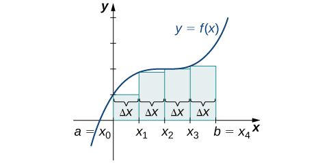{: #CNX_Calc_Figure_05_01_008}

[\[link\]](#CNX_Calc_Figure_05_01_009) shows the same curve divided into eight subintervals. Comparing the graph with four rectangles in [\[link\]](#CNX_Calc_Figure_05_01_008) with this graph with eight rectangles, we can see there appears to be less white space under the curve when <math xmlns="http://www.w3.org/1998/Math/MathML"><mrow><mi>n</mi><mo>=</mo><mn>8</mn><mo>.</mo></mrow></math>

 This white space is area under the curve we are unable to include using our approximation. The area of the rectangles is

<math xmlns="http://www.w3.org/1998/Math/MathML"><mtable><mtr><mtd columnalign="left"><msub><mi>L</mi><mn>8</mn></msub></mtd><mtd columnalign="left"><mo>=</mo><mi>f</mi><mrow><mo>(</mo><mn>0</mn><mo>)</mo></mrow><mo stretchy="false">(</mo><mn>0.25</mn><mo stretchy="false">)</mo><mo>+</mo><mi>f</mi><mrow><mo>(</mo><mrow><mn>0.25</mn></mrow><mo>)</mo></mrow><mrow><mo>(</mo><mrow><mn>0.25</mn></mrow><mo>)</mo></mrow><mo>+</mo><mi>f</mi><mrow><mo>(</mo><mrow><mn>0.5</mn></mrow><mo>)</mo></mrow><mrow><mo>(</mo><mrow><mn>0.25</mn></mrow><mo>)</mo></mrow><mo>+</mo><mi>f</mi><mrow><mo>(</mo><mrow><mn>0.75</mn></mrow><mo>)</mo></mrow><mrow><mo>(</mo><mrow><mn>0.25</mn></mrow><mo>)</mo></mrow></mtd></mtr><mtr><mtd /><mtd columnalign="left"><mspace width="0.2em" /><mo>+</mo><mi>f</mi><mrow><mo>(</mo><mn>1</mn><mo>)</mo></mrow><mrow><mo>(</mo><mrow><mn>0.25</mn></mrow><mo>)</mo></mrow><mo>+</mo><mi>f</mi><mrow><mo>(</mo><mrow><mn>1.25</mn></mrow><mo>)</mo></mrow><mrow><mo>(</mo><mrow><mn>0.25</mn></mrow><mo>)</mo></mrow><mo>+</mo><mi>f</mi><mrow><mo>(</mo><mrow><mn>1.5</mn></mrow><mo>)</mo></mrow><mrow><mo>(</mo><mrow><mn>0.25</mn></mrow><mo>)</mo></mrow><mo>+</mo><mi>f</mi><mrow><mo>(</mo><mrow><mn>1.75</mn></mrow><mo>)</mo></mrow><mrow><mo>(</mo><mrow><mn>0.25</mn></mrow><mo>)</mo></mrow></mtd></mtr><mtr><mtd /><mtd columnalign="left"><mo>=</mo><mn>7.75.</mn></mtd></mtr></mtable></math>

 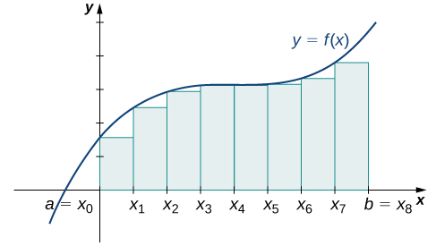{: #CNX_Calc_Figure_05_01_009}

The graph in [\[link\]](#CNX_Calc_Figure_05_01_010) shows the same function with 32 rectangles inscribed under the curve. There appears to be little white space left. The area occupied by the rectangles is

<math xmlns="http://www.w3.org/1998/Math/MathML"><mtable><mtr><mtd columnalign="left"><msub><mi>L</mi><mrow><mn>32</mn></mrow></msub></mtd><mtd columnalign="left"><mo>=</mo><mi>f</mi><mrow><mo>(</mo><mn>0</mn><mo>)</mo></mrow><mrow><mo>(</mo><mrow><mn>0.0625</mn></mrow><mo>)</mo></mrow><mo>+</mo><mi>f</mi><mrow><mo>(</mo><mrow><mn>0.0625</mn></mrow><mo>)</mo></mrow><mrow><mo>(</mo><mrow><mn>0.0625</mn></mrow><mo>)</mo></mrow><mo>+</mo><mi>f</mi><mrow><mo>(</mo><mrow><mn>0.125</mn></mrow><mo>)</mo></mrow><mrow><mo>(</mo><mrow><mn>0.0625</mn></mrow><mo>)</mo></mrow><mo>+</mo><mtext>⋯</mtext><mo>+</mo><mi>f</mi><mrow><mo>(</mo><mrow><mn>1.9375</mn></mrow><mo>)</mo></mrow><mrow><mo>(</mo><mrow><mn>0.0625</mn></mrow><mo>)</mo></mrow></mtd></mtr><mtr><mtd /><mtd columnalign="left"><mo>=</mo><mn>7.9375.</mn></mtd></mtr></mtable></math>

 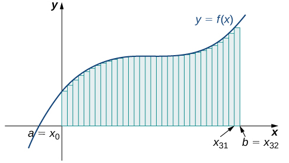{: #CNX_Calc_Figure_05_01_010}

We can carry out a similar process for the right-endpoint approximation method. A right-endpoint approximation of the same curve, using four rectangles ([\[link\]](#CNX_Calc_Figure_05_01_011)), yields an area

<math xmlns="http://www.w3.org/1998/Math/MathML"><mtable><mtr><mtd columnalign="left"><msub><mi>R</mi><mn>4</mn></msub></mtd><mtd columnalign="left"><mo>=</mo><mi>f</mi><mrow><mo>(</mo><mrow><mn>0.5</mn></mrow><mo>)</mo></mrow><mrow><mo>(</mo><mrow><mn>0.5</mn></mrow><mo>)</mo></mrow><mo>+</mo><mi>f</mi><mrow><mo>(</mo><mn>1</mn><mo>)</mo></mrow><mrow><mo>(</mo><mrow><mn>0.5</mn></mrow><mo>)</mo></mrow><mo>+</mo><mi>f</mi><mrow><mo>(</mo><mrow><mn>1.5</mn></mrow><mo>)</mo></mrow><mrow><mo>(</mo><mrow><mn>0.5</mn></mrow><mo>)</mo></mrow><mo>+</mo><mi>f</mi><mrow><mo>(</mo><mn>2</mn><mo>)</mo></mrow><mrow><mo>(</mo><mrow><mn>0.5</mn></mrow><mo>)</mo></mrow></mtd></mtr><mtr><mtd /><mtd columnalign="left"><mo>=</mo><mn>8.5.</mn></mtd></mtr></mtable></math>

 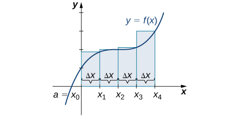{: #CNX_Calc_Figure_05_01_011}

Dividing the region over the interval <math xmlns="http://www.w3.org/1998/Math/MathML"><mrow><mrow><mo>[</mo><mrow><mn>0</mn><mo>,</mo><mn>2</mn></mrow><mo>]</mo></mrow></mrow></math>

 into eight rectangles results in <math xmlns="http://www.w3.org/1998/Math/MathML"><mrow><mtext>Δ</mtext><mi>x</mi><mo>=</mo><mfrac><mrow><mn>2</mn><mo>−</mo><mn>0</mn></mrow><mn>8</mn></mfrac><mo>=</mo><mn>0.25</mn><mo>.</mo></mrow></math>

 The graph is shown in [\[link\]](#CNX_Calc_Figure_05_01_012). The area is

<math xmlns="http://www.w3.org/1998/Math/MathML"><mtable><mtr><mtd columnalign="left"><msub><mi>R</mi><mn>8</mn></msub></mtd><mtd columnalign="left"><mo>=</mo><mi>f</mi><mrow><mo>(</mo><mrow><mn>0.25</mn></mrow><mo>)</mo></mrow><mrow><mo>(</mo><mrow><mn>0.25</mn></mrow><mo>)</mo></mrow><mo>+</mo><mi>f</mi><mrow><mo>(</mo><mrow><mn>0.5</mn></mrow><mo>)</mo></mrow><mrow><mo>(</mo><mrow><mn>0.25</mn></mrow><mo>)</mo></mrow><mo>+</mo><mi>f</mi><mrow><mo>(</mo><mrow><mn>0.75</mn></mrow><mo>)</mo></mrow><mrow><mo>(</mo><mrow><mn>0.25</mn></mrow><mo>)</mo></mrow><mo>+</mo><mi>f</mi><mrow><mo>(</mo><mn>1</mn><mo>)</mo></mrow><mrow><mo>(</mo><mrow><mn>0.25</mn></mrow><mo>)</mo></mrow></mtd></mtr><mtr><mtd /><mtd columnalign="left"><mspace width="0.2em" /><mo>+</mo><mi>f</mi><mrow><mo>(</mo><mrow><mn>1.25</mn></mrow><mo>)</mo></mrow><mrow><mo>(</mo><mrow><mn>0.25</mn></mrow><mo>)</mo></mrow><mo>+</mo><mi>f</mi><mrow><mo>(</mo><mrow><mn>1.5</mn></mrow><mo>)</mo></mrow><mrow><mo>(</mo><mrow><mn>0.25</mn></mrow><mo>)</mo></mrow><mo>+</mo><mi>f</mi><mrow><mo>(</mo><mrow><mn>1.75</mn></mrow><mo>)</mo></mrow><mrow><mo>(</mo><mrow><mn>0.25</mn></mrow><mo>)</mo></mrow><mo>+</mo><mi>f</mi><mrow><mo>(</mo><mn>2</mn><mo>)</mo></mrow><mrow><mo>(</mo><mrow><mn>0.25</mn></mrow><mo>)</mo></mrow></mtd></mtr><mtr><mtd /><mtd columnalign="left"><mo>=</mo><mn>8.25.</mn></mtd></mtr></mtable></math>

 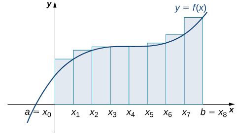{: #CNX_Calc_Figure_05_01_012}

Last, the right-endpoint approximation with <math xmlns="http://www.w3.org/1998/Math/MathML"><mrow><mi>n</mi><mo>=</mo><mn>32</mn></mrow></math>

 is close to the actual area ([\[link\]](#CNX_Calc_Figure_05_01_013)). The area is approximately

<math xmlns="http://www.w3.org/1998/Math/MathML"><mtable><mtr><mtd columnalign="left"><msub><mi>R</mi><mrow><mn>32</mn></mrow></msub></mtd><mtd columnalign="left"><mo>=</mo><mi>f</mi><mrow><mo>(</mo><mrow><mn>0.0625</mn></mrow><mo>)</mo></mrow><mrow><mo>(</mo><mrow><mn>0.0625</mn></mrow><mo>)</mo></mrow><mo>+</mo><mi>f</mi><mrow><mo>(</mo><mrow><mn>0.125</mn></mrow><mo>)</mo></mrow><mrow><mo>(</mo><mrow><mn>0.0625</mn></mrow><mo>)</mo></mrow><mo>+</mo><mi>f</mi><mrow><mo>(</mo><mrow><mn>0.1875</mn></mrow><mo>)</mo></mrow><mrow><mo>(</mo><mrow><mn>0.0625</mn></mrow><mo>)</mo></mrow><mo>+</mo><mtext>⋯</mtext><mo>+</mo><mi>f</mi><mrow><mo>(</mo><mn>2</mn><mo>)</mo></mrow><mrow><mo>(</mo><mrow><mn>0.0625</mn></mrow><mo>)</mo></mrow></mtd></mtr><mtr><mtd /><mtd columnalign="left"><mo>=</mo><mn>8.0625.</mn></mtd></mtr></mtable></math>

 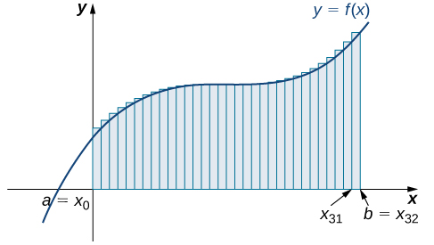{: #CNX_Calc_Figure_05_01_013}

Based on these figures and calculations, it appears we are on the right track; the rectangles appear to approximate the area under the curve better as *n* gets larger. Furthermore, as *n* increases, both the left-endpoint and right-endpoint approximations appear to approach an area of 8 square units. [\[link\]](#fs-id1170572305783) shows a numerical comparison of the left- and right-endpoint methods. The idea that the approximations of the area under the curve get better and better as *n* gets larger and larger is very important, and we now explore this idea in more detail.

<table summary="A table with four rows and three columns. The first row has headers Values of n, Approximate Area Ln, and Approximate Area Rn. The first column contains the values n=4, n=8, and n=32. The second column contains the values 7.5, 7.75, and 7.94. The third column contains the values 8.5, 8.25, and 8.06."><caption>Converging Values of Left- and Right-Endpoint Approximations as <em>n</em> Increases</caption><thead>
<tr valign="top">
<th data-align="left">Values of <em>n</em></th>
<th data-align="left">Approximate Area <em>Ln</em></th>
<th data-align="left">Approximate Area <em>Rn</em></th>
</tr>
</thead><tbody>
<tr valign="top">
<td data-align="left"><math xmlns="http://www.w3.org/1998/Math/MathML"><mrow><mi>n</mi><mo>=</mo><mn>4</mn></mrow></math></td>
<td data-align="left">7.5</td>
<td data-align="left">8.5</td>
</tr>
<tr valign="top">
<td data-align="left"><math xmlns="http://www.w3.org/1998/Math/MathML"><mrow><mi>n</mi><mo>=</mo><mn>8</mn></mrow></math></td>
<td data-align="left">7.75</td>
<td data-align="left">8.25</td>
</tr>
<tr valign="top">
<td data-align="left"><math xmlns="http://www.w3.org/1998/Math/MathML"><mrow><mi>n</mi><mo>=</mo><mn>32</mn></mrow></math></td>
<td data-align="left">7.94</td>
<td data-align="left">8.06</td>
</tr>
</tbody></table>

### Forming Riemann Sums

So far we have been using rectangles to approximate the area under a curve. The heights of these rectangles have been determined by evaluating the function at either the right or left endpoints of the subinterval <math xmlns="http://www.w3.org/1998/Math/MathML"><mrow><mrow><mo>[</mo><mrow><msub><mi>x</mi><mrow><mi>i</mi><mo>−</mo><mn>1</mn></mrow></msub><mo>,</mo><msub><mi>x</mi><mi>i</mi></msub></mrow><mo>]</mo></mrow><mo>.</mo></mrow></math>

 In reality, there is no reason to restrict evaluation of the function to one of these two points only. We could evaluate the function at any point *ci* in the subinterval <math xmlns="http://www.w3.org/1998/Math/MathML"><mrow><mrow><mo>[</mo><mrow><msub><mi>x</mi><mrow><mi>i</mi><mo>−</mo><mn>1</mn></mrow></msub><mo>,</mo><msub><mi>x</mi><mi>i</mi></msub></mrow><mo>]</mo></mrow><mo>,</mo></mrow></math>

 and use <math xmlns="http://www.w3.org/1998/Math/MathML"><mrow><mi>f</mi><mrow><mo>(</mo><mrow><msubsup><mi>x</mi><mi>i</mi><mo>*</mo></msubsup></mrow><mo>)</mo></mrow></mrow></math>

 as the height of our rectangle. This gives us an estimate for the area of the form

<math xmlns="http://www.w3.org/1998/Math/MathML"><mrow><mi>A</mi><mo>≈</mo><mstyle displaystyle="true"><munderover><mo>∑</mo><mrow><mi>i</mi><mo>=</mo><mn>1</mn></mrow><mi>n</mi></munderover><mrow><mi>f</mi><mrow><mo>(</mo><mrow><msubsup><mi>x</mi><mi>i</mi><mo>*</mo></msubsup></mrow><mo>)</mo></mrow><mtext>Δ</mtext><mi>x</mi></mrow></mstyle><mo>.</mo></mrow></math>

A sum of this form is called a Riemann sum, named for the 19th-century mathematician Bernhard Riemann, who developed the idea.

Definition

Let <math xmlns="http://www.w3.org/1998/Math/MathML"><mrow><mi>f</mi><mrow><mo>(</mo><mi>x</mi><mo>)</mo></mrow></mrow></math>

 be defined on a closed interval <math xmlns="http://www.w3.org/1998/Math/MathML"><mrow><mrow><mo>[</mo><mrow><mi>a</mi><mo>,</mo><mi>b</mi></mrow><mo>]</mo></mrow></mrow></math>

 and let *P* be a regular partition of <math xmlns="http://www.w3.org/1998/Math/MathML"><mrow><mrow><mo>[</mo><mrow><mi>a</mi><mo>,</mo><mi>b</mi></mrow><mo>]</mo></mrow><mo>.</mo></mrow></math>

 Let Δ*x* be the width of each subinterval <math xmlns="http://www.w3.org/1998/Math/MathML"><mrow><mrow><mo>[</mo><mrow><msub><mi>x</mi><mrow><mi>i</mi><mo>−</mo><mn>1</mn></mrow></msub><mo>,</mo><msub><mi>x</mi><mi>i</mi></msub></mrow><mo>]</mo></mrow></mrow></math>

 and for each *i*, let <math xmlns="http://www.w3.org/1998/Math/MathML"><mrow><msubsup><mi>x</mi><mi>i</mi><mo>*</mo></msubsup></mrow></math>

 be any point in <math xmlns="http://www.w3.org/1998/Math/MathML"><mrow><mrow><mo>[</mo><mrow><msub><mi>x</mi><mrow><mi>i</mi><mo>−</mo><mn>1</mn></mrow></msub><mo>,</mo><msub><mi>x</mi><mi>i</mi></msub></mrow><mo>]</mo></mrow><mo>.</mo></mrow></math>

 A **Riemann sum**{: data-type="term"} is defined for <math xmlns="http://www.w3.org/1998/Math/MathML"><mrow><mi>f</mi><mrow><mo>(</mo><mi>x</mi><mo>)</mo></mrow></mrow></math>

 as

<math xmlns="http://www.w3.org/1998/Math/MathML"><mrow><mstyle displaystyle="true"><munderover><mo>∑</mo><mrow><mi>i</mi><mo>=</mo><mn>1</mn></mrow><mi>n</mi></munderover><mrow><mi>f</mi><mrow><mo>(</mo><mrow><msubsup><mi>x</mi><mi>i</mi><mo>*</mo></msubsup></mrow><mo>)</mo></mrow><mtext>Δ</mtext><mi>x</mi></mrow></mstyle><mo>.</mo></mrow></math>

Recall that with the left- and right-endpoint approximations, the estimates seem to get better and better as *n* get larger and larger. The same thing happens with Riemann sums. Riemann sums give better approximations for larger values of *n*. We are now ready to define the area under a curve in terms of Riemann sums.

Definition

Let <math xmlns="http://www.w3.org/1998/Math/MathML"><mrow><mi>f</mi><mrow><mo>(</mo><mi>x</mi><mo>)</mo></mrow></mrow></math>

 be a continuous, nonnegative function on an interval <math xmlns="http://www.w3.org/1998/Math/MathML"><mrow><mrow><mo>[</mo><mrow><mi>a</mi><mo>,</mo><mi>b</mi></mrow><mo>]</mo></mrow><mo>,</mo></mrow></math>

 and let <math xmlns="http://www.w3.org/1998/Math/MathML"><mrow><mstyle displaystyle="true"><munderover><mo>∑</mo><mrow><mi>i</mi><mo>=</mo><mn>1</mn></mrow><mi>n</mi></munderover><mrow><mi>f</mi><mrow><mo>(</mo><mrow><msubsup><mi>x</mi><mi>i</mi><mo>*</mo></msubsup></mrow><mo>)</mo></mrow><mtext>Δ</mtext><mi>x</mi></mrow></mstyle></mrow></math>

 be a Riemann sum for <math xmlns="http://www.w3.org/1998/Math/MathML"><mrow><mi>f</mi><mrow><mo>(</mo><mi>x</mi><mo>)</mo></mrow><mo>.</mo></mrow></math>

 Then, the **area under the curve**{: data-type="term"} <math xmlns="http://www.w3.org/1998/Math/MathML"><mrow><mi>y</mi><mo>=</mo><mi>f</mi><mrow><mo>(</mo><mi>x</mi><mo>)</mo></mrow></mrow></math>

 on <math xmlns="http://www.w3.org/1998/Math/MathML"><mrow><mrow><mo>[</mo><mrow><mi>a</mi><mo>,</mo><mi>b</mi></mrow><mo>]</mo></mrow></mrow></math>

 is given by

<math xmlns="http://www.w3.org/1998/Math/MathML"><mrow><mi>A</mi><mo>=</mo><munder><mrow><mtext>lim</mtext></mrow><mrow><mi>n</mi><mo stretchy="false">→</mo><mi>∞</mi></mrow></munder><mstyle displaystyle="true"><munderover><mo>∑</mo><mrow><mi>i</mi><mo>=</mo><mn>1</mn></mrow><mi>n</mi></munderover><mrow><mi>f</mi><mrow><mo>(</mo><mrow><msubsup><mi>x</mi><mi>i</mi><mo>*</mo></msubsup></mrow><mo>)</mo></mrow><mtext>Δ</mtext><mi>x</mi></mrow></mstyle><mo>.</mo></mrow></math>

See a [graphical demonstration][1] of the construction of a Riemann sum.

Some subtleties here are worth discussing. First, note that taking the limit of a sum is a little different from taking the limit of a function <math xmlns="http://www.w3.org/1998/Math/MathML"><mrow><mi>f</mi><mrow><mo>(</mo><mi>x</mi><mo>)</mo></mrow></mrow></math>

 as *x* goes to infinity. Limits of sums are discussed in detail in the chapter on [Sequences and Series](/m53756){: .target-chapter}; however, for now we can assume that the computational techniques we used to compute limits of functions can also be used to calculate limits of sums.

Second, we must consider what to do if the expression converges to different limits for different choices of <math xmlns="http://www.w3.org/1998/Math/MathML"><mrow><mrow><mo>{</mo><mrow><msubsup><mi>x</mi><mi>i</mi><mo>*</mo></msubsup></mrow><mo>}</mo></mrow><mo>.</mo></mrow></math>

 Fortunately, this does not happen. Although the proof is beyond the scope of this text, it can be shown that if <math xmlns="http://www.w3.org/1998/Math/MathML"><mrow><mi>f</mi><mrow><mo>(</mo><mi>x</mi><mo>)</mo></mrow></mrow></math>

 is continuous on the closed interval <math xmlns="http://www.w3.org/1998/Math/MathML"><mrow><mrow><mo>[</mo><mrow><mi>a</mi><mo>,</mo><mi>b</mi></mrow><mo>]</mo></mrow><mo>,</mo></mrow></math>

 then <math xmlns="http://www.w3.org/1998/Math/MathML"><mrow><munder><mrow><mtext>lim</mtext></mrow><mrow><mi>n</mi><mo stretchy="false">→</mo><mi>∞</mi></mrow></munder><mstyle displaystyle="true"><munderover><mo>∑</mo><mrow><mi>i</mi><mo>=</mo><mn>1</mn></mrow><mi>n</mi></munderover><mrow><mi>f</mi><mrow><mo>(</mo><mrow><msubsup><mi>x</mi><mi>i</mi><mo>*</mo></msubsup></mrow><mo>)</mo></mrow><mtext>Δ</mtext><mi>x</mi></mrow></mstyle></mrow></math>

 exists and is unique (in other words, it does not depend on the choice of <math xmlns="http://www.w3.org/1998/Math/MathML"><mrow><mrow><mo>{</mo><mrow><msubsup><mi>x</mi><mi>i</mi><mo>*</mo></msubsup></mrow><mo>}</mo></mrow><mtext>).</mtext></mrow></math>

We look at some examples shortly. But, before we do, let’s take a moment and talk about some specific choices for <math xmlns="http://www.w3.org/1998/Math/MathML"><mrow><mrow><mo>{</mo><mrow><msubsup><mi>x</mi><mi>i</mi><mo>*</mo></msubsup></mrow><mo>}</mo></mrow><mo>.</mo></mrow></math>

 Although any choice for <math xmlns="http://www.w3.org/1998/Math/MathML"><mrow><mrow><mo>{</mo><mrow><msubsup><mi>x</mi><mi>i</mi><mo>*</mo></msubsup></mrow><mo>}</mo></mrow></mrow></math>

 gives us an estimate of the area under the curve, we don’t necessarily know whether that estimate is too high (overestimate) or too low (underestimate). If it is important to know whether our estimate is high or low, we can select our value for <math xmlns="http://www.w3.org/1998/Math/MathML"><mrow><mrow><mo>{</mo><mrow><msubsup><mi>x</mi><mi>i</mi><mo>*</mo></msubsup></mrow><mo>}</mo></mrow></mrow></math>

 to guarantee one result or the other.

If we want an overestimate, for example, we can choose <math xmlns="http://www.w3.org/1998/Math/MathML"><mrow><mrow><mo>{</mo><mrow><msubsup><mi>x</mi><mi>i</mi><mo>*</mo></msubsup></mrow><mo>}</mo></mrow></mrow></math>

 such that for <math xmlns="http://www.w3.org/1998/Math/MathML"><mrow><mi>i</mi><mo>=</mo><mn>1</mn><mo>,</mo><mn>2</mn><mo>,</mo><mn>3</mn><mtext>,…,</mtext><mspace width="0.2em" /><mi>n</mi><mo>,</mo><mi>f</mi><mrow><mo>(</mo><mrow><msubsup><mi>x</mi><mi>i</mi><mo>*</mo></msubsup></mrow><mo>)</mo></mrow><mo>≥</mo><mi>f</mi><mrow><mo>(</mo><mi>x</mi><mo>)</mo></mrow></mrow></math>

 for all <math xmlns="http://www.w3.org/1998/Math/MathML"><mrow><mi>x</mi><mo>∈</mo><mrow><mo>[</mo><mrow><msub><mi>x</mi><mrow><mi>i</mi><mo>−</mo><mn>1</mn></mrow></msub><mo>,</mo><msub><mi>x</mi><mi>i</mi></msub></mrow><mo>]</mo></mrow><mo>.</mo></mrow></math>

 In other words, we choose <math xmlns="http://www.w3.org/1998/Math/MathML"><mrow><mrow><mo>{</mo><mrow><msubsup><mi>x</mi><mi>i</mi><mo>*</mo></msubsup></mrow><mo>}</mo></mrow></mrow></math>

 so that for <math xmlns="http://www.w3.org/1998/Math/MathML"><mrow><mi>i</mi><mo>=</mo><mn>1</mn><mo>,</mo><mn>2</mn><mo>,</mo><mn>3</mn><mtext>,…,</mtext><mspace width="0.2em" /><mi>n</mi><mo>,</mo><mi>f</mi><mrow><mo>(</mo><mrow><msubsup><mi>x</mi><mi>i</mi><mo>*</mo></msubsup></mrow><mo>)</mo></mrow></mrow></math>

 is the maximum function value on the interval <math xmlns="http://www.w3.org/1998/Math/MathML"><mrow><mrow><mo>[</mo><mrow><msub><mi>x</mi><mrow><mi>i</mi><mo>−</mo><mn>1</mn></mrow></msub><mo>,</mo><msub><mi>x</mi><mi>i</mi></msub></mrow><mo>]</mo></mrow><mo>.</mo></mrow></math>

 If we select <math xmlns="http://www.w3.org/1998/Math/MathML"><mrow><mrow><mo>{</mo><mrow><msubsup><mi>x</mi><mi>i</mi><mo>*</mo></msubsup></mrow><mo>}</mo></mrow></mrow></math>

 in this way, then the Riemann sum <math xmlns="http://www.w3.org/1998/Math/MathML"><mrow><mstyle displaystyle="true"><munderover><mo>∑</mo><mrow><mi>i</mi><mo>=</mo><mn>1</mn></mrow><mi>n</mi></munderover><mrow><mi>f</mi><mrow><mo>(</mo><mrow><msubsup><mi>x</mi><mi>i</mi><mo>*</mo></msubsup></mrow><mo>)</mo></mrow><mtext>Δ</mtext><mi>x</mi></mrow></mstyle></mrow></math>

 is called an **upper sum**{: data-type="term"}. Similarly, if we want an underestimate, we can choose <math xmlns="http://www.w3.org/1998/Math/MathML"><mrow><mrow><mo>{</mo><mrow><msubsup><mi>x</mi><mi>i</mi><mo>*</mo></msubsup></mrow><mo>}</mo></mrow></mrow></math>

 so that for <math xmlns="http://www.w3.org/1998/Math/MathML"><mrow><mi>i</mi><mo>=</mo><mn>1</mn><mo>,</mo><mn>2</mn><mo>,</mo><mn>3</mn><mtext>,…,</mtext><mspace width="0.2em" /><mi>n</mi><mo>,</mo><mi>f</mi><mrow><mo>(</mo><mrow><msubsup><mi>x</mi><mi>i</mi><mo>*</mo></msubsup></mrow><mo>)</mo></mrow></mrow></math>

 is the minimum function value on the interval <math xmlns="http://www.w3.org/1998/Math/MathML"><mrow><mrow><mo>[</mo><mrow><msub><mi>x</mi><mrow><mi>i</mi><mo>−</mo><mn>1</mn></mrow></msub><mo>,</mo><msub><mi>x</mi><mi>i</mi></msub></mrow><mo>]</mo></mrow><mo>.</mo></mrow></math>

 In this case, the associated Riemann sum is called a **lower sum**{: data-type="term"}. Note that if <math xmlns="http://www.w3.org/1998/Math/MathML"><mrow><mi>f</mi><mrow><mo>(</mo><mi>x</mi><mo>)</mo></mrow></mrow></math>

 is either increasing or decreasing throughout the interval <math xmlns="http://www.w3.org/1998/Math/MathML"><mrow><mrow><mo>[</mo><mrow><mi>a</mi><mo>,</mo><mi>b</mi></mrow><mo>]</mo></mrow><mo>,</mo></mrow></math>

 then the maximum and minimum values of the function occur at the endpoints of the subintervals, so the upper and lower sums are just the same as the left- and right-endpoint approximations.

Finding Lower and Upper Sums

Find a lower sum for <math xmlns="http://www.w3.org/1998/Math/MathML"><mrow><mi>f</mi><mrow><mo>(</mo><mi>x</mi><mo>)</mo></mrow><mo>=</mo><mn>10</mn><mo>−</mo><msup><mi>x</mi><mn>2</mn></msup></mrow></math>

 on <math xmlns="http://www.w3.org/1998/Math/MathML"><mrow><mrow><mo>[</mo><mrow><mn>1</mn><mo>,</mo><mn>2</mn></mrow><mo>]</mo></mrow><mo>;</mo></mrow></math>

 let <math xmlns="http://www.w3.org/1998/Math/MathML"><mrow><mi>n</mi><mo>=</mo><mn>4</mn></mrow></math>

 subintervals.

With <math xmlns="http://www.w3.org/1998/Math/MathML"><mrow><mi>n</mi><mo>=</mo><mn>4</mn></mrow></math>

 over the interval <math xmlns="http://www.w3.org/1998/Math/MathML"><mrow><mrow><mo>[</mo><mrow><mn>1</mn><mo>,</mo><mn>2</mn></mrow><mo>]</mo></mrow><mo>,</mo><mtext>Δ</mtext><mi>x</mi><mo>=</mo><mfrac><mn>1</mn><mn>4</mn></mfrac><mo>.</mo></mrow></math>

 We can list the intervals as <math xmlns="http://www.w3.org/1998/Math/MathML"><mrow><mrow><mo>[</mo><mrow><mn>1</mn><mo>,</mo><mn>1.25</mn></mrow><mo>]</mo></mrow><mo>,</mo><mrow><mo>[</mo><mrow><mn>1.25</mn><mo>,</mo><mn>1.5</mn></mrow><mo>]</mo></mrow><mo>,</mo><mrow><mo>[</mo><mrow><mn>1.5</mn><mo>,</mo><mn>1.75</mn></mrow><mo>]</mo></mrow><mo>,</mo><mrow><mo>[</mo><mrow><mn>1.75</mn><mo>,</mo><mn>2</mn></mrow><mo>]</mo></mrow><mo>.</mo></mrow></math>

 Because the function is decreasing over the interval <math xmlns="http://www.w3.org/1998/Math/MathML"><mrow><mrow><mo>[</mo><mrow><mn>1</mn><mo>,</mo><mn>2</mn></mrow><mo>]</mo></mrow><mo>,</mo></mrow></math>

 [[link]](#CNX_Calc_Figure_05_01_014) shows that a lower sum is obtained by using the right endpoints.

![The graph of f(x) = 10 &#x2212; x^2 from 0 to 2. It is set up for a right-end approximation of the area bounded by the curve and the x axis on \[1, 2\], labeled a=x0 to x4. It shows a lower sum.](../resources/CNX_Calc_Figure_05_01_014.jpg "The graph of f(x)=10&#x2212;x2 is set up for a right-endpoint approximation of the area bounded by the curve and the x-axis on [1,2], and it shows a lower sum."){: #CNX_Calc_Figure_05_01_014}

The Riemann sum is

<math xmlns="http://www.w3.org/1998/Math/MathML"><mtable><mtr><mtd columnalign="left"><mstyle displaystyle="true"><munderover><mo>∑</mo><mrow><mi>k</mi><mo>=</mo><mn>1</mn></mrow><mn>4</mn></munderover><mrow><mrow><mo>(</mo><mrow><mn>10</mn><mo>−</mo><msup><mi>x</mi><mn>2</mn></msup></mrow><mo>)</mo></mrow><mrow><mo>(</mo><mrow><mn>0.25</mn></mrow><mo>)</mo></mrow></mrow></mstyle></mtd><mtd columnalign="left"><mo>=</mo><mn>0.25</mn><mrow><mo>[</mo><mrow><mn>10</mn><mo>−</mo><msup><mrow><mrow><mo>(</mo><mrow><mn>1.25</mn></mrow><mo>)</mo></mrow></mrow><mn>2</mn></msup><mo>+</mo><mn>10</mn><mo>−</mo><msup><mrow><mrow><mo>(</mo><mrow><mn>1.5</mn></mrow><mo>)</mo></mrow></mrow><mn>2</mn></msup><mo>+</mo><mn>10</mn><mo>−</mo><msup><mrow><mrow><mo>(</mo><mrow><mn>1.75</mn></mrow><mo>)</mo></mrow></mrow><mn>2</mn></msup><mo>+</mo><mn>10</mn><mo>−</mo><msup><mrow><mrow><mo>(</mo><mn>2</mn><mo>)</mo></mrow></mrow><mn>2</mn></msup></mrow><mo>]</mo></mrow></mtd></mtr><mtr><mtd /><mtd columnalign="left"><mo>=</mo><mn>0.25</mn><mrow><mo>[</mo><mrow><mn>8.4375</mn><mo>+</mo><mn>7.75</mn><mo>+</mo><mn>6.9375</mn><mo>+</mo><mn>6</mn></mrow><mo>]</mo></mrow></mtd></mtr><mtr><mtd /><mtd columnalign="left"><mo>=</mo><mn>7.28.</mn></mtd></mtr></mtable></math>

The area of 7.28 is a lower sum and an underestimate.

1.  Find an upper sum for
    <math xmlns="http://www.w3.org/1998/Math/MathML"><mrow><mi>f</mi><mrow><mo>(</mo><mi>x</mi><mo>)</mo></mrow><mo>=</mo><mn>10</mn><mo>−</mo><msup><mi>x</mi><mn>2</mn></msup></mrow></math>
    
    on
    <math xmlns="http://www.w3.org/1998/Math/MathML"><mrow><mrow><mo>[</mo><mrow><mn>1</mn><mo>,</mo><mn>2</mn></mrow><mo>]</mo></mrow><mo>;</mo></mrow></math>
    
    let
    <math xmlns="http://www.w3.org/1998/Math/MathML"><mrow><mi>n</mi><mo>=</mo><mn>4</mn><mo>.</mo></mrow></math>

2.  Sketch the approximation.
{: type="a"}

1.  <math xmlns="http://www.w3.org/1998/Math/MathML"><mrow><mtext>Upper sum</mtext><mo>=</mo><mn>8.0313</mn><mo>.</mo></mrow></math>

2.  * * *
    {: data-type="newline"}
    
     ![A graph of the function f(x) = 10 &#x2212; x^2 from 0 to 2. It is set up for a right endpoint approximation over the area \[1,2\], which is labeled a=x0 to x4. It is an upper sum.](../resources/CNX_Calc_Figure_05_01_015.jpg) 
{: type="a"}

Hint

<math xmlns="http://www.w3.org/1998/Math/MathML"><mrow><mi>f</mi><mrow><mo>(</mo><mi>x</mi><mo>)</mo></mrow></mrow></math>

 is decreasing on <math xmlns="http://www.w3.org/1998/Math/MathML"><mrow><mrow><mo>[</mo><mrow><mn>1</mn><mo>,</mo><mn>2</mn></mrow><mo>]</mo></mrow><mo>,</mo></mrow></math>

 so the maximum function values occur at the left endpoints of the subintervals.

Finding Lower and Upper Sums for
<math xmlns="http://www.w3.org/1998/Math/MathML"><mrow><mi>f</mi><mrow><mo>(</mo><mi>x</mi><mo>)</mo></mrow><mo>=</mo><mtext>sin</mtext><mspace width="0.1em" /><mi>x</mi></mrow></math>

Find a lower sum for <math xmlns="http://www.w3.org/1998/Math/MathML"><mrow><mi>f</mi><mrow><mo>(</mo><mi>x</mi><mo>)</mo></mrow><mo>=</mo><mtext>sin</mtext><mspace width="0.1em" /><mi>x</mi></mrow></math>

 over the interval <math xmlns="http://www.w3.org/1998/Math/MathML"><mrow><mrow><mo>[</mo><mrow><mi>a</mi><mo>,</mo><mi>b</mi></mrow><mo>]</mo></mrow><mo>=</mo><mrow><mo>[</mo><mrow><mn>0</mn><mo>,</mo><mfrac><mi>π</mi><mn>2</mn></mfrac></mrow><mo>]</mo></mrow><mo>;</mo></mrow></math>

 let <math xmlns="http://www.w3.org/1998/Math/MathML"><mrow><mi>n</mi><mo>=</mo><mn>6</mn><mo>.</mo></mrow></math>

Let’s first look at the graph in [[link]](#CNX_Calc_Figure_05_01_016) to get a better idea of the area of interest.

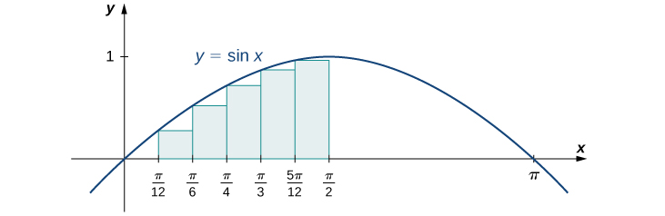{: #CNX_Calc_Figure_05_01_016}

The intervals are <math xmlns="http://www.w3.org/1998/Math/MathML"><mrow><mrow><mo>[</mo><mrow><mn>0</mn><mo>,</mo><mfrac><mi>π</mi><mrow><mn>12</mn></mrow></mfrac></mrow><mo>]</mo></mrow><mo>,</mo><mrow><mo>[</mo><mrow><mfrac><mi>π</mi><mrow><mn>12</mn></mrow></mfrac><mo>,</mo><mfrac><mi>π</mi><mn>6</mn></mfrac></mrow><mo>]</mo></mrow><mo>,</mo><mrow><mo>[</mo><mrow><mfrac><mi>π</mi><mn>6</mn></mfrac><mo>,</mo><mfrac><mi>π</mi><mn>4</mn></mfrac></mrow><mo>]</mo></mrow><mo>,</mo><mrow><mo>[</mo><mrow><mfrac><mi>π</mi><mn>4</mn></mfrac><mo>,</mo><mfrac><mi>π</mi><mn>3</mn></mfrac></mrow><mo>]</mo></mrow><mo>,</mo><mrow><mo>[</mo><mrow><mfrac><mi>π</mi><mn>3</mn></mfrac><mo>,</mo><mfrac><mrow><mn>5</mn><mi>π</mi></mrow><mrow><mn>12</mn></mrow></mfrac></mrow><mo>]</mo></mrow><mo>,</mo></mrow></math>

 and <math xmlns="http://www.w3.org/1998/Math/MathML"><mrow><mrow><mo>[</mo><mrow><mfrac><mrow><mn>5</mn><mi>π</mi></mrow><mrow><mn>12</mn></mrow></mfrac><mo>,</mo><mfrac><mi>π</mi><mn>2</mn></mfrac></mrow><mo>]</mo></mrow><mo>.</mo></mrow></math>

 Note that <math xmlns="http://www.w3.org/1998/Math/MathML"><mrow><mi>f</mi><mrow><mo>(</mo><mi>x</mi><mo>)</mo></mrow><mo>=</mo><mtext>sin</mtext><mspace width="0.1em" /><mi>x</mi></mrow></math>

 is increasing on the interval <math xmlns="http://www.w3.org/1998/Math/MathML"><mrow><mrow><mo>[</mo><mrow><mn>0</mn><mo>,</mo><mfrac><mi>π</mi><mn>2</mn></mfrac></mrow><mo>]</mo></mrow><mo>,</mo></mrow></math>

 so a left-endpoint approximation gives us the lower sum. A left-endpoint approximation is the Riemann sum <math xmlns="http://www.w3.org/1998/Math/MathML"><mrow><mstyle displaystyle="true"><munderover><mo>∑</mo><mrow><mi>i</mi><mo>=</mo><mn>0</mn></mrow><mn>5</mn></munderover><mrow><mtext>sin</mtext><mspace width="0.1em" /><msub><mi>x</mi><mi>i</mi></msub><mrow><mo>(</mo><mrow><mfrac><mi>π</mi><mrow><mn>12</mn></mrow></mfrac></mrow><mo>)</mo></mrow></mrow></mstyle><mo>.</mo></mrow></math>

 We have

<math xmlns="http://www.w3.org/1998/Math/MathML"><mtable><mtr><mtd columnalign="left"><mi>A</mi></mtd><mtd columnalign="left"><mo>≈</mo><mtext>sin</mtext><mrow><mo>(</mo><mn>0</mn><mo>)</mo></mrow><mrow><mo>(</mo><mrow><mfrac><mi>π</mi><mrow><mn>12</mn></mrow></mfrac></mrow><mo>)</mo></mrow><mo>+</mo><mtext>sin</mtext><mrow><mo>(</mo><mrow><mfrac><mi>π</mi><mrow><mn>12</mn></mrow></mfrac></mrow><mo>)</mo></mrow><mrow><mo>(</mo><mrow><mfrac><mi>π</mi><mrow><mn>12</mn></mrow></mfrac></mrow><mo>)</mo></mrow><mo>+</mo><mtext>sin</mtext><mrow><mo>(</mo><mrow><mfrac><mi>π</mi><mn>6</mn></mfrac></mrow><mo>)</mo></mrow><mrow><mo>(</mo><mrow><mfrac><mi>π</mi><mrow><mn>12</mn></mrow></mfrac></mrow><mo>)</mo></mrow><mo>+</mo><mtext>sin</mtext><mrow><mo>(</mo><mrow><mfrac><mi>π</mi><mn>4</mn></mfrac></mrow><mo>)</mo></mrow><mrow><mo>(</mo><mrow><mfrac><mi>π</mi><mrow><mn>12</mn></mrow></mfrac></mrow><mo>)</mo></mrow><mo>+</mo><mtext>sin</mtext><mrow><mo>(</mo><mrow><mfrac><mi>π</mi><mn>3</mn></mfrac></mrow><mo>)</mo></mrow><mrow><mo>(</mo><mrow><mfrac><mi>π</mi><mrow><mn>12</mn></mrow></mfrac></mrow><mo>)</mo></mrow><mo>+</mo><mtext>sin</mtext><mrow><mo>(</mo><mrow><mfrac><mrow><mn>5</mn><mi>π</mi></mrow><mrow><mn>12</mn></mrow></mfrac></mrow><mo>)</mo></mrow><mrow><mo>(</mo><mrow><mfrac><mi>π</mi><mrow><mn>12</mn></mrow></mfrac></mrow><mo>)</mo></mrow></mtd></mtr><mtr><mtd /><mtd columnalign="left"><mo>=</mo><mn>0.863.</mn></mtd></mtr></mtable></math>

Using the function <math xmlns="http://www.w3.org/1998/Math/MathML"><mrow><mi>f</mi><mrow><mo>(</mo><mi>x</mi><mo>)</mo></mrow><mo>=</mo><mtext>sin</mtext><mspace width="0.1em" /><mi>x</mi></mrow></math>

 over the interval <math xmlns="http://www.w3.org/1998/Math/MathML"><mrow><mrow><mo>[</mo><mrow><mn>0</mn><mo>,</mo><mfrac><mi>π</mi><mn>2</mn></mfrac></mrow><mo>]</mo></mrow><mo>,</mo></mrow></math>

 find an upper sum; let <math xmlns="http://www.w3.org/1998/Math/MathML"><mrow><mi>n</mi><mo>=</mo><mn>6</mn><mo>.</mo></mrow></math>

<math xmlns="http://www.w3.org/1998/Math/MathML"><mrow><mi>A</mi><mo>≈</mo><mn>1.125</mn></mrow></math>

Hint

Follow the steps from [[link]](#fs-id1170572551906).

### Key Concepts

* The use of sigma (summation) notation of the form
  <math xmlns="http://www.w3.org/1998/Math/MathML"><mrow><mstyle displaystyle="true"><munderover><mo>∑</mo><mrow><mi>i</mi><mo>=</mo><mn>1</mn></mrow><mi>n</mi></munderover><mrow><msub><mi>a</mi><mi>i</mi></msub></mrow></mstyle></mrow></math>
  
  is useful for expressing long sums of values in compact form.
* For a continuous function defined over an interval
  <math xmlns="http://www.w3.org/1998/Math/MathML"><mrow><mrow><mo>[</mo><mrow><mi>a</mi><mo>,</mo><mi>b</mi></mrow><mo>]</mo></mrow><mo>,</mo></mrow></math>
  
  the process of dividing the interval into *n* equal parts, extending a rectangle to the graph of the function, calculating the areas of the series of rectangles, and then summing the areas yields an approximation of the area of that region.
* The width of each rectangle is
  <math xmlns="http://www.w3.org/1998/Math/MathML"><mrow><mtext>Δ</mtext><mi>x</mi><mo>=</mo><mfrac><mrow><mi>b</mi><mo>−</mo><mi>a</mi></mrow><mi>n</mi></mfrac><mo>.</mo></mrow></math>

* Riemann sums are expressions of the form
  <math xmlns="http://www.w3.org/1998/Math/MathML"><mrow><mstyle displaystyle="true"><munderover><mo>∑</mo><mrow><mi>i</mi><mo>=</mo><mn>1</mn></mrow><mi>n</mi></munderover><mrow><mi>f</mi><mrow><mo>(</mo><mrow><msubsup><mi>x</mi><mi>i</mi><mo>*</mo></msubsup></mrow><mo>)</mo></mrow><mtext>Δ</mtext><mi>x</mi></mrow></mstyle><mo>,</mo></mrow></math>
  
  and can be used to estimate the area under the curve
  <math xmlns="http://www.w3.org/1998/Math/MathML"><mrow><mi>y</mi><mo>=</mo><mi>f</mi><mrow><mo>(</mo><mi>x</mi><mo>)</mo></mrow><mo>.</mo></mrow></math>
  
  Left- and right-endpoint approximations are special kinds of Riemann sums where the values of
  <math xmlns="http://www.w3.org/1998/Math/MathML"><mrow><mrow><mo>{</mo><mrow><msubsup><mi>x</mi><mi>i</mi><mo>*</mo></msubsup></mrow><mo>}</mo></mrow></mrow></math>
  
  are chosen to be the left or right endpoints of the subintervals, respectively.
* Riemann sums allow for much flexibility in choosing the set of points
  <math xmlns="http://www.w3.org/1998/Math/MathML"><mrow><mrow><mo>{</mo><mrow><msubsup><mi>x</mi><mi>i</mi><mo>*</mo></msubsup></mrow><mo>}</mo></mrow></mrow></math>
  
  at which the function is evaluated, often with an eye to obtaining a lower sum or an upper sum.
{: data-bullet-style="bullet"}

### Key Equations

* **Properties of Sigma Notation**
  * * *
  {: data-type="newline"}
  
  <math xmlns="http://www.w3.org/1998/Math/MathML"><mrow><mstyle displaystyle="true"><munderover><mo>∑</mo><mrow><mi>i</mi><mo>=</mo><mn>1</mn></mrow><mi>n</mi></munderover><mi>c</mi></mstyle><mo>=</mo><mi>n</mi><mi>c</mi></mrow></math>
  
  * * *
  {: data-type="newline"}
  
  <math xmlns="http://www.w3.org/1998/Math/MathML"><mrow><mstyle displaystyle="true"><munderover><mo>∑</mo><mrow><mi>i</mi><mo>=</mo><mn>1</mn></mrow><mi>n</mi></munderover><mrow><mi>c</mi><msub><mi>a</mi><mi>i</mi></msub></mrow></mstyle><mo>=</mo><mi>c</mi><mstyle displaystyle="true"><munderover><mo>∑</mo><mrow><mi>i</mi><mo>=</mo><mn>1</mn></mrow><mi>n</mi></munderover><mrow><msub><mi>a</mi><mi>i</mi></msub></mrow></mstyle></mrow></math>
  
  * * *
  {: data-type="newline"}
  
  <math xmlns="http://www.w3.org/1998/Math/MathML"><mrow><mstyle displaystyle="true"><munderover><mo>∑</mo><mrow><mi>i</mi><mo>=</mo><mn>1</mn></mrow><mi>n</mi></munderover><mrow><mrow><mo>(</mo><mrow><msub><mi>a</mi><mi>i</mi></msub><mo>+</mo><msub><mi>b</mi><mi>i</mi></msub></mrow><mo>)</mo></mrow></mrow></mstyle><mo>=</mo><mstyle displaystyle="true"><munderover><mo>∑</mo><mrow><mi>i</mi><mo>=</mo><mn>1</mn></mrow><mi>n</mi></munderover><mrow><msub><mi>a</mi><mi>i</mi></msub></mrow></mstyle><mo>+</mo><mstyle displaystyle="true"><munderover><mo>∑</mo><mrow><mi>i</mi><mo>=</mo><mn>1</mn></mrow><mi>n</mi></munderover><mrow><msub><mi>b</mi><mi>i</mi></msub></mrow></mstyle></mrow></math>
  
  * * *
  {: data-type="newline"}
  
  <math xmlns="http://www.w3.org/1998/Math/MathML"><mrow><mstyle displaystyle="true"><munderover><mo>∑</mo><mrow><mi>i</mi><mo>=</mo><mn>1</mn></mrow><mi>n</mi></munderover><mrow><mrow><mo>(</mo><mrow><msub><mi>a</mi><mi>i</mi></msub><mo>−</mo><msub><mi>b</mi><mi>i</mi></msub></mrow><mo>)</mo></mrow></mrow></mstyle><mo>=</mo><mstyle displaystyle="true"><munderover><mo>∑</mo><mrow><mi>i</mi><mo>=</mo><mn>1</mn></mrow><mi>n</mi></munderover><mrow><msub><mi>a</mi><mi>i</mi></msub></mrow></mstyle><mo>−</mo><mstyle displaystyle="true"><munderover><mo>∑</mo><mrow><mi>i</mi><mo>=</mo><mn>1</mn></mrow><mi>n</mi></munderover><mrow><msub><mi>b</mi><mi>i</mi></msub></mrow></mstyle></mrow></math>
  
  * * *
  {: data-type="newline"}
  
  <math xmlns="http://www.w3.org/1998/Math/MathML"><mrow><mstyle displaystyle="true"><munderover><mo>∑</mo><mrow><mi>i</mi><mo>=</mo><mn>1</mn></mrow><mi>n</mi></munderover><mrow><msub><mi>a</mi><mi>i</mi></msub></mrow></mstyle><mo>=</mo><mstyle displaystyle="true"><munderover><mo>∑</mo><mrow><mi>i</mi><mo>=</mo><mn>1</mn></mrow><mi>m</mi></munderover><mrow><msub><mi>a</mi><mi>i</mi></msub></mrow></mstyle><mo>+</mo><mstyle displaystyle="true"><munderover><mo>∑</mo><mrow><mi>i</mi><mo>=</mo><mi>m</mi><mo>+</mo><mn>1</mn></mrow><mi>n</mi></munderover><mrow><msub><mi>a</mi><mi>i</mi></msub></mrow></mstyle></mrow></math>

* **Sums and Powers of Integers**
  * * *
  {: data-type="newline"}
  
  <math xmlns="http://www.w3.org/1998/Math/MathML"><mrow><mstyle displaystyle="true"><munderover><mo>∑</mo><mrow><mi>i</mi><mo>=</mo><mn>1</mn></mrow><mi>n</mi></munderover><mi>i</mi></mstyle><mo>=</mo><mn>1</mn><mo>+</mo><mn>2</mn><mo>+</mo><mtext>⋯</mtext><mo>+</mo><mi>n</mi><mo>=</mo><mfrac><mrow><mi>n</mi><mrow><mo>(</mo><mrow><mi>n</mi><mo>+</mo><mn>1</mn></mrow><mo>)</mo></mrow></mrow><mn>2</mn></mfrac></mrow></math>
  
  * * *
  {: data-type="newline"}
  
  <math xmlns="http://www.w3.org/1998/Math/MathML"><mrow><mstyle displaystyle="true"><munderover><mo>∑</mo><mrow><mi>i</mi><mo>=</mo><mn>1</mn></mrow><mi>n</mi></munderover><mrow><msup><mi>i</mi><mn>2</mn></msup></mrow></mstyle><mo>=</mo><msup><mn>1</mn><mn>2</mn></msup><mo>+</mo><msup><mn>2</mn><mn>2</mn></msup><mo>+</mo><mtext>⋯</mtext><mo>+</mo><msup><mi>n</mi><mn>2</mn></msup><mo>=</mo><mfrac><mrow><mi>n</mi><mrow><mo>(</mo><mrow><mi>n</mi><mo>+</mo><mn>1</mn></mrow><mo>)</mo></mrow><mrow><mo>(</mo><mrow><mn>2</mn><mi>n</mi><mo>+</mo><mn>1</mn></mrow><mo>)</mo></mrow></mrow><mn>6</mn></mfrac></mrow></math>
  
  * * *
  {: data-type="newline"}
  
  <math xmlns="http://www.w3.org/1998/Math/MathML"><mrow><mstyle displaystyle="true"><munderover><mo>∑</mo><mrow><mi>i</mi><mo>=</mo><mn>0</mn></mrow><mi>n</mi></munderover><mrow><msup><mi>i</mi><mn>3</mn></msup></mrow></mstyle><mo>=</mo><msup><mn>1</mn><mn>3</mn></msup><mo>+</mo><msup><mn>2</mn><mn>3</mn></msup><mo>+</mo><mtext>⋯</mtext><mo>+</mo><msup><mi>n</mi><mn>3</mn></msup><mo>=</mo><mfrac><mrow><msup><mi>n</mi><mn>2</mn></msup><msup><mrow><mrow><mo>(</mo><mrow><mi>n</mi><mo>+</mo><mn>1</mn></mrow><mo>)</mo></mrow></mrow><mn>2</mn></msup></mrow><mn>4</mn></mfrac></mrow></math>

* **Left-Endpoint Approximation**
  * * *
  {: data-type="newline"}
  
  <math xmlns="http://www.w3.org/1998/Math/MathML"><mrow><mi>A</mi><mo>≈</mo><msub><mi>L</mi><mi>n</mi></msub><mo>=</mo><mi>f</mi><mrow><mo>(</mo><mrow><msub><mi>x</mi><mn>0</mn></msub></mrow><mo>)</mo></mrow><mtext>Δ</mtext><mi>x</mi><mo>+</mo><mi>f</mi><mrow><mo>(</mo><mrow><msub><mi>x</mi><mn>1</mn></msub></mrow><mo>)</mo></mrow><mtext>Δ</mtext><mi>x</mi><mo>+</mo><mtext>⋯</mtext><mo>+</mo><mi>f</mi><mrow><mo>(</mo><mrow><msub><mi>x</mi><mrow><mi>n</mi><mo>−</mo><mn>1</mn></mrow></msub></mrow><mo>)</mo></mrow><mtext>Δ</mtext><mi>x</mi><mo>=</mo><mstyle displaystyle="true"><munderover><mo>∑</mo><mrow><mi>i</mi><mo>=</mo><mn>1</mn></mrow><mi>n</mi></munderover><mrow><mi>f</mi><mrow><mo>(</mo><mrow><msub><mi>x</mi><mrow><mi>i</mi><mo>−</mo><mn>1</mn></mrow></msub></mrow><mo>)</mo></mrow><mtext>Δ</mtext><mi>x</mi></mrow></mstyle></mrow></math>

* **Right-Endpoint Approximation**
  * * *
  {: data-type="newline"}
  
  <math xmlns="http://www.w3.org/1998/Math/MathML"><mrow><mi>A</mi><mo>≈</mo><msub><mi>R</mi><mi>n</mi></msub><mo>=</mo><mi>f</mi><mrow><mo>(</mo><mrow><msub><mi>x</mi><mn>1</mn></msub></mrow><mo>)</mo></mrow><mtext>Δ</mtext><mi>x</mi><mo>+</mo><mi>f</mi><mrow><mo>(</mo><mrow><msub><mi>x</mi><mn>2</mn></msub></mrow><mo>)</mo></mrow><mtext>Δ</mtext><mi>x</mi><mo>+</mo><mtext>⋯</mtext><mo>+</mo><mi>f</mi><mrow><mo>(</mo><mrow><msub><mi>x</mi><mi>n</mi></msub></mrow><mo>)</mo></mrow><mtext>Δ</mtext><mi>x</mi><mo>=</mo><mstyle displaystyle="true"><munderover><mo>∑</mo><mrow><mi>i</mi><mo>=</mo><mn>1</mn></mrow><mi>n</mi></munderover><mrow><mi>f</mi><mrow><mo>(</mo><mrow><msub><mi>x</mi><mi>i</mi></msub></mrow><mo>)</mo></mrow><mtext>Δ</mtext><mi>x</mi></mrow></mstyle></mrow></math>
{: data-bullet-style="bullet"}

<section data-depth="1" class="section-exercises" markdown="1">

State whether the given sums are equal or unequal.

1.  <math xmlns="http://www.w3.org/1998/Math/MathML"><mrow><mstyle displaystyle="true"><munderover><mo>∑</mo><mrow><mi>i</mi><mo>=</mo><mn>1</mn></mrow><mrow><mn>10</mn></mrow></munderover><mi>i</mi></mstyle></mrow></math>
    
    and
    <math xmlns="http://www.w3.org/1998/Math/MathML"><mrow><mstyle displaystyle="true"><munderover><mo>∑</mo><mrow><mi>k</mi><mo>=</mo><mn>1</mn></mrow><mrow><mn>10</mn></mrow></munderover><mi>k</mi></mstyle></mrow></math>

2.  <math xmlns="http://www.w3.org/1998/Math/MathML"><mrow><mstyle displaystyle="true"><munderover><mo>∑</mo><mrow><mi>i</mi><mo>=</mo><mn>1</mn></mrow><mrow><mn>10</mn></mrow></munderover><mi>i</mi></mstyle></mrow></math>
    
    and
    <math xmlns="http://www.w3.org/1998/Math/MathML"><mrow><mstyle displaystyle="true"><munderover><mo>∑</mo><mrow><mi>i</mi><mo>=</mo><mn>6</mn></mrow><mrow><mn>15</mn></mrow></munderover><mrow><mrow><mo>(</mo><mrow><mi>i</mi><mo>−</mo><mn>5</mn></mrow><mo>)</mo></mrow></mrow></mstyle></mrow></math>

3.  <math xmlns="http://www.w3.org/1998/Math/MathML"><mrow><mstyle displaystyle="true"><munderover><mo>∑</mo><mrow><mi>i</mi><mo>=</mo><mn>1</mn></mrow><mrow><mn>10</mn></mrow></munderover><mrow><mi>i</mi><mrow><mo>(</mo><mrow><mi>i</mi><mo>−</mo><mn>1</mn></mrow><mo>)</mo></mrow></mrow></mstyle></mrow></math>
    
    and
    <math xmlns="http://www.w3.org/1998/Math/MathML"><mrow><mstyle displaystyle="true"><munderover><mo>∑</mo><mrow><mi>j</mi><mo>=</mo><mn>0</mn></mrow><mn>9</mn></munderover><mrow><mrow><mo>(</mo><mrow><mi>j</mi><mo>+</mo><mn>1</mn></mrow><mo>)</mo></mrow><mi>j</mi></mrow></mstyle></mrow></math>

4.  <math xmlns="http://www.w3.org/1998/Math/MathML"><mrow><mstyle displaystyle="true"><munderover><mo>∑</mo><mrow><mi>i</mi><mo>=</mo><mn>1</mn></mrow><mrow><mn>10</mn></mrow></munderover><mrow><mi>i</mi><mrow><mo>(</mo><mrow><mi>i</mi><mo>−</mo><mn>1</mn></mrow><mo>)</mo></mrow></mrow></mstyle></mrow></math>
    
    and
    <math xmlns="http://www.w3.org/1998/Math/MathML"><mrow><mstyle displaystyle="true"><munderover><mo>∑</mo><mrow><mi>k</mi><mo>=</mo><mn>1</mn></mrow><mrow><mn>10</mn></mrow></munderover><mrow><mrow><mo>(</mo><mrow><msup><mi>k</mi><mn>2</mn></msup><mo>−</mo><mi>k</mi></mrow><mo>)</mo></mrow></mrow></mstyle></mrow></math>
{: type="a"}

a. They are equal; both represent the sum of the first 10 whole numbers. b. They are equal; both represent the sum of the first 10 whole numbers. c. They are equal by substituting <math xmlns="http://www.w3.org/1998/Math/MathML"><mrow><mi>j</mi><mo>=</mo><mi>i</mi><mo>−</mo><mn>1</mn><mo>.</mo></mrow></math>

 d. They are equal; the first sum factors the terms of the second.

In the following exercises, use the rules for sums of powers of integers to compute the sums.

<math xmlns="http://www.w3.org/1998/Math/MathML"><mrow><mstyle displaystyle="true"><munderover><mo>∑</mo><mrow><mi>i</mi><mo>=</mo><mn>5</mn></mrow><mrow><mn>10</mn></mrow></munderover><mi>i</mi></mstyle></mrow></math>

<math xmlns="http://www.w3.org/1998/Math/MathML"><mrow><mstyle displaystyle="true"><munderover><mo>∑</mo><mrow><mi>i</mi><mo>=</mo><mn>5</mn></mrow><mrow><mn>10</mn></mrow></munderover><mrow><msup><mi>i</mi><mn>2</mn></msup></mrow></mstyle></mrow></math>

<math xmlns="http://www.w3.org/1998/Math/MathML"><mrow><mn>385</mn><mo>−</mo><mn>30</mn><mo>=</mo><mn>355</mn></mrow></math>

Suppose that <math xmlns="http://www.w3.org/1998/Math/MathML"><mrow><mstyle displaystyle="true"><munderover><mo>∑</mo><mrow><mi>i</mi><mo>=</mo><mn>1</mn></mrow><mrow><mn>100</mn></mrow></munderover><mrow><msub><mi>a</mi><mi>i</mi></msub><mo>=</mo><mn>15</mn></mrow></mstyle></mrow></math>

 and <math xmlns="http://www.w3.org/1998/Math/MathML"><mrow><mstyle displaystyle="true"><munderover><mo>∑</mo><mrow><mi>i</mi><mo>=</mo><mn>1</mn></mrow><mrow><mn>100</mn></mrow></munderover><mrow><msub><mi>b</mi><mi>i</mi></msub><mo>=</mo><mn>−12</mn></mrow></mstyle><mo>.</mo></mrow></math>

 In the following exercises, compute the sums.

<math xmlns="http://www.w3.org/1998/Math/MathML"><mrow><mstyle displaystyle="true"><munderover><mo>∑</mo><mrow><mi>i</mi><mo>=</mo><mn>1</mn></mrow><mrow><mn>100</mn></mrow></munderover><mrow><mrow><mo>(</mo><mrow><msub><mi>a</mi><mi>i</mi></msub><mo>+</mo><msub><mi>b</mi><mi>i</mi></msub></mrow><mo>)</mo></mrow></mrow></mstyle></mrow></math>

<math xmlns="http://www.w3.org/1998/Math/MathML"><mrow><mstyle displaystyle="true"><munderover><mo>∑</mo><mrow><mi>i</mi><mo>=</mo><mn>1</mn></mrow><mrow><mn>100</mn></mrow></munderover><mrow><mrow><mo>(</mo><mrow><msub><mi>a</mi><mi>i</mi></msub><mo>−</mo><msub><mi>b</mi><mi>i</mi></msub></mrow><mo>)</mo></mrow></mrow></mstyle></mrow></math>

<math xmlns="http://www.w3.org/1998/Math/MathML"><mrow><mn>15</mn><mo>−</mo><mrow><mo>(</mo><mrow><mn>−12</mn></mrow><mo>)</mo></mrow><mo>=</mo><mn>27</mn></mrow></math>

<math xmlns="http://www.w3.org/1998/Math/MathML"><mrow><mstyle displaystyle="true"><munderover><mo>∑</mo><mrow><mi>i</mi><mo>=</mo><mn>1</mn></mrow><mrow><mn>100</mn></mrow></munderover><mrow><mrow><mo>(</mo><mrow><mn>3</mn><msub><mi>a</mi><mi>i</mi></msub><mo>−</mo><mn>4</mn><msub><mi>b</mi><mi>i</mi></msub></mrow><mo>)</mo></mrow></mrow></mstyle></mrow></math>

<math xmlns="http://www.w3.org/1998/Math/MathML"><mrow><mstyle displaystyle="true"><munderover><mo>∑</mo><mrow><mi>i</mi><mo>=</mo><mn>1</mn></mrow><mrow><mn>100</mn></mrow></munderover><mrow><mrow><mo>(</mo><mrow><mn>5</mn><msub><mi>a</mi><mi>i</mi></msub><mo>+</mo><mn>4</mn><msub><mi>b</mi><mi>i</mi></msub></mrow><mo>)</mo></mrow></mrow></mstyle></mrow></math>

<math xmlns="http://www.w3.org/1998/Math/MathML"><mrow><mn>5</mn><mrow><mo>(</mo><mrow><mn>15</mn></mrow><mo>)</mo></mrow><mo>+</mo><mn>4</mn><mrow><mo>(</mo><mrow><mn>−12</mn></mrow><mo>)</mo></mrow><mo>=</mo><mn>27</mn></mrow></math>

In the following exercises, use summation properties and formulas to rewrite and evaluate the sums.

<math xmlns="http://www.w3.org/1998/Math/MathML"><mrow><mstyle displaystyle="true"><munderover><mo>∑</mo><mrow><mi>k</mi><mo>=</mo><mn>1</mn></mrow><mrow><mn>20</mn></mrow></munderover><mrow><mn>100</mn><mrow><mo>(</mo><mrow><msup><mi>k</mi><mn>2</mn></msup><mo>−</mo><mn>5</mn><mi>k</mi><mo>+</mo><mn>1</mn></mrow><mo>)</mo></mrow></mrow></mstyle></mrow></math>

<math xmlns="http://www.w3.org/1998/Math/MathML"><mrow><mstyle displaystyle="true"><munderover><mo>∑</mo><mrow><mi>j</mi><mo>=</mo><mn>1</mn></mrow><mrow><mn>50</mn></mrow></munderover><mrow><mrow><mo>(</mo><mrow><msup><mi>j</mi><mn>2</mn></msup><mo>−</mo><mn>2</mn><mi>j</mi></mrow><mo>)</mo></mrow></mrow></mstyle></mrow></math>

<math xmlns="http://www.w3.org/1998/Math/MathML"><mrow><mstyle displaystyle="true"><munderover><mo>∑</mo><mrow><mi>j</mi><mo>=</mo><mn>1</mn></mrow><mrow><mn>50</mn></mrow></munderover><mrow><msup><mi>j</mi><mn>2</mn></msup></mrow></mstyle><mo>−</mo><mn>2</mn><mstyle displaystyle="true"><munderover><mo>∑</mo><mrow><mi>j</mi><mo>=</mo><mn>1</mn></mrow><mrow><mn>50</mn></mrow></munderover><mi>j</mi></mstyle><mo>=</mo><mfrac><mrow><mrow><mo>(</mo><mrow><mn>50</mn></mrow><mo>)</mo></mrow><mrow><mo>(</mo><mrow><mn>51</mn></mrow><mo>)</mo></mrow><mrow><mo>(</mo><mrow><mn>101</mn></mrow><mo>)</mo></mrow></mrow><mn>6</mn></mfrac><mo>−</mo><mfrac><mrow><mn>2</mn><mrow><mo>(</mo><mrow><mn>50</mn></mrow><mo>)</mo></mrow><mrow><mo>(</mo><mrow><mn>51</mn></mrow><mo>)</mo></mrow></mrow><mn>2</mn></mfrac><mo>=</mo><mn>40</mn><mo>,</mo><mtext>​</mtext><mn>375</mn></mrow></math>

<math xmlns="http://www.w3.org/1998/Math/MathML"><mrow><mstyle displaystyle="true"><munderover><mo>∑</mo><mrow><mi>j</mi><mo>=</mo><mn>11</mn></mrow><mrow><mn>20</mn></mrow></munderover><mrow><mrow><mo>(</mo><mrow><msup><mi>j</mi><mn>2</mn></msup><mo>−</mo><mn>10</mn><mi>j</mi></mrow><mo>)</mo></mrow></mrow></mstyle></mrow></math>

<math xmlns="http://www.w3.org/1998/Math/MathML"><mrow><mstyle displaystyle="true"><munderover><mo>∑</mo><mrow><mi>k</mi><mo>=</mo><mn>1</mn></mrow><mrow><mn>25</mn></mrow></munderover><mrow><mrow><mo>[</mo><mrow><msup><mrow><mrow><mo>(</mo><mrow><mn>2</mn><mi>k</mi></mrow><mo>)</mo></mrow></mrow><mn>2</mn></msup><mo>−</mo><mn>100</mn><mi>k</mi></mrow><mo>]</mo></mrow></mrow></mstyle></mrow></math>

<math xmlns="http://www.w3.org/1998/Math/MathML"><mrow><mn>4</mn><mstyle displaystyle="true"><munderover><mo>∑</mo><mrow><mi>k</mi><mo>=</mo><mn>1</mn></mrow><mrow><mn>25</mn></mrow></munderover><mrow><msup><mi>k</mi><mn>2</mn></msup></mrow></mstyle><mo>−</mo><mn>100</mn><mstyle displaystyle="true"><munderover><mo>∑</mo><mrow><mi>k</mi><mo>=</mo><mn>1</mn></mrow><mrow><mn>25</mn></mrow></munderover><mi>k</mi></mstyle><mo>=</mo><mfrac><mrow><mn>4</mn><mrow><mo>(</mo><mrow><mn>25</mn></mrow><mo>)</mo></mrow><mrow><mo>(</mo><mrow><mn>26</mn></mrow><mo>)</mo></mrow><mrow><mo>(</mo><mrow><mn>51</mn></mrow><mo>)</mo></mrow></mrow><mn>9</mn></mfrac><mo>−</mo><mn>50</mn><mrow><mo>(</mo><mrow><mn>25</mn></mrow><mo>)</mo></mrow><mrow><mo>(</mo><mrow><mn>26</mn></mrow><mo>)</mo></mrow><mo>=</mo><mn>−10</mn><mo>,</mo><mtext>​</mtext><mn>400</mn></mrow></math>

Let <math xmlns="http://www.w3.org/1998/Math/MathML"><mrow><msub><mi>L</mi><mi>n</mi></msub></mrow></math>

 denote the left-endpoint sum using *n* subintervals and let <math xmlns="http://www.w3.org/1998/Math/MathML"><mrow><msub><mi>R</mi><mi>n</mi></msub></mrow></math>

 denote the corresponding right-endpoint sum. In the following exercises, compute the indicated left and right sums for the given functions on the indicated interval.

*L*4 for <math xmlns="http://www.w3.org/1998/Math/MathML"><mrow><mi>f</mi><mrow><mo>(</mo><mi>x</mi><mo>)</mo></mrow><mo>=</mo><mfrac><mn>1</mn><mrow><mi>x</mi><mo>−</mo><mn>1</mn></mrow></mfrac></mrow></math>

 on <math xmlns="http://www.w3.org/1998/Math/MathML"><mrow><mrow><mo>[</mo><mrow><mn>2</mn><mo>,</mo><mn>3</mn></mrow><mo>]</mo></mrow></mrow></math>

*R*4 for <math xmlns="http://www.w3.org/1998/Math/MathML"><mrow><mi>g</mi><mrow><mo>(</mo><mi>x</mi><mo>)</mo></mrow><mo>=</mo><mtext>cos</mtext><mrow><mo>(</mo><mrow><mi>π</mi><mi>x</mi></mrow><mo>)</mo></mrow></mrow></math>

 on <math xmlns="http://www.w3.org/1998/Math/MathML"><mrow><mrow><mo>[</mo><mrow><mn>0</mn><mo>,</mo><mn>1</mn></mrow><mo>]</mo></mrow></mrow></math>

<math xmlns="http://www.w3.org/1998/Math/MathML"><mrow><msub><mi>R</mi><mn>4</mn></msub><mo>=</mo><mn>0.25</mn></mrow></math>

*L*6 for <math xmlns="http://www.w3.org/1998/Math/MathML"><mrow><mi>f</mi><mrow><mo>(</mo><mi>x</mi><mo>)</mo></mrow><mo>=</mo><mfrac><mn>1</mn><mrow><mi>x</mi><mrow><mo>(</mo><mrow><mi>x</mi><mo>−</mo><mn>1</mn></mrow><mo>)</mo></mrow></mrow></mfrac></mrow></math>

 on <math xmlns="http://www.w3.org/1998/Math/MathML"><mrow><mrow><mo>[</mo><mrow><mn>2</mn><mo>,</mo><mn>5</mn></mrow><mo>]</mo></mrow></mrow></math>

*R*6 for <math xmlns="http://www.w3.org/1998/Math/MathML"><mrow><mi>f</mi><mrow><mo>(</mo><mi>x</mi><mo>)</mo></mrow><mo>=</mo><mfrac><mn>1</mn><mrow><mi>x</mi><mrow><mo>(</mo><mrow><mi>x</mi><mo>−</mo><mn>1</mn></mrow><mo>)</mo></mrow></mrow></mfrac></mrow></math>

 on <math xmlns="http://www.w3.org/1998/Math/MathML"><mrow><mrow><mo>[</mo><mrow><mn>2</mn><mo>,</mo><mn>5</mn></mrow><mo>]</mo></mrow></mrow></math>

<math xmlns="http://www.w3.org/1998/Math/MathML"><mrow><msub><mi>R</mi><mn>6</mn></msub><mo>=</mo><mn>0.372</mn></mrow></math>

*R*4 for <math xmlns="http://www.w3.org/1998/Math/MathML"><mrow><mfrac><mn>1</mn><mrow><msup><mi>x</mi><mn>2</mn></msup><mo>+</mo><mn>1</mn></mrow></mfrac></mrow></math>

 on <math xmlns="http://www.w3.org/1998/Math/MathML"><mrow><mrow><mo>[</mo><mrow><mn>−2</mn><mo>,</mo><mn>2</mn></mrow><mo>]</mo></mrow></mrow></math>

*L*4 for <math xmlns="http://www.w3.org/1998/Math/MathML"><mrow><mfrac><mn>1</mn><mrow><msup><mi>x</mi><mn>2</mn></msup><mo>+</mo><mn>1</mn></mrow></mfrac></mrow></math>

 on <math xmlns="http://www.w3.org/1998/Math/MathML"><mrow><mrow><mo>[</mo><mrow><mn>−2</mn><mo>,</mo><mn>2</mn></mrow><mo>]</mo></mrow></mrow></math>

<math xmlns="http://www.w3.org/1998/Math/MathML"><mrow><msub><mi>L</mi><mn>4</mn></msub><mo>=</mo><mn>2.20</mn></mrow></math>

*R*4 for <math xmlns="http://www.w3.org/1998/Math/MathML"><mrow><msup><mi>x</mi><mn>2</mn></msup><mo>−</mo><mn>2</mn><mi>x</mi><mo>+</mo><mn>1</mn></mrow></math>

 on <math xmlns="http://www.w3.org/1998/Math/MathML"><mrow><mrow><mo>[</mo><mrow><mn>0</mn><mo>,</mo><mn>2</mn></mrow><mo>]</mo></mrow></mrow></math>

*L*8 for <math xmlns="http://www.w3.org/1998/Math/MathML"><mrow><msup><mi>x</mi><mn>2</mn></msup><mo>−</mo><mn>2</mn><mi>x</mi><mo>+</mo><mn>1</mn></mrow></math>

 on <math xmlns="http://www.w3.org/1998/Math/MathML"><mrow><mrow><mo>[</mo><mrow><mn>0</mn><mo>,</mo><mn>2</mn></mrow><mo>]</mo></mrow></mrow></math>

<math xmlns="http://www.w3.org/1998/Math/MathML"><mrow><msub><mi>L</mi><mn>8</mn></msub><mo>=</mo><mn>0.6875</mn></mrow></math>

Compute the left and right Riemann sums—*L*4 and *R*4, respectively—for <math xmlns="http://www.w3.org/1998/Math/MathML"><mrow><mi>f</mi><mrow><mo>(</mo><mi>x</mi><mo>)</mo></mrow><mo>=</mo><mrow><mo>(</mo><mrow><mn>2</mn><mo>−</mo><mrow><mo>\|</mo><mi>x</mi><mo>\|</mo></mrow></mrow><mo>)</mo></mrow></mrow></math>

 on <math xmlns="http://www.w3.org/1998/Math/MathML"><mrow><mrow><mo>[</mo><mrow><mn>−2</mn><mo>,</mo><mn>2</mn></mrow><mo>]</mo></mrow><mo>.</mo></mrow></math>

 Compute their average value and compare it with the area under the graph of *f*.

Compute the left and right Riemann sums—*L*6 and *R*6, respectively—for <math xmlns="http://www.w3.org/1998/Math/MathML"><mrow><mi>f</mi><mrow><mo>(</mo><mi>x</mi><mo>)</mo></mrow><mo>=</mo><mrow><mo>(</mo><mrow><mn>3</mn><mo>−</mo><mrow><mo>\|</mo><mrow><mn>3</mn><mo>−</mo><mi>x</mi></mrow><mo>\|</mo></mrow></mrow><mo>)</mo></mrow></mrow></math>

 on <math xmlns="http://www.w3.org/1998/Math/MathML"><mrow><mrow><mo>[</mo><mrow><mn>0</mn><mo>,</mo><mn>6</mn></mrow><mo>]</mo></mrow><mo>.</mo></mrow></math>

 Compute their average value and compare it with the area under the graph of *f*.

<math xmlns="http://www.w3.org/1998/Math/MathML"><mrow><msub><mi>L</mi><mn>6</mn></msub><mo>=</mo><mn>9.000</mn><mo>=</mo><msub><mi>R</mi><mn>6</mn></msub><mo>.</mo></mrow></math>

 The graph of *f* is a triangle with area 9.

Compute the left and right Riemann sums—*L*4 and *R*4, respectively—for <math xmlns="http://www.w3.org/1998/Math/MathML"><mrow><mi>f</mi><mrow><mo>(</mo><mi>x</mi><mo>)</mo></mrow><mo>=</mo><msqrt><mrow><mn>4</mn><mo>−</mo><msup><mi>x</mi><mn>2</mn></msup></mrow></msqrt></mrow></math>

 on <math xmlns="http://www.w3.org/1998/Math/MathML"><mrow><mrow><mo>[</mo><mrow><mn>−2</mn><mo>,</mo><mn>2</mn></mrow><mo>]</mo></mrow></mrow></math>

 and compare their values.

Compute the left and right Riemann sums—*L*6 and *R*6, respectively—for <math xmlns="http://www.w3.org/1998/Math/MathML"><mrow><mi>f</mi><mrow><mo>(</mo><mi>x</mi><mo>)</mo></mrow><mo>=</mo><msqrt><mrow><mn>9</mn><mo>−</mo><msup><mrow><mrow><mo>(</mo><mrow><mi>x</mi><mo>−</mo><mn>3</mn></mrow><mo>)</mo></mrow></mrow><mn>2</mn></msup></mrow></msqrt></mrow></math>

 on <math xmlns="http://www.w3.org/1998/Math/MathML"><mrow><mrow><mo>[</mo><mrow><mn>0</mn><mo>,</mo><mn>6</mn></mrow><mo>]</mo></mrow></mrow></math>

 and compare their values.

<math xmlns="http://www.w3.org/1998/Math/MathML"><mrow><msub><mi>L</mi><mn>6</mn></msub><mo>=</mo><mn>13.12899</mn><mo>=</mo><msub><mi>R</mi><mn>6</mn></msub><mo>.</mo></mrow></math>

 They are equal.

Express the following endpoint sums in sigma notation but do not evaluate them.

*L*30 for <math xmlns="http://www.w3.org/1998/Math/MathML"><mrow><mi>f</mi><mrow><mo>(</mo><mi>x</mi><mo>)</mo></mrow><mo>=</mo><msup><mi>x</mi><mn>2</mn></msup></mrow></math>

 on <math xmlns="http://www.w3.org/1998/Math/MathML"><mrow><mrow><mo>[</mo><mrow><mn>1</mn><mo>,</mo><mn>2</mn></mrow><mo>]</mo></mrow></mrow></math>

*L*10 for <math xmlns="http://www.w3.org/1998/Math/MathML"><mrow><mi>f</mi><mrow><mo>(</mo><mi>x</mi><mo>)</mo></mrow><mo>=</mo><msqrt><mrow><mn>4</mn><mo>−</mo><msup><mi>x</mi><mn>2</mn></msup></mrow></msqrt></mrow></math>

 on <math xmlns="http://www.w3.org/1998/Math/MathML"><mrow><mrow><mo>[</mo><mrow><mn>−2</mn><mo>,</mo><mn>2</mn></mrow><mo>]</mo></mrow></mrow></math>

<math xmlns="http://www.w3.org/1998/Math/MathML"><mrow><msub><mi>L</mi><mrow><mn>10</mn></mrow></msub><mo>=</mo><mfrac><mn>4</mn><mrow><mn>10</mn></mrow></mfrac><mstyle displaystyle="true"><munderover><mo>∑</mo><mrow><mi>i</mi><mo>=</mo><mn>1</mn></mrow><mrow><mn>10</mn></mrow></munderover><mrow><msqrt><mrow><mn>4</mn><mo>−</mo><mrow><mo>(</mo><mrow><mn>−2</mn><mo>+</mo><mn>4</mn><mfrac><mrow><mo stretchy="false">(</mo><mi>i</mi><mo>−</mo><mn>1</mn><mo stretchy="false">)</mo></mrow><mrow><mn>10</mn></mrow></mfrac></mrow><mo>)</mo></mrow></mrow></msqrt></mrow></mstyle></mrow></math>

*R*20 for <math xmlns="http://www.w3.org/1998/Math/MathML"><mrow><mi>f</mi><mrow><mo>(</mo><mi>x</mi><mo>)</mo></mrow><mo>=</mo><mtext>sin</mtext><mspace width="0.1em" /><mi>x</mi></mrow></math>

 on <math xmlns="http://www.w3.org/1998/Math/MathML"><mrow><mrow><mo>[</mo><mrow><mn>0</mn><mo>,</mo><mi>π</mi></mrow><mo>]</mo></mrow></mrow></math>

*R*100 for <math xmlns="http://www.w3.org/1998/Math/MathML"><mrow><mtext>ln</mtext><mspace width="0.1em" /><mi>x</mi></mrow></math>

 on <math xmlns="http://www.w3.org/1998/Math/MathML"><mrow><mrow><mo>[</mo><mrow><mn>1</mn><mo>,</mo><mi>e</mi></mrow><mo>]</mo></mrow></mrow></math>

<math xmlns="http://www.w3.org/1998/Math/MathML"><mrow><msub><mi>R</mi><mrow><mn>100</mn></mrow></msub><mo>=</mo><mfrac><mrow><mi>e</mi><mo>−</mo><mn>1</mn></mrow><mrow><mn>100</mn></mrow></mfrac><mstyle displaystyle="true"><munderover><mo>∑</mo><mrow><mi>i</mi><mo>=</mo><mn>1</mn></mrow><mrow><mn>100</mn></mrow></munderover><mrow><mtext>ln</mtext><mrow><mo>(</mo><mrow><mn>1</mn><mo>+</mo><mrow><mo>(</mo><mrow><mi>e</mi><mo>−</mo><mn>1</mn></mrow><mo>)</mo></mrow><mfrac><mi>i</mi><mrow><mn>100</mn></mrow></mfrac></mrow><mo>)</mo></mrow></mrow></mstyle></mrow></math>

In the following exercises, graph the function then use a calculator or a computer program to evaluate the following left and right endpoint sums. Is the area under the curve between the left and right endpoint sums?

**[T]** *L*100 and *R*100 for <math xmlns="http://www.w3.org/1998/Math/MathML"><mrow><mi>y</mi><mo>=</mo><msup><mi>x</mi><mn>2</mn></msup><mo>−</mo><mn>3</mn><mi>x</mi><mo>+</mo><mn>1</mn></mrow></math>

 on the interval <math xmlns="http://www.w3.org/1998/Math/MathML"><mrow><mrow><mo>[</mo><mrow><mn>−1</mn><mo>,</mo><mn>1</mn></mrow><mo>]</mo></mrow></mrow></math>

**[T]** *L*100 and *R*100 for <math xmlns="http://www.w3.org/1998/Math/MathML"><mrow><mi>y</mi><mo>=</mo><msup><mi>x</mi><mn>2</mn></msup></mrow></math>

 on the interval <math xmlns="http://www.w3.org/1998/Math/MathML"><mrow><mrow><mo>[</mo><mrow><mn>0</mn><mo>,</mo><mn>1</mn></mrow><mo>]</mo></mrow></mrow></math>

 ![A graph of the given function on the interval \[0, 1\]. It is set up for a left endpoint approximation and is an underestimate because the function is increasing. Ten rectangles are shown for visual clarity, but this behavior persists for more rectangles.](../resources/CNX_Calc_Figure_05_01_207.jpg) 
* * *
{: data-type="newline"}

 <math xmlns="http://www.w3.org/1998/Math/MathML"><mrow><msub><mi>R</mi><mrow><mn>100</mn></mrow></msub><mo>=</mo><mn>0.33835</mn><mo>,</mo><msub><mi>L</mi><mrow><mn>100</mn></mrow></msub><mo>=</mo><mn>0.32835</mn><mo>.</mo></mrow></math>

 The plot shows that the left Riemann sum is an underestimate because the function is increasing. Similarly, the right Riemann sum is an overestimate. The area lies between the left and right Riemann sums. Ten rectangles are shown for visual clarity. This behavior persists for more rectangles.

**[T]** *L*50 and *R*50 for <math xmlns="http://www.w3.org/1998/Math/MathML"><mrow><mi>y</mi><mo>=</mo><mfrac><mrow><mi>x</mi><mo>+</mo><mn>1</mn></mrow><mrow><msup><mi>x</mi><mn>2</mn></msup><mo>−</mo><mn>1</mn></mrow></mfrac></mrow></math>

 on the interval <math xmlns="http://www.w3.org/1998/Math/MathML"><mrow><mrow><mo>[</mo><mrow><mn>2</mn><mo>,</mo><mn>4</mn></mrow><mo>]</mo></mrow></mrow></math>

**[T]** *L*100 and *R*100 for <math xmlns="http://www.w3.org/1998/Math/MathML"><mrow><mi>y</mi><mo>=</mo><msup><mi>x</mi><mn>3</mn></msup></mrow></math>

 on the interval <math xmlns="http://www.w3.org/1998/Math/MathML"><mrow><mrow><mo>[</mo><mrow><mn>−1</mn><mo>,</mo><mn>1</mn></mrow><mo>]</mo></mrow></mrow></math>

 ![A graph of the given function over \[-1,1\] set up for a left endpoint approximation. It is an underestimate since the function is increasing. Ten rectangles are shown for visual clarity, but this behavior persists for more rectangles.](../resources/CNX_Calc_Figure_05_01_209.jpg) 
* * *
{: data-type="newline"}

 <math xmlns="http://www.w3.org/1998/Math/MathML"><mrow><msub><mi>L</mi><mrow><mn>100</mn></mrow></msub><mo>=</mo><mn>−0.02</mn><mo>,</mo><msub><mi>R</mi><mrow><mn>100</mn></mrow></msub><mo>=</mo><mn>0.02</mn><mo>.</mo></mrow></math>

 The left endpoint sum is an underestimate because the function is increasing. Similarly, a right endpoint approximation is an overestimate. The area lies between the left and right endpoint estimates.

**[T]** *L*50 and *R*50 for <math xmlns="http://www.w3.org/1998/Math/MathML"><mrow><mi>y</mi><mo>=</mo><mtext>tan</mtext><mrow><mo>(</mo><mi>x</mi><mo>)</mo></mrow></mrow></math>

 on the interval <math xmlns="http://www.w3.org/1998/Math/MathML"><mrow><mrow><mo>[</mo><mrow><mn>0</mn><mo>,</mo><mfrac><mi>π</mi><mn>4</mn></mfrac></mrow><mo>]</mo></mrow></mrow></math>

**[T]** *L*100 and *R*100 for <math xmlns="http://www.w3.org/1998/Math/MathML"><mrow><mi>y</mi><mo>=</mo><msup><mi>e</mi><mrow><mn>2</mn><mi>x</mi></mrow></msup></mrow></math>

 on the interval <math xmlns="http://www.w3.org/1998/Math/MathML"><mrow><mrow><mo>[</mo><mrow><mn>−1</mn><mo>,</mo><mn>1</mn></mrow><mo>]</mo></mrow></mrow></math>

 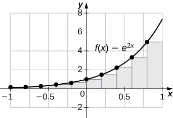 
* * *
{: data-type="newline"}

 <math xmlns="http://www.w3.org/1998/Math/MathML"><mrow><msub><mi>L</mi><mrow><mn>100</mn></mrow></msub><mo>=</mo><mn>3.555</mn><mo>,</mo><msub><mi>R</mi><mrow><mn>100</mn></mrow></msub><mo>=</mo><mn>3.670</mn><mo>.</mo></mrow></math>

 The plot shows that the left Riemann sum is an underestimate because the function is increasing. Ten rectangles are shown for visual clarity. This behavior persists for more rectangles.

Let *tj* denote the time that it took Tejay van Garteren to ride the *j*th stage of the Tour de France in 2014. If there were a total of 21 stages, interpret <math xmlns="http://www.w3.org/1998/Math/MathML"><mrow><mstyle displaystyle="true"><munderover><mo>∑</mo><mrow><mi>j</mi><mo>=</mo><mn>1</mn></mrow><mrow><mn>21</mn></mrow></munderover><mrow><msub><mi>t</mi><mi>j</mi></msub></mrow></mstyle><mo>.</mo></mrow></math>

Let <math xmlns="http://www.w3.org/1998/Math/MathML"><mrow><msub><mi>r</mi><mi>j</mi></msub></mrow></math>

 denote the total rainfall in Portland on the *j*th day of the year in 2009. Interpret <math xmlns="http://www.w3.org/1998/Math/MathML"><mrow><mstyle displaystyle="true"><munderover><mo>∑</mo><mrow><mi>j</mi><mo>=</mo><mn>1</mn></mrow><mrow><mn>31</mn></mrow></munderover><mrow><msub><mi>r</mi><mi>j</mi></msub></mrow></mstyle><mo>.</mo></mrow></math>

The sum represents the cumulative rainfall in January 2009.

Let <math xmlns="http://www.w3.org/1998/Math/MathML"><mrow><msub><mi>d</mi><mi>j</mi></msub></mrow></math>

 denote the hours of daylight and <math xmlns="http://www.w3.org/1998/Math/MathML"><mrow><msub><mi>δ</mi><mi>j</mi></msub></mrow></math>

 denote the increase in the hours of daylight from day <math xmlns="http://www.w3.org/1998/Math/MathML"><mrow><mi>j</mi><mo>−</mo><mn>1</mn></mrow></math>

 to day *j* in Fargo, North Dakota, on the *j*th day of the year. Interpret <math xmlns="http://www.w3.org/1998/Math/MathML"><mrow><msub><mi>d</mi><mn>1</mn></msub><mo>+</mo><mstyle displaystyle="true"><munderover><mo>∑</mo><mrow><mi>j</mi><mo>=</mo><mn>2</mn></mrow><mrow><mn>365</mn></mrow></munderover><mrow><msub><mi>δ</mi><mi>j</mi></msub></mrow></mstyle><mo>.</mo></mrow></math>

To help get in shape, Joe gets a new pair of running shoes. If Joe runs 1 mi each day in week 1 and adds <math xmlns="http://www.w3.org/1998/Math/MathML"><mrow><mfrac><mn>1</mn><mrow><mn>10</mn></mrow></mfrac></mrow></math>

 mi to his daily routine each week, what is the total mileage on Joe’s shoes after 25 weeks?

The total mileage is <math xmlns="http://www.w3.org/1998/Math/MathML"><mrow><mn>7</mn><mspace width="0.2em" /><mo>×</mo><mspace width="0.2em" /><mstyle displaystyle="true"><munderover><mo>∑</mo><mrow><mi>i</mi><mo>=</mo><mn>1</mn></mrow><mrow><mn>25</mn></mrow></munderover><mrow><mrow><mo>(</mo><mrow><mn>1</mn><mo>+</mo><mfrac><mrow><mrow><mo>(</mo><mrow><mi>i</mi><mo>−</mo><mn>1</mn></mrow><mo>)</mo></mrow></mrow><mrow><mn>10</mn></mrow></mfrac></mrow><mo>)</mo></mrow></mrow></mstyle><mo>=</mo><mn>7</mn><mspace width="0.2em" /><mo>×</mo><mspace width="0.2em" /><mn>25</mn><mo>+</mo><mfrac><mn>7</mn><mrow><mn>10</mn></mrow></mfrac><mspace width="0.2em" /><mo>×</mo><mspace width="0.2em" /><mn>12</mn><mspace width="0.2em" /><mo>×</mo><mspace width="0.2em" /><mn>25</mn><mo>=</mo><mn>385</mn><mspace width="0.2em" /><mtext>mi</mtext><mo>.</mo></mrow></math>

The following table gives approximate values of the average annual atmospheric rate of increase in carbon dioxide (CO2) each decade since 1960, in parts per million (ppm). Estimate the total increase in atmospheric CO2 between 1964 and 2013.

<table summary="A table with two columns and six rows. The first column contains the label &#x201C;Decade&#x201D; and the values 1964 &#x2013; 1973, 1974-1983, 1984 &#x2013; 1993, 1994-2003, and 2004-2013. The second column contains the label &#x201C;ppm/y&#x201D; and the values 1.0, 1.34, 1.40, 1.87, and 2.07."><caption>Average Annual Atmospheric CO2 Increase, 1964–2013<em>Source</em>: http://www.esrl.noaa.gov/gmd/ccgg/trends/.</caption><thead>
<tr valign="top">
<th data-align="left">Decade</th>
<th data-align="left">Ppm/y</th>
</tr>
</thead><tbody>
<tr valign="top">
<td data-align="left">1964–1973</td>
<td data-align="left">1.07</td>
</tr>
<tr valign="top">
<td data-align="left">1974–1983</td>
<td data-align="left">1.34</td>
</tr>
<tr valign="top">
<td data-align="left">1984–1993</td>
<td data-align="left">1.40</td>
</tr>
<tr valign="top">
<td data-align="left">1994–2003</td>
<td data-align="left">1.87</td>
</tr>
<tr valign="top">
<td data-align="left">2004–2013</td>
<td data-align="left">2.07</td>
</tr>
</tbody></table>

The following table gives the approximate increase in sea level in inches over 20 years starting in the given year. Estimate the net change in mean sea level from 1870 to 2010.

<table summary="A table with two columns and eight rows. The first column contains the label &#x201C;Starting Year&#x201D; and the values 1870, 1890, 1910, 1930, 1950, 1970, and 1990. The second column contains the label &#x201C;20-Year Change&#x201D; and the values 0.3, 1.5, 0.2, 2.8, 0.7, 1.1, and 1.5."><caption>Approximate 20-Year Sea Level Increases, 1870–1990<em>Source</em>: http://link.springer.com/article/10.1007%2Fs10712-011-9119-1</caption><thead>
<tr valign="top">
<th data-align="left">Starting Year</th>
<th data-align="left">20-Year Change</th>
</tr>
</thead><tbody>
<tr valign="top">
<td data-align="left">1870</td>
<td data-align="left">0.3</td>
</tr>
<tr valign="top">
<td data-align="left">1890</td>
<td data-align="left">1.5</td>
</tr>
<tr valign="top">
<td data-align="left">1910</td>
<td data-align="left">0.2</td>
</tr>
<tr valign="top">
<td data-align="left">1930</td>
<td data-align="left">2.8</td>
</tr>
<tr valign="top">
<td data-align="left">1950</td>
<td data-align="left">0.7</td>
</tr>
<tr valign="top">
<td data-align="left">1970</td>
<td data-align="left">1.1</td>
</tr>
<tr valign="top">
<td data-align="left">1990</td>
<td data-align="left">1.5</td>
</tr>
</tbody></table>

Add the numbers to get 8.1-in. net increase.

The following table gives the approximate increase in dollars in the average price of a gallon of gas per decade since 1950. If the average price of a gallon of gas in 2010 was $2.60, what was the average price of a gallon of gas in 1950?

<table summary="A table with two columns and seven rows. The first column contains the label &#x201C;Starting Year&#x201D; and values 1950, 1960, 1970, 1980, 1990, and 2000. The second column contains the label &#x201C;10-Year Change&#x201D; and the values 0.03, 0.05, 0.86, -0.03, 0.29, and 1.12."><caption>Approximate 10-Year Gas Price Increases, 1950–2000<em>Source</em>: http://epb.lbl.gov/homepages/Rick\_Diamond/docs/lbnl55011-trends.pdf.</caption><thead>
<tr valign="top">
<th data-align="left">Starting Year</th>
<th data-align="left">10-Year Change</th>
</tr>
</thead><tbody>
<tr valign="top">
<td data-align="left">1950</td>
<td data-align="left">0.03</td>
</tr>
<tr valign="top">
<td data-align="left">1960</td>
<td data-align="left">0.05</td>
</tr>
<tr valign="top">
<td data-align="left">1970</td>
<td data-align="left">0.86</td>
</tr>
<tr valign="top">
<td data-align="left">1980</td>
<td data-align="left">−0.03</td>
</tr>
<tr valign="top">
<td data-align="left">1990</td>
<td data-align="left">0.29</td>
</tr>
<tr valign="top">
<td data-align="left">2000</td>
<td data-align="left">1.12</td>
</tr>
</tbody></table>

The following table gives the percent growth of the U.S. population beginning in July of the year indicated. If the U.S. population was 281,421,906 in July 2000, estimate the U.S. population in July 2010.

<table summary="A table with two columns and eleven rows. The first column contains the label &#x201C;Year&#x201D; and the values 2000 through 2009, increasing by one. The second column contains the label &#x201C;% Change / Year&#x201D; and the values 1.12, 0.99, 0.93, 0.86, 0.93, 0.93, 0.97, 0.96, 0.95, and 0.88."><caption>Annual Percentage Growth of U.S. Population, 2000–2009<em>Source</em>: http://www.census.gov/popest/data.</caption><thead>
<tr valign="top">
<th data-align="left">Year</th>
<th data-align="left">% Change/Year</th>
</tr>
</thead><tbody>
<tr valign="top">
<td data-align="left">2000</td>
<td data-align="left">1.12</td>
</tr>
<tr valign="top">
<td data-align="left">2001</td>
<td data-align="left">0.99</td>
</tr>
<tr valign="top">
<td data-align="left">2002</td>
<td data-align="left">0.93</td>
</tr>
<tr valign="top">
<td data-align="left">2003</td>
<td data-align="left">0.86</td>
</tr>
<tr valign="top">
<td data-align="left">2004</td>
<td data-align="left">0.93</td>
</tr>
<tr valign="top">
<td data-align="left">2005</td>
<td data-align="left">0.93</td>
</tr>
<tr valign="top">
<td data-align="left">2006</td>
<td data-align="left">0.97</td>
</tr>
<tr valign="top">
<td data-align="left">2007</td>
<td data-align="left">0.96</td>
</tr>
<tr valign="top">
<td data-align="left">2008</td>
<td data-align="left">0.95</td>
</tr>
<tr valign="top">
<td data-align="left">2009</td>
<td data-align="left">0.88</td>
</tr>
</tbody></table>
(*Hint:* To obtain the population in July 2001, multiply the population in July 2000 by 1.0112 to get 284,573,831.)

309,389,957

In the following exercises, estimate the areas under the curves by computing the left Riemann sums, *L*8.

 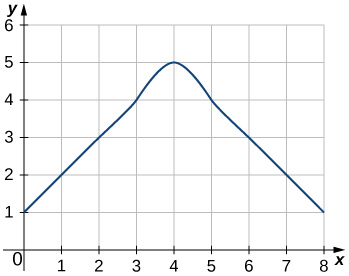 

 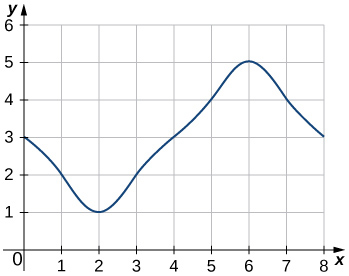 

<math xmlns="http://www.w3.org/1998/Math/MathML"><mrow><msub><mi>L</mi><mn>8</mn></msub><mo>=</mo><mn>3</mn><mo>+</mo><mn>2</mn><mo>+</mo><mn>1</mn><mo>+</mo><mn>2</mn><mo>+</mo><mn>3</mn><mo>+</mo><mn>4</mn><mo>+</mo><mn>5</mn><mo>+</mo><mn>4</mn><mo>=</mo><mn>24</mn></mrow></math>

 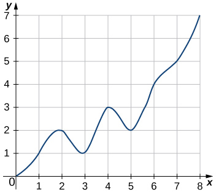 

 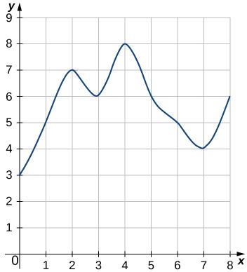 

<math xmlns="http://www.w3.org/1998/Math/MathML"><mrow><msub><mi>L</mi><mn>8</mn></msub><mo>=</mo><mn>3</mn><mo>+</mo><mn>5</mn><mo>+</mo><mn>7</mn><mo>+</mo><mn>6</mn><mo>+</mo><mn>8</mn><mo>+</mo><mn>6</mn><mo>+</mo><mn>5</mn><mo>+</mo><mn>4</mn><mo>=</mo><mn>44</mn></mrow></math>

**[T]** Use a computer algebra system to compute the Riemann sum, <math xmlns="http://www.w3.org/1998/Math/MathML"><mrow><msub><mi>L</mi><mi>N</mi></msub><mo>,</mo></mrow></math>

 for <math xmlns="http://www.w3.org/1998/Math/MathML"><mrow><mi>N</mi><mo>=</mo><mn>10</mn><mo>,</mo><mn>30</mn><mo>,</mo><mn>50</mn></mrow></math>

 for <math xmlns="http://www.w3.org/1998/Math/MathML"><mrow><mi>f</mi><mrow><mo>(</mo><mi>x</mi><mo>)</mo></mrow><mo>=</mo><msqrt><mrow><mn>1</mn><mo>−</mo><msup><mi>x</mi><mn>2</mn></msup></mrow></msqrt></mrow></math>

 on <math xmlns="http://www.w3.org/1998/Math/MathML"><mrow><mrow><mo>[</mo><mrow><mn>−1</mn><mo>,</mo><mn>1</mn></mrow><mo>]</mo></mrow><mo>.</mo></mrow></math>

**[T]** Use a computer algebra system to compute the Riemann sum, *LN*, for <math xmlns="http://www.w3.org/1998/Math/MathML"><mrow><mi>N</mi><mo>=</mo><mn>10</mn><mo>,</mo><mn>30</mn><mo>,</mo><mn>50</mn></mrow></math>

 for <math xmlns="http://www.w3.org/1998/Math/MathML"><mrow><mi>f</mi><mrow><mo>(</mo><mi>x</mi><mo>)</mo></mrow><mo>=</mo><mfrac><mn>1</mn><mrow><msqrt><mrow><mn>1</mn><mo>+</mo><msup><mi>x</mi><mn>2</mn></msup></mrow></msqrt></mrow></mfrac></mrow></math>

 on <math xmlns="http://www.w3.org/1998/Math/MathML"><mrow><mrow><mo>[</mo><mrow><mn>−1</mn><mo>,</mo><mn>1</mn></mrow><mo>]</mo></mrow><mo>.</mo></mrow></math>

<math xmlns="http://www.w3.org/1998/Math/MathML"><mrow><msub><mi>L</mi><mrow><mn>10</mn></mrow></msub><mo>≈</mo><mn>1.7604</mn><mo>,</mo><msub><mi>L</mi><mrow><mn>30</mn></mrow></msub><mo>≈</mo><mn>1.7625</mn><mo>,</mo><msub><mi>L</mi><mrow><mn>50</mn></mrow></msub><mo>≈</mo><mn>1.76265</mn></mrow></math>

**[T]** Use a computer algebra system to compute the Riemann sum, *LN*, for <math xmlns="http://www.w3.org/1998/Math/MathML"><mrow><mi>N</mi><mo>=</mo><mn>10</mn><mo>,</mo><mn>30</mn><mo>,</mo><mn>50</mn></mrow></math>

 for <math xmlns="http://www.w3.org/1998/Math/MathML"><mrow><mi>f</mi><mrow><mo>(</mo><mi>x</mi><mo>)</mo></mrow><mo>=</mo><msup><mrow><mtext>sin</mtext></mrow><mn>2</mn></msup><mi>x</mi></mrow></math>

 on <math xmlns="http://www.w3.org/1998/Math/MathML"><mrow><mrow><mo>[</mo><mrow><mn>0</mn><mo>,</mo><mn>2</mn><mi>π</mi></mrow><mo>]</mo></mrow><mo>.</mo></mrow></math>

 Compare these estimates with *π*.

In the following exercises, use a calculator or a computer program to evaluate the endpoint sums *RN* and *LN* for <math xmlns="http://www.w3.org/1998/Math/MathML"><mrow><mi>N</mi><mo>=</mo><mn>1,10,100</mn><mo>.</mo></mrow></math>

 How do these estimates compare with the exact answers, which you can find via geometry?

**[T]** <math xmlns="http://www.w3.org/1998/Math/MathML"><mrow><mi>y</mi><mo>=</mo><mtext>cos</mtext><mrow><mo>(</mo><mrow><mi>π</mi><mi>x</mi></mrow><mo>)</mo></mrow></mrow></math>

 on the interval <math xmlns="http://www.w3.org/1998/Math/MathML"><mrow><mrow><mo>[</mo><mrow><mn>0</mn><mo>,</mo><mn>1</mn></mrow><mo>]</mo></mrow></mrow></math>

<math xmlns="http://www.w3.org/1998/Math/MathML"><mrow><msub><mi>R</mi><mn>1</mn></msub><mo>=</mo><mn>−1</mn><mo>,</mo><msub><mi>L</mi><mn>1</mn></msub><mo>=</mo><mn>1</mn><mo>,</mo><msub><mi>R</mi><mrow><mn>10</mn></mrow></msub><mo>=</mo><mn>−0.1</mn><mo>,</mo><msub><mi>L</mi><mrow><mn>10</mn></mrow></msub><mo>=</mo><mn>0.1</mn><mo>,</mo><msub><mi>L</mi><mrow><mn>100</mn></mrow></msub><mo>=</mo><mn>0.01</mn><mo>,</mo></mrow></math>

 and <math xmlns="http://www.w3.org/1998/Math/MathML"><mrow><msub><mi>R</mi><mrow><mn>100</mn></mrow></msub><mo>=</mo><mn>−0.1</mn><mo>.</mo></mrow></math>

 By symmetry of the graph, the exact area is zero.

**[T]** <math xmlns="http://www.w3.org/1998/Math/MathML"><mrow><mi>y</mi><mo>=</mo><mn>3</mn><mi>x</mi><mo>+</mo><mn>2</mn></mrow></math>

 on the interval <math xmlns="http://www.w3.org/1998/Math/MathML"><mrow><mrow><mo>[</mo><mrow><mn>3</mn><mo>,</mo><mn>5</mn></mrow><mo>]</mo></mrow></mrow></math>

In the following exercises, use a calculator or a computer program to evaluate the endpoint sums *RN* and *LN* for <math xmlns="http://www.w3.org/1998/Math/MathML"><mrow><mi>N</mi><mo>=</mo><mn>1,10,100</mn><mo>.</mo></mrow></math>

**[T]** <math xmlns="http://www.w3.org/1998/Math/MathML"><mrow><mi>y</mi><mo>=</mo><msup><mi>x</mi><mn>4</mn></msup><mo>−</mo><mn>5</mn><msup><mi>x</mi><mn>2</mn></msup><mo>+</mo><mn>4</mn></mrow></math>

 on the interval <math xmlns="http://www.w3.org/1998/Math/MathML"><mrow><mrow><mo>[</mo><mrow><mn>−2</mn><mo>,</mo><mn>2</mn></mrow><mo>]</mo></mrow><mo>,</mo></mrow></math>

 which has an exact area of <math xmlns="http://www.w3.org/1998/Math/MathML"><mrow><mfrac><mrow><mn>32</mn></mrow><mrow><mn>15</mn></mrow></mfrac></mrow></math>

<math xmlns="http://www.w3.org/1998/Math/MathML"><mrow><msub><mi>R</mi><mn>1</mn></msub><mo>=</mo><mn>0</mn><mo>,</mo><msub><mi>L</mi><mn>1</mn></msub><mo>=</mo><mn>0</mn><mo>,</mo><msub><mi>R</mi><mrow><mn>10</mn></mrow></msub><mo>=</mo><mn>2.4499</mn><mo>,</mo><msub><mi>L</mi><mrow><mn>10</mn></mrow></msub><mo>=</mo><mn>2.4499</mn><mo>,</mo><msub><mi>R</mi><mrow><mn>100</mn></mrow></msub><mo>=</mo><mn>2.1365</mn><mo>,</mo><msub><mi>L</mi><mrow><mn>100</mn></mrow></msub><mo>=</mo><mn>2.1365</mn></mrow></math>

**[T]** <math xmlns="http://www.w3.org/1998/Math/MathML"><mrow><mi>y</mi><mo>=</mo><mtext>ln</mtext><mspace width="0.1em" /><mi>x</mi></mrow></math>

 on the interval <math xmlns="http://www.w3.org/1998/Math/MathML"><mrow><mrow><mo>[</mo><mrow><mn>1</mn><mo>,</mo><mn>2</mn></mrow><mo>]</mo></mrow><mo>,</mo></mrow></math>

 which has an exact area of <math xmlns="http://www.w3.org/1998/Math/MathML"><mrow><mn>2</mn><mspace width="0.1em" /><mtext>ln</mtext><mrow><mo>(</mo><mn>2</mn><mo>)</mo></mrow><mo>−</mo><mn>1</mn></mrow></math>

Explain why, if <math xmlns="http://www.w3.org/1998/Math/MathML"><mrow><mi>f</mi><mrow><mo>(</mo><mi>a</mi><mo>)</mo></mrow><mo>≥</mo><mn>0</mn></mrow></math>

 and *f* is increasing on <math xmlns="http://www.w3.org/1998/Math/MathML"><mrow><mrow><mo>[</mo><mrow><mi>a</mi><mo>,</mo><mi>b</mi></mrow><mo>]</mo></mrow><mo>,</mo></mrow></math>

 that the left endpoint estimate is a lower bound for the area below the graph of *f* on <math xmlns="http://www.w3.org/1998/Math/MathML"><mrow><mrow><mo>[</mo><mrow><mi>a</mi><mo>,</mo><mi>b</mi></mrow><mo>]</mo></mrow><mo>.</mo></mrow></math>

If <math xmlns="http://www.w3.org/1998/Math/MathML"><mrow><mrow><mo>[</mo><mrow><mi>c</mi><mo>,</mo><mi>d</mi></mrow><mo>]</mo></mrow></mrow></math>

 is a subinterval of <math xmlns="http://www.w3.org/1998/Math/MathML"><mrow><mrow><mo>[</mo><mrow><mi>a</mi><mo>,</mo><mi>b</mi></mrow><mo>]</mo></mrow></mrow></math>

 under one of the left-endpoint sum rectangles, then the area of the rectangle contributing to the left-endpoint estimate is <math xmlns="http://www.w3.org/1998/Math/MathML"><mrow><mi>f</mi><mrow><mo>(</mo><mi>c</mi><mo>)</mo></mrow><mrow><mo>(</mo><mrow><mi>d</mi><mo>−</mo><mi>c</mi></mrow><mo>)</mo></mrow><mo>.</mo></mrow></math>

 But, <math xmlns="http://www.w3.org/1998/Math/MathML"><mrow><mi>f</mi><mrow><mo>(</mo><mi>c</mi><mo>)</mo></mrow><mo>≤</mo><mi>f</mi><mrow><mo>(</mo><mi>x</mi><mo>)</mo></mrow></mrow></math>

 for <math xmlns="http://www.w3.org/1998/Math/MathML"><mrow><mi>c</mi><mo>≤</mo><mi>x</mi><mo>≤</mo><mi>d</mi><mo>,</mo></mrow></math>

 so the area under the graph of *f* between *c* and *d* is <math xmlns="http://www.w3.org/1998/Math/MathML"><mrow><mi>f</mi><mrow><mo>(</mo><mi>c</mi><mo>)</mo></mrow><mrow><mo>(</mo><mrow><mi>d</mi><mo>−</mo><mi>c</mi></mrow><mo>)</mo></mrow></mrow></math>

 plus the area below the graph of *f* but above the horizontal line segment at height <math xmlns="http://www.w3.org/1998/Math/MathML"><mrow><mi>f</mi><mrow><mo>(</mo><mi>c</mi><mo>)</mo></mrow><mo>,</mo></mrow></math>

 which is positive. As this is true for each left-endpoint sum interval, it follows that the left Riemann sum is less than or equal to the area below the graph of *f* on <math xmlns="http://www.w3.org/1998/Math/MathML"><mrow><mrow><mo>[</mo><mrow><mi>a</mi><mo>,</mo><mi>b</mi></mrow><mo>]</mo></mrow><mo>.</mo></mrow></math>

Explain why, if <math xmlns="http://www.w3.org/1998/Math/MathML"><mrow><mi>f</mi><mo stretchy="false">(</mo><mi>b</mi><mo stretchy="false">)</mo><mo>≥</mo><mn>0</mn></mrow></math>

 and *f* is decreasing on <math xmlns="http://www.w3.org/1998/Math/MathML"><mrow><mrow><mo>[</mo><mrow><mi>a</mi><mo>,</mo><mi>b</mi></mrow><mo>]</mo></mrow><mo>,</mo></mrow></math>

 that the left endpoint estimate is an upper bound for the area below the graph of *f* on <math xmlns="http://www.w3.org/1998/Math/MathML"><mrow><mrow><mo>[</mo><mrow><mi>a</mi><mo>,</mo><mi>b</mi></mrow><mo>]</mo></mrow><mo>.</mo></mrow></math>

Show that, in general, <math xmlns="http://www.w3.org/1998/Math/MathML"><mrow><msub><mi>R</mi><mi>N</mi></msub><mo>−</mo><msub><mi>L</mi><mi>N</mi></msub><mo>=</mo><mrow><mo>(</mo><mrow><mi>b</mi><mo>−</mo><mi>a</mi></mrow><mo>)</mo></mrow><mspace width="0.2em" /><mo>×</mo><mspace width="0.2em" /><mfrac><mrow><mi>f</mi><mrow><mo>(</mo><mi>b</mi><mo>)</mo></mrow><mo>−</mo><mi>f</mi><mrow><mo>(</mo><mi>a</mi><mo>)</mo></mrow></mrow><mi>N</mi></mfrac><mo>.</mo></mrow></math>

<math xmlns="http://www.w3.org/1998/Math/MathML"><mrow><msub><mi>L</mi><mi>N</mi></msub><mo>=</mo><mfrac><mrow><mi>b</mi><mo>−</mo><mi>a</mi></mrow><mi>N</mi></mfrac><mstyle displaystyle="true"><munderover><mo>∑</mo><mrow><mi>i</mi><mo>=</mo><mn>1</mn></mrow><mi>N</mi></munderover><mrow><mi>f</mi><mrow><mo>(</mo><mrow><mi>a</mi><mo>+</mo><mrow><mo>(</mo><mrow><mi>b</mi><mo>−</mo><mi>a</mi></mrow><mo>)</mo></mrow><mfrac><mrow><mi>i</mi><mo>−</mo><mn>1</mn></mrow><mi>N</mi></mfrac></mrow><mo>)</mo></mrow></mrow></mstyle><mo>=</mo><mfrac><mrow><mi>b</mi><mo>−</mo><mi>a</mi></mrow><mi>N</mi></mfrac><mstyle displaystyle="true"><munderover><mo>∑</mo><mrow><mi>i</mi><mo>=</mo><mn>0</mn></mrow><mrow><mi>N</mi><mo>−</mo><mn>1</mn></mrow></munderover><mrow><mi>f</mi><mrow><mo>(</mo><mrow><mi>a</mi><mo>+</mo><mrow><mo>(</mo><mrow><mi>b</mi><mo>−</mo><mi>a</mi></mrow><mo>)</mo></mrow><mfrac><mi>i</mi><mi>N</mi></mfrac></mrow><mo>)</mo></mrow></mrow></mstyle></mrow></math>

 and <math xmlns="http://www.w3.org/1998/Math/MathML"><mrow><msub><mi>R</mi><mi>N</mi></msub><mo>=</mo><mfrac><mrow><mi>b</mi><mo>−</mo><mi>a</mi></mrow><mi>N</mi></mfrac><mstyle displaystyle="true"><munderover><mo>∑</mo><mrow><mi>i</mi><mo>=</mo><mn>1</mn></mrow><mi>N</mi></munderover><mrow><mi>f</mi><mrow><mo>(</mo><mrow><mi>a</mi><mo>+</mo><mrow><mo>(</mo><mrow><mi>b</mi><mo>−</mo><mi>a</mi></mrow><mo>)</mo></mrow><mfrac><mi>i</mi><mi>N</mi></mfrac></mrow><mo>)</mo></mrow></mrow></mstyle><mo>.</mo></mrow></math>

 The left sum has a term corresponding to <math xmlns="http://www.w3.org/1998/Math/MathML"><mrow><mi>i</mi><mo>=</mo><mn>0</mn></mrow></math>

 and the right sum has a term corresponding to <math xmlns="http://www.w3.org/1998/Math/MathML"><mrow><mi>i</mi><mo>=</mo><mi>N</mi><mo>.</mo></mrow></math>

 In <math xmlns="http://www.w3.org/1998/Math/MathML"><mrow><msub><mi>R</mi><mi>N</mi></msub><mo>−</mo><msub><mi>L</mi><mi>N</mi></msub><mo>,</mo></mrow></math>

 any term corresponding to <math xmlns="http://www.w3.org/1998/Math/MathML"><mrow><mi>i</mi><mo>=</mo><mn>1</mn><mo>,</mo><mn>2</mn><mtext>,…,</mtext><mspace width="0.2em" /><mi>N</mi><mo>−</mo><mn>1</mn></mrow></math>

 occurs once with a plus sign and once with a minus sign, so each such term cancels and one is left with <math xmlns="http://www.w3.org/1998/Math/MathML"><mrow><msub><mi>R</mi><mi>N</mi></msub><mo>−</mo><msub><mi>L</mi><mi>N</mi></msub><mo>=</mo><mfrac><mrow><mi>b</mi><mo>−</mo><mi>a</mi></mrow><mi>N</mi></mfrac><mrow><mo>(</mo><mrow><mi>f</mi><mrow><mo>(</mo><mrow><mi>a</mi><mo>+</mo><mrow><mo>(</mo><mrow><mi>b</mi><mo>−</mo><mi>a</mi></mrow><mo>)</mo></mrow></mrow><mo>)</mo></mrow><mfrac><mi>N</mi><mi>N</mi></mfrac></mrow><mo>)</mo></mrow><mo>−</mo><mrow><mo>(</mo><mrow><mi>f</mi><mrow><mo>(</mo><mi>a</mi><mo>)</mo></mrow><mo>+</mo><mrow><mo>(</mo><mrow><mi>b</mi><mo>−</mo><mi>a</mi></mrow><mo>)</mo></mrow><mfrac><mn>0</mn><mi>N</mi></mfrac></mrow><mo>)</mo></mrow><mo>=</mo><mfrac><mrow><mi>b</mi><mo>−</mo><mi>a</mi></mrow><mi>N</mi></mfrac><mrow><mo>(</mo><mrow><mi>f</mi><mrow><mo>(</mo><mi>b</mi><mo>)</mo></mrow><mo>−</mo><mi>f</mi><mrow><mo>(</mo><mi>a</mi><mo>)</mo></mrow></mrow><mo>)</mo></mrow><mo>.</mo></mrow></math>

Explain why, if *f* is increasing on <math xmlns="http://www.w3.org/1998/Math/MathML"><mrow><mrow><mo>[</mo><mrow><mi>a</mi><mo>,</mo><mi>b</mi></mrow><mo>]</mo></mrow><mo>,</mo></mrow></math>

 the error between either *LN* or *RN* and the area *A* below the graph of *f* is at most <math xmlns="http://www.w3.org/1998/Math/MathML"><mrow><mrow><mo>(</mo><mrow><mi>b</mi><mo>−</mo><mi>a</mi></mrow><mo>)</mo></mrow><mfrac><mrow><mi>f</mi><mrow><mo>(</mo><mi>b</mi><mo>)</mo></mrow><mo>−</mo><mi>f</mi><mrow><mo>(</mo><mi>a</mi><mo>)</mo></mrow></mrow><mi>N</mi></mfrac><mo>.</mo></mrow></math>

For each of the three graphs:

1.  Obtain a lower bound
    <math xmlns="http://www.w3.org/1998/Math/MathML"><mrow><mi>L</mi><mrow><mo>(</mo><mi>A</mi><mo>)</mo></mrow></mrow></math>
    
    for the area enclosed by the curve by adding the areas of the squares *enclosed completely* by the curve.
2.  Obtain an upper bound
    <math xmlns="http://www.w3.org/1998/Math/MathML"><mrow><mi>U</mi><mrow><mo>(</mo><mi>A</mi><mo>)</mo></mrow></mrow></math>
    
    for the area by adding to
    <math xmlns="http://www.w3.org/1998/Math/MathML"><mrow><mi>L</mi><mrow><mo>(</mo><mi>A</mi><mo>)</mo></mrow></mrow></math>
    
    the areas
    <math xmlns="http://www.w3.org/1998/Math/MathML"><mrow><mi>B</mi><mrow><mo>(</mo><mi>A</mi><mo>)</mo></mrow></mrow></math>
    
    of the squares *enclosed partially* by the curve.
    * * *
    {: data-type="newline"}
    
     ![Three graphs, stacked vertically, drawn on graph paper. Each shows the same image. However, the axes become progressively more exact in units. The first is marked in units, from negative 3 units to positive 3 units on each axis. The second has the half-units marked, and the third has the quarter units marked. As such, the graph paper boxes become smaller and smaller. The image is symmetrical across each axis and is a curved cross shape. It meets the axes at (0,3), (3,0), (0,-3), and (-3,0) and has corners roughly at (.7,.7), (.7,-.7), (-.7,-7.), and (-.7,.7). In graph 1, no square unit boxes are completely contained inside the shape. Twenty boxes are enclosed partially by the shape. In graph 2, nine boxes are completely contained inside the shape, and eleven boxes are enclosed partially by the shape. In graph 3, 11 boxes are completely contained inside the shape, and 4.5 are enclosed partially by the shape.](../resources/CNX_Calc_Figure_05_01_212.jpg) 
{: type="a"}

Graph 1: a. <math xmlns="http://www.w3.org/1998/Math/MathML"><mrow><mi>L</mi><mrow><mo>(</mo><mi>A</mi><mo>)</mo></mrow><mo>=</mo><mn>0</mn><mo>,</mo><mi>B</mi><mrow><mo>(</mo><mi>A</mi><mo>)</mo></mrow><mo>=</mo><mn>20</mn><mo>;</mo></mrow></math>

 b. <math xmlns="http://www.w3.org/1998/Math/MathML"><mrow><mi>U</mi><mrow><mo>(</mo><mi>A</mi><mo>)</mo></mrow><mo>=</mo><mn>20</mn><mo>.</mo></mrow></math>

 Graph 2: a. <math xmlns="http://www.w3.org/1998/Math/MathML"><mrow><mi>L</mi><mrow><mo>(</mo><mi>A</mi><mo>)</mo></mrow><mo>=</mo><mn>9</mn><mo>;</mo></mrow></math>

 b. <math xmlns="http://www.w3.org/1998/Math/MathML"><mrow><mi>B</mi><mrow><mo>(</mo><mi>A</mi><mo>)</mo></mrow><mo>=</mo><mn>11</mn><mo>,</mo><mi>U</mi><mrow><mo>(</mo><mi>A</mi><mo>)</mo></mrow><mo>=</mo><mn>20</mn><mo>.</mo></mrow></math>

 Graph 3: a. <math xmlns="http://www.w3.org/1998/Math/MathML"><mrow><mi>L</mi><mrow><mo>(</mo><mi>A</mi><mo>)</mo></mrow><mo>=</mo><mn>11.0</mn><mo>;</mo></mrow></math>

 b. <math xmlns="http://www.w3.org/1998/Math/MathML"><mrow><mi>B</mi><mrow><mo>(</mo><mi>A</mi><mo>)</mo></mrow><mo>=</mo><mn>4.5</mn><mo>,</mo><mi>U</mi><mrow><mo>(</mo><mi>A</mi><mo>)</mo></mrow><mo>=</mo><mn>15.5</mn><mo>.</mo></mrow></math>

In the previous exercise, explain why <math xmlns="http://www.w3.org/1998/Math/MathML"><mrow><mi>L</mi><mrow><mo>(</mo><mi>A</mi><mo>)</mo></mrow></mrow></math>

 gets no smaller while <math xmlns="http://www.w3.org/1998/Math/MathML"><mrow><mi>U</mi><mrow><mo>(</mo><mi>A</mi><mo>)</mo></mrow></mrow></math>

 gets no larger as the squares are subdivided into four boxes of equal area.

A unit circle is made up of *n* wedges equivalent to the inner wedge in the figure. The base of the inner triangle is 1 unit and its height is <math xmlns="http://www.w3.org/1998/Math/MathML"><mrow><mtext>sin</mtext><mrow><mo>(</mo><mrow><mfrac><mi>π</mi><mi>n</mi></mfrac></mrow><mo>)</mo></mrow><mo>.</mo></mrow></math>

 The base of the outer triangle is <math xmlns="http://www.w3.org/1998/Math/MathML"><mrow><mi>B</mi><mo>=</mo><mtext>cos</mtext><mrow><mo>(</mo><mrow><mfrac><mi>π</mi><mi>n</mi></mfrac></mrow><mo>)</mo></mrow><mo>+</mo><mtext>sin</mtext><mrow><mo>(</mo><mrow><mfrac><mi>π</mi><mi>n</mi></mfrac></mrow><mo>)</mo></mrow><mtext>tan</mtext><mrow><mo>(</mo><mrow><mfrac><mi>π</mi><mi>n</mi></mfrac></mrow><mo>)</mo></mrow></mrow></math>

 and the height is <math xmlns="http://www.w3.org/1998/Math/MathML"><mrow><mi>H</mi><mo>=</mo><mi>B</mi><mspace width="0.1em" /><mtext>sin</mtext><mrow><mo>(</mo><mrow><mfrac><mrow><mn>2</mn><mi>π</mi></mrow><mi>n</mi></mfrac></mrow><mo>)</mo></mrow><mo>.</mo></mrow></math>

 Use this information to argue that the area of a unit circle is equal to *π*.

 ![A wedge of a circle cut at an acute angle theta = 2pi / n. Several extra lines are drawn. The first is a line A connecting the ends of the two radii, creating a triangle. The second is another line B parallel to the A, connecting the radii a few units in from each endpoint. A concentric curve C connects the endpoints of B and is tangent to A near its midpoint. The area between this curve C and the edge of the circle is shaded in pink, and the rest of the wedge is purple. A final concentric curve is drawn very close to angle theta.](../resources/CNX_Calc_Figure_05_01_213.jpg) 

Let *A* be the area of the unit circle. The circle encloses *n* congruent triangles each of area <math xmlns="http://www.w3.org/1998/Math/MathML"><mrow><mfrac><mrow><mtext>sin</mtext><mrow><mo>(</mo><mrow><mfrac><mrow><mn>2</mn><mi>π</mi></mrow><mi>n</mi></mfrac></mrow><mo>)</mo></mrow></mrow><mn>2</mn></mfrac><mo>,</mo></mrow></math>

 so <math xmlns="http://www.w3.org/1998/Math/MathML"><mrow><mfrac><mi>n</mi><mn>2</mn></mfrac><mtext>sin</mtext><mrow><mo>(</mo><mrow><mfrac><mrow><mn>2</mn><mi>π</mi></mrow><mi>n</mi></mfrac></mrow><mo>)</mo></mrow><mo>≤</mo><mi>A</mi><mo>.</mo></mrow></math>

 Similarly, the circle is contained inside *n* congruent triangles each of area <math xmlns="http://www.w3.org/1998/Math/MathML"><mrow><mfrac><mrow><mi>B</mi><mi>H</mi></mrow><mn>2</mn></mfrac><mo>=</mo><mfrac><mn>1</mn><mn>2</mn></mfrac><mrow><mo>(</mo><mrow><mtext>cos</mtext><mrow><mo>(</mo><mrow><mfrac><mi>π</mi><mi>n</mi></mfrac></mrow><mo>)</mo></mrow><mo>+</mo><mtext>sin</mtext><mrow><mo>(</mo><mrow><mfrac><mi>π</mi><mi>n</mi></mfrac></mrow><mo>)</mo></mrow><mtext>tan</mtext><mrow><mo>(</mo><mrow><mfrac><mi>π</mi><mi>n</mi></mfrac></mrow><mo>)</mo></mrow></mrow><mo>)</mo></mrow><mtext>sin</mtext><mrow><mo>(</mo><mrow><mfrac><mrow><mn>2</mn><mi>π</mi></mrow><mi>n</mi></mfrac></mrow><mo>)</mo></mrow><mo>,</mo></mrow></math>

 so <math xmlns="http://www.w3.org/1998/Math/MathML"><mrow><mi>A</mi><mo>≤</mo><mfrac><mi>n</mi><mn>2</mn></mfrac><mtext>sin</mtext><mrow><mo>(</mo><mrow><mfrac><mrow><mn>2</mn><mi>π</mi></mrow><mi>n</mi></mfrac></mrow><mo>)</mo></mrow><mrow><mo>(</mo><mrow><mtext>cos</mtext><mrow><mo>(</mo><mrow><mfrac><mi>π</mi><mi>n</mi></mfrac></mrow><mo>)</mo></mrow></mrow><mo>)</mo></mrow><mo>+</mo><mtext>sin</mtext><mrow><mo>(</mo><mrow><mfrac><mi>π</mi><mi>n</mi></mfrac></mrow><mo>)</mo></mrow><mtext>tan</mtext><mrow><mo>(</mo><mrow><mfrac><mi>π</mi><mi>n</mi></mfrac></mrow><mo>)</mo></mrow><mo>.</mo></mrow></math>

 As <math xmlns="http://www.w3.org/1998/Math/MathML"><mrow><mi>n</mi><mo stretchy="false">→</mo><mi>∞</mi><mo>,</mo><mfrac><mi>n</mi><mn>2</mn></mfrac><mtext>sin</mtext><mrow><mo>(</mo><mrow><mfrac><mrow><mn>2</mn><mi>π</mi></mrow><mi>n</mi></mfrac></mrow><mo>)</mo></mrow><mo>=</mo><mfrac><mrow><mi>π</mi><mspace width="0.1em" /><mtext>sin</mtext><mrow><mo>(</mo><mrow><mfrac><mrow><mn>2</mn><mi>π</mi></mrow><mi>n</mi></mfrac></mrow><mo>)</mo></mrow></mrow><mrow><mrow><mo>(</mo><mrow><mfrac><mrow><mn>2</mn><mi>π</mi></mrow><mi>n</mi></mfrac></mrow><mo>)</mo></mrow></mrow></mfrac><mo stretchy="false">→</mo><mi>π</mi><mo>,</mo></mrow></math>

 so we conclude <math xmlns="http://www.w3.org/1998/Math/MathML"><mrow><mi>π</mi><mo>≤</mo><mi>A</mi><mo>.</mo></mrow></math>

 Also, as <math xmlns="http://www.w3.org/1998/Math/MathML"><mrow><mi>n</mi><mo stretchy="false">→</mo><mi>∞</mi><mo>,</mo><mtext>cos</mtext><mrow><mo>(</mo><mrow><mfrac><mi>π</mi><mi>n</mi></mfrac></mrow><mo>)</mo></mrow><mo>+</mo><mtext>sin</mtext><mrow><mo>(</mo><mrow><mfrac><mi>π</mi><mi>n</mi></mfrac></mrow><mo>)</mo></mrow><mtext>tan</mtext><mrow><mo>(</mo><mrow><mfrac><mi>π</mi><mi>n</mi></mfrac></mrow><mo>)</mo></mrow><mo stretchy="false">→</mo><mn>1</mn><mo>,</mo></mrow></math>

 so we also have <math xmlns="http://www.w3.org/1998/Math/MathML"><mrow><mi>A</mi><mo>≤</mo><mi>π</mi><mo>.</mo></mrow></math>

 By the squeeze theorem for limits, we conclude that <math xmlns="http://www.w3.org/1998/Math/MathML"><mrow><mi>A</mi><mo>=</mo><mi>π</mi><mo>.</mo></mrow></math>

</section>

### Glossary
{: data-type="glossary-title"}

left-endpoint approximation
: an approximation of the area under a curve computed by using the left endpoint of each subinterval to calculate the height of the vertical sides of each rectangle
^

lower sum
: a sum obtained by using the minimum value of
  <math xmlns="http://www.w3.org/1998/Math/MathML"><mrow><mi>f</mi><mrow><mo>(</mo><mi>x</mi><mo>)</mo></mrow></mrow></math>
  
  on each subinterval
^

partition
: a set of points that divides an interval into subintervals
^

regular partition
: a partition in which the subintervals all have the same width
^

riemann sum
: an estimate of the area under the curve of the form
  <math xmlns="http://www.w3.org/1998/Math/MathML"><mrow><mi>A</mi><mo>≈</mo><mstyle displaystyle="true"><munderover><mo>∑</mo><mrow><mi>i</mi><mo>=</mo><mn>1</mn></mrow><mi>n</mi></munderover><mi>f</mi></mstyle><mo stretchy="false">(</mo><msubsup><mi>x</mi><mi>i</mi><mo>*</mo></msubsup><mo stretchy="false">)</mo><mtext>Δ</mtext><mi>x</mi></mrow></math>
^

right-endpoint approximation
: the right-endpoint approximation is an approximation of the area of the rectangles under a curve using the right endpoint of each subinterval to construct the vertical sides of each rectangle
^

sigma notation
: (also, **summation notation**) the Greek letter sigma (Σ) indicates addition of the values; the values of the index above and below the sigma indicate where to begin the summation and where to end it
^

upper sum
: a sum obtained by using the maximum value of
  <math xmlns="http://www.w3.org/1998/Math/MathML"><mrow><mi>f</mi><mrow><mo>(</mo><mi>x</mi><mo>)</mo></mrow></mrow></math>
  
  on each subinterval

[1]: http://www.openstaxcollege.org/l/20_riemannsums
