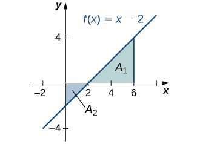

* State the definition of the definite integral.
* Explain the terms integrand, limits of integration, and variable of integration.
* Explain when a function is integrable.
* Describe the relationship between the definite integral and net area.
* Use geometry and the properties of definite integrals to evaluate them.
* Calculate the average value of a function.

In the preceding section we defined the area under a curve in terms of Riemann sums:

<math xmlns="http://www.w3.org/1998/Math/MathML"><mrow><mi>A</mi><mo>=</mo><munder><mrow><mtext>lim</mtext></mrow><mrow><mi>n</mi><mo stretchy="false">→</mo><mi>∞</mi></mrow></munder><mstyle displaystyle="true"><munderover><mo>∑</mo><mrow><mi>i</mi><mo>=</mo><mn>1</mn></mrow><mi>n</mi></munderover><mrow><mi>f</mi><mrow><mo>(</mo><mrow><msubsup><mi>x</mi><mi>i</mi><mo>*</mo></msubsup></mrow><mo>)</mo></mrow><mtext>Δ</mtext><mi>x</mi></mrow></mstyle><mo>.</mo></mrow></math>

However, this definition came with restrictions. We required <math xmlns="http://www.w3.org/1998/Math/MathML"><mrow><mi>f</mi><mrow><mo>(</mo><mi>x</mi><mo>)</mo></mrow></mrow></math>

 to be continuous and nonnegative. Unfortunately, real-world problems don’t always meet these restrictions. In this section, we look at how to apply the concept of the area under the curve to a broader set of functions through the use of the definite integral.

### Definition and Notation

The definite integral generalizes the concept of the area under a curve. We lift the requirements that <math xmlns="http://www.w3.org/1998/Math/MathML"><mrow><mi>f</mi><mrow><mo>(</mo><mi>x</mi><mo>)</mo></mrow></mrow></math>

 be continuous and nonnegative, and define the definite integral as follows.

Definition

If <math xmlns="http://www.w3.org/1998/Math/MathML"><mrow><mi>f</mi><mrow><mo>(</mo><mi>x</mi><mo>)</mo></mrow></mrow></math>

 is a function defined on an interval <math xmlns="http://www.w3.org/1998/Math/MathML"><mrow><mrow><mo>[</mo><mrow><mi>a</mi><mo>,</mo><mi>b</mi></mrow><mo>]</mo></mrow><mo>,</mo></mrow></math>

 the **definite integral**{: data-type="term"} of *f* from *a* to *b* is given by

<math xmlns="http://www.w3.org/1998/Math/MathML"><mrow><mstyle displaystyle="true"><mrow><msubsup><mo>∫</mo><mi>a</mi><mi>b</mi></msubsup><mrow><mi>f</mi><mrow><mo>(</mo><mi>x</mi><mo>)</mo></mrow><mi>d</mi><mi>x</mi></mrow></mrow></mstyle><mo>=</mo><munder><mstyle mathsize="140%" displaystyle="true"><mrow><mtext>lim</mtext></mrow></mstyle><mrow><mi>n</mi><mo stretchy="false">→</mo><mi>∞</mi></mrow></munder><mstyle displaystyle="true"><munderover><mo>∑</mo><mrow><mi>i</mi><mo>=</mo><mn>1</mn></mrow><mi>n</mi></munderover><mrow><mi>f</mi><mrow><mo>(</mo><mrow><msubsup><mi>x</mi><mi>i</mi><mo>*</mo></msubsup></mrow><mo>)</mo></mrow><mtext>Δ</mtext><mi>x</mi></mrow></mstyle><mo>,</mo></mrow></math>

provided the limit exists. If this limit exists, the function <math xmlns="http://www.w3.org/1998/Math/MathML"><mrow><mi>f</mi><mrow><mo>(</mo><mi>x</mi><mo>)</mo></mrow></mrow></math>

 is said to be integrable on <math xmlns="http://www.w3.org/1998/Math/MathML"><mrow><mrow><mo>[</mo><mrow><mi>a</mi><mo>,</mo><mi>b</mi></mrow><mo>]</mo></mrow><mo>,</mo></mrow></math>

 or is an **integrable function**{: data-type="term"}.

The integral symbol in the previous definition should look familiar. We have seen similar notation in the chapter on [Applications of Derivatives](/m53602){: .target-chapter}, where we used the indefinite integral symbol (without the *a* and *b* above and below) to represent an antiderivative. Although the notation for indefinite integrals may look similar to the notation for a definite integral, they are not the same. A definite integral is a number. An indefinite integral is a family of functions. Later in this chapter we examine how these concepts are related. However, close attention should always be paid to notation so we know whether we’re working with a definite integral or an indefinite integral.

Integral notation goes back to the late seventeenth century and is one of the contributions of Gottfried Wilhelm **Leibniz**{: data-type="term" .no-emphasis}, who is often considered to be the codiscoverer of calculus, along with Isaac Newton. The integration symbol ∫ is an elongated S, suggesting sigma or summation. On a definite integral, above and below the summation symbol are the boundaries of the interval, <math xmlns="http://www.w3.org/1998/Math/MathML"><mrow><mrow><mo>[</mo><mrow><mi>a</mi><mo>,</mo><mi>b</mi></mrow><mo>]</mo></mrow><mo>.</mo></mrow></math>

 The numbers *a* and *b* are *x*-values and are called the **limits of integration**{: data-type="term"}; specifically, *a* is the lower limit and *b* is the upper limit. To clarify, we are using the word *limit* in two different ways in the context of the definite integral. First, we talk about the limit of a sum as <math xmlns="http://www.w3.org/1998/Math/MathML"><mrow><mi>n</mi><mo stretchy="false">→</mo><mi>∞</mi><mo>.</mo></mrow></math>

 Second, the boundaries of the region are called the *limits of integration*.

We call the function <math xmlns="http://www.w3.org/1998/Math/MathML"><mrow><mi>f</mi><mrow><mo>(</mo><mi>x</mi><mo>)</mo></mrow></mrow></math>

 the **integrand**{: data-type="term"}, and the *dx* indicates that <math xmlns="http://www.w3.org/1998/Math/MathML"><mrow><mi>f</mi><mrow><mo>(</mo><mi>x</mi><mo>)</mo></mrow></mrow></math>

 is a function with respect to *x*, called the **variable of integration**{: data-type="term"}. Note that, like the index in a sum, the variable of integration is a **dummy variable**{: data-type="term" .no-emphasis}, and has no impact on the computation of the integral. We could use any variable we like as the variable of integration:

<math xmlns="http://www.w3.org/1998/Math/MathML"><mrow><mstyle displaystyle="true"><mrow><msubsup><mo>∫</mo><mi>a</mi><mi>b</mi></msubsup><mrow><mi>f</mi><mrow><mo>(</mo><mi>x</mi><mo>)</mo></mrow><mi>d</mi><mi>x</mi></mrow></mrow></mstyle><mo>=</mo><mstyle displaystyle="true"><mrow><msubsup><mo>∫</mo><mi>a</mi><mi>b</mi></msubsup><mrow><mi>f</mi><mrow><mo>(</mo><mi>t</mi><mo>)</mo></mrow><mi>d</mi><mi>t</mi></mrow></mrow></mstyle><mo>=</mo><mstyle displaystyle="true"><mrow><msubsup><mo>∫</mo><mi>a</mi><mi>b</mi></msubsup><mrow><mi>f</mi><mrow><mo>(</mo><mi>u</mi><mo>)</mo></mrow><mi>d</mi><mi>u</mi></mrow></mrow></mstyle></mrow></math>

Previously, we discussed the fact that if <math xmlns="http://www.w3.org/1998/Math/MathML"><mrow><mi>f</mi><mrow><mo>(</mo><mi>x</mi><mo>)</mo></mrow></mrow></math>

 is continuous on <math xmlns="http://www.w3.org/1998/Math/MathML"><mrow><mrow><mo>[</mo><mrow><mi>a</mi><mo>,</mo><mi>b</mi></mrow><mo>]</mo></mrow><mo>,</mo></mrow></math>

 then the limit <math xmlns="http://www.w3.org/1998/Math/MathML"><mrow><munder><mrow><mtext>lim</mtext></mrow><mrow><mi>n</mi><mo stretchy="false">→</mo><mi>∞</mi></mrow></munder><mstyle displaystyle="true"><munderover><mo>∑</mo><mrow><mi>i</mi><mo>=</mo><mn>1</mn></mrow><mi>n</mi></munderover><mrow><mi>f</mi><mrow><mo>(</mo><mrow><msubsup><mi>x</mi><mi>i</mi><mo>*</mo></msubsup></mrow><mo>)</mo></mrow><mtext>Δ</mtext><mi>x</mi></mrow></mstyle></mrow></math>

 exists and is unique. This leads to the following theorem, which we state without proof.

Continuous Functions Are Integrable

If <math xmlns="http://www.w3.org/1998/Math/MathML"><mrow><mi>f</mi><mrow><mo>(</mo><mi>x</mi><mo>)</mo></mrow></mrow></math>

 is continuous on <math xmlns="http://www.w3.org/1998/Math/MathML"><mrow><mrow><mo>[</mo><mrow><mi>a</mi><mo>,</mo><mi>b</mi></mrow><mo>]</mo></mrow><mo>,</mo></mrow></math>

 then *f* is integrable on <math xmlns="http://www.w3.org/1998/Math/MathML"><mrow><mrow><mo>[</mo><mrow><mi>a</mi><mo>,</mo><mi>b</mi></mrow><mo>]</mo></mrow><mo>.</mo></mrow></math>

Functions that are not continuous on <math xmlns="http://www.w3.org/1998/Math/MathML"><mrow><mrow><mo>[</mo><mrow><mi>a</mi><mo>,</mo><mi>b</mi></mrow><mo>]</mo></mrow></mrow></math>

 may still be integrable, depending on the nature of the discontinuities. For example, functions with a finite number of jump discontinuities on a closed interval are integrable.

It is also worth noting here that we have retained the use of a regular partition in the Riemann sums. This restriction is not strictly necessary. Any partition can be used to form a Riemann sum. However, if a nonregular partition is used to define the definite integral, it is not sufficient to take the limit as the number of subintervals goes to infinity. Instead, we must take the limit as the width of the largest subinterval goes to zero. This introduces a little more complex notation in our limits and makes the calculations more difficult without really gaining much additional insight, so we stick with regular partitions for the Riemann sums.

Evaluating an Integral Using the Definition

Use the definition of the definite integral to evaluate <math xmlns="http://www.w3.org/1998/Math/MathML"><mrow><mstyle displaystyle="true"><mrow><msubsup><mo>∫</mo><mn>0</mn><mn>2</mn></msubsup><mrow><msup><mi>x</mi><mn>2</mn></msup><mi>d</mi><mi>x</mi></mrow></mrow></mstyle><mo>.</mo></mrow></math>

 Use a right-endpoint approximation to generate the Riemann sum.

We first want to set up a Riemann sum. Based on the limits of integration, we have <math xmlns="http://www.w3.org/1998/Math/MathML"><mrow><mi>a</mi><mo>=</mo><mn>0</mn></mrow></math>

 and <math xmlns="http://www.w3.org/1998/Math/MathML"><mrow><mi>b</mi><mo>=</mo><mn>2</mn><mo>.</mo></mrow></math>

 For <math xmlns="http://www.w3.org/1998/Math/MathML"><mrow><mi>i</mi><mo>=</mo><mn>0</mn><mo>,</mo><mn>1</mn><mo>,</mo><mn>2</mn><mtext>,…,</mtext><mspace width="0.2em" /><mi>n</mi><mo>,</mo></mrow></math>

 let <math xmlns="http://www.w3.org/1998/Math/MathML"><mrow><mi>P</mi><mo>=</mo><mrow><mo>{</mo><mrow><msub><mi>x</mi><mi>i</mi></msub></mrow><mo>}</mo></mrow></mrow></math>

 be a regular partition of <math xmlns="http://www.w3.org/1998/Math/MathML"><mrow><mrow><mo>[</mo><mrow><mn>0</mn><mo>,</mo><mn>2</mn></mrow><mo>]</mo></mrow><mo>.</mo></mrow></math>

 Then

<math xmlns="http://www.w3.org/1998/Math/MathML"><mrow><mtext>Δ</mtext><mi>x</mi><mo>=</mo><mfrac><mrow><mi>b</mi><mo>−</mo><mi>a</mi></mrow><mi>n</mi></mfrac><mo>=</mo><mfrac><mn>2</mn><mi>n</mi></mfrac><mo>.</mo></mrow></math>

Since we are using a right-endpoint approximation to generate Riemann sums, for each *i*, we need to calculate the function value at the right endpoint of the interval <math xmlns="http://www.w3.org/1998/Math/MathML"><mrow><mrow><mo>[</mo><mrow><msub><mi>x</mi><mrow><mi>i</mi><mo>−</mo><mn>1</mn></mrow></msub><mo>,</mo><msub><mi>x</mi><mi>i</mi></msub></mrow><mo>]</mo></mrow><mo>.</mo></mrow></math>

 The right endpoint of the interval is <math xmlns="http://www.w3.org/1998/Math/MathML"><mrow><msub><mi>x</mi><mi>i</mi></msub><mo>,</mo></mrow></math>

 and since *P* is a regular partition,

<math xmlns="http://www.w3.org/1998/Math/MathML"><mrow><msub><mi>x</mi><mi>i</mi></msub><mo>=</mo><msub><mi>x</mi><mn>0</mn></msub><mo>+</mo><mi>i</mi><mtext>Δ</mtext><mi>x</mi><mo>=</mo><mn>0</mn><mo>+</mo><mi>i</mi><mrow><mo>[</mo><mrow><mfrac><mn>2</mn><mi>n</mi></mfrac></mrow><mo>]</mo></mrow><mo>=</mo><mfrac><mrow><mn>2</mn><mi>i</mi></mrow><mi>n</mi></mfrac><mo>.</mo></mrow></math>

Thus, the function value at the right endpoint of the interval is

<math xmlns="http://www.w3.org/1998/Math/MathML"><mrow><mi>f</mi><mrow><mo>(</mo><mrow><msub><mi>x</mi><mi>i</mi></msub></mrow><mo>)</mo></mrow><mo>=</mo><msubsup><mi>x</mi><mi>i</mi><mn>2</mn></msubsup><mo>=</mo><msup><mrow><mrow><mo>(</mo><mrow><mfrac><mrow><mn>2</mn><mi>i</mi></mrow><mi>n</mi></mfrac></mrow><mo>)</mo></mrow></mrow><mn>2</mn></msup><mo>=</mo><mfrac><mrow><mn>4</mn><msup><mi>i</mi><mn>2</mn></msup></mrow><mrow><msup><mi>n</mi><mn>2</mn></msup></mrow></mfrac><mo>.</mo></mrow></math>

Then the Riemann sum takes the form

<math xmlns="http://www.w3.org/1998/Math/MathML"><mrow><mstyle displaystyle="true"><munderover><mo>∑</mo><mrow><mi>i</mi><mo>=</mo><mn>1</mn></mrow><mi>n</mi></munderover><mrow><mi>f</mi><mrow><mo>(</mo><mrow><msub><mi>x</mi><mi>i</mi></msub></mrow><mo>)</mo></mrow><mtext>Δ</mtext><mi>x</mi></mrow></mstyle><mo>=</mo><mstyle displaystyle="true"><munderover><mo>∑</mo><mrow><mi>i</mi><mo>=</mo><mn>1</mn></mrow><mi>n</mi></munderover><mrow><mrow><mo>(</mo><mrow><mfrac><mrow><mn>4</mn><msup><mi>i</mi><mn>2</mn></msup></mrow><mrow><msup><mi>n</mi><mn>2</mn></msup></mrow></mfrac></mrow><mo>)</mo></mrow><mfrac><mn>2</mn><mi>n</mi></mfrac></mrow></mstyle><mo>=</mo><mstyle displaystyle="true"><munderover><mo>∑</mo><mrow><mi>i</mi><mo>=</mo><mn>1</mn></mrow><mi>n</mi></munderover><mrow><mfrac><mrow><mn>8</mn><msup><mi>i</mi><mn>2</mn></msup></mrow><mrow><msup><mi>n</mi><mn>3</mn></msup></mrow></mfrac></mrow></mstyle><mo>=</mo><mfrac><mn>8</mn><mrow><msup><mi>n</mi><mn>3</mn></msup></mrow></mfrac><mstyle displaystyle="true"><munderover><mo>∑</mo><mrow><mi>i</mi><mo>=</mo><mn>1</mn></mrow><mi>n</mi></munderover><mrow><msup><mi>i</mi><mn>2</mn></msup></mrow></mstyle><mo>.</mo></mrow></math>

Using the summation formula for <math xmlns="http://www.w3.org/1998/Math/MathML"><mrow><mstyle displaystyle="true"><munderover><mo>∑</mo><mrow><mi>i</mi><mo>=</mo><mn>1</mn></mrow><mi>n</mi></munderover><mrow><msup><mi>i</mi><mn>2</mn></msup></mrow></mstyle><mo>,</mo></mrow></math>

 we have

<math xmlns="http://www.w3.org/1998/Math/MathML"><mtable><mtr><mtd columnalign="left"><mstyle displaystyle="true"><munderover><mo>∑</mo><mrow><mi>i</mi><mo>=</mo><mn>1</mn></mrow><mi>n</mi></munderover><mrow><mi>f</mi><mrow><mo>(</mo><mrow><msub><mi>x</mi><mi>i</mi></msub></mrow><mo>)</mo></mrow><mtext>Δ</mtext><mi>x</mi></mrow></mstyle></mtd><mtd columnalign="left"><mo>=</mo><mfrac><mn>8</mn><mrow><msup><mi>n</mi><mn>3</mn></msup></mrow></mfrac><mstyle displaystyle="true"><munderover><mo>∑</mo><mrow><mi>i</mi><mo>=</mo><mn>1</mn></mrow><mi>n</mi></munderover><mrow><msup><mi>i</mi><mn>2</mn></msup></mrow></mstyle></mtd></mtr><mtr /><mtr /><mtr /><mtr><mtd /><mtd columnalign="left"><mo>=</mo><mfrac><mn>8</mn><mrow><msup><mi>n</mi><mn>3</mn></msup></mrow></mfrac><mrow><mo>[</mo><mrow><mfrac><mrow><mi>n</mi><mrow><mo>(</mo><mrow><mi>n</mi><mo>+</mo><mn>1</mn></mrow><mo>)</mo></mrow><mrow><mo>(</mo><mrow><mn>2</mn><mi>n</mi><mo>+</mo><mn>1</mn></mrow><mo>)</mo></mrow></mrow><mn>6</mn></mfrac></mrow><mo>]</mo></mrow></mtd></mtr><mtr><mtd /><mtd columnalign="left"><mo>=</mo><mfrac><mn>8</mn><mrow><msup><mi>n</mi><mn>3</mn></msup></mrow></mfrac><mrow><mo>[</mo><mrow><mfrac><mrow><mn>2</mn><msup><mi>n</mi><mn>3</mn></msup><mo>+</mo><mn>3</mn><msup><mi>n</mi><mn>2</mn></msup><mo>+</mo><mi>n</mi></mrow><mn>6</mn></mfrac></mrow><mo>]</mo></mrow></mtd></mtr><mtr><mtd /><mtd columnalign="left"><mo>=</mo><mfrac><mrow><mn>16</mn><msup><mi>n</mi><mn>3</mn></msup><mo>+</mo><mn>24</mn><msup><mi>n</mi><mn>2</mn></msup><mo>+</mo><mi>n</mi></mrow><mrow><mn>6</mn><msup><mi>n</mi><mn>3</mn></msup></mrow></mfrac></mtd></mtr><mtr><mtd /><mtd columnalign="left"><mo>=</mo><mfrac><mn>8</mn><mn>3</mn></mfrac><mo>+</mo><mfrac><mn>4</mn><mi>n</mi></mfrac><mo>+</mo><mfrac><mn>1</mn><mrow><mn>6</mn><msup><mi>n</mi><mn>2</mn></msup></mrow></mfrac><mo>.</mo></mtd></mtr></mtable></math>

Now, to calculate the definite integral, we need to take the limit as <math xmlns="http://www.w3.org/1998/Math/MathML"><mrow><mi>n</mi><mo stretchy="false">→</mo><mi>∞</mi><mo>.</mo></mrow></math>

 We get

<math xmlns="http://www.w3.org/1998/Math/MathML"><mtable><mtr><mtd columnalign="left"><mstyle displaystyle="true"><mrow><msubsup><mo>∫</mo><mn>0</mn><mn>2</mn></msubsup><mrow><msup><mi>x</mi><mn>2</mn></msup><mi>d</mi><mi>x</mi></mrow></mrow></mstyle></mtd><mtd columnalign="left"><mo>=</mo><munder><mrow><mtext>lim</mtext></mrow><mrow><mi>n</mi><mo stretchy="false">→</mo><mi>∞</mi></mrow></munder><mstyle displaystyle="true"><munderover><mo>∑</mo><mrow><mi>i</mi><mo>=</mo><mn>1</mn></mrow><mi>n</mi></munderover><mrow><mi>f</mi><mrow><mo>(</mo><mrow><msub><mi>x</mi><mi>i</mi></msub></mrow><mo>)</mo></mrow><mtext>Δ</mtext><mi>x</mi></mrow></mstyle></mtd></mtr><mtr /><mtr /><mtr><mtd /><mtd columnalign="left"><mo>=</mo><munder><mrow><mtext>lim</mtext></mrow><mrow><mi>n</mi><mo stretchy="false">→</mo><mi>∞</mi></mrow></munder><mrow><mo>(</mo><mrow><mfrac><mn>8</mn><mn>3</mn></mfrac><mo>+</mo><mfrac><mn>4</mn><mi>n</mi></mfrac><mo>+</mo><mfrac><mn>1</mn><mrow><mn>6</mn><msup><mi>n</mi><mn>2</mn></msup></mrow></mfrac></mrow><mo>)</mo></mrow></mtd></mtr><mtr><mtd /><mtd columnalign="left"><mo>=</mo><munder><mrow><mtext>lim</mtext></mrow><mrow><mi>n</mi><mo stretchy="false">→</mo><mi>∞</mi></mrow></munder><mrow><mo>(</mo><mrow><mfrac><mn>8</mn><mn>3</mn></mfrac></mrow><mo>)</mo></mrow><mo>+</mo><munder><mrow><mtext>lim</mtext></mrow><mrow><mi>n</mi><mo stretchy="false">→</mo><mi>∞</mi></mrow></munder><mrow><mo>(</mo><mrow><mfrac><mn>4</mn><mi>n</mi></mfrac></mrow><mo>)</mo></mrow><mo>+</mo><munder><mrow><mtext>lim</mtext></mrow><mrow><mi>n</mi><mo stretchy="false">→</mo><mi>∞</mi></mrow></munder><mrow><mo>(</mo><mrow><mfrac><mn>1</mn><mrow><mn>6</mn><msup><mi>n</mi><mn>2</mn></msup></mrow></mfrac></mrow><mo>)</mo></mrow></mtd></mtr><mtr><mtd /><mtd columnalign="left"><mo>=</mo><mfrac><mn>8</mn><mn>3</mn></mfrac><mo>+</mo><mn>0</mn><mo>+</mo><mn>0</mn><mo>=</mo><mfrac><mn>8</mn><mn>3</mn></mfrac><mo>.</mo></mtd></mtr></mtable></math>

Use the definition of the definite integral to evaluate <math xmlns="http://www.w3.org/1998/Math/MathML"><mrow><mstyle displaystyle="true"><mrow><msubsup><mo>∫</mo><mn>0</mn><mn>3</mn></msubsup><mrow><mrow><mo>(</mo><mrow><mn>2</mn><mi>x</mi><mo>−</mo><mn>1</mn></mrow><mo>)</mo></mrow><mi>d</mi><mi>x</mi></mrow></mrow></mstyle><mo>.</mo></mrow></math>

 Use a right-endpoint approximation to generate the Riemann sum.

6

Hint

Use the solving strategy from [[link]](#fs-id1170571648750).

### Evaluating Definite Integrals

Evaluating definite integrals this way can be quite tedious because of the complexity of the calculations. Later in this chapter we develop techniques for evaluating definite integrals *without* taking limits of Riemann sums. However, for now, we can rely on the fact that definite integrals represent the area under the curve, and we can evaluate definite integrals by using geometric formulas to calculate that area. We do this to confirm that definite integrals do, indeed, represent areas, so we can then discuss what to do in the case of a curve of a function dropping below the *x*-axis.

Using Geometric Formulas to Calculate Definite Integrals

Use the formula for the area of a circle to evaluate <math xmlns="http://www.w3.org/1998/Math/MathML"><mrow><mstyle displaystyle="true"><mrow><msubsup><mo>∫</mo><mn>3</mn><mn>6</mn></msubsup><mrow><msqrt><mrow><mn>9</mn><mo>−</mo><msup><mrow><mrow><mo>(</mo><mrow><mi>x</mi><mo>−</mo><mn>3</mn></mrow><mo>)</mo></mrow></mrow><mn>2</mn></msup></mrow></msqrt><mi>d</mi><mi>x</mi></mrow></mrow></mstyle><mo>.</mo></mrow></math>

The function describes a semicircle with radius 3. To find

<math xmlns="http://www.w3.org/1998/Math/MathML"><mrow><mstyle displaystyle="true"><mrow><msubsup><mo>∫</mo><mn>3</mn><mn>6</mn></msubsup><mrow><msqrt><mrow><mn>9</mn><mo>−</mo><msup><mrow><mrow><mo>(</mo><mrow><mi>x</mi><mo>−</mo><mn>3</mn></mrow><mo>)</mo></mrow></mrow><mn>2</mn></msup></mrow></msqrt><mi>d</mi><mi>x</mi></mrow></mrow></mstyle><mo>,</mo></mrow></math>

we want to find the area under the curve over the interval <math xmlns="http://www.w3.org/1998/Math/MathML"><mrow><mrow><mo>[</mo><mrow><mn>3</mn><mo>,</mo><mn>6</mn></mrow><mo>]</mo></mrow><mo>.</mo></mrow></math>

 The formula for the area of a circle is <math xmlns="http://www.w3.org/1998/Math/MathML"><mrow><mi>A</mi><mo>=</mo><mi>π</mi><msup><mi>r</mi><mn>2</mn></msup><mo>.</mo></mrow></math>

 The area of a semicircle is just one-half the area of a circle, or <math xmlns="http://www.w3.org/1998/Math/MathML"><mrow><mi>A</mi><mo>=</mo><mrow><mo>(</mo><mrow><mfrac><mn>1</mn><mn>2</mn></mfrac></mrow><mo>)</mo></mrow><mi>π</mi><msup><mi>r</mi><mn>2</mn></msup><mo>.</mo></mrow></math>

 The shaded area in [[link]](#CNX_Calc_Figure_05_02_001) covers one-half of the semicircle, or <math xmlns="http://www.w3.org/1998/Math/MathML"><mrow><mi>A</mi><mo>=</mo><mrow><mo>(</mo><mrow><mfrac><mn>1</mn><mn>4</mn></mfrac></mrow><mo>)</mo></mrow><mi>π</mi><msup><mi>r</mi><mn>2</mn></msup><mo>.</mo></mrow></math>

 Thus,

<math xmlns="http://www.w3.org/1998/Math/MathML"><mtable><mtr /><mtr /><mtr><mtd columnalign="left"><msubsup><mstyle mathsize="140%" displaystyle="true"><mo>∫</mo></mstyle><mn>3</mn><mn>6</mn></msubsup><msqrt><mrow><mn>9</mn><mo>−</mo><msup><mrow><mrow><mo>(</mo><mrow><mi>x</mi><mo>−</mo><mn>3</mn></mrow><mo>)</mo></mrow></mrow><mn>2</mn></msup></mrow></msqrt></mtd><mtd columnalign="left"><mo>=</mo><mfrac><mn>1</mn><mn>4</mn></mfrac><mi>π</mi><msup><mrow><mo>(</mo><mn>3</mn><mo>)</mo></mrow><mn>2</mn></msup></mtd></mtr><mtr><mtd /><mtd columnalign="left"><mo>=</mo><mfrac><mn>9</mn><mn>4</mn></mfrac><mi>π</mi></mtd></mtr><mtr><mtd /><mtd columnalign="left"><mo>≈</mo><mn>7.069.</mn></mtd></mtr></mtable></math>

![A graph of a semi circle in quadrant one over the interval \[0,6\] with center at (3,0). The area under the curve over the interval \[3,6\] is shaded in blue.](../resources/CNX_Calc_Figure_05_02_009.jpg "The value of the integral of the function f(x) over the interval [3,6] is the area of the shaded region."){: #CNX_Calc_Figure_05_02_001}

Use the formula for the area of a trapezoid to evaluate <math xmlns="http://www.w3.org/1998/Math/MathML"><mrow><mstyle displaystyle="true"><mrow><msubsup><mo>∫</mo><mn>2</mn><mn>4</mn></msubsup><mrow><mrow><mo>(</mo><mrow><mn>2</mn><mi>x</mi><mo>+</mo><mn>3</mn></mrow><mo>)</mo></mrow><mi>d</mi><mi>x</mi></mrow></mrow></mstyle><mo>.</mo></mrow></math>

18 square units

Hint

Graph the function <math xmlns="http://www.w3.org/1998/Math/MathML"><mrow><mi>f</mi><mrow><mo>(</mo><mi>x</mi><mo>)</mo></mrow></mrow></math>

 and calculate the area under the function on the interval <math xmlns="http://www.w3.org/1998/Math/MathML"><mrow><mrow><mo>[</mo><mrow><mn>2</mn><mo>,</mo><mn>4</mn></mrow><mo>]</mo></mrow><mo>.</mo></mrow></math>

### Area and the Definite Integral

When we defined the definite integral, we lifted the requirement that <math xmlns="http://www.w3.org/1998/Math/MathML"><mrow><mi>f</mi><mrow><mo>(</mo><mi>x</mi><mo>)</mo></mrow></mrow></math>

 be nonnegative. But how do we interpret “the area under the curve” when <math xmlns="http://www.w3.org/1998/Math/MathML"><mrow><mi>f</mi><mrow><mo>(</mo><mi>x</mi><mo>)</mo></mrow></mrow></math>

 is negative?

#### Net Signed Area

Let us return to the Riemann sum. Consider, for example, the function <math xmlns="http://www.w3.org/1998/Math/MathML"><mrow><mi>f</mi><mrow><mo>(</mo><mi>x</mi><mo>)</mo></mrow><mo>=</mo><mn>2</mn><mo>−</mo><mn>2</mn><msup><mi>x</mi><mn>2</mn></msup></mrow></math>

 (shown in [\[link\]](#CNX_Calc_Figure_05_02_002)) on the interval <math xmlns="http://www.w3.org/1998/Math/MathML"><mrow><mrow><mo>[</mo><mrow><mn>0</mn><mo>,</mo><mn>2</mn></mrow><mo>]</mo></mrow><mo>.</mo></mrow></math>

 Use <math xmlns="http://www.w3.org/1998/Math/MathML"><mrow><mi>n</mi><mo>=</mo><mn>8</mn></mrow></math>

 and choose <math xmlns="http://www.w3.org/1998/Math/MathML"><mrow><mrow><mo>{</mo><mrow><msubsup><mi>x</mi><mi>i</mi><mo>*</mo></msubsup></mrow><mtext>}</mtext></mrow></mrow></math>

 as the left endpoint of each interval. Construct a rectangle on each subinterval of height <math xmlns="http://www.w3.org/1998/Math/MathML"><mrow><mi>f</mi><mrow><mo>(</mo><mrow><msubsup><mi>x</mi><mi>i</mi><mo>*</mo></msubsup></mrow><mo>)</mo></mrow></mrow></math>

 and width Δ*x*. When <math xmlns="http://www.w3.org/1998/Math/MathML"><mrow><mi>f</mi><mrow><mo>(</mo><mrow><msubsup><mi>x</mi><mi>i</mi><mo>*</mo></msubsup></mrow><mo>)</mo></mrow></mrow></math>

 is positive, the product <math xmlns="http://www.w3.org/1998/Math/MathML"><mrow><mi>f</mi><mrow><mo>(</mo><mrow><msubsup><mi>x</mi><mi>i</mi><mo>*</mo></msubsup></mrow><mo>)</mo></mrow><mtext>Δ</mtext><mi>x</mi></mrow></math>

 represents the area of the rectangle, as before. When <math xmlns="http://www.w3.org/1998/Math/MathML"><mrow><mi>f</mi><mrow><mo>(</mo><mrow><msubsup><mi>x</mi><mi>i</mi><mo>*</mo></msubsup></mrow><mo>)</mo></mrow></mrow></math>

 is negative, however, the product <math xmlns="http://www.w3.org/1998/Math/MathML"><mrow><mi>f</mi><mrow><mo>(</mo><mrow><msubsup><mi>x</mi><mi>i</mi><mo>*</mo></msubsup></mrow><mo>)</mo></mrow><mtext>Δ</mtext><mi>x</mi></mrow></math>

 represents the *negative* of the area of the rectangle. The Riemann sum then becomes

<math xmlns="http://www.w3.org/1998/Math/MathML"><mrow><mstyle displaystyle="true"><munderover><mo>∑</mo><mrow><mi>i</mi><mo>=</mo><mn>1</mn></mrow><mn>8</mn></munderover><mrow><mi>f</mi><mrow><mo>(</mo><mrow><msubsup><mi>x</mi><mi>i</mi><mo>*</mo></msubsup></mrow><mo>)</mo></mrow><mtext>Δ</mtext><mi>x</mi></mrow></mstyle><mo>=</mo><mrow><mo>(</mo><mrow><mtext>Area of rectangles above the</mtext><mspace width="0.2em" /><mi>x</mi><mtext>-axis</mtext></mrow><mo>)</mo></mrow><mo>−</mo><mrow><mo>(</mo><mrow><mtext>Area of rectangles below the</mtext><mspace width="0.2em" /><mi>x</mi><mtext>-axis</mtext></mrow><mo>)</mo></mrow></mrow></math>

 ![A graph of a downward opening parabola over \[-1, 2\] with vertex at (0,2) and x-intercepts at (-1,0) and (1,0). Eight rectangles are drawn evenly over \[0,2\] with heights determined by the value of the function at the left endpoints of each.](../resources/CNX_Calc_Figure_05_02_003.jpg "For a function that is partly negative, the Riemann sum is the area of the rectangles above the x-axis less the area of the rectangles below the x-axis."){: #CNX_Calc_Figure_05_02_002}

Taking the limit as <math xmlns="http://www.w3.org/1998/Math/MathML"><mrow><mi>n</mi><mo stretchy="false">→</mo><mi>∞</mi><mo>,</mo></mrow></math>

 the Riemann sum approaches the area between the curve above the *x*-axis and the *x*-axis, less the area between the curve below the *x*-axis and the *x*-axis, as shown in [\[link\]](#CNX_Calc_Figure_05_02_003). Then,

<math xmlns="http://www.w3.org/1998/Math/MathML"><mtable><mtr><mtd columnalign="left"><mstyle displaystyle="true"><mrow><msubsup><mo>∫</mo><mn>0</mn><mn>2</mn></msubsup><mrow><mi>f</mi><mrow><mo>(</mo><mi>x</mi><mo>)</mo></mrow><mi>d</mi><mi>x</mi></mrow></mrow></mstyle></mtd><mtd columnalign="left"><mo>=</mo><munder><mrow><mtext>lim</mtext></mrow><mrow><mi>n</mi><mo stretchy="false">→</mo><mi>∞</mi></mrow></munder><mstyle displaystyle="true"><munderover><mo>∑</mo><mrow><mi>i</mi><mo>=</mo><mn>1</mn></mrow><mi>n</mi></munderover><mrow><mi>f</mi><mrow><mo>(</mo><mrow><msub><mi>c</mi><mi>i</mi></msub></mrow><mo>)</mo></mrow><mtext>Δ</mtext><mi>x</mi></mrow></mstyle></mtd></mtr><mtr><mtd /><mtd columnalign="left"><mo>=</mo><msub><mi>A</mi><mn>1</mn></msub><mo>−</mo><msub><mi>A</mi><mn>2</mn></msub><mo>.</mo></mtd></mtr></mtable></math>

The quantity <math xmlns="http://www.w3.org/1998/Math/MathML"><mrow><msub><mi>A</mi><mn>1</mn></msub><mo>−</mo><msub><mi>A</mi><mn>2</mn></msub></mrow></math>

 is called the **net signed area**{: data-type="term"}.

 ![A graph of a downward opening parabola over \[-2, 2\] with vertex at (0,2) and x-intercepts at (-1,0) and (1,0). The area in quadrant one under the curve is shaded blue and labeled A1. The area in quadrant four above the curve and to the left of x=2 is shaded blue and labeled A2.](../resources/CNX_Calc_Figure_05_02_002.jpg "In the limit, the definite integral equals area A1 less area A2, or the net signed area."){: #CNX_Calc_Figure_05_02_003}

Notice that net signed area can be positive, negative, or zero. If the area above the *x*-axis is larger, the net signed area is positive. If the area below the *x*-axis is larger, the net signed area is negative. If the areas above and below the *x*-axis are equal, the net signed area is zero.

Finding the Net Signed Area

Find the net signed area between the curve of the function <math xmlns="http://www.w3.org/1998/Math/MathML"><mrow><mi>f</mi><mrow><mo>(</mo><mi>x</mi><mo>)</mo></mrow><mo>=</mo><mn>2</mn><mi>x</mi></mrow></math>

 and the *x*-axis over the interval <math xmlns="http://www.w3.org/1998/Math/MathML"><mrow><mrow><mo>[</mo><mrow><mn>−3</mn><mo>,</mo><mn>3</mn></mrow><mo>]</mo></mrow><mo>.</mo></mrow></math>

The function produces a straight line that forms two triangles: one from <math xmlns="http://www.w3.org/1998/Math/MathML"><mrow><mi>x</mi><mo>=</mo><mn>−3</mn></mrow></math>

 to <math xmlns="http://www.w3.org/1998/Math/MathML"><mrow><mi>x</mi><mo>=</mo><mn>0</mn></mrow></math>

 and the other from <math xmlns="http://www.w3.org/1998/Math/MathML"><mrow><mi>x</mi><mo>=</mo><mn>0</mn></mrow></math>

 to <math xmlns="http://www.w3.org/1998/Math/MathML"><mrow><mi>x</mi><mo>=</mo><mn>3</mn></mrow></math>

 ([[link]](#CNX_Calc_Figure_05_02_004)). Using the geometric formula for the area of a triangle, <math xmlns="http://www.w3.org/1998/Math/MathML"><mrow><mi>A</mi><mo>=</mo><mfrac><mn>1</mn><mn>2</mn></mfrac><mi>b</mi><mi>h</mi><mo>,</mo></mrow></math>

 the area of triangle *A*1, above the axis, is

<math xmlns="http://www.w3.org/1998/Math/MathML"><mrow><msub><mi>A</mi><mn>1</mn></msub><mo>=</mo><mfrac><mn>1</mn><mn>2</mn></mfrac><mn>3</mn><mrow><mo>(</mo><mn>6</mn><mo>)</mo></mrow><mo>=</mo><mn>9</mn><mo>,</mo></mrow></math>

where 3 is the base and <math xmlns="http://www.w3.org/1998/Math/MathML"><mrow><mn>2</mn><mrow><mo>(</mo><mn>3</mn><mo>)</mo></mrow><mo>=</mo><mn>6</mn></mrow></math>

 is the height. The area of triangle *A*2, below the axis, is

<math xmlns="http://www.w3.org/1998/Math/MathML"><mrow><msub><mi>A</mi><mn>2</mn></msub><mo>=</mo><mfrac><mn>1</mn><mn>2</mn></mfrac><mrow><mo>(</mo><mn>3</mn><mo>)</mo></mrow><mrow><mo>(</mo><mn>6</mn><mo>)</mo></mrow><mo>=</mo><mn>9</mn><mo>,</mo></mrow></math>

where 3 is the base and 6 is the height. Thus, the net area is

<math xmlns="http://www.w3.org/1998/Math/MathML"><mrow><mstyle displaystyle="true"><mrow><msubsup><mo>∫</mo><mrow><mn>−3</mn></mrow><mn>3</mn></msubsup><mrow><mn>2</mn><mi>x</mi><mi>d</mi><mi>x</mi></mrow></mrow></mstyle><mo>=</mo><msub><mi>A</mi><mn>1</mn></msub><mo>−</mo><msub><mi>A</mi><mn>2</mn></msub><mo>=</mo><mn>9</mn><mo>−</mo><mn>9</mn><mo>=</mo><mn>0</mn><mo>.</mo></mrow></math>

![A graph of an increasing line over \[-6, 6\] going through the origin and (-3, -6) and (3,6). The area under the line in quadrant one over \[0,3\] is shaded blue and labeled A1, and the area above the line in quadrant three over \[-3,0\] is shaded blue and labeled A2.](../resources/CNX_Calc_Figure_05_02_005.jpg "The area above the curve and below the x-axis equals the area below the curve and above the x-axis."){: #CNX_Calc_Figure_05_02_004}

**Analysis**

If *A*1 is the area above the *x*-axis and *A*2 is the area below the *x*-axis, then the net area is <math xmlns="http://www.w3.org/1998/Math/MathML"><mrow><msub><mi>A</mi><mn>1</mn></msub><mo>−</mo><msub><mi>A</mi><mn>2</mn></msub><mo>.</mo></mrow></math>

 Since the areas of the two triangles are equal, the net area is zero.

Find the net signed area of <math xmlns="http://www.w3.org/1998/Math/MathML"><mrow><mi>f</mi><mrow><mo>(</mo><mi>x</mi><mo>)</mo></mrow><mo>=</mo><mi>x</mi><mo>−</mo><mn>2</mn></mrow></math>

 over the interval <math xmlns="http://www.w3.org/1998/Math/MathML"><mrow><mrow><mo>[</mo><mrow><mn>0</mn><mo>,</mo><mn>6</mn></mrow><mo>]</mo></mrow><mo>,</mo></mrow></math>

 illustrated in the following image.

6

Hint

Use the solving method described in [[link]](#fs-id1170572449111).

#### Total Area

One application of the definite integral is finding **displacement**{: data-type="term" .no-emphasis} when given a velocity function. If <math xmlns="http://www.w3.org/1998/Math/MathML"><mrow><mi>v</mi><mrow><mo>(</mo><mi>t</mi><mo>)</mo></mrow></mrow></math>

 represents the velocity of an object as a function of time, then the area under the curve tells us how far the object is from its original position. This is a very important application of the definite integral, and we examine it in more detail later in the chapter. For now, we’re just going to look at some basics to get a feel for how this works by studying constant velocities.

When velocity is a constant, the area under the curve is just velocity times time. This idea is already very familiar. If a car travels away from its starting position in a straight line at a speed of 75 mph for 2 hours, then it is 150 mi away from its original position ([\[link\]](#CNX_Calc_Figure_05_02_006)). Using integral notation, we have

<math xmlns="http://www.w3.org/1998/Math/MathML"><mrow><mstyle displaystyle="true"><mrow><msubsup><mo>∫</mo><mn>0</mn><mn>2</mn></msubsup><mrow><mn>75</mn><mi>d</mi><mi>t</mi></mrow></mrow></mstyle><mo>=</mo><mn>150</mn><mo>.</mo></mrow></math>

 ![A graph in quadrant 1 with the x-axis labeled as t (hours) and y-axis labeled as v (mi/hr). The area under the line v(t) = 75 is shaded blue over \[0,2\].](../resources/CNX_Calc_Figure_05_02_015.jpg "The area under the curve v(t)=75 tells us how far the car is from its starting point at a given time."){: #CNX_Calc_Figure_05_02_006}

In the context of displacement, net signed area allows us to take direction into account. If a car travels straight north at a speed of 60 mph for 2 hours, it is 120 mi north of its starting position. If the car then turns around and travels south at a speed of 40 mph for 3 hours, it will be back at it starting position ([\[link\]](#CNX_Calc_Figure_05_02_007)). Again, using integral notation, we have

<math xmlns="http://www.w3.org/1998/Math/MathML"><mtable><mtr><mtd columnalign="left"><mstyle displaystyle="true"><mrow><msubsup><mo>∫</mo><mn>0</mn><mn>2</mn></msubsup><mrow><mn>60</mn><mi>d</mi><mi>t</mi></mrow></mrow></mstyle><mo>+</mo><mstyle displaystyle="true"><mrow><msubsup><mo>∫</mo><mn>2</mn><mn>5</mn></msubsup><mrow><mn>−40</mn><mi>d</mi><mi>t</mi></mrow></mrow></mstyle></mtd><mtd columnalign="left"><mo>=</mo><mn>120</mn><mo>−</mo><mn>120</mn></mtd></mtr><mtr><mtd /><mtd columnalign="left"><mo>=</mo><mn>0.</mn></mtd></mtr></mtable></math>

In this case the displacement is zero.

 ![A graph in quadrants one and four with the x-axis labeled as t (hours) and the y axis labeled as v (mi/hr). The first part of the graph is the line v(t) = 60 over \[0,2\], and the area under the line in quadrant one is shaded. The second part of the graph is the line v(t) = -40 over \[2,5\], and the area above the line in quadrant four is shaded.](../resources/CNX_Calc_Figure_05_02_016.jpg "The area above the axis and the area below the axis are equal, so the net signed area is zero."){: #CNX_Calc_Figure_05_02_007}

Suppose we want to know how far the car travels overall, regardless of direction. In this case, we want to know the area between the curve and the *x*-axis, regardless of whether that area is above or below the axis. This is called the **total area**{: data-type="term"}.

Graphically, it is easiest to think of calculating total area by adding the areas above the axis and the areas below the axis (rather than subtracting the areas below the axis, as we did with net signed area). To accomplish this mathematically, we use the absolute value function. Thus, the total distance traveled by the car is

<math xmlns="http://www.w3.org/1998/Math/MathML"><mtable><mtr><mtd columnalign="left"><mstyle displaystyle="true"><mrow><msubsup><mo>∫</mo><mn>0</mn><mn>2</mn></msubsup><mrow><mrow><mo>\|</mo><mrow><mn>60</mn></mrow><mo>\|</mo></mrow><mi>d</mi><mi>t</mi></mrow></mrow></mstyle><mo>+</mo><mstyle displaystyle="true"><mrow><msubsup><mo>∫</mo><mn>2</mn><mn>5</mn></msubsup><mrow><mrow><mo>\|</mo><mrow><mn>−40</mn></mrow><mo>\|</mo></mrow><mi>d</mi><mi>t</mi></mrow></mrow></mstyle></mtd><mtd columnalign="left"><mo>=</mo><mstyle displaystyle="true"><mrow><msubsup><mo>∫</mo><mn>0</mn><mn>2</mn></msubsup><mrow><mn>60</mn><mi>d</mi><mi>t</mi></mrow></mrow></mstyle><mo>+</mo><mstyle displaystyle="true"><mrow><msubsup><mo>∫</mo><mn>2</mn><mn>5</mn></msubsup><mrow><mn>40</mn><mi>d</mi><mi>t</mi></mrow></mrow></mstyle></mtd></mtr><mtr><mtd /><mtd columnalign="left"><mo>=</mo><mn>120</mn><mo>+</mo><mn>120</mn></mtd></mtr><mtr><mtd /><mtd columnalign="left"><mo>=</mo><mn>240.</mn></mtd></mtr></mtable></math>

Bringing these ideas together formally, we state the following definitions.

Definition

Let <math xmlns="http://www.w3.org/1998/Math/MathML"><mrow><mi>f</mi><mrow><mo>(</mo><mi>x</mi><mo>)</mo></mrow></mrow></math>

 be an integrable function defined on an interval <math xmlns="http://www.w3.org/1998/Math/MathML"><mrow><mrow><mo>[</mo><mrow><mi>a</mi><mo>,</mo><mi>b</mi></mrow><mo>]</mo></mrow><mo>.</mo></mrow></math>

 Let *A*1 represent the area between <math xmlns="http://www.w3.org/1998/Math/MathML"><mrow><mi>f</mi><mrow><mo>(</mo><mi>x</mi><mo>)</mo></mrow></mrow></math>

 and the *x*-axis that lies *above* the axis and let *A*2 represent the area between <math xmlns="http://www.w3.org/1998/Math/MathML"><mrow><mi>f</mi><mrow><mo>(</mo><mi>x</mi><mo>)</mo></mrow></mrow></math>

 and the *x*-axis that lies *below* the axis. Then, the **net signed area** between <math xmlns="http://www.w3.org/1998/Math/MathML"><mrow><mi>f</mi><mrow><mo>(</mo><mi>x</mi><mo>)</mo></mrow></mrow></math>

 and the *x*-axis is given by

<math xmlns="http://www.w3.org/1998/Math/MathML"><mrow><mstyle displaystyle="true"><mrow><msubsup><mo>∫</mo><mi>a</mi><mi>b</mi></msubsup><mrow><mi>f</mi><mrow><mo>(</mo><mi>x</mi><mo>)</mo></mrow><mi>d</mi><mi>x</mi></mrow></mrow></mstyle><mo>=</mo><msub><mi>A</mi><mn>1</mn></msub><mo>−</mo><msub><mi>A</mi><mn>2</mn></msub><mo>.</mo></mrow></math>

The **total area** between <math xmlns="http://www.w3.org/1998/Math/MathML"><mrow><mi>f</mi><mrow><mo>(</mo><mi>x</mi><mo>)</mo></mrow></mrow></math>

 and the *x*-axis is given by

<math xmlns="http://www.w3.org/1998/Math/MathML"><mrow><msubsup><mstyle mathsize="140%" displaystyle="true"><mo>∫</mo></mstyle><mi>a</mi><mi>b</mi></msubsup><mrow><mo>\|</mo><mrow><mi>f</mi><mrow><mo>(</mo><mi>x</mi><mo>)</mo></mrow></mrow><mo>\|</mo></mrow><mi>d</mi><mi>x</mi><mo>=</mo><msub><mi>A</mi><mn>1</mn></msub><mo>+</mo><msub><mi>A</mi><mn>2</mn></msub><mo>.</mo></mrow></math>

Finding the Total Area

Find the total area between <math xmlns="http://www.w3.org/1998/Math/MathML"><mrow><mi>f</mi><mrow><mo>(</mo><mi>x</mi><mo>)</mo></mrow><mo>=</mo><mi>x</mi><mo>−</mo><mn>2</mn></mrow></math>

 and the *x*-axis over the interval <math xmlns="http://www.w3.org/1998/Math/MathML"><mrow><mrow><mo>[</mo><mrow><mn>0</mn><mo>,</mo><mn>6</mn></mrow><mo>]</mo></mrow><mo>.</mo></mrow></math>

Calculate the *x*-intercept as <math xmlns="http://www.w3.org/1998/Math/MathML"><mrow><mrow><mo>(</mo><mrow><mn>2</mn><mo>,</mo><mn>0</mn></mrow><mo>)</mo></mrow></mrow></math>

 (set <math xmlns="http://www.w3.org/1998/Math/MathML"><mrow><mi>y</mi><mo>=</mo><mn>0</mn><mo>,</mo></mrow></math>

 solve for *x*). To find the total area, take the area below the *x*-axis over the subinterval <math xmlns="http://www.w3.org/1998/Math/MathML"><mrow><mrow><mo>[</mo><mrow><mn>0</mn><mo>,</mo><mn>2</mn></mrow><mo>]</mo></mrow></mrow></math>

 and add it to the area above the *x*-axis on the subinterval <math xmlns="http://www.w3.org/1998/Math/MathML"><mrow><mrow><mo>[</mo><mrow><mn>2</mn><mo>,</mo><mn>6</mn></mrow><mo>]</mo></mrow></mrow></math>

 ([[link]](#CNX_Calc_Figure_05_02_008)).

{: #CNX_Calc_Figure_05_02_008}

We have

<math xmlns="http://www.w3.org/1998/Math/MathML"><mrow><mstyle displaystyle="true"><mrow><msubsup><mo>∫</mo><mn>0</mn><mn>6</mn></msubsup><mrow><mrow><mo>\|</mo><mrow><mrow><mo>(</mo><mrow><mi>x</mi><mo>−</mo><mn>2</mn></mrow><mo>)</mo></mrow></mrow><mo>\|</mo></mrow><mi>d</mi><mi>x</mi></mrow></mrow></mstyle><mo>=</mo><msub><mi>A</mi><mn>2</mn></msub><mo>+</mo><msub><mi>A</mi><mn>1</mn></msub><mo>.</mo></mrow></math>

Then, using the formula for the area of a triangle, we obtain

<math xmlns="http://www.w3.org/1998/Math/MathML"><mrow><msub><mi>A</mi><mn>2</mn></msub><mo>=</mo><mfrac><mn>1</mn><mn>2</mn></mfrac><mi>b</mi><mi>h</mi><mo>=</mo><mfrac><mn>1</mn><mn>2</mn></mfrac><mo>·</mo><mn>2</mn><mo>·</mo><mn>2</mn><mo>=</mo><mn>2</mn></mrow></math>

<math xmlns="http://www.w3.org/1998/Math/MathML"><mrow><msub><mi>A</mi><mn>1</mn></msub><mo>=</mo><mfrac><mn>1</mn><mn>2</mn></mfrac><mi>b</mi><mi>h</mi><mo>=</mo><mfrac><mn>1</mn><mn>2</mn></mfrac><mo>·</mo><mn>4</mn><mo>·</mo><mn>4</mn><mo>=</mo><mn>8</mn><mo>.</mo></mrow></math>

The total area, then, is

<math xmlns="http://www.w3.org/1998/Math/MathML"><mrow><msub><mi>A</mi><mn>1</mn></msub><mo>+</mo><msub><mi>A</mi><mn>2</mn></msub><mo>=</mo><mn>8</mn><mo>+</mo><mn>2</mn><mo>=</mo><mn>10</mn><mo>.</mo></mrow></math>

Find the total area between the function <math xmlns="http://www.w3.org/1998/Math/MathML"><mrow><mi>f</mi><mrow><mo>(</mo><mi>x</mi><mo>)</mo></mrow><mo>=</mo><mn>2</mn><mi>x</mi></mrow></math>

 and the *x*-axis over the interval <math xmlns="http://www.w3.org/1998/Math/MathML"><mrow><mrow><mo>[</mo><mrow><mn>−3</mn><mo>,</mo><mn>3</mn></mrow><mo>]</mo></mrow><mo>.</mo></mrow></math>

18

Hint

Review the solving strategy in [[link]](#fs-id1170572163843).

### Properties of the Definite Integral

The properties of indefinite integrals apply to definite integrals as well. Definite integrals also have properties that relate to the limits of integration. These properties, along with the rules of integration that we examine later in this chapter, help us manipulate expressions to evaluate definite integrals.

Rule: Properties of the Definite Integral

1.  * * *
    {: data-type="newline"}
    
    

    <math xmlns="http://www.w3.org/1998/Math/MathML"><mrow><mstyle displaystyle="true"><mrow><msubsup><mo>∫</mo><mi>a</mi><mi>a</mi></msubsup><mrow><mi>f</mi><mrow><mo>(</mo><mi>x</mi><mo>)</mo></mrow><mi>d</mi><mi>x</mi><mo>=</mo><mn>0</mn></mrow></mrow></mstyle></mrow></math>
    

    
    * * *
    {: data-type="newline"}
    
    If the limits of integration are the same, the integral is just a line and contains no area.
2.  * * *
    {: data-type="newline"}
    
    

    <math xmlns="http://www.w3.org/1998/Math/MathML"><mrow><mstyle displaystyle="true"><mrow><msubsup><mo>∫</mo><mi>b</mi><mi>a</mi></msubsup><mrow><mi>f</mi><mrow><mo>(</mo><mi>x</mi><mo>)</mo></mrow><mi>d</mi><mi>x</mi></mrow></mrow></mstyle><mo>=</mo><mtext>−</mtext><mstyle displaystyle="true"><mrow><msubsup><mo>∫</mo><mi>a</mi><mi>b</mi></msubsup><mrow><mi>f</mi><mrow><mo>(</mo><mi>x</mi><mo>)</mo></mrow><mi>d</mi><mi>x</mi></mrow></mrow></mstyle></mrow></math>
    

    
    * * *
    {: data-type="newline"}
    
    If the limits are reversed, then place a negative sign in front of the integral.
3.  * * *
    {: data-type="newline"}
    
    

    <math xmlns="http://www.w3.org/1998/Math/MathML"><mrow><mstyle displaystyle="true"><mrow><msubsup><mo>∫</mo><mi>a</mi><mi>b</mi></msubsup><mrow><mrow><mo>[</mo><mrow><mi>f</mi><mrow><mo>(</mo><mi>x</mi><mo>)</mo></mrow><mo>+</mo><mi>g</mi><mrow><mo>(</mo><mi>x</mi><mo>)</mo></mrow></mrow><mo>]</mo></mrow><mi>d</mi><mi>x</mi></mrow></mrow></mstyle><mo>=</mo><mstyle displaystyle="true"><mrow><msubsup><mo>∫</mo><mi>a</mi><mi>b</mi></msubsup><mrow><mi>f</mi><mrow><mo>(</mo><mi>x</mi><mo>)</mo></mrow><mi>d</mi><mi>x</mi></mrow></mrow></mstyle><mo>+</mo><mstyle displaystyle="true"><mrow><msubsup><mo>∫</mo><mi>a</mi><mi>b</mi></msubsup><mrow><mi>g</mi><mrow><mo>(</mo><mi>x</mi><mo>)</mo></mrow><mi>d</mi><mi>x</mi></mrow></mrow></mstyle></mrow></math>
    

    
    * * *
    {: data-type="newline"}
    
    The integral of a sum is the sum of the integrals.
4.  * * *
    {: data-type="newline"}
    
    

    <math xmlns="http://www.w3.org/1998/Math/MathML"><mrow><mstyle displaystyle="true"><mrow><msubsup><mo>∫</mo><mi>a</mi><mi>b</mi></msubsup><mrow><mrow><mo>[</mo><mrow><mi>f</mi><mrow><mo>(</mo><mi>x</mi><mo>)</mo></mrow><mo>−</mo><mi>g</mi><mrow><mo>(</mo><mi>x</mi><mo>)</mo></mrow></mrow><mo>]</mo></mrow><mi>d</mi><mi>x</mi><mo>=</mo><mstyle displaystyle="true"><mrow><msubsup><mo>∫</mo><mi>a</mi><mi>b</mi></msubsup><mrow><mi>f</mi><mrow><mo>(</mo><mi>x</mi><mo>)</mo></mrow><mi>d</mi><mi>x</mi><mo>−</mo><mstyle displaystyle="true"><mrow><msubsup><mo>∫</mo><mi>a</mi><mi>b</mi></msubsup><mrow><mi>g</mi><mrow><mo>(</mo><mi>x</mi><mo>)</mo></mrow><mi>d</mi><mi>x</mi></mrow></mrow></mstyle></mrow></mrow></mstyle></mrow></mrow></mstyle></mrow></math>
    

    
    * * *
    {: data-type="newline"}
    
    The integral of a difference is the difference of the integrals.
5.  * * *
    {: data-type="newline"}
    
    

    <math xmlns="http://www.w3.org/1998/Math/MathML"><mrow><mstyle displaystyle="true"><mrow><msubsup><mo>∫</mo><mi>a</mi><mi>b</mi></msubsup><mrow><mi>c</mi><mi>f</mi><mrow><mo>(</mo><mi>x</mi><mo>)</mo></mrow><mi>d</mi><mi>x</mi></mrow></mrow></mstyle><mo>=</mo><mi>c</mi><mstyle displaystyle="true"><mrow><msubsup><mo>∫</mo><mi>a</mi><mi>b</mi></msubsup><mrow><mi>f</mi><mrow><mo>(</mo><mi>x</mi><mo>)</mo></mrow></mrow></mrow></mstyle></mrow></math>
    

    
    * * *
    {: data-type="newline"}
    
    for constant *c*. The integral of the product of a constant and a function is equal to the constant multiplied by the integral of the function.
6.  * * *
    {: data-type="newline"}
    
    

    <math xmlns="http://www.w3.org/1998/Math/MathML"><mrow><mstyle displaystyle="true"><mrow><msubsup><mo>∫</mo><mi>a</mi><mi>b</mi></msubsup><mrow><mi>f</mi><mrow><mo>(</mo><mi>x</mi><mo>)</mo></mrow><mi>d</mi><mi>x</mi></mrow></mrow></mstyle><mo>=</mo><mstyle displaystyle="true"><mrow><msubsup><mo>∫</mo><mi>a</mi><mi>c</mi></msubsup><mrow><mi>f</mi><mrow><mo>(</mo><mi>x</mi><mo>)</mo></mrow><mi>d</mi><mi>x</mi></mrow></mrow></mstyle><mo>+</mo><mstyle displaystyle="true"><mrow><msubsup><mo>∫</mo><mi>c</mi><mi>b</mi></msubsup><mrow><mi>f</mi><mrow><mo>(</mo><mi>x</mi><mo>)</mo></mrow><mi>d</mi><mi>x</mi></mrow></mrow></mstyle></mrow></math>
    

    
    * * *
    {: data-type="newline"}
    
    Although this formula normally applies when *c* is between *a* and *b*, the formula holds for all values of *a*, *b*, and *c*, provided
    <math xmlns="http://www.w3.org/1998/Math/MathML"><mrow><mi>f</mi><mrow><mo>(</mo><mi>x</mi><mo>)</mo></mrow></mrow></math>
    
    is integrable on the largest interval.
{: data-number-style="arabic"}

Using the Properties of the Definite Integral

Use the properties of the definite integral to express the definite integral of <math xmlns="http://www.w3.org/1998/Math/MathML"><mrow><mi>f</mi><mrow><mo>(</mo><mi>x</mi><mo>)</mo></mrow><mo>=</mo><mn>−3</mn><msup><mi>x</mi><mn>3</mn></msup><mo>+</mo><mn>2</mn><mi>x</mi><mo>+</mo><mn>2</mn></mrow></math>

 over the interval <math xmlns="http://www.w3.org/1998/Math/MathML"><mrow><mrow><mo>[</mo><mrow><mn>−2</mn><mo>,</mo><mn>1</mn></mrow><mo>]</mo></mrow></mrow></math>

 as the sum of three definite integrals.

Using integral notation, we have <math xmlns="http://www.w3.org/1998/Math/MathML"><mrow><mstyle displaystyle="true"><mrow><msubsup><mo>∫</mo><mrow><mn>−2</mn></mrow><mn>1</mn></msubsup><mrow><mrow><mo>(</mo><mrow><mn>−3</mn><msup><mi>x</mi><mn>3</mn></msup><mo>+</mo><mn>2</mn><mi>x</mi><mo>+</mo><mn>2</mn></mrow><mo>)</mo></mrow><mi>d</mi><mi>x</mi></mrow></mrow></mstyle><mo>.</mo></mrow></math>

 We apply properties 3. and 5. to get

<math xmlns="http://www.w3.org/1998/Math/MathML"><mtable><mtr><mtd columnalign="left"><mstyle displaystyle="true"><mrow><msubsup><mo>∫</mo><mrow><mn>−2</mn></mrow><mn>1</mn></msubsup><mrow><mrow><mo>(</mo><mrow><mn>−3</mn><msup><mi>x</mi><mn>3</mn></msup><mo>+</mo><mn>2</mn><mi>x</mi><mo>+</mo><mn>2</mn></mrow><mo>)</mo></mrow><mi>d</mi><mi>x</mi></mrow></mrow></mstyle></mtd><mtd columnalign="left"><mo>=</mo><mstyle displaystyle="true"><mrow><msubsup><mo>∫</mo><mrow><mn>−2</mn></mrow><mn>1</mn></msubsup><mrow><mn>−3</mn><msup><mi>x</mi><mn>3</mn></msup><mi>d</mi><mi>x</mi></mrow></mrow></mstyle><mo>+</mo><mstyle displaystyle="true"><mrow><msubsup><mo>∫</mo><mrow><mn>−2</mn></mrow><mn>1</mn></msubsup><mrow><mn>2</mn><mi>x</mi><mi>d</mi><mi>x</mi></mrow></mrow></mstyle><mo>+</mo><mstyle displaystyle="true"><mrow><msubsup><mo>∫</mo><mrow><mn>−2</mn></mrow><mn>1</mn></msubsup><mrow><mn>2</mn><mi>d</mi><mi>x</mi></mrow></mrow></mstyle></mtd></mtr><mtr><mtd /><mtd columnalign="left"><mo>=</mo><mn>−3</mn><mstyle displaystyle="true"><mrow><msubsup><mo>∫</mo><mrow><mn>−2</mn></mrow><mn>1</mn></msubsup><mrow><msup><mi>x</mi><mn>3</mn></msup><mi>d</mi><mi>x</mi></mrow></mrow></mstyle><mo>+</mo><mn>2</mn><mstyle displaystyle="true"><mrow><msubsup><mo>∫</mo><mrow><mn>−2</mn></mrow><mn>1</mn></msubsup><mrow><mi>x</mi><mi>d</mi><mi>x</mi></mrow></mrow></mstyle><mo>+</mo><mstyle displaystyle="true"><mrow><msubsup><mo>∫</mo><mrow><mn>−2</mn></mrow><mn>1</mn></msubsup><mrow><mn>2</mn><mi>d</mi><mi>x</mi></mrow></mrow></mstyle><mo>.</mo></mtd></mtr></mtable></math>

Use the properties of the definite integral to express the definite integral of <math xmlns="http://www.w3.org/1998/Math/MathML"><mrow><mi>f</mi><mrow><mo>(</mo><mi>x</mi><mo>)</mo></mrow><mo>=</mo><mn>6</mn><msup><mi>x</mi><mn>3</mn></msup><mo>−</mo><mn>4</mn><msup><mi>x</mi><mn>2</mn></msup><mo>+</mo><mn>2</mn><mi>x</mi><mo>−</mo><mn>3</mn></mrow></math>

 over the interval <math xmlns="http://www.w3.org/1998/Math/MathML"><mrow><mrow><mo>[</mo><mrow><mn>1</mn><mo>,</mo><mn>3</mn></mrow><mo>]</mo></mrow></mrow></math>

 as the sum of four definite integrals.

<math xmlns="http://www.w3.org/1998/Math/MathML"><mrow><mn>6</mn><mstyle displaystyle="true"><mrow><msubsup><mo>∫</mo><mn>1</mn><mn>3</mn></msubsup><mrow><msup><mi>x</mi><mn>3</mn></msup><mi>d</mi><mi>x</mi></mrow></mrow></mstyle><mo>−</mo><mn>4</mn><mstyle displaystyle="true"><mrow><msubsup><mo>∫</mo><mn>1</mn><mn>3</mn></msubsup><mrow><msup><mi>x</mi><mn>2</mn></msup><mi>d</mi><mi>x</mi></mrow></mrow></mstyle><mo>+</mo><mn>2</mn><mstyle displaystyle="true"><mrow><msubsup><mo>∫</mo><mn>1</mn><mn>3</mn></msubsup><mrow><mi>x</mi><mi>d</mi><mi>x</mi></mrow></mrow></mstyle><mo>−</mo><msubsup><mstyle mathsize="140%" displaystyle="true"><mo>∫</mo></mstyle><mn>1</mn><mn>3</mn></msubsup><mn>3</mn><mi>d</mi><mi>x</mi></mrow></math>

Hint

Use the solving strategy from [[link]](#fs-id1170572274820) and the properties of definite integrals.

Using the Properties of the Definite Integral

If it is known that <math xmlns="http://www.w3.org/1998/Math/MathML"><mrow><mstyle displaystyle="true"><mrow><msubsup><mo>∫</mo><mn>0</mn><mn>8</mn></msubsup><mrow><mi>f</mi><mrow><mo>(</mo><mi>x</mi><mo>)</mo></mrow><mi>d</mi><mi>x</mi></mrow></mrow></mstyle><mo>=</mo><mn>10</mn></mrow></math>

 and <math xmlns="http://www.w3.org/1998/Math/MathML"><mrow><mstyle displaystyle="true"><mrow><msubsup><mo>∫</mo><mn>0</mn><mn>5</mn></msubsup><mrow><mi>f</mi><mrow><mo>(</mo><mi>x</mi><mo>)</mo></mrow><mi>d</mi><mi>x</mi></mrow></mrow></mstyle><mo>=</mo><mn>5</mn><mo>,</mo></mrow></math>

 find the value of <math xmlns="http://www.w3.org/1998/Math/MathML"><mrow><mstyle displaystyle="true"><mrow><msubsup><mo>∫</mo><mn>5</mn><mn>8</mn></msubsup><mrow><mi>f</mi><mrow><mo>(</mo><mi>x</mi><mo>)</mo></mrow><mi>d</mi><mi>x</mi></mrow></mrow></mstyle><mo>.</mo></mrow></math>

By property 6.,

<math xmlns="http://www.w3.org/1998/Math/MathML"><mrow><mstyle displaystyle="true"><mrow><msubsup><mo>∫</mo><mi>a</mi><mi>b</mi></msubsup><mrow><mi>f</mi><mrow><mo>(</mo><mi>x</mi><mo>)</mo></mrow><mi>d</mi><mi>x</mi></mrow></mrow></mstyle><mo>=</mo><mstyle displaystyle="true"><mrow><msubsup><mo>∫</mo><mi>a</mi><mi>c</mi></msubsup><mrow><mi>f</mi><mrow><mo>(</mo><mi>x</mi><mo>)</mo></mrow><mi>d</mi><mi>x</mi></mrow></mrow></mstyle><mo>+</mo><mstyle displaystyle="true"><mrow><msubsup><mo>∫</mo><mi>c</mi><mi>b</mi></msubsup><mrow><mi>f</mi><mrow><mo>(</mo><mi>x</mi><mo>)</mo></mrow><mi>d</mi><mi>x</mi></mrow></mrow></mstyle><mo>.</mo></mrow></math>

Thus,

<math xmlns="http://www.w3.org/1998/Math/MathML"><mtable><mtr><mtd columnalign="left"><mstyle displaystyle="true"><mrow><msubsup><mo>∫</mo><mn>0</mn><mn>8</mn></msubsup><mrow><mi>f</mi><mrow><mo>(</mo><mi>x</mi><mo>)</mo></mrow><mi>d</mi><mi>x</mi></mrow></mrow></mstyle></mtd><mtd columnalign="left"><mo>=</mo></mtd><mtd columnalign="left"><mstyle displaystyle="true"><mrow><msubsup><mo>∫</mo><mn>0</mn><mn>5</mn></msubsup><mrow><mi>f</mi><mrow><mo>(</mo><mi>x</mi><mo>)</mo></mrow><mi>d</mi><mi>x</mi></mrow></mrow></mstyle><mo>+</mo><mstyle displaystyle="true"><mrow><msubsup><mo>∫</mo><mn>5</mn><mn>8</mn></msubsup><mrow><mi>f</mi><mrow><mo>(</mo><mi>x</mi><mo>)</mo></mrow><mi>d</mi><mi>x</mi></mrow></mrow></mstyle></mtd></mtr><mtr><mtd columnalign="right"><mn>10</mn></mtd><mtd columnalign="left"><mo>=</mo></mtd><mtd columnalign="left"><mn>5</mn><mo>+</mo><mstyle displaystyle="true"><mrow><msubsup><mo>∫</mo><mn>5</mn><mn>8</mn></msubsup><mrow><mi>f</mi><mrow><mo>(</mo><mi>x</mi><mo>)</mo></mrow><mi>d</mi><mi>x</mi></mrow></mrow></mstyle></mtd></mtr><mtr><mtd columnalign="right"><mn>5</mn></mtd><mtd columnalign="left"><mo>=</mo></mtd><mtd columnalign="left"><mstyle displaystyle="true"><mrow><msubsup><mo>∫</mo><mn>5</mn><mn>8</mn></msubsup><mrow><mi>f</mi><mrow><mo>(</mo><mi>x</mi><mo>)</mo></mrow><mi>d</mi><mi>x</mi></mrow></mrow></mstyle><mo>.</mo></mtd></mtr></mtable></math>

If it is known that <math xmlns="http://www.w3.org/1998/Math/MathML"><mrow><mstyle displaystyle="true"><mrow><msubsup><mo>∫</mo><mn>1</mn><mn>5</mn></msubsup><mrow><mi>f</mi><mrow><mo>(</mo><mi>x</mi><mo>)</mo></mrow><mi>d</mi><mi>x</mi></mrow></mrow></mstyle><mo>=</mo><mn>−3</mn></mrow></math>

 and <math xmlns="http://www.w3.org/1998/Math/MathML"><mrow><mstyle displaystyle="true"><mrow><msubsup><mo>∫</mo><mn>2</mn><mn>5</mn></msubsup><mrow><mi>f</mi><mrow><mo>(</mo><mi>x</mi><mo>)</mo></mrow><mi>d</mi><mi>x</mi></mrow></mrow></mstyle><mo>=</mo><mn>4</mn><mo>,</mo></mrow></math>

 find the value of <math xmlns="http://www.w3.org/1998/Math/MathML"><mrow><mstyle displaystyle="true"><mrow><msubsup><mo>∫</mo><mn>1</mn><mn>2</mn></msubsup><mrow><mi>f</mi><mrow><mo>(</mo><mi>x</mi><mo>)</mo></mrow><mi>d</mi><mi>x</mi></mrow></mrow></mstyle><mo>.</mo></mrow></math>

−7

Hint

Use the solving strategy from [[link]](#fs-id1170572098842) and the rule on properties of definite integrals.

#### Comparison Properties of Integrals

A picture can sometimes tell us more about a function than the results of computations. Comparing functions by their graphs as well as by their algebraic expressions can often give new insight into the process of integration. Intuitively, we might say that if a function <math xmlns="http://www.w3.org/1998/Math/MathML"><mrow><mi>f</mi><mrow><mo>(</mo><mi>x</mi><mo>)</mo></mrow></mrow></math>

 is above another function <math xmlns="http://www.w3.org/1998/Math/MathML"><mrow><mi>g</mi><mrow><mo>(</mo><mi>x</mi><mo>)</mo></mrow><mo>,</mo></mrow></math>

 then the area between <math xmlns="http://www.w3.org/1998/Math/MathML"><mrow><mi>f</mi><mrow><mo>(</mo><mi>x</mi><mo>)</mo></mrow></mrow></math>

 and the *x*-axis is greater than the area between <math xmlns="http://www.w3.org/1998/Math/MathML"><mrow><mi>g</mi><mrow><mo>(</mo><mi>x</mi><mo>)</mo></mrow></mrow></math>

 and the *x*-axis. This is true depending on the interval over which the comparison is made. The properties of definite integrals are valid whether <math xmlns="http://www.w3.org/1998/Math/MathML"><mrow><mi>a</mi><mo>&lt;</mo><mi>b</mi><mo>,</mo><mi>a</mi><mo>=</mo><mi>b</mi><mo>,</mo></mrow></math>

 or <math xmlns="http://www.w3.org/1998/Math/MathML"><mrow><mi>a</mi><mo>&gt;</mo><mi>b</mi><mo>.</mo></mrow></math>

 The following properties, however, concern only the case <math xmlns="http://www.w3.org/1998/Math/MathML"><mrow><mi>a</mi><mo>≤</mo><mi>b</mi><mo>,</mo></mrow></math>

 and are used when we want to compare the sizes of integrals.

Comparison Theorem

1.  If
    <math xmlns="http://www.w3.org/1998/Math/MathML"><mrow><mi>f</mi><mrow><mo>(</mo><mi>x</mi><mo>)</mo></mrow><mo>≥</mo><mn>0</mn></mrow></math>
    
    for
    <math xmlns="http://www.w3.org/1998/Math/MathML"><mrow><mi>a</mi><mo>≤</mo><mi>x</mi><mo>≤</mo><mi>b</mi><mo>,</mo></mrow></math>
    
    then
    * * *
    {: data-type="newline"}
    
    

    <math xmlns="http://www.w3.org/1998/Math/MathML"><mrow><mstyle displaystyle="true"><mrow><msubsup><mo>∫</mo><mi>a</mi><mi>b</mi></msubsup><mrow><mi>f</mi><mrow><mo>(</mo><mi>x</mi><mo>)</mo></mrow><mi>d</mi><mi>x</mi></mrow></mrow></mstyle><mo>≥</mo><mn>0</mn><mo>.</mo></mrow></math>
    

2.  If
    <math xmlns="http://www.w3.org/1998/Math/MathML"><mrow><mi>f</mi><mrow><mo>(</mo><mi>x</mi><mo>)</mo></mrow><mo>≥</mo><mi>g</mi><mrow><mo>(</mo><mi>x</mi><mo>)</mo></mrow></mrow></math>
    
    for
    <math xmlns="http://www.w3.org/1998/Math/MathML"><mrow><mi>a</mi><mo>≤</mo><mi>x</mi><mo>≤</mo><mi>b</mi><mo>,</mo></mrow></math>
    
    then
    * * *
    {: data-type="newline"}
    
    

    <math xmlns="http://www.w3.org/1998/Math/MathML"><mrow><mstyle displaystyle="true"><mrow><msubsup><mo>∫</mo><mi>a</mi><mi>b</mi></msubsup><mrow><mi>f</mi><mrow><mo>(</mo><mi>x</mi><mo>)</mo></mrow><mi>d</mi><mi>x</mi></mrow></mrow></mstyle><mo>≥</mo><mstyle displaystyle="true"><mrow><msubsup><mo>∫</mo><mi>a</mi><mi>b</mi></msubsup><mrow><mi>g</mi><mrow><mo>(</mo><mi>x</mi><mo>)</mo></mrow><mi>d</mi><mi>x</mi></mrow></mrow></mstyle><mo>.</mo></mrow></math>
    

3.  If *m* and *M* are constants such that
    <math xmlns="http://www.w3.org/1998/Math/MathML"><mrow><mi>m</mi><mo>≤</mo><mi>f</mi><mrow><mo>(</mo><mi>x</mi><mo>)</mo></mrow><mo>≤</mo><mi>M</mi></mrow></math>
    
    for
    <math xmlns="http://www.w3.org/1998/Math/MathML"><mrow><mi>a</mi><mo>≤</mo><mi>x</mi><mo>≤</mo><mi>b</mi><mo>,</mo></mrow></math>
    
    then
    * * *
    {: data-type="newline"}
    
    

    <math xmlns="http://www.w3.org/1998/Math/MathML"><mtable><mtr><mtr /><mtr /><mtd columnalign="left"><mi>m</mi><mrow><mo>(</mo><mrow><mi>b</mi><mo>−</mo><mi>a</mi></mrow><mo>)</mo></mrow></mtd><mtd columnalign="left"><mo>≤</mo><mstyle displaystyle="true"><mrow><msubsup><mo>∫</mo><mi>a</mi><mi>b</mi></msubsup><mrow><mi>f</mi><mrow><mo>(</mo><mi>x</mi><mo>)</mo></mrow><mi>d</mi><mi>x</mi></mrow></mrow></mstyle></mtd></mtr><mtr><mtd /><mtd columnalign="left"><mo>≤</mo><mi>M</mi><mrow><mo>(</mo><mrow><mi>b</mi><mo>−</mo><mi>a</mi></mrow><mo>)</mo></mrow><mo>.</mo></mtd></mtr></mtable></math>
    

{: data-number-style="lower-roman"}

Comparing Two Functions over a Given Interval

Compare <math xmlns="http://www.w3.org/1998/Math/MathML"><mrow><mi>f</mi><mrow><mo>(</mo><mi>x</mi><mo>)</mo></mrow><mo>=</mo><msqrt><mrow><mn>1</mn><mo>+</mo><msup><mi>x</mi><mn>2</mn></msup></mrow></msqrt></mrow></math>

 and <math xmlns="http://www.w3.org/1998/Math/MathML"><mrow><mi>g</mi><mrow><mo>(</mo><mi>x</mi><mo>)</mo></mrow><mo>=</mo><msqrt><mrow><mn>1</mn><mo>+</mo><mi>x</mi></mrow></msqrt></mrow></math>

 over the interval <math xmlns="http://www.w3.org/1998/Math/MathML"><mrow><mrow><mo>[</mo><mrow><mn>0</mn><mo>,</mo><mn>1</mn></mrow><mo>]</mo></mrow><mo>.</mo></mrow></math>

Graphing these functions is necessary to understand how they compare over the interval <math xmlns="http://www.w3.org/1998/Math/MathML"><mrow><mrow><mo>[</mo><mrow><mn>0</mn><mo>,</mo><mn>1</mn></mrow><mo>]</mo></mrow><mo>.</mo></mrow></math>

 Initially, when graphed on a graphing calculator, <math xmlns="http://www.w3.org/1998/Math/MathML"><mrow><mi>f</mi><mrow><mo>(</mo><mi>x</mi><mo>)</mo></mrow></mrow></math>

 appears to be above <math xmlns="http://www.w3.org/1998/Math/MathML"><mrow><mi>g</mi><mrow><mo>(</mo><mi>x</mi><mo>)</mo></mrow></mrow></math>

 everywhere. However, on the interval <math xmlns="http://www.w3.org/1998/Math/MathML"><mrow><mrow><mo>[</mo><mrow><mn>0</mn><mo>,</mo><mn>1</mn></mrow><mo>]</mo></mrow><mo>,</mo></mrow></math>

 the graphs appear to be on top of each other. We need to zoom in to see that, on the interval <math xmlns="http://www.w3.org/1998/Math/MathML"><mrow><mrow><mo>[</mo><mrow><mn>0</mn><mo>,</mo><mn>1</mn></mrow><mo>]</mo></mrow><mo>,</mo><mi>g</mi><mrow><mo>(</mo><mi>x</mi><mo>)</mo></mrow></mrow></math>

 is above <math xmlns="http://www.w3.org/1998/Math/MathML"><mrow><mi>f</mi><mrow><mo>(</mo><mi>x</mi><mo>)</mo></mrow><mo>.</mo></mrow></math>

 The two functions intersect at <math xmlns="http://www.w3.org/1998/Math/MathML"><mrow><mi>x</mi><mo>=</mo><mn>0</mn></mrow></math>

 and <math xmlns="http://www.w3.org/1998/Math/MathML"><mrow><mi>x</mi><mo>=</mo><mn>1</mn></mrow></math>

 ([[link]](#CNX_Calc_Figure_05_02_009)).

![A graph of the function f(x) = sqrt(1 + x^2) in red and g(x) = sqrt(1 + x) in blue over \[-2, 3\]. The function f(x) appears above g(x) except over the interval \[0,1\]. A second, zoomed-in graph shows this interval more clearly.](../resources/CNX_Calc_Figure_05_02_011.jpg "(a) The function f(x) appears above the function g(x) except over the interval [0,1] (b) Viewing the same graph with a greater zoom shows this more clearly."){: #CNX_Calc_Figure_05_02_009}

We can see from the graph that over the interval <math xmlns="http://www.w3.org/1998/Math/MathML"><mrow><mrow><mo>[</mo><mrow><mn>0</mn><mo>,</mo><mn>1</mn></mrow><mo>]</mo></mrow><mo>,</mo><mi>g</mi><mrow><mo>(</mo><mi>x</mi><mo>)</mo></mrow><mo>≥</mo><mi>f</mi><mrow><mo>(</mo><mi>x</mi><mo>)</mo></mrow><mo>.</mo></mrow></math>

 Comparing the integrals over the specified interval <math xmlns="http://www.w3.org/1998/Math/MathML"><mrow><mrow><mo>[</mo><mrow><mn>0</mn><mo>,</mo><mn>1</mn></mrow><mo>]</mo></mrow><mo>,</mo></mrow></math>

 we also see that <math xmlns="http://www.w3.org/1998/Math/MathML"><mrow><mstyle displaystyle="true"><mrow><msubsup><mo>∫</mo><mn>0</mn><mn>1</mn></msubsup><mrow><mi>g</mi><mrow><mo>(</mo><mi>x</mi><mo>)</mo></mrow><mi>d</mi><mi>x</mi></mrow></mrow></mstyle><mo>≥</mo><mstyle displaystyle="true"><mrow><msubsup><mo>∫</mo><mn>0</mn><mn>1</mn></msubsup><mrow><mi>f</mi><mrow><mo>(</mo><mi>x</mi><mo>)</mo></mrow><mi>d</mi><mi>x</mi></mrow></mrow></mstyle></mrow></math>

 ([[link]](#CNX_Calc_Figure_05_02_010)). The thin, red-shaded area shows just how much difference there is between these two integrals over the interval <math xmlns="http://www.w3.org/1998/Math/MathML"><mrow><mrow><mo>[</mo><mrow><mn>0</mn><mo>,</mo><mn>1</mn></mrow><mo>]</mo></mrow><mo>.</mo></mrow></math>

![A graph showing the functions f(x) = sqrt(1 + x^2) and g(x) = sqrt(1 + x) over \[-3, 3\]. The area under g(x) in quadrant one over \[0,1\] is shaded. The area under g(x) and f(x) is included in this shaded area. The second, zoomed-in graph shows more clearly that equality between the functions only holds at the endpoints.](../resources/CNX_Calc_Figure_05_02_012.jpg "(a) The graph shows that over the interval [0,1],g(x)&#x2265;f(x), where equality holds only at the endpoints of the interval. (b) Viewing the same graph with a greater zoom shows this more clearly."){: #CNX_Calc_Figure_05_02_010}

### Average Value of a Function

We often need to find the average of a set of numbers, such as an average test grade. Suppose you received the following test scores in your algebra class: 89, 90, 56, 78, 100, and 69. Your semester grade is your average of test scores and you want to know what grade to expect. We can find the average by adding all the scores and dividing by the number of scores. In this case, there are six test scores. Thus,

<math xmlns="http://www.w3.org/1998/Math/MathML"><mrow><mfrac><mrow><mn>89</mn><mo>+</mo><mn>90</mn><mo>+</mo><mn>56</mn><mo>+</mo><mn>78</mn><mo>+</mo><mn>100</mn><mo>+</mo><mn>69</mn></mrow><mn>6</mn></mfrac><mo>=</mo><mfrac><mrow><mn>482</mn></mrow><mn>6</mn></mfrac><mo>≈</mo><mn>80.33</mn><mo>.</mo></mrow></math>

Therefore, your average test grade is approximately 80.33, which translates to a B− at most schools.

Suppose, however, that we have a function <math xmlns="http://www.w3.org/1998/Math/MathML"><mrow><mi>v</mi><mrow><mo>(</mo><mi>t</mi><mo>)</mo></mrow></mrow></math>

 that gives us the speed of an object at any time *t*, and we want to find the object’s average speed. The function <math xmlns="http://www.w3.org/1998/Math/MathML"><mrow><mi>v</mi><mrow><mo>(</mo><mi>t</mi><mo>)</mo></mrow></mrow></math>

 takes on an infinite number of values, so we can’t use the process just described. Fortunately, we can use a definite integral to find the average value of a function such as this.

Let <math xmlns="http://www.w3.org/1998/Math/MathML"><mrow><mi>f</mi><mrow><mo>(</mo><mi>x</mi><mo>)</mo></mrow></mrow></math>

 be continuous over the interval <math xmlns="http://www.w3.org/1998/Math/MathML"><mrow><mrow><mo>[</mo><mrow><mi>a</mi><mo>,</mo><mi>b</mi></mrow><mo>]</mo></mrow></mrow></math>

 and let <math xmlns="http://www.w3.org/1998/Math/MathML"><mrow><mrow><mo>[</mo><mrow><mi>a</mi><mo>,</mo><mi>b</mi></mrow><mo>]</mo></mrow></mrow></math>

 be divided into *n* subintervals of width <math xmlns="http://www.w3.org/1998/Math/MathML"><mrow><mtext>Δ</mtext><mi>x</mi><mo>=</mo><mrow><mrow><mo stretchy="false">(</mo><mi>b</mi><mo>−</mo><mi>a</mi><mo stretchy="false">)</mo></mrow><mtext>/</mtext><mrow><mi>n</mi><mo>.</mo></mrow></mrow></mrow></math>

 Choose a representative <math xmlns="http://www.w3.org/1998/Math/MathML"><mrow><msubsup><mi>x</mi><mi>i</mi><mo>*</mo></msubsup></mrow></math>

 in each subinterval and calculate <math xmlns="http://www.w3.org/1998/Math/MathML"><mrow><mi>f</mi><mrow><mo>(</mo><mrow><msubsup><mi>x</mi><mi>i</mi><mo>*</mo></msubsup></mrow><mo>)</mo></mrow></mrow></math>

 for <math xmlns="http://www.w3.org/1998/Math/MathML"><mrow><mi>i</mi><mo>=</mo><mn>1</mn><mo>,</mo><mn>2</mn><mtext>,…,</mtext><mspace width="0.2em" /><mi>n</mi><mo>.</mo></mrow></math>

 In other words, consider each <math xmlns="http://www.w3.org/1998/Math/MathML"><mrow><mi>f</mi><mrow><mo>(</mo><mrow><msubsup><mi>x</mi><mi>i</mi><mo>*</mo></msubsup></mrow><mo>)</mo></mrow></mrow></math>

 as a sampling of the function over each subinterval. The average value of the function may then be approximated as

<math xmlns="http://www.w3.org/1998/Math/MathML"><mrow><mfrac><mrow><mi>f</mi><mrow><mo>(</mo><mrow><msubsup><mi>x</mi><mn>1</mn><mo>*</mo></msubsup></mrow><mo>)</mo></mrow><mo>+</mo><mi>f</mi><mrow><mo>(</mo><mrow><msubsup><mi>x</mi><mn>2</mn><mo>*</mo></msubsup></mrow><mo>)</mo></mrow><mo>+</mo><mtext>⋯</mtext><mo>+</mo><mi>f</mi><mrow><mo>(</mo><mrow><msubsup><mi>x</mi><mi>n</mi><mo>*</mo></msubsup></mrow><mo>)</mo></mrow></mrow><mi>n</mi></mfrac><mo>,</mo></mrow></math>

which is basically the same expression used to calculate the average of discrete values.

But we know <math xmlns="http://www.w3.org/1998/Math/MathML"><mrow><mtext>Δ</mtext><mi>x</mi><mo>=</mo><mfrac><mrow><mi>b</mi><mo>−</mo><mi>a</mi></mrow><mi>n</mi></mfrac><mo>,</mo></mrow></math>

 so <math xmlns="http://www.w3.org/1998/Math/MathML"><mrow><mi>n</mi><mo>=</mo><mfrac><mrow><mi>b</mi><mo>−</mo><mi>a</mi></mrow><mrow><mtext>Δ</mtext><mi>x</mi></mrow></mfrac><mo>,</mo></mrow></math>

 and we get

<math xmlns="http://www.w3.org/1998/Math/MathML"><mrow><mfrac><mrow><mi>f</mi><mrow><mo>(</mo><mrow><msubsup><mi>x</mi><mn>1</mn><mo>*</mo></msubsup></mrow><mo>)</mo></mrow><mo>+</mo><mi>f</mi><mrow><mo>(</mo><mrow><msubsup><mi>x</mi><mn>2</mn><mo>*</mo></msubsup></mrow><mo>)</mo></mrow><mo>+</mo><mtext>⋯</mtext><mo>+</mo><mi>f</mi><mrow><mo>(</mo><mrow><msubsup><mi>x</mi><mi>n</mi><mo>*</mo></msubsup></mrow><mo>)</mo></mrow></mrow><mi>n</mi></mfrac><mo>=</mo><mfrac><mrow><mi>f</mi><mrow><mo>(</mo><mrow><msubsup><mi>x</mi><mn>1</mn><mo>*</mo></msubsup></mrow><mo>)</mo></mrow><mo>+</mo><mi>f</mi><mrow><mo>(</mo><mrow><msubsup><mi>x</mi><mn>2</mn><mo>*</mo></msubsup></mrow><mo>)</mo></mrow><mo>+</mo><mtext>⋯</mtext><mo>+</mo><mi>f</mi><mrow><mo>(</mo><mrow><msubsup><mi>x</mi><mi>n</mi><mo>*</mo></msubsup></mrow><mo>)</mo></mrow></mrow><mrow><mfrac><mrow><mrow><mo>(</mo><mrow><mi>b</mi><mo>−</mo><mi>a</mi></mrow><mo>)</mo></mrow></mrow><mrow><mtext>Δ</mtext><mi>x</mi></mrow></mfrac></mrow></mfrac><mo>.</mo></mrow></math>

Following through with the algebra, the numerator is a sum that is represented as <math xmlns="http://www.w3.org/1998/Math/MathML"><mrow><mstyle displaystyle="true"><munderover><mo>∑</mo><mrow><mi>i</mi><mo>=</mo><mn>1</mn></mrow><mi>n</mi></munderover><mrow><mi>f</mi><mrow><mo>(</mo><mrow><msubsup><mi>x</mi><mi>i</mi><mo>*</mo></msubsup></mrow><mo>)</mo></mrow></mrow></mstyle><mo>,</mo></mrow></math>

 and we are dividing by a fraction. To divide by a fraction, invert the denominator and multiply. Thus, an approximate value for the average value of the function is given by

<math xmlns="http://www.w3.org/1998/Math/MathML"><mtable><mtr><mtd columnalign="left"><mfrac><mrow><mstyle displaystyle="true"><munderover><mo>∑</mo><mrow><mi>i</mi><mo>=</mo><mn>1</mn></mrow><mi>n</mi></munderover><mrow><mi>f</mi><mrow><mo>(</mo><mrow><msubsup><mi>x</mi><mi>i</mi><mo>*</mo></msubsup></mrow><mo>)</mo></mrow></mrow></mstyle></mrow><mrow><mfrac><mrow><mrow><mo>(</mo><mrow><mi>b</mi><mo>−</mo><mi>a</mi></mrow><mo>)</mo></mrow></mrow><mrow><mtext>Δ</mtext><mi>x</mi></mrow></mfrac></mrow></mfrac></mtd><mtd columnalign="left"><mo>=</mo><mrow><mo>(</mo><mrow><mfrac><mrow><mtext>Δ</mtext><mi>x</mi></mrow><mrow><mi>b</mi><mo>−</mo><mi>a</mi></mrow></mfrac></mrow><mo>)</mo></mrow><mstyle displaystyle="true"><munderover><mo>∑</mo><mrow><mi>i</mi><mo>=</mo><mn>1</mn></mrow><mi>n</mi></munderover><mrow><mi>f</mi><mrow><mo>(</mo><mrow><msubsup><mi>x</mi><mi>i</mi><mo>*</mo></msubsup></mrow><mo>)</mo></mrow></mrow></mstyle></mtd></mtr><mtr /><mtr><mtd /><mtd columnalign="left"><mo>=</mo><mrow><mo>(</mo><mrow><mfrac><mn>1</mn><mrow><mi>b</mi><mo>−</mo><mi>a</mi></mrow></mfrac></mrow><mo>)</mo></mrow><mstyle displaystyle="true"><munderover><mo>∑</mo><mrow><mi>i</mi><mo>=</mo><mn>1</mn></mrow><mi>n</mi></munderover><mrow><mi>f</mi><mrow><mo>(</mo><mrow><msubsup><mi>x</mi><mi>i</mi><mo>*</mo></msubsup></mrow><mo>)</mo></mrow><mtext>Δ</mtext><mi>x</mi></mrow></mstyle><mo>.</mo></mtd></mtr></mtable></math>

This is a Riemann sum. Then, to get the *exact* average value, take the limit as *n* goes to infinity. Thus, the average value of a function is given by

<math xmlns="http://www.w3.org/1998/Math/MathML"><mrow><mfrac><mn>1</mn><mrow><mi>b</mi><mo>−</mo><mi>a</mi></mrow></mfrac><munder><mstyle mathsize="140%" displaystyle="true"><mrow><mtext>lim</mtext></mrow></mstyle><mrow><mi>n</mi><mo stretchy="false">→</mo><mi>∞</mi></mrow></munder><mstyle displaystyle="true"><munderover><mo>∑</mo><mrow><mi>i</mi><mo>=</mo><mn>1</mn></mrow><mi>n</mi></munderover><mrow><mi>f</mi><mrow><mo>(</mo><mrow><msub><mi>x</mi><mi>i</mi></msub></mrow><mo>)</mo></mrow><mtext>Δ</mtext><mi>x</mi></mrow></mstyle><mo>=</mo><mfrac><mn>1</mn><mrow><mi>b</mi><mo>−</mo><mi>a</mi></mrow></mfrac><mstyle displaystyle="true"><mrow><msubsup><mo>∫</mo><mi>a</mi><mi>b</mi></msubsup><mrow><mi>f</mi><mrow><mo>(</mo><mi>x</mi><mo>)</mo></mrow><mi>d</mi><mi>x</mi></mrow></mrow></mstyle><mo>.</mo></mrow></math>

Definition

Let <math xmlns="http://www.w3.org/1998/Math/MathML"><mrow><mi>f</mi><mrow><mo>(</mo><mi>x</mi><mo>)</mo></mrow></mrow></math>

 be continuous over the interval <math xmlns="http://www.w3.org/1998/Math/MathML"><mrow><mrow><mo>[</mo><mrow><mi>a</mi><mo>,</mo><mi>b</mi></mrow><mo>]</mo></mrow><mo>.</mo></mrow></math>

 Then, the **average value of the function**{: data-type="term"} <math xmlns="http://www.w3.org/1998/Math/MathML"><mrow><mi>f</mi><mrow><mo>(</mo><mi>x</mi><mo>)</mo></mrow></mrow></math>

 (or ***f*ave**{: data-type="term"}) on <math xmlns="http://www.w3.org/1998/Math/MathML"><mrow><mrow><mo>[</mo><mrow><mi>a</mi><mo>,</mo><mi>b</mi></mrow><mo>]</mo></mrow></mrow></math>

 is given by

<math xmlns="http://www.w3.org/1998/Math/MathML"><mrow><msub><mi>f</mi><mrow><mtext>ave</mtext></mrow></msub><mo>=</mo><mfrac><mn>1</mn><mrow><mi>b</mi><mo>−</mo><mi>a</mi></mrow></mfrac><mstyle displaystyle="true"><mrow><msubsup><mo>∫</mo><mi>a</mi><mi>b</mi></msubsup><mrow><mi>f</mi><mrow><mo>(</mo><mi>x</mi><mo>)</mo></mrow><mi>d</mi><mi>x</mi></mrow></mrow></mstyle><mo>.</mo></mrow></math>

Finding the Average Value of a Linear Function

Find the average value of <math xmlns="http://www.w3.org/1998/Math/MathML"><mrow><mi>f</mi><mrow><mo>(</mo><mi>x</mi><mo>)</mo></mrow><mo>=</mo><mi>x</mi><mo>+</mo><mn>1</mn></mrow></math>

 over the interval <math xmlns="http://www.w3.org/1998/Math/MathML"><mrow><mrow><mo>[</mo><mrow><mn>0</mn><mo>,</mo><mn>5</mn></mrow><mo>]</mo></mrow><mo>.</mo></mrow></math>

First, graph the function on the stated interval, as shown in [[link]](#CNX_Calc_Figure_05_02_011).

![A graph in quadrant one showing the shaded area under the function f(x) = x + 1 over \[0,5\].](../resources/CNX_Calc_Figure_05_02_017.jpg "The graph shows the area under the function f(x)=x+1 over [0,5]."){: #CNX_Calc_Figure_05_02_011}

The region is a trapezoid lying on its side, so we can use the area formula for a trapezoid <math xmlns="http://www.w3.org/1998/Math/MathML"><mrow><mi>A</mi><mo>=</mo><mfrac><mn>1</mn><mn>2</mn></mfrac><mi>h</mi><mrow><mo>(</mo><mrow><mi>a</mi><mo>+</mo><mi>b</mi></mrow><mo>)</mo></mrow><mo>,</mo></mrow></math>

 where *h* represents height, and *a* and *b* represent the two parallel sides. Then,

<math xmlns="http://www.w3.org/1998/Math/MathML"><mtable><mtr><mtd columnalign="left"><mstyle displaystyle="true"><mrow><msubsup><mo>∫</mo><mn>0</mn><mn>5</mn></msubsup><mi>x</mi></mrow></mstyle><mo>+</mo><mn>1</mn><mi>d</mi><mi>x</mi></mtd><mtd columnalign="left"><mo>=</mo><mfrac><mn>1</mn><mn>2</mn></mfrac><mi>h</mi><mrow><mo>(</mo><mrow><mi>a</mi><mo>+</mo><mi>b</mi></mrow><mo>)</mo></mrow></mtd></mtr><mtr><mtd /><mtd columnalign="left"><mo>=</mo><mfrac><mn>1</mn><mn>2</mn></mfrac><mo>·</mo><mn>5</mn><mo>·</mo><mrow><mo>(</mo><mrow><mn>1</mn><mo>+</mo><mn>6</mn></mrow><mo>)</mo></mrow></mtd></mtr><mtr><mtd /><mtd columnalign="left"><mo>=</mo><mfrac><mrow><mn>35</mn></mrow><mn>2</mn></mfrac><mo>.</mo></mtd></mtr></mtable></math>

Thus the average value of the function is

<math xmlns="http://www.w3.org/1998/Math/MathML"><mrow><mfrac><mn>1</mn><mrow><mn>5</mn><mo>−</mo><mn>0</mn></mrow></mfrac><mstyle displaystyle="true"><mrow><msubsup><mo>∫</mo><mn>0</mn><mn>5</mn></msubsup><mi>x</mi></mrow></mstyle><mo>+</mo><mn>1</mn><mi>d</mi><mi>x</mi><mo>=</mo><mfrac><mn>1</mn><mn>5</mn></mfrac><mo>·</mo><mfrac><mrow><mn>35</mn></mrow><mn>2</mn></mfrac><mo>=</mo><mfrac><mn>7</mn><mn>2</mn></mfrac><mo>.</mo></mrow></math>

Find the average value of <math xmlns="http://www.w3.org/1998/Math/MathML"><mrow><mi>f</mi><mrow><mo>(</mo><mi>x</mi><mo>)</mo></mrow><mo>=</mo><mn>6</mn><mo>−</mo><mn>2</mn><mi>x</mi></mrow></math>

 over the interval <math xmlns="http://www.w3.org/1998/Math/MathML"><mrow><mrow><mo>[</mo><mrow><mn>0</mn><mo>,</mo><mn>3</mn></mrow><mo>]</mo></mrow><mo>.</mo></mrow></math>

3

Hint

Use the average value formula, and use geometry to evaluate the integral.

### Key Concepts

* The definite integral can be used to calculate net signed area, which is the area above the *x*-axis less the area below the *x*-axis. Net signed area can be positive, negative, or zero.
* The component parts of the definite integral are the integrand, the variable of integration, and the limits of integration.
* Continuous functions on a closed interval are integrable. Functions that are not continuous may still be integrable, depending on the nature of the discontinuities.
* The properties of definite integrals can be used to evaluate integrals.
* The area under the curve of many functions can be calculated using geometric formulas.
* The average value of a function can be calculated using definite integrals.
{: data-bullet-style="bullet"}

### Key Equations

* **Definite Integral**
  * * *
  {: data-type="newline"}
  
  <math xmlns="http://www.w3.org/1998/Math/MathML"><mrow><mstyle displaystyle="true"><mrow><msubsup><mo>∫</mo><mi>a</mi><mi>b</mi></msubsup><mrow><mi>f</mi><mrow><mo>(</mo><mi>x</mi><mo>)</mo></mrow><mi>d</mi><mi>x</mi></mrow></mrow></mstyle><mo>=</mo><munder><mstyle mathsize="140%" displaystyle="true"><mrow><mtext>lim</mtext></mrow></mstyle><mrow><mi>n</mi><mo stretchy="false">→</mo><mi>∞</mi></mrow></munder><mstyle displaystyle="true"><munderover><mo>∑</mo><mrow><mi>i</mi><mo>=</mo><mn>1</mn></mrow><mi>n</mi></munderover><mrow><mi>f</mi><mrow><mo>(</mo><mrow><msubsup><mi>x</mi><mi>i</mi><mo>*</mo></msubsup></mrow><mo>)</mo></mrow><mtext>Δ</mtext><mi>x</mi></mrow></mstyle></mrow></math>

* **Properties of the Definite Integral**
  * * *
  {: data-type="newline"}
  
  <math xmlns="http://www.w3.org/1998/Math/MathML"><mrow><mstyle displaystyle="true"><mrow><msubsup><mo>∫</mo><mi>a</mi><mi>a</mi></msubsup><mrow><mi>f</mi><mrow><mo>(</mo><mi>x</mi><mo>)</mo></mrow><mi>d</mi><mi>x</mi><mo>=</mo><mn>0</mn></mrow></mrow></mstyle></mrow></math>
  
  * * *
  {: data-type="newline"}
  
  <math xmlns="http://www.w3.org/1998/Math/MathML"><mrow><mstyle displaystyle="true"><mrow><msubsup><mo>∫</mo><mi>b</mi><mi>a</mi></msubsup><mrow><mi>f</mi><mrow><mo>(</mo><mi>x</mi><mo>)</mo></mrow><mi>d</mi><mi>x</mi></mrow></mrow></mstyle><mo>=</mo><mtext>−</mtext><mstyle displaystyle="true"><mrow><msubsup><mo>∫</mo><mi>a</mi><mi>b</mi></msubsup><mrow><mi>f</mi><mrow><mo>(</mo><mi>x</mi><mo>)</mo></mrow><mi>d</mi><mi>x</mi></mrow></mrow></mstyle></mrow></math>
  
  * * *
  {: data-type="newline"}
  
  <math xmlns="http://www.w3.org/1998/Math/MathML"><mrow><mstyle displaystyle="true"><mrow><msubsup><mo>∫</mo><mi>a</mi><mi>b</mi></msubsup><mrow><mrow><mo>[</mo><mrow><mi>f</mi><mrow><mo>(</mo><mi>x</mi><mo>)</mo></mrow><mo>+</mo><mi>g</mi><mrow><mo>(</mo><mi>x</mi><mo>)</mo></mrow></mrow><mo>]</mo></mrow><mi>d</mi><mi>x</mi></mrow></mrow></mstyle><mo>=</mo><mstyle displaystyle="true"><mrow><msubsup><mo>∫</mo><mi>a</mi><mi>b</mi></msubsup><mrow><mi>f</mi><mrow><mo>(</mo><mi>x</mi><mo>)</mo></mrow><mi>d</mi><mi>x</mi></mrow></mrow></mstyle><mo>+</mo><mstyle displaystyle="true"><mrow><msubsup><mo>∫</mo><mi>a</mi><mi>b</mi></msubsup><mrow><mi>g</mi><mrow><mo>(</mo><mi>x</mi><mo>)</mo></mrow><mi>d</mi><mi>x</mi></mrow></mrow></mstyle></mrow></math>
  
  * * *
  {: data-type="newline"}
  
  <math xmlns="http://www.w3.org/1998/Math/MathML"><mrow><mstyle displaystyle="true"><mrow><msubsup><mo stretchy="true">∫</mo><mi>a</mi><mi>b</mi></msubsup><mrow><mrow><mo>[</mo><mrow><mi>f</mi><mrow><mo>(</mo><mi>x</mi><mo>)</mo></mrow><mo>−</mo><mi>g</mi><mrow><mo>(</mo><mi>x</mi><mo>)</mo></mrow></mrow><mo>]</mo></mrow><mi>d</mi><mi>x</mi><mo>=</mo><mstyle displaystyle="true"><mrow><msubsup><mo stretchy="true">∫</mo><mi>a</mi><mi>b</mi></msubsup><mrow><mi>f</mi><mrow><mo>(</mo><mi>x</mi><mo>)</mo></mrow><mi>d</mi><mi>x</mi><mo>−</mo><mstyle displaystyle="true"><mrow><msubsup><mo stretchy="true">∫</mo><mi>a</mi><mi>b</mi></msubsup><mrow><mi>g</mi><mrow><mo>(</mo><mi>x</mi><mo>)</mo></mrow><mi>d</mi><mi>x</mi></mrow></mrow></mstyle></mrow></mrow></mstyle></mrow></mrow></mstyle></mrow></math>
  
  * * *
  {: data-type="newline"}
  
  <math xmlns="http://www.w3.org/1998/Math/MathML"><mrow><mstyle displaystyle="true"><mrow><msubsup><mo>∫</mo><mi>a</mi><mi>b</mi></msubsup><mrow><mi>c</mi><mi>f</mi><mrow><mo>(</mo><mi>x</mi><mo>)</mo></mrow><mi>d</mi><mi>x</mi></mrow></mrow></mstyle><mo>=</mo><mi>c</mi><mstyle displaystyle="true"><mrow><msubsup><mo>∫</mo><mi>a</mi><mi>b</mi></msubsup><mrow><mi>f</mi><mrow><mo>(</mo><mi>x</mi><mo>)</mo></mrow></mrow></mrow></mstyle></mrow></math>
  
  for constant *c*
  * * *
  {: data-type="newline"}
  
  <math xmlns="http://www.w3.org/1998/Math/MathML"><mrow><mstyle displaystyle="true"><mrow><msubsup><mo>∫</mo><mi>a</mi><mi>b</mi></msubsup><mrow><mi>f</mi><mrow><mo>(</mo><mi>x</mi><mo>)</mo></mrow><mi>d</mi><mi>x</mi></mrow></mrow></mstyle><mo>=</mo><mstyle displaystyle="true"><mrow><msubsup><mo>∫</mo><mi>a</mi><mi>c</mi></msubsup><mrow><mi>f</mi><mrow><mo>(</mo><mi>x</mi><mo>)</mo></mrow><mi>d</mi><mi>x</mi></mrow></mrow></mstyle><mo>+</mo><mstyle displaystyle="true"><mrow><msubsup><mo>∫</mo><mi>c</mi><mi>b</mi></msubsup><mrow><mi>f</mi><mrow><mo>(</mo><mi>x</mi><mo>)</mo></mrow><mi>d</mi><mi>x</mi></mrow></mrow></mstyle></mrow></math>
{: data-bullet-style="bullet"}

<section data-depth="1" class="section-exercises" markdown="1">
In the following exercises, express the limits as integrals.

<math xmlns="http://www.w3.org/1998/Math/MathML"><mrow><munder><mrow><mtext>lim</mtext></mrow><mrow><mi>n</mi><mo stretchy="false">→</mo><mi>∞</mi></mrow></munder><mstyle displaystyle="true"><munderover><mo>∑</mo><mrow><mi>i</mi><mo>=</mo><mn>1</mn></mrow><mi>n</mi></munderover><mrow><mrow><mo>(</mo><mrow><msubsup><mi>x</mi><mi>i</mi><mo>*</mo></msubsup></mrow><mo>)</mo></mrow><mtext>Δ</mtext><mi>x</mi></mrow></mstyle></mrow></math>

 over <math xmlns="http://www.w3.org/1998/Math/MathML"><mrow><mrow><mo>[</mo><mrow><mn>1</mn><mo>,</mo><mn>3</mn></mrow><mo>]</mo></mrow></mrow></math>

<math xmlns="http://www.w3.org/1998/Math/MathML"><mrow><munder><mrow><mtext>lim</mtext></mrow><mrow><mi>n</mi><mo stretchy="false">→</mo><mi>∞</mi></mrow></munder><mstyle displaystyle="true"><munderover><mo>∑</mo><mrow><mi>i</mi><mo>=</mo><mn>1</mn></mrow><mi>n</mi></munderover><mrow><mrow><mo>(</mo><mrow><mn>5</mn><msup><mrow><mrow><mo>(</mo><mrow><msubsup><mi>x</mi><mi>i</mi><mo>*</mo></msubsup></mrow><mo>)</mo></mrow></mrow><mn>2</mn></msup><mo>−</mo><mn>3</mn><msup><mrow><mrow><mo>(</mo><mrow><msubsup><mi>x</mi><mi>i</mi><mo>*</mo></msubsup></mrow><mo>)</mo></mrow></mrow><mn>3</mn></msup></mrow><mo>)</mo></mrow><mtext>Δ</mtext><mi>x</mi></mrow></mstyle></mrow></math>

 over <math xmlns="http://www.w3.org/1998/Math/MathML"><mrow><mrow><mo>[</mo><mrow><mn>0</mn><mo>,</mo><mn>2</mn></mrow><mo>]</mo></mrow></mrow></math>

<math xmlns="http://www.w3.org/1998/Math/MathML"><mrow><mstyle displaystyle="true"><mrow><msubsup><mo>∫</mo><mn>0</mn><mn>2</mn></msubsup><mrow><mrow><mo>(</mo><mrow><mn>5</mn><msup><mi>x</mi><mn>2</mn></msup><mo>−</mo><mn>3</mn><msup><mi>x</mi><mn>3</mn></msup></mrow><mo>)</mo></mrow><mi>d</mi><mi>x</mi></mrow></mrow></mstyle></mrow></math>

<math xmlns="http://www.w3.org/1998/Math/MathML"><mrow><munder><mrow><mtext>lim</mtext></mrow><mrow><mi>n</mi><mo stretchy="false">→</mo><mi>∞</mi></mrow></munder><mstyle displaystyle="true"><munderover><mo>∑</mo><mrow><mi>i</mi><mo>=</mo><mn>1</mn></mrow><mi>n</mi></munderover><mrow><msup><mrow><mtext>sin</mtext></mrow><mn>2</mn></msup><mrow><mo>(</mo><mrow><mn>2</mn><mi>π</mi><msubsup><mi>x</mi><mi>i</mi><mo>*</mo></msubsup></mrow><mo>)</mo></mrow><mtext>Δ</mtext><mi>x</mi></mrow></mstyle></mrow></math>

 over <math xmlns="http://www.w3.org/1998/Math/MathML"><mrow><mrow><mo>[</mo><mrow><mn>0</mn><mo>,</mo><mn>1</mn></mrow><mo>]</mo></mrow></mrow></math>

<math xmlns="http://www.w3.org/1998/Math/MathML"><mrow><munder><mrow><mtext>lim</mtext></mrow><mrow><mi>n</mi><mo stretchy="false">→</mo><mi>∞</mi></mrow></munder><mstyle displaystyle="true"><munderover><mo>∑</mo><mrow><mi>i</mi><mo>=</mo><mn>1</mn></mrow><mi>n</mi></munderover><mrow><msup><mrow><mtext>cos</mtext></mrow><mn>2</mn></msup><mrow><mo>(</mo><mrow><mn>2</mn><mi>π</mi><msubsup><mi>x</mi><mi>i</mi><mo>*</mo></msubsup></mrow><mo>)</mo></mrow><mtext>Δ</mtext><mi>x</mi></mrow></mstyle></mrow></math>

 over <math xmlns="http://www.w3.org/1998/Math/MathML"><mrow><mrow><mo>[</mo><mrow><mn>0</mn><mo>,</mo><mn>1</mn></mrow><mo>]</mo></mrow></mrow></math>

<math xmlns="http://www.w3.org/1998/Math/MathML"><mrow><mstyle displaystyle="true"><mrow><msubsup><mo>∫</mo><mn>0</mn><mn>1</mn></msubsup><mrow><msup><mrow><mtext>cos</mtext></mrow><mn>2</mn></msup><mrow><mo>(</mo><mrow><mn>2</mn><mi>π</mi><mi>x</mi></mrow><mo>)</mo></mrow><mi>d</mi><mi>x</mi></mrow></mrow></mstyle></mrow></math>

In the following exercises, given *Ln* or *Rn* as indicated, express their limits as <math xmlns="http://www.w3.org/1998/Math/MathML"><mrow><mi>n</mi><mo stretchy="false">→</mo><mi>∞</mi></mrow></math>

 as definite integrals, identifying the correct intervals.

<math xmlns="http://www.w3.org/1998/Math/MathML"><mrow><msub><mi>L</mi><mi>n</mi></msub><mo>=</mo><mfrac><mn>1</mn><mi>n</mi></mfrac><mstyle displaystyle="true"><munderover><mo>∑</mo><mrow><mi>i</mi><mo>=</mo><mn>1</mn></mrow><mi>n</mi></munderover><mrow><mfrac><mrow><mi>i</mi><mo>−</mo><mn>1</mn></mrow><mi>n</mi></mfrac></mrow></mstyle></mrow></math>

<math xmlns="http://www.w3.org/1998/Math/MathML"><mrow><msub><mi>R</mi><mi>n</mi></msub><mo>=</mo><mfrac><mn>1</mn><mi>n</mi></mfrac><mstyle displaystyle="true"><munderover><mo>∑</mo><mrow><mi>i</mi><mo>=</mo><mn>1</mn></mrow><mi>n</mi></munderover><mrow><mfrac><mi>i</mi><mi>n</mi></mfrac></mrow></mstyle></mrow></math>

<math xmlns="http://www.w3.org/1998/Math/MathML"><mrow><mstyle displaystyle="true"><mrow><msubsup><mo>∫</mo><mn>0</mn><mn>1</mn></msubsup><mrow><mi>x</mi><mi>d</mi><mi>x</mi></mrow></mrow></mstyle></mrow></math>

<math xmlns="http://www.w3.org/1998/Math/MathML"><mrow><msub><mi>L</mi><mi>n</mi></msub><mo>=</mo><mfrac><mn>2</mn><mi>n</mi></mfrac><mstyle displaystyle="true"><munderover><mo>∑</mo><mrow><mi>i</mi><mo>=</mo><mn>1</mn></mrow><mi>n</mi></munderover><mrow><mrow><mo>(</mo><mrow><mn>1</mn><mo>+</mo><mn>2</mn><mfrac><mrow><mi>i</mi><mo>−</mo><mn>1</mn></mrow><mi>n</mi></mfrac></mrow><mo>)</mo></mrow></mrow></mstyle></mrow></math>

<math xmlns="http://www.w3.org/1998/Math/MathML"><mrow><msub><mi>R</mi><mi>n</mi></msub><mo>=</mo><mfrac><mn>3</mn><mi>n</mi></mfrac><mstyle displaystyle="true"><munderover><mo>∑</mo><mrow><mi>i</mi><mo>=</mo><mn>1</mn></mrow><mi>n</mi></munderover><mrow><mrow><mo>(</mo><mrow><mn>3</mn><mo>+</mo><mn>3</mn><mfrac><mi>i</mi><mi>n</mi></mfrac></mrow><mo>)</mo></mrow></mrow></mstyle></mrow></math>

<math xmlns="http://www.w3.org/1998/Math/MathML"><mrow><mstyle displaystyle="true"><mrow><msubsup><mo>∫</mo><mn>3</mn><mn>6</mn></msubsup><mrow><mi>x</mi><mi>d</mi><mi>x</mi></mrow></mrow></mstyle></mrow></math>

<math xmlns="http://www.w3.org/1998/Math/MathML"><mrow><msub><mi>L</mi><mi>n</mi></msub><mo>=</mo><mfrac><mrow><mn>2</mn><mi>π</mi></mrow><mi>n</mi></mfrac><mstyle displaystyle="true"><munderover><mo>∑</mo><mrow><mi>i</mi><mo>=</mo><mn>1</mn></mrow><mi>n</mi></munderover><mrow><mn>2</mn><mi>π</mi><mfrac><mrow><mi>i</mi><mo>−</mo><mn>1</mn></mrow><mi>n</mi></mfrac><mtext>cos</mtext><mrow><mo>(</mo><mrow><mn>2</mn><mi>π</mi><mfrac><mrow><mi>i</mi><mo>−</mo><mn>1</mn></mrow><mi>n</mi></mfrac></mrow><mo>)</mo></mrow></mrow></mstyle></mrow></math>

<math xmlns="http://www.w3.org/1998/Math/MathML"><mrow><msub><mi>R</mi><mi>n</mi></msub><mo>=</mo><mfrac><mn>1</mn><mi>n</mi></mfrac><mstyle displaystyle="true"><munderover><mo>∑</mo><mrow><mi>i</mi><mo>=</mo><mn>1</mn></mrow><mi>n</mi></munderover><mrow><mrow><mo>(</mo><mrow><mn>1</mn><mo>+</mo><mfrac><mi>i</mi><mi>n</mi></mfrac></mrow><mo>)</mo></mrow><mtext>log</mtext><mrow><mo>(</mo><mrow><msup><mrow><mrow><mo>(</mo><mrow><mn>1</mn><mo>+</mo><mfrac><mi>i</mi><mi>n</mi></mfrac></mrow><mo>)</mo></mrow></mrow><mn>2</mn></msup></mrow><mo>)</mo></mrow></mrow></mstyle></mrow></math>

<math xmlns="http://www.w3.org/1998/Math/MathML"><mrow><mstyle displaystyle="true"><mrow><msubsup><mo>∫</mo><mn>1</mn><mn>2</mn></msubsup><mrow><mi>x</mi><mspace width="0.1em" /><mtext>log</mtext><mrow><mo>(</mo><mrow><msup><mi>x</mi><mn>2</mn></msup></mrow><mo>)</mo></mrow><mi>d</mi><mi>x</mi></mrow></mrow></mstyle></mrow></math>

In the following exercises, evaluate the integrals of the functions graphed using the formulas for areas of triangles and circles, and subtracting the areas below the *x*-axis.

![A graph containing the upper half of three circles on the x axis. The first has center at (1,0) and radius one. It corresponds to the function sqrt(2x &#x2013; x^2) over \[0,2\]. The second has center at (4,0) and radius two. It corresponds to the function sqrt(-12 + 8x &#x2013; x^2) over \[2,6\]. The last has center at (9,0) and radius three. It corresponds to the function sqrt(-72 + 18x &#x2013; x^2) over \[6,12\]. All three semi circles are shaded &#x2013; the area under the curve and above the x axis.](../resources/CNX_Calc_Figure_05_02_201.jpg)

![A graph of three isosceles triangles corresponding to the functions 1 - \|x-1\| over \[0,2\], 2 - \|x-4\| over \[2,4\], and 3 - \|x-9\| over \[6,12\]. The first triangle has endpoints at (0,0), (2,0), and (1,1). The second triangle has endpoints at (2,0), (6,0), and (4,2). The last has endpoints at (6,0), (12,0), and (9,3). All three are shaded.](../resources/CNX_Calc_Figure_05_02_202.jpg)

<math xmlns="http://www.w3.org/1998/Math/MathML"><mrow><mn>1</mn><mo>+</mo><mn>2</mn><mo>·</mo><mn>2</mn><mo>+</mo><mn>3</mn><mo>·</mo><mn>3</mn><mo>=</mo><mn>14</mn></mrow></math>

![A graph with three parts. The first is the upper half of a circle with center at (1, 0) and radius 1, which corresponds to the function sqrt(2x &#x2013; x^2) over \[0,2\]. The second is a triangle with endpoints at (2, 0), (6, 0), and (4, -2), which corresponds to the function \|x-4\| - 2 over \[2, 6\]. The last is the upper half of a circle with center at (9, 0) and radius 3, which corresponds to the function sqrt(-72 + 18x &#x2013; x^2) over \[6,12\]. All three are shaded.](../resources/CNX_Calc_Figure_05_02_203.jpg)

![A graph of three shaded triangles. The first has endpoints at (0, 0), (2, 0), and (1, 1) and corresponds to the function 1 - \|x-1\| over \[0, 2\]. The second has endpoints at (2, 0), (6, 0), and (4, -2) and corresponds to the function \|x-4\| - 2 over \[2, 6\]. The third has endpoints at (6, 0), (12, 0), and (9, 3) and corresponds to the function 3 - \|x-9\| over \[6, 12\].](../resources/CNX_Calc_Figure_05_02_204.jpg)

<math xmlns="http://www.w3.org/1998/Math/MathML"><mrow><mn>1</mn><mo>−</mo><mn>4</mn><mo>+</mo><mn>9</mn><mo>=</mo><mn>6</mn></mrow></math>

![A graph with three shaded parts. The first is the upper half of a circle with center at (1, 0) and radius one. It corresponds to the function sqrt(2x &#x2013; x^2) over \[0, 2\]. The second is the lower half of a circle with center at (4, 0) and radius two, which corresponds to the function -sqrt(-12 + 8x &#x2013; x^2) over \[2, 6\]. The last is the upper half of a circle with center at (9, 0) and radius three. It corresponds to the function sqrt(-72 + 18x &#x2013; x^2) over \[6, 12\].](../resources/CNX_Calc_Figure_05_02_205.jpg)

![A graph with three shaded parts. The first is a triangle with endpoints at (0, 0), (2, 0), and (1, 1), which corresponds to the function 1 - \|x-1\| over \[0, 2\] in quadrant 1. The second is the lower half of a circle with center at (4, 0) and radius two, which corresponds to the function &#x2013;sqrt(-12 + 8x &#x2013; x^2) over \[2, 6\]. The last is a triangle with endpoints at (6, 0), (12, 0), and (9, 3), which corresponds to the function 3 - \|x-9\| over \[6, 12\].](../resources/CNX_Calc_Figure_05_02_206.jpg)

<math xmlns="http://www.w3.org/1998/Math/MathML"><mrow><mn>1</mn><mo>−</mo><mn>2</mn><mi>π</mi><mo>+</mo><mn>9</mn><mo>=</mo><mn>10</mn><mo>−</mo><mn>2</mn><mi>π</mi></mrow></math>

In the following exercises, evaluate the integral using area formulas.

<math xmlns="http://www.w3.org/1998/Math/MathML"><mrow><mstyle displaystyle="true"><mrow><msubsup><mo>∫</mo><mn>0</mn><mn>3</mn></msubsup><mrow><mrow><mo>(</mo><mrow><mn>3</mn><mo>−</mo><mi>x</mi></mrow><mo>)</mo></mrow><mi>d</mi><mi>x</mi></mrow></mrow></mstyle></mrow></math>

<math xmlns="http://www.w3.org/1998/Math/MathML"><mrow><mstyle displaystyle="true"><mrow><msubsup><mo>∫</mo><mn>2</mn><mn>3</mn></msubsup><mrow><mrow><mo>(</mo><mrow><mn>3</mn><mo>−</mo><mi>x</mi></mrow><mo>)</mo></mrow><mi>d</mi><mi>x</mi></mrow></mrow></mstyle></mrow></math>

The integral is the area of the triangle, <math xmlns="http://www.w3.org/1998/Math/MathML"><mrow><mfrac><mn>1</mn><mn>2</mn></mfrac></mrow></math>

<math xmlns="http://www.w3.org/1998/Math/MathML"><mrow><mstyle displaystyle="true"><mrow><msubsup><mo>∫</mo><mrow><mn>−3</mn></mrow><mn>3</mn></msubsup><mrow><mrow><mo>(</mo><mrow><mn>3</mn><mo>−</mo><mrow><mo>\|</mo><mi>x</mi><mo>\|</mo></mrow></mrow><mo>)</mo></mrow><mi>d</mi><mi>x</mi></mrow></mrow></mstyle></mrow></math>

<math xmlns="http://www.w3.org/1998/Math/MathML"><mrow><mstyle displaystyle="true"><mrow><msubsup><mo>∫</mo><mn>0</mn><mn>6</mn></msubsup><mrow><mrow><mo>(</mo><mrow><mn>3</mn><mo>−</mo><mrow><mo>\|</mo><mrow><mi>x</mi><mo>−</mo><mn>3</mn></mrow><mo>\|</mo></mrow></mrow><mo>)</mo></mrow><mi>d</mi><mi>x</mi></mrow></mrow></mstyle></mrow></math>

The integral is the area of the triangle, 9.

<math xmlns="http://www.w3.org/1998/Math/MathML"><mrow><mstyle displaystyle="true"><mrow><msubsup><mo>∫</mo><mrow><mn>−2</mn></mrow><mn>2</mn></msubsup><mrow><msqrt><mrow><mn>4</mn><mo>−</mo><msup><mi>x</mi><mn>2</mn></msup></mrow></msqrt><mi>d</mi><mi>x</mi></mrow></mrow></mstyle></mrow></math>

<math xmlns="http://www.w3.org/1998/Math/MathML"><mrow><mstyle displaystyle="true"><mrow><msubsup><mo>∫</mo><mn>1</mn><mn>5</mn></msubsup><mrow><msqrt><mrow><mn>4</mn><mo>−</mo><msup><mrow><mrow><mo>(</mo><mrow><mi>x</mi><mo>−</mo><mn>3</mn></mrow><mo>)</mo></mrow></mrow><mn>2</mn></msup></mrow></msqrt><mi>d</mi><mi>x</mi></mrow></mrow></mstyle></mrow></math>

The integral is the area <math xmlns="http://www.w3.org/1998/Math/MathML"><mrow><mfrac><mn>1</mn><mn>2</mn></mfrac><mi>π</mi><msup><mi>r</mi><mn>2</mn></msup><mo>=</mo><mn>2</mn><mi>π</mi><mo>.</mo></mrow></math>

<math xmlns="http://www.w3.org/1998/Math/MathML"><mrow><mstyle displaystyle="true"><mrow><msubsup><mo>∫</mo><mn>0</mn><mrow><mn>12</mn></mrow></msubsup><mrow><msqrt><mrow><mn>36</mn><mo>−</mo><msup><mrow><mrow><mo>(</mo><mrow><mi>x</mi><mo>−</mo><mn>6</mn></mrow><mo>)</mo></mrow></mrow><mn>2</mn></msup></mrow></msqrt><mi>d</mi><mi>x</mi></mrow></mrow></mstyle></mrow></math>

<math xmlns="http://www.w3.org/1998/Math/MathML"><mrow><mstyle displaystyle="true"><mrow><msubsup><mo>∫</mo><mrow><mn>−2</mn></mrow><mn>3</mn></msubsup><mrow><mrow><mo>(</mo><mrow><mn>3</mn><mo>−</mo><mrow><mo>\|</mo><mi>x</mi><mo>\|</mo></mrow></mrow><mo>)</mo></mrow><mi>d</mi><mi>x</mi></mrow></mrow></mstyle></mrow></math>

The integral is the area of the “big” triangle less the “missing” triangle, <math xmlns="http://www.w3.org/1998/Math/MathML"><mrow><mn>9</mn><mo>−</mo><mfrac><mn>1</mn><mn>2</mn></mfrac><mo>.</mo></mrow></math>

In the following exercises, use averages of values at the left (*L*) and right (*R*) endpoints to compute the integrals of the piecewise linear functions with graphs that pass through the given list of points over the indicated intervals.

<math xmlns="http://www.w3.org/1998/Math/MathML"><mrow><mrow><mo>{</mo><mrow><mrow><mo>(</mo><mrow><mn>0</mn><mo>,</mo><mn>0</mn></mrow><mo>)</mo></mrow><mo>,</mo><mrow><mo>(</mo><mrow><mn>2</mn><mo>,</mo><mn>1</mn></mrow><mo>)</mo></mrow><mo>,</mo><mrow><mo>(</mo><mrow><mn>4</mn><mo>,</mo><mn>3</mn></mrow><mo>)</mo></mrow><mo>,</mo><mrow><mo>(</mo><mrow><mn>5</mn><mo>,</mo><mn>0</mn></mrow><mo>)</mo></mrow><mo>,</mo><mrow><mo>(</mo><mrow><mn>6</mn><mo>,</mo><mn>0</mn></mrow><mo>)</mo></mrow><mo>,</mo><mrow><mo>(</mo><mrow><mn>8</mn><mo>,</mo><mn>3</mn></mrow><mo>)</mo></mrow></mrow><mo>}</mo></mrow></mrow></math>

 over <math xmlns="http://www.w3.org/1998/Math/MathML"><mrow><mrow><mo>[</mo><mrow><mn>0</mn><mo>,</mo><mn>8</mn></mrow><mo>]</mo></mrow></mrow></math>

<math xmlns="http://www.w3.org/1998/Math/MathML"><mrow><mrow><mo>{</mo><mrow><mrow><mo>(</mo><mrow><mn>0</mn><mo>,</mo><mn>2</mn></mrow><mo>)</mo></mrow><mo>,</mo><mrow><mo>(</mo><mrow><mn>1</mn><mo>,</mo><mn>0</mn></mrow><mo>)</mo></mrow><mo>,</mo><mrow><mo>(</mo><mrow><mn>3</mn><mo>,</mo><mn>5</mn></mrow><mo>)</mo></mrow><mo>,</mo><mrow><mo>(</mo><mrow><mn>5</mn><mo>,</mo><mn>5</mn></mrow><mo>)</mo></mrow><mo>,</mo><mrow><mo>(</mo><mrow><mn>6</mn><mo>,</mo><mn>2</mn></mrow><mo>)</mo></mrow><mo>,</mo><mrow><mo>(</mo><mrow><mn>8</mn><mo>,</mo><mn>0</mn></mrow><mo>)</mo></mrow></mrow><mo>}</mo></mrow></mrow></math>

 over <math xmlns="http://www.w3.org/1998/Math/MathML"><mrow><mrow><mo>[</mo><mrow><mn>0</mn><mo>,</mo><mn>8</mn></mrow><mo>]</mo></mrow></mrow></math>

<math xmlns="http://www.w3.org/1998/Math/MathML"><mrow><mi>L</mi><mo>=</mo><mn>2</mn><mo>+</mo><mn>0</mn><mo>+</mo><mn>10</mn><mo>+</mo><mn>5</mn><mo>+</mo><mn>4</mn><mo>=</mo><mn>21</mn><mo>,</mo><mi>R</mi><mo>=</mo><mn>0</mn><mo>+</mo><mn>10</mn><mo>+</mo><mn>10</mn><mo>+</mo><mn>2</mn><mo>+</mo><mn>0</mn><mo>=</mo><mn>22</mn><mo>,</mo><mfrac><mrow><mi>L</mi><mo>+</mo><mi>R</mi></mrow><mn>2</mn></mfrac><mo>=</mo><mn>21.5</mn></mrow></math>

<math xmlns="http://www.w3.org/1998/Math/MathML"><mrow><mrow><mo>{</mo><mrow><mrow><mo>(</mo><mrow><mn>−4</mn><mo>,</mo><mn>−4</mn></mrow><mo>)</mo></mrow><mo>,</mo><mrow><mo>(</mo><mrow><mn>−2</mn><mo>,</mo><mn>0</mn></mrow><mo>)</mo></mrow><mo>,</mo><mrow><mo>(</mo><mrow><mn>0</mn><mo>,</mo><mn>−2</mn></mrow><mo>)</mo></mrow><mo>,</mo><mrow><mo>(</mo><mrow><mn>3</mn><mo>,</mo><mn>3</mn></mrow><mo>)</mo></mrow><mo>,</mo><mrow><mo>(</mo><mrow><mn>4</mn><mo>,</mo><mn>3</mn></mrow><mo>)</mo></mrow></mrow><mo>}</mo></mrow></mrow></math>

 over <math xmlns="http://www.w3.org/1998/Math/MathML"><mrow><mrow><mo>[</mo><mrow><mn>−4</mn><mo>,</mo><mn>4</mn></mrow><mo>]</mo></mrow></mrow></math>

<math xmlns="http://www.w3.org/1998/Math/MathML"><mrow><mrow><mo>{</mo><mrow><mrow><mo>(</mo><mrow><mn>−4</mn><mo>,</mo><mn>0</mn></mrow><mo>)</mo></mrow><mo>,</mo><mrow><mo>(</mo><mrow><mn>−2</mn><mo>,</mo><mn>2</mn></mrow><mo>)</mo></mrow><mo>,</mo><mrow><mo>(</mo><mrow><mn>0</mn><mo>,</mo><mn>0</mn></mrow><mo>)</mo></mrow><mo>,</mo><mrow><mo>(</mo><mrow><mn>1</mn><mo>,</mo><mn>2</mn></mrow><mo>)</mo></mrow><mo>,</mo><mrow><mo>(</mo><mrow><mn>3</mn><mo>,</mo><mn>2</mn></mrow><mo>)</mo></mrow><mo>,</mo><mrow><mo>(</mo><mrow><mn>4</mn><mo>,</mo><mn>0</mn></mrow><mo>)</mo></mrow></mrow><mo>}</mo></mrow></mrow></math>

 over <math xmlns="http://www.w3.org/1998/Math/MathML"><mrow><mrow><mo>[</mo><mrow><mn>−4</mn><mo>,</mo><mn>4</mn></mrow><mo>]</mo></mrow></mrow></math>

<math xmlns="http://www.w3.org/1998/Math/MathML"><mrow><mi>L</mi><mo>=</mo><mn>0</mn><mo>+</mo><mn>4</mn><mo>+</mo><mn>0</mn><mo>+</mo><mn>4</mn><mo>+</mo><mn>2</mn><mo>=</mo><mn>10</mn><mo>,</mo><mi>R</mi><mo>=</mo><mn>4</mn><mo>+</mo><mn>0</mn><mo>+</mo><mn>2</mn><mo>+</mo><mn>4</mn><mo>+</mo><mn>0</mn><mo>=</mo><mn>10</mn><mo>,</mo><mfrac><mrow><mi>L</mi><mo>+</mo><mi>R</mi></mrow><mn>2</mn></mfrac><mo>=</mo><mn>10</mn></mrow></math>

Suppose that <math xmlns="http://www.w3.org/1998/Math/MathML"><mrow><mstyle displaystyle="true"><mrow><msubsup><mo>∫</mo><mn>0</mn><mn>4</mn></msubsup><mrow><mi>f</mi><mrow><mo>(</mo><mi>x</mi><mo>)</mo></mrow><mi>d</mi><mi>x</mi></mrow></mrow></mstyle><mo>=</mo><mn>5</mn></mrow></math>

 and <math xmlns="http://www.w3.org/1998/Math/MathML"><mrow><mstyle displaystyle="true"><mrow><msubsup><mo>∫</mo><mn>0</mn><mn>2</mn></msubsup><mrow><mi>f</mi><mrow><mo>(</mo><mi>x</mi><mo>)</mo></mrow><mi>d</mi><mi>x</mi></mrow></mrow></mstyle><mo>=</mo><mn>−3</mn><mo>,</mo></mrow></math>

 and <math xmlns="http://www.w3.org/1998/Math/MathML"><mrow><mstyle displaystyle="true"><mrow><msubsup><mo>∫</mo><mn>0</mn><mn>4</mn></msubsup><mrow><mi>g</mi><mrow><mo>(</mo><mi>x</mi><mo>)</mo></mrow><mi>d</mi><mi>x</mi></mrow></mrow></mstyle><mo>=</mo><mn>−1</mn></mrow></math>

 and <math xmlns="http://www.w3.org/1998/Math/MathML"><mrow><mstyle displaystyle="true"><mrow><msubsup><mo>∫</mo><mn>0</mn><mn>2</mn></msubsup><mrow><mi>g</mi><mrow><mo>(</mo><mi>x</mi><mo>)</mo></mrow><mi>d</mi><mi>x</mi></mrow></mrow></mstyle><mo>=</mo><mn>2</mn><mo>.</mo></mrow></math>

 In the following exercises, compute the integrals.

<math xmlns="http://www.w3.org/1998/Math/MathML"><mrow><mstyle displaystyle="true"><mrow><msubsup><mo>∫</mo><mn>0</mn><mn>4</mn></msubsup><mrow><mrow><mo>(</mo><mrow><mi>f</mi><mrow><mo>(</mo><mi>x</mi><mo>)</mo></mrow><mo>+</mo><mi>g</mi><mrow><mo>(</mo><mi>x</mi><mo>)</mo></mrow></mrow><mo>)</mo></mrow><mi>d</mi><mi>x</mi></mrow></mrow></mstyle></mrow></math>

<math xmlns="http://www.w3.org/1998/Math/MathML"><mrow><mstyle displaystyle="true"><mrow><msubsup><mo>∫</mo><mn>2</mn><mn>4</mn></msubsup><mrow><mrow><mo>(</mo><mrow><mi>f</mi><mrow><mo>(</mo><mi>x</mi><mo>)</mo></mrow><mo>+</mo><mi>g</mi><mrow><mo>(</mo><mi>x</mi><mo>)</mo></mrow></mrow><mo>)</mo></mrow><mi>d</mi><mi>x</mi></mrow></mrow></mstyle></mrow></math>

<math xmlns="http://www.w3.org/1998/Math/MathML"><mrow><mstyle displaystyle="true"><mrow><msubsup><mo>∫</mo><mn>2</mn><mn>4</mn></msubsup><mrow><mi>f</mi><mrow><mo>(</mo><mi>x</mi><mo>)</mo></mrow><mi>d</mi><mi>x</mi></mrow></mrow></mstyle><mo>+</mo><mstyle displaystyle="true"><mrow><msubsup><mo>∫</mo><mn>2</mn><mn>4</mn></msubsup><mrow><mi>g</mi><mrow><mo>(</mo><mi>x</mi><mo>)</mo></mrow><mi>d</mi><mi>x</mi></mrow></mrow></mstyle><mo>=</mo><mn>8</mn><mo>−</mo><mn>3</mn><mo>=</mo><mn>5</mn></mrow></math>

<math xmlns="http://www.w3.org/1998/Math/MathML"><mrow><mstyle displaystyle="true"><mrow><msubsup><mo>∫</mo><mn>0</mn><mn>2</mn></msubsup><mrow><mrow><mo>(</mo><mrow><mi>f</mi><mrow><mo>(</mo><mi>x</mi><mo>)</mo></mrow><mo>−</mo><mi>g</mi><mrow><mo>(</mo><mi>x</mi><mo>)</mo></mrow></mrow><mo>)</mo></mrow><mi>d</mi><mi>x</mi></mrow></mrow></mstyle></mrow></math>

<math xmlns="http://www.w3.org/1998/Math/MathML"><mrow><mstyle displaystyle="true"><mrow><msubsup><mo>∫</mo><mn>2</mn><mn>4</mn></msubsup><mrow><mrow><mo>(</mo><mrow><mi>f</mi><mrow><mo>(</mo><mi>x</mi><mo>)</mo></mrow><mo>−</mo><mi>g</mi><mrow><mo>(</mo><mi>x</mi><mo>)</mo></mrow></mrow><mo>)</mo></mrow><mi>d</mi><mi>x</mi></mrow></mrow></mstyle></mrow></math>

<math xmlns="http://www.w3.org/1998/Math/MathML"><mrow><mstyle displaystyle="true"><mrow><msubsup><mo>∫</mo><mn>2</mn><mn>4</mn></msubsup><mrow><mi>f</mi><mrow><mo>(</mo><mi>x</mi><mo>)</mo></mrow><mi>d</mi><mi>x</mi></mrow></mrow></mstyle><mo>−</mo><mstyle displaystyle="true"><mrow><msubsup><mo>∫</mo><mn>2</mn><mn>4</mn></msubsup><mrow><mi>g</mi><mrow><mo>(</mo><mi>x</mi><mo>)</mo></mrow><mi>d</mi><mi>x</mi></mrow></mrow></mstyle><mo>=</mo><mn>8</mn><mo>+</mo><mn>3</mn><mo>=</mo><mn>11</mn></mrow></math>

<math xmlns="http://www.w3.org/1998/Math/MathML"><mrow><mstyle displaystyle="true"><mrow><msubsup><mo>∫</mo><mn>0</mn><mn>2</mn></msubsup><mrow><mrow><mo>(</mo><mrow><mn>3</mn><mi>f</mi><mrow><mo>(</mo><mi>x</mi><mo>)</mo></mrow><mo>−</mo><mn>4</mn><mi>g</mi><mrow><mo>(</mo><mi>x</mi><mo>)</mo></mrow></mrow><mo>)</mo></mrow><mi>d</mi><mi>x</mi></mrow></mrow></mstyle></mrow></math>

<math xmlns="http://www.w3.org/1998/Math/MathML"><mrow><mstyle displaystyle="true"><mrow><msubsup><mo>∫</mo><mn>2</mn><mn>4</mn></msubsup><mrow><mrow><mo>(</mo><mrow><mn>4</mn><mi>f</mi><mrow><mo>(</mo><mi>x</mi><mo>)</mo></mrow><mo>−</mo><mn>3</mn><mi>g</mi><mrow><mo>(</mo><mi>x</mi><mo>)</mo></mrow></mrow><mo>)</mo></mrow><mi>d</mi><mi>x</mi></mrow></mrow></mstyle></mrow></math>

<math xmlns="http://www.w3.org/1998/Math/MathML"><mrow><mn>4</mn><mstyle displaystyle="true"><mrow><msubsup><mo>∫</mo><mn>2</mn><mn>4</mn></msubsup><mrow><mi>f</mi><mrow><mo>(</mo><mi>x</mi><mo>)</mo></mrow><mi>d</mi><mi>x</mi></mrow></mrow></mstyle><mo>−</mo><mn>3</mn><mstyle displaystyle="true"><mrow><msubsup><mo>∫</mo><mn>2</mn><mn>4</mn></msubsup><mrow><mi>g</mi><mrow><mo>(</mo><mi>x</mi><mo>)</mo></mrow><mi>d</mi><mi>x</mi></mrow></mrow></mstyle><mo>=</mo><mn>32</mn><mo>+</mo><mn>9</mn><mo>=</mo><mn>41</mn></mrow></math>

In the following exercises, use the identity <math xmlns="http://www.w3.org/1998/Math/MathML"><mrow><mstyle displaystyle="true"><mrow><msubsup><mo>∫</mo><mrow><mtext>−</mtext><mi>A</mi></mrow><mi>A</mi></msubsup><mrow><mi>f</mi><mrow><mo>(</mo><mi>x</mi><mo>)</mo></mrow><mi>d</mi><mi>x</mi></mrow></mrow></mstyle><mo>=</mo><mstyle displaystyle="true"><mrow><msubsup><mo>∫</mo><mrow><mtext>−</mtext><mi>A</mi></mrow><mn>0</mn></msubsup><mrow><mi>f</mi><mrow><mo>(</mo><mi>x</mi><mo>)</mo></mrow><mi>d</mi><mi>x</mi></mrow></mrow></mstyle><mo>+</mo><mstyle displaystyle="true"><mrow><msubsup><mo>∫</mo><mn>0</mn><mi>A</mi></msubsup><mrow><mi>f</mi><mrow><mo>(</mo><mi>x</mi><mo>)</mo></mrow><mi>d</mi><mi>x</mi></mrow></mrow></mstyle></mrow></math>

 to compute the integrals.

<math xmlns="http://www.w3.org/1998/Math/MathML"><mrow><mstyle displaystyle="true"><mrow><msubsup><mo>∫</mo><mrow><mtext>−</mtext><mi>π</mi></mrow><mi>π</mi></msubsup><mrow><mfrac><mrow><mtext>sin</mtext><mspace width="0.1em" /><mi>t</mi></mrow><mrow><mn>1</mn><mo>+</mo><msup><mi>t</mi><mn>2</mn></msup></mrow></mfrac><mi>d</mi><mi>t</mi></mrow></mrow></mstyle></mrow></math>

 <math xmlns="http://www.w3.org/1998/Math/MathML"><mrow><mtext>(</mtext><mi>H</mi><mi>i</mi><mi>n</mi><mi>t</mi><mtext>:</mtext><mspace width="0.2em" /><mtext>sin</mtext><mrow><mo>(</mo><mrow><mtext>−</mtext><mi>t</mi></mrow><mo>)</mo></mrow><mo>=</mo><mtext>−</mtext><mtext>sin</mtext><mrow><mo>(</mo><mi>t</mi><mo>)</mo><mtext>)</mtext></mrow></mrow></math>

<math xmlns="http://www.w3.org/1998/Math/MathML"><mrow><mstyle displaystyle="true"><mrow><msubsup><mo>∫</mo><mrow><mtext>−</mtext><msqrt><mi>π</mi></msqrt></mrow><mrow><msqrt><mi>π</mi></msqrt></mrow></msubsup><mrow><mfrac><mi>t</mi><mrow><mn>1</mn><mo>+</mo><mtext>cos</mtext><mspace width="0.1em" /><mi>t</mi></mrow></mfrac><mi>d</mi><mi>t</mi></mrow></mrow></mstyle></mrow></math>

The integrand is odd; the integral is zero.

<math xmlns="http://www.w3.org/1998/Math/MathML"><mrow><mstyle displaystyle="true"><mrow><msubsup><mo>∫</mo><mn>1</mn><mn>3</mn></msubsup><mrow><mrow><mo>(</mo><mrow><mn>2</mn><mo>−</mo><mi>x</mi></mrow><mo>)</mo></mrow><mi>d</mi><mi>x</mi></mrow></mrow></mstyle></mrow></math>

 (*Hint:* Look at the graph of *f*.)

<math xmlns="http://www.w3.org/1998/Math/MathML"><mrow><mstyle displaystyle="true"><mrow><msubsup><mo>∫</mo><mn>2</mn><mn>4</mn></msubsup><mrow><msup><mrow><mrow><mo>(</mo><mrow><mi>x</mi><mo>−</mo><mn>3</mn></mrow><mo>)</mo></mrow></mrow><mn>3</mn></msup><mi>d</mi><mi>x</mi></mrow></mrow></mstyle></mrow></math>

 (*Hint:* Look at the graph of *f*.)

The integrand is antisymmetric with respect to <math xmlns="http://www.w3.org/1998/Math/MathML"><mrow><mi>x</mi><mo>=</mo><mn>3</mn><mo>.</mo></mrow></math>

 The integral is zero.

In the following exercises, given that <math xmlns="http://www.w3.org/1998/Math/MathML"><mrow><mstyle displaystyle="true"><mrow><msubsup><mo>∫</mo><mn>0</mn><mn>1</mn></msubsup><mrow><mi>x</mi><mi>d</mi><mi>x</mi></mrow></mrow></mstyle><mo>=</mo><mfrac><mn>1</mn><mn>2</mn></mfrac><mo>,</mo><mstyle displaystyle="true"><mrow><msubsup><mo>∫</mo><mn>0</mn><mn>1</mn></msubsup><mrow><msup><mi>x</mi><mn>2</mn></msup><mi>d</mi><mi>x</mi></mrow></mrow></mstyle><mo>=</mo><mfrac><mn>1</mn><mn>3</mn></mfrac><mo>,</mo></mrow></math>

 and <math xmlns="http://www.w3.org/1998/Math/MathML"><mrow><mstyle displaystyle="true"><mrow><msubsup><mo>∫</mo><mn>0</mn><mn>1</mn></msubsup><mrow><msup><mi>x</mi><mn>3</mn></msup><mi>d</mi><mi>x</mi></mrow></mrow></mstyle><mo>=</mo><mfrac><mn>1</mn><mn>4</mn></mfrac><mo>,</mo></mrow></math>

 compute the integrals.

<math xmlns="http://www.w3.org/1998/Math/MathML"><mrow><mstyle displaystyle="true"><mrow><msubsup><mo>∫</mo><mn>0</mn><mn>1</mn></msubsup><mrow><mrow><mo>(</mo><mrow><mn>1</mn><mo>+</mo><mi>x</mi><mo>+</mo><msup><mi>x</mi><mn>2</mn></msup><mo>+</mo><msup><mi>x</mi><mn>3</mn></msup></mrow><mo>)</mo></mrow><mi>d</mi><mi>x</mi></mrow></mrow></mstyle></mrow></math>

<math xmlns="http://www.w3.org/1998/Math/MathML"><mrow><mstyle displaystyle="true"><mrow><msubsup><mo>∫</mo><mn>0</mn><mn>1</mn></msubsup><mrow><mrow><mo>(</mo><mrow><mn>1</mn><mo>−</mo><mi>x</mi><mo>+</mo><msup><mi>x</mi><mn>2</mn></msup><mo>−</mo><msup><mi>x</mi><mn>3</mn></msup></mrow><mo>)</mo></mrow><mi>d</mi><mi>x</mi></mrow></mrow></mstyle></mrow></math>

<math xmlns="http://www.w3.org/1998/Math/MathML"><mrow><mn>1</mn><mo>−</mo><mfrac><mn>1</mn><mn>2</mn></mfrac><mo>+</mo><mfrac><mn>1</mn><mn>3</mn></mfrac><mo>−</mo><mfrac><mn>1</mn><mn>4</mn></mfrac><mo>=</mo><mfrac><mn>7</mn><mrow><mn>12</mn></mrow></mfrac></mrow></math>

<math xmlns="http://www.w3.org/1998/Math/MathML"><mrow><mstyle displaystyle="true"><mrow><msubsup><mo>∫</mo><mn>0</mn><mn>1</mn></msubsup><mrow><msup><mrow><mrow><mo>(</mo><mrow><mn>1</mn><mo>−</mo><mi>x</mi></mrow><mo>)</mo></mrow></mrow><mn>2</mn></msup><mi>d</mi><mi>x</mi></mrow></mrow></mstyle></mrow></math>

<math xmlns="http://www.w3.org/1998/Math/MathML"><mrow><mstyle displaystyle="true"><mrow><msubsup><mo>∫</mo><mn>0</mn><mn>1</mn></msubsup><mrow><msup><mrow><mrow><mo>(</mo><mrow><mn>1</mn><mo>−</mo><mn>2</mn><mi>x</mi></mrow><mo>)</mo></mrow></mrow><mn>3</mn></msup><mi>d</mi><mi>x</mi></mrow></mrow></mstyle></mrow></math>

<math xmlns="http://www.w3.org/1998/Math/MathML"><mrow><mstyle displaystyle="true"><mrow><msubsup><mo>∫</mo><mn>0</mn><mn>1</mn></msubsup><mrow><mrow><mo>(</mo><mrow><mn>1</mn><mo>−</mo><mn>2</mn><mi>x</mi><mo>+</mo><mn>4</mn><msup><mi>x</mi><mn>2</mn></msup><mo>−</mo><mn>8</mn><msup><mi>x</mi><mn>3</mn></msup></mrow><mo>)</mo></mrow><mi>d</mi><mi>x</mi></mrow></mrow></mstyle><mo>=</mo><mn>1</mn><mo>−</mo><mn>1</mn><mo>+</mo><mfrac><mn>4</mn><mn>3</mn></mfrac><mo>−</mo><mn>2</mn><mo>=</mo><mo>−</mo><mfrac><mn>2</mn><mn>3</mn></mfrac></mrow></math>

<math xmlns="http://www.w3.org/1998/Math/MathML"><mrow><mstyle displaystyle="true"><mrow><msubsup><mo>∫</mo><mn>0</mn><mn>1</mn></msubsup><mrow><mrow><mo>(</mo><mrow><mn>6</mn><mi>x</mi><mo>−</mo><mfrac><mn>4</mn><mn>3</mn></mfrac><msup><mi>x</mi><mn>2</mn></msup></mrow><mo>)</mo></mrow><mi>d</mi><mi>x</mi></mrow></mrow></mstyle></mrow></math>

<math xmlns="http://www.w3.org/1998/Math/MathML"><mrow><mstyle displaystyle="true"><mrow><msubsup><mo>∫</mo><mn>0</mn><mn>1</mn></msubsup><mrow><mrow><mo>(</mo><mrow><mn>7</mn><mo>−</mo><mn>5</mn><msup><mi>x</mi><mn>3</mn></msup></mrow><mo>)</mo></mrow><mi>d</mi><mi>x</mi></mrow></mrow></mstyle></mrow></math>

<math xmlns="http://www.w3.org/1998/Math/MathML"><mrow><mn>7</mn><mo>−</mo><mfrac><mn>5</mn><mn>4</mn></mfrac><mo>=</mo><mfrac><mrow><mn>23</mn></mrow><mn>4</mn></mfrac></mrow></math>

In the following exercises, use the [comparison theorem](#fs-id1170571653089).

Show that <math xmlns="http://www.w3.org/1998/Math/MathML"><mrow><mstyle displaystyle="true"><mrow><msubsup><mo>∫</mo><mn>0</mn><mn>3</mn></msubsup><mrow><mrow><mo>(</mo><mrow><msup><mi>x</mi><mn>2</mn></msup><mo>−</mo><mn>6</mn><mi>x</mi><mo>+</mo><mn>9</mn></mrow><mo>)</mo></mrow><mi>d</mi><mi>x</mi></mrow></mrow></mstyle><mo>≥</mo><mn>0</mn><mo>.</mo></mrow></math>

Show that <math xmlns="http://www.w3.org/1998/Math/MathML"><mrow><mstyle displaystyle="true"><mrow><msubsup><mo>∫</mo><mrow><mn>−2</mn></mrow><mn>3</mn></msubsup><mrow><mrow><mo>(</mo><mrow><mi>x</mi><mo>−</mo><mn>3</mn></mrow><mo>)</mo></mrow><mrow><mo>(</mo><mrow><mi>x</mi><mo>+</mo><mn>2</mn></mrow><mo>)</mo></mrow><mi>d</mi><mi>x</mi></mrow></mrow></mstyle><mo>≤</mo><mn>0</mn><mo>.</mo></mrow></math>

The integrand is negative over <math xmlns="http://www.w3.org/1998/Math/MathML"><mrow><mrow><mo>[</mo><mrow><mn>−2</mn><mo>,</mo><mn>3</mn></mrow><mo>]</mo></mrow><mo>.</mo></mrow></math>

Show that <math xmlns="http://www.w3.org/1998/Math/MathML"><mrow><mstyle displaystyle="true"><mrow><msubsup><mo>∫</mo><mn>0</mn><mn>1</mn></msubsup><mrow><msqrt><mrow><mn>1</mn><mo>+</mo><msup><mi>x</mi><mn>3</mn></msup></mrow></msqrt><mi>d</mi><mi>x</mi></mrow></mrow></mstyle><mo>≤</mo><mstyle displaystyle="true"><mrow><msubsup><mo>∫</mo><mn>0</mn><mn>1</mn></msubsup><mrow><msqrt><mrow><mn>1</mn><mo>+</mo><msup><mi>x</mi><mn>2</mn></msup></mrow></msqrt><mi>d</mi><mi>x</mi></mrow></mrow></mstyle><mo>.</mo></mrow></math>

Show that <math xmlns="http://www.w3.org/1998/Math/MathML"><mrow><mstyle displaystyle="true"><mrow><msubsup><mo>∫</mo><mn>1</mn><mn>2</mn></msubsup><mrow><msqrt><mrow><mn>1</mn><mo>+</mo><mi>x</mi></mrow></msqrt><mi>d</mi><mi>x</mi></mrow></mrow></mstyle><mo>≤</mo><mstyle displaystyle="true"><mrow><msubsup><mo>∫</mo><mn>1</mn><mn>2</mn></msubsup><mrow><msqrt><mrow><mn>1</mn><mo>+</mo><msup><mi>x</mi><mn>2</mn></msup></mrow></msqrt><mi>d</mi><mi>x</mi></mrow></mrow></mstyle><mo>.</mo></mrow></math>

<math xmlns="http://www.w3.org/1998/Math/MathML"><mrow><mi>x</mi><mo>≤</mo><msup><mi>x</mi><mn>2</mn></msup></mrow></math>

 over <math xmlns="http://www.w3.org/1998/Math/MathML"><mrow><mrow><mo>[</mo><mrow><mn>1</mn><mo>,</mo><mn>2</mn></mrow><mo>]</mo></mrow><mo>,</mo></mrow></math>

 so <math xmlns="http://www.w3.org/1998/Math/MathML"><mrow><msqrt><mrow><mn>1</mn><mo>+</mo><mi>x</mi></mrow></msqrt><mo>≤</mo><msqrt><mrow><mn>1</mn><mo>+</mo><msup><mi>x</mi><mn>2</mn></msup></mrow></msqrt></mrow></math>

 over <math xmlns="http://www.w3.org/1998/Math/MathML"><mrow><mrow><mo>[</mo><mrow><mn>1</mn><mo>,</mo><mn>2</mn></mrow><mo>]</mo></mrow><mo>.</mo></mrow></math>

Show that <math xmlns="http://www.w3.org/1998/Math/MathML"><mrow><mstyle displaystyle="true"><mrow><msubsup><mo>∫</mo><mn>0</mn><mrow><mi>π</mi><mtext>/</mtext><mn>2</mn></mrow></msubsup><mrow><mtext>sin</mtext><mspace width="0.1em" /><mi>t</mi><mi>d</mi><mi>t</mi></mrow></mrow></mstyle><mo>≥</mo><mfrac><mi>π</mi><mn>4</mn></mfrac><mo>.</mo></mrow></math>

 <math xmlns="http://www.w3.org/1998/Math/MathML"><mrow><mtext>(</mtext><mi>H</mi><mi>i</mi><mi>n</mi><mi>t</mi><mtext>:</mtext><mspace width="0.2em" /><mtext>sin</mtext><mspace width="0.1em" /><mi>t</mi><mo>≥</mo><mfrac><mrow><mn>2</mn><mi>t</mi></mrow><mi>π</mi></mfrac></mrow></math>

 over <math xmlns="http://www.w3.org/1998/Math/MathML"><mrow><mrow><mo>[</mo><mrow><mn>0</mn><mo>,</mo><mfrac><mi>π</mi><mn>2</mn></mfrac></mrow><mo>]</mo><mtext>)</mtext></mrow></mrow></math>

Show that <math xmlns="http://www.w3.org/1998/Math/MathML"><mrow><mstyle displaystyle="true"><mrow><msubsup><mo>∫</mo><mrow><mtext>−</mtext><mi>π</mi><mtext>/</mtext><mn>4</mn></mrow><mrow><mi>π</mi><mtext>/</mtext><mn>4</mn></mrow></msubsup><mrow><mtext>cos</mtext><mspace width="0.1em" /><mi>t</mi><mi>d</mi><mi>t</mi></mrow></mrow></mstyle><mo>≥</mo><mi>π</mi><msqrt><mn>2</mn></msqrt><mtext>/</mtext><mn>4</mn><mo>.</mo></mrow></math>

<math xmlns="http://www.w3.org/1998/Math/MathML"><mrow><mtext>cos</mtext><mrow><mo>(</mo><mi>t</mi><mo>)</mo></mrow><mo>≥</mo><mfrac><mrow><msqrt><mn>2</mn></msqrt></mrow><mn>2</mn></mfrac><mo>.</mo></mrow></math>

 Multiply by the length of the interval to get the inequality.

In the following exercises, find the average value *f*ave of *f* between *a* and *b*, and find a point *c*, where <math xmlns="http://www.w3.org/1998/Math/MathML"><mrow><mi>f</mi><mrow><mo>(</mo><mi>c</mi><mo>)</mo></mrow><mo>=</mo><msub><mi>f</mi><mrow><mtext>ave</mtext></mrow></msub><mo>.</mo></mrow></math>

<math xmlns="http://www.w3.org/1998/Math/MathML"><mrow><mi>f</mi><mrow><mo>(</mo><mi>x</mi><mo>)</mo></mrow><mo>=</mo><msup><mi>x</mi><mn>2</mn></msup><mo>,</mo><mi>a</mi><mo>=</mo><mn>−1</mn><mo>,</mo><mi>b</mi><mo>=</mo><mn>1</mn></mrow></math>

<math xmlns="http://www.w3.org/1998/Math/MathML"><mrow><mi>f</mi><mrow><mo>(</mo><mi>x</mi><mo>)</mo></mrow><mo>=</mo><msup><mi>x</mi><mn>5</mn></msup><mo>,</mo><mi>a</mi><mo>=</mo><mn>−1</mn><mo>,</mo><mi>b</mi><mo>=</mo><mn>1</mn></mrow></math>

<math xmlns="http://www.w3.org/1998/Math/MathML"><mrow><msub><mi>f</mi><mrow><mtext>ave</mtext></mrow></msub><mo>=</mo><mn>0</mn><mo>;</mo><mi>c</mi><mo>=</mo><mn>0</mn></mrow></math>

<math xmlns="http://www.w3.org/1998/Math/MathML"><mrow><mi>f</mi><mrow><mo>(</mo><mi>x</mi><mo>)</mo></mrow><mo>=</mo><msqrt><mrow><mn>4</mn><mo>−</mo><msup><mi>x</mi><mn>2</mn></msup></mrow></msqrt><mo>,</mo><mi>a</mi><mo>=</mo><mn>0</mn><mo>,</mo><mi>b</mi><mo>=</mo><mn>2</mn></mrow></math>

<math xmlns="http://www.w3.org/1998/Math/MathML"><mrow><mi>f</mi><mrow><mo>(</mo><mi>x</mi><mo>)</mo></mrow><mo>=</mo><mrow><mo>(</mo><mrow><mn>3</mn><mo>−</mo><mrow><mo>\|</mo><mi>x</mi><mo>\|</mo></mrow></mrow><mo>)</mo></mrow><mo>,</mo><mi>a</mi><mo>=</mo><mn>−3</mn><mo>,</mo><mi>b</mi><mo>=</mo><mn>3</mn></mrow></math>

<math xmlns="http://www.w3.org/1998/Math/MathML"><mrow><mfrac><mn>3</mn><mn>2</mn></mfrac></mrow></math>

 when <math xmlns="http://www.w3.org/1998/Math/MathML"><mrow><mi>c</mi><mo>=</mo><mo>±</mo><mfrac><mn>3</mn><mn>2</mn></mfrac></mrow></math>

<math xmlns="http://www.w3.org/1998/Math/MathML"><mrow><mi>f</mi><mrow><mo>(</mo><mi>x</mi><mo>)</mo></mrow><mo>=</mo><mtext>sin</mtext><mspace width="0.1em" /><mi>x</mi><mo>,</mo><mi>a</mi><mo>=</mo><mn>0</mn><mo>,</mo><mi>b</mi><mo>=</mo><mn>2</mn><mi>π</mi></mrow></math>

<math xmlns="http://www.w3.org/1998/Math/MathML"><mrow><mi>f</mi><mrow><mo>(</mo><mi>x</mi><mo>)</mo></mrow><mo>=</mo><mtext>cos</mtext><mspace width="0.1em" /><mi>x</mi><mo>,</mo><mi>a</mi><mo>=</mo><mn>0</mn><mo>,</mo><mi>b</mi><mo>=</mo><mn>2</mn><mi>π</mi></mrow></math>

<math xmlns="http://www.w3.org/1998/Math/MathML"><mrow><msub><mi>f</mi><mrow><mtext>ave</mtext></mrow></msub><mo>=</mo><mn>0</mn><mo>;</mo><mi>c</mi><mo>=</mo><mfrac><mi>π</mi><mn>2</mn></mfrac><mo>,</mo><mfrac><mrow><mn>3</mn><mi>π</mi></mrow><mn>2</mn></mfrac></mrow></math>

In the following exercises, approximate the average value using Riemann sums *L*100 and *R*100. How does your answer compare with the exact given answer?

**[T]** <math xmlns="http://www.w3.org/1998/Math/MathML"><mrow><mi>y</mi><mo>=</mo><mtext>ln</mtext><mrow><mo>(</mo><mi>x</mi><mo>)</mo></mrow></mrow></math>

 over the interval <math xmlns="http://www.w3.org/1998/Math/MathML"><mrow><mrow><mo>[</mo><mrow><mn>1</mn><mo>,</mo><mn>4</mn></mrow><mo>]</mo></mrow><mo>;</mo></mrow></math>

 the exact solution is <math xmlns="http://www.w3.org/1998/Math/MathML"><mrow><mfrac><mrow><mtext>ln</mtext><mrow><mo>(</mo><mrow><mn>256</mn></mrow><mo>)</mo></mrow></mrow><mn>3</mn></mfrac><mo>−</mo><mn>1</mn><mo>.</mo></mrow></math>

**[T]** <math xmlns="http://www.w3.org/1998/Math/MathML"><mrow><mi>y</mi><mo>=</mo><msup><mi>e</mi><mrow><mi>x</mi><mtext>/</mtext><mn>2</mn></mrow></msup></mrow></math>

 over the interval <math xmlns="http://www.w3.org/1998/Math/MathML"><mrow><mrow><mo>[</mo><mrow><mn>0</mn><mo>,</mo><mn>1</mn></mrow><mo>]</mo></mrow><mo>;</mo></mrow></math>

 the exact solution is <math xmlns="http://www.w3.org/1998/Math/MathML"><mrow><mn>2</mn><mrow><mo>(</mo><mrow><msqrt><mi>e</mi></msqrt><mo>−</mo><mn>1</mn></mrow><mo>)</mo></mrow><mo>.</mo></mrow></math>

<math xmlns="http://www.w3.org/1998/Math/MathML"><mrow><msub><mi>L</mi><mrow><mn>100</mn></mrow></msub><mo>=</mo><mn>1.294</mn><mo>,</mo><msub><mi>R</mi><mrow><mn>100</mn></mrow></msub><mo>=</mo><mn>1.301</mn><mo>;</mo></mrow></math>

 the exact average is between these values.

**[T]** <math xmlns="http://www.w3.org/1998/Math/MathML"><mrow><mi>y</mi><mo>=</mo><mtext>tan</mtext><mspace width="0.1em" /><mi>x</mi></mrow></math>

 over the interval <math xmlns="http://www.w3.org/1998/Math/MathML"><mrow><mrow><mo>[</mo><mrow><mn>0</mn><mo>,</mo><mfrac><mi>π</mi><mn>4</mn></mfrac></mrow><mo>]</mo></mrow><mo>;</mo></mrow></math>

 the exact solution is <math xmlns="http://www.w3.org/1998/Math/MathML"><mrow><mfrac><mrow><mn>2</mn><mspace width="0.1em" /><mtext>ln</mtext><mrow><mo>(</mo><mn>2</mn><mo>)</mo></mrow></mrow><mi>π</mi></mfrac><mo>.</mo></mrow></math>

**[T]** <math xmlns="http://www.w3.org/1998/Math/MathML"><mrow><mi>y</mi><mo>=</mo><mfrac><mrow><mi>x</mi><mo>+</mo><mn>1</mn></mrow><mrow><msqrt><mrow><mn>4</mn><mo>−</mo><msup><mi>x</mi><mn>2</mn></msup></mrow></msqrt></mrow></mfrac></mrow></math>

 over the interval <math xmlns="http://www.w3.org/1998/Math/MathML"><mrow><mrow><mo>[</mo><mrow><mn>−1</mn><mo>,</mo><mn>1</mn></mrow><mo>]</mo></mrow><mo>;</mo></mrow></math>

 the exact solution is <math xmlns="http://www.w3.org/1998/Math/MathML"><mrow><mfrac><mi>π</mi><mn>6</mn></mfrac><mo>.</mo></mrow></math>

<math xmlns="http://www.w3.org/1998/Math/MathML"><mrow><msub><mi>L</mi><mrow><mn>100</mn></mrow></msub><mspace width="0.2em" /><mo>×</mo><mspace width="0.2em" /><mrow><mo>(</mo><mrow><mfrac><mn>1</mn><mn>2</mn></mfrac></mrow><mo>)</mo></mrow><mo>=</mo><mn>0.5178</mn><mo>,</mo><msub><mi>R</mi><mrow><mn>100</mn></mrow></msub><mspace width="0.2em" /><mo>×</mo><mspace width="0.2em" /><mrow><mo>(</mo><mrow><mfrac><mn>1</mn><mn>2</mn></mfrac></mrow><mo>)</mo></mrow><mo>=</mo><mn>0.5294</mn></mrow></math>

In the following exercises, compute the average value using the left Riemann sums *LN* for <math xmlns="http://www.w3.org/1998/Math/MathML"><mrow><mi>N</mi><mo>=</mo><mn>1</mn><mo>,</mo><mn>10</mn><mo>,</mo><mn>100</mn><mo>.</mo></mrow></math>

 How does the accuracy compare with the given exact value?

**[T]** <math xmlns="http://www.w3.org/1998/Math/MathML"><mrow><mi>y</mi><mo>=</mo><msup><mi>x</mi><mn>2</mn></msup><mo>−</mo><mn>4</mn></mrow></math>

 over the interval <math xmlns="http://www.w3.org/1998/Math/MathML"><mrow><mrow><mo>[</mo><mrow><mn>0</mn><mo>,</mo><mn>2</mn></mrow><mo>]</mo></mrow><mo>;</mo></mrow></math>

 the exact solution is <math xmlns="http://www.w3.org/1998/Math/MathML"><mrow><mo>−</mo><mfrac><mn>8</mn><mn>3</mn></mfrac><mo>.</mo></mrow></math>

**[T]** <math xmlns="http://www.w3.org/1998/Math/MathML"><mrow><mi>y</mi><mo>=</mo><mi>x</mi><mrow><msup><mrow><mi>e</mi></mrow><mrow><msup><mrow><mi>x</mi></mrow><mrow><mn>2</mn></mrow></msup></mrow></msup></mrow></mrow></math>

 over the interval <math xmlns="http://www.w3.org/1998/Math/MathML"><mrow><mrow><mo>[</mo><mrow><mn>0</mn><mo>,</mo><mn>2</mn></mrow><mo>]</mo></mrow><mo>;</mo></mrow></math>

 the exact solution is <math xmlns="http://www.w3.org/1998/Math/MathML"><mrow><mfrac><mn>1</mn><mn>4</mn></mfrac><mrow><mo>(</mo><mrow><msup><mi>e</mi><mn>4</mn></msup><mo>−</mo><mn>1</mn></mrow><mo>)</mo></mrow><mo>.</mo></mrow></math>

<math xmlns="http://www.w3.org/1998/Math/MathML"><mrow><msub><mi>L</mi><mn>1</mn></msub><mo>=</mo><mn>0</mn><mo>,</mo><msub><mi>L</mi><mrow><mn>10</mn></mrow></msub><mspace width="0.2em" /><mo>×</mo><mspace width="0.2em" /><mrow><mo>(</mo><mrow><mfrac><mn>1</mn><mn>2</mn></mfrac></mrow><mo>)</mo></mrow><mo>=</mo><mn>8.743493</mn><mo>,</mo><msub><mi>L</mi><mrow><mn>100</mn></mrow></msub><mspace width="0.2em" /><mo>×</mo><mspace width="0.2em" /><mrow><mo>(</mo><mrow><mfrac><mn>1</mn><mn>2</mn></mfrac></mrow><mo>)</mo></mrow><mo>=</mo><mn>12.861728</mn><mo>.</mo></mrow></math>

 The exact answer <math xmlns="http://www.w3.org/1998/Math/MathML"><mrow><mo>≈</mo><mn>26.799</mn><mo>,</mo></mrow></math>

 so *L*100 is not accurate.

**[T]** <math xmlns="http://www.w3.org/1998/Math/MathML"><mrow><mi>y</mi><mo>=</mo><msup><mrow><mrow><mo>(</mo><mrow><mfrac><mn>1</mn><mn>2</mn></mfrac></mrow><mo>)</mo></mrow></mrow><mi>x</mi></msup></mrow></math>

 over the interval <math xmlns="http://www.w3.org/1998/Math/MathML"><mrow><mrow><mo>[</mo><mrow><mn>0</mn><mo>,</mo><mn>4</mn></mrow><mo>]</mo></mrow><mo>;</mo></mrow></math>

 the exact solution is <math xmlns="http://www.w3.org/1998/Math/MathML"><mrow><mfrac><mrow><mn>15</mn></mrow><mrow><mn>64</mn><mspace width="0.1em" /><mtext>ln</mtext><mrow><mo>(</mo><mn>2</mn><mo>)</mo></mrow></mrow></mfrac><mo>.</mo></mrow></math>

**[T]** <math xmlns="http://www.w3.org/1998/Math/MathML"><mrow><mi>y</mi><mo>=</mo><mi>x</mi><mspace width="0.1em" /><mtext>sin</mtext><mrow><mo>(</mo><mrow><msup><mi>x</mi><mn>2</mn></msup></mrow><mo>)</mo></mrow></mrow></math>

 over the interval <math xmlns="http://www.w3.org/1998/Math/MathML"><mrow><mrow><mo>[</mo><mrow><mtext>−</mtext><mi>π</mi><mo>,</mo><mn>0</mn></mrow><mo>]</mo></mrow><mo>;</mo></mrow></math>

 the exact solution is <math xmlns="http://www.w3.org/1998/Math/MathML"><mrow><mfrac><mrow><mtext>cos</mtext><mrow><mo>(</mo><mrow><msup><mi>π</mi><mn>2</mn></msup></mrow><mo>)</mo></mrow><mo>−</mo><mn>1</mn></mrow><mrow><mn>2</mn><mi>π</mi></mrow></mfrac><mo>.</mo></mrow></math>

<math xmlns="http://www.w3.org/1998/Math/MathML"><mrow><msub><mi>L</mi><mn>1</mn></msub><mspace width="0.2em" /><mo>×</mo><mspace width="0.2em" /><mrow><mo>(</mo><mrow><mfrac><mn>1</mn><mi>π</mi></mfrac></mrow><mo>)</mo></mrow><mo>=</mo><mn>1.352</mn><mo>,</mo><msub><mi>L</mi><mrow><mn>10</mn></mrow></msub><mspace width="0.2em" /><mo>×</mo><mspace width="0.2em" /><mrow><mo>(</mo><mrow><mfrac><mn>1</mn><mi>π</mi></mfrac></mrow><mo>)</mo></mrow><mo>=</mo><mn>−0.1837</mn><mo>,</mo><msub><mi>L</mi><mrow><mn>100</mn></mrow></msub><mspace width="0.2em" /><mo>×</mo><mspace width="0.2em" /><mrow><mo>(</mo><mrow><mfrac><mn>1</mn><mi>π</mi></mfrac></mrow><mo>)</mo></mrow><mo>=</mo><mn>−0.2956</mn><mo>.</mo></mrow></math>

 The exact answer <math xmlns="http://www.w3.org/1998/Math/MathML"><mrow><mo>≈</mo><mo>−</mo><mn>0.303</mn><mo>,</mo></mrow></math>

 so *L*100 is not accurate to first decimal.

Suppose that <math xmlns="http://www.w3.org/1998/Math/MathML"><mrow><mi>A</mi><mo>=</mo><mstyle displaystyle="true"><mrow><msubsup><mo>∫</mo><mn>0</mn><mrow><mn>2</mn><mi>π</mi></mrow></msubsup><mrow><msup><mrow><mtext>sin</mtext></mrow><mn>2</mn></msup><mi>t</mi><mi>d</mi><mi>t</mi></mrow></mrow></mstyle></mrow></math>

 and <math xmlns="http://www.w3.org/1998/Math/MathML"><mrow><mi>B</mi><mo>=</mo><mstyle displaystyle="true"><mrow><msubsup><mo>∫</mo><mn>0</mn><mrow><mn>2</mn><mi>π</mi></mrow></msubsup><mrow><msup><mrow><mtext>cos</mtext></mrow><mn>2</mn></msup><mi>t</mi><mi>d</mi><mi>t</mi></mrow></mrow></mstyle><mo>.</mo></mrow></math>

 Show that <math xmlns="http://www.w3.org/1998/Math/MathML"><mrow><mi>A</mi><mo>+</mo><mi>B</mi><mo>=</mo><mn>2</mn><mi>π</mi></mrow></math>

 and <math xmlns="http://www.w3.org/1998/Math/MathML"><mrow><mi>A</mi><mo>=</mo><mi>B</mi><mtext>.</mtext></mrow></math>

Suppose that <math xmlns="http://www.w3.org/1998/Math/MathML"><mrow><mi>A</mi><mo>=</mo><mstyle displaystyle="true"><mrow><msubsup><mo>∫</mo><mrow><mtext>−</mtext><mi>π</mi><mtext>/</mtext><mn>4</mn></mrow><mrow><mi>π</mi><mtext>/</mtext><mn>4</mn></mrow></msubsup><mrow><msup><mrow><mtext>sec</mtext></mrow><mn>2</mn></msup><mi>t</mi><mi>d</mi><mi>t</mi></mrow></mrow></mstyle><mo>=</mo><mi>π</mi></mrow></math>

 and <math xmlns="http://www.w3.org/1998/Math/MathML"><mrow><mi>B</mi><mo>=</mo><mstyle displaystyle="true"><mrow><msubsup><mo>∫</mo><mrow><mtext>−</mtext><mi>π</mi><mtext>/</mtext><mn>4</mn></mrow><mrow><mi>π</mi><mtext>/</mtext><mn>4</mn></mrow></msubsup><mrow><msup><mrow><mtext>tan</mtext></mrow><mn>2</mn></msup><mi>t</mi><mi>d</mi><mi>t</mi></mrow></mrow></mstyle><mo>.</mo></mrow></math>

 Show that <math xmlns="http://www.w3.org/1998/Math/MathML"><mrow><mi>A</mi><mo>−</mo><mi>B</mi><mo>=</mo><mfrac><mi>π</mi><mn>2</mn></mfrac><mo>.</mo></mrow></math>

Use <math xmlns="http://www.w3.org/1998/Math/MathML"><mrow><msup><mrow><mtext>tan</mtext></mrow><mn>2</mn></msup><mi>θ</mi><mo>+</mo><mn>1</mn><mo>=</mo><msup><mrow><mtext>sec</mtext></mrow><mn>2</mn></msup><mi>θ</mi><mo>.</mo></mrow></math>

 Then, <math xmlns="http://www.w3.org/1998/Math/MathML"><mrow><mi>B</mi><mo>−</mo><mi>A</mi><mo>=</mo><mstyle displaystyle="true"><mrow><msubsup><mo>∫</mo><mrow><mtext>−</mtext><mi>π</mi><mtext>/</mtext><mn>4</mn></mrow><mrow><mi>π</mi><mtext>/</mtext><mn>4</mn></mrow></msubsup><mrow><mn>1</mn><mi>d</mi><mi>x</mi></mrow></mrow></mstyle><mo>=</mo><mfrac><mi>π</mi><mn>2</mn></mfrac><mo>.</mo></mrow></math>

Show that the average value of <math xmlns="http://www.w3.org/1998/Math/MathML"><mrow><msup><mrow><mtext>sin</mtext></mrow><mn>2</mn></msup><mi>t</mi></mrow></math>

 over <math xmlns="http://www.w3.org/1998/Math/MathML"><mrow><mrow><mo>[</mo><mrow><mn>0</mn><mo>,</mo><mn>2</mn><mi>π</mi></mrow><mo>]</mo></mrow></mrow></math>

 is equal to 1/2 Without further calculation, determine whether the average value of <math xmlns="http://www.w3.org/1998/Math/MathML"><mrow><msup><mrow><mtext>sin</mtext></mrow><mn>2</mn></msup><mi>t</mi></mrow></math>

 over <math xmlns="http://www.w3.org/1998/Math/MathML"><mrow><mrow><mo>[</mo><mrow><mn>0</mn><mo>,</mo><mi>π</mi></mrow><mo>]</mo></mrow></mrow></math>

 is also equal to 1/2.

Show that the average value of <math xmlns="http://www.w3.org/1998/Math/MathML"><mrow><msup><mrow><mtext>cos</mtext></mrow><mn>2</mn></msup><mi>t</mi></mrow></math>

 over <math xmlns="http://www.w3.org/1998/Math/MathML"><mrow><mrow><mo>[</mo><mrow><mn>0</mn><mo>,</mo><mn>2</mn><mi>π</mi></mrow><mo>]</mo></mrow></mrow></math>

 is equal to <math xmlns="http://www.w3.org/1998/Math/MathML"><mrow><mn>1</mn><mtext>/</mtext><mn>2</mn><mo>.</mo></mrow></math>

 Without further calculation, determine whether the average value of <math xmlns="http://www.w3.org/1998/Math/MathML"><mrow><msup><mrow><mtext>cos</mtext></mrow><mn>2</mn></msup><mrow><mo>(</mo><mi>t</mi><mo>)</mo></mrow></mrow></math>

 over <math xmlns="http://www.w3.org/1998/Math/MathML"><mrow><mrow><mo>[</mo><mrow><mn>0</mn><mo>,</mo><mi>π</mi></mrow><mo>]</mo></mrow></mrow></math>

 is also equal to <math xmlns="http://www.w3.org/1998/Math/MathML"><mrow><mn>1</mn><mtext>/</mtext><mn>2</mn><mo>.</mo></mrow></math>

<math xmlns="http://www.w3.org/1998/Math/MathML"><mrow><mstyle displaystyle="true"><mrow><msubsup><mo>∫</mo><mn>0</mn><mrow><mn>2</mn><mi>π</mi></mrow></msubsup><mrow><msup><mrow><mtext>cos</mtext></mrow><mn>2</mn></msup><mi>t</mi><mi>d</mi><mi>t</mi></mrow></mrow></mstyle><mo>=</mo><mi>π</mi><mo>,</mo></mrow></math>

 so divide by the length 2*π* of the interval. <math xmlns="http://www.w3.org/1998/Math/MathML"><mrow><msup><mrow><mtext>cos</mtext></mrow><mn>2</mn></msup><mi>t</mi></mrow></math>

 has period *π*, so yes, it is true.

Explain why the graphs of a quadratic function (parabola) <math xmlns="http://www.w3.org/1998/Math/MathML"><mrow><mi>p</mi><mrow><mo>(</mo><mi>x</mi><mo>)</mo></mrow></mrow></math>

 and a linear function <math xmlns="http://www.w3.org/1998/Math/MathML"><mrow><mi>ℓ</mi><mrow><mo>(</mo><mi>x</mi><mo>)</mo></mrow></mrow></math>

 can intersect in at most two points. Suppose that <math xmlns="http://www.w3.org/1998/Math/MathML"><mrow><mi>p</mi><mrow><mo>(</mo><mi>a</mi><mo>)</mo></mrow><mo>=</mo><mi>ℓ</mi><mrow><mo>(</mo><mi>a</mi><mo>)</mo></mrow></mrow></math>

 and <math xmlns="http://www.w3.org/1998/Math/MathML"><mrow><mi>p</mi><mrow><mo>(</mo><mi>b</mi><mo>)</mo></mrow><mo>=</mo><mi>ℓ</mi><mrow><mo>(</mo><mi>b</mi><mo>)</mo></mrow><mo>,</mo></mrow></math>

 and that <math xmlns="http://www.w3.org/1998/Math/MathML"><mrow><mstyle displaystyle="true"><mrow><msubsup><mo>∫</mo><mi>a</mi><mi>b</mi></msubsup><mrow><mi>p</mi><mrow><mo>(</mo><mi>t</mi><mo>)</mo></mrow><mi>d</mi><mi>t</mi></mrow></mrow></mstyle><mo>&gt;</mo><mstyle displaystyle="true"><mrow><msubsup><mo>∫</mo><mi>a</mi><mi>b</mi></msubsup><mrow><mi>ℓ</mi><mrow><mo>(</mo><mi>t</mi><mo>)</mo></mrow><mi>d</mi><mi>t</mi></mrow></mrow></mstyle><mo>.</mo></mrow></math>

 Explain why <math xmlns="http://www.w3.org/1998/Math/MathML"><mrow><mstyle displaystyle="true"><mrow><msubsup><mo>∫</mo><mi>c</mi><mi>d</mi></msubsup><mrow><mi>p</mi><mrow><mo>(</mo><mi>t</mi><mo>)</mo></mrow></mrow></mrow></mstyle><mo>&gt;</mo><mstyle displaystyle="true"><mrow><msubsup><mo>∫</mo><mi>c</mi><mi>d</mi></msubsup><mrow><mi>ℓ</mi><mrow><mo>(</mo><mi>t</mi><mo>)</mo></mrow><mi>d</mi><mi>t</mi></mrow></mrow></mstyle></mrow></math>

 whenever <math xmlns="http://www.w3.org/1998/Math/MathML"><mrow><mi>a</mi><mo>≤</mo><mi>c</mi><mo>&lt;</mo><mi>d</mi><mo>≤</mo><mi>b</mi><mo>.</mo></mrow></math>

Suppose that parabola <math xmlns="http://www.w3.org/1998/Math/MathML"><mrow><mi>p</mi><mrow><mo>(</mo><mi>x</mi><mo>)</mo></mrow><mo>=</mo><mi>a</mi><msup><mi>x</mi><mn>2</mn></msup><mo>+</mo><mi>b</mi><mi>x</mi><mo>+</mo><mi>c</mi></mrow></math>

 opens downward <math xmlns="http://www.w3.org/1998/Math/MathML"><mrow><mo>(</mo><mi>a</mi><mo>&lt;</mo><mn>0</mn><mo>)</mo></mrow></math>

 and has a vertex of <math xmlns="http://www.w3.org/1998/Math/MathML"><mrow><mi>y</mi><mo>=</mo><mfrac><mrow><mtext>−</mtext><mi>b</mi></mrow><mrow><mn>2</mn><mi>a</mi></mrow></mfrac><mo>&gt;</mo><mn>0</mn><mo>.</mo></mrow></math>

 For which interval <math xmlns="http://www.w3.org/1998/Math/MathML"><mrow><mrow><mo>[</mo><mrow><mi>A</mi><mo>,</mo><mi>B</mi></mrow><mo>]</mo></mrow></mrow></math>

 is <math xmlns="http://www.w3.org/1998/Math/MathML"><mrow><mstyle displaystyle="true"><mrow><msubsup><mo>∫</mo><mi>A</mi><mi>B</mi></msubsup><mrow><mrow><mo>(</mo><mrow><mi>a</mi><msup><mi>x</mi><mn>2</mn></msup><mo>+</mo><mi>b</mi><mi>x</mi><mo>+</mo><mi>c</mi></mrow><mo>)</mo></mrow><mi>d</mi><mi>x</mi></mrow></mrow></mstyle></mrow></math>

 as large as possible?

The integral is maximized when one uses the largest interval on which *p* is nonnegative. Thus, <math xmlns="http://www.w3.org/1998/Math/MathML"><mrow><mi>A</mi><mo>=</mo><mfrac><mrow><mtext>−</mtext><mi>b</mi><mo>−</mo><msqrt><mrow><msup><mi>b</mi><mn>2</mn></msup><mo>−</mo><mn>4</mn><mi>a</mi><mi>c</mi></mrow></msqrt></mrow><mrow><mn>2</mn><mi>a</mi></mrow></mfrac></mrow></math>

 and <math xmlns="http://www.w3.org/1998/Math/MathML"><mrow><mi>B</mi><mo>=</mo><mfrac><mrow><mtext>−</mtext><mi>b</mi><mo>+</mo><msqrt><mrow><msup><mi>b</mi><mn>2</mn></msup><mo>−</mo><mn>4</mn><mi>a</mi><mi>c</mi></mrow></msqrt></mrow><mrow><mn>2</mn><mi>a</mi></mrow></mfrac><mo>.</mo></mrow></math>

Suppose <math xmlns="http://www.w3.org/1998/Math/MathML"><mrow><mrow><mo>[</mo><mrow><mi>a</mi><mo>,</mo><mi>b</mi></mrow><mo>]</mo></mrow></mrow></math>

 can be subdivided into subintervals <math xmlns="http://www.w3.org/1998/Math/MathML"><mrow><mi>a</mi><mo>=</mo><msub><mi>a</mi><mn>0</mn></msub><mo>&lt;</mo><msub><mi>a</mi><mn>1</mn></msub><mo>&lt;</mo><msub><mi>a</mi><mn>2</mn></msub><mo>&lt;</mo><mtext>⋯</mtext><mo>&lt;</mo><msub><mi>a</mi><mi>N</mi></msub><mo>=</mo><mi>b</mi></mrow></math>

 such that either <math xmlns="http://www.w3.org/1998/Math/MathML"><mrow><mi>f</mi><mo>≥</mo><mn>0</mn></mrow></math>

 over <math xmlns="http://www.w3.org/1998/Math/MathML"><mrow><mrow><mo>[</mo><mrow><msub><mi>a</mi><mrow><mi>i</mi><mo>−</mo><mn>1</mn></mrow></msub><mo>,</mo><msub><mi>a</mi><mi>i</mi></msub></mrow><mo>]</mo></mrow></mrow></math>

 or <math xmlns="http://www.w3.org/1998/Math/MathML"><mrow><mi>f</mi><mo>≤</mo><mn>0</mn></mrow></math>

 over <math xmlns="http://www.w3.org/1998/Math/MathML"><mrow><mrow><mo>[</mo><mrow><msub><mi>a</mi><mrow><mi>i</mi><mo>−</mo><mn>1</mn></mrow></msub><mo>,</mo><msub><mi>a</mi><mi>i</mi></msub></mrow><mo>]</mo></mrow><mo>.</mo></mrow></math>

 Set <math xmlns="http://www.w3.org/1998/Math/MathML"><mrow><msub><mi>A</mi><mi>i</mi></msub><mo>=</mo><mstyle displaystyle="true"><mrow><msubsup><mo>∫</mo><mrow><msub><mi>a</mi><mrow><mi>i</mi><mo>−</mo><mn>1</mn></mrow></msub></mrow><mrow><msub><mi>a</mi><mi>i</mi></msub></mrow></msubsup><mrow><mi>f</mi><mrow><mo>(</mo><mi>t</mi><mo>)</mo></mrow><mi>d</mi><mi>t</mi></mrow></mrow></mstyle><mo>.</mo></mrow></math>

1.  Explain why
    <math xmlns="http://www.w3.org/1998/Math/MathML"><mrow><mstyle displaystyle="true"><mrow><msubsup><mo>∫</mo><mi>a</mi><mi>b</mi></msubsup><mrow><mi>f</mi><mrow><mo>(</mo><mi>t</mi><mo>)</mo></mrow><mi>d</mi><mi>t</mi></mrow></mrow></mstyle><mo>=</mo><msub><mi>A</mi><mn>1</mn></msub><mo>+</mo><msub><mi>A</mi><mn>2</mn></msub><mo>+</mo><mtext>⋯</mtext><mo>+</mo><msub><mi>A</mi><mi>N</mi></msub><mo>.</mo></mrow></math>

2.  Then, explain why
    <math xmlns="http://www.w3.org/1998/Math/MathML"><mrow><mrow><mo>\|</mo><mrow><mstyle displaystyle="true"><mrow><msubsup><mo>∫</mo><mi>a</mi><mi>b</mi></msubsup><mrow><mi>f</mi><mrow><mo>(</mo><mi>t</mi><mo>)</mo></mrow><mi>d</mi><mi>t</mi></mrow></mrow></mstyle></mrow><mo>\|</mo></mrow><mo>≤</mo><mstyle displaystyle="true"><mrow><msubsup><mo>∫</mo><mi>a</mi><mi>b</mi></msubsup><mrow><mrow><mo>\|</mo><mrow><mi>f</mi><mrow><mo>(</mo><mi>t</mi><mo>)</mo></mrow></mrow><mo>\|</mo></mrow><mi>d</mi><mi>t</mi></mrow></mrow></mstyle><mo>.</mo></mrow></math>
{: data-number-style="lower-alpha"}

Suppose *f* and *g* are continuous functions such that <math xmlns="http://www.w3.org/1998/Math/MathML"><mrow><mstyle displaystyle="true"><mrow><msubsup><mo>∫</mo><mi>c</mi><mi>d</mi></msubsup><mrow><mi>f</mi><mrow><mo>(</mo><mi>t</mi><mo>)</mo></mrow><mi>d</mi><mi>t</mi></mrow></mrow></mstyle><mo>≤</mo><mstyle displaystyle="true"><mrow><msubsup><mo>∫</mo><mi>c</mi><mi>d</mi></msubsup><mrow><mi>g</mi><mrow><mo>(</mo><mi>t</mi><mo>)</mo></mrow><mi>d</mi><mi>t</mi></mrow></mrow></mstyle></mrow></math>

 for every subinterval <math xmlns="http://www.w3.org/1998/Math/MathML"><mrow><mrow><mo>[</mo><mrow><mi>c</mi><mo>,</mo><mi>d</mi></mrow><mo>]</mo></mrow></mrow></math>

 of <math xmlns="http://www.w3.org/1998/Math/MathML"><mrow><mrow><mo>[</mo><mrow><mi>a</mi><mo>,</mo><mi>b</mi></mrow><mo>]</mo></mrow><mo>.</mo></mrow></math>

 Explain why <math xmlns="http://www.w3.org/1998/Math/MathML"><mrow><mi>f</mi><mrow><mo>(</mo><mi>x</mi><mo>)</mo></mrow><mo>≤</mo><mi>g</mi><mrow><mo>(</mo><mi>x</mi><mo>)</mo></mrow></mrow></math>

 for all values of *x*.

If <math xmlns="http://www.w3.org/1998/Math/MathML"><mrow><mi>f</mi><mrow><mo>(</mo><mrow><msub><mi>t</mi><mn>0</mn></msub></mrow><mo>)</mo></mrow><mo>&gt;</mo><mi>g</mi><mrow><mo>(</mo><mrow><msub><mi>t</mi><mn>0</mn></msub></mrow><mo>)</mo></mrow></mrow></math>

 for some <math xmlns="http://www.w3.org/1998/Math/MathML"><mrow><msub><mi>t</mi><mn>0</mn></msub><mo>∈</mo><mrow><mo>[</mo><mrow><mi>a</mi><mo>,</mo><mi>b</mi></mrow><mo>]</mo></mrow><mo>,</mo></mrow></math>

 then since <math xmlns="http://www.w3.org/1998/Math/MathML"><mrow><mi>f</mi><mo>−</mo><mi>g</mi></mrow></math>

 is continuous, there is an interval containing *t*0 such that <math xmlns="http://www.w3.org/1998/Math/MathML"><mrow><mi>f</mi><mrow><mo>(</mo><mi>t</mi><mo>)</mo></mrow><mo>&gt;</mo><mi>g</mi><mrow><mo>(</mo><mi>t</mi><mo>)</mo></mrow></mrow></math>

 over the interval <math xmlns="http://www.w3.org/1998/Math/MathML"><mrow><mrow><mo>[</mo><mrow><mi>c</mi><mo>,</mo><mi>d</mi></mrow><mo>]</mo></mrow><mo>,</mo></mrow></math>

 and then <math xmlns="http://www.w3.org/1998/Math/MathML"><mrow><mstyle displaystyle="true"><mrow><msubsup><mo>∫</mo><mi>d</mi><mi>d</mi></msubsup><mrow><mi>f</mi><mrow><mo>(</mo><mi>t</mi><mo>)</mo></mrow><mi>d</mi><mi>t</mi></mrow></mrow></mstyle><mo>&gt;</mo><mstyle displaystyle="true"><mrow><msubsup><mo>∫</mo><mi>c</mi><mi>d</mi></msubsup><mrow><mi>g</mi><mrow><mo>(</mo><mi>t</mi><mo>)</mo></mrow><mi>d</mi><mi>t</mi></mrow></mrow></mstyle></mrow></math>

 over this interval.

Suppose the average value of *f* over <math xmlns="http://www.w3.org/1998/Math/MathML"><mrow><mrow><mo>[</mo><mrow><mi>a</mi><mo>,</mo><mi>b</mi></mrow><mo>]</mo></mrow></mrow></math>

 is 1 and the average value of *f* over <math xmlns="http://www.w3.org/1998/Math/MathML"><mrow><mrow><mo>[</mo><mrow><mi>b</mi><mo>,</mo><mi>c</mi></mrow><mo>]</mo></mrow></mrow></math>

 is 1 where <math xmlns="http://www.w3.org/1998/Math/MathML"><mrow><mi>a</mi><mo>&lt;</mo><mi>c</mi><mo>&lt;</mo><mi>b</mi><mo>.</mo></mrow></math>

 Show that the average value of *f* over <math xmlns="http://www.w3.org/1998/Math/MathML"><mrow><mrow><mo>[</mo><mrow><mi>a</mi><mo>,</mo><mi>c</mi></mrow><mo>]</mo></mrow></mrow></math>

 is also 1.

Suppose that <math xmlns="http://www.w3.org/1998/Math/MathML"><mrow><mrow><mo>[</mo><mrow><mi>a</mi><mo>,</mo><mi>b</mi></mrow><mo>]</mo></mrow></mrow></math>

 can be partitioned. taking <math xmlns="http://www.w3.org/1998/Math/MathML"><mrow><mi>a</mi><mo>=</mo><msub><mi>a</mi><mn>0</mn></msub><mo>&lt;</mo><msub><mi>a</mi><mn>1</mn></msub><mo>&lt;</mo><mtext>⋯</mtext><mo>&lt;</mo><msub><mi>a</mi><mi>N</mi></msub><mo>=</mo><mi>b</mi></mrow></math>

 such that the average value of *f* over each subinterval <math xmlns="http://www.w3.org/1998/Math/MathML"><mrow><mrow><mo>[</mo><mrow><msub><mi>a</mi><mrow><mi>i</mi><mo>−</mo><mn>1</mn></mrow></msub><mo>,</mo><msub><mi>a</mi><mi>i</mi></msub></mrow><mo>]</mo></mrow><mo>=</mo><mn>1</mn></mrow></math>

 is equal to 1 for each <math xmlns="http://www.w3.org/1998/Math/MathML"><mrow><mi>i</mi><mo>=</mo><mn>1</mn><mtext>,…,</mtext><mspace width="0.2em" /><mi>N</mi><mo>.</mo></mrow></math>

 Explain why the average value of *f* over <math xmlns="http://www.w3.org/1998/Math/MathML"><mrow><mrow><mo>[</mo><mrow><mi>a</mi><mo>,</mo><mi>b</mi></mrow><mo>]</mo></mrow></mrow></math>

 is also equal to 1.

The integral of *f* over an interval is the same as the integral of the average of *f* over that interval. Thus, <math xmlns="http://www.w3.org/1998/Math/MathML"><mtable><mtr><mtd columnalign="left"><mstyle displaystyle="true"><mrow><msubsup><mo>∫</mo><mi>a</mi><mi>b</mi></msubsup><mrow><mi>f</mi><mrow><mo>(</mo><mi>t</mi><mo>)</mo></mrow><mi>d</mi><mi>t</mi></mrow></mrow></mstyle><mo>=</mo><mstyle displaystyle="true"><mrow><msubsup><mo>∫</mo><mrow><msub><mi>a</mi><mn>0</mn></msub></mrow><mrow><msub><mi>a</mi><mn>1</mn></msub></mrow></msubsup><mrow><mi>f</mi><mrow><mo>(</mo><mi>t</mi><mo>)</mo></mrow><mi>d</mi><mi>t</mi></mrow></mrow></mstyle><mo>+</mo><mstyle displaystyle="true"><mrow><msubsup><mo>∫</mo><mrow><msub><mi>a</mi><mn>1</mn></msub></mrow><mrow><msub><mi>a</mi><mn>2</mn></msub></mrow></msubsup><mrow><mi>f</mi><mrow><mo>(</mo><mi>t</mi><mo>)</mo></mrow><mi>d</mi><mi>t</mi></mrow></mrow></mstyle><mo>+</mo><mtext>⋯</mtext><mo>+</mo><mstyle displaystyle="true"><mrow><msubsup><mo>∫</mo><mrow><msub><mi>a</mi><mrow><mi>N</mi><mo>+</mo><mn>1</mn></mrow></msub></mrow><mrow><msub><mi>a</mi><mi>N</mi></msub></mrow></msubsup><mrow><mi>f</mi><mrow><mo>(</mo><mi>t</mi><mo>)</mo></mrow><mi>d</mi><mi>t</mi></mrow></mrow></mstyle><mo>=</mo><mstyle displaystyle="true"><mrow><msubsup><mo>∫</mo><mrow><msub><mi>a</mi><mn>0</mn></msub></mrow><mrow><msub><mi>a</mi><mn>1</mn></msub></mrow></msubsup><mrow><mn>1</mn><mi>d</mi><mi>t</mi></mrow></mrow></mstyle><mo>+</mo><mstyle displaystyle="true"><mrow><msubsup><mo>∫</mo><mrow><msub><mi>a</mi><mn>1</mn></msub></mrow><mrow><msub><mi>a</mi><mn>2</mn></msub></mrow></msubsup><mrow><mn>1</mn><mi>d</mi><mi>t</mi></mrow></mrow></mstyle><mo>+</mo><mtext>⋯</mtext><mo>+</mo><mstyle displaystyle="true"><mrow><msubsup><mo>∫</mo><mrow><msub><mi>a</mi><mrow><mi>N</mi><mo>+</mo><mn>1</mn></mrow></msub></mrow><mrow><msub><mi>a</mi><mi>N</mi></msub></mrow></msubsup><mrow><mn>1</mn><mi>d</mi><mi>t</mi></mrow></mrow></mstyle></mtd></mtr><mtr><mtd columnalign="left"><mo>=</mo><mrow><mo>(</mo><mrow><msub><mi>a</mi><mn>1</mn></msub><mo>−</mo><msub><mi>a</mi><mn>0</mn></msub></mrow><mo>)</mo></mrow><mo>+</mo><mrow><mo>(</mo><mrow><msub><mi>a</mi><mn>2</mn></msub><mo>−</mo><msub><mi>a</mi><mn>1</mn></msub></mrow><mo>)</mo></mrow><mo>+</mo><mtext>⋯</mtext><mo>+</mo><mrow><mo>(</mo><mrow><msub><mi>a</mi><mi>N</mi></msub><mo>−</mo><msub><mi>a</mi><mrow><mi>N</mi><mo>−</mo><mn>1</mn></mrow></msub></mrow><mo>)</mo></mrow><mo>=</mo><msub><mi>a</mi><mi>N</mi></msub><mo>−</mo><msub><mi>a</mi><mn>0</mn></msub><mo>=</mo><mi>b</mi><mo>−</mo><mi>a</mi><mo>.</mo></mtd></mtr></mtable></math>

 Dividing through by <math xmlns="http://www.w3.org/1998/Math/MathML"><mrow><mi>b</mi><mo>−</mo><mi>a</mi></mrow></math>

 gives the desired identity.

Suppose that for each *i* such that <math xmlns="http://www.w3.org/1998/Math/MathML"><mrow><mn>1</mn><mo>≤</mo><mi>i</mi><mo>≤</mo><mi>N</mi></mrow></math>

 one has <math xmlns="http://www.w3.org/1998/Math/MathML"><mrow><mstyle displaystyle="true"><mrow><msubsup><mo>∫</mo><mrow><mi>i</mi><mo>−</mo><mn>1</mn></mrow><mi>i</mi></msubsup><mrow><mi>f</mi><mrow><mo>(</mo><mi>t</mi><mo>)</mo></mrow><mi>d</mi><mi>t</mi></mrow></mrow></mstyle><mo>=</mo><mi>i</mi><mo>.</mo></mrow></math>

 Show that <math xmlns="http://www.w3.org/1998/Math/MathML"><mrow><mstyle displaystyle="true"><mrow><msubsup><mo>∫</mo><mn>0</mn><mi>N</mi></msubsup><mrow><mi>f</mi><mrow><mo>(</mo><mi>t</mi><mo>)</mo></mrow><mi>d</mi><mi>t</mi></mrow></mrow></mstyle><mo>=</mo><mfrac><mrow><mi>N</mi><mrow><mo>(</mo><mrow><mi>N</mi><mo>+</mo><mn>1</mn></mrow><mo>)</mo></mrow></mrow><mn>2</mn></mfrac><mo>.</mo></mrow></math>

Suppose that for each *i* such that <math xmlns="http://www.w3.org/1998/Math/MathML"><mrow><mn>1</mn><mo>≤</mo><mi>i</mi><mo>≤</mo><mi>N</mi></mrow></math>

 one has <math xmlns="http://www.w3.org/1998/Math/MathML"><mrow><mstyle displaystyle="true"><mrow><msubsup><mo>∫</mo><mrow><mi>i</mi><mo>−</mo><mn>1</mn></mrow><mi>i</mi></msubsup><mrow><mi>f</mi><mrow><mo>(</mo><mi>t</mi><mo>)</mo></mrow><mi>d</mi><mi>t</mi></mrow></mrow></mstyle><mo>=</mo><msup><mi>i</mi><mn>2</mn></msup><mo>.</mo></mrow></math>

 Show that <math xmlns="http://www.w3.org/1998/Math/MathML"><mrow><mstyle displaystyle="true"><mrow><msubsup><mo>∫</mo><mn>0</mn><mi>N</mi></msubsup><mrow><mi>f</mi><mrow><mo>(</mo><mi>t</mi><mo>)</mo></mrow><mi>d</mi><mi>t</mi></mrow></mrow></mstyle><mo>=</mo><mfrac><mrow><mi>N</mi><mrow><mo>(</mo><mrow><mi>N</mi><mo>+</mo><mn>1</mn></mrow><mo>)</mo></mrow><mrow><mo>(</mo><mrow><mn>2</mn><mi>N</mi><mo>+</mo><mn>1</mn></mrow><mo>)</mo></mrow></mrow><mn>6</mn></mfrac><mo>.</mo></mrow></math>

<math xmlns="http://www.w3.org/1998/Math/MathML"><mrow><mstyle displaystyle="true"><mrow><msubsup><mo>∫</mo><mn>0</mn><mi>N</mi></msubsup><mrow><mi>f</mi><mrow><mo>(</mo><mi>t</mi><mo>)</mo></mrow><mi>d</mi><mi>t</mi></mrow></mrow></mstyle><mo>=</mo><mstyle displaystyle="true"><munderover><mo>∑</mo><mrow><mi>i</mi><mo>=</mo><mn>1</mn></mrow><mi>N</mi></munderover><mrow><mstyle displaystyle="true"><mrow><msubsup><mo>∫</mo><mrow><mi>i</mi><mo>−</mo><mn>1</mn></mrow><mi>i</mi></msubsup><mrow><mi>f</mi><mrow><mo>(</mo><mi>t</mi><mo>)</mo></mrow><mi>d</mi><mi>t</mi></mrow></mrow></mstyle></mrow></mstyle><mo>=</mo><mstyle displaystyle="true"><munderover><mo>∑</mo><mrow><mi>i</mi><mo>=</mo><mn>1</mn></mrow><mi>N</mi></munderover><mrow><msup><mi>i</mi><mn>2</mn></msup></mrow></mstyle><mo>=</mo><mfrac><mrow><mi>N</mi><mrow><mo>(</mo><mrow><mi>N</mi><mo>+</mo><mn>1</mn></mrow><mo>)</mo></mrow><mrow><mo>(</mo><mrow><mn>2</mn><mi>N</mi><mo>+</mo><mn>1</mn></mrow><mo>)</mo></mrow></mrow><mn>6</mn></mfrac></mrow></math>

**[T]** Compute the left and right Riemann sums *L*10 and *R*10 and their average <math xmlns="http://www.w3.org/1998/Math/MathML"><mrow><mfrac><mrow><msub><mi>L</mi><mrow><mn>10</mn></mrow></msub><mo>+</mo><msub><mi>R</mi><mrow><mn>10</mn></mrow></msub></mrow><mn>2</mn></mfrac></mrow></math>

 for <math xmlns="http://www.w3.org/1998/Math/MathML"><mrow><mi>f</mi><mrow><mo>(</mo><mi>t</mi><mo>)</mo></mrow><mo>=</mo><msup><mi>t</mi><mn>2</mn></msup></mrow></math>

 over <math xmlns="http://www.w3.org/1998/Math/MathML"><mrow><mrow><mo>[</mo><mrow><mn>0</mn><mo>,</mo><mn>1</mn></mrow><mo>]</mo></mrow><mo>.</mo></mrow></math>

 Given that <math xmlns="http://www.w3.org/1998/Math/MathML"><mrow><mstyle displaystyle="true"><mrow><msubsup><mo>∫</mo><mn>0</mn><mn>1</mn></msubsup><mrow><msup><mi>t</mi><mn>2</mn></msup><mi>d</mi><mi>t</mi></mrow></mrow></mstyle><mo>=</mo><mn>0.</mn><mover accent="true"><mrow><mn>33</mn></mrow><mo>–</mo></mover><mo>,</mo></mrow></math>

 to how many decimal places is <math xmlns="http://www.w3.org/1998/Math/MathML"><mrow><mfrac><mrow><msub><mi>L</mi><mrow><mn>10</mn></mrow></msub><mo>+</mo><msub><mi>R</mi><mrow><mn>10</mn></mrow></msub></mrow><mn>2</mn></mfrac></mrow></math>

 accurate?

**[T]** Compute the left and right Riemann sums, *L*10 and *R*10, and their average <math xmlns="http://www.w3.org/1998/Math/MathML"><mrow><mfrac><mrow><msub><mi>L</mi><mrow><mn>10</mn></mrow></msub><mo>+</mo><msub><mi>R</mi><mrow><mn>10</mn></mrow></msub></mrow><mn>2</mn></mfrac></mrow></math>

 for <math xmlns="http://www.w3.org/1998/Math/MathML"><mrow><mi>f</mi><mrow><mo>(</mo><mi>t</mi><mo>)</mo></mrow><mo>=</mo><mrow><mo>(</mo><mrow><mn>4</mn><mo>−</mo><msup><mi>t</mi><mn>2</mn></msup></mrow><mo>)</mo></mrow></mrow></math>

 over <math xmlns="http://www.w3.org/1998/Math/MathML"><mrow><mrow><mo>[</mo><mrow><mn>1</mn><mo>,</mo><mn>2</mn></mrow><mo>]</mo></mrow><mo>.</mo></mrow></math>

 Given that <math xmlns="http://www.w3.org/1998/Math/MathML"><mrow><mstyle displaystyle="true"><mrow><msubsup><mo>∫</mo><mn>1</mn><mn>2</mn></msubsup><mrow><mrow><mo>(</mo><mrow><mn>4</mn><mo>−</mo><msup><mi>t</mi><mn>2</mn></msup></mrow><mo>)</mo></mrow><mi>d</mi><mi>t</mi></mrow></mrow></mstyle><mo>=</mo><mn>1.</mn><mover accent="true"><mrow><mn>66</mn></mrow><mo>–</mo></mover><mo>,</mo></mrow></math>

 to how many decimal places is <math xmlns="http://www.w3.org/1998/Math/MathML"><mrow><mfrac><mrow><msub><mi>L</mi><mrow><mn>10</mn></mrow></msub><mo>+</mo><msub><mi>R</mi><mrow><mn>10</mn></mrow></msub></mrow><mn>2</mn></mfrac></mrow></math>

 accurate?

<math xmlns="http://www.w3.org/1998/Math/MathML"><mrow><msub><mi>L</mi><mrow><mn>10</mn></mrow></msub><mo>=</mo><mn>1.815</mn><mo>,</mo><msub><mi>R</mi><mrow><mn>10</mn></mrow></msub><mo>=</mo><mn>1.515</mn><mo>,</mo><mfrac><mrow><msub><mi>L</mi><mrow><mn>10</mn></mrow></msub><mo>+</mo><msub><mi>R</mi><mrow><mn>10</mn></mrow></msub></mrow><mn>2</mn></mfrac><mo>=</mo><mn>1.665</mn><mo>,</mo></mrow></math>

 so the estimate is accurate to two decimal places.

If <math xmlns="http://www.w3.org/1998/Math/MathML"><mrow><mstyle displaystyle="true"><mrow><msubsup><mo>∫</mo><mn>1</mn><mn>5</mn></msubsup><mrow><msqrt><mrow><mn>1</mn><mo>+</mo><msup><mi>t</mi><mn>4</mn></msup></mrow></msqrt><mi>d</mi><mi>t</mi></mrow></mrow></mstyle><mo>=</mo><mn>41.7133..</mn><mo>.</mo><mo>,</mo></mrow></math>

 what is <math xmlns="http://www.w3.org/1998/Math/MathML"><mrow><mstyle displaystyle="true"><mrow><msubsup><mo>∫</mo><mn>1</mn><mn>5</mn></msubsup><mrow><msqrt><mrow><mn>1</mn><mo>+</mo><msup><mi>u</mi><mn>4</mn></msup></mrow></msqrt><mi>d</mi><mi>u</mi></mrow></mrow></mstyle><mo>?</mo></mrow></math>

Estimate <math xmlns="http://www.w3.org/1998/Math/MathML"><mrow><mstyle displaystyle="true"><mrow><msubsup><mo>∫</mo><mn>0</mn><mn>1</mn></msubsup><mrow><mi>t</mi><mi>d</mi><mi>t</mi></mrow></mrow></mstyle></mrow></math>

 using the left and right endpoint sums, each with a single rectangle. How does the average of these left and right endpoint sums compare with the actual value <math xmlns="http://www.w3.org/1998/Math/MathML"><mrow><mstyle displaystyle="true"><mrow><msubsup><mo>∫</mo><mn>0</mn><mn>1</mn></msubsup><mrow><mi>t</mi><mi>d</mi><mi>t</mi></mrow></mrow></mstyle><mo>?</mo></mrow></math>

The average is <math xmlns="http://www.w3.org/1998/Math/MathML"><mrow><mn>1</mn><mtext>/</mtext><mn>2</mn><mo>,</mo></mrow></math>

 which is equal to the integral in this case.

Estimate <math xmlns="http://www.w3.org/1998/Math/MathML"><mrow><mstyle displaystyle="true"><mrow><msubsup><mo>∫</mo><mn>0</mn><mn>1</mn></msubsup><mrow><mi>t</mi><mi>d</mi><mi>t</mi></mrow></mrow></mstyle></mrow></math>

 by comparison with the area of a single rectangle with height equal to the value of *t* at the midpoint <math xmlns="http://www.w3.org/1998/Math/MathML"><mrow><mi>t</mi><mo>=</mo><mfrac><mn>1</mn><mn>2</mn></mfrac><mo>.</mo></mrow></math>

 How does this midpoint estimate compare with the actual value <math xmlns="http://www.w3.org/1998/Math/MathML"><mrow><mstyle displaystyle="true"><mrow><msubsup><mo>∫</mo><mn>0</mn><mn>1</mn></msubsup><mrow><mi>t</mi><mi>d</mi><mi>t</mi></mrow></mrow></mstyle><mo>?</mo></mrow></math>

From the graph of <math xmlns="http://www.w3.org/1998/Math/MathML"><mrow><mtext>sin</mtext><mrow><mo>(</mo><mrow><mn>2</mn><mi>π</mi><mi>x</mi></mrow><mo>)</mo></mrow></mrow></math>

 shown:

1.  Explain why
    <math xmlns="http://www.w3.org/1998/Math/MathML"><mrow><mstyle displaystyle="true"><mrow><msubsup><mo>∫</mo><mn>0</mn><mn>1</mn></msubsup><mrow><mtext>sin</mtext><mrow><mo>(</mo><mrow><mn>2</mn><mi>π</mi><mi>t</mi></mrow><mo>)</mo></mrow><mi>d</mi><mi>t</mi></mrow></mrow></mstyle><mo>=</mo><mn>0</mn><mo>.</mo></mrow></math>

2.  Explain why, in general,
    <math xmlns="http://www.w3.org/1998/Math/MathML"><mrow><mstyle displaystyle="true"><mrow><msubsup><mo>∫</mo><mi>a</mi><mrow><mi>a</mi><mo>+</mo><mn>1</mn></mrow></msubsup><mrow><mtext>sin</mtext><mrow><mo>(</mo><mrow><mn>2</mn><mi>π</mi><mi>t</mi></mrow><mo>)</mo></mrow><mi>d</mi><mi>t</mi></mrow></mrow></mstyle><mo>=</mo><mn>0</mn></mrow></math>
    
    for any value of *a*.
    * * *
    {: data-type="newline"}
    
    

    ![A graph of the function f(x) = sin(2pi\*x) over \[0, 2\]. The function is shaded over \[.7, 1\] above the curve and below to x axis, over \[1,1.5\] under the curve and above the x axis, and over \[1.5, 1.7\] above the curve and under the x axis. The graph is antisymmetric with respect o t = &#xBD; over \[0,1\].](../resources/CNX_Calc_Figure_05_02_207.jpg)
    

{: data-number-style="lower-alpha"}

a. The graph is antisymmetric with respect to <math xmlns="http://www.w3.org/1998/Math/MathML"><mrow><mi>t</mi><mo>=</mo><mfrac><mn>1</mn><mn>2</mn></mfrac></mrow></math>

 over <math xmlns="http://www.w3.org/1998/Math/MathML"><mrow><mrow><mo>[</mo><mrow><mn>0</mn><mo>,</mo><mn>1</mn></mrow><mo>]</mo></mrow><mo>,</mo></mrow></math>

 so the average value is zero. b. For any value of *a*, the graph between <math xmlns="http://www.w3.org/1998/Math/MathML"><mrow><mrow><mo>[</mo><mrow><mi>a</mi><mo>,</mo><mi>a</mi><mo>+</mo><mn>1</mn></mrow><mo>]</mo></mrow></mrow></math>

 is a shift of the graph over <math xmlns="http://www.w3.org/1998/Math/MathML"><mrow><mrow><mo>[</mo><mrow><mn>0</mn><mo>,</mo><mn>1</mn></mrow><mo>]</mo></mrow><mo>,</mo></mrow></math>

 so the net areas above and below the axis do not change and the average remains zero.

If *f* is 1-periodic <math xmlns="http://www.w3.org/1998/Math/MathML"><mrow><mo>(</mo><mi>f</mi><mrow><mo>(</mo><mrow><mi>t</mi><mo>+</mo><mn>1</mn></mrow><mo>)</mo></mrow><mo>=</mo><mi>f</mi><mrow><mo>(</mo><mi>t</mi><mo>)</mo></mrow><mo>)</mo><mo>,</mo></mrow></math>

 odd, and integrable over <math xmlns="http://www.w3.org/1998/Math/MathML"><mrow><mrow><mo>[</mo><mrow><mn>0</mn><mo>,</mo><mn>1</mn></mrow><mo>]</mo></mrow><mo>,</mo></mrow></math>

 is it always true that <math xmlns="http://www.w3.org/1998/Math/MathML"><mrow><mstyle displaystyle="true"><mrow><msubsup><mo>∫</mo><mn>0</mn><mn>1</mn></msubsup><mrow><mi>f</mi><mrow><mo>(</mo><mi>t</mi><mo>)</mo></mrow><mi>d</mi><mi>t</mi></mrow></mrow></mstyle><mo>=</mo><mn>0</mn><mo>?</mo></mrow></math>

If *f* is 1-periodic and <math xmlns="http://www.w3.org/1998/Math/MathML"><mrow><mstyle displaystyle="true"><mrow><msubsup><mo>∫</mo><mn>0</mn><mn>1</mn></msubsup><mrow><mi>f</mi><mrow><mo>(</mo><mi>t</mi><mo>)</mo></mrow><mi>d</mi><mi>t</mi></mrow></mrow></mstyle><mo>=</mo><mi>A</mi><mo>,</mo></mrow></math>

 is it necessarily true that <math xmlns="http://www.w3.org/1998/Math/MathML"><mrow><mstyle displaystyle="true"><mrow><msubsup><mo>∫</mo><mi>a</mi><mrow><mn>1</mn><mo>+</mo><mi>a</mi></mrow></msubsup><mrow><mi>f</mi><mrow><mo>(</mo><mi>t</mi><mo>)</mo></mrow><mi>d</mi><mi>t</mi></mrow></mrow></mstyle><mo>=</mo><mi>A</mi></mrow></math>

 for all *A*?

Yes, the integral over any interval of length 1 is the same.

</section>

### Glossary
{: data-type="glossary-title"}

average value of a function
: (or ***f*ave**) the average value of a function on an interval can be found by calculating the definite integral of the function and dividing that value by the length of the interval
^

definite integral
: a primary operation of calculus; the area between the curve and the *x*-axis over a given interval is a definite integral
^

integrable function
: a function is integrable if the limit defining the integral exists; in other words, if the limit of the Riemann sums as *n* goes to infinity exists
^

integrand
: the function to the right of the integration symbol; the integrand includes the function being integrated
^

limits of integration
: these values appear near the top and bottom of the integral sign and define the interval over which the function should be integrated
^

net signed area
: the area between a function and the *x*-axis such that the area below the *x*-axis is subtracted from the area above the *x*-axis; the result is the same as the definite integral of the function
^

total area
: total area between a function and the *x*-axis is calculated by adding the area above the *x*-axis and the area below the *x*-axis; the result is the same as the definite integral of the absolute value of the function
^

variable of integration
: indicates which variable you are integrating with respect to; if it is *x*, then the function in the integrand is followed by *dx*

