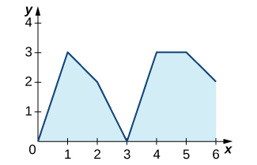
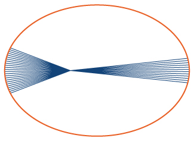

* Describe the meaning of the Mean Value Theorem for Integrals.
* State the meaning of the Fundamental Theorem of Calculus, Part 1.
* Use the Fundamental Theorem of Calculus, Part 1, to evaluate derivatives of integrals.
* State the meaning of the Fundamental Theorem of Calculus, Part 2.
* Use the Fundamental Theorem of Calculus, Part 2, to evaluate definite integrals.
* Explain the relationship between differentiation and integration.

In the previous two sections, we looked at the definite integral and its relationship to the area under the curve of a function. Unfortunately, so far, the only tools we have available to calculate the value of a definite integral are geometric area formulas and limits of Riemann sums, and both approaches are extremely cumbersome. In this section we look at some more powerful and useful techniques for evaluating definite integrals.

These new techniques rely on the relationship between differentiation and integration. This relationship was discovered and explored by both Sir Isaac Newton and Gottfried Wilhelm Leibniz (among others) during the late 1600s and early 1700s, and it is codified in what we now call the **Fundamental Theorem of Calculus**{: data-type="term"}, which has two parts that we examine in this section. Its very name indicates how central this theorem is to the entire development of calculus.

Isaac **Newton**{: data-type="term" .no-emphasis}’s contributions to mathematics and physics changed the way we look at the world. The relationships he discovered, codified as Newton’s laws and the law of universal gravitation, are still taught as foundational material in physics today, and his calculus has spawned entire fields of mathematics. To learn more, read a [brief biography][1] of Newton with multimedia clips.

Before we get to this crucial theorem, however, let’s examine another important theorem, the Mean Value Theorem for Integrals, which is needed to prove the Fundamental Theorem of Calculus.

# The Mean Value Theorem for Integrals

The **Mean Value Theorem for Integrals**{: data-type="term"} states that a continuous function on a closed interval takes on its average value at the same point in that interval. The theorem guarantees that if <math xmlns="http://www.w3.org/1998/Math/MathML"><mrow><mi>f</mi><mrow><mo>(</mo><mi>x</mi><mo>)</mo></mrow></mrow></math>

 is continuous, a point *c* exists in an interval <math xmlns="http://www.w3.org/1998/Math/MathML"><mrow><mrow><mo>[</mo><mrow><mi>a</mi><mo>,</mo><mi>b</mi></mrow><mo>]</mo></mrow></mrow></math>

 such that the value of the function at *c* is equal to the average value of <math xmlns="http://www.w3.org/1998/Math/MathML"><mrow><mi>f</mi><mrow><mo>(</mo><mi>x</mi><mo>)</mo></mrow></mrow></math>

 over <math xmlns="http://www.w3.org/1998/Math/MathML"><mrow><mrow><mo>[</mo><mrow><mi>a</mi><mo>,</mo><mi>b</mi></mrow><mo>]</mo></mrow><mo>.</mo></mrow></math>

 We state this theorem mathematically with the help of the formula for the average value of a function that we presented at the end of the preceding section.

The Mean Value Theorem for Integrals

If <math xmlns="http://www.w3.org/1998/Math/MathML"><mrow><mi>f</mi><mrow><mo>(</mo><mi>x</mi><mo>)</mo></mrow></mrow></math>

 is continuous over an interval <math xmlns="http://www.w3.org/1998/Math/MathML"><mrow><mrow><mo>[</mo><mrow><mi>a</mi><mo>,</mo><mi>b</mi></mrow><mo>]</mo></mrow><mo>,</mo></mrow></math>

 then there is at least one point <math xmlns="http://www.w3.org/1998/Math/MathML"><mrow><mi>c</mi><mo>∈</mo><mrow><mo>[</mo><mrow><mi>a</mi><mo>,</mo><mi>b</mi></mrow><mo>]</mo></mrow></mrow></math>

 such that

<math xmlns="http://www.w3.org/1998/Math/MathML"><mrow><mi>f</mi><mrow><mo>(</mo><mi>c</mi><mo>)</mo></mrow><mo>=</mo><mfrac><mn>1</mn><mrow><mi>b</mi><mo>−</mo><mi>a</mi></mrow></mfrac><mstyle displaystyle="true"><mrow><msubsup><mo>∫</mo><mi>a</mi><mi>b</mi></msubsup><mrow><mi>f</mi><mrow><mo>(</mo><mi>x</mi><mo>)</mo></mrow><mi>d</mi><mi>x</mi></mrow></mrow></mstyle><mo>.</mo></mrow></math>

This formula can also be stated as

<math xmlns="http://www.w3.org/1998/Math/MathML"><mrow><mstyle displaystyle="true"><mrow><msubsup><mo>∫</mo><mi>a</mi><mi>b</mi></msubsup><mrow><mi>f</mi><mrow><mo>(</mo><mi>x</mi><mo>)</mo></mrow><mi>d</mi><mi>x</mi></mrow></mrow></mstyle><mo>=</mo><mi>f</mi><mrow><mo>(</mo><mi>c</mi><mo>)</mo></mrow><mrow><mo>(</mo><mrow><mi>b</mi><mo>−</mo><mi>a</mi></mrow><mo>)</mo></mrow><mo>.</mo></mrow></math>

## Proof

Since <math xmlns="http://www.w3.org/1998/Math/MathML"><mrow><mi>f</mi><mrow><mo>(</mo><mi>x</mi><mo>)</mo></mrow></mrow></math>

 is continuous on <math xmlns="http://www.w3.org/1998/Math/MathML"><mrow><mrow><mo>[</mo><mrow><mi>a</mi><mo>,</mo><mi>b</mi></mrow><mo>]</mo></mrow><mo>,</mo></mrow></math>

 by the extreme value theorem (see [Maxima and Minima](/m53611){: .target-chapter}), it assumes minimum and maximum values—*m* and *M*, respectively—on <math xmlns="http://www.w3.org/1998/Math/MathML"><mrow><mrow><mo>[</mo><mrow><mi>a</mi><mo>,</mo><mi>b</mi></mrow><mo>]</mo></mrow><mo>.</mo></mrow></math>

 Then, for all *x* in <math xmlns="http://www.w3.org/1998/Math/MathML"><mrow><mrow><mo>[</mo><mrow><mi>a</mi><mo>,</mo><mi>b</mi></mrow><mo>]</mo></mrow><mo>,</mo></mrow></math>

 we have <math xmlns="http://www.w3.org/1998/Math/MathML"><mrow><mi>m</mi><mo>≤</mo><mi>f</mi><mrow><mo>(</mo><mi>x</mi><mo>)</mo></mrow><mo>≤</mo><mi>M</mi><mo>.</mo></mrow></math>

 Therefore, by the comparison theorem (see [The Definite Integral](/m53631){: .target-chapter}), we have

<math xmlns="http://www.w3.org/1998/Math/MathML"><mrow><mi>m</mi><mrow><mo>(</mo><mrow><mi>b</mi><mo>−</mo><mi>a</mi></mrow><mo>)</mo></mrow><mo>≤</mo><mstyle displaystyle="true"><mrow><msubsup><mo>∫</mo><mi>a</mi><mi>b</mi></msubsup><mrow><mi>f</mi><mrow><mo>(</mo><mi>x</mi><mo>)</mo></mrow><mi>d</mi><mi>x</mi></mrow></mrow></mstyle><mo>≤</mo><mi>M</mi><mrow><mo>(</mo><mrow><mi>b</mi><mo>−</mo><mi>a</mi></mrow><mo>)</mo></mrow><mo>.</mo></mrow></math>

Dividing by <math xmlns="http://www.w3.org/1998/Math/MathML"><mrow><mi>b</mi><mo>−</mo><mi>a</mi></mrow></math>

 gives us

<math xmlns="http://www.w3.org/1998/Math/MathML"><mrow><mi>m</mi><mo>≤</mo><mfrac><mn>1</mn><mrow><mi>b</mi><mo>−</mo><mi>a</mi></mrow></mfrac><mstyle displaystyle="true"><mrow><msubsup><mo>∫</mo><mi>a</mi><mi>b</mi></msubsup><mrow><mi>f</mi><mrow><mo>(</mo><mi>x</mi><mo>)</mo></mrow><mi>d</mi><mi>x</mi></mrow></mrow></mstyle><mo>≤</mo><mi>M</mi><mo>.</mo></mrow></math>

Since <math xmlns="http://www.w3.org/1998/Math/MathML"><mrow><mfrac><mn>1</mn><mrow><mi>b</mi><mo>−</mo><mi>a</mi></mrow></mfrac><mstyle displaystyle="true"><mrow><msubsup><mo>∫</mo><mi>a</mi><mi>b</mi></msubsup><mi>f</mi></mrow></mstyle><mrow><mo>(</mo><mi>x</mi><mo>)</mo></mrow><mi>d</mi><mi>x</mi></mrow></math>

 is a number between *m* and *M*, and since <math xmlns="http://www.w3.org/1998/Math/MathML"><mrow><mi>f</mi><mrow><mo>(</mo><mi>x</mi><mo>)</mo></mrow></mrow></math>

 is continuous and assumes the values *m* and *M* over <math xmlns="http://www.w3.org/1998/Math/MathML"><mrow><mrow><mo>[</mo><mrow><mi>a</mi><mo>,</mo><mi>b</mi></mrow><mo>]</mo></mrow><mo>,</mo></mrow></math>

 by the Intermediate Value Theorem (see [Continuity](/m53489){: .target-chapter}), there is a number *c* over <math xmlns="http://www.w3.org/1998/Math/MathML"><mrow><mrow><mo>[</mo><mrow><mi>a</mi><mo>,</mo><mi>b</mi></mrow><mo>]</mo></mrow></mrow></math>

 such that

<math xmlns="http://www.w3.org/1998/Math/MathML"><mrow><mi>f</mi><mrow><mo>(</mo><mi>c</mi><mo>)</mo></mrow><mo>=</mo><mfrac><mn>1</mn><mrow><mi>b</mi><mo>−</mo><mi>a</mi></mrow></mfrac><mstyle displaystyle="true"><mrow><msubsup><mo>∫</mo><mi>a</mi><mi>b</mi></msubsup><mrow><mi>f</mi><mrow><mo>(</mo><mi>x</mi><mo>)</mo></mrow><mi>d</mi><mi>x</mi></mrow></mrow></mstyle><mo>,</mo></mrow></math>

and the proof is complete.

□

Finding the Average Value of a Function

Find the average value of the function <math xmlns="http://www.w3.org/1998/Math/MathML"><mrow><mi>f</mi><mrow><mo>(</mo><mi>x</mi><mo>)</mo></mrow><mo>=</mo><mn>8</mn><mo>−</mo><mn>2</mn><mi>x</mi></mrow></math>

 over the interval <math xmlns="http://www.w3.org/1998/Math/MathML"><mrow><mrow><mo>[</mo><mrow><mn>0</mn><mo>,</mo><mn>4</mn></mrow><mo>]</mo></mrow></mrow></math>

 and find *c* such that <math xmlns="http://www.w3.org/1998/Math/MathML"><mrow><mi>f</mi><mrow><mo>(</mo><mi>c</mi><mo>)</mo></mrow></mrow></math>

 equals the average value of the function over <math xmlns="http://www.w3.org/1998/Math/MathML"><mrow><mo stretchy="false">[</mo><mn>0</mn><mo>,</mo><mn>4</mn><mo stretchy="false">]</mo><mo>.</mo></mrow></math>

The formula states the mean value of <math xmlns="http://www.w3.org/1998/Math/MathML"><mrow><mi>f</mi><mrow><mo>(</mo><mi>x</mi><mo>)</mo></mrow></mrow></math>

 is given by

<math xmlns="http://www.w3.org/1998/Math/MathML"><mrow><mfrac><mn>1</mn><mrow><mn>4</mn><mo>−</mo><mn>0</mn></mrow></mfrac><mstyle displaystyle="true"><mrow><msubsup><mo>∫</mo><mn>0</mn><mn>4</mn></msubsup><mrow><mrow><mo>(</mo><mrow><mn>8</mn><mo>−</mo><mn>2</mn><mi>x</mi></mrow><mo>)</mo></mrow><mi>d</mi><mi>x</mi></mrow></mrow></mstyle><mo>.</mo></mrow></math>

We can see in [[link]](#CNX_Calc_Figure_05_03_001) that the function represents a straight line and forms a right triangle bounded by the *x*- and *y*-axes. The area of the triangle is <math xmlns="http://www.w3.org/1998/Math/MathML"><mrow><mi>A</mi><mo>=</mo><mfrac><mn>1</mn><mn>2</mn></mfrac><mrow><mo>(</mo><mrow><mtext>base</mtext></mrow><mo>)</mo></mrow><mrow><mo>(</mo><mrow><mtext>height</mtext></mrow><mo>)</mo></mrow><mo>.</mo></mrow></math>

 We have

<math xmlns="http://www.w3.org/1998/Math/MathML"><mrow><mi>A</mi><mo>=</mo><mfrac><mn>1</mn><mn>2</mn></mfrac><mrow><mo>(</mo><mn>4</mn><mo>)</mo></mrow><mrow><mo>(</mo><mn>8</mn><mo>)</mo></mrow><mo>=</mo><mn>16</mn><mo>.</mo></mrow></math>

The average value is found by multiplying the area by <math xmlns="http://www.w3.org/1998/Math/MathML"><mrow><mn>1</mn><mtext>/</mtext><mrow><mo>(</mo><mrow><mn>4</mn><mo>−</mo><mn>0</mn></mrow><mo>)</mo></mrow><mo>.</mo></mrow></math>

 Thus, the average value of the function is

<math xmlns="http://www.w3.org/1998/Math/MathML"><mrow><mfrac><mn>1</mn><mn>4</mn></mfrac><mrow><mo>(</mo><mrow><mn>16</mn></mrow><mo>)</mo></mrow><mo>=</mo><mn>4</mn><mo>.</mo></mrow></math>

Set the average value equal to <math xmlns="http://www.w3.org/1998/Math/MathML"><mrow><mi>f</mi><mrow><mo>(</mo><mi>c</mi><mo>)</mo></mrow></mrow></math>

 and solve for *c*.

<math xmlns="http://www.w3.org/1998/Math/MathML"><mtable><mtr><mtd columnalign="left"><mn>8</mn><mo>−</mo><mn>2</mn><mi>c</mi></mtd><mtd columnalign="left"><mo>=</mo></mtd><mtd columnalign="left"><mn>4</mn></mtd></mtr><mtr><mtd columnalign="right"><mi>c</mi></mtd><mtd columnalign="left"><mo>=</mo></mtd><mtd columnalign="left"><mn>2</mn></mtd></mtr></mtable></math>

At <math xmlns="http://www.w3.org/1998/Math/MathML"><mrow><mi>c</mi><mo>=</mo><mn>2</mn><mo>,</mo><mi>f</mi><mrow><mo>(</mo><mn>2</mn><mo>)</mo></mrow><mo>=</mo><mn>4</mn><mo>.</mo></mrow></math>

![The graph of a decreasing line f(x) = 8 &#x2013; 2x over \[-1,4.5\]. The line y=4 is drawn over \[0,4\], which intersects with the line at (2,4). A line is drawn down from (2,4) to the x axis and from (4,4) to the y axis. The area under y=4 is shaded.](../resources/CNX_Calc_Figure_05_03_002.jpg "By the Mean Value Theorem, the continuous function f(x) takes on its average value at c at least once over a closed interval."){: #CNX_Calc_Figure_05_03_001}

Find the average value of the function <math xmlns="http://www.w3.org/1998/Math/MathML"><mrow><mi>f</mi><mrow><mo>(</mo><mi>x</mi><mo>)</mo></mrow><mo>=</mo><mfrac><mi>x</mi><mn>2</mn></mfrac></mrow></math>

 over the interval <math xmlns="http://www.w3.org/1998/Math/MathML"><mrow><mrow><mo>[</mo><mrow><mn>0</mn><mo>,</mo><mn>6</mn></mrow><mo>]</mo></mrow></mrow></math>

 and find *c* such that <math xmlns="http://www.w3.org/1998/Math/MathML"><mrow><mi>f</mi><mrow><mo>(</mo><mi>c</mi><mo>)</mo></mrow></mrow></math>

 equals the average value of the function over <math xmlns="http://www.w3.org/1998/Math/MathML"><mrow><mo stretchy="false">[</mo><mn>0</mn><mo>,</mo><mn>6</mn><mo stretchy="false">]</mo><mo>.</mo></mrow></math>

<math xmlns="http://www.w3.org/1998/Math/MathML"><mrow><mtext>Average value</mtext><mo>=</mo><mn>1.5</mn><mo>;</mo><mi>c</mi><mo>=</mo><mn>3</mn></mrow></math>

Hint

Use the procedures from [[link]](#fs-id1170572141909) to solve the problem

Finding the Point Where a Function Takes on Its Average Value

Given <math xmlns="http://www.w3.org/1998/Math/MathML"><mrow><mstyle displaystyle="true"><mrow><msubsup><mo>∫</mo><mn>0</mn><mn>3</mn></msubsup><mrow><msup><mi>x</mi><mn>2</mn></msup><mi>d</mi><mi>x</mi></mrow></mrow></mstyle><mo>=</mo><mn>9</mn><mo>,</mo></mrow></math>

 find *c* such that <math xmlns="http://www.w3.org/1998/Math/MathML"><mrow><mi>f</mi><mrow><mo>(</mo><mi>c</mi><mo>)</mo></mrow></mrow></math>

 equals the average value of <math xmlns="http://www.w3.org/1998/Math/MathML"><mrow><mi>f</mi><mo stretchy="false">(</mo><mi>x</mi><mo stretchy="false">)</mo><mo>=</mo><msup><mi>x</mi><mn>2</mn></msup></mrow></math>

 over <math xmlns="http://www.w3.org/1998/Math/MathML"><mrow><mo stretchy="false">[</mo><mn>0</mn><mo>,</mo><mn>3</mn><mo stretchy="false">]</mo><mo>.</mo></mrow></math>

We are looking for the value of *c* such that

<math xmlns="http://www.w3.org/1998/Math/MathML"><mrow><mi>f</mi><mrow><mo>(</mo><mi>c</mi><mo>)</mo></mrow><mo>=</mo><mfrac><mn>1</mn><mrow><mn>3</mn><mo>−</mo><mn>0</mn></mrow></mfrac><mstyle displaystyle="true"><mrow><msubsup><mo>∫</mo><mn>0</mn><mn>3</mn></msubsup><mrow><msup><mi>x</mi><mn>2</mn></msup><mi>d</mi><mi>x</mi></mrow></mrow></mstyle><mo>=</mo><mfrac><mn>1</mn><mn>3</mn></mfrac><mrow><mo>(</mo><mn>9</mn><mo>)</mo></mrow><mo>=</mo><mn>3</mn><mo>.</mo></mrow></math>

Replacing <math xmlns="http://www.w3.org/1998/Math/MathML"><mrow><mi>f</mi><mrow><mo>(</mo><mi>c</mi><mo>)</mo></mrow></mrow></math>

 with *c*2, we have

<math xmlns="http://www.w3.org/1998/Math/MathML"><mtable><mtr><mtd columnalign="left"><msup><mi>c</mi><mn>2</mn></msup></mtd><mtd columnalign="left"><mo>=</mo></mtd><mtd columnalign="left"><mn>3</mn></mtd></mtr><mtr><mtd columnalign="left"><mi>c</mi></mtd><mtd columnalign="left"><mo>=</mo></mtd><mtd columnalign="left"><mtext>±</mtext><msqrt><mn>3</mn></msqrt><mo>.</mo></mtd></mtr></mtable></math>

Since <math xmlns="http://www.w3.org/1998/Math/MathML"><mrow><mtext>−</mtext><msqrt><mn>3</mn></msqrt></mrow></math>

 is outside the interval, take only the positive value. Thus, <math xmlns="http://www.w3.org/1998/Math/MathML"><mrow><mi>c</mi><mo>=</mo><msqrt><mn>3</mn></msqrt></mrow></math>

 ([[link]](#CNX_Calc_Figure_05_03_002)).

![A graph of the parabola f(x) = x^2 over \[-2, 3\]. The area under the curve and above the x axis is shaded, and the point (sqrt(3), 3) is marked.](../resources/CNX_Calc_Figure_05_03_003.jpg "Over the interval [0,3], the function f(x)=x2 takes on its average value at c=3."){: #CNX_Calc_Figure_05_03_002}

Given <math xmlns="http://www.w3.org/1998/Math/MathML"><mrow><mstyle displaystyle="true"><mrow><msubsup><mo>∫</mo><mn>0</mn><mn>3</mn></msubsup><mrow><mrow><mo>(</mo><mrow><mn>2</mn><msup><mi>x</mi><mn>2</mn></msup><mo>−</mo><mn>1</mn></mrow><mo>)</mo></mrow><mi>d</mi><mi>x</mi></mrow></mrow></mstyle><mo>=</mo><mn>15</mn><mo>,</mo></mrow></math>

 find *c* such that <math xmlns="http://www.w3.org/1998/Math/MathML"><mrow><mi>f</mi><mrow><mo>(</mo><mi>c</mi><mo>)</mo></mrow></mrow></math>

 equals the average value of <math xmlns="http://www.w3.org/1998/Math/MathML"><mrow><mi>f</mi><mo stretchy="false">(</mo><mi>x</mi><mo stretchy="false">)</mo><mo>=</mo><mn>2</mn><msup><mi>x</mi><mn>2</mn></msup><mo>−</mo><mn>1</mn></mrow></math>

 over <math xmlns="http://www.w3.org/1998/Math/MathML"><mrow><mo stretchy="false">[</mo><mn>0</mn><mo>,</mo><mn>3</mn><mo stretchy="false">]</mo><mo>.</mo></mrow></math>

<math xmlns="http://www.w3.org/1998/Math/MathML"><mrow><mi>c</mi><mo>=</mo><msqrt><mn>3</mn></msqrt></mrow></math>

Hint

Use the procedures from [[link]](#fs-id1170572451873) to solve the problem.

# Fundamental Theorem of Calculus Part 1: Integrals and Antiderivatives

As mentioned earlier, the Fundamental Theorem of Calculus is an extremely powerful theorem that establishes the relationship between differentiation and integration, and gives us a way to evaluate definite integrals without using Riemann sums or calculating areas. The theorem is comprised of two parts, the first of which, the **Fundamental Theorem of Calculus, Part 1**{: data-type="term"}, is stated here. Part 1 establishes the relationship between differentiation and integration.

Fundamental Theorem of Calculus, Part 1

If <math xmlns="http://www.w3.org/1998/Math/MathML"><mrow><mi>f</mi><mrow><mo>(</mo><mi>x</mi><mo>)</mo></mrow></mrow></math>

 is continuous over an interval <math xmlns="http://www.w3.org/1998/Math/MathML"><mrow><mrow><mo>[</mo><mrow><mi>a</mi><mo>,</mo><mi>b</mi></mrow><mo>]</mo></mrow><mo>,</mo></mrow></math>

 and the function <math xmlns="http://www.w3.org/1998/Math/MathML"><mrow><mi>F</mi><mrow><mo>(</mo><mi>x</mi><mo>)</mo></mrow></mrow></math>

 is defined by

<math xmlns="http://www.w3.org/1998/Math/MathML"><mrow><mi>F</mi><mrow><mo>(</mo><mi>x</mi><mo>)</mo></mrow><mo>=</mo><mstyle displaystyle="true"><mrow><msubsup><mo>∫</mo><mi>a</mi><mi>x</mi></msubsup><mrow><mi>f</mi><mrow><mo>(</mo><mi>t</mi><mo>)</mo></mrow><mi>d</mi><mi>t</mi></mrow></mrow></mstyle><mo>,</mo></mrow></math>

then <math xmlns="http://www.w3.org/1998/Math/MathML"><mrow><msup><mi>F</mi><mo>′</mo></msup><mrow><mtext>(</mtext><mi>x</mi><mo>)</mo></mrow><mo>=</mo><mi>f</mi><mrow><mo>(</mo><mi>x</mi><mo>)</mo></mrow></mrow></math>

 over <math xmlns="http://www.w3.org/1998/Math/MathML"><mrow><mrow><mo>[</mo><mrow><mi>a</mi><mo>,</mo><mi>b</mi></mrow><mo>]</mo></mrow><mo>.</mo></mrow></math>

Before we delve into the proof, a couple of subtleties are worth mentioning here. First, a comment on the notation. Note that we have defined a function, <math xmlns="http://www.w3.org/1998/Math/MathML"><mrow><mi>F</mi><mrow><mo>(</mo><mi>x</mi><mo>)</mo></mrow><mo>,</mo></mrow></math>

 as the definite integral of another function, <math xmlns="http://www.w3.org/1998/Math/MathML"><mrow><mi>f</mi><mrow><mo>(</mo><mi>t</mi><mo>)</mo></mrow><mo>,</mo></mrow></math>

 from the point *a* to the point *x*. At first glance, this is confusing, because we have said several times that a definite integral is a number, and here it looks like it’s a function. The key here is to notice that for any particular value of *x*, the definite integral is a number. So the function <math xmlns="http://www.w3.org/1998/Math/MathML"><mrow><mi>F</mi><mrow><mo>(</mo><mi>x</mi><mo>)</mo></mrow></mrow></math>

 returns a number (the value of the definite integral) for each value of *x*.

Second, it is worth commenting on some of the key implications of this theorem. There is a reason it is called the *Fundamental* Theorem of Calculus. Not only does it establish a relationship between integration and differentiation, but also it guarantees that any integrable function has an antiderivative. Specifically, it guarantees that any continuous function has an antiderivative.

## Proof

Applying the definition of the derivative, we have

<math xmlns="http://www.w3.org/1998/Math/MathML"><mtable><mtr /><mtr /><mtr /><mtr><mtd columnalign="left"><msup><mi>F</mi><mo>′</mo></msup><mrow><mtext>(</mtext><mi>x</mi><mo>)</mo></mrow></mtd><mtd columnalign="left"><mo>=</mo><munder><mrow><mtext>lim</mtext></mrow><mrow><mi>h</mi><mo stretchy="false">→</mo><mn>0</mn></mrow></munder><mspace width="0.2em" /><mfrac><mrow><mi>F</mi><mrow><mo>(</mo><mrow><mi>x</mi><mo>+</mo><mi>h</mi></mrow><mo>)</mo></mrow><mo>−</mo><mi>F</mi><mrow><mo>(</mo><mi>x</mi><mo>)</mo></mrow></mrow><mi>h</mi></mfrac></mtd></mtr><mtr /><mtr><mtd /><mtd columnalign="left"><mo>=</mo><munder><mrow><mtext>lim</mtext></mrow><mrow><mi>h</mi><mo stretchy="false">→</mo><mn>0</mn></mrow></munder><mspace width="0.2em" /><mfrac><mn>1</mn><mi>h</mi></mfrac><mrow><mo>[</mo><mrow><mstyle displaystyle="true"><mrow><msubsup><mo>∫</mo><mi>a</mi><mrow><mi>x</mi><mo>+</mo><mi>h</mi></mrow></msubsup><mrow><mi>f</mi><mrow><mo>(</mo><mi>t</mi><mo>)</mo></mrow><mi>d</mi><mi>t</mi></mrow></mrow></mstyle><mo>−</mo><mstyle displaystyle="true"><mrow><msubsup><mo>∫</mo><mi>a</mi><mi>x</mi></msubsup><mrow><mi>f</mi><mrow><mo>(</mo><mi>t</mi><mo>)</mo></mrow><mi>d</mi><mi>t</mi></mrow></mrow></mstyle></mrow><mo>]</mo></mrow></mtd></mtr><mtr><mtd /><mtd columnalign="left"><mo>=</mo><munder><mrow><mtext>lim</mtext></mrow><mrow><mi>h</mi><mo stretchy="false">→</mo><mn>0</mn></mrow></munder><mspace width="0.2em" /><mfrac><mn>1</mn><mi>h</mi></mfrac><mrow><mo>[</mo><mrow><mstyle displaystyle="true"><mrow><msubsup><mo>∫</mo><mi>a</mi><mrow><mi>x</mi><mo>+</mo><mi>h</mi></mrow></msubsup><mrow><mi>f</mi><mrow><mo>(</mo><mi>t</mi><mo>)</mo></mrow><mi>d</mi><mi>t</mi></mrow></mrow></mstyle><mo>+</mo><mstyle displaystyle="true"><mrow><msubsup><mo>∫</mo><mi>x</mi><mi>a</mi></msubsup><mrow><mi>f</mi><mrow><mo>(</mo><mi>t</mi><mo>)</mo></mrow><mi>d</mi><mi>t</mi></mrow></mrow></mstyle></mrow><mo>]</mo></mrow></mtd></mtr><mtr><mtd /><mtd columnalign="left"><mo>=</mo><munder><mrow><mtext>lim</mtext></mrow><mrow><mi>h</mi><mo stretchy="false">→</mo><mn>0</mn></mrow></munder><mspace width="0.2em" /><mfrac><mn>1</mn><mi>h</mi></mfrac><mstyle displaystyle="true"><mrow><msubsup><mo>∫</mo><mi>x</mi><mrow><mi>x</mi><mo>+</mo><mi>h</mi></mrow></msubsup><mrow><mi>f</mi><mrow><mo>(</mo><mi>t</mi><mo>)</mo></mrow><mi>d</mi><mi>t</mi></mrow></mrow></mstyle><mo>.</mo></mtd></mtr></mtable></math>

Looking carefully at this last expression, we see <math xmlns="http://www.w3.org/1998/Math/MathML"><mrow><mfrac><mn>1</mn><mi>h</mi></mfrac><mstyle displaystyle="true"><mrow><msubsup><mo>∫</mo><mi>x</mi><mrow><mi>x</mi><mo>+</mo><mi>h</mi></mrow></msubsup><mrow><mi>f</mi><mrow><mo>(</mo><mi>t</mi><mo>)</mo></mrow><mi>d</mi><mi>t</mi></mrow></mrow></mstyle></mrow></math>

 is just the average value of the function <math xmlns="http://www.w3.org/1998/Math/MathML"><mrow><mi>f</mi><mrow><mo>(</mo><mi>x</mi><mo>)</mo></mrow></mrow></math>

 over the interval <math xmlns="http://www.w3.org/1998/Math/MathML"><mrow><mrow><mo>[</mo><mrow><mi>x</mi><mo>,</mo><mi>x</mi><mo>+</mo><mi>h</mi></mrow><mo>]</mo></mrow><mo>.</mo></mrow></math>

 Therefore, by [\[link\]](#fs-id1170572224851), there is some number *c* in <math xmlns="http://www.w3.org/1998/Math/MathML"><mrow><mrow><mo>[</mo><mrow><mi>x</mi><mo>,</mo><mi>x</mi><mo>+</mo><mi>h</mi></mrow><mo>]</mo></mrow></mrow></math>

 such that

<math xmlns="http://www.w3.org/1998/Math/MathML"><mrow><mfrac><mn>1</mn><mi>h</mi></mfrac><mstyle displaystyle="true"><mrow><msubsup><mo>∫</mo><mi>x</mi><mrow><mi>x</mi><mo>+</mo><mi>h</mi></mrow></msubsup><mrow><mi>f</mi><mrow><mo>(</mo><mi>x</mi><mo>)</mo></mrow><mi>d</mi><mi>x</mi></mrow></mrow></mstyle><mo>=</mo><mi>f</mi><mrow><mo>(</mo><mi>c</mi><mo>)</mo></mrow><mo>.</mo></mrow></math>

In addition, since *c* is between *x* and *h*, *c* approaches *x* as *h* approaches zero. Also, since <math xmlns="http://www.w3.org/1998/Math/MathML"><mrow><mi>f</mi><mrow><mo>(</mo><mi>x</mi><mo>)</mo></mrow></mrow></math>

 is continuous, we have <math xmlns="http://www.w3.org/1998/Math/MathML"><mrow><munder><mrow><mtext>lim</mtext></mrow><mrow><mi>h</mi><mo stretchy="false">→</mo><mn>0</mn></mrow></munder><mi>f</mi><mrow><mo>(</mo><mi>c</mi><mo>)</mo></mrow><mo>=</mo><munder><mrow><mtext>lim</mtext></mrow><mrow><mi>c</mi><mo stretchy="false">→</mo><mi>x</mi></mrow></munder><mi>f</mi><mrow><mo>(</mo><mi>c</mi><mo>)</mo></mrow><mo>=</mo><mi>f</mi><mrow><mo>(</mo><mi>x</mi><mo>)</mo></mrow><mo>.</mo></mrow></math>

 Putting all these pieces together, we have

<math xmlns="http://www.w3.org/1998/Math/MathML"><mtable><mtr /><mtr><mtd columnalign="left"><msup><mi>F</mi><mo>′</mo></msup><mrow><mtext>(</mtext><mi>x</mi><mo>)</mo></mrow></mtd><mtd columnalign="left"><mo>=</mo><munder><mrow><mtext>lim</mtext></mrow><mrow><mi>h</mi><mo stretchy="false">→</mo><mn>0</mn></mrow></munder><mspace width="0.2em" /><mfrac><mn>1</mn><mi>h</mi></mfrac><mstyle displaystyle="true"><mrow><msubsup><mo>∫</mo><mi>x</mi><mrow><mi>x</mi><mo>+</mo><mi>h</mi></mrow></msubsup><mrow><mi>f</mi><mrow><mo>(</mo><mi>x</mi><mo>)</mo></mrow><mi>d</mi><mi>x</mi></mrow></mrow></mstyle></mtd></mtr><mtr><mtd /><mtd columnalign="left"><mo>=</mo><munder><mrow><mtext>lim</mtext></mrow><mrow><mi>h</mi><mo stretchy="false">→</mo><mn>0</mn></mrow></munder><mi>f</mi><mrow><mo>(</mo><mi>c</mi><mo>)</mo></mrow></mtd></mtr><mtr><mtd /><mtd columnalign="left"><mo>=</mo><mi>f</mi><mrow><mo>(</mo><mi>x</mi><mo>)</mo></mrow><mo>,</mo></mtd></mtr></mtable></math>

and the proof is complete.

□

Finding a Derivative with the Fundamental Theorem of Calculus

Use the [[link]](#fs-id1170571704350) to find the derivative of

<math xmlns="http://www.w3.org/1998/Math/MathML"><mrow><mi>g</mi><mrow><mo>(</mo><mi>x</mi><mo>)</mo></mrow><mo>=</mo><mstyle displaystyle="true"><mrow><msubsup><mo stretchy="true">∫</mo><mn>1</mn><mi>x</mi></msubsup><mrow><mfrac><mn>1</mn><mrow><msup><mi>t</mi><mn>3</mn></msup><mo>+</mo><mn>1</mn></mrow></mfrac><mi>d</mi><mi>t</mi><mo>.</mo></mrow></mrow></mstyle></mrow></math>

According to the Fundamental Theorem of Calculus, the derivative is given by

<math xmlns="http://www.w3.org/1998/Math/MathML"><mrow><msup><mi>g</mi><mo>′</mo></msup><mrow><mtext>(</mtext><mi>x</mi><mo>)</mo></mrow><mo>=</mo><mfrac><mn>1</mn><mrow><msup><mi>x</mi><mn>3</mn></msup><mo>+</mo><mn>1</mn></mrow></mfrac><mo>.</mo></mrow></math>

Use the Fundamental Theorem of Calculus, Part 1 to find the derivative of <math xmlns="http://www.w3.org/1998/Math/MathML"><mrow><mi>g</mi><mrow><mo>(</mo><mi>r</mi><mo>)</mo></mrow><mo>=</mo><mstyle displaystyle="true"><mrow><msubsup><mo>∫</mo><mn>0</mn><mi>r</mi></msubsup><mrow><msqrt><mrow><msup><mi>x</mi><mn>2</mn></msup><mo>+</mo><mn>4</mn></mrow></msqrt><mi>d</mi><mi>x</mi></mrow></mrow></mstyle><mo>.</mo></mrow></math>

<math xmlns="http://www.w3.org/1998/Math/MathML"><mrow><msup><mi>g</mi><mo>′</mo></msup><mrow><mtext>(</mtext><mi>r</mi><mo>)</mo></mrow><mo>=</mo><msqrt><mrow><msup><mi>r</mi><mn>2</mn></msup><mo>+</mo><mn>4</mn></mrow></msqrt></mrow></math>

Hint

Follow the procedures from [[link]](#fs-id1170572601345) to solve the problem.

Using the Fundamental Theorem and the Chain Rule to Calculate Derivatives

Let <math xmlns="http://www.w3.org/1998/Math/MathML"><mrow><mi>F</mi><mrow><mo>(</mo><mi>x</mi><mo>)</mo></mrow><mo>=</mo><mstyle displaystyle="true"><mrow><msubsup><mo>∫</mo><mn>1</mn><mrow><msqrt><mi>x</mi></msqrt></mrow></msubsup><mrow><mtext>sin</mtext><mspace width="0.1em" /><mi>t</mi><mi>d</mi><mi>t</mi></mrow></mrow></mstyle><mo>.</mo></mrow></math>

 Find <math xmlns="http://www.w3.org/1998/Math/MathML"><mrow><msup><mi>F</mi><mo>′</mo></msup><mrow><mtext>(</mtext><mi>x</mi><mo>)</mo></mrow><mo>.</mo></mrow></math>

Letting <math xmlns="http://www.w3.org/1998/Math/MathML"><mrow><mi>u</mi><mrow><mo>(</mo><mi>x</mi><mo>)</mo></mrow><mo>=</mo><msqrt><mi>x</mi></msqrt><mo>,</mo></mrow></math>

 we have <math xmlns="http://www.w3.org/1998/Math/MathML"><mrow><mi>F</mi><mrow><mo>(</mo><mi>x</mi><mo>)</mo></mrow><mo>=</mo><mstyle displaystyle="true"><mrow><msubsup><mo>∫</mo><mn>1</mn><mrow><mi>u</mi><mrow><mo>(</mo><mi>x</mi><mo>)</mo></mrow></mrow></msubsup><mrow><mtext>sin</mtext><mspace width="0.1em" /><mi>t</mi><mi>d</mi><mi>t</mi></mrow></mrow></mstyle><mo>.</mo></mrow></math>

 Thus, by the Fundamental Theorem of Calculus and the chain rule,

<math xmlns="http://www.w3.org/1998/Math/MathML"><mtable><mtr /><mtr><mtd columnalign="left"><msup><mi>F</mi><mo>′</mo></msup><mrow><mtext>(</mtext><mi>x</mi><mo>)</mo></mrow></mtd><mtd columnalign="left"><mo>=</mo><mtext>sin</mtext><mrow><mo>(</mo><mrow><mi>u</mi><mrow><mo>(</mo><mi>x</mi><mo>)</mo></mrow></mrow><mo>)</mo></mrow><mfrac><mrow><mi>d</mi><mi>u</mi></mrow><mrow><mi>d</mi><mi>x</mi></mrow></mfrac></mtd></mtr><mtr><mtd /><mtd columnalign="left"><mo>=</mo><mtext>sin</mtext><mrow><mo>(</mo><mrow><mi>u</mi><mrow><mo>(</mo><mi>x</mi><mo>)</mo></mrow></mrow><mo>)</mo></mrow><mo>·</mo><mrow><mo>(</mo><mrow><mfrac><mn>1</mn><mn>2</mn></mfrac><msup><mi>x</mi><mrow><mn>−1</mn><mtext>/</mtext><mn>2</mn></mrow></msup></mrow><mo>)</mo></mrow></mtd></mtr><mtr><mtd /><mtd columnalign="left"><mo>=</mo><mfrac><mrow><mtext>sin</mtext><msqrt><mi>x</mi></msqrt></mrow><mrow><mn>2</mn><msqrt><mi>x</mi></msqrt></mrow></mfrac><mo>.</mo></mtd></mtr></mtable></math>

Let <math xmlns="http://www.w3.org/1998/Math/MathML"><mrow><mi>F</mi><mrow><mo>(</mo><mi>x</mi><mo>)</mo></mrow><mo>=</mo><mstyle displaystyle="true"><mrow><msubsup><mo>∫</mo><mn>1</mn><mrow><msup><mi>x</mi><mn>3</mn></msup></mrow></msubsup><mrow><mtext>cos</mtext><mspace width="0.1em" /><mi>t</mi><mi>d</mi><mi>t</mi></mrow></mrow></mstyle><mo>.</mo></mrow></math>

 Find <math xmlns="http://www.w3.org/1998/Math/MathML"><mrow><msup><mi>F</mi><mo>′</mo></msup><mrow><mtext>(</mtext><mi>x</mi><mo>)</mo></mrow><mo>.</mo></mrow></math>

<math xmlns="http://www.w3.org/1998/Math/MathML"><mrow><msup><mi>F</mi><mo>′</mo></msup><mrow><mtext>(</mtext><mi>x</mi><mo>)</mo></mrow><mo>=</mo><mn>3</mn><msup><mi>x</mi><mn>2</mn></msup><mtext>cos</mtext><msup><mi>x</mi><mn>3</mn></msup></mrow></math>

Hint

Use the chain rule to solve the problem.

Using the Fundamental Theorem of Calculus with Two Variable Limits of Integration

Let <math xmlns="http://www.w3.org/1998/Math/MathML"><mrow><mi>F</mi><mrow><mo>(</mo><mi>x</mi><mo>)</mo></mrow><mo>=</mo><mstyle displaystyle="true"><mrow><msubsup><mo>∫</mo><mi>x</mi><mrow><mn>2</mn><mi>x</mi></mrow></msubsup><mrow><msup><mi>t</mi><mn>3</mn></msup><mi>d</mi><mi>t</mi></mrow></mrow></mstyle><mo>.</mo></mrow></math>

 Find <math xmlns="http://www.w3.org/1998/Math/MathML"><mrow><msup><mi>F</mi><mo>′</mo></msup><mrow><mtext>(</mtext><mi>x</mi><mo>)</mo></mrow><mo>.</mo></mrow></math>

We have <math xmlns="http://www.w3.org/1998/Math/MathML"><mrow><mi>F</mi><mrow><mo>(</mo><mi>x</mi><mo>)</mo></mrow><mo>=</mo><mstyle displaystyle="true"><mrow><msubsup><mo>∫</mo><mi>x</mi><mrow><mn>2</mn><mi>x</mi></mrow></msubsup><mrow><msup><mi>t</mi><mn>3</mn></msup><mi>d</mi><mi>t</mi></mrow></mrow></mstyle><mo>.</mo></mrow></math>

 Both limits of integration are variable, so we need to split this into two integrals. We get

<math xmlns="http://www.w3.org/1998/Math/MathML"><mtable><mtr /><mtr><mtd columnalign="left"><mi>F</mi><mrow><mo>(</mo><mi>x</mi><mo>)</mo></mrow></mtd><mtd columnalign="left"><mo>=</mo><mstyle displaystyle="true"><mrow><msubsup><mo>∫</mo><mi>x</mi><mrow><mn>2</mn><mi>x</mi></mrow></msubsup><mrow><msup><mi>t</mi><mn>3</mn></msup><mi>d</mi><mi>t</mi></mrow></mrow></mstyle></mtd></mtr><mtr><mtd /><mtd columnalign="left"><mo>=</mo><mstyle displaystyle="true"><mrow><msubsup><mo>∫</mo><mi>x</mi><mn>0</mn></msubsup><mrow><msup><mi>t</mi><mn>3</mn></msup><mi>d</mi><mi>t</mi></mrow></mrow></mstyle><mo>+</mo><mstyle displaystyle="true"><mrow><msubsup><mo>∫</mo><mn>0</mn><mrow><mn>2</mn><mi>x</mi></mrow></msubsup><mrow><msup><mi>t</mi><mn>3</mn></msup><mi>d</mi><mi>t</mi></mrow></mrow></mstyle></mtd></mtr><mtr><mtd /><mtd columnalign="left"><mo>=</mo><mtext>−</mtext><mstyle displaystyle="true"><mrow><msubsup><mo>∫</mo><mn>0</mn><mi>x</mi></msubsup><mrow><msup><mi>t</mi><mn>3</mn></msup><mi>d</mi><mi>t</mi></mrow></mrow></mstyle><mo>+</mo><mstyle displaystyle="true"><mrow><msubsup><mo>∫</mo><mn>0</mn><mrow><mn>2</mn><mi>x</mi></mrow></msubsup><mrow><msup><mi>t</mi><mn>3</mn></msup><mi>d</mi><mi>t</mi></mrow></mrow></mstyle><mo>.</mo></mtd></mtr></mtable></math>

Differentiating the first term, we obtain

<math xmlns="http://www.w3.org/1998/Math/MathML"><mrow><mfrac><mi>d</mi><mrow><mi>d</mi><mi>x</mi></mrow></mfrac><mrow><mo>[</mo><mrow><mtext>−</mtext><mstyle displaystyle="true"><mrow><msubsup><mo>∫</mo><mn>0</mn><mi>x</mi></msubsup><mrow><msup><mi>t</mi><mn>3</mn></msup><mi>d</mi><mi>t</mi></mrow></mrow></mstyle></mrow><mo>]</mo></mrow><mo>=</mo><mtext>−</mtext><msup><mi>x</mi><mn>3</mn></msup><mo>.</mo></mrow></math>

Differentiating the second term, we first let <math xmlns="http://www.w3.org/1998/Math/MathML"><mrow><mi>u</mi><mo stretchy="false">(</mo><mi>x</mi><mo stretchy="false">)</mo><mo>=</mo><mn>2</mn><mi>x</mi><mo>.</mo></mrow></math>

 Then,

<math xmlns="http://www.w3.org/1998/Math/MathML"><mtable><mtr /><mtr><mtd columnalign="left"><mfrac><mi>d</mi><mrow><mi>d</mi><mi>x</mi></mrow></mfrac><mrow><mo>[</mo><mrow><mstyle displaystyle="true"><mrow><msubsup><mo>∫</mo><mn>0</mn><mrow><mn>2</mn><mi>x</mi></mrow></msubsup><mrow><msup><mi>t</mi><mn>3</mn></msup><mi>d</mi><mi>t</mi></mrow></mrow></mstyle></mrow><mo>]</mo></mrow></mtd><mtd columnalign="left"><mo>=</mo><mfrac><mi>d</mi><mrow><mi>d</mi><mi>x</mi></mrow></mfrac><mrow><mo>[</mo><mrow><mstyle displaystyle="true"><mrow><msubsup><mo>∫</mo><mn>0</mn><mrow><mi>u</mi><mrow><mo>(</mo><mi>x</mi><mo>)</mo></mrow></mrow></msubsup><mrow><msup><mi>t</mi><mn>3</mn></msup><mi>d</mi><mi>t</mi></mrow></mrow></mstyle></mrow><mo>]</mo></mrow></mtd></mtr><mtr><mtd /><mtd columnalign="left"><mo>=</mo><msup><mrow><mo>(</mo><mrow><mi>u</mi><mrow><mo>(</mo><mi>x</mi><mo>)</mo></mrow></mrow><mo>)</mo></mrow><mn>3</mn></msup><mfrac><mrow><mi>d</mi><mi>u</mi></mrow><mrow><mi>d</mi><mi>x</mi></mrow></mfrac></mtd></mtr><mtr><mtd /><mtd columnalign="left"><mo>=</mo><msup><mrow><mo>(</mo><mrow><mn>2</mn><mi>x</mi></mrow><mo>)</mo></mrow><mn>3</mn></msup><mo>·</mo><mn>2</mn></mtd></mtr><mtr><mtd /><mtd columnalign="left"><mo>=</mo><mn>16</mn><msup><mi>x</mi><mn>3</mn></msup><mo>.</mo></mtd></mtr></mtable></math>

Thus,

<math xmlns="http://www.w3.org/1998/Math/MathML"><mtable><mtr /><mtr /><mtr><mtd columnalign="left"><msup><mi>F</mi><mo>′</mo></msup><mrow><mtext>(</mtext><mi>x</mi><mo>)</mo></mrow></mtd><mtd columnalign="left"><mo>=</mo><mfrac><mi>d</mi><mrow><mi>d</mi><mi>x</mi></mrow></mfrac><mrow><mo>[</mo><mrow><mtext>−</mtext><mstyle displaystyle="true"><mrow><msubsup><mo>∫</mo><mn>0</mn><mi>x</mi></msubsup><mrow><msup><mi>t</mi><mn>3</mn></msup><mi>d</mi><mi>t</mi></mrow></mrow></mstyle></mrow><mo>]</mo></mrow><mo>+</mo><mfrac><mi>d</mi><mrow><mi>d</mi><mi>x</mi></mrow></mfrac><mrow><mo>[</mo><mrow><mstyle displaystyle="true"><mrow><msubsup><mo>∫</mo><mn>0</mn><mrow><mn>2</mn><mi>x</mi></mrow></msubsup><mrow><msup><mi>t</mi><mn>3</mn></msup><mi>d</mi><mi>t</mi></mrow></mrow></mstyle></mrow><mo>]</mo></mrow></mtd></mtr><mtr><mtd /><mtd columnalign="left"><mo>=</mo><mtext>−</mtext><msup><mi>x</mi><mn>3</mn></msup><mo>+</mo><mn>16</mn><msup><mi>x</mi><mn>3</mn></msup></mtd></mtr><mtr><mtd /><mtd columnalign="left"><mo>=</mo><mn>15</mn><msup><mi>x</mi><mn>3</mn></msup><mo>.</mo></mtd></mtr></mtable></math>

Let <math xmlns="http://www.w3.org/1998/Math/MathML"><mrow><mi>F</mi><mrow><mo>(</mo><mi>x</mi><mo>)</mo></mrow><mo>=</mo><mstyle displaystyle="true"><mrow><msubsup><mo>∫</mo><mi>x</mi><mrow><msup><mi>x</mi><mn>2</mn></msup></mrow></msubsup><mrow><mtext>cos</mtext><mspace width="0.1em" /><mi>t</mi><mi>d</mi><mi>t</mi></mrow></mrow></mstyle><mo>.</mo></mrow></math>

 Find <math xmlns="http://www.w3.org/1998/Math/MathML"><mrow><msup><mi>F</mi><mo>′</mo></msup><mrow><mtext>(</mtext><mi>x</mi><mo>)</mo></mrow><mo>.</mo></mrow></math>

<math xmlns="http://www.w3.org/1998/Math/MathML"><mrow><msup><mi>F</mi><mo>′</mo></msup><mrow><mtext>(</mtext><mi>x</mi><mo>)</mo></mrow><mo>=</mo><mn>2</mn><mi>x</mi><mspace width="0.1em" /><mtext>cos</mtext><msup><mi>x</mi><mn>2</mn></msup><mo>−</mo><mtext>cos</mtext><mspace width="0.1em" /><mi>x</mi></mrow></math>

Hint

Use the procedures from [[link]](#fs-id1170572228878) to solve the problem.

# Fundamental Theorem of Calculus, Part 2: The Evaluation Theorem

The Fundamental Theorem of Calculus, Part 2, is perhaps the most important theorem in calculus. After tireless efforts by mathematicians for approximately 500 years, new techniques emerged that provided scientists with the necessary tools to explain many phenomena. Using calculus, astronomers could finally determine distances in space and map planetary orbits. Everyday financial problems such as calculating marginal costs or predicting total profit could now be handled with simplicity and accuracy. Engineers could calculate the bending strength of materials or the three-dimensional motion of objects. Our view of the world was forever changed with calculus.

After finding approximate areas by adding the areas of *n* rectangles, the application of this theorem is straightforward by comparison. It almost seems too simple that the area of an entire curved region can be calculated by just evaluating an antiderivative at the first and last endpoints of an interval.

The Fundamental Theorem of Calculus, Part 2

If *f* is continuous over the interval <math xmlns="http://www.w3.org/1998/Math/MathML"><mrow><mrow><mo>[</mo><mrow><mi>a</mi><mo>,</mo><mi>b</mi></mrow><mo>]</mo></mrow></mrow></math>

 and <math xmlns="http://www.w3.org/1998/Math/MathML"><mrow><mi>F</mi><mrow><mo>(</mo><mi>x</mi><mo>)</mo></mrow></mrow></math>

 is any antiderivative of <math xmlns="http://www.w3.org/1998/Math/MathML"><mrow><mi>f</mi><mrow><mo>(</mo><mi>x</mi><mo>)</mo></mrow><mo>,</mo></mrow></math>

 then

<math xmlns="http://www.w3.org/1998/Math/MathML"><mrow><mstyle displaystyle="true"><mrow><msubsup><mo>∫</mo><mi>a</mi><mi>b</mi></msubsup><mrow><mi>f</mi><mrow><mo>(</mo><mi>x</mi><mo>)</mo></mrow><mi>d</mi><mi>x</mi></mrow></mrow></mstyle><mo>=</mo><mi>F</mi><mrow><mo>(</mo><mi>b</mi><mo>)</mo></mrow><mo>−</mo><mi>F</mi><mrow><mo>(</mo><mi>a</mi><mo>)</mo></mrow><mo>.</mo></mrow></math>

We often see the notation <math xmlns="http://www.w3.org/1998/Math/MathML"><mrow><msubsup><mrow><mrow><mrow><mi>F</mi><mrow><mo>(</mo><mi>x</mi><mo>)</mo></mrow></mrow><mo>\|</mo></mrow></mrow><mi>a</mi><mi>b</mi></msubsup></mrow></math>

 to denote the expression <math xmlns="http://www.w3.org/1998/Math/MathML"><mrow><mi>F</mi><mrow><mo>(</mo><mi>b</mi><mo>)</mo></mrow><mo>−</mo><mi>F</mi><mrow><mo>(</mo><mi>a</mi><mo>)</mo></mrow><mo>.</mo></mrow></math>

 We use this vertical bar and associated limits *a* and *b* to indicate that we should evaluate the function <math xmlns="http://www.w3.org/1998/Math/MathML"><mrow><mi>F</mi><mrow><mo>(</mo><mi>x</mi><mo>)</mo></mrow></mrow></math>

 at the upper limit (in this case, *b*), and subtract the value of the function <math xmlns="http://www.w3.org/1998/Math/MathML"><mrow><mi>F</mi><mrow><mo>(</mo><mi>x</mi><mo>)</mo></mrow></mrow></math>

 evaluated at the lower limit (in this case, *a*).

The **Fundamental Theorem of Calculus, Part 2**{: data-type="term"} (also known as the **evaluation theorem**{: data-type="term"}) states that if we can find an antiderivative for the integrand, then we can evaluate the definite integral by evaluating the antiderivative at the endpoints of the interval and subtracting.

## Proof

Let <math xmlns="http://www.w3.org/1998/Math/MathML"><mrow><mi>P</mi><mo>=</mo><mrow><mo>{</mo><mrow><msub><mi>x</mi><mi>i</mi></msub></mrow><mo>}</mo></mrow><mo>,</mo><mi>i</mi><mo>=</mo><mn>0</mn><mo>,</mo><mn>1</mn><mtext>,…,</mtext><mspace width="0.2em" /><mi>n</mi></mrow></math>

 be a regular partition of <math xmlns="http://www.w3.org/1998/Math/MathML"><mrow><mrow><mo>[</mo><mrow><mi>a</mi><mo>,</mo><mi>b</mi></mrow><mo>]</mo></mrow><mo>.</mo></mrow></math>

 Then, we can write

<math xmlns="http://www.w3.org/1998/Math/MathML"><mtable><mtr><mtd columnalign="left"><mi>F</mi><mrow><mo>(</mo><mi>b</mi><mo>)</mo></mrow><mo>−</mo><mi>F</mi><mrow><mo>(</mo><mi>a</mi><mo>)</mo></mrow></mtd><mtd columnalign="left"><mo>=</mo><mi>F</mi><mrow><mo>(</mo><mrow><msub><mi>x</mi><mi>n</mi></msub></mrow><mo>)</mo></mrow><mo>−</mo><mi>F</mi><mrow><mo>(</mo><mrow><msub><mi>x</mi><mn>0</mn></msub></mrow><mo>)</mo></mrow></mtd></mtr><mtr><mtd /><mtd columnalign="left"><mo>=</mo><mrow><mo>[</mo><mrow><mi>F</mi><mrow><mo>(</mo><mrow><msub><mi>x</mi><mi>n</mi></msub></mrow><mo>)</mo></mrow><mo>−</mo><mi>F</mi><mrow><mo>(</mo><mrow><msub><mi>x</mi><mrow><mi>n</mi><mo>−</mo><mn>1</mn></mrow></msub></mrow><mo>)</mo></mrow></mrow><mo>]</mo></mrow><mo>+</mo><mrow><mo>[</mo><mrow><mi>F</mi><mrow><mo>(</mo><mrow><msub><mi>x</mi><mrow><mi>n</mi><mo>−</mo><mn>1</mn></mrow></msub></mrow><mo>)</mo></mrow><mo>−</mo><mi>F</mi><mrow><mo>(</mo><mrow><msub><mi>x</mi><mrow><mi>n</mi><mo>−</mo><mn>2</mn></mrow></msub></mrow><mo>)</mo></mrow></mrow><mo>]</mo></mrow><mo>+</mo><mtext>…</mtext><mo>+</mo><mrow><mo>[</mo><mrow><mi>F</mi><mrow><mo>(</mo><mrow><msub><mi>x</mi><mn>1</mn></msub></mrow><mo>)</mo></mrow><mo>−</mo><mi>F</mi><mrow><mo>(</mo><mrow><msub><mi>x</mi><mn>0</mn></msub></mrow><mo>)</mo></mrow></mrow><mo>]</mo></mrow></mtd></mtr><mtr /><mtr><mtd /><mtd columnalign="left"><mo>=</mo><munderover><mstyle mathsize="140%" displaystyle="true"><mo>∑</mo></mstyle><mrow><mi>i</mi><mo>=</mo><mn>1</mn></mrow><mi>n</mi></munderover><mrow><mo>[</mo><mrow><mi>F</mi><mrow><mo>(</mo><mrow><msub><mi>x</mi><mi>i</mi></msub></mrow><mo>)</mo></mrow><mo>−</mo><mi>F</mi><mrow><mo>(</mo><mrow><msub><mi>x</mi><mrow><mi>i</mi><mo>−</mo><mn>1</mn></mrow></msub></mrow><mo>)</mo></mrow></mrow><mo>]</mo></mrow><mo>.</mo></mtd></mtr></mtable></math>

Now, we know *F* is an antiderivative of *f* over <math xmlns="http://www.w3.org/1998/Math/MathML"><mrow><mrow><mo>[</mo><mrow><mi>a</mi><mo>,</mo><mi>b</mi></mrow><mo>]</mo></mrow><mo>,</mo></mrow></math>

 so by the Mean Value Theorem (see [The Mean Value Theorem](/m53612){: .target-chapter}) for <math xmlns="http://www.w3.org/1998/Math/MathML"><mrow><mi>i</mi><mo>=</mo><mn>0</mn><mo>,</mo><mn>1</mn><mtext>,…,</mtext><mspace width="0.2em" /><mi>n</mi></mrow></math>

 we can find <math xmlns="http://www.w3.org/1998/Math/MathML"><mrow><msub><mi>c</mi><mi>i</mi></msub></mrow></math>

 in <math xmlns="http://www.w3.org/1998/Math/MathML"><mrow><mrow><mo>[</mo><mrow><msub><mi>x</mi><mrow><mi>i</mi><mo>−</mo><mn>1</mn></mrow></msub><mo>,</mo><msub><mi>x</mi><mi>i</mi></msub></mrow><mo>]</mo></mrow></mrow></math>

 such that

<math xmlns="http://www.w3.org/1998/Math/MathML"><mrow><mi>F</mi><mrow><mo>(</mo><mrow><msub><mi>x</mi><mi>i</mi></msub></mrow><mo>)</mo></mrow><mo>−</mo><mi>F</mi><mrow><mo>(</mo><mrow><msub><mi>x</mi><mrow><mi>i</mi><mo>−</mo><mn>1</mn></mrow></msub></mrow><mo>)</mo></mrow><mo>=</mo><msup><mi>F</mi><mo>′</mo></msup><mrow><mtext>(</mtext><mrow><msub><mi>c</mi><mi>i</mi></msub></mrow><mo>)</mo></mrow><mrow><mo>(</mo><mrow><msub><mi>x</mi><mi>i</mi></msub><mo>−</mo><msub><mi>x</mi><mrow><mi>i</mi><mo>−</mo><mn>1</mn></mrow></msub></mrow><mo>)</mo></mrow><mo>=</mo><mi>f</mi><mrow><mo>(</mo><mrow><msub><mi>c</mi><mi>i</mi></msub></mrow><mo>)</mo></mrow><mtext>Δ</mtext><mi>x</mi><mo>.</mo></mrow></math>

Then, substituting into the previous equation, we have

<math xmlns="http://www.w3.org/1998/Math/MathML"><mrow><mi>F</mi><mrow><mo>(</mo><mi>b</mi><mo>)</mo></mrow><mo>−</mo><mi>F</mi><mrow><mo>(</mo><mi>a</mi><mo>)</mo></mrow><mo>=</mo><mstyle displaystyle="true"><munderover><mo>∑</mo><mrow><mi>i</mi><mo>=</mo><mn>1</mn></mrow><mi>n</mi></munderover><mrow><mi>f</mi><mrow><mo>(</mo><mrow><msub><mi>c</mi><mi>i</mi></msub></mrow><mo>)</mo></mrow><mtext>Δ</mtext><mi>x</mi></mrow></mstyle><mo>.</mo></mrow></math>

Taking the limit of both sides as <math xmlns="http://www.w3.org/1998/Math/MathML"><mrow><mi>n</mi><mo stretchy="false">→</mo><mi>∞</mi><mo>,</mo></mrow></math>

 we obtain

<math xmlns="http://www.w3.org/1998/Math/MathML"><mtable><mtr /><mtr /><mtr><mtd columnalign="left"><mi>F</mi><mrow><mo>(</mo><mi>b</mi><mo>)</mo></mrow><mo>−</mo><mi>F</mi><mrow><mo>(</mo><mi>a</mi><mo>)</mo></mrow></mtd><mtd columnalign="left"><mo>=</mo><munder><mrow><mtext>lim</mtext></mrow><mrow><mi>n</mi><mo stretchy="false">→</mo><mi>∞</mi></mrow></munder><mstyle displaystyle="true"><munderover><mo>∑</mo><mrow><mi>i</mi><mo>=</mo><mn>1</mn></mrow><mi>n</mi></munderover><mrow><mi>f</mi><mrow><mo>(</mo><mrow><msub><mi>c</mi><mi>i</mi></msub></mrow><mo>)</mo></mrow><mtext>Δ</mtext><mi>x</mi></mrow></mstyle></mtd></mtr><mtr><mtd /><mtd columnalign="left"><mo>=</mo><mstyle displaystyle="true"><mrow><msubsup><mo>∫</mo><mi>a</mi><mi>b</mi></msubsup><mrow><mi>f</mi><mrow><mo>(</mo><mi>x</mi><mo>)</mo></mrow><mi>d</mi><mi>x</mi></mrow></mrow></mstyle><mo>.</mo></mtd></mtr></mtable></math>

□

Evaluating an Integral with the Fundamental Theorem of Calculus

Use [[link]](#fs-id1170571660076) to evaluate

<math xmlns="http://www.w3.org/1998/Math/MathML"><mrow><mstyle displaystyle="true"><mrow><msubsup><mo>∫</mo><mrow><mn>−2</mn></mrow><mn>2</mn></msubsup><mrow><mrow><mo>(</mo><mrow><msup><mi>t</mi><mn>2</mn></msup><mo>−</mo><mn>4</mn></mrow><mo>)</mo></mrow><mi>d</mi><mi>t</mi></mrow></mrow></mstyle><mo>.</mo></mrow></math>

Recall the power rule for [Antiderivatives](/m53621){: .target-chapter}:

<math xmlns="http://www.w3.org/1998/Math/MathML"><mrow><mtext>If</mtext><mspace width="0.2em" /><mi>y</mi><mo>=</mo><msup><mi>x</mi><mi>n</mi></msup><mo>,</mo><mstyle displaystyle="true"><mrow><mo stretchy="true">∫</mo><mrow><msup><mi>x</mi><mi>n</mi></msup><mi>d</mi><mi>x</mi></mrow></mrow></mstyle><mo>=</mo><mfrac><mrow><msup><mi>x</mi><mrow><mi>n</mi><mo>+</mo><mn>1</mn></mrow></msup></mrow><mrow><mi>n</mi><mo>+</mo><mn>1</mn></mrow></mfrac><mo>+</mo><mi>C</mi><mo>.</mo></mrow></math>

Use this rule to find the antiderivative of the function and then apply the theorem. We have

<math xmlns="http://www.w3.org/1998/Math/MathML"><mtable><mtr><mtd columnalign="left"><mstyle displaystyle="true"><mrow><msubsup><mo>∫</mo><mrow><mn>−2</mn></mrow><mn>2</mn></msubsup><mrow><mrow><mo>(</mo><mrow><msup><mi>t</mi><mn>2</mn></msup><mo>−</mo><mn>4</mn></mrow><mo>)</mo></mrow><mi>d</mi><mi>t</mi></mrow></mrow></mstyle></mtd><mtd columnalign="left"><mo>=</mo><mfrac><mrow><msup><mi>t</mi><mn>3</mn></msup></mrow><mn>3</mn></mfrac><mo>−</mo><msubsup><mrow><mrow><mn>4</mn><mi>t</mi></mrow><mo>\|</mo></mrow><mrow><mn>−2</mn></mrow><mn>2</mn></msubsup></mtd></mtr><mtr /><mtr /><mtr><mtd /><mtd columnalign="left"><mo>=</mo><mrow><mo>[</mo><mrow><mfrac><mrow><msup><mrow><mrow><mo>(</mo><mn>2</mn><mo>)</mo></mrow></mrow><mn>3</mn></msup></mrow><mn>3</mn></mfrac><mo>−</mo><mn>4</mn><mrow><mo>(</mo><mn>2</mn><mo>)</mo></mrow></mrow><mo>]</mo></mrow><mo>−</mo><mrow><mo>[</mo><mrow><mfrac><mrow><msup><mrow><mrow><mo>(</mo><mrow><mn>−2</mn></mrow><mo>)</mo></mrow></mrow><mn>3</mn></msup></mrow><mn>3</mn></mfrac><mo>−</mo><mn>4</mn><mrow><mo>(</mo><mrow><mn>−2</mn></mrow><mo>)</mo></mrow></mrow><mo>]</mo></mrow></mtd></mtr><mtr><mtd /><mtd columnalign="left"><mo>=</mo><mrow><mo>(</mo><mrow><mfrac><mn>8</mn><mn>3</mn></mfrac><mo>−</mo><mn>8</mn></mrow><mo>)</mo></mrow><mo>−</mo><mrow><mo>(</mo><mrow><mo>−</mo><mfrac><mn>8</mn><mn>3</mn></mfrac><mo>+</mo><mn>8</mn></mrow><mo>)</mo></mrow></mtd></mtr><mtr><mtd /><mtd columnalign="left"><mo>=</mo><mfrac><mn>8</mn><mn>3</mn></mfrac><mo>−</mo><mn>8</mn><mo>+</mo><mfrac><mn>8</mn><mn>3</mn></mfrac><mo>−</mo><mn>8</mn></mtd></mtr><mtr><mtd /><mtd columnalign="left"><mo>=</mo><mfrac><mrow><mn>16</mn></mrow><mn>3</mn></mfrac><mo>−</mo><mn>16</mn></mtd></mtr><mtr><mtd /><mtd columnalign="left"><mo>=</mo><mo>−</mo><mfrac><mrow><mn>32</mn></mrow><mn>3</mn></mfrac><mo>.</mo></mtd></mtr></mtable></math>

**Analysis**

Notice that we did not include the “+ *C*” term when we wrote the antiderivative. The reason is that, according to the Fundamental Theorem of Calculus, Part 2, *any* antiderivative works. So, for convenience, we chose the antiderivative with <math xmlns="http://www.w3.org/1998/Math/MathML"><mrow><mi>C</mi><mo>=</mo><mn>0</mn><mo>.</mo></mrow></math>

 If we had chosen another antiderivative, the constant term would have canceled out. This always happens when evaluating a definite integral.

The region of the area we just calculated is depicted in [[link]](#CNX_Calc_Figure_05_03_003). Note that the region between the curve and the *x*-axis is all below the *x*-axis. Area is always positive, but a definite integral can still produce a negative number (a net signed area). For example, if this were a profit function, a negative number indicates the company is operating at a loss over the given interval.

![The graph of the parabola f(t) = t^2 &#x2013; 4 over \[-4, 4\]. The area above the curve and below the x axis over \[-2, 2\] is shaded.](../resources/CNX_Calc_Figure_05_03_004.jpg "The evaluation of a definite integral can produce a negative value, even though area is always positive."){: #CNX_Calc_Figure_05_03_003}

Evaluating a Definite Integral Using the Fundamental Theorem of Calculus, Part 2

Evaluate the following integral using the Fundamental Theorem of Calculus, Part 2:

<math xmlns="http://www.w3.org/1998/Math/MathML"><mrow><mstyle displaystyle="true"><mrow><msubsup><mo stretchy="true">∫</mo><mn>1</mn><mn>9</mn></msubsup><mrow><mfrac><mrow><mi>x</mi><mo>−</mo><mn>1</mn></mrow><mrow><msqrt><mi>x</mi></msqrt></mrow></mfrac></mrow></mrow></mstyle><mi>d</mi><mi>x</mi><mo>.</mo></mrow></math>

First, eliminate the radical by rewriting the integral using rational exponents. Then, separate the numerator terms by writing each one over the denominator:

<math xmlns="http://www.w3.org/1998/Math/MathML"><mrow><mstyle displaystyle="true"><mrow><msubsup><mo stretchy="true">∫</mo><mn>1</mn><mn>9</mn></msubsup><mrow><mfrac><mrow><mi>x</mi><mo>−</mo><mn>1</mn></mrow><mrow><msup><mi>x</mi><mrow><mrow><mn>1</mn><mtext>/</mtext><mn>2</mn></mrow></mrow></msup></mrow></mfrac><mi>d</mi><mi>x</mi></mrow></mrow></mstyle><mo>=</mo><mstyle displaystyle="true"><mrow><msubsup><mo stretchy="true">∫</mo><mn>1</mn><mn>9</mn></msubsup><mrow><mrow><mo>(</mo><mrow><mfrac><mi>x</mi><mrow><msup><mi>x</mi><mrow><mrow><mn>1</mn><mtext>/</mtext><mn>2</mn></mrow></mrow></msup></mrow></mfrac><mo>−</mo><mfrac><mn>1</mn><mrow><msup><mi>x</mi><mrow><mrow><mn>1</mn><mtext>/</mtext><mn>2</mn></mrow></mrow></msup></mrow></mfrac></mrow><mo>)</mo></mrow><mi>d</mi><mi>x</mi></mrow></mrow></mstyle><mtext>.</mtext></mrow></math>

Use the properties of exponents to simplify:

<math xmlns="http://www.w3.org/1998/Math/MathML"><mrow><mstyle displaystyle="true"><mrow><msubsup><mo stretchy="true">∫</mo><mn>1</mn><mn>9</mn></msubsup><mrow><mrow><mo>(</mo><mrow><mfrac><mi>x</mi><mrow><msup><mi>x</mi><mrow><mrow><mn>1</mn><mtext>/</mtext><mn>2</mn></mrow></mrow></msup></mrow></mfrac><mo>−</mo><mfrac><mn>1</mn><mrow><msup><mi>x</mi><mrow><mrow><mn>1</mn><mtext>/</mtext><mn>2</mn></mrow></mrow></msup></mrow></mfrac></mrow><mo>)</mo></mrow><mi>d</mi><mi>x</mi></mrow></mrow></mstyle><mo>=</mo><mstyle displaystyle="true"><mrow><msubsup><mo stretchy="true">∫</mo><mn>1</mn><mn>9</mn></msubsup><mrow><mrow><mo>(</mo><mrow><msup><mi>x</mi><mrow><mrow><mn>1</mn><mtext>/</mtext><mn>2</mn></mrow></mrow></msup><mo>−</mo><msup><mi>x</mi><mrow><mrow><mrow><mn>−1</mn></mrow><mtext>/</mtext><mn>2</mn></mrow></mrow></msup></mrow><mo>)</mo></mrow><mi>d</mi><mi>x</mi></mrow></mrow></mstyle><mtext>.</mtext></mrow></math>

Now, integrate using the power rule:

<math xmlns="http://www.w3.org/1998/Math/MathML"><mtable><mtr /><mtr /><mtr><mtd columnalign="left"><mstyle displaystyle="true"><mrow><msubsup><mo>∫</mo><mn>1</mn><mn>9</mn></msubsup><mrow><mrow><mo>(</mo><mrow><msup><mi>x</mi><mrow><mrow><mn>1</mn><mtext>/</mtext><mn>2</mn></mrow></mrow></msup><mo>−</mo><msup><mi>x</mi><mrow><mo>−</mo><mrow><mn>1</mn><mtext>/</mtext><mn>2</mn></mrow></mrow></msup></mrow><mo>)</mo></mrow><mi>d</mi><mi>x</mi></mrow></mrow></mstyle></mtd><mtd columnalign="left"><mo>=</mo><msubsup><mrow><mrow><mrow><mo>(</mo><mrow><mfrac><mrow><msup><mi>x</mi><mrow><mrow><mn>3</mn><mtext>/</mtext><mn>2</mn></mrow></mrow></msup></mrow><mrow><mfrac><mn>3</mn><mn>2</mn></mfrac></mrow></mfrac><mo>−</mo><mfrac><mrow><msup><mi>x</mi><mrow><mrow><mn>1</mn><mtext>/</mtext><mn>2</mn></mrow></mrow></msup></mrow><mrow><mfrac><mn>1</mn><mn>2</mn></mfrac></mrow></mfrac></mrow><mo>)</mo></mrow></mrow><mo>\|</mo></mrow><mn>1</mn><mrow><mn>9</mn></mrow></msubsup></mtd></mtr><mtr /><mtr><mtd /><mtd columnalign="left"><mo>=</mo><mrow><mo>[</mo><mrow><mfrac><mrow><msup><mrow><mrow><mo>(</mo><mn>9</mn><mo>)</mo></mrow></mrow><mrow><mrow><mn>3</mn><mtext>/</mtext><mn>2</mn></mrow></mrow></msup></mrow><mrow><mfrac><mn>3</mn><mn>2</mn></mfrac></mrow></mfrac><mo>−</mo><mfrac><mrow><msup><mrow><mrow><mo>(</mo><mn>9</mn><mo>)</mo></mrow></mrow><mrow><mrow><mn>1</mn><mtext>/</mtext><mn>2</mn></mrow></mrow></msup></mrow><mrow><mfrac><mn>1</mn><mn>2</mn></mfrac></mrow></mfrac></mrow><mo>]</mo></mrow><mo>−</mo><mrow><mo>[</mo><mrow><mfrac><mrow><msup><mrow><mrow><mo>(</mo><mn>1</mn><mo>)</mo></mrow></mrow><mrow><mrow><mn>3</mn><mtext>/</mtext><mn>2</mn></mrow></mrow></msup></mrow><mrow><mfrac><mn>3</mn><mn>2</mn></mfrac></mrow></mfrac><mo>−</mo><mfrac><mrow><msup><mrow><mrow><mo>(</mo><mn>1</mn><mo>)</mo></mrow></mrow><mrow><mrow><mn>1</mn><mtext>/</mtext><mn>2</mn></mrow></mrow></msup></mrow><mrow><mfrac><mn>1</mn><mn>2</mn></mfrac></mrow></mfrac></mrow><mo>]</mo></mrow></mtd></mtr><mtr><mtd /><mtd columnalign="left"><mo>=</mo><mrow><mo>[</mo><mrow><mfrac><mn>2</mn><mn>3</mn></mfrac><mrow><mo>(</mo><mrow><mn>27</mn></mrow><mo>)</mo></mrow><mo>−</mo><mn>2</mn><mrow><mo>(</mo><mn>3</mn><mo>)</mo></mrow></mrow><mo>]</mo></mrow><mo>−</mo><mrow><mo>[</mo><mrow><mfrac><mn>2</mn><mn>3</mn></mfrac><mrow><mo>(</mo><mn>1</mn><mo>)</mo></mrow><mo>−</mo><mn>2</mn><mrow><mo>(</mo><mn>1</mn><mo>)</mo></mrow></mrow><mo>]</mo></mrow></mtd></mtr><mtr><mtd /><mtd columnalign="left"><mo>=</mo><mn>18</mn><mo>−</mo><mn>6</mn><mo>−</mo><mfrac><mn>2</mn><mn>3</mn></mfrac><mo>+</mo><mn>2</mn></mtd></mtr><mtr><mtd /><mtd columnalign="left"><mo>=</mo><mfrac><mrow><mn>40</mn></mrow><mn>3</mn></mfrac><mo>.</mo></mtd></mtr></mtable></math>

See [[link]](#CNX_Calc_Figure_05_03_004).

![The graph of the function f(x) = (x-1) / sqrt(x) over \[0,9\]. The area under the graph over \[1,9\] is shaded.](../resources/CNX_Calc_Figure_05_03_005.jpg "The area under the curve from x=1 to x=9 can be calculated by evaluating a definite integral."){: #CNX_Calc_Figure_05_03_004}

Use [[link]](#fs-id1170571660076) to evaluate <math xmlns="http://www.w3.org/1998/Math/MathML"><mrow><mstyle displaystyle="true"><mrow><msubsup><mo>∫</mo><mn>1</mn><mn>2</mn></msubsup><mrow><msup><mi>x</mi><mrow><mn>−4</mn></mrow></msup><mi>d</mi><mi>x</mi></mrow></mrow></mstyle><mo>.</mo></mrow></math>

<math xmlns="http://www.w3.org/1998/Math/MathML"><mrow><mfrac><mn>7</mn><mrow><mn>24</mn></mrow></mfrac></mrow></math>

Hint

Use the power rule.

A Roller-Skating Race

James and Kathy are racing on roller skates. They race along a long, straight track, and whoever has gone the farthest after 5 sec wins a prize. If James can skate at a velocity of <math xmlns="http://www.w3.org/1998/Math/MathML"><mrow><mi>f</mi><mrow><mo>(</mo><mi>t</mi><mo>)</mo></mrow><mo>=</mo><mn>5</mn><mo>+</mo><mn>2</mn><mi>t</mi></mrow></math>

 ft/sec and Kathy can skate at a velocity of <math xmlns="http://www.w3.org/1998/Math/MathML"><mrow><mi>g</mi><mrow><mo>(</mo><mi>t</mi><mo>)</mo></mrow><mo>=</mo><mn>10</mn><mo>+</mo><mtext>cos</mtext><mrow><mo>(</mo><mrow><mfrac><mi>π</mi><mn>2</mn></mfrac><mi>t</mi></mrow><mo>)</mo></mrow></mrow></math>

 ft/sec, who is going to win the race?

We need to integrate both functions over the interval <math xmlns="http://www.w3.org/1998/Math/MathML"><mrow><mrow><mo>[</mo><mrow><mn>0</mn><mo>,</mo><mn>5</mn></mrow><mo>]</mo></mrow></mrow></math>

 and see which value is bigger. For James, we want to calculate

<math xmlns="http://www.w3.org/1998/Math/MathML"><mrow><mstyle displaystyle="true"><mrow><msubsup><mo>∫</mo><mn>0</mn><mn>5</mn></msubsup><mrow><mrow><mo>(</mo><mrow><mn>5</mn><mo>+</mo><mn>2</mn><mi>t</mi></mrow><mo>)</mo></mrow><mi>d</mi><mi>t</mi></mrow></mrow></mstyle><mo>.</mo></mrow></math>

Using the power rule, we have

<math xmlns="http://www.w3.org/1998/Math/MathML"><mtable><mtr><mtd columnalign="left"><mstyle displaystyle="true"><mrow><msubsup><mo>∫</mo><mn>0</mn><mn>5</mn></msubsup><mrow><mrow><mo>(</mo><mrow><mn>5</mn><mo>+</mo><mn>2</mn><mi>t</mi></mrow><mo>)</mo></mrow><mi>d</mi><mi>t</mi></mrow></mrow></mstyle></mtd><mtd columnalign="left"><mo>=</mo><msubsup><mrow><mrow><mrow><mo>(</mo><mrow><mn>5</mn><mi>t</mi><mo>+</mo><msup><mi>t</mi><mn>2</mn></msup></mrow><mo>)</mo></mrow></mrow><mo>\|</mo></mrow><mn>0</mn><mn>5</mn></msubsup></mtd></mtr><mtr><mtd /><mtd columnalign="left"><mo>=</mo><mrow><mo>(</mo><mrow><mn>25</mn><mo>+</mo><mn>25</mn></mrow><mo>)</mo></mrow><mo>=</mo><mn>50.</mn></mtd></mtr></mtable></math>

Thus, James has skated 50 ft after 5 sec. Turning now to Kathy, we want to calculate

<math xmlns="http://www.w3.org/1998/Math/MathML"><mrow><mstyle displaystyle="true"><mrow><msubsup><mo>∫</mo><mn>0</mn><mn>5</mn></msubsup><mrow><mn>10</mn></mrow></mrow></mstyle><mo>+</mo><mtext>cos</mtext><mrow><mo>(</mo><mrow><mfrac><mi>π</mi><mn>2</mn></mfrac><mi>t</mi></mrow><mo>)</mo></mrow><mi>d</mi><mi>t</mi><mo>.</mo></mrow></math>

We know <math xmlns="http://www.w3.org/1998/Math/MathML"><mrow><mtext>sin</mtext><mspace width="0.1em" /><mi>t</mi></mrow></math>

 is an antiderivative of <math xmlns="http://www.w3.org/1998/Math/MathML"><mrow><mtext>cos</mtext><mspace width="0.1em" /><mi>t</mi><mo>,</mo></mrow></math>

 so it is reasonable to expect that an antiderivative of <math xmlns="http://www.w3.org/1998/Math/MathML"><mrow><mtext>cos</mtext><mrow><mo>(</mo><mrow><mfrac><mi>π</mi><mn>2</mn></mfrac><mi>t</mi></mrow><mo>)</mo></mrow></mrow></math>

 would involve <math xmlns="http://www.w3.org/1998/Math/MathML"><mrow><mtext>sin</mtext><mrow><mo>(</mo><mrow><mfrac><mi>π</mi><mn>2</mn></mfrac><mi>t</mi></mrow><mo>)</mo></mrow><mo>.</mo></mrow></math>

 However, when we differentiate <math xmlns="http://www.w3.org/1998/Math/MathML"><mrow><mtext>sin</mtext><mrow><mo>(</mo><mrow><mfrac><mi>π</mi><mn>2</mn></mfrac><mi>t</mi></mrow><mo>)</mo></mrow><mo>,</mo></mrow></math>

 we get <math xmlns="http://www.w3.org/1998/Math/MathML"><mrow><mfrac><mi>π</mi><mn>2</mn></mfrac><mtext>cos</mtext><mrow><mo>(</mo><mrow><mfrac><mi>π</mi><mn>2</mn></mfrac><mi>t</mi></mrow><mo>)</mo></mrow></mrow></math>

 as a result of the chain rule, so we have to account for this additional coefficient when we integrate. We obtain

<math xmlns="http://www.w3.org/1998/Math/MathML"><mtable><mtr><mtd columnalign="left"><mstyle displaystyle="true"><mrow><msubsup><mo>∫</mo><mn>0</mn><mn>5</mn></msubsup><mrow><mn>10</mn></mrow></mrow></mstyle><mo>+</mo><mtext>cos</mtext><mrow><mo>(</mo><mrow><mfrac><mi>π</mi><mn>2</mn></mfrac><mi>t</mi></mrow><mo>)</mo></mrow><mi>d</mi><mi>t</mi></mtd><mtd columnalign="left"><mo>=</mo><msubsup><mrow><mrow><mrow><mo>(</mo><mrow><mn>10</mn><mi>t</mi><mo>+</mo><mfrac><mn>2</mn><mi>π</mi></mfrac><mtext>sin</mtext><mrow><mo>(</mo><mrow><mfrac><mi>π</mi><mn>2</mn></mfrac><mi>t</mi></mrow><mo>)</mo></mrow></mrow><mo>)</mo></mrow></mrow><mo>\|</mo></mrow><mn>0</mn><mn>5</mn></msubsup></mtd></mtr><mtr><mtd /><mtd columnalign="left"><mo>=</mo><mrow><mo>(</mo><mrow><mn>50</mn><mo>+</mo><mfrac><mn>2</mn><mi>π</mi></mfrac></mrow><mo>)</mo></mrow><mo>−</mo><mrow><mo>(</mo><mrow><mn>0</mn><mo>−</mo><mfrac><mn>2</mn><mi>π</mi></mfrac><mtext>sin</mtext><mspace width="0.1em" /><mn>0</mn></mrow><mo>)</mo></mrow></mtd></mtr><mtr><mtd /><mtd columnalign="left"><mo>≈</mo><mn>50.6.</mn></mtd></mtr></mtable></math>

Kathy has skated approximately 50.6 ft after 5 sec. Kathy wins, but not by much!

Suppose James and Kathy have a rematch, but this time the official stops the contest after only 3 sec. Does this change the outcome?

Kathy still wins, but by a much larger margin: James skates 24 ft in 3 sec, but Kathy skates 29.3634 ft in 3 sec.

Hint

Change the limits of integration from those in [[link]](#fs-id1170571597325).

A Parachutist in Free Fall

"){: #CNX_Calc_Figure_05_03_005}

Julie is an avid **skydiver**{: data-type="term" .no-emphasis}. She has more than 300 jumps under her belt and has mastered the art of making adjustments to her body position in the air to control how fast she falls. If she arches her back and points her belly toward the ground, she reaches a terminal velocity of approximately 120 mph (176 ft/sec). If, instead, she orients her body with her head straight down, she falls faster, reaching a terminal velocity of 150 mph (220 ft/sec).

Since Julie will be moving (falling) in a downward direction, we assume the downward direction is positive to simplify our calculations. Julie executes her jumps from an altitude of 12,500 ft. After she exits the aircraft, she immediately starts falling at a velocity given by <math xmlns="http://www.w3.org/1998/Math/MathML"><mrow><mi>v</mi><mrow><mo>(</mo><mi>t</mi><mo>)</mo></mrow><mo>=</mo><mn>32</mn><mi>t</mi><mo>.</mo></mrow></math>

 She continues to accelerate according to this velocity function until she reaches terminal velocity. After she reaches terminal velocity, her speed remains constant until she pulls her ripcord and slows down to land.

On her first jump of the day, Julie orients herself in the slower “belly down” position (terminal velocity is 176 ft/sec). Using this information, answer the following questions.

1.  How long after she exits the aircraft does Julie reach terminal velocity?
2.  Based on your answer to question 1, set up an expression involving one or more integrals that represents the distance Julie falls after 30 sec.
3.  If Julie pulls her ripcord at an altitude of 3000 ft, how long does she spend in a free fall?
4.  Julie pulls her ripcord at 3000 ft. It takes 5 sec for her parachute to open completely and for her to slow down, during which time she falls another 400 ft. After her canopy is fully open, her speed is reduced to 16 ft/sec. Find the total time Julie spends in the air, from the time she leaves the airplane until the time her feet touch the ground.
    * * *
    {: data-type="newline"}
    
    On Julie’s second jump of the day, she decides she wants to fall a little faster and orients herself in the “head down” position. Her terminal velocity in this position is 220 ft/sec. Answer these questions based on this velocity:
5.  How long does it take Julie to reach terminal velocity in this case?
6.  Before pulling her ripcord, Julie reorients her body in the “belly down” position so she is not moving quite as fast when her parachute opens. If she begins this maneuver at an altitude of 4000 ft, how long does she spend in a free fall before beginning the reorientation?
    * * *
    {: data-type="newline"}
    
    Some jumpers wear “**wingsuits**{: data-type="term" .no-emphasis}” (see [\[link\]](#CNX_Calc_Figure_05_03_006)). These suits have fabric panels between the arms and legs and allow the wearer to glide around in a free fall, much like a flying squirrel. (Indeed, the suits are sometimes called “flying squirrel suits.”) When wearing these suits, terminal velocity can be reduced to about 30 mph (44 ft/sec), allowing the wearers a much longer time in the air. Wingsuit flyers still use parachutes to land; although the vertical velocities are within the margin of safety, horizontal velocities can exceed 70 mph, much too fast to land safely.
{: data-number-style="arabic"}

"){: #CNX_Calc_Figure_05_03_006}

Answer the following question based on the velocity in a wingsuit.

1.  If Julie dons a wingsuit before her third jump of the day, and she pulls her ripcord at an altitude of 3000 ft, how long does she get to spend gliding around in the air?
{: start="7" data-mark-suffix="."}

# Key Concepts

* The Mean Value Theorem for Integrals states that for a continuous function over a closed interval, there is a value *c* such that
  <math xmlns="http://www.w3.org/1998/Math/MathML"><mrow><mi>f</mi><mrow><mo>(</mo><mi>c</mi><mo>)</mo></mrow></mrow></math>
  
  equals the average value of the function. See [\[link\]](#fs-id1170572224851).
* The Fundamental Theorem of Calculus, Part 1 shows the relationship between the derivative and the integral. See [\[link\]](#fs-id1170571704350).
* The Fundamental Theorem of Calculus, Part 2 is a formula for evaluating a definite integral in terms of an antiderivative of its integrand. The total area under a curve can be found using this formula. See [\[link\]](#fs-id1170571660076).
{: data-bullet-style="bullet"}

# Key Equations

* **Mean Value Theorem for Integrals**
  * * *
  {: data-type="newline"}
  
  If
  <math xmlns="http://www.w3.org/1998/Math/MathML"><mrow><mi>f</mi><mrow><mo>(</mo><mi>x</mi><mo>)</mo></mrow></mrow></math>
  
  is continuous over an interval
  <math xmlns="http://www.w3.org/1998/Math/MathML"><mrow><mrow><mo>[</mo><mrow><mi>a</mi><mo>,</mo><mi>b</mi></mrow><mo>]</mo></mrow><mo>,</mo></mrow></math>
  
  then there is at least one point
  <math xmlns="http://www.w3.org/1998/Math/MathML"><mrow><mi>c</mi><mo>∈</mo><mrow><mo>[</mo><mrow><mi>a</mi><mo>,</mo><mi>b</mi></mrow><mo>]</mo></mrow></mrow></math>
  
  such that
  <math xmlns="http://www.w3.org/1998/Math/MathML"><mrow><mi>f</mi><mrow><mo>(</mo><mi>c</mi><mo>)</mo></mrow><mo>=</mo><mfrac><mn>1</mn><mrow><mi>b</mi><mo>−</mo><mi>a</mi></mrow></mfrac><mstyle displaystyle="true"><mrow><msubsup><mo>∫</mo><mi>a</mi><mi>b</mi></msubsup><mrow><mi>f</mi><mrow><mo>(</mo><mi>x</mi><mo>)</mo></mrow><mi>d</mi><mi>x</mi></mrow></mrow></mstyle><mo>.</mo></mrow></math>

* **Fundamental Theorem of Calculus Part 1**
  * * *
  {: data-type="newline"}
  
  If
  <math xmlns="http://www.w3.org/1998/Math/MathML"><mrow><mi>f</mi><mrow><mo>(</mo><mi>x</mi><mo>)</mo></mrow></mrow></math>
  
  is continuous over an interval
  <math xmlns="http://www.w3.org/1998/Math/MathML"><mrow><mrow><mo>[</mo><mrow><mi>a</mi><mo>,</mo><mi>b</mi></mrow><mo>]</mo></mrow><mo>,</mo></mrow></math>
  
  and the function
  <math xmlns="http://www.w3.org/1998/Math/MathML"><mrow><mi>F</mi><mrow><mo>(</mo><mi>x</mi><mo>)</mo></mrow></mrow></math>
  
  is defined by
  <math xmlns="http://www.w3.org/1998/Math/MathML"><mrow><mi>F</mi><mrow><mo>(</mo><mi>x</mi><mo>)</mo></mrow><mo>=</mo><mstyle displaystyle="true"><mrow><msubsup><mo>∫</mo><mi>a</mi><mi>x</mi></msubsup><mrow><mi>f</mi><mrow><mo>(</mo><mi>t</mi><mo>)</mo></mrow><mi>d</mi><mi>t</mi></mrow></mrow></mstyle><mo>,</mo></mrow></math>
  
  then
  <math xmlns="http://www.w3.org/1998/Math/MathML"><mrow><msup><mi>F</mi><mo>′</mo></msup><mrow><mtext>(</mtext><mi>x</mi><mo>)</mo></mrow><mo>=</mo><mi>f</mi><mrow><mo>(</mo><mi>x</mi><mo>)</mo></mrow><mo>.</mo></mrow></math>

* **Fundamental Theorem of Calculus Part 2**
  * * *
  {: data-type="newline"}
  
  If *f* is continuous over the interval
  <math xmlns="http://www.w3.org/1998/Math/MathML"><mrow><mrow><mo>[</mo><mrow><mi>a</mi><mo>,</mo><mi>b</mi></mrow><mo>]</mo></mrow></mrow></math>
  
  and
  <math xmlns="http://www.w3.org/1998/Math/MathML"><mrow><mi>F</mi><mrow><mo>(</mo><mi>x</mi><mo>)</mo></mrow></mrow></math>
  
  is any antiderivative of
  <math xmlns="http://www.w3.org/1998/Math/MathML"><mrow><mi>f</mi><mrow><mo>(</mo><mi>x</mi><mo>)</mo></mrow><mo>,</mo></mrow></math>
  
  then
  <math xmlns="http://www.w3.org/1998/Math/MathML"><mrow><mstyle displaystyle="true"><mrow><msubsup><mo>∫</mo><mi>a</mi><mi>b</mi></msubsup><mrow><mi>f</mi><mrow><mo>(</mo><mi>x</mi><mo>)</mo></mrow><mi>d</mi><mi>x</mi><mo>=</mo><mi>F</mi><mrow><mo>(</mo><mi>b</mi><mo>)</mo></mrow><mo>−</mo><mi>F</mi><mrow><mo>(</mo><mi>a</mi><mo>)</mo></mrow></mrow></mrow></mstyle><mo>.</mo></mrow></math>
{: data-bullet-style="bullet"}

<section data-depth="1" class="section-exercises" markdown="1">

Consider two athletes running at variable speeds <math xmlns="http://www.w3.org/1998/Math/MathML"><mrow><msub><mi>v</mi><mn>1</mn></msub><mrow><mo>(</mo><mi>t</mi><mo>)</mo></mrow></mrow></math>

 and <math xmlns="http://www.w3.org/1998/Math/MathML"><mrow><msub><mi>v</mi><mn>2</mn></msub><mrow><mo>(</mo><mi>t</mi><mo>)</mo></mrow><mo>.</mo></mrow></math>

 The runners start and finish a race at exactly the same time. Explain why the two runners must be going the same speed at some point.

Two mountain climbers start their climb at base camp, taking two different routes, one steeper than the other, and arrive at the peak at exactly the same time. Is it necessarily true that, at some point, both climbers increased in altitude at the same rate?

Yes. It is implied by the Mean Value Theorem for Integrals.

To get on a certain toll road a driver has to take a card that lists the mile entrance point. The card also has a timestamp. When going to pay the toll at the exit, the driver is surprised to receive a speeding ticket along with the toll. Explain how this can happen.

Set <math xmlns="http://www.w3.org/1998/Math/MathML"><mrow><mi>F</mi><mrow><mo>(</mo><mi>x</mi><mo>)</mo></mrow><mo>=</mo><mstyle displaystyle="true"><mrow><msubsup><mo>∫</mo><mn>1</mn><mi>x</mi></msubsup><mrow><mrow><mo>(</mo><mrow><mn>1</mn><mo>−</mo><mi>t</mi></mrow><mo>)</mo></mrow><mi>d</mi><mi>t</mi></mrow></mrow></mstyle><mo>.</mo></mrow></math>

 Find <math xmlns="http://www.w3.org/1998/Math/MathML"><mrow><msup><mi>F</mi><mo>′</mo></msup><mrow><mtext>(</mtext><mn>2</mn><mo>)</mo></mrow></mrow></math>

 and the average value of <math xmlns="http://www.w3.org/1998/Math/MathML"><msup><mi>F</mi><mtext>′</mtext></msup></math>

 over <math xmlns="http://www.w3.org/1998/Math/MathML"><mrow><mrow><mo>[</mo><mrow><mn>1</mn><mo>,</mo><mn>2</mn></mrow><mo>]</mo></mrow><mo>.</mo></mrow></math>

<math xmlns="http://www.w3.org/1998/Math/MathML"><mrow><msup><mi>F</mi><mo>′</mo></msup><mtext>(</mtext><mn>2</mn><mo stretchy="false">)</mo><mo>=</mo><mn>−1</mn><mo>;</mo></mrow></math>

 average value of <math xmlns="http://www.w3.org/1998/Math/MathML"><msup><mi>F</mi><mtext>′</mtext></msup></math>

 over <math xmlns="http://www.w3.org/1998/Math/MathML"><mrow><mrow><mo>[</mo><mrow><mn>1</mn><mo>,</mo><mn>2</mn></mrow><mo>]</mo></mrow></mrow></math>

 is <math xmlns="http://www.w3.org/1998/Math/MathML"><mrow><mn>−1</mn><mtext>/</mtext><mn>2</mn><mo>.</mo></mrow></math>

In the following exercises, use the Fundamental Theorem of Calculus, Part 1, to find each derivative.

<math xmlns="http://www.w3.org/1998/Math/MathML"><mrow><mfrac><mi>d</mi><mrow><mi>d</mi><mi>x</mi></mrow></mfrac><mstyle displaystyle="true"><mrow><msubsup><mo>∫</mo><mn>1</mn><mi>x</mi></msubsup><mrow><msup><mi>e</mi><mrow><mtext>−</mtext><msup><mi>t</mi><mn>2</mn></msup></mrow></msup><mi>d</mi><mi>t</mi></mrow></mrow></mstyle></mrow></math>

<math xmlns="http://www.w3.org/1998/Math/MathML"><mrow><mfrac><mi>d</mi><mrow><mi>d</mi><mi>x</mi></mrow></mfrac><mstyle displaystyle="true"><mrow><msubsup><mo>∫</mo><mn>1</mn><mi>x</mi></msubsup><mrow><msup><mi>e</mi><mrow><mtext>cos</mtext><mspace width="0.1em" /><mi>t</mi></mrow></msup><mi>d</mi><mi>t</mi></mrow></mrow></mstyle></mrow></math>

<math xmlns="http://www.w3.org/1998/Math/MathML"><mrow><msup><mi>e</mi><mrow><mtext>cos</mtext><mspace width="0.1em" /><mi>t</mi></mrow></msup></mrow></math>

<math xmlns="http://www.w3.org/1998/Math/MathML"><mrow><mfrac><mi>d</mi><mrow><mi>d</mi><mi>x</mi></mrow></mfrac><mstyle displaystyle="true"><mrow><msubsup><mo>∫</mo><mn>3</mn><mi>x</mi></msubsup><mrow><msqrt><mrow><mn>9</mn><mo>−</mo><msup><mi>y</mi><mn>2</mn></msup></mrow></msqrt><mi>d</mi><mi>y</mi></mrow></mrow></mstyle></mrow></math>

<math xmlns="http://www.w3.org/1998/Math/MathML"><mrow><mfrac><mi>d</mi><mrow><mi>d</mi><mi>x</mi></mrow></mfrac><mstyle displaystyle="true"><mrow><msubsup><mo stretchy="true">∫</mo><mn>4</mn><mi>x</mi></msubsup><mrow><mfrac><mrow><mi>d</mi><mi>s</mi></mrow><mrow><msqrt><mrow><mn>16</mn><mo>−</mo><msup><mi>s</mi><mn>2</mn></msup></mrow></msqrt></mrow></mfrac></mrow></mrow></mstyle></mrow></math>

<math xmlns="http://www.w3.org/1998/Math/MathML"><mrow><mfrac><mn>1</mn><mrow><msqrt><mrow><mn>16</mn><mo>−</mo><msup><mi>x</mi><mn>2</mn></msup></mrow></msqrt></mrow></mfrac></mrow></math>

<math xmlns="http://www.w3.org/1998/Math/MathML"><mrow><mfrac><mi>d</mi><mrow><mi>d</mi><mi>x</mi></mrow></mfrac><mstyle displaystyle="true"><mrow><msubsup><mo>∫</mo><mi>x</mi><mrow><mn>2</mn><mi>x</mi></mrow></msubsup><mrow><mi>t</mi><mi>d</mi><mi>t</mi></mrow></mrow></mstyle></mrow></math>

<math xmlns="http://www.w3.org/1998/Math/MathML"><mrow><mfrac><mi>d</mi><mrow><mi>d</mi><mi>x</mi></mrow></mfrac><mstyle displaystyle="true"><mrow><msubsup><mo>∫</mo><mn>0</mn><mrow><msqrt><mi>x</mi></msqrt></mrow></msubsup><mrow><mi>t</mi><mi>d</mi><mi>t</mi></mrow></mrow></mstyle></mrow></math>

<math xmlns="http://www.w3.org/1998/Math/MathML"><mrow><msqrt><mi>x</mi></msqrt><mfrac><mi>d</mi><mrow><mi>d</mi><mi>x</mi></mrow></mfrac><msqrt><mi>x</mi></msqrt><mo>=</mo><mfrac><mn>1</mn><mn>2</mn></mfrac></mrow></math>

<math xmlns="http://www.w3.org/1998/Math/MathML"><mrow><mfrac><mi>d</mi><mrow><mi>d</mi><mi>x</mi></mrow></mfrac><mstyle displaystyle="true"><mrow><msubsup><mo>∫</mo><mn>0</mn><mrow><mtext>sin</mtext><mspace width="0.1em" /><mi>x</mi></mrow></msubsup><mrow><msqrt><mrow><mn>1</mn><mo>−</mo><msup><mi>t</mi><mn>2</mn></msup></mrow></msqrt><mi>d</mi><mi>t</mi></mrow></mrow></mstyle></mrow></math>

<math xmlns="http://www.w3.org/1998/Math/MathML"><mrow><mfrac><mi>d</mi><mrow><mi>d</mi><mi>x</mi></mrow></mfrac><mstyle displaystyle="true"><mrow><msubsup><mo>∫</mo><mrow><mtext>cos</mtext><mspace width="0.1em" /><mi>x</mi></mrow><mn>1</mn></msubsup><mrow><msqrt><mrow><mn>1</mn><mo>−</mo><msup><mi>t</mi><mn>2</mn></msup></mrow></msqrt><mi>d</mi><mi>t</mi></mrow></mrow></mstyle></mrow></math>

<math xmlns="http://www.w3.org/1998/Math/MathML"><mrow><mtext>−</mtext><msqrt><mrow><mn>1</mn><mo>−</mo><msup><mrow><mtext>cos</mtext></mrow><mn>2</mn></msup><mi>x</mi></mrow></msqrt><mfrac><mi>d</mi><mrow><mi>d</mi><mi>x</mi></mrow></mfrac><mtext>cos</mtext><mspace width="0.1em" /><mi>x</mi><mo>=</mo><mrow><mo>\|</mo><mrow><mtext>sin</mtext><mspace width="0.1em" /><mi>x</mi><mrow><mo>\|</mo><mrow><mtext>sin</mtext><mspace width="0.1em" /><mi>x</mi></mrow></mrow></mrow></mrow></mrow></math>

<math xmlns="http://www.w3.org/1998/Math/MathML"><mrow><mfrac><mi>d</mi><mrow><mi>d</mi><mi>x</mi></mrow></mfrac><mstyle displaystyle="true"><mrow><msubsup><mo stretchy="true">∫</mo><mn>1</mn><mrow><msqrt><mi>x</mi></msqrt></mrow></msubsup><mrow><mfrac><mrow><msup><mi>t</mi><mn>2</mn></msup></mrow><mrow><mn>1</mn><mo>+</mo><msup><mi>t</mi><mn>4</mn></msup></mrow></mfrac><mi>d</mi><mi>t</mi></mrow></mrow></mstyle></mrow></math>

<math xmlns="http://www.w3.org/1998/Math/MathML"><mrow><mfrac><mi>d</mi><mrow><mi>d</mi><mi>x</mi></mrow></mfrac><mstyle displaystyle="true"><mrow><msubsup><mo stretchy="true">∫</mo><mn>1</mn><mrow><msup><mi>x</mi><mn>2</mn></msup></mrow></msubsup><mrow><mfrac><mrow><msqrt><mi>t</mi></msqrt></mrow><mrow><mn>1</mn><mo>+</mo><mi>t</mi></mrow></mfrac><mi>d</mi><mi>t</mi></mrow></mrow></mstyle></mrow></math>

<math xmlns="http://www.w3.org/1998/Math/MathML"><mrow><mn>2</mn><mi>x</mi><mfrac><mrow><mrow><mo>\|</mo><mi>x</mi><mo>\|</mo></mrow></mrow><mrow><mn>1</mn><mo>+</mo><msup><mi>x</mi><mn>2</mn></msup></mrow></mfrac></mrow></math>

<math xmlns="http://www.w3.org/1998/Math/MathML"><mrow><mfrac><mi>d</mi><mrow><mi>d</mi><mi>x</mi></mrow></mfrac><mstyle displaystyle="true"><mrow><msubsup><mo>∫</mo><mn>0</mn><mrow><mtext>ln</mtext><mspace width="0.1em" /><mi>x</mi></mrow></msubsup><mrow><msup><mi>e</mi><mi>t</mi></msup><mi>d</mi><mi>t</mi></mrow></mrow></mstyle></mrow></math>

<math xmlns="http://www.w3.org/1998/Math/MathML"><mrow><mfrac><mi>d</mi><mrow><mi>d</mi><mi>x</mi></mrow></mfrac><mstyle displaystyle="true"><mrow><msubsup><mo>∫</mo><mn>1</mn><mrow><msup><mi>e</mi><mn>2</mn></msup></mrow></msubsup><mrow><mtext>ln</mtext><msup><mi>u</mi><mn>2</mn></msup><mi>d</mi><mi>u</mi></mrow></mrow></mstyle></mrow></math>

<math xmlns="http://www.w3.org/1998/Math/MathML"><mrow><mtext>ln</mtext><mo stretchy="false">(</mo><msup><mi>e</mi><mrow><mn>2</mn><mi>x</mi></mrow></msup><mo stretchy="false">)</mo><mfrac><mi>d</mi><mrow><mi>d</mi><mi>x</mi></mrow></mfrac><msup><mi>e</mi><mi>x</mi></msup><mo>=</mo><mn>2</mn><mi>x</mi><msup><mi>e</mi><mi>x</mi></msup></mrow></math>

The graph of <math xmlns="http://www.w3.org/1998/Math/MathML"><mrow><mi>y</mi><mo>=</mo><mstyle displaystyle="true"><mrow><msubsup><mo>∫</mo><mn>0</mn><mi>x</mi></msubsup><mrow><mi>f</mi><mo stretchy="false">(</mo><mi>t</mi><mo stretchy="false">)</mo><mi>d</mi><mi>t</mi><mo>,</mo></mrow></mrow></mstyle></mrow></math>

 where *f* is a piecewise constant function, is shown here.

  
1.  Over which intervals is *f* positive? Over which intervals is it negative? Over which intervals, if any, is it equal to zero?
2.  What are the maximum and minimum values of *f*?
3.  What is the average value of *f*?
{: data-number-style="lower-alpha"}

The graph of <math xmlns="http://www.w3.org/1998/Math/MathML"><mrow><mi>y</mi><mo>=</mo><mstyle displaystyle="true"><mrow><msubsup><mo>∫</mo><mn>0</mn><mi>x</mi></msubsup><mrow><mi>f</mi><mo stretchy="false">(</mo><mi>t</mi><mo stretchy="false">)</mo><mi>d</mi><mi>t</mi><mo>,</mo></mrow></mrow></mstyle></mrow></math>

 where *f* is a piecewise constant function, is shown here.

 ![A graph of a function with linear segments that goes through the points (0, 0), (1, -1), (2, 1), (3, 1), (4, -2), (5, -2), and (6, 0). The area over the function but under the x axis over the interval \[0, 1.5\] and \[3.25, 6\] is shaded. The area under the function but over the x axis over the interval \[1.5, 3.25\] is shaded.](../resources/CNX_Calc_Figure_05_03_203.jpg) 
1.  Over which intervals is *f* positive? Over which intervals is it negative? Over which intervals, if any, is it equal to zero?
2.  What are the maximum and minimum values of *f*?
3.  What is the average value of *f*?
{: data-number-style="lower-alpha"}

a. *f* is positive over <math xmlns="http://www.w3.org/1998/Math/MathML"><mrow><mrow><mo>[</mo><mrow><mn>1</mn><mo>,</mo><mn>2</mn></mrow><mo>]</mo></mrow></mrow></math>

 and <math xmlns="http://www.w3.org/1998/Math/MathML"><mrow><mrow><mo>[</mo><mrow><mn>5</mn><mo>,</mo><mn>6</mn></mrow><mo>]</mo></mrow><mo>,</mo></mrow></math>

 negative over <math xmlns="http://www.w3.org/1998/Math/MathML"><mrow><mrow><mo>[</mo><mrow><mn>0</mn><mo>,</mo><mn>1</mn></mrow><mo>]</mo></mrow></mrow></math>

 and <math xmlns="http://www.w3.org/1998/Math/MathML"><mrow><mrow><mo>[</mo><mrow><mn>3</mn><mo>,</mo><mn>4</mn></mrow><mo>]</mo></mrow><mo>,</mo></mrow></math>

 and zero over <math xmlns="http://www.w3.org/1998/Math/MathML"><mrow><mrow><mo>[</mo><mrow><mn>2</mn><mo>,</mo><mn>3</mn></mrow><mo>]</mo></mrow></mrow></math>

 and <math xmlns="http://www.w3.org/1998/Math/MathML"><mrow><mrow><mo>[</mo><mrow><mn>4</mn><mo>,</mo><mn>5</mn></mrow><mo>]</mo></mrow><mo>.</mo></mrow></math>

 b. The maximum value is 2 and the minimum is −3. c. The average value is 0.

The graph of <math xmlns="http://www.w3.org/1998/Math/MathML"><mrow><mi>y</mi><mo>=</mo><mstyle displaystyle="true"><mrow><msubsup><mo>∫</mo><mn>0</mn><mi>x</mi></msubsup><mrow><mi>ℓ</mi><mo stretchy="false">(</mo><mi>t</mi><mo stretchy="false">)</mo><mi>d</mi><mi>t</mi><mo>,</mo></mrow></mrow></mstyle></mrow></math>

 where *ℓ* is a piecewise linear function, is shown here.

 ![A graph of a function which goes through the points (0, 0), (1, -1), (2, 1), (3, 3), (4, 3.5), (5, 4), and (6, 2). The area over the function and under the x axis over \[0, 1.8\] is shaded, and the area under the function and over the x axis is shaded.](../resources/CNX_Calc_Figure_05_03_204.jpg) 
1.  Over which intervals is *ℓ* positive? Over which intervals is it negative? Over which, if any, is it zero?
2.  Over which intervals is *ℓ* increasing? Over which is it decreasing? Over which, if any, is it constant?
3.  What is the average value of *ℓ*?
{: data-number-style="lower-alpha"}

The graph of <math xmlns="http://www.w3.org/1998/Math/MathML"><mrow><mi>y</mi><mo>=</mo><mstyle displaystyle="true"><mrow><msubsup><mo>∫</mo><mn>0</mn><mi>x</mi></msubsup><mrow><mi>ℓ</mi><mo stretchy="false">(</mo><mi>t</mi><mo stretchy="false">)</mo><mi>d</mi><mi>t</mi><mo>,</mo></mrow></mrow></mstyle></mrow></math>

 where *ℓ* is a piecewise linear function, is shown here.

 ![A graph of a function that goes through the points (0, 0), (1, 1), (2, 0), (3, -1), (4.5, 0), (5, 1), and (6, 2). The area under the function and over the x axis over the intervals \[0, 2\] and \[4.5, 6\] is shaded. The area over the function and under the x axis over the interval \[2, 2.5\] is shaded.](../resources/CNX_Calc_Figure_05_03_205.jpg) 
1.  Over which intervals is *ℓ* positive? Over which intervals is it negative? Over which, if any, is it zero?
2.  Over which intervals is *ℓ* increasing? Over which is it decreasing? Over which intervals, if any, is it constant?
3.  What is the average value of *ℓ*?
{: data-number-style="lower-alpha"}

a. *ℓ* is positive over <math xmlns="http://www.w3.org/1998/Math/MathML"><mrow><mrow><mo>[</mo><mrow><mn>0</mn><mo>,</mo><mn>1</mn></mrow><mo>]</mo></mrow></mrow></math>

 and <math xmlns="http://www.w3.org/1998/Math/MathML"><mrow><mrow><mo>[</mo><mrow><mn>3</mn><mo>,</mo><mn>6</mn></mrow><mo>]</mo></mrow><mo>,</mo></mrow></math>

 and negative over <math xmlns="http://www.w3.org/1998/Math/MathML"><mrow><mrow><mo>[</mo><mrow><mn>1</mn><mo>,</mo><mn>3</mn></mrow><mo>]</mo></mrow><mo>.</mo></mrow></math>

 b. It is increasing over <math xmlns="http://www.w3.org/1998/Math/MathML"><mrow><mrow><mo>[</mo><mrow><mn>0</mn><mo>,</mo><mn>1</mn></mrow><mo>]</mo></mrow></mrow></math>

 and <math xmlns="http://www.w3.org/1998/Math/MathML"><mrow><mrow><mo>[</mo><mrow><mn>3</mn><mo>,</mo><mn>5</mn></mrow><mo>]</mo></mrow><mo>,</mo></mrow></math>

 and it is constant over <math xmlns="http://www.w3.org/1998/Math/MathML"><mrow><mrow><mo>[</mo><mrow><mn>1</mn><mo>,</mo><mn>3</mn></mrow><mo>]</mo></mrow></mrow></math>

 and <math xmlns="http://www.w3.org/1998/Math/MathML"><mrow><mrow><mo>[</mo><mrow><mn>5</mn><mo>,</mo><mn>6</mn></mrow><mo>]</mo></mrow><mo>.</mo></mrow></math>

 c. Its average value is <math xmlns="http://www.w3.org/1998/Math/MathML"><mrow><mfrac><mn>1</mn><mn>3</mn></mfrac><mo>.</mo></mrow></math>

In the following exercises, use a calculator to estimate the area under the curve by computing *T*10, the average of the left- and right-endpoint Riemann sums using <math xmlns="http://www.w3.org/1998/Math/MathML"><mrow><mi>N</mi><mo>=</mo><mn>10</mn></mrow></math>

 rectangles. Then, using the Fundamental Theorem of Calculus, Part 2, determine the exact area.

**[T]** <math xmlns="http://www.w3.org/1998/Math/MathML"><mrow><mi>y</mi><mo>=</mo><msup><mi>x</mi><mn>2</mn></msup></mrow></math>

 over <math xmlns="http://www.w3.org/1998/Math/MathML"><mrow><mrow><mo>[</mo><mrow><mn>0</mn><mo>,</mo><mn>4</mn></mrow><mo>]</mo></mrow></mrow></math>

**[T]** <math xmlns="http://www.w3.org/1998/Math/MathML"><mrow><mi>y</mi><mo>=</mo><msup><mi>x</mi><mn>3</mn></msup><mo>+</mo><mn>6</mn><msup><mi>x</mi><mn>2</mn></msup><mo>+</mo><mi>x</mi><mo>−</mo><mn>5</mn></mrow></math>

 over <math xmlns="http://www.w3.org/1998/Math/MathML"><mrow><mrow><mo>[</mo><mrow><mn>−4</mn><mo>,</mo><mn>2</mn></mrow><mo>]</mo></mrow></mrow></math>

<math xmlns="http://www.w3.org/1998/Math/MathML"><mrow><msub><mi>T</mi><mrow><mn>10</mn></mrow></msub><mo>=</mo><mn>49.08</mn><mo>,</mo><mstyle displaystyle="true"><mrow><msubsup><mo>∫</mo><mrow><mn>−2</mn></mrow><mn>3</mn></msubsup><mrow><msup><mi>x</mi><mn>3</mn></msup><mo>+</mo><mn>6</mn><msup><mi>x</mi><mn>2</mn></msup><mo>+</mo><mi>x</mi><mo>−</mo><mn>5</mn><mi>d</mi><mi>x</mi><mo>=</mo><mn>48</mn></mrow></mrow></mstyle></mrow></math>

**[T]** <math xmlns="http://www.w3.org/1998/Math/MathML"><mrow><mi>y</mi><mo>=</mo><msqrt><mrow><msup><mi>x</mi><mn>3</mn></msup></mrow></msqrt></mrow></math>

 over <math xmlns="http://www.w3.org/1998/Math/MathML"><mrow><mrow><mo>[</mo><mrow><mn>0</mn><mo>,</mo><mn>6</mn></mrow><mo>]</mo></mrow></mrow></math>

**[T]** <math xmlns="http://www.w3.org/1998/Math/MathML"><mrow><mi>y</mi><mo>=</mo><msqrt><mi>x</mi></msqrt><mo>+</mo><msup><mi>x</mi><mn>2</mn></msup></mrow></math>

 over <math xmlns="http://www.w3.org/1998/Math/MathML"><mrow><mrow><mo>[</mo><mrow><mn>1</mn><mo>,</mo><mn>9</mn></mrow><mo>]</mo></mrow></mrow></math>

<math xmlns="http://www.w3.org/1998/Math/MathML"><mrow><msub><mi>T</mi><mrow><mn>10</mn></mrow></msub><mo>=</mo><mn>260.836</mn><mo>,</mo><mstyle displaystyle="true"><mrow><msubsup><mo>∫</mo><mn>1</mn><mn>9</mn></msubsup><mrow><mrow><mo>(</mo><mrow><msqrt><mi>x</mi></msqrt><mo>+</mo><msup><mi>x</mi><mn>2</mn></msup></mrow><mo>)</mo></mrow><mi>d</mi><mi>x</mi><mo>=</mo><mn>260</mn></mrow></mrow></mstyle></mrow></math>

**[T]** <math xmlns="http://www.w3.org/1998/Math/MathML"><mrow><mstyle displaystyle="true"><mrow><mo>∫</mo><mrow><mo stretchy="false">(</mo><mtext>cos</mtext><mspace width="0.1em" /><mi>x</mi><mo>−</mo><mtext>sin</mtext><mspace width="0.1em" /><mi>x</mi><mo stretchy="false">)</mo><mi>d</mi><mi>x</mi></mrow></mrow></mstyle></mrow></math>

 over <math xmlns="http://www.w3.org/1998/Math/MathML"><mrow><mrow><mo>[</mo><mrow><mn>0</mn><mo>,</mo><mi>π</mi></mrow><mo>]</mo></mrow></mrow></math>

**[T]** <math xmlns="http://www.w3.org/1998/Math/MathML"><mrow><mstyle displaystyle="true"><mrow><mo stretchy="true">∫</mo><mrow><mfrac><mn>4</mn><mrow><msup><mi>x</mi><mn>2</mn></msup></mrow></mfrac><mi>d</mi><mi>x</mi></mrow></mrow></mstyle></mrow></math>

 over <math xmlns="http://www.w3.org/1998/Math/MathML"><mrow><mrow><mo>[</mo><mrow><mn>1</mn><mo>,</mo><mn>4</mn></mrow><mo>]</mo></mrow></mrow></math>

<math xmlns="http://www.w3.org/1998/Math/MathML"><mrow><msub><mi>T</mi><mrow><mn>10</mn></mrow></msub><mo>=</mo><mn>3.058</mn><mo>,</mo><mstyle displaystyle="true"><mrow><msubsup><mo stretchy="true">∫</mo><mn>1</mn><mn>4</mn></msubsup><mrow><mfrac><mn>4</mn><mrow><msup><mi>x</mi><mn>2</mn></msup></mrow></mfrac><mi>d</mi><mi>x</mi><mo>=</mo><mn>3</mn></mrow></mrow></mstyle></mrow></math>

In the following exercises, evaluate each definite integral using the Fundamental Theorem of Calculus, Part 2.

<math xmlns="http://www.w3.org/1998/Math/MathML"><mrow><mstyle displaystyle="true"><mrow><msubsup><mo>∫</mo><mrow><mn>−1</mn></mrow><mn>2</mn></msubsup><mrow><mrow><mo>(</mo><mrow><msup><mi>x</mi><mn>2</mn></msup><mo>−</mo><mn>3</mn><mi>x</mi></mrow><mo>)</mo></mrow><mi>d</mi><mi>x</mi></mrow></mrow></mstyle></mrow></math>

<math xmlns="http://www.w3.org/1998/Math/MathML"><mrow><mstyle displaystyle="true"><mrow><msubsup><mo stretchy="true">∫</mo><mrow><mn>−2</mn></mrow><mn>3</mn></msubsup><mrow><mrow><mo>(</mo><mrow><msup><mi>x</mi><mn>2</mn></msup><mo>+</mo><mn>3</mn><mi>x</mi><mo>−</mo><mn>5</mn></mrow><mo>)</mo></mrow><mi>d</mi><mi>x</mi></mrow></mrow></mstyle></mrow></math>

<math xmlns="http://www.w3.org/1998/Math/MathML"><mrow><mi>F</mi><mrow><mo>(</mo><mi>x</mi><mo>)</mo></mrow><mo>=</mo><mfrac><mrow><msup><mi>x</mi><mn>3</mn></msup></mrow><mn>3</mn></mfrac><mo>+</mo><mfrac><mrow><mn>3</mn><msup><mi>x</mi><mn>2</mn></msup></mrow><mn>2</mn></mfrac><mo>−</mo><mn>5</mn><mi>x</mi><mo>,</mo><mi>F</mi><mrow><mo>(</mo><mn>3</mn><mo>)</mo></mrow><mo>−</mo><mi>F</mi><mrow><mo>(</mo><mrow><mn>−2</mn></mrow><mo>)</mo></mrow><mo>=</mo><mo>−</mo><mfrac><mrow><mn>35</mn></mrow><mn>6</mn></mfrac></mrow></math>

<math xmlns="http://www.w3.org/1998/Math/MathML"><mrow><mstyle displaystyle="true"><mrow><msubsup><mo>∫</mo><mrow><mn>−2</mn></mrow><mn>3</mn></msubsup><mrow><mrow><mo>(</mo><mrow><mi>t</mi><mo>+</mo><mn>2</mn></mrow><mo>)</mo></mrow><mrow><mo>(</mo><mrow><mi>t</mi><mo>−</mo><mn>3</mn></mrow><mo>)</mo></mrow><mi>d</mi><mi>t</mi></mrow></mrow></mstyle></mrow></math>

<math xmlns="http://www.w3.org/1998/Math/MathML"><mrow><mstyle displaystyle="true"><mrow><msubsup><mo>∫</mo><mn>2</mn><mn>3</mn></msubsup><mrow><mrow><mo>(</mo><mrow><msup><mi>t</mi><mn>2</mn></msup><mo>−</mo><mn>9</mn></mrow><mo>)</mo></mrow><mrow><mo>(</mo><mrow><mn>4</mn><mo>−</mo><msup><mi>t</mi><mn>2</mn></msup></mrow><mo>)</mo></mrow><mi>d</mi><mi>t</mi></mrow></mrow></mstyle></mrow></math>

<math xmlns="http://www.w3.org/1998/Math/MathML"><mrow><mi>F</mi><mrow><mo>(</mo><mi>x</mi><mo>)</mo></mrow><mo>=</mo><mo>−</mo><mfrac><mrow><msup><mi>t</mi><mn>5</mn></msup></mrow><mn>5</mn></mfrac><mo>+</mo><mfrac><mrow><mn>13</mn><msup><mi>t</mi><mn>3</mn></msup></mrow><mn>3</mn></mfrac><mo>−</mo><mn>36</mn><mi>t</mi><mo>,</mo><mi>F</mi><mrow><mo>(</mo><mn>3</mn><mo>)</mo></mrow><mo>−</mo><mi>F</mi><mrow><mo>(</mo><mn>2</mn><mo>)</mo></mrow><mo>=</mo><mfrac><mrow><mn>62</mn></mrow><mrow><mn>15</mn></mrow></mfrac></mrow></math>

<math xmlns="http://www.w3.org/1998/Math/MathML"><mrow><mstyle displaystyle="true"><mrow><msubsup><mo>∫</mo><mn>1</mn><mn>2</mn></msubsup><mrow><msup><mi>x</mi><mn>9</mn></msup><mi>d</mi><mi>x</mi></mrow></mrow></mstyle></mrow></math>

<math xmlns="http://www.w3.org/1998/Math/MathML"><mrow><mstyle displaystyle="true"><mrow><msubsup><mo>∫</mo><mn>0</mn><mn>1</mn></msubsup><mrow><msup><mi>x</mi><mrow><mn>99</mn></mrow></msup><mi>d</mi><mi>x</mi></mrow></mrow></mstyle></mrow></math>

<math xmlns="http://www.w3.org/1998/Math/MathML"><mrow><mi>F</mi><mrow><mo>(</mo><mi>x</mi><mo>)</mo></mrow><mo>=</mo><mfrac><mrow><msup><mi>x</mi><mrow><mn>100</mn></mrow></msup></mrow><mrow><mn>100</mn></mrow></mfrac><mo>,</mo><mi>F</mi><mrow><mo>(</mo><mn>1</mn><mo>)</mo></mrow><mo>−</mo><mi>F</mi><mrow><mo>(</mo><mn>0</mn><mo>)</mo></mrow><mo>=</mo><mfrac><mn>1</mn><mrow><mn>100</mn></mrow></mfrac></mrow></math>

<math xmlns="http://www.w3.org/1998/Math/MathML"><mrow><mstyle displaystyle="true"><mrow><msubsup><mo>∫</mo><mn>4</mn><mn>8</mn></msubsup><mrow><mrow><mo>(</mo><mrow><mn>4</mn><msup><mi>t</mi><mrow><mn>5</mn><mtext>/</mtext><mn>2</mn></mrow></msup><mo>−</mo><mn>3</mn><msup><mi>t</mi><mrow><mn>3</mn><mtext>/</mtext><mn>2</mn></mrow></msup></mrow><mo>)</mo></mrow><mi>d</mi><mi>t</mi></mrow></mrow></mstyle></mrow></math>

<math xmlns="http://www.w3.org/1998/Math/MathML"><mrow><mstyle displaystyle="true"><mrow><msubsup><mo stretchy="true">∫</mo><mrow><mn>1</mn><mtext>/</mtext><mn>4</mn></mrow><mn>4</mn></msubsup><mrow><mrow><mo>(</mo><mrow><msup><mi>x</mi><mn>2</mn></msup><mo>−</mo><mfrac><mn>1</mn><mrow><msup><mi>x</mi><mn>2</mn></msup></mrow></mfrac></mrow><mo>)</mo></mrow><mi>d</mi><mi>x</mi></mrow></mrow></mstyle></mrow></math>

<math xmlns="http://www.w3.org/1998/Math/MathML"><mrow><mi>F</mi><mrow><mo>(</mo><mi>x</mi><mo>)</mo></mrow><mo>=</mo><mfrac><mrow><msup><mi>x</mi><mn>3</mn></msup></mrow><mn>3</mn></mfrac><mo>+</mo><mfrac><mn>1</mn><mi>x</mi></mfrac><mo>,</mo><mi>F</mi><mrow><mo>(</mo><mn>4</mn><mo>)</mo></mrow><mo>−</mo><mi>F</mi><mrow><mo>(</mo><mrow><mfrac><mn>1</mn><mn>4</mn></mfrac></mrow><mo>)</mo></mrow><mo>=</mo><mfrac><mrow><mn>1125</mn></mrow><mrow><mn>64</mn></mrow></mfrac></mrow></math>

<math xmlns="http://www.w3.org/1998/Math/MathML"><mrow><mstyle displaystyle="true"><mrow><msubsup><mo stretchy="true">∫</mo><mn>1</mn><mn>2</mn></msubsup><mrow><mfrac><mn>2</mn><mrow><msup><mi>x</mi><mn>3</mn></msup></mrow></mfrac><mi>d</mi><mi>x</mi></mrow></mrow></mstyle></mrow></math>

<math xmlns="http://www.w3.org/1998/Math/MathML"><mrow><mstyle displaystyle="true"><mrow><msubsup><mo stretchy="true">∫</mo><mn>1</mn><mn>4</mn></msubsup><mrow><mfrac><mn>1</mn><mrow><mn>2</mn><msqrt><mi>x</mi></msqrt></mrow></mfrac><mi>d</mi><mi>x</mi></mrow></mrow></mstyle></mrow></math>

<math xmlns="http://www.w3.org/1998/Math/MathML"><mrow><mi>F</mi><mrow><mo>(</mo><mi>x</mi><mo>)</mo></mrow><mo>=</mo><msqrt><mi>x</mi></msqrt><mo>,</mo><mi>F</mi><mrow><mo>(</mo><mn>4</mn><mo>)</mo></mrow><mo>−</mo><mi>F</mi><mrow><mo>(</mo><mn>1</mn><mo>)</mo></mrow><mo>=</mo><mn>1</mn></mrow></math>

<math xmlns="http://www.w3.org/1998/Math/MathML"><mrow><mstyle displaystyle="true"><mrow><msubsup><mo stretchy="true">∫</mo><mn>1</mn><mn>4</mn></msubsup><mrow><mfrac><mrow><mn>2</mn><mo>−</mo><msqrt><mi>t</mi></msqrt></mrow><mrow><msup><mi>t</mi><mn>2</mn></msup></mrow></mfrac><mi>d</mi><mi>t</mi></mrow></mrow></mstyle></mrow></math>

<math xmlns="http://www.w3.org/1998/Math/MathML"><mrow><mstyle displaystyle="true"><mrow><msubsup><mo stretchy="true">∫</mo><mn>1</mn><mrow><mn>16</mn></mrow></msubsup><mrow><mfrac><mrow><mi>d</mi><mi>t</mi></mrow><mrow><msup><mi>t</mi><mrow><mn>1</mn><mtext>/</mtext><mn>4</mn></mrow></msup></mrow></mfrac></mrow></mrow></mstyle></mrow></math>

<math xmlns="http://www.w3.org/1998/Math/MathML"><mrow><mi>F</mi><mrow><mo>(</mo><mi>x</mi><mo>)</mo></mrow><mo>=</mo><mfrac><mn>4</mn><mn>3</mn></mfrac><msup><mi>t</mi><mrow><mn>3</mn><mtext>/</mtext><mn>4</mn></mrow></msup><mo>,</mo><mi>F</mi><mrow><mo>(</mo><mrow><mn>16</mn></mrow><mo>)</mo></mrow><mo>−</mo><mi>F</mi><mrow><mo>(</mo><mn>1</mn><mo>)</mo></mrow><mo>=</mo><mfrac><mrow><mn>28</mn></mrow><mn>3</mn></mfrac></mrow></math>

<math xmlns="http://www.w3.org/1998/Math/MathML"><mrow><mstyle displaystyle="true"><mrow><msubsup><mo stretchy="true">∫</mo><mn>0</mn><mrow><mn>2</mn><mi>π</mi></mrow></msubsup><mrow><mtext>cos</mtext><mspace width="0.1em" /><mi>θ</mi><mi>d</mi><mi>θ</mi></mrow></mrow></mstyle></mrow></math>

<math xmlns="http://www.w3.org/1998/Math/MathML"><mrow><mstyle displaystyle="true"><mrow><msubsup><mo>∫</mo><mn>0</mn><mrow><mi>π</mi><mtext>/</mtext><mn>2</mn></mrow></msubsup><mrow><mtext>sin</mtext><mspace width="0.1em" /><mi>θ</mi><mi>d</mi><mi>θ</mi></mrow></mrow></mstyle></mrow></math>

<math xmlns="http://www.w3.org/1998/Math/MathML"><mrow><mi>F</mi><mrow><mo>(</mo><mi>x</mi><mo>)</mo></mrow><mo>=</mo><mtext>−</mtext><mtext>cos</mtext><mspace width="0.1em" /><mi>x</mi><mo>,</mo><mi>F</mi><mrow><mo>(</mo><mrow><mfrac><mi>π</mi><mn>2</mn></mfrac></mrow><mo>)</mo></mrow><mo>−</mo><mi>F</mi><mrow><mo>(</mo><mn>0</mn><mo>)</mo></mrow><mo>=</mo><mn>1</mn></mrow></math>

<math xmlns="http://www.w3.org/1998/Math/MathML"><mrow><mstyle displaystyle="true"><mrow><msubsup><mo>∫</mo><mn>0</mn><mrow><mi>π</mi><mtext>/</mtext><mn>4</mn></mrow></msubsup><mrow><msup><mrow><mtext>sec</mtext></mrow><mn>2</mn></msup><mi>θ</mi><mi>d</mi><mi>θ</mi></mrow></mrow></mstyle></mrow></math>

<math xmlns="http://www.w3.org/1998/Math/MathML"><mrow><mstyle displaystyle="true"><mrow><msubsup><mo>∫</mo><mn>0</mn><mrow><mi>π</mi><mtext>/</mtext><mn>4</mn></mrow></msubsup><mrow><mtext>sec</mtext><mspace width="0.1em" /><mi>θ</mi><mspace width="0.1em" /><mtext>tan</mtext><mspace width="0.1em" /><mi>θ</mi></mrow></mrow></mstyle></mrow></math>

<math xmlns="http://www.w3.org/1998/Math/MathML"><mrow><mi>F</mi><mrow><mo>(</mo><mi>x</mi><mo>)</mo></mrow><mo>=</mo><mtext>sec</mtext><mspace width="0.1em" /><mi>x</mi><mo>,</mo><mi>F</mi><mrow><mo>(</mo><mrow><mfrac><mi>π</mi><mn>4</mn></mfrac></mrow><mo>)</mo></mrow><mo>−</mo><mi>F</mi><mrow><mo>(</mo><mn>0</mn><mo>)</mo></mrow><mo>=</mo><msqrt><mn>2</mn></msqrt><mo>−</mo><mn>1</mn></mrow></math>

<math xmlns="http://www.w3.org/1998/Math/MathML"><mrow><mstyle displaystyle="true"><mrow><msubsup><mo>∫</mo><mrow><mi>π</mi><mtext>/</mtext><mn>3</mn></mrow><mrow><mi>π</mi><mtext>/</mtext><mn>4</mn></mrow></msubsup><mrow><mtext>csc</mtext><mspace width="0.1em" /><mi>θ</mi><mspace width="0.1em" /><mtext>cot</mtext><mspace width="0.1em" /><mi>θ</mi><mi>d</mi><mi>θ</mi></mrow></mrow></mstyle></mrow></math>

<math xmlns="http://www.w3.org/1998/Math/MathML"><mrow><mstyle displaystyle="true"><mrow><msubsup><mo>∫</mo><mrow><mi>π</mi><mtext>/</mtext><mn>4</mn></mrow><mrow><mi>π</mi><mtext>/</mtext><mn>2</mn></mrow></msubsup><mrow><msup><mrow><mtext>csc</mtext></mrow><mn>2</mn></msup><mi>θ</mi><mi>d</mi><mi>θ</mi></mrow></mrow></mstyle></mrow></math>

<math xmlns="http://www.w3.org/1998/Math/MathML"><mrow><mi>F</mi><mrow><mo>(</mo><mi>x</mi><mo>)</mo></mrow><mo>=</mo><mtext>−</mtext><mtext>cot</mtext><mrow><mo>(</mo><mi>x</mi><mo>)</mo></mrow><mo>,</mo><mi>F</mi><mrow><mo>(</mo><mrow><mfrac><mi>π</mi><mn>2</mn></mfrac></mrow><mo>)</mo></mrow><mo>−</mo><mi>F</mi><mrow><mo>(</mo><mrow><mfrac><mi>π</mi><mn>4</mn></mfrac></mrow><mo>)</mo></mrow><mo>=</mo><mn>1</mn></mrow></math>

<math xmlns="http://www.w3.org/1998/Math/MathML"><mrow><mstyle displaystyle="true"><mrow><msubsup><mo>∫</mo><mn>1</mn><mn>2</mn></msubsup><mrow><mrow><mo>(</mo><mrow><mfrac><mn>1</mn><mrow><msup><mi>t</mi><mn>2</mn></msup></mrow></mfrac><mo>−</mo><mfrac><mn>1</mn><mrow><msup><mi>t</mi><mn>3</mn></msup></mrow></mfrac></mrow><mo>)</mo></mrow><mi>d</mi><mi>t</mi></mrow></mrow></mstyle></mrow></math>

<math xmlns="http://www.w3.org/1998/Math/MathML"><mrow><mstyle displaystyle="true"><mrow><msubsup><mo stretchy="true">∫</mo><mrow><mn>−2</mn></mrow><mrow><mn>−1</mn></mrow></msubsup><mrow><mrow><mo>(</mo><mrow><mfrac><mn>1</mn><mrow><msup><mi>t</mi><mn>2</mn></msup></mrow></mfrac><mo>−</mo><mfrac><mn>1</mn><mrow><msup><mi>t</mi><mn>3</mn></msup></mrow></mfrac></mrow><mo>)</mo></mrow><mi>d</mi><mi>t</mi></mrow></mrow></mstyle></mrow></math>

<math xmlns="http://www.w3.org/1998/Math/MathML"><mrow><mi>F</mi><mrow><mo>(</mo><mi>x</mi><mo>)</mo></mrow><mo>=</mo><mo>−</mo><mfrac><mn>1</mn><mi>x</mi></mfrac><mo>+</mo><mfrac><mn>1</mn><mrow><mn>2</mn><msup><mi>x</mi><mn>2</mn></msup></mrow></mfrac><mo>,</mo><mi>F</mi><mrow><mo>(</mo><mrow><mn>−1</mn></mrow><mo>)</mo></mrow><mo>−</mo><mi>F</mi><mrow><mo>(</mo><mrow><mn>−2</mn></mrow><mo>)</mo></mrow><mo>=</mo><mfrac><mn>7</mn><mn>8</mn></mfrac></mrow></math>

In the following exercises, use the evaluation theorem to express the integral as a function <math xmlns="http://www.w3.org/1998/Math/MathML"><mrow><mi>F</mi><mo stretchy="false">(</mo><mi>x</mi><mo stretchy="false">)</mo><mo>.</mo></mrow></math>

<math xmlns="http://www.w3.org/1998/Math/MathML"><mrow><mstyle displaystyle="true"><mrow><msubsup><mo>∫</mo><mi>a</mi><mi>x</mi></msubsup><mrow><msup><mi>t</mi><mn>2</mn></msup><mi>d</mi><mi>t</mi></mrow></mrow></mstyle></mrow></math>

<math xmlns="http://www.w3.org/1998/Math/MathML"><mrow><mstyle displaystyle="true"><mrow><msubsup><mo>∫</mo><mn>1</mn><mi>x</mi></msubsup><mrow><msup><mi>e</mi><mi>t</mi></msup><mi>d</mi><mi>t</mi></mrow></mrow></mstyle></mrow></math>

<math xmlns="http://www.w3.org/1998/Math/MathML"><mrow><mi>F</mi><mrow><mo>(</mo><mi>x</mi><mo>)</mo></mrow><mo>=</mo><msup><mi>e</mi><mi>x</mi></msup><mo>−</mo><mi>e</mi></mrow></math>

<math xmlns="http://www.w3.org/1998/Math/MathML"><mrow><mstyle displaystyle="true"><mrow><msubsup><mo>∫</mo><mn>0</mn><mi>x</mi></msubsup><mrow><mtext>cos</mtext><mspace width="0.1em" /><mi>t</mi><mi>d</mi><mi>t</mi></mrow></mrow></mstyle></mrow></math>

<math xmlns="http://www.w3.org/1998/Math/MathML"><mrow><mstyle displaystyle="true"><mrow><msubsup><mo>∫</mo><mrow><mtext>−</mtext><mi>x</mi></mrow><mi>x</mi></msubsup><mrow><mtext>sin</mtext><mspace width="0.1em" /><mi>t</mi><mi>d</mi><mi>t</mi></mrow></mrow></mstyle></mrow></math>

<math xmlns="http://www.w3.org/1998/Math/MathML"><mrow><mi>F</mi><mrow><mo>(</mo><mi>x</mi><mo>)</mo></mrow><mo>=</mo><mn>0</mn></mrow></math>

In the following exercises, identify the roots of the integrand to remove absolute values, then evaluate using the Fundamental Theorem of Calculus, Part 2.

<math xmlns="http://www.w3.org/1998/Math/MathML"><mrow><mstyle displaystyle="true"><mrow><msubsup><mo>∫</mo><mrow><mn>−2</mn></mrow><mn>3</mn></msubsup><mrow><mrow><mo>\|</mo><mi>x</mi><mo>\|</mo></mrow><mi>d</mi><mi>x</mi></mrow></mrow></mstyle></mrow></math>

<math xmlns="http://www.w3.org/1998/Math/MathML"><mrow><mstyle displaystyle="true"><mrow><msubsup><mo>∫</mo><mrow><mn>−2</mn></mrow><mn>4</mn></msubsup><mrow><mrow><mo>\|</mo><mrow><msup><mi>t</mi><mn>2</mn></msup><mo>−</mo><mn>2</mn><mi>t</mi><mo>−</mo><mn>3</mn></mrow><mo>\|</mo></mrow><mi>d</mi><mi>t</mi></mrow></mrow></mstyle></mrow></math>

<math xmlns="http://www.w3.org/1998/Math/MathML"><mrow><mstyle displaystyle="true"><mrow><msubsup><mo>∫</mo><mrow><mn>−2</mn></mrow><mrow><mn>−1</mn></mrow></msubsup><mrow><mrow><mo>(</mo><mrow><msup><mi>t</mi><mn>2</mn></msup><mo>−</mo><mn>2</mn><mi>t</mi><mo>−</mo><mn>3</mn></mrow><mo>)</mo></mrow><mi>d</mi><mi>t</mi></mrow></mrow></mstyle><mo>−</mo><mstyle displaystyle="true"><mrow><msubsup><mo>∫</mo><mrow><mn>−1</mn></mrow><mn>3</mn></msubsup><mrow><mrow><mo>(</mo><mrow><msup><mi>t</mi><mn>2</mn></msup><mo>−</mo><mn>2</mn><mi>t</mi><mo>−</mo><mn>3</mn></mrow><mo>)</mo></mrow><mi>d</mi><mi>t</mi></mrow></mrow></mstyle><mo>+</mo><mstyle displaystyle="true"><mrow><msubsup><mo>∫</mo><mn>3</mn><mn>4</mn></msubsup><mrow><mrow><mo>(</mo><mrow><msup><mi>t</mi><mn>2</mn></msup><mo>−</mo><mn>2</mn><mi>t</mi><mo>−</mo><mn>3</mn></mrow><mo>)</mo></mrow><mi>d</mi><mi>t</mi></mrow></mrow></mstyle><mo>=</mo><mfrac><mrow><mn>46</mn></mrow><mn>3</mn></mfrac></mrow></math>

<math xmlns="http://www.w3.org/1998/Math/MathML"><mrow><mstyle displaystyle="true"><mrow><msubsup><mo>∫</mo><mn>0</mn><mi>π</mi></msubsup><mrow><mrow><mo>\|</mo><mrow><mtext>cos</mtext><mspace width="0.1em" /><mi>t</mi></mrow><mo>\|</mo></mrow><mi>d</mi><mi>t</mi></mrow></mrow></mstyle></mrow></math>

<math xmlns="http://www.w3.org/1998/Math/MathML"><mrow><mstyle displaystyle="true"><mrow><msubsup><mo>∫</mo><mrow><mtext>−</mtext><mi>π</mi><mtext>/</mtext><mn>2</mn></mrow><mrow><mi>π</mi><mtext>/</mtext><mn>2</mn></mrow></msubsup><mrow><mrow><mo>\|</mo><mrow><mtext>sin</mtext><mspace width="0.1em" /><mi>t</mi></mrow><mo>\|</mo></mrow><mi>d</mi><mi>t</mi></mrow></mrow></mstyle></mrow></math>

<math xmlns="http://www.w3.org/1998/Math/MathML"><mrow><mtext>−</mtext><mstyle displaystyle="true"><mrow><msubsup><mo>∫</mo><mrow><mtext>−</mtext><mi>π</mi><mtext>/</mtext><mn>2</mn></mrow><mn>0</mn></msubsup><mrow><mtext>sin</mtext><mspace width="0.1em" /><mi>t</mi><mi>d</mi><mi>t</mi><mo>+</mo><mstyle displaystyle="true"><mrow><msubsup><mo>∫</mo><mn>0</mn><mrow><mi>π</mi><mtext>/</mtext><mn>2</mn></mrow></msubsup><mrow><mtext>sin</mtext><mspace width="0.1em" /><mi>t</mi><mi>d</mi><mi>t</mi><mo>=</mo><mn>2</mn></mrow></mrow></mstyle></mrow></mrow></mstyle></mrow></math>

Suppose that the number of hours of daylight on a given day in Seattle is modeled by the function <math xmlns="http://www.w3.org/1998/Math/MathML"><mrow><mn>−3.75</mn><mspace width="0.1em" /><mtext>cos</mtext><mrow><mo>(</mo><mrow><mfrac><mrow><mi>π</mi><mi>t</mi></mrow><mn>6</mn></mfrac></mrow><mo>)</mo></mrow><mo>+</mo><mn>12.25</mn><mo>,</mo></mrow></math>

 with *t* given in months and <math xmlns="http://www.w3.org/1998/Math/MathML"><mrow><mi>t</mi><mo>=</mo><mn>0</mn></mrow></math>

 corresponding to the winter solstice.

1.  What is the average number of daylight hours in a year?
2.  At which times *t*1 and *t*2, where
    <math xmlns="http://www.w3.org/1998/Math/MathML"><mrow><mn>0</mn><mo>≤</mo><msub><mi>t</mi><mn>1</mn></msub><mo>&lt;</mo><msub><mi>t</mi><mn>2</mn></msub><mo>&lt;</mo><mn>12</mn><mo>,</mo></mrow></math>
    
    do the number of daylight hours equal the average number?
3.  Write an integral that expresses the total number of daylight hours in Seattle between
    <math xmlns="http://www.w3.org/1998/Math/MathML"><mrow><msub><mi>t</mi><mn>1</mn></msub></mrow></math>
    
    and
    <math xmlns="http://www.w3.org/1998/Math/MathML"><mrow><msub><mi>t</mi><mn>2</mn></msub><mo>.</mo></mrow></math>

4.  Compute the mean hours of daylight in Seattle between
    <math xmlns="http://www.w3.org/1998/Math/MathML"><mrow><msub><mi>t</mi><mn>1</mn></msub></mrow></math>
    
    and
    <math xmlns="http://www.w3.org/1998/Math/MathML"><mrow><msub><mi>t</mi><mn>2</mn></msub><mo>,</mo></mrow></math>
    
    where
    <math xmlns="http://www.w3.org/1998/Math/MathML"><mrow><mn>0</mn><mo>≤</mo><msub><mi>t</mi><mn>1</mn></msub><mo>&lt;</mo><msub><mi>t</mi><mn>2</mn></msub><mo>&lt;</mo><mn>12</mn><mo>,</mo></mrow></math>
    
    and then between
    <math xmlns="http://www.w3.org/1998/Math/MathML"><mrow><msub><mi>t</mi><mn>2</mn></msub></mrow></math>
    
    and
    <math xmlns="http://www.w3.org/1998/Math/MathML"><mrow><msub><mi>t</mi><mn>1</mn></msub><mo>,</mo></mrow></math>
    
    and show that the average of the two is equal to the average day length.
{: data-number-style="lower-alpha"}

Suppose the rate of gasoline consumption in the United States can be modeled by a sinusoidal function of the form <math xmlns="http://www.w3.org/1998/Math/MathML"><mrow><mrow><mo>(</mo><mrow><mn>11.21</mn><mo>−</mo><mtext>cos</mtext><mrow><mo>(</mo><mrow><mfrac><mrow><mi>π</mi><mi>t</mi></mrow><mn>6</mn></mfrac></mrow><mo>)</mo></mrow></mrow><mo>)</mo></mrow><mspace width="0.2em" /><mo>×</mo><mspace width="0.2em" /><msup><mrow><mn>10</mn></mrow><mn>9</mn></msup></mrow></math>

 gal/mo.

1.  What is the average monthly consumption, and for which values of *t* is the rate at time *t* equal to the average rate?
2.  What is the number of gallons of gasoline consumed in the United States in a year?
3.  Write an integral that expresses the average monthly U.S. gas consumption during the part of the year between the beginning of April
    <math xmlns="http://www.w3.org/1998/Math/MathML"><mrow><mo>(</mo><mi>t</mi><mo>=</mo><mn>3</mn><mo>)</mo></mrow></math>
    
    and the end of September
    <math xmlns="http://www.w3.org/1998/Math/MathML"><mrow><mo>(</mo><mi>t</mi><mo>=</mo><mn>9</mn><mtext>).</mtext></mrow></math>
{: data-number-style="lower-alpha"}

a. The average is <math xmlns="http://www.w3.org/1998/Math/MathML"><mrow><mn>11.21</mn><mspace width="0.2em" /><mo>×</mo><mspace width="0.2em" /><msup><mrow><mn>10</mn></mrow><mn>9</mn></msup></mrow></math>

 since <math xmlns="http://www.w3.org/1998/Math/MathML"><mrow><mtext>cos</mtext><mrow><mo>(</mo><mrow><mfrac><mrow><mi>π</mi><mi>t</mi></mrow><mn>6</mn></mfrac></mrow><mo>)</mo></mrow></mrow></math>

 has period 12 and integral 0 over any period. Consumption is equal to the average when <math xmlns="http://www.w3.org/1998/Math/MathML"><mrow><mtext>cos</mtext><mrow><mo>(</mo><mrow><mfrac><mrow><mi>π</mi><mi>t</mi></mrow><mn>6</mn></mfrac></mrow><mo>)</mo></mrow><mo>=</mo><mn>0</mn><mo>,</mo></mrow></math>

 when <math xmlns="http://www.w3.org/1998/Math/MathML"><mrow><mi>t</mi><mo>=</mo><mn>3</mn><mo>,</mo></mrow></math>

 and when <math xmlns="http://www.w3.org/1998/Math/MathML"><mrow><mi>t</mi><mo>=</mo><mn>9</mn><mo>.</mo></mrow></math>

 b. Total consumption is the average rate times duration: <math xmlns="http://www.w3.org/1998/Math/MathML"><mrow><mn>11.21</mn><mspace width="0.2em" /><mo>×</mo><mspace width="0.2em" /><mn>12</mn><mspace width="0.2em" /><mo>×</mo><mspace width="0.2em" /><msup><mrow><mn>10</mn></mrow><mn>9</mn></msup><mo>=</mo><mn>1.35</mn><mspace width="0.2em" /><mo>×</mo><mspace width="0.2em" /><msup><mrow><mn>10</mn></mrow><mrow><mn>11</mn></mrow></msup></mrow></math>

 c. <math xmlns="http://www.w3.org/1998/Math/MathML"><mrow><msup><mrow><mn>10</mn></mrow><mn>9</mn></msup><mrow><mo>(</mo><mrow><mn>11.21</mn><mo>−</mo><mfrac><mn>1</mn><mn>6</mn></mfrac><mstyle displaystyle="true"><mrow><msubsup><mo stretchy="true">∫</mo><mn>3</mn><mn>9</mn></msubsup><mrow><mtext>cos</mtext><mrow><mo>(</mo><mrow><mfrac><mrow><mi>π</mi><mi>t</mi></mrow><mn>6</mn></mfrac></mrow><mo>)</mo></mrow><mi>d</mi><mi>t</mi></mrow></mrow></mstyle></mrow><mo>)</mo></mrow><mo>=</mo><msup><mrow><mn>10</mn></mrow><mn>9</mn></msup><mrow><mo>(</mo><mrow><mn>11.21</mn><mo>+</mo><mfrac><mn>2</mn><mi>π</mi></mfrac></mrow><mo>)</mo></mrow><mo>=</mo><mn>11.84</mn><mi>x</mi><msup><mrow><mn>10</mn></mrow><mn>9</mn></msup></mrow></math>

Explain why, if *f* is continuous over <math xmlns="http://www.w3.org/1998/Math/MathML"><mrow><mrow><mo>[</mo><mrow><mi>a</mi><mo>,</mo><mi>b</mi></mrow><mo>]</mo></mrow><mo>,</mo></mrow></math>

 there is at least one point <math xmlns="http://www.w3.org/1998/Math/MathML"><mrow><mi>c</mi><mo>∈</mo><mrow><mo>[</mo><mrow><mi>a</mi><mo>,</mo><mi>b</mi></mrow><mo>]</mo></mrow></mrow></math>

 such that <math xmlns="http://www.w3.org/1998/Math/MathML"><mrow><mi>f</mi><mrow><mo>(</mo><mi>c</mi><mo>)</mo></mrow><mo>=</mo><mfrac><mn>1</mn><mrow><mi>b</mi><mo>−</mo><mi>a</mi></mrow></mfrac><mstyle displaystyle="true"><mrow><msubsup><mo>∫</mo><mi>a</mi><mi>b</mi></msubsup><mrow><mi>f</mi><mrow><mo>(</mo><mi>t</mi><mo>)</mo></mrow><mi>d</mi><mi>t</mi></mrow></mrow></mstyle><mo>.</mo></mrow></math>

Explain why, if *f* is continuous over <math xmlns="http://www.w3.org/1998/Math/MathML"><mrow><mrow><mo>[</mo><mrow><mi>a</mi><mo>,</mo><mi>b</mi></mrow><mo>]</mo></mrow></mrow></math>

 and is not equal to a constant, there is at least one point <math xmlns="http://www.w3.org/1998/Math/MathML"><mrow><mi>M</mi><mo>∈</mo><mrow><mo>[</mo><mrow><mi>a</mi><mo>,</mo><mi>b</mi></mrow><mo>]</mo></mrow></mrow></math>

 such that <math xmlns="http://www.w3.org/1998/Math/MathML"><mrow><mi>f</mi><mrow><mo>(</mo><mi>M</mi><mo>)</mo></mrow><mo>=</mo><mfrac><mn>1</mn><mrow><mi>b</mi><mo>−</mo><mi>a</mi></mrow></mfrac><mstyle displaystyle="true"><mrow><msubsup><mo>∫</mo><mi>a</mi><mi>b</mi></msubsup><mrow><mi>f</mi><mrow><mo>(</mo><mi>t</mi><mo>)</mo></mrow><mi>d</mi><mi>t</mi></mrow></mrow></mstyle></mrow></math>

 and at least one point <math xmlns="http://www.w3.org/1998/Math/MathML"><mrow><mi>m</mi><mo>∈</mo><mrow><mo>[</mo><mrow><mi>a</mi><mo>,</mo><mi>b</mi></mrow><mo>]</mo></mrow></mrow></math>

 such that <math xmlns="http://www.w3.org/1998/Math/MathML"><mrow><mi>f</mi><mrow><mo>(</mo><mi>m</mi><mo>)</mo></mrow><mo>&lt;</mo><mfrac><mn>1</mn><mrow><mi>b</mi><mo>−</mo><mi>a</mi></mrow></mfrac><mstyle displaystyle="true"><mrow><msubsup><mo>∫</mo><mi>a</mi><mi>b</mi></msubsup><mrow><mi>f</mi><mrow><mo>(</mo><mi>t</mi><mo>)</mo></mrow><mi>d</mi><mi>t</mi></mrow></mrow></mstyle><mo>.</mo></mrow></math>

If *f* is not constant, then its average is strictly smaller than the maximum and larger than the minimum, which are attained over <math xmlns="http://www.w3.org/1998/Math/MathML"><mrow><mrow><mo>[</mo><mrow><mi>a</mi><mo>,</mo><mi>b</mi></mrow><mo>]</mo></mrow></mrow></math>

 by the extreme value theorem.

Kepler’s first law states that the planets move in elliptical orbits with the Sun at one focus. The closest point of a planetary orbit to the Sun is called the ***perihelion***{: data-type="term" .no-emphasis} (for Earth, it currently occurs around January 3) and the farthest point is called the ***aphelion***{: data-type="term" .no-emphasis} (for Earth, it currently occurs around July 4). Kepler’s second law states that planets sweep out equal areas of their elliptical orbits in equal times. Thus, the two arcs indicated in the following figure are swept out in equal times. At what time of year is Earth moving fastest in its orbit? When is it moving slowest?

  

A point on an ellipse with major axis length 2*a* and minor axis length 2*b* has the coordinates <math xmlns="http://www.w3.org/1998/Math/MathML"><mrow><mrow><mo>(</mo><mrow><mi>a</mi><mspace width="0.1em" /><mtext>cos</mtext><mspace width="0.1em" /><mi>θ</mi><mo>,</mo><mi>b</mi><mspace width="0.1em" /><mtext>sin</mtext><mspace width="0.1em" /><mi>θ</mi></mrow><mo>)</mo></mrow><mo>,</mo><mn>0</mn><mo>≤</mo><mi>θ</mi><mo>≤</mo><mn>2</mn><mi>π</mi><mo>.</mo></mrow></math>

1.  Show that the distance from this point to the focus at
    <math xmlns="http://www.w3.org/1998/Math/MathML"><mrow><mrow><mo>(</mo><mrow><mtext>−</mtext><mi>c</mi><mo>,</mo><mn>0</mn></mrow><mo>)</mo></mrow></mrow></math>
    
    is
    <math xmlns="http://www.w3.org/1998/Math/MathML"><mrow><mi>d</mi><mrow><mo>(</mo><mi>θ</mi><mo>)</mo></mrow><mo>=</mo><mi>a</mi><mo>+</mo><mi>c</mi><mspace width="0.1em" /><mtext>cos</mtext><mspace width="0.1em" /><mi>θ</mi><mo>,</mo></mrow></math>
    
    where
    <math xmlns="http://www.w3.org/1998/Math/MathML"><mrow><mi>c</mi><mo>=</mo><msqrt><mrow><msup><mi>a</mi><mn>2</mn></msup><mo>−</mo><msup><mi>b</mi><mn>2</mn></msup></mrow></msqrt><mo>.</mo></mrow></math>

2.  Use these coordinates to show that the average distance
    <math xmlns="http://www.w3.org/1998/Math/MathML"><mrow><mover accent="true"><mi>d</mi><mo>–</mo></mover></mrow></math>
    
    from a point on the ellipse to the focus at
    <math xmlns="http://www.w3.org/1998/Math/MathML"><mrow><mrow><mo>(</mo><mrow><mtext>−</mtext><mi>c</mi><mo>,</mo><mn>0</mn></mrow><mo>)</mo></mrow><mo>,</mo></mrow></math>
    
    with respect to angle *θ*, is *a*.
{: data-number-style="lower-alpha"}

a. <math xmlns="http://www.w3.org/1998/Math/MathML"><mrow><msup><mi>d</mi><mn>2</mn></msup><mi>θ</mi><mo>=</mo><msup><mrow><mrow><mo>(</mo><mrow><mi>a</mi><mspace width="0.1em" /><mtext>cos</mtext><mspace width="0.1em" /><mi>θ</mi><mo>+</mo><mi>c</mi></mrow><mo>)</mo></mrow></mrow><mn>2</mn></msup><mo>+</mo><msup><mi>b</mi><mn>2</mn></msup><msup><mrow><mtext>sin</mtext></mrow><mn>2</mn></msup><mi>θ</mi><mo>=</mo><msup><mi>a</mi><mn>2</mn></msup><mo>+</mo><msup><mi>c</mi><mn>2</mn></msup><msup><mrow><mtext>cos</mtext></mrow><mn>2</mn></msup><mi>θ</mi><mo>+</mo><mn>2</mn><mi>a</mi><mi>c</mi><mspace width="0.1em" /><mtext>cos</mtext><mspace width="0.1em" /><mi>θ</mi><mo>=</mo><msup><mrow><mrow><mo>(</mo><mrow><mi>a</mi><mo>+</mo><mi>c</mi><mspace width="0.1em" /><mtext>cos</mtext><mspace width="0.1em" /><mi>θ</mi></mrow><mo>)</mo></mrow></mrow><mn>2</mn></msup><mo>;</mo></mrow></math>

 b. <math xmlns="http://www.w3.org/1998/Math/MathML"><mrow><mover accent="true"><mi>d</mi><mo>–</mo></mover><mo>=</mo><mfrac><mn>1</mn><mrow><mn>2</mn><mi>π</mi></mrow></mfrac><mstyle displaystyle="true"><mrow><msubsup><mo stretchy="true">∫</mo><mn>0</mn><mrow><mn>2</mn><mi>π</mi></mrow></msubsup><mrow><mrow><mo>(</mo><mrow><mi>a</mi><mo>+</mo><mn>2</mn><mi>c</mi><mspace width="0.1em" /><mtext>cos</mtext><mspace width="0.1em" /><mi>θ</mi></mrow><mo>)</mo></mrow><mi>d</mi><mi>θ</mi><mo>=</mo><mi>a</mi></mrow></mrow></mstyle></mrow></math>

As implied earlier, according to Kepler’s laws, Earth’s orbit is an ellipse with the Sun at one focus. The perihelion for Earth’s orbit around the Sun is 147,098,290 km and the aphelion is 152,098,232 km.

1.  By placing the major axis along the *x*-axis, find the average distance from Earth to the Sun.
2.  The classic definition of an astronomical unit (AU) is the distance from Earth to the Sun, and its value was computed as the average of the perihelion and aphelion distances. Is this definition justified?
{: data-number-style="lower-alpha"}

The force of gravitational attraction between the Sun and a planet is <math xmlns="http://www.w3.org/1998/Math/MathML"><mrow><mi>F</mi><mrow><mo>(</mo><mi>θ</mi><mo>)</mo></mrow><mo>=</mo><mfrac><mrow><mi>G</mi><mi>m</mi><mi>M</mi></mrow><mrow><msup><mi>r</mi><mn>2</mn></msup><mrow><mo>(</mo><mi>θ</mi><mo>)</mo></mrow></mrow></mfrac><mo>,</mo></mrow></math>

 where *m* is the mass of the planet, *M* is the mass of the Sun, *G* is a universal constant, and <math xmlns="http://www.w3.org/1998/Math/MathML"><mrow><mi>r</mi><mrow><mo>(</mo><mi>θ</mi><mo>)</mo></mrow></mrow></math>

 is the distance between the Sun and the planet when the planet is at an angle *θ* with the major axis of its orbit. Assuming that *M*, *m*, and the ellipse parameters *a* and *b* (half-lengths of the major and minor axes) are given, set up—but do not evaluate—an integral that expresses in terms of <math xmlns="http://www.w3.org/1998/Math/MathML"><mrow><mi>G</mi><mo>,</mo><mi>m</mi><mo>,</mo><mi>M</mi><mo>,</mo><mi>a</mi><mo>,</mo><mi>b</mi></mrow></math>

 the average gravitational force between the Sun and the planet.

Mean gravitational force = <math xmlns="http://www.w3.org/1998/Math/MathML"><mrow><mfrac><mrow><mi>G</mi><mi>m</mi><mi>M</mi></mrow><mn>2</mn></mfrac><mstyle displaystyle="true"><mrow><msubsup><mo stretchy="true">∫</mo><mn>0</mn><mrow><mn>2</mn><mi>π</mi></mrow></msubsup><mrow><mfrac><mn>1</mn><mrow><msup><mrow><mrow><mo>(</mo><mrow><mi>a</mi><mo>+</mo><mn>2</mn><msqrt><mrow><msup><mi>a</mi><mn>2</mn></msup><mo>−</mo><msup><mi>b</mi><mn>2</mn></msup></mrow></msqrt><mtext>cos</mtext><mspace width="0.1em" /><mi>θ</mi></mrow><mo>)</mo></mrow></mrow><mn>2</mn></msup></mrow></mfrac><mi>d</mi><mi>θ</mi></mrow></mrow></mstyle><mo>.</mo></mrow></math>

The displacement from rest of a mass attached to a spring satisfies the simple harmonic motion equation <math xmlns="http://www.w3.org/1998/Math/MathML"><mrow><mi>x</mi><mrow><mo>(</mo><mi>t</mi><mo>)</mo></mrow><mo>=</mo><mi>A</mi><mspace width="0.1em" /><mtext>cos</mtext><mrow><mo>(</mo><mrow><mi>ω</mi><mi>t</mi><mo>−</mo><mi>ϕ</mi></mrow><mo>)</mo></mrow><mo>,</mo></mrow></math>

 where <math xmlns="http://www.w3.org/1998/Math/MathML"><mrow><mi>ϕ</mi></mrow></math>

 is a phase constant, *ω* is the angular frequency, and *A* is the amplitude. Find the average velocity, the average speed (magnitude of velocity), the average displacement, and the average distance from rest (magnitude of displacement) of the mass.

</section>

## Glossary
{: data-type="glossary-title"}

fundamental theorem of calculus
: the theorem, central to the entire development of calculus, that establishes the relationship between differentiation and integration
{: .definition}

fundamental theorem of calculus, part 1
: uses a definite integral to define an antiderivative of a function
{: .definition}

fundamental theorem of calculus, part 2
: (also, **evaluation theorem**) we can evaluate a definite integral by evaluating the antiderivative of the integrand at the endpoints of the interval and subtracting
{: .definition}

mean value theorem for integrals
: guarantees that a point *c* exists such that
  <math xmlns="http://www.w3.org/1998/Math/MathML"><mrow><mi>f</mi><mrow><mo>(</mo><mi>c</mi><mo>)</mo></mrow></mrow></math>
  
  is equal to the average value of the function
{: .definition}

[1]: http://www.openstaxcollege.org/l/20_newtonbio
