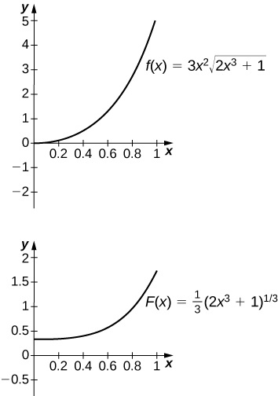

* Use substitution to evaluate indefinite integrals.
* Use substitution to evaluate definite integrals.

The Fundamental Theorem of Calculus gave us a method to evaluate integrals without using Riemann sums. The drawback of this method, though, is that we must be able to find an antiderivative, and this is not always easy. In this section we examine a technique, called **integration by substitution**{: data-type="term"}, to help us find antiderivatives. Specifically, this method helps us find antiderivatives when the integrand is the result of a chain-rule derivative.

At first, the approach to the substitution procedure may not appear very obvious. However, it is primarily a visual task—that is, the integrand shows you what to do; it is a matter of recognizing the form of the function. So, what are we supposed to see? We are looking for an integrand of the form <math xmlns="http://www.w3.org/1998/Math/MathML"><mrow><mi>f</mi><mrow><mo>[</mo><mrow><mi>g</mi><mrow><mo>(</mo><mi>x</mi><mo>)</mo></mrow></mrow><mo>]</mo></mrow><msup><mi>g</mi><mo>′</mo></msup><mrow><mtext>(</mtext><mi>x</mi><mo>)</mo></mrow><mi>d</mi><mi>x</mi><mo>.</mo></mrow></math>

 For example, in the integral <math xmlns="http://www.w3.org/1998/Math/MathML"><mrow><mstyle displaystyle="true"><mrow><mo stretchy="true">∫</mo><mrow><msup><mrow><mrow><mo>(</mo><mrow><msup><mi>x</mi><mn>2</mn></msup><mo>−</mo><mn>3</mn></mrow><mo>)</mo></mrow></mrow><mn>3</mn></msup><mn>2</mn><mi>x</mi><mi>d</mi><mi>x</mi></mrow></mrow></mstyle><mo>,</mo></mrow></math>

 we have <math xmlns="http://www.w3.org/1998/Math/MathML"><mrow><mi>f</mi><mo stretchy="false">(</mo><mi>x</mi><mo stretchy="false">)</mo><mo>=</mo><msup><mi>x</mi><mn>3</mn></msup><mo>,</mo><mi>g</mi><mo stretchy="false">(</mo><mi>x</mi><mo stretchy="false">)</mo><mo>=</mo><msup><mi>x</mi><mn>2</mn></msup><mo>−</mo><mn>3</mn><mo>,</mo></mrow></math>

 and <math xmlns="http://www.w3.org/1998/Math/MathML"><mrow><mi>g</mi><mo>'</mo><mo stretchy="false">(</mo><mi>x</mi><mo stretchy="false">)</mo><mo>=</mo><mn>2</mn><mi>x</mi><mo>.</mo></mrow></math>

 Then,

<math xmlns="http://www.w3.org/1998/Math/MathML"><mrow><mi>f</mi><mrow><mo>[</mo><mrow><mi>g</mi><mrow><mo>(</mo><mi>x</mi><mo>)</mo></mrow></mrow><mo>]</mo></mrow><msup><mi>g</mi><mo>′</mo></msup><mrow><mtext>(</mtext><mi>x</mi><mo>)</mo></mrow><mo>=</mo><msup><mrow><mrow><mo>(</mo><mrow><msup><mi>x</mi><mn>2</mn></msup><mo>−</mo><mn>3</mn></mrow><mo>)</mo></mrow></mrow><mn>3</mn></msup><mrow><mo>(</mo><mrow><mn>2</mn><mi>x</mi></mrow><mo>)</mo></mrow><mo>,</mo></mrow></math>

and we see that our integrand is in the correct form.

The method is called *substitution* because we substitute part of the integrand with the variable *u* and part of the integrand with *du*. It is also referred to as **change of variables**{: data-type="term"} because we are changing variables to obtain an expression that is easier to work with for applying the integration rules.

Substitution with Indefinite Integrals

Let <math xmlns="http://www.w3.org/1998/Math/MathML"><mrow><mi>u</mi><mo>=</mo><mi>g</mi><mrow><mo>(</mo><mi>x</mi><mo>)</mo></mrow><mo>,</mo><mo>,</mo></mrow></math>

 where <math xmlns="http://www.w3.org/1998/Math/MathML"><mrow><msup><mi>g</mi><mo>′</mo></msup><mrow><mtext>(</mtext><mi>x</mi><mo>)</mo></mrow></mrow></math>

 is continuous over an interval, let <math xmlns="http://www.w3.org/1998/Math/MathML"><mrow><mi>f</mi><mrow><mo>(</mo><mi>x</mi><mo>)</mo></mrow></mrow></math>

 be continuous over the corresponding range of *g*, and let <math xmlns="http://www.w3.org/1998/Math/MathML"><mrow><mi>F</mi><mo stretchy="false">(</mo><mi>x</mi><mo stretchy="false">)</mo></mrow></math>

 be an antiderivative of <math xmlns="http://www.w3.org/1998/Math/MathML"><mrow><mi>f</mi><mo stretchy="false">(</mo><mi>x</mi><mo stretchy="false">)</mo><mo>.</mo></mrow></math>

 Then,

<math xmlns="http://www.w3.org/1998/Math/MathML"><mtable><mtr><mtd columnalign="left"><mstyle displaystyle="true"><mrow><mo stretchy="true">∫</mo><mrow><mi>f</mi><mrow><mo>[</mo><mrow><mi>g</mi><mrow><mo>(</mo><mi>x</mi><mo>)</mo></mrow></mrow><mo>]</mo></mrow><msup><mi>g</mi><mo>′</mo></msup><mrow><mtext>(</mtext><mi>x</mi><mo>)</mo></mrow><mi>d</mi><mi>x</mi></mrow></mrow></mstyle></mtd><mtd columnalign="left"><mo>=</mo><mstyle displaystyle="true"><mrow><mo>∫</mo><mi>f</mi></mrow></mstyle><mrow><mo>(</mo><mi>u</mi><mo>)</mo></mrow><mi>d</mi><mi>u</mi></mtd></mtr><mtr><mtd /><mtd columnalign="left"><mo>=</mo><mi>F</mi><mrow><mo>(</mo><mi>u</mi><mo>)</mo></mrow><mo>+</mo><mi>C</mi></mtd></mtr><mtr><mtd /><mtd columnalign="left"><mo>=</mo><mi>F</mi><mrow><mo>(</mo><mrow><mi>g</mi><mrow><mo>(</mo><mi>x</mi><mo>)</mo></mrow></mrow><mo>)</mo></mrow><mo>+</mo><mi>C</mi><mo>.</mo></mtd></mtr></mtable></math>

# Proof

Let *f*, *g*, *u*, and *F* be as specified in the theorem. Then

<math xmlns="http://www.w3.org/1998/Math/MathML"><mtable><mtr><mtd columnalign="left"><mfrac><mi>d</mi><mrow><mi>d</mi><mi>x</mi></mrow></mfrac><mi>F</mi><mo stretchy="false">(</mo><mi>g</mi><mo stretchy="false">(</mo><mi>x</mi><mo stretchy="false">)</mo><mo stretchy="false">)</mo></mtd><mtd columnalign="left"><mo>=</mo><msup><mi>F</mi><mo>′</mo></msup><mrow><mtext>(</mtext><mrow><mi>g</mi><mrow><mo>(</mo><mi>x</mi><mo>)</mo></mrow></mrow><mo>)</mo></mrow><msup><mi>g</mi><mo>′</mo></msup><mrow><mtext>(</mtext><mi>x</mi><mo>)</mo></mrow></mtd></mtr><mtr><mtd /><mtd columnalign="left"><mo>=</mo><mi>f</mi><mrow><mo>[</mo><mrow><mi>g</mi><mrow><mo>(</mo><mi>x</mi><mo>)</mo></mrow></mrow><mo>]</mo></mrow><msup><mi>g</mi><mo>′</mo></msup><mrow><mtext>(</mtext><mi>x</mi><mo>)</mo></mrow><mo>.</mo></mtd></mtr></mtable></math>

Integrating both sides with respect to *x*, we see that

<math xmlns="http://www.w3.org/1998/Math/MathML"><mrow><mstyle displaystyle="true"><mrow><mo>∫</mo><mrow><mi>f</mi><mrow><mo>[</mo><mrow><mi>g</mi><mrow><mo>(</mo><mi>x</mi><mo>)</mo></mrow></mrow><mo>]</mo></mrow><msup><mi>g</mi><mo>′</mo></msup><mrow><mtext>(</mtext><mi>x</mi><mo>)</mo></mrow><mi>d</mi><mi>x</mi></mrow></mrow></mstyle><mo>=</mo><mi>F</mi><mrow><mo>(</mo><mrow><mi>g</mi><mrow><mo>(</mo><mi>x</mi><mo>)</mo></mrow></mrow><mo>)</mo></mrow><mo>+</mo><mi>C</mi><mo>.</mo></mrow></math>

If we now substitute <math xmlns="http://www.w3.org/1998/Math/MathML"><mrow><mi>u</mi><mo>=</mo><mi>g</mi><mrow><mo>(</mo><mi>x</mi><mo>)</mo></mrow><mo>,</mo></mrow></math>

 and <math xmlns="http://www.w3.org/1998/Math/MathML"><mrow><mi>d</mi><mi>u</mi><mo>=</mo><mi>g</mi><mo>'</mo><mrow><mo>(</mo><mi>x</mi><mo>)</mo></mrow><mi>d</mi><mi>x</mi><mo>,</mo></mrow></math>

 we get

<math xmlns="http://www.w3.org/1998/Math/MathML"><mtable><mtr><mtd columnalign="left"><mstyle displaystyle="true"><mrow><mo>∫</mo><mrow><mi>f</mi><mrow><mo>[</mo><mrow><mi>g</mi><mrow><mo>(</mo><mi>x</mi><mo>)</mo></mrow></mrow><mo>]</mo></mrow><msup><mi>g</mi><mo>′</mo></msup><mrow><mtext>(</mtext><mi>x</mi><mo>)</mo></mrow><mi>d</mi><mi>x</mi></mrow></mrow></mstyle></mtd><mtd columnalign="left"><mo>=</mo><mstyle displaystyle="true"><mrow><mo>∫</mo><mi>f</mi></mrow></mstyle><mrow><mo>(</mo><mi>u</mi><mo>)</mo></mrow><mi>d</mi><mi>u</mi></mtd></mtr><mtr><mtd /><mtd columnalign="left"><mo>=</mo><mi>F</mi><mrow><mo>(</mo><mi>u</mi><mo>)</mo></mrow><mo>+</mo><mi>C</mi></mtd></mtr><mtr><mtd /><mtd columnalign="left"><mo>=</mo><mi>F</mi><mrow><mo>(</mo><mrow><mi>g</mi><mrow><mo>(</mo><mi>x</mi><mo>)</mo></mrow></mrow><mo>)</mo></mrow><mo>+</mo><mi>C</mi><mo>.</mo></mtd></mtr></mtable></math>

□

Returning to the problem we looked at originally, we let <math xmlns="http://www.w3.org/1998/Math/MathML"><mrow><mi>u</mi><mo>=</mo><msup><mi>x</mi><mn>2</mn></msup><mo>−</mo><mn>3</mn></mrow></math>

 and then <math xmlns="http://www.w3.org/1998/Math/MathML"><mrow><mi>d</mi><mi>u</mi><mo>=</mo><mn>2</mn><mi>x</mi><mi>d</mi><mi>x</mi><mo>.</mo></mrow></math>

 Rewrite the integral in terms of *u*\:

<math xmlns="http://www.w3.org/1998/Math/MathML"><mrow><msup><mrow><mstyle displaystyle="true"><mrow><mo stretchy="true">∫</mo><mrow><munder><munder><mrow><mrow><mo>(</mo><mrow><msup><mi>x</mi><mn>2</mn></msup><mo>−</mo><mn>3</mn></mrow><mo>)</mo></mrow></mrow><mo stretchy="true">︸</mo></munder><mi>u</mi></munder></mrow></mrow></mstyle></mrow><mn>3</mn></msup><munder><munder><mrow><mrow><mo>(</mo><mrow><mn>2</mn><mi>x</mi><mi>d</mi><mi>x</mi></mrow><mo>)</mo></mrow></mrow><mo stretchy="true">︸</mo></munder><mrow><mi>d</mi><mi>u</mi></mrow></munder><mo>=</mo><mstyle displaystyle="true"><mrow><mo>∫</mo><mrow><msup><mi>u</mi><mn>3</mn></msup><mi>d</mi><mi>u</mi><mo>.</mo></mrow></mrow></mstyle></mrow></math>

Using the power rule for integrals, we have

<math xmlns="http://www.w3.org/1998/Math/MathML"><mrow><mstyle displaystyle="true"><mrow><mo stretchy="true">∫</mo><mrow><msup><mi>u</mi><mn>3</mn></msup><mi>d</mi><mi>u</mi><mo>=</mo><mfrac><mrow><msup><mi>u</mi><mn>4</mn></msup></mrow><mn>4</mn></mfrac><mo>+</mo><mi>C</mi></mrow></mrow></mstyle><mo>.</mo></mrow></math>

Substitute the original expression for *x* back into the solution:

<math xmlns="http://www.w3.org/1998/Math/MathML"><mrow><mfrac><mrow><msup><mi>u</mi><mn>4</mn></msup></mrow><mn>4</mn></mfrac><mo>+</mo><mi>C</mi><mo>=</mo><mfrac><mrow><msup><mrow><mrow><mo>(</mo><mrow><msup><mi>x</mi><mn>2</mn></msup><mo>−</mo><mn>3</mn></mrow><mo>)</mo></mrow></mrow><mn>4</mn></msup></mrow><mn>4</mn></mfrac><mo>+</mo><mi>C</mi><mo>.</mo></mrow></math>

We can generalize the procedure in the following Problem-Solving Strategy.

Problem-Solving Strategy: Integration by Substitution

1.  Look carefully at the integrand and select an expression
    <math xmlns="http://www.w3.org/1998/Math/MathML"><mrow><mi>g</mi><mrow><mo>(</mo><mi>x</mi><mo>)</mo></mrow></mrow></math>
    
    within the integrand to set equal to *u*. Let’s select
    <math xmlns="http://www.w3.org/1998/Math/MathML"><mrow><mi>g</mi><mrow><mo>(</mo><mi>x</mi><mo>)</mo></mrow><mo>.</mo></mrow></math>
    
    such that
    <math xmlns="http://www.w3.org/1998/Math/MathML"><mrow><msup><mi>g</mi><mo>′</mo></msup><mrow><mtext>(</mtext><mi>x</mi><mo>)</mo></mrow></mrow></math>
    
    is also part of the integrand.
2.  Substitute
    <math xmlns="http://www.w3.org/1998/Math/MathML"><mrow><mi>u</mi><mo>=</mo><mi>g</mi><mrow><mo>(</mo><mi>x</mi><mo>)</mo></mrow></mrow></math>
    
    and
    <math xmlns="http://www.w3.org/1998/Math/MathML"><mrow><mi>d</mi><mi>u</mi><mo>=</mo><msup><mi>g</mi><mo>′</mo></msup><mrow><mtext>(</mtext><mi>x</mi><mo>)</mo></mrow><mi>d</mi><mi>x</mi><mo>.</mo></mrow></math>
    
    into the integral.
3.  We should now be able to evaluate the integral with respect to *u*. If the integral can’t be evaluated we need to go back and select a different expression to use as *u*.
4.  Evaluate the integral in terms of *u*.
5.  Write the result in terms of *x* and the expression
    <math xmlns="http://www.w3.org/1998/Math/MathML"><mrow><mi>g</mi><mrow><mo>(</mo><mi>x</mi><mo>)</mo></mrow><mo>.</mo></mrow></math>
{: data-number-style="arabic"}

Using Substitution to Find an Antiderivative

Use substitution to find the antiderivative of <math xmlns="http://www.w3.org/1998/Math/MathML"><mrow><mstyle displaystyle="true"><mrow><mo stretchy="true">∫</mo><mrow><mn>6</mn><mi>x</mi><msup><mrow><mrow><mo>(</mo><mrow><mn>3</mn><msup><mi>x</mi><mn>2</mn></msup><mo>+</mo><mn>4</mn></mrow><mo>)</mo></mrow></mrow><mn>4</mn></msup><mi>d</mi><mi>x</mi></mrow></mrow></mstyle><mo>.</mo></mrow></math>

The first step is to choose an expression for *u*. We choose <math xmlns="http://www.w3.org/1998/Math/MathML"><mrow><mi>u</mi><mo>=</mo><mn>3</mn><msup><mi>x</mi><mn>2</mn></msup><mo>+</mo><mn>4</mn><mo>.</mo></mrow></math>

 because then <math xmlns="http://www.w3.org/1998/Math/MathML"><mrow><mi>d</mi><mi>u</mi><mo>=</mo><mn>6</mn><mi>x</mi><mi>d</mi><mi>x</mi><mo>.</mo><mo>,</mo></mrow></math>

 and we already have *du* in the integrand. Write the integral in terms of *u*:

<math xmlns="http://www.w3.org/1998/Math/MathML"><mrow><mstyle displaystyle="true"><mrow><mo stretchy="true">∫</mo><mrow><mn>6</mn><mi>x</mi><msup><mrow><mrow><mo>(</mo><mrow><mn>3</mn><msup><mi>x</mi><mn>2</mn></msup><mo>+</mo><mn>4</mn></mrow><mo>)</mo></mrow></mrow><mn>4</mn></msup><mi>d</mi><mi>x</mi></mrow></mrow></mstyle><mo>=</mo><mstyle displaystyle="true"><mrow><mo>∫</mo><mrow><msup><mi>u</mi><mn>4</mn></msup><mi>d</mi><mi>u</mi></mrow></mrow></mstyle><mo>.</mo></mrow></math>

Remember that *du* is the derivative of the expression chosen for *u*, regardless of what is inside the integrand. Now we can evaluate the integral with respect to *u*:

<math xmlns="http://www.w3.org/1998/Math/MathML"><mtable columnalign="left"><mtr><mtd columnalign="left"><mstyle displaystyle="true"><mrow><mo stretchy="true">∫</mo><mrow><msup><mi>u</mi><mn>4</mn></msup><mi>d</mi><mi>u</mi></mrow></mrow></mstyle></mtd><mtd columnalign="left"><mo>=</mo><mfrac><mrow><msup><mi>u</mi><mn>5</mn></msup></mrow><mn>5</mn></mfrac><mo>+</mo><mi>C</mi></mtd></mtr><mtr /><mtr /><mtr><mtd /><mtd columnalign="left"><mo>=</mo><mfrac><mrow><msup><mrow><mrow><mo>(</mo><mrow><mn>3</mn><msup><mi>x</mi><mn>2</mn></msup><mo>+</mo><mn>4</mn></mrow><mo>)</mo></mrow></mrow><mn>5</mn></msup></mrow><mn>5</mn></mfrac><mo>+</mo><mi>C</mi><mo>.</mo></mtd></mtr></mtable></math>

**Analysis**

We can check our answer by taking the derivative of the result of integration. We should obtain the integrand. Picking a value for *C* of 1, we let <math xmlns="http://www.w3.org/1998/Math/MathML"><mrow><mi>y</mi><mo>=</mo><mfrac><mn>1</mn><mn>5</mn></mfrac><msup><mrow><mrow><mo>(</mo><mrow><mn>3</mn><msup><mi>x</mi><mn>2</mn></msup><mo>+</mo><mn>4</mn></mrow><mo>)</mo></mrow></mrow><mn>5</mn></msup><mo>+</mo><mn>1</mn><mo>.</mo></mrow></math>

 We have

<math xmlns="http://www.w3.org/1998/Math/MathML"><mrow><mi>y</mi><mo>=</mo><mfrac><mn>1</mn><mn>5</mn></mfrac><msup><mrow><mrow><mo>(</mo><mrow><mn>3</mn><msup><mi>x</mi><mn>2</mn></msup><mo>+</mo><mn>4</mn></mrow><mo>)</mo></mrow></mrow><mn>5</mn></msup><mo>+</mo><mn>1</mn><mo>,</mo></mrow></math>

so

<math xmlns="http://www.w3.org/1998/Math/MathML"><mtable><mtr /><mtr><mtd columnalign="right"><msup><mi>y</mi><mo>′</mo></msup></mtd><mtd columnalign="left"><mo>=</mo><mrow><mo>(</mo><mrow><mfrac><mn>1</mn><mn>5</mn></mfrac></mrow><mo>)</mo></mrow><mn>5</mn><msup><mrow><mo>(</mo><mrow><mn>3</mn><msup><mi>x</mi><mn>2</mn></msup><mo>+</mo><mn>4</mn></mrow><mo>)</mo></mrow><mn>4</mn></msup><mn>6</mn><mi>x</mi></mtd></mtr><mtr><mtd /><mtd columnalign="left"><mo>=</mo><mn>6</mn><mi>x</mi><msup><mrow><mo>(</mo><mrow><mn>3</mn><msup><mi>x</mi><mn>2</mn></msup><mo>+</mo><mn>4</mn></mrow><mo>)</mo></mrow><mn>4</mn></msup><mo>.</mo></mtd></mtr></mtable></math>

This is exactly the expression we started with inside the integrand.

Use substitution to find the antiderivative of <math xmlns="http://www.w3.org/1998/Math/MathML"><mrow><mstyle displaystyle="true"><mrow><mo stretchy="true">∫</mo><mrow><mn>3</mn><msup><mi>x</mi><mn>2</mn></msup><msup><mrow><mrow><mo>(</mo><mrow><msup><mi>x</mi><mn>3</mn></msup><mo>−</mo><mn>3</mn></mrow><mo>)</mo></mrow></mrow><mn>2</mn></msup><mi>d</mi><mi>x</mi></mrow></mrow></mstyle><mo>.</mo></mrow></math>

<math xmlns="http://www.w3.org/1998/Math/MathML"><mrow><mstyle displaystyle="true"><mrow><mo stretchy="true">∫</mo><mrow><mn>3</mn><msup><mi>x</mi><mn>2</mn></msup><msup><mrow><mrow><mo>(</mo><mrow><msup><mi>x</mi><mn>3</mn></msup><mo>−</mo><mn>3</mn></mrow><mo>)</mo></mrow></mrow><mn>2</mn></msup><mi>d</mi><mi>x</mi></mrow></mrow></mstyle><mo>=</mo><mfrac><mn>1</mn><mn>3</mn></mfrac><msup><mrow><mrow><mo>(</mo><mrow><msup><mi>x</mi><mn>3</mn></msup><mo>−</mo><mn>3</mn></mrow><mo>)</mo></mrow></mrow><mn>3</mn></msup><mo>+</mo><mi>C</mi></mrow></math>

Hint

Let <math xmlns="http://www.w3.org/1998/Math/MathML"><mrow><mi>u</mi><mo>=</mo><msup><mi>x</mi><mn>3</mn></msup><mo>−</mo><mn>3</mn><mo>.</mo></mrow></math>

Sometimes we need to adjust the constants in our integral if they don’t match up exactly with the expressions we are substituting.

Using Substitution with Alteration

Use substitution to find the antiderivative of <math xmlns="http://www.w3.org/1998/Math/MathML"><mrow><mstyle displaystyle="true"><mrow><mo stretchy="true">∫</mo><mrow><mi>z</mi><msqrt><mrow><msup><mi>z</mi><mn>2</mn></msup><mo>−</mo><mn>5</mn></mrow></msqrt><mi>d</mi><mi>z</mi></mrow></mrow></mstyle><mo>.</mo></mrow></math>

Rewrite the integral as <math xmlns="http://www.w3.org/1998/Math/MathML"><mrow><mstyle displaystyle="true"><mrow><mo stretchy="true">∫</mo><mrow><mi>z</mi><msup><mrow><mrow><mo>(</mo><mrow><msup><mi>z</mi><mn>2</mn></msup><mo>−</mo><mn>5</mn></mrow><mo>)</mo></mrow></mrow><mrow><mn>1</mn><mtext>/</mtext><mn>2</mn></mrow></msup><mi>d</mi><mi>z</mi></mrow></mrow></mstyle><mo>.</mo></mrow></math>

 Let <math xmlns="http://www.w3.org/1998/Math/MathML"><mrow><mi>u</mi><mo>=</mo><msup><mi>z</mi><mn>2</mn></msup><mo>−</mo><mn>5</mn></mrow></math>

 and <math xmlns="http://www.w3.org/1998/Math/MathML"><mrow><mi>d</mi><mi>u</mi><mo>=</mo><mn>2</mn><mi>z</mi><mspace width="0.2em" /><mi>d</mi><mi>z</mi><mo>.</mo></mrow></math>

 Now we have a problem because <math xmlns="http://www.w3.org/1998/Math/MathML"><mrow><mi>d</mi><mi>u</mi><mo>=</mo><mn>2</mn><mi>z</mi><mspace width="0.2em" /><mi>d</mi><mi>z</mi></mrow></math>

 and the original expression has only <math xmlns="http://www.w3.org/1998/Math/MathML"><mrow><mi>z</mi><mspace width="0.2em" /><mi>d</mi><mi>z</mi><mo>.</mo></mrow></math>

 We have to alter our expression for *du* or the integral in *u* will be twice as large as it should be. If we multiply both sides of the *du* equation by <math xmlns="http://www.w3.org/1998/Math/MathML"><mrow><mfrac><mn>1</mn><mn>2</mn></mfrac><mo>.</mo></mrow></math>

 we can solve this problem. Thus,

<math xmlns="http://www.w3.org/1998/Math/MathML"><mtable><mtr /><mtr><mtd columnalign="right"><mi>u</mi></mtd><mtd columnalign="left"><mo>=</mo><msup><mi>z</mi><mn>2</mn></msup><mo>−</mo><mn>5</mn></mtd></mtr><mtr><mtd columnalign="right"><mi>d</mi><mi>u</mi></mtd><mtd columnalign="left"><mo>=</mo><mn>2</mn><mi>z</mi><mspace width="0.2em" /><mi>d</mi><mi>z</mi></mtd></mtr><mtr><mtd columnalign="right"><mfrac><mn>1</mn><mn>2</mn></mfrac><mi>d</mi><mi>u</mi></mtd><mtd columnalign="left"><mo>=</mo><mfrac><mn>1</mn><mn>2</mn></mfrac><mrow><mo>(</mo><mrow><mn>2</mn><mi>z</mi></mrow><mo>)</mo></mrow><mi>d</mi><mi>z</mi><mo>=</mo><mi>z</mi><mspace width="0.2em" /><mi>d</mi><mi>z</mi><mo>.</mo></mtd></mtr></mtable></math>

Write the integral in terms of *u*, but pull the <math xmlns="http://www.w3.org/1998/Math/MathML"><mrow><mfrac><mn>1</mn><mn>2</mn></mfrac></mrow></math>

 outside the integration symbol:

<math xmlns="http://www.w3.org/1998/Math/MathML"><mrow><mstyle displaystyle="true"><mrow><mo stretchy="true">∫</mo><mrow><mi>z</mi><msup><mrow><mrow><mo>(</mo><mrow><msup><mi>z</mi><mn>2</mn></msup><mo>−</mo><mn>5</mn></mrow><mo>)</mo></mrow></mrow><mrow><mn>1</mn><mtext>/</mtext><mn>2</mn></mrow></msup><mi>d</mi><mi>z</mi><mo>=</mo></mrow></mrow></mstyle><mfrac><mn>1</mn><mn>2</mn></mfrac><mstyle displaystyle="true"><mrow><mo>∫</mo><mrow><msup><mi>u</mi><mrow><mn>1</mn><mtext>/</mtext><mn>2</mn></mrow></msup><mi>d</mi><mi>u</mi><mo>.</mo></mrow></mrow></mstyle></mrow></math>

Integrate the expression in *u*:

<math xmlns="http://www.w3.org/1998/Math/MathML"><mtable><mtr /><mtr><mtd columnalign="left"><mfrac><mn>1</mn><mn>2</mn></mfrac><mstyle displaystyle="true"><mrow><mo>∫</mo><mrow><msup><mi>u</mi><mrow><mn>1</mn><mtext>/</mtext><mn>2</mn></mrow></msup><mi>d</mi><mi>u</mi></mrow></mrow></mstyle></mtd><mtd columnalign="left"><mo>=</mo><mrow><mo>(</mo><mrow><mfrac><mn>1</mn><mn>2</mn></mfrac></mrow><mo>)</mo></mrow><mfrac><mrow><msup><mi>u</mi><mrow><mn>3</mn><mtext>/</mtext><mn>2</mn></mrow></msup></mrow><mrow><mfrac><mn>3</mn><mn>2</mn></mfrac></mrow></mfrac><mo>+</mo><mi>C</mi></mtd></mtr><mtr /><mtr><mtd /><mtd columnalign="left"><mo>=</mo><mrow><mo>(</mo><mrow><mfrac><mn>1</mn><mn>2</mn></mfrac></mrow><mo>)</mo></mrow><mrow><mo>(</mo><mrow><mfrac><mn>2</mn><mn>3</mn></mfrac></mrow><mo>)</mo></mrow><msup><mi>u</mi><mrow><mn>3</mn><mtext>/</mtext><mn>2</mn></mrow></msup><mo>+</mo><mi>C</mi></mtd></mtr><mtr><mtd /><mtd columnalign="left"><mo>=</mo><mfrac><mn>1</mn><mn>3</mn></mfrac><msup><mi>u</mi><mrow><mn>3</mn><mtext>/</mtext><mn>2</mn></mrow></msup><mo>+</mo><mi>C</mi></mtd></mtr><mtr><mtd /><mtd columnalign="left"><mo>=</mo><mfrac><mn>1</mn><mn>3</mn></mfrac><msup><mrow><mo>(</mo><mrow><msup><mi>z</mi><mn>2</mn></msup><mo>−</mo><mn>5</mn></mrow><mo>)</mo></mrow><mrow><mn>3</mn><mtext>/</mtext><mn>2</mn></mrow></msup><mo>+</mo><mi>C</mi><mo>.</mo></mtd></mtr></mtable></math>

Use substitution to find the antiderivative of <math xmlns="http://www.w3.org/1998/Math/MathML"><mrow><mstyle displaystyle="true"><mrow><mo stretchy="true">∫</mo><mrow><msup><mi>x</mi><mn>2</mn></msup><msup><mrow><mrow><mo>(</mo><mrow><msup><mi>x</mi><mn>3</mn></msup><mo>+</mo><mn>5</mn></mrow><mo>)</mo></mrow></mrow><mn>9</mn></msup><mi>d</mi><mi>x</mi></mrow></mrow></mstyle><mo>.</mo></mrow></math>

<math xmlns="http://www.w3.org/1998/Math/MathML"><mrow><mfrac><mrow><msup><mrow><mrow><mo>(</mo><mrow><msup><mi>x</mi><mn>3</mn></msup><mo>+</mo><mn>5</mn></mrow><mo>)</mo></mrow></mrow><mrow><mn>10</mn></mrow></msup></mrow><mrow><mn>30</mn></mrow></mfrac><mo>+</mo><mi>C</mi></mrow></math>

Hint

Multiply the *du* equation by <math xmlns="http://www.w3.org/1998/Math/MathML"><mrow><mfrac><mn>1</mn><mn>3</mn></mfrac><mo>.</mo></mrow></math>

Using Substitution with Integrals of Trigonometric Functions

Use substitution to evaluate the integral <math xmlns="http://www.w3.org/1998/Math/MathML"><mrow><mstyle displaystyle="true"><mrow><mo stretchy="true">∫</mo><mrow><mfrac><mrow><mtext>sin</mtext><mspace width="0.1em" /><mi>t</mi></mrow><mrow><msup><mrow><mtext>cos</mtext></mrow><mn>3</mn></msup><mi>t</mi></mrow></mfrac><mi>d</mi><mi>t</mi></mrow></mrow></mstyle><mo>.</mo></mrow></math>

We know the derivative of <math xmlns="http://www.w3.org/1998/Math/MathML"><mrow><mtext>cos</mtext><mspace width="0.1em" /><mi>t</mi></mrow></math>

 is <math xmlns="http://www.w3.org/1998/Math/MathML"><mrow><mtext>−</mtext><mtext>sin</mtext><mspace width="0.1em" /><mi>t</mi><mo>,</mo></mrow></math>

 so we set <math xmlns="http://www.w3.org/1998/Math/MathML"><mrow><mi>u</mi><mo>=</mo><mtext>cos</mtext><mspace width="0.1em" /><mi>t</mi><mo>.</mo></mrow></math>

 Then <math xmlns="http://www.w3.org/1998/Math/MathML"><mrow><mi>d</mi><mi>u</mi><mo>=</mo><mtext>−</mtext><mtext>sin</mtext><mspace width="0.1em" /><mi>t</mi><mi>d</mi><mi>t</mi><mo>.</mo></mrow></math>

 Substituting into the integral, we have

<math xmlns="http://www.w3.org/1998/Math/MathML"><mrow><mstyle displaystyle="true"><mrow><mo stretchy="true">∫</mo><mrow><mfrac><mrow><mtext>sin</mtext><mspace width="0.1em" /><mi>t</mi></mrow><mrow><msup><mrow><mtext>cos</mtext></mrow><mn>3</mn></msup><mi>t</mi></mrow></mfrac><mi>d</mi><mi>t</mi><mo>=</mo><mtext>−</mtext><mstyle displaystyle="true"><mrow><mo stretchy="true">∫</mo><mrow><mfrac><mrow><mi>d</mi><mi>u</mi></mrow><mrow><msup><mi>u</mi><mn>3</mn></msup></mrow></mfrac></mrow></mrow></mstyle></mrow></mrow></mstyle><mo>.</mo></mrow></math>

Evaluating the integral, we get

<math xmlns="http://www.w3.org/1998/Math/MathML"><mtable><mtr /><mtr /><mtr><mtd columnalign="left"><mtext>−</mtext><mstyle displaystyle="true"><mrow><mo stretchy="true">∫</mo><mrow><mfrac><mrow><mi>d</mi><mi>u</mi></mrow><mrow><msup><mi>u</mi><mn>3</mn></msup></mrow></mfrac></mrow></mrow></mstyle></mtd><mtd columnalign="left"><mo>=</mo><mtext>−</mtext><mstyle displaystyle="true"><mrow><mo>∫</mo><mrow><msup><mi>u</mi><mrow><mn>−3</mn></mrow></msup><mi>d</mi><mi>u</mi></mrow></mrow></mstyle></mtd></mtr><mtr><mtd /><mtd columnalign="left"><mo>=</mo><mtext>−</mtext><mrow><mo>(</mo><mrow><mo>−</mo><mfrac><mn>1</mn><mn>2</mn></mfrac></mrow><mo>)</mo></mrow><msup><mi>u</mi><mrow><mn>−2</mn></mrow></msup><mo>+</mo><mi>C</mi><mo>.</mo></mtd></mtr></mtable></math>

Putting the answer back in terms of *t*, we get

<math xmlns="http://www.w3.org/1998/Math/MathML"><mtable><mtr><mtd columnalign="left"><mstyle displaystyle="true"><mrow><mo stretchy="true">∫</mo><mrow><mfrac><mrow><mtext>sin</mtext><mspace width="0.1em" /><mi>t</mi></mrow><mrow><msup><mrow><mtext>cos</mtext></mrow><mn>3</mn></msup><mi>t</mi></mrow></mfrac><mi>d</mi><mi>t</mi></mrow></mrow></mstyle></mtd><mtd columnalign="left"><mo>=</mo><mfrac><mn>1</mn><mrow><mn>2</mn><msup><mi>u</mi><mn>2</mn></msup></mrow></mfrac><mo>+</mo><mi>C</mi></mtd></mtr><mtr /><mtr><mtd /><mtd columnalign="left"><mo>=</mo><mfrac><mn>1</mn><mrow><mn>2</mn><msup><mrow><mtext>cos</mtext></mrow><mn>2</mn></msup><mi>t</mi></mrow></mfrac><mo>+</mo><mi>C</mi><mo>.</mo></mtd></mtr></mtable></math>

Use substitution to evaluate the integral <math xmlns="http://www.w3.org/1998/Math/MathML"><mrow><mstyle displaystyle="true"><mrow><mo stretchy="true">∫</mo><mrow><mfrac><mrow><mtext>cos</mtext><mspace width="0.1em" /><mi>t</mi></mrow><mrow><msup><mrow><mtext>sin</mtext></mrow><mn>2</mn></msup><mi>t</mi></mrow></mfrac><mi>d</mi><mi>t</mi><mo>.</mo></mrow></mrow></mstyle></mrow></math>

<math xmlns="http://www.w3.org/1998/Math/MathML"><mrow><mo>−</mo><mfrac><mn>1</mn><mrow><mtext>sin</mtext><mspace width="0.1em" /><mi>t</mi></mrow></mfrac><mo>+</mo><mi>C</mi></mrow></math>

Hint

Use the process from [[link]](#fs-id1170573573975) to solve the problem.

Sometimes we need to manipulate an integral in ways that are more complicated than just multiplying or dividing by a constant. We need to eliminate all the expressions within the integrand that are in terms of the original variable. When we are done, *u* should be the only variable in the integrand. In some cases, this means solving for the original variable in terms of *u*. This technique should become clear in the next example.

Finding an Antiderivative Using *u*-Substitution

Use substitution to find the antiderivative of <math xmlns="http://www.w3.org/1998/Math/MathML"><mrow><mstyle displaystyle="true"><mrow><mo stretchy="true">∫</mo><mrow><mfrac><mi>x</mi><mrow><msqrt><mrow><mi>x</mi><mo>−</mo><mn>1</mn></mrow></msqrt></mrow></mfrac><mi>d</mi><mi>x</mi><mo>.</mo></mrow></mrow></mstyle></mrow></math>

If we let <math xmlns="http://www.w3.org/1998/Math/MathML"><mrow><mi>u</mi><mo>=</mo><mi>x</mi><mo>−</mo><mn>1</mn><mo>,</mo></mrow></math>

 then <math xmlns="http://www.w3.org/1998/Math/MathML"><mrow><mi>d</mi><mi>u</mi><mo>=</mo><mi>d</mi><mi>x</mi><mo>.</mo></mrow></math>

 But this does not account for the *x* in the numerator of the integrand. We need to express *x* in terms of *u*. If <math xmlns="http://www.w3.org/1998/Math/MathML"><mrow><mi>u</mi><mo>=</mo><mi>x</mi><mo>−</mo><mn>1</mn><mo>,</mo></mrow></math>

 then <math xmlns="http://www.w3.org/1998/Math/MathML"><mrow><mi>x</mi><mo>=</mo><mi>u</mi><mo>+</mo><mn>1</mn><mo>.</mo></mrow></math>

 Now we can rewrite the integral in terms of *u*:

<math xmlns="http://www.w3.org/1998/Math/MathML"><mtable columnalign="left"><mtr><mtd columnalign="left"><mstyle displaystyle="true"><mrow><mo stretchy="true">∫</mo><mrow><mfrac><mi>x</mi><mrow><msqrt><mrow><mi>x</mi><mo>−</mo><mn>1</mn></mrow></msqrt></mrow></mfrac><mi>d</mi><mi>x</mi></mrow></mrow></mstyle></mtd><mtd columnalign="left"><mo>=</mo><mstyle displaystyle="true"><mrow><mo stretchy="true">∫</mo><mrow><mfrac><mrow><mi>u</mi><mo>+</mo><mn>1</mn></mrow><mrow><msqrt><mi>u</mi></msqrt></mrow></mfrac><mi>d</mi><mi>u</mi></mrow></mrow></mstyle></mtd></mtr><mtr /><mtr><mtd /><mtd columnalign="left"><mo>=</mo><mstyle displaystyle="true"><mrow><mo stretchy="true">∫</mo><mrow><msqrt><mi>u</mi></msqrt><mo>+</mo><mfrac><mn>1</mn><mrow><msqrt><mi>u</mi></msqrt></mrow></mfrac><mi>d</mi><mi>u</mi></mrow></mrow></mstyle></mtd></mtr><mtr><mtd /><mtd columnalign="left"><mo>=</mo><mstyle displaystyle="true"><mrow><mo stretchy="true">∫</mo><mrow><mrow><mo>(</mo><mrow><msup><mi>u</mi><mrow><mrow><mn>1</mn><mtext>/</mtext><mn>2</mn></mrow></mrow></msup><mo>+</mo><msup><mi>u</mi><mrow><mn>−1</mn><mtext>/</mtext><mn>2</mn></mrow></msup></mrow><mo>)</mo></mrow><mi>d</mi><mi>u</mi></mrow></mrow></mstyle><mo>.</mo></mtd></mtr></mtable></math>

Then we integrate in the usual way, replace *u* with the original expression, and factor and simplify the result. Thus,

<math xmlns="http://www.w3.org/1998/Math/MathML"><mtable><mtr><mtd columnalign="left"><mstyle displaystyle="true"><mrow><mo stretchy="true">∫</mo><mrow><mrow><mo>(</mo><mrow><msup><mi>u</mi><mrow><mn>1</mn><mtext>/</mtext><mn>2</mn></mrow></msup><mo>+</mo><msup><mi>u</mi><mrow><mn>−1</mn><mtext>/</mtext><mn>2</mn></mrow></msup></mrow><mo>)</mo></mrow><mi>d</mi><mi>u</mi></mrow></mrow></mstyle></mtd><mtd columnalign="left"><mo>=</mo><mfrac><mn>2</mn><mn>3</mn></mfrac><msup><mi>u</mi><mrow><mn>3</mn><mtext>/</mtext><mn>2</mn></mrow></msup><mo>+</mo><mn>2</mn><msup><mi>u</mi><mrow><mn>1</mn><mtext>/</mtext><mn>2</mn></mrow></msup><mo>+</mo><mi>C</mi></mtd></mtr><mtr /><mtr><mtd /><mtd columnalign="left"><mo>=</mo><mfrac><mn>2</mn><mn>3</mn></mfrac><msup><mrow><mo>(</mo><mrow><mi>x</mi><mo>−</mo><mn>1</mn></mrow><mo>)</mo></mrow><mrow><mn>3</mn><mtext>/</mtext><mn>2</mn></mrow></msup><mo>+</mo><mn>2</mn><msup><mrow><mo>(</mo><mrow><mi>x</mi><mo>−</mo><mn>1</mn></mrow><mo>)</mo></mrow><mrow><mn>1</mn><mtext>/</mtext><mn>2</mn></mrow></msup><mo>+</mo><mi>C</mi></mtd></mtr><mtr><mtd /><mtd columnalign="left"><mo>=</mo><msup><mrow><mo>(</mo><mrow><mi>x</mi><mo>−</mo><mn>1</mn></mrow><mo>)</mo></mrow><mrow><mn>1</mn><mtext>/</mtext><mn>2</mn></mrow></msup><mrow><mo>[</mo><mrow><mfrac><mn>2</mn><mn>3</mn></mfrac><mrow><mo>(</mo><mrow><mi>x</mi><mo>−</mo><mn>1</mn></mrow><mo>)</mo></mrow><mo>+</mo><mn>2</mn></mrow><mo>]</mo></mrow><mo>+</mo><mi>C</mi></mtd></mtr><mtr><mtd /><mtd columnalign="left"><mo>=</mo><msup><mrow><mo>(</mo><mrow><mi>x</mi><mo>−</mo><mn>1</mn></mrow><mo>)</mo></mrow><mrow><mn>1</mn><mtext>/</mtext><mn>2</mn></mrow></msup><mrow><mo>(</mo><mrow><mfrac><mn>2</mn><mn>3</mn></mfrac><mi>x</mi><mo>−</mo><mfrac><mn>2</mn><mn>3</mn></mfrac><mo>+</mo><mfrac><mn>6</mn><mn>3</mn></mfrac></mrow><mo>)</mo></mrow></mtd></mtr><mtr><mtd /><mtd columnalign="left"><mo>=</mo><msup><mrow><mo>(</mo><mrow><mi>x</mi><mo>−</mo><mn>1</mn></mrow><mo>)</mo></mrow><mrow><mn>1</mn><mtext>/</mtext><mn>2</mn></mrow></msup><mrow><mo>(</mo><mrow><mfrac><mn>2</mn><mn>3</mn></mfrac><mi>x</mi><mo>+</mo><mfrac><mn>4</mn><mn>3</mn></mfrac></mrow><mo>)</mo></mrow></mtd></mtr><mtr><mtd /><mtd columnalign="left"><mo>=</mo><mfrac><mn>2</mn><mn>3</mn></mfrac><msup><mrow><mo>(</mo><mrow><mi>x</mi><mo>−</mo><mn>1</mn></mrow><mo>)</mo></mrow><mrow><mn>1</mn><mtext>/</mtext><mn>2</mn></mrow></msup><mrow><mo>(</mo><mrow><mi>x</mi><mo>+</mo><mn>2</mn></mrow><mo>)</mo></mrow><mo>+</mo><mi>C</mi><mo>.</mo></mtd></mtr></mtable></math>

Use substitution to evaluate the indefinite integral <math xmlns="http://www.w3.org/1998/Math/MathML"><mrow><mstyle displaystyle="true"><mrow><mo stretchy="true">∫</mo><mrow><msup><mrow><mtext>cos</mtext></mrow><mn>3</mn></msup><mi>t</mi><mspace width="0.1em" /><mtext>sin</mtext><mspace width="0.1em" /><mi>t</mi><mspace width="0.2em" /><mi>d</mi><mi>t</mi></mrow></mrow></mstyle><mo>.</mo></mrow></math>

<math xmlns="http://www.w3.org/1998/Math/MathML"><mrow><mo>−</mo><mfrac><mrow><msup><mrow><mtext>cos</mtext></mrow><mn>4</mn></msup><mi>t</mi></mrow><mn>4</mn></mfrac><mo>+</mo><mi>C</mi></mrow></math>

Hint

Use the process from [[link]](#fs-id1170573426799) to solve the problem.

# Substitution for Definite Integrals

Substitution can be used with definite integrals, too. However, using substitution to evaluate a definite integral requires a change to the limits of integration. If we change variables in the integrand, the limits of integration change as well.

Substitution with Definite Integrals

Let <math xmlns="http://www.w3.org/1998/Math/MathML"><mrow><mi>u</mi><mo>=</mo><mi>g</mi><mrow><mo>(</mo><mi>x</mi><mo>)</mo></mrow></mrow></math>

 and let <math xmlns="http://www.w3.org/1998/Math/MathML"><msup><mi>g</mi><mtext>′</mtext></msup></math>

 be continuous over an interval <math xmlns="http://www.w3.org/1998/Math/MathML"><mrow><mrow><mo>[</mo><mrow><mi>a</mi><mo>,</mo><mi>b</mi></mrow><mo>]</mo></mrow><mo>,</mo></mrow></math>

 and let *f* be continuous over the range of <math xmlns="http://www.w3.org/1998/Math/MathML"><mrow><mi>u</mi><mo>=</mo><mi>g</mi><mrow><mo>(</mo><mi>x</mi><mo>)</mo></mrow><mo>.</mo></mrow></math>

 Then,

<math xmlns="http://www.w3.org/1998/Math/MathML"><mrow><mstyle displaystyle="true"><mrow><msubsup><mo stretchy="true">∫</mo><mi>a</mi><mi>b</mi></msubsup><mrow><mi>f</mi><mrow><mo>(</mo><mrow><mi>g</mi><mo stretchy="false">(</mo><mi>x</mi><mo stretchy="false">)</mo></mrow><mo>)</mo></mrow><msup><mi>g</mi><mo>′</mo></msup><mrow><mtext>(</mtext><mi>x</mi><mo>)</mo></mrow><mi>d</mi><mi>x</mi><mo>=</mo><mstyle displaystyle="true"><mrow><msubsup><mo>∫</mo><mrow><mi>g</mi><mrow><mo>(</mo><mi>a</mi><mo>)</mo></mrow></mrow><mrow><mi>g</mi><mrow><mo>(</mo><mi>b</mi><mo>)</mo></mrow></mrow></msubsup><mrow><mi>f</mi><mrow><mo>(</mo><mi>u</mi><mo>)</mo></mrow><mi>d</mi><mi>u</mi></mrow></mrow></mstyle></mrow></mrow></mstyle><mo>.</mo></mrow></math>

Although we will not formally prove this theorem, we justify it with some calculations here. From the substitution rule for indefinite integrals, if <math xmlns="http://www.w3.org/1998/Math/MathML"><mrow><mi>F</mi><mrow><mo>(</mo><mi>x</mi><mo>)</mo></mrow></mrow></math>

 is an antiderivative of <math xmlns="http://www.w3.org/1998/Math/MathML"><mrow><mi>f</mi><mrow><mo>(</mo><mi>x</mi><mo>)</mo></mrow><mo>,</mo></mrow></math>

 we have

<math xmlns="http://www.w3.org/1998/Math/MathML"><mrow><mstyle displaystyle="true"><mrow><mo>∫</mo><mrow><mi>f</mi><mrow><mo>(</mo><mrow><mi>g</mi><mo stretchy="false">(</mo><mi>x</mi><mo stretchy="false">)</mo></mrow><mo>)</mo></mrow><msup><mi>g</mi><mo>′</mo></msup><mtext>(</mtext><mi>x</mi><mo stretchy="false">)</mo><mi>d</mi><mi>x</mi><mo>=</mo><mi>F</mi><mrow><mo>(</mo><mrow><mi>g</mi><mo stretchy="false">(</mo><mi>x</mi><mo stretchy="false">)</mo></mrow><mo>)</mo></mrow><mo>+</mo><mi>C</mi><mo>.</mo></mrow></mrow></mstyle></mrow></math>

Then

<math xmlns="http://www.w3.org/1998/Math/MathML"><mtable><mtr><mtd columnalign="left"><mstyle displaystyle="true"><mrow><msubsup><mo stretchy="true">∫</mo><mi>a</mi><mi>b</mi></msubsup><mrow><mi>f</mi><mrow><mo>[</mo><mrow><mi>g</mi><mrow><mo>(</mo><mi>x</mi><mo>)</mo></mrow></mrow><mo>]</mo></mrow><msup><mi>g</mi><mo>′</mo></msup><mrow><mtext>(</mtext><mi>x</mi><mo>)</mo></mrow><mi>d</mi><mi>x</mi></mrow></mrow></mstyle></mtd><mtd columnalign="left"><mo>=</mo><msubsup><mrow><mrow><mi>F</mi><mrow><mo>(</mo><mrow><mi>g</mi><mrow><mo>(</mo><mi>x</mi><mo>)</mo></mrow></mrow><mo>)</mo></mrow></mrow><mo>\|</mo></mrow><mrow><mi>x</mi><mo>=</mo><mi>a</mi></mrow><mrow><mi>x</mi><mo>=</mo><mi>b</mi></mrow></msubsup></mtd></mtr><mtr><mtd /><mtd columnalign="left"><mo>=</mo><mi>F</mi><mrow><mo>(</mo><mrow><mi>g</mi><mrow><mo>(</mo><mi>b</mi><mo>)</mo></mrow></mrow><mo>)</mo></mrow><mo>−</mo><mi>F</mi><mrow><mo>(</mo><mrow><mi>g</mi><mrow><mo>(</mo><mi>a</mi><mo>)</mo></mrow></mrow><mo>)</mo></mrow></mtd></mtr><mtr><mtd /><mtd columnalign="left"><mo>=</mo><msubsup><mrow><mrow><mi>F</mi><mrow><mo>(</mo><mi>u</mi><mo>)</mo></mrow></mrow><mo>\|</mo></mrow><mrow><mi>u</mi><mo>=</mo><mi>g</mi><mo stretchy="false">(</mo><mi>a</mi><mo stretchy="false">)</mo></mrow><mrow><mi>u</mi><mo>=</mo><mi>g</mi><mo stretchy="false">(</mo><mi>b</mi><mo stretchy="false">)</mo></mrow></msubsup></mtd></mtr><mtr /><mtr /><mtr><mtd /><mtd columnalign="left"><mo>=</mo><mstyle displaystyle="true"><mrow><msubsup><mo>∫</mo><mrow><mi>g</mi><mo stretchy="false">(</mo><mi>a</mi><mo stretchy="false">)</mo></mrow><mrow><mi>g</mi><mo stretchy="false">(</mo><mi>b</mi><mo stretchy="false">)</mo></mrow></msubsup><mi>f</mi></mrow></mstyle><mo stretchy="false">(</mo><mi>u</mi><mo stretchy="false">)</mo><mi>d</mi><mi>u</mi><mo>,</mo></mtd></mtr></mtable></math>

and we have the desired result.

Using Substitution to Evaluate a Definite Integral

Use substitution to evaluate <math xmlns="http://www.w3.org/1998/Math/MathML"><mrow><mstyle displaystyle="true"><mrow><msubsup><mo>∫</mo><mn>0</mn><mn>1</mn></msubsup><mrow><msup><mi>x</mi><mn>2</mn></msup><msup><mrow><mrow><mo>(</mo><mrow><mn>1</mn><mo>+</mo><mn>2</mn><msup><mi>x</mi><mn>3</mn></msup></mrow><mo>)</mo></mrow></mrow><mn>5</mn></msup></mrow></mrow></mstyle><mi>d</mi><mi>x</mi><mo>.</mo></mrow></math>

Let <math xmlns="http://www.w3.org/1998/Math/MathML"><mrow><mi>u</mi><mo>=</mo><mn>1</mn><mo>+</mo><mn>2</mn><msup><mi>x</mi><mn>3</mn></msup><mo>,</mo></mrow></math>

 so <math xmlns="http://www.w3.org/1998/Math/MathML"><mrow><mi>d</mi><mi>u</mi><mo>=</mo><mn>6</mn><msup><mi>x</mi><mn>2</mn></msup><mi>d</mi><mi>x</mi><mo>.</mo></mrow></math>

 Since the original function includes one factor of *x*2 and <math xmlns="http://www.w3.org/1998/Math/MathML"><mrow><mi>d</mi><mi>u</mi><mo>=</mo><mn>6</mn><msup><mi>x</mi><mn>2</mn></msup><mi>d</mi><mi>x</mi><mo>,</mo></mrow></math>

 multiply both sides of the *du* equation by <math xmlns="http://www.w3.org/1998/Math/MathML"><mrow><mn>1</mn><mtext>/</mtext><mn>6</mn><mo>.</mo></mrow></math>

 Then,

<math xmlns="http://www.w3.org/1998/Math/MathML"><mtable><mtr><mtd columnalign="left"><mi>d</mi><mi>u</mi></mtd><mtd columnalign="left"><mo>=</mo></mtd><mtd columnalign="left"><mn>6</mn><msup><mi>x</mi><mn>2</mn></msup><mi>d</mi><mi>x</mi></mtd></mtr><mtr><mtd columnalign="left"><mfrac><mn>1</mn><mn>6</mn></mfrac><mi>d</mi><mi>u</mi></mtd><mtd columnalign="left"><mo>=</mo></mtd><mtd columnalign="left"><msup><mi>x</mi><mn>2</mn></msup><mi>d</mi><mi>x</mi><mo>.</mo></mtd></mtr></mtable></math>

To adjust the limits of integration, note that when <math xmlns="http://www.w3.org/1998/Math/MathML"><mrow><mi>x</mi><mo>=</mo><mn>0</mn><mo>,</mo><mi>u</mi><mo>=</mo><mn>1</mn><mo>+</mo><mn>2</mn><mrow><mo>(</mo><mn>0</mn><mo>)</mo></mrow><mo>=</mo><mn>1</mn><mo>,</mo></mrow></math>

 and when <math xmlns="http://www.w3.org/1998/Math/MathML"><mrow><mi>x</mi><mo>=</mo><mn>1</mn><mo>,</mo><mi>u</mi><mo>=</mo><mn>1</mn><mo>+</mo><mn>2</mn><mrow><mo>(</mo><mn>1</mn><mo>)</mo></mrow><mo>=</mo><mn>3</mn><mo>.</mo></mrow></math>

 Then

<math xmlns="http://www.w3.org/1998/Math/MathML"><mrow><mstyle displaystyle="true"><mrow><msubsup><mo>∫</mo><mn>0</mn><mn>1</mn></msubsup><mrow><msup><mi>x</mi><mn>2</mn></msup><msup><mrow><mrow><mo>(</mo><mrow><mn>1</mn><mo>+</mo><mn>2</mn><msup><mi>x</mi><mn>3</mn></msup></mrow><mo>)</mo></mrow></mrow><mn>5</mn></msup><mi>d</mi><mi>x</mi><mo>=</mo><mfrac><mn>1</mn><mn>6</mn></mfrac><mstyle displaystyle="true"><mrow><msubsup><mo>∫</mo><mn>1</mn><mn>3</mn></msubsup><mrow><msup><mi>u</mi><mn>5</mn></msup><mi>d</mi><mi>u</mi></mrow></mrow></mstyle></mrow></mrow></mstyle><mo>.</mo></mrow></math>

Evaluating this expression, we get

<math xmlns="http://www.w3.org/1998/Math/MathML"><mtable><mtr /><mtr /><mtr><mtd columnalign="left"><mfrac><mn>1</mn><mn>6</mn></mfrac><mstyle displaystyle="true"><mrow><msubsup><mo stretchy="true">∫</mo><mn>1</mn><mn>3</mn></msubsup><mrow><msup><mi>u</mi><mn>5</mn></msup><mi>d</mi><mi>u</mi></mrow></mrow></mstyle></mtd><mtd columnalign="left"><mo>=</mo><mrow><mo>(</mo><mrow><mfrac><mn>1</mn><mn>6</mn></mfrac></mrow><mo>)</mo></mrow><mrow><mo>(</mo><mrow><mfrac><mrow><msup><mi>u</mi><mn>6</mn></msup></mrow><mn>6</mn></mfrac></mrow><mo>)</mo></mrow><msubsup><mo>\|</mo><mrow><mn>1</mn></mrow><mn>3</mn></msubsup></mtd></mtr><mtr><mtd /><mtd columnalign="left"><mo>=</mo><mfrac><mn>1</mn><mrow><mn>36</mn></mrow></mfrac><mrow><mo>[</mo><mrow><msup><mrow><mrow><mo>(</mo><mn>3</mn><mo>)</mo></mrow></mrow><mn>6</mn></msup><mo>−</mo><msup><mrow><mrow><mo>(</mo><mn>1</mn><mo>)</mo></mrow></mrow><mn>6</mn></msup></mrow><mo>]</mo></mrow></mtd></mtr><mtr><mtd /><mtd columnalign="left"><mo>=</mo><mfrac><mrow><mn>182</mn></mrow><mn>9</mn></mfrac><mo>.</mo></mtd></mtr></mtable></math>

Use substitution to evaluate the definite integral <math xmlns="http://www.w3.org/1998/Math/MathML"><mrow><mstyle displaystyle="true"><mrow><msubsup><mo stretchy="true">∫</mo><mrow><mn>−1</mn></mrow><mn>0</mn></msubsup><mrow><mi>y</mi><msup><mrow><mrow><mo>(</mo><mrow><mn>2</mn><msup><mi>y</mi><mn>2</mn></msup><mo>−</mo><mn>3</mn></mrow><mo>)</mo></mrow></mrow><mn>5</mn></msup><mi>d</mi><mi>y</mi></mrow></mrow></mstyle><mo>.</mo></mrow></math>

<math xmlns="http://www.w3.org/1998/Math/MathML"><mrow><mfrac><mrow><mn>91</mn></mrow><mn>3</mn></mfrac></mrow></math>

Hint

Use the steps from [[link]](#fs-id1170571215481) to solve the problem.

Using Substitution with an Exponential Function

Use substitution to evaluate <math xmlns="http://www.w3.org/1998/Math/MathML"><mrow><mstyle displaystyle="true"><mrow><msubsup><mo>∫</mo><mn>0</mn><mn>1</mn></msubsup><mrow><mi>x</mi><msup><mi>e</mi><mrow><mn>4</mn><msup><mi>x</mi><mn>2</mn></msup><mo>+</mo><mn>3</mn></mrow></msup><mi>d</mi><mi>x</mi></mrow></mrow></mstyle><mo>.</mo></mrow></math>

Let <math xmlns="http://www.w3.org/1998/Math/MathML"><mrow><mi>u</mi><mo>=</mo><mn>4</mn><msup><mi>x</mi><mn>3</mn></msup><mo>+</mo><mn>3</mn><mo>.</mo></mrow></math>

 Then, <math xmlns="http://www.w3.org/1998/Math/MathML"><mrow><mi>d</mi><mi>u</mi><mo>=</mo><mn>8</mn><mi>x</mi><mi>d</mi><mi>x</mi><mo>.</mo></mrow></math>

 To adjust the limits of integration, we note that when <math xmlns="http://www.w3.org/1998/Math/MathML"><mrow><mi>x</mi><mo>=</mo><mn>0</mn><mo>,</mo><mi>u</mi><mo>=</mo><mn>3</mn><mo>,</mo></mrow></math>

 and when <math xmlns="http://www.w3.org/1998/Math/MathML"><mrow><mi>x</mi><mo>=</mo><mn>1</mn><mo>,</mo><mi>u</mi><mo>=</mo><mn>7</mn><mo>.</mo></mrow></math>

 So our substitution gives

<math xmlns="http://www.w3.org/1998/Math/MathML"><mtable><mtr><mtd columnalign="left"><mstyle displaystyle="true"><mrow><msubsup><mo>∫</mo><mn>0</mn><mn>1</mn></msubsup><mrow><mi>x</mi><msup><mi>e</mi><mrow><mn>4</mn><msup><mi>x</mi><mn>2</mn></msup><mo>+</mo><mn>3</mn></mrow></msup><mi>d</mi><mi>x</mi></mrow></mrow></mstyle></mtd><mtd columnalign="left"><mo>=</mo><mfrac><mn>1</mn><mn>8</mn></mfrac><mstyle displaystyle="true"><mrow><msubsup><mo>∫</mo><mn>3</mn><mn>7</mn></msubsup><mrow><msup><mi>e</mi><mi>u</mi></msup><mi>d</mi><mi>u</mi></mrow></mrow></mstyle></mtd></mtr><mtr /><mtr><mtd /><mtd columnalign="left"><mo>=</mo><mfrac><mn>1</mn><mn>8</mn></mfrac><msup><mi>e</mi><mi>u</mi></msup><mrow><msubsup><mo>\|</mo><mrow><mn>3</mn></mrow><mn>7</mn></msubsup></mrow></mtd></mtr><mtr><mtd /><mtd columnalign="left"><mo>=</mo><mfrac><mrow><msup><mi>e</mi><mn>7</mn></msup><mo>−</mo><msup><mi>e</mi><mn>3</mn></msup></mrow><mn>8</mn></mfrac></mtd></mtr><mtr><mtd /><mtd columnalign="left"><mo>≈</mo><mn>134.568.</mn></mtd></mtr></mtable></math>

Use substitution to evaluate <math xmlns="http://www.w3.org/1998/Math/MathML"><mrow><mstyle displaystyle="true"><mrow><msubsup><mo stretchy="true">∫</mo><mn>0</mn><mn>1</mn></msubsup><mrow><msup><mi>x</mi><mn>2</mn></msup><mtext>cos</mtext><mrow><mo>(</mo><mrow><mfrac><mi>π</mi><mn>2</mn></mfrac><msup><mi>x</mi><mn>3</mn></msup></mrow><mo>)</mo></mrow><mi>d</mi><mi>x</mi></mrow></mrow></mstyle><mo>.</mo></mrow></math>

<math xmlns="http://www.w3.org/1998/Math/MathML"><mrow><mfrac><mn>2</mn><mrow><mn>3</mn><mi>π</mi></mrow></mfrac><mo>≈</mo><mn>0.2122</mn></mrow></math>

Hint

Use the process from [[link]](#fs-id1170573593895) to solve the problem.

Substitution may be only one of the techniques needed to evaluate a definite integral. All of the properties and rules of integration apply independently, and trigonometric functions may need to be rewritten using a trigonometric identity before we can apply substitution. Also, we have the option of replacing the original expression for *u* after we find the antiderivative, which means that we do not have to change the limits of integration. These two approaches are shown in [\[link\]](#fs-id1170570994085).

Using Substitution to Evaluate a Trigonometric Integral

Use substitution to evaluate <math xmlns="http://www.w3.org/1998/Math/MathML"><mrow><mstyle displaystyle="true"><mrow><msubsup><mo>∫</mo><mn>0</mn><mrow><mi>π</mi><mtext>/</mtext><mn>2</mn></mrow></msubsup><mrow><msup><mrow><mtext>cos</mtext></mrow><mn>2</mn></msup><mi>θ</mi><mspace width="0.2em" /><mi>d</mi><mi>θ</mi></mrow></mrow></mstyle><mo>.</mo></mrow></math>

Let us first use a trigonometric identity to rewrite the integral. The trig identity <math xmlns="http://www.w3.org/1998/Math/MathML"><mrow><msup><mrow><mtext>cos</mtext></mrow><mn>2</mn></msup><mi>θ</mi><mo>=</mo><mfrac><mrow><mn>1</mn><mo>+</mo><mtext>cos</mtext><mspace width="0.1em" /><mn>2</mn><mi>θ</mi></mrow><mn>2</mn></mfrac></mrow></math>

 allows us to rewrite the integral as

<math xmlns="http://www.w3.org/1998/Math/MathML"><mrow><mstyle displaystyle="true"><mrow><msubsup><mo>∫</mo><mn>0</mn><mrow><mi>π</mi><mtext>/</mtext><mn>2</mn></mrow></msubsup><mrow><msup><mrow><mtext>cos</mtext></mrow><mn>2</mn></msup><mi>θ</mi><mi>d</mi><mi>θ</mi></mrow></mrow></mstyle><mo>=</mo><mstyle displaystyle="true"><mrow><msubsup><mo stretchy="true">∫</mo><mn>0</mn><mrow><mi>π</mi><mtext>/</mtext><mn>2</mn></mrow></msubsup><mrow><mfrac><mrow><mn>1</mn><mo>+</mo><mtext>cos</mtext><mspace width="0.1em" /><mn>2</mn><mi>θ</mi></mrow><mn>2</mn></mfrac><mi>d</mi><mi>θ</mi><mo>.</mo></mrow></mrow></mstyle></mrow></math>

Then,

<math xmlns="http://www.w3.org/1998/Math/MathML"><mtable><mtr><mtd columnalign="left"><mstyle displaystyle="true"><mrow><msubsup><mo stretchy="true">∫</mo><mn>0</mn><mrow><mi>π</mi><mtext>/</mtext><mn>2</mn></mrow></msubsup><mrow><mrow><mo>(</mo><mrow><mfrac><mrow><mn>1</mn><mo>+</mo><mtext>cos</mtext><mspace width="0.1em" /><mn>2</mn><mi>θ</mi></mrow><mn>2</mn></mfrac></mrow><mo>)</mo></mrow></mrow></mrow></mstyle><mi>d</mi><mi>θ</mi></mtd><mtd columnalign="left"><mo>=</mo><mstyle displaystyle="true"><mrow><msubsup><mo stretchy="true">∫</mo><mn>0</mn><mrow><mi>π</mi><mtext>/</mtext><mn>2</mn></mrow></msubsup><mrow><mrow><mo>(</mo><mrow><mfrac><mn>1</mn><mn>2</mn></mfrac><mo>+</mo><mfrac><mn>1</mn><mn>2</mn></mfrac><mtext>cos</mtext><mspace width="0.1em" /><mn>2</mn><mi>θ</mi></mrow><mo>)</mo></mrow><mi>d</mi><mi>θ</mi></mrow></mrow></mstyle></mtd></mtr><mtr /><mtr /><mtr><mtd /><mtd columnalign="left"><mo>=</mo><mfrac><mn>1</mn><mn>2</mn></mfrac><mstyle displaystyle="true"><mrow><msubsup><mo stretchy="true">∫</mo><mn>0</mn><mrow><mi>π</mi><mtext>/</mtext><mn>2</mn></mrow></msubsup><mrow><mi>d</mi><mi>θ</mi></mrow></mrow></mstyle><mo>+</mo><mstyle displaystyle="true"><mrow><msubsup><mo stretchy="true">∫</mo><mn>0</mn><mrow><mi>π</mi><mtext>/</mtext><mn>2</mn></mrow></msubsup><mrow><mtext>cos</mtext><mspace width="0.1em" /><mn>2</mn><mi>θ</mi><mi>d</mi><mi>θ</mi><mo>.</mo></mrow></mrow></mstyle></mtd></mtr></mtable></math>

We can evaluate the first integral as it is, but we need to make a substitution to evaluate the second integral. Let <math xmlns="http://www.w3.org/1998/Math/MathML"><mrow><mi>u</mi><mo>=</mo><mn>2</mn><mi>θ</mi><mo>.</mo></mrow></math>

 Then, <math xmlns="http://www.w3.org/1998/Math/MathML"><mrow><mi>d</mi><mi>u</mi><mo>=</mo><mn>2</mn><mi>d</mi><mi>θ</mi><mo>,</mo></mrow></math>

 or <math xmlns="http://www.w3.org/1998/Math/MathML"><mrow><mfrac><mn>1</mn><mn>2</mn></mfrac><mi>d</mi><mi>u</mi><mo>=</mo><mi>d</mi><mi>θ</mi><mo>.</mo></mrow></math>

 Also, when <math xmlns="http://www.w3.org/1998/Math/MathML"><mrow><mi>θ</mi><mo>=</mo><mn>0</mn><mo>,</mo><mi>u</mi><mo>=</mo><mn>0</mn><mo>,</mo></mrow></math>

 and when <math xmlns="http://www.w3.org/1998/Math/MathML"><mrow><mi>θ</mi><mo>=</mo><mi>π</mi><mtext>/</mtext><mn>2</mn><mo>,</mo><mi>u</mi><mo>=</mo><mi>π</mi><mo>.</mo></mrow></math>

 Expressing the second integral in terms of *u*, we have

<math xmlns="http://www.w3.org/1998/Math/MathML"><mtable><mtr /><mtr /><mtr><mtd columnalign="left"><mfrac><mn>1</mn><mn>2</mn></mfrac><mstyle displaystyle="true"><mrow><msubsup><mo stretchy="true">∫</mo><mn>0</mn><mrow><mi>π</mi><mtext>/</mtext><mn>2</mn></mrow></msubsup><mrow><mi>d</mi><mi>θ</mi><mo>+</mo><mfrac><mn>1</mn><mn>2</mn></mfrac><mstyle displaystyle="true"><mrow><msubsup><mo stretchy="true">∫</mo><mn>0</mn><mrow><mi>π</mi><mtext>/</mtext><mn>2</mn></mrow></msubsup><mrow><mtext>cos</mtext><mspace width="0.1em" /><mn>2</mn><mi>θ</mi><mi>d</mi><mi>θ</mi></mrow></mrow></mstyle></mrow></mrow></mstyle></mtd><mtd columnalign="left"><mo>=</mo><mfrac><mn>1</mn><mn>2</mn></mfrac><mstyle displaystyle="true"><mrow><msubsup><mo stretchy="true">∫</mo><mn>0</mn><mrow><mi>π</mi><mtext>/</mtext><mn>2</mn></mrow></msubsup><mrow><mi>d</mi><mi>θ</mi><mo>+</mo><mfrac><mn>1</mn><mn>2</mn></mfrac><mrow><mo>(</mo><mrow><mfrac><mn>1</mn><mn>2</mn></mfrac></mrow><mo>)</mo></mrow><mstyle displaystyle="true"><mrow><msubsup><mo stretchy="true">∫</mo><mn>0</mn><mi>π</mi></msubsup><mrow><mtext>cos</mtext><mspace width="0.1em" /><mi>u</mi><mi>d</mi><mi>u</mi></mrow></mrow></mstyle></mrow></mrow></mstyle></mtd></mtr><mtr><mtd /><mtd columnalign="left"><mo>=</mo><mfrac><mi>θ</mi><mn>2</mn></mfrac><mrow><msubsup><mo>\|</mo><mrow><mi>θ</mi><mo>=</mo><mn>0</mn></mrow><mrow><mi>θ</mi><mo>=</mo><mi>π</mi><mtext>/</mtext><mn>2</mn></mrow></msubsup><mo>+</mo><mfrac><mn>1</mn><mn>4</mn></mfrac><mtext>sin</mtext><mspace width="0.1em" /><mi>u</mi><mrow><msubsup><mo>\|</mo><mrow><mi>u</mi><mo>=</mo><mn>0</mn></mrow><mrow><mi>u</mi><mo>=</mo><mi>θ</mi></mrow></msubsup></mrow></mrow></mtd></mtr><mtr><mtd /><mtd columnalign="left"><mo>=</mo><mrow><mo>(</mo><mrow><mfrac><mi>π</mi><mn>4</mn></mfrac><mo>−</mo><mn>0</mn></mrow><mo>)</mo></mrow><mo>+</mo><mrow><mo>(</mo><mrow><mn>0</mn><mo>−</mo><mn>0</mn></mrow><mo>)</mo></mrow><mo>=</mo><mfrac><mi>π</mi><mn>4</mn></mfrac><mo>.</mo></mtd></mtr></mtable></math>

# Key Concepts

* Substitution is a technique that simplifies the integration of functions that are the result of a chain-rule derivative. The term ‘substitution’ refers to changing variables or substituting the variable *u* and *du* for appropriate expressions in the integrand.
* When using substitution for a definite integral, we also have to change the limits of integration.
{: data-bullet-style="bullet"}

# Key Equations

* **Substitution with Indefinite Integrals**
  * * *
  {: data-type="newline"}
  
  <math xmlns="http://www.w3.org/1998/Math/MathML"><mrow><mstyle displaystyle="true"><mrow><mo stretchy="true">∫</mo><mrow><mi>f</mi><mrow><mo>[</mo><mrow><mi>g</mi><mrow><mo>(</mo><mi>x</mi><mo>)</mo></mrow></mrow><mo>]</mo></mrow><msup><mi>g</mi><mo>′</mo></msup><mrow><mtext>(</mtext><mi>x</mi><mo>)</mo></mrow><mi>d</mi><mi>x</mi><mo>=</mo><mstyle displaystyle="true"><mrow><mo stretchy="true">∫</mo><mrow><mi>f</mi><mrow><mo>(</mo><mi>u</mi><mo>)</mo></mrow><mi>d</mi><mi>u</mi></mrow></mrow></mstyle></mrow></mrow></mstyle><mo>=</mo><mi>F</mi><mrow><mo>(</mo><mi>u</mi><mo>)</mo></mrow><mo>+</mo><mi>C</mi><mo>=</mo><mi>F</mi><mrow><mo>(</mo><mrow><mi>g</mi><mrow><mo>(</mo><mi>x</mi><mo>)</mo></mrow></mrow><mo>)</mo></mrow><mo>+</mo><mi>C</mi></mrow></math>

* **Substitution with Definite Integrals**
  * * *
  {: data-type="newline"}
  
  <math xmlns="http://www.w3.org/1998/Math/MathML"><mrow><mstyle displaystyle="true"><mrow><msubsup><mo>∫</mo><mi>a</mi><mi>b</mi></msubsup><mrow><mi>f</mi><mrow><mo>(</mo><mrow><mi>g</mi><mrow><mo>(</mo><mi>x</mi><mo>)</mo></mrow></mrow><mo>)</mo></mrow><mi>g</mi><mo>'</mo><mrow><mo>(</mo><mi>x</mi><mo>)</mo></mrow><mi>d</mi><mi>x</mi><mo>=</mo><mstyle displaystyle="true"><mrow><msubsup><mo>∫</mo><mrow><mi>g</mi><mrow><mo>(</mo><mi>a</mi><mo>)</mo></mrow></mrow><mrow><mi>g</mi><mrow><mo>(</mo><mi>b</mi><mo>)</mo></mrow></mrow></msubsup><mrow><mi>f</mi><mrow><mo>(</mo><mi>u</mi><mo>)</mo></mrow><mi>d</mi><mi>u</mi></mrow></mrow></mstyle></mrow></mrow></mstyle></mrow></math>
{: data-bullet-style="bullet"}

<section data-depth="1" class="section-exercises" markdown="1">

Why is *u*-substitution referred to as *change of variable*?

2\. If <math xmlns="http://www.w3.org/1998/Math/MathML"><mrow><mi>f</mi><mo>=</mo><mi>g</mi><mo>∘</mo><mi>h</mi><mo>,</mo></mrow></math>

 when reversing the chain rule, <math xmlns="http://www.w3.org/1998/Math/MathML"><mrow><mfrac><mi>d</mi><mrow><mi>d</mi><mi>x</mi></mrow></mfrac><mo stretchy="false">(</mo><mi>g</mi><mo>∘</mo><mi>h</mi><mo stretchy="false">)</mo><mo stretchy="false">(</mo><mi>x</mi><mo stretchy="false">)</mo><mo>=</mo><msup><mi>g</mi><mo>′</mo></msup><mrow><mtext>(</mtext><mrow><mi>h</mi><mo stretchy="false">(</mo><mi>x</mi><mo stretchy="false">)</mo></mrow><mo>)</mo></mrow><msup><mi>h</mi><mo>′</mo></msup><mtext>(</mtext><mi>x</mi><mo stretchy="false">)</mo><mo>,</mo></mrow></math>

 should you take <math xmlns="http://www.w3.org/1998/Math/MathML"><mrow><mi>u</mi><mo>=</mo><mi>g</mi><mrow><mo>(</mo><mi>x</mi><mo>)</mo></mrow></mrow></math>

 or <math xmlns="http://www.w3.org/1998/Math/MathML"><mrow><mi>u</mi><mo>=</mo><mi>h</mi><mrow><mo>(</mo><mi>x</mi><mo>)</mo></mrow><mo>?</mo></mrow></math>

<math xmlns="http://www.w3.org/1998/Math/MathML"><mrow><mi>u</mi><mo>=</mo><mi>h</mi><mrow><mo>(</mo><mi>x</mi><mo>)</mo></mrow></mrow></math>

In the following exercises, verify each identity using differentiation. Then, using the indicated *u*-substitution, identify *f* such that the integral takes the form <math xmlns="http://www.w3.org/1998/Math/MathML"><mrow><mstyle displaystyle="true"><mrow><mo>∫</mo><mrow><mi>f</mi><mrow><mo>(</mo><mi>u</mi><mo>)</mo></mrow><mi>d</mi><mi>u</mi></mrow></mrow></mstyle><mo>.</mo></mrow></math>

<math xmlns="http://www.w3.org/1998/Math/MathML"><mrow><mstyle displaystyle="true"><mrow><mo stretchy="true">∫</mo><mrow><mi>x</mi><msqrt><mrow><mi>x</mi><mo>+</mo><mn>1</mn></mrow></msqrt></mrow></mrow></mstyle><mi>d</mi><mi>x</mi><mo>=</mo><mfrac><mn>2</mn><mrow><mn>15</mn></mrow></mfrac><msup><mrow><mrow><mo>(</mo><mrow><mi>x</mi><mo>+</mo><mn>1</mn></mrow><mo>)</mo></mrow></mrow><mrow><mn>3</mn><mtext>/</mtext><mn>2</mn></mrow></msup><mrow><mo>(</mo><mrow><mn>3</mn><mi>x</mi><mo>−</mo><mn>2</mn></mrow><mo>)</mo></mrow><mo>+</mo><mi>C</mi><mo>;</mo><mi>u</mi><mo>=</mo><mi>x</mi><mo>+</mo><mn>1</mn></mrow></math>

<math xmlns="http://www.w3.org/1998/Math/MathML"><mrow><mstyle displaystyle="true"><mrow><mo stretchy="true">∫</mo><mrow><mfrac><mrow><msup><mi>x</mi><mn>2</mn></msup></mrow><mrow><msqrt><mrow><mi>x</mi><mo>−</mo><mn>1</mn></mrow></msqrt></mrow></mfrac><mi>d</mi><mi>x</mi><mo stretchy="false">(</mo><mi>x</mi><mo>&gt;</mo><mn>1</mn><mo stretchy="false">)</mo></mrow></mrow></mstyle><mo>=</mo><mfrac><mn>2</mn><mrow><mn>15</mn></mrow></mfrac><msqrt><mrow><mi>x</mi><mo>−</mo><mn>1</mn></mrow></msqrt><mrow><mo>(</mo><mrow><mn>3</mn><msup><mi>x</mi><mn>2</mn></msup><mo>+</mo><mn>4</mn><mi>x</mi><mo>+</mo><mn>8</mn></mrow><mo>)</mo></mrow><mo>+</mo><mi>C</mi><mo>;</mo><mi>u</mi><mo>=</mo><mi>x</mi><mo>−</mo><mn>1</mn></mrow></math>

<math xmlns="http://www.w3.org/1998/Math/MathML"><mrow><mi>f</mi><mrow><mo>(</mo><mi>u</mi><mo>)</mo></mrow><mo>=</mo><mfrac><mrow><msup><mrow><mrow><mo>(</mo><mrow><mi>u</mi><mo>+</mo><mn>1</mn></mrow><mo>)</mo></mrow></mrow><mn>2</mn></msup></mrow><mrow><msqrt><mi>u</mi></msqrt></mrow></mfrac></mrow></math>

<math xmlns="http://www.w3.org/1998/Math/MathML"><mrow><mstyle displaystyle="true"><mrow><mo>∫</mo><mrow><mi>x</mi><msqrt><mrow><mn>4</mn><msup><mi>x</mi><mn>2</mn></msup><mo>+</mo><mn>9</mn></mrow></msqrt><mi>d</mi><mi>x</mi><mo>=</mo><mfrac><mn>1</mn><mrow><mn>12</mn></mrow></mfrac><msup><mrow><mrow><mo>(</mo><mrow><mn>4</mn><msup><mi>x</mi><mn>2</mn></msup><mo>+</mo><mn>9</mn></mrow><mo>)</mo></mrow></mrow><mrow><mn>3</mn><mtext>/</mtext><mn>2</mn></mrow></msup><mo>+</mo><mi>C</mi></mrow></mrow></mstyle><mo>;</mo><mi>u</mi><mo>=</mo><mn>4</mn><msup><mi>x</mi><mn>2</mn></msup><mo>+</mo><mn>9</mn></mrow></math>

<math xmlns="http://www.w3.org/1998/Math/MathML"><mrow><mstyle displaystyle="true"><mrow><mo stretchy="true">∫</mo><mrow><mfrac><mi>x</mi><mrow><msqrt><mrow><mn>4</mn><msup><mi>x</mi><mn>2</mn></msup><mo>+</mo><mn>9</mn></mrow></msqrt></mrow></mfrac><mi>d</mi><mi>x</mi><mo>=</mo><mfrac><mn>1</mn><mn>4</mn></mfrac><msqrt><mrow><mn>4</mn><msup><mi>x</mi><mn>2</mn></msup><mo>+</mo><mn>9</mn></mrow></msqrt><mo>+</mo><mi>C</mi></mrow></mrow></mstyle><mo>;</mo><mi>u</mi><mo>=</mo><mn>4</mn><msup><mi>x</mi><mn>2</mn></msup><mo>+</mo><mn>9</mn></mrow></math>

<math xmlns="http://www.w3.org/1998/Math/MathML"><mrow><mi>d</mi><mi>u</mi><mo>=</mo><mn>8</mn><mi>x</mi><mi>d</mi><mi>x</mi><mo>;</mo><mi>f</mi><mrow><mo>(</mo><mi>u</mi><mo>)</mo></mrow><mo>=</mo><mfrac><mn>1</mn><mrow><mn>8</mn><msqrt><mi>u</mi></msqrt></mrow></mfrac></mrow></math>

<math xmlns="http://www.w3.org/1998/Math/MathML"><mrow><mstyle displaystyle="true"><mrow><mo stretchy="true">∫</mo><mrow><mfrac><mi>x</mi><mrow><msup><mrow><mo stretchy="false">(</mo><mn>4</mn><msup><mi>x</mi><mn>2</mn></msup><mo>+</mo><mn>9</mn><mo stretchy="false">)</mo></mrow><mn>2</mn></msup></mrow></mfrac><mi>d</mi><mi>x</mi><mo>=</mo><mo>−</mo><mfrac><mn>1</mn><mrow><mn>8</mn><mo stretchy="false">(</mo><mn>4</mn><msup><mi>x</mi><mn>2</mn></msup><mo>+</mo><mn>9</mn><mo stretchy="false">)</mo></mrow></mfrac></mrow></mrow></mstyle><mo>;</mo><mi>u</mi><mo>=</mo><mn>4</mn><msup><mi>x</mi><mn>2</mn></msup><mo>+</mo><mn>9</mn></mrow></math>

In the following exercises, find the antiderivative using the indicated substitution.

<math xmlns="http://www.w3.org/1998/Math/MathML"><mrow><mstyle displaystyle="true"><mrow><mo>∫</mo><mrow><msup><mrow><mrow><mo>(</mo><mrow><mi>x</mi><mo>+</mo><mn>1</mn></mrow><mo>)</mo></mrow></mrow><mn>4</mn></msup><mi>d</mi><mi>x</mi></mrow></mrow></mstyle><mo>;</mo><mi>u</mi><mo>=</mo><mi>x</mi><mo>+</mo><mn>1</mn></mrow></math>

<math xmlns="http://www.w3.org/1998/Math/MathML"><mrow><mfrac><mn>1</mn><mn>5</mn></mfrac><msup><mrow><mrow><mo>(</mo><mrow><mi>x</mi><mo>+</mo><mn>1</mn></mrow><mo>)</mo></mrow></mrow><mn>5</mn></msup><mo>+</mo><mi>C</mi></mrow></math>

<math xmlns="http://www.w3.org/1998/Math/MathML"><mrow><mstyle displaystyle="true"><mrow><mo>∫</mo><mrow><msup><mrow><mrow><mo>(</mo><mrow><mi>x</mi><mo>−</mo><mn>1</mn></mrow><mo>)</mo></mrow></mrow><mn>5</mn></msup><mi>d</mi><mi>x</mi></mrow></mrow></mstyle><mo>;</mo><mi>u</mi><mo>=</mo><mi>x</mi><mo>−</mo><mn>1</mn></mrow></math>

<math xmlns="http://www.w3.org/1998/Math/MathML"><mrow><mstyle displaystyle="true"><mrow><mo>∫</mo><mrow><msup><mrow><mrow><mo>(</mo><mrow><mn>2</mn><mi>x</mi><mo>−</mo><mn>3</mn></mrow><mo>)</mo></mrow></mrow><mrow><mn>−7</mn></mrow></msup><mi>d</mi><mi>x</mi></mrow></mrow></mstyle><mo>;</mo><mi>u</mi><mo>=</mo><mn>2</mn><mi>x</mi><mo>−</mo><mn>3</mn></mrow></math>

<math xmlns="http://www.w3.org/1998/Math/MathML"><mrow><mo>−</mo><mfrac><mn>1</mn><mrow><mn>12</mn><msup><mrow><mrow><mo>(</mo><mrow><mn>3</mn><mo>−</mo><mn>2</mn><mi>x</mi></mrow><mo>)</mo></mrow></mrow><mn>6</mn></msup></mrow></mfrac><mo>+</mo><mi>C</mi></mrow></math>

<math xmlns="http://www.w3.org/1998/Math/MathML"><mrow><mstyle displaystyle="true"><mrow><mo>∫</mo><mrow><msup><mrow><mrow><mo>(</mo><mrow><mn>3</mn><mi>x</mi><mo>−</mo><mn>2</mn></mrow><mo>)</mo></mrow></mrow><mrow><mn>−11</mn></mrow></msup><mi>d</mi><mi>x</mi></mrow></mrow></mstyle><mo>;</mo><mi>u</mi><mo>=</mo><mn>3</mn><mi>x</mi><mo>−</mo><mn>2</mn></mrow></math>

<math xmlns="http://www.w3.org/1998/Math/MathML"><mrow><mstyle displaystyle="true"><mrow><mo stretchy="true">∫</mo><mrow><mfrac><mi>x</mi><mrow><msqrt><mrow><msup><mi>x</mi><mn>2</mn></msup><mo>+</mo><mn>1</mn></mrow></msqrt></mrow></mfrac><mi>d</mi><mi>x</mi></mrow></mrow></mstyle><mo>;</mo><mi>u</mi><mo>=</mo><msup><mi>x</mi><mn>2</mn></msup><mo>+</mo><mn>1</mn></mrow></math>

<math xmlns="http://www.w3.org/1998/Math/MathML"><mrow><msqrt><mrow><msup><mi>x</mi><mn>2</mn></msup><mo>+</mo><mn>1</mn></mrow></msqrt><mo>+</mo><mi>C</mi></mrow></math>

<math xmlns="http://www.w3.org/1998/Math/MathML"><mrow><mstyle displaystyle="true"><mrow><mo stretchy="true">∫</mo><mrow><mfrac><mi>x</mi><mrow><msqrt><mrow><mn>1</mn><mo>−</mo><msup><mi>x</mi><mn>2</mn></msup></mrow></msqrt></mrow></mfrac><mi>d</mi><mi>x</mi></mrow></mrow></mstyle><mo>;</mo><mi>u</mi><mo>=</mo><mn>1</mn><mo>−</mo><msup><mi>x</mi><mn>2</mn></msup></mrow></math>

<math xmlns="http://www.w3.org/1998/Math/MathML"><mrow><mstyle displaystyle="true"><mrow><mo>∫</mo><mrow><mrow><mo>(</mo><mrow><mi>x</mi><mo>−</mo><mn>1</mn></mrow><mo>)</mo></mrow><msup><mrow><mrow><mo>(</mo><mrow><msup><mi>x</mi><mn>2</mn></msup><mo>−</mo><mn>2</mn><mi>x</mi></mrow><mo>)</mo></mrow></mrow><mn>3</mn></msup><mi>d</mi><mi>x</mi></mrow></mrow></mstyle><mo>;</mo><mi>u</mi><mo>=</mo><msup><mi>x</mi><mn>2</mn></msup><mo>−</mo><mn>2</mn><mi>x</mi></mrow></math>

<math xmlns="http://www.w3.org/1998/Math/MathML"><mrow><mfrac><mn>1</mn><mn>8</mn></mfrac><msup><mrow><mrow><mo>(</mo><mrow><msup><mi>x</mi><mn>2</mn></msup><mo>−</mo><mn>2</mn><mi>x</mi></mrow><mo>)</mo></mrow></mrow><mn>4</mn></msup><mo>+</mo><mi>C</mi></mrow></math>

<math xmlns="http://www.w3.org/1998/Math/MathML"><mrow><mstyle displaystyle="true"><mrow><mo>∫</mo><mrow><mrow><mo>(</mo><mrow><msup><mi>x</mi><mn>2</mn></msup><mo>−</mo><mn>2</mn><mi>x</mi></mrow><mo>)</mo></mrow><msup><mrow><mrow><mo>(</mo><mrow><msup><mi>x</mi><mn>3</mn></msup><mo>−</mo><mn>3</mn><msup><mi>x</mi><mn>2</mn></msup></mrow><mo>)</mo></mrow></mrow><mn>2</mn></msup><mi>d</mi><mi>x</mi></mrow></mrow></mstyle><mo>;</mo><mi>u</mi><mo>=</mo><msup><mi>x</mi><mn>3</mn></msup><mo>=</mo><mn>3</mn><msup><mi>x</mi><mn>2</mn></msup></mrow></math>

<math xmlns="http://www.w3.org/1998/Math/MathML"><mrow><mstyle displaystyle="true"><mrow><mo>∫</mo><mrow><msup><mrow><mtext>cos</mtext></mrow><mn>3</mn></msup><mi>θ</mi><mi>d</mi><mi>θ</mi></mrow></mrow></mstyle><mo>;</mo><mi>u</mi><mo>=</mo><mtext>sin</mtext><mspace width="0.1em" /><mi>θ</mi></mrow></math>

 <math xmlns="http://www.w3.org/1998/Math/MathML"><mrow><mtext>(</mtext><mi>H</mi><mi>i</mi><mi>n</mi><mi>t</mi><mtext>:</mtext><mspace width="0.2em" /><msup><mrow><mtext>cos</mtext></mrow><mn>2</mn></msup><mi>θ</mi><mo>=</mo><mn>1</mn><mo>−</mo><msup><mrow><mtext>sin</mtext></mrow><mn>2</mn></msup><mi>θ</mi><mtext>)</mtext></mrow></math>

<math xmlns="http://www.w3.org/1998/Math/MathML"><mrow><mtext>sin</mtext><mspace width="0.1em" /><mi>θ</mi><mo>−</mo><mfrac><mrow><msup><mrow><mtext>sin</mtext></mrow><mn>3</mn></msup><mi>θ</mi></mrow><mn>3</mn></mfrac><mo>+</mo><mi>C</mi></mrow></math>

<math xmlns="http://www.w3.org/1998/Math/MathML"><mrow><mstyle displaystyle="true"><mrow><mo>∫</mo><mrow><msup><mrow><mtext>sin</mtext></mrow><mn>3</mn></msup><mi>θ</mi><mi>d</mi><mi>θ</mi></mrow></mrow></mstyle><mo>;</mo><mi>u</mi><mo>=</mo><mtext>cos</mtext><mspace width="0.1em" /><mi>θ</mi></mrow></math>

 <math xmlns="http://www.w3.org/1998/Math/MathML"><mrow><mtext>(</mtext><mi>H</mi><mi>i</mi><mi>n</mi><mi>t</mi><mtext>:</mtext><mspace width="0.2em" /><msup><mrow><mtext>sin</mtext></mrow><mn>2</mn></msup><mi>θ</mi><mo>=</mo><mn>1</mn><mo>−</mo><msup><mrow><mtext>cos</mtext></mrow><mn>2</mn></msup><mi>θ</mi><mtext>)</mtext></mrow></math>

In the following exercises, use a suitable change of variables to determine the indefinite integral.

<math xmlns="http://www.w3.org/1998/Math/MathML"><mrow><mstyle displaystyle="true"><mrow><mo>∫</mo><mrow><mi>x</mi><msup><mrow><mrow><mo>(</mo><mrow><mn>1</mn><mo>−</mo><mi>x</mi></mrow><mo>)</mo></mrow></mrow><mrow><mn>99</mn></mrow></msup><mi>d</mi><mi>x</mi></mrow></mrow></mstyle></mrow></math>

<math xmlns="http://www.w3.org/1998/Math/MathML"><mrow><mfrac><mrow><msup><mrow><mrow><mo>(</mo><mrow><mn>1</mn><mo>−</mo><mi>x</mi></mrow><mo>)</mo></mrow></mrow><mrow><mn>101</mn></mrow></msup></mrow><mrow><mn>101</mn></mrow></mfrac><mo>−</mo><mfrac><mrow><msup><mrow><mrow><mo>(</mo><mrow><mn>1</mn><mo>−</mo><mi>x</mi></mrow><mo>)</mo></mrow></mrow><mrow><mn>100</mn></mrow></msup></mrow><mrow><mn>100</mn></mrow></mfrac><mo>+</mo><mi>C</mi></mrow></math>

<math xmlns="http://www.w3.org/1998/Math/MathML"><mrow><mstyle displaystyle="true"><mrow><mo>∫</mo><mrow><mi>t</mi><msup><mrow><mrow><mo>(</mo><mrow><mn>1</mn><mo>−</mo><msup><mi>t</mi><mn>2</mn></msup></mrow><mo>)</mo></mrow></mrow><mrow><mn>10</mn></mrow></msup><mi>d</mi><mi>t</mi></mrow></mrow></mstyle></mrow></math>

<math xmlns="http://www.w3.org/1998/Math/MathML"><mrow><mstyle displaystyle="true"><mrow><mo>∫</mo><mrow><msup><mrow><mrow><mo>(</mo><mrow><mn>11</mn><mi>x</mi><mo>−</mo><mn>7</mn></mrow><mo>)</mo></mrow></mrow><mrow><mn>−3</mn></mrow></msup><mi>d</mi><mi>x</mi></mrow></mrow></mstyle></mrow></math>

<math xmlns="http://www.w3.org/1998/Math/MathML"><mrow><mo>−</mo><mfrac><mn>1</mn><mrow><mn>22</mn><mrow><mo>(</mo><mrow><mn>7</mn><mo>−</mo><mn>11</mn><msup><mi>x</mi><mn>2</mn></msup></mrow><mo>)</mo></mrow></mrow></mfrac><mo>+</mo><mi>C</mi></mrow></math>

<math xmlns="http://www.w3.org/1998/Math/MathML"><mrow><mstyle displaystyle="true"><mrow><mo>∫</mo><mrow><msup><mrow><mrow><mo>(</mo><mrow><mn>7</mn><mi>x</mi><mo>−</mo><mn>11</mn></mrow><mo>)</mo></mrow></mrow><mn>4</mn></msup><mi>d</mi><mi>x</mi></mrow></mrow></mstyle></mrow></math>

<math xmlns="http://www.w3.org/1998/Math/MathML"><mrow><mstyle displaystyle="true"><mrow><mo>∫</mo><mrow><msup><mrow><mtext>cos</mtext></mrow><mn>3</mn></msup><mi>θ</mi><mspace width="0.1em" /><mtext>sin</mtext><mspace width="0.1em" /><mi>θ</mi><mi>d</mi><mi>θ</mi></mrow></mrow></mstyle></mrow></math>

<math xmlns="http://www.w3.org/1998/Math/MathML"><mrow><mo>−</mo><mfrac><mrow><msup><mrow><mtext>cos</mtext></mrow><mn>4</mn></msup><mi>θ</mi></mrow><mn>4</mn></mfrac><mo>+</mo><mi>C</mi></mrow></math>

<math xmlns="http://www.w3.org/1998/Math/MathML"><mrow><mstyle displaystyle="true"><mrow><mo>∫</mo><mrow><msup><mrow><mtext>sin</mtext></mrow><mn>7</mn></msup><mi>θ</mi><mspace width="0.1em" /><mtext>cos</mtext><mspace width="0.1em" /><mi>θ</mi><mi>d</mi><mi>θ</mi></mrow></mrow></mstyle></mrow></math>

<math xmlns="http://www.w3.org/1998/Math/MathML"><mrow><mstyle displaystyle="true"><mrow><mo>∫</mo><mrow><msup><mrow><mtext>cos</mtext></mrow><mn>2</mn></msup><mrow><mo>(</mo><mrow><mi>π</mi><mi>t</mi></mrow><mo>)</mo></mrow><mtext>sin</mtext><mrow><mo>(</mo><mrow><mi>π</mi><mi>t</mi></mrow><mo>)</mo></mrow><mi>d</mi><mi>t</mi></mrow></mrow></mstyle></mrow></math>

<math xmlns="http://www.w3.org/1998/Math/MathML"><mrow><mo>−</mo><mfrac><mrow><msup><mrow><mtext>cos</mtext></mrow><mn>3</mn></msup><mrow><mo>(</mo><mrow><mi>π</mi><mi>t</mi></mrow><mo>)</mo></mrow></mrow><mrow><mn>3</mn><mi>π</mi></mrow></mfrac><mo>+</mo><mi>C</mi></mrow></math>

<math xmlns="http://www.w3.org/1998/Math/MathML"><mrow><mstyle displaystyle="true"><mrow><mo>∫</mo><mrow><msup><mrow><mtext>sin</mtext></mrow><mn>2</mn></msup><mi>x</mi><msup><mrow><mtext>cos</mtext></mrow><mn>3</mn></msup><mi>x</mi><mi>d</mi><mi>x</mi></mrow></mrow></mstyle></mrow></math>

 <math xmlns="http://www.w3.org/1998/Math/MathML"><mrow><mtext>(</mtext><mi>H</mi><mi>i</mi><mi>n</mi><mi>t</mi><mtext>:</mtext><mspace width="0.2em" /><msup><mrow><mtext>sin</mtext></mrow><mn>2</mn></msup><mi>x</mi><mo>+</mo><msup><mrow><mtext>cos</mtext></mrow><mn>2</mn></msup><mi>x</mi><mo>=</mo><mn>1</mn><mtext>)</mtext></mrow></math>

<math xmlns="http://www.w3.org/1998/Math/MathML"><mrow><mstyle displaystyle="true"><mrow><mo>∫</mo><mrow><mi>t</mi><mspace width="0.1em" /><mtext>sin</mtext><mrow><mo>(</mo><mrow><msup><mi>t</mi><mn>2</mn></msup></mrow><mo>)</mo></mrow><mtext>cos</mtext><mrow><mo>(</mo><mrow><msup><mi>t</mi><mn>2</mn></msup></mrow><mo>)</mo></mrow><mi>d</mi><mi>t</mi></mrow></mrow></mstyle></mrow></math>

<math xmlns="http://www.w3.org/1998/Math/MathML"><mrow><mo>−</mo><mfrac><mn>1</mn><mn>4</mn></mfrac><mspace width="0.05em" /><msup><mrow><mtext>cos</mtext></mrow><mn>2</mn></msup><mrow><mo>(</mo><mrow><msup><mi>t</mi><mn>2</mn></msup></mrow><mo>)</mo></mrow><mo>+</mo><mi>C</mi></mrow></math>

<math xmlns="http://www.w3.org/1998/Math/MathML"><mrow><mstyle displaystyle="true"><mrow><mo>∫</mo><mrow><msup><mi>t</mi><mn>2</mn></msup></mrow></mrow></mstyle><msup><mrow><mtext>cos</mtext></mrow><mn>2</mn></msup><mrow><mo>(</mo><mrow><msup><mi>t</mi><mn>3</mn></msup></mrow><mo>)</mo></mrow><mtext>sin</mtext><mrow><mo>(</mo><mrow><msup><mi>t</mi><mn>3</mn></msup></mrow><mo>)</mo></mrow><mi>d</mi><mi>t</mi></mrow></math>

<math xmlns="http://www.w3.org/1998/Math/MathML"><mrow><mstyle displaystyle="true"><mrow><mo stretchy="true">∫</mo><mrow><mfrac><mrow><msup><mi>x</mi><mn>2</mn></msup></mrow><mrow><msup><mrow><mrow><mo>(</mo><mrow><msup><mi>x</mi><mn>3</mn></msup><mo>−</mo><mn>3</mn></mrow><mo>)</mo></mrow></mrow><mn>2</mn></msup></mrow></mfrac><mi>d</mi><mi>x</mi></mrow></mrow></mstyle></mrow></math>

<math xmlns="http://www.w3.org/1998/Math/MathML"><mrow><mo>−</mo><mfrac><mn>1</mn><mrow><mn>3</mn><mo stretchy="false">(</mo><msup><mi>x</mi><mn>3</mn></msup><mo>−</mo><mn>3</mn><mo stretchy="false">)</mo></mrow></mfrac><mo>+</mo><mi>C</mi></mrow></math>

<math xmlns="http://www.w3.org/1998/Math/MathML"><mrow><mstyle displaystyle="true"><mrow><mo stretchy="true">∫</mo><mrow><mfrac><mrow><msup><mi>x</mi><mn>3</mn></msup></mrow><mrow><msqrt><mrow><mn>1</mn><mo>−</mo><msup><mi>x</mi><mn>2</mn></msup></mrow></msqrt></mrow></mfrac><mi>d</mi><mi>x</mi></mrow></mrow></mstyle></mrow></math>

<math xmlns="http://www.w3.org/1998/Math/MathML"><mrow><mstyle displaystyle="true"><mrow><mo stretchy="true">∫</mo><mrow><mfrac><mrow><msup><mi>y</mi><mn>5</mn></msup></mrow><mrow><msup><mrow><mrow><mo>(</mo><mrow><mn>1</mn><mo>−</mo><msup><mi>y</mi><mn>3</mn></msup></mrow><mo>)</mo></mrow></mrow><mrow><mn>3</mn><mtext>/</mtext><mn>2</mn></mrow></msup></mrow></mfrac><mi>d</mi><mi>y</mi></mrow></mrow></mstyle></mrow></math>

<math xmlns="http://www.w3.org/1998/Math/MathML"><mrow><mo>−</mo><mfrac><mrow><mn>2</mn><mrow><mo>(</mo><mrow><msup><mi>y</mi><mn>3</mn></msup><mo>−</mo><mn>2</mn></mrow><mo>)</mo></mrow></mrow><mrow><mn>3</mn><msqrt><mrow><mn>1</mn><mo>−</mo><msup><mi>y</mi><mn>3</mn></msup></mrow></msqrt></mrow></mfrac></mrow></math>

<math xmlns="http://www.w3.org/1998/Math/MathML"><mrow><msup><mrow><mstyle displaystyle="true"><mrow><mo>∫</mo><mrow><mtext>cos</mtext><mspace width="0.1em" /><mi>θ</mi><mrow><mo>(</mo><mrow><mn>1</mn><mo>−</mo><mtext>cos</mtext><mspace width="0.1em" /><mi>θ</mi></mrow><mo>)</mo></mrow></mrow></mrow></mstyle></mrow><mrow><mn>99</mn></mrow></msup><mtext>sin</mtext><mspace width="0.1em" /><mi>θ</mi><mi>d</mi><mi>θ</mi></mrow></math>

<math xmlns="http://www.w3.org/1998/Math/MathML"><mrow><msup><mrow><mstyle displaystyle="true"><mrow><mo>∫</mo><mrow><mrow><mo>(</mo><mrow><mn>1</mn><mo>−</mo><msup><mrow><mtext>cos</mtext></mrow><mn>3</mn></msup><mi>θ</mi></mrow><mo>)</mo></mrow></mrow></mrow></mstyle></mrow><mrow><mn>10</mn></mrow></msup><msup><mrow><mtext>cos</mtext></mrow><mn>2</mn></msup><mi>θ</mi><mspace width="0.1em" /><mtext>sin</mtext><mspace width="0.1em" /><mi>θ</mi><mi>d</mi><mi>θ</mi></mrow></math>

<math xmlns="http://www.w3.org/1998/Math/MathML"><mrow><mfrac><mn>1</mn><mrow><mn>33</mn></mrow></mfrac><msup><mrow><mrow><mo>(</mo><mrow><mn>1</mn><mo>−</mo><msup><mrow><mtext>cos</mtext></mrow><mn>3</mn></msup><mi>θ</mi></mrow><mo>)</mo></mrow></mrow><mrow><mn>11</mn></mrow></msup><mo>+</mo><mi>C</mi></mrow></math>

<math xmlns="http://www.w3.org/1998/Math/MathML"><mrow><mstyle displaystyle="true"><mrow><mo>∫</mo><mrow><mrow><mo>(</mo><mrow><mtext>cos</mtext><mspace width="0.1em" /><mi>θ</mi><mo>−</mo><mn>1</mn></mrow><mo>)</mo></mrow><msup><mrow><mrow><mo>(</mo><mrow><msup><mrow><mtext>cos</mtext></mrow><mn>2</mn></msup><mi>θ</mi><mo>−</mo><mn>2</mn><mspace width="0.1em" /><mtext>cos</mtext><mspace width="0.1em" /><mi>θ</mi></mrow><mo>)</mo></mrow></mrow><mn>3</mn></msup><mtext>sin</mtext><mspace width="0.1em" /><mi>θ</mi><mi>d</mi><mi>θ</mi></mrow></mrow></mstyle></mrow></math>

<math xmlns="http://www.w3.org/1998/Math/MathML"><mrow><mstyle displaystyle="true"><mrow><mo>∫</mo><mrow><mrow><mo>(</mo><mrow><msup><mrow><mtext>sin</mtext></mrow><mn>2</mn></msup><mi>θ</mi><mo>−</mo><mn>2</mn><mspace width="0.1em" /><mtext>sin</mtext><mspace width="0.1em" /><mi>θ</mi></mrow><mo>)</mo></mrow><msup><mrow><mrow><mo>(</mo><mrow><msup><mrow><mtext>sin</mtext></mrow><mn>3</mn></msup><mi>θ</mi><mo>−</mo><mn>3</mn><msup><mrow><mtext>sin</mtext></mrow><mn>2</mn></msup><mi>θ</mi></mrow><mo>)</mo></mrow></mrow><mn>3</mn></msup><mtext>cos</mtext><mspace width="0.1em" /><mi>θ</mi><mi>d</mi><mi>θ</mi></mrow></mrow></mstyle></mrow></math>

<math xmlns="http://www.w3.org/1998/Math/MathML"><mrow><mfrac><mn>1</mn><mrow><mn>12</mn></mrow></mfrac><msup><mrow><mrow><mo>(</mo><mrow><msup><mrow><mtext>sin</mtext></mrow><mn>3</mn></msup><mi>θ</mi><mo>−</mo><mn>3</mn><msup><mrow><mtext>sin</mtext></mrow><mn>2</mn></msup><mi>θ</mi></mrow><mo>)</mo></mrow></mrow><mn>4</mn></msup><mo>+</mo><mi>C</mi></mrow></math>

In the following exercises, use a calculator to estimate the area under the curve using left Riemann sums with 50 terms, then use substitution to solve for the exact answer.

**[T]** <math xmlns="http://www.w3.org/1998/Math/MathML"><mrow><mi>y</mi><mo>=</mo><mn>3</mn><msup><mrow><mrow><mo>(</mo><mrow><mn>1</mn><mo>−</mo><mi>x</mi></mrow><mo>)</mo></mrow></mrow><mn>2</mn></msup></mrow></math>

 over <math xmlns="http://www.w3.org/1998/Math/MathML"><mrow><mrow><mo>[</mo><mrow><mn>0</mn><mo>,</mo><mn>2</mn></mrow><mo>]</mo></mrow></mrow></math>

**[T]** <math xmlns="http://www.w3.org/1998/Math/MathML"><mrow><mi>y</mi><mo>=</mo><mi>x</mi><msup><mrow><mrow><mo>(</mo><mrow><mn>1</mn><mo>−</mo><msup><mi>x</mi><mn>2</mn></msup></mrow><mo>)</mo></mrow></mrow><mn>3</mn></msup></mrow></math>

 over <math xmlns="http://www.w3.org/1998/Math/MathML"><mrow><mrow><mo>[</mo><mrow><mn>−1</mn><mo>,</mo><mn>2</mn></mrow><mo>]</mo></mrow></mrow></math>

<math xmlns="http://www.w3.org/1998/Math/MathML"><mrow><msub><mi>L</mi><mrow><mn>50</mn></mrow></msub><mo>=</mo><mn>−8.5779</mn><mo>.</mo></mrow></math>

 The exact area is <math xmlns="http://www.w3.org/1998/Math/MathML"><mrow><mfrac><mrow><mn>−81</mn></mrow><mn>8</mn></mfrac></mrow></math>

**[T]** <math xmlns="http://www.w3.org/1998/Math/MathML"><mrow><mi>y</mi><mo>=</mo><mtext>sin</mtext><mspace width="0.1em" /><mi>x</mi><msup><mrow><mrow><mo>(</mo><mrow><mn>1</mn><mo>−</mo><mtext>cos</mtext><mspace width="0.1em" /><mi>x</mi></mrow><mo>)</mo></mrow></mrow><mn>2</mn></msup></mrow></math>

 over <math xmlns="http://www.w3.org/1998/Math/MathML"><mrow><mrow><mo>[</mo><mrow><mn>0</mn><mo>,</mo><mi>π</mi></mrow><mo>]</mo></mrow></mrow></math>

**[T]** <math xmlns="http://www.w3.org/1998/Math/MathML"><mrow><mi>y</mi><mo>=</mo><mfrac><mi>x</mi><mrow><msup><mrow><mrow><mo>(</mo><mrow><msup><mi>x</mi><mn>2</mn></msup><mo>+</mo><mn>1</mn></mrow><mo>)</mo></mrow></mrow><mn>2</mn></msup></mrow></mfrac></mrow></math>

 over <math xmlns="http://www.w3.org/1998/Math/MathML"><mrow><mrow><mo>[</mo><mrow><mn>−1</mn><mo>,</mo><mn>1</mn></mrow><mo>]</mo></mrow></mrow></math>

<math xmlns="http://www.w3.org/1998/Math/MathML"><mrow><msub><mi>L</mi><mrow><mn>50</mn></mrow></msub><mo>=</mo><mn>−0.006399</mn></mrow></math>

 … The exact area is 0.

In the following exercises, use a change of variables to evaluate the definite integral.

<math xmlns="http://www.w3.org/1998/Math/MathML"><mrow><mstyle displaystyle="true"><mrow><msubsup><mo>∫</mo><mn>0</mn><mn>1</mn></msubsup><mrow><mi>x</mi><msqrt><mrow><mn>1</mn><mo>−</mo><msup><mi>x</mi><mn>2</mn></msup></mrow></msqrt></mrow></mrow></mstyle><mi>d</mi><mi>x</mi></mrow></math>

<math xmlns="http://www.w3.org/1998/Math/MathML"><mrow><mstyle displaystyle="true"><mrow><msubsup><mo stretchy="true">∫</mo><mn>0</mn><mn>1</mn></msubsup><mrow><mfrac><mi>x</mi><mrow><msqrt><mrow><mn>1</mn><mo>+</mo><msup><mi>x</mi><mn>2</mn></msup></mrow></msqrt></mrow></mfrac><mi>d</mi><mi>x</mi></mrow></mrow></mstyle></mrow></math>

<math xmlns="http://www.w3.org/1998/Math/MathML"><mrow><mi>u</mi><mo>=</mo><mn>1</mn><mo>+</mo><msup><mi>x</mi><mn>2</mn></msup><mo>,</mo><mi>d</mi><mi>u</mi><mo>=</mo><mn>2</mn><mi>x</mi><mi>d</mi><mi>x</mi><mo>,</mo><mfrac><mn>1</mn><mn>2</mn></mfrac><mstyle displaystyle="true"><mrow><msubsup><mo>∫</mo><mn>1</mn><mn>2</mn></msubsup><mrow><msup><mi>u</mi><mrow><mn>−1</mn><mtext>/</mtext><mn>2</mn></mrow></msup><mi>d</mi><mi>u</mi><mo>=</mo><msqrt><mn>2</mn></msqrt><mo>−</mo><mn>1</mn></mrow></mrow></mstyle></mrow></math>

<math xmlns="http://www.w3.org/1998/Math/MathML"><mrow><mstyle displaystyle="true"><mrow><msubsup><mo stretchy="true">∫</mo><mn>0</mn><mn>2</mn></msubsup><mrow><mfrac><mi>t</mi><mrow><msqrt><mrow><mn>5</mn><mo>+</mo><msup><mi>t</mi><mn>2</mn></msup></mrow></msqrt></mrow></mfrac><mi>d</mi><mi>t</mi></mrow></mrow></mstyle></mrow></math>

<math xmlns="http://www.w3.org/1998/Math/MathML"><mrow><mstyle displaystyle="true"><mrow><msubsup><mo stretchy="true">∫</mo><mn>0</mn><mn>1</mn></msubsup><mrow><mfrac><mi>t</mi><mrow><msqrt><mrow><mn>1</mn><mo>+</mo><msup><mi>t</mi><mn>3</mn></msup></mrow></msqrt></mrow></mfrac><mi>d</mi><mi>t</mi></mrow></mrow></mstyle></mrow></math>

<math xmlns="http://www.w3.org/1998/Math/MathML"><mrow><mi>u</mi><mo>=</mo><mn>1</mn><mo>+</mo><msup><mi>t</mi><mn>3</mn></msup><mo>,</mo><mi>d</mi><mi>u</mi><mo>=</mo><mn>3</mn><msup><mi>t</mi><mn>2</mn></msup><mo>,</mo><mfrac><mn>1</mn><mn>3</mn></mfrac><mstyle displaystyle="true"><mrow><msubsup><mo>∫</mo><mn>1</mn><mn>2</mn></msubsup><mrow><msup><mi>u</mi><mrow><mn>−1</mn><mtext>/</mtext><mn>2</mn></mrow></msup><mi>d</mi><mi>u</mi><mo>=</mo><mfrac><mn>2</mn><mn>3</mn></mfrac><mrow><mo>(</mo><mrow><msqrt><mn>2</mn></msqrt><mo>−</mo><mn>1</mn></mrow><mo>)</mo></mrow></mrow></mrow></mstyle></mrow></math>

<math xmlns="http://www.w3.org/1998/Math/MathML"><mrow><mstyle displaystyle="true"><mrow><msubsup><mo>∫</mo><mn>0</mn><mrow><mi>π</mi><mtext>/</mtext><mn>4</mn></mrow></msubsup><mrow><msup><mrow><mtext>sec</mtext></mrow><mn>2</mn></msup><mi>θ</mi><mspace width="0.1em" /><mtext>tan</mtext><mspace width="0.1em" /><mi>θ</mi><mi>d</mi><mi>θ</mi></mrow></mrow></mstyle></mrow></math>

<math xmlns="http://www.w3.org/1998/Math/MathML"><mrow><mstyle displaystyle="true"><mrow><msubsup><mo stretchy="true">∫</mo><mn>0</mn><mrow><mi>π</mi><mtext>/</mtext><mn>4</mn></mrow></msubsup><mrow><mfrac><mrow><mtext>sin</mtext><mspace width="0.1em" /><mi>θ</mi></mrow><mrow><msup><mrow><mtext>cos</mtext></mrow><mn>4</mn></msup><mi>θ</mi></mrow></mfrac><mi>d</mi><mi>θ</mi></mrow></mrow></mstyle></mrow></math>

<math xmlns="http://www.w3.org/1998/Math/MathML"><mrow><mi>u</mi><mo>=</mo><mtext>cos</mtext><mspace width="0.1em" /><mi>θ</mi><mo>,</mo><mi>d</mi><mi>u</mi><mo>=</mo><mtext>−</mtext><mtext>sin</mtext><mspace width="0.1em" /><mi>θ</mi><mi>d</mi><mi>θ</mi><mo>,</mo><mstyle displaystyle="true"><mrow><msubsup><mo stretchy="true">∫</mo><mrow><mn>1</mn><mtext>/</mtext><msqrt><mn>2</mn></msqrt></mrow><mn>1</mn></msubsup><mrow><msup><mi>u</mi><mrow><mn>−4</mn></mrow></msup><mi>d</mi><mi>u</mi><mo>=</mo><mfrac><mn>1</mn><mn>3</mn></mfrac><mrow><mo>(</mo><mrow><mn>2</mn><msqrt><mn>2</mn></msqrt><mo>−</mo><mn>1</mn></mrow><mo>)</mo></mrow></mrow></mrow></mstyle></mrow></math>

In the following exercises, evaluate the indefinite integral <math xmlns="http://www.w3.org/1998/Math/MathML"><mrow><mstyle displaystyle="true"><mrow><mo>∫</mo><mrow><mi>f</mi><mrow><mo>(</mo><mi>x</mi><mo>)</mo></mrow><mi>d</mi><mi>x</mi></mrow></mrow></mstyle></mrow></math>

 with constant <math xmlns="http://www.w3.org/1998/Math/MathML"><mrow><mi>C</mi><mo>=</mo><mn>0</mn></mrow></math>

 using *u*-substitution. Then, graph the function and the antiderivative over the indicated interval. If possible, estimate a value of *C* that would need to be added to the antiderivative to make it equal to the definite integral <math xmlns="http://www.w3.org/1998/Math/MathML"><mrow><mi>F</mi><mrow><mo>(</mo><mi>x</mi><mo>)</mo></mrow><mo>=</mo><mstyle displaystyle="true"><mrow><msubsup><mo>∫</mo><mi>a</mi><mi>x</mi></msubsup><mrow><mi>f</mi><mrow><mo>(</mo><mi>t</mi><mo>)</mo></mrow><mi>d</mi><mi>t</mi></mrow></mrow></mstyle><mo>,</mo></mrow></math>

 with *a* the left endpoint of the given interval.

**[T]** <math xmlns="http://www.w3.org/1998/Math/MathML"><mrow><mstyle displaystyle="true"><mrow><mo>∫</mo><mrow><mrow><mo>(</mo><mrow><mn>2</mn><mi>x</mi><mo>+</mo><mn>1</mn></mrow><mo>)</mo></mrow><msup><mi>e</mi><mrow><msup><mi>x</mi><mn>2</mn></msup><mo>+</mo><mi>x</mi><mo>−</mo><mn>6</mn></mrow></msup><mi>d</mi><mi>x</mi></mrow></mrow></mstyle></mrow></math>

 over <math xmlns="http://www.w3.org/1998/Math/MathML"><mrow><mrow><mo>[</mo><mrow><mn>−3</mn><mo>,</mo><mn>2</mn></mrow><mo>]</mo></mrow></mrow></math>

**[T]** <math xmlns="http://www.w3.org/1998/Math/MathML"><mrow><mstyle displaystyle="true"><mrow><mo stretchy="true">∫</mo><mrow><mfrac><mrow><mtext>cos</mtext><mrow><mo>(</mo><mrow><mtext>ln</mtext><mrow><mo>(</mo><mrow><mn>2</mn><mi>x</mi></mrow><mo>)</mo></mrow></mrow><mo>)</mo></mrow></mrow><mi>x</mi></mfrac><mi>d</mi><mi>x</mi></mrow></mrow></mstyle></mrow></math>

 on <math xmlns="http://www.w3.org/1998/Math/MathML"><mrow><mrow><mo>[</mo><mrow><mn>0</mn><mo>,</mo><mn>2</mn></mrow><mo>]</mo></mrow></mrow></math>

* * *
{: data-type="newline"}

   * * *
{: data-type="newline"}

 The antiderivative is <math xmlns="http://www.w3.org/1998/Math/MathML"><mrow><mi>y</mi><mo>=</mo><mtext>sin</mtext><mrow><mo>(</mo><mrow><mtext>ln</mtext><mrow><mo>(</mo><mrow><mn>2</mn><mi>x</mi></mrow><mo>)</mo></mrow></mrow><mo>)</mo></mrow><mo>.</mo></mrow></math>

 Since the antiderivative is not continuous at <math xmlns="http://www.w3.org/1998/Math/MathML"><mrow><mi>x</mi><mo>=</mo><mn>0</mn><mo>,</mo></mrow></math>

 one cannot find a value of *C* that would make <math xmlns="http://www.w3.org/1998/Math/MathML"><mrow><mi>y</mi><mo>=</mo><mtext>sin</mtext><mrow><mo>(</mo><mrow><mtext>ln</mtext><mrow><mo>(</mo><mrow><mn>2</mn><mi>x</mi></mrow><mo>)</mo></mrow></mrow><mo>)</mo></mrow><mo>−</mo><mi>C</mi></mrow></math>

 work as a definite integral.

**[T]** <math xmlns="http://www.w3.org/1998/Math/MathML"><mrow><mstyle displaystyle="true"><mrow><mo stretchy="true">∫</mo><mrow><mfrac><mrow><mn>3</mn><msup><mi>x</mi><mn>2</mn></msup><mo>+</mo><mn>2</mn><mi>x</mi><mo>+</mo><mn>1</mn></mrow><mrow><msqrt><mrow><msup><mi>x</mi><mn>3</mn></msup><mo>+</mo><msup><mi>x</mi><mn>2</mn></msup><mo>+</mo><mi>x</mi><mo>+</mo><mn>4</mn></mrow></msqrt></mrow></mfrac><mi>d</mi><mi>x</mi></mrow></mrow></mstyle></mrow></math>

 over <math xmlns="http://www.w3.org/1998/Math/MathML"><mrow><mrow><mo>[</mo><mrow><mn>−1</mn><mo>,</mo><mn>2</mn></mrow><mo>]</mo></mrow></mrow></math>

**[T]** <math xmlns="http://www.w3.org/1998/Math/MathML"><mrow><mstyle displaystyle="true"><mrow><mo stretchy="true">∫</mo><mrow><mfrac><mrow><mtext>sin</mtext><mspace width="0.1em" /><mi>x</mi></mrow><mrow><msup><mrow><mtext>cos</mtext></mrow><mn>3</mn></msup><mi>x</mi></mrow></mfrac><mi>d</mi><mi>x</mi></mrow></mrow></mstyle></mrow></math>

 over <math xmlns="http://www.w3.org/1998/Math/MathML"><mrow><mrow><mo>[</mo><mrow><mo>−</mo><mfrac><mi>π</mi><mn>3</mn></mfrac><mo>,</mo><mfrac><mi>π</mi><mn>3</mn></mfrac></mrow><mo>]</mo></mrow></mrow></math>

* * *
{: data-type="newline"}

  ![Two graphs. The first is the function f(x) = sin(x) / cos(x)^3 over \[-5pi/16, 5pi/16\]. It is an increasing concave down function for values less than zero and an increasing concave up function for values greater than zero. The second is the fuction f(x) = &#xBD; sec(x)^2 over the same interval. It is a wide, concave up curve which decreases for values less than zero and increases for values greater than zero.](../resources/CNX_Calc_Figure_05_05_206.jpg) * * *
{: data-type="newline"}

 The antiderivative is <math xmlns="http://www.w3.org/1998/Math/MathML"><mrow><mi>y</mi><mo>=</mo><mfrac><mn>1</mn><mn>2</mn></mfrac><mspace width="0.05em" /><msup><mrow><mtext>sec</mtext></mrow><mn>2</mn></msup><mi>x</mi><mo>.</mo></mrow></math>

 You should take <math xmlns="http://www.w3.org/1998/Math/MathML"><mrow><mi>C</mi><mo>=</mo><mn>−2</mn></mrow></math>

 so that <math xmlns="http://www.w3.org/1998/Math/MathML"><mrow><mi>F</mi><mrow><mo>(</mo><mrow><mo>−</mo><mfrac><mi>π</mi><mn>3</mn></mfrac></mrow><mo>)</mo></mrow><mo>=</mo><mn>0</mn><mo>.</mo></mrow></math>

**[T]** <math xmlns="http://www.w3.org/1998/Math/MathML"><mrow><mstyle displaystyle="true"><mrow><mo>∫</mo><mrow><mrow><mo>(</mo><mrow><mi>x</mi><mo>+</mo><mn>2</mn></mrow><mo>)</mo></mrow><msup><mi>e</mi><mrow><mtext>−</mtext><msup><mi>x</mi><mn>2</mn></msup><mo>−</mo><mn>4</mn><mi>x</mi><mo>+</mo><mn>3</mn></mrow></msup><mi>d</mi><mi>x</mi></mrow></mrow></mstyle></mrow></math>

 over <math xmlns="http://www.w3.org/1998/Math/MathML"><mrow><mrow><mo>[</mo><mrow><mn>−5</mn><mo>,</mo><mn>1</mn></mrow><mo>]</mo></mrow></mrow></math>

**[T]** <math xmlns="http://www.w3.org/1998/Math/MathML"><mrow><mstyle displaystyle="true"><mrow><mo>∫</mo><mrow><mn>3</mn><msup><mi>x</mi><mn>2</mn></msup><msqrt><mrow><mn>2</mn><msup><mi>x</mi><mn>3</mn></msup><mo>+</mo><mn>1</mn></mrow></msqrt></mrow></mrow></mstyle><mi>d</mi><mi>x</mi></mrow></math>

 over <math xmlns="http://www.w3.org/1998/Math/MathML"><mrow><mrow><mo>[</mo><mrow><mn>0</mn><mo>,</mo><mn>1</mn></mrow><mo>]</mo></mrow></mrow></math>

* * *
{: data-type="newline"}

   * * *
{: data-type="newline"}

 The antiderivative is <math xmlns="http://www.w3.org/1998/Math/MathML"><mrow><mi>y</mi><mo>=</mo><mfrac><mn>1</mn><mn>3</mn></mfrac><msup><mrow><mrow><mo>(</mo><mrow><mn>2</mn><msup><mi>x</mi><mn>3</mn></msup><mo>+</mo><mn>1</mn></mrow><mo>)</mo></mrow></mrow><mrow><mn>3</mn><mtext>/</mtext><mn>2</mn></mrow></msup><mo>.</mo></mrow></math>

 One should take <math xmlns="http://www.w3.org/1998/Math/MathML"><mrow><mi>C</mi><mo>=</mo><mo>−</mo><mfrac><mn>1</mn><mn>3</mn></mfrac><mo>.</mo></mrow></math>

If <math xmlns="http://www.w3.org/1998/Math/MathML"><mrow><mi>h</mi><mrow><mo>(</mo><mi>a</mi><mo>)</mo></mrow><mo>=</mo><mi>h</mi><mrow><mo>(</mo><mi>b</mi><mo>)</mo></mrow></mrow></math>

 in <math xmlns="http://www.w3.org/1998/Math/MathML"><mrow><mstyle displaystyle="true"><mrow><msubsup><mo>∫</mo><mi>a</mi><mi>b</mi></msubsup><mrow><mi>g</mi><mo>'</mo><mrow><mo>(</mo><mrow><mi>h</mi><mrow><mo>(</mo><mi>x</mi><mo>)</mo></mrow></mrow><mo>)</mo></mrow><mi>h</mi><mrow><mo>(</mo><mi>x</mi><mo>)</mo></mrow><mi>d</mi><mi>x</mi></mrow></mrow></mstyle><mo>,</mo></mrow></math>

 what can you say about the value of the integral?

Is the substitution <math xmlns="http://www.w3.org/1998/Math/MathML"><mrow><mi>u</mi><mo>=</mo><mn>1</mn><mo>−</mo><msup><mi>x</mi><mn>2</mn></msup></mrow></math>

 in the definite integral <math xmlns="http://www.w3.org/1998/Math/MathML"><mrow><mstyle displaystyle="true"><mrow><msubsup><mo stretchy="true">∫</mo><mn>0</mn><mn>2</mn></msubsup><mrow><mfrac><mi>x</mi><mrow><mn>1</mn><mo>−</mo><msup><mi>x</mi><mn>2</mn></msup></mrow></mfrac><mi>d</mi><mi>x</mi></mrow></mrow></mstyle></mrow></math>

 okay? If not, why not?

No, because the integrand is discontinuous at <math xmlns="http://www.w3.org/1998/Math/MathML"><mrow><mi>x</mi><mo>=</mo><mn>1</mn><mo>.</mo></mrow></math>

In the following exercises, use a change of variables to show that each definite integral is equal to zero.

<math xmlns="http://www.w3.org/1998/Math/MathML"><mrow><mstyle displaystyle="true"><mrow><msubsup><mo>∫</mo><mn>0</mn><mi>π</mi></msubsup><mrow><msup><mrow><mtext>cos</mtext></mrow><mn>2</mn></msup><mrow><mo>(</mo><mrow><mn>2</mn><mi>θ</mi></mrow><mo>)</mo></mrow><mtext>sin</mtext><mrow><mo>(</mo><mrow><mn>2</mn><mi>θ</mi></mrow><mo>)</mo></mrow><mi>d</mi><mi>θ</mi></mrow></mrow></mstyle></mrow></math>

<math xmlns="http://www.w3.org/1998/Math/MathML"><mrow><mstyle displaystyle="true"><mrow><msubsup><mo>∫</mo><mn>0</mn><mrow><msqrt><mi>π</mi></msqrt></mrow></msubsup><mrow><mi>t</mi><mspace width="0.1em" /><mtext>cos</mtext><mrow><mo>(</mo><mrow><msup><mi>t</mi><mn>2</mn></msup></mrow><mo>)</mo></mrow><mtext>sin</mtext><mrow><mo>(</mo><mrow><msup><mi>t</mi><mn>2</mn></msup></mrow><mo>)</mo></mrow><mi>d</mi><mi>t</mi></mrow></mrow></mstyle></mrow></math>

<math xmlns="http://www.w3.org/1998/Math/MathML"><mrow><mi>u</mi><mo>=</mo><mtext>sin</mtext><mrow><mo>(</mo><mrow><msup><mi>t</mi><mn>2</mn></msup></mrow><mo>)</mo></mrow><mo>;</mo></mrow></math>

 the integral becomes <math xmlns="http://www.w3.org/1998/Math/MathML"><mrow><mfrac><mn>1</mn><mn>2</mn></mfrac><mstyle displaystyle="true"><mrow><msubsup><mo>∫</mo><mn>0</mn><mn>0</mn></msubsup><mrow><mi>u</mi><mi>d</mi><mi>u</mi></mrow></mrow></mstyle><mo>.</mo></mrow></math>

<math xmlns="http://www.w3.org/1998/Math/MathML"><mrow><mstyle displaystyle="true"><mrow><msubsup><mo>∫</mo><mn>0</mn><mn>1</mn></msubsup><mrow><mrow><mo>(</mo><mrow><mn>1</mn><mo>−</mo><mn>2</mn><mi>t</mi></mrow><mo>)</mo></mrow><mi>d</mi><mi>t</mi></mrow></mrow></mstyle></mrow></math>

<math xmlns="http://www.w3.org/1998/Math/MathML"><mrow><mstyle displaystyle="true"><mrow><msubsup><mo stretchy="true">∫</mo><mn>0</mn><mn>1</mn></msubsup><mrow><mfrac><mrow><mn>1</mn><mo>−</mo><mn>2</mn><mi>t</mi></mrow><mrow><mrow><mo>(</mo><mrow><mn>1</mn><mo>+</mo><msup><mrow><mrow><mo>(</mo><mrow><mi>t</mi><mo>−</mo><mfrac><mn>1</mn><mn>2</mn></mfrac></mrow><mo>)</mo></mrow></mrow><mn>2</mn></msup></mrow><mo>)</mo></mrow></mrow></mfrac><mi>d</mi><mi>t</mi></mrow></mrow></mstyle></mrow></math>

<math xmlns="http://www.w3.org/1998/Math/MathML"><mrow><mi>u</mi><mo>=</mo><mrow><mo>(</mo><mrow><mn>1</mn><mo>+</mo><msup><mrow><mrow><mo>(</mo><mrow><mi>t</mi><mo>−</mo><mfrac><mn>1</mn><mn>2</mn></mfrac></mrow><mo>)</mo></mrow></mrow><mn>2</mn></msup></mrow><mo>)</mo></mrow><mo>;</mo></mrow></math>

 the integral becomes <math xmlns="http://www.w3.org/1998/Math/MathML"><mrow><mtext>−</mtext><mstyle displaystyle="true"><mrow><msubsup><mo stretchy="true">∫</mo><mrow><mn>5</mn><mtext>/</mtext><mn>4</mn></mrow><mrow><mn>5</mn><mtext>/</mtext><mn>4</mn></mrow></msubsup><mrow><mfrac><mn>1</mn><mi>u</mi></mfrac><mi>d</mi><mi>u</mi></mrow></mrow></mstyle><mo>.</mo></mrow></math>

<math xmlns="http://www.w3.org/1998/Math/MathML"><mrow><mstyle displaystyle="true"><mrow><msubsup><mo stretchy="true">∫</mo><mn>0</mn><mi>π</mi></msubsup><mrow><mtext>sin</mtext><mrow><mo>(</mo><mrow><msup><mrow><mrow><mo>(</mo><mrow><mi>t</mi><mo>−</mo><mfrac><mi>π</mi><mn>2</mn></mfrac></mrow><mo>)</mo></mrow></mrow><mn>3</mn></msup></mrow><mo>)</mo></mrow><mtext>cos</mtext><mrow><mo>(</mo><mrow><mi>t</mi><mo>−</mo><mfrac><mi>π</mi><mn>2</mn></mfrac></mrow><mo>)</mo></mrow><mi>d</mi><mi>t</mi></mrow></mrow></mstyle></mrow></math>

<math xmlns="http://www.w3.org/1998/Math/MathML"><mrow><mstyle displaystyle="true"><mrow><msubsup><mo>∫</mo><mn>0</mn><mn>2</mn></msubsup><mrow><mrow><mo>(</mo><mrow><mn>1</mn><mo>−</mo><mi>t</mi></mrow><mo>)</mo></mrow><mtext>cos</mtext><mrow><mo>(</mo><mrow><mi>π</mi><mi>t</mi></mrow><mo>)</mo></mrow><mi>d</mi><mi>t</mi></mrow></mrow></mstyle></mrow></math>

<math xmlns="http://www.w3.org/1998/Math/MathML"><mrow><mi>u</mi><mo>=</mo><mn>1</mn><mo>−</mo><mi>t</mi><mo>;</mo></mrow></math>

 the integral becomes* * *
{: data-type="newline"}

<math xmlns="http://www.w3.org/1998/Math/MathML"><mtable columnalign="left"><mtr><mtd columnalign="left"><mstyle displaystyle="true"><mrow><msubsup><mo>∫</mo><mn>1</mn><mrow><mn>−1</mn></mrow></msubsup><mrow><mi>u</mi><mspace width="0.1em" /><mtext>cos</mtext><mrow><mo>(</mo><mrow><mi>π</mi><mrow><mo>(</mo><mrow><mn>1</mn><mo>−</mo><mi>u</mi></mrow><mo>)</mo></mrow></mrow><mo>)</mo></mrow><mi>d</mi><mi>u</mi></mrow></mrow></mstyle></mtd></mtr><mtr><mtd columnalign="left"><mo>=</mo><mstyle displaystyle="true"><mrow><msubsup><mo>∫</mo><mn>1</mn><mrow><mn>−1</mn></mrow></msubsup><mrow><mi>u</mi><mrow><mo>[</mo><mrow><mtext>cos</mtext><mspace width="0.1em" /><mi>π</mi><mspace width="0.1em" /><mtext>cos</mtext><mspace width="0.1em" /><mi>u</mi><mo>−</mo><mtext>sin</mtext><mspace width="0.1em" /><mi>π</mi><mspace width="0.1em" /><mtext>sin</mtext><mspace width="0.1em" /><mi>u</mi></mrow><mo>]</mo></mrow><mi>d</mi><mi>u</mi></mrow></mrow></mstyle></mtd></mtr><mtr><mtd columnalign="left"><mo>=</mo><mtext>−</mtext><mstyle displaystyle="true"><mrow><msubsup><mo>∫</mo><mn>1</mn><mrow><mn>−1</mn></mrow></msubsup><mrow><mi>u</mi><mspace width="0.1em" /><mtext>cos</mtext><mspace width="0.1em" /><mi>u</mi><mi>d</mi><mi>u</mi></mrow></mrow></mstyle></mtd></mtr><mtr><mtd columnalign="left"><mo>=</mo><mstyle displaystyle="true"><mrow><msubsup><mo>∫</mo><mrow><mn>−1</mn></mrow><mn>1</mn></msubsup><mrow><mi>u</mi><mspace width="0.1em" /><mtext>cos</mtext><mspace width="0.1em" /><mi>u</mi><mi>d</mi><mi>u</mi><mo>=</mo><mn>0</mn></mrow></mrow></mstyle></mtd></mtr></mtable></math>

* * *
{: data-type="newline"}

since the integrand is odd.

<math xmlns="http://www.w3.org/1998/Math/MathML"><mrow><mstyle displaystyle="true"><mrow><msubsup><mo>∫</mo><mrow><mi>π</mi><mtext>/</mtext><mn>4</mn></mrow><mrow><mn>3</mn><mi>π</mi><mtext>/</mtext><mn>4</mn></mrow></msubsup><mrow><msup><mrow><mtext>sin</mtext></mrow><mn>2</mn></msup><mi>t</mi><mspace width="0.1em" /><mtext>cos</mtext><mspace width="0.1em" /><mi>t</mi><mi>d</mi><mi>t</mi></mrow></mrow></mstyle></mrow></math>

Show that the average value of <math xmlns="http://www.w3.org/1998/Math/MathML"><mrow><mi>f</mi><mrow><mo>(</mo><mi>x</mi><mo>)</mo></mrow></mrow></math>

 over an interval <math xmlns="http://www.w3.org/1998/Math/MathML"><mrow><mrow><mo>[</mo><mrow><mi>a</mi><mo>,</mo><mi>b</mi></mrow><mo>]</mo></mrow></mrow></math>

 is the same as the average value of <math xmlns="http://www.w3.org/1998/Math/MathML"><mrow><mi>f</mi><mrow><mo>(</mo><mrow><mi>c</mi><mi>x</mi></mrow><mo>)</mo></mrow></mrow></math>

 over the interval <math xmlns="http://www.w3.org/1998/Math/MathML"><mrow><mrow><mo>[</mo><mrow><mfrac><mi>a</mi><mi>c</mi></mfrac><mo>,</mo><mfrac><mi>b</mi><mi>c</mi></mfrac></mrow><mo>]</mo></mrow></mrow></math>

 for <math xmlns="http://www.w3.org/1998/Math/MathML"><mrow><mi>c</mi><mo>&gt;</mo><mn>0</mn><mo>.</mo></mrow></math>

Setting <math xmlns="http://www.w3.org/1998/Math/MathML"><mrow><mi>u</mi><mo>=</mo><mi>c</mi><mi>x</mi></mrow></math>

 and <math xmlns="http://www.w3.org/1998/Math/MathML"><mrow><mi>d</mi><mi>u</mi><mo>=</mo><mi>c</mi><mi>d</mi><mi>x</mi></mrow></math>

 gets you <math xmlns="http://www.w3.org/1998/Math/MathML"><mrow><mfrac><mn>1</mn><mrow><mfrac><mi>b</mi><mi>c</mi></mfrac><mo>−</mo><mfrac><mi>a</mi><mi>c</mi></mfrac></mrow></mfrac><mstyle displaystyle="true"><mrow><msubsup><mo>∫</mo><mrow><mi>a</mi><mtext>/</mtext><mi>c</mi></mrow><mrow><mi>b</mi><mtext>/</mtext><mi>c</mi></mrow></msubsup><mrow><mi>f</mi><mrow><mo>(</mo><mrow><mi>c</mi><mi>x</mi></mrow><mo>)</mo></mrow><mi>d</mi><mi>x</mi><mo>=</mo><mfrac><mi>c</mi><mrow><mi>b</mi><mo>−</mo><mi>a</mi></mrow></mfrac></mrow></mrow></mstyle><mspace width="0.2em" /><mstyle displaystyle="true"><mrow><msubsup><mo>∫</mo><mrow><mi>u</mi><mo>=</mo><mi>a</mi></mrow><mrow><mi>u</mi><mo>=</mo><mi>b</mi></mrow></msubsup><mrow><mi>f</mi><mrow><mo>(</mo><mi>u</mi><mo>)</mo></mrow><mfrac><mrow><mi>d</mi><mi>u</mi></mrow><mi>c</mi></mfrac><mo>=</mo><mfrac><mn>1</mn><mrow><mi>b</mi><mo>−</mo><mi>a</mi></mrow></mfrac><mstyle displaystyle="true"><mrow><msubsup><mo>∫</mo><mi>a</mi><mi>b</mi></msubsup><mrow><mi>f</mi><mrow><mo>(</mo><mi>u</mi><mo>)</mo></mrow><mi>d</mi><mi>u</mi></mrow></mrow></mstyle></mrow></mrow></mstyle><mo>.</mo></mrow></math>

Find the area under the graph of <math xmlns="http://www.w3.org/1998/Math/MathML"><mrow><mi>f</mi><mrow><mo>(</mo><mi>t</mi><mo>)</mo></mrow><mo>=</mo><mfrac><mi>t</mi><mrow><msup><mrow><mrow><mo>(</mo><mrow><mn>1</mn><mo>+</mo><msup><mi>t</mi><mn>2</mn></msup></mrow><mo>)</mo></mrow></mrow><mi>a</mi></msup></mrow></mfrac></mrow></math>

 between <math xmlns="http://www.w3.org/1998/Math/MathML"><mrow><mi>t</mi><mo>=</mo><mn>0</mn></mrow></math>

 and <math xmlns="http://www.w3.org/1998/Math/MathML"><mrow><mi>t</mi><mo>=</mo><mi>x</mi></mrow></math>

 where <math xmlns="http://www.w3.org/1998/Math/MathML"><mrow><mi>a</mi><mo>&gt;</mo><mn>0</mn></mrow></math>

 and <math xmlns="http://www.w3.org/1998/Math/MathML"><mrow><mi>a</mi><mo>≠</mo><mn>1</mn></mrow></math>

 is fixed, and evaluate the limit as <math xmlns="http://www.w3.org/1998/Math/MathML"><mrow><mi>x</mi><mo stretchy="false">→</mo><mi>∞</mi><mo>.</mo></mrow></math>

Find the area under the graph of <math xmlns="http://www.w3.org/1998/Math/MathML"><mrow><mi>g</mi><mrow><mo>(</mo><mi>t</mi><mo>)</mo></mrow><mo>=</mo><mfrac><mi>t</mi><mrow><msup><mrow><mrow><mo>(</mo><mrow><mn>1</mn><mo>−</mo><msup><mi>t</mi><mn>2</mn></msup></mrow><mo>)</mo></mrow></mrow><mi>a</mi></msup></mrow></mfrac></mrow></math>

 between <math xmlns="http://www.w3.org/1998/Math/MathML"><mrow><mi>t</mi><mo>=</mo><mn>0</mn></mrow></math>

 and <math xmlns="http://www.w3.org/1998/Math/MathML"><mrow><mi>t</mi><mo>=</mo><mi>x</mi><mo>,</mo></mrow></math>

 where <math xmlns="http://www.w3.org/1998/Math/MathML"><mrow><mn>0</mn><mo>&lt;</mo><mi>x</mi><mo>&lt;</mo><mn>1</mn></mrow></math>

 and <math xmlns="http://www.w3.org/1998/Math/MathML"><mrow><mi>a</mi><mo>&gt;</mo><mn>0</mn></mrow></math>

 is fixed. Evaluate the limit as <math xmlns="http://www.w3.org/1998/Math/MathML"><mrow><mi>x</mi><mo stretchy="false">→</mo><mn>1</mn><mo>.</mo></mrow></math>

<math xmlns="http://www.w3.org/1998/Math/MathML"><mrow><mstyle displaystyle="true"><mrow><msubsup><mo stretchy="true">∫</mo><mn>0</mn><mi>x</mi></msubsup><mrow><mi>g</mi><mrow><mo>(</mo><mi>t</mi><mo>)</mo></mrow><mi>d</mi><mi>t</mi><mo>=</mo><mfrac><mn>1</mn><mn>2</mn></mfrac><mstyle displaystyle="true"><mrow><msubsup><mo stretchy="true">∫</mo><mrow><mi>u</mi><mo>=</mo><mn>1</mn><mo>−</mo><msup><mi>x</mi><mn>2</mn></msup></mrow><mn>1</mn></msubsup><mrow><mfrac><mrow><mi>d</mi><mi>u</mi></mrow><mrow><msup><mi>u</mi><mi>a</mi></msup></mrow></mfrac></mrow></mrow></mstyle></mrow></mrow></mstyle><mo>=</mo><mfrac><mn>1</mn><mrow><mn>2</mn><mrow><mo>(</mo><mrow><mn>1</mn><mo>−</mo><mi>a</mi></mrow><mo>)</mo></mrow></mrow></mfrac><msup><mi>u</mi><mrow><mn>1</mn><mo>−</mo><mi>a</mi></mrow></msup><mrow><msubsup><mo>\|</mo><mrow><mi>u</mi><mo>=</mo><mn>1</mn><mo>−</mo><msup><mi>x</mi><mn>2</mn></msup></mrow><mn>1</mn></msubsup></mrow></mrow><mo>=</mo><mfrac><mn>1</mn><mrow><mn>2</mn><mrow><mo>(</mo><mrow><mn>1</mn><mo>−</mo><mi>a</mi></mrow><mo>)</mo></mrow></mrow></mfrac><mrow><mo>(</mo><mrow><mn>1</mn><mo>−</mo><msup><mrow><mrow><mo>(</mo><mrow><mn>1</mn><mo>−</mo><msup><mi>x</mi><mn>2</mn></msup></mrow><mo>)</mo></mrow></mrow><mrow><mn>1</mn><mo>−</mo><mi>a</mi></mrow></msup></mrow><mo>)</mo></mrow><mo>.</mo></math>

 As <math xmlns="http://www.w3.org/1998/Math/MathML"><mrow><mi>x</mi><mo stretchy="false">→</mo><mn>1</mn></mrow></math>

 the limit is <math xmlns="http://www.w3.org/1998/Math/MathML"><mrow><mfrac><mn>1</mn><mrow><mn>2</mn><mrow><mo>(</mo><mrow><mn>1</mn><mo>−</mo><mi>a</mi></mrow><mo>)</mo></mrow></mrow></mfrac></mrow></math>

 if <math xmlns="http://www.w3.org/1998/Math/MathML"><mrow><mi>a</mi><mo>&lt;</mo><mn>1</mn><mo>,</mo></mrow></math>

 and the limit diverges to +∞ if <math xmlns="http://www.w3.org/1998/Math/MathML"><mrow><mi>a</mi><mo>&gt;</mo><mn>1</mn><mo>.</mo></mrow></math>

The area of a semicircle of radius 1 can be expressed as <math xmlns="http://www.w3.org/1998/Math/MathML"><mrow><mstyle displaystyle="true"><mrow><msubsup><mo>∫</mo><mrow><mn>−1</mn></mrow><mn>1</mn></msubsup><mrow><msqrt><mrow><mn>1</mn><mo>−</mo><msup><mi>x</mi><mn>2</mn></msup></mrow></msqrt><mi>d</mi><mi>x</mi></mrow></mrow></mstyle><mo>.</mo></mrow></math>

 Use the substitution <math xmlns="http://www.w3.org/1998/Math/MathML"><mrow><mi>x</mi><mo>=</mo><mtext>cos</mtext><mspace width="0.1em" /><mi>t</mi></mrow></math>

 to express the area of a semicircle as the integral of a trigonometric function. You do not need to compute the integral.

The area of the top half of an ellipse with a major axis that is the *x*-axis from <math xmlns="http://www.w3.org/1998/Math/MathML"><mrow><mi>x</mi><mo>=</mo><mn>−1</mn></mrow></math>

 to *a* and with a minor axis that is the *y*-axis from <math xmlns="http://www.w3.org/1998/Math/MathML"><mrow><mi>y</mi><mo>=</mo><mtext>−</mtext><mi>b</mi></mrow></math>

 to *b* can be written as <math xmlns="http://www.w3.org/1998/Math/MathML"><mrow><mstyle displaystyle="true"><mrow><msubsup><mo stretchy="true">∫</mo><mrow><mtext>−</mtext><mi>a</mi></mrow><mi>a</mi></msubsup><mrow><mi>b</mi><msqrt><mrow><mn>1</mn><mo>−</mo><mfrac><mrow><msup><mi>x</mi><mn>2</mn></msup></mrow><mrow><msup><mi>a</mi><mn>2</mn></msup></mrow></mfrac></mrow></msqrt><mi>d</mi><mi>x</mi></mrow></mrow></mstyle><mo>.</mo></mrow></math>

 Use the substitution <math xmlns="http://www.w3.org/1998/Math/MathML"><mrow><mi>x</mi><mo>=</mo><mi>a</mi><mspace width="0.1em" /><mtext>cos</mtext><mspace width="0.1em" /><mi>t</mi></mrow></math>

 to express this area in terms of an integral of a trigonometric function. You do not need to compute the integral.

<math xmlns="http://www.w3.org/1998/Math/MathML"><mrow><mstyle displaystyle="true"><mrow><msubsup><mo>∫</mo><mrow><mi>t</mi><mo>=</mo><mi>π</mi></mrow><mn>0</mn></msubsup><mrow><mi>b</mi><msqrt><mrow><mn>1</mn><mo>−</mo><msup><mrow><mtext>cos</mtext></mrow><mn>2</mn></msup><mi>t</mi></mrow></msqrt></mrow></mrow></mstyle><mspace width="0.2em" /><mo>×</mo><mspace width="0.2em" /><mo stretchy="false">(</mo><mtext>−</mtext><mi>a</mi><mspace width="0.1em" /><mtext>sin</mtext><mspace width="0.1em" /><mi>t</mi><mo stretchy="false">)</mo><mi>d</mi><mi>t</mi><mo>=</mo><mstyle displaystyle="true"><mrow><msubsup><mo>∫</mo><mrow><mi>t</mi><mo>=</mo><mn>0</mn></mrow><mi>π</mi></msubsup><mrow><mi>a</mi><mi>b</mi><msup><mrow><mtext>sin</mtext></mrow><mn>2</mn></msup><mi>t</mi><mi>d</mi><mi>t</mi></mrow></mrow></mstyle></mrow></math>

**[T]** The following graph is of a function of the form <math xmlns="http://www.w3.org/1998/Math/MathML"><mrow><mi>f</mi><mo stretchy="false">(</mo><mi>t</mi><mo stretchy="false">)</mo><mo>=</mo><mi>a</mi><mspace width="0.1em" /><mtext>sin</mtext><mo stretchy="false">(</mo><mi>n</mi><mi>t</mi><mo stretchy="false">)</mo><mo>+</mo><mi>b</mi><mspace width="0.1em" /><mtext>sin</mtext><mo stretchy="false">(</mo><mi>m</mi><mi>t</mi><mo stretchy="false">)</mo><mo>.</mo></mrow></math>

 Estimate the coefficients *a* and *b*, and the frequency parameters *n* and *m*. Use these estimates to approximate <math xmlns="http://www.w3.org/1998/Math/MathML"><mrow><mstyle displaystyle="true"><mrow><msubsup><mo>∫</mo><mn>0</mn><mi>π</mi></msubsup><mrow><mi>f</mi><mrow><mo>(</mo><mi>t</mi><mo>)</mo></mrow><mi>d</mi><mi>t</mi></mrow></mrow></mstyle><mo>.</mo></mrow></math>

 ![A graph of a function of the given form over \[0, 2pi\], which has six turning points. They are located at just before pi/4, just after pi/2, between 3pi/4 and pi, between pi and 5pi/4, just before 3pi/2, and just after 7pi/4 at about 3, -2, 1, -1, 2, and -3. It begins at the origin and ends at (2pi, 0). It crosses the x axis between pi/4 and pi/2, just before 3pi/4, pi, just after 5pi/4, and between 3pi/2 and 4pi/4.](../resources/CNX_Calc_Figure_05_05_201.jpg) 

**[T]** The following graph is of a function of the form <math xmlns="http://www.w3.org/1998/Math/MathML"><mrow><mi>f</mi><mrow><mo>(</mo><mi>x</mi><mo>)</mo></mrow><mo>=</mo><mi>a</mi><mspace width="0.1em" /><mtext>cos</mtext><mrow><mo>(</mo><mrow><mi>n</mi><mi>t</mi></mrow><mo>)</mo></mrow><mo>+</mo><mi>b</mi><mspace width="0.1em" /><mtext>cos</mtext><mrow><mo>(</mo><mrow><mi>m</mi><mi>t</mi></mrow><mo>)</mo></mrow><mo>.</mo></mrow></math>

 Estimate the coefficients *a* and *b* and the frequency parameters *n* and *m*. Use these estimates to approximate <math xmlns="http://www.w3.org/1998/Math/MathML"><mrow><mstyle displaystyle="true"><mrow><msubsup><mo>∫</mo><mn>0</mn><mi>π</mi></msubsup><mrow><mi>f</mi><mrow><mo>(</mo><mi>t</mi><mo>)</mo></mrow><mi>d</mi><mi>t</mi></mrow></mrow></mstyle><mo>.</mo></mrow></math>

 ![The graph of a function of the given form over \[0, 2pi\]. It begins at (0,1) and ends at (2pi, 1). It has five turning points, located just after pi/4, between pi/2 and 3pi/4, pi, between 5pi/4 and 3pi/2, and just before 7pi/4 at about -1.5, 2.5, -3, 2.5, and -1. It crosses the x axis between 0 and pi/4, just before pi/2, just after 3pi/4, just before 5pi/4, just after 3pi/2, and between 7pi/4 and 2pi.](../resources/CNX_Calc_Figure_05_05_202.jpg) 

<math xmlns="http://www.w3.org/1998/Math/MathML"><mrow><mi>f</mi><mrow><mo>(</mo><mi>t</mi><mo>)</mo></mrow><mo>=</mo><mn>2</mn><mspace width="0.1em" /><mtext>cos</mtext><mrow><mo>(</mo><mrow><mn>3</mn><mi>t</mi></mrow><mo>)</mo></mrow><mo>−</mo><mtext>cos</mtext><mrow><mo>(</mo><mrow><mn>2</mn><mi>t</mi></mrow><mo>)</mo></mrow><mo>;</mo><mstyle displaystyle="true"><mrow><msubsup><mo>∫</mo><mn>0</mn><mrow><mi>π</mi><mtext>/</mtext><mn>2</mn></mrow></msubsup><mrow><mrow><mo>(</mo><mrow><mn>2</mn><mspace width="0.1em" /><mtext>cos</mtext><mrow><mo>(</mo><mrow><mn>3</mn><mi>t</mi></mrow><mo>)</mo></mrow><mo>−</mo><mtext>cos</mtext><mrow><mo>(</mo><mrow><mn>2</mn><mi>t</mi></mrow><mo>)</mo></mrow></mrow><mo>)</mo></mrow><mo>=</mo><mo>−</mo><mfrac><mn>2</mn><mn>3</mn></mfrac></mrow></mrow></mstyle></mrow></math>

</section>

## Glossary
{: data-type="glossary-title"}

change of variables
: the substitution of a variable, such as *u*, for an expression in the integrand
{: .definition}

integration by substitution
: a technique for integration that allows integration of functions that are the result of a chain-rule derivative
{: .definition}

