

* Determine the area of a region between two curves by integrating with respect to the independent variable.
* Find the area of a compound region.
* Determine the area of a region between two curves by integrating with respect to the dependent variable.

In [Introduction to Integration](/m53623){: .target-chapter}, we developed the concept of the definite integral to calculate the area below a curve on a given interval. In this section, we expand that idea to calculate the area of more complex regions. We start by finding the area between two curves that are functions of <math xmlns="http://www.w3.org/1998/Math/MathML"><mrow><mi>x</mi><mo>,</mo></mrow></math>

 beginning with the simple case in which one function value is always greater than the other. We then look at cases when the graphs of the functions cross. Last, we consider how to calculate the area between two curves that are functions of <math xmlns="http://www.w3.org/1998/Math/MathML"><mrow><mi>y</mi><mo>.</mo></mrow></math>

### Area of a Region between Two Curves

Let <math xmlns="http://www.w3.org/1998/Math/MathML"><mrow><mi>f</mi><mo stretchy="false">(</mo><mi>x</mi><mo stretchy="false">)</mo></mrow></math>

 and <math xmlns="http://www.w3.org/1998/Math/MathML"><mrow><mi>g</mi><mo stretchy="false">(</mo><mi>x</mi><mo stretchy="false">)</mo></mrow></math>

 be continuous functions over an interval <math xmlns="http://www.w3.org/1998/Math/MathML"><mrow><mrow><mo>[</mo><mrow><mi>a</mi><mo>,</mo><mi>b</mi></mrow><mo>]</mo></mrow></mrow></math>

 such that <math xmlns="http://www.w3.org/1998/Math/MathML"><mrow><mi>f</mi><mo stretchy="false">(</mo><mi>x</mi><mo stretchy="false">)</mo><mo>≥</mo><mi>g</mi><mo stretchy="false">(</mo><mi>x</mi><mo stretchy="false">)</mo></mrow></math>

 on <math xmlns="http://www.w3.org/1998/Math/MathML"><mrow><mrow><mo>[</mo><mrow><mi>a</mi><mo>,</mo><mi>b</mi></mrow><mo>]</mo></mrow><mo>.</mo></mrow></math>

 We want to find the area between the graphs of the functions, as shown in the following figure.

  and g(x), on the interval [a,b]."){: #CNX_Calc_Figure_06_01_001}

As we did before, we are going to partition the interval on the <math xmlns="http://www.w3.org/1998/Math/MathML"><mrow><mi>x</mi><mtext>-axis</mtext></mrow></math>

 and approximate the area between the graphs of the functions with rectangles. So, for <math xmlns="http://www.w3.org/1998/Math/MathML"><mrow><mi>i</mi><mo>=</mo><mn>0</mn><mo>,</mo><mn>1</mn><mo>,</mo><mn>2</mn><mtext>,…</mtext><mo>,</mo><mi>n</mi><mo>,</mo></mrow></math>

 let <math xmlns="http://www.w3.org/1998/Math/MathML"><mrow><mi>P</mi><mo>=</mo><mrow><mo>{</mo><mrow><msub><mi>x</mi><mi>i</mi></msub></mrow><mo>}</mo></mrow></mrow></math>

 be a regular partition of <math xmlns="http://www.w3.org/1998/Math/MathML"><mrow><mrow><mo>[</mo><mrow><mi>a</mi><mo>,</mo><mi>b</mi></mrow><mo>]</mo></mrow><mo>.</mo></mrow></math>

 Then, for <math xmlns="http://www.w3.org/1998/Math/MathML"><mrow><mi>i</mi><mo>=</mo><mn>1</mn><mo>,</mo><mn>2</mn><mtext>,…</mtext><mo>,</mo><mi>n</mi><mo>,</mo></mrow></math>

 choose a point <math xmlns="http://www.w3.org/1998/Math/MathML"><mrow><msubsup><mi>x</mi><mi>i</mi><mo>*</mo></msubsup><mo>∈</mo><mrow><mo>[</mo><mrow><msub><mi>x</mi><mrow><mi>i</mi><mo>−</mo><mn>1</mn></mrow></msub><mo>,</mo><msub><mi>x</mi><mi>i</mi></msub></mrow><mo>]</mo></mrow><mo>,</mo></mrow></math>

 and on each interval <math xmlns="http://www.w3.org/1998/Math/MathML"><mrow><mrow><mo>[</mo><mrow><msub><mi>x</mi><mrow><mi>i</mi><mo>−</mo><mn>1</mn></mrow></msub><mo>,</mo><msub><mi>x</mi><mi>i</mi></msub></mrow><mo>]</mo></mrow></mrow></math>

 construct a rectangle that extends vertically from <math xmlns="http://www.w3.org/1998/Math/MathML"><mrow><mi>g</mi><mo stretchy="false">(</mo><msubsup><mi>x</mi><mi>i</mi><mo>*</mo></msubsup><mo stretchy="false">)</mo></mrow></math>

 to <math xmlns="http://www.w3.org/1998/Math/MathML"><mrow><mi>f</mi><mo stretchy="false">(</mo><msubsup><mi>x</mi><mi>i</mi><mo>*</mo></msubsup><mo stretchy="false">)</mo><mo>.</mo></mrow></math>

 [\[link\]](#CNX_Calc_Figure_06_01_002)(a) shows the rectangles when <math xmlns="http://www.w3.org/1998/Math/MathML"><mrow><msubsup><mi>x</mi><mi>i</mi><mo>*</mo></msubsup></mrow></math>

 is selected to be the left endpoint of the interval and <math xmlns="http://www.w3.org/1998/Math/MathML"><mrow><mi>n</mi><mo>=</mo><mn>10</mn><mo>.</mo></mrow></math>

 [\[link\]](#CNX_Calc_Figure_06_01_002)(b) shows a representative rectangle in detail.

Use this [calculator][1] to learn more about the areas between two curves.

 ![This figure has three graphs. The first graph has two curves, one over the other. In between the curves is a rectangle. The top of the rectangle is on the upper curve labeled &#x201C;f(x\*)&#x201D; and the bottom of the rectangle is on the lower curve and labeled &#x201C;g(x\*)&#x201D;. The second graph, labeled &#x201C;(a)&#x201D;, has two curves on the graph. The higher curve is labeled &#x201C;f(x)&#x201D; and the lower curve is labeled &#x201C;g(x)&#x201D;. There are two boundaries on the x-axis labeled a and b. There is shaded area between the two curves bounded by lines at x=a and x=b. The third graph, labeled &#x201C;(b)&#x201D; has two curves one over the other. The first curve is labeled &#x201C;f(x\*)&#x201D; and the lower curve is labeled &#x201C;g(x\*)&#x201D;. There is a shaded rectangle between the two. The width of the rectangle is labeled as &#x201C;delta x&#x201D;.](../resources/CNX_Calc_Figure_06_01_002.jpg "(a)We can approximate the area between the graphs of two functions, f(x) and g(x), with rectangles. (b) The area of a typical rectangle goes from one curve to the other."){: #CNX_Calc_Figure_06_01_002}

The height of each individual rectangle is <math xmlns="http://www.w3.org/1998/Math/MathML"><mrow><mi>f</mi><mo stretchy="false">(</mo><msubsup><mi>x</mi><mi>i</mi><mo>*</mo></msubsup><mo stretchy="false">)</mo><mo>−</mo><mi>g</mi><mo stretchy="false">(</mo><msubsup><mi>x</mi><mi>i</mi><mo>*</mo></msubsup><mo stretchy="false">)</mo></mrow></math>

 and the width of each rectangle is <math xmlns="http://www.w3.org/1998/Math/MathML"><mrow><mtext>Δ</mtext><mi>x</mi><mo>.</mo></mrow></math>

 Adding the areas of all the rectangles, we see that the area between the curves is approximated by

<math xmlns="http://www.w3.org/1998/Math/MathML"><mrow><mi>A</mi><mo>≈</mo><munderover><mstyle mathsize="140%" displaystyle="true"><mo>∑</mo></mstyle><mrow><mi>i</mi><mo>=</mo><mn>1</mn></mrow><mi>n</mi></munderover><mrow><mo>[</mo><mrow><mi>f</mi><mo stretchy="false">(</mo><msubsup><mi>x</mi><mi>i</mi><mo>*</mo></msubsup><mo stretchy="false">)</mo><mo>−</mo><mi>g</mi><mo stretchy="false">(</mo><msubsup><mi>x</mi><mi>i</mi><mo>*</mo></msubsup><mo stretchy="false">)</mo></mrow><mo>]</mo></mrow><mtext>Δ</mtext><mi>x</mi><mo>.</mo></mrow></math>

This is a Riemann sum, so we take the limit as <math xmlns="http://www.w3.org/1998/Math/MathML"><mrow><mi>n</mi><mo stretchy="false">→</mo><mi>∞</mi></mrow></math>

 and we get

<math xmlns="http://www.w3.org/1998/Math/MathML"><mrow><mi>A</mi><mo>=</mo><munder><mrow><mtext>lim</mtext></mrow><mrow><mi>n</mi><mo stretchy="false">→</mo><mi>∞</mi></mrow></munder><munderover><mstyle mathsize="140%" displaystyle="true"><mo>∑</mo></mstyle><mrow><mi>i</mi><mo>=</mo><mn>1</mn></mrow><mi>n</mi></munderover><mrow><mo>[</mo><mrow><mi>f</mi><mo stretchy="false">(</mo><msubsup><mi>x</mi><mi>i</mi><mo>*</mo></msubsup><mo stretchy="false">)</mo><mo>−</mo><mi>g</mi><mo stretchy="false">(</mo><msubsup><mi>x</mi><mi>i</mi><mo>*</mo></msubsup><mo stretchy="false">)</mo></mrow><mo>]</mo></mrow><mtext>Δ</mtext><mi>x</mi><mo>=</mo><mstyle displaystyle="true"><mrow><msubsup><mo stretchy="false">∫</mo><mi>a</mi><mi>b</mi></msubsup><mrow><mrow><mo>[</mo><mrow><mi>f</mi><mo stretchy="false">(</mo><mi>x</mi><mo stretchy="false">)</mo><mo>−</mo><mi>g</mi><mo stretchy="false">(</mo><mi>x</mi><mo stretchy="false">)</mo></mrow><mo>]</mo></mrow></mrow></mrow></mstyle><mi>d</mi><mi>x</mi><mo>.</mo></mrow></math>

These findings are summarized in the following theorem.

Finding the Area between Two Curves

Let <math xmlns="http://www.w3.org/1998/Math/MathML"><mrow><mi>f</mi><mo stretchy="false">(</mo><mi>x</mi><mo stretchy="false">)</mo></mrow></math>

 and <math xmlns="http://www.w3.org/1998/Math/MathML"><mrow><mi>g</mi><mo stretchy="false">(</mo><mi>x</mi><mo stretchy="false">)</mo></mrow></math>

 be continuous functions such that <math xmlns="http://www.w3.org/1998/Math/MathML"><mrow><mi>f</mi><mo stretchy="false">(</mo><mi>x</mi><mo stretchy="false">)</mo><mo>≥</mo><mi>g</mi><mo stretchy="false">(</mo><mi>x</mi><mo stretchy="false">)</mo></mrow></math>

 over an interval <math xmlns="http://www.w3.org/1998/Math/MathML"><mrow><mrow><mo>[</mo><mrow><mi>a</mi><mo>,</mo><mi>b</mi></mrow><mo>]</mo></mrow><mo>.</mo></mrow></math>

 Let <math xmlns="http://www.w3.org/1998/Math/MathML"><mi>R</mi></math>

 denote the region bounded above by the graph of <math xmlns="http://www.w3.org/1998/Math/MathML"><mrow><mi>f</mi><mo stretchy="false">(</mo><mi>x</mi><mo stretchy="false">)</mo><mo>,</mo></mrow></math>

 below by the graph of <math xmlns="http://www.w3.org/1998/Math/MathML"><mrow><mi>g</mi><mo stretchy="false">(</mo><mi>x</mi><mo stretchy="false">)</mo><mo>,</mo></mrow></math>

 and on the left and right by the lines <math xmlns="http://www.w3.org/1998/Math/MathML"><mrow><mi>x</mi><mo>=</mo><mi>a</mi></mrow></math>

 and <math xmlns="http://www.w3.org/1998/Math/MathML"><mrow><mi>x</mi><mo>=</mo><mi>b</mi><mo>,</mo></mrow></math>

 respectively. Then, the area of <math xmlns="http://www.w3.org/1998/Math/MathML"><mi>R</mi></math>

 is given by

<math xmlns="http://www.w3.org/1998/Math/MathML"><mrow><mi>A</mi><mo>=</mo><msubsup><mstyle mathsize="140%" displaystyle="true"><mo stretchy="false">∫</mo></mstyle><mi>a</mi><mi>b</mi></msubsup><mrow><mo>[</mo><mrow><mi>f</mi><mo stretchy="false">(</mo><mi>x</mi><mo stretchy="false">)</mo><mo>−</mo><mi>g</mi><mo stretchy="false">(</mo><mi>x</mi><mo stretchy="false">)</mo></mrow><mo>]</mo></mrow><mi>d</mi><mi>x</mi><mo>.</mo></mrow></math>

We apply this theorem in the following example.

Finding the Area of a Region between Two Curves 1

If *R* is the region bounded above by the graph of the function <math xmlns="http://www.w3.org/1998/Math/MathML"><mrow><mi>f</mi><mo stretchy="false">(</mo><mi>x</mi><mo stretchy="false">)</mo><mo>=</mo><mi>x</mi><mo>+</mo><mn>4</mn></mrow></math>

 and below by the graph of the function <math xmlns="http://www.w3.org/1998/Math/MathML"><mrow><mi>g</mi><mo stretchy="false">(</mo><mi>x</mi><mo stretchy="false">)</mo><mo>=</mo><mn>3</mn><mo>−</mo><mfrac><mi>x</mi><mn>2</mn></mfrac></mrow></math>

 over the interval <math xmlns="http://www.w3.org/1998/Math/MathML"><mrow><mrow><mo>[</mo><mrow><mn>1</mn><mo>,</mo><mn>4</mn></mrow><mo>]</mo></mrow><mo>,</mo></mrow></math>

 find the area of region <math xmlns="http://www.w3.org/1998/Math/MathML"><mrow><mi>R</mi><mo>.</mo></mrow></math>

The region is depicted in the following figure.

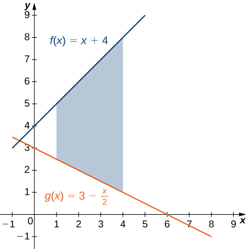{: #CNX_Calc_Figure_06_01_003}

We have

<math xmlns="http://www.w3.org/1998/Math/MathML"><mtable><mtr><mtd columnalign="right"><mi>A</mi></mtd><mtd columnalign="left"><mo>=</mo><msubsup><mstyle mathsize="140%" displaystyle="true"><mo stretchy="false">∫</mo></mstyle><mi>a</mi><mi>b</mi></msubsup><mrow><mo>[</mo><mrow><mi>f</mi><mo stretchy="false">(</mo><mi>x</mi><mo stretchy="false">)</mo><mo>−</mo><mi>g</mi><mo stretchy="false">(</mo><mi>x</mi><mo stretchy="false">)</mo></mrow><mo>]</mo></mrow><mi>d</mi><mi>x</mi></mtd></mtr><mtr><mtd /><mtd columnalign="left"><mo>=</mo><mstyle displaystyle="true"><mrow><msubsup><mo stretchy="false">∫</mo><mn>1</mn><mn>4</mn></msubsup><mrow><mrow><mo>[</mo><mrow><mrow><mo>(</mo><mrow><mi>x</mi><mo>+</mo><mn>4</mn></mrow><mo>)</mo></mrow><mo>−</mo><mrow><mo>(</mo><mrow><mn>3</mn><mo>−</mo><mfrac><mi>x</mi><mn>2</mn></mfrac></mrow><mo>)</mo></mrow></mrow><mo>]</mo></mrow><mi>d</mi><mi>x</mi></mrow></mrow></mstyle><mo>=</mo><mstyle displaystyle="true"><mrow><msubsup><mo stretchy="false">∫</mo><mn>1</mn><mn>4</mn></msubsup><mrow><mrow><mo>[</mo><mrow><mfrac><mrow><mn>3</mn><mi>x</mi></mrow><mn>2</mn></mfrac><mo>+</mo><mn>1</mn></mrow><mo>]</mo></mrow><mi>d</mi><mi>x</mi></mrow></mrow></mstyle></mtd></mtr><mtr><mtd /><mtd columnalign="left"><mo>=</mo><msubsup><mrow><mrow><mrow><mo>[</mo><mrow><mfrac><mrow><mn>3</mn><msup><mi>x</mi><mn>2</mn></msup></mrow><mn>4</mn></mfrac><mo>+</mo><mi>x</mi></mrow><mo>]</mo></mrow></mrow><mspace width="0.2em" /><mo>\|</mo></mrow><mn>1</mn><mn>4</mn></msubsup><mo>=</mo><mrow><mo>(</mo><mrow><mn>16</mn><mo>−</mo><mfrac><mn>7</mn><mn>4</mn></mfrac></mrow><mo>)</mo></mrow><mo>=</mo><mfrac><mrow><mn>57</mn></mrow><mn>4</mn></mfrac><mo>.</mo></mtd></mtr></mtable></math>

The area of the region is <math xmlns="http://www.w3.org/1998/Math/MathML"><mrow><mfrac><mrow><mn>57</mn></mrow><mn>4</mn></mfrac><mspace width="0.2em" /><msup><mrow><mtext>units</mtext></mrow><mn>2</mn></msup><mo>.</mo></mrow></math>

If <math xmlns="http://www.w3.org/1998/Math/MathML"><mi>R</mi></math>

 is the region bounded by the graphs of the functions <math xmlns="http://www.w3.org/1998/Math/MathML"><mrow><mi>f</mi><mo stretchy="false">(</mo><mi>x</mi><mo stretchy="false">)</mo><mo>=</mo><mfrac><mi>x</mi><mn>2</mn></mfrac><mo>+</mo><mn>5</mn></mrow></math>

 and <math xmlns="http://www.w3.org/1998/Math/MathML"><mrow><mi>g</mi><mo stretchy="false">(</mo><mi>x</mi><mo stretchy="false">)</mo><mo>=</mo><mi>x</mi><mo>+</mo><mfrac><mn>1</mn><mn>2</mn></mfrac></mrow></math>

 over the interval <math xmlns="http://www.w3.org/1998/Math/MathML"><mrow><mrow><mo>[</mo><mrow><mn>1</mn><mo>,</mo><mn>5</mn></mrow><mo>]</mo></mrow><mo>,</mo></mrow></math>

 find the area of region <math xmlns="http://www.w3.org/1998/Math/MathML"><mi>R</mi><mo>.</mo></math>

<math xmlns="http://www.w3.org/1998/Math/MathML"><mrow><mn>12</mn></mrow></math>

 units2

Hint

Graph the functions to determine which function’s graph forms the upper bound and which forms the lower bound, then follow the process used in [[link]](#fs-id1167793900960).

In [\[link\]](#fs-id1167793900960), we defined the interval of interest as part of the problem statement. Quite often, though, we want to define our interval of interest based on where the graphs of the two functions intersect. This is illustrated in the following example.

Finding the Area of a Region between Two Curves 2

If <math xmlns="http://www.w3.org/1998/Math/MathML"><mi>R</mi></math>

 is the region bounded above by the graph of the function <math xmlns="http://www.w3.org/1998/Math/MathML"><mrow><mi>f</mi><mo stretchy="false">(</mo><mi>x</mi><mo stretchy="false">)</mo><mo>=</mo><mn>9</mn><mo>−</mo><msup><mrow><mrow><mo>(</mo><mrow><mrow><mi>x</mi><mtext>/</mtext><mn>2</mn></mrow></mrow><mo>)</mo></mrow></mrow><mn>2</mn></msup></mrow></math>

 and below by the graph of the function <math xmlns="http://www.w3.org/1998/Math/MathML"><mrow><mi>g</mi><mo stretchy="false">(</mo><mi>x</mi><mo stretchy="false">)</mo><mo>=</mo><mn>6</mn><mo>−</mo><mi>x</mi><mo>,</mo></mrow></math>

 find the area of region <math xmlns="http://www.w3.org/1998/Math/MathML"><mrow><mi>R</mi><mo>.</mo></mrow></math>

The region is depicted in the following figure.

 and above the graph of g(x)."){: #CNX_Calc_Figure_06_01_004}

We first need to compute where the graphs of the functions intersect. Setting <math xmlns="http://www.w3.org/1998/Math/MathML"><mrow><mi>f</mi><mo stretchy="false">(</mo><mi>x</mi><mo stretchy="false">)</mo><mo>=</mo><mi>g</mi><mo stretchy="false">(</mo><mi>x</mi><mo stretchy="false">)</mo><mo>,</mo></mrow></math>

 we get

<math xmlns="http://www.w3.org/1998/Math/MathML"><mtable><mtr><mtd columnalign="right"><mi>f</mi><mo stretchy="false">(</mo><mi>x</mi><mo stretchy="false">)</mo></mtd><mtd columnalign="left"><mo>=</mo></mtd><mtd columnalign="left"><mi>g</mi><mo stretchy="false">(</mo><mi>x</mi><mo stretchy="false">)</mo></mtd></mtr><mtr /><mtr><mtd columnalign="right"><mn>9</mn><mo>−</mo><msup><mrow><mo>(</mo><mrow><mfrac><mi>x</mi><mn>2</mn></mfrac></mrow><mo>)</mo></mrow><mn>2</mn></msup></mtd><mtd columnalign="left"><mo>=</mo></mtd><mtd columnalign="left"><mn>6</mn><mo>−</mo><mi>x</mi></mtd></mtr><mtr><mtd columnalign="right"><mn>9</mn><mo>−</mo><mfrac><mrow><msup><mi>x</mi><mn>2</mn></msup></mrow><mn>4</mn></mfrac></mtd><mtd columnalign="left"><mo>=</mo></mtd><mtd columnalign="left"><mn>6</mn><mo>−</mo><mi>x</mi></mtd></mtr><mtr><mtd columnalign="right"><mn>36</mn><mo>−</mo><msup><mi>x</mi><mn>2</mn></msup></mtd><mtd columnalign="left"><mo>=</mo></mtd><mtd columnalign="left"><mn>24</mn><mo>−</mo><mn>4</mn><mi>x</mi></mtd></mtr><mtr><mtd columnalign="right"><msup><mi>x</mi><mn>2</mn></msup><mo>−</mo><mn>4</mn><mi>x</mi><mo>−</mo><mn>12</mn></mtd><mtd columnalign="left"><mo>=</mo></mtd><mtd columnalign="left"><mn>0</mn></mtd></mtr><mtr><mtd columnalign="right"><mrow><mo>(</mo><mrow><mi>x</mi><mo>−</mo><mn>6</mn></mrow><mo>)</mo></mrow><mrow><mo>(</mo><mrow><mi>x</mi><mo>+</mo><mn>2</mn></mrow><mo>)</mo></mrow></mtd><mtd columnalign="left"><mo>=</mo></mtd><mtd columnalign="left"><mn>0.</mn></mtd></mtr></mtable></math>

The graphs of the functions intersect when <math xmlns="http://www.w3.org/1998/Math/MathML"><mrow><mi>x</mi><mo>=</mo><mn>6</mn></mrow></math>

 or <math xmlns="http://www.w3.org/1998/Math/MathML"><mrow><mi>x</mi><mo>=</mo><mn>−2</mn><mo>,</mo></mrow></math>

 so we want to integrate from <math xmlns="http://www.w3.org/1998/Math/MathML"><mrow><mn>−2</mn></mrow></math>

 to <math xmlns="http://www.w3.org/1998/Math/MathML"><mrow><mn>6</mn><mo>.</mo></mrow></math>

 Since <math xmlns="http://www.w3.org/1998/Math/MathML"><mrow><mi>f</mi><mo stretchy="false">(</mo><mi>x</mi><mo stretchy="false">)</mo><mo>≥</mo><mi>g</mi><mo stretchy="false">(</mo><mi>x</mi><mo stretchy="false">)</mo></mrow></math>

 for <math xmlns="http://www.w3.org/1998/Math/MathML"><mrow><mn>−2</mn><mo>≤</mo><mi>x</mi><mo>≤</mo><mn>6</mn><mo>,</mo></mrow></math>

 we obtain

<math xmlns="http://www.w3.org/1998/Math/MathML"><mtable><mtr><mtd columnalign="right"><mi>A</mi></mtd><mtd columnalign="left"><mo>=</mo><msubsup><mstyle mathsize="140%" displaystyle="true"><mo stretchy="false">∫</mo></mstyle><mi>a</mi><mi>b</mi></msubsup><mrow><mo>[</mo><mrow><mi>f</mi><mo stretchy="false">(</mo><mi>x</mi><mo stretchy="false">)</mo><mo>−</mo><mi>g</mi><mo stretchy="false">(</mo><mi>x</mi><mo stretchy="false">)</mo></mrow><mo>]</mo></mrow><mi>d</mi><mi>x</mi></mtd></mtr><mtr><mtd /><mtd columnalign="left"><mo>=</mo><mstyle displaystyle="true"><mrow><msubsup><mo stretchy="false">∫</mo><mrow><mn>−2</mn></mrow><mn>6</mn></msubsup><mrow><mrow><mo>[</mo><mrow><mn>9</mn><mo>−</mo><msup><mrow><mrow><mo>(</mo><mrow><mfrac><mi>x</mi><mn>2</mn></mfrac></mrow><mo>)</mo></mrow></mrow><mn>2</mn></msup><mo>−</mo><mrow><mo>(</mo><mrow><mn>6</mn><mo>−</mo><mi>x</mi></mrow><mo>)</mo></mrow></mrow><mo>]</mo></mrow><mi>d</mi><mi>x</mi></mrow></mrow></mstyle><mo>=</mo><mstyle displaystyle="true"><mrow><msubsup><mo stretchy="false">∫</mo><mrow><mn>−2</mn></mrow><mn>6</mn></msubsup><mrow><mrow><mo>[</mo><mrow><mn>3</mn><mo>−</mo><mfrac><mrow><msup><mi>x</mi><mn>2</mn></msup></mrow><mn>4</mn></mfrac><mo>+</mo><mi>x</mi></mrow><mo>]</mo></mrow><mi>d</mi><mi>x</mi></mrow></mrow></mstyle></mtd></mtr><mtr><mtd /><mtd columnalign="left"><mo>=</mo><msubsup><mrow><mrow><mrow><mo>[</mo><mrow><mn>3</mn><mi>x</mi><mo>−</mo><mfrac><mrow><msup><mi>x</mi><mn>3</mn></msup></mrow><mrow><mn>12</mn></mrow></mfrac><mo>+</mo><mfrac><mrow><msup><mi>x</mi><mn>2</mn></msup></mrow><mn>2</mn></mfrac></mrow><mo>]</mo></mrow></mrow><mspace width="0.2em" /><mo>\|</mo></mrow><mrow><mn>−2</mn></mrow><mn>6</mn></msubsup><mo>=</mo><mfrac><mrow><mn>64</mn></mrow><mn>3</mn></mfrac><mo>.</mo></mtd></mtr></mtable></math>

The area of the region is <math xmlns="http://www.w3.org/1998/Math/MathML"><mrow><mrow><mrow><mn>64</mn></mrow><mtext>/</mtext><mn>3</mn></mrow></mrow></math>

 units2.

If *R* is the region bounded above by the graph of the function <math xmlns="http://www.w3.org/1998/Math/MathML"><mrow><mi>f</mi><mo stretchy="false">(</mo><mi>x</mi><mo stretchy="false">)</mo><mo>=</mo><mi>x</mi></mrow></math>

 and below by the graph of the function <math xmlns="http://www.w3.org/1998/Math/MathML"><mrow><mi>g</mi><mo stretchy="false">(</mo><mi>x</mi><mo stretchy="false">)</mo><mo>=</mo><msup><mi>x</mi><mn>4</mn></msup><mo>,</mo></mrow></math>

 find the area of region <math xmlns="http://www.w3.org/1998/Math/MathML"><mi>R</mi><mo>.</mo></math>

<math xmlns="http://www.w3.org/1998/Math/MathML"><mrow><mfrac><mn>3</mn><mrow><mn>10</mn></mrow></mfrac></mrow></math>

 unit2

Hint

Use the process from [[link]](#fs-id1167793852231).

### Areas of Compound Regions

So far, we have required <math xmlns="http://www.w3.org/1998/Math/MathML"><mrow><mi>f</mi><mo stretchy="false">(</mo><mi>x</mi><mo stretchy="false">)</mo><mo>≥</mo><mi>g</mi><mo stretchy="false">(</mo><mi>x</mi><mo stretchy="false">)</mo></mrow></math>

 over the entire interval of interest, but what if we want to look at regions bounded by the graphs of functions that cross one another? In that case, we modify the process we just developed by using the absolute value function.

Finding the Area of a Region between Curves That Cross

Let <math xmlns="http://www.w3.org/1998/Math/MathML"><mrow><mi>f</mi><mo stretchy="false">(</mo><mi>x</mi><mo stretchy="false">)</mo></mrow></math>

 and <math xmlns="http://www.w3.org/1998/Math/MathML"><mrow><mi>g</mi><mo stretchy="false">(</mo><mi>x</mi><mo stretchy="false">)</mo></mrow></math>

 be continuous functions over an interval <math xmlns="http://www.w3.org/1998/Math/MathML"><mrow><mrow><mo>[</mo><mrow><mi>a</mi><mo>,</mo><mi>b</mi></mrow><mo>]</mo></mrow><mo>.</mo></mrow></math>

 Let <math xmlns="http://www.w3.org/1998/Math/MathML"><mi>R</mi></math>

 denote the region between the graphs of <math xmlns="http://www.w3.org/1998/Math/MathML"><mrow><mi>f</mi><mo stretchy="false">(</mo><mi>x</mi><mo stretchy="false">)</mo></mrow></math>

 and <math xmlns="http://www.w3.org/1998/Math/MathML"><mrow><mi>g</mi><mo stretchy="false">(</mo><mi>x</mi><mo stretchy="false">)</mo><mo>,</mo></mrow></math>

 and be bounded on the left and right by the lines <math xmlns="http://www.w3.org/1998/Math/MathML"><mrow><mi>x</mi><mo>=</mo><mi>a</mi></mrow></math>

 and <math xmlns="http://www.w3.org/1998/Math/MathML"><mrow><mi>x</mi><mo>=</mo><mi>b</mi><mo>,</mo></mrow></math>

 respectively. Then, the area of <math xmlns="http://www.w3.org/1998/Math/MathML"><mi>R</mi></math>

 is given by

<math xmlns="http://www.w3.org/1998/Math/MathML"><mrow><mi>A</mi><mo>=</mo><msubsup><mstyle mathsize="140%" displaystyle="true"><mo stretchy="false">∫</mo></mstyle><mi>a</mi><mi>b</mi></msubsup><mrow><mo>\|</mo><mrow><mi>f</mi><mo stretchy="false">(</mo><mi>x</mi><mo stretchy="false">)</mo><mo>−</mo><mi>g</mi><mo stretchy="false">(</mo><mi>x</mi><mo stretchy="false">)</mo></mrow><mo>\|</mo></mrow><mi>d</mi><mi>x</mi><mo>.</mo></mrow></math>

In practice, applying this theorem requires us to break up the interval <math xmlns="http://www.w3.org/1998/Math/MathML"><mrow><mrow><mo>[</mo><mrow><mi>a</mi><mo>,</mo><mi>b</mi></mrow><mo>]</mo></mrow></mrow></math>

 and evaluate several integrals, depending on which of the function values is greater over a given part of the interval. We study this process in the following example.

Finding the Area of a Region Bounded by Functions That Cross

If *R* is the region between the graphs of the functions <math xmlns="http://www.w3.org/1998/Math/MathML"><mrow><mi>f</mi><mo stretchy="false">(</mo><mi>x</mi><mo stretchy="false">)</mo><mo>=</mo><mtext>sin</mtext><mspace width="0.2em" /><mi>x</mi></mrow></math>

 and <math xmlns="http://www.w3.org/1998/Math/MathML"><mrow><mi>g</mi><mo stretchy="false">(</mo><mi>x</mi><mo stretchy="false">)</mo><mo>=</mo><mtext>cos</mtext><mspace width="0.2em" /><mi>x</mi></mrow></math>

 over the interval <math xmlns="http://www.w3.org/1998/Math/MathML"><mrow><mrow><mo>[</mo><mrow><mn>0</mn><mo>,</mo><mi>π</mi></mrow><mo>]</mo></mrow><mo>,</mo></mrow></math>

 find the area of region <math xmlns="http://www.w3.org/1998/Math/MathML"><mrow><mi>R</mi><mo>.</mo></mrow></math>

The region is depicted in the following figure.

{: #CNX_Calc_Figure_06_01_005}

The graphs of the functions intersect at <math xmlns="http://www.w3.org/1998/Math/MathML"><mrow><mi>x</mi><mo>=</mo><mrow><mi>π</mi><mtext>/</mtext><mn>4</mn></mrow><mo>.</mo></mrow></math>

 For <math xmlns="http://www.w3.org/1998/Math/MathML"><mrow><mi>x</mi><mo>∈</mo><mrow><mo>[</mo><mrow><mn>0</mn><mo>,</mo><mrow><mi>π</mi><mtext>/</mtext><mn>4</mn></mrow></mrow><mo>]</mo></mrow><mo>,</mo></mrow></math>

 <math xmlns="http://www.w3.org/1998/Math/MathML"><mrow><mtext>cos</mtext><mspace width="0.2em" /><mi>x</mi><mo>≥</mo><mtext>sin</mtext><mspace width="0.2em" /><mi>x</mi><mo>,</mo></mrow></math>

 so

<math xmlns="http://www.w3.org/1998/Math/MathML"><mrow><mrow><mo>\|</mo><mrow><mi>f</mi><mo stretchy="false">(</mo><mi>x</mi><mo stretchy="false">)</mo><mo>−</mo><mi>g</mi><mo stretchy="false">(</mo><mi>x</mi><mo stretchy="false">)</mo></mrow><mo>\|</mo></mrow><mo>=</mo><mrow><mo>\|</mo><mrow><mtext>sin</mtext><mspace width="0.2em" /><mi>x</mi><mo>−</mo><mtext>cos</mtext><mspace width="0.2em" /><mi>x</mi></mrow><mo>\|</mo></mrow><mo>=</mo><mtext>cos</mtext><mspace width="0.2em" /><mi>x</mi><mo>−</mo><mtext>sin</mtext><mspace width="0.2em" /><mi>x</mi><mo>.</mo></mrow></math>

On the other hand, for <math xmlns="http://www.w3.org/1998/Math/MathML"><mrow><mi>x</mi><mo>∈</mo><mrow><mo>[</mo><mrow><mrow><mi>π</mi><mtext>/</mtext><mn>4</mn></mrow><mo>,</mo><mi>π</mi></mrow><mo>]</mo></mrow><mo>,</mo></mrow></math>

 <math xmlns="http://www.w3.org/1998/Math/MathML"><mrow><mtext>sin</mtext><mspace width="0.2em" /><mi>x</mi><mo>≥</mo><mtext>cos</mtext><mspace width="0.2em" /><mi>x</mi><mo>,</mo></mrow></math>

 so

<math xmlns="http://www.w3.org/1998/Math/MathML"><mrow><mrow><mo>\|</mo><mrow><mi>f</mi><mo stretchy="false">(</mo><mi>x</mi><mo stretchy="false">)</mo><mo>−</mo><mi>g</mi><mo stretchy="false">(</mo><mi>x</mi><mo stretchy="false">)</mo></mrow><mo>\|</mo></mrow><mo>=</mo><mrow><mo>\|</mo><mrow><mtext>sin</mtext><mspace width="0.2em" /><mi>x</mi><mo>−</mo><mtext>cos</mtext><mspace width="0.2em" /><mi>x</mi></mrow><mo>\|</mo></mrow><mo>=</mo><mtext>sin</mtext><mspace width="0.2em" /><mi>x</mi><mo>−</mo><mtext>cos</mtext><mspace width="0.2em" /><mi>x</mi><mo>.</mo></mrow></math>

Then

<math xmlns="http://www.w3.org/1998/Math/MathML"><mtable><mtr><mtd columnalign="right"><mi>A</mi></mtd><mtd columnalign="left"><mo>=</mo><msubsup><mstyle mathsize="140%" displaystyle="true"><mo stretchy="false">∫</mo></mstyle><mi>a</mi><mi>b</mi></msubsup><mrow><mo>\|</mo><mrow><mi>f</mi><mo stretchy="false">(</mo><mi>x</mi><mo stretchy="false">)</mo><mo>−</mo><mi>g</mi><mo stretchy="false">(</mo><mi>x</mi><mo stretchy="false">)</mo></mrow><mo>\|</mo></mrow><mi>d</mi><mi>x</mi></mtd></mtr><mtr><mtd /><mtd columnalign="left"><mo>=</mo><msubsup><mstyle mathsize="140%" displaystyle="true"><mo stretchy="false">∫</mo></mstyle><mn>0</mn><mi>π</mi></msubsup><mrow><mo>\|</mo><mrow><mtext>sin</mtext><mspace width="0.2em" /><mi>x</mi><mo>−</mo><mtext>cos</mtext><mspace width="0.2em" /><mi>x</mi></mrow><mo>\|</mo></mrow><mi>d</mi><mi>x</mi><mo>=</mo><msubsup><mstyle mathsize="140%" displaystyle="true"><mo stretchy="false">∫</mo></mstyle><mn>0</mn><mrow><mi>π</mi><mtext>/</mtext><mn>4</mn></mrow></msubsup><mrow><mo>(</mo><mrow><mtext>cos</mtext><mspace width="0.2em" /><mi>x</mi><mo>−</mo><mtext>sin</mtext><mspace width="0.2em" /><mi>x</mi></mrow><mo>)</mo></mrow><mi>d</mi><mi>x</mi><mo>+</mo><msubsup><mstyle mathsize="140%" displaystyle="true"><mo stretchy="false">∫</mo></mstyle><mrow><mi>π</mi><mtext>/</mtext><mn>4</mn></mrow><mi>π</mi></msubsup><mrow><mo>(</mo><mrow><mtext>sin</mtext><mspace width="0.2em" /><mi>x</mi><mo>−</mo><mtext>cos</mtext><mspace width="0.2em" /><mi>x</mi></mrow><mo>)</mo></mrow><mi>d</mi><mi>x</mi></mtd></mtr><mtr><mtd /><mtd columnalign="left"><mo>=</mo><msubsup><mrow><mrow><mrow><mo>[</mo><mrow><mtext>sin</mtext><mspace width="0.2em" /><mi>x</mi><mo>+</mo><mtext>cos</mtext><mspace width="0.2em" /><mi>x</mi></mrow><mo>]</mo></mrow></mrow><mspace width="0.2em" /><mo>\|</mo></mrow><mn>0</mn><mrow><mi>π</mi><mtext>/</mtext><mn>4</mn></mrow></msubsup><mo>+</mo><msubsup><mrow><mrow><mrow><mo>[</mo><mrow><mtext>−</mtext><mtext>cos</mtext><mspace width="0.2em" /><mi>x</mi><mo>−</mo><mtext>sin</mtext><mspace width="0.2em" /><mi>x</mi></mrow><mo>]</mo></mrow></mrow><mspace width="0.2em" /><mo>\|</mo></mrow><mrow><mi>π</mi><mtext>/</mtext><mn>4</mn></mrow><mi>π</mi></msubsup></mtd></mtr><mtr><mtd /><mtd columnalign="left"><mo>=</mo><mrow><mo>(</mo><mrow><msqrt><mn>2</mn></msqrt><mo>−</mo><mn>1</mn></mrow><mo>)</mo></mrow><mo>+</mo><mrow><mo>(</mo><mrow><mn>1</mn><mo>+</mo><msqrt><mn>2</mn></msqrt></mrow><mo>)</mo></mrow><mo>=</mo><mn>2</mn><msqrt><mn>2</mn></msqrt><mo>.</mo></mtd></mtr></mtable></math>

The area of the region is <math xmlns="http://www.w3.org/1998/Math/MathML"><mrow><mn>2</mn><msqrt><mn>2</mn></msqrt></mrow></math>

 units2.

If *R* is the region between the graphs of the functions <math xmlns="http://www.w3.org/1998/Math/MathML"><mrow><mi>f</mi><mo stretchy="false">(</mo><mi>x</mi><mo stretchy="false">)</mo><mo>=</mo><mtext>sin</mtext><mspace width="0.2em" /><mi>x</mi></mrow></math>

 and <math xmlns="http://www.w3.org/1998/Math/MathML"><mrow><mi>g</mi><mo stretchy="false">(</mo><mi>x</mi><mo stretchy="false">)</mo><mo>=</mo><mtext>cos</mtext><mspace width="0.2em" /><mi>x</mi></mrow></math>

 over the interval <math xmlns="http://www.w3.org/1998/Math/MathML"><mrow><mrow><mo>[</mo><mrow><mrow><mi>π</mi><mtext>/</mtext><mn>2</mn></mrow><mo>,</mo><mn>2</mn><mi>π</mi></mrow><mo>]</mo></mrow><mo>,</mo></mrow></math>

 find the area of region <math xmlns="http://www.w3.org/1998/Math/MathML"><mrow><mi>R</mi><mo>.</mo></mrow></math>

<math xmlns="http://www.w3.org/1998/Math/MathML"><mrow><mn>2</mn><mo>+</mo><mn>2</mn><msqrt><mn>2</mn></msqrt></mrow></math>

 units2

Hint

The two curves intersect at <math xmlns="http://www.w3.org/1998/Math/MathML"><mrow><mi>x</mi><mo>=</mo><mrow><mrow><mrow><mo>(</mo><mrow><mn>5</mn><mi>π</mi></mrow><mo>)</mo></mrow></mrow><mtext>/</mtext><mn>4</mn></mrow><mo>.</mo></mrow></math>

Finding the Area of a Complex Region

Consider the region depicted in [[link]](#CNX_Calc_Figure_06_01_006). Find the area of <math xmlns="http://www.w3.org/1998/Math/MathML"><mi>R</mi><mo>.</mo></math>

{: #CNX_Calc_Figure_06_01_006}

As with [[link]](#fs-id1167793263971), we need to divide the interval into two pieces. The graphs of the functions intersect at <math xmlns="http://www.w3.org/1998/Math/MathML"><mrow><mi>x</mi><mo>=</mo><mn>1</mn></mrow></math>

 (set <math xmlns="http://www.w3.org/1998/Math/MathML"><mrow><mi>f</mi><mo stretchy="false">(</mo><mi>x</mi><mo stretchy="false">)</mo><mo>=</mo><mi>g</mi><mo stretchy="false">(</mo><mi>x</mi><mo stretchy="false">)</mo></mrow></math>

 and solve for *x*), so we evaluate two separate integrals: one over the interval <math xmlns="http://www.w3.org/1998/Math/MathML"><mrow><mrow><mo>[</mo><mrow><mn>0</mn><mo>,</mo><mn>1</mn></mrow><mo>]</mo></mrow></mrow></math>

 and one over the interval <math xmlns="http://www.w3.org/1998/Math/MathML"><mrow><mrow><mo>[</mo><mrow><mn>1</mn><mo>,</mo><mn>2</mn></mrow><mo>]</mo></mrow><mo>.</mo></mrow></math>

Over the interval <math xmlns="http://www.w3.org/1998/Math/MathML"><mrow><mrow><mo>[</mo><mrow><mn>0</mn><mo>,</mo><mn>1</mn></mrow><mo>]</mo></mrow><mo>,</mo></mrow></math>

 the region is bounded above by <math xmlns="http://www.w3.org/1998/Math/MathML"><mrow><mi>f</mi><mo stretchy="false">(</mo><mi>x</mi><mo stretchy="false">)</mo><mo>=</mo><msup><mi>x</mi><mn>2</mn></msup></mrow></math>

 and below by the *x*-axis, so we have

<math xmlns="http://www.w3.org/1998/Math/MathML"><mrow><msub><mi>A</mi><mn>1</mn></msub><mo>=</mo><msubsup><mstyle mathsize="140%" displaystyle="true"><mo stretchy="false">∫</mo></mstyle><mn>0</mn><mn>1</mn></msubsup><msup><mi>x</mi><mn>2</mn></msup><mi>d</mi><mi>x</mi><mo>=</mo><msubsup><mrow><mrow><mrow><mfrac><mrow><msup><mi>x</mi><mn>3</mn></msup></mrow><mn>3</mn></mfrac></mrow><mspace width="0.2em" /><mo>\|</mo></mrow></mrow><mn>0</mn><mn>1</mn></msubsup><mo>=</mo><mfrac><mn>1</mn><mn>3</mn></mfrac><mo>.</mo></mrow></math>

Over the interval <math xmlns="http://www.w3.org/1998/Math/MathML"><mrow><mrow><mo>[</mo><mrow><mn>1</mn><mo>,</mo><mn>2</mn></mrow><mo>]</mo></mrow><mo>,</mo></mrow></math>

 the region is bounded above by <math xmlns="http://www.w3.org/1998/Math/MathML"><mrow><mi>g</mi><mo stretchy="false">(</mo><mi>x</mi><mo stretchy="false">)</mo><mo>=</mo><mn>2</mn><mo>−</mo><mi>x</mi></mrow></math>

 and below by the <math xmlns="http://www.w3.org/1998/Math/MathML"><mrow><mi>x</mi><mtext>-axis,</mtext></mrow></math>

 so we have

<math xmlns="http://www.w3.org/1998/Math/MathML"><mrow><msub><mi>A</mi><mn>2</mn></msub><mo>=</mo><msubsup><mstyle mathsize="140%" displaystyle="true"><mo stretchy="false">∫</mo></mstyle><mn>1</mn><mn>2</mn></msubsup><mrow><mo>(</mo><mrow><mn>2</mn><mo>−</mo><mi>x</mi></mrow><mo>)</mo></mrow><mi>d</mi><mi>x</mi><mo>=</mo><msubsup><mrow><mrow><mrow><mrow><mo>[</mo><mrow><mn>2</mn><mi>x</mi><mo>−</mo><mfrac><mrow><msup><mi>x</mi><mn>2</mn></msup></mrow><mn>2</mn></mfrac></mrow><mo>]</mo></mrow></mrow><mspace width="0.2em" /><mo>\|</mo></mrow></mrow><mn>1</mn><mn>2</mn></msubsup><mo>=</mo><mfrac><mn>1</mn><mn>2</mn></mfrac><mo>.</mo></mrow></math>

Adding these areas together, we obtain

<math xmlns="http://www.w3.org/1998/Math/MathML"><mrow><mi>A</mi><mo>=</mo><msub><mi>A</mi><mn>1</mn></msub><mo>+</mo><msub><mi>A</mi><mn>2</mn></msub><mo>=</mo><mfrac><mn>1</mn><mn>3</mn></mfrac><mo>+</mo><mfrac><mn>1</mn><mn>2</mn></mfrac><mo>=</mo><mfrac><mn>5</mn><mn>6</mn></mfrac><mo>.</mo></mrow></math>

The area of the region is <math xmlns="http://www.w3.org/1998/Math/MathML"><mrow><mrow><mn>5</mn><mtext>/</mtext><mn>6</mn></mrow></mrow></math>

 units2.

Consider the region depicted in the following figure. Find the area of <math xmlns="http://www.w3.org/1998/Math/MathML"><mrow><mi>R</mi><mo>.</mo></mrow></math>

  

<math xmlns="http://www.w3.org/1998/Math/MathML"><mrow><mfrac><mn>5</mn><mn>3</mn></mfrac></mrow></math>

 units2

Hint

The two curves intersect at <math xmlns="http://www.w3.org/1998/Math/MathML"><mrow><mi>x</mi><mo>=</mo><mn>1</mn><mo>.</mo></mrow></math>

### Regions Defined with Respect to *y*

In [\[link\]](#fs-id1167793455088), we had to evaluate two separate integrals to calculate the area of the region. However, there is another approach that requires only one integral. What if we treat the curves as functions of <math xmlns="http://www.w3.org/1998/Math/MathML"><mi>y</mi><mo>,</mo></math>

 instead of as functions of <math xmlns="http://www.w3.org/1998/Math/MathML"><mi>x</mi><mo>?</mo></math>

 Review [\[link\]](#CNX_Calc_Figure_06_01_006). Note that the left graph, shown in red, is represented by the function <math xmlns="http://www.w3.org/1998/Math/MathML"><mrow><mi>y</mi><mo>=</mo><mi>f</mi><mo stretchy="false">(</mo><mi>x</mi><mo stretchy="false">)</mo><mo>=</mo><msup><mi>x</mi><mn>2</mn></msup><mo>.</mo></mrow></math>

 We could just as easily solve this for <math xmlns="http://www.w3.org/1998/Math/MathML"><mi>x</mi></math>

 and represent the curve by the function <math xmlns="http://www.w3.org/1998/Math/MathML"><mrow><mi>x</mi><mo>=</mo><mi>v</mi><mo stretchy="false">(</mo><mi>y</mi><mo stretchy="false">)</mo><mo>=</mo><msqrt><mi>y</mi></msqrt><mo>.</mo></mrow></math>

 (Note that <math xmlns="http://www.w3.org/1998/Math/MathML"><mrow><mi>x</mi><mo>=</mo><mtext>−</mtext><msqrt><mi>y</mi></msqrt></mrow></math>

 is also a valid representation of the function <math xmlns="http://www.w3.org/1998/Math/MathML"><mrow><mi>y</mi><mo>=</mo><mi>f</mi><mo stretchy="false">(</mo><mi>x</mi><mo stretchy="false">)</mo><mo>=</mo><msup><mi>x</mi><mn>2</mn></msup></mrow></math>

 as a function of <math xmlns="http://www.w3.org/1998/Math/MathML"><mrow><mi>y</mi><mo>.</mo></mrow></math>

 However, based on the graph, it is clear we are interested in the positive square root.) Similarly, the right graph is represented by the function <math xmlns="http://www.w3.org/1998/Math/MathML"><mrow><mi>y</mi><mo>=</mo><mi>g</mi><mo stretchy="false">(</mo><mi>x</mi><mo stretchy="false">)</mo><mo>=</mo><mn>2</mn><mo>−</mo><mi>x</mi><mo>,</mo></mrow></math>

 but could just as easily be represented by the function <math xmlns="http://www.w3.org/1998/Math/MathML"><mrow><mi>x</mi><mo>=</mo><mi>u</mi><mo stretchy="false">(</mo><mi>y</mi><mo stretchy="false">)</mo><mo>=</mo><mn>2</mn><mo>−</mo><mi>y</mi><mo>.</mo></mrow></math>

 When the graphs are represented as functions of <math xmlns="http://www.w3.org/1998/Math/MathML"><mi>y</mi><mo>,</mo></math>

 we see the region is bounded on the left by the graph of one function and on the right by the graph of the other function. Therefore, if we integrate with respect to <math xmlns="http://www.w3.org/1998/Math/MathML"><mi>y</mi><mo>,</mo></math>

 we need to evaluate one integral only. Let’s develop a formula for this type of integration.

Let <math xmlns="http://www.w3.org/1998/Math/MathML"><mrow><mi>u</mi><mo stretchy="false">(</mo><mi>y</mi><mo stretchy="false">)</mo></mrow></math>

 and <math xmlns="http://www.w3.org/1998/Math/MathML"><mrow><mi>v</mi><mo stretchy="false">(</mo><mi>y</mi><mo stretchy="false">)</mo></mrow></math>

 be continuous functions over an interval <math xmlns="http://www.w3.org/1998/Math/MathML"><mrow><mrow><mo>[</mo><mrow><mi>c</mi><mo>,</mo><mi>d</mi></mrow><mo>]</mo></mrow></mrow></math>

 such that <math xmlns="http://www.w3.org/1998/Math/MathML"><mrow><mi>u</mi><mo stretchy="false">(</mo><mi>y</mi><mo stretchy="false">)</mo><mo>≥</mo><mi>v</mi><mo stretchy="false">(</mo><mi>y</mi><mo stretchy="false">)</mo></mrow></math>

 for all <math xmlns="http://www.w3.org/1998/Math/MathML"><mrow><mi>y</mi><mo>∈</mo><mrow><mo>[</mo><mrow><mi>c</mi><mo>,</mo><mi>d</mi></mrow><mo>]</mo></mrow><mo>.</mo></mrow></math>

 We want to find the area between the graphs of the functions, as shown in the following figure.

  and v(y)."){: #CNX_Calc_Figure_06_01_008}

This time, we are going to partition the interval on the <math xmlns="http://www.w3.org/1998/Math/MathML"><mrow><mi>y</mi><mtext>-axis</mtext></mrow></math>

 and use horizontal rectangles to approximate the area between the functions. So, for <math xmlns="http://www.w3.org/1998/Math/MathML"><mrow><mi>i</mi><mo>=</mo><mn>0</mn><mo>,</mo><mn>1</mn><mo>,</mo><mn>2</mn><mtext>,…</mtext><mo>,</mo><mi>n</mi><mo>,</mo></mrow></math>

 let <math xmlns="http://www.w3.org/1998/Math/MathML"><mrow><mi>Q</mi><mo>=</mo><mrow><mo>{</mo><mrow><msub><mi>y</mi><mi>i</mi></msub></mrow><mo>}</mo></mrow></mrow></math>

 be a regular partition of <math xmlns="http://www.w3.org/1998/Math/MathML"><mrow><mrow><mo>[</mo><mrow><mi>c</mi><mo>,</mo><mi>d</mi></mrow><mo>]</mo></mrow><mo>.</mo></mrow></math>

 Then, for <math xmlns="http://www.w3.org/1998/Math/MathML"><mrow><mi>i</mi><mo>=</mo><mn>1</mn><mo>,</mo><mn>2</mn><mtext>,…</mtext><mo>,</mo><mi>n</mi><mo>,</mo></mrow></math>

 choose a point <math xmlns="http://www.w3.org/1998/Math/MathML"><mrow><msubsup><mi>y</mi><mi>i</mi><mo>*</mo></msubsup><mo>∈</mo><mrow><mo>[</mo><mrow><msub><mi>y</mi><mrow><mi>i</mi><mo>−</mo><mn>1</mn></mrow></msub><mo>,</mo><msub><mi>y</mi><mi>i</mi></msub></mrow><mo>]</mo></mrow><mo>,</mo></mrow></math>

 then over each interval <math xmlns="http://www.w3.org/1998/Math/MathML"><mrow><mrow><mo>[</mo><mrow><msub><mi>y</mi><mrow><mi>i</mi><mo>−</mo><mn>1</mn></mrow></msub><mo>,</mo><msub><mi>y</mi><mi>i</mi></msub></mrow><mo>]</mo></mrow></mrow></math>

 construct a rectangle that extends horizontally from <math xmlns="http://www.w3.org/1998/Math/MathML"><mrow><mi>v</mi><mrow><mo>(</mo><mrow><msubsup><mi>y</mi><mi>i</mi><mo>*</mo></msubsup></mrow><mo>)</mo></mrow></mrow></math>

 to <math xmlns="http://www.w3.org/1998/Math/MathML"><mrow><mi>u</mi><mrow><mo>(</mo><mrow><msubsup><mi>y</mi><mi>i</mi><mo>*</mo></msubsup></mrow><mo>)</mo></mrow><mo>.</mo></mrow></math>

 [\[link\]](#CNX_Calc_Figure_06_01_009)(a) shows the rectangles when <math xmlns="http://www.w3.org/1998/Math/MathML"><mrow><msubsup><mi>y</mi><mi>i</mi><mo>*</mo></msubsup></mrow></math>

 is selected to be the lower endpoint of the interval and <math xmlns="http://www.w3.org/1998/Math/MathML"><mrow><mi>n</mi><mo>=</mo><mn>10</mn><mo>.</mo></mrow></math>

 [\[link\]](#CNX_Calc_Figure_06_01_009)(b) shows a representative rectangle in detail.

 ![This figure is has three graphs. The first figure has two curves. They are the functions v(y\*) and u(y\*). In between these curves is a horizontal rectangle. The second figure labeled &#x201C;(a)&#x201D;, is a shaded region, bounded to the left by v(y) and to the right by u(y). The shaded area is between the horizontal boundaries of y=c and y=d. This shaded area is broken into rectangles between the curves. The third figure, labeled &#x201C;(b)&#x201D;, is the two curves v(y\*) and u(y\*). In between the curves is a horizontal rectangle with width delta y.](../resources/CNX_Calc_Figure_06_01_009.jpg "(a) Approximating the area between the graphs of two functions, u(y) and v(y), with rectangles. (b) The area of a typical rectangle."){: #CNX_Calc_Figure_06_01_009}

The height of each individual rectangle is <math xmlns="http://www.w3.org/1998/Math/MathML"><mrow><mtext>Δ</mtext><mi>y</mi></mrow></math>

 and the width of each rectangle is <math xmlns="http://www.w3.org/1998/Math/MathML"><mrow><mi>u</mi><mrow><mo>(</mo><mrow><msubsup><mi>y</mi><mi>i</mi><mo>*</mo></msubsup></mrow><mo>)</mo></mrow><mo>−</mo><mi>v</mi><mrow><mo>(</mo><mrow><msubsup><mi>y</mi><mi>i</mi><mo>*</mo></msubsup></mrow><mo>)</mo></mrow><mo>.</mo></mrow></math>

 Therefore, the area between the curves is approximately

<math xmlns="http://www.w3.org/1998/Math/MathML"><mrow><mi>A</mi><mo>≈</mo><munderover><mstyle mathsize="140%" displaystyle="true"><mo>∑</mo></mstyle><mrow><mi>i</mi><mo>=</mo><mn>1</mn></mrow><mi>n</mi></munderover><mrow><mo>[</mo><mrow><mi>u</mi><mrow><mo>(</mo><mrow><msubsup><mi>y</mi><mi>i</mi><mo>*</mo></msubsup></mrow><mo>)</mo></mrow><mo>−</mo><mi>v</mi><mrow><mo>(</mo><mrow><msubsup><mi>y</mi><mi>i</mi><mo>*</mo></msubsup></mrow><mo>)</mo></mrow></mrow><mo>]</mo></mrow><mtext>Δ</mtext><mi>y</mi><mo>.</mo></mrow></math>

This is a Riemann sum, so we take the limit as <math xmlns="http://www.w3.org/1998/Math/MathML"><mrow><mi>n</mi><mo stretchy="false">→</mo><mi>∞</mi><mo>,</mo></mrow></math>

 obtaining

<math xmlns="http://www.w3.org/1998/Math/MathML"><mrow><mi>A</mi><mo>=</mo><munder><mrow><mtext>lim</mtext></mrow><mrow><mi>n</mi><mo stretchy="false">→</mo><mi>∞</mi></mrow></munder><munderover><mstyle mathsize="140%" displaystyle="true"><mo>∑</mo></mstyle><mrow><mi>i</mi><mo>=</mo><mn>1</mn></mrow><mi>n</mi></munderover><mrow><mo>[</mo><mrow><mi>u</mi><mrow><mo>(</mo><mrow><msubsup><mi>y</mi><mi>i</mi><mo>*</mo></msubsup></mrow><mo>)</mo></mrow><mo>−</mo><mi>v</mi><mrow><mo>(</mo><mrow><msubsup><mi>y</mi><mi>i</mi><mo>*</mo></msubsup></mrow><mo>)</mo></mrow></mrow><mo>]</mo></mrow><mtext>Δ</mtext><mi>y</mi><mo>=</mo><mstyle displaystyle="true"><mrow><msubsup><mo stretchy="false">∫</mo><mi>c</mi><mi>d</mi></msubsup><mrow><mrow><mo>[</mo><mrow><mi>u</mi><mo stretchy="false">(</mo><mi>y</mi><mo stretchy="false">)</mo><mo>−</mo><mi>v</mi><mo stretchy="false">(</mo><mi>y</mi><mo stretchy="false">)</mo></mrow><mo>]</mo></mrow><mi>d</mi><mi>y</mi></mrow></mrow></mstyle><mo>.</mo></mrow></math>

These findings are summarized in the following theorem.

Finding the Area between Two Curves, Integrating along the *y*-axis

Let <math xmlns="http://www.w3.org/1998/Math/MathML"><mrow><mi>u</mi><mo stretchy="false">(</mo><mi>y</mi><mo stretchy="false">)</mo></mrow></math>

 and <math xmlns="http://www.w3.org/1998/Math/MathML"><mrow><mi>v</mi><mo stretchy="false">(</mo><mi>y</mi><mo stretchy="false">)</mo></mrow></math>

 be continuous functions such that <math xmlns="http://www.w3.org/1998/Math/MathML"><mrow><mi>u</mi><mo stretchy="false">(</mo><mi>y</mi><mo stretchy="false">)</mo><mo>≥</mo><mi>v</mi><mo stretchy="false">(</mo><mi>y</mi><mo stretchy="false">)</mo></mrow></math>

 for all <math xmlns="http://www.w3.org/1998/Math/MathML"><mrow><mi>y</mi><mo>∈</mo><mrow><mo>[</mo><mrow><mi>c</mi><mo>,</mo><mi>d</mi></mrow><mo>]</mo></mrow><mo>.</mo></mrow></math>

 Let <math xmlns="http://www.w3.org/1998/Math/MathML"><mi>R</mi></math>

 denote the region bounded on the right by the graph of <math xmlns="http://www.w3.org/1998/Math/MathML"><mrow><mi>u</mi><mo stretchy="false">(</mo><mi>y</mi><mo stretchy="false">)</mo><mo>,</mo></mrow></math>

 on the left by the graph of <math xmlns="http://www.w3.org/1998/Math/MathML"><mrow><mi>v</mi><mo stretchy="false">(</mo><mi>y</mi><mo stretchy="false">)</mo><mo>,</mo></mrow></math>

 and above and below by the lines <math xmlns="http://www.w3.org/1998/Math/MathML"><mrow><mi>y</mi><mo>=</mo><mi>d</mi></mrow></math>

 and <math xmlns="http://www.w3.org/1998/Math/MathML"><mrow><mi>y</mi><mo>=</mo><mi>c</mi><mo>,</mo></mrow></math>

 respectively. Then, the area of <math xmlns="http://www.w3.org/1998/Math/MathML"><mi>R</mi></math>

 is given by

<math xmlns="http://www.w3.org/1998/Math/MathML"><mrow><mi>A</mi><mo>=</mo><msubsup><mstyle mathsize="140%" displaystyle="true"><mo stretchy="false">∫</mo></mstyle><mi>c</mi><mi>d</mi></msubsup><mrow><mo>[</mo><mrow><mi>u</mi><mo stretchy="false">(</mo><mi>y</mi><mo stretchy="false">)</mo><mo>−</mo><mi>v</mi><mo stretchy="false">(</mo><mi>y</mi><mo stretchy="false">)</mo></mrow><mo>]</mo></mrow><mi>d</mi><mi>y</mi><mo>.</mo></mrow></math>

Integrating with Respect to *y*

Let’s revisit [[link]](#fs-id1167793455088), only this time let’s integrate with respect to <math xmlns="http://www.w3.org/1998/Math/MathML"><mi>y</mi><mo>.</mo></math>

 Let <math xmlns="http://www.w3.org/1998/Math/MathML"><mi>R</mi></math>

 be the region depicted in [[link]](#CNX_Calc_Figure_06_01_010). Find the area of <math xmlns="http://www.w3.org/1998/Math/MathML"><mi>R</mi></math>

 by integrating with respect to <math xmlns="http://www.w3.org/1998/Math/MathML"><mi>y</mi><mo>.</mo></math>

{: #CNX_Calc_Figure_06_01_010}

We must first express the graphs as functions of <math xmlns="http://www.w3.org/1998/Math/MathML"><mrow><mi>y</mi><mo>.</mo></mrow></math>

 As we saw at the beginning of this section, the curve on the left can be represented by the function <math xmlns="http://www.w3.org/1998/Math/MathML"><mrow><mi>x</mi><mo>=</mo><mi>v</mi><mo stretchy="false">(</mo><mi>y</mi><mo stretchy="false">)</mo><mo>=</mo><msqrt><mi>y</mi></msqrt><mo>,</mo></mrow></math>

 and the curve on the right can be represented by the function <math xmlns="http://www.w3.org/1998/Math/MathML"><mrow><mi>x</mi><mo>=</mo><mi>u</mi><mo stretchy="false">(</mo><mi>y</mi><mo stretchy="false">)</mo><mo>=</mo><mn>2</mn><mo>−</mo><mi>y</mi><mo>.</mo></mrow></math>

Now we have to determine the limits of integration. The region is bounded below by the *x*-axis, so the lower limit of integration is <math xmlns="http://www.w3.org/1998/Math/MathML"><mrow><mi>y</mi><mo>=</mo><mn>0</mn><mo>.</mo></mrow></math>

 The upper limit of integration is determined by the point where the two graphs intersect, which is the point <math xmlns="http://www.w3.org/1998/Math/MathML"><mrow><mrow><mo>(</mo><mrow><mn>1</mn><mo>,</mo><mn>1</mn></mrow><mo>)</mo></mrow><mo>,</mo></mrow></math>

 so the upper limit of integration is <math xmlns="http://www.w3.org/1998/Math/MathML"><mrow><mi>y</mi><mo>=</mo><mn>1</mn><mo>.</mo></mrow></math>

 Thus, we have <math xmlns="http://www.w3.org/1998/Math/MathML"><mrow><mrow><mo>[</mo><mrow><mi>c</mi><mo>,</mo><mi>d</mi></mrow><mo>]</mo></mrow><mo>=</mo><mrow><mo>[</mo><mrow><mn>0</mn><mo>,</mo><mn>1</mn></mrow><mo>]</mo></mrow><mo>.</mo></mrow></math>

Calculating the area of the region, we get

<math xmlns="http://www.w3.org/1998/Math/MathML"><mtable><mtr><mtd columnalign="right"><mi>A</mi></mtd><mtd columnalign="left"><mo>=</mo><msubsup><mstyle mathsize="140%" displaystyle="true"><mo stretchy="false">∫</mo></mstyle><mi>c</mi><mi>d</mi></msubsup><mrow><mo>[</mo><mrow><mi>u</mi><mo stretchy="false">(</mo><mi>y</mi><mo stretchy="false">)</mo><mo>−</mo><mi>v</mi><mo stretchy="false">(</mo><mi>y</mi><mo stretchy="false">)</mo></mrow><mo>]</mo></mrow><mi>d</mi><mi>y</mi></mtd></mtr><mtr><mtd /><mtd columnalign="left"><mo>=</mo><msubsup><mstyle mathsize="140%" displaystyle="true"><mo stretchy="false">∫</mo></mstyle><mn>0</mn><mn>1</mn></msubsup><mrow><mo>[</mo><mrow><mrow><mo>(</mo><mrow><mn>2</mn><mo>−</mo><mi>y</mi></mrow><mo>)</mo></mrow><mo>−</mo><msqrt><mi>y</mi></msqrt></mrow><mo>]</mo></mrow><mi>d</mi><mi>y</mi><mo>=</mo><msubsup><mrow><mrow><mrow><mo>[</mo><mrow><mn>2</mn><mi>y</mi><mo>−</mo><mfrac><mrow><msup><mi>y</mi><mn>2</mn></msup></mrow><mn>2</mn></mfrac><mo>−</mo><mfrac><mn>2</mn><mn>3</mn></mfrac><msup><mi>y</mi><mrow><mn>3</mn><mtext>/</mtext><mn>2</mn></mrow></msup></mrow><mo>]</mo></mrow></mrow><mspace width="0.2em" /><mo>\|</mo></mrow><mn>0</mn><mn>1</mn></msubsup></mtd></mtr><mtr><mtd /><mtd columnalign="left"><mo>=</mo><mfrac><mn>5</mn><mn>6</mn></mfrac><mo>.</mo></mtd></mtr></mtable></math>

The area of the region is <math xmlns="http://www.w3.org/1998/Math/MathML"><mrow><mrow><mn>5</mn><mtext>/</mtext><mn>6</mn></mrow></mrow></math>

 units2.

Let’s revisit the checkpoint associated with [[link]](#fs-id1167793455088), only this time, let’s integrate with respect to <math xmlns="http://www.w3.org/1998/Math/MathML"><mi>y</mi><mo>.</mo></math>

 Let be the region depicted in the following figure. Find the area of <math xmlns="http://www.w3.org/1998/Math/MathML"><mi>R</mi></math>

 by integrating with respect to <math xmlns="http://www.w3.org/1998/Math/MathML"><mrow><mi>y</mi><mo>.</mo></mrow></math>

  

<math xmlns="http://www.w3.org/1998/Math/MathML"><mrow><mfrac><mn>5</mn><mn>3</mn></mfrac></mrow></math>

 units2

Hint

Follow the process from the previous example.

### Key Concepts

* Just as definite integrals can be used to find the area under a curve, they can also be used to find the area between two curves.
* To find the area between two curves defined by functions, integrate the difference of the functions.
* If the graphs of the functions cross, or if the region is complex, use the absolute value of the difference of the functions. In this case, it may be necessary to evaluate two or more integrals and add the results to find the area of the region.
* Sometimes it can be easier to integrate with respect to *y* to find the area. The principles are the same regardless of which variable is used as the variable of integration.
{: data-bullet-style="bullet"}

### Key Equations

* **Area between two curves, integrating on the *x*-axis**
  * * *
  {: data-type="newline"}
  
  <math xmlns="http://www.w3.org/1998/Math/MathML"><mrow><mi>A</mi><mo>=</mo><msubsup><mstyle mathsize="140%" displaystyle="true"><mo stretchy="false">∫</mo></mstyle><mi>a</mi><mi>b</mi></msubsup><mrow><mo>[</mo><mrow><mi>f</mi><mo stretchy="false">(</mo><mi>x</mi><mo stretchy="false">)</mo><mo>−</mo><mi>g</mi><mo stretchy="false">(</mo><mi>x</mi><mo stretchy="false">)</mo></mrow><mo>]</mo></mrow><mi>d</mi><mi>x</mi></mrow></math>

* **Area between two curves, integrating on the *y*-axis**
  * * *
  {: data-type="newline"}
  
  <math xmlns="http://www.w3.org/1998/Math/MathML"><mrow><mi>A</mi><mo>=</mo><msubsup><mstyle mathsize="140%" displaystyle="true"><mo stretchy="false">∫</mo></mstyle><mi>c</mi><mi>d</mi></msubsup><mrow><mo>[</mo><mrow><mi>u</mi><mo stretchy="false">(</mo><mi>y</mi><mo stretchy="false">)</mo><mo>−</mo><mi>v</mi><mo stretchy="false">(</mo><mi>y</mi><mo stretchy="false">)</mo></mrow><mo>]</mo></mrow><mi>d</mi><mi>y</mi></mrow></math>
{: data-bullet-style="bullet"}

<section data-depth="1" class="section-exercises" markdown="1">
For the following exercises, determine the area of the region between the two curves in the given figure by integrating over the <math xmlns="http://www.w3.org/1998/Math/MathML"><mrow><mi>x</mi><mtext>-axis</mtext><mtext>.</mtext></mrow></math>

<math xmlns="http://www.w3.org/1998/Math/MathML"><mrow><mi>y</mi><mo>=</mo><msup><mi>x</mi><mn>2</mn></msup><mo>−</mo><mn>3</mn><mspace width="0.2em" /><mtext>and</mtext><mspace width="0.2em" /><mi>y</mi><mo>=</mo><mn>1</mn></mrow></math>

 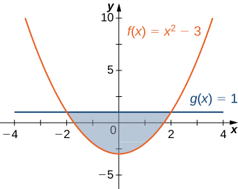 

<math xmlns="http://www.w3.org/1998/Math/MathML"><mrow><mfrac><mrow><mn>32</mn></mrow><mn>3</mn></mfrac></mrow></math>

<math xmlns="http://www.w3.org/1998/Math/MathML"><mrow><mi>y</mi><mo>=</mo><msup><mi>x</mi><mn>2</mn></msup><mspace width="0.2em" /><mtext>and</mtext><mspace width="0.2em" /><mi>y</mi><mo>=</mo><mn>3</mn><mi>x</mi><mo>+</mo><mn>4</mn></mrow></math>

 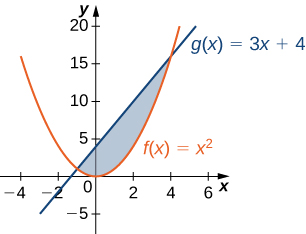 

For the following exercises, split the region between the two curves into two smaller regions, then determine the area by integrating over the <math xmlns="http://www.w3.org/1998/Math/MathML"><mrow><mi>x</mi><mtext>-axis</mtext><mo>.</mo></mrow></math>

 Note that you will have two integrals to solve.

<math xmlns="http://www.w3.org/1998/Math/MathML"><mrow><mi>y</mi><mo>=</mo><msup><mi>x</mi><mn>3</mn></msup></mrow></math>

 and <math xmlns="http://www.w3.org/1998/Math/MathML"><mrow><mi>y</mi><mo>=</mo><msup><mi>x</mi><mn>2</mn></msup><mo>+</mo><mi>x</mi></mrow></math>

  

<math xmlns="http://www.w3.org/1998/Math/MathML"><mrow><mfrac><mrow><mn>13</mn></mrow><mrow><mn>12</mn></mrow></mfrac></mrow></math>

<math xmlns="http://www.w3.org/1998/Math/MathML"><mrow><mi>y</mi><mo>=</mo><mtext>cos</mtext><mspace width="0.2em" /><mi>θ</mi></mrow></math>

 and <math xmlns="http://www.w3.org/1998/Math/MathML"><mrow><mi>y</mi><mo>=</mo><mn>0.5</mn><mo>,</mo></mrow></math>

 for <math xmlns="http://www.w3.org/1998/Math/MathML"><mrow><mn>0</mn><mo>≤</mo><mi>θ</mi><mo>≤</mo><mi>π</mi></mrow></math>

  

For the following exercises, determine the area of the region between the two curves by integrating over the <math xmlns="http://www.w3.org/1998/Math/MathML"><mrow><mi>y</mi><mtext>-axis</mtext><mo>.</mo></mrow></math>

<math xmlns="http://www.w3.org/1998/Math/MathML"><mrow><mi>x</mi><mo>=</mo><msup><mi>y</mi><mn>2</mn></msup><mspace width="0.2em" /><mtext>and</mtext><mspace width="0.2em" /><mi>x</mi><mo>=</mo><mn>9</mn></mrow></math>

 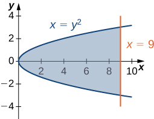 

<math xmlns="http://www.w3.org/1998/Math/MathML"><mrow><mn>36</mn></mrow></math>

<math xmlns="http://www.w3.org/1998/Math/MathML"><mrow><mi>y</mi><mo>=</mo><mi>x</mi><mspace width="0.2em" /><mtext>and</mtext><mspace width="0.2em" /><mi>x</mi><mo>=</mo><msup><mi>y</mi><mn>2</mn></msup></mrow></math>

 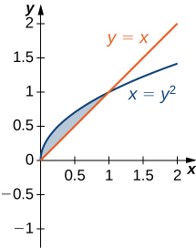 

For the following exercises, graph the equations and shade the area of the region between the curves. Determine its area by integrating over the <math xmlns="http://www.w3.org/1998/Math/MathML"><mrow><mi>x</mi><mtext>-axis</mtext><mo>.</mo></mrow></math>

<math xmlns="http://www.w3.org/1998/Math/MathML"><mrow><mi>y</mi><mo>=</mo><msup><mi>x</mi><mn>2</mn></msup><mspace width="0.2em" /><mtext>and</mtext><mspace width="0.2em" /><mi>y</mi><mo>=</mo><mtext>−</mtext><msup><mi>x</mi><mn>2</mn></msup><mo>+</mo><mn>18</mn><mi>x</mi></mrow></math>

* * *
{: data-type="newline"}

 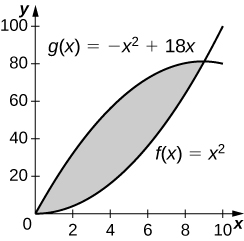 
* * *
{: data-type="newline"}

 243 square units

<math xmlns="http://www.w3.org/1998/Math/MathML"><mrow><mi>y</mi><mo>=</mo><mfrac><mn>1</mn><mi>x</mi></mfrac><mo>,</mo><mi>y</mi><mo>=</mo><mfrac><mn>1</mn><mrow><msup><mi>x</mi><mn>2</mn></msup></mrow></mfrac><mo>,</mo><mspace width="0.2em" /><mtext>and</mtext><mspace width="0.2em" /><mi>x</mi><mo>=</mo><mn>3</mn></mrow></math>

<math xmlns="http://www.w3.org/1998/Math/MathML"><mrow><mi>y</mi><mo>=</mo><mtext>cos</mtext><mspace width="0.2em" /><mi>x</mi></mrow></math>

 and <math xmlns="http://www.w3.org/1998/Math/MathML"><mrow><mi>y</mi><mo>=</mo><msup><mrow><mtext>cos</mtext></mrow><mn>2</mn></msup><mi>x</mi></mrow></math>

 on <math xmlns="http://www.w3.org/1998/Math/MathML"><mrow><mi>x</mi><mo>=</mo><mrow><mo>[</mo><mrow><mtext>−</mtext><mi>π</mi><mo>,</mo><mi>π</mi></mrow><mo>]</mo></mrow></mrow></math>

* * *
{: data-type="newline"}

 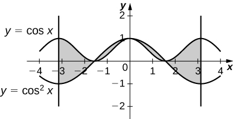 
* * *
{: data-type="newline"}

 4

<math xmlns="http://www.w3.org/1998/Math/MathML"><mrow><mi>y</mi><mo>=</mo><msup><mi>e</mi><mi>x</mi></msup><mo>,</mo><mi>y</mi><mo>=</mo><msup><mi>e</mi><mrow><mn>2</mn><mi>x</mi><mo>−</mo><mn>1</mn></mrow></msup><mo>,</mo><mspace width="0.2em" /><mtext>and</mtext><mspace width="0.2em" /><mi>x</mi><mo>=</mo><mn>0</mn></mrow></math>

<math xmlns="http://www.w3.org/1998/Math/MathML"><mrow><mi>y</mi><mo>=</mo><msup><mi>e</mi><mi>x</mi></msup><mo>,</mo><mi>y</mi><mo>=</mo><msup><mi>e</mi><mrow><mtext>−</mtext><mi>x</mi></mrow></msup><mo>,</mo><mi>x</mi><mo>=</mo><mn>−1</mn><mspace width="0.2em" /><mtext>and</mtext><mspace width="0.2em" /><mi>x</mi><mo>=</mo><mn>1</mn></mrow></math>

* * *
{: data-type="newline"}

  
* * *
{: data-type="newline"}

 <math xmlns="http://www.w3.org/1998/Math/MathML"><mrow><mfrac><mrow><mn>2</mn><msup><mrow><mrow><mo>(</mo><mrow><mi>e</mi><mo>−</mo><mn>1</mn></mrow><mo>)</mo></mrow></mrow><mn>2</mn></msup></mrow><mi>e</mi></mfrac></mrow></math>

<math xmlns="http://www.w3.org/1998/Math/MathML"><mrow><mi>y</mi><mo>=</mo><mi>e</mi><mo>,</mo><mi>y</mi><mo>=</mo><msup><mi>e</mi><mi>x</mi></msup><mo>,</mo><mspace width="0.2em" /><mtext>and</mtext><mspace width="0.2em" /><mi>y</mi><mo>=</mo><msup><mi>e</mi><mrow><mtext>−</mtext><mi>x</mi></mrow></msup></mrow></math>

<math xmlns="http://www.w3.org/1998/Math/MathML"><mrow><mi>y</mi><mo>=</mo><mrow><mo>\|</mo><mi>x</mi><mo>\|</mo></mrow><mspace width="0.2em" /><mtext>and</mtext><mspace width="0.2em" /><mi>y</mi><mo>=</mo><msup><mi>x</mi><mn>2</mn></msup></mrow></math>

* * *
{: data-type="newline"}

  
* * *
{: data-type="newline"}

 <math xmlns="http://www.w3.org/1998/Math/MathML"><mrow><mfrac><mn>1</mn><mn>3</mn></mfrac></mrow></math>

For the following exercises, graph the equations and shade the area of the region between the curves. If necessary, break the region into sub-regions to determine its entire area.

<math xmlns="http://www.w3.org/1998/Math/MathML"><mrow><mi>y</mi><mo>=</mo><mtext>sin</mtext><mrow><mo>(</mo><mrow><mi>π</mi><mi>x</mi></mrow><mo>)</mo></mrow><mo>,</mo><mi>y</mi><mo>=</mo><mn>2</mn><mi>x</mi><mo>,</mo><mspace width="0.2em" /><mtext>and</mtext><mspace width="0.2em" /><mi>x</mi><mo>&gt;</mo><mn>0</mn></mrow></math>

<math xmlns="http://www.w3.org/1998/Math/MathML"><mrow><mi>y</mi><mo>=</mo><mn>12</mn><mo>−</mo><mi>x</mi><mo>,</mo><mi>y</mi><mo>=</mo><msqrt><mi>x</mi></msqrt><mo>,</mo><mspace width="0.2em" /><mtext>and</mtext><mspace width="0.2em" /><mi>y</mi><mo>=</mo><mn>1</mn></mrow></math>

* * *
{: data-type="newline"}

  
* * *
{: data-type="newline"}

 <math xmlns="http://www.w3.org/1998/Math/MathML"><mrow><mfrac><mrow><mn>34</mn></mrow><mn>3</mn></mfrac></mrow></math>

<math xmlns="http://www.w3.org/1998/Math/MathML"><mrow><mi>y</mi><mo>=</mo><mtext>sin</mtext><mspace width="0.2em" /><mi>x</mi></mrow></math>

 and <math xmlns="http://www.w3.org/1998/Math/MathML"><mrow><mi>y</mi><mo>=</mo><mtext>cos</mtext><mspace width="0.2em" /><mi>x</mi></mrow></math>

 over <math xmlns="http://www.w3.org/1998/Math/MathML"><mrow><mi>x</mi><mo>=</mo><mrow><mo>[</mo><mrow><mtext>−</mtext><mi>π</mi><mo>,</mo><mi>π</mi></mrow><mo>]</mo></mrow></mrow></math>

<math xmlns="http://www.w3.org/1998/Math/MathML"><mrow><mi>y</mi><mo>=</mo><msup><mi>x</mi><mn>3</mn></msup><mspace width="0.2em" /><mtext>and</mtext><mspace width="0.2em" /><mi>y</mi><mo>=</mo><msup><mi>x</mi><mn>2</mn></msup><mo>−</mo><mn>2</mn><mi>x</mi></mrow></math>

 over <math xmlns="http://www.w3.org/1998/Math/MathML"><mrow><mi>x</mi><mo>=</mo><mrow><mo>[</mo><mrow><mn>−1</mn><mo>,</mo><mn>1</mn></mrow><mo>]</mo></mrow></mrow></math>

* * *
{: data-type="newline"}

  
* * *
{: data-type="newline"}

 <math xmlns="http://www.w3.org/1998/Math/MathML"><mrow><mfrac><mn>5</mn><mn>2</mn></mfrac></mrow></math>

<math xmlns="http://www.w3.org/1998/Math/MathML"><mrow><mi>y</mi><mo>=</mo><msup><mi>x</mi><mn>2</mn></msup><mo>+</mo><mn>9</mn><mspace width="0.2em" /><mtext>and</mtext><mspace width="0.2em" /><mi>y</mi><mo>=</mo><mn>10</mn><mo>+</mo><mn>2</mn><mi>x</mi></mrow></math>

 over <math xmlns="http://www.w3.org/1998/Math/MathML"><mrow><mi>x</mi><mo>=</mo><mrow><mo>[</mo><mrow><mn>−1</mn><mo>,</mo><mn>3</mn></mrow><mo>]</mo></mrow></mrow></math>

<math xmlns="http://www.w3.org/1998/Math/MathML"><mrow><mi>y</mi><mo>=</mo><msup><mi>x</mi><mn>3</mn></msup><mo>+</mo><mn>3</mn><mi>x</mi></mrow></math>

 and <math xmlns="http://www.w3.org/1998/Math/MathML"><mrow><mi>y</mi><mo>=</mo><mn>4</mn><mi>x</mi></mrow></math>

* * *
{: data-type="newline"}

 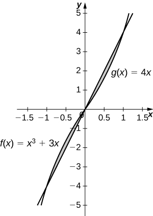 
* * *
{: data-type="newline"}

 <math xmlns="http://www.w3.org/1998/Math/MathML"><mrow><mfrac><mn>1</mn><mn>2</mn></mfrac></mrow></math>

For the following exercises, graph the equations and shade the area of the region between the curves. Determine its area by integrating over the <math xmlns="http://www.w3.org/1998/Math/MathML"><mrow><mi>y</mi><mtext>-axis</mtext><mo>.</mo></mrow></math>

<math xmlns="http://www.w3.org/1998/Math/MathML"><mrow><mi>x</mi><mo>=</mo><msup><mi>y</mi><mn>3</mn></msup><mspace width="0.2em" /><mtext>and</mtext><mspace width="0.2em" /><mi>x</mi><mo>=</mo><mn>3</mn><mi>y</mi><mo>−</mo><mn>2</mn></mrow></math>

<math xmlns="http://www.w3.org/1998/Math/MathML"><mrow><mi>x</mi><mo>=</mo><mn>2</mn><mi>y</mi><mspace width="0.2em" /><mtext>and</mtext><mspace width="0.2em" /><mi>x</mi><mo>=</mo><msup><mi>y</mi><mn>3</mn></msup><mo>−</mo><mi>y</mi></mrow></math>

* * *
{: data-type="newline"}

 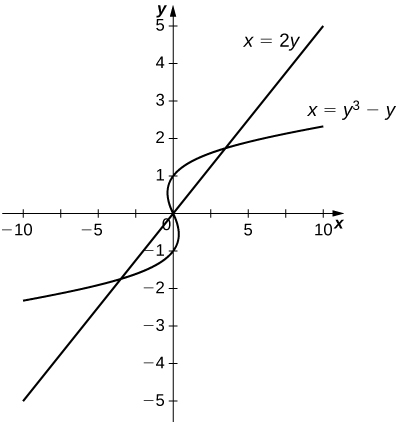 
* * *
{: data-type="newline"}

 <math xmlns="http://www.w3.org/1998/Math/MathML"><mrow><mfrac><mn>9</mn><mn>2</mn></mfrac></mrow></math>

<math xmlns="http://www.w3.org/1998/Math/MathML"><mrow><mi>x</mi><mo>=</mo><mn>−3</mn><mo>+</mo><msup><mi>y</mi><mn>2</mn></msup><mspace width="0.2em" /><mtext>and</mtext><mspace width="0.2em" /><mi>x</mi><mo>=</mo><mi>y</mi><mo>−</mo><msup><mi>y</mi><mn>2</mn></msup></mrow></math>

<math xmlns="http://www.w3.org/1998/Math/MathML"><mrow><msup><mi>y</mi><mn>2</mn></msup><mo>=</mo><mi>x</mi><mspace width="0.2em" /><mtext>and</mtext><mspace width="0.2em" /><mi>x</mi><mo>=</mo><mi>y</mi><mo>+</mo><mn>2</mn></mrow></math>

* * *
{: data-type="newline"}

 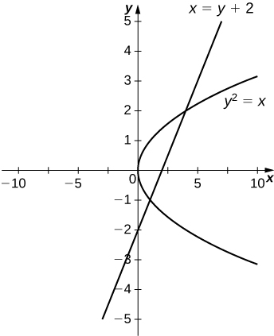 
* * *
{: data-type="newline"}

 <math xmlns="http://www.w3.org/1998/Math/MathML"><mrow><mfrac><mn>9</mn><mn>2</mn></mfrac></mrow></math>

<math xmlns="http://www.w3.org/1998/Math/MathML"><mrow><mi>x</mi><mo>=</mo><mrow><mo>\|</mo><mi>y</mi><mo>\|</mo></mrow><mspace width="0.2em" /><mtext>and</mtext><mspace width="0.2em" /><mn>2</mn><mi>x</mi><mo>=</mo><mtext>−</mtext><msup><mi>y</mi><mn>2</mn></msup><mo>+</mo><mn>2</mn></mrow></math>

<math xmlns="http://www.w3.org/1998/Math/MathML"><mrow><mi>x</mi><mo>=</mo><mtext>sin</mtext><mspace width="0.2em" /><mi>y</mi><mo>,</mo><mi>x</mi><mo>=</mo><mtext>cos</mtext><mo stretchy="false">(</mo><mn>2</mn><mi>y</mi><mo stretchy="false">)</mo><mo>,</mo><mi>y</mi><mo>=</mo><mi>π</mi><mtext>/</mtext><mn>2</mn><mo>,</mo><mtext>and</mtext><mspace width="0.2em" /><mi>y</mi><mo>=</mo><mtext>−</mtext><mi>π</mi><mtext>/</mtext><mn>2</mn></mrow></math>

* * *
{: data-type="newline"}

 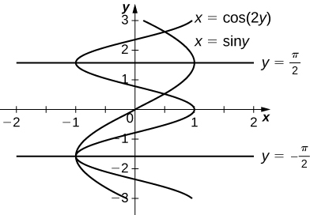 
* * *
{: data-type="newline"}

 <math xmlns="http://www.w3.org/1998/Math/MathML"><mrow><mfrac><mrow><mn>3</mn><msqrt><mn>3</mn></msqrt></mrow><mn>2</mn></mfrac></mrow></math>

For the following exercises, graph the equations and shade the area of the region between the curves. Determine its area by integrating over the *x*-axis or *y*-axis, whichever seems more convenient.

<math xmlns="http://www.w3.org/1998/Math/MathML"><mrow><mi>x</mi><mo>=</mo><msup><mi>y</mi><mrow><mn>4</mn></mrow></msup><mtext>and</mtext><mspace width="0.2em" /><mi>x</mi><mo>=</mo><msup><mi>y</mi><mn>5</mn></msup></mrow></math>

<math xmlns="http://www.w3.org/1998/Math/MathML"><mrow><mi>y</mi><mo>=</mo><mi>x</mi><msup><mi>e</mi><mi>x</mi></msup><mo>,</mo><mi>y</mi><mo>=</mo><msup><mi>e</mi><mi>x</mi></msup><mo>,</mo><mi>x</mi><mo>=</mo><mn>0</mn><mo>,</mo><mspace width="0.2em" /><mtext>and</mtext><mspace width="0.2em" /><mi>x</mi><mo>=</mo><mn>1</mn></mrow></math>

* * *
{: data-type="newline"}

 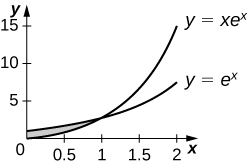 
* * *
{: data-type="newline"}

 <math xmlns="http://www.w3.org/1998/Math/MathML"><mrow><msup><mi>e</mi><mrow><mn>−2</mn></mrow></msup></mrow></math>

<math xmlns="http://www.w3.org/1998/Math/MathML"><mrow><mi>y</mi><mo>=</mo><msup><mi>x</mi><mrow><mn>6</mn></mrow></msup><mtext>and</mtext><mspace width="0.2em" /><mi>y</mi><mo>=</mo><msup><mi>x</mi><mn>4</mn></msup></mrow></math>

<math xmlns="http://www.w3.org/1998/Math/MathML"><mrow><mi>x</mi><mo>=</mo><msup><mi>y</mi><mn>3</mn></msup><mo>+</mo><mn>2</mn><msup><mi>y</mi><mn>2</mn></msup><mo>+</mo><mn>1</mn><mspace width="0.2em" /><mtext>and</mtext><mspace width="0.2em" /><mi>x</mi><mo>=</mo><mtext>−</mtext><msup><mi>y</mi><mn>2</mn></msup><mo>+</mo><mn>1</mn></mrow></math>

* * *
{: data-type="newline"}

 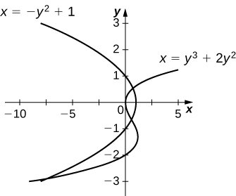 
* * *
{: data-type="newline"}

 <math xmlns="http://www.w3.org/1998/Math/MathML"><mrow><mfrac><mrow><mn>27</mn></mrow><mn>4</mn></mfrac></mrow></math>

<math xmlns="http://www.w3.org/1998/Math/MathML"><mrow><mi>y</mi><mo>=</mo><mrow><mo>\|</mo><mi>x</mi><mo>\|</mo></mrow><mspace width="0.2em" /><mtext>and</mtext><mspace width="0.2em" /><mi>y</mi><mo>=</mo><msup><mi>x</mi><mn>2</mn></msup><mo>−</mo><mn>1</mn></mrow></math>

<math xmlns="http://www.w3.org/1998/Math/MathML"><mrow><mi>y</mi><mo>=</mo><mn>4</mn><mo>−</mo><mn>3</mn><mi>x</mi><mspace width="0.2em" /><mtext>and</mtext><mspace width="0.2em" /><mi>y</mi><mo>=</mo><mfrac><mn>1</mn><mi>x</mi></mfrac></mrow></math>

* * *
{: data-type="newline"}

 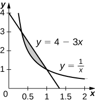 
* * *
{: data-type="newline"}

 <math xmlns="http://www.w3.org/1998/Math/MathML"><mrow><mfrac><mn>4</mn><mn>3</mn></mfrac><mo>−</mo><mtext>ln</mtext><mo stretchy="false">(</mo><mn>3</mn><mo stretchy="false">)</mo></mrow></math>

<math xmlns="http://www.w3.org/1998/Math/MathML"><mrow><mi>y</mi><mo>=</mo><mtext>sin</mtext><mspace width="0.2em" /><mi>x</mi><mo>,</mo><mi>x</mi><mo>=</mo><mtext>−</mtext><mi>π</mi><mtext>/</mtext><mn>6</mn><mo>,</mo><mi>x</mi><mo>=</mo><mi>π</mi><mtext>/</mtext><mn>6</mn><mo>,</mo><mtext>and</mtext><mspace width="0.2em" /><mi>y</mi><mo>=</mo><msup><mrow><mtext>cos</mtext></mrow><mn>3</mn></msup><mi>x</mi></mrow></math>

<math xmlns="http://www.w3.org/1998/Math/MathML"><mrow><mi>y</mi><mo>=</mo><msup><mi>x</mi><mn>2</mn></msup><mo>−</mo><mn>3</mn><mi>x</mi><mo>+</mo><mn>2</mn><mspace width="0.2em" /><mtext>and</mtext><mspace width="0.2em" /><mi>y</mi><mo>=</mo><msup><mi>x</mi><mn>3</mn></msup><mo>−</mo><mn>2</mn><msup><mi>x</mi><mn>2</mn></msup><mo>−</mo><mi>x</mi><mo>+</mo><mn>2</mn></mrow></math>

* * *
{: data-type="newline"}

 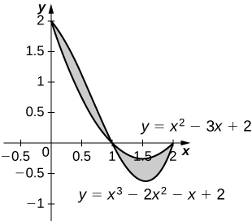 
* * *
{: data-type="newline"}

 <math xmlns="http://www.w3.org/1998/Math/MathML"><mrow><mfrac><mn>1</mn><mn>2</mn></mfrac></mrow></math>

<math xmlns="http://www.w3.org/1998/Math/MathML"><mrow><mi>y</mi><mo>=</mo><mn>2</mn><mspace width="0.2em" /><msup><mrow><mtext>cos</mtext></mrow><mn>3</mn></msup><mrow><mo>(</mo><mrow><mn>3</mn><mi>x</mi></mrow><mo>)</mo></mrow><mo>,</mo><mi>y</mi><mo>=</mo><mn>−1</mn><mo>,</mo><mi>x</mi><mo>=</mo><mfrac><mi>π</mi><mn>4</mn></mfrac><mo>,</mo><mspace width="0.2em" /><mtext>and</mtext><mspace width="0.2em" /><mi>x</mi><mo>=</mo><mo>−</mo><mfrac><mi>π</mi><mn>4</mn></mfrac></mrow></math>

<math xmlns="http://www.w3.org/1998/Math/MathML"><mrow><mi>y</mi><mo>+</mo><msup><mi>y</mi><mn>3</mn></msup><mo>=</mo><mi>x</mi><mspace width="0.2em" /><mtext>and</mtext><mspace width="0.2em" /><mn>2</mn><mi>y</mi><mo>=</mo><mi>x</mi></mrow></math>

* * *
{: data-type="newline"}

 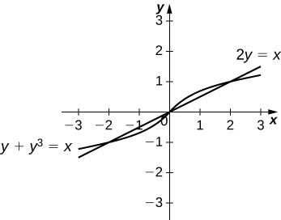 
* * *
{: data-type="newline"}

 <math xmlns="http://www.w3.org/1998/Math/MathML"><mrow><mfrac><mn>1</mn><mn>2</mn></mfrac></mrow></math>

<math xmlns="http://www.w3.org/1998/Math/MathML"><mrow><mi>y</mi><mo>=</mo><msqrt><mrow><mn>1</mn><mo>−</mo><msup><mi>x</mi><mn>2</mn></msup></mrow></msqrt><mspace width="0.2em" /><mtext>and</mtext><mspace width="0.2em" /><mi>y</mi><mo>=</mo><msup><mi>x</mi><mn>2</mn></msup><mo>−</mo><mn>1</mn></mrow></math>

<math xmlns="http://www.w3.org/1998/Math/MathML"><mrow><mi>y</mi><mo>=</mo><msup><mrow><mtext>cos</mtext></mrow><mrow><mn>−1</mn></mrow></msup><mi>x</mi><mo>,</mo><mi>y</mi><mo>=</mo><msup><mrow><mtext>sin</mtext></mrow><mrow><mn>−1</mn></mrow></msup><mi>x</mi><mo>,</mo><mi>x</mi><mo>=</mo><mn>−1</mn><mo>,</mo><mspace width="0.2em" /><mtext>and</mtext><mspace width="0.2em" /><mi>x</mi><mo>=</mo><mn>1</mn></mrow></math>

* * *
{: data-type="newline"}

 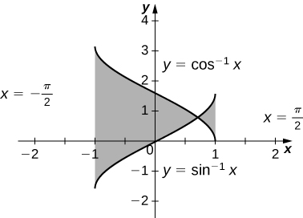 
* * *
{: data-type="newline"}

 <math xmlns="http://www.w3.org/1998/Math/MathML"><mrow><mn>−2</mn><mrow><mo>(</mo><mrow><msqrt><mn>2</mn></msqrt><mo>−</mo><mi>π</mi></mrow><mo>)</mo></mrow></mrow></math>

For the following exercises, find the exact area of the region bounded by the given equations if possible. If you are unable to determine the intersection points analytically, use a calculator to approximate the intersection points with three decimal places and determine the approximate area of the region.

**[T]** <math xmlns="http://www.w3.org/1998/Math/MathML"><mrow><mi>x</mi><mo>=</mo><msup><mi>e</mi><mi>y</mi></msup><mspace width="0.2em" /><mtext>and</mtext><mspace width="0.2em" /><mi>y</mi><mo>=</mo><mi>x</mi><mo>−</mo><mn>2</mn></mrow></math>

**[T]** <math xmlns="http://www.w3.org/1998/Math/MathML"><mrow><mi>y</mi><mo>=</mo><msup><mi>x</mi><mn>2</mn></msup><mspace width="0.2em" /><mtext>and</mtext><mspace width="0.2em" /><mi>y</mi><mo>=</mo><msqrt><mrow><mn>1</mn><mo>−</mo><msup><mi>x</mi><mn>2</mn></msup></mrow></msqrt></mrow></math>

<math xmlns="http://www.w3.org/1998/Math/MathML"><mrow><mn>1.067</mn></mrow></math>

**[T]** <math xmlns="http://www.w3.org/1998/Math/MathML"><mrow><mi>y</mi><mo>=</mo><mn>3</mn><msup><mi>x</mi><mn>2</mn></msup><mo>+</mo><mn>8</mn><mi>x</mi><mo>+</mo><mn>9</mn><mspace width="0.2em" /><mtext>and</mtext><mspace width="0.2em" /><mn>3</mn><mi>y</mi><mo>=</mo><mi>x</mi><mo>+</mo><mn>24</mn></mrow></math>

**[T]** <math xmlns="http://www.w3.org/1998/Math/MathML"><mrow><mi>x</mi><mo>=</mo><msqrt><mrow><mn>4</mn><mo>−</mo><msup><mi>y</mi><mn>2</mn></msup></mrow></msqrt><mspace width="0.2em" /><mtext>and</mtext><mspace width="0.2em" /><msup><mi>y</mi><mn>2</mn></msup><mo>=</mo><mn>1</mn><mo>+</mo><msup><mi>x</mi><mn>2</mn></msup></mrow></math>

<math xmlns="http://www.w3.org/1998/Math/MathML"><mrow><mn>0.852</mn></mrow></math>

**[T]** <math xmlns="http://www.w3.org/1998/Math/MathML"><mrow><msup><mi>x</mi><mn>2</mn></msup><mo>=</mo><msup><mi>y</mi><mn>3</mn></msup><mspace width="0.2em" /><mtext>and</mtext><mspace width="0.2em" /><mi>x</mi><mo>=</mo><mn>3</mn><mi>y</mi></mrow></math>

**[T]** <math xmlns="http://www.w3.org/1998/Math/MathML"><mrow><mi>y</mi><mo>=</mo><msup><mrow><mtext>sin</mtext></mrow><mn>3</mn></msup><mi>x</mi><mo>+</mo><mn>2</mn><mo>,</mo><mi>y</mi><mo>=</mo><mtext>tan</mtext><mspace width="0.2em" /><mi>x</mi><mo>,</mo><mi>x</mi><mo>=</mo><mn>−1.5</mn><mo>,</mo><mspace width="0.2em" /><mtext>and</mtext><mspace width="0.2em" /><mi>x</mi><mo>=</mo><mn>1.5</mn></mrow></math>

<math xmlns="http://www.w3.org/1998/Math/MathML"><mrow><mn>7.523</mn></mrow></math>

**[T]** <math xmlns="http://www.w3.org/1998/Math/MathML"><mrow><mi>y</mi><mo>=</mo><msqrt><mrow><mn>1</mn><mo>−</mo><msup><mi>x</mi><mn>2</mn></msup></mrow></msqrt><mspace width="0.2em" /><mtext>and</mtext><mspace width="0.2em" /><msup><mi>y</mi><mn>2</mn></msup><mo>=</mo><msup><mi>x</mi><mn>2</mn></msup></mrow></math>

**[T]** <math xmlns="http://www.w3.org/1998/Math/MathML"><mrow><mi>y</mi><mo>=</mo><msqrt><mrow><mn>1</mn><mo>−</mo><msup><mi>x</mi><mn>2</mn></msup></mrow></msqrt><mspace width="0.2em" /><mtext>and</mtext><mspace width="0.2em" /><mi>y</mi><mo>=</mo><msup><mi>x</mi><mn>2</mn></msup><mo>+</mo><mn>2</mn><mi>x</mi><mo>+</mo><mn>1</mn></mrow></math>

<math xmlns="http://www.w3.org/1998/Math/MathML"><mrow><mfrac><mrow><mn>3</mn><mi>π</mi><mo>−</mo><mn>4</mn></mrow><mrow><mn>12</mn></mrow></mfrac></mrow></math>

**[T]** <math xmlns="http://www.w3.org/1998/Math/MathML"><mrow><mi>x</mi><mo>=</mo><mn>4</mn><mo>−</mo><msup><mi>y</mi><mn>2</mn></msup><mspace width="0.2em" /><mtext>and</mtext><mspace width="0.2em" /><mi>x</mi><mo>=</mo><mn>1</mn><mo>+</mo><mn>3</mn><mi>y</mi><mo>+</mo><msup><mi>y</mi><mn>2</mn></msup></mrow></math>

**[T]** <math xmlns="http://www.w3.org/1998/Math/MathML"><mrow><mi>y</mi><mo>=</mo><mtext>cos</mtext><mspace width="0.2em" /><mi>x</mi><mo>,</mo><mi>y</mi><mo>=</mo><msup><mi>e</mi><mi>x</mi></msup><mo>,</mo><mi>x</mi><mo>=</mo><mtext>−</mtext><mi>π</mi><mo>,</mo><mspace width="0.2em" /><mtext>and</mtext><mspace width="0.2em" /><mi>x</mi><mo>=</mo><mn>0</mn></mrow></math>

<math xmlns="http://www.w3.org/1998/Math/MathML"><mrow><mn>1.429</mn></mrow></math>

The largest triangle with a base on the <math xmlns="http://www.w3.org/1998/Math/MathML"><mrow><mi>x</mi><mtext>-axis</mtext></mrow></math>

 that fits inside the upper half of the unit circle <math xmlns="http://www.w3.org/1998/Math/MathML"><mrow><msup><mi>y</mi><mn>2</mn></msup><mo>+</mo><msup><mi>x</mi><mn>2</mn></msup><mo>=</mo><mn>1</mn></mrow></math>

 is given by <math xmlns="http://www.w3.org/1998/Math/MathML"><mrow><mi>y</mi><mo>=</mo><mn>1</mn><mo>+</mo><mi>x</mi></mrow></math>

 and <math xmlns="http://www.w3.org/1998/Math/MathML"><mrow><mi>y</mi><mo>=</mo><mn>1</mn><mo>−</mo><mi>x</mi><mo>.</mo></mrow></math>

 See the following figure. What is the area inside the semicircle but outside the triangle?

 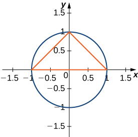 

A factory selling cell phones has a marginal cost function <math xmlns="http://www.w3.org/1998/Math/MathML"><mrow><mi>C</mi><mo stretchy="false">(</mo><mi>x</mi><mo stretchy="false">)</mo><mo>=</mo><mn>0.01</mn><msup><mi>x</mi><mn>2</mn></msup><mo>−</mo><mn>3</mn><mi>x</mi><mo>+</mo><mn>229</mn><mo>,</mo></mrow></math>

 where <math xmlns="http://www.w3.org/1998/Math/MathML"><mi>x</mi></math>

 represents the number of cell phones, and a marginal revenue function given by <math xmlns="http://www.w3.org/1998/Math/MathML"><mrow><mi>R</mi><mo stretchy="false">(</mo><mi>x</mi><mo stretchy="false">)</mo><mo>=</mo><mn>429</mn><mo>−</mo><mn>2</mn><mi>x</mi><mo>.</mo></mrow></math>

 Find the area between the graphs of these curves and <math xmlns="http://www.w3.org/1998/Math/MathML"><mrow><mi>x</mi><mo>=</mo><mn>0</mn><mo>.</mo></mrow></math>

 What does this area represent?

<math xmlns="http://www.w3.org/1998/Math/MathML"><mrow><mtext>$</mtext><mn>33,333.33</mn></mrow></math>

 total profit for <math xmlns="http://www.w3.org/1998/Math/MathML"><mrow><mn>200</mn></mrow></math>

 cell phones sold

An amusement park has a marginal cost function <math xmlns="http://www.w3.org/1998/Math/MathML"><mrow><mi>C</mi><mo stretchy="false">(</mo><mi>x</mi><mo stretchy="false">)</mo><mo>=</mo><mn>1000</mn><msup><mi>e</mi><mrow><mtext>−</mtext><mi>x</mi></mrow></msup><mo>+</mo><mn>5</mn><mo>,</mo></mrow></math>

 where <math xmlns="http://www.w3.org/1998/Math/MathML"><mi>x</mi></math>

 represents the number of tickets sold, and a marginal revenue function given by <math xmlns="http://www.w3.org/1998/Math/MathML"><mrow><mi>R</mi><mo stretchy="false">(</mo><mi>x</mi><mo stretchy="false">)</mo><mo>=</mo><mn>60</mn><mo>−</mo><mn>0.1</mn><mi>x</mi><mo>.</mo></mrow></math>

 Find the total profit generated when selling <math xmlns="http://www.w3.org/1998/Math/MathML"><mrow><mn>550</mn></mrow></math>

 tickets. Use a calculator to determine intersection points, if necessary, to two decimal places.

The tortoise versus the hare: The speed of the hare is given by the sinusoidal function <math xmlns="http://www.w3.org/1998/Math/MathML"><mrow><mi>H</mi><mo stretchy="false">(</mo><mi>t</mi><mo stretchy="false">)</mo><mo>=</mo><mn>1</mn><mo>−</mo><mtext>cos</mtext><mrow><mo>(</mo><mrow><mrow><mrow><mrow><mo>(</mo><mrow><mi>π</mi><mi>t</mi></mrow><mo>)</mo></mrow></mrow><mtext>/</mtext><mn>2</mn></mrow></mrow><mo>)</mo></mrow></mrow></math>

 whereas the speed of the tortoise is <math xmlns="http://www.w3.org/1998/Math/MathML"><mrow><mi>T</mi><mo stretchy="false">(</mo><mi>t</mi><mo stretchy="false">)</mo><mo>=</mo><mrow><mo>(</mo><mrow><mrow><mn>1</mn><mtext>/</mtext><mn>2</mn></mrow></mrow><mo>)</mo></mrow><msup><mrow><mtext>tan</mtext></mrow><mrow><mn>−1</mn></mrow></msup><mrow><mo>(</mo><mrow><mrow><mi>t</mi><mtext>/</mtext><mn>4</mn></mrow></mrow><mo>)</mo></mrow><mo>,</mo></mrow></math>

 where <math xmlns="http://www.w3.org/1998/Math/MathML"><mi>t</mi></math>

 is time measured in hours and the speed is measured in miles per hour. Find the area between the curves from time <math xmlns="http://www.w3.org/1998/Math/MathML"><mrow><mi>t</mi><mo>=</mo><mn>0</mn></mrow></math>

 to the first time after one hour when the tortoise and hare are traveling at the same speed. What does it represent? Use a calculator to determine the intersection points, if necessary, accurate to three decimal places.

<math xmlns="http://www.w3.org/1998/Math/MathML"><mrow><mn>3.263</mn></mrow></math>

 mi represents how far ahead the hare is from the tortoise

The tortoise versus the hare: The speed of the hare is given by the sinusoidal function <math xmlns="http://www.w3.org/1998/Math/MathML"><mrow><mi>H</mi><mo stretchy="false">(</mo><mi>t</mi><mo stretchy="false">)</mo><mo>=</mo><mrow><mo>(</mo><mrow><mrow><mn>1</mn><mtext>/</mtext><mn>2</mn></mrow></mrow><mo>)</mo></mrow><mo>−</mo><mrow><mo>(</mo><mrow><mrow><mn>1</mn><mtext>/</mtext><mn>2</mn></mrow></mrow><mo>)</mo></mrow><mtext>cos</mtext><mrow><mo>(</mo><mrow><mn>2</mn><mi>π</mi><mi>t</mi></mrow><mo>)</mo></mrow></mrow></math>

 whereas the speed of the tortoise is <math xmlns="http://www.w3.org/1998/Math/MathML"><mrow><mi>T</mi><mo stretchy="false">(</mo><mi>t</mi><mo stretchy="false">)</mo><mo>=</mo><msqrt><mi>t</mi></msqrt><mo>,</mo></mrow></math>

 where <math xmlns="http://www.w3.org/1998/Math/MathML"><mi>t</mi></math>

 is time measured in hours and speed is measured in kilometers per hour. If the race is over in <math xmlns="http://www.w3.org/1998/Math/MathML"><mn>1</mn></math>

 hour, who won the race and by how much? Use a calculator to determine the intersection points, if necessary, accurate to three decimal places.

For the following exercises, find the area between the curves by integrating with respect to <math xmlns="http://www.w3.org/1998/Math/MathML"><mi>x</mi></math>

 and then with respect to <math xmlns="http://www.w3.org/1998/Math/MathML"><mi>y</mi><mo>.</mo></math>

 Is one method easier than the other? Do you obtain the same answer?

<math xmlns="http://www.w3.org/1998/Math/MathML"><mrow><mi>y</mi><mo>=</mo><msup><mi>x</mi><mn>2</mn></msup><mo>+</mo><mn>2</mn><mi>x</mi><mo>+</mo><mn>1</mn><mspace width="0.2em" /><mtext>and</mtext><mspace width="0.2em" /><mi>y</mi><mo>=</mo><mtext>−</mtext><msup><mi>x</mi><mn>2</mn></msup><mo>−</mo><mn>3</mn><mi>x</mi><mo>+</mo><mn>4</mn></mrow></math>

<math xmlns="http://www.w3.org/1998/Math/MathML"><mrow><mfrac><mrow><mn>343</mn></mrow><mrow><mn>24</mn></mrow></mfrac></mrow></math>

<math xmlns="http://www.w3.org/1998/Math/MathML"><mrow><mi>y</mi><mo>=</mo><msup><mi>x</mi><mrow><mn>4</mn></mrow></msup><mtext>and</mtext><mspace width="0.2em" /><mi>x</mi><mo>=</mo><msup><mi>y</mi><mn>5</mn></msup></mrow></math>

<math xmlns="http://www.w3.org/1998/Math/MathML"><mrow><mi>x</mi><mo>=</mo><msup><mi>y</mi><mn>2</mn></msup><mo>−</mo><mn>2</mn><mspace width="0.2em" /><mtext>and</mtext><mspace width="0.2em" /><mi>x</mi><mo>=</mo><mn>2</mn><mi>y</mi></mrow></math>

<math xmlns="http://www.w3.org/1998/Math/MathML"><mrow><mn>4</mn><msqrt><mn>3</mn></msqrt></mrow></math>

For the following exercises, solve using calculus, then check your answer with geometry.

Determine the equations for the sides of the square that touches the unit circle on all four sides, as seen in the following figure. Find the area between the perimeter of this square and the unit circle. Is there another way to solve this without using calculus?

 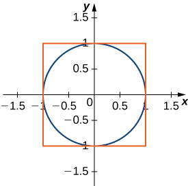 

Find the area between the perimeter of the unit circle and the triangle created from <math xmlns="http://www.w3.org/1998/Math/MathML"><mrow><mi>y</mi><mo>=</mo><mn>2</mn><mi>x</mi><mo>+</mo><mn>1</mn><mo>,</mo><mi>y</mi><mo>=</mo><mn>1</mn><mo>−</mo><mn>2</mn><mi>x</mi></mrow></math>

 and <math xmlns="http://www.w3.org/1998/Math/MathML"><mrow><mi>y</mi><mo>=</mo><mo>−</mo><mfrac><mn>3</mn><mn>5</mn></mfrac><mo>,</mo></mrow></math>

 as seen in the following figure. Is there a way to solve this without using calculus?

 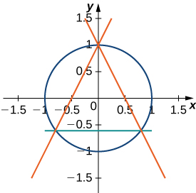 

<math xmlns="http://www.w3.org/1998/Math/MathML"><mrow><mi>π</mi><mo>−</mo><mfrac><mrow><mn>32</mn></mrow><mrow><mn>25</mn></mrow></mfrac></mrow></math>

</section>

[1]: http://www.openstax.org/l/20_CurveCalc
