

* Determine the volume of a solid by integrating a cross-section (the slicing method).
* Find the volume of a solid of revolution using the disk method.
* Find the volume of a solid of revolution with a cavity using the washer method.

In the preceding section, we used definite integrals to find the area between two curves. In this section, we use definite integrals to find volumes of three-dimensional solids. We consider three approaches—slicing, disks, and washers—for finding these volumes, depending on the characteristics of the solid.

### Volume and the Slicing Method

Just as area is the numerical measure of a two-dimensional region, volume is the numerical measure of a three-dimensional solid. Most of us have computed volumes of solids by using basic geometric formulas. The volume of a rectangular solid, for example, can be computed by multiplying length, width, and height: <math xmlns="http://www.w3.org/1998/Math/MathML"><mrow><mi>V</mi><mo>=</mo><mi>l</mi><mi>w</mi><mi>h</mi><mo>.</mo></mrow></math>

 The formulas for the volume of a sphere <math xmlns="http://www.w3.org/1998/Math/MathML"><mrow><mrow><mo>(</mo><mrow><mi>V</mi><mo>=</mo><mfrac><mn>4</mn><mn>3</mn></mfrac><mi>π</mi><msup><mi>r</mi><mn>3</mn></msup></mrow><mo>)</mo></mrow><mo>,</mo></mrow></math>

 a cone <math xmlns="http://www.w3.org/1998/Math/MathML"><mrow><mrow><mo>(</mo><mrow><mi>V</mi><mo>=</mo><mfrac><mn>1</mn><mn>3</mn></mfrac><mi>π</mi><msup><mi>r</mi><mn>2</mn></msup><mi>h</mi></mrow><mo>)</mo></mrow><mo>,</mo></mrow></math>

 and a pyramid <math xmlns="http://www.w3.org/1998/Math/MathML"><mrow><mrow><mo>(</mo><mrow><mi>V</mi><mo>=</mo><mfrac><mn>1</mn><mn>3</mn></mfrac><mi>A</mi><mi>h</mi></mrow><mo>)</mo></mrow></mrow></math>

 have also been introduced. Although some of these formulas were derived using geometry alone, all these formulas can be obtained by using integration.

We can also calculate the volume of a cylinder. Although most of us think of a cylinder as having a circular base, such as a soup can or a metal rod, in mathematics the word *cylinder* has a more general meaning. To discuss cylinders in this more general context, we first need to define some vocabulary.

We define the **cross-section**{: data-type="term"} of a solid to be the intersection of a plane with the solid. A *cylinder* is defined as any solid that can be generated by translating a plane region along a line perpendicular to the region, called the *axis* of the cylinder. Thus, all cross-sections perpendicular to the axis of a cylinder are identical. The solid shown in [\[link\]](#CNX_Calc_Figure_06_02_001) is an example of a cylinder with a noncircular base. To calculate the volume of a cylinder, then, we simply multiply the area of the cross-section by the height of the cylinder: <math xmlns="http://www.w3.org/1998/Math/MathML"><mrow><mi>V</mi><mo>=</mo><mi>A</mi><mo>·</mo><mi>h</mi><mo>.</mo></mrow></math>

 In the case of a right circular cylinder (soup can), this becomes <math xmlns="http://www.w3.org/1998/Math/MathML"><mrow><mi>V</mi><mo>=</mo><mi>π</mi><msup><mi>r</mi><mn>2</mn></msup><mi>h</mi><mo>.</mo></mrow></math>

 {: #CNX_Calc_Figure_06_02_001}

If a solid does not have a constant cross-section (and it is not one of the other basic solids), we may not have a formula for its volume. In this case, we can use a definite integral to calculate the volume of the solid. We do this by slicing the solid into pieces, estimating the volume of each slice, and then adding those estimated volumes together. The slices should all be parallel to one another, and when we put all the slices together, we should get the whole solid. Consider, for example, the solid *S* shown in [\[link\]](#CNX_Calc_Figure_06_02_002), extending along the <math xmlns="http://www.w3.org/1998/Math/MathML"><mrow><mi>x</mi><mtext>-axis</mtext><mtext>.</mtext></mrow></math>

 {: #CNX_Calc_Figure_06_02_002}

We want to divide <math xmlns="http://www.w3.org/1998/Math/MathML"><mi>S</mi></math>

 into slices perpendicular to the <math xmlns="http://www.w3.org/1998/Math/MathML"><mrow><mi>x</mi><mtext>-axis</mtext><mtext>.</mtext></mrow></math>

 As we see later in the chapter, there may be times when we want to slice the solid in some other direction—say, with slices perpendicular to the *y*-axis. The decision of which way to slice the solid is very important. If we make the wrong choice, the computations can get quite messy. Later in the chapter, we examine some of these situations in detail and look at how to decide which way to slice the solid. For the purposes of this section, however, we use slices perpendicular to the <math xmlns="http://www.w3.org/1998/Math/MathML"><mrow><mi>x</mi><mtext>-axis</mtext><mtext>.</mtext></mrow></math>

Because the cross-sectional area is not constant, we let <math xmlns="http://www.w3.org/1998/Math/MathML"><mrow><mi>A</mi><mrow><mo>(</mo><mi>x</mi><mo>)</mo></mrow></mrow></math>

 represent the area of the cross-section at point <math xmlns="http://www.w3.org/1998/Math/MathML"><mi>x</mi><mo>.</mo></math>

 Now let <math xmlns="http://www.w3.org/1998/Math/MathML"><mrow><mi>P</mi><mo>=</mo><mrow><mo>{</mo><mrow><msub><mi>x</mi><mn>0</mn></msub><mo>,</mo><msub><mi>x</mi><mn>1</mn></msub><mtext>…</mtext><mo>,</mo><msub><mi>X</mi><mi>n</mi></msub></mrow><mo>}</mo></mrow></mrow></math>

 be a regular partition of <math xmlns="http://www.w3.org/1998/Math/MathML"><mrow><mrow><mo>[</mo><mrow><mi>a</mi><mo>,</mo><mi>b</mi></mrow><mo>]</mo></mrow><mo>,</mo></mrow></math>

 and for <math xmlns="http://www.w3.org/1998/Math/MathML"><mrow><mi>i</mi><mo>=</mo><mn>1</mn><mo>,</mo><mn>2</mn><mtext>,…</mtext><mi>n</mi><mo>,</mo></mrow></math>

 let <math xmlns="http://www.w3.org/1998/Math/MathML"><mrow><msub><mi>S</mi><mi>i</mi></msub></mrow></math>

 represent the slice of <math xmlns="http://www.w3.org/1998/Math/MathML"><mi>S</mi></math>

 stretching from <math xmlns="http://www.w3.org/1998/Math/MathML"><mrow><msub><mi>x</mi><mrow><mi>i</mi><mo>−</mo><mn>1</mn></mrow></msub><mtext>to</mtext><mspace width="0.2em" /><msub><mi>x</mi><mi>i</mi></msub><mo>.</mo></mrow></math>

 The following figure shows the sliced solid with <math xmlns="http://www.w3.org/1998/Math/MathML"><mrow><mi>n</mi><mo>=</mo><mn>3</mn><mo>.</mo></mrow></math>

 {: #CNX_Calc_Figure_06_02_003}

Finally, for <math xmlns="http://www.w3.org/1998/Math/MathML"><mrow><mi>i</mi><mo>=</mo><mn>1</mn><mo>,</mo><mn>2</mn><mtext>,…</mtext><mi>n</mi><mo>,</mo></mrow></math>

 let <math xmlns="http://www.w3.org/1998/Math/MathML"><mrow><msubsup><mi>x</mi><mi>i</mi><mo>*</mo></msubsup></mrow></math>

 be an arbitrary point in <math xmlns="http://www.w3.org/1998/Math/MathML"><mrow><mrow><mo>[</mo><mrow><msub><mi>x</mi><mrow><mi>i</mi><mo>−</mo><mn>1</mn></mrow></msub><mo>,</mo><msub><mi>x</mi><mi>i</mi></msub></mrow><mo>]</mo></mrow><mo>.</mo></mrow></math>

 Then the volume of slice <math xmlns="http://www.w3.org/1998/Math/MathML"><mrow><msub><mi>S</mi><mi>i</mi></msub></mrow></math>

 can be estimated by <math xmlns="http://www.w3.org/1998/Math/MathML"><mrow><mi>V</mi><mrow><mo>(</mo><mrow><msub><mi>S</mi><mi>i</mi></msub></mrow><mo>)</mo></mrow><mo>≈</mo><mi>A</mi><mrow><mo>(</mo><mrow><msubsup><mi>x</mi><mi>i</mi><mo>*</mo></msubsup></mrow><mo>)</mo></mrow><mtext>Δ</mtext><mi>x</mi><mo>.</mo></mrow></math>

 Adding these approximations together, we see the volume of the entire solid <math xmlns="http://www.w3.org/1998/Math/MathML"><mi>S</mi></math>

 can be approximated by

<math xmlns="http://www.w3.org/1998/Math/MathML"><mrow><mi>V</mi><mrow><mo>(</mo><mi>S</mi><mo>)</mo></mrow><mo>≈</mo><mstyle displaystyle="true"><munderover><mo>∑</mo><mrow><mi>i</mi><mo>=</mo><mn>1</mn></mrow><mi>n</mi></munderover><mrow><mi>A</mi><mrow><mo>(</mo><mrow><msubsup><mi>x</mi><mi>i</mi><mo>*</mo></msubsup></mrow><mo>)</mo></mrow></mrow></mstyle><mtext>Δ</mtext><mi>x</mi><mo>.</mo></mrow></math>

By now, we can recognize this as a Riemann sum, and our next step is to take the limit as <math xmlns="http://www.w3.org/1998/Math/MathML"><mrow><mi>n</mi><mo stretchy="false">→</mo><mi>∞</mi><mo>.</mo></mrow></math>

 Then we have

<math xmlns="http://www.w3.org/1998/Math/MathML"><mrow><mi>V</mi><mrow><mo>(</mo><mi>S</mi><mo>)</mo></mrow><mo>=</mo><munder><mrow><mtext>lim</mtext></mrow><mrow><mi>n</mi><mo stretchy="false">→</mo><mi>∞</mi></mrow></munder><mstyle displaystyle="true"><munderover><mo>∑</mo><mrow><mi>i</mi><mo>=</mo><mn>1</mn></mrow><mi>n</mi></munderover><mrow><mi>A</mi><mrow><mo>(</mo><mrow><msubsup><mi>x</mi><mi>i</mi><mo>*</mo></msubsup></mrow><mo>)</mo></mrow></mrow></mstyle><mtext>Δ</mtext><mi>x</mi><mo>=</mo><mstyle displaystyle="true"><mrow><munderover><mo stretchy="false">∫</mo><mi>a</mi><mi>b</mi></munderover><mrow><mi>A</mi><mrow><mo>(</mo><mi>x</mi><mo>)</mo></mrow><mi>d</mi><mi>x</mi></mrow></mrow></mstyle><mo>.</mo></mrow></math>

The technique we have just described is called the **slicing method**{: data-type="term"}. To apply it, we use the following strategy.

Problem-Solving Strategy: Finding Volumes by the Slicing Method

1.  Examine the solid and determine the shape of a cross-section of the solid. It is often helpful to draw a picture if one is not provided.
2.  Determine a formula for the area of the cross-section.
3.  Integrate the area formula over the appropriate interval to get the volume.
{: data-number-style="arabic"}

Recall that in this section, we assume the slices are perpendicular to the <math xmlns="http://www.w3.org/1998/Math/MathML"><mrow><mi>x</mi><mtext>-axis</mtext><mtext>.</mtext></mrow></math>

 Therefore, the area formula is in terms of *x* and the limits of integration lie on the <math xmlns="http://www.w3.org/1998/Math/MathML"><mrow><mi>x</mi><mtext>-axis</mtext><mtext>.</mtext></mrow></math>

 However, the problem-solving strategy shown here is valid regardless of how we choose to slice the solid.

Deriving the Formula for the Volume of a Pyramid

We know from geometry that the formula for the volume of a pyramid is <math xmlns="http://www.w3.org/1998/Math/MathML"><mrow><mi>V</mi><mo>=</mo><mfrac><mn>1</mn><mn>3</mn></mfrac><mi>A</mi><mi>h</mi><mo>.</mo></mrow></math>

 If the pyramid has a square base, this becomes <math xmlns="http://www.w3.org/1998/Math/MathML"><mrow><mi>V</mi><mo>=</mo><mfrac><mn>1</mn><mn>3</mn></mfrac><msup><mi>a</mi><mn>2</mn></msup><mi>h</mi><mo>,</mo></mrow></math>

 where <math xmlns="http://www.w3.org/1998/Math/MathML"><mi>a</mi></math>

 denotes the length of one side of the base. We are going to use the slicing method to derive this formula.

We want to apply the slicing method to a pyramid with a square base. To set up the integral, consider the pyramid shown in [[link]](#CNX_Calc_Figure_06_02_004), oriented along the <math xmlns="http://www.w3.org/1998/Math/MathML"><mrow><mi>x</mi><mtext>-axis</mtext><mtext>.</mtext></mrow></math>

![This figure has two graphs. The first graph, labeled &#x201C;a&#x201D;, is a pyramid on its side. The x-axis goes through the middle of the pyramid. The point of the top of the pyramid is at the origin of the x y coordinate system. The base of the pyramid is shaded and labeled &#x201C;a&#x201D;. Inside of the pyramid is a shaded rectangle labeled &#x201C;s&#x201D;. The distance from the y-axis to the base of the pyramid is labeled &#x201C;h&#x201D;. the distance the rectangle inside of the pyramid to the y-axis is labeled &#x201C;x&#x201D;. The second figure is a cross section of the pyramid with the x and y axes labeled. The cross section is a triangle with one side labeled &#x201C;a&#x201D;, perpendicular to the x-axis. The distance a is from the y-axis is h. There is another perpendicular line to the x-axis inside of the triangle. It is labeled &#x201C;s&#x201D;. It is x units from the y-axis.](../resources/CNX_Calc_Figure_06_02_004.jpg "(a) A pyramid with a square base is oriented along the x-axis. (b) A two-dimensional view of the pyramid is seen from the side."){: #CNX_Calc_Figure_06_02_004}

We first want to determine the shape of a cross-section of the pyramid. We are know the base is a square, so the cross-sections are squares as well (step 1). Now we want to determine a formula for the area of one of these cross-sectional squares. Looking at [[link]](#CNX_Calc_Figure_06_02_004)(b), and using a proportion, since these are similar triangles, we have

<math xmlns="http://www.w3.org/1998/Math/MathML"><mrow><mfrac><mi>s</mi><mi>a</mi></mfrac><mo>=</mo><mfrac><mi>x</mi><mi>h</mi></mfrac><mspace width="0.2em" /><mtext>or</mtext><mspace width="0.2em" /><mi>s</mi><mo>=</mo><mfrac><mrow><mi>a</mi><mi>x</mi></mrow><mi>h</mi></mfrac><mo>.</mo></mrow></math>

Therefore, the area of one of the cross-sectional squares is

<math xmlns="http://www.w3.org/1998/Math/MathML"><mrow><mi>A</mi><mrow><mo>(</mo><mi>x</mi><mo>)</mo></mrow><mo>=</mo><msup><mi>s</mi><mn>2</mn></msup><mo>=</mo><msup><mrow><mrow><mo>(</mo><mrow><mfrac><mrow><mi>a</mi><mi>x</mi></mrow><mi>h</mi></mfrac></mrow><mo>)</mo></mrow></mrow><mn>2</mn></msup><mrow><mo>(</mo><mrow><mtext>step</mtext><mspace width="0.2em" /><mn>2</mn></mrow><mo>)</mo></mrow><mo>.</mo></mrow></math>

Then we find the volume of the pyramid by integrating from <math xmlns="http://www.w3.org/1998/Math/MathML"><mrow><mn>0</mn><mspace width="0.2em" /><mtext>to</mtext><mspace width="0.2em" /><mi>h</mi></mrow></math>

 (step <math xmlns="http://www.w3.org/1998/Math/MathML"><mn>3</mn><mo stretchy="false">)</mo><mtext>:</mtext></math>

<math xmlns="http://www.w3.org/1998/Math/MathML"><mtable><mtr><mtd columnalign="right"><mi>V</mi></mtd><mtd columnalign="left"><mo>=</mo><mstyle displaystyle="true"><mrow><munderover><mo stretchy="false">∫</mo><mn>0</mn><mi>h</mi></munderover><mrow><mi>A</mi><mrow><mo>(</mo><mi>x</mi><mo>)</mo></mrow></mrow></mrow></mstyle><mi>d</mi><mi>x</mi></mtd></mtr><mtr><mtd /><mtd columnalign="left"><mo>=</mo><mstyle displaystyle="true"><mrow><munderover><mo stretchy="false">∫</mo><mn>0</mn><mi>h</mi></munderover><mrow><msup><mrow><mrow><mo>(</mo><mrow><mfrac><mrow><mi>a</mi><mi>x</mi></mrow><mi>h</mi></mfrac></mrow><mo>)</mo></mrow></mrow><mn>2</mn></msup></mrow></mrow></mstyle><mi>d</mi><mi>x</mi><mo>=</mo><mfrac><mrow><msup><mi>a</mi><mn>2</mn></msup></mrow><mrow><msup><mi>h</mi><mn>2</mn></msup></mrow></mfrac><mstyle displaystyle="true"><mrow><munderover><mo stretchy="false">∫</mo><mn>0</mn><mi>h</mi></munderover><mrow><msup><mi>x</mi><mn>2</mn></msup></mrow></mrow></mstyle><mi>d</mi><mi>x</mi></mtd></mtr><mtr><mtd /><mtd columnalign="left"><mo>=</mo><msubsup><mrow><mrow><mrow><mo>[</mo><mrow><mfrac><mrow><msup><mi>a</mi><mn>2</mn></msup></mrow><mrow><msup><mi>h</mi><mn>2</mn></msup></mrow></mfrac><mrow><mo>(</mo><mrow><mfrac><mn>1</mn><mn>3</mn></mfrac><msup><mi>x</mi><mn>3</mn></msup></mrow><mo>)</mo></mrow></mrow><mo>]</mo></mrow></mrow><mspace width="0.2em" /><mo>\|</mo></mrow><mn>0</mn><mi>h</mi></msubsup><mo>=</mo><mfrac><mn>1</mn><mn>3</mn></mfrac><msup><mi>a</mi><mn>2</mn></msup><mi>h</mi><mo>.</mo></mtd></mtr></mtable></math>

This is the formula we were looking for.

Use the slicing method to derive the formula <math xmlns="http://www.w3.org/1998/Math/MathML"><mrow><mi>V</mi><mo>=</mo><mfrac><mn>1</mn><mn>3</mn></mfrac><mi>π</mi><msup><mi>r</mi><mn>2</mn></msup><mi>h</mi></mrow></math>

 for the volume of a circular cone.

Hint

Use similar triangles, as in [[link]](#fs-id1167793579586).

### Solids of Revolution

If a region in a plane is revolved around a line in that plane, the resulting solid is called a **solid of revolution**{: data-type="term"}, as shown in the following figure.

  This is the region that is revolved around the x-axis. (b) As the region begins to revolve around the axis, it sweeps out a solid of revolution. (c) This is the solid that results when the revolution is complete."){: #CNX_Calc_Figure_06_02_005}

Solids of revolution are common in mechanical applications, such as machine parts produced by a lathe. We spend the rest of this section looking at solids of this type. The next example uses the slicing method to calculate the volume of a solid of revolution.

Use an online [integral calculator][1] to learn more.

Using the Slicing Method to find the Volume of a Solid of Revolution

Use the slicing method to find the volume of the solid of revolution bounded by the graphs of <math xmlns="http://www.w3.org/1998/Math/MathML"><mrow><mi>f</mi><mrow><mo>(</mo><mi>x</mi><mo>)</mo></mrow><mo>=</mo><msup><mi>x</mi><mn>2</mn></msup><mo>−</mo><mn>4</mn><mi>x</mi><mo>+</mo><mn>5</mn><mo>,</mo><mi>x</mi><mo>=</mo><mn>1</mn><mo>,</mo><mspace width="0.2em" /><mtext>and</mtext><mspace width="0.2em" /><mi>x</mi><mo>=</mo><mn>4</mn><mo>,</mo></mrow></math>

 and rotated about the <math xmlns="http://www.w3.org/1998/Math/MathML"><mrow><mi>x</mi><mtext>-axis</mtext><mtext>.</mtext></mrow></math>

Using the problem-solving strategy, we first sketch the graph of the quadratic function over the interval <math xmlns="http://www.w3.org/1998/Math/MathML"><mrow><mrow><mo>[</mo><mrow><mn>1</mn><mo>,</mo><mn>4</mn></mrow><mo>]</mo></mrow></mrow></math>

 as shown in the following figure.

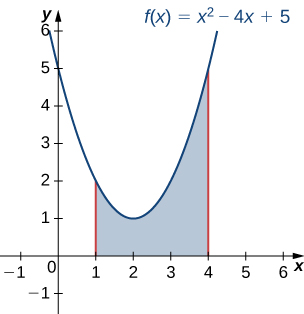{: #CNX_Calc_Figure_06_02_006}

Next, revolve the region around the *x*-axis, as shown in the following figure.

 and (b), of the solid of revolution produced by revolving the region in [link] about the x-axis."){: #CNX_Calc_Figure_06_02_007}

Since the solid was formed by revolving the region around the <math xmlns="http://www.w3.org/1998/Math/MathML"><mrow><mi>x</mi><mtext>-axis,</mtext></mrow></math>

 the cross-sections are circles (step 1). The area of the cross-section, then, is the area of a circle, and the radius of the circle is given by <math xmlns="http://www.w3.org/1998/Math/MathML"><mrow><mi>f</mi><mrow><mo>(</mo><mi>x</mi><mo>)</mo></mrow><mo>.</mo></mrow></math>

 Use the formula for the area of the circle:

<math xmlns="http://www.w3.org/1998/Math/MathML"><mrow><mi>A</mi><mrow><mo>(</mo><mi>x</mi><mo>)</mo></mrow><mo>=</mo><mi>π</mi><msup><mi>r</mi><mn>2</mn></msup><mo>=</mo><mi>π</mi><msup><mrow><mrow><mo>[</mo><mrow><mi>f</mi><mrow><mo>(</mo><mi>x</mi><mo>)</mo></mrow></mrow><mo>]</mo></mrow></mrow><mn>2</mn></msup><mo>=</mo><mi>π</mi><msup><mrow><mrow><mo>(</mo><mrow><msup><mi>x</mi><mn>2</mn></msup><mo>−</mo><mn>4</mn><mi>x</mi><mo>+</mo><mn>5</mn></mrow><mo>)</mo></mrow></mrow><mn>2</mn></msup><mspace width="0.2em" /><mtext>(step 2)</mtext><mo>.</mo></mrow></math>

The volume, then, is (step 3)

<math xmlns="http://www.w3.org/1998/Math/MathML"><mtable><mtr><mtd columnalign="right"><mi>V</mi></mtd><mtd columnalign="left"><mo>=</mo><mstyle displaystyle="true"><mrow><munderover><mo stretchy="false">∫</mo><mi>a</mi><mi>h</mi></munderover><mrow><mi>A</mi><mrow><mo>(</mo><mi>x</mi><mo>)</mo></mrow></mrow></mrow></mstyle><mi>d</mi><mi>x</mi></mtd></mtr><mtr><mtd /><mtd columnalign="left"><mo>=</mo><mstyle displaystyle="true"><mrow><msubsup><mo stretchy="false">∫</mo><mn>1</mn><mn>4</mn></msubsup><mrow><mi>π</mi><msup><mrow><mrow><mo>(</mo><mrow><msup><mi>x</mi><mn>2</mn></msup><mo>−</mo><mn>4</mn><mi>x</mi><mo>+</mo><mn>5</mn></mrow><mo>)</mo></mrow></mrow><mn>2</mn></msup></mrow></mrow></mstyle><mi>d</mi><mi>x</mi><mo>=</mo><mi>π</mi><mstyle displaystyle="true"><mrow><msubsup><mo stretchy="false">∫</mo><mn>1</mn><mn>4</mn></msubsup><mrow><mrow><mo>(</mo><mrow><msup><mi>x</mi><mn>4</mn></msup><mo>−</mo><mn>8</mn><msup><mi>x</mi><mn>3</mn></msup><mo>+</mo><mn>26</mn><msup><mi>x</mi><mn>2</mn></msup><mo>−</mo><mn>40</mn><mi>x</mi><mo>+</mo><mn>25</mn></mrow><mo>)</mo></mrow></mrow></mrow></mstyle><mi>d</mi><mi>x</mi></mtd></mtr><mtr><mtd /><mtd columnalign="left"><mo>=</mo><msubsup><mrow><mrow><mi>π</mi><mrow><mo>(</mo><mrow><mfrac><mrow><msup><mi>x</mi><mn>5</mn></msup></mrow><mn>5</mn></mfrac><mo>−</mo><mn>2</mn><msup><mi>x</mi><mn>4</mn></msup><mo>+</mo><mfrac><mrow><mn>26</mn><msup><mi>x</mi><mn>3</mn></msup></mrow><mn>3</mn></mfrac><mo>−</mo><mn>20</mn><msup><mi>x</mi><mn>2</mn></msup><mo>+</mo><mn>25</mn><mi>x</mi></mrow><mo>)</mo></mrow></mrow><mo>\|</mo></mrow><mn>1</mn><mn>4</mn></msubsup><mo>=</mo><mfrac><mrow><mn>78</mn></mrow><mn>5</mn></mfrac><mi>π</mi><mo>.</mo></mtd></mtr></mtable></math>

The volume is <math xmlns="http://www.w3.org/1998/Math/MathML"><mrow><mn>78</mn><mi>π</mi><mtext>/</mtext><mn>5</mn><mo>.</mo></mrow></math>

Use the method of slicing to find the volume of the solid of revolution formed by revolving the region between the graph of the function <math xmlns="http://www.w3.org/1998/Math/MathML"><mrow><mi>f</mi><mrow><mo>(</mo><mi>x</mi><mo>)</mo></mrow><mo>=</mo><mn>1</mn><mtext>/</mtext><mi>x</mi></mrow></math>

 and the <math xmlns="http://www.w3.org/1998/Math/MathML"><mrow><mi>x</mi><mtext>-axis</mtext></mrow></math>

 over the interval <math xmlns="http://www.w3.org/1998/Math/MathML"><mrow><mrow><mo>[</mo><mrow><mn>1</mn><mo>,</mo><mn>2</mn></mrow><mo>]</mo></mrow></mrow></math>

 around the <math xmlns="http://www.w3.org/1998/Math/MathML"><mrow><mi>x</mi><mtext>-axis</mtext><mtext>.</mtext></mrow></math>

 See the following figure.

<math xmlns="http://www.w3.org/1998/Math/MathML"><mrow><mfrac><mi>π</mi><mn>2</mn></mfrac></mrow></math>

Hint

Use the problem-solving strategy presented earlier and follow [[link]](#fs-id1167794046315) to help with step 2.

### The Disk Method

When we use the slicing method with solids of revolution, it is often called the **disk method**{: data-type="term"} because, for solids of revolution, the slices used to over approximate the volume of the solid are disks. To see this, consider the solid of revolution generated by revolving the region between the graph of the function <math xmlns="http://www.w3.org/1998/Math/MathML"><mrow><mi>f</mi><mrow><mo>(</mo><mi>x</mi><mo>)</mo></mrow><mo>=</mo><msup><mrow><mrow><mo>(</mo><mrow><mi>x</mi><mo>−</mo><mn>1</mn></mrow><mo>)</mo></mrow></mrow><mn>2</mn></msup><mo>+</mo><mn>1</mn></mrow></math>

 and the <math xmlns="http://www.w3.org/1998/Math/MathML"><mrow><mi>x</mi><mtext>-axis</mtext></mrow></math>

 over the interval <math xmlns="http://www.w3.org/1998/Math/MathML"><mrow><mrow><mo>[</mo><mrow><mn>−1</mn><mo>,</mo><mn>3</mn></mrow><mo>]</mo></mrow></mrow></math>

 around the <math xmlns="http://www.w3.org/1998/Math/MathML"><mrow><mi>x</mi><mtext>-axis</mtext><mtext>.</mtext></mrow></math>

 The graph of the function and a representative disk are shown in [\[link\]](#CNX_Calc_Figure_06_02_009)(a) and (b). The region of revolution and the resulting solid are shown in [\[link\]](#CNX_Calc_Figure_06_02_009)(c) and (d).

 ![This figure has four graphs. The first graph, labeled &#x201C;a&#x201D; is a parabola f(x)=(x-1)^2+1. The curve is above the x-axis and intersects the y-axis at y=2. Under the curve in the first quadrant is a vertical rectangle starting at the x-axis and stopping at the curve. The second graph, labeled &#x201C;b&#x201D; is the same parabola as in the first graph. The rectangle under the parabola from the first graph has been rotated around the x-axis forming a solid disk. The third graph labeled &#x201C;c&#x201D; is the same parabola as the first graph. There is a shaded region bounded above by the parabola, to the left by the line x=-1 and to the right by the line x=3, and below by the x-axis. The fourth graph labeled &#x201C;d&#x201D; is the same parabola as the first graph. The region from the third graph has been revolved around the x-axis to form a solid.](../resources/CNX_Calc_Figure_06_02_009.jpg "(a) A thin rectangle for approximating the area under a curve. (b) A representative disk formed by revolving the rectangle about the x-axis. (c) The region under the curve is revolved about the x-axis, resulting in (d) the solid of revolution."){: #CNX_Calc_Figure_06_02_009}

We already used the formal Riemann sum development of the volume formula when we developed the slicing method. We know that

<math xmlns="http://www.w3.org/1998/Math/MathML"><mrow><mi>V</mi><mo>=</mo><mstyle displaystyle="true"><mrow><msubsup><mo stretchy="false">∫</mo><mi>a</mi><mi>b</mi></msubsup><mrow><mi>A</mi><mrow><mo>(</mo><mi>x</mi><mo>)</mo></mrow><mi>d</mi><mi>x</mi></mrow></mrow></mstyle><mo>.</mo></mrow></math>

The only difference with the disk method is that we know the formula for the cross-sectional area ahead of time; it is the area of a circle. This gives the following rule.

Rule: The Disk Method

Let <math xmlns="http://www.w3.org/1998/Math/MathML"><mrow><mi>f</mi><mrow><mo>(</mo><mi>x</mi><mo>)</mo></mrow></mrow></math>

 be continuous and nonnegative. Define <math xmlns="http://www.w3.org/1998/Math/MathML"><mi>R</mi></math>

 as the region bounded above by the graph of <math xmlns="http://www.w3.org/1998/Math/MathML"><mrow><mi>f</mi><mrow><mo>(</mo><mi>x</mi><mo>)</mo></mrow><mo>,</mo></mrow></math>

 below by the <math xmlns="http://www.w3.org/1998/Math/MathML"><mrow><mi>x</mi><mtext>-axis,</mtext></mrow></math>

 on the left by the line <math xmlns="http://www.w3.org/1998/Math/MathML"><mrow><mi>x</mi><mo>=</mo><mi>a</mi><mo>,</mo></mrow></math>

 and on the right by the line <math xmlns="http://www.w3.org/1998/Math/MathML"><mrow><mi>x</mi><mo>=</mo><mi>b</mi><mo>.</mo></mrow></math>

 Then, the volume of the solid of revolution formed by revolving <math xmlns="http://www.w3.org/1998/Math/MathML"><mi>R</mi></math>

 around the <math xmlns="http://www.w3.org/1998/Math/MathML"><mrow><mi>x</mi><mtext>-axis</mtext></mrow></math>

 is given by

<math xmlns="http://www.w3.org/1998/Math/MathML"><mrow><mi>V</mi><mo>=</mo><mstyle displaystyle="true"><mrow><msubsup><mo stretchy="false">∫</mo><mi>a</mi><mi>b</mi></msubsup><mrow><mi>π</mi><msup><mrow><mrow><mo>[</mo><mrow><mi>f</mi><mrow><mo>(</mo><mi>x</mi><mo>)</mo></mrow></mrow><mo>]</mo></mrow></mrow><mn>2</mn></msup><mi>d</mi><mi>x</mi></mrow></mrow></mstyle><mo>.</mo></mrow></math>

The volume of the solid we have been studying ([\[link\]](#CNX_Calc_Figure_06_02_009)) is given by

<math xmlns="http://www.w3.org/1998/Math/MathML"><mtable><mtr><mtd columnalign="right"><mi>V</mi></mtd><mtd columnalign="left"><mo>=</mo><mstyle displaystyle="true"><mrow><msubsup><mo stretchy="false">∫</mo><mi>a</mi><mi>b</mi></msubsup><mrow><mi>π</mi><msup><mrow><mrow><mo>[</mo><mrow><mi>f</mi><mrow><mo>(</mo><mi>x</mi><mo>)</mo></mrow></mrow><mo>]</mo></mrow></mrow><mn>2</mn></msup><mi>d</mi><mi>x</mi></mrow></mrow></mstyle></mtd></mtr><mtr><mtd /><mtd columnalign="left"><mo>=</mo><mstyle displaystyle="true"><mrow><msubsup><mo stretchy="false">∫</mo><mrow><mn>−1</mn></mrow><mn>3</mn></msubsup><mrow><mi>π</mi><msup><mrow><mrow><mo>[</mo><mrow><msup><mrow><mrow><mo>(</mo><mrow><mi>x</mi><mo>−</mo><mn>1</mn></mrow><mo>)</mo></mrow></mrow><mn>2</mn></msup><mo>+</mo><mn>1</mn></mrow><mo>]</mo></mrow></mrow><mn>2</mn></msup><mi>d</mi><mi>x</mi></mrow></mrow></mstyle><mo>=</mo><mi>π</mi><mstyle displaystyle="true"><mrow><msubsup><mo stretchy="false">∫</mo><mrow><mn>−1</mn></mrow><mn>3</mn></msubsup><mrow><msup><mrow><mrow><mo>[</mo><mrow><msup><mrow><mrow><mo>(</mo><mrow><mi>x</mi><mo>−</mo><mn>1</mn></mrow><mo>)</mo></mrow></mrow><mn>4</mn></msup><mo>+</mo><mn>2</mn><msup><mrow><mrow><mo>(</mo><mrow><mi>x</mi><mo>−</mo><mn>1</mn></mrow><mo>)</mo></mrow></mrow><mn>2</mn></msup><mo>+</mo><mn>1</mn></mrow><mo>]</mo></mrow></mrow><mn>2</mn></msup><mi>d</mi><mi>x</mi></mrow></mrow></mstyle></mtd></mtr><mtr><mtd /><mtd columnalign="left"><mo>=</mo><mi>π</mi><msubsup><mrow><mrow><mrow><mo>[</mo><mrow><mfrac><mn>1</mn><mn>5</mn></mfrac><msup><mrow><mrow><mo>(</mo><mrow><mi>x</mi><mo>−</mo><mn>1</mn></mrow><mo>)</mo></mrow></mrow><mn>5</mn></msup><mo>+</mo><mfrac><mn>2</mn><mn>3</mn></mfrac><msup><mrow><mrow><mo>(</mo><mrow><mi>x</mi><mo>−</mo><mn>1</mn></mrow><mo>)</mo></mrow></mrow><mn>3</mn></msup><mo>+</mo><mi>x</mi></mrow><mo>]</mo></mrow></mrow><mspace width="0.2em" /><mo>\|</mo></mrow><mrow><mn>−1</mn></mrow><mn>3</mn></msubsup><mo>=</mo><mi>π</mi><mrow><mo>[</mo><mrow><mrow><mo>(</mo><mrow><mfrac><mrow><mn>32</mn></mrow><mn>5</mn></mfrac><mo>+</mo><mfrac><mrow><mn>16</mn></mrow><mn>3</mn></mfrac><mo>+</mo><mn>3</mn></mrow><mo>)</mo></mrow><mo>−</mo><mrow><mo>(</mo><mrow><mo>−</mo><mfrac><mrow><mn>32</mn></mrow><mn>5</mn></mfrac><mo>−</mo><mfrac><mrow><mn>16</mn></mrow><mn>3</mn></mfrac><mo>−</mo><mn>1</mn></mrow><mo>)</mo></mrow></mrow><mo>]</mo></mrow><mo>=</mo><mfrac><mrow><mn>412</mn><mi>π</mi></mrow><mrow><mn>15</mn></mrow></mfrac><mspace width="0.2em" /><msup><mtext>units</mtext><mn>3</mn></msup><mo>.</mo></mtd></mtr></mtable></math>

Let’s look at some examples.

Using the Disk Method to Find the Volume of a Solid of Revolution 1

Use the disk method to find the volume of the solid of revolution generated by rotating the region between the graph of <math xmlns="http://www.w3.org/1998/Math/MathML"><mrow><mi>f</mi><mrow><mo>(</mo><mi>x</mi><mo>)</mo></mrow><mo>=</mo><msqrt><mi>x</mi></msqrt></mrow></math>

 and the <math xmlns="http://www.w3.org/1998/Math/MathML"><mrow><mi>x</mi><mtext>-axis</mtext></mrow></math>

 over the interval <math xmlns="http://www.w3.org/1998/Math/MathML"><mrow><mrow><mo>[</mo><mrow><mn>1</mn><mo>,</mo><mn>4</mn></mrow><mo>]</mo></mrow></mrow></math>

 around the <math xmlns="http://www.w3.org/1998/Math/MathML"><mrow><mi>x</mi><mtext>-axis</mtext><mtext>.</mtext></mrow></math>

The graphs of the function and the solid of revolution are shown in the following figure.

 The function f(x)=x over the interval [1,4]. (b) The solid of revolution obtained by revolving the region under the graph of f(x) about the x-axis."){: #CNX_Calc_Figure_06_02_010}

We have

<math xmlns="http://www.w3.org/1998/Math/MathML"><mtable><mtr><mtd columnalign="right"><mi>V</mi></mtd><mtd columnalign="left"><mo>=</mo><mstyle displaystyle="true"><mrow><msubsup><mo stretchy="false">∫</mo><mi>a</mi><mi>b</mi></msubsup><mrow><mi>π</mi><msup><mrow><mrow><mo>[</mo><mrow><mi>f</mi><mrow><mo>(</mo><mi>x</mi><mo>)</mo></mrow></mrow><mo>]</mo></mrow></mrow><mn>2</mn></msup><mi>d</mi><mi>x</mi></mrow></mrow></mstyle></mtd></mtr><mtr><mtd /><mtd columnalign="left"><mo>=</mo><mstyle displaystyle="true"><mrow><msubsup><mo stretchy="false">∫</mo><mn>1</mn><mn>4</mn></msubsup><mrow><mi>π</mi><mrow><msup><mrow><mo>[</mo><mrow><msqrt><mi>x</mi></msqrt></mrow><mo>]</mo></mrow><mn>2</mn></msup></mrow></mrow></mrow></mstyle><mi>d</mi><mi>x</mi><mo>=</mo><mi>π</mi><mstyle displaystyle="true"><mrow><msubsup><mo stretchy="false">∫</mo><mn>1</mn><mn>4</mn></msubsup><mrow><mi>x</mi><mspace width="0.2em" /><mi>d</mi><mi>x</mi></mrow></mrow></mstyle></mtd></mtr><mtr><mtd /><mtd columnalign="left"><mo>=</mo><msubsup><mrow><mrow><mfrac><mi>π</mi><mn>2</mn></mfrac><msup><mi>x</mi><mn>2</mn></msup></mrow><mo>\|</mo></mrow><mn>1</mn><mn>4</mn></msubsup><mo>=</mo><mfrac><mrow><mn>15</mn><mi>π</mi></mrow><mn>2</mn></mfrac><mo>.</mo></mtd></mtr></mtable></math>

The volume is <math xmlns="http://www.w3.org/1998/Math/MathML"><mrow><mrow><mo>(</mo><mrow><mn>15</mn><mi>π</mi></mrow><mo>)</mo></mrow><mtext>/</mtext><mn>2</mn></mrow></math>

 units3.

Use the disk method to find the volume of the solid of revolution generated by rotating the region between the graph of <math xmlns="http://www.w3.org/1998/Math/MathML"><mrow><mi>f</mi><mrow><mo>(</mo><mi>x</mi><mo>)</mo></mrow><mo>=</mo><msqrt><mrow><mn>4</mn><mo>−</mo><mi>x</mi></mrow></msqrt></mrow></math>

 and the <math xmlns="http://www.w3.org/1998/Math/MathML"><mrow><mi>x</mi><mtext>-axis</mtext></mrow></math>

 over the interval <math xmlns="http://www.w3.org/1998/Math/MathML"><mrow><mrow><mo>[</mo><mrow><mn>0</mn><mo>,</mo><mspace width="0.2em" /><mn>4</mn></mrow><mo>]</mo></mrow></mrow></math>

 around the <math xmlns="http://www.w3.org/1998/Math/MathML"><mrow><mi>x</mi><mtext>-axis</mtext><mtext>.</mtext></mrow></math>

<math xmlns="http://www.w3.org/1998/Math/MathML"><mrow><mn>8</mn><mi>π</mi></mrow></math>

 units3

Hint

Use the procedure from [[link]](#fs-id1167793956465).

So far, our examples have all concerned regions revolved around the <math xmlns="http://www.w3.org/1998/Math/MathML"><mrow><mi>x</mi><mtext>-axis,</mtext></mrow></math>

 but we can generate a solid of revolution by revolving a plane region around any horizontal or vertical line. In the next example, we look at a solid of revolution that has been generated by revolving a region around the <math xmlns="http://www.w3.org/1998/Math/MathML"><mrow><mi>y</mi><mtext>-axis</mtext><mtext>.</mtext></mrow></math>

 The mechanics of the disk method are nearly the same as when the <math xmlns="http://www.w3.org/1998/Math/MathML"><mrow><mi>x</mi><mtext>-axis</mtext></mrow></math>

 is the axis of revolution, but we express the function in terms of <math xmlns="http://www.w3.org/1998/Math/MathML"><mi>y</mi></math>

 and we integrate with respect to *y* as well. This is summarized in the following rule.

Rule: The Disk Method for Solids of Revolution around the *y*-axis

Let <math xmlns="http://www.w3.org/1998/Math/MathML"><mrow><mi>g</mi><mrow><mo>(</mo><mi>y</mi><mo>)</mo></mrow></mrow></math>

 be continuous and nonnegative. Define <math xmlns="http://www.w3.org/1998/Math/MathML"><mi>Q</mi></math>

 as the region bounded on the right by the graph of <math xmlns="http://www.w3.org/1998/Math/MathML"><mrow><mi>g</mi><mrow><mo>(</mo><mi>y</mi><mo>)</mo></mrow><mo>,</mo></mrow></math>

 on the left by the <math xmlns="http://www.w3.org/1998/Math/MathML"><mrow><mi>y</mi><mtext>-axis,</mtext></mrow></math>

 below by the line <math xmlns="http://www.w3.org/1998/Math/MathML"><mrow><mi>y</mi><mo>=</mo><mi>c</mi><mo>,</mo></mrow></math>

 and above by the line <math xmlns="http://www.w3.org/1998/Math/MathML"><mrow><mi>y</mi><mo>=</mo><mi>d</mi><mo>.</mo></mrow></math>

 Then, the volume of the solid of revolution formed by revolving <math xmlns="http://www.w3.org/1998/Math/MathML"><mi>Q</mi></math>

 around the <math xmlns="http://www.w3.org/1998/Math/MathML"><mrow><mi>y</mi><mtext>-axis</mtext></mrow></math>

 is given by

<math xmlns="http://www.w3.org/1998/Math/MathML"><mrow><mi>V</mi><mo>=</mo><mstyle displaystyle="true"><mrow><msubsup><mo stretchy="false">∫</mo><mi>c</mi><mi>d</mi></msubsup><mrow><mi>π</mi><msup><mrow><mrow><mo>[</mo><mrow><mi>g</mi><mrow><mo>(</mo><mi>y</mi><mo>)</mo></mrow></mrow><mo>]</mo></mrow></mrow><mn>2</mn></msup><mi>d</mi><mi>y</mi></mrow></mrow></mstyle><mo>.</mo></mrow></math>

The next example shows how this rule works in practice.

Using the Disk Method to Find the Volume of a Solid of Revolution 2

Let <math xmlns="http://www.w3.org/1998/Math/MathML"><mi>R</mi></math>

 be the region bounded by the graph of <math xmlns="http://www.w3.org/1998/Math/MathML"><mrow><mi>g</mi><mrow><mo>(</mo><mi>y</mi><mo>)</mo></mrow><mo>=</mo><msqrt><mrow><mn>4</mn><mo>−</mo><mi>y</mi></mrow></msqrt></mrow></math>

 and the <math xmlns="http://www.w3.org/1998/Math/MathML"><mrow><mi>y</mi><mtext>-axis</mtext></mrow></math>

 over the <math xmlns="http://www.w3.org/1998/Math/MathML"><mrow><mi>y</mi><mtext>-axis</mtext></mrow></math>

 interval <math xmlns="http://www.w3.org/1998/Math/MathML"><mrow><mrow><mo>[</mo><mrow><mn>0</mn><mo>,</mo><mn>4</mn></mrow><mo>]</mo></mrow><mo>.</mo></mrow></math>

 Use the disk method to find the volume of the solid of revolution generated by rotating <math xmlns="http://www.w3.org/1998/Math/MathML"><mi>R</mi></math>

 around the <math xmlns="http://www.w3.org/1998/Math/MathML"><mrow><mi>y</mi><mtext>-axis</mtext><mtext>.</mtext></mrow></math>

[[link]](#CNX_Calc_Figure_06_02_011) shows the function and a representative disk that can be used to estimate the volume. Notice that since we are revolving the function around the <math xmlns="http://www.w3.org/1998/Math/MathML"><mrow><mi>y</mi><mtext>-axis,</mtext></mrow></math>

 the disks are horizontal, rather than vertical.

 Shown is a thin rectangle between the curve of the function g(y)=4&#x2212;y and the y-axis. (b) The rectangle forms a representative disk after revolution around the y-axis."){: #CNX_Calc_Figure_06_02_011}

The region to be revolved and the full solid of revolution are depicted in the following figure.

 The region to the left of the function g(y)=4&#x2212;y over the y-axis interval [0,4]. (b) The solid of revolution formed by revolving the region about the y-axis."){: #CNX_Calc_Figure_06_02_012}

To find the volume, we integrate with respect to <math xmlns="http://www.w3.org/1998/Math/MathML"><mrow><mi>y</mi><mo>.</mo></mrow></math>

 We obtain

<math xmlns="http://www.w3.org/1998/Math/MathML"><mtable><mtr><mtd columnalign="right"><mi>V</mi></mtd><mtd columnalign="left"><mo>=</mo><mstyle displaystyle="true"><mrow><msubsup><mo stretchy="false">∫</mo><mi>c</mi><mi>d</mi></msubsup><mi>π</mi></mrow></mstyle><msup><mrow><mo>[</mo><mrow><mi>g</mi><mrow><mo>(</mo><mi>y</mi><mo>)</mo></mrow></mrow><mo>]</mo></mrow><mn>2</mn></msup><mi>d</mi><mi>y</mi></mtd></mtr><mtr><mtd /><mtd columnalign="left"><mo>=</mo><mstyle displaystyle="true"><mrow><msubsup><mo stretchy="false">∫</mo><mn>0</mn><mn>4</mn></msubsup><mi>π</mi></mrow></mstyle><msup><mrow><mo>[</mo><mrow><msqrt><mrow><mn>4</mn><mo>−</mo><mi>y</mi></mrow></msqrt></mrow><mo>]</mo></mrow><mn>2</mn></msup><mi>d</mi><mi>y</mi><mo>=</mo><mi>π</mi><mstyle displaystyle="true"><mrow><msubsup><mo stretchy="false">∫</mo><mn>0</mn><mn>4</mn></msubsup><mrow><mrow><mo>(</mo><mrow><mn>4</mn><mo>−</mo><mi>y</mi></mrow><mo>)</mo></mrow></mrow></mrow></mstyle><mi>d</mi><mi>y</mi></mtd></mtr><mtr><mtd /><mtd columnalign="left"><mo>=</mo><msubsup><mrow><mrow><mi>π</mi><mrow><mo>[</mo><mrow><mn>4</mn><mi>y</mi><mo>−</mo><mfrac><mrow><msup><mi>y</mi><mn>2</mn></msup></mrow><mn>2</mn></mfrac></mrow><mo>]</mo></mrow></mrow><mspace width="0.2em" /><mo>\|</mo></mrow><mn>0</mn><mn>4</mn></msubsup><mo>=</mo><mn>8</mn><mi>π</mi><mo>.</mo></mtd></mtr></mtable></math>

The volume is <math xmlns="http://www.w3.org/1998/Math/MathML"><mrow><mn>8</mn><mi>π</mi></mrow></math>

 units3.

Use the disk method to find the volume of the solid of revolution generated by rotating the region between the graph of <math xmlns="http://www.w3.org/1998/Math/MathML"><mrow><mi>g</mi><mrow><mo>(</mo><mi>y</mi><mo>)</mo></mrow><mo>=</mo><mi>y</mi></mrow></math>

 and the <math xmlns="http://www.w3.org/1998/Math/MathML"><mrow><mi>y</mi><mtext>-axis</mtext></mrow></math>

 over the interval <math xmlns="http://www.w3.org/1998/Math/MathML"><mrow><mrow><mo>[</mo><mrow><mn>1</mn><mo>,</mo><mn>4</mn></mrow><mo>]</mo></mrow></mrow></math>

 around the <math xmlns="http://www.w3.org/1998/Math/MathML"><mrow><mi>y</mi><mtext>-axis</mtext><mtext>.</mtext></mrow></math>

<math xmlns="http://www.w3.org/1998/Math/MathML"><mrow><mn>21</mn><mi>π</mi></mrow></math>

 units3

Hint

Use the procedure from [[link]](#fs-id1167793271607).

### The Washer Method

Some solids of revolution have cavities in the middle; they are not solid all the way to the axis of revolution. Sometimes, this is just a result of the way the region of revolution is shaped with respect to the axis of revolution. In other cases, cavities arise when the region of revolution is defined as the region between the graphs of two functions. A third way this can happen is when an axis of revolution other than the <math xmlns="http://www.w3.org/1998/Math/MathML"><mrow><mi>x</mi><mtext>-axis</mtext></mrow></math>

 or <math xmlns="http://www.w3.org/1998/Math/MathML"><mrow><mi>y</mi><mtext>-axis</mtext></mrow></math>

 is selected.

When the solid of revolution has a cavity in the middle, the slices used to approximate the volume are not disks, but washers (disks with holes in the center). For example, consider the region bounded above by the graph of the function <math xmlns="http://www.w3.org/1998/Math/MathML"><mrow><mi>f</mi><mrow><mo>(</mo><mi>x</mi><mo>)</mo></mrow><mo>=</mo><msqrt><mi>x</mi></msqrt></mrow></math>

 and below by the graph of the function <math xmlns="http://www.w3.org/1998/Math/MathML"><mrow><mi>g</mi><mrow><mo>(</mo><mi>x</mi><mo>)</mo></mrow><mo>=</mo><mn>1</mn></mrow></math>

 over the interval <math xmlns="http://www.w3.org/1998/Math/MathML"><mrow><mrow><mo>[</mo><mrow><mn>1</mn><mo>,</mo><mn>4</mn></mrow><mo>]</mo></mrow><mo>.</mo></mrow></math>

 When this region is revolved around the <math xmlns="http://www.w3.org/1998/Math/MathML"><mrow><mi>x</mi><mtext>-axis,</mtext></mrow></math>

 the result is a solid with a cavity in the middle, and the slices are washers. The graph of the function and a representative washer are shown in [\[link\]](#CNX_Calc_Figure_06_02_013)(a) and (b). The region of revolution and the resulting solid are shown in [\[link\]](#CNX_Calc_Figure_06_02_013)(c) and (d).

 ![This figure has four graphs. The first graph is labeled &#x201C;a&#x201D; and has the two functions f(x)=squareroot(x) and g(x)=1 graphed in the first quadrant. f(x) is an increasing curve starting at the origin and g(x) is a horizontal line at y=1. The curves intersect at the ordered pair (1,1). In between the curves is a shaded rectangle with the bottom on g(x) and the top at f(x). The second graph labeled &#x201C;b&#x201D; is the same two curves as the first graph. The shaded rectangle between the curves from the first graph has been rotated around the x-axis to form an open disk or washer. The third graph labeled &#x201C;a&#x201D; has the same two curves as the first graph. There is a shaded region between the two curves between where they intersect and a line at x=4. The fourth graph is the same two curves as the first with the region from the third graph rotated around the x-axis forming a solid region with a hollow center. The hollow center is represented on the graph with broken horizontal lines at y=1 and y=-1.](../resources/CNX_Calc_Figure_06_02_013.jpg "(a) A thin rectangle in the region between two curves. (b) A representative disk formed by revolving the rectangle about the x-axis. (c) The region between the curves over the given interval. (d) The resulting solid of revolution."){: #CNX_Calc_Figure_06_02_013}

The cross-sectional area, then, is the area of the outer circle less the area of the inner circle. In this case,

<math xmlns="http://www.w3.org/1998/Math/MathML"><mrow><mi>A</mi><mrow><mo>(</mo><mi>x</mi><mo>)</mo></mrow><mo>=</mo><mi>π</mi><msup><mrow><mrow><mo>(</mo><mrow><msqrt><mi>x</mi></msqrt></mrow><mo>)</mo></mrow></mrow><mn>2</mn></msup><mo>−</mo><mi>π</mi><msup><mrow><mrow><mo>(</mo><mn>1</mn><mo>)</mo></mrow></mrow><mn>2</mn></msup><mo>=</mo><mi>π</mi><mrow><mo>(</mo><mrow><mi>x</mi><mo>−</mo><mn>1</mn></mrow><mo>)</mo></mrow><mo>.</mo></mrow></math>

Then the volume of the solid is

<math xmlns="http://www.w3.org/1998/Math/MathML"><mtable><mtr><mtd columnalign="right"><mi>V</mi></mtd><mtd columnalign="left"><mo>=</mo><mstyle displaystyle="true"><mrow><msubsup><mo stretchy="false">∫</mo><mi>a</mi><mi>b</mi></msubsup><mrow><mi>A</mi><mrow><mo>(</mo><mi>x</mi><mo>)</mo></mrow></mrow></mrow></mstyle><mi>d</mi><mi>x</mi></mtd></mtr><mtr><mtd /><mtd columnalign="left"><mo>=</mo><mstyle displaystyle="true"><mrow><msubsup><mo stretchy="false">∫</mo><mn>1</mn><mn>4</mn></msubsup><mi>π</mi></mrow></mstyle><mrow><mo>(</mo><mrow><mi>x</mi><mo>−</mo><mn>1</mn></mrow><mo>)</mo></mrow><mi>d</mi><mi>x</mi><mo>=</mo><msubsup><mrow><mrow><mi>π</mi><mrow><mo>[</mo><mrow><mfrac><mrow><msup><mi>x</mi><mn>2</mn></msup></mrow><mn>2</mn></mfrac><mo>−</mo><mi>x</mi></mrow><mo>]</mo></mrow></mrow><mspace width="0.2em" /><mo>\|</mo></mrow><mn>1</mn><mn>4</mn></msubsup><mo>=</mo><mfrac><mn>9</mn><mn>2</mn></mfrac><mi>π</mi><mspace width="0.2em" /><msup><mtext>units</mtext><mn>3</mn></msup><mo>.</mo></mtd></mtr></mtable></math>

Generalizing this process gives the **washer method**{: data-type="term"}.

Rule: The Washer Method

Suppose <math xmlns="http://www.w3.org/1998/Math/MathML"><mrow><mi>f</mi><mrow><mo>(</mo><mi>x</mi><mo>)</mo></mrow></mrow></math>

 and <math xmlns="http://www.w3.org/1998/Math/MathML"><mrow><mi>g</mi><mrow><mo>(</mo><mi>x</mi><mo>)</mo></mrow></mrow></math>

 are continuous, nonnegative functions such that <math xmlns="http://www.w3.org/1998/Math/MathML"><mrow><mi>f</mi><mrow><mo>(</mo><mi>x</mi><mo>)</mo></mrow><mo>≥</mo><mi>g</mi><mrow><mo>(</mo><mi>x</mi><mo>)</mo></mrow></mrow></math>

 over <math xmlns="http://www.w3.org/1998/Math/MathML"><mrow><mrow><mo>[</mo><mrow><mi>a</mi><mo>,</mo><mi>b</mi></mrow><mo>]</mo></mrow><mo>.</mo></mrow></math>

 Let <math xmlns="http://www.w3.org/1998/Math/MathML"><mi>R</mi></math>

 denote the region bounded above by the graph of <math xmlns="http://www.w3.org/1998/Math/MathML"><mrow><mi>f</mi><mrow><mo>(</mo><mi>x</mi><mo>)</mo></mrow><mo>,</mo></mrow></math>

 below by the graph of <math xmlns="http://www.w3.org/1998/Math/MathML"><mrow><mi>g</mi><mrow><mo>(</mo><mi>x</mi><mo>)</mo></mrow><mo>,</mo></mrow></math>

 on the left by the line <math xmlns="http://www.w3.org/1998/Math/MathML"><mrow><mi>x</mi><mo>=</mo><mi>a</mi><mo>,</mo></mrow></math>

 and on the right by the line <math xmlns="http://www.w3.org/1998/Math/MathML"><mrow><mi>x</mi><mo>=</mo><mi>b</mi><mo>.</mo></mrow></math>

 Then, the volume of the solid of revolution formed by revolving <math xmlns="http://www.w3.org/1998/Math/MathML"><mi>R</mi></math>

 around the <math xmlns="http://www.w3.org/1998/Math/MathML"><mrow><mi>x</mi><mtext>-axis</mtext></mrow></math>

 is given by

<math xmlns="http://www.w3.org/1998/Math/MathML"><mrow><mi>V</mi><mo>=</mo><mstyle displaystyle="true"><mrow><msubsup><mo stretchy="false">∫</mo><mi>a</mi><mi>b</mi></msubsup><mrow><mi>π</mi><mrow><mo>[</mo><mrow><msup><mrow><mrow><mo>(</mo><mrow><mi>f</mi><mrow><mo>(</mo><mi>x</mi><mo>)</mo></mrow></mrow><mo>)</mo></mrow></mrow><mn>2</mn></msup><mo>−</mo><msup><mrow><mrow><mo>(</mo><mrow><mi>g</mi><mrow><mo>(</mo><mi>x</mi><mo>)</mo></mrow></mrow><mo>)</mo></mrow></mrow><mn>2</mn></msup></mrow><mo>]</mo></mrow></mrow></mrow></mstyle><mi>d</mi><mi>x</mi><mo>.</mo></mrow></math>

Using the Washer Method

Find the volume of a solid of revolution formed by revolving the region bounded above by the graph of <math xmlns="http://www.w3.org/1998/Math/MathML"><mrow><mi>f</mi><mrow><mo>(</mo><mi>x</mi><mo>)</mo></mrow><mo>=</mo><mi>x</mi></mrow></math>

 and below by the graph of <math xmlns="http://www.w3.org/1998/Math/MathML"><mrow><mi>g</mi><mrow><mo>(</mo><mi>x</mi><mo>)</mo></mrow><mo>=</mo><mn>1</mn><mtext>/</mtext><mi>x</mi></mrow></math>

 over the interval <math xmlns="http://www.w3.org/1998/Math/MathML"><mrow><mrow><mo>[</mo><mrow><mn>1</mn><mo>,</mo><mn>4</mn></mrow><mo>]</mo></mrow></mrow></math>

 around the <math xmlns="http://www.w3.org/1998/Math/MathML"><mrow><mi>x</mi><mtext>-axis</mtext><mtext>.</mtext></mrow></math>

The graphs of the functions and the solid of revolution are shown in the following figure.

![This figure has two graphs. The first graph is labeled &#x201C;a&#x201D; and has the two curves f(x)=x and g(x)=1/x. They are graphed only in the first quadrant. f(x) is a diagonal line starting at the origin and g(x) is a decreasing curve with the y-axis as a vertical asymptote and the x-axis as a horizontal asymptote. The graphs intersect at (1,1). There is a shaded region between the graphs, bounded to the right by a line at x=4. The second graph is the same two curves. There is a solid formed by rotating the shaded region from the first graph around the x-axis.](../resources/CNX_Calc_Figure_06_02_014.jpg "(a) The region between the graphs of the functions f(x)=x and g(x)=1/x over the interval [1,4]. (b) Revolving the region about the x-axis generates a solid of revolution with a cavity in the middle."){: #CNX_Calc_Figure_06_02_014}

We have

<math xmlns="http://www.w3.org/1998/Math/MathML"><mtable><mtr><mtd columnalign="right"><mi>V</mi></mtd><mtd columnalign="left"><mo>=</mo><mstyle displaystyle="true"><mrow><msubsup><mo stretchy="false">∫</mo><mi>a</mi><mi>b</mi></msubsup><mrow><mi>π</mi><mrow><mo>[</mo><mrow><msup><mrow><mrow><mo>(</mo><mrow><mi>f</mi><mrow><mo>(</mo><mi>x</mi><mo>)</mo></mrow></mrow><mo>)</mo></mrow></mrow><mn>2</mn></msup><mo>−</mo><msup><mrow><mrow><mo>(</mo><mrow><mi>g</mi><mrow><mo>(</mo><mi>x</mi><mo>)</mo></mrow></mrow><mo>)</mo></mrow></mrow><mn>2</mn></msup></mrow><mo>]</mo></mrow></mrow></mrow></mstyle><mi>d</mi><mi>x</mi></mtd></mtr><mtr><mtd /><mtd columnalign="left"><mo>=</mo><mi>π</mi><mstyle displaystyle="true"><mrow><msubsup><mo stretchy="false">∫</mo><mn>1</mn><mn>4</mn></msubsup><mrow><mrow><mo>[</mo><mrow><msup><mi>x</mi><mn>2</mn></msup><mo>−</mo><msup><mrow><mrow><mo>(</mo><mrow><mfrac><mn>1</mn><mi>x</mi></mfrac></mrow><mo>)</mo></mrow></mrow><mn>2</mn></msup></mrow><mo>]</mo></mrow><mi>d</mi><mi>x</mi></mrow></mrow></mstyle><mspace width="0.2em" /><mtext /><mspace width="0.2em" /><mo>=</mo><msubsup><mrow><mrow><mi>π</mi><mrow><mo>[</mo><mrow><mfrac><mrow><msup><mi>x</mi><mn>3</mn></msup></mrow><mn>3</mn></mfrac><mo>+</mo><mfrac><mn>1</mn><mi>x</mi></mfrac></mrow><mo>]</mo></mrow></mrow><mspace width="0.2em" /><mo>\|</mo></mrow><mn>1</mn><mn>4</mn></msubsup><mo>=</mo><mfrac><mrow><mn>81</mn><mi>π</mi></mrow><mn>4</mn></mfrac><mspace width="0.2em" /><msup><mtext>units</mtext><mn>3</mn></msup><mo>.</mo></mtd></mtr></mtable></math>

Find the volume of a solid of revolution formed by revolving the region bounded by the graphs of <math xmlns="http://www.w3.org/1998/Math/MathML"><mrow><mi>f</mi><mrow><mo>(</mo><mi>x</mi><mo>)</mo></mrow><mo>=</mo><msqrt><mi>x</mi></msqrt></mrow></math>

 and <math xmlns="http://www.w3.org/1998/Math/MathML"><mrow><mi>g</mi><mrow><mo>(</mo><mi>x</mi><mo>)</mo></mrow><mo>=</mo><mn>1</mn><mtext>/</mtext><mi>x</mi></mrow></math>

 over the interval <math xmlns="http://www.w3.org/1998/Math/MathML"><mrow><mrow><mo>[</mo><mrow><mn>1</mn><mo>,</mo><mn>3</mn></mrow><mo>]</mo></mrow></mrow></math>

 around the <math xmlns="http://www.w3.org/1998/Math/MathML"><mrow><mi>x</mi><mtext>-axis</mtext><mtext>.</mtext></mrow></math>

<math xmlns="http://www.w3.org/1998/Math/MathML"><mrow><mfrac><mrow><mn>10</mn><mi>π</mi></mrow><mn>3</mn></mfrac></mrow></math>

 units3

Hint

Graph the functions to determine which graph forms the upper bound and which graph forms the lower bound, then use the procedure from [[link]](#fs-id1167794209450).

As with the disk method, we can also apply the washer method to solids of revolution that result from revolving a region around the *y*-axis. In this case, the following rule applies.

Rule: The Washer Method for Solids of Revolution around the *y*-axis

Suppose <math xmlns="http://www.w3.org/1998/Math/MathML"><mrow><mi>u</mi><mrow><mo>(</mo><mi>y</mi><mo>)</mo></mrow></mrow></math>

 and <math xmlns="http://www.w3.org/1998/Math/MathML"><mrow><mi>v</mi><mrow><mo>(</mo><mi>y</mi><mo>)</mo></mrow></mrow></math>

 are continuous, nonnegative functions such that <math xmlns="http://www.w3.org/1998/Math/MathML"><mrow><mi>v</mi><mrow><mo>(</mo><mi>y</mi><mo>)</mo></mrow><mo>≤</mo><mi>u</mi><mrow><mo>(</mo><mi>y</mi><mo>)</mo></mrow></mrow></math>

 for <math xmlns="http://www.w3.org/1998/Math/MathML"><mrow><mi>y</mi><mo>∈</mo><mrow><mo>[</mo><mrow><mi>c</mi><mo>,</mo><mi>d</mi></mrow><mo>]</mo></mrow><mo>.</mo></mrow></math>

 Let <math xmlns="http://www.w3.org/1998/Math/MathML"><mi>Q</mi></math>

 denote the region bounded on the right by the graph of <math xmlns="http://www.w3.org/1998/Math/MathML"><mrow><mi>u</mi><mrow><mo>(</mo><mi>y</mi><mo>)</mo></mrow><mo>,</mo></mrow></math>

 on the left by the graph of <math xmlns="http://www.w3.org/1998/Math/MathML"><mrow><mi>v</mi><mrow><mo>(</mo><mi>y</mi><mo>)</mo></mrow><mo>,</mo></mrow></math>

 below by the line <math xmlns="http://www.w3.org/1998/Math/MathML"><mrow><mi>y</mi><mo>=</mo><mi>c</mi><mo>,</mo></mrow></math>

 and above by the line <math xmlns="http://www.w3.org/1998/Math/MathML"><mrow><mi>y</mi><mo>=</mo><mi>d</mi><mo>.</mo></mrow></math>

 Then, the volume of the solid of revolution formed by revolving <math xmlns="http://www.w3.org/1998/Math/MathML"><mi>Q</mi></math>

 around the <math xmlns="http://www.w3.org/1998/Math/MathML"><mrow><mi>y</mi><mtext>-axis</mtext></mrow></math>

 is given by

<math xmlns="http://www.w3.org/1998/Math/MathML"><mrow><mi>V</mi><mo>=</mo><mstyle displaystyle="true"><mrow><msubsup><mo stretchy="false">∫</mo><mi>c</mi><mi>d</mi></msubsup><mrow><mi>π</mi><mrow><mo>[</mo><mrow><msup><mrow><mrow><mo>(</mo><mrow><mi>u</mi><mrow><mo>(</mo><mi>y</mi><mo>)</mo></mrow></mrow><mo>)</mo></mrow></mrow><mn>2</mn></msup><mo>−</mo><msup><mrow><mrow><mo>(</mo><mrow><mi>v</mi><mrow><mo>(</mo><mi>y</mi><mo>)</mo></mrow></mrow><mo>)</mo></mrow></mrow><mn>2</mn></msup></mrow><mo>]</mo></mrow></mrow></mrow></mstyle><mi>d</mi><mi>y</mi><mo>.</mo></mrow></math>

Rather than looking at an example of the washer method with the <math xmlns="http://www.w3.org/1998/Math/MathML"><mrow><mi>y</mi><mtext>-axis</mtext></mrow></math>

 as the axis of revolution, we now consider an example in which the axis of revolution is a line other than one of the two coordinate axes. The same general method applies, but you may have to visualize just how to describe the cross-sectional area of the volume.

The Washer Method with a Different Axis of Revolution

Find the volume of a solid of revolution formed by revolving the region bounded above by <math xmlns="http://www.w3.org/1998/Math/MathML"><mrow><mi>f</mi><mrow><mo>(</mo><mi>x</mi><mo>)</mo></mrow><mo>=</mo><mn>4</mn><mo>−</mo><mi>x</mi></mrow></math>

 and below by the <math xmlns="http://www.w3.org/1998/Math/MathML"><mrow><mi>x</mi><mtext>-axis</mtext></mrow></math>

 over the interval <math xmlns="http://www.w3.org/1998/Math/MathML"><mrow><mrow><mo>[</mo><mrow><mn>0</mn><mo>,</mo><mn>4</mn></mrow><mo>]</mo></mrow></mrow></math>

 around the line <math xmlns="http://www.w3.org/1998/Math/MathML"><mrow><mi>y</mi><mo>=</mo><mn>−2</mn><mo>.</mo></mrow></math>

The graph of the region and the solid of revolution are shown in the following figure.

 The region between the graph of the function f(x)=4&#x2212;x and the x-axis over the interval [0,4]. (b) Revolving the region about the line y=&#x2212;2 generates a solid of revolution with a cylindrical hole through its middle."){: #CNX_Calc_Figure_06_02_015}

We can’t apply the volume formula to this problem directly because the axis of revolution is not one of the coordinate axes. However, we still know that the area of the cross-section is the area of the outer circle less the area of the inner circle. Looking at the graph of the function, we see the radius of the outer circle is given by <math xmlns="http://www.w3.org/1998/Math/MathML"><mrow><mi>f</mi><mrow><mo>(</mo><mi>x</mi><mo>)</mo></mrow><mo>+</mo><mn>2</mn><mo>,</mo></mrow></math>

 which simplifies to

<math xmlns="http://www.w3.org/1998/Math/MathML"><mrow><mi>f</mi><mrow><mo>(</mo><mi>x</mi><mo>)</mo></mrow><mo>+</mo><mn>2</mn><mo>=</mo><mrow><mo>(</mo><mrow><mn>4</mn><mo>−</mo><mi>x</mi></mrow><mo>)</mo></mrow><mo>+</mo><mn>2</mn><mo>=</mo><mn>6</mn><mo>−</mo><mi>x</mi><mo>.</mo></mrow></math>

The radius of the inner circle is <math xmlns="http://www.w3.org/1998/Math/MathML"><mrow><mi>g</mi><mrow><mo>(</mo><mi>x</mi><mo>)</mo></mrow><mo>=</mo><mn>2</mn><mo>.</mo></mrow></math>

 Therefore, we have

<math xmlns="http://www.w3.org/1998/Math/MathML"><mtable><mtr><mtd columnalign="right"><mi>V</mi></mtd><mtd columnalign="left"><mo>=</mo><mstyle displaystyle="true"><mrow><msubsup><mo stretchy="false">∫</mo><mn>0</mn><mn>4</mn></msubsup><mrow><mi>π</mi><mrow><mo>[</mo><mrow><msup><mrow><mrow><mo>(</mo><mrow><mn>6</mn><mo>−</mo><mi>x</mi></mrow><mo>)</mo></mrow></mrow><mn>2</mn></msup><mo>−</mo><msup><mrow><mrow><mo>(</mo><mn>2</mn><mo>)</mo></mrow></mrow><mn>2</mn></msup></mrow><mo>]</mo></mrow></mrow></mrow></mstyle><mi>d</mi><mi>x</mi></mtd></mtr><mtr><mtd /><mtd columnalign="left"><mo>=</mo><mi>π</mi><mstyle displaystyle="true"><mrow><msubsup><mo stretchy="false">∫</mo><mn>0</mn><mn>4</mn></msubsup><mrow><mrow><mo>(</mo><mrow><msup><mi>x</mi><mn>2</mn></msup><mo>−</mo><mn>12</mn><mi>x</mi><mo>+</mo><mn>32</mn></mrow><mo>)</mo></mrow><mi>d</mi><mi>x</mi></mrow></mrow></mstyle><mspace width="0.2em" /><mtext /><mspace width="0.2em" /><mo>=</mo><msubsup><mrow><mrow><mi>π</mi><mrow><mo>[</mo><mrow><mfrac><mrow><msup><mi>x</mi><mn>3</mn></msup></mrow><mn>3</mn></mfrac><mo>−</mo><mn>6</mn><msup><mi>x</mi><mn>2</mn></msup><mo>+</mo><mn>32</mn><mi>x</mi></mrow><mo>]</mo></mrow></mrow><mspace width="0.2em" /><mo>\|</mo></mrow><mn>0</mn><mn>4</mn></msubsup><mo>=</mo><mfrac><mrow><mn>160</mn><mi>π</mi></mrow><mn>3</mn></mfrac><mspace width="0.2em" /><msup><mtext>units</mtext><mn>3</mn></msup><mo>.</mo></mtd></mtr></mtable></math>

Find the volume of a solid of revolution formed by revolving the region bounded above by the graph of <math xmlns="http://www.w3.org/1998/Math/MathML"><mrow><mi>f</mi><mrow><mo>(</mo><mi>x</mi><mo>)</mo></mrow><mo>=</mo><mi>x</mi><mo>+</mo><mn>2</mn></mrow></math>

 and below by the <math xmlns="http://www.w3.org/1998/Math/MathML"><mrow><mi>x</mi><mtext>-axis</mtext></mrow></math>

 over the interval <math xmlns="http://www.w3.org/1998/Math/MathML"><mrow><mrow><mo>[</mo><mrow><mn>0</mn><mo>,</mo><mn>3</mn></mrow><mo>]</mo></mrow></mrow></math>

 around the line <math xmlns="http://www.w3.org/1998/Math/MathML"><mrow><mi>y</mi><mo>=</mo><mn>−1</mn><mo>.</mo></mrow></math>

<math xmlns="http://www.w3.org/1998/Math/MathML"><mrow><mn>60</mn><mi>π</mi></mrow></math>

 units3

Hint

Use the procedure from [[link]](#fs-id1167793912719).

### Key Concepts

* Definite integrals can be used to find the volumes of solids. Using the slicing method, we can find a volume by integrating the cross-sectional area.
* For solids of revolution, the volume slices are often disks and the cross-sections are circles. The method of disks involves applying the method of slicing in the particular case in which the cross-sections are circles, and using the formula for the area of a circle.
* If a solid of revolution has a cavity in the center, the volume slices are washers. With the method of washers, the area of the inner circle is subtracted from the area of the outer circle before integrating.
{: data-bullet-style="bullet"}

### Key Equations

* **Disk Method along the *x*-axis**
  * * *
  {: data-type="newline"}
  
  <math xmlns="http://www.w3.org/1998/Math/MathML"><mrow><mi>V</mi><mo>=</mo><mstyle displaystyle="true"><mrow><msubsup><mo stretchy="false">∫</mo><mi>a</mi><mi>b</mi></msubsup><mrow><mi>π</mi><msup><mrow><mrow><mo>[</mo><mrow><mi>f</mi><mrow><mo>(</mo><mi>x</mi><mo>)</mo></mrow></mrow><mo>]</mo></mrow></mrow><mn>2</mn></msup><mi>d</mi><mi>x</mi></mrow></mrow></mstyle></mrow></math>

* **Disk Method along the *y*-axis**
  * * *
  {: data-type="newline"}
  
  <math xmlns="http://www.w3.org/1998/Math/MathML"><mrow><mi>V</mi><mo>=</mo><mstyle displaystyle="true"><mrow><msubsup><mo stretchy="false">∫</mo><mi>c</mi><mi>d</mi></msubsup><mrow><mi>π</mi><msup><mrow><mrow><mo>[</mo><mrow><mi>g</mi><mrow><mo>(</mo><mi>y</mi><mo>)</mo></mrow></mrow><mo>]</mo></mrow></mrow><mn>2</mn></msup><mi>d</mi><mi>y</mi></mrow></mrow></mstyle></mrow></math>

* **Washer Method**
  * * *
  {: data-type="newline"}
  
  <math xmlns="http://www.w3.org/1998/Math/MathML"><mrow><mi>V</mi><mo>=</mo><mstyle displaystyle="true"><mrow><msubsup><mo stretchy="false">∫</mo><mi>a</mi><mi>b</mi></msubsup><mrow><mi>π</mi><mrow><mo>[</mo><mrow><msup><mrow><mrow><mo>(</mo><mrow><mi>f</mi><mrow><mo>(</mo><mi>x</mi><mo>)</mo></mrow></mrow><mo>)</mo></mrow></mrow><mn>2</mn></msup><mo>−</mo><msup><mrow><mrow><mo>(</mo><mrow><mi>g</mi><mrow><mo>(</mo><mi>x</mi><mo>)</mo></mrow></mrow><mo>)</mo></mrow></mrow><mn>2</mn></msup></mrow><mo>]</mo></mrow></mrow></mrow></mstyle><mi>d</mi><mi>x</mi></mrow></math>
{: data-bullet-style="bullet"}

<section data-depth="1" class="section-exercises" markdown="1">

Derive the formula for the volume of a sphere using the slicing method.

Use the slicing method to derive the formula for the volume of a cone.

Use the slicing method to derive the formula for the volume of a tetrahedron with side length <math xmlns="http://www.w3.org/1998/Math/MathML"><mi>a</mi><mo>.</mo></math>

Use the disk method to derive the formula for the volume of a trapezoidal cylinder.

Explain when you would use the disk method versus the washer method. When are they interchangeable?

For the following exercises, draw a typical slice and find the volume using the slicing method for the given volume.

A pyramid with height 6 units and square base of side 2 units, as pictured here.

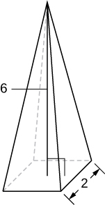

8 units3

A pyramid with height 4 units and a rectangular base with length 2 units and width 3 units, as pictured here.

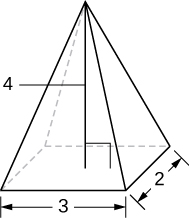

A tetrahedron with a base side of 4 units, as seen here.

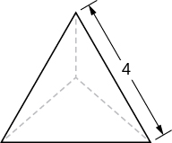

<math xmlns="http://www.w3.org/1998/Math/MathML"><mrow><mfrac><mrow><mn>32</mn></mrow><mrow><mn>3</mn><msqrt><mn>2</mn></msqrt></mrow></mfrac></mrow></math>

 units3

A pyramid with height 5 units, and an isosceles triangular base with lengths of 6 units and 8 units, as seen here.

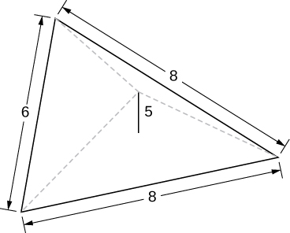

A cone of radius <math xmlns="http://www.w3.org/1998/Math/MathML"><mi>r</mi></math>

 and height <math xmlns="http://www.w3.org/1998/Math/MathML"><mi>h</mi></math>

 has a smaller cone of radius <math xmlns="http://www.w3.org/1998/Math/MathML"><mrow><mrow><mi>r</mi><mtext>/</mtext><mn>2</mn></mrow></mrow></math>

 and height <math xmlns="http://www.w3.org/1998/Math/MathML"><mrow><mrow><mi>h</mi><mtext>/</mtext><mn>2</mn></mrow></mrow></math>

 removed from the top, as seen here. The resulting solid is called a *frustum*.

<math xmlns="http://www.w3.org/1998/Math/MathML"><mrow><mfrac><mrow><mn>7</mn><mi>π</mi></mrow><mrow><mn>12</mn></mrow></mfrac><mi>h</mi><msup><mi>r</mi><mn>2</mn></msup></mrow></math>

 units3

For the following exercises, draw an outline of the solid and find the volume using the slicing method.

The base is a circle of radius <math xmlns="http://www.w3.org/1998/Math/MathML"><mrow><mi>a</mi><mo>.</mo></mrow></math>

 The slices perpendicular to the base are squares.

The base is a triangle with vertices <math xmlns="http://www.w3.org/1998/Math/MathML"><mrow><mrow><mo>(</mo><mrow><mn>0</mn><mo>,</mo><mn>0</mn></mrow><mo>)</mo></mrow><mo>,</mo><mrow><mo>(</mo><mrow><mn>1</mn><mo>,</mo><mn>0</mn></mrow><mo>)</mo></mrow><mo>,</mo></mrow></math>

 and <math xmlns="http://www.w3.org/1998/Math/MathML"><mrow><mrow><mo>(</mo><mrow><mn>0</mn><mo>,</mo><mn>1</mn></mrow><mo>)</mo></mrow><mo>.</mo></mrow></math>

 Slices perpendicular to the *xy*-plane are semicircles.

* * *
{: data-type="newline"}

  
* * *
{: data-type="newline"}

 <math xmlns="http://www.w3.org/1998/Math/MathML"><mrow><mfrac><mi>π</mi><mrow><mn>24</mn></mrow></mfrac></mrow></math>

 units3

The base is the region under the parabola <math xmlns="http://www.w3.org/1998/Math/MathML"><mrow><mi>y</mi><mo>=</mo><mn>1</mn><mo>−</mo><msup><mi>x</mi><mn>2</mn></msup></mrow></math>

 in the first quadrant. Slices perpendicular to the *xy*-plane are squares.

The base is the region under the parabola <math xmlns="http://www.w3.org/1998/Math/MathML"><mrow><mi>y</mi><mo>=</mo><mn>1</mn><mo>−</mo><msup><mi>x</mi><mn>2</mn></msup></mrow></math>

 and above the <math xmlns="http://www.w3.org/1998/Math/MathML"><mrow><mi>x</mi><mtext>-axis</mtext><mtext>.</mtext></mrow></math>

 Slices perpendicular to the <math xmlns="http://www.w3.org/1998/Math/MathML"><mrow><mi>y</mi><mtext>-axis</mtext></mrow></math>

 are squares.

* * *
{: data-type="newline"}

  
* * *
{: data-type="newline"}

 <math xmlns="http://www.w3.org/1998/Math/MathML"><mn>2</mn></math>

 units3

The base is the region enclosed by <math xmlns="http://www.w3.org/1998/Math/MathML"><mrow><mi>y</mi><mo>=</mo><msup><mi>x</mi><mn>2</mn></msup></mrow></math>

 and <math xmlns="http://www.w3.org/1998/Math/MathML"><mrow><mi>y</mi><mo>=</mo><mn>9</mn><mo>.</mo></mrow></math>

 Slices perpendicular to the *x*-axis are right isosceles triangles.

The base is the area between <math xmlns="http://www.w3.org/1998/Math/MathML"><mrow><mi>y</mi><mo>=</mo><mi>x</mi></mrow></math>

 and <math xmlns="http://www.w3.org/1998/Math/MathML"><mrow><mi>y</mi><mo>=</mo><msup><mi>x</mi><mn>2</mn></msup><mo>.</mo></mrow></math>

 Slices perpendicular to the *x*-axis are semicircles.

* * *
{: data-type="newline"}

  
* * *
{: data-type="newline"}

 <math xmlns="http://www.w3.org/1998/Math/MathML"><mrow><mfrac><mi>π</mi><mrow><mn>240</mn></mrow></mfrac></mrow></math>

 units3

For the following exercises, draw the region bounded by the curves. Then, use the disk method to find the volume when the region is rotated around the *x*-axis.

<math xmlns="http://www.w3.org/1998/Math/MathML"><mrow><mi>x</mi><mo>+</mo><mi>y</mi><mo>=</mo><mn>8</mn><mo>,</mo><mi>x</mi><mo>=</mo><mn>0</mn><mo>,</mo><mspace width="0.2em" /><mtext>and</mtext><mspace width="0.2em" /><mi>y</mi><mo>=</mo><mn>0</mn></mrow></math>

<math xmlns="http://www.w3.org/1998/Math/MathML"><mrow><mi>y</mi><mo>=</mo><mn>2</mn><msup><mi>x</mi><mn>2</mn></msup><mo>,</mo><mi>x</mi><mo>=</mo><mn>0</mn><mo>,</mo><mi>x</mi><mo>=</mo><mn>4</mn><mo>,</mo><mspace width="0.2em" /><mtext>and</mtext><mspace width="0.2em" /><mi>y</mi><mo>=</mo><mn>0</mn></mrow></math>

* * *
{: data-type="newline"}

  
* * *
{: data-type="newline"}

 <math xmlns="http://www.w3.org/1998/Math/MathML"><mrow><mfrac><mrow><mn>4096</mn><mi>π</mi></mrow><mn>5</mn></mfrac></mrow></math>

 units3

<math xmlns="http://www.w3.org/1998/Math/MathML"><mrow><mi>y</mi><mo>=</mo><msup><mi>e</mi><mi>x</mi></msup><mo>+</mo><mn>1</mn><mo>,</mo><mi>x</mi><mo>=</mo><mn>0</mn><mo>,</mo><mi>x</mi><mo>=</mo><mn>1</mn><mo>,</mo><mspace width="0.2em" /><mtext>and</mtext><mspace width="0.2em" /><mi>y</mi><mo>=</mo><mn>0</mn></mrow></math>

<math xmlns="http://www.w3.org/1998/Math/MathML"><mrow><mi>y</mi><mo>=</mo><msup><mi>x</mi><mn>4</mn></msup><mo>,</mo><mi>x</mi><mo>=</mo><mn>0</mn><mo>,</mo><mspace width="0.2em" /><mtext>and</mtext><mspace width="0.2em" /><mi>y</mi><mo>=</mo><mn>1</mn></mrow></math>

* * *
{: data-type="newline"}

 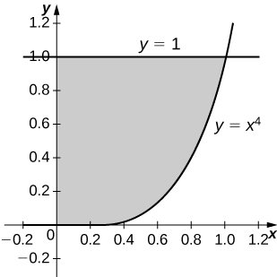 
* * *
{: data-type="newline"}

 <math xmlns="http://www.w3.org/1998/Math/MathML"><mrow><mfrac><mrow><mn>8</mn><mi>π</mi></mrow><mn>9</mn></mfrac></mrow></math>

 units3

<math xmlns="http://www.w3.org/1998/Math/MathML"><mrow><mi>y</mi><mo>=</mo><msqrt><mi>x</mi></msqrt><mo>,</mo><mi>x</mi><mo>=</mo><mn>0</mn><mo>,</mo><mi>x</mi><mo>=</mo><mn>4</mn><mo>,</mo><mspace width="0.2em" /><mtext>and</mtext><mspace width="0.2em" /><mi>y</mi><mo>=</mo><mn>0</mn></mrow></math>

<math xmlns="http://www.w3.org/1998/Math/MathML"><mrow><mi>y</mi><mo>=</mo><mtext>sin</mtext><mspace width="0.2em" /><mi>x</mi><mo>,</mo><mi>y</mi><mo>=</mo><mtext>cos</mtext><mspace width="0.2em" /><mi>x</mi><mo>,</mo><mspace width="0.2em" /><mtext>and</mtext><mspace width="0.2em" /><mi>x</mi><mo>=</mo><mn>0</mn></mrow></math>

* * *
{: data-type="newline"}

 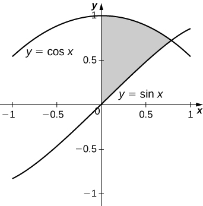 
* * *
{: data-type="newline"}

 <math xmlns="http://www.w3.org/1998/Math/MathML"><mrow><mfrac><mi>π</mi><mn>2</mn></mfrac></mrow></math>

 units3

<math xmlns="http://www.w3.org/1998/Math/MathML"><mrow><mi>y</mi><mo>=</mo><mfrac><mn>1</mn><mi>x</mi></mfrac><mo>,</mo><mi>x</mi><mo>=</mo><mn>2</mn><mo>,</mo><mspace width="0.2em" /><mtext>and</mtext><mspace width="0.2em" /><mi>y</mi><mo>=</mo><mn>3</mn></mrow></math>

<math xmlns="http://www.w3.org/1998/Math/MathML"><mrow><msup><mi>x</mi><mn>2</mn></msup><mo>−</mo><msup><mi>y</mi><mn>2</mn></msup><mo>=</mo><mn>9</mn><mspace width="0.2em" /><mtext>and</mtext><mspace width="0.2em" /><mi>x</mi><mo>+</mo><mi>y</mi><mo>=</mo><mn>9</mn><mo>,</mo><mi>y</mi><mo>=</mo><mn>0</mn><mspace width="0.2em" /><mtext>and</mtext><mspace width="0.2em" /><mi>x</mi><mo>=</mo><mn>0</mn></mrow></math>

* * *
{: data-type="newline"}

 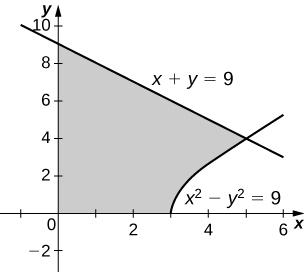 
* * *
{: data-type="newline"}

 <math xmlns="http://www.w3.org/1998/Math/MathML"><mrow><mn>207</mn><mi>π</mi></mrow></math>

 units3

For the following exercises, draw the region bounded by the curves. Then, find the volume when the region is rotated around the *y*-axis.

<math xmlns="http://www.w3.org/1998/Math/MathML"><mrow><mi>y</mi><mo>=</mo><mn>4</mn><mo>−</mo><mfrac><mn>1</mn><mn>2</mn></mfrac><mi>x</mi><mo>,</mo><mi>x</mi><mo>=</mo><mn>0</mn><mo>,</mo><mspace width="0.2em" /><mtext>and</mtext><mspace width="0.2em" /><mi>y</mi><mo>=</mo><mn>0</mn></mrow></math>

<math xmlns="http://www.w3.org/1998/Math/MathML"><mrow><mi>y</mi><mo>=</mo><mn>2</mn><msup><mi>x</mi><mn>3</mn></msup><mo>,</mo><mi>x</mi><mo>=</mo><mn>0</mn><mo>,</mo><mi>x</mi><mo>=</mo><mn>1</mn><mo>,</mo><mspace width="0.2em" /><mtext>and</mtext><mspace width="0.2em" /><mi>y</mi><mo>=</mo><mn>0</mn></mrow></math>

* * *
{: data-type="newline"}

 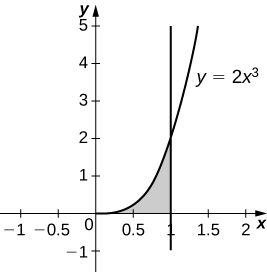 
* * *
{: data-type="newline"}

 <math xmlns="http://www.w3.org/1998/Math/MathML"><mrow><mfrac><mrow><mn>4</mn><mi>π</mi></mrow><mn>5</mn></mfrac></mrow></math>

 units3

<math xmlns="http://www.w3.org/1998/Math/MathML"><mrow><mi>y</mi><mo>=</mo><mn>3</mn><msup><mi>x</mi><mn>2</mn></msup><mo>,</mo><mi>x</mi><mo>=</mo><mn>0</mn><mo>,</mo><mspace width="0.2em" /><mtext>and</mtext><mspace width="0.2em" /><mi>y</mi><mo>=</mo><mn>3</mn></mrow></math>

<math xmlns="http://www.w3.org/1998/Math/MathML"><mrow><mi>y</mi><mo>=</mo><msqrt><mrow><mn>4</mn><mo>−</mo><msup><mi>x</mi><mn>2</mn></msup></mrow></msqrt><mo>,</mo><mi>y</mi><mo>=</mo><mn>0</mn><mo>,</mo><mspace width="0.2em" /><mtext>and</mtext><mspace width="0.2em" /><mi>x</mi><mo>=</mo><mn>0</mn></mrow></math>

* * *
{: data-type="newline"}

 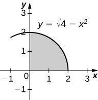 
* * *
{: data-type="newline"}

 <math xmlns="http://www.w3.org/1998/Math/MathML"><mrow><mfrac><mrow><mn>16</mn><mi>π</mi></mrow><mn>3</mn></mfrac></mrow></math>

 units3

<math xmlns="http://www.w3.org/1998/Math/MathML"><mrow><mi>y</mi><mo>=</mo><mfrac><mn>1</mn><mrow><msqrt><mrow><mi>x</mi><mo>+</mo><mn>1</mn></mrow></msqrt></mrow></mfrac><mo>,</mo><mi>x</mi><mo>=</mo><mn>0</mn><mo>,</mo><mspace width="0.2em" /><mtext>and</mtext><mspace width="0.2em" /><mi>x</mi><mo>=</mo><mn>3</mn></mrow></math>

<math xmlns="http://www.w3.org/1998/Math/MathML"><mrow><mi>x</mi><mo>=</mo><mtext>sec</mtext><mrow><mo>(</mo><mi>y</mi><mo>)</mo></mrow><mspace width="0.2em" /><mtext>and</mtext><mspace width="0.2em" /><mi>y</mi><mo>=</mo><mfrac><mi>π</mi><mn>4</mn></mfrac><mo>,</mo><mi>y</mi><mo>=</mo><mn>0</mn><mspace width="0.2em" /><mtext>and</mtext><mspace width="0.2em" /><mi>x</mi><mo>=</mo><mn>0</mn></mrow></math>

* * *
{: data-type="newline"}

 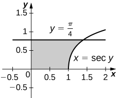 
* * *
{: data-type="newline"}

 <math xmlns="http://www.w3.org/1998/Math/MathML"><mi>π</mi></math>

 units3

<math xmlns="http://www.w3.org/1998/Math/MathML"><mrow><mi>y</mi><mo>=</mo><mfrac><mn>1</mn><mrow><mi>x</mi><mo>+</mo><mn>1</mn></mrow></mfrac><mo>,</mo><mi>x</mi><mo>=</mo><mn>0</mn><mo>,</mo><mspace width="0.2em" /><mtext>and</mtext><mspace width="0.2em" /><mi>x</mi><mo>=</mo><mn>2</mn></mrow></math>

<math xmlns="http://www.w3.org/1998/Math/MathML"><mrow><mi>y</mi><mo>=</mo><mn>4</mn><mo>−</mo><mi>x</mi><mo>,</mo><mi>y</mi><mo>=</mo><mi>x</mi><mo>,</mo><mspace width="0.2em" /><mtext>and</mtext><mspace width="0.2em" /><mi>x</mi><mo>=</mo><mn>0</mn></mrow></math>

* * *
{: data-type="newline"}

 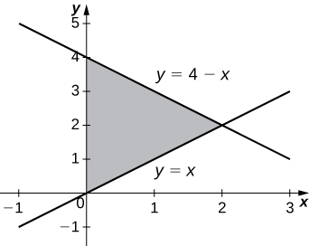 
* * *
{: data-type="newline"}

 <math xmlns="http://www.w3.org/1998/Math/MathML"><mrow><mfrac><mrow><mn>16</mn><mi>π</mi></mrow><mn>3</mn></mfrac></mrow></math>

 units3

For the following exercises, draw the region bounded by the curves. Then, find the volume when the region is rotated around the *x*-axis.

<math xmlns="http://www.w3.org/1998/Math/MathML"><mrow><mi>y</mi><mo>=</mo><mi>x</mi><mo>+</mo><mn>2</mn><mo>,</mo><mi>y</mi><mo>=</mo><mi>x</mi><mo>+</mo><mn>6</mn><mo>,</mo><mi>x</mi><mo>=</mo><mn>0</mn><mo>,</mo><mspace width="0.2em" /><mtext>and</mtext><mspace width="0.2em" /><mi>x</mi><mo>=</mo><mn>5</mn></mrow></math>

<math xmlns="http://www.w3.org/1998/Math/MathML"><mrow><mi>y</mi><mo>=</mo><msup><mi>x</mi><mn>2</mn></msup><mspace width="0.2em" /><mtext>and</mtext><mspace width="0.2em" /><mi>y</mi><mo>=</mo><mi>x</mi><mo>+</mo><mn>2</mn></mrow></math>

* * *
{: data-type="newline"}

 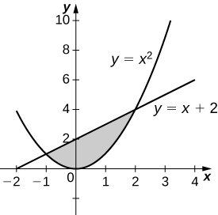 
* * *
{: data-type="newline"}

 <math xmlns="http://www.w3.org/1998/Math/MathML"><mrow><mfrac><mrow><mn>72</mn><mi>π</mi></mrow><mn>5</mn></mfrac></mrow></math>

 units3

<math xmlns="http://www.w3.org/1998/Math/MathML"><mrow><msup><mi>x</mi><mn>2</mn></msup><mo>=</mo><msup><mi>y</mi><mn>3</mn></msup><mspace width="0.2em" /><mtext>and</mtext><mspace width="0.2em" /><msup><mi>x</mi><mn>3</mn></msup><mo>=</mo><msup><mi>y</mi><mn>2</mn></msup></mrow></math>

<math xmlns="http://www.w3.org/1998/Math/MathML"><mrow><mi>y</mi><mo>=</mo><mn>4</mn><mo>−</mo><msup><mi>x</mi><mn>2</mn></msup><mspace width="0.2em" /><mtext>and</mtext><mspace width="0.2em" /><mi>y</mi><mo>=</mo><mn>2</mn><mo>−</mo><mi>x</mi></mrow></math>

* * *
{: data-type="newline"}

 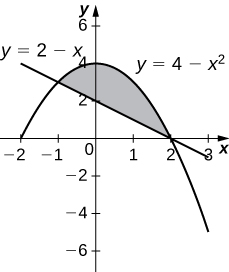 
* * *
{: data-type="newline"}

 <math xmlns="http://www.w3.org/1998/Math/MathML"><mrow><mfrac><mrow><mn>108</mn><mi>π</mi></mrow><mn>5</mn></mfrac></mrow></math>

 units3

**[T]** <math xmlns="http://www.w3.org/1998/Math/MathML"><mrow><mi>y</mi><mo>=</mo><mtext>cos</mtext><mspace width="0.2em" /><mi>x</mi><mo>,</mo><mi>y</mi><mo>=</mo><msup><mi>e</mi><mrow><mtext>−</mtext><mi>x</mi></mrow></msup><mo>,</mo><mi>x</mi><mo>=</mo><mn>0</mn><mo>,</mo><mspace width="0.2em" /><mtext>and</mtext><mspace width="0.2em" /><mi>x</mi><mo>=</mo><mn>1.2927</mn></mrow></math>

<math xmlns="http://www.w3.org/1998/Math/MathML"><mrow><mi>y</mi><mo>=</mo><msqrt><mi>x</mi></msqrt><mspace width="0.2em" /><mtext>and</mtext><mspace width="0.2em" /><mi>y</mi><mo>=</mo><msup><mi>x</mi><mn>2</mn></msup></mrow></math>

* * *
{: data-type="newline"}

 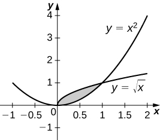 
* * *
{: data-type="newline"}

 <math xmlns="http://www.w3.org/1998/Math/MathML"><mrow><mfrac><mrow><mn>3</mn><mi>π</mi></mrow><mrow><mn>10</mn></mrow></mfrac></mrow></math>

 units3

<math xmlns="http://www.w3.org/1998/Math/MathML"><mrow><mi>y</mi><mo>=</mo><mtext>sin</mtext><mspace width="0.2em" /><mi>x</mi><mtext>,</mtext><mspace width="0.2em" /><mi>y</mi><mo>=</mo><mn>5</mn><mspace width="0.2em" /><mtext>sin</mtext><mspace width="0.2em" /><mi>x</mi><mo>,</mo><mi>x</mi><mo>=</mo><mn>0</mn><mspace width="0.2em" /><mtext>and</mtext><mspace width="0.2em" /><mi>x</mi><mo>=</mo><mi>π</mi></mrow></math>

<math xmlns="http://www.w3.org/1998/Math/MathML"><mrow><mi>y</mi><mo>=</mo><msqrt><mrow><mn>1</mn><mo>+</mo><msup><mi>x</mi><mn>2</mn></msup></mrow></msqrt><mspace width="0.2em" /><mtext>and</mtext><mspace width="0.2em" /><mi>y</mi><mo>=</mo><msqrt><mrow><mn>4</mn><mo>−</mo><msup><mi>x</mi><mn>2</mn></msup></mrow></msqrt></mrow></math>

* * *
{: data-type="newline"}

 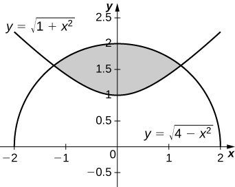 
* * *
{: data-type="newline"}

 <math xmlns="http://www.w3.org/1998/Math/MathML"><mrow><mn>2</mn><msqrt><mn>6</mn></msqrt><mi>π</mi></mrow></math>

 units3

For the following exercises, draw the region bounded by the curves. Then, use the washer method to find the volume when the region is revolved around the *y*-axis.

<math xmlns="http://www.w3.org/1998/Math/MathML"><mrow><mi>y</mi><mo>=</mo><msqrt><mi>x</mi></msqrt><mo>,</mo><mi>x</mi><mo>=</mo><mn>4</mn><mo>,</mo><mspace width="0.2em" /><mtext>and</mtext><mspace width="0.2em" /><mi>y</mi><mo>=</mo><mn>0</mn></mrow></math>

<math xmlns="http://www.w3.org/1998/Math/MathML"><mrow><mi>y</mi><mo>=</mo><mi>x</mi><mo>+</mo><mn>2</mn><mo>,</mo><mi>y</mi><mo>=</mo><mn>2</mn><mi>x</mi><mo>−</mo><mn>1</mn><mo>,</mo><mspace width="0.2em" /><mtext>and</mtext><mspace width="0.2em" /><mi>x</mi><mo>=</mo><mn>0</mn></mrow></math>

* * *
{: data-type="newline"}

 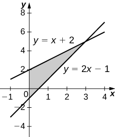 
* * *
{: data-type="newline"}

 <math xmlns="http://www.w3.org/1998/Math/MathML"><mrow><mn>9</mn><mi>π</mi></mrow></math>

 units3

<math xmlns="http://www.w3.org/1998/Math/MathML"><mrow><mi>y</mi><mo>=</mo><mroot><mi>x</mi><mn>3</mn></mroot><mspace width="0.2em" /><mtext>and</mtext><mspace width="0.2em" /><mi>y</mi><mo>=</mo><msup><mi>x</mi><mn>3</mn></msup></mrow></math>

<math xmlns="http://www.w3.org/1998/Math/MathML"><mrow><mi>x</mi><mo>=</mo><msup><mi>e</mi><mrow><mn>2</mn><mi>y</mi></mrow></msup><mo>,</mo><mi>x</mi><mo>=</mo><msup><mi>y</mi><mn>2</mn></msup><mo>,</mo><mi>y</mi><mo>=</mo><mn>0</mn><mo>,</mo><mspace width="0.2em" /><mtext>and</mtext><mspace width="0.2em" /><mi>y</mi><mo>=</mo><mtext>ln</mtext><mrow><mo>(</mo><mn>2</mn><mo>)</mo></mrow></mrow></math>

* * *
{: data-type="newline"}

 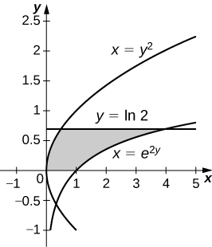 
* * *
{: data-type="newline"}

 <math xmlns="http://www.w3.org/1998/Math/MathML"><mrow><mfrac><mi>π</mi><mrow><mn>20</mn></mrow></mfrac><mrow><mo>(</mo><mrow><mn>75</mn><mo>−</mo><mn>4</mn><mspace width="0.2em" /><msup><mrow><mtext>ln</mtext></mrow><mn>5</mn></msup><mrow><mo>(</mo><mn>2</mn><mo>)</mo></mrow></mrow><mo>)</mo></mrow></mrow></math>

 units3

<math xmlns="http://www.w3.org/1998/Math/MathML"><mrow><mi>x</mi><mo>=</mo><msqrt><mrow><mn>9</mn><mo>−</mo><msup><mi>y</mi><mn>2</mn></msup></mrow></msqrt><mo>,</mo><mi>x</mi><mo>=</mo><msup><mi>e</mi><mrow><mtext>−</mtext><mi>y</mi></mrow></msup><mo>,</mo><mi>y</mi><mo>=</mo><mn>0</mn><mo>,</mo><mspace width="0.2em" /><mtext>and</mtext><mspace width="0.2em" /><mi>y</mi><mo>=</mo><mn>3</mn></mrow></math>

Yogurt containers can be shaped like frustums. Rotate the line <math xmlns="http://www.w3.org/1998/Math/MathML"><mrow><mi>y</mi><mo>=</mo><mfrac><mn>1</mn><mi>m</mi></mfrac><mi>x</mi></mrow></math>

 around the *y*-axis to find the volume between <math xmlns="http://www.w3.org/1998/Math/MathML"><mrow><mi>y</mi><mo>=</mo><mi>a</mi><mspace width="0.2em" /><mtext>and</mtext><mspace width="0.2em" /><mi>y</mi><mo>=</mo><mi>b</mi><mo>.</mo></mrow></math>

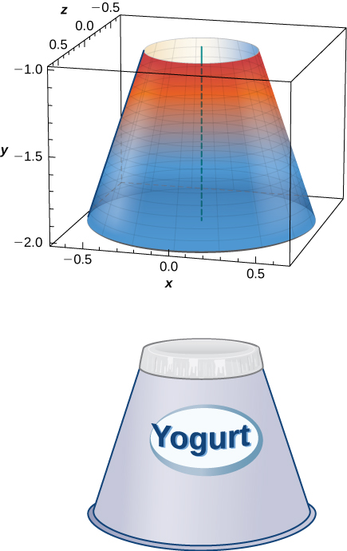

<math xmlns="http://www.w3.org/1998/Math/MathML"><mrow><mfrac><mrow><msup><mi>m</mi><mn>2</mn></msup><mi>π</mi></mrow><mn>3</mn></mfrac><mrow><mo>(</mo><mrow><msup><mi>b</mi><mn>3</mn></msup><mo>−</mo><msup><mi>a</mi><mn>3</mn></msup></mrow><mo>)</mo></mrow></mrow></math>

 units3

Rotate the ellipse <math xmlns="http://www.w3.org/1998/Math/MathML"><mrow><mrow><mo>(</mo><mrow><msup><mi>x</mi><mn>2</mn></msup><mtext>/</mtext><msup><mi>a</mi><mn>2</mn></msup></mrow><mo>)</mo></mrow><mo>+</mo><mrow><mo>(</mo><mrow><msup><mi>y</mi><mn>2</mn></msup><mtext>/</mtext><msup><mi>b</mi><mn>2</mn></msup></mrow><mo>)</mo></mrow><mo>=</mo><mn>1</mn></mrow></math>

 around the *x*-axis to approximate the volume of a football, as seen here.

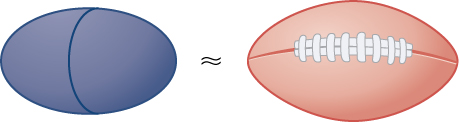

Rotate the ellipse <math xmlns="http://www.w3.org/1998/Math/MathML"><mrow><mrow><mo>(</mo><mrow><msup><mi>x</mi><mn>2</mn></msup><mtext>/</mtext><msup><mi>a</mi><mn>2</mn></msup></mrow><mo>)</mo></mrow><mo>+</mo><mrow><mo>(</mo><mrow><msup><mi>y</mi><mn>2</mn></msup><mtext>/</mtext><msup><mi>b</mi><mn>2</mn></msup></mrow><mo>)</mo></mrow><mo>=</mo><mn>1</mn></mrow></math>

 around the *y*-axis to approximate the volume of a football.

<math xmlns="http://www.w3.org/1998/Math/MathML"><mrow><mfrac><mrow><mn>4</mn><msup><mi>a</mi><mn>2</mn></msup><mi>b</mi><mi>π</mi></mrow><mn>3</mn></mfrac></mrow></math>

 units3

A better approximation of the volume of a football is given by the solid that comes from rotating <math xmlns="http://www.w3.org/1998/Math/MathML"><mrow><mi>y</mi><mo>=</mo><mtext>sin</mtext><mspace width="0.2em" /><mi>x</mi></mrow></math>

 around the *x*-axis from <math xmlns="http://www.w3.org/1998/Math/MathML"><mrow><mi>x</mi><mo>=</mo><mn>0</mn></mrow></math>

 to <math xmlns="http://www.w3.org/1998/Math/MathML"><mrow><mi>x</mi><mo>=</mo><mi>π</mi><mo>.</mo></mrow></math>

 What is the volume of this football approximation, as seen here?

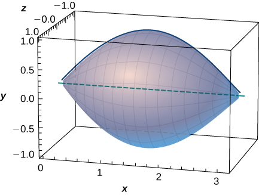

What is the volume of the Bundt cake that comes from rotating <math xmlns="http://www.w3.org/1998/Math/MathML"><mrow><mi>y</mi><mo>=</mo><mtext>sin</mtext><mspace width="0.2em" /><mi>x</mi></mrow></math>

 around the *y*-axis from <math xmlns="http://www.w3.org/1998/Math/MathML"><mrow><mi>x</mi><mo>=</mo><mn>0</mn></mrow></math>

 to <math xmlns="http://www.w3.org/1998/Math/MathML"><mrow><mi>x</mi><mo>=</mo><mi>π</mi><mo>?</mo></mrow></math>

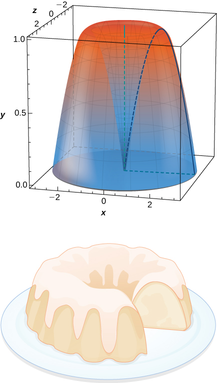

<math xmlns="http://www.w3.org/1998/Math/MathML"><mrow><mn>2</mn><msup><mi>π</mi><mn>2</mn></msup></mrow></math>

 units3

For the following exercises, find the volume of the solid described.

The base is the region between <math xmlns="http://www.w3.org/1998/Math/MathML"><mrow><mi>y</mi><mo>=</mo><mi>x</mi></mrow></math>

 and <math xmlns="http://www.w3.org/1998/Math/MathML"><mrow><mi>y</mi><mo>=</mo><msup><mi>x</mi><mn>2</mn></msup><mo>.</mo></mrow></math>

 Slices perpendicular to the *x*-axis are semicircles.

The base is the region enclosed by the generic ellipse <math xmlns="http://www.w3.org/1998/Math/MathML"><mrow><mrow><mo>(</mo><mrow><msup><mi>x</mi><mn>2</mn></msup><mtext>/</mtext><msup><mi>a</mi><mn>2</mn></msup></mrow><mo>)</mo></mrow><mo>+</mo><mrow><mo>(</mo><mrow><msup><mi>y</mi><mn>2</mn></msup><mtext>/</mtext><msup><mi>b</mi><mn>2</mn></msup></mrow><mo>)</mo></mrow><mo>=</mo><mn>1</mn><mo>.</mo></mrow></math>

 Slices perpendicular to the *x*-axis are semicircles.

<math xmlns="http://www.w3.org/1998/Math/MathML"><mrow><mfrac><mrow><mn>2</mn><mi>a</mi><msup><mi>b</mi><mn>2</mn></msup><mi>π</mi></mrow><mn>3</mn></mfrac></mrow></math>

 units3

Bore a hole of radius <math xmlns="http://www.w3.org/1998/Math/MathML"><mi>a</mi></math>

 down the axis of a right cone and through the base of radius <math xmlns="http://www.w3.org/1998/Math/MathML"><mi>b</mi><mo>,</mo></math>

 as seen here.

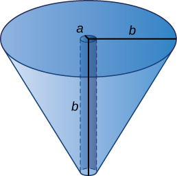

Find the volume common to two spheres of radius <math xmlns="http://www.w3.org/1998/Math/MathML"><mi>r</mi></math>

 with centers that are <math xmlns="http://www.w3.org/1998/Math/MathML"><mrow><mn>2</mn><mi>h</mi></mrow></math>

 apart, as shown here.

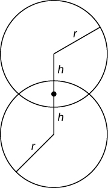

<math xmlns="http://www.w3.org/1998/Math/MathML"><mrow><mfrac><mi>π</mi><mrow><mn>12</mn></mrow></mfrac><msup><mrow><mrow><mo>(</mo><mrow><mi>r</mi><mo>+</mo><mi>h</mi></mrow><mo>)</mo></mrow></mrow><mn>2</mn></msup><mrow><mo>(</mo><mrow><mn>6</mn><mi>r</mi><mo>−</mo><mi>h</mi></mrow><mo>)</mo></mrow></mrow></math>

 units3

Find the volume of a spherical cap of height <math xmlns="http://www.w3.org/1998/Math/MathML"><mi>h</mi></math>

 and radius <math xmlns="http://www.w3.org/1998/Math/MathML"><mi>r</mi></math>

 where <math xmlns="http://www.w3.org/1998/Math/MathML"><mrow><mi>h</mi><mo>&lt;</mo><mi>r</mi><mo>,</mo></mrow></math>

 as seen here.

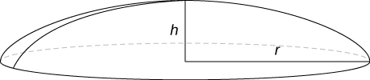

Find the volume of a sphere of radius <math xmlns="http://www.w3.org/1998/Math/MathML"><mi>R</mi></math>

 with a cap of height <math xmlns="http://www.w3.org/1998/Math/MathML"><mi>h</mi></math>

 removed from the top, as seen here.

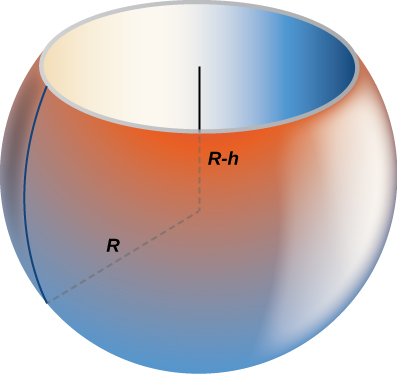

<math xmlns="http://www.w3.org/1998/Math/MathML"><mrow><mfrac><mi>π</mi><mn>3</mn></mfrac><mrow><mo>(</mo><mrow><mi>h</mi><mo>+</mo><mi>R</mi></mrow><mo>)</mo></mrow><msup><mrow><mrow><mo>(</mo><mrow><mi>h</mi><mo>−</mo><mn>2</mn><mi>R</mi></mrow><mo>)</mo></mrow></mrow><mn>2</mn></msup></mrow></math>

 units3

</section>

### Glossary
{: data-type="glossary-title"}

cross-section
: the intersection of a plane and a solid object
^

disk method
: a special case of the slicing method used with solids of revolution when the slices are disks
^

slicing method
: a method of calculating the volume of a solid that involves cutting the solid into pieces, estimating the volume of each piece, then adding these estimates to arrive at an estimate of the total volume; as the number of slices goes to infinity, this estimate becomes an integral that gives the exact value of the volume
^

solid of revolution
: a solid generated by revolving a region in a plane around a line in that plane
^

washer method
: a special case of the slicing method used with solids of revolution when the slices are washers

[1]: http://www.openstaxcollege.org/l/20_IntCalc2
