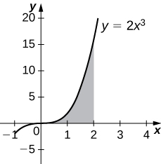
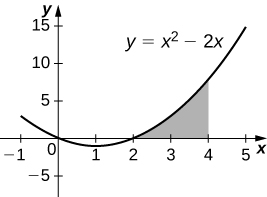
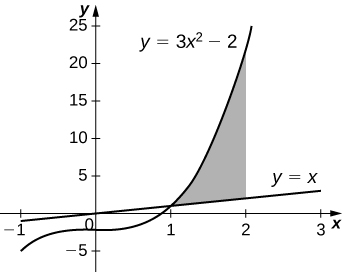
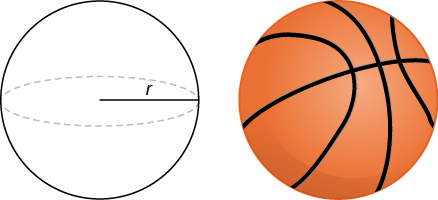
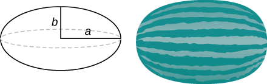
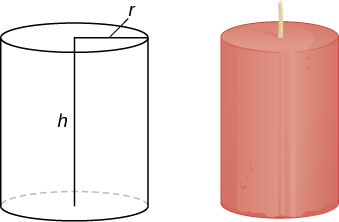
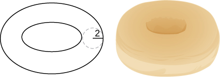

* Calculate the volume of a solid of revolution by using the method of cylindrical shells.
* Compare the different methods for calculating a volume of revolution.

In this section, we examine the method of cylindrical shells, the final method for finding the volume of a solid of revolution. We can use this method on the same kinds of solids as the disk method or the washer method; however, with the disk and washer methods, we integrate along the coordinate axis parallel to the axis of revolution. With the method of cylindrical shells, we integrate along the coordinate axis *perpendicular* to the axis of revolution. The ability to choose which variable of integration we want to use can be a significant advantage with more complicated functions. Also, the specific geometry of the solid sometimes makes the method of using cylindrical shells more appealing than using the washer method. In the last part of this section, we review all the methods for finding volume that we have studied and lay out some guidelines to help you determine which method to use in a given situation.

### The Method of Cylindrical Shells

Again, we are working with a solid of revolution. As before, we define a region <math xmlns="http://www.w3.org/1998/Math/MathML"><mrow><mi>R</mi><mo>,</mo></mrow></math>

 bounded above by the graph of a function <math xmlns="http://www.w3.org/1998/Math/MathML"><mrow><mi>y</mi><mo>=</mo><mi>f</mi><mo stretchy="false">(</mo><mi>x</mi><mo stretchy="false">)</mo><mo>,</mo></mrow></math>

 below by the <math xmlns="http://www.w3.org/1998/Math/MathML"><mrow><mi>x</mi><mtext>-axis,</mtext></mrow></math>

 and on the left and right by the lines <math xmlns="http://www.w3.org/1998/Math/MathML"><mrow><mi>x</mi><mo>=</mo><mi>a</mi></mrow></math>

 and <math xmlns="http://www.w3.org/1998/Math/MathML"><mrow><mi>x</mi><mo>=</mo><mi>b</mi><mo>,</mo></mrow></math>

 respectively, as shown in [\[link\]](#CNX_Calc_Figure_06_03_001)(a). We then revolve this region around the *y*-axis, as shown in [\[link\]](#CNX_Calc_Figure_06_03_001)(b). Note that this is different from what we have done before. Previously, regions defined in terms of functions of <math xmlns="http://www.w3.org/1998/Math/MathML"><mi>x</mi></math>

 were revolved around the <math xmlns="http://www.w3.org/1998/Math/MathML"><mrow><mi>x</mi><mtext>-axis</mtext></mrow></math>

 or a line parallel to it.

  A region bounded by the graph of a function of x. (b) The solid of revolution formed when the region is revolved around the y-axis."){: #CNX_Calc_Figure_06_03_001}

As we have done many times before, partition the interval <math xmlns="http://www.w3.org/1998/Math/MathML"><mrow><mrow><mo>[</mo><mrow><mi>a</mi><mo>,</mo><mi>b</mi></mrow><mo>]</mo></mrow></mrow></math>

 using a regular partition, <math xmlns="http://www.w3.org/1998/Math/MathML"><mrow><mi>P</mi><mo>=</mo><mrow><mo>{</mo><mrow><msub><mi>x</mi><mn>0</mn></msub><mo>,</mo><msub><mi>x</mi><mn>1</mn></msub><mtext>,…</mtext><mo>,</mo><msub><mi>x</mi><mi>n</mi></msub></mrow><mo>}</mo></mrow></mrow></math>

 and, for <math xmlns="http://www.w3.org/1998/Math/MathML"><mrow><mi>i</mi><mo>=</mo><mn>1</mn><mo>,</mo><mn>2</mn><mtext>,…</mtext><mo>,</mo><mi>n</mi><mo>,</mo></mrow></math>

 choose a point <math xmlns="http://www.w3.org/1998/Math/MathML"><mrow><msubsup><mi>x</mi><mi>i</mi><mo>*</mo></msubsup><mo>∈</mo><mrow><mo>[</mo><mrow><msub><mi>x</mi><mrow><mi>i</mi><mo>−</mo><mn>1</mn></mrow></msub><mo>,</mo><msub><mi>x</mi><mi>i</mi></msub></mrow><mo>]</mo></mrow><mo>.</mo></mrow></math>

 Then, construct a rectangle over the interval <math xmlns="http://www.w3.org/1998/Math/MathML"><mrow><mrow><mo>[</mo><mrow><msub><mi>x</mi><mrow><mi>i</mi><mo>−</mo><mn>1</mn></mrow></msub><mo>,</mo><msub><mi>x</mi><mi>i</mi></msub></mrow><mo>]</mo></mrow></mrow></math>

 of height <math xmlns="http://www.w3.org/1998/Math/MathML"><mrow><mi>f</mi><mo stretchy="false">(</mo><msubsup><mi>x</mi><mi>i</mi><mo>*</mo></msubsup><mo stretchy="false">)</mo></mrow></math>

 and width <math xmlns="http://www.w3.org/1998/Math/MathML"><mrow><mtext>Δ</mtext><mi>x</mi><mo>.</mo></mrow></math>

 A representative rectangle is shown in [\[link\]](#CNX_Calc_Figure_06_03_002)(a). When that rectangle is revolved around the *y*-axis, instead of a disk or a washer, we get a cylindrical shell, as shown in the following figure.

  A representative rectangle. (b) When this rectangle is revolved around the y-axis, the result is a cylindrical shell. (c) When we put all the shells together, we get an approximation of the original solid."){: #CNX_Calc_Figure_06_03_002}

To calculate the volume of this shell, consider [\[link\]](#CNX_Calc_Figure_06_03_003).

 {: #CNX_Calc_Figure_06_03_003}

The shell is a cylinder, so its volume is the cross-sectional area multiplied by the height of the cylinder. The cross-sections are annuli (ring-shaped regions—essentially, circles with a hole in the center), with outer radius <math xmlns="http://www.w3.org/1998/Math/MathML"><mrow><msub><mi>x</mi><mi>i</mi></msub></mrow></math>

 and inner radius <math xmlns="http://www.w3.org/1998/Math/MathML"><mrow><msub><mi>x</mi><mrow><mi>i</mi><mo>−</mo><mn>1</mn></mrow></msub><mo>.</mo></mrow></math>

 Thus, the cross-sectional area is <math xmlns="http://www.w3.org/1998/Math/MathML"><mrow><mi>π</mi><msubsup><mi>x</mi><mi>i</mi><mn>2</mn></msubsup><mo>−</mo><mi>π</mi><msubsup><mi>x</mi><mrow><mi>i</mi><mo>−</mo><mn>1</mn></mrow><mn>2</mn></msubsup><mo>.</mo></mrow></math>

 The height of the cylinder is <math xmlns="http://www.w3.org/1998/Math/MathML"><mrow><mi>f</mi><mo stretchy="false">(</mo><msubsup><mi>x</mi><mi>i</mi><mo>*</mo></msubsup><mo stretchy="false">)</mo><mo>.</mo></mrow></math>

 Then the volume of the shell is

<math xmlns="http://www.w3.org/1998/Math/MathML"><mtable><mtr><mtd columnalign="right"><msub><mi>V</mi><mrow><mtext>shell</mtext></mrow></msub></mtd><mtd columnalign="left"><mo>=</mo><mi>f</mi><mo stretchy="false">(</mo><msubsup><mi>x</mi><mi>i</mi><mo>*</mo></msubsup><mo stretchy="false">)</mo><mo stretchy="false">(</mo><mi>π</mi><msubsup><mi>x</mi><mi>i</mi><mn>2</mn></msubsup><mo>−</mo><mi>π</mi><msubsup><mi>x</mi><mrow><mi>i</mi><mo>−</mo><mn>1</mn></mrow><mn>2</mn></msubsup><mo stretchy="false">)</mo></mtd></mtr><mtr><mtd /><mtd columnalign="left"><mo>=</mo><mi>π</mi><mi>f</mi><mo stretchy="false">(</mo><msubsup><mi>x</mi><mi>i</mi><mo>*</mo></msubsup><mo stretchy="false">)</mo><mrow><mo>(</mo><mrow><msubsup><mi>x</mi><mi>i</mi><mn>2</mn></msubsup><mo>−</mo><msubsup><mi>x</mi><mrow><mi>i</mi><mo>−</mo><mn>1</mn></mrow><mn>2</mn></msubsup></mrow><mo>)</mo></mrow></mtd></mtr><mtr><mtd /><mtd columnalign="left"><mo>=</mo><mi>π</mi><mi>f</mi><mo stretchy="false">(</mo><msubsup><mi>x</mi><mi>i</mi><mo>*</mo></msubsup><mo stretchy="false">)</mo><mrow><mo>(</mo><mrow><msub><mi>x</mi><mi>i</mi></msub><mo>+</mo><msub><mi>x</mi><mrow><mi>i</mi><mo>−</mo><mn>1</mn></mrow></msub></mrow><mo>)</mo></mrow><mrow><mo>(</mo><mrow><msub><mi>x</mi><mi>i</mi></msub><mo>−</mo><msub><mi>x</mi><mrow><mi>i</mi><mo>−</mo><mn>1</mn></mrow></msub></mrow><mo>)</mo></mrow></mtd></mtr><mtr><mtd /><mtd columnalign="left"><mo>=</mo><mn>2</mn><mi>π</mi><mi>f</mi><mo stretchy="false">(</mo><msubsup><mi>x</mi><mi>i</mi><mo>*</mo></msubsup><mo stretchy="false">)</mo><mrow><mo>(</mo><mrow><mfrac><mrow><msub><mi>x</mi><mi>i</mi></msub><mo>+</mo><msub><mi>x</mi><mrow><mi>i</mi><mo>−</mo><mn>1</mn></mrow></msub></mrow><mn>2</mn></mfrac></mrow><mo>)</mo></mrow><mrow><mo>(</mo><mrow><msub><mi>x</mi><mi>i</mi></msub><mo>−</mo><msub><mi>x</mi><mrow><mi>i</mi><mo>−</mo><mn>1</mn></mrow></msub></mrow><mo>)</mo></mrow><mo>.</mo></mtd></mtr></mtable></math>

Note that <math xmlns="http://www.w3.org/1998/Math/MathML"><mrow><msub><mi>x</mi><mi>i</mi></msub><mo>−</mo><msub><mi>x</mi><mrow><mi>i</mi><mo>−</mo><mn>1</mn></mrow></msub><mo>=</mo><mtext>Δ</mtext><mi>x</mi><mo>,</mo></mrow></math>

 so we have

<math xmlns="http://www.w3.org/1998/Math/MathML"><mrow><msub><mi>V</mi><mrow><mtext>shell</mtext></mrow></msub><mo>=</mo><mn>2</mn><mi>π</mi><mi>f</mi><mo stretchy="false">(</mo><msubsup><mi>x</mi><mi>i</mi><mo>*</mo></msubsup><mo stretchy="false">)</mo><mrow><mo>(</mo><mrow><mfrac><mrow><msub><mi>x</mi><mi>i</mi></msub><mo>+</mo><msub><mi>x</mi><mrow><mi>i</mi><mo>−</mo><mn>1</mn></mrow></msub></mrow><mn>2</mn></mfrac></mrow><mo>)</mo></mrow><mtext>Δ</mtext><mi>x</mi><mo>.</mo></mrow></math>

Furthermore, <math xmlns="http://www.w3.org/1998/Math/MathML"><mrow><mfrac><mrow><msub><mi>x</mi><mi>i</mi></msub><mo>+</mo><msub><mi>x</mi><mrow><mi>i</mi><mo>−</mo><mn>1</mn></mrow></msub></mrow><mn>2</mn></mfrac></mrow></math>

 is both the midpoint of the interval <math xmlns="http://www.w3.org/1998/Math/MathML"><mrow><mrow><mo>[</mo><mrow><msub><mi>x</mi><mrow><mi>i</mi><mo>−</mo><mn>1</mn></mrow></msub><mo>,</mo><msub><mi>x</mi><mi>i</mi></msub></mrow><mo>]</mo></mrow></mrow></math>

 and the average radius of the shell, and we can approximate this by <math xmlns="http://www.w3.org/1998/Math/MathML"><mrow><msubsup><mi>x</mi><mi>i</mi><mo>*</mo></msubsup><mo>.</mo></mrow></math>

 We then have

<math xmlns="http://www.w3.org/1998/Math/MathML"><mrow><msub><mi>V</mi><mrow><mtext>shell</mtext></mrow></msub><mo>≈</mo><mn>2</mn><mi>π</mi><mi>f</mi><mo stretchy="false">(</mo><msubsup><mi>x</mi><mi>i</mi><mo>*</mo></msubsup><mo stretchy="false">)</mo><msubsup><mi>x</mi><mi>i</mi><mo>*</mo></msubsup><mtext>Δ</mtext><mi>x</mi><mo>.</mo></mrow></math>

Another way to think of this is to think of making a vertical cut in the shell and then opening it up to form a flat plate ([\[link\]](#CNX_Calc_Figure_06_03_004)).

  Make a vertical cut in a representative shell. (b) Open the shell up to form a flat plate."){: #CNX_Calc_Figure_06_03_004}

In reality, the outer radius of the shell is greater than the inner radius, and hence the back edge of the plate would be slightly longer than the front edge of the plate. However, we can approximate the flattened shell by a flat plate of height <math xmlns="http://www.w3.org/1998/Math/MathML"><mrow><mi>f</mi><mo stretchy="false">(</mo><msubsup><mi>x</mi><mi>i</mi><mo>*</mo></msubsup><mo stretchy="false">)</mo><mo>,</mo></mrow></math>

 width <math xmlns="http://www.w3.org/1998/Math/MathML"><mrow><mn>2</mn><mi>π</mi><msubsup><mi>x</mi><mi>i</mi><mo>*</mo></msubsup><mo>,</mo></mrow></math>

 and thickness <math xmlns="http://www.w3.org/1998/Math/MathML"><mrow><mtext>Δ</mtext><mi>x</mi></mrow></math>

 ([\[link\]](#CNX_Calc_Figure_06_03_004)). The volume of the shell, then, is approximately the volume of the flat plate. Multiplying the height, width, and depth of the plate, we get

<math xmlns="http://www.w3.org/1998/Math/MathML"><mrow><msub><mi>V</mi><mrow><mtext>shell</mtext></mrow></msub><mo>≈</mo><mi>f</mi><mo stretchy="false">(</mo><msubsup><mi>x</mi><mi>i</mi><mo>*</mo></msubsup><mo stretchy="false">)</mo><mrow><mo>(</mo><mrow><mn>2</mn><mi>π</mi><msubsup><mi>x</mi><mi>i</mi><mo>*</mo></msubsup></mrow><mo>)</mo></mrow><mtext>Δ</mtext><mi>x</mi><mo>,</mo></mrow></math>

which is the same formula we had before.

To calculate the volume of the entire solid, we then add the volumes of all the shells and obtain

<math xmlns="http://www.w3.org/1998/Math/MathML"><mrow><mi>V</mi><mo>≈</mo><munderover><mstyle mathsize="140%" displaystyle="true"><mo>∑</mo></mstyle><mrow><mi>i</mi><mo>=</mo><mn>1</mn></mrow><mi>n</mi></munderover><mrow><mo>(</mo><mrow><mn>2</mn><mi>π</mi><msubsup><mi>x</mi><mi>i</mi><mo>*</mo></msubsup><mi>f</mi><mo stretchy="false">(</mo><msubsup><mi>x</mi><mi>i</mi><mo>*</mo></msubsup><mo stretchy="false">)</mo><mtext>Δ</mtext><mi>x</mi></mrow><mo>)</mo></mrow><mo>.</mo></mrow></math>

Here we have another Riemann sum, this time for the function <math xmlns="http://www.w3.org/1998/Math/MathML"><mrow><mn>2</mn><mi>π</mi><mi>x</mi><mi>f</mi><mo stretchy="false">(</mo><mi>x</mi><mo stretchy="false">)</mo><mo>.</mo></mrow></math>

 Taking the limit as <math xmlns="http://www.w3.org/1998/Math/MathML"><mrow><mi>n</mi><mo stretchy="false">→</mo><mi>∞</mi></mrow></math>

 gives us

<math xmlns="http://www.w3.org/1998/Math/MathML"><mrow><mi>V</mi><mo>=</mo><munder><mrow><mtext>lim</mtext></mrow><mrow><mi>n</mi><mo stretchy="false">→</mo><mi>∞</mi></mrow></munder><munderover><mstyle mathsize="140%" displaystyle="true"><mo>∑</mo></mstyle><mrow><mi>i</mi><mo>=</mo><mn>1</mn></mrow><mi>n</mi></munderover><mrow><mo>(</mo><mrow><mn>2</mn><mi>π</mi><msubsup><mi>x</mi><mi>i</mi><mo>*</mo></msubsup><mi>f</mi><mo stretchy="false">(</mo><msubsup><mi>x</mi><mi>i</mi><mo>*</mo></msubsup><mo stretchy="false">)</mo><mtext>Δ</mtext><mi>x</mi></mrow><mo>)</mo></mrow><mo>=</mo><mstyle displaystyle="true"><mrow><msubsup><mo stretchy="false">∫</mo><mi>a</mi><mi>b</mi></msubsup><mrow><mrow><mo>(</mo><mrow><mn>2</mn><mi>π</mi><mi>x</mi><mi>f</mi><mo stretchy="false">(</mo><mi>x</mi><mo stretchy="false">)</mo></mrow><mo>)</mo></mrow></mrow></mrow></mstyle><mi>d</mi><mi>x</mi><mo>.</mo></mrow></math>

This leads to the following rule for the **method of cylindrical shells.**{: data-type="term"}

Rule: The Method of Cylindrical Shells

Let <math xmlns="http://www.w3.org/1998/Math/MathML"><mrow><mi>f</mi><mo stretchy="false">(</mo><mi>x</mi><mo stretchy="false">)</mo></mrow></math>

 be continuous and nonnegative. Define <math xmlns="http://www.w3.org/1998/Math/MathML"><mi>R</mi></math>

 as the region bounded above by the graph of <math xmlns="http://www.w3.org/1998/Math/MathML"><mrow><mi>f</mi><mo stretchy="false">(</mo><mi>x</mi><mo stretchy="false">)</mo><mo>,</mo></mrow></math>

 below by the <math xmlns="http://www.w3.org/1998/Math/MathML"><mrow><mi>x</mi><mtext>-axis</mtext><mo>,</mo></mrow></math>

 on the left by the line <math xmlns="http://www.w3.org/1998/Math/MathML"><mrow><mi>x</mi><mo>=</mo><mi>a</mi><mo>,</mo></mrow></math>

 and on the right by the line <math xmlns="http://www.w3.org/1998/Math/MathML"><mrow><mi>x</mi><mo>=</mo><mi>b</mi><mo>.</mo></mrow></math>

 Then the volume of the solid of revolution formed by revolving <math xmlns="http://www.w3.org/1998/Math/MathML"><mi>R</mi></math>

 around the *y*-axis is given by

<math xmlns="http://www.w3.org/1998/Math/MathML"><mrow><mi>V</mi><mo>=</mo><mstyle displaystyle="true"><mrow><msubsup><mo stretchy="false">∫</mo><mi>a</mi><mi>b</mi></msubsup><mrow><mrow><mo>(</mo><mrow><mn>2</mn><mi>π</mi><mi>x</mi><mi>f</mi><mo stretchy="false">(</mo><mi>x</mi><mo stretchy="false">)</mo></mrow><mo>)</mo></mrow></mrow></mrow></mstyle><mi>d</mi><mi>x</mi><mo>.</mo></mrow></math>

Now let’s consider an example.

The Method of Cylindrical Shells 1

Define <math xmlns="http://www.w3.org/1998/Math/MathML"><mi>R</mi></math>

 as the region bounded above by the graph of <math xmlns="http://www.w3.org/1998/Math/MathML"><mrow><mi>f</mi><mo stretchy="false">(</mo><mi>x</mi><mo stretchy="false">)</mo><mo>=</mo><mrow><mn>1</mn><mtext>/</mtext><mi>x</mi></mrow></mrow></math>

 and below by the <math xmlns="http://www.w3.org/1998/Math/MathML"><mrow><mi>x</mi><mtext>-axis</mtext></mrow></math>

 over the interval <math xmlns="http://www.w3.org/1998/Math/MathML"><mrow><mrow><mo>[</mo><mrow><mn>1</mn><mo>,</mo><mn>3</mn></mrow><mo>]</mo></mrow><mo>.</mo></mrow></math>

 Find the volume of the solid of revolution formed by revolving <math xmlns="http://www.w3.org/1998/Math/MathML"><mrow><mi>R</mi></mrow></math>

 around the <math xmlns="http://www.w3.org/1998/Math/MathML"><mrow><mi>y</mi><mtext>-axis</mtext><mo>.</mo></mrow></math>

First we must graph the region <math xmlns="http://www.w3.org/1998/Math/MathML"><mi>R</mi></math>

 and the associated solid of revolution, as shown in the following figure.

![This figure has three images. The first is a solid that has been formed by rotating the curve y=1/x about the y-axis. The solid begins on the x-axis and stops where y=1. The second image is labeled &#x201C;a&#x201D; and is the graph of y=1/x in the first quadrant. Under the curve is a shaded region labeled &#x201C;R&#x201D;. The region is bounded by the curve, the x-axis, to the left at x=1 and to the right at x=3. The third image is labeled &#x201C;b&#x201D; and is half of the solid formed by rotating the shaded region about the y-axis.](../resources/CNX_Calc_Figure_06_03_004.jpg "(a) The region R under the graph of f(x)=1/x over the interval [1,3]. (b) The solid of revolution generated by revolving R about the y-axis."){: #CNX_Calc_Figure_06_03_005}

Then the volume of the solid is given by

<math xmlns="http://www.w3.org/1998/Math/MathML"><mtable><mtr><mtd columnalign="right"><mi>V</mi></mtd><mtd columnalign="left"><mo>=</mo><mstyle displaystyle="true"><mrow><msubsup><mo stretchy="false">∫</mo><mi>a</mi><mi>b</mi></msubsup><mrow><mrow><mo>(</mo><mrow><mn>2</mn><mi>π</mi><mi>x</mi><mi>f</mi><mo stretchy="false">(</mo><mi>x</mi><mo stretchy="false">)</mo></mrow><mo>)</mo></mrow></mrow></mrow></mstyle><mi>d</mi><mi>x</mi></mtd></mtr><mtr><mtd /><mtd columnalign="left"><mo>=</mo><mstyle displaystyle="true"><mrow><msubsup><mo stretchy="false">∫</mo><mn>1</mn><mn>3</mn></msubsup><mrow><mrow><mo>(</mo><mrow><mn>2</mn><mi>π</mi><mi>x</mi><mrow><mo>(</mo><mrow><mfrac><mn>1</mn><mi>x</mi></mfrac></mrow><mo>)</mo></mrow></mrow><mo>)</mo></mrow><mi>d</mi><mi>x</mi></mrow></mrow></mstyle></mtd></mtr><mtr><mtd /><mtd columnalign="left"><mo>=</mo><mstyle displaystyle="true"><mrow><msubsup><mo stretchy="false">∫</mo><mn>1</mn><mn>3</mn></msubsup><mn>2</mn></mrow></mstyle><mi>π</mi><mspace width="0.2em" /><mi>d</mi><mi>x</mi><mo>=</mo><msubsup><mrow><mrow><mn>2</mn><mi>π</mi><mi>x</mi></mrow><mo>\|</mo></mrow><mn>1</mn><mn>3</mn></msubsup><mo>=</mo><mn>4</mn><mi>π</mi><mspace width="0.2em" /><msup><mtext>units</mtext><mn>3</mn></msup><mtext>.</mtext></mtd></mtr></mtable></math>

Define *R* as the region bounded above by the graph of <math xmlns="http://www.w3.org/1998/Math/MathML"><mrow><mi>f</mi><mo stretchy="false">(</mo><mi>x</mi><mo stretchy="false">)</mo><mo>=</mo><msup><mi>x</mi><mn>2</mn></msup></mrow></math>

 and below by the *x*-axis over the interval <math xmlns="http://www.w3.org/1998/Math/MathML"><mrow><mrow><mo>[</mo><mrow><mn>1</mn><mo>,</mo><mn>2</mn></mrow><mo>]</mo></mrow><mo>.</mo></mrow></math>

 Find the volume of the solid of revolution formed by revolving <math xmlns="http://www.w3.org/1998/Math/MathML"><mi>R</mi></math>

 around the <math xmlns="http://www.w3.org/1998/Math/MathML"><mrow><mi>y</mi><mtext>-axis</mtext><mo>.</mo></mrow></math>

<math xmlns="http://www.w3.org/1998/Math/MathML"><mrow><mfrac><mrow><mn>15</mn><mi>π</mi></mrow><mn>2</mn></mfrac></mrow></math>

 units3

Hint

Use the procedure from [[link]](#fs-id1167794163662).

The Method of Cylindrical Shells 2

Define *R* as the region bounded above by the graph of <math xmlns="http://www.w3.org/1998/Math/MathML"><mrow><mi>f</mi><mo stretchy="false">(</mo><mi>x</mi><mo stretchy="false">)</mo><mo>=</mo><mn>2</mn><mi>x</mi><mo>−</mo><msup><mi>x</mi><mn>2</mn></msup></mrow></math>

 and below by the <math xmlns="http://www.w3.org/1998/Math/MathML"><mrow><mi>x</mi><mtext>-axis</mtext></mrow></math>

 over the interval <math xmlns="http://www.w3.org/1998/Math/MathML"><mrow><mrow><mo>[</mo><mrow><mn>0</mn><mo>,</mo><mn>2</mn></mrow><mo>]</mo></mrow><mo>.</mo></mrow></math>

 Find the volume of the solid of revolution formed by revolving <math xmlns="http://www.w3.org/1998/Math/MathML"><mi>R</mi></math>

 around the <math xmlns="http://www.w3.org/1998/Math/MathML"><mrow><mi>y</mi><mtext>-axis</mtext><mo>.</mo></mrow></math>

First graph the region <math xmlns="http://www.w3.org/1998/Math/MathML"><mi>R</mi></math>

 and the associated solid of revolution, as shown in the following figure.

 The region R under the graph of f(x)=2x&#x2212;x2 over the interval [0,2]. (b) The volume of revolution obtained by revolving R about the y-axis."){: #CNX_Calc_Figure_06_03_006}

Then the volume of the solid is given by

<math xmlns="http://www.w3.org/1998/Math/MathML"><mtable><mtr><mtd columnalign="right"><mi>V</mi></mtd><mtd columnalign="left"><mo>=</mo><mstyle displaystyle="true"><mrow><msubsup><mo stretchy="false">∫</mo><mi>a</mi><mi>b</mi></msubsup><mrow><mrow><mo>(</mo><mrow><mn>2</mn><mi>π</mi><mi>x</mi><mi>f</mi><mo stretchy="false">(</mo><mi>x</mi><mo stretchy="false">)</mo></mrow><mo>)</mo></mrow></mrow></mrow></mstyle><mi>d</mi><mi>x</mi></mtd></mtr><mtr><mtd /><mtd columnalign="left"><mo>=</mo><mstyle displaystyle="true"><mrow><msubsup><mo stretchy="false">∫</mo><mn>0</mn><mn>2</mn></msubsup><mrow><mrow><mo>(</mo><mrow><mn>2</mn><mi>π</mi><mi>x</mi><mrow><mo>(</mo><mrow><mn>2</mn><mi>x</mi><mo>−</mo><msup><mi>x</mi><mn>2</mn></msup></mrow><mo>)</mo></mrow></mrow><mo>)</mo></mrow></mrow></mrow></mstyle><mi>d</mi><mi>x</mi><mo>=</mo><mn>2</mn><mi>π</mi><mstyle displaystyle="true"><mrow><msubsup><mo stretchy="false">∫</mo><mn>0</mn><mn>2</mn></msubsup><mrow><mrow><mo>(</mo><mrow><mn>2</mn><msup><mi>x</mi><mn>2</mn></msup><mo>−</mo><msup><mi>x</mi><mn>3</mn></msup></mrow><mo>)</mo></mrow></mrow></mrow></mstyle><mi>d</mi><mi>x</mi></mtd></mtr><mtr><mtd /><mtd columnalign="left"><mo>=</mo><msubsup><mrow><mrow><mn>2</mn><mi>π</mi><mrow><mo>[</mo><mrow><mfrac><mrow><mn>2</mn><msup><mi>x</mi><mn>3</mn></msup></mrow><mn>3</mn></mfrac><mo>−</mo><mfrac><mrow><msup><mi>x</mi><mn>4</mn></msup></mrow><mn>4</mn></mfrac></mrow><mo>]</mo></mrow></mrow><mspace width="0.2em" /><mo>\|</mo></mrow><mn>0</mn><mn>2</mn></msubsup><mo>=</mo><mfrac><mrow><mn>8</mn><mi>π</mi></mrow><mn>3</mn></mfrac><mspace width="0.2em" /><msup><mtext>units</mtext><mn>3</mn></msup><mtext>.</mtext></mtd></mtr></mtable></math>

Define <math xmlns="http://www.w3.org/1998/Math/MathML"><mrow><mi>R</mi></mrow></math>

 as the region bounded above by the graph of <math xmlns="http://www.w3.org/1998/Math/MathML"><mrow><mi>f</mi><mo stretchy="false">(</mo><mi>x</mi><mo stretchy="false">)</mo><mo>=</mo><mn>3</mn><mi>x</mi><mo>−</mo><msup><mi>x</mi><mn>2</mn></msup></mrow></math>

 and below by the <math xmlns="http://www.w3.org/1998/Math/MathML"><mrow><mi>x</mi><mtext>-axis</mtext></mrow></math>

 over the interval <math xmlns="http://www.w3.org/1998/Math/MathML"><mrow><mrow><mo>[</mo><mrow><mn>0</mn><mo>,</mo><mn>2</mn></mrow><mo>]</mo></mrow><mo>.</mo></mrow></math>

 Find the volume of the solid of revolution formed by revolving <math xmlns="http://www.w3.org/1998/Math/MathML"><mi>R</mi></math>

 around the <math xmlns="http://www.w3.org/1998/Math/MathML"><mrow><mi>y</mi><mtext>-axis</mtext><mo>.</mo></mrow></math>

<math xmlns="http://www.w3.org/1998/Math/MathML"><mrow><mn>8</mn><mi>π</mi></mrow></math>

 units3

Hint

Use the process from [[link]](#fs-id1167793454737).

As with the disk method and the washer method, we can use the method of cylindrical shells with solids of revolution, revolved around the <math xmlns="http://www.w3.org/1998/Math/MathML"><mrow><mi>x</mi><mtext>-axis</mtext><mo>,</mo></mrow></math>

 when we want to integrate with respect to <math xmlns="http://www.w3.org/1998/Math/MathML"><mrow><mi>y</mi><mo>.</mo></mrow></math>

 The analogous rule for this type of solid is given here.

Rule: The Method of Cylindrical Shells for Solids of Revolution around the *x*-axis

Let <math xmlns="http://www.w3.org/1998/Math/MathML"><mrow><mi>g</mi><mo stretchy="false">(</mo><mi>y</mi><mo stretchy="false">)</mo></mrow></math>

 be continuous and nonnegative. Define <math xmlns="http://www.w3.org/1998/Math/MathML"><mi>Q</mi></math>

 as the region bounded on the right by the graph of <math xmlns="http://www.w3.org/1998/Math/MathML"><mrow><mi>g</mi><mo stretchy="false">(</mo><mi>y</mi><mo stretchy="false">)</mo><mo>,</mo></mrow></math>

 on the left by the <math xmlns="http://www.w3.org/1998/Math/MathML"><mrow><mi>y</mi><mtext>-axis</mtext><mo>,</mo></mrow></math>

 below by the line <math xmlns="http://www.w3.org/1998/Math/MathML"><mrow><mi>y</mi><mo>=</mo><mi>c</mi><mo>,</mo></mrow></math>

 and above by the line <math xmlns="http://www.w3.org/1998/Math/MathML"><mrow><mi>y</mi><mo>=</mo><mi>d</mi><mo>.</mo></mrow></math>

 Then, the volume of the solid of revolution formed by revolving <math xmlns="http://www.w3.org/1998/Math/MathML"><mi>Q</mi></math>

 around the <math xmlns="http://www.w3.org/1998/Math/MathML"><mrow><mi>x</mi><mtext>-axis</mtext></mrow></math>

 is given by

<math xmlns="http://www.w3.org/1998/Math/MathML"><mrow><mi>V</mi><mo>=</mo><mstyle displaystyle="true"><mrow><msubsup><mo stretchy="false">∫</mo><mi>c</mi><mi>d</mi></msubsup><mrow><mrow><mo>(</mo><mrow><mn>2</mn><mi>π</mi><mi>y</mi><mi>g</mi><mo stretchy="false">(</mo><mi>y</mi><mo stretchy="false">)</mo></mrow><mo>)</mo></mrow></mrow></mrow></mstyle><mi>d</mi><mi>y</mi><mo>.</mo></mrow></math>

The Method of Cylindrical Shells for a Solid Revolved around the *x*-axis

Define <math xmlns="http://www.w3.org/1998/Math/MathML"><mi>Q</mi></math>

 as the region bounded on the right by the graph of <math xmlns="http://www.w3.org/1998/Math/MathML"><mrow><mi>g</mi><mo stretchy="false">(</mo><mi>y</mi><mo stretchy="false">)</mo><mo>=</mo><mn>2</mn><msqrt><mi>y</mi></msqrt></mrow></math>

 and on the left by the <math xmlns="http://www.w3.org/1998/Math/MathML"><mrow><mi>y</mi><mtext>-axis</mtext></mrow></math>

 for <math xmlns="http://www.w3.org/1998/Math/MathML"><mrow><mi>y</mi><mo>∈</mo><mrow><mo>[</mo><mrow><mn>0</mn><mo>,</mo><mn>4</mn></mrow><mo>]</mo></mrow><mo>.</mo></mrow></math>

 Find the volume of the solid of revolution formed by revolving <math xmlns="http://www.w3.org/1998/Math/MathML"><mi>Q</mi></math>

 around the *x*-axis.

First, we need to graph the region <math xmlns="http://www.w3.org/1998/Math/MathML"><mi>Q</mi></math>

 and the associated solid of revolution, as shown in the following figure.

![This figure has two graphs. The first graph is labeled &#x201C;a&#x201D; and is the curve g(y)=2squareroot(y). It is an increasing curve in the first quadrant beginning at the origin. Between the y-axis and the curve, there is a shaded region labeled &#x201C;Q&#x201D;. The shaded region is bounded above by the line y=4. The second graph is the same curve in &#x201C;a&#x201D; and labeled &#x201C;b&#x201D;. It also has a solid region that has been formed by rotating the curve in &#x201C;a&#x201D; about the x-axis. The solid starts at the y-axis and stops at x=4.](../resources/CNX_Calc_Figure_06_03_006.jpg "(a) The region Q to the left of the function g(y) over the interval [0,4]. (b) The solid of revolution generated by revolving Q around the x-axis."){: #CNX_Calc_Figure_06_03_007}

Label the shaded region <math xmlns="http://www.w3.org/1998/Math/MathML"><mrow><mi>Q</mi><mo>.</mo></mrow></math>

 Then the volume of the solid is given by

<math xmlns="http://www.w3.org/1998/Math/MathML"><mtable><mtr><mtd columnalign="right"><mi>V</mi></mtd><mtd columnalign="left"><mo>=</mo><mstyle displaystyle="true"><mrow><msubsup><mo stretchy="false">∫</mo><mi>c</mi><mi>d</mi></msubsup><mrow><mrow><mo>(</mo><mrow><mn>2</mn><mi>π</mi><mi>y</mi><mi>g</mi><mo stretchy="false">(</mo><mi>y</mi><mo stretchy="false">)</mo></mrow><mo>)</mo></mrow></mrow></mrow></mstyle><mi>d</mi><mi>y</mi></mtd></mtr><mtr><mtd /><mtd columnalign="left"><mo>=</mo><mstyle displaystyle="true"><mrow><msubsup><mo stretchy="false">∫</mo><mn>0</mn><mn>4</mn></msubsup><mrow><mrow><mo>(</mo><mrow><mn>2</mn><mi>π</mi><mi>y</mi><mrow><mo>(</mo><mrow><mn>2</mn><msqrt><mi>y</mi></msqrt></mrow><mo>)</mo></mrow></mrow><mo>)</mo></mrow></mrow></mrow></mstyle><mi>d</mi><mi>y</mi><mo>=</mo><mn>4</mn><mi>π</mi><mstyle displaystyle="true"><mrow><msubsup><mo stretchy="false">∫</mo><mn>0</mn><mn>4</mn></msubsup><mrow><msup><mi>y</mi><mrow><mn>3</mn><mtext>/</mtext><mn>2</mn></mrow></msup></mrow></mrow></mstyle><mi>d</mi><mi>y</mi></mtd></mtr><mtr><mtd /><mtd columnalign="left"><mo>=</mo><msubsup><mrow><mrow><mn>4</mn><mi>π</mi><mrow><mo>[</mo><mrow><mfrac><mrow><mn>2</mn><msup><mi>y</mi><mrow><mn>5</mn><mtext>/</mtext><mn>2</mn></mrow></msup></mrow><mn>5</mn></mfrac></mrow></mrow></mrow><mo>]</mo><mspace width="0.2em" /><mo>\|</mo></mrow><mn>0</mn><mn>4</mn></msubsup><mo>=</mo><mfrac><mrow><mn>256</mn><mi>π</mi></mrow><mn>5</mn></mfrac><mspace width="0.2em" /><msup><mtext>units</mtext><mn>3</mn></msup><mtext>.</mtext></mtd></mtr></mtable></math>

Define <math xmlns="http://www.w3.org/1998/Math/MathML"><mi>Q</mi></math>

 as the region bounded on the right by the graph of <math xmlns="http://www.w3.org/1998/Math/MathML"><mrow><mi>g</mi><mo stretchy="false">(</mo><mi>y</mi><mo stretchy="false">)</mo><mo>=</mo><mrow><mn>3</mn><mtext>/</mtext><mi>y</mi></mrow></mrow></math>

 and on the left by the <math xmlns="http://www.w3.org/1998/Math/MathML"><mrow><mi>y</mi><mtext>-axis</mtext></mrow></math>

 for <math xmlns="http://www.w3.org/1998/Math/MathML"><mrow><mi>y</mi><mo>∈</mo><mrow><mo>[</mo><mrow><mn>1</mn><mo>,</mo><mn>3</mn></mrow><mo>]</mo></mrow><mo>.</mo></mrow></math>

 Find the volume of the solid of revolution formed by revolving <math xmlns="http://www.w3.org/1998/Math/MathML"><mi>Q</mi></math>

 around the <math xmlns="http://www.w3.org/1998/Math/MathML"><mrow><mi>x</mi><mtext>-axis</mtext><mo>.</mo></mrow></math>

<math xmlns="http://www.w3.org/1998/Math/MathML"><mrow><mn>12</mn><mi>π</mi></mrow></math>

 units3

Hint

Use the process from [[link]](#fs-id1167793625602).

For the next example, we look at a solid of revolution for which the graph of a function is revolved around a line other than one of the two coordinate axes. To set this up, we need to revisit the development of the method of cylindrical shells. Recall that we found the volume of one of the shells to be given by

<math xmlns="http://www.w3.org/1998/Math/MathML"><mtable><mtr><mtd columnalign="right"><msub><mi>V</mi><mrow><mtext>shell</mtext></mrow></msub></mtd><mtd columnalign="left"><mo>=</mo><mi>f</mi><mo stretchy="false">(</mo><msubsup><mi>x</mi><mi>i</mi><mo>*</mo></msubsup><mo stretchy="false">)</mo><mo stretchy="false">(</mo><mi>π</mi><msubsup><mi>x</mi><mi>i</mi><mn>2</mn></msubsup><mo>−</mo><mi>π</mi><msubsup><mi>x</mi><mrow><mi>i</mi><mo>−</mo><mn>1</mn></mrow><mn>2</mn></msubsup><mo stretchy="false">)</mo></mtd></mtr><mtr><mtd /><mtd columnalign="left"><mo>=</mo><mi>π</mi><mi>f</mi><mo stretchy="false">(</mo><msubsup><mi>x</mi><mi>i</mi><mo>*</mo></msubsup><mo stretchy="false">)</mo><mrow><mo>(</mo><mrow><msubsup><mi>x</mi><mi>i</mi><mn>2</mn></msubsup><mo>−</mo><msubsup><mi>x</mi><mrow><mi>i</mi><mo>−</mo><mn>1</mn></mrow><mn>2</mn></msubsup></mrow><mo>)</mo></mrow></mtd></mtr><mtr><mtd /><mtd columnalign="left"><mo>=</mo><mi>π</mi><mi>f</mi><mo stretchy="false">(</mo><msubsup><mi>x</mi><mi>i</mi><mo>*</mo></msubsup><mo stretchy="false">)</mo><mrow><mo>(</mo><mrow><msub><mi>x</mi><mi>i</mi></msub><mo>+</mo><msub><mi>x</mi><mrow><mi>i</mi><mo>−</mo><mn>1</mn></mrow></msub></mrow><mo>)</mo></mrow><mrow><mo>(</mo><mrow><msub><mi>x</mi><mi>i</mi></msub><mo>−</mo><msub><mi>x</mi><mrow><mi>i</mi><mo>−</mo><mn>1</mn></mrow></msub></mrow><mo>)</mo></mrow></mtd></mtr><mtr><mtd /><mtd columnalign="left"><mo>=</mo><mn>2</mn><mi>π</mi><mi>f</mi><mo stretchy="false">(</mo><msubsup><mi>x</mi><mi>i</mi><mo>*</mo></msubsup><mo stretchy="false">)</mo><mrow><mo>(</mo><mrow><mfrac><mrow><msub><mi>x</mi><mi>i</mi></msub><mo>+</mo><msub><mi>x</mi><mrow><mi>i</mi><mo>−</mo><mn>1</mn></mrow></msub></mrow><mn>2</mn></mfrac></mrow><mo>)</mo></mrow><mrow><mo>(</mo><mrow><msub><mi>x</mi><mi>i</mi></msub><mo>−</mo><msub><mi>x</mi><mrow><mi>i</mi><mo>−</mo><mn>1</mn></mrow></msub></mrow><mo>)</mo></mrow><mo>.</mo></mtd></mtr></mtable></math>

This was based on a shell with an outer radius of <math xmlns="http://www.w3.org/1998/Math/MathML"><mrow><msub><mi>x</mi><mi>i</mi></msub></mrow></math>

 and an inner radius of <math xmlns="http://www.w3.org/1998/Math/MathML"><mrow><msub><mi>x</mi><mrow><mi>i</mi><mo>−</mo><mn>1</mn></mrow></msub><mo>.</mo></mrow></math>

 If, however, we rotate the region around a line other than the <math xmlns="http://www.w3.org/1998/Math/MathML"><mrow><mi>y</mi><mtext>-axis</mtext><mo>,</mo></mrow></math>

 we have a different outer and inner radius. Suppose, for example, that we rotate the region around the line <math xmlns="http://www.w3.org/1998/Math/MathML"><mrow><mi>x</mi><mo>=</mo><mtext>−</mtext><mi>k</mi><mo>,</mo></mrow></math>

 where <math xmlns="http://www.w3.org/1998/Math/MathML"><mi>k</mi></math>

 is some positive constant. Then, the outer radius of the shell is <math xmlns="http://www.w3.org/1998/Math/MathML"><mrow><msub><mi>x</mi><mi>i</mi></msub><mo>+</mo><mi>k</mi></mrow></math>

 and the inner radius of the shell is <math xmlns="http://www.w3.org/1998/Math/MathML"><mrow><msub><mi>x</mi><mrow><mi>i</mi><mo>−</mo><mn>1</mn></mrow></msub><mo>+</mo><mi>k</mi><mo>.</mo></mrow></math>

 Substituting these terms into the expression for volume, we see that when a plane region is rotated around the line <math xmlns="http://www.w3.org/1998/Math/MathML"><mrow><mi>x</mi><mo>=</mo><mtext>−</mtext><mi>k</mi><mo>,</mo></mrow></math>

 the volume of a shell is given by

<math xmlns="http://www.w3.org/1998/Math/MathML"><mtable><mtr><mtd columnalign="right"><msub><mi>V</mi><mrow><mtext>shell</mtext></mrow></msub></mtd><mtd columnalign="left"><mo>=</mo><mn>2</mn><mi>π</mi><mi>f</mi><mo stretchy="false">(</mo><msubsup><mi>x</mi><mi>i</mi><mo>*</mo></msubsup><mo stretchy="false">)</mo><mrow><mo>(</mo><mrow><mfrac><mrow><mrow><mo>(</mo><mrow><msub><mi>x</mi><mi>i</mi></msub><mo>+</mo><mi>k</mi></mrow><mo>)</mo></mrow><mo>+</mo><mrow><mo>(</mo><mrow><msub><mi>x</mi><mrow><mi>i</mi><mo>−</mo><mn>1</mn></mrow></msub><mo>+</mo><mi>k</mi></mrow><mo>)</mo></mrow></mrow><mn>2</mn></mfrac></mrow><mo>)</mo></mrow><mrow><mo>(</mo><mrow><mrow><mo>(</mo><mrow><msub><mi>x</mi><mi>i</mi></msub><mo>+</mo><mi>k</mi></mrow><mo>)</mo></mrow><mo>−</mo><mrow><mo>(</mo><mrow><msub><mi>x</mi><mrow><mi>i</mi><mo>−</mo><mn>1</mn></mrow></msub><mo>+</mo><mi>k</mi></mrow><mo>)</mo></mrow></mrow><mo>)</mo></mrow></mtd></mtr><mtr><mtd /><mtd columnalign="left"><mo>=</mo><mn>2</mn><mi>π</mi><mi>f</mi><mo stretchy="false">(</mo><msubsup><mi>x</mi><mi>i</mi><mo>*</mo></msubsup><mo stretchy="false">)</mo><mrow><mo>(</mo><mrow><mrow><mo>(</mo><mrow><mfrac><mrow><msub><mi>x</mi><mi>i</mi></msub><mo>+</mo><msub><mi>x</mi><mrow><mi>i</mi><mo>−</mo><mn>2</mn></mrow></msub></mrow><mn>2</mn></mfrac></mrow><mo>)</mo></mrow><mo>+</mo><mi>k</mi></mrow><mo>)</mo></mrow><mtext>Δ</mtext><mi>x</mi><mo>.</mo></mtd></mtr></mtable></math>

As before, we notice that <math xmlns="http://www.w3.org/1998/Math/MathML"><mrow><mfrac><mrow><msub><mi>x</mi><mi>i</mi></msub><mo>+</mo><msub><mi>x</mi><mrow><mi>i</mi><mo>−</mo><mn>1</mn></mrow></msub></mrow><mn>2</mn></mfrac></mrow></math>

 is the midpoint of the interval <math xmlns="http://www.w3.org/1998/Math/MathML"><mrow><mrow><mo>[</mo><mrow><msub><mi>x</mi><mrow><mi>i</mi><mo>−</mo><mn>1</mn></mrow></msub><mo>,</mo><msub><mi>x</mi><mi>i</mi></msub></mrow><mo>]</mo></mrow></mrow></math>

 and can be approximated by <math xmlns="http://www.w3.org/1998/Math/MathML"><mrow><msubsup><mi>x</mi><mi>i</mi><mo>*</mo></msubsup><mo>.</mo></mrow></math>

 Then, the approximate volume of the shell is

<math xmlns="http://www.w3.org/1998/Math/MathML"><mrow><msub><mi>V</mi><mrow><mtext>shell</mtext></mrow></msub><mo>≈</mo><mn>2</mn><mi>π</mi><mrow><mo>(</mo><mrow><msubsup><mi>x</mi><mi>i</mi><mo>*</mo></msubsup><mo>+</mo><mi>k</mi></mrow><mo>)</mo></mrow><mi>f</mi><mo stretchy="false">(</mo><msubsup><mi>x</mi><mi>i</mi><mo>*</mo></msubsup><mo stretchy="false">)</mo><mtext>Δ</mtext><mi>x</mi><mo>.</mo></mrow></math>

The remainder of the development proceeds as before, and we see that

<math xmlns="http://www.w3.org/1998/Math/MathML"><mrow><mi>V</mi><mo>=</mo><mstyle displaystyle="true"><mrow><msubsup><mo stretchy="false">∫</mo><mi>a</mi><mi>b</mi></msubsup><mrow><mrow><mo>(</mo><mrow><mn>2</mn><mi>π</mi><mrow><mo>(</mo><mrow><mi>x</mi><mo>+</mo><mi>k</mi></mrow><mo>)</mo></mrow><mi>f</mi><mo stretchy="false">(</mo><mi>x</mi><mo stretchy="false">)</mo></mrow><mo>)</mo></mrow></mrow></mrow></mstyle><mi>d</mi><mi>x</mi><mo>.</mo></mrow></math>

We could also rotate the region around other horizontal or vertical lines, such as a vertical line in the right half plane. In each case, the volume formula must be adjusted accordingly. Specifically, the <math xmlns="http://www.w3.org/1998/Math/MathML"><mrow><mi>x</mi><mtext>-term</mtext></mrow></math>

 in the integral must be replaced with an expression representing the radius of a shell. To see how this works, consider the following example.

A Region of Revolution Revolved around a Line

Define <math xmlns="http://www.w3.org/1998/Math/MathML"><mi>R</mi></math>

 as the region bounded above by the graph of <math xmlns="http://www.w3.org/1998/Math/MathML"><mrow><mi>f</mi><mo stretchy="false">(</mo><mi>x</mi><mo stretchy="false">)</mo><mo>=</mo><mi>x</mi></mrow></math>

 and below by the <math xmlns="http://www.w3.org/1998/Math/MathML"><mrow><mi>x</mi><mtext>-axis</mtext></mrow></math>

 over the interval <math xmlns="http://www.w3.org/1998/Math/MathML"><mrow><mrow><mo>[</mo><mrow><mn>1</mn><mo>,</mo><mn>2</mn></mrow><mo>]</mo></mrow><mo>.</mo></mrow></math>

 Find the volume of the solid of revolution formed by revolving <math xmlns="http://www.w3.org/1998/Math/MathML"><mi>R</mi></math>

 around the line <math xmlns="http://www.w3.org/1998/Math/MathML"><mrow><mi>x</mi><mo>=</mo><mn>−1</mn><mo>.</mo></mrow></math>

First, graph the region <math xmlns="http://www.w3.org/1998/Math/MathML"><mi>R</mi></math>

 and the associated solid of revolution, as shown in the following figure.

![This figure has two graphs. The first graph is labeled &#x201C;a&#x201D; and is the line f(x)=x, a diagonal line through the origin. There is a shaded region above the x-axis under the line labeled &#x201C;R&#x201D;. This region is bounded to the left by the line x=1 and to the right by the line x=2. There is also the vertical line x=-1 on the graph. The second figure has the same graphs as &#x201C;a&#x201D; and is labeled &#x201C;b&#x201D;. Also on the graph is a solid formed by rotating the region &#x201C;R&#x201D; from the first graph about the line x=-1.](../resources/CNX_Calc_Figure_06_03_007.jpg "(a) The region R between the graph of f(x) and the x-axis over the interval [1,2]. (b) The solid of revolution generated by revolving R around the line x=&#x2212;1."){: #CNX_Calc_Figure_06_03_008}

Note that the radius of a shell is given by <math xmlns="http://www.w3.org/1998/Math/MathML"><mrow><mi>x</mi><mo>+</mo><mn>1</mn><mo>.</mo></mrow></math>

 Then the volume of the solid is given by

<math xmlns="http://www.w3.org/1998/Math/MathML"><mtable><mtr><mtd columnalign="right"><mi>V</mi></mtd><mtd columnalign="left"><mo>=</mo><mstyle displaystyle="true"><mrow><msubsup><mo stretchy="false">∫</mo><mn>1</mn><mn>2</mn></msubsup><mrow><mrow><mo>(</mo><mrow><mn>2</mn><mi>π</mi><mrow><mo>(</mo><mrow><mi>x</mi><mo>+</mo><mn>1</mn></mrow><mo>)</mo></mrow><mi>f</mi><mo stretchy="false">(</mo><mi>x</mi><mo stretchy="false">)</mo></mrow><mo>)</mo></mrow></mrow></mrow></mstyle><mi>d</mi><mi>x</mi></mtd></mtr><mtr><mtd /><mtd columnalign="left"><mo>=</mo><mstyle displaystyle="true"><mrow><msubsup><mo stretchy="false">∫</mo><mn>1</mn><mn>2</mn></msubsup><mrow><mrow><mo>(</mo><mrow><mn>2</mn><mi>π</mi><mrow><mo>(</mo><mrow><mi>x</mi><mo>+</mo><mn>1</mn></mrow><mo>)</mo></mrow><mi>x</mi></mrow><mo>)</mo></mrow></mrow></mrow></mstyle><mi>d</mi><mi>x</mi><mo>=</mo><mn>2</mn><mi>π</mi><mstyle displaystyle="true"><mrow><msubsup><mo stretchy="false">∫</mo><mn>1</mn><mn>2</mn></msubsup><mrow><mrow><mo>(</mo><mrow><msup><mi>x</mi><mn>2</mn></msup><mo>+</mo><mi>x</mi></mrow><mo>)</mo></mrow></mrow></mrow></mstyle><mi>d</mi><mi>x</mi></mtd></mtr><mtr><mtd /><mtd columnalign="left"><mo>=</mo><msubsup><mrow><mrow><mn>2</mn><mi>π</mi><mrow><mo>[</mo><mrow><mfrac><mrow><msup><mi>x</mi><mn>3</mn></msup></mrow><mn>3</mn></mfrac><mo>+</mo><mfrac><mrow><msup><mi>x</mi><mn>2</mn></msup></mrow><mn>2</mn></mfrac></mrow><mo>]</mo></mrow></mrow><mspace width="0.2em" /><mo>\|</mo></mrow><mn>1</mn><mn>2</mn></msubsup><mo>=</mo><mfrac><mrow><mn>23</mn><mi>π</mi></mrow><mn>3</mn></mfrac><mspace width="0.2em" /><msup><mtext>units</mtext><mn>3</mn></msup><mtext>.</mtext></mtd></mtr></mtable></math>

Define <math xmlns="http://www.w3.org/1998/Math/MathML"><mi>R</mi></math>

 as the region bounded above by the graph of <math xmlns="http://www.w3.org/1998/Math/MathML"><mrow><mi>f</mi><mo stretchy="false">(</mo><mi>x</mi><mo stretchy="false">)</mo><mo>=</mo><msup><mi>x</mi><mn>2</mn></msup></mrow></math>

 and below by the <math xmlns="http://www.w3.org/1998/Math/MathML"><mrow><mi>x</mi><mtext>-axis</mtext></mrow></math>

 over the interval <math xmlns="http://www.w3.org/1998/Math/MathML"><mrow><mrow><mo>[</mo><mrow><mn>0</mn><mo>,</mo><mn>1</mn></mrow><mo>]</mo></mrow><mo>.</mo></mrow></math>

 Find the volume of the solid of revolution formed by revolving <math xmlns="http://www.w3.org/1998/Math/MathML"><mi>R</mi></math>

 around the line <math xmlns="http://www.w3.org/1998/Math/MathML"><mrow><mi>x</mi><mo>=</mo><mn>−2</mn><mo>.</mo></mrow></math>

<math xmlns="http://www.w3.org/1998/Math/MathML"><mrow><mfrac><mrow><mn>11</mn><mi>π</mi></mrow><mn>6</mn></mfrac></mrow></math>

 units3

Hint

Use the process from [[link]](#fs-id1167794326041).

For our final example in this section, let’s look at the volume of a solid of revolution for which the region of revolution is bounded by the graphs of two functions.

A Region of Revolution Bounded by the Graphs of Two Functions

Define <math xmlns="http://www.w3.org/1998/Math/MathML"><mrow><mi>R</mi></mrow></math>

 as the region bounded above by the graph of the function <math xmlns="http://www.w3.org/1998/Math/MathML"><mrow><mi>f</mi><mo stretchy="false">(</mo><mi>x</mi><mo stretchy="false">)</mo><mo>=</mo><msqrt><mi>x</mi></msqrt></mrow></math>

 and below by the graph of the function <math xmlns="http://www.w3.org/1998/Math/MathML"><mrow><mi>g</mi><mo stretchy="false">(</mo><mi>x</mi><mo stretchy="false">)</mo><mo>=</mo><mrow><mn>1</mn><mtext>/</mtext><mi>x</mi></mrow></mrow></math>

 over the interval <math xmlns="http://www.w3.org/1998/Math/MathML"><mrow><mrow><mo>[</mo><mrow><mn>1</mn><mo>,</mo><mn>4</mn></mrow><mo>]</mo></mrow><mo>.</mo></mrow></math>

 Find the volume of the solid of revolution generated by revolving <math xmlns="http://www.w3.org/1998/Math/MathML"><mi>R</mi></math>

 around the <math xmlns="http://www.w3.org/1998/Math/MathML"><mrow><mi>y</mi><mtext>-axis</mtext><mo>.</mo></mrow></math>

First, graph the region <math xmlns="http://www.w3.org/1998/Math/MathML"><mi>R</mi></math>

 and the associated solid of revolution, as shown in the following figure.

![This figure has two graphs. The first graph is labeled &#x201C;a&#x201D; and has two curves. The curves are the graphs of f(x)=squareroot(x) and g(x)=1/x. In the first quadrant the curves intersect at (1,1). In between the curves in the first quadrant there is a shaded region labeled &#x201C;R&#x201D;, bounded to the right by the line x=4. The second graph is labeled &#x201C;b&#x201D; and is the same as the graphs in &#x201C;a&#x201D;. Also on this graph is a solid that has been formed by rotating the region &#x201C;R&#x201D; from the figure &#x201C;a&#x201D; about the y-axis.](../resources/CNX_Calc_Figure_06_03_008.jpg "(a) The region R between the graph of f(x) and the graph of g(x) over the interval [1,4]. (b) The solid of revolution generated by revolving R around the y-axis."){: #CNX_Calc_Figure_06_03_012}

Note that the axis of revolution is the <math xmlns="http://www.w3.org/1998/Math/MathML"><mrow><mi>y</mi><mtext>-axis</mtext><mo>,</mo></mrow></math>

 so the radius of a shell is given simply by <math xmlns="http://www.w3.org/1998/Math/MathML"><mrow><mi>x</mi><mo>.</mo></mrow></math>

 We don’t need to make any adjustments to the *x*-term of our integrand. The height of a shell, though, is given by <math xmlns="http://www.w3.org/1998/Math/MathML"><mrow><mi>f</mi><mo stretchy="false">(</mo><mi>x</mi><mo stretchy="false">)</mo><mo>−</mo><mi>g</mi><mo stretchy="false">(</mo><mi>x</mi><mo stretchy="false">)</mo><mo>,</mo></mrow></math>

 so in this case we need to adjust the <math xmlns="http://www.w3.org/1998/Math/MathML"><mrow><mi>f</mi><mo stretchy="false">(</mo><mi>x</mi><mo stretchy="false">)</mo></mrow></math>

 term of the integrand. Then the volume of the solid is given by

<math xmlns="http://www.w3.org/1998/Math/MathML"><mtable><mtr><mtd columnalign="right"><mi>V</mi></mtd><mtd columnalign="left"><mo>=</mo><mstyle displaystyle="true"><mrow><msubsup><mo stretchy="false">∫</mo><mn>1</mn><mn>4</mn></msubsup><mrow><mrow><mo>(</mo><mrow><mn>2</mn><mi>π</mi><mi>x</mi><mrow><mo>(</mo><mrow><mi>f</mi><mo stretchy="false">(</mo><mi>x</mi><mo stretchy="false">)</mo><mo>−</mo><mi>g</mi><mo stretchy="false">(</mo><mi>x</mi><mo stretchy="false">)</mo></mrow><mo>)</mo></mrow></mrow><mo>)</mo></mrow></mrow></mrow></mstyle><mi>d</mi><mi>x</mi></mtd></mtr><mtr><mtd /><mtd columnalign="left"><mo>=</mo><mstyle displaystyle="true"><mrow><msubsup><mo stretchy="false">∫</mo><mn>1</mn><mn>4</mn></msubsup><mrow><mrow><mo>(</mo><mrow><mn>2</mn><mi>π</mi><mi>x</mi><mrow><mo>(</mo><mrow><msqrt><mi>x</mi></msqrt><mo>−</mo><mfrac><mn>1</mn><mi>x</mi></mfrac></mrow><mo>)</mo></mrow></mrow><mo>)</mo></mrow><mi>d</mi><mi>x</mi></mrow></mrow></mstyle><mo>=</mo><mn>2</mn><mi>π</mi><mstyle displaystyle="true"><mrow><msubsup><mo stretchy="false">∫</mo><mn>1</mn><mn>4</mn></msubsup><mrow><mrow><mo>(</mo><mrow><msup><mi>x</mi><mrow><mn>3</mn><mtext>/</mtext><mn>2</mn></mrow></msup><mo>−</mo><mn>1</mn></mrow><mo>)</mo></mrow></mrow></mrow></mstyle><mi>d</mi><mi>x</mi></mtd></mtr><mtr><mtd /><mtd columnalign="left"><mo>=</mo><msubsup><mrow><mrow><mn>2</mn><mi>π</mi><mrow><mo>[</mo><mrow><mfrac><mrow><mn>2</mn><msup><mi>x</mi><mrow><mn>5</mn><mtext>/</mtext><mn>2</mn></mrow></msup></mrow><mn>5</mn></mfrac><mo>−</mo><mi>x</mi></mrow><mo>]</mo></mrow></mrow><mspace width="0.2em" /><mo>\|</mo></mrow><mn>1</mn><mn>4</mn></msubsup><mo>=</mo><mfrac><mrow><mn>94</mn><mi>π</mi></mrow><mn>5</mn></mfrac><mspace width="0.2em" /><msup><mtext>units</mtext><mn>3</mn></msup><mo>.</mo></mtd></mtr></mtable></math>

Define <math xmlns="http://www.w3.org/1998/Math/MathML"><mi>R</mi></math>

 as the region bounded above by the graph of <math xmlns="http://www.w3.org/1998/Math/MathML"><mrow><mi>f</mi><mo stretchy="false">(</mo><mi>x</mi><mo stretchy="false">)</mo><mo>=</mo><mi>x</mi></mrow></math>

 and below by the graph of <math xmlns="http://www.w3.org/1998/Math/MathML"><mrow><mi>g</mi><mo stretchy="false">(</mo><mi>x</mi><mo stretchy="false">)</mo><mo>=</mo><msup><mi>x</mi><mn>2</mn></msup></mrow></math>

 over the interval <math xmlns="http://www.w3.org/1998/Math/MathML"><mrow><mrow><mo>[</mo><mrow><mn>0</mn><mo>,</mo><mn>1</mn></mrow><mo>]</mo></mrow><mo>.</mo></mrow></math>

 Find the volume of the solid of revolution formed by revolving <math xmlns="http://www.w3.org/1998/Math/MathML"><mi>R</mi></math>

 around the <math xmlns="http://www.w3.org/1998/Math/MathML"><mrow><mi>y</mi><mtext>-axis</mtext><mo>.</mo></mrow></math>

<math xmlns="http://www.w3.org/1998/Math/MathML"><mrow><mfrac><mi>π</mi><mn>6</mn></mfrac></mrow></math>

 units3

Hint

Use the process from [[link]](#fs-id1167791543275).

### Which Method Should We Use?

We have studied several methods for finding the volume of a solid of revolution, but how do we know which method to use? It often comes down to a choice of which integral is easiest to evaluate. [\[link\]](#CNX_Calc_Figure_06_03_009) describes the different approaches for solids of revolution around the <math xmlns="http://www.w3.org/1998/Math/MathML"><mrow><mi>x</mi><mtext>-axis</mtext><mo>.</mo></mrow></math>

 It’s up to you to develop the analogous table for solids of revolution around the <math xmlns="http://www.w3.org/1998/Math/MathML"><mrow><mi>y</mi><mtext>-axis</mtext><mo>.</mo></mrow></math>

 ![This figure is a table comparing the different methods for finding volumes of solids of revolution. The columns in the table are labeled &#x201C;comparison&#x201D;, &#x201C;disk method&#x201D;, &#x201C;washer method&#x201D;, and &#x201C;shell method&#x201D;. The rows are labeled &#x201C;volume formula&#x201D;, &#x201C;solid&#x201D;, &#x201C;interval to partition&#x201D;, &#x201C;rectangles&#x201D;, &#x201C;typical region&#x201D;, and &#x201C;rectangle&#x201D;. In the disk method column, the formula is given as the definite integral from a to b of pi times \[f(x)\]^2. The solid has no cavity in the center, the partition is \[a,b\], rectangles are vertical, and the typical region is a shaded region above the x-axis and below the curve of f(x). In the washer method column, the formula is given as the definite integral from a to b of pi times \[f(x)\]^2-\[g(x)\]^2. The solid has a cavity in the center, the partition is \[a,b\], rectangles are vertical, and the typical region is a shaded region above the curve of g(x) and below the curve of f(x). In the shell method column, the formula is given as the definite integral from c to d of 2pi times yg(y). The solid is with or without a cavity in the center, the partition is \[c,d\] rectangles are horizontal, and the typical region is a shaded region above the x-axis and below the curve of g(y).](../resources/CNX_Calc_Figure_06_03_009.jpg){: #CNX_Calc_Figure_06_03_009}

Let’s take a look at a couple of additional problems and decide on the best approach to take for solving them.

Selecting the Best Method

For each of the following problems, select the best method to find the volume of a solid of revolution generated by revolving the given region around the <math xmlns="http://www.w3.org/1998/Math/MathML"><mrow><mi>x</mi><mtext>-axis</mtext><mo>,</mo></mrow></math>

 and set up the integral to find the volume (do not evaluate the integral).

1.  The region bounded by the graphs of
    <math xmlns="http://www.w3.org/1998/Math/MathML"><mrow><mi>y</mi><mo>=</mo><mi>x</mi><mo>,</mo></mrow></math>
    
    <math xmlns="http://www.w3.org/1998/Math/MathML"><mrow><mi>y</mi><mo>=</mo><mn>2</mn><mo>−</mo><mi>x</mi><mo>,</mo></mrow></math>
    
    and the
    <math xmlns="http://www.w3.org/1998/Math/MathML"><mrow><mi>x</mi><mtext>-axis</mtext><mo>.</mo></mrow></math>

2.  The region bounded by the graphs of
    <math xmlns="http://www.w3.org/1998/Math/MathML"><mrow><mi>y</mi><mo>=</mo><mn>4</mn><mi>x</mi><mo>−</mo><msup><mi>x</mi><mn>2</mn></msup></mrow></math>
    
    and the
    <math xmlns="http://www.w3.org/1998/Math/MathML"><mrow><mi>x</mi><mtext>-axis</mtext><mo>.</mo></mrow></math>
{: data-number-style="lower-alpha"}

1.  First, sketch the region and the solid of revolution as shown.
    * * *
    {: data-type="newline"}
    
     The region R bounded by two lines and the x-axis. (b) The solid of revolution generated by revolving R about the x-axis."){: #CNX_Calc_Figure_06_03_010}

    * * *
    {: data-type="newline"}
    
    Looking at the region, if we want to integrate with respect to
    <math xmlns="http://www.w3.org/1998/Math/MathML"><mrow><mi>x</mi><mo>,</mo></mrow></math>
    
    we would have to break the integral into two pieces, because we have different functions bounding the region over
    <math xmlns="http://www.w3.org/1998/Math/MathML"><mrow><mrow><mo>[</mo><mrow><mn>0</mn><mo>,</mo><mn>1</mn></mrow><mo>]</mo></mrow></mrow></math>
    
    and
    <math xmlns="http://www.w3.org/1998/Math/MathML"><mrow><mrow><mo>[</mo><mrow><mn>1</mn><mo>,</mo><mn>2</mn></mrow><mo>]</mo></mrow><mo>.</mo></mrow></math>
    
    In this case, using the disk method, we would have
    * * *
    {: data-type="newline"}
    
    

    <math xmlns="http://www.w3.org/1998/Math/MathML"><mrow><mi>V</mi><mo>=</mo><mstyle displaystyle="true"><mrow><msubsup><mo stretchy="false">∫</mo><mn>0</mn><mn>1</mn></msubsup><mrow><mrow><mo>(</mo><mrow><mi>π</mi><msup><mi>x</mi><mn>2</mn></msup></mrow><mo>)</mo></mrow></mrow></mrow></mstyle><mi>d</mi><mi>x</mi><mo>+</mo><mstyle displaystyle="true"><mrow><msubsup><mo stretchy="false">∫</mo><mn>1</mn><mn>2</mn></msubsup><mrow><mrow><mo>(</mo><mrow><mi>π</mi><msup><mrow><mo stretchy="false">(</mo><mn>2</mn><mo>−</mo><mi>x</mi><mo stretchy="false">)</mo></mrow><mn>2</mn></msup></mrow><mo>)</mo></mrow></mrow></mrow></mstyle><mi>d</mi><mi>x</mi><mo>.</mo></mrow></math>
    

    
    * * *
    {: data-type="newline"}
    
    If we used the shell method instead, we would use functions of
    <math xmlns="http://www.w3.org/1998/Math/MathML"><mi>y</mi></math>
    
    to represent the curves, producing
    * * *
    {: data-type="newline"}
    
    

    <math xmlns="http://www.w3.org/1998/Math/MathML"><mtable><mtr><mtd columnalign="right"><mi>V</mi></mtd><mtd columnalign="left"><mo>=</mo><mstyle displaystyle="true"><mrow><msubsup><mo stretchy="false">∫</mo><mn>0</mn><mn>1</mn></msubsup><mrow><mrow><mo>(</mo><mrow><mn>2</mn><mi>π</mi><mi>y</mi><mrow><mo>[</mo><mrow><mrow><mo>(</mo><mrow><mn>2</mn><mo>−</mo><mi>y</mi></mrow><mo>)</mo></mrow><mo>−</mo><mi>y</mi></mrow><mo>]</mo></mrow></mrow><mo>)</mo></mrow></mrow></mrow></mstyle><mi>d</mi><mi>y</mi></mtd></mtr><mtr><mtd /><mtd columnalign="left"><mo>=</mo><mstyle displaystyle="true"><mrow><msubsup><mo stretchy="false">∫</mo><mn>0</mn><mn>1</mn></msubsup><mrow><mrow><mo>(</mo><mrow><mn>2</mn><mi>π</mi><mi>y</mi><mrow><mo>[</mo><mrow><mn>2</mn><mo>−</mo><mn>2</mn><mi>y</mi></mrow><mo>]</mo></mrow></mrow><mo>)</mo></mrow></mrow></mrow></mstyle><mi>d</mi><mi>y</mi><mo>.</mo></mtd></mtr></mtable></math>
    

    
    * * *
    {: data-type="newline"}
    
    Neither of these integrals is particularly onerous, but since the shell method requires only one integral, and the integrand requires less simplification, we should probably go with the shell method in this case.
2.  First, sketch the region and the solid of revolution as shown.
    * * *
    {: data-type="newline"}
    
     The region R between the curve and the x-axis. (b) The solid of revolution generated by revolving R about the x-axis."){: #CNX_Calc_Figure_06_03_011}

    * * *
    {: data-type="newline"}
    
    Looking at the region, it would be problematic to define a horizontal rectangle; the region is bounded on the left and right by the same function. Therefore, we can dismiss the method of shells. The solid has no cavity in the middle, so we can use the method of disks. Then
    * * *
    {: data-type="newline"}
    
    

    <math xmlns="http://www.w3.org/1998/Math/MathML"><mrow><mi>V</mi><mo>=</mo><mstyle displaystyle="true"><mrow><msubsup><mo stretchy="false">∫</mo><mn>0</mn><mn>4</mn></msubsup><mi>π</mi></mrow></mstyle><msup><mrow><mrow><mo>(</mo><mrow><mn>4</mn><mi>x</mi><mo>−</mo><msup><mi>x</mi><mn>2</mn></msup></mrow><mo>)</mo></mrow></mrow><mn>2</mn></msup><mi>d</mi><mi>x</mi><mo>.</mo></mrow></math>
    

{: data-number-style="lower-alpha"}

Select the best method to find the volume of a solid of revolution generated by revolving the given region around the <math xmlns="http://www.w3.org/1998/Math/MathML"><mrow><mi>x</mi><mtext>-axis</mtext><mo>,</mo></mrow></math>

 and set up the integral to find the volume (do not evaluate the integral): the region bounded by the graphs of <math xmlns="http://www.w3.org/1998/Math/MathML"><mrow><mi>y</mi><mo>=</mo><mn>2</mn><mo>−</mo><msup><mi>x</mi><mn>2</mn></msup></mrow></math>

 and <math xmlns="http://www.w3.org/1998/Math/MathML"><mrow><mi>y</mi><mo>=</mo><msup><mi>x</mi><mn>2</mn></msup><mo>.</mo></mrow></math>

Use the method of washers; <math xmlns="http://www.w3.org/1998/Math/MathML"><mrow><mi>V</mi><mo>=</mo><mstyle displaystyle="true"><mrow><msubsup><mo stretchy="false">∫</mo><mrow><mn>−1</mn></mrow><mn>1</mn></msubsup><mi>π</mi></mrow></mstyle><mrow><mo>[</mo><mrow><msup><mrow><mrow><mo>(</mo><mrow><mn>2</mn><mo>−</mo><msup><mi>x</mi><mn>2</mn></msup></mrow><mo>)</mo></mrow></mrow><mn>2</mn></msup><mo>−</mo><msup><mrow><mrow><mo>(</mo><mrow><msup><mi>x</mi><mn>2</mn></msup></mrow><mo>)</mo></mrow></mrow><mn>2</mn></msup></mrow><mo>]</mo></mrow><mi>d</mi><mi>x</mi></mrow></math>

Hint

Sketch the region and use [[link]](#CNX_Calc_Figure_06_03_009) to decide which integral is easiest to evaluate.

### Key Concepts

* The method of cylindrical shells is another method for using a definite integral to calculate the volume of a solid of revolution. This method is sometimes preferable to either the method of disks or the method of washers because we integrate with respect to the other variable. In some cases, one integral is substantially more complicated than the other.
* The geometry of the functions and the difficulty of the integration are the main factors in deciding which integration method to use.
{: data-bullet-style="bullet"}

### Key Equations

* **Method of Cylindrical Shells**
  * * *
  {: data-type="newline"}
  
  <math xmlns="http://www.w3.org/1998/Math/MathML"><mrow><mi>V</mi><mo>=</mo><mstyle displaystyle="true"><mrow><msubsup><mo stretchy="false">∫</mo><mi>a</mi><mi>b</mi></msubsup><mrow><mrow><mo>(</mo><mrow><mn>2</mn><mi>π</mi><mi>x</mi><mi>f</mi><mo stretchy="false">(</mo><mi>x</mi><mo stretchy="false">)</mo></mrow><mo>)</mo></mrow></mrow></mrow></mstyle><mi>d</mi><mi>x</mi></mrow></math>
{: data-bullet-style="bullet"}

<section data-depth="1" class="section-exercises" markdown="1">
For the following exercise, find the volume generated when the region between the two curves is rotated around the given axis. Use both the shell method and the washer method. Use technology to graph the functions and draw a typical slice by hand.

**[T]** Over the curve of <math xmlns="http://www.w3.org/1998/Math/MathML"><mrow><mi>y</mi><mo>=</mo><mn>3</mn><mi>x</mi><mo>,</mo><mi>x</mi><mo>=</mo><mn>0</mn><mo>,</mo></mrow></math>

 and <math xmlns="http://www.w3.org/1998/Math/MathML"><mrow><mi>y</mi><mo>=</mo><mn>3</mn></mrow></math>

 rotated around the <math xmlns="http://www.w3.org/1998/Math/MathML"><mrow><mi>y</mi><mtext>-axis</mtext><mo>.</mo></mrow></math>

**[T]** Under the curve of <math xmlns="http://www.w3.org/1998/Math/MathML"><mrow><mi>y</mi><mo>=</mo><mn>3</mn><mi>x</mi><mo>,</mo><mi>x</mi><mo>=</mo><mn>0</mn><mo>,</mo><mspace width="0.2em" /><mtext>and</mtext><mspace width="0.2em" /><mi>x</mi><mo>=</mo><mn>3</mn></mrow></math>

 rotated around the <math xmlns="http://www.w3.org/1998/Math/MathML"><mrow><mi>y</mi><mtext>-axis</mtext><mo>.</mo></mrow></math>

* * *
{: data-type="newline"}

  
* * *
{: data-type="newline"}

 <math xmlns="http://www.w3.org/1998/Math/MathML"><mrow><mn>54</mn><mi>π</mi></mrow></math>

 units3

**[T]** Over the curve of <math xmlns="http://www.w3.org/1998/Math/MathML"><mrow><mi>y</mi><mo>=</mo><mn>3</mn><mi>x</mi><mo>,</mo><mi>x</mi><mo>=</mo><mn>0</mn><mo>,</mo><mspace width="0.2em" /><mtext>and</mtext><mspace width="0.2em" /><mi>y</mi><mo>=</mo><mn>3</mn></mrow></math>

 rotated around the <math xmlns="http://www.w3.org/1998/Math/MathML"><mrow><mi>x</mi><mtext>-axis</mtext><mo>.</mo></mrow></math>

**[T]** Under the curve of <math xmlns="http://www.w3.org/1998/Math/MathML"><mrow><mi>y</mi><mo>=</mo><mn>3</mn><mi>x</mi><mo>,</mo><mi>x</mi><mo>=</mo><mn>0</mn><mo>,</mo><mspace width="0.2em" /><mtext>and</mtext><mspace width="0.2em" /><mi>x</mi><mo>=</mo><mn>3</mn></mrow></math>

 rotated around the <math xmlns="http://www.w3.org/1998/Math/MathML"><mrow><mi>x</mi><mtext>-axis</mtext><mo>.</mo></mrow></math>

* * *
{: data-type="newline"}

  
* * *
{: data-type="newline"}

 <math xmlns="http://www.w3.org/1998/Math/MathML"><mrow><mn>81</mn><mi>π</mi></mrow></math>

 units3

**[T]** Under the curve of <math xmlns="http://www.w3.org/1998/Math/MathML"><mrow><mi>y</mi><mo>=</mo><mn>2</mn><msup><mi>x</mi><mn>3</mn></msup><mo>,</mo><mi>x</mi><mo>=</mo><mn>0</mn><mo>,</mo><mspace width="0.2em" /><mtext>and</mtext><mspace width="0.2em" /><mi>x</mi><mo>=</mo><mn>2</mn></mrow></math>

 rotated around the <math xmlns="http://www.w3.org/1998/Math/MathML"><mrow><mi>y</mi><mtext>-axis</mtext><mo>.</mo></mrow></math>

**[T]** Under the curve of <math xmlns="http://www.w3.org/1998/Math/MathML"><mrow><mi>y</mi><mo>=</mo><mn>2</mn><msup><mi>x</mi><mn>3</mn></msup><mo>,</mo><mi>x</mi><mo>=</mo><mn>0</mn><mo>,</mo><mspace width="0.2em" /><mtext>and</mtext><mspace width="0.2em" /><mi>x</mi><mo>=</mo><mn>2</mn></mrow></math>

 rotated around the <math xmlns="http://www.w3.org/1998/Math/MathML"><mrow><mi>x</mi><mtext>-axis</mtext><mo>.</mo></mrow></math>

* * *
{: data-type="newline"}

  
* * *
{: data-type="newline"}

 <math xmlns="http://www.w3.org/1998/Math/MathML"><mrow><mfrac><mrow><mn>512</mn><mi>π</mi></mrow><mn>7</mn></mfrac></mrow></math>

 units3

For the following exercises, use shells to find the volumes of the given solids. Note that the rotated regions lie between the curve and the <math xmlns="http://www.w3.org/1998/Math/MathML"><mrow><mi>x</mi><mtext>-axis</mtext></mrow></math>

 and are rotated around the <math xmlns="http://www.w3.org/1998/Math/MathML"><mrow><mi>y</mi><mtext>-axis</mtext><mo>.</mo></mrow></math>

<math xmlns="http://www.w3.org/1998/Math/MathML"><mrow><mi>y</mi><mo>=</mo><mn>1</mn><mo>−</mo><msup><mi>x</mi><mn>2</mn></msup><mo>,</mo><mi>x</mi><mo>=</mo><mn>0</mn><mo>,</mo><mspace width="0.2em" /><mtext>and</mtext><mspace width="0.2em" /><mi>x</mi><mo>=</mo><mn>1</mn></mrow></math>

<math xmlns="http://www.w3.org/1998/Math/MathML"><mrow><mi>y</mi><mo>=</mo><mn>5</mn><msup><mi>x</mi><mn>3</mn></msup><mo>,</mo><mi>x</mi><mo>=</mo><mn>0</mn><mo>,</mo><mspace width="0.2em" /><mtext>and</mtext><mspace width="0.2em" /><mi>x</mi><mo>=</mo><mn>1</mn></mrow></math>

<math xmlns="http://www.w3.org/1998/Math/MathML"><mrow><mn>2</mn><mi>π</mi></mrow></math>

 units3

<math xmlns="http://www.w3.org/1998/Math/MathML"><mrow><mi>y</mi><mo>=</mo><mfrac><mn>1</mn><mi>x</mi></mfrac><mo>,</mo><mi>x</mi><mo>=</mo><mn>1</mn><mo>,</mo><mspace width="0.2em" /><mtext>and</mtext><mspace width="0.2em" /><mi>x</mi><mo>=</mo><mn>100</mn></mrow></math>

<math xmlns="http://www.w3.org/1998/Math/MathML"><mrow><mi>y</mi><mo>=</mo><msqrt><mrow><mn>1</mn><mo>−</mo><msup><mi>x</mi><mn>2</mn></msup></mrow></msqrt><mo>,</mo><mi>x</mi><mo>=</mo><mn>0</mn><mo>,</mo><mspace width="0.2em" /><mtext>and</mtext><mspace width="0.2em" /><mi>x</mi><mo>=</mo><mn>1</mn></mrow></math>

<math xmlns="http://www.w3.org/1998/Math/MathML"><mrow><mfrac><mrow><mn>2</mn><mi>π</mi></mrow><mn>3</mn></mfrac></mrow></math>

 units3

<math xmlns="http://www.w3.org/1998/Math/MathML"><mrow><mi>y</mi><mo>=</mo><mfrac><mn>1</mn><mrow><mn>1</mn><mo>+</mo><msup><mi>x</mi><mn>2</mn></msup></mrow></mfrac><mo>,</mo><mi>x</mi><mo>=</mo><mn>0</mn><mo>,</mo><mspace width="0.2em" /><mtext>and</mtext><mspace width="0.2em" /><mi>x</mi><mo>=</mo><mn>3</mn></mrow></math>

<math xmlns="http://www.w3.org/1998/Math/MathML"><mrow><mi>y</mi><mo>=</mo><mtext>sin</mtext><msup><mi>x</mi><mn>2</mn></msup><mo>,</mo><mi>x</mi><mo>=</mo><mn>0</mn><mo>,</mo><mspace width="0.2em" /><mtext>and</mtext><mspace width="0.2em" /><mi>x</mi><mo>=</mo><msqrt><mi>π</mi></msqrt></mrow></math>

<math xmlns="http://www.w3.org/1998/Math/MathML"><mrow><mn>2</mn><mi>π</mi></mrow></math>

 units3

<math xmlns="http://www.w3.org/1998/Math/MathML"><mrow><mi>y</mi><mo>=</mo><mfrac><mn>1</mn><mrow><msqrt><mrow><mn>1</mn><mo>−</mo><msup><mi>x</mi><mn>2</mn></msup></mrow></msqrt></mrow></mfrac><mo>,</mo><mi>x</mi><mo>=</mo><mn>0</mn><mo>,</mo><mspace width="0.2em" /><mtext>and</mtext><mspace width="0.2em" /><mi>x</mi><mo>=</mo><mfrac><mn>1</mn><mn>2</mn></mfrac></mrow></math>

<math xmlns="http://www.w3.org/1998/Math/MathML"><mrow><mi>y</mi><mo>=</mo><msqrt><mi>x</mi></msqrt><mo>,</mo><mi>x</mi><mo>=</mo><mn>0</mn><mo>,</mo><mspace width="0.2em" /><mtext>and</mtext><mspace width="0.2em" /><mi>x</mi><mo>=</mo><mn>1</mn></mrow></math>

<math xmlns="http://www.w3.org/1998/Math/MathML"><mrow><mfrac><mrow><mn>4</mn><mi>π</mi></mrow><mn>5</mn></mfrac></mrow></math>

 units3

<math xmlns="http://www.w3.org/1998/Math/MathML"><mrow><mi>y</mi><mo>=</mo><msup><mrow><mrow><mo>(</mo><mrow><mn>1</mn><mo>+</mo><msup><mi>x</mi><mn>2</mn></msup></mrow><mo>)</mo></mrow></mrow><mn>3</mn></msup><mo>,</mo><mi>x</mi><mo>=</mo><mn>0</mn><mo>,</mo><mspace width="0.2em" /><mtext>and</mtext><mspace width="0.2em" /><mi>x</mi><mo>=</mo><mn>1</mn></mrow></math>

<math xmlns="http://www.w3.org/1998/Math/MathML"><mrow><mi>y</mi><mo>=</mo><mn>5</mn><msup><mi>x</mi><mn>3</mn></msup><mo>−</mo><mn>2</mn><msup><mi>x</mi><mn>4</mn></msup><mo>,</mo><mi>x</mi><mo>=</mo><mn>0</mn><mo>,</mo><mspace width="0.2em" /><mtext>and</mtext><mspace width="0.2em" /><mi>x</mi><mo>=</mo><mn>2</mn></mrow></math>

<math xmlns="http://www.w3.org/1998/Math/MathML"><mrow><mfrac><mrow><mn>64</mn><mi>π</mi></mrow><mn>3</mn></mfrac></mrow></math>

 units3

For the following exercises, use shells to find the volume generated by rotating the regions between the given curve and <math xmlns="http://www.w3.org/1998/Math/MathML"><mrow><mi>y</mi><mo>=</mo><mn>0</mn></mrow></math>

 around the <math xmlns="http://www.w3.org/1998/Math/MathML"><mrow><mi>x</mi><mtext>-axis</mtext><mo>.</mo></mrow></math>

<math xmlns="http://www.w3.org/1998/Math/MathML"><mrow><mi>y</mi><mo>=</mo><msqrt><mrow><mn>1</mn><mo>−</mo><msup><mi>x</mi><mn>2</mn></msup></mrow></msqrt><mo>,</mo><mi>x</mi><mo>=</mo><mn>0</mn><mo>,</mo><mspace width="0.2em" /><mtext>and</mtext><mspace width="0.2em" /><mi>x</mi><mo>=</mo><mn>1</mn></mrow></math>

<math xmlns="http://www.w3.org/1998/Math/MathML"><mrow><mi>y</mi><mo>=</mo><msup><mi>x</mi><mn>2</mn></msup><mo>,</mo><mi>x</mi><mo>=</mo><mn>0</mn><mo>,</mo><mspace width="0.2em" /><mtext>and</mtext><mspace width="0.2em" /><mi>x</mi><mo>=</mo><mn>2</mn></mrow></math>

<math xmlns="http://www.w3.org/1998/Math/MathML"><mrow><mfrac><mrow><mn>32</mn><mi>π</mi></mrow><mn>5</mn></mfrac></mrow></math>

 units3

<math xmlns="http://www.w3.org/1998/Math/MathML"><mrow><mi>y</mi><mo>=</mo><msup><mi>e</mi><mi>x</mi></msup><mo>,</mo><mi>x</mi><mo>=</mo><mn>0</mn><mo>,</mo><mspace width="0.2em" /><mtext>and</mtext><mspace width="0.2em" /><mi>x</mi><mo>=</mo><mn>1</mn></mrow></math>

<math xmlns="http://www.w3.org/1998/Math/MathML"><mrow><mi>y</mi><mo>=</mo><mtext>ln</mtext><mrow><mo>(</mo><mi>x</mi><mo>)</mo></mrow><mo>,</mo><mi>x</mi><mo>=</mo><mn>1</mn><mo>,</mo><mspace width="0.2em" /><mtext>and</mtext><mspace width="0.2em" /><mi>x</mi><mo>=</mo><mi>e</mi></mrow></math>

<math xmlns="http://www.w3.org/1998/Math/MathML"><mrow><mi>π</mi><mrow><mo>(</mo><mrow><mi>e</mi><mo>−</mo><mn>2</mn></mrow><mo>)</mo></mrow></mrow></math>

 units3

<math xmlns="http://www.w3.org/1998/Math/MathML"><mrow><mi>x</mi><mo>=</mo><mfrac><mn>1</mn><mrow><mn>1</mn><mo>+</mo><msup><mi>y</mi><mn>2</mn></msup></mrow></mfrac><mo>,</mo><mi>y</mi><mo>=</mo><mn>1</mn><mo>,</mo><mspace width="0.2em" /><mtext>and</mtext><mspace width="0.2em" /><mi>y</mi><mo>=</mo><mn>4</mn></mrow></math>

<math xmlns="http://www.w3.org/1998/Math/MathML"><mrow><mi>x</mi><mo>=</mo><mfrac><mrow><mn>1</mn><mo>+</mo><msup><mi>y</mi><mn>2</mn></msup></mrow><mi>y</mi></mfrac><mo>,</mo><mi>y</mi><mo>=</mo><mn>0</mn><mo>,</mo><mspace width="0.2em" /><mtext>and</mtext><mspace width="0.2em" /><mi>y</mi><mo>=</mo><mn>2</mn></mrow></math>

<math xmlns="http://www.w3.org/1998/Math/MathML"><mrow><mfrac><mrow><mn>28</mn><mi>π</mi></mrow><mn>3</mn></mfrac></mrow></math>

 units3

<math xmlns="http://www.w3.org/1998/Math/MathML"><mrow><mi>x</mi><mo>=</mo><mtext>cos</mtext><mspace width="0.2em" /><mi>y</mi><mo>,</mo><mi>y</mi><mo>=</mo><mn>0</mn><mo>,</mo><mspace width="0.2em" /><mtext>and</mtext><mspace width="0.2em" /><mi>y</mi><mo>=</mo><mi>π</mi></mrow></math>

<math xmlns="http://www.w3.org/1998/Math/MathML"><mrow><mi>x</mi><mo>=</mo><msup><mi>y</mi><mn>3</mn></msup><mo>−</mo><mn>4</mn><msup><mi>y</mi><mn>2</mn></msup><mo>,</mo><mi>x</mi><mo>=</mo><mn>−1</mn><mo>,</mo><mspace width="0.2em" /><mtext>and</mtext><mspace width="0.2em" /><mi>x</mi><mo>=</mo><mn>2</mn></mrow></math>

<math xmlns="http://www.w3.org/1998/Math/MathML"><mrow><mfrac><mrow><mn>−84</mn><mi>π</mi></mrow><mn>5</mn></mfrac></mrow></math>

 units3

<math xmlns="http://www.w3.org/1998/Math/MathML"><mrow><mi>x</mi><mo>=</mo><mi>y</mi><msup><mi>e</mi><mi>y</mi></msup><mtext>,</mtext><mspace width="0.2em" /><mi>x</mi><mo>=</mo><mn>−1</mn><mo>,</mo><mspace width="0.2em" /><mtext>and</mtext><mspace width="0.2em" /><mi>x</mi><mo>=</mo><mn>2</mn></mrow></math>

<math xmlns="http://www.w3.org/1998/Math/MathML"><mrow><mi>x</mi><mo>=</mo><mtext>cos</mtext><mspace width="0.2em" /><mi>y</mi><msup><mi>e</mi><mi>y</mi></msup><mo>,</mo><mi>x</mi><mo>=</mo><mn>0</mn><mo>,</mo><mspace width="0.2em" /><mtext>and</mtext><mspace width="0.2em" /><mi>x</mi><mo>=</mo><mi>π</mi></mrow></math>

<math xmlns="http://www.w3.org/1998/Math/MathML"><mrow><mtext>−</mtext><msup><mi>e</mi><mi>π</mi></msup><msup><mi>π</mi><mn>2</mn></msup></mrow></math>

 units3

For the following exercises, find the volume generated when the region between the curves is rotated around the given axis.

<math xmlns="http://www.w3.org/1998/Math/MathML"><mrow><mi>y</mi><mo>=</mo><mn>3</mn><mo>−</mo><mi>x</mi><mo>,</mo><mi>y</mi><mo>=</mo><mn>0</mn><mo>,</mo><mi>x</mi><mo>=</mo><mn>0</mn><mo>,</mo><mspace width="0.2em" /><mtext>and</mtext><mspace width="0.2em" /><mi>x</mi><mo>=</mo><mn>2</mn></mrow></math>

 rotated around the <math xmlns="http://www.w3.org/1998/Math/MathML"><mrow><mi>y</mi><mtext>-axis</mtext><mo>.</mo></mrow></math>

<math xmlns="http://www.w3.org/1998/Math/MathML"><mrow><mi>y</mi><mo>=</mo><msup><mi>x</mi><mn>3</mn></msup><mo>,</mo><mi>y</mi><mo>=</mo><mn>0</mn><mo>,</mo><mspace width="0.2em" /><mtext>and</mtext><mspace width="0.2em" /><mi>y</mi><mo>=</mo><mn>8</mn></mrow></math>

 rotated around the <math xmlns="http://www.w3.org/1998/Math/MathML"><mrow><mi>y</mi><mtext>-axis</mtext><mo>.</mo></mrow></math>

<math xmlns="http://www.w3.org/1998/Math/MathML"><mrow><mfrac><mrow><mn>64</mn><mi>π</mi></mrow><mn>5</mn></mfrac></mrow></math>

 units3

<math xmlns="http://www.w3.org/1998/Math/MathML"><mrow><mi>y</mi><mo>=</mo><msup><mi>x</mi><mn>2</mn></msup><mo>,</mo><mi>y</mi><mo>=</mo><mi>x</mi><mo>,</mo></mrow></math>

 rotated around the <math xmlns="http://www.w3.org/1998/Math/MathML"><mrow><mi>y</mi><mtext>-axis</mtext><mo>.</mo></mrow></math>

<math xmlns="http://www.w3.org/1998/Math/MathML"><mrow><mi>y</mi><mo>=</mo><msqrt><mi>x</mi></msqrt><mo>,</mo><mi>x</mi><mo>=</mo><mn>0</mn><mo>,</mo><mspace width="0.2em" /><mtext>and</mtext><mspace width="0.2em" /><mi>x</mi><mo>=</mo><mn>1</mn></mrow></math>

 rotated around the line <math xmlns="http://www.w3.org/1998/Math/MathML"><mrow><mi>x</mi><mo>=</mo><mn>2</mn><mo>.</mo></mrow></math>

<math xmlns="http://www.w3.org/1998/Math/MathML"><mrow><mfrac><mrow><mn>28</mn><mi>π</mi></mrow><mrow><mn>15</mn></mrow></mfrac></mrow></math>

 units3

<math xmlns="http://www.w3.org/1998/Math/MathML"><mrow><mi>y</mi><mo>=</mo><mfrac><mn>1</mn><mrow><mn>4</mn><mo>−</mo><mi>x</mi></mrow></mfrac><mo>,</mo><mi>x</mi><mo>=</mo><mn>1</mn><mo>,</mo><mspace width="0.2em" /><mtext>and</mtext><mspace width="0.2em" /><mi>x</mi><mo>=</mo><mn>2</mn></mrow></math>

 rotated around the line <math xmlns="http://www.w3.org/1998/Math/MathML"><mrow><mi>x</mi><mo>=</mo><mn>4</mn><mo>.</mo></mrow></math>

<math xmlns="http://www.w3.org/1998/Math/MathML"><mrow><mi>y</mi><mo>=</mo><msqrt><mi>x</mi></msqrt><mspace width="0.2em" /><mtext>and</mtext><mspace width="0.2em" /><mi>y</mi><mo>=</mo><msup><mi>x</mi><mn>2</mn></msup></mrow></math>

 rotated around the <math xmlns="http://www.w3.org/1998/Math/MathML"><mrow><mi>y</mi><mtext>-axis</mtext><mo>.</mo></mrow></math>

<math xmlns="http://www.w3.org/1998/Math/MathML"><mrow><mfrac><mrow><mn>3</mn><mi>π</mi></mrow><mrow><mn>10</mn></mrow></mfrac></mrow></math>

 units3

<math xmlns="http://www.w3.org/1998/Math/MathML"><mrow><mi>y</mi><mo>=</mo><msqrt><mi>x</mi></msqrt><mspace width="0.2em" /><mtext>and</mtext><mspace width="0.2em" /><mi>y</mi><mo>=</mo><msup><mi>x</mi><mn>2</mn></msup></mrow></math>

 rotated around the line <math xmlns="http://www.w3.org/1998/Math/MathML"><mrow><mi>x</mi><mo>=</mo><mn>2</mn><mo>.</mo></mrow></math>

<math xmlns="http://www.w3.org/1998/Math/MathML"><mrow><mi>x</mi><mo>=</mo><msup><mi>y</mi><mn>3</mn></msup><mo>,</mo><mi>y</mi><mo>=</mo><mfrac><mn>1</mn><mi>x</mi></mfrac><mo>,</mo><mi>x</mi><mo>=</mo><mn>1</mn><mo>,</mo><mspace width="0.2em" /><mtext>and</mtext><mspace width="0.2em" /><mi>y</mi><mo>=</mo><mn>2</mn></mrow></math>

 rotated around the <math xmlns="http://www.w3.org/1998/Math/MathML"><mrow><mi>x</mi><mtext>-axis</mtext><mo>.</mo></mrow></math>

<math xmlns="http://www.w3.org/1998/Math/MathML"><mrow><mfrac><mrow><mn>52</mn><mi>π</mi></mrow><mn>5</mn></mfrac></mrow></math>

 units3

<math xmlns="http://www.w3.org/1998/Math/MathML"><mrow><mi>x</mi><mo>=</mo><msup><mi>y</mi><mn>2</mn></msup><mspace width="0.2em" /><mtext>and</mtext><mspace width="0.2em" /><mi>y</mi><mo>=</mo><mi>x</mi></mrow></math>

 rotated around the line <math xmlns="http://www.w3.org/1998/Math/MathML"><mrow><mi>y</mi><mo>=</mo><mn>2</mn><mo>.</mo></mrow></math>

**[T]** Left of <math xmlns="http://www.w3.org/1998/Math/MathML"><mrow><mi>x</mi><mo>=</mo><mtext>sin</mtext><mrow><mo>(</mo><mrow><mi>π</mi><mi>y</mi></mrow><mo>)</mo></mrow><mo>,</mo></mrow></math>

 right of <math xmlns="http://www.w3.org/1998/Math/MathML"><mrow><mi>y</mi><mo>=</mo><mi>x</mi><mo>,</mo></mrow></math>

 around the <math xmlns="http://www.w3.org/1998/Math/MathML"><mrow><mi>y</mi><mtext>-axis</mtext><mo>.</mo></mrow></math>

<math xmlns="http://www.w3.org/1998/Math/MathML"><mrow><mn>0.9876</mn></mrow></math>

 units3

For the following exercises, use technology to graph the region. Determine which method you think would be easiest to use to calculate the volume generated when the function is rotated around the specified axis. Then, use your chosen method to find the volume.

**[T]** <math xmlns="http://www.w3.org/1998/Math/MathML"><mrow><mi>y</mi><mo>=</mo><msup><mi>x</mi><mn>2</mn></msup></mrow></math>

 and <math xmlns="http://www.w3.org/1998/Math/MathML"><mrow><mi>y</mi><mo>=</mo><mn>4</mn><mi>x</mi></mrow></math>

 rotated around the <math xmlns="http://www.w3.org/1998/Math/MathML"><mrow><mi>y</mi><mtext>-axis</mtext><mo>.</mo></mrow></math>

**[T]** <math xmlns="http://www.w3.org/1998/Math/MathML"><mrow><mi>y</mi><mo>=</mo><mtext>cos</mtext><mrow><mo>(</mo><mrow><mi>π</mi><mi>x</mi></mrow><mo>)</mo></mrow><mo>,</mo><mi>y</mi><mo>=</mo><mtext>sin</mtext><mrow><mo>(</mo><mrow><mi>π</mi><mi>x</mi></mrow><mo>)</mo></mrow><mo>,</mo><mi>x</mi><mo>=</mo><mfrac><mn>1</mn><mn>4</mn></mfrac><mo>,</mo><mspace width="0.2em" /><mtext>and</mtext><mspace width="0.2em" /><mi>x</mi><mo>=</mo><mfrac><mn>5</mn><mn>4</mn></mfrac></mrow></math>

 rotated around the <math xmlns="http://www.w3.org/1998/Math/MathML"><mrow><mi>y</mi><mtext>-axis</mtext><mo>.</mo></mrow></math>

* * *
{: data-type="newline"}

  
* * *
{: data-type="newline"}

 <math xmlns="http://www.w3.org/1998/Math/MathML"><mrow><mn>3</mn><msqrt><mn>2</mn></msqrt></mrow></math>

 units3

**[T]** <math xmlns="http://www.w3.org/1998/Math/MathML"><mrow><mi>y</mi><mo>=</mo><msup><mi>x</mi><mn>2</mn></msup><mo>−</mo><mn>2</mn><mi>x</mi><mo>,</mo><mi>x</mi><mo>=</mo><mn>2</mn><mo>,</mo><mspace width="0.2em" /><mtext>and</mtext><mspace width="0.2em" /><mi>x</mi><mo>=</mo><mn>4</mn></mrow></math>

 rotated around the <math xmlns="http://www.w3.org/1998/Math/MathML"><mrow><mi>y</mi><mtext>-axis</mtext><mo>.</mo></mrow></math>

**[T]** <math xmlns="http://www.w3.org/1998/Math/MathML"><mrow><mi>y</mi><mo>=</mo><msup><mi>x</mi><mn>2</mn></msup><mo>−</mo><mn>2</mn><mi>x</mi><mo>,</mo><mi>x</mi><mo>=</mo><mn>2</mn><mo>,</mo><mspace width="0.2em" /><mtext>and</mtext><mspace width="0.2em" /><mi>x</mi><mo>=</mo><mn>4</mn></mrow></math>

 rotated around the <math xmlns="http://www.w3.org/1998/Math/MathML"><mrow><mi>x</mi><mtext>-axis</mtext><mo>.</mo></mrow></math>

* * *
{: data-type="newline"}

  
* * *
{: data-type="newline"}

 <math xmlns="http://www.w3.org/1998/Math/MathML"><mrow><mfrac><mrow><mn>496</mn><mi>π</mi></mrow><mrow><mn>15</mn></mrow></mfrac></mrow></math>

 units3

**[T]** <math xmlns="http://www.w3.org/1998/Math/MathML"><mrow><mi>y</mi><mo>=</mo><mn>3</mn><msup><mi>x</mi><mn>3</mn></msup><mo>−</mo><mn>2</mn><mo>,</mo><mi>y</mi><mo>=</mo><mi>x</mi><mo>,</mo><mspace width="0.2em" /><mtext>and</mtext><mspace width="0.2em" /><mi>x</mi><mo>=</mo><mn>2</mn></mrow></math>

 rotated around the <math xmlns="http://www.w3.org/1998/Math/MathML"><mrow><mi>x</mi><mtext>-axis</mtext><mo>.</mo></mrow></math>

**[T]** <math xmlns="http://www.w3.org/1998/Math/MathML"><mrow><mi>y</mi><mo>=</mo><mn>3</mn><msup><mi>x</mi><mn>3</mn></msup><mo>−</mo><mn>2</mn><mo>,</mo><mi>y</mi><mo>=</mo><mi>x</mi><mo>,</mo><mspace width="0.2em" /><mtext>and</mtext><mspace width="0.2em" /><mi>x</mi><mo>=</mo><mn>2</mn></mrow></math>

 rotated around the <math xmlns="http://www.w3.org/1998/Math/MathML"><mrow><mi>y</mi><mtext>-axis</mtext><mo>.</mo></mrow></math>

* * *
{: data-type="newline"}

  
* * *
{: data-type="newline"}

 <math xmlns="http://www.w3.org/1998/Math/MathML"><mrow><mfrac><mrow><mn>398</mn><mi>π</mi></mrow><mrow><mn>15</mn></mrow></mfrac></mrow></math>

 units3

**[T]** <math xmlns="http://www.w3.org/1998/Math/MathML"><mrow><mi>x</mi><mo>=</mo><mtext>sin</mtext><mrow><mo>(</mo><mrow><mi>π</mi><msup><mi>y</mi><mn>2</mn></msup></mrow><mo>)</mo></mrow></mrow></math>

 and <math xmlns="http://www.w3.org/1998/Math/MathML"><mrow><mi>x</mi><mo>=</mo><msqrt><mn>2</mn></msqrt><mi>y</mi></mrow></math>

 rotated around the <math xmlns="http://www.w3.org/1998/Math/MathML"><mrow><mi>x</mi><mtext>-axis</mtext><mo>.</mo></mrow></math>

**[T]** <math xmlns="http://www.w3.org/1998/Math/MathML"><mrow><mi>x</mi><mo>=</mo><msup><mi>y</mi><mn>2</mn></msup><mo>,</mo><mi>x</mi><mo>=</mo><msup><mi>y</mi><mn>2</mn></msup><mo>−</mo><mn>2</mn><mi>y</mi><mo>+</mo><mn>1</mn><mo>,</mo><mspace width="0.2em" /><mtext>and</mtext><mspace width="0.2em" /><mi>x</mi><mo>=</mo><mn>2</mn></mrow></math>

 rotated around the <math xmlns="http://www.w3.org/1998/Math/MathML"><mrow><mi>y</mi><mtext>-axis</mtext><mo>.</mo></mrow></math>

* * *
{: data-type="newline"}

  
* * *
{: data-type="newline"}

 <math xmlns="http://www.w3.org/1998/Math/MathML"><mrow><mn>15.9074</mn></mrow></math>

 units3

For the following exercises, use the method of shells to approximate the volumes of some common objects, which are pictured in accompanying figures.

Use the method of shells to find the volume of a sphere of radius <math xmlns="http://www.w3.org/1998/Math/MathML"><mi>r</mi><mo>.</mo></math>

Use the method of shells to find the volume of a cone with radius <math xmlns="http://www.w3.org/1998/Math/MathML"><mi>r</mi></math>

 and height <math xmlns="http://www.w3.org/1998/Math/MathML"><mi>h</mi><mo>.</mo></math>

<math xmlns="http://www.w3.org/1998/Math/MathML"><mrow><mfrac><mn>1</mn><mn>3</mn></mfrac><mi>π</mi><msup><mi>r</mi><mn>2</mn></msup><mi>h</mi></mrow></math>

 units3

Use the method of shells to find the volume of an ellipse <math xmlns="http://www.w3.org/1998/Math/MathML"><mrow><mrow><mo>(</mo><mrow><mrow><mrow><msup><mi>x</mi><mn>2</mn></msup></mrow><mtext>/</mtext><mrow><msup><mi>a</mi><mn>2</mn></msup></mrow></mrow></mrow><mo>)</mo></mrow><mo>+</mo><mrow><mo>(</mo><mrow><mrow><mrow><msup><mi>y</mi><mn>2</mn></msup></mrow><mtext>/</mtext><mrow><msup><mi>b</mi><mn>2</mn></msup></mrow></mrow></mrow><mo>)</mo></mrow><mo>=</mo><mn>1</mn></mrow></math>

 rotated around the <math xmlns="http://www.w3.org/1998/Math/MathML"><mrow><mi>x</mi><mtext>-axis</mtext><mo>.</mo></mrow></math>

Use the method of shells to find the volume of a cylinder with radius <math xmlns="http://www.w3.org/1998/Math/MathML"><mi>r</mi></math>

 and height <math xmlns="http://www.w3.org/1998/Math/MathML"><mi>h</mi><mo>.</mo></math>

<math xmlns="http://www.w3.org/1998/Math/MathML"><mrow><mi>π</mi><msup><mi>r</mi><mn>2</mn></msup><mi>h</mi></mrow></math>

 units3

Use the method of shells to find the volume of the donut created when the circle <math xmlns="http://www.w3.org/1998/Math/MathML"><mrow><msup><mi>x</mi><mn>2</mn></msup><mo>+</mo><msup><mi>y</mi><mn>2</mn></msup><mo>=</mo><mn>4</mn></mrow></math>

 is rotated around the line <math xmlns="http://www.w3.org/1998/Math/MathML"><mrow><mi>x</mi><mo>=</mo><mn>4</mn><mo>.</mo></mrow></math>

Consider the region enclosed by the graphs of <math xmlns="http://www.w3.org/1998/Math/MathML"><mrow><mi>y</mi><mo>=</mo><mi>f</mi><mrow><mo>(</mo><mi>x</mi><mo>)</mo></mrow><mo>,</mo><mi>y</mi><mo>=</mo><mn>1</mn><mo>+</mo><mi>f</mi><mrow><mo>(</mo><mi>x</mi><mo>)</mo></mrow><mo>,</mo><mi>x</mi><mo>=</mo><mn>0</mn><mo>,</mo><mi>y</mi><mo>=</mo><mn>0</mn><mo>,</mo></mrow></math>

 and <math xmlns="http://www.w3.org/1998/Math/MathML"><mrow><mi>x</mi><mo>=</mo><mi>a</mi><mo>&gt;</mo><mn>0</mn><mo>.</mo></mrow></math>

 What is the volume of the solid generated when this region is rotated around the <math xmlns="http://www.w3.org/1998/Math/MathML"><mrow><mi>y</mi><mtext>-axis</mtext><mo>?</mo></mrow></math>

 Assume that the function is defined over the interval <math xmlns="http://www.w3.org/1998/Math/MathML"><mrow><mo stretchy="false">[</mo><mn>0</mn><mo>,</mo><mi>a</mi><mo stretchy="false">]</mo><mo>.</mo></mrow></math>

<math xmlns="http://www.w3.org/1998/Math/MathML"><mrow><mi>π</mi><msup><mi>a</mi><mn>2</mn></msup></mrow></math>

 units3

Consider the function <math xmlns="http://www.w3.org/1998/Math/MathML"><mrow><mi>y</mi><mo>=</mo><mi>f</mi><mrow><mo>(</mo><mi>x</mi><mo>)</mo></mrow><mo>,</mo></mrow></math>

 which decreases from <math xmlns="http://www.w3.org/1998/Math/MathML"><mrow><mi>f</mi><mrow><mo>(</mo><mn>0</mn><mo>)</mo></mrow><mo>=</mo><mi>b</mi></mrow></math>

 to <math xmlns="http://www.w3.org/1998/Math/MathML"><mrow><mi>f</mi><mrow><mo>(</mo><mn>1</mn><mo>)</mo></mrow><mo>=</mo><mn>0</mn><mo>.</mo></mrow></math>

 Set up the integrals for determining the volume, using both the shell method and the disk method, of the solid generated when this region, with <math xmlns="http://www.w3.org/1998/Math/MathML"><mrow><mi>x</mi><mo>=</mo><mn>0</mn></mrow></math>

 and <math xmlns="http://www.w3.org/1998/Math/MathML"><mrow><mi>y</mi><mo>=</mo><mn>0</mn><mo>,</mo></mrow></math>

 is rotated around the <math xmlns="http://www.w3.org/1998/Math/MathML"><mrow><mi>y</mi><mtext>-axis</mtext><mo>.</mo></mrow></math>

 Prove that both methods approximate the same volume. Which method is easier to apply? (*Hint:* Since <math xmlns="http://www.w3.org/1998/Math/MathML"><mrow><mi>f</mi><mrow><mo>(</mo><mi>x</mi><mo>)</mo></mrow></mrow></math>

 is one-to-one, there exists an inverse <math xmlns="http://www.w3.org/1998/Math/MathML"><mrow><msup><mi>f</mi><mrow><mn>−1</mn></mrow></msup><mo stretchy="false">(</mo><mi>y</mi><mo stretchy="false">)</mo><mo>.</mo><mo stretchy="false">)</mo></mrow></math>

</section>

### Glossary
{: data-type="glossary-title"}

method of cylindrical shells
: a method of calculating the volume of a solid of revolution by dividing the solid into nested cylindrical shells; this method is different from the methods of disks or washers in that we integrate with respect to the opposite variable

