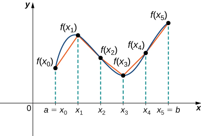
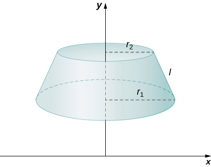
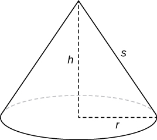
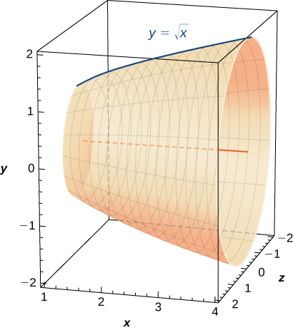
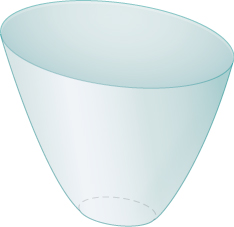
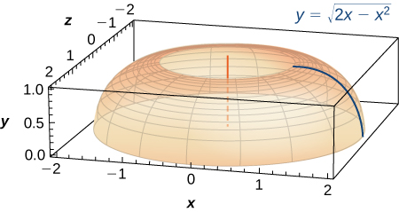
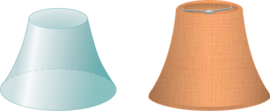

* Determine the length of a curve,
  <math xmlns="http://www.w3.org/1998/Math/MathML"><mrow><mi>y</mi><mo>=</mo><mi>f</mi><mo stretchy="false">(</mo><mi>x</mi><mo stretchy="false">)</mo><mo>,</mo></mrow></math>
  
  between two points.
* Determine the length of a curve,
  <math xmlns="http://www.w3.org/1998/Math/MathML"><mrow><mi>x</mi><mo>=</mo><mi>g</mi><mo stretchy="false">(</mo><mi>y</mi><mo stretchy="false">)</mo><mo>,</mo></mrow></math>
  
  between two points.
* Find the surface area of a solid of revolution.

In this section, we use definite integrals to find the arc length of a curve. We can think of **arc length**{: data-type="term"} as the distance you would travel if you were walking along the path of the curve. Many real-world applications involve arc length. If a rocket is launched along a parabolic path, we might want to know how far the rocket travels. Or, if a curve on a map represents a road, we might want to know how far we have to drive to reach our destination.

We begin by calculating the arc length of curves defined as functions of <math xmlns="http://www.w3.org/1998/Math/MathML"><mi>x</mi><mo>,</mo></math>

 then we examine the same process for curves defined as functions of <math xmlns="http://www.w3.org/1998/Math/MathML"><mi>y</mi><mo>.</mo></math>

 (The process is identical, with the roles of <math xmlns="http://www.w3.org/1998/Math/MathML"><mi>x</mi></math>

 and <math xmlns="http://www.w3.org/1998/Math/MathML"><mrow><mi>y</mi></mrow></math>

 reversed.) The techniques we use to find arc length can be extended to find the surface area of a surface of revolution, and we close the section with an examination of this concept.

### Arc Length of the Curve *y* = *f*(*x*)

In previous applications of integration, we required the function <math xmlns="http://www.w3.org/1998/Math/MathML"><mrow><mi>f</mi><mo stretchy="false">(</mo><mi>x</mi><mo stretchy="false">)</mo></mrow></math>

 to be integrable, or at most continuous. However, for calculating arc length we have a more stringent requirement for <math xmlns="http://www.w3.org/1998/Math/MathML"><mrow><mi>f</mi><mo stretchy="false">(</mo><mi>x</mi><mo stretchy="false">)</mo><mo>.</mo></mrow></math>

 Here, we require <math xmlns="http://www.w3.org/1998/Math/MathML"><mrow><mi>f</mi><mo stretchy="false">(</mo><mi>x</mi><mo stretchy="false">)</mo></mrow></math>

 to be differentiable, and furthermore we require its derivative, <math xmlns="http://www.w3.org/1998/Math/MathML"><mrow><msup><mi>f</mi><mo>′</mo></msup><mo stretchy="false">(</mo><mi>x</mi><mo stretchy="false">)</mo><mo>,</mo></mrow></math>

 to be continuous. Functions like this, which have continuous derivatives, are called ***smooth***{: data-type="term" .no-emphasis}. (This property comes up again in later chapters.)

Let <math xmlns="http://www.w3.org/1998/Math/MathML"><mrow><mi>f</mi><mo stretchy="false">(</mo><mi>x</mi><mo stretchy="false">)</mo></mrow></math>

 be a smooth function defined over <math xmlns="http://www.w3.org/1998/Math/MathML"><mrow><mrow><mo>[</mo><mrow><mi>a</mi><mo>,</mo><mi>b</mi></mrow><mo>]</mo></mrow><mo>.</mo></mrow></math>

 We want to calculate the length of the curve from the point <math xmlns="http://www.w3.org/1998/Math/MathML"><mrow><mrow><mo>(</mo><mrow><mi>a</mi><mo>,</mo><mi>f</mi><mo stretchy="false">(</mo><mi>a</mi><mo stretchy="false">)</mo></mrow><mo>)</mo></mrow></mrow></math>

 to the point <math xmlns="http://www.w3.org/1998/Math/MathML"><mrow><mrow><mo>(</mo><mrow><mi>b</mi><mo>,</mo><mi>f</mi><mo stretchy="false">(</mo><mi>b</mi><mo stretchy="false">)</mo></mrow><mo>)</mo></mrow><mo>.</mo></mrow></math>

 We start by using line segments to approximate the length of the curve. For <math xmlns="http://www.w3.org/1998/Math/MathML"><mrow><mi>i</mi><mo>=</mo><mn>0</mn><mo>,</mo><mspace width="0.2em" /><mn>1</mn><mo>,</mo><mn>2</mn><mtext>,…</mtext><mo>,</mo><mi>n</mi><mo>,</mo></mrow></math>

 let <math xmlns="http://www.w3.org/1998/Math/MathML"><mrow><mi>P</mi><mo>=</mo><mrow><mo>{</mo><mrow><msub><mi>x</mi><mi>i</mi></msub></mrow><mo>}</mo></mrow></mrow></math>

 be a regular partition of <math xmlns="http://www.w3.org/1998/Math/MathML"><mrow><mrow><mo>[</mo><mrow><mi>a</mi><mo>,</mo><mi>b</mi></mrow><mo>]</mo></mrow><mo>.</mo></mrow></math>

 Then, for <math xmlns="http://www.w3.org/1998/Math/MathML"><mrow><mi>i</mi><mo>=</mo><mn>1</mn><mo>,</mo><mn>2</mn><mtext>,…</mtext><mo>,</mo><mi>n</mi><mo>,</mo></mrow></math>

 construct a line segment from the point <math xmlns="http://www.w3.org/1998/Math/MathML"><mrow><mrow><mo>(</mo><mrow><msub><mi>x</mi><mrow><mi>i</mi><mo>−</mo><mn>1</mn></mrow></msub><mo>,</mo><mi>f</mi><mo stretchy="false">(</mo><msub><mi>x</mi><mrow><mi>i</mi><mo>−</mo><mn>1</mn></mrow></msub><mo stretchy="false">)</mo></mrow><mo>)</mo></mrow></mrow></math>

 to the point <math xmlns="http://www.w3.org/1998/Math/MathML"><mrow><mrow><mo>(</mo><mrow><msub><mi>x</mi><mi>i</mi></msub><mo>,</mo><mi>f</mi><mo stretchy="false">(</mo><msub><mi>x</mi><mi>i</mi></msub><mo stretchy="false">)</mo></mrow><mo>)</mo></mrow><mo>.</mo></mrow></math>

 Although it might seem logical to use either horizontal or vertical line segments, we want our line segments to approximate the curve as closely as possible. [\[link\]](#CNX_Calc_Figure_06_04_001) depicts this construct for <math xmlns="http://www.w3.org/1998/Math/MathML"><mrow><mi>n</mi><mo>=</mo><mn>5</mn><mo>.</mo></mrow></math>

 {: #CNX_Calc_Figure_06_04_001}

To help us find the length of each line segment, we look at the change in vertical distance as well as the change in horizontal distance over each interval. Because we have used a regular partition, the change in horizontal distance over each interval is given by <math xmlns="http://www.w3.org/1998/Math/MathML"><mrow><mtext>Δ</mtext><mi>x</mi><mo>.</mo></mrow></math>

 The change in vertical distance varies from interval to interval, though, so we use <math xmlns="http://www.w3.org/1998/Math/MathML"><mrow><mtext>Δ</mtext><msub><mi>y</mi><mi>i</mi></msub><mo>=</mo><mi>f</mi><mo stretchy="false">(</mo><msub><mi>x</mi><mi>i</mi></msub><mo stretchy="false">)</mo><mo>−</mo><mi>f</mi><mo stretchy="false">(</mo><msub><mi>x</mi><mrow><mi>i</mi><mo>−</mo><mn>1</mn></mrow></msub><mo stretchy="false">)</mo></mrow></math>

 to represent the change in vertical distance over the interval <math xmlns="http://www.w3.org/1998/Math/MathML"><mrow><mrow><mo>[</mo><mrow><msub><mi>x</mi><mrow><mi>i</mi><mo>−</mo><mn>1</mn></mrow></msub><mo>,</mo><msub><mi>x</mi><mi>i</mi></msub></mrow><mo>]</mo></mrow><mo>,</mo></mrow></math>

 as shown in [\[link\]](#CNX_Calc_Figure_06_04_002). Note that some (or all) <math xmlns="http://www.w3.org/1998/Math/MathML"><mrow><mtext>Δ</mtext><msub><mi>y</mi><mi>i</mi></msub></mrow></math>

 may be negative.

 {: #CNX_Calc_Figure_06_04_002}

By the Pythagorean theorem, the length of the line segment is <math xmlns="http://www.w3.org/1998/Math/MathML"><mrow><msqrt><mrow><msup><mrow><mrow><mo>(</mo><mrow><mtext>Δ</mtext><mi>x</mi></mrow><mo>)</mo></mrow></mrow><mn>2</mn></msup><mo>+</mo><msup><mrow><mrow><mo>(</mo><mrow><mtext>Δ</mtext><msub><mi>y</mi><mi>i</mi></msub></mrow><mo>)</mo></mrow></mrow><mn>2</mn></msup></mrow></msqrt><mo>.</mo></mrow></math>

 We can also write this as <math xmlns="http://www.w3.org/1998/Math/MathML"><mrow><mtext>Δ</mtext><mi>x</mi><msqrt><mrow><mn>1</mn><mo>+</mo><msup><mrow><mrow><mo>(</mo><mrow><mrow><mrow><mrow><mo>(</mo><mrow><mtext>Δ</mtext><msub><mi>y</mi><mi>i</mi></msub></mrow><mo>)</mo></mrow></mrow><mtext>/</mtext><mrow><mrow><mo>(</mo><mrow><mtext>Δ</mtext><mi>x</mi></mrow><mo>)</mo></mrow></mrow></mrow></mrow><mo>)</mo></mrow></mrow><mn>2</mn></msup></mrow></msqrt><mo>.</mo></mrow></math>

 Now, by the Mean Value Theorem, there is a point <math xmlns="http://www.w3.org/1998/Math/MathML"><mrow><msubsup><mi>x</mi><mi>i</mi><mo>*</mo></msubsup><mo>∈</mo><mrow><mo>[</mo><mrow><msub><mi>x</mi><mrow><mi>i</mi><mo>−</mo><mn>1</mn></mrow></msub><mo>,</mo><msub><mi>x</mi><mi>i</mi></msub></mrow><mo>]</mo></mrow></mrow></math>

 such that <math xmlns="http://www.w3.org/1998/Math/MathML"><mrow><msup><mi>f</mi><mo>′</mo></msup><mo stretchy="false">(</mo><msubsup><mi>x</mi><mi>i</mi><mo>*</mo></msubsup><mo stretchy="false">)</mo><mo>=</mo><mrow><mrow><mrow><mo>(</mo><mrow><mtext>Δ</mtext><msub><mi>y</mi><mi>i</mi></msub></mrow><mo>)</mo></mrow></mrow><mtext>/</mtext><mrow><mrow><mo>(</mo><mrow><mtext>Δ</mtext><mi>x</mi></mrow><mo>)</mo></mrow></mrow></mrow><mo>.</mo></mrow></math>

 Then the length of the line segment is given by <math xmlns="http://www.w3.org/1998/Math/MathML"><mrow><mtext>Δ</mtext><mi>x</mi><msqrt><mrow><mn>1</mn><mo>+</mo><msup><mrow><mrow><mo>[</mo><mrow><msup><mi>f</mi><mo>′</mo></msup><mo stretchy="false">(</mo><msubsup><mi>x</mi><mi>i</mi><mo>*</mo></msubsup><mo stretchy="false">)</mo></mrow><mo>]</mo></mrow></mrow><mn>2</mn></msup></mrow></msqrt><mo>.</mo></mrow></math>

 Adding up the lengths of all the line segments, we get

<math xmlns="http://www.w3.org/1998/Math/MathML"><mrow><mtext>Arc Length</mtext><mspace width="0.2em" /><mo>≈</mo><mstyle displaystyle="true"><munderover><mo>∑</mo><mrow><mi>i</mi><mo>=</mo><mn>1</mn></mrow><mi>n</mi></munderover><mrow><msqrt><mrow><mn>1</mn><mo>+</mo><msup><mrow><mrow><mo>[</mo><mrow><msup><mi>f</mi><mo>′</mo></msup><mo stretchy="false">(</mo><msubsup><mi>x</mi><mi>i</mi><mo>*</mo></msubsup><mo stretchy="false">)</mo></mrow><mo>]</mo></mrow></mrow><mn>2</mn></msup></mrow></msqrt><mspace width="0.2em" /><mtext>Δ</mtext><mi>x</mi></mrow></mstyle><mo>.</mo></mrow></math>

This is a Riemann sum. Taking the limit as <math xmlns="http://www.w3.org/1998/Math/MathML"><mrow><mi>n</mi><mo stretchy="false">→</mo><mi>∞</mi><mo>,</mo></mrow></math>

 we have

<math xmlns="http://www.w3.org/1998/Math/MathML"><mrow><mtext>Arc Length</mtext><mo>=</mo><munder><mrow><mtext>lim</mtext></mrow><mrow><mi>n</mi><mo stretchy="false">→</mo><mi>∞</mi></mrow></munder><mstyle displaystyle="true"><munderover><mo>∑</mo><mrow><mi>i</mi><mo>=</mo><mn>1</mn></mrow><mi>n</mi></munderover><mrow><msqrt><mrow><mn>1</mn><mo>+</mo><msup><mrow><mrow><mo>[</mo><mrow><msup><mi>f</mi><mo>′</mo></msup><mo stretchy="false">(</mo><msubsup><mi>x</mi><mi>i</mi><mo>*</mo></msubsup><mo stretchy="false">)</mo></mrow><mo>]</mo></mrow></mrow><mn>2</mn></msup></mrow></msqrt><mspace width="0.2em" /><mtext>Δ</mtext><mi>x</mi></mrow></mstyle><mo>=</mo><mstyle displaystyle="true"><mrow><msubsup><mo stretchy="false">∫</mo><mi>a</mi><mi>b</mi></msubsup><mrow><msqrt><mrow><mn>1</mn><mo>+</mo><msup><mrow><mrow><mo>[</mo><mrow><msup><mi>f</mi><mo>′</mo></msup><mo stretchy="false">(</mo><mi>x</mi><mo stretchy="false">)</mo></mrow><mo>]</mo></mrow></mrow><mn>2</mn></msup></mrow></msqrt></mrow></mrow></mstyle><mspace width="0.2em" /><mi>d</mi><mi>x</mi><mo>.</mo></mrow></math>

We summarize these findings in the following theorem.

Arc Length for *y* = *f*(*x*)

Let <math xmlns="http://www.w3.org/1998/Math/MathML"><mrow><mi>f</mi><mo stretchy="false">(</mo><mi>x</mi><mo stretchy="false">)</mo></mrow></math>

 be a smooth function over the interval <math xmlns="http://www.w3.org/1998/Math/MathML"><mrow><mrow><mo>[</mo><mrow><mi>a</mi><mo>,</mo><mi>b</mi></mrow><mo>]</mo></mrow><mo>.</mo></mrow></math>

 Then the arc length of the portion of the graph of <math xmlns="http://www.w3.org/1998/Math/MathML"><mrow><mi>f</mi><mo stretchy="false">(</mo><mi>x</mi><mo stretchy="false">)</mo></mrow></math>

 from the point <math xmlns="http://www.w3.org/1998/Math/MathML"><mrow><mrow><mo>(</mo><mrow><mi>a</mi><mo>,</mo><mi>f</mi><mo stretchy="false">(</mo><mi>a</mi><mo stretchy="false">)</mo></mrow><mo>)</mo></mrow></mrow></math>

 to the point <math xmlns="http://www.w3.org/1998/Math/MathML"><mrow><mrow><mo>(</mo><mrow><mi>b</mi><mo>,</mo><mspace width="0.2em" /><mi>f</mi><mo stretchy="false">(</mo><mi>b</mi><mo stretchy="false">)</mo></mrow><mo>)</mo></mrow></mrow></math>

 is given by

<math xmlns="http://www.w3.org/1998/Math/MathML"><mrow><mtext>Arc Length</mtext><mo>=</mo><mstyle displaystyle="true"><mrow><msubsup><mo stretchy="false">∫</mo><mi>a</mi><mi>b</mi></msubsup><mrow><msqrt><mrow><mn>1</mn><mo>+</mo><msup><mrow><mrow><mo>[</mo><mrow><msup><mi>f</mi><mo>′</mo></msup><mo stretchy="false">(</mo><mi>x</mi><mo stretchy="false">)</mo></mrow><mo>]</mo></mrow></mrow><mn>2</mn></msup></mrow></msqrt></mrow></mrow></mstyle><mspace width="0.2em" /><mi>d</mi><mi>x</mi><mo>.</mo></mrow></math>

Note that we are integrating an expression involving <math xmlns="http://www.w3.org/1998/Math/MathML"><mrow><msup><mi>f</mi><mo>′</mo></msup><mo stretchy="false">(</mo><mi>x</mi><mo stretchy="false">)</mo><mo>,</mo></mrow></math>

 so we need to be sure <math xmlns="http://www.w3.org/1998/Math/MathML"><mrow><msup><mi>f</mi><mo>′</mo></msup><mo stretchy="false">(</mo><mi>x</mi><mo stretchy="false">)</mo></mrow></math>

 is integrable. This is why we require <math xmlns="http://www.w3.org/1998/Math/MathML"><mrow><mi>f</mi><mo stretchy="false">(</mo><mi>x</mi><mo stretchy="false">)</mo></mrow></math>

 to be smooth. The following example shows how to apply the theorem.

Calculating the Arc Length of a Function of *x*

Let <math xmlns="http://www.w3.org/1998/Math/MathML"><mrow><mi>f</mi><mo stretchy="false">(</mo><mi>x</mi><mo stretchy="false">)</mo><mo>=</mo><mn>2</mn><msup><mi>x</mi><mrow><mn>3</mn><mtext>/</mtext><mn>2</mn></mrow></msup><mo>.</mo></mrow></math>

 Calculate the arc length of the graph of <math xmlns="http://www.w3.org/1998/Math/MathML"><mrow><mi>f</mi><mo stretchy="false">(</mo><mi>x</mi><mo stretchy="false">)</mo></mrow></math>

 over the interval <math xmlns="http://www.w3.org/1998/Math/MathML"><mrow><mrow><mo>[</mo><mrow><mn>0</mn><mo>,</mo><mn>1</mn></mrow><mo>]</mo></mrow><mo>.</mo></mrow></math>

 Round the answer to three decimal places.

We have <math xmlns="http://www.w3.org/1998/Math/MathML"><mrow><msup><mi>f</mi><mo>′</mo></msup><mo stretchy="false">(</mo><mi>x</mi><mo stretchy="false">)</mo><mo>=</mo><mn>3</mn><msup><mi>x</mi><mrow><mn>1</mn><mtext>/</mtext><mn>2</mn></mrow></msup><mo>,</mo></mrow></math>

 so <math xmlns="http://www.w3.org/1998/Math/MathML"><mrow><msup><mrow><mrow><mo>[</mo><mrow><msup><mi>f</mi><mo>′</mo></msup><mo stretchy="false">(</mo><mi>x</mi><mo stretchy="false">)</mo></mrow><mo>]</mo></mrow></mrow><mn>2</mn></msup><mo>=</mo><mn>9</mn><mi>x</mi><mo>.</mo></mrow></math>

 Then, the arc length is

<math xmlns="http://www.w3.org/1998/Math/MathML"><mtable><mtr><mtd columnalign="right"><mtext>Arc Length</mtext></mtd><mtd columnalign="left"><mo>=</mo><mstyle displaystyle="true"><mrow><msubsup><mo stretchy="false">∫</mo><mi>a</mi><mi>b</mi></msubsup><mrow><msqrt><mrow><mn>1</mn><mo>+</mo><msup><mrow><mrow><mo>[</mo><mrow><msup><mi>f</mi><mo>′</mo></msup><mo stretchy="false">(</mo><mi>x</mi><mo stretchy="false">)</mo></mrow><mo>]</mo></mrow></mrow><mn>2</mn></msup></mrow></msqrt></mrow></mrow></mstyle><mspace width="0.2em" /><mi>d</mi><mi>x</mi></mtd></mtr><mtr><mtd /><mtd columnalign="left"><mo>=</mo><mstyle displaystyle="true"><mrow><msubsup><mo stretchy="false">∫</mo><mn>0</mn><mn>1</mn></msubsup><mrow><msqrt><mrow><mn>1</mn><mo>+</mo><mn>9</mn><mi>x</mi></mrow></msqrt></mrow></mrow></mstyle><mspace width="0.2em" /><mi>d</mi><mi>x</mi><mo>.</mo></mtd></mtr></mtable></math>

Substitute <math xmlns="http://www.w3.org/1998/Math/MathML"><mrow><mi>u</mi><mo>=</mo><mn>1</mn><mo>+</mo><mn>9</mn><mi>x</mi><mo>.</mo></mrow></math>

 Then, <math xmlns="http://www.w3.org/1998/Math/MathML"><mrow><mi>d</mi><mi>u</mi><mo>=</mo><mn>9</mn><mspace width="0.2em" /><mi>d</mi><mi>x</mi><mo>.</mo></mrow></math>

 When <math xmlns="http://www.w3.org/1998/Math/MathML"><mrow><mi>x</mi><mo>=</mo><mn>0</mn><mo>,</mo></mrow></math>

 then <math xmlns="http://www.w3.org/1998/Math/MathML"><mrow><mi>u</mi><mo>=</mo><mn>1</mn><mo>,</mo></mrow></math>

 and when <math xmlns="http://www.w3.org/1998/Math/MathML"><mrow><mi>x</mi><mo>=</mo><mn>1</mn><mo>,</mo></mrow></math>

 then <math xmlns="http://www.w3.org/1998/Math/MathML"><mrow><mi>u</mi><mo>=</mo><mn>10</mn><mo>.</mo></mrow></math>

 Thus,

<math xmlns="http://www.w3.org/1998/Math/MathML"><mtable><mtr><mtd columnalign="right"><mtext>Arc Length</mtext></mtd><mtd columnalign="left"><mo>=</mo><mstyle displaystyle="true"><mrow><msubsup><mo stretchy="false">∫</mo><mn>0</mn><mn>1</mn></msubsup><mrow><msqrt><mrow><mn>1</mn><mo>+</mo><mn>9</mn><mi>x</mi></mrow></msqrt></mrow></mrow></mstyle><mspace width="0.2em" /><mi>d</mi><mi>x</mi></mtd></mtr><mtr><mtd /><mtd columnalign="left"><mo>=</mo><mfrac><mn>1</mn><mn>9</mn></mfrac><msubsup><mstyle mathsize="140%" displaystyle="true"><mo stretchy="false">∫</mo></mstyle><mn>0</mn><mn>1</mn></msubsup><msqrt><mrow><mn>1</mn><mo>+</mo><mn>9</mn><mi>x</mi></mrow></msqrt><mn>9</mn><mi>d</mi><mi>x</mi><mo>=</mo><mfrac><mn>1</mn><mn>9</mn></mfrac><mstyle displaystyle="true"><mrow><msubsup><mo stretchy="false">∫</mo><mn>1</mn><mrow><mn>10</mn></mrow></msubsup><mrow><msqrt><mi>u</mi></msqrt></mrow></mrow></mstyle><mspace width="0.2em" /><mi>d</mi><mi>u</mi></mtd></mtr><mtr><mtd /><mtd columnalign="left"><mo>=</mo><msubsup><mrow><mrow><mfrac><mn>1</mn><mn>9</mn></mfrac><mo>·</mo><mfrac><mn>2</mn><mn>3</mn></mfrac><msup><mi>u</mi><mrow><mn>3</mn><mtext>/</mtext><mn>2</mn></mrow></msup></mrow><mo>\|</mo></mrow><mn>1</mn><mrow><mn>10</mn></mrow></msubsup><mo>=</mo><mfrac><mn>2</mn><mrow><mn>27</mn></mrow></mfrac><mrow><mo>[</mo><mrow><mn>10</mn><msqrt><mrow><mn>10</mn></mrow></msqrt><mo>−</mo><mn>1</mn></mrow><mo>]</mo></mrow><mo>≈</mo><mn>2.268</mn><mspace width="0.2em" /><mtext>units</mtext><mo>.</mo></mtd></mtr></mtable></math>

Let <math xmlns="http://www.w3.org/1998/Math/MathML"><mrow><mi>f</mi><mo stretchy="false">(</mo><mi>x</mi><mo stretchy="false">)</mo><mo>=</mo><mrow><mo>(</mo><mrow><mrow><mn>4</mn><mtext>/</mtext><mn>3</mn></mrow></mrow><mo>)</mo></mrow><msup><mi>x</mi><mrow><mn>3</mn><mtext>/</mtext><mn>2</mn></mrow></msup><mo>.</mo></mrow></math>

 Calculate the arc length of the graph of <math xmlns="http://www.w3.org/1998/Math/MathML"><mrow><mi>f</mi><mo stretchy="false">(</mo><mi>x</mi><mo stretchy="false">)</mo></mrow></math>

 over the interval <math xmlns="http://www.w3.org/1998/Math/MathML"><mrow><mrow><mo>[</mo><mrow><mn>0</mn><mo>,</mo><mn>1</mn></mrow><mo>]</mo></mrow><mo>.</mo></mrow></math>

 Round the answer to three decimal places.

<math xmlns="http://www.w3.org/1998/Math/MathML"><mrow><mfrac><mn>1</mn><mn>6</mn></mfrac><mrow><mo>(</mo><mrow><mn>5</mn><msqrt><mn>5</mn></msqrt><mo>−</mo><mn>1</mn></mrow><mo>)</mo></mrow><mo>≈</mo><mn>1.697</mn></mrow></math>

Hint

Use the process from the previous example. Don’t forget to change the limits of integration.

Although it is nice to have a formula for calculating arc length, this particular theorem can generate expressions that are difficult to integrate. We study some techniques for integration in [Introduction to Techniques of Integration](/m53654){: .target-chapter}. In some cases, we may have to use a computer or calculator to approximate the value of the integral.

Using a Computer or Calculator to Determine the Arc Length of a Function of *x*

Let <math xmlns="http://www.w3.org/1998/Math/MathML"><mrow><mi>f</mi><mo stretchy="false">(</mo><mi>x</mi><mo stretchy="false">)</mo><mo>=</mo><msup><mi>x</mi><mn>2</mn></msup><mo>.</mo></mrow></math>

 Calculate the arc length of the graph of <math xmlns="http://www.w3.org/1998/Math/MathML"><mrow><mi>f</mi><mo stretchy="false">(</mo><mi>x</mi><mo stretchy="false">)</mo></mrow></math>

 over the interval <math xmlns="http://www.w3.org/1998/Math/MathML"><mrow><mrow><mo>[</mo><mrow><mn>1</mn><mo>,</mo><mn>3</mn></mrow><mo>]</mo></mrow><mo>.</mo></mrow></math>

We have <math xmlns="http://www.w3.org/1998/Math/MathML"><mrow><msup><mi>f</mi><mo>′</mo></msup><mo stretchy="false">(</mo><mi>x</mi><mo stretchy="false">)</mo><mo>=</mo><mn>2</mn><mi>x</mi><mo>,</mo></mrow></math>

 so <math xmlns="http://www.w3.org/1998/Math/MathML"><mrow><msup><mrow><mrow><mo>[</mo><mrow><msup><mi>f</mi><mo>′</mo></msup><mo stretchy="false">(</mo><mi>x</mi><mo stretchy="false">)</mo></mrow><mo>]</mo></mrow></mrow><mn>2</mn></msup><mo>=</mo><mn>4</mn><msup><mi>x</mi><mn>2</mn></msup><mo>.</mo></mrow></math>

 Then the arc length is given by

<math xmlns="http://www.w3.org/1998/Math/MathML"><mrow><mtext>Arc Length</mtext><mo>=</mo><mstyle displaystyle="true"><mrow><msubsup><mo stretchy="false">∫</mo><mi>a</mi><mi>b</mi></msubsup><mrow><msqrt><mrow><mn>1</mn><mo>+</mo><msup><mrow><mrow><mo>[</mo><mrow><msup><mi>f</mi><mo>′</mo></msup><mo stretchy="false">(</mo><mi>x</mi><mo stretchy="false">)</mo></mrow><mo>]</mo></mrow></mrow><mn>2</mn></msup></mrow></msqrt></mrow></mrow></mstyle><mspace width="0.2em" /><mi>d</mi><mi>x</mi><mo>=</mo><mstyle displaystyle="true"><mrow><msubsup><mo stretchy="false">∫</mo><mn>1</mn><mn>3</mn></msubsup><mrow><msqrt><mrow><mn>1</mn><mo>+</mo><mn>4</mn><msup><mi>x</mi><mn>2</mn></msup></mrow></msqrt></mrow></mrow></mstyle><mspace width="0.2em" /><mi>d</mi><mi>x</mi><mo>.</mo></mrow></math>

Using a computer to approximate the value of this integral, we get

<math xmlns="http://www.w3.org/1998/Math/MathML"><mrow><mstyle displaystyle="true"><mrow><msubsup><mo stretchy="false">∫</mo><mn>1</mn><mn>3</mn></msubsup><mrow><msqrt><mrow><mn>1</mn><mo>+</mo><mn>4</mn><msup><mi>x</mi><mn>2</mn></msup></mrow></msqrt></mrow></mrow></mstyle><mspace width="0.2em" /><mi>d</mi><mi>x</mi><mo>≈</mo><mn>8.26815</mn><mo>.</mo></mrow></math>

Let <math xmlns="http://www.w3.org/1998/Math/MathML"><mrow><mi>f</mi><mo stretchy="false">(</mo><mi>x</mi><mo stretchy="false">)</mo><mo>=</mo><mtext>sin</mtext><mspace width="0.2em" /><mi>x</mi><mo>.</mo></mrow></math>

 Calculate the arc length of the graph of <math xmlns="http://www.w3.org/1998/Math/MathML"><mrow><mi>f</mi><mo stretchy="false">(</mo><mi>x</mi><mo stretchy="false">)</mo></mrow></math>

 over the interval <math xmlns="http://www.w3.org/1998/Math/MathML"><mrow><mrow><mo>[</mo><mrow><mn>0</mn><mo>,</mo><mi>π</mi></mrow><mo>]</mo></mrow><mo>.</mo></mrow></math>

 Use a computer or calculator to approximate the value of the integral.

<math xmlns="http://www.w3.org/1998/Math/MathML"><mrow><mtext>Arc Length</mtext><mo>≈</mo><mn>3.8202</mn></mrow></math>

Hint

Use the process from the previous example.

### Arc Length of the Curve *x* = *g*(*y*)

We have just seen how to approximate the length of a curve with line segments. If we want to find the arc length of the graph of a function of <math xmlns="http://www.w3.org/1998/Math/MathML"><mi>y</mi><mo>,</mo></math>

 we can repeat the same process, except we partition the <math xmlns="http://www.w3.org/1998/Math/MathML"><mrow><mi>y</mi><mtext>-axis</mtext></mrow></math>

 instead of the <math xmlns="http://www.w3.org/1998/Math/MathML"><mrow><mi>x</mi><mtext>-axis</mtext><mo>.</mo></mrow></math>

 [\[link\]](#CNX_Calc_Figure_06_04_003) shows a representative line segment.

 {: #CNX_Calc_Figure_06_04_003}

Then the length of the line segment is <math xmlns="http://www.w3.org/1998/Math/MathML"><mrow><msqrt><mrow><msup><mrow><mrow><mo>(</mo><mrow><mtext>Δ</mtext><mi>y</mi></mrow><mo>)</mo></mrow></mrow><mn>2</mn></msup><mo>+</mo><msup><mrow><mrow><mo>(</mo><mrow><mtext>Δ</mtext><msub><mi>x</mi><mi>i</mi></msub></mrow><mo>)</mo></mrow></mrow><mn>2</mn></msup></mrow></msqrt><mo>,</mo></mrow></math>

 which can also be written as <math xmlns="http://www.w3.org/1998/Math/MathML"><mrow><mtext>Δ</mtext><mi>y</mi><msqrt><mrow><mn>1</mn><mo>+</mo><msup><mrow><mrow><mo>(</mo><mrow><mrow><mrow><mrow><mo>(</mo><mrow><mtext>Δ</mtext><msub><mi>x</mi><mi>i</mi></msub></mrow><mo>)</mo></mrow></mrow><mtext>/</mtext><mrow><mrow><mo>(</mo><mrow><mtext>Δ</mtext><mi>y</mi></mrow><mo>)</mo></mrow></mrow></mrow></mrow><mo>)</mo></mrow></mrow><mn>2</mn></msup></mrow></msqrt><mo>.</mo></mrow></math>

 If we now follow the same development we did earlier, we get a formula for arc length of a function <math xmlns="http://www.w3.org/1998/Math/MathML"><mrow><mi>x</mi><mo>=</mo><mi>g</mi><mo stretchy="false">(</mo><mi>y</mi><mo stretchy="false">)</mo><mo>.</mo></mrow></math>

Arc Length for *x* = *g*(*y*)

Let <math xmlns="http://www.w3.org/1998/Math/MathML"><mrow><mi>g</mi><mo stretchy="false">(</mo><mi>y</mi><mo stretchy="false">)</mo></mrow></math>

 be a smooth function over an interval <math xmlns="http://www.w3.org/1998/Math/MathML"><mrow><mrow><mo>[</mo><mrow><mi>c</mi><mo>,</mo><mi>d</mi></mrow><mo>]</mo></mrow><mo>.</mo></mrow></math>

 Then, the arc length of the graph of <math xmlns="http://www.w3.org/1998/Math/MathML"><mrow><mi>g</mi><mo stretchy="false">(</mo><mi>y</mi><mo stretchy="false">)</mo></mrow></math>

 from the point <math xmlns="http://www.w3.org/1998/Math/MathML"><mrow><mrow><mo>(</mo><mrow><mi>c</mi><mo>,</mo><mi>g</mi><mo stretchy="false">(</mo><mi>c</mi><mo stretchy="false">)</mo></mrow><mo>)</mo></mrow></mrow></math>

 to the point <math xmlns="http://www.w3.org/1998/Math/MathML"><mrow><mrow><mo>(</mo><mrow><mi>d</mi><mo>,</mo><mi>g</mi><mo stretchy="false">(</mo><mi>d</mi><mo stretchy="false">)</mo></mrow><mo>)</mo></mrow></mrow></math>

 is given by

<math xmlns="http://www.w3.org/1998/Math/MathML"><mrow><mtext>Arc Length</mtext><mo>=</mo><mstyle displaystyle="true"><mrow><msubsup><mo stretchy="false">∫</mo><mi>c</mi><mi>d</mi></msubsup><mrow><msqrt><mrow><mn>1</mn><mo>+</mo><msup><mrow><mrow><mo>[</mo><mrow><msup><mi>g</mi><mo>′</mo></msup><mo stretchy="false">(</mo><mi>y</mi><mo stretchy="false">)</mo></mrow><mo>]</mo></mrow></mrow><mn>2</mn></msup></mrow></msqrt></mrow></mrow></mstyle><mspace width="0.2em" /><mi>d</mi><mi>y</mi><mo>.</mo></mrow></math>

Calculating the Arc Length of a Function of *y*

Let <math xmlns="http://www.w3.org/1998/Math/MathML"><mrow><mi>g</mi><mo stretchy="false">(</mo><mi>y</mi><mo stretchy="false">)</mo><mo>=</mo><mn>3</mn><msup><mi>y</mi><mn>3</mn></msup><mo>.</mo></mrow></math>

 Calculate the arc length of the graph of <math xmlns="http://www.w3.org/1998/Math/MathML"><mrow><mi>g</mi><mo stretchy="false">(</mo><mi>y</mi><mo stretchy="false">)</mo></mrow></math>

 over the interval <math xmlns="http://www.w3.org/1998/Math/MathML"><mrow><mrow><mo>[</mo><mrow><mn>1</mn><mo>,</mo><mn>2</mn></mrow><mo>]</mo></mrow><mo>.</mo></mrow></math>

We have <math xmlns="http://www.w3.org/1998/Math/MathML"><mrow><msup><mi>g</mi><mo>′</mo></msup><mo stretchy="false">(</mo><mi>y</mi><mo stretchy="false">)</mo><mo>=</mo><mn>9</mn><msup><mi>y</mi><mn>2</mn></msup><mo>,</mo></mrow></math>

 so <math xmlns="http://www.w3.org/1998/Math/MathML"><mrow><msup><mrow><mrow><mo>[</mo><mrow><msup><mi>g</mi><mo>′</mo></msup><mo stretchy="false">(</mo><mi>y</mi><mo stretchy="false">)</mo></mrow><mo>]</mo></mrow></mrow><mn>2</mn></msup><mo>=</mo><mn>81</mn><msup><mi>y</mi><mn>4</mn></msup><mo>.</mo></mrow></math>

 Then the arc length is

<math xmlns="http://www.w3.org/1998/Math/MathML"><mrow><mtext>Arc Length</mtext><mo>=</mo><mstyle displaystyle="true"><mrow><msubsup><mo stretchy="false">∫</mo><mi>c</mi><mi>d</mi></msubsup><mrow><msqrt><mrow><mn>1</mn><mo>+</mo><msup><mrow><mrow><mo>[</mo><mrow><msup><mi>g</mi><mo>′</mo></msup><mo stretchy="false">(</mo><mi>y</mi><mo stretchy="false">)</mo></mrow><mo>]</mo></mrow></mrow><mn>2</mn></msup></mrow></msqrt></mrow></mrow></mstyle><mspace width="0.2em" /><mi>d</mi><mi>y</mi><mo>=</mo><mstyle displaystyle="true"><mrow><msubsup><mo stretchy="false">∫</mo><mn>1</mn><mn>2</mn></msubsup><mrow><msqrt><mrow><mn>1</mn><mo>+</mo><mn>81</mn><msup><mi>y</mi><mn>4</mn></msup></mrow></msqrt></mrow></mrow></mstyle><mspace width="0.2em" /><mi>d</mi><mi>y</mi><mo>.</mo></mrow></math>

Using a computer to approximate the value of this integral, we obtain

<math xmlns="http://www.w3.org/1998/Math/MathML"><mrow><mstyle displaystyle="true"><mrow><msubsup><mo stretchy="false">∫</mo><mn>1</mn><mn>2</mn></msubsup><mrow><msqrt><mrow><mn>1</mn><mo>+</mo><mn>81</mn><msup><mi>y</mi><mn>4</mn></msup></mrow></msqrt></mrow></mrow></mstyle><mspace width="0.2em" /><mi>d</mi><mi>y</mi><mo>≈</mo><mn>21.0277</mn><mo>.</mo></mrow></math>

Let <math xmlns="http://www.w3.org/1998/Math/MathML"><mrow><mi>g</mi><mo stretchy="false">(</mo><mi>y</mi><mo stretchy="false">)</mo><mo>=</mo><mrow><mn>1</mn><mtext>/</mtext><mi>y</mi></mrow><mo>.</mo></mrow></math>

 Calculate the arc length of the graph of <math xmlns="http://www.w3.org/1998/Math/MathML"><mrow><mi>g</mi><mo stretchy="false">(</mo><mi>y</mi><mo stretchy="false">)</mo></mrow></math>

 over the interval <math xmlns="http://www.w3.org/1998/Math/MathML"><mrow><mrow><mo>[</mo><mrow><mn>1</mn><mo>,</mo><mn>4</mn></mrow><mo>]</mo></mrow><mo>.</mo></mrow></math>

 Use a computer or calculator to approximate the value of the integral.

<math xmlns="http://www.w3.org/1998/Math/MathML"><mrow><mtext>Arc Length</mtext><mo>=</mo><mn>3.15018</mn></mrow></math>

Hint

Use the process from the previous example.

### Area of a Surface of Revolution

The concepts we used to find the arc length of a curve can be extended to find the surface area of a surface of revolution. **Surface area**{: data-type="term"} is the total area of the outer layer of an object. For objects such as cubes or bricks, the surface area of the object is the sum of the areas of all of its faces. For curved surfaces, the situation is a little more complex. Let <math xmlns="http://www.w3.org/1998/Math/MathML"><mrow><mi>f</mi><mo stretchy="false">(</mo><mi>x</mi><mo stretchy="false">)</mo></mrow></math>

 be a nonnegative smooth function over the interval <math xmlns="http://www.w3.org/1998/Math/MathML"><mrow><mrow><mo>[</mo><mrow><mi>a</mi><mo>,</mo><mi>b</mi></mrow><mo>]</mo></mrow><mo>.</mo></mrow></math>

 We wish to find the surface area of the surface of revolution created by revolving the graph of <math xmlns="http://www.w3.org/1998/Math/MathML"><mrow><mi>y</mi><mo>=</mo><mi>f</mi><mo stretchy="false">(</mo><mi>x</mi><mo stretchy="false">)</mo></mrow></math>

 around the <math xmlns="http://www.w3.org/1998/Math/MathML"><mrow><mi>x</mi><mtext>-axis</mtext></mrow></math>

 as shown in the following figure.

  A curve representing the function f(x). (b) The surface of revolution formed by revolving the graph of f(x) around the x-axis."){: #CNX_Calc_Figure_06_04_004}

As we have done many times before, we are going to partition the interval <math xmlns="http://www.w3.org/1998/Math/MathML"><mrow><mrow><mo>[</mo><mrow><mi>a</mi><mo>,</mo><mi>b</mi></mrow><mo>]</mo></mrow></mrow></math>

 and approximate the surface area by calculating the surface area of simpler shapes. We start by using line segments to approximate the curve, as we did earlier in this section. For <math xmlns="http://www.w3.org/1998/Math/MathML"><mrow><mi>i</mi><mo>=</mo><mn>0</mn><mo>,</mo><mn>1</mn><mo>,</mo><mn>2</mn><mtext>,…</mtext><mo>,</mo><mi>n</mi><mo>,</mo></mrow></math>

 let <math xmlns="http://www.w3.org/1998/Math/MathML"><mrow><mi>P</mi><mo>=</mo><mrow><mo>{</mo><mrow><msub><mi>x</mi><mi>i</mi></msub></mrow><mo>}</mo></mrow></mrow></math>

 be a regular partition of <math xmlns="http://www.w3.org/1998/Math/MathML"><mrow><mrow><mo>[</mo><mrow><mi>a</mi><mo>,</mo><mi>b</mi></mrow><mo>]</mo></mrow><mo>.</mo></mrow></math>

 Then, for <math xmlns="http://www.w3.org/1998/Math/MathML"><mrow><mi>i</mi><mo>=</mo><mn>1</mn><mo>,</mo><mn>2</mn><mtext>,…</mtext><mo>,</mo><mi>n</mi><mo>,</mo></mrow></math>

 construct a line segment from the point <math xmlns="http://www.w3.org/1998/Math/MathML"><mrow><mrow><mo>(</mo><mrow><msub><mi>x</mi><mrow><mi>i</mi><mo>−</mo><mn>1</mn></mrow></msub><mo>,</mo><mi>f</mi><mo stretchy="false">(</mo><msub><mi>x</mi><mrow><mi>i</mi><mo>−</mo><mn>1</mn></mrow></msub><mo stretchy="false">)</mo></mrow><mo>)</mo></mrow></mrow></math>

 to the point <math xmlns="http://www.w3.org/1998/Math/MathML"><mrow><mrow><mo>(</mo><mrow><msub><mi>x</mi><mi>i</mi></msub><mo>,</mo><mi>f</mi><mo stretchy="false">(</mo><msub><mi>x</mi><mi>i</mi></msub><mo stretchy="false">)</mo></mrow><mo>)</mo></mrow><mo>.</mo></mrow></math>

 Now, revolve these line segments around the <math xmlns="http://www.w3.org/1998/Math/MathML"><mrow><mi>x</mi><mtext>-axis</mtext></mrow></math>

 to generate an approximation of the surface of revolution as shown in the following figure.

  Approximating f(x) with line segments. (b) The surface of revolution formed by revolving the line segments around the x-axis."){: #CNX_Calc_Figure_06_04_005}

Notice that when each line segment is revolved around the axis, it produces a band. These bands are actually pieces of cones (think of an ice cream cone with the pointy end cut off). A piece of a cone like this is called a **frustum**{: data-type="term"} of a cone.

To find the surface area of the band, we need to find the lateral surface area, <math xmlns="http://www.w3.org/1998/Math/MathML"><mi>S</mi><mo>,</mo></math>

 of the frustum (the area of just the slanted outside surface of the frustum, not including the areas of the top or bottom faces). Let <math xmlns="http://www.w3.org/1998/Math/MathML"><mrow><msub><mi>r</mi><mn>1</mn></msub></mrow></math>

 and <math xmlns="http://www.w3.org/1998/Math/MathML"><mrow><msub><mi>r</mi><mn>2</mn></msub></mrow></math>

 be the radii of the wide end and the narrow end of the frustum, respectively, and let <math xmlns="http://www.w3.org/1998/Math/MathML"><mrow><mi>l</mi></mrow></math>

 be the slant height of the frustum as shown in the following figure.

 {: #CNX_Calc_Figure_06_04_006}

We know the lateral surface area of a cone is given by

<math xmlns="http://www.w3.org/1998/Math/MathML"><mrow><mtext>Lateral Surface Area</mtext><mo>=</mo><mi>π</mi><mi>r</mi><mi>s</mi><mo>,</mo></mrow></math>

where <math xmlns="http://www.w3.org/1998/Math/MathML"><mi>r</mi></math>

 is the radius of the base of the cone and <math xmlns="http://www.w3.org/1998/Math/MathML"><mi>s</mi></math>

 is the slant height (see the following figure).

 {: #CNX_Calc_Figure_06_04_007}

Since a frustum can be thought of as a piece of a cone, the lateral surface area of the frustum is given by the lateral surface area of the whole cone less the lateral surface area of the smaller cone (the pointy tip) that was cut off (see the following figure).

 {: #CNX_Calc_Figure_06_04_008}

The cross-sections of the small cone and the large cone are similar triangles, so we see that

<math xmlns="http://www.w3.org/1998/Math/MathML"><mrow><mfrac><mrow><msub><mi>r</mi><mn>2</mn></msub></mrow><mrow><msub><mi>r</mi><mn>1</mn></msub></mrow></mfrac><mo>=</mo><mfrac><mrow><mi>s</mi><mo>−</mo><mi>l</mi></mrow><mi>s</mi></mfrac><mo>.</mo></mrow></math>

Solving for <math xmlns="http://www.w3.org/1998/Math/MathML"><mi>s</mi><mo>,</mo></math>

 we get

<math xmlns="http://www.w3.org/1998/Math/MathML"><mtable><mtr><mtd columnalign="right"><mfrac><mrow><msub><mi>r</mi><mn>2</mn></msub></mrow><mrow><msub><mi>r</mi><mn>1</mn></msub></mrow></mfrac></mtd><mtd columnalign="left"><mo>=</mo></mtd><mtd columnalign="left"><mfrac><mrow><mi>s</mi><mo>−</mo><mi>l</mi></mrow><mi>s</mi></mfrac></mtd></mtr><mtr><mtd columnalign="right"><msub><mi>r</mi><mn>2</mn></msub><mi>s</mi></mtd><mtd columnalign="left"><mo>=</mo></mtd><mtd columnalign="left"><msub><mi>r</mi><mn>1</mn></msub><mrow><mo>(</mo><mrow><mi>s</mi><mo>−</mo><mi>l</mi></mrow><mo>)</mo></mrow></mtd></mtr><mtr><mtd columnalign="right"><msub><mi>r</mi><mn>2</mn></msub><mi>s</mi></mtd><mtd columnalign="left"><mo>=</mo></mtd><mtd columnalign="left"><msub><mi>r</mi><mn>1</mn></msub><mi>s</mi><mo>−</mo><msub><mi>r</mi><mn>1</mn></msub><mi>l</mi></mtd></mtr><mtr><mtd columnalign="right"><msub><mi>r</mi><mn>1</mn></msub><mi>l</mi></mtd><mtd columnalign="left"><mo>=</mo></mtd><mtd columnalign="left"><msub><mi>r</mi><mn>1</mn></msub><mi>s</mi><mo>−</mo><msub><mi>r</mi><mn>2</mn></msub><mi>s</mi></mtd></mtr><mtr><mtd columnalign="right"><msub><mi>r</mi><mn>1</mn></msub><mi>l</mi></mtd><mtd columnalign="left"><mo>=</mo></mtd><mtd columnalign="left"><mrow><mo>(</mo><mrow><msub><mi>r</mi><mn>1</mn></msub><mo>−</mo><msub><mi>r</mi><mn>2</mn></msub></mrow><mo>)</mo></mrow><mi>s</mi></mtd></mtr><mtr><mtd columnalign="right"><mfrac><mrow><msub><mi>r</mi><mn>1</mn></msub><mi>l</mi></mrow><mrow><msub><mi>r</mi><mn>1</mn></msub><mo>−</mo><msub><mi>r</mi><mn>2</mn></msub></mrow></mfrac></mtd><mtd columnalign="left"><mo>=</mo></mtd><mtd columnalign="left"><mi>s</mi><mo>.</mo></mtd></mtr></mtable></math>

Then the lateral surface area (SA) of the frustum is

<math xmlns="http://www.w3.org/1998/Math/MathML"><mtable><mtr><mtd columnalign="right"><mi>S</mi></mtd><mtd columnalign="left"><mo>=</mo><mspace width="0.2em" /><mtext>(Lateral SA of large cone)</mtext><mo>−</mo><mtext>(Lateral SA of small cone)</mtext></mtd></mtr><mtr><mtd /><mtd columnalign="left"><mo>=</mo><mi>π</mi><msub><mi>r</mi><mn>1</mn></msub><mi>s</mi><mo>−</mo><mi>π</mi><msub><mi>r</mi><mn>2</mn></msub><mrow><mo>(</mo><mrow><mi>s</mi><mo>−</mo><mi>l</mi></mrow><mo>)</mo></mrow></mtd></mtr><mtr><mtd /><mtd columnalign="left"><mo>=</mo><mi>π</mi><msub><mi>r</mi><mn>1</mn></msub><mrow><mo>(</mo><mrow><mfrac><mrow><msub><mi>r</mi><mn>1</mn></msub><mi>l</mi></mrow><mrow><msub><mi>r</mi><mn>1</mn></msub><mo>−</mo><msub><mi>r</mi><mn>2</mn></msub></mrow></mfrac></mrow><mo>)</mo></mrow><mo>−</mo><mi>π</mi><msub><mi>r</mi><mn>2</mn></msub><mrow><mo>(</mo><mrow><mfrac><mrow><msub><mi>r</mi><mn>1</mn></msub><mi>l</mi></mrow><mrow><msub><mi>r</mi><mn>1</mn></msub><mo>−</mo><msub><mi>r</mi><mn>2</mn></msub></mrow></mfrac><mo>−</mo><mi>l</mi></mrow><mo>)</mo></mrow></mtd></mtr><mtr><mtd /><mtd columnalign="left"><mo>=</mo><mfrac><mrow><mi>π</mi><msubsup><mi>r</mi><mn>1</mn><mn>2</mn></msubsup><mi>l</mi></mrow><mrow><msub><mi>r</mi><mn>1</mn></msub><mo>−</mo><msub><mi>r</mi><mn>2</mn></msub></mrow></mfrac><mo>−</mo><mfrac><mrow><mi>π</mi><msub><mi>r</mi><mn>1</mn></msub><msub><mi>r</mi><mn>2</mn></msub><mi>l</mi></mrow><mrow><msub><mi>r</mi><mn>1</mn></msub><mo>−</mo><msub><mi>r</mi><mn>2</mn></msub></mrow></mfrac><mo>+</mo><mi>π</mi><msub><mi>r</mi><mn>2</mn></msub><mi>l</mi></mtd></mtr><mtr><mtd /><mtd columnalign="left"><mo>=</mo><mfrac><mrow><mi>π</mi><msubsup><mi>r</mi><mn>1</mn><mn>2</mn></msubsup><mi>l</mi></mrow><mrow><msub><mi>r</mi><mn>1</mn></msub><mo>−</mo><msub><mi>r</mi><mn>2</mn></msub></mrow></mfrac><mo>−</mo><mfrac><mrow><mi>π</mi><msub><mi>r</mi><mn>1</mn></msub><msub><mi>r</mi><mn>2</mn></msub><mi>l</mi></mrow><mrow><msub><mi>r</mi><mn>1</mn></msub><mo>−</mo><msub><mi>r</mi><mn>2</mn></msub></mrow></mfrac><mo>+</mo><mfrac><mrow><mi>π</mi><msub><mi>r</mi><mn>2</mn></msub><mi>l</mi><mrow><mo>(</mo><mrow><msub><mi>r</mi><mn>1</mn></msub><mo>−</mo><msub><mi>r</mi><mn>2</mn></msub></mrow><mo>)</mo></mrow></mrow><mrow><msub><mi>r</mi><mn>1</mn></msub><mo>−</mo><msub><mi>r</mi><mn>2</mn></msub></mrow></mfrac></mtd></mtr><mtr><mtd /><mtd columnalign="left"><mo>=</mo><mfrac><mrow><mi>π</mi><msubsup><mi>r</mi><mn>1</mn><mn>2</mn></msubsup><mi>l</mi></mrow><mrow><msub><mi>r</mi><mn>1</mn></msub><mo>−</mo><msub><mi>r</mi><mn>2</mn></msub></mrow></mfrac><mo>−</mo><mfrac><mrow><mi>π</mi><msub><mi>r</mi><mn>1</mn></msub><msub><mi>r</mi><mn>2</mn></msub><mi>l</mi></mrow><mrow><msub><mi>r</mi><mn>1</mn></msub><mo>−</mo><msub><mi>r</mi><mn>2</mn></msub></mrow></mfrac><mo>+</mo><mfrac><mrow><mi>π</mi><msub><mi>r</mi><mn>1</mn></msub><msub><mi>r</mi><mn>2</mn></msub><mi>l</mi></mrow><mrow><msub><mi>r</mi><mn>1</mn></msub><mo>−</mo><msub><mi>r</mi><mn>2</mn></msub></mrow></mfrac><mo>−</mo><mfrac><mrow><mi>π</mi><msub><mi>r</mi><mn>2</mn></msub><msup><mrow /><mn>2</mn></msup><mi>l</mi></mrow><mrow><msub><mi>r</mi><mn>1</mn></msub><mo>−</mo><msub><mi>r</mi><mn>2</mn></msub></mrow></mfrac></mtd></mtr><mtr><mtd /><mtd columnalign="left"><mo>=</mo><mfrac><mrow><mi>π</mi><mrow><mo>(</mo><mrow><msubsup><mi>r</mi><mn>1</mn><mn>2</mn></msubsup><mo>−</mo><msubsup><mi>r</mi><mn>2</mn><mn>2</mn></msubsup></mrow><mo>)</mo></mrow><mi>l</mi></mrow><mrow><msub><mi>r</mi><mn>1</mn></msub><mo>−</mo><msub><mi>r</mi><mn>2</mn></msub></mrow></mfrac><mo>=</mo><mfrac><mrow><mi>π</mi><mrow><mo>(</mo><mrow><msub><mi>r</mi><mn>1</mn></msub><mo>−</mo><msub><mi>r</mi><mn>2</mn></msub></mrow><mo>)</mo></mrow><mrow><mo>(</mo><mrow><msub><mi>r</mi><mn>1</mn></msub><mo>+</mo><msub><mi>r</mi><mn>2</mn></msub></mrow><mo>)</mo></mrow><mi>l</mi></mrow><mrow><msub><mi>r</mi><mn>1</mn></msub><mo>−</mo><msub><mi>r</mi><mn>2</mn></msub></mrow></mfrac><mo>=</mo><mi>π</mi><mrow><mo>(</mo><mrow><msub><mi>r</mi><mn>1</mn></msub><mo>+</mo><msub><mi>r</mi><mn>2</mn></msub></mrow><mo>)</mo></mrow><mi>l</mi><mo>.</mo></mtd></mtr></mtable></math>

Let’s now use this formula to calculate the surface area of each of the bands formed by revolving the line segments around the <math xmlns="http://www.w3.org/1998/Math/MathML"><mrow><mi>x</mi><mtext>-axis</mtext><mtext>.</mtext></mrow></math>

 A representative band is shown in the following figure.

 {: #CNX_Calc_Figure_06_04_009}

Note that the slant height of this frustum is just the length of the line segment used to generate it. So, applying the surface area formula, we have

<math xmlns="http://www.w3.org/1998/Math/MathML"><mtable><mtr><mtd columnalign="right"><mi>S</mi></mtd><mtd columnalign="left"><mo>=</mo><mi>π</mi><mrow><mo>(</mo><mrow><msub><mi>r</mi><mn>1</mn></msub><mo>+</mo><msub><mi>r</mi><mn>2</mn></msub></mrow><mo>)</mo></mrow><mi>l</mi></mtd></mtr><mtr><mtd /><mtd columnalign="left"><mo>=</mo><mi>π</mi><mrow><mo>(</mo><mrow><mi>f</mi><mo stretchy="false">(</mo><msub><mi>x</mi><mrow><mi>i</mi><mo>−</mo><mn>1</mn></mrow></msub><mo stretchy="false">)</mo><mo>+</mo><mi>f</mi><mo stretchy="false">(</mo><msub><mi>x</mi><mi>i</mi></msub><mo stretchy="false">)</mo></mrow><mo>)</mo></mrow><msqrt><mrow><mtext>Δ</mtext><msup><mi>x</mi><mn>2</mn></msup><mo>+</mo><msup><mrow><mrow><mo>(</mo><mrow><mtext>Δ</mtext><msub><mi>y</mi><mi>i</mi></msub></mrow><mo>)</mo></mrow></mrow><mn>2</mn></msup></mrow></msqrt></mtd></mtr><mtr><mtd /><mtd columnalign="left"><mo>=</mo><mi>π</mi><mrow><mo>(</mo><mrow><mi>f</mi><mo stretchy="false">(</mo><msub><mi>x</mi><mrow><mi>i</mi><mo>−</mo><mn>1</mn></mrow></msub><mo stretchy="false">)</mo><mo>+</mo><mi>f</mi><mo stretchy="false">(</mo><msub><mi>x</mi><mi>i</mi></msub><mo stretchy="false">)</mo></mrow><mo>)</mo></mrow><mtext>Δ</mtext><mi>x</mi><msqrt><mrow><mn>1</mn><mo>+</mo><msup><mrow><mrow><mo>(</mo><mrow><mfrac><mrow><mtext>Δ</mtext><msub><mi>y</mi><mi>i</mi></msub></mrow><mrow><mtext>Δ</mtext><mi>x</mi></mrow></mfrac></mrow><mo>)</mo></mrow></mrow><mn>2</mn></msup></mrow></msqrt><mo>.</mo></mtd></mtr></mtable></math>

Now, as we did in the development of the arc length formula, we apply the Mean Value Theorem to select <math xmlns="http://www.w3.org/1998/Math/MathML"><mrow><msubsup><mi>x</mi><mi>i</mi><mo>*</mo></msubsup><mo>∈</mo><mrow><mo>[</mo><mrow><msub><mi>x</mi><mrow><mi>i</mi><mo>−</mo><mn>1</mn></mrow></msub><mo>,</mo><msub><mi>x</mi><mi>i</mi></msub></mrow><mo>]</mo></mrow></mrow></math>

 such that <math xmlns="http://www.w3.org/1998/Math/MathML"><mrow><msup><mi>f</mi><mo>′</mo></msup><mo stretchy="false">(</mo><msubsup><mi>x</mi><mi>i</mi><mo>*</mo></msubsup><mo stretchy="false">)</mo><mo>=</mo><mrow><mrow><mrow><mo>(</mo><mrow><mtext>Δ</mtext><msub><mi>y</mi><mi>i</mi></msub></mrow><mo>)</mo></mrow></mrow><mtext>/</mtext><mrow><mtext>Δ</mtext><mi>x</mi></mrow></mrow><mo>.</mo></mrow></math>

 This gives us

<math xmlns="http://www.w3.org/1998/Math/MathML"><mrow><mi>S</mi><mo>=</mo><mi>π</mi><mrow><mo>(</mo><mrow><mi>f</mi><mo stretchy="false">(</mo><msub><mi>x</mi><mrow><mi>i</mi><mo>−</mo><mn>1</mn></mrow></msub><mo stretchy="false">)</mo><mo>+</mo><mi>f</mi><mo stretchy="false">(</mo><msub><mi>x</mi><mi>i</mi></msub><mo stretchy="false">)</mo></mrow><mo>)</mo></mrow><mtext>Δ</mtext><mi>x</mi><msqrt><mrow><mn>1</mn><mo>+</mo><msup><mrow><mrow><mo>(</mo><mrow><msup><mi>f</mi><mo>′</mo></msup><mo stretchy="false">(</mo><msubsup><mi>x</mi><mi>i</mi><mo>*</mo></msubsup><mo stretchy="false">)</mo></mrow><mo>)</mo></mrow></mrow><mn>2</mn></msup></mrow></msqrt><mo>.</mo></mrow></math>

Furthermore, since <math xmlns="http://www.w3.org/1998/Math/MathML"><mrow><mi>f</mi><mo stretchy="false">(</mo><mi>x</mi><mo stretchy="false">)</mo></mrow></math>

 is continuous, by the Intermediate Value Theorem, there is a point <math xmlns="http://www.w3.org/1998/Math/MathML"><mrow><msubsup><mi>x</mi><mi>i</mi><mrow><mo>*</mo><mo>*</mo></mrow></msubsup><mo>∈</mo><mrow><mo>[</mo><mrow><msub><mi>x</mi><mrow><mi>i</mi><mo>−</mo><mn>1</mn></mrow></msub><mo>,</mo><msub><mi>x</mi><mi>i</mi></msub></mrow><mo>]</mo></mrow></mrow></math>

 such that <math xmlns="http://www.w3.org/1998/Math/MathML"><mrow><mi>f</mi><mo stretchy="false">(</mo><msubsup><mi>x</mi><mi>i</mi><mrow><mo>*</mo><mo>*</mo></mrow></msubsup><mo stretchy="false">)</mo><mo>=</mo><mrow><mo>(</mo><mrow><mrow><mn>1</mn><mtext>/</mtext><mn>2</mn></mrow></mrow><mo>)</mo></mrow><mrow><mo>[</mo><mrow><mi>f</mi><mo stretchy="false">(</mo><msub><mi>x</mi><mrow><mi>i</mi><mo>−</mo><mn>1</mn></mrow></msub><mo stretchy="false">)</mo><mo>+</mo><mi>f</mi><mo stretchy="false">(</mo><msub><mi>x</mi><mi>i</mi></msub><mo stretchy="false">)</mo></mrow><mo>]</mo></mrow><mo>,</mo></mrow></math>

 so we get

<math xmlns="http://www.w3.org/1998/Math/MathML"><mrow><mi>S</mi><mo>=</mo><mn>2</mn><mi>π</mi><mi>f</mi><mo stretchy="false">(</mo><msubsup><mi>x</mi><mi>i</mi><mrow><mo>*</mo><mo>*</mo></mrow></msubsup><mo stretchy="false">)</mo><mtext>Δ</mtext><mi>x</mi><msqrt><mrow><mn>1</mn><mo>+</mo><msup><mrow><mrow><mo>(</mo><mrow><msup><mi>f</mi><mo>′</mo></msup><mo stretchy="false">(</mo><msubsup><mi>x</mi><mi>i</mi><mo>*</mo></msubsup><mo stretchy="false">)</mo></mrow><mo>)</mo></mrow></mrow><mn>2</mn></msup></mrow></msqrt><mo>.</mo></mrow></math>

Then the approximate surface area of the whole surface of revolution is given by

<math xmlns="http://www.w3.org/1998/Math/MathML"><mrow><mtext>Surface Area</mtext><mo>≈</mo><munderover><mstyle mathsize="140%" displaystyle="true"><mo>∑</mo></mstyle><mrow><mi>i</mi><mo>=</mo><mn>1</mn></mrow><mi>n</mi></munderover><mn>2</mn><mi>π</mi><mi>f</mi><mo stretchy="false">(</mo><msubsup><mi>x</mi><mi>i</mi><mrow><mo>*</mo><mo>*</mo></mrow></msubsup><mo stretchy="false">)</mo><mtext>Δ</mtext><mi>x</mi><msqrt><mrow><mn>1</mn><mo>+</mo><msup><mrow><mrow><mo>(</mo><mrow><msup><mi>f</mi><mo>′</mo></msup><mo stretchy="false">(</mo><msubsup><mi>x</mi><mi>i</mi><mo>*</mo></msubsup><mo stretchy="false">)</mo></mrow><mo>)</mo></mrow></mrow><mn>2</mn></msup></mrow></msqrt><mo>.</mo></mrow></math>

This *almost* looks like a Riemann sum, except we have functions evaluated at two different points, <math xmlns="http://www.w3.org/1998/Math/MathML"><mrow><msubsup><mi>x</mi><mi>i</mi><mo>*</mo></msubsup></mrow></math>

 and <math xmlns="http://www.w3.org/1998/Math/MathML"><mrow><msubsup><mi>x</mi><mi>i</mi><mrow><mo>*</mo><mo>*</mo></mrow></msubsup><mo>,</mo></mrow></math>

 over the interval <math xmlns="http://www.w3.org/1998/Math/MathML"><mrow><mrow><mo>[</mo><mrow><msub><mi>x</mi><mrow><mi>i</mi><mo>−</mo><mn>1</mn></mrow></msub><mo>,</mo><msub><mi>x</mi><mi>i</mi></msub></mrow><mo>]</mo></mrow><mo>.</mo></mrow></math>

 Although we do not examine the details here, it turns out that because <math xmlns="http://www.w3.org/1998/Math/MathML"><mrow><mi>f</mi><mo stretchy="false">(</mo><mi>x</mi><mo stretchy="false">)</mo></mrow></math>

 is smooth, if we let <math xmlns="http://www.w3.org/1998/Math/MathML"><mrow><mi>n</mi><mo stretchy="false">→</mo><mi>∞</mi><mo>,</mo></mrow></math>

 the limit works the same as a Riemann sum even with the two different evaluation points. This makes sense intuitively. Both <math xmlns="http://www.w3.org/1998/Math/MathML"><mrow><msubsup><mi>x</mi><mi>i</mi><mo>*</mo></msubsup></mrow></math>

 and <math xmlns="http://www.w3.org/1998/Math/MathML"><mrow><msubsup><mi>x</mi><mi>i</mi><mrow><mo>*</mo><mo>*</mo></mrow></msubsup></mrow></math>

 are in the interval <math xmlns="http://www.w3.org/1998/Math/MathML"><mrow><mrow><mo>[</mo><mrow><msub><mi>x</mi><mrow><mi>i</mi><mo>−</mo><mn>1</mn></mrow></msub><mo>,</mo><msub><mi>x</mi><mi>i</mi></msub></mrow><mo>]</mo></mrow><mo>,</mo></mrow></math>

 so it makes sense that as <math xmlns="http://www.w3.org/1998/Math/MathML"><mrow><mi>n</mi><mo stretchy="false">→</mo><mi>∞</mi><mo>,</mo></mrow></math>

 both <math xmlns="http://www.w3.org/1998/Math/MathML"><mrow><msubsup><mi>x</mi><mi>i</mi><mo>*</mo></msubsup></mrow></math>

 and <math xmlns="http://www.w3.org/1998/Math/MathML"><mrow><msubsup><mi>x</mi><mi>i</mi><mrow><mo>*</mo><mo>*</mo></mrow></msubsup></mrow></math>

 approach <math xmlns="http://www.w3.org/1998/Math/MathML"><mi>x</mi><mo>.</mo></math>

 Those of you who are interested in the details should consult an advanced calculus text.

Taking the limit as <math xmlns="http://www.w3.org/1998/Math/MathML"><mrow><mi>n</mi><mo stretchy="false">→</mo><mi>∞</mi><mo>,</mo></mrow></math>

 we get

<math xmlns="http://www.w3.org/1998/Math/MathML"><mrow><mtext>Surface Area</mtext><mo>=</mo><munder><mrow><mtext>lim</mtext></mrow><mrow><mi>n</mi><mo stretchy="false">→</mo><mi>∞</mi></mrow></munder><munderover><mstyle mathsize="140%" displaystyle="true"><mo>∑</mo></mstyle><mrow><mi>i</mi><mo>=</mo><mn>1</mn></mrow><mi>n</mi></munderover><mn>2</mn><mi>π</mi><mi>f</mi><mo stretchy="false">(</mo><msubsup><mi>x</mi><mi>i</mi><mrow><mo>*</mo><mo>*</mo></mrow></msubsup><mo stretchy="false">)</mo><mtext>Δ</mtext><mi>x</mi><msqrt><mrow><mn>1</mn><mo>+</mo><msup><mrow><mrow><mo>(</mo><mrow><msup><mi>f</mi><mo>′</mo></msup><mo stretchy="false">(</mo><msubsup><mi>x</mi><mi>i</mi><mo>*</mo></msubsup><mo stretchy="false">)</mo></mrow><mo>)</mo></mrow></mrow><mn>2</mn></msup></mrow></msqrt><mo>=</mo><mstyle displaystyle="true"><mrow><msubsup><mo stretchy="false">∫</mo><mi>a</mi><mi>b</mi></msubsup><mrow><mrow><mo>(</mo><mrow><mn>2</mn><mi>π</mi><mi>f</mi><mo stretchy="false">(</mo><mi>x</mi><mo stretchy="false">)</mo><msqrt><mrow><mn>1</mn><mo>+</mo><msup><mrow><mrow><mo>(</mo><mrow><msup><mi>f</mi><mo>′</mo></msup><mo stretchy="false">(</mo><mi>x</mi><mo stretchy="false">)</mo></mrow><mo>)</mo></mrow></mrow><mn>2</mn></msup></mrow></msqrt></mrow><mo>)</mo></mrow><mi>d</mi><mi>x</mi></mrow></mrow></mstyle><mo>.</mo></mrow></math>

As with arc length, we can conduct a similar development for functions of <math xmlns="http://www.w3.org/1998/Math/MathML"><mi>y</mi></math>

 to get a formula for the surface area of surfaces of revolution about the <math xmlns="http://www.w3.org/1998/Math/MathML"><mrow><mi>y</mi><mtext>-axis</mtext><mo>.</mo></mrow></math>

 These findings are summarized in the following theorem.

Surface Area of a Surface of Revolution

Let <math xmlns="http://www.w3.org/1998/Math/MathML"><mrow><mi>f</mi><mo stretchy="false">(</mo><mi>x</mi><mo stretchy="false">)</mo></mrow></math>

 be a nonnegative smooth function over the interval <math xmlns="http://www.w3.org/1998/Math/MathML"><mrow><mrow><mo>[</mo><mrow><mi>a</mi><mo>,</mo><mi>b</mi></mrow><mo>]</mo></mrow><mo>.</mo></mrow></math>

 Then, the surface area of the surface of revolution formed by revolving the graph of <math xmlns="http://www.w3.org/1998/Math/MathML"><mrow><mi>f</mi><mo stretchy="false">(</mo><mi>x</mi><mo stretchy="false">)</mo></mrow></math>

 around the *x*-axis is given by

<math xmlns="http://www.w3.org/1998/Math/MathML"><mrow><mtext>Surface Area</mtext><mo>=</mo><mstyle displaystyle="true"><mrow><msubsup><mo stretchy="false">∫</mo><mi>a</mi><mi>b</mi></msubsup><mrow><mrow><mo>(</mo><mrow><mn>2</mn><mi>π</mi><mi>f</mi><mo stretchy="false">(</mo><mi>x</mi><mo stretchy="false">)</mo><msqrt><mrow><mn>1</mn><mo>+</mo><msup><mrow><mrow><mo>(</mo><mrow><msup><mi>f</mi><mo>′</mo></msup><mo stretchy="false">(</mo><mi>x</mi><mo stretchy="false">)</mo></mrow><mo>)</mo></mrow></mrow><mn>2</mn></msup></mrow></msqrt></mrow><mo>)</mo></mrow><mi>d</mi><mi>x</mi></mrow></mrow></mstyle><mo>.</mo></mrow></math>

Similarly, let <math xmlns="http://www.w3.org/1998/Math/MathML"><mrow><mi>g</mi><mo stretchy="false">(</mo><mi>y</mi><mo stretchy="false">)</mo></mrow></math>

 be a nonnegative smooth function over the interval <math xmlns="http://www.w3.org/1998/Math/MathML"><mrow><mrow><mo>[</mo><mrow><mi>c</mi><mo>,</mo><mi>d</mi></mrow><mo>]</mo></mrow><mo>.</mo></mrow></math>

 Then, the surface area of the surface of revolution formed by revolving the graph of <math xmlns="http://www.w3.org/1998/Math/MathML"><mrow><mi>g</mi><mo stretchy="false">(</mo><mi>y</mi><mo stretchy="false">)</mo></mrow></math>

 around the <math xmlns="http://www.w3.org/1998/Math/MathML"><mrow><mi>y</mi><mtext>-axis</mtext></mrow></math>

 is given by

<math xmlns="http://www.w3.org/1998/Math/MathML"><mrow><mtext>Surface Area</mtext><mo>=</mo><mstyle displaystyle="true"><mrow><msubsup><mo stretchy="false">∫</mo><mi>c</mi><mi>d</mi></msubsup><mrow><mrow><mo>(</mo><mrow><mn>2</mn><mi>π</mi><mi>g</mi><mo stretchy="false">(</mo><mi>y</mi><mo stretchy="false">)</mo><msqrt><mrow><mn>1</mn><mo>+</mo><msup><mrow><mrow><mo>(</mo><mrow><msup><mi>g</mi><mo>′</mo></msup><mo stretchy="false">(</mo><mi>y</mi><mo stretchy="false">)</mo></mrow><mo>)</mo></mrow></mrow><mn>2</mn></msup></mrow></msqrt></mrow><mo>)</mo></mrow><mi>d</mi><mi>y</mi></mrow></mrow></mstyle><mo>.</mo></mrow></math>

Calculating the Surface Area of a Surface of Revolution 1

Let <math xmlns="http://www.w3.org/1998/Math/MathML"><mrow><mi>f</mi><mo stretchy="false">(</mo><mi>x</mi><mo stretchy="false">)</mo><mo>=</mo><msqrt><mi>x</mi></msqrt></mrow></math>

 over the interval <math xmlns="http://www.w3.org/1998/Math/MathML"><mrow><mrow><mo>[</mo><mrow><mn>1</mn><mo>,</mo><mn>4</mn></mrow><mo>]</mo></mrow><mo>.</mo></mrow></math>

 Find the surface area of the surface generated by revolving the graph of <math xmlns="http://www.w3.org/1998/Math/MathML"><mrow><mi>f</mi><mo stretchy="false">(</mo><mi>x</mi><mo stretchy="false">)</mo></mrow></math>

 around the <math xmlns="http://www.w3.org/1998/Math/MathML"><mrow><mi>x</mi><mtext>-axis</mtext><mo>.</mo></mrow></math>

 Round the answer to three decimal places.

The graph of <math xmlns="http://www.w3.org/1998/Math/MathML"><mrow><mi>f</mi><mo stretchy="false">(</mo><mi>x</mi><mo stretchy="false">)</mo></mrow></math>

 and the surface of rotation are shown in the following figure.

 The graph of f(x). (b) The surface of revolution."){: #CNX_Calc_Figure_06_04_010}

We have <math xmlns="http://www.w3.org/1998/Math/MathML"><mrow><mi>f</mi><mo stretchy="false">(</mo><mi>x</mi><mo stretchy="false">)</mo><mo>=</mo><msqrt><mi>x</mi></msqrt><mo>.</mo></mrow></math>

 Then, <math xmlns="http://www.w3.org/1998/Math/MathML"><mrow><msup><mi>f</mi><mo>′</mo></msup><mo stretchy="false">(</mo><mi>x</mi><mo stretchy="false">)</mo><mo>=</mo><mrow><mn>1</mn><mtext>/</mtext><mrow><mrow><mo>(</mo><mrow><mn>2</mn><msqrt><mi>x</mi></msqrt></mrow><mo>)</mo></mrow></mrow></mrow></mrow></math>

 and <math xmlns="http://www.w3.org/1998/Math/MathML"><mrow><msup><mrow><mrow><mo>(</mo><mrow><msup><mi>f</mi><mo>′</mo></msup><mo stretchy="false">(</mo><mi>x</mi><mo stretchy="false">)</mo></mrow><mo>)</mo></mrow></mrow><mn>2</mn></msup><mo>=</mo><mrow><mn>1</mn><mtext>/</mtext><mrow><mrow><mo>(</mo><mrow><mn>4</mn><mi>x</mi></mrow><mo>)</mo></mrow></mrow></mrow><mo>.</mo></mrow></math>

 Then,

<math xmlns="http://www.w3.org/1998/Math/MathML"><mtable><mtr><mtd columnalign="right"><mtext>Surface Area</mtext></mtd><mtd columnalign="left"><mo>=</mo><mstyle displaystyle="true"><mrow><msubsup><mo stretchy="false">∫</mo><mi>a</mi><mi>b</mi></msubsup><mrow><mrow><mo>(</mo><mrow><mn>2</mn><mi>π</mi><mi>f</mi><mo stretchy="false">(</mo><mi>x</mi><mo stretchy="false">)</mo><msqrt><mrow><mn>1</mn><mo>+</mo><msup><mrow><mrow><mo>(</mo><mrow><msup><mi>f</mi><mo>′</mo></msup><mo stretchy="false">(</mo><mi>x</mi><mo stretchy="false">)</mo></mrow><mo>)</mo></mrow></mrow><mn>2</mn></msup></mrow></msqrt></mrow><mo>)</mo></mrow><mi>d</mi><mi>x</mi></mrow></mrow></mstyle></mtd></mtr><mtr><mtd /><mtd columnalign="left"><mo>=</mo><mstyle displaystyle="true"><mrow><msubsup><mo stretchy="false">∫</mo><mn>1</mn><mn>4</mn></msubsup><mrow><mrow><mo>(</mo><mrow><mn>2</mn><mi>π</mi><msqrt><mi>x</mi></msqrt><msqrt><mrow><mn>1</mn><mo>+</mo><mfrac><mn>1</mn><mrow><mn>4</mn><mi>x</mi></mrow></mfrac></mrow></msqrt></mrow><mo>)</mo></mrow></mrow></mrow></mstyle><mi>d</mi><mi>x</mi></mtd></mtr><mtr><mtd /><mtd columnalign="left"><mo>=</mo><mstyle displaystyle="true"><mrow><msubsup><mo stretchy="false">∫</mo><mn>1</mn><mn>4</mn></msubsup><mrow><mrow><mo>(</mo><mrow><mn>2</mn><mi>π</mi><msqrt><mrow><mi>x</mi><mo>+</mo><mfrac><mn>1</mn><mn>4</mn></mfrac></mrow></msqrt></mrow><mo>)</mo></mrow><mi>d</mi><mi>x</mi></mrow></mrow></mstyle><mo>.</mo></mtd></mtr></mtable></math>

Let <math xmlns="http://www.w3.org/1998/Math/MathML"><mrow><mi>u</mi><mo>=</mo><mi>x</mi><mo>+</mo><mrow><mn>1</mn><mtext>/</mtext><mn>4</mn></mrow><mo>.</mo></mrow></math>

 Then, <math xmlns="http://www.w3.org/1998/Math/MathML"><mrow><mi>d</mi><mi>u</mi><mo>=</mo><mi>d</mi><mi>x</mi><mo>.</mo></mrow></math>

 When <math xmlns="http://www.w3.org/1998/Math/MathML"><mrow><mi>x</mi><mo>=</mo><mn>1</mn><mo>,</mo></mrow></math>

 <math xmlns="http://www.w3.org/1998/Math/MathML"><mrow><mi>u</mi><mo>=</mo><mrow><mn>5</mn><mtext>/</mtext><mn>4</mn></mrow><mo>,</mo></mrow></math>

 and when <math xmlns="http://www.w3.org/1998/Math/MathML"><mrow><mi>x</mi><mo>=</mo><mn>4</mn><mo>,</mo></mrow></math>

 <math xmlns="http://www.w3.org/1998/Math/MathML"><mrow><mi>u</mi><mo>=</mo><mrow><mrow><mn>17</mn></mrow><mtext>/</mtext><mn>4</mn></mrow><mo>.</mo></mrow></math>

 This gives us

<math xmlns="http://www.w3.org/1998/Math/MathML"><mtable><mtr><mtd columnalign="right"><mstyle displaystyle="true"><mrow><msubsup><mo stretchy="false">∫</mo><mn>0</mn><mn>1</mn></msubsup><mrow><mrow><mo>(</mo><mrow><mn>2</mn><mi>π</mi><msqrt><mrow><mi>x</mi><mo>+</mo><mfrac><mn>1</mn><mn>4</mn></mfrac></mrow></msqrt></mrow><mo>)</mo></mrow><mi>d</mi><mi>x</mi></mrow></mrow></mstyle></mtd><mtd columnalign="left"><mo>=</mo><mstyle displaystyle="true"><mrow><msubsup><mo stretchy="false">∫</mo><mrow><mn>5</mn><mtext>/</mtext><mn>4</mn></mrow><mrow><mn>17</mn><mtext>/</mtext><mn>4</mn></mrow></msubsup><mrow><mn>2</mn><mi>π</mi><msqrt><mi>u</mi></msqrt></mrow></mrow></mstyle><mspace width="0.2em" /><mi>d</mi><mi>u</mi></mtd></mtr><mtr><mtd /><mtd columnalign="left"><mo>=</mo><mn>2</mn><mi>π</mi><msubsup><mrow><mrow><mrow><mo>[</mo><mrow><mfrac><mn>2</mn><mn>3</mn></mfrac><msup><mi>u</mi><mrow><mn>3</mn><mtext>/</mtext><mn>2</mn></mrow></msup></mrow><mo>]</mo></mrow></mrow><mspace width="0.2em" /><mo>\|</mo></mrow><mrow><mn>5</mn><mtext>/</mtext><mn>4</mn></mrow><mrow><mn>17</mn><mtext>/</mtext><mn>4</mn></mrow></msubsup><mo>=</mo><mfrac><mi>π</mi><mn>6</mn></mfrac><mrow><mo>[</mo><mrow><mn>17</mn><msqrt><mrow><mn>17</mn></mrow></msqrt><mo>−</mo><mn>5</mn><msqrt><mn>5</mn></msqrt></mrow><mo>]</mo></mrow><mo>≈</mo><mn>30.846.</mn></mtd></mtr></mtable></math>

Let <math xmlns="http://www.w3.org/1998/Math/MathML"><mrow><mi>f</mi><mo stretchy="false">(</mo><mi>x</mi><mo stretchy="false">)</mo><mo>=</mo><msqrt><mrow><mn>1</mn><mo>−</mo><mi>x</mi></mrow></msqrt></mrow></math>

 over the interval <math xmlns="http://www.w3.org/1998/Math/MathML"><mrow><mrow><mo>[</mo><mrow><mn>0</mn><mo>,</mo><mrow><mrow><mn>1</mn></mrow><mtext>/</mtext><mn>2</mn></mrow></mrow><mo>]</mo></mrow><mo>.</mo></mrow></math>

 Find the surface area of the surface generated by revolving the graph of <math xmlns="http://www.w3.org/1998/Math/MathML"><mrow><mi>f</mi><mo stretchy="false">(</mo><mi>x</mi><mo stretchy="false">)</mo></mrow></math>

 around the <math xmlns="http://www.w3.org/1998/Math/MathML"><mrow><mi>x</mi><mtext>-axis</mtext><mo>.</mo></mrow></math>

 Round the answer to three decimal places.

<math xmlns="http://www.w3.org/1998/Math/MathML"><mrow><mfrac><mi>π</mi><mn>6</mn></mfrac><mrow><mo>(</mo><mrow><mn>5</mn><msqrt><mn>5</mn></msqrt><mo>−</mo><mn>3</mn><msqrt><mn>3</mn></msqrt></mrow><mo>)</mo></mrow><mo>≈</mo><mn>3.133</mn></mrow></math>

Hint

Use the process from the previous example.

Calculating the Surface Area of a Surface of Revolution 2

Let <math xmlns="http://www.w3.org/1998/Math/MathML"><mrow><mi>f</mi><mo stretchy="false">(</mo><mi>x</mi><mo stretchy="false">)</mo><mo>=</mo><mi>y</mi><mo>=</mo><mroot><mrow><mn>3</mn><mi>x</mi></mrow><mn>3</mn></mroot><mo>.</mo></mrow></math>

 Consider the portion of the curve where <math xmlns="http://www.w3.org/1998/Math/MathML"><mrow><mn>0</mn><mo>≤</mo><mi>y</mi><mo>≤</mo><mn>2</mn><mo>.</mo></mrow></math>

 Find the surface area of the surface generated by revolving the graph of <math xmlns="http://www.w3.org/1998/Math/MathML"><mrow><mi>f</mi><mo stretchy="false">(</mo><mi>x</mi><mo stretchy="false">)</mo></mrow></math>

 around the <math xmlns="http://www.w3.org/1998/Math/MathML"><mrow><mi>y</mi><mtext>-axis</mtext><mo>.</mo></mrow></math>

Notice that we are revolving the curve around the <math xmlns="http://www.w3.org/1998/Math/MathML"><mrow><mi>y</mi><mtext>-axis</mtext><mo>,</mo></mrow></math>

 and the interval is in terms of <math xmlns="http://www.w3.org/1998/Math/MathML"><mi>y</mi><mo>,</mo></math>

 so we want to rewrite the function as a function of *y*. We get <math xmlns="http://www.w3.org/1998/Math/MathML"><mrow><mi>x</mi><mo>=</mo><mi>g</mi><mo stretchy="false">(</mo><mi>y</mi><mo stretchy="false">)</mo><mo>=</mo><mrow><mo>(</mo><mrow><mrow><mn>1</mn><mtext>/</mtext><mn>3</mn></mrow></mrow><mo>)</mo></mrow><msup><mi>y</mi><mn>3</mn></msup><mo>.</mo></mrow></math>

 The graph of <math xmlns="http://www.w3.org/1998/Math/MathML"><mrow><mi>g</mi><mo stretchy="false">(</mo><mi>y</mi><mo stretchy="false">)</mo></mrow></math>

 and the surface of rotation are shown in the following figure.

 The graph of g(y). (b) The surface of revolution."){: #CNX_Calc_Figure_06_04_011}

We have <math xmlns="http://www.w3.org/1998/Math/MathML"><mrow><mi>g</mi><mo stretchy="false">(</mo><mi>y</mi><mo stretchy="false">)</mo><mo>=</mo><mrow><mo>(</mo><mrow><mrow><mn>1</mn><mtext>/</mtext><mn>3</mn></mrow></mrow><mo>)</mo></mrow><msup><mi>y</mi><mn>3</mn></msup><mo>,</mo></mrow></math>

 so <math xmlns="http://www.w3.org/1998/Math/MathML"><mrow><msup><mi>g</mi><mo>′</mo></msup><mo stretchy="false">(</mo><mi>y</mi><mo stretchy="false">)</mo><mo>=</mo><msup><mi>y</mi><mn>2</mn></msup></mrow></math>

 and <math xmlns="http://www.w3.org/1998/Math/MathML"><mrow><msup><mrow><mrow><mo>(</mo><mrow><msup><mi>g</mi><mo>′</mo></msup><mo stretchy="false">(</mo><mi>y</mi><mo stretchy="false">)</mo></mrow><mo>)</mo></mrow></mrow><mn>2</mn></msup><mo>=</mo><msup><mi>y</mi><mn>4</mn></msup><mo>.</mo></mrow></math>

 Then

<math xmlns="http://www.w3.org/1998/Math/MathML"><mtable><mtr><mtd columnalign="right"><mtext>Surface Area</mtext></mtd><mtd columnalign="left"><mo>=</mo><mstyle displaystyle="true"><mrow><msubsup><mo stretchy="false">∫</mo><mi>c</mi><mi>d</mi></msubsup><mrow><mrow><mo>(</mo><mrow><mn>2</mn><mi>π</mi><mi>g</mi><mo stretchy="false">(</mo><mi>y</mi><mo stretchy="false">)</mo><msqrt><mrow><mn>1</mn><mo>+</mo><msup><mrow><mrow><mo>(</mo><mrow><msup><mi>g</mi><mo>′</mo></msup><mo stretchy="false">(</mo><mi>y</mi><mo stretchy="false">)</mo></mrow><mo>)</mo></mrow></mrow><mn>2</mn></msup></mrow></msqrt></mrow><mo>)</mo></mrow><mi>d</mi><mi>y</mi></mrow></mrow></mstyle></mtd></mtr><mtr><mtd /><mtd columnalign="left"><mo>=</mo><mstyle displaystyle="true"><mrow><msubsup><mo stretchy="false">∫</mo><mn>0</mn><mn>2</mn></msubsup><mrow><mrow><mo>(</mo><mrow><mn>2</mn><mi>π</mi><mrow><mo>(</mo><mrow><mfrac><mn>1</mn><mn>3</mn></mfrac><msup><mi>y</mi><mn>3</mn></msup></mrow><mo>)</mo></mrow><msqrt><mrow><mn>1</mn><mo>+</mo><msup><mi>y</mi><mn>4</mn></msup></mrow></msqrt></mrow><mo>)</mo></mrow></mrow></mrow></mstyle><mi>d</mi><mi>y</mi></mtd></mtr><mtr><mtd /><mtd columnalign="left"><mo>=</mo><mfrac><mrow><mn>2</mn><mi>π</mi></mrow><mn>3</mn></mfrac><mstyle displaystyle="true"><mrow><msubsup><mo stretchy="false">∫</mo><mn>0</mn><mn>2</mn></msubsup><mrow><mrow><mo>(</mo><mrow><msup><mi>y</mi><mn>3</mn></msup><msqrt><mrow><mn>1</mn><mo>+</mo><msup><mi>y</mi><mn>4</mn></msup></mrow></msqrt></mrow><mo>)</mo></mrow></mrow></mrow></mstyle><mi>d</mi><mi>y</mi><mo>.</mo></mtd></mtr></mtable></math>

Let <math xmlns="http://www.w3.org/1998/Math/MathML"><mrow><mi>u</mi><mo>=</mo><msup><mi>y</mi><mn>4</mn></msup><mo>+</mo><mn>1</mn><mo>.</mo></mrow></math>

 Then <math xmlns="http://www.w3.org/1998/Math/MathML"><mrow><mi>d</mi><mi>u</mi><mo>=</mo><mn>4</mn><msup><mi>y</mi><mn>3</mn></msup><mi>d</mi><mi>y</mi><mo>.</mo></mrow></math>

 When <math xmlns="http://www.w3.org/1998/Math/MathML"><mrow><mi>y</mi><mo>=</mo><mn>0</mn><mo>,</mo></mrow></math>

 <math xmlns="http://www.w3.org/1998/Math/MathML"><mrow><mi>u</mi><mo>=</mo><mn>1</mn><mo>,</mo></mrow></math>

 and when <math xmlns="http://www.w3.org/1998/Math/MathML"><mrow><mi>y</mi><mo>=</mo><mn>2</mn><mo>,</mo></mrow></math>

 <math xmlns="http://www.w3.org/1998/Math/MathML"><mrow><mi>u</mi><mo>=</mo><mn>17</mn><mo>.</mo></mrow></math>

 Then

<math xmlns="http://www.w3.org/1998/Math/MathML"><mtable><mtr><mtd columnalign="right"><mfrac><mrow><mn>2</mn><mi>π</mi></mrow><mn>3</mn></mfrac><mstyle displaystyle="true"><mrow><msubsup><mo stretchy="false">∫</mo><mn>0</mn><mn>2</mn></msubsup><mrow><mrow><mo>(</mo><mrow><msup><mi>y</mi><mn>3</mn></msup><msqrt><mrow><mn>1</mn><mo>+</mo><msup><mi>y</mi><mn>4</mn></msup></mrow></msqrt></mrow><mo>)</mo></mrow></mrow></mrow></mstyle><mi>d</mi><mi>y</mi></mtd><mtd columnalign="left"><mo>=</mo><mfrac><mrow><mn>2</mn><mi>π</mi></mrow><mn>3</mn></mfrac><mstyle displaystyle="true"><mrow><msubsup><mo stretchy="false">∫</mo><mn>1</mn><mrow><mn>17</mn></mrow></msubsup><mrow><mfrac><mn>1</mn><mn>4</mn></mfrac><msqrt><mi>u</mi></msqrt><mi>d</mi><mi>u</mi></mrow></mrow></mstyle></mtd></mtr><mtr><mtd /><mtd columnalign="left"><mo>=</mo><mfrac><mi>π</mi><mn>6</mn></mfrac><msubsup><mrow><mrow><mrow><mo>[</mo><mrow><mfrac><mn>2</mn><mn>3</mn></mfrac><msup><mi>u</mi><mrow><mn>3</mn><mtext>/</mtext><mn>2</mn></mrow></msup></mrow><mo>]</mo></mrow></mrow><mspace width="0.2em" /><mo>\|</mo></mrow><mn>1</mn><mrow><mn>17</mn></mrow></msubsup><mo>=</mo><mfrac><mi>π</mi><mn>9</mn></mfrac><mrow><mo>[</mo><mrow><msup><mrow><mrow><mo>(</mo><mrow><mn>17</mn></mrow><mo>)</mo></mrow></mrow><mrow><mn>3</mn><mtext>/</mtext><mn>2</mn></mrow></msup><mo>−</mo><mn>1</mn></mrow><mo>]</mo></mrow><mo>≈</mo><mn>24.118.</mn></mtd></mtr></mtable></math>

Let <math xmlns="http://www.w3.org/1998/Math/MathML"><mrow><mi>g</mi><mo stretchy="false">(</mo><mi>y</mi><mo stretchy="false">)</mo><mo>=</mo><msqrt><mrow><mn>9</mn><mo>−</mo><msup><mi>y</mi><mn>2</mn></msup></mrow></msqrt></mrow></math>

 over the interval <math xmlns="http://www.w3.org/1998/Math/MathML"><mrow><mi>y</mi><mo>∈</mo><mrow><mo>[</mo><mrow><mn>0</mn><mo>,</mo><mn>2</mn></mrow><mo>]</mo></mrow><mo>.</mo></mrow></math>

 Find the surface area of the surface generated by revolving the graph of <math xmlns="http://www.w3.org/1998/Math/MathML"><mrow><mi>g</mi><mo stretchy="false">(</mo><mi>y</mi><mo stretchy="false">)</mo></mrow></math>

 around the <math xmlns="http://www.w3.org/1998/Math/MathML"><mrow><mi>y</mi><mtext>-axis</mtext><mo>.</mo></mrow></math>

<math xmlns="http://www.w3.org/1998/Math/MathML"><mrow><mn>12</mn><mi>π</mi></mrow></math>

Hint

Use the process from the previous example.

### Key Concepts

* The arc length of a curve can be calculated using a definite integral.
* The arc length is first approximated using line segments, which generates a Riemann sum. Taking a limit then gives us the definite integral formula. The same process can be applied to functions of
  <math xmlns="http://www.w3.org/1998/Math/MathML"><mi>y</mi><mo>.</mo></math>

* The concepts used to calculate the arc length can be generalized to find the surface area of a surface of revolution.
* The integrals generated by both the arc length and surface area formulas are often difficult to evaluate. It may be necessary to use a computer or calculator to approximate the values of the integrals.
{: data-bullet-style="bullet"}

### Key Equations

* **Arc Length of a Function of *x***
  * * *
  {: data-type="newline"}
  
  <math xmlns="http://www.w3.org/1998/Math/MathML"><mrow><mtext>Arc Length</mtext><mo>=</mo><mstyle displaystyle="true"><mrow><msubsup><mo stretchy="false">∫</mo><mi>a</mi><mi>b</mi></msubsup><mrow><msqrt><mrow><mn>1</mn><mo>+</mo><msup><mrow><mrow><mo>[</mo><mrow><msup><mi>f</mi><mo>′</mo></msup><mo stretchy="false">(</mo><mi>x</mi><mo stretchy="false">)</mo></mrow><mo>]</mo></mrow></mrow><mn>2</mn></msup></mrow></msqrt></mrow></mrow></mstyle><mspace width="0.2em" /><mi>d</mi><mi>x</mi></mrow></math>

* **Arc Length of a Function of *y***
  * * *
  {: data-type="newline"}
  
  <math xmlns="http://www.w3.org/1998/Math/MathML"><mrow><mtext>Arc Length</mtext><mo>=</mo><mstyle displaystyle="true"><mrow><msubsup><mo stretchy="false">∫</mo><mi>c</mi><mi>d</mi></msubsup><mrow><msqrt><mrow><mn>1</mn><mo>+</mo><msup><mrow><mrow><mo>[</mo><mrow><msup><mi>g</mi><mo>′</mo></msup><mo stretchy="false">(</mo><mi>y</mi><mo stretchy="false">)</mo></mrow><mo>]</mo></mrow></mrow><mn>2</mn></msup></mrow></msqrt></mrow></mrow></mstyle><mspace width="0.2em" /><mi>d</mi><mi>y</mi></mrow></math>

* **Surface Area of a Function of *x***
  * * *
  {: data-type="newline"}
  
  <math xmlns="http://www.w3.org/1998/Math/MathML"><mrow><mtext>Surface Area</mtext><mo>=</mo><mstyle displaystyle="true"><mrow><msubsup><mo stretchy="false">∫</mo><mi>a</mi><mi>b</mi></msubsup><mrow><mrow><mo>(</mo><mrow><mn>2</mn><mi>π</mi><mi>f</mi><mo stretchy="false">(</mo><mi>x</mi><mo stretchy="false">)</mo><msqrt><mrow><mn>1</mn><mo>+</mo><msup><mrow><mrow><mo>(</mo><mrow><msup><mi>f</mi><mo>′</mo></msup><mo stretchy="false">(</mo><mi>x</mi><mo stretchy="false">)</mo></mrow><mo>)</mo></mrow></mrow><mn>2</mn></msup></mrow></msqrt></mrow><mo>)</mo></mrow><mi>d</mi><mi>x</mi></mrow></mrow></mstyle></mrow></math>
{: data-bullet-style="bullet"}

<section data-depth="1" class="section-exercises" markdown="1">
For the following exercises, find the length of the functions over the given interval.

<math xmlns="http://www.w3.org/1998/Math/MathML"><mrow><mi>y</mi><mo>=</mo><mn>5</mn><mi>x</mi><mspace width="0.2em" /><mtext>from</mtext><mspace width="0.2em" /><mi>x</mi><mo>=</mo><mn>0</mn><mspace width="0.2em" /><mtext>to</mtext><mspace width="0.2em" /><mi>x</mi><mo>=</mo><mn>2</mn></mrow></math>

<math xmlns="http://www.w3.org/1998/Math/MathML"><mrow><mn>2</mn><msqrt><mrow><mn>26</mn></mrow></msqrt></mrow></math>

<math xmlns="http://www.w3.org/1998/Math/MathML"><mrow><mi>y</mi><mo>=</mo><mo>−</mo><mfrac><mn>1</mn><mn>2</mn></mfrac><mi>x</mi><mo>+</mo><mn>25</mn><mspace width="0.2em" /><mtext>from</mtext><mspace width="0.2em" /><mi>x</mi><mo>=</mo><mn>1</mn><mspace width="0.2em" /><mtext>to</mtext><mspace width="0.2em" /><mi>x</mi><mo>=</mo><mn>4</mn></mrow></math>

<math xmlns="http://www.w3.org/1998/Math/MathML"><mrow><mi>x</mi><mo>=</mo><mn>4</mn><mi>y</mi><mspace width="0.2em" /><mtext>from</mtext><mspace width="0.2em" /><mi>y</mi><mo>=</mo><mn>−1</mn><mspace width="0.2em" /><mtext>to</mtext><mspace width="0.2em" /><mi>y</mi><mo>=</mo><mn>1</mn></mrow></math>

<math xmlns="http://www.w3.org/1998/Math/MathML"><mrow><mn>2</mn><msqrt><mrow><mn>17</mn></mrow></msqrt></mrow></math>

Pick an arbitrary linear function <math xmlns="http://www.w3.org/1998/Math/MathML"><mrow><mi>x</mi><mo>=</mo><mi>g</mi><mrow><mo>(</mo><mi>y</mi><mo>)</mo></mrow></mrow></math>

 over any interval of your choice <math xmlns="http://www.w3.org/1998/Math/MathML"><mrow><mrow><mo>(</mo><mrow><msub><mi>y</mi><mn>1</mn></msub><mo>,</mo><msub><mi>y</mi><mn>2</mn></msub></mrow><mo>)</mo></mrow><mo>.</mo></mrow></math>

 Determine the length of the function and then prove the length is correct by using geometry.

Find the surface area of the volume generated when the curve <math xmlns="http://www.w3.org/1998/Math/MathML"><mrow><mi>y</mi><mo>=</mo><msqrt><mi>x</mi></msqrt></mrow></math>

 revolves around the <math xmlns="http://www.w3.org/1998/Math/MathML"><mrow><mi>x</mi><mtext>-axis</mtext></mrow></math>

 from <math xmlns="http://www.w3.org/1998/Math/MathML"><mrow><mrow><mo>(</mo><mrow><mn>1</mn><mo>,</mo><mn>1</mn></mrow><mo>)</mo></mrow></mrow></math>

 to <math xmlns="http://www.w3.org/1998/Math/MathML"><mrow><mo stretchy="false">(</mo><mn>4</mn><mo>,</mo><mn>2</mn><mo stretchy="false">)</mo><mo>,</mo></mrow></math>

 as seen here.

  

<math xmlns="http://www.w3.org/1998/Math/MathML"><mrow><mfrac><mi>π</mi><mn>6</mn></mfrac><mrow><mo>(</mo><mrow><mn>17</mn><msqrt><mrow><mn>17</mn></mrow></msqrt><mo>−</mo><mn>5</mn><msqrt><mn>5</mn></msqrt></mrow><mo>)</mo></mrow></mrow></math>

Find the surface area of the volume generated when the curve <math xmlns="http://www.w3.org/1998/Math/MathML"><mrow><mi>y</mi><mo>=</mo><msup><mi>x</mi><mn>2</mn></msup></mrow></math>

 revolves around the <math xmlns="http://www.w3.org/1998/Math/MathML"><mrow><mi>y</mi><mtext>-axis</mtext></mrow></math>

 from <math xmlns="http://www.w3.org/1998/Math/MathML"><mrow><mo stretchy="false">(</mo><mn>1</mn><mo>,</mo><mspace width="0.2em" /><mn>1</mn><mo stretchy="false">)</mo></mrow></math>

 to <math xmlns="http://www.w3.org/1998/Math/MathML"><mrow><mo stretchy="false">(</mo><mn>3</mn><mo>,</mo><mn>9</mn><mo stretchy="false">)</mo><mo>.</mo></mrow></math>

  

For the following exercises, find the lengths of the functions of <math xmlns="http://www.w3.org/1998/Math/MathML"><mi>x</mi></math>

 over the given interval. If you cannot evaluate the integral exactly, use technology to approximate it.

<math xmlns="http://www.w3.org/1998/Math/MathML"><mrow><mi>y</mi><mo>=</mo><msup><mi>x</mi><mrow><mrow><mn>3</mn><mtext>/</mtext><mn>2</mn></mrow></mrow></msup></mrow></math>

 from <math xmlns="http://www.w3.org/1998/Math/MathML"><mrow><mrow><mo>(</mo><mrow><mn>0</mn><mo>,</mo><mn>0</mn></mrow><mo>)</mo></mrow><mspace width="0.2em" /><mtext>to</mtext><mspace width="0.2em" /><mrow><mo>(</mo><mrow><mn>1</mn><mo>,</mo><mn>1</mn></mrow><mo>)</mo></mrow></mrow></math>

<math xmlns="http://www.w3.org/1998/Math/MathML"><mrow><mfrac><mrow><mn>13</mn><msqrt><mrow><mn>13</mn></mrow></msqrt><mo>−</mo><mn>8</mn></mrow><mrow><mn>27</mn></mrow></mfrac></mrow></math>

<math xmlns="http://www.w3.org/1998/Math/MathML"><mrow><mi>y</mi><mo>=</mo><msup><mi>x</mi><mrow><mrow><mn>2</mn><mtext>/</mtext><mn>3</mn></mrow></mrow></msup></mrow></math>

 from <math xmlns="http://www.w3.org/1998/Math/MathML"><mrow><mrow><mo>(</mo><mrow><mn>1</mn><mo>,</mo><mn>1</mn></mrow><mo>)</mo></mrow><mspace width="0.2em" /><mtext>to</mtext><mspace width="0.2em" /><mrow><mo>(</mo><mrow><mn>8</mn><mo>,</mo><mn>4</mn></mrow><mo>)</mo></mrow></mrow></math>

<math xmlns="http://www.w3.org/1998/Math/MathML"><mrow><mi>y</mi><mo>=</mo><mfrac><mn>1</mn><mn>3</mn></mfrac><msup><mrow><mrow><mo>(</mo><mrow><msup><mi>x</mi><mn>2</mn></msup><mo>+</mo><mn>2</mn></mrow><mo>)</mo></mrow></mrow><mrow><mrow><mn>3</mn><mtext>/</mtext><mn>2</mn></mrow></mrow></msup></mrow></math>

 from <math xmlns="http://www.w3.org/1998/Math/MathML"><mrow><mi>x</mi><mo>=</mo><mn>0</mn><mspace width="0.2em" /><mtext>to</mtext><mspace width="0.2em" /><mi>x</mi><mo>=</mo><mn>1</mn></mrow></math>

<math xmlns="http://www.w3.org/1998/Math/MathML"><mrow><mfrac><mn>4</mn><mn>3</mn></mfrac></mrow></math>

<math xmlns="http://www.w3.org/1998/Math/MathML"><mrow><mi>y</mi><mo>=</mo><mfrac><mn>1</mn><mn>3</mn></mfrac><msup><mrow><mrow><mo>(</mo><mrow><msup><mi>x</mi><mn>2</mn></msup><mo>−</mo><mn>2</mn></mrow><mo>)</mo></mrow></mrow><mrow><mrow><mn>3</mn><mtext>/</mtext><mn>2</mn></mrow></mrow></msup></mrow></math>

 from <math xmlns="http://www.w3.org/1998/Math/MathML"><mrow><mi>x</mi><mo>=</mo><mn>2</mn></mrow></math>

 to <math xmlns="http://www.w3.org/1998/Math/MathML"><mrow><mi>x</mi><mo>=</mo><mn>4</mn></mrow></math>

**[T]** <math xmlns="http://www.w3.org/1998/Math/MathML"><mrow><mi>y</mi><mo>=</mo><msup><mi>e</mi><mi>x</mi></msup></mrow></math>

 on <math xmlns="http://www.w3.org/1998/Math/MathML"><mrow><mi>x</mi><mo>=</mo><mn>0</mn></mrow></math>

 to <math xmlns="http://www.w3.org/1998/Math/MathML"><mrow><mi>x</mi><mo>=</mo><mn>1</mn></mrow></math>

<math xmlns="http://www.w3.org/1998/Math/MathML"><mrow><mn>2.0035</mn></mrow></math>

<math xmlns="http://www.w3.org/1998/Math/MathML"><mrow><mi>y</mi><mo>=</mo><mfrac><mrow><msup><mi>x</mi><mn>3</mn></msup></mrow><mn>3</mn></mfrac><mo>+</mo><mfrac><mn>1</mn><mrow><mn>4</mn><mi>x</mi></mrow></mfrac></mrow></math>

 from <math xmlns="http://www.w3.org/1998/Math/MathML"><mrow><mi>x</mi><mo>=</mo><mn>1</mn><mspace width="0.2em" /><mtext>to</mtext><mspace width="0.2em" /><mi>x</mi><mo>=</mo><mn>3</mn></mrow></math>

<math xmlns="http://www.w3.org/1998/Math/MathML"><mrow><mi>y</mi><mo>=</mo><mfrac><mrow><msup><mi>x</mi><mn>4</mn></msup></mrow><mn>4</mn></mfrac><mo>+</mo><mfrac><mn>1</mn><mrow><mn>8</mn><msup><mi>x</mi><mn>2</mn></msup></mrow></mfrac></mrow></math>

 from <math xmlns="http://www.w3.org/1998/Math/MathML"><mrow><mi>x</mi><mo>=</mo><mn>1</mn><mspace width="0.2em" /><mtext>to</mtext><mspace width="0.2em" /><mi>x</mi><mo>=</mo><mn>2</mn></mrow></math>

<math xmlns="http://www.w3.org/1998/Math/MathML"><mrow><mfrac><mrow><mn>123</mn></mrow><mrow><mn>32</mn></mrow></mfrac></mrow></math>

<math xmlns="http://www.w3.org/1998/Math/MathML"><mrow><mi>y</mi><mo>=</mo><mfrac><mrow><mn>2</mn><msup><mi>x</mi><mrow><mrow><mn>3</mn><mtext>/</mtext><mn>2</mn></mrow></mrow></msup></mrow><mn>3</mn></mfrac><mo>−</mo><mfrac><mrow><msup><mi>x</mi><mrow><mrow><mn>1</mn><mtext>/</mtext><mn>2</mn></mrow></mrow></msup></mrow><mn>2</mn></mfrac></mrow></math>

 from <math xmlns="http://www.w3.org/1998/Math/MathML"><mrow><mi>x</mi><mo>=</mo><mn>1</mn><mspace width="0.2em" /><mtext>to</mtext><mspace width="0.2em" /><mi>x</mi><mo>=</mo><mn>4</mn></mrow></math>

<math xmlns="http://www.w3.org/1998/Math/MathML"><mrow><mi>y</mi><mo>=</mo><mfrac><mn>1</mn><mrow><mn>27</mn></mrow></mfrac><msup><mrow><mrow><mo>(</mo><mrow><mn>9</mn><msup><mi>x</mi><mn>2</mn></msup><mo>+</mo><mn>6</mn></mrow><mo>)</mo></mrow></mrow><mrow><mrow><mn>3</mn><mtext>/</mtext><mn>2</mn></mrow></mrow></msup></mrow></math>

 from <math xmlns="http://www.w3.org/1998/Math/MathML"><mrow><mi>x</mi><mo>=</mo><mn>0</mn><mspace width="0.2em" /><mtext>to</mtext><mspace width="0.2em" /><mi>x</mi><mo>=</mo><mn>2</mn></mrow></math>

<math xmlns="http://www.w3.org/1998/Math/MathML"><mrow><mn>10</mn></mrow></math>

**[T]** <math xmlns="http://www.w3.org/1998/Math/MathML"><mrow><mi>y</mi><mo>=</mo><mtext>sin</mtext><mspace width="0.2em" /><mi>x</mi></mrow></math>

 on <math xmlns="http://www.w3.org/1998/Math/MathML"><mrow><mi>x</mi><mo>=</mo><mn>0</mn><mspace width="0.2em" /><mtext>to</mtext><mspace width="0.2em" /><mi>x</mi><mo>=</mo><mi>π</mi></mrow></math>

For the following exercises, find the lengths of the functions of <math xmlns="http://www.w3.org/1998/Math/MathML"><mi>y</mi></math>

 over the given interval. If you cannot evaluate the integral exactly, use technology to approximate it.

<math xmlns="http://www.w3.org/1998/Math/MathML"><mrow><mi>y</mi><mo>=</mo><mfrac><mrow><mn>5</mn><mo>−</mo><mn>3</mn><mi>x</mi></mrow><mn>4</mn></mfrac></mrow></math>

 from <math xmlns="http://www.w3.org/1998/Math/MathML"><mrow><mi>y</mi><mo>=</mo><mn>0</mn></mrow></math>

 to <math xmlns="http://www.w3.org/1998/Math/MathML"><mrow><mi>y</mi><mo>=</mo><mn>4</mn></mrow></math>

<math xmlns="http://www.w3.org/1998/Math/MathML"><mrow><mfrac><mrow><mn>20</mn></mrow><mn>3</mn></mfrac></mrow></math>

<math xmlns="http://www.w3.org/1998/Math/MathML"><mrow><mi>x</mi><mo>=</mo><mfrac><mn>1</mn><mn>2</mn></mfrac><mrow><mo>(</mo><mrow><msup><mi>e</mi><mi>y</mi></msup><mo>+</mo><msup><mi>e</mi><mrow><mtext>−</mtext><mi>y</mi></mrow></msup></mrow><mo>)</mo></mrow></mrow></math>

 from <math xmlns="http://www.w3.org/1998/Math/MathML"><mrow><mi>y</mi><mo>=</mo><mn>−1</mn><mspace width="0.2em" /><mtext>to</mtext><mspace width="0.2em" /><mi>y</mi><mo>=</mo><mn>1</mn></mrow></math>

<math xmlns="http://www.w3.org/1998/Math/MathML"><mrow><mi>x</mi><mo>=</mo><mn>5</mn><msup><mi>y</mi><mrow><mrow><mn>3</mn><mtext>/</mtext><mn>2</mn></mrow></mrow></msup></mrow></math>

 from <math xmlns="http://www.w3.org/1998/Math/MathML"><mrow><mi>y</mi><mo>=</mo><mn>0</mn></mrow></math>

 to <math xmlns="http://www.w3.org/1998/Math/MathML"><mrow><mi>y</mi><mo>=</mo><mn>1</mn></mrow></math>

<math xmlns="http://www.w3.org/1998/Math/MathML"><mrow><mfrac><mn>1</mn><mrow><mn>675</mn></mrow></mfrac><mrow><mo>(</mo><mrow><mn>229</mn><msqrt><mrow><mn>229</mn></mrow></msqrt><mo>−</mo><mn>8</mn></mrow><mo>)</mo></mrow></mrow></math>

**[T]** <math xmlns="http://www.w3.org/1998/Math/MathML"><mrow><mi>x</mi><mo>=</mo><msup><mi>y</mi><mn>2</mn></msup></mrow></math>

 from <math xmlns="http://www.w3.org/1998/Math/MathML"><mrow><mi>y</mi><mo>=</mo><mn>0</mn></mrow></math>

 to <math xmlns="http://www.w3.org/1998/Math/MathML"><mrow><mi>y</mi><mo>=</mo><mn>1</mn></mrow></math>

<math xmlns="http://www.w3.org/1998/Math/MathML"><mrow><mi>x</mi><mo>=</mo><msqrt><mi>y</mi></msqrt></mrow></math>

 from <math xmlns="http://www.w3.org/1998/Math/MathML"><mrow><mi>y</mi><mo>=</mo><mn>0</mn><mspace width="0.2em" /><mtext>to</mtext><mspace width="0.2em" /><mi>y</mi><mo>=</mo><mn>1</mn></mrow></math>

<math xmlns="http://www.w3.org/1998/Math/MathML"><mrow><mfrac><mn>1</mn><mn>8</mn></mfrac><mrow><mo>(</mo><mrow><mn>4</mn><msqrt><mn>5</mn></msqrt><mo>+</mo><mtext>ln</mtext><mrow><mo>(</mo><mrow><mn>9</mn><mo>+</mo><mn>4</mn><msqrt><mn>5</mn></msqrt></mrow><mo>)</mo></mrow></mrow><mo>)</mo></mrow></mrow></math>

<math xmlns="http://www.w3.org/1998/Math/MathML"><mrow><mi>x</mi><mo>=</mo><mfrac><mn>2</mn><mn>3</mn></mfrac><msup><mrow><mrow><mo>(</mo><mrow><msup><mi>y</mi><mn>2</mn></msup><mo>+</mo><mn>1</mn></mrow><mo>)</mo></mrow></mrow><mrow><mrow><mn>3</mn><mtext>/</mtext><mn>2</mn></mrow></mrow></msup></mrow></math>

 from <math xmlns="http://www.w3.org/1998/Math/MathML"><mrow><mi>y</mi><mo>=</mo><mn>1</mn></mrow></math>

 to <math xmlns="http://www.w3.org/1998/Math/MathML"><mrow><mi>y</mi><mo>=</mo><mn>3</mn></mrow></math>

**[T]** <math xmlns="http://www.w3.org/1998/Math/MathML"><mrow><mi>x</mi><mo>=</mo><mtext>tan</mtext><mspace width="0.2em" /><mi>y</mi></mrow></math>

 from <math xmlns="http://www.w3.org/1998/Math/MathML"><mrow><mi>y</mi><mo>=</mo><mn>0</mn></mrow></math>

 to <math xmlns="http://www.w3.org/1998/Math/MathML"><mrow><mi>y</mi><mo>=</mo><mfrac><mn>3</mn><mn>4</mn></mfrac></mrow></math>

<math xmlns="http://www.w3.org/1998/Math/MathML"><mrow><mn>1.201</mn></mrow></math>

**[T]** <math xmlns="http://www.w3.org/1998/Math/MathML"><mrow><mi>x</mi><mo>=</mo><msup><mrow><mtext>cos</mtext></mrow><mn>2</mn></msup><mi>y</mi></mrow></math>

 from <math xmlns="http://www.w3.org/1998/Math/MathML"><mrow><mi>y</mi><mo>=</mo><mo>−</mo><mfrac><mi>π</mi><mn>2</mn></mfrac></mrow></math>

 to <math xmlns="http://www.w3.org/1998/Math/MathML"><mrow><mi>y</mi><mo>=</mo><mfrac><mi>π</mi><mn>2</mn></mfrac></mrow></math>

**[T]** <math xmlns="http://www.w3.org/1998/Math/MathML"><mrow><mi>x</mi><mo>=</mo><msup><mn>4</mn><mi>y</mi></msup></mrow></math>

 from <math xmlns="http://www.w3.org/1998/Math/MathML"><mrow><mi>y</mi><mo>=</mo><mn>0</mn><mspace width="0.2em" /><mtext>to</mtext><mspace width="0.2em" /><mi>y</mi><mo>=</mo><mn>2</mn></mrow></math>

<math xmlns="http://www.w3.org/1998/Math/MathML"><mrow><mn>15.2341</mn></mrow></math>

**[T]** <math xmlns="http://www.w3.org/1998/Math/MathML"><mrow><mi>x</mi><mo>=</mo><mtext>ln</mtext><mrow><mo>(</mo><mi>y</mi><mo>)</mo></mrow></mrow></math>

 on <math xmlns="http://www.w3.org/1998/Math/MathML"><mrow><mi>y</mi><mo>=</mo><mfrac><mn>1</mn><mi>e</mi></mfrac></mrow></math>

 to <math xmlns="http://www.w3.org/1998/Math/MathML"><mrow><mi>y</mi><mo>=</mo><mi>e</mi></mrow></math>

For the following exercises, find the surface area of the volume generated when the following curves revolve around the <math xmlns="http://www.w3.org/1998/Math/MathML"><mrow><mi>x</mi><mtext>-axis</mtext><mo>.</mo></mrow></math>

 If you cannot evaluate the integral exactly, use your calculator to approximate it.

<math xmlns="http://www.w3.org/1998/Math/MathML"><mrow><mi>y</mi><mo>=</mo><msqrt><mi>x</mi></msqrt></mrow></math>

 from <math xmlns="http://www.w3.org/1998/Math/MathML"><mrow><mi>x</mi><mo>=</mo><mn>2</mn></mrow></math>

 to <math xmlns="http://www.w3.org/1998/Math/MathML"><mrow><mi>x</mi><mo>=</mo><mn>6</mn></mrow></math>

<math xmlns="http://www.w3.org/1998/Math/MathML"><mrow><mfrac><mrow><mn>49</mn><mi>π</mi></mrow><mn>3</mn></mfrac></mrow></math>

<math xmlns="http://www.w3.org/1998/Math/MathML"><mrow><mi>y</mi><mo>=</mo><msup><mi>x</mi><mn>3</mn></msup></mrow></math>

 from <math xmlns="http://www.w3.org/1998/Math/MathML"><mrow><mi>x</mi><mo>=</mo><mn>0</mn></mrow></math>

 to <math xmlns="http://www.w3.org/1998/Math/MathML"><mrow><mi>x</mi><mo>=</mo><mn>1</mn></mrow></math>

<math xmlns="http://www.w3.org/1998/Math/MathML"><mrow><mi>y</mi><mo>=</mo><mn>7</mn><mi>x</mi></mrow></math>

 from <math xmlns="http://www.w3.org/1998/Math/MathML"><mrow><mi>x</mi><mo>=</mo><mn>−1</mn><mspace width="0.2em" /><mtext>to</mtext><mspace width="0.2em" /><mi>x</mi><mo>=</mo><mn>1</mn></mrow></math>

<math xmlns="http://www.w3.org/1998/Math/MathML"><mrow><mn>70</mn><mi>π</mi><msqrt><mn>2</mn></msqrt></mrow></math>

**[T]** <math xmlns="http://www.w3.org/1998/Math/MathML"><mrow><mi>y</mi><mo>=</mo><mfrac><mn>1</mn><mrow><msup><mi>x</mi><mn>2</mn></msup></mrow></mfrac></mrow></math>

 from <math xmlns="http://www.w3.org/1998/Math/MathML"><mrow><mi>x</mi><mo>=</mo><mn>1</mn><mspace width="0.2em" /><mtext>to</mtext><mspace width="0.2em" /><mi>x</mi><mo>=</mo><mn>3</mn></mrow></math>

<math xmlns="http://www.w3.org/1998/Math/MathML"><mrow><mi>y</mi><mo>=</mo><msqrt><mrow><mn>4</mn><mo>−</mo><msup><mi>x</mi><mn>2</mn></msup></mrow></msqrt></mrow></math>

 from <math xmlns="http://www.w3.org/1998/Math/MathML"><mrow><mi>x</mi><mo>=</mo><mn>0</mn><mspace width="0.2em" /><mtext>to</mtext><mspace width="0.2em" /><mi>x</mi><mo>=</mo><mn>2</mn></mrow></math>

<math xmlns="http://www.w3.org/1998/Math/MathML"><mrow><mn>8</mn><mi>π</mi></mrow></math>

<math xmlns="http://www.w3.org/1998/Math/MathML"><mrow><mi>y</mi><mo>=</mo><msqrt><mrow><mn>4</mn><mo>−</mo><msup><mi>x</mi><mn>2</mn></msup></mrow></msqrt></mrow></math>

 from <math xmlns="http://www.w3.org/1998/Math/MathML"><mrow><mi>x</mi><mo>=</mo><mn>−1</mn><mspace width="0.2em" /><mtext>to</mtext><mspace width="0.2em" /><mi>x</mi><mo>=</mo><mn>1</mn></mrow></math>

<math xmlns="http://www.w3.org/1998/Math/MathML"><mrow><mi>y</mi><mo>=</mo><mn>5</mn><mi>x</mi></mrow></math>

 from <math xmlns="http://www.w3.org/1998/Math/MathML"><mrow><mi>x</mi><mo>=</mo><mn>1</mn><mspace width="0.2em" /><mtext>to</mtext><mspace width="0.2em" /><mi>x</mi><mo>=</mo><mn>5</mn></mrow></math>

<math xmlns="http://www.w3.org/1998/Math/MathML"><mrow><mn>120</mn><mi>π</mi><msqrt><mrow><mn>26</mn></mrow></msqrt></mrow></math>

**[T]** <math xmlns="http://www.w3.org/1998/Math/MathML"><mrow><mi>y</mi><mo>=</mo><mtext>tan</mtext><mspace width="0.2em" /><mi>x</mi></mrow></math>

 from <math xmlns="http://www.w3.org/1998/Math/MathML"><mrow><mi>x</mi><mo>=</mo><mo>−</mo><mfrac><mi>π</mi><mn>4</mn></mfrac><mspace width="0.2em" /><mtext>to</mtext><mspace width="0.2em" /><mi>x</mi><mo>=</mo><mfrac><mi>π</mi><mn>4</mn></mfrac></mrow></math>

For the following exercises, find the surface area of the volume generated when the following curves revolve around the <math xmlns="http://www.w3.org/1998/Math/MathML"><mrow><mi>y</mi><mtext>-axis</mtext><mtext>.</mtext></mrow></math>

 If you cannot evaluate the integral exactly, use your calculator to approximate it.

<math xmlns="http://www.w3.org/1998/Math/MathML"><mrow><mi>y</mi><mo>=</mo><msup><mi>x</mi><mn>2</mn></msup></mrow></math>

 from <math xmlns="http://www.w3.org/1998/Math/MathML"><mrow><mi>x</mi><mo>=</mo><mn>0</mn><mspace width="0.2em" /><mtext>to</mtext><mspace width="0.2em" /><mi>x</mi><mo>=</mo><mn>2</mn></mrow></math>

<math xmlns="http://www.w3.org/1998/Math/MathML"><mrow><mfrac><mi>π</mi><mn>6</mn></mfrac><mrow><mo>(</mo><mrow><mn>17</mn><msqrt><mrow><mn>17</mn></mrow></msqrt><mo>−</mo><mn>1</mn></mrow><mo>)</mo></mrow></mrow></math>

<math xmlns="http://www.w3.org/1998/Math/MathML"><mrow><mi>y</mi><mo>=</mo><mfrac><mn>1</mn><mn>2</mn></mfrac><msup><mi>x</mi><mn>2</mn></msup><mo>+</mo><mfrac><mn>1</mn><mn>2</mn></mfrac></mrow></math>

 from <math xmlns="http://www.w3.org/1998/Math/MathML"><mrow><mi>x</mi><mo>=</mo><mn>0</mn><mspace width="0.2em" /><mtext>to</mtext><mspace width="0.2em" /><mi>x</mi><mo>=</mo><mn>1</mn></mrow></math>

<math xmlns="http://www.w3.org/1998/Math/MathML"><mrow><mi>y</mi><mo>=</mo><mi>x</mi><mo>+</mo><mn>1</mn></mrow></math>

 from <math xmlns="http://www.w3.org/1998/Math/MathML"><mrow><mi>x</mi><mo>=</mo><mn>0</mn><mspace width="0.2em" /><mtext>to</mtext><mspace width="0.2em" /><mi>x</mi><mo>=</mo><mn>3</mn></mrow></math>

<math xmlns="http://www.w3.org/1998/Math/MathML"><mrow><mn>9</mn><msqrt><mn>2</mn></msqrt><mi>π</mi></mrow></math>

**[T]** <math xmlns="http://www.w3.org/1998/Math/MathML"><mrow><mi>y</mi><mo>=</mo><mfrac><mn>1</mn><mi>x</mi></mfrac></mrow></math>

 from <math xmlns="http://www.w3.org/1998/Math/MathML"><mrow><mi>x</mi><mo>=</mo><mfrac><mn>1</mn><mn>2</mn></mfrac></mrow></math>

 to <math xmlns="http://www.w3.org/1998/Math/MathML"><mrow><mi>x</mi><mo>=</mo><mn>1</mn></mrow></math>

<math xmlns="http://www.w3.org/1998/Math/MathML"><mrow><mi>y</mi><mo>=</mo><mroot><mi>x</mi><mn>3</mn></mroot></mrow></math>

 from <math xmlns="http://www.w3.org/1998/Math/MathML"><mrow><mi>x</mi><mo>=</mo><mn>1</mn><mspace width="0.2em" /><mtext>to</mtext><mspace width="0.2em" /><mi>x</mi><mo>=</mo><mn>27</mn></mrow></math>

<math xmlns="http://www.w3.org/1998/Math/MathML"><mrow><mfrac><mrow><mn>10</mn><msqrt><mrow><mn>10</mn></mrow></msqrt><mi>π</mi></mrow><mrow><mn>27</mn></mrow></mfrac><mrow><mo>(</mo><mrow><mn>73</mn><msqrt><mrow><mn>73</mn></mrow></msqrt><mo>−</mo><mn>1</mn></mrow><mo>)</mo></mrow></mrow></math>

**[T]** <math xmlns="http://www.w3.org/1998/Math/MathML"><mrow><mi>y</mi><mo>=</mo><mn>3</mn><msup><mi>x</mi><mn>4</mn></msup></mrow></math>

 from <math xmlns="http://www.w3.org/1998/Math/MathML"><mrow><mi>x</mi><mo>=</mo><mn>0</mn></mrow></math>

 to <math xmlns="http://www.w3.org/1998/Math/MathML"><mrow><mi>x</mi><mo>=</mo><mn>1</mn></mrow></math>

**[T]** <math xmlns="http://www.w3.org/1998/Math/MathML"><mrow><mi>y</mi><mo>=</mo><mfrac><mn>1</mn><mrow><msqrt><mi>x</mi></msqrt></mrow></mfrac></mrow></math>

 from <math xmlns="http://www.w3.org/1998/Math/MathML"><mrow><mi>x</mi><mo>=</mo><mn>1</mn></mrow></math>

 to <math xmlns="http://www.w3.org/1998/Math/MathML"><mrow><mi>x</mi><mo>=</mo><mn>3</mn></mrow></math>

<math xmlns="http://www.w3.org/1998/Math/MathML"><mrow><mn>25.645</mn></mrow></math>

**[T]** <math xmlns="http://www.w3.org/1998/Math/MathML"><mrow><mi>y</mi><mo>=</mo><mtext>cos</mtext><mspace width="0.2em" /><mi>x</mi></mrow></math>

 from <math xmlns="http://www.w3.org/1998/Math/MathML"><mrow><mi>x</mi><mo>=</mo><mn>0</mn></mrow></math>

 to <math xmlns="http://www.w3.org/1998/Math/MathML"><mrow><mi>x</mi><mo>=</mo><mfrac><mi>π</mi><mn>2</mn></mfrac></mrow></math>

The base of a lamp is constructed by revolving a quarter circle <math xmlns="http://www.w3.org/1998/Math/MathML"><mrow><mi>y</mi><mo>=</mo><msqrt><mrow><mn>2</mn><mi>x</mi><mo>−</mo><msup><mi>x</mi><mn>2</mn></msup></mrow></msqrt></mrow></math>

 around the <math xmlns="http://www.w3.org/1998/Math/MathML"><mrow><mi>y</mi><mtext>-axis</mtext></mrow></math>

 from <math xmlns="http://www.w3.org/1998/Math/MathML"><mrow><mi>x</mi><mo>=</mo><mn>1</mn></mrow></math>

 to <math xmlns="http://www.w3.org/1998/Math/MathML"><mrow><mi>x</mi><mo>=</mo><mn>2</mn><mo>,</mo></mrow></math>

 as seen here. Create an integral for the surface area of this curve and compute it.

  

<math xmlns="http://www.w3.org/1998/Math/MathML"><mrow><mn>2</mn><mi>π</mi></mrow></math>

A light bulb is a sphere with radius <math xmlns="http://www.w3.org/1998/Math/MathML"><mrow><mrow><mn>1</mn><mtext>/</mtext><mn>2</mn></mrow></mrow></math>

 in. with the bottom sliced off to fit exactly onto a cylinder of radius <math xmlns="http://www.w3.org/1998/Math/MathML"><mrow><mrow><mn>1</mn><mtext>/</mtext><mn>4</mn></mrow></mrow></math>

 in. and length <math xmlns="http://www.w3.org/1998/Math/MathML"><mrow><mrow><mn>1</mn><mtext>/</mtext><mn>3</mn></mrow></mrow></math>

 in., as seen here. The sphere is cut off at the bottom to fit exactly onto the cylinder, so the radius of the cut is <math xmlns="http://www.w3.org/1998/Math/MathML"><mrow><mrow><mn>1</mn><mtext>/</mtext><mn>4</mn></mrow></mrow></math>

 in. Find the surface area (not including the top or bottom of the cylinder).

  

**[T]** A lampshade is constructed by rotating <math xmlns="http://www.w3.org/1998/Math/MathML"><mrow><mi>y</mi><mo>=</mo><mrow><mn>1</mn><mtext>/</mtext><mi>x</mi></mrow></mrow></math>

 around the <math xmlns="http://www.w3.org/1998/Math/MathML"><mrow><mi>x</mi><mtext>-axis</mtext></mrow></math>

 from <math xmlns="http://www.w3.org/1998/Math/MathML"><mrow><mi>y</mi><mo>=</mo><mn>1</mn></mrow></math>

 to <math xmlns="http://www.w3.org/1998/Math/MathML"><mrow><mi>y</mi><mo>=</mo><mn>2</mn><mo>,</mo></mrow></math>

 as seen here. Determine how much material you would need to construct this lampshade—that is, the surface area—accurate to four decimal places.

  

<math xmlns="http://www.w3.org/1998/Math/MathML"><mrow><mn>10.5017</mn></mrow></math>

**[T]** An anchor drags behind a boat according to the function <math xmlns="http://www.w3.org/1998/Math/MathML"><mrow><mi>y</mi><mo>=</mo><mn>24</mn><msup><mi>e</mi><mrow><mrow><mrow><mtext>−</mtext><mi>x</mi></mrow><mtext>/</mtext><mn>2</mn></mrow></mrow></msup><mo>−</mo><mn>24</mn><mo>,</mo></mrow></math>

 where <math xmlns="http://www.w3.org/1998/Math/MathML"><mi>y</mi></math>

 represents the depth beneath the boat and <math xmlns="http://www.w3.org/1998/Math/MathML"><mi>x</mi></math>

 is the horizontal distance of the anchor from the back of the boat. If the anchor is <math xmlns="http://www.w3.org/1998/Math/MathML"><mrow><mn>23</mn></mrow></math>

 ft below the boat, how much rope do you have to pull to reach the anchor? Round your answer to three decimal places.

**[T]** You are building a bridge that will span <math xmlns="http://www.w3.org/1998/Math/MathML"><mrow><mn>10</mn></mrow></math>

 ft. You intend to add decorative rope in the shape of <math xmlns="http://www.w3.org/1998/Math/MathML"><mrow><mi>y</mi><mo>=</mo><mn>5</mn><mrow><mo>\|</mo><mrow><mtext>sin</mtext><mrow><mo>(</mo><mrow><mrow><mrow><mrow><mo>(</mo><mrow><mi>x</mi><mi>π</mi></mrow><mo>)</mo></mrow></mrow><mtext>/</mtext><mn>5</mn></mrow></mrow><mo>)</mo></mrow></mrow><mo>\|</mo></mrow><mo>,</mo></mrow></math>

 where <math xmlns="http://www.w3.org/1998/Math/MathML"><mi>x</mi></math>

 is the distance in feet from one end of the bridge. Find out how much rope you need to buy, rounded to the nearest foot.

<math xmlns="http://www.w3.org/1998/Math/MathML"><mrow><mn>23</mn></mrow></math>

 ft

For the following exercises, find the exact arc length for the following problems over the given interval.

<math xmlns="http://www.w3.org/1998/Math/MathML"><mrow><mi>y</mi><mo>=</mo><mtext>ln</mtext><mo stretchy="false">(</mo><mtext>sin</mtext><mspace width="0.2em" /><mi>x</mi><mo stretchy="false">)</mo></mrow></math>

 from <math xmlns="http://www.w3.org/1998/Math/MathML"><mrow><mi>x</mi><mo>=</mo><mrow><mi>π</mi><mtext>/</mtext><mn>4</mn></mrow></mrow></math>

 to <math xmlns="http://www.w3.org/1998/Math/MathML"><mrow><mi>x</mi><mo>=</mo><mrow><mrow><mrow><mo>(</mo><mrow><mn>3</mn><mi>π</mi></mrow><mo>)</mo></mrow></mrow><mtext>/</mtext><mn>4</mn></mrow><mo>.</mo></mrow></math>

 (*Hint:* Recall trigonometric identities.)

Draw graphs of <math xmlns="http://www.w3.org/1998/Math/MathML"><mrow><mi>y</mi><mo>=</mo><msup><mi>x</mi><mn>2</mn></msup><mo>,</mo></mrow></math>

 <math xmlns="http://www.w3.org/1998/Math/MathML"><mrow><mi>y</mi><mo>=</mo><msup><mi>x</mi><mn>6</mn></msup><mo>,</mo></mrow></math>

 and <math xmlns="http://www.w3.org/1998/Math/MathML"><mrow><mi>y</mi><mo>=</mo><msup><mi>x</mi><mrow><mn>10</mn></mrow></msup><mo>.</mo></mrow></math>

 For <math xmlns="http://www.w3.org/1998/Math/MathML"><mrow><mi>y</mi><mo>=</mo><msup><mi>x</mi><mi>n</mi></msup><mo>,</mo></mrow></math>

 as <math xmlns="http://www.w3.org/1998/Math/MathML"><mi>n</mi></math>

 increases, formulate a prediction on the arc length from <math xmlns="http://www.w3.org/1998/Math/MathML"><mrow><mrow><mo>(</mo><mrow><mn>0</mn><mo>,</mo><mn>0</mn></mrow><mo>)</mo></mrow></mrow></math>

 to <math xmlns="http://www.w3.org/1998/Math/MathML"><mrow><mrow><mo>(</mo><mrow><mn>1</mn><mo>,</mo><mn>1</mn></mrow><mo>)</mo></mrow><mo>.</mo></mrow></math>

 Now, compute the lengths of these three functions and determine whether your prediction is correct.

<math xmlns="http://www.w3.org/1998/Math/MathML"><mn>2</mn></math>

Compare the lengths of the parabola <math xmlns="http://www.w3.org/1998/Math/MathML"><mrow><mi>x</mi><mo>=</mo><msup><mi>y</mi><mn>2</mn></msup></mrow></math>

 and the line <math xmlns="http://www.w3.org/1998/Math/MathML"><mrow><mi>x</mi><mo>=</mo><mi>b</mi><mi>y</mi></mrow></math>

 from <math xmlns="http://www.w3.org/1998/Math/MathML"><mrow><mrow><mo>(</mo><mrow><mn>0</mn><mo>,</mo><mn>0</mn></mrow><mo>)</mo></mrow><mspace width="0.2em" /><mtext>to</mtext><mspace width="0.2em" /><mrow><mo>(</mo><mrow><msup><mi>b</mi><mn>2</mn></msup><mo>,</mo><mi>b</mi></mrow><mo>)</mo></mrow></mrow></math>

 as <math xmlns="http://www.w3.org/1998/Math/MathML"><mi>b</mi></math>

 increases. What do you notice?

Solve for the length of <math xmlns="http://www.w3.org/1998/Math/MathML"><mrow><mi>x</mi><mo>=</mo><msup><mi>y</mi><mn>2</mn></msup></mrow></math>

 from <math xmlns="http://www.w3.org/1998/Math/MathML"><mrow><mrow><mo>(</mo><mrow><mn>0</mn><mo>,</mo><mn>0</mn></mrow><mo>)</mo></mrow><mspace width="0.2em" /><mtext>to</mtext><mspace width="0.2em" /><mrow><mo>(</mo><mrow><mn>1</mn><mo>,</mo><mn>1</mn></mrow><mo>)</mo></mrow><mo>.</mo></mrow></math>

 Show that <math xmlns="http://www.w3.org/1998/Math/MathML"><mrow><mi>x</mi><mo>=</mo><mrow><mo>(</mo><mrow><mrow><mn>1</mn><mtext>/</mtext><mn>2</mn></mrow></mrow><mo>)</mo></mrow><msup><mi>y</mi><mn>2</mn></msup></mrow></math>

 from <math xmlns="http://www.w3.org/1998/Math/MathML"><mrow><mrow><mo>(</mo><mrow><mn>0</mn><mo>,</mo><mn>0</mn></mrow><mo>)</mo></mrow></mrow></math>

 to <math xmlns="http://www.w3.org/1998/Math/MathML"><mrow><mrow><mo>(</mo><mrow><mn>2</mn><mo>,</mo><mspace width="0.2em" /><mn>2</mn></mrow><mo>)</mo></mrow></mrow></math>

 is twice as long. Graph both functions and explain why this is so.

Answers may vary

**[T]** Which is longer between <math xmlns="http://www.w3.org/1998/Math/MathML"><mrow><mrow><mo>(</mo><mrow><mn>1</mn><mo>,</mo><mspace width="0.2em" /><mn>1</mn></mrow><mo>)</mo></mrow></mrow></math>

 and <math xmlns="http://www.w3.org/1998/Math/MathML"><mrow><mrow><mo>(</mo><mrow><mn>2</mn><mo>,</mo><mrow><mn>1</mn><mtext>/</mtext><mn>2</mn></mrow></mrow><mo>)</mo></mrow><mtext>:</mtext></mrow></math>

 the hyperbola <math xmlns="http://www.w3.org/1998/Math/MathML"><mrow><mi>y</mi><mo>=</mo><mrow><mn>1</mn><mtext>/</mtext><mi>x</mi></mrow></mrow></math>

 or the graph of <math xmlns="http://www.w3.org/1998/Math/MathML"><mrow><mi>x</mi><mo>+</mo><mn>2</mn><mi>y</mi><mo>=</mo><mn>3</mn><mo>?</mo></mrow></math>

Explain why the surface area is infinite when <math xmlns="http://www.w3.org/1998/Math/MathML"><mrow><mi>y</mi><mo>=</mo><mrow><mn>1</mn><mtext>/</mtext><mi>x</mi></mrow></mrow></math>

 is rotated around the <math xmlns="http://www.w3.org/1998/Math/MathML"><mrow><mi>x</mi><mtext>-axis</mtext></mrow></math>

 for <math xmlns="http://www.w3.org/1998/Math/MathML"><mrow><mn>1</mn><mo>≤</mo><mi>x</mi><mo>&lt;</mo><mi>∞</mi><mo>,</mo></mrow></math>

 but the volume is finite.

For more information, look up Gabriel’s Horn.

</section>

### Glossary
{: data-type="glossary-title"}

arc length
: the arc length of a curve can be thought of as the distance a person would travel along the path of the curve
^

frustum
: a portion of a cone; a frustum is constructed by cutting the cone with a plane parallel to the base
^

surface area
: the surface area of a solid is the total area of the outer layer of the object; for objects such as cubes or bricks, the surface area of the object is the sum of the areas of all of its faces

