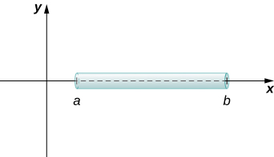
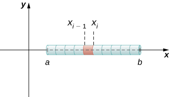
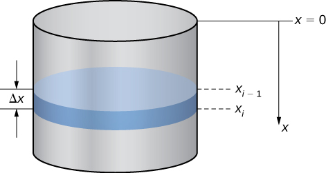
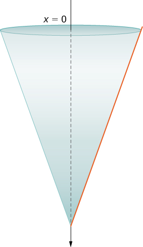
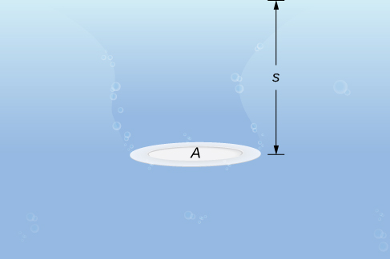
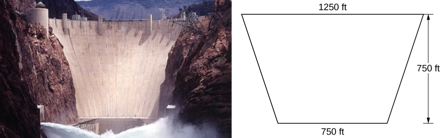
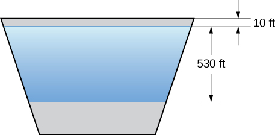

* Determine the mass of a one-dimensional object from its linear density function.
* Determine the mass of a two-dimensional circular object from its radial density function.
* Calculate the work done by a variable force acting along a line.
* Calculate the work done in pumping a liquid from one height to another.
* Find the hydrostatic force against a submerged vertical plate.

In this section, we examine some physical applications of integration. Let’s begin with a look at calculating mass from a density function. We then turn our attention to work, and close the section with a study of hydrostatic force.

### Mass and Density

We can use integration to develop a formula for calculating mass based on a density function. First we consider a thin rod or wire. Orient the rod so it aligns with the <math xmlns="http://www.w3.org/1998/Math/MathML"><mrow><mi>x</mi><mtext>-axis,</mtext></mrow></math>

 with the left end of the rod at <math xmlns="http://www.w3.org/1998/Math/MathML"><mrow><mi>x</mi><mo>=</mo><mi>a</mi></mrow></math>

 and the right end of the rod at <math xmlns="http://www.w3.org/1998/Math/MathML"><mrow><mi>x</mi><mo>=</mo><mi>b</mi></mrow></math>

 ([\[link\]](#CNX_Calc_Figure_06_05_001)). Note that although we depict the rod with some thickness in the figures, for mathematical purposes we assume the rod is thin enough to be treated as a one-dimensional object.

 {: #CNX_Calc_Figure_06_05_001}

If the rod has constant density <math xmlns="http://www.w3.org/1998/Math/MathML"><mrow><mi>ρ</mi><mo>,</mo></mrow></math>

 given in terms of mass per unit length, then the mass of the rod is just the product of the density and the length of the rod: <math xmlns="http://www.w3.org/1998/Math/MathML"><mrow><mrow><mo>(</mo><mrow><mi>b</mi><mo>−</mo><mi>a</mi></mrow><mo>)</mo></mrow><mi>ρ</mi><mo>.</mo></mrow></math>

 If the density of the rod is not constant, however, the problem becomes a little more challenging. When the density of the rod varies from point to point, we use a linear **density function**{: data-type="term"}, <math xmlns="http://www.w3.org/1998/Math/MathML"><mrow><mi>ρ</mi><mo stretchy="false">(</mo><mi>x</mi><mo stretchy="false">)</mo><mo>,</mo></mrow></math>

 to denote the density of the rod at any point, <math xmlns="http://www.w3.org/1998/Math/MathML"><mrow><mi>x</mi><mo>.</mo></mrow></math>

 Let <math xmlns="http://www.w3.org/1998/Math/MathML"><mrow><mi>ρ</mi><mo stretchy="false">(</mo><mi>x</mi><mo stretchy="false">)</mo></mrow></math>

 be an integrable linear density function. Now, for <math xmlns="http://www.w3.org/1998/Math/MathML"><mrow><mi>i</mi><mo>=</mo><mn>0</mn><mo>,</mo><mn>1</mn><mo>,</mo><mn>2</mn><mtext>,…</mtext><mo>,</mo><mi>n</mi></mrow></math>

 let <math xmlns="http://www.w3.org/1998/Math/MathML"><mrow><mi>P</mi><mo>=</mo><mrow><mo>{</mo><mrow><msub><mi>x</mi><mi>i</mi></msub></mrow><mo>}</mo></mrow></mrow></math>

 be a regular partition of the interval <math xmlns="http://www.w3.org/1998/Math/MathML"><mrow><mrow><mo>[</mo><mrow><mi>a</mi><mo>,</mo><mi>b</mi></mrow><mo>]</mo></mrow><mo>,</mo></mrow></math>

 and for <math xmlns="http://www.w3.org/1998/Math/MathML"><mrow><mi>i</mi><mo>=</mo><mn>1</mn><mo>,</mo><mn>2</mn><mtext>,…</mtext><mo>,</mo><mi>n</mi></mrow></math>

 choose an arbitrary point <math xmlns="http://www.w3.org/1998/Math/MathML"><mrow><msubsup><mi>x</mi><mi>i</mi><mo>*</mo></msubsup><mo>∈</mo><mrow><mo>[</mo><mrow><msub><mi>x</mi><mrow><mi>i</mi><mo>−</mo><mn>1</mn></mrow></msub><mo>,</mo><msub><mi>x</mi><mi>i</mi></msub></mrow><mo>]</mo></mrow><mo>.</mo></mrow></math>

 [\[link\]](#CNX_Calc_Figure_06_05_002) shows a representative segment of the rod.

 {: #CNX_Calc_Figure_06_05_002}

The mass <math xmlns="http://www.w3.org/1998/Math/MathML"><mrow><msub><mi>m</mi><mi>i</mi></msub></mrow></math>

 of the segment of the rod from <math xmlns="http://www.w3.org/1998/Math/MathML"><mrow><msub><mi>x</mi><mrow><mi>i</mi><mo>−</mo><mn>1</mn></mrow></msub></mrow></math>

 to <math xmlns="http://www.w3.org/1998/Math/MathML"><mrow><msub><mi>x</mi><mi>i</mi></msub></mrow></math>

 is approximated by

<math xmlns="http://www.w3.org/1998/Math/MathML"><mrow><msub><mi>m</mi><mi>i</mi></msub><mo>≈</mo><mi>ρ</mi><mo stretchy="false">(</mo><msubsup><mi>x</mi><mi>i</mi><mo>*</mo></msubsup><mo stretchy="false">)</mo><mrow><mo>(</mo><mrow><msub><mi>x</mi><mi>i</mi></msub><mo>−</mo><msub><mi>x</mi><mrow><mi>i</mi><mo>−</mo><mn>1</mn></mrow></msub></mrow><mo>)</mo></mrow><mo>=</mo><mi>ρ</mi><mo stretchy="false">(</mo><msubsup><mi>x</mi><mi>i</mi><mo>*</mo></msubsup><mo stretchy="false">)</mo><mtext>Δ</mtext><mi>x</mi><mo>.</mo></mrow></math>

Adding the masses of all the segments gives us an approximation for the mass of the entire rod:

<math xmlns="http://www.w3.org/1998/Math/MathML"><mrow><mi>m</mi><mo>=</mo><mstyle displaystyle="true"><munderover><mo>∑</mo><mrow><mi>i</mi><mo>=</mo><mn>1</mn></mrow><mi>n</mi></munderover><mrow><msub><mi>m</mi><mi>i</mi></msub></mrow></mstyle><mo>≈</mo><mstyle displaystyle="true"><munderover><mo>∑</mo><mrow><mi>i</mi><mo>=</mo><mn>1</mn></mrow><mi>n</mi></munderover><mi>ρ</mi></mstyle><mo stretchy="false">(</mo><msubsup><mi>x</mi><mi>i</mi><mo>*</mo></msubsup><mo stretchy="false">)</mo><mtext>Δ</mtext><mi>x</mi><mo>.</mo></mrow></math>

This is a Riemann sum. Taking the limit as <math xmlns="http://www.w3.org/1998/Math/MathML"><mrow><mi>n</mi><mo stretchy="false">→</mo><mi>∞</mi><mo>,</mo></mrow></math>

 we get an expression for the exact mass of the rod:

<math xmlns="http://www.w3.org/1998/Math/MathML"><mrow><mi>m</mi><mo>=</mo><munder><mrow><mtext>lim</mtext></mrow><mrow><mi>n</mi><mo stretchy="false">→</mo><mi>∞</mi></mrow></munder><munderover><mstyle mathsize="140%" displaystyle="true"><mo>∑</mo></mstyle><mrow><mi>i</mi><mo>=</mo><mn>1</mn></mrow><mi>n</mi></munderover><mi>ρ</mi><mo stretchy="false">(</mo><msubsup><mi>x</mi><mi>i</mi><mo>*</mo></msubsup><mo stretchy="false">)</mo><mtext>Δ</mtext><mi>x</mi><mo>=</mo><mstyle displaystyle="true"><mrow><msubsup><mo stretchy="false">∫</mo><mi>a</mi><mi>b</mi></msubsup><mi>ρ</mi></mrow></mstyle><mo stretchy="false">(</mo><mi>x</mi><mo stretchy="false">)</mo><mi>d</mi><mi>x</mi><mo>.</mo></mrow></math>

We state this result in the following theorem.

Mass–Density Formula of a One-Dimensional Object

Given a thin rod oriented along the <math xmlns="http://www.w3.org/1998/Math/MathML"><mrow><mi>x</mi><mtext>-axis</mtext></mrow></math>

 over the interval <math xmlns="http://www.w3.org/1998/Math/MathML"><mrow><mrow><mo>[</mo><mrow><mi>a</mi><mo>,</mo><mi>b</mi></mrow><mo>]</mo></mrow><mo>,</mo></mrow></math>

 let <math xmlns="http://www.w3.org/1998/Math/MathML"><mrow><mi>ρ</mi><mo stretchy="false">(</mo><mi>x</mi><mo stretchy="false">)</mo></mrow></math>

 denote a linear density function giving the density of the rod at a point *x* in the interval. Then the mass of the rod is given by

<math xmlns="http://www.w3.org/1998/Math/MathML"><mrow><mi>m</mi><mo>=</mo><mstyle displaystyle="true"><mrow><msubsup><mo stretchy="false">∫</mo><mi>a</mi><mi>b</mi></msubsup><mi>ρ</mi></mrow></mstyle><mo stretchy="false">(</mo><mi>x</mi><mo stretchy="false">)</mo><mi>d</mi><mi>x</mi><mo>.</mo></mrow></math>

We apply this theorem in the next example.

Calculating Mass from Linear Density

Consider a thin rod oriented on the *x*-axis over the interval <math xmlns="http://www.w3.org/1998/Math/MathML"><mrow><mrow><mo>[</mo><mrow><mrow><mi>π</mi><mtext>/</mtext><mn>2</mn></mrow><mo>,</mo><mi>π</mi></mrow><mo>]</mo></mrow><mo>.</mo></mrow></math>

 If the density of the rod is given by <math xmlns="http://www.w3.org/1998/Math/MathML"><mrow><mi>ρ</mi><mo stretchy="false">(</mo><mi>x</mi><mo stretchy="false">)</mo><mo>=</mo><mtext>sin</mtext><mspace width="0.2em" /><mi>x</mi><mo>,</mo></mrow></math>

 what is the mass of the rod?

Applying [[link]](#fs-id1167794003941) directly, we have

<math xmlns="http://www.w3.org/1998/Math/MathML"><mrow><mi>m</mi><mo>=</mo><mstyle displaystyle="true"><mrow><msubsup><mo stretchy="false">∫</mo><mi>a</mi><mi>b</mi></msubsup><mi>ρ</mi></mrow></mstyle><mo stretchy="false">(</mo><mi>x</mi><mo stretchy="false">)</mo><mi>d</mi><mi>x</mi><mo>=</mo><msubsup><mstyle mathsize="140%" displaystyle="true"><mo stretchy="false">∫</mo></mstyle><mrow><mi>π</mi><mtext>/</mtext><mn>2</mn></mrow><mi>π</mi></msubsup><mtext>sin</mtext><mspace width="0.2em" /><mi>x</mi><mspace width="0.2em" /><mi>d</mi><mi>x</mi><mo>=</mo><msubsup><mrow><mrow><mrow><mtext>−</mtext><mtext>cos</mtext><mspace width="0.2em" /><mi>x</mi></mrow><mo>\|</mo></mrow></mrow><mrow><mi>π</mi><mtext>/</mtext><mn>2</mn></mrow><mi>π</mi></msubsup><mo>=</mo><mn>1</mn><mo>.</mo></mrow></math>

Consider a thin rod oriented on the *x*-axis over the interval <math xmlns="http://www.w3.org/1998/Math/MathML"><mrow><mrow><mo>[</mo><mrow><mn>1</mn><mo>,</mo><mn>3</mn></mrow><mo>]</mo></mrow><mo>.</mo></mrow></math>

 If the density of the rod is given by <math xmlns="http://www.w3.org/1998/Math/MathML"><mrow><mi>ρ</mi><mo stretchy="false">(</mo><mi>x</mi><mo stretchy="false">)</mo><mo>=</mo><mn>2</mn><msup><mi>x</mi><mn>2</mn></msup><mo>+</mo><mn>3</mn><mo>,</mo></mrow></math>

 what is the mass of the rod?

<math xmlns="http://www.w3.org/1998/Math/MathML"><mrow><mrow><mrow><mn>70</mn></mrow><mtext>/</mtext><mn>3</mn></mrow></mrow></math>

Hint

Use the process from the previous example.

We now extend this concept to find the mass of a two-dimensional disk of radius <math xmlns="http://www.w3.org/1998/Math/MathML"><mrow><mi>r</mi><mo>.</mo></mrow></math>

 As with the rod we looked at in the one-dimensional case, here we assume the disk is thin enough that, for mathematical purposes, we can treat it as a two-dimensional object. We assume the density is given in terms of mass per unit area (called ***area density***{: data-type="term" .no-emphasis}), and further assume the density varies only along the disk’s radius (called ***radial density***{: data-type="term" .no-emphasis}). We orient the disk in the <math xmlns="http://www.w3.org/1998/Math/MathML"><mrow><mi>x</mi><mi>y</mi><mtext>-plane,</mtext></mrow></math>

 with the center at the origin. Then, the density of the disk can be treated as a function of <math xmlns="http://www.w3.org/1998/Math/MathML"><mi>x</mi><mo>,</mo></math>

 denoted <math xmlns="http://www.w3.org/1998/Math/MathML"><mrow><mi>ρ</mi><mo stretchy="false">(</mo><mi>x</mi><mo stretchy="false">)</mo><mo>.</mo></mrow></math>

 We assume <math xmlns="http://www.w3.org/1998/Math/MathML"><mrow><mi>ρ</mi><mo stretchy="false">(</mo><mi>x</mi><mo stretchy="false">)</mo></mrow></math>

 is integrable. Because density is a function of <math xmlns="http://www.w3.org/1998/Math/MathML"><mrow><mi>x</mi><mo>,</mo></mrow></math>

 we partition the interval from <math xmlns="http://www.w3.org/1998/Math/MathML"><mrow><mrow><mo>[</mo><mrow><mn>0</mn><mo>,</mo><mi>r</mi></mrow><mo>]</mo></mrow></mrow></math>

 along the <math xmlns="http://www.w3.org/1998/Math/MathML"><mrow><mi>x</mi><mtext>-axis</mtext><mo>.</mo></mrow></math>

 For <math xmlns="http://www.w3.org/1998/Math/MathML"><mrow><mi>i</mi><mo>=</mo><mn>0</mn><mo>,</mo><mn>1</mn><mo>,</mo><mn>2</mn><mtext>,…</mtext><mo>,</mo><mi>n</mi><mo>,</mo></mrow></math>

 let <math xmlns="http://www.w3.org/1998/Math/MathML"><mrow><mi>P</mi><mo>=</mo><mrow><mo>{</mo><mrow><msub><mi>x</mi><mi>i</mi></msub></mrow><mo>}</mo></mrow></mrow></math>

 be a regular partition of the interval <math xmlns="http://www.w3.org/1998/Math/MathML"><mrow><mrow><mo>[</mo><mrow><mn>0</mn><mo>,</mo><mi>r</mi></mrow><mo>]</mo></mrow><mo>,</mo></mrow></math>

 and for <math xmlns="http://www.w3.org/1998/Math/MathML"><mrow><mi>i</mi><mo>=</mo><mn>1</mn><mo>,</mo><mn>2</mn><mtext>,…</mtext><mo>,</mo><mi>n</mi><mo>,</mo></mrow></math>

 choose an arbitrary point <math xmlns="http://www.w3.org/1998/Math/MathML"><mrow><msubsup><mi>x</mi><mi>i</mi><mo>*</mo></msubsup><mo>∈</mo><mrow><mo>[</mo><mrow><msub><mi>x</mi><mrow><mi>i</mi><mo>−</mo><mn>1</mn></mrow></msub><mo>,</mo><msub><mi>x</mi><mi>i</mi></msub></mrow><mo>]</mo></mrow><mo>.</mo></mrow></math>

 Now, use the partition to break up the disk into thin (two-dimensional) washers. A disk and a representative washer are depicted in the following figure.

  A thin disk in the xy-plane. (b) A representative washer."){: #CNX_Calc_Figure_06_05_003}

We now approximate the density and area of the washer to calculate an approximate mass, <math xmlns="http://www.w3.org/1998/Math/MathML"><mrow><msub><mi>m</mi><mi>i</mi></msub><mo>.</mo></mrow></math>

 Note that the area of the washer is given by

<math xmlns="http://www.w3.org/1998/Math/MathML"><mtable><mtr><mtd columnalign="right"><msub><mi>A</mi><mi>i</mi></msub></mtd><mtd columnalign="left"><mo>=</mo><mi>π</mi><msup><mrow><mo stretchy="false">(</mo><msub><mi>x</mi><mi>i</mi></msub><mo stretchy="false">)</mo></mrow><mn>2</mn></msup><mo>−</mo><mi>π</mi><msup><mrow><mo stretchy="false">(</mo><msub><mi>x</mi><mrow><mi>i</mi><mo>−</mo><mn>1</mn></mrow></msub><mo stretchy="false">)</mo></mrow><mn>2</mn></msup></mtd></mtr><mtr><mtd /><mtd columnalign="left"><mo>=</mo><mi>π</mi><mrow><mo>[</mo><mrow><msubsup><mi>x</mi><mi>i</mi><mn>2</mn></msubsup><mo>−</mo><msubsup><mi>x</mi><mrow><mi>i</mi><mo>−</mo><mn>1</mn></mrow><mn>2</mn></msubsup></mrow><mo>]</mo></mrow></mtd></mtr><mtr><mtd /><mtd columnalign="left"><mo>=</mo><mi>π</mi><mrow><mo>(</mo><mrow><msub><mi>x</mi><mi>i</mi></msub><mo>+</mo><msub><mi>x</mi><mrow><mi>i</mi><mo>−</mo><mn>1</mn></mrow></msub></mrow><mo>)</mo></mrow><mrow><mo>(</mo><mrow><msub><mi>x</mi><mi>i</mi></msub><mo>−</mo><msub><mi>x</mi><mrow><mi>i</mi><mo>−</mo><mn>1</mn></mrow></msub></mrow><mo>)</mo></mrow></mtd></mtr><mtr><mtd /><mtd columnalign="left"><mo>=</mo><mi>π</mi><mo stretchy="false">(</mo><msub><mi>x</mi><mi>i</mi></msub><mo>+</mo><msub><mi>x</mi><mrow><mi>i</mi><mo>−</mo><mn>1</mn></mrow></msub><mo stretchy="false">)</mo><mtext>Δ</mtext><mi>x</mi><mo>.</mo></mtd></mtr></mtable></math>

You may recall that we had an expression similar to this when we were computing volumes by shells. As we did there, we use <math xmlns="http://www.w3.org/1998/Math/MathML"><mrow><msubsup><mi>x</mi><mi>i</mi><mo>*</mo></msubsup><mo>≈</mo><mo stretchy="false">(</mo><msub><mi>x</mi><mi>i</mi></msub><mo>+</mo><msub><mi>x</mi><mrow><mi>i</mi><mo>−</mo><mn>1</mn></mrow></msub><mo stretchy="false">)</mo><mtext>/</mtext><mn>2</mn></mrow></math>

 to approximate the average radius of the washer. We obtain

<math xmlns="http://www.w3.org/1998/Math/MathML"><mrow><msub><mi>A</mi><mi>i</mi></msub><mo>=</mo><mi>π</mi><mo stretchy="false">(</mo><msub><mi>x</mi><mi>i</mi></msub><mo>+</mo><msub><mi>x</mi><mrow><mi>i</mi><mo>−</mo><mn>1</mn></mrow></msub><mo stretchy="false">)</mo><mtext>Δ</mtext><mi>x</mi><mo>≈</mo><mn>2</mn><mi>π</mi><msubsup><mi>x</mi><mi>i</mi><mo>*</mo></msubsup><mtext>Δ</mtext><mi>x</mi><mo>.</mo></mrow></math>

Using <math xmlns="http://www.w3.org/1998/Math/MathML"><mrow><mi>ρ</mi><mo stretchy="false">(</mo><msubsup><mi>x</mi><mi>i</mi><mo>*</mo></msubsup><mo stretchy="false">)</mo></mrow></math>

 to approximate the density of the washer, we approximate the mass of the washer by

<math xmlns="http://www.w3.org/1998/Math/MathML"><mrow><msub><mi>m</mi><mi>i</mi></msub><mo>≈</mo><mn>2</mn><mi>π</mi><msubsup><mi>x</mi><mi>i</mi><mo>*</mo></msubsup><mi>ρ</mi><mo stretchy="false">(</mo><msubsup><mi>x</mi><mi>i</mi><mo>*</mo></msubsup><mo stretchy="false">)</mo><mtext>Δ</mtext><mi>x</mi><mo>.</mo></mrow></math>

Adding up the masses of the washers, we see the mass <math xmlns="http://www.w3.org/1998/Math/MathML"><mi>m</mi></math>

 of the entire disk is approximated by

<math xmlns="http://www.w3.org/1998/Math/MathML"><mrow><mi>m</mi><mo>=</mo><mstyle displaystyle="true"><munderover><mo>∑</mo><mrow><mi>i</mi><mo>=</mo><mn>1</mn></mrow><mi>n</mi></munderover><mrow><msub><mi>m</mi><mi>i</mi></msub></mrow></mstyle><mo>≈</mo><mstyle displaystyle="true"><munderover><mo>∑</mo><mrow><mi>i</mi><mo>=</mo><mn>1</mn></mrow><mi>n</mi></munderover><mn>2</mn></mstyle><mi>π</mi><msubsup><mi>x</mi><mi>i</mi><mo>*</mo></msubsup><mi>ρ</mi><mo stretchy="false">(</mo><msubsup><mi>x</mi><mi>i</mi><mo>*</mo></msubsup><mo stretchy="false">)</mo><mtext>Δ</mtext><mi>x</mi><mo>.</mo></mrow></math>

We again recognize this as a Riemann sum, and take the limit as <math xmlns="http://www.w3.org/1998/Math/MathML"><mrow><mi>n</mi><mo stretchy="false">→</mo><mi>∞</mi><mo>.</mo></mrow></math>

 This gives us

<math xmlns="http://www.w3.org/1998/Math/MathML"><mrow><mi>m</mi><mo>=</mo><munder><mrow><mtext>lim</mtext></mrow><mrow><mi>n</mi><mo stretchy="false">→</mo><mi>∞</mi></mrow></munder><munderover><mstyle mathsize="140%" displaystyle="true"><mo>∑</mo></mstyle><mrow><mi>i</mi><mo>=</mo><mn>1</mn></mrow><mi>n</mi></munderover><mn>2</mn><mi>π</mi><msubsup><mi>x</mi><mi>i</mi><mo>*</mo></msubsup><mi>ρ</mi><mo stretchy="false">(</mo><msubsup><mi>x</mi><mi>i</mi><mo>*</mo></msubsup><mo stretchy="false">)</mo><mtext>Δ</mtext><mi>x</mi><mo>=</mo><mstyle displaystyle="true"><mrow><msubsup><mo stretchy="false">∫</mo><mn>0</mn><mi>r</mi></msubsup><mn>2</mn></mrow></mstyle><mi>π</mi><mi>x</mi><mi>ρ</mi><mo stretchy="false">(</mo><mi>x</mi><mo stretchy="false">)</mo><mi>d</mi><mi>x</mi><mo>.</mo></mrow></math>

We summarize these findings in the following theorem.

Mass–Density Formula of a Circular Object

Let <math xmlns="http://www.w3.org/1998/Math/MathML"><mrow><mi>ρ</mi><mo stretchy="false">(</mo><mi>x</mi><mo stretchy="false">)</mo></mrow></math>

 be an integrable function representing the radial density of a disk of radius <math xmlns="http://www.w3.org/1998/Math/MathML"><mi>r</mi><mo>.</mo></math>

 Then the mass of the disk is given by

<math xmlns="http://www.w3.org/1998/Math/MathML"><mrow><mi>m</mi><mo>=</mo><mstyle displaystyle="true"><mrow><msubsup><mo stretchy="false">∫</mo><mn>0</mn><mi>r</mi></msubsup><mn>2</mn></mrow></mstyle><mi>π</mi><mi>x</mi><mi>ρ</mi><mo stretchy="false">(</mo><mi>x</mi><mo stretchy="false">)</mo><mi>d</mi><mi>x</mi><mo>.</mo></mrow></math>

Calculating Mass from Radial Density

Let <math xmlns="http://www.w3.org/1998/Math/MathML"><mrow><mi>ρ</mi><mo stretchy="false">(</mo><mi>x</mi><mo stretchy="false">)</mo><mo>=</mo><msqrt><mi>x</mi></msqrt></mrow></math>

 represent the radial density of a disk. Calculate the mass of a disk of radius 4.

Applying the formula, we find

<math xmlns="http://www.w3.org/1998/Math/MathML"><mtable><mtr><mtd columnalign="right"><mi>m</mi></mtd><mtd columnalign="left"><mo>=</mo><mstyle displaystyle="true"><mrow><msubsup><mo stretchy="false">∫</mo><mn>0</mn><mi>r</mi></msubsup><mn>2</mn></mrow></mstyle><mi>π</mi><mi>x</mi><mi>ρ</mi><mo stretchy="false">(</mo><mi>x</mi><mo stretchy="false">)</mo><mi>d</mi><mi>x</mi></mtd></mtr><mtr><mtd /><mtd columnalign="left"><mo>=</mo><mstyle displaystyle="true"><mrow><msubsup><mo stretchy="false">∫</mo><mn>0</mn><mn>4</mn></msubsup><mn>2</mn></mrow></mstyle><mi>π</mi><mi>x</mi><msqrt><mi>x</mi></msqrt><mi>d</mi><mi>x</mi><mo>=</mo><mn>2</mn><mi>π</mi><mstyle displaystyle="true"><mrow><msubsup><mo stretchy="false">∫</mo><mn>0</mn><mn>4</mn></msubsup><mrow><msup><mi>x</mi><mrow><mn>3</mn><mtext>/</mtext><mn>2</mn></mrow></msup></mrow></mrow></mstyle><mi>d</mi><mi>x</mi></mtd></mtr><mtr><mtd /><mtd columnalign="left"><mo>=</mo><mn>2</mn><mi>π</mi><msubsup><mrow><mrow><mfrac><mn>2</mn><mn>5</mn></mfrac><msup><mi>x</mi><mrow><mn>5</mn><mtext>/</mtext><mn>2</mn></mrow></msup></mrow><mo>\|</mo></mrow><mn>0</mn><mn>4</mn></msubsup><mo>=</mo><mfrac><mrow><mn>4</mn><mi>π</mi></mrow><mn>5</mn></mfrac><mrow><mo>[</mo><mrow><mn>32</mn></mrow><mo>]</mo></mrow><mo>=</mo><mfrac><mrow><mn>128</mn><mi>π</mi></mrow><mn>5</mn></mfrac><mo>.</mo></mtd></mtr></mtable></math>

Let <math xmlns="http://www.w3.org/1998/Math/MathML"><mrow><mi>ρ</mi><mo stretchy="false">(</mo><mi>x</mi><mo stretchy="false">)</mo><mo>=</mo><mn>3</mn><mi>x</mi><mo>+</mo><mn>2</mn></mrow></math>

 represent the radial density of a disk. Calculate the mass of a disk of radius 2.

<math xmlns="http://www.w3.org/1998/Math/MathML"><mrow><mn>24</mn><mi>π</mi></mrow></math>

Hint

Use the process from the previous example.

### Work Done by a Force

We now consider work. In physics, work is related to force, which is often intuitively defined as a push or pull on an object. When a force moves an object, we say the force does work on the object. In other words, work can be thought of as the amount of energy it takes to move an object. According to physics, when we have a constant force, work can be expressed as the product of force and distance.

In the English system, the unit of force is the pound and the unit of distance is the foot, so work is given in foot-pounds. In the metric system, kilograms and meters are used. One newton is the force needed to accelerate <math xmlns="http://www.w3.org/1998/Math/MathML"><mn>1</mn></math>

 kilogram of mass at the rate of <math xmlns="http://www.w3.org/1998/Math/MathML"><mn>1</mn></math>

 m/sec2. Thus, the most common unit of work is the newton-meter. This same unit is also called the ***joule***{: data-type="term" .no-emphasis}. Both are defined as kilograms times meters squared over seconds squared <math xmlns="http://www.w3.org/1998/Math/MathML"><mrow><mrow><mo>(</mo><mrow><mrow><mrow><mtext>kg</mtext><mo>·</mo><msup><mtext>m</mtext><mn>2</mn></msup></mrow><mtext>/</mtext><mrow><msup><mtext>s</mtext><mn>2</mn></msup></mrow></mrow></mrow><mo>)</mo></mrow><mo>.</mo></mrow></math>

When we have a constant force, things are pretty easy. It is rare, however, for a force to be constant. The work done to compress (or elongate) a spring, for example, varies depending on how far the spring has already been compressed (or stretched). We look at springs in more detail later in this section.

Suppose we have a variable force <math xmlns="http://www.w3.org/1998/Math/MathML"><mrow><mi>F</mi><mo stretchy="false">(</mo><mi>x</mi><mo stretchy="false">)</mo></mrow></math>

 that moves an object in a positive direction along the *x*-axis from point <math xmlns="http://www.w3.org/1998/Math/MathML"><mi>a</mi></math>

 to point <math xmlns="http://www.w3.org/1998/Math/MathML"><mrow><mi>b</mi><mo>.</mo></mrow></math>

 To calculate the work done, we partition the interval <math xmlns="http://www.w3.org/1998/Math/MathML"><mrow><mrow><mo>[</mo><mrow><mi>a</mi><mo>,</mo><mi>b</mi></mrow><mo>]</mo></mrow></mrow></math>

 and estimate the work done over each subinterval. So, for <math xmlns="http://www.w3.org/1998/Math/MathML"><mrow><mi>i</mi><mo>=</mo><mn>0</mn><mo>,</mo><mn>1</mn><mo>,</mo><mn>2</mn><mtext>,…</mtext><mo>,</mo><mi>n</mi><mo>,</mo></mrow></math>

 let <math xmlns="http://www.w3.org/1998/Math/MathML"><mrow><mi>P</mi><mo>=</mo><mrow><mo>{</mo><mrow><msub><mi>x</mi><mi>i</mi></msub></mrow><mo>}</mo></mrow></mrow></math>

 be a regular partition of the interval <math xmlns="http://www.w3.org/1998/Math/MathML"><mrow><mrow><mo>[</mo><mrow><mi>a</mi><mo>,</mo><mi>b</mi></mrow><mo>]</mo></mrow><mo>,</mo></mrow></math>

 and for <math xmlns="http://www.w3.org/1998/Math/MathML"><mrow><mi>i</mi><mo>=</mo><mn>1</mn><mo>,</mo><mn>2</mn><mtext>,…</mtext><mo>,</mo><mi>n</mi><mo>,</mo></mrow></math>

 choose an arbitrary point <math xmlns="http://www.w3.org/1998/Math/MathML"><mrow><msubsup><mi>x</mi><mi>i</mi><mo>*</mo></msubsup><mo>∈</mo><mrow><mo>[</mo><mrow><msub><mi>x</mi><mrow><mi>i</mi><mo>−</mo><mn>1</mn></mrow></msub><mo>,</mo><msub><mi>x</mi><mi>i</mi></msub></mrow><mo>]</mo></mrow><mo>.</mo></mrow></math>

 To calculate the work done to move an object from point <math xmlns="http://www.w3.org/1998/Math/MathML"><mrow><msub><mi>x</mi><mrow><mi>i</mi><mo>−</mo><mn>1</mn></mrow></msub></mrow></math>

 to point <math xmlns="http://www.w3.org/1998/Math/MathML"><mrow><msub><mi>x</mi><mi>i</mi></msub><mo>,</mo></mrow></math>

 we assume the force is roughly constant over the interval, and use <math xmlns="http://www.w3.org/1998/Math/MathML"><mrow><mi>F</mi><mo stretchy="false">(</mo><msubsup><mi>x</mi><mi>i</mi><mo>*</mo></msubsup><mo stretchy="false">)</mo></mrow></math>

 to approximate the force. The work done over the interval <math xmlns="http://www.w3.org/1998/Math/MathML"><mrow><mrow><mo>[</mo><mrow><msub><mi>x</mi><mrow><mi>i</mi><mo>−</mo><mn>1</mn></mrow></msub><mo>,</mo><msub><mi>x</mi><mi>i</mi></msub></mrow><mo>]</mo></mrow><mo>,</mo></mrow></math>

 then, is given by

<math xmlns="http://www.w3.org/1998/Math/MathML"><mrow><msub><mi>W</mi><mi>i</mi></msub><mo>≈</mo><mi>F</mi><mo stretchy="false">(</mo><msubsup><mi>x</mi><mi>i</mi><mo>*</mo></msubsup><mo stretchy="false">)</mo><mrow><mo>(</mo><mrow><msub><mi>x</mi><mi>i</mi></msub><mo>−</mo><msub><mi>x</mi><mrow><mi>i</mi><mo>−</mo><mn>1</mn></mrow></msub></mrow><mo>)</mo></mrow><mo>=</mo><mi>F</mi><mo stretchy="false">(</mo><msubsup><mi>x</mi><mi>i</mi><mo>*</mo></msubsup><mo stretchy="false">)</mo><mtext>Δ</mtext><mi>x</mi><mo>.</mo></mrow></math>

Therefore, the work done over the interval <math xmlns="http://www.w3.org/1998/Math/MathML"><mrow><mrow><mo>[</mo><mrow><mi>a</mi><mo>,</mo><mi>b</mi></mrow><mo>]</mo></mrow></mrow></math>

 is approximately

<math xmlns="http://www.w3.org/1998/Math/MathML"><mrow><mi>W</mi><mo>=</mo><mstyle displaystyle="true"><munderover><mo>∑</mo><mrow><mi>i</mi><mo>=</mo><mn>1</mn></mrow><mi>n</mi></munderover><mrow><msub><mi>W</mi><mi>i</mi></msub></mrow></mstyle><mo>≈</mo><mstyle displaystyle="true"><munderover><mo>∑</mo><mrow><mi>i</mi><mo>=</mo><mn>1</mn></mrow><mi>n</mi></munderover><mi>F</mi></mstyle><mo stretchy="false">(</mo><msubsup><mi>x</mi><mi>i</mi><mo>*</mo></msubsup><mo stretchy="false">)</mo><mtext>Δ</mtext><mi>x</mi><mo>.</mo></mrow></math>

Taking the limit of this expression as <math xmlns="http://www.w3.org/1998/Math/MathML"><mrow><mi>n</mi><mo stretchy="false">→</mo><mi>∞</mi></mrow></math>

 gives us the exact value for work:

<math xmlns="http://www.w3.org/1998/Math/MathML"><mrow><mi>W</mi><mo>=</mo><munder><mrow><mtext>lim</mtext></mrow><mrow><mi>n</mi><mo stretchy="false">→</mo><mi>∞</mi></mrow></munder><mstyle displaystyle="true"><munderover><mo>∑</mo><mrow><mi>i</mi><mo>=</mo><mn>1</mn></mrow><mi>n</mi></munderover><mi>F</mi></mstyle><mo stretchy="false">(</mo><msubsup><mi>x</mi><mi>i</mi><mo>*</mo></msubsup><mo stretchy="false">)</mo><mtext>Δ</mtext><mi>x</mi><mo>=</mo><mstyle displaystyle="true"><mrow><msubsup><mo stretchy="false">∫</mo><mi>a</mi><mi>b</mi></msubsup><mi>F</mi></mrow></mstyle><mo stretchy="false">(</mo><mi>x</mi><mo stretchy="false">)</mo><mi>d</mi><mi>x</mi><mo>.</mo></mrow></math>

Thus, we can define work as follows.

Definition

If a variable force <math xmlns="http://www.w3.org/1998/Math/MathML"><mrow><mi>F</mi><mo stretchy="false">(</mo><mi>x</mi><mo stretchy="false">)</mo></mrow></math>

 moves an object in a positive direction along the *x*-axis from point *a* to point *b*, then the **work**{: data-type="term"} done on the object is

<math xmlns="http://www.w3.org/1998/Math/MathML"><mrow><mi>W</mi><mo>=</mo><mstyle displaystyle="true"><mrow><msubsup><mo stretchy="false">∫</mo><mi>a</mi><mi>b</mi></msubsup><mi>F</mi></mrow></mstyle><mo stretchy="false">(</mo><mi>x</mi><mo stretchy="false">)</mo><mi>d</mi><mi>x</mi><mo>.</mo></mrow></math>

Note that if *F* is constant, the integral evaluates to <math xmlns="http://www.w3.org/1998/Math/MathML"><mrow><mi>F</mi><mo>·</mo><mo stretchy="false">(</mo><mi>b</mi><mo>−</mo><mi>a</mi><mo stretchy="false">)</mo><mo>=</mo><mi>F</mi><mo>·</mo><mi>d</mi><mo>,</mo></mrow></math>

 which is the formula we stated at the beginning of this section.

Now let’s look at the specific example of the work done to compress or elongate a spring. Consider a block attached to a horizontal spring. The block moves back and forth as the spring stretches and compresses. Although in the real world we would have to account for the force of friction between the block and the surface on which it is resting, we ignore friction here and assume the block is resting on a frictionless surface. When the spring is at its natural length (at rest), the system is said to be at equilibrium. In this state, the spring is neither elongated nor compressed, and in this equilibrium position the block does not move until some force is introduced. We orient the system such that <math xmlns="http://www.w3.org/1998/Math/MathML"><mrow><mi>x</mi><mo>=</mo><mn>0</mn></mrow></math>

 corresponds to the equilibrium position (see the following figure).

 {: #CNX_Calc_Figure_06_05_004}

According to **Hooke’s law**{: data-type="term"}, the force required to compress or stretch a spring from an equilibrium position is given by <math xmlns="http://www.w3.org/1998/Math/MathML"><mrow><mi>F</mi><mo stretchy="false">(</mo><mi>x</mi><mo stretchy="false">)</mo><mo>=</mo><mi>k</mi><mi>x</mi><mo>,</mo></mrow></math>

 for some constant <math xmlns="http://www.w3.org/1998/Math/MathML"><mrow><mi>k</mi><mo>.</mo></mrow></math>

 The value of <math xmlns="http://www.w3.org/1998/Math/MathML"><mi>k</mi></math>

 depends on the physical characteristics of the spring. The constant <math xmlns="http://www.w3.org/1998/Math/MathML"><mrow><mi>k</mi></mrow></math>

 is called the ***spring constant***{: data-type="term" .no-emphasis} and is always positive. We can use this information to calculate the work done to compress or elongate a spring, as shown in the following example.

The Work Required to Stretch or Compress a Spring

Suppose it takes a force of <math xmlns="http://www.w3.org/1998/Math/MathML"><mrow><mn>10</mn></mrow></math>

 N (in the negative direction) to compress a spring <math xmlns="http://www.w3.org/1998/Math/MathML"><mrow><mn>0.2</mn></mrow></math>

 m from the equilibrium position. How much work is done to stretch the spring <math xmlns="http://www.w3.org/1998/Math/MathML"><mrow><mn>0.5</mn></mrow></math>

 m from the equilibrium position?

First find the spring constant, <math xmlns="http://www.w3.org/1998/Math/MathML"><mi>k</mi><mo>.</mo></math>

 When <math xmlns="http://www.w3.org/1998/Math/MathML"><mrow><mi>x</mi><mo>=</mo><mn>−0.2</mn><mo>,</mo></mrow></math>

 we know <math xmlns="http://www.w3.org/1998/Math/MathML"><mrow><mi>F</mi><mo stretchy="false">(</mo><mi>x</mi><mo stretchy="false">)</mo><mo>=</mo><mn>−10</mn><mo>,</mo></mrow></math>

 so

<math xmlns="http://www.w3.org/1998/Math/MathML"><mtable><mtr><mtd columnalign="right"><mi>F</mi><mo stretchy="false">(</mo><mi>x</mi><mo stretchy="false">)</mo></mtd><mtd columnalign="left"><mo>=</mo></mtd><mtd columnalign="left"><mi>k</mi><mi>x</mi></mtd></mtr><mtr><mtd columnalign="right"><mo>−</mo><mn>10</mn></mtd><mtd columnalign="left"><mo>=</mo></mtd><mtd columnalign="left"><mi>k</mi><mo stretchy="false">(</mo><mn>−0.2</mn><mo stretchy="false">)</mo></mtd></mtr><mtr><mtd columnalign="right"><mi>k</mi></mtd><mtd columnalign="left"><mo>=</mo></mtd><mtd columnalign="left"><mn>50</mn></mtd></mtr></mtable></math>

and <math xmlns="http://www.w3.org/1998/Math/MathML"><mrow><mi>F</mi><mo stretchy="false">(</mo><mi>x</mi><mo stretchy="false">)</mo><mo>=</mo><mn>50</mn><mi>x</mi><mo>.</mo></mrow></math>

 Then, to calculate work, we integrate the force function, obtaining

<math xmlns="http://www.w3.org/1998/Math/MathML"><mrow><mi>W</mi><mo>=</mo><mstyle displaystyle="true"><mrow><msubsup><mo stretchy="false">∫</mo><mi>a</mi><mi>b</mi></msubsup><mi>F</mi></mrow></mstyle><mo stretchy="false">(</mo><mi>x</mi><mo stretchy="false">)</mo><mi>d</mi><mi>x</mi><mo>=</mo><mstyle displaystyle="true"><mrow><msubsup><mo stretchy="false">∫</mo><mn>0</mn><mrow><mn>0.5</mn></mrow></msubsup><mn>5</mn></mrow></mstyle><mn>0</mn><mi>x</mi><mspace width="0.2em" /><mi>d</mi><mi>x</mi><mo>=</mo><msubsup><mrow><mrow><mrow><mn>25</mn><msup><mi>x</mi><mn>2</mn></msup></mrow><mo>\|</mo></mrow></mrow><mn>0</mn><mrow><mn>0.5</mn></mrow></msubsup><mo>=</mo><mn>6.25</mn><mo>.</mo></mrow></math>

The work done to stretch the spring is <math xmlns="http://www.w3.org/1998/Math/MathML"><mrow><mn>6.25</mn></mrow></math>

 J.

Suppose it takes a force of <math xmlns="http://www.w3.org/1998/Math/MathML"><mn>8</mn></math>

 lb to stretch a spring <math xmlns="http://www.w3.org/1998/Math/MathML"><mn>6</mn></math>

 in. from the equilibrium position. How much work is done to stretch the spring <math xmlns="http://www.w3.org/1998/Math/MathML"><mn>1</mn></math>

 ft from the equilibrium position?

<math xmlns="http://www.w3.org/1998/Math/MathML"><mn>8</mn></math>

 ft-lb

Hint

Use the process from the previous example. Be careful with units.

### Work Done in Pumping

Consider the work done to pump water (or some other liquid) out of a tank. Pumping problems are a little more complicated than spring problems because many of the calculations depend on the shape and size of the tank. In addition, instead of being concerned about the work done to move a single mass, we are looking at the work done to move a volume of water, and it takes more work to move the water from the bottom of the tank than it does to move the water from the top of the tank.

We examine the process in the context of a cylindrical tank, then look at a couple of examples using tanks of different shapes. Assume a cylindrical tank of radius <math xmlns="http://www.w3.org/1998/Math/MathML"><mn>4</mn></math>

 m and height <math xmlns="http://www.w3.org/1998/Math/MathML"><mrow><mn>10</mn></mrow></math>

 m is filled to a depth of 8 m. How much work does it take to pump all the water over the top edge of the tank?

The first thing we need to do is define a frame of reference. We let <math xmlns="http://www.w3.org/1998/Math/MathML"><mi>x</mi></math>

 represent the vertical distance below the top of the tank. That is, we orient the <math xmlns="http://www.w3.org/1998/Math/MathML"><mrow><mi>x</mi><mtext>-axis</mtext></mrow></math>

 vertically, with the origin at the top of the tank and the downward direction being positive (see the following figure).

 {: #CNX_Calc_Figure_06_05_005}

Using this coordinate system, the water extends from <math xmlns="http://www.w3.org/1998/Math/MathML"><mrow><mi>x</mi><mo>=</mo><mn>2</mn></mrow></math>

 to <math xmlns="http://www.w3.org/1998/Math/MathML"><mrow><mi>x</mi><mo>=</mo><mn>10</mn><mo>.</mo></mrow></math>

 Therefore, we partition the interval <math xmlns="http://www.w3.org/1998/Math/MathML"><mrow><mrow><mo>[</mo><mrow><mn>2</mn><mo>,</mo><mspace width="0.2em" /><mn>1</mn><mn>0</mn></mrow><mo>]</mo></mrow></mrow></math>

 and look at the work required to lift each individual “layer” of water. So, for <math xmlns="http://www.w3.org/1998/Math/MathML"><mrow><mi>i</mi><mo>=</mo><mn>0</mn><mo>,</mo><mn>1</mn><mo>,</mo><mn>2</mn><mtext>,…</mtext><mo>,</mo><mi>n</mi><mo>,</mo></mrow></math>

 let <math xmlns="http://www.w3.org/1998/Math/MathML"><mrow><mi>P</mi><mo>=</mo><mrow><mo>{</mo><mrow><msub><mi>x</mi><mi>i</mi></msub></mrow><mo>}</mo></mrow></mrow></math>

 be a regular partition of the interval <math xmlns="http://www.w3.org/1998/Math/MathML"><mrow><mrow><mo>[</mo><mrow><mn>2</mn><mo>,</mo><mspace width="0.2em" /><mn>1</mn><mn>0</mn></mrow><mo>]</mo></mrow><mo>,</mo></mrow></math>

 and for <math xmlns="http://www.w3.org/1998/Math/MathML"><mrow><mi>i</mi><mo>=</mo><mn>1</mn><mo>,</mo><mn>2</mn><mtext>,…</mtext><mo>,</mo><mi>n</mi><mo>,</mo></mrow></math>

 choose an arbitrary point <math xmlns="http://www.w3.org/1998/Math/MathML"><mrow><msubsup><mi>x</mi><mi>i</mi><mo>*</mo></msubsup><mo>∈</mo><mrow><mo>[</mo><mrow><msub><mi>x</mi><mrow><mi>i</mi><mo>−</mo><mn>1</mn></mrow></msub><mo>,</mo><msub><mi>x</mi><mi>i</mi></msub></mrow><mo>]</mo></mrow><mo>.</mo></mrow></math>

 [\[link\]](#CNX_Calc_Figure_06_05_006) shows a representative layer.

 {: #CNX_Calc_Figure_06_05_006}

In pumping problems, the force required to lift the water to the top of the tank is the force required to overcome gravity, so it is equal to the weight of the water. Given that the weight-density of water is <math xmlns="http://www.w3.org/1998/Math/MathML"><mrow><mn>9800</mn></mrow></math>

 N/m3, or <math xmlns="http://www.w3.org/1998/Math/MathML"><mrow><mn>62.4</mn></mrow></math>

 lb/ft3, calculating the volume of each layer gives us the weight. In this case, we have

<math xmlns="http://www.w3.org/1998/Math/MathML"><mrow><mi>V</mi><mo>=</mo><mi>π</mi><msup><mrow><mo stretchy="false">(</mo><mn>4</mn><mo stretchy="false">)</mo></mrow><mn>2</mn></msup><mtext>Δ</mtext><mi>x</mi><mo>=</mo><mn>16</mn><mi>π</mi><mtext>Δ</mtext><mi>x</mi><mo>.</mo></mrow></math>

Then, the force needed to lift each layer is

<math xmlns="http://www.w3.org/1998/Math/MathML"><mrow><mi>F</mi><mo>=</mo><mn>9800</mn><mo>·</mo><mn>16</mn><mi>π</mi><mtext>Δ</mtext><mi>x</mi><mo>=</mo><mn>156,800</mn><mi>π</mi><mtext>Δ</mtext><mi>x</mi><mo>.</mo></mrow></math>

Note that this step becomes a little more difficult if we have a noncylindrical tank. We look at a noncylindrical tank in the next example.

We also need to know the distance the water must be lifted. Based on our choice of coordinate systems, we can use <math xmlns="http://www.w3.org/1998/Math/MathML"><mrow><msubsup><mi>x</mi><mi>i</mi><mo>*</mo></msubsup></mrow></math>

 as an approximation of the distance the layer must be lifted. Then the work to lift the <math xmlns="http://www.w3.org/1998/Math/MathML"><mrow><mi>i</mi><mtext>th</mtext></mrow></math>

 layer of water <math xmlns="http://www.w3.org/1998/Math/MathML"><mrow><msub><mi>W</mi><mi>i</mi></msub></mrow></math>

 is approximately

<math xmlns="http://www.w3.org/1998/Math/MathML"><mrow><msub><mi>W</mi><mi>i</mi></msub><mo>≈</mo><mn>156,800</mn><mi>π</mi><msubsup><mi>x</mi><mi>i</mi><mo>*</mo></msubsup><mtext>Δ</mtext><mi>x</mi><mo>.</mo></mrow></math>

Adding the work for each layer, we see the approximate work to empty the tank is given by

<math xmlns="http://www.w3.org/1998/Math/MathML"><mrow><mi>W</mi><mo>=</mo><munderover><mstyle mathsize="140%" displaystyle="true"><mo>∑</mo></mstyle><mrow><mi>i</mi><mo>=</mo><mn>1</mn></mrow><mi>n</mi></munderover><msub><mi>W</mi><mi>i</mi></msub><mo>≈</mo><munderover><mstyle mathsize="140%" displaystyle="true"><mo>∑</mo></mstyle><mrow><mi>i</mi><mo>=</mo><mn>1</mn></mrow><mi>n</mi></munderover><mn>156,800</mn><mi>π</mi><msubsup><mi>x</mi><mi>i</mi><mo>*</mo></msubsup><mtext>Δ</mtext><mi>x</mi><mo>.</mo></mrow></math>

This is a Riemann sum, so taking the limit as <math xmlns="http://www.w3.org/1998/Math/MathML"><mrow><mi>n</mi><mo stretchy="false">→</mo><mi>∞</mi><mo>,</mo></mrow></math>

 we get

<math xmlns="http://www.w3.org/1998/Math/MathML"><mtable><mtr><mtd columnalign="right"><mi>W</mi></mtd><mtd columnalign="left"><mo>=</mo><munder><mrow><mtext>lim</mtext></mrow><mrow><mi>n</mi><mo stretchy="false">→</mo><mi>∞</mi></mrow></munder><munderover><mstyle mathsize="140%" displaystyle="true"><mo>∑</mo></mstyle><mrow><mi>i</mi><mo>=</mo><mn>1</mn></mrow><mi>n</mi></munderover><mn>156,800</mn><mi>π</mi><msubsup><mi>x</mi><mi>i</mi><mo>*</mo></msubsup><mtext>Δ</mtext><mi>x</mi></mtd></mtr><mtr><mtd /><mtd columnalign="left"><mo>=</mo><mn>156,800</mn><mi>π</mi><mstyle displaystyle="true"><mrow><msubsup><mo stretchy="false">∫</mo><mn>2</mn><mrow><mn>10</mn></mrow></msubsup><mi>x</mi></mrow></mstyle><mi>d</mi><mi>x</mi></mtd></mtr><mtr><mtd /><mtd columnalign="left"><mo>=</mo><mn>156,800</mn><mi>π</mi><msubsup><mrow><mrow><mrow><mo>[</mo><mrow><mfrac><mrow><msup><mi>x</mi><mn>2</mn></msup></mrow><mn>2</mn></mfrac></mrow><mo>]</mo></mrow></mrow><mspace width="0.2em" /><mo>\|</mo></mrow><mn>2</mn><mrow><mn>10</mn></mrow></msubsup><mo>=</mo><mn>7,526,400</mn><mi>π</mi><mo>≈</mo><mn>23,644,883.</mn></mtd></mtr></mtable></math>

The work required to empty the tank is approximately 23,650,000 J.

For pumping problems, the calculations vary depending on the shape of the tank or container. The following problem-solving strategy lays out a step-by-step process for solving pumping problems.

Problem-Solving Strategy: Solving Pumping Problems

1.  Sketch a picture of the tank and select an appropriate frame of reference.
2.  Calculate the volume of a representative layer of water.
3.  Multiply the volume by the weight-density of water to get the force.
4.  Calculate the distance the layer of water must be lifted.
5.  Multiply the force and distance to get an estimate of the work needed to lift the layer of water.
6.  Sum the work required to lift all the layers. This expression is an estimate of the work required to pump out the desired amount of water, and it is in the form of a Riemann sum.
7.  Take the limit as
    <math xmlns="http://www.w3.org/1998/Math/MathML"><mrow><mi>n</mi><mo stretchy="false">→</mo><mi>∞</mi></mrow></math>
    
    and evaluate the resulting integral to get the exact work required to pump out the desired amount of water.
{: type="1"}

We now apply this problem-solving strategy in an example with a noncylindrical tank.

A Pumping Problem with a Noncylindrical Tank

Assume a tank in the shape of an inverted cone, with height <math xmlns="http://www.w3.org/1998/Math/MathML"><mrow><mn>12</mn></mrow></math>

 ft and base radius <math xmlns="http://www.w3.org/1998/Math/MathML"><mn>4</mn></math>

 ft. The tank is full to start with, and water is pumped over the upper edge of the tank until the height of the water remaining in the tank is <math xmlns="http://www.w3.org/1998/Math/MathML"><mn>4</mn></math>

 ft. How much work is required to pump out that amount of water?

The tank is depicted in [[link]](#CNX_Calc_Figure_06_05_007). As we did in the example with the cylindrical tank, we orient the <math xmlns="http://www.w3.org/1998/Math/MathML"><mrow><mi>x</mi><mtext>-axis</mtext></mrow></math>

 vertically, with the origin at the top of the tank and the downward direction being positive (step 1).

{: #CNX_Calc_Figure_06_05_007}

The tank starts out full and ends with <math xmlns="http://www.w3.org/1998/Math/MathML"><mn>4</mn></math>

 ft of water left, so, based on our chosen frame of reference, we need to partition the interval <math xmlns="http://www.w3.org/1998/Math/MathML"><mrow><mrow><mo>[</mo><mrow><mn>0</mn><mo>,</mo><mn>8</mn></mrow><mo>]</mo></mrow><mo>.</mo></mrow></math>

 Then, for <math xmlns="http://www.w3.org/1998/Math/MathML"><mrow><mi>i</mi><mo>=</mo><mn>0</mn><mo>,</mo><mn>1</mn><mo>,</mo><mn>2</mn><mtext>,…</mtext><mo>,</mo><mi>n</mi><mo>,</mo></mrow></math>

 let <math xmlns="http://www.w3.org/1998/Math/MathML"><mrow><mi>P</mi><mo>=</mo><mrow><mo>{</mo><mrow><msub><mi>x</mi><mi>i</mi></msub></mrow><mo>}</mo></mrow></mrow></math>

 be a regular partition of the interval <math xmlns="http://www.w3.org/1998/Math/MathML"><mrow><mrow><mo>[</mo><mrow><mn>0</mn><mo>,</mo><mn>8</mn></mrow><mo>]</mo></mrow><mo>,</mo></mrow></math>

 and for <math xmlns="http://www.w3.org/1998/Math/MathML"><mrow><mi>i</mi><mo>=</mo><mn>1</mn><mo>,</mo><mn>2</mn><mtext>,…</mtext><mo>,</mo><mi>n</mi><mo>,</mo></mrow></math>

 choose an arbitrary point <math xmlns="http://www.w3.org/1998/Math/MathML"><mrow><msubsup><mi>x</mi><mi>i</mi><mo>*</mo></msubsup><mo>∈</mo><mrow><mo>[</mo><mrow><msub><mi>x</mi><mrow><mi>i</mi><mo>−</mo><mn>1</mn></mrow></msub><mo>,</mo><msub><mi>x</mi><mi>i</mi></msub></mrow><mo>]</mo></mrow><mo>.</mo></mrow></math>

 We can approximate the volume of a layer by using a disk, then use similar triangles to find the radius of the disk (see the following figure).

![This figure has two images. The first has the x-axis. Below the axis, on a slant is a line segment extending up to the x-axis. Beside the line segment is a horizontal right circular cylinder. The second image has a triangle. The right triangle mirrors the first image with the hypotenuse the line segment in the first image. The top of the triangle is 4 units. the length of the vertical side is 12 units. The vertical side is also divided into two parts; the first is xsubi, the second is 12-xsubi. It is divided at the level where the first image has the cylinder.](../resources/CNX_Calc_Figure_06_05_008.jpg "Using similar triangles to express the radius of a disk of water."){: #CNX_Calc_Figure_06_05_008}

From properties of similar triangles, we have

<math xmlns="http://www.w3.org/1998/Math/MathML"><mtable><mtr><mtd columnalign="right"><mfrac><mrow><msub><mi>r</mi><mi>i</mi></msub></mrow><mrow><mn>12</mn><mo>−</mo><msubsup><mi>x</mi><mi>i</mi><mo>*</mo></msubsup></mrow></mfrac></mtd><mtd columnalign="left"><mo>=</mo></mtd><mtd columnalign="left"><mfrac><mn>4</mn><mrow><mn>12</mn></mrow></mfrac><mo>=</mo><mfrac><mn>1</mn><mn>3</mn></mfrac></mtd></mtr><mtr><mtd columnalign="right"><mn>3</mn><msub><mi>r</mi><mi>i</mi></msub></mtd><mtd columnalign="left"><mo>=</mo></mtd><mtd columnalign="left"><mn>12</mn><mo>−</mo><msubsup><mi>x</mi><mi>i</mi><mo>*</mo></msubsup></mtd></mtr><mtr><mtd columnalign="right"><msub><mi>r</mi><mi>i</mi></msub></mtd><mtd columnalign="left"><mo>=</mo></mtd><mtd columnalign="left"><mfrac><mrow><mn>12</mn><mo>−</mo><msubsup><mi>x</mi><mi>i</mi><mo>*</mo></msubsup></mrow><mn>3</mn></mfrac></mtd></mtr><mtr><mtd /><mtd columnalign="left"><mo>=</mo></mtd><mtd columnalign="left"><mn>4</mn><mo>−</mo><mfrac><mrow><msubsup><mi>x</mi><mi>i</mi><mo>*</mo></msubsup></mrow><mn>3</mn></mfrac><mo>.</mo></mtd></mtr></mtable></math>

Then the volume of the disk is

<math xmlns="http://www.w3.org/1998/Math/MathML"><mrow><msub><mi>V</mi><mi>i</mi></msub><mo>=</mo><mi>π</mi><msup><mrow><mrow><mo>(</mo><mrow><mn>4</mn><mo>−</mo><mfrac><mrow><msubsup><mi>x</mi><mi>i</mi><mo>*</mo></msubsup></mrow><mn>3</mn></mfrac></mrow><mo>)</mo></mrow></mrow><mn>2</mn></msup><mtext>Δ</mtext><mi>x</mi><mspace width="0.2em" /><mtext>(step 2).</mtext></mrow></math>

The weight-density of water is <math xmlns="http://www.w3.org/1998/Math/MathML"><mrow><mn>62.4</mn></mrow></math>

 lb/ft3, so the force needed to lift each layer is approximately

<math xmlns="http://www.w3.org/1998/Math/MathML"><mrow><msub><mi>F</mi><mi>i</mi></msub><mo>≈</mo><mn>62.4</mn><mi>π</mi><msup><mrow><mrow><mo>(</mo><mrow><mn>4</mn><mo>−</mo><mfrac><mrow><msubsup><mi>x</mi><mi>i</mi><mo>*</mo></msubsup></mrow><mn>3</mn></mfrac></mrow><mo>)</mo></mrow></mrow><mn>2</mn></msup><mtext>Δ</mtext><mi>x</mi><mspace width="0.2em" /><mtext>(step 3).</mtext></mrow></math>

Based on the diagram, the distance the water must be lifted is approximately <math xmlns="http://www.w3.org/1998/Math/MathML"><mrow><msubsup><mi>x</mi><mi>i</mi><mo>*</mo></msubsup></mrow></math>

 feet (step 4), so the approximate work needed to lift the layer is

<math xmlns="http://www.w3.org/1998/Math/MathML"><mrow><msub><mi>W</mi><mi>i</mi></msub><mo>≈</mo><mn>62.4</mn><mi>π</mi><msubsup><mi>x</mi><mi>i</mi><mo>*</mo></msubsup><msup><mrow><mrow><mo>(</mo><mrow><mn>4</mn><mo>−</mo><mfrac><mrow><msubsup><mi>x</mi><mi>i</mi><mo>*</mo></msubsup></mrow><mn>3</mn></mfrac></mrow><mo>)</mo></mrow></mrow><mn>2</mn></msup><mtext>Δ</mtext><mi>x</mi><mspace width="0.2em" /><mtext>(step 5).</mtext></mrow></math>

Summing the work required to lift all the layers, we get an approximate value of the total work:

<math xmlns="http://www.w3.org/1998/Math/MathML"><mrow><mi>W</mi><mo>=</mo><munderover><mstyle mathsize="140%" displaystyle="true"><mo>∑</mo></mstyle><mrow><mi>i</mi><mo>=</mo><mn>1</mn></mrow><mi>n</mi></munderover><msub><mi>W</mi><mi>i</mi></msub><mo>≈</mo><munderover><mstyle mathsize="140%" displaystyle="true"><mo>∑</mo></mstyle><mrow><mi>i</mi><mo>=</mo><mn>1</mn></mrow><mi>n</mi></munderover><mn>62.4</mn><mi>π</mi><msubsup><mi>x</mi><mi>i</mi><mo>*</mo></msubsup><msup><mrow><mrow><mo>(</mo><mrow><mn>4</mn><mo>−</mo><mfrac><mrow><msubsup><mi>x</mi><mi>i</mi><mo>*</mo></msubsup></mrow><mn>3</mn></mfrac></mrow><mo>)</mo></mrow></mrow><mn>2</mn></msup><mtext>Δ</mtext><mi>x</mi><mspace width="0.2em" /><mtext>(step 6).</mtext></mrow></math>

Taking the limit as <math xmlns="http://www.w3.org/1998/Math/MathML"><mrow><mi>n</mi><mo stretchy="false">→</mo><mi>∞</mi><mo>,</mo></mrow></math>

 we obtain

<math xmlns="http://www.w3.org/1998/Math/MathML"><mtable><mtr><mtd columnalign="right"><mi>W</mi></mtd><mtd columnalign="left"><mo>=</mo><munder><mrow><mtext>lim</mtext></mrow><mrow><mi>n</mi><mo stretchy="false">→</mo><mi>∞</mi></mrow></munder><munderover><mstyle mathsize="140%" displaystyle="true"><mo>∑</mo></mstyle><mrow><mi>i</mi><mo>=</mo><mn>1</mn></mrow><mi>n</mi></munderover><mn>62.4</mn><mi>π</mi><msubsup><mi>x</mi><mi>i</mi><mo>*</mo></msubsup><msup><mrow><mo>(</mo><mrow><mn>4</mn><mo>−</mo><mfrac><mrow><msubsup><mi>x</mi><mi>i</mi><mo>*</mo></msubsup></mrow><mn>3</mn></mfrac></mrow><mo>)</mo></mrow><mn>2</mn></msup><mtext>Δ</mtext><mi>x</mi></mtd></mtr><mtr><mtd /><mtd columnalign="left"><mo>=</mo><mstyle displaystyle="true"><mrow><msubsup><mo stretchy="false">∫</mo><mn>0</mn><mn>8</mn></msubsup><mrow><mn>62.4</mn><mi>π</mi><mi>x</mi><msup><mrow><mrow><mo>(</mo><mrow><mn>4</mn><mo>−</mo><mfrac><mi>x</mi><mn>3</mn></mfrac></mrow><mo>)</mo></mrow></mrow><mn>2</mn></msup><mi>d</mi><mi>x</mi></mrow></mrow></mstyle></mtd></mtr><mtr><mtd /><mtd columnalign="left"><mo>=</mo><mn>62.4</mn><mi>π</mi><mstyle displaystyle="true"><mrow><msubsup><mo stretchy="false">∫</mo><mn>0</mn><mn>8</mn></msubsup><mrow><mi>x</mi><mrow><mo>(</mo><mrow><mn>16</mn><mo>−</mo><mfrac><mrow><mn>8</mn><mi>x</mi></mrow><mn>3</mn></mfrac><mo>+</mo><mfrac><mrow><msup><mi>x</mi><mn>2</mn></msup></mrow><mn>9</mn></mfrac></mrow><mo>)</mo></mrow><mi>d</mi><mi>x</mi></mrow></mrow></mstyle><mo>=</mo><mn>62.4</mn><mi>π</mi><mstyle displaystyle="true"><mrow><msubsup><mo stretchy="false">∫</mo><mn>0</mn><mn>8</mn></msubsup><mrow><mrow><mo>(</mo><mrow><mn>16</mn><mi>x</mi><mo>−</mo><mfrac><mrow><mn>8</mn><msup><mi>x</mi><mn>2</mn></msup></mrow><mn>3</mn></mfrac><mo>+</mo><mfrac><mrow><msup><mi>x</mi><mn>3</mn></msup></mrow><mn>9</mn></mfrac></mrow><mo>)</mo></mrow><mi>d</mi><mi>x</mi></mrow></mrow></mstyle></mtd></mtr><mtr><mtd /><mtd columnalign="left"><mo>=</mo><mn>62.4</mn><mi>π</mi><msubsup><mrow><mrow><mrow><mo>[</mo><mrow><mn>8</mn><msup><mi>x</mi><mn>2</mn></msup><mo>−</mo><mfrac><mrow><mn>8</mn><msup><mi>x</mi><mn>3</mn></msup></mrow><mn>9</mn></mfrac><mo>+</mo><mfrac><mrow><msup><mi>x</mi><mn>4</mn></msup></mrow><mrow><mn>36</mn></mrow></mfrac></mrow><mo>]</mo></mrow></mrow><mspace width="0.2em" /><mo>\|</mo></mrow><mn>0</mn><mn>8</mn></msubsup><mo>=</mo><mn>10,649.6</mn><mi>π</mi><mo>≈</mo><mn>33,456.7.</mn></mtd></mtr></mtable></math>

It takes approximately <math xmlns="http://www.w3.org/1998/Math/MathML"><mrow><mn>33,450</mn></mrow></math>

 ft-lb of work to empty the tank to the desired level.

A tank is in the shape of an inverted cone, with height <math xmlns="http://www.w3.org/1998/Math/MathML"><mrow><mn>10</mn></mrow></math>

 ft and base radius 6 ft. The tank is filled to a depth of 8 ft to start with, and water is pumped over the upper edge of the tank until 3 ft of water remain in the tank. How much work is required to pump out that amount of water?

Approximately <math xmlns="http://www.w3.org/1998/Math/MathML"><mrow><mn>43,255.2</mn></mrow></math>

 ft-lb

Hint

Use the process from the previous example.

### Hydrostatic Force and Pressure

In this last section, we look at the force and pressure exerted on an object submerged in a liquid. In the English system, force is measured in pounds. In the metric system, it is measured in newtons. Pressure is force per unit area, so in the English system we have pounds per square foot (or, perhaps more commonly, pounds per square inch, denoted psi). In the metric system we have newtons per square meter, also called ***pascals***{: data-type="term" .no-emphasis}.

Let’s begin with the simple case of a plate of area <math xmlns="http://www.w3.org/1998/Math/MathML"><mi>A</mi></math>

 submerged horizontally in water at a depth *s* ([\[link\]](#CNX_Calc_Figure_06_05_009)). Then, the force exerted on the plate is simply the weight of the water above it, which is given by <math xmlns="http://www.w3.org/1998/Math/MathML"><mrow><mi>F</mi><mo>=</mo><mi>ρ</mi><mi>A</mi><mi>s</mi><mo>,</mo></mrow></math>

 where <math xmlns="http://www.w3.org/1998/Math/MathML"><mi>ρ</mi></math>

 is the weight density of water (weight per unit volume). To find the **hydrostatic pressure**{: data-type="term"}—that is, the pressure exerted by water on a submerged object—we divide the force by the area. So the pressure is <math xmlns="http://www.w3.org/1998/Math/MathML"><mrow><mi>p</mi><mo>=</mo><mrow><mi>F</mi><mtext>/</mtext><mi>A</mi></mrow><mo>=</mo><mi>ρ</mi><mi>s</mi><mo>.</mo></mrow></math>

 {: #CNX_Calc_Figure_06_05_009}

By **Pascal’s principle**{: data-type="term" .no-emphasis}, the pressure at a given depth is the same in all directions, so it does not matter if the plate is submerged horizontally or vertically. So, as long as we know the depth, we know the pressure. We can apply Pascal’s principle to find the force exerted on surfaces, such as dams, that are oriented vertically. We cannot apply the formula <math xmlns="http://www.w3.org/1998/Math/MathML"><mrow><mi>F</mi><mo>=</mo><mi>ρ</mi><mi>A</mi><mi>s</mi></mrow></math>

 directly, because the depth varies from point to point on a vertically oriented surface. So, as we have done many times before, we form a partition, a Riemann sum, and, ultimately, a definite integral to calculate the force.

Suppose a thin plate is submerged in water. We choose our frame of reference such that the *x*-axis is oriented vertically, with the downward direction being positive, and point <math xmlns="http://www.w3.org/1998/Math/MathML"><mrow><mi>x</mi><mo>=</mo><mn>0</mn></mrow></math>

 corresponding to a logical reference point. Let <math xmlns="http://www.w3.org/1998/Math/MathML"><mrow><mi>s</mi><mo stretchy="false">(</mo><mi>x</mi><mo stretchy="false">)</mo></mrow></math>

 denote the depth at point *x*. Note we often let <math xmlns="http://www.w3.org/1998/Math/MathML"><mrow><mi>x</mi><mo>=</mo><mn>0</mn></mrow></math>

 correspond to the surface of the water. In this case, depth at any point is simply given by <math xmlns="http://www.w3.org/1998/Math/MathML"><mrow><mi>s</mi><mo stretchy="false">(</mo><mi>x</mi><mo stretchy="false">)</mo><mo>=</mo><mi>x</mi><mo>.</mo></mrow></math>

 However, in some cases we may want to select a different reference point for <math xmlns="http://www.w3.org/1998/Math/MathML"><mrow><mi>x</mi><mo>=</mo><mn>0</mn><mo>,</mo></mrow></math>

 so we proceed with the development in the more general case. Last, let <math xmlns="http://www.w3.org/1998/Math/MathML"><mrow><mi>w</mi><mo stretchy="false">(</mo><mi>x</mi><mo stretchy="false">)</mo></mrow></math>

 denote the width of the plate at the point <math xmlns="http://www.w3.org/1998/Math/MathML"><mi>x</mi><mo>.</mo></math>

Assume the top edge of the plate is at point <math xmlns="http://www.w3.org/1998/Math/MathML"><mrow><mi>x</mi><mo>=</mo><mi>a</mi></mrow></math>

 and the bottom edge of the plate is at point <math xmlns="http://www.w3.org/1998/Math/MathML"><mrow><mi>x</mi><mo>=</mo><mi>b</mi><mo>.</mo></mrow></math>

 Then, for <math xmlns="http://www.w3.org/1998/Math/MathML"><mrow><mi>i</mi><mo>=</mo><mn>0</mn><mo>,</mo><mn>1</mn><mo>,</mo><mn>2</mn><mtext>,…</mtext><mo>,</mo><mi>n</mi><mo>,</mo></mrow></math>

 let <math xmlns="http://www.w3.org/1998/Math/MathML"><mrow><mi>P</mi><mo>=</mo><mrow><mo>{</mo><mrow><msub><mi>x</mi><mi>i</mi></msub></mrow><mo>}</mo></mrow></mrow></math>

 be a regular partition of the interval <math xmlns="http://www.w3.org/1998/Math/MathML"><mrow><mrow><mo>[</mo><mrow><mi>a</mi><mo>,</mo><mi>b</mi></mrow><mo>]</mo></mrow><mo>,</mo></mrow></math>

 and for <math xmlns="http://www.w3.org/1998/Math/MathML"><mrow><mi>i</mi><mo>=</mo><mn>1</mn><mo>,</mo><mn>2</mn><mtext>,…</mtext><mo>,</mo><mi>n</mi><mo>,</mo></mrow></math>

 choose an arbitrary point <math xmlns="http://www.w3.org/1998/Math/MathML"><mrow><msubsup><mi>x</mi><mi>i</mi><mo>*</mo></msubsup><mo>∈</mo><mrow><mo>[</mo><mrow><msub><mi>x</mi><mrow><mi>i</mi><mo>−</mo><mn>1</mn></mrow></msub><mo>,</mo><msub><mi>x</mi><mi>i</mi></msub></mrow><mo>]</mo></mrow><mo>.</mo></mrow></math>

 The partition divides the plate into several thin, rectangular strips (see the following figure).

 {: #CNX_Calc_Figure_06_05_010}

Let’s now estimate the force on a representative strip. If the strip is thin enough, we can treat it as if it is at a constant depth, <math xmlns="http://www.w3.org/1998/Math/MathML"><mrow><mi>s</mi><mo stretchy="false">(</mo><msubsup><mi>x</mi><mi>i</mi><mo>*</mo></msubsup><mo stretchy="false">)</mo><mo>.</mo></mrow></math>

 We then have

<math xmlns="http://www.w3.org/1998/Math/MathML"><mrow><msub><mi>F</mi><mi>i</mi></msub><mo>=</mo><mi>ρ</mi><mi>A</mi><mi>s</mi><mo>=</mo><mi>ρ</mi><mrow><mo>[</mo><mrow><mi>w</mi><mo stretchy="false">(</mo><msubsup><mi>x</mi><mi>i</mi><mo>*</mo></msubsup><mo stretchy="false">)</mo><mtext>Δ</mtext><mi>x</mi></mrow><mo>]</mo></mrow><mi>s</mi><mo stretchy="false">(</mo><msubsup><mi>x</mi><mi>i</mi><mo>*</mo></msubsup><mo stretchy="false">)</mo><mo>.</mo></mrow></math>

Adding the forces, we get an estimate for the force on the plate:

<math xmlns="http://www.w3.org/1998/Math/MathML"><mrow><mi>F</mi><mo>≈</mo><mstyle displaystyle="true"><munderover><mo>∑</mo><mrow><mi>i</mi><mo>=</mo><mn>1</mn></mrow><mi>n</mi></munderover><mrow><msub><mi>F</mi><mi>i</mi></msub></mrow></mstyle><mo>=</mo><munderover><mstyle mathsize="140%" displaystyle="true"><mo>∑</mo></mstyle><mrow><mi>i</mi><mo>=</mo><mn>1</mn></mrow><mi>n</mi></munderover><mi>ρ</mi><mrow><mo>[</mo><mrow><mi>w</mi><mo stretchy="false">(</mo><msubsup><mi>x</mi><mi>i</mi><mo>*</mo></msubsup><mo stretchy="false">)</mo><mtext>Δ</mtext><mi>x</mi></mrow><mo>]</mo></mrow><mi>s</mi><mo stretchy="false">(</mo><msubsup><mi>x</mi><mi>i</mi><mo>*</mo></msubsup><mo stretchy="false">)</mo><mo>.</mo></mrow></math>

This is a Riemann sum, so taking the limit gives us the exact force. We obtain

<math xmlns="http://www.w3.org/1998/Math/MathML"><mrow><mi>F</mi><mo>=</mo><munder><mrow><mtext>lim</mtext></mrow><mrow><mi>n</mi><mo stretchy="false">→</mo><mi>∞</mi></mrow></munder><munderover><mstyle mathsize="140%" displaystyle="true"><mo>∑</mo></mstyle><mrow><mi>i</mi><mo>=</mo><mn>1</mn></mrow><mi>n</mi></munderover><mi>ρ</mi><mrow><mo>[</mo><mrow><mi>w</mi><mo stretchy="false">(</mo><msubsup><mi>x</mi><mi>i</mi><mo>*</mo></msubsup><mo stretchy="false">)</mo><mtext>Δ</mtext><mi>x</mi></mrow><mo>]</mo></mrow><mi>s</mi><mo stretchy="false">(</mo><msubsup><mi>x</mi><mi>i</mi><mo>*</mo></msubsup><mo stretchy="false">)</mo><mo>=</mo><mstyle displaystyle="true"><mrow><msubsup><mo stretchy="false">∫</mo><mi>a</mi><mi>b</mi></msubsup><mi>ρ</mi></mrow></mstyle><mi>w</mi><mo stretchy="false">(</mo><mi>x</mi><mo stretchy="false">)</mo><mi>s</mi><mo stretchy="false">(</mo><mi>x</mi><mo stretchy="false">)</mo><mi>d</mi><mi>x</mi><mo>.</mo></mrow></math>

Evaluating this integral gives us the force on the plate. We summarize this in the following problem-solving strategy.

Problem-Solving Strategy: Finding Hydrostatic Force

1.  Sketch a picture and select an appropriate frame of reference. (Note that if we select a frame of reference other than the one used earlier, we may have to adjust [\[link\]](#fs-id1167794057937) accordingly.)
2.  Determine the depth and width functions,
    <math xmlns="http://www.w3.org/1998/Math/MathML"><mrow><mi>s</mi><mo stretchy="false">(</mo><mi>x</mi><mo stretchy="false">)</mo></mrow></math>
    
    and
    <math xmlns="http://www.w3.org/1998/Math/MathML"><mrow><mi>w</mi><mo stretchy="false">(</mo><mi>x</mi><mo stretchy="false">)</mo><mo>.</mo></mrow></math>

3.  Determine the weight-density of whatever liquid with which you are working. The weight-density of water is
    <math xmlns="http://www.w3.org/1998/Math/MathML"><mrow><mn>62.4</mn></mrow></math>
    
    lb/ft3, or 9800 N/m3.
4.  Use the equation to calculate the total force.
{: type="1"}

Finding Hydrostatic Force

A water trough 15 ft long has ends shaped like inverted isosceles triangles, with base 8 ft and height 3 ft. Find the force on one end of the trough if the trough is full of water.

[[link]](#CNX_Calc_Figure_06_05_011) shows the trough and a more detailed view of one end.

 A water trough with a triangular cross-section. (b) Dimensions of one end of the water trough."){: #CNX_Calc_Figure_06_05_011}

Select a frame of reference with the <math xmlns="http://www.w3.org/1998/Math/MathML"><mrow><mi>x</mi><mtext>-axis</mtext></mrow></math>

 oriented vertically and the downward direction being positive. Select the top of the trough as the point corresponding to <math xmlns="http://www.w3.org/1998/Math/MathML"><mrow><mi>x</mi><mo>=</mo><mn>0</mn></mrow></math>

 (step 1). The depth function, then, is <math xmlns="http://www.w3.org/1998/Math/MathML"><mrow><mi>s</mi><mo stretchy="false">(</mo><mi>x</mi><mo stretchy="false">)</mo><mo>=</mo><mi>x</mi><mo>.</mo></mrow></math>

 Using similar triangles, we see that <math xmlns="http://www.w3.org/1998/Math/MathML"><mrow><mi>w</mi><mo stretchy="false">(</mo><mi>x</mi><mo stretchy="false">)</mo><mo>=</mo><mn>8</mn><mo>−</mo><mrow><mo>(</mo><mrow><mrow><mn>8</mn><mtext>/</mtext><mn>3</mn></mrow></mrow><mo>)</mo></mrow><mi>x</mi></mrow></math>

 (step 2). Now, the weight density of water is <math xmlns="http://www.w3.org/1998/Math/MathML"><mrow><mn>62.4</mn></mrow></math>

 lb/ft3 (step 3), so applying [[link]](#fs-id1167794057937), we obtain

<math xmlns="http://www.w3.org/1998/Math/MathML"><mtable><mtr><mtd columnalign="right"><mi>F</mi></mtd><mtd columnalign="left"><mo>=</mo><mstyle displaystyle="true"><mrow><msubsup><mo stretchy="false">∫</mo><mi>a</mi><mi>b</mi></msubsup><mi>ρ</mi></mrow></mstyle><mi>w</mi><mo stretchy="false">(</mo><mi>x</mi><mo stretchy="false">)</mo><mi>s</mi><mo stretchy="false">(</mo><mi>x</mi><mo stretchy="false">)</mo><mi>d</mi><mi>x</mi></mtd></mtr><mtr><mtd /><mtd columnalign="left"><mo>=</mo><mstyle displaystyle="true"><mrow><msubsup><mo stretchy="false">∫</mo><mn>0</mn><mn>3</mn></msubsup><mrow><mn>62.4</mn><mrow><mo>(</mo><mrow><mn>8</mn><mo>−</mo><mfrac><mn>8</mn><mn>3</mn></mfrac><mi>x</mi></mrow><mo>)</mo></mrow><mi>x</mi><mspace width="0.2em" /><mi>d</mi><mi>x</mi></mrow></mrow></mstyle><mo>=</mo><mn>62.4</mn><mstyle displaystyle="true"><mrow><msubsup><mo stretchy="false">∫</mo><mn>0</mn><mn>3</mn></msubsup><mrow><mrow><mo>(</mo><mrow><mn>8</mn><mi>x</mi><mo>−</mo><mfrac><mn>8</mn><mn>3</mn></mfrac><msup><mi>x</mi><mn>2</mn></msup></mrow><mo>)</mo></mrow><mi>d</mi><mi>x</mi></mrow></mrow></mstyle></mtd></mtr><mtr><mtd /><mtd columnalign="left"><mo>=</mo><mn>62.4</mn><msubsup><mrow><mrow><mrow><mo>[</mo><mrow><mn>4</mn><msup><mi>x</mi><mn>2</mn></msup><mo>−</mo><mfrac><mn>8</mn><mn>9</mn></mfrac><msup><mi>x</mi><mn>3</mn></msup></mrow><mo>]</mo></mrow></mrow><mspace width="0.2em" /><mo>\|</mo></mrow><mn>0</mn><mn>3</mn></msubsup><mo>=</mo><mn>748.8.</mn></mtd></mtr></mtable></math>

The water exerts a force of 748.8 lb on the end of the trough (step 4).

A water trough 12 m long has ends shaped like inverted isosceles triangles, with base 6 m and height 4 m. Find the force on one end of the trough if the trough is full of water.

<math xmlns="http://www.w3.org/1998/Math/MathML"><mrow><mn>156,800</mn></mrow></math>

 N

Hint

Follow the problem-solving strategy and the process from the previous example.

Chapter Opener: Finding Hydrostatic Force

We now return our attention to the **Hoover Dam**{: data-type="term" .no-emphasis}, mentioned at the beginning of this chapter. The actual dam is arched, rather than flat, but we are going to make some simplifying assumptions to help us with the calculations. Assume the face of the Hoover Dam is shaped like an isosceles trapezoid with lower base <math xmlns="http://www.w3.org/1998/Math/MathML"><mrow><mn>750</mn></mrow></math>

 ft, upper base <math xmlns="http://www.w3.org/1998/Math/MathML"><mrow><mn>1250</mn></mrow></math>

 ft, and height <math xmlns="http://www.w3.org/1998/Math/MathML"><mrow><mn>750</mn></mrow></math>

 ft (see the following figure).

  
When the reservoir is full, Lake Mead’s maximum depth is about 530 ft, and the surface of the lake is about 10 ft below the top of the dam (see the following figure).

{: #CNX_Calc_Figure_06_05_013}

1.  Find the force on the face of the dam when the reservoir is full.
2.  The southwest United States has been experiencing a drought, and the surface of Lake Mead is about 125 ft below where it would be if the reservoir were full. What is the force on the face of the dam under these circumstances?
{: type="a"}

1.  We begin by establishing a frame of reference. As usual, we choose to orient the
    <math xmlns="http://www.w3.org/1998/Math/MathML"><mrow><mi>x</mi><mtext>-axis</mtext></mrow></math>
    
    vertically, with the downward direction being positive. This time, however, we are going to let
    <math xmlns="http://www.w3.org/1998/Math/MathML"><mrow><mi>x</mi><mo>=</mo><mn>0</mn></mrow></math>
    
    represent the top of the dam, rather than the surface of the water. When the reservoir is full, the surface of the water is
    <math xmlns="http://www.w3.org/1998/Math/MathML"><mrow><mn>10</mn></mrow></math>
    
    ft below the top of the dam, so
    <math xmlns="http://www.w3.org/1998/Math/MathML"><mrow><mi>s</mi><mo stretchy="false">(</mo><mi>x</mi><mo stretchy="false">)</mo><mo>=</mo><mi>x</mi><mo>−</mo><mn>10</mn></mrow></math>
    
    (see the following figure).
    * * *
    {: data-type="newline"}
    
    {: #CNX_Calc_Figure_06_05_014}

    * * *
    {: data-type="newline"}
    
    To find the width function, we again turn to similar triangles as shown in the figure below.
    * * *
    {: data-type="newline"}
    
    ![This figure has two images. The first is a trapezoid with larger side on the top. The length of the top is divided into 3 measures. The first measure is 250 feet, the second is 750 feet, and the third is 250 feet. The height of the trapezoid is 750 feet. The length of the bottom is 750 feet. Inside of the trapezoid the width is labeled w(x). Inside if one of the triangular sides is the width r. The second image is the same trapezoid. It has the height labeled as 750 feet. Inside the trapezoid it has the height divided into two segments. The first is labeled x, and the second is labeled 750-x. On the side of the trapezoid a triangle has been formed by a vertical line from the bottom side to the top. Inside of the triangle is a horizontal line segment labeled r.](../resources/CNX_Calc_Figure_06_05_015.jpg "We use similar triangles to determine a function for the width of the dam. (a) Assumed dimensions of the dam; (b) highlighting the similar triangles."){: #CNX_Calc_Figure_06_05_015}

    * * *
    {: data-type="newline"}
    
    From the figure, we see that
    <math xmlns="http://www.w3.org/1998/Math/MathML"><mrow><mi>w</mi><mo stretchy="false">(</mo><mi>x</mi><mo stretchy="false">)</mo><mo>=</mo><mn>750</mn><mo>+</mo><mn>2</mn><mi>r</mi><mo>.</mo></mrow></math>
    
    Using properties of similar triangles, we get
    <math xmlns="http://www.w3.org/1998/Math/MathML"><mrow><mi>r</mi><mo>=</mo><mn>250</mn><mo>−</mo><mrow><mo>(</mo><mrow><mrow><mn>1</mn><mtext>/</mtext><mn>3</mn></mrow></mrow><mo>)</mo></mrow><mi>x</mi><mo>.</mo></mrow></math>
    
    Thus,
    * * *
    {: data-type="newline"}
    
    

    <math xmlns="http://www.w3.org/1998/Math/MathML"><mrow><mi>w</mi><mo stretchy="false">(</mo><mi>x</mi><mo stretchy="false">)</mo><mo>=</mo><mn>1250</mn><mo>−</mo><mfrac><mn>2</mn><mn>3</mn></mfrac><mi>x</mi><mspace width="0.2em" /><mtext>(step 2).</mtext></mrow></math>
    

    
    * * *
    {: data-type="newline"}
    
    Using a weight-density of
    <math xmlns="http://www.w3.org/1998/Math/MathML"><mrow><mn>62.4</mn></mrow></math>
    
    lb/ft3 (step 3) and applying [[link]](#fs-id1167794057937), we get
    * * *
    {: data-type="newline"}
    
    

    <math xmlns="http://www.w3.org/1998/Math/MathML"><mtable><mtr><mtd columnalign="right"><mi>F</mi></mtd><mtd columnalign="left"><mo>=</mo><mstyle displaystyle="true"><mrow><msubsup><mo stretchy="false">∫</mo><mi>a</mi><mi>b</mi></msubsup><mi>ρ</mi></mrow></mstyle><mi>w</mi><mo stretchy="false">(</mo><mi>x</mi><mo stretchy="false">)</mo><mi>s</mi><mo stretchy="false">(</mo><mi>x</mi><mo stretchy="false">)</mo><mi>d</mi><mi>x</mi></mtd></mtr><mtr><mtd /><mtd columnalign="left"><mo>=</mo><mstyle displaystyle="true"><mrow><msubsup><mo stretchy="false">∫</mo><mrow><mn>10</mn></mrow><mrow><mn>540</mn></mrow></msubsup><mrow><mn>62.4</mn><mrow><mo>(</mo><mrow><mn>1250</mn><mo>−</mo><mfrac><mn>2</mn><mn>3</mn></mfrac><mi>x</mi></mrow><mo>)</mo></mrow><mrow><mo>(</mo><mrow><mi>x</mi><mo>−</mo><mn>10</mn></mrow><mo>)</mo></mrow><mi>d</mi><mi>x</mi></mrow></mrow></mstyle><mo>=</mo><mn>62.4</mn><mstyle displaystyle="true"><mrow><msubsup><mo stretchy="false">∫</mo><mrow><mn>10</mn></mrow><mrow><mn>540</mn></mrow></msubsup><mrow><mo>−</mo><mfrac><mn>2</mn><mn>3</mn></mfrac><mrow><mo>[</mo><mrow><msup><mi>x</mi><mn>2</mn></msup><mo>−</mo><mn>1885</mn><mi>x</mi><mo>+</mo><mn>18750</mn></mrow><mo>]</mo></mrow></mrow></mrow></mstyle><mi>d</mi><mi>x</mi></mtd></mtr><mtr><mtd /><mtd columnalign="left"><mo>=</mo><mn>−62.4</mn><mrow><mo>(</mo><mrow><mfrac><mn>2</mn><mn>3</mn></mfrac></mrow><mo>)</mo></mrow><msubsup><mrow><mrow><mrow><mo>[</mo><mrow><mfrac><mrow><msup><mi>x</mi><mn>3</mn></msup></mrow><mn>3</mn></mfrac><mo>−</mo><mfrac><mrow><mn>1885</mn><msup><mi>x</mi><mn>2</mn></msup></mrow><mn>2</mn></mfrac><mo>+</mo><mn>18750</mn><mi>x</mi></mrow><mo>]</mo></mrow></mrow><mspace width="0.2em" /><mo>\|</mo></mrow><mrow><mn>10</mn></mrow><mrow><mn>540</mn></mrow></msubsup><mo>≈</mo><mn>8,832,245,000</mn><mspace width="0.2em" /><mtext>lb</mtext><mo>=</mo><mn>4,416,122.5</mn><mspace width="0.2em" /><mtext>t</mtext><mtext>.</mtext></mtd></mtr></mtable></math>
    

{: type="a"}

Note the change from pounds to tons <math xmlns="http://www.w3.org/1998/Math/MathML"><mrow><mo stretchy="false">(</mo><mn>2000</mn></mrow></math>

 lb = <math xmlns="http://www.w3.org/1998/Math/MathML"><mn>1</mn></math>

 ton) (step 4). This changes our depth function, <math xmlns="http://www.w3.org/1998/Math/MathML"><mrow><mi>s</mi><mo stretchy="false">(</mo><mi>x</mi><mo stretchy="false">)</mo><mo>,</mo></mrow></math>

 and our limits of integration. We have <math xmlns="http://www.w3.org/1998/Math/MathML"><mrow><mi>s</mi><mo stretchy="false">(</mo><mi>x</mi><mo stretchy="false">)</mo><mo>=</mo><mi>x</mi><mo>−</mo><mn>135</mn><mo>.</mo></mrow></math>

 The lower limit of integration is <math xmlns="http://www.w3.org/1998/Math/MathML"><mrow><mn>135</mn><mo>.</mo></mrow></math>

 The upper limit remains <math xmlns="http://www.w3.org/1998/Math/MathML"><mrow><mn>540</mn><mo>.</mo></mrow></math>

 Evaluating the integral, we get

<math xmlns="http://www.w3.org/1998/Math/MathML"><mtable><mtr><mtd columnalign="right"><mi>F</mi></mtd><mtd columnalign="left"><mo>=</mo><mstyle displaystyle="true"><mrow><msubsup><mo stretchy="false">∫</mo><mi>a</mi><mi>b</mi></msubsup><mi>ρ</mi></mrow></mstyle><mi>w</mi><mo stretchy="false">(</mo><mi>x</mi><mo stretchy="false">)</mo><mi>s</mi><mo stretchy="false">(</mo><mi>x</mi><mo stretchy="false">)</mo><mi>d</mi><mi>x</mi></mtd></mtr><mtr><mtd /><mtd columnalign="left"><mo>=</mo><mstyle displaystyle="true"><mrow><msubsup><mo stretchy="false">∫</mo><mrow><mn>135</mn></mrow><mrow><mn>540</mn></mrow></msubsup><mrow><mn>62.4</mn><mrow><mo>(</mo><mrow><mn>1250</mn><mo>−</mo><mfrac><mn>2</mn><mn>3</mn></mfrac><mi>x</mi></mrow><mo>)</mo></mrow><mrow><mo>(</mo><mrow><mi>x</mi><mo>−</mo><mn>135</mn></mrow><mo>)</mo></mrow><mi>d</mi><mi>x</mi></mrow></mrow></mstyle></mtd></mtr><mtr><mtd /><mtd columnalign="left"><mo>=</mo><mn>−62.4</mn><mrow><mo>(</mo><mrow><mfrac><mn>2</mn><mn>3</mn></mfrac></mrow><mo>)</mo></mrow><mstyle displaystyle="true"><mrow><msubsup><mo stretchy="false">∫</mo><mrow><mn>135</mn></mrow><mrow><mn>540</mn></mrow></msubsup><mrow><mrow><mo>(</mo><mrow><mi>x</mi><mo>−</mo><mn>1875</mn></mrow><mo>)</mo></mrow><mrow><mo>(</mo><mrow><mi>x</mi><mo>−</mo><mn>135</mn></mrow><mo>)</mo></mrow><mi>d</mi><mi>x</mi></mrow></mrow></mstyle><mo>=</mo><mn>−62.4</mn><mrow><mo>(</mo><mrow><mfrac><mn>2</mn><mn>3</mn></mfrac></mrow><mo>)</mo></mrow><mstyle displaystyle="true"><mrow><msubsup><mo stretchy="false">∫</mo><mrow><mn>135</mn></mrow><mrow><mn>540</mn></mrow></msubsup><mrow><mrow><mo>(</mo><mrow><msup><mi>x</mi><mn>2</mn></msup><mo>−</mo><mn>2010</mn><mi>x</mi><mo>+</mo><mn>253125</mn></mrow><mo>)</mo></mrow><mi>d</mi><mi>x</mi></mrow></mrow></mstyle></mtd></mtr><mtr><mtd /><mtd columnalign="left"><mo>=</mo><mn>−62.4</mn><mrow><mo>(</mo><mrow><mfrac><mn>2</mn><mn>3</mn></mfrac></mrow><mo>)</mo></mrow><msubsup><mrow><mrow><mrow><mo>[</mo><mrow><mfrac><mrow><msup><mi>x</mi><mn>3</mn></msup></mrow><mn>3</mn></mfrac><mo>−</mo><mn>1005</mn><msup><mi>x</mi><mn>2</mn></msup><mo>+</mo><mn>253125</mn><mi>x</mi></mrow><mo>]</mo></mrow></mrow><mspace width="0.2em" /><mo>\|</mo></mrow><mrow><mn>135</mn></mrow><mrow><mn>540</mn></mrow></msubsup><mo>≈</mo><mn>5,015,230,000</mn><mspace width="0.2em" /><mtext>lb</mtext><mo>=</mo><mspace width="0.2em" /><mn>2,507,615</mn><mspace width="0.2em" /><mtext>t</mtext><mtext>.</mtext></mtd></mtr></mtable></math>

When the reservoir is at its average level, the surface of the water is about 50 ft below where it would be if the reservoir were full. What is the force on the face of the dam under these circumstances?

Approximately 7,164,520,000 lb or 3,582,260 t

Hint

Change the depth function, <math xmlns="http://www.w3.org/1998/Math/MathML"><mrow><mi>s</mi><mo stretchy="false">(</mo><mi>x</mi><mo stretchy="false">)</mo><mo>,</mo></mrow></math>

 and the limits of integration.

To learn more about Hoover Dam, see this [article][1] published by the History Channel.

### Key Concepts

* Several physical applications of the definite integral are common in engineering and physics.
* Definite integrals can be used to determine the mass of an object if its density function is known.
* Work can also be calculated from integrating a force function, or when counteracting the force of gravity, as in a pumping problem.
* Definite integrals can also be used to calculate the force exerted on an object submerged in a liquid.
{: data-bullet-style="bullet"}

### Key Equations

* **Mass of a one-dimensional object**
  * * *
  {: data-type="newline"}
  
  <math xmlns="http://www.w3.org/1998/Math/MathML"><mrow><mi>m</mi><mo>=</mo><mstyle displaystyle="true"><mrow><msubsup><mo stretchy="false">∫</mo><mi>a</mi><mi>b</mi></msubsup><mi>ρ</mi></mrow></mstyle><mo stretchy="false">(</mo><mi>x</mi><mo stretchy="false">)</mo><mi>d</mi><mi>x</mi></mrow></math>

* **Mass of a circular object**
  * * *
  {: data-type="newline"}
  
  <math xmlns="http://www.w3.org/1998/Math/MathML"><mrow><mi>m</mi><mo>=</mo><mstyle displaystyle="true"><mrow><msubsup><mo stretchy="false">∫</mo><mn>0</mn><mi>r</mi></msubsup><mn>2</mn></mrow></mstyle><mi>π</mi><mi>x</mi><mi>ρ</mi><mo stretchy="false">(</mo><mi>x</mi><mo stretchy="false">)</mo><mi>d</mi><mi>x</mi></mrow></math>

* **Work done on an object**
  * * *
  {: data-type="newline"}
  
  <math xmlns="http://www.w3.org/1998/Math/MathML"><mrow><mi>W</mi><mo>=</mo><mstyle displaystyle="true"><mrow><msubsup><mo stretchy="false">∫</mo><mi>a</mi><mi>b</mi></msubsup><mi>F</mi></mrow></mstyle><mo stretchy="false">(</mo><mi>x</mi><mo stretchy="false">)</mo><mi>d</mi><mi>x</mi></mrow></math>

* **Hydrostatic force on a plate**
  * * *
  {: data-type="newline"}
  
  <math xmlns="http://www.w3.org/1998/Math/MathML"><mrow><mi>F</mi><mo>=</mo><mstyle displaystyle="true"><mrow><msubsup><mo stretchy="false">∫</mo><mi>a</mi><mi>b</mi></msubsup><mi>ρ</mi></mrow></mstyle><mi>w</mi><mo stretchy="false">(</mo><mi>x</mi><mo stretchy="false">)</mo><mi>s</mi><mo stretchy="false">(</mo><mi>x</mi><mo stretchy="false">)</mo><mi>d</mi><mi>x</mi></mrow></math>
{: data-bullet-style="bullet"}

<section data-depth="1" class="section-exercises" markdown="1">
For the following exercises, find the work done.

Find the work done when a constant force <math xmlns="http://www.w3.org/1998/Math/MathML"><mrow><mi>F</mi><mo>=</mo><mn>12</mn></mrow></math>

 lb moves a chair from <math xmlns="http://www.w3.org/1998/Math/MathML"><mrow><mi>x</mi><mo>=</mo><mn>0.9</mn></mrow></math>

 to <math xmlns="http://www.w3.org/1998/Math/MathML"><mrow><mi>x</mi><mo>=</mo><mn>1.1</mn></mrow></math>

 ft.

How much work is done when a person lifts a <math xmlns="http://www.w3.org/1998/Math/MathML"><mrow><mn>50</mn></mrow></math>

 lb box of comics onto a truck that is <math xmlns="http://www.w3.org/1998/Math/MathML"><mn>3</mn></math>

 ft off the ground?

<math xmlns="http://www.w3.org/1998/Math/MathML"><mrow><mn>150</mn></mrow></math>

 ft-lb

What is the work done lifting a <math xmlns="http://www.w3.org/1998/Math/MathML"><mrow><mn>20</mn></mrow></math>

 kg child from the floor to a height of <math xmlns="http://www.w3.org/1998/Math/MathML"><mn>2</mn></math>

 m? (Note that <math xmlns="http://www.w3.org/1998/Math/MathML"><mn>1</mn></math>

 kg equates to <math xmlns="http://www.w3.org/1998/Math/MathML"><mrow><mn>9.8</mn></mrow></math>

 N)

Find the work done when you push a box along the floor <math xmlns="http://www.w3.org/1998/Math/MathML"><mn>2</mn></math>

 m, when you apply a constant force of <math xmlns="http://www.w3.org/1998/Math/MathML"><mrow><mi>F</mi><mo>=</mo><mn>100</mn><mspace width="0.2em" /><mtext>N</mtext><mo>.</mo></mrow></math>

<math xmlns="http://www.w3.org/1998/Math/MathML"><mrow><mn>200</mn><mspace width="0.2em" /><mtext>J</mtext></mrow></math>

Compute the work done for a force <math xmlns="http://www.w3.org/1998/Math/MathML"><mrow><mi>F</mi><mo>=</mo><mrow><mrow><mn>12</mn></mrow><mtext>/</mtext><mrow><msup><mi>x</mi><mn>2</mn></msup></mrow></mrow></mrow></math>

 N from <math xmlns="http://www.w3.org/1998/Math/MathML"><mrow><mi>x</mi><mo>=</mo><mn>1</mn></mrow></math>

 to <math xmlns="http://www.w3.org/1998/Math/MathML"><mrow><mi>x</mi><mo>=</mo><mn>2</mn></mrow></math>

 m.

What is the work done moving a particle from <math xmlns="http://www.w3.org/1998/Math/MathML"><mrow><mi>x</mi><mo>=</mo><mn>0</mn></mrow></math>

 to <math xmlns="http://www.w3.org/1998/Math/MathML"><mrow><mi>x</mi><mo>=</mo><mn>1</mn></mrow></math>

 m if the force acting on it is <math xmlns="http://www.w3.org/1998/Math/MathML"><mrow><mi>F</mi><mo>=</mo><mn>3</mn><msup><mi>x</mi><mn>2</mn></msup></mrow></math>

 N?

<math xmlns="http://www.w3.org/1998/Math/MathML"><mn>1</mn></math>

 J

For the following exercises, find the mass of the one-dimensional object.

A wire that is <math xmlns="http://www.w3.org/1998/Math/MathML"><mn>2</mn></math>

 ft long (starting at <math xmlns="http://www.w3.org/1998/Math/MathML"><mrow><mi>x</mi><mo>=</mo><mn>0</mn><mo stretchy="false">)</mo></mrow></math>

 and has a density function of <math xmlns="http://www.w3.org/1998/Math/MathML"><mrow><mi>ρ</mi><mrow><mo>(</mo><mi>x</mi><mo>)</mo></mrow><mo>=</mo><msup><mi>x</mi><mn>2</mn></msup><mo>+</mo><mn>2</mn><mi>x</mi></mrow></math>

 lb/ft

A car antenna that is <math xmlns="http://www.w3.org/1998/Math/MathML"><mn>3</mn></math>

 ft long (starting at <math xmlns="http://www.w3.org/1998/Math/MathML"><mrow><mi>x</mi><mo>=</mo><mn>0</mn><mo stretchy="false">)</mo></mrow></math>

 and has a density function of <math xmlns="http://www.w3.org/1998/Math/MathML"><mrow><mi>ρ</mi><mrow><mo>(</mo><mi>x</mi><mo>)</mo></mrow><mo>=</mo><mn>3</mn><mi>x</mi><mo>+</mo><mn>2</mn></mrow></math>

 lb/ft

<math xmlns="http://www.w3.org/1998/Math/MathML"><mrow><mfrac><mrow><mn>39</mn></mrow><mn>2</mn></mfrac></mrow></math>

A metal rod that is <math xmlns="http://www.w3.org/1998/Math/MathML"><mn>8</mn></math>

 in. long (starting at <math xmlns="http://www.w3.org/1998/Math/MathML"><mrow><mi>x</mi><mo>=</mo><mn>0</mn><mo stretchy="false">)</mo></mrow></math>

 and has a density function of <math xmlns="http://www.w3.org/1998/Math/MathML"><mrow><mi>ρ</mi><mrow><mo>(</mo><mi>x</mi><mo>)</mo></mrow><mo>=</mo><msup><mi>e</mi><mrow><mn>1</mn><mtext>/</mtext><mn>2</mn><mi>x</mi></mrow></msup></mrow></math>

 lb/in.

A pencil that is <math xmlns="http://www.w3.org/1998/Math/MathML"><mn>4</mn></math>

 in. long (starting at <math xmlns="http://www.w3.org/1998/Math/MathML"><mrow><mi>x</mi><mo>=</mo><mn>2</mn><mo stretchy="false">)</mo></mrow></math>

 and has a density function of <math xmlns="http://www.w3.org/1998/Math/MathML"><mrow><mi>ρ</mi><mo stretchy="false">(</mo><mi>x</mi><mo stretchy="false">)</mo><mo>=</mo><mrow><mn>5</mn><mtext>/</mtext><mi>x</mi></mrow></mrow></math>

 oz/in.

<math xmlns="http://www.w3.org/1998/Math/MathML"><mrow><mtext>ln</mtext><mrow><mo>(</mo><mrow><mn>243</mn></mrow><mo>)</mo></mrow></mrow></math>

A ruler that is <math xmlns="http://www.w3.org/1998/Math/MathML"><mrow><mn>12</mn></mrow></math>

 in. long (starting at <math xmlns="http://www.w3.org/1998/Math/MathML"><mrow><mi>x</mi><mo>=</mo><mn>5</mn><mo stretchy="false">)</mo></mrow></math>

 and has a density function of <math xmlns="http://www.w3.org/1998/Math/MathML"><mrow><mi>ρ</mi><mo stretchy="false">(</mo><mi>x</mi><mo stretchy="false">)</mo><mo>=</mo><mtext>ln</mtext><mo stretchy="false">(</mo><mi>x</mi><mo stretchy="false">)</mo><mo>+</mo><mrow><mo>(</mo><mrow><mrow><mn>1</mn><mtext>/</mtext><mn>2</mn></mrow></mrow><mo>)</mo></mrow><msup><mi>x</mi><mn>2</mn></msup></mrow></math>

 oz/in.

For the following exercises, find the mass of the two-dimensional object that is centered at the origin.

An oversized hockey puck of radius <math xmlns="http://www.w3.org/1998/Math/MathML"><mn>2</mn></math>

 in. with density function <math xmlns="http://www.w3.org/1998/Math/MathML"><mrow><mi>ρ</mi><mrow><mo>(</mo><mi>x</mi><mo>)</mo></mrow><mo>=</mo><msup><mi>x</mi><mn>3</mn></msup><mo>−</mo><mn>2</mn><mi>x</mi><mo>+</mo><mn>5</mn></mrow></math>

<math xmlns="http://www.w3.org/1998/Math/MathML"><mrow><mfrac><mrow><mn>332</mn><mi>π</mi></mrow><mrow><mn>15</mn></mrow></mfrac></mrow></math>

A frisbee of radius <math xmlns="http://www.w3.org/1998/Math/MathML"><mn>6</mn></math>

 in. with density function <math xmlns="http://www.w3.org/1998/Math/MathML"><mrow><mi>ρ</mi><mrow><mo>(</mo><mi>x</mi><mo>)</mo></mrow><mo>=</mo><msup><mi>e</mi><mrow><mtext>−</mtext><mi>x</mi></mrow></msup></mrow></math>

A plate of radius <math xmlns="http://www.w3.org/1998/Math/MathML"><mrow><mn>10</mn></mrow></math>

 in. with density function <math xmlns="http://www.w3.org/1998/Math/MathML"><mrow><mi>ρ</mi><mrow><mo>(</mo><mi>x</mi><mo>)</mo></mrow><mo>=</mo><mn>1</mn><mo>+</mo><mtext>cos</mtext><mrow><mo>(</mo><mrow><mi>π</mi><mi>x</mi></mrow><mo>)</mo></mrow></mrow></math>

<math xmlns="http://www.w3.org/1998/Math/MathML"><mrow><mn>100</mn><mi>π</mi></mrow></math>

A jar lid of radius <math xmlns="http://www.w3.org/1998/Math/MathML"><mn>3</mn></math>

 in. with density function <math xmlns="http://www.w3.org/1998/Math/MathML"><mrow><mi>ρ</mi><mo stretchy="false">(</mo><mi>x</mi><mo stretchy="false">)</mo><mo>=</mo><mtext>ln</mtext><mo stretchy="false">(</mo><mi>x</mi><mo>+</mo><mn>1</mn><mo stretchy="false">)</mo></mrow></math>

A disk of radius <math xmlns="http://www.w3.org/1998/Math/MathML"><mn>5</mn></math>

 cm with density function <math xmlns="http://www.w3.org/1998/Math/MathML"><mrow><mi>ρ</mi><mrow><mo>(</mo><mi>x</mi><mo>)</mo></mrow><mo>=</mo><msqrt><mrow><mn>3</mn><mi>x</mi></mrow></msqrt></mrow></math>

<math xmlns="http://www.w3.org/1998/Math/MathML"><mrow><mn>20</mn><mi>π</mi><msqrt><mrow><mn>15</mn></mrow></msqrt></mrow></math>

A <math xmlns="http://www.w3.org/1998/Math/MathML"><mrow><mn>12</mn></mrow></math>

-in. spring is stretched to <math xmlns="http://www.w3.org/1998/Math/MathML"><mrow><mn>15</mn></mrow></math>

 in. by a force of <math xmlns="http://www.w3.org/1998/Math/MathML"><mrow><mn>75</mn></mrow></math>

 lb. What is the spring constant?

A spring has a natural length of <math xmlns="http://www.w3.org/1998/Math/MathML"><mrow><mn>10</mn></mrow></math>

 cm. It takes <math xmlns="http://www.w3.org/1998/Math/MathML"><mn>2</mn></math>

 J to stretch the spring to <math xmlns="http://www.w3.org/1998/Math/MathML"><mrow><mn>15</mn></mrow></math>

 cm. How much work would it take to stretch the spring from <math xmlns="http://www.w3.org/1998/Math/MathML"><mrow><mn>15</mn></mrow></math>

 cm to <math xmlns="http://www.w3.org/1998/Math/MathML"><mrow><mn>20</mn></mrow></math>

 cm?

<math xmlns="http://www.w3.org/1998/Math/MathML"><mn>6</mn></math>

 J

A <math xmlns="http://www.w3.org/1998/Math/MathML"><mn>1</mn></math>

-m spring requires <math xmlns="http://www.w3.org/1998/Math/MathML"><mrow><mn>10</mn></mrow></math>

 J to stretch the spring to <math xmlns="http://www.w3.org/1998/Math/MathML"><mrow><mn>1.1</mn></mrow></math>

 m. How much work would it take to stretch the spring from <math xmlns="http://www.w3.org/1998/Math/MathML"><mn>1</mn></math>

 m to <math xmlns="http://www.w3.org/1998/Math/MathML"><mrow><mn>1.2</mn></mrow></math>

 m?

A spring requires <math xmlns="http://www.w3.org/1998/Math/MathML"><mn>5</mn></math>

 J to stretch the spring from <math xmlns="http://www.w3.org/1998/Math/MathML"><mn>8</mn></math>

 cm to <math xmlns="http://www.w3.org/1998/Math/MathML"><mrow><mn>12</mn></mrow></math>

 cm, and an additional <math xmlns="http://www.w3.org/1998/Math/MathML"><mn>4</mn></math>

 J to stretch the spring from <math xmlns="http://www.w3.org/1998/Math/MathML"><mrow><mn>12</mn></mrow></math>

 cm to <math xmlns="http://www.w3.org/1998/Math/MathML"><mrow><mn>14</mn></mrow></math>

 cm. What is the natural length of the spring?

<math xmlns="http://www.w3.org/1998/Math/MathML"><mrow><mn>5</mn></mrow></math>

 cm

A shock absorber is compressed 1 in. by a weight of 1 t. What is the spring constant?

A force of <math xmlns="http://www.w3.org/1998/Math/MathML"><mrow><mi>F</mi><mo>=</mo><mn>20</mn><mi>x</mi><mo>−</mo><msup><mi>x</mi><mn>3</mn></msup></mrow></math>

 N stretches a nonlinear spring by <math xmlns="http://www.w3.org/1998/Math/MathML"><mi>x</mi></math>

 meters. What work is required to stretch the spring from <math xmlns="http://www.w3.org/1998/Math/MathML"><mrow><mi>x</mi><mo>=</mo><mn>0</mn></mrow></math>

 to <math xmlns="http://www.w3.org/1998/Math/MathML"><mrow><mi>x</mi><mo>=</mo><mn>2</mn></mrow></math>

 m?

<math xmlns="http://www.w3.org/1998/Math/MathML"><mrow><mn>36</mn></mrow></math>

 J

Find the work done by winding up a hanging cable of length <math xmlns="http://www.w3.org/1998/Math/MathML"><mrow><mn>100</mn></mrow></math>

 ft and weight-density <math xmlns="http://www.w3.org/1998/Math/MathML"><mn>5</mn></math>

 lb/ft.

For the cable in the preceding exercise, how much work is done to lift the cable <math xmlns="http://www.w3.org/1998/Math/MathML"><mrow><mn>50</mn></mrow></math>

 ft?

<math xmlns="http://www.w3.org/1998/Math/MathML"><mrow><mn>18,750</mn></mrow></math>

 ft-lb

For the cable in the preceding exercise, how much additional work is done by hanging a <math xmlns="http://www.w3.org/1998/Math/MathML"><mrow><mn>200</mn></mrow></math>

 lb weight at the end of the cable?

**[T]** A pyramid of height <math xmlns="http://www.w3.org/1998/Math/MathML"><mrow><mn>500</mn></mrow></math>

 ft has a square base <math xmlns="http://www.w3.org/1998/Math/MathML"><mrow><mn>800</mn></mrow></math>

 ft by <math xmlns="http://www.w3.org/1998/Math/MathML"><mrow><mn>800</mn></mrow></math>

 ft. Find the area <math xmlns="http://www.w3.org/1998/Math/MathML"><mi>A</mi></math>

 at height <math xmlns="http://www.w3.org/1998/Math/MathML"><mi>h</mi><mo>.</mo></math>

 If the rock used to build the pyramid weighs approximately <math xmlns="http://www.w3.org/1998/Math/MathML"><mrow><mi>w</mi><mo>=</mo><mn>100</mn><mspace width="0.2em" /><msup><mrow><mtext>lb/ft</mtext></mrow><mn>3</mn></msup><mo>,</mo></mrow></math>

 how much work did it take to lift all the rock?

<math xmlns="http://www.w3.org/1998/Math/MathML"><mrow><mfrac><mrow><mn>32</mn></mrow><mn>3</mn></mfrac><mspace width="0.2em" /><mo>×</mo><mspace width="0.2em" /><msup><mrow><mn>10</mn></mrow><mn>9</mn></msup><mspace width="0.2em" /><mtext>ft-lb</mtext></mrow></math>

**[T]** For the pyramid in the preceding exercise, assume there were <math xmlns="http://www.w3.org/1998/Math/MathML"><mrow><mn>1000</mn></mrow></math>

 workers each working <math xmlns="http://www.w3.org/1998/Math/MathML"><mrow><mn>10</mn></mrow></math>

 hours a day, <math xmlns="http://www.w3.org/1998/Math/MathML"><mn>5</mn></math>

 days a week, <math xmlns="http://www.w3.org/1998/Math/MathML"><mrow><mn>50</mn></mrow></math>

 weeks a year. If the workers, on average, lifted 10 100 lb rocks <math xmlns="http://www.w3.org/1998/Math/MathML"><mn>2</mn></math>

 ft/hr, how long did it take to build the pyramid?

**[T]** The force of gravity on a mass <math xmlns="http://www.w3.org/1998/Math/MathML"><mi>m</mi></math>

 is <math xmlns="http://www.w3.org/1998/Math/MathML"><mrow><mi>F</mi><mo>=</mo><mtext>−</mtext><mrow><mo>(</mo><mrow><mrow><mrow><mrow><mo>(</mo><mrow><mi>G</mi><mi>M</mi><mi>m</mi></mrow><mo>)</mo></mrow></mrow><mtext>/</mtext><mrow><msup><mi>x</mi><mn>2</mn></msup></mrow></mrow></mrow><mo>)</mo></mrow></mrow></math>

 newtons. For a rocket of mass <math xmlns="http://www.w3.org/1998/Math/MathML"><mrow><mi>m</mi><mo>=</mo><mn>1000</mn><mspace width="0.2em" /><mtext>kg</mtext><mo>,</mo></mrow></math>

 compute the work to lift the rocket from <math xmlns="http://www.w3.org/1998/Math/MathML"><mrow><mi>x</mi><mo>=</mo><mn>6400</mn></mrow></math>

 to <math xmlns="http://www.w3.org/1998/Math/MathML"><mrow><mi>x</mi><mo>=</mo><mn>6500</mn></mrow></math>

 km. (*Note*: <math xmlns="http://www.w3.org/1998/Math/MathML"><mrow><mi>G</mi><mo>=</mo><mn>6</mn><mspace width="0.2em" /><mo>×</mo><mspace width="0.2em" /><msup><mrow><mn>10</mn></mrow><mrow><mn>−17</mn></mrow></msup><mspace width="0.2em" /><msup><mrow><mtext>N m</mtext></mrow><mn>2</mn></msup><mtext>/</mtext><msup><mrow><mtext>kg</mtext></mrow><mn>2</mn></msup></mrow></math>

 and <math xmlns="http://www.w3.org/1998/Math/MathML"><mrow><mi>M</mi><mo>=</mo><mn>6</mn><mspace width="0.2em" /><mo>×</mo><mspace width="0.2em" /><msup><mrow><mn>10</mn></mrow><mrow><mn>24</mn></mrow></msup><mspace width="0.2em" /><mtext>kg</mtext><mtext>.</mtext><mo stretchy="false">)</mo></mrow></math>

<math xmlns="http://www.w3.org/1998/Math/MathML"><mrow><mn>8.65</mn><mspace width="0.2em" /><mo>×</mo><mspace width="0.2em" /><msup><mrow><mn>10</mn></mrow><mn>5</mn></msup><mspace width="0.2em" /><mtext>J</mtext></mrow></math>

**[T]** For the rocket in the preceding exercise, find the work to lift the rocket from <math xmlns="http://www.w3.org/1998/Math/MathML"><mrow><mi>x</mi><mo>=</mo><mn>6400</mn></mrow></math>

 to <math xmlns="http://www.w3.org/1998/Math/MathML"><mrow><mi>x</mi><mo>=</mo><mi>∞</mi><mo>.</mo></mrow></math>

**[T]** A rectangular dam is <math xmlns="http://www.w3.org/1998/Math/MathML"><mrow><mn>40</mn></mrow></math>

 ft high and <math xmlns="http://www.w3.org/1998/Math/MathML"><mrow><mn>60</mn></mrow></math>

 ft wide. Compute the total force <math xmlns="http://www.w3.org/1998/Math/MathML"><mi>F</mi></math>

 on the dam when

1.  the surface of the water is at the top of the dam and
2.  the surface of the water is halfway down the dam.
{: type="a"}

a. <math xmlns="http://www.w3.org/1998/Math/MathML"><mrow><mn>3,000,000</mn></mrow></math>

 lb, b. <math xmlns="http://www.w3.org/1998/Math/MathML"><mrow><mn>749,000</mn></mrow></math>

 lb

**[T]** Find the work required to pump all the water out of a cylinder that has a circular base of radius <math xmlns="http://www.w3.org/1998/Math/MathML"><mn>5</mn></math>

 ft and height <math xmlns="http://www.w3.org/1998/Math/MathML"><mrow><mn>200</mn></mrow></math>

 ft. Use the fact that the density of water is <math xmlns="http://www.w3.org/1998/Math/MathML"><mrow><mn>62</mn></mrow></math>

 lb/ft3.

**[T]** Find the work required to pump all the water out of the cylinder in the preceding exercise if the cylinder is only half full.

<math xmlns="http://www.w3.org/1998/Math/MathML"><mrow><mn>23.25</mn><mi>π</mi></mrow></math>

 million ft-lb

**[T]** How much work is required to pump out a swimming pool if the area of the base is <math xmlns="http://www.w3.org/1998/Math/MathML"><mrow><mn>800</mn></mrow></math>

 ft2, the water is <math xmlns="http://www.w3.org/1998/Math/MathML"><mn>4</mn></math>

 ft deep, and the top is <math xmlns="http://www.w3.org/1998/Math/MathML"><mn>1</mn></math>

 ft above the water level? Assume that the density of water is <math xmlns="http://www.w3.org/1998/Math/MathML"><mrow><mn>62</mn></mrow></math>

 lb/ft3.

A cylinder of depth <math xmlns="http://www.w3.org/1998/Math/MathML"><mi>H</mi></math>

 and cross-sectional area <math xmlns="http://www.w3.org/1998/Math/MathML"><mi>A</mi></math>

 stands full of water at density <math xmlns="http://www.w3.org/1998/Math/MathML"><mrow><mi>ρ</mi><mo>.</mo></mrow></math>

 Compute the work to pump all the water to the top.

<math xmlns="http://www.w3.org/1998/Math/MathML"><mrow><mfrac><mrow><mi>A</mi><mi>ρ</mi><msup><mi>H</mi><mn>2</mn></msup></mrow><mn>2</mn></mfrac></mrow></math>

For the cylinder in the preceding exercise, compute the work to pump all the water to the top if the cylinder is only half full.

A cone-shaped tank has a cross-sectional area that increases with its depth: <math xmlns="http://www.w3.org/1998/Math/MathML"><mrow><mi>A</mi><mo>=</mo><mrow><mrow><mrow><mo>(</mo><mrow><mi>π</mi><msup><mi>r</mi><mn>2</mn></msup><msup><mi>h</mi><mn>2</mn></msup></mrow><mo>)</mo></mrow></mrow><mtext>/</mtext><mrow><msup><mi>H</mi><mn>3</mn></msup><mo>.</mo></mrow></mrow></mrow></math>

 Show that the work to empty it is half the work for a cylinder with the same height and base.

Answers may vary

</section>

### Glossary
{: data-type="glossary-title"}

density function
: a density function describes how mass is distributed throughout an object; it can be a linear density, expressed in terms of mass per unit length; an area density, expressed in terms of mass per unit area; or a volume density, expressed in terms of mass per unit volume; weight-density is also used to describe weight (rather than mass) per unit volume
^

Hooke’s law
: this law states that the force required to compress (or elongate) a spring is proportional to the distance the spring has been compressed (or stretched) from equilibrium; in other words,
  <math xmlns="http://www.w3.org/1998/Math/MathML"><mrow><mi>F</mi><mo>=</mo><mi>k</mi><mi>x</mi><mo>,</mo></mrow></math>
  
  where
  <math xmlns="http://www.w3.org/1998/Math/MathML"><mi>k</mi></math>
  
  is a constant
^

hydrostatic pressure
: the pressure exerted by water on a submerged object
^

work
: the amount of energy it takes to move an object; in physics, when a force is constant, work is expressed as the product of force and distance

[1]: http://www.openstax.org/l/20_HooverDam
