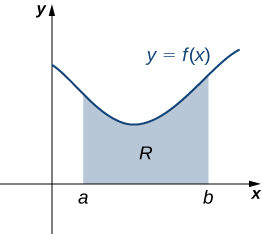
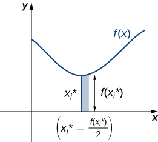
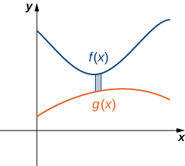
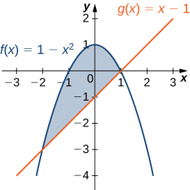
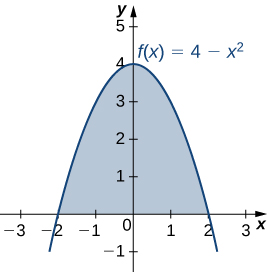
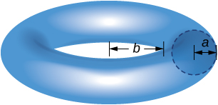

* Find the center of mass of objects distributed along a line.
* Locate the center of mass of a thin plate.
* Use symmetry to help locate the centroid of a thin plate.
* Apply the theorem of Pappus for volume.

In this section, we consider centers of mass (also called *centroids*, under certain conditions) and moments. The basic idea of the center of mass is the notion of a balancing point. Many of us have seen performers who spin plates on the ends of sticks. The performers try to keep several of them spinning without allowing any of them to drop. If we look at a single plate (without spinning it), there is a sweet spot on the plate where it balances perfectly on the stick. If we put the stick anywhere other than that sweet spot, the plate does not balance and it falls to the ground. (That is why performers spin the plates; the spin helps keep the plates from falling even if the stick is not exactly in the right place.) Mathematically, that sweet spot is called the *center of mass of the plate*.

In this section, we first examine these concepts in a one-dimensional context, then expand our development to consider centers of mass of two-dimensional regions and symmetry. Last, we use centroids to find the volume of certain solids by applying the theorem of Pappus.

### Center of Mass and Moments

Let’s begin by looking at the center of mass in a one-dimensional context. Consider a long, thin wire or rod of negligible mass resting on a fulcrum, as shown in [\[link\]](#CNX_Calc_Figure_06_06_001)(a). Now suppose we place objects having masses <math xmlns="http://www.w3.org/1998/Math/MathML"><mrow><msub><mi>m</mi><mn>1</mn></msub></mrow></math>

 and <math xmlns="http://www.w3.org/1998/Math/MathML"><mrow><msub><mi>m</mi><mn>2</mn></msub></mrow></math>

 at distances <math xmlns="http://www.w3.org/1998/Math/MathML"><mrow><msub><mi>d</mi><mn>1</mn></msub></mrow></math>

 and <math xmlns="http://www.w3.org/1998/Math/MathML"><mrow><msub><mi>d</mi><mn>2</mn></msub></mrow></math>

 from the fulcrum, respectively, as shown in [\[link\]](#CNX_Calc_Figure_06_06_001)(b).

  A thin rod rests on a fulcrum. (b) Masses are placed on the rod."){: #CNX_Calc_Figure_06_06_001}

The most common real-life example of a system like this is a playground seesaw, or teeter-totter, with children of different weights sitting at different distances from the center. On a seesaw, if one child sits at each end, the heavier child sinks down and the lighter child is lifted into the air. If the heavier child slides in toward the center, though, the seesaw balances. Applying this concept to the masses on the rod, we note that the masses balance each other if and only if <math xmlns="http://www.w3.org/1998/Math/MathML"><mrow><msub><mi>m</mi><mn>1</mn></msub><msub><mi>d</mi><mn>1</mn></msub><mo>=</mo><msub><mi>m</mi><mn>2</mn></msub><msub><mi>d</mi><mn>2</mn></msub><mo>.</mo></mrow></math>

In the seesaw example, we balanced the system by moving the masses (children) with respect to the fulcrum. However, we are really interested in systems in which the masses are not allowed to move, and instead we balance the system by moving the fulcrum. Suppose we have two point masses, <math xmlns="http://www.w3.org/1998/Math/MathML"><mrow><msub><mi>m</mi><mn>1</mn></msub></mrow></math>

 and <math xmlns="http://www.w3.org/1998/Math/MathML"><mrow><msub><mi>m</mi><mn>2</mn></msub><mo>,</mo></mrow></math>

 located on a number line at points <math xmlns="http://www.w3.org/1998/Math/MathML"><mrow><msub><mi>x</mi><mn>1</mn></msub></mrow></math>

 and <math xmlns="http://www.w3.org/1998/Math/MathML"><mrow><msub><mi>x</mi><mn>2</mn></msub><mo>,</mo></mrow></math>

 respectively ([\[link\]](#CNX_Calc_Figure_06_06_002)). The center of mass, <math xmlns="http://www.w3.org/1998/Math/MathML"><mover accent="true"><mi>x</mi><mo>–</mo></mover><mo>,</mo></math>

 is the point where the fulcrum should be placed to make the system balance.

 {: #CNX_Calc_Figure_06_06_002}

Thus, we have

<math xmlns="http://www.w3.org/1998/Math/MathML"><mtable><mtr><mtd columnalign="right"><msub><mi>m</mi><mn>1</mn></msub><mrow><mo>\|</mo><mrow><msub><mi>x</mi><mn>1</mn></msub><mo>−</mo><mover accent="true"><mi>x</mi><mo>–</mo></mover></mrow><mo>\|</mo></mrow></mtd><mtd columnalign="left"><mo>=</mo></mtd><mtd columnalign="left"><msub><mi>m</mi><mn>2</mn></msub><mrow><mo>\|</mo><mrow><msub><mi>x</mi><mn>2</mn></msub><mo>−</mo><mover accent="true"><mi>x</mi><mo>–</mo></mover></mrow><mo>\|</mo></mrow></mtd></mtr><mtr><mtd columnalign="right"><msub><mi>m</mi><mn>1</mn></msub><mrow><mo>(</mo><mrow><mover accent="true"><mi>x</mi><mo>–</mo></mover><mo>−</mo><msub><mi>x</mi><mn>1</mn></msub></mrow><mo>)</mo></mrow></mtd><mtd columnalign="left"><mo>=</mo></mtd><mtd columnalign="left"><msub><mi>m</mi><mn>2</mn></msub><mrow><mo>(</mo><mrow><msub><mi>x</mi><mn>2</mn></msub><mo>−</mo><mover accent="true"><mi>x</mi><mo>–</mo></mover></mrow><mo>)</mo></mrow></mtd></mtr><mtr><mtd columnalign="right"><msub><mi>m</mi><mn>1</mn></msub><mover accent="true"><mi>x</mi><mo>–</mo></mover><mo>−</mo><msub><mi>m</mi><mn>1</mn></msub><msub><mi>x</mi><mn>1</mn></msub></mtd><mtd columnalign="left"><mo>=</mo></mtd><mtd columnalign="left"><msub><mi>m</mi><mn>2</mn></msub><msub><mi>x</mi><mn>2</mn></msub><mo>−</mo><msub><mi>m</mi><mn>2</mn></msub><mover accent="true"><mi>x</mi><mo>–</mo></mover></mtd></mtr><mtr><mtd columnalign="right"><mover accent="true"><mi>x</mi><mo>–</mo></mover><mrow><mo>(</mo><mrow><msub><mi>m</mi><mn>1</mn></msub><mo>+</mo><msub><mi>m</mi><mn>2</mn></msub></mrow><mo>)</mo></mrow></mtd><mtd columnalign="left"><mo>=</mo></mtd><mtd columnalign="left"><msub><mi>m</mi><mn>1</mn></msub><msub><mi>x</mi><mn>1</mn></msub><mo>+</mo><msub><mi>m</mi><mn>2</mn></msub><msub><mi>x</mi><mn>2</mn></msub></mtd></mtr><mtr><mtd columnalign="right"><mover accent="true"><mi>x</mi><mo>–</mo></mover></mtd><mtd columnalign="left"><mo>=</mo></mtd><mtd columnalign="left"><mfrac><mrow><msub><mi>m</mi><mn>1</mn></msub><msub><mi>x</mi><mn>1</mn></msub><mo>+</mo><msub><mi>m</mi><mn>2</mn></msub><msub><mi>x</mi><mn>2</mn></msub></mrow><mrow><msub><mi>m</mi><mn>1</mn></msub><mo>+</mo><msub><mi>m</mi><mn>2</mn></msub></mrow></mfrac><mo>.</mo></mtd></mtr></mtable></math>

The expression in the numerator, <math xmlns="http://www.w3.org/1998/Math/MathML"><mrow><msub><mi>m</mi><mn>1</mn></msub><msub><mi>x</mi><mn>1</mn></msub><mo>+</mo><msub><mi>m</mi><mn>2</mn></msub><msub><mi>x</mi><mn>2</mn></msub><mo>,</mo></mrow></math>

 is called the *first moment of the system with respect to the origin.* If the context is clear, we often drop the word *first* and just refer to this expression as the **moment**{: data-type="term"} of the system. The expression in the denominator, <math xmlns="http://www.w3.org/1998/Math/MathML"><mrow><msub><mi>m</mi><mn>1</mn></msub><mo>+</mo><msub><mi>m</mi><mn>2</mn></msub><mo>,</mo></mrow></math>

 is the total mass of the system. Thus, the **center of mass**{: data-type="term"} of the system is the point at which the total mass of the system could be concentrated without changing the moment.

This idea is not limited just to two point masses. In general, if *n* masses, <math xmlns="http://www.w3.org/1998/Math/MathML"><mrow><msub><mi>m</mi><mn>1</mn></msub><mo>,</mo><msub><mi>m</mi><mn>2</mn></msub><mtext>,…</mtext><mo>,</mo><msub><mi>m</mi><mi>n</mi></msub><mo>,</mo></mrow></math>

 are placed on a number line at points <math xmlns="http://www.w3.org/1998/Math/MathML"><mrow><msub><mi>x</mi><mn>1</mn></msub><mo>,</mo><msub><mi>x</mi><mn>2</mn></msub><mtext>,…</mtext><mo>,</mo><msub><mi>x</mi><mi>n</mi></msub><mo>,</mo></mrow></math>

 respectively, then the center of mass of the system is given by

<math xmlns="http://www.w3.org/1998/Math/MathML"><mrow><mover accent="true"><mi>x</mi><mo>–</mo></mover><mo>=</mo><mfrac><mrow><mstyle displaystyle="true"><munderover><mo>∑</mo><mrow><mi>i</mi><mo>=</mo><mn>1</mn></mrow><mi>n</mi></munderover><mrow><msub><mi>m</mi><mi>i</mi></msub></mrow></mstyle><msub><mi>x</mi><mi>i</mi></msub></mrow><mrow><mstyle displaystyle="true"><munderover><mo>∑</mo><mrow><mi>i</mi><mo>=</mo><mn>1</mn></mrow><mi>n</mi></munderover><mrow><msub><mi>m</mi><mi>i</mi></msub></mrow></mstyle></mrow></mfrac><mo>.</mo></mrow></math>

Center of Mass of Objects on a Line

Let <math xmlns="http://www.w3.org/1998/Math/MathML"><mrow><msub><mi>m</mi><mn>1</mn></msub><mo>,</mo><msub><mi>m</mi><mn>2</mn></msub><mtext>,…</mtext><mo>,</mo><msub><mi>m</mi><mi>n</mi></msub></mrow></math>

 be point masses placed on a number line at points <math xmlns="http://www.w3.org/1998/Math/MathML"><mrow><msub><mi>x</mi><mn>1</mn></msub><mo>,</mo><msub><mi>x</mi><mn>2</mn></msub><mtext>,…</mtext><mo>,</mo><msub><mi>x</mi><mi>n</mi></msub><mo>,</mo></mrow></math>

 respectively, and let <math xmlns="http://www.w3.org/1998/Math/MathML"><mrow><mi>m</mi><mo>=</mo><mstyle displaystyle="true"><munderover><mo>∑</mo><mrow><mi>i</mi><mo>=</mo><mn>1</mn></mrow><mi>n</mi></munderover><mrow><msub><mi>m</mi><mi>i</mi></msub></mrow></mstyle></mrow></math>

 denote the total mass of the system. Then, the moment of the system with respect to the origin is given by

<math xmlns="http://www.w3.org/1998/Math/MathML"><mrow><mi>M</mi><mo>=</mo><munderover><mstyle mathsize="140%" displaystyle="true"><mo>∑</mo></mstyle><mrow><mi>i</mi><mo>=</mo><mn>1</mn></mrow><mi>n</mi></munderover><msub><mi>m</mi><mi>i</mi></msub><msub><mi>x</mi><mi>i</mi></msub></mrow></math>

and the center of mass of the system is given by

<math xmlns="http://www.w3.org/1998/Math/MathML"><mrow><mover accent="true"><mi>x</mi><mo>–</mo></mover><mo>=</mo><mfrac><mi>M</mi><mi>m</mi></mfrac><mo>.</mo></mrow></math>

We apply this theorem in the following example.

Finding the Center of Mass of Objects along a Line

Suppose four point masses are placed on a number line as follows:

<math xmlns="http://www.w3.org/1998/Math/MathML"><mtable><mtr><mtd columnalign="left"><msub><mi>m</mi><mn>1</mn></msub><mo>=</mo><mn>30</mn><mspace width="0.2em" /><mtext>kg,</mtext><mspace width="0.2em" /><mtext>placed at</mtext><mspace width="0.2em" /><msub><mi>x</mi><mn>1</mn></msub><mo>=</mo><mn>−2</mn><mspace width="0.2em" /><mtext>m</mtext></mtd><mtd /><mtd /><mtd columnalign="left"><msub><mi>m</mi><mn>2</mn></msub><mo>=</mo><mn>5</mn><mspace width="0.2em" /><mtext>kg,</mtext><mspace width="0.2em" /><mtext>placed at</mtext><mspace width="0.2em" /><msub><mi>x</mi><mn>2</mn></msub><mo>=</mo><mn>3</mn><mspace width="0.2em" /><mtext>m</mtext></mtd></mtr><mtr><mtd columnalign="left"><msub><mi>m</mi><mn>3</mn></msub><mo>=</mo><mn>10</mn><mspace width="0.2em" /><mtext>kg,</mtext><mspace width="0.2em" /><mtext>placed at</mtext><mspace width="0.2em" /><msub><mi>x</mi><mn>3</mn></msub><mo>=</mo><mn>6</mn><mspace width="0.2em" /><mtext>m</mtext></mtd><mtd /><mtd /><mtd columnalign="left"><msub><mi>m</mi><mn>4</mn></msub><mo>=</mo><mn>15</mn><mspace width="0.2em" /><mtext>kg,</mtext><mspace width="0.2em" /><mtext>placed at</mtext><mspace width="0.2em" /><msub><mi>x</mi><mn>4</mn></msub><mo>=</mo><mn>−3</mn><mspace width="0.2em" /><mtext>m</mtext><mo>.</mo></mtd></mtr></mtable></math>

Find the moment of the system with respect to the origin and find the center of mass of the system.

First, we need to calculate the moment of the system:

<math xmlns="http://www.w3.org/1998/Math/MathML"><mtable><mtr><mtd columnalign="right"><mi>M</mi></mtd><mtd columnalign="left"><mo>=</mo><mstyle displaystyle="true"><munderover><mo>∑</mo><mrow><mi>i</mi><mo>=</mo><mn>1</mn></mrow><mn>4</mn></munderover><mrow><msub><mi>m</mi><mi>i</mi></msub></mrow></mstyle><msub><mi>x</mi><mi>i</mi></msub></mtd></mtr><mtr><mtd /><mtd columnalign="left"><mo>=</mo><mn>−60</mn><mo>+</mo><mn>15</mn><mo>+</mo><mn>60</mn><mo>−</mo><mn>45</mn><mo>=</mo><mn>−30.</mn></mtd></mtr></mtable></math>

Now, to find the center of mass, we need the total mass of the system:

<math xmlns="http://www.w3.org/1998/Math/MathML"><mtable><mtr><mtd columnalign="right"><mi>m</mi></mtd><mtd columnalign="left"><mo>=</mo><mstyle displaystyle="true"><munderover><mo>∑</mo><mrow><mi>i</mi><mo>=</mo><mn>1</mn></mrow><mn>4</mn></munderover><mrow><msub><mi>m</mi><mi>i</mi></msub></mrow></mstyle></mtd></mtr><mtr><mtd /><mtd columnalign="left"><mo>=</mo><mn>30</mn><mo>+</mo><mn>5</mn><mo>+</mo><mn>10</mn><mo>+</mo><mn>15</mn><mo>=</mo><mn>60</mn><mspace width="0.2em" /><mtext>kg</mtext><mtext>.</mtext></mtd></mtr></mtable></math>

Then we have

<math xmlns="http://www.w3.org/1998/Math/MathML"><mrow><mover accent="true"><mi>x</mi><mo>–</mo></mover><mo>=</mo><mfrac><mi>M</mi><mi>m</mi></mfrac><mo>=</mo><mfrac><mrow><mn>−30</mn></mrow><mrow><mn>60</mn></mrow></mfrac><mo>=</mo><mo>−</mo><mfrac><mn>1</mn><mn>2</mn></mfrac><mo>.</mo></mrow></math>

The center of mass is located 1/2 m to the left of the origin.

Suppose four point masses are placed on a number line as follows:

<math xmlns="http://www.w3.org/1998/Math/MathML"><mtable><mtr><mtd columnalign="left"><msub><mi>m</mi><mn>1</mn></msub><mo>=</mo><mn>12</mn><mspace width="0.2em" /><mtext>kg,</mtext><mspace width="0.2em" /><mtext>placed at</mtext><mspace width="0.2em" /><msub><mi>x</mi><mn>1</mn></msub><mo>=</mo><mn>−4</mn><mspace width="0.2em" /><mtext>m</mtext></mtd><mtd /><mtd /><mtd columnalign="left"><msub><mi>m</mi><mn>2</mn></msub><mo>=</mo><mn>12</mn><mspace width="0.2em" /><mtext>kg,</mtext><mspace width="0.2em" /><mtext>placed at</mtext><mspace width="0.2em" /><msub><mi>x</mi><mn>2</mn></msub><mo>=</mo><mn>4</mn><mspace width="0.2em" /><mtext>m</mtext></mtd></mtr><mtr><mtd columnalign="left"><msub><mi>m</mi><mn>3</mn></msub><mo>=</mo><mn>30</mn><mspace width="0.2em" /><mtext>kg,</mtext><mspace width="0.2em" /><mtext>placed at</mtext><mspace width="0.2em" /><msub><mi>x</mi><mn>3</mn></msub><mo>=</mo><mn>2</mn><mspace width="0.2em" /><mtext>m</mtext></mtd><mtd /><mtd /><mtd columnalign="left"><msub><mi>m</mi><mn>4</mn></msub><mo>=</mo><mn>6</mn><mspace width="0.2em" /><mtext>kg,</mtext><mspace width="0.2em" /><mtext>placed at</mtext><mspace width="0.2em" /><msub><mi>x</mi><mn>4</mn></msub><mo>=</mo><mn>−6</mn><mspace width="0.2em" /><mtext>m</mtext><mo>.</mo></mtd></mtr></mtable></math>

Find the moment of the system with respect to the origin and find the center of mass of the system.

<math xmlns="http://www.w3.org/1998/Math/MathML"><mrow><mi>M</mi><mo>=</mo><mn>24</mn><mo>,</mo><mover accent="true"><mi>x</mi><mo>–</mo></mover><mo>=</mo><mfrac><mn>2</mn><mn>5</mn></mfrac><mspace width="0.2em" /><mtext>m</mtext></mrow></math>

Hint

Use the process from the previous example.

We can generalize this concept to find the center of mass of a system of point masses in a plane. Let <math xmlns="http://www.w3.org/1998/Math/MathML"><mrow><msub><mi>m</mi><mn>1</mn></msub></mrow></math>

 be a point mass located at point <math xmlns="http://www.w3.org/1998/Math/MathML"><mrow><mrow><mo>(</mo><mrow><msub><mi>x</mi><mn>1</mn></msub><mo>,</mo><msub><mi>y</mi><mn>1</mn></msub></mrow><mo>)</mo></mrow></mrow></math>

 in the plane. Then the moment <math xmlns="http://www.w3.org/1998/Math/MathML"><mrow><msub><mi>M</mi><mi>x</mi></msub></mrow></math>

 of the mass with respect to the *x*-axis is given by <math xmlns="http://www.w3.org/1998/Math/MathML"><mrow><msub><mi>M</mi><mi>x</mi></msub><mo>=</mo><msub><mi>m</mi><mn>1</mn></msub><msub><mi>y</mi><mn>1</mn></msub><mo>.</mo></mrow></math>

 Similarly, the moment <math xmlns="http://www.w3.org/1998/Math/MathML"><mrow><msub><mi>M</mi><mi>y</mi></msub></mrow></math>

 with respect to the *y*-axis is given by <math xmlns="http://www.w3.org/1998/Math/MathML"><mrow><msub><mi>M</mi><mi>y</mi></msub><mo>=</mo><msub><mi>m</mi><mn>1</mn></msub><msub><mi>x</mi><mn>1</mn></msub><mo>.</mo></mrow></math>

 Notice that the *x*-coordinate of the point is used to calculate the moment with respect to the *y*-axis, and vice versa. The reason is that the *x*-coordinate gives the distance from the point mass to the *y*-axis, and the *y*-coordinate gives the distance to the *x*-axis (see the following figure).

  in the plane."){: #CNX_Calc_Figure_06_06_003}

If we have several point masses in the *xy*-plane, we can use the moments with respect to the *x*- and *y*-axes to calculate the *x*- and *y*-coordinates of the center of mass of the system.

Center of Mass of Objects in a Plane

Let <math xmlns="http://www.w3.org/1998/Math/MathML"><mrow><msub><mi>m</mi><mn>1</mn></msub><mo>,</mo><msub><mi>m</mi><mn>2</mn></msub><mtext>,…</mtext><mo>,</mo><msub><mi>m</mi><mi>n</mi></msub></mrow></math>

 be point masses located in the *xy*-plane at points <math xmlns="http://www.w3.org/1998/Math/MathML"><mrow><mrow><mo>(</mo><mrow><msub><mi>x</mi><mn>1</mn></msub><mo>,</mo><msub><mi>y</mi><mn>1</mn></msub></mrow><mo>)</mo></mrow><mo>,</mo><mrow><mo>(</mo><mrow><msub><mi>x</mi><mn>2</mn></msub><mo>,</mo><msub><mi>y</mi><mn>2</mn></msub></mrow><mo>)</mo></mrow><mtext>,…</mtext><mo>,</mo><mrow><mo>(</mo><mrow><msub><mi>x</mi><mi>n</mi></msub><mo>,</mo><msub><mi>y</mi><mi>n</mi></msub></mrow><mo>)</mo></mrow><mo>,</mo></mrow></math>

 respectively, and let <math xmlns="http://www.w3.org/1998/Math/MathML"><mrow><mi>m</mi><mo>=</mo><mstyle displaystyle="true"><munderover><mo>∑</mo><mrow><mi>i</mi><mo>=</mo><mn>1</mn></mrow><mi>n</mi></munderover><mrow><msub><mi>m</mi><mi>i</mi></msub></mrow></mstyle></mrow></math>

 denote the total mass of the system. Then the moments <math xmlns="http://www.w3.org/1998/Math/MathML"><mrow><msub><mi>M</mi><mi>x</mi></msub></mrow></math>

 and <math xmlns="http://www.w3.org/1998/Math/MathML"><mrow><msub><mi>M</mi><mi>y</mi></msub></mrow></math>

 of the system with respect to the *x*- and *y*-axes, respectively, are given by

<math xmlns="http://www.w3.org/1998/Math/MathML"><mrow><msub><mi>M</mi><mi>x</mi></msub><mo>=</mo><munderover><mstyle mathsize="140%" displaystyle="true"><mo>∑</mo></mstyle><mrow><mi>i</mi><mo>=</mo><mn>1</mn></mrow><mi>n</mi></munderover><msub><mi>m</mi><mi>i</mi></msub><msub><mi>y</mi><mi>i</mi></msub><mspace width="1em" /><mtext>and</mtext><mspace width="1em" /><msub><mi>M</mi><mi>y</mi></msub><mo>=</mo><munderover><mstyle mathsize="140%" displaystyle="true"><mo>∑</mo></mstyle><mrow><mi>i</mi><mo>=</mo><mn>1</mn></mrow><mi>n</mi></munderover><msub><mi>m</mi><mi>i</mi></msub><msub><mi>x</mi><mi>i</mi></msub><mo>.</mo></mrow></math>

Also, the coordinates of the center of mass <math xmlns="http://www.w3.org/1998/Math/MathML"><mrow><mrow><mo>(</mo><mrow><mover accent="true"><mi>x</mi><mo>–</mo></mover><mo>,</mo><mover accent="true"><mi>y</mi><mo>–</mo></mover></mrow><mo>)</mo></mrow></mrow></math>

 of the system are

<math xmlns="http://www.w3.org/1998/Math/MathML"><mrow><mover accent="true"><mi>x</mi><mo>–</mo></mover><mo>=</mo><mfrac><mrow><msub><mi>M</mi><mi>y</mi></msub></mrow><mi>m</mi></mfrac><mspace width="1em" /><mtext>and</mtext><mspace width="1em" /><mover accent="true"><mi>y</mi><mo>–</mo></mover><mo>=</mo><mfrac><mrow><msub><mi>M</mi><mi>x</mi></msub></mrow><mi>m</mi></mfrac><mo>.</mo></mrow></math>

The next example demonstrates how to apply this theorem.

Finding the Center of Mass of Objects in a Plane

Suppose three point masses are placed in the *xy*-plane as follows (assume coordinates are given in meters):

<math xmlns="http://www.w3.org/1998/Math/MathML"><mtable><mtr><mtd columnalign="left"><msub><mi>m</mi><mn>1</mn></msub><mo>=</mo><mn>2</mn><mspace width="0.2em" /><mtext>kg, placed at</mtext><mspace width="0.2em" /><mrow><mo>(</mo><mrow><mn>−1</mn><mo>,</mo><mn>3</mn></mrow><mo>)</mo><mo>,</mo></mrow></mtd></mtr><mtr><mtd columnalign="left"><msub><mi>m</mi><mn>2</mn></msub><mo>=</mo><mn>6</mn><mspace width="0.2em" /><mtext>kg, placed at</mtext><mspace width="0.2em" /><mrow><mo>(</mo><mrow><mn>1</mn><mo>,</mo><mn>1</mn></mrow><mo>)</mo><mo>,</mo></mrow></mtd></mtr><mtr><mtd columnalign="left"><msub><mi>m</mi><mn>3</mn></msub><mo>=</mo><mn>4</mn><mspace width="0.2em" /><mtext>kg, placed at</mtext><mspace width="0.2em" /><mrow><mo>(</mo><mrow><mn>2</mn><mo>,</mo><mn>−2</mn></mrow><mo>)</mo></mrow><mo>.</mo></mtd></mtr></mtable></math>

Find the center of mass of the system.

First we calculate the total mass of the system:

<math xmlns="http://www.w3.org/1998/Math/MathML"><mrow><mi>m</mi><mo>=</mo><mstyle displaystyle="true"><munderover><mo>∑</mo><mrow><mi>i</mi><mo>=</mo><mn>1</mn></mrow><mn>3</mn></munderover><mrow><msub><mi>m</mi><mi>i</mi></msub></mrow></mstyle><mo>=</mo><mn>2</mn><mo>+</mo><mn>6</mn><mo>+</mo><mn>4</mn><mo>=</mo><mn>12</mn><mspace width="0.2em" /><mtext>kg</mtext><mtext>.</mtext></mrow></math>

Next we find the moments with respect to the *x*- and *y*-axes:

<math xmlns="http://www.w3.org/1998/Math/MathML"><mtable><mtr /><mtr /><mtr><mtd columnalign="left"><msub><mi>M</mi><mi>y</mi></msub><mo>=</mo><mstyle displaystyle="true"><munderover><mo>∑</mo><mrow><mi>i</mi><mo>=</mo><mn>1</mn></mrow><mn>3</mn></munderover><mrow><msub><mi>m</mi><mi>i</mi></msub></mrow></mstyle><msub><mi>x</mi><mi>i</mi></msub><mo>=</mo><mn>−2</mn><mo>+</mo><mn>6</mn><mo>+</mo><mn>8</mn><mo>=</mo><mn>12</mn><mo>,</mo></mtd></mtr><mtr><mtd columnalign="left"><msub><mi>M</mi><mi>x</mi></msub><mo>=</mo><mstyle displaystyle="true"><munderover><mo>∑</mo><mrow><mi>i</mi><mo>=</mo><mn>1</mn></mrow><mn>3</mn></munderover><mrow><msub><mi>m</mi><mi>i</mi></msub></mrow></mstyle><msub><mi>y</mi><mi>i</mi></msub><mo>=</mo><mn>6</mn><mo>+</mo><mn>6</mn><mo>−</mo><mn>8</mn><mo>=</mo><mn>4.</mn></mtd></mtr></mtable></math>

Then we have

<math xmlns="http://www.w3.org/1998/Math/MathML"><mrow><mover accent="true"><mi>x</mi><mo>–</mo></mover><mo>=</mo><mfrac><mrow><msub><mi>M</mi><mi>y</mi></msub></mrow><mi>m</mi></mfrac><mo>=</mo><mfrac><mrow><mn>12</mn></mrow><mrow><mn>12</mn></mrow></mfrac><mo>=</mo><mn>1</mn><mspace width="0.2em" /><mtext>and</mtext><mspace width="0.2em" /><mover accent="true"><mi>y</mi><mo>–</mo></mover><mo>=</mo><mfrac><mrow><msub><mi>M</mi><mi>x</mi></msub></mrow><mi>m</mi></mfrac><mo>=</mo><mfrac><mn>4</mn><mrow><mn>12</mn></mrow></mfrac><mo>=</mo><mfrac><mn>1</mn><mn>3</mn></mfrac><mo>.</mo></mrow></math>

The center of mass of the system is <math xmlns="http://www.w3.org/1998/Math/MathML"><mrow><mrow><mo>(</mo><mrow><mn>1</mn><mo>,</mo><mrow><mrow><mn>1</mn></mrow><mtext>/</mtext><mn>3</mn></mrow></mrow><mo>)</mo></mrow><mo>,</mo></mrow></math>

 in meters.

Suppose three point masses are placed on a number line as follows (assume coordinates are given in meters):

<math xmlns="http://www.w3.org/1998/Math/MathML"><mtable><mtr><mtd columnalign="left"><msub><mi>m</mi><mn>1</mn></msub><mo>=</mo><mn>5</mn><mspace width="0.2em" /><mtext>kg, placed at</mtext><mspace width="0.2em" /><mrow><mo>(</mo><mrow><mn>−2</mn><mo>,</mo><mn>−3</mn></mrow><mo>)</mo><mo>,</mo></mrow></mtd></mtr><mtr><mtd columnalign="left"><msub><mi>m</mi><mn>2</mn></msub><mo>=</mo><mn>3</mn><mspace width="0.2em" /><mtext>kg, placed at</mtext><mspace width="0.2em" /><mrow><mo>(</mo><mrow><mn>2</mn><mo>,</mo><mn>3</mn></mrow><mo>)</mo><mo>,</mo></mrow></mtd></mtr><mtr><mtd columnalign="left"><msub><mi>m</mi><mn>3</mn></msub><mo>=</mo><mn>2</mn><mspace width="0.2em" /><mtext>kg, placed at</mtext><mspace width="0.2em" /><mrow><mo>(</mo><mrow><mn>−3</mn><mo>,</mo><mn>−2</mn></mrow><mo>)</mo></mrow><mo>.</mo></mtd></mtr></mtable></math>

Find the center of mass of the system.

<math xmlns="http://www.w3.org/1998/Math/MathML"><mrow><mrow><mo>(</mo><mrow><mn>−1</mn><mo>,</mo><mn>−1</mn></mrow><mo>)</mo></mrow></mrow></math>

 m

Hint

Use the process from the previous example.

### Center of Mass of Thin Plates

So far we have looked at systems of point masses on a line and in a plane. Now, instead of having the mass of a system concentrated at discrete points, we want to look at systems in which the mass of the system is distributed continuously across a thin sheet of material. For our purposes, we assume the sheet is thin enough that it can be treated as if it is two-dimensional. Such a sheet is called a **lamina**{: data-type="term"}. Next we develop techniques to find the center of mass of a lamina. In this section, we also assume the density of the lamina is constant.

Laminas are often represented by a two-dimensional region in a plane. The geometric center of such a region is called its **centroid**{: data-type="term"}. Since we have assumed the density of the lamina is constant, the center of mass of the lamina depends only on the shape of the corresponding region in the plane; it does not depend on the density. In this case, the center of mass of the lamina corresponds to the centroid of the delineated region in the plane. As with systems of point masses, we need to find the total mass of the lamina, as well as the moments of the lamina with respect to the *x*- and *y*-axes.

We first consider a lamina in the shape of a rectangle. Recall that the center of mass of a lamina is the point where the lamina balances. For a rectangle, that point is both the horizontal and vertical center of the rectangle. Based on this understanding, it is clear that the center of mass of a rectangular lamina is the point where the diagonals intersect, which is a result of the **symmetry principle**{: data-type="term"}, and it is stated here without proof.

The Symmetry Principle

If a region *R* is symmetric about a line *l*, then the centroid of *R* lies on *l*.

Let’s turn to more general laminas. Suppose we have a lamina bounded above by the graph of a continuous function <math xmlns="http://www.w3.org/1998/Math/MathML"><mrow><mi>f</mi><mo stretchy="false">(</mo><mi>x</mi><mo stretchy="false">)</mo><mo>,</mo></mrow></math>

 below by the *x*-axis, and on the left and right by the lines <math xmlns="http://www.w3.org/1998/Math/MathML"><mrow><mi>x</mi><mo>=</mo><mi>a</mi></mrow></math>

 and <math xmlns="http://www.w3.org/1998/Math/MathML"><mrow><mi>x</mi><mo>=</mo><mi>b</mi><mo>,</mo></mrow></math>

 respectively, as shown in the following figure.

 {: #CNX_Calc_Figure_06_06_004}

As with systems of point masses, to find the center of mass of the lamina, we need to find the total mass of the lamina, as well as the moments of the lamina with respect to the *x*- and *y*-axes. As we have done many times before, we approximate these quantities by partitioning the interval <math xmlns="http://www.w3.org/1998/Math/MathML"><mrow><mrow><mo>[</mo><mrow><mi>a</mi><mo>,</mo><mi>b</mi></mrow><mo>]</mo></mrow></mrow></math>

 and constructing rectangles.

For <math xmlns="http://www.w3.org/1998/Math/MathML"><mrow><mi>i</mi><mo>=</mo><mn>0</mn><mo>,</mo><mn>1</mn><mo>,</mo><mn>2</mn><mtext>,…</mtext><mo>,</mo><mi>n</mi><mo>,</mo></mrow></math>

 let <math xmlns="http://www.w3.org/1998/Math/MathML"><mrow><mi>P</mi><mo>=</mo><mrow><mo>{</mo><mrow><msub><mi>x</mi><mi>i</mi></msub></mrow><mo>}</mo></mrow></mrow></math>

 be a regular partition of <math xmlns="http://www.w3.org/1998/Math/MathML"><mrow><mrow><mo>[</mo><mrow><mi>a</mi><mo>,</mo><mi>b</mi></mrow><mo>]</mo></mrow><mo>.</mo></mrow></math>

 Recall that we can choose any point within the interval <math xmlns="http://www.w3.org/1998/Math/MathML"><mrow><mrow><mo>[</mo><mrow><msub><mi>x</mi><mrow><mi>i</mi><mo>−</mo><mn>1</mn></mrow></msub><mo>,</mo><msub><mi>x</mi><mi>i</mi></msub></mrow><mo>]</mo></mrow></mrow></math>

 as our <math xmlns="http://www.w3.org/1998/Math/MathML"><mrow><msubsup><mi>x</mi><mi>i</mi><mo>*</mo></msubsup><mo>.</mo></mrow></math>

 In this case, we want <math xmlns="http://www.w3.org/1998/Math/MathML"><mrow><msubsup><mi>x</mi><mi>i</mi><mo>*</mo></msubsup></mrow></math>

 to be the *x*-coordinate of the centroid of our rectangles. Thus, for <math xmlns="http://www.w3.org/1998/Math/MathML"><mrow><mi>i</mi><mo>=</mo><mn>1</mn><mo>,</mo><mn>2</mn><mtext>,…</mtext><mo>,</mo><mi>n</mi><mo>,</mo></mrow></math>

 we select <math xmlns="http://www.w3.org/1998/Math/MathML"><mrow><msubsup><mi>x</mi><mi>i</mi><mo>*</mo></msubsup><mo>∈</mo><mrow><mo>[</mo><mrow><msub><mi>x</mi><mrow><mi>i</mi><mo>−</mo><mn>1</mn></mrow></msub><mo>,</mo><msub><mi>x</mi><mi>i</mi></msub></mrow><mo>]</mo></mrow></mrow></math>

 such that <math xmlns="http://www.w3.org/1998/Math/MathML"><mrow><msubsup><mi>x</mi><mi>i</mi><mo>*</mo></msubsup></mrow></math>

 is the midpoint of the interval. That is, <math xmlns="http://www.w3.org/1998/Math/MathML"><mrow><msubsup><mi>x</mi><mi>i</mi><mo>*</mo></msubsup><mo>=</mo><mrow><mrow><mrow><mo>(</mo><mrow><msub><mi>x</mi><mrow><mi>i</mi><mo>−</mo><mn>1</mn></mrow></msub><mo>+</mo><msub><mi>x</mi><mi>i</mi></msub></mrow><mo>)</mo></mrow></mrow><mtext>/</mtext><mn>2</mn></mrow><mo>.</mo></mrow></math>

 Now, for <math xmlns="http://www.w3.org/1998/Math/MathML"><mrow><mi>i</mi><mo>=</mo><mn>1</mn><mo>,</mo><mn>2</mn><mtext>,…</mtext><mo>,</mo><mi>n</mi><mo>,</mo></mrow></math>

 construct a rectangle of height <math xmlns="http://www.w3.org/1998/Math/MathML"><mrow><mi>f</mi><mrow><mo>(</mo><mrow><msubsup><mi>x</mi><mi>i</mi><mo>*</mo></msubsup></mrow><mo>)</mo></mrow></mrow></math>

 on <math xmlns="http://www.w3.org/1998/Math/MathML"><mrow><mrow><mo>[</mo><mrow><msub><mi>x</mi><mrow><mi>i</mi><mo>−</mo><mn>1</mn></mrow></msub><mo>,</mo><msub><mi>x</mi><mi>i</mi></msub></mrow><mo>]</mo></mrow><mo>.</mo></mrow></math>

 The center of mass of this rectangle is <math xmlns="http://www.w3.org/1998/Math/MathML"><mrow><mrow><mo>(</mo><mrow><msubsup><mi>x</mi><mi>i</mi><mo>*</mo></msubsup><mo>,</mo><mrow><mrow><mrow><mo>(</mo><mrow><mi>f</mi><mo stretchy="false">(</mo><msubsup><mi>x</mi><mi>i</mi><mo>*</mo></msubsup><mo stretchy="false">)</mo></mrow><mo>)</mo></mrow></mrow><mtext>/</mtext><mn>2</mn></mrow></mrow><mo>)</mo></mrow><mo>,</mo></mrow></math>

 as shown in the following figure.

 {: #CNX_Calc_Figure_06_06_005}

Next, we need to find the total mass of the rectangle. Let <math xmlns="http://www.w3.org/1998/Math/MathML"><mi>ρ</mi></math>

 represent the density of the lamina (note that <math xmlns="http://www.w3.org/1998/Math/MathML"><mi>ρ</mi></math>

 is a constant). In this case, <math xmlns="http://www.w3.org/1998/Math/MathML"><mi>ρ</mi></math>

 is expressed in terms of mass per unit area. Thus, to find the total mass of the rectangle, we multiply the area of the rectangle by <math xmlns="http://www.w3.org/1998/Math/MathML"><mi>ρ</mi><mo>.</mo></math>

 Then, the mass of the rectangle is given by <math xmlns="http://www.w3.org/1998/Math/MathML"><mrow><mi>ρ</mi><mi>f</mi><mo stretchy="false">(</mo><msubsup><mi>x</mi><mi>i</mi><mo>*</mo></msubsup><mo stretchy="false">)</mo><mtext>Δ</mtext><mi>x</mi><mo>.</mo></mrow></math>

To get the approximate mass of the lamina, we add the masses of all the rectangles to get

<math xmlns="http://www.w3.org/1998/Math/MathML"><mrow><mi>m</mi><mo>≈</mo><mstyle displaystyle="true"><munderover><mo>∑</mo><mrow><mi>i</mi><mo>=</mo><mn>1</mn></mrow><mi>n</mi></munderover><mi>ρ</mi></mstyle><mi>f</mi><mo stretchy="false">(</mo><msubsup><mi>x</mi><mi>i</mi><mo>*</mo></msubsup><mo stretchy="false">)</mo><mtext>Δ</mtext><mi>x</mi><mo>.</mo></mrow></math>

This is a Riemann sum. Taking the limit as <math xmlns="http://www.w3.org/1998/Math/MathML"><mrow><mi>n</mi><mo stretchy="false">→</mo><mi>∞</mi></mrow></math>

 gives the exact mass of the lamina:

<math xmlns="http://www.w3.org/1998/Math/MathML"><mrow><mi>m</mi><mo>=</mo><munder><mrow><mtext>lim</mtext></mrow><mrow><mi>n</mi><mo stretchy="false">→</mo><mi>∞</mi></mrow></munder><mstyle displaystyle="true"><munderover><mo>∑</mo><mrow><mi>i</mi><mo>=</mo><mn>1</mn></mrow><mi>n</mi></munderover><mi>ρ</mi></mstyle><mi>f</mi><mo stretchy="false">(</mo><msubsup><mi>x</mi><mi>i</mi><mo>*</mo></msubsup><mo stretchy="false">)</mo><mtext>Δ</mtext><mi>x</mi><mo>=</mo><mi>ρ</mi><msubsup><mstyle mathsize="140%" displaystyle="true"><mo stretchy="false">∫</mo></mstyle><mi>a</mi><mi>b</mi></msubsup><mi>f</mi><mo stretchy="false">(</mo><mi>x</mi><mo stretchy="false">)</mo><mi>d</mi><mi>x</mi><mo>.</mo></mrow></math>

Next, we calculate the moment of the lamina with respect to the *x*-axis. Returning to the representative rectangle, recall its center of mass is <math xmlns="http://www.w3.org/1998/Math/MathML"><mrow><mrow><mo>(</mo><mrow><msubsup><mi>x</mi><mi>i</mi><mo>*</mo></msubsup><mo>,</mo><mrow><mrow><mrow><mo>(</mo><mrow><mi>f</mi><mo stretchy="false">(</mo><msubsup><mi>x</mi><mi>i</mi><mo>*</mo></msubsup><mo stretchy="false">)</mo></mrow><mo>)</mo></mrow></mrow><mtext>/</mtext><mn>2</mn></mrow></mrow><mo>)</mo></mrow><mo>.</mo></mrow></math>

 Recall also that treating the rectangle as if it is a point mass located at the center of mass does not change the moment. Thus, the moment of the rectangle with respect to the *x*-axis is given by the mass of the rectangle, <math xmlns="http://www.w3.org/1998/Math/MathML"><mrow><mi>ρ</mi><mi>f</mi><mo stretchy="false">(</mo><msubsup><mi>x</mi><mi>i</mi><mo>*</mo></msubsup><mo stretchy="false">)</mo><mtext>Δ</mtext><mi>x</mi><mo>,</mo></mrow></math>

 multiplied by the distance from the center of mass to the *x*-axis: <math xmlns="http://www.w3.org/1998/Math/MathML"><mrow><mrow><mrow><mrow><mo>(</mo><mrow><mi>f</mi><mo stretchy="false">(</mo><msubsup><mi>x</mi><mi>i</mi><mo>*</mo></msubsup><mo stretchy="false">)</mo></mrow><mo>)</mo></mrow></mrow><mtext>/</mtext><mn>2</mn></mrow><mo>.</mo></mrow></math>

 Therefore, the moment with respect to the *x*-axis of the rectangle is <math xmlns="http://www.w3.org/1998/Math/MathML"><mrow><mi>ρ</mi><mrow><mo>(</mo><mrow><mrow><mrow><msup><mrow><mrow><mo>[</mo><mrow><mi>f</mi><mo stretchy="false">(</mo><msubsup><mi>x</mi><mi>i</mi><mo>*</mo></msubsup><mo stretchy="false">)</mo></mrow><mo>]</mo></mrow></mrow><mn>2</mn></msup></mrow><mtext>/</mtext><mn>2</mn></mrow></mrow><mo>)</mo></mrow><mtext>Δ</mtext><mi>x</mi><mo>.</mo></mrow></math>

 Adding the moments of the rectangles and taking the limit of the resulting Riemann sum, we see that the moment of the lamina with respect to the *x*-axis is

<math xmlns="http://www.w3.org/1998/Math/MathML"><mrow><msub><mi>M</mi><mi>x</mi></msub><mo>=</mo><munder><mrow><mtext>lim</mtext></mrow><mrow><mi>n</mi><mo stretchy="false">→</mo><mi>∞</mi></mrow></munder><mstyle displaystyle="true"><munderover><mo>∑</mo><mrow><mi>i</mi><mo>=</mo><mn>1</mn></mrow><mi>n</mi></munderover><mi>ρ</mi></mstyle><mfrac><mrow><msup><mrow><mrow><mo>[</mo><mrow><mi>f</mi><mo stretchy="false">(</mo><msubsup><mi>x</mi><mi>i</mi><mo>*</mo></msubsup><mo stretchy="false">)</mo></mrow><mo>]</mo></mrow></mrow><mn>2</mn></msup></mrow><mn>2</mn></mfrac><mtext>Δ</mtext><mi>x</mi><mo>=</mo><mi>ρ</mi><mstyle displaystyle="true"><mrow><msubsup><mo stretchy="false">∫</mo><mi>a</mi><mi>b</mi></msubsup><mrow><mfrac><mrow><msup><mrow><mrow><mo>[</mo><mrow><mi>f</mi><mo stretchy="false">(</mo><mi>x</mi><mo stretchy="false">)</mo></mrow><mo>]</mo></mrow></mrow><mn>2</mn></msup></mrow><mn>2</mn></mfrac><mi>d</mi><mi>x</mi></mrow></mrow></mstyle><mo>.</mo></mrow></math>

We derive the moment with respect to the *y*-axis similarly, noting that the distance from the center of mass of the rectangle to the *y*-axis is <math xmlns="http://www.w3.org/1998/Math/MathML"><mrow><msubsup><mi>x</mi><mi>i</mi><mo>*</mo></msubsup><mo>.</mo></mrow></math>

 Then the moment of the lamina with respect to the *y*-axis is given by

<math xmlns="http://www.w3.org/1998/Math/MathML"><mrow><msub><mi>M</mi><mi>y</mi></msub><mo>=</mo><munder><mrow><mtext>lim</mtext></mrow><mrow><mi>n</mi><mo stretchy="false">→</mo><mi>∞</mi></mrow></munder><munderover><mstyle mathsize="140%" displaystyle="true"><mo>∑</mo></mstyle><mrow><mi>i</mi><mo>=</mo><mn>1</mn></mrow><mi>n</mi></munderover><mi>ρ</mi><msubsup><mi>x</mi><mi>i</mi><mo>*</mo></msubsup><mi>f</mi><mo stretchy="false">(</mo><msubsup><mi>x</mi><mi>i</mi><mo>*</mo></msubsup><mo stretchy="false">)</mo><mtext>Δ</mtext><mi>x</mi><mo>=</mo><mi>ρ</mi><mstyle displaystyle="true"><mrow><msubsup><mo stretchy="false">∫</mo><mi>a</mi><mi>b</mi></msubsup><mrow><mi>x</mi><mi>f</mi><mo stretchy="false">(</mo><mi>x</mi><mo stretchy="false">)</mo><mi>d</mi><mi>x</mi></mrow></mrow></mstyle><mo>.</mo></mrow></math>

We find the coordinates of the center of mass by dividing the moments by the total mass to give <math xmlns="http://www.w3.org/1998/Math/MathML"><mrow><mover accent="true"><mi>x</mi><mo>–</mo></mover><mo>=</mo><mrow><mrow><msub><mi>M</mi><mi>y</mi></msub></mrow><mtext>/</mtext><mi>m</mi></mrow><mspace width="0.2em" /><mtext>and</mtext><mspace width="0.2em" /><mover accent="true"><mi>y</mi><mo>–</mo></mover><mo>=</mo><mrow><mrow><msub><mi>M</mi><mi>x</mi></msub></mrow><mtext>/</mtext><mi>m</mi></mrow><mo>.</mo></mrow></math>

 If we look closely at the expressions for <math xmlns="http://www.w3.org/1998/Math/MathML"><mrow><msub><mi>M</mi><mi>x</mi></msub><mo>,</mo><msub><mi>M</mi><mi>y</mi></msub><mo>,</mo><mspace width="0.2em" /><mtext>and</mtext><mspace width="0.2em" /><mi>m</mi><mo>,</mo></mrow></math>

 we notice that the constant <math xmlns="http://www.w3.org/1998/Math/MathML"><mi>ρ</mi></math>

 cancels out when <math xmlns="http://www.w3.org/1998/Math/MathML"><mover accent="true"><mi>x</mi><mo>–</mo></mover></math>

 and <math xmlns="http://www.w3.org/1998/Math/MathML"><mover accent="true"><mi>y</mi><mo>–</mo></mover></math>

 are calculated.

We summarize these findings in the following theorem.

Center of Mass of a Thin Plate in the *xy*-Plane

Let *R* denote a region bounded above by the graph of a continuous function <math xmlns="http://www.w3.org/1998/Math/MathML"><mrow><mi>f</mi><mo stretchy="false">(</mo><mi>x</mi><mo stretchy="false">)</mo><mo>,</mo></mrow></math>

 below by the *x*-axis, and on the left and right by the lines <math xmlns="http://www.w3.org/1998/Math/MathML"><mrow><mi>x</mi><mo>=</mo><mi>a</mi></mrow></math>

 and <math xmlns="http://www.w3.org/1998/Math/MathML"><mrow><mi>x</mi><mo>=</mo><mi>b</mi><mo>,</mo></mrow></math>

 respectively. Let <math xmlns="http://www.w3.org/1998/Math/MathML"><mi>ρ</mi></math>

 denote the density of the associated lamina. Then we can make the following statements:

1.  The mass of the lamina is
    * * *
    {: data-type="newline"}
    
    

    <math xmlns="http://www.w3.org/1998/Math/MathML"><mrow><mi>m</mi><mo>=</mo><mi>ρ</mi><msubsup><mstyle mathsize="140%" displaystyle="true"><mo stretchy="false">∫</mo></mstyle><mi>a</mi><mi>b</mi></msubsup><mi>f</mi><mo stretchy="false">(</mo><mi>x</mi><mo stretchy="false">)</mo><mi>d</mi><mi>x</mi><mo>.</mo></mrow></math>
    

2.  The moments
    <math xmlns="http://www.w3.org/1998/Math/MathML"><mrow><msub><mi>M</mi><mi>x</mi></msub></mrow></math>
    
    and
    <math xmlns="http://www.w3.org/1998/Math/MathML"><mrow><msub><mi>M</mi><mi>y</mi></msub></mrow></math>
    
    of the lamina with respect to the *x*- and *y*-axes, respectively, are
    * * *
    {: data-type="newline"}
    
    

    <math xmlns="http://www.w3.org/1998/Math/MathML"><mrow><msub><mi>M</mi><mi>x</mi></msub><mo>=</mo><mi>ρ</mi><mstyle displaystyle="true"><mrow><msubsup><mo stretchy="false">∫</mo><mi>a</mi><mi>b</mi></msubsup><mrow><mfrac><mrow><msup><mrow><mrow><mo>[</mo><mrow><mi>f</mi><mo stretchy="false">(</mo><mi>x</mi><mo stretchy="false">)</mo></mrow><mo>]</mo></mrow></mrow><mn>2</mn></msup></mrow><mn>2</mn></mfrac><mi>d</mi><mi>x</mi></mrow></mrow></mstyle><mspace width="0.2em" /><mtext>and</mtext><mspace width="0.2em" /><msub><mi>M</mi><mi>y</mi></msub><mo>=</mo><mi>ρ</mi><mstyle displaystyle="true"><mrow><msubsup><mo stretchy="false">∫</mo><mi>a</mi><mi>b</mi></msubsup><mrow><mi>x</mi><mi>f</mi><mo stretchy="false">(</mo><mi>x</mi><mo stretchy="false">)</mo><mi>d</mi><mi>x</mi></mrow></mrow></mstyle><mo>.</mo></mrow></math>
    

3.  The coordinates of the center of mass
    <math xmlns="http://www.w3.org/1998/Math/MathML"><mrow><mrow><mo>(</mo><mrow><mover accent="true"><mi>x</mi><mo>–</mo></mover><mo>,</mo><mover accent="true"><mi>y</mi><mo>–</mo></mover></mrow><mo>)</mo></mrow></mrow></math>
    
    are
    * * *
    {: data-type="newline"}
    
    

    <math xmlns="http://www.w3.org/1998/Math/MathML"><mrow><mover accent="true"><mi>x</mi><mo>–</mo></mover><mo>=</mo><mfrac><mrow><msub><mi>M</mi><mi>y</mi></msub></mrow><mi>m</mi></mfrac><mspace width="0.2em" /><mtext>and</mtext><mspace width="0.2em" /><mover accent="true"><mi>y</mi><mo>–</mo></mover><mo>=</mo><mfrac><mrow><msub><mi>M</mi><mi>x</mi></msub></mrow><mi>m</mi></mfrac><mo>.</mo></mrow></math>
    

{: data-number-style="lower-roman"}

In the next example, we use this theorem to find the center of mass of a lamina.

Finding the Center of Mass of a Lamina

Let *R* be the region bounded above by the graph of the function <math xmlns="http://www.w3.org/1998/Math/MathML"><mrow><mi>f</mi><mo stretchy="false">(</mo><mi>x</mi><mo stretchy="false">)</mo><mo>=</mo><msqrt><mi>x</mi></msqrt></mrow></math>

 and below by the *x*-axis over the interval <math xmlns="http://www.w3.org/1998/Math/MathML"><mrow><mrow><mo>[</mo><mrow><mn>0</mn><mo>,</mo><mn>4</mn></mrow><mo>]</mo></mrow><mo>.</mo></mrow></math>

 Find the centroid of the region.

The region is depicted in the following figure.

{: #CNX_Calc_Figure_06_06_006}

Since we are only asked for the centroid of the region, rather than the mass or moments of the associated lamina, we know the density constant <math xmlns="http://www.w3.org/1998/Math/MathML"><mi>ρ</mi></math>

 cancels out of the calculations eventually. Therefore, for the sake of convenience, let’s assume <math xmlns="http://www.w3.org/1998/Math/MathML"><mrow><mi>ρ</mi><mo>=</mo><mn>1</mn><mo>.</mo></mrow></math>

First, we need to calculate the total mass:

<math xmlns="http://www.w3.org/1998/Math/MathML"><mtable><mtr><mtd columnalign="right"><mi>m</mi></mtd><mtd columnalign="left"><mo>=</mo><mi>ρ</mi><msubsup><mstyle mathsize="140%" displaystyle="true"><mo stretchy="false">∫</mo></mstyle><mi>a</mi><mi>b</mi></msubsup><mi>f</mi><mo stretchy="false">(</mo><mi>x</mi><mo stretchy="false">)</mo><mi>d</mi><mi>x</mi><mo>=</mo><mstyle displaystyle="true"><mrow><msubsup><mo stretchy="false">∫</mo><mn>0</mn><mn>4</mn></msubsup><mrow><msqrt><mi>x</mi></msqrt></mrow></mrow></mstyle><mspace width="0.2em" /><mi>d</mi><mi>x</mi></mtd></mtr><mtr><mtd /><mtd columnalign="left"><mo>=</mo><msubsup><mrow><mrow><mfrac><mn>2</mn><mn>3</mn></mfrac><msup><mi>x</mi><mrow><mn>3</mn><mtext>/</mtext><mn>2</mn></mrow></msup></mrow><mo>\|</mo></mrow><mn>0</mn><mn>4</mn></msubsup><mo>=</mo><mfrac><mn>2</mn><mn>3</mn></mfrac><mrow><mo>[</mo><mrow><mn>8</mn><mo>−</mo><mn>0</mn></mrow><mo>]</mo></mrow><mo>=</mo><mfrac><mrow><mn>16</mn></mrow><mn>3</mn></mfrac><mo>.</mo></mtd></mtr></mtable></math>

Next, we compute the moments:

<math xmlns="http://www.w3.org/1998/Math/MathML"><mtable><mtr><mtd columnalign="right"><msub><mi>M</mi><mi>x</mi></msub></mtd><mtd columnalign="left"><mo>=</mo><mi>ρ</mi><mstyle displaystyle="true"><mrow><msubsup><mo stretchy="false">∫</mo><mi>a</mi><mi>b</mi></msubsup><mrow><mfrac><mrow><msup><mrow><mrow><mo>[</mo><mrow><mi>f</mi><mo stretchy="false">(</mo><mi>x</mi><mo stretchy="false">)</mo></mrow><mo>]</mo></mrow></mrow><mn>2</mn></msup></mrow><mn>2</mn></mfrac><mi>d</mi><mi>x</mi></mrow></mrow></mstyle></mtd></mtr><mtr><mtd /><mtd columnalign="left"><mo>=</mo><mstyle displaystyle="true"><mrow><msubsup><mo stretchy="false">∫</mo><mn>0</mn><mn>4</mn></msubsup><mrow><mfrac><mi>x</mi><mn>2</mn></mfrac><mi>d</mi><mi>x</mi></mrow></mrow></mstyle><mo>=</mo><msubsup><mrow><mrow><mfrac><mn>1</mn><mn>4</mn></mfrac><msup><mi>x</mi><mn>2</mn></msup></mrow><mo>\|</mo></mrow><mn>0</mn><mn>4</mn></msubsup><mo>=</mo><mn>4</mn></mtd></mtr></mtable></math>

and

<math xmlns="http://www.w3.org/1998/Math/MathML"><mtable><mtr><mtd columnalign="right"><msub><mi>M</mi><mi>y</mi></msub></mtd><mtd columnalign="left"><mo>=</mo><mi>ρ</mi><mstyle displaystyle="true"><mrow><msubsup><mo stretchy="false">∫</mo><mi>a</mi><mi>b</mi></msubsup><mrow><mi>x</mi><mi>f</mi><mo stretchy="false">(</mo><mi>x</mi><mo stretchy="false">)</mo><mi>d</mi><mi>x</mi></mrow></mrow></mstyle></mtd></mtr><mtr><mtd /><mtd columnalign="left"><mo>=</mo><mstyle displaystyle="true"><mrow><msubsup><mo stretchy="false">∫</mo><mn>0</mn><mn>4</mn></msubsup><mrow><mi>x</mi><msqrt><mi>x</mi></msqrt><mi>d</mi><mi>x</mi></mrow></mrow></mstyle><mo>=</mo><mstyle displaystyle="true"><mrow><msubsup><mo stretchy="false">∫</mo><mn>0</mn><mn>4</mn></msubsup><mrow><msup><mi>x</mi><mrow><mn>3</mn><mtext>/</mtext><mn>2</mn></mrow></msup></mrow></mrow></mstyle><mi>d</mi><mi>x</mi></mtd></mtr><mtr><mtd /><mtd columnalign="left"><mo>=</mo><msubsup><mrow><mrow><mfrac><mn>2</mn><mn>5</mn></mfrac><msup><mi>x</mi><mrow><mn>5</mn><mtext>/</mtext><mn>2</mn></mrow></msup></mrow><mo>\|</mo></mrow><mn>0</mn><mn>4</mn></msubsup><mo>=</mo><mfrac><mn>2</mn><mn>5</mn></mfrac><mrow><mo>[</mo><mrow><mn>32</mn><mo>−</mo><mn>0</mn></mrow><mo>]</mo></mrow><mo>=</mo><mfrac><mrow><mn>64</mn></mrow><mn>5</mn></mfrac><mo>.</mo></mtd></mtr></mtable></math>

Thus, we have

<math xmlns="http://www.w3.org/1998/Math/MathML"><mrow><mover accent="true"><mi>x</mi><mo>–</mo></mover><mo>=</mo><mfrac><mrow><msub><mi>M</mi><mi>y</mi></msub></mrow><mi>m</mi></mfrac><mo>=</mo><mfrac><mrow><mn>64</mn><mtext>/</mtext><mn>5</mn></mrow><mrow><mn>16</mn><mtext>/</mtext><mn>3</mn></mrow></mfrac><mo>=</mo><mfrac><mrow><mn>64</mn></mrow><mn>5</mn></mfrac><mo>·</mo><mfrac><mn>3</mn><mrow><mn>16</mn></mrow></mfrac><mo>=</mo><mfrac><mrow><mn>12</mn></mrow><mn>5</mn></mfrac><mspace width="0.2em" /><mtext>and</mtext><mspace width="0.2em" /><mover accent="true"><mi>y</mi><mo>–</mo></mover><mo>=</mo><mfrac><mrow><msub><mi>M</mi><mi>x</mi></msub></mrow><mi>y</mi></mfrac><mo>=</mo><mfrac><mn>4</mn><mrow><mn>16</mn><mtext>/</mtext><mn>3</mn></mrow></mfrac><mo>=</mo><mn>4</mn><mo>·</mo><mfrac><mn>3</mn><mrow><mn>16</mn></mrow></mfrac><mo>=</mo><mfrac><mn>3</mn><mn>4</mn></mfrac><mo>.</mo></mrow></math>

The centroid of the region is <math xmlns="http://www.w3.org/1998/Math/MathML"><mrow><mrow><mo>(</mo><mrow><mrow><mrow><mn>12</mn></mrow><mtext>/</mtext><mn>5</mn></mrow><mo>,</mo><mrow><mn>3</mn><mtext>/</mtext><mn>4</mn></mrow></mrow><mo>)</mo></mrow><mo>.</mo></mrow></math>

Let *R* be the region bounded above by the graph of the function <math xmlns="http://www.w3.org/1998/Math/MathML"><mrow><mi>f</mi><mo stretchy="false">(</mo><mi>x</mi><mo stretchy="false">)</mo><mo>=</mo><msup><mi>x</mi><mn>2</mn></msup></mrow></math>

 and below by the *x*-axis over the interval <math xmlns="http://www.w3.org/1998/Math/MathML"><mrow><mrow><mo>[</mo><mrow><mn>0</mn><mo>,</mo><mn>2</mn></mrow><mo>]</mo></mrow><mo>.</mo></mrow></math>

 Find the centroid of the region.

The centroid of the region is <math xmlns="http://www.w3.org/1998/Math/MathML"><mrow><mrow><mo>(</mo><mrow><mrow><mn>3</mn><mtext>/</mtext><mn>2</mn></mrow><mo>,</mo><mrow><mn>6</mn><mtext>/</mtext><mn>5</mn></mrow></mrow><mo>)</mo></mrow><mo>.</mo></mrow></math>

Hint

Use the process from the previous example.

We can adapt this approach to find centroids of more complex regions as well. Suppose our region is bounded above by the graph of a continuous function <math xmlns="http://www.w3.org/1998/Math/MathML"><mrow><mi>f</mi><mo stretchy="false">(</mo><mi>x</mi><mo stretchy="false">)</mo><mo>,</mo></mrow></math>

 as before, but now, instead of having the lower bound for the region be the *x*-axis, suppose the region is bounded below by the graph of a second continuous function, <math xmlns="http://www.w3.org/1998/Math/MathML"><mrow><mi>g</mi><mo stretchy="false">(</mo><mi>x</mi><mo stretchy="false">)</mo><mo>,</mo></mrow></math>

 as shown in the following figure.

 {: #CNX_Calc_Figure_06_06_007}

Again, we partition the interval <math xmlns="http://www.w3.org/1998/Math/MathML"><mrow><mrow><mo>[</mo><mrow><mi>a</mi><mo>,</mo><mi>b</mi></mrow><mo>]</mo></mrow></mrow></math>

 and construct rectangles. A representative rectangle is shown in the following figure.

 {: #CNX_Calc_Figure_06_06_008}

Note that the centroid of this rectangle is <math xmlns="http://www.w3.org/1998/Math/MathML"><mrow><mrow><mo>(</mo><mrow><msubsup><mi>x</mi><mi>i</mi><mo>*</mo></msubsup><mo>,</mo><mrow><mrow><mrow><mo>(</mo><mrow><mi>f</mi><mo stretchy="false">(</mo><msubsup><mi>x</mi><mi>i</mi><mo>*</mo></msubsup><mo stretchy="false">)</mo><mo>+</mo><mi>g</mi><mo stretchy="false">(</mo><msubsup><mi>x</mi><mi>i</mi><mo>*</mo></msubsup><mo stretchy="false">)</mo></mrow><mo>)</mo></mrow></mrow><mtext>/</mtext><mn>2</mn></mrow></mrow><mo>)</mo></mrow><mo>.</mo></mrow></math>

 We won’t go through all the details of the Riemann sum development, but let’s look at some of the key steps. In the development of the formulas for the mass of the lamina and the moment with respect to the *y*-axis, the height of each rectangle is given by <math xmlns="http://www.w3.org/1998/Math/MathML"><mrow><mi>f</mi><mo stretchy="false">(</mo><msubsup><mi>x</mi><mi>i</mi><mo>*</mo></msubsup><mo stretchy="false">)</mo><mo>−</mo><mi>g</mi><mo stretchy="false">(</mo><msubsup><mi>x</mi><mi>i</mi><mo>*</mo></msubsup><mo stretchy="false">)</mo><mo>,</mo></mrow></math>

 which leads to the expression <math xmlns="http://www.w3.org/1998/Math/MathML"><mrow><mi>f</mi><mo stretchy="false">(</mo><mi>x</mi><mo stretchy="false">)</mo><mo>−</mo><mi>g</mi><mo stretchy="false">(</mo><mi>x</mi><mo stretchy="false">)</mo></mrow></math>

 in the integrands.

In the development of the formula for the moment with respect to the *x*-axis, the moment of each rectangle is found by multiplying the area of the rectangle, <math xmlns="http://www.w3.org/1998/Math/MathML"><mrow><mi>ρ</mi><mrow><mo>[</mo><mrow><mi>f</mi><mo stretchy="false">(</mo><msubsup><mi>x</mi><mi>i</mi><mo>*</mo></msubsup><mo stretchy="false">)</mo><mo>−</mo><mi>g</mi><mo stretchy="false">(</mo><msubsup><mi>x</mi><mi>i</mi><mo>*</mo></msubsup><mo stretchy="false">)</mo></mrow><mo>]</mo></mrow><mtext>Δ</mtext><mi>x</mi><mo>,</mo></mrow></math>

 by the distance of the centroid from the *x*-axis, <math xmlns="http://www.w3.org/1998/Math/MathML"><mrow><mrow><mrow><mrow><mo>(</mo><mrow><mi>f</mi><mo stretchy="false">(</mo><msubsup><mi>x</mi><mi>i</mi><mo>*</mo></msubsup><mo stretchy="false">)</mo><mo>+</mo><mi>g</mi><mo stretchy="false">(</mo><msubsup><mi>x</mi><mi>i</mi><mo>*</mo></msubsup><mo stretchy="false">)</mo></mrow><mo>)</mo></mrow></mrow><mtext>/</mtext><mn>2</mn></mrow><mo>,</mo></mrow></math>

 which gives <math xmlns="http://www.w3.org/1998/Math/MathML"><mrow><mi>ρ</mi><mrow><mo>(</mo><mrow><mrow><mn>1</mn><mtext>/</mtext><mn>2</mn></mrow></mrow><mo>)</mo></mrow><mrow><mo>{</mo><mrow><msup><mrow><mrow><mo>[</mo><mrow><mi>f</mi><mo stretchy="false">(</mo><msubsup><mi>x</mi><mi>i</mi><mo>*</mo></msubsup><mo stretchy="false">)</mo></mrow><mo>]</mo></mrow></mrow><mn>2</mn></msup><mo>−</mo><msup><mrow><mrow><mo>[</mo><mrow><mi>g</mi><mo stretchy="false">(</mo><msubsup><mi>x</mi><mi>i</mi><mo>*</mo></msubsup><mo stretchy="false">)</mo></mrow><mo>]</mo></mrow></mrow><mn>2</mn></msup></mrow><mo>}</mo></mrow><mtext>Δ</mtext><mi>x</mi><mo>.</mo></mrow></math>

 Summarizing these findings, we arrive at the following theorem.

Center of Mass of a Lamina Bounded by Two Functions

Let *R* denote a region bounded above by the graph of a continuous function <math xmlns="http://www.w3.org/1998/Math/MathML"><mrow><mi>f</mi><mo stretchy="false">(</mo><mi>x</mi><mo stretchy="false">)</mo><mo>,</mo></mrow></math>

 below by the graph of the continuous function <math xmlns="http://www.w3.org/1998/Math/MathML"><mrow><mi>g</mi><mo stretchy="false">(</mo><mi>x</mi><mo stretchy="false">)</mo><mo>,</mo></mrow></math>

 and on the left and right by the lines <math xmlns="http://www.w3.org/1998/Math/MathML"><mrow><mi>x</mi><mo>=</mo><mi>a</mi></mrow></math>

 and <math xmlns="http://www.w3.org/1998/Math/MathML"><mrow><mi>x</mi><mo>=</mo><mi>b</mi><mo>,</mo></mrow></math>

 respectively. Let <math xmlns="http://www.w3.org/1998/Math/MathML"><mi>ρ</mi></math>

 denote the density of the associated lamina. Then we can make the following statements:

1.  The mass of the lamina is
    * * *
    {: data-type="newline"}
    
    

    <math xmlns="http://www.w3.org/1998/Math/MathML"><mrow><mi>m</mi><mo>=</mo><mi>ρ</mi><msubsup><mstyle mathsize="140%" displaystyle="true"><mo stretchy="false">∫</mo></mstyle><mi>a</mi><mi>b</mi></msubsup><mrow><mo>[</mo><mrow><mi>f</mi><mo stretchy="false">(</mo><mi>x</mi><mo stretchy="false">)</mo><mo>−</mo><mi>g</mi><mo stretchy="false">(</mo><mi>x</mi><mo stretchy="false">)</mo></mrow><mo>]</mo></mrow><mi>d</mi><mi>x</mi><mo>.</mo></mrow></math>
    

2.  The moments
    <math xmlns="http://www.w3.org/1998/Math/MathML"><mrow><msub><mi>M</mi><mi>x</mi></msub></mrow></math>
    
    and
    <math xmlns="http://www.w3.org/1998/Math/MathML"><mrow><msub><mi>M</mi><mi>y</mi></msub></mrow></math>
    
    of the lamina with respect to the *x*- and *y*-axes, respectively, are
    * * *
    {: data-type="newline"}
    
    

    <math xmlns="http://www.w3.org/1998/Math/MathML"><mrow><msub><mi>M</mi><mi>x</mi></msub><mo>=</mo><mi>ρ</mi><mstyle displaystyle="true"><mrow><msubsup><mo stretchy="false">∫</mo><mi>a</mi><mi>b</mi></msubsup><mrow><mfrac><mn>1</mn><mn>2</mn></mfrac><mrow><mo>(</mo><mrow><msup><mrow><mrow><mo>[</mo><mrow><mi>f</mi><mo stretchy="false">(</mo><mi>x</mi><mo stretchy="false">)</mo></mrow><mo>]</mo></mrow></mrow><mn>2</mn></msup><mo>−</mo><msup><mrow><mrow><mo>[</mo><mrow><mi>g</mi><mo stretchy="false">(</mo><mi>x</mi><mo stretchy="false">)</mo></mrow><mo>]</mo></mrow></mrow><mn>2</mn></msup></mrow><mo>)</mo></mrow></mrow></mrow></mstyle><mi>d</mi><mi>x</mi><mspace width="0.2em" /><mtext>and</mtext><mspace width="0.2em" /><msub><mi>M</mi><mi>y</mi></msub><mo>=</mo><mi>ρ</mi><mstyle displaystyle="true"><mrow><msubsup><mo stretchy="false">∫</mo><mi>a</mi><mi>b</mi></msubsup><mrow><mi>x</mi><mrow><mo>[</mo><mrow><mi>f</mi><mo stretchy="false">(</mo><mi>x</mi><mo stretchy="false">)</mo><mo>−</mo><mi>g</mi><mo stretchy="false">(</mo><mi>x</mi><mo stretchy="false">)</mo></mrow><mo>]</mo></mrow><mi>d</mi><mi>x</mi></mrow></mrow></mstyle><mo>.</mo></mrow></math>
    

3.  The coordinates of the center of mass
    <math xmlns="http://www.w3.org/1998/Math/MathML"><mrow><mrow><mo>(</mo><mrow><mover accent="true"><mi>x</mi><mo>–</mo></mover><mo>,</mo><mover accent="true"><mi>y</mi><mo>–</mo></mover></mrow><mo>)</mo></mrow></mrow></math>
    
    are
    * * *
    {: data-type="newline"}
    
    

    <math xmlns="http://www.w3.org/1998/Math/MathML"><mrow><mover accent="true"><mi>x</mi><mo>–</mo></mover><mo>=</mo><mfrac><mrow><msub><mi>M</mi><mi>y</mi></msub></mrow><mi>m</mi></mfrac><mspace width="0.2em" /><mtext>and</mtext><mspace width="0.2em" /><mover accent="true"><mi>y</mi><mo>–</mo></mover><mo>=</mo><mfrac><mrow><msub><mi>M</mi><mi>x</mi></msub></mrow><mi>m</mi></mfrac><mo>.</mo></mrow></math>
    

{: data-number-style="lower-roman"}

We illustrate this theorem in the following example.

Finding the Centroid of a Region Bounded by Two Functions

Let *R* be the region bounded above by the graph of the function <math xmlns="http://www.w3.org/1998/Math/MathML"><mrow><mi>f</mi><mo stretchy="false">(</mo><mi>x</mi><mo stretchy="false">)</mo><mo>=</mo><mn>1</mn><mo>−</mo><msup><mi>x</mi><mn>2</mn></msup></mrow></math>

 and below by the graph of the function <math xmlns="http://www.w3.org/1998/Math/MathML"><mrow><mi>g</mi><mo stretchy="false">(</mo><mi>x</mi><mo stretchy="false">)</mo><mo>=</mo><mi>x</mi><mo>−</mo><mn>1</mn><mo>.</mo></mrow></math>

 Find the centroid of the region.

The region is depicted in the following figure.

{: #CNX_Calc_Figure_06_06_009}

The graphs of the functions intersect at <math xmlns="http://www.w3.org/1998/Math/MathML"><mrow><mrow><mo>(</mo><mrow><mn>−2</mn><mo>,</mo><mn>−3</mn></mrow><mo>)</mo></mrow></mrow></math>

 and <math xmlns="http://www.w3.org/1998/Math/MathML"><mrow><mo stretchy="false">(</mo><mn>1</mn><mo>,</mo><mn>0</mn><mo stretchy="false">)</mo><mo>,</mo></mrow></math>

 so we integrate from −2 to 1. Once again, for the sake of convenience, assume <math xmlns="http://www.w3.org/1998/Math/MathML"><mrow><mi>ρ</mi><mo>=</mo><mn>1</mn><mo>.</mo></mrow></math>

First, we need to calculate the total mass:

<math xmlns="http://www.w3.org/1998/Math/MathML"><mtable><mtr><mtd columnalign="right"><mi>m</mi></mtd><mtd columnalign="left"><mo>=</mo><mi>ρ</mi><msubsup><mstyle mathsize="140%" displaystyle="true"><mo stretchy="false">∫</mo></mstyle><mi>a</mi><mi>b</mi></msubsup><mrow><mo>[</mo><mrow><mi>f</mi><mo stretchy="false">(</mo><mi>x</mi><mo stretchy="false">)</mo><mo>−</mo><mi>g</mi><mo stretchy="false">(</mo><mi>x</mi><mo stretchy="false">)</mo></mrow><mo>]</mo></mrow><mi>d</mi><mi>x</mi></mtd></mtr><mtr><mtd /><mtd columnalign="left"><mo>=</mo><mstyle displaystyle="true"><mrow><msubsup><mo stretchy="false">∫</mo><mrow><mn>−2</mn></mrow><mn>1</mn></msubsup><mrow><mrow><mo>[</mo><mrow><mn>1</mn><mo>−</mo><msup><mi>x</mi><mn>2</mn></msup><mo>−</mo><mo stretchy="false">(</mo><mi>x</mi><mo>−</mo><mn>1</mn><mo stretchy="false">)</mo></mrow><mo>]</mo></mrow></mrow></mrow></mstyle><mi>d</mi><mi>x</mi><mo>=</mo><msubsup><mstyle mathsize="140%" displaystyle="true"><mo stretchy="false">∫</mo></mstyle><mrow><mn>−2</mn></mrow><mn>1</mn></msubsup><mo stretchy="false">(</mo><mn>2</mn><mo>−</mo><msup><mi>x</mi><mn>2</mn></msup><mo>−</mo><mi>x</mi><mo stretchy="false">)</mo><mi>d</mi><mi>x</mi></mtd></mtr><mtr><mtd /><mtd columnalign="left"><mo>=</mo><msubsup><mrow><mrow><mrow><mo>[</mo><mrow><mn>2</mn><mi>x</mi><mo>−</mo><mfrac><mn>1</mn><mn>3</mn></mfrac><msup><mi>x</mi><mn>3</mn></msup><mo>−</mo><mfrac><mn>1</mn><mn>2</mn></mfrac><msup><mi>x</mi><mn>2</mn></msup></mrow><mo>]</mo></mrow></mrow><mspace width="0.2em" /><mo>\|</mo></mrow><mrow><mn>−2</mn></mrow><mn>1</mn></msubsup><mo>=</mo><mrow><mo>[</mo><mrow><mn>2</mn><mo>−</mo><mfrac><mn>1</mn><mn>3</mn></mfrac><mo>−</mo><mfrac><mn>1</mn><mn>2</mn></mfrac></mrow><mo>]</mo></mrow><mo>−</mo><mrow><mo>[</mo><mrow><mn>−4</mn><mo>+</mo><mfrac><mn>8</mn><mn>3</mn></mfrac><mo>−</mo><mn>2</mn></mrow><mo>]</mo></mrow><mo>=</mo><mfrac><mn>9</mn><mn>2</mn></mfrac><mo>.</mo></mtd></mtr></mtable></math>

Next, we compute the moments:

<math xmlns="http://www.w3.org/1998/Math/MathML"><mtable><mtr><mtd columnalign="right"><msub><mi>M</mi><mi>x</mi></msub></mtd><mtd columnalign="left"><mo>=</mo><mi>ρ</mi><mstyle displaystyle="true"><mrow><msubsup><mo stretchy="false">∫</mo><mi>a</mi><mi>b</mi></msubsup><mrow><mfrac><mn>1</mn><mn>2</mn></mfrac><mrow><mo>(</mo><mrow><msup><mrow><mrow><mo>[</mo><mrow><mi>f</mi><mo stretchy="false">(</mo><mi>x</mi><mo stretchy="false">)</mo></mrow><mo>]</mo></mrow></mrow><mn>2</mn></msup><mo>−</mo><msup><mrow><mrow><mo>[</mo><mrow><mi>g</mi><mo stretchy="false">(</mo><mi>x</mi><mo stretchy="false">)</mo></mrow><mo>]</mo></mrow></mrow><mn>2</mn></msup></mrow><mo>)</mo></mrow></mrow></mrow></mstyle><mi>d</mi><mi>x</mi></mtd></mtr><mtr><mtd /><mtd columnalign="left"><mo>=</mo><mfrac><mn>1</mn><mn>2</mn></mfrac><mstyle displaystyle="true"><mrow><msubsup><mo stretchy="false">∫</mo><mrow><mn>−2</mn></mrow><mn>1</mn></msubsup><mrow><mrow><mo>(</mo><mrow><msup><mrow><mrow><mo>(</mo><mrow><mn>1</mn><mo>−</mo><msup><mi>x</mi><mn>2</mn></msup></mrow><mo>)</mo></mrow></mrow><mn>2</mn></msup><mo>−</mo><msup><mrow><mrow><mo>(</mo><mrow><mi>x</mi><mo>−</mo><mn>1</mn></mrow><mo>)</mo></mrow></mrow><mn>2</mn></msup></mrow><mo>)</mo></mrow><mi>d</mi><mi>x</mi></mrow></mrow></mstyle><mo>=</mo><mfrac><mn>1</mn><mn>2</mn></mfrac><msubsup><mstyle mathsize="140%" displaystyle="true"><mo stretchy="false">∫</mo></mstyle><mrow><mn>−2</mn></mrow><mn>1</mn></msubsup><mrow><mo>(</mo><mrow><msup><mi>x</mi><mn>4</mn></msup><mo>−</mo><mn>3</mn><msup><mi>x</mi><mn>2</mn></msup><mo>+</mo><mn>2</mn><mi>x</mi></mrow><mo>)</mo></mrow><mi>d</mi><mi>x</mi></mtd></mtr><mtr><mtd /><mtd columnalign="left"><mo>=</mo><mfrac><mn>1</mn><mn>2</mn></mfrac><msubsup><mrow><mrow><mrow><mo>[</mo><mrow><mfrac><mrow><msup><mi>x</mi><mn>5</mn></msup></mrow><mn>5</mn></mfrac><mo>−</mo><msup><mi>x</mi><mn>3</mn></msup><mo>+</mo><msup><mi>x</mi><mn>2</mn></msup></mrow><mo>]</mo></mrow></mrow><mspace width="0.2em" /><mo>\|</mo></mrow><mrow><mn>−2</mn></mrow><mn>1</mn></msubsup><mo>=</mo><mo>−</mo><mfrac><mrow><mn>27</mn></mrow><mrow><mn>10</mn></mrow></mfrac></mtd></mtr></mtable></math>

and

<math xmlns="http://www.w3.org/1998/Math/MathML"><mtable><mtr><mtd columnalign="right"><msub><mi>M</mi><mi>y</mi></msub></mtd><mtd columnalign="left"><mo>=</mo><mi>ρ</mi><mstyle displaystyle="true"><mrow><msubsup><mo stretchy="false">∫</mo><mi>a</mi><mi>b</mi></msubsup><mrow><mi>x</mi><mrow><mo>[</mo><mrow><mi>f</mi><mo stretchy="false">(</mo><mi>x</mi><mo stretchy="false">)</mo><mo>−</mo><mi>g</mi><mo stretchy="false">(</mo><mi>x</mi><mo stretchy="false">)</mo></mrow><mo>]</mo></mrow><mi>d</mi><mi>x</mi></mrow></mrow></mstyle></mtd></mtr><mtr><mtd /><mtd columnalign="left"><mo>=</mo><msubsup><mstyle mathsize="140%" displaystyle="true"><mo stretchy="false">∫</mo></mstyle><mrow><mn>−2</mn></mrow><mn>1</mn></msubsup><mi>x</mi><mrow><mo>[</mo><mrow><mo stretchy="false">(</mo><mn>1</mn><mo>−</mo><msup><mi>x</mi><mn>2</mn></msup><mo stretchy="false">)</mo><mo>−</mo><mo stretchy="false">(</mo><mi>x</mi><mo>−</mo><mn>1</mn><mo stretchy="false">)</mo></mrow><mo>]</mo></mrow><mi>d</mi><mi>x</mi><mo>=</mo><msubsup><mstyle mathsize="140%" displaystyle="true"><mo stretchy="false">∫</mo></mstyle><mrow><mn>−2</mn></mrow><mn>1</mn></msubsup><mi>x</mi><mrow><mo>[</mo><mrow><mn>2</mn><mo>−</mo><msup><mi>x</mi><mn>2</mn></msup><mo>−</mo><mi>x</mi></mrow><mo>]</mo></mrow><mi>d</mi><mi>x</mi><mo>=</mo><msubsup><mstyle mathsize="140%" displaystyle="true"><mo stretchy="false">∫</mo></mstyle><mrow><mn>−2</mn></mrow><mn>1</mn></msubsup><mrow><mo>(</mo><mrow><mn>2</mn><mi>x</mi><mo>−</mo><msup><mi>x</mi><mn>4</mn></msup><mo>−</mo><msup><mi>x</mi><mn>2</mn></msup></mrow><mo>)</mo></mrow><mi>d</mi><mi>x</mi></mtd></mtr><mtr><mtd /><mtd columnalign="left"><mo>=</mo><msubsup><mrow><mrow><mrow><mo>[</mo><mrow><msup><mi>x</mi><mn>2</mn></msup><mo>−</mo><mfrac><mrow><msup><mi>x</mi><mn>5</mn></msup></mrow><mn>5</mn></mfrac><mo>−</mo><mfrac><mrow><msup><mi>x</mi><mn>3</mn></msup></mrow><mn>3</mn></mfrac></mrow><mo>]</mo></mrow></mrow><mspace width="0.2em" /><mo>\|</mo></mrow><mrow><mn>−2</mn></mrow><mn>1</mn></msubsup><mo>=</mo><mo>−</mo><mfrac><mn>9</mn><mn>4</mn></mfrac><mo>.</mo></mtd></mtr></mtable></math>

Therefore, we have

<math xmlns="http://www.w3.org/1998/Math/MathML"><mrow><mover accent="true"><mi>x</mi><mo>–</mo></mover><mo>=</mo><mfrac><mrow><msub><mi>M</mi><mi>y</mi></msub></mrow><mi>m</mi></mfrac><mo>=</mo><mo>−</mo><mfrac><mn>9</mn><mn>4</mn></mfrac><mo>·</mo><mfrac><mn>2</mn><mn>9</mn></mfrac><mo>=</mo><mo>−</mo><mfrac><mn>1</mn><mn>2</mn></mfrac><mspace width="0.2em" /><mtext>and</mtext><mspace width="0.2em" /><mover accent="true"><mi>y</mi><mo>–</mo></mover><mo>=</mo><mfrac><mrow><msub><mi>M</mi><mi>x</mi></msub></mrow><mi>y</mi></mfrac><mo>=</mo><mo>−</mo><mfrac><mrow><mn>27</mn></mrow><mrow><mn>10</mn></mrow></mfrac><mo>·</mo><mfrac><mn>2</mn><mn>9</mn></mfrac><mo>=</mo><mo>−</mo><mfrac><mn>3</mn><mn>5</mn></mfrac><mo>.</mo></mrow></math>

The centroid of the region is <math xmlns="http://www.w3.org/1998/Math/MathML"><mrow><mrow><mo>(</mo><mrow><mtext>−</mtext><mrow><mo>(</mo><mrow><mrow><mn>1</mn><mtext>/</mtext><mn>2</mn></mrow></mrow><mo>)</mo></mrow><mo>,</mo><mtext>−</mtext><mrow><mo>(</mo><mrow><mrow><mn>3</mn><mtext>/</mtext><mn>5</mn></mrow></mrow><mo>)</mo></mrow></mrow><mo>)</mo></mrow><mo>.</mo></mrow></math>

Let *R* be the region bounded above by the graph of the function <math xmlns="http://www.w3.org/1998/Math/MathML"><mrow><mi>f</mi><mo stretchy="false">(</mo><mi>x</mi><mo stretchy="false">)</mo><mo>=</mo><mn>6</mn><mo>−</mo><msup><mi>x</mi><mn>2</mn></msup></mrow></math>

 and below by the graph of the function <math xmlns="http://www.w3.org/1998/Math/MathML"><mrow><mi>g</mi><mo stretchy="false">(</mo><mi>x</mi><mo stretchy="false">)</mo><mo>=</mo><mn>3</mn><mo>−</mo><mn>2</mn><mi>x</mi><mo>.</mo></mrow></math>

 Find the centroid of the region.

The centroid of the region is <math xmlns="http://www.w3.org/1998/Math/MathML"><mrow><mrow><mo>(</mo><mrow><mn>1</mn><mo>,</mo><mrow><mrow><mn>13</mn></mrow><mtext>/</mtext><mn>5</mn></mrow></mrow><mo>)</mo></mrow><mo>.</mo></mrow></math>

Hint

Use the process from the previous example.

### The Symmetry Principle

We stated the symmetry principle earlier, when we were looking at the centroid of a rectangle. The symmetry principle can be a great help when finding centroids of regions that are symmetric. Consider the following example.

Finding the Centroid of a Symmetric Region

Let *R* be the region bounded above by the graph of the function <math xmlns="http://www.w3.org/1998/Math/MathML"><mrow><mi>f</mi><mo stretchy="false">(</mo><mi>x</mi><mo stretchy="false">)</mo><mo>=</mo><mn>4</mn><mo>−</mo><msup><mi>x</mi><mn>2</mn></msup></mrow></math>

 and below by the *x*-axis. Find the centroid of the region.

The region is depicted in the following figure.

{: #CNX_Calc_Figure_06_06_010}

The region is symmetric with respect to the *y*-axis. Therefore, the *x*-coordinate of the centroid is zero. We need only calculate <math xmlns="http://www.w3.org/1998/Math/MathML"><mover accent="true"><mi>y</mi><mo>–</mo></mover><mo>.</mo></math>

 Once again, for the sake of convenience, assume <math xmlns="http://www.w3.org/1998/Math/MathML"><mrow><mi>ρ</mi><mo>=</mo><mn>1</mn><mo>.</mo></mrow></math>

First, we calculate the total mass:

<math xmlns="http://www.w3.org/1998/Math/MathML"><mtable><mtr><mtd columnalign="right"><mi>m</mi></mtd><mtd columnalign="left"><mo>=</mo><mi>ρ</mi><msubsup><mstyle mathsize="140%" displaystyle="true"><mo stretchy="false">∫</mo></mstyle><mi>a</mi><mi>b</mi></msubsup><mi>f</mi><mo stretchy="false">(</mo><mi>x</mi><mo stretchy="false">)</mo><mi>d</mi><mi>x</mi></mtd></mtr><mtr><mtd /><mtd columnalign="left"><mo>=</mo><mstyle displaystyle="true"><mrow><msubsup><mo stretchy="false">∫</mo><mrow><mn>−2</mn></mrow><mn>2</mn></msubsup><mrow><mrow><mo>(</mo><mrow><mn>4</mn><mo>−</mo><msup><mi>x</mi><mn>2</mn></msup></mrow><mo>)</mo></mrow></mrow></mrow></mstyle><mi>d</mi><mi>x</mi></mtd></mtr><mtr><mtd /><mtd columnalign="left"><mo>=</mo><msubsup><mrow><mrow><mrow><mo>[</mo><mrow><mn>4</mn><mi>x</mi><mo>−</mo><mfrac><mrow><msup><mi>x</mi><mn>3</mn></msup></mrow><mn>3</mn></mfrac></mrow><mo>]</mo></mrow></mrow><mspace width="0.2em" /><mo>\|</mo></mrow><mrow><mn>−2</mn></mrow><mn>2</mn></msubsup><mo>=</mo><mfrac><mrow><mn>32</mn></mrow><mn>3</mn></mfrac><mo>.</mo></mtd></mtr></mtable></math>

Next, we calculate the moments. We only need <math xmlns="http://www.w3.org/1998/Math/MathML"><mrow><msub><mi>M</mi><mi>x</mi></msub><mtext>:</mtext></mrow></math>

<math xmlns="http://www.w3.org/1998/Math/MathML"><mtable><mtr><mtd columnalign="right"><msub><mi>M</mi><mi>x</mi></msub></mtd><mtd columnalign="left"><mo>=</mo><mi>ρ</mi><mstyle displaystyle="true"><mrow><msubsup><mo stretchy="false">∫</mo><mi>a</mi><mi>b</mi></msubsup><mrow><mfrac><mrow><msup><mrow><mrow><mo>[</mo><mrow><mi>f</mi><mo stretchy="false">(</mo><mi>x</mi><mo stretchy="false">)</mo></mrow><mo>]</mo></mrow></mrow><mn>2</mn></msup></mrow><mn>2</mn></mfrac><mi>d</mi><mi>x</mi></mrow></mrow></mstyle></mtd></mtr><mtr><mtd /><mtd columnalign="left"><mo>=</mo><mfrac><mn>1</mn><mn>2</mn></mfrac><msubsup><mstyle mathsize="140%" displaystyle="true"><mo stretchy="false">∫</mo></mstyle><mrow><mn>−2</mn></mrow><mn>2</mn></msubsup><msup><mrow><mo>[</mo><mrow><mn>4</mn><mo>−</mo><msup><mi>x</mi><mn>2</mn></msup></mrow><mo>]</mo></mrow><mn>2</mn></msup><mi>d</mi><mi>x</mi><mo>=</mo><mfrac><mn>1</mn><mn>2</mn></mfrac><msubsup><mstyle mathsize="140%" displaystyle="true"><mo stretchy="false">∫</mo></mstyle><mrow><mn>−2</mn></mrow><mn>2</mn></msubsup><mrow><mo>(</mo><mrow><mn>16</mn><mo>−</mo><mn>8</mn><msup><mi>x</mi><mn>2</mn></msup><mo>+</mo><msup><mi>x</mi><mn>4</mn></msup></mrow><mo>)</mo></mrow><mi>d</mi><mi>x</mi></mtd></mtr><mtr><mtd /><mtd columnalign="left"><mo>=</mo><mfrac><mn>1</mn><mn>2</mn></mfrac><msubsup><mrow><mrow><mrow><mo>[</mo><mrow><mfrac><mrow><msup><mi>x</mi><mn>5</mn></msup></mrow><mn>5</mn></mfrac><mo>−</mo><mfrac><mrow><mn>8</mn><msup><mi>x</mi><mn>3</mn></msup></mrow><mn>3</mn></mfrac><mo>+</mo><mn>16</mn><mi>x</mi></mrow><mo>]</mo></mrow></mrow><mspace width="0.2em" /><mo>\|</mo></mrow><mrow><mn>−2</mn></mrow><mn>2</mn></msubsup><mo>=</mo><mfrac><mrow><mn>256</mn></mrow><mrow><mn>15</mn></mrow></mfrac><mo>.</mo></mtd></mtr></mtable></math>

Then we have

<math xmlns="http://www.w3.org/1998/Math/MathML"><mrow><mover accent="true"><mi>y</mi><mo>–</mo></mover><mo>=</mo><mfrac><mrow><msub><mi>M</mi><mi>x</mi></msub></mrow><mi>y</mi></mfrac><mo>=</mo><mfrac><mrow><mn>256</mn></mrow><mrow><mn>15</mn></mrow></mfrac><mo>·</mo><mfrac><mn>3</mn><mrow><mn>32</mn></mrow></mfrac><mo>=</mo><mfrac><mn>8</mn><mn>5</mn></mfrac><mo>.</mo></mrow></math>

The centroid of the region is <math xmlns="http://www.w3.org/1998/Math/MathML"><mrow><mrow><mo>(</mo><mrow><mn>0</mn><mo>,</mo><mrow><mn>8</mn><mtext>/</mtext><mn>5</mn></mrow></mrow><mo>)</mo></mrow><mo>.</mo></mrow></math>

Let *R* be the region bounded above by the graph of the function <math xmlns="http://www.w3.org/1998/Math/MathML"><mrow><mi>f</mi><mo stretchy="false">(</mo><mi>x</mi><mo stretchy="false">)</mo><mo>=</mo><mn>1</mn><mo>−</mo><msup><mi>x</mi><mn>2</mn></msup></mrow></math>

 and below by *x*-axis. Find the centroid of the region.

The centroid of the region is <math xmlns="http://www.w3.org/1998/Math/MathML"><mrow><mrow><mo>(</mo><mrow><mn>0</mn><mo>,</mo><mrow><mn>2</mn><mtext>/</mtext><mn>5</mn></mrow></mrow><mo>)</mo></mrow><mo>.</mo></mrow></math>

Hint

Use the process from the previous example.

The Grand Canyon Skywalk

The Grand Canyon Skywalk opened to the public on March 28, 2007. This engineering marvel is a horseshoe-shaped observation platform suspended 4000 ft above the Colorado River on the West Rim of the Grand Canyon. Its crystal-clear glass floor allows stunning views of the canyon below (see the following figure).

"){: #CNX_Calc_Figure_06_06_011}

The Skywalk is a cantilever design, meaning that the observation platform extends over the rim of the canyon, with no visible means of support below it. Despite the lack of visible support posts or struts, cantilever structures are engineered to be very stable and the Skywalk is no exception. The observation platform is attached firmly to support posts that extend 46 ft down into bedrock. The structure was built to withstand 100-mph winds and an 8.0-magnitude earthquake within 50 mi, and is capable of supporting more than 70,000,000 lb.

One factor affecting the stability of the Skywalk is the center of gravity of the structure. We are going to calculate the center of gravity of the Skywalk, and examine how the center of gravity changes when tourists walk out onto the observation platform.

The observation platform is U-shaped. The legs of the U are 10 ft wide and begin on land, under the visitors’ center, 48 ft from the edge of the canyon. The platform extends 70 ft over the edge of the canyon.

To calculate the center of mass of the structure, we treat it as a lamina and use a two-dimensional region in the *xy*-plane to represent the platform. We begin by dividing the region into three subregions so we can consider each subregion separately. The first region, denoted <math xmlns="http://www.w3.org/1998/Math/MathML"><mrow><msub><mi>R</mi><mn>1</mn></msub><mo>,</mo></mrow></math>

 consists of the curved part of the U. We model <math xmlns="http://www.w3.org/1998/Math/MathML"><mrow><msub><mi>R</mi><mn>1</mn></msub></mrow></math>

 as a semicircular annulus, with inner radius 25 ft and outer radius 35 ft, centered at the origin (see the following figure).

![This figure is a sketch of the Grand Canyon walkway. It is on the xy coordinate system. The walkway is upside-down &#x201C;u&#x201D; shaped. It has been divided into three regions. The first region at the top is labeled &#x201C;Rsub1&#x201D;. It is a semi-circle with outer radius of 35 feet and inner radius of 25 feet. The second region is labeled &#x201C;Rsub2&#x201D;. It has two rectangles with width of 10 feet each and height of 35 feet. The third region is labeled &#x201C;Rsub3&#x201D; and is two rectangles. They have a width of 10 feet and height of 48 feet. These represent the part of the walkway inside of the visitor center.](../resources/CNX_Calc_Figure_06_06_012.jpg "We model the Skywalk with three sub-regions."){: #CNX_Calc_Figure_06_06_012}

The legs of the platform, extending 35 ft between <math xmlns="http://www.w3.org/1998/Math/MathML"><mrow><msub><mi>R</mi><mn>1</mn></msub></mrow></math>

 and the canyon wall, comprise the second sub-region, <math xmlns="http://www.w3.org/1998/Math/MathML"><mrow><msub><mi>R</mi><mn>2</mn></msub><mo>.</mo></mrow></math>

 Last, the ends of the legs, which extend 48 ft under the visitor center, comprise the third sub-region, <math xmlns="http://www.w3.org/1998/Math/MathML"><mrow><msub><mi>R</mi><mn>3</mn></msub><mo>.</mo></mrow></math>

 Assume the density of the lamina is constant and assume the total weight of the platform is 1,200,000 lb (not including the weight of the visitor center; we will consider that later). Use <math xmlns="http://www.w3.org/1998/Math/MathML"><mrow><mi>g</mi><mo>=</mo><mn>32</mn><mspace width="0.2em" /><msup><mrow><mtext>ft/sec</mtext></mrow><mn>2</mn></msup><mo>.</mo></mrow></math>

1.  Compute the area of each of the three sub-regions. Note that the areas of regions
    <math xmlns="http://www.w3.org/1998/Math/MathML"><mrow><msub><mi>R</mi><mn>2</mn></msub></mrow></math>
    
    and
    <math xmlns="http://www.w3.org/1998/Math/MathML"><mrow><msub><mi>R</mi><mn>3</mn></msub></mrow></math>
    
    should include the areas of the legs only, not the open space between them. Round answers to the nearest square foot.
2.  Determine the mass associated with each of the three sub-regions.
3.  Calculate the center of mass of each of the three sub-regions.
4.  Now, treat each of the three sub-regions as a point mass located at the center of mass of the corresponding sub-region. Using this representation, calculate the center of mass of the entire platform.
5.  Assume the visitor center weighs 2,200,000 lb, with a center of mass corresponding to the center of mass of
    <math xmlns="http://www.w3.org/1998/Math/MathML"><mrow><msub><mi>R</mi><mn>3</mn></msub><mo>.</mo></mrow></math>
    
    Treating the visitor center as a point mass, recalculate the center of mass of the system. How does the center of mass change?
6.  Although the Skywalk was built to limit the number of people on the observation platform to 120, the platform is capable of supporting up to 800 people weighing 200 lb each. If all 800 people were allowed on the platform, and all of them went to the farthest end of the platform, how would the center of gravity of the system be affected? (Include the visitor center in the calculations and represent the people by a point mass located at the farthest edge of the platform, 70 ft from the canyon wall.)
{: data-number-style="arabic"}

### Theorem of Pappus

This section ends with a discussion of the **theorem of Pappus for volume**{: data-type="term"}, which allows us to find the volume of particular kinds of solids by using the centroid. (There is also a theorem of Pappus for surface area, but it is much less useful than the theorem for volume.)

Theorem of Pappus for Volume

Let *R* be a region in the plane and let *l* be a line in the plane that does not intersect *R*. Then the volume of the solid of revolution formed by revolving *R* around *l* is equal to the area of *R* multiplied by the distance *d* traveled by the centroid of *R.*

#### Proof

We can prove the case when the region is bounded above by the graph of a function <math xmlns="http://www.w3.org/1998/Math/MathML"><mrow><mi>f</mi><mo stretchy="false">(</mo><mi>x</mi><mo stretchy="false">)</mo></mrow></math>

 and below by the graph of a function <math xmlns="http://www.w3.org/1998/Math/MathML"><mrow><mi>g</mi><mo stretchy="false">(</mo><mi>x</mi><mo stretchy="false">)</mo></mrow></math>

 over an interval <math xmlns="http://www.w3.org/1998/Math/MathML"><mrow><mrow><mo>[</mo><mrow><mi>a</mi><mo>,</mo><mi>b</mi></mrow><mo>]</mo></mrow><mo>,</mo></mrow></math>

 and for which the axis of revolution is the *y*-axis. In this case, the area of the region is <math xmlns="http://www.w3.org/1998/Math/MathML"><mrow><mi>A</mi><mo>=</mo><msubsup><mstyle mathsize="140%" displaystyle="true"><mo stretchy="false">∫</mo></mstyle><mi>a</mi><mi>b</mi></msubsup><mrow><mo>[</mo><mrow><mi>f</mi><mo stretchy="false">(</mo><mi>x</mi><mo stretchy="false">)</mo><mo>−</mo><mi>g</mi><mo stretchy="false">(</mo><mi>x</mi><mo stretchy="false">)</mo></mrow><mo>]</mo></mrow><mi>d</mi><mi>x</mi><mo>.</mo></mrow></math>

 Since the axis of rotation is the *y*-axis, the distance traveled by the centroid of the region depends only on the *x*-coordinate of the centroid, <math xmlns="http://www.w3.org/1998/Math/MathML"><mover accent="true"><mi>x</mi><mo>–</mo></mover><mo>,</mo></math>

 which is

<math xmlns="http://www.w3.org/1998/Math/MathML"><mrow><mover accent="true"><mi>x</mi><mo>–</mo></mover><mo>=</mo><mfrac><mrow><msub><mi>M</mi><mi>y</mi></msub></mrow><mi>m</mi></mfrac><mo>,</mo></mrow></math>

where

<math xmlns="http://www.w3.org/1998/Math/MathML"><mrow><mi>m</mi><mo>=</mo><mi>ρ</mi><msubsup><mstyle mathsize="140%" displaystyle="true"><mo stretchy="false">∫</mo></mstyle><mi>a</mi><mi>b</mi></msubsup><mrow><mo>[</mo><mrow><mi>f</mi><mo stretchy="false">(</mo><mi>x</mi><mo stretchy="false">)</mo><mo>−</mo><mi>g</mi><mo stretchy="false">(</mo><mi>x</mi><mo stretchy="false">)</mo></mrow><mo>]</mo></mrow><mi>d</mi><mi>x</mi><mspace width="0.2em" /><mtext>and</mtext><mspace width="0.2em" /><msub><mi>M</mi><mi>y</mi></msub><mo>=</mo><mi>ρ</mi><mstyle displaystyle="true"><mrow><msubsup><mo stretchy="false">∫</mo><mi>a</mi><mi>b</mi></msubsup><mrow><mi>x</mi><mrow><mo>[</mo><mrow><mi>f</mi><mo stretchy="false">(</mo><mi>x</mi><mo stretchy="false">)</mo><mo>−</mo><mi>g</mi><mo stretchy="false">(</mo><mi>x</mi><mo stretchy="false">)</mo></mrow><mo>]</mo></mrow><mi>d</mi><mi>x</mi></mrow></mrow></mstyle><mo>.</mo></mrow></math>

Then,

<math xmlns="http://www.w3.org/1998/Math/MathML"><mrow><mi>d</mi><mo>=</mo><mn>2</mn><mi>π</mi><mfrac><mrow><mi>ρ</mi><mstyle displaystyle="true"><mrow><msubsup><mo stretchy="false">∫</mo><mi>a</mi><mi>b</mi></msubsup><mrow><mi>x</mi><mrow><mo>[</mo><mrow><mi>f</mi><mo stretchy="false">(</mo><mi>x</mi><mo stretchy="false">)</mo><mo>−</mo><mi>g</mi><mo stretchy="false">(</mo><mi>x</mi><mo stretchy="false">)</mo></mrow><mo>]</mo></mrow><mi>d</mi><mi>x</mi></mrow></mrow></mstyle></mrow><mrow><mi>ρ</mi><msubsup><mstyle mathsize="140%" displaystyle="true"><mo stretchy="false">∫</mo></mstyle><mi>a</mi><mi>b</mi></msubsup><mrow><mo>[</mo><mrow><mi>f</mi><mo stretchy="false">(</mo><mi>x</mi><mo stretchy="false">)</mo><mo>−</mo><mi>g</mi><mo stretchy="false">(</mo><mi>x</mi><mo stretchy="false">)</mo></mrow><mo>]</mo></mrow><mi>d</mi><mi>x</mi></mrow></mfrac></mrow></math>

and thus

<math xmlns="http://www.w3.org/1998/Math/MathML"><mrow><mi>d</mi><mo>·</mo><mi>A</mi><mo>=</mo><mn>2</mn><mi>π</mi><mstyle displaystyle="true"><mrow><msubsup><mo stretchy="false">∫</mo><mi>a</mi><mi>b</mi></msubsup><mrow><mi>x</mi><mrow><mo>[</mo><mrow><mi>f</mi><mo stretchy="false">(</mo><mi>x</mi><mo stretchy="false">)</mo><mo>−</mo><mi>g</mi><mo stretchy="false">(</mo><mi>x</mi><mo stretchy="false">)</mo></mrow><mo>]</mo></mrow><mi>d</mi><mi>x</mi></mrow></mrow></mstyle><mo>.</mo></mrow></math>

However, using the method of cylindrical shells, we have

<math xmlns="http://www.w3.org/1998/Math/MathML"><mrow><mi>V</mi><mo>=</mo><mn>2</mn><mi>π</mi><mstyle displaystyle="true"><mrow><msubsup><mo stretchy="false">∫</mo><mi>a</mi><mi>b</mi></msubsup><mi>x</mi></mrow></mstyle><mrow><mo>[</mo><mrow><mi>f</mi><mo stretchy="false">(</mo><mi>x</mi><mo stretchy="false">)</mo><mo>−</mo><mi>g</mi><mo stretchy="false">(</mo><mi>x</mi><mo stretchy="false">)</mo></mrow><mo>]</mo></mrow><mi>d</mi><mi>x</mi><mo>.</mo></mrow></math>

So,

<math xmlns="http://www.w3.org/1998/Math/MathML"><mrow><mi>V</mi><mo>=</mo><mi>d</mi><mo>·</mo><mi>A</mi></mrow></math>

and the proof is complete.

□

Using the Theorem of Pappus for Volume

Let *R* be a circle of radius 2 centered at <math xmlns="http://www.w3.org/1998/Math/MathML"><mrow><mrow><mo>(</mo><mrow><mn>4</mn><mo>,</mo><mn>0</mn></mrow><mo>)</mo></mrow><mo>.</mo></mrow></math>

 Use the theorem of Pappus for volume to find the volume of the torus generated by revolving *R* around the *y*-axis.

The region and torus are depicted in the following figure.

 A circular region R in the plane; (b) the torus generated by revolving R about the y-axis."){: #CNX_Calc_Figure_06_06_013}

The region *R* is a circle of radius 2, so the area of *R* is <math xmlns="http://www.w3.org/1998/Math/MathML"><mrow><mi>A</mi><mo>=</mo><mn>4</mn><mi>π</mi></mrow></math>

 units2. By the symmetry principle, the centroid of *R* is the center of the circle. The centroid travels around the *y*-axis in a circular path of radius 4, so the centroid travels <math xmlns="http://www.w3.org/1998/Math/MathML"><mrow><mi>d</mi><mo>=</mo><mn>8</mn><mi>π</mi></mrow></math>

 units. Then, the volume of the torus is <math xmlns="http://www.w3.org/1998/Math/MathML"><mrow><mi>A</mi><mo>·</mo><mi>d</mi><mo>=</mo><mn>32</mn><msup><mi>π</mi><mn>2</mn></msup></mrow></math>

 units3.

Let *R* be a circle of radius 1 centered at <math xmlns="http://www.w3.org/1998/Math/MathML"><mrow><mrow><mo>(</mo><mrow><mn>3</mn><mo>,</mo><mn>0</mn></mrow><mo>)</mo></mrow><mo>.</mo></mrow></math>

 Use the theorem of Pappus for volume to find the volume of the torus generated by revolving *R* around the *y*-axis.

<math xmlns="http://www.w3.org/1998/Math/MathML"><mrow><mn>6</mn><msup><mi>π</mi><mn>2</mn></msup></mrow></math>

 units3

Hint

Use the process from the previous example.

### Key Concepts

* Mathematically, the center of mass of a system is the point at which the total mass of the system could be concentrated without changing the moment. Loosely speaking, the center of mass can be thought of as the balancing point of the system.
* For point masses distributed along a number line, the moment of the system with respect to the origin is
  <math xmlns="http://www.w3.org/1998/Math/MathML"><mrow><mi>M</mi><mo>=</mo><munderover><mstyle mathsize="140%" displaystyle="true"><mo>∑</mo></mstyle><mrow><mi>i</mi><mo>=</mo><mn>1</mn></mrow><mi>n</mi></munderover><msub><mi>m</mi><mi>i</mi></msub><msub><mi>x</mi><mi>i</mi></msub><mo>.</mo></mrow></math>
  
  For point masses distributed in a plane, the moments of the system with respect to the *x*- and *y*-axes, respectively, are
  <math xmlns="http://www.w3.org/1998/Math/MathML"><mrow><msub><mi>M</mi><mi>x</mi></msub><mo>=</mo><munderover><mstyle mathsize="140%" displaystyle="true"><mo>∑</mo></mstyle><mrow><mi>i</mi><mo>=</mo><mn>1</mn></mrow><mi>n</mi></munderover><msub><mi>m</mi><mi>i</mi></msub><msub><mi>y</mi><mi>i</mi></msub></mrow></math>
  
  and
  <math xmlns="http://www.w3.org/1998/Math/MathML"><mrow><msub><mi>M</mi><mi>y</mi></msub><mo>=</mo><munderover><mstyle mathsize="140%" displaystyle="true"><mo>∑</mo></mstyle><mrow><mi>i</mi><mo>=</mo><mn>1</mn></mrow><mi>n</mi></munderover><msub><mi>m</mi><mi>i</mi></msub><msub><mi>x</mi><mi>i</mi></msub><mo>,</mo></mrow></math>
  
  respectively.
* For a lamina bounded above by a function
  <math xmlns="http://www.w3.org/1998/Math/MathML"><mrow><mi>f</mi><mo stretchy="false">(</mo><mi>x</mi><mo stretchy="false">)</mo><mo>,</mo></mrow></math>
  
  the moments of the system with respect to the *x*- and *y*-axes, respectively, are
  <math xmlns="http://www.w3.org/1998/Math/MathML"><mrow><msub><mi>M</mi><mi>x</mi></msub><mo>=</mo><mi>ρ</mi><mstyle displaystyle="true"><mrow><msubsup><mo stretchy="false">∫</mo><mi>a</mi><mi>b</mi></msubsup><mrow><mfrac><mrow><msup><mrow><mrow><mo>[</mo><mrow><mi>f</mi><mo stretchy="false">(</mo><mi>x</mi><mo stretchy="false">)</mo></mrow><mo>]</mo></mrow></mrow><mn>2</mn></msup></mrow><mn>2</mn></mfrac><mi>d</mi><mi>x</mi></mrow></mrow></mstyle></mrow></math>
  
  and
  <math xmlns="http://www.w3.org/1998/Math/MathML"><mrow><msub><mi>M</mi><mi>y</mi></msub><mo>=</mo><mi>ρ</mi><mstyle displaystyle="true"><mrow><msubsup><mo stretchy="false">∫</mo><mi>a</mi><mi>b</mi></msubsup><mrow><mi>x</mi><mi>f</mi><mo stretchy="false">(</mo><mi>x</mi><mo stretchy="false">)</mo><mi>d</mi><mi>x</mi></mrow></mrow></mstyle><mo>.</mo></mrow></math>

* The *x*- and *y*-coordinates of the center of mass can be found by dividing the moments around the *y*-axis and around the *x*-axis, respectively, by the total mass. The symmetry principle says that if a region is symmetric with respect to a line, then the centroid of the region lies on the line.
* The theorem of Pappus for volume says that if a region is revolved around an external axis, the volume of the resulting solid is equal to the area of the region multiplied by the distance traveled by the centroid of the region.
{: data-bullet-style="bullet"}

### Key Equations

* **Mass of a lamina**
  * * *
  {: data-type="newline"}
  
  <math xmlns="http://www.w3.org/1998/Math/MathML"><mrow><mi>m</mi><mo>=</mo><mi>ρ</mi><msubsup><mstyle mathsize="140%" displaystyle="true"><mo stretchy="false">∫</mo></mstyle><mi>a</mi><mi>b</mi></msubsup><mi>f</mi><mo stretchy="false">(</mo><mi>x</mi><mo stretchy="false">)</mo><mi>d</mi><mi>x</mi></mrow></math>

* **Moments of a lamina**
  * * *
  {: data-type="newline"}
  
  <math xmlns="http://www.w3.org/1998/Math/MathML"><mrow><msub><mi>M</mi><mi>x</mi></msub><mo>=</mo><mi>ρ</mi><mstyle displaystyle="true"><mrow><msubsup><mo stretchy="false">∫</mo><mi>a</mi><mi>b</mi></msubsup><mrow><mfrac><mrow><msup><mrow><mrow><mo>[</mo><mrow><mi>f</mi><mo stretchy="false">(</mo><mi>x</mi><mo stretchy="false">)</mo></mrow><mo>]</mo></mrow></mrow><mn>2</mn></msup></mrow><mn>2</mn></mfrac><mi>d</mi><mi>x</mi></mrow></mrow></mstyle><mspace width="0.2em" /><mtext>and</mtext><mspace width="0.2em" /><msub><mi>M</mi><mi>y</mi></msub><mo>=</mo><mi>ρ</mi><mstyle displaystyle="true"><mrow><msubsup><mo stretchy="false">∫</mo><mi>a</mi><mi>b</mi></msubsup><mrow><mi>x</mi><mi>f</mi><mo stretchy="false">(</mo><mi>x</mi><mo stretchy="false">)</mo><mi>d</mi><mi>x</mi></mrow></mrow></mstyle></mrow></math>

* **Center of mass of a lamina**
  * * *
  {: data-type="newline"}
  
  <math xmlns="http://www.w3.org/1998/Math/MathML"><mrow><mover accent="true"><mi>x</mi><mo>–</mo></mover><mo>=</mo><mfrac><mrow><msub><mi>M</mi><mi>y</mi></msub></mrow><mi>m</mi></mfrac><mspace width="0.2em" /><mtext>and</mtext><mspace width="0.2em" /><mover accent="true"><mi>y</mi><mo>–</mo></mover><mo>=</mo><mfrac><mrow><msub><mi>M</mi><mi>x</mi></msub></mrow><mi>m</mi></mfrac></mrow></math>
{: data-bullet-style="bullet"}

<section data-depth="1" class="section-exercises" markdown="1">
For the following exercises, calculate the center of mass for the collection of masses given.

<math xmlns="http://www.w3.org/1998/Math/MathML"><mrow><msub><mi>m</mi><mn>1</mn></msub><mo>=</mo><mn>2</mn></mrow></math>

 at <math xmlns="http://www.w3.org/1998/Math/MathML"><mrow><msub><mi>x</mi><mn>1</mn></msub><mo>=</mo><mn>1</mn></mrow></math>

 and <math xmlns="http://www.w3.org/1998/Math/MathML"><mrow><msub><mi>m</mi><mn>2</mn></msub><mo>=</mo><mn>4</mn></mrow></math>

 at <math xmlns="http://www.w3.org/1998/Math/MathML"><mrow><msub><mi>x</mi><mn>2</mn></msub><mo>=</mo><mn>2</mn></mrow></math>

<math xmlns="http://www.w3.org/1998/Math/MathML"><mrow><msub><mi>m</mi><mn>1</mn></msub><mo>=</mo><mn>1</mn></mrow></math>

 at <math xmlns="http://www.w3.org/1998/Math/MathML"><mrow><msub><mi>x</mi><mn>1</mn></msub><mo>=</mo><mn>−1</mn></mrow></math>

 and <math xmlns="http://www.w3.org/1998/Math/MathML"><mrow><msub><mi>m</mi><mn>2</mn></msub><mo>=</mo><mn>3</mn></mrow></math>

 at <math xmlns="http://www.w3.org/1998/Math/MathML"><mrow><msub><mi>x</mi><mn>2</mn></msub><mo>=</mo><mn>2</mn></mrow></math>

<math xmlns="http://www.w3.org/1998/Math/MathML"><mrow><mfrac><mn>5</mn><mn>4</mn></mfrac></mrow></math>

<math xmlns="http://www.w3.org/1998/Math/MathML"><mrow><mi>m</mi><mo>=</mo><mn>3</mn></mrow></math>

 at <math xmlns="http://www.w3.org/1998/Math/MathML"><mrow><mi>x</mi><mo>=</mo><mn>0</mn><mo>,</mo><mn>1</mn><mo>,</mo><mn>2</mn><mo>,</mo><mn>6</mn></mrow></math>

Unit masses at <math xmlns="http://www.w3.org/1998/Math/MathML"><mrow><mo stretchy="false">(</mo><mi>x</mi><mo>,</mo><mi>y</mi><mo stretchy="false">)</mo><mo>=</mo><mo stretchy="false">(</mo><mn>1</mn><mo>,</mo><mn>0</mn><mo stretchy="false">)</mo><mo>,</mo><mo stretchy="false">(</mo><mn>0</mn><mo>,</mo><mn>1</mn><mo stretchy="false">)</mo><mo>,</mo><mo stretchy="false">(</mo><mn>1</mn><mo>,</mo><mn>1</mn><mo stretchy="false">)</mo></mrow></math>

<math xmlns="http://www.w3.org/1998/Math/MathML"><mrow><mrow><mo>(</mo><mrow><mfrac><mn>2</mn><mn>3</mn></mfrac><mo>,</mo><mfrac><mn>2</mn><mn>3</mn></mfrac></mrow><mo>)</mo></mrow></mrow></math>

<math xmlns="http://www.w3.org/1998/Math/MathML"><mrow><msub><mi>m</mi><mn>1</mn></msub><mo>=</mo><mn>1</mn></mrow></math>

 at <math xmlns="http://www.w3.org/1998/Math/MathML"><mrow><mo stretchy="false">(</mo><mn>1</mn><mo>,</mo><mn>0</mn><mo stretchy="false">)</mo></mrow></math>

 and <math xmlns="http://www.w3.org/1998/Math/MathML"><mrow><msub><mi>m</mi><mn>2</mn></msub><mo>=</mo><mn>4</mn></mrow></math>

 at <math xmlns="http://www.w3.org/1998/Math/MathML"><mrow><mo stretchy="false">(</mo><mn>0</mn><mo>,</mo><mn>1</mn><mo stretchy="false">)</mo></mrow></math>

<math xmlns="http://www.w3.org/1998/Math/MathML"><mrow><msub><mi>m</mi><mn>1</mn></msub><mo>=</mo><mn>1</mn></mrow></math>

 at <math xmlns="http://www.w3.org/1998/Math/MathML"><mrow><mo stretchy="false">(</mo><mn>1</mn><mo>,</mo><mn>0</mn><mo stretchy="false">)</mo></mrow></math>

 and <math xmlns="http://www.w3.org/1998/Math/MathML"><mrow><msub><mi>m</mi><mn>2</mn></msub><mo>=</mo><mn>3</mn></mrow></math>

 at <math xmlns="http://www.w3.org/1998/Math/MathML"><mrow><mo stretchy="false">(</mo><mn>2</mn><mo>,</mo><mn>2</mn><mo stretchy="false">)</mo></mrow></math>

<math xmlns="http://www.w3.org/1998/Math/MathML"><mrow><mrow><mo>(</mo><mrow><mfrac><mn>7</mn><mn>4</mn></mfrac><mo>,</mo><mfrac><mn>3</mn><mn>2</mn></mfrac></mrow><mo>)</mo></mrow></mrow></math>

For the following exercises, compute the center of mass <math xmlns="http://www.w3.org/1998/Math/MathML"><mrow><mover accent="true"><mi>x</mi><mo>–</mo></mover><mo>.</mo></mrow></math>

<math xmlns="http://www.w3.org/1998/Math/MathML"><mrow><mi>ρ</mi><mo>=</mo><mn>1</mn></mrow></math>

 for <math xmlns="http://www.w3.org/1998/Math/MathML"><mrow><mi>x</mi><mo>∈</mo><mo stretchy="false">(</mo><mn>−1</mn><mo>,</mo><mn>3</mn><mo stretchy="false">)</mo></mrow></math>

<math xmlns="http://www.w3.org/1998/Math/MathML"><mrow><mi>ρ</mi><mo>=</mo><msup><mi>x</mi><mn>2</mn></msup></mrow></math>

 for <math xmlns="http://www.w3.org/1998/Math/MathML"><mrow><mi>x</mi><mo>∈</mo><mo stretchy="false">(</mo><mn>0</mn><mo>,</mo><mi>L</mi><mo stretchy="false">)</mo></mrow></math>

<math xmlns="http://www.w3.org/1998/Math/MathML"><mrow><mfrac><mrow><mn>3</mn><mi>L</mi></mrow><mn>4</mn></mfrac></mrow></math>

<math xmlns="http://www.w3.org/1998/Math/MathML"><mrow><mi>ρ</mi><mo>=</mo><mn>1</mn></mrow></math>

 for <math xmlns="http://www.w3.org/1998/Math/MathML"><mrow><mi>x</mi><mo>∈</mo><mo stretchy="false">(</mo><mn>0</mn><mo>,</mo><mn>1</mn><mo stretchy="false">)</mo></mrow></math>

 and <math xmlns="http://www.w3.org/1998/Math/MathML"><mrow><mi>ρ</mi><mo>=</mo><mn>2</mn></mrow></math>

 for <math xmlns="http://www.w3.org/1998/Math/MathML"><mrow><mi>x</mi><mo>∈</mo><mo stretchy="false">(</mo><mn>1</mn><mo>,</mo><mn>2</mn><mo stretchy="false">)</mo></mrow></math>

<math xmlns="http://www.w3.org/1998/Math/MathML"><mrow><mi>ρ</mi><mo>=</mo><mtext>sin</mtext><mspace width="0.2em" /><mi>x</mi></mrow></math>

 for <math xmlns="http://www.w3.org/1998/Math/MathML"><mrow><mi>x</mi><mo>∈</mo><mo stretchy="false">(</mo><mn>0</mn><mo>,</mo><mi>π</mi><mo stretchy="false">)</mo></mrow></math>

<math xmlns="http://www.w3.org/1998/Math/MathML"><mrow><mfrac><mi>π</mi><mn>2</mn></mfrac></mrow></math>

<math xmlns="http://www.w3.org/1998/Math/MathML"><mrow><mi>ρ</mi><mo>=</mo><mtext>cos</mtext><mspace width="0.2em" /><mi>x</mi></mrow></math>

 for <math xmlns="http://www.w3.org/1998/Math/MathML"><mrow><mi>x</mi><mo>∈</mo><mrow><mo>(</mo><mrow><mn>0</mn><mo>,</mo><mfrac><mi>π</mi><mn>2</mn></mfrac></mrow><mo>)</mo></mrow></mrow></math>

<math xmlns="http://www.w3.org/1998/Math/MathML"><mrow><mi>ρ</mi><mo>=</mo><msup><mi>e</mi><mi>x</mi></msup></mrow></math>

 for <math xmlns="http://www.w3.org/1998/Math/MathML"><mrow><mi>x</mi><mo>∈</mo><mrow><mo>(</mo><mrow><mn>0</mn><mo>,</mo><mn>2</mn></mrow><mo>)</mo></mrow></mrow></math>

<math xmlns="http://www.w3.org/1998/Math/MathML"><mrow><mfrac><mrow><msup><mi>e</mi><mn>2</mn></msup><mo>+</mo><mn>1</mn></mrow><mrow><msup><mi>e</mi><mn>2</mn></msup><mo>−</mo><mn>1</mn></mrow></mfrac></mrow></math>

<math xmlns="http://www.w3.org/1998/Math/MathML"><mrow><mi>ρ</mi><mo>=</mo><msup><mi>x</mi><mn>3</mn></msup><mo>+</mo><mi>x</mi><msup><mi>e</mi><mrow><mtext>−</mtext><mi>x</mi></mrow></msup></mrow></math>

 for <math xmlns="http://www.w3.org/1998/Math/MathML"><mrow><mi>x</mi><mo>∈</mo><mo stretchy="false">(</mo><mn>0</mn><mo>,</mo><mn>1</mn><mo stretchy="false">)</mo></mrow></math>

<math xmlns="http://www.w3.org/1998/Math/MathML"><mrow><mi>ρ</mi><mo>=</mo><mi>x</mi><mspace width="0.2em" /><mtext>sin</mtext><mspace width="0.2em" /><mi>x</mi></mrow></math>

 for <math xmlns="http://www.w3.org/1998/Math/MathML"><mrow><mi>x</mi><mo>∈</mo><mo stretchy="false">(</mo><mn>0</mn><mo>,</mo><mi>π</mi><mo stretchy="false">)</mo></mrow></math>

<math xmlns="http://www.w3.org/1998/Math/MathML"><mrow><mfrac><mrow><msup><mi>π</mi><mn>2</mn></msup><mo>−</mo><mn>4</mn></mrow><mi>π</mi></mfrac></mrow></math>

<math xmlns="http://www.w3.org/1998/Math/MathML"><mrow><mi>ρ</mi><mo>=</mo><msqrt><mi>x</mi></msqrt></mrow></math>

 for <math xmlns="http://www.w3.org/1998/Math/MathML"><mrow><mi>x</mi><mo>∈</mo><mrow><mo>(</mo><mrow><mn>1</mn><mo>,</mo><mn>4</mn></mrow><mo>)</mo></mrow></mrow></math>

<math xmlns="http://www.w3.org/1998/Math/MathML"><mrow><mi>ρ</mi><mo>=</mo><mtext>ln</mtext><mspace width="0.2em" /><mi>x</mi></mrow></math>

 for <math xmlns="http://www.w3.org/1998/Math/MathML"><mrow><mi>x</mi><mo>∈</mo><mrow><mo>(</mo><mrow><mn>1</mn><mo>,</mo><mi>e</mi></mrow><mo>)</mo></mrow></mrow></math>

<math xmlns="http://www.w3.org/1998/Math/MathML"><mrow><mfrac><mn>1</mn><mn>4</mn></mfrac><mrow><mo>(</mo><mrow><mn>1</mn><mo>+</mo><msup><mi>e</mi><mn>2</mn></msup></mrow><mo>)</mo></mrow></mrow></math>

For the following exercises, compute the center of mass <math xmlns="http://www.w3.org/1998/Math/MathML"><mrow><mrow><mo>(</mo><mrow><mover accent="true"><mi>x</mi><mo>–</mo></mover><mo>,</mo><mover accent="true"><mi>y</mi><mo>–</mo></mover></mrow><mo>)</mo></mrow><mo>.</mo></mrow></math>

 Use symmetry to help locate the center of mass whenever possible.

<math xmlns="http://www.w3.org/1998/Math/MathML"><mrow><mi>ρ</mi><mo>=</mo><mn>7</mn></mrow></math>

 in the square <math xmlns="http://www.w3.org/1998/Math/MathML"><mrow><mn>0</mn><mo>≤</mo><mi>x</mi><mo>≤</mo><mn>1</mn><mo>,</mo></mrow></math>

 <math xmlns="http://www.w3.org/1998/Math/MathML"><mrow><mn>0</mn><mo>≤</mo><mi>y</mi><mo>≤</mo><mn>1</mn></mrow></math>

<math xmlns="http://www.w3.org/1998/Math/MathML"><mrow><mi>ρ</mi><mo>=</mo><mn>3</mn></mrow></math>

 in the triangle with vertices <math xmlns="http://www.w3.org/1998/Math/MathML"><mrow><mo stretchy="false">(</mo><mn>0</mn><mo>,</mo><mn>0</mn><mo stretchy="false">)</mo><mo>,</mo></mrow></math>

 <math xmlns="http://www.w3.org/1998/Math/MathML"><mrow><mo stretchy="false">(</mo><mi>a</mi><mo>,</mo><mn>0</mn><mo stretchy="false">)</mo><mo>,</mo></mrow></math>

 and <math xmlns="http://www.w3.org/1998/Math/MathML"><mrow><mo stretchy="false">(</mo><mn>0</mn><mo>,</mo><mi>b</mi><mo stretchy="false">)</mo></mrow></math>

<math xmlns="http://www.w3.org/1998/Math/MathML"><mrow><mrow><mo>(</mo><mrow><mfrac><mi>a</mi><mn>3</mn></mfrac><mo>,</mo><mfrac><mi>b</mi><mn>3</mn></mfrac></mrow><mo>)</mo></mrow></mrow></math>

<math xmlns="http://www.w3.org/1998/Math/MathML"><mrow><mi>ρ</mi><mo>=</mo><mn>2</mn></mrow></math>

 for the region bounded by <math xmlns="http://www.w3.org/1998/Math/MathML"><mrow><mi>y</mi><mo>=</mo><mtext>cos</mtext><mo stretchy="false">(</mo><mi>x</mi><mo stretchy="false">)</mo><mo>,</mo></mrow></math>

 <math xmlns="http://www.w3.org/1998/Math/MathML"><mrow><mi>y</mi><mo>=</mo><mtext>−</mtext><mtext>cos</mtext><mo stretchy="false">(</mo><mi>x</mi><mo stretchy="false">)</mo><mo>,</mo></mrow></math>

 <math xmlns="http://www.w3.org/1998/Math/MathML"><mrow><mi>x</mi><mo>=</mo><mo>−</mo><mfrac><mi>π</mi><mn>2</mn></mfrac><mo>,</mo></mrow></math>

 and <math xmlns="http://www.w3.org/1998/Math/MathML"><mrow><mi>x</mi><mo>=</mo><mfrac><mi>π</mi><mn>2</mn></mfrac></mrow></math>

For the following exercises, use a calculator to draw the region, then compute the center of mass <math xmlns="http://www.w3.org/1998/Math/MathML"><mrow><mrow><mo>(</mo><mrow><mover accent="true"><mi>x</mi><mo>–</mo></mover><mo>,</mo><mover accent="true"><mi>y</mi><mo>–</mo></mover></mrow><mo>)</mo></mrow><mo>.</mo></mrow></math>

 Use symmetry to help locate the center of mass whenever possible.

**[T]** The region bounded by <math xmlns="http://www.w3.org/1998/Math/MathML"><mrow><mi>y</mi><mo>=</mo><mtext>cos</mtext><mo stretchy="false">(</mo><mn>2</mn><mi>x</mi><mo stretchy="false">)</mo><mo>,</mo></mrow></math>

 <math xmlns="http://www.w3.org/1998/Math/MathML"><mrow><mi>x</mi><mo>=</mo><mo>−</mo><mfrac><mi>π</mi><mn>4</mn></mfrac><mo>,</mo></mrow></math>

 and <math xmlns="http://www.w3.org/1998/Math/MathML"><mrow><mi>x</mi><mo>=</mo><mfrac><mi>π</mi><mn>4</mn></mfrac></mrow></math>

<math xmlns="http://www.w3.org/1998/Math/MathML"><mrow><mrow><mo>(</mo><mrow><mn>0</mn><mo>,</mo><mfrac><mi>π</mi><mn>8</mn></mfrac></mrow><mo>)</mo></mrow></mrow></math>

**[T]** The region between <math xmlns="http://www.w3.org/1998/Math/MathML"><mrow><mi>y</mi><mo>=</mo><mn>2</mn><msup><mi>x</mi><mn>2</mn></msup><mo>,</mo></mrow></math>

 <math xmlns="http://www.w3.org/1998/Math/MathML"><mrow><mi>y</mi><mo>=</mo><mn>0</mn><mo>,</mo></mrow></math>

 <math xmlns="http://www.w3.org/1998/Math/MathML"><mrow><mi>x</mi><mo>=</mo><mn>0</mn><mo>,</mo></mrow></math>

 and <math xmlns="http://www.w3.org/1998/Math/MathML"><mrow><mi>x</mi><mo>=</mo><mn>1</mn></mrow></math>

**[T]** The region between <math xmlns="http://www.w3.org/1998/Math/MathML"><mrow><mi>y</mi><mo>=</mo><mfrac><mn>5</mn><mn>4</mn></mfrac><msup><mi>x</mi><mn>2</mn></msup></mrow></math>

 and <math xmlns="http://www.w3.org/1998/Math/MathML"><mrow><mi>y</mi><mo>=</mo><mn>5</mn></mrow></math>

<math xmlns="http://www.w3.org/1998/Math/MathML"><mrow><mo stretchy="false">(</mo><mn>0</mn><mo>,</mo><mn>3</mn><mo stretchy="false">)</mo></mrow></math>

**[T]** Region between <math xmlns="http://www.w3.org/1998/Math/MathML"><mrow><mi>y</mi><mo>=</mo><msqrt><mi>x</mi></msqrt><mo>,</mo></mrow></math>

 <math xmlns="http://www.w3.org/1998/Math/MathML"><mrow><mi>y</mi><mo>=</mo><mtext>ln</mtext><mo stretchy="false">(</mo><mi>x</mi><mo stretchy="false">)</mo><mo>,</mo></mrow></math>

 <math xmlns="http://www.w3.org/1998/Math/MathML"><mrow><mi>x</mi><mo>=</mo><mn>1</mn><mo>,</mo></mrow></math>

 and <math xmlns="http://www.w3.org/1998/Math/MathML"><mrow><mi>x</mi><mo>=</mo><mn>4</mn></mrow></math>

**[T]** The region bounded by <math xmlns="http://www.w3.org/1998/Math/MathML"><mrow><mi>y</mi><mo>=</mo><mn>0</mn><mo>,</mo></mrow></math>

 <math xmlns="http://www.w3.org/1998/Math/MathML"><mrow><mfrac><mrow><msup><mi>x</mi><mn>2</mn></msup></mrow><mn>4</mn></mfrac><mo>+</mo><mfrac><mrow><msup><mi>y</mi><mn>2</mn></msup></mrow><mn>9</mn></mfrac><mo>=</mo><mn>1</mn></mrow></math>

<math xmlns="http://www.w3.org/1998/Math/MathML"><mrow><mrow><mo>(</mo><mrow><mn>0</mn><mo>,</mo><mfrac><mn>4</mn><mi>π</mi></mfrac></mrow><mo>)</mo></mrow></mrow></math>

**[T]** The region bounded by <math xmlns="http://www.w3.org/1998/Math/MathML"><mrow><mi>y</mi><mo>=</mo><mn>0</mn><mo>,</mo></mrow></math>

 <math xmlns="http://www.w3.org/1998/Math/MathML"><mrow><mi>x</mi><mo>=</mo><mn>0</mn><mo>,</mo></mrow></math>

 and <math xmlns="http://www.w3.org/1998/Math/MathML"><mrow><mfrac><mrow><msup><mi>x</mi><mn>2</mn></msup></mrow><mn>4</mn></mfrac><mo>+</mo><mfrac><mrow><msup><mi>y</mi><mn>2</mn></msup></mrow><mn>9</mn></mfrac><mo>=</mo><mn>1</mn></mrow></math>

**[T]** The region bounded by <math xmlns="http://www.w3.org/1998/Math/MathML"><mrow><mi>y</mi><mo>=</mo><msup><mi>x</mi><mn>2</mn></msup></mrow></math>

 and <math xmlns="http://www.w3.org/1998/Math/MathML"><mrow><mi>y</mi><mo>=</mo><msup><mi>x</mi><mn>4</mn></msup></mrow></math>

 in the first quadrant

<math xmlns="http://www.w3.org/1998/Math/MathML"><mrow><mrow><mo>(</mo><mrow><mfrac><mn>5</mn><mn>8</mn></mfrac><mo>,</mo><mfrac><mn>1</mn><mn>3</mn></mfrac></mrow><mo>)</mo></mrow></mrow></math>

For the following exercises, use the theorem of Pappus to determine the volume of the shape.

Rotating <math xmlns="http://www.w3.org/1998/Math/MathML"><mrow><mi>y</mi><mo>=</mo><mi>m</mi><mi>x</mi></mrow></math>

 around the <math xmlns="http://www.w3.org/1998/Math/MathML"><mi>x</mi></math>

-axis between <math xmlns="http://www.w3.org/1998/Math/MathML"><mrow><mi>x</mi><mo>=</mo><mn>0</mn></mrow></math>

 and <math xmlns="http://www.w3.org/1998/Math/MathML"><mrow><mi>x</mi><mo>=</mo><mn>1</mn></mrow></math>

Rotating <math xmlns="http://www.w3.org/1998/Math/MathML"><mrow><mi>y</mi><mo>=</mo><mi>m</mi><mi>x</mi></mrow></math>

 around the <math xmlns="http://www.w3.org/1998/Math/MathML"><mi>y</mi></math>

-axis between <math xmlns="http://www.w3.org/1998/Math/MathML"><mrow><mi>x</mi><mo>=</mo><mn>0</mn></mrow></math>

 and <math xmlns="http://www.w3.org/1998/Math/MathML"><mrow><mi>x</mi><mo>=</mo><mn>1</mn></mrow></math>

<math xmlns="http://www.w3.org/1998/Math/MathML"><mrow><mfrac><mrow><mi>m</mi><mi>π</mi></mrow><mn>3</mn></mfrac></mrow></math>

A general cone created by rotating a triangle with vertices <math xmlns="http://www.w3.org/1998/Math/MathML"><mrow><mo stretchy="false">(</mo><mn>0</mn><mo>,</mo><mn>0</mn><mo stretchy="false">)</mo><mo>,</mo></mrow></math>

 <math xmlns="http://www.w3.org/1998/Math/MathML"><mrow><mo stretchy="false">(</mo><mi>a</mi><mo>,</mo><mn>0</mn><mo stretchy="false">)</mo><mo>,</mo></mrow></math>

 and <math xmlns="http://www.w3.org/1998/Math/MathML"><mrow><mo stretchy="false">(</mo><mn>0</mn><mo>,</mo><mi>b</mi><mo stretchy="false">)</mo></mrow></math>

 around the <math xmlns="http://www.w3.org/1998/Math/MathML"><mi>y</mi></math>

-axis. Does your answer agree with the volume of a cone?

A general cylinder created by rotating a rectangle with vertices <math xmlns="http://www.w3.org/1998/Math/MathML"><mrow><mo stretchy="false">(</mo><mn>0</mn><mo>,</mo><mn>0</mn><mo stretchy="false">)</mo><mo>,</mo></mrow></math>

 <math xmlns="http://www.w3.org/1998/Math/MathML"><mrow><mo stretchy="false">(</mo><mi>a</mi><mo>,</mo><mn>0</mn><mo stretchy="false">)</mo><mo>,</mo><mo stretchy="false">(</mo><mn>0</mn><mo>,</mo><mi>b</mi><mo stretchy="false">)</mo><mo>,</mo></mrow></math>

 and <math xmlns="http://www.w3.org/1998/Math/MathML"><mrow><mo stretchy="false">(</mo><mi>a</mi><mo>,</mo><mi>b</mi><mo stretchy="false">)</mo></mrow></math>

 around the <math xmlns="http://www.w3.org/1998/Math/MathML"><mi>y</mi></math>

-axis. Does your answer agree with the volume of a cylinder?

<math xmlns="http://www.w3.org/1998/Math/MathML"><mrow><mi>π</mi><msup><mi>a</mi><mn>2</mn></msup><mi>b</mi></mrow></math>

A sphere created by rotating a semicircle with radius <math xmlns="http://www.w3.org/1998/Math/MathML"><mi>a</mi></math>

 around the <math xmlns="http://www.w3.org/1998/Math/MathML"><mi>y</mi></math>

-axis. Does your answer agree with the volume of a sphere?

For the following exercises, use a calculator to draw the region enclosed by the curve. Find the area <math xmlns="http://www.w3.org/1998/Math/MathML"><mi>M</mi></math>

 and the centroid <math xmlns="http://www.w3.org/1998/Math/MathML"><mrow><mrow><mo>(</mo><mrow><mover accent="true"><mi>x</mi><mo>–</mo></mover><mo>,</mo><mover accent="true"><mi>y</mi><mo>–</mo></mover></mrow><mo>)</mo></mrow></mrow></math>

 for the given shapes. Use symmetry to help locate the center of mass whenever possible.

**[T]** Quarter-circle: <math xmlns="http://www.w3.org/1998/Math/MathML"><mrow><mi>y</mi><mo>=</mo><msqrt><mrow><mn>1</mn><mo>−</mo><msup><mi>x</mi><mn>2</mn></msup></mrow></msqrt><mo>,</mo></mrow></math>

 <math xmlns="http://www.w3.org/1998/Math/MathML"><mrow><mi>y</mi><mo>=</mo><mn>0</mn><mo>,</mo></mrow></math>

 and <math xmlns="http://www.w3.org/1998/Math/MathML"><mrow><mi>x</mi><mo>=</mo><mn>0</mn></mrow></math>

<math xmlns="http://www.w3.org/1998/Math/MathML"><mrow><mrow><mo>(</mo><mrow><mfrac><mn>4</mn><mrow><mn>3</mn><mi>π</mi></mrow></mfrac><mo>,</mo><mfrac><mn>4</mn><mrow><mn>3</mn><mi>π</mi></mrow></mfrac></mrow><mo>)</mo></mrow></mrow></math>

**[T]** Triangle: <math xmlns="http://www.w3.org/1998/Math/MathML"><mrow><mi>y</mi><mo>=</mo><mi>x</mi><mo>,</mo></mrow></math>

 <math xmlns="http://www.w3.org/1998/Math/MathML"><mrow><mi>y</mi><mo>=</mo><mn>2</mn><mo>−</mo><mi>x</mi><mo>,</mo></mrow></math>

 and <math xmlns="http://www.w3.org/1998/Math/MathML"><mrow><mi>y</mi><mo>=</mo><mn>0</mn></mrow></math>

**[T]** Lens: <math xmlns="http://www.w3.org/1998/Math/MathML"><mrow><mi>y</mi><mo>=</mo><msup><mi>x</mi><mn>2</mn></msup></mrow></math>

 and <math xmlns="http://www.w3.org/1998/Math/MathML"><mrow><mi>y</mi><mo>=</mo><mi>x</mi></mrow></math>

<math xmlns="http://www.w3.org/1998/Math/MathML"><mrow><mrow><mo>(</mo><mrow><mfrac><mn>1</mn><mn>2</mn></mfrac><mo>,</mo><mfrac><mn>2</mn><mn>5</mn></mfrac></mrow><mo>)</mo></mrow></mrow></math>

**[T]** Ring: <math xmlns="http://www.w3.org/1998/Math/MathML"><mrow><msup><mi>y</mi><mn>2</mn></msup><mo>+</mo><msup><mi>x</mi><mn>2</mn></msup><mo>=</mo><mn>1</mn></mrow></math>

 and <math xmlns="http://www.w3.org/1998/Math/MathML"><mrow><msup><mi>y</mi><mn>2</mn></msup><mo>+</mo><msup><mi>x</mi><mn>2</mn></msup><mo>=</mo><mn>4</mn></mrow></math>

**[T]** Half-ring: <math xmlns="http://www.w3.org/1998/Math/MathML"><mrow><msup><mi>y</mi><mn>2</mn></msup><mo>+</mo><msup><mi>x</mi><mn>2</mn></msup><mo>=</mo><mn>1</mn><mo>,</mo></mrow></math>

 <math xmlns="http://www.w3.org/1998/Math/MathML"><mrow><msup><mi>y</mi><mn>2</mn></msup><mo>+</mo><msup><mi>x</mi><mn>2</mn></msup><mo>=</mo><mn>4</mn><mo>,</mo></mrow></math>

 and <math xmlns="http://www.w3.org/1998/Math/MathML"><mrow><mi>y</mi><mo>=</mo><mn>0</mn></mrow></math>

<math xmlns="http://www.w3.org/1998/Math/MathML"><mrow><mrow><mo>(</mo><mrow><mn>0</mn><mo>,</mo><mfrac><mrow><mn>28</mn></mrow><mrow><mn>9</mn><mi>π</mi></mrow></mfrac></mrow><mo>)</mo></mrow></mrow></math>

Find the generalized center of mass in the sliver between <math xmlns="http://www.w3.org/1998/Math/MathML"><mrow><mi>y</mi><mo>=</mo><msup><mi>x</mi><mi>a</mi></msup></mrow></math>

 and <math xmlns="http://www.w3.org/1998/Math/MathML"><mrow><mi>y</mi><mo>=</mo><msup><mi>x</mi><mi>b</mi></msup></mrow></math>

 with <math xmlns="http://www.w3.org/1998/Math/MathML"><mrow><mi>a</mi><mo>&gt;</mo><mi>b</mi><mo>.</mo></mrow></math>

 Then, use the Pappus theorem to find the volume of the solid generated when revolving around the *y*-axis.

Find the generalized center of mass between <math xmlns="http://www.w3.org/1998/Math/MathML"><mrow><mi>y</mi><mo>=</mo><msup><mi>a</mi><mn>2</mn></msup><mo>−</mo><msup><mi>x</mi><mn>2</mn></msup><mo>,</mo></mrow></math>

 <math xmlns="http://www.w3.org/1998/Math/MathML"><mrow><mi>x</mi><mo>=</mo><mn>0</mn><mo>,</mo></mrow></math>

 and <math xmlns="http://www.w3.org/1998/Math/MathML"><mrow><mi>y</mi><mo>=</mo><mn>0</mn><mo>.</mo></mrow></math>

 Then, use the Pappus theorem to find the volume of the solid generated when revolving around the *y*-axis.

Center of mass: <math xmlns="http://www.w3.org/1998/Math/MathML"><mrow><mrow><mo>(</mo><mrow><mfrac><mi>a</mi><mn>6</mn></mfrac><mo>,</mo><mfrac><mrow><mn>4</mn><msup><mi>a</mi><mn>2</mn></msup></mrow><mn>5</mn></mfrac></mrow><mo>)</mo></mrow><mo>,</mo></mrow></math>

 volume: <math xmlns="http://www.w3.org/1998/Math/MathML"><mrow><mfrac><mrow><mn>2</mn><mi>π</mi><msup><mi>a</mi><mn>4</mn></msup></mrow><mn>9</mn></mfrac></mrow></math>

Find the generalized center of mass between <math xmlns="http://www.w3.org/1998/Math/MathML"><mrow><mi>y</mi><mo>=</mo><mi>b</mi><mspace width="0.2em" /><mtext>sin</mtext><mo stretchy="false">(</mo><mi>a</mi><mi>x</mi><mo stretchy="false">)</mo><mo>,</mo></mrow></math>

 <math xmlns="http://www.w3.org/1998/Math/MathML"><mrow><mi>x</mi><mo>=</mo><mn>0</mn><mo>,</mo></mrow></math>

 and <math xmlns="http://www.w3.org/1998/Math/MathML"><mrow><mi>x</mi><mo>=</mo><mfrac><mi>π</mi><mi>a</mi></mfrac><mo>.</mo></mrow></math>

 Then, use the Pappus theorem to find the volume of the solid generated when revolving around the *y*-axis.

Use the theorem of Pappus to find the volume of a torus (pictured here). Assume that a disk of radius <math xmlns="http://www.w3.org/1998/Math/MathML"><mi>a</mi></math>

 is positioned with the left end of the circle at <math xmlns="http://www.w3.org/1998/Math/MathML"><mrow><mi>x</mi><mo>=</mo><mi>b</mi><mo>,</mo></mrow></math>

 <math xmlns="http://www.w3.org/1998/Math/MathML"><mrow><mi>b</mi><mo>&gt;</mo><mn>0</mn><mo>,</mo></mrow></math>

 and is rotated around the *y*-axis.

Volume: <math xmlns="http://www.w3.org/1998/Math/MathML"><mrow><mn>2</mn><msup><mi>π</mi><mn>2</mn></msup><msup><mi>a</mi><mn>2</mn></msup><mrow><mo>(</mo><mrow><mi>b</mi><mo>+</mo><mi>a</mi></mrow><mo>)</mo></mrow></mrow></math>

Find the center of mass <math xmlns="http://www.w3.org/1998/Math/MathML"><mrow><mrow><mo>(</mo><mrow><mover accent="true"><mi>x</mi><mo>–</mo></mover><mo>,</mo><mover accent="true"><mi>y</mi><mo>–</mo></mover></mrow><mo>)</mo></mrow></mrow></math>

 for a thin wire along the semicircle <math xmlns="http://www.w3.org/1998/Math/MathML"><mrow><mi>y</mi><mo>=</mo><msqrt><mrow><mn>1</mn><mo>−</mo><msup><mi>x</mi><mn>2</mn></msup></mrow></msqrt></mrow></math>

 with unit mass. (*Hint:* Use the theorem of Pappus.)

</section>

### Glossary
{: data-type="glossary-title"}

center of mass
: the point at which the total mass of the system could be concentrated without changing the moment
^

centroid
: the centroid of a region is the geometric center of the region; laminas are often represented by regions in the plane; if the lamina has a constant density, the center of mass of the lamina depends only on the shape of the corresponding planar region; in this case, the center of mass of the lamina corresponds to the centroid of the representative region
^

lamina
: a thin sheet of material; laminas are thin enough that, for mathematical purposes, they can be treated as if they are two-dimensional
^

moment
: if *n* masses are arranged on a number line, the moment of the system with respect to the origin is given by
  <math xmlns="http://www.w3.org/1998/Math/MathML"><mrow><mi>M</mi><mo>=</mo><munderover><mstyle mathsize="140%" displaystyle="true"><mo>∑</mo></mstyle><mrow><mi>i</mi><mo>=</mo><mn>1</mn></mrow><mi>n</mi></munderover><msub><mi>m</mi><mi>i</mi></msub><msub><mi>x</mi><mi>i</mi></msub><mo>;</mo></mrow></math>
  
  if, instead, we consider a region in the plane, bounded above by a function
  <math xmlns="http://www.w3.org/1998/Math/MathML"><mrow><mi>f</mi><mo stretchy="false">(</mo><mi>x</mi><mo stretchy="false">)</mo></mrow></math>
  
  over an interval
  <math xmlns="http://www.w3.org/1998/Math/MathML"><mrow><mrow><mo>[</mo><mrow><mi>a</mi><mo>,</mo><mi>b</mi></mrow><mo>]</mo></mrow><mo>,</mo></mrow></math>
  
  then the moments of the region with respect to the *x*- and *y*-axes are given by
  <math xmlns="http://www.w3.org/1998/Math/MathML"><mrow><msub><mi>M</mi><mi>x</mi></msub><mo>=</mo><mi>ρ</mi><mstyle displaystyle="true"><mrow><msubsup><mo stretchy="false">∫</mo><mi>a</mi><mi>b</mi></msubsup><mrow><mfrac><mrow><msup><mrow><mrow><mo>[</mo><mrow><mi>f</mi><mo stretchy="false">(</mo><mi>x</mi><mo stretchy="false">)</mo></mrow><mo>]</mo></mrow></mrow><mn>2</mn></msup></mrow><mn>2</mn></mfrac><mi>d</mi><mi>x</mi></mrow></mrow></mstyle></mrow></math>
  
  and
  <math xmlns="http://www.w3.org/1998/Math/MathML"><mrow><msub><mi>M</mi><mi>y</mi></msub><mo>=</mo><mi>ρ</mi><mstyle displaystyle="true"><mrow><msubsup><mo stretchy="false">∫</mo><mi>a</mi><mi>b</mi></msubsup><mrow><mi>x</mi><mi>f</mi><mo stretchy="false">(</mo><mi>x</mi><mo stretchy="false">)</mo><mi>d</mi><mi>x</mi></mrow></mrow></mstyle><mo>,</mo></mrow></math>
  
  respectively
^

symmetry principle
: the symmetry principle states that if a region *R* is symmetric about a line *l*, then the centroid of *R* lies on *l*
^

theorem of Pappus for volume
: this theorem states that the volume of a solid of revolution formed by revolving a region around an external axis is equal to the area of the region multiplied by the distance traveled by the centroid of the region

