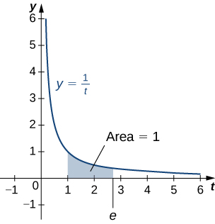
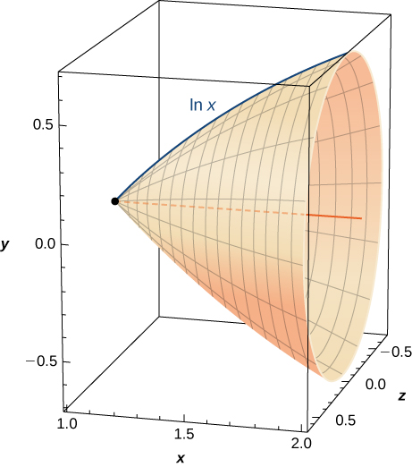

* Write the definition of the natural logarithm as an integral.
* Recognize the derivative of the natural logarithm.
* Integrate functions involving the natural logarithmic function.
* Define the number
  <math xmlns="http://www.w3.org/1998/Math/MathML"><mi>e</mi></math>
  
  through an integral.
* Recognize the derivative and integral of the exponential function.
* Prove properties of logarithms and exponential functions using integrals.
* Express general logarithmic and exponential functions in terms of natural logarithms and exponentials.

We already examined exponential functions and logarithms in earlier chapters. However, we glossed over some key details in the previous discussions. For example, we did not study how to treat exponential functions with exponents that are irrational. The definition of the number *e* is another area where the previous development was somewhat incomplete. We now have the tools to deal with these concepts in a more mathematically rigorous way, and we do so in this section.

For purposes of this section, assume we have not yet defined the natural logarithm, the number *e*, or any of the integration and differentiation formulas associated with these functions. By the end of the section, we will have studied these concepts in a mathematically rigorous way (and we will see they are consistent with the concepts we learned earlier).

We begin the section by defining the natural logarithm in terms of an integral. This definition forms the foundation for the section. From this definition, we derive differentiation formulas, define the number <math xmlns="http://www.w3.org/1998/Math/MathML"><mrow><mi>e</mi><mo>,</mo></mrow></math>

 and expand these concepts to logarithms and exponential functions of any base.

### The Natural Logarithm as an Integral

Recall the power rule for integrals:

<math xmlns="http://www.w3.org/1998/Math/MathML"><mrow><mstyle displaystyle="true"><mrow><mo stretchy="false">∫</mo><mrow><msup><mi>x</mi><mi>n</mi></msup><mi>d</mi><mi>x</mi><mo>=</mo><mfrac><mrow><msup><mi>x</mi><mrow><mi>n</mi><mo>+</mo><mn>1</mn></mrow></msup></mrow><mrow><mi>n</mi><mo>+</mo><mn>1</mn></mrow></mfrac></mrow></mrow></mstyle><mo>+</mo><mi>C</mi><mo>,</mo><mspace width="0.2em" /><mi>n</mi><mo>≠</mo><mtext>−</mtext><mn>1</mn><mo>.</mo></mrow></math>

Clearly, this does not work when <math xmlns="http://www.w3.org/1998/Math/MathML"><mrow><mi>n</mi><mo>=</mo><mn>−1</mn><mo>,</mo></mrow></math>

 as it would force us to divide by zero. So, what do we do with <math xmlns="http://www.w3.org/1998/Math/MathML"><mrow><mstyle displaystyle="true"><mrow><mo stretchy="false">∫</mo><mrow><mfrac><mn>1</mn><mi>x</mi></mfrac><mi>d</mi><mi>x</mi></mrow></mrow></mstyle><mo>?</mo></mrow></math>

 Recall from the Fundamental Theorem of Calculus that <math xmlns="http://www.w3.org/1998/Math/MathML"><mrow><mstyle displaystyle="true"><mrow><msubsup><mo stretchy="false">∫</mo><mn>1</mn><mi>x</mi></msubsup><mrow><mfrac><mn>1</mn><mi>t</mi></mfrac><mi>d</mi><mi>t</mi></mrow></mrow></mstyle></mrow></math>

 is an antiderivative of <math xmlns="http://www.w3.org/1998/Math/MathML"><mrow><mn>1</mn><mtext>/</mtext><mi>x</mi><mo>.</mo></mrow></math>

 Therefore, we can make the following definition.

Definition

For <math xmlns="http://www.w3.org/1998/Math/MathML"><mrow><mi>x</mi><mo>&gt;</mo><mn>0</mn><mo>,</mo></mrow></math>

 define the natural logarithm function by

<math xmlns="http://www.w3.org/1998/Math/MathML"><mrow><mtext>ln</mtext><mspace width="0.2em" /><mi>x</mi><mo>=</mo><mstyle displaystyle="true"><mrow><msubsup><mo stretchy="false">∫</mo><mn>1</mn><mi>x</mi></msubsup><mrow><mfrac><mn>1</mn><mi>t</mi></mfrac><mi>d</mi><mi>t</mi></mrow></mrow></mstyle><mo>.</mo></mrow></math>

For <math xmlns="http://www.w3.org/1998/Math/MathML"><mrow><mi>x</mi><mo>&gt;</mo><mn>1</mn><mo>,</mo></mrow></math>

 this is just the area under the curve <math xmlns="http://www.w3.org/1998/Math/MathML"><mrow><mi>y</mi><mo>=</mo><mn>1</mn><mtext>/</mtext><mi>t</mi></mrow></math>

 from <math xmlns="http://www.w3.org/1998/Math/MathML"><mn>1</mn></math>

 to <math xmlns="http://www.w3.org/1998/Math/MathML"><mrow><mi>x</mi><mo>.</mo></mrow></math>

 For <math xmlns="http://www.w3.org/1998/Math/MathML"><mrow><mi>x</mi><mo>&lt;</mo><mn>1</mn><mo>,</mo></mrow></math>

 we have <math xmlns="http://www.w3.org/1998/Math/MathML"><mrow><mstyle displaystyle="true"><mrow><msubsup><mo stretchy="false">∫</mo><mn>1</mn><mi>x</mi></msubsup><mrow><mfrac><mn>1</mn><mi>t</mi></mfrac><mi>d</mi><mi>t</mi></mrow></mrow></mstyle><mo>=</mo><mtext>−</mtext><mstyle displaystyle="true"><mrow><msubsup><mo stretchy="false">∫</mo><mi>x</mi><mn>1</mn></msubsup><mrow><mfrac><mn>1</mn><mi>t</mi></mfrac><mi>d</mi><mi>t</mi></mrow></mrow></mstyle><mo>,</mo></mrow></math>

 so in this case it is the negative of the area under the curve from <math xmlns="http://www.w3.org/1998/Math/MathML"><mrow><mi>x</mi><mspace width="0.2em" /><mtext>to</mtext><mspace width="0.2em" /><mn>1</mn></mrow></math>

 (see the following figure).

  When x&gt;1, the natural logarithm is the area under the curve y=1/t from 1tox. (b) When x&lt;1, the natural logarithm is the negative of the area under the curve from x to 1."){: #CNX_Calc_Figure_06_07_001}

Notice that <math xmlns="http://www.w3.org/1998/Math/MathML"><mrow><mtext>ln</mtext><mspace width="0.2em" /><mn>1</mn><mo>=</mo><mn>0</mn><mo>.</mo></mrow></math>

 Furthermore, the function <math xmlns="http://www.w3.org/1998/Math/MathML"><mrow><mi>y</mi><mo>=</mo><mn>1</mn><mtext>/</mtext><mi>t</mi><mo>&gt;</mo><mn>0</mn></mrow></math>

 for <math xmlns="http://www.w3.org/1998/Math/MathML"><mrow><mi>x</mi><mo>&gt;</mo><mn>0</mn><mo>.</mo></mrow></math>

 Therefore, by the properties of integrals, it is clear that <math xmlns="http://www.w3.org/1998/Math/MathML"><mrow><mtext>ln</mtext><mspace width="0.2em" /><mi>x</mi></mrow></math>

 is increasing for <math xmlns="http://www.w3.org/1998/Math/MathML"><mrow><mi>x</mi><mo>&gt;</mo><mn>0</mn><mo>.</mo></mrow></math>

### Properties of the Natural Logarithm

Because of the way we defined the natural logarithm, the following differentiation formula falls out immediately as a result of to the Fundamental Theorem of Calculus.

Derivative of the Natural Logarithm

For <math xmlns="http://www.w3.org/1998/Math/MathML"><mrow><mi>x</mi><mo>&gt;</mo><mn>0</mn><mo>,</mo></mrow></math>

 the derivative of the natural logarithm is given by

<math xmlns="http://www.w3.org/1998/Math/MathML"><mrow><mfrac><mi>d</mi><mrow><mi>d</mi><mi>x</mi></mrow></mfrac><mtext>ln</mtext><mspace width="0.2em" /><mi>x</mi><mo>=</mo><mfrac><mn>1</mn><mi>x</mi></mfrac><mo>.</mo></mrow></math>

Corollary to the Derivative of the Natural Logarithm

The function <math xmlns="http://www.w3.org/1998/Math/MathML"><mrow><mtext>ln</mtext><mspace width="0.2em" /><mi>x</mi></mrow></math>

 is differentiable; therefore, it is continuous.

A graph of <math xmlns="http://www.w3.org/1998/Math/MathML"><mrow><mtext>ln</mtext><mspace width="0.2em" /><mi>x</mi></mrow></math>

 is shown in [\[link\]](#CNX_Calc_Figure_06_07_002). Notice that it is continuous throughout its domain of <math xmlns="http://www.w3.org/1998/Math/MathML"><mrow><mrow><mo>(</mo><mrow><mn>0</mn><mo>,</mo><mi>∞</mi></mrow><mo>)</mo></mrow><mo>.</mo></mrow></math>

 =lnx shows that it is a continuous function."){: #CNX_Calc_Figure_06_07_002}

Calculating Derivatives of Natural Logarithms

Calculate the following derivatives:

1.  <math xmlns="http://www.w3.org/1998/Math/MathML"><mrow><mfrac><mi>d</mi><mrow><mi>d</mi><mi>x</mi></mrow></mfrac><mtext>ln</mtext><mrow><mo>(</mo><mrow><mn>5</mn><msup><mi>x</mi><mn>3</mn></msup><mo>−</mo><mn>2</mn></mrow><mo>)</mo></mrow></mrow></math>

2.  <math xmlns="http://www.w3.org/1998/Math/MathML"><mrow><mfrac><mi>d</mi><mrow><mi>d</mi><mi>x</mi></mrow></mfrac><msup><mrow><mrow><mo>(</mo><mrow><mtext>ln</mtext><mrow><mo>(</mo><mrow><mn>3</mn><mi>x</mi></mrow><mo>)</mo></mrow></mrow><mo>)</mo></mrow></mrow><mn>2</mn></msup></mrow></math>
{: data-number-style="lower-alpha"}

We need to apply the chain rule in both cases.

1.  <math xmlns="http://www.w3.org/1998/Math/MathML"><mrow><mfrac><mi>d</mi><mrow><mi>d</mi><mi>x</mi></mrow></mfrac><mtext>ln</mtext><mrow><mo>(</mo><mrow><mn>5</mn><msup><mi>x</mi><mn>3</mn></msup><mo>−</mo><mn>2</mn></mrow><mo>)</mo></mrow><mo>=</mo><mfrac><mrow><mn>15</mn><msup><mi>x</mi><mn>2</mn></msup></mrow><mrow><mn>5</mn><msup><mi>x</mi><mn>3</mn></msup><mo>−</mo><mn>2</mn></mrow></mfrac></mrow></math>

2.  <math xmlns="http://www.w3.org/1998/Math/MathML"><mrow><mfrac><mi>d</mi><mrow><mi>d</mi><mi>x</mi></mrow></mfrac><msup><mrow><mrow><mo>(</mo><mrow><mtext>ln</mtext><mrow><mo>(</mo><mrow><mn>3</mn><mi>x</mi></mrow><mo>)</mo></mrow></mrow><mo>)</mo></mrow></mrow><mn>2</mn></msup><mo>=</mo><mfrac><mrow><mn>2</mn><mrow><mo>(</mo><mrow><mtext>ln</mtext><mrow><mo>(</mo><mrow><mn>3</mn><mi>x</mi></mrow><mo>)</mo></mrow></mrow><mo>)</mo></mrow><mo>·</mo><mn>3</mn></mrow><mrow><mn>3</mn><mi>x</mi></mrow></mfrac><mo>=</mo><mfrac><mrow><mn>2</mn><mrow><mo>(</mo><mrow><mtext>ln</mtext><mrow><mo>(</mo><mrow><mn>3</mn><mi>x</mi></mrow><mo>)</mo></mrow></mrow><mo>)</mo></mrow></mrow><mi>x</mi></mfrac></mrow></math>
{: data-number-style="lower-alpha"}

Calculate the following derivatives:

1.  <math xmlns="http://www.w3.org/1998/Math/MathML"><mrow><mfrac><mi>d</mi><mrow><mi>d</mi><mi>x</mi></mrow></mfrac><mtext>ln</mtext><mrow><mo>(</mo><mrow><mn>2</mn><msup><mi>x</mi><mn>2</mn></msup><mo>+</mo><mi>x</mi></mrow><mo>)</mo></mrow></mrow></math>

2.  <math xmlns="http://www.w3.org/1998/Math/MathML"><mrow><mfrac><mi>d</mi><mrow><mi>d</mi><mi>x</mi></mrow></mfrac><msup><mrow><mrow><mo>(</mo><mrow><mtext>ln</mtext><mrow><mo>(</mo><mrow><msup><mi>x</mi><mn>3</mn></msup></mrow><mo>)</mo></mrow></mrow><mo>)</mo></mrow></mrow><mn>2</mn></msup></mrow></math>
{: data-number-style="lower-alpha"}

1.  <math xmlns="http://www.w3.org/1998/Math/MathML"><mrow><mfrac><mi>d</mi><mrow><mi>d</mi><mi>x</mi></mrow></mfrac><mtext>ln</mtext><mrow><mo>(</mo><mrow><mn>2</mn><msup><mi>x</mi><mn>2</mn></msup><mo>+</mo><mi>x</mi></mrow><mo>)</mo></mrow><mo>=</mo><mfrac><mrow><mn>4</mn><mi>x</mi><mo>+</mo><mn>1</mn></mrow><mrow><mn>2</mn><msup><mi>x</mi><mn>2</mn></msup><mo>+</mo><mi>x</mi></mrow></mfrac></mrow></math>

2.  <math xmlns="http://www.w3.org/1998/Math/MathML"><mrow><mfrac><mi>d</mi><mrow><mi>d</mi><mi>x</mi></mrow></mfrac><msup><mrow><mrow><mo>(</mo><mrow><mtext>ln</mtext><mrow><mo>(</mo><mrow><msup><mi>x</mi><mn>3</mn></msup></mrow><mo>)</mo></mrow></mrow><mo>)</mo></mrow></mrow><mn>2</mn></msup><mo>=</mo><mfrac><mrow><mn>6</mn><mspace width="0.2em" /><mtext>ln</mtext><mrow><mo>(</mo><mrow><msup><mi>x</mi><mn>3</mn></msup></mrow><mo>)</mo></mrow></mrow><mi>x</mi></mfrac></mrow></math>
{: data-number-style="lower-alpha"}

Hint

Apply the differentiation formula just provided and use the chain rule as necessary.

Note that if we use the absolute value function and create a new function <math xmlns="http://www.w3.org/1998/Math/MathML"><mrow><mtext>ln</mtext><mspace width="0.2em" /><mrow><mo>\|</mo><mi>x</mi><mo>\|</mo></mrow><mo>,</mo></mrow></math>

 we can extend the domain of the natural logarithm to include <math xmlns="http://www.w3.org/1998/Math/MathML"><mrow><mi>x</mi><mo>&lt;</mo><mn>0</mn><mo>.</mo></mrow></math>

 Then <math xmlns="http://www.w3.org/1998/Math/MathML"><mrow><mrow><mo>(</mo><mrow><mi>d</mi><mtext>/</mtext><mrow><mo>(</mo><mrow><mi>d</mi><mi>x</mi></mrow><mo>)</mo></mrow></mrow><mo>)</mo></mrow><mtext>ln</mtext><mspace width="0.2em" /><mrow><mo>\|</mo><mi>x</mi><mo>\|</mo></mrow><mo>=</mo><mn>1</mn><mtext>/</mtext><mi>x</mi><mo>.</mo></mrow></math>

 This gives rise to the familiar integration formula.

Integral of (1/*u*) *du*

The natural logarithm is the antiderivative of the function <math xmlns="http://www.w3.org/1998/Math/MathML"><mrow><mi>f</mi><mrow><mo>(</mo><mi>u</mi><mo>)</mo></mrow><mo>=</mo><mn>1</mn><mtext>/</mtext><mi>u</mi><mtext>:</mtext></mrow></math>

<math xmlns="http://www.w3.org/1998/Math/MathML"><mrow><mstyle displaystyle="true"><mrow><mo stretchy="false">∫</mo><mrow><mfrac><mn>1</mn><mi>u</mi></mfrac></mrow></mrow></mstyle><mi>d</mi><mi>u</mi><mo>=</mo><mtext>ln</mtext><mspace width="0.2em" /><mrow><mo>\|</mo><mi>u</mi><mo>\|</mo></mrow><mo>+</mo><mi>C</mi><mo>.</mo></mrow></math>

Calculating Integrals Involving Natural Logarithms

Calculate the integral <math xmlns="http://www.w3.org/1998/Math/MathML"><mrow><mstyle displaystyle="true"><mrow><mo stretchy="false">∫</mo><mrow><mfrac><mi>x</mi><mrow><msup><mi>x</mi><mn>2</mn></msup><mo>+</mo><mn>4</mn></mrow></mfrac></mrow></mrow></mstyle><mi>d</mi><mi>x</mi><mo>.</mo></mrow></math>

Using <math xmlns="http://www.w3.org/1998/Math/MathML"><mi>u</mi></math>

-substitution, let <math xmlns="http://www.w3.org/1998/Math/MathML"><mrow><mi>u</mi><mo>=</mo><msup><mi>x</mi><mn>2</mn></msup><mo>+</mo><mn>4</mn><mo>.</mo></mrow></math>

 Then <math xmlns="http://www.w3.org/1998/Math/MathML"><mrow><mi>d</mi><mi>u</mi><mo>=</mo><mn>2</mn><mi>x</mi><mspace width="0.2em" /><mi>d</mi><mi>x</mi></mrow></math>

 and we have

<math xmlns="http://www.w3.org/1998/Math/MathML"><mrow><mstyle displaystyle="true"><mrow><mo stretchy="false">∫</mo><mrow><mfrac><mi>x</mi><mrow><msup><mi>x</mi><mn>2</mn></msup><mo>+</mo><mn>4</mn></mrow></mfrac></mrow></mrow></mstyle><mi>d</mi><mi>x</mi><mo>=</mo><mfrac><mn>1</mn><mn>2</mn></mfrac><mstyle displaystyle="true"><mrow><mo stretchy="false">∫</mo><mrow><mfrac><mn>1</mn><mi>u</mi></mfrac><mi>d</mi><mi>u</mi><mfrac><mn>1</mn><mn>2</mn></mfrac><mtext>ln</mtext><mspace width="0.2em" /><mrow><mo>\|</mo><mi>u</mi><mo>\|</mo></mrow><mo>+</mo><mi>C</mi><mo>=</mo></mrow></mrow></mstyle><mfrac><mn>1</mn><mn>2</mn></mfrac><mtext>ln</mtext><mspace width="0.2em" /><mrow><mo>\|</mo><mrow><msup><mi>x</mi><mn>2</mn></msup><mo>+</mo><mn>4</mn></mrow><mo>\|</mo></mrow><mo>+</mo><mi>C</mi><mo>=</mo><mfrac><mn>1</mn><mn>2</mn></mfrac><mtext>ln</mtext><mrow><mo>(</mo><mrow><msup><mi>x</mi><mn>2</mn></msup><mo>+</mo><mn>4</mn></mrow><mo>)</mo></mrow><mo>+</mo><mi>C</mi><mo>.</mo></mrow></math>

Calculate the integral <math xmlns="http://www.w3.org/1998/Math/MathML"><mrow><mstyle displaystyle="true"><mrow><mo stretchy="false">∫</mo><mrow><mfrac><mrow><msup><mi>x</mi><mn>2</mn></msup></mrow><mrow><msup><mi>x</mi><mn>3</mn></msup><mo>+</mo><mn>6</mn></mrow></mfrac></mrow></mrow></mstyle><mi>d</mi><mi>x</mi><mo>.</mo></mrow></math>

<math xmlns="http://www.w3.org/1998/Math/MathML"><mrow><mstyle displaystyle="true"><mrow><mo stretchy="false">∫</mo><mrow><mfrac><mrow><msup><mi>x</mi><mn>2</mn></msup></mrow><mrow><msup><mi>x</mi><mn>3</mn></msup><mo>+</mo><mn>6</mn></mrow></mfrac></mrow></mrow></mstyle><mi>d</mi><mi>x</mi><mo>=</mo><mfrac><mn>1</mn><mn>3</mn></mfrac><mtext>ln</mtext><mspace width="0.2em" /><mrow><mo>\|</mo><mrow><msup><mi>x</mi><mn>3</mn></msup><mo>+</mo><mn>6</mn></mrow><mo>\|</mo></mrow><mo>+</mo><mi>C</mi></mrow></math>

Hint

Apply the integration formula provided earlier and use *u*-substitution as necessary.

Although we have called our function a “logarithm,” we have not actually proved that any of the properties of logarithms hold for this function. We do so here.

Properties of the Natural Logarithm

If <math xmlns="http://www.w3.org/1998/Math/MathML"><mrow><mi>a</mi><mo>,</mo><mi>b</mi><mo>&gt;</mo><mn>0</mn></mrow></math>

 and <math xmlns="http://www.w3.org/1998/Math/MathML"><mi>r</mi></math>

 is a rational number, then

1.  <math xmlns="http://www.w3.org/1998/Math/MathML"><mrow><mtext>ln</mtext><mspace width="0.2em" /><mn>1</mn><mo>=</mo><mn>0</mn></mrow></math>

2.  <math xmlns="http://www.w3.org/1998/Math/MathML"><mrow><mtext>ln</mtext><mrow><mo>(</mo><mrow><mi>a</mi><mi>b</mi></mrow><mo>)</mo></mrow><mo>=</mo><mtext>ln</mtext><mspace width="0.2em" /><mi>a</mi><mo>+</mo><mtext>ln</mtext><mspace width="0.2em" /><mi>b</mi></mrow></math>

3.  <math xmlns="http://www.w3.org/1998/Math/MathML"><mrow><mtext>ln</mtext><mrow><mo>(</mo><mrow><mfrac><mi>a</mi><mi>b</mi></mfrac></mrow><mo>)</mo></mrow><mo>=</mo><mtext>ln</mtext><mspace width="0.2em" /><mi>a</mi><mo>−</mo><mtext>ln</mtext><mspace width="0.2em" /><mi>b</mi></mrow></math>

4.  <math xmlns="http://www.w3.org/1998/Math/MathML"><mrow><mtext>ln</mtext><mrow><mo>(</mo><mrow><msup><mi>a</mi><mi>r</mi></msup></mrow><mo>)</mo></mrow><mo>=</mo><mi>r</mi><mspace width="0.2em" /><mtext>ln</mtext><mspace width="0.2em" /><mi>a</mi></mrow></math>
{: data-number-style="lower-roman"}

#### Proof

1.  By definition,
    <math xmlns="http://www.w3.org/1998/Math/MathML"><mrow><mtext>ln</mtext><mspace width="0.2em" /><mn>1</mn><mo>=</mo><mstyle displaystyle="true"><mrow><msubsup><mo stretchy="false">∫</mo><mn>1</mn><mn>1</mn></msubsup><mrow><mfrac><mn>1</mn><mi>t</mi></mfrac></mrow></mrow></mstyle><mi>d</mi><mi>t</mi><mo>=</mo><mn>0</mn><mo>.</mo></mrow></math>

2.  We have
    * * *
    {: data-type="newline"}
    
    

    <math xmlns="http://www.w3.org/1998/Math/MathML"><mrow><mtext>ln</mtext><mrow><mo>(</mo><mrow><mi>a</mi><mi>b</mi></mrow><mo>)</mo></mrow><mo>=</mo><mstyle displaystyle="true"><mrow><msubsup><mo stretchy="false">∫</mo><mn>1</mn><mrow><mi>a</mi><mi>b</mi></mrow></msubsup><mrow><mfrac><mn>1</mn><mi>t</mi></mfrac></mrow></mrow></mstyle><mi>d</mi><mi>t</mi><mo>=</mo><mstyle displaystyle="true"><mrow><msubsup><mo stretchy="false">∫</mo><mn>1</mn><mi>a</mi></msubsup><mrow><mfrac><mn>1</mn><mi>t</mi></mfrac></mrow></mrow></mstyle><mi>d</mi><mi>t</mi><mo>+</mo><mstyle displaystyle="true"><mrow><msubsup><mo stretchy="false">∫</mo><mi>a</mi><mrow><mi>a</mi><mi>b</mi></mrow></msubsup><mrow><mfrac><mn>1</mn><mi>t</mi></mfrac></mrow></mrow></mstyle><mi>d</mi><mi>t</mi><mo>.</mo></mrow></math>
    

    
    * * *
    {: data-type="newline"}
    
    Use
    <math xmlns="http://www.w3.org/1998/Math/MathML"><mi>u</mi><mtext>-substitution</mtext></math>
    
    on the last integral in this expression. Let
    <math xmlns="http://www.w3.org/1998/Math/MathML"><mrow><mi>u</mi><mo>=</mo><mi>t</mi><mtext>/</mtext><mi>a</mi><mo>.</mo></mrow></math>
    
    Then
    <math xmlns="http://www.w3.org/1998/Math/MathML"><mrow><mi>d</mi><mi>u</mi><mo>=</mo><mrow><mo>(</mo><mrow><mn>1</mn><mtext>/</mtext><mi>a</mi></mrow><mo>)</mo></mrow><mi>d</mi><mi>t</mi><mo>.</mo></mrow></math>
    
    Furthermore, when
    <math xmlns="http://www.w3.org/1998/Math/MathML"><mrow><mi>t</mi><mo>=</mo><mi>a</mi><mo>,</mo><mi>u</mi><mo>=</mo><mn>1</mn><mo>,</mo></mrow></math>
    
    and when
    <math xmlns="http://www.w3.org/1998/Math/MathML"><mrow><mi>t</mi><mo>=</mo><mi>a</mi><mi>b</mi><mo>,</mo><mi>u</mi><mo>=</mo><mi>b</mi><mo>.</mo></mrow></math>
    
    So we get
    * * *
    {: data-type="newline"}
    
    

    <math xmlns="http://www.w3.org/1998/Math/MathML"><mrow><mtext>ln</mtext><mrow><mo>(</mo><mrow><mi>a</mi><mi>b</mi></mrow><mo>)</mo></mrow><mo>=</mo><mstyle displaystyle="true"><mrow><msubsup><mo stretchy="false">∫</mo><mn>1</mn><mi>a</mi></msubsup><mrow><mfrac><mn>1</mn><mi>t</mi></mfrac></mrow></mrow></mstyle><mi>d</mi><mi>t</mi><mo>+</mo><mstyle displaystyle="true"><mrow><msubsup><mo stretchy="false">∫</mo><mi>a</mi><mrow><mi>a</mi><mi>b</mi></mrow></msubsup><mrow><mfrac><mn>1</mn><mi>t</mi></mfrac></mrow></mrow></mstyle><mi>d</mi><mi>t</mi><mo>=</mo><mstyle displaystyle="true"><mrow><msubsup><mo stretchy="false">∫</mo><mn>1</mn><mi>a</mi></msubsup><mrow><mfrac><mn>1</mn><mi>t</mi></mfrac></mrow></mrow></mstyle><mi>d</mi><mi>t</mi><mo>+</mo><mstyle displaystyle="true"><mrow><msubsup><mo stretchy="false">∫</mo><mn>1</mn><mrow><mi>a</mi><mi>b</mi></mrow></msubsup><mrow><mfrac><mi>a</mi><mi>t</mi></mfrac><mo>·</mo><mfrac><mn>1</mn><mi>a</mi></mfrac></mrow></mrow></mstyle><mi>d</mi><mi>t</mi><mo>=</mo><mstyle displaystyle="true"><mrow><msubsup><mo stretchy="false">∫</mo><mn>1</mn><mi>a</mi></msubsup><mrow><mfrac><mn>1</mn><mi>t</mi></mfrac><mi>d</mi><mi>t</mi><mo>+</mo></mrow></mrow></mstyle><mstyle displaystyle="true"><mrow><msubsup><mo stretchy="false">∫</mo><mn>1</mn><mi>b</mi></msubsup><mrow><mfrac><mn>1</mn><mi>u</mi></mfrac><mi>d</mi><mi>u</mi><mo>=</mo><mtext>ln</mtext><mspace width="0.2em" /><mi>a</mi><mo>+</mo><mtext>ln</mtext><mspace width="0.2em" /><mi>b</mi><mo>.</mo></mrow></mrow></mstyle></mrow></math>
    

3.  Note that
    * * *
    {: data-type="newline"}
    
    

    <math xmlns="http://www.w3.org/1998/Math/MathML"><mrow><mfrac><mi>d</mi><mrow><mi>d</mi><mi>x</mi></mrow></mfrac><mtext>ln</mtext><mrow><mo>(</mo><mrow><msup><mi>x</mi><mi>r</mi></msup></mrow><mo>)</mo></mrow><mo>=</mo><mfrac><mrow><mi>r</mi><msup><mi>x</mi><mrow><mi>r</mi><mo>−</mo><mn>1</mn></mrow></msup></mrow><mrow><msup><mi>x</mi><mi>r</mi></msup></mrow></mfrac><mo>=</mo><mfrac><mi>r</mi><mi>x</mi></mfrac><mo>.</mo></mrow></math>
    

    
    * * *
    {: data-type="newline"}
    
    Furthermore,
    * * *
    {: data-type="newline"}
    
    

    <math xmlns="http://www.w3.org/1998/Math/MathML"><mrow><mfrac><mi>d</mi><mrow><mi>d</mi><mi>x</mi></mrow></mfrac><mrow><mo>(</mo><mrow><mi>r</mi><mspace width="0.2em" /><mtext>ln</mtext><mspace width="0.2em" /><mi>x</mi></mrow><mo>)</mo></mrow><mo>=</mo><mfrac><mi>r</mi><mi>x</mi></mfrac><mo>.</mo></mrow></math>
    

    
    * * *
    {: data-type="newline"}
    
    Since the derivatives of these two functions are the same, by the Fundamental Theorem of Calculus, they must differ by a constant. So we have
    * * *
    {: data-type="newline"}
    
    

    <math xmlns="http://www.w3.org/1998/Math/MathML"><mrow><mtext>ln</mtext><mrow><mo>(</mo><mrow><msup><mi>x</mi><mi>r</mi></msup></mrow><mo>)</mo></mrow><mo>=</mo><mi>r</mi><mspace width="0.2em" /><mtext>ln</mtext><mspace width="0.2em" /><mi>x</mi><mo>+</mo><mi>C</mi></mrow></math>
    

    
    * * *
    {: data-type="newline"}
    
    for some constant
    <math xmlns="http://www.w3.org/1998/Math/MathML"><mrow><mi>C</mi><mo>.</mo></mrow></math>
    
    Taking
    <math xmlns="http://www.w3.org/1998/Math/MathML"><mrow><mi>x</mi><mo>=</mo><mn>1</mn><mo>,</mo></mrow></math>
    
    we get
    * * *
    {: data-type="newline"}
    
    

    <math xmlns="http://www.w3.org/1998/Math/MathML"><mtable><mtr><mtd columnalign="right"><mtext>ln</mtext><mrow><mo>(</mo><mrow><msup><mn>1</mn><mi>r</mi></msup></mrow><mo>)</mo></mrow></mtd><mtd columnalign="left"><mo>=</mo></mtd><mtd columnalign="left"><mi>r</mi><mspace width="0.2em" /><mtext>ln</mtext><mrow><mo>(</mo><mn>1</mn><mo>)</mo></mrow><mo>+</mo><mi>C</mi></mtd></mtr><mtr><mtd columnalign="right"><mn>0</mn></mtd><mtd columnalign="left"><mo>=</mo></mtd><mtd columnalign="left"><mi>r</mi><mrow><mo>(</mo><mn>0</mn><mo>)</mo></mrow><mo>+</mo><mi>C</mi></mtd></mtr><mtr><mtd columnalign="right"><mi>C</mi></mtd><mtd columnalign="left"><mo>=</mo></mtd><mtd columnalign="left"><mn>0</mn><mo>.</mo></mtd></mtr></mtable></math>
    

    
    * * *
    {: data-type="newline"}
    
    Thus
    <math xmlns="http://www.w3.org/1998/Math/MathML"><mrow><mtext>ln</mtext><mrow><mo>(</mo><mrow><msup><mi>x</mi><mi>r</mi></msup></mrow><mo>)</mo></mrow><mo>=</mo><mi>r</mi><mspace width="0.2em" /><mtext>ln</mtext><mspace width="0.2em" /><mi>x</mi></mrow></math>
    
    and the proof is complete. Note that we can extend this property to irrational values of
    <math xmlns="http://www.w3.org/1998/Math/MathML"><mi>r</mi></math>
    
    later in this section.
    * * *
    {: data-type="newline"}
    
    Part iii. follows from parts ii. and iv. and the proof is left to you.
{: data-number-style="lower-roman"}

□

Using Properties of Logarithms

Use properties of logarithms to simplify the following expression into a single logarithm:

<math xmlns="http://www.w3.org/1998/Math/MathML"><mrow><mtext>ln</mtext><mspace width="0.2em" /><mn>9</mn><mo>−</mo><mn>2</mn><mspace width="0.2em" /><mtext>ln</mtext><mspace width="0.2em" /><mn>3</mn><mo>+</mo><mtext>ln</mtext><mrow><mo>(</mo><mrow><mfrac><mn>1</mn><mn>3</mn></mfrac></mrow><mo>)</mo></mrow><mo>.</mo></mrow></math>

We have

<math xmlns="http://www.w3.org/1998/Math/MathML"><mrow><mtext>ln</mtext><mspace width="0.2em" /><mn>9</mn><mo>−</mo><mn>2</mn><mspace width="0.2em" /><mtext>ln</mtext><mspace width="0.2em" /><mn>3</mn><mo>+</mo><mtext>ln</mtext><mrow><mo>(</mo><mrow><mfrac><mn>1</mn><mn>3</mn></mfrac></mrow><mo>)</mo></mrow><mo>=</mo><mtext>ln</mtext><mrow><mo>(</mo><mrow><msup><mn>3</mn><mn>2</mn></msup></mrow><mo>)</mo></mrow><mo>−</mo><mn>2</mn><mspace width="0.2em" /><mtext>ln</mtext><mspace width="0.2em" /><mn>3</mn><mo>+</mo><mtext>ln</mtext><mrow><mo>(</mo><mrow><msup><mn>3</mn><mrow><mn>−1</mn></mrow></msup></mrow><mo>)</mo></mrow><mo>=</mo><mn>2</mn><mspace width="0.2em" /><mtext>ln</mtext><mspace width="0.2em" /><mn>3</mn><mo>−</mo><mn>2</mn><mspace width="0.2em" /><mtext>ln</mtext><mspace width="0.2em" /><mn>3</mn><mo>−</mo><mtext>ln</mtext><mspace width="0.2em" /><mn>3</mn><mo>=</mo><mtext>−</mtext><mtext>ln</mtext><mspace width="0.2em" /><mn>3</mn><mo>.</mo></mrow></math>

Use properties of logarithms to simplify the following expression into a single logarithm:

<math xmlns="http://www.w3.org/1998/Math/MathML"><mrow><mtext>ln</mtext><mspace width="0.2em" /><mn>8</mn><mo>−</mo><mtext>ln</mtext><mspace width="0.2em" /><mn>2</mn><mo>−</mo><mtext>ln</mtext><mrow><mo>(</mo><mrow><mfrac><mn>1</mn><mn>4</mn></mfrac></mrow><mo>)</mo></mrow><mo>.</mo></mrow></math>

<math xmlns="http://www.w3.org/1998/Math/MathML"><mrow><mn>4</mn><mspace width="0.2em" /><mtext>ln</mtext><mspace width="0.2em" /><mn>2</mn></mrow></math>

Hint

Apply the properties of logarithms.

### Defining the Number *e*

Now that we have the natural logarithm defined, we can use that function to define the number <math xmlns="http://www.w3.org/1998/Math/MathML"><mrow><mi>e</mi><mo>.</mo></mrow></math>

Definition

The number <math xmlns="http://www.w3.org/1998/Math/MathML"><mi>e</mi></math>

 is defined to be the real number such that

<math xmlns="http://www.w3.org/1998/Math/MathML"><mrow><mtext>ln</mtext><mspace width="0.2em" /><mi>e</mi><mo>=</mo><mn>1</mn><mo>.</mo></mrow></math>

To put it another way, the area under the curve <math xmlns="http://www.w3.org/1998/Math/MathML"><mrow><mi>y</mi><mo>=</mo><mn>1</mn><mtext>/</mtext><mi>t</mi></mrow></math>

 between <math xmlns="http://www.w3.org/1998/Math/MathML"><mrow><mi>t</mi><mo>=</mo><mn>1</mn></mrow></math>

 and <math xmlns="http://www.w3.org/1998/Math/MathML"><mrow><mi>t</mi><mo>=</mo><mi>e</mi></mrow></math>

 is <math xmlns="http://www.w3.org/1998/Math/MathML"><mn>1</mn></math>

 ([\[link\]](#CNX_Calc_Figure_06_07_003)). The proof that such a number exists and is unique is left to you. (*Hint*\: Use the Intermediate Value Theorem to prove existence and the fact that <math xmlns="http://www.w3.org/1998/Math/MathML"><mrow><mtext>ln</mtext><mspace width="0.2em" /><mi>x</mi></mrow></math>

 is increasing to prove uniqueness.)

 {: #CNX_Calc_Figure_06_07_003}

The number <math xmlns="http://www.w3.org/1998/Math/MathML"><mi>e</mi></math>

 can be shown to be irrational, although we won’t do so here (see the Student Project in [Taylor and Maclaurin Series](/m53817){: .target-chapter}). Its approximate value is given by

<math xmlns="http://www.w3.org/1998/Math/MathML"><mrow><mi>e</mi><mo>≈</mo><mn>2.71828182846</mn><mo>.</mo></mrow></math>

### The Exponential Function

We now turn our attention to the function <math xmlns="http://www.w3.org/1998/Math/MathML"><mrow><msup><mi>e</mi><mi>x</mi></msup><mo>.</mo></mrow></math>

 Note that the natural logarithm is one-to-one and therefore has an inverse function. For now, we denote this inverse function by <math xmlns="http://www.w3.org/1998/Math/MathML"><mrow><mtext>exp</mtext><mspace width="0.2em" /><mi>x</mi><mo>.</mo></mrow></math>

 Then,

<math xmlns="http://www.w3.org/1998/Math/MathML"><mrow><mtext>exp</mtext><mrow><mo>(</mo><mrow><mtext>ln</mtext><mspace width="0.2em" /><mi>x</mi></mrow><mo>)</mo></mrow><mo>=</mo><mi>x</mi><mspace width="0.2em" /><mtext>for</mtext><mspace width="0.2em" /><mi>x</mi><mo>&gt;</mo><mn>0</mn><mspace width="0.2em" /><mtext>and</mtext><mspace width="0.2em" /><mtext>ln</mtext><mrow><mo>(</mo><mrow><mtext>exp</mtext><mspace width="0.2em" /><mi>x</mi></mrow><mo>)</mo></mrow><mo>=</mo><mi>x</mi><mspace width="0.2em" /><mtext>for all</mtext><mspace width="0.2em" /><mi>x</mi><mo>.</mo></mrow></math>

The following figure shows the graphs of <math xmlns="http://www.w3.org/1998/Math/MathML"><mrow><mtext>exp</mtext><mspace width="0.2em" /><mi>x</mi></mrow></math>

 and <math xmlns="http://www.w3.org/1998/Math/MathML"><mrow><mtext>ln</mtext><mspace width="0.2em" /><mi>x</mi><mo>.</mo></mrow></math>

 {: #CNX_Calc_Figure_06_07_004}

We hypothesize that <math xmlns="http://www.w3.org/1998/Math/MathML"><mrow><mtext>exp</mtext><mspace width="0.2em" /><mi>x</mi><mo>=</mo><msup><mi>e</mi><mi>x</mi></msup><mo>.</mo></mrow></math>

 For rational values of <math xmlns="http://www.w3.org/1998/Math/MathML"><mrow><mi>x</mi><mo>,</mo></mrow></math>

 this is easy to show. If <math xmlns="http://www.w3.org/1998/Math/MathML"><mi>x</mi></math>

 is rational, then we have <math xmlns="http://www.w3.org/1998/Math/MathML"><mrow><mtext>ln</mtext><mrow><mo>(</mo><mrow><msup><mi>e</mi><mi>x</mi></msup></mrow><mo>)</mo></mrow><mo>=</mo><mi>x</mi><mspace width="0.2em" /><mtext>ln</mtext><mspace width="0.2em" /><mi>e</mi><mo>=</mo><mi>x</mi><mo>.</mo></mrow></math>

 Thus, when <math xmlns="http://www.w3.org/1998/Math/MathML"><mi>x</mi></math>

 is rational, <math xmlns="http://www.w3.org/1998/Math/MathML"><mrow><msup><mi>e</mi><mi>x</mi></msup><mo>=</mo><mtext>exp</mtext><mspace width="0.2em" /><mi>x</mi><mo>.</mo></mrow></math>

 For irrational values of <math xmlns="http://www.w3.org/1998/Math/MathML"><mrow><mi>x</mi><mo>,</mo></mrow></math>

 we simply define <math xmlns="http://www.w3.org/1998/Math/MathML"><mrow><msup><mi>e</mi><mi>x</mi></msup></mrow></math>

 as the inverse function of <math xmlns="http://www.w3.org/1998/Math/MathML"><mrow><mtext>ln</mtext><mspace width="0.2em" /><mi>x</mi><mo>.</mo></mrow></math>

Definition

For any real number <math xmlns="http://www.w3.org/1998/Math/MathML"><mrow><mi>x</mi><mo>,</mo></mrow></math>

 define <math xmlns="http://www.w3.org/1998/Math/MathML"><mrow><mi>y</mi><mo>=</mo><msup><mi>e</mi><mi>x</mi></msup></mrow></math>

 to be the number for which

<math xmlns="http://www.w3.org/1998/Math/MathML"><mrow><mtext>ln</mtext><mspace width="0.2em" /><mi>y</mi><mo>=</mo><mtext>ln</mtext><mrow><mo>(</mo><mrow><msup><mi>e</mi><mi>x</mi></msup></mrow><mo>)</mo></mrow><mo>=</mo><mi>x</mi><mo>.</mo></mrow></math>

Then we have <math xmlns="http://www.w3.org/1998/Math/MathML"><mrow><msup><mi>e</mi><mi>x</mi></msup><mo>=</mo><mtext>exp</mtext><mrow><mo>(</mo><mi>x</mi><mo>)</mo></mrow></mrow></math>

 for all <math xmlns="http://www.w3.org/1998/Math/MathML"><mrow><mi>x</mi><mo>,</mo></mrow></math>

 and thus

<math xmlns="http://www.w3.org/1998/Math/MathML"><mrow><msup><mi>e</mi><mrow><mtext>ln</mtext><mspace width="0.2em" /><mi>x</mi></mrow></msup><mo>=</mo><mi>x</mi><mspace width="0.2em" /><mtext>for</mtext><mspace width="0.2em" /><mi>x</mi><mo>&gt;</mo><mn>0</mn><mspace width="0.2em" /><mtext>and</mtext><mspace width="0.2em" /><mtext>ln</mtext><mrow><mo>(</mo><mrow><msup><mi>e</mi><mi>x</mi></msup></mrow><mo>)</mo></mrow><mo>=</mo><mi>x</mi></mrow></math>

for all <math xmlns="http://www.w3.org/1998/Math/MathML"><mrow><mi>x</mi><mo>.</mo></mrow></math>

### Properties of the Exponential Function

Since the exponential function was defined in terms of an inverse function, and not in terms of a power of <math xmlns="http://www.w3.org/1998/Math/MathML"><mrow><mi>e</mi><mo>,</mo></mrow></math>

 we must verify that the usual laws of exponents hold for the function <math xmlns="http://www.w3.org/1998/Math/MathML"><mrow><msup><mi>e</mi><mi>x</mi></msup><mo>.</mo></mrow></math>

Properties of the Exponential Function

If <math xmlns="http://www.w3.org/1998/Math/MathML"><mi>p</mi></math>

 and <math xmlns="http://www.w3.org/1998/Math/MathML"><mi>q</mi></math>

 are any real numbers and <math xmlns="http://www.w3.org/1998/Math/MathML"><mi>r</mi></math>

 is a rational number, then

1.  <math xmlns="http://www.w3.org/1998/Math/MathML"><mrow><msup><mi>e</mi><mi>p</mi></msup><msup><mi>e</mi><mi>q</mi></msup><mo>=</mo><msup><mi>e</mi><mrow><mi>p</mi><mo>+</mo><mi>q</mi></mrow></msup></mrow></math>

2.  <math xmlns="http://www.w3.org/1998/Math/MathML"><mrow><mfrac><mrow><msup><mi>e</mi><mi>p</mi></msup></mrow><mrow><msup><mi>e</mi><mi>q</mi></msup></mrow></mfrac><mo>=</mo><msup><mi>e</mi><mrow><mi>p</mi><mo>−</mo><mi>q</mi></mrow></msup></mrow></math>

3.  <math xmlns="http://www.w3.org/1998/Math/MathML"><mrow><msup><mrow><mrow><mo>(</mo><mrow><msup><mi>e</mi><mi>p</mi></msup></mrow><mo>)</mo></mrow></mrow><mi>r</mi></msup><mo>=</mo><msup><mi>e</mi><mrow><mi>p</mi><mi>r</mi></mrow></msup></mrow></math>
{: data-number-style="lower-roman"}

#### Proof

Note that if <math xmlns="http://www.w3.org/1998/Math/MathML"><mi>p</mi></math>

 and <math xmlns="http://www.w3.org/1998/Math/MathML"><mi>q</mi></math>

 are rational, the properties hold. However, if <math xmlns="http://www.w3.org/1998/Math/MathML"><mi>p</mi></math>

 or <math xmlns="http://www.w3.org/1998/Math/MathML"><mi>q</mi></math>

 are irrational, we must apply the inverse function definition of <math xmlns="http://www.w3.org/1998/Math/MathML"><mrow><msup><mi>e</mi><mi>x</mi></msup></mrow></math>

 and verify the properties. Only the first property is verified here; the other two are left to you. We have

<math xmlns="http://www.w3.org/1998/Math/MathML"><mrow><mtext>ln</mtext><mrow><mo>(</mo><mrow><msup><mi>e</mi><mi>p</mi></msup><msup><mi>e</mi><mi>q</mi></msup></mrow><mo>)</mo></mrow><mo>=</mo><mtext>ln</mtext><mrow><mo>(</mo><mrow><msup><mi>e</mi><mi>p</mi></msup></mrow><mo>)</mo></mrow><mo>+</mo><mtext>ln</mtext><mrow><mo>(</mo><mrow><msup><mi>e</mi><mi>q</mi></msup></mrow><mo>)</mo></mrow><mo>=</mo><mi>p</mi><mo>+</mo><mi>q</mi><mo>=</mo><mtext>ln</mtext><mrow><mo>(</mo><mrow><msup><mi>e</mi><mrow><mi>p</mi><mo>+</mo><mi>q</mi></mrow></msup></mrow><mo>)</mo></mrow><mo>.</mo></mrow></math>

Since <math xmlns="http://www.w3.org/1998/Math/MathML"><mrow><mtext>ln</mtext><mspace width="0.2em" /><mi>x</mi></mrow></math>

 is one-to-one, then

<math xmlns="http://www.w3.org/1998/Math/MathML"><mrow><msup><mi>e</mi><mi>p</mi></msup><msup><mi>e</mi><mi>q</mi></msup><mo>=</mo><msup><mi>e</mi><mrow><mi>p</mi><mo>+</mo><mi>q</mi></mrow></msup><mo>.</mo></mrow></math>

□

As with part iv. of the logarithm properties, we can extend property iii. to irrational values of <math xmlns="http://www.w3.org/1998/Math/MathML"><mi>r</mi><mo>,</mo></math>

 and we do so by the end of the section.

We also want to verify the differentiation formula for the function <math xmlns="http://www.w3.org/1998/Math/MathML"><mrow><mi>y</mi><mo>=</mo><msup><mi>e</mi><mi>x</mi></msup><mo>.</mo></mrow></math>

 To do this, we need to use implicit differentiation. Let <math xmlns="http://www.w3.org/1998/Math/MathML"><mrow><mi>y</mi><mo>=</mo><msup><mi>e</mi><mi>x</mi></msup><mo>.</mo></mrow></math>

 Then

<math xmlns="http://www.w3.org/1998/Math/MathML"><mtable><mtr><mtd columnalign="right"><mtext>ln</mtext><mspace width="0.2em" /><mi>y</mi></mtd><mtd columnalign="left"><mo>=</mo></mtd><mtd columnalign="left"><mi>x</mi></mtd></mtr><mtr><mtd columnalign="right"><mfrac><mi>d</mi><mrow><mi>d</mi><mi>x</mi></mrow></mfrac><mtext>ln</mtext><mspace width="0.2em" /><mi>y</mi></mtd><mtd columnalign="left"><mo>=</mo></mtd><mtd columnalign="left"><mfrac><mi>d</mi><mrow><mi>d</mi><mi>x</mi></mrow></mfrac><mi>x</mi></mtd></mtr><mtr><mtd columnalign="right"><mfrac><mn>1</mn><mi>y</mi></mfrac><mspace width="0.1em" /><mfrac><mrow><mi>d</mi><mi>y</mi></mrow><mrow><mi>d</mi><mi>x</mi></mrow></mfrac></mtd><mtd columnalign="left"><mo>=</mo></mtd><mtd columnalign="left"><mn>1</mn></mtd></mtr><mtr><mtd columnalign="right"><mfrac><mrow><mi>d</mi><mi>y</mi></mrow><mrow><mi>d</mi><mi>x</mi></mrow></mfrac></mtd><mtd columnalign="left"><mo>=</mo></mtd><mtd columnalign="left"><mi>y</mi><mo>.</mo></mtd></mtr></mtable></math>

Thus, we see

<math xmlns="http://www.w3.org/1998/Math/MathML"><mrow><mfrac><mi>d</mi><mrow><mi>d</mi><mi>x</mi></mrow></mfrac><msup><mi>e</mi><mi>x</mi></msup><mo>=</mo><msup><mi>e</mi><mi>x</mi></msup></mrow></math>

as desired, which leads immediately to the integration formula

<math xmlns="http://www.w3.org/1998/Math/MathML"><mrow><mstyle displaystyle="true"><mrow><mo stretchy="false">∫</mo><mrow><msup><mi>e</mi><mi>x</mi></msup><mi>d</mi><mi>x</mi></mrow></mrow></mstyle><mo>=</mo><msup><mi>e</mi><mi>x</mi></msup><mo>+</mo><mi>C</mi><mo>.</mo></mrow></math>

We apply these formulas in the following examples.

Using Properties of Exponential Functions

Evaluate the following derivatives:

1.  <math xmlns="http://www.w3.org/1998/Math/MathML"><mrow><mfrac><mi>d</mi><mrow><mi>d</mi><mi>t</mi></mrow></mfrac><msup><mi>e</mi><mrow><mn>3</mn><mi>t</mi></mrow></msup><msup><mi>e</mi><mrow><msup><mi>t</mi><mn>2</mn></msup></mrow></msup></mrow></math>

2.  <math xmlns="http://www.w3.org/1998/Math/MathML"><mrow><mfrac><mi>d</mi><mrow><mi>d</mi><mi>x</mi></mrow></mfrac><msup><mi>e</mi><mrow><mn>3</mn><msup><mi>x</mi><mn>2</mn></msup></mrow></msup></mrow></math>
{: data-number-style="lower-alpha"}

We apply the chain rule as necessary.

1.  <math xmlns="http://www.w3.org/1998/Math/MathML"><mrow><mfrac><mi>d</mi><mrow><mi>d</mi><mi>t</mi></mrow></mfrac><msup><mi>e</mi><mrow><mn>3</mn><mi>t</mi></mrow></msup><msup><mi>e</mi><mrow><msup><mi>t</mi><mn>2</mn></msup></mrow></msup><mo>=</mo><mfrac><mi>d</mi><mrow><mi>d</mi><mi>t</mi></mrow></mfrac><msup><mi>e</mi><mrow><mn>3</mn><mi>t</mi><mo>+</mo><msup><mi>t</mi><mn>2</mn></msup></mrow></msup><mo>=</mo><msup><mi>e</mi><mrow><mn>3</mn><mi>t</mi><mo>+</mo><msup><mi>t</mi><mn>2</mn></msup></mrow></msup><mrow><mo>(</mo><mrow><mn>3</mn><mo>+</mo><mn>2</mn><mi>t</mi></mrow><mo>)</mo></mrow></mrow></math>

2.  <math xmlns="http://www.w3.org/1998/Math/MathML"><mrow><mfrac><mi>d</mi><mrow><mi>d</mi><mi>x</mi></mrow></mfrac><msup><mi>e</mi><mrow><mn>3</mn><msup><mi>x</mi><mn>2</mn></msup></mrow></msup><mo>=</mo><msup><mi>e</mi><mrow><mn>3</mn><msup><mi>x</mi><mn>2</mn></msup></mrow></msup><mn>6</mn><mi>x</mi></mrow></math>
{: data-number-style="lower-alpha"}

Evaluate the following derivatives:

1.  <math xmlns="http://www.w3.org/1998/Math/MathML"><mrow><mfrac><mi>d</mi><mrow><mi>d</mi><mi>x</mi></mrow></mfrac><mrow><mo>(</mo><mrow><mfrac><mrow><msup><mi>e</mi><mrow><msup><mi>x</mi><mn>2</mn></msup></mrow></msup></mrow><mrow><msup><mi>e</mi><mrow><mn>5</mn><mi>x</mi></mrow></msup></mrow></mfrac></mrow><mo>)</mo></mrow></mrow></math>

2.  <math xmlns="http://www.w3.org/1998/Math/MathML"><mrow><mfrac><mi>d</mi><mrow><mi>d</mi><mi>t</mi></mrow></mfrac><msup><mrow><mrow><mo>(</mo><mrow><msup><mi>e</mi><mrow><mn>2</mn><mi>t</mi></mrow></msup></mrow><mo>)</mo></mrow></mrow><mn>3</mn></msup></mrow></math>
{: data-number-style="lower-alpha"}

1.  <math xmlns="http://www.w3.org/1998/Math/MathML"><mrow><mfrac><mi>d</mi><mrow><mi>d</mi><mi>x</mi></mrow></mfrac><mrow><mo>(</mo><mrow><mfrac><mrow><msup><mi>e</mi><mrow><msup><mi>x</mi><mn>2</mn></msup></mrow></msup></mrow><mrow><msup><mi>e</mi><mrow><mn>5</mn><mi>x</mi></mrow></msup></mrow></mfrac></mrow><mo>)</mo></mrow><mo>=</mo><msup><mi>e</mi><mrow><msup><mi>x</mi><mn>2</mn></msup><mo>−</mo><mn>5</mn><mi>x</mi></mrow></msup><mrow><mo>(</mo><mrow><mn>2</mn><mi>x</mi><mo>−</mo><mn>5</mn></mrow><mo>)</mo></mrow></mrow></math>

2.  <math xmlns="http://www.w3.org/1998/Math/MathML"><mrow><mfrac><mi>d</mi><mrow><mi>d</mi><mi>t</mi></mrow></mfrac><msup><mrow><mrow><mo>(</mo><mrow><msup><mi>e</mi><mrow><mn>2</mn><mi>t</mi></mrow></msup></mrow><mo>)</mo></mrow></mrow><mn>3</mn></msup><mo>=</mo><mn>6</mn><msup><mi>e</mi><mrow><mn>6</mn><mi>t</mi></mrow></msup></mrow></math>
{: data-number-style="lower-alpha"}

Hint

Use the properties of exponential functions and the chain rule as necessary.

Using Properties of Exponential Functions

Evaluate the following integral: <math xmlns="http://www.w3.org/1998/Math/MathML"><mrow><mstyle displaystyle="true"><mrow><mo stretchy="false">∫</mo><mrow><mn>2</mn><mi>x</mi><msup><mi>e</mi><mrow><mtext>−</mtext><msup><mi>x</mi><mn>2</mn></msup></mrow></msup><mi>d</mi><mi>x</mi></mrow></mrow></mstyle><mo>.</mo></mrow></math>

Using <math xmlns="http://www.w3.org/1998/Math/MathML"><mi>u</mi></math>

-substitution, let <math xmlns="http://www.w3.org/1998/Math/MathML"><mrow><mi>u</mi><mo>=</mo><mtext>−</mtext><msup><mi>x</mi><mn>2</mn></msup><mo>.</mo></mrow></math>

 Then <math xmlns="http://www.w3.org/1998/Math/MathML"><mrow><mi>d</mi><mi>u</mi><mo>=</mo><mn>−2</mn><mi>x</mi><mspace width="0.2em" /><mi>d</mi><mi>x</mi><mo>,</mo></mrow></math>

 and we have

<math xmlns="http://www.w3.org/1998/Math/MathML"><mrow><mstyle displaystyle="true"><mrow><mo stretchy="false">∫</mo><mrow><mn>2</mn><mi>x</mi><msup><mi>e</mi><mrow><mtext>−</mtext><msup><mi>x</mi><mn>2</mn></msup></mrow></msup><mi>d</mi><mi>x</mi></mrow></mrow></mstyle><mo>=</mo><mtext>−</mtext><mstyle displaystyle="true"><mrow><mo stretchy="false">∫</mo><mrow><msup><mi>e</mi><mi>u</mi></msup><mi>d</mi><mi>u</mi></mrow></mrow></mstyle><mo>=</mo><mtext>−</mtext><msup><mi>e</mi><mi>u</mi></msup><mo>+</mo><mi>C</mi><mo>=</mo><mtext>−</mtext><msup><mi>e</mi><mrow><mtext>−</mtext><msup><mi>x</mi><mn>2</mn></msup></mrow></msup><mo>+</mo><mi>C</mi><mo>.</mo></mrow></math>

Evaluate the following integral: <math xmlns="http://www.w3.org/1998/Math/MathML"><mrow><mstyle displaystyle="true"><mrow><mo stretchy="false">∫</mo><mrow><mfrac><mn>4</mn><mrow><msup><mi>e</mi><mrow><mn>3</mn><mi>x</mi></mrow></msup></mrow></mfrac></mrow></mrow></mstyle><mi>d</mi><mi>x</mi><mo>.</mo></mrow></math>

<math xmlns="http://www.w3.org/1998/Math/MathML"><mrow><mstyle displaystyle="true"><mrow><mo stretchy="false">∫</mo><mrow><mfrac><mn>4</mn><mrow><msup><mi>e</mi><mrow><mn>3</mn><mi>x</mi></mrow></msup></mrow></mfrac><mi>d</mi><mi>x</mi></mrow></mrow></mstyle><mo>=</mo><mo>−</mo><mfrac><mn>4</mn><mn>3</mn></mfrac><msup><mi>e</mi><mrow><mn>−3</mn><mi>x</mi></mrow></msup><mo>+</mo><mi>C</mi></mrow></math>

Hint

Use the properties of exponential functions and <math xmlns="http://www.w3.org/1998/Math/MathML"><mrow><mi>u</mi><mtext>-substitution</mtext></mrow></math>

 as necessary.

### General Logarithmic and Exponential Functions

We close this section by looking at exponential functions and logarithms with bases other than <math xmlns="http://www.w3.org/1998/Math/MathML"><mrow><mi>e</mi><mo>.</mo></mrow></math>

 Exponential functions are functions of the form <math xmlns="http://www.w3.org/1998/Math/MathML"><mrow><mi>f</mi><mrow><mo>(</mo><mi>x</mi><mo>)</mo></mrow><mo>=</mo><msup><mi>a</mi><mi>x</mi></msup><mo>.</mo></mrow></math>

 Note that unless <math xmlns="http://www.w3.org/1998/Math/MathML"><mrow><mi>a</mi><mo>=</mo><mi>e</mi><mo>,</mo></mrow></math>

 we still do not have a mathematically rigorous definition of these functions for irrational exponents. Let’s rectify that here by defining the function <math xmlns="http://www.w3.org/1998/Math/MathML"><mrow><mi>f</mi><mrow><mo>(</mo><mi>x</mi><mo>)</mo></mrow><mo>=</mo><msup><mi>a</mi><mi>x</mi></msup></mrow></math>

 in terms of the exponential function <math xmlns="http://www.w3.org/1998/Math/MathML"><mrow><msup><mi>e</mi><mi>x</mi></msup><mo>.</mo></mrow></math>

 We then examine logarithms with bases other than <math xmlns="http://www.w3.org/1998/Math/MathML"><mi>e</mi></math>

 as inverse functions of exponential functions.

Definition

For any <math xmlns="http://www.w3.org/1998/Math/MathML"><mrow><mi>a</mi><mo>&gt;</mo><mn>0</mn><mo>,</mo></mrow></math>

 and for any real number <math xmlns="http://www.w3.org/1998/Math/MathML"><mrow><mi>x</mi><mo>,</mo></mrow></math>

 define <math xmlns="http://www.w3.org/1998/Math/MathML"><mrow><mi>y</mi><mo>=</mo><msup><mi>a</mi><mi>x</mi></msup></mrow></math>

 as follows:

<math xmlns="http://www.w3.org/1998/Math/MathML"><mrow><mi>y</mi><mo>=</mo><msup><mi>a</mi><mi>x</mi></msup><mo>=</mo><msup><mi>e</mi><mrow><mi>x</mi><mspace width="0.2em" /><mtext>ln</mtext><mspace width="0.2em" /><mi>a</mi></mrow></msup><mo>.</mo></mrow></math>

Now <math xmlns="http://www.w3.org/1998/Math/MathML"><mrow><msup><mi>a</mi><mi>x</mi></msup></mrow></math>

 is defined rigorously for all values of *x*. This definition also allows us to generalize property iv. of logarithms and property iii. of exponential functions to apply to both rational and irrational values of <math xmlns="http://www.w3.org/1998/Math/MathML"><mrow><mi>r</mi><mo>.</mo></mrow></math>

 It is straightforward to show that properties of exponents hold for general exponential functions defined in this way.

Let’s now apply this definition to calculate a differentiation formula for <math xmlns="http://www.w3.org/1998/Math/MathML"><mrow><msup><mi>a</mi><mi>x</mi></msup><mo>.</mo></mrow></math>

 We have

<math xmlns="http://www.w3.org/1998/Math/MathML"><mrow><mfrac><mi>d</mi><mrow><mi>d</mi><mi>x</mi></mrow></mfrac><msup><mi>a</mi><mi>x</mi></msup><mo>=</mo><mfrac><mi>d</mi><mrow><mi>d</mi><mi>x</mi></mrow></mfrac><msup><mi>e</mi><mrow><mi>x</mi><mspace width="0.2em" /><mtext>ln</mtext><mspace width="0.2em" /><mi>a</mi></mrow></msup><mo>=</mo><msup><mi>e</mi><mrow><mi>x</mi><mspace width="0.2em" /><mtext>ln</mtext><mspace width="0.2em" /><mi>a</mi></mrow></msup><mtext>ln</mtext><mspace width="0.2em" /><mi>a</mi><mo>=</mo><msup><mi>a</mi><mi>x</mi></msup><mtext>ln</mtext><mspace width="0.2em" /><mi>a</mi><mo>.</mo></mrow></math>

The corresponding integration formula follows immediately.

Derivatives and Integrals Involving General Exponential Functions

Let <math xmlns="http://www.w3.org/1998/Math/MathML"><mrow><mi>a</mi><mo>&gt;</mo><mn>0</mn><mo>.</mo></mrow></math>

 Then,

<math xmlns="http://www.w3.org/1998/Math/MathML"><mrow><mfrac><mi>d</mi><mrow><mi>d</mi><mi>x</mi></mrow></mfrac><msup><mi>a</mi><mi>x</mi></msup><mo>=</mo><msup><mi>a</mi><mi>x</mi></msup><mtext>ln</mtext><mspace width="0.2em" /><mi>a</mi></mrow></math>

and

<math xmlns="http://www.w3.org/1998/Math/MathML"><mrow><mstyle displaystyle="true"><mrow><mo stretchy="false">∫</mo><mrow><msup><mi>a</mi><mi>x</mi></msup><mi>d</mi><mi>x</mi></mrow></mrow></mstyle><mo>=</mo><mfrac><mn>1</mn><mrow><mtext>ln</mtext><mspace width="0.2em" /><mi>a</mi></mrow></mfrac><msup><mi>a</mi><mi>x</mi></msup><mo>+</mo><mi>C</mi><mo>.</mo></mrow></math>

If <math xmlns="http://www.w3.org/1998/Math/MathML"><mrow><mi>a</mi><mo>≠</mo><mn>1</mn><mo>,</mo></mrow></math>

 then the function <math xmlns="http://www.w3.org/1998/Math/MathML"><mrow><msup><mi>a</mi><mi>x</mi></msup></mrow></math>

 is one-to-one and has a well-defined inverse. Its inverse is denoted by <math xmlns="http://www.w3.org/1998/Math/MathML"><mrow><msub><mrow><mtext>log</mtext></mrow><mi>a</mi></msub><mi>x</mi><mo>.</mo></mrow></math>

 Then,

<math xmlns="http://www.w3.org/1998/Math/MathML"><mrow><mi>y</mi><mo>=</mo><msub><mrow><mtext>log</mtext></mrow><mi>a</mi></msub><mi>x</mi><mspace width="0.2em" /><mtext>if and only if</mtext><mspace width="0.2em" /><mi>x</mi><mo>=</mo><msup><mi>a</mi><mi>y</mi></msup><mo>.</mo></mrow></math>

Note that general logarithm functions can be written in terms of the natural logarithm. Let <math xmlns="http://www.w3.org/1998/Math/MathML"><mrow><mi>y</mi><mo>=</mo><msub><mrow><mtext>log</mtext></mrow><mi>a</mi></msub><mi>x</mi><mo>.</mo></mrow></math>

 Then, <math xmlns="http://www.w3.org/1998/Math/MathML"><mrow><mi>x</mi><mo>=</mo><msup><mi>a</mi><mi>y</mi></msup><mo>.</mo></mrow></math>

 Taking the natural logarithm of both sides of this second equation, we get

<math xmlns="http://www.w3.org/1998/Math/MathML"><mtable><mtr><mtd columnalign="right"><mtext>ln</mtext><mspace width="0.2em" /><mi>x</mi></mtd><mtd columnalign="left"><mo>=</mo></mtd><mtd columnalign="left"><mtext>ln</mtext><mrow><mo>(</mo><mrow><msup><mi>a</mi><mi>y</mi></msup></mrow><mo>)</mo></mrow></mtd></mtr><mtr><mtd columnalign="right"><mtext>ln</mtext><mspace width="0.2em" /><mi>x</mi></mtd><mtd columnalign="left"><mo>=</mo></mtd><mtd columnalign="left"><mi>y</mi><mspace width="0.2em" /><mtext>ln</mtext><mspace width="0.2em" /><mi>a</mi></mtd></mtr><mtr><mtd columnalign="right"><mi>y</mi></mtd><mtd columnalign="left"><mo>=</mo></mtd><mtd columnalign="left"><mfrac><mrow><mtext>ln</mtext><mspace width="0.2em" /><mi>x</mi></mrow><mrow><mtext>ln</mtext><mspace width="0.2em" /><mi>a</mi></mrow></mfrac></mtd></mtr><mtr><mtd columnalign="right"><msub><mtext>log</mtext><mspace width="0.2em" /><mi>a</mi></msub><mi>x</mi></mtd><mtd columnalign="left"><mo>=</mo></mtd><mtd columnalign="left"><mfrac><mrow><mtext>ln</mtext><mspace width="0.2em" /><mi>x</mi></mrow><mrow><mtext>ln</mtext><mspace width="0.2em" /><mi>a</mi></mrow></mfrac><mo>.</mo></mtd></mtr></mtable></math>

Thus, we see that all logarithmic functions are constant multiples of one another. Next, we use this formula to find a differentiation formula for a logarithm with base <math xmlns="http://www.w3.org/1998/Math/MathML"><mrow><mi>a</mi><mo>.</mo></mrow></math>

 Again, let <math xmlns="http://www.w3.org/1998/Math/MathML"><mrow><mi>y</mi><mo>=</mo><msub><mrow><mtext>log</mtext></mrow><mi>a</mi></msub><mi>x</mi><mo>.</mo></mrow></math>

 Then,

<math xmlns="http://www.w3.org/1998/Math/MathML"><mtable><mtr><mtd columnalign="right"><mfrac><mrow><mi>d</mi><mi>y</mi></mrow><mrow><mi>d</mi><mi>x</mi></mrow></mfrac></mtd><mtd columnalign="left"><mo>=</mo><mfrac><mi>d</mi><mrow><mi>d</mi><mi>x</mi></mrow></mfrac><mrow><mo>(</mo><mrow><msub><mrow><mtext>log</mtext></mrow><mi>a</mi></msub><mi>x</mi></mrow><mo>)</mo></mrow></mtd></mtr><mtr><mtd /><mtd columnalign="left"><mo>=</mo><mfrac><mi>d</mi><mrow><mi>d</mi><mi>x</mi></mrow></mfrac><mrow><mo>(</mo><mrow><mfrac><mrow><mtext>ln</mtext><mspace width="0.2em" /><mi>x</mi></mrow><mrow><mtext>ln</mtext><mspace width="0.2em" /><mi>a</mi></mrow></mfrac></mrow><mo>)</mo></mrow></mtd></mtr><mtr><mtd /><mtd columnalign="left"><mo>=</mo><mrow><mo>(</mo><mrow><mfrac><mn>1</mn><mrow><mtext>ln</mtext><mspace width="0.2em" /><mi>a</mi></mrow></mfrac></mrow><mo>)</mo></mrow><mfrac><mi>d</mi><mrow><mi>d</mi><mi>x</mi></mrow></mfrac><mrow><mo>(</mo><mrow><mtext>ln</mtext><mspace width="0.2em" /><mi>x</mi></mrow><mo>)</mo></mrow></mtd></mtr><mtr><mtd /><mtd columnalign="left"><mo>=</mo><mfrac><mn>1</mn><mrow><mtext>ln</mtext><mspace width="0.2em" /><mi>a</mi></mrow></mfrac><mo>·</mo><mfrac><mn>1</mn><mi>x</mi></mfrac></mtd></mtr><mtr><mtd /><mtd columnalign="left"><mo>=</mo><mfrac><mn>1</mn><mrow><mi>x</mi><mspace width="0.2em" /><mtext>ln</mtext><mspace width="0.2em" /><mi>a</mi></mrow></mfrac><mo>.</mo></mtd></mtr></mtable></math>

Derivatives of General Logarithm Functions

Let <math xmlns="http://www.w3.org/1998/Math/MathML"><mrow><mi>a</mi><mo>&gt;</mo><mn>0</mn><mo>.</mo></mrow></math>

 Then,

<math xmlns="http://www.w3.org/1998/Math/MathML"><mrow><mfrac><mi>d</mi><mrow><mi>d</mi><mi>x</mi></mrow></mfrac><msub><mrow><mtext>log</mtext></mrow><mi>a</mi></msub><mi>x</mi><mo>=</mo><mfrac><mn>1</mn><mrow><mi>x</mi><mspace width="0.2em" /><mtext>ln</mtext><mspace width="0.2em" /><mi>a</mi></mrow></mfrac><mo>.</mo></mrow></math>

Calculating Derivatives of General Exponential and Logarithm Functions

Evaluate the following derivatives:

1.  <math xmlns="http://www.w3.org/1998/Math/MathML"><mrow><mfrac><mi>d</mi><mrow><mi>d</mi><mi>t</mi></mrow></mfrac><mrow><mo>(</mo><mrow><msup><mn>4</mn><mi>t</mi></msup><mo>·</mo><msup><mn>2</mn><mrow><msup><mi>t</mi><mn>2</mn></msup></mrow></msup></mrow><mo>)</mo></mrow></mrow></math>

2.  <math xmlns="http://www.w3.org/1998/Math/MathML"><mrow><mfrac><mi>d</mi><mrow><mi>d</mi><mi>x</mi></mrow></mfrac><msub><mrow><mtext>log</mtext></mrow><mn>8</mn></msub><mrow><mo>(</mo><mrow><mn>7</mn><msup><mi>x</mi><mn>2</mn></msup><mo>+</mo><mn>4</mn></mrow><mo>)</mo></mrow></mrow></math>
{: data-number-style="lower-alpha"}

We need to apply the chain rule as necessary.

1.  <math xmlns="http://www.w3.org/1998/Math/MathML"><mrow><mfrac><mi>d</mi><mrow><mi>d</mi><mi>t</mi></mrow></mfrac><mrow><mo>(</mo><mrow><msup><mn>4</mn><mi>t</mi></msup><mo>·</mo><msup><mn>2</mn><mrow><msup><mi>t</mi><mn>2</mn></msup></mrow></msup></mrow><mo>)</mo></mrow><mo>=</mo><mfrac><mi>d</mi><mrow><mi>d</mi><mi>t</mi></mrow></mfrac><mrow><mo>(</mo><mrow><msup><mn>2</mn><mrow><mn>2</mn><mi>t</mi></mrow></msup><mo>·</mo><msup><mn>2</mn><mrow><msup><mi>t</mi><mn>2</mn></msup></mrow></msup></mrow><mo>)</mo></mrow><mo>=</mo><mfrac><mi>d</mi><mrow><mi>d</mi><mi>t</mi></mrow></mfrac><mrow><mo>(</mo><mrow><msup><mn>2</mn><mrow><mn>2</mn><mi>t</mi><mo>+</mo><msup><mi>t</mi><mn>2</mn></msup></mrow></msup></mrow><mo>)</mo></mrow><mo>=</mo><msup><mn>2</mn><mrow><mn>2</mn><mi>t</mi><mo>+</mo><msup><mi>t</mi><mn>2</mn></msup></mrow></msup><mtext>ln</mtext><mrow><mo>(</mo><mn>2</mn><mo>)</mo></mrow><mrow><mo>(</mo><mrow><mn>2</mn><mo>+</mo><mn>2</mn><mi>t</mi></mrow><mo>)</mo></mrow></mrow></math>

2.  <math xmlns="http://www.w3.org/1998/Math/MathML"><mrow><mfrac><mi>d</mi><mrow><mi>d</mi><mi>x</mi></mrow></mfrac><msub><mrow><mtext>log</mtext></mrow><mn>8</mn></msub><mrow><mo>(</mo><mrow><mn>7</mn><msup><mi>x</mi><mn>2</mn></msup><mo>+</mo><mn>4</mn></mrow><mo>)</mo></mrow><mo>=</mo><mfrac><mn>1</mn><mrow><mrow><mo>(</mo><mrow><mn>7</mn><msup><mi>x</mi><mn>2</mn></msup><mo>+</mo><mn>4</mn></mrow><mo>)</mo></mrow><mrow><mo>(</mo><mrow><mtext>ln</mtext><mspace width="0.2em" /><mn>8</mn></mrow><mo>)</mo></mrow></mrow></mfrac><mrow><mo>(</mo><mrow><mn>14</mn><mi>x</mi></mrow><mo>)</mo></mrow></mrow></math>
{: data-number-style="lower-alpha"}

Evaluate the following derivatives:

1.  <math xmlns="http://www.w3.org/1998/Math/MathML"><mrow><mfrac><mi>d</mi><mrow><mi>d</mi><mi>t</mi></mrow></mfrac><mspace width="0.2em" /><msup><mn>4</mn><mrow><msup><mi>t</mi><mn>4</mn></msup></mrow></msup></mrow></math>

2.  <math xmlns="http://www.w3.org/1998/Math/MathML"><mrow><mfrac><mi>d</mi><mrow><mi>d</mi><mi>x</mi></mrow></mfrac><msub><mrow><mtext>log</mtext></mrow><mn>3</mn></msub><mrow><mo>(</mo><mrow><msqrt><mrow><msup><mi>x</mi><mn>2</mn></msup><mo>+</mo><mn>1</mn></mrow></msqrt></mrow><mo>)</mo></mrow></mrow></math>
{: data-number-style="lower-alpha"}

1.  <math xmlns="http://www.w3.org/1998/Math/MathML"><mrow><mfrac><mi>d</mi><mrow><mi>d</mi><mi>t</mi></mrow></mfrac><msup><mn>4</mn><mrow><msup><mi>t</mi><mn>4</mn></msup></mrow></msup><mo>=</mo><msup><mn>4</mn><mrow><msup><mi>t</mi><mn>4</mn></msup></mrow></msup><mrow><mo>(</mo><mrow><mtext>ln</mtext><mspace width="0.2em" /><mn>4</mn></mrow><mo>)</mo></mrow><mrow><mo>(</mo><mrow><mn>4</mn><msup><mi>t</mi><mn>3</mn></msup></mrow><mo>)</mo></mrow></mrow></math>

2.  <math xmlns="http://www.w3.org/1998/Math/MathML"><mrow><mfrac><mi>d</mi><mrow><mi>d</mi><mi>x</mi></mrow></mfrac><msub><mrow><mtext>log</mtext></mrow><mn>3</mn></msub><mrow><mo>(</mo><mrow><msqrt><mrow><msup><mi>x</mi><mn>2</mn></msup><mo>+</mo><mn>1</mn></mrow></msqrt></mrow><mo>)</mo></mrow><mo>=</mo><mfrac><mi>x</mi><mrow><mrow><mo>(</mo><mrow><mtext>ln</mtext><mspace width="0.2em" /><mn>3</mn></mrow><mo>)</mo></mrow><mrow><mo>(</mo><mrow><msup><mi>x</mi><mn>2</mn></msup><mo>+</mo><mn>1</mn></mrow><mo>)</mo></mrow></mrow></mfrac></mrow></math>
{: data-number-style="lower-alpha"}

Hint

Use the formulas and apply the chain rule as necessary.

Integrating General Exponential Functions

Evaluate the following integral: <math xmlns="http://www.w3.org/1998/Math/MathML"><mrow><mstyle displaystyle="true"><mrow><mo stretchy="false">∫</mo><mrow><mfrac><mn>3</mn><mrow><msup><mn>2</mn><mrow><mn>3</mn><mi>x</mi></mrow></msup></mrow></mfrac></mrow></mrow></mstyle><mi>d</mi><mi>x</mi><mo>.</mo></mrow></math>

Use <math xmlns="http://www.w3.org/1998/Math/MathML"><mrow><mi>u</mi><mtext>-substitution</mtext></mrow></math>

 and let <math xmlns="http://www.w3.org/1998/Math/MathML"><mrow><mi>u</mi><mo>=</mo><mn>−3</mn><mi>x</mi><mo>.</mo></mrow></math>

 Then <math xmlns="http://www.w3.org/1998/Math/MathML"><mrow><mi>d</mi><mi>u</mi><mo>=</mo><mn>−3</mn><mi>d</mi><mi>x</mi></mrow></math>

 and we have

<math xmlns="http://www.w3.org/1998/Math/MathML"><mrow><mstyle displaystyle="true"><mrow><mo stretchy="false">∫</mo><mrow><mfrac><mn>3</mn><mrow><msup><mn>2</mn><mrow><mn>3</mn><mi>x</mi></mrow></msup></mrow></mfrac></mrow></mrow></mstyle><mi>d</mi><mi>x</mi><mo>=</mo><mstyle displaystyle="true"><mrow><mo stretchy="false">∫</mo><mrow><mn>3</mn><mo>·</mo><msup><mn>2</mn><mrow><mn>−3</mn><mi>x</mi></mrow></msup></mrow></mrow></mstyle><mi>d</mi><mi>x</mi><mo>=</mo><mtext>−</mtext><mstyle displaystyle="true"><mrow><mo stretchy="false">∫</mo><mrow><msup><mn>2</mn><mi>u</mi></msup><mi>d</mi><mi>u</mi></mrow></mrow></mstyle><mo>=</mo><mo>−</mo><mfrac><mn>1</mn><mrow><mtext>ln</mtext><mspace width="0.2em" /><mn>2</mn></mrow></mfrac><msup><mn>2</mn><mi>u</mi></msup><mo>+</mo><mi>C</mi><mo>=</mo><mo>−</mo><mfrac><mn>1</mn><mrow><mtext>ln</mtext><mspace width="0.2em" /><mn>2</mn></mrow></mfrac><msup><mn>2</mn><mrow><mn>−3</mn><mi>x</mi></mrow></msup><mo>+</mo><mi>C</mi><mo>.</mo></mrow></math>

Evaluate the following integral: <math xmlns="http://www.w3.org/1998/Math/MathML"><mrow><mstyle displaystyle="true"><mrow><mo stretchy="false">∫</mo><mrow><msup><mi>x</mi><mn>2</mn></msup><msup><mn>2</mn><mrow><msup><mi>x</mi><mn>3</mn></msup></mrow></msup><mi>d</mi><mi>x</mi></mrow></mrow></mstyle><mo>.</mo></mrow></math>

<math xmlns="http://www.w3.org/1998/Math/MathML"><mrow><mstyle displaystyle="true"><mrow><mo stretchy="false">∫</mo><mrow><msup><mi>x</mi><mn>2</mn></msup><msup><mn>2</mn><mrow><msup><mi>x</mi><mn>3</mn></msup></mrow></msup><mi>d</mi><mi>x</mi></mrow></mrow></mstyle><mo>=</mo><mfrac><mn>1</mn><mrow><mn>3</mn><mspace width="0.2em" /><mtext>ln</mtext><mspace width="0.2em" /><mn>2</mn></mrow></mfrac><msup><mn>2</mn><mrow><msup><mi>x</mi><mn>3</mn></msup></mrow></msup><mo>+</mo><mi>C</mi></mrow></math>

Hint

Use the properties of exponential functions and <math xmlns="http://www.w3.org/1998/Math/MathML"><mrow><mi>u</mi><mtext>-substitution</mtext></mrow></math>

 as necessary.

### Key Concepts

* The earlier treatment of logarithms and exponential functions did not define the functions precisely and formally. This section develops the concepts in a mathematically rigorous way.
* The cornerstone of the development is the definition of the natural logarithm in terms of an integral.
* The function
  <math xmlns="http://www.w3.org/1998/Math/MathML"><mrow><msup><mi>e</mi><mi>x</mi></msup></mrow></math>
  
  is then defined as the inverse of the natural logarithm.
* General exponential functions are defined in terms of
  <math xmlns="http://www.w3.org/1998/Math/MathML"><mrow><msup><mi>e</mi><mi>x</mi></msup><mo>,</mo></mrow></math>
  
  and the corresponding inverse functions are general logarithms.
* Familiar properties of logarithms and exponents still hold in this more rigorous context.
{: data-bullet-style="bullet"}

### Key Equations

* **Natural logarithm function**
* <math xmlns="http://www.w3.org/1998/Math/MathML"><mrow><mtext>ln</mtext><mspace width="0.2em" /><mi>x</mi><mo>=</mo><mstyle displaystyle="true"><mrow><msubsup><mo stretchy="false">∫</mo><mn>1</mn><mi>x</mi></msubsup><mrow><mfrac><mn>1</mn><mi>t</mi></mfrac></mrow></mrow></mstyle><mi>d</mi><mi>t</mi></mrow></math>
  
  Z
* **Exponential function**
  <math xmlns="http://www.w3.org/1998/Math/MathML"><mrow><mi>y</mi><mo>=</mo><msup><mi>e</mi><mi>x</mi></msup></mrow></math>

* <math xmlns="http://www.w3.org/1998/Math/MathML"><mrow><mtext>ln</mtext><mspace width="0.2em" /><mi>y</mi><mo>=</mo><mtext>ln</mtext><mrow><mo>(</mo><mrow><msup><mi>e</mi><mi>x</mi></msup></mrow><mo>)</mo></mrow><mo>=</mo><mi>x</mi></mrow></math>
  
  Z
{: data-bullet-style="bullet"}

<section data-depth="1" class="section-exercises" markdown="1">
For the following exercises, find the derivative <math xmlns="http://www.w3.org/1998/Math/MathML"><mrow><mfrac><mrow><mi>d</mi><mi>y</mi></mrow><mrow><mi>d</mi><mi>x</mi></mrow></mfrac><mo>.</mo></mrow></math>

<math xmlns="http://www.w3.org/1998/Math/MathML"><mrow><mi>y</mi><mo>=</mo><mtext>ln</mtext><mrow><mo>(</mo><mrow><mn>2</mn><mi>x</mi></mrow><mo>)</mo></mrow></mrow></math>

<math xmlns="http://www.w3.org/1998/Math/MathML"><mrow><mfrac><mn>1</mn><mi>x</mi></mfrac></mrow></math>

<math xmlns="http://www.w3.org/1998/Math/MathML"><mrow><mi>y</mi><mo>=</mo><mtext>ln</mtext><mrow><mo>(</mo><mrow><mn>2</mn><mi>x</mi><mo>+</mo><mn>1</mn></mrow><mo>)</mo></mrow></mrow></math>

<math xmlns="http://www.w3.org/1998/Math/MathML"><mrow><mi>y</mi><mo>=</mo><mfrac><mn>1</mn><mrow><mtext>ln</mtext><mspace width="0.2em" /><mi>x</mi></mrow></mfrac></mrow></math>

<math xmlns="http://www.w3.org/1998/Math/MathML"><mrow><mo>−</mo><mfrac><mn>1</mn><mrow><mi>x</mi><msup><mrow><mo stretchy="false">(</mo><mtext>ln</mtext><mspace width="0.2em" /><mi>x</mi><mo stretchy="false">)</mo></mrow><mn>2</mn></msup></mrow></mfrac></mrow></math>

For the following exercises, find the indefinite integral.

<math xmlns="http://www.w3.org/1998/Math/MathML"><mrow><mstyle displaystyle="true"><mrow><mo stretchy="false">∫</mo><mrow><mfrac><mrow><mi>d</mi><mi>t</mi></mrow><mrow><mn>3</mn><mi>t</mi></mrow></mfrac></mrow></mrow></mstyle></mrow></math>

<math xmlns="http://www.w3.org/1998/Math/MathML"><mrow><mstyle displaystyle="true"><mrow><mo stretchy="false">∫</mo><mrow><mfrac><mrow><mi>d</mi><mi>x</mi></mrow><mrow><mn>1</mn><mo>+</mo><mi>x</mi></mrow></mfrac></mrow></mrow></mstyle></mrow></math>

<math xmlns="http://www.w3.org/1998/Math/MathML"><mrow><mtext>ln</mtext><mrow><mo>(</mo><mrow><mi>x</mi><mo>+</mo><mn>1</mn></mrow><mo>)</mo></mrow><mo>+</mo><mi>C</mi></mrow></math>

For the following exercises, find the derivative <math xmlns="http://www.w3.org/1998/Math/MathML"><mrow><mi>d</mi><mi>y</mi><mtext>/</mtext><mi>d</mi><mi>x</mi><mo>.</mo></mrow></math>

 (You can use a calculator to plot the function and the derivative to confirm that it is correct.)

**[T]** <math xmlns="http://www.w3.org/1998/Math/MathML"><mrow><mi>y</mi><mo>=</mo><mfrac><mrow><mtext>ln</mtext><mrow><mo>(</mo><mi>x</mi><mo>)</mo></mrow></mrow><mi>x</mi></mfrac></mrow></math>

**[T]** <math xmlns="http://www.w3.org/1998/Math/MathML"><mrow><mi>y</mi><mo>=</mo><mi>x</mi><mspace width="0.2em" /><mtext>ln</mtext><mrow><mo>(</mo><mi>x</mi><mo>)</mo></mrow></mrow></math>

<math xmlns="http://www.w3.org/1998/Math/MathML"><mrow><mtext>ln</mtext><mrow><mo>(</mo><mi>x</mi><mo>)</mo></mrow><mo>+</mo><mn>1</mn></mrow></math>

**[T]** <math xmlns="http://www.w3.org/1998/Math/MathML"><mrow><mi>y</mi><mo>=</mo><msub><mrow><mtext>log</mtext></mrow><mrow><mn>10</mn></mrow></msub><mi>x</mi></mrow></math>

**[T]** <math xmlns="http://www.w3.org/1998/Math/MathML"><mrow><mi>y</mi><mo>=</mo><mtext>ln</mtext><mrow><mo>(</mo><mrow><mtext>sin</mtext><mspace width="0.2em" /><mi>x</mi></mrow><mo>)</mo></mrow></mrow></math>

<math xmlns="http://www.w3.org/1998/Math/MathML"><mrow><mtext>cot</mtext><mrow><mo>(</mo><mi>x</mi><mo>)</mo></mrow></mrow></math>

**[T]** <math xmlns="http://www.w3.org/1998/Math/MathML"><mrow><mi>y</mi><mo>=</mo><mtext>ln</mtext><mrow><mo>(</mo><mrow><mtext>ln</mtext><mspace width="0.2em" /><mi>x</mi></mrow><mo>)</mo></mrow></mrow></math>

**[T]** <math xmlns="http://www.w3.org/1998/Math/MathML"><mrow><mi>y</mi><mo>=</mo><mn>7</mn><mspace width="0.2em" /><mtext>ln</mtext><mrow><mo>(</mo><mrow><mn>4</mn><mi>x</mi></mrow><mo>)</mo></mrow></mrow></math>

<math xmlns="http://www.w3.org/1998/Math/MathML"><mrow><mfrac><mn>7</mn><mi>x</mi></mfrac></mrow></math>

**[T]** <math xmlns="http://www.w3.org/1998/Math/MathML"><mrow><mi>y</mi><mo>=</mo><mtext>ln</mtext><mrow><mo>(</mo><mrow><msup><mrow><mrow><mo>(</mo><mrow><mn>4</mn><mi>x</mi></mrow><mo>)</mo></mrow></mrow><mn>7</mn></msup></mrow><mo>)</mo></mrow></mrow></math>

**[T]** <math xmlns="http://www.w3.org/1998/Math/MathML"><mrow><mi>y</mi><mo>=</mo><mtext>ln</mtext><mrow><mo>(</mo><mrow><mtext>tan</mtext><mspace width="0.2em" /><mi>x</mi></mrow><mo>)</mo></mrow></mrow></math>

<math xmlns="http://www.w3.org/1998/Math/MathML"><mrow><mtext>csc</mtext><mrow><mo>(</mo><mi>x</mi><mo>)</mo></mrow><mtext>sec</mtext><mspace width="0.2em" /><mi>x</mi></mrow></math>

**[T]** <math xmlns="http://www.w3.org/1998/Math/MathML"><mrow><mi>y</mi><mo>=</mo><mtext>ln</mtext><mrow><mo>(</mo><mrow><mtext>tan</mtext><mrow><mo>(</mo><mrow><mn>3</mn><mi>x</mi></mrow><mo>)</mo></mrow></mrow><mo>)</mo></mrow></mrow></math>

**[T]** <math xmlns="http://www.w3.org/1998/Math/MathML"><mrow><mi>y</mi><mo>=</mo><mtext>ln</mtext><mrow><mo>(</mo><mrow><msup><mrow><mtext>cos</mtext></mrow><mn>2</mn></msup><mi>x</mi></mrow><mo>)</mo></mrow></mrow></math>

<math xmlns="http://www.w3.org/1998/Math/MathML"><mrow><mn>−2</mn><mspace width="0.2em" /><mtext>tan</mtext><mspace width="0.2em" /><mi>x</mi></mrow></math>

For the following exercises, find the definite or indefinite integral.

<math xmlns="http://www.w3.org/1998/Math/MathML"><mrow><mstyle displaystyle="true"><mrow><msubsup><mo stretchy="false">∫</mo><mn>0</mn><mn>1</mn></msubsup><mrow><mfrac><mrow><mi>d</mi><mi>x</mi></mrow><mrow><mn>3</mn><mo>+</mo><mi>x</mi></mrow></mfrac></mrow></mrow></mstyle></mrow></math>

<math xmlns="http://www.w3.org/1998/Math/MathML"><mrow><mstyle displaystyle="true"><mrow><msubsup><mo stretchy="false">∫</mo><mn>0</mn><mn>1</mn></msubsup><mrow><mfrac><mrow><mi>d</mi><mi>t</mi></mrow><mrow><mn>3</mn><mo>+</mo><mn>2</mn><mi>t</mi></mrow></mfrac></mrow></mrow></mstyle></mrow></math>

<math xmlns="http://www.w3.org/1998/Math/MathML"><mrow><mfrac><mn>1</mn><mn>2</mn></mfrac><mtext>ln</mtext><mrow><mo>(</mo><mrow><mfrac><mn>5</mn><mn>3</mn></mfrac></mrow><mo>)</mo></mrow></mrow></math>

<math xmlns="http://www.w3.org/1998/Math/MathML"><mrow><mstyle displaystyle="true"><mrow><msubsup><mo stretchy="false">∫</mo><mn>0</mn><mn>2</mn></msubsup><mrow><mfrac><mrow><mi>x</mi><mspace width="0.2em" /><mi>d</mi><mi>x</mi></mrow><mrow><msup><mi>x</mi><mn>2</mn></msup><mo>+</mo><mn>1</mn></mrow></mfrac></mrow></mrow></mstyle></mrow></math>

<math xmlns="http://www.w3.org/1998/Math/MathML"><mrow><mstyle displaystyle="true"><mrow><msubsup><mo stretchy="false">∫</mo><mn>0</mn><mn>2</mn></msubsup><mrow><mfrac><mrow><msup><mi>x</mi><mn>3</mn></msup><mi>d</mi><mi>x</mi></mrow><mrow><msup><mi>x</mi><mn>2</mn></msup><mo>+</mo><mn>1</mn></mrow></mfrac></mrow></mrow></mstyle></mrow></math>

<math xmlns="http://www.w3.org/1998/Math/MathML"><mrow><mn>2</mn><mo>−</mo><mfrac><mn>1</mn><mn>2</mn></mfrac><mtext>ln</mtext><mrow><mo>(</mo><mn>5</mn><mo>)</mo></mrow></mrow></math>

<math xmlns="http://www.w3.org/1998/Math/MathML"><mrow><mstyle displaystyle="true"><mrow><msubsup><mo stretchy="false">∫</mo><mn>2</mn><mi>e</mi></msubsup><mrow><mfrac><mrow><mi>d</mi><mi>x</mi></mrow><mrow><mi>x</mi><mspace width="0.2em" /><mtext>ln</mtext><mspace width="0.2em" /><mi>x</mi></mrow></mfrac></mrow></mrow></mstyle></mrow></math>

<math xmlns="http://www.w3.org/1998/Math/MathML"><mrow><mstyle displaystyle="true"><mrow><msubsup><mo stretchy="false">∫</mo><mn>2</mn><mi>e</mi></msubsup><mrow><mfrac><mrow><mi>d</mi><mi>x</mi></mrow><mrow><msup><mrow><mrow><mo>(</mo><mrow><mi>x</mi><mspace width="0.2em" /><mtext>ln</mtext><mrow><mo>(</mo><mi>x</mi><mo>)</mo></mrow></mrow><mo>)</mo></mrow></mrow><mn>2</mn></msup></mrow></mfrac></mrow></mrow></mstyle></mrow></math>

<math xmlns="http://www.w3.org/1998/Math/MathML"><mrow><mfrac><mn>1</mn><mrow><mtext>ln</mtext><mrow><mo>(</mo><mn>2</mn><mo>)</mo></mrow></mrow></mfrac><mo>−</mo><mn>1</mn></mrow></math>

<math xmlns="http://www.w3.org/1998/Math/MathML"><mrow><mstyle displaystyle="true"><mrow><mo stretchy="false">∫</mo><mrow><mfrac><mrow><mtext>cos</mtext><mspace width="0.2em" /><mi>x</mi><mspace width="0.2em" /><mi>d</mi><mi>x</mi></mrow><mrow><mtext>sin</mtext><mspace width="0.2em" /><mi>x</mi></mrow></mfrac></mrow></mrow></mstyle></mrow></math>

<math xmlns="http://www.w3.org/1998/Math/MathML"><mrow><mstyle displaystyle="true"><mrow><msubsup><mo stretchy="false">∫</mo><mn>0</mn><mrow><mi>π</mi><mtext>/</mtext><mn>4</mn></mrow></msubsup><mrow><mtext>tan</mtext><mspace width="0.2em" /><mi>x</mi><mspace width="0.2em" /><mi>d</mi><mi>x</mi></mrow></mrow></mstyle></mrow></math>

<math xmlns="http://www.w3.org/1998/Math/MathML"><mrow><mfrac><mn>1</mn><mn>2</mn></mfrac><mtext>ln</mtext><mrow><mo>(</mo><mn>2</mn><mo>)</mo></mrow></mrow></math>

<math xmlns="http://www.w3.org/1998/Math/MathML"><mrow><mstyle displaystyle="true"><mrow><mo stretchy="false">∫</mo><mrow><mtext>cot</mtext><mrow><mo>(</mo><mrow><mn>3</mn><mi>x</mi></mrow><mo>)</mo></mrow><mi>d</mi><mi>x</mi></mrow></mrow></mstyle></mrow></math>

<math xmlns="http://www.w3.org/1998/Math/MathML"><mrow><mstyle displaystyle="true"><mrow><mo stretchy="false">∫</mo><mrow><mfrac><mrow><msup><mrow><mrow><mo>(</mo><mrow><mtext>ln</mtext><mspace width="0.2em" /><mi>x</mi></mrow><mo>)</mo></mrow></mrow><mn>2</mn></msup><mi>d</mi><mi>x</mi></mrow><mi>x</mi></mfrac></mrow></mrow></mstyle></mrow></math>

<math xmlns="http://www.w3.org/1998/Math/MathML"><mrow><mfrac><mn>1</mn><mn>3</mn></mfrac><msup><mrow><mrow><mo>(</mo><mrow><mtext>ln</mtext><mspace width="0.2em" /><mi>x</mi></mrow><mo>)</mo></mrow></mrow><mn>3</mn></msup></mrow></math>

For the following exercises, compute <math xmlns="http://www.w3.org/1998/Math/MathML"><mrow><mi>d</mi><mi>y</mi><mtext>/</mtext><mi>d</mi><mi>x</mi></mrow></math>

 by differentiating <math xmlns="http://www.w3.org/1998/Math/MathML"><mrow><mtext>ln</mtext><mspace width="0.2em" /><mi>y</mi><mo>.</mo></mrow></math>

<math xmlns="http://www.w3.org/1998/Math/MathML"><mrow><mi>y</mi><mo>=</mo><msqrt><mrow><msup><mi>x</mi><mn>2</mn></msup><mo>+</mo><mn>1</mn></mrow></msqrt></mrow></math>

<math xmlns="http://www.w3.org/1998/Math/MathML"><mrow><mi>y</mi><mo>=</mo><msqrt><mrow><msup><mi>x</mi><mn>2</mn></msup><mo>+</mo><mn>1</mn></mrow></msqrt><msqrt><mrow><msup><mi>x</mi><mn>2</mn></msup><mo>−</mo><mn>1</mn></mrow></msqrt></mrow></math>

<math xmlns="http://www.w3.org/1998/Math/MathML"><mrow><mfrac><mrow><mn>2</mn><msup><mi>x</mi><mn>3</mn></msup></mrow><mrow><msqrt><mrow><msup><mi>x</mi><mn>2</mn></msup><mo>+</mo><mn>1</mn></mrow></msqrt><msqrt><mrow><msup><mi>x</mi><mn>2</mn></msup><mo>−</mo><mn>1</mn></mrow></msqrt></mrow></mfrac></mrow></math>

<math xmlns="http://www.w3.org/1998/Math/MathML"><mrow><mi>y</mi><mo>=</mo><msup><mi>e</mi><mrow><mtext>sin</mtext><mspace width="0.2em" /><mi>x</mi></mrow></msup></mrow></math>

<math xmlns="http://www.w3.org/1998/Math/MathML"><mrow><mi>y</mi><mo>=</mo><msup><mi>x</mi><mrow><mn>−1</mn><mtext>/</mtext><mi>x</mi></mrow></msup></mrow></math>

<math xmlns="http://www.w3.org/1998/Math/MathML"><mrow><msup><mi>x</mi><mrow><mn>−2</mn><mo>−</mo><mo stretchy="false">(</mo><mn>1</mn><mtext>/</mtext><mi>x</mi><mo stretchy="false">)</mo></mrow></msup><mrow><mo>(</mo><mrow><mtext>ln</mtext><mspace width="0.2em" /><mi>x</mi><mo>−</mo><mn>1</mn></mrow><mo>)</mo></mrow></mrow></math>

<math xmlns="http://www.w3.org/1998/Math/MathML"><mrow><mi>y</mi><mo>=</mo><msup><mi>e</mi><mrow><mrow><mo>(</mo><mrow><mi>e</mi><mi>x</mi></mrow><mo>)</mo></mrow></mrow></msup></mrow></math>

<math xmlns="http://www.w3.org/1998/Math/MathML"><mrow><mi>y</mi><mo>=</mo><msup><mi>x</mi><mi>e</mi></msup></mrow></math>

<math xmlns="http://www.w3.org/1998/Math/MathML"><mrow><mi>e</mi><msup><mi>x</mi><mrow><mi>e</mi><mo>−</mo><mn>1</mn></mrow></msup></mrow></math>

<math xmlns="http://www.w3.org/1998/Math/MathML"><mrow><mi>y</mi><mo>=</mo><msup><mi>x</mi><mrow><mrow><mo>(</mo><mrow><mi>e</mi><mi>x</mi></mrow><mo>)</mo></mrow></mrow></msup></mrow></math>

<math xmlns="http://www.w3.org/1998/Math/MathML"><mrow><mi>y</mi><mo>=</mo><msqrt><mi>x</mi></msqrt><mspace width="0.2em" /><mroot><mi>x</mi><mn>3</mn></mroot><mspace width="0.2em" /><mroot><mi>x</mi><mn>6</mn></mroot></mrow></math>

<math xmlns="http://www.w3.org/1998/Math/MathML"><mn>1</mn></math>

<math xmlns="http://www.w3.org/1998/Math/MathML"><mrow><mi>y</mi><mo>=</mo><msup><mi>x</mi><mrow><mn>−1</mn><mtext>/</mtext><mtext>ln</mtext><mspace width="0.2em" /><mi>x</mi></mrow></msup></mrow></math>

<math xmlns="http://www.w3.org/1998/Math/MathML"><mrow><mi>y</mi><mo>=</mo><msup><mi>e</mi><mrow><mtext>−</mtext><mtext>ln</mtext><mspace width="0.2em" /><mi>x</mi></mrow></msup></mrow></math>

<math xmlns="http://www.w3.org/1998/Math/MathML"><mrow><mo>−</mo><mfrac><mn>1</mn><mrow><msup><mi>x</mi><mn>2</mn></msup></mrow></mfrac></mrow></math>

For the following exercises, evaluate by any method.

<math xmlns="http://www.w3.org/1998/Math/MathML"><mrow><mstyle displaystyle="true"><mrow><msubsup><mo stretchy="false">∫</mo><mn>5</mn><mrow><mn>10</mn></mrow></msubsup><mrow><mfrac><mrow><mi>d</mi><mi>t</mi></mrow><mi>t</mi></mfrac><mo>−</mo><mstyle displaystyle="true"><mrow><msubsup><mo stretchy="false">∫</mo><mrow><mn>5</mn><mi>x</mi></mrow><mrow><mn>10</mn><mi>x</mi></mrow></msubsup><mrow><mfrac><mrow><mi>d</mi><mi>t</mi></mrow><mi>t</mi></mfrac></mrow></mrow></mstyle></mrow></mrow></mstyle></mrow></math>

<math xmlns="http://www.w3.org/1998/Math/MathML"><mrow><mstyle displaystyle="true"><mrow><msubsup><mo stretchy="false">∫</mo><mn>1</mn><mrow><msup><mi>e</mi><mi>π</mi></msup></mrow></msubsup><mrow><mfrac><mrow><mi>d</mi><mi>x</mi></mrow><mi>x</mi></mfrac></mrow></mrow></mstyle><mo>+</mo><mstyle displaystyle="true"><mrow><msubsup><mo stretchy="false">∫</mo><mrow><mn>−2</mn></mrow><mrow><mn>−1</mn></mrow></msubsup><mrow><mfrac><mrow><mi>d</mi><mi>x</mi></mrow><mi>x</mi></mfrac></mrow></mrow></mstyle></mrow></math>

<math xmlns="http://www.w3.org/1998/Math/MathML"><mrow><mi>π</mi><mo>−</mo><mtext>ln</mtext><mrow><mo>(</mo><mn>2</mn><mo>)</mo></mrow></mrow></math>

<math xmlns="http://www.w3.org/1998/Math/MathML"><mrow><mfrac><mi>d</mi><mrow><mi>d</mi><mi>x</mi></mrow></mfrac><mstyle displaystyle="true"><mrow><msubsup><mo stretchy="false">∫</mo><mi>x</mi><mn>1</mn></msubsup><mrow><mfrac><mrow><mi>d</mi><mi>t</mi></mrow><mi>t</mi></mfrac></mrow></mrow></mstyle></mrow></math>

<math xmlns="http://www.w3.org/1998/Math/MathML"><mrow><mfrac><mi>d</mi><mrow><mi>d</mi><mi>x</mi></mrow></mfrac><mstyle displaystyle="true"><mrow><msubsup><mo stretchy="false">∫</mo><mi>x</mi><mrow><msup><mi>x</mi><mn>2</mn></msup></mrow></msubsup><mrow><mfrac><mrow><mi>d</mi><mi>t</mi></mrow><mi>t</mi></mfrac></mrow></mrow></mstyle></mrow></math>

<math xmlns="http://www.w3.org/1998/Math/MathML"><mrow><mfrac><mn>1</mn><mi>x</mi></mfrac></mrow></math>

<math xmlns="http://www.w3.org/1998/Math/MathML"><mrow><mfrac><mi>d</mi><mrow><mi>d</mi><mi>x</mi></mrow></mfrac><mtext>ln</mtext><mrow><mo>(</mo><mrow><mtext>sec</mtext><mspace width="0.2em" /><mi>x</mi><mo>+</mo><mtext>tan</mtext><mspace width="0.2em" /><mi>x</mi></mrow><mo>)</mo></mrow></mrow></math>

For the following exercises, use the function <math xmlns="http://www.w3.org/1998/Math/MathML"><mrow><mtext>ln</mtext><mspace width="0.2em" /><mi>x</mi><mo>.</mo></mrow></math>

 If you are unable to find intersection points analytically, use a calculator.

Find the area of the region enclosed by <math xmlns="http://www.w3.org/1998/Math/MathML"><mrow><mi>x</mi><mo>=</mo><mn>1</mn></mrow></math>

 and <math xmlns="http://www.w3.org/1998/Math/MathML"><mrow><mi>y</mi><mo>=</mo><mn>5</mn></mrow></math>

 above <math xmlns="http://www.w3.org/1998/Math/MathML"><mrow><mi>y</mi><mo>=</mo><mtext>ln</mtext><mspace width="0.2em" /><mi>x</mi><mo>.</mo></mrow></math>

<math xmlns="http://www.w3.org/1998/Math/MathML"><mrow><msup><mi>e</mi><mn>5</mn></msup><mo>−</mo><mn>6</mn><mspace width="0.2em" /><msup><mtext>units</mtext><mn>2</mn></msup></mrow></math>

**[T]** Find the arc length of <math xmlns="http://www.w3.org/1998/Math/MathML"><mrow><mtext>ln</mtext><mspace width="0.2em" /><mi>x</mi></mrow></math>

 from <math xmlns="http://www.w3.org/1998/Math/MathML"><mrow><mi>x</mi><mo>=</mo><mn>1</mn></mrow></math>

 to <math xmlns="http://www.w3.org/1998/Math/MathML"><mrow><mi>x</mi><mo>=</mo><mn>2</mn><mo>.</mo></mrow></math>

Find the area between <math xmlns="http://www.w3.org/1998/Math/MathML"><mrow><mtext>ln</mtext><mspace width="0.2em" /><mi>x</mi></mrow></math>

 and the *x*-axis from <math xmlns="http://www.w3.org/1998/Math/MathML"><mrow><mi>x</mi><mo>=</mo><mn>1</mn><mspace width="0.2em" /><mtext>to</mtext><mspace width="0.2em" /><mi>x</mi><mo>=</mo><mn>2</mn><mo>.</mo></mrow></math>

<math xmlns="http://www.w3.org/1998/Math/MathML"><mrow><mtext>ln</mtext><mrow><mo>(</mo><mn>4</mn><mo>)</mo></mrow><mo>−</mo><mn>1</mn><mspace width="0.2em" /><msup><mrow><mtext>units</mtext></mrow><mn>2</mn></msup></mrow></math>

Find the volume of the shape created when rotating this curve from <math xmlns="http://www.w3.org/1998/Math/MathML"><mrow><mi>x</mi><mo>=</mo><mn>1</mn><mspace width="0.2em" /><mtext>to</mtext><mspace width="0.2em" /><mi>x</mi><mo>=</mo><mn>2</mn></mrow></math>

 around the *x*-axis, as pictured here.

**[T]** Find the surface area of the shape created when rotating the curve in the previous exercise from <math xmlns="http://www.w3.org/1998/Math/MathML"><mrow><mi>x</mi><mo>=</mo><mn>1</mn></mrow></math>

 to <math xmlns="http://www.w3.org/1998/Math/MathML"><mrow><mi>x</mi><mo>=</mo><mn>2</mn></mrow></math>

 around the *x*-axis.

<math xmlns="http://www.w3.org/1998/Math/MathML"><mrow><mn>2.8656</mn></mrow></math>

If you are unable to find intersection points analytically in the following exercises, use a calculator.

Find the area of the hyperbolic quarter-circle enclosed by <math xmlns="http://www.w3.org/1998/Math/MathML"><mrow><mi>x</mi><mo>=</mo><mn>2</mn><mspace width="0.2em" /><mtext>and</mtext><mspace width="0.2em" /><mi>y</mi><mo>=</mo><mn>2</mn></mrow></math>

 above <math xmlns="http://www.w3.org/1998/Math/MathML"><mrow><mi>y</mi><mo>=</mo><mn>1</mn><mtext>/</mtext><mi>x</mi><mo>.</mo></mrow></math>

**[T]** Find the arc length of <math xmlns="http://www.w3.org/1998/Math/MathML"><mrow><mi>y</mi><mo>=</mo><mn>1</mn><mtext>/</mtext><mi>x</mi></mrow></math>

 from <math xmlns="http://www.w3.org/1998/Math/MathML"><mrow><mi>x</mi><mo>=</mo><mn>1</mn><mspace width="0.2em" /><mtext>to</mtext><mspace width="0.2em" /><mi>x</mi><mo>=</mo><mn>4</mn><mo>.</mo></mrow></math>

<math xmlns="http://www.w3.org/1998/Math/MathML"><mrow><mn>3.1502</mn></mrow></math>

Find the area under <math xmlns="http://www.w3.org/1998/Math/MathML"><mrow><mi>y</mi><mo>=</mo><mn>1</mn><mtext>/</mtext><mi>x</mi></mrow></math>

 and above the *x*-axis from <math xmlns="http://www.w3.org/1998/Math/MathML"><mrow><mi>x</mi><mo>=</mo><mn>1</mn><mspace width="0.2em" /><mtext>to</mtext><mspace width="0.2em" /><mi>x</mi><mo>=</mo><mn>4</mn><mo>.</mo></mrow></math>

For the following exercises, verify the derivatives and antiderivatives.

<math xmlns="http://www.w3.org/1998/Math/MathML"><mrow><mfrac><mi>d</mi><mrow><mi>d</mi><mi>x</mi></mrow></mfrac><mtext>ln</mtext><mrow><mo>(</mo><mrow><mi>x</mi><mo>+</mo><msqrt><mrow><msup><mi>x</mi><mn>2</mn></msup><mo>+</mo><mn>1</mn></mrow></msqrt></mrow><mo>)</mo></mrow><mo>=</mo><mfrac><mn>1</mn><mrow><msqrt><mrow><mn>1</mn><mo>+</mo><msup><mi>x</mi><mn>2</mn></msup></mrow></msqrt></mrow></mfrac></mrow></math>

<math xmlns="http://www.w3.org/1998/Math/MathML"><mrow><mfrac><mi>d</mi><mrow><mi>d</mi><mi>x</mi></mrow></mfrac><mtext>ln</mtext><mrow><mo>(</mo><mrow><mfrac><mrow><mi>x</mi><mo>−</mo><mi>a</mi></mrow><mrow><mi>x</mi><mo>+</mo><mi>a</mi></mrow></mfrac></mrow><mo>)</mo></mrow><mo>=</mo><mfrac><mrow><mn>2</mn><mi>a</mi></mrow><mrow><mrow><mo>(</mo><mrow><msup><mi>x</mi><mn>2</mn></msup><mo>−</mo><msup><mi>a</mi><mn>2</mn></msup></mrow><mo>)</mo></mrow></mrow></mfrac></mrow></math>

<math xmlns="http://www.w3.org/1998/Math/MathML"><mrow><mfrac><mi>d</mi><mrow><mi>d</mi><mi>x</mi></mrow></mfrac><mtext>ln</mtext><mrow><mo>(</mo><mrow><mfrac><mrow><mn>1</mn><mo>+</mo><msqrt><mrow><mn>1</mn><mo>−</mo><msup><mi>x</mi><mn>2</mn></msup></mrow></msqrt></mrow><mi>x</mi></mfrac></mrow><mo>)</mo></mrow><mo>=</mo><mo>−</mo><mfrac><mn>1</mn><mrow><mi>x</mi><msqrt><mrow><mn>1</mn><mo>−</mo><msup><mi>x</mi><mn>2</mn></msup></mrow></msqrt></mrow></mfrac></mrow></math>

<math xmlns="http://www.w3.org/1998/Math/MathML"><mrow><mfrac><mi>d</mi><mrow><mi>d</mi><mi>x</mi></mrow></mfrac><mtext>ln</mtext><mrow><mo>(</mo><mrow><mi>x</mi><mo>+</mo><msqrt><mrow><msup><mi>x</mi><mn>2</mn></msup><mo>−</mo><msup><mi>a</mi><mn>2</mn></msup></mrow></msqrt></mrow><mo>)</mo></mrow><mo>=</mo><mfrac><mn>1</mn><mrow><msqrt><mrow><msup><mi>x</mi><mn>2</mn></msup><mo>−</mo><msup><mi>a</mi><mn>2</mn></msup></mrow></msqrt></mrow></mfrac></mrow></math>

<math xmlns="http://www.w3.org/1998/Math/MathML"><mrow><mstyle displaystyle="true"><mrow><mo stretchy="false">∫</mo><mrow><mfrac><mrow><mi>d</mi><mi>x</mi></mrow><mrow><mi>x</mi><mspace width="0.2em" /><mtext>ln</mtext><mrow><mo>(</mo><mi>x</mi><mo>)</mo></mrow><mtext>ln</mtext><mrow><mo>(</mo><mrow><mtext>ln</mtext><mspace width="0.2em" /><mi>x</mi></mrow><mo>)</mo></mrow></mrow></mfrac></mrow></mrow></mstyle><mo>=</mo><mtext>ln</mtext><mrow><mo>(</mo><mrow><mtext>ln</mtext><mrow><mo>(</mo><mrow><mtext>ln</mtext><mspace width="0.2em" /><mi>x</mi></mrow><mo>)</mo></mrow></mrow><mo>)</mo></mrow><mo>+</mo><mi>C</mi></mrow></math>

</section>

