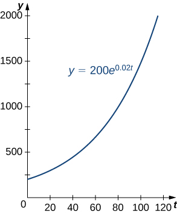
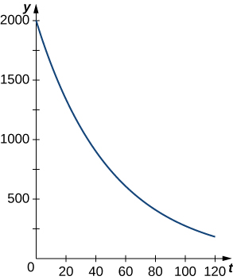

* Use the exponential growth model in applications, including population growth and compound interest.
* Explain the concept of doubling time.
* Use the exponential decay model in applications, including radioactive decay and Newton’s law of cooling.
* Explain the concept of half-life.

One of the most prevalent applications of exponential functions involves growth and decay models. Exponential growth and decay show up in a host of natural applications. From population growth and continuously compounded interest to radioactive decay and Newton’s law of cooling, exponential functions are ubiquitous in nature. In this section, we examine exponential growth and decay in the context of some of these applications.

### Exponential Growth Model

Many systems exhibit exponential growth. These systems follow a model of the form <math xmlns="http://www.w3.org/1998/Math/MathML"><mrow><mi>y</mi><mo>=</mo><msub><mi>y</mi><mn>0</mn></msub><msup><mi>e</mi><mrow><mi>k</mi><mi>t</mi></mrow></msup><mo>,</mo></mrow></math>

 where <math xmlns="http://www.w3.org/1998/Math/MathML"><mrow><msub><mi>y</mi><mn>0</mn></msub></mrow></math>

 represents the initial state of the system and <math xmlns="http://www.w3.org/1998/Math/MathML"><mi>k</mi></math>

 is a positive constant, called the *growth constant*. Notice that in an exponential growth model, we have

<math xmlns="http://www.w3.org/1998/Math/MathML"><mrow><msup><mi>y</mi><mo>′</mo></msup><mo>=</mo><mi>k</mi><msub><mi>y</mi><mn>0</mn></msub><msup><mi>e</mi><mrow><mi>k</mi><mi>t</mi></mrow></msup><mo>=</mo><mi>k</mi><mi>y</mi><mo>.</mo></mrow></math>

That is, the rate of growth is proportional to the current function value. This is a key feature of exponential growth. [\[link\]](#fs-id1167793543548) involves derivatives and is called a *differential equation.* We learn more about differential equations in [Introduction to Differential Equations](/m53696){: .target-chapter}.

Rule: Exponential Growth Model

Systems that exhibit **exponential growth**{: data-type="term"} increase according to the mathematical model

<math xmlns="http://www.w3.org/1998/Math/MathML"><mrow><mi>y</mi><mo>=</mo><msub><mi>y</mi><mn>0</mn></msub><msup><mi>e</mi><mrow><mi>k</mi><mi>t</mi></mrow></msup><mo>,</mo></mrow></math>

where <math xmlns="http://www.w3.org/1998/Math/MathML"><mrow><msub><mi>y</mi><mn>0</mn></msub></mrow></math>

 represents the initial state of the system and <math xmlns="http://www.w3.org/1998/Math/MathML"><mrow><mi>k</mi><mo>&gt;</mo><mn>0</mn></mrow></math>

 is a constant, called the *growth constant*.

**Population growth**{: data-type="term" .no-emphasis} is a common example of exponential growth. Consider a population of bacteria, for instance. It seems plausible that the rate of population growth would be proportional to the size of the population. After all, the more bacteria there are to reproduce, the faster the population grows. [\[link\]](#CNX_Calc_Figure_06_08_001) and [\[link\]](#fs-id1167793939650) represent the growth of a population of bacteria with an initial population of <math xmlns="http://www.w3.org/1998/Math/MathML"><mrow><mn>200</mn></mrow></math>

 bacteria and a growth constant of <math xmlns="http://www.w3.org/1998/Math/MathML"><mrow><mn>0.02</mn><mo>.</mo></mrow></math>

 Notice that after only <math xmlns="http://www.w3.org/1998/Math/MathML"><mn>2</mn></math>

 hours <math xmlns="http://www.w3.org/1998/Math/MathML"><mrow><mo stretchy="false">(</mo><mn>120</mn></mrow></math>

 minutes), the population is <math xmlns="http://www.w3.org/1998/Math/MathML"><mrow><mn>10</mn></mrow></math>

 times its original size!

 {: #CNX_Calc_Figure_06_08_001}

<table summary="This table has two columns. The columns are labeled Time (minutes) and Population size (no. of bacteria). The times start at 10 and increase in increments of 10 minutes up until 120 minutes. The number of bacteria start at 244 and increase to 2205."><caption>Exponential Growth of a Bacterial Population</caption><thead>
<tr valign="top">
<th data-valign="top" data-align="left"><strong>Time (min)</strong></th>
<th data-valign="top" data-align="left"><strong>Population Size (no. of bacteria)</strong></th>
</tr>
</thead><tbody>
<tr valign="top">
<td data-valign="top" data-align="left"><math xmlns="http://www.w3.org/1998/Math/MathML"><mrow><mn>10</mn></mrow></math></td>
<td data-valign="top" data-align="left"><math xmlns="http://www.w3.org/1998/Math/MathML"><mrow><mn>244</mn></mrow></math></td>
</tr>
<tr valign="top">
<td data-valign="top" data-align="left"><math xmlns="http://www.w3.org/1998/Math/MathML"><mrow><mn>20</mn></mrow></math></td>
<td data-valign="top" data-align="left"><math xmlns="http://www.w3.org/1998/Math/MathML"><mrow><mn>298</mn></mrow></math></td>
</tr>
<tr valign="top">
<td data-valign="top" data-align="left"><math xmlns="http://www.w3.org/1998/Math/MathML"><mrow><mn>30</mn></mrow></math></td>
<td data-valign="top" data-align="left"><math xmlns="http://www.w3.org/1998/Math/MathML"><mrow><mn>364</mn></mrow></math></td>
</tr>
<tr valign="top">
<td data-valign="top" data-align="left"><math xmlns="http://www.w3.org/1998/Math/MathML"><mrow><mn>40</mn></mrow></math></td>
<td data-valign="top" data-align="left"><math xmlns="http://www.w3.org/1998/Math/MathML"><mrow><mn>445</mn></mrow></math></td>
</tr>
<tr valign="top">
<td data-valign="top" data-align="left"><math xmlns="http://www.w3.org/1998/Math/MathML"><mrow><mn>50</mn></mrow></math></td>
<td data-valign="top" data-align="left"><math xmlns="http://www.w3.org/1998/Math/MathML"><mrow><mn>544</mn></mrow></math></td>
</tr>
<tr valign="top">
<td data-valign="top" data-align="left"><math xmlns="http://www.w3.org/1998/Math/MathML"><mrow><mn>60</mn></mrow></math></td>
<td data-valign="top" data-align="left"><math xmlns="http://www.w3.org/1998/Math/MathML"><mrow><mn>664</mn></mrow></math></td>
</tr>
<tr valign="top">
<td data-valign="top" data-align="left"><math xmlns="http://www.w3.org/1998/Math/MathML"><mrow><mn>70</mn></mrow></math></td>
<td data-valign="top" data-align="left"><math xmlns="http://www.w3.org/1998/Math/MathML"><mrow><mn>811</mn></mrow></math></td>
</tr>
<tr valign="top">
<td data-valign="top" data-align="left"><math xmlns="http://www.w3.org/1998/Math/MathML"><mrow><mn>80</mn></mrow></math></td>
<td data-valign="top" data-align="left"><math xmlns="http://www.w3.org/1998/Math/MathML"><mrow><mn>991</mn></mrow></math></td>
</tr>
<tr valign="top">
<td data-valign="top" data-align="left"><math xmlns="http://www.w3.org/1998/Math/MathML"><mrow><mn>90</mn></mrow></math></td>
<td data-valign="top" data-align="left"><math xmlns="http://www.w3.org/1998/Math/MathML"><mrow><mn>1210</mn></mrow></math></td>
</tr>
<tr valign="top">
<td data-valign="top" data-align="left"><math xmlns="http://www.w3.org/1998/Math/MathML"><mrow><mn>100</mn></mrow></math></td>
<td data-valign="top" data-align="left"><math xmlns="http://www.w3.org/1998/Math/MathML"><mrow><mn>1478</mn></mrow></math></td>
</tr>
<tr valign="top">
<td data-valign="top" data-align="left"><math xmlns="http://www.w3.org/1998/Math/MathML"><mrow><mn>110</mn></mrow></math></td>
<td data-valign="top" data-align="left"><math xmlns="http://www.w3.org/1998/Math/MathML"><mrow><mn>1805</mn></mrow></math></td>
</tr>
<tr valign="top">
<td data-valign="top" data-align="left"><math xmlns="http://www.w3.org/1998/Math/MathML"><mrow><mn>120</mn></mrow></math></td>
<td data-valign="top" data-align="left"><math xmlns="http://www.w3.org/1998/Math/MathML"><mrow><mn>2205</mn></mrow></math></td>
</tr>
</tbody></table>

Note that we are using a continuous function to model what is inherently discrete behavior. At any given time, the real-world population contains a whole number of bacteria, although the model takes on noninteger values. When using exponential growth models, we must always be careful to interpret the function values in the context of the phenomenon we are modeling.

Population Growth

Consider the population of bacteria described earlier. This population grows according to the function <math xmlns="http://www.w3.org/1998/Math/MathML"><mrow><mi>f</mi><mo stretchy="false">(</mo><mi>t</mi><mo stretchy="false">)</mo><mo>=</mo><mn>200</mn><msup><mi>e</mi><mrow><mn>0.02</mn><mi>t</mi></mrow></msup><mo>,</mo></mrow></math>

 where *t* is measured in minutes. How many bacteria are present in the population after <math xmlns="http://www.w3.org/1998/Math/MathML"><mn>5</mn></math>

 hours <math xmlns="http://www.w3.org/1998/Math/MathML"><mrow><mo stretchy="false">(</mo><mn>300</mn></mrow></math>

 minutes)? When does the population reach <math xmlns="http://www.w3.org/1998/Math/MathML"><mrow><mn>100,000</mn></mrow></math>

 bacteria?

We have <math xmlns="http://www.w3.org/1998/Math/MathML"><mrow><mi>f</mi><mo stretchy="false">(</mo><mi>t</mi><mo stretchy="false">)</mo><mo>=</mo><mn>200</mn><msup><mi>e</mi><mrow><mn>0.02</mn><mi>t</mi></mrow></msup><mo>.</mo></mrow></math>

 Then

<math xmlns="http://www.w3.org/1998/Math/MathML"><mrow><mi>f</mi><mo stretchy="false">(</mo><mn>300</mn><mo stretchy="false">)</mo><mo>=</mo><mn>200</mn><msup><mi>e</mi><mrow><mn>0.02</mn><mrow><mo>(</mo><mrow><mn>300</mn></mrow><mo>)</mo></mrow></mrow></msup><mo>≈</mo><mn>80,686</mn><mo>.</mo></mrow></math>

There are <math xmlns="http://www.w3.org/1998/Math/MathML"><mrow><mn>80,686</mn></mrow></math>

 bacteria in the population after <math xmlns="http://www.w3.org/1998/Math/MathML"><mn>5</mn></math>

 hours.

To find when the population reaches <math xmlns="http://www.w3.org/1998/Math/MathML"><mrow><mn>100,000</mn></mrow></math>

 bacteria, we solve the equation

<math xmlns="http://www.w3.org/1998/Math/MathML"><mtable><mtr><mtd columnalign="right"><mn>100,000</mn></mtd><mtd columnalign="left"><mo>=</mo></mtd><mtd columnalign="left"><mn>200</mn><msup><mi>e</mi><mrow><mn>0.02</mn><mi>t</mi></mrow></msup></mtd></mtr><mtr><mtd columnalign="right"><mn>500</mn></mtd><mtd columnalign="left"><mo>=</mo></mtd><mtd columnalign="left"><msup><mi>e</mi><mrow><mn>0.02</mn><mi>t</mi></mrow></msup></mtd></mtr><mtr><mtd columnalign="right"><mtext>ln</mtext><mspace width="0.2em" /><mn>500</mn></mtd><mtd columnalign="left"><mo>=</mo></mtd><mtd columnalign="left"><mn>0.02</mn><mi>t</mi></mtd></mtr><mtr><mtd columnalign="right"><mi>t</mi></mtd><mtd columnalign="left"><mo>=</mo></mtd><mtd columnalign="left"><mfrac><mrow><mtext>ln</mtext><mspace width="0.2em" /><mn>500</mn></mrow><mrow><mn>0.02</mn></mrow></mfrac><mo>≈</mo><mn>310.73.</mn></mtd></mtr></mtable></math>

The population reaches <math xmlns="http://www.w3.org/1998/Math/MathML"><mrow><mn>100,000</mn></mrow></math>

 bacteria after <math xmlns="http://www.w3.org/1998/Math/MathML"><mrow><mn>310.73</mn></mrow></math>

 minutes.

Consider a population of bacteria that grows according to the function <math xmlns="http://www.w3.org/1998/Math/MathML"><mrow><mi>f</mi><mo stretchy="false">(</mo><mi>t</mi><mo stretchy="false">)</mo><mo>=</mo><mn>500</mn><msup><mi>e</mi><mrow><mn>0.05</mn><mi>t</mi></mrow></msup><mo>,</mo></mrow></math>

 where <math xmlns="http://www.w3.org/1998/Math/MathML"><mi>t</mi></math>

 is measured in minutes. How many bacteria are present in the population after 4 hours? When does the population reach <math xmlns="http://www.w3.org/1998/Math/MathML"><mrow><mn>100</mn></mrow></math>

 million bacteria?

There are <math xmlns="http://www.w3.org/1998/Math/MathML"><mrow><mn>81,377,396</mn></mrow></math>

 bacteria in the population after <math xmlns="http://www.w3.org/1998/Math/MathML"><mn>4</mn></math>

 hours. The population reaches <math xmlns="http://www.w3.org/1998/Math/MathML"><mrow><mn>100</mn></mrow></math>

 million bacteria after <math xmlns="http://www.w3.org/1998/Math/MathML"><mrow><mn>244.12</mn></mrow></math>

 minutes.

Hint

Use the process from the previous example.

Let’s now turn our attention to a financial application: **compound interest**{: data-type="term" .no-emphasis}. Interest that is not compounded is called ***simple interest***{: data-type="term" .no-emphasis}. Simple interest is paid once, at the end of the specified time period (usually <math xmlns="http://www.w3.org/1998/Math/MathML"><mn>1</mn></math>

 year). So, if we put <math xmlns="http://www.w3.org/1998/Math/MathML"><mrow><mtext>$</mtext><mn>1000</mn></mrow></math>

 in a savings account earning <math xmlns="http://www.w3.org/1998/Math/MathML"><mrow><mn>2</mn><mtext>%</mtext></mrow></math>

 simple interest per year, then at the end of the year we have

<math xmlns="http://www.w3.org/1998/Math/MathML"><mrow><mn>1000</mn><mrow><mo>(</mo><mrow><mn>1</mn><mo>+</mo><mn>0.02</mn></mrow><mo>)</mo></mrow><mo>=</mo><mtext>$</mtext><mn>1020</mn><mo>.</mo></mrow></math>

Compound interest is paid multiple times per year, depending on the compounding period. Therefore, if the bank compounds the interest every <math xmlns="http://www.w3.org/1998/Math/MathML"><mn>6</mn></math>

 months, it credits half of the year’s interest to the account after <math xmlns="http://www.w3.org/1998/Math/MathML"><mn>6</mn></math>

 months. During the second half of the year, the account earns interest not only on the initial <math xmlns="http://www.w3.org/1998/Math/MathML"><mrow><mtext>$</mtext><mn>1000</mn><mo>,</mo></mrow></math>

 but also on the interest earned during the first half of the year. Mathematically speaking, at the end of the year, we have

<math xmlns="http://www.w3.org/1998/Math/MathML"><mrow><mn>1000</mn><msup><mrow><mrow><mo>(</mo><mrow><mn>1</mn><mo>+</mo><mfrac><mrow><mn>0.02</mn></mrow><mn>2</mn></mfrac></mrow><mo>)</mo></mrow></mrow><mn>2</mn></msup><mo>=</mo><mtext>$</mtext><mn>1020.10</mn><mo>.</mo></mrow></math>

Similarly, if the interest is compounded every <math xmlns="http://www.w3.org/1998/Math/MathML"><mn>4</mn></math>

 months, we have

<math xmlns="http://www.w3.org/1998/Math/MathML"><mrow><mn>1000</mn><msup><mrow><mrow><mo>(</mo><mrow><mn>1</mn><mo>+</mo><mfrac><mrow><mn>0.02</mn></mrow><mn>3</mn></mfrac></mrow><mo>)</mo></mrow></mrow><mn>3</mn></msup><mo>=</mo><mtext>$</mtext><mn>1020.13</mn><mo>,</mo></mrow></math>

and if the interest is compounded daily <math xmlns="http://www.w3.org/1998/Math/MathML"><mrow><mo stretchy="false">(</mo><mn>365</mn></mrow></math>

 times per year), we have <math xmlns="http://www.w3.org/1998/Math/MathML"><mrow><mtext>$</mtext><mn>1020.20</mn><mo>.</mo></mrow></math>

 If we extend this concept, so that the interest is compounded continuously, after <math xmlns="http://www.w3.org/1998/Math/MathML"><mi>t</mi></math>

 years we have

<math xmlns="http://www.w3.org/1998/Math/MathML"><mrow><mn>1000</mn><munder><mrow><mtext>lim</mtext></mrow><mrow><mi>n</mi><mo stretchy="false">→</mo><mi>∞</mi></mrow></munder><msup><mrow><mrow><mo>(</mo><mrow><mn>1</mn><mo>+</mo><mfrac><mrow><mn>0.02</mn></mrow><mi>n</mi></mfrac></mrow><mo>)</mo></mrow></mrow><mrow><mi>n</mi><mi>t</mi></mrow></msup><mo>.</mo></mrow></math>

Now let’s manipulate this expression so that we have an exponential growth function. Recall that the number <math xmlns="http://www.w3.org/1998/Math/MathML"><mi>e</mi></math>

 can be expressed as a limit:

<math xmlns="http://www.w3.org/1998/Math/MathML"><mrow><mi>e</mi><mo>=</mo><munder><mrow><mtext>lim</mtext></mrow><mrow><mi>m</mi><mo stretchy="false">→</mo><mi>∞</mi></mrow></munder><msup><mrow><mrow><mo>(</mo><mrow><mn>1</mn><mo>+</mo><mfrac><mn>1</mn><mi>m</mi></mfrac></mrow><mo>)</mo></mrow></mrow><mi>m</mi></msup><mo>.</mo></mrow></math>

Based on this, we want the expression inside the parentheses to have the form <math xmlns="http://www.w3.org/1998/Math/MathML"><mrow><mrow><mo>(</mo><mrow><mn>1</mn><mo>+</mo><mrow><mn>1</mn><mtext>/</mtext><mi>m</mi></mrow></mrow><mo>)</mo></mrow><mo>.</mo></mrow></math>

 Let <math xmlns="http://www.w3.org/1998/Math/MathML"><mrow><mi>n</mi><mo>=</mo><mn>0.02</mn><mi>m</mi><mo>.</mo></mrow></math>

 Note that as <math xmlns="http://www.w3.org/1998/Math/MathML"><mrow><mi>n</mi><mo stretchy="false">→</mo><mi>∞</mi><mo>,</mo></mrow></math>

 <math xmlns="http://www.w3.org/1998/Math/MathML"><mrow><mi>m</mi><mo stretchy="false">→</mo><mi>∞</mi></mrow></math>

 as well. Then we get

<math xmlns="http://www.w3.org/1998/Math/MathML"><mrow><mn>1000</mn><munder><mrow><mtext>lim</mtext></mrow><mrow><mi>n</mi><mo stretchy="false">→</mo><mi>∞</mi></mrow></munder><msup><mrow><mrow><mo>(</mo><mrow><mn>1</mn><mo>+</mo><mfrac><mrow><mn>0.02</mn></mrow><mi>n</mi></mfrac></mrow><mo>)</mo></mrow></mrow><mrow><mi>n</mi><mi>t</mi></mrow></msup><mo>=</mo><mn>1000</mn><munder><mrow><mtext>lim</mtext></mrow><mrow><mi>m</mi><mo stretchy="false">→</mo><mi>∞</mi></mrow></munder><msup><mrow><mrow><mo>(</mo><mrow><mn>1</mn><mo>+</mo><mfrac><mrow><mn>0.02</mn></mrow><mrow><mn>0.02</mn><mi>m</mi></mrow></mfrac></mrow><mo>)</mo></mrow></mrow><mrow><mn>0.02</mn><mi>m</mi><mi>t</mi></mrow></msup><mo>=</mo><mn>1000</mn><msup><mrow><mrow><mo>[</mo><mrow><munder><mrow><mtext>lim</mtext></mrow><mrow><mi>m</mi><mo stretchy="false">→</mo><mi>∞</mi></mrow></munder><msup><mrow><mrow><mo>(</mo><mrow><mn>1</mn><mo>+</mo><mfrac><mn>1</mn><mi>m</mi></mfrac></mrow><mo>)</mo></mrow></mrow><mi>m</mi></msup></mrow><mo>]</mo></mrow></mrow><mrow><mn>0.02</mn><mi>t</mi></mrow></msup><mo>.</mo></mrow></math>

We recognize the limit inside the brackets as the number <math xmlns="http://www.w3.org/1998/Math/MathML"><mi>e</mi><mo>.</mo></math>

 So, the balance in our bank account after <math xmlns="http://www.w3.org/1998/Math/MathML"><mi>t</mi></math>

 years is given by <math xmlns="http://www.w3.org/1998/Math/MathML"><mrow><mn>1000</mn><msup><mi>e</mi><mrow><mn>0.02</mn><mi>t</mi></mrow></msup><mo>.</mo></mrow></math>

 Generalizing this concept, we see that if a bank account with an initial balance of <math xmlns="http://www.w3.org/1998/Math/MathML"><mrow><mtext>$</mtext><mi>P</mi></mrow></math>

 earns interest at a rate of <math xmlns="http://www.w3.org/1998/Math/MathML"><mrow><mi>r</mi><mtext>%</mtext><mo>,</mo></mrow></math>

 compounded continuously, then the balance of the account after <math xmlns="http://www.w3.org/1998/Math/MathML"><mi>t</mi></math>

 years is

<math xmlns="http://www.w3.org/1998/Math/MathML"><mrow><mtext>Balance</mtext><mo>=</mo><mi>P</mi><msup><mi>e</mi><mrow><mi>r</mi><mi>t</mi></mrow></msup><mo>.</mo></mrow></math>

Compound Interest

A 25-year-old student is offered an opportunity to invest some money in a retirement account that pays <math xmlns="http://www.w3.org/1998/Math/MathML"><mrow><mn>5</mn><mtext>%</mtext></mrow></math>

 annual interest compounded continuously. How much does the student need to invest today to have <math xmlns="http://www.w3.org/1998/Math/MathML"><mrow><mtext>$</mtext><mn>1</mn></mrow></math>

 million when she retires at age <math xmlns="http://www.w3.org/1998/Math/MathML"><mrow><mn>65</mn><mo>?</mo></mrow></math>

 What if she could earn <math xmlns="http://www.w3.org/1998/Math/MathML"><mrow><mn>6</mn><mtext>%</mtext></mrow></math>

 annual interest compounded continuously instead?

We have

<math xmlns="http://www.w3.org/1998/Math/MathML"><mtable><mtr><mtd columnalign="right"><mn>1,000,000</mn></mtd><mtd columnalign="left"><mo>=</mo></mtd><mtd columnalign="left"><mi>P</mi><msup><mi>e</mi><mrow><mn>0.05</mn><mrow><mo>(</mo><mrow><mn>40</mn></mrow><mo>)</mo></mrow></mrow></msup></mtd></mtr><mtr><mtd columnalign="right"><mi>P</mi></mtd><mtd columnalign="left"><mo>=</mo></mtd><mtd columnalign="left"><mn>135,335.28.</mn></mtd></mtr></mtable></math>

She must invest <math xmlns="http://www.w3.org/1998/Math/MathML"><mrow><mtext>$</mtext><mn>135,335.28</mn></mrow></math>

 at <math xmlns="http://www.w3.org/1998/Math/MathML"><mrow><mn>5</mn><mtext>%</mtext></mrow></math>

 interest.

If, instead, she is able to earn <math xmlns="http://www.w3.org/1998/Math/MathML"><mrow><mn>6</mn><mtext>%</mtext><mo>,</mo></mrow></math>

 then the equation becomes

<math xmlns="http://www.w3.org/1998/Math/MathML"><mtable><mtr><mtd columnalign="right"><mn>1,000,000</mn></mtd><mtd columnalign="left"><mo>=</mo></mtd><mtd columnalign="left"><mi>P</mi><msup><mi>e</mi><mrow><mn>0.06</mn><mrow><mo>(</mo><mrow><mn>40</mn></mrow><mo>)</mo></mrow></mrow></msup></mtd></mtr><mtr><mtd columnalign="right"><mi>P</mi></mtd><mtd columnalign="left"><mo>=</mo></mtd><mtd columnalign="left"><mn>90,717.95.</mn></mtd></mtr></mtable></math>

In this case, she needs to invest only <math xmlns="http://www.w3.org/1998/Math/MathML"><mrow><mtext>$</mtext><mn>90,717.95</mn><mo>.</mo></mrow></math>

 This is roughly two-thirds the amount she needs to invest at <math xmlns="http://www.w3.org/1998/Math/MathML"><mrow><mn>5</mn><mtext>%</mtext><mo>.</mo></mrow></math>

 The fact that the interest is compounded continuously greatly magnifies the effect of the <math xmlns="http://www.w3.org/1998/Math/MathML"><mrow><mn>1</mn><mtext>%</mtext></mrow></math>

 increase in interest rate.

Suppose instead of investing at age <math xmlns="http://www.w3.org/1998/Math/MathML"><mrow><mn>25</mn><msqrt><mrow><msup><mi>b</mi><mn>2</mn></msup><mo>−</mo><mn>4</mn><mi>a</mi><mi>c</mi></mrow></msqrt><mo>,</mo></mrow></math>

 the student waits until age <math xmlns="http://www.w3.org/1998/Math/MathML"><mrow><mn>35</mn><mo>.</mo></mrow></math>

 How much would she have to invest at <math xmlns="http://www.w3.org/1998/Math/MathML"><mrow><mn>5</mn><mtext>%</mtext><mo>?</mo></mrow></math>

 At <math xmlns="http://www.w3.org/1998/Math/MathML"><mrow><mn>6</mn><mtext>%</mtext><mo>?</mo></mrow></math>

At <math xmlns="http://www.w3.org/1998/Math/MathML"><mrow><mn>5</mn><mtext>%</mtext></mrow></math>

 interest, she must invest <math xmlns="http://www.w3.org/1998/Math/MathML"><mrow><mtext>$</mtext><mn>223,130.16</mn><mo>.</mo></mrow></math>

 At <math xmlns="http://www.w3.org/1998/Math/MathML"><mrow><mn>6</mn><mtext>%</mtext></mrow></math>

 interest, she must invest <math xmlns="http://www.w3.org/1998/Math/MathML"><mrow><mtext>$</mtext><mn>165,298.89</mn><mo>.</mo></mrow></math>

Hint

Use the process from the previous example.

If a quantity grows exponentially, the time it takes for the quantity to double remains constant. In other words, it takes the same amount of time for a population of bacteria to grow from <math xmlns="http://www.w3.org/1998/Math/MathML"><mrow><mn>100</mn></mrow></math>

 to <math xmlns="http://www.w3.org/1998/Math/MathML"><mrow><mn>200</mn></mrow></math>

 bacteria as it does to grow from <math xmlns="http://www.w3.org/1998/Math/MathML"><mrow><mn>10,000</mn></mrow></math>

 to <math xmlns="http://www.w3.org/1998/Math/MathML"><mrow><mn>20,000</mn></mrow></math>

 bacteria. This time is called the doubling time. To calculate the doubling time, we want to know when the quantity reaches twice its original size. So we have

<math xmlns="http://www.w3.org/1998/Math/MathML"><mtable><mtr><mtd columnalign="right"><mn>2</mn><msub><mi>y</mi><mn>0</mn></msub></mtd><mtd columnalign="left"><mo>=</mo></mtd><mtd columnalign="left"><msub><mi>y</mi><mn>0</mn></msub><msup><mi>e</mi><mrow><mi>k</mi><mi>t</mi></mrow></msup></mtd></mtr><mtr><mtd columnalign="right"><mn>2</mn></mtd><mtd columnalign="left"><mo>=</mo></mtd><mtd columnalign="left"><msup><mi>e</mi><mrow><mi>k</mi><mi>t</mi></mrow></msup></mtd></mtr><mtr><mtd columnalign="right"><mtext>ln</mtext><mspace width="0.2em" /><mn>2</mn></mtd><mtd columnalign="left"><mo>=</mo></mtd><mtd columnalign="left"><mi>k</mi><mi>t</mi></mtd></mtr><mtr><mtd columnalign="right"><mi>t</mi></mtd><mtd columnalign="left"><mo>=</mo></mtd><mtd columnalign="left"><mfrac><mrow><mtext>ln</mtext><mspace width="0.2em" /><mn>2</mn></mrow><mi>k</mi></mfrac><mo>.</mo></mtd></mtr></mtable></math>

Definition

If a quantity grows exponentially, the **doubling time**{: data-type="term"} is the amount of time it takes the quantity to double. It is given by

<math xmlns="http://www.w3.org/1998/Math/MathML"><mrow><mtext>Doubling time</mtext><mspace width="0.2em" /><mo>=</mo><mfrac><mrow><mtext>ln</mtext><mspace width="0.2em" /><mn>2</mn></mrow><mi>k</mi></mfrac><mo>.</mo></mrow></math>

Using the Doubling Time

Assume a population of fish grows exponentially. A pond is stocked initially with <math xmlns="http://www.w3.org/1998/Math/MathML"><mrow><mn>500</mn></mrow></math>

 fish. After <math xmlns="http://www.w3.org/1998/Math/MathML"><mn>6</mn></math>

 months, there are <math xmlns="http://www.w3.org/1998/Math/MathML"><mrow><mn>1000</mn></mrow></math>

 fish in the pond. The owner will allow his friends and neighbors to fish on his pond after the fish population reaches <math xmlns="http://www.w3.org/1998/Math/MathML"><mrow><mn>10,000</mn><mo>.</mo></mrow></math>

 When will the owner’s friends be allowed to fish?

We know it takes the population of fish <math xmlns="http://www.w3.org/1998/Math/MathML"><mn>6</mn></math>

 months to double in size. So, if *t* represents time in months, by the doubling-time formula, we have <math xmlns="http://www.w3.org/1998/Math/MathML"><mrow><mn>6</mn><mo>=</mo><mrow><mrow><mrow><mo>(</mo><mrow><mtext>ln</mtext><mspace width="0.2em" /><mn>2</mn></mrow><mo>)</mo></mrow></mrow><mtext>/</mtext><mi>k</mi></mrow><mo>.</mo></mrow></math>

 Then, <math xmlns="http://www.w3.org/1998/Math/MathML"><mrow><mi>k</mi><mo>=</mo><mrow><mrow><mrow><mo>(</mo><mrow><mtext>ln</mtext><mspace width="0.2em" /><mn>2</mn></mrow><mo>)</mo></mrow></mrow><mtext>/</mtext><mn>6</mn></mrow><mo>.</mo></mrow></math>

 Thus, the population is given by <math xmlns="http://www.w3.org/1998/Math/MathML"><mrow><mi>y</mi><mo>=</mo><mn>500</mn><msup><mi>e</mi><mrow><mrow><mo>(</mo><mrow><mrow><mrow><mrow><mo>(</mo><mrow><mtext>ln</mtext><mspace width="0.2em" /><mn>2</mn></mrow><mo>)</mo></mrow></mrow><mtext>/</mtext><mn>6</mn></mrow></mrow><mo>)</mo></mrow><mi>t</mi></mrow></msup><mo>.</mo></mrow></math>

 To figure out when the population reaches <math xmlns="http://www.w3.org/1998/Math/MathML"><mrow><mn>10,000</mn></mrow></math>

 fish, we must solve the following equation:

<math xmlns="http://www.w3.org/1998/Math/MathML"><mtable><mtr><mtd columnalign="right"><mn>10,000</mn></mtd><mtd columnalign="left"><mo>=</mo></mtd><mtd columnalign="left"><mn>500</mn><msup><mi>e</mi><mrow><mo stretchy="false">(</mo><mtext>ln</mtext><mspace width="0.2em" /><mn>2</mn><mtext>/</mtext><mn>6</mn><mo stretchy="false">)</mo><mi>t</mi></mrow></msup></mtd></mtr><mtr><mtd columnalign="right"><mn>20</mn></mtd><mtd columnalign="left"><mo>=</mo></mtd><mtd columnalign="left"><msup><mi>e</mi><mrow><mo stretchy="false">(</mo><mtext>ln</mtext><mspace width="0.2em" /><mn>2</mn><mtext>/</mtext><mn>6</mn><mo stretchy="false">)</mo><mi>t</mi></mrow></msup></mtd></mtr><mtr><mtd columnalign="right"><mtext>ln</mtext><mspace width="0.2em" /><mn>20</mn></mtd><mtd columnalign="left"><mo>=</mo></mtd><mtd columnalign="left"><mrow><mo>(</mo><mrow><mfrac><mrow><mtext>ln</mtext><mspace width="0.2em" /><mn>2</mn></mrow><mn>6</mn></mfrac></mrow><mo>)</mo></mrow><mi>t</mi></mtd></mtr><mtr><mtd columnalign="right"><mi>t</mi></mtd><mtd columnalign="left"><mo>=</mo></mtd><mtd columnalign="left"><mfrac><mrow><mn>6</mn><mrow><mo>(</mo><mrow><mtext>ln</mtext><mspace width="0.2em" /><mn>20</mn></mrow><mo>)</mo></mrow></mrow><mrow><mtext>ln</mtext><mspace width="0.2em" /><mn>2</mn></mrow></mfrac><mo>≈</mo><mn>25.93.</mn></mtd></mtr></mtable></math>

The owner’s friends have to wait <math xmlns="http://www.w3.org/1998/Math/MathML"><mrow><mn>25.93</mn></mrow></math>

 months (a little more than <math xmlns="http://www.w3.org/1998/Math/MathML"><mn>2</mn></math>

 years) to fish in the pond.

Suppose it takes <math xmlns="http://www.w3.org/1998/Math/MathML"><mn>9</mn></math>

 months for the fish population in [[link]](#fs-id1167793294341) to reach <math xmlns="http://www.w3.org/1998/Math/MathML"><mrow><mn>1000</mn></mrow></math>

 fish. Under these circumstances, how long do the owner’s friends have to wait?

<math xmlns="http://www.w3.org/1998/Math/MathML"><mrow><mn>38.90</mn></mrow></math>

 months

Hint

Use the process from the previous example.

### Exponential Decay Model

Exponential functions can also be used to model populations that shrink (from disease, for example), or chemical compounds that break down over time. We say that such systems exhibit exponential decay, rather than exponential growth. The model is nearly the same, except there is a negative sign in the exponent. Thus, for some positive constant <math xmlns="http://www.w3.org/1998/Math/MathML"><mi>k</mi><mo>,</mo></math>

 we have <math xmlns="http://www.w3.org/1998/Math/MathML"><mrow><mi>y</mi><mo>=</mo><msub><mi>y</mi><mn>0</mn></msub><msup><mi>e</mi><mrow><mtext>−</mtext><mi>k</mi><mi>t</mi></mrow></msup><mo>.</mo></mrow></math>

As with exponential growth, there is a differential equation associated with exponential decay. We have

<math xmlns="http://www.w3.org/1998/Math/MathML"><mrow><msup><mi>y</mi><mo>′</mo></msup><mo>=</mo><mtext>−</mtext><mi>k</mi><msub><mi>y</mi><mn>0</mn></msub><msup><mi>e</mi><mrow><mtext>−</mtext><mi>k</mi><mi>t</mi></mrow></msup><mo>=</mo><mtext>−</mtext><mi>k</mi><mi>y</mi><mo>.</mo></mrow></math>

Rule: Exponential Decay Model

Systems that exhibit **exponential decay**{: data-type="term"} behave according to the model

<math xmlns="http://www.w3.org/1998/Math/MathML"><mrow><mi>y</mi><mo>=</mo><msub><mi>y</mi><mn>0</mn></msub><msup><mi>e</mi><mrow><mtext>−</mtext><mi>k</mi><mi>t</mi></mrow></msup><mo>,</mo></mrow></math>

where <math xmlns="http://www.w3.org/1998/Math/MathML"><mrow><msub><mi>y</mi><mn>0</mn></msub></mrow></math>

 represents the initial state of the system and <math xmlns="http://www.w3.org/1998/Math/MathML"><mrow><mi>k</mi><mo>&gt;</mo><mn>0</mn></mrow></math>

 is a constant, called the *decay constant*.

The following figure shows a graph of a representative exponential decay function.

 {: #CNX_Calc_Figure_06_08_002}

Let’s look at a physical application of exponential decay. **Newton’s law of cooling**{: data-type="term" .no-emphasis} says that an object cools at a rate proportional to the difference between the temperature of the object and the temperature of the surroundings. In other words, if <math xmlns="http://www.w3.org/1998/Math/MathML"><mi>T</mi></math>

 represents the temperature of the object and <math xmlns="http://www.w3.org/1998/Math/MathML"><mrow><msub><mi>T</mi><mi>a</mi></msub></mrow></math>

 represents the ambient temperature in a room, then

<math xmlns="http://www.w3.org/1998/Math/MathML"><mrow><msup><mi>T</mi><mo>′</mo></msup><mo>=</mo><mtext>−</mtext><mi>k</mi><mrow><mo>(</mo><mrow><mi>T</mi><mo>−</mo><msub><mi>T</mi><mi>a</mi></msub></mrow><mo>)</mo></mrow><mo>.</mo></mrow></math>

Note that this is not quite the right model for exponential decay. We want the derivative to be proportional to the function, and this expression has the additional <math xmlns="http://www.w3.org/1998/Math/MathML"><mrow><msub><mi>T</mi><mi>a</mi></msub></mrow></math>

 term. Fortunately, we can make a change of variables that resolves this issue. Let <math xmlns="http://www.w3.org/1998/Math/MathML"><mrow><mi>y</mi><mo stretchy="false">(</mo><mi>t</mi><mo stretchy="false">)</mo><mo>=</mo><mi>T</mi><mo stretchy="false">(</mo><mi>t</mi><mo stretchy="false">)</mo><mo>−</mo><msub><mi>T</mi><mi>a</mi></msub><mo>.</mo></mrow></math>

 Then <math xmlns="http://www.w3.org/1998/Math/MathML"><mrow><msup><mi>y</mi><mo>′</mo></msup><mo stretchy="false">(</mo><mi>t</mi><mo stretchy="false">)</mo><mo>=</mo><msup><mi>T</mi><mo>′</mo></msup><mo stretchy="false">(</mo><mi>t</mi><mo stretchy="false">)</mo><mo>−</mo><mn>0</mn><mo>=</mo><msup><mi>T</mi><mo>′</mo></msup><mo stretchy="false">(</mo><mi>t</mi><mo stretchy="false">)</mo><mo>,</mo></mrow></math>

 and our equation becomes

<math xmlns="http://www.w3.org/1998/Math/MathML"><mrow><msup><mi>y</mi><mo>′</mo></msup><mo>=</mo><mtext>−</mtext><mi>k</mi><mi>y</mi><mo>.</mo></mrow></math>

From our previous work, we know this relationship between *y* and its derivative leads to exponential decay. Thus,

<math xmlns="http://www.w3.org/1998/Math/MathML"><mrow><mi>y</mi><mo>=</mo><msub><mi>y</mi><mn>0</mn></msub><msup><mi>e</mi><mrow><mtext>−</mtext><mi>k</mi><mi>t</mi></mrow></msup><mo>,</mo></mrow></math>

and we see that

<math xmlns="http://www.w3.org/1998/Math/MathML"><mtable><mtr><mtd columnalign="right"><mi>T</mi><mo>−</mo><msub><mi>T</mi><mi>a</mi></msub></mtd><mtd columnalign="left"><mo>=</mo></mtd><mtd columnalign="left"><mrow><mo>(</mo><mrow><msub><mi>T</mi><mn>0</mn></msub><mo>−</mo><msub><mi>T</mi><mi>a</mi></msub></mrow><mo>)</mo></mrow><msup><mi>e</mi><mrow><mtext>−</mtext><mi>k</mi><mi>t</mi></mrow></msup></mtd></mtr><mtr><mtd columnalign="right"><mi>T</mi></mtd><mtd columnalign="left"><mo>=</mo></mtd><mtd columnalign="left"><mrow><mo>(</mo><mrow><msub><mi>T</mi><mn>0</mn></msub><mo>−</mo><msub><mi>T</mi><mi>a</mi></msub></mrow><mo>)</mo></mrow><msup><mi>e</mi><mrow><mtext>−</mtext><mi>k</mi><mi>t</mi></mrow></msup><mo>+</mo><msub><mi>T</mi><mi>a</mi></msub></mtd></mtr></mtable></math>

where <math xmlns="http://www.w3.org/1998/Math/MathML"><mrow><msub><mi>T</mi><mn>0</mn></msub></mrow></math>

 represents the initial temperature. Let’s apply this formula in the following example.

Newton’s Law of Cooling

According to experienced baristas, the optimal temperature to serve coffee is between <math xmlns="http://www.w3.org/1998/Math/MathML"><mrow><mn>155</mn><mtext>°</mtext><mtext>F</mtext></mrow></math>

 and <math xmlns="http://www.w3.org/1998/Math/MathML"><mrow><mn>175</mn><mtext>°</mtext><mtext>F</mtext><mo>.</mo></mrow></math>

 Suppose coffee is poured at a temperature of <math xmlns="http://www.w3.org/1998/Math/MathML"><mrow><mn>200</mn><mtext>°</mtext><mtext>F</mtext><mo>,</mo></mrow></math>

 and after <math xmlns="http://www.w3.org/1998/Math/MathML"><mn>2</mn></math>

 minutes in a <math xmlns="http://www.w3.org/1998/Math/MathML"><mrow><mn>70</mn><mtext>°</mtext><mtext>F</mtext></mrow></math>

 room it has cooled to <math xmlns="http://www.w3.org/1998/Math/MathML"><mrow><mn>180</mn><mtext>°</mtext><mtext>F</mtext><mo>.</mo></mrow></math>

 When is the coffee first cool enough to serve? When is the coffee too cold to serve? Round answers to the nearest half minute.

We have

<math xmlns="http://www.w3.org/1998/Math/MathML"><mtable><mtr><mtd columnalign="right"><mi>T</mi></mtd><mtd columnalign="left"><mo>=</mo></mtd><mtd columnalign="left"><mrow><mo>(</mo><mrow><msub><mi>T</mi><mn>0</mn></msub><mo>−</mo><msub><mi>T</mi><mi>a</mi></msub></mrow><mo>)</mo></mrow><msup><mi>e</mi><mrow><mtext>−</mtext><mi>k</mi><mi>t</mi></mrow></msup><mo>+</mo><msub><mi>T</mi><mi>a</mi></msub></mtd></mtr><mtr><mtd columnalign="right"><mn>180</mn></mtd><mtd columnalign="left"><mo>=</mo></mtd><mtd columnalign="left"><mo stretchy="false">(</mo><mn>200</mn><mo>−</mo><mn>70</mn><mo stretchy="false">)</mo><msup><mi>e</mi><mrow><mtext>−</mtext><mi>k</mi><mrow><mo>(</mo><mn>2</mn><mo>)</mo></mrow></mrow></msup><mo>+</mo><mn>70</mn></mtd></mtr><mtr><mtd columnalign="right"><mn>110</mn></mtd><mtd columnalign="left"><mo>=</mo></mtd><mtd columnalign="left"><mn>130</mn><msup><mi>e</mi><mrow><mn>−2</mn><mi>k</mi></mrow></msup></mtd></mtr><mtr><mtd columnalign="right"><mfrac><mrow><mn>11</mn></mrow><mrow><mn>13</mn></mrow></mfrac></mtd><mtd columnalign="left"><mo>=</mo></mtd><mtd columnalign="left"><msup><mi>e</mi><mrow><mn>−2</mn><mi>k</mi></mrow></msup></mtd></mtr><mtr><mtd columnalign="right"><mtext>ln</mtext><mspace width="0.2em" /><mfrac><mrow><mn>11</mn></mrow><mrow><mn>13</mn></mrow></mfrac></mtd><mtd columnalign="left"><mo>=</mo></mtd><mtd columnalign="left"><mn>−2</mn><mi>k</mi></mtd></mtr><mtr><mtd columnalign="right"><mtext>ln</mtext><mspace width="0.2em" /><mn>11</mn><mo>−</mo><mtext>ln</mtext><mspace width="0.2em" /><mn>13</mn></mtd><mtd columnalign="left"><mo>=</mo></mtd><mtd columnalign="left"><mn>−2</mn><mi>k</mi></mtd></mtr><mtr><mtd columnalign="right"><mi>k</mi></mtd><mtd columnalign="left"><mo>=</mo></mtd><mtd columnalign="left"><mfrac><mrow><mtext>ln</mtext><mspace width="0.2em" /><mn>13</mn><mo>−</mo><mtext>ln</mtext><mspace width="0.2em" /><mn>11</mn></mrow><mn>2</mn></mfrac><mo>.</mo></mtd></mtr></mtable></math>

Then, the model is

<math xmlns="http://www.w3.org/1998/Math/MathML"><mrow><mi>T</mi><mo>=</mo><mn>130</mn><msup><mi>e</mi><mrow><mrow><mo>(</mo><mrow><mtext>ln</mtext><mspace width="0.2em" /><mn>11</mn><mo>−</mo><mtext>ln</mtext><mspace width="0.2em" /><mn>13</mn><mtext>/</mtext><mn>2</mn></mrow><mo>)</mo></mrow><mi>t</mi></mrow></msup><mo>+</mo><mn>70</mn><mo>.</mo></mrow></math>

The coffee reaches <math xmlns="http://www.w3.org/1998/Math/MathML"><mrow><mn>175</mn><mtext>°</mtext><mtext>F</mtext></mrow></math>

 when

<math xmlns="http://www.w3.org/1998/Math/MathML"><mtable><mtr><mtd columnalign="right"><mn>175</mn></mtd><mtd columnalign="left"><mo>=</mo></mtd><mtd columnalign="left"><mn>130</mn><msup><mi>e</mi><mrow><mrow><mo>(</mo><mrow><mtext>ln</mtext><mspace width="0.2em" /><mn>11</mn><mo>−</mo><mtext>ln</mtext><mspace width="0.2em" /><mn>13</mn><mtext>/</mtext><mn>2</mn></mrow><mo>)</mo></mrow><mi>t</mi></mrow></msup><mo>+</mo><mn>70</mn></mtd></mtr><mtr><mtd columnalign="right"><mn>105</mn></mtd><mtd columnalign="left"><mo>=</mo></mtd><mtd columnalign="left"><mn>130</mn><msup><mi>e</mi><mrow><mrow><mo>(</mo><mrow><mtext>ln</mtext><mspace width="0.2em" /><mn>11</mn><mo>−</mo><mtext>ln</mtext><mspace width="0.2em" /><mn>13</mn><mtext>/</mtext><mn>2</mn></mrow><mo>)</mo></mrow><mi>t</mi></mrow></msup></mtd></mtr><mtr><mtd columnalign="right"><mfrac><mrow><mn>21</mn></mrow><mrow><mn>26</mn></mrow></mfrac></mtd><mtd columnalign="left"><mo>=</mo></mtd><mtd columnalign="left"><msup><mi>e</mi><mrow><mrow><mo>(</mo><mrow><mtext>ln</mtext><mspace width="0.2em" /><mn>11</mn><mo>−</mo><mtext>ln</mtext><mspace width="0.2em" /><mn>13</mn><mtext>/</mtext><mn>2</mn></mrow><mo>)</mo></mrow><mi>t</mi></mrow></msup></mtd></mtr><mtr><mtd columnalign="right"><mtext>ln</mtext><mspace width="0.2em" /><mfrac><mrow><mn>21</mn></mrow><mrow><mn>26</mn></mrow></mfrac></mtd><mtd columnalign="left"><mo>=</mo></mtd><mtd columnalign="left"><mfrac><mrow><mtext>ln</mtext><mspace width="0.2em" /><mn>11</mn><mo>−</mo><mtext>ln</mtext><mspace width="0.2em" /><mn>13</mn></mrow><mn>2</mn></mfrac><mi>t</mi></mtd></mtr><mtr><mtd columnalign="right"><mtext>ln</mtext><mspace width="0.2em" /><mn>21</mn><mo>−</mo><mtext>ln</mtext><mspace width="0.2em" /><mn>26</mn></mtd><mtd columnalign="left"><mo>=</mo></mtd><mtd columnalign="left"><mfrac><mrow><mtext>ln</mtext><mspace width="0.2em" /><mn>11</mn><mo>−</mo><mtext>ln</mtext><mspace width="0.2em" /><mn>13</mn></mrow><mn>2</mn></mfrac><mi>t</mi></mtd></mtr><mtr><mtd columnalign="right"><mi>t</mi></mtd><mtd columnalign="left"><mo>=</mo></mtd><mtd columnalign="left"><mfrac><mrow><mn>2</mn><mrow><mo>(</mo><mrow><mtext>ln</mtext><mspace width="0.2em" /><mn>21</mn><mo>−</mo><mtext>ln</mtext><mspace width="0.2em" /><mn>26</mn></mrow><mo>)</mo></mrow></mrow><mrow><mtext>ln</mtext><mspace width="0.2em" /><mn>11</mn><mo>−</mo><mtext>ln</mtext><mspace width="0.2em" /><mn>13</mn></mrow></mfrac><mo>≈</mo><mn>2.56.</mn></mtd></mtr></mtable></math>

The coffee can be served about <math xmlns="http://www.w3.org/1998/Math/MathML"><mrow><mn>2.5</mn></mrow></math>

 minutes after it is poured. The coffee reaches <math xmlns="http://www.w3.org/1998/Math/MathML"><mrow><mn>155</mn><mtext>°</mtext><mtext>F</mtext></mrow></math>

 at

<math xmlns="http://www.w3.org/1998/Math/MathML"><mtable><mtr><mtd columnalign="right"><mn>155</mn></mtd><mtd columnalign="left"><mo>=</mo></mtd><mtd columnalign="left"><mn>130</mn><msup><mi>e</mi><mrow><mrow><mo>(</mo><mrow><mtext>ln</mtext><mspace width="0.2em" /><mn>11</mn><mo>−</mo><mtext>ln</mtext><mspace width="0.2em" /><mn>13</mn><mtext>/</mtext><mn>2</mn></mrow><mo>)</mo></mrow><mi>t</mi></mrow></msup><mo>+</mo><mn>70</mn></mtd></mtr><mtr><mtd columnalign="right"><mn>85</mn></mtd><mtd columnalign="left"><mo>=</mo></mtd><mtd columnalign="left"><mn>130</mn><msup><mi>e</mi><mrow><mrow><mo>(</mo><mrow><mtext>ln</mtext><mspace width="0.2em" /><mn>11</mn><mo>−</mo><mtext>ln</mtext><mspace width="0.2em" /><mn>13</mn></mrow><mo>)</mo></mrow><mi>t</mi></mrow></msup></mtd></mtr><mtr><mtd columnalign="right"><mfrac><mrow><mn>17</mn></mrow><mrow><mn>26</mn></mrow></mfrac></mtd><mtd columnalign="left"><mo>=</mo></mtd><mtd columnalign="left"><msup><mi>e</mi><mrow><mrow><mo>(</mo><mrow><mtext>ln</mtext><mspace width="0.2em" /><mn>11</mn><mo>−</mo><mtext>ln</mtext><mspace width="0.2em" /><mn>13</mn></mrow><mo>)</mo></mrow><mi>t</mi></mrow></msup></mtd></mtr><mtr><mtd columnalign="right"><mtext>ln</mtext><mspace width="0.2em" /><mn>17</mn><mo>−</mo><mtext>ln</mtext><mspace width="0.2em" /><mn>26</mn></mtd><mtd columnalign="left"><mo>=</mo></mtd><mtd columnalign="left"><mrow><mo>(</mo><mrow><mfrac><mrow><mtext>ln</mtext><mspace width="0.2em" /><mn>11</mn><mo>−</mo><mtext>ln</mtext><mspace width="0.2em" /><mn>13</mn></mrow><mn>2</mn></mfrac></mrow><mo>)</mo></mrow><mi>t</mi></mtd></mtr><mtr><mtd columnalign="right"><mi>t</mi></mtd><mtd columnalign="left"><mo>=</mo></mtd><mtd columnalign="left"><mfrac><mrow><mn>2</mn><mrow><mo>(</mo><mrow><mtext>ln</mtext><mspace width="0.2em" /><mn>17</mn><mo>−</mo><mtext>ln</mtext><mspace width="0.2em" /><mn>26</mn></mrow><mo>)</mo></mrow></mrow><mrow><mtext>ln</mtext><mspace width="0.2em" /><mn>11</mn><mo>−</mo><mtext>ln</mtext><mspace width="0.2em" /><mn>13</mn></mrow></mfrac><mo>≈</mo><mn>5.09.</mn></mtd></mtr></mtable></math>

The coffee is too cold to be served about <math xmlns="http://www.w3.org/1998/Math/MathML"><mn>5</mn></math>

 minutes after it is poured.

Suppose the room is warmer <math xmlns="http://www.w3.org/1998/Math/MathML"><mrow><mo stretchy="false">(</mo><mn>75</mn><mtext>°</mtext><mtext>F</mtext><mo stretchy="false">)</mo></mrow></math>

 and, after <math xmlns="http://www.w3.org/1998/Math/MathML"><mn>2</mn></math>

 minutes, the coffee has cooled only to <math xmlns="http://www.w3.org/1998/Math/MathML"><mrow><mn>185</mn><mtext>°</mtext><mtext>F</mtext><mo>.</mo></mrow></math>

 When is the coffee first cool enough to serve? When is the coffee be too cold to serve? Round answers to the nearest half minute.

The coffee is first cool enough to serve about <math xmlns="http://www.w3.org/1998/Math/MathML"><mrow><mn>3.5</mn></mrow></math>

 minutes after it is poured. The coffee is too cold to serve about <math xmlns="http://www.w3.org/1998/Math/MathML"><mn>7</mn></math>

 minutes after it is poured.

Hint

Use the process from the previous example.

Just as systems exhibiting exponential growth have a constant doubling time, systems exhibiting exponential decay have a constant half-life. To calculate the half-life, we want to know when the quantity reaches half its original size. Therefore, we have

<math xmlns="http://www.w3.org/1998/Math/MathML"><mtable><mtr><mtd columnalign="right"><mfrac><mrow><msub><mi>y</mi><mn>0</mn></msub></mrow><mn>2</mn></mfrac></mtd><mtd columnalign="left"><mo>=</mo></mtd><mtd columnalign="left"><msub><mi>y</mi><mn>0</mn></msub><msup><mi>e</mi><mrow><mtext>−</mtext><mi>k</mi><mi>t</mi></mrow></msup></mtd></mtr><mtr><mtd columnalign="right"><mfrac><mn>1</mn><mn>2</mn></mfrac></mtd><mtd columnalign="left"><mo>=</mo></mtd><mtd columnalign="left"><msup><mi>e</mi><mrow><mtext>−</mtext><mi>k</mi><mi>t</mi></mrow></msup></mtd></mtr><mtr><mtd columnalign="right"><mo>−</mo><mtext>ln</mtext><mspace width="0.2em" /><mn>2</mn></mtd><mtd columnalign="left"><mo>=</mo></mtd><mtd columnalign="left"><mtext>−</mtext><mi>k</mi><mi>t</mi></mtd></mtr><mtr><mtd columnalign="right"><mi>t</mi></mtd><mtd columnalign="left"><mo>=</mo></mtd><mtd columnalign="left"><mfrac><mrow><mtext>ln</mtext><mspace width="0.2em" /><mn>2</mn></mrow><mi>k</mi></mfrac><mo>.</mo></mtd></mtr></mtable></math>

*Note*\: This is the same expression we came up with for doubling time.

Definition

If a quantity decays exponentially, the **half-life**{: data-type="term"} is the amount of time it takes the quantity to be reduced by half. It is given by

<math xmlns="http://www.w3.org/1998/Math/MathML"><mrow><mtext>Half-life</mtext><mo>=</mo><mfrac><mrow><mtext>ln</mtext><mspace width="0.2em" /><mn>2</mn></mrow><mi>k</mi></mfrac><mo>.</mo></mrow></math>

Radiocarbon Dating

One of the most common applications of an exponential decay model is **carbon dating**{: data-type="term" .no-emphasis}. <math xmlns="http://www.w3.org/1998/Math/MathML"><mrow><mtext>Carbon-</mtext><mn>14</mn></mrow></math>

 decays (emits a radioactive particle) at a regular and consistent exponential rate. Therefore, if we know how much carbon was originally present in an object and how much carbon remains, we can determine the age of the object. The half-life of <math xmlns="http://www.w3.org/1998/Math/MathML"><mrow><mtext>carbon-</mtext><mn>14</mn></mrow></math>

 is approximately <math xmlns="http://www.w3.org/1998/Math/MathML"><mrow><mn>5730</mn></mrow></math>

 years—meaning, after that many years, half the material has converted from the original <math xmlns="http://www.w3.org/1998/Math/MathML"><mrow><mtext>carbon-</mtext><mn>14</mn></mrow></math>

 to the new nonradioactive <math xmlns="http://www.w3.org/1998/Math/MathML"><mrow><mtext>nitrogen-</mtext><mn>14</mn><mo>.</mo></mrow></math>

 If we have <math xmlns="http://www.w3.org/1998/Math/MathML"><mrow><mn>100</mn></mrow></math>

 g <math xmlns="http://www.w3.org/1998/Math/MathML"><mrow><mtext>carbon-</mtext><mn>14</mn></mrow></math>

 today, how much is left in <math xmlns="http://www.w3.org/1998/Math/MathML"><mrow><mn>50</mn></mrow></math>

 years? If an artifact that originally contained <math xmlns="http://www.w3.org/1998/Math/MathML"><mrow><mn>100</mn></mrow></math>

 g of carbon now contains <math xmlns="http://www.w3.org/1998/Math/MathML"><mrow><mn>10</mn></mrow></math>

 g of carbon, how old is it? Round the answer to the nearest hundred years.

We have

<math xmlns="http://www.w3.org/1998/Math/MathML"><mtable><mtr><mtd columnalign="right"><mn>5730</mn></mtd><mtd columnalign="left"><mo>=</mo></mtd><mtd columnalign="left"><mfrac><mrow><mtext>ln</mtext><mspace width="0.2em" /><mn>2</mn></mrow><mi>k</mi></mfrac></mtd></mtr><mtr><mtd columnalign="right"><mi>k</mi></mtd><mtd columnalign="left"><mo>=</mo></mtd><mtd columnalign="left"><mfrac><mrow><mtext>ln</mtext><mspace width="0.2em" /><mn>2</mn></mrow><mrow><mn>5730</mn></mrow></mfrac><mo>.</mo></mtd></mtr></mtable></math>

So, the model says

<math xmlns="http://www.w3.org/1998/Math/MathML"><mrow><mi>y</mi><mo>=</mo><mn>100</mn><msup><mi>e</mi><mrow><mtext>−</mtext><mrow><mo>(</mo><mrow><mtext>ln</mtext><mspace width="0.2em" /><mn>2</mn><mtext>/</mtext><mn>5730</mn></mrow><mo>)</mo></mrow><mi>t</mi></mrow></msup><mo>.</mo></mrow></math>

In <math xmlns="http://www.w3.org/1998/Math/MathML"><mrow><mn>50</mn></mrow></math>

 years, we have

<math xmlns="http://www.w3.org/1998/Math/MathML"><mtable><mtr><mtd columnalign="right"><mi>y</mi></mtd><mtd columnalign="left"><mo>=</mo></mtd><mtd columnalign="left"><mn>100</mn><msup><mi>e</mi><mrow><mtext>−</mtext><mrow><mo>(</mo><mrow><mtext>ln</mtext><mspace width="0.2em" /><mn>2</mn><mtext>/</mtext><mn>5730</mn></mrow><mo>)</mo></mrow><mrow><mo>(</mo><mrow><mn>50</mn></mrow><mo>)</mo></mrow></mrow></msup></mtd></mtr><mtr><mtd /><mtd columnalign="left"><mo>≈</mo></mtd><mtd columnalign="left"><mn>99.40</mn><mo>.</mo></mtd></mtr></mtable></math>

Therefore, in <math xmlns="http://www.w3.org/1998/Math/MathML"><mrow><mn>50</mn></mrow></math>

 years, <math xmlns="http://www.w3.org/1998/Math/MathML"><mrow><mn>99.40</mn></mrow></math>

 g of <math xmlns="http://www.w3.org/1998/Math/MathML"><mrow><mtext>carbon-</mtext><mn>14</mn></mrow></math>

 remains.

To determine the age of the artifact, we must solve

<math xmlns="http://www.w3.org/1998/Math/MathML"><mtable><mtr><mtd columnalign="right"><mn>10</mn></mtd><mtd columnalign="left"><mo>=</mo></mtd><mtd columnalign="left"><mn>100</mn><msup><mi>e</mi><mrow><mtext>−</mtext><mrow><mo>(</mo><mrow><mtext>ln</mtext><mspace width="0.2em" /><mn>2</mn><mtext>/</mtext><mn>5730</mn></mrow><mo>)</mo></mrow><mi>t</mi></mrow></msup></mtd></mtr><mtr><mtd columnalign="right"><mfrac><mn>1</mn><mrow><mn>10</mn></mrow></mfrac></mtd><mtd columnalign="left"><mo>=</mo></mtd><mtd columnalign="left"><msup><mi>e</mi><mrow><mtext>−</mtext><mrow><mo>(</mo><mrow><mtext>ln</mtext><mspace width="0.2em" /><mn>2</mn><mtext>/</mtext><mn>5730</mn></mrow><mo>)</mo></mrow><mi>t</mi></mrow></msup></mtd></mtr><mtr><mtd columnalign="right"><mi>t</mi></mtd><mtd columnalign="left"><mo>≈</mo></mtd><mtd columnalign="left"><mn>19035.</mn></mtd></mtr></mtable></math>

The artifact is about <math xmlns="http://www.w3.org/1998/Math/MathML"><mrow><mn>19,000</mn></mrow></math>

 years old.

If we have <math xmlns="http://www.w3.org/1998/Math/MathML"><mrow><mn>100</mn></mrow></math>

 g of <math xmlns="http://www.w3.org/1998/Math/MathML"><mrow><mtext>carbon-</mtext><mn>14</mn><mo>,</mo></mrow></math>

 how much is left after. years? If an artifact that originally contained <math xmlns="http://www.w3.org/1998/Math/MathML"><mrow><mn>100</mn></mrow></math>

 g of carbon now contains <math xmlns="http://www.w3.org/1998/Math/MathML"><mrow><mn>20</mn><mi>g</mi></mrow></math>

 of carbon, how old is it? Round the answer to the nearest hundred years.

A total of <math xmlns="http://www.w3.org/1998/Math/MathML"><mrow><mn>94.13</mn></mrow></math>

 g of carbon remains. The artifact is approximately <math xmlns="http://www.w3.org/1998/Math/MathML"><mrow><mn>13,300</mn></mrow></math>

 years old.

Hint

Use the process from the previous example.

### Key Concepts

* Exponential growth and exponential decay are two of the most common applications of exponential functions.
* Systems that exhibit exponential growth follow a model of the form
  <math xmlns="http://www.w3.org/1998/Math/MathML"><mrow><mi>y</mi><mo>=</mo><msub><mi>y</mi><mn>0</mn></msub><msup><mi>e</mi><mrow><mi>k</mi><mi>t</mi></mrow></msup><mo>.</mo></mrow></math>

* In exponential growth, the rate of growth is proportional to the quantity present. In other words,
  <math xmlns="http://www.w3.org/1998/Math/MathML"><mrow><msup><mi>y</mi><mo>′</mo></msup><mo>=</mo><mi>k</mi><mi>y</mi><mo>.</mo></mrow></math>

* Systems that exhibit exponential growth have a constant doubling time, which is given by
  <math xmlns="http://www.w3.org/1998/Math/MathML"><mrow><mrow><mrow><mrow><mo>(</mo><mrow><mtext>ln</mtext><mspace width="0.2em" /><mn>2</mn></mrow><mo>)</mo></mrow></mrow><mtext>/</mtext><mi>k</mi></mrow><mo>.</mo></mrow></math>

* Systems that exhibit exponential decay follow a model of the form
  <math xmlns="http://www.w3.org/1998/Math/MathML"><mrow><mi>y</mi><mo>=</mo><msub><mi>y</mi><mn>0</mn></msub><msup><mi>e</mi><mrow><mtext>−</mtext><mi>k</mi><mi>t</mi></mrow></msup><mo>.</mo></mrow></math>

* Systems that exhibit exponential decay have a constant half-life, which is given by
  <math xmlns="http://www.w3.org/1998/Math/MathML"><mrow><mrow><mrow><mrow><mo>(</mo><mrow><mtext>ln</mtext><mspace width="0.2em" /><mn>2</mn></mrow><mo>)</mo></mrow></mrow><mtext>/</mtext><mi>k</mi></mrow><mo>.</mo></mrow></math>
{: data-bullet-style="bullet"}

<section data-depth="1" class="section-exercises" markdown="1">
*True or False*? If true, prove it. If false, find the true answer.

The doubling time for <math xmlns="http://www.w3.org/1998/Math/MathML"><mrow><mi>y</mi><mo>=</mo><msup><mi>e</mi><mrow><mi>c</mi><mi>t</mi></mrow></msup></mrow></math>

 is <math xmlns="http://www.w3.org/1998/Math/MathML"><mrow><mrow><mo>(</mo><mrow><mtext>ln</mtext><mspace width="0.2em" /><mrow><mo>(</mo><mn>2</mn><mo>)</mo></mrow></mrow><mo>)</mo></mrow><mtext>/</mtext><mrow><mo>(</mo><mrow><mtext>ln</mtext><mspace width="0.2em" /><mrow><mo>(</mo><mi>c</mi><mo>)</mo></mrow></mrow><mo>)</mo></mrow><mo>.</mo></mrow></math>

If you invest <math xmlns="http://www.w3.org/1998/Math/MathML"><mrow><mtext>$</mtext><mn>500</mn><mo>,</mo></mrow></math>

 an annual rate of interest of <math xmlns="http://www.w3.org/1998/Math/MathML"><mrow><mn>3</mn><mtext>%</mtext></mrow></math>

 yields more money in the first year than a <math xmlns="http://www.w3.org/1998/Math/MathML"><mrow><mn>2.5</mn><mtext>%</mtext></mrow></math>

 continuous rate of interest.

True

If you leave a <math xmlns="http://www.w3.org/1998/Math/MathML"><mrow><mn>100</mn><mtext>°</mtext><mtext>C</mtext></mrow></math>

 pot of tea at room temperature <math xmlns="http://www.w3.org/1998/Math/MathML"><mrow><mo stretchy="false">(</mo><mn>25</mn><mtext>°</mtext><mtext>C</mtext><mo stretchy="false">)</mo></mrow></math>

 and an identical pot in the refrigerator <math xmlns="http://www.w3.org/1998/Math/MathML"><mo stretchy="false">(</mo><mn>5</mn><mtext>°</mtext><mtext>C</mtext><mo stretchy="false">)</mo><mo>,</mo></math>

 with <math xmlns="http://www.w3.org/1998/Math/MathML"><mrow><mi>k</mi><mo>=</mo><mn>0.02</mn><mo>,</mo></mrow></math>

 the tea in the refrigerator reaches a drinkable temperature <math xmlns="http://www.w3.org/1998/Math/MathML"><mrow><mo stretchy="false">(</mo><mn>70</mn><mtext>°</mtext><mtext>C</mtext><mo stretchy="false">)</mo></mrow></math>

 more than <math xmlns="http://www.w3.org/1998/Math/MathML"><mn>5</mn></math>

 minutes before the tea at room temperature.

If given a half-life of *t* years, the constant <math xmlns="http://www.w3.org/1998/Math/MathML"><mi>k</mi></math>

 for <math xmlns="http://www.w3.org/1998/Math/MathML"><mrow><mi>y</mi><mo>=</mo><msup><mi>e</mi><mrow><mi>k</mi><mi>t</mi></mrow></msup></mrow></math>

 is calculated by <math xmlns="http://www.w3.org/1998/Math/MathML"><mrow><mi>k</mi><mo>=</mo><mrow><mrow><mtext>ln</mtext><mspace width="0.2em" /><mrow><mo>(</mo><mrow><mrow><mn>1</mn><mtext>/</mtext><mn>2</mn></mrow></mrow><mo>)</mo></mrow></mrow><mtext>/</mtext><mi>t</mi></mrow><mo>.</mo></mrow></math>

False; <math xmlns="http://www.w3.org/1998/Math/MathML"><mrow><mi>k</mi><mo>=</mo><mfrac><mrow><mtext>ln</mtext><mspace width="0.2em" /><mrow><mo>(</mo><mn>2</mn><mo>)</mo></mrow></mrow><mi>t</mi></mfrac></mrow></math>

For the following exercises, use <math xmlns="http://www.w3.org/1998/Math/MathML"><mrow><mi>y</mi><mo>=</mo><msub><mi>y</mi><mn>0</mn></msub><msup><mi>e</mi><mrow><mi>k</mi><mi>t</mi></mrow></msup><mo>.</mo></mrow></math>

If a culture of bacteria doubles in <math xmlns="http://www.w3.org/1998/Math/MathML"><mn>3</mn></math>

 hours, how many hours does it take to multiply by <math xmlns="http://www.w3.org/1998/Math/MathML"><mrow><mn>10</mn><mo>?</mo></mrow></math>

If bacteria increase by a factor of <math xmlns="http://www.w3.org/1998/Math/MathML"><mrow><mn>10</mn></mrow></math>

 in <math xmlns="http://www.w3.org/1998/Math/MathML"><mrow><mn>10</mn></mrow></math>

 hours, how many hours does it take to increase by <math xmlns="http://www.w3.org/1998/Math/MathML"><mrow><mn>100</mn><mo>?</mo></mrow></math>

<math xmlns="http://www.w3.org/1998/Math/MathML"><mrow><mn>20</mn></mrow></math>

 hours

How old is a skull that contains one-fifth as much radiocarbon as a modern skull? Note that the half-life of radiocarbon is <math xmlns="http://www.w3.org/1998/Math/MathML"><mrow><mn>5730</mn></mrow></math>

 years.

If a relic contains <math xmlns="http://www.w3.org/1998/Math/MathML"><mrow><mn>90</mn><mtext>%</mtext></mrow></math>

 as much radiocarbon as new material, can it have come from the time of Christ (approximately <math xmlns="http://www.w3.org/1998/Math/MathML"><mrow><mn>2000</mn></mrow></math>

 years ago)? Note that the half-life of radiocarbon is <math xmlns="http://www.w3.org/1998/Math/MathML"><mrow><mn>5730</mn></mrow></math>

 years.

No. The relic is approximately <math xmlns="http://www.w3.org/1998/Math/MathML"><mrow><mn>871</mn></mrow></math>

 years old.

The population of Cairo grew from <math xmlns="http://www.w3.org/1998/Math/MathML"><mn>5</mn></math>

 million to <math xmlns="http://www.w3.org/1998/Math/MathML"><mrow><mn>10</mn></mrow></math>

 million in <math xmlns="http://www.w3.org/1998/Math/MathML"><mrow><mn>20</mn></mrow></math>

 years. Use an exponential model to find when the population was <math xmlns="http://www.w3.org/1998/Math/MathML"><mn>8</mn></math>

 million.

The populations of New York and Los Angeles are growing at <math xmlns="http://www.w3.org/1998/Math/MathML"><mrow><mn>1</mn><mtext>%</mtext></mrow></math>

 and <math xmlns="http://www.w3.org/1998/Math/MathML"><mrow><mn>1.4</mn><mtext>%</mtext></mrow></math>

 a year, respectively. Starting from <math xmlns="http://www.w3.org/1998/Math/MathML"><mn>8</mn></math>

 million (New York) and <math xmlns="http://www.w3.org/1998/Math/MathML"><mn>6</mn></math>

 million (Los Angeles), when are the populations equal?

<math xmlns="http://www.w3.org/1998/Math/MathML"><mrow><mn>71.92</mn></mrow></math>

 years

Suppose the value of <math xmlns="http://www.w3.org/1998/Math/MathML"><mrow><mtext>$</mtext><mn>1</mn></mrow></math>

 in Japanese yen decreases at <math xmlns="http://www.w3.org/1998/Math/MathML"><mrow><mn>2</mn><mtext>%</mtext></mrow></math>

 per year. Starting from <math xmlns="http://www.w3.org/1998/Math/MathML"><mrow><mtext>$</mtext><mn>1</mn><mo>=</mo><mtext>¥</mtext><mn>250</mn><mo>,</mo></mrow></math>

 when will <math xmlns="http://www.w3.org/1998/Math/MathML"><mrow><mtext>$</mtext><mn>1</mn><mo>=</mo><mtext>¥</mtext><mn>1</mn><mo>?</mo></mrow></math>

The effect of advertising decays exponentially. If <math xmlns="http://www.w3.org/1998/Math/MathML"><mrow><mn>40</mn><mtext>%</mtext></mrow></math>

 of the population remembers a new product after <math xmlns="http://www.w3.org/1998/Math/MathML"><mn>3</mn></math>

 days, how long will <math xmlns="http://www.w3.org/1998/Math/MathML"><mrow><mn>20</mn><mtext>%</mtext></mrow></math>

 remember it?

<math xmlns="http://www.w3.org/1998/Math/MathML"><mn>5</mn></math>

 days <math xmlns="http://www.w3.org/1998/Math/MathML"><mn>6</mn></math>

 hours <math xmlns="http://www.w3.org/1998/Math/MathML"><mrow><mn>27</mn></mrow></math>

 minutes

If <math xmlns="http://www.w3.org/1998/Math/MathML"><mrow><mi>y</mi><mo>=</mo><mn>1000</mn></mrow></math>

 at <math xmlns="http://www.w3.org/1998/Math/MathML"><mrow><mi>t</mi><mo>=</mo><mn>3</mn></mrow></math>

 and <math xmlns="http://www.w3.org/1998/Math/MathML"><mrow><mi>y</mi><mo>=</mo><mn>3000</mn></mrow></math>

 at <math xmlns="http://www.w3.org/1998/Math/MathML"><mrow><mi>t</mi><mo>=</mo><mn>4</mn><mo>,</mo></mrow></math>

 what was <math xmlns="http://www.w3.org/1998/Math/MathML"><mrow><msub><mi>y</mi><mn>0</mn></msub></mrow></math>

 at <math xmlns="http://www.w3.org/1998/Math/MathML"><mrow><mi>t</mi><mo>=</mo><mn>0</mn><mo>?</mo></mrow></math>

If <math xmlns="http://www.w3.org/1998/Math/MathML"><mrow><mi>y</mi><mo>=</mo><mn>100</mn></mrow></math>

 at <math xmlns="http://www.w3.org/1998/Math/MathML"><mrow><mi>t</mi><mo>=</mo><mn>4</mn></mrow></math>

 and <math xmlns="http://www.w3.org/1998/Math/MathML"><mrow><mi>y</mi><mo>=</mo><mn>10</mn></mrow></math>

 at <math xmlns="http://www.w3.org/1998/Math/MathML"><mrow><mi>t</mi><mo>=</mo><mn>8</mn><mo>,</mo></mrow></math>

 when does <math xmlns="http://www.w3.org/1998/Math/MathML"><mrow><mi>y</mi><mo>=</mo><mn>1</mn><mo>?</mo></mrow></math>

<math xmlns="http://www.w3.org/1998/Math/MathML"><mrow><mn>12</mn></mrow></math>

If a bank offers annual interest of <math xmlns="http://www.w3.org/1998/Math/MathML"><mrow><mn>7.5</mn><mtext>%</mtext></mrow></math>

 or continuous interest of <math xmlns="http://www.w3.org/1998/Math/MathML"><mrow><mn>7.25</mn><mtext>%</mtext><mo>,</mo></mrow></math>

 which has a better annual yield?

What continuous interest rate has the same yield as an annual rate of <math xmlns="http://www.w3.org/1998/Math/MathML"><mrow><mn>9</mn><mtext>%</mtext><mo>?</mo></mrow></math>

<math xmlns="http://www.w3.org/1998/Math/MathML"><mrow><mn>8.618</mn><mtext>%</mtext></mrow></math>

If you deposit <math xmlns="http://www.w3.org/1998/Math/MathML"><mrow><mtext>$</mtext><mn>5000</mn></mrow></math>

 at <math xmlns="http://www.w3.org/1998/Math/MathML"><mrow><mn>8</mn><mtext>%</mtext></mrow></math>

 annual interest, how many years can you withdraw <math xmlns="http://www.w3.org/1998/Math/MathML"><mrow><mtext>$</mtext><mn>500</mn></mrow></math>

 (starting after the first year) without running out of money?

You are trying to save <math xmlns="http://www.w3.org/1998/Math/MathML"><mrow><mtext>$</mtext><mn>50,000</mn></mrow></math>

 in <math xmlns="http://www.w3.org/1998/Math/MathML"><mrow><mn>20</mn></mrow></math>

 years for college tuition for your child. If interest is a continuous <math xmlns="http://www.w3.org/1998/Math/MathML"><mrow><mn>10</mn><mtext>%</mtext><mo>,</mo></mrow></math>

 how much do you need to invest initially?

<math xmlns="http://www.w3.org/1998/Math/MathML"><mrow><mtext>$</mtext><mn>6766.76</mn></mrow></math>

You are cooling a turkey that was taken out of the oven with an internal temperature of <math xmlns="http://www.w3.org/1998/Math/MathML"><mrow><mn>165</mn><mtext>°</mtext><mtext>F</mtext><mo>.</mo></mrow></math>

 After <math xmlns="http://www.w3.org/1998/Math/MathML"><mrow><mn>10</mn></mrow></math>

 minutes of resting the turkey in a <math xmlns="http://www.w3.org/1998/Math/MathML"><mrow><mn>70</mn><mtext>°</mtext><mtext>F</mtext></mrow></math>

 apartment, the temperature has reached <math xmlns="http://www.w3.org/1998/Math/MathML"><mrow><mn>155</mn><mtext>°</mtext><mtext>F</mtext><mtext>.</mtext></mrow></math>

 What is the temperature of the turkey <math xmlns="http://www.w3.org/1998/Math/MathML"><mrow><mn>20</mn></mrow></math>

 minutes after taking it out of the oven?

You are trying to thaw some vegetables that are at a temperature of <math xmlns="http://www.w3.org/1998/Math/MathML"><mrow><mn>1</mn><mtext>°</mtext><mtext>F</mtext><mtext>.</mtext></mrow></math>

 To thaw vegetables safely, you must put them in the refrigerator, which has an ambient temperature of <math xmlns="http://www.w3.org/1998/Math/MathML"><mrow><mn>44</mn><mtext>°</mtext><mtext>F</mtext><mo>.</mo></mrow></math>

 You check on your vegetables <math xmlns="http://www.w3.org/1998/Math/MathML"><mn>2</mn></math>

 hours after putting them in the refrigerator to find that they are now <math xmlns="http://www.w3.org/1998/Math/MathML"><mrow><mn>12</mn><mtext>°</mtext><mtext>F</mtext><mtext>.</mtext></mrow></math>

 Plot the resulting temperature curve and use it to determine when the vegetables reach <math xmlns="http://www.w3.org/1998/Math/MathML"><mrow><mn>33</mn><mtext>°</mtext><mtext>F</mtext><mtext>.</mtext></mrow></math>

<math xmlns="http://www.w3.org/1998/Math/MathML"><mn>9</mn></math>

 hours <math xmlns="http://www.w3.org/1998/Math/MathML"><mrow><mn>13</mn></mrow></math>

 minutes

You are an archaeologist and are given a bone that is claimed to be from a Tyrannosaurus Rex. You know these dinosaurs lived during the Cretaceous Era <math xmlns="http://www.w3.org/1998/Math/MathML"><mrow><mo stretchy="false">(</mo><mn>146</mn></mrow></math>

 million years to <math xmlns="http://www.w3.org/1998/Math/MathML"><mrow><mn>65</mn></mrow></math>

 million years ago), and you find by radiocarbon dating that there is <math xmlns="http://www.w3.org/1998/Math/MathML"><mrow><mn>0.000001</mn><mtext>%</mtext></mrow></math>

 the amount of radiocarbon. Is this bone from the Cretaceous?

The spent fuel of a nuclear reactor contains plutonium-239, which has a half-life of <math xmlns="http://www.w3.org/1998/Math/MathML"><mrow><mn>24,000</mn></mrow></math>

 years. If <math xmlns="http://www.w3.org/1998/Math/MathML"><mn>1</mn></math>

 barrel containing <math xmlns="http://www.w3.org/1998/Math/MathML"><mrow><mn>10</mn><mspace width="0.2em" /><mtext>kg</mtext></mrow></math>

 of plutonium-239 is sealed, how many years must pass until only <math xmlns="http://www.w3.org/1998/Math/MathML"><mrow><mn>10</mn><mi>g</mi></mrow></math>

 of plutonium-239 is left?

<math xmlns="http://www.w3.org/1998/Math/MathML"><mrow><mn>239,179</mn></mrow></math>

 years

For the next set of exercises, use the following table, which features the world population by decade.

<table summary="This is a table with two columns, pairing the years since 1950 with population (millions). The years since 1950 begin at 0 and increase in increments of 10 to 60. The population column begins at 2256 and increases to 6849." class="unnumbered" data-label=""><caption><em>Source</em>: http://www.factmonster.com/ipka/A0762181.html.</caption><thead>
<tr valign="top">
<th data-valign="top" data-align="left">Years since 1950</th>
<th data-valign="top" data-align="left">Population (millions)</th>
</tr>
</thead><tbody>
<tr valign="top">
<td data-valign="top" data-align="left"><math xmlns="http://www.w3.org/1998/Math/MathML"><mn>0</mn></math></td>
<td data-valign="top" data-align="left"><math xmlns="http://www.w3.org/1998/Math/MathML"><mrow><mn>2,556</mn></mrow></math></td>
</tr>
<tr valign="top">
<td data-valign="top" data-align="left"><math xmlns="http://www.w3.org/1998/Math/MathML"><mrow><mn>10</mn></mrow></math></td>
<td data-valign="top" data-align="left"><math xmlns="http://www.w3.org/1998/Math/MathML"><mrow><mn>3,039</mn></mrow></math></td>
</tr>
<tr valign="top">
<td data-valign="top" data-align="left"><math xmlns="http://www.w3.org/1998/Math/MathML"><mrow><mn>20</mn></mrow></math></td>
<td data-valign="top" data-align="left"><math xmlns="http://www.w3.org/1998/Math/MathML"><mrow><mn>3,706</mn></mrow></math></td>
</tr>
<tr valign="top">
<td data-valign="top" data-align="left"><math xmlns="http://www.w3.org/1998/Math/MathML"><mrow><mn>30</mn></mrow></math></td>
<td data-valign="top" data-align="left"><math xmlns="http://www.w3.org/1998/Math/MathML"><mrow><mn>4,453</mn></mrow></math></td>
</tr>
<tr valign="top">
<td data-valign="top" data-align="left"><math xmlns="http://www.w3.org/1998/Math/MathML"><mrow><mn>40</mn></mrow></math></td>
<td data-valign="top" data-align="left"><math xmlns="http://www.w3.org/1998/Math/MathML"><mrow><mn>5,279</mn></mrow></math></td>
</tr>
<tr valign="top">
<td data-valign="top" data-align="left"><math xmlns="http://www.w3.org/1998/Math/MathML"><mrow><mn>50</mn></mrow></math></td>
<td data-valign="top" data-align="left"><math xmlns="http://www.w3.org/1998/Math/MathML"><mrow><mn>6,083</mn></mrow></math></td>
</tr>
<tr valign="top">
<td data-valign="top" data-align="left"><math xmlns="http://www.w3.org/1998/Math/MathML"><mrow><mn>60</mn></mrow></math></td>
<td data-valign="top" data-align="left"><math xmlns="http://www.w3.org/1998/Math/MathML"><mrow><mn>6,849</mn></mrow></math></td>
</tr>
</tbody></table>

**[T]** The best-fit exponential curve to the data of the form <math xmlns="http://www.w3.org/1998/Math/MathML"><mrow><mi>P</mi><mrow><mo>(</mo><mi>t</mi><mo>)</mo></mrow><mo>=</mo><mi>a</mi><msup><mi>e</mi><mrow><mi>b</mi><mi>t</mi></mrow></msup></mrow></math>

 is given by <math xmlns="http://www.w3.org/1998/Math/MathML"><mrow><mi>P</mi><mrow><mo>(</mo><mi>t</mi><mo>)</mo></mrow><mo>=</mo><mn>2686</mn><msup><mi>e</mi><mrow><mn>0.01604</mn><mi>t</mi></mrow></msup><mo>.</mo></mrow></math>

 Use a graphing calculator to graph the data and the exponential curve together.

**[T]** Find and graph the derivative <math xmlns="http://www.w3.org/1998/Math/MathML"><msup><mi>y</mi><mo>′</mo></msup></math>

 of your equation. Where is it increasing and what is the meaning of this increase?

<math xmlns="http://www.w3.org/1998/Math/MathML"><mrow><mi>P</mi><mo>′</mo><mrow><mo>(</mo><mi>t</mi><mo>)</mo></mrow><mo>=</mo><mn>43</mn><msup><mi>e</mi><mrow><mn>0.01604</mn><mi>t</mi></mrow></msup><mo>.</mo></mrow></math>

 The population is always increasing.

**[T]** Find and graph the second derivative of your equation. Where is it increasing and what is the meaning of this increase?

**[T]** Find the predicted date when the population reaches <math xmlns="http://www.w3.org/1998/Math/MathML"><mrow><mn>10</mn></mrow></math>

 billion. Using your previous answers about the first and second derivatives, explain why exponential growth is unsuccessful in predicting the future.

The population reaches <math xmlns="http://www.w3.org/1998/Math/MathML"><mrow><mn>10</mn></mrow></math>

 billion people in <math xmlns="http://www.w3.org/1998/Math/MathML"><mrow><mn>2027</mn><mo>.</mo></mrow></math>

For the next set of exercises, use the following table, which shows the population of San Francisco during the 19th century.

<table summary="This table has two columns. The columns pair the years since 1850 with the population (thousands). The first entry in the years since 1850 column is 0 and increases in increments of 10 to 30. The first entry in the population column is 21 increasing to 234." class="unnumbered" data-label=""><caption><em>Source</em>: http://www.sfgenealogy.com/sf/history/hgpop.htm.</caption><thead>
<tr valign="top">
<th data-valign="top" data-align="left"><strong>Years since 1850</strong></th>
<th data-valign="top" data-align="left"><strong>Population (thousands)</strong></th>
</tr>
</thead><tbody>
<tr valign="top">
<td data-valign="top" data-align="left"><math xmlns="http://www.w3.org/1998/Math/MathML"><mn>0</mn></math></td>
<td data-valign="top" data-align="left"><math xmlns="http://www.w3.org/1998/Math/MathML"><mrow><mn>21.00</mn></mrow></math></td>
</tr>
<tr valign="top">
<td data-valign="top" data-align="left"><math xmlns="http://www.w3.org/1998/Math/MathML"><mrow><mn>10</mn></mrow></math></td>
<td data-valign="top" data-align="left"><math xmlns="http://www.w3.org/1998/Math/MathML"><mrow><mn>56.80</mn></mrow></math></td>
</tr>
<tr valign="top">
<td data-valign="top" data-align="left"><math xmlns="http://www.w3.org/1998/Math/MathML"><mrow><mn>20</mn></mrow></math></td>
<td data-valign="top" data-align="left"><math xmlns="http://www.w3.org/1998/Math/MathML"><mrow><mn>149.5</mn></mrow></math></td>
</tr>
<tr valign="top">
<td data-valign="top" data-align="left"><math xmlns="http://www.w3.org/1998/Math/MathML"><mrow><mn>30</mn></mrow></math></td>
<td data-valign="top" data-align="left"><math xmlns="http://www.w3.org/1998/Math/MathML"><mrow><mn>234.0</mn></mrow></math></td>
</tr>
</tbody></table>

**[T]** The best-fit exponential curve to the data of the form <math xmlns="http://www.w3.org/1998/Math/MathML"><mrow><mi>P</mi><mrow><mo>(</mo><mi>t</mi><mo>)</mo></mrow><mo>=</mo><mi>a</mi><msup><mi>e</mi><mrow><mi>b</mi><mi>t</mi></mrow></msup></mrow></math>

 is given by <math xmlns="http://www.w3.org/1998/Math/MathML"><mrow><mi>P</mi><mrow><mo>(</mo><mi>t</mi><mo>)</mo></mrow><mo>=</mo><mn>35.26</mn><msup><mi>e</mi><mrow><mn>0.06407</mn><mi>t</mi></mrow></msup><mo>.</mo></mrow></math>

 Use a graphing calculator to graph the data and the exponential curve together.

**[T]** Find and graph the derivative <math xmlns="http://www.w3.org/1998/Math/MathML"><msup><mi>y</mi><mo>′</mo></msup></math>

 of your equation. Where is it increasing? What is the meaning of this increase? Is there a value where the increase is maximal?

<math xmlns="http://www.w3.org/1998/Math/MathML"><mrow><mi>P</mi><mo>′</mo><mrow><mo>(</mo><mi>t</mi><mo>)</mo></mrow><mo>=</mo><mn>2.259</mn><msup><mi>e</mi><mrow><mn>0.06407</mn><mi>t</mi></mrow></msup><mo>.</mo></mrow></math>

 The population is always increasing.

**[T]** Find and graph the second derivative of your equation. Where is it increasing? What is the meaning of this increase?

</section>

### Glossary
{: data-type="glossary-title"}

doubling time
: if a quantity grows exponentially, the doubling time is the amount of time it takes the quantity to double, and is given by
  <math xmlns="http://www.w3.org/1998/Math/MathML"><mrow><mrow><mrow><mrow><mo>(</mo><mrow><mtext>ln</mtext><mspace width="0.2em" /><mn>2</mn></mrow><mo>)</mo></mrow></mrow><mtext>/</mtext><mi>k</mi></mrow></mrow></math>
^

exponential decay
: systems that exhibit exponential decay follow a model of the form
  <math xmlns="http://www.w3.org/1998/Math/MathML"><mrow><mi>y</mi><mo>=</mo><msub><mi>y</mi><mn>0</mn></msub><msup><mi>e</mi><mrow><mtext>−</mtext><mi>k</mi><mi>t</mi></mrow></msup></mrow></math>
^

exponential growth
: systems that exhibit exponential growth follow a model of the form
  <math xmlns="http://www.w3.org/1998/Math/MathML"><mrow><mi>y</mi><mo>=</mo><msub><mi>y</mi><mn>0</mn></msub><msup><mi>e</mi><mrow><mi>k</mi><mi>t</mi></mrow></msup></mrow></math>
^

half-life
: if a quantity decays exponentially, the half-life is the amount of time it takes the quantity to be reduced by half. It is given by
  <math xmlns="http://www.w3.org/1998/Math/MathML"><mrow><mrow><mrow><mrow><mo>(</mo><mrow><mtext>ln</mtext><mspace width="0.2em" /><mn>2</mn></mrow><mo>)</mo></mrow></mrow><mtext>/</mtext><mi>k</mi></mrow></mrow></math>

