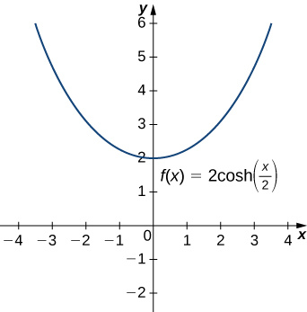
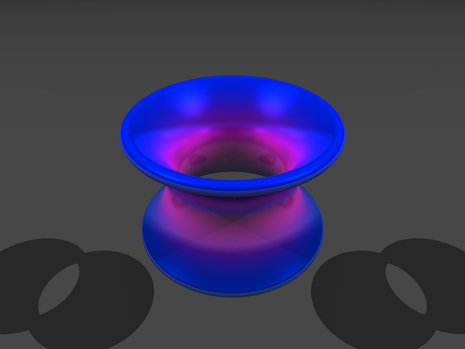

* Apply the formulas for derivatives and integrals of the hyperbolic functions.
* Apply the formulas for the derivatives of the inverse hyperbolic functions and their associated integrals.
* Describe the common applied conditions of a catenary curve.

We were introduced to hyperbolic functions in [Introduction to Functions and Graphs](/m53472){: .target-chapter}, along with some of their basic properties. In this section, we look at differentiation and integration formulas for the hyperbolic functions and their inverses.

### Derivatives and Integrals of the Hyperbolic Functions

Recall that the hyperbolic sine and hyperbolic cosine are defined as

<math xmlns="http://www.w3.org/1998/Math/MathML"><mrow><mtext>sinh</mtext><mspace width="0.2em" /><mi>x</mi><mo>=</mo><mfrac><mrow><msup><mi>e</mi><mi>x</mi></msup><mo>−</mo><msup><mi>e</mi><mrow><mtext>−</mtext><mi>x</mi></mrow></msup></mrow><mn>2</mn></mfrac><mspace width="0.2em" /><mtext>and</mtext><mspace width="0.2em" /><mtext>cosh</mtext><mspace width="0.2em" /><mi>x</mi><mo>=</mo><mfrac><mrow><msup><mi>e</mi><mi>x</mi></msup><mo>+</mo><msup><mi>e</mi><mrow><mtext>−</mtext><mi>x</mi></mrow></msup></mrow><mn>2</mn></mfrac><mo>.</mo></mrow></math>

The other hyperbolic functions are then defined in terms of <math xmlns="http://www.w3.org/1998/Math/MathML"><mrow><mtext>sinh</mtext><mspace width="0.2em" /><mi>x</mi></mrow></math>

 and <math xmlns="http://www.w3.org/1998/Math/MathML"><mrow><mtext>cosh</mtext><mspace width="0.2em" /><mi>x</mi><mo>.</mo></mrow></math>

 The graphs of the hyperbolic functions are shown in the following figure.

 ![This figure has six graphs. The first graph labeled &#x201C;a&#x201D; is of the function y=sinh(x). It is an increasing function from the 3rd quadrant, through the origin to the first quadrant. The second graph is labeled &#x201C;b&#x201D; and is of the function y=cosh(x). It decreases in the second quadrant to the intercept y=1, then becomes an increasing function. The third graph labeled &#x201C;c&#x201D; is of the function y=tanh(x). It is an increasing function from the third quadrant, through the origin, to the first quadrant. The fourth graph is labeled &#x201C;d&#x201D; and is of the function y=coth(x). It has two pieces, one in the third quadrant and one in the first quadrant with a vertical asymptote at the y-axis. The fifth graph is labeled &#x201C;e&#x201D; and is of the function y=sech(x). It is a curve above the x-axis, increasing in the second quadrant, to the y-axis at y=1 and then decreases. The sixth graph is labeled &#x201C;f&#x201D; and is of the function y=csch(x). It has two pieces, one in the third quadrant and one in the first quadrant with a vertical asymptote at the y-axis.](../resources/CNX_Calc_Figure_06_09_001.jpg "Graphs of the hyperbolic functions."){: #CNX_Calc_Figure_06_09_001}

It is easy to develop differentiation formulas for the hyperbolic functions. For example, looking at <math xmlns="http://www.w3.org/1998/Math/MathML"><mrow><mtext>sinh</mtext><mspace width="0.2em" /><mi>x</mi></mrow></math>

 we have

<math xmlns="http://www.w3.org/1998/Math/MathML"><mtable><mtr><mtd columnalign="right"><mfrac><mi>d</mi><mrow><mi>d</mi><mi>x</mi></mrow></mfrac><mrow><mo>(</mo><mrow><mtext>sinh</mtext><mspace width="0.2em" /><mi>x</mi></mrow><mo>)</mo></mrow></mtd><mtd columnalign="left"><mo>=</mo><mfrac><mi>d</mi><mrow><mi>d</mi><mi>x</mi></mrow></mfrac><mrow><mo>(</mo><mrow><mfrac><mrow><msup><mi>e</mi><mi>x</mi></msup><mo>−</mo><msup><mi>e</mi><mrow><mtext>−</mtext><mi>x</mi></mrow></msup></mrow><mn>2</mn></mfrac></mrow><mo>)</mo></mrow></mtd></mtr><mtr><mtd /><mtd columnalign="left"><mo>=</mo><mfrac><mn>1</mn><mn>2</mn></mfrac><mrow><mo>[</mo><mrow><mfrac><mi>d</mi><mrow><mi>d</mi><mi>x</mi></mrow></mfrac><mrow><mo>(</mo><mrow><msup><mi>e</mi><mi>x</mi></msup></mrow><mo>)</mo></mrow><mo>−</mo><mfrac><mi>d</mi><mrow><mi>d</mi><mi>x</mi></mrow></mfrac><mrow><mo>(</mo><mrow><msup><mi>e</mi><mrow><mtext>−</mtext><mi>x</mi></mrow></msup></mrow><mo>)</mo></mrow></mrow><mo>]</mo></mrow></mtd></mtr><mtr><mtd /><mtd columnalign="left"><mo>=</mo><mfrac><mn>1</mn><mn>2</mn></mfrac><mrow><mo>[</mo><mrow><msup><mi>e</mi><mi>x</mi></msup><mo>+</mo><msup><mi>e</mi><mrow><mtext>−</mtext><mi>x</mi></mrow></msup></mrow><mo>]</mo></mrow><mo>=</mo><mtext>cosh</mtext><mspace width="0.2em" /><mi>x</mi><mo>.</mo></mtd></mtr></mtable></math>

Similarly, <math xmlns="http://www.w3.org/1998/Math/MathML"><mrow><mrow><mo>(</mo><mrow><mrow><mi>d</mi><mtext>/</mtext><mrow><mi>d</mi><mi>x</mi></mrow></mrow></mrow><mo>)</mo></mrow><mtext>cosh</mtext><mspace width="0.2em" /><mi>x</mi><mo>=</mo><mtext>sinh</mtext><mspace width="0.2em" /><mi>x</mi><mo>.</mo></mrow></math>

 We summarize the differentiation formulas for the hyperbolic functions in the following table.

<table summary="This is a table of two columns. The first column is labeled f(x). Its entries are the hyperbolic trigonometric functions. The second column is labeled d/dx f(x) and is the corresponding derivatives of the hyperbolic trigonometric functions."><caption>Derivatives of the Hyperbolic Functions</caption><thead>
<tr valign="top">
<th data-valign="bottom" data-align="left"><math xmlns="http://www.w3.org/1998/Math/MathML"><mrow><mi>f</mi><mo stretchy="false">(</mo><mi>x</mi><mo stretchy="false">)</mo></mrow></math></th>
<th data-valign="middle" data-align="left"><math xmlns="http://www.w3.org/1998/Math/MathML"><mrow><mfrac><mi>d</mi><mrow><mi>d</mi><mi>x</mi></mrow></mfrac><mi>f</mi><mo stretchy="false">(</mo><mi>x</mi><mo stretchy="false">)</mo></mrow></math></th>
</tr>
</thead><tbody>
<tr valign="top">
<td data-valign="bottom" data-align="left"><math xmlns="http://www.w3.org/1998/Math/MathML"><mrow><mtext>sinh</mtext><mspace width="0.2em" /><mi>x</mi></mrow></math></td>
<td data-valign="bottom" data-align="left"><math xmlns="http://www.w3.org/1998/Math/MathML"><mrow><mtext>cosh</mtext><mspace width="0.2em" /><mi>x</mi></mrow></math></td>
</tr>
<tr valign="top">
<td data-valign="bottom" data-align="left"><math xmlns="http://www.w3.org/1998/Math/MathML"><mrow><mtext>cosh</mtext><mspace width="0.2em" /><mi>x</mi></mrow></math></td>
<td data-valign="bottom" data-align="left"><math xmlns="http://www.w3.org/1998/Math/MathML"><mrow><mtext>sinh</mtext><mspace width="0.2em" /><mi>x</mi></mrow></math></td>
</tr>
<tr valign="top">
<td data-valign="bottom" data-align="left"><math xmlns="http://www.w3.org/1998/Math/MathML"><mrow><mtext>tanh</mtext><mspace width="0.2em" /><mi>x</mi></mrow></math></td>
<td data-valign="bottom" data-align="left"><math xmlns="http://www.w3.org/1998/Math/MathML"><mrow><msup><mrow><mtext>sech</mtext></mrow><mn>2</mn></msup><mspace width="0.2em" /><mi>x</mi></mrow></math></td>
</tr>
<tr valign="top">
<td data-valign="bottom" data-align="left"><math xmlns="http://www.w3.org/1998/Math/MathML"><mrow><mtext>coth</mtext><mspace width="0.2em" /><mi>x</mi></mrow></math></td>
<td data-valign="bottom" data-align="left"><math xmlns="http://www.w3.org/1998/Math/MathML"><mrow><mtext>−</mtext><msup><mrow><mtext>csch</mtext></mrow><mn>2</mn></msup><mspace width="0.2em" /><mi>x</mi></mrow></math></td>
</tr>
<tr valign="top">
<td data-valign="bottom" data-align="left"><math xmlns="http://www.w3.org/1998/Math/MathML"><mrow><mtext>sech</mtext><mspace width="0.2em" /><mi>x</mi></mrow></math></td>
<td data-valign="bottom" data-align="left"><math xmlns="http://www.w3.org/1998/Math/MathML"><mrow><mtext>−</mtext><mtext>sech</mtext><mspace width="0.2em" /><mi>x</mi><mspace width="0.2em" /><mtext>tanh</mtext><mspace width="0.2em" /><mi>x</mi></mrow></math></td>
</tr>
<tr valign="top">
<td data-valign="bottom" data-align="left"><math xmlns="http://www.w3.org/1998/Math/MathML"><mrow><mtext>csch</mtext><mspace width="0.2em" /><mi>x</mi></mrow></math></td>
<td data-valign="bottom" data-align="left"><math xmlns="http://www.w3.org/1998/Math/MathML"><mrow><mtext>−</mtext><mtext>csch</mtext><mspace width="0.2em" /><mi>x</mi><mspace width="0.2em" /><mtext>coth</mtext><mspace width="0.2em" /><mi>x</mi></mrow></math></td>
</tr>
</tbody></table>

Let’s take a moment to compare the derivatives of the hyperbolic functions with the derivatives of the standard trigonometric functions. There are a lot of similarities, but differences as well. For example, the derivatives of the sine functions match: <math xmlns="http://www.w3.org/1998/Math/MathML"><mrow><mrow><mo>(</mo><mrow><mrow><mi>d</mi><mtext>/</mtext><mrow><mi>d</mi><mi>x</mi></mrow></mrow></mrow><mo>)</mo></mrow><mtext>sin</mtext><mspace width="0.2em" /><mi>x</mi><mo>=</mo><mtext>cos</mtext><mspace width="0.2em" /><mi>x</mi></mrow></math>

 and <math xmlns="http://www.w3.org/1998/Math/MathML"><mrow><mrow><mo>(</mo><mrow><mrow><mi>d</mi><mtext>/</mtext><mrow><mi>d</mi><mi>x</mi></mrow></mrow></mrow><mo>)</mo></mrow><mtext>sinh</mtext><mspace width="0.2em" /><mi>x</mi><mo>=</mo><mtext>cosh</mtext><mspace width="0.2em" /><mi>x</mi><mo>.</mo></mrow></math>

 The derivatives of the cosine functions, however, differ in sign: <math xmlns="http://www.w3.org/1998/Math/MathML"><mrow><mrow><mo>(</mo><mrow><mrow><mi>d</mi><mtext>/</mtext><mrow><mi>d</mi><mi>x</mi></mrow></mrow></mrow><mo>)</mo></mrow><mtext>cos</mtext><mspace width="0.2em" /><mi>x</mi><mo>=</mo><mtext>−</mtext><mtext>sin</mtext><mspace width="0.2em" /><mi>x</mi><mo>,</mo></mrow></math>

 but <math xmlns="http://www.w3.org/1998/Math/MathML"><mrow><mrow><mo>(</mo><mrow><mrow><mi>d</mi><mtext>/</mtext><mrow><mi>d</mi><mi>x</mi></mrow></mrow></mrow><mo>)</mo></mrow><mtext>cosh</mtext><mspace width="0.2em" /><mi>x</mi><mo>=</mo><mtext>sinh</mtext><mspace width="0.2em" /><mi>x</mi><mo>.</mo></mrow></math>

 As we continue our examination of the hyperbolic functions, we must be mindful of their similarities and differences to the standard trigonometric functions.

These differentiation formulas for the hyperbolic functions lead directly to the following integral formulas.

<math xmlns="http://www.w3.org/1998/Math/MathML"><mrow><mtable><mtr><mtd columnalign="right"><mstyle displaystyle="true"><mrow><mo stretchy="false">∫</mo><mrow><mtext>sinh</mtext><mspace width="0.2em" /><mi>u</mi><mspace width="0.2em" /><mi>d</mi></mrow></mrow></mstyle><mi>u</mi></mtd><mtd columnalign="left"><mo>=</mo></mtd><mtd columnalign="left"><mtext>cosh</mtext><mspace width="0.2em" /><mi>u</mi><mo>+</mo><mi>C</mi></mtd><mtd /><mtd /><mtd columnalign="right"><mstyle displaystyle="true"><mrow><mo stretchy="false">∫</mo><mrow><msup><mrow><mtext>csch</mtext></mrow><mn>2</mn></msup><mspace width="0.2em" /><mi>u</mi><mspace width="0.2em" /><mi>d</mi></mrow></mrow></mstyle><mi>u</mi></mtd><mtd columnalign="left"><mo>=</mo></mtd><mtd columnalign="left"><mtext>−</mtext><mtext>coth</mtext><mspace width="0.2em" /><mi>u</mi><mo>+</mo><mi>C</mi></mtd></mtr><mtr><mtd columnalign="right"><mstyle displaystyle="true"><mrow><mo stretchy="false">∫</mo><mrow><mtext>cosh</mtext><mspace width="0.2em" /><mi>u</mi><mspace width="0.2em" /><mi>d</mi></mrow></mrow></mstyle><mi>u</mi></mtd><mtd columnalign="left"><mo>=</mo></mtd><mtd columnalign="left"><mtext>sinh</mtext><mspace width="0.2em" /><mi>u</mi><mo>+</mo><mi>C</mi></mtd><mtd /><mtd /><mtd columnalign="right"><mstyle displaystyle="true"><mrow><mo stretchy="false">∫</mo><mrow><mtext>sech</mtext><mspace width="0.2em" /><mi>u</mi><mspace width="0.2em" /><mtext>tanh</mtext><mspace width="0.2em" /><mi>u</mi><mspace width="0.2em" /><mi>d</mi></mrow></mrow></mstyle><mi>u</mi></mtd><mtd columnalign="left"><mo>=</mo></mtd><mtd columnalign="left"><mtext>−</mtext><mtext>sech</mtext><mspace width="0.2em" /><mi>u</mi><mo>+</mo><mi>C</mi></mtd></mtr><mtr><mtd columnalign="right"><mstyle displaystyle="true"><mrow><mo stretchy="false">∫</mo><mrow><msup><mrow><mtext>sech</mtext></mrow><mn>2</mn></msup><mi>u</mi><mspace width="0.2em" /><mi>d</mi></mrow></mrow></mstyle><mi>u</mi></mtd><mtd columnalign="left"><mo>=</mo></mtd><mtd columnalign="left"><mtext>tanh</mtext><mspace width="0.2em" /><mi>u</mi><mo>+</mo><mi>C</mi></mtd><mtd /><mtd /><mtd columnalign="right"><mstyle displaystyle="true"><mrow><mo stretchy="false">∫</mo><mrow><mtext>csch</mtext><mspace width="0.2em" /><mi>u</mi><mspace width="0.2em" /><mtext>coth</mtext><mspace width="0.2em" /><mi>u</mi><mspace width="0.2em" /><mi>d</mi></mrow></mrow></mstyle><mi>u</mi></mtd><mtd columnalign="left"><mo>=</mo></mtd><mtd columnalign="left"><mtext>−</mtext><mtext>csch</mtext><mspace width="0.2em" /><mi>u</mi><mo>+</mo><mi>C</mi></mtd></mtr></mtable></mrow></math>

Differentiating Hyperbolic Functions

Evaluate the following derivatives:

1.  <math xmlns="http://www.w3.org/1998/Math/MathML"><mrow><mfrac><mi>d</mi><mrow><mi>d</mi><mi>x</mi></mrow></mfrac><mrow><mo>(</mo><mrow><mtext>sinh</mtext><mrow><mo>(</mo><mrow><msup><mi>x</mi><mn>2</mn></msup></mrow><mo>)</mo></mrow></mrow><mo>)</mo></mrow></mrow></math>

2.  <math xmlns="http://www.w3.org/1998/Math/MathML"><mrow><mfrac><mi>d</mi><mrow><mi>d</mi><mi>x</mi></mrow></mfrac><msup><mrow><mrow><mo>(</mo><mrow><mtext>cosh</mtext><mspace width="0.2em" /><mi>x</mi></mrow><mo>)</mo></mrow></mrow><mn>2</mn></msup></mrow></math>
{: data-number-style="lower-alpha"}

Using the formulas in [[link]](#fs-id1167793363804) and the chain rule, we get

1.  <math xmlns="http://www.w3.org/1998/Math/MathML"><mrow><mfrac><mi>d</mi><mrow><mi>d</mi><mi>x</mi></mrow></mfrac><mrow><mo>(</mo><mrow><mtext>sinh</mtext><mrow><mo>(</mo><mrow><msup><mi>x</mi><mn>2</mn></msup></mrow><mo>)</mo></mrow></mrow><mo>)</mo></mrow><mo>=</mo><mtext>cosh</mtext><mrow><mo>(</mo><mrow><msup><mi>x</mi><mn>2</mn></msup></mrow><mo>)</mo></mrow><mo>·</mo><mn>2</mn><mi>x</mi></mrow></math>

2.  <math xmlns="http://www.w3.org/1998/Math/MathML"><mrow><mfrac><mi>d</mi><mrow><mi>d</mi><mi>x</mi></mrow></mfrac><msup><mrow><mrow><mo>(</mo><mrow><mtext>cosh</mtext><mspace width="0.2em" /><mi>x</mi></mrow><mo>)</mo></mrow></mrow><mn>2</mn></msup><mo>=</mo><mn>2</mn><mspace width="0.2em" /><mtext>cosh</mtext><mspace width="0.2em" /><mi>x</mi><mspace width="0.2em" /><mtext>sinh</mtext><mspace width="0.2em" /><mi>x</mi></mrow></math>
{: data-number-style="lower-alpha"}

Evaluate the following derivatives:

1.  <math xmlns="http://www.w3.org/1998/Math/MathML"><mrow><mfrac><mi>d</mi><mrow><mi>d</mi><mi>x</mi></mrow></mfrac><mrow><mo>(</mo><mrow><mtext>tanh</mtext><mrow><mo>(</mo><mrow><msup><mi>x</mi><mn>2</mn></msup><mo>+</mo><mn>3</mn><mi>x</mi></mrow><mo>)</mo></mrow></mrow><mo>)</mo></mrow></mrow></math>

2.  <math xmlns="http://www.w3.org/1998/Math/MathML"><mrow><mfrac><mi>d</mi><mrow><mi>d</mi><mi>x</mi></mrow></mfrac><mrow><mo>(</mo><mrow><mfrac><mn>1</mn><mrow><msup><mrow><mrow><mo>(</mo><mrow><mtext>sinh</mtext><mspace width="0.2em" /><mi>x</mi></mrow><mo>)</mo></mrow></mrow><mn>2</mn></msup></mrow></mfrac></mrow><mo>)</mo></mrow></mrow></math>
{: data-number-style="lower-alpha"}

1.  <math xmlns="http://www.w3.org/1998/Math/MathML"><mrow><mfrac><mi>d</mi><mrow><mi>d</mi><mi>x</mi></mrow></mfrac><mrow><mo>(</mo><mrow><mtext>tanh</mtext><mrow><mo>(</mo><mrow><msup><mi>x</mi><mn>2</mn></msup><mo>+</mo><mn>3</mn><mi>x</mi></mrow><mo>)</mo></mrow></mrow><mo>)</mo></mrow><mo>=</mo><mrow><mo>(</mo><mrow><msup><mrow><mtext>sech</mtext></mrow><mn>2</mn></msup><mrow><mo>(</mo><mrow><msup><mi>x</mi><mn>2</mn></msup><mo>+</mo><mn>3</mn><mi>x</mi></mrow><mo>)</mo></mrow></mrow><mo>)</mo></mrow><mrow><mo>(</mo><mrow><mn>2</mn><mi>x</mi><mo>+</mo><mn>3</mn></mrow><mo>)</mo></mrow></mrow></math>

2.  <math xmlns="http://www.w3.org/1998/Math/MathML"><mrow><mfrac><mi>d</mi><mrow><mi>d</mi><mi>x</mi></mrow></mfrac><mrow><mo>(</mo><mrow><mfrac><mn>1</mn><mrow><msup><mrow><mrow><mo>(</mo><mrow><mtext>sinh</mtext><mspace width="0.2em" /><mi>x</mi></mrow><mo>)</mo></mrow></mrow><mn>2</mn></msup></mrow></mfrac></mrow><mo>)</mo></mrow><mo>=</mo><mfrac><mi>d</mi><mrow><mi>d</mi><mi>x</mi></mrow></mfrac><msup><mrow><mrow><mo>(</mo><mrow><mtext>sinh</mtext><mspace width="0.2em" /><mi>x</mi></mrow><mo>)</mo></mrow></mrow><mrow><mn>−2</mn></mrow></msup><mo>=</mo><mn>−2</mn><msup><mrow><mrow><mo>(</mo><mrow><mtext>sinh</mtext><mspace width="0.2em" /><mi>x</mi></mrow><mo>)</mo></mrow></mrow><mrow><mn>−3</mn></mrow></msup><mtext>cosh</mtext><mspace width="0.2em" /><mi>x</mi></mrow></math>
{: data-number-style="lower-alpha"}

Hint

Use the formulas in [[link]](#fs-id1167793363804) and apply the chain rule as necessary.

Integrals Involving Hyperbolic Functions

Evaluate the following integrals:

1.  <math xmlns="http://www.w3.org/1998/Math/MathML"><mrow><mstyle displaystyle="true"><mrow><mo stretchy="false">∫</mo><mrow><mi>x</mi><mspace width="0.2em" /><mtext>cosh</mtext><mrow><mo>(</mo><mrow><msup><mi>x</mi><mn>2</mn></msup></mrow><mo>)</mo></mrow><mi>d</mi></mrow></mrow></mstyle><mi>x</mi></mrow></math>

2.  <math xmlns="http://www.w3.org/1998/Math/MathML"><mrow><mstyle displaystyle="true"><mrow><mo stretchy="false">∫</mo><mrow><mtext>tanh</mtext><mspace width="0.2em" /><mi>x</mi><mspace width="0.2em" /><mi>d</mi></mrow></mrow></mstyle><mi>x</mi></mrow></math>
{: data-number-style="lower-alpha"}

We can use *u*-substitution in both cases.

1.  Let
    <math xmlns="http://www.w3.org/1998/Math/MathML"><mrow><mi>u</mi><mo>=</mo><msup><mi>x</mi><mn>2</mn></msup><mo>.</mo></mrow></math>
    
    Then,
    <math xmlns="http://www.w3.org/1998/Math/MathML"><mrow><mi>d</mi><mi>u</mi><mo>=</mo><mn>2</mn><mi>x</mi><mspace width="0.2em" /><mi>d</mi><mi>x</mi></mrow></math>
    
    and
    * * *
    {: data-type="newline"}
    
    

    <math xmlns="http://www.w3.org/1998/Math/MathML"><mrow><mstyle displaystyle="true"><mrow><mo stretchy="false">∫</mo><mrow><mi>x</mi><mspace width="0.2em" /><mtext>cosh</mtext><mrow><mo>(</mo><mrow><msup><mi>x</mi><mn>2</mn></msup></mrow><mo>)</mo></mrow><mi>d</mi></mrow></mrow></mstyle><mi>x</mi><mo>=</mo><mstyle displaystyle="true"><mrow><mo stretchy="false">∫</mo><mrow><mfrac><mn>1</mn><mn>2</mn></mfrac></mrow></mrow></mstyle><mtext>cosh</mtext><mspace width="0.2em" /><mi>u</mi><mspace width="0.2em" /><mi>d</mi><mi>u</mi><mo>=</mo><mfrac><mn>1</mn><mn>2</mn></mfrac><mtext>sinh</mtext><mspace width="0.2em" /><mi>u</mi><mo>+</mo><mi>C</mi><mo>=</mo><mfrac><mn>1</mn><mn>2</mn></mfrac><mtext>sinh</mtext><mrow><mo>(</mo><mrow><msup><mi>x</mi><mn>2</mn></msup></mrow><mo>)</mo></mrow><mo>+</mo><mi>C</mi><mo>.</mo></mrow></math>
    

2.  Let
    <math xmlns="http://www.w3.org/1998/Math/MathML"><mrow><mi>u</mi><mo>=</mo><mtext>cosh</mtext><mspace width="0.2em" /><mi>x</mi><mo>.</mo></mrow></math>
    
    Then,
    <math xmlns="http://www.w3.org/1998/Math/MathML"><mrow><mi>d</mi><mi>u</mi><mo>=</mo><mtext>sinh</mtext><mspace width="0.2em" /><mi>x</mi><mspace width="0.2em" /><mi>d</mi><mi>x</mi></mrow></math>
    
    and
    * * *
    {: data-type="newline"}
    
    

    <math xmlns="http://www.w3.org/1998/Math/MathML"><mrow><mstyle displaystyle="true"><mrow><mo stretchy="false">∫</mo><mrow><mtext>tanh</mtext><mspace width="0.2em" /><mi>x</mi><mspace width="0.2em" /><mi>d</mi></mrow></mrow></mstyle><mi>x</mi><mo>=</mo><mstyle displaystyle="true"><mrow><mo stretchy="false">∫</mo><mrow><mfrac><mrow><mtext>sinh</mtext><mspace width="0.2em" /><mi>x</mi></mrow><mrow><mtext>cosh</mtext><mspace width="0.2em" /><mi>x</mi></mrow></mfrac><mi>d</mi></mrow></mrow></mstyle><mi>x</mi><mo>=</mo><mstyle displaystyle="true"><mrow><mo stretchy="false">∫</mo><mrow><mfrac><mn>1</mn><mi>u</mi></mfrac><mi>d</mi></mrow></mrow></mstyle><mi>u</mi><mo>=</mo><mtext>ln</mtext><mrow><mo>\|</mo><mi>u</mi><mo>\|</mo></mrow><mo>+</mo><mi>C</mi><mo>=</mo><mtext>ln</mtext><mrow><mo>\|</mo><mrow><mtext>cosh</mtext><mspace width="0.2em" /><mi>x</mi></mrow><mo>\|</mo></mrow><mo>+</mo><mi>C</mi><mo>.</mo></mrow></math>
    

    
    * * *
    {: data-type="newline"}
    
    Note that
    <math xmlns="http://www.w3.org/1998/Math/MathML"><mrow><mtext>cosh</mtext><mspace width="0.2em" /><mi>x</mi><mo>&gt;</mo><mn>0</mn></mrow></math>
    
    for all
    <math xmlns="http://www.w3.org/1998/Math/MathML"><mrow><mi>x</mi><mo>,</mo></mrow></math>
    
    so we can eliminate the absolute value signs and obtain
    * * *
    {: data-type="newline"}
    
    

    <math xmlns="http://www.w3.org/1998/Math/MathML"><mrow><mstyle displaystyle="true"><mrow><mo stretchy="false">∫</mo><mrow><mtext>tanh</mtext><mspace width="0.2em" /><mi>x</mi><mspace width="0.2em" /><mi>d</mi></mrow></mrow></mstyle><mi>x</mi><mo>=</mo><mtext>ln</mtext><mrow><mo>(</mo><mrow><mtext>cosh</mtext><mspace width="0.2em" /><mi>x</mi></mrow><mo>)</mo></mrow><mo>+</mo><mi>C</mi><mo>.</mo></mrow></math>
    

{: data-number-style="lower-alpha"}

Evaluate the following integrals:

1.  <math xmlns="http://www.w3.org/1998/Math/MathML"><mrow><mstyle displaystyle="true"><mrow><mo stretchy="false">∫</mo><mrow><msup><mrow><mtext>sinh</mtext></mrow><mn>3</mn></msup><mi>x</mi><mspace width="0.2em" /><mtext>cosh</mtext><mspace width="0.2em" /><mi>x</mi><mspace width="0.2em" /><mi>d</mi></mrow></mrow></mstyle><mi>x</mi></mrow></math>

2.  <math xmlns="http://www.w3.org/1998/Math/MathML"><mrow><mstyle displaystyle="true"><mrow><mo stretchy="false">∫</mo><mrow><msup><mrow><mtext>sech</mtext></mrow><mn>2</mn></msup><mrow><mo>(</mo><mrow><mn>3</mn><mi>x</mi></mrow><mo>)</mo></mrow><mi>d</mi></mrow></mrow></mstyle><mi>x</mi></mrow></math>
{: data-number-style="lower-alpha"}

1.  <math xmlns="http://www.w3.org/1998/Math/MathML"><mrow><mstyle displaystyle="true"><mrow><mo stretchy="false">∫</mo><mrow><msup><mrow><mtext>sinh</mtext></mrow><mn>3</mn></msup><mi>x</mi><mspace width="0.2em" /><mtext>cosh</mtext><mspace width="0.2em" /><mi>x</mi><mspace width="0.2em" /><mi>d</mi></mrow></mrow></mstyle><mi>x</mi><mo>=</mo><mfrac><mrow><msup><mrow><mtext>sinh</mtext></mrow><mn>4</mn></msup><mi>x</mi></mrow><mn>4</mn></mfrac><mo>+</mo><mi>C</mi></mrow></math>

2.  <math xmlns="http://www.w3.org/1998/Math/MathML"><mrow><mstyle displaystyle="true"><mrow><mo stretchy="false">∫</mo><mrow><msup><mrow><mtext>sech</mtext></mrow><mn>2</mn></msup><mrow><mo>(</mo><mrow><mn>3</mn><mi>x</mi></mrow><mo>)</mo></mrow><mi>d</mi></mrow></mrow></mstyle><mi>x</mi><mo>=</mo><mfrac><mrow><mtext>tanh</mtext><mrow><mo>(</mo><mrow><mn>3</mn><mi>x</mi></mrow><mo>)</mo></mrow></mrow><mn>3</mn></mfrac><mo>+</mo><mi>C</mi></mrow></math>
{: data-number-style="lower-alpha"}

Hint

Use the formulas above and apply *u*-substitution as necessary.

### Calculus of Inverse Hyperbolic Functions

Looking at the graphs of the hyperbolic functions, we see that with appropriate range restrictions, they all have inverses. Most of the necessary range restrictions can be discerned by close examination of the graphs. The domains and ranges of the inverse hyperbolic functions are summarized in the following table.

<table summary="This table has three columns. The first column is labeled function and has the inverse hyperbolic functions listed in the column. The second column is labeled domain and has the domains of the inverse hyperbolic functions. The third column is labeled range and has the ranges of the inverse hyperbolic functions."><caption>Domains and Ranges of the Inverse Hyperbolic Functions</caption><thead>
<tr valign="top">
<th data-align="left">Function</th>
<th data-align="left">Domain</th>
<th data-align="left">Range</th>
</tr>
</thead><tbody>
<tr valign="top">
<td data-valign="bottom" data-align="left"><math xmlns="http://www.w3.org/1998/Math/MathML"><mrow><msup><mrow><mtext>sinh</mtext></mrow><mrow><mn>−1</mn></mrow></msup><mi>x</mi></mrow></math></td>
<td data-valign="middle" data-align="left"><math xmlns="http://www.w3.org/1998/Math/MathML"><mrow><mrow><mo>(</mo><mrow><mtext>−</mtext><mi>∞</mi><mo>,</mo><mi>∞</mi></mrow><mo>)</mo></mrow></mrow></math></td>
<td data-valign="middle" data-align="left"><math xmlns="http://www.w3.org/1998/Math/MathML"><mrow><mrow><mo>(</mo><mrow><mtext>−</mtext><mi>∞</mi><mo>,</mo><mi>∞</mi></mrow><mo>)</mo></mrow></mrow></math></td>
</tr>
<tr valign="top">
<td data-valign="bottom" data-align="left"><math xmlns="http://www.w3.org/1998/Math/MathML"><mrow><msup><mrow><mtext>cosh</mtext></mrow><mrow><mn>−1</mn></mrow></msup><mi>x</mi></mrow></math></td>
<td data-valign="middle" data-align="left"><math xmlns="http://www.w3.org/1998/Math/MathML"><mrow><mrow><mo>(</mo><mrow><mn>1</mn><mo>,</mo><mi>∞</mi></mrow><mo>)</mo></mrow></mrow></math></td>
<td data-valign="middle" data-align="left"><math xmlns="http://www.w3.org/1998/Math/MathML"><mrow><mrow><mo>[</mo><mrow><mrow><mrow><mn>0</mn><mo>,</mo><mi>∞</mi></mrow><mo>)</mo></mrow></mrow></mrow></mrow></math></td>
</tr>
<tr valign="top">
<td data-valign="bottom" data-align="left"><math xmlns="http://www.w3.org/1998/Math/MathML"><mrow><msup><mrow><mtext>tanh</mtext></mrow><mrow><mn>−1</mn></mrow></msup><mi>x</mi></mrow></math></td>
<td data-valign="middle" data-align="left"><math xmlns="http://www.w3.org/1998/Math/MathML"><mrow><mrow><mo>(</mo><mrow><mn>−1</mn><mo>,</mo><mn>1</mn></mrow><mo>)</mo></mrow></mrow></math></td>
<td data-valign="middle" data-align="left"><math xmlns="http://www.w3.org/1998/Math/MathML"><mrow><mrow><mo>(</mo><mrow><mtext>−</mtext><mi>∞</mi><mo>,</mo><mi>∞</mi></mrow><mo>)</mo></mrow></mrow></math></td>
</tr>
<tr valign="top">
<td data-valign="bottom" data-align="left"><math xmlns="http://www.w3.org/1998/Math/MathML"><mrow><msup><mrow><mtext>coth</mtext></mrow><mrow><mn>−1</mn></mrow></msup><mi>x</mi></mrow></math></td>
<td data-valign="middle" data-align="left"><math xmlns="http://www.w3.org/1998/Math/MathML"><mrow><mrow><mo>(</mo><mrow><mtext>−</mtext><mi>∞</mi><mo>,</mo><mn>−1</mn></mrow><mo>)</mo></mrow><mo>∪</mo><mrow><mo>(</mo><mrow><mn>1</mn><mo>,</mo><mi>∞</mi></mrow><mo>)</mo></mrow></mrow></math></td>
<td data-valign="middle" data-align="left"><math xmlns="http://www.w3.org/1998/Math/MathML"><mrow><mrow><mo>(</mo><mrow><mtext>−</mtext><mi>∞</mi><mo>,</mo><mn>0</mn></mrow><mo>)</mo></mrow><mo>∪</mo><mrow><mo>(</mo><mrow><mn>0</mn><mo>,</mo><mi>∞</mi></mrow><mo>)</mo></mrow></mrow></math></td>
</tr>
<tr valign="top">
<td data-valign="bottom" data-align="left"><math xmlns="http://www.w3.org/1998/Math/MathML"><mrow><msup><mrow><mtext>sech</mtext></mrow><mrow><mn>−1</mn></mrow></msup><mi>x</mi></mrow></math></td>
<td data-valign="middle" data-align="left"><math xmlns="http://www.w3.org/1998/Math/MathML"><mrow><mrow><mo>(</mo><mrow><mn>0</mn><mtext>, 1</mtext></mrow><mo>)</mo></mrow></mrow></math></td>
<td data-valign="middle" data-align="left"><math xmlns="http://www.w3.org/1998/Math/MathML"><mrow><mrow><mo>[</mo><mrow><mrow><mrow><mn>0</mn><mo>,</mo><mi>∞</mi></mrow><mo>)</mo></mrow></mrow></mrow></mrow></math></td>
</tr>
<tr valign="top">
<td data-valign="bottom" data-align="left"><math xmlns="http://www.w3.org/1998/Math/MathML"><mrow><msup><mrow><mtext>csch</mtext></mrow><mrow><mn>−1</mn></mrow></msup><mi>x</mi></mrow></math></td>
<td data-valign="middle" data-align="left"><math xmlns="http://www.w3.org/1998/Math/MathML"><mrow><mrow><mo>(</mo><mrow><mtext>−</mtext><mi>∞</mi><mo>,</mo><mn>0</mn></mrow><mo>)</mo></mrow><mo>∪</mo><mrow><mo>(</mo><mrow><mn>0</mn><mo>,</mo><mi>∞</mi></mrow><mo>)</mo></mrow></mrow></math></td>
<td data-valign="middle" data-align="left"><math xmlns="http://www.w3.org/1998/Math/MathML"><mrow><mrow><mo>(</mo><mrow><mtext>−</mtext><mi>∞</mi><mo>,</mo><mn>0</mn></mrow><mo>)</mo></mrow><mo>∪</mo><mrow><mo>(</mo><mrow><mn>0</mn><mo>,</mo><mi>∞</mi></mrow><mo>)</mo></mrow></mrow></math></td>
</tr>
</tbody></table>

The graphs of the inverse hyperbolic functions are shown in the following figure.

 ![This figure has six graphs. The first graph labeled &#x201C;a&#x201D; is of the function y=sinh^-1(x). It is an increasing function from the 3rd quadrant, through the origin to the first quadrant. The second graph is labeled &#x201C;b&#x201D; and is of the function y=cosh^-1(x). It is in the first quadrant, beginning on the x-axis at 2 and increasing. The third graph labeled &#x201C;c&#x201D; is of the function y=tanh^-1(x). It is an increasing function from the third quadrant, through the origin, to the first quadrant. The fourth graph is labeled &#x201C;d&#x201D; and is of the function y=coth^-1(x). It has two pieces, one in the third quadrant and one in the first quadrant with a vertical asymptote at the y-axis. The fifth graph is labeled &#x201C;e&#x201D; and is of the function y=sech^-1(x). It is a curve decreasing in the first quadrant and stopping on the x-axis at x=1. The sixth graph is labeled &#x201C;f&#x201D; and is of the function y=csch^-1(x). It has two pieces, one in the third quadrant and one in the first quadrant with a vertical asymptote at the y-axis.](../resources/CNX_Calc_Figure_06_09_002.jpg "Graphs of the inverse hyperbolic functions."){: #CNX_Calc_Figure_06_09_002}

To find the derivatives of the inverse functions, we use implicit differentiation. We have

<math xmlns="http://www.w3.org/1998/Math/MathML"><mtable><mtr><mtd columnalign="right"><mi>y</mi></mtd><mtd columnalign="left"><mo>=</mo></mtd><mtd columnalign="left"><msup><mtext>sinh</mtext><mrow><mn>−1</mn></mrow></msup><mspace width="0.2em" /><mi>x</mi></mtd></mtr><mtr><mtd columnalign="right"><mtext>sinh</mtext><mspace width="0.2em" /><mi>y</mi></mtd><mtd columnalign="left"><mo>=</mo></mtd><mtd columnalign="left"><mi>x</mi></mtd></mtr><mtr><mtd columnalign="right"><mfrac><mi>d</mi><mrow><mi>d</mi><mi>x</mi></mrow></mfrac><mtext>sinh</mtext><mspace width="0.2em" /><mi>y</mi></mtd><mtd columnalign="left"><mo>=</mo></mtd><mtd columnalign="left"><mfrac><mi>d</mi><mrow><mi>d</mi><mi>x</mi></mrow></mfrac><mi>x</mi></mtd></mtr><mtr><mtd columnalign="right"><mtext>cosh</mtext><mspace width="0.2em" /><mi>y</mi><mfrac><mrow><mi>d</mi><mi>y</mi></mrow><mrow><mi>d</mi><mi>x</mi></mrow></mfrac></mtd><mtd columnalign="left"><mo>=</mo></mtd><mtd columnalign="left"><mn>1</mn><mo>.</mo></mtd></mtr></mtable></math>

Recall that <math xmlns="http://www.w3.org/1998/Math/MathML"><mrow><msup><mrow><mtext>cosh</mtext></mrow><mn>2</mn></msup><mi>y</mi><mo>−</mo><msup><mrow><mtext>sinh</mtext></mrow><mn>2</mn></msup><mi>y</mi><mo>=</mo><mn>1</mn><mo>,</mo></mrow></math>

 so <math xmlns="http://www.w3.org/1998/Math/MathML"><mrow><mtext>cosh</mtext><mspace width="0.2em" /><mi>y</mi><mo>=</mo><msqrt><mrow><mn>1</mn><mo>+</mo><msup><mrow><mtext>sinh</mtext></mrow><mn>2</mn></msup><mi>y</mi></mrow></msqrt><mo>.</mo></mrow></math>

 Then,

<math xmlns="http://www.w3.org/1998/Math/MathML"><mrow><mfrac><mrow><mi>d</mi><mi>y</mi></mrow><mrow><mi>d</mi><mi>x</mi></mrow></mfrac><mo>=</mo><mfrac><mn>1</mn><mrow><mtext>cosh</mtext><mspace width="0.2em" /><mi>y</mi></mrow></mfrac><mo>=</mo><mfrac><mn>1</mn><mrow><msqrt><mrow><mn>1</mn><mo>+</mo><msup><mrow><mtext>sinh</mtext></mrow><mn>2</mn></msup><mi>y</mi></mrow></msqrt></mrow></mfrac><mo>=</mo><mfrac><mn>1</mn><mrow><msqrt><mrow><mn>1</mn><mo>+</mo><msup><mi>x</mi><mn>2</mn></msup></mrow></msqrt></mrow></mfrac><mo>.</mo></mrow></math>

We can derive differentiation formulas for the other inverse hyperbolic functions in a similar fashion. These differentiation formulas are summarized in the following table.

<table summary="This table has two columns. The first column is labeled f(x) and has the inverse hyperbolic functions as entries. The second column is labeled d/dx f(x) and is the derivatives of the inverse hyperbolic functions."><caption>Derivatives of the Inverse Hyperbolic Functions</caption><thead>
<tr valign="top">
<th data-valign="bottom" data-align="left"><math xmlns="http://www.w3.org/1998/Math/MathML"><mrow><mi>f</mi><mo stretchy="false">(</mo><mi>x</mi><mo stretchy="false">)</mo></mrow></math></th>
<th data-valign="middle" data-align="left"><math xmlns="http://www.w3.org/1998/Math/MathML"><mrow><mfrac><mi>d</mi><mrow><mi>d</mi><mi>x</mi></mrow></mfrac><mi>f</mi><mo stretchy="false">(</mo><mi>x</mi><mo stretchy="false">)</mo></mrow></math></th>
</tr>
</thead><tbody>
<tr valign="top">
<td data-valign="bottom" data-align="left"><math xmlns="http://www.w3.org/1998/Math/MathML"><mrow><msup><mrow><mtext>sinh</mtext></mrow><mrow><mn>−1</mn></mrow></msup><mi>x</mi></mrow></math></td>
<td data-valign="bottom" data-align="left"><math xmlns="http://www.w3.org/1998/Math/MathML"><mrow><mfrac><mn>1</mn><mrow><msqrt><mrow><mn>1</mn><mo>+</mo><msup><mi>x</mi><mn>2</mn></msup></mrow></msqrt></mrow></mfrac></mrow></math></td>
</tr>
<tr valign="top">
<td data-valign="bottom" data-align="left"><math xmlns="http://www.w3.org/1998/Math/MathML"><mrow><msup><mrow><mtext>cosh</mtext></mrow><mrow><mn>−1</mn></mrow></msup><mi>x</mi></mrow></math></td>
<td data-valign="bottom" data-align="left"><math xmlns="http://www.w3.org/1998/Math/MathML"><mrow><mfrac><mn>1</mn><mrow><msqrt><mrow><msup><mi>x</mi><mn>2</mn></msup><mo>−</mo><mn>1</mn></mrow></msqrt></mrow></mfrac></mrow></math></td>
</tr>
<tr valign="top">
<td data-valign="bottom" data-align="left"><math xmlns="http://www.w3.org/1998/Math/MathML"><mrow><msup><mrow><mtext>tanh</mtext></mrow><mrow><mn>−1</mn></mrow></msup><mi>x</mi></mrow></math></td>
<td data-valign="bottom" data-align="left"><math xmlns="http://www.w3.org/1998/Math/MathML"><mrow><mfrac><mn>1</mn><mrow><mn>1</mn><mo>−</mo><msup><mi>x</mi><mn>2</mn></msup></mrow></mfrac></mrow></math></td>
</tr>
<tr valign="top">
<td data-valign="bottom" data-align="left"><math xmlns="http://www.w3.org/1998/Math/MathML"><mrow><msup><mrow><mtext>coth</mtext></mrow><mrow><mn>−1</mn></mrow></msup><mi>x</mi></mrow></math></td>
<td data-valign="bottom" data-align="left"><math xmlns="http://www.w3.org/1998/Math/MathML"><mrow><mfrac><mn>1</mn><mrow><mn>1</mn><mo>−</mo><msup><mi>x</mi><mn>2</mn></msup></mrow></mfrac></mrow></math></td>
</tr>
<tr valign="top">
<td data-valign="bottom" data-align="left"><math xmlns="http://www.w3.org/1998/Math/MathML"><mrow><msup><mrow><mtext>sech</mtext></mrow><mrow><mn>−1</mn></mrow></msup><mi>x</mi></mrow></math></td>
<td data-valign="bottom" data-align="left"><math xmlns="http://www.w3.org/1998/Math/MathML"><mrow><mfrac><mrow><mn>−1</mn></mrow><mrow><mi>x</mi><msqrt><mrow><mn>1</mn><mo>−</mo><msup><mi>x</mi><mn>2</mn></msup></mrow></msqrt></mrow></mfrac></mrow></math></td>
</tr>
<tr valign="top">
<td data-valign="bottom" data-align="left"><math xmlns="http://www.w3.org/1998/Math/MathML"><mrow><msup><mrow><mtext>csch</mtext></mrow><mrow><mn>−1</mn></mrow></msup><mi>x</mi></mrow></math></td>
<td data-valign="bottom" data-align="left"><math xmlns="http://www.w3.org/1998/Math/MathML"><mrow><mfrac><mrow><mn>−1</mn></mrow><mrow><mrow><mo>\|</mo><mi>x</mi><mo>\|</mo></mrow><msqrt><mrow><mn>1</mn><mo>+</mo><msup><mi>x</mi><mn>2</mn></msup></mrow></msqrt></mrow></mfrac></mrow></math></td>
</tr>
</tbody></table>

Note that the derivatives of <math xmlns="http://www.w3.org/1998/Math/MathML"><mrow><msup><mrow><mtext>tanh</mtext></mrow><mrow><mn>−1</mn></mrow></msup><mspace width="0.2em" /><mi>x</mi></mrow></math>

 and <math xmlns="http://www.w3.org/1998/Math/MathML"><mrow><msup><mrow><mtext>coth</mtext></mrow><mrow><mn>−1</mn></mrow></msup><mspace width="0.2em" /><mi>x</mi></mrow></math>

 are the same. Thus, when we integrate <math xmlns="http://www.w3.org/1998/Math/MathML"><mrow><mrow><mn>1</mn><mtext>/</mtext><mrow><mrow><mo>(</mo><mrow><mn>1</mn><mo>−</mo><msup><mi>x</mi><mn>2</mn></msup></mrow><mo>)</mo></mrow></mrow></mrow><mo>,</mo></mrow></math>

 we need to select the proper antiderivative based on the domain of the functions and the values of <math xmlns="http://www.w3.org/1998/Math/MathML"><mrow><mi>x</mi><mo>.</mo></mrow></math>

 Integration formulas involving the inverse hyperbolic functions are summarized as follows.

<math xmlns="http://www.w3.org/1998/Math/MathML"><mtable><mtr><mtd columnalign="right"><mstyle displaystyle="true"><mrow><mo stretchy="false">∫</mo><mrow><mfrac><mn>1</mn><mrow><msqrt><mrow><mn>1</mn><mo>+</mo><msup><mi>u</mi><mn>2</mn></msup></mrow></msqrt></mrow></mfrac><mi>d</mi></mrow></mrow></mstyle><mi>u</mi></mtd><mtd columnalign="left"><mo>=</mo></mtd><mtd columnalign="left"><msup><mrow><mtext>sinh</mtext></mrow><mrow><mn>−1</mn></mrow></msup><mi>u</mi><mo>+</mo><mi>C</mi></mtd><mtd /><mtd /><mtd columnalign="right"><mstyle displaystyle="true"><mrow><mo stretchy="false">∫</mo><mrow><mfrac><mn>1</mn><mrow><mi>u</mi><msqrt><mrow><mn>1</mn><mo>−</mo><msup><mi>u</mi><mn>2</mn></msup></mrow></msqrt></mrow></mfrac></mrow></mrow></mstyle><mi>d</mi><mi>u</mi></mtd><mtd columnalign="left"><mo>=</mo></mtd><mtd columnalign="left"><mtext>−</mtext><msup><mrow><mtext>sech</mtext></mrow><mrow><mn>−1</mn></mrow></msup><mrow><mo>\|</mo><mi>u</mi><mo>\|</mo></mrow><mo>+</mo><mi>C</mi></mtd></mtr><mtr><mtd columnalign="right"><mstyle displaystyle="true"><mrow><mo stretchy="false">∫</mo><mrow><mfrac><mn>1</mn><mrow><msqrt><mrow><msup><mi>u</mi><mn>2</mn></msup><mo>−</mo><mn>1</mn></mrow></msqrt></mrow></mfrac></mrow></mrow></mstyle><mi>d</mi><mi>u</mi></mtd><mtd columnalign="left"><mo>=</mo></mtd><mtd columnalign="left"><msup><mrow><mtext>cosh</mtext></mrow><mrow><mn>−1</mn></mrow></msup><mi>u</mi><mo>+</mo><mi>C</mi></mtd><mtd /><mtd /><mtd columnalign="right"><mstyle displaystyle="true"><mrow><mo stretchy="false">∫</mo><mrow><mfrac><mn>1</mn><mrow><mi>u</mi><msqrt><mrow><mn>1</mn><mo>+</mo><msup><mi>u</mi><mn>2</mn></msup></mrow></msqrt></mrow></mfrac></mrow></mrow></mstyle><mi>d</mi><mi>u</mi></mtd><mtd columnalign="left"><mo>=</mo></mtd><mtd columnalign="left"><mtext>−</mtext><msup><mrow><mtext>csch</mtext></mrow><mrow><mn>−1</mn></mrow></msup><mrow><mo>\|</mo><mi>u</mi><mo>\|</mo></mrow><mo>+</mo><mi>C</mi></mtd></mtr><mtr><mtd columnalign="right"><mstyle displaystyle="true"><mrow><mo stretchy="false">∫</mo><mrow><mfrac><mn>1</mn><mrow><mn>1</mn><mo>−</mo><msup><mi>u</mi><mn>2</mn></msup></mrow></mfrac></mrow></mrow></mstyle><mi>d</mi><mi>u</mi></mtd><mtd columnalign="left"><mo>=</mo></mtd><mtd columnalign="left"><mrow><mo>{</mo><mtable><mtr><mtd columnalign="left"><msup><mtext>tanh</mtext><mrow><mn>−1</mn></mrow></msup><mi>u</mi><mo>+</mo><mi>C</mi><mspace width="0.2em" /><mtext>if</mtext><mspace width="0.2em" /><mrow><mo>\|</mo><mi>u</mi><mo>\|</mo></mrow><mo>&lt;</mo><mn>1</mn></mtd></mtr><mtr><mtd columnalign="left"><msup><mtext>coth</mtext><mrow><mn>−1</mn></mrow></msup><mi>u</mi><mo>+</mo><mi>C</mi><mspace width="0.2em" /><mtext>if</mtext><mspace width="0.2em" /><mrow><mo>\|</mo><mi>u</mi><mo>\|</mo></mrow><mo>&gt;</mo><mn>1</mn></mtd></mtr></mtable></mrow></mtd><mtd /><mtd /><mtd /><mtd /><mtd /></mtr></mtable></math>

Differentiating Inverse Hyperbolic Functions

Evaluate the following derivatives:

1.  <math xmlns="http://www.w3.org/1998/Math/MathML"><mrow><mfrac><mi>d</mi><mrow><mi>d</mi><mi>x</mi></mrow></mfrac><mrow><mo>(</mo><mrow><msup><mrow><mtext>sinh</mtext></mrow><mrow><mn>−1</mn></mrow></msup><mrow><mo>(</mo><mrow><mfrac><mi>x</mi><mn>3</mn></mfrac></mrow><mo>)</mo></mrow></mrow><mo>)</mo></mrow></mrow></math>

2.  <math xmlns="http://www.w3.org/1998/Math/MathML"><mrow><mfrac><mi>d</mi><mrow><mi>d</mi><mi>x</mi></mrow></mfrac><msup><mrow><mrow><mo>(</mo><mrow><msup><mrow><mtext>tanh</mtext></mrow><mrow><mn>−1</mn></mrow></msup><mi>x</mi></mrow><mo>)</mo></mrow></mrow><mn>2</mn></msup></mrow></math>
{: data-number-style="lower-alpha"}

Using the formulas in [[link]](#fs-id1167794020892) and the chain rule, we obtain the following results:

1.  <math xmlns="http://www.w3.org/1998/Math/MathML"><mrow><mfrac><mi>d</mi><mrow><mi>d</mi><mi>x</mi></mrow></mfrac><mrow><mo>(</mo><mrow><msup><mrow><mtext>sinh</mtext></mrow><mrow><mn>−1</mn></mrow></msup><mrow><mo>(</mo><mrow><mfrac><mi>x</mi><mn>3</mn></mfrac></mrow><mo>)</mo></mrow></mrow><mo>)</mo></mrow><mo>=</mo><mfrac><mn>1</mn><mrow><mn>3</mn><msqrt><mrow><mn>1</mn><mo>+</mo><mfrac><mrow><msup><mi>x</mi><mn>2</mn></msup></mrow><mn>9</mn></mfrac></mrow></msqrt></mrow></mfrac><mo>=</mo><mfrac><mn>1</mn><mrow><msqrt><mrow><mn>9</mn><mo>+</mo><msup><mi>x</mi><mn>2</mn></msup></mrow></msqrt></mrow></mfrac></mrow></math>

2.  <math xmlns="http://www.w3.org/1998/Math/MathML"><mrow><mfrac><mi>d</mi><mrow><mi>d</mi><mi>x</mi></mrow></mfrac><msup><mrow><mrow><mo>(</mo><mrow><msup><mrow><mtext>tanh</mtext></mrow><mrow><mn>−1</mn></mrow></msup><mi>x</mi></mrow><mo>)</mo></mrow></mrow><mn>2</mn></msup><mo>=</mo><mfrac><mrow><mn>2</mn><mrow><mo>(</mo><mrow><msup><mrow><mtext>tanh</mtext></mrow><mrow><mn>−1</mn></mrow></msup><mi>x</mi></mrow><mo>)</mo></mrow></mrow><mrow><mn>1</mn><mo>−</mo><msup><mi>x</mi><mn>2</mn></msup></mrow></mfrac></mrow></math>
{: data-number-style="lower-alpha"}

Evaluate the following derivatives:

1.  <math xmlns="http://www.w3.org/1998/Math/MathML"><mrow><mfrac><mi>d</mi><mrow><mi>d</mi><mi>x</mi></mrow></mfrac><mrow><mo>(</mo><mrow><msup><mrow><mtext>cosh</mtext></mrow><mrow><mn>−1</mn></mrow></msup><mrow><mo>(</mo><mrow><mn>3</mn><mi>x</mi></mrow><mo>)</mo></mrow></mrow><mo>)</mo></mrow></mrow></math>

2.  <math xmlns="http://www.w3.org/1998/Math/MathML"><mrow><mfrac><mi>d</mi><mrow><mi>d</mi><mi>x</mi></mrow></mfrac><msup><mrow><mrow><mo>(</mo><mrow><msup><mrow><mtext>coth</mtext></mrow><mrow><mn>−1</mn></mrow></msup><mi>x</mi></mrow><mo>)</mo></mrow></mrow><mn>3</mn></msup></mrow></math>
{: data-number-style="lower-alpha"}

1.  <math xmlns="http://www.w3.org/1998/Math/MathML"><mrow><mfrac><mi>d</mi><mrow><mi>d</mi><mi>x</mi></mrow></mfrac><mrow><mo>(</mo><mrow><msup><mrow><mtext>cosh</mtext></mrow><mrow><mn>−1</mn></mrow></msup><mrow><mo>(</mo><mrow><mn>3</mn><mi>x</mi></mrow><mo>)</mo></mrow></mrow><mo>)</mo></mrow><mo>=</mo><mfrac><mn>3</mn><mrow><msqrt><mrow><mn>9</mn><msup><mi>x</mi><mn>2</mn></msup><mo>−</mo><mn>1</mn></mrow></msqrt></mrow></mfrac></mrow></math>

2.  <math xmlns="http://www.w3.org/1998/Math/MathML"><mrow><mfrac><mi>d</mi><mrow><mi>d</mi><mi>x</mi></mrow></mfrac><msup><mrow><mrow><mo>(</mo><mrow><msup><mrow><mtext>coth</mtext></mrow><mrow><mn>−1</mn></mrow></msup><mi>x</mi></mrow><mo>)</mo></mrow></mrow><mn>3</mn></msup><mo>=</mo><mfrac><mrow><mn>3</mn><msup><mrow><mrow><mo>(</mo><mrow><msup><mrow><mtext>coth</mtext></mrow><mrow><mn>−1</mn></mrow></msup><mi>x</mi></mrow><mo>)</mo></mrow></mrow><mn>2</mn></msup></mrow><mrow><mn>1</mn><mo>−</mo><msup><mi>x</mi><mn>2</mn></msup></mrow></mfrac></mrow></math>
{: data-number-style="lower-alpha"}

Hint

Use the formulas in [[link]](#fs-id1167794020892) and apply the chain rule as necessary.

Integrals Involving Inverse Hyperbolic Functions

Evaluate the following integrals:

1.  <math xmlns="http://www.w3.org/1998/Math/MathML"><mrow><mstyle displaystyle="true"><mrow><mo stretchy="false">∫</mo><mrow><mfrac><mn>1</mn><mrow><msqrt><mrow><mn>4</mn><msup><mi>x</mi><mn>2</mn></msup><mo>−</mo><mn>1</mn></mrow></msqrt></mrow></mfrac><mi>d</mi></mrow></mrow></mstyle><mi>x</mi></mrow></math>

2.  <math xmlns="http://www.w3.org/1998/Math/MathML"><mrow><mstyle displaystyle="true"><mrow><mo stretchy="false">∫</mo><mrow><mfrac><mn>1</mn><mrow><mn>2</mn><mi>x</mi><msqrt><mrow><mn>1</mn><mo>−</mo><mn>9</mn><msup><mi>x</mi><mn>2</mn></msup></mrow></msqrt></mrow></mfrac><mi>d</mi></mrow></mrow></mstyle><mi>x</mi></mrow></math>
{: data-number-style="lower-alpha"}

We can use <math xmlns="http://www.w3.org/1998/Math/MathML"><mi>u</mi><mtext>-substitution</mtext></math>

 in both cases.

1.  Let
    <math xmlns="http://www.w3.org/1998/Math/MathML"><mrow><mi>u</mi><mo>=</mo><mn>2</mn><mi>x</mi><mo>.</mo></mrow></math>
    
    Then,
    <math xmlns="http://www.w3.org/1998/Math/MathML"><mrow><mi>d</mi><mi>u</mi><mo>=</mo><mn>2</mn><mi>d</mi><mi>x</mi></mrow></math>
    
    and we have
    * * *
    {: data-type="newline"}
    
    

    <math xmlns="http://www.w3.org/1998/Math/MathML"><mrow><mstyle displaystyle="true"><mrow><mo stretchy="false">∫</mo><mrow><mfrac><mn>1</mn><mrow><msqrt><mrow><mn>4</mn><msup><mi>x</mi><mn>2</mn></msup><mo>−</mo><mn>1</mn></mrow></msqrt></mrow></mfrac><mi>d</mi></mrow></mrow></mstyle><mi>x</mi><mo>=</mo><mstyle displaystyle="true"><mrow><mo stretchy="false">∫</mo><mrow><mfrac><mn>1</mn><mrow><mn>2</mn><msqrt><mrow><msup><mi>u</mi><mn>2</mn></msup><mo>−</mo><mn>1</mn></mrow></msqrt></mrow></mfrac></mrow></mrow></mstyle><mi>d</mi><mi>u</mi><mo>=</mo><mfrac><mn>1</mn><mn>2</mn></mfrac><msup><mrow><mtext>cosh</mtext></mrow><mrow><mn>−1</mn></mrow></msup><mi>u</mi><mo>+</mo><mi>C</mi><mo>=</mo><mfrac><mn>1</mn><mn>2</mn></mfrac><msup><mrow><mtext>cosh</mtext></mrow><mrow><mn>−1</mn></mrow></msup><mrow><mo>(</mo><mrow><mn>2</mn><mi>x</mi></mrow><mo>)</mo></mrow><mo>+</mo><mi>C</mi><mo>.</mo></mrow></math>
    

2.  Let
    <math xmlns="http://www.w3.org/1998/Math/MathML"><mrow><mi>u</mi><mo>=</mo><mn>3</mn><mi>x</mi><mo>.</mo></mrow></math>
    
    Then,
    <math xmlns="http://www.w3.org/1998/Math/MathML"><mrow><mi>d</mi><mi>u</mi><mo>=</mo><mn>3</mn><mi>d</mi><mi>x</mi></mrow></math>
    
    and we obtain
    * * *
    {: data-type="newline"}
    
    

    <math xmlns="http://www.w3.org/1998/Math/MathML"><mrow><mstyle displaystyle="true"><mrow><mo stretchy="false">∫</mo><mrow><mfrac><mn>1</mn><mrow><mn>2</mn><mi>x</mi><msqrt><mrow><mn>1</mn><mo>−</mo><mn>9</mn><msup><mi>x</mi><mn>2</mn></msup></mrow></msqrt></mrow></mfrac><mi>d</mi><mi>x</mi><mo>=</mo><mfrac><mn>1</mn><mn>2</mn></mfrac><mstyle displaystyle="true"><mrow><mo stretchy="false">∫</mo><mrow><mfrac><mn>1</mn><mrow><mi>u</mi><msqrt><mrow><mn>1</mn><mo>−</mo><msup><mi>u</mi><mn>2</mn></msup></mrow></msqrt></mrow></mfrac><mi>d</mi><mi>u</mi><mo>=</mo><mo>−</mo><mfrac><mn>1</mn><mn>2</mn></mfrac><msup><mrow><mtext>sech</mtext></mrow><mrow><mn>−1</mn></mrow></msup><mrow><mo>\|</mo><mi>u</mi><mo>\|</mo></mrow><mo>+</mo><mi>C</mi><mo>=</mo><mo>−</mo><mfrac><mn>1</mn><mn>2</mn></mfrac><msup><mrow><mtext>sech</mtext></mrow><mrow><mn>−1</mn></mrow></msup><mrow><mo>\|</mo><mrow><mn>3</mn><mi>x</mi></mrow><mo>\|</mo></mrow><mo>+</mo><mi>C</mi></mrow></mrow></mstyle></mrow></mrow></mstyle><mo>.</mo></mrow></math>
    

{: data-number-style="lower-alpha"}

Evaluate the following integrals:

1.  <math xmlns="http://www.w3.org/1998/Math/MathML"><mrow><mstyle displaystyle="true"><mrow><mo stretchy="false">∫</mo><mrow><mfrac><mn>1</mn><mrow><msqrt><mrow><msup><mi>x</mi><mn>2</mn></msup><mo>−</mo><mn>4</mn></mrow></msqrt></mrow></mfrac><mi>d</mi></mrow></mrow></mstyle><mi>x</mi><mo>,</mo><mspace width="0.2em" /><mtext /><mspace width="0.2em" /><mi>x</mi><mo>&gt;</mo><mn>2</mn></mrow></math>

2.  <math xmlns="http://www.w3.org/1998/Math/MathML"><mrow><mstyle displaystyle="true"><mrow><mo stretchy="false">∫</mo><mrow><mfrac><mn>1</mn><mrow><msqrt><mrow><mn>1</mn><mo>−</mo><msup><mi>e</mi><mrow><mn>2</mn><mi>x</mi></mrow></msup></mrow></msqrt></mrow></mfrac><mi>d</mi></mrow></mrow></mstyle><mi>x</mi></mrow></math>
{: data-number-style="lower-alpha"}

1.  <math xmlns="http://www.w3.org/1998/Math/MathML"><mrow><mstyle displaystyle="true"><mrow><mo stretchy="false">∫</mo><mrow><mfrac><mn>1</mn><mrow><msqrt><mrow><msup><mi>x</mi><mn>2</mn></msup><mo>−</mo><mn>4</mn></mrow></msqrt></mrow></mfrac><mi>d</mi></mrow></mrow></mstyle><mi>x</mi><mo>=</mo><msup><mrow><mtext>cosh</mtext></mrow><mrow><mn>−1</mn></mrow></msup><mrow><mo>(</mo><mrow><mfrac><mi>x</mi><mn>2</mn></mfrac></mrow><mo>)</mo></mrow><mo>+</mo><mi>C</mi></mrow></math>

2.  <math xmlns="http://www.w3.org/1998/Math/MathML"><mrow><mstyle displaystyle="true"><mrow><mo stretchy="false">∫</mo><mrow><mfrac><mn>1</mn><mrow><msqrt><mrow><mn>1</mn><mo>−</mo><msup><mi>e</mi><mrow><mn>2</mn><mi>x</mi></mrow></msup></mrow></msqrt></mrow></mfrac><mi>d</mi></mrow></mrow></mstyle><mi>x</mi><mo>=</mo><mtext>−</mtext><msup><mrow><mtext>sech</mtext></mrow><mrow><mn>−1</mn></mrow></msup><mrow><mo>(</mo><mrow><msup><mi>e</mi><mi>x</mi></msup></mrow><mo>)</mo></mrow><mo>+</mo><mi>C</mi></mrow></math>
{: data-number-style="lower-alpha"}

Hint

Use the formulas above and apply <math xmlns="http://www.w3.org/1998/Math/MathML"><mrow><mi>u</mi><mtext>-substitution</mtext></mrow></math>

 as necessary.

### Applications

One physical application of hyperbolic functions involves **hanging cables**{: data-type="term" .no-emphasis}. If a cable of uniform density is suspended between two supports without any load other than its own weight, the cable forms a curve called a **catenary**{: data-type="term"}. High-voltage power lines, chains hanging between two posts, and strands of a spider’s web all form catenaries. The following figure shows chains hanging from a row of posts.

 "){: #CNX_Calc_Figure_06_09_003}

Hyperbolic functions can be used to model catenaries. Specifically, functions of the form <math xmlns="http://www.w3.org/1998/Math/MathML"><mrow><mi>y</mi><mo>=</mo><mi>a</mi><mspace width="0.2em" /><mtext>cosh</mtext><mrow><mo>(</mo><mrow><mrow><mi>x</mi><mtext>/</mtext><mi>a</mi></mrow></mrow><mo>)</mo></mrow></mrow></math>

 are catenaries. [\[link\]](#CNX_Calc_Figure_06_09_004) shows the graph of <math xmlns="http://www.w3.org/1998/Math/MathML"><mrow><mi>y</mi><mo>=</mo><mn>2</mn><mspace width="0.2em" /><mtext>cosh</mtext><mrow><mo>(</mo><mrow><mrow><mi>x</mi><mtext>/</mtext><mn>2</mn></mrow></mrow><mo>)</mo></mrow><mo>.</mo></mrow></math>

 {: #CNX_Calc_Figure_06_09_004}

Using a Catenary to Find the Length of a Cable

Assume a hanging cable has the shape <math xmlns="http://www.w3.org/1998/Math/MathML"><mrow><mn>10</mn><mspace width="0.2em" /><mtext>cosh</mtext><mrow><mo>(</mo><mrow><mrow><mi>x</mi><mtext>/</mtext><mrow><mn>10</mn></mrow></mrow></mrow><mo>)</mo></mrow></mrow></math>

 for <math xmlns="http://www.w3.org/1998/Math/MathML"><mrow><mn>−15</mn><mo>≤</mo><mi>x</mi><mo>≤</mo><mn>15</mn><mo>,</mo></mrow></math>

 where <math xmlns="http://www.w3.org/1998/Math/MathML"><mi>x</mi></math>

 is measured in feet. Determine the length of the cable (in feet).

Recall from Section <math xmlns="http://www.w3.org/1998/Math/MathML"><mrow><mn>6.4</mn></mrow></math>

 that the formula for arc length is

<math xmlns="http://www.w3.org/1998/Math/MathML"><mrow><mtext>Arc Length</mtext><mo>=</mo><mstyle displaystyle="true"><mrow><msubsup><mo stretchy="false">∫</mo><mi>a</mi><mi>b</mi></msubsup><mrow><msqrt><mrow><mn>1</mn><mo>+</mo><msup><mrow><mrow><mo>[</mo><mrow><msup><mi>f</mi><mo>′</mo></msup><mo stretchy="false">(</mo><mi>x</mi><mo stretchy="false">)</mo></mrow><mo>]</mo></mrow></mrow><mn>2</mn></msup></mrow></msqrt></mrow></mrow></mstyle><mspace width="0.2em" /><mi>d</mi><mi>x</mi><mo>.</mo></mrow></math>

We have <math xmlns="http://www.w3.org/1998/Math/MathML"><mrow><mi>f</mi><mo stretchy="false">(</mo><mi>x</mi><mo stretchy="false">)</mo><mo>=</mo><mn>10</mn><mspace width="0.2em" /><mtext>cosh</mtext><mrow><mo>(</mo><mrow><mrow><mi>x</mi><mtext>/</mtext><mrow><mn>10</mn></mrow></mrow></mrow><mo>)</mo></mrow><mo>,</mo></mrow></math>

 so <math xmlns="http://www.w3.org/1998/Math/MathML"><mrow><msup><mi>f</mi><mo>′</mo></msup><mo stretchy="false">(</mo><mi>x</mi><mo stretchy="false">)</mo><mo>=</mo><mtext>sinh</mtext><mrow><mo>(</mo><mrow><mrow><mi>x</mi><mtext>/</mtext><mrow><mn>10</mn></mrow></mrow></mrow><mo>)</mo></mrow><mo>.</mo></mrow></math>

 Then

<math xmlns="http://www.w3.org/1998/Math/MathML"><mtable><mtr><mtd columnalign="right"><mtext>Arc Length</mtext></mtd><mtd columnalign="left"><mo>=</mo><mstyle displaystyle="true"><mrow><msubsup><mo stretchy="false">∫</mo><mi>a</mi><mi>b</mi></msubsup><mrow><msqrt><mrow><mn>1</mn><mo>+</mo><msup><mrow><mrow><mo>[</mo><mrow><msup><mi>f</mi><mo>′</mo></msup><mo stretchy="false">(</mo><mi>x</mi><mo stretchy="false">)</mo></mrow><mo>]</mo></mrow></mrow><mn>2</mn></msup></mrow></msqrt></mrow></mrow></mstyle><mspace width="0.2em" /><mi>d</mi><mi>x</mi></mtd></mtr><mtr><mtd /><mtd columnalign="left"><mo>=</mo><mstyle displaystyle="true"><mrow><msubsup><mo stretchy="false">∫</mo><mrow><mn>−15</mn></mrow><mrow><mn>15</mn></mrow></msubsup><mrow><msqrt><mrow><mn>1</mn><mo>+</mo><msup><mrow><mtext>sinh</mtext></mrow><mn>2</mn></msup><mrow><mo>(</mo><mrow><mfrac><mi>x</mi><mrow><mn>10</mn></mrow></mfrac></mrow><mo>)</mo></mrow></mrow></msqrt></mrow></mrow></mstyle><mspace width="0.2em" /><mi>d</mi><mi>x</mi><mo>.</mo></mtd></mtr></mtable></math>

Now recall that <math xmlns="http://www.w3.org/1998/Math/MathML"><mrow><mn>1</mn><mo>+</mo><msup><mrow><mtext>sinh</mtext></mrow><mn>2</mn></msup><mi>x</mi><mo>=</mo><msup><mrow><mtext>cosh</mtext></mrow><mn>2</mn></msup><mi>x</mi><mo>,</mo></mrow></math>

 so we have

<math xmlns="http://www.w3.org/1998/Math/MathML"><mtable><mtr><mtd columnalign="right"><mtext>Arc Length</mtext></mtd><mtd columnalign="left"><mo>=</mo><mstyle displaystyle="true"><mrow><msubsup><mo stretchy="false">∫</mo><mrow><mn>−15</mn></mrow><mrow><mn>15</mn></mrow></msubsup><mrow><msqrt><mrow><mn>1</mn><mo>+</mo><msup><mrow><mtext>sinh</mtext></mrow><mn>2</mn></msup><mrow><mo>(</mo><mrow><mfrac><mi>x</mi><mrow><mn>10</mn></mrow></mfrac></mrow><mo>)</mo></mrow></mrow></msqrt></mrow></mrow></mstyle><mspace width="0.2em" /><mi>d</mi><mi>x</mi></mtd></mtr><mtr><mtd /><mtd columnalign="left"><mo>=</mo><msubsup><mstyle mathsize="140%" displaystyle="true"><mo stretchy="false">∫</mo></mstyle><mrow><mn>−15</mn></mrow><mrow><mn>15</mn></mrow></msubsup><mtext>cosh</mtext><mrow><mo>(</mo><mrow><mfrac><mi>x</mi><mrow><mn>10</mn></mrow></mfrac></mrow><mo>)</mo></mrow><mi>d</mi><mi>x</mi></mtd></mtr><mtr><mtd /><mtd columnalign="left"><mo>=</mo><mn>10</mn><mspace width="0.2em" /><mtext>sinh</mtext><msubsup><mrow><mrow><mrow><mo>(</mo><mrow><mfrac><mi>x</mi><mrow><mn>10</mn></mrow></mfrac></mrow><mo>)</mo></mrow></mrow><mo>\|</mo></mrow><mrow><mn>−15</mn></mrow><mrow><mn>15</mn></mrow></msubsup><mo>=</mo><mn>10</mn><mrow><mo>[</mo><mrow><mtext>sinh</mtext><mrow><mo>(</mo><mrow><mfrac><mn>3</mn><mn>2</mn></mfrac></mrow><mo>)</mo></mrow><mo>−</mo><mtext>sinh</mtext><mrow><mo>(</mo><mrow><mo>−</mo><mfrac><mn>3</mn><mn>2</mn></mfrac></mrow><mo>)</mo></mrow></mrow><mo>]</mo></mrow><mo>=</mo><mn>20</mn><mspace width="0.2em" /><mtext>sinh</mtext><mrow><mo>(</mo><mrow><mfrac><mn>3</mn><mn>2</mn></mfrac></mrow><mo>)</mo></mrow></mtd></mtr><mtr><mtd /><mtd columnalign="left"><mo>≈</mo><mn>42.586</mn><mspace width="0.2em" /><mtext>ft</mtext><mtext>.</mtext></mtd></mtr></mtable></math>

Assume a hanging cable has the shape <math xmlns="http://www.w3.org/1998/Math/MathML"><mrow><mn>15</mn><mspace width="0.2em" /><mtext>cosh</mtext><mrow><mo>(</mo><mrow><mrow><mi>x</mi><mtext>/</mtext><mrow><mn>15</mn></mrow></mrow></mrow><mo>)</mo></mrow></mrow></math>

 for <math xmlns="http://www.w3.org/1998/Math/MathML"><mrow><mn>−20</mn><mo>≤</mo><mi>x</mi><mo>≤</mo><mn>20</mn><mo>.</mo></mrow></math>

 Determine the length of the cable (in feet).

<math xmlns="http://www.w3.org/1998/Math/MathML"><mrow><mn>52.95</mn><mspace width="0.2em" /><mtext>ft</mtext></mrow></math>

Hint

Use the procedure from the previous example.

### Key Concepts

* Hyperbolic functions are defined in terms of exponential functions.
* Term-by-term differentiation yields differentiation formulas for the hyperbolic functions. These differentiation formulas give rise, in turn, to integration formulas.
* With appropriate range restrictions, the hyperbolic functions all have inverses.
* Implicit differentiation yields differentiation formulas for the inverse hyperbolic functions, which in turn give rise to integration formulas.
* The most common physical applications of hyperbolic functions are calculations involving catenaries.
{: data-bullet-style="bullet"}

<section data-depth="1" class="section-exercises" markdown="1">

**[T]** Find expressions for <math xmlns="http://www.w3.org/1998/Math/MathML"><mrow><mtext>cosh</mtext><mspace width="0.2em" /><mi>x</mi><mo>+</mo><mtext>sinh</mtext><mspace width="0.2em" /><mi>x</mi></mrow></math>

 and <math xmlns="http://www.w3.org/1998/Math/MathML"><mrow><mtext>cosh</mtext><mspace width="0.2em" /><mi>x</mi><mo>−</mo><mtext>sinh</mtext><mspace width="0.2em" /><mi>x</mi><mo>.</mo></mrow></math>

 Use a calculator to graph these functions and ensure your expression is correct.

<math xmlns="http://www.w3.org/1998/Math/MathML"><mrow><msup><mi>e</mi><mi>x</mi></msup><mspace width="0.2em" /><mtext>and</mtext><mspace width="0.2em" /><msup><mi>e</mi><mrow><mtext>−</mtext><mi>x</mi></mrow></msup></mrow></math>

From the definitions of <math xmlns="http://www.w3.org/1998/Math/MathML"><mrow><mtext>cosh</mtext><mrow><mo>(</mo><mi>x</mi><mo>)</mo></mrow></mrow></math>

 and <math xmlns="http://www.w3.org/1998/Math/MathML"><mrow><mtext>sinh</mtext><mrow><mo>(</mo><mi>x</mi><mo>)</mo></mrow><mo>,</mo></mrow></math>

 find their antiderivatives.

Show that <math xmlns="http://www.w3.org/1998/Math/MathML"><mrow><mtext>cosh</mtext><mrow><mo>(</mo><mi>x</mi><mo>)</mo></mrow></mrow></math>

 and <math xmlns="http://www.w3.org/1998/Math/MathML"><mrow><mtext>sinh</mtext><mrow><mo>(</mo><mi>x</mi><mo>)</mo></mrow></mrow></math>

 satisfy <math xmlns="http://www.w3.org/1998/Math/MathML"><mrow><mi>y</mi><mtext>″</mtext><mo>=</mo><mi>y</mi><mo>.</mo></mrow></math>

Answers may vary

Use the quotient rule to verify that <math xmlns="http://www.w3.org/1998/Math/MathML"><mrow><mtext>tanh</mtext><mrow><mo>(</mo><mi>x</mi><mo>)</mo></mrow><mo>′</mo><mo>=</mo><msup><mrow><mtext>sech</mtext></mrow><mn>2</mn></msup><mrow><mo>(</mo><mi>x</mi><mo>)</mo></mrow><mo>.</mo></mrow></math>

Derive <math xmlns="http://www.w3.org/1998/Math/MathML"><mrow><msup><mrow><mtext>cosh</mtext></mrow><mn>2</mn></msup><mrow><mo>(</mo><mi>x</mi><mo>)</mo></mrow><mo>+</mo><msup><mrow><mtext>sinh</mtext></mrow><mn>2</mn></msup><mrow><mo>(</mo><mi>x</mi><mo>)</mo></mrow><mo>=</mo><mtext>cosh</mtext><mrow><mo>(</mo><mrow><mn>2</mn><mi>x</mi></mrow><mo>)</mo></mrow></mrow></math>

 from the definition.

Answers may vary

Take the derivative of the previous expression to find an expression for <math xmlns="http://www.w3.org/1998/Math/MathML"><mrow><mtext>sinh</mtext><mrow><mo>(</mo><mrow><mn>2</mn><mi>x</mi></mrow><mo>)</mo></mrow><mo>.</mo></mrow></math>

Prove <math xmlns="http://www.w3.org/1998/Math/MathML"><mrow><mtext>sinh</mtext><mrow><mo>(</mo><mrow><mi>x</mi><mo>+</mo><mi>y</mi></mrow><mo>)</mo></mrow><mo>=</mo><mtext>sinh</mtext><mrow><mo>(</mo><mi>x</mi><mo>)</mo></mrow><mtext>cosh</mtext><mrow><mo>(</mo><mi>y</mi><mo>)</mo></mrow><mo>+</mo><mtext>cosh</mtext><mrow><mo>(</mo><mi>x</mi><mo>)</mo></mrow><mtext>sinh</mtext><mrow><mo>(</mo><mi>y</mi><mo>)</mo></mrow></mrow></math>

 by changing the expression to exponentials.

Answers may vary

Take the derivative of the previous expression to find an expression for <math xmlns="http://www.w3.org/1998/Math/MathML"><mrow><mtext>cosh</mtext><mrow><mo>(</mo><mrow><mi>x</mi><mo>+</mo><mi>y</mi></mrow><mo>)</mo></mrow><mo>.</mo></mrow></math>

For the following exercises, find the derivatives of the given functions and graph along with the function to ensure your answer is correct.

**[T]** <math xmlns="http://www.w3.org/1998/Math/MathML"><mrow><mtext>cosh</mtext><mrow><mo>(</mo><mrow><mn>3</mn><mi>x</mi><mo>+</mo><mn>1</mn></mrow><mo>)</mo></mrow></mrow></math>

<math xmlns="http://www.w3.org/1998/Math/MathML"><mrow><mn>3</mn><mspace width="0.2em" /><mtext>sinh</mtext><mrow><mo>(</mo><mrow><mn>3</mn><mi>x</mi><mo>+</mo><mn>1</mn></mrow><mo>)</mo></mrow></mrow></math>

**[T]** <math xmlns="http://www.w3.org/1998/Math/MathML"><mrow><mtext>sinh</mtext><mrow><mo>(</mo><mrow><msup><mi>x</mi><mn>2</mn></msup></mrow><mo>)</mo></mrow></mrow></math>

**[T]** <math xmlns="http://www.w3.org/1998/Math/MathML"><mrow><mfrac><mn>1</mn><mrow><mtext>cosh</mtext><mrow><mo>(</mo><mi>x</mi><mo>)</mo></mrow></mrow></mfrac></mrow></math>

<math xmlns="http://www.w3.org/1998/Math/MathML"><mrow><mtext>−</mtext><mtext>tanh</mtext><mrow><mo>(</mo><mi>x</mi><mo>)</mo></mrow><mtext>sech</mtext><mrow><mo>(</mo><mi>x</mi><mo>)</mo></mrow></mrow></math>

**[T]** <math xmlns="http://www.w3.org/1998/Math/MathML"><mrow><mtext>sinh</mtext><mrow><mo>(</mo><mrow><mtext>ln</mtext><mrow><mo>(</mo><mi>x</mi><mo>)</mo></mrow></mrow><mo>)</mo></mrow></mrow></math>

**[T]** <math xmlns="http://www.w3.org/1998/Math/MathML"><mrow><msup><mrow><mtext>cosh</mtext></mrow><mn>2</mn></msup><mrow><mo>(</mo><mi>x</mi><mo>)</mo></mrow><mo>+</mo><msup><mrow><mtext>sinh</mtext></mrow><mn>2</mn></msup><mrow><mo>(</mo><mi>x</mi><mo>)</mo></mrow></mrow></math>

<math xmlns="http://www.w3.org/1998/Math/MathML"><mrow><mn>4</mn><mspace width="0.2em" /><mtext>cosh</mtext><mrow><mo>(</mo><mi>x</mi><mo>)</mo></mrow><mtext>sinh</mtext><mrow><mo>(</mo><mi>x</mi><mo>)</mo></mrow></mrow></math>

**[T]** <math xmlns="http://www.w3.org/1998/Math/MathML"><mrow><msup><mrow><mtext>cosh</mtext></mrow><mn>2</mn></msup><mrow><mo>(</mo><mi>x</mi><mo>)</mo></mrow><mo>−</mo><msup><mrow><mtext>sinh</mtext></mrow><mn>2</mn></msup><mrow><mo>(</mo><mi>x</mi><mo>)</mo></mrow></mrow></math>

**[T]** <math xmlns="http://www.w3.org/1998/Math/MathML"><mrow><mtext>tanh</mtext><mrow><mo>(</mo><mrow><msqrt><mrow><msup><mi>x</mi><mn>2</mn></msup><mo>+</mo><mn>1</mn></mrow></msqrt></mrow><mo>)</mo></mrow></mrow></math>

<math xmlns="http://www.w3.org/1998/Math/MathML"><mrow><mfrac><mrow><mi>x</mi><mspace width="0.2em" /><msup><mrow><mtext>sech</mtext></mrow><mn>2</mn></msup><mrow><mo>(</mo><mrow><msqrt><mrow><msup><mi>x</mi><mn>2</mn></msup><mo>+</mo><mn>1</mn></mrow></msqrt></mrow><mo>)</mo></mrow></mrow><mrow><msqrt><mrow><msup><mi>x</mi><mn>2</mn></msup><mo>+</mo><mn>1</mn></mrow></msqrt></mrow></mfrac></mrow></math>

**[T]** <math xmlns="http://www.w3.org/1998/Math/MathML"><mrow><mfrac><mrow><mn>1</mn><mo>+</mo><mtext>tanh</mtext><mrow><mo>(</mo><mi>x</mi><mo>)</mo></mrow></mrow><mrow><mn>1</mn><mo>−</mo><mtext>tanh</mtext><mrow><mo>(</mo><mi>x</mi><mo>)</mo></mrow></mrow></mfrac></mrow></math>

**[T]** <math xmlns="http://www.w3.org/1998/Math/MathML"><mrow><msup><mrow><mtext>sinh</mtext></mrow><mn>6</mn></msup><mrow><mo>(</mo><mi>x</mi><mo>)</mo></mrow></mrow></math>

<math xmlns="http://www.w3.org/1998/Math/MathML"><mrow><mn>6</mn><mspace width="0.2em" /><msup><mrow><mtext>sinh</mtext></mrow><mn>5</mn></msup><mrow><mo>(</mo><mi>x</mi><mo>)</mo></mrow><mtext>cosh</mtext><mrow><mo>(</mo><mi>x</mi><mo>)</mo></mrow></mrow></math>

**[T]** <math xmlns="http://www.w3.org/1998/Math/MathML"><mrow><mtext>ln</mtext><mrow><mo>(</mo><mrow><mtext>sech</mtext><mrow><mo>(</mo><mi>x</mi><mo>)</mo></mrow><mo>+</mo><mtext>tanh</mtext><mrow><mo>(</mo><mi>x</mi><mo>)</mo></mrow></mrow><mo>)</mo></mrow></mrow></math>

For the following exercises, find the antiderivatives for the given functions.

<math xmlns="http://www.w3.org/1998/Math/MathML"><mrow><mtext>cosh</mtext><mrow><mo>(</mo><mrow><mn>2</mn><mi>x</mi><mo>+</mo><mn>1</mn></mrow><mo>)</mo></mrow></mrow></math>

<math xmlns="http://www.w3.org/1998/Math/MathML"><mrow><mfrac><mn>1</mn><mn>2</mn></mfrac><mtext>sinh</mtext><mrow><mo>(</mo><mrow><mn>2</mn><mi>x</mi><mo>+</mo><mn>1</mn></mrow><mo>)</mo></mrow><mo>+</mo><mi>C</mi></mrow></math>

<math xmlns="http://www.w3.org/1998/Math/MathML"><mrow><mtext>tanh</mtext><mrow><mo>(</mo><mrow><mn>3</mn><mi>x</mi><mo>+</mo><mn>2</mn></mrow><mo>)</mo></mrow></mrow></math>

<math xmlns="http://www.w3.org/1998/Math/MathML"><mrow><mi>x</mi><mspace width="0.2em" /><mtext>cosh</mtext><mrow><mo>(</mo><mrow><msup><mi>x</mi><mn>2</mn></msup></mrow><mo>)</mo></mrow></mrow></math>

<math xmlns="http://www.w3.org/1998/Math/MathML"><mrow><mfrac><mn>1</mn><mn>2</mn></mfrac><msup><mrow><mtext>sinh</mtext></mrow><mn>2</mn></msup><mrow><mo>(</mo><mrow><msup><mi>x</mi><mn>2</mn></msup></mrow><mo>)</mo></mrow><mo>+</mo><mi>C</mi></mrow></math>

<math xmlns="http://www.w3.org/1998/Math/MathML"><mrow><mn>3</mn><msup><mi>x</mi><mn>3</mn></msup><mtext>tanh</mtext><mrow><mo>(</mo><mrow><msup><mi>x</mi><mn>4</mn></msup></mrow><mo>)</mo></mrow></mrow></math>

<math xmlns="http://www.w3.org/1998/Math/MathML"><mrow><msup><mrow><mtext>cosh</mtext></mrow><mn>2</mn></msup><mrow><mo>(</mo><mi>x</mi><mo>)</mo></mrow><mtext>sinh</mtext><mrow><mo>(</mo><mi>x</mi><mo>)</mo></mrow></mrow></math>

<math xmlns="http://www.w3.org/1998/Math/MathML"><mrow><mfrac><mn>1</mn><mn>3</mn></mfrac><msup><mrow><mtext>cosh</mtext></mrow><mn>3</mn></msup><mrow><mo>(</mo><mi>x</mi><mo>)</mo></mrow><mo>+</mo><mi>C</mi></mrow></math>

<math xmlns="http://www.w3.org/1998/Math/MathML"><mrow><msup><mrow><mtext>tanh</mtext></mrow><mn>2</mn></msup><mrow><mo>(</mo><mi>x</mi><mo>)</mo></mrow><msup><mrow><mtext>sech</mtext></mrow><mn>2</mn></msup><mrow><mo>(</mo><mi>x</mi><mo>)</mo></mrow></mrow></math>

<math xmlns="http://www.w3.org/1998/Math/MathML"><mrow><mfrac><mrow><mtext>sinh</mtext><mrow><mo>(</mo><mi>x</mi><mo>)</mo></mrow></mrow><mrow><mn>1</mn><mo>+</mo><mtext>cosh</mtext><mrow><mo>(</mo><mi>x</mi><mo>)</mo></mrow></mrow></mfrac></mrow></math>

<math xmlns="http://www.w3.org/1998/Math/MathML"><mrow><mtext>ln</mtext><mrow><mo>(</mo><mrow><mn>1</mn><mo>+</mo><mtext>cosh</mtext><mo stretchy="false">(</mo><mi>x</mi><mo stretchy="false">)</mo></mrow><mo>)</mo></mrow><mo>+</mo><mi>C</mi></mrow></math>

<math xmlns="http://www.w3.org/1998/Math/MathML"><mrow><mtext>coth</mtext><mrow><mo>(</mo><mi>x</mi><mo>)</mo></mrow></mrow></math>

<math xmlns="http://www.w3.org/1998/Math/MathML"><mrow><mtext>cosh</mtext><mrow><mo>(</mo><mi>x</mi><mo>)</mo></mrow><mo>+</mo><mtext>sinh</mtext><mrow><mo>(</mo><mi>x</mi><mo>)</mo></mrow></mrow></math>

<math xmlns="http://www.w3.org/1998/Math/MathML"><mrow><mtext>cosh</mtext><mrow><mo>(</mo><mi>x</mi><mo>)</mo></mrow><mo>+</mo><mtext>sinh</mtext><mrow><mo>(</mo><mi>x</mi><mo>)</mo></mrow><mo>+</mo><mi>C</mi></mrow></math>

<math xmlns="http://www.w3.org/1998/Math/MathML"><mrow><msup><mrow><mrow><mo>(</mo><mrow><mtext>cosh</mtext><mrow><mo>(</mo><mi>x</mi><mo>)</mo></mrow><mo>+</mo><mtext>sinh</mtext><mrow><mo>(</mo><mi>x</mi><mo>)</mo></mrow></mrow><mo>)</mo></mrow></mrow><mi>n</mi></msup></mrow></math>

For the following exercises, find the derivatives for the functions.

<math xmlns="http://www.w3.org/1998/Math/MathML"><mrow><msup><mrow><mtext>tanh</mtext></mrow><mrow><mn>−1</mn></mrow></msup><mrow><mo>(</mo><mrow><mn>4</mn><mi>x</mi></mrow><mo>)</mo></mrow></mrow></math>

<math xmlns="http://www.w3.org/1998/Math/MathML"><mrow><mfrac><mn>4</mn><mrow><mn>1</mn><mo>−</mo><mn>16</mn><msup><mi>x</mi><mn>2</mn></msup></mrow></mfrac></mrow></math>

<math xmlns="http://www.w3.org/1998/Math/MathML"><mrow><msup><mrow><mtext>sinh</mtext></mrow><mrow><mn>−1</mn></mrow></msup><mrow><mo>(</mo><mrow><msup><mi>x</mi><mn>2</mn></msup></mrow><mo>)</mo></mrow></mrow></math>

<math xmlns="http://www.w3.org/1998/Math/MathML"><mrow><msup><mrow><mtext>sinh</mtext></mrow><mrow><mn>−1</mn></mrow></msup><mrow><mo>(</mo><mrow><mtext>cosh</mtext><mrow><mo>(</mo><mi>x</mi><mo>)</mo></mrow></mrow><mo>)</mo></mrow></mrow></math>

<math xmlns="http://www.w3.org/1998/Math/MathML"><mrow><mfrac><mrow><mtext>sinh</mtext><mrow><mo>(</mo><mi>x</mi><mo>)</mo></mrow></mrow><mrow><msqrt><mrow><msup><mrow><mtext>cosh</mtext></mrow><mn>2</mn></msup><mrow><mo>(</mo><mi>x</mi><mo>)</mo></mrow><mo>+</mo><mn>1</mn></mrow></msqrt></mrow></mfrac></mrow></math>

<math xmlns="http://www.w3.org/1998/Math/MathML"><mrow><msup><mrow><mtext>cosh</mtext></mrow><mrow><mn>−1</mn></mrow></msup><mrow><mo>(</mo><mrow><msup><mi>x</mi><mn>3</mn></msup></mrow><mo>)</mo></mrow></mrow></math>

<math xmlns="http://www.w3.org/1998/Math/MathML"><mrow><msup><mrow><mtext>tanh</mtext></mrow><mrow><mn>−1</mn></mrow></msup><mrow><mo>(</mo><mrow><mtext>cos</mtext><mrow><mo>(</mo><mi>x</mi><mo>)</mo></mrow></mrow><mo>)</mo></mrow></mrow></math>

<math xmlns="http://www.w3.org/1998/Math/MathML"><mrow><mtext>−</mtext><mtext>csc</mtext><mrow><mo>(</mo><mi>x</mi><mo>)</mo></mrow></mrow></math>

<math xmlns="http://www.w3.org/1998/Math/MathML"><mrow><msup><mi>e</mi><mrow><msup><mrow><mtext>sinh</mtext></mrow><mrow><mn>−1</mn></mrow></msup><mrow><mo>(</mo><mi>x</mi><mo>)</mo></mrow></mrow></msup></mrow></math>

<math xmlns="http://www.w3.org/1998/Math/MathML"><mrow><mtext>ln</mtext><mrow><mo>(</mo><mrow><msup><mrow><mtext>tanh</mtext></mrow><mrow><mn>−1</mn></mrow></msup><mrow><mo>(</mo><mi>x</mi><mo>)</mo></mrow></mrow><mo>)</mo></mrow></mrow></math>

<math xmlns="http://www.w3.org/1998/Math/MathML"><mrow><mo>−</mo><mfrac><mn>1</mn><mrow><mrow><mo>(</mo><mrow><msup><mi>x</mi><mn>2</mn></msup><mo>−</mo><mn>1</mn></mrow><mo>)</mo></mrow><msup><mrow><mtext>tanh</mtext></mrow><mrow><mn>−1</mn></mrow></msup><mrow><mo>(</mo><mi>x</mi><mo>)</mo></mrow></mrow></mfrac></mrow></math>

For the following exercises, find the antiderivatives for the functions.

<math xmlns="http://www.w3.org/1998/Math/MathML"><mrow><mstyle displaystyle="true"><mrow><mo stretchy="false">∫</mo><mrow><mfrac><mrow><mi>d</mi><mi>x</mi></mrow><mrow><mn>4</mn><mo>−</mo><msup><mi>x</mi><mn>2</mn></msup></mrow></mfrac></mrow></mrow></mstyle></mrow></math>

<math xmlns="http://www.w3.org/1998/Math/MathML"><mrow><mstyle displaystyle="true"><mrow><mo stretchy="false">∫</mo><mrow><mfrac><mrow><mi>d</mi><mi>x</mi></mrow><mrow><msup><mi>a</mi><mn>2</mn></msup><mo>−</mo><msup><mi>x</mi><mn>2</mn></msup></mrow></mfrac></mrow></mrow></mstyle></mrow></math>

<math xmlns="http://www.w3.org/1998/Math/MathML"><mrow><mfrac><mn>1</mn><mi>a</mi></mfrac><msup><mrow><mtext>tanh</mtext></mrow><mrow><mn>−1</mn></mrow></msup><mrow><mo>(</mo><mrow><mfrac><mi>x</mi><mi>a</mi></mfrac></mrow><mo>)</mo></mrow><mo>+</mo><mi>C</mi></mrow></math>

<math xmlns="http://www.w3.org/1998/Math/MathML"><mrow><mstyle displaystyle="true"><mrow><mo stretchy="false">∫</mo><mrow><mfrac><mrow><mi>d</mi><mi>x</mi></mrow><mrow><msqrt><mrow><msup><mi>x</mi><mn>2</mn></msup><mo>+</mo><mn>1</mn></mrow></msqrt></mrow></mfrac></mrow></mrow></mstyle></mrow></math>

<math xmlns="http://www.w3.org/1998/Math/MathML"><mrow><mstyle displaystyle="true"><mrow><mo stretchy="false">∫</mo><mrow><mfrac><mrow><mi>x</mi><mspace width="0.2em" /><mi>d</mi><mi>x</mi></mrow><mrow><msqrt><mrow><msup><mi>x</mi><mn>2</mn></msup><mo>+</mo><mn>1</mn></mrow></msqrt></mrow></mfrac></mrow></mrow></mstyle></mrow></math>

<math xmlns="http://www.w3.org/1998/Math/MathML"><mrow><msqrt><mrow><msup><mi>x</mi><mn>2</mn></msup><mo>+</mo><mn>1</mn></mrow></msqrt><mo>+</mo><mi>C</mi></mrow></math>

<math xmlns="http://www.w3.org/1998/Math/MathML"><mrow><mstyle displaystyle="true"><mrow><mo stretchy="false">∫</mo><mrow><mo>−</mo><mfrac><mrow><mi>d</mi><mi>x</mi></mrow><mrow><mi>x</mi><msqrt><mrow><mn>1</mn><mo>−</mo><msup><mi>x</mi><mn>2</mn></msup></mrow></msqrt></mrow></mfrac></mrow></mrow></mstyle></mrow></math>

<math xmlns="http://www.w3.org/1998/Math/MathML"><mrow><mstyle displaystyle="true"><mrow><mo stretchy="false">∫</mo><mrow><mfrac><mrow><msup><mi>e</mi><mi>x</mi></msup></mrow><mrow><msqrt><mrow><msup><mi>e</mi><mrow><mn>2</mn><mi>x</mi></mrow></msup><mo>−</mo><mn>1</mn></mrow></msqrt></mrow></mfrac></mrow></mrow></mstyle></mrow></math>

<math xmlns="http://www.w3.org/1998/Math/MathML"><mrow><msup><mrow><mtext>cosh</mtext></mrow><mrow><mn>−1</mn></mrow></msup><mrow><mo>(</mo><mrow><msup><mi>e</mi><mi>x</mi></msup></mrow><mo>)</mo></mrow><mo>+</mo><mi>C</mi></mrow></math>

<math xmlns="http://www.w3.org/1998/Math/MathML"><mrow><mstyle displaystyle="true"><mrow><mo stretchy="false">∫</mo><mrow><mo>−</mo><mfrac><mrow><mn>2</mn><mi>x</mi></mrow><mrow><msup><mi>x</mi><mn>4</mn></msup><mo>−</mo><mn>1</mn></mrow></mfrac></mrow></mrow></mstyle></mrow></math>

For the following exercises, use the fact that a falling body with friction equal to velocity squared obeys the equation <math xmlns="http://www.w3.org/1998/Math/MathML"><mrow><mrow><mrow><mi>d</mi><mi>v</mi></mrow><mtext>/</mtext><mrow><mi>d</mi><mi>t</mi></mrow></mrow><mo>=</mo><mi>g</mi><mo>−</mo><msup><mi>v</mi><mn>2</mn></msup><mo>.</mo></mrow></math>

Show that <math xmlns="http://www.w3.org/1998/Math/MathML"><mrow><mi>v</mi><mo stretchy="false">(</mo><mi>t</mi><mo stretchy="false">)</mo><mo>=</mo><msqrt><mi>g</mi></msqrt><mspace width="0.2em" /><mtext>tanh</mtext><mrow><mo>(</mo><mrow><msqrt><mrow><mi>g</mi><mi>t</mi></mrow></msqrt></mrow><mo>)</mo></mrow></mrow></math>

 satisfies this equation.

Answers may vary

Derive the previous expression for <math xmlns="http://www.w3.org/1998/Math/MathML"><mrow><mi>v</mi><mo stretchy="false">(</mo><mi>t</mi><mo stretchy="false">)</mo></mrow></math>

 by integrating <math xmlns="http://www.w3.org/1998/Math/MathML"><mrow><mfrac><mrow><mi>d</mi><mi>v</mi></mrow><mrow><mi>g</mi><mo>−</mo><msup><mi>v</mi><mn>2</mn></msup></mrow></mfrac><mo>=</mo><mi>d</mi><mi>t</mi><mo>.</mo></mrow></math>

**[T]** Estimate how far a body has fallen in <math xmlns="http://www.w3.org/1998/Math/MathML"><mrow><mn>12</mn></mrow></math>

 seconds by finding the area underneath the curve of <math xmlns="http://www.w3.org/1998/Math/MathML"><mrow><mi>v</mi><mo stretchy="false">(</mo><mi>t</mi><mo stretchy="false">)</mo><mo>.</mo></mrow></math>

<math xmlns="http://www.w3.org/1998/Math/MathML"><mrow><mn>37.30</mn></mrow></math>

For the following exercises, use this scenario: A cable hanging under its own weight has a slope <math xmlns="http://www.w3.org/1998/Math/MathML"><mrow><mi>S</mi><mo>=</mo><mrow><mrow><mi>d</mi><mi>y</mi></mrow><mtext>/</mtext><mrow><mi>d</mi><mi>x</mi></mrow></mrow></mrow></math>

 that satisfies <math xmlns="http://www.w3.org/1998/Math/MathML"><mrow><mrow><mrow><mi>d</mi><mi>S</mi></mrow><mtext>/</mtext><mrow><mi>d</mi><mi>x</mi></mrow></mrow><mo>=</mo><mi>c</mi><msqrt><mrow><mn>1</mn><mo>+</mo><msup><mi>S</mi><mn>2</mn></msup></mrow></msqrt><mo>.</mo></mrow></math>

 The constant <math xmlns="http://www.w3.org/1998/Math/MathML"><mi>c</mi></math>

 is the ratio of cable density to tension.

Show that <math xmlns="http://www.w3.org/1998/Math/MathML"><mrow><mi>S</mi><mo>=</mo><mtext>sinh</mtext><mo stretchy="false">(</mo><mi>c</mi><mi>x</mi><mo stretchy="false">)</mo></mrow></math>

 satisfies this equation.

Integrate <math xmlns="http://www.w3.org/1998/Math/MathML"><mrow><mrow><mrow><mi>d</mi><mi>y</mi></mrow><mtext>/</mtext><mrow><mi>d</mi><mi>x</mi></mrow></mrow><mo>=</mo><mtext>sinh</mtext><mo stretchy="false">(</mo><mi>c</mi><mi>x</mi><mo stretchy="false">)</mo></mrow></math>

 to find the cable height <math xmlns="http://www.w3.org/1998/Math/MathML"><mrow><mi>y</mi><mo stretchy="false">(</mo><mi>x</mi><mo stretchy="false">)</mo></mrow></math>

 if <math xmlns="http://www.w3.org/1998/Math/MathML"><mrow><mi>y</mi><mo stretchy="false">(</mo><mn>0</mn><mo stretchy="false">)</mo><mo>=</mo><mrow><mn>1</mn><mtext>/</mtext><mi>c</mi></mrow><mo>.</mo></mrow></math>

<math xmlns="http://www.w3.org/1998/Math/MathML"><mrow><mi>y</mi><mo>=</mo><mfrac><mn>1</mn><mi>c</mi></mfrac><mtext>cosh</mtext><mo stretchy="false">(</mo><mi>c</mi><mi>x</mi><mo stretchy="false">)</mo></mrow></math>

Sketch the cable and determine how far down it sags at <math xmlns="http://www.w3.org/1998/Math/MathML"><mrow><mi>x</mi><mo>=</mo><mn>0</mn><mo>.</mo></mrow></math>

For the following exercises, solve each problem.

**[T]** A chain hangs from two posts <math xmlns="http://www.w3.org/1998/Math/MathML"><mn>2</mn></math>

 m apart to form a catenary described by the equation <math xmlns="http://www.w3.org/1998/Math/MathML"><mrow><mi>y</mi><mo>=</mo><mn>2</mn><mspace width="0.2em" /><mtext>cosh</mtext><mrow><mo>(</mo><mrow><mrow><mi>x</mi><mtext>/</mtext><mn>2</mn></mrow></mrow><mo>)</mo></mrow><mo>−</mo><mn>1</mn><mo>.</mo></mrow></math>

 Find the slope of the catenary at the left fence post.

<math xmlns="http://www.w3.org/1998/Math/MathML"><mrow><mn>−0.521095</mn></mrow></math>

**[T]** A chain hangs from two posts four meters apart to form a catenary described by the equation <math xmlns="http://www.w3.org/1998/Math/MathML"><mrow><mi>y</mi><mo>=</mo><mn>4</mn><mspace width="0.2em" /><mtext>cosh</mtext><mrow><mo>(</mo><mrow><mrow><mi>x</mi><mtext>/</mtext><mn>4</mn></mrow></mrow><mo>)</mo></mrow><mo>−</mo><mn>3</mn><mo>.</mo></mrow></math>

 Find the total length of the catenary (arc length).

**[T]** A high-voltage power line is a catenary described by <math xmlns="http://www.w3.org/1998/Math/MathML"><mrow><mi>y</mi><mo>=</mo><mn>10</mn><mspace width="0.2em" /><mtext>cosh</mtext><mrow><mo>(</mo><mrow><mrow><mi>x</mi><mtext>/</mtext><mrow><mn>10</mn></mrow></mrow></mrow><mo>)</mo></mrow><mo>.</mo></mrow></math>

 Find the ratio of the area under the catenary to its arc length. What do you notice?

<math xmlns="http://www.w3.org/1998/Math/MathML"><mrow><mn>10</mn></mrow></math>

A telephone line is a catenary described by <math xmlns="http://www.w3.org/1998/Math/MathML"><mrow><mi>y</mi><mo>=</mo><mi>a</mi><mspace width="0.2em" /><mtext>cosh</mtext><mrow><mo>(</mo><mrow><mrow><mi>x</mi><mtext>/</mtext><mi>a</mi></mrow></mrow><mo>)</mo></mrow><mo>.</mo></mrow></math>

 Find the ratio of the area under the catenary to its arc length. Does this confirm your answer for the previous question?

Prove the formula for the derivative of <math xmlns="http://www.w3.org/1998/Math/MathML"><mrow><mi>y</mi><mo>=</mo><msup><mrow><mtext>sinh</mtext></mrow><mrow><mn>−1</mn></mrow></msup><mo stretchy="false">(</mo><mi>x</mi><mo stretchy="false">)</mo></mrow></math>

 by differentiating <math xmlns="http://www.w3.org/1998/Math/MathML"><mrow><mi>x</mi><mo>=</mo><mtext>sinh</mtext><mo stretchy="false">(</mo><mi>y</mi><mo stretchy="false">)</mo><mo>.</mo></mrow></math>

 (*Hint:* Use hyperbolic trigonometric identities.)

Prove the formula for the derivative of <math xmlns="http://www.w3.org/1998/Math/MathML"><mrow><mi>y</mi><mo>=</mo><msup><mrow><mtext>cosh</mtext></mrow><mrow><mn>−1</mn></mrow></msup><mo stretchy="false">(</mo><mi>x</mi><mo stretchy="false">)</mo></mrow></math>

 by differentiating <math xmlns="http://www.w3.org/1998/Math/MathML"><mrow><mi>x</mi><mo>=</mo><mtext>cosh</mtext><mo stretchy="false">(</mo><mi>y</mi><mo stretchy="false">)</mo><mo>.</mo></mrow></math>

(*Hint:* Use hyperbolic trigonometric identities.)

Prove the formula for the derivative of <math xmlns="http://www.w3.org/1998/Math/MathML"><mrow><mi>y</mi><mo>=</mo><msup><mrow><mtext>sech</mtext></mrow><mrow><mn>−1</mn></mrow></msup><mo stretchy="false">(</mo><mi>x</mi><mo stretchy="false">)</mo></mrow></math>

 by differentiating <math xmlns="http://www.w3.org/1998/Math/MathML"><mrow><mi>x</mi><mo>=</mo><mtext>sech</mtext><mo stretchy="false">(</mo><mi>y</mi><mo stretchy="false">)</mo><mo>.</mo></mrow></math>

 (*Hint:* Use hyperbolic trigonometric identities.)

Prove that <math xmlns="http://www.w3.org/1998/Math/MathML"><mrow><msup><mrow><mrow><mo>(</mo><mrow><mtext>cosh</mtext><mo stretchy="false">(</mo><mi>x</mi><mo stretchy="false">)</mo><mo>+</mo><mtext>sinh</mtext><mo stretchy="false">(</mo><mi>x</mi><mo stretchy="false">)</mo></mrow><mo>)</mo></mrow></mrow><mi>n</mi></msup><mo>=</mo><mtext>cosh</mtext><mo stretchy="false">(</mo><mi>n</mi><mi>x</mi><mo stretchy="false">)</mo><mo>+</mo><mtext>sinh</mtext><mo stretchy="false">(</mo><mi>n</mi><mi>x</mi><mo stretchy="false">)</mo><mo>.</mo></mrow></math>

Prove the expression for <math xmlns="http://www.w3.org/1998/Math/MathML"><mrow><msup><mrow><mtext>sinh</mtext></mrow><mrow><mn>−1</mn></mrow></msup><mrow><mo>(</mo><mi>x</mi><mo>)</mo></mrow><mo>.</mo></mrow></math>

 Multiply <math xmlns="http://www.w3.org/1998/Math/MathML"><mrow><mi>x</mi><mo>=</mo><mtext>sinh</mtext><mo stretchy="false">(</mo><mi>y</mi><mo stretchy="false">)</mo><mo>=</mo><mrow><mo>(</mo><mrow><mrow><mn>1</mn><mtext>/</mtext><mn>2</mn></mrow></mrow><mo>)</mo></mrow><mrow><mo>(</mo><mrow><msup><mi>e</mi><mi>y</mi></msup><mo>−</mo><msup><mi>e</mi><mrow><mtext>−</mtext><mi>y</mi></mrow></msup></mrow><mo>)</mo></mrow></mrow></math>

 by <math xmlns="http://www.w3.org/1998/Math/MathML"><mrow><mn>2</mn><msup><mi>e</mi><mi>y</mi></msup></mrow></math>

 and solve for <math xmlns="http://www.w3.org/1998/Math/MathML"><mrow><mi>y</mi><mo>.</mo></mrow></math>

 Does your expression match the textbook?

Prove the expression for <math xmlns="http://www.w3.org/1998/Math/MathML"><mrow><msup><mrow><mtext>cosh</mtext></mrow><mrow><mn>−1</mn></mrow></msup><mrow><mo>(</mo><mi>x</mi><mo>)</mo></mrow><mo>.</mo></mrow></math>

 Multiply <math xmlns="http://www.w3.org/1998/Math/MathML"><mrow><mi>x</mi><mo>=</mo><mtext>cosh</mtext><mo stretchy="false">(</mo><mi>y</mi><mo stretchy="false">)</mo><mo>=</mo><mrow><mo>(</mo><mrow><mrow><mn>1</mn><mtext>/</mtext><mn>2</mn></mrow></mrow><mo>)</mo></mrow><mrow><mo>(</mo><mrow><msup><mi>e</mi><mi>y</mi></msup><mo>−</mo><msup><mi>e</mi><mrow><mtext>−</mtext><mi>y</mi></mrow></msup></mrow><mo>)</mo></mrow></mrow></math>

 by <math xmlns="http://www.w3.org/1998/Math/MathML"><mrow><mn>2</mn><msup><mi>e</mi><mi>y</mi></msup></mrow></math>

 and solve for <math xmlns="http://www.w3.org/1998/Math/MathML"><mrow><mi>y</mi><mo>.</mo></mrow></math>

 Does your expression match the textbook?

</section>

### Chapter Review Exercises

*True or False?* Justify your answer with a proof or a counterexample.

The amount of work to pump the water out of a half-full cylinder is half the amount of work to pump the water out of the full cylinder.

False

If the force is constant, the amount of work to move an object from <math xmlns="http://www.w3.org/1998/Math/MathML"><mrow><mi>x</mi><mo>=</mo><mi>a</mi></mrow></math>

 to <math xmlns="http://www.w3.org/1998/Math/MathML"><mrow><mi>x</mi><mo>=</mo><mi>b</mi></mrow></math>

 is <math xmlns="http://www.w3.org/1998/Math/MathML"><mrow><mi>F</mi><mrow><mo>(</mo><mrow><mi>b</mi><mo>−</mo><mi>a</mi></mrow><mo>)</mo></mrow><mo>.</mo></mrow></math>

The disk method can be used in any situation in which the washer method is successful at finding the volume of a solid of revolution.

False

If the half-life of <math xmlns="http://www.w3.org/1998/Math/MathML"><mrow><mtext>seaborgium-</mtext><mn>266</mn></mrow></math>

 is <math xmlns="http://www.w3.org/1998/Math/MathML"><mrow><mn>360</mn></mrow></math>

 ms, then <math xmlns="http://www.w3.org/1998/Math/MathML"><mrow><mi>k</mi><mo>=</mo><mrow><mrow><mrow><mo>(</mo><mrow><mtext>ln</mtext><mo stretchy="false">(</mo><mn>2</mn><mo stretchy="false">)</mo></mrow><mo>)</mo></mrow></mrow><mtext>/</mtext><mrow><mn>360</mn></mrow></mrow><mo>.</mo></mrow></math>

For the following exercises, use the requested method to determine the volume of the solid.

The volume that has a base of the ellipse <math xmlns="http://www.w3.org/1998/Math/MathML"><mrow><mrow><mrow><msup><mi>x</mi><mn>2</mn></msup></mrow><mtext>/</mtext><mn>4</mn></mrow><mo>+</mo><mrow><mrow><msup><mi>y</mi><mn>2</mn></msup></mrow><mtext>/</mtext><mn>9</mn></mrow><mo>=</mo><mn>1</mn></mrow></math>

 and cross-sections of an equilateral triangle perpendicular to the <math xmlns="http://www.w3.org/1998/Math/MathML"><mrow><mi>y</mi><mtext>-axis</mtext><mtext>.</mtext></mrow></math>

 Use the method of slicing.

<math xmlns="http://www.w3.org/1998/Math/MathML"><mrow><mn>32</mn><msqrt><mn>3</mn></msqrt></mrow></math>

<math xmlns="http://www.w3.org/1998/Math/MathML"><mrow><mi>y</mi><mo>=</mo><msup><mi>x</mi><mn>2</mn></msup><mo>−</mo><mi>x</mi><mo>,</mo></mrow></math>

 from <math xmlns="http://www.w3.org/1998/Math/MathML"><mrow><mi>x</mi><mo>=</mo><mn>1</mn><mspace width="0.2em" /><mtext>to</mtext><mspace width="0.2em" /><mi>x</mi><mo>=</mo><mn>4</mn><mo>,</mo></mrow></math>

 rotated around the*y*-axis using the washer method

<math xmlns="http://www.w3.org/1998/Math/MathML"><mrow><mi>x</mi><mo>=</mo><msup><mi>y</mi><mn>2</mn></msup></mrow></math>

 and <math xmlns="http://www.w3.org/1998/Math/MathML"><mrow><mi>x</mi><mo>=</mo><mn>3</mn><mi>y</mi></mrow></math>

 rotated around the *y*-axis using the washer method

<math xmlns="http://www.w3.org/1998/Math/MathML"><mrow><mfrac><mrow><mn>162</mn><mi>π</mi></mrow><mn>5</mn></mfrac></mrow></math>

<math xmlns="http://www.w3.org/1998/Math/MathML"><mrow><mi>x</mi><mo>=</mo><mn>2</mn><msup><mi>y</mi><mn>2</mn></msup><mo>−</mo><msup><mi>y</mi><mn>3</mn></msup><mo>,</mo><mi>x</mi><mo>=</mo><mn>0</mn><mo>,</mo><mspace width="0.2em" /><mtext>and</mtext><mspace width="0.2em" /><mi>y</mi><mo>=</mo><mn>0</mn></mrow></math>

 rotated around the *x*-axis using cylindrical shells

For the following exercises, find

1.  the area of the region,
2.  the volume of the solid when rotated around the *x*-axis, and
3.  the volume of the solid when rotated around the *y*-axis. Use whichever method seems most appropriate to you.
{: data-number-style="lower-alpha"}

<math xmlns="http://www.w3.org/1998/Math/MathML"><mrow><mi>y</mi><mo>=</mo><msup><mi>x</mi><mn>3</mn></msup><mo>,</mo><mi>x</mi><mo>=</mo><mn>0</mn><mo>,</mo><mi>y</mi><mo>=</mo><mn>0</mn><mo>,</mo><mspace width="0.2em" /><mtext>and</mtext><mspace width="0.2em" /><mi>x</mi><mo>=</mo><mn>2</mn></mrow></math>

a. <math xmlns="http://www.w3.org/1998/Math/MathML"><mrow><mn>4</mn><mo>,</mo></mrow></math>

 b. <math xmlns="http://www.w3.org/1998/Math/MathML"><mrow><mfrac><mrow><mn>128</mn><mi>π</mi></mrow><mn>7</mn></mfrac><mo>,</mo></mrow></math>

 c. <math xmlns="http://www.w3.org/1998/Math/MathML"><mrow><mfrac><mrow><mn>64</mn><mi>π</mi></mrow><mn>5</mn></mfrac></mrow></math>

<math xmlns="http://www.w3.org/1998/Math/MathML"><mrow><mi>y</mi><mo>=</mo><msup><mi>x</mi><mn>2</mn></msup><mo>−</mo><mi>x</mi><mspace width="0.2em" /><mtext>and</mtext><mspace width="0.2em" /><mi>x</mi><mo>=</mo><mn>0</mn></mrow></math>

**[T]** <math xmlns="http://www.w3.org/1998/Math/MathML"><mrow><mi>y</mi><mo>=</mo><mtext>ln</mtext><mrow><mo>(</mo><mi>x</mi><mo>)</mo></mrow><mo>+</mo><mn>2</mn><mspace width="0.2em" /><mtext>and</mtext><mspace width="0.2em" /><mi>y</mi><mo>=</mo><mi>x</mi></mrow></math>

a. <math xmlns="http://www.w3.org/1998/Math/MathML"><mrow><mn>1.949</mn><mo>,</mo></mrow></math>

 b. <math xmlns="http://www.w3.org/1998/Math/MathML"><mrow><mn>21.952</mn><mo>,</mo></mrow></math>

 c. <math xmlns="http://www.w3.org/1998/Math/MathML"><mrow><mn>17.099</mn></mrow></math>

<math xmlns="http://www.w3.org/1998/Math/MathML"><mrow><mi>y</mi><mo>=</mo><msup><mi>x</mi><mn>2</mn></msup></mrow></math>

 and <math xmlns="http://www.w3.org/1998/Math/MathML"><mrow><mi>y</mi><mo>=</mo><msqrt><mi>x</mi></msqrt></mrow></math>

<math xmlns="http://www.w3.org/1998/Math/MathML"><mrow><mi>y</mi><mo>=</mo><mn>5</mn><mo>+</mo><mi>x</mi><mo>,</mo></mrow></math>

 <math xmlns="http://www.w3.org/1998/Math/MathML"><mrow><mi>y</mi><mo>=</mo><msup><mi>x</mi><mn>2</mn></msup><mo>,</mo></mrow></math>

 <math xmlns="http://www.w3.org/1998/Math/MathML"><mrow><mi>x</mi><mo>=</mo><mn>0</mn><mo>,</mo></mrow></math>

 and <math xmlns="http://www.w3.org/1998/Math/MathML"><mrow><mi>x</mi><mo>=</mo><mn>1</mn></mrow></math>

a. <math xmlns="http://www.w3.org/1998/Math/MathML"><mrow><mfrac><mrow><mn>31</mn></mrow><mn>6</mn></mfrac><mo>,</mo></mrow></math>

 b. <math xmlns="http://www.w3.org/1998/Math/MathML"><mrow><mfrac><mrow><mn>452</mn><mi>π</mi></mrow><mrow><mn>15</mn></mrow></mfrac><mo>,</mo></mrow></math>

 c. <math xmlns="http://www.w3.org/1998/Math/MathML"><mrow><mfrac><mrow><mn>31</mn><mi>π</mi></mrow><mn>6</mn></mfrac></mrow></math>

Below <math xmlns="http://www.w3.org/1998/Math/MathML"><mrow><msup><mi>x</mi><mn>2</mn></msup><mo>+</mo><msup><mi>y</mi><mn>2</mn></msup><mo>=</mo><mn>1</mn></mrow></math>

 and above <math xmlns="http://www.w3.org/1998/Math/MathML"><mrow><mi>y</mi><mo>=</mo><mn>1</mn><mo>−</mo><mi>x</mi></mrow></math>

Find the mass of <math xmlns="http://www.w3.org/1998/Math/MathML"><mrow><mi>ρ</mi><mo>=</mo><msup><mi>e</mi><mrow><mtext>−</mtext><mi>x</mi></mrow></msup></mrow></math>

 on a disk centered at the origin with radius <math xmlns="http://www.w3.org/1998/Math/MathML"><mn>4</mn><mo>.</mo></math>

<math xmlns="http://www.w3.org/1998/Math/MathML"><mrow><mn>245.282</mn></mrow></math>

Find the center of mass for <math xmlns="http://www.w3.org/1998/Math/MathML"><mrow><mi>ρ</mi><mo>=</mo><msup><mrow><mtext>tan</mtext></mrow><mn>2</mn></msup><mi>x</mi></mrow></math>

 on <math xmlns="http://www.w3.org/1998/Math/MathML"><mrow><mi>x</mi><mo>∈</mo><mrow><mo>(</mo><mrow><mo>−</mo><mfrac><mi>π</mi><mn>4</mn></mfrac><mo>,</mo><mfrac><mi>π</mi><mn>4</mn></mfrac></mrow><mo>)</mo></mrow><mo>.</mo></mrow></math>

Find the mass and the center of mass of <math xmlns="http://www.w3.org/1998/Math/MathML"><mrow><mi>ρ</mi><mo>=</mo><mn>1</mn></mrow></math>

 on the region bounded by <math xmlns="http://www.w3.org/1998/Math/MathML"><mrow><mi>y</mi><mo>=</mo><msup><mi>x</mi><mn>5</mn></msup></mrow></math>

 and <math xmlns="http://www.w3.org/1998/Math/MathML"><mrow><mi>y</mi><mo>=</mo><msqrt><mi>x</mi></msqrt><mo>.</mo></mrow></math>

Mass: <math xmlns="http://www.w3.org/1998/Math/MathML"><mrow><mfrac><mn>1</mn><mn>2</mn></mfrac><mo>,</mo></mrow></math>

 center of mass: <math xmlns="http://www.w3.org/1998/Math/MathML"><mrow><mrow><mo>(</mo><mrow><mfrac><mrow><mn>18</mn></mrow><mrow><mn>35</mn></mrow></mfrac><mo>,</mo><mfrac><mn>9</mn><mrow><mn>11</mn></mrow></mfrac></mrow><mo>)</mo></mrow></mrow></math>

For the following exercises, find the requested arc lengths.

The length of <math xmlns="http://www.w3.org/1998/Math/MathML"><mi>x</mi></math>

 for <math xmlns="http://www.w3.org/1998/Math/MathML"><mrow><mi>y</mi><mo>=</mo><mtext>cosh</mtext><mrow><mo>(</mo><mi>x</mi><mo>)</mo></mrow></mrow></math>

 from <math xmlns="http://www.w3.org/1998/Math/MathML"><mrow><mi>x</mi><mo>=</mo><mn>0</mn><mspace width="0.2em" /><mtext>to</mtext><mspace width="0.2em" /><mi>x</mi><mo>=</mo><mn>2</mn><mo>.</mo></mrow></math>

The length of <math xmlns="http://www.w3.org/1998/Math/MathML"><mi>y</mi></math>

 for <math xmlns="http://www.w3.org/1998/Math/MathML"><mrow><mi>x</mi><mo>=</mo><mn>3</mn><mo>−</mo><msqrt><mi>y</mi></msqrt></mrow></math>

 from <math xmlns="http://www.w3.org/1998/Math/MathML"><mrow><mi>y</mi><mo>=</mo><mn>0</mn></mrow></math>

 to <math xmlns="http://www.w3.org/1998/Math/MathML"><mrow><mi>y</mi><mo>=</mo><mn>4</mn></mrow></math>

<math xmlns="http://www.w3.org/1998/Math/MathML"><mrow><msqrt><mrow><mn>17</mn></mrow></msqrt><mo>+</mo><mfrac><mn>1</mn><mn>8</mn></mfrac><mtext>ln</mtext><mo stretchy="false">(</mo><mn>33</mn><mo>+</mo><mn>8</mn><msqrt><mrow><mn>17</mn></mrow></msqrt><mo stretchy="false">)</mo></mrow></math>

For the following exercises, find the surface area and volume when the given curves are revolved around the specified axis.

The shape created by revolving the region between <math xmlns="http://www.w3.org/1998/Math/MathML"><mrow><mi>y</mi><mo>=</mo><mn>4</mn><mo>+</mo><mi>x</mi><mo>,</mo></mrow></math>

 <math xmlns="http://www.w3.org/1998/Math/MathML"><mrow><mi>y</mi><mo>=</mo><mn>3</mn><mo>−</mo><mi>x</mi><mo>,</mo></mrow></math>

 <math xmlns="http://www.w3.org/1998/Math/MathML"><mrow><mi>x</mi><mo>=</mo><mn>0</mn><mo>,</mo></mrow></math>

 and <math xmlns="http://www.w3.org/1998/Math/MathML"><mrow><mi>x</mi><mo>=</mo><mn>2</mn></mrow></math>

 rotated around the *y*-axis.

The loudspeaker created by revolving <math xmlns="http://www.w3.org/1998/Math/MathML"><mrow><mi>y</mi><mo>=</mo><mrow><mn>1</mn><mtext>/</mtext><mi>x</mi></mrow></mrow></math>

 from <math xmlns="http://www.w3.org/1998/Math/MathML"><mrow><mi>x</mi><mo>=</mo><mn>1</mn></mrow></math>

 to <math xmlns="http://www.w3.org/1998/Math/MathML"><mrow><mi>x</mi><mo>=</mo><mn>4</mn></mrow></math>

 around the *x*-axis.

Volume: <math xmlns="http://www.w3.org/1998/Math/MathML"><mrow><mfrac><mrow><mn>3</mn><mi>π</mi></mrow><mn>4</mn></mfrac><mo>,</mo></mrow></math>

 surface area: <math xmlns="http://www.w3.org/1998/Math/MathML"><mrow><mi>π</mi><mrow><mo>(</mo><mrow><msqrt><mn>2</mn></msqrt><mo>−</mo><msup><mrow><mtext>sinh</mtext></mrow><mrow><mn>−1</mn></mrow></msup><mo stretchy="false">(</mo><mn>1</mn><mo stretchy="false">)</mo><mo>+</mo><msup><mrow><mtext>sinh</mtext></mrow><mrow><mn>−1</mn></mrow></msup><mo stretchy="false">(</mo><mn>16</mn><mo stretchy="false">)</mo><mo>−</mo><mfrac><mrow><msqrt><mrow><mn>257</mn></mrow></msqrt></mrow><mrow><mn>16</mn></mrow></mfrac></mrow><mo>)</mo></mrow></mrow></math>

For the following exercises, consider the Karun-3 dam in Iran. Its shape can be approximated as an isosceles triangle with height <math xmlns="http://www.w3.org/1998/Math/MathML"><mrow><mn>205</mn></mrow></math>

 m and width <math xmlns="http://www.w3.org/1998/Math/MathML"><mrow><mn>388</mn></mrow></math>

 m. Assume the current depth of the water is <math xmlns="http://www.w3.org/1998/Math/MathML"><mrow><mn>180</mn></mrow></math>

 m. The density of water is <math xmlns="http://www.w3.org/1998/Math/MathML"><mrow><mn>1000</mn></mrow></math>

 kg/m <math xmlns="http://www.w3.org/1998/Math/MathML"><mrow><msup><mrow /><mn>3</mn></msup><mo>.</mo></mrow></math>

Find the total force on the wall of the dam.

You are a crime scene investigator attempting to determine the time of death of a victim. It is noon and <math xmlns="http://www.w3.org/1998/Math/MathML"><mrow><mn>45</mn><mtext>°</mtext><mtext>F</mtext></mrow></math>

 outside and the temperature of the body is <math xmlns="http://www.w3.org/1998/Math/MathML"><mrow><mn>78</mn><mtext>°</mtext><mtext>F</mtext><mo>.</mo></mrow></math>

 You know the cooling constant is <math xmlns="http://www.w3.org/1998/Math/MathML"><mrow><mi>k</mi><mo>=</mo><mn>0.00824</mn><mtext>°</mtext><mtext>F/min</mtext><mtext>.</mtext></mrow></math>

 When did the victim die, assuming that a human’s temperature is <math xmlns="http://www.w3.org/1998/Math/MathML"><mrow><mn>98</mn><mtext>°</mtext><mtext>F</mtext></mrow></math>

 ?

11:02 a.m.

For the following exercise, consider the stock market crash in <math xmlns="http://www.w3.org/1998/Math/MathML"><mrow><mn>1929</mn></mrow></math>

 in the United States. The table lists the Dow Jones industrial average per year leading up to the crash.

<table summary="This table has two columns. The first column is labeled years after 1920 and has the entries 1,3,5,7,9. The second column has the label value ($) and has the entries 63.90, 100, 110, 160, 381.17." class="unnumbered" data-label=""><caption><em>Source</em>: http://stockcharts.com/freecharts/historical/djia19201940.html</caption><thead>
<tr valign="top">
<th data-valign="top" data-align="left">Years after 1920</th>
<th data-valign="top" data-align="left">Value ($)</th>
</tr>
</thead><tbody>
<tr valign="top">
<td data-valign="top" data-align="left"><math xmlns="http://www.w3.org/1998/Math/MathML"><mn>1</mn></math></td>
<td data-valign="top" data-align="left"><math xmlns="http://www.w3.org/1998/Math/MathML"><mrow><mn>63.90</mn></mrow></math></td>
</tr>
<tr valign="top">
<td data-valign="top" data-align="left"><math xmlns="http://www.w3.org/1998/Math/MathML"><mn>3</mn></math></td>
<td data-valign="top" data-align="left"><math xmlns="http://www.w3.org/1998/Math/MathML"><mrow><mn>100</mn></mrow></math></td>
</tr>
<tr valign="top">
<td data-valign="top" data-align="left"><math xmlns="http://www.w3.org/1998/Math/MathML"><mn>5</mn></math></td>
<td data-valign="top" data-align="left"><math xmlns="http://www.w3.org/1998/Math/MathML"><mrow><mn>110</mn></mrow></math></td>
</tr>
<tr valign="top">
<td data-valign="top" data-align="left"><math xmlns="http://www.w3.org/1998/Math/MathML"><mn>7</mn></math></td>
<td data-valign="top" data-align="left"><math xmlns="http://www.w3.org/1998/Math/MathML"><mrow><mn>160</mn></mrow></math></td>
</tr>
<tr valign="top">
<td data-valign="top" data-align="left"><math xmlns="http://www.w3.org/1998/Math/MathML"><mn>9</mn></math></td>
<td data-valign="top" data-align="left"><math xmlns="http://www.w3.org/1998/Math/MathML"><mrow><mn>381.17</mn></mrow></math></td>
</tr>
</tbody></table>

**[T]** The best-fit exponential curve to these data is given by <math xmlns="http://www.w3.org/1998/Math/MathML"><mrow><mi>y</mi><mo>=</mo><mn>40.71</mn><mo>+</mo><msup><mrow><mn>1.224</mn></mrow><mi>x</mi></msup><mo>.</mo></mrow></math>

 Why do you think the gains of the market were unsustainable? Use first and second derivatives to help justify your answer. What would this model predict the Dow Jones industrial average to be in <math xmlns="http://www.w3.org/1998/Math/MathML"><mrow><mn>2014</mn></mrow></math>

 ?

For the following exercises, consider the catenoid, the only solid of revolution that has a minimal surface, or zero mean curvature. A catenoid in nature can be found when stretching soap between two rings.

Find the volume of the catenoid <math xmlns="http://www.w3.org/1998/Math/MathML"><mrow><mi>y</mi><mo>=</mo><mtext>cosh</mtext><mrow><mo>(</mo><mi>x</mi><mo>)</mo></mrow></mrow></math>

 from <math xmlns="http://www.w3.org/1998/Math/MathML"><mrow><mi>x</mi><mo>=</mo><mn>−1</mn><mspace width="0.2em" /><mtext>to</mtext><mspace width="0.2em" /><mi>x</mi><mo>=</mo><mn>1</mn></mrow></math>

 that is created by rotating this curve around the <math xmlns="http://www.w3.org/1998/Math/MathML"><mrow><mi>x</mi><mtext>-axis</mtext><mo>,</mo></mrow></math>

 as shown here.

<math xmlns="http://www.w3.org/1998/Math/MathML"><mrow><mi>π</mi><mo stretchy="false">(</mo><mn>1</mn><mo>+</mo><mtext>sinh</mtext><mo stretchy="false">(</mo><mn>1</mn><mo stretchy="false">)</mo><mtext>cosh</mtext><mo stretchy="false">(</mo><mn>1</mn><mo stretchy="false">)</mo><mo stretchy="false">)</mo></mrow></math>

Find surface area of the catenoid <math xmlns="http://www.w3.org/1998/Math/MathML"><mrow><mi>y</mi><mo>=</mo><mtext>cosh</mtext><mrow><mo>(</mo><mi>x</mi><mo>)</mo></mrow></mrow></math>

 from <math xmlns="http://www.w3.org/1998/Math/MathML"><mrow><mi>x</mi><mo>=</mo><mn>−1</mn></mrow></math>

 to <math xmlns="http://www.w3.org/1998/Math/MathML"><mrow><mi>x</mi><mo>=</mo><mn>1</mn></mrow></math>

 that is created by rotating this curve around the <math xmlns="http://www.w3.org/1998/Math/MathML"><mrow><mi>x</mi><mspace width="0.2em" /><mtext>-axis.</mtext></mrow></math>

### Glossary
{: data-type="glossary-title"}

catenary
: a curve in the shape of the function
  <math xmlns="http://www.w3.org/1998/Math/MathML"><mrow><mi>y</mi><mo>=</mo><mi>a</mi><mspace width="0.2em" /><mtext>cosh</mtext><mrow><mo>(</mo><mrow><mrow><mi>x</mi><mtext>/</mtext><mi>a</mi></mrow></mrow><mo>)</mo></mrow></mrow></math>
  
  is a catenary; a cable of uniform density suspended between two supports assumes the shape of a catenary

