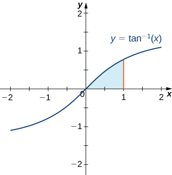
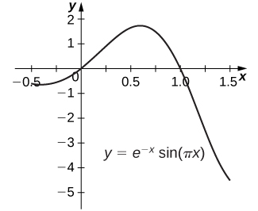

* Recognize when to use integration by parts.
* Use the integration-by-parts formula to solve integration problems.
* Use the integration-by-parts formula for definite integrals.

By now we have a fairly thorough procedure for how to evaluate many basic integrals. However, although we can integrate <math xmlns="http://www.w3.org/1998/Math/MathML"><mrow><mstyle displaystyle="true"><mrow><mo stretchy="false">∫</mo><mrow><mi>x</mi><mspace width="0.1em" /><mtext>sin</mtext><mo stretchy="false">(</mo><msup><mi>x</mi><mn>2</mn></msup><mo stretchy="false">)</mo><mi>d</mi><mi>x</mi></mrow></mrow></mstyle></mrow></math>

 by using the substitution, <math xmlns="http://www.w3.org/1998/Math/MathML"><mrow><mi>u</mi><mo>=</mo><msup><mi>x</mi><mn>2</mn></msup><mo>,</mo></mrow></math>

 something as simple looking as <math xmlns="http://www.w3.org/1998/Math/MathML"><mrow><mstyle displaystyle="true"><mrow><mo stretchy="false">∫</mo><mrow><mi>x</mi><mspace width="0.1em" /><mtext>sin</mtext><mspace width="0.1em" /><mi>x</mi><mspace width="0.2em" /><mi>d</mi><mi>x</mi></mrow></mrow></mstyle></mrow></math>

 defies us. Many students want to know whether there is a product rule for integration. There isn’t, but there is a technique based on the product rule for differentiation that allows us to exchange one integral for another. We call this technique **integration by parts**{: data-type="term"}.

# The Integration-by-Parts Formula

If, <math xmlns="http://www.w3.org/1998/Math/MathML"><mrow><mi>h</mi><mo stretchy="false">(</mo><mi>x</mi><mo stretchy="false">)</mo><mo>=</mo><mi>f</mi><mo stretchy="false">(</mo><mi>x</mi><mo stretchy="false">)</mo><mi>g</mi><mo stretchy="false">(</mo><mi>x</mi><mo stretchy="false">)</mo><mo>,</mo></mrow></math>

 then by using the product rule, we obtain <math xmlns="http://www.w3.org/1998/Math/MathML"><mrow><msup><mi>h</mi><mo>′</mo></msup><mo stretchy="false">(</mo><mi>x</mi><mo stretchy="false">)</mo><mo>=</mo><msup><mi>f</mi><mo>′</mo></msup><mo stretchy="false">(</mo><mi>x</mi><mo stretchy="false">)</mo><mi>g</mi><mo stretchy="false">(</mo><mi>x</mi><mo stretchy="false">)</mo><mo>+</mo><msup><mi>g</mi><mo>′</mo></msup><mo stretchy="false">(</mo><mi>x</mi><mo stretchy="false">)</mo><mi>f</mi><mo stretchy="false">(</mo><mi>x</mi><mo stretchy="false">)</mo><mo>.</mo></mrow></math>

 Although at first it may seem counterproductive, let’s now integrate both sides of this equation: <math xmlns="http://www.w3.org/1998/Math/MathML"><mrow><mstyle displaystyle="true"><mrow><mo stretchy="false">∫</mo><mrow><msup><mi>h</mi><mo>′</mo></msup><mo stretchy="false">(</mo><mi>x</mi><mo stretchy="false">)</mo><mi>d</mi><mi>x</mi><mo>=</mo><mstyle displaystyle="true"><mrow><mo stretchy="false">∫</mo><mrow><mrow><mo>(</mo><mrow><mi>g</mi><mo stretchy="false">(</mo><mi>x</mi><mo stretchy="false">)</mo><msup><mi>f</mi><mo>′</mo></msup><mo stretchy="false">(</mo><mi>x</mi><mo stretchy="false">)</mo><mo>+</mo><mi>f</mi><mo stretchy="false">(</mo><mi>x</mi><mo stretchy="false">)</mo><msup><mi>g</mi><mo>′</mo></msup><mo stretchy="false">(</mo><mi>x</mi><mo stretchy="false">)</mo></mrow><mo>)</mo></mrow><mi>d</mi><mi>x</mi><mo>.</mo></mrow></mrow></mstyle></mrow></mrow></mstyle></mrow></math>

This gives us

<math xmlns="http://www.w3.org/1998/Math/MathML"><mrow><mi>h</mi><mo stretchy="false">(</mo><mi>x</mi><mo stretchy="false">)</mo><mo>=</mo><mi>f</mi><mo stretchy="false">(</mo><mi>x</mi><mo stretchy="false">)</mo><mi>g</mi><mo stretchy="false">(</mo><mi>x</mi><mo stretchy="false">)</mo><mo>=</mo><mstyle displaystyle="true"><mrow><mo stretchy="false">∫</mo><mrow><mi>g</mi><mo stretchy="false">(</mo><mi>x</mi><mo stretchy="false">)</mo><msup><mi>f</mi><mo>′</mo></msup><mo stretchy="false">(</mo><mi>x</mi><mo stretchy="false">)</mo><mi>d</mi><mi>x</mi><mo>+</mo><mstyle displaystyle="true"><mrow><mo stretchy="false">∫</mo><mrow><mi>f</mi><mo stretchy="false">(</mo><mi>x</mi><mo stretchy="false">)</mo><msup><mi>g</mi><mo>′</mo></msup><mo stretchy="false">(</mo><mi>x</mi><mo stretchy="false">)</mo><mi>d</mi><mi>x</mi><mo>.</mo></mrow></mrow></mstyle></mrow></mrow></mstyle></mrow></math>

Now we solve for <math xmlns="http://www.w3.org/1998/Math/MathML"><mrow><mstyle displaystyle="true"><mrow><mo stretchy="false">∫</mo><mrow><mi>f</mi><mo stretchy="false">(</mo><mi>x</mi><mo stretchy="false">)</mo><msup><mi>g</mi><mo>′</mo></msup><mo stretchy="false">(</mo><mi>x</mi><mo stretchy="false">)</mo><mi>d</mi><mi>x</mi><mo>:</mo></mrow></mrow></mstyle></mrow></math>

<math xmlns="http://www.w3.org/1998/Math/MathML"><mrow><mstyle displaystyle="true"><mrow><mo stretchy="false">∫</mo><mrow><mi>f</mi><mo stretchy="false">(</mo><mi>x</mi><mo stretchy="false">)</mo><msup><mi>g</mi><mo>′</mo></msup><mo stretchy="false">(</mo><mi>x</mi><mo stretchy="false">)</mo><mi>d</mi><mi>x</mi><mo>=</mo><mi>f</mi><mo stretchy="false">(</mo><mi>x</mi><mo stretchy="false">)</mo><mi>g</mi><mo stretchy="false">(</mo><mi>x</mi><mo stretchy="false">)</mo><mo>−</mo><mstyle displaystyle="true"><mrow><mo stretchy="false">∫</mo><mrow><mi>g</mi><mo stretchy="false">(</mo><mi>x</mi><mo stretchy="false">)</mo><msup><mi>f</mi><mo>′</mo></msup><mo stretchy="false">(</mo><mi>x</mi><mo stretchy="false">)</mo><mi>d</mi><mi>x</mi><mo>.</mo></mrow></mrow></mstyle></mrow></mrow></mstyle></mrow></math>

By making the substitutions <math xmlns="http://www.w3.org/1998/Math/MathML"><mrow><mi>u</mi><mo>=</mo><mi>f</mi><mo stretchy="false">(</mo><mi>x</mi><mo stretchy="false">)</mo></mrow></math>

 and <math xmlns="http://www.w3.org/1998/Math/MathML"><mrow><mi>v</mi><mo>=</mo><mi>g</mi><mo stretchy="false">(</mo><mi>x</mi><mo stretchy="false">)</mo><mo>,</mo></mrow></math>

 which in turn make <math xmlns="http://www.w3.org/1998/Math/MathML"><mrow><mi>d</mi><mi>u</mi><mo>=</mo><msup><mi>f</mi><mo>′</mo></msup><mo stretchy="false">(</mo><mi>x</mi><mo stretchy="false">)</mo><mi>d</mi><mi>x</mi></mrow></math>

 and <math xmlns="http://www.w3.org/1998/Math/MathML"><mrow><mi>d</mi><mi>v</mi><mo>=</mo><msup><mi>g</mi><mo>′</mo></msup><mo stretchy="false">(</mo><mi>x</mi><mo stretchy="false">)</mo><mi>d</mi><mi>x</mi><mo>,</mo></mrow></math>

 we have the more compact form

<math xmlns="http://www.w3.org/1998/Math/MathML"><mrow><mstyle displaystyle="true"><mrow><mo stretchy="false">∫</mo><mrow><mi>u</mi><mspace width="0.2em" /><mi>d</mi><mi>v</mi><mo>=</mo><mi>u</mi><mi>v</mi><mo>−</mo></mrow></mrow></mstyle><mstyle displaystyle="true"><mrow><mo stretchy="false">∫</mo><mrow><mi>v</mi><mspace width="0.2em" /><mi>d</mi><mi>u</mi><mo>.</mo></mrow></mrow></mstyle></mrow></math>

Integration by Parts

Let <math xmlns="http://www.w3.org/1998/Math/MathML"><mrow><mi>u</mi><mo>=</mo><mi>f</mi><mo stretchy="false">(</mo><mi>x</mi><mo stretchy="false">)</mo></mrow></math>

 and <math xmlns="http://www.w3.org/1998/Math/MathML"><mrow><mi>v</mi><mo>=</mo><mi>g</mi><mo stretchy="false">(</mo><mi>x</mi><mo stretchy="false">)</mo></mrow></math>

 be functions with continuous derivatives. Then, the integration-by-parts formula for the integral involving these two functions is:

<math xmlns="http://www.w3.org/1998/Math/MathML"><mrow><mstyle displaystyle="true"><mrow><mo stretchy="false">∫</mo><mrow><mi>u</mi><mspace width="0.2em" /><mi>d</mi><mi>v</mi><mo>=</mo><mi>u</mi><mi>v</mi><mo>−</mo><mstyle displaystyle="true"><mrow><mo stretchy="false">∫</mo><mrow><mi>v</mi><mspace width="0.2em" /><mi>d</mi><mi>u</mi></mrow></mrow></mstyle></mrow></mrow></mstyle><mo>.</mo></mrow></math>

The advantage of using the integration-by-parts formula is that we can use it to exchange one integral for another, possibly easier, integral. The following example illustrates its use.

Using Integration by Parts

Use integration by parts with <math xmlns="http://www.w3.org/1998/Math/MathML"><mrow><mi>u</mi><mo>=</mo><mi>x</mi></mrow></math>

 and <math xmlns="http://www.w3.org/1998/Math/MathML"><mrow><mi>d</mi><mi>v</mi><mo>=</mo><mtext>sin</mtext><mspace width="0.1em" /><mi>x</mi><mspace width="0.2em" /><mi>d</mi><mi>x</mi></mrow></math>

 to evaluate <math xmlns="http://www.w3.org/1998/Math/MathML"><mrow><mstyle displaystyle="true"><mrow><mo stretchy="false">∫</mo><mrow><mi>x</mi><mspace width="0.1em" /><mtext>sin</mtext><mspace width="0.1em" /><mi>x</mi><mspace width="0.2em" /><mi>d</mi><mi>x</mi><mo>.</mo></mrow></mrow></mstyle></mrow></math>

By choosing <math xmlns="http://www.w3.org/1998/Math/MathML"><mrow><mi>u</mi><mo>=</mo><mi>x</mi><mo>,</mo></mrow></math>

 we have <math xmlns="http://www.w3.org/1998/Math/MathML"><mrow><mi>d</mi><mi>u</mi><mo>=</mo><mn>1</mn><mi>d</mi><mi>x</mi><mo>.</mo></mrow></math>

 Since <math xmlns="http://www.w3.org/1998/Math/MathML"><mrow><mi>d</mi><mi>v</mi><mo>=</mo><mtext>sin</mtext><mspace width="0.1em" /><mi>x</mi><mspace width="0.2em" /><mi>d</mi><mi>x</mi><mo>,</mo></mrow></math>

 we get <math xmlns="http://www.w3.org/1998/Math/MathML"><mrow><mi>v</mi><mo>=</mo><mstyle displaystyle="true"><mrow><mo stretchy="false">∫</mo><mrow><mtext>sin</mtext><mspace width="0.1em" /><mi>x</mi><mspace width="0.2em" /><mi>d</mi><mi>x</mi><mo>=</mo><mtext>−</mtext><mtext>cos</mtext><mspace width="0.1em" /><mi>x</mi><mo>.</mo></mrow></mrow></mstyle></mrow></math>

 It is handy to keep track of these values as follows:

<math xmlns="http://www.w3.org/1998/Math/MathML"><mrow><mtable><mtr><mtd columnalign="right"><mrow><mi>u</mi></mrow></mtd><mtd columnalign="left"><mo>=</mo></mtd><mtd columnalign="left"><mi>x</mi></mtd><mtd /><mtd columnalign="right"><mrow><mi>d</mi><mi>v</mi></mrow></mtd><mtd columnalign="left"><mo>=</mo></mtd><mtd columnalign="left"><mtext>sin</mtext><mspace width="0.1em" /><mi>x</mi><mspace width="0.2em" /><mi>d</mi><mi>x</mi></mtd></mtr><mtr><mtd columnalign="right"><mrow><mi>d</mi><mi>u</mi></mrow></mtd><mtd columnalign="left"><mo>=</mo></mtd><mtd columnalign="left"><mn>1</mn><mi>d</mi><mi>x</mi></mtd><mtd /><mtd columnalign="right"><mrow><mi>v</mi></mrow></mtd><mtd columnalign="left"><mo>=</mo></mtd><mtd columnalign="left"><mstyle displaystyle="true"><mrow><mo stretchy="false">∫</mo><mrow><mtext>sin</mtext><mspace width="0.1em" /><mi>x</mi><mspace width="0.2em" /><mi>d</mi><mi>x</mi><mo>=</mo><mtext>−</mtext><mtext>cos</mtext><mspace width="0.1em" /><mi>x</mi><mo>.</mo></mrow></mrow></mstyle></mtd></mtr></mtable></mrow></math>

Applying the integration-by-parts formula results in

<math xmlns="http://www.w3.org/1998/Math/MathML"><mrow><mtable><mtr><mtd columnalign="right"><mrow><mstyle displaystyle="true"><mrow><mo stretchy="false">∫</mo><mrow><mi>x</mi><mspace width="0.1em" /><mtext>sin</mtext><mspace width="0.1em" /><mi>x</mi><mspace width="0.2em" /><mi>d</mi><mi>x</mi></mrow></mrow></mstyle></mrow></mtd><mtd columnalign="left"><mo>=</mo><mo stretchy="false">(</mo><mi>x</mi><mo stretchy="false">)</mo><mo stretchy="false">(</mo><mtext>−</mtext><mtext>cos</mtext><mspace width="0.1em" /><mi>x</mi><mo stretchy="false">)</mo><mo>−</mo><mstyle displaystyle="true"><mrow><mo stretchy="false">∫</mo><mrow><mo stretchy="false">(</mo><mtext>−</mtext><mtext>cos</mtext><mspace width="0.1em" /><mi>x</mi><mo stretchy="false">)</mo><mo stretchy="false">(</mo><mn>1</mn><mi>d</mi><mi>x</mi><mo stretchy="false">)</mo></mrow></mrow></mstyle></mtd><mtd /><mtd columnalign="left"><mrow><mtext>Substitute</mtext><mo>.</mo></mrow></mtd></mtr><mtr><mtd /><mtd columnalign="left"><mrow><mo>=</mo><mtext>−</mtext><mi>x</mi><mspace width="0.1em" /><mtext>cos</mtext><mspace width="0.1em" /><mi>x</mi><mo>+</mo><mstyle displaystyle="true"><mrow><mo stretchy="false">∫</mo><mrow><mtext>cos</mtext><mspace width="0.1em" /><mi>x</mi><mspace width="0.2em" /><mi>d</mi><mi>x</mi></mrow></mrow></mstyle></mrow></mtd><mtd /><mtd columnalign="left"><mrow><mtext>Simplify</mtext><mo>.</mo></mrow></mtd></mtr><mtr><mtd /><mtd columnalign="left"><mrow><mo>=</mo><mtext>−</mtext><mi>x</mi><mspace width="0.1em" /><mtext>cos</mtext><mspace width="0.1em" /><mi>x</mi><mo>+</mo><mtext>sin</mtext><mspace width="0.1em" /><mi>x</mi><mo>+</mo><mi>C</mi><mo>.</mo></mrow></mtd><mtd /><mtd columnalign="left"><mrow><mtext>Use</mtext><mspace width="0.2em" /><mstyle displaystyle="true"><mrow><mo stretchy="false">∫</mo><mrow><mtext>cos</mtext><mspace width="0.1em" /><mi>x</mi><mspace width="0.2em" /><mi>d</mi><mi>x</mi><mo>=</mo><mtext>sin</mtext><mspace width="0.1em" /><mi>x</mi><mo>+</mo><mi>C</mi><mo>.</mo></mrow></mrow></mstyle></mrow></mtd></mtr></mtable></mrow></math>

Analysis

At this point, there are probably a few items that need clarification. First of all, you may be curious about what would have happened if we had chosen <math xmlns="http://www.w3.org/1998/Math/MathML"><mrow><mi>u</mi><mo>=</mo><mtext>sin</mtext><mspace width="0.1em" /><mi>x</mi></mrow></math>

 and <math xmlns="http://www.w3.org/1998/Math/MathML"><mrow><mi>d</mi><mi>v</mi><mo>=</mo><mi>x</mi><mo>.</mo></mrow></math>

 If we had done so, then we would have <math xmlns="http://www.w3.org/1998/Math/MathML"><mrow><mi>d</mi><mi>u</mi><mo>=</mo><mtext>cos</mtext><mspace width="0.1em" /><mi>x</mi></mrow></math>

 and <math xmlns="http://www.w3.org/1998/Math/MathML"><mrow><mi>v</mi><mo>=</mo><mfrac><mn>1</mn><mn>2</mn></mfrac><msup><mi>x</mi><mn>2</mn></msup><mo>.</mo></mrow></math>

 Thus, after applying integration by parts, we have <math xmlns="http://www.w3.org/1998/Math/MathML"><mrow><msup><mstyle displaystyle="true"><mo stretchy="false">∫</mo></mstyle><mtext>​</mtext></msup><mi>x</mi><mspace width="0.1em" /><mtext>sin</mtext><mspace width="0.1em" /><mi>x</mi><mspace width="0.2em" /><mi>d</mi><mi>x</mi><mo>=</mo><mfrac><mn>1</mn><mn>2</mn></mfrac><msup><mi>x</mi><mn>2</mn></msup><mtext>sin</mtext><mspace width="0.1em" /><mi>x</mi><mo>−</mo><msup><mstyle displaystyle="true"><mo stretchy="false">∫</mo></mstyle><mtext>​</mtext></msup><mfrac><mn>1</mn><mn>2</mn></mfrac><msup><mi>x</mi><mn>2</mn></msup><mtext>cos</mtext><mspace width="0.1em" /><mi>x</mi><mspace width="0.2em" /><mi>d</mi><mi>x</mi><mo>.</mo></mrow></math>

 Unfortunately, with the new integral, we are in no better position than before. It is important to keep in mind that when we apply integration by parts, we may need to try several choices for <math xmlns="http://www.w3.org/1998/Math/MathML"><mi>u</mi></math>

 and <math xmlns="http://www.w3.org/1998/Math/MathML"><mrow><mi>d</mi><mi>v</mi></mrow></math>

 before finding a choice that works.

Second, you may wonder why, when we find <math xmlns="http://www.w3.org/1998/Math/MathML"><mrow><mi>v</mi><mo>=</mo><msup><mstyle displaystyle="true"><mo stretchy="false">∫</mo></mstyle><mtext>​</mtext></msup><mtext>sin</mtext><mspace width="0.1em" /><mi>x</mi><mspace width="0.2em" /><mi>d</mi><mi>x</mi><mo>=</mo><mtext>−</mtext><mtext>cos</mtext><mspace width="0.1em" /><mi>x</mi><mo>,</mo></mrow></math>

 we do not use <math xmlns="http://www.w3.org/1998/Math/MathML"><mrow><mi>v</mi><mo>=</mo><mtext>−</mtext><mtext>cos</mtext><mspace width="0.1em" /><mi>x</mi><mo>+</mo><mi>K</mi><mo>.</mo></mrow></math>

 To see that it makes no difference, we can rework the problem using <math xmlns="http://www.w3.org/1998/Math/MathML"><mrow><mi>v</mi><mo>=</mo><mtext>−</mtext><mtext>cos</mtext><mspace width="0.1em" /><mi>x</mi><mo>+</mo><mi>K</mi><mtext>:</mtext></mrow></math>

<math xmlns="http://www.w3.org/1998/Math/MathML"><mrow><mtable><mtr><mtd columnalign="left"><mrow><msup><mstyle mathsize="140%" displaystyle="true"><mo stretchy="false">∫</mo></mstyle><mspace width="0.2em" /></msup><mi>x</mi><mspace width="0.1em" /><mtext>sin</mtext><mspace width="0.1em" /><mi>x</mi><mspace width="0.2em" /><mi>d</mi><mi>x</mi></mrow></mtd><mtd columnalign="left"><mrow><mo>=</mo><mo stretchy="false">(</mo><mi>x</mi><mo stretchy="false">)</mo><mo stretchy="false">(</mo><mtext>−</mtext><mtext>cos</mtext><mspace width="0.1em" /><mi>x</mi><mo>+</mo><mi>K</mi><mo stretchy="false">)</mo><mo>−</mo><msup><mstyle mathsize="140%" displaystyle="true"><mo stretchy="false">∫</mo></mstyle><mspace width="0.2em" /></msup><mo stretchy="false">(</mo><mtext>−</mtext><mtext>cos</mtext><mspace width="0.1em" /><mi>x</mi><mo>+</mo><mi>K</mi><mo stretchy="false">)</mo><mo stretchy="false">(</mo><mn>1</mn><mi>d</mi><mi>x</mi><mo stretchy="false">)</mo></mrow></mtd></mtr><mtr><mtd columnalign="left"><mrow /></mtd><mtd columnalign="left"><mrow><mo>=</mo><mtext>−</mtext><mi>x</mi><mspace width="0.1em" /><mtext>cos</mtext><mspace width="0.1em" /><mi>x</mi><mo>+</mo><mi>K</mi><mi>x</mi><mo>+</mo><msup><mstyle mathsize="140%" displaystyle="true"><mo stretchy="false">∫</mo></mstyle><mspace width="0.2em" /></msup><mtext>cos</mtext><mspace width="0.1em" /><mi>x</mi><mspace width="0.2em" /><mi>d</mi><mi>x</mi><mo>−</mo><msup><mstyle mathsize="140%" displaystyle="true"><mo stretchy="false">∫</mo></mstyle><mspace width="0.2em" /></msup><mi>K</mi><mi>d</mi><mi>x</mi></mrow></mtd></mtr><mtr><mtd columnalign="left"><mrow /></mtd><mtd columnalign="left"><mrow><mo>=</mo><mtext>−</mtext><mi>x</mi><mspace width="0.1em" /><mtext>cos</mtext><mspace width="0.1em" /><mi>x</mi><mspace width="0.2em" /><mo>+</mo><mi>K</mi><mi>x</mi><mo>+</mo><mtext>sin</mtext><mspace width="0.1em" /><mi>x</mi><mo>−</mo><mi>K</mi><mi>x</mi><mo>+</mo><mi>C</mi></mrow></mtd></mtr><mtr><mtd columnalign="left"><mrow /></mtd><mtd columnalign="left"><mrow><mo>=</mo><mtext>−</mtext><mi>x</mi><mspace width="0.1em" /><mtext>cos</mtext><mspace width="0.1em" /><mi>x</mi><mo>+</mo><mtext>sin</mtext><mspace width="0.1em" /><mi>x</mi><mo>+</mo><mi>C</mi><mo>.</mo></mrow></mtd></mtr></mtable></mrow></math>

As you can see, it makes no difference in the final solution.

Last, we can check to make sure that our antiderivative is correct by differentiating <math xmlns="http://www.w3.org/1998/Math/MathML"><mrow><mtext>−</mtext><mi>x</mi><mspace width="0.1em" /><mtext>cos</mtext><mspace width="0.1em" /><mi>x</mi><mo>+</mo><mtext>sin</mtext><mspace width="0.1em" /><mi>x</mi><mo>+</mo><mi>C</mi><mtext>:</mtext></mrow></math>

<math xmlns="http://www.w3.org/1998/Math/MathML" display="block"><mrow><mtable><mtr><mtd columnalign="left"><mrow><mfrac><mi>d</mi><mrow><mi>d</mi><mi>x</mi></mrow></mfrac><mrow><mo>(</mo><mrow><mtext>−</mtext><mi>x</mi><mspace width="0.1em" /><mtext>cos</mtext><mspace width="0.1em" /><mi>x</mi><mo>+</mo><mtext>sin</mtext><mspace width="0.1em" /><mi>x</mi><mo>+</mo><mi>C</mi></mrow><mo>)</mo></mrow></mrow></mtd><mtd columnalign="left"><mrow><mo>=</mo><mrow><mo>(</mo><mrow><mn>−1</mn></mrow><mo>)</mo></mrow><mtext>cos</mtext><mspace width="0.1em" /><mi>x</mi><mo>+</mo><mo stretchy="false">(</mo><mtext>−</mtext><mi>x</mi><mo stretchy="false">)</mo><mo stretchy="false">(</mo><mtext>−</mtext><mtext>sin</mtext><mspace width="0.1em" /><mi>x</mi><mo stretchy="false">)</mo><mo>+</mo><mtext>cos</mtext><mspace width="0.1em" /><mi>x</mi></mrow></mtd></mtr><mtr><mtd columnalign="left"><mrow /></mtd><mtd columnalign="left"><mrow><mo>=</mo><mi>x</mi><mspace width="0.1em" /><mtext>sin</mtext><mspace width="0.1em" /><mi>x</mi><mo>.</mo></mrow></mtd></mtr></mtable></mrow></math>

Therefore, the antiderivative checks out.

Watch this [video][1] and visit this [website][2] for examples of integration by parts.

Evaluate <math xmlns="http://www.w3.org/1998/Math/MathML"><mrow><msup><mstyle displaystyle="true"><mo stretchy="false">∫</mo></mstyle><mtext>​</mtext></msup><mi>x</mi><msup><mi>e</mi><mrow><mn>2</mn><mi>x</mi></mrow></msup><mi>d</mi><mi>x</mi></mrow></math>

 using the integration-by-parts formula with <math xmlns="http://www.w3.org/1998/Math/MathML"><mrow><mi>u</mi><mo>=</mo><mi>x</mi></mrow></math>

 and <math xmlns="http://www.w3.org/1998/Math/MathML"><mrow><mi>d</mi><mi>v</mi><mo>=</mo><msup><mi>e</mi><mrow><mn>2</mn><mi>x</mi></mrow></msup><mi>d</mi><mi>x</mi><mo>.</mo></mrow></math>

<math xmlns="http://www.w3.org/1998/Math/MathML"><mrow><msup><mstyle displaystyle="true"><mo stretchy="false">∫</mo></mstyle><mtext>​</mtext></msup><mi>x</mi><msup><mi>e</mi><mrow><mn>2</mn><mi>x</mi></mrow></msup><mi>d</mi><mi>x</mi><mo>=</mo><mfrac><mn>1</mn><mn>2</mn></mfrac><mi>x</mi><msup><mi>e</mi><mrow><mn>2</mn><mi>x</mi></mrow></msup><mo>−</mo><mfrac><mn>1</mn><mn>4</mn></mfrac><msup><mi>e</mi><mrow><mn>2</mn><mi>x</mi></mrow></msup><mo>+</mo><mi>C</mi></mrow></math>

Hint

Find <math xmlns="http://www.w3.org/1998/Math/MathML"><mrow><mi>d</mi><mi>u</mi></mrow></math>

 and <math xmlns="http://www.w3.org/1998/Math/MathML"><mrow><mi>v</mi><mo>,</mo></mrow></math>

 and use the previous example as a guide.

The natural question to ask at this point is: How do we know how to choose <math xmlns="http://www.w3.org/1998/Math/MathML"><mi>u</mi></math>

 and <math xmlns="http://www.w3.org/1998/Math/MathML"><mrow><mi>d</mi><mi>v</mi><mo>?</mo></mrow></math>

 Sometimes it is a matter of trial and error; however, the acronym LIATE can often help to take some of the guesswork out of our choices. This acronym stands for **L**ogarithmic Functions, **I**nverse Trigonometric Functions, **A**lgebraic Functions, **T**rigonometric Functions, and **E**xponential Functions. This mnemonic serves as an aid in determining an appropriate choice for <math xmlns="http://www.w3.org/1998/Math/MathML"><mrow><mi>u</mi><mo>.</mo></mrow></math>

The type of function in the integral that appears first in the list should be our first choice of <math xmlns="http://www.w3.org/1998/Math/MathML"><mrow><mi>u</mi><mo>.</mo></mrow></math>

 For example, if an integral contains a **logarithmic function**{: data-type="term" .no-emphasis} and an **algebraic function**{: data-type="term" .no-emphasis}, we should choose <math xmlns="http://www.w3.org/1998/Math/MathML"><mi>u</mi></math>

 to be the logarithmic function, because L comes before A in LIATE. The integral in [\[link\]](#fs-id1165041832973) has a trigonometric function <math xmlns="http://www.w3.org/1998/Math/MathML"><mrow><mrow><mtext>(</mtext><mrow><mtext>sin</mtext><mspace width="0.1em" /><mi>x</mi></mrow><mtext>)</mtext></mrow></mrow></math>

 and an algebraic function <math xmlns="http://www.w3.org/1998/Math/MathML"><mrow><mrow><mo>(</mo><mi>x</mi><mo>)</mo></mrow><mo>.</mo></mrow></math>

 Because A comes before T in LIATE, we chose <math xmlns="http://www.w3.org/1998/Math/MathML"><mi>u</mi></math>

 to be the algebraic function. When we have chosen <math xmlns="http://www.w3.org/1998/Math/MathML"><mrow><mi>u</mi><mo>,</mo></mrow></math>

 <math xmlns="http://www.w3.org/1998/Math/MathML"><mrow><mi>d</mi><mi>v</mi></mrow></math>

 is selected to be the remaining part of the function to be integrated, together with <math xmlns="http://www.w3.org/1998/Math/MathML"><mrow><mi>d</mi><mi>x</mi><mo>.</mo></mrow></math>

Why does this mnemonic work? Remember that whatever we pick to be <math xmlns="http://www.w3.org/1998/Math/MathML"><mrow><mi>d</mi><mi>v</mi></mrow></math>

 must be something we can integrate. Since we do not have integration formulas that allow us to integrate simple logarithmic functions and inverse trigonometric functions, it makes sense that they should not be chosen as values for <math xmlns="http://www.w3.org/1998/Math/MathML"><mrow><mi>d</mi><mi>v</mi><mo>.</mo></mrow></math>

 Consequently, they should be at the head of the list as choices for <math xmlns="http://www.w3.org/1998/Math/MathML"><mrow><mi>u</mi><mo>.</mo></mrow></math>

 Thus, we put LI at the beginning of the mnemonic. (We could just as easily have started with IL, since these two types of functions won’t appear together in an integration-by-parts problem.) The exponential and trigonometric functions are at the end of our list because they are fairly easy to integrate and make good choices for <math xmlns="http://www.w3.org/1998/Math/MathML"><mrow><mi>d</mi><mi>v</mi><mo>.</mo></mrow></math>

 Thus, we have TE at the end of our mnemonic. (We could just as easily have used ET at the end, since when these types of functions appear together it usually doesn’t really matter which one is <math xmlns="http://www.w3.org/1998/Math/MathML"><mi>u</mi></math>

 and which one is <math xmlns="http://www.w3.org/1998/Math/MathML"><mrow><mi>d</mi><mi>v</mi><mo>.</mo><mo stretchy="false">)</mo></mrow></math>

 Algebraic functions are generally easy both to integrate and to differentiate, and they come in the middle of the mnemonic.

Using Integration by Parts

Evaluate <math xmlns="http://www.w3.org/1998/Math/MathML"><mrow><mstyle displaystyle="true"><mrow><mo stretchy="false">∫</mo><mrow><mfrac><mrow><mtext>ln</mtext><mspace width="0.1em" /><mi>x</mi></mrow><mrow><msup><mi>x</mi><mn>3</mn></msup></mrow></mfrac><mi>d</mi><mi>x</mi><mo>.</mo></mrow></mrow></mstyle></mrow></math>

Begin by rewriting the integral:

<math xmlns="http://www.w3.org/1998/Math/MathML"><mrow><mstyle displaystyle="true"><mrow><mo stretchy="false">∫</mo><mrow><mfrac><mrow><mtext>ln</mtext><mspace width="0.1em" /><mi>x</mi></mrow><mrow><msup><mi>x</mi><mn>3</mn></msup></mrow></mfrac><mi>d</mi><mi>x</mi></mrow></mrow></mstyle><mo>=</mo><msup><mstyle displaystyle="true"><mo stretchy="false">∫</mo></mstyle><mtext>​</mtext></msup><msup><mi>x</mi><mrow><mn>−3</mn></mrow></msup><mtext>ln</mtext><mspace width="0.1em" /><mi>x</mi><mspace width="0.2em" /><mi>d</mi><mi>x</mi><mo>.</mo></mrow></math>

Since this integral contains the algebraic function <math xmlns="http://www.w3.org/1998/Math/MathML"><mrow><msup><mi>x</mi><mrow><mn>−3</mn></mrow></msup></mrow></math>

 and the logarithmic function <math xmlns="http://www.w3.org/1998/Math/MathML"><mrow><mtext>ln</mtext><mspace width="0.1em" /><mi>x</mi><mo>,</mo></mrow></math>

 choose <math xmlns="http://www.w3.org/1998/Math/MathML"><mrow><mi>u</mi><mo>=</mo><mtext>ln</mtext><mspace width="0.1em" /><mi>x</mi><mo>,</mo></mrow></math>

 since L comes before A in LIATE. After we have chosen <math xmlns="http://www.w3.org/1998/Math/MathML"><mrow><mi>u</mi><mo>=</mo><mtext>ln</mtext><mspace width="0.1em" /><mi>x</mi><mo>,</mo></mrow></math>

 we must choose <math xmlns="http://www.w3.org/1998/Math/MathML"><mrow><mi>d</mi><mi>v</mi><mo>=</mo><msup><mi>x</mi><mrow><mn>−3</mn></mrow></msup><mi>d</mi><mi>x</mi><mo>.</mo></mrow></math>

Next, since <math xmlns="http://www.w3.org/1998/Math/MathML"><mrow><mi>u</mi><mo>=</mo><mtext>ln</mtext><mspace width="0.1em" /><mi>x</mi><mo>,</mo></mrow></math>

 we have <math xmlns="http://www.w3.org/1998/Math/MathML"><mrow><mi>d</mi><mi>u</mi><mo>=</mo><mfrac><mn>1</mn><mi>x</mi></mfrac><mi>d</mi><mi>x</mi><mo>.</mo></mrow></math>

 Also, <math xmlns="http://www.w3.org/1998/Math/MathML"><mrow><mi>v</mi><mo>=</mo><msup><mstyle displaystyle="true"><mo stretchy="false">∫</mo></mstyle><mtext>​</mtext></msup><msup><mi>x</mi><mrow><mn>−3</mn></mrow></msup><mi>d</mi><mi>x</mi><mo>=</mo><mo>−</mo><mfrac><mn>1</mn><mn>2</mn></mfrac><msup><mi>x</mi><mrow><mn>−2</mn></mrow></msup><mo>.</mo></mrow></math>

 Summarizing,

<math xmlns="http://www.w3.org/1998/Math/MathML"><mrow><mtable><mtr><mtd columnalign="right"><mrow><mi>u</mi></mrow></mtd><mtd columnalign="left"><mo>=</mo></mtd><mtd columnalign="left"><mtext>ln</mtext><mspace width="0.1em" /><mi>x</mi></mtd><mtd /><mtd columnalign="right"><mrow><mi>d</mi><mi>v</mi></mrow></mtd><mtd columnalign="left"><mo>=</mo></mtd><mtd columnalign="left"><msup><mi>x</mi><mrow><mn>−3</mn></mrow></msup><mi>d</mi><mi>x</mi></mtd></mtr><mtr><mtd columnalign="right"><mrow><mi>d</mi><mi>u</mi></mrow></mtd><mtd columnalign="left"><mo>=</mo></mtd><mtd columnalign="left"><mfrac><mn>1</mn><mi>x</mi></mfrac><mi>d</mi><mi>x</mi></mtd><mtd /><mtd columnalign="right"><mrow><mi>v</mi></mrow></mtd><mtd columnalign="left"><mo>=</mo></mtd><mtd columnalign="left"><msup><mstyle displaystyle="true"><mo stretchy="false">∫</mo></mstyle><mtext>​</mtext></msup><msup><mi>x</mi><mrow><mn>−3</mn></mrow></msup><mi>d</mi><mi>x</mi><mo>=</mo><mo>−</mo><mfrac><mn>1</mn><mn>2</mn></mfrac><msup><mi>x</mi><mrow><mn>−2</mn></mrow></msup><mo>.</mo></mtd></mtr></mtable></mrow></math>

Substituting into the integration-by-parts formula ([[link]](#fs-id1165042232372)) gives

<math xmlns="http://www.w3.org/1998/Math/MathML"><mrow><mtable><mtr><mtd columnalign="right"><mrow><mstyle displaystyle="true"><mrow><mo stretchy="false">∫</mo><mrow><mfrac><mrow><mtext>ln</mtext><mspace width="0.1em" /><mi>x</mi></mrow><mrow><msup><mi>x</mi><mn>3</mn></msup></mrow></mfrac><mi>d</mi><mi>x</mi></mrow></mrow></mstyle></mrow></mtd><mtd columnalign="left"><mo>=</mo><msup><mstyle displaystyle="true"><mo stretchy="false">∫</mo></mstyle><mtext>​</mtext></msup><msup><mi>x</mi><mrow><mn>−3</mn></mrow></msup><mtext>ln</mtext><mspace width="0.1em" /><mi>x</mi><mspace width="0.2em" /><mi>d</mi><mi>x</mi><mo>=</mo><mrow><mo>(</mo><mrow><mtext>ln</mtext><mspace width="0.1em" /><mi>x</mi><mo stretchy="false">)</mo><mo stretchy="false">(</mo><mtext>−</mtext><mspace width="0.2em" /><mfrac><mn>1</mn><mn>2</mn></mfrac><msup><mi>x</mi><mrow><mn>−2</mn></mrow></msup></mrow><mo>)</mo></mrow><mo>−</mo><msup><mstyle displaystyle="true"><mo stretchy="false">∫</mo></mstyle><mtext>​</mtext></msup><mrow><mo>(</mo><mrow><mtext>−</mtext><mspace width="0.2em" /><mfrac><mn>1</mn><mn>2</mn></mfrac><msup><mi>x</mi><mrow><mn>−2</mn></mrow></msup></mrow><mo>)</mo></mrow><mo stretchy="false">(</mo><mfrac><mn>1</mn><mi>x</mi></mfrac><mi>d</mi><mi>x</mi><mo stretchy="false">)</mo></mtd><mtd /><mtd /><mtd /></mtr><mtr><mtd /><mtd columnalign="left"><mrow><mo>=</mo><mo>−</mo><mfrac><mn>1</mn><mn>2</mn></mfrac><msup><mi>x</mi><mrow><mn>−2</mn></mrow></msup><mtext>ln</mtext><mspace width="0.1em" /><mi>x</mi><mo>+</mo><msup><mstyle displaystyle="true"><mo stretchy="false">∫</mo></mstyle><mtext>​</mtext></msup><mfrac><mn>1</mn><mn>2</mn></mfrac><msup><mi>x</mi><mrow><mn>−3</mn></mrow></msup><mi>d</mi><mi>x</mi></mrow></mtd><mtd /><mtd /><mtd columnalign="left"><mrow><mtext>Simplify</mtext><mo>.</mo></mrow></mtd></mtr><mtr><mtd /><mtd columnalign="left"><mrow><mo>=</mo><mo>−</mo><mfrac><mn>1</mn><mn>2</mn></mfrac><msup><mi>x</mi><mrow><mn>−2</mn></mrow></msup><mtext>ln</mtext><mspace width="0.1em" /><mi>x</mi><mo>−</mo><mfrac><mn>1</mn><mn>4</mn></mfrac><msup><mi>x</mi><mrow><mn>−2</mn></mrow></msup><mo>+</mo><mi>C</mi></mrow></mtd><mtd /><mtd /><mtd columnalign="left"><mrow><mtext>Integrate</mtext><mo>.</mo></mrow></mtd></mtr><mtr><mtd /><mtd columnalign="left"><mrow><mo>=</mo><mo>−</mo><mfrac><mn>1</mn><mrow><mn>2</mn><msup><mi>x</mi><mn>2</mn></msup></mrow></mfrac><mtext>ln</mtext><mspace width="0.1em" /><mi>x</mi><mo>−</mo><mfrac><mn>1</mn><mrow><mn>4</mn><msup><mi>x</mi><mn>2</mn></msup></mrow></mfrac><mo>+</mo><mi>C</mi><mo>.</mo></mrow></mtd><mtd /><mtd /><mtd columnalign="left"><mrow><mtext>Rewrite with positive integers.</mtext></mrow></mtd></mtr></mtable></mrow></math>

Evaluate <math xmlns="http://www.w3.org/1998/Math/MathML"><mrow><msup><mstyle displaystyle="true"><mo stretchy="false">∫</mo></mstyle><mtext>​</mtext></msup><mi>x</mi><mspace width="0.1em" /><mtext>ln</mtext><mspace width="0.1em" /><mi>x</mi><mspace width="0.2em" /><mi>d</mi><mi>x</mi><mo>.</mo></mrow></math>

<math xmlns="http://www.w3.org/1998/Math/MathML"><mrow><mfrac><mn>1</mn><mn>2</mn></mfrac><msup><mi>x</mi><mn>2</mn></msup><mtext>ln</mtext><mspace width="0.1em" /><mi>x</mi><mo>−</mo><mfrac><mn>1</mn><mn>4</mn></mfrac><msup><mi>x</mi><mn>2</mn></msup><mo>+</mo><mi>C</mi></mrow></math>

Hint

Use <math xmlns="http://www.w3.org/1998/Math/MathML"><mrow><mi>u</mi><mo>=</mo><mtext>ln</mtext><mspace width="0.1em" /><mi>x</mi></mrow></math>

 and <math xmlns="http://www.w3.org/1998/Math/MathML"><mrow><mi>d</mi><mi>v</mi><mo>=</mo><mi>x</mi><mspace width="0.2em" /><mi>d</mi><mi>x</mi><mo>.</mo></mrow></math>

In some cases, as in the next two examples, it may be necessary to apply integration by parts more than once.

Applying Integration by Parts More Than Once

Evaluate <math xmlns="http://www.w3.org/1998/Math/MathML"><mrow><msup><mstyle displaystyle="true"><mo stretchy="false">∫</mo></mstyle><mtext>​</mtext></msup><msup><mi>x</mi><mn>2</mn></msup><msup><mi>e</mi><mrow><mn>3</mn><mi>x</mi></mrow></msup><mi>d</mi><mi>x</mi><mo>.</mo></mrow></math>

Using LIATE, choose <math xmlns="http://www.w3.org/1998/Math/MathML"><mrow><mi>u</mi><mo>=</mo><msup><mi>x</mi><mn>2</mn></msup></mrow></math>

 and <math xmlns="http://www.w3.org/1998/Math/MathML"><mrow><mi>d</mi><mi>v</mi><mo>=</mo><msup><mi>e</mi><mrow><mn>3</mn><mi>x</mi></mrow></msup><mi>d</mi><mi>x</mi><mo>.</mo></mrow></math>

 Thus, <math xmlns="http://www.w3.org/1998/Math/MathML"><mrow><mi>d</mi><mi>u</mi><mo>=</mo><mn>2</mn><mi>x</mi><mspace width="0.2em" /><mi>d</mi><mi>x</mi></mrow></math>

 and <math xmlns="http://www.w3.org/1998/Math/MathML"><mrow><mi>v</mi><mo>=</mo><mstyle displaystyle="true"><mrow><mo stretchy="false">∫</mo><mrow><msup><mi>e</mi><mrow><mn>3</mn><mi>x</mi></mrow></msup><mi>d</mi><mi>x</mi><mo>=</mo><mrow><mo>(</mo><mrow><mfrac><mn>1</mn><mn>3</mn></mfrac></mrow><mo>)</mo></mrow><msup><mi>e</mi><mrow><mn>3</mn><mi>x</mi></mrow></msup></mrow></mrow></mstyle><mo>.</mo></mrow></math>

 Therefore,

<math xmlns="http://www.w3.org/1998/Math/MathML"><mrow><mtable><mtr><mtd columnalign="right"><mrow><mi>u</mi></mrow></mtd><mtd columnalign="left"><mo>=</mo></mtd><mtd columnalign="left"><msup><mi>x</mi><mn>2</mn></msup></mtd><mtd /><mtd columnalign="right"><mrow><mi>d</mi><mi>v</mi></mrow></mtd><mtd columnalign="left"><mo>=</mo></mtd><mtd columnalign="left"><msup><mi>e</mi><mrow><mn>3</mn><mi>x</mi></mrow></msup><mi>d</mi><mi>x</mi></mtd></mtr><mtr><mtd columnalign="right"><mrow><mi>d</mi><mi>u</mi></mrow></mtd><mtd columnalign="left"><mo>=</mo></mtd><mtd columnalign="left"><mn>2</mn><mi>x</mi><mspace width="0.2em" /><mi>d</mi><mi>x</mi></mtd><mtd /><mtd columnalign="right"><mrow><mi>v</mi></mrow></mtd><mtd columnalign="left"><mo>=</mo></mtd><mtd columnalign="left"><mstyle displaystyle="true"><mrow><mo stretchy="false">∫</mo><mrow><msup><mi>e</mi><mrow><mn>3</mn><mi>x</mi></mrow></msup><mi>d</mi><mi>x</mi><mo>=</mo><mfrac><mn>1</mn><mn>3</mn></mfrac><msup><mi>e</mi><mrow><mn>3</mn><mi>x</mi></mrow></msup></mrow></mrow></mstyle><mo>.</mo></mtd></mtr></mtable></mrow></math>

Substituting into [[link]](#fs-id1165042232372) produces

<math xmlns="http://www.w3.org/1998/Math/MathML"><mrow><mstyle displaystyle="true"><mrow><mo stretchy="false">∫</mo><mrow><msup><mi>x</mi><mn>2</mn></msup><msup><mi>e</mi><mrow><mn>3</mn><mi>x</mi></mrow></msup><mi>d</mi><mi>x</mi></mrow></mrow></mstyle><mo>=</mo><mfrac><mn>1</mn><mn>3</mn></mfrac><msup><mi>x</mi><mn>2</mn></msup><msup><mi>e</mi><mrow><mn>3</mn><mi>x</mi></mrow></msup><mo>−</mo><mstyle displaystyle="true"><mrow><mo stretchy="false">∫</mo><mrow><mfrac><mn>2</mn><mn>3</mn></mfrac><mi>x</mi><msup><mi>e</mi><mrow><mn>3</mn><mi>x</mi></mrow></msup><mi>d</mi><mi>x</mi></mrow></mrow></mstyle><mo>.</mo></mrow></math>

We still cannot integrate <math xmlns="http://www.w3.org/1998/Math/MathML"><mrow><mstyle displaystyle="true"><mrow><mo stretchy="false">∫</mo><mrow><mfrac><mn>2</mn><mn>3</mn></mfrac><mi>x</mi><msup><mi>e</mi><mrow><mn>3</mn><mi>x</mi></mrow></msup><mi>d</mi><mi>x</mi></mrow></mrow></mstyle></mrow></math>

 directly, but the integral now has a lower power on <math xmlns="http://www.w3.org/1998/Math/MathML"><mrow><mi>x</mi><mo>.</mo></mrow></math>

 We can evaluate this new integral by using integration by parts again. To do this, choose <math xmlns="http://www.w3.org/1998/Math/MathML"><mrow><mi>u</mi><mo>=</mo><mi>x</mi></mrow></math>

 and <math xmlns="http://www.w3.org/1998/Math/MathML"><mrow><mi>d</mi><mi>v</mi><mo>=</mo><mfrac><mn>2</mn><mn>3</mn></mfrac><msup><mi>e</mi><mrow><mn>3</mn><mi>x</mi></mrow></msup><mi>d</mi><mi>x</mi><mo>.</mo></mrow></math>

 Thus, <math xmlns="http://www.w3.org/1998/Math/MathML"><mrow><mi>d</mi><mi>u</mi><mo>=</mo><mi>d</mi><mi>x</mi></mrow></math>

 and <math xmlns="http://www.w3.org/1998/Math/MathML"><mrow><mi>v</mi><mo>=</mo><mstyle displaystyle="true"><mrow><mo stretchy="false">∫</mo><mrow><mrow><mo>(</mo><mrow><mfrac><mn>2</mn><mn>3</mn></mfrac></mrow><mo>)</mo></mrow><msup><mi>e</mi><mrow><mn>3</mn><mi>x</mi></mrow></msup><mi>d</mi><mi>x</mi><mo>=</mo><mrow><mo>(</mo><mrow><mfrac><mn>2</mn><mn>9</mn></mfrac></mrow><mo>)</mo></mrow><msup><mi>e</mi><mrow><mn>3</mn><mi>x</mi></mrow></msup></mrow></mrow></mstyle><mo>.</mo></mrow></math>

 Now we have

<math xmlns="http://www.w3.org/1998/Math/MathML"><mrow><mtable><mtr><mtd columnalign="right"><mrow><mi>u</mi></mrow></mtd><mtd columnalign="left"><mo>=</mo></mtd><mtd columnalign="left"><mi>x</mi></mtd><mtd /><mtd columnalign="right"><mrow><mi>d</mi><mi>v</mi></mrow></mtd><mtd columnalign="left"><mo>=</mo></mtd><mtd columnalign="left"><mfrac><mn>2</mn><mn>3</mn></mfrac><msup><mi>e</mi><mrow><mn>3</mn><mi>x</mi></mrow></msup><mi>d</mi><mi>x</mi></mtd></mtr><mtr><mtd columnalign="right"><mrow><mi>d</mi><mi>u</mi></mrow></mtd><mtd columnalign="left"><mo>=</mo></mtd><mtd columnalign="left"><mi>d</mi><mi>x</mi></mtd><mtd /><mtd columnalign="right"><mrow><mi>v</mi></mrow></mtd><mtd columnalign="left"><mo>=</mo></mtd><mtd columnalign="left"><mstyle displaystyle="true"><mrow><mo stretchy="false">∫</mo><mrow><mfrac><mn>2</mn><mn>3</mn></mfrac><msup><mi>e</mi><mrow><mn>3</mn><mi>x</mi></mrow></msup><mi>d</mi><mi>x</mi><mo>=</mo><mfrac><mn>2</mn><mn>9</mn></mfrac><msup><mi>e</mi><mrow><mn>3</mn><mi>x</mi></mrow></msup></mrow></mrow></mstyle><mo>.</mo></mtd></mtr></mtable></mrow></math>

Substituting back into the previous equation yields

<math xmlns="http://www.w3.org/1998/Math/MathML"><mrow><msup><mstyle displaystyle="true"><mo stretchy="false">∫</mo></mstyle><mtext>​</mtext></msup><msup><mi>x</mi><mn>2</mn></msup><msup><mi>e</mi><mrow><mn>3</mn><mi>x</mi></mrow></msup><mi>d</mi><mi>x</mi><mo>=</mo><mfrac><mn>1</mn><mn>3</mn></mfrac><msup><mi>x</mi><mn>2</mn></msup><msup><mi>e</mi><mrow><mn>3</mn><mi>x</mi></mrow></msup><mo>−</mo><mrow><mo>(</mo><mrow><mfrac><mn>2</mn><mn>9</mn></mfrac><mi>x</mi><msup><mi>e</mi><mrow><mn>3</mn><mi>x</mi></mrow></msup><mo>−</mo><msup><mstyle displaystyle="true"><mo stretchy="false">∫</mo></mstyle><mtext>​</mtext></msup><mfrac><mn>2</mn><mn>9</mn></mfrac><msup><mi>e</mi><mrow><mn>3</mn><mi>x</mi></mrow></msup><mi>d</mi><mi>x</mi></mrow><mo>)</mo></mrow><mo>.</mo></mrow></math>

After evaluating the last integral and simplifying, we obtain

<math xmlns="http://www.w3.org/1998/Math/MathML"><mrow><mstyle displaystyle="true"><mrow><mo stretchy="false">∫</mo><mrow><msup><mi>x</mi><mn>2</mn></msup><msup><mi>e</mi><mrow><mn>3</mn><mi>x</mi></mrow></msup><mi>d</mi><mi>x</mi></mrow></mrow></mstyle><mo>=</mo><mfrac><mn>1</mn><mn>3</mn></mfrac><msup><mi>x</mi><mn>2</mn></msup><msup><mi>e</mi><mrow><mn>3</mn><mi>x</mi></mrow></msup><mo>−</mo><mfrac><mn>2</mn><mn>9</mn></mfrac><mi>x</mi><msup><mi>e</mi><mrow><mn>3</mn><mi>x</mi></mrow></msup><mo>+</mo><mfrac><mn>2</mn><mrow><mn>27</mn></mrow></mfrac><msup><mi>e</mi><mrow><mn>3</mn><mi>x</mi></mrow></msup><mo>+</mo><mi>C</mi><mo>.</mo></mrow></math>

Applying Integration by Parts When LIATE Doesn’t Quite Work

Evaluate <math xmlns="http://www.w3.org/1998/Math/MathML"><mrow><msup><mstyle displaystyle="true"><mo stretchy="false">∫</mo></mstyle><mtext>​</mtext></msup><msup><mi>t</mi><mn>3</mn></msup><msup><mi>e</mi><mrow><msup><mi>t</mi><mn>2</mn></msup></mrow></msup><mi>d</mi><mi>t</mi><mo>.</mo></mrow></math>

If we use a strict interpretation of the mnemonic LIATE to make our choice of <math xmlns="http://www.w3.org/1998/Math/MathML"><mrow><mi>u</mi><mo>,</mo></mrow></math>

 we end up with <math xmlns="http://www.w3.org/1998/Math/MathML"><mrow><mi>u</mi><mo>=</mo><msup><mi>t</mi><mn>3</mn></msup></mrow></math>

 and <math xmlns="http://www.w3.org/1998/Math/MathML"><mrow><mi>d</mi><mi>v</mi><mo>=</mo><msup><mi>e</mi><mrow><msup><mi>t</mi><mn>2</mn></msup></mrow></msup><mi>d</mi><mi>t</mi><mo>.</mo></mrow></math>

 Unfortunately, this choice won’t work because we are unable to evaluate <math xmlns="http://www.w3.org/1998/Math/MathML"><mrow><msup><mstyle displaystyle="true"><mo stretchy="false">∫</mo></mstyle><mtext>​</mtext></msup><msup><mi>e</mi><mrow><msup><mi>t</mi><mn>2</mn></msup></mrow></msup><mi>d</mi><mi>t</mi><mo>.</mo></mrow></math>

 However, since we can evaluate <math xmlns="http://www.w3.org/1998/Math/MathML"><mrow><msup><mstyle displaystyle="true"><mo stretchy="false">∫</mo></mstyle><mtext>​</mtext></msup><mi>t</mi><msup><mi>e</mi><mrow><msup><mi>t</mi><mn>2</mn></msup></mrow></msup><mi>d</mi><mi>x</mi><mo>,</mo></mrow></math>

 we can try choosing <math xmlns="http://www.w3.org/1998/Math/MathML"><mrow><mi>u</mi><mo>=</mo><msup><mi>t</mi><mn>2</mn></msup></mrow></math>

 and <math xmlns="http://www.w3.org/1998/Math/MathML"><mrow><mi>d</mi><mi>v</mi><mo>=</mo><mi>t</mi><msup><mi>e</mi><mrow><msup><mi>t</mi><mn>2</mn></msup></mrow></msup><mi>d</mi><mi>t</mi><mo>.</mo></mrow></math>

 With these choices we have

<math xmlns="http://www.w3.org/1998/Math/MathML"><mrow><mtable><mtr><mtd columnalign="right"><mrow><mi>u</mi></mrow></mtd><mtd columnalign="left"><mo>=</mo></mtd><mtd columnalign="left"><msup><mi>t</mi><mn>2</mn></msup></mtd><mtd /><mtd columnalign="right"><mrow><mi>d</mi><mi>v</mi></mrow></mtd><mtd columnalign="left"><mo>=</mo></mtd><mtd columnalign="left"><mi>t</mi><msup><mi>e</mi><mrow><msup><mi>t</mi><mn>2</mn></msup></mrow></msup><mi>d</mi><mi>t</mi></mtd></mtr><mtr><mtd columnalign="right"><mrow><mi>d</mi><mi>u</mi></mrow></mtd><mtd columnalign="left"><mo>=</mo></mtd><mtd columnalign="left"><mn>2</mn><mi>t</mi><mspace width="0.2em" /><mi>d</mi><mi>t</mi></mtd><mtd /><mtd columnalign="right"><mrow><mi>v</mi></mrow></mtd><mtd columnalign="left"><mo>=</mo></mtd><mtd columnalign="left"><msup><mstyle displaystyle="true"><mo stretchy="false">∫</mo></mstyle><mtext>​</mtext></msup><mi>t</mi><msup><mi>e</mi><mrow><msup><mi>t</mi><mn>2</mn></msup></mrow></msup><mi>d</mi><mi>t</mi><mo>=</mo><mfrac><mn>1</mn><mn>2</mn></mfrac><msup><mi>e</mi><mrow><msup><mi>t</mi><mn>2</mn></msup></mrow></msup><mo>.</mo></mtd></mtr></mtable></mrow></math>

Thus, we obtain

<math xmlns="http://www.w3.org/1998/Math/MathML"><mrow><mtable><mtr><mtd columnalign="left"><mrow><msup><mstyle displaystyle="true"><mo stretchy="false">∫</mo></mstyle><mspace width="0.2em" /></msup><msup><mi>t</mi><mn>3</mn></msup><msup><mi>e</mi><mrow><msup><mi>t</mi><mn>2</mn></msup></mrow></msup><mi>d</mi><mi>t</mi></mrow></mtd><mtd columnalign="left"><mrow><mo>=</mo><mfrac><mn>1</mn><mn>2</mn></mfrac><msup><mi>t</mi><mn>2</mn></msup><msup><mi>e</mi><mrow><msup><mi>t</mi><mn>2</mn></msup></mrow></msup><mo>−</mo><mstyle displaystyle="true"><mrow><mo stretchy="false">∫</mo><mrow><mfrac><mn>1</mn><mn>2</mn></mfrac><msup><mi>e</mi><mrow><msup><mi>t</mi><mn>2</mn></msup></mrow></msup><mn>2</mn><mi>t</mi><mi>d</mi><mi>t</mi></mrow></mrow></mstyle></mrow></mtd></mtr><mtr><mtd columnalign="left"><mrow /></mtd><mtd columnalign="left"><mrow><mo>=</mo><mfrac><mn>1</mn><mn>2</mn></mfrac><msup><mi>t</mi><mn>2</mn></msup><msup><mi>e</mi><mrow><msup><mi>t</mi><mn>2</mn></msup></mrow></msup><mo>−</mo><mfrac><mn>1</mn><mn>2</mn></mfrac><msup><mi>e</mi><mrow><msup><mi>t</mi><mn>2</mn></msup></mrow></msup><mo>+</mo><mi>C</mi><mo>.</mo></mrow></mtd></mtr></mtable></mrow></math>

Applying Integration by Parts More Than Once

Evaluate <math xmlns="http://www.w3.org/1998/Math/MathML"><mrow><msup><mstyle displaystyle="true"><mo stretchy="false">∫</mo></mstyle><mtext>​</mtext></msup><mtext>sin</mtext><mo stretchy="false">(</mo><mtext>ln</mtext><mspace width="0.1em" /><mi>x</mi><mo stretchy="false">)</mo><mi>d</mi><mi>x</mi><mo>.</mo></mrow></math>

This integral appears to have only one function—namely, <math xmlns="http://www.w3.org/1998/Math/MathML"><mrow><mtext>sin</mtext><mo stretchy="false">(</mo><mtext>ln</mtext><mspace width="0.1em" /><mi>x</mi><mo stretchy="false">)</mo></mrow></math>

 —however, we can always use the constant function 1 as the other function. In this example, let’s choose <math xmlns="http://www.w3.org/1998/Math/MathML"><mrow><mi>u</mi><mo>=</mo><mtext>sin</mtext><mo stretchy="false">(</mo><mtext>ln</mtext><mspace width="0.1em" /><mi>x</mi><mo stretchy="false">)</mo></mrow></math>

 and <math xmlns="http://www.w3.org/1998/Math/MathML"><mrow><mi>d</mi><mi>v</mi><mo>=</mo><mn>1</mn><mi>d</mi><mi>x</mi><mo>.</mo></mrow></math>

 (The decision to use <math xmlns="http://www.w3.org/1998/Math/MathML"><mrow><mi>u</mi><mo>=</mo><mtext>sin</mtext><mo stretchy="false">(</mo><mtext>ln</mtext><mspace width="0.1em" /><mi>x</mi><mo stretchy="false">)</mo></mrow></math>

 is easy. We can’t choose <math xmlns="http://www.w3.org/1998/Math/MathML"><mrow><mi>d</mi><mi>v</mi><mo>=</mo><mspace width="0.2em" /><mtext>sin</mtext><mo stretchy="false">(</mo><mtext>ln</mtext><mspace width="0.1em" /><mi>x</mi><mo stretchy="false">)</mo><mi>d</mi><mi>x</mi></mrow></math>

 because if we could integrate it, we wouldn’t be using integration by parts in the first place!) Consequently, <math xmlns="http://www.w3.org/1998/Math/MathML"><mrow><mi>d</mi><mi>u</mi><mo>=</mo><mo stretchy="false">(</mo><mn>1</mn><mtext>/</mtext><mi>x</mi><mo stretchy="false">)</mo><mtext>cos</mtext><mo stretchy="false">(</mo><mtext>ln</mtext><mspace width="0.1em" /><mi>x</mi><mo stretchy="false">)</mo><mi>d</mi><mi>x</mi></mrow></math>

 and <math xmlns="http://www.w3.org/1998/Math/MathML"><mrow><mi>v</mi><mo>=</mo><msup><mstyle displaystyle="true"><mo stretchy="false">∫</mo></mstyle><mtext>​</mtext></msup><mn>1</mn><mi>d</mi><mi>x</mi><mo>=</mo><mi>x</mi><mo>.</mo></mrow></math>

 After applying integration by parts to the integral and simplifying, we have

<math xmlns="http://www.w3.org/1998/Math/MathML"><mrow><msup><mstyle displaystyle="true"><mo stretchy="false">∫</mo></mstyle><mtext>​</mtext></msup><mtext>sin</mtext><mo stretchy="false">(</mo><mtext>ln</mtext><mspace width="0.1em" /><mi>x</mi><mo stretchy="false">)</mo><mi>d</mi><mi>x</mi><mo>=</mo><mi>x</mi><mspace width="0.1em" /><mtext>sin</mtext><mrow><mo>(</mo><mrow><mtext>ln</mtext><mspace width="0.1em" /><mi>x</mi></mrow><mo>)</mo></mrow><mo>−</mo><msup><mstyle displaystyle="true"><mo stretchy="false">∫</mo></mstyle><mtext>​</mtext></msup><mtext>cos</mtext><mrow><mo>(</mo><mrow><mtext>ln</mtext><mspace width="0.1em" /><mi>x</mi></mrow><mo>)</mo></mrow><mi>d</mi><mi>x</mi><mo>.</mo></mrow></math>

Unfortunately, this process leaves us with a new integral that is very similar to the original. However, let’s see what happens when we apply integration by parts again. This time let’s choose <math xmlns="http://www.w3.org/1998/Math/MathML"><mrow><mi>u</mi><mo>=</mo><mtext>cos</mtext><mo stretchy="false">(</mo><mtext>ln</mtext><mspace width="0.1em" /><mi>x</mi><mo stretchy="false">)</mo></mrow></math>

 and <math xmlns="http://www.w3.org/1998/Math/MathML"><mrow><mi>d</mi><mi>v</mi><mo>=</mo><mn>1</mn><mi>d</mi><mi>x</mi><mo>,</mo></mrow></math>

 making <math xmlns="http://www.w3.org/1998/Math/MathML"><mrow><mi>d</mi><mi>u</mi><mo>=</mo><mtext>−</mtext><mo stretchy="false">(</mo><mn>1</mn><mtext>/</mtext><mi>x</mi><mo stretchy="false">)</mo><mtext>sin</mtext><mo stretchy="false">(</mo><mtext>ln</mtext><mspace width="0.1em" /><mi>x</mi><mo stretchy="false">)</mo><mi>d</mi><mi>x</mi></mrow></math>

 and <math xmlns="http://www.w3.org/1998/Math/MathML"><mrow><mi>v</mi><mo>=</mo><msup><mstyle displaystyle="true"><mo stretchy="false">∫</mo></mstyle><mtext>​</mtext></msup><mn>1</mn><mi>d</mi><mi>x</mi><mo>=</mo><mi>x</mi><mo>.</mo></mrow></math>

 Substituting, we have

<math xmlns="http://www.w3.org/1998/Math/MathML"><mrow><msup><mstyle displaystyle="true"><mo stretchy="false">∫</mo></mstyle><mtext>​</mtext></msup><mtext>sin</mtext><mo stretchy="false">(</mo><mtext>ln</mtext><mspace width="0.1em" /><mi>x</mi><mo stretchy="false">)</mo><mi>d</mi><mi>x</mi><mo>=</mo><mi>x</mi><mspace width="0.1em" /><mtext>sin</mtext><mrow><mo>(</mo><mrow><mtext>ln</mtext><mspace width="0.1em" /><mi>x</mi></mrow><mo>)</mo></mrow><mo>−</mo><mrow><mo>(</mo><mrow><mi>x</mi><mspace width="0.1em" /><mtext>cos</mtext><mo stretchy="false">(</mo><mtext>ln</mtext><mspace width="0.1em" /><mi>x</mi><mo stretchy="false">)</mo><mo>—</mo><msup><mstyle displaystyle="true"><mo stretchy="false">∫</mo></mstyle><mtext>​</mtext></msup><mo>−</mo><mtext>sin</mtext><mo stretchy="false">(</mo><mtext>ln</mtext><mspace width="0.1em" /><mi>x</mi><mo stretchy="false">)</mo><mi>d</mi><mi>x</mi></mrow><mo>)</mo></mrow><mo>.</mo></mrow></math>

After simplifying, we obtain

<math xmlns="http://www.w3.org/1998/Math/MathML"><mrow><msup><mstyle displaystyle="true"><mo stretchy="false">∫</mo></mstyle><mtext>​</mtext></msup><mtext>sin</mtext><mo stretchy="false">(</mo><mtext>ln</mtext><mspace width="0.1em" /><mi>x</mi><mo stretchy="false">)</mo><mi>d</mi><mi>x</mi><mo>=</mo><mi>x</mi><mspace width="0.1em" /><mtext>sin</mtext><mo stretchy="false">(</mo><mtext>ln</mtext><mspace width="0.1em" /><mi>x</mi><mo stretchy="false">)</mo><mo>−</mo><mi>x</mi><mspace width="0.1em" /><mtext>cos</mtext><mo stretchy="false">(</mo><mtext>ln</mtext><mspace width="0.1em" /><mi>x</mi><mo stretchy="false">)</mo><mo>−</mo><msup><mstyle displaystyle="true"><mo stretchy="false">∫</mo></mstyle><mtext>​</mtext></msup><mtext>sin</mtext><mo stretchy="false">(</mo><mtext>ln</mtext><mspace width="0.1em" /><mi>x</mi><mo stretchy="false">)</mo><mi>d</mi><mi>x</mi><mo>.</mo></mrow></math>

The last integral is now the same as the original. It may seem that we have simply gone in a circle, but now we can actually evaluate the integral. To see how to do this more clearly, substitute <math xmlns="http://www.w3.org/1998/Math/MathML"><mrow><mi>I</mi><mo>=</mo><msup><mstyle displaystyle="true"><mo stretchy="false">∫</mo></mstyle><mtext>​</mtext></msup><mtext>sin</mtext><mo stretchy="false">(</mo><mtext>ln</mtext><mspace width="0.1em" /><mi>x</mi><mo stretchy="false">)</mo><mi>d</mi><mi>x</mi><mo>.</mo></mrow></math>

 Thus, the equation becomes

<math xmlns="http://www.w3.org/1998/Math/MathML"><mrow><mi>I</mi><mo>=</mo><mi>x</mi><mspace width="0.1em" /><mtext>sin</mtext><mo stretchy="false">(</mo><mtext>ln</mtext><mspace width="0.1em" /><mi>x</mi><mo stretchy="false">)</mo><mo>−</mo><mi>x</mi><mspace width="0.1em" /><mtext>cos</mtext><mo stretchy="false">(</mo><mtext>ln</mtext><mspace width="0.1em" /><mi>x</mi><mo stretchy="false">)</mo><mo>−</mo><mi>I</mi><mo>.</mo></mrow></math>

First, add <math xmlns="http://www.w3.org/1998/Math/MathML"><mi>I</mi></math>

 to both sides of the equation to obtain

<math xmlns="http://www.w3.org/1998/Math/MathML"><mrow><mn>2</mn><mi>I</mi><mo>=</mo><mi>x</mi><mspace width="0.1em" /><mtext>sin</mtext><mo stretchy="false">(</mo><mtext>ln</mtext><mspace width="0.1em" /><mi>x</mi><mo stretchy="false">)</mo><mo>−</mo><mi>x</mi><mspace width="0.1em" /><mtext>cos</mtext><mo stretchy="false">(</mo><mtext>ln</mtext><mspace width="0.1em" /><mi>x</mi><mo stretchy="false">)</mo><mo>.</mo></mrow></math>

Next, divide by 2:

<math xmlns="http://www.w3.org/1998/Math/MathML"><mrow><mi>I</mi><mo>=</mo><mfrac><mn>1</mn><mn>2</mn></mfrac><mi>x</mi><mspace width="0.1em" /><mtext>sin</mtext><mo stretchy="false">(</mo><mtext>ln</mtext><mspace width="0.1em" /><mi>x</mi><mo stretchy="false">)</mo><mo>−</mo><mfrac><mn>1</mn><mn>2</mn></mfrac><mi>x</mi><mspace width="0.1em" /><mtext>cos</mtext><mo stretchy="false">(</mo><mtext>ln</mtext><mspace width="0.1em" /><mi>x</mi><mo stretchy="false">)</mo><mo>.</mo></mrow></math>

Substituting <math xmlns="http://www.w3.org/1998/Math/MathML"><mrow><mi>I</mi><mo>=</mo><msup><mstyle displaystyle="true"><mo stretchy="false">∫</mo></mstyle><mtext>​</mtext></msup><mtext>sin</mtext><mo stretchy="false">(</mo><mtext>ln</mtext><mspace width="0.1em" /><mi>x</mi><mo stretchy="false">)</mo><mi>d</mi><mi>x</mi></mrow></math>

 again, we have

<math xmlns="http://www.w3.org/1998/Math/MathML"><mrow><msup><mstyle displaystyle="true"><mo stretchy="false">∫</mo></mstyle><mtext>​</mtext></msup><mtext>sin</mtext><mo stretchy="false">(</mo><mtext>ln</mtext><mspace width="0.1em" /><mi>x</mi><mo stretchy="false">)</mo><mi>d</mi><mi>x</mi><mo>=</mo><mfrac><mn>1</mn><mn>2</mn></mfrac><mi>x</mi><mspace width="0.1em" /><mtext>sin</mtext><mo stretchy="false">(</mo><mtext>ln</mtext><mspace width="0.1em" /><mi>x</mi><mo stretchy="false">)</mo><mo>−</mo><mfrac><mn>1</mn><mn>2</mn></mfrac><mi>x</mi><mspace width="0.1em" /><mtext>cos</mtext><mo stretchy="false">(</mo><mtext>ln</mtext><mspace width="0.1em" /><mi>x</mi><mo stretchy="false">)</mo><mo>.</mo></mrow></math>

From this we see that <math xmlns="http://www.w3.org/1998/Math/MathML"><mrow><mo stretchy="false">(</mo><mn>1</mn><mtext>/</mtext><mn>2</mn><mo stretchy="false">)</mo><mi>x</mi><mspace width="0.1em" /><mtext>sin</mtext><mo stretchy="false">(</mo><mtext>ln</mtext><mspace width="0.1em" /><mi>x</mi><mo stretchy="false">)</mo><mo>−</mo><mo stretchy="false">(</mo><mn>1</mn><mtext>/</mtext><mn>2</mn><mo stretchy="false">)</mo><mi>x</mi><mspace width="0.1em" /><mtext>cos</mtext><mo stretchy="false">(</mo><mtext>ln</mtext><mspace width="0.1em" /><mi>x</mi><mo stretchy="false">)</mo></mrow></math>

 is an antiderivative of <math xmlns="http://www.w3.org/1998/Math/MathML"><mrow><mtext>sin</mtext><mo stretchy="false">(</mo><mtext>ln</mtext><mspace width="0.1em" /><mi>x</mi><mo stretchy="false">)</mo><mi>d</mi><mi>x</mi><mo>.</mo></mrow></math>

 For the most general antiderivative, add <math xmlns="http://www.w3.org/1998/Math/MathML"><mrow><mo>+</mo><mi>C</mi><mtext>:</mtext></mrow></math>

<math xmlns="http://www.w3.org/1998/Math/MathML"><mrow><msup><mstyle displaystyle="true"><mo stretchy="false">∫</mo></mstyle><mtext>​</mtext></msup><mtext>sin</mtext><mo stretchy="false">(</mo><mtext>ln</mtext><mspace width="0.1em" /><mi>x</mi><mo stretchy="false">)</mo><mi>d</mi><mi>x</mi><mo>=</mo><mfrac><mn>1</mn><mn>2</mn></mfrac><mi>x</mi><mspace width="0.1em" /><mtext>sin</mtext><mo stretchy="false">(</mo><mtext>ln</mtext><mspace width="0.1em" /><mi>x</mi><mo stretchy="false">)</mo><mo>−</mo><mfrac><mn>1</mn><mn>2</mn></mfrac><mi>x</mi><mspace width="0.1em" /><mtext>cos</mtext><mo stretchy="false">(</mo><mtext>ln</mtext><mspace width="0.1em" /><mi>x</mi><mo stretchy="false">)</mo><mo>+</mo><mi>C</mi><mo>.</mo></mrow></math>

Analysis

If this method feels a little strange at first, we can check the answer by differentiation:

<math xmlns="http://www.w3.org/1998/Math/MathML"><mtable><mtr><mtd columnalign="left"><mfrac><mi>d</mi><mrow><mi>d</mi><mi>x</mi></mrow></mfrac><mrow><mo>(</mo><mrow><mfrac><mn>1</mn><mn>2</mn></mfrac><mi>x</mi><mspace width="0.1em" /><mtext>sin</mtext><mo stretchy="false">(</mo><mtext>ln</mtext><mspace width="0.1em" /><mi>x</mi><mo stretchy="false">)</mo><mo>−</mo><mfrac><mn>1</mn><mn>2</mn></mfrac><mi>x</mi><mspace width="0.1em" /><mtext>cos</mtext><mo stretchy="false">(</mo><mtext>ln</mtext><mspace width="0.1em" /><mi>x</mi><mo stretchy="false">)</mo></mrow><mo>)</mo></mrow></mtd></mtr><mtr /><mtr><mtd columnalign="left"><mo>=</mo><mfrac><mn>1</mn><mn>2</mn></mfrac><mo stretchy="false">(</mo><mtext>sin</mtext><mo stretchy="false">(</mo><mtext>ln</mtext><mspace width="0.1em" /><mi>x</mi><mo stretchy="false">)</mo><mo stretchy="false">)</mo><mo>+</mo><mtext>cos</mtext><mo stretchy="false">(</mo><mtext>ln</mtext><mspace width="0.1em" /><mi>x</mi><mo stretchy="false">)</mo><mo>·</mo><mfrac><mn>1</mn><mi>x</mi></mfrac><mo>·</mo><mfrac><mn>1</mn><mn>2</mn></mfrac><mi>x</mi><mo>−</mo><mrow><mo>(</mo><mrow><mfrac><mn>1</mn><mn>2</mn></mfrac><mtext>cos</mtext><mo stretchy="false">(</mo><mtext>ln</mtext><mspace width="0.1em" /><mi>x</mi><mo stretchy="false">)</mo><mo>−</mo><mtext>sin</mtext><mo stretchy="false">(</mo><mtext>ln</mtext><mspace width="0.1em" /><mi>x</mi><mo stretchy="false">)</mo><mo>·</mo><mfrac><mn>1</mn><mi>x</mi></mfrac><mo>·</mo><mfrac><mn>1</mn><mn>2</mn></mfrac><mi>x</mi></mrow><mo>)</mo></mrow></mtd></mtr><mtr><mtd columnalign="left"><mo>=</mo><mtext>sin</mtext><mo stretchy="false">(</mo><mtext>ln</mtext><mspace width="0.1em" /><mi>x</mi><mo stretchy="false">)</mo><mo>.</mo></mtd></mtr></mtable></math>

Evaluate <math xmlns="http://www.w3.org/1998/Math/MathML"><mrow><msup><mstyle displaystyle="true"><mo stretchy="false">∫</mo></mstyle><mtext>​</mtext></msup><msup><mi>x</mi><mn>2</mn></msup><mtext>sin</mtext><mspace width="0.1em" /><mi>x</mi><mspace width="0.2em" /><mi>d</mi><mi>x</mi><mo>.</mo></mrow></math>

<math xmlns="http://www.w3.org/1998/Math/MathML"><mrow><mtext>−</mtext><msup><mi>x</mi><mn>2</mn></msup><mtext>cos</mtext><mspace width="0.1em" /><mi>x</mi><mo>+</mo><mn>2</mn><mi>x</mi><mspace width="0.1em" /><mtext>sin</mtext><mspace width="0.1em" /><mi>x</mi><mo>+</mo><mn>2</mn><mspace width="0.1em" /><mtext>cos</mtext><mspace width="0.1em" /><mi>x</mi><mo>+</mo><mi>C</mi></mrow></math>

Hint

This is similar to [[link]](#fs-id1165041948192).

# Integration by Parts for Definite Integrals

Now that we have used integration by parts successfully to evaluate **indefinite integrals**{: data-type="term" .no-emphasis}, we turn our attention to definite integrals. The integration technique is really the same, only we add a step to evaluate the integral at the upper and lower limits of integration.

Integration by Parts for Definite Integrals

Let <math xmlns="http://www.w3.org/1998/Math/MathML"><mrow><mi>u</mi><mo>=</mo><mi>f</mi><mo stretchy="false">(</mo><mi>x</mi><mo stretchy="false">)</mo></mrow></math>

 and <math xmlns="http://www.w3.org/1998/Math/MathML"><mrow><mi>v</mi><mo>=</mo><mi>g</mi><mo stretchy="false">(</mo><mi>x</mi><mo stretchy="false">)</mo></mrow></math>

 be functions with continuous derivatives on <math xmlns="http://www.w3.org/1998/Math/MathML"><mrow><mo stretchy="false">[</mo><mi>a</mi><mo>,</mo><mi>b</mi><mo stretchy="false">]</mo><mo>.</mo></mrow></math>

 Then

<math xmlns="http://www.w3.org/1998/Math/MathML"><mrow><mstyle displaystyle="true"><mrow><msubsup><mo stretchy="false">∫</mo><mi>a</mi><mi>b</mi></msubsup><mrow><mi>u</mi><mspace width="0.2em" /><mi>d</mi><mi>v</mi></mrow></mrow></mstyle><mo>=</mo><msubsup><mrow><mrow><mrow><mi>u</mi><mi>v</mi></mrow><mo>\|</mo></mrow></mrow><mi>a</mi><mi>b</mi></msubsup><mo>−</mo><mstyle displaystyle="true"><mrow><msubsup><mo stretchy="false">∫</mo><mi>a</mi><mi>b</mi></msubsup><mrow><mi>v</mi><mspace width="0.2em" /><mi>d</mi><mi>u</mi></mrow></mrow></mstyle><mo>.</mo></mrow></math>

Finding the Area of a Region

Find the area of the region bounded above by the graph of <math xmlns="http://www.w3.org/1998/Math/MathML"><mrow><mi>y</mi><mo>=</mo><msup><mrow><mtext>tan</mtext></mrow><mrow><mn>−1</mn></mrow></msup><mi>x</mi></mrow></math>

 and below by the <math xmlns="http://www.w3.org/1998/Math/MathML"><mi>x</mi></math>

-axis over the interval <math xmlns="http://www.w3.org/1998/Math/MathML"><mrow><mrow><mo>[</mo><mrow><mn>0</mn><mo>,</mo><mn>1</mn></mrow><mo>]</mo></mrow><mo>.</mo></mrow></math>

This region is shown in [[link]](#CNX_Calc_Figure_07_01_001). To find the area, we must evaluate <math xmlns="http://www.w3.org/1998/Math/MathML"><mrow><munderover><mstyle displaystyle="true"><mo stretchy="false">∫</mo></mstyle><mn>0</mn><mn>1</mn></munderover><msup><mrow><mtext>tan</mtext></mrow><mrow><mn>−1</mn></mrow></msup><mi>x</mi><mspace width="0.2em" /><mi>d</mi><mi>x</mi><mo>.</mo></mrow></math>

{: #CNX_Calc_Figure_07_01_001}

For this integral, let’s choose <math xmlns="http://www.w3.org/1998/Math/MathML"><mrow><mi>u</mi><mo>=</mo><msup><mrow><mtext>tan</mtext></mrow><mrow><mn>−1</mn></mrow></msup><mi>x</mi></mrow></math>

 and <math xmlns="http://www.w3.org/1998/Math/MathML"><mrow><mi>d</mi><mi>v</mi><mo>=</mo><mi>d</mi><mi>x</mi><mo>,</mo></mrow></math>

 thereby making <math xmlns="http://www.w3.org/1998/Math/MathML"><mrow><mi>d</mi><mi>u</mi><mo>=</mo><mfrac><mn>1</mn><mrow><msup><mi>x</mi><mn>2</mn></msup><mo>+</mo><mn>1</mn></mrow></mfrac><mi>d</mi><mi>x</mi></mrow></math>

 and <math xmlns="http://www.w3.org/1998/Math/MathML"><mrow><mi>v</mi><mo>=</mo><mi>x</mi><mo>.</mo></mrow></math>

 After applying the integration-by-parts formula ([[link]](#fs-id1165042231112)) we obtain

<math xmlns="http://www.w3.org/1998/Math/MathML"><mrow><mtext>Area</mtext><mo>=</mo><mi>x</mi><mspace width="0.1em" /><msup><mrow><mtext>tan</mtext></mrow><mrow><mn>−1</mn></mrow></msup><msubsup><mrow><mrow><mrow><mi>x</mi></mrow><mo>\|</mo></mrow></mrow><mn>0</mn><mn>1</mn></msubsup></mrow><mo>−</mo><mstyle displaystyle="true"><mrow><munderover><mo stretchy="false">∫</mo><mn>0</mn><mn>1</mn></munderover><mrow><mfrac><mi>x</mi><mrow><msup><mi>x</mi><mn>2</mn></msup><mo>+</mo><mn>1</mn></mrow></mfrac><mi>d</mi><mi>x</mi><mo>.</mo></mrow></mrow></mstyle></math>

Use *u*-substitution to obtain

<math xmlns="http://www.w3.org/1998/Math/MathML"><mrow><mstyle displaystyle="true"><mrow><munderover><mo stretchy="false">∫</mo><mn>0</mn><mn>1</mn></munderover><mrow><mfrac><mi>x</mi><mrow><msup><mi>x</mi><mn>2</mn></msup><mo>+</mo><mn>1</mn></mrow></mfrac><mi>d</mi><mi>x</mi><mo>=</mo><mfrac><mn>1</mn><mn>2</mn></mfrac><mtext>ln</mtext><mrow><mo>\|</mo><mrow><msup><mi>x</mi><mn>2</mn></msup></mrow><mo>+</mo><mn>1</mn><msubsup><mrow><mo>\|</mo></mrow><mn>0</mn><mn>1</mn></msubsup><mo>.</mo></mrow></mrow></mrow></mstyle></mrow></math>

Thus,

<math xmlns="http://www.w3.org/1998/Math/MathML"><mtext>Area</mtext><mo>=</mo><mi>x</mi><mspace width="0.2em" /><msup><mi>tan</mi><mrow><mo>−</mo><mn>1</mn></mrow></msup><mi>x</mi><msubsup><mstyle mathsize="140%" displaystyle="true"><mo>\|</mo></mstyle><mn>0</mn><mn>1</mn></msubsup><mo>−</mo><mfrac><mn>1</mn><mn>2</mn></mfrac><mi>ln</mi><mrow><mo>\|</mo><mrow><msup><mi>x</mi><mn>2</mn></msup></mrow></mrow><mo>+</mo><mn>1</mn><mo>\|</mo><msubsup><mrow><mo>\|</mo></mrow><mn>0</mn><mn>1</mn></msubsup><mo>=</mo><mfrac><mi>π</mi><mn>4</mn></mfrac><mo>−</mo><mfrac><mn>1</mn><mn>2</mn></mfrac><mi>ln</mi><mspace width="0.2em" /><mn>2.</mn></math>

At this point it might not be a bad idea to do a “reality check” on the reasonableness of our solution. Since <math xmlns="http://www.w3.org/1998/Math/MathML"><mrow><mfrac><mi>π</mi><mn>4</mn></mfrac><mo>−</mo><mfrac><mn>1</mn><mn>2</mn></mfrac><mtext>ln</mtext><mspace width="0.1em" /><mn>2</mn><mo>≈</mo><mn>0.4388</mn><mo>,</mo></mrow></math>

 and from [[link]](#CNX_Calc_Figure_07_01_001) we expect our area to be slightly less than 0.5, this solution appears to be reasonable.

Finding a Volume of Revolution

Find the volume of the solid obtained by revolving the region bounded by the graph of <math xmlns="http://www.w3.org/1998/Math/MathML"><mrow><mi>f</mi><mrow><mo>(</mo><mi>x</mi><mo>)</mo></mrow><mo>=</mo><msup><mi>e</mi><mrow><mtext>−</mtext><mi>x</mi></mrow></msup><mo>,</mo></mrow></math>

 the *x*-axis, the *y*-axis, and the line <math xmlns="http://www.w3.org/1998/Math/MathML"><mrow><mi>x</mi><mo>=</mo><mn>1</mn></mrow></math>

 about the *y*-axis.

The best option to solving this problem is to use the shell method. Begin by sketching the region to be revolved, along with a typical rectangle (see the following graph).

{: #CNX_Calc_Figure_07_01_002}

To find the volume using shells, we must evaluate <math xmlns="http://www.w3.org/1998/Math/MathML"><mrow><mn>2</mn><mi>π</mi><mstyle displaystyle="true"><mrow><msubsup><mo stretchy="false">∫</mo><mn>0</mn><mn>1</mn></msubsup><mrow><mi>x</mi><msup><mi>e</mi><mrow><mtext>−</mtext><mi>x</mi></mrow></msup><mi>d</mi><mi>x</mi></mrow></mrow></mstyle><mo>.</mo></mrow></math>

 To do this, let <math xmlns="http://www.w3.org/1998/Math/MathML"><mrow><mi>u</mi><mo>=</mo><mi>x</mi></mrow></math>

 and <math xmlns="http://www.w3.org/1998/Math/MathML"><mrow><mi>d</mi><mi>v</mi><mo>=</mo><msup><mi>e</mi><mrow><mtext>−</mtext><mi>x</mi></mrow></msup><mo>.</mo></mrow></math>

 These choices lead to <math xmlns="http://www.w3.org/1998/Math/MathML"><mrow><mi>d</mi><mi>u</mi><mo>=</mo><mi>d</mi><mi>x</mi></mrow></math>

 and <math xmlns="http://www.w3.org/1998/Math/MathML"><mrow><mi>v</mi><mo>=</mo><msup><mstyle displaystyle="true"><mo stretchy="false">∫</mo></mstyle><mtext>​</mtext></msup><msup><mi>e</mi><mrow><mtext>−</mtext><mi>x</mi></mrow></msup><mo>=</mo><mtext>−</mtext><msup><mi>e</mi><mrow><mtext>−</mtext><mi>x</mi></mrow></msup><mo>.</mo></mrow></math>

 Substituting into [[link]](#fs-id1165042231112), we obtain

<math xmlns="http://www.w3.org/1998/Math/MathML"><mrow><mtable><mtr><mtd columnalign="right"><mrow><mtext>Volume</mtext></mrow></mtd><mtd columnalign="left"><mo>=</mo><mn>2</mn><mi>π</mi><munderover><mstyle displaystyle="true"><mo stretchy="false">∫</mo></mstyle><mn>0</mn><mn>1</mn></munderover><mi>x</mi><msup><mi>e</mi><mrow><mtext>−</mtext><mi>x</mi></mrow></msup><mi>d</mi><mi>x</mi><mo>=</mo><mn>2</mn><mi>π</mi><mo stretchy="false">(</mo><mtext>−</mtext><mi>x</mi><msup><mi>e</mi><mrow><mtext>−</mtext><mi>x</mi></mrow></msup><mrow><msubsup><mrow><mo>\|</mo></mrow><mn>0</mn><mn>1</mn></msubsup></mrow><mo>+</mo><munderover><mstyle displaystyle="true"><mo stretchy="false">∫</mo></mstyle><mn>0</mn><mn>1</mn></munderover><msup><mi>e</mi><mrow><mtext>−</mtext><mi>x</mi></mrow></msup><mi>d</mi><mi>x</mi><mo stretchy="false">)</mo></mtd><mtd /><mtd columnalign="left"><mrow><mtext>Use integration by parts</mtext><mo>.</mo></mrow></mtd></mtr><mtr><mtd /><mtd columnalign="left"><mrow><mo>=</mo><mn>−2</mn><mi>π</mi><mi>x</mi><msup><mi>e</mi><mrow><mtext>−</mtext><mi>x</mi></mrow></msup><mrow><msubsup><mrow><mo>\|</mo></mrow><mn>0</mn><mn>1</mn></msubsup></mrow></mrow><mo>−</mo><mn>2</mn><mi>π</mi><msup><mi>e</mi><mrow><mtext>−</mtext><mi>x</mi></mrow></msup><mrow><msubsup><mrow><mo>\|</mo></mrow><mn>0</mn><mn>1</mn></msubsup></mrow></mtd><mtd /><mtd columnalign="left"><mrow><mtext>Evaluate</mtext><mspace width="0.2em" /><munderover><mstyle displaystyle="true"><mo stretchy="false">∫</mo></mstyle><mn>0</mn><mn>1</mn></munderover><msup><mi>e</mi><mrow><mtext>−</mtext><mi>x</mi></mrow></msup><mi>d</mi><mi>x</mi><mo>=</mo><mtext>−</mtext><msup><mi>e</mi><mrow><mtext>−</mtext><mi>x</mi></mrow></msup><mrow><msubsup><mrow><mo>\|</mo></mrow><mn>0</mn><mn>1</mn></msubsup></mrow></mrow><mo>.</mo></mtd></mtr><mtr><mtd /><mtd columnalign="left"><mrow><mo>=</mo><mn>2</mn><mi>π</mi><mo>−</mo><mfrac><mrow><mn>4</mn><mi>π</mi></mrow><mi>e</mi></mfrac><mo>.</mo></mrow></mtd><mtd /><mtd columnalign="left"><mrow><mtext>Evaluate and simplify</mtext><mo>.</mo></mrow></mtd></mtr></mtable></mrow></math>

Analysis

Again, it is a good idea to check the reasonableness of our solution. We observe that the solid has a volume slightly less than that of a cylinder of radius <math xmlns="http://www.w3.org/1998/Math/MathML"><mn>1</mn></math>

 and height of <math xmlns="http://www.w3.org/1998/Math/MathML"><mrow><mn>1</mn><mtext>/</mtext><mi>e</mi></mrow></math>

 added to the volume of a cone of base radius <math xmlns="http://www.w3.org/1998/Math/MathML"><mn>1</mn></math>

 and height of <math xmlns="http://www.w3.org/1998/Math/MathML"><mrow><mn>1</mn><mo>−</mo><mfrac><mn>1</mn><mn>3</mn></mfrac><mo>.</mo></mrow></math>

 Consequently, the solid should have a volume a bit less than

<math xmlns="http://www.w3.org/1998/Math/MathML"><mrow><mi>π</mi><msup><mrow><mo stretchy="false">(</mo><mn>1</mn><mo stretchy="false">)</mo></mrow><mn>2</mn></msup><mfrac><mn>1</mn><mi>e</mi></mfrac><mo>+</mo><mrow><mo>(</mo><mrow><mfrac><mi>π</mi><mn>3</mn></mfrac></mrow><mo>)</mo></mrow><msup><mrow><mrow><mo>(</mo><mn>1</mn><mo>)</mo></mrow></mrow><mn>2</mn></msup><mrow><mo>(</mo><mrow><mn>1</mn><mo>−</mo><mfrac><mn>1</mn><mi>e</mi></mfrac></mrow><mo>)</mo></mrow><mo>=</mo><mfrac><mrow><mn>2</mn><mi>π</mi></mrow><mrow><mn>3</mn><mi>e</mi></mrow></mfrac><mo>−</mo><mfrac><mi>π</mi><mn>3</mn></mfrac><mo>≈</mo><mn>1.8177</mn><mo>.</mo></mrow></math>

Since <math xmlns="http://www.w3.org/1998/Math/MathML"><mrow><mn>2</mn><mi>π</mi><mo>−</mo><mfrac><mrow><mn>4</mn><mi>π</mi></mrow><mi>e</mi></mfrac><mo>≈</mo><mn>1.6603</mn><mo>,</mo></mrow></math>

 we see that our calculated volume is reasonable.

Evaluate <math xmlns="http://www.w3.org/1998/Math/MathML"><mrow><mstyle displaystyle="true"><mrow><msubsup><mo stretchy="false">∫</mo><mn>0</mn><mrow><mi>π</mi><mtext>/</mtext><mn>2</mn></mrow></msubsup><mrow><mi>x</mi><mspace width="0.1em" /><mtext>cos</mtext><mspace width="0.1em" /><mi>x</mi><mspace width="0.2em" /><mi>d</mi><mi>x</mi><mo>.</mo></mrow></mrow></mstyle></mrow></math>

<math xmlns="http://www.w3.org/1998/Math/MathML"><mrow><mfrac><mi>π</mi><mn>2</mn></mfrac><mo>−</mo><mn>1</mn></mrow></math>

Hint

Use [[link]](#fs-id1165042231112) with <math xmlns="http://www.w3.org/1998/Math/MathML"><mrow><mi>u</mi><mo>=</mo><mi>x</mi></mrow></math>

 and <math xmlns="http://www.w3.org/1998/Math/MathML"><mrow><mi>d</mi><mi>v</mi><mo>=</mo><mtext>cos</mtext><mspace width="0.1em" /><mi>x</mi><mspace width="0.2em" /><mi>d</mi><mi>x</mi><mo>.</mo></mrow></math>

# Key Concepts

* The integration-by-parts formula allows the exchange of one integral for another, possibly easier, integral.
* Integration by parts applies to both definite and indefinite integrals.
{: data-bullet-style="bullet"}

# Key Equations

* **Integration by parts formula**
  * * *
  {: data-type="newline"}
  
  <math xmlns="http://www.w3.org/1998/Math/MathML"><mrow><mstyle displaystyle="true"><mrow><mo stretchy="false">∫</mo><mrow><mi>u</mi><mspace width="0.2em" /><mi>d</mi><mi>v</mi><mo>=</mo><mi>u</mi><mi>v</mi><mo>−</mo><mstyle displaystyle="true"><mrow><mo stretchy="false">∫</mo><mrow><mi>v</mi><mspace width="0.2em" /><mi>d</mi><mi>u</mi></mrow></mrow></mstyle></mrow></mrow></mstyle></mrow></math>

* **Integration by parts for definite integrals**
  * * *
  {: data-type="newline"}
  
  <math xmlns="http://www.w3.org/1998/Math/MathML"><mrow><mstyle displaystyle="true"><mrow><msubsup><mo stretchy="false">∫</mo><mi>a</mi><mi>b</mi></msubsup><mrow><mi>u</mi><mspace width="0.2em" /><mi>d</mi><mi>v</mi></mrow></mrow></mstyle><mo>=</mo><msubsup><mrow><mrow><mrow><mi>u</mi><mi>v</mi></mrow><mo>\|</mo></mrow></mrow><mi>a</mi><mi>b</mi></msubsup><mo>−</mo><mstyle displaystyle="true"><mrow><msubsup><mo stretchy="false">∫</mo><mi>a</mi><mi>b</mi></msubsup><mrow><mi>v</mi><mspace width="0.2em" /><mi>d</mi><mi>u</mi></mrow></mrow></mstyle></mrow></math>
{: data-bullet-style="bullet"}

<section data-depth="1" class="section-exercises" markdown="1">
In using the technique of integration by parts, you must carefully choose which expression is *u.* For each of the following problems, use the guidelines in this section to choose *u.* Do **not** evaluate the integrals.

<math xmlns="http://www.w3.org/1998/Math/MathML"><mrow><mstyle displaystyle="true"><mrow><mo stretchy="false">∫</mo><mrow><msup><mi>x</mi><mn>3</mn></msup><msup><mi>e</mi><mrow><mn>2</mn><mi>x</mi></mrow></msup><mi>d</mi><mi>x</mi></mrow></mrow></mstyle></mrow></math>

<math xmlns="http://www.w3.org/1998/Math/MathML"><mrow><mi>u</mi><mo>=</mo><msup><mi>x</mi><mn>3</mn></msup></mrow></math>

<math xmlns="http://www.w3.org/1998/Math/MathML"><mrow><mstyle displaystyle="true"><mrow><mo stretchy="false">∫</mo><mrow><msup><mi>x</mi><mn>3</mn></msup><mtext>ln</mtext><mo stretchy="false">(</mo><mi>x</mi><mo stretchy="false">)</mo><mi>d</mi><mi>x</mi></mrow></mrow></mstyle></mrow></math>

<math xmlns="http://www.w3.org/1998/Math/MathML"><mrow><mstyle displaystyle="true"><mrow><mo stretchy="false">∫</mo><mrow><msup><mi>y</mi><mn>3</mn></msup><mtext>cos</mtext><mspace width="0.1em" /><mi>y</mi><mi>d</mi><mi>x</mi></mrow></mrow></mstyle></mrow></math>

<math xmlns="http://www.w3.org/1998/Math/MathML"><mrow><mi>u</mi><mo>=</mo><msup><mi>y</mi><mn>3</mn></msup></mrow></math>

<math xmlns="http://www.w3.org/1998/Math/MathML"><mrow><mstyle displaystyle="true"><mrow><mo stretchy="false">∫</mo><mrow><msup><mi>x</mi><mn>2</mn></msup><mtext>arctan</mtext><mspace width="0.1em" /><mi>x</mi><mspace width="0.2em" /><mi>d</mi><mi>x</mi></mrow></mrow></mstyle></mrow></math>

<math xmlns="http://www.w3.org/1998/Math/MathML"><mrow><mstyle displaystyle="true"><mrow><mo stretchy="false">∫</mo><mrow><msup><mi>e</mi><mrow><mn>3</mn><mi>x</mi></mrow></msup><mtext>sin</mtext><mo stretchy="false">(</mo><mn>2</mn><mi>x</mi><mo stretchy="false">)</mo><mi>d</mi><mi>x</mi></mrow></mrow></mstyle></mrow></math>

<math xmlns="http://www.w3.org/1998/Math/MathML"><mrow><mi>u</mi><mo>=</mo><mtext>sin</mtext><mo stretchy="false">(</mo><mn>2</mn><mi>x</mi><mo stretchy="false">)</mo></mrow></math>

Find the integral by using the simplest method. Not all problems require integration by parts.

<math xmlns="http://www.w3.org/1998/Math/MathML"><mrow><mstyle displaystyle="true"><mrow><mo stretchy="false">∫</mo><mrow><mi>v</mi><mspace width="0.1em" /><mtext>sin</mtext><mspace width="0.1em" /><mi>v</mi><mi>d</mi><mi>v</mi></mrow></mrow></mstyle></mrow></math>

<math xmlns="http://www.w3.org/1998/Math/MathML"><mrow><mstyle displaystyle="true"><mrow><mo stretchy="false">∫</mo><mrow><mtext>ln</mtext><mspace width="0.1em" /><mi>x</mi><mspace width="0.2em" /><mi>d</mi><mi>x</mi></mrow></mrow></mstyle></mrow></math>

 (*Hint:* <math xmlns="http://www.w3.org/1998/Math/MathML"><mrow><mstyle displaystyle="true"><mrow><mo stretchy="false">∫</mo><mrow><mtext>ln</mtext><mspace width="0.1em" /><mi>x</mi><mspace width="0.2em" /><mi>d</mi><mi>x</mi></mrow></mrow></mstyle></mrow></math>

 is equivalent to <math xmlns="http://www.w3.org/1998/Math/MathML"><mrow><mstyle displaystyle="true"><mrow><mo stretchy="false">∫</mo><mrow><mn>1</mn><mo>·</mo><mtext>ln</mtext><mo stretchy="false">(</mo><mi>x</mi><mo stretchy="false">)</mo><mi>d</mi><mi>x</mi></mrow></mrow></mstyle><mo>.</mo><mo stretchy="false">)</mo></mrow></math>

<math xmlns="http://www.w3.org/1998/Math/MathML"><mrow><mtext>−</mtext><mi>x</mi><mo>+</mo><mi>x</mi><mspace width="0.1em" /><mtext>ln</mtext><mspace width="0.1em" /><mi>x</mi><mo>+</mo><mi>C</mi></mrow></math>

<math xmlns="http://www.w3.org/1998/Math/MathML"><mrow><mstyle displaystyle="true"><mrow><mo stretchy="false">∫</mo><mrow><mi>x</mi><mspace width="0.1em" /><mtext>cos</mtext><mspace width="0.1em" /><mi>x</mi><mspace width="0.2em" /><mi>d</mi><mi>x</mi></mrow></mrow></mstyle></mrow></math>

<math xmlns="http://www.w3.org/1998/Math/MathML"><mrow><mstyle displaystyle="true"><mrow><mo stretchy="false">∫</mo><mrow><msup><mrow><mtext>tan</mtext></mrow><mrow><mn>−1</mn></mrow></msup><mi>x</mi><mspace width="0.2em" /><mi>d</mi><mi>x</mi></mrow></mrow></mstyle></mrow></math>

<math xmlns="http://www.w3.org/1998/Math/MathML"><mrow><mi>x</mi><mspace width="0.1em" /><msup><mtext>tan</mtext><mrow><mn>−1</mn></mrow></msup><mi>x</mi><mo>−</mo><mfrac><mn>1</mn><mn>2</mn></mfrac><mtext>ln</mtext><mo stretchy="false">(</mo><mn>1</mn><mo>+</mo><msup><mi>x</mi><mn>2</mn></msup><mo stretchy="false">)</mo><mo>+</mo><mi>C</mi></mrow></math>

<math xmlns="http://www.w3.org/1998/Math/MathML"><mrow><mstyle displaystyle="true"><mrow><mo stretchy="false">∫</mo><mrow><msup><mi>x</mi><mn>2</mn></msup></mrow></mrow></mstyle><msup><mi>e</mi><mi>x</mi></msup><mi>d</mi><mi>x</mi></mrow></math>

<math xmlns="http://www.w3.org/1998/Math/MathML"><mrow><mstyle displaystyle="true"><mrow><mo stretchy="false">∫</mo><mrow><mi>x</mi><mspace width="0.1em" /><mtext>sin</mtext><mo stretchy="false">(</mo><mn>2</mn><mi>x</mi><mo stretchy="false">)</mo><mi>d</mi><mi>x</mi></mrow></mrow></mstyle></mrow></math>

<math xmlns="http://www.w3.org/1998/Math/MathML"><mrow><mo>−</mo><mfrac><mn>1</mn><mn>2</mn></mfrac><mi>x</mi><mspace width="0.1em" /><mtext>cos</mtext><mrow><mo>(</mo><mrow><mn>2</mn><mi>x</mi></mrow><mo>)</mo></mrow><mo>+</mo><mfrac><mn>1</mn><mn>4</mn></mfrac><mtext>sin</mtext><mrow><mo>(</mo><mrow><mn>2</mn><mi>x</mi></mrow><mo>)</mo></mrow><mo>+</mo><mi>C</mi></mrow></math>

<math xmlns="http://www.w3.org/1998/Math/MathML"><mrow><mstyle displaystyle="true"><mrow><mo stretchy="false">∫</mo><mrow><mi>x</mi><msup><mi>e</mi><mrow><mn>4</mn><mi>x</mi></mrow></msup><mi>d</mi><mi>x</mi></mrow></mrow></mstyle></mrow></math>

<math xmlns="http://www.w3.org/1998/Math/MathML"><mrow><mstyle displaystyle="true"><mrow><mo stretchy="false">∫</mo><mrow><mi>x</mi><msup><mi>e</mi><mrow><mtext>−</mtext><mi>x</mi></mrow></msup><mi>d</mi><mi>x</mi></mrow></mrow></mstyle></mrow></math>

<math xmlns="http://www.w3.org/1998/Math/MathML"><mrow><msup><mi>e</mi><mrow><mtext>−</mtext><mi>x</mi></mrow></msup><mrow><mo>(</mo><mrow><mn>−1</mn><mo>−</mo><mi>x</mi></mrow><mo>)</mo></mrow><mo>+</mo><mi>C</mi></mrow></math>

<math xmlns="http://www.w3.org/1998/Math/MathML"><mrow><mstyle displaystyle="true"><mrow><mo stretchy="false">∫</mo><mrow><mi>x</mi><mspace width="0.1em" /><mtext>cos</mtext><mspace width="0.1em" /><mn>3</mn><mi>x</mi><mspace width="0.2em" /><mi>d</mi><mi>x</mi></mrow></mrow></mstyle></mrow></math>

<math xmlns="http://www.w3.org/1998/Math/MathML"><mrow><mstyle displaystyle="true"><mrow><mo stretchy="false">∫</mo><mrow><msup><mi>x</mi><mn>2</mn></msup></mrow></mrow></mstyle><mtext>cos</mtext><mspace width="0.1em" /><mi>x</mi><mspace width="0.2em" /><mi>d</mi><mi>x</mi></mrow></math>

<math xmlns="http://www.w3.org/1998/Math/MathML"><mrow><mn>2</mn><mi>x</mi><mspace width="0.1em" /><mtext>cos</mtext><mspace width="0.1em" /><mi>x</mi><mo>+</mo><mrow><mo>(</mo><mrow><mn>−2</mn><mo>+</mo><msup><mi>x</mi><mn>2</mn></msup></mrow><mo>)</mo></mrow><mtext>sin</mtext><mspace width="0.1em" /><mi>x</mi><mo>+</mo><mi>C</mi></mrow></math>

<math xmlns="http://www.w3.org/1998/Math/MathML"><mrow><mstyle displaystyle="true"><mrow><mo stretchy="false">∫</mo><mrow><mi>x</mi><mspace width="0.1em" /><mtext>ln</mtext><mspace width="0.1em" /><mi>x</mi><mspace width="0.2em" /><mi>d</mi><mi>x</mi></mrow></mrow></mstyle></mrow></math>

<math xmlns="http://www.w3.org/1998/Math/MathML"><mrow><mstyle displaystyle="true"><mrow><mo stretchy="false">∫</mo><mrow><mtext>ln</mtext><mo stretchy="false">(</mo><mn>2</mn><mi>x</mi><mo>+</mo><mn>1</mn><mo stretchy="false">)</mo><mi>d</mi><mi>x</mi></mrow></mrow></mstyle></mrow></math>

<math xmlns="http://www.w3.org/1998/Math/MathML"><mrow><mfrac><mn>1</mn><mn>2</mn></mfrac><mrow><mo>(</mo><mrow><mn>1</mn><mo>+</mo><mn>2</mn><mi>x</mi></mrow><mo>)</mo></mrow><mrow><mo>(</mo><mrow><mn>−1</mn><mo>+</mo><mtext>ln</mtext><mo stretchy="false">(</mo><mn>1</mn><mo>+</mo><mn>2</mn><mi>x</mi><mo stretchy="false">)</mo></mrow><mo>)</mo></mrow><mo>+</mo><mi>C</mi></mrow></math>

<math xmlns="http://www.w3.org/1998/Math/MathML"><mrow><mstyle displaystyle="true"><mrow><mo stretchy="false">∫</mo><mrow><msup><mi>x</mi><mn>2</mn></msup><msup><mi>e</mi><mrow><mn>4</mn><mi>x</mi></mrow></msup></mrow></mrow></mstyle><mi>d</mi><mi>x</mi></mrow></math>

<math xmlns="http://www.w3.org/1998/Math/MathML"><mrow><mstyle displaystyle="true"><mrow><mo stretchy="false">∫</mo><mrow><msup><mi>e</mi><mi>x</mi></msup><mtext>sin</mtext><mspace width="0.1em" /><mi>x</mi><mspace width="0.2em" /><mi>d</mi><mi>x</mi></mrow></mrow></mstyle></mrow></math>

<math xmlns="http://www.w3.org/1998/Math/MathML"><mrow><mfrac><mn>1</mn><mn>2</mn></mfrac><msup><mi>e</mi><mi>x</mi></msup><mrow><mo>(</mo><mrow><mtext>−</mtext><mtext>cos</mtext><mspace width="0.1em" /><mi>x</mi><mo>+</mo><mtext>sin</mtext><mspace width="0.1em" /><mi>x</mi></mrow><mo>)</mo></mrow><mo>+</mo><mi>C</mi></mrow></math>

<math xmlns="http://www.w3.org/1998/Math/MathML"><mrow><mstyle displaystyle="true"><mrow><mo stretchy="false">∫</mo><mrow><msup><mi>e</mi><mi>x</mi></msup><mtext>cos</mtext><mspace width="0.1em" /><mi>x</mi><mspace width="0.2em" /><mi>d</mi><mi>x</mi></mrow></mrow></mstyle></mrow></math>

<math xmlns="http://www.w3.org/1998/Math/MathML"><mrow><mstyle displaystyle="true"><mrow><mo stretchy="false">∫</mo><mrow><mi>x</mi><msup><mi>e</mi><mrow><mtext>−</mtext><msup><mi>x</mi><mn>2</mn></msup></mrow></msup><mi>d</mi><mi>x</mi></mrow></mrow></mstyle></mrow></math>

<math xmlns="http://www.w3.org/1998/Math/MathML"><mrow><mo>−</mo><mfrac><mrow><msup><mi>e</mi><mrow><mtext>−</mtext><msup><mi>x</mi><mn>2</mn></msup></mrow></msup></mrow><mn>2</mn></mfrac><mo>+</mo><mi>C</mi></mrow></math>

<math xmlns="http://www.w3.org/1998/Math/MathML"><mrow><mstyle displaystyle="true"><mrow><mo stretchy="false">∫</mo><mrow><msup><mi>x</mi><mn>2</mn></msup><msup><mi>e</mi><mrow><mtext>−</mtext><mi>x</mi></mrow></msup><mi>d</mi><mi>x</mi></mrow></mrow></mstyle></mrow></math>

<math xmlns="http://www.w3.org/1998/Math/MathML"><mrow><mstyle displaystyle="true"><mrow><mo stretchy="false">∫</mo><mrow><mtext>sin</mtext><mo stretchy="false">(</mo><mtext>ln</mtext><mo stretchy="false">(</mo><mn>2</mn><mi>x</mi><mo stretchy="false">)</mo><mo stretchy="false">)</mo><mi>d</mi><mi>x</mi></mrow></mrow></mstyle></mrow></math>

<math xmlns="http://www.w3.org/1998/Math/MathML"><mrow><mo>−</mo><mfrac><mn>1</mn><mn>2</mn></mfrac><mi>x</mi><mspace width="0.1em" /><mtext>cos</mtext><mrow><mo>[</mo><mrow><mtext>ln</mtext><mo stretchy="false">(</mo><mn>2</mn><mi>x</mi><mo stretchy="false">)</mo></mrow><mo>]</mo></mrow><mo>+</mo><mfrac><mn>1</mn><mn>2</mn></mfrac><mi>x</mi><mspace width="0.1em" /><mtext>sin</mtext><mrow><mo>[</mo><mrow><mtext>ln</mtext><mo stretchy="false">(</mo><mn>2</mn><mi>x</mi><mo stretchy="false">)</mo></mrow><mo>]</mo></mrow><mo>+</mo><mi>C</mi></mrow></math>

<math xmlns="http://www.w3.org/1998/Math/MathML"><mrow><mstyle displaystyle="true"><mrow><mo stretchy="false">∫</mo><mrow><mi>c</mi><mi>o</mi><mi>s</mi><mo stretchy="false">(</mo><mtext>ln</mtext><mspace width="0.1em" /><mi>x</mi><mo stretchy="false">)</mo><mi>d</mi><mi>x</mi></mrow></mrow></mstyle></mrow></math>

<math xmlns="http://www.w3.org/1998/Math/MathML"><mrow><mstyle displaystyle="true"><mrow><mo stretchy="false">∫</mo><mrow><msup><mrow><mo stretchy="false">(</mo><mtext>ln</mtext><mspace width="0.1em" /><mi>x</mi><mo stretchy="false">)</mo></mrow><mn>2</mn></msup><mi>d</mi><mi>x</mi></mrow></mrow></mstyle></mrow></math>

<math xmlns="http://www.w3.org/1998/Math/MathML"><mrow><mn>2</mn><mi>x</mi><mo>−</mo><mn>2</mn><mi>x</mi><mspace width="0.1em" /><mtext>ln</mtext><mspace width="0.1em" /><mi>x</mi><mo>+</mo><mi>x</mi><msup><mrow><mo stretchy="false">(</mo><mtext>ln</mtext><mspace width="0.1em" /><mi>x</mi><mo stretchy="false">)</mo></mrow><mn>2</mn></msup><mo>+</mo><mi>C</mi></mrow></math>

<math xmlns="http://www.w3.org/1998/Math/MathML"><mrow><mstyle displaystyle="true"><mrow><mo stretchy="false">∫</mo><mrow><mtext>ln</mtext><mo stretchy="false">(</mo><msup><mi>x</mi><mn>2</mn></msup><mo stretchy="false">)</mo><mi>d</mi><mi>x</mi></mrow></mrow></mstyle></mrow></math>

<math xmlns="http://www.w3.org/1998/Math/MathML"><mrow><mstyle displaystyle="true"><mrow><mo stretchy="false">∫</mo><mrow><msup><mi>x</mi><mn>2</mn></msup><mtext>ln</mtext><mspace width="0.1em" /><mi>x</mi><mspace width="0.2em" /><mi>d</mi><mi>x</mi></mrow></mrow></mstyle></mrow></math>

<math xmlns="http://www.w3.org/1998/Math/MathML"><mrow><mrow><mo>(</mo><mrow><mtext>−</mtext><mspace width="0.2em" /><mfrac><mrow><msup><mi>x</mi><mn>3</mn></msup></mrow><mn>9</mn></mfrac><mo>+</mo><mfrac><mn>1</mn><mn>3</mn></mfrac><msup><mi>x</mi><mn>3</mn></msup><mtext>ln</mtext><mspace width="0.1em" /><mi>x</mi></mrow><mo>)</mo></mrow><mo>+</mo><mi>C</mi></mrow></math>

<math xmlns="http://www.w3.org/1998/Math/MathML"><mrow><mstyle displaystyle="true"><mrow><mo stretchy="false">∫</mo><mrow><msup><mrow><mtext>sin</mtext></mrow><mrow><mn>−1</mn></mrow></msup><mi>x</mi><mspace width="0.2em" /><mi>d</mi><mi>x</mi></mrow></mrow></mstyle></mrow></math>

<math xmlns="http://www.w3.org/1998/Math/MathML"><mrow><mstyle displaystyle="true"><mrow><mo stretchy="false">∫</mo><mrow><msup><mrow><mtext>cos</mtext></mrow><mrow><mn>−1</mn></mrow></msup><mo stretchy="false">(</mo><mn>2</mn><mi>x</mi><mo stretchy="false">)</mo><mi>d</mi><mi>x</mi></mrow></mrow></mstyle></mrow></math>

<math xmlns="http://www.w3.org/1998/Math/MathML"><mrow><mo>−</mo><mfrac><mn>1</mn><mn>2</mn></mfrac><msqrt><mrow><mn>1</mn><mo>−</mo><mn>4</mn><msup><mi>x</mi><mn>2</mn></msup></mrow></msqrt><mo>+</mo><mi>x</mi><mspace width="0.2em" /><msup><mtext>cos</mtext><mrow><mn>−1</mn></mrow></msup><mo stretchy="false">(</mo><mn>2</mn><mi>x</mi><mo stretchy="false">)</mo><mo>+</mo><mi>C</mi></mrow></math>

<math xmlns="http://www.w3.org/1998/Math/MathML"><mrow><mstyle displaystyle="true"><mrow><mo stretchy="false">∫</mo><mrow><mi>x</mi><mspace width="0.1em" /><mtext>arctan</mtext><mspace width="0.1em" /><mi>x</mi><mspace width="0.2em" /><mi>d</mi><mi>x</mi></mrow></mrow></mstyle></mrow></math>

<math xmlns="http://www.w3.org/1998/Math/MathML"><mrow><mstyle displaystyle="true"><mrow><mo stretchy="false">∫</mo><mrow><msup><mi>x</mi><mn>2</mn></msup><mtext>sin</mtext><mspace width="0.1em" /><mi>x</mi><mspace width="0.2em" /><mi>d</mi><mi>x</mi></mrow></mrow></mstyle></mrow></math>

<math xmlns="http://www.w3.org/1998/Math/MathML"><mrow><mtext>−</mtext><mrow><mo>(</mo><mrow><mn>−2</mn><mo>+</mo><msup><mi>x</mi><mn>2</mn></msup></mrow><mo>)</mo></mrow><mtext>cos</mtext><mspace width="0.1em" /><mi>x</mi><mo>+</mo><mn>2</mn><mi>x</mi><mspace width="0.1em" /><mtext>sin</mtext><mspace width="0.1em" /><mi>x</mi><mo>+</mo><mi>C</mi></mrow></math>

<math xmlns="http://www.w3.org/1998/Math/MathML"><mrow><mstyle displaystyle="true"><mrow><mo stretchy="false">∫</mo><mrow><msup><mi>x</mi><mn>3</mn></msup><mtext>cos</mtext><mspace width="0.1em" /><mi>x</mi><mspace width="0.2em" /><mi>d</mi><mi>x</mi></mrow></mrow></mstyle></mrow></math>

<math xmlns="http://www.w3.org/1998/Math/MathML"><mrow><mstyle displaystyle="true"><mrow><mo stretchy="false">∫</mo><mrow><msup><mi>x</mi><mn>3</mn></msup><mtext>sin</mtext><mspace width="0.1em" /><mi>x</mi><mspace width="0.2em" /><mi>d</mi><mi>x</mi></mrow></mrow></mstyle></mrow></math>

<math xmlns="http://www.w3.org/1998/Math/MathML"><mrow><mtext>−</mtext><mi>x</mi><mrow><mo>(</mo><mrow><mn>−6</mn><mo>+</mo><msup><mi>x</mi><mn>2</mn></msup></mrow><mo>)</mo></mrow><mtext>cos</mtext><mspace width="0.1em" /><mi>x</mi><mo>+</mo><mn>3</mn><mrow><mo>(</mo><mrow><mn>−2</mn><mo>+</mo><msup><mi>x</mi><mn>2</mn></msup></mrow><mo>)</mo></mrow><mtext>sin</mtext><mspace width="0.1em" /><mi>x</mi><mo>+</mo><mi>C</mi></mrow></math>

<math xmlns="http://www.w3.org/1998/Math/MathML"><mrow><mstyle displaystyle="true"><mrow><mo stretchy="false">∫</mo><mrow><msup><mi>x</mi><mn>3</mn></msup><msup><mi>e</mi><mi>x</mi></msup><mi>d</mi><mi>x</mi></mrow></mrow></mstyle></mrow></math>

<math xmlns="http://www.w3.org/1998/Math/MathML"><mrow><mstyle displaystyle="true"><mrow><mo stretchy="false">∫</mo><mrow><mi>x</mi><mspace width="0.1em" /><msup><mrow><mtext>sec</mtext></mrow><mrow><mn>−1</mn></mrow></msup><mi>x</mi><mspace width="0.2em" /><mi>d</mi><mi>x</mi></mrow></mrow></mstyle></mrow></math>

<math xmlns="http://www.w3.org/1998/Math/MathML"><mrow><mfrac><mn>1</mn><mn>2</mn></mfrac><mi>x</mi><mrow><mo>(</mo><mrow><mtext>−</mtext><msqrt><mrow><mn>1</mn><mo>−</mo><mfrac><mn>1</mn><mrow><msup><mi>x</mi><mn>2</mn></msup></mrow></mfrac></mrow></msqrt><mo>+</mo><mi>x</mi><mo>·</mo><msup><mrow><mtext>sec</mtext></mrow><mrow><mn>−1</mn></mrow></msup><mi>x</mi></mrow><mo>)</mo></mrow><mo>+</mo><mi>C</mi></mrow></math>

<math xmlns="http://www.w3.org/1998/Math/MathML"><mrow><mstyle displaystyle="true"><mrow><mo stretchy="false">∫</mo><mrow><mi>x</mi><mspace width="0.1em" /><msup><mrow><mtext>sec</mtext></mrow><mn>2</mn></msup><mi>x</mi><mspace width="0.2em" /><mi>d</mi><mi>x</mi></mrow></mrow></mstyle></mrow></math>

<math xmlns="http://www.w3.org/1998/Math/MathML"><mrow><mstyle displaystyle="true"><mrow><mo stretchy="false">∫</mo><mrow><mi>x</mi><mspace width="0.1em" /><mtext>cosh</mtext><mspace width="0.1em" /><mi>x</mi><mspace width="0.2em" /><mi>d</mi><mi>x</mi></mrow></mrow></mstyle></mrow></math>

<math xmlns="http://www.w3.org/1998/Math/MathML"><mrow><mtext>−</mtext><mtext>cosh</mtext><mspace width="0.1em" /><mi>x</mi><mo>+</mo><mi>x</mi><mspace width="0.1em" /><mtext>sinh</mtext><mspace width="0.1em" /><mi>x</mi><mo>+</mo><mi>C</mi></mrow></math>

Compute the definite integrals. Use a graphing utility to confirm your answers.

<math xmlns="http://www.w3.org/1998/Math/MathML"><mrow><mstyle displaystyle="true"><mrow><msubsup><mo stretchy="false">∫</mo><mrow><mn>1</mn><mtext>/</mtext><mi>e</mi></mrow><mn>1</mn></msubsup><mrow><mtext>ln</mtext><mspace width="0.1em" /><mi>x</mi><mspace width="0.2em" /><mi>d</mi><mi>x</mi></mrow></mrow></mstyle></mrow></math>

<math xmlns="http://www.w3.org/1998/Math/MathML"><mrow><mstyle displaystyle="true"><mrow><msubsup><mo stretchy="false">∫</mo><mn>0</mn><mn>1</mn></msubsup><mrow><mi>x</mi><msup><mi>e</mi><mrow><mn>−2</mn><mi>x</mi></mrow></msup><mi>d</mi><mi>x</mi></mrow></mrow></mstyle></mrow></math>

 (Express the answer in exact form.)

<math xmlns="http://www.w3.org/1998/Math/MathML"><mrow><mfrac><mn>1</mn><mn>4</mn></mfrac><mo>−</mo><mfrac><mn>3</mn><mrow><mn>4</mn><msup><mtext>e</mtext><mn>2</mn></msup></mrow></mfrac></mrow></math>

<math xmlns="http://www.w3.org/1998/Math/MathML"><mrow><mstyle displaystyle="true"><mrow><msubsup><mo stretchy="false">∫</mo><mn>0</mn><mn>1</mn></msubsup><mrow><msup><mi>e</mi><mrow><msqrt><mi>x</mi></msqrt></mrow></msup><mi>d</mi><mi>x</mi><mrow><mo>(</mo><mrow><mtext>let</mtext><mspace width="0.2em" /><mi>u</mi><mo>=</mo><msqrt><mi>x</mi></msqrt></mrow><mo>)</mo></mrow></mrow></mrow></mstyle></mrow></math>

<math xmlns="http://www.w3.org/1998/Math/MathML"><mrow><mstyle displaystyle="true"><mrow><msubsup><mo stretchy="false">∫</mo><mn>1</mn><mi>e</mi></msubsup><mrow><mtext>ln</mtext><mo stretchy="false">(</mo><msup><mi>x</mi><mn>2</mn></msup><mo stretchy="false">)</mo><mi>d</mi><mi>x</mi></mrow></mrow></mstyle></mrow></math>

2

<math xmlns="http://www.w3.org/1998/Math/MathML"><mrow><mstyle displaystyle="true"><mrow><msubsup><mo stretchy="false">∫</mo><mn>0</mn><mi>π</mi></msubsup><mrow><mi>x</mi><mspace width="0.1em" /><mtext>cos</mtext><mspace width="0.1em" /><mi>x</mi><mspace width="0.2em" /><mi>d</mi><mi>x</mi></mrow></mrow></mstyle></mrow></math>

<math xmlns="http://www.w3.org/1998/Math/MathML"><mrow><mstyle displaystyle="true"><mrow><msubsup><mo stretchy="false">∫</mo><mrow><mtext>−</mtext><mi>π</mi></mrow><mi>π</mi></msubsup><mrow><mi>x</mi><mspace width="0.1em" /><mtext>sin</mtext><mspace width="0.1em" /><mi>x</mi><mspace width="0.2em" /><mi>d</mi><mi>x</mi></mrow></mrow></mstyle></mrow></math>

 (Express the answer in exact form.)

<math xmlns="http://www.w3.org/1998/Math/MathML"><mrow><mn>2</mn><mi>π</mi></mrow></math>

<math xmlns="http://www.w3.org/1998/Math/MathML"><mrow><mstyle displaystyle="true"><mrow><msubsup><mo stretchy="false">∫</mo><mn>0</mn><mn>3</mn></msubsup><mrow><mtext>ln</mtext><mo stretchy="false">(</mo><msup><mi>x</mi><mn>2</mn></msup><mo>+</mo><mn>1</mn><mo stretchy="false">)</mo><mi>d</mi><mi>x</mi></mrow></mrow></mstyle></mrow></math>

 (Express the answer in exact form.)

<math xmlns="http://www.w3.org/1998/Math/MathML"><mrow><mstyle displaystyle="true"><mrow><msubsup><mo stretchy="false">∫</mo><mn>0</mn><mrow><mrow><mi>π</mi><mtext>/</mtext><mn>2</mn></mrow></mrow></msubsup><mrow><msup><mi>x</mi><mn>2</mn></msup><mtext>sin</mtext><mspace width="0.1em" /><mi>x</mi><mspace width="0.2em" /><mi>d</mi><mi>x</mi></mrow></mrow></mstyle></mrow></math>

 (Express the answer in exact form.)

<math xmlns="http://www.w3.org/1998/Math/MathML"><mrow><mn>−2</mn><mo>+</mo><mi>π</mi></mrow></math>

<math xmlns="http://www.w3.org/1998/Math/MathML"><mrow><mstyle displaystyle="true"><mrow><msubsup><mo stretchy="false">∫</mo><mn>0</mn><mn>1</mn></msubsup><mrow><mi>x</mi><msup><mn>5</mn><mi>x</mi></msup><mi>d</mi><mi>x</mi></mrow></mrow></mstyle></mrow></math>

 (Express the answer using five significant digits.)

Evaluate <math xmlns="http://www.w3.org/1998/Math/MathML"><mrow><mstyle displaystyle="true"><mrow><mo stretchy="false">∫</mo><mrow><mtext>cos</mtext><mspace width="0.1em" /><mi>x</mi><mspace width="0.1em" /><mtext>ln</mtext><mo stretchy="false">(</mo><mtext>sin</mtext><mspace width="0.1em" /><mi>x</mi><mo stretchy="false">)</mo><mi>d</mi><mi>x</mi></mrow></mrow></mstyle></mrow></math>

<math xmlns="http://www.w3.org/1998/Math/MathML"><mrow><mtext>−</mtext><mtext>sin</mtext><mo stretchy="false">(</mo><mi>x</mi><mo stretchy="false">)</mo><mo>+</mo><mtext>ln</mtext><mrow><mo>[</mo><mrow><mtext>sin</mtext><mo stretchy="false">(</mo><mi>x</mi><mo stretchy="false">)</mo></mrow><mo>]</mo></mrow><mtext>sin</mtext><mspace width="0.1em" /><mi>x</mi><mo>+</mo><mi>C</mi></mrow></math>

Derive the following formulas using the technique of integration by parts. Assume that *n* is a positive integer. These formulas are called *reduction formulas* because the exponent in the *x* term has been reduced by one in each case. The second integral is simpler than the original integral.

<math xmlns="http://www.w3.org/1998/Math/MathML"><mrow><mstyle displaystyle="true"><mrow><mo stretchy="false">∫</mo><mrow><msup><mi>x</mi><mi>n</mi></msup><msup><mi>e</mi><mi>x</mi></msup><mi>d</mi><mi>x</mi><mo>=</mo><msup><mi>x</mi><mi>n</mi></msup><msup><mi>e</mi><mi>x</mi></msup><mo>−</mo><mi>n</mi><mstyle displaystyle="true"><mrow><mo stretchy="false">∫</mo><mrow><msup><mi>x</mi><mrow><mi>n</mi><mo>−</mo><mn>1</mn></mrow></msup><msup><mi>e</mi><mi>x</mi></msup><mi>d</mi><mi>x</mi></mrow></mrow></mstyle></mrow></mrow></mstyle></mrow></math>

<math xmlns="http://www.w3.org/1998/Math/MathML"><mrow><mstyle displaystyle="true"><mrow><mo stretchy="false">∫</mo><mrow><msup><mi>x</mi><mi>n</mi></msup><mtext>cos</mtext><mspace width="0.1em" /><mi>x</mi><mspace width="0.2em" /><mi>d</mi><mi>x</mi></mrow></mrow></mstyle><mo>=</mo><msup><mi>x</mi><mi>n</mi></msup><mtext>sin</mtext><mspace width="0.1em" /><mi>x</mi><mo>−</mo><mi>n</mi><mstyle displaystyle="true"><mrow><mo stretchy="false">∫</mo><mrow><msup><mi>x</mi><mrow><mi>n</mi><mo>−</mo><mn>1</mn></mrow></msup><mtext>sin</mtext><mspace width="0.1em" /><mi>x</mi><mspace width="0.2em" /><mi>d</mi><mi>x</mi></mrow></mrow></mstyle></mrow></math>

Answers vary

<math xmlns="http://www.w3.org/1998/Math/MathML"><mrow><mstyle displaystyle="true"><mrow><mo stretchy="false">∫</mo><mrow><msup><mi>x</mi><mi>n</mi></msup><mtext>sin</mtext><mspace width="0.1em" /><mi>x</mi><mspace width="0.2em" /><mi>d</mi><mi>x</mi></mrow></mrow></mstyle><mo>=</mo><munder accentunder="true"><mo stretchy="true">\_\_\_\_\_\_</mo></munder></mrow></math>

Integrate <math xmlns="http://www.w3.org/1998/Math/MathML"><mrow><mstyle displaystyle="true"><mrow><mo stretchy="false">∫</mo><mrow><mn>2</mn><mi>x</mi><msqrt><mrow><mn>2</mn><mi>x</mi><mo>−</mo><mn>3</mn></mrow></msqrt></mrow></mrow></mstyle><mi>d</mi><mi>x</mi></mrow></math>

 using two methods:

1.  Using parts, letting
    <math xmlns="http://www.w3.org/1998/Math/MathML"><mrow><mi>d</mi><mi>v</mi><mo>=</mo><msqrt><mrow><mn>2</mn><mi>x</mi><mo>−</mo><mn>3</mn></mrow></msqrt><mspace width="0.1em" /><mi>d</mi><mi>x</mi></mrow></math>

2.  Substitution, letting
    <math xmlns="http://www.w3.org/1998/Math/MathML"><mrow><mi>u</mi><mo>=</mo><mn>2</mn><mi>x</mi><mo>−</mo><mn>3</mn></mrow></math>
{: data-number-style="lower-alpha"}

a. <math xmlns="http://www.w3.org/1998/Math/MathML"><mrow><mfrac><mn>2</mn><mn>5</mn></mfrac><mrow><mo>(</mo><mrow><mn>1</mn><mo>+</mo><mi>x</mi></mrow><mo>)</mo></mrow><msup><mrow><mrow><mo>(</mo><mrow><mn>−3</mn><mo>+</mo><mn>2</mn><mi>x</mi></mrow><mo>)</mo></mrow></mrow><mrow><mn>3</mn><mtext>/</mtext><mn>2</mn></mrow></msup><mo>+</mo><mi>C</mi></mrow></math>

 b. <math xmlns="http://www.w3.org/1998/Math/MathML"><mrow><mfrac><mn>2</mn><mn>5</mn></mfrac><mrow><mo>(</mo><mrow><mn>1</mn><mo>+</mo><mi>x</mi></mrow><mo>)</mo></mrow><msup><mrow><mrow><mo>(</mo><mrow><mn>−3</mn><mo>+</mo><mn>2</mn><mi>x</mi></mrow><mo>)</mo></mrow></mrow><mrow><mn>3</mn><mtext>/</mtext><mn>2</mn></mrow></msup><mo>+</mo><mi>C</mi></mrow></math>

State whether you would use integration by parts to evaluate the integral. If so, identify *u* and *dv*. If not, describe the technique used to perform the integration without actually doing the problem.

<math xmlns="http://www.w3.org/1998/Math/MathML"><mrow><mstyle displaystyle="true"><mrow><mo stretchy="false">∫</mo><mrow><mi>x</mi><mspace width="0.1em" /><mtext>ln</mtext><mspace width="0.1em" /><mi>x</mi><mspace width="0.2em" /><mi>d</mi><mi>x</mi></mrow></mrow></mstyle></mrow></math>

<math xmlns="http://www.w3.org/1998/Math/MathML"><mrow><mstyle displaystyle="true"><mrow><mo stretchy="false">∫</mo><mrow><mfrac><mrow><msup><mrow><mtext>ln</mtext></mrow><mn>2</mn></msup><mi>x</mi></mrow><mi>x</mi></mfrac><mi>d</mi><mi>x</mi></mrow></mrow></mstyle></mrow></math>

Do not use integration by parts. Choose *u* to be <math xmlns="http://www.w3.org/1998/Math/MathML"><mrow><mtext>ln</mtext><mspace width="0.1em" /><mi>x</mi><mo>,</mo></mrow></math>

 and the integral is of the form <math xmlns="http://www.w3.org/1998/Math/MathML"><mrow><mstyle displaystyle="true"><mrow><mo stretchy="false">∫</mo><mrow><msup><mi>u</mi><mn>2</mn></msup><mi>d</mi><mi>u</mi></mrow></mrow></mstyle><mo>.</mo></mrow></math>

<math xmlns="http://www.w3.org/1998/Math/MathML"><mrow><mstyle displaystyle="true"><mrow><mo stretchy="false">∫</mo><mrow><mi>x</mi><msup><mi>e</mi><mi>x</mi></msup><mi>d</mi><mi>x</mi></mrow></mrow></mstyle></mrow></math>

<math xmlns="http://www.w3.org/1998/Math/MathML"><mrow><mstyle displaystyle="true"><mrow><mo stretchy="false">∫</mo><mrow><mi>x</mi><msup><mi>e</mi><mrow><msup><mi>x</mi><mn>2</mn></msup><mo>−</mo><mn>3</mn></mrow></msup><mi>d</mi><mi>x</mi></mrow></mrow></mstyle></mrow></math>

Do not use integration by parts. Let <math xmlns="http://www.w3.org/1998/Math/MathML"><mrow><mi>u</mi><mo>=</mo><msup><mi>x</mi><mn>2</mn></msup><mo>−</mo><mn>3</mn><mo>,</mo></mrow></math>

 and the integral can be put into the form <math xmlns="http://www.w3.org/1998/Math/MathML"><mrow><mstyle displaystyle="true"><mrow><mo stretchy="false">∫</mo><mrow><msup><mi>e</mi><mi>u</mi></msup><mi>d</mi><mi>u</mi></mrow></mrow></mstyle><mo>.</mo></mrow></math>

<math xmlns="http://www.w3.org/1998/Math/MathML"><mrow><mstyle displaystyle="true"><mrow><mo stretchy="false">∫</mo><mrow><msup><mi>x</mi><mn>2</mn></msup><mtext>sin</mtext><mspace width="0.1em" /><mi>x</mi><mspace width="0.2em" /><mi>d</mi><mi>x</mi></mrow></mrow></mstyle></mrow></math>

<math xmlns="http://www.w3.org/1998/Math/MathML"><mrow><mstyle displaystyle="true"><mrow><mo stretchy="false">∫</mo><mrow><msup><mi>x</mi><mn>2</mn></msup><mtext>sin</mtext><mo stretchy="false">(</mo><mn>3</mn><msup><mi>x</mi><mn>3</mn></msup><mo>+</mo><mn>2</mn><mo stretchy="false">)</mo><mi>d</mi><mi>x</mi></mrow></mrow></mstyle></mrow></math>

Do not use integration by parts. Choose *u* to be <math xmlns="http://www.w3.org/1998/Math/MathML"><mrow><mi>u</mi><mo>=</mo><mn>3</mn><msup><mi>x</mi><mn>3</mn></msup><mo>+</mo><mn>2</mn></mrow></math>

 and the integral can be put into the form <math xmlns="http://www.w3.org/1998/Math/MathML"><mrow><mstyle displaystyle="true"><mrow><mo stretchy="false">∫</mo><mrow><mtext>sin</mtext><mo stretchy="false">(</mo><mi>u</mi><mo stretchy="false">)</mo><mi>d</mi><mi>u</mi></mrow></mrow></mstyle><mo>.</mo></mrow></math>

Sketch the region bounded above by the curve, the *x*-axis, and <math xmlns="http://www.w3.org/1998/Math/MathML"><mrow><mi>x</mi><mo>=</mo><mn>1</mn><mo>,</mo></mrow></math>

 and find the area of the region. Provide the exact form or round answers to the number of places indicated.

<math xmlns="http://www.w3.org/1998/Math/MathML"><mrow><mi>y</mi><mo>=</mo><mn>2</mn><mi>x</mi><msup><mi>e</mi><mrow><mtext>−</mtext><mi>x</mi></mrow></msup></mrow></math>

 (Approximate answer to four decimal places.)

<math xmlns="http://www.w3.org/1998/Math/MathML"><mrow><mi>y</mi><mo>=</mo><msup><mi>e</mi><mrow><mtext>−</mtext><mi>x</mi></mrow></msup><mtext>sin</mtext><mo stretchy="false">(</mo><mi>π</mi><mi>x</mi><mo stretchy="false">)</mo></mrow></math>

 (Approximate answer to five decimal places.)

The area under graph is 0.39535.* * *
{: data-type="newline"}

   

Find the volume generated by rotating the region bounded by the given curves about the specified line. Express the answers in exact form or approximate to the number of decimal places indicated.

<math xmlns="http://www.w3.org/1998/Math/MathML"><mrow><mi>y</mi><mo>=</mo><mtext>sin</mtext><mspace width="0.1em" /><mi>x</mi><mo>,</mo><mi>y</mi><mo>=</mo><mn>0</mn><mo>,</mo><mi>x</mi><mo>=</mo><mn>2</mn><mi>π</mi><mo>,</mo><mi>x</mi><mo>=</mo><mn>3</mn><mi>π</mi></mrow></math>

 about the y-axis (Express the answer in exact form.)

<math xmlns="http://www.w3.org/1998/Math/MathML"><mrow><mi>y</mi><mo>=</mo><msup><mi>e</mi><mrow><mtext>−</mtext><mi>x</mi></mrow></msup></mrow></math>

 <math xmlns="http://www.w3.org/1998/Math/MathML"><mrow><mi>y</mi><mo>=</mo><mn>0</mn><mo>,</mo><mi>x</mi><mo>=</mo><mn>−1</mn><mi>x</mi><mo>=</mo><mn>0</mn><mo>;</mo></mrow></math>

 about <math xmlns="http://www.w3.org/1998/Math/MathML"><mrow><mi>x</mi><mo>=</mo><mn>1</mn></mrow></math>

 (Express the answer in exact form.)

<math xmlns="http://www.w3.org/1998/Math/MathML"><mrow><mn>2</mn><mi>π</mi><mi>e</mi></mrow></math>

A particle moving along a straight line has a velocity of <math xmlns="http://www.w3.org/1998/Math/MathML"><mrow><mi>v</mi><mo stretchy="false">(</mo><mi>t</mi><mo stretchy="false">)</mo><mo>=</mo><msup><mi>t</mi><mn>2</mn></msup><msup><mi>e</mi><mrow><mtext>−</mtext><mi>t</mi></mrow></msup></mrow></math>

 after *t* sec. How far does it travel in the first 2 sec? (Assume the units are in feet and express the answer in exact form.)

Find the area under the graph of <math xmlns="http://www.w3.org/1998/Math/MathML"><mrow><mi>y</mi><mo>=</mo><msup><mrow><mtext>sec</mtext></mrow><mn>3</mn></msup><mi>x</mi></mrow></math>

 from <math xmlns="http://www.w3.org/1998/Math/MathML"><mrow><mi>x</mi><mo>=</mo><mn>0</mn><mspace width="0.1em" /><mtext>to</mtext><mspace width="0.2em" /><mi>x</mi><mo>=</mo><mn>1</mn><mo>.</mo></mrow></math>

 (Round the answer to two significant digits.)

2\.05

Find the area between <math xmlns="http://www.w3.org/1998/Math/MathML"><mrow><mi>y</mi><mo>=</mo><mo stretchy="false">(</mo><mi>x</mi><mo>−</mo><mn>2</mn><mo stretchy="false">)</mo><msup><mi>e</mi><mi>x</mi></msup></mrow></math>

 and the *x-*axis from <math xmlns="http://www.w3.org/1998/Math/MathML"><mrow><mi>x</mi><mo>=</mo><mn>2</mn></mrow></math>

 to <math xmlns="http://www.w3.org/1998/Math/MathML"><mrow><mi>x</mi><mo>=</mo><mn>5</mn><mo>.</mo></mrow></math>

 (Express the answer in exact form.)

Find the area of the region enclosed by the curve <math xmlns="http://www.w3.org/1998/Math/MathML"><mrow><mi>y</mi><mo>=</mo><mi>x</mi><mspace width="0.1em" /><mtext>cos</mtext><mspace width="0.1em" /><mi>x</mi></mrow></math>

 and the *x*-axis for

<math xmlns="http://www.w3.org/1998/Math/MathML"><mrow><mfrac><mrow><mn>11</mn><mi>π</mi></mrow><mn>2</mn></mfrac><mo>≤</mo><mi>x</mi><mo>≤</mo><mfrac><mrow><mn>13</mn><mi>π</mi></mrow><mn>2</mn></mfrac><mo>.</mo></mrow></math>

 (Express the answer in exact form.)

<math xmlns="http://www.w3.org/1998/Math/MathML"><mrow><mn>12</mn><mi>π</mi></mrow></math>

Find the volume of the solid generated by revolving the region bounded by the curve <math xmlns="http://www.w3.org/1998/Math/MathML"><mrow><mi>y</mi><mo>=</mo><mtext>ln</mtext><mspace width="0.1em" /><mi>x</mi><mo>,</mo></mrow></math>

 the *x*-axis, and the vertical line <math xmlns="http://www.w3.org/1998/Math/MathML"><mrow><mi>x</mi><mo>=</mo><msup><mi>e</mi><mn>2</mn></msup></mrow></math>

 about the *x*-axis. (Express the answer in exact form.)

Find the volume of the solid generated by revolving the region bounded by the curve <math xmlns="http://www.w3.org/1998/Math/MathML"><mrow><mi>y</mi><mo>=</mo><mn>4</mn><mspace width="0.1em" /><mtext>cos</mtext><mspace width="0.1em" /><mi>x</mi></mrow></math>

 and the *x*-axis, <math xmlns="http://www.w3.org/1998/Math/MathML"><mrow><mfrac><mi>π</mi><mn>2</mn></mfrac><mo>≤</mo><mi>x</mi><mo>≤</mo><mfrac><mrow><mn>3</mn><mi>π</mi></mrow><mn>2</mn></mfrac><mo>,</mo></mrow></math>

 about the *x*-axis. (Express the answer in exact form.)

<math xmlns="http://www.w3.org/1998/Math/MathML"><mrow><mn>8</mn><msup><mi>π</mi><mn>2</mn></msup></mrow></math>

Find the volume of the solid generated by revolving the region in the first quadrant bounded by <math xmlns="http://www.w3.org/1998/Math/MathML"><mrow><mi>y</mi><mo>=</mo><msup><mi>e</mi><mi>x</mi></msup></mrow></math>

 and the *x*-axis, from <math xmlns="http://www.w3.org/1998/Math/MathML"><mrow><mi>x</mi><mo>=</mo><mn>0</mn></mrow></math>

 to <math xmlns="http://www.w3.org/1998/Math/MathML"><mrow><mi>x</mi><mo>=</mo><mtext>ln</mtext><mo stretchy="false">(</mo><mn>7</mn><mo stretchy="false">)</mo><mo>,</mo></mrow></math>

 about the *y-*axis. (Express the answer in exact form.)

</section>

[1]: http://www.openstaxcollege.org/l/20_intbyparts1
[2]: http://www.openstaxcollege.org/l/20_intbyparts2
