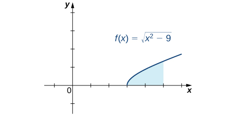

* Solve integration problems involving the square root of a sum or difference of two squares.

In this section, we explore integrals containing expressions of the form <math xmlns="http://www.w3.org/1998/Math/MathML"><mrow><msqrt><mrow><msup><mi>a</mi><mn>2</mn></msup><mo>−</mo><msup><mi>x</mi><mn>2</mn></msup></mrow></msqrt><mo>,</mo></mrow></math>

 <math xmlns="http://www.w3.org/1998/Math/MathML"><mrow><msqrt><mrow><msup><mi>a</mi><mn>2</mn></msup><mo>+</mo><msup><mi>x</mi><mn>2</mn></msup></mrow></msqrt><mo>,</mo></mrow></math>

 and <math xmlns="http://www.w3.org/1998/Math/MathML"><mrow><msqrt><mrow><msup><mi>x</mi><mn>2</mn></msup><mo>−</mo><msup><mi>a</mi><mn>2</mn></msup></mrow></msqrt><mo>,</mo></mrow></math>

 where the values of <math xmlns="http://www.w3.org/1998/Math/MathML"><mi>a</mi></math>

 are positive. We have already encountered and evaluated integrals containing some expressions of this type, but many still remain inaccessible. The technique of **trigonometric substitution**{: data-type="term"} comes in very handy when evaluating these integrals. This technique uses substitution to rewrite these integrals as trigonometric integrals.

# Integrals Involving <math xmlns="http://www.w3.org/1998/Math/MathML"><mrow><msqrt><mrow><msup><mi>a</mi><mn>2</mn></msup><mo>−</mo><msup><mi>x</mi><mn>2</mn></msup></mrow></msqrt></mrow></math>

Before developing a general strategy for integrals containing <math xmlns="http://www.w3.org/1998/Math/MathML"><mrow><msqrt><mrow><msup><mi>a</mi><mn>2</mn></msup><mo>−</mo><msup><mi>x</mi><mn>2</mn></msup></mrow></msqrt><mo>,</mo></mrow></math>

 consider the integral <math xmlns="http://www.w3.org/1998/Math/MathML"><mrow><mstyle displaystyle="true"><mrow><mo stretchy="false">∫</mo><mrow><msqrt><mrow><mn>9</mn><mo>−</mo><msup><mi>x</mi><mn>2</mn></msup></mrow></msqrt></mrow></mrow></mstyle><mi>d</mi><mi>x</mi><mo>.</mo></mrow></math>

 This integral cannot be evaluated using any of the techniques we have discussed so far. However, if we make the substitution <math xmlns="http://www.w3.org/1998/Math/MathML"><mrow><mi>x</mi><mo>=</mo><mn>3</mn><mspace width="0.1em" /><mtext>sin</mtext><mspace width="0.1em" /><mi>θ</mi><mo>,</mo></mrow></math>

 we have <math xmlns="http://www.w3.org/1998/Math/MathML"><mrow><mi>d</mi><mi>x</mi><mo>=</mo><mn>3</mn><mspace width="0.1em" /><mtext>cos</mtext><mspace width="0.1em" /><mi>θ</mi><mi>d</mi><mi>θ</mi><mo>.</mo></mrow></math>

 After substituting into the integral, we have

<math xmlns="http://www.w3.org/1998/Math/MathML"><mrow><mstyle displaystyle="true"><mrow><mo stretchy="false">∫</mo><mrow><msqrt><mrow><mn>9</mn><mo>−</mo><msup><mi>x</mi><mn>2</mn></msup></mrow></msqrt><mspace width="0.1em" /><mi>d</mi><mi>x</mi></mrow></mrow></mstyle><mo>=</mo><msup><mstyle mathsize="140%" displaystyle="true"><mo stretchy="false">∫</mo></mstyle><mtext>​</mtext></msup><msqrt><mrow><mn>9</mn><mo>−</mo><msup><mrow><mo stretchy="false">(</mo><mn>3</mn><mspace width="0.1em" /><mtext>sin</mtext><mspace width="0.1em" /><mi>θ</mi><mo stretchy="false">)</mo></mrow><mn>2</mn></msup></mrow></msqrt><mn>3</mn><mspace width="0.1em" /><mtext>cos</mtext><mspace width="0.1em" /><mi>θ</mi><mi>d</mi><mi>θ</mi><mo>.</mo></mrow></math>

After simplifying, we have

<math xmlns="http://www.w3.org/1998/Math/MathML"><mrow><msup><mstyle mathsize="140%" displaystyle="true"><mo stretchy="false">∫</mo></mstyle><mtext>​</mtext></msup><msqrt><mrow><mn>9</mn><mo>−</mo><msup><mi>x</mi><mn>2</mn></msup></mrow></msqrt><mspace width="0.1em" /><mi>d</mi><mi>x</mi><mo>=</mo><msup><mstyle mathsize="140%" displaystyle="true"><mo stretchy="false">∫</mo></mstyle><mtext>​</mtext></msup><mn>9</mn><msqrt><mrow><mn>1</mn><mo>−</mo><msup><mrow><mtext>sin</mtext></mrow><mn>2</mn></msup><mi>θ</mi></mrow></msqrt><mspace width="0.1em" /><mtext>cos</mtext><mspace width="0.1em" /><mi>θ</mi><mi>d</mi><mi>θ</mi><mo>.</mo></mrow></math>

Letting <math xmlns="http://www.w3.org/1998/Math/MathML"><mrow><mn>1</mn><mo>−</mo><msup><mrow><mtext>sin</mtext></mrow><mn>2</mn></msup><mi>θ</mi><mo>=</mo><msup><mrow><mtext>cos</mtext></mrow><mn>2</mn></msup><mi>θ</mi><mo>,</mo></mrow></math>

 we now have

<math xmlns="http://www.w3.org/1998/Math/MathML"><mrow><msup><mstyle mathsize="140%" displaystyle="true"><mo stretchy="false">∫</mo></mstyle><mtext>​</mtext></msup><msqrt><mrow><mn>9</mn><mo>−</mo><msup><mi>x</mi><mn>2</mn></msup></mrow></msqrt><mspace width="0.1em" /><mi>d</mi><mi>x</mi><mo>=</mo><msup><mstyle mathsize="140%" displaystyle="true"><mo stretchy="false">∫</mo></mstyle><mtext>​</mtext></msup><mn>9</mn><msqrt><mrow><msup><mrow><mtext>cos</mtext></mrow><mn>2</mn></msup><mi>θ</mi></mrow></msqrt><mspace width="0.1em" /><mtext>cos</mtext><mspace width="0.1em" /><mi>θ</mi><mi>d</mi><mi>θ</mi><mo>.</mo></mrow></math>

Assuming that <math xmlns="http://www.w3.org/1998/Math/MathML"><mrow><mtext>cos</mtext><mspace width="0.1em" /><mi>θ</mi><mo>≥</mo><mn>0</mn><mo>,</mo></mrow></math>

 we have

<math xmlns="http://www.w3.org/1998/Math/MathML"><mrow><msup><mstyle mathsize="140%" displaystyle="true"><mo stretchy="false">∫</mo></mstyle><mtext>​</mtext></msup><msqrt><mrow><mn>9</mn><mo>−</mo><msup><mi>x</mi><mn>2</mn></msup></mrow></msqrt><mspace width="0.1em" /><mi>d</mi><mi>x</mi><mo>=</mo><msup><mstyle mathsize="140%" displaystyle="true"><mo stretchy="false">∫</mo></mstyle><mtext>​</mtext></msup><mn>9</mn><mspace width="0.1em" /><msup><mrow><mtext>cos</mtext></mrow><mn>2</mn></msup><mi>θ</mi><mi>d</mi><mi>θ</mi><mo>.</mo></mrow></math>

At this point, we can evaluate the integral using the techniques developed for integrating powers and products of trigonometric functions. Before completing this example, let’s take a look at the general theory behind this idea.

To evaluate integrals involving <math xmlns="http://www.w3.org/1998/Math/MathML"><mrow><msqrt><mrow><msup><mi>a</mi><mn>2</mn></msup><mo>−</mo><msup><mi>x</mi><mn>2</mn></msup></mrow></msqrt><mo>,</mo></mrow></math>

 we make the substitution <math xmlns="http://www.w3.org/1998/Math/MathML"><mrow><mi>x</mi><mo>=</mo><mi>a</mi><mspace width="0.1em" /><mtext>sin</mtext><mspace width="0.1em" /><mi>θ</mi></mrow></math>

 and <math xmlns="http://www.w3.org/1998/Math/MathML"><mrow><mi>d</mi><mi>x</mi><mo>=</mo><mi>a</mi><mspace width="0.1em" /><mtext>cos</mtext><mspace width="0.1em" /><mi>θ</mi><mo>.</mo></mrow></math>

 To see that this actually makes sense, consider the following argument: The domain of <math xmlns="http://www.w3.org/1998/Math/MathML"><mrow><msqrt><mrow><msup><mi>a</mi><mn>2</mn></msup><mo>−</mo><msup><mi>x</mi><mn>2</mn></msup></mrow></msqrt></mrow></math>

 is <math xmlns="http://www.w3.org/1998/Math/MathML"><mrow><mo stretchy="false">[</mo><mtext>−</mtext><mi>a</mi><mo>,</mo><mi>a</mi><mo stretchy="false">]</mo><mo>.</mo></mrow></math>

 Thus, <math xmlns="http://www.w3.org/1998/Math/MathML"><mrow><mtext>−</mtext><mi>a</mi><mo>≤</mo><mi>x</mi><mo>≤</mo><mi>a</mi><mo>.</mo></mrow></math>

 Consequently, <math xmlns="http://www.w3.org/1998/Math/MathML"><mrow><mn>−1</mn><mo>≤</mo><mfrac><mi>x</mi><mi>a</mi></mfrac><mo>≤</mo><mn>1</mn><mo>.</mo></mrow></math>

 Since the range of <math xmlns="http://www.w3.org/1998/Math/MathML"><mrow><mtext>sin</mtext><mspace width="0.1em" /><mi>x</mi></mrow></math>

 over <math xmlns="http://www.w3.org/1998/Math/MathML"><mrow><mrow><mo>[</mo><mrow><mtext>−</mtext><mo stretchy="false">(</mo><mi>π</mi><mtext>/</mtext><mn>2</mn><mo stretchy="false">)</mo><mo>,</mo><mi>π</mi><mtext>/</mtext><mn>2</mn></mrow><mo>]</mo></mrow></mrow></math>

 is <math xmlns="http://www.w3.org/1998/Math/MathML"><mrow><mo stretchy="false">[</mo><mn>−1</mn><mo>,</mo><mn>1</mn><mo stretchy="false">]</mo><mo>,</mo></mrow></math>

 there is a unique angle <math xmlns="http://www.w3.org/1998/Math/MathML"><mi>θ</mi></math>

 satisfying <math xmlns="http://www.w3.org/1998/Math/MathML"><mrow><mtext>−</mtext><mo stretchy="false">(</mo><mi>π</mi><mtext>/</mtext><mn>2</mn><mo stretchy="false">)</mo><mo>≤</mo><mi>θ</mi><mo>≤</mo><mi>π</mi><mtext>/</mtext><mn>2</mn></mrow></math>

 so that <math xmlns="http://www.w3.org/1998/Math/MathML"><mrow><mtext>sin</mtext><mspace width="0.1em" /><mi>θ</mi><mo>=</mo><mi>x</mi><mtext>/</mtext><mi>a</mi><mo>,</mo></mrow></math>

 or equivalently, so that <math xmlns="http://www.w3.org/1998/Math/MathML"><mrow><mi>x</mi><mo>=</mo><mi>a</mi><mspace width="0.1em" /><mtext>sin</mtext><mspace width="0.1em" /><mi>θ</mi><mo>.</mo></mrow></math>

 If we substitute <math xmlns="http://www.w3.org/1998/Math/MathML"><mrow><mi>x</mi><mo>=</mo><mi>a</mi><mspace width="0.1em" /><mtext>sin</mtext><mspace width="0.1em" /><mi>θ</mi></mrow></math>

 into <math xmlns="http://www.w3.org/1998/Math/MathML"><mrow><msqrt><mrow><msup><mi>a</mi><mn>2</mn></msup><mo>−</mo><msup><mi>x</mi><mn>2</mn></msup></mrow></msqrt><mo>,</mo></mrow></math>

 we get

<math xmlns="http://www.w3.org/1998/Math/MathML"><mtable><mtr><mtd columnalign="right"><msqrt><mrow><msup><mi>a</mi><mn>2</mn></msup><mo>−</mo><msup><mi>x</mi><mn>2</mn></msup></mrow></msqrt></mtd><mtd columnalign="left"><mo>=</mo><msqrt><mrow><msup><mi>a</mi><mn>2</mn></msup><mo>−</mo><msup><mrow><mo stretchy="false">(</mo><mi>a</mi><mspace width="0.1em" /><mtext>sin</mtext><mspace width="0.1em" /><mi>θ</mi><mo stretchy="false">)</mo></mrow><mn>2</mn></msup></mrow></msqrt></mtd><mtd /><mtd /><mtd columnalign="left"><mtext>Let</mtext><mspace width="0.2em" /><mi>x</mi><mo>=</mo><mi>a</mi><mspace width="0.1em" /><mtext>sin</mtext><mspace width="0.1em" /><mi>θ</mi><mspace width="0.2em" /><mtext>where</mtext><mspace width="0.2em" /><mo>−</mo><mfrac><mi>π</mi><mn>2</mn></mfrac><mo>≤</mo><mi>θ</mi><mo>≤</mo><mfrac><mi>π</mi><mn>2</mn></mfrac><mo>.</mo><mspace width="0.2em" /><mtext>Simplify.</mtext></mtd></mtr><mtr><mtd /><mtd columnalign="left"><mo>=</mo><msqrt><mrow><msup><mi>a</mi><mn>2</mn></msup><mo>−</mo><msup><mi>a</mi><mn>2</mn></msup><msup><mrow><mtext>sin</mtext></mrow><mn>2</mn></msup><mi>θ</mi></mrow></msqrt></mtd><mtd /><mtd /><mtd columnalign="left"><mtext>Factor out</mtext><mspace width="0.2em" /><msup><mi>a</mi><mn>2</mn></msup><mo>.</mo></mtd></mtr><mtr><mtd /><mtd columnalign="left"><mo>=</mo><msqrt><mrow><msup><mi>a</mi><mn>2</mn></msup><mo stretchy="false">(</mo><mn>1</mn><mo>−</mo><msup><mrow><mtext>sin</mtext></mrow><mn>2</mn></msup><mi>θ</mi><mo stretchy="false">)</mo></mrow></msqrt></mtd><mtd /><mtd /><mtd columnalign="left"><mtext>Substitute</mtext><mspace width="0.2em" /><mn>1</mn><mo>−</mo><msup><mrow><mtext>sin</mtext></mrow><mn>2</mn></msup><mi>x</mi><mo>=</mo><msup><mrow><mtext>cos</mtext></mrow><mn>2</mn></msup><mi>x</mi><mo>.</mo></mtd></mtr><mtr><mtd /><mtd columnalign="left"><mo>=</mo><msqrt><mrow><msup><mi>a</mi><mn>2</mn></msup><msup><mrow><mtext>cos</mtext></mrow><mn>2</mn></msup><mi>θ</mi></mrow></msqrt></mtd><mtd /><mtd /><mtd columnalign="left"><mtext>Take the square root.</mtext></mtd></mtr><mtr><mtd /><mtd columnalign="left"><mo>=</mo><mrow><mo>\|</mo><mrow><mi>a</mi><mspace width="0.1em" /><mtext>cos</mtext><mspace width="0.1em" /><mi>θ</mi></mrow><mo>\|</mo></mrow></mtd><mtd /><mtd /><mtd /></mtr><mtr><mtd /><mtd columnalign="left"><mo>=</mo><mi>a</mi><mspace width="0.1em" /><mtext>cos</mtext><mspace width="0.1em" /><mi>θ</mi><mo>.</mo></mtd><mtd /><mtd /><mtd /></mtr></mtable></math>

Since <math xmlns="http://www.w3.org/1998/Math/MathML"><mrow><mtext>cos</mtext><mspace width="0.1em" /><mi>x</mi><mo>≥</mo><mn>0</mn></mrow></math>

 on <math xmlns="http://www.w3.org/1998/Math/MathML"><mrow><mo>−</mo><mfrac><mi>π</mi><mn>2</mn></mfrac><mo>≤</mo><mi>θ</mi><mo>≤</mo><mfrac><mi>π</mi><mn>2</mn></mfrac></mrow></math>

 and <math xmlns="http://www.w3.org/1998/Math/MathML"><mrow><mi>a</mi><mo>&gt;</mo><mn>0</mn><mo>,</mo></mrow></math>

 <math xmlns="http://www.w3.org/1998/Math/MathML"><mrow><mrow><mo>\|</mo><mrow><mi>a</mi><mspace width="0.1em" /><mtext>cos</mtext><mspace width="0.1em" /><mi>θ</mi></mrow><mo>\|</mo></mrow><mo>=</mo><mi>a</mi><mspace width="0.1em" /><mtext>cos</mtext><mspace width="0.1em" /><mi>θ</mi><mo>.</mo></mrow></math>

 We can see, from this discussion, that by making the substitution <math xmlns="http://www.w3.org/1998/Math/MathML"><mrow><mi>x</mi><mo>=</mo><mi>a</mi><mspace width="0.1em" /><mtext>sin</mtext><mspace width="0.1em" /><mi>θ</mi><mo>,</mo></mrow></math>

 we are able to convert an integral involving a radical into an integral involving trigonometric functions. After we evaluate the integral, we can convert the solution back to an expression involving <math xmlns="http://www.w3.org/1998/Math/MathML"><mrow><mi>x</mi><mo>.</mo></mrow></math>

 To see how to do this, let’s begin by assuming that <math xmlns="http://www.w3.org/1998/Math/MathML"><mrow><mn>0</mn><mo>&lt;</mo><mi>x</mi><mo>&lt;</mo><mi>a</mi><mo>.</mo></mrow></math>

 In this case, <math xmlns="http://www.w3.org/1998/Math/MathML"><mrow><mn>0</mn><mo>&lt;</mo><mi>θ</mi><mo>&lt;</mo><mfrac><mi>π</mi><mn>2</mn></mfrac><mo>.</mo></mrow></math>

 Since <math xmlns="http://www.w3.org/1998/Math/MathML"><mrow><mtext>sin</mtext><mspace width="0.1em" /><mi>θ</mi><mo>=</mo><mfrac><mi>x</mi><mi>a</mi></mfrac><mo>,</mo></mrow></math>

 we can draw the reference triangle in [\[link\]](#CNX_Calc_Figure_07_03_001) to assist in expressing the values of <math xmlns="http://www.w3.org/1998/Math/MathML"><mrow><mtext>cos</mtext><mspace width="0.1em" /><mi>θ</mi><mo>,</mo></mrow></math>

 <math xmlns="http://www.w3.org/1998/Math/MathML"><mrow><mtext>tan</mtext><mspace width="0.1em" /><mi>θ</mi><mo>,</mo></mrow></math>

 and the remaining trigonometric functions in terms of <math xmlns="http://www.w3.org/1998/Math/MathML"><mrow><mi>x</mi><mo>.</mo></mrow></math>

 It can be shown that this triangle actually produces the correct values of the trigonometric functions evaluated at <math xmlns="http://www.w3.org/1998/Math/MathML"><mi>θ</mi></math>

 for all <math xmlns="http://www.w3.org/1998/Math/MathML"><mi>θ</mi></math>

 satisfying <math xmlns="http://www.w3.org/1998/Math/MathML"><mrow><mo>−</mo><mfrac><mi>π</mi><mn>2</mn></mfrac><mo>≤</mo><mi>θ</mi><mo>≤</mo><mfrac><mi>π</mi><mn>2</mn></mfrac><mo>.</mo></mrow></math>

 It is useful to observe that the expression <math xmlns="http://www.w3.org/1998/Math/MathML"><mrow><msqrt><mrow><msup><mi>a</mi><mn>2</mn></msup><mo>−</mo><msup><mi>x</mi><mn>2</mn></msup></mrow></msqrt></mrow></math>

 actually appears as the length of one side of the triangle. Last, should <math xmlns="http://www.w3.org/1998/Math/MathML"><mi>θ</mi></math>

 appear by itself, we use <math xmlns="http://www.w3.org/1998/Math/MathML"><mrow><mi>θ</mi><mo>=</mo><msup><mrow><mtext>sin</mtext></mrow><mrow><mn>−1</mn></mrow></msup><mrow><mo>(</mo><mrow><mfrac><mi>x</mi><mi>a</mi></mfrac></mrow><mo>)</mo></mrow><mo>.</mo></mrow></math>

 {: #CNX_Calc_Figure_07_03_001}

The essential part of this discussion is summarized in the following problem-solving strategy.

Problem-Solving Strategy: Integrating Expressions Involving
<math xmlns="http://www.w3.org/1998/Math/MathML"><mrow><msqrt><mrow><msup><mi>a</mi><mn>2</mn></msup><mo>−</mo><msup><mi>x</mi><mn>2</mn></msup></mrow></msqrt></mrow></math>

1.  It is a good idea to make sure the integral cannot be evaluated easily in another way. For example, although this method can be applied to integrals of the form
    <math xmlns="http://www.w3.org/1998/Math/MathML"><mrow><mstyle displaystyle="true"><mrow><mo stretchy="false">∫</mo><mrow><mfrac><mn>1</mn><mrow><msqrt><mrow><msup><mi>a</mi><mn>2</mn></msup><mo>−</mo><msup><mi>x</mi><mn>2</mn></msup></mrow></msqrt></mrow></mfrac><mi>d</mi><mi>x</mi></mrow></mrow></mstyle><mo>,</mo></mrow></math>
    
    <math xmlns="http://www.w3.org/1998/Math/MathML"><mrow><mstyle displaystyle="true"><mrow><mo stretchy="false">∫</mo><mrow><mfrac><mi>x</mi><mrow><msqrt><mrow><msup><mi>a</mi><mn>2</mn></msup><mo>−</mo><msup><mi>x</mi><mn>2</mn></msup></mrow></msqrt></mrow></mfrac><mi>d</mi><mi>x</mi></mrow></mrow></mstyle><mo>,</mo></mrow></math>
    
    and
    <math xmlns="http://www.w3.org/1998/Math/MathML"><mrow><mstyle displaystyle="true"><mrow><mo stretchy="false">∫</mo><mrow><mi>x</mi><msqrt><mrow><msup><mi>a</mi><mn>2</mn></msup><mo>−</mo><msup><mi>x</mi><mn>2</mn></msup></mrow></msqrt><mspace width="0.1em" /><mi>d</mi><mi>x</mi><mo>,</mo></mrow></mrow></mstyle></mrow></math>
    
    they can each be integrated directly either by formula or by a simple *u*-substitution.
2.  Make the substitution
    <math xmlns="http://www.w3.org/1998/Math/MathML"><mrow><mi>x</mi><mo>=</mo><mi>a</mi><mspace width="0.1em" /><mtext>sin</mtext><mspace width="0.1em" /><mi>θ</mi></mrow></math>
    
    and
    <math xmlns="http://www.w3.org/1998/Math/MathML"><mrow><mi>d</mi><mi>x</mi><mo>=</mo><mi>a</mi><mspace width="0.1em" /><mtext>cos</mtext><mspace width="0.1em" /><mi>θ</mi><mi>d</mi><mi>θ</mi><mo>.</mo></mrow></math>
    
    *Note*\: This substitution yields
    <math xmlns="http://www.w3.org/1998/Math/MathML"><mrow><msqrt><mrow><msup><mi>a</mi><mn>2</mn></msup><mo>−</mo><msup><mi>x</mi><mn>2</mn></msup></mrow></msqrt><mo>=</mo><mi>a</mi><mspace width="0.1em" /><mtext>cos</mtext><mspace width="0.1em" /><mi>θ</mi><mo>.</mo></mrow></math>

3.  Simplify the expression.
4.  Evaluate the integral using techniques from the section on trigonometric integrals.
5.  Use the reference triangle from [\[link\]](#CNX_Calc_Figure_07_03_001) to rewrite the result in terms of
    <math xmlns="http://www.w3.org/1998/Math/MathML"><mrow><mi>x</mi><mo>.</mo></mrow></math>
    
    You may also need to use some trigonometric identities and the relationship
    <math xmlns="http://www.w3.org/1998/Math/MathML"><mrow><mi>θ</mi><mo>=</mo><msup><mrow><mtext>sin</mtext></mrow><mrow><mn>−1</mn></mrow></msup><mrow><mo>(</mo><mrow><mfrac><mi>x</mi><mi>a</mi></mfrac></mrow><mo>)</mo></mrow><mo>.</mo></mrow></math>
{: data-number-style="arabic"}

The following example demonstrates the application of this problem-solving strategy.

Integrating an Expression Involving
<math xmlns="http://www.w3.org/1998/Math/MathML"><mrow><msqrt><mrow><msup><mi>a</mi><mn>2</mn></msup><mo>−</mo><msup><mi>x</mi><mn>2</mn></msup></mrow></msqrt></mrow></math>

Evaluate <math xmlns="http://www.w3.org/1998/Math/MathML"><mrow><msup><mstyle mathsize="140%" displaystyle="true"><mo stretchy="false">∫</mo></mstyle><mtext>​</mtext></msup><msqrt><mrow><mn>9</mn><mo>−</mo><msup><mi>x</mi><mn>2</mn></msup></mrow></msqrt><mspace width="0.1em" /><mi>d</mi><mi>x</mi><mo>.</mo></mrow></math>

Begin by making the substitutions <math xmlns="http://www.w3.org/1998/Math/MathML"><mrow><mi>x</mi><mo>=</mo><mn>3</mn><mspace width="0.1em" /><mtext>sin</mtext><mspace width="0.1em" /><mi>θ</mi></mrow></math>

 and <math xmlns="http://www.w3.org/1998/Math/MathML"><mrow><mi>d</mi><mi>x</mi><mo>=</mo><mn>3</mn><mspace width="0.1em" /><mtext>cos</mtext><mspace width="0.1em" /><mi>θ</mi><mi>d</mi><mi>θ</mi><mo>.</mo></mrow></math>

 Since <math xmlns="http://www.w3.org/1998/Math/MathML"><mrow><mtext>sin</mtext><mspace width="0.1em" /><mi>θ</mi><mo>=</mo><mfrac><mi>x</mi><mn>3</mn></mfrac><mo>,</mo></mrow></math>

 we can construct the reference triangle shown in the following figure.

{: #CNX_Calc_Figure_07_03_002}

Thus,

<math xmlns="http://www.w3.org/1998/Math/MathML"><mtable><mtr><mtd columnalign="right"><msup><mstyle mathsize="140%" displaystyle="true"><mo stretchy="false">∫</mo></mstyle><mtext>​</mtext></msup><msqrt><mrow><mn>9</mn><mo>−</mo><msup><mi>x</mi><mn>2</mn></msup></mrow></msqrt><mspace width="0.1em" /><mi>d</mi><mi>x</mi></mtd><mtd columnalign="left"><mo>=</mo><msup><mstyle mathsize="140%" displaystyle="true"><mo stretchy="false">∫</mo></mstyle><mtext>​</mtext></msup><msqrt><mrow><mn>9</mn><mo>−</mo><msup><mrow><mo stretchy="false">(</mo><mn>3</mn><mspace width="0.1em" /><mtext>sin</mtext><mspace width="0.1em" /><mi>θ</mi><mo stretchy="false">)</mo></mrow><mn>2</mn></msup></mrow></msqrt><mn>3</mn><mspace width="0.1em" /><mtext>cos</mtext><mspace width="0.1em" /><mi>θ</mi><mi>d</mi><mi>θ</mi></mtd><mtd /><mtd /><mtd columnalign="left"><mtext>Substitute</mtext><mspace width="0.2em" /><mi>x</mi><mo>=</mo><mn>3</mn><mspace width="0.1em" /><mtext>sin</mtext><mspace width="0.1em" /><mi>θ</mi><mspace width="0.2em" /><mtext>and</mtext><mspace width="0.2em" /><mi>d</mi><mi>x</mi><mo>=</mo><mn>3</mn><mspace width="0.1em" /><mtext>cos</mtext><mspace width="0.1em" /><mi>θ</mi><mi>d</mi><mi>θ</mi><mo>.</mo></mtd></mtr><mtr><mtd /><mtd columnalign="left"><mo>=</mo><msup><mstyle mathsize="140%" displaystyle="true"><mo stretchy="false">∫</mo></mstyle><mtext>​</mtext></msup><msqrt><mrow><mn>9</mn><mo stretchy="false">(</mo><mn>1</mn><mo>−</mo><msup><mrow><mtext>sin</mtext></mrow><mn>2</mn></msup><mi>θ</mi><mo stretchy="false">)</mo></mrow></msqrt><mn>3</mn><mspace width="0.1em" /><mtext>cos</mtext><mspace width="0.1em" /><mi>θ</mi><mi>d</mi><mi>θ</mi></mtd><mtd /><mtd /><mtd columnalign="left"><mtext>Simplify.</mtext></mtd></mtr><mtr><mtd /><mtd columnalign="left"><mo>=</mo><msup><mstyle mathsize="140%" displaystyle="true"><mo stretchy="false">∫</mo></mstyle><mtext>​</mtext></msup><msqrt><mrow><mn>9</mn><mspace width="0.1em" /><msup><mrow><mtext>cos</mtext></mrow><mn>2</mn></msup><mi>θ</mi></mrow></msqrt><mn>3</mn><mspace width="0.1em" /><mtext>cos</mtext><mspace width="0.1em" /><mi>θ</mi><mi>d</mi><mi>θ</mi></mtd><mtd /><mtd /><mtd columnalign="left"><mtext>Substitute</mtext><mspace width="0.2em" /><msup><mrow><mtext>cos</mtext></mrow><mn>2</mn></msup><mi>θ</mi><mo>=</mo><mn>1</mn><mo>−</mo><msup><mrow><mtext>sin</mtext></mrow><mn>2</mn></msup><mi>θ</mi><mo>.</mo></mtd></mtr><mtr><mtd /><mtd columnalign="left"><mo>=</mo><msup><mstyle mathsize="140%" displaystyle="true"><mo stretchy="false">∫</mo></mstyle><mtext>​</mtext></msup><mn>3</mn><mrow><mo>\|</mo><mrow><mtext>cos</mtext><mspace width="0.1em" /><mi>θ</mi></mrow><mo>\|</mo></mrow><mn>3</mn><mspace width="0.1em" /><mtext>cos</mtext><mspace width="0.1em" /><mi>θ</mi><mi>d</mi><mi>θ</mi></mtd><mtd /><mtd /><mtd columnalign="left"><mtext>Take the square root.</mtext></mtd></mtr><mtr><mtd /><mtd columnalign="left"><mo>=</mo><msup><mstyle mathsize="140%" displaystyle="true"><mo stretchy="false">∫</mo></mstyle><mtext>​</mtext></msup><mn>9</mn><mspace width="0.1em" /><msup><mrow><mtext>cos</mtext></mrow><mn>2</mn></msup><mi>θ</mi><mi>d</mi><mi>θ</mi></mtd><mtd /><mtd /><mtd columnalign="left"><mtable><mtr><mtd columnalign="left"><mtext>Simplify. Since</mtext><mspace width="0.2em" /><mo>−</mo><mfrac><mi>π</mi><mn>2</mn></mfrac><mo>≤</mo><mi>θ</mi><mo>≤</mo><mfrac><mi>π</mi><mn>2</mn></mfrac><mo>,</mo><mspace width="0.2em" /><mtext>cos</mtext><mspace width="0.1em" /><mi>θ</mi><mo>≥</mo><mn>0</mn><mspace width="0.2em" /><mtext>and</mtext></mtd></mtr><mtr><mtd columnalign="left"><mrow><mo>\|</mo><mrow><mtext>cos</mtext><mspace width="0.1em" /><mi>θ</mi></mrow><mo>\|</mo></mrow><mo>=</mo><mtext>cos</mtext><mspace width="0.1em" /><mi>θ</mi><mo>.</mo></mtd></mtr></mtable></mtd></mtr><mtr><mtd /><mtd columnalign="left"><mo>=</mo><msup><mstyle mathsize="140%" displaystyle="true"><mo stretchy="false">∫</mo></mstyle><mtext>​</mtext></msup><mn>9</mn><mrow><mo>(</mo><mrow><mfrac><mn>1</mn><mn>2</mn></mfrac><mo>+</mo><mfrac><mn>1</mn><mn>2</mn></mfrac><mtext>cos</mtext><mo stretchy="false">(</mo><mn>2</mn><mi>θ</mi><mo stretchy="false">)</mo></mrow><mo>)</mo></mrow><mi>d</mi><mi>θ</mi></mtd><mtd /><mtd /><mtd columnalign="left"><mtable><mtr><mtd columnalign="left"><mtext>Use the strategy for integrating an even power</mtext></mtd></mtr><mtr><mtd columnalign="left"><mtext>of</mtext><mspace width="0.2em" /><mtext>cos</mtext><mspace width="0.1em" /><mi>θ</mi><mo>.</mo></mtd></mtr></mtable></mtd></mtr><mtr><mtd /><mtd columnalign="left"><mo>=</mo><mfrac><mn>9</mn><mn>2</mn></mfrac><mi>θ</mi><mo>+</mo><mfrac><mn>9</mn><mn>4</mn></mfrac><mtext>sin</mtext><mo stretchy="false">(</mo><mn>2</mn><mi>θ</mi><mo stretchy="false">)</mo><mo>+</mo><mi>C</mi></mtd><mtd /><mtd /><mtd columnalign="left"><mtext>Evaluate the integral.</mtext></mtd></mtr><mtr><mtd /><mtd columnalign="left"><mo>=</mo><mfrac><mn>9</mn><mn>2</mn></mfrac><mi>θ</mi><mo>+</mo><mfrac><mn>9</mn><mn>4</mn></mfrac><mo stretchy="false">(</mo><mn>2</mn><mspace width="0.1em" /><mtext>sin</mtext><mspace width="0.1em" /><mi>θ</mi><mspace width="0.1em" /><mtext>cos</mtext><mspace width="0.1em" /><mi>θ</mi><mo stretchy="false">)</mo><mo>+</mo><mi>C</mi></mtd><mtd /><mtd /><mtd columnalign="left"><mtext>Substitute</mtext><mspace width="0.2em" /><mtext>sin</mtext><mo stretchy="false">(</mo><mn>2</mn><mi>θ</mi><mo stretchy="false">)</mo><mo>=</mo><mn>2</mn><mspace width="0.1em" /><mtext>sin</mtext><mspace width="0.1em" /><mi>θ</mi><mspace width="0.1em" /><mtext>cos</mtext><mspace width="0.1em" /><mi>θ</mi><mo>.</mo></mtd></mtr><mtr><mtd /><mtd columnalign="left"><mo>=</mo><mfrac><mn>9</mn><mn>2</mn></mfrac><msup><mrow><mtext>sin</mtext></mrow><mrow><mn>−1</mn></mrow></msup><mrow><mo>(</mo><mrow><mfrac><mi>x</mi><mn>3</mn></mfrac></mrow><mo>)</mo></mrow><mo>+</mo><mfrac><mn>9</mn><mn>2</mn></mfrac><mo>·</mo><mfrac><mi>x</mi><mn>3</mn></mfrac><mo>·</mo><mfrac><mrow><msqrt><mrow><mn>9</mn><mo>−</mo><msup><mi>x</mi><mn>2</mn></msup></mrow></msqrt></mrow><mn>3</mn></mfrac><mo>+</mo><mi>C</mi></mtd><mtd /><mtd /><mtd columnalign="left"><mtable><mtr><mtd columnalign="left"><mtext>Substitute</mtext><mspace width="0.2em" /><msup><mrow><mtext>sin</mtext></mrow><mrow><mn>−1</mn></mrow></msup><mrow><mo>(</mo><mrow><mfrac><mi>x</mi><mn>3</mn></mfrac></mrow><mo>)</mo></mrow><mo>=</mo><mi>θ</mi><mspace width="0.2em" /><mtext>and</mtext><mspace width="0.2em" /><mtext>sin</mtext><mspace width="0.1em" /><mi>θ</mi><mo>=</mo><mfrac><mi>x</mi><mn>3</mn></mfrac><mo>.</mo><mspace width="0.2em" /><mtext>Use</mtext></mtd></mtr><mtr><mtd columnalign="left"><mtext>the reference triangle to see that</mtext></mtd></mtr><mtr><mtd columnalign="left"><mtext>cos</mtext><mspace width="0.1em" /><mi>θ</mi><mo>=</mo><mfrac><mrow><msqrt><mrow><mn>9</mn><mo>−</mo><msup><mi>x</mi><mn>2</mn></msup></mrow></msqrt></mrow><mn>3</mn></mfrac><mspace width="0.2em" /><mtext>and make this substitution.</mtext></mtd></mtr></mtable></mtd></mtr><mtr><mtd /><mtd columnalign="left"><mo>=</mo><mfrac><mn>9</mn><mn>2</mn></mfrac><msup><mrow><mtext>sin</mtext></mrow><mrow><mn>−1</mn></mrow></msup><mrow><mo>(</mo><mrow><mfrac><mi>x</mi><mn>3</mn></mfrac></mrow><mo>)</mo></mrow><mo>+</mo><mfrac><mrow><mi>x</mi><msqrt><mrow><mn>9</mn><mo>−</mo><msup><mi>x</mi><mn>2</mn></msup></mrow></msqrt></mrow><mn>2</mn></mfrac><mo>+</mo><mi>C</mi><mo>.</mo></mtd><mtd /><mtd /><mtd columnalign="left"><mtext>Simplify.</mtext></mtd></mtr></mtable></math>

Integrating an Expression Involving
<math xmlns="http://www.w3.org/1998/Math/MathML"><mrow><msqrt><mrow><msup><mi>a</mi><mn>2</mn></msup><mo>−</mo><msup><mi>x</mi><mn>2</mn></msup></mrow></msqrt></mrow></math>

Evaluate <math xmlns="http://www.w3.org/1998/Math/MathML"><mrow><mstyle displaystyle="true"><mrow><mo stretchy="false">∫</mo><mrow><mfrac><mrow><msqrt><mrow><mn>4</mn><mo>−</mo><msup><mi>x</mi><mn>2</mn></msup></mrow></msqrt></mrow><mi>x</mi></mfrac><mi>d</mi><mi>x</mi><mo>.</mo></mrow></mrow></mstyle></mrow></math>

First make the substitutions <math xmlns="http://www.w3.org/1998/Math/MathML"><mrow><mi>x</mi><mo>=</mo><mn>2</mn><mspace width="0.1em" /><mtext>sin</mtext><mspace width="0.1em" /><mi>θ</mi></mrow></math>

 and <math xmlns="http://www.w3.org/1998/Math/MathML"><mrow><mi>d</mi><mi>x</mi><mo>=</mo><mn>2</mn><mspace width="0.1em" /><mtext>cos</mtext><mspace width="0.1em" /><mi>θ</mi><mi>d</mi><mi>θ</mi><mo>.</mo></mrow></math>

 Since <math xmlns="http://www.w3.org/1998/Math/MathML"><mrow><mtext>sin</mtext><mspace width="0.1em" /><mi>θ</mi><mo>=</mo><mfrac><mi>x</mi><mn>2</mn></mfrac><mo>,</mo></mrow></math>

 we can construct the reference triangle shown in the following figure.

{: #CNX_Calc_Figure_07_03_003}

Thus,

<math xmlns="http://www.w3.org/1998/Math/MathML"><mtable><mtr><mtd columnalign="right"><mstyle displaystyle="true"><mrow><mo stretchy="false">∫</mo><mrow><mfrac><mrow><msqrt><mrow><mn>4</mn><mo>−</mo><msup><mi>x</mi><mn>2</mn></msup></mrow></msqrt></mrow><mi>x</mi></mfrac><mi>d</mi><mi>x</mi></mrow></mrow></mstyle></mtd><mtd columnalign="left"><mo>=</mo><mstyle displaystyle="true"><mrow><mo stretchy="false">∫</mo><mrow><mfrac><mrow><msqrt><mrow><mn>4</mn><mo>−</mo><msup><mrow><mo stretchy="false">(</mo><mn>2</mn><mspace width="0.1em" /><mtext>sin</mtext><mspace width="0.1em" /><mi>θ</mi><mo stretchy="false">)</mo></mrow><mn>2</mn></msup></mrow></msqrt></mrow><mrow><mn>2</mn><mspace width="0.1em" /><mtext>sin</mtext><mspace width="0.1em" /><mi>θ</mi></mrow></mfrac><mn>2</mn><mspace width="0.1em" /><mtext>cos</mtext><mspace width="0.1em" /><mi>θ</mi><mi>d</mi><mi>θ</mi></mrow></mrow></mstyle></mtd><mtd /><mtd /><mtd columnalign="left"><mtext>Substitute</mtext><mspace width="0.2em" /><mi>x</mi><mo>=</mo><mn>2</mn><mspace width="0.1em" /><mtext>sin</mtext><mspace width="0.1em" /><mi>θ</mi><mspace width="0.2em" /><mtext>and</mtext><mspace width="0.2em" /><mo>=</mo><mn>2</mn><mspace width="0.1em" /><mtext>cos</mtext><mspace width="0.1em" /><mi>θ</mi><mi>d</mi><mi>θ</mi><mo>.</mo></mtd></mtr><mtr><mtd /><mtd columnalign="left"><mo>=</mo><mstyle displaystyle="true"><mrow><mo stretchy="false">∫</mo><mrow><mfrac><mrow><mn>2</mn><mspace width="0.1em" /><msup><mrow><mtext>cos</mtext></mrow><mn>2</mn></msup><mi>θ</mi></mrow><mrow><mtext>sin</mtext><mspace width="0.1em" /><mi>θ</mi></mrow></mfrac><mi>d</mi><mi>θ</mi></mrow></mrow></mstyle></mtd><mtd /><mtd /><mtd columnalign="left"><mtext>Substitute</mtext><mspace width="0.2em" /><msup><mrow><mtext>cos</mtext></mrow><mn>2</mn></msup><mi>θ</mi><mo>=</mo><mn>1</mn><mo>−</mo><msup><mrow><mtext>sin</mtext></mrow><mn>2</mn></msup><mi>θ</mi><mspace width="0.2em" /><mtext>and simplify.</mtext></mtd></mtr><mtr><mtd /><mtd columnalign="left"><mo>=</mo><mstyle displaystyle="true"><mrow><mo stretchy="false">∫</mo><mrow><mfrac><mrow><mn>2</mn><mo stretchy="false">(</mo><mn>1</mn><mo>−</mo><msup><mrow><mtext>sin</mtext></mrow><mn>2</mn></msup><mi>θ</mi><mo stretchy="false">)</mo></mrow><mrow><mtext>sin</mtext><mspace width="0.1em" /><mi>θ</mi></mrow></mfrac><mi>d</mi><mi>θ</mi></mrow></mrow></mstyle></mtd><mtd /><mtd /><mtd columnalign="left"><mtext>Substitute</mtext><mspace width="0.2em" /><msup><mrow><mtext>sin</mtext></mrow><mn>2</mn></msup><mi>θ</mi><mo>=</mo><mn>1</mn><mo>−</mo><msup><mrow><mtext>cos</mtext></mrow><mn>2</mn></msup><mi>θ</mi><mo>.</mo></mtd></mtr><mtr><mtd /><mtd columnalign="left"><mo>=</mo><msup><mstyle mathsize="140%" displaystyle="true"><mo stretchy="false">∫</mo></mstyle><mtext>​</mtext></msup><mo stretchy="false">(</mo><mn>2</mn><mspace width="0.1em" /><mtext>csc</mtext><mspace width="0.1em" /><mi>θ</mi><mo>−</mo><mn>2</mn><mspace width="0.1em" /><mtext>sin</mtext><mspace width="0.1em" /><mi>θ</mi><mo stretchy="false">)</mo><mi>d</mi><mi>θ</mi></mtd><mtd /><mtd /><mtd columnalign="left"><mtable><mtr><mtd columnalign="left"><mtext>Separate the numerator, simplify, and use</mtext></mtd></mtr><mtr><mtd columnalign="left"><mtext>csc</mtext><mspace width="0.1em" /><mi>θ</mi><mo>=</mo><mfrac><mn>1</mn><mrow><mtext>sin</mtext><mspace width="0.1em" /><mi>θ</mi></mrow></mfrac><mo>.</mo></mtd></mtr></mtable></mtd></mtr><mtr><mtd /><mtd columnalign="left"><mo>=</mo><mn>2</mn><mspace width="0.1em" /><mtext>ln</mtext><mrow><mo>\|</mo><mrow><mtext>csc</mtext><mspace width="0.1em" /><mi>θ</mi><mo>−</mo><mtext>cot</mtext><mspace width="0.1em" /><mi>θ</mi></mrow><mo>\|</mo></mrow><mo>+</mo><mn>2</mn><mspace width="0.1em" /><mtext>cos</mtext><mspace width="0.1em" /><mi>θ</mi><mo>+</mo><mi>C</mi></mtd><mtd /><mtd /><mtd columnalign="left"><mtext>Evaluate the integral.</mtext></mtd></mtr><mtr><mtd /><mtd columnalign="left"><mo>=</mo><mn>2</mn><mspace width="0.1em" /><mtext>ln</mtext><mrow><mo>\|</mo><mrow><mfrac><mn>2</mn><mi>x</mi></mfrac><mo>−</mo><mfrac><mrow><msqrt><mrow><mn>4</mn><mo>−</mo><msup><mi>x</mi><mn>2</mn></msup></mrow></msqrt></mrow><mi>x</mi></mfrac></mrow><mo>\|</mo></mrow><mo>+</mo><msqrt><mrow><mn>4</mn><mo>−</mo><msup><mi>x</mi><mn>2</mn></msup></mrow></msqrt><mo>+</mo><mi>C</mi><mo>.</mo></mtd><mtd /><mtd /><mtd columnalign="left"><mtable><mtr><mtd columnalign="left"><mtext>Use the reference triangle to rewrite the</mtext></mtd></mtr><mtr><mtd columnalign="left"><mtext>expression in terms of</mtext><mspace width="0.2em" /><mi>x</mi><mspace width="0.2em" /><mtext>and simplify.</mtext></mtd></mtr></mtable></mtd></mtr></mtable></math>

In the next example, we see that we sometimes have a choice of methods.

Integrating an Expression Involving
<math xmlns="http://www.w3.org/1998/Math/MathML"><mrow><msqrt><mrow><msup><mi>a</mi><mn>2</mn></msup><mo>−</mo><msup><mi>x</mi><mn>2</mn></msup></mrow></msqrt></mrow></math>
Two Ways

Evaluate <math xmlns="http://www.w3.org/1998/Math/MathML"><mrow><msup><mstyle mathsize="140%" displaystyle="true"><mo stretchy="false">∫</mo></mstyle><mtext>​</mtext></msup><msup><mi>x</mi><mn>3</mn></msup><msqrt><mrow><mn>1</mn><mo>−</mo><msup><mi>x</mi><mn>2</mn></msup></mrow></msqrt><mspace width="0.1em" /><mi>d</mi><mi>x</mi></mrow></math>

 two ways: first by using the substitution <math xmlns="http://www.w3.org/1998/Math/MathML"><mrow><mi>u</mi><mo>=</mo><mn>1</mn><mo>−</mo><msup><mi>x</mi><mn>2</mn></msup></mrow></math>

 and then by using a trigonometric substitution.

**Method 1**

Let <math xmlns="http://www.w3.org/1998/Math/MathML"><mrow><mi>u</mi><mo>=</mo><mn>1</mn><mo>−</mo><msup><mi>x</mi><mn>2</mn></msup></mrow></math>

 and hence <math xmlns="http://www.w3.org/1998/Math/MathML"><mrow><msup><mi>x</mi><mn>2</mn></msup><mo>=</mo><mn>1</mn><mo>−</mo><mi>u</mi><mo>.</mo></mrow></math>

 Thus, <math xmlns="http://www.w3.org/1998/Math/MathML"><mrow><mi>d</mi><mi>u</mi><mo>=</mo><mn>−2</mn><mi>x</mi><mspace width="0.1em" /><mi>d</mi><mi>x</mi><mo>.</mo></mrow></math>

 In this case, the integral becomes

<math xmlns="http://www.w3.org/1998/Math/MathML"><mtable><mtr><mtd columnalign="right"><msup><mstyle mathsize="140%" displaystyle="true"><mo stretchy="false">∫</mo></mstyle><mtext>​</mtext></msup><msup><mi>x</mi><mn>3</mn></msup><msqrt><mrow><mn>1</mn><mo>−</mo><msup><mi>x</mi><mn>2</mn></msup></mrow></msqrt><mspace width="0.1em" /><mi>d</mi><mi>x</mi></mtd><mtd columnalign="left"><mo>=</mo><mo>−</mo><mfrac><mn>1</mn><mn>2</mn></mfrac><msup><mstyle mathsize="140%" displaystyle="true"><mo stretchy="false">∫</mo></mstyle><mtext>​</mtext></msup><msup><mi>x</mi><mn>2</mn></msup><msqrt><mrow><mn>1</mn><mo>−</mo><msup><mi>x</mi><mn>2</mn></msup></mrow></msqrt><mo stretchy="false">(</mo><mn>−2</mn><mi>x</mi><mspace width="0.1em" /><mi>d</mi><mi>x</mi><mo stretchy="false">)</mo></mtd><mtd /><mtd /><mtd columnalign="left"><mtext>Make the substitution.</mtext></mtd></mtr><mtr><mtd /><mtd columnalign="left"><mo>=</mo><mo>−</mo><mfrac><mn>1</mn><mn>2</mn></mfrac><msup><mstyle mathsize="140%" displaystyle="true"><mo stretchy="false">∫</mo></mstyle><mtext>​</mtext></msup><mo stretchy="false">(</mo><mn>1</mn><mo>−</mo><mi>u</mi><mo stretchy="false">)</mo><msqrt><mi>u</mi></msqrt><mspace width="0.1em" /><mi>d</mi><mi>u</mi></mtd><mtd /><mtd /><mtd columnalign="left"><mtext>Expand the expression.</mtext></mtd></mtr><mtr><mtd /><mtd columnalign="left"><mo>=</mo><mo>−</mo><mfrac><mn>1</mn><mn>2</mn></mfrac><mstyle displaystyle="true"><mrow><mo stretchy="false">∫</mo><mrow><mrow><mo>(</mo><mrow><msup><mi>u</mi><mrow><mrow><mn>1</mn><mtext>/</mtext><mn>2</mn></mrow></mrow></msup><mo>−</mo><msup><mi>u</mi><mrow><mrow><mn>3</mn><mtext>/</mtext><mn>2</mn></mrow></mrow></msup></mrow><mo>)</mo></mrow><mi>d</mi><mi>u</mi></mrow></mrow></mstyle></mtd><mtd /><mtd /><mtd columnalign="left"><mtext>Evaluate the integral.</mtext></mtd></mtr><mtr><mtd /><mtd columnalign="left"><mo>=</mo><mo>−</mo><mfrac><mn>1</mn><mn>2</mn></mfrac><mrow><mo>(</mo><mrow><mfrac><mn>2</mn><mn>3</mn></mfrac><msup><mi>u</mi><mrow><mrow><mn>3</mn><mtext>/</mtext><mn>2</mn></mrow></mrow></msup><mo>−</mo><mfrac><mn>2</mn><mn>5</mn></mfrac><msup><mi>u</mi><mrow><mrow><mn>5</mn><mtext>/</mtext><mn>2</mn></mrow></mrow></msup></mrow><mo>)</mo></mrow><mo>+</mo><mi>C</mi></mtd><mtd /><mtd /><mtd columnalign="left"><mtext>Rewrite in terms of</mtext><mspace width="0.2em" /><mi>x</mi><mo>.</mo></mtd></mtr><mtr><mtd /><mtd columnalign="left"><mo>=</mo><mo>−</mo><mfrac><mn>1</mn><mn>3</mn></mfrac><msup><mrow><mrow><mo>(</mo><mrow><mn>1</mn><mo>−</mo><msup><mi>x</mi><mn>2</mn></msup></mrow><mo>)</mo></mrow></mrow><mrow><mrow><mn>3</mn><mtext>/</mtext><mn>2</mn></mrow></mrow></msup><mo>+</mo><mfrac><mn>1</mn><mn>5</mn></mfrac><msup><mrow><mrow><mo>(</mo><mrow><mn>1</mn><mo>−</mo><msup><mi>x</mi><mn>2</mn></msup></mrow><mo>)</mo></mrow></mrow><mrow><mrow><mn>5</mn><mtext>/</mtext><mn>2</mn></mrow></mrow></msup><mo>+</mo><mi>C</mi><mo>.</mo></mtd><mtd /><mtd /><mtd /></mtr></mtable></math>

**Method 2**

Let <math xmlns="http://www.w3.org/1998/Math/MathML"><mrow><mi>x</mi><mo>=</mo><mtext>sin</mtext><mspace width="0.1em" /><mi>θ</mi><mo>.</mo></mrow></math>

 In this case, <math xmlns="http://www.w3.org/1998/Math/MathML"><mrow><mi>d</mi><mi>x</mi><mo>=</mo><mtext>cos</mtext><mspace width="0.1em" /><mi>θ</mi><mi>d</mi><mi>θ</mi><mo>.</mo></mrow></math>

 Using this substitution, we have

<math xmlns="http://www.w3.org/1998/Math/MathML"><mtable><mtr><mtd columnalign="right"><msup><mstyle mathsize="140%" displaystyle="true"><mo stretchy="false">∫</mo></mstyle><mtext>​</mtext></msup><msup><mi>x</mi><mn>3</mn></msup><msqrt><mrow><mn>1</mn><mo>−</mo><msup><mi>x</mi><mn>2</mn></msup></mrow></msqrt><mspace width="0.1em" /><mi>d</mi><mi>x</mi></mtd><mtd columnalign="left"><mo>=</mo><msup><mstyle mathsize="140%" displaystyle="true"><mo stretchy="false">∫</mo></mstyle><mtext>​</mtext></msup><msup><mrow><mtext>sin</mtext></mrow><mn>3</mn></msup><mi>θ</mi><mspace width="0.1em" /><msup><mrow><mtext>cos</mtext></mrow><mn>2</mn></msup><mi>θ</mi><mi>d</mi><mi>θ</mi></mtd><mtd /><mtd /><mtd /></mtr><mtr><mtd /><mtd columnalign="left"><mo>=</mo><msup><mstyle mathsize="140%" displaystyle="true"><mo stretchy="false">∫</mo></mstyle><mtext>​</mtext></msup><mrow><mo>(</mo><mrow><mn>1</mn><mo>−</mo><msup><mrow><mtext>cos</mtext></mrow><mn>2</mn></msup><mi>θ</mi></mrow><mo>)</mo></mrow><msup><mrow><mtext>cos</mtext></mrow><mn>2</mn></msup><mi>θ</mi><mspace width="0.1em" /><mtext>sin</mtext><mspace width="0.1em" /><mi>θ</mi><mi>d</mi><mi>θ</mi></mtd><mtd /><mtd /><mtd columnalign="left"><mtext>Let</mtext><mspace width="0.2em" /><mi>u</mi><mo>=</mo><mtext>cos</mtext><mspace width="0.1em" /><mi>θ</mi><mo>.</mo><mspace width="0.2em" /><mtext>Thus,</mtext><mspace width="0.2em" /><mi>d</mi><mi>u</mi><mo>=</mo><mtext>−</mtext><mtext>sin</mtext><mspace width="0.1em" /><mi>θ</mi><mi>d</mi><mi>θ</mi><mo>.</mo></mtd></mtr><mtr><mtd /><mtd columnalign="left"><mo>=</mo><msup><mstyle mathsize="140%" displaystyle="true"><mo stretchy="false">∫</mo></mstyle><mtext>​</mtext></msup><mrow><mo>(</mo><mrow><msup><mi>u</mi><mn>4</mn></msup><mo>−</mo><msup><mi>u</mi><mn>2</mn></msup></mrow><mo>)</mo></mrow><mi>d</mi><mi>u</mi></mtd><mtd /><mtd /><mtd /></mtr><mtr><mtd /><mtd columnalign="left"><mo>=</mo><mfrac><mn>1</mn><mn>5</mn></mfrac><msup><mi>u</mi><mn>5</mn></msup><mo>−</mo><mfrac><mn>1</mn><mn>3</mn></mfrac><msup><mi>u</mi><mn>3</mn></msup><mo>+</mo><mi>C</mi></mtd><mtd /><mtd /><mtd columnalign="left"><mtext>Substitute</mtext><mspace width="0.2em" /><mtext>cos</mtext><mspace width="0.1em" /><mi>θ</mi><mo>=</mo><mi>u</mi><mo>.</mo></mtd></mtr><mtr><mtd /><mtd columnalign="left"><mo>=</mo><mfrac><mn>1</mn><mn>5</mn></mfrac><msup><mrow><mtext>cos</mtext></mrow><mn>5</mn></msup><mi>θ</mi><mo>−</mo><mfrac><mn>1</mn><mn>3</mn></mfrac><msup><mrow><mtext>cos</mtext></mrow><mn>3</mn></msup><mi>θ</mi><mo>+</mo><mi>C</mi></mtd><mtd /><mtd /><mtd columnalign="left"><mtable><mtr><mtd columnalign="left"><mtext>Use a reference triangle to see that</mtext></mtd></mtr><mtr><mtd columnalign="left"><mtext>cos</mtext><mspace width="0.1em" /><mi>θ</mi><mo>=</mo><msqrt><mrow><mn>1</mn><mo>−</mo><msup><mi>x</mi><mn>2</mn></msup></mrow></msqrt><mo>.</mo></mtd></mtr></mtable></mtd></mtr><mtr><mtd /><mtd columnalign="left"><mo>=</mo><mfrac><mn>1</mn><mn>5</mn></mfrac><msup><mrow><mrow><mo>(</mo><mrow><mn>1</mn><mo>−</mo><msup><mi>x</mi><mn>2</mn></msup></mrow><mo>)</mo></mrow></mrow><mrow><mrow><mn>5</mn><mtext>/</mtext><mn>2</mn></mrow></mrow></msup><mo>−</mo><mfrac><mn>1</mn><mn>3</mn></mfrac><msup><mrow><mrow><mo>(</mo><mrow><mn>1</mn><mo>−</mo><msup><mi>x</mi><mn>2</mn></msup></mrow><mo>)</mo></mrow></mrow><mrow><mrow><mn>3</mn><mtext>/</mtext><mn>2</mn></mrow></mrow></msup><mo>+</mo><mi>C</mi><mo>.</mo></mtd><mtd /><mtd /><mtd /></mtr></mtable></math>

Rewrite the integral <math xmlns="http://www.w3.org/1998/Math/MathML"><mrow><mstyle displaystyle="true"><mrow><mo stretchy="false">∫</mo><mrow><mfrac><mrow><msup><mi>x</mi><mn>3</mn></msup></mrow><mrow><msqrt><mrow><mn>25</mn><mo>−</mo><msup><mi>x</mi><mn>2</mn></msup></mrow></msqrt></mrow></mfrac><mi>d</mi><mi>x</mi></mrow></mrow></mstyle></mrow></math>

 using the appropriate trigonometric substitution (do not evaluate the integral).

<math xmlns="http://www.w3.org/1998/Math/MathML"><mrow><msup><mstyle mathsize="140%" displaystyle="true"><mo stretchy="false">∫</mo></mstyle><mtext>​</mtext></msup><mn>125</mn><mspace width="0.1em" /><msup><mrow><mtext>sin</mtext></mrow><mn>3</mn></msup><mi>θ</mi><mi>d</mi><mi>θ</mi></mrow></math>

Hint

Substitute <math xmlns="http://www.w3.org/1998/Math/MathML"><mrow><mi>x</mi><mo>=</mo><mn>5</mn><mspace width="0.1em" /><mtext>sin</mtext><mspace width="0.1em" /><mi>θ</mi></mrow></math>

 and <math xmlns="http://www.w3.org/1998/Math/MathML"><mrow><mi>d</mi><mi>x</mi><mo>=</mo><mn>5</mn><mspace width="0.1em" /><mtext>cos</mtext><mspace width="0.1em" /><mi>θ</mi><mi>d</mi><mi>θ</mi><mo>.</mo></mrow></math>

# Integrating Expressions Involving <math xmlns="http://www.w3.org/1998/Math/MathML"><mrow><msqrt><mrow><msup><mi>a</mi><mn>2</mn></msup><mo>+</mo><msup><mi>x</mi><mn>2</mn></msup></mrow></msqrt></mrow></math>

For integrals containing <math xmlns="http://www.w3.org/1998/Math/MathML"><mrow><msqrt><mrow><msup><mi>a</mi><mn>2</mn></msup><mo>+</mo><msup><mi>x</mi><mn>2</mn></msup><mo>,</mo></mrow></msqrt></mrow></math>

 let’s first consider the domain of this expression. Since <math xmlns="http://www.w3.org/1998/Math/MathML"><mrow><msqrt><mrow><msup><mi>a</mi><mn>2</mn></msup><mo>+</mo><msup><mi>x</mi><mn>2</mn></msup></mrow></msqrt></mrow></math>

 is defined for all real values of <math xmlns="http://www.w3.org/1998/Math/MathML"><mrow><mi>x</mi><mo>,</mo></mrow></math>

 we restrict our choice to those trigonometric functions that have a range of all real numbers. Thus, our choice is restricted to selecting either <math xmlns="http://www.w3.org/1998/Math/MathML"><mrow><mi>x</mi><mo>=</mo><mi>a</mi><mspace width="0.1em" /><mtext>tan</mtext><mspace width="0.1em" /><mi>θ</mi></mrow></math>

 or <math xmlns="http://www.w3.org/1998/Math/MathML"><mrow><mi>x</mi><mo>=</mo><mi>a</mi><mspace width="0.1em" /><mtext>cot</mtext><mspace width="0.1em" /><mi>θ</mi><mo>.</mo></mrow></math>

 Either of these substitutions would actually work, but the standard substitution is <math xmlns="http://www.w3.org/1998/Math/MathML"><mrow><mi>x</mi><mo>=</mo><mi>a</mi><mspace width="0.1em" /><mtext>tan</mtext><mspace width="0.1em" /><mi>θ</mi></mrow></math>

 or, equivalently, <math xmlns="http://www.w3.org/1998/Math/MathML"><mrow><mtext>tan</mtext><mspace width="0.1em" /><mi>θ</mi><mo>=</mo><mi>x</mi><mtext>/</mtext><mi>a</mi><mo>.</mo></mrow></math>

 With this substitution, we make the assumption that <math xmlns="http://www.w3.org/1998/Math/MathML"><mrow><mtext>−</mtext><mo stretchy="false">(</mo><mi>π</mi><mtext>/</mtext><mn>2</mn><mo stretchy="false">)</mo><mo>&lt;</mo><mi>θ</mi><mo>&lt;</mo><mi>π</mi><mtext>/</mtext><mn>2</mn><mo>,</mo></mrow></math>

 so that we also have <math xmlns="http://www.w3.org/1998/Math/MathML"><mrow><mi>θ</mi><mo>=</mo><msup><mrow><mtext>tan</mtext></mrow><mrow><mn>−1</mn></mrow></msup><mrow><mo>(</mo><mrow><mi>x</mi><mtext>/</mtext><mi>a</mi></mrow><mo>)</mo></mrow><mo>.</mo></mrow></math>

 The procedure for using this substitution is outlined in the following problem-solving strategy.

Problem-Solving Strategy: Integrating Expressions Involving
<math xmlns="http://www.w3.org/1998/Math/MathML"><mrow><msqrt><mrow><msup><mi>a</mi><mn>2</mn></msup><mo>+</mo><msup><mi>x</mi><mn>2</mn></msup></mrow></msqrt></mrow></math>

1.  Check to see whether the integral can be evaluated easily by using another method. In some cases, it is more convenient to use an alternative method.
2.  Substitute
    <math xmlns="http://www.w3.org/1998/Math/MathML"><mrow><mi>x</mi><mo>=</mo><mi>a</mi><mspace width="0.1em" /><mtext>tan</mtext><mspace width="0.1em" /><mi>θ</mi></mrow></math>
    
    and
    <math xmlns="http://www.w3.org/1998/Math/MathML"><mrow><mi>d</mi><mi>x</mi><mo>=</mo><mi>a</mi><mspace width="0.1em" /><msup><mrow><mtext>sec</mtext></mrow><mn>2</mn></msup><mi>θ</mi><mi>d</mi><mi>θ</mi><mo>.</mo></mrow></math>
    
    This substitution yields
    * * *
    {: data-type="newline"}
    
    <math xmlns="http://www.w3.org/1998/Math/MathML"><mrow><msqrt><mrow><msup><mi>a</mi><mn>2</mn></msup><mo>+</mo><msup><mi>x</mi><mn>2</mn></msup></mrow></msqrt><mo>=</mo><msqrt><mrow><msup><mi>a</mi><mn>2</mn></msup><mo>+</mo><msup><mrow><mo stretchy="false">(</mo><mi>a</mi><mspace width="0.1em" /><mtext>tan</mtext><mspace width="0.1em" /><mi>θ</mi><mo stretchy="false">)</mo></mrow><mn>2</mn></msup></mrow></msqrt><mo>=</mo><msqrt><mrow><msup><mi>a</mi><mn>2</mn></msup><mo stretchy="false">(</mo><mn>1</mn><mo>+</mo><msup><mrow><mtext>tan</mtext></mrow><mn>2</mn></msup><mi>θ</mi><mo stretchy="false">)</mo></mrow></msqrt><mo>=</mo><msqrt><mrow><msup><mi>a</mi><mn>2</mn></msup><msup><mrow><mtext>sec</mtext></mrow><mn>2</mn></msup><mi>θ</mi></mrow></msqrt><mo>=</mo><mrow><mo>\|</mo><mrow><mi>a</mi><mspace width="0.1em" /><mtext>sec</mtext><mspace width="0.1em" /><mi>θ</mi></mrow><mo>\|</mo></mrow><mo>=</mo><mi>a</mi><mspace width="0.1em" /><mtext>sec</mtext><mspace width="0.1em" /><mi>θ</mi><mo>.</mo></mrow></math>
    
    (Since
    <math xmlns="http://www.w3.org/1998/Math/MathML"><mrow><mo>−</mo><mfrac><mi>π</mi><mn>2</mn></mfrac><mo>&lt;</mo><mi>θ</mi><mo>&lt;</mo><mfrac><mi>π</mi><mn>2</mn></mfrac></mrow></math>
    
    and
    <math xmlns="http://www.w3.org/1998/Math/MathML"><mrow><mtext>sec</mtext><mspace width="0.1em" /><mi>θ</mi><mo>&gt;</mo><mn>0</mn></mrow></math>
    
    over this interval,
    <math xmlns="http://www.w3.org/1998/Math/MathML"><mrow><mrow><mo>\|</mo><mrow><mi>a</mi><mspace width="0.1em" /><mtext>sec</mtext><mspace width="0.1em" /><mi>θ</mi></mrow><mo>\|</mo></mrow><mo>=</mo><mi>a</mi><mspace width="0.1em" /><mtext>sec</mtext><mspace width="0.1em" /><mi>θ</mi><mo>.</mo><mo stretchy="false">)</mo></mrow></math>

3.  Simplify the expression.
4.  Evaluate the integral using techniques from the section on trigonometric integrals.
5.  Use the reference triangle from [\[link\]](#CNX_Calc_Figure_07_03_004) to rewrite the result in terms of
    <math xmlns="http://www.w3.org/1998/Math/MathML"><mrow><mi>x</mi><mo>.</mo></mrow></math>
    
    You may also need to use some trigonometric identities and the relationship
    <math xmlns="http://www.w3.org/1998/Math/MathML"><mrow><mi>θ</mi><mo>=</mo><msup><mrow><mtext>tan</mtext></mrow><mrow><mn>−1</mn></mrow></msup><mrow><mo>(</mo><mrow><mfrac><mi>x</mi><mi>a</mi></mfrac></mrow><mo>)</mo></mrow><mo>.</mo></mrow></math>
    
    (*Note*\: The reference triangle is based on the assumption that
    <math xmlns="http://www.w3.org/1998/Math/MathML"><mrow><mi>x</mi><mo>&gt;</mo><mn>0</mn><mo>;</mo></mrow></math>
    
    however, the trigonometric ratios produced from the reference triangle are the same as the ratios for which
    <math xmlns="http://www.w3.org/1998/Math/MathML"><mrow><mi>x</mi><mo>≤</mo><mn>0.</mn><mo stretchy="false">)</mo></mrow></math>
{: data-number-style="arabic"}

 {: #CNX_Calc_Figure_07_03_004}

Integrating an Expression Involving
<math xmlns="http://www.w3.org/1998/Math/MathML"><mrow><msqrt><mrow><msup><mi>a</mi><mn>2</mn></msup><mo>+</mo><msup><mi>x</mi><mn>2</mn></msup></mrow></msqrt></mrow></math>

Evaluate <math xmlns="http://www.w3.org/1998/Math/MathML"><mrow><mstyle displaystyle="true"><mrow><mo stretchy="false">∫</mo><mrow><mfrac><mrow><mi>d</mi><mi>x</mi></mrow><mrow><msqrt><mrow><mn>1</mn><mo>+</mo><msup><mi>x</mi><mn>2</mn></msup></mrow></msqrt></mrow></mfrac></mrow></mrow></mstyle></mrow></math>

 and check the solution by differentiating.

Begin with the substitution <math xmlns="http://www.w3.org/1998/Math/MathML"><mrow><mi>x</mi><mo>=</mo><mtext>tan</mtext><mspace width="0.1em" /><mi>θ</mi></mrow></math>

 and <math xmlns="http://www.w3.org/1998/Math/MathML"><mrow><mi>d</mi><mi>x</mi><mo>=</mo><msup><mrow><mtext>sec</mtext></mrow><mn>2</mn></msup><mi>θ</mi><mi>d</mi><mi>θ</mi><mo>.</mo></mrow></math>

 Since <math xmlns="http://www.w3.org/1998/Math/MathML"><mrow><mtext>tan</mtext><mspace width="0.1em" /><mi>θ</mi><mo>=</mo><mi>x</mi><mo>,</mo></mrow></math>

 draw the reference triangle in the following figure.

{: #CNX_Calc_Figure_07_03_005}

Thus,

<math xmlns="http://www.w3.org/1998/Math/MathML"><mtable><mtr><mtd columnalign="right"><mstyle displaystyle="true"><mrow><mo stretchy="false">∫</mo><mrow><mfrac><mrow><mi>d</mi><mi>x</mi></mrow><mrow><msqrt><mrow><mn>1</mn><mo>+</mo><msup><mi>x</mi><mn>2</mn></msup></mrow></msqrt></mrow></mfrac></mrow></mrow></mstyle></mtd><mtd columnalign="left"><mo>=</mo><mstyle displaystyle="true"><mrow><mo stretchy="false">∫</mo><mrow><mfrac><mrow><msup><mrow><mtext>sec</mtext></mrow><mn>2</mn></msup><mi>θ</mi></mrow><mrow><mtext>sec</mtext><mspace width="0.1em" /><mi>θ</mi></mrow></mfrac><mi>d</mi><mi>θ</mi></mrow></mrow></mstyle></mtd><mtd /><mtd /><mtd columnalign="left"><mtable><mtr><mtd columnalign="left"><mtext>Substitute</mtext><mspace width="0.2em" /><mi>x</mi><mo>=</mo><mtext>tan</mtext><mspace width="0.1em" /><mi>θ</mi><mspace width="0.2em" /><mtext>and</mtext><mspace width="0.2em" /><mi>d</mi><mi>x</mi><mo>=</mo><msup><mrow><mtext>sec</mtext></mrow><mn>2</mn></msup><mi>θ</mi><mi>d</mi><mi>θ</mi><mo>.</mo><mspace width="0.2em" /><mtext>This</mtext></mtd></mtr><mtr><mtd columnalign="left"><mtext>substitution makes</mtext><mspace width="0.2em" /><msqrt><mrow><mn>1</mn><mo>+</mo><msup><mi>x</mi><mn>2</mn></msup></mrow></msqrt><mo>=</mo><mtext>sec</mtext><mspace width="0.1em" /><mi>θ</mi><mo>.</mo><mspace width="0.2em" /><mtext>Simplify.</mtext></mtd></mtr></mtable></mtd></mtr><mtr><mtd /><mtd columnalign="left"><mo>=</mo><msup><mstyle mathsize="140%" displaystyle="true"><mo stretchy="false">∫</mo></mstyle><mtext>​</mtext></msup><mtext>sec</mtext><mspace width="0.1em" /><mi>θ</mi><mi>d</mi><mi>θ</mi></mtd><mtd /><mtd /><mtd columnalign="left"><mtext>Evaluate the integral.</mtext></mtd></mtr><mtr><mtd /><mtd columnalign="left"><mo>=</mo><mtext>ln</mtext><mrow><mo>\|</mo><mrow><mtext>sec</mtext><mspace width="0.1em" /><mi>θ</mi><mo>+</mo><mtext>tan</mtext><mspace width="0.1em" /><mi>θ</mi></mrow><mo>\|</mo></mrow><mo>+</mo><mi>C</mi></mtd><mtd /><mtd /><mtd columnalign="left"><mtable><mtr><mtd columnalign="left"><mtext>Use the reference triangle to express the result</mtext></mtd></mtr><mtr><mtd columnalign="left"><mtext>in terms of</mtext><mspace width="0.2em" /><mi>x</mi><mo>.</mo></mtd></mtr></mtable></mtd></mtr><mtr><mtd /><mtd columnalign="left"><mo>=</mo><mtext>ln</mtext><mrow><mo>\|</mo><mrow><msqrt><mrow><mn>1</mn><mo>+</mo><msup><mi>x</mi><mn>2</mn></msup></mrow></msqrt><mo>+</mo><mi>x</mi></mrow><mo>\|</mo></mrow><mo>+</mo><mi>C</mi><mo>.</mo></mtd><mtd /><mtd /><mtd /></mtr></mtable></math>

To check the solution, differentiate:

<math xmlns="http://www.w3.org/1998/Math/MathML"><mtable><mtr><mtd columnalign="right"><mfrac><mi>d</mi><mrow><mi>d</mi><mi>x</mi></mrow></mfrac><mrow><mo>(</mo><mrow><mtext>ln</mtext><mrow><mo>\|</mo><mrow><msqrt><mrow><mn>1</mn><mo>+</mo><msup><mi>x</mi><mn>2</mn></msup></mrow></msqrt><mo>+</mo><mi>x</mi></mrow><mo>\|</mo></mrow></mrow><mo>)</mo></mrow></mtd><mtd columnalign="left"><mo>=</mo><mfrac><mn>1</mn><mrow><msqrt><mrow><mn>1</mn><mo>+</mo><msup><mi>x</mi><mn>2</mn></msup></mrow></msqrt><mo>+</mo><mi>x</mi></mrow></mfrac><mo>·</mo><mrow><mo>(</mo><mrow><mfrac><mi>x</mi><mrow><msqrt><mrow><mn>1</mn><mo>+</mo><msup><mi>x</mi><mn>2</mn></msup></mrow></msqrt></mrow></mfrac><mo>+</mo><mn>1</mn></mrow><mo>)</mo></mrow></mtd></mtr><mtr><mtd /><mtd columnalign="left"><mo>=</mo><mfrac><mn>1</mn><mrow><msqrt><mrow><mn>1</mn><mo>+</mo><msup><mi>x</mi><mn>2</mn></msup></mrow></msqrt><mo>+</mo><mi>x</mi></mrow></mfrac><mo>·</mo><mfrac><mrow><mi>x</mi><mo>+</mo><msqrt><mrow><mn>1</mn><mo>+</mo><msup><mi>x</mi><mn>2</mn></msup></mrow></msqrt></mrow><mrow><msqrt><mrow><mn>1</mn><mo>+</mo><msup><mi>x</mi><mn>2</mn></msup></mrow></msqrt></mrow></mfrac></mtd></mtr><mtr><mtd /><mtd columnalign="left"><mo>=</mo><mfrac><mn>1</mn><mrow><msqrt><mrow><mn>1</mn><mo>+</mo><msup><mi>x</mi><mn>2</mn></msup></mrow></msqrt></mrow></mfrac><mo>.</mo></mtd></mtr></mtable></math>

Since <math xmlns="http://www.w3.org/1998/Math/MathML"><mrow><msqrt><mrow><mn>1</mn><mo>+</mo><msup><mi>x</mi><mn>2</mn></msup></mrow></msqrt><mo>+</mo><mi>x</mi><mo>&gt;</mo><mn>0</mn></mrow></math>

 for all values of <math xmlns="http://www.w3.org/1998/Math/MathML"><mrow><mi>x</mi><mo>,</mo></mrow></math>

 we could rewrite <math xmlns="http://www.w3.org/1998/Math/MathML"><mrow><mtext>ln</mtext><mrow><mo>\|</mo><mrow><msqrt><mrow><mn>1</mn><mo>+</mo><msup><mi>x</mi><mn>2</mn></msup></mrow></msqrt><mo>+</mo><mi>x</mi></mrow><mo>\|</mo></mrow><mo>+</mo><mi>C</mi><mo>=</mo><mtext>ln</mtext><mrow><mo>(</mo><mrow><msqrt><mrow><mn>1</mn><mo>+</mo><msup><mi>x</mi><mn>2</mn></msup></mrow></msqrt><mo>+</mo><mi>x</mi></mrow><mo>)</mo></mrow><mo>+</mo><mi>C</mi><mo>,</mo></mrow></math>

 if desired.

Evaluating
<math xmlns="http://www.w3.org/1998/Math/MathML"><mrow><mstyle displaystyle="true"><mrow><mo stretchy="false">∫</mo><mrow><mfrac><mrow><mi>d</mi><mi>x</mi></mrow><mrow><msqrt><mrow><mn>1</mn><mo>+</mo><msup><mi>x</mi><mn>2</mn></msup></mrow></msqrt></mrow></mfrac></mrow></mrow></mstyle></mrow></math>
Using a Different Substitution

Use the substitution <math xmlns="http://www.w3.org/1998/Math/MathML"><mrow><mi>x</mi><mo>=</mo><mtext>sinh</mtext><mspace width="0.1em" /><mi>θ</mi></mrow></math>

 to evaluate <math xmlns="http://www.w3.org/1998/Math/MathML"><mrow><mstyle displaystyle="true"><mrow><mo stretchy="false">∫</mo><mrow><mfrac><mrow><mi>d</mi><mi>x</mi></mrow><mrow><msqrt><mrow><mn>1</mn><mo>+</mo><msup><mi>x</mi><mn>2</mn></msup></mrow></msqrt></mrow></mfrac><mo>.</mo></mrow></mrow></mstyle></mrow></math>

Because <math xmlns="http://www.w3.org/1998/Math/MathML"><mrow><mtext>sinh</mtext><mspace width="0.1em" /><mi>θ</mi></mrow></math>

 has a range of all real numbers, and <math xmlns="http://www.w3.org/1998/Math/MathML"><mrow><mn>1</mn><mo>+</mo><msup><mrow><mtext>sinh</mtext></mrow><mn>2</mn></msup><mi>θ</mi><mo>=</mo><msup><mrow><mtext>cosh</mtext></mrow><mn>2</mn></msup><mi>θ</mi><mo>,</mo></mrow></math>

 we may also use the substitution <math xmlns="http://www.w3.org/1998/Math/MathML"><mrow><mi>x</mi><mo>=</mo><mtext>sinh</mtext><mspace width="0.1em" /><mi>θ</mi></mrow></math>

 to evaluate this integral. In this case, <math xmlns="http://www.w3.org/1998/Math/MathML"><mrow><mi>d</mi><mi>x</mi><mo>=</mo><mtext>cosh</mtext><mspace width="0.1em" /><mi>θ</mi><mi>d</mi><mi>θ</mi><mo>.</mo></mrow></math>

 Consequently,

<math xmlns="http://www.w3.org/1998/Math/MathML"><mtable><mtr><mtd columnalign="right"><mstyle displaystyle="true"><mrow><mo stretchy="false">∫</mo><mrow><mfrac><mrow><mi>d</mi><mi>x</mi></mrow><mrow><msqrt><mrow><mn>1</mn><mo>+</mo><msup><mi>x</mi><mn>2</mn></msup></mrow></msqrt></mrow></mfrac></mrow></mrow></mstyle></mtd><mtd columnalign="left"><mo>=</mo><mstyle displaystyle="true"><mrow><mo stretchy="false">∫</mo><mrow><mfrac><mrow><mtext>cosh</mtext><mspace width="0.1em" /><mi>θ</mi></mrow><mrow><msqrt><mrow><mn>1</mn><mo>+</mo><msup><mrow><mtext>sinh</mtext></mrow><mn>2</mn></msup><mi>θ</mi></mrow></msqrt></mrow></mfrac><mi>d</mi><mi>θ</mi></mrow></mrow></mstyle></mtd><mtd /><mtd /><mtd columnalign="left"><mtable><mtr><mtd columnalign="left"><mtext>Substitute</mtext><mspace width="0.2em" /><mi>x</mi><mo>=</mo><mtext>sinh</mtext><mspace width="0.1em" /><mi>θ</mi><mspace width="0.2em" /><mtext>and</mtext><mspace width="0.2em" /><mi>d</mi><mi>x</mi><mo>=</mo><mtext>cosh</mtext><mspace width="0.1em" /><mi>θ</mi><mi>d</mi><mi>θ</mi><mo>.</mo></mtd></mtr><mtr><mtd columnalign="left"><mtext>Substitute</mtext><mspace width="0.2em" /><mn>1</mn><mo>+</mo><msup><mrow><mtext>sinh</mtext></mrow><mn>2</mn></msup><mi>θ</mi><mo>=</mo><msup><mrow><mtext>cosh</mtext></mrow><mn>2</mn></msup><mi>θ</mi><mo>.</mo></mtd></mtr></mtable></mtd></mtr><mtr><mtd /><mtd columnalign="left"><mo>=</mo><mstyle displaystyle="true"><mrow><mo stretchy="false">∫</mo><mrow><mfrac><mrow><mtext>cosh</mtext><mspace width="0.1em" /><mi>θ</mi></mrow><mrow><msqrt><mrow><msup><mrow><mtext>cosh</mtext></mrow><mn>2</mn></msup><mi>θ</mi></mrow></msqrt></mrow></mfrac><mi>d</mi><mi>θ</mi></mrow></mrow></mstyle></mtd><mtd /><mtd /><mtd columnalign="left"><msqrt><mrow><msup><mrow><mtext>cosh</mtext></mrow><mn>2</mn></msup><mi>θ</mi></mrow></msqrt><mo>=</mo><mrow><mo>\|</mo><mrow><mtext>cosh</mtext><mspace width="0.1em" /><mi>θ</mi></mrow><mo>\|</mo></mrow></mtd></mtr><mtr><mtd /><mtd columnalign="left"><mo>=</mo><mstyle displaystyle="true"><mrow><mo stretchy="false">∫</mo><mrow><mfrac><mrow><mtext>cosh</mtext><mspace width="0.1em" /><mi>θ</mi></mrow><mrow><mrow><mo>\|</mo><mrow><mtext>cosh</mtext><mspace width="0.1em" /><mi>θ</mi></mrow><mo>\|</mo></mrow></mrow></mfrac><mi>d</mi><mi>θ</mi></mrow></mrow></mstyle></mtd><mtd /><mtd /><mtd columnalign="left"><mrow><mo>\|</mo><mrow><mtext>cosh</mtext><mspace width="0.1em" /><mi>θ</mi></mrow><mo>\|</mo></mrow><mo>=</mo><mtext>cosh</mtext><mspace width="0.1em" /><mi>θ</mi><mspace width="0.2em" /><mtext>since</mtext><mspace width="0.2em" /><mtext>cosh</mtext><mspace width="0.1em" /><mi>θ</mi><mo>&gt;</mo><mn>0</mn><mspace width="0.2em" /><mtext>for all</mtext><mspace width="0.2em" /><mi>θ</mi><mo>.</mo></mtd></mtr><mtr><mtd /><mtd columnalign="left"><mo>=</mo><mstyle displaystyle="true"><mrow><mo stretchy="false">∫</mo><mrow><mfrac><mrow><mtext>cosh</mtext><mspace width="0.1em" /><mi>θ</mi></mrow><mrow><mtext>cosh</mtext><mspace width="0.1em" /><mi>θ</mi></mrow></mfrac><mi>d</mi><mi>θ</mi></mrow></mrow></mstyle></mtd><mtd /><mtd /><mtd columnalign="left"><mtext>Simplify.</mtext></mtd></mtr><mtr><mtd /><mtd columnalign="left"><mo>=</mo><msup><mstyle mathsize="140%" displaystyle="true"><mo stretchy="false">∫</mo></mstyle><mtext>​</mtext></msup><mn>1</mn><mi>d</mi><mi>θ</mi></mtd><mtd /><mtd /><mtd columnalign="left"><mtext>Evaluate the integral.</mtext></mtd></mtr><mtr><mtd /><mtd columnalign="left"><mo>=</mo><mi>θ</mi><mo>+</mo><mi>C</mi></mtd><mtd /><mtd /><mtd columnalign="left"><mtext>Since</mtext><mspace width="0.2em" /><mi>x</mi><mo>=</mo><mtext>sinh</mtext><mspace width="0.1em" /><mi>θ</mi><mo>,</mo><mspace width="0.2em" /><mtext>we know</mtext><mspace width="0.2em" /><mi>θ</mi><mo>=</mo><msup><mrow><mtext>sinh</mtext></mrow><mrow><mn>−1</mn></mrow></msup><mi>x</mi><mo>.</mo></mtd></mtr><mtr><mtd /><mtd columnalign="left"><mo>=</mo><msup><mrow><mtext>sinh</mtext></mrow><mrow><mn>−1</mn></mrow></msup><mi>x</mi><mo>+</mo><mi>C</mi><mo>.</mo></mtd><mtd /><mtd /><mtd /></mtr></mtable></math>

Analysis

This answer looks quite different from the answer obtained using the substitution <math xmlns="http://www.w3.org/1998/Math/MathML"><mrow><mi>x</mi><mo>=</mo><mtext>tan</mtext><mspace width="0.1em" /><mi>θ</mi><mo>.</mo></mrow></math>

 To see that the solutions are the same, set <math xmlns="http://www.w3.org/1998/Math/MathML"><mrow><mi>y</mi><mo>=</mo><msup><mrow><mtext>sinh</mtext></mrow><mrow><mn>−1</mn></mrow></msup><mi>x</mi><mo>.</mo></mrow></math>

 Thus, <math xmlns="http://www.w3.org/1998/Math/MathML"><mrow><mtext>sinh</mtext><mspace width="0.1em" /><mi>y</mi><mo>=</mo><mi>x</mi><mo>.</mo></mrow></math>

 From this equation we obtain:

<math xmlns="http://www.w3.org/1998/Math/MathML"><mrow><mfrac><mrow><msup><mi>e</mi><mi>y</mi></msup><mo>−</mo><msup><mi>e</mi><mrow><mtext>−</mtext><mi>y</mi></mrow></msup></mrow><mn>2</mn></mfrac><mo>=</mo><mi>x</mi><mo>.</mo></mrow></math>

After multiplying both sides by <math xmlns="http://www.w3.org/1998/Math/MathML"><mrow><mn>2</mn><msup><mi>e</mi><mi>y</mi></msup></mrow></math>

 and rewriting, this equation becomes:

<math xmlns="http://www.w3.org/1998/Math/MathML"><mrow><msup><mi>e</mi><mrow><mn>2</mn><mi>y</mi></mrow></msup><mo>−</mo><mn>2</mn><mi>x</mi><msup><mi>e</mi><mi>y</mi></msup><mo>−</mo><mn>1</mn><mo>=</mo><mn>0</mn><mo>.</mo></mrow></math>

Use the quadratic equation to solve for <math xmlns="http://www.w3.org/1998/Math/MathML"><mrow><msup><mi>e</mi><mi>y</mi></msup><mtext>:</mtext></mrow></math>

<math xmlns="http://www.w3.org/1998/Math/MathML"><mrow><msup><mi>e</mi><mi>y</mi></msup><mo>=</mo><mfrac><mrow><mn>2</mn><mi>x</mi><mo>±</mo><msqrt><mrow><mn>4</mn><msup><mi>x</mi><mn>2</mn></msup><mo>+</mo><mn>4</mn></mrow></msqrt></mrow><mn>2</mn></mfrac><mo>.</mo></mrow></math>

Simplifying, we have:

<math xmlns="http://www.w3.org/1998/Math/MathML"><mrow><msup><mi>e</mi><mi>y</mi></msup><mo>=</mo><mi>x</mi><mo>±</mo><msqrt><mrow><msup><mi>x</mi><mn>2</mn></msup><mo>+</mo><mn>1</mn></mrow></msqrt><mo>.</mo></mrow></math>

Since <math xmlns="http://www.w3.org/1998/Math/MathML"><mrow><mi>x</mi><mo>−</mo><msqrt><mrow><msup><mi>x</mi><mn>2</mn></msup><mo>+</mo><mn>1</mn></mrow></msqrt><mo>&lt;</mo><mn>0</mn><mo>,</mo></mrow></math>

 it must be the case that <math xmlns="http://www.w3.org/1998/Math/MathML"><mrow><msup><mi>e</mi><mi>y</mi></msup><mo>=</mo><mi>x</mi><mo>+</mo><msqrt><mrow><msup><mi>x</mi><mn>2</mn></msup><mo>+</mo><mn>1</mn></mrow></msqrt><mo>.</mo></mrow></math>

 Thus,

<math xmlns="http://www.w3.org/1998/Math/MathML"><mrow><mi>y</mi><mo>=</mo><mtext>ln</mtext><mrow><mo>(</mo><mrow><mi>x</mi><mo>+</mo><msqrt><mrow><msup><mi>x</mi><mn>2</mn></msup><mo>+</mo><mn>1</mn></mrow></msqrt></mrow><mo>)</mo></mrow><mo>.</mo></mrow></math>

Last, we obtain

<math xmlns="http://www.w3.org/1998/Math/MathML"><mrow><msup><mrow><mtext>sinh</mtext></mrow><mrow><mn>−1</mn></mrow></msup><mi>x</mi><mo>=</mo><mtext>ln</mtext><mrow><mo>(</mo><mrow><mi>x</mi><mo>+</mo><msqrt><mrow><msup><mi>x</mi><mn>2</mn></msup><mo>+</mo><mn>1</mn></mrow></msqrt></mrow><mo>)</mo></mrow><mo>.</mo></mrow></math>

After we make the final observation that, since <math xmlns="http://www.w3.org/1998/Math/MathML"><mrow><mi>x</mi><mo>+</mo><msqrt><mrow><msup><mi>x</mi><mn>2</mn></msup><mo>+</mo><mn>1</mn></mrow></msqrt><mo>&gt;</mo><mn>0</mn><mo>,</mo></mrow></math>

<math xmlns="http://www.w3.org/1998/Math/MathML"><mrow><mtext>ln</mtext><mrow><mo>(</mo><mrow><mi>x</mi><mo>+</mo><msqrt><mrow><msup><mi>x</mi><mn>2</mn></msup><mo>+</mo><mn>1</mn></mrow></msqrt></mrow><mo>)</mo></mrow><mo>=</mo><mtext>ln</mtext><mrow><mo>\|</mo><mrow><msqrt><mrow><mn>1</mn><mo>+</mo><msup><mi>x</mi><mn>2</mn></msup></mrow></msqrt><mo>+</mo><mi>x</mi></mrow><mo>\|</mo></mrow><mo>,</mo></mrow></math>

we see that the two different methods produced equivalent solutions.

Finding an Arc Length

Find the length of the curve <math xmlns="http://www.w3.org/1998/Math/MathML"><mrow><mi>y</mi><mo>=</mo><msup><mi>x</mi><mn>2</mn></msup></mrow></math>

 over the interval <math xmlns="http://www.w3.org/1998/Math/MathML"><mrow><mo stretchy="false">[</mo><mn>0</mn><mo>,</mo><mfrac><mn>1</mn><mn>2</mn></mfrac><mo stretchy="false">]</mo><mo>.</mo></mrow></math>

Because <math xmlns="http://www.w3.org/1998/Math/MathML"><mrow><mfrac><mrow><mi>d</mi><mi>y</mi></mrow><mrow><mi>d</mi><mi>x</mi></mrow></mfrac><mo>=</mo><mn>2</mn><mi>x</mi><mo>,</mo></mrow></math>

 the arc length is given by

<math xmlns="http://www.w3.org/1998/Math/MathML"><mrow><mstyle displaystyle="true"><mrow><msubsup><mo stretchy="false">∫</mo><mn>0</mn><mrow><mn>1</mn><mtext>/</mtext><mn>2</mn></mrow></msubsup><mrow><msqrt><mrow><mn>1</mn><mo>+</mo><msup><mrow><mo stretchy="false">(</mo><mn>2</mn><mi>x</mi><mo stretchy="false">)</mo></mrow><mn>2</mn></msup></mrow></msqrt><mspace width="0.1em" /><mi>d</mi><mi>x</mi></mrow></mrow></mstyle><mo>=</mo><mstyle displaystyle="true"><mrow><msubsup><mo stretchy="false">∫</mo><mn>0</mn><mrow><mn>1</mn><mtext>/</mtext><mn>2</mn></mrow></msubsup><mrow><msqrt><mrow><mn>1</mn><mo>+</mo><mn>4</mn><msup><mi>x</mi><mn>2</mn></msup></mrow></msqrt><mspace width="0.1em" /><mi>d</mi><mi>x</mi></mrow></mrow></mstyle><mo>.</mo></mrow></math>

To evaluate this integral, use the substitution <math xmlns="http://www.w3.org/1998/Math/MathML"><mrow><mi>x</mi><mo>=</mo><mfrac><mn>1</mn><mn>2</mn></mfrac><mtext>tan</mtext><mspace width="0.1em" /><mi>θ</mi></mrow></math>

 and <math xmlns="http://www.w3.org/1998/Math/MathML"><mrow><mi>d</mi><mi>x</mi><mo>=</mo><mfrac><mn>1</mn><mn>2</mn></mfrac><msup><mrow><mtext>sec</mtext></mrow><mn>2</mn></msup><mi>θ</mi><mi>d</mi><mi>θ</mi><mo>.</mo></mrow></math>

 We also need to change the limits of integration. If <math xmlns="http://www.w3.org/1998/Math/MathML"><mrow><mi>x</mi><mo>=</mo><mn>0</mn><mo>,</mo></mrow></math>

 then <math xmlns="http://www.w3.org/1998/Math/MathML"><mrow><mi>θ</mi><mo>=</mo><mn>0</mn></mrow></math>

 and if <math xmlns="http://www.w3.org/1998/Math/MathML"><mrow><mi>x</mi><mo>=</mo><mfrac><mn>1</mn><mn>2</mn></mfrac><mo>,</mo></mrow></math>

 then <math xmlns="http://www.w3.org/1998/Math/MathML"><mrow><mi>θ</mi><mo>=</mo><mfrac><mi>π</mi><mn>4</mn></mfrac><mo>.</mo></mrow></math>

 Thus,

<math xmlns="http://www.w3.org/1998/Math/MathML"><mtable><mtr><mtd columnalign="right"><mstyle displaystyle="true"><mrow><msubsup><mo stretchy="false">∫</mo><mn>0</mn><mrow><mn>1</mn><mtext>/</mtext><mn>2</mn></mrow></msubsup><mrow><msqrt><mrow><mn>1</mn><mo>+</mo><mn>4</mn><msup><mi>x</mi><mn>2</mn></msup></mrow></msqrt><mspace width="0.1em" /><mi>d</mi><mi>x</mi></mrow></mrow></mstyle></mtd><mtd columnalign="left"><mo>=</mo><mstyle displaystyle="true"><mrow><msubsup><mo stretchy="false">∫</mo><mn>0</mn><mrow><mi>π</mi><mtext>/</mtext><mn>4</mn></mrow></msubsup><mrow><msqrt><mrow><mn>1</mn><mo>+</mo><msup><mrow><mtext>tan</mtext></mrow><mn>2</mn></msup><mi>θ</mi></mrow></msqrt><mfrac><mn>1</mn><mn>2</mn></mfrac><msup><mrow><mtext>sec</mtext></mrow><mn>2</mn></msup><mi>θ</mi><mi>d</mi><mi>θ</mi></mrow></mrow></mstyle></mtd><mtd /><mtd /><mtd columnalign="left"><mtable><mtr><mtd columnalign="left"><mtext>After substitution,</mtext></mtd></mtr><mtr><mtd columnalign="left"><msqrt><mrow><mn>1</mn><mo>+</mo><mn>4</mn><msup><mi>x</mi><mn>2</mn></msup></mrow></msqrt><mo>=</mo><mtext>tan</mtext><mspace width="0.1em" /><mi>θ</mi><mo>.</mo><mspace width="0.2em" /><mtext>Substitute</mtext></mtd></mtr><mtr><mtd columnalign="left"><mn>1</mn><mo>+</mo><msup><mrow><mtext>tan</mtext></mrow><mn>2</mn></msup><mi>θ</mi><mo>=</mo><msup><mrow><mtext>sec</mtext></mrow><mn>2</mn></msup><mi>θ</mi><mspace width="0.2em" /><mtext>and simplify.</mtext></mtd></mtr></mtable></mtd></mtr><mtr><mtd /><mtd columnalign="left"><mo>=</mo><mfrac><mn>1</mn><mn>2</mn></mfrac><mstyle displaystyle="true"><mrow><msubsup><mo stretchy="false">∫</mo><mn>0</mn><mrow><mi>π</mi><mtext>/</mtext><mn>4</mn></mrow></msubsup><mrow><msup><mrow><mtext>sec</mtext></mrow><mn>3</mn></msup><mi>θ</mi><mi>d</mi><mi>θ</mi></mrow></mrow></mstyle></mtd><mtd /><mtd /><mtd columnalign="left"><mtable><mtr><mtd columnalign="left"><mtext>We derived this integral in the</mtext></mtd></mtr><mtr><mtd columnalign="left"><mtext>previous section.</mtext></mtd></mtr></mtable></mtd></mtr><mtr><mtd /><mtd columnalign="left"><mo>=</mo><mfrac><mn>1</mn><mn>2</mn></mfrac><mrow><mo>(</mo><mrow><mfrac><mn>1</mn><mn>2</mn></mfrac><mtext>sec</mtext><mspace width="0.1em" /><mi>θ</mi><mspace width="0.1em" /><mtext>tan</mtext><mspace width="0.1em" /><mi>θ</mi><mo>+</mo><mtext>ln</mtext><mrow><mo>\|</mo><mrow><mtext>sec</mtext><mspace width="0.1em" /><mi>θ</mi><mo>+</mo><mtext>tan</mtext><mspace width="0.1em" /><mi>θ</mi></mrow><mo>\|</mo></mrow></mrow><mo>)</mo></mrow><mrow><mo>\|</mo><mrow><msubsup><mrow /><mtable><mtr><mtd><mrow /></mtd></mtr><mtr><mtd><mn>0</mn></mtd></mtr></mtable><mtable><mtr><mtd><mrow><mrow><mi>π</mi><mtext>/</mtext><mn>4</mn></mrow></mrow></mtd></mtr><mtr><mtd><mrow /></mtd></mtr></mtable></msubsup></mrow></mrow></mtd><mtd /><mtd /><mtd columnalign="left"><mtext>Evaluate and simplify.</mtext></mtd></mtr><mtr><mtd /><mtd columnalign="left"><mo>=</mo><mfrac><mn>1</mn><mn>4</mn></mfrac><mo stretchy="false">(</mo><msqrt><mn>2</mn></msqrt><mo>+</mo><mtext>ln</mtext><mo stretchy="false">(</mo><msqrt><mn>2</mn></msqrt><mo>+</mo><mn>1</mn><mo stretchy="false">)</mo><mo stretchy="false">)</mo><mo>.</mo></mtd><mtd /><mtd /><mtd /></mtr></mtable></math>

Rewrite <math xmlns="http://www.w3.org/1998/Math/MathML"><mrow><msup><mstyle mathsize="140%" displaystyle="true"><mo stretchy="false">∫</mo></mstyle><mtext>​</mtext></msup><msup><mi>x</mi><mn>3</mn></msup><msqrt><mrow><msup><mi>x</mi><mn>2</mn></msup><mo>+</mo><mn>4</mn></mrow></msqrt><mspace width="0.1em" /><mi>d</mi><mi>x</mi></mrow></math>

 by using a substitution involving <math xmlns="http://www.w3.org/1998/Math/MathML"><mrow><mtext>tan</mtext><mspace width="0.1em" /><mi>θ</mi><mo>.</mo></mrow></math>

<math xmlns="http://www.w3.org/1998/Math/MathML"><mrow><msup><mstyle mathsize="140%" displaystyle="true"><mo stretchy="false">∫</mo></mstyle><mtext>​</mtext></msup><mn>32</mn><mspace width="0.1em" /><msup><mrow><mtext>tan</mtext></mrow><mn>3</mn></msup><mi>θ</mi><mspace width="0.1em" /><msup><mrow><mtext>sec</mtext></mrow><mn>3</mn></msup><mi>θ</mi><mi>d</mi><mi>θ</mi></mrow></math>

Hint

Use <math xmlns="http://www.w3.org/1998/Math/MathML"><mrow><mi>x</mi><mo>=</mo><mn>2</mn><mspace width="0.1em" /><mtext>tan</mtext><mspace width="0.1em" /><mi>θ</mi></mrow></math>

 and <math xmlns="http://www.w3.org/1998/Math/MathML"><mrow><mi>d</mi><mi>x</mi><mo>=</mo><mn>2</mn><mspace width="0.1em" /><msup><mrow><mtext>sec</mtext></mrow><mn>2</mn></msup><mi>θ</mi><mi>d</mi><mi>θ</mi><mo>.</mo></mrow></math>

# Integrating Expressions Involving <math xmlns="http://www.w3.org/1998/Math/MathML"><mrow><msqrt><mrow><msup><mi>x</mi><mn>2</mn></msup><mo>−</mo><msup><mi>a</mi><mn>2</mn></msup></mrow></msqrt></mrow></math>

The domain of the expression <math xmlns="http://www.w3.org/1998/Math/MathML"><mrow><msqrt><mrow><msup><mi>x</mi><mn>2</mn></msup><mo>−</mo><msup><mi>a</mi><mn>2</mn></msup></mrow></msqrt></mrow></math>

 is <math xmlns="http://www.w3.org/1998/Math/MathML"><mrow><mrow><mo>(</mo><mrow><mtext>−</mtext><mi>∞</mi><mo>,</mo><mtext>−</mtext><mi>a</mi></mrow><mo>]</mo></mrow><mo>∪</mo><mrow><mo>[</mo><mrow><mi>a</mi><mo>,</mo><mtext>+</mtext><mi>∞</mi></mrow><mo>)</mo></mrow><mo>.</mo></mrow></math>

 Thus, either <math xmlns="http://www.w3.org/1998/Math/MathML"><mrow><mi>x</mi><mo>&lt;</mo><mtext>−</mtext><mi>a</mi></mrow></math>

 or <math xmlns="http://www.w3.org/1998/Math/MathML"><mrow><mi>x</mi><mo>&gt;</mo><mi>a</mi><mo>.</mo></mrow></math>

 Hence, <math xmlns="http://www.w3.org/1998/Math/MathML"><mrow><mfrac><mi>x</mi><mi>a</mi></mfrac><mo>≤</mo><mo>−</mo><mn>1</mn></mrow></math>

 or <math xmlns="http://www.w3.org/1998/Math/MathML"><mrow><mfrac><mi>x</mi><mi>a</mi></mfrac><mo>≥</mo><mn>1</mn><mo>.</mo></mrow></math>

 Since these intervals correspond to the range of <math xmlns="http://www.w3.org/1998/Math/MathML"><mrow><mtext>sec</mtext><mspace width="0.1em" /><mi>θ</mi></mrow></math>

 on the set <math xmlns="http://www.w3.org/1998/Math/MathML"><mrow><mrow><mo>[</mo><mrow><mn>0</mn><mo>,</mo><mfrac><mi>π</mi><mn>2</mn></mfrac></mrow><mo>)</mo></mrow><mo>∪</mo><mrow><mo>(</mo><mrow><mfrac><mi>π</mi><mn>2</mn></mfrac><mo>,</mo><mi>π</mi></mrow><mo>]</mo></mrow><mo>,</mo></mrow></math>

 it makes sense to use the substitution <math xmlns="http://www.w3.org/1998/Math/MathML"><mrow><mtext>sec</mtext><mspace width="0.1em" /><mi>θ</mi><mo>=</mo><mfrac><mi>x</mi><mi>a</mi></mfrac></mrow></math>

 or, equivalently, <math xmlns="http://www.w3.org/1998/Math/MathML"><mrow><mi>x</mi><mo>=</mo><mi>a</mi><mspace width="0.1em" /><mtext>sec</mtext><mspace width="0.1em" /><mi>θ</mi><mo>,</mo></mrow></math>

 where <math xmlns="http://www.w3.org/1998/Math/MathML"><mrow><mn>0</mn><mo>≤</mo><mi>θ</mi><mo>&lt;</mo><mfrac><mi>π</mi><mn>2</mn></mfrac></mrow></math>

 or <math xmlns="http://www.w3.org/1998/Math/MathML"><mrow><mfrac><mi>π</mi><mn>2</mn></mfrac><mo>&lt;</mo><mi>θ</mi><mo>≤</mo><mi>π</mi><mo>.</mo></mrow></math>

 The corresponding substitution for <math xmlns="http://www.w3.org/1998/Math/MathML"><mrow><mi>d</mi><mi>x</mi></mrow></math>

 is <math xmlns="http://www.w3.org/1998/Math/MathML"><mrow><mi>d</mi><mi>x</mi><mo>=</mo><mi>a</mi><mspace width="0.1em" /><mtext>sec</mtext><mspace width="0.1em" /><mi>θ</mi><mspace width="0.1em" /><mtext>tan</mtext><mspace width="0.1em" /><mi>θ</mi><mi>d</mi><mi>θ</mi><mo>.</mo></mrow></math>

 The procedure for using this substitution is outlined in the following problem-solving strategy.

Problem-Solving Strategy: Integrals Involving
<math xmlns="http://www.w3.org/1998/Math/MathML"><mrow><msqrt><mrow><msup><mi>x</mi><mn>2</mn></msup><mo>−</mo><msup><mi>a</mi><mn>2</mn></msup></mrow></msqrt></mrow></math>

1.  Check to see whether the integral cannot be evaluated using another method. If so, we may wish to consider applying an alternative technique.
2.  Substitute
    <math xmlns="http://www.w3.org/1998/Math/MathML"><mrow><mi>x</mi><mo>=</mo><mi>a</mi><mspace width="0.1em" /><mtext>sec</mtext><mspace width="0.1em" /><mi>θ</mi></mrow></math>
    
    and
    <math xmlns="http://www.w3.org/1998/Math/MathML"><mrow><mi>d</mi><mi>x</mi><mo>=</mo><mi>a</mi><mspace width="0.1em" /><mtext>sec</mtext><mspace width="0.1em" /><mi>θ</mi><mspace width="0.1em" /><mtext>tan</mtext><mspace width="0.1em" /><mi>θ</mi><mi>d</mi><mi>θ</mi><mo>.</mo></mrow></math>
    
    This substitution yields
    * * *
    {: data-type="newline"}
    
    

    <math xmlns="http://www.w3.org/1998/Math/MathML"><mrow><msqrt><mrow><msup><mi>x</mi><mn>2</mn></msup><mo>−</mo><msup><mi>a</mi><mn>2</mn></msup></mrow></msqrt><mo>=</mo><msqrt><mrow><msup><mrow><mrow><mo>(</mo><mrow><mi>a</mi><mspace width="0.1em" /><mtext>sec</mtext><mspace width="0.1em" /><mi>θ</mi></mrow><mo>)</mo></mrow></mrow><mn>2</mn></msup><mo>−</mo><msup><mi>a</mi><mn>2</mn></msup></mrow></msqrt><mo>=</mo><msqrt><mrow><msup><mi>a</mi><mn>2</mn></msup><mo stretchy="false">(</mo><msup><mrow><mtext>sec</mtext></mrow><mn>2</mn></msup><mi>θ</mi><mo>+</mo><mn>1</mn><mo stretchy="false">)</mo></mrow></msqrt><mo>=</mo><msqrt><mrow><msup><mi>a</mi><mn>2</mn></msup><msup><mrow><mtext>tan</mtext></mrow><mn>2</mn></msup><mi>θ</mi></mrow></msqrt><mo>=</mo><mrow><mo>\|</mo><mrow><mi>a</mi><mspace width="0.1em" /><mtext>tan</mtext><mspace width="0.1em" /><mi>θ</mi></mrow><mo>\|</mo></mrow><mo>.</mo></mrow></math>
    

    
    * * *
    {: data-type="newline"}
    
    For
    <math xmlns="http://www.w3.org/1998/Math/MathML"><mrow><mi>x</mi><mo>≥</mo><mi>a</mi><mo>,</mo></mrow></math>
    
    <math xmlns="http://www.w3.org/1998/Math/MathML"><mrow><mrow><mo>\|</mo><mrow><mi>a</mi><mspace width="0.1em" /><mtext>tan</mtext><mspace width="0.1em" /><mi>θ</mi></mrow><mo>\|</mo></mrow><mo>=</mo><mi>a</mi><mspace width="0.1em" /><mtext>tan</mtext><mspace width="0.1em" /><mi>θ</mi></mrow></math>
    
    and for
    <math xmlns="http://www.w3.org/1998/Math/MathML"><mrow><mi>x</mi><mo>≤</mo><mo>−</mo><mi>a</mi><mo>,</mo></mrow></math>
    
    <math xmlns="http://www.w3.org/1998/Math/MathML"><mrow><mrow><mo>\|</mo><mrow><mi>a</mi><mspace width="0.1em" /><mtext>tan</mtext><mspace width="0.1em" /><mi>θ</mi></mrow><mo>\|</mo></mrow><mo>=</mo><mtext>−</mtext><mi>a</mi><mspace width="0.1em" /><mtext>tan</mtext><mspace width="0.1em" /><mi>θ</mi><mo>.</mo></mrow></math>

3.  Simplify the expression.
4.  Evaluate the integral using techniques from the section on trigonometric integrals.
5.  Use the reference triangles from [\[link\]](#CNX_Calc_Figure_07_03_006) to rewrite the result in terms of
    <math xmlns="http://www.w3.org/1998/Math/MathML"><mrow><mi>x</mi><mo>.</mo></mrow></math>
    
    You may also need to use some trigonometric identities and the relationship
    <math xmlns="http://www.w3.org/1998/Math/MathML"><mrow><mi>θ</mi><mo>=</mo><msup><mrow><mtext>sec</mtext></mrow><mrow><mn>−1</mn></mrow></msup><mrow><mo>(</mo><mrow><mfrac><mi>x</mi><mi>a</mi></mfrac></mrow><mo>)</mo></mrow><mo>.</mo></mrow></math>
    
    (*Note*\: We need both reference triangles, since the values of some of the trigonometric ratios are different depending on whether
    <math xmlns="http://www.w3.org/1998/Math/MathML"><mrow><mi>x</mi><mo>&gt;</mo><mi>a</mi></mrow></math>
    
    or
    <math xmlns="http://www.w3.org/1998/Math/MathML"><mrow><mi>x</mi><mo>&lt;</mo><mtext>−</mtext><mi>a</mi><mo>.</mo><mo stretchy="false">)</mo></mrow></math>
{: data-number-style="arabic"}

 ![This figure has two right triangles. The first triangle is in the first quadrant of the xy coordinate system and has an angle labeled theta. This angle is opposite the vertical side. The hypotenuse is labeled x, the vertical leg is labeled the square root of (x^2-a^2), and the horizontal leg is labeled a. The horizontal leg is on the x-axis. To the left of the triangle is the equation sec(theta) = x/a, x&gt;a. There are also the equations sin(theta)= the square root of (x^2-a^2)/x, cos(theta) = a/x, and tan(theta) = the square root of (x^2-a^2)/a. The second triangle is in the second quadrant, with the hypotenuse labeled &#x2013;x. The horizontal leg is labeled &#x2013;a and is on the negative x-axis. The vertical leg is labeled the square root of (x^2-a^2). To the right of the triangle is the equation sec(theta) = x/a, x&lt;-a. There are also the equations sin(theta)= the negative square root of (x^2-a^2)/x, cos(theta) = a/x, and tan(theta) = the negative square root of (x^2-a^2)/a.](../resources/CNX_Calc_Figure_07_03_006.jpg "Use the appropriate reference triangle to express the trigonometric functions evaluated at &#x3B8; in terms of x."){: #CNX_Calc_Figure_07_03_006}

Finding the Area of a Region

Find the area of the region between the graph of <math xmlns="http://www.w3.org/1998/Math/MathML"><mrow><mi>f</mi><mrow><mo>(</mo><mi>x</mi><mo>)</mo></mrow><mo>=</mo><msqrt><mrow><msup><mi>x</mi><mn>2</mn></msup><mo>−</mo><mn>9</mn></mrow></msqrt></mrow></math>

 and the *x*-axis over the interval <math xmlns="http://www.w3.org/1998/Math/MathML"><mrow><mo stretchy="false">[</mo><mn>3</mn><mo>,</mo><mn>5</mn><mo stretchy="false">]</mo><mo>.</mo></mrow></math>

First, sketch a rough graph of the region described in the problem, as shown in the following figure.

{: #CNX_Calc_Figure_07_03_007}

We can see that the area is <math xmlns="http://www.w3.org/1998/Math/MathML"><mrow><mi>A</mi><mo>=</mo><mstyle displaystyle="true"><mrow><msubsup><mo stretchy="false">∫</mo><mn>3</mn><mn>5</mn></msubsup><mrow><msqrt><mrow><msup><mi>x</mi><mn>2</mn></msup><mo>−</mo><mn>9</mn></mrow></msqrt><mspace width="0.1em" /><mi>d</mi><mi>x</mi><mo>.</mo></mrow></mrow></mstyle></mrow></math>

 To evaluate this definite integral, substitute <math xmlns="http://www.w3.org/1998/Math/MathML"><mrow><mi>x</mi><mo>=</mo><mn>3</mn><mspace width="0.1em" /><mtext>sec</mtext><mspace width="0.1em" /><mi>θ</mi></mrow></math>

 and <math xmlns="http://www.w3.org/1998/Math/MathML"><mrow><mi>d</mi><mi>x</mi><mo>=</mo><mn>3</mn><mspace width="0.1em" /><mtext>sec</mtext><mspace width="0.1em" /><mi>θ</mi><mspace width="0.1em" /><mtext>tan</mtext><mspace width="0.1em" /><mi>θ</mi><mi>d</mi><mi>θ</mi><mo>.</mo></mrow></math>

 We must also change the limits of integration. If <math xmlns="http://www.w3.org/1998/Math/MathML"><mrow><mi>x</mi><mo>=</mo><mn>3</mn><mo>,</mo></mrow></math>

 then <math xmlns="http://www.w3.org/1998/Math/MathML"><mrow><mn>3</mn><mo>=</mo><mn>3</mn><mspace width="0.1em" /><mtext>sec</mtext><mspace width="0.1em" /><mi>θ</mi></mrow></math>

 and hence <math xmlns="http://www.w3.org/1998/Math/MathML"><mrow><mi>θ</mi><mo>=</mo><mn>0</mn><mo>.</mo></mrow></math>

 If <math xmlns="http://www.w3.org/1998/Math/MathML"><mrow><mi>x</mi><mo>=</mo><mn>5</mn><mo>,</mo></mrow></math>

 then <math xmlns="http://www.w3.org/1998/Math/MathML"><mrow><mi>θ</mi><mo>=</mo><msup><mrow><mtext>sec</mtext></mrow><mrow><mn>−1</mn></mrow></msup><mrow><mo>(</mo><mrow><mfrac><mn>5</mn><mn>3</mn></mfrac></mrow><mo>)</mo></mrow><mo>.</mo></mrow></math>

 After making these substitutions and simplifying, we have

<math xmlns="http://www.w3.org/1998/Math/MathML"><mtable><mtr><mtd columnalign="right"><mtext>Area</mtext></mtd><mtd columnalign="left"><mo>=</mo><mstyle displaystyle="true"><mrow><msubsup><mo stretchy="false">∫</mo><mn>3</mn><mn>5</mn></msubsup><mrow><msqrt><mrow><msup><mi>x</mi><mn>2</mn></msup><mo>−</mo><mn>9</mn></mrow></msqrt><mspace width="0.1em" /><mi>d</mi><mi>x</mi></mrow></mrow></mstyle></mtd><mtd /><mtd /><mtd /></mtr><mtr><mtd /><mtd columnalign="left"><mo>=</mo><mstyle displaystyle="true"><mrow><msubsup><mo stretchy="false">∫</mo><mn>0</mn><mrow><msup><mrow><mtext>sec</mtext></mrow><mrow><mn>−1</mn></mrow></msup><mrow><mo>(</mo><mrow><mn>5</mn><mtext>/</mtext><mn>3</mn></mrow><mo>)</mo></mrow></mrow></msubsup><mrow><mn>9</mn><mspace width="0.1em" /><msup><mrow><mtext>tan</mtext></mrow><mn>2</mn></msup><mi>θ</mi><mspace width="0.1em" /><mtext>sec</mtext><mspace width="0.1em" /><mi>θ</mi><mi>d</mi><mi>θ</mi></mrow></mrow></mstyle></mtd><mtd /><mtd /><mtd columnalign="left"><mtext>Use</mtext><mspace width="0.2em" /><msup><mrow><mtext>tan</mtext></mrow><mn>2</mn></msup><mi>θ</mi><mo>=</mo><mn>1</mn><mo>−</mo><msup><mrow><mtext>sec</mtext></mrow><mn>2</mn></msup><mi>θ</mi><mo>.</mo></mtd></mtr><mtr><mtd /><mtd columnalign="left"><mo>=</mo><mstyle displaystyle="true"><mrow><msubsup><mo stretchy="false">∫</mo><mn>0</mn><mrow><msup><mrow><mtext>sec</mtext></mrow><mrow><mn>−1</mn></mrow></msup><mrow><mo>(</mo><mrow><mn>5</mn><mtext>/</mtext><mn>3</mn></mrow><mo>)</mo></mrow></mrow></msubsup><mrow><mn>9</mn><mo stretchy="false">(</mo><msup><mrow><mtext>sec</mtext></mrow><mn>2</mn></msup><mi>θ</mi><mo>−</mo><mn>1</mn><mo stretchy="false">)</mo><mtext>sec</mtext><mspace width="0.1em" /><mi>θ</mi><mi>d</mi><mi>θ</mi></mrow></mrow></mstyle></mtd><mtd /><mtd /><mtd columnalign="left"><mtext>Expand.</mtext></mtd></mtr><mtr><mtd /><mtd columnalign="left"><mo>=</mo><mstyle displaystyle="true"><mrow><msubsup><mo stretchy="false">∫</mo><mn>0</mn><mrow><msup><mrow><mtext>sec</mtext></mrow><mrow><mn>−1</mn></mrow></msup><mrow><mo>(</mo><mrow><mn>5</mn><mtext>/</mtext><mn>3</mn></mrow><mo>)</mo></mrow></mrow></msubsup><mrow><mn>9</mn><mo stretchy="false">(</mo><msup><mrow><mtext>sec</mtext></mrow><mn>3</mn></msup><mi>θ</mi><mo>−</mo><mtext>sec</mtext><mspace width="0.1em" /><mi>θ</mi><mo stretchy="false">)</mo><mi>d</mi><mi>θ</mi></mrow></mrow></mstyle></mtd><mtd /><mtd /><mtd columnalign="left"><mtext>Evaluate the integral.</mtext></mtd></mtr><mtr><mtd /><mtd columnalign="left"><mo>=</mo><mrow><mo>(</mo><mrow><mfrac><mn>9</mn><mn>2</mn></mfrac><mtext>ln</mtext><mrow><mo>\|</mo><mrow><mtext>sec</mtext><mspace width="0.1em" /><mi>θ</mi><mo>+</mo><mtext>tan</mtext><mspace width="0.1em" /><mi>θ</mi></mrow><mo>\|</mo></mrow><mo>+</mo><mfrac><mn>9</mn><mn>2</mn></mfrac><mtext>sec</mtext><mspace width="0.1em" /><mi>θ</mi><mspace width="0.1em" /><mtext>tan</mtext><mspace width="0.1em" /><mi>θ</mi></mrow><mo>)</mo></mrow><mo>−</mo><mn>9</mn><mspace width="0.1em" /><mtext>ln</mtext><mrow><mo>\|</mo><mrow><mtext>sec</mtext><mspace width="0.1em" /><mi>θ</mi><mo>+</mo><mtext>tan</mtext><mspace width="0.1em" /><mi>θ</mi></mrow><mo>\|</mo></mrow><mrow><mo>\|</mo><mrow><msubsup><mrow /><mtable><mtr><mtd><mrow /></mtd></mtr><mtr><mtd><mn>0</mn></mtd></mtr></mtable><mtable><mtr><mtd><mrow><msup><mrow><mtext>sec</mtext></mrow><mrow><mn>−1</mn></mrow></msup><mrow><mo>(</mo><mrow><mn>5</mn><mtext>/</mtext><mn>3</mn></mrow><mo>)</mo></mrow></mrow></mtd></mtr><mtr><mtd><mrow /></mtd></mtr></mtable></msubsup></mrow></mrow></mtd><mtd /><mtd /><mtd columnalign="left"><mtext>Simplify.</mtext></mtd></mtr><mtr><mtd /><mtd columnalign="left"><mo>=</mo><mfrac><mn>9</mn><mn>2</mn></mfrac><mtext>sec</mtext><mspace width="0.1em" /><mi>θ</mi><mspace width="0.1em" /><mtext>tan</mtext><mspace width="0.1em" /><mi>θ</mi><mo>−</mo><mfrac><mn>9</mn><mn>2</mn></mfrac><mtext>ln</mtext><mrow><mo>\|</mo><mrow><mtext>sec</mtext><mspace width="0.1em" /><mi>θ</mi><mo>+</mo><mtext>tan</mtext><mspace width="0.1em" /><mi>θ</mi></mrow><mo>\|</mo></mrow><mrow><mo>\|</mo><mrow><msubsup><mrow /><mtable><mtr><mtd><mrow /></mtd></mtr><mtr><mtd><mn>0</mn></mtd></mtr></mtable><mtable><mtr><mtd><mrow><msup><mrow><mtext>sec</mtext></mrow><mrow><mn>−1</mn></mrow></msup><mrow><mo>(</mo><mrow><mn>5</mn><mtext>/</mtext><mn>3</mn></mrow><mo>)</mo></mrow></mrow></mtd></mtr><mtr><mtd><mrow /></mtd></mtr></mtable></msubsup></mrow></mrow></mtd><mtd /><mtd /><mtd columnalign="left"><mtable><mtr><mtd columnalign="left"><mtext>Evaluate. Use</mtext><mspace width="0.2em" /><mtext>sec</mtext><mrow><mo>(</mo><mrow><msup><mrow><mtext>sec</mtext></mrow><mrow><mn>−1</mn></mrow></msup><mfrac><mn>5</mn><mn>3</mn></mfrac></mrow><mo>)</mo></mrow><mo>=</mo><mfrac><mn>5</mn><mn>3</mn></mfrac></mtd></mtr><mtr><mtd columnalign="left"><mtext>and</mtext><mspace width="0.2em" /><mtext>tan</mtext><mrow><mo>(</mo><mrow><msup><mrow><mtext>sec</mtext></mrow><mrow><mn>−1</mn></mrow></msup><mfrac><mn>5</mn><mn>3</mn></mfrac></mrow><mo>)</mo></mrow><mo>=</mo><mfrac><mn>4</mn><mn>3</mn></mfrac><mo>.</mo></mtd></mtr></mtable></mtd></mtr><mtr><mtd /><mtd columnalign="left"><mo>=</mo><mfrac><mn>9</mn><mn>2</mn></mfrac><mo>·</mo><mfrac><mn>5</mn><mn>3</mn></mfrac><mo>·</mo><mfrac><mn>4</mn><mn>3</mn></mfrac><mo>−</mo><mfrac><mn>9</mn><mn>2</mn></mfrac><mtext>ln</mtext><mrow><mo>\|</mo><mrow><mfrac><mn>5</mn><mn>3</mn></mfrac><mo>+</mo><mfrac><mn>4</mn><mn>3</mn></mfrac></mrow><mo>\|</mo></mrow><mo>−</mo><mrow><mo>(</mo><mrow><mfrac><mn>9</mn><mn>2</mn></mfrac><mo>·</mo><mn>1</mn><mo>·</mo><mn>0</mn><mo>−</mo><mfrac><mn>9</mn><mn>2</mn></mfrac><mtext>ln</mtext><mrow><mo>\|</mo><mrow><mn>1</mn><mo>+</mo><mn>0</mn></mrow><mo>\|</mo></mrow></mrow><mo>)</mo></mrow></mtd><mtd /><mtd /><mtd /></mtr><mtr><mtd /><mtd columnalign="left"><mo>=</mo><mn>10</mn><mo>−</mo><mfrac><mn>9</mn><mn>2</mn></mfrac><mtext>ln</mtext><mspace width="0.1em" /><mn>3</mn><mo>.</mo></mtd><mtd /><mtd /><mtd /></mtr></mtable></math>

Evaluate <math xmlns="http://www.w3.org/1998/Math/MathML"><mrow><mstyle displaystyle="true"><mrow><mo stretchy="false">∫</mo><mrow><mfrac><mrow><mi>d</mi><mi>x</mi></mrow><mrow><msqrt><mrow><msup><mi>x</mi><mn>2</mn></msup><mo>−</mo><mn>4</mn></mrow></msqrt></mrow></mfrac></mrow></mrow></mstyle><mo>.</mo></mrow></math>

 Assume that <math xmlns="http://www.w3.org/1998/Math/MathML"><mrow><mi>x</mi><mo>&gt;</mo><mn>2</mn><mo>.</mo></mrow></math>

<math xmlns="http://www.w3.org/1998/Math/MathML"><mrow><mtext>ln</mtext><mrow><mo>\|</mo><mrow><mfrac><mi>x</mi><mn>2</mn></mfrac><mo>+</mo><mfrac><mrow><msqrt><mrow><msup><mi>x</mi><mn>2</mn></msup><mo>−</mo><mn>4</mn></mrow></msqrt></mrow><mn>2</mn></mfrac></mrow><mo>\|</mo></mrow><mo>+</mo><mi>C</mi></mrow></math>

Hint

Substitute <math xmlns="http://www.w3.org/1998/Math/MathML"><mrow><mi>x</mi><mo>=</mo><mn>2</mn><mspace width="0.1em" /><mtext>sec</mtext><mspace width="0.1em" /><mi>θ</mi></mrow></math>

 and <math xmlns="http://www.w3.org/1998/Math/MathML"><mrow><mi>d</mi><mi>x</mi><mo>=</mo><mn>2</mn><mspace width="0.1em" /><mtext>sec</mtext><mspace width="0.1em" /><mi>θ</mi><mspace width="0.1em" /><mtext>tan</mtext><mspace width="0.1em" /><mi>θ</mi><mi>d</mi><mi>θ</mi><mo>.</mo></mrow></math>

# Key Concepts

* For integrals involving
  <math xmlns="http://www.w3.org/1998/Math/MathML"><mrow><msqrt><mrow><msup><mi>a</mi><mn>2</mn></msup><mo>−</mo><msup><mi>x</mi><mn>2</mn></msup></mrow></msqrt><mo>,</mo></mrow></math>
  
  use the substitution
  <math xmlns="http://www.w3.org/1998/Math/MathML"><mrow><mi>x</mi><mo>=</mo><mi>a</mi><mspace width="0.1em" /><mtext>sin</mtext><mspace width="0.1em" /><mi>θ</mi></mrow></math>
  
  and
  <math xmlns="http://www.w3.org/1998/Math/MathML"><mrow><mi>d</mi><mi>x</mi><mo>=</mo><mi>a</mi><mspace width="0.1em" /><mtext>cos</mtext><mspace width="0.1em" /><mi>θ</mi><mi>d</mi><mi>θ</mi><mo>.</mo></mrow></math>

* For integrals involving
  <math xmlns="http://www.w3.org/1998/Math/MathML"><mrow><msqrt><mrow><msup><mi>a</mi><mn>2</mn></msup><mo>+</mo><msup><mi>x</mi><mn>2</mn></msup></mrow></msqrt><mo>,</mo></mrow></math>
  
  use the substitution
  <math xmlns="http://www.w3.org/1998/Math/MathML"><mrow><mi>x</mi><mo>=</mo><mi>a</mi><mspace width="0.1em" /><mtext>tan</mtext><mspace width="0.1em" /><mi>θ</mi></mrow></math>
  
  and
  <math xmlns="http://www.w3.org/1998/Math/MathML"><mrow><mi>d</mi><mi>x</mi><mo>=</mo><mi>a</mi><mspace width="0.1em" /><msup><mrow><mtext>sec</mtext></mrow><mn>2</mn></msup><mi>θ</mi><mi>d</mi><mi>θ</mi><mo>.</mo></mrow></math>

* For integrals involving
  <math xmlns="http://www.w3.org/1998/Math/MathML"><mrow><msqrt><mrow><msup><mi>x</mi><mn>2</mn></msup><mo>−</mo><msup><mi>a</mi><mn>2</mn></msup></mrow></msqrt><mo>,</mo></mrow></math>
  
  substitute
  <math xmlns="http://www.w3.org/1998/Math/MathML"><mrow><mi>x</mi><mo>=</mo><mi>a</mi><mspace width="0.1em" /><mtext>sec</mtext><mspace width="0.1em" /><mi>θ</mi></mrow></math>
  
  and
  <math xmlns="http://www.w3.org/1998/Math/MathML"><mrow><mi>d</mi><mi>x</mi><mo>=</mo><mi>a</mi><mspace width="0.1em" /><mtext>sec</mtext><mspace width="0.1em" /><mi>θ</mi><mspace width="0.1em" /><mtext>tan</mtext><mspace width="0.1em" /><mi>θ</mi><mi>d</mi><mi>θ</mi><mo>.</mo></mrow></math>
{: data-bullet-style="bullet"}

<section data-depth="1" class="section-exercises" markdown="1">
Simplify the following expressions by writing each one using a single trigonometric function.

<math xmlns="http://www.w3.org/1998/Math/MathML"><mrow><mn>4</mn><mo>−</mo><mn>4</mn><mspace width="0.1em" /><msup><mrow><mtext>sin</mtext></mrow><mn>2</mn></msup><mi>θ</mi></mrow></math>

<math xmlns="http://www.w3.org/1998/Math/MathML"><mrow><mn>9</mn><mspace width="0.1em" /><msup><mrow><mtext>sec</mtext></mrow><mn>2</mn></msup><mi>θ</mi><mo>−</mo><mn>9</mn></mrow></math>

<math xmlns="http://www.w3.org/1998/Math/MathML"><mrow><mn>9</mn><mspace width="0.1em" /><msup><mrow><mtext>tan</mtext></mrow><mn>2</mn></msup><mi>θ</mi></mrow></math>

<math xmlns="http://www.w3.org/1998/Math/MathML"><mrow><msup><mi>a</mi><mn>2</mn></msup><mo>+</mo><msup><mi>a</mi><mn>2</mn></msup><msup><mrow><mtext>tan</mtext></mrow><mn>2</mn></msup><mi>θ</mi></mrow></math>

<math xmlns="http://www.w3.org/1998/Math/MathML"><mrow><msup><mi>a</mi><mn>2</mn></msup><mo>+</mo><msup><mi>a</mi><mn>2</mn></msup><msup><mrow><mtext>sinh</mtext></mrow><mn>2</mn></msup><mi>θ</mi></mrow></math>

<math xmlns="http://www.w3.org/1998/Math/MathML"><mrow><msup><mi>a</mi><mn>2</mn></msup><msup><mrow><mtext>cosh</mtext></mrow><mn>2</mn></msup><mi>θ</mi></mrow></math>

<math xmlns="http://www.w3.org/1998/Math/MathML"><mrow><mn>16</mn><mspace width="0.1em" /><msup><mrow><mtext>cosh</mtext></mrow><mn>2</mn></msup><mi>θ</mi><mo>−</mo><mn>16</mn></mrow></math>

Use the technique of completing the square to express each trinomial as the square of a binomial.

<math xmlns="http://www.w3.org/1998/Math/MathML"><mrow><mn>4</mn><msup><mi>x</mi><mn>2</mn></msup><mo>−</mo><mn>4</mn><mi>x</mi><mo>+</mo><mn>1</mn></mrow></math>

<math xmlns="http://www.w3.org/1998/Math/MathML"><mrow><mn>4</mn><msup><mrow><mrow><mo>(</mo><mrow><mi>x</mi><mo>−</mo><mfrac><mn>1</mn><mn>2</mn></mfrac></mrow><mo>)</mo></mrow></mrow><mn>2</mn></msup></mrow></math>

<math xmlns="http://www.w3.org/1998/Math/MathML"><mrow><mn>2</mn><msup><mi>x</mi><mn>2</mn></msup><mo>−</mo><mn>8</mn><mi>x</mi><mo>+</mo><mn>3</mn></mrow></math>

<math xmlns="http://www.w3.org/1998/Math/MathML"><mrow><mtext>−</mtext><msup><mi>x</mi><mn>2</mn></msup><mo>−</mo><mn>2</mn><mi>x</mi><mo>+</mo><mn>4</mn></mrow></math>

<math xmlns="http://www.w3.org/1998/Math/MathML"><mrow><mtext>−</mtext><msup><mrow><mo stretchy="false">(</mo><mi>x</mi><mo>+</mo><mn>1</mn><mo stretchy="false">)</mo></mrow><mn>2</mn></msup><mo>+</mo><mn>5</mn></mrow></math>

Integrate using the method of trigonometric substitution. Express the final answer in terms of the variable.

<math xmlns="http://www.w3.org/1998/Math/MathML"><mrow><mstyle displaystyle="true"><mrow><mo stretchy="false">∫</mo><mrow><mfrac><mrow><mi>d</mi><mi>x</mi></mrow><mrow><msqrt><mrow><mn>4</mn><mo>−</mo><msup><mi>x</mi><mn>2</mn></msup></mrow></msqrt></mrow></mfrac></mrow></mrow></mstyle></mrow></math>

<math xmlns="http://www.w3.org/1998/Math/MathML"><mrow><mstyle displaystyle="true"><mrow><mo stretchy="false">∫</mo><mrow><mfrac><mrow><mi>d</mi><mi>x</mi></mrow><mrow><msqrt><mrow><msup><mi>x</mi><mn>2</mn></msup><mo>−</mo><msup><mi>a</mi><mn>2</mn></msup></mrow></msqrt></mrow></mfrac></mrow></mrow></mstyle></mrow></math>

<math xmlns="http://www.w3.org/1998/Math/MathML"><mrow><mtext>ln</mtext><mrow><mo>\|</mo><mrow><mi>x</mi><mo>+</mo><msqrt><mrow><mtext>−</mtext><msup><mi>a</mi><mn>2</mn></msup><mo>+</mo><msup><mi>x</mi><mn>2</mn></msup></mrow></msqrt></mrow><mo>\|</mo></mrow><mo>+</mo><mi>C</mi></mrow></math>

<math xmlns="http://www.w3.org/1998/Math/MathML"><mrow><mstyle displaystyle="true"><mrow><mo stretchy="false">∫</mo><mrow><msqrt><mrow><mn>4</mn><mo>−</mo><msup><mi>x</mi><mn>2</mn></msup></mrow></msqrt><mspace width="0.1em" /><mi>d</mi><mi>x</mi></mrow></mrow></mstyle></mrow></math>

<math xmlns="http://www.w3.org/1998/Math/MathML"><mrow><mstyle displaystyle="true"><mrow><mo stretchy="false">∫</mo><mrow><mfrac><mrow><mi>d</mi><mi>x</mi></mrow><mrow><msqrt><mrow><mn>1</mn><mo>+</mo><mn>9</mn><msup><mi>x</mi><mn>2</mn></msup></mrow></msqrt></mrow></mfrac></mrow></mrow></mstyle></mrow></math>

<math xmlns="http://www.w3.org/1998/Math/MathML"><mrow><mfrac><mn>1</mn><mn>3</mn></mfrac><mtext>ln</mtext><mrow><mo>\|</mo><mrow><msqrt><mrow><mn>9</mn><msup><mi>x</mi><mn>2</mn></msup><mo>+</mo><mn>1</mn></mrow></msqrt><mo>+</mo><mn>3</mn><mi>x</mi></mrow><mo>\|</mo></mrow><mo>+</mo><mi>C</mi></mrow></math>

<math xmlns="http://www.w3.org/1998/Math/MathML"><mrow><mstyle displaystyle="true"><mrow><mo stretchy="false">∫</mo><mrow><mfrac><mrow><msup><mi>x</mi><mn>2</mn></msup><mi>d</mi><mi>x</mi></mrow><mrow><msqrt><mrow><mn>1</mn><mo>−</mo><msup><mi>x</mi><mn>2</mn></msup></mrow></msqrt></mrow></mfrac></mrow></mrow></mstyle></mrow></math>

<math xmlns="http://www.w3.org/1998/Math/MathML"><mrow><mstyle displaystyle="true"><mrow><mo stretchy="false">∫</mo><mrow><mfrac><mrow><mi>d</mi><mi>x</mi></mrow><mrow><msup><mi>x</mi><mn>2</mn></msup><msqrt><mrow><mn>1</mn><mo>−</mo><msup><mi>x</mi><mn>2</mn></msup></mrow></msqrt></mrow></mfrac></mrow></mrow></mstyle></mrow></math>

<math xmlns="http://www.w3.org/1998/Math/MathML"><mrow><mo>−</mo><mfrac><mrow><msqrt><mrow><mn>1</mn><mo>−</mo><msup><mi>x</mi><mn>2</mn></msup></mrow></msqrt></mrow><mi>x</mi></mfrac><mo>+</mo><mi>C</mi></mrow></math>

<math xmlns="http://www.w3.org/1998/Math/MathML"><mrow><mstyle displaystyle="true"><mrow><mo stretchy="false">∫</mo><mrow><mfrac><mrow><mi>d</mi><mi>x</mi></mrow><mrow><msup><mrow><mo stretchy="false">(</mo><mn>1</mn><mo>+</mo><msup><mi>x</mi><mn>2</mn></msup><mo stretchy="false">)</mo></mrow><mn>2</mn></msup></mrow></mfrac></mrow></mrow></mstyle></mrow></math>

<math xmlns="http://www.w3.org/1998/Math/MathML"><mrow><mstyle displaystyle="true"><mrow><mo stretchy="false">∫</mo><mrow><msqrt><mrow><msup><mi>x</mi><mn>2</mn></msup><mo>+</mo><mn>9</mn></mrow></msqrt></mrow></mrow></mstyle><mi>d</mi><mi>x</mi></mrow></math>

<math xmlns="http://www.w3.org/1998/Math/MathML"><mrow><mn>9</mn><mrow><mo>[</mo><mrow><mfrac><mrow><mi>x</mi><msqrt><mrow><msup><mi>x</mi><mn>2</mn></msup><mo>+</mo><mn>9</mn></mrow></msqrt></mrow><mrow><mn>18</mn></mrow></mfrac><mo>+</mo><mfrac><mn>1</mn><mn>2</mn></mfrac><mi>l</mi><mi>n</mi><mrow><mo>\|</mo><mrow><mfrac><mrow><msqrt><mrow><msup><mi>x</mi><mn>2</mn></msup><mo>+</mo><mn>9</mn></mrow></msqrt></mrow><mn>3</mn></mfrac><mo>+</mo><mfrac><mi>x</mi><mn>3</mn></mfrac></mrow><mo>\|</mo></mrow></mrow><mo>]</mo></mrow><mo>+</mo><mi>C</mi></mrow></math>

<math xmlns="http://www.w3.org/1998/Math/MathML"><mrow><mstyle displaystyle="true"><mrow><mo stretchy="false">∫</mo><mrow><mfrac><mrow><msqrt><mrow><msup><mi>x</mi><mn>2</mn></msup><mo>−</mo><mn>25</mn></mrow></msqrt></mrow><mi>x</mi></mfrac><mi>d</mi><mi>x</mi></mrow></mrow></mstyle></mrow></math>

<math xmlns="http://www.w3.org/1998/Math/MathML"><mrow><mstyle displaystyle="true"><mrow><mo stretchy="false">∫</mo><mrow><mfrac><mrow><msup><mi>θ</mi><mn>3</mn></msup><mi>d</mi><mi>θ</mi></mrow><mrow><msqrt><mrow><mn>9</mn><mo>−</mo><msup><mi>θ</mi><mn>2</mn></msup></mrow></msqrt></mrow></mfrac><mi>d</mi><mi>θ</mi></mrow></mrow></mstyle></mrow></math>

<math xmlns="http://www.w3.org/1998/Math/MathML"><mrow><mo>−</mo><mfrac><mn>1</mn><mn>3</mn></mfrac><msqrt><mrow><mn>9</mn><mo>−</mo><msup><mi>θ</mi><mn>2</mn></msup></mrow></msqrt><mrow><mo>(</mo><mrow><mn>18</mn><mo>+</mo><msup><mi>θ</mi><mn>2</mn></msup></mrow><mo>)</mo></mrow><mo>+</mo><mi>C</mi></mrow></math>

<math xmlns="http://www.w3.org/1998/Math/MathML"><mrow><mstyle displaystyle="true"><mrow><mo stretchy="false">∫</mo><mrow><mfrac><mrow><mi>d</mi><mi>x</mi></mrow><mrow><msqrt><mrow><msup><mi>x</mi><mn>6</mn></msup><mo>−</mo><msup><mi>x</mi><mn>2</mn></msup></mrow></msqrt></mrow></mfrac></mrow></mrow></mstyle></mrow></math>

<math xmlns="http://www.w3.org/1998/Math/MathML"><mrow><mstyle displaystyle="true"><mrow><mo stretchy="false">∫</mo><mrow><msqrt><mrow><msup><mi>x</mi><mn>6</mn></msup><mo>−</mo><msup><mi>x</mi><mn>8</mn></msup></mrow></msqrt></mrow></mrow></mstyle><mi>d</mi><mi>x</mi></mrow></math>

<math xmlns="http://www.w3.org/1998/Math/MathML"><mrow><mfrac><mrow><mrow><mo>(</mo><mrow><mn>−1</mn><mo>+</mo><msup><mi>x</mi><mn>2</mn></msup></mrow><mo>)</mo></mrow><mrow><mo>(</mo><mrow><mn>2</mn><mo>+</mo><mn>3</mn><msup><mi>x</mi><mn>2</mn></msup></mrow><mo>)</mo></mrow><msqrt><mrow><msup><mi>x</mi><mn>6</mn></msup><mo>−</mo><msup><mi>x</mi><mn>8</mn></msup></mrow></msqrt></mrow><mrow><mn>15</mn><msup><mi>x</mi><mn>3</mn></msup></mrow></mfrac><mo>+</mo><mi>C</mi></mrow></math>

<math xmlns="http://www.w3.org/1998/Math/MathML"><mrow><mstyle displaystyle="true"><mrow><mo stretchy="false">∫</mo><mrow><mfrac><mrow><mi>d</mi><mi>x</mi></mrow><mrow><msup><mrow><mrow><mo>(</mo><mrow><mn>1</mn><mo>+</mo><msup><mi>x</mi><mn>2</mn></msup></mrow><mo>)</mo></mrow></mrow><mrow><mn>3</mn><mtext>/</mtext><mn>2</mn></mrow></msup></mrow></mfrac></mrow></mrow></mstyle></mrow></math>

<math xmlns="http://www.w3.org/1998/Math/MathML"><mrow><mstyle displaystyle="true"><mrow><mo stretchy="false">∫</mo><mrow><mfrac><mrow><mi>d</mi><mi>x</mi></mrow><mrow><msup><mrow><mrow><mo>(</mo><mrow><msup><mi>x</mi><mn>2</mn></msup><mo>−</mo><mn>9</mn></mrow><mo>)</mo></mrow></mrow><mrow><mn>3</mn><mtext>/</mtext><mn>2</mn></mrow></msup></mrow></mfrac></mrow></mrow></mstyle></mrow></math>

<math xmlns="http://www.w3.org/1998/Math/MathML"><mrow><mo>−</mo><mfrac><mi>x</mi><mrow><mn>9</mn><msqrt><mrow><mn>−9</mn><mo>+</mo><msup><mi>x</mi><mn>2</mn></msup></mrow></msqrt></mrow></mfrac><mo>+</mo><mi>C</mi></mrow></math>

<math xmlns="http://www.w3.org/1998/Math/MathML"><mrow><mstyle displaystyle="true"><mrow><mo stretchy="false">∫</mo><mrow><mfrac><mrow><msqrt><mrow><mn>1</mn><mo>+</mo><msup><mi>x</mi><mn>2</mn></msup></mrow></msqrt><mspace width="0.1em" /><mi>d</mi><mi>x</mi></mrow><mi>x</mi></mfrac></mrow></mrow></mstyle></mrow></math>

<math xmlns="http://www.w3.org/1998/Math/MathML"><mrow><mstyle displaystyle="true"><mrow><mo stretchy="false">∫</mo><mrow><mfrac><mrow><msup><mi>x</mi><mn>2</mn></msup><mi>d</mi><mi>x</mi></mrow><mrow><msqrt><mrow><msup><mi>x</mi><mn>2</mn></msup><mo>−</mo><mn>1</mn></mrow></msqrt></mrow></mfrac></mrow></mrow></mstyle></mrow></math>

<math xmlns="http://www.w3.org/1998/Math/MathML"><mrow><mfrac><mn>1</mn><mn>2</mn></mfrac><mrow><mo>(</mo><mrow><mtext>ln</mtext><mrow><mo>\|</mo><mrow><mi>x</mi><mo>+</mo><msqrt><mrow><msup><mi>x</mi><mn>2</mn></msup><mo>−</mo><mn>1</mn></mrow></msqrt></mrow><mo>\|</mo></mrow><mo>+</mo><mi>x</mi><msqrt><mrow><msup><mi>x</mi><mn>2</mn></msup><mo>−</mo><mn>1</mn></mrow></msqrt></mrow><mo>)</mo></mrow><mo>+</mo><mi>C</mi></mrow></math>

<math xmlns="http://www.w3.org/1998/Math/MathML"><mrow><mstyle displaystyle="true"><mrow><mo stretchy="false">∫</mo><mrow><mfrac><mrow><msup><mi>x</mi><mn>2</mn></msup><mi>d</mi><mi>x</mi></mrow><mrow><msup><mi>x</mi><mn>2</mn></msup><mo>+</mo><mn>4</mn></mrow></mfrac></mrow></mrow></mstyle></mrow></math>

<math xmlns="http://www.w3.org/1998/Math/MathML"><mrow><mstyle displaystyle="true"><mrow><mo stretchy="false">∫</mo><mrow><mfrac><mrow><mi>d</mi><mi>x</mi></mrow><mrow><msup><mi>x</mi><mn>2</mn></msup><msqrt><mrow><msup><mi>x</mi><mn>2</mn></msup><mo>+</mo><mn>1</mn></mrow></msqrt></mrow></mfrac></mrow></mrow></mstyle></mrow></math>

<math xmlns="http://www.w3.org/1998/Math/MathML"><mrow><mo>−</mo><mfrac><mrow><msqrt><mrow><mn>1</mn><mo>+</mo><msup><mi>x</mi><mn>2</mn></msup></mrow></msqrt></mrow><mi>x</mi></mfrac><mo>+</mo><mi>C</mi></mrow></math>

<math xmlns="http://www.w3.org/1998/Math/MathML"><mrow><mstyle displaystyle="true"><mrow><mo stretchy="false">∫</mo><mrow><mfrac><mrow><msup><mi>x</mi><mn>2</mn></msup><mi>d</mi><mi>x</mi></mrow><mrow><msqrt><mrow><mn>1</mn><mo>+</mo><msup><mi>x</mi><mn>2</mn></msup></mrow></msqrt></mrow></mfrac></mrow></mrow></mstyle></mrow></math>

<math xmlns="http://www.w3.org/1998/Math/MathML"><mrow><mstyle displaystyle="true"><mrow><msubsup><mo stretchy="false">∫</mo><mrow><mn>−1</mn></mrow><mn>1</mn></msubsup><mrow><msup><mrow><mo stretchy="false">(</mo><mn>1</mn><mo>−</mo><msup><mi>x</mi><mn>2</mn></msup><mo stretchy="false">)</mo></mrow><mrow><mn>3</mn><mtext>/</mtext><mn>2</mn></mrow></msup><mi>d</mi><mi>x</mi></mrow></mrow></mstyle></mrow></math>

<math xmlns="http://www.w3.org/1998/Math/MathML"><mrow><mfrac><mn>1</mn><mn>8</mn></mfrac><mrow><mo>(</mo><mrow><mi>x</mi><mrow><mo>(</mo><mrow><mn>5</mn><mo>−</mo><mn>2</mn><msup><mi>x</mi><mn>2</mn></msup></mrow><mo>)</mo></mrow><msqrt><mrow><mn>1</mn><mo>−</mo><msup><mi>x</mi><mn>2</mn></msup></mrow></msqrt><mo>+</mo><mn>3</mn><mspace width="0.1em" /><mtext>arcsin</mtext><mspace width="0.1em" /><mi>x</mi></mrow><mo>)</mo></mrow><mo>+</mo><mi>C</mi></mrow></math>

In the following exercises, use the substitutions <math xmlns="http://www.w3.org/1998/Math/MathML"><mrow><mi>x</mi><mo>=</mo><mtext>sinh</mtext><mspace width="0.1em" /><mi>θ</mi><mo>,</mo><mtext>cosh</mtext><mspace width="0.1em" /><mi>θ</mi><mo>,</mo></mrow></math>

 or <math xmlns="http://www.w3.org/1998/Math/MathML"><mrow><mtext>tanh</mtext><mspace width="0.1em" /><mi>θ</mi><mo>.</mo></mrow></math>

 Express the final answers in terms of the variable *x.*

<math xmlns="http://www.w3.org/1998/Math/MathML"><mrow><mstyle displaystyle="true"><mrow><mo stretchy="false">∫</mo><mrow><mfrac><mrow><mi>d</mi><mi>x</mi></mrow><mrow><msqrt><mrow><msup><mi>x</mi><mn>2</mn></msup><mo>−</mo><mn>1</mn></mrow></msqrt></mrow></mfrac></mrow></mrow></mstyle></mrow></math>

<math xmlns="http://www.w3.org/1998/Math/MathML"><mrow><mstyle displaystyle="true"><mrow><mo stretchy="false">∫</mo><mrow><mfrac><mrow><mi>d</mi><mi>x</mi></mrow><mrow><mi>x</mi><msqrt><mrow><mn>1</mn><mo>−</mo><msup><mi>x</mi><mn>2</mn></msup></mrow></msqrt></mrow></mfrac></mrow></mrow></mstyle></mrow></math>

<math xmlns="http://www.w3.org/1998/Math/MathML"><mrow><mtext>ln</mtext><mspace width="0.1em" /><mi>x</mi><mo>−</mo><mtext>ln</mtext><mrow><mo>\|</mo><mrow><mn>1</mn><mo>+</mo><msqrt><mrow><mn>1</mn><mo>−</mo><msup><mi>x</mi><mn>2</mn></msup></mrow></msqrt></mrow><mo>\|</mo></mrow><mo>+</mo><mi>C</mi></mrow></math>

<math xmlns="http://www.w3.org/1998/Math/MathML"><mrow><mstyle displaystyle="true"><mrow><mo stretchy="false">∫</mo><mrow><msqrt><mrow><msup><mi>x</mi><mn>2</mn></msup><mo>−</mo><mn>1</mn></mrow></msqrt></mrow></mrow></mstyle><mi>d</mi><mi>x</mi></mrow></math>

<math xmlns="http://www.w3.org/1998/Math/MathML"><mrow><mstyle displaystyle="true"><mrow><mo stretchy="false">∫</mo><mrow><mfrac><mrow><msqrt><mrow><msup><mi>x</mi><mn>2</mn></msup><mo>−</mo><mn>1</mn></mrow></msqrt></mrow><mrow><msup><mi>x</mi><mn>2</mn></msup></mrow></mfrac><mi>d</mi><mi>x</mi></mrow></mrow></mstyle></mrow></math>

<math xmlns="http://www.w3.org/1998/Math/MathML"><mrow><mo>−</mo><mfrac><mrow><msqrt><mrow><mn>−1</mn><mo>+</mo><msup><mi>x</mi><mn>2</mn></msup></mrow></msqrt></mrow><mi>x</mi></mfrac><mo>+</mo><mtext>ln</mtext><mrow><mo>\|</mo><mrow><mi>x</mi><mo>+</mo><msqrt><mrow><mn>−1</mn><mo>+</mo><msup><mi>x</mi><mn>2</mn></msup></mrow></msqrt></mrow><mo>\|</mo></mrow><mo>+</mo><mi>C</mi></mrow></math>

<math xmlns="http://www.w3.org/1998/Math/MathML"><mrow><mstyle displaystyle="true"><mrow><mo stretchy="false">∫</mo><mrow><mfrac><mrow><mi>d</mi><mi>x</mi></mrow><mrow><mn>1</mn><mo>−</mo><msup><mi>x</mi><mn>2</mn></msup></mrow></mfrac></mrow></mrow></mstyle></mrow></math>

<math xmlns="http://www.w3.org/1998/Math/MathML"><mrow><mstyle displaystyle="true"><mrow><mo stretchy="false">∫</mo><mrow><mfrac><mrow><msqrt><mrow><mn>1</mn><mo>+</mo><msup><mi>x</mi><mn>2</mn></msup></mrow></msqrt></mrow><mrow><msup><mi>x</mi><mn>2</mn></msup></mrow></mfrac><mi>d</mi><mi>x</mi></mrow></mrow></mstyle></mrow></math>

<math xmlns="http://www.w3.org/1998/Math/MathML"><mrow><mo>−</mo><mfrac><mrow><msqrt><mrow><mn>1</mn><mo>+</mo><msup><mi>x</mi><mn>2</mn></msup></mrow></msqrt></mrow><mi>x</mi></mfrac><mo>+</mo><mtext>arcsinh</mtext><mspace width="0.1em" /><mi>x</mi><mo>+</mo><mi>C</mi></mrow></math>

Use the technique of completing the square to evaluate the following integrals.

<math xmlns="http://www.w3.org/1998/Math/MathML"><mrow><mstyle displaystyle="true"><mrow><mo stretchy="false">∫</mo><mrow><mfrac><mn>1</mn><mrow><msup><mi>x</mi><mn>2</mn></msup><mo>−</mo><mn>6</mn><mi>x</mi></mrow></mfrac><mi>d</mi><mi>x</mi></mrow></mrow></mstyle></mrow></math>

<math xmlns="http://www.w3.org/1998/Math/MathML"><mrow><mstyle displaystyle="true"><mrow><mo stretchy="false">∫</mo><mrow><mfrac><mn>1</mn><mrow><msup><mi>x</mi><mn>2</mn></msup><mo>+</mo><mn>2</mn><mi>x</mi><mo>+</mo><mn>1</mn></mrow></mfrac><mi>d</mi><mi>x</mi></mrow></mrow></mstyle></mrow></math>

<math xmlns="http://www.w3.org/1998/Math/MathML"><mrow><mo>−</mo><mfrac><mn>1</mn><mrow><mn>1</mn><mo>+</mo><mi>x</mi></mrow></mfrac><mo>+</mo><mi>C</mi></mrow></math>

<math xmlns="http://www.w3.org/1998/Math/MathML"><mrow><mstyle displaystyle="true"><mrow><mo stretchy="false">∫</mo><mrow><mfrac><mn>1</mn><mrow><msqrt><mrow><mtext>−</mtext><msup><mi>x</mi><mn>2</mn></msup><mo>+</mo><mn>2</mn><mi>x</mi><mo>+</mo><mn>8</mn></mrow></msqrt></mrow></mfrac><mi>d</mi><mi>x</mi></mrow></mrow></mstyle></mrow></math>

<math xmlns="http://www.w3.org/1998/Math/MathML"><mrow><mstyle displaystyle="true"><mrow><mo stretchy="false">∫</mo><mrow><mfrac><mn>1</mn><mrow><msqrt><mrow><mtext>−</mtext><msup><mi>x</mi><mn>2</mn></msup><mo>+</mo><mn>10</mn><mi>x</mi></mrow></msqrt></mrow></mfrac><mi>d</mi><mi>x</mi></mrow></mrow></mstyle></mrow></math>

<math xmlns="http://www.w3.org/1998/Math/MathML"><mrow><mfrac><mrow><mn>2</mn><msqrt><mrow><mn>−10</mn><mo>+</mo><mi>x</mi></mrow></msqrt><msqrt><mi>x</mi></msqrt><mspace width="0.1em" /><mtext>ln</mtext><mrow><mo>\|</mo><mrow><msqrt><mrow><mn>−10</mn><mo>+</mo><mi>x</mi></mrow></msqrt><mo>+</mo><msqrt><mi>x</mi></msqrt></mrow><mo>\|</mo></mrow></mrow><mrow><msqrt><mrow><mrow><mo>(</mo><mrow><mn>10</mn><mo>−</mo><mi>x</mi></mrow><mo>)</mo></mrow><mi>x</mi></mrow></msqrt></mrow></mfrac><mo>+</mo><mi>C</mi></mrow></math>

<math xmlns="http://www.w3.org/1998/Math/MathML"><mrow><mstyle displaystyle="true"><mrow><mo stretchy="false">∫</mo><mrow><mfrac><mn>1</mn><mrow><msqrt><mrow><msup><mi>x</mi><mn>2</mn></msup><mo>+</mo><mn>4</mn><mi>x</mi><mo>−</mo><mn>12</mn></mrow></msqrt></mrow></mfrac></mrow></mrow></mstyle><mi>d</mi><mi>x</mi></mrow></math>

Evaluate the integral without using calculus: <math xmlns="http://www.w3.org/1998/Math/MathML"><mrow><mstyle displaystyle="true"><mrow><msubsup><mo stretchy="false">∫</mo><mrow><mn>−3</mn></mrow><mn>3</mn></msubsup><mrow><msqrt><mrow><mn>9</mn><mo>−</mo><msup><mi>x</mi><mn>2</mn></msup></mrow></msqrt><mspace width="0.1em" /><mi>d</mi><mi>x</mi><mo>.</mo></mrow></mrow></mstyle></mrow></math>

<math xmlns="http://www.w3.org/1998/Math/MathML"><mrow><mfrac><mrow><mn>9</mn><mi>π</mi></mrow><mn>2</mn></mfrac><mo>;</mo></mrow></math>

 area of a semicircle with radius 3

Find the area enclosed by the ellipse <math xmlns="http://www.w3.org/1998/Math/MathML"><mrow><mfrac><mrow><msup><mi>x</mi><mn>2</mn></msup></mrow><mn>4</mn></mfrac><mo>+</mo><mfrac><mrow><msup><mi>y</mi><mn>2</mn></msup></mrow><mn>9</mn></mfrac><mo>=</mo><mn>1</mn><mo>.</mo></mrow></math>

Evaluate the integral <math xmlns="http://www.w3.org/1998/Math/MathML"><mrow><mstyle displaystyle="true"><mrow><mo stretchy="false">∫</mo><mrow><mfrac><mrow><mi>d</mi><mi>x</mi></mrow><mrow><msqrt><mrow><mn>1</mn><mo>−</mo><msup><mi>x</mi><mn>2</mn></msup></mrow></msqrt></mrow></mfrac></mrow></mrow></mstyle></mrow></math>

 using two different substitutions. First, let <math xmlns="http://www.w3.org/1998/Math/MathML"><mrow><mi>x</mi><mo>=</mo><mtext>cos</mtext><mspace width="0.1em" /><mi>θ</mi></mrow></math>

 and evaluate using trigonometric substitution. Second, let <math xmlns="http://www.w3.org/1998/Math/MathML"><mrow><mi>x</mi><mo>=</mo><mtext>sin</mtext><mspace width="0.1em" /><mi>θ</mi></mrow></math>

 and use trigonometric substitution. Are the answers the same?

<math xmlns="http://www.w3.org/1998/Math/MathML"><mrow><mtext>arcsin</mtext><mo stretchy="false">(</mo><mi>x</mi><mo stretchy="false">)</mo><mo>+</mo><mi>C</mi></mrow></math>

 is the common answer.

Evaluate the integral <math xmlns="http://www.w3.org/1998/Math/MathML"><mrow><mstyle displaystyle="true"><mrow><mo stretchy="false">∫</mo><mrow><mfrac><mrow><mi>d</mi><mi>x</mi></mrow><mrow><mi>x</mi><msqrt><mrow><msup><mi>x</mi><mn>2</mn></msup><mo>−</mo><mn>1</mn></mrow></msqrt></mrow></mfrac></mrow></mrow></mstyle></mrow></math>

 using the substitution <math xmlns="http://www.w3.org/1998/Math/MathML"><mrow><mi>x</mi><mo>=</mo><mtext>sec</mtext><mspace width="0.1em" /><mi>θ</mi><mo>.</mo></mrow></math>

 Next, evaluate the same integral using the substitution <math xmlns="http://www.w3.org/1998/Math/MathML"><mrow><mi>x</mi><mo>=</mo><mtext>csc</mtext><mspace width="0.1em" /><mi>θ</mi><mo>.</mo></mrow></math>

 Show that the results are equivalent.

Evaluate the integral <math xmlns="http://www.w3.org/1998/Math/MathML"><mrow><mstyle displaystyle="true"><mrow><mo stretchy="false">∫</mo><mrow><mfrac><mi>x</mi><mrow><msup><mi>x</mi><mn>2</mn></msup><mo>+</mo><mn>1</mn></mrow></mfrac></mrow></mrow></mstyle><mi>d</mi><mi>x</mi></mrow></math>

 using the form <math xmlns="http://www.w3.org/1998/Math/MathML"><mrow><mstyle displaystyle="true"><mrow><mo stretchy="false">∫</mo><mrow><mfrac><mn>1</mn><mi>u</mi></mfrac><mi>d</mi><mi>u</mi></mrow></mrow></mstyle><mo>.</mo></mrow></math>

 Next, evaluate the same integral using <math xmlns="http://www.w3.org/1998/Math/MathML"><mrow><mi>x</mi><mo>=</mo><mtext>tan</mtext><mspace width="0.1em" /><mi>θ</mi><mo>.</mo></mrow></math>

 Are the results the same?

<math xmlns="http://www.w3.org/1998/Math/MathML"><mrow><mfrac><mn>1</mn><mn>2</mn></mfrac><mtext>ln</mtext><mrow><mo>(</mo><mrow><mn>1</mn><mo>+</mo><msup><mi>x</mi><mn>2</mn></msup></mrow><mo>)</mo></mrow><mo>+</mo><mi>C</mi></mrow></math>

 is the result using either method.

State the method of integration you would use to evaluate the integral <math xmlns="http://www.w3.org/1998/Math/MathML"><mrow><mstyle displaystyle="true"><mrow><mo stretchy="false">∫</mo><mrow><mi>x</mi><msqrt><mrow><msup><mi>x</mi><mn>2</mn></msup><mo>+</mo><mn>1</mn></mrow></msqrt><mspace width="0.1em" /><mi>d</mi><mi>x</mi></mrow></mrow></mstyle><mo>.</mo></mrow></math>

 Why did you choose this method?

State the method of integration you would use to evaluate the integral <math xmlns="http://www.w3.org/1998/Math/MathML"><mrow><mstyle displaystyle="true"><mrow><mo stretchy="false">∫</mo><mrow><msup><mi>x</mi><mn>2</mn></msup><msqrt><mrow><msup><mi>x</mi><mn>2</mn></msup><mo>−</mo><mn>1</mn></mrow></msqrt><mspace width="0.1em" /><mi>d</mi><mi>x</mi></mrow></mrow></mstyle><mo>.</mo></mrow></math>

 Why did you choose this method?

Use trigonometric substitution. Let <math xmlns="http://www.w3.org/1998/Math/MathML"><mrow><mi>x</mi><mo>=</mo><mtext>sec</mtext><mo stretchy="false">(</mo><mi>θ</mi><mo stretchy="false">)</mo><mo>.</mo></mrow></math>

Evaluate <math xmlns="http://www.w3.org/1998/Math/MathML"><mrow><mstyle displaystyle="true"><mrow><msubsup><mo stretchy="false">∫</mo><mrow><mn>−1</mn></mrow><mn>1</mn></msubsup><mrow><mfrac><mrow><mi>x</mi><mspace width="0.1em" /><mi>d</mi><mi>x</mi></mrow><mrow><msup><mi>x</mi><mn>2</mn></msup><mo>+</mo><mn>1</mn></mrow></mfrac></mrow></mrow></mstyle></mrow></math>

Find the length of the arc of the curve over the specified interval: <math xmlns="http://www.w3.org/1998/Math/MathML"><mrow><mi>y</mi><mo>=</mo><mtext>ln</mtext><mspace width="0.1em" /><mi>x</mi><mo>,</mo><mo stretchy="false">[</mo><mn>1</mn><mo>,</mo><mn>5</mn><mo stretchy="false">]</mo><mo>.</mo></mrow></math>

 Round the answer to three decimal places.

4\.367

Find the surface area of the solid generated by revolving the region bounded by the graphs of <math xmlns="http://www.w3.org/1998/Math/MathML"><mrow><mi>y</mi><mo>=</mo><msup><mi>x</mi><mn>2</mn></msup><mo>,</mo><mi>y</mi><mo>=</mo><mn>0</mn><mo>,</mo><mi>x</mi><mo>=</mo><mn>0</mn><mo>,</mo><mtext>and</mtext><mspace width="0.2em" /><mi>x</mi><mo>=</mo><msqrt><mn>2</mn></msqrt></mrow></math>

 about the *x*-axis. (Round the answer to three decimal places).

The region bounded by the graph of <math xmlns="http://www.w3.org/1998/Math/MathML"><mrow><mi>f</mi><mo stretchy="false">(</mo><mi>x</mi><mo stretchy="false">)</mo><mo>=</mo><mfrac><mn>1</mn><mrow><mn>1</mn><mo>+</mo><msup><mi>x</mi><mn>2</mn></msup></mrow></mfrac></mrow></math>

 and the *x*-axis between <math xmlns="http://www.w3.org/1998/Math/MathML"><mrow><mi>x</mi><mo>=</mo><mn>0</mn></mrow></math>

 and <math xmlns="http://www.w3.org/1998/Math/MathML"><mrow><mi>x</mi><mo>=</mo><mn>1</mn></mrow></math>

 is revolved about the *x-*axis. Find the volume of the solid that is generated.

<math xmlns="http://www.w3.org/1998/Math/MathML"><mrow><mfrac><mrow><msup><mi>π</mi><mn>2</mn></msup></mrow><mn>8</mn></mfrac><mo>+</mo><mfrac><mi>π</mi><mn>4</mn></mfrac></mrow></math>

Solve the initial-value problem for *y* as a function of *x*.

<math xmlns="http://www.w3.org/1998/Math/MathML"><mrow><mrow><mo>(</mo><mrow><msup><mi>x</mi><mn>2</mn></msup><mo>+</mo><mn>36</mn></mrow><mo>)</mo></mrow><mfrac><mrow><mi>d</mi><mi>y</mi></mrow><mrow><mi>d</mi><mi>x</mi></mrow></mfrac><mo>=</mo><mn>1</mn><mo>,</mo><mi>y</mi><mo stretchy="false">(</mo><mn>6</mn><mo stretchy="false">)</mo><mo>=</mo><mn>0</mn></mrow></math>

<math xmlns="http://www.w3.org/1998/Math/MathML"><mrow><mrow><mo>(</mo><mrow><mn>64</mn><mo>−</mo><msup><mi>x</mi><mn>2</mn></msup></mrow><mo>)</mo></mrow><mfrac><mrow><mi>d</mi><mi>y</mi></mrow><mrow><mi>d</mi><mi>x</mi></mrow></mfrac><mo>=</mo><mn>1</mn><mo>,</mo><mi>y</mi><mo stretchy="false">(</mo><mn>0</mn><mo stretchy="false">)</mo><mo>=</mo><mn>3</mn></mrow></math>

<math xmlns="http://www.w3.org/1998/Math/MathML"><mrow><mi>y</mi><mo>=</mo><mfrac><mn>1</mn><mrow><mn>16</mn></mrow></mfrac><mtext>ln</mtext><mrow><mo>\|</mo><mrow><mfrac><mrow><mi>x</mi><mo>+</mo><mn>8</mn></mrow><mrow><mi>x</mi><mo>−</mo><mn>8</mn></mrow></mfrac></mrow><mo>\|</mo></mrow><mo>+</mo><mn>3</mn></mrow></math>

Find the area bounded by <math xmlns="http://www.w3.org/1998/Math/MathML"><mrow><mi>y</mi><mo>=</mo><mfrac><mn>2</mn><mrow><msqrt><mrow><mn>64</mn><mo>−</mo><mn>4</mn><msup><mi>x</mi><mn>2</mn></msup></mrow></msqrt></mrow></mfrac><mo>,</mo><mi>x</mi><mo>=</mo><mn>0</mn><mo>,</mo><mi>y</mi><mo>=</mo><mn>0</mn><mo>,</mo><mtext>and</mtext><mspace width="0.2em" /><mi>x</mi><mo>=</mo><mn>2</mn><mo>.</mo></mrow></math>

An oil storage tank can be described as the volume generated by revolving the area bounded by <math xmlns="http://www.w3.org/1998/Math/MathML"><mrow><mi>y</mi><mo>=</mo><mfrac><mrow><mn>16</mn></mrow><mrow><msqrt><mrow><mn>64</mn><mo>+</mo><msup><mi>x</mi><mn>2</mn></msup></mrow></msqrt></mrow></mfrac><mo>,</mo><mi>x</mi><mo>=</mo><mn>0</mn><mo>,</mo><mi>y</mi><mo>=</mo><mn>0</mn><mo>,</mo><mi>x</mi><mo>=</mo><mn>2</mn></mrow></math>

 about the *x*-axis. Find the volume of the tank (in cubic meters).

24\.6 m3

During each cycle, the velocity *v* (in feet per second) of a robotic welding device is given by <math xmlns="http://www.w3.org/1998/Math/MathML"><mrow><mi>v</mi><mo>=</mo><mn>2</mn><mi>t</mi><mo>−</mo><mfrac><mrow><mn>14</mn></mrow><mrow><mn>4</mn><mo>+</mo><msup><mi>t</mi><mn>2</mn></msup></mrow></mfrac><mo>,</mo></mrow></math>

 where *t* is time in seconds. Find the expression for the displacement *s* (in feet) as a function of *t* if <math xmlns="http://www.w3.org/1998/Math/MathML"><mrow><mi>s</mi><mo>=</mo><mn>0</mn></mrow></math>

 when <math xmlns="http://www.w3.org/1998/Math/MathML"><mrow><mi>t</mi><mo>=</mo><mn>0</mn><mo>.</mo></mrow></math>

Find the length of the curve <math xmlns="http://www.w3.org/1998/Math/MathML"><mrow><mi>y</mi><mo>=</mo><msqrt><mrow><mn>16</mn><mo>−</mo><msup><mi>x</mi><mn>2</mn></msup></mrow></msqrt></mrow></math>

 between <math xmlns="http://www.w3.org/1998/Math/MathML"><mrow><mi>x</mi><mo>=</mo><mn>0</mn></mrow></math>

 and <math xmlns="http://www.w3.org/1998/Math/MathML"><mrow><mi>x</mi><mo>=</mo><mn>2</mn><mo>.</mo></mrow></math>

<math xmlns="http://www.w3.org/1998/Math/MathML"><mrow><mfrac><mrow><mn>2</mn><mi>π</mi></mrow><mn>3</mn></mfrac></mrow></math>

</section>

## Glossary
{: data-type="glossary-title"}

trigonometric substitution
: an integration technique that converts an algebraic integral containing expressions of the form
  <math xmlns="http://www.w3.org/1998/Math/MathML"><mrow><msqrt><mrow><msup><mi>a</mi><mn>2</mn></msup><mo>−</mo><msup><mi>x</mi><mn>2</mn></msup></mrow></msqrt><mo>,</mo></mrow></math>
  
  <math xmlns="http://www.w3.org/1998/Math/MathML"><mrow><msqrt><mrow><msup><mi>a</mi><mn>2</mn></msup><mo>+</mo><msup><mi>x</mi><mn>2</mn></msup></mrow></msqrt><mo>,</mo></mrow></math>
  
  or
  <math xmlns="http://www.w3.org/1998/Math/MathML"><mrow><msqrt><mrow><msup><mi>x</mi><mn>2</mn></msup><mo>−</mo><msup><mi>a</mi><mn>2</mn></msup></mrow></msqrt></mrow></math>
  
  into a trigonometric integral
{: .definition}

