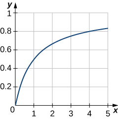

* Integrate a rational function using the method of partial fractions.
* Recognize simple linear factors in a rational function.
* Recognize repeated linear factors in a rational function.
* Recognize quadratic factors in a rational function.

We have seen some techniques that allow us to integrate specific rational functions. For example, we know that

<math xmlns="http://www.w3.org/1998/Math/MathML"><mrow><mstyle displaystyle="true"><mrow><mo stretchy="false">∫</mo><mrow><mfrac><mrow><mi>d</mi><mi>u</mi></mrow><mi>u</mi></mfrac></mrow></mrow></mstyle><mo>=</mo><mtext>ln</mtext><mrow><mo>\|</mo><mi>u</mi><mo>\|</mo></mrow><mo>+</mo><mi>C</mi><mspace width="0.2em" /><mtext>and</mtext><mspace width="0.2em" /><mstyle displaystyle="true"><mrow><mo stretchy="false">∫</mo><mrow><mfrac><mrow><mi>d</mi><mi>u</mi></mrow><mrow><msup><mi>u</mi><mn>2</mn></msup><mo>+</mo><msup><mi>a</mi><mn>2</mn></msup></mrow></mfrac></mrow></mrow></mstyle><mo>=</mo><mfrac><mn>1</mn><mi>a</mi></mfrac><msup><mrow><mtext>tan</mtext></mrow><mrow><mn>−1</mn></mrow></msup><mrow><mo>(</mo><mrow><mfrac><mi>u</mi><mi>a</mi></mfrac></mrow><mo>)</mo></mrow><mo>+</mo><mi>C</mi><mtext>.</mtext></mrow></math>

However, we do not yet have a technique that allows us to tackle arbitrary quotients of this type. Thus, it is not immediately obvious how to go about evaluating <math xmlns="http://www.w3.org/1998/Math/MathML"><mrow><mstyle displaystyle="true"><mrow><mo stretchy="false">∫</mo><mrow><mfrac><mrow><mn>3</mn><mi>x</mi></mrow><mrow><msup><mi>x</mi><mn>2</mn></msup><mo>−</mo><mi>x</mi><mo>−</mo><mn>2</mn></mrow></mfrac><mi>d</mi><mi>x</mi><mo>.</mo></mrow></mrow></mstyle></mrow></math>

 However, we know from material previously developed that

<math xmlns="http://www.w3.org/1998/Math/MathML"><mrow><mstyle displaystyle="true"><mrow><mo stretchy="false">∫</mo><mrow><mrow><mo>(</mo><mrow><mfrac><mn>1</mn><mrow><mi>x</mi><mo>+</mo><mn>1</mn></mrow></mfrac><mo>+</mo><mfrac><mn>2</mn><mrow><mi>x</mi><mo>−</mo><mn>2</mn></mrow></mfrac></mrow><mo>)</mo></mrow><mi>d</mi><mi>x</mi><mo>=</mo><mtext>ln</mtext><mrow><mo>\|</mo><mrow><mi>x</mi><mo>+</mo><mn>1</mn></mrow><mo>\|</mo></mrow><mo>+</mo><mn>2</mn><mspace width="0.1em" /><mtext>ln</mtext><mrow><mo>\|</mo><mrow><mi>x</mi><mo>−</mo><mn>2</mn></mrow><mo>\|</mo></mrow><mo>+</mo><mi>C</mi><mo>.</mo></mrow></mrow></mstyle></mrow></math>

In fact, by getting a common denominator, we see that

<math xmlns="http://www.w3.org/1998/Math/MathML"><mrow><mfrac><mn>1</mn><mrow><mi>x</mi><mo>+</mo><mn>1</mn></mrow></mfrac><mo>+</mo><mfrac><mn>2</mn><mrow><mi>x</mi><mo>−</mo><mn>2</mn></mrow></mfrac><mo>=</mo><mfrac><mrow><mn>3</mn><mi>x</mi></mrow><mrow><msup><mi>x</mi><mn>2</mn></msup><mo>−</mo><mi>x</mi><mo>−</mo><mn>2</mn></mrow></mfrac><mo>.</mo></mrow></math>

Consequently,

<math xmlns="http://www.w3.org/1998/Math/MathML"><mrow><mstyle displaystyle="true"><mrow><mo stretchy="false">∫</mo><mrow><mfrac><mrow><mn>3</mn><mi>x</mi></mrow><mrow><msup><mi>x</mi><mn>2</mn></msup><mo>−</mo><mi>x</mi><mo>−</mo><mn>2</mn></mrow></mfrac><mi>d</mi><mi>x</mi></mrow></mrow></mstyle><mo>=</mo><mstyle displaystyle="true"><mrow><mo stretchy="false">∫</mo><mrow><mrow><mo>(</mo><mrow><mfrac><mn>1</mn><mrow><mi>x</mi><mo>+</mo><mn>1</mn></mrow></mfrac><mo>+</mo><mfrac><mn>2</mn><mrow><mi>x</mi><mo>−</mo><mn>2</mn></mrow></mfrac></mrow><mo>)</mo></mrow><mi>d</mi><mi>x</mi></mrow></mrow></mstyle><mo>.</mo></mrow></math>

In this section, we examine the method of **partial fraction decomposition**{: data-type="term"}, which allows us to decompose **rational functions**{: data-type="term" .no-emphasis} into sums of simpler, more easily integrated rational functions. Using this method, we can rewrite an expression such as: <math xmlns="http://www.w3.org/1998/Math/MathML"><mrow><mfrac><mrow><mn>3</mn><mi>x</mi></mrow><mrow><msup><mi>x</mi><mn>2</mn></msup><mo>−</mo><mi>x</mi><mo>−</mo><mn>2</mn></mrow></mfrac></mrow></math>

 as an expression such as <math xmlns="http://www.w3.org/1998/Math/MathML"><mrow><mfrac><mn>1</mn><mrow><mi>x</mi><mo>+</mo><mn>1</mn></mrow></mfrac><mo>+</mo><mfrac><mn>2</mn><mrow><mi>x</mi><mo>−</mo><mn>2</mn></mrow></mfrac><mo>.</mo></mrow></math>

The key to the method of partial fraction decomposition is being able to anticipate the form that the decomposition of a rational function will take. As we shall see, this form is both predictable and highly dependent on the factorization of the denominator of the rational function. It is also extremely important to keep in mind that partial fraction decomposition can be applied to a rational function <math xmlns="http://www.w3.org/1998/Math/MathML"><mrow><mfrac><mrow><mi>P</mi><mo stretchy="false">(</mo><mi>x</mi><mo stretchy="false">)</mo></mrow><mrow><mi>Q</mi><mo stretchy="false">(</mo><mi>x</mi><mo stretchy="false">)</mo></mrow></mfrac></mrow></math>

 only if <math xmlns="http://www.w3.org/1998/Math/MathML"><mrow><mtext>deg</mtext><mrow><mo>(</mo><mrow><mi>P</mi><mrow><mo>(</mo><mi>x</mi><mo>)</mo></mrow></mrow><mo>)</mo></mrow><mo>&lt;</mo><mtext>deg</mtext><mrow><mo>(</mo><mrow><mi>Q</mi><mrow><mo>(</mo><mi>x</mi><mo>)</mo></mrow></mrow><mo>)</mo></mrow><mo>.</mo></mrow></math>

 In the case when <math xmlns="http://www.w3.org/1998/Math/MathML"><mrow><mtext>deg</mtext><mrow><mo>(</mo><mrow><mi>P</mi><mrow><mo>(</mo><mi>x</mi><mo>)</mo></mrow></mrow><mo>)</mo></mrow><mo>≥</mo><mtext>deg</mtext><mrow><mo>(</mo><mrow><mi>Q</mi><mrow><mo>(</mo><mi>x</mi><mo>)</mo></mrow></mrow><mo>)</mo></mrow><mo>,</mo></mrow></math>

 we must first perform long division to rewrite the quotient <math xmlns="http://www.w3.org/1998/Math/MathML"><mrow><mfrac><mrow><mi>P</mi><mo stretchy="false">(</mo><mi>x</mi><mo stretchy="false">)</mo></mrow><mrow><mi>Q</mi><mo stretchy="false">(</mo><mi>x</mi><mo stretchy="false">)</mo></mrow></mfrac></mrow></math>

 in the form <math xmlns="http://www.w3.org/1998/Math/MathML"><mrow><mi>A</mi><mo stretchy="false">(</mo><mi>x</mi><mo stretchy="false">)</mo><mo>+</mo><mfrac><mrow><mi>R</mi><mo stretchy="false">(</mo><mi>x</mi><mo stretchy="false">)</mo></mrow><mrow><mi>Q</mi><mo stretchy="false">(</mo><mi>x</mi><mo stretchy="false">)</mo></mrow></mfrac><mo>,</mo></mrow></math>

 where <math xmlns="http://www.w3.org/1998/Math/MathML"><mrow><mtext>deg</mtext><mrow><mo>(</mo><mrow><mi>R</mi><mrow><mo>(</mo><mi>x</mi><mo>)</mo></mrow></mrow><mo>)</mo></mrow><mo>&lt;</mo><mtext>deg</mtext><mrow><mo>(</mo><mrow><mi>Q</mi><mrow><mo>(</mo><mi>x</mi><mo>)</mo></mrow></mrow><mo>)</mo></mrow><mo>.</mo></mrow></math>

 We then do a partial fraction decomposition on <math xmlns="http://www.w3.org/1998/Math/MathML"><mrow><mfrac><mrow><mi>R</mi><mo stretchy="false">(</mo><mi>x</mi><mo stretchy="false">)</mo></mrow><mrow><mi>Q</mi><mo stretchy="false">(</mo><mi>x</mi><mo stretchy="false">)</mo></mrow></mfrac><mo>.</mo></mrow></math>

 The following example, although not requiring partial fraction decomposition, illustrates our approach to integrals of rational functions of the form <math xmlns="http://www.w3.org/1998/Math/MathML"><mrow><mstyle displaystyle="true"><mrow><mo stretchy="false">∫</mo><mrow><mfrac><mrow><mi>P</mi><mo stretchy="false">(</mo><mi>x</mi><mo stretchy="false">)</mo></mrow><mrow><mi>Q</mi><mo stretchy="false">(</mo><mi>x</mi><mo stretchy="false">)</mo></mrow></mfrac><mi>d</mi><mi>x</mi><mo>,</mo></mrow></mrow></mstyle></mrow></math>

 where <math xmlns="http://www.w3.org/1998/Math/MathML"><mrow><mtext>deg</mtext><mrow><mo>(</mo><mrow><mi>P</mi><mrow><mo>(</mo><mi>x</mi><mo>)</mo></mrow></mrow><mo>)</mo></mrow><mo>≥</mo><mtext>deg</mtext><mrow><mo>(</mo><mrow><mi>Q</mi><mrow><mo>(</mo><mi>x</mi><mo>)</mo></mrow></mrow><mo>)</mo></mrow><mo>.</mo></mrow></math>

Integrating
<math xmlns="http://www.w3.org/1998/Math/MathML"><mrow><mstyle displaystyle="true"><mrow><mo stretchy="false">∫</mo><mrow><mfrac><mrow><mi>P</mi><mo stretchy="false">(</mo><mi>x</mi><mo stretchy="false">)</mo></mrow><mrow><mi>Q</mi><mo stretchy="false">(</mo><mi>x</mi><mo stretchy="false">)</mo></mrow></mfrac><mi>d</mi><mi>x</mi><mo>,</mo></mrow></mrow></mstyle></mrow></math>
where
<math xmlns="http://www.w3.org/1998/Math/MathML"><mrow><mtext>deg</mtext><mrow><mo>(</mo><mrow><mi>P</mi><mrow><mo>(</mo><mi>x</mi><mo>)</mo></mrow></mrow><mo>)</mo></mrow><mo>≥</mo><mtext>deg</mtext><mrow><mo>(</mo><mrow><mi>Q</mi><mrow><mo>(</mo><mi>x</mi><mo>)</mo></mrow></mrow><mo>)</mo></mrow></mrow></math>

Evaluate <math xmlns="http://www.w3.org/1998/Math/MathML"><mrow><mstyle displaystyle="true"><mrow><mo stretchy="false">∫</mo><mrow><mfrac><mrow><msup><mi>x</mi><mn>2</mn></msup><mo>+</mo><mn>3</mn><mi>x</mi><mo>+</mo><mn>5</mn></mrow><mrow><mi>x</mi><mo>+</mo><mn>1</mn></mrow></mfrac><mi>d</mi><mi>x</mi></mrow></mrow></mstyle><mo>.</mo></mrow></math>

Since <math xmlns="http://www.w3.org/1998/Math/MathML"><mrow><mtext>deg</mtext><mrow><mo>(</mo><mrow><msup><mi>x</mi><mn>2</mn></msup><mo>+</mo><mn>3</mn><mi>x</mi><mo>+</mo><mn>5</mn></mrow><mo>)</mo></mrow><mo>≥</mo><mtext>deg</mtext><mrow><mo>(</mo><mrow><mi>x</mi><mo>+</mo><mn>1</mn></mrow><mo>)</mo></mrow><mo>,</mo></mrow></math>

 we perform long division to obtain

<math xmlns="http://www.w3.org/1998/Math/MathML"><mrow><mfrac><mrow><msup><mi>x</mi><mn>2</mn></msup><mo>+</mo><mn>3</mn><mi>x</mi><mo>+</mo><mn>5</mn></mrow><mrow><mi>x</mi><mo>+</mo><mn>1</mn></mrow></mfrac><mo>=</mo><mi>x</mi><mo>+</mo><mn>2</mn><mo>+</mo><mfrac><mn>3</mn><mrow><mi>x</mi><mo>+</mo><mn>1</mn></mrow></mfrac><mo>.</mo></mrow></math>

Thus,

<math xmlns="http://www.w3.org/1998/Math/MathML"><mtable><mtr><mtd columnalign="right"><mstyle displaystyle="true"><mrow><mo stretchy="false">∫</mo><mrow><mfrac><mrow><msup><mi>x</mi><mn>2</mn></msup><mo>+</mo><mn>3</mn><mi>x</mi><mo>+</mo><mn>5</mn></mrow><mrow><mi>x</mi><mo>+</mo><mn>1</mn></mrow></mfrac><mi>d</mi><mi>x</mi></mrow></mrow></mstyle></mtd><mtd columnalign="left"><mo>=</mo><mstyle displaystyle="true"><mrow><mo stretchy="false">∫</mo><mrow><mrow><mo>(</mo><mrow><mi>x</mi><mo>+</mo><mn>2</mn><mo>+</mo><mfrac><mn>3</mn><mrow><mi>x</mi><mo>+</mo><mn>1</mn></mrow></mfrac></mrow><mo>)</mo></mrow><mi>d</mi><mi>x</mi></mrow></mrow></mstyle></mtd></mtr><mtr><mtd /><mtd columnalign="left"><mo>=</mo><mfrac><mn>1</mn><mn>2</mn></mfrac><msup><mi>x</mi><mn>2</mn></msup><mo>+</mo><mn>2</mn><mi>x</mi><mo>+</mo><mn>3</mn><mspace width="0.1em" /><mtext>ln</mtext><mrow><mo>\|</mo><mrow><mi>x</mi><mo>+</mo><mn>1</mn></mrow><mo>\|</mo></mrow><mo>+</mo><mi>C</mi><mo>.</mo></mtd></mtr></mtable></math>

Visit this [website][1] for a review of long division of polynomials.

Evaluate <math xmlns="http://www.w3.org/1998/Math/MathML"><mrow><mstyle displaystyle="true"><mrow><mo stretchy="false">∫</mo><mrow><mfrac><mrow><mi>x</mi><mo>−</mo><mn>3</mn></mrow><mrow><mi>x</mi><mo>+</mo><mn>2</mn></mrow></mfrac><mi>d</mi><mi>x</mi><mo>.</mo></mrow></mrow></mstyle></mrow></math>

<math xmlns="http://www.w3.org/1998/Math/MathML"><mrow><mi>x</mi><mo>−</mo><mn>5</mn><mspace width="0.1em" /><mtext>ln</mtext><mrow><mo>\|</mo><mrow><mi>x</mi><mo>+</mo><mn>2</mn></mrow><mo>\|</mo></mrow><mo>+</mo><mi>C</mi></mrow></math>

Hint

Use long division to obtain <math xmlns="http://www.w3.org/1998/Math/MathML"><mrow><mfrac><mrow><mi>x</mi><mo>−</mo><mn>3</mn></mrow><mrow><mi>x</mi><mo>+</mo><mn>2</mn></mrow></mfrac><mo>=</mo><mn>1</mn><mo>−</mo><mfrac><mn>5</mn><mrow><mi>x</mi><mo>+</mo><mn>2</mn></mrow></mfrac><mo>.</mo></mrow></math>

To integrate <math xmlns="http://www.w3.org/1998/Math/MathML"><mrow><mstyle displaystyle="true"><mrow><mo stretchy="false">∫</mo><mrow><mfrac><mrow><mi>P</mi><mo stretchy="false">(</mo><mi>x</mi><mo stretchy="false">)</mo></mrow><mrow><mi>Q</mi><mo stretchy="false">(</mo><mi>x</mi><mo stretchy="false">)</mo></mrow></mfrac><mi>d</mi><mi>x</mi><mo>,</mo></mrow></mrow></mstyle></mrow></math>

 where <math xmlns="http://www.w3.org/1998/Math/MathML"><mrow><mtext>deg</mtext><mrow><mo>(</mo><mrow><mi>P</mi><mrow><mo>(</mo><mi>x</mi><mo>)</mo></mrow></mrow><mo>)</mo></mrow><mo>&lt;</mo><mtext>deg</mtext><mrow><mo>(</mo><mrow><mi>Q</mi><mrow><mo>(</mo><mi>x</mi><mo>)</mo></mrow></mrow><mo>)</mo></mrow><mo>,</mo></mrow></math>

 we must begin by factoring <math xmlns="http://www.w3.org/1998/Math/MathML"><mrow><mi>Q</mi><mo stretchy="false">(</mo><mi>x</mi><mo stretchy="false">)</mo><mo>.</mo></mrow></math>

### Nonrepeated Linear Factors

If <math xmlns="http://www.w3.org/1998/Math/MathML"><mrow><mi>Q</mi><mo stretchy="false">(</mo><mi>x</mi><mo stretchy="false">)</mo></mrow></math>

 can be factored as <math xmlns="http://www.w3.org/1998/Math/MathML"><mrow><mrow><mo>(</mo><mrow><msub><mi>a</mi><mn>1</mn></msub><mi>x</mi><mo>+</mo><msub><mi>b</mi><mn>1</mn></msub></mrow><mo>)</mo></mrow><mrow><mo>(</mo><mrow><msub><mi>a</mi><mn>2</mn></msub><mi>x</mi><mo>+</mo><msub><mi>b</mi><mn>2</mn></msub></mrow><mo>)</mo></mrow><mtext>…</mtext><mrow><mo>(</mo><mrow><msub><mi>a</mi><mi>n</mi></msub><mi>x</mi><mo>+</mo><msub><mi>b</mi><mi>n</mi></msub></mrow><mo>)</mo></mrow><mo>,</mo></mrow></math>

 where each linear factor is distinct, then it is possible to find constants <math xmlns="http://www.w3.org/1998/Math/MathML"><mrow><msub><mi>A</mi><mn>1</mn></msub><mo>,</mo><msub><mi>A</mi><mn>2</mn></msub><mtext>,…</mtext><mspace width="0.2em" /><msub><mi>A</mi><mi>n</mi></msub></mrow></math>

 satisfying

<math xmlns="http://www.w3.org/1998/Math/MathML"><mrow><mfrac><mrow><mi>P</mi><mo stretchy="false">(</mo><mi>x</mi><mo stretchy="false">)</mo></mrow><mrow><mi>Q</mi><mo stretchy="false">(</mo><mi>x</mi><mo stretchy="false">)</mo></mrow></mfrac><mo>=</mo><mfrac><mrow><msub><mi>A</mi><mn>1</mn></msub></mrow><mrow><msub><mi>a</mi><mn>1</mn></msub><mi>x</mi><mo>+</mo><msub><mi>b</mi><mn>1</mn></msub></mrow></mfrac><mo>+</mo><mfrac><mrow><msub><mi>A</mi><mn>2</mn></msub></mrow><mrow><msub><mi>a</mi><mn>2</mn></msub><mi>x</mi><mo>+</mo><msub><mi>b</mi><mn>2</mn></msub></mrow></mfrac><mo>+</mo><mo>⋯</mo><mo>+</mo><mfrac><mrow><msub><mi>A</mi><mi>n</mi></msub></mrow><mrow><msub><mi>a</mi><mi>n</mi></msub><mi>x</mi><mo>+</mo><msub><mi>b</mi><mi>n</mi></msub></mrow></mfrac><mo>.</mo></mrow></math>

The proof that such constants exist is beyond the scope of this course.

In this next example, we see how to use partial fractions to integrate a rational function of this type.

Partial Fractions with Nonrepeated Linear Factors

Evaluate <math xmlns="http://www.w3.org/1998/Math/MathML"><mrow><mstyle displaystyle="true"><mrow><mo stretchy="false">∫</mo><mrow><mfrac><mrow><mn>3</mn><mi>x</mi><mo>+</mo><mn>2</mn></mrow><mrow><msup><mi>x</mi><mn>3</mn></msup><mo>−</mo><msup><mi>x</mi><mn>2</mn></msup><mo>−</mo><mn>2</mn><mi>x</mi></mrow></mfrac><mi>d</mi><mi>x</mi><mo>.</mo></mrow></mrow></mstyle></mrow></math>

Since <math xmlns="http://www.w3.org/1998/Math/MathML"><mrow><mtext>deg</mtext><mo stretchy="false">(</mo><mn>3</mn><mi>x</mi><mo>+</mo><mn>2</mn><mo stretchy="false">)</mo><mo>&lt;</mo><mtext>deg</mtext><mrow><mo>(</mo><mrow><msup><mi>x</mi><mn>3</mn></msup><mo>−</mo><msup><mi>x</mi><mn>2</mn></msup><mo>−</mo><mn>2</mn><mi>x</mi></mrow><mo>)</mo></mrow><mo>,</mo></mrow></math>

 we begin by factoring the denominator of <math xmlns="http://www.w3.org/1998/Math/MathML"><mrow><mfrac><mrow><mn>3</mn><mi>x</mi><mo>+</mo><mn>2</mn></mrow><mrow><msup><mi>x</mi><mn>3</mn></msup><mo>−</mo><msup><mi>x</mi><mn>2</mn></msup><mo>−</mo><mn>2</mn><mi>x</mi></mrow></mfrac><mo>.</mo></mrow></math>

 We can see that <math xmlns="http://www.w3.org/1998/Math/MathML"><mrow><msup><mi>x</mi><mn>3</mn></msup><mo>−</mo><msup><mi>x</mi><mn>2</mn></msup><mo>−</mo><mn>2</mn><mi>x</mi><mo>=</mo><mi>x</mi><mo stretchy="false">(</mo><mi>x</mi><mo>−</mo><mn>2</mn><mo stretchy="false">)</mo><mo stretchy="false">(</mo><mi>x</mi><mo>+</mo><mn>1</mn><mo stretchy="false">)</mo><mo>.</mo></mrow></math>

 Thus, there are constants <math xmlns="http://www.w3.org/1998/Math/MathML"><mrow><mi>A</mi><mo>,</mo></mrow></math>

 <math xmlns="http://www.w3.org/1998/Math/MathML"><mrow><mi>B</mi><mo>,</mo></mrow></math>

 and <math xmlns="http://www.w3.org/1998/Math/MathML"><mi>C</mi></math>

 satisfying

<math xmlns="http://www.w3.org/1998/Math/MathML"><mrow><mfrac><mrow><mn>3</mn><mi>x</mi><mo>+</mo><mn>2</mn></mrow><mrow><mi>x</mi><mo stretchy="false">(</mo><mi>x</mi><mo>−</mo><mn>2</mn><mo stretchy="false">)</mo><mo stretchy="false">(</mo><mi>x</mi><mo>+</mo><mn>1</mn><mo stretchy="false">)</mo></mrow></mfrac><mo>=</mo><mfrac><mi>A</mi><mi>x</mi></mfrac><mo>+</mo><mfrac><mi>B</mi><mrow><mi>x</mi><mo>−</mo><mn>2</mn></mrow></mfrac><mo>+</mo><mfrac><mi>C</mi><mrow><mi>x</mi><mo>+</mo><mn>1</mn></mrow></mfrac><mo>.</mo></mrow></math>

We must now find these constants. To do so, we begin by getting a common denominator on the right. Thus,

<math xmlns="http://www.w3.org/1998/Math/MathML"><mrow><mfrac><mrow><mn>3</mn><mi>x</mi><mo>+</mo><mn>2</mn></mrow><mrow><mi>x</mi><mo stretchy="false">(</mo><mi>x</mi><mo>−</mo><mn>2</mn><mo stretchy="false">)</mo><mo stretchy="false">(</mo><mi>x</mi><mo>+</mo><mn>1</mn><mo stretchy="false">)</mo></mrow></mfrac><mo>=</mo><mfrac><mrow><mi>A</mi><mrow><mo>(</mo><mrow><mi>x</mi><mo>−</mo><mn>2</mn></mrow><mo>)</mo></mrow><mo stretchy="false">(</mo><mi>x</mi><mo>+</mo><mn>1</mn><mo stretchy="false">)</mo><mo>+</mo><mi>B</mi><mi>x</mi><mrow><mo>(</mo><mrow><mi>x</mi><mo>+</mo><mn>1</mn></mrow><mo>)</mo></mrow><mo>+</mo><mi>C</mi><mi>x</mi><mo stretchy="false">(</mo><mi>x</mi><mo>−</mo><mn>2</mn><mo stretchy="false">)</mo></mrow><mrow><mi>x</mi><mo stretchy="false">(</mo><mi>x</mi><mo>−</mo><mn>2</mn><mo stretchy="false">)</mo><mo stretchy="false">(</mo><mi>x</mi><mo>+</mo><mn>1</mn><mo stretchy="false">)</mo></mrow></mfrac><mo>.</mo></mrow></math>

Now, we set the numerators equal to each other, obtaining

<math xmlns="http://www.w3.org/1998/Math/MathML"><mrow><mn>3</mn><mi>x</mi><mo>+</mo><mn>2</mn><mo>=</mo><mi>A</mi><mrow><mo>(</mo><mrow><mi>x</mi><mo>−</mo><mn>2</mn></mrow><mo>)</mo></mrow><mrow><mo>(</mo><mrow><mi>x</mi><mo>+</mo><mn>1</mn></mrow><mo>)</mo></mrow><mo>+</mo><mi>B</mi><mi>x</mi><mrow><mo>(</mo><mrow><mi>x</mi><mo>+</mo><mn>1</mn></mrow><mo>)</mo></mrow><mo>+</mo><mi>C</mi><mi>x</mi><mrow><mo>(</mo><mrow><mi>x</mi><mo>−</mo><mn>2</mn></mrow><mo>)</mo></mrow><mo>.</mo></mrow></math>

There are two different strategies for finding the coefficients <math xmlns="http://www.w3.org/1998/Math/MathML"><mrow><mi>A</mi><mo>,</mo></mrow></math>

 <math xmlns="http://www.w3.org/1998/Math/MathML"><mrow><mi>B</mi><mo>,</mo></mrow></math>

 and <math xmlns="http://www.w3.org/1998/Math/MathML"><mrow><mi>C</mi><mo>.</mo></mrow></math>

 We refer to these as the ***method of equating coefficients***{: data-type="term" .no-emphasis} and the ***method of strategic substitution***{: data-type="term" .no-emphasis}.

Rule: Method of Equating Coefficients

Rewrite [[link]](#fs-id1165042002695) in the form

<math xmlns="http://www.w3.org/1998/Math/MathML"><mrow><mn>3</mn><mi>x</mi><mo>+</mo><mn>2</mn><mo>=</mo><mrow><mo>(</mo><mrow><mi>A</mi><mo>+</mo><mi>B</mi><mo>+</mo><mi>C</mi></mrow><mo>)</mo></mrow><msup><mi>x</mi><mn>2</mn></msup><mo>+</mo><mrow><mo>(</mo><mrow><mtext>−</mtext><mi>A</mi><mo>+</mo><mi>B</mi><mo>−</mo><mn>2</mn><mi>C</mi></mrow><mo>)</mo></mrow><mi>x</mi><mo>+</mo><mrow><mo>(</mo><mrow><mn>−2</mn><mi>A</mi></mrow><mo>)</mo></mrow><mo>.</mo></mrow></math>

Equating coefficients produces the system of equations

<math xmlns="http://www.w3.org/1998/Math/MathML"><mtable><mtr><mtd columnalign="right"><mi>A</mi><mo>+</mo><mi>B</mi><mo>+</mo><mi>C</mi></mtd><mtd columnalign="left"><mo>=</mo></mtd><mtd columnalign="left"><mn>0</mn></mtd></mtr><mtr><mtd columnalign="right"><mo>−</mo><mi>A</mi><mo>+</mo><mi>B</mi><mo>−</mo><mn>2</mn><mi>C</mi></mtd><mtd columnalign="left"><mo>=</mo></mtd><mtd columnalign="left"><mn>3</mn></mtd></mtr><mtr><mtd columnalign="right"><mo>−</mo><mn>2</mn><mi>A</mi></mtd><mtd columnalign="left"><mo>=</mo></mtd><mtd columnalign="left"><mn>2.</mn></mtd></mtr></mtable></math>

To solve this system, we first observe that <math xmlns="http://www.w3.org/1998/Math/MathML"><mrow><mn>−2</mn><mi>A</mi><mo>=</mo><mn>2</mn><mo stretchy="false">⇒</mo><mi>A</mi><mo>=</mo><mn>−1</mn><mo>.</mo></mrow></math>

 Substituting this value into the first two equations gives us the system

<math xmlns="http://www.w3.org/1998/Math/MathML"><mtable><mtr><mtd columnalign="right"><mi>B</mi><mo>+</mo><mi>C</mi></mtd><mtd columnalign="left"><mo>=</mo></mtd><mtd columnalign="left"><mn>1</mn></mtd></mtr><mtr><mtd columnalign="right"><mi>B</mi><mo>−</mo><mn>2</mn><mi>C</mi></mtd><mtd columnalign="left"><mo>=</mo></mtd><mtd columnalign="left"><mn>2.</mn></mtd></mtr></mtable></math>

Multiplying the second equation by <math xmlns="http://www.w3.org/1998/Math/MathML"><mrow><mn>−1</mn></mrow></math>

 and adding the resulting equation to the first produces

<math xmlns="http://www.w3.org/1998/Math/MathML"><mrow><mn>−3</mn><mi>C</mi><mo>=</mo><mn>1</mn><mo>,</mo></mrow></math>

which in turn implies that <math xmlns="http://www.w3.org/1998/Math/MathML"><mrow><mi>C</mi><mo>=</mo><mo>−</mo><mfrac><mn>1</mn><mn>3</mn></mfrac><mo>.</mo></mrow></math>

 Substituting this value into the equation <math xmlns="http://www.w3.org/1998/Math/MathML"><mrow><mi>B</mi><mo>+</mo><mi>C</mi><mo>=</mo><mn>1</mn></mrow></math>

 yields <math xmlns="http://www.w3.org/1998/Math/MathML"><mrow><mi>B</mi><mo>=</mo><mfrac><mn>4</mn><mn>3</mn></mfrac><mo>.</mo></mrow></math>

 Thus, solving these equations yields <math xmlns="http://www.w3.org/1998/Math/MathML"><mrow><mi>A</mi><mo>=</mo><mn>−1</mn><mo>,</mo></mrow></math>

 <math xmlns="http://www.w3.org/1998/Math/MathML"><mrow><mi>B</mi><mo>=</mo><mfrac><mn>4</mn><mn>3</mn></mfrac><mo>,</mo></mrow></math>

 and <math xmlns="http://www.w3.org/1998/Math/MathML"><mrow><mi>C</mi><mo>=</mo><mo>−</mo><mfrac><mn>1</mn><mn>3</mn></mfrac><mo>.</mo></mrow></math>

It is important to note that the system produced by this method is consistent if and only if we have set up the decomposition correctly. If the system is inconsistent, there is an error in our decomposition.

Rule: Method of Strategic Substitution

The method of strategic substitution is based on the assumption that we have set up the decomposition correctly. If the decomposition is set up correctly, then there must be values of <math xmlns="http://www.w3.org/1998/Math/MathML"><mrow><mi>A</mi><mo>,</mo></mrow></math>

 <math xmlns="http://www.w3.org/1998/Math/MathML"><mrow><mi>B</mi><mo>,</mo></mrow></math>

 and <math xmlns="http://www.w3.org/1998/Math/MathML"><mi>C</mi></math>

 that satisfy [[link]](#fs-id1165042002695) for *all* values of <math xmlns="http://www.w3.org/1998/Math/MathML"><mrow><mi>x</mi><mo>.</mo></mrow></math>

 That is, this equation must be true for any value of <math xmlns="http://www.w3.org/1998/Math/MathML"><mi>x</mi></math>

 we care to substitute into it. Therefore, by choosing values of <math xmlns="http://www.w3.org/1998/Math/MathML"><mi>x</mi></math>

 carefully and substituting them into the equation, we may find <math xmlns="http://www.w3.org/1998/Math/MathML"><mrow><mi>A</mi><mo>,</mo></mrow></math>

 <math xmlns="http://www.w3.org/1998/Math/MathML"><mrow><mi>B</mi><mo>,</mo></mrow></math>

 and <math xmlns="http://www.w3.org/1998/Math/MathML"><mi>C</mi></math>

 easily. For example, if we substitute <math xmlns="http://www.w3.org/1998/Math/MathML"><mrow><mi>x</mi><mo>=</mo><mn>0</mn><mo>,</mo></mrow></math>

 the equation reduces to <math xmlns="http://www.w3.org/1998/Math/MathML"><mrow><mn>2</mn><mo>=</mo><mi>A</mi><mrow><mo>(</mo><mrow><mn>−2</mn></mrow><mo>)</mo></mrow><mrow><mo>(</mo><mn>1</mn><mo>)</mo></mrow><mo>.</mo></mrow></math>

 Solving for <math xmlns="http://www.w3.org/1998/Math/MathML"><mi>A</mi></math>

 yields <math xmlns="http://www.w3.org/1998/Math/MathML"><mrow><mi>A</mi><mo>=</mo><mn>−1</mn><mo>.</mo></mrow></math>

 Next, by substituting <math xmlns="http://www.w3.org/1998/Math/MathML"><mrow><mi>x</mi><mo>=</mo><mn>2</mn><mo>,</mo></mrow></math>

 the equation reduces to <math xmlns="http://www.w3.org/1998/Math/MathML"><mrow><mn>8</mn><mo>=</mo><mi>B</mi><mrow><mo>(</mo><mn>2</mn><mo>)</mo></mrow><mrow><mo>(</mo><mn>3</mn><mo>)</mo></mrow><mo>,</mo></mrow></math>

 or equivalently <math xmlns="http://www.w3.org/1998/Math/MathML"><mrow><mi>B</mi><mo>=</mo><mn>4</mn><mtext>/</mtext><mn>3</mn><mo>.</mo></mrow></math>

 Last, we substitute <math xmlns="http://www.w3.org/1998/Math/MathML"><mrow><mi>x</mi><mo>=</mo><mn>−1</mn></mrow></math>

 into the equation and obtain <math xmlns="http://www.w3.org/1998/Math/MathML"><mrow><mn>−1</mn><mo>=</mo><mi>C</mi><mo stretchy="false">(</mo><mn>−1</mn><mo stretchy="false">)</mo><mo stretchy="false">(</mo><mn>−3</mn><mo stretchy="false">)</mo><mo>.</mo></mrow></math>

 Solving, we have <math xmlns="http://www.w3.org/1998/Math/MathML"><mrow><mi>C</mi><mo>=</mo><mo>−</mo><mfrac><mn>1</mn><mn>3</mn></mfrac><mo>.</mo></mrow></math>

It is important to keep in mind that if we attempt to use this method with a decomposition that has not been set up correctly, we are still able to find values for the constants, but these constants are meaningless. If we do opt to use the method of strategic substitution, then it is a good idea to check the result by recombining the terms algebraically.

Now that we have the values of <math xmlns="http://www.w3.org/1998/Math/MathML"><mrow><mi>A</mi><mo>,</mo></mrow></math>

 <math xmlns="http://www.w3.org/1998/Math/MathML"><mrow><mi>B</mi><mo>,</mo></mrow></math>

 and <math xmlns="http://www.w3.org/1998/Math/MathML"><mrow><mi>C</mi><mo>,</mo></mrow></math>

 we rewrite the original integral:

<math xmlns="http://www.w3.org/1998/Math/MathML"><mrow><mstyle displaystyle="true"><mrow><mo stretchy="false">∫</mo><mrow><mfrac><mrow><mn>3</mn><mi>x</mi><mo>+</mo><mn>2</mn></mrow><mrow><msup><mi>x</mi><mn>3</mn></msup><mo>−</mo><msup><mi>x</mi><mn>2</mn></msup><mo>−</mo><mn>2</mn><mi>x</mi></mrow></mfrac><mi>d</mi><mi>x</mi></mrow></mrow></mstyle><mo>=</mo><mstyle displaystyle="true"><mrow><mo stretchy="false">∫</mo><mrow><mrow><mo>(</mo><mrow><mtext>−</mtext><mspace width="0.2em" /><mfrac><mn>1</mn><mi>x</mi></mfrac><mo>+</mo><mfrac><mn>4</mn><mn>3</mn></mfrac><mo>·</mo><mfrac><mn>1</mn><mrow><mrow><mo>(</mo><mrow><mi>x</mi><mo>−</mo><mn>2</mn></mrow><mo>)</mo></mrow></mrow></mfrac><mo>−</mo><mfrac><mn>1</mn><mn>3</mn></mfrac><mo>·</mo><mfrac><mn>1</mn><mrow><mo stretchy="false">(</mo><mi>x</mi><mo>+</mo><mn>1</mn><mo stretchy="false">)</mo></mrow></mfrac></mrow><mo>)</mo></mrow></mrow></mrow></mstyle><mi>d</mi><mi>x</mi><mo>.</mo></mrow></math>

Evaluating the integral gives us

<math xmlns="http://www.w3.org/1998/Math/MathML"><mrow><mstyle displaystyle="true"><mrow><mo stretchy="false">∫</mo><mrow><mfrac><mrow><mn>3</mn><mi>x</mi><mo>+</mo><mn>2</mn></mrow><mrow><msup><mi>x</mi><mn>3</mn></msup><mo>−</mo><msup><mi>x</mi><mn>2</mn></msup><mo>−</mo><mn>2</mn><mi>x</mi></mrow></mfrac><mi>d</mi><mi>x</mi></mrow></mrow></mstyle><mo>=</mo><mtext>−</mtext><mtext>ln</mtext><mrow><mo>\|</mo><mi>x</mi><mo>\|</mo></mrow><mo>+</mo><mfrac><mn>4</mn><mn>3</mn></mfrac><mtext>ln</mtext><mrow><mo>\|</mo><mrow><mi>x</mi><mo>−</mo><mn>2</mn></mrow><mo>\|</mo></mrow><mo>−</mo><mfrac><mn>1</mn><mn>3</mn></mfrac><mtext>ln</mtext><mrow><mo>\|</mo><mrow><mi>x</mi><mo>+</mo><mn>1</mn></mrow><mo>\|</mo></mrow><mo>+</mo><mi>C</mi><mo>.</mo></mrow></math>

In the next example, we integrate a rational function in which the degree of the numerator is not less than the degree of the denominator.

Dividing before Applying Partial Fractions

Evaluate <math xmlns="http://www.w3.org/1998/Math/MathML"><mrow><mstyle displaystyle="true"><mrow><mo stretchy="false">∫</mo><mrow><mfrac><mrow><msup><mi>x</mi><mn>2</mn></msup><mo>+</mo><mn>3</mn><mi>x</mi><mo>+</mo><mn>1</mn></mrow><mrow><msup><mi>x</mi><mn>2</mn></msup><mo>−</mo><mn>4</mn></mrow></mfrac><mi>d</mi><mi>x</mi><mo>.</mo></mrow></mrow></mstyle></mrow></math>

Since <math xmlns="http://www.w3.org/1998/Math/MathML"><mrow><mtext>degree</mtext><mo stretchy="false">(</mo><msup><mi>x</mi><mn>2</mn></msup><mo>+</mo><mn>3</mn><mi>x</mi><mo>+</mo><mn>1</mn><mo stretchy="false">)</mo><mo>≥</mo><mtext>degree</mtext><mo stretchy="false">(</mo><msup><mi>x</mi><mn>2</mn></msup><mo>−</mo><mn>4</mn><mo stretchy="false">)</mo><mo>,</mo></mrow></math>

 we must perform long division of polynomials. This results in

<math xmlns="http://www.w3.org/1998/Math/MathML"><mrow><mfrac><mrow><msup><mi>x</mi><mn>2</mn></msup><mo>+</mo><mn>3</mn><mi>x</mi><mo>+</mo><mn>1</mn></mrow><mrow><msup><mi>x</mi><mn>2</mn></msup><mo>−</mo><mn>4</mn></mrow></mfrac><mo>=</mo><mn>1</mn><mo>+</mo><mfrac><mrow><mn>3</mn><mi>x</mi><mo>+</mo><mn>5</mn></mrow><mrow><msup><mi>x</mi><mn>2</mn></msup><mo>−</mo><mn>4</mn></mrow></mfrac><mo>.</mo></mrow></math>

Next, we perform partial fraction decomposition on <math xmlns="http://www.w3.org/1998/Math/MathML"><mrow><mfrac><mrow><mn>3</mn><mi>x</mi><mo>+</mo><mn>5</mn></mrow><mrow><msup><mi>x</mi><mn>2</mn></msup><mo>−</mo><mn>4</mn></mrow></mfrac><mo>=</mo><mfrac><mrow><mn>3</mn><mi>x</mi><mo>+</mo><mn>5</mn></mrow><mrow><mo stretchy="false">(</mo><mi>x</mi><mo>+</mo><mn>2</mn><mo stretchy="false">)</mo><mo stretchy="false">(</mo><mi>x</mi><mo>−</mo><mn>2</mn><mo stretchy="false">)</mo></mrow></mfrac><mo>.</mo></mrow></math>

 We have

<math xmlns="http://www.w3.org/1998/Math/MathML"><mrow><mfrac><mrow><mn>3</mn><mi>x</mi><mo>+</mo><mn>5</mn></mrow><mrow><mo stretchy="false">(</mo><mi>x</mi><mo>−</mo><mn>2</mn><mo stretchy="false">)</mo><mo stretchy="false">(</mo><mi>x</mi><mo>+</mo><mn>2</mn><mo stretchy="false">)</mo></mrow></mfrac><mo>=</mo><mfrac><mi>A</mi><mrow><mi>x</mi><mo>−</mo><mn>2</mn></mrow></mfrac><mo>+</mo><mfrac><mi>B</mi><mrow><mi>x</mi><mo>+</mo><mn>2</mn></mrow></mfrac><mo>.</mo></mrow></math>

Thus,

<math xmlns="http://www.w3.org/1998/Math/MathML"><mrow><mn>3</mn><mi>x</mi><mo>+</mo><mn>5</mn><mo>=</mo><mi>A</mi><mrow><mo>(</mo><mrow><mi>x</mi><mo>+</mo><mn>2</mn></mrow><mo>)</mo></mrow><mo>+</mo><mi>B</mi><mrow><mo>(</mo><mrow><mi>x</mi><mo>−</mo><mn>2</mn></mrow><mo>)</mo></mrow><mo>.</mo></mrow></math>

Solving for <math xmlns="http://www.w3.org/1998/Math/MathML"><mi>A</mi></math>

 and <math xmlns="http://www.w3.org/1998/Math/MathML"><mi>B</mi></math>

 using either method, we obtain <math xmlns="http://www.w3.org/1998/Math/MathML"><mrow><mi>A</mi><mo>=</mo><mn>11</mn><mtext>/</mtext><mn>4</mn></mrow></math>

 and <math xmlns="http://www.w3.org/1998/Math/MathML"><mrow><mi>B</mi><mo>=</mo><mn>1</mn><mtext>/</mtext><mn>4</mn><mo>.</mo></mrow></math>

Rewriting the original integral, we have

<math xmlns="http://www.w3.org/1998/Math/MathML"><mrow><mstyle displaystyle="true"><mrow><mo stretchy="false">∫</mo><mrow><mfrac><mrow><msup><mi>x</mi><mn>2</mn></msup><mo>+</mo><mn>3</mn><mi>x</mi><mo>+</mo><mn>1</mn></mrow><mrow><msup><mi>x</mi><mn>2</mn></msup><mo>−</mo><mn>4</mn></mrow></mfrac><mi>d</mi><mi>x</mi></mrow></mrow></mstyle><mo>=</mo><mstyle displaystyle="true"><mrow><mo stretchy="false">∫</mo><mrow><mrow><mo>(</mo><mrow><mn>1</mn><mo>+</mo><mfrac><mrow><mn>11</mn></mrow><mn>4</mn></mfrac><mo>·</mo><mfrac><mn>1</mn><mrow><mi>x</mi><mo>−</mo><mn>2</mn></mrow></mfrac><mo>+</mo><mfrac><mn>1</mn><mn>4</mn></mfrac><mo>·</mo><mfrac><mn>1</mn><mrow><mi>x</mi><mo>+</mo><mn>2</mn></mrow></mfrac></mrow><mo>)</mo></mrow><mi>d</mi><mi>x</mi><mo>.</mo></mrow></mrow></mstyle></mrow></math>

Evaluating the integral produces

<math xmlns="http://www.w3.org/1998/Math/MathML"><mrow><mstyle displaystyle="true"><mrow><mo stretchy="false">∫</mo><mrow><mfrac><mrow><msup><mi>x</mi><mn>2</mn></msup><mo>+</mo><mn>3</mn><mi>x</mi><mo>+</mo><mn>1</mn></mrow><mrow><msup><mi>x</mi><mn>2</mn></msup><mo>−</mo><mn>4</mn></mrow></mfrac><mi>d</mi><mi>x</mi></mrow></mrow></mstyle><mo>=</mo><mi>x</mi><mo>+</mo><mfrac><mrow><mn>11</mn></mrow><mn>4</mn></mfrac><mtext>ln</mtext><mrow><mo>\|</mo><mrow><mi>x</mi><mo>−</mo><mn>2</mn></mrow><mo>\|</mo></mrow><mo>+</mo><mfrac><mn>1</mn><mn>4</mn></mfrac><mtext>ln</mtext><mrow><mo>\|</mo><mrow><mi>x</mi><mo>+</mo><mn>2</mn></mrow><mo>\|</mo></mrow><mo>+</mo><mi>C</mi><mo>.</mo></mrow></math>

As we see in the next example, it may be possible to apply the technique of partial fraction decomposition to a nonrational function. The trick is to convert the nonrational function to a rational function through a substitution.

Applying Partial Fractions after a Substitution

Evaluate <math xmlns="http://www.w3.org/1998/Math/MathML"><mrow><mstyle displaystyle="true"><mrow><mo stretchy="false">∫</mo><mrow><mfrac><mrow><mtext>cos</mtext><mspace width="0.1em" /><mi>x</mi></mrow><mrow><msup><mrow><mtext>sin</mtext></mrow><mn>2</mn></msup><mi>x</mi><mo>−</mo><mtext>sin</mtext><mspace width="0.1em" /><mi>x</mi></mrow></mfrac><mi>d</mi><mi>x</mi></mrow></mrow></mstyle><mo>.</mo></mrow></math>

Let’s begin by letting <math xmlns="http://www.w3.org/1998/Math/MathML"><mrow><mi>u</mi><mo>=</mo><mtext>sin</mtext><mspace width="0.1em" /><mi>x</mi><mo>.</mo></mrow></math>

 Consequently, <math xmlns="http://www.w3.org/1998/Math/MathML"><mrow><mi>d</mi><mi>u</mi><mo>=</mo><mtext>cos</mtext><mspace width="0.1em" /><mi>x</mi><mspace width="0.1em" /><mi>d</mi><mi>x</mi><mo>.</mo></mrow></math>

 After making these substitutions, we have

<math xmlns="http://www.w3.org/1998/Math/MathML"><mrow><mstyle displaystyle="true"><mrow><mo stretchy="false">∫</mo><mrow><mfrac><mrow><mtext>cos</mtext><mspace width="0.1em" /><mi>x</mi></mrow><mrow><msup><mrow><mtext>sin</mtext></mrow><mn>2</mn></msup><mi>x</mi><mo>−</mo><mtext>sin</mtext><mspace width="0.1em" /><mi>x</mi></mrow></mfrac><mi>d</mi><mi>x</mi></mrow></mrow></mstyle><mo>=</mo><mstyle displaystyle="true"><mrow><mo stretchy="false">∫</mo><mrow><mfrac><mrow><mi>d</mi><mi>u</mi></mrow><mrow><msup><mi>u</mi><mn>2</mn></msup><mo>−</mo><mi>u</mi></mrow></mfrac></mrow></mrow></mstyle><mo>=</mo><mstyle displaystyle="true"><mrow><mo stretchy="false">∫</mo><mrow><mfrac><mrow><mi>d</mi><mi>u</mi></mrow><mrow><mi>u</mi><mo stretchy="false">(</mo><mi>u</mi><mo>−</mo><mn>1</mn><mo stretchy="false">)</mo></mrow></mfrac><mo>.</mo></mrow></mrow></mstyle></mrow></math>

Applying partial fraction decomposition to <math xmlns="http://www.w3.org/1998/Math/MathML"><mrow><mn>1</mn><mtext>/</mtext><mi>u</mi><mo stretchy="false">(</mo><mi>u</mi><mo>−</mo><mn>1</mn><mo stretchy="false">)</mo></mrow></math>

 gives <math xmlns="http://www.w3.org/1998/Math/MathML"><mrow><mfrac><mn>1</mn><mrow><mi>u</mi><mo stretchy="false">(</mo><mi>u</mi><mo>−</mo><mn>1</mn><mo stretchy="false">)</mo></mrow></mfrac><mo>=</mo><mo>−</mo><mfrac><mn>1</mn><mi>u</mi></mfrac><mo>+</mo><mfrac><mn>1</mn><mrow><mi>u</mi><mo>−</mo><mn>1</mn></mrow></mfrac><mo>.</mo></mrow></math>

Thus,

<math xmlns="http://www.w3.org/1998/Math/MathML"><mtable><mtr><mtd columnalign="right"><mstyle displaystyle="true"><mrow><mo stretchy="false">∫</mo><mrow><mfrac><mrow><mtext>cos</mtext><mspace width="0.1em" /><mi>x</mi></mrow><mrow><msup><mrow><mtext>sin</mtext></mrow><mn>2</mn></msup><mi>x</mi><mo>−</mo><mtext>sin</mtext><mspace width="0.1em" /><mi>x</mi></mrow></mfrac><mi>d</mi><mi>x</mi></mrow></mrow></mstyle></mtd><mtd columnalign="left"><mo>=</mo><mtext>−</mtext><mtext>ln</mtext><mrow><mo>\|</mo><mi>u</mi><mo>\|</mo></mrow><mo>+</mo><mtext>ln</mtext><mrow><mo>\|</mo><mrow><mi>u</mi><mo>−</mo><mn>1</mn></mrow><mo>\|</mo></mrow><mo>+</mo><mi>C</mi></mtd></mtr><mtr><mtd /><mtd columnalign="left"><mo>=</mo><mtext>−</mtext><mtext>ln</mtext><mrow><mo>\|</mo><mrow><mtext>sin</mtext><mspace width="0.1em" /><mi>x</mi></mrow><mo>\|</mo></mrow><mo>+</mo><mtext>ln</mtext><mrow><mo>\|</mo><mrow><mtext>sin</mtext><mspace width="0.1em" /><mi>x</mi><mo>−</mo><mn>1</mn></mrow><mo>\|</mo></mrow><mo>+</mo><mi>C</mi><mo>.</mo></mtd></mtr></mtable></math>

Evaluate <math xmlns="http://www.w3.org/1998/Math/MathML"><mrow><mstyle displaystyle="true"><mrow><mo stretchy="false">∫</mo><mrow><mfrac><mrow><mi>x</mi><mo>+</mo><mn>1</mn></mrow><mrow><mo stretchy="false">(</mo><mi>x</mi><mo>+</mo><mn>3</mn><mo stretchy="false">)</mo><mo stretchy="false">(</mo><mi>x</mi><mo>−</mo><mn>2</mn><mo stretchy="false">)</mo></mrow></mfrac><mi>d</mi><mi>x</mi></mrow></mrow></mstyle><mo>.</mo></mrow></math>

<math xmlns="http://www.w3.org/1998/Math/MathML"><mrow><mfrac><mn>2</mn><mn>5</mn></mfrac><mtext>ln</mtext><mrow><mo>\|</mo><mrow><mi>x</mi><mo>+</mo><mn>3</mn></mrow><mo>\|</mo></mrow><mo>+</mo><mfrac><mn>3</mn><mn>5</mn></mfrac><mtext>ln</mtext><mrow><mo>\|</mo><mrow><mi>x</mi><mo>−</mo><mn>2</mn></mrow><mo>\|</mo></mrow><mo>+</mo><mi>C</mi></mrow></math>

Hint

<math xmlns="http://www.w3.org/1998/Math/MathML"><mrow><mfrac><mrow><mi>x</mi><mo>+</mo><mn>1</mn></mrow><mrow><mo stretchy="false">(</mo><mi>x</mi><mo>+</mo><mn>3</mn><mo stretchy="false">)</mo><mo stretchy="false">(</mo><mi>x</mi><mo>−</mo><mn>2</mn><mo stretchy="false">)</mo></mrow></mfrac><mo>=</mo><mfrac><mi>A</mi><mrow><mi>x</mi><mo>+</mo><mn>3</mn></mrow></mfrac><mo>+</mo><mfrac><mi>B</mi><mrow><mi>x</mi><mo>−</mo><mn>2</mn></mrow></mfrac></mrow></math>

### Repeated Linear Factors

For some applications, we need to integrate rational expressions that have denominators with repeated linear factors—that is, rational functions with at least one factor of the form <math xmlns="http://www.w3.org/1998/Math/MathML"><mrow><msup><mrow><mo stretchy="false">(</mo><mi>a</mi><mi>x</mi><mo>+</mo><mi>b</mi><mo stretchy="false">)</mo></mrow><mi>n</mi></msup><mo>,</mo></mrow></math>

 where <math xmlns="http://www.w3.org/1998/Math/MathML"><mi>n</mi></math>

 is a positive integer greater than or equal to <math xmlns="http://www.w3.org/1998/Math/MathML"><mrow><mn>2</mn><mo>.</mo></mrow></math>

 If the denominator contains the repeated linear factor <math xmlns="http://www.w3.org/1998/Math/MathML"><mrow><msup><mrow><mo stretchy="false">(</mo><mi>a</mi><mi>x</mi><mo>+</mo><mi>b</mi><mo stretchy="false">)</mo></mrow><mi>n</mi></msup><mo>,</mo></mrow></math>

 then the decomposition must contain

<math xmlns="http://www.w3.org/1998/Math/MathML"><mrow><mfrac><mrow><msub><mi>A</mi><mn>1</mn></msub></mrow><mrow><mi>a</mi><mi>x</mi><mo>+</mo><mi>b</mi></mrow></mfrac><mo>+</mo><mfrac><mrow><msub><mi>A</mi><mn>2</mn></msub></mrow><mrow><msup><mrow><mo stretchy="false">(</mo><mi>a</mi><mi>x</mi><mo>+</mo><mi>b</mi><mo stretchy="false">)</mo></mrow><mn>2</mn></msup></mrow></mfrac><mo>+</mo><mo>⋯</mo><mo>+</mo><mfrac><mrow><msub><mi>A</mi><mi>n</mi></msub></mrow><mrow><msup><mrow><mo stretchy="false">(</mo><mi>a</mi><mi>x</mi><mo>+</mo><mi>b</mi><mo stretchy="false">)</mo></mrow><mi>n</mi></msup></mrow></mfrac><mo>.</mo></mrow></math>

As we see in our next example, the basic technique used for solving for the coefficients is the same, but it requires more algebra to determine the numerators of the partial fractions.

Partial Fractions with Repeated Linear Factors

Evaluate <math xmlns="http://www.w3.org/1998/Math/MathML"><mrow><mstyle displaystyle="true"><mrow><mo stretchy="false">∫</mo><mrow><mfrac><mrow><mi>x</mi><mo>−</mo><mn>2</mn></mrow><mrow><msup><mrow><mrow><mo>(</mo><mrow><mn>2</mn><mi>x</mi><mo>−</mo><mn>1</mn></mrow><mo>)</mo></mrow></mrow><mn>2</mn></msup><mo stretchy="false">(</mo><mi>x</mi><mo>−</mo><mn>1</mn><mo stretchy="false">)</mo></mrow></mfrac><mi>d</mi><mi>x</mi><mo>.</mo></mrow></mrow></mstyle></mrow></math>

We have <math xmlns="http://www.w3.org/1998/Math/MathML"><mrow><mtext>degree</mtext><mrow><mo>(</mo><mrow><mi>x</mi><mo>−</mo><mn>2</mn></mrow><mo>)</mo></mrow><mo>&lt;</mo><mtext>degree</mtext><mrow><mo>(</mo><mrow><msup><mrow><mrow><mo>(</mo><mrow><mn>2</mn><mi>x</mi><mo>−</mo><mn>1</mn></mrow><mo>)</mo></mrow></mrow><mn>2</mn></msup><mrow><mo>(</mo><mrow><mi>x</mi><mo>−</mo><mn>1</mn></mrow><mo>)</mo></mrow></mrow><mo>)</mo></mrow><mo>,</mo></mrow></math>

 so we can proceed with the decomposition. Since <math xmlns="http://www.w3.org/1998/Math/MathML"><mrow><msup><mrow><mo stretchy="false">(</mo><mn>2</mn><mi>x</mi><mo>−</mo><mn>1</mn><mo stretchy="false">)</mo></mrow><mn>2</mn></msup></mrow></math>

 is a repeated linear factor, include <math xmlns="http://www.w3.org/1998/Math/MathML"><mrow><mfrac><mi>A</mi><mrow><mn>2</mn><mi>x</mi><mo>−</mo><mn>1</mn></mrow></mfrac><mo>+</mo><mfrac><mi>B</mi><mrow><msup><mrow><mo stretchy="false">(</mo><mn>2</mn><mi>x</mi><mo>−</mo><mn>1</mn><mo stretchy="false">)</mo></mrow><mn>2</mn></msup></mrow></mfrac></mrow></math>

 in the decomposition. Thus,

<math xmlns="http://www.w3.org/1998/Math/MathML"><mrow><mfrac><mrow><mi>x</mi><mo>−</mo><mn>2</mn></mrow><mrow><msup><mrow><mrow><mo>(</mo><mrow><mn>2</mn><mi>x</mi><mo>−</mo><mn>1</mn></mrow><mo>)</mo></mrow></mrow><mn>2</mn></msup><mo stretchy="false">(</mo><mi>x</mi><mo>−</mo><mn>1</mn><mo stretchy="false">)</mo></mrow></mfrac><mo>=</mo><mfrac><mi>A</mi><mrow><mn>2</mn><mi>x</mi><mo>−</mo><mn>1</mn></mrow></mfrac><mo>+</mo><mfrac><mi>B</mi><mrow><msup><mrow><mo stretchy="false">(</mo><mn>2</mn><mi>x</mi><mo>−</mo><mn>1</mn><mo stretchy="false">)</mo></mrow><mn>2</mn></msup></mrow></mfrac><mo>+</mo><mfrac><mi>C</mi><mrow><mi>x</mi><mo>−</mo><mn>1</mn></mrow></mfrac><mo>.</mo></mrow></math>

After getting a common denominator and equating the numerators, we have

<math xmlns="http://www.w3.org/1998/Math/MathML"><mrow><mi>x</mi><mo>−</mo><mn>2</mn><mo>=</mo><mi>A</mi><mrow><mo>(</mo><mrow><mn>2</mn><mi>x</mi><mo>−</mo><mn>1</mn></mrow><mo>)</mo></mrow><mrow><mo>(</mo><mrow><mi>x</mi><mo>−</mo><mn>1</mn></mrow><mo>)</mo></mrow><mo>+</mo><mi>B</mi><mrow><mo>(</mo><mrow><mi>x</mi><mo>−</mo><mn>1</mn></mrow><mo>)</mo></mrow><mo>+</mo><mi>C</mi><msup><mrow><mo stretchy="false">(</mo><mn>2</mn><mi>x</mi><mo>−</mo><mn>1</mn><mo stretchy="false">)</mo></mrow><mn>2</mn></msup><mo>.</mo></mrow></math>

We then use the method of equating coefficients to find the values of <math xmlns="http://www.w3.org/1998/Math/MathML"><mrow><mi>A</mi><mo>,</mo></mrow></math>

 <math xmlns="http://www.w3.org/1998/Math/MathML"><mrow><mi>B</mi><mo>,</mo></mrow></math>

 and <math xmlns="http://www.w3.org/1998/Math/MathML"><mrow><mi>C</mi><mo>.</mo></mrow></math>

<math xmlns="http://www.w3.org/1998/Math/MathML"><mrow><mi>x</mi><mo>−</mo><mn>2</mn><mo>=</mo><mrow><mo>(</mo><mrow><mn>2</mn><mi>A</mi><mo>+</mo><mn>4</mn><mi>C</mi></mrow><mo>)</mo></mrow><msup><mi>x</mi><mn>2</mn></msup><mo>+</mo><mrow><mo>(</mo><mrow><mn>−3</mn><mi>A</mi><mo>+</mo><mi>B</mi><mo>−</mo><mn>4</mn><mi>C</mi></mrow><mo>)</mo></mrow><mi>x</mi><mo>+</mo><mrow><mo>(</mo><mrow><mi>A</mi><mo>−</mo><mi>B</mi><mo>+</mo><mi>C</mi></mrow><mo>)</mo></mrow><mo>.</mo></mrow></math>

Equating coefficients yields <math xmlns="http://www.w3.org/1998/Math/MathML"><mrow><mn>2</mn><mi>A</mi><mo>+</mo><mn>4</mn><mi>C</mi><mo>=</mo><mn>0</mn><mo>,</mo></mrow></math>

 <math xmlns="http://www.w3.org/1998/Math/MathML"><mrow><mn>−3</mn><mi>A</mi><mo>+</mo><mi>B</mi><mo>−</mo><mn>4</mn><mi>C</mi><mo>=</mo><mn>1</mn><mo>,</mo></mrow></math>

 and <math xmlns="http://www.w3.org/1998/Math/MathML"><mrow><mi>A</mi><mo>−</mo><mi>B</mi><mo>+</mo><mi>C</mi><mo>=</mo><mn>−2</mn><mo>.</mo></mrow></math>

 Solving this system yields <math xmlns="http://www.w3.org/1998/Math/MathML"><mrow><mi>A</mi><mo>=</mo><mn>2</mn><mo>,</mo></mrow></math>

 <math xmlns="http://www.w3.org/1998/Math/MathML"><mrow><mi>B</mi><mo>=</mo><mn>3</mn><mo>,</mo></mrow></math>

 and <math xmlns="http://www.w3.org/1998/Math/MathML"><mrow><mi>C</mi><mo>=</mo><mn>−1</mn><mo>.</mo></mrow></math>

Alternatively, we can use the method of strategic substitution. In this case, substituting <math xmlns="http://www.w3.org/1998/Math/MathML"><mrow><mi>x</mi><mo>=</mo><mn>1</mn></mrow></math>

 and <math xmlns="http://www.w3.org/1998/Math/MathML"><mrow><mi>x</mi><mo>=</mo><mn>1</mn><mtext>/</mtext><mn>2</mn></mrow></math>

 into [[link]](#fs-id1165040688639) easily produces the values <math xmlns="http://www.w3.org/1998/Math/MathML"><mrow><mi>B</mi><mo>=</mo><mn>3</mn></mrow></math>

 and <math xmlns="http://www.w3.org/1998/Math/MathML"><mrow><mi>C</mi><mo>=</mo><mn>−1</mn><mo>.</mo></mrow></math>

 At this point, it may seem that we have run out of good choices for <math xmlns="http://www.w3.org/1998/Math/MathML"><mrow><mi>x</mi><mo>,</mo></mrow></math>

 however, since we already have values for <math xmlns="http://www.w3.org/1998/Math/MathML"><mi>B</mi></math>

 and <math xmlns="http://www.w3.org/1998/Math/MathML"><mrow><mi>C</mi><mo>,</mo></mrow></math>

 we can substitute in these values and choose any value for <math xmlns="http://www.w3.org/1998/Math/MathML"><mi>x</mi></math>

 not previously used. The value <math xmlns="http://www.w3.org/1998/Math/MathML"><mrow><mi>x</mi><mo>=</mo><mn>0</mn></mrow></math>

 is a good option. In this case, we obtain the equation <math xmlns="http://www.w3.org/1998/Math/MathML"><mrow><mn>−2</mn><mo>=</mo><mi>A</mi><mrow><mo>(</mo><mrow><mn>−1</mn></mrow><mo>)</mo></mrow><mrow><mo>(</mo><mrow><mn>−1</mn></mrow><mo>)</mo></mrow><mo>+</mo><mn>3</mn><mrow><mo>(</mo><mrow><mn>−1</mn></mrow><mo>)</mo></mrow><mo>+</mo><mo stretchy="false">(</mo><mn>−1</mn><mo stretchy="false">)</mo><msup><mrow><mo stretchy="false">(</mo><mn>−1</mn><mo stretchy="false">)</mo></mrow><mn>2</mn></msup></mrow></math>

 or, equivalently, <math xmlns="http://www.w3.org/1998/Math/MathML"><mrow><mi>A</mi><mo>=</mo><mn>2</mn><mo>.</mo></mrow></math>

Now that we have the values for <math xmlns="http://www.w3.org/1998/Math/MathML"><mrow><mi>A</mi><mo>,</mo></mrow></math>

 <math xmlns="http://www.w3.org/1998/Math/MathML"><mrow><mi>B</mi><mo>,</mo></mrow></math>

 and <math xmlns="http://www.w3.org/1998/Math/MathML"><mrow><mi>C</mi><mo>,</mo></mrow></math>

 we rewrite the original integral and evaluate it:

<math xmlns="http://www.w3.org/1998/Math/MathML"><mtable><mtr><mtd columnalign="right"><mstyle displaystyle="true"><mrow><mo stretchy="false">∫</mo><mrow><mfrac><mrow><mi>x</mi><mo>−</mo><mn>2</mn></mrow><mrow><msup><mrow><mrow><mo>(</mo><mrow><mn>2</mn><mi>x</mi><mo>−</mo><mn>1</mn></mrow><mo>)</mo></mrow></mrow><mn>2</mn></msup><mo stretchy="false">(</mo><mi>x</mi><mo>−</mo><mn>1</mn><mo stretchy="false">)</mo></mrow></mfrac><mi>d</mi><mi>x</mi></mrow></mrow></mstyle></mtd><mtd columnalign="left"><mo>=</mo><mstyle displaystyle="true"><mrow><mo stretchy="false">∫</mo><mrow><mrow><mo>(</mo><mrow><mfrac><mn>2</mn><mrow><mn>2</mn><mi>x</mi><mo>−</mo><mn>1</mn></mrow></mfrac><mo>+</mo><mfrac><mn>3</mn><mrow><msup><mrow><mo stretchy="false">(</mo><mn>2</mn><mi>x</mi><mo>−</mo><mn>1</mn><mo stretchy="false">)</mo></mrow><mn>2</mn></msup></mrow></mfrac><mo>−</mo><mfrac><mn>1</mn><mrow><mi>x</mi><mo>−</mo><mn>1</mn></mrow></mfrac></mrow><mo>)</mo></mrow><mi>d</mi><mi>x</mi></mrow></mrow></mstyle></mtd></mtr><mtr><mtd /><mtd columnalign="left"><mo>=</mo><mtext>ln</mtext><mrow><mo>\|</mo><mrow><mn>2</mn><mi>x</mi><mo>−</mo><mn>1</mn></mrow><mo>\|</mo></mrow><mo>−</mo><mfrac><mn>3</mn><mrow><mn>2</mn><mrow><mo>(</mo><mrow><mn>2</mn><mi>x</mi><mo>−</mo><mn>1</mn></mrow><mo>)</mo></mrow></mrow></mfrac><mo>−</mo><mtext>ln</mtext><mrow><mo>\|</mo><mrow><mi>x</mi><mo>−</mo><mn>1</mn></mrow><mo>\|</mo></mrow><mo>+</mo><mi>C</mi><mo>.</mo></mtd></mtr></mtable></math>

Set up the partial fraction decomposition for <math xmlns="http://www.w3.org/1998/Math/MathML"><mrow><mstyle displaystyle="true"><mrow><mo stretchy="false">∫</mo><mrow><mfrac><mrow><mi>x</mi><mo>+</mo><mn>2</mn></mrow><mrow><msup><mrow><mrow><mo>(</mo><mrow><mi>x</mi><mo>+</mo><mn>3</mn></mrow><mo>)</mo></mrow></mrow><mn>3</mn></msup><msup><mrow><mo stretchy="false">(</mo><mi>x</mi><mo>−</mo><mn>4</mn><mo stretchy="false">)</mo></mrow><mn>2</mn></msup></mrow></mfrac><mi>d</mi><mi>x</mi><mo>.</mo></mrow></mrow></mstyle></mrow></math>

 (Do not solve for the coefficients or complete the integration.)

<math xmlns="http://www.w3.org/1998/Math/MathML"><mrow><mfrac><mrow><mi>x</mi><mo>+</mo><mn>2</mn></mrow><mrow><msup><mrow><mrow><mo>(</mo><mrow><mi>x</mi><mo>+</mo><mn>3</mn></mrow><mo>)</mo></mrow></mrow><mn>3</mn></msup><msup><mrow><mo stretchy="false">(</mo><mi>x</mi><mo>−</mo><mn>4</mn><mo stretchy="false">)</mo></mrow><mn>2</mn></msup></mrow></mfrac><mo>=</mo><mfrac><mi>A</mi><mrow><mi>x</mi><mo>+</mo><mn>3</mn></mrow></mfrac><mo>+</mo><mfrac><mi>B</mi><mrow><msup><mrow><mo stretchy="false">(</mo><mi>x</mi><mo>+</mo><mn>3</mn><mo stretchy="false">)</mo></mrow><mn>2</mn></msup></mrow></mfrac><mo>+</mo><mfrac><mi>C</mi><mrow><msup><mrow><mo stretchy="false">(</mo><mi>x</mi><mo>+</mo><mn>3</mn><mo stretchy="false">)</mo></mrow><mn>3</mn></msup></mrow></mfrac><mo>+</mo><mfrac><mi>D</mi><mrow><mo stretchy="false">(</mo><mi>x</mi><mo>−</mo><mn>4</mn><mo stretchy="false">)</mo></mrow></mfrac><mo>+</mo><mfrac><mi>E</mi><mrow><msup><mrow><mo stretchy="false">(</mo><mi>x</mi><mo>−</mo><mn>4</mn><mo stretchy="false">)</mo></mrow><mn>2</mn></msup></mrow></mfrac></mrow></math>

Hint

Use the problem-solving method of [[link]](#fs-id1165041952248) for guidance.

### The General Method

Now that we are beginning to get the idea of how the technique of partial fraction decomposition works, let’s outline the basic method in the following problem-solving strategy.

Problem-Solving Strategy: Partial Fraction Decomposition

To decompose the rational function <math xmlns="http://www.w3.org/1998/Math/MathML"><mrow><mi>P</mi><mo stretchy="false">(</mo><mi>x</mi><mo stretchy="false">)</mo><mtext>/</mtext><mi>Q</mi><mo stretchy="false">(</mo><mi>x</mi><mo stretchy="false">)</mo><mo>,</mo></mrow></math>

 use the following steps:

1.  Make sure that
    <math xmlns="http://www.w3.org/1998/Math/MathML"><mrow><mtext>degree</mtext><mrow><mo>(</mo><mrow><mi>P</mi><mrow><mo>(</mo><mi>x</mi><mo>)</mo></mrow></mrow><mo>)</mo></mrow><mo>&lt;</mo><mtext>degree</mtext><mo stretchy="false">(</mo><mi>Q</mi><mrow><mo>(</mo><mi>x</mi><mo>)</mo></mrow><mo stretchy="false">)</mo><mo>.</mo></mrow></math>
    
    If not, perform long division of polynomials.
2.  Factor
    <math xmlns="http://www.w3.org/1998/Math/MathML"><mrow><mi>Q</mi><mo stretchy="false">(</mo><mi>x</mi><mo stretchy="false">)</mo></mrow></math>
    
    into the product of linear and irreducible quadratic factors. An irreducible quadratic is a quadratic that has no real zeros.
3.  Assuming that
    <math xmlns="http://www.w3.org/1998/Math/MathML"><mrow><mtext>deg</mtext><mrow><mo>(</mo><mrow><mi>P</mi><mrow><mo>(</mo><mi>x</mi><mo>)</mo></mrow></mrow><mo>)</mo></mrow><mo>&lt;</mo><mtext>deg</mtext><mo stretchy="false">(</mo><mi>Q</mi><mrow><mo>(</mo><mi>x</mi><mo>)</mo></mrow><mo stretchy="false">)</mo><mo>,</mo></mrow></math>
    
    the factors of
    <math xmlns="http://www.w3.org/1998/Math/MathML"><mrow><mi>Q</mi><mo stretchy="false">(</mo><mi>x</mi><mo stretchy="false">)</mo></mrow></math>
    
    determine the form of the decomposition of
    <math xmlns="http://www.w3.org/1998/Math/MathML"><mrow><mi>P</mi><mo stretchy="false">(</mo><mi>x</mi><mo stretchy="false">)</mo><mtext>/</mtext><mi>Q</mi><mo stretchy="false">(</mo><mi>x</mi><mo stretchy="false">)</mo><mo>.</mo></mrow></math>
    
    1.  If
        <math xmlns="http://www.w3.org/1998/Math/MathML"><mrow><mi>Q</mi><mo stretchy="false">(</mo><mi>x</mi><mo stretchy="false">)</mo></mrow></math>
        
        can be factored as
        <math xmlns="http://www.w3.org/1998/Math/MathML"><mrow><mrow><mo>(</mo><mrow><msub><mi>a</mi><mn>1</mn></msub><mi>x</mi><mo>+</mo><msub><mi>b</mi><mn>1</mn></msub></mrow><mo>)</mo></mrow><mrow><mo>(</mo><mrow><msub><mi>a</mi><mn>2</mn></msub><mi>x</mi><mo>+</mo><msub><mi>b</mi><mn>2</mn></msub></mrow><mo>)</mo></mrow><mtext>…</mtext><mrow><mo>(</mo><mrow><msub><mi>a</mi><mi>n</mi></msub><mi>x</mi><mo>+</mo><msub><mi>b</mi><mi>n</mi></msub></mrow><mo>)</mo></mrow><mo>,</mo></mrow></math>
        
        where each linear factor is distinct, then it is possible to find constants
        <math xmlns="http://www.w3.org/1998/Math/MathML"><mrow><msub><mi>A</mi><mn>1</mn></msub><mo>,</mo><msub><mi>A</mi><mn>2</mn></msub><mo>,</mo><mo>.</mo><mo>.</mo><mo>.</mo><msub><mi>A</mi><mi>n</mi></msub></mrow></math>
        
        satisfying
        * * *
        {: data-type="newline"}
        
        

        <math xmlns="http://www.w3.org/1998/Math/MathML"><mrow><mfrac><mrow><mi>P</mi><mo stretchy="false">(</mo><mi>x</mi><mo stretchy="false">)</mo></mrow><mrow><mi>Q</mi><mo stretchy="false">(</mo><mi>x</mi><mo stretchy="false">)</mo></mrow></mfrac><mo>=</mo><mfrac><mrow><msub><mi>A</mi><mn>1</mn></msub></mrow><mrow><msub><mi>a</mi><mn>1</mn></msub><mi>x</mi><mo>+</mo><msub><mi>b</mi><mn>1</mn></msub></mrow></mfrac><mo>+</mo><mfrac><mrow><msub><mi>A</mi><mn>2</mn></msub></mrow><mrow><msub><mi>a</mi><mn>2</mn></msub><mi>x</mi><mo>+</mo><msub><mi>b</mi><mn>2</mn></msub></mrow></mfrac><mo>+</mo><mo>⋯</mo><mo>+</mo><mfrac><mrow><msub><mi>A</mi><mi>n</mi></msub></mrow><mrow><msub><mi>a</mi><mi>n</mi></msub><mi>x</mi><mo>+</mo><msub><mi>b</mi><mi>n</mi></msub></mrow></mfrac><mo>.</mo></mrow></math>
        

    
    2.  If
        <math xmlns="http://www.w3.org/1998/Math/MathML"><mrow><mi>Q</mi><mo stretchy="false">(</mo><mi>x</mi><mo stretchy="false">)</mo></mrow></math>
        
        contains the repeated linear factor
        <math xmlns="http://www.w3.org/1998/Math/MathML"><mrow><msup><mrow><mo stretchy="false">(</mo><mi>a</mi><mi>x</mi><mo>+</mo><mi>b</mi><mo stretchy="false">)</mo></mrow><mi>n</mi></msup><mo>,</mo></mrow></math>
        
        then the decomposition must contain
        * * *
        {: data-type="newline"}
        
        

        <math xmlns="http://www.w3.org/1998/Math/MathML"><mrow><mfrac><mrow><msub><mi>A</mi><mn>1</mn></msub></mrow><mrow><mi>a</mi><mi>x</mi><mo>+</mo><mi>b</mi></mrow></mfrac><mo>+</mo><mfrac><mrow><msub><mi>A</mi><mn>2</mn></msub></mrow><mrow><msup><mrow><mo stretchy="false">(</mo><mi>a</mi><mi>x</mi><mo>+</mo><mi>b</mi><mo stretchy="false">)</mo></mrow><mn>2</mn></msup></mrow></mfrac><mo>+</mo><mo>⋯</mo><mo>+</mo><mfrac><mrow><msub><mi>A</mi><mi>n</mi></msub></mrow><mrow><msup><mrow><mo stretchy="false">(</mo><mi>a</mi><mi>x</mi><mo>+</mo><mi>b</mi><mo stretchy="false">)</mo></mrow><mi>n</mi></msup></mrow></mfrac><mo>.</mo></mrow></math>
        

    
    3.  For each irreducible quadratic factor
        <math xmlns="http://www.w3.org/1998/Math/MathML"><mrow><mi>a</mi><msup><mi>x</mi><mn>2</mn></msup><mo>+</mo><mi>b</mi><mi>x</mi><mo>+</mo><mi>c</mi></mrow></math>
        
        that
        <math xmlns="http://www.w3.org/1998/Math/MathML"><mrow><mi>Q</mi><mo stretchy="false">(</mo><mi>x</mi><mo stretchy="false">)</mo></mrow></math>
        
        contains, the decomposition must include
        * * *
        {: data-type="newline"}
        
        

        <math xmlns="http://www.w3.org/1998/Math/MathML"><mrow><mfrac><mrow><mi>A</mi><mi>x</mi><mo>+</mo><mi>B</mi></mrow><mrow><mi>a</mi><msup><mi>x</mi><mn>2</mn></msup><mo>+</mo><mi>b</mi><mi>x</mi><mo>+</mo><mi>c</mi></mrow></mfrac><mo>.</mo></mrow></math>
        

    
    4.  For each repeated irreducible quadratic factor
        <math xmlns="http://www.w3.org/1998/Math/MathML"><mrow><msup><mrow><mrow><mo>(</mo><mrow><mi>a</mi><msup><mi>x</mi><mn>2</mn></msup><mo>+</mo><mi>b</mi><mi>x</mi><mo>+</mo><mi>c</mi></mrow><mo>)</mo></mrow></mrow><mi>n</mi></msup><mo>,</mo></mrow></math>
        
        the decomposition must include
        * * *
        {: data-type="newline"}
        
        

        <math xmlns="http://www.w3.org/1998/Math/MathML"><mrow><mfrac><mrow><msub><mi>A</mi><mn>1</mn></msub><mi>x</mi><mo>+</mo><msub><mi>B</mi><mn>1</mn></msub></mrow><mrow><mi>a</mi><msup><mi>x</mi><mn>2</mn></msup><mo>+</mo><mi>b</mi><mi>x</mi><mo>+</mo><mi>c</mi></mrow></mfrac><mo>+</mo><mfrac><mrow><msub><mi>A</mi><mn>2</mn></msub><mi>x</mi><mo>+</mo><msub><mi>B</mi><mn>2</mn></msub></mrow><mrow><msup><mrow><mo stretchy="false">(</mo><mi>a</mi><msup><mi>x</mi><mn>2</mn></msup><mo>+</mo><mi>b</mi><mi>x</mi><mo>+</mo><mi>c</mi><mo stretchy="false">)</mo></mrow><mn>2</mn></msup></mrow></mfrac><mo>+</mo><mo>⋯</mo><mo>+</mo><mfrac><mrow><msub><mi>A</mi><mi>n</mi></msub><mi>x</mi><mo>+</mo><msub><mi>B</mi><mi>n</mi></msub></mrow><mrow><msup><mrow><mo stretchy="false">(</mo><mi>a</mi><msup><mi>x</mi><mn>2</mn></msup><mo>+</mo><mi>b</mi><mi>x</mi><mo>+</mo><mi>c</mi><mo stretchy="false">)</mo></mrow><mi>n</mi></msup></mrow></mfrac><mo>.</mo></mrow></math>
        

    
    5.  After the appropriate decomposition is determined, solve for the constants.
    6.  Last, rewrite the integral in its decomposed form and evaluate it using previously developed techniques or integration formulas.
    {: data-number-style="lower-alpha"}
{: data-number-style="arabic"}

### Simple Quadratic Factors

Now let’s look at integrating a rational expression in which the denominator contains an irreducible quadratic factor. Recall that the quadratic <math xmlns="http://www.w3.org/1998/Math/MathML"><mrow><mi>a</mi><msup><mi>x</mi><mn>2</mn></msup><mo>+</mo><mi>b</mi><mi>x</mi><mo>+</mo><mi>c</mi></mrow></math>

 is irreducible if <math xmlns="http://www.w3.org/1998/Math/MathML"><mrow><mi>a</mi><msup><mi>x</mi><mn>2</mn></msup><mo>+</mo><mi>b</mi><mi>x</mi><mo>+</mo><mi>c</mi><mo>=</mo><mn>0</mn></mrow></math>

 has no real zeros—that is, if <math xmlns="http://www.w3.org/1998/Math/MathML"><mrow><msup><mi>b</mi><mn>2</mn></msup><mo>−</mo><mn>4</mn><mi>a</mi><mi>c</mi><mo>&lt;</mo><mn>0</mn><mo>.</mo></mrow></math>

Rational Expressions with an Irreducible Quadratic Factor

Evaluate <math xmlns="http://www.w3.org/1998/Math/MathML"><mrow><mstyle displaystyle="true"><mrow><mo stretchy="false">∫</mo><mrow><mfrac><mrow><mn>2</mn><mi>x</mi><mo>−</mo><mn>3</mn></mrow><mrow><msup><mi>x</mi><mn>3</mn></msup><mo>+</mo><mi>x</mi></mrow></mfrac><mi>d</mi><mi>x</mi><mo>.</mo></mrow></mrow></mstyle></mrow></math>

Since <math xmlns="http://www.w3.org/1998/Math/MathML"><mrow><mtext>deg</mtext><mo stretchy="false">(</mo><mn>2</mn><mi>x</mi><mo>−</mo><mn>3</mn><mo stretchy="false">)</mo><mo>&lt;</mo><mtext>deg</mtext><mo stretchy="false">(</mo><msup><mi>x</mi><mn>3</mn></msup><mo>+</mo><mi>x</mi><mo stretchy="false">)</mo><mo>,</mo></mrow></math>

 factor the denominator and proceed with partial fraction decomposition. Since <math xmlns="http://www.w3.org/1998/Math/MathML"><mrow><msup><mi>x</mi><mn>3</mn></msup><mo>+</mo><mi>x</mi><mo>=</mo><mi>x</mi><mo stretchy="false">(</mo><msup><mi>x</mi><mn>2</mn></msup><mo>+</mo><mn>1</mn><mo stretchy="false">)</mo></mrow></math>

 contains the irreducible quadratic factor <math xmlns="http://www.w3.org/1998/Math/MathML"><mrow><msup><mi>x</mi><mn>2</mn></msup><mo>+</mo><mn>1</mn><mo>,</mo></mrow></math>

 include <math xmlns="http://www.w3.org/1998/Math/MathML"><mrow><mfrac><mrow><mi>A</mi><mi>x</mi><mo>+</mo><mi>B</mi></mrow><mrow><msup><mi>x</mi><mn>2</mn></msup><mo>+</mo><mn>1</mn></mrow></mfrac></mrow></math>

 as part of the decomposition, along with <math xmlns="http://www.w3.org/1998/Math/MathML"><mrow><mfrac><mi>C</mi><mi>x</mi></mfrac></mrow></math>

 for the linear term <math xmlns="http://www.w3.org/1998/Math/MathML"><mrow><mi>x</mi><mo>.</mo></mrow></math>

 Thus, the decomposition has the form

<math xmlns="http://www.w3.org/1998/Math/MathML"><mrow><mfrac><mrow><mn>2</mn><mi>x</mi><mo>−</mo><mn>3</mn></mrow><mrow><mi>x</mi><mo stretchy="false">(</mo><msup><mi>x</mi><mn>2</mn></msup><mo>+</mo><mn>1</mn><mo stretchy="false">)</mo></mrow></mfrac><mo>=</mo><mfrac><mrow><mi>A</mi><mi>x</mi><mo>+</mo><mi>B</mi></mrow><mrow><msup><mi>x</mi><mn>2</mn></msup><mo>+</mo><mn>1</mn></mrow></mfrac><mo>+</mo><mfrac><mi>C</mi><mi>x</mi></mfrac><mo>.</mo></mrow></math>

After getting a common denominator and equating the numerators, we obtain the equation

<math xmlns="http://www.w3.org/1998/Math/MathML"><mrow><mn>2</mn><mi>x</mi><mo>−</mo><mn>3</mn><mo>=</mo><mrow><mo>(</mo><mrow><mi>A</mi><mi>x</mi><mo>+</mo><mi>B</mi></mrow><mo>)</mo></mrow><mi>x</mi><mo>+</mo><mi>C</mi><mrow><mo>(</mo><mrow><msup><mi>x</mi><mn>2</mn></msup><mo>+</mo><mn>1</mn></mrow><mo>)</mo></mrow><mo>.</mo></mrow></math>

Solving for <math xmlns="http://www.w3.org/1998/Math/MathML"><mrow><mi>A</mi><mo>,</mo><mi>B</mi><mo>,</mo></mrow></math>

 and <math xmlns="http://www.w3.org/1998/Math/MathML"><mrow><mi>C</mi><mo>,</mo></mrow></math>

 we get <math xmlns="http://www.w3.org/1998/Math/MathML"><mrow><mi>A</mi><mo>=</mo><mn>3</mn><mo>,</mo></mrow></math>

 <math xmlns="http://www.w3.org/1998/Math/MathML"><mrow><mi>B</mi><mo>=</mo><mn>2</mn><mo>,</mo></mrow></math>

 and <math xmlns="http://www.w3.org/1998/Math/MathML"><mrow><mi>C</mi><mo>=</mo><mn>−3</mn><mo>.</mo></mrow></math>

Thus,

<math xmlns="http://www.w3.org/1998/Math/MathML"><mrow><mfrac><mrow><mn>2</mn><mi>x</mi><mo>−</mo><mn>3</mn></mrow><mrow><msup><mi>x</mi><mn>3</mn></msup><mo>+</mo><mi>x</mi></mrow></mfrac><mo>=</mo><mfrac><mrow><mn>3</mn><mi>x</mi><mo>+</mo><mn>2</mn></mrow><mrow><msup><mi>x</mi><mn>2</mn></msup><mo>+</mo><mn>1</mn></mrow></mfrac><mo>−</mo><mfrac><mn>3</mn><mi>x</mi></mfrac><mo>.</mo></mrow></math>

Substituting back into the integral, we obtain

<math xmlns="http://www.w3.org/1998/Math/MathML"><mtable><mtr><mtd columnalign="right"><mstyle displaystyle="true"><mrow><mo stretchy="false">∫</mo><mrow><mfrac><mrow><mn>2</mn><mi>x</mi><mo>−</mo><mn>3</mn></mrow><mrow><msup><mi>x</mi><mn>3</mn></msup><mo>+</mo><mi>x</mi></mrow></mfrac><mi>d</mi><mi>x</mi></mrow></mrow></mstyle></mtd><mtd columnalign="left"><mo>=</mo><mstyle displaystyle="true"><mrow><mo stretchy="false">∫</mo><mrow><mrow><mo>(</mo><mrow><mfrac><mrow><mn>3</mn><mi>x</mi><mo>+</mo><mn>2</mn></mrow><mrow><msup><mi>x</mi><mn>2</mn></msup><mo>+</mo><mn>1</mn></mrow></mfrac><mo>−</mo><mfrac><mn>3</mn><mi>x</mi></mfrac></mrow><mo>)</mo></mrow><mi>d</mi><mi>x</mi></mrow></mrow></mstyle></mtd><mtd /><mtd /><mtd /></mtr><mtr><mtd /><mtd columnalign="left"><mo>=</mo><mn>3</mn><mstyle displaystyle="true"><mrow><mo stretchy="false">∫</mo><mrow><mfrac><mi>x</mi><mrow><msup><mi>x</mi><mn>2</mn></msup><mo>+</mo><mn>1</mn></mrow></mfrac><mi>d</mi><mi>x</mi></mrow></mrow></mstyle><mo>+</mo><mn>2</mn><mstyle displaystyle="true"><mrow><mo stretchy="false">∫</mo><mrow><mfrac><mn>1</mn><mrow><msup><mi>x</mi><mn>2</mn></msup><mo>+</mo><mn>1</mn></mrow></mfrac><mi>d</mi><mi>x</mi></mrow></mrow></mstyle><mo>−</mo><mn>3</mn><mstyle displaystyle="true"><mrow><mo stretchy="false">∫</mo><mrow><mfrac><mn>1</mn><mi>x</mi></mfrac><mi>d</mi><mi>x</mi></mrow></mrow></mstyle></mtd><mtd /><mtd /><mtd columnalign="left"><mtext>Split up the integral.</mtext></mtd></mtr><mtr><mtd /><mtd columnalign="left"><mo>=</mo><mfrac><mn>3</mn><mn>2</mn></mfrac><mtext>ln</mtext><mrow><mo>\|</mo><mrow><msup><mi>x</mi><mn>2</mn></msup><mo>+</mo><mn>1</mn></mrow><mo>\|</mo></mrow><mo>+</mo><mn>2</mn><mspace width="0.1em" /><msup><mrow><mtext>tan</mtext></mrow><mrow><mn>−1</mn></mrow></msup><mi>x</mi><mo>−</mo><mn>3</mn><mspace width="0.1em" /><mtext>ln</mtext><mrow><mo>\|</mo><mi>x</mi><mo>\|</mo></mrow><mo>+</mo><mi>C</mi><mo>.</mo></mtd><mtd /><mtd /><mtd columnalign="left"><mtext>Evaluate each integral.</mtext></mtd></mtr></mtable></math>

*Note*: We may rewrite <math xmlns="http://www.w3.org/1998/Math/MathML"><mrow><mtext>ln</mtext><mrow><mo>\|</mo><mrow><msup><mi>x</mi><mn>2</mn></msup><mo>+</mo><mn>1</mn></mrow><mo>\|</mo></mrow><mo>=</mo><mtext>ln</mtext><mo stretchy="false">(</mo><msup><mi>x</mi><mn>2</mn></msup><mo>+</mo><mn>1</mn><mo stretchy="false">)</mo><mo>,</mo></mrow></math>

 if we wish to do so, since <math xmlns="http://www.w3.org/1998/Math/MathML"><mrow><msup><mi>x</mi><mn>2</mn></msup><mo>+</mo><mn>1</mn><mo>&gt;</mo><mn>0</mn><mo>.</mo></mrow></math>

Partial Fractions with an Irreducible Quadratic Factor

Evaluate <math xmlns="http://www.w3.org/1998/Math/MathML"><mrow><mstyle displaystyle="true"><mrow><mo stretchy="false">∫</mo><mrow><mfrac><mrow><mi>d</mi><mi>x</mi></mrow><mrow><msup><mi>x</mi><mn>3</mn></msup><mo>−</mo><mn>8</mn></mrow></mfrac><mo>.</mo></mrow></mrow></mstyle></mrow></math>

We can start by factoring <math xmlns="http://www.w3.org/1998/Math/MathML"><mrow><msup><mi>x</mi><mn>3</mn></msup><mo>−</mo><mn>8</mn><mo>=</mo><mo stretchy="false">(</mo><mi>x</mi><mo>−</mo><mn>2</mn><mo stretchy="false">)</mo><mo stretchy="false">(</mo><msup><mi>x</mi><mn>2</mn></msup><mo>+</mo><mn>2</mn><mi>x</mi><mo>+</mo><mn>4</mn><mo stretchy="false">)</mo><mo>.</mo></mrow></math>

 We see that the quadratic factor <math xmlns="http://www.w3.org/1998/Math/MathML"><mrow><msup><mi>x</mi><mn>2</mn></msup><mo>+</mo><mn>2</mn><mi>x</mi><mo>+</mo><mn>4</mn></mrow></math>

 is irreducible since <math xmlns="http://www.w3.org/1998/Math/MathML"><mrow><msup><mn>2</mn><mn>2</mn></msup><mo>−</mo><mn>4</mn><mrow><mo>(</mo><mn>1</mn><mo>)</mo></mrow><mrow><mo>(</mo><mn>4</mn><mo>)</mo></mrow><mo>=</mo><mn>−12</mn><mo>&lt;</mo><mn>0</mn><mo>.</mo></mrow></math>

 Using the decomposition described in the problem-solving strategy, we get

<math xmlns="http://www.w3.org/1998/Math/MathML"><mrow><mfrac><mn>1</mn><mrow><mo stretchy="false">(</mo><mi>x</mi><mo>−</mo><mn>2</mn><mo stretchy="false">)</mo><mo stretchy="false">(</mo><msup><mi>x</mi><mn>2</mn></msup><mo>+</mo><mn>2</mn><mi>x</mi><mo>+</mo><mn>4</mn><mo stretchy="false">)</mo></mrow></mfrac><mo>=</mo><mfrac><mi>A</mi><mrow><mi>x</mi><mo>−</mo><mn>2</mn></mrow></mfrac><mo>+</mo><mfrac><mrow><mi>B</mi><mi>x</mi><mo>+</mo><mi>C</mi></mrow><mrow><msup><mi>x</mi><mn>2</mn></msup><mo>+</mo><mn>2</mn><mi>x</mi><mo>+</mo><mn>4</mn></mrow></mfrac><mo>.</mo></mrow></math>

After obtaining a common denominator and equating the numerators, this becomes

<math xmlns="http://www.w3.org/1998/Math/MathML"><mrow><mn>1</mn><mo>=</mo><mi>A</mi><mrow><mo>(</mo><mrow><msup><mi>x</mi><mn>2</mn></msup><mo>+</mo><mn>2</mn><mi>x</mi><mo>+</mo><mn>4</mn></mrow><mo>)</mo></mrow><mo>+</mo><mrow><mo>(</mo><mrow><mi>B</mi><mi>x</mi><mo>+</mo><mi>C</mi></mrow><mo>)</mo></mrow><mrow><mo>(</mo><mrow><mi>x</mi><mo>−</mo><mn>2</mn></mrow><mo>)</mo></mrow><mo>.</mo></mrow></math>

Applying either method, we get <math xmlns="http://www.w3.org/1998/Math/MathML"><mrow><mi>A</mi><mo>=</mo><mfrac><mn>1</mn><mrow><mn>12</mn></mrow></mfrac><mo>,</mo><mi>B</mi><mo>=</mo><mo>−</mo><mfrac><mn>1</mn><mrow><mn>12</mn></mrow></mfrac><mo>,</mo><mspace width="0.2em" /><mtext>and</mtext><mspace width="0.2em" /><mi>C</mi><mo>=</mo><mo>−</mo><mfrac><mn>1</mn><mn>3</mn></mfrac><mo>.</mo></mrow></math>

Rewriting <math xmlns="http://www.w3.org/1998/Math/MathML"><mrow><mstyle displaystyle="true"><mrow><mo stretchy="false">∫</mo><mrow><mfrac><mrow><mi>d</mi><mi>x</mi></mrow><mrow><msup><mi>x</mi><mn>3</mn></msup><mo>−</mo><mn>8</mn></mrow></mfrac><mo>,</mo></mrow></mrow></mstyle></mrow></math>

 we have

<math xmlns="http://www.w3.org/1998/Math/MathML"><mrow><mstyle displaystyle="true"><mrow><mo stretchy="false">∫</mo><mrow><mfrac><mrow><mi>d</mi><mi>x</mi></mrow><mrow><msup><mi>x</mi><mn>3</mn></msup><mo>−</mo><mn>8</mn></mrow></mfrac></mrow></mrow></mstyle><mo>=</mo><mfrac><mn>1</mn><mrow><mn>12</mn></mrow></mfrac><mstyle displaystyle="true"><mrow><mo stretchy="false">∫</mo><mrow><mfrac><mn>1</mn><mrow><mi>x</mi><mo>−</mo><mn>2</mn></mrow></mfrac><mi>d</mi><mi>x</mi></mrow></mrow></mstyle><mo>−</mo><mfrac><mn>1</mn><mrow><mn>12</mn></mrow></mfrac><mstyle displaystyle="true"><mrow><mo stretchy="false">∫</mo><mrow><mfrac><mrow><mi>x</mi><mo>+</mo><mn>4</mn></mrow><mrow><msup><mi>x</mi><mn>2</mn></msup><mo>+</mo><mn>2</mn><mi>x</mi><mo>+</mo><mn>4</mn></mrow></mfrac><mi>d</mi><mi>x</mi><mo>.</mo></mrow></mrow></mstyle></mrow></math>

We can see that

<math xmlns="http://www.w3.org/1998/Math/MathML"><mrow><mstyle displaystyle="true"><mrow><mo stretchy="false">∫</mo><mrow><mfrac><mn>1</mn><mrow><mi>x</mi><mo>−</mo><mn>2</mn></mrow></mfrac><mi>d</mi><mi>x</mi></mrow></mrow></mstyle><mo>=</mo><mtext>ln</mtext><mrow><mo>\|</mo><mrow><mi>x</mi><mo>−</mo><mn>2</mn></mrow><mo>\|</mo></mrow><mo>+</mo><mi>C</mi><mo>,</mo></mrow></math>

 but <math xmlns="http://www.w3.org/1998/Math/MathML"><mrow><mstyle displaystyle="true"><mrow><mo stretchy="false">∫</mo><mrow><mfrac><mrow><mi>x</mi><mo>+</mo><mn>4</mn></mrow><mrow><msup><mi>x</mi><mn>2</mn></msup><mo>+</mo><mn>2</mn><mi>x</mi><mo>+</mo><mn>4</mn></mrow></mfrac><mi>d</mi><mi>x</mi></mrow></mrow></mstyle></mrow></math>

 requires a bit more effort. Let’s begin by completing the square on <math xmlns="http://www.w3.org/1998/Math/MathML"><mrow><msup><mi>x</mi><mn>2</mn></msup><mo>+</mo><mn>2</mn><mi>x</mi><mo>+</mo><mn>4</mn></mrow></math>

 to obtain

<math xmlns="http://www.w3.org/1998/Math/MathML"><mrow><msup><mi>x</mi><mn>2</mn></msup><mo>+</mo><mn>2</mn><mi>x</mi><mo>+</mo><mn>4</mn><mo>=</mo><msup><mrow><mo stretchy="false">(</mo><mi>x</mi><mo>+</mo><mn>1</mn><mo stretchy="false">)</mo></mrow><mn>2</mn></msup><mo>+</mo><mn>3</mn><mo>.</mo></mrow></math>

By letting <math xmlns="http://www.w3.org/1998/Math/MathML"><mrow><mi>u</mi><mo>=</mo><mi>x</mi><mo>+</mo><mn>1</mn></mrow></math>

 and consequently <math xmlns="http://www.w3.org/1998/Math/MathML"><mrow><mi>d</mi><mi>u</mi><mo>=</mo><mi>d</mi><mi>x</mi><mo>,</mo></mrow></math>

 we see that

<math xmlns="http://www.w3.org/1998/Math/MathML"><mtable><mtr><mtd columnalign="right"><mstyle displaystyle="true"><mrow><mo stretchy="false">∫</mo><mrow><mfrac><mrow><mi>x</mi><mo>+</mo><mn>4</mn></mrow><mrow><msup><mi>x</mi><mn>2</mn></msup><mo>+</mo><mn>2</mn><mi>x</mi><mo>+</mo><mn>4</mn></mrow></mfrac><mi>d</mi><mi>x</mi></mrow></mrow></mstyle></mtd><mtd columnalign="left"><mo>=</mo><mstyle displaystyle="true"><mrow><mo stretchy="false">∫</mo><mrow><mfrac><mrow><mi>x</mi><mo>+</mo><mn>4</mn></mrow><mrow><msup><mrow><mo stretchy="false">(</mo><mi>x</mi><mo>+</mo><mn>1</mn><mo stretchy="false">)</mo></mrow><mn>2</mn></msup><mo>+</mo><mn>3</mn></mrow></mfrac><mi>d</mi><mi>x</mi></mrow></mrow></mstyle></mtd><mtd /><mtd /><mtd columnalign="left"><mtable><mtr><mtd columnalign="left"><mtext>Complete the square on the</mtext></mtd></mtr><mtr><mtd columnalign="left"><mtext>denominator.</mtext></mtd></mtr></mtable></mtd></mtr><mtr><mtd /><mtd columnalign="left"><mo>=</mo><mstyle displaystyle="true"><mrow><mo stretchy="false">∫</mo><mrow><mfrac><mrow><mi>u</mi><mo>+</mo><mn>3</mn></mrow><mrow><msup><mi>u</mi><mn>2</mn></msup><mo>+</mo><mn>3</mn></mrow></mfrac><mi>d</mi><mi>u</mi></mrow></mrow></mstyle></mtd><mtd /><mtd /><mtd columnalign="left"><mtable><mtr><mtd columnalign="left"><mtext>Substitute</mtext><mspace width="0.2em" /><mi>u</mi><mo>=</mo><mi>x</mi><mo>+</mo><mn>1</mn><mo>,</mo><mi>x</mi><mo>=</mo><mi>u</mi><mo>−</mo><mn>1</mn><mo>,</mo></mtd></mtr><mtr><mtd columnalign="left"><mtext>and</mtext><mspace width="0.2em" /><mi>d</mi><mi>u</mi><mo>=</mo><mi>d</mi><mi>x</mi><mo>.</mo></mtd></mtr></mtable></mtd></mtr><mtr><mtd /><mtd columnalign="left"><mo>=</mo><mstyle displaystyle="true"><mrow><mo stretchy="false">∫</mo><mrow><mfrac><mi>u</mi><mrow><msup><mi>u</mi><mn>2</mn></msup><mo>+</mo><mn>3</mn></mrow></mfrac><mi>d</mi><mi>u</mi></mrow></mrow></mstyle><mo>+</mo><mstyle displaystyle="true"><mrow><mo stretchy="false">∫</mo><mrow><mfrac><mn>3</mn><mrow><msup><mi>u</mi><mn>2</mn></msup><mo>+</mo><mn>3</mn></mrow></mfrac><mi>d</mi><mi>u</mi></mrow></mrow></mstyle></mtd><mtd /><mtd /><mtd columnalign="left"><mtext>Split the numerator apart.</mtext></mtd></mtr><mtr><mtd /><mtd columnalign="left"><mo>=</mo><mfrac><mn>1</mn><mn>2</mn></mfrac><mtext>ln</mtext><mrow><mo>\|</mo><mrow><msup><mi>u</mi><mn>2</mn></msup><mo>+</mo><mn>3</mn></mrow><mo>\|</mo></mrow><mo>+</mo><mfrac><mn>3</mn><mrow><msqrt><mn>3</mn></msqrt></mrow></mfrac><msup><mrow><mtext>tan</mtext></mrow><mrow><mn>−1</mn></mrow></msup><mfrac><mi>u</mi><mrow><msqrt><mn>3</mn></msqrt></mrow></mfrac><mo>+</mo><mi>C</mi></mtd><mtd /><mtd /><mtd columnalign="left"><mtext>Evaluate each integral.</mtext></mtd></mtr><mtr><mtd /><mtd columnalign="left"><mo>=</mo><mfrac><mn>1</mn><mn>2</mn></mfrac><mtext>ln</mtext><mrow><mo>\|</mo><mrow><msup><mi>x</mi><mn>2</mn></msup><mo>+</mo><mn>2</mn><mi>x</mi><mo>+</mo><mn>4</mn></mrow><mo>\|</mo></mrow><mo>+</mo><msqrt><mn>3</mn></msqrt><msup><mrow><mtext>tan</mtext></mrow><mrow><mn>−1</mn></mrow></msup><mrow><mo>(</mo><mrow><mfrac><mrow><mi>x</mi><mo>+</mo><mn>1</mn></mrow><mrow><msqrt><mn>3</mn></msqrt></mrow></mfrac></mrow><mo>)</mo></mrow><mo>+</mo><mi>C</mi><mo>.</mo></mtd><mtd /><mtd /><mtd columnalign="left"><mtable><mtr><mtd columnalign="left"><mtext>Rewrite in terms of</mtext><mspace width="0.2em" /><mi>x</mi><mspace width="0.2em" /><mtext>and</mtext></mtd></mtr><mtr><mtd columnalign="left"><mtext>simplify.</mtext></mtd></mtr></mtable></mtd></mtr></mtable></math>

Substituting back into the original integral and simplifying gives

<math xmlns="http://www.w3.org/1998/Math/MathML"><mrow><msup><mstyle mathsize="140%" displaystyle="true"><mo stretchy="false">∫</mo></mstyle><mtext>​</mtext></msup><mfrac><mrow><mi>d</mi><mi>x</mi></mrow><mrow><msup><mi>x</mi><mn>3</mn></msup><mo>−</mo><mn>8</mn></mrow></mfrac><mo>=</mo><mfrac><mn>1</mn><mrow><mn>12</mn></mrow></mfrac><mtext>ln</mtext><mrow><mo>\|</mo><mrow><mi>x</mi><mo>−</mo><mn>2</mn></mrow><mo>\|</mo></mrow><mo>−</mo><mfrac><mn>1</mn><mrow><mn>24</mn></mrow></mfrac><mtext>ln</mtext><mrow><mo>\|</mo><mrow><msup><mi>x</mi><mn>2</mn></msup><mo>+</mo><mn>2</mn><mi>x</mi><mo>+</mo><mn>4</mn></mrow><mo>\|</mo></mrow><mo>−</mo><mfrac><mrow><msqrt><mn>3</mn></msqrt></mrow><mrow><mn>12</mn></mrow></mfrac><msup><mrow><mtext>tan</mtext></mrow><mrow><mn>−1</mn></mrow></msup><mrow><mo>(</mo><mrow><mfrac><mrow><mi>x</mi><mo>+</mo><mn>1</mn></mrow><mrow><msqrt><mn>3</mn></msqrt></mrow></mfrac></mrow><mo>)</mo></mrow><mo>+</mo><mi>C</mi><mo>.</mo></mrow></math>

Here again, we can drop the absolute value if we wish to do so, since <math xmlns="http://www.w3.org/1998/Math/MathML"><mrow><msup><mi>x</mi><mn>2</mn></msup><mo>+</mo><mn>2</mn><mi>x</mi><mo>+</mo><mn>4</mn><mo>&gt;</mo><mn>0</mn></mrow></math>

 for all <math xmlns="http://www.w3.org/1998/Math/MathML"><mrow><mi>x</mi><mo>.</mo></mrow></math>

Finding a Volume

Find the volume of the solid of revolution obtained by revolving the region enclosed by the graph of <math xmlns="http://www.w3.org/1998/Math/MathML"><mrow><mi>f</mi><mo stretchy="false">(</mo><mi>x</mi><mo stretchy="false">)</mo><mo>=</mo><mfrac><mrow><msup><mi>x</mi><mn>2</mn></msup></mrow><mrow><msup><mrow><mrow><mo>(</mo><mrow><msup><mi>x</mi><mn>2</mn></msup><mo>+</mo><mn>1</mn></mrow><mo>)</mo></mrow></mrow><mn>2</mn></msup></mrow></mfrac></mrow></math>

 and the *x*-axis over the interval <math xmlns="http://www.w3.org/1998/Math/MathML"><mrow><mrow><mo>[</mo><mrow><mn>0</mn><mo>,</mo><mn>1</mn></mrow><mo>]</mo></mrow></mrow></math>

 about the *y*-axis.

Let’s begin by sketching the region to be revolved (see [[link]](#CNX_Calc_Figure_07_04_001)). From the sketch, we see that the shell method is a good choice for solving this problem.

{: #CNX_Calc_Figure_07_04_001}

The volume is given by

<math xmlns="http://www.w3.org/1998/Math/MathML"><mrow><mi>V</mi><mo>=</mo><mn>2</mn><mi>π</mi><mstyle displaystyle="true"><mrow><msubsup><mo stretchy="false">∫</mo><mn>0</mn><mn>1</mn></msubsup><mrow><mi>x</mi><mo>·</mo><mfrac><mrow><msup><mi>x</mi><mn>2</mn></msup></mrow><mrow><msup><mrow><mrow><mo>(</mo><mrow><msup><mi>x</mi><mn>2</mn></msup><mo>+</mo><mn>1</mn></mrow><mo>)</mo></mrow></mrow><mn>2</mn></msup></mrow></mfrac><mi>d</mi><mi>x</mi></mrow></mrow></mstyle><mo>=</mo><mn>2</mn><mi>π</mi><mstyle displaystyle="true"><mrow><msubsup><mo stretchy="false">∫</mo><mn>0</mn><mn>1</mn></msubsup><mrow><mfrac><mrow><msup><mi>x</mi><mn>3</mn></msup></mrow><mrow><msup><mrow><mo stretchy="false">(</mo><msup><mi>x</mi><mn>2</mn></msup><mo>+</mo><mn>1</mn><mo stretchy="false">)</mo></mrow><mn>2</mn></msup></mrow></mfrac><mi>d</mi><mi>x</mi><mo>.</mo></mrow></mrow></mstyle></mrow></math>

Since <math xmlns="http://www.w3.org/1998/Math/MathML"><mrow><mtext>deg</mtext><mrow><mo>(</mo><mrow><msup><mrow><mrow><mo>(</mo><mrow><msup><mi>x</mi><mn>2</mn></msup><mo>+</mo><mn>1</mn></mrow><mo>)</mo></mrow></mrow><mn>2</mn></msup></mrow><mo>)</mo></mrow><mo>=</mo><mn>4</mn><mo>&gt;</mo><mn>3</mn><mo>=</mo><mtext>deg</mtext><mo stretchy="false">(</mo><msup><mi>x</mi><mn>3</mn></msup><mo stretchy="false">)</mo><mo>,</mo></mrow></math>

 we can proceed with partial fraction decomposition. Note that <math xmlns="http://www.w3.org/1998/Math/MathML"><mrow><msup><mrow><mo stretchy="false">(</mo><msup><mi>x</mi><mn>2</mn></msup><mo>+</mo><mn>1</mn><mo stretchy="false">)</mo></mrow><mn>2</mn></msup></mrow></math>

 is a repeated irreducible quadratic. Using the decomposition described in the problem-solving strategy, we get

<math xmlns="http://www.w3.org/1998/Math/MathML"><mrow><mfrac><mrow><msup><mi>x</mi><mn>3</mn></msup></mrow><mrow><msup><mrow><mo stretchy="false">(</mo><msup><mi>x</mi><mn>2</mn></msup><mo>+</mo><mn>1</mn><mo stretchy="false">)</mo></mrow><mn>2</mn></msup></mrow></mfrac><mo>=</mo><mfrac><mrow><mi>A</mi><mi>x</mi><mo>+</mo><mi>B</mi></mrow><mrow><msup><mi>x</mi><mn>2</mn></msup><mo>+</mo><mn>1</mn></mrow></mfrac><mo>+</mo><mfrac><mrow><mi>C</mi><mi>x</mi><mo>+</mo><mi>D</mi></mrow><mrow><msup><mrow><mo stretchy="false">(</mo><msup><mi>x</mi><mn>2</mn></msup><mo>+</mo><mn>1</mn><mo stretchy="false">)</mo></mrow><mn>2</mn></msup></mrow></mfrac><mo>.</mo></mrow></math>

Finding a common denominator and equating the numerators gives

<math xmlns="http://www.w3.org/1998/Math/MathML"><mrow><msup><mi>x</mi><mn>3</mn></msup><mo>=</mo><mrow><mo>(</mo><mrow><mi>A</mi><mi>x</mi><mo>+</mo><mi>B</mi></mrow><mo>)</mo></mrow><mrow><mo>(</mo><mrow><msup><mi>x</mi><mn>2</mn></msup><mo>+</mo><mn>1</mn></mrow><mo>)</mo></mrow><mo>+</mo><mi>C</mi><mi>x</mi><mo>+</mo><mi>D</mi><mo>.</mo></mrow></math>

Solving, we obtain <math xmlns="http://www.w3.org/1998/Math/MathML"><mrow><mi>A</mi><mo>=</mo><mn>1</mn><mo>,</mo></mrow></math>

 <math xmlns="http://www.w3.org/1998/Math/MathML"><mrow><mi>B</mi><mo>=</mo><mn>0</mn><mo>,</mo></mrow></math>

 <math xmlns="http://www.w3.org/1998/Math/MathML"><mrow><mi>C</mi><mo>=</mo><mn>−1</mn><mo>,</mo></mrow></math>

 and <math xmlns="http://www.w3.org/1998/Math/MathML"><mrow><mi>D</mi><mo>=</mo><mn>0</mn><mo>.</mo></mrow></math>

 Substituting back into the integral, we have

<math xmlns="http://www.w3.org/1998/Math/MathML"><mtable><mtr><mtd columnalign="right"><mi>V</mi></mtd><mtd columnalign="left"><mo>=</mo><mn>2</mn><mi>π</mi><mstyle displaystyle="true"><mrow><munderover><mo stretchy="false">∫</mo><mn>0</mn><mn>1</mn></munderover><mrow><mfrac><mrow><msup><mi>x</mi><mn>3</mn></msup></mrow><mrow><msup><mrow><mo stretchy="false">(</mo><msup><mi>x</mi><mn>2</mn></msup><mo>+</mo><mn>1</mn><mo stretchy="false">)</mo></mrow><mn>2</mn></msup></mrow></mfrac><mi>d</mi><mi>x</mi></mrow></mrow></mstyle></mtd></mtr><mtr><mtd /><mtd columnalign="left"><mo>=</mo><mn>2</mn><mi>π</mi><mstyle displaystyle="true"><mrow><munderover><mo stretchy="false">∫</mo><mn>0</mn><mn>1</mn></munderover><mrow><mrow><mo>(</mo><mrow><mfrac><mi>x</mi><mrow><msup><mi>x</mi><mn>2</mn></msup><mo>+</mo><mn>1</mn></mrow></mfrac><mo>−</mo><mfrac><mi>x</mi><mrow><msup><mrow><mo stretchy="false">(</mo><msup><mi>x</mi><mn>2</mn></msup><mo>+</mo><mn>1</mn><mo stretchy="false">)</mo></mrow><mn>2</mn></msup></mrow></mfrac></mrow><mo>)</mo></mrow><mi>d</mi><mi>x</mi></mrow></mrow></mstyle></mtd></mtr><mtr><mtd /><mtd columnalign="left"><mo>=</mo><mn>2</mn><mi>π</mi><mrow><mo>(</mo><mrow><mfrac><mn>1</mn><mn>2</mn></mfrac><mtext>ln</mtext><mo stretchy="false">(</mo><msup><mi>x</mi><mn>2</mn></msup><mo>+</mo><mn>1</mn><mo stretchy="false">)</mo><mo>+</mo><mfrac><mn>1</mn><mn>2</mn></mfrac><mo>·</mo><mfrac><mn>1</mn><mrow><msup><mi>x</mi><mn>2</mn></msup><mo>+</mo><mn>1</mn></mrow></mfrac></mrow><mo>)</mo></mrow><mrow><mo>\|</mo><mrow><msubsup><mrow /><mtable><mtr><mtd><mrow /></mtd></mtr><mtr><mtd><mn>0</mn></mtd></mtr></mtable><mtable><mtr><mtd><mn>1</mn></mtd></mtr><mtr><mtd><mrow /></mtd></mtr></mtable></msubsup></mrow></mrow></mtd></mtr><mtr><mtd /><mtd columnalign="left"><mo>=</mo><mi>π</mi><mrow><mo>(</mo><mrow><mtext>ln</mtext><mspace width="0.1em" /><mn>2</mn><mo>−</mo><mfrac><mn>1</mn><mn>2</mn></mfrac></mrow><mo>)</mo></mrow><mo>.</mo></mtd></mtr></mtable></math>

Set up the partial fraction decomposition for <math xmlns="http://www.w3.org/1998/Math/MathML"><mrow><mstyle displaystyle="true"><mrow><mo stretchy="false">∫</mo><mrow><mfrac><mrow><msup><mi>x</mi><mn>2</mn></msup><mo>+</mo><mn>3</mn><mi>x</mi><mo>+</mo><mn>1</mn></mrow><mrow><mo stretchy="false">(</mo><mi>x</mi><mo>+</mo><mn>2</mn><mo stretchy="false">)</mo><msup><mrow><mo stretchy="false">(</mo><mi>x</mi><mo>−</mo><mn>3</mn><mo stretchy="false">)</mo></mrow><mn>2</mn></msup><msup><mrow><mo stretchy="false">(</mo><msup><mi>x</mi><mn>2</mn></msup><mo>+</mo><mn>4</mn><mo stretchy="false">)</mo></mrow><mn>2</mn></msup></mrow></mfrac><mi>d</mi><mi>x</mi><mo>.</mo></mrow></mrow></mstyle></mrow></math>

<math xmlns="http://www.w3.org/1998/Math/MathML"><mrow><mfrac><mrow><msup><mi>x</mi><mn>2</mn></msup><mo>+</mo><mn>3</mn><mi>x</mi><mo>+</mo><mn>1</mn></mrow><mrow><mo stretchy="false">(</mo><mi>x</mi><mo>+</mo><mn>2</mn><mo stretchy="false">)</mo><msup><mrow><mrow><mo>(</mo><mrow><mi>x</mi><mo>−</mo><mn>3</mn></mrow><mo>)</mo></mrow></mrow><mn>2</mn></msup><msup><mrow><mo stretchy="false">(</mo><msup><mi>x</mi><mn>2</mn></msup><mo>+</mo><mn>4</mn><mo stretchy="false">)</mo></mrow><mn>2</mn></msup></mrow></mfrac><mo>=</mo><mfrac><mi>A</mi><mrow><mi>x</mi><mo>+</mo><mn>2</mn></mrow></mfrac><mo>+</mo><mfrac><mi>B</mi><mrow><mi>x</mi><mo>−</mo><mn>3</mn></mrow></mfrac><mo>+</mo><mfrac><mi>C</mi><mrow><msup><mrow><mrow><mo>(</mo><mrow><mi>x</mi><mo>−</mo><mn>3</mn></mrow><mo>)</mo></mrow></mrow><mn>2</mn></msup></mrow></mfrac><mo>+</mo><mfrac><mrow><mi>D</mi><mi>x</mi><mo>+</mo><mi>E</mi></mrow><mrow><msup><mi>x</mi><mn>2</mn></msup><mo>+</mo><mn>4</mn></mrow></mfrac><mo>+</mo><mfrac><mrow><mi>F</mi><mi>x</mi><mo>+</mo><mi>G</mi></mrow><mrow><msup><mrow><mo stretchy="false">(</mo><msup><mi>x</mi><mn>2</mn></msup><mo>+</mo><mn>4</mn><mo stretchy="false">)</mo></mrow><mn>2</mn></msup></mrow></mfrac></mrow></math>

Hint

Use the problem-solving strategy.

### Key Concepts

* Partial fraction decomposition is a technique used to break down a rational function into a sum of simple rational functions that can be integrated using previously learned techniques.
* When applying partial fraction decomposition, we must make sure that the degree of the numerator is less than the degree of the denominator. If not, we need to perform long division before attempting partial fraction decomposition.
* The form the decomposition takes depends on the type of factors in the denominator. The types of factors include nonrepeated linear factors, repeated linear factors, nonrepeated irreducible quadratic factors, and repeated irreducible quadratic factors.
{: data-bullet-style="bullet"}

<section data-depth="1" class="section-exercises" markdown="1">
Express the rational function as a sum or difference of two simpler rational expressions.

<math xmlns="http://www.w3.org/1998/Math/MathML"><mrow><mfrac><mn>1</mn><mrow><mo stretchy="false">(</mo><mi>x</mi><mo>−</mo><mn>3</mn><mo stretchy="false">)</mo><mo stretchy="false">(</mo><mi>x</mi><mo>−</mo><mn>2</mn><mo stretchy="false">)</mo></mrow></mfrac></mrow></math>

<math xmlns="http://www.w3.org/1998/Math/MathML"><mrow><mfrac><mrow><msup><mi>x</mi><mn>2</mn></msup><mo>+</mo><mn>1</mn></mrow><mrow><mi>x</mi><mo stretchy="false">(</mo><mi>x</mi><mo>+</mo><mn>1</mn><mo stretchy="false">)</mo><mo stretchy="false">(</mo><mi>x</mi><mo>+</mo><mn>2</mn><mo stretchy="false">)</mo></mrow></mfrac></mrow></math>

<math xmlns="http://www.w3.org/1998/Math/MathML"><mrow><mo>−</mo><mfrac><mn>2</mn><mrow><mi>x</mi><mo>+</mo><mn>1</mn></mrow></mfrac><mo>+</mo><mfrac><mn>5</mn><mrow><mn>2</mn><mo stretchy="false">(</mo><mi>x</mi><mo>+</mo><mn>2</mn><mo stretchy="false">)</mo></mrow></mfrac><mo>+</mo><mfrac><mn>1</mn><mrow><mn>2</mn><mi>x</mi></mrow></mfrac></mrow></math>

<math xmlns="http://www.w3.org/1998/Math/MathML"><mrow><mfrac><mn>1</mn><mrow><msup><mi>x</mi><mn>3</mn></msup><mo>−</mo><mi>x</mi></mrow></mfrac></mrow></math>

<math xmlns="http://www.w3.org/1998/Math/MathML"><mrow><mfrac><mrow><mn>3</mn><mi>x</mi><mo>+</mo><mn>1</mn></mrow><mrow><msup><mi>x</mi><mn>2</mn></msup></mrow></mfrac></mrow></math>

<math xmlns="http://www.w3.org/1998/Math/MathML"><mrow><mfrac><mn>1</mn><mrow><msup><mi>x</mi><mn>2</mn></msup></mrow></mfrac><mo>+</mo><mfrac><mn>3</mn><mi>x</mi></mfrac></mrow></math>

<math xmlns="http://www.w3.org/1998/Math/MathML"><mrow><mfrac><mrow><mn>3</mn><msup><mi>x</mi><mn>2</mn></msup></mrow><mrow><msup><mi>x</mi><mn>2</mn></msup><mo>+</mo><mn>1</mn></mrow></mfrac></mrow></math>

 (*Hint:* Use long division first.)

<math xmlns="http://www.w3.org/1998/Math/MathML"><mrow><mfrac><mrow><mn>2</mn><msup><mi>x</mi><mn>4</mn></msup></mrow><mrow><msup><mi>x</mi><mn>2</mn></msup><mo>−</mo><mn>2</mn><mi>x</mi></mrow></mfrac></mrow></math>

<math xmlns="http://www.w3.org/1998/Math/MathML"><mrow><mn>2</mn><msup><mi>x</mi><mn>2</mn></msup><mo>+</mo><mn>4</mn><mi>x</mi><mo>+</mo><mn>8</mn><mo>+</mo><mfrac><mrow><mn>16</mn></mrow><mrow><mi>x</mi><mo>−</mo><mn>2</mn></mrow></mfrac></mrow></math>

<math xmlns="http://www.w3.org/1998/Math/MathML"><mrow><mfrac><mn>1</mn><mrow><mo stretchy="false">(</mo><mi>x</mi><mo>−</mo><mn>1</mn><mo stretchy="false">)</mo><mo stretchy="false">(</mo><msup><mi>x</mi><mn>2</mn></msup><mo>+</mo><mn>1</mn><mo stretchy="false">)</mo></mrow></mfrac></mrow></math>

<math xmlns="http://www.w3.org/1998/Math/MathML"><mrow><mfrac><mn>1</mn><mrow><msup><mi>x</mi><mn>2</mn></msup><mo stretchy="false">(</mo><mi>x</mi><mo>−</mo><mn>1</mn><mo stretchy="false">)</mo></mrow></mfrac></mrow></math>

<math xmlns="http://www.w3.org/1998/Math/MathML"><mrow><mo>−</mo><mfrac><mn>1</mn><mrow><msup><mi>x</mi><mn>2</mn></msup></mrow></mfrac><mo>−</mo><mfrac><mn>1</mn><mi>x</mi></mfrac><mo>+</mo><mfrac><mn>1</mn><mrow><mi>x</mi><mo>−</mo><mn>1</mn></mrow></mfrac></mrow></math>

<math xmlns="http://www.w3.org/1998/Math/MathML"><mrow><mfrac><mi>x</mi><mrow><msup><mi>x</mi><mn>2</mn></msup><mo>−</mo><mn>4</mn></mrow></mfrac></mrow></math>

<math xmlns="http://www.w3.org/1998/Math/MathML"><mrow><mfrac><mn>1</mn><mrow><mi>x</mi><mo stretchy="false">(</mo><mi>x</mi><mo>−</mo><mn>1</mn><mo stretchy="false">)</mo><mo stretchy="false">(</mo><mi>x</mi><mo>−</mo><mn>2</mn><mo stretchy="false">)</mo><mo stretchy="false">(</mo><mi>x</mi><mo>−</mo><mn>3</mn><mo stretchy="false">)</mo></mrow></mfrac></mrow></math>

<math xmlns="http://www.w3.org/1998/Math/MathML"><mrow><mo>−</mo><mfrac><mn>1</mn><mrow><mn>2</mn><mo stretchy="false">(</mo><mi>x</mi><mo>−</mo><mn>2</mn><mo stretchy="false">)</mo></mrow></mfrac><mo>+</mo><mfrac><mn>1</mn><mrow><mn>2</mn><mo stretchy="false">(</mo><mi>x</mi><mo>−</mo><mn>1</mn><mo stretchy="false">)</mo></mrow></mfrac><mo>−</mo><mfrac><mn>1</mn><mrow><mn>6</mn><mi>x</mi></mrow></mfrac><mo>+</mo><mfrac><mn>1</mn><mrow><mn>6</mn><mo stretchy="false">(</mo><mi>x</mi><mo>−</mo><mn>3</mn><mo stretchy="false">)</mo></mrow></mfrac></mrow></math>

<math xmlns="http://www.w3.org/1998/Math/MathML"><mrow><mfrac><mn>1</mn><mrow><msup><mi>x</mi><mn>4</mn></msup><mo>−</mo><mn>1</mn></mrow></mfrac><mo>=</mo><mfrac><mn>1</mn><mrow><mo stretchy="false">(</mo><mi>x</mi><mo>+</mo><mn>1</mn><mo stretchy="false">)</mo><mo stretchy="false">(</mo><mi>x</mi><mo>−</mo><mn>1</mn><mo stretchy="false">)</mo><mrow><mo>(</mo><mrow><msup><mi>x</mi><mn>2</mn></msup><mo>+</mo><mn>1</mn></mrow><mo>)</mo></mrow></mrow></mfrac></mrow></math>

<math xmlns="http://www.w3.org/1998/Math/MathML"><mrow><mfrac><mrow><mn>3</mn><msup><mi>x</mi><mn>2</mn></msup></mrow><mrow><msup><mi>x</mi><mn>3</mn></msup><mo>−</mo><mn>1</mn></mrow></mfrac><mo>=</mo><mfrac><mrow><mn>3</mn><msup><mi>x</mi><mn>2</mn></msup></mrow><mrow><mo stretchy="false">(</mo><mi>x</mi><mo>−</mo><mn>1</mn><mo stretchy="false">)</mo><mo stretchy="false">(</mo><msup><mi>x</mi><mn>2</mn></msup><mo>+</mo><mi>x</mi><mo>+</mo><mn>1</mn><mo stretchy="false">)</mo></mrow></mfrac></mrow></math>

<math xmlns="http://www.w3.org/1998/Math/MathML"><mrow><mfrac><mn>1</mn><mrow><mi>x</mi><mo>−</mo><mn>1</mn></mrow></mfrac><mo>+</mo><mfrac><mrow><mn>2</mn><mi>x</mi><mo>+</mo><mn>1</mn></mrow><mrow><msup><mi>x</mi><mn>2</mn></msup><mo>+</mo><mi>x</mi><mo>+</mo><mn>1</mn></mrow></mfrac></mrow></math>

<math xmlns="http://www.w3.org/1998/Math/MathML"><mrow><mfrac><mrow><mn>2</mn><mi>x</mi></mrow><mrow><msup><mrow><mo stretchy="false">(</mo><mi>x</mi><mo>+</mo><mn>2</mn><mo stretchy="false">)</mo></mrow><mn>2</mn></msup></mrow></mfrac></mrow></math>

<math xmlns="http://www.w3.org/1998/Math/MathML"><mrow><mfrac><mrow><mn>3</mn><msup><mi>x</mi><mn>4</mn></msup><mo>+</mo><msup><mi>x</mi><mn>3</mn></msup><mo>+</mo><mn>20</mn><msup><mi>x</mi><mn>2</mn></msup><mo>+</mo><mn>3</mn><mi>x</mi><mo>+</mo><mn>31</mn></mrow><mrow><mo stretchy="false">(</mo><mi>x</mi><mo>+</mo><mn>1</mn><mo stretchy="false">)</mo><msup><mrow><mrow><mo>(</mo><mrow><msup><mi>x</mi><mn>2</mn></msup><mo>+</mo><mn>4</mn></mrow><mo>)</mo></mrow></mrow><mn>2</mn></msup></mrow></mfrac></mrow></math>

<math xmlns="http://www.w3.org/1998/Math/MathML"><mrow><mfrac><mn>2</mn><mrow><mi>x</mi><mo>+</mo><mn>1</mn></mrow></mfrac><mo>+</mo><mfrac><mi>x</mi><mrow><msup><mi>x</mi><mn>2</mn></msup><mo>+</mo><mn>4</mn></mrow></mfrac><mo>−</mo><mfrac><mn>1</mn><mrow><msup><mrow><mrow><mo>(</mo><mrow><msup><mi>x</mi><mn>2</mn></msup><mo>+</mo><mn>4</mn></mrow><mo>)</mo></mrow></mrow><mn>2</mn></msup></mrow></mfrac></mrow></math>

Use the method of partial fractions to evaluate each of the following integrals.

<math xmlns="http://www.w3.org/1998/Math/MathML"><mrow><mstyle displaystyle="true"><mrow><mo stretchy="false">∫</mo><mrow><mfrac><mrow><mi>d</mi><mi>x</mi></mrow><mrow><mo stretchy="false">(</mo><mi>x</mi><mo>−</mo><mn>3</mn><mo stretchy="false">)</mo><mo stretchy="false">(</mo><mi>x</mi><mo>−</mo><mn>2</mn><mo stretchy="false">)</mo></mrow></mfrac></mrow></mrow></mstyle></mrow></math>

<math xmlns="http://www.w3.org/1998/Math/MathML"><mrow><mstyle displaystyle="true"><mrow><mo stretchy="false">∫</mo><mrow><mfrac><mrow><mn>3</mn><mi>x</mi></mrow><mrow><msup><mi>x</mi><mn>2</mn></msup><mo>+</mo><mn>2</mn><mi>x</mi><mo>−</mo><mn>8</mn></mrow></mfrac><mi>d</mi><mi>x</mi></mrow></mrow></mstyle></mrow></math>

<math xmlns="http://www.w3.org/1998/Math/MathML"><mrow><mtext>−</mtext><mtext>ln</mtext><mrow><mo>\|</mo><mrow><mn>2</mn><mo>−</mo><mi>x</mi></mrow><mo>\|</mo></mrow><mo>+</mo><mn>2</mn><mspace width="0.1em" /><mtext>ln</mtext><mrow><mo>\|</mo><mrow><mn>4</mn><mo>+</mo><mi>x</mi></mrow><mo>\|</mo></mrow><mo>+</mo><mi>C</mi></mrow></math>

<math xmlns="http://www.w3.org/1998/Math/MathML"><mrow><mstyle displaystyle="true"><mrow><mo stretchy="false">∫</mo><mrow><mfrac><mrow><mi>d</mi><mi>x</mi></mrow><mrow><msup><mi>x</mi><mn>3</mn></msup><mo>−</mo><mi>x</mi></mrow></mfrac></mrow></mrow></mstyle></mrow></math>

<math xmlns="http://www.w3.org/1998/Math/MathML"><mrow><mstyle displaystyle="true"><mrow><mo stretchy="false">∫</mo><mrow><mfrac><mi>x</mi><mrow><msup><mi>x</mi><mn>2</mn></msup><mo>−</mo><mn>4</mn></mrow></mfrac><mi>d</mi><mi>x</mi></mrow></mrow></mstyle></mrow></math>

<math xmlns="http://www.w3.org/1998/Math/MathML"><mrow><mfrac><mn>1</mn><mn>2</mn></mfrac><mtext>ln</mtext><mrow><mo>\|</mo><mrow><mn>4</mn><mo>−</mo><msup><mi>x</mi><mn>2</mn></msup></mrow><mo>\|</mo></mrow><mo>+</mo><mi>C</mi></mrow></math>

<math xmlns="http://www.w3.org/1998/Math/MathML"><mrow><mstyle displaystyle="true"><mrow><mo stretchy="false">∫</mo><mrow><mfrac><mrow><mi>d</mi><mi>x</mi></mrow><mrow><mi>x</mi><mo stretchy="false">(</mo><mi>x</mi><mo>−</mo><mn>1</mn><mo stretchy="false">)</mo><mo stretchy="false">(</mo><mi>x</mi><mo>−</mo><mn>2</mn><mo stretchy="false">)</mo><mo stretchy="false">(</mo><mi>x</mi><mo>−</mo><mn>3</mn><mo stretchy="false">)</mo></mrow></mfrac></mrow></mrow></mstyle></mrow></math>

<math xmlns="http://www.w3.org/1998/Math/MathML"><mrow><mstyle displaystyle="true"><mrow><mo stretchy="false">∫</mo><mrow><mfrac><mrow><mn>2</mn><msup><mi>x</mi><mn>2</mn></msup><mo>+</mo><mn>4</mn><mi>x</mi><mo>+</mo><mn>22</mn></mrow><mrow><msup><mi>x</mi><mn>2</mn></msup><mo>+</mo><mn>2</mn><mi>x</mi><mo>+</mo><mn>10</mn></mrow></mfrac><mi>d</mi><mi>x</mi></mrow></mrow></mstyle></mrow></math>

<math xmlns="http://www.w3.org/1998/Math/MathML"><mrow><mn>2</mn><mrow><mo>(</mo><mrow><mi>x</mi><mo>+</mo><mfrac><mn>1</mn><mn>3</mn></mfrac><mtext>arctan</mtext><mrow><mo>(</mo><mrow><mfrac><mrow><mn>1</mn><mo>+</mo><mi>x</mi></mrow><mn>3</mn></mfrac></mrow><mo>)</mo></mrow></mrow><mo>)</mo></mrow><mo>+</mo><mi>C</mi></mrow></math>

<math xmlns="http://www.w3.org/1998/Math/MathML"><mrow><mstyle displaystyle="true"><mrow><mo stretchy="false">∫</mo><mrow><mfrac><mrow><mi>d</mi><mi>x</mi></mrow><mrow><msup><mi>x</mi><mn>2</mn></msup><mo>−</mo><mn>5</mn><mi>x</mi><mo>+</mo><mn>6</mn></mrow></mfrac></mrow></mrow></mstyle></mrow></math>

<math xmlns="http://www.w3.org/1998/Math/MathML"><mrow><mstyle displaystyle="true"><mrow><mo stretchy="false">∫</mo><mrow><mfrac><mrow><mn>2</mn><mo>−</mo><mi>x</mi></mrow><mrow><msup><mi>x</mi><mn>2</mn></msup><mo>+</mo><mi>x</mi></mrow></mfrac><mi>d</mi><mi>x</mi></mrow></mrow></mstyle></mrow></math>

<math xmlns="http://www.w3.org/1998/Math/MathML"><mrow><mn>2</mn><mspace width="0.1em" /><mtext>ln</mtext><mrow><mo>\|</mo><mi>x</mi><mo>\|</mo></mrow><mo>−</mo><mn>3</mn><mspace width="0.1em" /><mtext>ln</mtext><mrow><mo>\|</mo><mrow><mn>1</mn><mo>+</mo><mi>x</mi></mrow><mo>\|</mo></mrow><mo>+</mo><mi>C</mi></mrow></math>

<math xmlns="http://www.w3.org/1998/Math/MathML"><mrow><mstyle displaystyle="true"><mrow><mo stretchy="false">∫</mo><mrow><mfrac><mn>2</mn><mrow><msup><mi>x</mi><mn>2</mn></msup><mo>−</mo><mi>x</mi><mo>−</mo><mn>6</mn></mrow></mfrac><mi>d</mi><mi>x</mi></mrow></mrow></mstyle></mrow></math>

<math xmlns="http://www.w3.org/1998/Math/MathML"><mrow><mstyle displaystyle="true"><mrow><mo stretchy="false">∫</mo><mrow><mfrac><mrow><mi>d</mi><mi>x</mi></mrow><mrow><msup><mi>x</mi><mn>3</mn></msup><mo>−</mo><mn>2</mn><msup><mi>x</mi><mn>2</mn></msup><mo>−</mo><mn>4</mn><mi>x</mi><mo>+</mo><mn>8</mn></mrow></mfrac></mrow></mrow></mstyle></mrow></math>

<math xmlns="http://www.w3.org/1998/Math/MathML"><mrow><mfrac><mn>1</mn><mrow><mn>16</mn></mrow></mfrac><mrow><mo>(</mo><mrow><mtext>−</mtext><mspace width="0.2em" /><mfrac><mn>4</mn><mrow><mn>−2</mn><mo>+</mo><mi>x</mi></mrow></mfrac><mo>−</mo><mtext>ln</mtext><mrow><mo>\|</mo><mrow><mn>−2</mn><mo>+</mo><mi>x</mi></mrow><mo>\|</mo></mrow><mo>+</mo><mtext>ln</mtext><mrow><mo>\|</mo><mrow><mn>2</mn><mo>+</mo><mi>x</mi></mrow><mo>\|</mo></mrow></mrow><mo>)</mo></mrow><mo>+</mo><mi>C</mi></mrow></math>

<math xmlns="http://www.w3.org/1998/Math/MathML"><mrow><mstyle displaystyle="true"><mrow><mo stretchy="false">∫</mo><mrow><mfrac><mrow><mi>d</mi><mi>x</mi></mrow><mrow><msup><mi>x</mi><mn>4</mn></msup><mo>−</mo><mn>10</mn><msup><mi>x</mi><mn>2</mn></msup><mo>+</mo><mn>9</mn></mrow></mfrac></mrow></mrow></mstyle></mrow></math>

Evaluate the following integrals, which have irreducible quadratic factors.

<math xmlns="http://www.w3.org/1998/Math/MathML"><mrow><mstyle displaystyle="true"><mrow><mo stretchy="false">∫</mo><mrow><mfrac><mn>2</mn><mrow><mo stretchy="false">(</mo><mi>x</mi><mo>−</mo><mn>4</mn><mo stretchy="false">)</mo><mrow><mo>(</mo><mrow><msup><mi>x</mi><mn>2</mn></msup><mo>+</mo><mn>2</mn><mi>x</mi><mo>+</mo><mn>6</mn></mrow><mo>)</mo></mrow></mrow></mfrac><mi>d</mi><mi>x</mi></mrow></mrow></mstyle></mrow></math>

<math xmlns="http://www.w3.org/1998/Math/MathML"><mrow><mfrac><mn>1</mn><mrow><mn>30</mn></mrow></mfrac><mrow><mo>(</mo><mrow><mn>−2</mn><msqrt><mn>5</mn></msqrt><mspace width="0.1em" /><mtext>arctan</mtext><mrow><mo>[</mo><mrow><mfrac><mrow><mn>1</mn><mo>+</mo><mi>x</mi></mrow><mrow><msqrt><mn>5</mn></msqrt></mrow></mfrac></mrow><mo>]</mo></mrow><mo>+</mo></mrow></mrow><mrow><mrow><mn>2</mn><mspace width="0.1em" /><mtext>ln</mtext><mrow><mo>\|</mo><mrow><mn>−4</mn><mo>+</mo><mi>x</mi></mrow><mo>\|</mo></mrow><mo>−</mo><mtext>ln</mtext><mrow><mo>\|</mo><mrow><mn>6</mn><mo>+</mo><mn>2</mn><mi>x</mi><mo>+</mo><msup><mi>x</mi><mn>2</mn></msup></mrow><mo>\|</mo></mrow></mrow><mo>)</mo></mrow><mo>+</mo><mi>C</mi></mrow></math>

<math xmlns="http://www.w3.org/1998/Math/MathML"><mrow><mstyle displaystyle="true"><mrow><mo stretchy="false">∫</mo><mrow><mfrac><mrow><msup><mi>x</mi><mn>2</mn></msup></mrow><mrow><msup><mi>x</mi><mn>3</mn></msup><mo>−</mo><msup><mi>x</mi><mn>2</mn></msup><mo>+</mo><mn>4</mn><mi>x</mi><mo>−</mo><mn>4</mn></mrow></mfrac><mi>d</mi><mi>x</mi></mrow></mrow></mstyle></mrow></math>

<math xmlns="http://www.w3.org/1998/Math/MathML"><mrow><mstyle displaystyle="true"><mrow><mo stretchy="false">∫</mo><mrow><mfrac><mrow><msup><mi>x</mi><mn>3</mn></msup><mo>+</mo><mn>6</mn><msup><mi>x</mi><mn>2</mn></msup><mo>+</mo><mn>3</mn><mi>x</mi><mo>+</mo><mn>6</mn></mrow><mrow><msup><mi>x</mi><mn>3</mn></msup><mo>+</mo><mn>2</mn><msup><mi>x</mi><mn>2</mn></msup></mrow></mfrac><mi>d</mi><mi>x</mi></mrow></mrow></mstyle></mrow></math>

<math xmlns="http://www.w3.org/1998/Math/MathML"><mrow><mo>−</mo><mfrac><mn>3</mn><mi>x</mi></mfrac><mo>+</mo><mn>4</mn><mspace width="0.1em" /><mtext>ln</mtext><mrow><mo>\|</mo><mrow><mi>x</mi><mo>+</mo><mn>2</mn></mrow><mo>\|</mo></mrow><mo>+</mo><mi>x</mi><mo>+</mo><mi>C</mi></mrow></math>

<math xmlns="http://www.w3.org/1998/Math/MathML"><mrow><mstyle displaystyle="true"><mrow><mo stretchy="false">∫</mo><mrow><mfrac><mi>x</mi><mrow><mo stretchy="false">(</mo><mi>x</mi><mo>−</mo><mn>1</mn><mo stretchy="false">)</mo><msup><mrow><mrow><mo>(</mo><mrow><msup><mi>x</mi><mn>2</mn></msup><mo>+</mo><mn>2</mn><mi>x</mi><mo>+</mo><mn>2</mn></mrow><mo>)</mo></mrow></mrow><mn>2</mn></msup></mrow></mfrac><mi>d</mi><mi>x</mi></mrow></mrow></mstyle></mrow></math>

Use the method of partial fractions to evaluate the following integrals.

<math xmlns="http://www.w3.org/1998/Math/MathML"><mrow><mstyle displaystyle="true"><mrow><mo stretchy="false">∫</mo><mrow><mfrac><mrow><mn>3</mn><mi>x</mi><mo>+</mo><mn>4</mn></mrow><mrow><mrow><mo>(</mo><mrow><msup><mi>x</mi><mn>2</mn></msup><mo>+</mo><mn>4</mn></mrow><mo>)</mo></mrow><mo stretchy="false">(</mo><mn>3</mn><mo>−</mo><mi>x</mi><mo stretchy="false">)</mo></mrow></mfrac><mi>d</mi><mi>x</mi></mrow></mrow></mstyle></mrow></math>

<math xmlns="http://www.w3.org/1998/Math/MathML"><mrow><mtext>−</mtext><mtext>ln</mtext><mrow><mo>\|</mo><mrow><mn>3</mn><mo>−</mo><mi>x</mi></mrow><mo>\|</mo></mrow><mo>+</mo><mfrac><mn>1</mn><mn>2</mn></mfrac><mtext>ln</mtext><mrow><mo>\|</mo><mrow><msup><mi>x</mi><mn>2</mn></msup><mo>+</mo><mn>4</mn></mrow><mo>\|</mo></mrow><mo>+</mo><mi>C</mi></mrow></math>

<math xmlns="http://www.w3.org/1998/Math/MathML"><mrow><mstyle displaystyle="true"><mrow><mo stretchy="false">∫</mo><mrow><mfrac><mn>2</mn><mrow><msup><mrow><mo stretchy="false">(</mo><mi>x</mi><mo>+</mo><mn>2</mn><mo stretchy="false">)</mo></mrow><mn>2</mn></msup><mo stretchy="false">(</mo><mn>2</mn><mo>−</mo><mi>x</mi><mo stretchy="false">)</mo></mrow></mfrac><mi>d</mi><mi>x</mi></mrow></mrow></mstyle></mrow></math>

<math xmlns="http://www.w3.org/1998/Math/MathML"><mrow><mstyle displaystyle="true"><mrow><mo stretchy="false">∫</mo><mrow><mfrac><mrow><mn>3</mn><mi>x</mi><mo>+</mo><mn>4</mn></mrow><mrow><msup><mi>x</mi><mn>3</mn></msup><mo>−</mo><mn>2</mn><mi>x</mi><mo>−</mo><mn>4</mn></mrow></mfrac><mi>d</mi><mi>x</mi></mrow></mrow></mstyle></mrow></math>

 (*Hint:* Use the rational root theorem.)

<math xmlns="http://www.w3.org/1998/Math/MathML"><mrow><mtext>ln</mtext><mrow><mo>\|</mo><mrow><mi>x</mi><mo>−</mo><mn>2</mn></mrow><mo>\|</mo></mrow><mo>−</mo><mfrac><mn>1</mn><mn>2</mn></mfrac><mtext>ln</mtext><mrow><mo>\|</mo><mrow><msup><mi>x</mi><mn>2</mn></msup><mo>+</mo><mn>2</mn><mi>x</mi><mo>+</mo><mn>2</mn></mrow><mo>\|</mo></mrow><mo>+</mo><mi>C</mi></mrow></math>

Use substitution to convert the integrals to integrals of rational functions. Then use partial fractions to evaluate the integrals.

<math xmlns="http://www.w3.org/1998/Math/MathML"><mrow><mstyle displaystyle="true"><mrow><msubsup><mo stretchy="false">∫</mo><mn>0</mn><mn>1</mn></msubsup><mrow><mfrac><mrow><msup><mi>e</mi><mi>x</mi></msup></mrow><mrow><mn>36</mn><mo>−</mo><msup><mi>e</mi><mrow><mn>2</mn><mi>x</mi></mrow></msup></mrow></mfrac><mi>d</mi><mi>x</mi></mrow></mrow></mstyle></mrow></math>

 (Give the exact answer and the decimal equivalent. Round to five decimal places.)

<math xmlns="http://www.w3.org/1998/Math/MathML"><mrow><mstyle displaystyle="true"><mrow><mo stretchy="false">∫</mo><mrow><mfrac><mrow><msup><mi>e</mi><mi>x</mi></msup><mi>d</mi><mi>x</mi></mrow><mrow><msup><mi>e</mi><mrow><mn>2</mn><mi>x</mi></mrow></msup><mo>−</mo><msup><mi>e</mi><mi>x</mi></msup></mrow></mfrac><mi>d</mi><mi>x</mi></mrow></mrow></mstyle></mrow></math>

<math xmlns="http://www.w3.org/1998/Math/MathML"><mrow><mtext>−</mtext><mi>x</mi><mo>+</mo><mtext>ln</mtext><mrow><mo>\|</mo><mrow><mn>1</mn><mo>−</mo><msup><mi>e</mi><mi>x</mi></msup></mrow><mo>\|</mo></mrow><mo>+</mo><mi>C</mi></mrow></math>

<math xmlns="http://www.w3.org/1998/Math/MathML"><mrow><mstyle displaystyle="true"><mrow><mo stretchy="false">∫</mo><mrow><mfrac><mrow><mtext>sin</mtext><mspace width="0.1em" /><mi>x</mi><mspace width="0.1em" /><mi>d</mi><mi>x</mi></mrow><mrow><mn>1</mn><mo>−</mo><msup><mrow><mtext>cos</mtext></mrow><mn>2</mn></msup><mi>x</mi></mrow></mfrac></mrow></mrow></mstyle></mrow></math>

<math xmlns="http://www.w3.org/1998/Math/MathML"><mrow><mstyle displaystyle="true"><mrow><mo stretchy="false">∫</mo><mrow><mfrac><mrow><mtext>sin</mtext><mspace width="0.1em" /><mi>x</mi></mrow><mrow><msup><mrow><mtext>cos</mtext></mrow><mn>2</mn></msup><mi>x</mi><mo>+</mo><mtext>cos</mtext><mspace width="0.1em" /><mi>x</mi><mo>−</mo><mn>6</mn></mrow></mfrac><mi>d</mi><mi>x</mi></mrow></mrow></mstyle></mrow></math>

<math xmlns="http://www.w3.org/1998/Math/MathML"><mrow><mfrac><mn>1</mn><mn>5</mn></mfrac><mtext>ln</mtext><mrow><mo>\|</mo><mrow><mfrac><mrow><mtext>cos</mtext><mspace width="0.1em" /><mi>x</mi><mo>+</mo><mn>3</mn></mrow><mrow><mtext>cos</mtext><mspace width="0.1em" /><mi>x</mi><mo>−</mo><mn>2</mn></mrow></mfrac></mrow><mo>\|</mo></mrow><mo>+</mo><mi>C</mi></mrow></math>

<math xmlns="http://www.w3.org/1998/Math/MathML"><mrow><mstyle displaystyle="true"><mrow><mo stretchy="false">∫</mo><mrow><mfrac><mrow><mn>1</mn><mo>−</mo><msqrt><mi>x</mi></msqrt></mrow><mrow><mn>1</mn><mo>+</mo><msqrt><mi>x</mi></msqrt></mrow></mfrac><mi>d</mi><mi>x</mi></mrow></mrow></mstyle></mrow></math>

<math xmlns="http://www.w3.org/1998/Math/MathML"><mrow><mstyle displaystyle="true"><mrow><mo stretchy="false">∫</mo><mrow><mfrac><mrow><mi>d</mi><mi>t</mi></mrow><mrow><msup><mrow><mrow><mo>(</mo><mrow><msup><mi>e</mi><mi>t</mi></msup><mo>−</mo><msup><mi>e</mi><mrow><mtext>−</mtext><mi>t</mi></mrow></msup></mrow><mo>)</mo></mrow></mrow><mn>2</mn></msup></mrow></mfrac></mrow></mrow></mstyle></mrow></math>

<math xmlns="http://www.w3.org/1998/Math/MathML"><mrow><mfrac><mn>1</mn><mrow><mn>2</mn><mo>−</mo><mn>2</mn><msup><mi>e</mi><mrow><mn>2</mn><mi>t</mi></mrow></msup></mrow></mfrac><mo>+</mo><mi>C</mi></mrow></math>

<math xmlns="http://www.w3.org/1998/Math/MathML"><mrow><mstyle displaystyle="true"><mrow><mo stretchy="false">∫</mo><mrow><mfrac><mrow><mn>1</mn><mo>+</mo><msup><mi>e</mi><mi>x</mi></msup></mrow><mrow><mn>1</mn><mo>−</mo><msup><mi>e</mi><mi>x</mi></msup></mrow></mfrac><mi>d</mi><mi>x</mi></mrow></mrow></mstyle></mrow></math>

<math xmlns="http://www.w3.org/1998/Math/MathML"><mrow><mstyle displaystyle="true"><mrow><mo stretchy="false">∫</mo><mrow><mfrac><mrow><mi>d</mi><mi>x</mi></mrow><mrow><mn>1</mn><mo>+</mo><msqrt><mrow><mi>x</mi><mo>+</mo><mn>1</mn></mrow></msqrt></mrow></mfrac></mrow></mrow></mstyle></mrow></math>

<math xmlns="http://www.w3.org/1998/Math/MathML"><mrow><mn>2</mn><msqrt><mrow><mn>1</mn><mo>+</mo><mi>x</mi></mrow></msqrt><mo>−</mo><mn>2</mn><mspace width="0.1em" /><mtext>ln</mtext><mrow><mo>\|</mo><mrow><mn>1</mn><mo>+</mo><msqrt><mrow><mn>1</mn><mo>+</mo><mi>x</mi></mrow></msqrt></mrow><mo>\|</mo></mrow><mo>+</mo><mi>C</mi></mrow></math>

<math xmlns="http://www.w3.org/1998/Math/MathML"><mrow><mstyle displaystyle="true"><mrow><mo stretchy="false">∫</mo><mrow><mfrac><mrow><mi>d</mi><mi>x</mi></mrow><mrow><msqrt><mi>x</mi></msqrt><mo>+</mo><mroot><mi>x</mi><mn>4</mn></mroot></mrow></mfrac></mrow></mrow></mstyle></mrow></math>

<math xmlns="http://www.w3.org/1998/Math/MathML"><mrow><mstyle displaystyle="true"><mrow><mo stretchy="false">∫</mo><mrow><mfrac><mrow><mtext>cos</mtext><mspace width="0.1em" /><mi>x</mi></mrow><mrow><mtext>sin</mtext><mspace width="0.1em" /><mi>x</mi><mo stretchy="false">(</mo><mn>1</mn><mo>−</mo><mtext>sin</mtext><mspace width="0.1em" /><mi>x</mi><mo stretchy="false">)</mo></mrow></mfrac><mi>d</mi><mi>x</mi></mrow></mrow></mstyle></mrow></math>

<math xmlns="http://www.w3.org/1998/Math/MathML"><mrow><mtext>ln</mtext><mrow><mo>\|</mo><mrow><mfrac><mrow><mtext>sin</mtext><mspace width="0.1em" /><mi>x</mi></mrow><mrow><mn>1</mn><mo>−</mo><mtext>sin</mtext><mspace width="0.1em" /><mi>x</mi></mrow></mfrac></mrow><mo>\|</mo></mrow><mo>+</mo><mi>C</mi></mrow></math>

<math xmlns="http://www.w3.org/1998/Math/MathML"><mrow><mstyle displaystyle="true"><mrow><mo stretchy="false">∫</mo><mrow><mfrac><mrow><msup><mi>e</mi><mi>x</mi></msup></mrow><mrow><msup><mrow><mrow><mo>(</mo><mrow><msup><mi>e</mi><mrow><mn>2</mn><mi>x</mi></mrow></msup><mo>−</mo><mn>4</mn></mrow><mo>)</mo></mrow></mrow><mn>2</mn></msup></mrow></mfrac><mi>d</mi><mi>x</mi></mrow></mrow></mstyle></mrow></math>

<math xmlns="http://www.w3.org/1998/Math/MathML"><mrow><mstyle displaystyle="true"><mrow><munderover><mo stretchy="false">∫</mo><mn>1</mn><mn>2</mn></munderover><mrow><mfrac><mn>1</mn><mrow><msup><mi>x</mi><mn>2</mn></msup><msqrt><mrow><mn>4</mn><mo>−</mo><msup><mi>x</mi><mn>2</mn></msup></mrow></msqrt></mrow></mfrac><mi>d</mi><mi>x</mi></mrow></mrow></mstyle></mrow></math>

<math xmlns="http://www.w3.org/1998/Math/MathML"><mrow><mfrac><mrow><msqrt><mn>3</mn></msqrt></mrow><mn>4</mn></mfrac></mrow></math>

<math xmlns="http://www.w3.org/1998/Math/MathML"><mrow><mstyle displaystyle="true"><mrow><mo stretchy="false">∫</mo><mrow><mfrac><mn>1</mn><mrow><mn>2</mn><mo>+</mo><msup><mi>e</mi><mrow><mtext>−</mtext><mi>x</mi></mrow></msup></mrow></mfrac><mi>d</mi><mi>x</mi></mrow></mrow></mstyle></mrow></math>

<math xmlns="http://www.w3.org/1998/Math/MathML"><mrow><mstyle displaystyle="true"><mrow><mo stretchy="false">∫</mo><mrow><mfrac><mn>1</mn><mrow><mn>1</mn><mo>+</mo><msup><mi>e</mi><mi>x</mi></msup></mrow></mfrac><mi>d</mi><mi>x</mi></mrow></mrow></mstyle></mrow></math>

<math xmlns="http://www.w3.org/1998/Math/MathML"><mrow><mi>x</mi><mo>−</mo><mtext>ln</mtext><mrow><mo>(</mo><mrow><mn>1</mn><mo>+</mo><msup><mi>e</mi><mi>x</mi></msup></mrow><mo>)</mo></mrow><mo>+</mo><mi>C</mi></mrow></math>

Use the given substitution to convert the integral to an integral of a rational function, then evaluate.

<math xmlns="http://www.w3.org/1998/Math/MathML"><mrow><mstyle displaystyle="true"><mrow><mo stretchy="false">∫</mo><mrow><mfrac><mn>1</mn><mrow><mi>t</mi><mo>−</mo><mroot><mi>t</mi><mn>3</mn></mroot></mrow></mfrac><mi>d</mi><mi>t</mi></mrow></mrow></mstyle><mspace width="0.1em" /><mi>t</mi><mo>=</mo><msup><mi>x</mi><mn>3</mn></msup></mrow></math>

<math xmlns="http://www.w3.org/1998/Math/MathML"><mrow><mstyle displaystyle="true"><mrow><mo stretchy="false">∫</mo><mrow><mfrac><mn>1</mn><mrow><msqrt><mi>x</mi></msqrt><mo>+</mo><mroot><mi>x</mi><mn>3</mn></mroot></mrow></mfrac><mi>d</mi><mi>x</mi></mrow></mrow></mstyle><mo>;</mo><mi>x</mi><mo>=</mo><msup><mi>u</mi><mn>6</mn></msup></mrow></math>

<math xmlns="http://www.w3.org/1998/Math/MathML"><mrow><mn>6</mn><msup><mi>x</mi><mrow><mn>1</mn><mtext>/</mtext><mn>6</mn></mrow></msup><mo>−</mo><mn>3</mn><msup><mi>x</mi><mrow><mn>1</mn><mtext>/</mtext><mn>3</mn></mrow></msup><mo>+</mo><mn>2</mn><msqrt><mi>x</mi></msqrt><mo>−</mo><mn>6</mn><mspace width="0.1em" /><mtext>ln</mtext><mrow><mo>(</mo><mrow><mn>1</mn><mo>+</mo><msup><mi>x</mi><mrow><mn>1</mn><mtext>/</mtext><mn>6</mn></mrow></msup></mrow><mo>)</mo></mrow><mo>+</mo><mi>C</mi></mrow></math>

Graph the curve <math xmlns="http://www.w3.org/1998/Math/MathML"><mrow><mi>y</mi><mo>=</mo><mfrac><mi>x</mi><mrow><mn>1</mn><mo>+</mo><mi>x</mi></mrow></mfrac></mrow></math>

 over the interval <math xmlns="http://www.w3.org/1998/Math/MathML"><mrow><mrow><mo>[</mo><mrow><mn>0</mn><mo>,</mo><mn>5</mn></mrow><mo>]</mo></mrow><mo>.</mo></mrow></math>

 Then, find the area of the region bounded by the curve, the *x*-axis, and the line <math xmlns="http://www.w3.org/1998/Math/MathML"><mrow><mi>x</mi><mo>=</mo><mn>4</mn><mo>.</mo></mrow></math>

Find the volume of the solid generated when the region bounded by <math xmlns="http://www.w3.org/1998/Math/MathML"><mrow><mi>y</mi><mo>=</mo><mn>1</mn><mtext>/</mtext><msqrt><mrow><mi>x</mi><mo stretchy="false">(</mo><mn>3</mn><mo>−</mo><mi>x</mi><mo stretchy="false">)</mo></mrow></msqrt><mo>,</mo></mrow></math>

 <math xmlns="http://www.w3.org/1998/Math/MathML"><mrow><mi>y</mi><mo>=</mo><mn>0</mn><mo>,</mo></mrow></math>

 <math xmlns="http://www.w3.org/1998/Math/MathML"><mrow><mi>x</mi><mo>=</mo><mn>1</mn><mo>,</mo></mrow></math>

 and <math xmlns="http://www.w3.org/1998/Math/MathML"><mrow><mi>x</mi><mo>=</mo><mn>2</mn></mrow></math>

 is revolved about the *x-*axis.

<math xmlns="http://www.w3.org/1998/Math/MathML"><mrow><mfrac><mn>4</mn><mn>3</mn></mfrac><mi>π</mi><mspace width="0.1em" /><mtext>arctanh</mtext><mrow><mo>[</mo><mrow><mfrac><mn>1</mn><mn>3</mn></mfrac></mrow><mo>]</mo></mrow><mo>=</mo><mfrac><mn>1</mn><mn>3</mn></mfrac><mi>π</mi><mspace width="0.1em" /><mtext>ln</mtext><mspace width="0.1em" /><mn>4</mn></mrow></math>

The velocity of a particle moving along a line is a function of time given by <math xmlns="http://www.w3.org/1998/Math/MathML"><mrow><mi>v</mi><mo stretchy="false">(</mo><mi>t</mi><mo stretchy="false">)</mo><mo>=</mo><mfrac><mrow><mn>88</mn><msup><mi>t</mi><mn>2</mn></msup></mrow><mrow><msup><mi>t</mi><mn>2</mn></msup><mo>+</mo><mn>1</mn></mrow></mfrac><mo>.</mo></mrow></math>

 Find the distance that the particle has traveled after <math xmlns="http://www.w3.org/1998/Math/MathML"><mrow><mi>t</mi><mo>=</mo><mn>5</mn></mrow></math>

 sec.

Solve the initial-value problem for *x* as a function of *t.*

<math xmlns="http://www.w3.org/1998/Math/MathML"><mrow><mrow><mo>(</mo><mrow><msup><mi>t</mi><mn>2</mn></msup><mo>−</mo><mn>7</mn><mi>t</mi><mo>+</mo><mn>12</mn></mrow><mo>)</mo></mrow><mfrac><mrow><mi>d</mi><mi>x</mi></mrow><mrow><mi>d</mi><mi>t</mi></mrow></mfrac><mo>=</mo><mn>1</mn><mo>,</mo><mrow><mo>(</mo><mrow><mi>t</mi><mo>&gt;</mo><mn>4</mn><mo>,</mo><mi>x</mi><mo stretchy="false">(</mo><mn>5</mn><mo stretchy="false">)</mo><mo>=</mo><mn>0</mn></mrow><mo>)</mo></mrow></mrow></math>

<math xmlns="http://www.w3.org/1998/Math/MathML"><mrow><mi>x</mi><mo>=</mo><mtext>−</mtext><mtext>ln</mtext><mrow><mo>\|</mo><mrow><mi>t</mi><mo>−</mo><mn>3</mn></mrow><mo>\|</mo></mrow><mo>+</mo><mtext>ln</mtext><mrow><mo>\|</mo><mrow><mi>t</mi><mo>−</mo><mn>4</mn></mrow><mo>\|</mo></mrow><mo>+</mo><mtext>ln</mtext><mspace width="0.1em" /><mn>2</mn></mrow></math>

<math xmlns="http://www.w3.org/1998/Math/MathML"><mrow><mo stretchy="false">(</mo><mi>t</mi><mo>+</mo><mn>5</mn><mo stretchy="false">)</mo><mfrac><mrow><mi>d</mi><mi>x</mi></mrow><mrow><mi>d</mi><mi>t</mi></mrow></mfrac><mo>=</mo><msup><mi>x</mi><mn>2</mn></msup><mo>+</mo><mn>1</mn><mo>,</mo><mi>t</mi><mo>&gt;</mo><mtext>−</mtext><mn>5</mn><mo>,</mo><mi>x</mi><mo stretchy="false">(</mo><mn>1</mn><mo stretchy="false">)</mo><mo>=</mo><mtext>tan</mtext><mspace width="0.1em" /><mn>1</mn></mrow></math>

<math xmlns="http://www.w3.org/1998/Math/MathML"><mrow><mrow><mo>(</mo><mrow><mn>2</mn><msup><mi>t</mi><mn>3</mn></msup><mo>−</mo><mn>2</mn><msup><mi>t</mi><mn>2</mn></msup><mo>+</mo><mi>t</mi><mo>−</mo><mn>1</mn></mrow><mo>)</mo></mrow><mfrac><mrow><mi>d</mi><mi>x</mi></mrow><mrow><mi>d</mi><mi>t</mi></mrow></mfrac><mo>=</mo><mn>3</mn><mo>,</mo><mi>x</mi><mo stretchy="false">(</mo><mn>2</mn><mo stretchy="false">)</mo><mo>=</mo><mn>0</mn></mrow></math>

<math xmlns="http://www.w3.org/1998/Math/MathML"><mrow><mi>x</mi><mo>=</mo><mtext>ln</mtext><mrow><mo>\|</mo><mrow><mi>t</mi><mo>−</mo><mn>1</mn></mrow><mo>\|</mo></mrow><mo>−</mo><msqrt><mn>2</mn></msqrt><mspace width="0.1em" /><mtext>arctan</mtext><mrow><mo>(</mo><mrow><msqrt><mn>2</mn></msqrt><mi>t</mi></mrow><mo>)</mo></mrow><mo>−</mo><mfrac><mn>1</mn><mn>2</mn></mfrac><mtext>ln</mtext><mrow><mo>(</mo><mrow><msup><mi>t</mi><mn>2</mn></msup><mo>+</mo><mfrac><mn>1</mn><mn>2</mn></mfrac></mrow><mo>)</mo></mrow><mo>+</mo><msqrt><mn>2</mn></msqrt><mspace width="0.1em" /><mtext>arctan</mtext><mrow><mo>(</mo><mrow><mn>2</mn><msqrt><mn>2</mn></msqrt></mrow><mo>)</mo></mrow><mo>+</mo><mfrac><mn>1</mn><mn>2</mn></mfrac><mtext>ln</mtext><mspace width="0.1em" /><mn>4.5</mn></mrow></math>

Find the *x*-coordinate of the centroid of the area bounded by

<math xmlns="http://www.w3.org/1998/Math/MathML"><mrow><mi>y</mi><mrow><mo>(</mo><mrow><msup><mi>x</mi><mn>2</mn></msup><mo>−</mo><mn>9</mn></mrow><mo>)</mo></mrow><mo>=</mo><mn>1</mn><mo>,</mo></mrow></math>

 <math xmlns="http://www.w3.org/1998/Math/MathML"><mrow><mi>y</mi><mo>=</mo><mn>0</mn><mo>,</mo><mi>x</mi><mo>=</mo><mn>4</mn><mo>,</mo><mspace width="0.2em" /><mtext>and</mtext><mspace width="0.2em" /><mi>x</mi><mo>=</mo><mn>5</mn><mo>.</mo></mrow></math>

 (Round the answer to two decimal places.)

Find the volume generated by revolving the area bounded by <math xmlns="http://www.w3.org/1998/Math/MathML"><mrow><mi>y</mi><mo>=</mo><mfrac><mn>1</mn><mrow><msup><mi>x</mi><mn>3</mn></msup><mo>+</mo><mn>7</mn><msup><mi>x</mi><mn>2</mn></msup><mo>+</mo><mn>6</mn><mi>x</mi></mrow></mfrac><mi>x</mi><mo>=</mo><mn>1</mn><mo>,</mo><mi>x</mi><mo>=</mo><mn>7</mn><mo>,</mo><mspace width="0.2em" /><mtext>and</mtext><mspace width="0.2em" /><mi>y</mi><mo>=</mo><mn>0</mn></mrow></math>

 about the *y*-axis.

<math xmlns="http://www.w3.org/1998/Math/MathML"><mrow><mfrac><mn>2</mn><mn>5</mn></mfrac><mi>π</mi><mspace width="0.1em" /><mtext>ln</mtext><mspace width="0.2em" /><mfrac><mrow><mn>28</mn></mrow><mrow><mn>13</mn></mrow></mfrac></mrow></math>

Find the area bounded by <math xmlns="http://www.w3.org/1998/Math/MathML"><mrow><mi>y</mi><mo>=</mo><mfrac><mrow><mi>x</mi><mo>−</mo><mn>12</mn></mrow><mrow><msup><mi>x</mi><mn>2</mn></msup><mo>−</mo><mn>8</mn><mi>x</mi><mo>−</mo><mn>20</mn></mrow></mfrac><mo>,</mo></mrow></math>

 <math xmlns="http://www.w3.org/1998/Math/MathML"><mrow><mi>y</mi><mo>=</mo><mn>0</mn><mo>,</mo><mi>x</mi><mo>=</mo><mn>2</mn><mo>,</mo><mspace width="0.2em" /><mtext>and</mtext><mspace width="0.2em" /><mi>x</mi><mo>=</mo><mn>4</mn><mo>.</mo></mrow></math>

 (Round the answer to the nearest hundredth.)

Evaluate the integral <math xmlns="http://www.w3.org/1998/Math/MathML"><mrow><mstyle displaystyle="true"><mrow><mo stretchy="false">∫</mo><mrow><mfrac><mrow><mi>d</mi><mi>x</mi></mrow><mrow><msup><mi>x</mi><mn>3</mn></msup><mo>+</mo><mn>1</mn></mrow></mfrac><mo>.</mo></mrow></mrow></mstyle></mrow></math>

<math xmlns="http://www.w3.org/1998/Math/MathML"><mrow><mfrac><mrow><mtext>arctan</mtext><mrow><mo>[</mo><mrow><mfrac><mrow><mn>−1</mn><mo>+</mo><mn>2</mn><mi>x</mi></mrow><mrow><msqrt><mn>3</mn></msqrt></mrow></mfrac></mrow><mo>]</mo></mrow></mrow><mrow><msqrt><mn>3</mn></msqrt></mrow></mfrac><mo>+</mo><mfrac><mn>1</mn><mn>3</mn></mfrac><mtext>ln</mtext><mrow><mo>\|</mo><mrow><mn>1</mn><mo>+</mo><mi>x</mi></mrow><mo>\|</mo></mrow><mo>−</mo><mfrac><mn>1</mn><mn>6</mn></mfrac><mtext>ln</mtext><mrow><mo>\|</mo><mrow><mn>1</mn><mo>−</mo><mi>x</mi><mo>+</mo><msup><mi>x</mi><mn>2</mn></msup></mrow><mo>\|</mo></mrow><mo>+</mo><mi>C</mi></mrow></math>

For the following problems, use the substitutions <math xmlns="http://www.w3.org/1998/Math/MathML"><mrow><mtext>tan</mtext><mrow><mo>(</mo><mrow><mfrac><mi>x</mi><mn>2</mn></mfrac></mrow><mo>)</mo></mrow><mo>=</mo><mi>t</mi><mo>,</mo></mrow></math>

 <math xmlns="http://www.w3.org/1998/Math/MathML"><mrow><mi>d</mi><mi>x</mi><mo>=</mo><mfrac><mn>2</mn><mrow><mn>1</mn><mo>+</mo><msup><mi>t</mi><mn>2</mn></msup></mrow></mfrac><mi>d</mi><mi>t</mi><mo>,</mo></mrow></math>

 <math xmlns="http://www.w3.org/1998/Math/MathML"><mrow><mtext>sin</mtext><mspace width="0.1em" /><mi>x</mi><mo>=</mo><mfrac><mrow><mn>2</mn><mi>t</mi></mrow><mrow><mn>1</mn><mo>+</mo><msup><mi>t</mi><mn>2</mn></msup></mrow></mfrac><mo>,</mo></mrow></math>

 and <math xmlns="http://www.w3.org/1998/Math/MathML"><mrow><mtext>cos</mtext><mspace width="0.1em" /><mi>x</mi><mo>=</mo><mfrac><mrow><mn>1</mn><mo>−</mo><msup><mi>t</mi><mn>2</mn></msup></mrow><mrow><mn>1</mn><mo>+</mo><msup><mi>t</mi><mn>2</mn></msup></mrow></mfrac><mo>.</mo></mrow></math>

<math xmlns="http://www.w3.org/1998/Math/MathML"><mrow><mstyle displaystyle="true"><mrow><mo stretchy="false">∫</mo><mrow><mfrac><mrow><mi>d</mi><mi>x</mi></mrow><mrow><mn>3</mn><mo>−</mo><mn>5</mn><mspace width="0.1em" /><mtext>sin</mtext><mspace width="0.1em" /><mi>x</mi></mrow></mfrac></mrow></mrow></mstyle></mrow></math>

Find the area under the curve <math xmlns="http://www.w3.org/1998/Math/MathML"><mrow><mi>y</mi><mo>=</mo><mfrac><mn>1</mn><mrow><mn>1</mn><mo>+</mo><mtext>sin</mtext><mspace width="0.1em" /><mi>x</mi></mrow></mfrac></mrow></math>

 between <math xmlns="http://www.w3.org/1998/Math/MathML"><mrow><mi>x</mi><mo>=</mo><mn>0</mn></mrow></math>

 and <math xmlns="http://www.w3.org/1998/Math/MathML"><mrow><mi>x</mi><mo>=</mo><mi>π</mi><mo>.</mo></mrow></math>

 (Assume the dimensions are in inches.)

2\.0 in.2

Given <math xmlns="http://www.w3.org/1998/Math/MathML"><mrow><mtext>tan</mtext><mrow><mo>(</mo><mrow><mfrac><mi>x</mi><mn>2</mn></mfrac></mrow><mo>)</mo></mrow><mo>=</mo><mi>t</mi><mo>,</mo></mrow></math>

 derive the formulas <math xmlns="http://www.w3.org/1998/Math/MathML"><mrow><mi>d</mi><mi>x</mi><mo>=</mo><mfrac><mn>2</mn><mrow><mn>1</mn><mo>+</mo><msup><mi>t</mi><mn>2</mn></msup></mrow></mfrac><mi>d</mi><mi>t</mi><mo>,</mo></mrow></math>

 <math xmlns="http://www.w3.org/1998/Math/MathML"><mrow><mtext>sin</mtext><mspace width="0.1em" /><mi>x</mi><mo>=</mo><mfrac><mrow><mn>2</mn><mi>t</mi></mrow><mrow><mn>1</mn><mo>+</mo><msup><mi>t</mi><mn>2</mn></msup></mrow></mfrac><mo>,</mo></mrow></math>

 and <math xmlns="http://www.w3.org/1998/Math/MathML"><mrow><mtext>cos</mtext><mspace width="0.1em" /><mi>x</mi><mo>=</mo><mfrac><mrow><mn>1</mn><mo>−</mo><msup><mi>t</mi><mn>2</mn></msup></mrow><mrow><mn>1</mn><mo>+</mo><msup><mi>t</mi><mn>2</mn></msup></mrow></mfrac><mo>.</mo></mrow></math>

Evaluate <math xmlns="http://www.w3.org/1998/Math/MathML"><mrow><mstyle displaystyle="true"><mrow><mo stretchy="false">∫</mo><mrow><mfrac><mrow><mroot><mrow><mi>x</mi><mo>−</mo><mn>8</mn></mrow><mn>3</mn></mroot></mrow><mi>x</mi></mfrac><mi>d</mi><mi>x</mi></mrow></mrow></mstyle><mo>.</mo></mrow></math>

<math xmlns="http://www.w3.org/1998/Math/MathML"><mrow><mn>3</mn><msup><mrow><mo stretchy="false">(</mo><mn>−8</mn><mo>+</mo><mi>x</mi><mo stretchy="false">)</mo></mrow><mrow><mn>1</mn><mtext>/</mtext><mn>3</mn></mrow></msup></mrow></math>

* * *
{: data-type="newline"}

<math xmlns="http://www.w3.org/1998/Math/MathML"><mrow><mn>−2</mn><msqrt><mn>3</mn></msqrt><mspace width="0.1em" /><mtext>arctan</mtext><mrow><mo>[</mo><mrow><mfrac><mrow><mn>−1</mn><mo>+</mo><msup><mrow><mo stretchy="false">(</mo><mn>−8</mn><mo>+</mo><mi>x</mi><mo stretchy="false">)</mo></mrow><mrow><mn>1</mn><mtext>/</mtext><mn>3</mn></mrow></msup></mrow><mrow><msqrt><mn>3</mn></msqrt></mrow></mfrac></mrow><mo>]</mo></mrow></mrow></math>

* * *
{: data-type="newline"}

<math xmlns="http://www.w3.org/1998/Math/MathML"><mrow><mn>−2</mn><mspace width="0.1em" /><mtext>ln</mtext><mrow><mo>[</mo><mrow><mn>2</mn><mo>+</mo><msup><mrow><mo stretchy="false">(</mo><mn>−8</mn><mo>+</mo><mi>x</mi><mo stretchy="false">)</mo></mrow><mrow><mn>1</mn><mtext>/</mtext><mn>3</mn></mrow></msup></mrow><mo>]</mo></mrow></mrow></math>

* * *
{: data-type="newline"}

<math xmlns="http://www.w3.org/1998/Math/MathML"><mrow><mo>+</mo><mtext>ln</mtext><mrow><mo>[</mo><mrow><mn>4</mn><mo>−</mo><mn>2</mn><msup><mrow><mo stretchy="false">(</mo><mn>−8</mn><mo>+</mo><mi>x</mi><mo stretchy="false">)</mo></mrow><mrow><mn>1</mn><mtext>/</mtext><mn>3</mn></mrow></msup><mo>+</mo><msup><mrow><mo stretchy="false">(</mo><mn>−8</mn><mo>+</mo><mi>x</mi><mo stretchy="false">)</mo></mrow><mrow><mn>2</mn><mtext>/</mtext><mn>3</mn></mrow></msup></mrow><mo>]</mo></mrow><mo>+</mo><mi>C</mi></mrow></math>

</section>

### Glossary
{: data-type="glossary-title"}

partial fraction decomposition
: a technique used to break down a rational function into the sum of simple rational functions

[1]: http://www.openstaxcollege.org/l/20_polylongdiv
