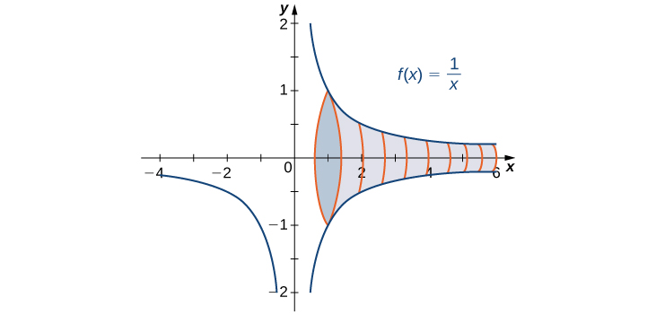
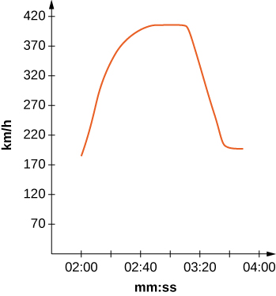

* Evaluate an integral over an infinite interval.
* Evaluate an integral over a closed interval with an infinite discontinuity within the interval.
* Use the comparison theorem to determine whether a definite integral is convergent.

Is the area between the graph of <math xmlns="http://www.w3.org/1998/Math/MathML"><mrow><mi>f</mi><mrow><mo>(</mo><mi>x</mi><mo>)</mo></mrow><mo>=</mo><mfrac><mn>1</mn><mi>x</mi></mfrac></mrow></math>

 and the *x*-axis over the interval <math xmlns="http://www.w3.org/1998/Math/MathML"><mrow><mo stretchy="false">[</mo><mn>1</mn><mo>,</mo><mtext>+</mtext><mi>∞</mi><mo stretchy="false">)</mo></mrow></math>

 finite or infinite? If this same region is revolved about the *x*-axis, is the volume finite or infinite? Surprisingly, the area of the region described is infinite, but the volume of the solid obtained by revolving this region about the *x*-axis is finite.

In this section, we define integrals over an infinite interval as well as integrals of functions containing a discontinuity on the interval. Integrals of these types are called improper integrals. We examine several techniques for evaluating improper integrals, all of which involve taking limits.

### Integrating over an Infinite Interval

How should we go about defining an integral of the type <math xmlns="http://www.w3.org/1998/Math/MathML"><mrow><mstyle displaystyle="true"><mrow><msubsup><mo stretchy="false">∫</mo><mi>a</mi><mrow><mo>+</mo><mi>∞</mi></mrow></msubsup><mrow><mi>f</mi><mrow><mo>(</mo><mi>x</mi><mo>)</mo></mrow><mi>d</mi><mi>x</mi></mrow></mrow></mstyle><mo>?</mo></mrow></math>

 We can integrate <math xmlns="http://www.w3.org/1998/Math/MathML"><mrow><mstyle displaystyle="true"><mrow><msubsup><mo stretchy="false">∫</mo><mi>a</mi><mi>t</mi></msubsup><mrow><mi>f</mi><mrow><mo>(</mo><mi>x</mi><mo>)</mo></mrow><mi>d</mi><mi>x</mi></mrow></mrow></mstyle></mrow></math>

 for any value of <math xmlns="http://www.w3.org/1998/Math/MathML"><mrow><mi>t</mi><mo>,</mo></mrow></math>

 so it is reasonable to look at the behavior of this integral as we substitute larger values of <math xmlns="http://www.w3.org/1998/Math/MathML"><mrow><mi>t</mi><mo>.</mo></mrow></math>

 [\[link\]](#CNX_Calc_Figure_07_07_001) shows that <math xmlns="http://www.w3.org/1998/Math/MathML"><mrow><mstyle displaystyle="true"><mrow><msubsup><mo stretchy="false">∫</mo><mi>a</mi><mi>t</mi></msubsup><mrow><mi>f</mi><mrow><mo>(</mo><mi>x</mi><mo>)</mo></mrow><mi>d</mi><mi>x</mi></mrow></mrow></mstyle></mrow></math>

 may be interpreted as area for various values of <math xmlns="http://www.w3.org/1998/Math/MathML"><mrow><mi>t</mi><mo>.</mo></mrow></math>

 In other words, we may define an improper integral as a limit, taken as one of the limits of integration increases or decreases without bound.

 {: #CNX_Calc_Figure_07_07_001}

Definition

1.  Let
    <math xmlns="http://www.w3.org/1998/Math/MathML"><mrow><mi>f</mi><mo stretchy="false">(</mo><mi>x</mi><mo stretchy="false">)</mo></mrow></math>
    
    be continuous over an interval of the form
    <math xmlns="http://www.w3.org/1998/Math/MathML"><mrow><mo stretchy="false">[</mo><mi>a</mi><mo>,</mo><mtext>+</mtext><mi>∞</mi><mo stretchy="false">)</mo><mo>.</mo></mrow></math>
    
    Then
    * * *
    {: data-type="newline"}
    
    

    <math xmlns="http://www.w3.org/1998/Math/MathML"><mrow><mstyle displaystyle="true"><mrow><msubsup><mo stretchy="false">∫</mo><mi>a</mi><mrow><mo>+</mo><mi>∞</mi></mrow></msubsup><mrow><mi>f</mi><mrow><mo>(</mo><mi>x</mi><mo>)</mo></mrow><mi>d</mi><mi>x</mi><mo>=</mo><munder><mrow><mtext>lim</mtext></mrow><mrow><mi>t</mi><mo stretchy="false">→</mo><mtext>+</mtext><mi>∞</mi></mrow></munder><mstyle displaystyle="true"><mrow><msubsup><mo stretchy="false">∫</mo><mi>a</mi><mi>t</mi></msubsup><mrow><mi>f</mi><mrow><mo>(</mo><mi>x</mi><mo>)</mo></mrow><mi>d</mi><mi>x</mi><mo>,</mo></mrow></mrow></mstyle></mrow></mrow></mstyle></mrow></math>
    

    
    * * *
    {: data-type="newline"}
    
    provided this limit exists.
2.  Let
    <math xmlns="http://www.w3.org/1998/Math/MathML"><mrow><mi>f</mi><mo stretchy="false">(</mo><mi>x</mi><mo stretchy="false">)</mo></mrow></math>
    
    be continuous over an interval of the form
    <math xmlns="http://www.w3.org/1998/Math/MathML"><mrow><mo stretchy="false">(</mo><mtext>−</mtext><mi>∞</mi><mo>,</mo><mi>b</mi><mo stretchy="false">]</mo><mo>.</mo></mrow></math>
    
    Then
    * * *
    {: data-type="newline"}
    
    

    <math xmlns="http://www.w3.org/1998/Math/MathML"><mrow><mstyle displaystyle="true"><mrow><msubsup><mo stretchy="false">∫</mo><mrow><mtext>−</mtext><mi>∞</mi></mrow><mi>b</mi></msubsup><mrow><mi>f</mi><mrow><mo>(</mo><mi>x</mi><mo>)</mo></mrow><mi>d</mi><mi>x</mi><mo>=</mo><munder><mrow><mtext>lim</mtext></mrow><mrow><mi>t</mi><mo stretchy="false">→</mo><mtext>−</mtext><mi>∞</mi></mrow></munder><mstyle displaystyle="true"><mrow><msubsup><mo stretchy="false">∫</mo><mi>t</mi><mi>b</mi></msubsup><mrow><mi>f</mi><mrow><mo>(</mo><mi>x</mi><mo>)</mo></mrow><mi>d</mi><mi>x</mi><mo>,</mo></mrow></mrow></mstyle></mrow></mrow></mstyle></mrow></math>
    

    
    * * *
    {: data-type="newline"}
    
    provided this limit exists.
    * * *
    {: data-type="newline"}
    
    In each case, if the limit exists, then the **improper integral**{: data-type="term"} is said to converge. If the limit does not exist, then the improper integral is said to diverge.
3.  Let
    <math xmlns="http://www.w3.org/1998/Math/MathML"><mrow><mi>f</mi><mo stretchy="false">(</mo><mi>x</mi><mo stretchy="false">)</mo></mrow></math>
    
    be continuous over
    <math xmlns="http://www.w3.org/1998/Math/MathML"><mrow><mo stretchy="false">(</mo><mtext>−</mtext><mi>∞</mi><mo>,</mo><mtext>+</mtext><mi>∞</mi><mo stretchy="false">)</mo><mo>.</mo></mrow></math>
    
    Then
    * * *
    {: data-type="newline"}
    
    

    <math xmlns="http://www.w3.org/1998/Math/MathML"><mrow><mstyle displaystyle="true"><mrow><msubsup><mo stretchy="false">∫</mo><mrow><mtext>−</mtext><mi>∞</mi></mrow><mrow><mo>+</mo><mi>∞</mi></mrow></msubsup><mrow><mi>f</mi><mrow><mo>(</mo><mi>x</mi><mo>)</mo></mrow><mi>d</mi><mi>x</mi><mo>=</mo><mstyle displaystyle="true"><mrow><msubsup><mo stretchy="false">∫</mo><mrow><mtext>−</mtext><mi>∞</mi></mrow><mn>0</mn></msubsup><mrow><mi>f</mi><mrow><mo>(</mo><mi>x</mi><mo>)</mo></mrow><mi>d</mi><mi>x</mi><mo>+</mo><mstyle displaystyle="true"><mrow><msubsup><mo stretchy="false">∫</mo><mn>0</mn><mrow><mo>+</mo><mi>∞</mi></mrow></msubsup><mrow><mi>f</mi><mrow><mo>(</mo><mi>x</mi><mo>)</mo></mrow><mi>d</mi><mi>x</mi><mo>,</mo></mrow></mrow></mstyle></mrow></mrow></mstyle></mrow></mrow></mstyle></mrow></math>
    

    
    * * *
    {: data-type="newline"}
    
    provided that
    <math xmlns="http://www.w3.org/1998/Math/MathML"><mrow><mstyle displaystyle="true"><mrow><msubsup><mo stretchy="false">∫</mo><mrow><mtext>−</mtext><mi>∞</mi></mrow><mn>0</mn></msubsup><mrow><mi>f</mi><mrow><mo>(</mo><mi>x</mi><mo>)</mo></mrow><mi>d</mi><mi>x</mi></mrow></mrow></mstyle></mrow></math>
    
    and
    <math xmlns="http://www.w3.org/1998/Math/MathML"><mrow><mstyle displaystyle="true"><mrow><msubsup><mo stretchy="false">∫</mo><mn>0</mn><mrow><mo>+</mo><mi>∞</mi></mrow></msubsup><mrow><mi>f</mi><mrow><mo>(</mo><mi>x</mi><mo>)</mo></mrow><mi>d</mi><mi>x</mi></mrow></mrow></mstyle></mrow></math>
    
    both converge. If either of these two integrals diverge, then
    <math xmlns="http://www.w3.org/1998/Math/MathML"><mrow><mstyle displaystyle="true"><mrow><msubsup><mo stretchy="false">∫</mo><mrow><mtext>−</mtext><mi>∞</mi></mrow><mrow><mo>+</mo><mi>∞</mi></mrow></msubsup><mrow><mi>f</mi><mrow><mo>(</mo><mi>x</mi><mo>)</mo></mrow><mi>d</mi><mi>x</mi></mrow></mrow></mstyle></mrow></math>
    
    diverges. (It can be shown that, in fact,
    <math xmlns="http://www.w3.org/1998/Math/MathML"><mrow><mstyle displaystyle="true"><mrow><msubsup><mo stretchy="false">∫</mo><mrow><mtext>−</mtext><mi>∞</mi></mrow><mrow><mo>+</mo><mi>∞</mi></mrow></msubsup><mrow><mi>f</mi><mrow><mo>(</mo><mi>x</mi><mo>)</mo></mrow><mi>d</mi><mi>x</mi><mo>=</mo><mstyle displaystyle="true"><mrow><msubsup><mo stretchy="false">∫</mo><mrow><mtext>−</mtext><mi>∞</mi></mrow><mi>a</mi></msubsup><mrow><mi>f</mi><mrow><mo>(</mo><mi>x</mi><mo>)</mo></mrow><mi>d</mi><mi>x</mi><mo>+</mo><mstyle displaystyle="true"><mrow><msubsup><mo stretchy="false">∫</mo><mi>a</mi><mrow><mo>+</mo><mi>∞</mi></mrow></msubsup><mrow><mi>f</mi><mrow><mo>(</mo><mi>x</mi><mo>)</mo></mrow><mi>d</mi><mi>x</mi></mrow></mrow></mstyle></mrow></mrow></mstyle></mrow></mrow></mstyle></mrow></math>
    
    for any value of
    <math xmlns="http://www.w3.org/1998/Math/MathML"><mrow><mi>a</mi><mo>.</mo><mo stretchy="false">)</mo></mrow></math>
{: data-number-style="arabic"}

In our first example, we return to the question we posed at the start of this section: Is the area between the graph of <math xmlns="http://www.w3.org/1998/Math/MathML"><mrow><mi>f</mi><mrow><mo>(</mo><mi>x</mi><mo>)</mo></mrow><mo>=</mo><mfrac><mn>1</mn><mi>x</mi></mfrac></mrow></math>

 and the <math xmlns="http://www.w3.org/1998/Math/MathML"><mi>x</mi></math>

-axis over the interval <math xmlns="http://www.w3.org/1998/Math/MathML"><mrow><mo stretchy="false">[</mo><mn>1</mn><mo>,</mo><mtext>+</mtext><mi>∞</mi><mo stretchy="false">)</mo></mrow></math>

 finite or infinite?

Finding an Area

Determine whether the area between the graph of <math xmlns="http://www.w3.org/1998/Math/MathML"><mrow><mi>f</mi><mrow><mo>(</mo><mi>x</mi><mo>)</mo></mrow><mo>=</mo><mfrac><mn>1</mn><mi>x</mi></mfrac></mrow></math>

 and the *x*-axis over the interval <math xmlns="http://www.w3.org/1998/Math/MathML"><mrow><mo stretchy="false">[</mo><mn>1</mn><mo>,</mo><mtext>+</mtext><mi>∞</mi><mo stretchy="false">)</mo></mrow></math>

 is finite or infinite.

We first do a quick sketch of the region in question, as shown in the following graph.

=1/x and the x-axis on an infinite interval."){: #CNX_Calc_Figure_07_07_002}

We can see that the area of this region is given by <math xmlns="http://www.w3.org/1998/Math/MathML"><mrow><mi>A</mi><mo>=</mo><mstyle displaystyle="true"><mrow><msubsup><mo stretchy="false">∫</mo><mn>1</mn><mi>∞</mi></msubsup><mrow><mfrac><mn>1</mn><mi>x</mi></mfrac><mi>d</mi><mi>x</mi></mrow></mrow></mstyle><mo>.</mo></mrow></math>

 Then we have

<math xmlns="http://www.w3.org/1998/Math/MathML"><mtable><mtr><mtd columnalign="right"><mi>A</mi></mtd><mtd columnalign="left"><mo>=</mo><mstyle displaystyle="true"><mrow><msubsup><mo stretchy="false">∫</mo><mn>1</mn><mi>∞</mi></msubsup><mrow><mfrac><mn>1</mn><mi>x</mi></mfrac><mi>d</mi><mi>x</mi></mrow></mrow></mstyle></mtd><mtd /><mtd /><mtd /></mtr><mtr><mtd /><mtd columnalign="left"><mo>=</mo><munder><mrow><mtext>lim</mtext></mrow><mrow><mi>t</mi><mo stretchy="false">→</mo><mtext>+</mtext><mi>∞</mi></mrow></munder><mstyle displaystyle="true"><mrow><msubsup><mo stretchy="false">∫</mo><mn>1</mn><mi>t</mi></msubsup><mrow><mfrac><mn>1</mn><mi>x</mi></mfrac><mi>d</mi><mi>x</mi></mrow></mrow></mstyle></mtd><mtd /><mtd /><mtd columnalign="left"><mtext>Rewrite the improper integral as a limit.</mtext></mtd></mtr><mtr><mtd /><mtd columnalign="left"><mo>=</mo><munder><mrow><mtext>lim</mtext></mrow><mrow><mi>t</mi><mo stretchy="false">→</mo><mtext>+</mtext><mi>∞</mi></mrow></munder><mtext>ln</mtext><mrow><mo>\|</mo><mi>x</mi><mo>\|</mo></mrow><mrow><mo>\|</mo><mrow><msubsup><mrow /><mtable><mtr><mtd><mrow /></mtd></mtr><mtr><mtd><mn>1</mn></mtd></mtr></mtable><mtable><mtr><mtd><mi>t</mi></mtd></mtr><mtr><mtd><mrow /></mtd></mtr></mtable></msubsup></mrow></mrow></mtd><mtd /><mtd /><mtd columnalign="left"><mtext>Find the antiderivative.</mtext></mtd></mtr><mtr><mtd /><mtd columnalign="left"><mo>=</mo><munder><mrow><mtext>lim</mtext></mrow><mrow><mi>t</mi><mo stretchy="false">→</mo><mtext>+</mtext><mi>∞</mi></mrow></munder><mo stretchy="false">(</mo><mtext>ln</mtext><mrow><mo>\|</mo><mi>t</mi><mo>\|</mo></mrow><mo>−</mo><mtext>ln</mtext><mspace width="0.1em" /><mn>1</mn><mo stretchy="false">)</mo></mtd><mtd /><mtd /><mtd columnalign="left"><mtext>Evaluate the antiderivative.</mtext></mtd></mtr><mtr><mtd /><mtd columnalign="left"><mo>=</mo><mtext>+</mtext><mi>∞</mi><mo>.</mo></mtd><mtd /><mtd /><mtd columnalign="left"><mtext>Evaluate the limit.</mtext></mtd></mtr></mtable></math>

Since the improper integral diverges to <math xmlns="http://www.w3.org/1998/Math/MathML"><mrow><mo>+</mo><mi>∞</mi><mo>,</mo></mrow></math>

 the area of the region is infinite.

Finding a Volume

Find the volume of the solid obtained by revolving the region bounded by the graph of <math xmlns="http://www.w3.org/1998/Math/MathML"><mrow><mi>f</mi><mrow><mo>(</mo><mi>x</mi><mo>)</mo></mrow><mo>=</mo><mfrac><mn>1</mn><mi>x</mi></mfrac></mrow></math>

 and the *x*-axis over the interval <math xmlns="http://www.w3.org/1998/Math/MathML"><mrow><mo stretchy="false">[</mo><mn>1</mn><mo>,</mo><mtext>+</mtext><mi>∞</mi><mo stretchy="false">)</mo></mrow></math>

 about the <math xmlns="http://www.w3.org/1998/Math/MathML"><mi>x</mi></math>

-axis.

The solid is shown in [[link]](#CNX_Calc_Figure_07_07_003). Using the disk method, we see that the volume *V* is

<math xmlns="http://www.w3.org/1998/Math/MathML"><mrow><mi>V</mi><mo>=</mo><mi>π</mi><mstyle displaystyle="true"><mrow><msubsup><mo stretchy="false">∫</mo><mn>1</mn><mrow><mo>+</mo><mi>∞</mi></mrow></msubsup><mrow><mfrac><mn>1</mn><mrow><msup><mi>x</mi><mn>2</mn></msup></mrow></mfrac><mi>d</mi><mi>x</mi></mrow></mrow></mstyle><mo>.</mo></mrow></math>

{: #CNX_Calc_Figure_07_07_003}

Then we have

<math xmlns="http://www.w3.org/1998/Math/MathML"><mtable><mtr><mtd columnalign="right"><mi>V</mi></mtd><mtd columnalign="left"><mo>=</mo><mi>π</mi><mstyle displaystyle="true"><mrow><msubsup><mo stretchy="false">∫</mo><mn>1</mn><mrow><mo>+</mo><mi>∞</mi></mrow></msubsup><mrow><mfrac><mn>1</mn><mrow><msup><mi>x</mi><mn>2</mn></msup></mrow></mfrac><mi>d</mi><mi>x</mi></mrow></mrow></mstyle></mtd><mtd /><mtd /><mtd /></mtr><mtr><mtd /><mtd columnalign="left"><mo>=</mo><mi>π</mi><munder><mrow><mtext>lim</mtext></mrow><mrow><mi>t</mi><mo stretchy="false">→</mo><mtext>+</mtext><mi>∞</mi></mrow></munder><mstyle displaystyle="true"><mrow><msubsup><mo stretchy="false">∫</mo><mn>1</mn><mi>t</mi></msubsup><mrow><mfrac><mn>1</mn><mrow><msup><mi>x</mi><mn>2</mn></msup></mrow></mfrac><mi>d</mi><mi>x</mi></mrow></mrow></mstyle></mtd><mtd /><mtd /><mtd columnalign="left"><mtext>Rewrite as a limit.</mtext></mtd></mtr><mtr><mtd /><mtd columnalign="left"><mo>=</mo><mi>π</mi><munder><mrow><mtext>lim</mtext></mrow><mrow><mi>t</mi><mo stretchy="false">→</mo><mtext>+</mtext><mi>∞</mi></mrow></munder><mo>−</mo><mfrac><mn>1</mn><mi>x</mi></mfrac><mrow><mo>\|</mo><mrow><msubsup><mrow /><mtable><mtr><mtd><mrow /></mtd></mtr><mtr><mtd><mn>1</mn></mtd></mtr></mtable><mtable><mtr><mtd><mi>t</mi></mtd></mtr><mtr><mtd><mrow /></mtd></mtr></mtable></msubsup></mrow></mrow></mtd><mtd /><mtd /><mtd columnalign="left"><mtext>Find the antiderivative.</mtext></mtd></mtr><mtr><mtd /><mtd columnalign="left"><mo>=</mo><mi>π</mi><munder><mrow><mtext>lim</mtext></mrow><mrow><mi>t</mi><mo stretchy="false">→</mo><mtext>+</mtext><mi>∞</mi></mrow></munder><mrow><mo>(</mo><mrow><mtext>−</mtext><mspace width="0.2em" /><mfrac><mn>1</mn><mi>t</mi></mfrac><mo>+</mo><mn>1</mn></mrow><mo>)</mo></mrow></mtd><mtd /><mtd /><mtd columnalign="left"><mtext>Evaluate the antiderivative.</mtext></mtd></mtr><mtr><mtd /><mtd columnalign="left"><mo>=</mo><mi>π</mi><mo>.</mo></mtd><mtd /><mtd /><mtd /></mtr></mtable></math>

The improper integral converges to <math xmlns="http://www.w3.org/1998/Math/MathML"><mrow><mi>π</mi><mo>.</mo></mrow></math>

 Therefore, the volume of the solid of revolution is <math xmlns="http://www.w3.org/1998/Math/MathML"><mrow><mi>π</mi><mo>.</mo></mrow></math>

In conclusion, although the area of the region between the *x*-axis and the graph of <math xmlns="http://www.w3.org/1998/Math/MathML"><mrow><mi>f</mi><mrow><mo>(</mo><mi>x</mi><mo>)</mo></mrow><mo>=</mo><mn>1</mn><mtext>/</mtext><mi>x</mi></mrow></math>

 over the interval <math xmlns="http://www.w3.org/1998/Math/MathML"><mrow><mo stretchy="false">[</mo><mn>1</mn><mo>,</mo><mtext>+</mtext><mi>∞</mi><mo stretchy="false">)</mo></mrow></math>

 is infinite, the volume of the solid generated by revolving this region about the *x*-axis is finite. The solid generated is known as ***Gabriel’s Horn***{: data-type="term" .no-emphasis}.

Visit this [website][1] to read more about Gabriel’s Horn.

Chapter Opener: Traffic Accidents in a City

"){: #CNX_Calc_Figure_07_07_006}

In the chapter opener, we stated the following problem: Suppose that at a busy intersection, **traffic accidents**{: data-type="term" .no-emphasis} occur at an average rate of one every three months. After residents complained, changes were made to the traffic lights at the intersection. It has now been eight months since the changes were made and there have been no accidents. Were the changes effective or is the 8-month interval without an accident a result of chance?

Probability theory tells us that if the average time between events is <math xmlns="http://www.w3.org/1998/Math/MathML"><mrow><mi>k</mi><mo>,</mo></mrow></math>

 the **probability**{: data-type="term" .no-emphasis} that <math xmlns="http://www.w3.org/1998/Math/MathML"><mrow><mi>X</mi><mo>,</mo></mrow></math>

 the time between events, is between <math xmlns="http://www.w3.org/1998/Math/MathML"><mi>a</mi></math>

 and <math xmlns="http://www.w3.org/1998/Math/MathML"><mi>b</mi></math>

 is given by

<math xmlns="http://www.w3.org/1998/Math/MathML"><mrow><mi>P</mi><mrow><mo>(</mo><mrow><mi>a</mi><mo>≤</mo><mi>x</mi><mo>≤</mo><mi>b</mi></mrow><mo>)</mo></mrow><mo>=</mo><mstyle displaystyle="true"><mrow><msubsup><mo stretchy="false">∫</mo><mi>a</mi><mi>b</mi></msubsup><mrow><mi>f</mi><mrow><mo>(</mo><mi>x</mi><mo>)</mo></mrow><mi>d</mi><mi>x</mi></mrow></mrow></mstyle><mspace width="0.2em" /><mtext>where</mtext><mspace width="0.2em" /><mi>f</mi><mrow><mo>(</mo><mi>x</mi><mo>)</mo></mrow><mo>=</mo><mrow><mo>{</mo><mrow><mtable><mtr><mtd><mrow><mn>0</mn><mspace width="0.2em" /><mtext>if</mtext><mspace width="0.1em" /><mi>x</mi><mo>&lt;</mo><mn>0</mn></mrow></mtd></mtr><mtr><mtd><mrow><mi>k</mi><msup><mi>e</mi><mrow><mtext>−</mtext><mi>k</mi><mi>x</mi></mrow></msup><mtext>if</mtext><mspace width="0.1em" /><mi>x</mi><mo>≥</mo><mn>0</mn></mrow></mtd></mtr></mtable><mo>.</mo></mrow></mrow></mrow></math>

Thus, if accidents are occurring at a rate of one every 3 months, then the probability that <math xmlns="http://www.w3.org/1998/Math/MathML"><mrow><mi>X</mi><mo>,</mo></mrow></math>

 the time between accidents, is between <math xmlns="http://www.w3.org/1998/Math/MathML"><mi>a</mi></math>

 and <math xmlns="http://www.w3.org/1998/Math/MathML"><mi>b</mi></math>

 is given by

<math xmlns="http://www.w3.org/1998/Math/MathML"><mrow><mi>P</mi><mrow><mo>(</mo><mrow><mi>a</mi><mo>≤</mo><mi>x</mi><mo>≤</mo><mi>b</mi></mrow><mo>)</mo></mrow><mo>=</mo><mstyle displaystyle="true"><mrow><msubsup><mo stretchy="false">∫</mo><mi>a</mi><mi>b</mi></msubsup><mrow><mi>f</mi><mrow><mo>(</mo><mi>x</mi><mo>)</mo></mrow><mi>d</mi><mi>x</mi></mrow></mrow></mstyle><mspace width="0.2em" /><mtext>where</mtext><mspace width="0.2em" /><mi>f</mi><mrow><mo>(</mo><mi>x</mi><mo>)</mo></mrow><mo>=</mo><mrow><mo>{</mo><mrow><mtable><mtr><mtd><mrow><mn>0</mn><mspace width="0.2em" /><mtext>if</mtext><mspace width="0.1em" /><mi>x</mi><mo>&lt;</mo><mn>0</mn></mrow></mtd></mtr><mtr><mtd><mrow><mn>3</mn><msup><mi>e</mi><mrow><mn>−3</mn><mi>x</mi></mrow></msup><mtext>if</mtext><mspace width="0.1em" /><mi>x</mi><mo>≥</mo><mn>0</mn></mrow></mtd></mtr></mtable><mo>.</mo></mrow></mrow></mrow></math>

To answer the question, we must compute <math xmlns="http://www.w3.org/1998/Math/MathML"><mrow><mi>P</mi><mrow><mo>(</mo><mrow><mi>X</mi><mo>≥</mo><mn>8</mn></mrow><mo>)</mo></mrow><mo>=</mo><mstyle displaystyle="true"><mrow><msubsup><mo stretchy="false">∫</mo><mn>8</mn><mrow><mo>+</mo><mi>∞</mi></mrow></msubsup><mrow><mn>3</mn><msup><mi>e</mi><mrow><mn>−3</mn><mi>x</mi></mrow></msup><mi>d</mi><mi>x</mi></mrow></mrow></mstyle></mrow></math>

 and decide whether it is likely that 8 months could have passed without an accident if there had been no improvement in the traffic situation.

We need to calculate the probability as an improper integral:

<math xmlns="http://www.w3.org/1998/Math/MathML"><mtable><mtr><mtd columnalign="right"><mi>P</mi><mrow><mo>(</mo><mrow><mi>X</mi><mo>≥</mo><mn>8</mn></mrow><mo>)</mo></mrow></mtd><mtd columnalign="left"><mo>=</mo><mstyle displaystyle="true"><mrow><msubsup><mo stretchy="false">∫</mo><mn>8</mn><mrow><mo>+</mo><mi>∞</mi></mrow></msubsup><mrow><mn>3</mn><msup><mi>e</mi><mrow><mn>−3</mn><mi>x</mi></mrow></msup><mi>d</mi><mi>x</mi></mrow></mrow></mstyle></mtd></mtr><mtr><mtd /><mtd columnalign="left"><mo>=</mo><munder><mrow><mtext>lim</mtext></mrow><mrow><mi>t</mi><mo stretchy="false">→</mo><mtext>+</mtext><mi>∞</mi></mrow></munder><mstyle displaystyle="true"><mrow><msubsup><mo stretchy="false">∫</mo><mn>8</mn><mi>t</mi></msubsup><mrow><mn>3</mn><msup><mi>e</mi><mrow><mn>−3</mn><mi>x</mi></mrow></msup><mi>d</mi><mi>x</mi></mrow></mrow></mstyle></mtd></mtr><mtr><mtd /><mtd columnalign="left"><mo>=</mo><munder><mrow><mtext>lim</mtext></mrow><mrow><mi>t</mi><mo stretchy="false">→</mo><mtext>+</mtext><mi>∞</mi></mrow></munder><msubsup><mrow><mrow><mtext>−</mtext><msup><mi>e</mi><mrow><mn>−3</mn><mi>x</mi></mrow></msup></mrow><mo>\|</mo></mrow><mn>8</mn><mi>t</mi></msubsup></mtd></mtr><mtr><mtd /><mtd columnalign="left"><mo>=</mo><munder><mrow><mtext>lim</mtext></mrow><mrow><mi>t</mi><mo stretchy="false">→</mo><mtext>+</mtext><mi>∞</mi></mrow></munder><mo stretchy="false">(</mo><mtext>−</mtext><msup><mi>e</mi><mrow><mn>−3</mn><mi>t</mi></mrow></msup><mo>+</mo><msup><mi>e</mi><mrow><mn>−24</mn></mrow></msup><mo stretchy="false">)</mo></mtd></mtr><mtr><mtd /><mtd columnalign="left"><mo>≈</mo><mn>3.8</mn><mspace width="0.2em" /><mo>×</mo><mspace width="0.2em" /><msup><mn>10</mn><mrow><mn>−11</mn></mrow></msup><mo>.</mo></mtd></mtr></mtable></math>

The value <math xmlns="http://www.w3.org/1998/Math/MathML"><mrow><mn>3.8</mn><mspace width="0.2em" /><mo>×</mo><mspace width="0.2em" /><msup><mrow><mn>10</mn></mrow><mrow><mn>−11</mn></mrow></msup></mrow></math>

 represents the probability of no accidents in 8 months under the initial conditions. Since this value is very, very small, it is reasonable to conclude the changes were effective.

Evaluating an Improper Integral over an Infinite Interval

Evaluate <math xmlns="http://www.w3.org/1998/Math/MathML"><mrow><mstyle displaystyle="true"><mrow><msubsup><mo stretchy="false">∫</mo><mrow><mtext>−</mtext><mi>∞</mi></mrow><mn>0</mn></msubsup><mrow><mfrac><mn>1</mn><mrow><msup><mi>x</mi><mn>2</mn></msup><mo>+</mo><mn>4</mn></mrow></mfrac><mi>d</mi><mi>x</mi></mrow></mrow></mstyle><mo>.</mo></mrow></math>

 State whether the improper integral converges or diverges.

Begin by rewriting <math xmlns="http://www.w3.org/1998/Math/MathML"><mrow><mstyle displaystyle="true"><mrow><msubsup><mo stretchy="false">∫</mo><mrow><mtext>−</mtext><mi>∞</mi></mrow><mn>0</mn></msubsup><mrow><mfrac><mn>1</mn><mrow><msup><mi>x</mi><mn>2</mn></msup><mo>+</mo><mn>4</mn></mrow></mfrac><mi>d</mi><mi>x</mi></mrow></mrow></mstyle></mrow></math>

 as a limit using [[link]](#fs-id1165043086270) from the definition. Thus,

<math xmlns="http://www.w3.org/1998/Math/MathML"><mtable><mtr><mtd columnalign="right"><mstyle displaystyle="true"><mrow><msubsup><mo stretchy="false">∫</mo><mrow><mtext>−</mtext><mi>∞</mi></mrow><mn>0</mn></msubsup><mrow><mfrac><mn>1</mn><mrow><msup><mi>x</mi><mn>2</mn></msup><mo>+</mo><mn>4</mn></mrow></mfrac><mi>d</mi><mi>x</mi></mrow></mrow></mstyle></mtd><mtd columnalign="left"><mo>=</mo><munder><mrow><mtext>lim</mtext></mrow><mrow><mi>t</mi><mo stretchy="false">→</mo><mtext>−</mtext><mi>∞</mi></mrow></munder><mstyle displaystyle="true"><mrow><msubsup><mo stretchy="false">∫</mo><mi>t</mi><mn>0</mn></msubsup><mrow><mfrac><mn>1</mn><mrow><msup><mi>x</mi><mn>2</mn></msup><mo>+</mo><mn>4</mn></mrow></mfrac><mi>d</mi><mi>x</mi></mrow></mrow></mstyle></mtd><mtd /><mtd /><mtd columnalign="left"><mtext>Rewrite as a limit.</mtext></mtd></mtr><mtr><mtd /><mtd columnalign="left"><mo>=</mo><munder><mrow><mtext>lim</mtext></mrow><mrow><mi>t</mi><mo stretchy="false">→</mo><mtext>−</mtext><mi>∞</mi></mrow></munder><msup><mrow><mtext>tan</mtext></mrow><mrow><mn>−1</mn></mrow></msup><mfrac><mi>x</mi><mn>2</mn></mfrac><mrow><mo>\|</mo><mrow><msubsup><mrow /><mtable><mtr><mtd><mrow /></mtd></mtr><mtr><mtd><mi>t</mi></mtd></mtr></mtable><mtable><mtr><mtd><mn>0</mn></mtd></mtr><mtr><mtd><mrow /></mtd></mtr></mtable></msubsup></mrow></mrow></mtd><mtd /><mtd /><mtd columnalign="left"><mtext>Find the antiderivative.</mtext></mtd></mtr><mtr><mtd /><mtd columnalign="left"><mo>=</mo><munder><mrow><mtext>lim</mtext></mrow><mrow><mi>t</mi><mo stretchy="false">→</mo><mtext>−</mtext><mi>∞</mi></mrow></munder><mo stretchy="false">(</mo><msup><mrow><mtext>tan</mtext></mrow><mrow><mn>−1</mn></mrow></msup><mn>0</mn><mo>−</mo><msup><mrow><mtext>tan</mtext></mrow><mrow><mn>−1</mn></mrow></msup><mfrac><mi>t</mi><mn>2</mn></mfrac><mo stretchy="false">)</mo></mtd><mtd /><mtd /><mtd columnalign="left"><mtext>Evaluate the antiderivative.</mtext></mtd></mtr><mtr><mtd /><mtd columnalign="left"><mo>=</mo><mfrac><mi>π</mi><mn>2</mn></mfrac><mo>.</mo></mtd><mtd /><mtd /><mtd columnalign="left"><mtext>Evaluate the limit and simplify.</mtext></mtd></mtr></mtable></math>

The improper integral converges to <math xmlns="http://www.w3.org/1998/Math/MathML"><mrow><mfrac><mi>π</mi><mn>2</mn></mfrac><mo>.</mo></mrow></math>

Evaluating an Improper Integral on
<math xmlns="http://www.w3.org/1998/Math/MathML"><mrow><mo stretchy="false">(</mo><mtext>−</mtext><mi>∞</mi><mo>,</mo><mtext>+</mtext><mi>∞</mi><mo stretchy="false">)</mo></mrow></math>

Evaluate <math xmlns="http://www.w3.org/1998/Math/MathML"><mrow><mstyle displaystyle="true"><mrow><msubsup><mo stretchy="false">∫</mo><mrow><mtext>−</mtext><mi>∞</mi></mrow><mrow><mo>+</mo><mi>∞</mi></mrow></msubsup><mrow><mi>x</mi><msup><mi>e</mi><mi>x</mi></msup><mi>d</mi><mi>x</mi></mrow></mrow></mstyle><mo>.</mo></mrow></math>

 State whether the improper integral converges or diverges.

Start by splitting up the integral:

<math xmlns="http://www.w3.org/1998/Math/MathML"><mrow><mstyle displaystyle="true"><mrow><msubsup><mo stretchy="false">∫</mo><mrow><mtext>−</mtext><mi>∞</mi></mrow><mrow><mo>+</mo><mi>∞</mi></mrow></msubsup><mrow><mi>x</mi><msup><mi>e</mi><mi>x</mi></msup><mi>d</mi><mi>x</mi><mo>=</mo><mstyle displaystyle="true"><mrow><msubsup><mo stretchy="false">∫</mo><mrow><mtext>−</mtext><mi>∞</mi></mrow><mn>0</mn></msubsup><mrow><mi>x</mi><msup><mi>e</mi><mi>x</mi></msup><mi>d</mi><mi>x</mi><mo>+</mo><mstyle displaystyle="true"><mrow><msubsup><mo stretchy="false">∫</mo><mn>0</mn><mrow><mo>+</mo><mi>∞</mi></mrow></msubsup><mrow><mi>x</mi><msup><mi>e</mi><mi>x</mi></msup><mi>d</mi><mi>x</mi></mrow></mrow></mstyle></mrow></mrow></mstyle></mrow></mrow></mstyle><mo>.</mo></mrow></math>

If either <math xmlns="http://www.w3.org/1998/Math/MathML"><mrow><mstyle displaystyle="true"><mrow><msubsup><mo stretchy="false">∫</mo><mrow><mtext>−</mtext><mi>∞</mi></mrow><mn>0</mn></msubsup><mrow><mi>x</mi><msup><mi>e</mi><mi>x</mi></msup><mi>d</mi><mi>x</mi></mrow></mrow></mstyle></mrow></math>

 or <math xmlns="http://www.w3.org/1998/Math/MathML"><mrow><mstyle displaystyle="true"><mrow><msubsup><mo stretchy="false">∫</mo><mn>0</mn><mrow><mo>+</mo><mi>∞</mi></mrow></msubsup><mrow><mi>x</mi><msup><mi>e</mi><mi>x</mi></msup><mi>d</mi><mi>x</mi></mrow></mrow></mstyle></mrow></math>

 diverges, then <math xmlns="http://www.w3.org/1998/Math/MathML"><mrow><mstyle displaystyle="true"><mrow><msubsup><mo stretchy="false">∫</mo><mrow><mtext>−</mtext><mi>∞</mi></mrow><mrow><mo>+</mo><mi>∞</mi></mrow></msubsup><mrow><mi>x</mi><msup><mi>e</mi><mi>x</mi></msup><mi>d</mi><mi>x</mi></mrow></mrow></mstyle></mrow></math>

 diverges. Compute each integral separately. For the first integral,

<math xmlns="http://www.w3.org/1998/Math/MathML"><mtable><mtr><mtd columnalign="right"><mstyle displaystyle="true"><mrow><msubsup><mo stretchy="false">∫</mo><mrow><mtext>−</mtext><mi>∞</mi></mrow><mn>0</mn></msubsup><mrow><mi>x</mi><msup><mi>e</mi><mi>x</mi></msup><mi>d</mi><mi>x</mi></mrow></mrow></mstyle></mtd><mtd columnalign="left"><mo>=</mo><munder><mrow><mtext>lim</mtext></mrow><mrow><mi>t</mi><mo stretchy="false">→</mo><mtext>−</mtext><mi>∞</mi></mrow></munder><mstyle displaystyle="true"><mrow><msubsup><mo stretchy="false">∫</mo><mi>t</mi><mn>0</mn></msubsup><mrow><mi>x</mi><msup><mi>e</mi><mi>x</mi></msup><mi>d</mi><mi>x</mi></mrow></mrow></mstyle></mtd><mtd /><mtd /><mtd columnalign="left"><mtext>Rewrite as a limit.</mtext></mtd></mtr><mtr><mtd /><mtd columnalign="left"><mo>=</mo><munder><mrow><mtext>lim</mtext></mrow><mrow><mi>t</mi><mo stretchy="false">→</mo><mtext>−</mtext><mi>∞</mi></mrow></munder><mrow><mo>(</mo><mrow><mi>x</mi><msup><mi>e</mi><mi>x</mi></msup><mo>−</mo><msup><mi>e</mi><mi>x</mi></msup></mrow><mo>)</mo></mrow><mrow><mo>\|</mo><mrow><msubsup><mrow /><mtable><mtr><mtd><mrow /></mtd></mtr><mtr><mtd><mi>t</mi></mtd></mtr></mtable><mtable><mtr><mtd><mn>0</mn></mtd></mtr><mtr><mtd><mrow /></mtd></mtr></mtable></msubsup></mrow></mrow></mtd><mtd /><mtd /><mtd columnalign="left"><mtable><mtr><mtd columnalign="left"><mtext>Use integration by parts to find the</mtext></mtd></mtr><mtr><mtd columnalign="left"><mtext>antiderivative. (Here</mtext><mspace width="0.2em" /><mi>u</mi><mo>=</mo><mi>x</mi><mspace width="0.2em" /><mtext>and</mtext><mspace width="0.2em" /><mi>d</mi><mi>v</mi><mo>=</mo><msup><mi>e</mi><mi>x</mi></msup><mo>.</mo><mo stretchy="false">)</mo></mtd></mtr></mtable></mtd></mtr><mtr><mtd /><mtd columnalign="left"><mo>=</mo><munder><mrow><mtext>lim</mtext></mrow><mrow><mi>t</mi><mo stretchy="false">→</mo><mtext>−</mtext><mi>∞</mi></mrow></munder><mrow><mo>(</mo><mrow><mn>−1</mn><mo>−</mo><mi>t</mi><msup><mi>e</mi><mi>t</mi></msup><mo>+</mo><msup><mi>e</mi><mi>t</mi></msup></mrow><mo>)</mo></mrow></mtd><mtd /><mtd /><mtd columnalign="left"><mtext>Evaluate the antiderivative.</mtext></mtd></mtr><mtr><mtd /><mtd columnalign="left"><mo>=</mo><mn>−1</mn><mo>.</mo></mtd><mtd /><mtd /><mtd columnalign="left"><mtable><mtr><mtd columnalign="left"><mtext>Evaluate the limit. </mtext><mspace width="0.2em" /><mtext mathvariant="italic">Note:</mtext><mspace width="0.2em" /><munder><mrow><mtext>lim</mtext></mrow><mrow><mi>t</mi><mo stretchy="false">→</mo><mtext>−</mtext><mi>∞</mi></mrow></munder><mi>t</mi><msup><mi>e</mi><mi>t</mi></msup><mspace width="0.2em" /><mtext>is</mtext></mtd></mtr><mtr><mtd columnalign="left"><mtext>indeterminate of the form</mtext><mspace width="0.2em" /><mn>0</mn><mo>·</mo><mi>∞</mi><mo>.</mo><mspace width="0.2em" /><mtext>Thus,</mtext></mtd></mtr><mtr><mtd columnalign="left"><munder><mrow><mtext>lim</mtext></mrow><mrow><mi>t</mi><mo stretchy="false">→</mo><mtext>−</mtext><mi>∞</mi></mrow></munder><mi>t</mi><msup><mi>e</mi><mi>t</mi></msup><mo>=</mo><munder><mrow><mtext>lim</mtext></mrow><mrow><mi>t</mi><mo stretchy="false">→</mo><mtext>−</mtext><mi>∞</mi></mrow></munder><mfrac><mi>t</mi><mrow><msup><mi>e</mi><mrow><mtext>−</mtext><mi>t</mi></mrow></msup></mrow></mfrac><mo>=</mo><munder><mrow><mtext>lim</mtext></mrow><mrow><mi>t</mi><mo stretchy="false">→</mo><mtext>−</mtext><mi>∞</mi></mrow></munder><mfrac><mrow><mn>−1</mn></mrow><mrow><msup><mi>e</mi><mrow><mtext>−</mtext><mi>t</mi></mrow></msup></mrow></mfrac><mo>=</mo><munder><mrow><mtext>lim</mtext></mrow><mrow><mi>t</mi><mo stretchy="false">→</mo><mtext>−</mtext><mi>∞</mi></mrow></munder><mo>−</mo><msup><mi>e</mi><mi>t</mi></msup><mo>=</mo><mn>0</mn><mspace width="0.2em" /><mtext>by</mtext></mtd></mtr><mtr><mtd columnalign="left"><mtext>L’Hôpital’s Rule.</mtext></mtd></mtr></mtable></mtd></mtr></mtable></math>

The first improper integral converges. For the second integral,

<math xmlns="http://www.w3.org/1998/Math/MathML"><mtable><mtr><mtd columnalign="right"><mstyle displaystyle="true"><mrow><msubsup><mo stretchy="false">∫</mo><mn>0</mn><mrow><mo>+</mo><mi>∞</mi></mrow></msubsup><mrow><mi>x</mi><msup><mi>e</mi><mi>x</mi></msup><mi>d</mi><mi>x</mi></mrow></mrow></mstyle></mtd><mtd columnalign="left"><mo>=</mo><munder><mrow><mtext>lim</mtext></mrow><mrow><mi>t</mi><mo stretchy="false">→</mo><mtext>+</mtext><mi>∞</mi></mrow></munder><mstyle displaystyle="true"><mrow><msubsup><mo stretchy="false">∫</mo><mn>0</mn><mi>t</mi></msubsup><mrow><mi>x</mi><msup><mi>e</mi><mi>x</mi></msup><mi>d</mi><mi>x</mi></mrow></mrow></mstyle></mtd><mtd /><mtd /><mtd columnalign="left"><mtext>Rewrite as a limit.</mtext></mtd></mtr><mtr><mtd /><mtd columnalign="left"><mo>=</mo><munder><mrow><mtext>lim</mtext></mrow><mrow><mi>t</mi><mo stretchy="false">→</mo><mtext>+</mtext><mi>∞</mi></mrow></munder><mrow><mo>(</mo><mrow><mi>x</mi><msup><mi>e</mi><mi>x</mi></msup><mo>−</mo><msup><mi>e</mi><mi>x</mi></msup></mrow><mo>)</mo></mrow><mrow><mo>\|</mo><mrow><msubsup><mrow /><mtable><mtr><mtd><mrow /></mtd></mtr><mtr><mtd><mn>0</mn></mtd></mtr></mtable><mtable><mtr><mtd><mi>t</mi></mtd></mtr><mtr><mtd><mrow /></mtd></mtr></mtable></msubsup></mrow></mrow></mtd><mtd /><mtd /><mtd columnalign="left"><mtext>Find the antiderivative.</mtext></mtd></mtr><mtr><mtd /><mtd columnalign="left"><mo>=</mo><munder><mrow><mtext>lim</mtext></mrow><mrow><mi>t</mi><mo stretchy="false">→</mo><mtext>+</mtext><mi>∞</mi></mrow></munder><mrow><mo>(</mo><mrow><mi>t</mi><msup><mi>e</mi><mi>t</mi></msup><mo>−</mo><msup><mi>e</mi><mi>t</mi></msup><mo>+</mo><mn>1</mn></mrow><mo>)</mo></mrow></mtd><mtd /><mtd /><mtd columnalign="left"><mtext>Evaluate the antiderivative.</mtext></mtd></mtr><mtr><mtd /><mtd columnalign="left"><mo>=</mo><munder><mrow><mtext>lim</mtext></mrow><mrow><mi>t</mi><mo stretchy="false">→</mo><mtext>+</mtext><mi>∞</mi></mrow></munder><mrow><mo>(</mo><mrow><mrow><mo>(</mo><mrow><mi>t</mi><mo>−</mo><mn>1</mn></mrow><mo>)</mo></mrow><msup><mi>e</mi><mi>t</mi></msup><mo>+</mo><mn>1</mn></mrow><mo>)</mo></mrow></mtd><mtd /><mtd /><mtd columnalign="left"><mtext>Rewrite.</mtext><mspace width="0.2em" /><mo stretchy="false">(</mo><mi>t</mi><msup><mi>e</mi><mi>t</mi></msup><mo>−</mo><msup><mi>e</mi><mi>t</mi></msup><mspace width="0.2em" /><mtext>is indeterminate.)</mtext></mtd></mtr><mtr><mtd /><mtd columnalign="left"><mo>=</mo><mtext>+</mtext><mi>∞</mi><mo>.</mo></mtd><mtd /><mtd /><mtd columnalign="left"><mtext>Evaluate the limit.</mtext></mtd></mtr></mtable></math>

Thus, <math xmlns="http://www.w3.org/1998/Math/MathML"><mrow><mstyle displaystyle="true"><mrow><msubsup><mo stretchy="false">∫</mo><mn>0</mn><mrow><mo>+</mo><mi>∞</mi></mrow></msubsup><mrow><mi>x</mi><msup><mi>e</mi><mi>x</mi></msup><mi>d</mi><mi>x</mi></mrow></mrow></mstyle></mrow></math>

 diverges. Since this integral diverges, <math xmlns="http://www.w3.org/1998/Math/MathML"><mrow><mstyle displaystyle="true"><mrow><msubsup><mo stretchy="false">∫</mo><mrow><mtext>−</mtext><mi>∞</mi></mrow><mrow><mo>+</mo><mi>∞</mi></mrow></msubsup><mrow><mi>x</mi><msup><mi>e</mi><mi>x</mi></msup><mi>d</mi><mi>x</mi></mrow></mrow></mstyle></mrow></math>

 diverges as well.

Evaluate <math xmlns="http://www.w3.org/1998/Math/MathML"><mrow><mstyle displaystyle="true"><mrow><msubsup><mo stretchy="false">∫</mo><mrow><mn>−3</mn></mrow><mrow><mo>+</mo><mi>∞</mi></mrow></msubsup><mrow><msup><mi>e</mi><mrow><mtext>−</mtext><mi>x</mi></mrow></msup><mi>d</mi><mi>x</mi></mrow></mrow></mstyle><mo>.</mo></mrow></math>

 State whether the improper integral converges or diverges.

<math xmlns="http://www.w3.org/1998/Math/MathML"><mrow><msup><mi>e</mi><mn>3</mn></msup><mo>,</mo></mrow></math>

 converges

Hint

<math xmlns="http://www.w3.org/1998/Math/MathML"><mrow><mstyle displaystyle="true"><mrow><msubsup><mo stretchy="false">∫</mo><mrow><mn>−3</mn></mrow><mrow><mo>+</mo><mi>∞</mi></mrow></msubsup><mrow><msup><mi>e</mi><mrow><mtext>−</mtext><mi>x</mi></mrow></msup><mi>d</mi><mi>x</mi><mo>=</mo><munder><mrow><mtext>lim</mtext></mrow><mrow><mi>t</mi><mo stretchy="false">→</mo><mtext>+</mtext><mi>∞</mi></mrow></munder><mstyle displaystyle="true"><mrow><msubsup><mo stretchy="false">∫</mo><mrow><mn>−3</mn></mrow><mi>t</mi></msubsup><mrow><msup><mi>e</mi><mrow><mtext>−</mtext><mi>x</mi></mrow></msup><mi>d</mi><mi>x</mi></mrow></mrow></mstyle></mrow></mrow></mstyle></mrow></math>

### Integrating a Discontinuous Integrand

Now let’s examine integrals of functions containing an infinite discontinuity in the interval over which the integration occurs. Consider an integral of the form <math xmlns="http://www.w3.org/1998/Math/MathML"><mrow><mstyle displaystyle="true"><mrow><msubsup><mo stretchy="false">∫</mo><mi>a</mi><mi>b</mi></msubsup><mrow><mi>f</mi><mo stretchy="false">(</mo><mi>x</mi><mo stretchy="false">)</mo><mi>d</mi><mi>x</mi><mo>,</mo></mrow></mrow></mstyle></mrow></math>

 where <math xmlns="http://www.w3.org/1998/Math/MathML"><mrow><mi>f</mi><mo stretchy="false">(</mo><mi>x</mi><mo stretchy="false">)</mo></mrow></math>

 is continuous over <math xmlns="http://www.w3.org/1998/Math/MathML"><mrow><mo stretchy="false">[</mo><mi>a</mi><mo>,</mo><mi>b</mi><mo stretchy="false">)</mo></mrow></math>

 and discontinuous at <math xmlns="http://www.w3.org/1998/Math/MathML"><mrow><mi>b</mi><mo>.</mo></mrow></math>

 Since the function <math xmlns="http://www.w3.org/1998/Math/MathML"><mrow><mi>f</mi><mo stretchy="false">(</mo><mi>x</mi><mo stretchy="false">)</mo></mrow></math>

 is continuous over <math xmlns="http://www.w3.org/1998/Math/MathML"><mrow><mo stretchy="false">[</mo><mi>a</mi><mo>,</mo><mi>t</mi><mo stretchy="false">]</mo></mrow></math>

 for all values of <math xmlns="http://www.w3.org/1998/Math/MathML"><mi>t</mi></math>

 satisfying <math xmlns="http://www.w3.org/1998/Math/MathML"><mrow><mi>a</mi><mo>&lt;</mo><mi>t</mi><mo>&lt;</mo><mi>b</mi><mo>,</mo></mrow></math>

 the integral <math xmlns="http://www.w3.org/1998/Math/MathML"><mrow><mstyle displaystyle="true"><mrow><msubsup><mo stretchy="false">∫</mo><mi>a</mi><mi>t</mi></msubsup><mrow><mi>f</mi><mo stretchy="false">(</mo><mi>x</mi><mo stretchy="false">)</mo><mi>d</mi><mi>x</mi></mrow></mrow></mstyle></mrow></math>

 is defined for all such values of <math xmlns="http://www.w3.org/1998/Math/MathML"><mrow><mi>t</mi><mo>.</mo></mrow></math>

 Thus, it makes sense to consider the values of <math xmlns="http://www.w3.org/1998/Math/MathML"><mrow><mstyle displaystyle="true"><mrow><msubsup><mo stretchy="false">∫</mo><mi>a</mi><mi>t</mi></msubsup><mrow><mi>f</mi><mo stretchy="false">(</mo><mi>x</mi><mo stretchy="false">)</mo><mi>d</mi><mi>x</mi></mrow></mrow></mstyle></mrow></math>

 as <math xmlns="http://www.w3.org/1998/Math/MathML"><mi>t</mi></math>

 approaches <math xmlns="http://www.w3.org/1998/Math/MathML"><mi>b</mi></math>

 for <math xmlns="http://www.w3.org/1998/Math/MathML"><mrow><mi>a</mi><mo>&lt;</mo><mi>t</mi><mo>&lt;</mo><mi>b</mi><mo>.</mo></mrow></math>

 That is, we define <math xmlns="http://www.w3.org/1998/Math/MathML"><mrow><mstyle displaystyle="true"><mrow><msubsup><mo stretchy="false">∫</mo><mi>a</mi><mi>b</mi></msubsup><mrow><mi>f</mi><mo stretchy="false">(</mo><mi>x</mi><mo stretchy="false">)</mo><mi>d</mi><mi>x</mi><mo>=</mo><munder><mrow><mtext>lim</mtext></mrow><mrow><mi>t</mi><mo stretchy="false">→</mo><msup><mi>b</mi><mo>−</mo></msup></mrow></munder><mstyle displaystyle="true"><mrow><msubsup><mo stretchy="false">∫</mo><mi>a</mi><mi>t</mi></msubsup><mrow><mi>f</mi><mo stretchy="false">(</mo><mi>x</mi><mo stretchy="false">)</mo><mi>d</mi><mi>x</mi></mrow></mrow></mstyle></mrow></mrow></mstyle><mo>,</mo></mrow></math>

 provided this limit exists. [\[link\]](#CNX_Calc_Figure_07_07_004) illustrates <math xmlns="http://www.w3.org/1998/Math/MathML"><mrow><mstyle displaystyle="true"><mrow><msubsup><mo stretchy="false">∫</mo><mi>a</mi><mi>t</mi></msubsup><mrow><mi>f</mi><mo stretchy="false">(</mo><mi>x</mi><mo stretchy="false">)</mo><mi>d</mi><mi>x</mi></mrow></mrow></mstyle></mrow></math>

 as areas of regions for values of <math xmlns="http://www.w3.org/1998/Math/MathML"><mi>t</mi></math>

 approaching <math xmlns="http://www.w3.org/1998/Math/MathML"><mrow><mi>b</mi><mo>.</mo></mrow></math>

 {: #CNX_Calc_Figure_07_07_004}

We use a similar approach to define <math xmlns="http://www.w3.org/1998/Math/MathML"><mrow><mstyle displaystyle="true"><mrow><msubsup><mo stretchy="false">∫</mo><mi>a</mi><mi>b</mi></msubsup><mrow><mi>f</mi><mo stretchy="false">(</mo><mi>x</mi><mo stretchy="false">)</mo><mi>d</mi><mi>x</mi><mo>,</mo></mrow></mrow></mstyle></mrow></math>

 where <math xmlns="http://www.w3.org/1998/Math/MathML"><mrow><mi>f</mi><mo stretchy="false">(</mo><mi>x</mi><mo stretchy="false">)</mo></mrow></math>

 is continuous over <math xmlns="http://www.w3.org/1998/Math/MathML"><mrow><mo stretchy="false">(</mo><mi>a</mi><mo>,</mo><mi>b</mi><mo stretchy="false">]</mo></mrow></math>

 and discontinuous at <math xmlns="http://www.w3.org/1998/Math/MathML"><mrow><mi>a</mi><mo>.</mo></mrow></math>

 We now proceed with a formal definition.

Definition

1.  Let
    <math xmlns="http://www.w3.org/1998/Math/MathML"><mrow><mi>f</mi><mo stretchy="false">(</mo><mi>x</mi><mo stretchy="false">)</mo></mrow></math>
    
    be continuous over
    <math xmlns="http://www.w3.org/1998/Math/MathML"><mrow><mo stretchy="false">[</mo><mi>a</mi><mo>,</mo><mi>b</mi><mo stretchy="false">)</mo><mo>.</mo></mrow></math>
    
    Then,
    * * *
    {: data-type="newline"}
    
    

    <math xmlns="http://www.w3.org/1998/Math/MathML"><mrow><mstyle displaystyle="true"><mrow><msubsup><mo stretchy="false">∫</mo><mi>a</mi><mi>b</mi></msubsup><mrow><mi>f</mi><mo stretchy="false">(</mo><mi>x</mi><mo stretchy="false">)</mo><mi>d</mi><mi>x</mi><mo>=</mo><munder><mrow><mtext>lim</mtext></mrow><mrow><mi>t</mi><mo stretchy="false">→</mo><msup><mi>b</mi><mo>−</mo></msup></mrow></munder><mstyle displaystyle="true"><mrow><msubsup><mo stretchy="false">∫</mo><mi>a</mi><mi>t</mi></msubsup><mrow><mi>f</mi><mo stretchy="false">(</mo><mi>x</mi><mo stretchy="false">)</mo><mi>d</mi><mi>x</mi></mrow></mrow></mstyle></mrow></mrow></mstyle><mo>.</mo></mrow></math>
    

2.  Let
    <math xmlns="http://www.w3.org/1998/Math/MathML"><mrow><mi>f</mi><mo stretchy="false">(</mo><mi>x</mi><mo stretchy="false">)</mo></mrow></math>
    
    be continuous over
    <math xmlns="http://www.w3.org/1998/Math/MathML"><mrow><mo stretchy="false">(</mo><mi>a</mi><mo>,</mo><mi>b</mi><mo stretchy="false">]</mo><mo>.</mo></mrow></math>
    
    Then,
    * * *
    {: data-type="newline"}
    
    

    <math xmlns="http://www.w3.org/1998/Math/MathML"><mrow><mstyle displaystyle="true"><mrow><msubsup><mo stretchy="false">∫</mo><mi>a</mi><mi>b</mi></msubsup><mrow><mi>f</mi><mo stretchy="false">(</mo><mi>x</mi><mo stretchy="false">)</mo><mi>d</mi><mi>x</mi><mo>=</mo><munder><mrow><mtext>lim</mtext></mrow><mrow><mi>t</mi><mo stretchy="false">→</mo><msup><mi>a</mi><mo>+</mo></msup></mrow></munder><mstyle displaystyle="true"><mrow><msubsup><mo stretchy="false">∫</mo><mi>t</mi><mi>b</mi></msubsup><mrow><mi>f</mi><mo stretchy="false">(</mo><mi>x</mi><mo stretchy="false">)</mo><mi>d</mi><mi>x</mi></mrow></mrow></mstyle></mrow></mrow></mstyle><mo>.</mo></mrow></math>
    

    
    * * *
    {: data-type="newline"}
    
    In each case, if the limit exists, then the improper integral is said to converge. If the limit does not exist, then the improper integral is said to diverge.
3.  If
    <math xmlns="http://www.w3.org/1998/Math/MathML"><mrow><mi>f</mi><mo stretchy="false">(</mo><mi>x</mi><mo stretchy="false">)</mo></mrow></math>
    
    is continuous over
    <math xmlns="http://www.w3.org/1998/Math/MathML"><mrow><mo stretchy="false">[</mo><mi>a</mi><mo>,</mo><mi>b</mi><mo stretchy="false">]</mo></mrow></math>
    
    except at a point
    <math xmlns="http://www.w3.org/1998/Math/MathML"><mi>c</mi></math>
    
    in
    <math xmlns="http://www.w3.org/1998/Math/MathML"><mrow><mo stretchy="false">(</mo><mi>a</mi><mo>,</mo><mi>b</mi><mo stretchy="false">)</mo><mo>,</mo></mrow></math>
    
    then
    * * *
    {: data-type="newline"}
    
    

    <math xmlns="http://www.w3.org/1998/Math/MathML"><mrow><mstyle displaystyle="true"><mrow><msubsup><mo stretchy="false">∫</mo><mi>a</mi><mi>b</mi></msubsup><mrow><mi>f</mi><mo stretchy="false">(</mo><mi>x</mi><mo stretchy="false">)</mo><mi>d</mi><mi>x</mi><mo>=</mo><mstyle displaystyle="true"><mrow><msubsup><mo stretchy="false">∫</mo><mi>a</mi><mi>c</mi></msubsup><mrow><mi>f</mi><mo stretchy="false">(</mo><mi>x</mi><mo stretchy="false">)</mo><mi>d</mi><mi>x</mi><mo>+</mo><mstyle displaystyle="true"><mrow><msubsup><mo stretchy="false">∫</mo><mi>c</mi><mi>b</mi></msubsup><mrow><mi>f</mi><mo stretchy="false">(</mo><mi>x</mi><mo stretchy="false">)</mo><mi>d</mi><mi>x</mi><mo>,</mo></mrow></mrow></mstyle></mrow></mrow></mstyle></mrow></mrow></mstyle></mrow></math>
    

    
    * * *
    {: data-type="newline"}
    
    provided both
    <math xmlns="http://www.w3.org/1998/Math/MathML"><mrow><mstyle displaystyle="true"><mrow><msubsup><mo stretchy="false">∫</mo><mi>a</mi><mi>c</mi></msubsup><mrow><mi>f</mi><mo stretchy="false">(</mo><mi>x</mi><mo stretchy="false">)</mo><mi>d</mi><mi>x</mi></mrow></mrow></mstyle></mrow></math>
    
    and
    <math xmlns="http://www.w3.org/1998/Math/MathML"><mrow><mstyle displaystyle="true"><mrow><msubsup><mo stretchy="false">∫</mo><mi>c</mi><mi>b</mi></msubsup><mrow><mi>f</mi><mo stretchy="false">(</mo><mi>x</mi><mo stretchy="false">)</mo><mi>d</mi><mi>x</mi></mrow></mrow></mstyle></mrow></math>
    
    converge. If either of these integrals diverges, then
    <math xmlns="http://www.w3.org/1998/Math/MathML"><mrow><mstyle displaystyle="true"><mrow><msubsup><mo stretchy="false">∫</mo><mi>a</mi><mi>b</mi></msubsup><mrow><mi>f</mi><mo stretchy="false">(</mo><mi>x</mi><mo stretchy="false">)</mo><mi>d</mi><mi>x</mi></mrow></mrow></mstyle></mrow></math>
    
    diverges.
{: data-number-style="arabic"}

The following examples demonstrate the application of this definition.

Integrating a Discontinuous Integrand

Evaluate <math xmlns="http://www.w3.org/1998/Math/MathML"><mrow><mstyle displaystyle="true"><mrow><msubsup><mo stretchy="false">∫</mo><mn>0</mn><mn>4</mn></msubsup><mrow><mfrac><mn>1</mn><mrow><msqrt><mrow><mn>4</mn><mo>−</mo><mi>x</mi></mrow></msqrt></mrow></mfrac><mi>d</mi><mi>x</mi></mrow></mrow></mstyle><mo>,</mo></mrow></math>

 if possible. State whether the integral converges or diverges.

The function <math xmlns="http://www.w3.org/1998/Math/MathML"><mrow><mi>f</mi><mrow><mo>(</mo><mi>x</mi><mo>)</mo></mrow><mo>=</mo><mfrac><mn>1</mn><mrow><msqrt><mrow><mn>4</mn><mo>−</mo><mi>x</mi></mrow></msqrt></mrow></mfrac></mrow></math>

 is continuous over <math xmlns="http://www.w3.org/1998/Math/MathML"><mrow><mo stretchy="false">[</mo><mn>0</mn><mo>,</mo><mn>4</mn><mo stretchy="false">)</mo></mrow></math>

 and discontinuous at 4. Using [[link]](#fs-id1165042617693) from the definition, rewrite <math xmlns="http://www.w3.org/1998/Math/MathML"><mrow><mstyle displaystyle="true"><mrow><msubsup><mo stretchy="false">∫</mo><mn>0</mn><mn>4</mn></msubsup><mrow><mfrac><mn>1</mn><mrow><msqrt><mrow><mn>4</mn><mo>−</mo><mi>x</mi></mrow></msqrt></mrow></mfrac><mi>d</mi><mi>x</mi></mrow></mrow></mstyle></mrow></math>

 as a limit:

<math xmlns="http://www.w3.org/1998/Math/MathML"><mtable><mtr><mtd columnalign="right"><mstyle displaystyle="true"><mrow><msubsup><mo stretchy="false">∫</mo><mn>0</mn><mn>4</mn></msubsup><mrow><mfrac><mn>1</mn><mrow><msqrt><mrow><mn>4</mn><mo>−</mo><mi>x</mi></mrow></msqrt></mrow></mfrac><mi>d</mi><mi>x</mi></mrow></mrow></mstyle></mtd><mtd columnalign="left"><mo>=</mo><munder><mrow><mtext>lim</mtext></mrow><mrow><mi>t</mi><mo stretchy="false">→</mo><msup><mn>4</mn><mo>−</mo></msup></mrow></munder><mstyle displaystyle="true"><mrow><msubsup><mo stretchy="false">∫</mo><mn>0</mn><mi>t</mi></msubsup><mrow><mfrac><mn>1</mn><mrow><msqrt><mrow><mn>4</mn><mo>−</mo><mi>x</mi></mrow></msqrt></mrow></mfrac><mi>d</mi><mi>x</mi></mrow></mrow></mstyle></mtd><mtd /><mtd /><mtd columnalign="left"><mtext>Rewrite as a limit.</mtext></mtd></mtr><mtr><mtd /><mtd columnalign="left"><mo>=</mo><munder><mrow><mtext>lim</mtext></mrow><mrow><mi>t</mi><mo stretchy="false">→</mo><msup><mn>4</mn><mo>−</mo></msup></mrow></munder><mrow><mo>(</mo><mrow><mn>−2</mn><msqrt><mrow><mn>4</mn><mo>−</mo><mi>x</mi></mrow></msqrt></mrow><mo>)</mo></mrow><mrow><mo>\|</mo><mrow><msubsup><mrow /><mtable><mtr><mtd><mrow /></mtd></mtr><mtr><mtd><mn>0</mn></mtd></mtr></mtable><mtable><mtr><mtd><mi>t</mi></mtd></mtr><mtr><mtd><mrow /></mtd></mtr></mtable></msubsup></mrow></mrow></mtd><mtd /><mtd /><mtd columnalign="left"><mtext>Find the antiderivative.</mtext></mtd></mtr><mtr><mtd /><mtd columnalign="left"><mo>=</mo><munder><mrow><mtext>lim</mtext></mrow><mrow><mi>t</mi><mo stretchy="false">→</mo><msup><mn>4</mn><mo>−</mo></msup></mrow></munder><mrow><mo>(</mo><mrow><mn>−2</mn><msqrt><mrow><mn>4</mn><mo>−</mo><mi>t</mi></mrow></msqrt><mo>+</mo><mn>4</mn></mrow><mo>)</mo></mrow></mtd><mtd /><mtd /><mtd columnalign="left"><mtext>Evaluate the antiderivative.</mtext></mtd></mtr><mtr><mtd /><mtd columnalign="left"><mo>=</mo><mn>4</mn><mo>.</mo></mtd><mtd /><mtd /><mtd columnalign="left"><mtext>Evaluate the limit.</mtext></mtd></mtr></mtable></math>

The improper integral converges.

Integrating a Discontinuous Integrand

Evaluate <math xmlns="http://www.w3.org/1998/Math/MathML"><mrow><mstyle displaystyle="true"><mrow><msubsup><mo stretchy="false">∫</mo><mn>0</mn><mn>2</mn></msubsup><mrow><mi>x</mi><mspace width="0.1em" /><mtext>ln</mtext><mspace width="0.1em" /><mi>x</mi><mspace width="0.1em" /><mi>d</mi><mi>x</mi></mrow></mrow></mstyle><mo>.</mo></mrow></math>

 State whether the integral converges or diverges.

Since <math xmlns="http://www.w3.org/1998/Math/MathML"><mrow><mi>f</mi><mrow><mo>(</mo><mi>x</mi><mo>)</mo></mrow><mo>=</mo><mi>x</mi><mspace width="0.1em" /><mtext>ln</mtext><mspace width="0.1em" /><mi>x</mi></mrow></math>

 is continuous over <math xmlns="http://www.w3.org/1998/Math/MathML"><mrow><mo stretchy="false">(</mo><mn>0</mn><mo>,</mo><mn>2</mn><mo stretchy="false">]</mo></mrow></math>

 and is discontinuous at zero, we can rewrite the integral in limit form using [[link]](#fs-id1165042506827):

<math xmlns="http://www.w3.org/1998/Math/MathML"><mtable><mtr><mtd columnalign="right"><mstyle displaystyle="true"><mrow><msubsup><mo stretchy="false">∫</mo><mn>0</mn><mn>2</mn></msubsup><mrow><mi>x</mi><mspace width="0.1em" /><mtext>ln</mtext><mspace width="0.1em" /><mi>x</mi><mspace width="0.1em" /><mi>d</mi><mi>x</mi></mrow></mrow></mstyle></mtd><mtd columnalign="left"><mo>=</mo><munder><mrow><mtext>lim</mtext></mrow><mrow><mi>t</mi><mo stretchy="false">→</mo><msup><mn>0</mn><mo>+</mo></msup></mrow></munder><mstyle displaystyle="true"><mrow><msubsup><mo stretchy="false">∫</mo><mi>t</mi><mn>2</mn></msubsup><mrow><mi>x</mi><mspace width="0.1em" /><mtext>ln</mtext><mspace width="0.1em" /><mi>x</mi><mspace width="0.1em" /><mi>d</mi><mi>x</mi></mrow></mrow></mstyle></mtd><mtd /><mtd /><mtd columnalign="left"><mtext>Rewrite as a limit.</mtext></mtd></mtr><mtr><mtd /><mtd columnalign="left"><mo>=</mo><munder><mrow><mtext>lim</mtext></mrow><mrow><mi>t</mi><mo stretchy="false">→</mo><msup><mn>0</mn><mo>+</mo></msup></mrow></munder><mrow><mo>(</mo><mrow><mfrac><mn>1</mn><mn>2</mn></mfrac><msup><mi>x</mi><mn>2</mn></msup><mtext>ln</mtext><mspace width="0.1em" /><mi>x</mi><mo>−</mo><mfrac><mn>1</mn><mn>4</mn></mfrac><msup><mi>x</mi><mn>2</mn></msup></mrow><mo>)</mo></mrow><mrow><mo>\|</mo><mrow><msubsup><mrow /><mtable><mtr><mtd><mrow /></mtd></mtr><mtr><mtd><mi>t</mi></mtd></mtr></mtable><mtable><mtr><mtd><mn>2</mn></mtd></mtr><mtr><mtd><mrow /></mtd></mtr></mtable></msubsup></mrow></mrow></mtd><mtd /><mtd /><mtd columnalign="left"><mtable><mtr><mtd columnalign="left"><mtext>Evaluate</mtext><mspace width="0.2em" /><msup><mstyle mathsize="140%" displaystyle="true"><mo stretchy="false">∫</mo></mstyle><mtext>​</mtext></msup><mi>x</mi><mspace width="0.1em" /><mtext>ln</mtext><mspace width="0.1em" /><mi>x</mi><mspace width="0.1em" /><mi>d</mi><mi>x</mi><mspace width="0.2em" /><mtext>using integration by parts</mtext></mtd></mtr><mtr><mtd columnalign="left"><mtext>with</mtext><mspace width="0.2em" /><mi>u</mi><mo>=</mo><mtext>ln</mtext><mspace width="0.1em" /><mi>x</mi><mspace width="0.2em" /><mtext>and</mtext><mspace width="0.2em" /><mi>d</mi><mi>v</mi><mo>=</mo><mi>x</mi><mo>.</mo></mtd></mtr></mtable></mtd></mtr><mtr><mtd /><mtd columnalign="left"><mo>=</mo><munder><mrow><mtext>lim</mtext></mrow><mrow><mi>t</mi><mo stretchy="false">→</mo><msup><mn>0</mn><mo>+</mo></msup></mrow></munder><mrow><mo>(</mo><mrow><mn>2</mn><mspace width="0.1em" /><mtext>ln</mtext><mspace width="0.1em" /><mn>2</mn><mo>−</mo><mn>1</mn><mo>−</mo><mfrac><mn>1</mn><mn>2</mn></mfrac><msup><mi>t</mi><mn>2</mn></msup><mtext>ln</mtext><mspace width="0.1em" /><mi>t</mi><mo>+</mo><mfrac><mn>1</mn><mn>4</mn></mfrac><msup><mi>t</mi><mn>2</mn></msup></mrow><mo>)</mo></mrow><mo>.</mo></mtd><mtd /><mtd /><mtd columnalign="left"><mtext>Evaluate the antiderivative.</mtext></mtd></mtr><mtr><mtd /><mtd columnalign="left"><mo>=</mo><mn>2</mn><mspace width="0.1em" /><mtext>ln</mtext><mspace width="0.1em" /><mn>2</mn><mo>−</mo><mn>1</mn><mo>.</mo></mtd><mtd /><mtd /><mtd columnalign="left"><mtable><mtr><mtd columnalign="left"><mtext>Evaluate the limit.</mtext><mspace width="0.2em" /><munder><mrow><mtext>lim</mtext></mrow><mrow><mi>t</mi><mo stretchy="false">→</mo><msup><mn>0</mn><mo>+</mo></msup></mrow></munder><msup><mi>t</mi><mn>2</mn></msup><mtext>ln</mtext><mspace width="0.1em" /><mi>t</mi><mspace width="0.2em" /><mtext>is indeterminate.</mtext></mtd></mtr><mtr><mtd columnalign="left"><mtext>To evaluate it, rewrite as a quotient and apply</mtext></mtd></mtr><mtr><mtd columnalign="left"><mtext>L’Hôpital’s rule.</mtext></mtd></mtr></mtable></mtd></mtr></mtable></math>

The improper integral converges.

Integrating a Discontinuous Integrand

Evaluate <math xmlns="http://www.w3.org/1998/Math/MathML"><mrow><mstyle displaystyle="true"><mrow><msubsup><mo stretchy="false">∫</mo><mrow><mn>−1</mn></mrow><mn>1</mn></msubsup><mrow><mfrac><mn>1</mn><mrow><msup><mi>x</mi><mn>3</mn></msup></mrow></mfrac><mi>d</mi><mi>x</mi></mrow></mrow></mstyle><mo>.</mo></mrow></math>

 State whether the improper integral converges or diverges.

Since <math xmlns="http://www.w3.org/1998/Math/MathML"><mrow><mi>f</mi><mrow><mo>(</mo><mi>x</mi><mo>)</mo></mrow><mo>=</mo><mn>1</mn><mtext>/</mtext><msup><mi>x</mi><mn>3</mn></msup></mrow></math>

 is discontinuous at zero, using [[link]](#fs-id1165043378015), we can write

<math xmlns="http://www.w3.org/1998/Math/MathML"><mrow><mstyle displaystyle="true"><mrow><msubsup><mo stretchy="false">∫</mo><mrow><mn>−1</mn></mrow><mn>1</mn></msubsup><mrow><mfrac><mn>1</mn><mrow><msup><mi>x</mi><mn>3</mn></msup></mrow></mfrac><mi>d</mi><mi>x</mi><mo>=</mo><mstyle displaystyle="true"><mrow><msubsup><mo stretchy="false">∫</mo><mrow><mn>−1</mn></mrow><mn>0</mn></msubsup><mrow><mfrac><mn>1</mn><mrow><msup><mi>x</mi><mn>3</mn></msup></mrow></mfrac><mi>d</mi><mi>x</mi><mo>+</mo><mstyle displaystyle="true"><mrow><msubsup><mo stretchy="false">∫</mo><mn>0</mn><mn>1</mn></msubsup><mrow><mfrac><mn>1</mn><mrow><msup><mi>x</mi><mn>3</mn></msup></mrow></mfrac><mi>d</mi><mi>x</mi></mrow></mrow></mstyle></mrow></mrow></mstyle></mrow></mrow></mstyle><mo>.</mo></mrow></math>

If either of the two integrals diverges, then the original integral diverges. Begin with <math xmlns="http://www.w3.org/1998/Math/MathML"><mrow><mstyle displaystyle="true"><mrow><msubsup><mo stretchy="false">∫</mo><mrow><mn>−1</mn></mrow><mn>0</mn></msubsup><mrow><mfrac><mn>1</mn><mrow><msup><mi>x</mi><mn>3</mn></msup></mrow></mfrac><mi>d</mi><mi>x</mi></mrow></mrow></mstyle><mo>:</mo></mrow></math>

<math xmlns="http://www.w3.org/1998/Math/MathML"><mtable><mtr><mtd columnalign="right"><mstyle displaystyle="true"><mrow><msubsup><mo stretchy="false">∫</mo><mrow><mn>−1</mn></mrow><mn>0</mn></msubsup><mrow><mfrac><mn>1</mn><mrow><msup><mi>x</mi><mn>3</mn></msup></mrow></mfrac><mi>d</mi><mi>x</mi></mrow></mrow></mstyle></mtd><mtd columnalign="left"><mo>=</mo><munder><mrow><mtext>lim</mtext></mrow><mrow><mi>t</mi><mo stretchy="false">→</mo><msup><mn>0</mn><mo>−</mo></msup></mrow></munder><mstyle displaystyle="true"><mrow><msubsup><mo stretchy="false">∫</mo><mrow><mn>−1</mn></mrow><mi>t</mi></msubsup><mrow><mfrac><mn>1</mn><mrow><msup><mi>x</mi><mn>3</mn></msup></mrow></mfrac><mi>d</mi><mi>x</mi></mrow></mrow></mstyle></mtd><mtd /><mtd /><mtd columnalign="left"><mtext>Rewrite as a limit.</mtext></mtd></mtr><mtr><mtd /><mtd columnalign="left"><mo>=</mo><munder><mrow><mtext>lim</mtext></mrow><mrow><mi>t</mi><mo stretchy="false">→</mo><msup><mn>0</mn><mo>−</mo></msup></mrow></munder><mrow><mo>(</mo><mrow><mo>−</mo><mfrac><mn>1</mn><mrow><mn>2</mn><msup><mi>x</mi><mn>2</mn></msup></mrow></mfrac></mrow><mo>)</mo></mrow><mrow><mo>\|</mo><mrow><msubsup><mrow /><mtable><mtr><mtd><mrow /></mtd></mtr><mtr><mtd><mrow><mn>−1</mn></mrow></mtd></mtr></mtable><mtable><mtr><mtd><mi>t</mi></mtd></mtr><mtr><mtd><mrow /></mtd></mtr></mtable></msubsup></mrow></mrow></mtd><mtd /><mtd /><mtd columnalign="left"><mtext>Find the antiderivative.</mtext></mtd></mtr><mtr><mtd /><mtd columnalign="left"><mo>=</mo><munder><mrow><mtext>lim</mtext></mrow><mrow><mi>t</mi><mo stretchy="false">→</mo><msup><mn>0</mn><mo>−</mo></msup></mrow></munder><mrow><mo>(</mo><mrow><mo>−</mo><mfrac><mn>1</mn><mrow><mn>2</mn><msup><mi>t</mi><mn>2</mn></msup></mrow></mfrac><mo>+</mo><mfrac><mn>1</mn><mn>2</mn></mfrac></mrow><mo>)</mo></mrow></mtd><mtd /><mtd /><mtd columnalign="left"><mtext>Evaluate the antiderivative.</mtext></mtd></mtr><mtr><mtd /><mtd columnalign="left"><mo>=</mo><mtext>+</mtext><mi>∞</mi><mo>.</mo></mtd><mtd /><mtd /><mtd columnalign="left"><mtext>Evaluate the limit.</mtext></mtd></mtr></mtable></math>

Therefore, <math xmlns="http://www.w3.org/1998/Math/MathML"><mrow><mstyle displaystyle="true"><mrow><msubsup><mo stretchy="false">∫</mo><mrow><mn>−1</mn></mrow><mn>0</mn></msubsup><mrow><mfrac><mn>1</mn><mrow><msup><mi>x</mi><mn>3</mn></msup></mrow></mfrac><mi>d</mi><mi>x</mi></mrow></mrow></mstyle></mrow></math>

 diverges. Since <math xmlns="http://www.w3.org/1998/Math/MathML"><mrow><mstyle displaystyle="true"><mrow><msubsup><mo stretchy="false">∫</mo><mrow><mn>−1</mn></mrow><mn>0</mn></msubsup><mrow><mfrac><mn>1</mn><mrow><msup><mi>x</mi><mn>3</mn></msup></mrow></mfrac><mi>d</mi><mi>x</mi></mrow></mrow></mstyle></mrow></math>

 diverges, <math xmlns="http://www.w3.org/1998/Math/MathML"><mrow><mstyle displaystyle="true"><mrow><msubsup><mo stretchy="false">∫</mo><mrow><mn>−1</mn></mrow><mn>1</mn></msubsup><mrow><mfrac><mn>1</mn><mrow><msup><mi>x</mi><mn>3</mn></msup></mrow></mfrac><mi>d</mi><mi>x</mi></mrow></mrow></mstyle></mrow></math>

 diverges.

Evaluate <math xmlns="http://www.w3.org/1998/Math/MathML"><mrow><mstyle displaystyle="true"><mrow><msubsup><mo stretchy="false">∫</mo><mn>0</mn><mn>2</mn></msubsup><mrow><mfrac><mn>1</mn><mi>x</mi></mfrac><mi>d</mi><mi>x</mi></mrow></mrow></mstyle><mo>.</mo></mrow></math>

 State whether the integral converges or diverges.

<math xmlns="http://www.w3.org/1998/Math/MathML"><mrow><mo>+</mo><mi>∞</mi><mo>,</mo></mrow></math>

 diverges

Hint

Write <math xmlns="http://www.w3.org/1998/Math/MathML"><mrow><mstyle displaystyle="true"><mrow><msubsup><mo stretchy="false">∫</mo><mn>0</mn><mn>2</mn></msubsup><mrow><mfrac><mn>1</mn><mi>x</mi></mfrac><mi>d</mi><mi>x</mi></mrow></mrow></mstyle></mrow></math>

 in limit form using [[link]](#fs-id1165042506827).

### A Comparison Theorem

It is not always easy or even possible to evaluate an improper integral directly; however, by comparing it with another carefully chosen integral, it may be possible to determine its convergence or divergence. To see this, consider two continuous functions <math xmlns="http://www.w3.org/1998/Math/MathML"><mrow><mi>f</mi><mo stretchy="false">(</mo><mi>x</mi><mo stretchy="false">)</mo></mrow></math>

 and <math xmlns="http://www.w3.org/1998/Math/MathML"><mrow><mi>g</mi><mo stretchy="false">(</mo><mi>x</mi><mo stretchy="false">)</mo></mrow></math>

 satisfying <math xmlns="http://www.w3.org/1998/Math/MathML"><mrow><mn>0</mn><mo>≤</mo><mi>f</mi><mo stretchy="false">(</mo><mi>x</mi><mo stretchy="false">)</mo><mo>≤</mo><mi>g</mi><mo stretchy="false">(</mo><mi>x</mi><mo stretchy="false">)</mo></mrow></math>

 for <math xmlns="http://www.w3.org/1998/Math/MathML"><mrow><mi>x</mi><mo>≥</mo><mi>a</mi></mrow></math>

 ([\[link\]](#CNX_Calc_Figure_07_07_005)). In this case, we may view integrals of these functions over intervals of the form <math xmlns="http://www.w3.org/1998/Math/MathML"><mrow><mo stretchy="false">[</mo><mi>a</mi><mo>,</mo><mi>t</mi><mo stretchy="false">]</mo></mrow></math>

 as areas, so we have the relationship

<math xmlns="http://www.w3.org/1998/Math/MathML"><mrow><mn>0</mn><mo>≤</mo><mstyle displaystyle="true"><mrow><msubsup><mo stretchy="false">∫</mo><mi>a</mi><mi>t</mi></msubsup><mrow><mi>f</mi><mrow><mo>(</mo><mi>x</mi><mo>)</mo></mrow><mi>d</mi><mi>x</mi><mo>≤</mo><mstyle displaystyle="true"><mrow><msubsup><mo stretchy="false">∫</mo><mi>a</mi><mi>t</mi></msubsup><mrow><mi>g</mi><mo stretchy="false">(</mo><mi>x</mi><mo stretchy="false">)</mo><mi>d</mi><mi>x</mi></mrow></mrow></mstyle></mrow></mrow></mstyle><mspace width="0.2em" /><mtext>for</mtext><mspace width="0.2em" /><mi>t</mi><mo>≥</mo><mi>a</mi><mo>.</mo></mrow></math>

 &#x2264;g(x) for x&#x2265;a, then for t&#x2265;a, &#x222B;atf(x)dx&#x2264;&#x222B;atg(x)dx."){: #CNX_Calc_Figure_07_07_005}

Thus, if

<math xmlns="http://www.w3.org/1998/Math/MathML"><mrow><mstyle displaystyle="true"><mrow><msubsup><mo stretchy="false">∫</mo><mi>a</mi><mrow><mo>+</mo><mi>∞</mi></mrow></msubsup><mrow><mi>f</mi><mrow><mo>(</mo><mi>x</mi><mo>)</mo></mrow><mi>d</mi><mi>x</mi><mo>=</mo><munder><mrow><mtext>lim</mtext></mrow><mrow><mi>t</mi><mo stretchy="false">→</mo><mtext>+</mtext><mi>∞</mi></mrow></munder><mstyle displaystyle="true"><mrow><msubsup><mo stretchy="false">∫</mo><mi>a</mi><mi>t</mi></msubsup><mrow><mi>f</mi><mrow><mo>(</mo><mi>x</mi><mo>)</mo></mrow><mi>d</mi><mi>x</mi><mo>=</mo><mtext>+</mtext><mi>∞</mi><mo>,</mo></mrow></mrow></mstyle></mrow></mrow></mstyle></mrow></math>

then

<math xmlns="http://www.w3.org/1998/Math/MathML"><mrow><mstyle displaystyle="true"><mrow><msubsup><mo stretchy="false">∫</mo><mi>a</mi><mrow><mo>+</mo><mi>∞</mi></mrow></msubsup><mrow><mi>g</mi><mrow><mo>(</mo><mi>x</mi><mo>)</mo></mrow><mi>d</mi><mi>x</mi><mo>=</mo><munder><mrow><mtext>lim</mtext></mrow><mrow><mi>t</mi><mo stretchy="false">→</mo><mtext>+</mtext><mi>∞</mi></mrow></munder><mstyle displaystyle="true"><mrow><msubsup><mo stretchy="false">∫</mo><mi>a</mi><mi>t</mi></msubsup><mrow><mi>g</mi><mrow><mo>(</mo><mi>x</mi><mo>)</mo></mrow><mi>d</mi><mi>x</mi><mo>=</mo><mtext>+</mtext><mi>∞</mi></mrow></mrow></mstyle></mrow></mrow></mstyle></mrow></math>

 as well. That is, if the area of the region between the graph of <math xmlns="http://www.w3.org/1998/Math/MathML"><mrow><mi>f</mi><mo stretchy="false">(</mo><mi>x</mi><mo stretchy="false">)</mo></mrow></math>

 and the *x*-axis over <math xmlns="http://www.w3.org/1998/Math/MathML"><mrow><mo stretchy="false">[</mo><mi>a</mi><mo>,</mo><mtext>+</mtext><mi>∞</mi><mo stretchy="false">)</mo></mrow></math>

 is infinite, then the area of the region between the graph of <math xmlns="http://www.w3.org/1998/Math/MathML"><mrow><mi>g</mi><mo stretchy="false">(</mo><mi>x</mi><mo stretchy="false">)</mo></mrow></math>

 and the *x*-axis over <math xmlns="http://www.w3.org/1998/Math/MathML"><mrow><mo stretchy="false">[</mo><mi>a</mi><mo>,</mo><mtext>+</mtext><mi>∞</mi><mo stretchy="false">)</mo></mrow></math>

 is infinite too.

On the other hand, if

<math xmlns="http://www.w3.org/1998/Math/MathML"><mrow><mstyle displaystyle="true"><mrow><msubsup><mo stretchy="false">∫</mo><mi>a</mi><mrow><mo>+</mo><mi>∞</mi></mrow></msubsup><mrow><mi>g</mi><mrow><mo>(</mo><mi>x</mi><mo>)</mo></mrow><mi>d</mi><mi>x</mi><mo>=</mo><munder><mrow><mtext>lim</mtext></mrow><mrow><mi>t</mi><mo stretchy="false">→</mo><mtext>+</mtext><mi>∞</mi></mrow></munder><mstyle displaystyle="true"><mrow><msubsup><mo stretchy="false">∫</mo><mi>a</mi><mi>t</mi></msubsup><mrow><mi>g</mi><mrow><mo>(</mo><mi>x</mi><mo>)</mo></mrow><mi>d</mi><mi>x</mi><mo>=</mo><mi>L</mi></mrow></mrow></mstyle></mrow></mrow></mstyle></mrow></math>

 for some real number <math xmlns="http://www.w3.org/1998/Math/MathML"><mrow><mi>L</mi><mo>,</mo></mrow></math>

 then

<math xmlns="http://www.w3.org/1998/Math/MathML"><mrow><mstyle displaystyle="true"><mrow><msubsup><mo stretchy="false">∫</mo><mi>a</mi><mrow><mo>+</mo><mi>∞</mi></mrow></msubsup><mrow><mi>f</mi><mrow><mo>(</mo><mi>x</mi><mo>)</mo></mrow><mi>d</mi><mi>x</mi><mo>=</mo><munder><mrow><mtext>lim</mtext></mrow><mrow><mi>t</mi><mo stretchy="false">→</mo><mtext>+</mtext><mi>∞</mi></mrow></munder><mstyle displaystyle="true"><mrow><msubsup><mo stretchy="false">∫</mo><mi>a</mi><mi>t</mi></msubsup><mrow><mi>f</mi><mrow><mo>(</mo><mi>x</mi><mo>)</mo></mrow><mi>d</mi><mi>x</mi></mrow></mrow></mstyle></mrow></mrow></mstyle></mrow></math>

 must converge to some value less than or equal to <math xmlns="http://www.w3.org/1998/Math/MathML"><mrow><mi>L</mi><mo>,</mo></mrow></math>

 since <math xmlns="http://www.w3.org/1998/Math/MathML"><mrow><mstyle displaystyle="true"><mrow><msubsup><mo stretchy="false">∫</mo><mi>a</mi><mi>t</mi></msubsup><mrow><mi>f</mi><mrow><mo>(</mo><mi>x</mi><mo>)</mo></mrow><mi>d</mi><mi>x</mi></mrow></mrow></mstyle></mrow></math>

 increases as <math xmlns="http://www.w3.org/1998/Math/MathML"><mi>t</mi></math>

 increases and <math xmlns="http://www.w3.org/1998/Math/MathML"><mrow><mstyle displaystyle="true"><mrow><msubsup><mo stretchy="false">∫</mo><mi>a</mi><mi>t</mi></msubsup><mrow><mi>f</mi><mrow><mo>(</mo><mi>x</mi><mo>)</mo></mrow><mi>d</mi><mi>x</mi><mo>≤</mo><mi>L</mi></mrow></mrow></mstyle></mrow></math>

 for all <math xmlns="http://www.w3.org/1998/Math/MathML"><mrow><mi>t</mi><mo>≥</mo><mi>a</mi><mo>.</mo></mrow></math>

If the area of the region between the graph of <math xmlns="http://www.w3.org/1998/Math/MathML"><mrow><mi>g</mi><mo stretchy="false">(</mo><mi>x</mi><mo stretchy="false">)</mo></mrow></math>

 and the *x*-axis over <math xmlns="http://www.w3.org/1998/Math/MathML"><mrow><mo stretchy="false">[</mo><mi>a</mi><mo>,</mo><mtext>+</mtext><mi>∞</mi><mo stretchy="false">)</mo></mrow></math>

 is finite, then the area of the region between the graph of <math xmlns="http://www.w3.org/1998/Math/MathML"><mrow><mi>f</mi><mo stretchy="false">(</mo><mi>x</mi><mo stretchy="false">)</mo></mrow></math>

 and the *x*-axis over <math xmlns="http://www.w3.org/1998/Math/MathML"><mrow><mo stretchy="false">[</mo><mi>a</mi><mo>,</mo><mtext>+</mtext><mi>∞</mi><mo stretchy="false">)</mo></mrow></math>

 is also finite.

These conclusions are summarized in the following theorem.

A Comparison Theorem

Let <math xmlns="http://www.w3.org/1998/Math/MathML"><mrow><mi>f</mi><mo stretchy="false">(</mo><mi>x</mi><mo stretchy="false">)</mo></mrow></math>

 and <math xmlns="http://www.w3.org/1998/Math/MathML"><mrow><mi>g</mi><mo stretchy="false">(</mo><mi>x</mi><mo stretchy="false">)</mo></mrow></math>

 be continuous over <math xmlns="http://www.w3.org/1998/Math/MathML"><mrow><mo stretchy="false">[</mo><mi>a</mi><mo>,</mo><mtext>+</mtext><mi>∞</mi><mo stretchy="false">)</mo><mo>.</mo></mrow></math>

 Assume that <math xmlns="http://www.w3.org/1998/Math/MathML"><mrow><mn>0</mn><mo>≤</mo><mi>f</mi><mo stretchy="false">(</mo><mi>x</mi><mo stretchy="false">)</mo><mo>≤</mo><mi>g</mi><mo stretchy="false">(</mo><mi>x</mi><mo stretchy="false">)</mo></mrow></math>

 for <math xmlns="http://www.w3.org/1998/Math/MathML"><mrow><mi>x</mi><mo>≥</mo><mi>a</mi><mo>.</mo></mrow></math>

1.  If
    <math xmlns="http://www.w3.org/1998/Math/MathML"><mrow><mstyle displaystyle="true"><mrow><msubsup><mo stretchy="false">∫</mo><mi>a</mi><mrow><mo>+</mo><mi>∞</mi></mrow></msubsup><mrow><mi>f</mi><mrow><mo>(</mo><mi>x</mi><mo>)</mo></mrow><mi>d</mi><mi>x</mi><mo>=</mo><munder><mrow><mtext>lim</mtext></mrow><mrow><mi>t</mi><mo stretchy="false">→</mo><mtext>+</mtext><mi>∞</mi></mrow></munder><mstyle displaystyle="true"><mrow><msubsup><mo stretchy="false">∫</mo><mi>a</mi><mi>t</mi></msubsup><mrow><mi>f</mi><mrow><mo>(</mo><mi>x</mi><mo>)</mo></mrow><mi>d</mi><mi>x</mi><mo>=</mo><mtext>+</mtext><mi>∞</mi></mrow></mrow></mstyle></mrow></mrow></mstyle><mo>,</mo></mrow></math>
    
    then
    <math xmlns="http://www.w3.org/1998/Math/MathML"><mrow><mstyle displaystyle="true"><mrow><msubsup><mo stretchy="false">∫</mo><mi>a</mi><mrow><mo>+</mo><mi>∞</mi></mrow></msubsup><mrow><mi>g</mi><mrow><mo>(</mo><mi>x</mi><mo>)</mo></mrow><mi>d</mi><mi>x</mi><mo>=</mo><munder><mrow><mtext>lim</mtext></mrow><mrow><mi>t</mi><mo stretchy="false">→</mo><mtext>+</mtext><mi>∞</mi></mrow></munder><mstyle displaystyle="true"><mrow><msubsup><mo stretchy="false">∫</mo><mi>a</mi><mi>t</mi></msubsup><mrow><mi>g</mi><mrow><mo>(</mo><mi>x</mi><mo>)</mo></mrow><mi>d</mi><mi>x</mi><mo>=</mo><mtext>+</mtext><mi>∞</mi></mrow></mrow></mstyle></mrow></mrow></mstyle><mo>.</mo></mrow></math>

2.  If
    <math xmlns="http://www.w3.org/1998/Math/MathML"><mrow><mstyle displaystyle="true"><mrow><msubsup><mo stretchy="false">∫</mo><mi>a</mi><mrow><mo>+</mo><mi>∞</mi></mrow></msubsup><mrow><mi>g</mi><mrow><mo>(</mo><mi>x</mi><mo>)</mo></mrow><mi>d</mi><mi>x</mi><mo>=</mo><munder><mrow><mtext>lim</mtext></mrow><mrow><mi>t</mi><mo stretchy="false">→</mo><mtext>+</mtext><mi>∞</mi></mrow></munder><mstyle displaystyle="true"><mrow><msubsup><mo stretchy="false">∫</mo><mi>a</mi><mi>t</mi></msubsup><mrow><mi>g</mi><mrow><mo>(</mo><mi>x</mi><mo>)</mo></mrow><mi>d</mi><mi>x</mi><mo>=</mo><mi>L</mi><mo>,</mo></mrow></mrow></mstyle></mrow></mrow></mstyle></mrow></math>
    
    where
    <math xmlns="http://www.w3.org/1998/Math/MathML"><mi>L</mi></math>
    
    is a real number, then
    <math xmlns="http://www.w3.org/1998/Math/MathML"><mrow><mstyle displaystyle="true"><mrow><msubsup><mo stretchy="false">∫</mo><mi>a</mi><mrow><mo>+</mo><mi>∞</mi></mrow></msubsup><mrow><mi>f</mi><mrow><mo>(</mo><mi>x</mi><mo>)</mo></mrow><mi>d</mi><mi>x</mi><mo>=</mo><munder><mrow><mtext>lim</mtext></mrow><mrow><mi>t</mi><mo stretchy="false">→</mo><mtext>+</mtext><mi>∞</mi></mrow></munder><mstyle displaystyle="true"><mrow><msubsup><mo stretchy="false">∫</mo><mi>a</mi><mi>t</mi></msubsup><mrow><mi>f</mi><mrow><mo>(</mo><mi>x</mi><mo>)</mo></mrow><mi>d</mi><mi>x</mi><mo>=</mo><mi>M</mi></mrow></mrow></mstyle></mrow></mrow></mstyle></mrow></math>
    
    for some real number
    <math xmlns="http://www.w3.org/1998/Math/MathML"><mrow><mi>M</mi><mo>≤</mo><mi>L</mi><mo>.</mo></mrow></math>
{: data-number-style="lower-roman"}

Applying the Comparison Theorem

Use a comparison to show that <math xmlns="http://www.w3.org/1998/Math/MathML"><mrow><mstyle displaystyle="true"><mrow><msubsup><mo stretchy="false">∫</mo><mn>1</mn><mrow><mo>+</mo><mi>∞</mi></mrow></msubsup><mrow><mfrac><mn>1</mn><mrow><mi>x</mi><msup><mi>e</mi><mi>x</mi></msup></mrow></mfrac><mi>d</mi><mi>x</mi></mrow></mrow></mstyle></mrow></math>

 converges.

We can see that

<math xmlns="http://www.w3.org/1998/Math/MathML"><mrow><mn>0</mn><mo>≤</mo><mfrac><mn>1</mn><mrow><mi>x</mi><msup><mi>e</mi><mi>x</mi></msup></mrow></mfrac><mo>≤</mo><mfrac><mn>1</mn><mrow><msup><mi>e</mi><mi>x</mi></msup></mrow></mfrac><mo>=</mo><msup><mi>e</mi><mrow><mtext>−</mtext><mi>x</mi></mrow></msup><mo>,</mo></mrow></math>

so if <math xmlns="http://www.w3.org/1998/Math/MathML"><mrow><mstyle displaystyle="true"><mrow><msubsup><mo stretchy="false">∫</mo><mn>1</mn><mrow><mo>+</mo><mi>∞</mi></mrow></msubsup><mrow><msup><mi>e</mi><mrow><mtext>−</mtext><mi>x</mi></mrow></msup><mi>d</mi><mi>x</mi></mrow></mrow></mstyle></mrow></math>

 converges, then so does <math xmlns="http://www.w3.org/1998/Math/MathML"><mrow><mstyle displaystyle="true"><mrow><msubsup><mo stretchy="false">∫</mo><mn>1</mn><mrow><mo>+</mo><mi>∞</mi></mrow></msubsup><mrow><mfrac><mn>1</mn><mrow><mi>x</mi><msup><mi>e</mi><mi>x</mi></msup></mrow></mfrac><mi>d</mi><mi>x</mi></mrow></mrow></mstyle><mo>.</mo></mrow></math>

 To evaluate <math xmlns="http://www.w3.org/1998/Math/MathML"><mrow><mstyle displaystyle="true"><mrow><msubsup><mo stretchy="false">∫</mo><mn>1</mn><mrow><mo>+</mo><mi>∞</mi></mrow></msubsup><mrow><msup><mi>e</mi><mrow><mtext>−</mtext><mi>x</mi></mrow></msup><mi>d</mi><mi>x</mi></mrow></mrow></mstyle><mo>,</mo></mrow></math>

 first rewrite it as a limit:

<math xmlns="http://www.w3.org/1998/Math/MathML"><mtable><mtr><mtd columnalign="right"><mstyle displaystyle="true"><mrow><msubsup><mo stretchy="false">∫</mo><mn>1</mn><mrow><mo>+</mo><mi>∞</mi></mrow></msubsup><mrow><msup><mi>e</mi><mrow><mtext>−</mtext><mi>x</mi></mrow></msup></mrow></mrow></mstyle><mi>d</mi><mi>x</mi></mtd><mtd columnalign="left"><mo>=</mo><munder><mrow><mtext>lim</mtext></mrow><mrow><mi>t</mi><mo stretchy="false">→</mo><mtext>+</mtext><mi>∞</mi></mrow></munder><mstyle displaystyle="true"><mrow><msubsup><mo stretchy="false">∫</mo><mn>1</mn><mi>t</mi></msubsup><mrow><msup><mi>e</mi><mrow><mtext>−</mtext><mi>x</mi></mrow></msup><mi>d</mi><mi>x</mi></mrow></mrow></mstyle></mtd></mtr><mtr><mtd /><mtd columnalign="left"><mo>=</mo><munder><mrow><mtext>lim</mtext></mrow><mrow><mi>t</mi><mo stretchy="false">→</mo><mtext>+</mtext><mi>∞</mi></mrow></munder><mrow><mo>(</mo><mrow><mtext>−</mtext><msup><mi>e</mi><mrow><mtext>−</mtext><mi>x</mi></mrow></msup></mrow><mo>)</mo></mrow><mrow><mo>\|</mo><mrow><mtable><mtr><mtd><mi>t</mi></mtd></mtr><mtr><mtd><mn>1</mn></mtd></mtr></mtable></mrow></mrow></mtd></mtr><mtr><mtd /><mtd columnalign="left"><mo>=</mo><munder><mrow><mtext>lim</mtext></mrow><mrow><mi>t</mi><mo stretchy="false">→</mo><mtext>+</mtext><mi>∞</mi></mrow></munder><mrow><mo>(</mo><mrow><mtext>−</mtext><msup><mi>e</mi><mrow><mtext>−</mtext><mi>t</mi></mrow></msup><mo>+</mo><msup><mi>e</mi><mn>1</mn></msup></mrow><mo>)</mo></mrow></mtd></mtr><mtr><mtd /><mtd columnalign="left"><mo>=</mo><msup><mi>e</mi><mn>1</mn></msup><mo>.</mo></mtd></mtr></mtable></math>

Since <math xmlns="http://www.w3.org/1998/Math/MathML"><mrow><mstyle displaystyle="true"><mrow><msubsup><mo stretchy="false">∫</mo><mn>1</mn><mrow><mo>+</mo><mi>∞</mi></mrow></msubsup><mrow><msup><mi>e</mi><mrow><mtext>−</mtext><mi>x</mi></mrow></msup><mi>d</mi><mi>x</mi></mrow></mrow></mstyle></mrow></math>

 converges, so does <math xmlns="http://www.w3.org/1998/Math/MathML"><mrow><mstyle displaystyle="true"><mrow><msubsup><mo stretchy="false">∫</mo><mn>1</mn><mrow><mo>+</mo><mi>∞</mi></mrow></msubsup><mrow><mfrac><mn>1</mn><mrow><mi>x</mi><msup><mi>e</mi><mi>x</mi></msup></mrow></mfrac><mi>d</mi><mi>x</mi></mrow></mrow></mstyle><mo>.</mo></mrow></math>

Applying the Comparison Theorem

Use the comparison theorem to show that <math xmlns="http://www.w3.org/1998/Math/MathML"><mrow><mstyle displaystyle="true"><mrow><msubsup><mo stretchy="false">∫</mo><mn>1</mn><mrow><mo>+</mo><mi>∞</mi></mrow></msubsup><mrow><mfrac><mn>1</mn><mrow><msup><mi>x</mi><mi>p</mi></msup></mrow></mfrac><mi>d</mi><mi>x</mi></mrow></mrow></mstyle></mrow></math>

 diverges for all <math xmlns="http://www.w3.org/1998/Math/MathML"><mrow><mi>p</mi><mo>&lt;</mo><mn>1</mn><mo>.</mo></mrow></math>

For <math xmlns="http://www.w3.org/1998/Math/MathML"><mrow><mi>p</mi><mo>&lt;</mo><mn>1</mn><mo>,</mo></mrow></math>

 <math xmlns="http://www.w3.org/1998/Math/MathML"><mrow><mn>1</mn><mtext>/</mtext><mi>x</mi><mo>≤</mo><mn>1</mn><mtext>/</mtext><mo stretchy="false">(</mo><msup><mi>x</mi><mi>p</mi></msup><mo stretchy="false">)</mo></mrow></math>

 over <math xmlns="http://www.w3.org/1998/Math/MathML"><mrow><mo stretchy="false">[</mo><mn>1</mn><mo>,</mo><mtext>+</mtext><mi>∞</mi><mo stretchy="false">)</mo><mo>.</mo></mrow></math>

 In [[link]](#fs-id1165043428127), we showed that <math xmlns="http://www.w3.org/1998/Math/MathML"><mrow><mstyle displaystyle="true"><mrow><msubsup><mo stretchy="false">∫</mo><mn>1</mn><mrow><mo>+</mo><mi>∞</mi></mrow></msubsup><mrow><mfrac><mn>1</mn><mi>x</mi></mfrac><mi>d</mi><mi>x</mi><mo>=</mo><mtext>+</mtext><mi>∞</mi></mrow></mrow></mstyle><mo>.</mo></mrow></math>

 Therefore, <math xmlns="http://www.w3.org/1998/Math/MathML"><mrow><mstyle displaystyle="true"><mrow><msubsup><mo stretchy="false">∫</mo><mn>1</mn><mrow><mo>+</mo><mi>∞</mi></mrow></msubsup><mrow><mfrac><mn>1</mn><mrow><msup><mi>x</mi><mi>p</mi></msup></mrow></mfrac><mi>d</mi><mi>x</mi></mrow></mrow></mstyle></mrow></math>

 diverges for all <math xmlns="http://www.w3.org/1998/Math/MathML"><mrow><mi>p</mi><mo>&lt;</mo><mn>1</mn><mo>.</mo></mrow></math>

Use a comparison to show that <math xmlns="http://www.w3.org/1998/Math/MathML"><mrow><mstyle displaystyle="true"><mrow><msubsup><mo stretchy="false">∫</mo><mi>e</mi><mrow><mo>+</mo><mi>∞</mi></mrow></msubsup><mrow><mfrac><mrow><mtext>ln</mtext><mspace width="0.1em" /><mi>x</mi></mrow><mi>x</mi></mfrac><mi>d</mi><mi>x</mi></mrow></mrow></mstyle></mrow></math>

 diverges.

Since <math xmlns="http://www.w3.org/1998/Math/MathML"><mrow><mstyle displaystyle="true"><mrow><msubsup><mo stretchy="false">∫</mo><mi>e</mi><mrow><mo>+</mo><mi>∞</mi></mrow></msubsup><mrow><mfrac><mn>1</mn><mi>x</mi></mfrac><mi>d</mi><mi>x</mi><mo>=</mo><mtext>+</mtext><mi>∞</mi></mrow></mrow></mstyle><mo>,</mo></mrow></math>

 <math xmlns="http://www.w3.org/1998/Math/MathML"><mrow><mstyle displaystyle="true"><mrow><msubsup><mo stretchy="false">∫</mo><mi>e</mi><mrow><mo>+</mo><mi>∞</mi></mrow></msubsup><mrow><mfrac><mrow><mtext>ln</mtext><mspace width="0.1em" /><mi>x</mi></mrow><mi>x</mi></mfrac><mi>d</mi><mi>x</mi></mrow></mrow></mstyle></mrow></math>

 diverges.

Hint

<math xmlns="http://www.w3.org/1998/Math/MathML"><mrow><mfrac><mn>1</mn><mi>x</mi></mfrac><mo>≤</mo><mfrac><mrow><mtext>ln</mtext><mspace width="0.1em" /><mi>x</mi></mrow><mi>x</mi></mfrac></mrow></math>

 on <math xmlns="http://www.w3.org/1998/Math/MathML"><mrow><mo stretchy="false">[</mo><mi>e</mi><mo>,</mo><mtext>+</mtext><mi>∞</mi><mo stretchy="false">)</mo></mrow></math>

Laplace Transforms

In the last few chapters, we have looked at several ways to use integration for solving real-world problems. For this next project, we are going to explore a more advanced application of integration: integral transforms. Specifically, we describe the **Laplace transform**{: data-type="term" .no-emphasis} and some of its properties. The Laplace transform is used in engineering and physics to simplify the computations needed to solve some problems. It takes functions expressed in terms of time and *transforms* them to functions expressed in terms of frequency. It turns out that, in many cases, the computations needed to solve problems in the frequency domain are much simpler than those required in the time domain.

The Laplace transform is defined in terms of an integral as

<math xmlns="http://www.w3.org/1998/Math/MathML"><mrow><mi>L</mi><mrow><mo>{</mo><mrow><mi>f</mi><mo stretchy="false">(</mo><mi>t</mi><mo stretchy="false">)</mo></mrow><mo>}</mo></mrow><mo>=</mo><mi>F</mi><mo stretchy="false">(</mo><mi>s</mi><mo stretchy="false">)</mo><mo>=</mo><mstyle displaystyle="true"><mrow><msubsup><mo stretchy="false">∫</mo><mn>0</mn><mi>∞</mi></msubsup><mrow><msup><mi>e</mi><mrow><mtext>−</mtext><mi>s</mi><mi>t</mi></mrow></msup><mi>f</mi><mo stretchy="false">(</mo><mi>t</mi><mo stretchy="false">)</mo><mi>d</mi><mi>t</mi></mrow></mrow></mstyle><mo>.</mo></mrow></math>

Note that the input to a Laplace transform is a function of time, <math xmlns="http://www.w3.org/1998/Math/MathML"><mrow><mi>f</mi><mo stretchy="false">(</mo><mi>t</mi><mo stretchy="false">)</mo><mo>,</mo></mrow></math>

 and the output is a function of frequency, <math xmlns="http://www.w3.org/1998/Math/MathML"><mrow><mi>F</mi><mo stretchy="false">(</mo><mi>s</mi><mo stretchy="false">)</mo><mo>.</mo></mrow></math>

 Although many real-world examples require the use of complex numbers (involving the imaginary number <math xmlns="http://www.w3.org/1998/Math/MathML"><mrow><mi>i</mi><mo>=</mo><msqrt><mrow><mn>−1</mn></mrow></msqrt><mo stretchy="false">)</mo><mo>,</mo></mrow></math>

 in this project we limit ourselves to functions of real numbers.

Let’s start with a simple example. Here we calculate the Laplace transform of <math xmlns="http://www.w3.org/1998/Math/MathML"><mrow><mi>f</mi><mo stretchy="false">(</mo><mi>t</mi><mo stretchy="false">)</mo><mo>=</mo><mi>t</mi></mrow></math>

. We have

<math xmlns="http://www.w3.org/1998/Math/MathML"><mrow><mi>L</mi><mrow><mo>{</mo><mi>t</mi><mo>}</mo></mrow><mo>=</mo><mstyle displaystyle="true"><mrow><msubsup><mo stretchy="false">∫</mo><mn>0</mn><mi>∞</mi></msubsup><mrow><mi>t</mi><msup><mi>e</mi><mrow><mtext>−</mtext><mi>s</mi><mi>t</mi></mrow></msup><mi>d</mi><mi>t</mi></mrow></mrow></mstyle><mo>.</mo></mrow></math>

This is an improper integral, so we express it in terms of a limit, which gives

<math xmlns="http://www.w3.org/1998/Math/MathML"><mrow><mi>L</mi><mrow><mo>{</mo><mi>t</mi><mo>}</mo></mrow><mo>=</mo><mstyle displaystyle="true"><mrow><msubsup><mo stretchy="false">∫</mo><mn>0</mn><mi>∞</mi></msubsup><mrow><mi>t</mi><msup><mi>e</mi><mrow><mtext>−</mtext><mi>s</mi><mi>t</mi></mrow></msup><mi>d</mi><mi>t</mi></mrow></mrow></mstyle><mo>=</mo><munder><mrow><mtext>lim</mtext></mrow><mrow><mi>z</mi><mo stretchy="false">→</mo><mi>∞</mi></mrow></munder><mstyle displaystyle="true"><mrow><msubsup><mo stretchy="false">∫</mo><mn>0</mn><mi>z</mi></msubsup><mrow><mi>t</mi><msup><mi>e</mi><mrow><mtext>−</mtext><mi>s</mi><mi>t</mi></mrow></msup><mi>d</mi><mi>t</mi></mrow></mrow></mstyle><mo>.</mo></mrow></math>

Now we use integration by parts to evaluate the integral. Note that we are integrating with respect to *t*, so we treat the variable *s* as a constant. We have

<math xmlns="http://www.w3.org/1998/Math/MathML"><mtable><mtr><mtd columnalign="right"><mi>u</mi></mtd><mtd columnalign="left"><mo>=</mo></mtd><mtd columnalign="left"><mi>t</mi></mtd><mtd /><mtd /><mtd columnalign="right"><mi>d</mi><mi>v</mi></mtd><mtd columnalign="left"><mo>=</mo></mtd><mtd columnalign="left"><msup><mi>e</mi><mrow><mtext>−</mtext><mi>s</mi><mi>t</mi></mrow></msup><mi>d</mi><mi>t</mi></mtd></mtr><mtr><mtd columnalign="right"><mi>d</mi><mi>u</mi></mtd><mtd columnalign="left"><mo>=</mo></mtd><mtd columnalign="left"><mi>d</mi><mi>t</mi></mtd><mtd /><mtd /><mtd columnalign="right"><mi>v</mi></mtd><mtd columnalign="left"><mo>=</mo></mtd><mtd columnalign="left"><mo>−</mo><mfrac><mn>1</mn><mi>s</mi></mfrac><msup><mi>e</mi><mrow><mtext>−</mtext><mi>s</mi><mi>t</mi></mrow></msup><mo>.</mo></mtd></mtr></mtable></math>

Then we obtain

<math xmlns="http://www.w3.org/1998/Math/MathML"><mtable><mtr><mtd columnalign="right"><munder><mrow><mtext>lim</mtext></mrow><mrow><mi>z</mi><mo stretchy="false">→</mo><mi>∞</mi></mrow></munder><mstyle displaystyle="true"><mrow><msubsup><mo stretchy="false">∫</mo><mn>0</mn><mi>z</mi></msubsup><mrow><mi>t</mi><msup><mi>e</mi><mrow><mtext>−</mtext><mi>s</mi><mi>t</mi></mrow></msup><mi>d</mi><mi>t</mi></mrow></mrow></mstyle></mtd><mtd columnalign="left"><mo>=</mo><munder><mrow><mtext>lim</mtext></mrow><mrow><mi>z</mi><mo stretchy="false">→</mo><mi>∞</mi></mrow></munder><mrow><mo>[</mo><mrow><msubsup><mrow><mrow><mrow><mrow><mo>[</mo><mrow><mo>−</mo><mfrac><mi>t</mi><mi>s</mi></mfrac><msup><mi>e</mi><mrow><mtext>−</mtext><mi>s</mi><mi>t</mi></mrow></msup></mrow><mo>]</mo></mrow></mrow><mo>\|</mo></mrow></mrow><mn>0</mn><mi>z</mi></msubsup><mo>+</mo><mfrac><mn>1</mn><mi>s</mi></mfrac><mstyle displaystyle="true"><mrow><msubsup><mo stretchy="false">∫</mo><mn>0</mn><mi>z</mi></msubsup><mrow><msup><mi>e</mi><mrow><mtext>−</mtext><mi>s</mi><mi>t</mi></mrow></msup><mi>d</mi><mi>t</mi></mrow></mrow></mstyle></mrow><mo>]</mo></mrow></mtd></mtr><mtr><mtd /><mtd columnalign="left"><mo>=</mo><munder><mrow><mtext>lim</mtext></mrow><mrow><mi>z</mi><mo stretchy="false">→</mo><mi>∞</mi></mrow></munder><mrow><mo>[</mo><mrow><mrow><mo>[</mo><mrow><mo>−</mo><mfrac><mi>z</mi><mi>s</mi></mfrac><msup><mi>e</mi><mrow><mtext>−</mtext><mi>s</mi><mi>z</mi></mrow></msup><mo>+</mo><mfrac><mn>0</mn><mi>s</mi></mfrac><msup><mi>e</mi><mrow><mn>−0</mn><mi>s</mi></mrow></msup></mrow><mo>]</mo></mrow><mo>+</mo><mfrac><mn>1</mn><mi>s</mi></mfrac><mstyle displaystyle="true"><mrow><msubsup><mo stretchy="false">∫</mo><mn>0</mn><mi>z</mi></msubsup><mrow><msup><mi>e</mi><mrow><mtext>−</mtext><mi>s</mi><mi>t</mi></mrow></msup><mi>d</mi><mi>t</mi></mrow></mrow></mstyle></mrow><mo>]</mo></mrow></mtd></mtr><mtr><mtd /><mtd columnalign="left"><mo>=</mo><munder><mrow><mtext>lim</mtext></mrow><mrow><mi>z</mi><mo stretchy="false">→</mo><mi>∞</mi></mrow></munder><mrow><mo>[</mo><mrow><mrow><mo>[</mo><mrow><mo>−</mo><mfrac><mi>z</mi><mi>s</mi></mfrac><msup><mi>e</mi><mrow><mtext>−</mtext><mi>s</mi><mi>z</mi></mrow></msup><mo>+</mo><mn>0</mn></mrow><mo>]</mo></mrow><mo>−</mo><mfrac><mn>1</mn><mi>s</mi></mfrac><msubsup><mrow><mrow><mrow><mrow><mo>[</mo><mrow><mfrac><mrow><msup><mi>e</mi><mrow><mtext>−</mtext><mi>s</mi><mi>t</mi></mrow></msup></mrow><mi>s</mi></mfrac></mrow><mo>]</mo></mrow></mrow><mo>\|</mo></mrow></mrow><mn>0</mn><mi>z</mi></msubsup></mrow><mo>]</mo></mrow></mtd></mtr><mtr><mtd /><mtd columnalign="left"><mo>=</mo><munder><mrow><mtext>lim</mtext></mrow><mrow><mi>z</mi><mo stretchy="false">→</mo><mi>∞</mi></mrow></munder><mrow><mo>[</mo><mrow><mrow><mo>[</mo><mrow><mo>−</mo><mfrac><mi>z</mi><mi>s</mi></mfrac><msup><mi>e</mi><mrow><mtext>−</mtext><mi>s</mi><mi>z</mi></mrow></msup></mrow><mo>]</mo></mrow><mo>−</mo><mfrac><mn>1</mn><mrow><msup><mi>s</mi><mn>2</mn></msup></mrow></mfrac><mrow><mo>[</mo><mrow><msup><mi>e</mi><mrow><mtext>−</mtext><mi>s</mi><mi>z</mi></mrow></msup><mo>−</mo><mn>1</mn></mrow><mo>]</mo></mrow></mrow><mo>]</mo></mrow></mtd></mtr><mtr><mtd /><mtd columnalign="left"><mo>=</mo><munder><mrow><mtext>lim</mtext></mrow><mrow><mi>z</mi><mo stretchy="false">→</mo><mi>∞</mi></mrow></munder><mrow><mo>[</mo><mrow><mo>−</mo><mfrac><mi>z</mi><mrow><mi>s</mi><msup><mi>e</mi><mrow><mi>s</mi><mi>z</mi></mrow></msup></mrow></mfrac></mrow><mo>]</mo></mrow><mo>−</mo><munder><mrow><mtext>lim</mtext></mrow><mrow><mi>z</mi><mo stretchy="false">→</mo><mi>∞</mi></mrow></munder><mrow><mo>[</mo><mrow><mfrac><mn>1</mn><mrow><msup><mi>s</mi><mn>2</mn></msup><msup><mi>e</mi><mrow><mi>s</mi><mi>z</mi></mrow></msup></mrow></mfrac></mrow><mo>]</mo></mrow><mo>+</mo><munder><mrow><mtext>lim</mtext></mrow><mrow><mi>z</mi><mo stretchy="false">→</mo><mi>∞</mi></mrow></munder><mfrac><mn>1</mn><mrow><msup><mi>s</mi><mn>2</mn></msup></mrow></mfrac></mtd></mtr><mtr><mtd /><mtd columnalign="left"><mo>=</mo><mn>0</mn><mo>−</mo><mn>0</mn><mo>+</mo><mfrac><mn>1</mn><mrow><msup><mi>s</mi><mn>2</mn></msup></mrow></mfrac></mtd></mtr><mtr><mtd /><mtd columnalign="left"><mo>=</mo><mfrac><mn>1</mn><mrow><msup><mi>s</mi><mn>2</mn></msup></mrow></mfrac><mo>.</mo></mtd></mtr></mtable></math>

1.  Calculate the Laplace transform of
    <math xmlns="http://www.w3.org/1998/Math/MathML"><mrow><mi>f</mi><mo stretchy="false">(</mo><mi>t</mi><mo stretchy="false">)</mo><mo>=</mo><mn>1</mn><mo>.</mo></mrow></math>

2.  Calculate the Laplace transform of
    <math xmlns="http://www.w3.org/1998/Math/MathML"><mrow><mi>f</mi><mo stretchy="false">(</mo><mi>t</mi><mo stretchy="false">)</mo><mo>=</mo><msup><mi>e</mi><mrow><mn>−3</mn><mi>t</mi></mrow></msup><mo>.</mo></mrow></math>

3.  Calculate the Laplace transform of
    <math xmlns="http://www.w3.org/1998/Math/MathML"><mrow><mi>f</mi><mo stretchy="false">(</mo><mi>t</mi><mo stretchy="false">)</mo><mo>=</mo><msup><mi>t</mi><mn>2</mn></msup><mo>.</mo></mrow></math>
    
    (Note, you will have to integrate by parts twice.)
    * * *
    {: data-type="newline"}
    
    Laplace transforms are often used to solve differential equations. Differential equations are not covered in detail until later in this book; but, for now, let’s look at the relationship between the Laplace transform of a function and the Laplace transform of its derivative.
    * * *
    {: data-type="newline"}
    
    Let’s start with the definition of the Laplace transform. We have
    * * *
    {: data-type="newline"}
    
    

    <math xmlns="http://www.w3.org/1998/Math/MathML"><mrow><mi>L</mi><mrow><mo>{</mo><mrow><mi>f</mi><mo stretchy="false">(</mo><mi>t</mi><mo stretchy="false">)</mo></mrow><mo>}</mo></mrow><mo>=</mo><mstyle displaystyle="true"><mrow><msubsup><mo stretchy="false">∫</mo><mn>0</mn><mi>∞</mi></msubsup><mrow><msup><mi>e</mi><mrow><mtext>−</mtext><mi>s</mi><mi>t</mi></mrow></msup><mi>f</mi><mo stretchy="false">(</mo><mi>t</mi><mo stretchy="false">)</mo><mi>d</mi><mi>t</mi></mrow></mrow></mstyle><mo>=</mo><munder><mrow><mtext>lim</mtext></mrow><mrow><mi>z</mi><mo stretchy="false">→</mo><mi>∞</mi></mrow></munder><mstyle displaystyle="true"><mrow><msubsup><mo stretchy="false">∫</mo><mn>0</mn><mi>z</mi></msubsup><mrow><msup><mi>e</mi><mrow><mtext>−</mtext><mi>s</mi><mi>t</mi></mrow></msup><mi>f</mi><mo stretchy="false">(</mo><mi>t</mi><mo stretchy="false">)</mo><mi>d</mi><mi>t</mi></mrow></mrow></mstyle><mo>.</mo></mrow></math>
    

4.  Use integration by parts to evaluate
    <math xmlns="http://www.w3.org/1998/Math/MathML"><mrow><munder><mrow><mtext>lim</mtext></mrow><mrow><mi>z</mi><mo stretchy="false">→</mo><mi>∞</mi></mrow></munder><mstyle displaystyle="true"><mrow><msubsup><mo stretchy="false">∫</mo><mn>0</mn><mi>z</mi></msubsup><mrow><msup><mi>e</mi><mrow><mtext>−</mtext><mi>s</mi><mi>t</mi></mrow></msup><mi>f</mi><mo stretchy="false">(</mo><mi>t</mi><mo stretchy="false">)</mo><mi>d</mi><mi>t</mi></mrow></mrow></mstyle><mo>.</mo></mrow></math>
    
    (Let
    <math xmlns="http://www.w3.org/1998/Math/MathML"><mrow><mi>u</mi><mo>=</mo><mi>f</mi><mo stretchy="false">(</mo><mi>t</mi><mo stretchy="false">)</mo></mrow></math>
    
    and
    <math xmlns="http://www.w3.org/1998/Math/MathML"><mrow><mi>d</mi><mi>v</mi><mo>=</mo><msup><mi>e</mi><mrow><mtext>−</mtext><mi>s</mi><mi>t</mi></mrow></msup><mi>d</mi><mi>t</mi><mo>.</mo><mo stretchy="false">)</mo></mrow></math>
    
    * * *
    {: data-type="newline"}
    
    After integrating by parts and evaluating the limit, you should see that
    * * *
    {: data-type="newline"}
    
    

    <math xmlns="http://www.w3.org/1998/Math/MathML"><mrow><mi>L</mi><mrow><mo>{</mo><mrow><mi>f</mi><mo stretchy="false">(</mo><mi>t</mi><mo stretchy="false">)</mo></mrow><mo>}</mo></mrow><mo>=</mo><mfrac><mrow><mi>f</mi><mo stretchy="false">(</mo><mn>0</mn><mo stretchy="false">)</mo></mrow><mi>s</mi></mfrac><mo>+</mo><mfrac><mn>1</mn><mi>s</mi></mfrac><mrow><mo>[</mo><mrow><mi>L</mi><mrow><mo>{</mo><mrow><msup><mi>f</mi><mo>′</mo></msup><mo stretchy="false">(</mo><mi>t</mi><mo stretchy="false">)</mo></mrow><mo>}</mo></mrow></mrow><mo>]</mo></mrow><mo>.</mo></mrow></math>
    

    
    * * *
    {: data-type="newline"}
    
    Then,
    * * *
    {: data-type="newline"}
    
    

    <math xmlns="http://www.w3.org/1998/Math/MathML"><mrow><mi>L</mi><mrow><mo>{</mo><mrow><msup><mi>f</mi><mo>′</mo></msup><mo stretchy="false">(</mo><mi>t</mi><mo stretchy="false">)</mo></mrow><mo>}</mo></mrow><mo>=</mo><mi>s</mi><mi>L</mi><mrow><mo>{</mo><mrow><mi>f</mi><mo stretchy="false">(</mo><mi>t</mi><mo stretchy="false">)</mo></mrow><mo>}</mo></mrow><mo>−</mo><mi>f</mi><mo stretchy="false">(</mo><mn>0</mn><mo stretchy="false">)</mo><mo>.</mo></mrow></math>
    

    
    * * *
    {: data-type="newline"}
    
    Thus, differentiation in the time domain simplifies to multiplication by *s* in the frequency domain.
    * * *
    {: data-type="newline"}
    
    The final thing we look at in this project is how the Laplace transforms of
    <math xmlns="http://www.w3.org/1998/Math/MathML"><mrow><mi>f</mi><mo stretchy="false">(</mo><mi>t</mi><mo stretchy="false">)</mo></mrow></math>
    
    and its antiderivative are related. Let
    <math xmlns="http://www.w3.org/1998/Math/MathML"><mrow><mi>g</mi><mo stretchy="false">(</mo><mi>t</mi><mo stretchy="false">)</mo><mo>=</mo><mstyle displaystyle="true"><mrow><msubsup><mo stretchy="false">∫</mo><mn>0</mn><mi>t</mi></msubsup><mi>f</mi></mrow></mstyle><mo stretchy="false">(</mo><mi>u</mi><mo stretchy="false">)</mo><mi>d</mi><mi>u</mi><mo>.</mo></mrow></math>
    
    Then,
    * * *
    {: data-type="newline"}
    
    

    <math xmlns="http://www.w3.org/1998/Math/MathML"><mrow><mi>L</mi><mrow><mo>{</mo><mrow><mi>g</mi><mo stretchy="false">(</mo><mi>t</mi><mo stretchy="false">)</mo></mrow><mo>}</mo></mrow><mo>=</mo><mstyle displaystyle="true"><mrow><msubsup><mo stretchy="false">∫</mo><mn>0</mn><mi>∞</mi></msubsup><mrow><msup><mi>e</mi><mrow><mtext>−</mtext><mi>s</mi><mi>t</mi></mrow></msup><mi>g</mi><mo stretchy="false">(</mo><mi>t</mi><mo stretchy="false">)</mo><mi>d</mi><mi>t</mi></mrow></mrow></mstyle><mo>=</mo><munder><mrow><mtext>lim</mtext></mrow><mrow><mi>z</mi><mo stretchy="false">→</mo><mi>∞</mi></mrow></munder><mstyle displaystyle="true"><mrow><msubsup><mo stretchy="false">∫</mo><mn>0</mn><mi>z</mi></msubsup><mrow><msup><mi>e</mi><mrow><mtext>−</mtext><mi>s</mi><mi>t</mi></mrow></msup><mi>g</mi><mo stretchy="false">(</mo><mi>t</mi><mo stretchy="false">)</mo><mi>d</mi><mi>t</mi></mrow></mrow></mstyle><mo>.</mo></mrow></math>
    

5.  Use integration by parts to evaluate
    <math xmlns="http://www.w3.org/1998/Math/MathML"><mrow><munder><mrow><mtext>lim</mtext></mrow><mrow><mi>z</mi><mo stretchy="false">→</mo><mi>∞</mi></mrow></munder><mstyle displaystyle="true"><mrow><msubsup><mo stretchy="false">∫</mo><mn>0</mn><mi>z</mi></msubsup><mrow><msup><mi>e</mi><mrow><mtext>−</mtext><mi>s</mi><mi>t</mi></mrow></msup><mi>g</mi><mo stretchy="false">(</mo><mi>t</mi><mo stretchy="false">)</mo><mi>d</mi><mi>t</mi></mrow></mrow></mstyle><mo>.</mo></mrow></math>
    
    (Let
    <math xmlns="http://www.w3.org/1998/Math/MathML"><mrow><mi>u</mi><mo>=</mo><mi>g</mi><mo stretchy="false">(</mo><mi>t</mi><mo stretchy="false">)</mo></mrow></math>
    
    and
    <math xmlns="http://www.w3.org/1998/Math/MathML"><mrow><mi>d</mi><mi>v</mi><mo>=</mo><msup><mi>e</mi><mrow><mtext>−</mtext><mi>s</mi><mi>t</mi></mrow></msup><mi>d</mi><mi>t</mi><mo>.</mo></mrow></math>
    
    Note, by the way, that we have defined
    <math xmlns="http://www.w3.org/1998/Math/MathML"><mrow><mi>g</mi><mo stretchy="false">(</mo><mi>t</mi><mo stretchy="false">)</mo><mo>,</mo></mrow></math>
    
    <math xmlns="http://www.w3.org/1998/Math/MathML"><mrow><mi>d</mi><mi>u</mi><mo>=</mo><mi>f</mi><mo stretchy="false">(</mo><mi>t</mi><mo stretchy="false">)</mo><mi>d</mi><mi>t</mi><mo>.</mo><mo stretchy="false">)</mo></mrow></math>
    
    * * *
    {: data-type="newline"}
    
    As you might expect, you should see that
    * * *
    {: data-type="newline"}
    
    

    <math xmlns="http://www.w3.org/1998/Math/MathML"><mrow><mi>L</mi><mrow><mo>{</mo><mrow><mi>g</mi><mo stretchy="false">(</mo><mi>t</mi><mo stretchy="false">)</mo></mrow><mo>}</mo></mrow><mo>=</mo><mfrac><mn>1</mn><mi>s</mi></mfrac><mo>·</mo><mi>L</mi><mrow><mo>{</mo><mrow><mi>f</mi><mo stretchy="false">(</mo><mi>t</mi><mo stretchy="false">)</mo></mrow><mo>}</mo></mrow><mo>.</mo></mrow></math>
    

    
    * * *
    {: data-type="newline"}
    
    Integration in the time domain simplifies to division by *s* in the frequency domain.
{: data-number-style="arabic"}

### Key Concepts

* Integrals of functions over infinite intervals are defined in terms of limits.
* Integrals of functions over an interval for which the function has a discontinuity at an endpoint may be defined in terms of limits.
* The convergence or divergence of an improper integral may be determined by comparing it with the value of an improper integral for which the convergence or divergence is known.
{: data-bullet-style="bullet"}

### Key Equations

* **Improper integrals**
  * * *
  {: data-type="newline"}
  
  <math xmlns="http://www.w3.org/1998/Math/MathML"><mtable><mtr><mtd columnalign="left"><mstyle displaystyle="true"><mrow><msubsup><mo stretchy="false">∫</mo><mi>a</mi><mrow><mo>+</mo><mi>∞</mi></mrow></msubsup><mrow><mi>f</mi><mrow><mo>(</mo><mi>x</mi><mo>)</mo></mrow><mi>d</mi><mi>x</mi></mrow></mrow></mstyle><mo>=</mo><munder><mrow><mtext>lim</mtext></mrow><mrow><mi>t</mi><mo stretchy="false">→</mo><mtext>+</mtext><mi>∞</mi></mrow></munder><mstyle displaystyle="true"><mrow><msubsup><mo stretchy="false">∫</mo><mi>a</mi><mi>t</mi></msubsup><mrow><mi>f</mi><mrow><mo>(</mo><mi>x</mi><mo>)</mo></mrow><mi>d</mi><mi>x</mi></mrow></mrow></mstyle></mtd></mtr><mtr><mtd columnalign="left"><mstyle displaystyle="true"><mrow><msubsup><mo stretchy="false">∫</mo><mrow><mtext>−</mtext><mi>∞</mi></mrow><mi>b</mi></msubsup><mrow><mi>f</mi><mrow><mo>(</mo><mi>x</mi><mo>)</mo></mrow><mi>d</mi><mi>x</mi></mrow></mrow></mstyle><mo>=</mo><munder><mrow><mtext>lim</mtext></mrow><mrow><mi>t</mi><mo stretchy="false">→</mo><mtext>−</mtext><mi>∞</mi></mrow></munder><mstyle displaystyle="true"><mrow><msubsup><mo stretchy="false">∫</mo><mi>t</mi><mi>b</mi></msubsup><mrow><mi>f</mi><mrow><mo>(</mo><mi>x</mi><mo>)</mo></mrow><mi>d</mi><mi>x</mi></mrow></mrow></mstyle></mtd></mtr><mtr><mtd columnalign="left"><mstyle displaystyle="true"><mrow><msubsup><mo stretchy="false">∫</mo><mrow><mtext>−</mtext><mi>∞</mi></mrow><mrow><mo>+</mo><mi>∞</mi></mrow></msubsup><mrow><mi>f</mi><mrow><mo>(</mo><mi>x</mi><mo>)</mo></mrow><mi>d</mi><mi>x</mi></mrow></mrow></mstyle><mo>=</mo><mstyle displaystyle="true"><mrow><msubsup><mo stretchy="false">∫</mo><mrow><mtext>−</mtext><mi>∞</mi></mrow><mn>0</mn></msubsup><mrow><mi>f</mi><mrow><mo>(</mo><mi>x</mi><mo>)</mo></mrow><mi>d</mi><mi>x</mi><mo>+</mo><mstyle displaystyle="true"><mrow><msubsup><mo stretchy="false">∫</mo><mn>0</mn><mrow><mo>+</mo><mi>∞</mi></mrow></msubsup><mrow><mi>f</mi><mrow><mo>(</mo><mi>x</mi><mo>)</mo></mrow><mi>d</mi><mi>x</mi></mrow></mrow></mstyle></mrow></mrow></mstyle></mtd></mtr></mtable></math>
{: data-bullet-style="bullet"}

<section data-depth="1" class="section-exercises" markdown="1">
Evaluate the following integrals. If the integral is not convergent, answer “divergent.”

<math xmlns="http://www.w3.org/1998/Math/MathML"><mrow><mstyle displaystyle="true"><mrow><msubsup><mo stretchy="false">∫</mo><mn>2</mn><mn>4</mn></msubsup><mrow><mfrac><mrow><mi>d</mi><mi>x</mi></mrow><mrow><msup><mrow><mo stretchy="false">(</mo><mi>x</mi><mo>−</mo><mn>3</mn><mo stretchy="false">)</mo></mrow><mn>2</mn></msup></mrow></mfrac></mrow></mrow></mstyle></mrow></math>

divergent

<math xmlns="http://www.w3.org/1998/Math/MathML"><mrow><mstyle displaystyle="true"><mrow><msubsup><mo stretchy="false">∫</mo><mn>0</mn><mi>∞</mi></msubsup><mrow><mfrac><mn>1</mn><mrow><mn>4</mn><mo>+</mo><msup><mi>x</mi><mn>2</mn></msup></mrow></mfrac></mrow></mrow></mstyle><mi>d</mi><mi>x</mi></mrow></math>

<math xmlns="http://www.w3.org/1998/Math/MathML"><mrow><mstyle displaystyle="true"><mrow><msubsup><mo stretchy="false">∫</mo><mn>0</mn><mn>2</mn></msubsup><mrow><mfrac><mn>1</mn><mrow><msqrt><mrow><mn>4</mn><mo>−</mo><msup><mi>x</mi><mn>2</mn></msup></mrow></msqrt></mrow></mfrac><mi>d</mi><mi>x</mi></mrow></mrow></mstyle></mrow></math>

<math xmlns="http://www.w3.org/1998/Math/MathML"><mrow><mfrac><mi>π</mi><mn>2</mn></mfrac></mrow></math>

<math xmlns="http://www.w3.org/1998/Math/MathML"><mrow><mstyle displaystyle="true"><mrow><msubsup><mo stretchy="false">∫</mo><mn>1</mn><mi>∞</mi></msubsup><mrow><mfrac><mn>1</mn><mrow><mi>x</mi><mspace width="0.1em" /><mtext>ln</mtext><mspace width="0.1em" /><mi>x</mi></mrow></mfrac><mi>d</mi><mi>x</mi></mrow></mrow></mstyle></mrow></math>

<math xmlns="http://www.w3.org/1998/Math/MathML"><mrow><mstyle displaystyle="true"><mrow><msubsup><mo stretchy="false">∫</mo><mn>1</mn><mi>∞</mi></msubsup><mrow><mi>x</mi><msup><mi>e</mi><mrow><mtext>−</mtext><mi>x</mi></mrow></msup><mi>d</mi><mi>x</mi></mrow></mrow></mstyle></mrow></math>

<math xmlns="http://www.w3.org/1998/Math/MathML"><mrow><mfrac><mn>2</mn><mi>e</mi></mfrac></mrow></math>

<math xmlns="http://www.w3.org/1998/Math/MathML"><mrow><mstyle displaystyle="true"><mrow><msubsup><mo stretchy="false">∫</mo><mrow><mtext>−</mtext><mi>∞</mi></mrow><mi>∞</mi></msubsup><mrow><mfrac><mi>x</mi><mrow><msup><mi>x</mi><mn>2</mn></msup><mo>+</mo><mn>1</mn></mrow></mfrac><mi>d</mi><mi>x</mi></mrow></mrow></mstyle></mrow></math>

Without integrating, determine whether the integral <math xmlns="http://www.w3.org/1998/Math/MathML"><mrow><mstyle displaystyle="true"><mrow><msubsup><mo stretchy="false">∫</mo><mn>1</mn><mi>∞</mi></msubsup><mrow><mfrac><mn>1</mn><mrow><msqrt><mrow><msup><mi>x</mi><mn>3</mn></msup><mo>+</mo><mn>1</mn></mrow></msqrt></mrow></mfrac><mi>d</mi><mi>x</mi></mrow></mrow></mstyle></mrow></math>

 converges or diverges by comparing the function <math xmlns="http://www.w3.org/1998/Math/MathML"><mrow><mi>f</mi><mo stretchy="false">(</mo><mi>x</mi><mo stretchy="false">)</mo><mo>=</mo><mfrac><mn>1</mn><mrow><msqrt><mrow><msup><mi>x</mi><mn>3</mn></msup><mo>+</mo><mn>1</mn></mrow></msqrt></mrow></mfrac></mrow></math>

 with <math xmlns="http://www.w3.org/1998/Math/MathML"><mrow><mi>g</mi><mo stretchy="false">(</mo><mi>x</mi><mo stretchy="false">)</mo><mo>=</mo><mfrac><mn>1</mn><mrow><msqrt><mrow><msup><mi>x</mi><mn>3</mn></msup></mrow></msqrt></mrow></mfrac><mo>.</mo></mrow></math>

Converges

Without integrating, determine whether the integral <math xmlns="http://www.w3.org/1998/Math/MathML"><mrow><mstyle displaystyle="true"><mrow><msubsup><mo stretchy="false">∫</mo><mn>1</mn><mi>∞</mi></msubsup><mrow><mfrac><mn>1</mn><mrow><msqrt><mrow><mi>x</mi><mo>+</mo><mn>1</mn></mrow></msqrt></mrow></mfrac><mi>d</mi><mi>x</mi></mrow></mrow></mstyle></mrow></math>

 converges or diverges.

Determine whether the improper integrals converge or diverge. If possible, determine the value of the integrals that converge.

<math xmlns="http://www.w3.org/1998/Math/MathML"><mrow><mstyle displaystyle="true"><mrow><msubsup><mo stretchy="false">∫</mo><mn>0</mn><mi>∞</mi></msubsup><mrow><msup><mi>e</mi><mrow><mtext>−</mtext><mi>x</mi></mrow></msup><mtext>cos</mtext><mspace width="0.1em" /><mi>x</mi><mspace width="0.1em" /><mi>d</mi><mi>x</mi></mrow></mrow></mstyle></mrow></math>

Converges to 1/2.

<math xmlns="http://www.w3.org/1998/Math/MathML"><mrow><mstyle displaystyle="true"><mrow><msubsup><mo stretchy="false">∫</mo><mn>1</mn><mi>∞</mi></msubsup><mrow><mfrac><mrow><mtext>ln</mtext><mspace width="0.1em" /><mi>x</mi></mrow><mi>x</mi></mfrac><mi>d</mi><mi>x</mi></mrow></mrow></mstyle></mrow></math>

<math xmlns="http://www.w3.org/1998/Math/MathML"><mrow><mstyle displaystyle="true"><mrow><msubsup><mo stretchy="false">∫</mo><mn>0</mn><mn>1</mn></msubsup><mrow><mfrac><mrow><mtext>ln</mtext><mspace width="0.1em" /><mi>x</mi></mrow><mrow><msqrt><mi>x</mi></msqrt></mrow></mfrac><mi>d</mi><mi>x</mi></mrow></mrow></mstyle></mrow></math>

−4

<math xmlns="http://www.w3.org/1998/Math/MathML"><mrow><mstyle displaystyle="true"><mrow><msubsup><mo stretchy="false">∫</mo><mn>0</mn><mn>1</mn></msubsup><mrow><mtext>ln</mtext><mspace width="0.1em" /><mi>x</mi><mspace width="0.1em" /><mi>d</mi><mi>x</mi></mrow></mrow></mstyle></mrow></math>

<math xmlns="http://www.w3.org/1998/Math/MathML"><mrow><mstyle displaystyle="true"><mrow><msubsup><mo stretchy="false">∫</mo><mrow><mtext>−</mtext><mi>∞</mi></mrow><mi>∞</mi></msubsup><mrow><mfrac><mn>1</mn><mrow><msup><mi>x</mi><mn>2</mn></msup><mo>+</mo><mn>1</mn></mrow></mfrac><mi>d</mi><mi>x</mi></mrow></mrow></mstyle></mrow></math>

<math xmlns="http://www.w3.org/1998/Math/MathML"><mi>π</mi></math>

<math xmlns="http://www.w3.org/1998/Math/MathML"><mrow><mstyle displaystyle="true"><mrow><msubsup><mo stretchy="false">∫</mo><mn>1</mn><mn>5</mn></msubsup><mrow><mfrac><mrow><mi>d</mi><mi>x</mi></mrow><mrow><msqrt><mrow><mi>x</mi><mo>−</mo><mn>1</mn></mrow></msqrt></mrow></mfrac></mrow></mrow></mstyle></mrow></math>

<math xmlns="http://www.w3.org/1998/Math/MathML"><mrow><mstyle displaystyle="true"><mrow><msubsup><mo stretchy="false">∫</mo><mrow><mn>−2</mn></mrow><mn>2</mn></msubsup><mrow><mfrac><mrow><mi>d</mi><mi>x</mi></mrow><mrow><msup><mrow><mrow><mo>(</mo><mrow><mn>1</mn><mo>+</mo><mi>x</mi></mrow><mo>)</mo></mrow></mrow><mn>2</mn></msup></mrow></mfrac></mrow></mrow></mstyle></mrow></math>

diverges

<math xmlns="http://www.w3.org/1998/Math/MathML"><mrow><mstyle displaystyle="true"><mrow><msubsup><mo stretchy="false">∫</mo><mn>0</mn><mi>∞</mi></msubsup><mrow><msup><mi>e</mi><mrow><mtext>−</mtext><mi>x</mi></mrow></msup><mi>d</mi><mi>x</mi></mrow></mrow></mstyle></mrow></math>

<math xmlns="http://www.w3.org/1998/Math/MathML"><mrow><mstyle displaystyle="true"><mrow><msubsup><mo stretchy="false">∫</mo><mn>0</mn><mi>∞</mi></msubsup><mrow><mtext>sin</mtext><mspace width="0.1em" /><mi>x</mi><mspace width="0.1em" /><mi>d</mi><mi>x</mi></mrow></mrow></mstyle></mrow></math>

diverges

<math xmlns="http://www.w3.org/1998/Math/MathML"><mrow><mstyle displaystyle="true"><mrow><msubsup><mo stretchy="false">∫</mo><mrow><mtext>−</mtext><mi>∞</mi></mrow><mi>∞</mi></msubsup><mrow><mfrac><mrow><msup><mi>e</mi><mi>x</mi></msup></mrow><mrow><mn>1</mn><mo>+</mo><msup><mi>e</mi><mrow><mn>2</mn><mi>x</mi></mrow></msup></mrow></mfrac><mi>d</mi><mi>x</mi></mrow></mrow></mstyle></mrow></math>

<math xmlns="http://www.w3.org/1998/Math/MathML"><mrow><mstyle displaystyle="true"><mrow><msubsup><mo stretchy="false">∫</mo><mn>0</mn><mn>1</mn></msubsup><mrow><mfrac><mrow><mi>d</mi><mi>x</mi></mrow><mrow><mroot><mi>x</mi><mn>3</mn></mroot></mrow></mfrac></mrow></mrow></mstyle></mrow></math>

1\.5

<math xmlns="http://www.w3.org/1998/Math/MathML"><mrow><mstyle displaystyle="true"><mrow><msubsup><mo stretchy="false">∫</mo><mn>0</mn><mn>2</mn></msubsup><mrow><mfrac><mrow><mi>d</mi><mi>x</mi></mrow><mrow><msup><mi>x</mi><mn>3</mn></msup></mrow></mfrac></mrow></mrow></mstyle></mrow></math>

<math xmlns="http://www.w3.org/1998/Math/MathML"><mrow><mstyle displaystyle="true"><mrow><msubsup><mo stretchy="false">∫</mo><mrow><mn>−1</mn></mrow><mn>2</mn></msubsup><mrow><mfrac><mrow><mi>d</mi><mi>x</mi></mrow><mrow><msup><mi>x</mi><mn>3</mn></msup></mrow></mfrac></mrow></mrow></mstyle></mrow></math>

diverges

<math xmlns="http://www.w3.org/1998/Math/MathML"><mrow><mstyle displaystyle="true"><mrow><msubsup><mo stretchy="false">∫</mo><mn>0</mn><mn>1</mn></msubsup><mrow><mfrac><mrow><mi>d</mi><mi>x</mi></mrow><mrow><msqrt><mrow><mn>1</mn><mo>−</mo><msup><mi>x</mi><mn>2</mn></msup></mrow></msqrt></mrow></mfrac></mrow></mrow></mstyle></mrow></math>

<math xmlns="http://www.w3.org/1998/Math/MathML"><mrow><mstyle displaystyle="true"><mrow><msubsup><mo stretchy="false">∫</mo><mn>0</mn><mn>3</mn></msubsup><mrow><mfrac><mn>1</mn><mrow><mi>x</mi><mo>−</mo><mn>1</mn></mrow></mfrac><mi>d</mi><mi>x</mi></mrow></mrow></mstyle></mrow></math>

diverges

<math xmlns="http://www.w3.org/1998/Math/MathML"><mrow><mstyle displaystyle="true"><mrow><msubsup><mo stretchy="false">∫</mo><mn>1</mn><mi>∞</mi></msubsup><mrow><mfrac><mn>5</mn><mrow><msup><mi>x</mi><mn>3</mn></msup></mrow></mfrac><mi>d</mi><mi>x</mi></mrow></mrow></mstyle></mrow></math>

<math xmlns="http://www.w3.org/1998/Math/MathML"><mrow><mstyle displaystyle="true"><mrow><msubsup><mo stretchy="false">∫</mo><mn>3</mn><mn>5</mn></msubsup><mrow><mfrac><mn>5</mn><mrow><msup><mrow><mo stretchy="false">(</mo><mi>x</mi><mo>−</mo><mn>4</mn><mo stretchy="false">)</mo></mrow><mn>2</mn></msup></mrow></mfrac><mi>d</mi><mi>x</mi></mrow></mrow></mstyle></mrow></math>

diverges

Determine the convergence of each of the following integrals by comparison with the given integral. If the integral converges, find the number to which it converges.

<math xmlns="http://www.w3.org/1998/Math/MathML"><mrow><mstyle displaystyle="true"><mrow><msubsup><mo stretchy="false">∫</mo><mn>1</mn><mi>∞</mi></msubsup><mrow><mfrac><mrow><mi>d</mi><mi>x</mi></mrow><mrow><msup><mi>x</mi><mn>2</mn></msup><mo>+</mo><mn>4</mn><mi>x</mi></mrow></mfrac></mrow></mrow></mstyle><mo>;</mo></mrow></math>

 compare with <math xmlns="http://www.w3.org/1998/Math/MathML"><mrow><mstyle displaystyle="true"><mrow><msubsup><mo stretchy="false">∫</mo><mn>1</mn><mi>∞</mi></msubsup><mrow><mfrac><mrow><mi>d</mi><mi>x</mi></mrow><mrow><msup><mi>x</mi><mn>2</mn></msup></mrow></mfrac></mrow></mrow></mstyle><mo>.</mo></mrow></math>

<math xmlns="http://www.w3.org/1998/Math/MathML"><mrow><mstyle displaystyle="true"><mrow><msubsup><mo stretchy="false">∫</mo><mn>1</mn><mi>∞</mi></msubsup><mrow><mfrac><mrow><mi>d</mi><mi>x</mi></mrow><mrow><msqrt><mi>x</mi></msqrt><mo>+</mo><mn>1</mn></mrow></mfrac></mrow></mrow></mstyle><mo>;</mo></mrow></math>

 compare with <math xmlns="http://www.w3.org/1998/Math/MathML"><mrow><mstyle displaystyle="true"><mrow><msubsup><mo stretchy="false">∫</mo><mn>1</mn><mi>∞</mi></msubsup><mrow><mfrac><mrow><mi>d</mi><mi>x</mi></mrow><mrow><mn>2</mn><msqrt><mi>x</mi></msqrt></mrow></mfrac></mrow></mrow></mstyle><mo>.</mo></mrow></math>

Both integrals diverge.

Evaluate the integrals. If the integral diverges, answer “diverges.”

<math xmlns="http://www.w3.org/1998/Math/MathML"><mrow><mstyle displaystyle="true"><mrow><msubsup><mo stretchy="false">∫</mo><mn>1</mn><mi>∞</mi></msubsup><mrow><mfrac><mrow><mi>d</mi><mi>x</mi></mrow><mrow><msup><mi>x</mi><mi>e</mi></msup></mrow></mfrac></mrow></mrow></mstyle></mrow></math>

<math xmlns="http://www.w3.org/1998/Math/MathML"><mrow><mstyle displaystyle="true"><mrow><msubsup><mo stretchy="false">∫</mo><mn>0</mn><mn>1</mn></msubsup><mrow><mfrac><mrow><mi>d</mi><mi>x</mi></mrow><mrow><msup><mi>x</mi><mi>π</mi></msup></mrow></mfrac></mrow></mrow></mstyle></mrow></math>

diverges

<math xmlns="http://www.w3.org/1998/Math/MathML"><mrow><mstyle displaystyle="true"><mrow><msubsup><mo stretchy="false">∫</mo><mn>0</mn><mn>1</mn></msubsup><mrow><mfrac><mrow><mi>d</mi><mi>x</mi></mrow><mrow><msqrt><mrow><mn>1</mn><mo>−</mo><mi>x</mi></mrow></msqrt></mrow></mfrac></mrow></mrow></mstyle></mrow></math>

<math xmlns="http://www.w3.org/1998/Math/MathML"><mrow><mstyle displaystyle="true"><mrow><msubsup><mo stretchy="false">∫</mo><mn>0</mn><mn>1</mn></msubsup><mrow><mfrac><mrow><mi>d</mi><mi>x</mi></mrow><mrow><mn>1</mn><mo>−</mo><mi>x</mi></mrow></mfrac></mrow></mrow></mstyle></mrow></math>

diverges

<math xmlns="http://www.w3.org/1998/Math/MathML"><mrow><mstyle displaystyle="true"><mrow><msubsup><mo stretchy="false">∫</mo><mrow><mtext>−</mtext><mi>∞</mi></mrow><mn>0</mn></msubsup><mrow><mfrac><mrow><mi>d</mi><mi>x</mi></mrow><mrow><msup><mi>x</mi><mn>2</mn></msup><mo>+</mo><mn>1</mn></mrow></mfrac></mrow></mrow></mstyle></mrow></math>

<math xmlns="http://www.w3.org/1998/Math/MathML"><mrow><mstyle displaystyle="true"><mrow><msubsup><mo stretchy="false">∫</mo><mrow><mn>−1</mn></mrow><mn>1</mn></msubsup><mrow><mfrac><mrow><mi>d</mi><mi>x</mi></mrow><mrow><msqrt><mrow><mn>1</mn><mo>−</mo><msup><mi>x</mi><mn>2</mn></msup></mrow></msqrt></mrow></mfrac></mrow></mrow></mstyle></mrow></math>

<math xmlns="http://www.w3.org/1998/Math/MathML"><mi>π</mi></math>

<math xmlns="http://www.w3.org/1998/Math/MathML"><mrow><mstyle displaystyle="true"><mrow><msubsup><mo stretchy="false">∫</mo><mn>0</mn><mn>1</mn></msubsup><mrow><mfrac><mrow><mtext>ln</mtext><mspace width="0.1em" /><mi>x</mi></mrow><mi>x</mi></mfrac><mi>d</mi><mi>x</mi></mrow></mrow></mstyle></mrow></math>

<math xmlns="http://www.w3.org/1998/Math/MathML"><mrow><mstyle displaystyle="true"><mrow><msubsup><mo stretchy="false">∫</mo><mn>0</mn><mi>e</mi></msubsup><mrow><mtext>ln</mtext><mo stretchy="false">(</mo><mi>x</mi><mo stretchy="false">)</mo><mi>d</mi><mi>x</mi></mrow></mrow></mstyle></mrow></math>

0\.0

<math xmlns="http://www.w3.org/1998/Math/MathML"><mrow><mstyle displaystyle="true"><mrow><msubsup><mo stretchy="false">∫</mo><mn>0</mn><mi>∞</mi></msubsup><mrow><mi>x</mi><msup><mi>e</mi><mrow><mtext>−</mtext><mi>x</mi></mrow></msup><mi>d</mi><mi>x</mi></mrow></mrow></mstyle></mrow></math>

<math xmlns="http://www.w3.org/1998/Math/MathML"><mrow><mstyle displaystyle="true"><mrow><msubsup><mo stretchy="false">∫</mo><mrow><mtext>−</mtext><mi>∞</mi></mrow><mi>∞</mi></msubsup><mrow><mfrac><mi>x</mi><mrow><msup><mrow><mrow><mo>(</mo><mrow><msup><mi>x</mi><mn>2</mn></msup><mo>+</mo><mn>1</mn></mrow><mo>)</mo></mrow></mrow><mn>2</mn></msup></mrow></mfrac><mi>d</mi><mi>x</mi></mrow></mrow></mstyle></mrow></math>

0\.0

<math xmlns="http://www.w3.org/1998/Math/MathML"><mrow><mstyle displaystyle="true"><mrow><msubsup><mo stretchy="false">∫</mo><mn>0</mn><mi>∞</mi></msubsup><mrow><msup><mi>e</mi><mrow><mtext>−</mtext><mi>x</mi></mrow></msup><mi>d</mi><mi>x</mi></mrow></mrow></mstyle></mrow></math>

Evaluate the improper integrals. Each of these integrals has an infinite discontinuity either at an endpoint or at an interior point of the interval.

<math xmlns="http://www.w3.org/1998/Math/MathML"><mrow><mstyle displaystyle="true"><mrow><msubsup><mo stretchy="false">∫</mo><mn>0</mn><mn>9</mn></msubsup><mrow><mfrac><mrow><mi>d</mi><mi>x</mi></mrow><mrow><msqrt><mrow><mn>9</mn><mo>−</mo><mi>x</mi></mrow></msqrt></mrow></mfrac></mrow></mrow></mstyle></mrow></math>

6\.0

<math xmlns="http://www.w3.org/1998/Math/MathML"><mrow><mstyle displaystyle="true"><mrow><msubsup><mo stretchy="false">∫</mo><mrow><mn>−27</mn></mrow><mn>1</mn></msubsup><mrow><mfrac><mrow><mi>d</mi><mi>x</mi></mrow><mrow><msup><mi>x</mi><mrow><mn>2</mn><mtext>/</mtext><mn>3</mn></mrow></msup></mrow></mfrac></mrow></mrow></mstyle></mrow></math>

<math xmlns="http://www.w3.org/1998/Math/MathML"><mrow><mstyle displaystyle="true"><mrow><msubsup><mo stretchy="false">∫</mo><mn>0</mn><mn>3</mn></msubsup><mrow><mfrac><mrow><mi>d</mi><mi>x</mi></mrow><mrow><msqrt><mrow><mn>9</mn><mo>−</mo><msup><mi>x</mi><mn>2</mn></msup></mrow></msqrt></mrow></mfrac></mrow></mrow></mstyle></mrow></math>

<math xmlns="http://www.w3.org/1998/Math/MathML"><mrow><mfrac><mi>π</mi><mn>2</mn></mfrac></mrow></math>

<math xmlns="http://www.w3.org/1998/Math/MathML"><mrow><mstyle displaystyle="true"><mrow><msubsup><mo stretchy="false">∫</mo><mn>6</mn><mrow><mn>24</mn></mrow></msubsup><mrow><mfrac><mrow><mi>d</mi><mi>t</mi></mrow><mrow><mi>t</mi><msqrt><mrow><msup><mi>t</mi><mn>2</mn></msup><mo>−</mo><mn>36</mn></mrow></msqrt></mrow></mfrac></mrow></mrow></mstyle></mrow></math>

<math xmlns="http://www.w3.org/1998/Math/MathML"><mrow><mstyle displaystyle="true"><mrow><msubsup><mo stretchy="false">∫</mo><mn>0</mn><mn>4</mn></msubsup><mrow><mi>x</mi><mspace width="0.1em" /><mtext>ln</mtext><mo stretchy="false">(</mo><mn>4</mn><mi>x</mi><mo stretchy="false">)</mo><mi>d</mi><mi>x</mi></mrow></mrow></mstyle></mrow></math>

<math xmlns="http://www.w3.org/1998/Math/MathML"><mrow><mn>8</mn><mspace width="0.1em" /><mtext>ln</mtext><mo stretchy="false">(</mo><mn>16</mn><mo stretchy="false">)</mo><mo>−</mo><mn>4</mn></mrow></math>

<math xmlns="http://www.w3.org/1998/Math/MathML"><mrow><mstyle displaystyle="true"><mrow><msubsup><mo stretchy="false">∫</mo><mn>0</mn><mn>3</mn></msubsup><mrow><mfrac><mi>x</mi><mrow><msqrt><mrow><mn>9</mn><mo>−</mo><msup><mi>x</mi><mn>2</mn></msup></mrow></msqrt></mrow></mfrac><mi>d</mi><mi>x</mi></mrow></mrow></mstyle></mrow></math>

Evaluate <math xmlns="http://www.w3.org/1998/Math/MathML"><mrow><mstyle displaystyle="true"><mrow><msubsup><mo stretchy="false">∫</mo><mrow><mn>.5</mn></mrow><mi>t</mi></msubsup><mrow><mfrac><mrow><mi>d</mi><mi>x</mi></mrow><mrow><msqrt><mrow><mn>1</mn><mo>−</mo><msup><mi>x</mi><mn>2</mn></msup></mrow></msqrt></mrow></mfrac></mrow></mrow></mstyle><mo>.</mo></mrow></math>

 (Be careful!) (Express your answer using three decimal places.)

<math xmlns="http://www.w3.org/1998/Math/MathML"><mrow><mn>1.047</mn></mrow></math>

Evaluate <math xmlns="http://www.w3.org/1998/Math/MathML"><mrow><mstyle displaystyle="true"><mrow><msubsup><mo stretchy="false">∫</mo><mn>1</mn><mn>4</mn></msubsup><mrow><mfrac><mrow><mi>d</mi><mi>x</mi></mrow><mrow><msqrt><mrow><msup><mi>x</mi><mn>2</mn></msup><mo>−</mo><mn>1</mn></mrow></msqrt></mrow></mfrac></mrow></mrow></mstyle><mo>.</mo></mrow></math>

 (Express the answer in exact form.)

Evaluate <math xmlns="http://www.w3.org/1998/Math/MathML"><mrow><mstyle displaystyle="true"><mrow><msubsup><mo stretchy="false">∫</mo><mn>2</mn><mi>∞</mi></msubsup><mrow><mfrac><mrow><mi>d</mi><mi>x</mi></mrow><mrow><msup><mrow><mo stretchy="false">(</mo><msup><mi>x</mi><mn>2</mn></msup><mo>−</mo><mn>1</mn><mo stretchy="false">)</mo></mrow><mrow><mrow><mn>3</mn><mtext>/</mtext><mn>2</mn></mrow></mrow></msup></mrow></mfrac></mrow></mrow></mstyle><mo>.</mo></mrow></math>

<math xmlns="http://www.w3.org/1998/Math/MathML"><mrow><mn>−1</mn><mo>+</mo><mfrac><mn>2</mn><mrow><msqrt><mn>3</mn></msqrt></mrow></mfrac></mrow></math>

Find the area of the region in the first quadrant between the curve <math xmlns="http://www.w3.org/1998/Math/MathML"><mrow><mi>y</mi><mo>=</mo><msup><mi>e</mi><mrow><mn>−6</mn><mi>x</mi></mrow></msup></mrow></math>

 and the *x*-axis.

Find the area of the region bounded by the curve <math xmlns="http://www.w3.org/1998/Math/MathML"><mrow><mi>y</mi><mo>=</mo><mfrac><mn>7</mn><mrow><msup><mi>x</mi><mn>2</mn></msup></mrow></mfrac><mo>,</mo></mrow></math>

 the *x*-axis, and on the left by <math xmlns="http://www.w3.org/1998/Math/MathML"><mrow><mi>x</mi><mo>=</mo><mn>1</mn><mo>.</mo></mrow></math>

7\.0

Find the area under the curve <math xmlns="http://www.w3.org/1998/Math/MathML"><mrow><mi>y</mi><mo>=</mo><mfrac><mn>1</mn><mrow><msup><mrow><mrow><mo>(</mo><mrow><mi>x</mi><mo>+</mo><mn>1</mn></mrow><mo>)</mo></mrow></mrow><mrow><mrow><mn>3</mn><mtext>/</mtext><mn>2</mn></mrow></mrow></msup></mrow></mfrac><mo>,</mo></mrow></math>

 bounded on the left by <math xmlns="http://www.w3.org/1998/Math/MathML"><mrow><mi>x</mi><mo>=</mo><mn>3</mn><mo>.</mo></mrow></math>

Find the area under <math xmlns="http://www.w3.org/1998/Math/MathML"><mrow><mi>y</mi><mo>=</mo><mfrac><mn>5</mn><mrow><mn>1</mn><mo>+</mo><msup><mi>x</mi><mn>2</mn></msup></mrow></mfrac></mrow></math>

 in the first quadrant.

<math xmlns="http://www.w3.org/1998/Math/MathML"><mrow><mfrac><mrow><mn>5</mn><mi>π</mi></mrow><mn>2</mn></mfrac></mrow></math>

Find the volume of the solid generated by revolving about the *x*-axis the region under the curve <math xmlns="http://www.w3.org/1998/Math/MathML"><mrow><mi>y</mi><mo>=</mo><mfrac><mn>3</mn><mi>x</mi></mfrac></mrow></math>

 from <math xmlns="http://www.w3.org/1998/Math/MathML"><mrow><mi>x</mi><mo>=</mo><mn>1</mn></mrow></math>

 to <math xmlns="http://www.w3.org/1998/Math/MathML"><mrow><mi>x</mi><mo>=</mo><mi>∞</mi><mo>.</mo></mrow></math>

Find the volume of the solid generated by revolving about the *y*-axis the region under the curve <math xmlns="http://www.w3.org/1998/Math/MathML"><mrow><mi>y</mi><mo>=</mo><mn>6</mn><msup><mi>e</mi><mrow><mn>−2</mn><mi>x</mi></mrow></msup></mrow></math>

 in the first quadrant.

<math xmlns="http://www.w3.org/1998/Math/MathML"><mrow><mn>3</mn><mi>π</mi></mrow></math>

Find the volume of the solid generated by revolving about the *x*-axis the area under the curve <math xmlns="http://www.w3.org/1998/Math/MathML"><mrow><mi>y</mi><mo>=</mo><mn>3</mn><msup><mi>e</mi><mrow><mtext>−</mtext><mi>x</mi></mrow></msup></mrow></math>

 in the first quadrant.

The **Laplace transform**{: data-type="term" .no-emphasis} of a continuous function over the interval <math xmlns="http://www.w3.org/1998/Math/MathML"><mrow><mo stretchy="false">[</mo><mn>0</mn><mo>,</mo><mi>∞</mi><mo stretchy="false">)</mo></mrow></math>

 is defined by <math xmlns="http://www.w3.org/1998/Math/MathML"><mrow><mi>F</mi><mo stretchy="false">(</mo><mi>s</mi><mo stretchy="false">)</mo><mo>=</mo><mstyle displaystyle="true"><mrow><msubsup><mo stretchy="false">∫</mo><mn>0</mn><mi>∞</mi></msubsup><mrow><msup><mi>e</mi><mrow><mtext>−</mtext><mi>s</mi><mi>x</mi></mrow></msup><mi>f</mi><mo stretchy="false">(</mo><mi>x</mi><mo stretchy="false">)</mo><mi>d</mi><mi>x</mi></mrow></mrow></mstyle></mrow></math>

 (see the Student Project). This definition is used to solve some important initial-value problems in differential equations, as discussed later. The domain of *F* is the set of all real numbers *s* such that the improper integral converges. Find the Laplace transform *F* of each of the following functions and give the domain of *F*.

<math xmlns="http://www.w3.org/1998/Math/MathML"><mrow><mi>f</mi><mo stretchy="false">(</mo><mi>x</mi><mo stretchy="false">)</mo><mo>=</mo><mn>1</mn></mrow></math>

<math xmlns="http://www.w3.org/1998/Math/MathML"><mrow><mfrac><mn>1</mn><mi>s</mi></mfrac><mo>,</mo><mi>s</mi><mo>&gt;</mo><mn>0</mn></mrow></math>

<math xmlns="http://www.w3.org/1998/Math/MathML"><mrow><mi>f</mi><mo stretchy="false">(</mo><mi>x</mi><mo stretchy="false">)</mo><mo>=</mo><mi>x</mi></mrow></math>

<math xmlns="http://www.w3.org/1998/Math/MathML"><mrow><mi>f</mi><mo stretchy="false">(</mo><mi>x</mi><mo stretchy="false">)</mo><mo>=</mo><mtext>cos</mtext><mo stretchy="false">(</mo><mn>2</mn><mi>x</mi><mo stretchy="false">)</mo></mrow></math>

<math xmlns="http://www.w3.org/1998/Math/MathML"><mrow><mfrac><mi>s</mi><mrow><msup><mi>s</mi><mn>2</mn></msup><mo>+</mo><mn>4</mn></mrow></mfrac><mo>,</mo><mi>s</mi><mo>&gt;</mo><mn>0</mn></mrow></math>

<math xmlns="http://www.w3.org/1998/Math/MathML"><mrow><mi>f</mi><mo stretchy="false">(</mo><mi>x</mi><mo stretchy="false">)</mo><mo>=</mo><msup><mi>e</mi><mrow><mi>a</mi><mi>x</mi></mrow></msup></mrow></math>

Use the formula for arc length to show that the circumference of the circle <math xmlns="http://www.w3.org/1998/Math/MathML"><mrow><msup><mi>x</mi><mn>2</mn></msup><mo>+</mo><msup><mi>y</mi><mn>2</mn></msup><mo>=</mo><mn>1</mn></mrow></math>

 is <math xmlns="http://www.w3.org/1998/Math/MathML"><mrow><mn>2</mn><mi>π</mi><mo>.</mo></mrow></math>

Answers will vary.

A function is a **probability density function**{: data-type="term" .no-emphasis} if it satisfies the following definition: <math xmlns="http://www.w3.org/1998/Math/MathML"><mrow><mstyle displaystyle="true"><mrow><msubsup><mo stretchy="false">∫</mo><mrow><mtext>−</mtext><mi>∞</mi></mrow><mi>∞</mi></msubsup><mrow><mi>f</mi><mo stretchy="false">(</mo><mi>t</mi><mo stretchy="false">)</mo><mi>d</mi><mi>t</mi><mo>=</mo><mn>1</mn></mrow></mrow></mstyle><mo>.</mo></mrow></math>

 The probability that a random variable *x* lies between *a* and *b* is given by <math xmlns="http://www.w3.org/1998/Math/MathML"><mrow><mi>P</mi><mo stretchy="false">(</mo><mi>a</mi><mo>≤</mo><mi>x</mi><mo>≤</mo><mi>b</mi><mo stretchy="false">)</mo><mo>=</mo><mstyle displaystyle="true"><mrow><msubsup><mo stretchy="false">∫</mo><mi>a</mi><mi>b</mi></msubsup><mrow><mi>f</mi><mo stretchy="false">(</mo><mi>t</mi><mo stretchy="false">)</mo><mi>d</mi><mi>t</mi></mrow></mrow></mstyle><mo>.</mo></mrow></math>

Show that <math xmlns="http://www.w3.org/1998/Math/MathML"><mrow><mi>f</mi><mo stretchy="false">(</mo><mi>x</mi><mo stretchy="false">)</mo><mo>=</mo><mrow><mo>{</mo><mrow><mtable><mtr><mtd><mrow><mn>0</mn><mspace width="0.1em" /><mtext>if</mtext><mspace width="0.1em" /><mi>x</mi><mo>&lt;</mo><mn>0</mn></mrow></mtd></mtr><mtr><mtd><mrow><mn>7</mn><msup><mi>e</mi><mrow><mn>−7</mn><mi>x</mi></mrow></msup><mtext>if</mtext><mspace width="0.1em" /><mi>x</mi><mo>≥</mo><mn>0</mn></mrow></mtd></mtr></mtable></mrow></mrow></mrow></math>

 is a probability density function.

Find the probability that *x* is between 0 and 0.3. (Use the function defined in the preceding problem.) Use four-place decimal accuracy.

0\.8775

</section>

### Chapter Review Exercises

For the following exercises, determine whether the statement is true or false. Justify your answer with a proof or a counterexample.

<math xmlns="http://www.w3.org/1998/Math/MathML"><mrow><mstyle displaystyle="true"><mrow><mo stretchy="false">∫</mo><mrow><msup><mi>e</mi><mi>x</mi></msup><mtext>sin</mtext><mo stretchy="false">(</mo><mi>x</mi><mo stretchy="false">)</mo><mi>d</mi><mi>x</mi></mrow></mrow></mstyle></mrow></math>

 cannot be integrated by parts.

<math xmlns="http://www.w3.org/1998/Math/MathML"><mrow><mstyle displaystyle="true"><mrow><mo stretchy="false">∫</mo><mrow><mfrac><mn>1</mn><mrow><msup><mi>x</mi><mn>4</mn></msup><mo>+</mo><mn>1</mn></mrow></mfrac><mi>d</mi><mi>x</mi></mrow></mrow></mstyle></mrow></math>

 cannot be integrated using partial fractions.

False

In numerical integration, increasing the number of points decreases the error.

Integration by parts can always yield the integral.

False

For the following exercises, evaluate the integral using the specified method.

<math xmlns="http://www.w3.org/1998/Math/MathML"><mrow><mstyle displaystyle="true"><mrow><mo stretchy="false">∫</mo><mrow><msup><mi>x</mi><mn>2</mn></msup><mtext>sin</mtext><mo stretchy="false">(</mo><mn>4</mn><mi>x</mi><mo stretchy="false">)</mo><mi>d</mi><mi>x</mi></mrow></mrow></mstyle></mrow></math>

 using integration by parts

<math xmlns="http://www.w3.org/1998/Math/MathML"><mrow><mstyle displaystyle="true"><mrow><mo stretchy="false">∫</mo><mrow><mfrac><mn>1</mn><mrow><msup><mi>x</mi><mn>2</mn></msup><msqrt><mrow><msup><mi>x</mi><mn>2</mn></msup><mo>+</mo><mn>16</mn></mrow></msqrt></mrow></mfrac><mi>d</mi><mi>x</mi></mrow></mrow></mstyle></mrow></math>

 using trigonometric substitution

<math xmlns="http://www.w3.org/1998/Math/MathML"><mrow><mo>−</mo><mfrac><mrow><msqrt><mrow><msup><mi>x</mi><mn>2</mn></msup><mo>+</mo><mn>16</mn></mrow></msqrt></mrow><mrow><mn>16</mn><mi>x</mi></mrow></mfrac><mo>+</mo><mi>C</mi></mrow></math>

<math xmlns="http://www.w3.org/1998/Math/MathML"><mrow><mstyle displaystyle="true"><mrow><mo stretchy="false">∫</mo><mrow><msqrt><mi>x</mi></msqrt><mspace width="0.1em" /><mtext>ln</mtext><mo stretchy="false">(</mo><mi>x</mi><mo stretchy="false">)</mo><mi>d</mi><mi>x</mi></mrow></mrow></mstyle></mrow></math>

 using integration by parts

<math xmlns="http://www.w3.org/1998/Math/MathML"><mrow><mstyle displaystyle="true"><mrow><mo stretchy="false">∫</mo><mrow><mfrac><mrow><mn>3</mn><mi>x</mi></mrow><mrow><msup><mi>x</mi><mn>3</mn></msup><mo>+</mo><mn>2</mn><msup><mi>x</mi><mn>2</mn></msup><mo>−</mo><mn>5</mn><mi>x</mi><mo>−</mo><mn>6</mn></mrow></mfrac><mi>d</mi><mi>x</mi></mrow></mrow></mstyle></mrow></math>

 using partial fractions

<math xmlns="http://www.w3.org/1998/Math/MathML"><mrow><mfrac><mn>1</mn><mrow><mn>10</mn></mrow></mfrac><mrow><mo>(</mo><mrow><mn>4</mn><mspace width="0.1em" /><mtext>ln</mtext><mo stretchy="false">(</mo><mn>2</mn><mo>−</mo><mi>x</mi><mo stretchy="false">)</mo><mo>+</mo><mn>5</mn><mspace width="0.1em" /><mtext>ln</mtext><mo stretchy="false">(</mo><mi>x</mi><mo>+</mo><mn>1</mn><mo stretchy="false">)</mo><mo>−</mo><mn>9</mn><mspace width="0.1em" /><mtext>ln</mtext><mo stretchy="false">(</mo><mi>x</mi><mo>+</mo><mn>3</mn><mo stretchy="false">)</mo></mrow><mo>)</mo></mrow><mo>+</mo><mi>C</mi></mrow></math>

<math xmlns="http://www.w3.org/1998/Math/MathML"><mrow><mstyle displaystyle="true"><mrow><mo stretchy="false">∫</mo><mrow><mfrac><mrow><msup><mi>x</mi><mn>5</mn></msup></mrow><mrow><msup><mrow><mrow><mo>(</mo><mrow><mn>4</mn><msup><mi>x</mi><mn>2</mn></msup><mo>+</mo><mn>4</mn></mrow><mo>)</mo></mrow></mrow><mrow><mrow><mn>5</mn><mtext>/</mtext><mn>2</mn></mrow></mrow></msup></mrow></mfrac><mi>d</mi><mi>x</mi></mrow></mrow></mstyle></mrow></math>

 using trigonometric substitution

<math xmlns="http://www.w3.org/1998/Math/MathML"><mrow><mstyle displaystyle="true"><mrow><mo stretchy="false">∫</mo><mrow><mfrac><mrow><msqrt><mrow><mn>4</mn><mo>−</mo><msup><mrow><mtext>sin</mtext></mrow><mn>2</mn></msup><mo stretchy="false">(</mo><mi>x</mi><mo stretchy="false">)</mo></mrow></msqrt></mrow><mrow><msup><mrow><mtext>sin</mtext></mrow><mn>2</mn></msup><mo stretchy="false">(</mo><mi>x</mi><mo stretchy="false">)</mo></mrow></mfrac><mtext>cos</mtext><mo stretchy="false">(</mo><mi>x</mi><mo stretchy="false">)</mo><mi>d</mi><mi>x</mi></mrow></mrow></mstyle></mrow></math>

 using a table of integrals or a CAS

<math xmlns="http://www.w3.org/1998/Math/MathML"><mrow><mo>−</mo><mfrac><mrow><msqrt><mrow><mn>4</mn><mo>−</mo><msup><mrow><mtext>sin</mtext></mrow><mn>2</mn></msup><mo stretchy="false">(</mo><mi>x</mi><mo stretchy="false">)</mo></mrow></msqrt></mrow><mrow><mtext>sin</mtext><mo stretchy="false">(</mo><mi>x</mi><mo stretchy="false">)</mo></mrow></mfrac><mo>−</mo><mfrac><mi>x</mi><mn>2</mn></mfrac><mo>+</mo><mi>C</mi></mrow></math>

For the following exercises, integrate using whatever method you choose.

<math xmlns="http://www.w3.org/1998/Math/MathML"><mrow><mstyle displaystyle="true"><mrow><mo stretchy="false">∫</mo><mrow><msup><mrow><mtext>sin</mtext></mrow><mn>2</mn></msup><mo stretchy="false">(</mo><mi>x</mi><mo stretchy="false">)</mo><msup><mrow><mtext>cos</mtext></mrow><mn>2</mn></msup><mo stretchy="false">(</mo><mi>x</mi><mo stretchy="false">)</mo><mi>d</mi><mi>x</mi></mrow></mrow></mstyle></mrow></math>

<math xmlns="http://www.w3.org/1998/Math/MathML"><mrow><mstyle displaystyle="true"><mrow><mo stretchy="false">∫</mo><mrow><msup><mi>x</mi><mn>3</mn></msup><msqrt><mrow><msup><mi>x</mi><mn>2</mn></msup><mo>+</mo><mn>2</mn></mrow></msqrt><mspace width="0.1em" /><mi>d</mi><mi>x</mi></mrow></mrow></mstyle></mrow></math>

<math xmlns="http://www.w3.org/1998/Math/MathML"><mrow><mfrac><mn>1</mn><mrow><mn>15</mn></mrow></mfrac><msup><mrow><mrow><mo>(</mo><mrow><msup><mi>x</mi><mn>2</mn></msup><mo>+</mo><mn>2</mn></mrow><mo>)</mo></mrow></mrow><mrow><mrow><mn>3</mn><mtext>/</mtext><mn>2</mn></mrow></mrow></msup><mrow><mo>(</mo><mrow><mn>3</mn><msup><mi>x</mi><mn>2</mn></msup><mo>−</mo><mn>4</mn></mrow><mo>)</mo></mrow><mo>+</mo><mi>C</mi></mrow></math>

<math xmlns="http://www.w3.org/1998/Math/MathML"><mrow><mstyle displaystyle="true"><mrow><mo stretchy="false">∫</mo><mrow><mfrac><mrow><mn>3</mn><msup><mi>x</mi><mn>2</mn></msup><mo>+</mo><mn>1</mn></mrow><mrow><msup><mi>x</mi><mn>4</mn></msup><mo>−</mo><mn>2</mn><msup><mi>x</mi><mn>3</mn></msup><mo>−</mo><msup><mi>x</mi><mn>2</mn></msup><mo>+</mo><mn>2</mn><mi>x</mi></mrow></mfrac><mi>d</mi><mi>x</mi></mrow></mrow></mstyle></mrow></math>

<math xmlns="http://www.w3.org/1998/Math/MathML"><mrow><mstyle displaystyle="true"><mrow><mo stretchy="false">∫</mo><mrow><mfrac><mn>1</mn><mrow><msup><mi>x</mi><mn>4</mn></msup><mo>+</mo><mn>4</mn></mrow></mfrac><mi>d</mi><mi>x</mi></mrow></mrow></mstyle></mrow></math>

<math xmlns="http://www.w3.org/1998/Math/MathML"><mrow><mfrac><mn>1</mn><mrow><mn>16</mn></mrow></mfrac><mtext>ln</mtext><mrow><mo>(</mo><mrow><mfrac><mrow><msup><mi>x</mi><mn>2</mn></msup><mo>+</mo><mn>2</mn><mi>x</mi><mo>+</mo><mn>2</mn></mrow><mrow><msup><mi>x</mi><mn>2</mn></msup><mo>−</mo><mn>2</mn><mi>x</mi><mo>+</mo><mn>2</mn></mrow></mfrac></mrow><mo>)</mo></mrow><mo>−</mo><mfrac><mn>1</mn><mn>8</mn></mfrac><msup><mrow><mtext>tan</mtext></mrow><mrow><mn>−1</mn></mrow></msup><mrow><mo>(</mo><mrow><mn>1</mn><mo>−</mo><mi>x</mi></mrow><mo>)</mo></mrow><mo>+</mo><mfrac><mn>1</mn><mn>8</mn></mfrac><msup><mrow><mtext>tan</mtext></mrow><mrow><mn>−1</mn></mrow></msup><mrow><mo>(</mo><mrow><mi>x</mi><mo>+</mo><mn>1</mn></mrow><mo>)</mo></mrow><mo>+</mo><mi>C</mi></mrow></math>

<math xmlns="http://www.w3.org/1998/Math/MathML"><mrow><mstyle displaystyle="true"><mrow><mo stretchy="false">∫</mo><mrow><mfrac><mrow><msqrt><mrow><mn>3</mn><mo>+</mo><mn>16</mn><msup><mi>x</mi><mn>4</mn></msup></mrow></msqrt></mrow><mrow><msup><mi>x</mi><mn>4</mn></msup></mrow></mfrac><mi>d</mi><mi>x</mi></mrow></mrow></mstyle></mrow></math>

For the following exercises, approximate the integrals using the midpoint rule, trapezoidal rule, and Simpson’s rule using four subintervals, rounding to three decimals.

**[T]** <math xmlns="http://www.w3.org/1998/Math/MathML"><mrow><mstyle displaystyle="true"><mrow><msubsup><mo stretchy="false">∫</mo><mn>1</mn><mn>2</mn></msubsup><mrow><msqrt><mrow><msup><mi>x</mi><mn>5</mn></msup><mo>+</mo><mn>2</mn></mrow></msqrt></mrow></mrow></mstyle><mi>d</mi><mi>x</mi></mrow></math>

<math xmlns="http://www.w3.org/1998/Math/MathML"><mrow><msub><mtext>M</mtext><mn>4</mn></msub><mo>=</mo><mn>3.312</mn><mo>,</mo><msub><mtext>T</mtext><mn>4</mn></msub><mo>=</mo><mn>3.354</mn><mo>,</mo><msub><mi>S</mi><mn>4</mn></msub><mo>=</mo><mn>3.326</mn></mrow></math>

**[T]** <math xmlns="http://www.w3.org/1998/Math/MathML"><mrow><mstyle displaystyle="true"><mrow><msubsup><mo stretchy="false">∫</mo><mn>0</mn><mrow><msqrt><mi>π</mi></msqrt></mrow></msubsup><mrow><msup><mi>e</mi><mrow><mtext>−</mtext><mtext>sin</mtext><mrow><mo stretchy="false">(</mo><mrow><msup><mi>x</mi><mn>2</mn></msup></mrow><mo stretchy="false">)</mo></mrow></mrow></msup></mrow></mrow></mstyle><mi>d</mi><mi>x</mi></mrow></math>

**[T]** <math xmlns="http://www.w3.org/1998/Math/MathML"><mrow><mstyle displaystyle="true"><mrow><msubsup><mo stretchy="false">∫</mo><mn>1</mn><mn>4</mn></msubsup><mrow><mfrac><mrow><mtext>ln</mtext><mrow><mo>(</mo><mrow><mrow><mn>1</mn><mtext>/</mtext><mi>x</mi></mrow></mrow><mo>)</mo></mrow></mrow><mi>x</mi></mfrac></mrow></mrow></mstyle><mi>d</mi><mi>x</mi></mrow></math>

<math xmlns="http://www.w3.org/1998/Math/MathML"><mrow><msub><mtext>M</mtext><mn>4</mn></msub><mo>=</mo><mn>−0.982</mn><mo>,</mo><msub><mtext>T</mtext><mn>4</mn></msub><mo>=</mo><mn>−0.917</mn><mo>,</mo><msub><mi>S</mi><mn>4</mn></msub><mo>=</mo><mn>−0.952</mn></mrow></math>

For the following exercises, evaluate the integrals, if possible.

<math xmlns="http://www.w3.org/1998/Math/MathML"><mrow><mstyle displaystyle="true"><mrow><msubsup><mo stretchy="false">∫</mo><mn>1</mn><mi>∞</mi></msubsup><mrow><mfrac><mn>1</mn><mrow><msup><mi>x</mi><mi>n</mi></msup></mrow></mfrac></mrow></mrow></mstyle><mi>d</mi><mi>x</mi><mo>,</mo></mrow></math>

 for what values of <math xmlns="http://www.w3.org/1998/Math/MathML"><mi>n</mi></math>

 does this integral converge or diverge?

<math xmlns="http://www.w3.org/1998/Math/MathML"><mrow><mstyle displaystyle="true"><mrow><msubsup><mo stretchy="false">∫</mo><mn>1</mn><mi>∞</mi></msubsup><mrow><mfrac><mrow><msup><mi>e</mi><mrow><mtext>−</mtext><mi>x</mi></mrow></msup></mrow><mi>x</mi></mfrac></mrow></mrow></mstyle><mi>d</mi><mi>x</mi></mrow></math>

approximately 0.2194

For the following exercises, consider the gamma function given by <math xmlns="http://www.w3.org/1998/Math/MathML"><mrow><mtext>Γ</mtext><mo stretchy="false">(</mo><mi>a</mi><mo stretchy="false">)</mo><mo>=</mo><mstyle displaystyle="true"><mrow><msubsup><mo stretchy="false">∫</mo><mn>0</mn><mi>∞</mi></msubsup><mrow><msup><mi>e</mi><mrow><mtext>−</mtext><mi>y</mi></mrow></msup><msup><mi>y</mi><mrow><mi>a</mi><mo>−</mo><mn>1</mn></mrow></msup><mi>d</mi><mi>y</mi></mrow></mrow></mstyle><mo>.</mo></mrow></math>

Show that <math xmlns="http://www.w3.org/1998/Math/MathML"><mrow><mtext>Γ</mtext><mo stretchy="false">(</mo><mi>a</mi><mo stretchy="false">)</mo><mo>=</mo><mo stretchy="false">(</mo><mi>a</mi><mo>−</mo><mn>1</mn><mo stretchy="false">)</mo><mtext>Γ</mtext><mo stretchy="false">(</mo><mi>a</mi><mo>−</mo><mn>1</mn><mo stretchy="false">)</mo><mo>.</mo></mrow></math>

Extend to show that <math xmlns="http://www.w3.org/1998/Math/MathML"><mrow><mtext>Γ</mtext><mo stretchy="false">(</mo><mi>a</mi><mo stretchy="false">)</mo><mo>=</mo><mo stretchy="false">(</mo><mi>a</mi><mo>−</mo><mn>1</mn><mo stretchy="false">)</mo><mtext>!</mtext><mo>,</mo></mrow></math>

 assuming <math xmlns="http://www.w3.org/1998/Math/MathML"><mi>a</mi></math>

 is a positive integer.

The fastest car in the world, the Bugati Veyron, can reach a top speed of 408 km/h. The graph represents its velocity.

**[T]** Use the graph to estimate the velocity every 20 sec and fit to a graph of the form <math xmlns="http://www.w3.org/1998/Math/MathML"><mrow><mi>v</mi><mo stretchy="false">(</mo><mi>t</mi><mo stretchy="false">)</mo><mo>=</mo><mi>a</mi><mspace width="0.1em" /><msup><mrow><mtext>exp</mtext></mrow><mrow><mi>b</mi><mi>x</mi></mrow></msup><mtext>sin</mtext><mo stretchy="false">(</mo><mi>c</mi><mi>x</mi><mo stretchy="false">)</mo><mo>+</mo><mi>d</mi><mo>.</mo></mrow></math>

 (*Hint:* Consider the time units.)

**[T]** Using your function from the previous problem, find exactly how far the Bugati Veyron traveled in the 1 min 40 sec included in the graph.

Answers may vary. Ex: <math xmlns="http://www.w3.org/1998/Math/MathML"><mrow><mn>9.405</mn></mrow></math>

 km

### Glossary
{: data-type="glossary-title"}

improper integral
: an integral over an infinite interval or an integral of a function containing an infinite discontinuity on the interval; an improper integral is defined in terms of a limit. The improper integral converges if this limit is a finite real number; otherwise, the improper integral diverges

[1]: http://www.openstaxcollege.org/l/20_GabrielsHorn
