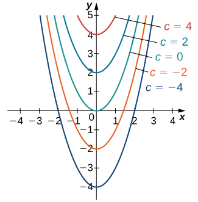
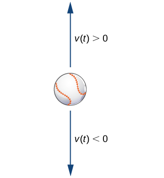

* Identify the order of a differential equation.
* Explain what is meant by a solution to a differential equation.
* Distinguish between the general solution and a particular solution of a differential equation.
* Identify an initial-value problem.
* Identify whether a given function is a solution to a differential equation or an initial-value problem.

Calculus is the mathematics of change, and rates of change are expressed by derivatives. Thus, one of the most common ways to use calculus is to set up an equation containing an unknown function <math xmlns="http://www.w3.org/1998/Math/MathML"><mrow><mi>y</mi><mo>=</mo><mi>f</mi><mo stretchy="false">(</mo><mi>x</mi><mo stretchy="false">)</mo></mrow></math>

 and its derivative, known as a *differential equation*. Solving such equations often provides information about how quantities change and frequently provides insight into how and why the changes occur.

Techniques for solving differential equations can take many different forms, including direct solution, use of graphs, or computer calculations. We introduce the main ideas in this chapter and describe them in a little more detail later in the course. In this section we study what differential equations are, how to verify their solutions, some methods that are used for solving them, and some examples of common and useful equations.

# General Differential Equations

Consider the equation <math xmlns="http://www.w3.org/1998/Math/MathML"><mrow><msup><mi>y</mi><mo>′</mo></msup><mo>=</mo><mn>3</mn><msup><mi>x</mi><mn>2</mn></msup><mo>,</mo></mrow></math>

 which is an example of a differential equation because it includes a derivative. There is a relationship between the variables <math xmlns="http://www.w3.org/1998/Math/MathML"><mi>x</mi></math>

 and <math xmlns="http://www.w3.org/1998/Math/MathML"><mrow><mi>y</mi><mtext>:</mtext></mrow><mspace width="0.2em" /><mi>y</mi></math>

 is an unknown function of <math xmlns="http://www.w3.org/1998/Math/MathML"><mrow><mi>x</mi><mo>.</mo></mrow></math>

 Furthermore, the left-hand side of the equation is the derivative of <math xmlns="http://www.w3.org/1998/Math/MathML"><mrow><mi>y</mi><mo>.</mo></mrow></math>

 Therefore we can interpret this equation as follows: Start with some function <math xmlns="http://www.w3.org/1998/Math/MathML"><mrow><mi>y</mi><mo>=</mo><mi>f</mi><mo stretchy="false">(</mo><mi>x</mi><mo stretchy="false">)</mo></mrow></math>

 and take its derivative. The answer must be equal to <math xmlns="http://www.w3.org/1998/Math/MathML"><mrow><mn>3</mn><msup><mi>x</mi><mn>2</mn></msup><mo>.</mo></mrow></math>

 What function has a derivative that is equal to <math xmlns="http://www.w3.org/1998/Math/MathML"><mrow><mn>3</mn><msup><mi>x</mi><mn>2</mn></msup><mo>?</mo></mrow></math>

 One such function is <math xmlns="http://www.w3.org/1998/Math/MathML"><mrow><mi>y</mi><mo>=</mo><msup><mi>x</mi><mn>3</mn></msup><mo>,</mo></mrow></math>

 so this function is considered a **solution to a differential equation**{: data-type="term"}.

Definition

A **differential equation**{: data-type="term"} is an equation involving an unknown function <math xmlns="http://www.w3.org/1998/Math/MathML"><mrow><mi>y</mi><mo>=</mo><mi>f</mi><mo stretchy="false">(</mo><mi>x</mi><mo stretchy="false">)</mo></mrow></math>

 and one or more of its derivatives. A solution to a differential equation is a function <math xmlns="http://www.w3.org/1998/Math/MathML"><mrow><mi>y</mi><mo>=</mo><mi>f</mi><mo stretchy="false">(</mo><mi>x</mi><mo stretchy="false">)</mo></mrow></math>

 that satisfies the differential equation when <math xmlns="http://www.w3.org/1998/Math/MathML"><mi>f</mi></math>

 and its derivatives are substituted into the equation.

Go to this [website][1] to explore more on this topic.

Some examples of differential equations and their solutions appear in [\[link\]](#fs-id1170573355757).

<table summary="A table with two rows and two columns. The first column has the header &#x201C;Equation&#x201D; and the values y&#x2019; = 2 x, y&#x2019; + 3 y = 6 x + 11, and y&#x2019;&#x2019; &#x2013; 3 y&#x2019; + 2 y = 24 e ^ (-2 x). The second column has the header &#x201C;Solution&#x201D; and the values y = x ^ 2, y = e ^ (-3 x) &#x2013; 4 e ^ (2 x) + 2 e ^ (-2 x)."><caption>Examples of Differential Equations and Their Solutions</caption><thead>
<tr valign="top">
<th>Equation</th>
<th>Solution</th>
</tr>
</thead><tbody>
<tr valign="top">
<td><math xmlns="http://www.w3.org/1998/Math/MathML"><mrow><mi>y</mi><mo>′</mo><mo>=</mo><mn>2</mn><mi>x</mi></mrow></math></td>
<td><math xmlns="http://www.w3.org/1998/Math/MathML"><mrow><mi>y</mi><mo>=</mo><msup><mi>x</mi><mn>2</mn></msup></mrow></math></td>
</tr>
<tr valign="top">
<td><math xmlns="http://www.w3.org/1998/Math/MathML"><mrow><mi>y</mi><mo>′</mo><mo>+</mo><mn>3</mn><mi>y</mi><mo>=</mo><mn>6</mn><mi>x</mi><mo>+</mo><mn>11</mn></mrow></math></td>
<td><math xmlns="http://www.w3.org/1998/Math/MathML"><mrow><mi>y</mi><mo>=</mo><msup><mi>e</mi><mrow><mn>−3</mn><mi>x</mi></mrow></msup><mo>+</mo><mn>2</mn><mi>x</mi><mo>+</mo><mn>3</mn></mrow></math></td>
</tr>
<tr valign="top">
<td><math xmlns="http://www.w3.org/1998/Math/MathML"><mrow><mi>y</mi><mo>′</mo><mo>′</mo><mo>−</mo><mn>3</mn><mi>y</mi><mo>′</mo><mo>+</mo><mn>2</mn><mi>y</mi><mo>=</mo><mn>24</mn><msup><mi>e</mi><mrow><mn>−2</mn><mi>x</mi></mrow></msup></mrow></math></td>
<td><math xmlns="http://www.w3.org/1998/Math/MathML"><mrow><mi>y</mi><mo>=</mo><mn>3</mn><msup><mi>e</mi><mi>x</mi></msup><mo>−</mo><mn>4</mn><msup><mi>e</mi><mrow><mn>2</mn><mi>x</mi></mrow></msup><mo>+</mo><mn>2</mn><msup><mi>e</mi><mrow><mn>−2</mn><mi>x</mi></mrow></msup></mrow></math></td>
</tr>
</tbody></table>

Note that a solution to a differential equation is not necessarily unique, primarily because the derivative of a constant is zero. For example, <math xmlns="http://www.w3.org/1998/Math/MathML"><mrow><mi>y</mi><mo>=</mo><msup><mi>x</mi><mn>2</mn></msup><mo>+</mo><mn>4</mn></mrow></math>

 is also a solution to the first differential equation in [\[link\]](#fs-id1170573355757). We will return to this idea a little bit later in this section. For now, let’s focus on what it means for a function to be a solution to a differential equation.

Verifying Solutions of Differential Equations

Verify that the function <math xmlns="http://www.w3.org/1998/Math/MathML"><mrow><mi>y</mi><mo>=</mo><msup><mi>e</mi><mrow><mn>−3</mn><mi>x</mi></mrow></msup><mo>+</mo><mn>2</mn><mi>x</mi><mo>+</mo><mn>3</mn></mrow></math>

 is a solution to the differential equation <math xmlns="http://www.w3.org/1998/Math/MathML"><mrow><msup><mi>y</mi><mo>′</mo></msup><mo>+</mo><mn>3</mn><mi>y</mi><mo>=</mo><mn>6</mn><mi>x</mi><mo>+</mo><mn>11</mn><mo>.</mo></mrow></math>

To verify the solution, we first calculate <math xmlns="http://www.w3.org/1998/Math/MathML"><msup><mi>y</mi><mo>′</mo></msup></math>

 using the chain rule for derivatives. This gives <math xmlns="http://www.w3.org/1998/Math/MathML"><mrow><msup><mi>y</mi><mo>′</mo></msup><mo>=</mo><mn>−3</mn><msup><mi>e</mi><mrow><mn>−3</mn><mi>x</mi></mrow></msup><mo>+</mo><mn>2</mn><mo>.</mo></mrow></math>

 Next we substitute <math xmlns="http://www.w3.org/1998/Math/MathML"><mi>y</mi></math>

 and <math xmlns="http://www.w3.org/1998/Math/MathML"><msup><mi>y</mi><mo>′</mo></msup></math>

 into the left-hand side of the differential equation:

<math xmlns="http://www.w3.org/1998/Math/MathML"><mrow><mo stretchy="false">(</mo><mn>−3</mn><msup><mi>e</mi><mrow><mn>−2</mn><mi>x</mi></mrow></msup><mo>+</mo><mn>2</mn><mo stretchy="false">)</mo><mo>+</mo><mn>3</mn><mo stretchy="false">(</mo><msup><mi>e</mi><mrow><mn>−2</mn><mi>x</mi></mrow></msup><mo>+</mo><mn>2</mn><mi>x</mi><mo>+</mo><mn>3</mn><mo stretchy="false">)</mo><mo>.</mo></mrow></math>

The resulting expression can be simplified by first distributing to eliminate the parentheses, giving

<math xmlns="http://www.w3.org/1998/Math/MathML"><mrow><mn>−3</mn><msup><mi>e</mi><mrow><mn>−2</mn><mi>x</mi></mrow></msup><mo>+</mo><mn>2</mn><mo>+</mo><mn>3</mn><msup><mi>e</mi><mrow><mn>−2</mn><mi>x</mi></mrow></msup><mo>+</mo><mn>6</mn><mi>x</mi><mo>+</mo><mn>9</mn><mo>.</mo></mrow></math>

Combining like terms leads to the expression <math xmlns="http://www.w3.org/1998/Math/MathML"><mrow><mn>6</mn><mi>x</mi><mo>+</mo><mn>11</mn><mo>,</mo></mrow></math>

 which is equal to the right-hand side of the differential equation. This result verifies that <math xmlns="http://www.w3.org/1998/Math/MathML"><mrow><mi>y</mi><mo>=</mo><msup><mi>e</mi><mrow><mn>−3</mn><mi>x</mi></mrow></msup><mo>+</mo><mn>2</mn><mi>x</mi><mo>+</mo><mn>3</mn></mrow></math>

 is a solution of the differential equation.

Verify that <math xmlns="http://www.w3.org/1998/Math/MathML"><mrow><mi>y</mi><mo>=</mo><mn>2</mn><msup><mi>e</mi><mrow><mn>3</mn><mi>x</mi></mrow></msup><mo>−</mo><mn>2</mn><mi>x</mi><mo>−</mo><mn>2</mn></mrow></math>

 is a solution to the differential equation <math xmlns="http://www.w3.org/1998/Math/MathML"><mrow><msup><mi>y</mi><mo>′</mo></msup><mo>−</mo><mn>3</mn><mi>y</mi><mo>=</mo><mn>6</mn><mi>x</mi><mo>+</mo><mn>4</mn><mo>.</mo></mrow></math>

Hint

First calculate <math xmlns="http://www.w3.org/1998/Math/MathML"><msup><mi>y</mi><mo>′</mo></msup></math>

 then substitute both <math xmlns="http://www.w3.org/1998/Math/MathML"><msup><mi>y</mi><mo>′</mo></msup></math>

 and <math xmlns="http://www.w3.org/1998/Math/MathML"><mi>y</mi></math>

 into the left-hand side.

It is convenient to define characteristics of differential equations that make it easier to talk about them and categorize them. The most basic characteristic of a differential equation is its order.

Definition

The **order of a differential equation**{: data-type="term"} is the highest order of any derivative of the unknown function that appears in the equation.

Identifying the Order of a Differential Equation

What is the order of each of the following differential equations?

1.  <math xmlns="http://www.w3.org/1998/Math/MathML"><mrow><msup><mi>y</mi><mo>′</mo></msup><mo>−</mo><mn>4</mn><mi>y</mi><mo>=</mo><msup><mi>x</mi><mn>2</mn></msup><mo>−</mo><mn>3</mn><mi>x</mi><mo>+</mo><mn>4</mn></mrow></math>

2.  <math xmlns="http://www.w3.org/1998/Math/MathML"><mrow><msup><mi>x</mi><mn>2</mn></msup><mi>y</mi><mtext>‴</mtext><mo>−</mo><mn>3</mn><mi>x</mi><mi>y</mi><mtext>″</mtext><mo>+</mo><mi>x</mi><msup><mi>y</mi><mo>′</mo></msup><mo>−</mo><mn>3</mn><mi>y</mi><mo>=</mo><mtext>sin</mtext><mspace width="0.1em" /><mi>x</mi></mrow></math>

3.  <math xmlns="http://www.w3.org/1998/Math/MathML"><mrow><mfrac><mn>4</mn><mi>x</mi></mfrac><msup><mi>y</mi><mrow><mo stretchy="false">(</mo><mn>4</mn><mo stretchy="false">)</mo></mrow></msup><mo>−</mo><mfrac><mn>6</mn><mrow><msup><mi>x</mi><mn>2</mn></msup></mrow></mfrac><mi>y</mi><mtext>″</mtext><mo>+</mo><mfrac><mrow><mn>12</mn></mrow><mrow><msup><mi>x</mi><mn>4</mn></msup></mrow></mfrac><mi>y</mi><mo>=</mo><msup><mi>x</mi><mn>3</mn></msup><mo>−</mo><mn>3</mn><msup><mi>x</mi><mn>2</mn></msup><mo>+</mo><mn>4</mn><mi>x</mi><mo>−</mo><mn>12</mn></mrow></math>
{: data-number-style="lower-alpha"}

1.  The highest derivative in the equation is
    <math xmlns="http://www.w3.org/1998/Math/MathML"><mrow><msup><mi>y</mi><mo>′</mo></msup><mo>,</mo></mrow></math>
    
    so the order is
    <math xmlns="http://www.w3.org/1998/Math/MathML"><mrow><mn>1</mn><mo>.</mo></mrow></math>

2.  The highest derivative in the equation is
    <math xmlns="http://www.w3.org/1998/Math/MathML"><mrow><mi>y</mi><mtext>‴</mtext><mtext>,</mtext></mrow></math>
    
    so the order is
    <math xmlns="http://www.w3.org/1998/Math/MathML"><mrow><mn>3</mn><mo>.</mo></mrow></math>

3.  The highest derivative in the equation is
    <math xmlns="http://www.w3.org/1998/Math/MathML"><mrow><msup><mi>y</mi><mrow><mo stretchy="false">(</mo><mn>4</mn><mo stretchy="false">)</mo></mrow></msup><mo>,</mo></mrow></math>
    
    so the order is
    <math xmlns="http://www.w3.org/1998/Math/MathML"><mrow><mn>4</mn><mo>.</mo></mrow></math>
{: data-number-style="lower-alpha"}

What is the order of the following differential equation?

<math xmlns="http://www.w3.org/1998/Math/MathML"><mrow><mrow><mo>(</mo><mrow><msup><mi>x</mi><mn>4</mn></msup><mo>−</mo><mn>3</mn><mi>x</mi></mrow><mo>)</mo></mrow><msup><mi>y</mi><mrow><mrow><mo>(</mo><mn>5</mn><mo>)</mo></mrow></mrow></msup><mo>−</mo><mrow><mo>(</mo><mrow><mn>3</mn><msup><mi>x</mi><mn>2</mn></msup><mo>+</mo><mn>1</mn></mrow><mo>)</mo></mrow><msup><mi>y</mi><mo>′</mo></msup><mo>+</mo><mn>3</mn><mi>y</mi><mo>=</mo><mtext>sin</mtext><mspace width="0.1em" /><mi>x</mi><mspace width="0.1em" /><mtext>cos</mtext><mspace width="0.1em" /><mi>x</mi></mrow></math>

<math xmlns="http://www.w3.org/1998/Math/MathML"><mn>5</mn></math>

Hint

What is the highest derivative in the equation?

# General and Particular Solutions

We already noted that the differential equation <math xmlns="http://www.w3.org/1998/Math/MathML"><mrow><msup><mi>y</mi><mo>′</mo></msup><mo>=</mo><mn>2</mn><mi>x</mi></mrow></math>

 has at least two solutions: <math xmlns="http://www.w3.org/1998/Math/MathML"><mrow><mi>y</mi><mo>=</mo><msup><mi>x</mi><mn>2</mn></msup></mrow></math>

 and <math xmlns="http://www.w3.org/1998/Math/MathML"><mrow><mi>y</mi><mo>=</mo><msup><mi>x</mi><mn>2</mn></msup><mo>+</mo><mn>4</mn><mo>.</mo></mrow></math>

 The only difference between these two solutions is the last term, which is a constant. What if the last term is a different constant? Will this expression still be a solution to the differential equation? In fact, any function of the form <math xmlns="http://www.w3.org/1998/Math/MathML"><mrow><mi>y</mi><mo>=</mo><msup><mi>x</mi><mn>2</mn></msup><mo>+</mo><mi>C</mi><mo>,</mo></mrow></math>

 where <math xmlns="http://www.w3.org/1998/Math/MathML"><mi>C</mi></math>

 represents any constant, is a solution as well. The reason is that the derivative of <math xmlns="http://www.w3.org/1998/Math/MathML"><mrow><msup><mi>x</mi><mn>2</mn></msup><mo>+</mo><mi>C</mi></mrow></math>

 is <math xmlns="http://www.w3.org/1998/Math/MathML"><mrow><mn>2</mn><mi>x</mi><mo>,</mo></mrow></math>

 regardless of the value of <math xmlns="http://www.w3.org/1998/Math/MathML"><mrow><mi>C</mi><mo>.</mo></mrow></math>

 It can be shown that any solution of this differential equation must be of the form <math xmlns="http://www.w3.org/1998/Math/MathML"><mrow><mi>y</mi><mo>=</mo><msup><mi>x</mi><mn>2</mn></msup><mo>+</mo><mi>C</mi><mo>.</mo></mrow></math>

 This is an example of a **general solution**{: data-type="term"} to a differential equation. A graph of some of these solutions is given in [\[link\]](#CNX_Calc_Figure_08_01_001). (*Note*\: in this graph we used even integer values for <math xmlns="http://www.w3.org/1998/Math/MathML"><mi>C</mi></math>

 ranging between <math xmlns="http://www.w3.org/1998/Math/MathML"><mrow><mn>−4</mn></mrow></math>

 and <math xmlns="http://www.w3.org/1998/Math/MathML"><mn>4</mn><mo>.</mo></math>

 In fact, there is no restriction on the value of <math xmlns="http://www.w3.org/1998/Math/MathML"><mrow><mi>C</mi><mo>;</mo></mrow></math>

 it can be an integer or not.)

{: #CNX_Calc_Figure_08_01_001}

In this example, we are free to choose any solution we wish; for example, <math xmlns="http://www.w3.org/1998/Math/MathML"><mrow><mi>y</mi><mo>=</mo><msup><mi>x</mi><mn>2</mn></msup><mo>−</mo><mn>3</mn></mrow></math>

 is a member of the family of solutions to this differential equation. This is called a **particular solution**{: data-type="term"} to the differential equation. A particular solution can often be uniquely identified if we are given additional information about the problem.

Finding a Particular Solution

Find the particular solution to the differential equation <math xmlns="http://www.w3.org/1998/Math/MathML"><mrow><msup><mi>y</mi><mo>′</mo></msup><mo>=</mo><mn>2</mn><mi>x</mi></mrow></math>

 passing through the point <math xmlns="http://www.w3.org/1998/Math/MathML"><mrow><mrow><mo>(</mo><mrow><mn>2</mn><mo>,</mo><mn>7</mn></mrow><mo>)</mo></mrow><mo>.</mo></mrow></math>

Any function of the form <math xmlns="http://www.w3.org/1998/Math/MathML"><mrow><mi>y</mi><mo>=</mo><msup><mi>x</mi><mn>2</mn></msup><mo>+</mo><mi>C</mi></mrow></math>

 is a solution to this differential equation. To determine the value of <math xmlns="http://www.w3.org/1998/Math/MathML"><mrow><mi>C</mi><mo>,</mo></mrow></math>

 we substitute the values <math xmlns="http://www.w3.org/1998/Math/MathML"><mrow><mi>x</mi><mo>=</mo><mn>2</mn></mrow></math>

 and <math xmlns="http://www.w3.org/1998/Math/MathML"><mrow><mi>y</mi><mo>=</mo><mn>7</mn></mrow></math>

 into this equation and solve for <math xmlns="http://www.w3.org/1998/Math/MathML"><mrow><mi>C</mi><mtext>:</mtext></mrow></math>

<math xmlns="http://www.w3.org/1998/Math/MathML"><mtable><mtr /><mtr /><mtr><mtd columnalign="left"><mi>y</mi><mo>=</mo><msup><mi>x</mi><mn>2</mn></msup><mo>+</mo><mi>C</mi></mtd></mtr><mtr><mtd columnalign="left"><mn>7</mn><mo>=</mo><msup><mn>2</mn><mn>2</mn></msup><mo>+</mo><mi>C</mi><mo>=</mo><mn>4</mn><mo>+</mo><mi>C</mi></mtd></mtr><mtr><mtd columnalign="left"><mi>C</mi><mo>=</mo><mn>3.</mn></mtd></mtr></mtable></math>

Therefore the particular solution passing through the point <math xmlns="http://www.w3.org/1998/Math/MathML"><mrow><mo stretchy="false">(</mo><mn>2</mn><mo>,</mo><mn>7</mn><mo stretchy="false">)</mo></mrow></math>

 is <math xmlns="http://www.w3.org/1998/Math/MathML"><mrow><mi>y</mi><mo>=</mo><msup><mi>x</mi><mn>2</mn></msup><mo>+</mo><mn>3</mn><mo>.</mo></mrow></math>

Find the particular solution to the differential equation

<math xmlns="http://www.w3.org/1998/Math/MathML"><mrow><msup><mi>y</mi><mo>′</mo></msup><mo>=</mo><mn>4</mn><mi>x</mi><mo>+</mo><mn>3</mn></mrow></math>

passing through the point <math xmlns="http://www.w3.org/1998/Math/MathML"><mrow><mrow><mo>(</mo><mrow><mn>1</mn><mo>,</mo><mn>7</mn></mrow><mo>)</mo></mrow><mo>,</mo></mrow></math>

 given that <math xmlns="http://www.w3.org/1998/Math/MathML"><mrow><mi>y</mi><mo>=</mo><mn>2</mn><msup><mi>x</mi><mn>2</mn></msup><mo>+</mo><mn>3</mn><mi>x</mi><mo>+</mo><mi>C</mi></mrow></math>

 is a general solution to the differential equation.

<math xmlns="http://www.w3.org/1998/Math/MathML"><mrow><mi>y</mi><mo>=</mo><mn>2</mn><msup><mi>x</mi><mn>2</mn></msup><mo>+</mo><mn>3</mn><mi>x</mi><mo>+</mo><mn>2</mn></mrow></math>

Hint

First substitute <math xmlns="http://www.w3.org/1998/Math/MathML"><mrow><mi>x</mi><mo>=</mo><mn>1</mn></mrow></math>

 and <math xmlns="http://www.w3.org/1998/Math/MathML"><mrow><mi>y</mi><mo>=</mo><mn>7</mn></mrow></math>

 into the equation, then solve for <math xmlns="http://www.w3.org/1998/Math/MathML"><mrow><mi>C</mi><mo>.</mo></mrow></math>

# Initial-Value Problems

Usually a given differential equation has an infinite number of solutions, so it is natural to ask which one we want to use. To choose one solution, more information is needed. Some specific information that can be useful is an **initial value**{: data-type="term"}, which is an ordered pair that is used to find a particular solution.

A differential equation together with one or more initial values is called an **initial-value problem**{: data-type="term"}. The general rule is that the number of initial values needed for an initial-value problem is equal to the order of the differential equation. For example, if we have the differential equation <math xmlns="http://www.w3.org/1998/Math/MathML"><mrow><msup><mi>y</mi><mo>′</mo></msup><mo>=</mo><mn>2</mn><mi>x</mi><mo>,</mo></mrow></math>

 then <math xmlns="http://www.w3.org/1998/Math/MathML"><mrow><mi>y</mi><mo stretchy="false">(</mo><mn>3</mn><mo stretchy="false">)</mo><mo>=</mo><mn>7</mn></mrow></math>

 is an initial value, and when taken together, these equations form an initial-value problem. The differential equation <math xmlns="http://www.w3.org/1998/Math/MathML"><mrow><mi>y</mi><mtext>″</mtext><mo>−</mo><mn>3</mn><msup><mi>y</mi><mo>′</mo></msup><mo>+</mo><mn>2</mn><mi>y</mi><mo>=</mo><mn>4</mn><msup><mi>e</mi><mi>x</mi></msup></mrow></math>

 is second order, so we need two initial values. With initial-value problems of order greater than one, the same value should be used for the independent variable. An example of initial values for this second-order equation would be <math xmlns="http://www.w3.org/1998/Math/MathML"><mrow><mi>y</mi><mo stretchy="false">(</mo><mn>0</mn><mo stretchy="false">)</mo><mo>=</mo><mn>2</mn></mrow></math>

 and <math xmlns="http://www.w3.org/1998/Math/MathML"><mrow><msup><mi>y</mi><mo>′</mo></msup><mo stretchy="false">(</mo><mn>0</mn><mo stretchy="false">)</mo><mo>=</mo><mn>−1</mn><mo>.</mo></mrow></math>

 These two initial values together with the differential equation form an initial-value problem. These problems are so named because often the independent variable in the unknown function is <math xmlns="http://www.w3.org/1998/Math/MathML"><mrow><mi>t</mi><mo>,</mo></mrow></math>

 which represents time. Thus, a value of <math xmlns="http://www.w3.org/1998/Math/MathML"><mrow><mi>t</mi><mo>=</mo><mn>0</mn></mrow></math>

 represents the beginning of the problem.

Verifying a Solution to an Initial-Value Problem

Verify that the function <math xmlns="http://www.w3.org/1998/Math/MathML"><mrow><mi>y</mi><mo>=</mo><mn>2</mn><msup><mi>e</mi><mrow><mn>−2</mn><mi>t</mi></mrow></msup><mo>+</mo><msup><mi>e</mi><mi>t</mi></msup></mrow></math>

 is a solution to the initial-value problem

<math xmlns="http://www.w3.org/1998/Math/MathML"><mrow><msup><mi>y</mi><mo>′</mo></msup><mo>+</mo><mn>2</mn><mi>y</mi><mo>=</mo><mn>3</mn><msup><mi>e</mi><mi>t</mi></msup><mo>,</mo><mspace width="1em" /><mi>y</mi><mo stretchy="false">(</mo><mn>0</mn><mo stretchy="false">)</mo><mo>=</mo><mn>3</mn><mo>.</mo></mrow></math>

For a function to satisfy an initial-value problem, it must satisfy both the differential equation and the initial condition. To show that <math xmlns="http://www.w3.org/1998/Math/MathML"><mi>y</mi></math>

 satisfies the differential equation, we start by calculating <math xmlns="http://www.w3.org/1998/Math/MathML"><mrow><msup><mi>y</mi><mo>′</mo></msup><mo>.</mo></mrow></math>

 This gives <math xmlns="http://www.w3.org/1998/Math/MathML"><mrow><msup><mi>y</mi><mo>′</mo></msup><mo>=</mo><mn>−4</mn><msup><mi>e</mi><mrow><mn>−2</mn><mi>t</mi></mrow></msup><mo>+</mo><msup><mi>e</mi><mi>t</mi></msup><mo>.</mo></mrow></math>

 Next we substitute both <math xmlns="http://www.w3.org/1998/Math/MathML"><mi>y</mi></math>

 and <math xmlns="http://www.w3.org/1998/Math/MathML"><msup><mi>y</mi><mo>′</mo></msup></math>

 into the left-hand side of the differential equation and simplify:

<math xmlns="http://www.w3.org/1998/Math/MathML"><mtable><mtr><mtd columnalign="left"><msup><mi>y</mi><mo>′</mo></msup><mo>+</mo><mn>2</mn><mi>y</mi></mtd><mtd columnalign="left"><mo>=</mo><mrow><mo>(</mo><mrow><mn>−4</mn><msup><mi>e</mi><mrow><mn>−2</mn><mi>t</mi></mrow></msup><mo>+</mo><msup><mi>e</mi><mi>t</mi></msup></mrow><mo>)</mo></mrow><mo>+</mo><mn>2</mn><mrow><mo>(</mo><mrow><mn>2</mn><msup><mi>e</mi><mrow><mn>−2</mn><mi>t</mi></mrow></msup><mo>+</mo><msup><mi>e</mi><mi>t</mi></msup></mrow><mo>)</mo></mrow></mtd></mtr><mtr><mtd /><mtd columnalign="left"><mo>=</mo><mn>−4</mn><msup><mi>e</mi><mrow><mn>−2</mn><mi>t</mi></mrow></msup><mo>+</mo><msup><mi>e</mi><mi>t</mi></msup><mo>+</mo><mn>4</mn><msup><mi>e</mi><mrow><mn>−2</mn><mi>t</mi></mrow></msup><mo>+</mo><mn>2</mn><msup><mi>e</mi><mi>t</mi></msup></mtd></mtr><mtr><mtd /><mtd columnalign="left"><mo>=</mo><mn>3</mn><msup><mi>e</mi><mi>t</mi></msup><mo>.</mo></mtd></mtr></mtable></math>

This is equal to the right-hand side of the differential equation, so <math xmlns="http://www.w3.org/1998/Math/MathML"><mrow><mi>y</mi><mo>=</mo><mn>2</mn><msup><mi>e</mi><mrow><mn>−2</mn><mi>t</mi></mrow></msup><mo>+</mo><msup><mi>e</mi><mi>t</mi></msup></mrow></math>

 solves the differential equation. Next we calculate <math xmlns="http://www.w3.org/1998/Math/MathML"><mrow><mi>y</mi><mrow><mo>(</mo><mn>0</mn><mo>)</mo></mrow><mtext>:</mtext></mrow></math>

<math xmlns="http://www.w3.org/1998/Math/MathML"><mtable><mtr><mtd columnalign="left"><mi>y</mi><mrow><mo>(</mo><mn>0</mn><mo>)</mo></mrow></mtd><mtd columnalign="left"><mo>=</mo><mn>2</mn><msup><mi>e</mi><mrow><mn>−2</mn><mrow><mo>(</mo><mn>0</mn><mo>)</mo></mrow></mrow></msup><mo>+</mo><msup><mi>e</mi><mn>0</mn></msup></mtd></mtr><mtr><mtd /><mtd columnalign="left"><mo>=</mo><mn>2</mn><mo>+</mo><mn>1</mn></mtd></mtr><mtr><mtd /><mtd columnalign="left"><mo>=</mo><mn>3</mn><mo>.</mo></mtd></mtr></mtable></math>

This result verifies the initial value. Therefore the given function satisfies the initial-value problem.

Verify that <math xmlns="http://www.w3.org/1998/Math/MathML"><mrow><mi>y</mi><mo>=</mo><mn>3</mn><msup><mi>e</mi><mrow><mn>2</mn><mi>t</mi></mrow></msup><mo>+</mo><mn>4</mn><mspace width="0.1em" /><mtext>sin</mtext><mspace width="0.1em" /><mi>t</mi></mrow></math>

 is a solution to the initial-value problem

<math xmlns="http://www.w3.org/1998/Math/MathML"><mrow><msup><mi>y</mi><mo>′</mo></msup><mo>−</mo><mn>2</mn><mi>y</mi><mo>=</mo><mn>4</mn><mspace width="0.1em" /><mtext>cos</mtext><mspace width="0.1em" /><mi>t</mi><mo>−</mo><mn>8</mn><mspace width="0.1em" /><mtext>sin</mtext><mspace width="0.1em" /><mi>t</mi><mo>,</mo><mspace width="1em" /><mi>y</mi><mo stretchy="false">(</mo><mn>0</mn><mo stretchy="false">)</mo><mo>=</mo><mn>3</mn><mo>.</mo></mrow></math>

Hint

First verify that <math xmlns="http://www.w3.org/1998/Math/MathML"><mi>y</mi></math>

 solves the differential equation. Then check the initial value.

In [\[link\]](#fs-id1170573712028), the initial-value problem consisted of two parts. The first part was the differential equation <math xmlns="http://www.w3.org/1998/Math/MathML"><mrow><msup><mi>y</mi><mo>′</mo></msup><mo>+</mo><mn>2</mn><mi>y</mi><mo>=</mo><mn>3</mn><msup><mi>e</mi><mi>x</mi></msup><mo>,</mo></mrow></math>

 and the second part was the initial value <math xmlns="http://www.w3.org/1998/Math/MathML"><mrow><mi>y</mi><mrow><mo>(</mo><mn>0</mn><mo>)</mo></mrow><mo>=</mo><mn>3</mn><mo>.</mo></mrow></math>

 These two equations together formed the initial-value problem.

The same is true in general. An initial-value problem will consists of two parts: the differential equation and the initial condition. The differential equation has a family of solutions, and the initial condition determines the value of <math xmlns="http://www.w3.org/1998/Math/MathML"><mi>C</mi><mo>.</mo></math>

 The family of solutions to the differential equation in [\[link\]](#fs-id1170573712028) is given by <math xmlns="http://www.w3.org/1998/Math/MathML"><mrow><mi>y</mi><mo>=</mo><mn>2</mn><msup><mi>e</mi><mrow><mn>−2</mn><mi>t</mi></mrow></msup><mo>+</mo><mi>C</mi><msup><mi>e</mi><mi>t</mi></msup><mo>.</mo></mrow></math>

 This family of solutions is shown in [\[link\]](#CNX_Calc_Figure_08_01_002), with the particular solution <math xmlns="http://www.w3.org/1998/Math/MathML"><mrow><mi>y</mi><mo>=</mo><mn>2</mn><msup><mi>e</mi><mrow><mn>−2</mn><mi>t</mi></mrow></msup><mo>+</mo><msup><mi>e</mi><mi>t</mi></msup></mrow></math>

 labeled.

 ![A graph of a family of solutions to the differential equation y&#x2019; + 2 y = 3 e ^ t, which are of the form y = 2 e ^ (-2 t) + C e ^ t. The versions with C = 1, 0.5, and -0.2 are shown, among others not labeled. For all values of C, the function increases rapidly for t &lt; 0 as t goes to negative infinity. For C &gt; 0, the function changes direction and increases in a gentle curve as t goes to infinity. Larger values of C have a tighter curve closer to the y axis and at a higher y value. For C = 0, the function goes to 0 as t goes to infinity. For C &lt; 0, the function continues to decrease as t goes to infinity.](../resources/CNX_Calc_Figure_08_01_002.jpg "A family of solutions to the differential equation y&#x2032;+2y=3et. The particular solution y=2e&#x2212;2t+et is labeled."){: #CNX_Calc_Figure_08_01_002}

Solving an Initial-value Problem

Solve the following initial-value problem:

<math xmlns="http://www.w3.org/1998/Math/MathML"><mrow><msup><mi>y</mi><mo>′</mo></msup><mo>=</mo><mn>3</mn><msup><mi>e</mi><mi>x</mi></msup><mo>+</mo><msup><mi>x</mi><mn>2</mn></msup><mo>−</mo><mn>4</mn><mo>,</mo><mspace width="1em" /><mi>y</mi><mrow><mo>(</mo><mn>0</mn><mo>)</mo></mrow><mo>=</mo><mn>5</mn><mo>.</mo></mrow></math>

The first step in solving this initial-value problem is to find a general family of solutions. To do this, we find an antiderivative of both sides of the differential equation

<math xmlns="http://www.w3.org/1998/Math/MathML"><mrow><mstyle displaystyle="true"><mrow><mo stretchy="true">∫</mo><mrow><msup><mi>y</mi><mo>′</mo></msup><mi>d</mi><mi>x</mi></mrow></mrow></mstyle><mo>=</mo><mstyle displaystyle="true"><mrow><mo stretchy="true">∫</mo><mrow><mrow><mo>(</mo><mrow><mn>3</mn><msup><mi>e</mi><mi>x</mi></msup><mo>+</mo><msup><mi>x</mi><mn>2</mn></msup><mo>−</mo><mn>4</mn></mrow><mo>)</mo></mrow><mspace width="0.1em" /><mi>d</mi><mi>x</mi></mrow></mrow></mstyle><mo>,</mo></mrow></math>

namely,

<math xmlns="http://www.w3.org/1998/Math/MathML"><mrow><mi>y</mi><mo>+</mo><msub><mi>C</mi><mn>1</mn></msub><mo>=</mo><mn>3</mn><msup><mi>e</mi><mi>x</mi></msup><mo>+</mo><mfrac><mn>1</mn><mn>3</mn></mfrac><msup><mi>x</mi><mn>3</mn></msup><mo>−</mo><mn>4</mn><mi>x</mi><mo>+</mo><msub><mi>C</mi><mn>2</mn></msub><mo>.</mo></mrow></math>

We are able to integrate both sides because the *y* term appears by itself. Notice that there are two integration constants: <math xmlns="http://www.w3.org/1998/Math/MathML"><mrow><msub><mi>C</mi><mn>1</mn></msub></mrow></math>

 and <math xmlns="http://www.w3.org/1998/Math/MathML"><mrow><msub><mi>C</mi><mn>2</mn></msub><mo>.</mo></mrow></math>

 Solving [[link]](#fs-id1170571122530) for <math xmlns="http://www.w3.org/1998/Math/MathML"><mi>y</mi></math>

 gives

<math xmlns="http://www.w3.org/1998/Math/MathML"><mrow><mi>y</mi><mo>=</mo><mn>3</mn><msup><mi>e</mi><mi>x</mi></msup><mo>+</mo><mfrac><mn>1</mn><mn>3</mn></mfrac><msup><mi>x</mi><mn>3</mn></msup><mo>−</mo><mn>4</mn><mi>x</mi><mo>+</mo><msub><mi>C</mi><mn>2</mn></msub><mo>−</mo><msub><mi>C</mi><mn>1</mn></msub><mo>.</mo></mrow></math>

Because <math xmlns="http://www.w3.org/1998/Math/MathML"><mrow><msub><mi>C</mi><mn>1</mn></msub></mrow></math>

 and <math xmlns="http://www.w3.org/1998/Math/MathML"><mrow><msub><mi>C</mi><mn>2</mn></msub></mrow></math>

 are both constants, <math xmlns="http://www.w3.org/1998/Math/MathML"><mrow><msub><mi>C</mi><mn>2</mn></msub><mo>−</mo><msub><mi>C</mi><mn>1</mn></msub></mrow></math>

 is also a constant. We can therefore define <math xmlns="http://www.w3.org/1998/Math/MathML"><mrow><mi>C</mi><mo>=</mo><msub><mi>C</mi><mn>2</mn></msub><mo>−</mo><msub><mi>C</mi><mn>1</mn></msub><mo>,</mo></mrow></math>

 which leads to the equation

<math xmlns="http://www.w3.org/1998/Math/MathML"><mrow><mi>y</mi><mo>=</mo><mn>3</mn><msup><mi>e</mi><mi>x</mi></msup><mo>+</mo><mfrac><mn>1</mn><mn>3</mn></mfrac><msup><mi>x</mi><mn>3</mn></msup><mo>−</mo><mn>4</mn><mi>x</mi><mo>+</mo><mi>C</mi><mo>.</mo></mrow></math>

Next we determine the value of <math xmlns="http://www.w3.org/1998/Math/MathML"><mrow><mi>C</mi><mo>.</mo></mrow></math>

 To do this, we substitute <math xmlns="http://www.w3.org/1998/Math/MathML"><mrow><mi>x</mi><mo>=</mo><mn>0</mn></mrow></math>

 and <math xmlns="http://www.w3.org/1998/Math/MathML"><mrow><mi>y</mi><mo>=</mo><mn>5</mn></mrow></math>

 into [[link]](#fs-id1170571122530) and solve for <math xmlns="http://www.w3.org/1998/Math/MathML"><mi>C</mi><mtext>:</mtext></math>

<math xmlns="http://www.w3.org/1998/Math/MathML"><mtable><mtr /><mtr><mtd columnalign="right"><mn>5</mn></mtd><mtd columnalign="left"><mo>=</mo></mtd><mtd columnalign="left"><mn>3</mn><msup><mi>e</mi><mn>0</mn></msup><mo>+</mo><mfrac><mn>1</mn><mn>3</mn></mfrac><msup><mn>0</mn><mn>3</mn></msup><mo>−</mo><mn>4</mn><mrow><mo>(</mo><mn>0</mn><mo>)</mo></mrow><mo>+</mo><mi>C</mi></mtd></mtr><mtr><mtd columnalign="right"><mn>5</mn></mtd><mtd columnalign="left"><mo>=</mo></mtd><mtd columnalign="left"><mn>3</mn><mo>+</mo><mi>C</mi></mtd></mtr><mtr><mtd columnalign="right"><mi>C</mi></mtd><mtd columnalign="left"><mo>=</mo></mtd><mtd columnalign="left"><mn>2</mn><mo>.</mo></mtd></mtr></mtable></math>

Now we substitute the value <math xmlns="http://www.w3.org/1998/Math/MathML"><mrow><mi>C</mi><mo>=</mo><mn>2</mn></mrow></math>

 into [[link]](#fs-id1170571122530). The solution to the initial-value problem is <math xmlns="http://www.w3.org/1998/Math/MathML"><mrow><mi>y</mi><mo>=</mo><mn>3</mn><msup><mi>e</mi><mi>x</mi></msup><mo>+</mo><mfrac><mn>1</mn><mn>3</mn></mfrac><msup><mi>x</mi><mn>3</mn></msup><mo>−</mo><mn>4</mn><mi>x</mi><mo>+</mo><mn>2</mn><mo>.</mo></mrow></math>

Analysis

The difference between a general solution and a particular solution is that a general solution involves a family of functions, either explicitly or implicitly defined, of the independent variable. The initial value or values determine which particular solution in the family of solutions satisfies the desired conditions.

Solve the initial-value problem

<math xmlns="http://www.w3.org/1998/Math/MathML"><mrow><msup><mi>y</mi><mo>′</mo></msup><mo>=</mo><msup><mi>x</mi><mn>2</mn></msup><mo>−</mo><mn>4</mn><mi>x</mi><mo>+</mo><mn>3</mn><mo>−</mo><mn>6</mn><msup><mi>e</mi><mi>x</mi></msup><mo>,</mo><mspace width="1em" /><mi>y</mi><mrow><mo>(</mo><mn>0</mn><mo>)</mo></mrow><mo>=</mo><mn>8</mn><mo>.</mo></mrow></math>

<math xmlns="http://www.w3.org/1998/Math/MathML"><mrow><mi>y</mi><mo>=</mo><mfrac><mn>1</mn><mn>3</mn></mfrac><msup><mi>x</mi><mn>3</mn></msup><mo>−</mo><mn>2</mn><msup><mi>x</mi><mn>2</mn></msup><mo>+</mo><mn>3</mn><mi>x</mi><mo>−</mo><mn>6</mn><msup><mi>e</mi><mi>x</mi></msup><mo>+</mo><mn>14</mn></mrow></math>

Hint

First take the antiderivative of both sides of the differential equation. Then substitute <math xmlns="http://www.w3.org/1998/Math/MathML"><mrow><mi>x</mi><mo>=</mo><mn>0</mn></mrow></math>

 and <math xmlns="http://www.w3.org/1998/Math/MathML"><mrow><mi>y</mi><mo>=</mo><mn>8</mn></mrow></math>

 into the resulting equation and solve for <math xmlns="http://www.w3.org/1998/Math/MathML"><mrow><mi>C</mi><mo>.</mo></mrow></math>

In physics and engineering applications, we often consider the forces acting upon an object, and use this information to understand the resulting motion that may occur. For example, if we start with an object at Earth’s surface, the primary force acting upon that object is gravity. Physicists and engineers can use this information, along with **Newton’s second law of motion**{: data-type="term" .no-emphasis} (in equation form <math xmlns="http://www.w3.org/1998/Math/MathML"><mrow><mi>F</mi><mo>=</mo><mi>m</mi><mi>a</mi><mo>,</mo></mrow></math>

 where <math xmlns="http://www.w3.org/1998/Math/MathML"><mi>F</mi></math>

 represents force, <math xmlns="http://www.w3.org/1998/Math/MathML"><mi>m</mi></math>

 represents mass, and <math xmlns="http://www.w3.org/1998/Math/MathML"><mi>a</mi></math>

 represents acceleration), to derive an equation that can be solved.

 ."){: #CNX_Calc_Figure_08_01_003}

In [\[link\]](#CNX_Calc_Figure_08_01_003) we assume that the only force acting on a baseball is the force of gravity. This assumption ignores air resistance. (The force due to air resistance is considered in a later discussion.) The acceleration due to gravity at Earth’s surface, <math xmlns="http://www.w3.org/1998/Math/MathML"><mrow><mi>g</mi><mo>,</mo></mrow></math>

 is approximately <math xmlns="http://www.w3.org/1998/Math/MathML"><mrow><mn>9.8</mn><msup><mrow><mspace width="0.2em" /><mtext>m/s</mtext></mrow><mn>2</mn></msup><mo>.</mo></mrow></math>

 We introduce a frame of reference, where Earth’s surface is at a height of 0 meters. Let <math xmlns="http://www.w3.org/1998/Math/MathML"><mrow><mi>v</mi><mrow><mo>(</mo><mi>t</mi><mo>)</mo></mrow></mrow></math>

 represent the velocity of the object in meters per second. If <math xmlns="http://www.w3.org/1998/Math/MathML"><mrow><mi>v</mi><mrow><mo>(</mo><mi>t</mi><mo>)</mo></mrow><mo>&gt;</mo><mn>0</mn><mo>,</mo></mrow></math>

 the ball is rising, and if <math xmlns="http://www.w3.org/1998/Math/MathML"><mrow><mi>v</mi><mrow><mo>(</mo><mi>t</mi><mo>)</mo></mrow><mo>&lt;</mo><mn>0</mn><mo>,</mo></mrow></math>

 the ball is falling ([\[link\]](#CNX_Calc_Figure_08_01_004)).

 {: #CNX_Calc_Figure_08_01_004}

Our goal is to solve for the velocity <math xmlns="http://www.w3.org/1998/Math/MathML"><mrow><mi>v</mi><mo stretchy="false">(</mo><mi>t</mi><mo stretchy="false">)</mo></mrow></math>

 at any time <math xmlns="http://www.w3.org/1998/Math/MathML"><mrow><mi>t</mi><mo>.</mo></mrow></math>

 To do this, we set up an initial-value problem. Suppose the mass of the ball is <math xmlns="http://www.w3.org/1998/Math/MathML"><mrow><mi>m</mi><mo>,</mo></mrow></math>

 where <math xmlns="http://www.w3.org/1998/Math/MathML"><mi>m</mi></math>

 is measured in kilograms. We use Newton’s second law, which states that the force acting on an object is equal to its mass times its acceleration <math xmlns="http://www.w3.org/1998/Math/MathML"><mrow><mo stretchy="false">(</mo><mi>F</mi><mo>=</mo><mi>m</mi><mi>a</mi><mo stretchy="false">)</mo><mo>.</mo></mrow></math>

 Acceleration is the derivative of velocity, so <math xmlns="http://www.w3.org/1998/Math/MathML"><mrow><mi>a</mi><mo stretchy="false">(</mo><mi>t</mi><mo stretchy="false">)</mo><mo>=</mo><msup><mi>v</mi><mo>′</mo></msup><mo stretchy="false">(</mo><mi>t</mi><mo stretchy="false">)</mo><mo>.</mo></mrow></math>

 Therefore the force acting on the baseball is given by <math xmlns="http://www.w3.org/1998/Math/MathML"><mrow><mi>F</mi><mo>=</mo><mi>m</mi><mspace width="0.2em" /><msup><mi>v</mi><mo>′</mo></msup><mo stretchy="false">(</mo><mi>t</mi><mo stretchy="false">)</mo><mo>.</mo></mrow></math>

 However, this force must be equal to the force of gravity acting on the object, which (again using Newton’s second law) is given by <math xmlns="http://www.w3.org/1998/Math/MathML"><mrow><msub><mi>F</mi><mi>g</mi></msub><mo>=</mo><mtext>−</mtext><mi>m</mi><mi>g</mi><mo>,</mo></mrow></math>

 since this force acts in a downward direction. Therefore we obtain the equation <math xmlns="http://www.w3.org/1998/Math/MathML"><mrow><mi>F</mi><mo>=</mo><msub><mi>F</mi><mi>g</mi></msub><mo>,</mo></mrow></math>

 which becomes <math xmlns="http://www.w3.org/1998/Math/MathML"><mrow><mi>m</mi><mspace width="0.2em" /><msup><mi>v</mi><mo>′</mo></msup><mo stretchy="false">(</mo><mi>t</mi><mo stretchy="false">)</mo><mo>=</mo><mtext>−</mtext><mi>m</mi><mi>g</mi><mo>.</mo></mrow></math>

 Dividing both sides of the equation by <math xmlns="http://www.w3.org/1998/Math/MathML"><mi>m</mi></math>

 gives the equation

<math xmlns="http://www.w3.org/1998/Math/MathML"><mrow><msup><mi>v</mi><mo>′</mo></msup><mo stretchy="false">(</mo><mi>t</mi><mo stretchy="false">)</mo><mo>=</mo><mtext>−</mtext><mi>g</mi><mo>.</mo></mrow></math>

Notice that this differential equation remains the same regardless of the mass of the object.

We now need an initial value. Because we are solving for velocity, it makes sense in the context of the problem to assume that we know the **initial velocity**{: data-type="term"}, or the velocity at time <math xmlns="http://www.w3.org/1998/Math/MathML"><mrow><mi>t</mi><mo>=</mo><mn>0</mn><mo>.</mo></mrow></math>

 This is denoted by <math xmlns="http://www.w3.org/1998/Math/MathML"><mrow><mi>v</mi><mo stretchy="false">(</mo><mn>0</mn><mo stretchy="false">)</mo><mo>=</mo><msub><mi>v</mi><mn>0</mn></msub><mo>.</mo></mrow></math>

Velocity of a Moving Baseball

A baseball is thrown upward from a height of <math xmlns="http://www.w3.org/1998/Math/MathML"><mn>3</mn></math>

 meters above Earth’s surface with an initial velocity of <math xmlns="http://www.w3.org/1998/Math/MathML"><mrow><mn>10</mn><mspace width="0.2em" /><mtext>m/s</mtext><mo>,</mo></mrow></math>

 and the only force acting on it is gravity. The ball has a mass of <math xmlns="http://www.w3.org/1998/Math/MathML"><mrow><mn>0.15</mn><mspace width="0.2em" /><mtext>kg</mtext></mrow></math>

 at Earth’s surface.

1.  Find the velocity
    <math xmlns="http://www.w3.org/1998/Math/MathML"><mrow><mi>v</mi><mrow><mo>(</mo><mi>t</mi><mo>)</mo></mrow></mrow></math>
    
    of the baseball at time
    <math xmlns="http://www.w3.org/1998/Math/MathML"><mrow><mi>t</mi><mo>.</mo></mrow></math>

2.  What is its velocity after
    <math xmlns="http://www.w3.org/1998/Math/MathML"><mn>2</mn></math>
    
    seconds?
{: data-number-style="lower-alpha"}

1.  From the preceding discussion, the differential equation that applies in this situation is
    * * *
    {: data-type="newline"}
    
    

    <math xmlns="http://www.w3.org/1998/Math/MathML"><mrow><msup><mi>v</mi><mo>′</mo></msup><mo stretchy="false">(</mo><mi>t</mi><mo stretchy="false">)</mo><mo>=</mo><mtext>−</mtext><mi>g</mi><mo>,</mo></mrow></math>
    

    
    * * *
    {: data-type="newline"}
    
    where
    <math xmlns="http://www.w3.org/1998/Math/MathML"><mrow><mi>g</mi><mo>=</mo><mn>9.8</mn><msup><mrow><mspace width="0.2em" /><mtext>m/s</mtext></mrow><mn>2</mn></msup><mo>.</mo></mrow></math>
    
    The initial condition is
    <math xmlns="http://www.w3.org/1998/Math/MathML"><mrow><mi>v</mi><mo stretchy="false">(</mo><mn>0</mn><mo stretchy="false">)</mo><mo>=</mo><msub><mi>v</mi><mn>0</mn></msub><mo>,</mo></mrow></math>
    
    where
    <math xmlns="http://www.w3.org/1998/Math/MathML"><mrow><msub><mi>v</mi><mn>0</mn></msub><mo>=</mo><mn>10</mn><mspace width="0.2em" /><mtext>m/s</mtext><mtext>.</mtext></mrow></math>
    
    Therefore the initial-value problem is
    <math xmlns="http://www.w3.org/1998/Math/MathML"><mrow><msup><mi>v</mi><mo>′</mo></msup><mo stretchy="false">(</mo><mi>t</mi><mo stretchy="false">)</mo><mo>=</mo><mn>−9.8</mn><msup><mrow><mspace width="0.2em" /><mtext>m/s</mtext></mrow><mn>2</mn></msup><mo>,</mo><mi>v</mi><mo stretchy="false">(</mo><mn>0</mn><mo stretchy="false">)</mo><mo>=</mo><mn>10</mn><mspace width="0.2em" /><mtext>m/s</mtext><mtext>.</mtext></mrow></math>
    
    * * *
    {: data-type="newline"}
    
    The first step in solving this initial-value problem is to take the antiderivative of both sides of the differential equation. This gives
    * * *
    {: data-type="newline"}
    
    

    <math xmlns="http://www.w3.org/1998/Math/MathML"><mtable><mtr><mtd columnalign="right"><mstyle displaystyle="true"><mrow><mo>∫</mo><mrow><msup><mi>v</mi><mo>′</mo></msup><mrow><mo>(</mo><mi>t</mi><mo>)</mo></mrow><mspace width="0.1em" /><mi>d</mi><mi>t</mi></mrow></mrow></mstyle></mtd><mtd columnalign="left"><mo>=</mo></mtd><mtd columnalign="left"><mstyle displaystyle="true"><mrow><mo>∫</mo><mrow><mn>−9.8</mn><mi>d</mi><mi>t</mi></mrow></mrow></mstyle></mtd></mtr><mtr><mtd columnalign="right"><mi>v</mi><mo stretchy="false">(</mo><mi>t</mi><mo stretchy="false">)</mo></mtd><mtd columnalign="left"><mo>=</mo></mtd><mtd columnalign="left"><mn>−9.8</mn><mi>t</mi><mo>+</mo><mi>C</mi><mo>.</mo></mtd></mtr></mtable></math>
    

    
    * * *
    {: data-type="newline"}
    
    The next step is to solve for
    <math xmlns="http://www.w3.org/1998/Math/MathML"><mrow><mi>C</mi><mo>.</mo></mrow></math>
    
    To do this, substitute
    <math xmlns="http://www.w3.org/1998/Math/MathML"><mrow><mi>t</mi><mo>=</mo><mn>0</mn></mrow></math>
    
    and
    <math xmlns="http://www.w3.org/1998/Math/MathML"><mrow><mi>v</mi><mo stretchy="false">(</mo><mn>0</mn><mo stretchy="false">)</mo><mo>=</mo><mn>10</mn><mtext>:</mtext></mrow></math>
    
    * * *
    {: data-type="newline"}
    
    

    <math xmlns="http://www.w3.org/1998/Math/MathML"><mtable><mtr><mtd columnalign="right"><mi>v</mi><mo stretchy="false">(</mo><mi>t</mi><mo stretchy="false">)</mo></mtd><mtd columnalign="left"><mo>=</mo></mtd><mtd columnalign="left"><mn>−9.8</mn><mi>t</mi><mo>+</mo><mi>C</mi></mtd></mtr><mtr><mtd columnalign="right"><mi>v</mi><mo stretchy="false">(</mo><mn>0</mn><mo stretchy="false">)</mo></mtd><mtd columnalign="left"><mo>=</mo></mtd><mtd columnalign="left"><mn>−9.8</mn><mrow><mo>(</mo><mn>0</mn><mo>)</mo></mrow><mo>+</mo><mi>C</mi></mtd></mtr><mtr><mtd columnalign="right"><mn>10</mn></mtd><mtd columnalign="left"><mo>=</mo></mtd><mtd columnalign="left"><mi>C</mi><mo>.</mo></mtd></mtr></mtable></math>
    

    
    * * *
    {: data-type="newline"}
    
    Therefore
    <math xmlns="http://www.w3.org/1998/Math/MathML"><mrow><mi>C</mi><mo>=</mo><mn>10</mn></mrow></math>
    
    and the velocity function is given by
    <math xmlns="http://www.w3.org/1998/Math/MathML"><mrow><mi>v</mi><mo stretchy="false">(</mo><mi>t</mi><mo stretchy="false">)</mo><mo>=</mo><mn>−9.8</mn><mi>t</mi><mo>+</mo><mn>10</mn><mo>.</mo></mrow></math>

2.  To find the velocity after
    <math xmlns="http://www.w3.org/1998/Math/MathML"><mn>2</mn></math>
    
    seconds, substitute
    <math xmlns="http://www.w3.org/1998/Math/MathML"><mrow><mi>t</mi><mo>=</mo><mn>2</mn></mrow></math>
    
    into
    <math xmlns="http://www.w3.org/1998/Math/MathML"><mrow><mi>v</mi><mrow><mo>(</mo><mi>t</mi><mo>)</mo></mrow><mo>.</mo></mrow></math>
    
    * * *
    {: data-type="newline"}
    
    

    <math xmlns="http://www.w3.org/1998/Math/MathML"><mtable><mtr><mtd columnalign="right"><mi>v</mi><mo stretchy="false">(</mo><mi>t</mi><mo stretchy="false">)</mo></mtd><mtd columnalign="left"><mo>=</mo></mtd><mtd columnalign="left"><mn>−9.8</mn><mi>t</mi><mo>+</mo><mn>10</mn></mtd></mtr><mtr><mtd columnalign="right"><mi>v</mi><mo stretchy="false">(</mo><mn>2</mn><mo stretchy="false">)</mo></mtd><mtd columnalign="left"><mo>=</mo></mtd><mtd columnalign="left"><mn>−9.8</mn><mrow><mo>(</mo><mn>2</mn><mo>)</mo></mrow><mo>+</mo><mn>10</mn></mtd></mtr><mtr><mtd columnalign="right"><mi>v</mi><mrow><mo>(</mo><mn>2</mn><mo>)</mo></mrow></mtd><mtd columnalign="left"><mo>=</mo></mtd><mtd columnalign="left"><mn>−9.6.</mn></mtd></mtr></mtable></math>
    

    
    * * *
    {: data-type="newline"}
    
    The units of velocity are meters per second. Since the answer is negative, the object is falling at a speed of
    <math xmlns="http://www.w3.org/1998/Math/MathML"><mrow><mn>9.6</mn><mspace width="0.2em" /><mtext>m/s</mtext><mtext>.</mtext></mrow></math>
{: data-number-style="lower-alpha"}

Suppose a rock falls from rest from a height of <math xmlns="http://www.w3.org/1998/Math/MathML"><mrow><mn>100</mn></mrow></math>

 meters and the only force acting on it is gravity. Find an equation for the velocity <math xmlns="http://www.w3.org/1998/Math/MathML"><mrow><mi>v</mi><mrow><mo>(</mo><mi>t</mi><mo>)</mo></mrow></mrow></math>

 as a function of time, measured in meters per second.

<math xmlns="http://www.w3.org/1998/Math/MathML"><mrow><mi>v</mi><mo stretchy="false">(</mo><mi>t</mi><mo stretchy="false">)</mo><mo>=</mo><mn>−9.8</mn><mi>t</mi></mrow></math>

Hint

What is the initial velocity of the rock? Use this with the differential equation in [[link]](#fs-id1170571084135) to form an initial-value problem, then solve for <math xmlns="http://www.w3.org/1998/Math/MathML"><mrow><mi>v</mi><mrow><mo>(</mo><mi>t</mi><mo>)</mo></mrow><mo>.</mo></mrow></math>

A natural question to ask after solving this type of problem is how high the object will be above Earth’s surface at a given point in time. Let <math xmlns="http://www.w3.org/1998/Math/MathML"><mrow><mi>s</mi><mrow><mo>(</mo><mi>t</mi><mo>)</mo></mrow></mrow></math>

 denote the height above Earth’s surface of the object, measured in meters. Because velocity is the derivative of position (in this case height), this assumption gives the equation <math xmlns="http://www.w3.org/1998/Math/MathML"><mrow><msup><mi>s</mi><mo>′</mo></msup><mrow><mo>(</mo><mi>t</mi><mo>)</mo></mrow><mo>=</mo><mi>v</mi><mrow><mo>(</mo><mi>t</mi><mo>)</mo></mrow><mo>.</mo></mrow></math>

 An initial value is necessary; in this case the initial height of the object works well. Let the initial height be given by the equation <math xmlns="http://www.w3.org/1998/Math/MathML"><mrow><mi>s</mi><mrow><mo>(</mo><mn>0</mn><mo>)</mo></mrow><mo>=</mo><msub><mi>s</mi><mn>0</mn></msub><mo>.</mo></mrow></math>

 Together these assumptions give the initial-value problem

<math xmlns="http://www.w3.org/1998/Math/MathML"><mrow><msup><mi>s</mi><mo>′</mo></msup><mrow><mo>(</mo><mi>t</mi><mo>)</mo></mrow><mo>=</mo><mi>v</mi><mrow><mo>(</mo><mi>t</mi><mo>)</mo></mrow><mo>,</mo><mspace width="1em" /><mi>s</mi><mrow><mo>(</mo><mn>0</mn><mo>)</mo></mrow><mo>=</mo><msub><mi>s</mi><mn>0</mn></msub><mo>.</mo></mrow></math>

If the velocity function is known, then it is possible to solve for the position function as well.

Height of a Moving Baseball

A baseball is thrown upward from a height of <math xmlns="http://www.w3.org/1998/Math/MathML"><mn>3</mn></math>

 meters above Earth’s surface with an initial velocity of <math xmlns="http://www.w3.org/1998/Math/MathML"><mrow><mn>10</mn><mspace width="0.2em" /><mtext>m/s</mtext><mo>,</mo></mrow></math>

 and the only force acting on it is gravity. The ball has a mass of <math xmlns="http://www.w3.org/1998/Math/MathML"><mrow><mn>0.15</mn></mrow></math>

 kilogram at Earth’s surface.

1.  Find the position
    <math xmlns="http://www.w3.org/1998/Math/MathML"><mrow><mi>s</mi><mrow><mo>(</mo><mi>t</mi><mo>)</mo></mrow></mrow></math>
    
    of the baseball at time
    <math xmlns="http://www.w3.org/1998/Math/MathML"><mrow><mi>t</mi><mo>.</mo></mrow></math>

2.  What is its height after
    <math xmlns="http://www.w3.org/1998/Math/MathML"><mn>2</mn></math>
    
    seconds?
{: data-number-style="lower-alpha"}

1.  We already know the velocity function for this problem is
    <math xmlns="http://www.w3.org/1998/Math/MathML"><mrow><mi>v</mi><mo stretchy="false">(</mo><mi>t</mi><mo stretchy="false">)</mo><mo>=</mo><mn>−9.8</mn><mi>t</mi><mo>+</mo><mn>10</mn><mo>.</mo></mrow></math>
    
    The initial height of the baseball is
    <math xmlns="http://www.w3.org/1998/Math/MathML"><mn>3</mn></math>
    
    meters, so
    <math xmlns="http://www.w3.org/1998/Math/MathML"><mrow><msub><mi>s</mi><mn>0</mn></msub><mo>=</mo><mn>3</mn><mo>.</mo></mrow></math>
    
    Therefore the initial-value problem for this example is
    * * *
    {: data-type="newline"}
    
    To solve the initial-value problem, we first find the antiderivatives:
    * * *
    {: data-type="newline"}
    
    

    <math xmlns="http://www.w3.org/1998/Math/MathML"><mtable><mtr><mtd columnalign="right"><mstyle displaystyle="true"><mrow><mo>∫</mo><mrow><msup><mi>s</mi><mo>′</mo></msup><mrow><mo>(</mo><mi>t</mi><mo>)</mo></mrow><mspace width="0.1em" /><mi>d</mi><mi>t</mi></mrow></mrow></mstyle></mtd><mtd columnalign="left"><mo>=</mo></mtd><mtd columnalign="left"><mstyle displaystyle="true"><mrow><mo>∫</mo><mrow><mn>−9.8</mn><mi>t</mi><mo>+</mo><mn>10</mn><mi>d</mi><mi>t</mi></mrow></mrow></mstyle></mtd></mtr><mtr><mtd columnalign="right"><mi>s</mi><mrow><mo>(</mo><mi>t</mi><mo>)</mo></mrow></mtd><mtd columnalign="left"><mo>=</mo></mtd><mtd columnalign="left"><mn>−4.9</mn><msup><mi>t</mi><mn>2</mn></msup><mo>+</mo><mn>10</mn><mi>t</mi><mo>+</mo><mi>C</mi><mo>.</mo></mtd></mtr></mtable></math>
    

    
    * * *
    {: data-type="newline"}
    
    Next we substitute
    <math xmlns="http://www.w3.org/1998/Math/MathML"><mrow><mi>t</mi><mo>=</mo><mn>0</mn></mrow></math>
    
    and solve for
    <math xmlns="http://www.w3.org/1998/Math/MathML"><mrow><mi>C</mi><mtext>:</mtext></mrow></math>
    
    * * *
    {: data-type="newline"}
    
    

    <math xmlns="http://www.w3.org/1998/Math/MathML"><mtable><mtr><mtd columnalign="right"><mi>s</mi><mrow><mo>(</mo><mi>t</mi><mo>)</mo></mrow></mtd><mtd columnalign="left"><mo>=</mo></mtd><mtd columnalign="left"><mn>−4.9</mn><msup><mi>t</mi><mn>2</mn></msup><mo>+</mo><mn>10</mn><mi>t</mi><mo>+</mo><mi>C</mi></mtd></mtr><mtr><mtd columnalign="right"><mi>s</mi><mrow><mo>(</mo><mn>0</mn><mo>)</mo></mrow></mtd><mtd columnalign="left"><mo>=</mo></mtd><mtd columnalign="left"><mn>−4.9</mn><msup><mrow><mo>(</mo><mn>0</mn><mo>)</mo></mrow><mn>2</mn></msup><mo>+</mo><mn>10</mn><mrow><mo>(</mo><mn>0</mn><mo>)</mo></mrow><mo>+</mo><mi>C</mi></mtd></mtr><mtr><mtd columnalign="right"><mn>3</mn></mtd><mtd columnalign="left"><mo>=</mo></mtd><mtd columnalign="left"><mi>C</mi><mo>.</mo></mtd></mtr></mtable></math>
    

    
    * * *
    {: data-type="newline"}
    
    Therefore the position function is
    <math xmlns="http://www.w3.org/1998/Math/MathML"><mrow><mi>s</mi><mrow><mo>(</mo><mi>t</mi><mo>)</mo></mrow><mo>=</mo><mn>−4.9</mn><msup><mi>t</mi><mn>2</mn></msup><mo>+</mo><mn>10</mn><mi>t</mi><mo>+</mo><mn>3</mn><mo>.</mo></mrow></math>

2.  The height of the baseball after
    <math xmlns="http://www.w3.org/1998/Math/MathML"><mrow><mn>2</mn><mspace width="0.2em" /><mtext>s</mtext></mrow></math>
    
    is given by
    <math xmlns="http://www.w3.org/1998/Math/MathML"><mrow><mi>s</mi><mrow><mo>(</mo><mn>2</mn><mo>)</mo></mrow><mtext>:</mtext></mrow></math>
    
    * * *
    {: data-type="newline"}
    
    

    <math xmlns="http://www.w3.org/1998/Math/MathML"><mtable><mtr><mtd columnalign="left"><mi>s</mi><mrow><mo>(</mo><mn>2</mn><mo>)</mo></mrow></mtd><mtd columnalign="left"><mo>=</mo><mn>−4.9</mn><msup><mrow><mo>(</mo><mn>2</mn><mo>)</mo></mrow><mn>2</mn></msup><mo>+</mo><mn>10</mn><mrow><mo>(</mo><mn>2</mn><mo>)</mo></mrow><mo>+</mo><mn>3</mn></mtd></mtr><mtr><mtd /><mtd columnalign="left"><mo>=</mo><mn>−4.9</mn><mrow><mo>(</mo><mn>4</mn><mo>)</mo></mrow><mo>+</mo><mn>23</mn></mtd></mtr><mtr><mtd /><mtd columnalign="left"><mo>=</mo><mn>3.4.</mn></mtd></mtr></mtable></math>
    

    
    * * *
    {: data-type="newline"}
    
    Therefore the baseball is
    <math xmlns="http://www.w3.org/1998/Math/MathML"><mrow><mn>3.4</mn></mrow></math>
    
    meters above Earth’s surface after
    <math xmlns="http://www.w3.org/1998/Math/MathML"><mn>2</mn></math>
    
    seconds. It is worth noting that the mass of the ball cancelled out completely in the process of solving the problem.
{: data-number-style="lower-alpha"}

# Key Concepts

* A differential equation is an equation involving a function
  <math xmlns="http://www.w3.org/1998/Math/MathML"><mrow><mi>y</mi><mo>=</mo><mi>f</mi><mo stretchy="false">(</mo><mi>x</mi><mo stretchy="false">)</mo></mrow></math>
  
  and one or more of its derivatives. A solution is a function
  <math xmlns="http://www.w3.org/1998/Math/MathML"><mrow><mi>y</mi><mo>=</mo><mi>f</mi><mo stretchy="false">(</mo><mi>x</mi><mo stretchy="false">)</mo></mrow></math>
  
  that satisfies the differential equation when
  <math xmlns="http://www.w3.org/1998/Math/MathML"><mi>f</mi></math>
  
  and its derivatives are substituted into the equation.
* The order of a differential equation is the highest order of any derivative of the unknown function that appears in the equation.
* A differential equation coupled with an initial value is called an initial-value problem. To solve an initial-value problem, first find the general solution to the differential equation, then determine the value of the constant. Initial-value problems have many applications in science and engineering.
{: data-bullet-style="bullet"}

<section data-depth="1" class="section-exercises" markdown="1">
Determine the order of the following differential equations.

<math xmlns="http://www.w3.org/1998/Math/MathML"><mrow><msup><mi>y</mi><mo>′</mo></msup><mo>+</mo><mi>y</mi><mo>=</mo><mn>3</mn><msup><mi>y</mi><mn>2</mn></msup></mrow></math>

<math xmlns="http://www.w3.org/1998/Math/MathML"><mrow><mn>1</mn></mrow></math>

<math xmlns="http://www.w3.org/1998/Math/MathML"><mrow><msup><mrow><mo stretchy="false">(</mo><msup><mi>y</mi><mo>′</mo></msup><mo stretchy="false">)</mo></mrow><mn>2</mn></msup><mo>=</mo><msup><mi>y</mi><mo>′</mo></msup><mo>+</mo><mn>2</mn><mi>y</mi></mrow></math>

<math xmlns="http://www.w3.org/1998/Math/MathML"><mrow><mi>y</mi><mtext>‴</mtext><mo>+</mo><mi>y</mi><mtext>″</mtext><msup><mi>y</mi><mo>′</mo></msup><mo>=</mo><mn>3</mn><msup><mi>x</mi><mn>2</mn></msup></mrow></math>

<math xmlns="http://www.w3.org/1998/Math/MathML"><mn>3</mn></math>

<math xmlns="http://www.w3.org/1998/Math/MathML"><mrow><msup><mi>y</mi><mo>′</mo></msup><mo>=</mo><mi>y</mi><mtext>″</mtext><mo>+</mo><mn>3</mn><msup><mi>t</mi><mn>2</mn></msup></mrow></math>

<math xmlns="http://www.w3.org/1998/Math/MathML"><mrow><mfrac><mrow><mi>d</mi><mi>y</mi></mrow><mrow><mi>d</mi><mi>t</mi></mrow></mfrac><mo>=</mo><mi>t</mi></mrow></math>

<math xmlns="http://www.w3.org/1998/Math/MathML"><mn>1</mn></math>

<math xmlns="http://www.w3.org/1998/Math/MathML"><mrow><mfrac><mrow><mi>d</mi><mi>y</mi></mrow><mrow><mi>d</mi><mi>x</mi></mrow></mfrac><mo>+</mo><mfrac><mrow><msup><mi>d</mi><mn>2</mn></msup><mi>y</mi></mrow><mrow><mi>d</mi><msup><mi>x</mi><mn>2</mn></msup></mrow></mfrac><mo>=</mo><mn>3</mn><msup><mi>x</mi><mn>4</mn></msup></mrow></math>

<math xmlns="http://www.w3.org/1998/Math/MathML"><mrow><msup><mrow><mrow><mo>(</mo><mrow><mfrac><mrow><mi>d</mi><mi>y</mi></mrow><mrow><mi>d</mi><mi>t</mi></mrow></mfrac></mrow><mo>)</mo></mrow></mrow><mn>2</mn></msup><mo>+</mo><mn>8</mn><mfrac><mrow><mi>d</mi><mi>y</mi></mrow><mrow><mi>d</mi><mi>t</mi></mrow></mfrac><mo>+</mo><mn>3</mn><mi>y</mi><mo>=</mo><mn>4</mn><mi>t</mi></mrow></math>

<math xmlns="http://www.w3.org/1998/Math/MathML"><mn>1</mn></math>

Verify that the following functions are solutions to the given differential equation.

<math xmlns="http://www.w3.org/1998/Math/MathML"><mrow><mi>y</mi><mo>=</mo><mfrac><mrow><msup><mi>x</mi><mn>3</mn></msup></mrow><mn>3</mn></mfrac></mrow></math>

 solves <math xmlns="http://www.w3.org/1998/Math/MathML"><mrow><msup><mi>y</mi><mo>′</mo></msup><mo>=</mo><msup><mi>x</mi><mn>2</mn></msup></mrow></math>

<math xmlns="http://www.w3.org/1998/Math/MathML"><mrow><mi>y</mi><mo>=</mo><mn>2</mn><msup><mi>e</mi><mrow><mtext>−</mtext><mi>x</mi></mrow></msup><mo>+</mo><mi>x</mi><mo>−</mo><mn>1</mn></mrow></math>

 solves <math xmlns="http://www.w3.org/1998/Math/MathML"><mrow><msup><mi>y</mi><mo>′</mo></msup><mo>=</mo><mi>x</mi><mo>−</mo><mi>y</mi></mrow></math>

<math xmlns="http://www.w3.org/1998/Math/MathML"><mrow><mi>y</mi><mo>=</mo><msup><mi>e</mi><mrow><mn>3</mn><mi>x</mi></mrow></msup><mo>−</mo><mfrac><mrow><msup><mi>e</mi><mi>x</mi></msup></mrow><mn>2</mn></mfrac></mrow></math>

 solves <math xmlns="http://www.w3.org/1998/Math/MathML"><mrow><msup><mi>y</mi><mo>′</mo></msup><mo>=</mo><mn>3</mn><mi>y</mi><mo>+</mo><msup><mi>e</mi><mi>x</mi></msup></mrow></math>

<math xmlns="http://www.w3.org/1998/Math/MathML"><mrow><mi>y</mi><mo>=</mo><mfrac><mn>1</mn><mrow><mn>1</mn><mo>−</mo><mi>x</mi></mrow></mfrac></mrow></math>

 solves <math xmlns="http://www.w3.org/1998/Math/MathML"><mrow><msup><mi>y</mi><mo>′</mo></msup><mo>=</mo><msup><mi>y</mi><mn>2</mn></msup></mrow></math>

<math xmlns="http://www.w3.org/1998/Math/MathML"><mrow><mi>y</mi><mo>=</mo><msup><mi>e</mi><mrow><mrow><mrow><msup><mi>x</mi><mn>2</mn></msup></mrow><mtext>/</mtext><mn>2</mn></mrow></mrow></msup></mrow></math>

 solves <math xmlns="http://www.w3.org/1998/Math/MathML"><mrow><msup><mi>y</mi><mo>′</mo></msup><mo>=</mo><mi>x</mi><mi>y</mi></mrow></math>

<math xmlns="http://www.w3.org/1998/Math/MathML"><mrow><mi>y</mi><mo>=</mo><mn>4</mn><mo>+</mo><mtext>ln</mtext><mspace width="0.1em" /><mi>x</mi></mrow></math>

 solves <math xmlns="http://www.w3.org/1998/Math/MathML"><mrow><mi>x</mi><msup><mi>y</mi><mo>′</mo></msup><mo>=</mo><mn>1</mn></mrow></math>

<math xmlns="http://www.w3.org/1998/Math/MathML"><mrow><mi>y</mi><mo>=</mo><mn>3</mn><mo>−</mo><mi>x</mi><mo>+</mo><mi>x</mi><mspace width="0.1em" /><mtext>ln</mtext><mspace width="0.1em" /><mi>x</mi></mrow></math>

 solves <math xmlns="http://www.w3.org/1998/Math/MathML"><mrow><msup><mi>y</mi><mo>′</mo></msup><mo>=</mo><mtext>ln</mtext><mspace width="0.1em" /><mi>x</mi></mrow></math>

<math xmlns="http://www.w3.org/1998/Math/MathML"><mrow><mi>y</mi><mo>=</mo><mn>2</mn><msup><mi>e</mi><mi>x</mi></msup><mo>−</mo><mi>x</mi><mo>−</mo><mn>1</mn></mrow></math>

 solves <math xmlns="http://www.w3.org/1998/Math/MathML"><mrow><msup><mi>y</mi><mo>′</mo></msup><mo>=</mo><mi>y</mi><mo>+</mo><mi>x</mi></mrow></math>

<math xmlns="http://www.w3.org/1998/Math/MathML"><mrow><mi>y</mi><mo>=</mo><msup><mi>e</mi><mi>x</mi></msup><mo>+</mo><mfrac><mrow><mtext>sin</mtext><mspace width="0.1em" /><mi>x</mi></mrow><mn>2</mn></mfrac><mo>−</mo><mfrac><mrow><mtext>cos</mtext><mspace width="0.1em" /><mi>x</mi></mrow><mn>2</mn></mfrac></mrow></math>

 solves <math xmlns="http://www.w3.org/1998/Math/MathML"><mrow><msup><mi>y</mi><mo>′</mo></msup><mo>=</mo><mtext>cos</mtext><mspace width="0.1em" /><mi>x</mi><mo>+</mo><mi>y</mi></mrow></math>

<math xmlns="http://www.w3.org/1998/Math/MathML"><mrow><mi>y</mi><mo>=</mo><mi>π</mi><msup><mi>e</mi><mrow><mtext>−</mtext><mtext>cos</mtext><mspace width="0.1em" /><mi>x</mi></mrow></msup></mrow></math>

 solves <math xmlns="http://www.w3.org/1998/Math/MathML"><mrow><msup><mi>y</mi><mo>′</mo></msup><mo>=</mo><mi>y</mi><mspace width="0.1em" /><mtext>sin</mtext><mspace width="0.1em" /><mi>x</mi></mrow></math>

Verify the following general solutions and find the particular solution.

Find the particular solution to the differential equation <math xmlns="http://www.w3.org/1998/Math/MathML"><mrow><msup><mi>y</mi><mo>′</mo></msup><mo>=</mo><mn>4</mn><msup><mi>x</mi><mn>2</mn></msup></mrow></math>

 that passes through <math xmlns="http://www.w3.org/1998/Math/MathML"><mrow><mo stretchy="false">(</mo><mn>−3</mn><mo>,</mo><mn>−30</mn><mo stretchy="false">)</mo><mo>,</mo></mrow></math>

 given that <math xmlns="http://www.w3.org/1998/Math/MathML"><mrow><mi>y</mi><mo>=</mo><mi>C</mi><mo>+</mo><mfrac><mrow><mn>4</mn><msup><mi>x</mi><mn>3</mn></msup></mrow><mn>3</mn></mfrac></mrow></math>

 is a general solution.

Find the particular solution to the differential equation <math xmlns="http://www.w3.org/1998/Math/MathML"><mrow><msup><mi>y</mi><mo>′</mo></msup><mo>=</mo><mn>3</mn><msup><mi>x</mi><mn>3</mn></msup></mrow></math>

 that passes through <math xmlns="http://www.w3.org/1998/Math/MathML"><mrow><mo stretchy="false">(</mo><mn>1</mn><mo>,</mo><mn>4.75</mn><mo stretchy="false">)</mo><mo>,</mo></mrow></math>

 given that <math xmlns="http://www.w3.org/1998/Math/MathML"><mrow><mi>y</mi><mo>=</mo><mi>C</mi><mo>+</mo><mfrac><mrow><mn>3</mn><msup><mi>x</mi><mn>4</mn></msup></mrow><mn>4</mn></mfrac></mrow></math>

 is a general solution.

<math xmlns="http://www.w3.org/1998/Math/MathML"><mrow><mi>y</mi><mo>=</mo><mn>4</mn><mo>+</mo><mfrac><mrow><mn>3</mn><msup><mi>x</mi><mn>4</mn></msup></mrow><mn>4</mn></mfrac></mrow></math>

Find the particular solution to the differential equation <math xmlns="http://www.w3.org/1998/Math/MathML"><mrow><msup><mi>y</mi><mo>′</mo></msup><mo>=</mo><mn>3</mn><msup><mi>x</mi><mn>2</mn></msup><mi>y</mi></mrow></math>

 that passes through <math xmlns="http://www.w3.org/1998/Math/MathML"><mrow><mo stretchy="false">(</mo><mn>0</mn><mo>,</mo><mn>12</mn><mo stretchy="false">)</mo><mo>,</mo></mrow></math>

 given that <math xmlns="http://www.w3.org/1998/Math/MathML"><mrow><mi>y</mi><mo>=</mo><mi>C</mi><msup><mi>e</mi><mrow><msup><mi>x</mi><mn>3</mn></msup></mrow></msup></mrow></math>

 is a general solution.

Find the particular solution to the differential equation <math xmlns="http://www.w3.org/1998/Math/MathML"><mrow><msup><mi>y</mi><mo>′</mo></msup><mo>=</mo><mn>2</mn><mi>x</mi><mi>y</mi></mrow></math>

 that passes through <math xmlns="http://www.w3.org/1998/Math/MathML"><mrow><mrow><mo>(</mo><mrow><mn>0</mn><mo>,</mo><mfrac><mn>1</mn><mn>2</mn></mfrac></mrow><mo>)</mo></mrow><mo>,</mo></mrow></math>

 given that <math xmlns="http://www.w3.org/1998/Math/MathML"><mrow><mi>y</mi><mo>=</mo><mi>C</mi><msup><mi>e</mi><mrow><msup><mi>x</mi><mn>2</mn></msup></mrow></msup></mrow></math>

 is a general solution.

<math xmlns="http://www.w3.org/1998/Math/MathML"><mrow><mi>y</mi><mo>=</mo><mfrac><mn>1</mn><mn>2</mn></mfrac><msup><mi>e</mi><mrow><msup><mi>x</mi><mn>2</mn></msup></mrow></msup></mrow></math>

Find the particular solution to the differential equation <math xmlns="http://www.w3.org/1998/Math/MathML"><mrow><msup><mi>y</mi><mo>′</mo></msup><mo>=</mo><msup><mrow><mrow><mo>(</mo><mrow><mn>2</mn><mi>x</mi><mi>y</mi></mrow><mo>)</mo></mrow></mrow><mn>2</mn></msup></mrow></math>

 that passes through <math xmlns="http://www.w3.org/1998/Math/MathML"><mrow><mrow><mo>(</mo><mrow><mn>1</mn><mo>,</mo><mo>−</mo><mfrac><mn>1</mn><mn>2</mn></mfrac></mrow><mo>)</mo></mrow><mo>,</mo></mrow></math>

 given that <math xmlns="http://www.w3.org/1998/Math/MathML"><mrow><mi>y</mi><mo>=</mo><mo>−</mo><mfrac><mn>3</mn><mrow><mi>C</mi><mo>+</mo><mn>4</mn><msup><mi>x</mi><mn>3</mn></msup></mrow></mfrac></mrow></math>

 is a general solution.

Find the particular solution to the differential equation <math xmlns="http://www.w3.org/1998/Math/MathML"><mrow><msup><mi>y</mi><mo>′</mo></msup><msup><mi>x</mi><mn>2</mn></msup><mo>=</mo><mi>y</mi></mrow></math>

 that passes through <math xmlns="http://www.w3.org/1998/Math/MathML"><mrow><mrow><mo>(</mo><mrow><mn>1</mn><mo>,</mo><mfrac><mn>2</mn><mi>e</mi></mfrac></mrow><mo>)</mo></mrow><mo>,</mo></mrow></math>

 given that <math xmlns="http://www.w3.org/1998/Math/MathML"><mrow><mi>y</mi><mo>=</mo><mi>C</mi><msup><mi>e</mi><mrow><mtext>−</mtext><mrow><mn>1</mn><mtext>/</mtext><mi>x</mi></mrow></mrow></msup></mrow></math>

 is a general solution.

<math xmlns="http://www.w3.org/1998/Math/MathML"><mrow><mi>y</mi><mo>=</mo><mn>2</mn><msup><mi>e</mi><mrow><mtext>−</mtext><mrow><mn>1</mn><mtext>/</mtext><mi>x</mi></mrow></mrow></msup></mrow></math>

Find the particular solution to the differential equation <math xmlns="http://www.w3.org/1998/Math/MathML"><mrow><mn>8</mn><mfrac><mrow><mi>d</mi><mi>x</mi></mrow><mrow><mi>d</mi><mi>t</mi></mrow></mfrac><mo>=</mo><mn>−2</mn><mspace width="0.1em" /><mtext>cos</mtext><mo stretchy="false">(</mo><mn>2</mn><mi>t</mi><mo stretchy="false">)</mo><mo>−</mo><mtext>cos</mtext><mo stretchy="false">(</mo><mn>4</mn><mi>t</mi><mo stretchy="false">)</mo></mrow></math>

 that passes through <math xmlns="http://www.w3.org/1998/Math/MathML"><mrow><mrow><mo>(</mo><mrow><mi>π</mi><mo>,</mo><mi>π</mi></mrow><mo>)</mo></mrow><mo>,</mo></mrow></math>

 given that <math xmlns="http://www.w3.org/1998/Math/MathML"><mrow><mi>x</mi><mo>=</mo><mi>C</mi><mo>−</mo><mfrac><mn>1</mn><mn>8</mn></mfrac><mtext>sin</mtext><mo stretchy="false">(</mo><mn>2</mn><mi>t</mi><mo stretchy="false">)</mo><mo>−</mo><mfrac><mn>1</mn><mrow><mn>32</mn></mrow></mfrac><mtext>sin</mtext><mo stretchy="false">(</mo><mn>4</mn><mi>t</mi><mo stretchy="false">)</mo></mrow></math>

 is a general solution.

Find the particular solution to the differential equation <math xmlns="http://www.w3.org/1998/Math/MathML"><mrow><mfrac><mrow><mi>d</mi><mi>u</mi></mrow><mrow><mi>d</mi><mi>t</mi></mrow></mfrac><mo>=</mo><mtext>tan</mtext><mspace width="0.1em" /><mi>u</mi></mrow></math>

 that passes through <math xmlns="http://www.w3.org/1998/Math/MathML"><mrow><mrow><mo>(</mo><mrow><mn>1</mn><mo>,</mo><mfrac><mi>π</mi><mn>2</mn></mfrac></mrow><mo>)</mo></mrow><mo>,</mo></mrow></math>

 given that <math xmlns="http://www.w3.org/1998/Math/MathML"><mrow><mi>u</mi><mo>=</mo><msup><mrow><mtext>sin</mtext></mrow><mrow><mn>−1</mn></mrow></msup><mrow><mo>(</mo><mrow><msup><mi>e</mi><mrow><mi>C</mi><mo>+</mo><mi>t</mi></mrow></msup></mrow><mo>)</mo></mrow></mrow></math>

 is a general solution.

<math xmlns="http://www.w3.org/1998/Math/MathML"><mrow><mi>u</mi><mo>=</mo><msup><mrow><mtext>sin</mtext></mrow><mrow><mn>−1</mn></mrow></msup><mrow><mo>(</mo><mrow><msup><mi>e</mi><mrow><mn>−1</mn><mo>+</mo><mi>t</mi></mrow></msup></mrow><mo>)</mo></mrow></mrow></math>

Find the particular solution to the differential equation <math xmlns="http://www.w3.org/1998/Math/MathML"><mrow><mfrac><mrow><mi>d</mi><mi>y</mi></mrow><mrow><mi>d</mi><mi>t</mi></mrow></mfrac><mo>=</mo><msup><mi>e</mi><mrow><mo stretchy="false">(</mo><mi>t</mi><mo>+</mo><mi>y</mi><mo stretchy="false">)</mo></mrow></msup></mrow></math>

 that passes through <math xmlns="http://www.w3.org/1998/Math/MathML"><mrow><mrow><mo>(</mo><mrow><mn>1</mn><mo>,</mo><mn>0</mn></mrow><mo>)</mo></mrow><mo>,</mo></mrow></math>

 given that <math xmlns="http://www.w3.org/1998/Math/MathML"><mrow><mi>y</mi><mo>=</mo><mtext>−</mtext><mtext>ln</mtext><mo stretchy="false">(</mo><mi>C</mi><mo>−</mo><msup><mi>e</mi><mi>t</mi></msup><mo stretchy="false">)</mo></mrow></math>

 is a general solution.

Find the particular solution to the differential equation <math xmlns="http://www.w3.org/1998/Math/MathML"><mrow><msup><mi>y</mi><mo>′</mo></msup><mo stretchy="false">(</mo><mn>1</mn><mo>−</mo><msup><mi>x</mi><mn>2</mn></msup><mo stretchy="false">)</mo><mo>=</mo><mn>1</mn><mo>+</mo><mi>y</mi></mrow></math>

 that passes through <math xmlns="http://www.w3.org/1998/Math/MathML"><mrow><mrow><mo>(</mo><mrow><mn>0</mn><mo>,</mo><mn>−2</mn></mrow><mo>)</mo></mrow><mo>,</mo></mrow></math>

 given that <math xmlns="http://www.w3.org/1998/Math/MathML"><mrow><mi>y</mi><mo>=</mo><mi>C</mi><mfrac><mrow><msqrt><mrow><mi>x</mi><mo>+</mo><mn>1</mn></mrow></msqrt></mrow><mrow><msqrt><mrow><mn>1</mn><mo>−</mo><mi>x</mi></mrow></msqrt></mrow></mfrac><mo>−</mo><mn>1</mn></mrow></math>

 is a general solution.

<math xmlns="http://www.w3.org/1998/Math/MathML"><mrow><mi>y</mi><mo>=</mo><mo>−</mo><mfrac><mrow><msqrt><mrow><mi>x</mi><mo>+</mo><mn>1</mn></mrow></msqrt></mrow><mrow><msqrt><mrow><mn>1</mn><mo>−</mo><mi>x</mi></mrow></msqrt></mrow></mfrac><mo>−</mo><mn>1</mn></mrow></math>

For the following problems, find the general solution to the differential equation.

<math xmlns="http://www.w3.org/1998/Math/MathML"><mrow><msup><mi>y</mi><mo>′</mo></msup><mo>=</mo><mn>3</mn><mi>x</mi><mo>+</mo><msup><mi>e</mi><mi>x</mi></msup></mrow></math>

<math xmlns="http://www.w3.org/1998/Math/MathML"><mrow><msup><mi>y</mi><mo>′</mo></msup><mo>=</mo><mtext>ln</mtext><mspace width="0.1em" /><mi>x</mi><mo>+</mo><mtext>tan</mtext><mspace width="0.1em" /><mi>x</mi></mrow></math>

<math xmlns="http://www.w3.org/1998/Math/MathML"><mrow><mi>y</mi><mo>=</mo><mi>C</mi><mo>−</mo><mi>x</mi><mo>+</mo><mi>x</mi><mspace width="0.1em" /><mtext>ln</mtext><mspace width="0.1em" /><mi>x</mi><mo>−</mo><mtext>ln</mtext><mo stretchy="false">(</mo><mtext>cos</mtext><mspace width="0.1em" /><mi>x</mi><mo stretchy="false">)</mo></mrow></math>

<math xmlns="http://www.w3.org/1998/Math/MathML"><mrow><msup><mi>y</mi><mo>′</mo></msup><mo>=</mo><mtext>sin</mtext><mspace width="0.1em" /><mi>x</mi><msup><mi>e</mi><mrow><mtext>cos</mtext><mspace width="0.1em" /><mi>x</mi></mrow></msup></mrow></math>

<math xmlns="http://www.w3.org/1998/Math/MathML"><mrow><msup><mi>y</mi><mo>′</mo></msup><mo>=</mo><msup><mn>4</mn><mi>x</mi></msup></mrow></math>

<math xmlns="http://www.w3.org/1998/Math/MathML"><mrow><mi>y</mi><mo>=</mo><mi>C</mi><mo>+</mo><mfrac><mrow><msup><mn>4</mn><mi>x</mi></msup></mrow><mrow><mtext>ln</mtext><mo stretchy="false">(</mo><mn>4</mn><mo stretchy="false">)</mo></mrow></mfrac></mrow></math>

<math xmlns="http://www.w3.org/1998/Math/MathML"><mrow><msup><mi>y</mi><mo>′</mo></msup><mo>=</mo><msup><mrow><mtext>sin</mtext></mrow><mrow><mn>−1</mn></mrow></msup><mrow><mo>(</mo><mrow><mn>2</mn><mi>x</mi></mrow><mo>)</mo></mrow></mrow></math>

<math xmlns="http://www.w3.org/1998/Math/MathML"><mrow><msup><mi>y</mi><mo>′</mo></msup><mo>=</mo><mn>2</mn><mi>t</mi><msqrt><mrow><msup><mi>t</mi><mn>2</mn></msup><mo>+</mo><mn>16</mn></mrow></msqrt></mrow></math>

<math xmlns="http://www.w3.org/1998/Math/MathML"><mrow><mi>y</mi><mo>=</mo><mfrac><mn>2</mn><mn>3</mn></mfrac><msqrt><mrow><msup><mi>t</mi><mn>2</mn></msup><mo>+</mo><mn>16</mn></mrow></msqrt><mrow><mo>(</mo><mrow><msup><mi>t</mi><mn>2</mn></msup><mo>+</mo><mn>16</mn></mrow><mo>)</mo></mrow><mo>+</mo><mi>C</mi></mrow></math>

<math xmlns="http://www.w3.org/1998/Math/MathML"><mrow><msup><mi>x</mi><mo>′</mo></msup><mo>=</mo><mtext>coth</mtext><mspace width="0.1em" /><mi>t</mi><mo>+</mo><mtext>ln</mtext><mspace width="0.1em" /><mi>t</mi><mo>+</mo><mn>3</mn><msup><mi>t</mi><mn>2</mn></msup></mrow></math>

<math xmlns="http://www.w3.org/1998/Math/MathML"><mrow><msup><mi>x</mi><mo>′</mo></msup><mo>=</mo><mi>t</mi><msqrt><mrow><mn>4</mn><mo>+</mo><mi>t</mi></mrow></msqrt></mrow></math>

<math xmlns="http://www.w3.org/1998/Math/MathML"><mrow><mi>x</mi><mo>=</mo><mfrac><mn>2</mn><mrow><mn>15</mn></mrow></mfrac><msqrt><mrow><mn>4</mn><mo>+</mo><mi>t</mi></mrow></msqrt><mrow><mo>(</mo><mrow><mn>3</mn><msup><mi>t</mi><mn>2</mn></msup><mo>+</mo><mn>4</mn><mi>t</mi><mo>−</mo><mn>32</mn></mrow><mo>)</mo></mrow><mo>+</mo><mi>C</mi></mrow></math>

<math xmlns="http://www.w3.org/1998/Math/MathML"><mrow><msup><mi>y</mi><mo>′</mo></msup><mo>=</mo><mi>y</mi></mrow></math>

<math xmlns="http://www.w3.org/1998/Math/MathML"><mrow><msup><mi>y</mi><mo>′</mo></msup><mo>=</mo><mfrac><mi>y</mi><mi>x</mi></mfrac></mrow></math>

<math xmlns="http://www.w3.org/1998/Math/MathML"><mrow><mi>y</mi><mo>=</mo><mi>C</mi><mi>x</mi></mrow></math>

Solve the following initial-value problems starting from <math xmlns="http://www.w3.org/1998/Math/MathML"><mrow><mi>y</mi><mo stretchy="false">(</mo><mi>t</mi><mo>=</mo><mn>0</mn><mo stretchy="false">)</mo><mo>=</mo><mn>1</mn></mrow></math>

 and <math xmlns="http://www.w3.org/1998/Math/MathML"><mrow><mi>y</mi><mo stretchy="false">(</mo><mi>t</mi><mo>=</mo><mn>0</mn><mo stretchy="false">)</mo><mo>=</mo><mn>−1</mn><mo>.</mo></mrow></math>

 Draw both solutions on the same graph.

<math xmlns="http://www.w3.org/1998/Math/MathML"><mrow><mfrac><mrow><mi>d</mi><mi>y</mi></mrow><mrow><mi>d</mi><mi>t</mi></mrow></mfrac><mo>=</mo><mn>2</mn><mi>t</mi></mrow></math>

<math xmlns="http://www.w3.org/1998/Math/MathML"><mrow><mfrac><mrow><mi>d</mi><mi>y</mi></mrow><mrow><mi>d</mi><mi>t</mi></mrow></mfrac><mo>=</mo><mtext>−</mtext><mi>t</mi></mrow></math>

<math xmlns="http://www.w3.org/1998/Math/MathML"><mrow><mi>y</mi><mo>=</mo><mn>1</mn><mo>−</mo><mfrac><mrow><msup><mi>t</mi><mn>2</mn></msup></mrow><mn>2</mn></mfrac><mo>,</mo><mi>y</mi><mo>=</mo><mo>−</mo><mfrac><mrow><msup><mi>t</mi><mn>2</mn></msup></mrow><mn>2</mn></mfrac><mo>−</mo><mn>1</mn></mrow></math>

<math xmlns="http://www.w3.org/1998/Math/MathML"><mrow><mfrac><mrow><mi>d</mi><mi>y</mi></mrow><mrow><mi>d</mi><mi>t</mi></mrow></mfrac><mo>=</mo><mn>2</mn><mi>y</mi></mrow></math>

<math xmlns="http://www.w3.org/1998/Math/MathML"><mrow><mfrac><mrow><mi>d</mi><mi>y</mi></mrow><mrow><mi>d</mi><mi>t</mi></mrow></mfrac><mo>=</mo><mtext>−</mtext><mi>y</mi></mrow></math>

<math xmlns="http://www.w3.org/1998/Math/MathML"><mrow><mi>y</mi><mo>=</mo><msup><mi>e</mi><mrow><mtext>−</mtext><mi>t</mi></mrow></msup><mo>,</mo><mi>y</mi><mo>=</mo><mtext>−</mtext><msup><mi>e</mi><mrow><mtext>−</mtext><mi>t</mi></mrow></msup></mrow></math>

<math xmlns="http://www.w3.org/1998/Math/MathML"><mrow><mfrac><mrow><mi>d</mi><mi>y</mi></mrow><mrow><mi>d</mi><mi>t</mi></mrow></mfrac><mo>=</mo><mn>2</mn></mrow></math>

Solve the following initial-value problems starting from <math xmlns="http://www.w3.org/1998/Math/MathML"><mrow><msub><mi>y</mi><mn>0</mn></msub><mo>=</mo><mn>10</mn><mo>.</mo></mrow></math>

 At what time does <math xmlns="http://www.w3.org/1998/Math/MathML"><mi>y</mi></math>

 increase to <math xmlns="http://www.w3.org/1998/Math/MathML"><mrow><mn>100</mn></mrow></math>

 or drop to <math xmlns="http://www.w3.org/1998/Math/MathML"><mrow><mn>1</mn><mo>?</mo></mrow></math>

<math xmlns="http://www.w3.org/1998/Math/MathML"><mrow><mfrac><mrow><mi>d</mi><mi>y</mi></mrow><mrow><mi>d</mi><mi>t</mi></mrow></mfrac><mo>=</mo><mn>4</mn><mi>t</mi></mrow></math>

<math xmlns="http://www.w3.org/1998/Math/MathML"><mrow><mi>y</mi><mo>=</mo><mn>2</mn><mrow><mo>(</mo><mrow><msup><mi>t</mi><mn>2</mn></msup><mo>+</mo><mn>5</mn></mrow><mo>)</mo></mrow><mo>,</mo><mi>t</mi><mo>=</mo><mn>3</mn><msqrt><mn>5</mn></msqrt></mrow></math>

<math xmlns="http://www.w3.org/1998/Math/MathML"><mrow><mfrac><mrow><mi>d</mi><mi>y</mi></mrow><mrow><mi>d</mi><mi>t</mi></mrow></mfrac><mo>=</mo><mn>4</mn><mi>y</mi></mrow></math>

<math xmlns="http://www.w3.org/1998/Math/MathML"><mrow><mfrac><mrow><mi>d</mi><mi>y</mi></mrow><mrow><mi>d</mi><mi>t</mi></mrow></mfrac><mo>=</mo><mn>−2</mn><mi>y</mi></mrow></math>

<math xmlns="http://www.w3.org/1998/Math/MathML"><mrow><mi>y</mi><mo>=</mo><mn>10</mn><msup><mi>e</mi><mrow><mn>−2</mn><mi>t</mi></mrow></msup><mo>,</mo><mi>t</mi><mo>=</mo><mo>−</mo><mfrac><mn>1</mn><mn>2</mn></mfrac><mspace width="0.1em" /><mtext>ln</mtext><mspace width="0.1em" /><mrow><mo>(</mo><mrow><mfrac><mn>1</mn><mrow><mn>10</mn></mrow></mfrac></mrow><mo>)</mo></mrow></mrow></math>

<math xmlns="http://www.w3.org/1998/Math/MathML"><mrow><mfrac><mrow><mi>d</mi><mi>y</mi></mrow><mrow><mi>d</mi><mi>t</mi></mrow></mfrac><mo>=</mo><msup><mi>e</mi><mrow><mn>4</mn><mi>t</mi></mrow></msup></mrow></math>

<math xmlns="http://www.w3.org/1998/Math/MathML"><mrow><mfrac><mrow><mi>d</mi><mi>y</mi></mrow><mrow><mi>d</mi><mi>t</mi></mrow></mfrac><mo>=</mo><msup><mi>e</mi><mrow><mn>−4</mn><mi>t</mi></mrow></msup></mrow></math>

<math xmlns="http://www.w3.org/1998/Math/MathML"><mrow><mi>y</mi><mo>=</mo><mfrac><mn>1</mn><mn>4</mn></mfrac><mrow><mo>(</mo><mrow><mn>41</mn><mo>−</mo><msup><mi>e</mi><mrow><mn>−4</mn><mi>t</mi></mrow></msup></mrow><mo>)</mo></mrow><mo>,</mo></mrow></math>

 never

Recall that a family of solutions includes solutions to a differential equation that differ by a constant. For the following problems, use your calculator to graph a family of solutions to the given differential equation. Use initial conditions from <math xmlns="http://www.w3.org/1998/Math/MathML"><mrow><mi>y</mi><mo stretchy="false">(</mo><mi>t</mi><mo>=</mo><mn>0</mn><mo stretchy="false">)</mo><mo>=</mo><mn>−10</mn></mrow></math>

 to <math xmlns="http://www.w3.org/1998/Math/MathML"><mrow><mi>y</mi><mo stretchy="false">(</mo><mi>t</mi><mo>=</mo><mn>0</mn><mo stretchy="false">)</mo><mo>=</mo><mn>10</mn></mrow></math>

 increasing by <math xmlns="http://www.w3.org/1998/Math/MathML"><mrow><mn>2</mn><mo>.</mo></mrow></math>

 Is there some critical point where the behavior of the solution begins to change?

**[T]** <math xmlns="http://www.w3.org/1998/Math/MathML"><mrow><msup><mi>y</mi><mo>′</mo></msup><mo>=</mo><mi>y</mi><mo stretchy="false">(</mo><mi>x</mi><mo stretchy="false">)</mo></mrow></math>

**[T]** <math xmlns="http://www.w3.org/1998/Math/MathML"><mrow><mi>x</mi><msup><mi>y</mi><mo>′</mo></msup><mo>=</mo><mi>y</mi></mrow></math>

Solution changes from increasing to decreasing at <math xmlns="http://www.w3.org/1998/Math/MathML"><mrow><mi>y</mi><mo stretchy="false">(</mo><mn>0</mn><mo stretchy="false">)</mo><mo>=</mo><mn>0</mn></mrow></math>

**[T]** <math xmlns="http://www.w3.org/1998/Math/MathML"><mrow><msup><mi>y</mi><mo>′</mo></msup><mo>=</mo><msup><mi>t</mi><mn>3</mn></msup></mrow></math>

**[T]** <math xmlns="http://www.w3.org/1998/Math/MathML"><mrow><msup><mi>y</mi><mo>′</mo></msup><mo>=</mo><mi>x</mi><mo>+</mo><mi>y</mi></mrow></math>

 (*Hint:* <math xmlns="http://www.w3.org/1998/Math/MathML"><mrow><mi>y</mi><mo>=</mo><mi>C</mi><msup><mi>e</mi><mi>x</mi></msup><mo>−</mo><mi>x</mi><mo>−</mo><mn>1</mn></mrow></math>

 is the general solution)

Solution changes from increasing to decreasing at <math xmlns="http://www.w3.org/1998/Math/MathML"><mrow><mi>y</mi><mo stretchy="false">(</mo><mn>0</mn><mo stretchy="false">)</mo><mo>=</mo><mn>0</mn></mrow></math>

**[T]** <math xmlns="http://www.w3.org/1998/Math/MathML"><mrow><msup><mi>y</mi><mo>′</mo></msup><mo>=</mo><mi>x</mi><mspace width="0.1em" /><mtext>ln</mtext><mspace width="0.1em" /><mi>x</mi><mo>+</mo><mtext>sin</mtext><mspace width="0.1em" /><mi>x</mi></mrow></math>

Find the general solution to describe the velocity of a ball of mass <math xmlns="http://www.w3.org/1998/Math/MathML"><mrow><mn>1</mn><mspace width="0.2em" /><mtext>lb</mtext></mrow></math>

 that is thrown upward at a rate <math xmlns="http://www.w3.org/1998/Math/MathML"><mi>a</mi></math>

 ft/sec.

<math xmlns="http://www.w3.org/1998/Math/MathML"><mrow><mi>v</mi><mo stretchy="false">(</mo><mi>t</mi><mo stretchy="false">)</mo><mo>=</mo><mn>−32</mn><mi>t</mi><mo>+</mo><mi>a</mi></mrow></math>

In the preceding problem, if the initial velocity of the ball thrown into the air is <math xmlns="http://www.w3.org/1998/Math/MathML"><mrow><mi>a</mi><mo>=</mo><mn>25</mn></mrow></math>

 ft/s, write the particular solution to the velocity of the ball. Solve to find the time when the ball hits the ground.

You throw two objects with differing masses <math xmlns="http://www.w3.org/1998/Math/MathML"><mrow><msub><mi>m</mi><mn>1</mn></msub></mrow></math>

 and <math xmlns="http://www.w3.org/1998/Math/MathML"><mrow><msub><mi>m</mi><mn>2</mn></msub></mrow></math>

 upward into the air with the same initial velocity <math xmlns="http://www.w3.org/1998/Math/MathML"><mi>a</mi></math>

 ft/s. What is the difference in their velocity after <math xmlns="http://www.w3.org/1998/Math/MathML"><mn>1</mn></math>

 second?

<math xmlns="http://www.w3.org/1998/Math/MathML"><mn>0</mn></math>

 ft/s

**[T]** You throw a ball of mass <math xmlns="http://www.w3.org/1998/Math/MathML"><mn>1</mn></math>

 kilogram upward with a velocity of <math xmlns="http://www.w3.org/1998/Math/MathML"><mrow><mi>a</mi><mo>=</mo><mn>25</mn></mrow></math>

 m/s on Mars, where the force of gravity is <math xmlns="http://www.w3.org/1998/Math/MathML"><mrow><mi>g</mi><mo>=</mo><mn>−3.711</mn></mrow></math>

 m/s2. Use your calculator to approximate how much longer the ball is in the air on Mars.

**[T]** For the previous problem, use your calculator to approximate how much higher the ball went on Mars.

<math xmlns="http://www.w3.org/1998/Math/MathML"><mrow><mn>4.86</mn></mrow></math>

 meters

**[T]** A car on the freeway accelerates according to <math xmlns="http://www.w3.org/1998/Math/MathML"><mrow><mi>a</mi><mo>=</mo><mn>15</mn><mspace width="0.1em" /><mtext>cos</mtext><mo stretchy="false">(</mo><mi>π</mi><mi>t</mi><mo stretchy="false">)</mo><mo>,</mo></mrow></math>

 where <math xmlns="http://www.w3.org/1998/Math/MathML"><mi>t</mi></math>

 is measured in hours. Set up and solve the differential equation to determine the velocity of the car if it has an initial speed of <math xmlns="http://www.w3.org/1998/Math/MathML"><mrow><mn>51</mn></mrow></math>

 mph. After <math xmlns="http://www.w3.org/1998/Math/MathML"><mrow><mn>40</mn></mrow></math>

 minutes of driving, what is the driver’s velocity?

**[T]** For the car in the preceding problem, find the expression for the distance the car has traveled in time <math xmlns="http://www.w3.org/1998/Math/MathML"><mrow><mi>t</mi><mo>,</mo></mrow></math>

 assuming an initial distance of <math xmlns="http://www.w3.org/1998/Math/MathML"><mrow><mn>0</mn><mo>.</mo></mrow></math>

 How long does it take the car to travel <math xmlns="http://www.w3.org/1998/Math/MathML"><mrow><mn>100</mn></mrow></math>

 miles? Round your answer to hours and minutes.

<math xmlns="http://www.w3.org/1998/Math/MathML"><mrow><mi>x</mi><mo>=</mo><mn>50</mn><mi>t</mi><mo>−</mo><mfrac><mrow><mn>15</mn></mrow><mrow><msup><mi>π</mi><mn>2</mn></msup></mrow></mfrac><mtext>cos</mtext><mo stretchy="false">(</mo><mi>π</mi><mi>t</mi><mo stretchy="false">)</mo><mo>+</mo><mfrac><mn>3</mn><mrow><msup><mi>π</mi><mn>2</mn></msup></mrow></mfrac><mo>,</mo><mn>2</mn></mrow></math>

 hours <math xmlns="http://www.w3.org/1998/Math/MathML"><mn>1</mn></math>

 minute

**[T]** For the previous problem, find the total distance traveled in the first hour.

Substitute <math xmlns="http://www.w3.org/1998/Math/MathML"><mrow><mi>y</mi><mo>=</mo><mi>B</mi><msup><mi>e</mi><mrow><mn>3</mn><mi>t</mi></mrow></msup></mrow></math>

 into <math xmlns="http://www.w3.org/1998/Math/MathML"><mrow><msup><mi>y</mi><mo>′</mo></msup><mo>−</mo><mi>y</mi><mo>=</mo><mn>8</mn><msup><mi>e</mi><mrow><mn>3</mn><mi>t</mi></mrow></msup></mrow></math>

 to find a particular solution.

<math xmlns="http://www.w3.org/1998/Math/MathML"><mrow><mi>y</mi><mo>=</mo><mn>4</mn><msup><mi>e</mi><mrow><mn>3</mn><mi>t</mi></mrow></msup></mrow></math>

Substitute <math xmlns="http://www.w3.org/1998/Math/MathML"><mrow><mi>y</mi><mo>=</mo><mi>a</mi><mspace width="0.1em" /><mtext>cos</mtext><mo stretchy="false">(</mo><mn>2</mn><mi>t</mi><mo stretchy="false">)</mo><mo>+</mo><mi>b</mi><mspace width="0.1em" /><mtext>sin</mtext><mo stretchy="false">(</mo><mn>2</mn><mi>t</mi><mo stretchy="false">)</mo></mrow></math>

 into <math xmlns="http://www.w3.org/1998/Math/MathML"><mrow><msup><mi>y</mi><mo>′</mo></msup><mo>+</mo><mi>y</mi><mo>=</mo><mn>4</mn><mspace width="0.1em" /><mtext>sin</mtext><mo stretchy="false">(</mo><mn>2</mn><mi>t</mi><mo stretchy="false">)</mo></mrow></math>

 to find a particular solution.

Substitute <math xmlns="http://www.w3.org/1998/Math/MathML"><mrow><mi>y</mi><mo>=</mo><mi>a</mi><mo>+</mo><mi>b</mi><mi>t</mi><mo>+</mo><mi>c</mi><msup><mi>t</mi><mn>2</mn></msup></mrow></math>

 into <math xmlns="http://www.w3.org/1998/Math/MathML"><mrow><msup><mi>y</mi><mo>′</mo></msup><mo>+</mo><mi>y</mi><mo>=</mo><mn>1</mn><mo>+</mo><msup><mi>t</mi><mn>2</mn></msup></mrow></math>

 to find a particular solution.

<math xmlns="http://www.w3.org/1998/Math/MathML"><mrow><mi>y</mi><mo>=</mo><mn>1</mn><mo>−</mo><mn>2</mn><mi>t</mi><mo>+</mo><msup><mi>t</mi><mn>2</mn></msup></mrow></math>

Substitute <math xmlns="http://www.w3.org/1998/Math/MathML"><mrow><mi>y</mi><mo>=</mo><mi>a</mi><msup><mi>e</mi><mi>t</mi></msup><mtext>cos</mtext><mspace width="0.1em" /><mi>t</mi><mo>+</mo><mi>b</mi><msup><mi>e</mi><mi>t</mi></msup><mtext>sin</mtext><mspace width="0.1em" /><mi>t</mi></mrow></math>

 into <math xmlns="http://www.w3.org/1998/Math/MathML"><mrow><msup><mi>y</mi><mo>′</mo></msup><mo>=</mo><mn>2</mn><msup><mi>e</mi><mi>t</mi></msup><mtext>cos</mtext><mspace width="0.1em" /><mi>t</mi></mrow></math>

 to find a particular solution.

Solve <math xmlns="http://www.w3.org/1998/Math/MathML"><mrow><msup><mi>y</mi><mo>′</mo></msup><mo>=</mo><msup><mi>e</mi><mrow><mi>k</mi><mi>t</mi></mrow></msup></mrow></math>

 with the initial condition <math xmlns="http://www.w3.org/1998/Math/MathML"><mrow><mi>y</mi><mo stretchy="false">(</mo><mn>0</mn><mo stretchy="false">)</mo><mo>=</mo><mn>0</mn></mrow></math>

 and solve <math xmlns="http://www.w3.org/1998/Math/MathML"><mrow><msup><mi>y</mi><mo>′</mo></msup><mo>=</mo><mn>1</mn></mrow></math>

 with the same initial condition. As <math xmlns="http://www.w3.org/1998/Math/MathML"><mi>k</mi></math>

 approaches <math xmlns="http://www.w3.org/1998/Math/MathML"><mrow><mn>0</mn><mo>,</mo></mrow></math>

 what do you notice?

<math xmlns="http://www.w3.org/1998/Math/MathML"><mrow><mi>y</mi><mo>=</mo><mfrac><mn>1</mn><mi>k</mi></mfrac><mrow><mo>(</mo><mrow><msup><mi>e</mi><mrow><mi>k</mi><mi>t</mi></mrow></msup><mo>−</mo><mn>1</mn></mrow><mo>)</mo></mrow></mrow></math>

 and <math xmlns="http://www.w3.org/1998/Math/MathML"><mrow><mi>y</mi><mo>=</mo><mi>x</mi></mrow></math>

</section>

[1]: http://www.openstaxcollege.org/l/20_Differential
