

* Draw the direction field for a given first-order differential equation.
* Use a direction field to draw a solution curve of a first-order differential equation.
* Use Euler’s Method to approximate the solution to a first-order differential equation.

For the rest of this chapter we will focus on various methods for solving differential equations and analyzing the behavior of the solutions. In some cases it is possible to predict properties of a solution to a differential equation without knowing the actual solution. We will also study numerical methods for solving differential equations, which can be programmed by using various computer languages or even by using a spreadsheet program, such as Microsoft Excel.

### Creating Direction Fields

Direction fields (also called slope fields) are useful for investigating first-order differential equations. In particular, we consider a first-order differential equation of the form

<math xmlns="http://www.w3.org/1998/Math/MathML"><mrow><mi>y</mi><mo>′</mo><mo>=</mo><mi>f</mi><mrow><mo>(</mo><mrow><mi>x</mi><mo>,</mo><mi>y</mi></mrow><mo>)</mo></mrow><mo>.</mo></mrow></math>

An applied example of this type of differential equation appears in Newton’s law of cooling, which we will solve explicitly later in this chapter. First, though, let us create a direction field for the differential equation

<math xmlns="http://www.w3.org/1998/Math/MathML"><mrow><msup><mi>T</mi><mo>′</mo></msup><mrow><mo>(</mo><mi>t</mi><mo>)</mo></mrow><mo>=</mo><mn>−0.4</mn><mo stretchy="false">(</mo><mi>T</mi><mo>−</mo><mn>72</mn><mo stretchy="false">)</mo><mo>.</mo></mrow></math>

Here <math xmlns="http://www.w3.org/1998/Math/MathML"><mrow><mi>T</mi><mrow><mo>(</mo><mi>t</mi><mo>)</mo></mrow></mrow></math>

 represents the temperature (in degrees Fahrenheit) of an object at time <math xmlns="http://www.w3.org/1998/Math/MathML"><mrow><mi>t</mi><mo>,</mo></mrow></math>

 and the ambient temperature is <math xmlns="http://www.w3.org/1998/Math/MathML"><mrow><mn>72</mn><mtext>°</mtext><mtext>F</mtext><mtext>.</mtext></mrow></math>

 [\[link\]](#CNX_Calc_Figure_08_02_001) shows the direction field for this equation.

 ![A graph of a direction field for the given differential equation in quadrants one and two. The arrows are pointing directly to the right at y = 72. Below that line, the arrows have increasingly positive slope as y becomes smaller. Above that line, the arrows have increasingly negative slope as y becomes larger. The arrows point to convergence at y = 72. Two solutions are drawn: one for initial temperature less than 72, and one for initial temperatures larger than 72. The upper solution is a decreasing concave up curve, approaching y = 72 as t goes to infinity. The lower solution is an increasing concave down curve, approaching y = 72 as t goes to infinity.](../resources/CNX_Calc_Figure_08_02_009.jpg "Direction field for the differential equation T&#x2032;(t)=&#x2212;0.4(T&#x2212;72). Two solutions are plotted: one with initial temperature less than 72&#xB0;F and the other with initial temperature greater than 72&#xB0;F."){: #CNX_Calc_Figure_08_02_001}

The idea behind a direction field is the fact that the derivative of a function evaluated at a given point is the slope of the tangent line to the graph of that function at the same point. Other examples of differential equations for which we can create a direction field include

<math xmlns="http://www.w3.org/1998/Math/MathML"><mtable><mtr><mtd columnalign="left"><mi>y</mi><mo>′</mo><mo>=</mo><mn>3</mn><mi>x</mi><mo>+</mo><mn>2</mn><mi>y</mi><mo>−</mo><mn>4</mn></mtd></mtr><mtr><mtd columnalign="left"><mi>y</mi><mo>′</mo><mo>=</mo><msup><mi>x</mi><mn>2</mn></msup><mo>−</mo><msup><mi>y</mi><mn>2</mn></msup></mtd></mtr><mtr><mtd columnalign="left"><mi>y</mi><mo>′</mo><mo>=</mo><mfrac><mrow><mn>2</mn><mi>x</mi><mo>+</mo><mn>4</mn></mrow><mrow><mi>y</mi><mo>−</mo><mn>2</mn></mrow></mfrac><mo>.</mo></mtd></mtr></mtable></math>

To create a direction field, we start with the first equation: <math xmlns="http://www.w3.org/1998/Math/MathML"><mrow><mi>y</mi><mo>′</mo><mo>=</mo><mn>3</mn><mi>x</mi><mo>+</mo><mn>2</mn><mi>y</mi><mo>−</mo><mn>4</mn><mo>.</mo></mrow></math>

 We let <math xmlns="http://www.w3.org/1998/Math/MathML"><mrow><mrow><mo>(</mo><mrow><msub><mi>x</mi><mn>0</mn></msub><mo>,</mo><msub><mi>y</mi><mn>0</mn></msub></mrow><mo>)</mo></mrow></mrow></math>

 be any ordered pair, and we substitute these numbers into the right-hand side of the differential equation. For example, if we choose <math xmlns="http://www.w3.org/1998/Math/MathML"><mrow><mi>x</mi><mo>=</mo><mn>1</mn><mspace width="0.2em" /><mtext>and</mtext><mspace width="0.2em" /><mi>y</mi><mo>=</mo><mn>2</mn><mo>,</mo></mrow></math>

 substituting into the right-hand side of the differential equation yields

<math xmlns="http://www.w3.org/1998/Math/MathML"><mtable><mtr><mtd columnalign="left"><msup><mi>y</mi><mo>′</mo></msup></mtd><mtd columnalign="left"><mo>=</mo><mn>3</mn><mi>x</mi><mo>+</mo><mn>2</mn><mi>y</mi><mo>−</mo><mn>4</mn></mtd></mtr><mtr><mtd /><mtd columnalign="left"><mo>=</mo><mn>3</mn><mo stretchy="false">(</mo><mn>1</mn><mo stretchy="false">)</mo><mo>+</mo><mn>2</mn><mo stretchy="false">(</mo><mn>2</mn><mo stretchy="false">)</mo><mo>−</mo><mn>4</mn><mo>=</mo><mn>3.</mn></mtd></mtr></mtable></math>

This tells us that if a solution to the differential equation <math xmlns="http://www.w3.org/1998/Math/MathML"><mrow><mi>y</mi><mo>′</mo><mo>=</mo><mn>3</mn><mi>x</mi><mo>+</mo><mn>2</mn><mi>y</mi><mo>−</mo><mn>4</mn></mrow></math>

 passes through the point <math xmlns="http://www.w3.org/1998/Math/MathML"><mrow><mrow><mo>(</mo><mrow><mn>1</mn><mo>,</mo><mn>2</mn></mrow><mo>)</mo></mrow><mo>,</mo></mrow></math>

 then the slope of the solution at that point must equal <math xmlns="http://www.w3.org/1998/Math/MathML"><mrow><mn>3</mn><mo>.</mo></mrow></math>

 To start creating the direction field, we put a short line segment at the point <math xmlns="http://www.w3.org/1998/Math/MathML"><mrow><mrow><mo>(</mo><mrow><mn>1</mn><mo>,</mo><mn>2</mn></mrow><mo>)</mo></mrow></mrow></math>

 having slope <math xmlns="http://www.w3.org/1998/Math/MathML"><mrow><mn>3</mn><mo>.</mo></mrow></math>

 We can do this for any point in the domain of the function <math xmlns="http://www.w3.org/1998/Math/MathML"><mrow><mi>f</mi><mrow><mo>(</mo><mrow><mi>x</mi><mo>,</mo><mi>y</mi></mrow><mo>)</mo></mrow><mo>=</mo><mn>3</mn><mi>x</mi><mo>+</mo><mn>2</mn><mi>y</mi><mo>−</mo><mn>4</mn><mo>,</mo></mrow></math>

 which consists of all ordered pairs <math xmlns="http://www.w3.org/1998/Math/MathML"><mrow><mrow><mo>(</mo><mrow><mi>x</mi><mo>,</mo><mi>y</mi></mrow><mo>)</mo></mrow></mrow></math>

 in <math xmlns="http://www.w3.org/1998/Math/MathML"><mrow><msup><mi>ℝ</mi><mn>2</mn></msup><mo>.</mo></mrow></math>

 Therefore any point in the Cartesian plane has a slope associated with it, assuming that a solution to the differential equation passes through that point. The direction field for the differential equation <math xmlns="http://www.w3.org/1998/Math/MathML"><mrow><msup><mi>y</mi><mo>′</mo></msup><mo>=</mo><mn>3</mn><mi>x</mi><mo>+</mo><mn>2</mn><mi>y</mi><mo>−</mo><mn>4</mn></mrow></math>

 is shown in [\[link\]](#CNX_Calc_Figure_08_02_002).

 {: #CNX_Calc_Figure_08_02_002}

We can generate a direction field of this type for any differential equation of the form <math xmlns="http://www.w3.org/1998/Math/MathML"><mrow><mi>y</mi><mo>′</mo><mo>=</mo><mi>f</mi><mrow><mo>(</mo><mrow><mi>x</mi><mo>,</mo><mi>y</mi></mrow><mo>)</mo></mrow><mo>.</mo></mrow></math>

Definition

A **direction field (slope field)**{: data-type="term"} is a mathematical object used to graphically represent solutions to a first-order differential equation. At each point in a direction field, a line segment appears whose slope is equal to the slope of a solution to the differential equation passing through that point.

### Using Direction Fields

We can use a direction field to predict the behavior of solutions to a differential equation without knowing the actual solution. For example, the direction field in [\[link\]](#CNX_Calc_Figure_08_02_002) serves as a guide to the behavior of solutions to the differential equation <math xmlns="http://www.w3.org/1998/Math/MathML"><mrow><mi>y</mi><mo>′</mo><mo>=</mo><mn>3</mn><mi>x</mi><mo>+</mo><mn>2</mn><mi>y</mi><mo>−</mo><mn>4</mn><mo>.</mo></mrow></math>

To use a direction field, we start by choosing any point in the field. The line segment at that point serves as a signpost telling us what direction to go from there. For example, if a solution to the differential equation passes through the point <math xmlns="http://www.w3.org/1998/Math/MathML"><mrow><mrow><mo>(</mo><mrow><mn>0</mn><mo>,</mo><mn>1</mn></mrow><mo>)</mo></mrow><mo>,</mo></mrow></math>

 then the slope of the solution passing through that point is given by <math xmlns="http://www.w3.org/1998/Math/MathML"><mrow><mi>y</mi><mo>′</mo><mo>=</mo><mn>3</mn><mrow><mo>(</mo><mn>0</mn><mo>)</mo></mrow><mo>+</mo><mn>2</mn><mrow><mo>(</mo><mn>1</mn><mo>)</mo></mrow><mo>−</mo><mn>4</mn><mo>=</mo><mn>−2</mn><mo>.</mo></mrow></math>

 Now let <math xmlns="http://www.w3.org/1998/Math/MathML"><mi>x</mi></math>

 increase slightly, say to <math xmlns="http://www.w3.org/1998/Math/MathML"><mrow><mi>x</mi><mo>=</mo><mn>0.1</mn><mo>.</mo></mrow></math>

 Using the method of linear approximations gives a formula for the approximate value of <math xmlns="http://www.w3.org/1998/Math/MathML"><mi>y</mi></math>

 for <math xmlns="http://www.w3.org/1998/Math/MathML"><mrow><mi>x</mi><mo>=</mo><mn>0.1</mn><mo>.</mo></mrow></math>

 In particular,

<math xmlns="http://www.w3.org/1998/Math/MathML"><mtable><mtr><mtd columnalign="left"><mi>L</mi><mrow><mo>(</mo><mi>x</mi><mo>)</mo></mrow></mtd><mtd columnalign="left"><mo>=</mo><msub><mi>y</mi><mn>0</mn></msub><mo>+</mo><msup><mi>f</mi><mo>′</mo></msup><mrow><mo>(</mo><mrow><msub><mi>x</mi><mn>0</mn></msub></mrow><mo>)</mo></mrow><mrow><mo>(</mo><mrow><mi>x</mi><mo>−</mo><msub><mi>x</mi><mn>0</mn></msub></mrow><mo>)</mo></mrow></mtd></mtr><mtr><mtd /><mtd columnalign="left"><mo>=</mo><mn>1</mn><mo>−</mo><mn>2</mn><mo stretchy="false">(</mo><msub><mi>x</mi><mn>0</mn></msub><mo>−</mo><mn>0</mn><mo stretchy="false">)</mo></mtd></mtr><mtr><mtd /><mtd columnalign="left"><mo>=</mo><mn>1</mn><mo>−</mo><mn>2</mn><msub><mi>x</mi><mn>0</mn></msub><mo>.</mo></mtd></mtr></mtable></math>

Substituting <math xmlns="http://www.w3.org/1998/Math/MathML"><mrow><msub><mi>x</mi><mn>0</mn></msub><mo>=</mo><mn>0.1</mn></mrow></math>

 into <math xmlns="http://www.w3.org/1998/Math/MathML"><mrow><mi>L</mi><mo stretchy="false">(</mo><mi>x</mi><mo stretchy="false">)</mo></mrow></math>

 gives an approximate <math xmlns="http://www.w3.org/1998/Math/MathML"><mi>y</mi></math>

 value of <math xmlns="http://www.w3.org/1998/Math/MathML"><mrow><mn>0.8</mn><mo>.</mo></mrow></math>

At this point the slope of the solution changes (again according to the differential equation). We can keep progressing, recalculating the slope of the solution as we take small steps to the right, and watching the behavior of the solution. [\[link\]](#CNX_Calc_Figure_08_02_003) shows a graph of the solution passing through the point <math xmlns="http://www.w3.org/1998/Math/MathML"><mrow><mrow><mo>(</mo><mrow><mn>0</mn><mo>,</mo><mn>1</mn></mrow><mo>)</mo></mrow><mo>.</mo></mrow></math>

 ."){: #CNX_Calc_Figure_08_02_003}

The curve is the graph of the solution to the initial-value problem

<math xmlns="http://www.w3.org/1998/Math/MathML"><mrow><mi>y</mi><mo>′</mo><mo>=</mo><mn>3</mn><mi>x</mi><mo>+</mo><mn>2</mn><mi>y</mi><mo>−</mo><mn>4</mn><mo>,</mo><mspace width="1em" /><mi>y</mi><mrow><mo>(</mo><mn>0</mn><mo>)</mo></mrow><mo>=</mo><mn>1</mn><mo>.</mo></mrow></math>

This curve is called a **solution curve**{: data-type="term"} passing through the point <math xmlns="http://www.w3.org/1998/Math/MathML"><mrow><mrow><mo>(</mo><mrow><mn>0</mn><mo>,</mo><mn>1</mn></mrow><mo>)</mo></mrow><mo>.</mo></mrow></math>

 The exact solution to this initial-value problem is

<math xmlns="http://www.w3.org/1998/Math/MathML"><mrow><mi>y</mi><mo>=</mo><mo>−</mo><mfrac><mn>3</mn><mn>2</mn></mfrac><mi>x</mi><mo>+</mo><mfrac><mn>5</mn><mn>4</mn></mfrac><mo>−</mo><mfrac><mn>1</mn><mn>4</mn></mfrac><msup><mi>e</mi><mrow><mn>2</mn><mi>x</mi></mrow></msup><mo>,</mo></mrow></math>

and the graph of this solution is identical to the curve in [\[link\]](#CNX_Calc_Figure_08_02_003).

Create a direction field for the differential equation <math xmlns="http://www.w3.org/1998/Math/MathML"><mrow><mi>y</mi><mo>′</mo><mo>=</mo><msup><mi>x</mi><mn>2</mn></msup><mo>−</mo><msup><mi>y</mi><mn>2</mn></msup></mrow></math>

 and sketch a solution curve passing through the point <math xmlns="http://www.w3.org/1998/Math/MathML"><mrow><mrow><mo>(</mo><mrow><mn>−1</mn><mo>,</mo><mn>2</mn></mrow><mo>)</mo></mrow><mo>.</mo></mrow></math>

* * *
{: data-type="newline"}

  

Hint

Use <math xmlns="http://www.w3.org/1998/Math/MathML"><mi>x</mi></math>

 and <math xmlns="http://www.w3.org/1998/Math/MathML"><mi>y</mi></math>

 values ranging from <math xmlns="http://www.w3.org/1998/Math/MathML"><mrow><mn>−5</mn></mrow></math>

 to <math xmlns="http://www.w3.org/1998/Math/MathML"><mrow><mn>5</mn><mo>.</mo></mrow></math>

 For each coordinate pair, calculate <math xmlns="http://www.w3.org/1998/Math/MathML"><mrow><mi>y</mi><mo>′</mo></mrow></math>

 using the right-hand side of the differential equation.

Go to this [Java applet][1] and this [website][2] to see more about slope fields.

Now consider the direction field for the differential equation <math xmlns="http://www.w3.org/1998/Math/MathML"><mrow><mi>y</mi><mo>′</mo><mo>=</mo><mo stretchy="false">(</mo><mi>x</mi><mo>−</mo><mn>3</mn><mo stretchy="false">)</mo><mo stretchy="false">(</mo><msup><mi>y</mi><mn>2</mn></msup><mo>−</mo><mn>4</mn><mo stretchy="false">)</mo><mo>,</mo></mrow></math>

 shown in [\[link\]](#CNX_Calc_Figure_08_02_005). This direction field has several interesting properties. First of all, at <math xmlns="http://www.w3.org/1998/Math/MathML"><mrow><mi>y</mi><mo>=</mo><mn>−2</mn></mrow></math>

 and <math xmlns="http://www.w3.org/1998/Math/MathML"><mrow><mi>y</mi><mo>=</mo><mn>2</mn><mo>,</mo></mrow></math>

 horizontal dashes appear all the way across the graph. This means that if <math xmlns="http://www.w3.org/1998/Math/MathML"><mrow><mi>y</mi><mo>=</mo><mn>−2</mn><mo>,</mo></mrow></math>

 then <math xmlns="http://www.w3.org/1998/Math/MathML"><mrow><mi>y</mi><mo>′</mo><mo>=</mo><mn>0</mn><mo>.</mo></mrow></math>

 Substituting this expression into the right-hand side of the differential equation gives

<math xmlns="http://www.w3.org/1998/Math/MathML"><mtable><mtr><mtd columnalign="left"><mo stretchy="false">(</mo><mi>x</mi><mo>−</mo><mn>3</mn><mo stretchy="false">)</mo><mo stretchy="false">(</mo><msup><mi>y</mi><mn>2</mn></msup><mo>−</mo><mn>4</mn><mo stretchy="false">)</mo></mtd><mtd columnalign="left"><mo>=</mo><mo stretchy="false">(</mo><mi>x</mi><mo>−</mo><mn>3</mn><mo stretchy="false">)</mo><mo stretchy="false">(</mo><msup><mo stretchy="false">(</mo><mn>−2</mn><mo stretchy="false">)</mo><mn>2</mn></msup><mo>−</mo><mn>4</mn><mo stretchy="false">)</mo></mtd></mtr><mtr><mtd /><mtd columnalign="left"><mo>=</mo><mo stretchy="false">(</mo><mi>x</mi><mo>−</mo><mn>3</mn><mo stretchy="false">)</mo><mo stretchy="false">(</mo><mn>0</mn><mo stretchy="false">)</mo></mtd></mtr><mtr><mtd /><mtd columnalign="left"><mo>=</mo><mn>0</mn></mtd></mtr><mtr><mtd /><mtd columnalign="left"><mo>=</mo><mi>y</mi><mo>′</mo><mo>.</mo></mtd></mtr></mtable></math>

Therefore <math xmlns="http://www.w3.org/1998/Math/MathML"><mrow><mi>y</mi><mo>=</mo><mn>−2</mn></mrow></math>

 is a solution to the differential equation. Similarly, <math xmlns="http://www.w3.org/1998/Math/MathML"><mrow><mi>y</mi><mo>=</mo><mn>2</mn></mrow></math>

 is a solution to the differential equation. These are the only constant-valued solutions to the differential equation, as we can see from the following argument. Suppose <math xmlns="http://www.w3.org/1998/Math/MathML"><mrow><mi>y</mi><mo>=</mo><mi>k</mi></mrow></math>

 is a constant solution to the differential equation. Then <math xmlns="http://www.w3.org/1998/Math/MathML"><mrow><msup><mi>y</mi><mo>′</mo></msup><mo>=</mo><mn>0</mn><mo>.</mo></mrow></math>

 Substituting this expression into the differential equation yields <math xmlns="http://www.w3.org/1998/Math/MathML"><mrow><mn>0</mn><mo>=</mo><mrow><mo>(</mo><mrow><mi>x</mi><mo>−</mo><mn>3</mn></mrow><mo>)</mo></mrow><mrow><mo>(</mo><mrow><msup><mi>k</mi><mn>2</mn></msup><mo>−</mo><mn>4</mn></mrow><mo>)</mo></mrow><mo>.</mo></mrow></math>

 This equation must be true for all values of <math xmlns="http://www.w3.org/1998/Math/MathML"><mrow><mi>x</mi><mo>,</mo></mrow></math>

 so the second factor must equal zero. This result yields the equation <math xmlns="http://www.w3.org/1998/Math/MathML"><mrow><msup><mi>k</mi><mn>2</mn></msup><mo>−</mo><mn>4</mn><mo>=</mo><mn>0</mn><mo>.</mo></mrow></math>

 The solutions to this equation are <math xmlns="http://www.w3.org/1998/Math/MathML"><mrow><mi>k</mi><mo>=</mo><mn>−2</mn></mrow></math>

 and <math xmlns="http://www.w3.org/1998/Math/MathML"><mrow><mi>k</mi><mo>=</mo><mn>2</mn><mo>,</mo></mrow></math>

 which are the constant solutions already mentioned. These are called the equilibrium solutions to the differential equation.

 (y2&#x2212;4) showing two solutions. These solutions are very close together, but one is barely above the equilibrium solution x=&#x2212;2 and the other is barely below the same equilibrium solution."){: #CNX_Calc_Figure_08_02_005}

Definition

Consider the differential equation <math xmlns="http://www.w3.org/1998/Math/MathML"><mrow><mi>y</mi><mo>′</mo><mo>=</mo><mi>f</mi><mo stretchy="false">(</mo><mi>x</mi><mo>,</mo><mi>y</mi><mo stretchy="false">)</mo><mo>.</mo></mrow></math>

 An **equilibrium solution**{: data-type="term"} is any solution to the differential equation of the form <math xmlns="http://www.w3.org/1998/Math/MathML"><mrow><mi>y</mi><mo>=</mo><mi>c</mi><mo>,</mo></mrow></math>

 where <math xmlns="http://www.w3.org/1998/Math/MathML"><mi>c</mi></math>

 is a constant.

To determine the equilibrium solutions to the differential equation <math xmlns="http://www.w3.org/1998/Math/MathML"><mrow><mi>y</mi><mo>′</mo><mo>=</mo><mi>f</mi><mo stretchy="false">(</mo><mi>x</mi><mo>,</mo><mi>y</mi><mo stretchy="false">)</mo><mo>,</mo></mrow></math>

 set the right-hand side equal to zero. An equilibrium solution of the differential equation is any function of the form <math xmlns="http://www.w3.org/1998/Math/MathML"><mrow><mi>y</mi><mo>=</mo><mi>k</mi></mrow></math>

 such that <math xmlns="http://www.w3.org/1998/Math/MathML"><mrow><mi>f</mi><mrow><mo>(</mo><mrow><mi>x</mi><mo>,</mo><mi>k</mi></mrow><mo>)</mo></mrow><mo>=</mo><mn>0</mn></mrow></math>

 for all values of <math xmlns="http://www.w3.org/1998/Math/MathML"><mi>x</mi></math>

 in the domain of <math xmlns="http://www.w3.org/1998/Math/MathML"><mrow><mi>f</mi><mo>.</mo></mrow></math>

An important characteristic of equilibrium solutions concerns whether or not they approach the line <math xmlns="http://www.w3.org/1998/Math/MathML"><mrow><mi>y</mi><mo>=</mo><mi>k</mi></mrow></math>

 as an asymptote for large values of <math xmlns="http://www.w3.org/1998/Math/MathML"><mrow><mi>x</mi><mo>.</mo></mrow></math>

Definition

Consider the differential equation <math xmlns="http://www.w3.org/1998/Math/MathML"><mrow><msup><mi>y</mi><mo>′</mo></msup><mo>=</mo><mi>f</mi><mrow><mo>(</mo><mrow><mi>x</mi><mo>,</mo><mi>y</mi></mrow><mo>)</mo></mrow><mo>,</mo></mrow></math>

 and assume that all solutions to this differential equation are defined for <math xmlns="http://www.w3.org/1998/Math/MathML"><mrow><mi>x</mi><mo>≥</mo><msub><mi>x</mi><mn>0</mn></msub><mo>.</mo></mrow></math>

 Let <math xmlns="http://www.w3.org/1998/Math/MathML"><mrow><mi>y</mi><mo>=</mo><mi>k</mi></mrow></math>

 be an equilibrium solution to the differential equation.

1.  <math xmlns="http://www.w3.org/1998/Math/MathML"><mrow><mi>y</mi><mo>=</mo><mi>k</mi></mrow></math>
    
    is an **asymptotically stable solution**{: data-type="term"} to the differential equation if there exists
    <math xmlns="http://www.w3.org/1998/Math/MathML"><mrow><mi>ε</mi><mo>&gt;</mo><mn>0</mn></mrow></math>
    
    such that for any value
    <math xmlns="http://www.w3.org/1998/Math/MathML"><mrow><mi>c</mi><mo>∈</mo><mrow><mo>(</mo><mrow><mi>k</mi><mo>−</mo><mi>ε</mi><mo>,</mo><mi>k</mi><mo>+</mo><mi>ε</mi></mrow><mo>)</mo></mrow></mrow></math>
    
    the solution to the initial-value problem
    * * *
    {: data-type="newline"}
    
    

    <math xmlns="http://www.w3.org/1998/Math/MathML"><mrow><msup><mi>y</mi><mo>′</mo></msup><mo>=</mo><mi>f</mi><mrow><mo>(</mo><mrow><mi>x</mi><mo>,</mo><mi>y</mi></mrow><mo>)</mo></mrow><mo>,</mo><mspace width="1em" /><mi>y</mi><mrow><mo>(</mo><mrow><msub><mi>x</mi><mn>0</mn></msub></mrow><mo>)</mo></mrow><mo>=</mo><mi>c</mi></mrow></math>
    

    
    * * *
    {: data-type="newline"}
    
    approaches
    <math xmlns="http://www.w3.org/1998/Math/MathML"><mi>k</mi></math>
    
    as
    <math xmlns="http://www.w3.org/1998/Math/MathML"><mi>x</mi></math>
    
    approaches infinity.
2.  <math xmlns="http://www.w3.org/1998/Math/MathML"><mrow><mi>y</mi><mo>=</mo><mi>k</mi></mrow></math>
    
    is an **asymptotically unstable solution**{: data-type="term"} to the differential equation if there exists
    <math xmlns="http://www.w3.org/1998/Math/MathML"><mrow><mi>ε</mi><mo>&gt;</mo><mn>0</mn></mrow></math>
    
    such that for any value
    <math xmlns="http://www.w3.org/1998/Math/MathML"><mrow><mi>c</mi><mo>∈</mo><mrow><mo>(</mo><mrow><mi>k</mi><mo>−</mo><mi>ε</mi><mo>,</mo><mi>k</mi><mo>+</mo><mi>ε</mi></mrow><mo>)</mo></mrow></mrow></math>
    
    the solution to the initial-value problem
    * * *
    {: data-type="newline"}
    
    

    <math xmlns="http://www.w3.org/1998/Math/MathML"><mrow><msup><mi>y</mi><mo>′</mo></msup><mo>=</mo><mi>f</mi><mrow><mo>(</mo><mrow><mi>x</mi><mo>,</mo><mi>y</mi></mrow><mo>)</mo></mrow><mo>,</mo><mspace width="1em" /><mi>y</mi><mrow><mo>(</mo><mrow><msub><mi>x</mi><mn>0</mn></msub></mrow><mo>)</mo></mrow><mo>=</mo><mi>c</mi></mrow></math>
    

    
    * * *
    {: data-type="newline"}
    
    never approaches
    <math xmlns="http://www.w3.org/1998/Math/MathML"><mi>k</mi></math>
    
    as
    <math xmlns="http://www.w3.org/1998/Math/MathML"><mi>x</mi></math>
    
    approaches infinity.
3.  <math xmlns="http://www.w3.org/1998/Math/MathML"><mrow><mi>y</mi><mo>=</mo><mi>k</mi></mrow></math>
    
    is an **asymptotically semi-stable solution**{: data-type="term"} to the differential equation if it is neither asymptotically stable nor asymptotically unstable.
{: type="1"}

Now we return to the differential equation <math xmlns="http://www.w3.org/1998/Math/MathML"><mrow><mi>y</mi><mo>′</mo><mo>=</mo><mo stretchy="false">(</mo><mi>x</mi><mo>−</mo><mn>3</mn><mo stretchy="false">)</mo><mo stretchy="false">(</mo><msup><mi>y</mi><mn>2</mn></msup><mo>−</mo><mn>4</mn><mo stretchy="false">)</mo><mo>,</mo></mrow></math>

 with the initial condition <math xmlns="http://www.w3.org/1998/Math/MathML"><mrow><mi>y</mi><mo stretchy="false">(</mo><mn>0</mn><mo stretchy="false">)</mo><mo>=</mo><mn>0.5</mn><mo>.</mo></mrow></math>

 The direction field for this initial-value problem, along with the corresponding solution, is shown in [\[link\]](#CNX_Calc_Figure_08_02_006).

 ![A direction field for the given differential equation. The arrows are horizontal and pointing to the right at y = -4, y = 4, and x = 6. The closer the arrows are to x = 6, the more horizontal the arrows become. The further away, the more vertical they are. The arrows point down for y &gt; 4 and x &lt; 4, -4 &lt; y &lt; 4 and x &gt; 6, and y &lt; -4 and x &lt; 6. In all other areas, the arrows are pointing up. A solution is graphed that goes through (0, 0.5). It begins along y = -4 in quadrant three, increases from -4 to 4 between x = -1 and 1, and ends going along y = 4 in quadrant 1.](../resources/CNX_Calc_Figure_08_02_005.jpg "Direction field for the initial-value problem y&#x2032;=(x&#x2212;3)(y2&#x2212;4),y(0)=0.5."){: #CNX_Calc_Figure_08_02_006}

The values of the solution to this initial-value problem stay between <math xmlns="http://www.w3.org/1998/Math/MathML"><mrow><mi>y</mi><mo>=</mo><mn>−2</mn></mrow></math>

 and <math xmlns="http://www.w3.org/1998/Math/MathML"><mrow><mi>y</mi><mo>=</mo><mn>2</mn><mo>,</mo></mrow></math>

 which are the equilibrium solutions to the differential equation. Furthermore, as <math xmlns="http://www.w3.org/1998/Math/MathML"><mi>x</mi></math>

 approaches infinity, <math xmlns="http://www.w3.org/1998/Math/MathML"><mi>y</mi></math>

 approaches <math xmlns="http://www.w3.org/1998/Math/MathML"><mrow><mn>2</mn><mo>.</mo></mrow></math>

 The behavior of solutions is similar if the initial value is higher than <math xmlns="http://www.w3.org/1998/Math/MathML"><mrow><mn>2</mn><mo>,</mo></mrow></math>

 for example, <math xmlns="http://www.w3.org/1998/Math/MathML"><mrow><mi>y</mi><mrow><mo>(</mo><mn>0</mn><mo>)</mo></mrow><mo>=</mo><mn>2.3</mn><mo>.</mo></mrow></math>

 In this case, the solutions decrease and approach <math xmlns="http://www.w3.org/1998/Math/MathML"><mrow><mi>y</mi><mo>=</mo><mn>2</mn></mrow></math>

 as <math xmlns="http://www.w3.org/1998/Math/MathML"><mi>x</mi></math>

 approaches infinity. Therefore <math xmlns="http://www.w3.org/1998/Math/MathML"><mrow><mi>y</mi><mo>=</mo><mn>2</mn></mrow></math>

 is an asymptotically stable solution to the differential equation.

What happens when the initial value is below <math xmlns="http://www.w3.org/1998/Math/MathML"><mrow><mi>y</mi><mo>=</mo><mn>−2</mn><mo>?</mo></mrow></math>

 This scenario is illustrated in [\[link\]](#CNX_Calc_Figure_08_02_007), with the initial value <math xmlns="http://www.w3.org/1998/Math/MathML"><mrow><mi>y</mi><mo stretchy="false">(</mo><mn>0</mn><mo stretchy="false">)</mo><mo>=</mo><mn>−3</mn><mo>.</mo></mrow></math>

 ![A direction field for the given differential equation. The arrows are horizontal and pointing to the right at y = -4, y = 4, and x = 6. The closer the arrows are to x = 6, the more horizontal the arrows become. The further away, the more vertical they are. The arrows point down for y &gt; 4 and x &lt; 4, -4 &lt; y &lt; 4 and x &gt; 6, and y &lt; -4 and x &lt; 6. In all other areas, the arrows are pointing up. A solution is graphed that goes along y = -4 in quadrant 3 and curves between x = -1 and x = 0 to go to negative infinity along the y axis.](../resources/CNX_Calc_Figure_08_02_006.jpg "Direction field for the initial-value problem y&#x2032;=(x&#x2212;3)(y2&#x2212;4),y(0)=&#x2212;3."){: #CNX_Calc_Figure_08_02_007}

The solution decreases rapidly toward negative infinity as <math xmlns="http://www.w3.org/1998/Math/MathML"><mi>x</mi></math>

 approaches infinity. Furthermore, if the initial value is slightly higher than <math xmlns="http://www.w3.org/1998/Math/MathML"><mrow><mn>−2</mn><mo>,</mo></mrow></math>

 then the solution approaches <math xmlns="http://www.w3.org/1998/Math/MathML"><mrow><mn>2</mn><mo>,</mo></mrow></math>

 which is the other equilibrium solution. Therefore in neither case does the solution approach <math xmlns="http://www.w3.org/1998/Math/MathML"><mrow><mi>y</mi><mo>=</mo><mn>−2</mn><mo>,</mo></mrow></math>

 so <math xmlns="http://www.w3.org/1998/Math/MathML"><mrow><mi>y</mi><mo>=</mo><mn>−2</mn></mrow></math>

 is called an asymptotically unstable, or unstable, equilibrium solution.

Stability of an Equilibrium Solution

Create a direction field for the differential equation <math xmlns="http://www.w3.org/1998/Math/MathML"><mrow><mi>y</mi><mo>′</mo><mo>=</mo><msup><mrow><mo stretchy="false">(</mo><mi>y</mi><mo>−</mo><mn>3</mn><mo stretchy="false">)</mo></mrow><mn>2</mn></msup><mo stretchy="false">(</mo><msup><mi>y</mi><mn>2</mn></msup><mo>+</mo><mi>y</mi><mo>−</mo><mn>2</mn><mo stretchy="false">)</mo></mrow></math>

 and identify any equilibrium solutions. Classify each of the equilibrium solutions as stable, unstable, or semi-stable.

The direction field is shown in [[link]](#CNX_Calc_Figure_08_02_008).

2(y2+y&#x2212;2)."){: #CNX_Calc_Figure_08_02_008}

The equilibrium solutions are <math xmlns="http://www.w3.org/1998/Math/MathML"><mrow><mi>y</mi><mo>=</mo><mn>−2</mn><mo>,</mo><mi>y</mi><mo>=</mo><mn>1</mn><mo>,</mo></mrow></math>

 and <math xmlns="http://www.w3.org/1998/Math/MathML"><mrow><mi>y</mi><mo>=</mo><mn>3</mn><mo>.</mo></mrow></math>

 To classify each of the solutions, look at an arrow directly above or below each of these values. For example, at <math xmlns="http://www.w3.org/1998/Math/MathML"><mrow><mi>y</mi><mo>=</mo><mn>−2</mn></mrow></math>

 the arrows directly below this solution point up, and the arrows directly above the solution point down. Therefore all initial conditions close to <math xmlns="http://www.w3.org/1998/Math/MathML"><mrow><mi>y</mi><mo>=</mo><mn>−2</mn></mrow></math>

 approach <math xmlns="http://www.w3.org/1998/Math/MathML"><mrow><mi>y</mi><mo>=</mo><mn>−2</mn><mo>,</mo></mrow></math>

 and the solution is stable. For the solution <math xmlns="http://www.w3.org/1998/Math/MathML"><mrow><mi>y</mi><mo>=</mo><mn>1</mn><mo>,</mo></mrow></math>

 all initial conditions above and below <math xmlns="http://www.w3.org/1998/Math/MathML"><mrow><mi>y</mi><mo>=</mo><mn>1</mn></mrow></math>

 are repelled (pushed away) from <math xmlns="http://www.w3.org/1998/Math/MathML"><mrow><mi>y</mi><mo>=</mo><mn>1</mn><mo>,</mo></mrow></math>

 so this solution is unstable. The solution <math xmlns="http://www.w3.org/1998/Math/MathML"><mrow><mi>y</mi><mo>=</mo><mn>3</mn></mrow></math>

 is semi-stable, because for initial conditions slightly greater than <math xmlns="http://www.w3.org/1998/Math/MathML"><mrow><mn>3</mn><mo>,</mo></mrow></math>

 the solution approaches infinity, and for initial conditions slightly less than <math xmlns="http://www.w3.org/1998/Math/MathML"><mrow><mn>3</mn><mo>,</mo></mrow></math>

 the solution approaches <math xmlns="http://www.w3.org/1998/Math/MathML"><mrow><mi>y</mi><mo>=</mo><mn>3</mn><mo>.</mo></mrow></math>

Analysis

It is possible to find the equilibrium solutions to the differential equation by setting the right-hand side equal to zero and solving for <math xmlns="http://www.w3.org/1998/Math/MathML"><mrow><mi>y</mi><mo>.</mo></mrow></math>

 This approach gives the same equilibrium solutions as those we saw in the direction field.

Create a direction field for the differential equation <math xmlns="http://www.w3.org/1998/Math/MathML"><mrow><mi>y</mi><mo>′</mo><mo>=</mo><mo stretchy="false">(</mo><mi>x</mi><mo>+</mo><mn>5</mn><mo stretchy="false">)</mo><mo stretchy="false">(</mo><mi>y</mi><mo>+</mo><mn>2</mn><mo stretchy="false">)</mo><mo stretchy="false">(</mo><msup><mi>y</mi><mn>2</mn></msup><mo>−</mo><mn>4</mn><mi>y</mi><mo>+</mo><mn>4</mn><mo stretchy="false">)</mo></mrow></math>

 and identify any equilibrium solutions. Classify each of the equilibrium solutions as stable, unstable, or semi-stable.

* * *
{: data-type="newline"}

 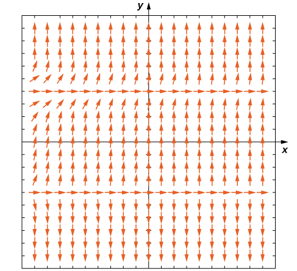 
* * *
{: data-type="newline"}

 The equilibrium solutions are <math xmlns="http://www.w3.org/1998/Math/MathML"><mrow><mi>y</mi><mo>=</mo><mn>−2</mn></mrow></math>

 and <math xmlns="http://www.w3.org/1998/Math/MathML"><mrow><mi>y</mi><mo>=</mo><mn>2</mn><mo>.</mo></mrow></math>

 For this equation, <math xmlns="http://www.w3.org/1998/Math/MathML"><mrow><mi>y</mi><mo>=</mo><mn>−2</mn></mrow></math>

 is an unstable equilibrium solution, and <math xmlns="http://www.w3.org/1998/Math/MathML"><mrow><mi>y</mi><mo>=</mo><mn>2</mn></mrow></math>

 is a semi-stable equilibrium solution.

Hint

First create the direction field and look for horizontal dashes that go all the way across. Then examine the slope lines directly above and below the equilibrium solutions.

### Euler’s Method

Consider the initial-value problem

<math xmlns="http://www.w3.org/1998/Math/MathML"><mrow><msup><mi>y</mi><mo>′</mo></msup><mo>=</mo><mn>2</mn><mi>x</mi><mo>−</mo><mn>3</mn><mo>,</mo><mspace width="1em" /><mi>y</mi><mrow><mo>(</mo><mn>0</mn><mo>)</mo></mrow><mo>=</mo><mn>3</mn><mo>.</mo></mrow></math>

Integrating both sides of the differential equation gives <math xmlns="http://www.w3.org/1998/Math/MathML"><mrow><mi>y</mi><mo>=</mo><msup><mi>x</mi><mn>2</mn></msup><mo>−</mo><mn>3</mn><mi>x</mi><mo>+</mo><mi>C</mi><mo>,</mo></mrow></math>

 and solving for <math xmlns="http://www.w3.org/1998/Math/MathML"><mi>C</mi></math>

 yields the particular solution <math xmlns="http://www.w3.org/1998/Math/MathML"><mrow><mi>y</mi><mo>=</mo><msup><mi>x</mi><mn>2</mn></msup><mo>−</mo><mn>3</mn><mi>x</mi><mo>+</mo><mn>3</mn><mo>.</mo></mrow></math>

 The solution for this initial-value problem appears as the parabola in [\[link\]](#CNX_Calc_Figure_08_02_010).

 ![A graph over the range \[-1,4\] for x and y. The given upward opening parabola is drawn with vertex at (1.5, 0.75). Individual points are plotted at (0, 3), (0.5, 1.5), (1, 0.5), (1.5, 0), (2, 0), (2.5, 0.5), and (3, 1.5) with line segments connecting them.](../resources/CNX_Calc_Figure_08_02_010.jpg "Euler&#x2019;s Method for the initial-value problem y&#x2032;=2x&#x2212;3,y(0)=3."){: #CNX_Calc_Figure_08_02_010}

The red graph consists of line segments that approximate the solution to the initial-value problem. The graph starts at the same initial value of <math xmlns="http://www.w3.org/1998/Math/MathML"><mrow><mrow><mo>(</mo><mrow><mn>0</mn><mo>,</mo><mn>3</mn></mrow><mo>)</mo></mrow><mo>.</mo></mrow></math>

 Then the slope of the solution at any point is determined by the right-hand side of the differential equation, and the length of the line segment is determined by increasing the <math xmlns="http://www.w3.org/1998/Math/MathML"><mi>x</mi></math>

 value by <math xmlns="http://www.w3.org/1998/Math/MathML"><mrow><mn>0.5</mn></mrow></math>

 each time (the *step size*). This approach is the basis of Euler’s Method.

Before we state Euler’s Method as a theorem, let’s consider another initial-value problem:

<math xmlns="http://www.w3.org/1998/Math/MathML"><mrow><msup><mi>y</mi><mo>′</mo></msup><mo>=</mo><msup><mi>x</mi><mn>2</mn></msup><mo>−</mo><msup><mi>y</mi><mn>2</mn></msup><mo>,</mo><mspace width="1em" /><mi>y</mi><mo stretchy="false">(</mo><mn>−1</mn><mo stretchy="false">)</mo><mo>=</mo><mn>2</mn><mo>.</mo></mrow></math>

The idea behind direction fields can also be applied to this problem to study the behavior of its solution. For example, at the point <math xmlns="http://www.w3.org/1998/Math/MathML"><mrow><mrow><mo>(</mo><mrow><mn>−1</mn><mo>,</mo><mn>2</mn></mrow><mo>)</mo></mrow><mo>,</mo></mrow></math>

 the slope of the solution is given by <math xmlns="http://www.w3.org/1998/Math/MathML"><mrow><mi>y</mi><mo>′</mo><mo>=</mo><msup><mrow><mrow><mo>(</mo><mrow><mn>−1</mn></mrow><mo>)</mo></mrow></mrow><mn>2</mn></msup><mo>−</mo><msup><mn>2</mn><mn>2</mn></msup><mo>=</mo><mn>−3</mn><mo>,</mo></mrow></math>

 so the slope of the tangent line to the solution at that point is also equal to <math xmlns="http://www.w3.org/1998/Math/MathML"><mrow><mn>−3</mn><mo>.</mo></mrow></math>

 Now we define <math xmlns="http://www.w3.org/1998/Math/MathML"><mrow><msub><mi>x</mi><mn>0</mn></msub><mo>=</mo><mn>−1</mn></mrow></math>

 and <math xmlns="http://www.w3.org/1998/Math/MathML"><mrow><msub><mi>y</mi><mn>0</mn></msub><mo>=</mo><mn>2</mn><mo>.</mo></mrow></math>

 Since the slope of the solution at this point is equal to <math xmlns="http://www.w3.org/1998/Math/MathML"><mrow><mn>−3</mn><mo>,</mo></mrow></math>

 we can use the method of linear approximation to approximate <math xmlns="http://www.w3.org/1998/Math/MathML"><mi>y</mi></math>

 near <math xmlns="http://www.w3.org/1998/Math/MathML"><mrow><mrow><mo>(</mo><mrow><mn>−1</mn><mo>,</mo><mn>2</mn></mrow><mo>)</mo></mrow><mo>.</mo></mrow></math>

<math xmlns="http://www.w3.org/1998/Math/MathML"><mrow><mi>L</mi><mo stretchy="false">(</mo><mi>x</mi><mo stretchy="false">)</mo><mo>=</mo><msub><mi>y</mi><mn>0</mn></msub><mo>+</mo><msup><mi>f</mi><mo>′</mo></msup><mrow><mo>(</mo><mrow><msub><mi>x</mi><mn>0</mn></msub></mrow><mo>)</mo></mrow><mrow><mo>(</mo><mrow><mi>x</mi><mo>−</mo><msub><mi>x</mi><mn>0</mn></msub></mrow><mo>)</mo></mrow><mo>.</mo></mrow></math>

Here <math xmlns="http://www.w3.org/1998/Math/MathML"><mrow><msub><mi>x</mi><mn>0</mn></msub><mo>=</mo><mn>−1</mn><mo>,</mo><msub><mi>y</mi><mn>0</mn></msub><mo>=</mo><mn>2</mn><mo>,</mo></mrow></math>

 and <math xmlns="http://www.w3.org/1998/Math/MathML"><mrow><msup><mi>f</mi><mo>′</mo></msup><mrow><mo>(</mo><mrow><msub><mi>x</mi><mn>0</mn></msub></mrow><mo>)</mo></mrow><mo>=</mo><mn>−3</mn><mo>,</mo></mrow></math>

 so the linear approximation becomes

<math xmlns="http://www.w3.org/1998/Math/MathML"><mtable><mtr><mtd columnalign="left"><mi>L</mi><mo stretchy="false">(</mo><mi>x</mi><mo stretchy="false">)</mo></mtd><mtd columnalign="left"><mo>=</mo><mn>2</mn><mo>−</mo><mn>3</mn><mrow><mo>(</mo><mrow><mi>x</mi><mo>−</mo><mrow><mo>(</mo><mrow><mn>−1</mn></mrow><mo>)</mo></mrow></mrow><mo>)</mo></mrow></mtd></mtr><mtr><mtd /><mtd columnalign="left"><mo>=</mo><mn>2</mn><mo>−</mo><mn>3</mn><mi>x</mi><mo>−</mo><mn>3</mn></mtd></mtr><mtr><mtd /><mtd columnalign="left"><mo>=</mo><mn>−3</mn><mi>x</mi><mo>−</mo><mn>1.</mn></mtd></mtr></mtable></math>

Now we choose a **step size**{: data-type="term"}. The step size is a small value, typically <math xmlns="http://www.w3.org/1998/Math/MathML"><mrow><mn>0.1</mn></mrow></math>

 or less, that serves as an increment for <math xmlns="http://www.w3.org/1998/Math/MathML"><mrow><mi>x</mi><mo>;</mo></mrow></math>

 it is represented by the variable <math xmlns="http://www.w3.org/1998/Math/MathML"><mrow><mi>h</mi><mo>.</mo></mrow></math>

 In our example, let <math xmlns="http://www.w3.org/1998/Math/MathML"><mrow><mi>h</mi><mo>=</mo><mn>0.1</mn><mo>.</mo></mrow></math>

 Incrementing <math xmlns="http://www.w3.org/1998/Math/MathML"><mrow><msub><mi>x</mi><mn>0</mn></msub></mrow></math>

 by <math xmlns="http://www.w3.org/1998/Math/MathML"><mi>h</mi></math>

 gives our next <math xmlns="http://www.w3.org/1998/Math/MathML"><mi>x</mi></math>

 value:

<math xmlns="http://www.w3.org/1998/Math/MathML"><mrow><msub><mi>x</mi><mn>1</mn></msub><mo>=</mo><msub><mi>x</mi><mn>0</mn></msub><mo>+</mo><mi>h</mi><mo>=</mo><mn>−1</mn><mo>+</mo><mn>0.1</mn><mo>=</mo><mn>−0.9</mn><mo>.</mo></mrow></math>

We can substitute <math xmlns="http://www.w3.org/1998/Math/MathML"><mrow><msub><mi>x</mi><mn>1</mn></msub><mo>=</mo><mn>−0.9</mn></mrow></math>

 into the linear approximation to calculate <math xmlns="http://www.w3.org/1998/Math/MathML"><mrow><msub><mi>y</mi><mn>1</mn></msub><mo>.</mo></mrow></math>

<math xmlns="http://www.w3.org/1998/Math/MathML"><mtable><mtr><mtd columnalign="left"><msub><mi>y</mi><mn>1</mn></msub></mtd><mtd columnalign="left"><mo>=</mo><mi>L</mi><mrow><mo>(</mo><mrow><msub><mi>x</mi><mn>1</mn></msub></mrow><mo>)</mo></mrow></mtd></mtr><mtr><mtd /><mtd columnalign="left"><mo>=</mo><mn>−3</mn><mrow><mo>(</mo><mrow><mn>−0.9</mn></mrow><mo>)</mo></mrow><mo>−</mo><mn>1</mn></mtd></mtr><mtr><mtd /><mtd columnalign="left"><mo>=</mo><mn>1.7.</mn></mtd></mtr></mtable></math>

Therefore the approximate <math xmlns="http://www.w3.org/1998/Math/MathML"><mi>y</mi></math>

 value for the solution when <math xmlns="http://www.w3.org/1998/Math/MathML"><mrow><mi>x</mi><mo>=</mo><mn>−0.9</mn></mrow></math>

 is <math xmlns="http://www.w3.org/1998/Math/MathML"><mrow><mi>y</mi><mo>=</mo><mn>1.7</mn><mo>.</mo></mrow></math>

 We can then repeat the process, using <math xmlns="http://www.w3.org/1998/Math/MathML"><mrow><msub><mi>x</mi><mn>1</mn></msub><mo>=</mo><mn>−0.9</mn></mrow></math>

 and <math xmlns="http://www.w3.org/1998/Math/MathML"><mrow><msub><mi>y</mi><mn>1</mn></msub><mo>=</mo><mn>1.7</mn></mrow></math>

 to calculate <math xmlns="http://www.w3.org/1998/Math/MathML"><mrow><msub><mi>x</mi><mn>2</mn></msub></mrow></math>

 and <math xmlns="http://www.w3.org/1998/Math/MathML"><mrow><msub><mi>y</mi><mn>2</mn></msub><mo>.</mo></mrow></math>

 The new slope is given by <math xmlns="http://www.w3.org/1998/Math/MathML"><mrow><mi>y</mi><mo>′</mo><mo>=</mo><msup><mrow><mrow><mo>(</mo><mrow><mn>−0.9</mn></mrow><mo>)</mo></mrow></mrow><mn>2</mn></msup><mo>−</mo><msup><mrow><mrow><mo>(</mo><mrow><mn>1.7</mn></mrow><mo>)</mo></mrow></mrow><mn>2</mn></msup><mo>=</mo><mn>−2.08</mn><mo>.</mo></mrow></math>

 First, <math xmlns="http://www.w3.org/1998/Math/MathML"><mrow><msub><mi>x</mi><mn>2</mn></msub><mo>=</mo><msub><mi>x</mi><mn>1</mn></msub><mo>+</mo><mi>h</mi><mo>=</mo><mn>−0.9</mn><mo>+</mo><mn>0.1</mn><mo>=</mo><mn>−0.8</mn><mo>.</mo></mrow></math>

 Using linear approximation gives

<math xmlns="http://www.w3.org/1998/Math/MathML"><mtable><mtr><mtd columnalign="left"><mi>L</mi><mo stretchy="false">(</mo><mi>x</mi><mo stretchy="false">)</mo></mtd><mtd columnalign="left"><mo>=</mo><msub><mi>y</mi><mn>1</mn></msub><mo>+</mo><msup><mi>f</mi><mo>′</mo></msup><mrow><mo>(</mo><mrow><msub><mi>x</mi><mn>1</mn></msub></mrow><mo>)</mo></mrow><mrow><mo>(</mo><mrow><mi>x</mi><mo>−</mo><msub><mi>x</mi><mn>1</mn></msub></mrow><mo>)</mo></mrow></mtd></mtr><mtr><mtd /><mtd columnalign="left"><mo>=</mo><mn>1.7</mn><mo>−</mo><mn>2.08</mn><mrow><mo>(</mo><mrow><mi>x</mi><mo>−</mo><mrow><mo>(</mo><mrow><mn>−0.9</mn></mrow><mo>)</mo></mrow></mrow><mo>)</mo></mrow></mtd></mtr><mtr><mtd /><mtd columnalign="left"><mo>=</mo><mn>1.7</mn><mo>−</mo><mn>2.08</mn><mi>x</mi><mo>−</mo><mn>1.872</mn></mtd></mtr><mtr><mtd /><mtd columnalign="left"><mo>=</mo><mn>−2.08</mn><mi>x</mi><mo>−</mo><mn>0.172.</mn></mtd></mtr></mtable></math>

Finally, we substitute <math xmlns="http://www.w3.org/1998/Math/MathML"><mrow><msub><mi>x</mi><mn>2</mn></msub><mo>=</mo><mn>−0.8</mn></mrow></math>

 into the linear approximation to calculate <math xmlns="http://www.w3.org/1998/Math/MathML"><mrow><msub><mi>y</mi><mn>2</mn></msub><mo>.</mo></mrow></math>

<math xmlns="http://www.w3.org/1998/Math/MathML"><mtable><mtr><mtd columnalign="left"><msub><mi>y</mi><mn>2</mn></msub></mtd><mtd columnalign="left"><mo>=</mo><mi>L</mi><mo stretchy="false">(</mo><msub><mi>x</mi><mn>2</mn></msub><mo stretchy="false">)</mo></mtd></mtr><mtr><mtd /><mtd columnalign="left"><mo>=</mo><mn>−2.08</mn><msub><mi>x</mi><mn>2</mn></msub><mo>−</mo><mn>0.172</mn></mtd></mtr><mtr><mtd /><mtd columnalign="left"><mo>=</mo><mn>−2.08</mn><mrow><mo>(</mo><mrow><mn>−0.8</mn></mrow><mo>)</mo></mrow><mo>−</mo><mn>0.172</mn></mtd></mtr><mtr><mtd /><mtd columnalign="left"><mo>=</mo><mn>1.492.</mn></mtd></mtr></mtable></math>

Therefore the approximate value of the solution to the differential equation is <math xmlns="http://www.w3.org/1998/Math/MathML"><mrow><mi>y</mi><mo>=</mo><mn>1.492</mn></mrow></math>

 when <math xmlns="http://www.w3.org/1998/Math/MathML"><mrow><mi>x</mi><mo>=</mo><mn>−0.8</mn><mo>.</mo></mrow></math>

What we have just shown is the idea behind **Euler’s Method**{: data-type="term"}. Repeating these steps gives a list of values for the solution. These values are shown in [\[link\]](#fs-id1170573401360), rounded off to four decimal places.

<table summary="A table with three columns and twelve rows. The first has the label &#x201C;n&#x201D; and the values 0 through 10. The second has the label &#x201C;x_n&#x201D; and the values -1 through 0, increasing by 0.1. The third has the label &#x201C;y_n&#x201D; and the values 2, 1.7, 1.492, 1.3334, 1.2046, 1.0955, 1.0004, 0.9164, 0.8414, 0.7746, and 0.7156."><caption>Using Euler’s Method to Approximate Solutions to a Differential Equation</caption><tbody>
<tr valign="top">
<td data-align="left"><math xmlns="http://www.w3.org/1998/Math/MathML"><mstyle mathvariant="bold-italic"><mi>n</mi></mstyle></math></td>
<td data-align="left"><math xmlns="http://www.w3.org/1998/Math/MathML"><mn>0</mn></math></td>
<td data-align="left"><math xmlns="http://www.w3.org/1998/Math/MathML"><mn>1</mn></math></td>
<td data-align="left"><math xmlns="http://www.w3.org/1998/Math/MathML"><mn>2</mn></math></td>
<td data-align="left"><math xmlns="http://www.w3.org/1998/Math/MathML"><mn>3</mn></math></td>
<td data-align="left"><math xmlns="http://www.w3.org/1998/Math/MathML"><mn>4</mn></math></td>
<td data-align="left"><math xmlns="http://www.w3.org/1998/Math/MathML"><mn>5</mn></math></td>
</tr>
<tr valign="top">
<td data-align="left"><math xmlns="http://www.w3.org/1998/Math/MathML"><mrow><mstyle mathvariant="bold-italic"><msub><mi>x</mi><mi>n</mi></msub></mstyle></mrow></math></td>
<td data-align="left"><math xmlns="http://www.w3.org/1998/Math/MathML"><mrow><mn>−1</mn></mrow></math></td>
<td data-align="left"><math xmlns="http://www.w3.org/1998/Math/MathML"><mrow><mn>−0.9</mn></mrow></math></td>
<td data-align="left"><math xmlns="http://www.w3.org/1998/Math/MathML"><mrow><mn>−0.8</mn></mrow></math></td>
<td data-align="left"><math xmlns="http://www.w3.org/1998/Math/MathML"><mrow><mn>−0.7</mn></mrow></math></td>
<td data-align="left"><math xmlns="http://www.w3.org/1998/Math/MathML"><mrow><mn>−0.6</mn></mrow></math></td>
<td data-align="left"><math xmlns="http://www.w3.org/1998/Math/MathML"><mrow><mn>−0.5</mn></mrow></math></td>
</tr>
<tr valign="top">
<td data-align="left"><math xmlns="http://www.w3.org/1998/Math/MathML"><mrow><mstyle mathvariant="bold-italic"><msub><mi>y</mi><mi>n</mi></msub></mstyle></mrow></math></td>
<td data-align="left"><math xmlns="http://www.w3.org/1998/Math/MathML"><mn>2</mn></math></td>
<td data-align="left"><math xmlns="http://www.w3.org/1998/Math/MathML"><mn>1.7</mn></math></td>
<td data-align="left"><math xmlns="http://www.w3.org/1998/Math/MathML"><mn>1.492</mn></math></td>
<td data-align="left"><math xmlns="http://www.w3.org/1998/Math/MathML"><mn>1.3334</mn></math></td>
<td data-align="left"><math xmlns="http://www.w3.org/1998/Math/MathML"><mn>1.2046</mn></math></td>
<td data-align="left"><math xmlns="http://www.w3.org/1998/Math/MathML"><mn>1.0955</mn></math></td>
</tr>
<tr valign="top">
<td data-align="left"><math xmlns="http://www.w3.org/1998/Math/MathML"><mstyle mathvariant="bold-italic"><mi>n</mi></mstyle></math></td>
<td data-align="left"><math xmlns="http://www.w3.org/1998/Math/MathML"><mn>6</mn></math></td>
<td data-align="left"><math xmlns="http://www.w3.org/1998/Math/MathML"><mn>7</mn></math></td>
<td data-align="left"><math xmlns="http://www.w3.org/1998/Math/MathML"><mn>8</mn></math></td>
<td data-align="left"><math xmlns="http://www.w3.org/1998/Math/MathML"><mn>9</mn></math></td>
<td data-align="left"><math xmlns="http://www.w3.org/1998/Math/MathML"><mn>10</mn></math></td>
<td />
</tr>
<tr valign="top">
<td data-align="left"><math xmlns="http://www.w3.org/1998/Math/MathML"><mrow><mstyle mathvariant="bold-italic"><msub><mi>x</mi><mi>n</mi></msub></mstyle></mrow></math></td>
<td data-align="left"><math xmlns="http://www.w3.org/1998/Math/MathML"><mrow><mn>−0.4</mn></mrow></math></td>
<td data-align="left"><math xmlns="http://www.w3.org/1998/Math/MathML"><mrow><mn>−0.3</mn></mrow></math></td>
<td data-align="left"><math xmlns="http://www.w3.org/1998/Math/MathML"><mrow><mn>−0.2</mn></mrow></math></td>
<td data-align="left"><math xmlns="http://www.w3.org/1998/Math/MathML"><mrow><mn>−0.1</mn></mrow></math></td>
<td data-align="left"><math xmlns="http://www.w3.org/1998/Math/MathML"><mrow><mn>0</mn></mrow></math></td>
<td />
</tr>
<tr valign="top">
<td data-align="left"><math xmlns="http://www.w3.org/1998/Math/MathML"><mrow><mstyle mathvariant="bold-italic"><msub><mi>y</mi><mi>n</mi></msub></mstyle></mrow></math></td>
<td data-align="left"><math xmlns="http://www.w3.org/1998/Math/MathML"><mn>1.0004</mn></math></td>
<td data-align="left"><math xmlns="http://www.w3.org/1998/Math/MathML"><mn>1.9164</mn></math></td>
<td data-align="left"><math xmlns="http://www.w3.org/1998/Math/MathML"><mn>1.8414</mn></math></td>
<td data-align="left"><math xmlns="http://www.w3.org/1998/Math/MathML"><mn>1.7746</mn></math></td>
<td data-align="left"><math xmlns="http://www.w3.org/1998/Math/MathML"><mn>1.7156</mn></math></td>
<td />
</tr>
</tbody></table>

Euler’s Method

Consider the initial-value problem

<math xmlns="http://www.w3.org/1998/Math/MathML"><mrow><mi>y</mi><mo>′</mo><mo>=</mo><mi>f</mi><mrow><mo>(</mo><mrow><mi>x</mi><mo>,</mo><mi>y</mi></mrow><mo>)</mo></mrow><mo>,</mo><mspace width="1em" /><mi>y</mi><mrow><mo>(</mo><msub><mrow><mi>x</mi></mrow><mrow><mn>0</mn></mrow></msub><mo>)</mo></mrow><mo>=</mo><msub><mi>y</mi><mn>0</mn></msub><mo>.</mo></mrow></math>

To approximate a solution to this problem using Euler’s method, define

<math xmlns="http://www.w3.org/1998/Math/MathML"><mtable><mtr><mtd columnalign="left"><msub><mi>x</mi><mi>n</mi></msub><mo>=</mo><msub><mi>x</mi><mn>0</mn></msub><mo>+</mo><mi>n</mi><mi>h</mi></mtd></mtr><mtr><mtd columnalign="left"><msub><mi>y</mi><mi>n</mi></msub><mo>=</mo><msub><mi>y</mi><mrow><mi>n</mi><mo>−</mo><mn>1</mn></mrow></msub><mo>+</mo><mi>h</mi><mi>f</mi><mo stretchy="false">(</mo><msub><mi>x</mi><mrow><mi>n</mi><mo>−</mo><mn>1</mn></mrow></msub><mo>,</mo><msub><mi>y</mi><mrow><mi>n</mi><mo>−</mo><mn>1</mn></mrow></msub><mo stretchy="false">)</mo><mo>.</mo></mtd></mtr></mtable></math>

Here <math xmlns="http://www.w3.org/1998/Math/MathML"><mrow><mi>h</mi><mo>&gt;</mo><mn>0</mn></mrow></math>

 represents the step size and <math xmlns="http://www.w3.org/1998/Math/MathML"><mi>n</mi></math>

 is an integer, starting with <math xmlns="http://www.w3.org/1998/Math/MathML"><mrow><mn>1</mn><mo>.</mo></mrow></math>

 The number of steps taken is counted by the variable <math xmlns="http://www.w3.org/1998/Math/MathML"><mrow><mi>n</mi><mo>.</mo></mrow></math>

Typically <math xmlns="http://www.w3.org/1998/Math/MathML"><mi>h</mi></math>

 is a small value, say <math xmlns="http://www.w3.org/1998/Math/MathML"><mrow><mn>0.1</mn></mrow></math>

 or <math xmlns="http://www.w3.org/1998/Math/MathML"><mrow><mn>0.05</mn><mo>.</mo></mrow></math>

 The smaller the value of <math xmlns="http://www.w3.org/1998/Math/MathML"><mrow><mi>h</mi><mo>,</mo></mrow></math>

 the more calculations are needed. The higher the value of <math xmlns="http://www.w3.org/1998/Math/MathML"><mrow><mi>h</mi><mo>,</mo></mrow></math>

 the fewer calculations are needed. However, the tradeoff results in a lower degree of accuracy for larger step size, as illustrated in [\[link\]](#CNX_Calc_Figure_08_02_011).

 ![Two graphs of the same parabola, y = x ^ 2 &#x2013; 3 x + 3. The first shows Euler&#x2019;s method for the given initial-value problem with a step size of h = 0.05, and the second shows Euler&#x2019;s method with a step size of h = 0.25. The first then has the points (0, 3), (.5, 1.5), (1, 0.5), (1.5, 0), (2, 0), (2.5, 0.5), and (3, 1.5) plotted with line segments connecting them. The second has the points (0, 3), (0.25, 2.25), (0.5, 1.625), (0.75, 1.125), (1, 0.75), (1.25, 0.5), (1.5, 0.375), (2, 0.5), (2.25, 0.75), (2.5, 1.125), (2.75, 1.625), and (3, 2.25) plotted with line segments connecting them.](../resources/CNX_Calc_Figure_08_02_011.jpg "Euler&#x2019;s method for the initial-value problem y&#x2032;=2x&#x2212;3,y(0)=3 with (a) a step size of h=0.5; and (b) a step size of h=0.25."){: #CNX_Calc_Figure_08_02_011}

Using Euler’s Method

Consider the initial-value problem

<math xmlns="http://www.w3.org/1998/Math/MathML"><mrow><msup><mi>y</mi><mo>′</mo></msup><mo>=</mo><mn>3</mn><msup><mi>x</mi><mn>2</mn></msup><mo>−</mo><msup><mi>y</mi><mn>2</mn></msup><mo>+</mo><mn>1</mn><mo>,</mo><mspace width="1em" /><mi>y</mi><mrow><mo>(</mo><mn>0</mn><mo>)</mo></mrow><mo>=</mo><mn>2</mn><mo>.</mo></mrow></math>

Use Euler’s method with a step size of <math xmlns="http://www.w3.org/1998/Math/MathML"><mrow><mn>0.1</mn></mrow></math>

 to generate a table of values for the solution for values of <math xmlns="http://www.w3.org/1998/Math/MathML"><mi>x</mi></math>

 between <math xmlns="http://www.w3.org/1998/Math/MathML"><mn>0</mn></math>

 and <math xmlns="http://www.w3.org/1998/Math/MathML"><mrow><mn>1</mn><mo>.</mo></mrow></math>

We are given <math xmlns="http://www.w3.org/1998/Math/MathML"><mrow><mi>h</mi><mo>=</mo><mn>0.1</mn></mrow></math>

 and <math xmlns="http://www.w3.org/1998/Math/MathML"><mrow><mi>f</mi><mrow><mo>(</mo><mrow><mi>x</mi><mo>,</mo><mi>y</mi></mrow><mo>)</mo></mrow><mo>=</mo><mn>3</mn><msup><mi>x</mi><mn>2</mn></msup><mo>−</mo><msup><mi>y</mi><mn>2</mn></msup><mo>+</mo><mn>1</mn><mo>.</mo></mrow></math>

 Furthermore, the initial condition <math xmlns="http://www.w3.org/1998/Math/MathML"><mrow><mi>y</mi><mrow><mo>(</mo><mn>0</mn><mo>)</mo></mrow><mo>=</mo><mn>2</mn></mrow></math>

 gives <math xmlns="http://www.w3.org/1998/Math/MathML"><mrow><msub><mi>x</mi><mn>0</mn></msub><mo>=</mo><mn>0</mn></mrow></math>

 and <math xmlns="http://www.w3.org/1998/Math/MathML"><mrow><msub><mi>y</mi><mn>0</mn></msub><mo>=</mo><mn>2</mn><mo>.</mo></mrow></math>

 Using [[link]](#fs-id1170573525577) with <math xmlns="http://www.w3.org/1998/Math/MathML"><mrow><mi>n</mi><mo>=</mo><mn>0</mn><mo>,</mo></mrow></math>

 we can generate [[link]](#fs-id1170571140163).

<table summary="A table with three columns and twelve rows. The first column has the header &#x201C;n&#x201D; and values 0 through 10. The second column has the header &#x201C;x_n&#x201D; and the values 0 through 1, increasing by 0.1. The third column has the header &#x201C;y_n = y_(n - 1) + hf(x_(n - 1), y(n - 1).&#x201D; The values are as follows: 2, 1.7, 1.514, 1.3968, 1.3287, 1.3001, 1.3061, 1.3435, 1.4100, 1.5032, and 1.6202."><caption>Using Euler’s Method to Approximate Solutions to a Differential Equation</caption><tbody>
<tr valign="top">
<td data-align="left"><math xmlns="http://www.w3.org/1998/Math/MathML"><mi>n</mi></math></td>
<td data-align="left"><math xmlns="http://www.w3.org/1998/Math/MathML"><mrow><msub><mi>x</mi><mi>n</mi></msub></mrow></math></td>
<td data-align="left"><math xmlns="http://www.w3.org/1998/Math/MathML"><mrow><msub><mi>y</mi><mi>n</mi></msub><mo>=</mo><msub><mi>y</mi><mrow><mi>n</mi><mo>−</mo><mn>1</mn></mrow></msub><mo>+</mo><mi>h</mi><mi>f</mi><mo stretchy="false">(</mo><msub><mi>x</mi><mrow><mi>n</mi><mo>−</mo><mn>1</mn></mrow></msub><mo>,</mo><msub><mi>y</mi><mrow><mi>n</mi><mo>−</mo><mn>1</mn></mrow></msub><mo stretchy="false">)</mo></mrow></math></td>
</tr>
<tr valign="top">
<td data-align="left"><math xmlns="http://www.w3.org/1998/Math/MathML"><mn>0</mn></math></td>
<td data-align="left"><math xmlns="http://www.w3.org/1998/Math/MathML"><mn>0</mn></math></td>
<td data-align="left"><math xmlns="http://www.w3.org/1998/Math/MathML"><mn>2</mn></math></td>
</tr>
<tr valign="top">
<td data-align="left"><math xmlns="http://www.w3.org/1998/Math/MathML"><mn>1</mn></math></td>
<td data-align="left"><math xmlns="http://www.w3.org/1998/Math/MathML"><mrow><mn>0.1</mn></mrow></math></td>
<td data-align="left"><math xmlns="http://www.w3.org/1998/Math/MathML"><mrow><msub><mi>y</mi><mn>1</mn></msub><mo>=</mo><msub><mi>y</mi><mn>0</mn></msub><mo>+</mo><mi>h</mi><mi>f</mi><mrow><mo>(</mo><mrow><msub><mi>x</mi><mn>0</mn></msub><mo>,</mo><msub><mi>y</mi><mn>0</mn></msub></mrow><mo>)</mo></mrow><mo>=</mo><mn>1.7</mn></mrow></math></td>
</tr>
<tr valign="top">
<td data-align="left"><math xmlns="http://www.w3.org/1998/Math/MathML"><mn>2</mn></math></td>
<td data-align="left"><math xmlns="http://www.w3.org/1998/Math/MathML"><mrow><mn>0.2</mn></mrow></math></td>
<td data-align="left"><math xmlns="http://www.w3.org/1998/Math/MathML"><mrow><msub><mi>y</mi><mn>2</mn></msub><mo>=</mo><msub><mi>y</mi><mn>1</mn></msub><mo>+</mo><mi>h</mi><mi>f</mi><mrow><mo>(</mo><mrow><msub><mi>x</mi><mn>1</mn></msub><mo>,</mo><msub><mi>y</mi><mn>1</mn></msub></mrow><mo>)</mo></mrow><mo>=</mo><mn>1.514</mn></mrow></math></td>
</tr>
<tr valign="top">
<td data-align="left"><math xmlns="http://www.w3.org/1998/Math/MathML"><mn>3</mn></math></td>
<td data-align="left"><math xmlns="http://www.w3.org/1998/Math/MathML"><mrow><mn>0.3</mn></mrow></math></td>
<td data-align="left"><math xmlns="http://www.w3.org/1998/Math/MathML"><mrow><msub><mi>y</mi><mn>3</mn></msub><mo>=</mo><msub><mi>y</mi><mn>2</mn></msub><mo>+</mo><mi>h</mi><mi>f</mi><mrow><mo>(</mo><mrow><msub><mi>x</mi><mn>2</mn></msub><mo>,</mo><msub><mi>y</mi><mn>2</mn></msub></mrow><mo>)</mo></mrow><mo>=</mo><mn>1.3968</mn></mrow></math></td>
</tr>
<tr valign="top">
<td data-align="left"><math xmlns="http://www.w3.org/1998/Math/MathML"><mn>4</mn></math></td>
<td data-align="left"><math xmlns="http://www.w3.org/1998/Math/MathML"><mrow><mn>0.4</mn></mrow></math></td>
<td data-align="left"><math xmlns="http://www.w3.org/1998/Math/MathML"><mrow><msub><mi>y</mi><mn>4</mn></msub><mo>=</mo><msub><mi>y</mi><mn>3</mn></msub><mo>+</mo><mi>h</mi><mi>f</mi><mrow><mo>(</mo><mrow><msub><mi>x</mi><mn>3</mn></msub><mo>,</mo><msub><mi>y</mi><mn>3</mn></msub></mrow><mo>)</mo></mrow><mo>=</mo><mn>1.3287</mn></mrow></math></td>
</tr>
<tr valign="top">
<td data-align="left"><math xmlns="http://www.w3.org/1998/Math/MathML"><mn>5</mn></math></td>
<td data-align="left"><math xmlns="http://www.w3.org/1998/Math/MathML"><mrow><mn>0.5</mn></mrow></math></td>
<td data-align="left"><math xmlns="http://www.w3.org/1998/Math/MathML"><mrow><msub><mi>y</mi><mn>5</mn></msub><mo>=</mo><msub><mi>y</mi><mn>4</mn></msub><mo>+</mo><mi>h</mi><mi>f</mi><mrow><mo>(</mo><mrow><msub><mi>x</mi><mn>4</mn></msub><mo>,</mo><msub><mi>y</mi><mn>4</mn></msub></mrow><mo>)</mo></mrow><mo>=</mo><mn>1.3001</mn></mrow></math></td>
</tr>
<tr valign="top">
<td data-align="left"><math xmlns="http://www.w3.org/1998/Math/MathML"><mn>6</mn></math></td>
<td data-align="left"><math xmlns="http://www.w3.org/1998/Math/MathML"><mrow><mn>0.6</mn></mrow></math></td>
<td data-align="left"><math xmlns="http://www.w3.org/1998/Math/MathML"><mrow><msub><mi>y</mi><mn>6</mn></msub><mo>=</mo><msub><mi>y</mi><mn>5</mn></msub><mo>+</mo><mi>h</mi><mi>f</mi><mrow><mo>(</mo><mrow><msub><mi>x</mi><mn>5</mn></msub><mo>,</mo><msub><mi>y</mi><mn>5</mn></msub></mrow><mo>)</mo></mrow><mo>=</mo><mn>1.3061</mn></mrow></math></td>
</tr>
<tr valign="top">
<td data-align="left"><math xmlns="http://www.w3.org/1998/Math/MathML"><mn>7</mn></math></td>
<td data-align="left"><math xmlns="http://www.w3.org/1998/Math/MathML"><mrow><mn>0.7</mn></mrow></math></td>
<td data-align="left"><math xmlns="http://www.w3.org/1998/Math/MathML"><mrow><msub><mi>y</mi><mn>7</mn></msub><mo>=</mo><msub><mi>y</mi><mn>6</mn></msub><mo>+</mo><mi>h</mi><mi>f</mi><mrow><mo>(</mo><mrow><msub><mi>x</mi><mn>6</mn></msub><mo>,</mo><msub><mi>y</mi><mn>6</mn></msub></mrow><mo>)</mo></mrow><mo>=</mo><mn>1.3435</mn></mrow></math></td>
</tr>
<tr valign="top">
<td data-align="left"><math xmlns="http://www.w3.org/1998/Math/MathML"><mn>8</mn></math></td>
<td data-align="left"><math xmlns="http://www.w3.org/1998/Math/MathML"><mrow><mn>0.8</mn></mrow></math></td>
<td data-align="left"><math xmlns="http://www.w3.org/1998/Math/MathML"><mrow><msub><mi>y</mi><mn>8</mn></msub><mo>=</mo><msub><mi>y</mi><mn>7</mn></msub><mo>+</mo><mi>h</mi><mi>f</mi><mrow><mo>(</mo><mrow><msub><mi>x</mi><mn>7</mn></msub><mo>,</mo><msub><mi>y</mi><mn>7</mn></msub></mrow><mo>)</mo></mrow><mo>=</mo><mn>1.4100</mn></mrow></math></td>
</tr>
<tr valign="top">
<td data-align="left"><math xmlns="http://www.w3.org/1998/Math/MathML"><mn>9</mn></math></td>
<td data-align="left"><math xmlns="http://www.w3.org/1998/Math/MathML"><mrow><mn>0.9</mn></mrow></math></td>
<td data-align="left"><math xmlns="http://www.w3.org/1998/Math/MathML"><mrow><msub><mi>y</mi><mn>9</mn></msub><mo>=</mo><msub><mi>y</mi><mn>8</mn></msub><mo>+</mo><mi>h</mi><mi>f</mi><mrow><mo>(</mo><mrow><msub><mi>x</mi><mn>8</mn></msub><mo>,</mo><msub><mi>y</mi><mn>8</mn></msub></mrow><mo>)</mo></mrow><mo>=</mo><mn>1.5032</mn></mrow></math></td>
</tr>
<tr valign="top">
<td data-align="left"><math xmlns="http://www.w3.org/1998/Math/MathML"><mrow><mn>10</mn></mrow></math></td>
<td data-align="left"><math xmlns="http://www.w3.org/1998/Math/MathML"><mrow><mn>1.0</mn></mrow></math></td>
<td data-align="left"><math xmlns="http://www.w3.org/1998/Math/MathML"><mrow><msub><mi>y</mi><mrow><mn>10</mn></mrow></msub><mo>=</mo><msub><mi>y</mi><mn>9</mn></msub><mo>+</mo><mi>h</mi><mi>f</mi><mrow><mo>(</mo><mrow><msub><mi>x</mi><mn>9</mn></msub><mo>,</mo><msub><mi>y</mi><mn>9</mn></msub></mrow><mo>)</mo></mrow><mo>=</mo><mn>1.6202</mn></mrow></math></td>
</tr>
</tbody></table>
With ten calculations, we are able to approximate the values of the solution to the initial-value problem for values of <math xmlns="http://www.w3.org/1998/Math/MathML"><mi>x</mi></math>

 between <math xmlns="http://www.w3.org/1998/Math/MathML"><mn>0</mn></math>

 and <math xmlns="http://www.w3.org/1998/Math/MathML"><mn>1</mn><mo>.</mo></math>

For more information on [Euler\'s method][3] use this applet.

Consider the initial-value problem

<math xmlns="http://www.w3.org/1998/Math/MathML"><mrow><msup><mi>y</mi><mo>′</mo></msup><mo>=</mo><msup><mi>x</mi><mn>3</mn></msup><mo>+</mo><msup><mi>y</mi><mn>2</mn></msup><mo>,</mo><mspace width="1em" /><mi>y</mi><mo stretchy="false">(</mo><mn>1</mn><mo stretchy="false">)</mo><mo>=</mo><mn>−2</mn><mo>.</mo></mrow></math>

Using a step size of <math xmlns="http://www.w3.org/1998/Math/MathML"><mrow><mn>0.1</mn><mo>,</mo></mrow></math>

 generate a table with approximate values for the solution to the initial-value problem for values of <math xmlns="http://www.w3.org/1998/Math/MathML"><mi>x</mi></math>

 between <math xmlns="http://www.w3.org/1998/Math/MathML"><mn>1</mn></math>

 and <math xmlns="http://www.w3.org/1998/Math/MathML"><mrow><mn>2</mn><mo>.</mo></mrow></math>

| <math xmlns="http://www.w3.org/1998/Math/MathML"><mi>n</mi></math>

 | <math xmlns="http://www.w3.org/1998/Math/MathML"><mrow><msub><mi>x</mi><mi>n</mi></msub></mrow></math>

 | <math xmlns="http://www.w3.org/1998/Math/MathML"><mrow><msub><mi>y</mi><mi>n</mi></msub><mo>=</mo><msub><mi>y</mi><mrow><mi>n</mi><mo>−</mo><mn>1</mn></mrow></msub><mo>+</mo><mi>h</mi><mi>f</mi><mo stretchy="false">(</mo><msub><mi>x</mi><mrow><mi>n</mi><mo>−</mo><mn>1</mn></mrow></msub><mo>,</mo><msub><mi>y</mi><mrow><mi>n</mi><mo>−</mo><mn>1</mn></mrow></msub><mo stretchy="false">)</mo></mrow></math>

 |
{: valign="top"}|----------
| <math xmlns="http://www.w3.org/1998/Math/MathML"><mn>0</mn></math>

 | <math xmlns="http://www.w3.org/1998/Math/MathML"><mn>1</mn></math>

 | <math xmlns="http://www.w3.org/1998/Math/MathML"><mrow><mn>−2</mn></mrow></math>

 |
{: valign="top"}| <math xmlns="http://www.w3.org/1998/Math/MathML"><mn>1</mn></math>

 | <math xmlns="http://www.w3.org/1998/Math/MathML"><mrow><mn>1.1</mn></mrow></math>

 | <math xmlns="http://www.w3.org/1998/Math/MathML"><mrow><msub><mi>y</mi><mn>1</mn></msub><mo>=</mo><msub><mi>y</mi><mn>0</mn></msub><mo>+</mo><mi>h</mi><mi>f</mi><mo stretchy="false">(</mo><msub><mi>x</mi><mn>0</mn></msub><mo>,</mo><msub><mi>y</mi><mn>0</mn></msub><mo stretchy="false">)</mo><mo>=</mo><mn>−1.5</mn></mrow></math>

 |
{: valign="top"}| <math xmlns="http://www.w3.org/1998/Math/MathML"><mn>2</mn></math>

 | <math xmlns="http://www.w3.org/1998/Math/MathML"><mrow><mn>1.2</mn></mrow></math>

 | <math xmlns="http://www.w3.org/1998/Math/MathML"><mrow><msub><mi>y</mi><mn>2</mn></msub><mo>=</mo><msub><mi>y</mi><mn>1</mn></msub><mo>+</mo><mi>h</mi><mi>f</mi><mo stretchy="false">(</mo><msub><mi>x</mi><mn>1</mn></msub><mo>,</mo><msub><mi>y</mi><mn>1</mn></msub><mo stretchy="false">)</mo><mo>=</mo><mn>−1.1419</mn></mrow></math>

 |
{: valign="top"}| <math xmlns="http://www.w3.org/1998/Math/MathML"><mn>3</mn></math>

 | <math xmlns="http://www.w3.org/1998/Math/MathML"><mrow><mn>1.3</mn></mrow></math>

 | <math xmlns="http://www.w3.org/1998/Math/MathML"><mrow><msub><mi>y</mi><mn>3</mn></msub><mo>=</mo><msub><mi>y</mi><mn>2</mn></msub><mo>+</mo><mi>h</mi><mi>f</mi><mo stretchy="false">(</mo><msub><mi>x</mi><mn>2</mn></msub><mo>,</mo><msub><mi>y</mi><mn>2</mn></msub><mo stretchy="false">)</mo><mo>=</mo><mn>−0.8387</mn></mrow></math>

 |
{: valign="top"}| <math xmlns="http://www.w3.org/1998/Math/MathML"><mn>4</mn></math>

 | <math xmlns="http://www.w3.org/1998/Math/MathML"><mrow><mn>1.4</mn></mrow></math>

 | <math xmlns="http://www.w3.org/1998/Math/MathML"><mrow><msub><mi>y</mi><mn>4</mn></msub><mo>=</mo><msub><mi>y</mi><mn>3</mn></msub><mo>+</mo><mi>h</mi><mi>f</mi><mo stretchy="false">(</mo><msub><mi>x</mi><mn>3</mn></msub><mo>,</mo><msub><mi>y</mi><mn>3</mn></msub><mo stretchy="false">)</mo><mo>=</mo><mn>−0.5487</mn></mrow></math>

 |
{: valign="top"}| <math xmlns="http://www.w3.org/1998/Math/MathML"><mn>5</mn></math>

 | <math xmlns="http://www.w3.org/1998/Math/MathML"><mrow><mn>1.5</mn></mrow></math>

 | <math xmlns="http://www.w3.org/1998/Math/MathML"><mrow><msub><mi>y</mi><mn>5</mn></msub><mo>=</mo><msub><mi>y</mi><mn>4</mn></msub><mo>+</mo><mi>h</mi><mi>f</mi><mo stretchy="false">(</mo><msub><mi>x</mi><mn>4</mn></msub><mo>,</mo><msub><mi>y</mi><mn>4</mn></msub><mo stretchy="false">)</mo><mo>=</mo><mn>−0.2442</mn></mrow></math>

 |
{: valign="top"}| <math xmlns="http://www.w3.org/1998/Math/MathML"><mn>6</mn></math>

 | <math xmlns="http://www.w3.org/1998/Math/MathML"><mrow><mn>1.6</mn></mrow></math>

 | <math xmlns="http://www.w3.org/1998/Math/MathML"><mrow><msub><mi>y</mi><mn>6</mn></msub><mo>=</mo><msub><mi>y</mi><mn>5</mn></msub><mo>+</mo><mi>h</mi><mi>f</mi><mo stretchy="false">(</mo><msub><mi>x</mi><mn>5</mn></msub><mo>,</mo><msub><mi>y</mi><mn>5</mn></msub><mo stretchy="false">)</mo><mo>=</mo><mn>0.0993</mn></mrow></math>

 |
{: valign="top"}| <math xmlns="http://www.w3.org/1998/Math/MathML"><mn>7</mn></math>

 | <math xmlns="http://www.w3.org/1998/Math/MathML"><mrow><mn>1.7</mn></mrow></math>

 | <math xmlns="http://www.w3.org/1998/Math/MathML"><mrow><msub><mi>y</mi><mn>7</mn></msub><mo>=</mo><msub><mi>y</mi><mn>6</mn></msub><mo>+</mo><mi>h</mi><mi>f</mi><mo stretchy="false">(</mo><msub><mi>x</mi><mn>6</mn></msub><mo>,</mo><msub><mi>y</mi><mn>6</mn></msub><mo stretchy="false">)</mo><mo>=</mo><mn>0.5099</mn></mrow></math>

 |
{: valign="top"}| <math xmlns="http://www.w3.org/1998/Math/MathML"><mn>8</mn></math>

 | <math xmlns="http://www.w3.org/1998/Math/MathML"><mrow><mn>1.8</mn></mrow></math>

 | <math xmlns="http://www.w3.org/1998/Math/MathML"><mrow><msub><mi>y</mi><mn>8</mn></msub><mo>=</mo><msub><mi>y</mi><mn>7</mn></msub><mo>+</mo><mi>h</mi><mi>f</mi><mo stretchy="false">(</mo><msub><mi>x</mi><mn>7</mn></msub><mo>,</mo><msub><mi>y</mi><mn>7</mn></msub><mo stretchy="false">)</mo><mo>=</mo><mn>1.0272</mn></mrow></math>

 |
{: valign="top"}| <math xmlns="http://www.w3.org/1998/Math/MathML"><mn>9</mn></math>

 | <math xmlns="http://www.w3.org/1998/Math/MathML"><mrow><mn>1.9</mn></mrow></math>

 | <math xmlns="http://www.w3.org/1998/Math/MathML"><mrow><msub><mi>y</mi><mn>9</mn></msub><mo>=</mo><msub><mi>y</mi><mn>8</mn></msub><mo>+</mo><mi>h</mi><mi>f</mi><mo stretchy="false">(</mo><msub><mi>x</mi><mn>8</mn></msub><mo>,</mo><msub><mi>y</mi><mn>8</mn></msub><mo stretchy="false">)</mo><mo>=</mo><mn>1.7159</mn></mrow></math>

 |
{: valign="top"}| <math xmlns="http://www.w3.org/1998/Math/MathML"><mrow><mn>10</mn></mrow></math>

 | <math xmlns="http://www.w3.org/1998/Math/MathML"><mn>2</mn></math>

 | <math xmlns="http://www.w3.org/1998/Math/MathML"><mrow><msub><mi>y</mi><mrow><mn>10</mn></mrow></msub><mo>=</mo><msub><mi>y</mi><mn>9</mn></msub><mo>+</mo><mi>h</mi><mi>f</mi><mo stretchy="false">(</mo><msub><mi>x</mi><mn>9</mn></msub><mo>,</mo><msub><mi>y</mi><mn>9</mn></msub><mo stretchy="false">)</mo><mo>=</mo><mn>2.6962</mn></mrow></math>

 |
{: valign="top"}{: .unnumbered summary="A table with three columns and eleven rows. The first column has the header n and the values 0 through 10. The second column has the header x_n and the values 1 through 2, increasing by 0.1. The third column has the header y_n = y_(n - 1) + hf(x_(n - 1), y_(n - 1)) and the values -2, -1.5, -1.1419, -0.8387, -0.5487, -0.2442, 0.0993, 0.5099, 1.0272, 1.7159, and 2.6962." data-label=""}

Hint

Start by identifying the value of <math xmlns="http://www.w3.org/1998/Math/MathML"><mrow><mi>h</mi><mo>,</mo></mrow></math>

 then figure out what <math xmlns="http://www.w3.org/1998/Math/MathML"><mrow><mi>f</mi><mrow><mo>(</mo><mrow><mi>x</mi><mo>,</mo><mi>y</mi></mrow><mo>)</mo></mrow></mrow></math>

 is. Then use the formula for Euler’s Method to calculate <math xmlns="http://www.w3.org/1998/Math/MathML"><mrow><msub><mi>y</mi><mn>1</mn></msub><mo>,</mo><msub><mi>y</mi><mn>2</mn></msub><mo>,</mo></mrow></math>

 and so on.

Visit this [website][4] for a practical application of the material in this section.

### Key Concepts

* A direction field is a mathematical object used to graphically represent solutions to a first-order differential equation.
* Euler’s Method is a numerical technique that can be used to approximate solutions to a differential equation.
{: data-bullet-style="bullet"}

### Key Equations

* **Euler’s Method**
  * * *
  {: data-type="newline"}
  
  <math xmlns="http://www.w3.org/1998/Math/MathML"><mtable><mtr><mtd columnalign="left"><msub><mi>x</mi><mi>n</mi></msub><mo>=</mo><msub><mi>x</mi><mn>0</mn></msub><mo>+</mo><mi>n</mi><mi>h</mi></mtd></mtr><mtr><mtd columnalign="left"><msub><mi>y</mi><mi>n</mi></msub><mo>=</mo><msub><mi>y</mi><mrow><mi>n</mi><mo>−</mo><mn>1</mn></mrow></msub><mo>+</mo><mi>h</mi><mi>f</mi><mo stretchy="false">(</mo><msub><mi>x</mi><mrow><mi>n</mi><mo>−</mo><mn>1</mn></mrow></msub><mo>,</mo><msub><mi>y</mi><mrow><mi>n</mi><mo>−</mo><mn>1</mn></mrow></msub><mo stretchy="false">)</mo><mo>,</mo><mtext>where</mtext><mspace width="0.2em" /><mi>h</mi><mspace width="0.2em" /><mtext>is the step size</mtext></mtd></mtr></mtable></math>
{: data-bullet-style="bullet"}

<section data-depth="1" class="section-exercises" markdown="1">
For the following problems, use the direction field below from the differential equation <math xmlns="http://www.w3.org/1998/Math/MathML"><mrow><mi>y</mi><mo>′</mo><mo>=</mo><mn>−2</mn><mi>y</mi><mo>.</mo></mrow></math>

 Sketch the graph of the solution for the given initial conditions.* * *
{: data-type="newline"}

  

<math xmlns="http://www.w3.org/1998/Math/MathML"><mrow><mi>y</mi><mrow><mo>(</mo><mn>0</mn><mo>)</mo></mrow><mo>=</mo><mn>1</mn></mrow></math>

<math xmlns="http://www.w3.org/1998/Math/MathML"><mrow><mi>y</mi><mrow><mo>(</mo><mn>0</mn><mo>)</mo></mrow><mo>=</mo><mn>0</mn></mrow></math>

* * *
{: data-type="newline"}

  

<math xmlns="http://www.w3.org/1998/Math/MathML"><mrow><mi>y</mi><mrow><mo>(</mo><mn>0</mn><mo>)</mo></mrow><mo>=</mo><mn>−1</mn></mrow></math>

Are there any equilibria? What are their stabilities?

<math xmlns="http://www.w3.org/1998/Math/MathML"><mrow><mi>y</mi><mo>=</mo><mn>0</mn></mrow></math>

 is a stable equilibrium

For the following problems, use the direction field below from the differential equation <math xmlns="http://www.w3.org/1998/Math/MathML"><mrow><mi>y</mi><mo>′</mo><mo>=</mo><msup><mi>y</mi><mn>2</mn></msup><mo>−</mo><mn>2</mn><mi>y</mi><mo>.</mo></mrow></math>

 Sketch the graph of the solution for the given initial conditions.* * *
{: data-type="newline"}

  

<math xmlns="http://www.w3.org/1998/Math/MathML"><mrow><mi>y</mi><mrow><mo>(</mo><mn>0</mn><mo>)</mo></mrow><mo>=</mo><mn>3</mn></mrow></math>

<math xmlns="http://www.w3.org/1998/Math/MathML"><mrow><mi>y</mi><mrow><mo>(</mo><mn>0</mn><mo>)</mo></mrow><mo>=</mo><mn>1</mn></mrow></math>

* * *
{: data-type="newline"}

  

<math xmlns="http://www.w3.org/1998/Math/MathML"><mrow><mi>y</mi><mrow><mo>(</mo><mn>0</mn><mo>)</mo></mrow><mo>=</mo><mn>−1</mn></mrow></math>

Are there any equilibria? What are their stabilities?

<math xmlns="http://www.w3.org/1998/Math/MathML"><mrow><mi>y</mi><mo>=</mo><mn>0</mn></mrow></math>

 is a stable equilibrium and <math xmlns="http://www.w3.org/1998/Math/MathML"><mrow><mi>y</mi><mo>=</mo><mn>2</mn></mrow></math>

 is unstable

Draw the direction field for the following differential equations, then solve the differential equation. Draw your solution on top of the direction field. Does your solution follow along the arrows on your direction field?

<math xmlns="http://www.w3.org/1998/Math/MathML"><mrow><mi>y</mi><mo>′</mo><mo>=</mo><msup><mi>t</mi><mn>3</mn></msup></mrow></math>

<math xmlns="http://www.w3.org/1998/Math/MathML"><mrow><mi>y</mi><mo>′</mo><mo>=</mo><msup><mi>e</mi><mi>t</mi></msup></mrow></math>

* * *
{: data-type="newline"}

 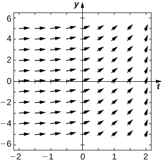 

<math xmlns="http://www.w3.org/1998/Math/MathML"><mrow><mfrac><mrow><mi>d</mi><mi>y</mi></mrow><mrow><mi>d</mi><mi>x</mi></mrow></mfrac><mo>=</mo><msup><mi>x</mi><mn>2</mn></msup><mtext>cos</mtext><mspace width="0.1em" /><mi>x</mi></mrow></math>

<math xmlns="http://www.w3.org/1998/Math/MathML"><mrow><mfrac><mrow><mi>d</mi><mi>y</mi></mrow><mrow><mi>d</mi><mi>t</mi></mrow></mfrac><mo>=</mo><mi>t</mi><msup><mi>e</mi><mi>t</mi></msup></mrow></math>

* * *
{: data-type="newline"}

 ![A direction field over \[-2, 2\] in the x and y axes. The arrows point slightly down and to the right over \[-2, 0\] and gradually become vertical over \[0, 2\].](../resources/CNX_Calc_Figure_08_02_212.jpg) 

<math xmlns="http://www.w3.org/1998/Math/MathML"><mrow><mfrac><mrow><mi>d</mi><mi>x</mi></mrow><mrow><mi>d</mi><mi>t</mi></mrow></mfrac><mo>=</mo><mtext>cosh</mtext><mrow><mo>(</mo><mi>t</mi><mo>)</mo></mrow></mrow></math>

Draw the directional field for the following differential equations. What can you say about the behavior of the solution? Are there equilibria? What stability do these equilibria have?

<math xmlns="http://www.w3.org/1998/Math/MathML"><mrow><mi>y</mi><mo>′</mo><mo>=</mo><msup><mi>y</mi><mn>2</mn></msup><mo>−</mo><mn>1</mn></mrow></math>

* * *
{: data-type="newline"}

  

<math xmlns="http://www.w3.org/1998/Math/MathML"><mrow><mi>y</mi><mo>′</mo><mo>=</mo><mi>y</mi><mo>−</mo><mi>x</mi></mrow></math>

<math xmlns="http://www.w3.org/1998/Math/MathML"><mrow><mi>y</mi><mo>′</mo><mo>=</mo><mn>1</mn><mo>−</mo><msup><mi>y</mi><mn>2</mn></msup><mo>−</mo><msup><mi>x</mi><mn>2</mn></msup></mrow></math>

* * *
{: data-type="newline"}

 ![A direction field with arrows pointing down and to the right for nearly all points in \[-2, 2\] on the x and y axes. Close to the origin, the arrows become more horizontal, point to the upper right, become more horizontal, and then point down to the right again.](../resources/CNX_Calc_Figure_08_02_216.jpg) 

<math xmlns="http://www.w3.org/1998/Math/MathML"><mrow><mi>y</mi><mo>′</mo><mo>=</mo><msup><mi>t</mi><mn>2</mn></msup><mtext>sin</mtext><mspace width="0.1em" /><mi>y</mi></mrow></math>

<math xmlns="http://www.w3.org/1998/Math/MathML"><mrow><mi>y</mi><mo>′</mo><mo>=</mo><mn>3</mn><mi>y</mi><mo>+</mo><mi>x</mi><mi>y</mi></mrow></math>

* * *
{: data-type="newline"}

  

Match the direction field with the given differential equations. Explain your selections.* * *
{: data-type="newline"}

 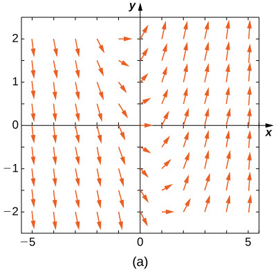 
* * *
{: data-type="newline"}

 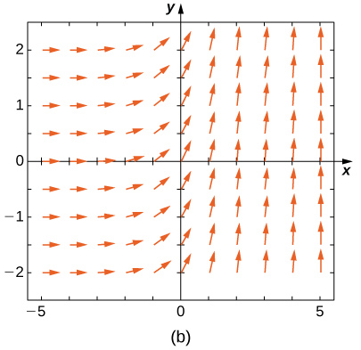 
* * *
{: data-type="newline"}

 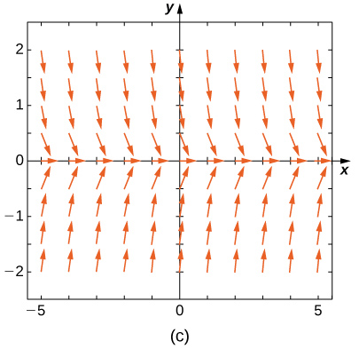 
* * *
{: data-type="newline"}

 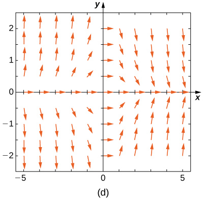 
* * *
{: data-type="newline"}

 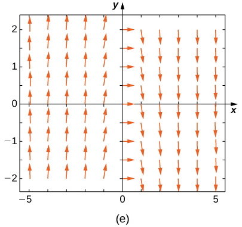 

<math xmlns="http://www.w3.org/1998/Math/MathML"><mrow><mi>y</mi><mo>′</mo><mo>=</mo><mn>−3</mn><mi>y</mi></mrow></math>

<math xmlns="http://www.w3.org/1998/Math/MathML"><mrow><mi>y</mi><mo>′</mo><mo>=</mo><mn>−3</mn><mi>t</mi></mrow></math>

E

<math xmlns="http://www.w3.org/1998/Math/MathML"><mrow><mi>y</mi><mo>′</mo><mo>=</mo><msup><mi>e</mi><mi>t</mi></msup></mrow></math>

<math xmlns="http://www.w3.org/1998/Math/MathML"><mrow><mi>y</mi><mo>′</mo><mo>=</mo><mfrac><mn>1</mn><mn>2</mn></mfrac><mi>y</mi><mo>+</mo><mi>t</mi></mrow></math>

A

<math xmlns="http://www.w3.org/1998/Math/MathML"><mrow><mi>y</mi><mo>′</mo><mo>=</mo><mtext>−</mtext><mi>t</mi><mi>y</mi></mrow></math>

Match the direction field with the given differential equations. Explain your selections.* * *
{: data-type="newline"}

 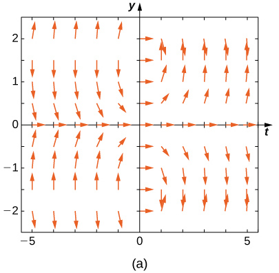 
* * *
{: data-type="newline"}

 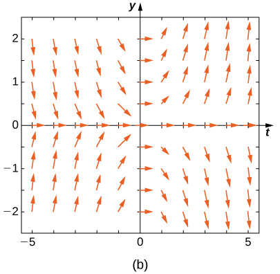 
* * *
{: data-type="newline"}

 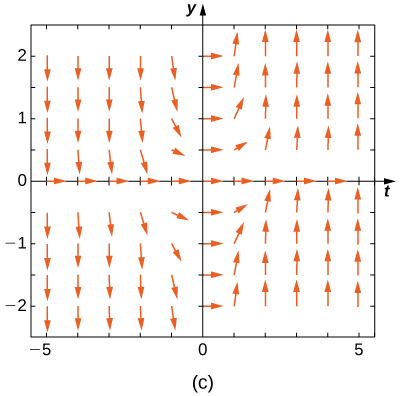 
* * *
{: data-type="newline"}

  
* * *
{: data-type="newline"}

  

<math xmlns="http://www.w3.org/1998/Math/MathML"><mrow><mi>y</mi><mo>′</mo><mo>=</mo><mi>t</mi><mspace width="0.1em" /><mtext>sin</mtext><mspace width="0.1em" /><mi>y</mi></mrow></math>

B

<math xmlns="http://www.w3.org/1998/Math/MathML"><mrow><mi>y</mi><mo>′</mo><mo>=</mo><mtext>−</mtext><mi>t</mi><mspace width="0.1em" /><mtext>cos</mtext><mspace width="0.1em" /><mi>y</mi></mrow></math>

<math xmlns="http://www.w3.org/1998/Math/MathML"><mrow><mi>y</mi><mo>′</mo><mo>=</mo><mi>t</mi><mspace width="0.1em" /><mtext>tan</mtext><mspace width="0.1em" /><mi>y</mi></mrow></math>

A

<math xmlns="http://www.w3.org/1998/Math/MathML"><mrow><mi>y</mi><mo>′</mo><mo>=</mo><msup><mrow><mtext>sin</mtext></mrow><mn>2</mn></msup><mi>y</mi></mrow></math>

<math xmlns="http://www.w3.org/1998/Math/MathML"><mrow><mi>y</mi><mo>′</mo><mo>=</mo><msup><mi>y</mi><mn>2</mn></msup><msup><mi>t</mi><mn>3</mn></msup></mrow></math>

C

Estimate the following solutions using Euler’s method with <math xmlns="http://www.w3.org/1998/Math/MathML"><mrow><mi>n</mi><mo>=</mo><mn>5</mn></mrow></math>

 steps over the interval <math xmlns="http://www.w3.org/1998/Math/MathML"><mrow><mi>t</mi><mo>=</mo><mo stretchy="false">[</mo><mn>0</mn><mo>,</mo><mn>1</mn><mo stretchy="false">]</mo><mo>.</mo></mrow></math>

 If you are able to solve the initial-value problem exactly, compare your solution with the exact solution. If you are unable to solve the initial-value problem, the exact solution will be provided for you to compare with Euler’s method. How accurate is Euler’s method?

<math xmlns="http://www.w3.org/1998/Math/MathML"><mrow><mi>y</mi><mo>′</mo><mo>=</mo><mn>−3</mn><mi>y</mi><mo>,</mo><mspace width="1em" /><mi>y</mi><mrow><mo>(</mo><mn>0</mn><mo>)</mo></mrow><mo>=</mo><mn>1</mn></mrow></math>

<math xmlns="http://www.w3.org/1998/Math/MathML"><mrow><mi>y</mi><mo>′</mo><mo>=</mo><msup><mi>t</mi><mn>2</mn></msup></mrow></math>

<math xmlns="http://www.w3.org/1998/Math/MathML"><mrow><mn>2.24</mn><mo>,</mo></mrow></math>

 exact: <math xmlns="http://www.w3.org/1998/Math/MathML"><mn>3</mn></math>

<math xmlns="http://www.w3.org/1998/Math/MathML"><mrow><msup><mi>y</mi><mo>′</mo></msup><mo>=</mo><mn>3</mn><mi>t</mi><mo>−</mo><mi>y</mi><mo>,</mo><mi>y</mi><mo stretchy="false">(</mo><mn>0</mn><mo stretchy="false">)</mo><mo>=</mo><mn>1</mn><mo>.</mo></mrow></math>

 Exact solution is <math xmlns="http://www.w3.org/1998/Math/MathML"><mrow><mi>y</mi><mo>=</mo><mn>3</mn><mi>t</mi><mo>+</mo><mn>4</mn><msup><mi>e</mi><mrow><mtext>−</mtext><mi>t</mi></mrow></msup><mo>−</mo><mn>3</mn></mrow></math>

<math xmlns="http://www.w3.org/1998/Math/MathML"><mrow><msup><mi>y</mi><mo>′</mo></msup><mo>=</mo><mi>y</mi><mo>+</mo><msup><mi>t</mi><mn>2</mn></msup><mo>,</mo><mi>y</mi><mo stretchy="false">(</mo><mn>0</mn><mo stretchy="false">)</mo><mo>=</mo><mn>3</mn><mo>.</mo></mrow></math>

 Exact solution is <math xmlns="http://www.w3.org/1998/Math/MathML"><mrow><mi>y</mi><mo>=</mo><mn>5</mn><msup><mi>e</mi><mi>t</mi></msup><mo>−</mo><mn>2</mn><mo>−</mo><msup><mi>t</mi><mn>2</mn></msup><mo>−</mo><mn>2</mn><mi>t</mi></mrow></math>

<math xmlns="http://www.w3.org/1998/Math/MathML"><mrow><mn>7.739364</mn><mo>,</mo></mrow></math>

 exact: <math xmlns="http://www.w3.org/1998/Math/MathML"><mrow><mn>5</mn><mo stretchy="false">(</mo><mi>e</mi><mo>−</mo><mn>1</mn><mo stretchy="false">)</mo></mrow></math>

<math xmlns="http://www.w3.org/1998/Math/MathML"><mrow><msup><mi>y</mi><mo>′</mo></msup><mo>=</mo><mn>2</mn><mi>t</mi><mo>,</mo><mi>y</mi><mo stretchy="false">(</mo><mn>0</mn><mo stretchy="false">)</mo><mo>=</mo><mn>0</mn></mrow></math>

**[T]** <math xmlns="http://www.w3.org/1998/Math/MathML"><mrow><mi>y</mi><mo>′</mo><mo>=</mo><msup><mi>e</mi><mrow><mo stretchy="false">(</mo><mi>x</mi><mo>+</mo><mi>y</mi><mo stretchy="false">)</mo></mrow></msup><mo>,</mo><mi>y</mi><mo stretchy="false">(</mo><mn>0</mn><mo stretchy="false">)</mo><mo>=</mo><mn>−1</mn><mo>.</mo></mrow></math>

 Exact solution is <math xmlns="http://www.w3.org/1998/Math/MathML"><mrow><mi>y</mi><mo>=</mo><mtext>−</mtext><mtext>ln</mtext><mo stretchy="false">(</mo><mi>e</mi><mo>+</mo><mn>1</mn><mo>−</mo><msup><mi>e</mi><mi>x</mi></msup><mo stretchy="false">)</mo></mrow></math>

<math xmlns="http://www.w3.org/1998/Math/MathML"><mrow><mn>−0.2535</mn></mrow></math>

 exact: <math xmlns="http://www.w3.org/1998/Math/MathML"><mn>0</mn></math>

<math xmlns="http://www.w3.org/1998/Math/MathML"><mrow><msup><mi>y</mi><mo>′</mo></msup><mo>=</mo><msup><mi>y</mi><mn>2</mn></msup><mtext>ln</mtext><mo stretchy="false">(</mo><mi>x</mi><mo>+</mo><mn>1</mn><mo stretchy="false">)</mo><mo>,</mo><mi>y</mi><mo stretchy="false">(</mo><mn>0</mn><mo stretchy="false">)</mo><mo>=</mo><mn>1</mn><mo>.</mo></mrow></math>

 Exact solution is <math xmlns="http://www.w3.org/1998/Math/MathML"><mrow><mi>y</mi><mo>=</mo><mo>−</mo><mfrac><mn>1</mn><mrow><mo stretchy="false">(</mo><mi>x</mi><mo>+</mo><mn>1</mn><mo stretchy="false">)</mo><mo stretchy="false">(</mo><mtext>ln</mtext><mo stretchy="false">(</mo><mi>x</mi><mo>+</mo><mn>1</mn><mo stretchy="false">)</mo><mo>−</mo><mn>1</mn><mo stretchy="false">)</mo></mrow></mfrac></mrow></math>

<math xmlns="http://www.w3.org/1998/Math/MathML"><mrow><msup><mi>y</mi><mo>′</mo></msup><mo>=</mo><msup><mn>2</mn><mi>x</mi></msup><mo>,</mo><mi>y</mi><mo stretchy="false">(</mo><mn>0</mn><mo stretchy="false">)</mo><mo>=</mo><mn>0</mn><mo>,</mo></mrow></math>

 Exact solution is <math xmlns="http://www.w3.org/1998/Math/MathML"><mrow><mi>y</mi><mo>=</mo><mfrac><mrow><msup><mn>2</mn><mi>x</mi></msup><mo>−</mo><mn>1</mn></mrow><mrow><mtext>ln</mtext><mo stretchy="false">(</mo><mn>2</mn><mo stretchy="false">)</mo></mrow></mfrac></mrow></math>

<math xmlns="http://www.w3.org/1998/Math/MathML"><mrow><mn>1.345</mn><mo>,</mo></mrow></math>

 exact: <math xmlns="http://www.w3.org/1998/Math/MathML"><mrow><mfrac><mn>1</mn><mrow><mtext>ln</mtext><mo stretchy="false">(</mo><mn>2</mn><mo stretchy="false">)</mo></mrow></mfrac></mrow></math>

<math xmlns="http://www.w3.org/1998/Math/MathML"><mrow><msup><mi>y</mi><mo>′</mo></msup><mo>=</mo><mi>y</mi><mo>,</mo><mi>y</mi><mo stretchy="false">(</mo><mn>0</mn><mo stretchy="false">)</mo><mo>=</mo><mn>−1</mn><mo>.</mo></mrow></math>

 Exact solution is <math xmlns="http://www.w3.org/1998/Math/MathML"><mrow><mi>y</mi><mo>=</mo><mtext>−</mtext><msup><mi>e</mi><mi>x</mi></msup><mo>.</mo></mrow></math>

<math xmlns="http://www.w3.org/1998/Math/MathML"><mrow><msup><mi>y</mi><mo>′</mo></msup><mo>=</mo><mn>−5</mn><mi>t</mi><mo>,</mo><mi>y</mi><mo stretchy="false">(</mo><mn>0</mn><mo stretchy="false">)</mo><mo>=</mo><mn>−2</mn><mo>.</mo></mrow></math>

 Exact solution is <math xmlns="http://www.w3.org/1998/Math/MathML"><mrow><mi>y</mi><mo>=</mo><mo>−</mo><mfrac><mn>5</mn><mn>2</mn></mfrac><msup><mi>t</mi><mn>2</mn></msup><mo>−</mo><mn>2</mn></mrow></math>

<math xmlns="http://www.w3.org/1998/Math/MathML"><mrow><mn>−4</mn><mo>,</mo></mrow></math>

 exact: <math xmlns="http://www.w3.org/1998/Math/MathML"><mrow><mtext>−</mtext><mrow><mn>1</mn><mtext>/</mtext><mn>2</mn></mrow></mrow></math>

Differential equations can be used to model **disease epidemics**{: data-type="term" .no-emphasis}. In the next set of problems, we examine the change of size of two sub-populations of people living in a city: individuals who are infected and individuals who are susceptible to infection. <math xmlns="http://www.w3.org/1998/Math/MathML"><mi>S</mi></math>

 represents the size of the susceptible population, and <math xmlns="http://www.w3.org/1998/Math/MathML"><mi>I</mi></math>

 represents the size of the infected population. We assume that if a susceptible person interacts with an infected person, there is a probability <math xmlns="http://www.w3.org/1998/Math/MathML"><mi>c</mi></math>

 that the susceptible person will become infected. Each infected person recovers from the infection at a rate <math xmlns="http://www.w3.org/1998/Math/MathML"><mi>r</mi></math>

 and becomes susceptible again. We consider the case of influenza, where we assume that no one dies from the disease, so we assume that the total population size of the two sub-populations is a constant number, <math xmlns="http://www.w3.org/1998/Math/MathML"><mrow><mi>N</mi><mo>.</mo></mrow></math>

 The differential equations that model these population sizes are

<math xmlns="http://www.w3.org/1998/Math/MathML"><mtable><mtr><mtd columnalign="left"><mi>S</mi><mo>′</mo><mo>=</mo><mi>r</mi><mi>I</mi><mo>−</mo><mi>c</mi><mi>S</mi><mi>I</mi><mspace width="1em" /><mtext>and</mtext></mtd></mtr><mtr><mtd columnalign="left"><mi>I</mi><mo>′</mo><mo>=</mo><mi>c</mi><mi>S</mi><mi>I</mi><mo>−</mo><mi>r</mi><mi>I</mi><mo>.</mo></mtd></mtr></mtable></math>

Here <math xmlns="http://www.w3.org/1998/Math/MathML"><mi>c</mi></math>

 represents the contact rate and <math xmlns="http://www.w3.org/1998/Math/MathML"><mi>r</mi></math>

 is the recovery rate.

Show that, by our assumption that the total population size is constant <math xmlns="http://www.w3.org/1998/Math/MathML"><mrow><mo stretchy="false">(</mo><mi>S</mi><mo>+</mo><mi>I</mi><mo>=</mo><mi>N</mi><mo stretchy="false">)</mo><mo>,</mo></mrow></math>

 you can reduce the system to a single differential equation in <math xmlns="http://www.w3.org/1998/Math/MathML"><mi>I</mi><mtext>:</mtext><mspace width="0.2em" /><mrow><mi>I</mi><mo>′</mo><mo>=</mo><mi>c</mi><mo stretchy="false">(</mo><mi>N</mi><mo>−</mo><mi>I</mi><mo stretchy="false">)</mo><mi>I</mi><mo>−</mo><mi>r</mi><mi>I</mi><mo>.</mo></mrow></math>

Assuming the parameters are <math xmlns="http://www.w3.org/1998/Math/MathML"><mrow><mi>c</mi><mo>=</mo><mn>0.5</mn><mo>,</mo><mi>N</mi><mo>=</mo><mn>5</mn><mo>,</mo></mrow></math>

 and <math xmlns="http://www.w3.org/1998/Math/MathML"><mrow><mi>r</mi><mo>=</mo><mn>0.5</mn><mo>,</mo></mrow></math>

 draw the resulting directional field.

* * *
{: data-type="newline"}

 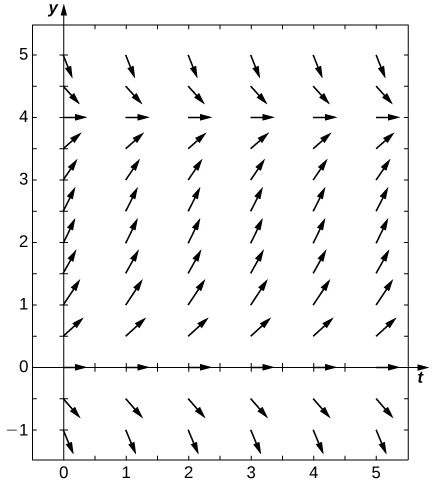 

**[T]** Use computational software or a calculator to compute the solution to the initial-value problem <math xmlns="http://www.w3.org/1998/Math/MathML"><mrow><mi>y</mi><mo>′</mo><mo>=</mo><mi>t</mi><mi>y</mi><mo>,</mo><mspace width="1em" /><mi>y</mi><mrow><mo>(</mo><mn>0</mn><mo>)</mo></mrow><mo>=</mo><mn>2</mn></mrow></math>

 using Euler’s Method with the given step size <math xmlns="http://www.w3.org/1998/Math/MathML"><mrow><mi>h</mi><mo>.</mo></mrow></math>

 Find the solution at <math xmlns="http://www.w3.org/1998/Math/MathML"><mrow><mi>t</mi><mo>=</mo><mn>1</mn><mo>.</mo></mrow></math>

 For a hint, here is “pseudo-code” for how to write a computer program to perform Euler’s Method for <math xmlns="http://www.w3.org/1998/Math/MathML"><mrow><mi>y</mi><mo>′</mo><mo>=</mo><mi>f</mi><mo stretchy="false">(</mo><mi>t</mi><mo>,</mo><mi>y</mi><mo stretchy="false">)</mo><mo>,</mo><mi>y</mi><mo stretchy="false">(</mo><mn>0</mn><mo stretchy="false">)</mo><mo>=</mo><mn>2</mn><mtext>:</mtext></mrow></math>

Create function <math xmlns="http://www.w3.org/1998/Math/MathML"><mrow><mi>f</mi><mo stretchy="false">(</mo><mi>t</mi><mo>,</mo><mi>y</mi><mo stretchy="false">)</mo></mrow></math>

Define parameters <math xmlns="http://www.w3.org/1998/Math/MathML"><mrow><mi>y</mi><mrow><mo>(</mo><mn>1</mn><mo>)</mo></mrow><mo>=</mo><msub><mi>y</mi><mn>0</mn></msub><mo>,</mo><mspace width="1em" /><mi>t</mi><mrow><mo>(</mo><mn>0</mn><mo>)</mo></mrow><mo>=</mo><mn>0</mn><mo>,</mo></mrow></math>

 step size <math xmlns="http://www.w3.org/1998/Math/MathML"><mrow><mi>h</mi><mo>,</mo></mrow></math>

 and total number of steps, <math xmlns="http://www.w3.org/1998/Math/MathML"><mi>N</mi></math>

Write a for loop:

for <math xmlns="http://www.w3.org/1998/Math/MathML"><mrow><mtext>k</mtext><mo>=</mo><mn>1</mn><mspace width="0.2em" /><mtext>to N</mtext></mrow></math>

<math xmlns="http://www.w3.org/1998/Math/MathML"><mrow><mtext>fn</mtext><mo>=</mo><mtext>f</mtext><mrow><mo>(</mo><mrow><mtext>t</mtext><mrow><mo>(</mo><mtext>k</mtext><mo>)</mo></mrow><mo>,</mo><mtext>y</mtext><mrow><mo>(</mo><mtext>k</mtext><mo>)</mo></mrow></mrow><mo>)</mo></mrow></mrow></math>

<math xmlns="http://www.w3.org/1998/Math/MathML"><mrow><mtext>y</mtext><mrow><mo>(</mo><mrow><mtext>k+1</mtext></mrow><mo>)</mo></mrow><mo>=</mo><mtext>y</mtext><mrow><mo>(</mo><mtext>k</mtext><mo>)</mo></mrow><mo>+</mo><mtext>h*fn</mtext></mrow></math>

<math xmlns="http://www.w3.org/1998/Math/MathML"><mrow><mtext>t</mtext><mrow><mo>(</mo><mrow><mtext>k+1</mtext></mrow><mo>)</mo></mrow><mo>=</mo><mtext>t</mtext><mrow><mo>(</mo><mtext>k</mtext><mo>)</mo></mrow><mo>+</mo><mtext>h</mtext></mrow></math>

Solve the initial-value problem for the exact solution.

<math xmlns="http://www.w3.org/1998/Math/MathML"><mrow><mi>y</mi><mo>′</mo><mo>=</mo><mn>2</mn><msup><mi>e</mi><mrow><msup><mi>t</mi><mn>2</mn></msup><mtext>/</mtext><mn>2</mn></mrow></msup></mrow></math>

Draw the directional field

<math xmlns="http://www.w3.org/1998/Math/MathML"><mrow><mi>h</mi><mo>=</mo><mn>1</mn></mrow></math>

<math xmlns="http://www.w3.org/1998/Math/MathML"><mn>2</mn></math>

**[T]** <math xmlns="http://www.w3.org/1998/Math/MathML"><mrow><mi>h</mi><mo>=</mo><mn>10</mn></mrow></math>

**[T]** <math xmlns="http://www.w3.org/1998/Math/MathML"><mrow><mi>h</mi><mo>=</mo><mn>100</mn></mrow></math>

<math xmlns="http://www.w3.org/1998/Math/MathML"><mrow><mn>3.2756</mn></mrow></math>

**[T]** <math xmlns="http://www.w3.org/1998/Math/MathML"><mrow><mi>h</mi><mo>=</mo><mn>1000</mn></mrow></math>

**[T]** Evaluate the exact solution at <math xmlns="http://www.w3.org/1998/Math/MathML"><mrow><mi>t</mi><mo>=</mo><mn>1</mn><mo>.</mo></mrow></math>

 Make a table of errors for the relative error between the Euler’s method solution and the exact solution. How much does the error change? Can you explain?

<math xmlns="http://www.w3.org/1998/Math/MathML"><mrow><mn>2</mn><msqrt><mi>e</mi></msqrt></mrow></math>

* * *
{: data-type="newline"}

| Step Size | Error |
{: valign="top"}|----------
| <math xmlns="http://www.w3.org/1998/Math/MathML"><mrow><mi>h</mi><mo>=</mo><mn>1</mn></mrow></math>

 | <math xmlns="http://www.w3.org/1998/Math/MathML"><mrow><mn>0.3935</mn></mrow></math>

 |
{: valign="top"}| <math xmlns="http://www.w3.org/1998/Math/MathML"><mrow><mi>h</mi><mo>=</mo><mn>10</mn></mrow></math>

 | <math xmlns="http://www.w3.org/1998/Math/MathML"><mrow><mn>0.06163</mn></mrow></math>

 |
{: valign="top"}| <math xmlns="http://www.w3.org/1998/Math/MathML"><mrow><mi>h</mi><mo>=</mo><mn>100</mn></mrow></math>

 | <math xmlns="http://www.w3.org/1998/Math/MathML"><mrow><mn>0.006612</mn></mrow></math>

 |
{: valign="top"}| <math xmlns="http://www.w3.org/1998/Math/MathML"><mrow><mi>h</mi><mo>=</mo><mn>1000</mn></mrow></math>

 | <math xmlns="http://www.w3.org/1998/Math/MathML"><mrow><mn>0.0006661</mn></mrow></math>

 |
{: valign="top"}{: .unnumbered summary="A table with two columns and five rows. The first column contains the label &#x201C;Step Size&#x201D; and the values h = 1, h=10, h=100, and h=1000. The second column contains the label &#x201C;Error&#x201D; and the values 0.3935, 0.06163, 0.006612, and 0.0006661." data-label=""}

Consider the initial-value problem <math xmlns="http://www.w3.org/1998/Math/MathML"><mrow><mi>y</mi><mo>′</mo><mo>=</mo><mn>−2</mn><mi>y</mi><mo>,</mo><mspace width="1em" /><mi>y</mi><mo stretchy="false">(</mo><mn>0</mn><mo stretchy="false">)</mo><mo>=</mo><mn>2</mn><mo>.</mo></mrow></math>

Show that <math xmlns="http://www.w3.org/1998/Math/MathML"><mrow><mi>y</mi><mo>=</mo><mn>2</mn><msup><mi>e</mi><mrow><mn>−2</mn><mi>x</mi></mrow></msup></mrow></math>

 solves this initial-value problem.

Draw the directional field of this differential equation.

* * *
{: data-type="newline"}

  

**[T]** By hand or by calculator or computer, approximate the solution using Euler’s Method at <math xmlns="http://www.w3.org/1998/Math/MathML"><mrow><mi>t</mi><mo>=</mo><mn>10</mn></mrow></math>

 using <math xmlns="http://www.w3.org/1998/Math/MathML"><mrow><mi>h</mi><mo>=</mo><mn>5</mn><mo>.</mo></mrow></math>

**[T]** By calculator or computer, approximate the solution using Euler’s Method at <math xmlns="http://www.w3.org/1998/Math/MathML"><mrow><mi>t</mi><mo>=</mo><mn>10</mn></mrow></math>

 using <math xmlns="http://www.w3.org/1998/Math/MathML"><mrow><mi>h</mi><mo>=</mo><mn>100</mn><mo>.</mo></mrow></math>

<math xmlns="http://www.w3.org/1998/Math/MathML"><mrow><mn>4.0741</mn><msup><mi>e</mi><mrow><mn>−10</mn></mrow></msup></mrow></math>

**[T]** Plot exact answer and each Euler approximation (for <math xmlns="http://www.w3.org/1998/Math/MathML"><mrow><mi>h</mi><mo>=</mo><mn>5</mn></mrow></math>

 and <math xmlns="http://www.w3.org/1998/Math/MathML"><mrow><mi>h</mi><mo>=</mo><mn>100</mn><mo stretchy="false">)</mo></mrow></math>

 at each <math xmlns="http://www.w3.org/1998/Math/MathML"><mi>h</mi></math>

 on the directional field. What do you notice?

</section>

### Glossary
{: data-type="glossary-title"}

asymptotically semi-stable solution
: <math xmlns="http://www.w3.org/1998/Math/MathML"><mrow><mi>y</mi><mo>=</mo><mi>k</mi></mrow></math>
  
  if it is neither asymptotically stable nor asymptotically unstable
^

asymptotically stable solution
: <math xmlns="http://www.w3.org/1998/Math/MathML"><mrow><mi>y</mi><mo>=</mo><mi>k</mi></mrow></math>
  
  if there exists
  <math xmlns="http://www.w3.org/1998/Math/MathML"><mrow><mi>ε</mi><mo>&gt;</mo><mn>0</mn></mrow></math>
  
  such that for any value
  <math xmlns="http://www.w3.org/1998/Math/MathML"><mrow><mi>c</mi><mo>∈</mo><mrow><mo>(</mo><mrow><mi>k</mi><mo>−</mo><mi>ε</mi><mo>,</mo><mi>k</mi><mo>+</mo><mi>ε</mi></mrow><mo>)</mo></mrow></mrow></math>
  
  the solution to the initial-value problem
  <math xmlns="http://www.w3.org/1998/Math/MathML"><mrow><msup><mi>y</mi><mo>′</mo></msup><mo>=</mo><mi>f</mi><mrow><mo>(</mo><mrow><mi>x</mi><mo>,</mo><mi>y</mi></mrow><mo>)</mo></mrow><mo>,</mo><mspace width="1em" /><mi>y</mi><mrow><mo>(</mo><mrow><msub><mi>x</mi><mn>0</mn></msub></mrow><mo>)</mo></mrow><mo>=</mo><mi>c</mi></mrow></math>
  
  approaches
  <math xmlns="http://www.w3.org/1998/Math/MathML"><mi>k</mi></math>
  
  as
  <math xmlns="http://www.w3.org/1998/Math/MathML"><mi>x</mi></math>
  
  approaches infinity
^

asymptotically unstable solution
: <math xmlns="http://www.w3.org/1998/Math/MathML"><mrow><mi>y</mi><mo>=</mo><mi>k</mi></mrow></math>
  
  if there exists
  <math xmlns="http://www.w3.org/1998/Math/MathML"><mrow><mi>ε</mi><mo>&gt;</mo><mn>0</mn></mrow></math>
  
  such that for any value
  <math xmlns="http://www.w3.org/1998/Math/MathML"><mrow><mi>c</mi><mo>∈</mo><mrow><mo>(</mo><mrow><mi>k</mi><mo>−</mo><mi>ε</mi><mo>,</mo><mi>k</mi><mo>+</mo><mi>ε</mi></mrow><mo>)</mo></mrow></mrow></math>
  
  the solution to the initial-value problem
  <math xmlns="http://www.w3.org/1998/Math/MathML"><mrow><msup><mi>y</mi><mo>′</mo></msup><mo>=</mo><mi>f</mi><mrow><mo>(</mo><mrow><mi>x</mi><mo>,</mo><mi>y</mi></mrow><mo>)</mo></mrow><mo>,</mo><mspace width="1em" /><mi>y</mi><mrow><mo>(</mo><mrow><msub><mi>x</mi><mn>0</mn></msub></mrow><mo>)</mo></mrow><mo>=</mo><mi>c</mi></mrow></math>
  
  never approaches
  <math xmlns="http://www.w3.org/1998/Math/MathML"><mi>k</mi></math>
  
  as
  <math xmlns="http://www.w3.org/1998/Math/MathML"><mi>x</mi></math>
  
  approaches infinity
^

direction field (slope field)
: a mathematical object used to graphically represent solutions to a first-order differential equation; at each point in a direction field, a line segment appears whose slope is equal to the slope of a solution to the differential equation passing through that point
^

equilibrium solution
: any solution to the differential equation of the form
  <math xmlns="http://www.w3.org/1998/Math/MathML"><mrow><mi>y</mi><mo>=</mo><mi>c</mi><mo>,</mo></mrow></math>
  
  where
  <math xmlns="http://www.w3.org/1998/Math/MathML"><mi>c</mi></math>
  
  is a constant
^

Euler’s Method
: a numerical technique used to approximate solutions to an initial-value problem
^

solution curve
: a curve graphed in a direction field that corresponds to the solution to the initial-value problem passing through a given point in the direction field
^

step size
: the increment
  <math xmlns="http://www.w3.org/1998/Math/MathML"><mi>h</mi></math>
  
  that is added to the
  <math xmlns="http://www.w3.org/1998/Math/MathML"><mi>x</mi></math>
  
  value at each step in Euler’s Method

[1]: http://www.openstaxcollege.org/l/20_DifferEq
[2]: http://www.openstaxcollege.org/l/20_SlopeFields
[3]: http://www.openstaxcollege.org/l/20_EulersMethod
[4]: http://www.openstaxcollege.org/l/20_EulerMethod2
