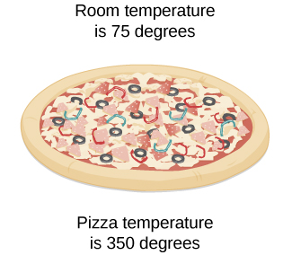
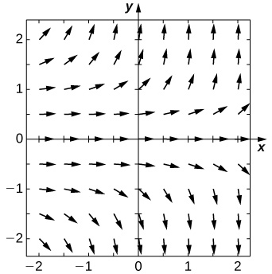
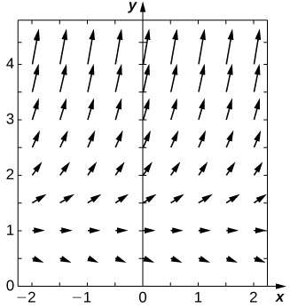

* Use separation of variables to solve a differential equation.
* Solve applications using separation of variables.

We now examine a solution technique for finding exact solutions to a class of differential equations known as separable differential equations. These equations are common in a wide variety of disciplines, including physics, chemistry, and engineering. We illustrate a few applications at the end of the section.

# Separation of Variables

We start with a definition and some examples.

Definition

A **separable differential equation**{: data-type="term"} is any equation that can be written in the form

<math xmlns="http://www.w3.org/1998/Math/MathML"><mrow><mi>y</mi><mo>′</mo><mo>=</mo><mi>f</mi><mrow><mo>(</mo><mi>x</mi><mo>)</mo></mrow><mi>g</mi><mrow><mo>(</mo><mi>y</mi><mo>)</mo><mo>.</mo></mrow></mrow></math>

The term ‘separable’ refers to the fact that the right-hand side of the equation can be separated into a function of <math xmlns="http://www.w3.org/1998/Math/MathML"><mi>x</mi></math>

 times a function of <math xmlns="http://www.w3.org/1998/Math/MathML"><mrow><mi>y</mi><mo>.</mo></mrow></math>

 Examples of separable differential equations include

<math xmlns="http://www.w3.org/1998/Math/MathML"><mtable><mtr /><mtr /><mtr><mtd columnalign="left"><mi>y</mi><mo>′</mo><mo>=</mo><mrow><mo>(</mo><mrow><msup><mi>x</mi><mn>2</mn></msup><mo>−</mo><mn>4</mn></mrow><mo>)</mo></mrow><mrow><mo>(</mo><mrow><mn>3</mn><mi>y</mi><mo>+</mo><mn>2</mn></mrow><mo>)</mo></mrow></mtd></mtr><mtr><mtd columnalign="left"><mi>y</mi><mo>′</mo><mo>=</mo><mn>6</mn><msup><mi>x</mi><mn>2</mn></msup><mo>+</mo><mn>4</mn><mi>x</mi></mtd></mtr><mtr><mtd columnalign="left"><mi>y</mi><mo>′</mo><mo>=</mo><mtext>sec</mtext><mspace width="0.1em" /><mi>y</mi><mo>+</mo><mtext>tan</mtext><mspace width="0.1em" /><mi>y</mi></mtd></mtr><mtr><mtd columnalign="left"><mi>y</mi><mo>′</mo><mo>=</mo><mi>x</mi><mi>y</mi><mo>+</mo><mn>3</mn><mi>x</mi><mo>−</mo><mn>2</mn><mi>y</mi><mo>−</mo><mn>6.</mn></mtd></mtr></mtable></math>

The second equation is separable with <math xmlns="http://www.w3.org/1998/Math/MathML"><mrow><mi>f</mi><mrow><mo>(</mo><mi>x</mi><mo>)</mo></mrow><mo>=</mo><mn>6</mn><msup><mi>x</mi><mn>2</mn></msup><mo>+</mo><mn>4</mn><mi>x</mi></mrow></math>

 and <math xmlns="http://www.w3.org/1998/Math/MathML"><mrow><mi>g</mi><mrow><mo>(</mo><mi>y</mi><mo>)</mo></mrow><mo>=</mo><mn>1</mn><mo>,</mo></mrow></math>

 the third equation is separable with <math xmlns="http://www.w3.org/1998/Math/MathML"><mrow><mi>f</mi><mrow><mo>(</mo><mi>x</mi><mo>)</mo></mrow><mo>=</mo><mn>1</mn></mrow></math>

 and <math xmlns="http://www.w3.org/1998/Math/MathML"><mrow><mi>g</mi><mrow><mo>(</mo><mi>y</mi><mo>)</mo></mrow><mo>=</mo><mtext>sec</mtext><mspace width="0.1em" /><mi>y</mi><mo>+</mo><mtext>tan</mtext><mspace width="0.1em" /><mi>y</mi><mo>,</mo></mrow></math>

 and the right-hand side of the fourth equation can be factored as <math xmlns="http://www.w3.org/1998/Math/MathML"><mrow><mrow><mo>(</mo><mrow><mi>x</mi><mo>+</mo><mn>3</mn></mrow><mo>)</mo></mrow><mrow><mo>(</mo><mrow><mi>y</mi><mo>−</mo><mn>2</mn></mrow><mo>)</mo></mrow><mo>,</mo></mrow></math>

 so it is separable as well. The third equation is also called an **autonomous differential equation**{: data-type="term"} because the right-hand side of the equation is a function of <math xmlns="http://www.w3.org/1998/Math/MathML"><mi>y</mi></math>

 alone. If a differential equation is separable, then it is possible to solve the equation using the method of **separation of variables**{: data-type="term"}.

Problem-Solving Strategy: Separation of Variables

1.  Check for any values of
    <math xmlns="http://www.w3.org/1998/Math/MathML"><mi>y</mi></math>
    
    that make
    <math xmlns="http://www.w3.org/1998/Math/MathML"><mrow><mi>g</mi><mo stretchy="false">(</mo><mi>y</mi><mo stretchy="false">)</mo><mo>=</mo><mn>0</mn><mo>.</mo></mrow></math>
    
    These correspond to constant solutions.
2.  Rewrite the differential equation in the form
    <math xmlns="http://www.w3.org/1998/Math/MathML"><mrow><mfrac><mrow><mi>d</mi><mi>y</mi></mrow><mrow><mi>g</mi><mo stretchy="false">(</mo><mi>y</mi><mo stretchy="false">)</mo></mrow></mfrac><mo>=</mo><mi>f</mi><mo stretchy="false">(</mo><mi>x</mi><mo stretchy="false">)</mo><mi>d</mi><mi>x</mi><mo>.</mo></mrow></math>

3.  Integrate both sides of the equation.
4.  Solve the resulting equation for
    <math xmlns="http://www.w3.org/1998/Math/MathML"><mi>y</mi></math>
    
    if possible.
5.  If an initial condition exists, substitute the appropriate values for
    <math xmlns="http://www.w3.org/1998/Math/MathML"><mi>x</mi></math>
    
    and
    <math xmlns="http://www.w3.org/1998/Math/MathML"><mi>y</mi></math>
    
    into the equation and solve for the constant.
{: data-number-style="arabic"}

Note that Step 4. states “Solve the resulting equation for <math xmlns="http://www.w3.org/1998/Math/MathML"><mi>y</mi></math>

 if possible.” It is not always possible to obtain <math xmlns="http://www.w3.org/1998/Math/MathML"><mi>y</mi></math>

 as an explicit function of <math xmlns="http://www.w3.org/1998/Math/MathML"><mrow><mi>x</mi><mo>.</mo></mrow></math>

 Quite often we have to be satisfied with finding <math xmlns="http://www.w3.org/1998/Math/MathML"><mi>y</mi></math>

 as an implicit function of <math xmlns="http://www.w3.org/1998/Math/MathML"><mrow><mi>x</mi><mo>.</mo></mrow></math>

Using Separation of Variables

Find a general solution to the differential equation <math xmlns="http://www.w3.org/1998/Math/MathML"><mrow><mi>y</mi><mo>′</mo><mo>=</mo><mrow><mo>(</mo><mrow><msup><mi>x</mi><mn>2</mn></msup><mo>−</mo><mn>4</mn></mrow><mo>)</mo></mrow><mrow><mo>(</mo><mrow><mn>3</mn><mi>y</mi><mo>+</mo><mn>2</mn></mrow><mo>)</mo></mrow></mrow></math>

 using the method of separation of variables.

Follow the five-step method of separation of variables.

1.  In this example,
    <math xmlns="http://www.w3.org/1998/Math/MathML"><mrow><mi>f</mi><mrow><mo>(</mo><mi>x</mi><mo>)</mo></mrow><mo>=</mo><msup><mi>x</mi><mn>2</mn></msup><mo>−</mo><mn>4</mn></mrow></math>
    
    and
    <math xmlns="http://www.w3.org/1998/Math/MathML"><mrow><mi>g</mi><mrow><mo>(</mo><mi>y</mi><mo>)</mo></mrow><mo>=</mo><mn>3</mn><mi>y</mi><mo>+</mo><mn>2</mn><mo>.</mo></mrow></math>
    
    Setting
    <math xmlns="http://www.w3.org/1998/Math/MathML"><mrow><mi>g</mi><mo stretchy="false">(</mo><mi>y</mi><mo stretchy="false">)</mo><mo>=</mo><mn>0</mn></mrow></math>
    
    gives
    <math xmlns="http://www.w3.org/1998/Math/MathML"><mrow><mi>y</mi><mo>=</mo><mo>−</mo><mfrac><mn>2</mn><mn>3</mn></mfrac></mrow></math>
    
    as a constant solution.
2.  Rewrite the differential equation in the form
    * * *
    {: data-type="newline"}
    
    

    <math xmlns="http://www.w3.org/1998/Math/MathML"><mrow><mfrac><mrow><mi>d</mi><mi>y</mi></mrow><mrow><mn>3</mn><mi>y</mi><mo>+</mo><mn>2</mn></mrow></mfrac><mo>=</mo><mo stretchy="false">(</mo><msup><mi>x</mi><mn>2</mn></msup><mo>−</mo><mn>4</mn><mo stretchy="false">)</mo><mi>d</mi><mi>x</mi><mo>.</mo></mrow></math>
    

3.  Integrate both sides of the equation:
    * * *
    {: data-type="newline"}
    
    

    <math xmlns="http://www.w3.org/1998/Math/MathML"><mrow><mstyle displaystyle="true"><mrow><mo stretchy="true">∫</mo><mrow><mfrac><mrow><mi>d</mi><mi>y</mi></mrow><mrow><mn>3</mn><mi>y</mi><mo>+</mo><mn>2</mn></mrow></mfrac></mrow></mrow></mstyle><mo>=</mo><mstyle displaystyle="true"><mrow><mo>∫</mo><mrow><mrow><mo>(</mo><mrow><msup><mi>x</mi><mn>2</mn></msup><mo>−</mo><mn>4</mn></mrow><mo>)</mo></mrow><mspace width="0.1em" /><mi>d</mi><mi>x</mi></mrow></mrow></mstyle><mo>.</mo></mrow></math>
    

    
    * * *
    {: data-type="newline"}
    
    Let
    <math xmlns="http://www.w3.org/1998/Math/MathML"><mrow><mi>u</mi><mo>=</mo><mn>3</mn><mi>y</mi><mo>+</mo><mn>2</mn><mo>.</mo></mrow></math>
    
    Then
    <math xmlns="http://www.w3.org/1998/Math/MathML"><mrow><mi>d</mi><mi>u</mi><mo>=</mo><mn>3</mn><mfrac><mrow><mi>d</mi><mi>y</mi></mrow><mrow><mi>d</mi><mi>x</mi></mrow></mfrac><mi>d</mi><mi>x</mi><mo>,</mo></mrow></math>
    
    so the equation becomes
    * * *
    {: data-type="newline"}
    
    

    <math xmlns="http://www.w3.org/1998/Math/MathML"><mtable><mtr><mtd columnalign="right"><mfrac><mn>1</mn><mn>3</mn></mfrac><mstyle displaystyle="true"><mrow><mo stretchy="true">∫</mo><mrow><mfrac><mn>1</mn><mi>u</mi></mfrac><mi>d</mi><mi>u</mi></mrow></mrow></mstyle></mtd><mtd columnalign="left"><mo>=</mo></mtd><mtd columnalign="left"><mfrac><mn>1</mn><mn>3</mn></mfrac><msup><mi>x</mi><mn>3</mn></msup><mo>−</mo><mn>4</mn><mi>x</mi><mo>+</mo><mi>C</mi></mtd></mtr><mtr><mtd columnalign="right"><mfrac><mn>1</mn><mn>3</mn></mfrac><mspace width="0.1em" /><mtext>ln</mtext><mrow><mo>\|</mo><mi>u</mi><mo>\|</mo></mrow></mtd><mtd columnalign="left"><mo>=</mo></mtd><mtd columnalign="left"><mfrac><mn>1</mn><mn>3</mn></mfrac><msup><mi>x</mi><mn>3</mn></msup><mo>−</mo><mn>4</mn><mi>x</mi><mo>+</mo><mi>C</mi></mtd></mtr><mtr><mtd columnalign="right"><mfrac><mn>1</mn><mn>3</mn></mfrac><mspace width="0.1em" /><mtext>ln</mtext><mrow><mo>\|</mo><mrow><mn>3</mn><mi>y</mi><mo>+</mo><mn>2</mn></mrow><mo>\|</mo></mrow></mtd><mtd columnalign="left"><mo>=</mo></mtd><mtd columnalign="left"><mfrac><mn>1</mn><mn>3</mn></mfrac><msup><mi>x</mi><mn>3</mn></msup><mo>−</mo><mn>4</mn><mi>x</mi><mo>+</mo><mi>C</mi><mo>.</mo></mtd></mtr></mtable></math>
    

4.  To solve this equation for
    <math xmlns="http://www.w3.org/1998/Math/MathML"><mrow><mi>y</mi><mo>,</mo></mrow></math>
    
    first multiply both sides of the equation by
    <math xmlns="http://www.w3.org/1998/Math/MathML"><mrow><mn>3</mn><mo>.</mo></mrow></math>
    
    * * *
    {: data-type="newline"}
    
    

    <math xmlns="http://www.w3.org/1998/Math/MathML"><mrow><mtext>ln</mtext><mrow><mo>\|</mo><mrow><mn>3</mn><mi>y</mi><mo>+</mo><mn>2</mn></mrow><mo>\|</mo></mrow><mo>=</mo><msup><mi>x</mi><mn>3</mn></msup><mo>−</mo><mn>12</mn><mi>x</mi><mo>+</mo><mn>3</mn><mi>C</mi></mrow></math>
    

    
    * * *
    {: data-type="newline"}
    
    Now we use some logic in dealing with the constant
    <math xmlns="http://www.w3.org/1998/Math/MathML"><mrow><mi>C</mi><mo>.</mo></mrow></math>
    
    Since
    <math xmlns="http://www.w3.org/1998/Math/MathML"><mi>C</mi></math>
    
    represents an arbitrary constant,
    <math xmlns="http://www.w3.org/1998/Math/MathML"><mrow><mn>3</mn><mi>C</mi></mrow></math>
    
    also represents an arbitrary constant. If we call the second arbitrary constant
    <math xmlns="http://www.w3.org/1998/Math/MathML"><mrow><msub><mi>C</mi><mn>1</mn></msub><mo>,</mo></mrow></math>
    
    the equation becomes
    * * *
    {: data-type="newline"}
    
    

    <math xmlns="http://www.w3.org/1998/Math/MathML"><mrow><mtext>ln</mtext><mrow><mo>\|</mo><mrow><mn>3</mn><mi>y</mi><mo>+</mo><mn>2</mn></mrow><mo>\|</mo></mrow><mo>=</mo><msup><mi>x</mi><mn>3</mn></msup><mo>−</mo><mn>12</mn><mi>x</mi><mo>+</mo><msub><mi>C</mi><mn>1</mn></msub><mo>.</mo></mrow></math>
    

    
    * * *
    {: data-type="newline"}
    
    Now exponentiate both sides of the equation (i.e., make each side of the equation the exponent for the base
    <math xmlns="http://www.w3.org/1998/Math/MathML"><mi>e</mi><mo stretchy="false">)</mo><mo>.</mo></math>
    
    * * *
    {: data-type="newline"}
    
    

    <math xmlns="http://www.w3.org/1998/Math/MathML"><mtable><mtr><mtd columnalign="right"><msup><mi>e</mi><mrow><mtext>ln</mtext><mrow><mo>\|</mo><mrow><mn>3</mn><mi>y</mi><mo>+</mo><mn>2</mn></mrow><mo>\|</mo></mrow></mrow></msup></mtd><mtd columnalign="left"><mo>=</mo></mtd><mtd columnalign="left"><msup><mi>e</mi><mrow><msup><mi>x</mi><mn>3</mn></msup><mo>−</mo><mn>12</mn><mi>x</mi><mo>+</mo><msub><mi>C</mi><mn>1</mn></msub></mrow></msup></mtd></mtr><mtr><mtd columnalign="right"><mrow><mo>\|</mo><mrow><mn>3</mn><mi>y</mi><mo>+</mo><mn>2</mn></mrow><mo>\|</mo></mrow></mtd><mtd columnalign="left"><mo>=</mo></mtd><mtd columnalign="left"><msup><mi>e</mi><mrow><msub><mi>C</mi><mn>1</mn></msub></mrow></msup><msup><mi>e</mi><mrow><msup><mi>x</mi><mn>3</mn></msup><mo>−</mo><mn>12</mn><mi>x</mi></mrow></msup></mtd></mtr></mtable></math>
    

    
    * * *
    {: data-type="newline"}
    
    Again define a new constant
    <math xmlns="http://www.w3.org/1998/Math/MathML"><mrow><msub><mi>C</mi><mn>2</mn></msub><mo>=</mo><msup><mi>e</mi><mrow><msub><mi>c</mi><mn>1</mn></msub></mrow></msup></mrow></math>
    
    (note that
    <math xmlns="http://www.w3.org/1998/Math/MathML"><mrow><msub><mi>C</mi><mn>2</mn></msub><mo>&gt;</mo><mn>0</mn><mo stretchy="false">)</mo><mtext>:</mtext></mrow></math>
    
    * * *
    {: data-type="newline"}
    
    

    <math xmlns="http://www.w3.org/1998/Math/MathML"><mrow><mrow><mo>\|</mo><mrow><mn>3</mn><mi>y</mi><mo>+</mo><mn>2</mn></mrow><mo>\|</mo></mrow><mo>=</mo><msub><mi>C</mi><mn>2</mn></msub><msup><mi>e</mi><mrow><msup><mi>x</mi><mn>3</mn></msup><mo>−</mo><mn>12</mn><mi>x</mi></mrow></msup><mo>.</mo></mrow></math>
    

    
    * * *
    {: data-type="newline"}
    
    This corresponds to two separate equations:
    <math xmlns="http://www.w3.org/1998/Math/MathML"><mrow><mn>3</mn><mi>y</mi><mo>+</mo><mn>2</mn><mo>=</mo><msub><mi>C</mi><mn>2</mn></msub><msup><mi>e</mi><mrow><msup><mi>x</mi><mn>3</mn></msup><mo>−</mo><mn>12</mn><mi>x</mi></mrow></msup></mrow></math>
    
    and
    <math xmlns="http://www.w3.org/1998/Math/MathML"><mrow><mn>3</mn><mi>y</mi><mo>+</mo><mn>2</mn><mo>=</mo><mtext>−</mtext><msub><mi>C</mi><mn>2</mn></msub><msup><mi>e</mi><mrow><msup><mi>x</mi><mn>3</mn></msup><mo>−</mo><mn>12</mn><mi>x</mi></mrow></msup><mo>.</mo></mrow></math>
    
    * * *
    {: data-type="newline"}
    
    The solution to either equation can be written in the form
    <math xmlns="http://www.w3.org/1998/Math/MathML"><mrow><mi>y</mi><mo>=</mo><mfrac><mrow><mn>−2</mn><mo>±</mo><msub><mi>C</mi><mn>2</mn></msub><msup><mi>e</mi><mrow><msup><mi>x</mi><mn>3</mn></msup><mo>−</mo><mn>12</mn><mi>x</mi></mrow></msup></mrow><mn>3</mn></mfrac><mo>.</mo></mrow></math>
    
    * * *
    {: data-type="newline"}
    
    Since
    <math xmlns="http://www.w3.org/1998/Math/MathML"><mrow><msub><mi>C</mi><mn>2</mn></msub><mo>&gt;</mo><mn>0</mn><mo>,</mo></mrow></math>
    
    it does not matter whether we use plus or minus, so the constant can actually have either sign. Furthermore, the subscript on the constant
    <math xmlns="http://www.w3.org/1998/Math/MathML"><mi>C</mi></math>
    
    is entirely arbitrary, and can be dropped. Therefore the solution can be written as
    * * *
    {: data-type="newline"}
    
    

    <math xmlns="http://www.w3.org/1998/Math/MathML"><mrow><mi>y</mi><mo>=</mo><mfrac><mrow><mn>−2</mn><mo>+</mo><mi>C</mi><msup><mi>e</mi><mrow><msup><mi>x</mi><mn>3</mn></msup><mo>−</mo><mn>12</mn><mi>x</mi></mrow></msup></mrow><mn>3</mn></mfrac><mo>.</mo></mrow></math>
    

5.  No initial condition is imposed, so we are finished.
{: data-number-style="arabic"}

Use the method of separation of variables to find a general solution to the differential equation <math xmlns="http://www.w3.org/1998/Math/MathML"><mrow><mi>y</mi><mo>′</mo><mo>=</mo><mn>2</mn><mi>x</mi><mi>y</mi><mo>+</mo><mn>3</mn><mi>y</mi><mo>−</mo><mn>4</mn><mi>x</mi><mo>−</mo><mn>6</mn><mo>.</mo></mrow></math>

<math xmlns="http://www.w3.org/1998/Math/MathML"><mrow><mi>y</mi><mo>=</mo><mn>2</mn><mo>+</mo><mi>C</mi><msup><mi>e</mi><mrow><msup><mi>x</mi><mn>2</mn></msup><mo>+</mo><mn>3</mn><mi>x</mi></mrow></msup></mrow></math>

Hint

First factor the right-hand side of the equation by grouping, then use the five-step strategy of separation of variables.

Solving an Initial-Value Problem

Using the method of separation of variables, solve the initial-value problem

<math xmlns="http://www.w3.org/1998/Math/MathML"><mrow><mi>y</mi><mo>′</mo><mo>=</mo><mo stretchy="false">(</mo><mn>2</mn><mi>x</mi><mo>+</mo><mn>3</mn><mo stretchy="false">)</mo><mo stretchy="false">(</mo><msup><mi>y</mi><mn>2</mn></msup><mo>−</mo><mn>4</mn><mo stretchy="false">)</mo><mo>,</mo><mspace width="1em" /><mi>y</mi><mo stretchy="false">(</mo><mn>0</mn><mo stretchy="false">)</mo><mo>=</mo><mn>−3</mn><mo>.</mo></mrow></math>

Follow the five-step method of separation of variables.

1.  In this example,
    <math xmlns="http://www.w3.org/1998/Math/MathML"><mrow><mi>f</mi><mo stretchy="false">(</mo><mi>x</mi><mo stretchy="false">)</mo><mo>=</mo><mn>2</mn><mi>x</mi><mo>+</mo><mn>3</mn></mrow></math>
    
    and
    <math xmlns="http://www.w3.org/1998/Math/MathML"><mrow><mi>g</mi><mo stretchy="false">(</mo><mi>y</mi><mo stretchy="false">)</mo><mo>=</mo><msup><mi>y</mi><mn>2</mn></msup><mo>−</mo><mn>4</mn><mo>.</mo></mrow></math>
    
    Setting
    <math xmlns="http://www.w3.org/1998/Math/MathML"><mrow><mi>g</mi><mo stretchy="false">(</mo><mi>y</mi><mo stretchy="false">)</mo><mo>=</mo><mn>0</mn></mrow></math>
    
    gives
    <math xmlns="http://www.w3.org/1998/Math/MathML"><mrow><mi>y</mi><mo>=</mo><mo>±</mo><mn>2</mn></mrow></math>
    
    as constant solutions.
2.  Divide both sides of the equation by
    <math xmlns="http://www.w3.org/1998/Math/MathML"><mrow><msup><mi>y</mi><mn>2</mn></msup><mo>−</mo><mn>4</mn></mrow></math>
    
    and multiply by
    <math xmlns="http://www.w3.org/1998/Math/MathML"><mrow><mi>d</mi><mi>x</mi><mo>.</mo></mrow></math>
    
    This gives the equation
    * * *
    {: data-type="newline"}
    
    

    <math xmlns="http://www.w3.org/1998/Math/MathML"><mrow><mfrac><mrow><mi>d</mi><mi>y</mi></mrow><mrow><msup><mi>y</mi><mn>2</mn></msup><mo>−</mo><mn>4</mn></mrow></mfrac><mo>=</mo><mrow><mo>(</mo><mrow><mn>2</mn><mi>x</mi><mo>+</mo><mn>3</mn></mrow><mo>)</mo></mrow><mspace width="0.1em" /><mi>d</mi><mi>x</mi><mo>.</mo></mrow></math>
    

3.  Next integrate both sides:
    * * *
    {: data-type="newline"}
    
    

    <math xmlns="http://www.w3.org/1998/Math/MathML"><mrow><mstyle displaystyle="true"><mrow><mo stretchy="true">∫</mo><mrow><mfrac><mn>1</mn><mrow><msup><mi>y</mi><mn>2</mn></msup><mo>−</mo><mn>4</mn></mrow></mfrac><mspace width="0.2em" /><mi>d</mi><mi>y</mi></mrow></mrow></mstyle><mo>=</mo><mstyle displaystyle="true"><mrow><mo>∫</mo><mrow><mrow><mo>(</mo><mrow><mn>2</mn><mi>x</mi><mo>+</mo><mn>3</mn></mrow><mo>)</mo></mrow><mspace width="0.1em" /><mi>d</mi><mi>x</mi></mrow></mrow></mstyle><mo>.</mo></mrow></math>
    

    
    * * *
    {: data-type="newline"}
    
    To evaluate the left-hand side, use the method of partial fraction decomposition. This leads to the identity
    * * *
    {: data-type="newline"}
    
    

    <math xmlns="http://www.w3.org/1998/Math/MathML"><mrow><mfrac><mn>1</mn><mrow><msup><mi>y</mi><mn>2</mn></msup><mo>−</mo><mn>4</mn></mrow></mfrac><mo>=</mo><mfrac><mn>1</mn><mn>4</mn></mfrac><mrow><mo>(</mo><mrow><mfrac><mn>1</mn><mrow><mi>y</mi><mo>−</mo><mn>2</mn></mrow></mfrac><mo>−</mo><mfrac><mn>1</mn><mrow><mi>y</mi><mo>+</mo><mn>2</mn></mrow></mfrac></mrow><mo>)</mo></mrow><mo>.</mo></mrow></math>
    

    
    * * *
    {: data-type="newline"}
    
    Then [[link]](#fs-id1170573268326) becomes
    * * *
    {: data-type="newline"}
    
    

    <math xmlns="http://www.w3.org/1998/Math/MathML"><mtable><mtr><mtd columnalign="right"><mfrac><mn>1</mn><mn>4</mn></mfrac><mstyle displaystyle="true"><mrow><mo stretchy="true">∫</mo><mrow><mrow><mo>(</mo><mrow><mfrac><mn>1</mn><mrow><mi>y</mi><mo>−</mo><mn>2</mn></mrow></mfrac><mo>−</mo><mfrac><mn>1</mn><mrow><mi>y</mi><mo>+</mo><mn>2</mn></mrow></mfrac></mrow><mo>)</mo></mrow><mspace width="0.1em" /><mi>d</mi><mi>y</mi></mrow></mrow></mstyle></mtd><mtd columnalign="left"><mo>=</mo></mtd><mtd columnalign="left"><mstyle displaystyle="true"><mrow><mo>∫</mo><mrow><mrow><mo>(</mo><mrow><mn>2</mn><mi>x</mi><mo>+</mo><mn>3</mn></mrow><mo>)</mo></mrow><mspace width="0.1em" /><mi>d</mi><mi>x</mi></mrow></mrow></mstyle></mtd></mtr><mtr><mtd columnalign="right"><mfrac><mn>1</mn><mn>4</mn></mfrac><mrow><mo>(</mo><mrow><mtext>ln</mtext><mrow><mo>\|</mo><mrow><mi>y</mi><mo>−</mo><mn>2</mn></mrow><mo>\|</mo></mrow><mo>−</mo><mtext>ln</mtext><mrow><mo>\|</mo><mrow><mi>y</mi><mo>+</mo><mn>2</mn></mrow><mo>\|</mo></mrow></mrow><mo>)</mo></mrow></mtd><mtd columnalign="left"><mo>=</mo></mtd><mtd columnalign="left"><msup><mi>x</mi><mn>2</mn></msup><mo>+</mo><mn>3</mn><mi>x</mi><mo>+</mo><mi>C</mi><mo>.</mo></mtd></mtr></mtable></math>
    

    
    * * *
    {: data-type="newline"}
    
    Multiplying both sides of this equation by
    <math xmlns="http://www.w3.org/1998/Math/MathML"><mn>4</mn></math>
    
    and replacing
    <math xmlns="http://www.w3.org/1998/Math/MathML"><mrow><mn>4</mn><mi>C</mi></mrow></math>
    
    with
    <math xmlns="http://www.w3.org/1998/Math/MathML"><mrow><msub><mi>C</mi><mn>1</mn></msub></mrow></math>
    
    gives
    * * *
    {: data-type="newline"}
    
    

    <math xmlns="http://www.w3.org/1998/Math/MathML"><mtable><mtr><mtd columnalign="right"><mtext>ln</mtext><mrow><mo>\|</mo><mrow><mi>y</mi><mo>−</mo><mn>2</mn></mrow><mo>\|</mo></mrow><mo>−</mo><mtext>ln</mtext><mrow><mo>\|</mo><mrow><mi>y</mi><mo>+</mo><mn>2</mn></mrow><mo>\|</mo></mrow></mtd><mtd columnalign="left"><mo>=</mo></mtd><mtd columnalign="left"><mn>4</mn><msup><mi>x</mi><mn>2</mn></msup><mo>+</mo><mn>12</mn><mi>x</mi><mo>+</mo><msub><mi>C</mi><mn>1</mn></msub></mtd></mtr><mtr><mtd columnalign="right"><mtext>ln</mtext><mrow><mo>\|</mo><mrow><mfrac><mrow><mi>y</mi><mo>−</mo><mn>2</mn></mrow><mrow><mi>y</mi><mo>+</mo><mn>2</mn></mrow></mfrac></mrow><mo>\|</mo></mrow></mtd><mtd columnalign="left"><mo>=</mo></mtd><mtd columnalign="left"><mn>4</mn><msup><mi>x</mi><mn>2</mn></msup><mo>+</mo><mn>12</mn><mi>x</mi><mo>+</mo><msub><mi>C</mi><mn>1</mn></msub><mo>.</mo></mtd></mtr></mtable></math>
    

4.  It is possible to solve this equation for *y*. First exponentiate both sides of the equation and define
    <math xmlns="http://www.w3.org/1998/Math/MathML"><mrow><msub><mi>C</mi><mn>2</mn></msub><mo>=</mo><msup><mi>e</mi><mrow><msub><mi>C</mi><mn>1</mn></msub></mrow></msup><mtext>:</mtext></mrow></math>
    
    * * *
    {: data-type="newline"}
    
    

    <math xmlns="http://www.w3.org/1998/Math/MathML"><mrow><mrow><mo>\|</mo><mrow><mfrac><mrow><mi>y</mi><mo>−</mo><mn>2</mn></mrow><mrow><mi>y</mi><mo>+</mo><mn>2</mn></mrow></mfrac></mrow><mo>\|</mo></mrow><mo>=</mo><msub><mi>C</mi><mn>2</mn></msub><msup><mi>e</mi><mrow><mn>4</mn><msup><mi>x</mi><mn>2</mn></msup><mo>+</mo><mn>12</mn><mi>x</mi></mrow></msup><mo>.</mo></mrow></math>
    

    
    * * *
    {: data-type="newline"}
    
    Next we can remove the absolute value and let
    <math xmlns="http://www.w3.org/1998/Math/MathML"><mrow><msub><mi>C</mi><mn>2</mn></msub></mrow></math>
    
    be either positive or negative. Then multiply both sides by
    <math xmlns="http://www.w3.org/1998/Math/MathML"><mrow><mi>y</mi><mo>+</mo><mn>2</mn><mo>.</mo></mrow></math>
    
    * * *
    {: data-type="newline"}
    
    

    <math xmlns="http://www.w3.org/1998/Math/MathML"><mtable><mtr /><mtr /><mtr><mtd columnalign="left"><mi>y</mi><mo>−</mo><mn>2</mn><mo>=</mo><msub><mi>C</mi><mn>2</mn></msub><mrow><mo>(</mo><mrow><mi>y</mi><mo>+</mo><mn>2</mn></mrow><mo>)</mo></mrow><msup><mi>e</mi><mrow><mn>4</mn><msup><mi>x</mi><mn>2</mn></msup><mo>+</mo><mn>12</mn><mi>x</mi></mrow></msup></mtd></mtr><mtr><mtd columnalign="left"><mi>y</mi><mo>−</mo><mn>2</mn><mo>=</mo><msub><mi>C</mi><mn>2</mn></msub><mi>y</mi><msup><mi>e</mi><mrow><msup><mrow /><mrow><mn>4</mn><msup><mi>x</mi><mn>2</mn></msup><mo>+</mo><mn>12</mn><mi>x</mi></mrow></msup></mrow></msup><mo>+</mo><mn>2</mn><msub><mi>C</mi><mn>2</mn></msub><msup><mi>e</mi><mrow><msup><mrow /><mrow><mn>4</mn><msup><mi>x</mi><mn>2</mn></msup><mo>+</mo><mn>12</mn><mi>x</mi></mrow></msup></mrow></msup><mo>.</mo></mtd></mtr></mtable></math>
    

    
    * * *
    {: data-type="newline"}
    
    Now collect all terms involving *y* on one side of the equation, and solve for
    <math xmlns="http://www.w3.org/1998/Math/MathML"><mrow><mi>y</mi><mtext>:</mtext></mrow></math>
    
    * * *
    {: data-type="newline"}
    
    

    <math xmlns="http://www.w3.org/1998/Math/MathML"><mtable><mtr><mtd columnalign="right"><mi>y</mi><mo>−</mo><msub><mi>C</mi><mn>2</mn></msub><mi>y</mi><msup><mi>e</mi><mrow><mn>4</mn><msup><mi>x</mi><mn>2</mn></msup><mo>+</mo><mn>12</mn><mi>x</mi></mrow></msup></mtd><mtd columnalign="left"><mo>=</mo></mtd><mtd columnalign="left"><mn>2</mn><mo>+</mo><mn>2</mn><msub><mi>C</mi><mn>2</mn></msub><msup><mi>e</mi><mrow><mn>4</mn><msup><mi>x</mi><mn>2</mn></msup><mo>+</mo><mn>12</mn><mi>x</mi></mrow></msup></mtd></mtr><mtr><mtd columnalign="right"><mi>y</mi><mo stretchy="false">(</mo><mn>1</mn><mo>−</mo><msub><mi>C</mi><mn>2</mn></msub><msup><mi>e</mi><mrow><mn>4</mn><msup><mi>x</mi><mn>2</mn></msup><mo>+</mo><mn>12</mn><mi>x</mi></mrow></msup><mo stretchy="false">)</mo></mtd><mtd columnalign="left"><mo>=</mo></mtd><mtd columnalign="left"><mn>2</mn><mo>+</mo><mn>2</mn><msub><mi>C</mi><mn>2</mn></msub><msup><mi>e</mi><mrow><mn>4</mn><msup><mi>x</mi><mn>2</mn></msup><mo>+</mo><mn>12</mn><mi>x</mi></mrow></msup></mtd></mtr><mtr><mtd columnalign="right"><mi>y</mi></mtd><mtd columnalign="left"><mo>=</mo></mtd><mtd columnalign="left"><mfrac><mrow><mn>2</mn><mo>+</mo><mn>2</mn><msub><mi>C</mi><mn>2</mn></msub><msup><mi>e</mi><mrow><mn>4</mn><msup><mi>x</mi><mn>2</mn></msup><mo>+</mo><mn>12</mn><mi>x</mi></mrow></msup></mrow><mrow><mn>1</mn><mo>−</mo><msub><mi>C</mi><mn>2</mn></msub><msup><mi>e</mi><mrow><mn>4</mn><msup><mi>x</mi><mn>2</mn></msup><mo>+</mo><mn>12</mn><mi>x</mi></mrow></msup></mrow></mfrac><mo>.</mo></mtd></mtr></mtable></math>
    

5.  To determine the value of
    <math xmlns="http://www.w3.org/1998/Math/MathML"><mrow><msub><mi>C</mi><mn>2</mn></msub><mo>,</mo></mrow></math>
    
    substitute
    <math xmlns="http://www.w3.org/1998/Math/MathML"><mrow><mi>x</mi><mo>=</mo><mn>0</mn></mrow></math>
    
    and
    <math xmlns="http://www.w3.org/1998/Math/MathML"><mrow><mi>y</mi><mo>=</mo><mn>−1</mn></mrow></math>
    
    into the general solution. Alternatively, we can put the same values into an earlier equation, namely the equation
    <math xmlns="http://www.w3.org/1998/Math/MathML"><mrow><mfrac><mrow><mi>y</mi><mo>−</mo><mn>2</mn></mrow><mrow><mi>y</mi><mo>+</mo><mn>2</mn></mrow></mfrac><mo>=</mo><msub><mi>C</mi><mn>2</mn></msub><msup><mi>e</mi><mrow><mn>4</mn><msup><mi>x</mi><mn>2</mn></msup><mo>+</mo><mn>12</mn></mrow></msup><mo>.</mo></mrow></math>
    
    This is much easier to solve for
    <math xmlns="http://www.w3.org/1998/Math/MathML"><mrow><msub><mi>C</mi><mn>2</mn></msub><mtext>:</mtext></mrow></math>
    
    * * *
    {: data-type="newline"}
    
    

    <math xmlns="http://www.w3.org/1998/Math/MathML"><mtable><mtr><mtd columnalign="right"><mfrac><mrow><mi>y</mi><mo>−</mo><mn>2</mn></mrow><mrow><mi>y</mi><mo>+</mo><mn>2</mn></mrow></mfrac></mtd><mtd columnalign="left"><mo>=</mo></mtd><mtd columnalign="left"><msub><mi>C</mi><mn>2</mn></msub><msup><mi>e</mi><mrow><mn>4</mn><msup><mi>x</mi><mn>2</mn></msup><mo>+</mo><mn>12</mn><mi>x</mi></mrow></msup></mtd></mtr><mtr><mtd columnalign="right"><mfrac><mrow><mn>−1</mn><mo>−</mo><mn>2</mn></mrow><mrow><mn>−1</mn><mo>+</mo><mn>2</mn></mrow></mfrac></mtd><mtd columnalign="left"><mo>=</mo></mtd><mtd columnalign="left"><msub><mi>C</mi><mn>2</mn></msub><msup><mi>e</mi><mrow><mn>4</mn><msup><mrow><mrow><mo>(</mo><mn>0</mn><mo>)</mo></mrow></mrow><mn>2</mn></msup><mo>+</mo><mn>12</mn><mrow><mo>(</mo><mn>0</mn><mo>)</mo></mrow></mrow></msup></mtd></mtr><mtr><mtd columnalign="right"><msub><mi>C</mi><mn>2</mn></msub></mtd><mtd columnalign="left"><mo>=</mo></mtd><mtd columnalign="left"><mn>−3</mn><mo>.</mo></mtd></mtr></mtable></math>
    

    
    * * *
    {: data-type="newline"}
    
    Therefore the solution to the initial-value problem is
    * * *
    {: data-type="newline"}
    
    

    <math xmlns="http://www.w3.org/1998/Math/MathML"><mrow><mi>y</mi><mo>=</mo><mfrac><mrow><mn>2</mn><mo>−</mo><mn>6</mn><msup><mi>e</mi><mrow><mn>4</mn><msup><mi>x</mi><mn>2</mn></msup><mo>+</mo><mn>12</mn><mi>x</mi></mrow></msup></mrow><mrow><mn>1</mn><mo>+</mo><mn>3</mn><msup><mi>e</mi><mrow><mn>4</mn><msup><mi>x</mi><mn>2</mn></msup><mo>+</mo><mn>12</mn><mi>x</mi></mrow></msup></mrow></mfrac><mo>.</mo></mrow></math>
    

    
    * * *
    {: data-type="newline"}
    
    A graph of this solution appears in [[link]](#CNX_Calc_Figure_08_03_001).
    * * *
    {: data-type="newline"}
    
    ![A graph of the solution over \[-5, 3\] for x and \[-3, 2\] for y. It begins as a horizontal line at y = -2 from x = -5 to just before -3, almost immediately steps up to y = 2 from just after x = -3 to just before x = 0, and almost immediately steps back down to y = -2 just after x = 0 to x = 3.](../resources/CNX_Calc_Figure_08_03_001.jpg "Graph of the solution to the initial-value problem y&#x2032;=(2x+3)(y2&#x2212;4),y(0)=&#x2212;3."){: #CNX_Calc_Figure_08_03_001}

{: data-number-style="arabic"}

Find the solution to the initial-value problem

<math xmlns="http://www.w3.org/1998/Math/MathML"><mrow><mn>6</mn><mi>y</mi><mo>′</mo><mo>=</mo><mrow><mo>(</mo><mrow><mn>2</mn><mi>x</mi><mo>+</mo><mn>1</mn></mrow><mo>)</mo></mrow><mrow><mo>(</mo><mrow><msup><mi>y</mi><mn>2</mn></msup><mo>−</mo><mn>2</mn><mi>y</mi><mo>−</mo><mn>8</mn></mrow><mo>)</mo></mrow><mo>,</mo><mspace width="1em" /><mi>y</mi><mrow><mo>(</mo><mn>0</mn><mo>)</mo></mrow><mo>=</mo><mn>−3</mn></mrow></math>

using the method of separation of variables.

<math xmlns="http://www.w3.org/1998/Math/MathML"><mrow><mi>y</mi><mo>=</mo><mfrac><mrow><mn>4</mn><mo>+</mo><mn>14</mn><msup><mi>e</mi><mrow><msup><mi>x</mi><mn>2</mn></msup><mo>+</mo><mi>x</mi></mrow></msup></mrow><mrow><mn>1</mn><mo>−</mo><mn>7</mn><msup><mi>e</mi><mrow><msup><mi>x</mi><mn>2</mn></msup><mo>+</mo><mi>x</mi></mrow></msup></mrow></mfrac></mrow></math>

Hint

Follow the steps for separation of variables to solve the initial-value problem.

# Applications of Separation of Variables

Many interesting problems can be described by separable equations. We illustrate two types of problems: solution concentrations and Newton’s law of cooling.

## Solution concentrations

Consider a tank being filled with a salt solution. We would like to determine the amount of salt present in the tank as a function of time. We can apply the process of separation of variables to solve this problem and similar problems involving **solution concentrations**{: data-type="term" .no-emphasis}.

Determining Salt Concentration over Time

A tank containing <math xmlns="http://www.w3.org/1998/Math/MathML"><mrow><mn>100</mn><mspace width="0.2em" /><mtext>L</mtext></mrow></math>

 of a brine solution initially has <math xmlns="http://www.w3.org/1998/Math/MathML"><mrow><mn>4</mn><mspace width="0.2em" /><mtext>kg</mtext></mrow></math>

 of salt dissolved in the solution. At time <math xmlns="http://www.w3.org/1998/Math/MathML"><mrow><mi>t</mi><mo>=</mo><mn>0</mn><mo>,</mo></mrow></math>

 another brine solution flows into the tank at a rate of <math xmlns="http://www.w3.org/1998/Math/MathML"><mrow><mn>2</mn><mspace width="0.2em" /><mtext>L/min</mtext><mtext>.</mtext></mrow></math>

 This brine solution contains a concentration of <math xmlns="http://www.w3.org/1998/Math/MathML"><mrow><mn>0.5</mn><mspace width="0.2em" /><mtext>kg/L</mtext></mrow></math>

 of salt. At the same time, a stopcock is opened at the bottom of the tank, allowing the combined solution to flow out at a rate of <math xmlns="http://www.w3.org/1998/Math/MathML"><mrow><mn>2</mn><mspace width="0.2em" /><mtext>L/min</mtext><mo>,</mo></mrow></math>

 so that the level of liquid in the tank remains constant ([[link]](#CNX_Calc_Figure_08_03_004)). Find the amount of salt in the tank as a function of time (measured in minutes), and find the limiting amount of salt in the tank, assuming that the solution in the tank is well mixed at all times.

{: #CNX_Calc_Figure_08_03_004}

First we define a function <math xmlns="http://www.w3.org/1998/Math/MathML"><mrow><mi>u</mi><mo stretchy="false">(</mo><mi>t</mi><mo stretchy="false">)</mo></mrow></math>

 that represents the amount of salt in kilograms in the tank as a function of time. Then <math xmlns="http://www.w3.org/1998/Math/MathML"><mrow><mfrac><mrow><mi>d</mi><mi>u</mi></mrow><mrow><mi>d</mi><mi>t</mi></mrow></mfrac></mrow></math>

 represents the rate at which the amount of salt in the tank changes as a function of time. Also, <math xmlns="http://www.w3.org/1998/Math/MathML"><mrow><mi>u</mi><mrow><mo>(</mo><mn>0</mn><mo>)</mo></mrow></mrow></math>

 represents the amount of salt in the tank at time <math xmlns="http://www.w3.org/1998/Math/MathML"><mrow><mi>t</mi><mo>=</mo><mn>0</mn><mo>,</mo></mrow></math>

 which is <math xmlns="http://www.w3.org/1998/Math/MathML"><mn>4</mn></math>

 kilograms.

The general setup for the differential equation we will solve is of the form

<math xmlns="http://www.w3.org/1998/Math/MathML"><mrow><mfrac><mrow><mi>d</mi><mi>u</mi></mrow><mrow><mi>d</mi><mi>t</mi></mrow></mfrac><mo>=</mo><mtext>INFLOW RATE</mtext><mo>−</mo><mtext>OUTFLOW RATE</mtext><mo>.</mo></mrow></math>

INFLOW RATE represents the rate at which salt enters the tank, and OUTFLOW RATE represents the rate at which salt leaves the tank. Because solution enters the tank at a rate of <math xmlns="http://www.w3.org/1998/Math/MathML"><mn>2</mn></math>

 L/min, and each liter of solution contains <math xmlns="http://www.w3.org/1998/Math/MathML"><mrow><mn>0.5</mn></mrow></math>

 kilogram of salt, every minute <math xmlns="http://www.w3.org/1998/Math/MathML"><mrow><mn>2</mn><mrow><mo>(</mo><mrow><mn>0.5</mn></mrow><mo>)</mo></mrow><mo>=</mo><mn>1</mn><mspace width="0.2em" /><mtext>kilogram</mtext></mrow></math>

 of salt enters the tank. Therefore INFLOW RATE = <math xmlns="http://www.w3.org/1998/Math/MathML"><mrow><mn>1</mn><mo>.</mo></mrow></math>

To calculate the rate at which salt leaves the tank, we need the concentration of salt in the tank at any point in time. Since the actual amount of salt varies over time, so does the concentration of salt. However, the volume of the solution remains fixed at 100 liters. The number of kilograms of salt in the tank at time <math xmlns="http://www.w3.org/1998/Math/MathML"><mi>t</mi></math>

 is equal to <math xmlns="http://www.w3.org/1998/Math/MathML"><mrow><mi>u</mi><mrow><mo>(</mo><mi>t</mi><mo>)</mo></mrow><mo>.</mo></mrow></math>

 Thus, the concentration of salt is <math xmlns="http://www.w3.org/1998/Math/MathML"><mrow><mfrac><mrow><mi>u</mi><mrow><mo>(</mo><mi>t</mi><mo>)</mo></mrow></mrow><mrow><mn>100</mn></mrow></mfrac></mrow></math>

 kg/L, and the solution leaves the tank at a rate of <math xmlns="http://www.w3.org/1998/Math/MathML"><mn>2</mn></math>

 L/min. Therefore salt leaves the tank at a rate of <math xmlns="http://www.w3.org/1998/Math/MathML"><mrow><mfrac><mrow><mi>u</mi><mrow><mo>(</mo><mi>t</mi><mo>)</mo></mrow></mrow><mrow><mn>100</mn></mrow></mfrac><mo>·</mo><mn>2</mn><mo>=</mo><mfrac><mrow><mi>u</mi><mrow><mo>(</mo><mi>t</mi><mo>)</mo></mrow></mrow><mrow><mn>50</mn></mrow></mfrac></mrow></math>

 kg/min, and OUTFLOW RATE is equal to <math xmlns="http://www.w3.org/1998/Math/MathML"><mrow><mfrac><mrow><mi>u</mi><mrow><mo>(</mo><mi>t</mi><mo>)</mo></mrow></mrow><mrow><mn>50</mn></mrow></mfrac><mo>.</mo></mrow></math>

 Therefore the differential equation becomes <math xmlns="http://www.w3.org/1998/Math/MathML"><mrow><mfrac><mrow><mi>d</mi><mi>u</mi></mrow><mrow><mi>d</mi><mi>t</mi></mrow></mfrac><mo>=</mo><mn>1</mn><mo>−</mo><mfrac><mi>u</mi><mrow><mn>50</mn></mrow></mfrac><mo>,</mo></mrow></math>

 and the initial condition is <math xmlns="http://www.w3.org/1998/Math/MathML"><mrow><mi>u</mi><mrow><mo>(</mo><mn>0</mn><mo>)</mo></mrow><mo>=</mo><mn>4</mn><mo>.</mo></mrow></math>

 The initial-value problem to be solved is

<math xmlns="http://www.w3.org/1998/Math/MathML"><mrow><mfrac><mrow><mi>d</mi><mi>u</mi></mrow><mrow><mi>d</mi><mi>t</mi></mrow></mfrac><mo>=</mo><mn>1</mn><mo>−</mo><mfrac><mi>u</mi><mrow><mn>50</mn></mrow></mfrac><mo>,</mo><mspace width="1em" /><mi>u</mi><mrow><mo>(</mo><mn>0</mn><mo>)</mo></mrow><mo>=</mo><mn>4</mn><mo>.</mo></mrow></math>

The differential equation is a separable equation, so we can apply the five-step strategy for solution.

Step 1. Setting <math xmlns="http://www.w3.org/1998/Math/MathML"><mrow><mn>1</mn><mo>−</mo><mfrac><mi>u</mi><mrow><mn>50</mn></mrow></mfrac><mo>=</mo><mn>0</mn></mrow></math>

 gives <math xmlns="http://www.w3.org/1998/Math/MathML"><mrow><mi>u</mi><mo>=</mo><mn>50</mn></mrow></math>

 as a constant solution. Since the initial amount of salt in the tank is <math xmlns="http://www.w3.org/1998/Math/MathML"><mn>4</mn></math>

 kilograms, this solution does not apply.

Step 2. Rewrite the equation as

<math xmlns="http://www.w3.org/1998/Math/MathML"><mrow><mfrac><mrow><mi>d</mi><mi>u</mi></mrow><mrow><mi>d</mi><mi>t</mi></mrow></mfrac><mo>=</mo><mfrac><mrow><mn>50</mn><mo>−</mo><mi>u</mi></mrow><mrow><mn>50</mn></mrow></mfrac><mo>.</mo></mrow></math>

Then multiply both sides by <math xmlns="http://www.w3.org/1998/Math/MathML"><mrow><mi>d</mi><mi>t</mi></mrow></math>

 and divide both sides by <math xmlns="http://www.w3.org/1998/Math/MathML"><mrow><mn>50</mn><mo>−</mo><mi>u</mi><mtext>:</mtext></mrow></math>

<math xmlns="http://www.w3.org/1998/Math/MathML"><mrow><mfrac><mrow><mi>d</mi><mi>u</mi></mrow><mrow><mn>50</mn><mo>−</mo><mi>u</mi></mrow></mfrac><mo>=</mo><mfrac><mrow><mi>d</mi><mi>t</mi></mrow><mrow><mn>50</mn></mrow></mfrac><mo>.</mo></mrow></math>

Step 3. Integrate both sides:

<math xmlns="http://www.w3.org/1998/Math/MathML"><mtable><mtr><mtd columnalign="right"><mstyle displaystyle="true"><mrow><mo stretchy="true">∫</mo><mrow><mfrac><mrow><mi>d</mi><mi>u</mi></mrow><mrow><mn>50</mn><mo>−</mo><mi>u</mi></mrow></mfrac></mrow></mrow></mstyle></mtd><mtd columnalign="left"><mo>=</mo></mtd><mtd columnalign="left"><mstyle displaystyle="true"><mrow><mo stretchy="true">∫</mo><mrow><mfrac><mrow><mi>d</mi><mi>t</mi></mrow><mrow><mn>50</mn></mrow></mfrac></mrow></mrow></mstyle></mtd></mtr><mtr><mtd columnalign="right"><mo>−</mo><mtext>ln</mtext><mrow><mo>\|</mo><mrow><mn>50</mn><mo>−</mo><mi>u</mi></mrow><mo>\|</mo></mrow></mtd><mtd columnalign="left"><mo>=</mo></mtd><mtd columnalign="left"><mfrac><mi>t</mi><mrow><mn>50</mn></mrow></mfrac><mo>+</mo><mi>C</mi><mo>.</mo></mtd></mtr></mtable></math>

Step 4. Solve for <math xmlns="http://www.w3.org/1998/Math/MathML"><mrow><mi>u</mi><mrow><mo>(</mo><mi>t</mi><mo>)</mo></mrow><mtext>:</mtext></mrow></math>

<math xmlns="http://www.w3.org/1998/Math/MathML"><mtable><mtr><mtd columnalign="right"><mtext>ln</mtext><mrow><mo>\|</mo><mrow><mn>50</mn><mo>−</mo><mi>u</mi></mrow><mo>\|</mo></mrow></mtd><mtd columnalign="left"><mo>=</mo></mtd><mtd columnalign="left"><mo>−</mo><mfrac><mi>t</mi><mrow><mn>50</mn></mrow></mfrac><mo>−</mo><mi>C</mi></mtd></mtr><mtr><mtd columnalign="right"><msup><mi>e</mi><mrow><mtext>ln</mtext><mrow><mo>\|</mo><mrow><mn>50</mn><mo>−</mo><mi>u</mi></mrow><mo>\|</mo></mrow></mrow></msup></mtd><mtd columnalign="left"><mo>=</mo></mtd><mtd columnalign="left"><msup><mi>e</mi><mrow><mtext>−</mtext><mo stretchy="false">(</mo><mi>t</mi><mtext>/</mtext><mn>50</mn><mo stretchy="false">)</mo><mo>−</mo><mi>C</mi></mrow></msup></mtd></mtr><mtr><mtd columnalign="right"><mrow><mo>\|</mo><mrow><mn>50</mn><mo>−</mo><mi>u</mi></mrow><mo>\|</mo></mrow></mtd><mtd columnalign="left"><mo>=</mo></mtd><mtd columnalign="left"><msub><mi>C</mi><mn>1</mn></msub><msup><mi>e</mi><mrow><mtext>−</mtext><mi>t</mi><mtext>/</mtext><mn>50</mn></mrow></msup><mo>.</mo></mtd></mtr></mtable></math>

Eliminate the absolute value by allowing the constant to be either positive or negative:

<math xmlns="http://www.w3.org/1998/Math/MathML"><mrow><mn>50</mn><mo>−</mo><mi>u</mi><mo>=</mo><msub><mi>C</mi><mn>1</mn></msub><msup><mi>e</mi><mrow><mtext>−</mtext><mi>t</mi><mtext>/</mtext><mn>50</mn></mrow></msup><mo>.</mo></mrow></math>

Finally, solve for <math xmlns="http://www.w3.org/1998/Math/MathML"><mrow><mi>u</mi><mrow><mo>(</mo><mi>t</mi><mo>)</mo></mrow><mtext>:</mtext></mrow></math>

<math xmlns="http://www.w3.org/1998/Math/MathML"><mrow><mi>u</mi><mrow><mo>(</mo><mi>t</mi><mo>)</mo></mrow><mo>=</mo><mn>50</mn><mo>−</mo><msub><mi>C</mi><mn>1</mn></msub><msup><mi>e</mi><mrow><mtext>−</mtext><mi>t</mi><mtext>/</mtext><mn>50</mn></mrow></msup><mo>.</mo></mrow></math>

Step 5. Solve for <math xmlns="http://www.w3.org/1998/Math/MathML"><mrow><msub><mi>C</mi><mn>1</mn></msub><mtext>:</mtext></mrow></math>

<math xmlns="http://www.w3.org/1998/Math/MathML"><mtable><mtr><mtd columnalign="right"><mi>u</mi><mrow><mo>(</mo><mn>0</mn><mo>)</mo></mrow></mtd><mtd columnalign="left"><mo>=</mo></mtd><mtd columnalign="left"><mn>50</mn><mo>−</mo><msub><mi>C</mi><mn>1</mn></msub><msup><mi>e</mi><mrow><mn>−0</mn><mtext>/</mtext><mn>50</mn></mrow></msup></mtd></mtr><mtr><mtd columnalign="right"><mn>4</mn></mtd><mtd columnalign="left"><mo>=</mo></mtd><mtd columnalign="left"><mn>50</mn><mo>−</mo><msub><mi>C</mi><mn>1</mn></msub></mtd></mtr><mtr><mtd columnalign="right"><msub><mi>C</mi><mn>1</mn></msub></mtd><mtd columnalign="left"><mo>=</mo></mtd><mtd columnalign="left"><mn>46</mn><mo>.</mo></mtd></mtr></mtable></math>

The solution to the initial value problem is <math xmlns="http://www.w3.org/1998/Math/MathML"><mrow><mi>u</mi><mrow><mo>(</mo><mi>t</mi><mo>)</mo></mrow><mo>=</mo><mn>50</mn><mo>−</mo><mn>46</mn><msup><mi>e</mi><mrow><mtext>−</mtext><mi>t</mi><mtext>/</mtext><mn>50</mn></mrow></msup><mo>.</mo></mrow></math>

 To find the limiting amount of salt in the tank, take the limit as <math xmlns="http://www.w3.org/1998/Math/MathML"><mi>t</mi></math>

 approaches infinity:

<math xmlns="http://www.w3.org/1998/Math/MathML"><mtable><mtr><mtd columnalign="right"><munder><mrow><mtext>lim</mtext></mrow><mrow><mi>t</mi><mo stretchy="false">→</mo><mi>∞</mi></mrow></munder><mi>u</mi><mrow><mo>(</mo><mi>t</mi><mo>)</mo></mrow></mtd><mtd columnalign="left"><mo>=</mo><mn>50</mn><mo>−</mo><mn>46</mn><msup><mi>e</mi><mrow><mtext>−</mtext><mi>t</mi><mtext>/</mtext><mn>50</mn></mrow></msup></mtd></mtr><mtr><mtd /><mtd columnalign="left"><mo>=</mo><mn>50</mn><mo>−</mo><mn>46</mn><mrow><mo>(</mo><mn>0</mn><mo>)</mo></mrow></mtd></mtr><mtr><mtd /><mtd columnalign="left"><mo>=</mo><mn>50</mn><mo>.</mo></mtd></mtr></mtable></math>

Note that this was the constant solution to the differential equation. If the initial amount of salt in the tank is <math xmlns="http://www.w3.org/1998/Math/MathML"><mrow><mn>50</mn></mrow></math>

 kilograms, then it remains constant. If it starts at less than 50 kilograms, then it approaches 50 kilograms over time.

A tank contains <math xmlns="http://www.w3.org/1998/Math/MathML"><mn>3</mn></math>

 kilograms of salt dissolved in <math xmlns="http://www.w3.org/1998/Math/MathML"><mrow><mn>75</mn></mrow></math>

 liters of water. A salt solution of <math xmlns="http://www.w3.org/1998/Math/MathML"><mrow><mn>0.4</mn><mspace width="0.2em" /><mtext>kg salt/L</mtext></mrow></math>

 is pumped into the tank at a rate of <math xmlns="http://www.w3.org/1998/Math/MathML"><mrow><mn>6</mn><mspace width="0.2em" /><mtext>L/min</mtext></mrow></math>

 and is drained at the same rate. Solve for the salt concentration at time <math xmlns="http://www.w3.org/1998/Math/MathML"><mrow><mi>t</mi><mo>.</mo></mrow></math>

 Assume the tank is well mixed at all times.

Initial value problem:

<math xmlns="http://www.w3.org/1998/Math/MathML"><mrow><mfrac><mrow><mi>d</mi><mi>u</mi></mrow><mrow><mi>d</mi><mi>t</mi></mrow></mfrac><mo>=</mo><mn>2.4</mn><mo>−</mo><mfrac><mrow><mn>2</mn><mi>u</mi></mrow><mrow><mn>25</mn></mrow></mfrac><mo>,</mo><mspace width="1em" /><mi>u</mi><mrow><mo>(</mo><mn>0</mn><mo>)</mo></mrow><mo>=</mo><mn>3</mn></mrow></math>

<math xmlns="http://www.w3.org/1998/Math/MathML"><mrow><mtext>Solution:</mtext><mspace width="0.2em" /><mi>u</mi><mrow><mo>(</mo><mi>t</mi><mo>)</mo></mrow><mo>=</mo><mn>30</mn><mo>−</mo><mn>27</mn><msup><mi>e</mi><mrow><mtext>−</mtext><mi>t</mi><mtext>/</mtext><mn>50</mn></mrow></msup></mrow></math>

Hint

Follow the steps in [[link]](#fs-id1170573587324) and determine an expression for INFLOW and OUTFLOW. Formulate an initial-value problem, and then solve it.

## Newton’s law of cooling

**Newton’s law of cooling**{: data-type="term" .no-emphasis} states that the rate of change of an object’s temperature is proportional to the difference between its own temperature and the ambient temperature (i.e., the temperature of its surroundings). If we let <math xmlns="http://www.w3.org/1998/Math/MathML"><mrow><mi>T</mi><mrow><mo>(</mo><mi>t</mi><mo>)</mo></mrow></mrow></math>

 represent the temperature of an object as a function of time, then <math xmlns="http://www.w3.org/1998/Math/MathML"><mrow><mfrac><mrow><mi>d</mi><mi>T</mi></mrow><mrow><mi>d</mi><mi>t</mi></mrow></mfrac></mrow></math>

 represents the rate at which that temperature changes. The temperature of the object’s surroundings can be represented by <math xmlns="http://www.w3.org/1998/Math/MathML"><mrow><msub><mi>T</mi><mi>s</mi></msub><mo>.</mo></mrow></math>

 Then Newton’s law of cooling can be written in the form

<math xmlns="http://www.w3.org/1998/Math/MathML"><mrow><mfrac><mrow><mi>d</mi><mi>T</mi></mrow><mrow><mi>d</mi><mi>t</mi></mrow></mfrac><mo>=</mo><mi>k</mi><mrow><mo>(</mo><mrow><mi>T</mi><mo stretchy="false">(</mo><mi>t</mi><mo stretchy="false">)</mo><mo>−</mo><msub><mi>T</mi><mi>s</mi></msub></mrow><mo>)</mo></mrow></mrow></math>

or simply

<math xmlns="http://www.w3.org/1998/Math/MathML"><mrow><mfrac><mrow><mi>d</mi><mi>T</mi></mrow><mrow><mi>d</mi><mi>t</mi></mrow></mfrac><mo>=</mo><mi>k</mi><mrow><mo>(</mo><mrow><mi>T</mi><mo>−</mo><msub><mi>T</mi><mi>s</mi></msub></mrow><mo>)</mo></mrow><mo>.</mo></mrow></math>

The temperature of the object at the beginning of any experiment is the initial value for the initial-value problem. We call this temperature <math xmlns="http://www.w3.org/1998/Math/MathML"><mrow><msub><mi>T</mi><mn>0</mn></msub><mo>.</mo></mrow></math>

 Therefore the initial-value problem that needs to be solved takes the form

<math xmlns="http://www.w3.org/1998/Math/MathML"><mrow><mfrac><mrow><mi>d</mi><mi>T</mi></mrow><mrow><mi>d</mi><mi>t</mi></mrow></mfrac><mo>=</mo><mi>k</mi><mrow><mo>(</mo><mrow><mi>T</mi><mo>−</mo><msub><mi>T</mi><mi>s</mi></msub></mrow><mo>)</mo></mrow><mo>,</mo><mspace width="1em" /><mi>T</mi><mrow><mo>(</mo><mn>0</mn><mo>)</mo></mrow><mo>=</mo><msub><mi>T</mi><mn>0</mn></msub><mo>,</mo></mrow></math>

where <math xmlns="http://www.w3.org/1998/Math/MathML"><mi>k</mi></math>

 is a constant that needs to be either given or determined in the context of the problem. We use these equations in [\[link\]](#fs-id1170571198014).

Waiting for a Pizza to Cool

A pizza is removed from the oven after baking thoroughly, and the temperature of the oven is <math xmlns="http://www.w3.org/1998/Math/MathML"><mrow><mn>350</mn><mtext>°</mtext><mtext>F</mtext><mtext>.</mtext></mrow></math>

 The temperature of the kitchen is <math xmlns="http://www.w3.org/1998/Math/MathML"><mrow><mn>75</mn><mtext>°</mtext><mtext>F</mtext><mo>,</mo></mrow></math>

 and after <math xmlns="http://www.w3.org/1998/Math/MathML"><mn>5</mn></math>

 minutes the temperature of the pizza is <math xmlns="http://www.w3.org/1998/Math/MathML"><mrow><mn>340</mn><mtext>°</mtext><mtext>F</mtext><mtext>.</mtext></mrow></math>

 We would like to wait until the temperature of the pizza reaches <math xmlns="http://www.w3.org/1998/Math/MathML"><mrow><mn>300</mn><mtext>°</mtext><mtext>F</mtext></mrow></math>

 before cutting and serving it ([[link]](#CNX_Calc_Figure_08_03_005)). How much longer will we have to wait?

{: #CNX_Calc_Figure_08_03_005}

The ambient temperature (surrounding temperature) is <math xmlns="http://www.w3.org/1998/Math/MathML"><mrow><mn>75</mn><mtext>°</mtext><mtext>F</mtext><mo>,</mo></mrow></math>

 so <math xmlns="http://www.w3.org/1998/Math/MathML"><mrow><msub><mi>T</mi><mi>s</mi></msub><mo>=</mo><mn>75</mn><mo>.</mo></mrow></math>

 The temperature of the pizza when it comes out of the oven is <math xmlns="http://www.w3.org/1998/Math/MathML"><mrow><mn>350</mn><mtext>°</mtext><mtext>F</mtext><mo>,</mo></mrow></math>

 which is the initial temperature (i.e., initial value), so <math xmlns="http://www.w3.org/1998/Math/MathML"><mrow><msub><mi>T</mi><mn>0</mn></msub><mo>=</mo><mn>350</mn><mo>.</mo></mrow></math>

 Therefore [[link]](#fs-id1170573268326) becomes

<math xmlns="http://www.w3.org/1998/Math/MathML"><mrow><mfrac><mrow><mi>d</mi><mi>T</mi></mrow><mrow><mi>d</mi><mi>t</mi></mrow></mfrac><mo>=</mo><mi>k</mi><mrow><mo>(</mo><mrow><mi>T</mi><mo>−</mo><mn>75</mn></mrow><mo>)</mo></mrow><mo>,</mo><mspace width="1em" /><mi>T</mi><mrow><mo>(</mo><mn>0</mn><mo>)</mo></mrow><mo>=</mo><mn>350</mn><mo>.</mo></mrow></math>

To solve the differential equation, we use the five-step technique for solving separable equations.

1.  Setting the right-hand side equal to zero gives
    <math xmlns="http://www.w3.org/1998/Math/MathML"><mrow><mi>T</mi><mo>=</mo><mn>75</mn></mrow></math>
    
    as a constant solution. Since the pizza starts at
    <math xmlns="http://www.w3.org/1998/Math/MathML"><mrow><mn>350</mn><mtext>°</mtext><mtext>F</mtext><mo>,</mo></mrow></math>
    
    this is not the solution we are seeking.
2.  Rewrite the differential equation by multiplying both sides by
    <math xmlns="http://www.w3.org/1998/Math/MathML"><mrow><mi>d</mi><mi>t</mi></mrow></math>
    
    and dividing both sides by
    <math xmlns="http://www.w3.org/1998/Math/MathML"><mrow><mi>T</mi><mo>−</mo><mn>75</mn><mtext>:</mtext></mrow></math>
    
    * * *
    {: data-type="newline"}
    
    

    <math xmlns="http://www.w3.org/1998/Math/MathML"><mrow><mfrac><mrow><mi>d</mi><mi>T</mi></mrow><mrow><mi>T</mi><mo>−</mo><mn>75</mn></mrow></mfrac><mo>=</mo><mi>k</mi><mi>d</mi><mi>t</mi><mo>.</mo></mrow></math>
    

3.  Integrate both sides:
    * * *
    {: data-type="newline"}
    
    

    <math xmlns="http://www.w3.org/1998/Math/MathML"><mtable><mtr><mtd columnalign="right"><mstyle displaystyle="true"><mrow><mo stretchy="true">∫</mo><mrow><mfrac><mrow><mi>d</mi><mi>T</mi></mrow><mrow><mi>T</mi><mo>−</mo><mn>75</mn></mrow></mfrac></mrow></mrow></mstyle></mtd><mtd columnalign="left"><mo>=</mo></mtd><mtd columnalign="left"><mstyle displaystyle="true"><mrow><mo>∫</mo><mrow><mi>k</mi><mi>d</mi><mi>t</mi></mrow></mrow></mstyle></mtd></mtr><mtr><mtd columnalign="right"><mtext>ln</mtext><mrow><mo>\|</mo><mrow><mi>T</mi><mo>−</mo><mn>75</mn></mrow><mo>\|</mo></mrow></mtd><mtd columnalign="left"><mo>=</mo></mtd><mtd columnalign="left"><mi>k</mi><mi>t</mi><mo>+</mo><mi>C</mi><mo>.</mo></mtd></mtr></mtable></math>
    

4.  Solve for
    <math xmlns="http://www.w3.org/1998/Math/MathML"><mi>T</mi></math>
    
    by first exponentiating both sides:
    * * *
    {: data-type="newline"}
    
    

    <math xmlns="http://www.w3.org/1998/Math/MathML"><mtable><mtr><mtd columnalign="right"><msup><mi>e</mi><mrow><mtext>ln</mtext><mrow><mo>\|</mo><mrow><mi>T</mi><mo>−</mo><mn>75</mn></mrow><mo>\|</mo></mrow></mrow></msup></mtd><mtd columnalign="left"><mo>=</mo></mtd><mtd columnalign="left"><msup><mi>e</mi><mrow><mi>k</mi><mi>t</mi><mo>+</mo><mi>C</mi></mrow></msup></mtd></mtr><mtr><mtd columnalign="right"><mrow><mo>\|</mo><mrow><mi>T</mi><mo>−</mo><mn>75</mn></mrow><mo>\|</mo></mrow></mtd><mtd columnalign="left"><mo>=</mo></mtd><mtd columnalign="left"><msub><mi>C</mi><mn>1</mn></msub><msup><mi>e</mi><mrow><mi>k</mi><mi>t</mi></mrow></msup></mtd></mtr><mtr><mtd columnalign="right"><mi>T</mi><mo>−</mo><mn>75</mn></mtd><mtd columnalign="left"><mo>=</mo></mtd><mtd columnalign="left"><msub><mi>C</mi><mn>1</mn></msub><msup><mi>e</mi><mrow><mi>k</mi><mi>t</mi></mrow></msup></mtd></mtr><mtr><mtd columnalign="right"><mi>T</mi><mo stretchy="false">(</mo><mi>t</mi><mo stretchy="false">)</mo></mtd><mtd columnalign="left"><mo>=</mo></mtd><mtd columnalign="left"><mn>75</mn><mo>+</mo><msub><mi>C</mi><mn>1</mn></msub><msup><mi>e</mi><mrow><mi>k</mi><mi>t</mi></mrow></msup><mo>.</mo></mtd></mtr></mtable></math>
    

5.  Solve for
    <math xmlns="http://www.w3.org/1998/Math/MathML"><mrow><msub><mi>C</mi><mn>1</mn></msub></mrow></math>
    
    by using the initial condition
    <math xmlns="http://www.w3.org/1998/Math/MathML"><mrow><mi>T</mi><mrow><mo>(</mo><mn>0</mn><mo>)</mo></mrow><mo>=</mo><mn>350</mn><mtext>:</mtext></mrow></math>
    
    * * *
    {: data-type="newline"}
    
    

    <math xmlns="http://www.w3.org/1998/Math/MathML"><mtable><mtr><mtd columnalign="right"><mi>T</mi><mo stretchy="false">(</mo><mi>t</mi><mo stretchy="false">)</mo></mtd><mtd columnalign="left"><mo>=</mo></mtd><mtd columnalign="left"><mn>75</mn><mo>+</mo><msub><mi>C</mi><mn>1</mn></msub><msup><mi>e</mi><mrow><mi>k</mi><mi>t</mi></mrow></msup></mtd></mtr><mtr><mtd columnalign="right"><mi>T</mi><mrow><mo>(</mo><mn>0</mn><mo>)</mo></mrow></mtd><mtd columnalign="left"><mo>=</mo></mtd><mtd columnalign="left"><mn>75</mn><mo>+</mo><msub><mi>C</mi><mn>1</mn></msub><msup><mi>e</mi><mrow><mi>k</mi><mrow><mo>(</mo><mn>0</mn><mo>)</mo></mrow></mrow></msup></mtd></mtr><mtr><mtd columnalign="right"><mn>350</mn></mtd><mtd columnalign="left"><mo>=</mo></mtd><mtd columnalign="left"><mn>75</mn><mo>+</mo><msub><mi>C</mi><mn>1</mn></msub></mtd></mtr><mtr><mtd columnalign="right"><msub><mi>C</mi><mn>1</mn></msub></mtd><mtd columnalign="left"><mo>=</mo></mtd><mtd columnalign="left"><mn>275</mn><mo>.</mo></mtd></mtr></mtable></math>
    

    
    * * *
    {: data-type="newline"}
    
    Therefore the solution to the initial-value problem is
    * * *
    {: data-type="newline"}
    
    

    <math xmlns="http://www.w3.org/1998/Math/MathML"><mrow><mi>T</mi><mo stretchy="false">(</mo><mi>t</mi><mo stretchy="false">)</mo><mo>=</mo><mn>75</mn><mo>+</mo><mn>275</mn><msup><mi>e</mi><mrow><mi>k</mi><mi>t</mi></mrow></msup><mo>.</mo></mrow></math>
    

    
    * * *
    {: data-type="newline"}
    
    To determine the value of
    <math xmlns="http://www.w3.org/1998/Math/MathML"><mrow><mi>k</mi><mo>,</mo></mrow></math>
    
    we need to use the fact that after
    <math xmlns="http://www.w3.org/1998/Math/MathML"><mn>5</mn></math>
    
    minutes the temperature of the pizza is
    <math xmlns="http://www.w3.org/1998/Math/MathML"><mrow><mn>340</mn><mtext>°</mtext><mtext>F</mtext><mtext>.</mtext></mrow></math>
    
    Therefore
    <math xmlns="http://www.w3.org/1998/Math/MathML"><mrow><mi>T</mi><mrow><mo>(</mo><mn>5</mn><mo>)</mo></mrow><mo>=</mo><mn>340</mn><mo>.</mo></mrow></math>
    
    Substituting this information into the solution to the initial-value problem, we have
    * * *
    {: data-type="newline"}
    
    

    <math xmlns="http://www.w3.org/1998/Math/MathML"><mtable><mtr><mtd columnalign="right"><mi>T</mi><mo stretchy="false">(</mo><mi>t</mi><mo stretchy="false">)</mo></mtd><mtd columnalign="left"><mo>=</mo></mtd><mtd columnalign="left"><mn>75</mn><mo>+</mo><mn>275</mn><msup><mi>e</mi><mrow><mi>k</mi><mi>t</mi></mrow></msup></mtd></mtr><mtr><mtd columnalign="right"><mi>T</mi><mrow><mo>(</mo><mn>5</mn><mo>)</mo></mrow></mtd><mtd columnalign="left"><mo>=</mo></mtd><mtd columnalign="left"><mn>340</mn><mo>=</mo><mn>75</mn><mo>+</mo><mn>275</mn><msup><mi>e</mi><mrow><mn>5</mn><mi>k</mi></mrow></msup></mtd></mtr><mtr><mtd columnalign="right"><mn>265</mn></mtd><mtd columnalign="left"><mo>=</mo></mtd><mtd columnalign="left"><mn>275</mn><msup><mi>e</mi><mrow><mn>5</mn><mi>k</mi></mrow></msup></mtd></mtr><mtr><mtd columnalign="right"><msup><mi>e</mi><mrow><mn>5</mn><mi>k</mi></mrow></msup></mtd><mtd columnalign="left"><mo>=</mo></mtd><mtd columnalign="left"><mfrac><mrow><mn>53</mn></mrow><mrow><mn>55</mn></mrow></mfrac></mtd></mtr><mtr><mtd columnalign="right"><mtext>ln</mtext><mspace width="0.1em" /><msup><mi>e</mi><mrow><mn>5</mn><mi>k</mi></mrow></msup></mtd><mtd columnalign="left"><mo>=</mo></mtd><mtd columnalign="left"><mtext>ln</mtext><mspace width="0.1em" /><mrow><mo>(</mo><mrow><mfrac><mrow><mn>53</mn></mrow><mrow><mn>55</mn></mrow></mfrac></mrow><mo>)</mo></mrow></mtd></mtr><mtr><mtd columnalign="right"><mn>5</mn><mi>k</mi></mtd><mtd columnalign="left"><mo>=</mo></mtd><mtd columnalign="left"><mtext>ln</mtext><mspace width="0.1em" /><mrow><mo>(</mo><mrow><mfrac><mrow><mn>53</mn></mrow><mrow><mn>55</mn></mrow></mfrac></mrow><mo>)</mo></mrow></mtd></mtr><mtr><mtd columnalign="right"><mi>k</mi></mtd><mtd columnalign="left"><mo>=</mo></mtd><mtd columnalign="left"><mfrac><mn>1</mn><mn>5</mn></mfrac><mspace width="0.1em" /><mtext>ln</mtext><mspace width="0.1em" /><mrow><mo>(</mo><mrow><mfrac><mrow><mn>53</mn></mrow><mrow><mn>55</mn></mrow></mfrac></mrow><mo>)</mo></mrow><mo>≈</mo><mo>−</mo><mn>0.007408.</mn></mtd></mtr></mtable></math>
    

    
    * * *
    {: data-type="newline"}
    
    So now we have
    <math xmlns="http://www.w3.org/1998/Math/MathML"><mrow><mi>T</mi><mo stretchy="false">(</mo><mi>t</mi><mo stretchy="false">)</mo><mo>=</mo><mn>75</mn><mo>+</mo><mn>275</mn><msup><mi>e</mi><mrow><mn>−0.007048</mn><mi>t</mi></mrow></msup><mo>.</mo></mrow></math>
    
    When is the temperature
    <math xmlns="http://www.w3.org/1998/Math/MathML"><mrow><mn>300</mn><mtext>°</mtext><mtext>F?</mtext></mrow></math>
    
    Solving for
    <math xmlns="http://www.w3.org/1998/Math/MathML"><mrow><mi>t</mi><mo>,</mo></mrow></math>
    
    we find
    * * *
    {: data-type="newline"}
    
    

    <math xmlns="http://www.w3.org/1998/Math/MathML"><mtable><mtr><mtd columnalign="right"><mi>T</mi><mo stretchy="false">(</mo><mi>t</mi><mo stretchy="false">)</mo></mtd><mtd columnalign="left"><mo>=</mo></mtd><mtd columnalign="left"><mn>75</mn><mo>+</mo><mn>275</mn><msup><mi>e</mi><mrow><mn>−0.007048</mn><mi>t</mi></mrow></msup></mtd></mtr><mtr><mtd columnalign="right"><mn>300</mn></mtd><mtd columnalign="left"><mo>=</mo></mtd><mtd columnalign="left"><mn>75</mn><mo>+</mo><mn>275</mn><msup><mi>e</mi><mrow><mn>−0.007048</mn><mi>t</mi></mrow></msup></mtd></mtr><mtr><mtd columnalign="right"><mn>225</mn></mtd><mtd columnalign="left"><mo>=</mo></mtd><mtd columnalign="left"><mn>275</mn><msup><mi>e</mi><mrow><mn>−0.007048</mn><mi>t</mi></mrow></msup></mtd></mtr><mtr><mtd columnalign="right"><msup><mi>e</mi><mrow><mn>−0.007048</mn><mi>t</mi></mrow></msup></mtd><mtd columnalign="left"><mo>=</mo></mtd><mtd columnalign="left"><mfrac><mn>9</mn><mrow><mn>11</mn></mrow></mfrac></mtd></mtr><mtr><mtd columnalign="right"><mtext>ln</mtext><mspace width="0.1em" /><msup><mi>e</mi><mrow><mn>−0.007048</mn><mi>t</mi></mrow></msup></mtd><mtd columnalign="left"><mo>=</mo></mtd><mtd columnalign="left"><mtext>ln</mtext><mspace width="0.2em" /><mfrac><mn>9</mn><mrow><mn>11</mn></mrow></mfrac></mtd></mtr><mtr><mtd columnalign="right"><mn>−0.007048</mn><mi>t</mi></mtd><mtd columnalign="left"><mo>=</mo></mtd><mtd columnalign="left"><mtext>ln</mtext><mspace width="0.2em" /><mfrac><mn>9</mn><mrow><mn>11</mn></mrow></mfrac></mtd></mtr><mtr><mtd columnalign="right"><mi>t</mi></mtd><mtd columnalign="left"><mo>=</mo></mtd><mtd columnalign="left"><mo>−</mo><mfrac><mn>1</mn><mrow><mn>0.007048</mn></mrow></mfrac><mspace width="0.1em" /><mtext>ln</mtext><mspace width="0.2em" /><mfrac><mn>9</mn><mrow><mn>11</mn></mrow></mfrac><mo>≈</mo><mn>28.5.</mn></mtd></mtr></mtable></math>
    

    
    * * *
    {: data-type="newline"}
    
    Therefore we need to wait an additional
    <math xmlns="http://www.w3.org/1998/Math/MathML"><mrow><mn>23.5</mn></mrow></math>
    
    minutes (after the temperature of the pizza reached
    <math xmlns="http://www.w3.org/1998/Math/MathML"><mrow><mn>340</mn><mtext>°</mtext><mtext>F</mtext><mo stretchy="false">)</mo><mo>.</mo></mrow></math>
    
    That should be just enough time to finish this calculation.
{: data-number-style="arabic"}

A cake is removed from the oven after baking thoroughly, and the temperature of the oven is <math xmlns="http://www.w3.org/1998/Math/MathML"><mrow><mn>450</mn><mtext>°</mtext><mtext>F</mtext><mtext>.</mtext></mrow></math>

 The temperature of the kitchen is <math xmlns="http://www.w3.org/1998/Math/MathML"><mrow><mn>70</mn><mtext>°</mtext><mtext>F</mtext><mo>,</mo></mrow></math>

 and after <math xmlns="http://www.w3.org/1998/Math/MathML"><mrow><mn>10</mn></mrow></math>

 minutes the temperature of the cake is <math xmlns="http://www.w3.org/1998/Math/MathML"><mrow><mn>430</mn><mtext>°</mtext><mtext>F</mtext><mtext>.</mtext></mrow></math>

1.  Write the appropriate initial-value problem to describe this situation.
2.  Solve the initial-value problem for
    <math xmlns="http://www.w3.org/1998/Math/MathML"><mrow><mi>T</mi><mrow><mo>(</mo><mi>t</mi><mo>)</mo></mrow><mo>.</mo></mrow></math>

3.  How long will it take until the temperature of the cake is within
    <math xmlns="http://www.w3.org/1998/Math/MathML"><mrow><mn>5</mn><mtext>°</mtext><mtext>F</mtext></mrow></math>
    
    of room temperature?
{: data-number-style="lower-alpha"}

1.  Initial-value problem
    * * *
    {: data-type="newline"}
    
    <math xmlns="http://www.w3.org/1998/Math/MathML"><mrow><mfrac><mrow><mi>d</mi><mi>T</mi></mrow><mrow><mi>d</mi><mi>t</mi></mrow></mfrac><mo>=</mo><mi>k</mi><mrow><mo>(</mo><mrow><mi>T</mi><mo>−</mo><mn>70</mn></mrow><mo>)</mo></mrow><mo>,</mo><mspace width="1em" /><mi>T</mi><mrow><mo>(</mo><mn>0</mn><mo>)</mo></mrow><mo>=</mo><mn>450</mn></mrow></math>

2.  <math xmlns="http://www.w3.org/1998/Math/MathML"><mrow><mi>T</mi><mrow><mo>(</mo><mi>t</mi><mo>)</mo></mrow><mo>=</mo><mn>70</mn><mo>+</mo><mn>380</mn><msup><mi>e</mi><mrow><mi>k</mi><mi>t</mi></mrow></msup></mrow></math>

3.  Approximately
    <math xmlns="http://www.w3.org/1998/Math/MathML"><mrow><mn>114</mn></mrow></math>
    
    minutes.
{: data-number-style="lower-alpha"}

Hint

Determine the values of <math xmlns="http://www.w3.org/1998/Math/MathML"><mrow><msub><mi>T</mi><mi>s</mi></msub></mrow></math>

 and <math xmlns="http://www.w3.org/1998/Math/MathML"><mrow><msub><mi>T</mi><mn>0</mn></msub></mrow></math>

 then use [[link]](#fs-id1170573268326).

# Key Concepts

* A separable differential equation is any equation that can be written in the form
  <math xmlns="http://www.w3.org/1998/Math/MathML"><mrow><mi>y</mi><mo>′</mo><mo>=</mo><mi>f</mi><mrow><mo>(</mo><mi>x</mi><mo>)</mo></mrow><mi>g</mi><mrow><mo>(</mo><mi>y</mi><mo>)</mo></mrow><mo>.</mo></mrow></math>

* The method of separation of variables is used to find the general solution to a separable differential equation.
{: data-bullet-style="bullet"}

# Key Equations

* **Separable differential equation**
  * * *
  {: data-type="newline"}
  
  <math xmlns="http://www.w3.org/1998/Math/MathML"><mrow><msup><mi>y</mi><mo>′</mo></msup><mo>=</mo><mi>f</mi><mo stretchy="false">(</mo><mi>x</mi><mo stretchy="false">)</mo><mi>g</mi><mo stretchy="false">(</mo><mi>y</mi><mo stretchy="false">)</mo></mrow></math>

* **Solution concentration**
  * * *
  {: data-type="newline"}
  
  <math xmlns="http://www.w3.org/1998/Math/MathML"><mrow><mfrac><mrow><mi>d</mi><mi>u</mi></mrow><mrow><mi>d</mi><mi>t</mi></mrow></mfrac><mo>=</mo><mtext>INFLOW RATE</mtext><mo>−</mo><mtext>OUTFLOW RATE</mtext></mrow></math>

* **Newton’s law of cooling**
  * * *
  {: data-type="newline"}
  
  <math xmlns="http://www.w3.org/1998/Math/MathML"><mrow><mfrac><mrow><mi>d</mi><mi>T</mi></mrow><mrow><mi>d</mi><mi>t</mi></mrow></mfrac><mo>=</mo><mi>k</mi><mrow><mo>(</mo><mrow><mi>T</mi><mo>−</mo><msub><mi>T</mi><mi>s</mi></msub></mrow><mo>)</mo></mrow></mrow></math>
{: data-bullet-style="bullet"}

<section data-depth="1" class="section-exercises" markdown="1">
Solve the following initial-value problems with the initial condition <math xmlns="http://www.w3.org/1998/Math/MathML"><mrow><msub><mi>y</mi><mn>0</mn></msub><mo>=</mo><mn>0</mn></mrow></math>

 and graph the solution.

<math xmlns="http://www.w3.org/1998/Math/MathML"><mrow><mfrac><mrow><mi>d</mi><mi>y</mi></mrow><mrow><mi>d</mi><mi>t</mi></mrow></mfrac><mo>=</mo><mi>y</mi><mo>+</mo><mn>1</mn></mrow></math>

<math xmlns="http://www.w3.org/1998/Math/MathML"><mrow><mi>y</mi><mo>=</mo><msup><mi>e</mi><mi>t</mi></msup><mo>−</mo><mn>1</mn></mrow></math>

<math xmlns="http://www.w3.org/1998/Math/MathML"><mrow><mfrac><mrow><mi>d</mi><mi>y</mi></mrow><mrow><mi>d</mi><mi>t</mi></mrow></mfrac><mo>=</mo><mi>y</mi><mo>−</mo><mn>1</mn></mrow></math>

<math xmlns="http://www.w3.org/1998/Math/MathML"><mrow><mfrac><mrow><mi>d</mi><mi>y</mi></mrow><mrow><mi>d</mi><mi>t</mi></mrow></mfrac><mo>=</mo><mi>y</mi><mo>+</mo><mn>1</mn></mrow></math>

<math xmlns="http://www.w3.org/1998/Math/MathML"><mrow><mi>y</mi><mo>=</mo><mn>1</mn><mo>−</mo><msup><mi>e</mi><mrow><mtext>−</mtext><mi>t</mi></mrow></msup></mrow></math>

<math xmlns="http://www.w3.org/1998/Math/MathML"><mrow><mfrac><mrow><mi>d</mi><mi>y</mi></mrow><mrow><mi>d</mi><mi>t</mi></mrow></mfrac><mo>=</mo><mtext>−</mtext><mi>y</mi><mo>−</mo><mn>1</mn></mrow></math>

Find the general solution to the differential equation.

<math xmlns="http://www.w3.org/1998/Math/MathML"><mrow><msup><mi>x</mi><mn>2</mn></msup><mi>y</mi><mo>′</mo><mo>=</mo><mrow><mo>(</mo><mrow><mi>x</mi><mo>+</mo><mn>1</mn></mrow><mo>)</mo></mrow><mi>y</mi></mrow></math>

<math xmlns="http://www.w3.org/1998/Math/MathML"><mrow><mi>y</mi><mo>=</mo><mi>C</mi><mi>x</mi><msup><mi>e</mi><mrow><mn>−1</mn><mtext>/</mtext><mi>x</mi></mrow></msup></mrow></math>

<math xmlns="http://www.w3.org/1998/Math/MathML"><mrow><mi>y</mi><mo>′</mo><mo>=</mo><mtext>tan</mtext><mrow><mo>(</mo><mi>y</mi><mo>)</mo></mrow><mi>x</mi></mrow></math>

<math xmlns="http://www.w3.org/1998/Math/MathML"><mrow><mi>y</mi><mo>′</mo><mo>=</mo><mn>2</mn><mi>x</mi><msup><mi>y</mi><mn>2</mn></msup></mrow></math>

<math xmlns="http://www.w3.org/1998/Math/MathML"><mrow><mi>y</mi><mo>=</mo><mfrac><mn>1</mn><mrow><mi>C</mi><mo>−</mo><msup><mi>x</mi><mn>2</mn></msup></mrow></mfrac></mrow></math>

<math xmlns="http://www.w3.org/1998/Math/MathML"><mrow><mfrac><mrow><mi>d</mi><mi>y</mi></mrow><mrow><mi>d</mi><mi>t</mi></mrow></mfrac><mo>=</mo><mi>y</mi><mspace width="0.1em" /><mtext>cos</mtext><mrow><mo>(</mo><mrow><mn>3</mn><mi>t</mi><mo>+</mo><mn>2</mn></mrow><mo>)</mo></mrow></mrow></math>

<math xmlns="http://www.w3.org/1998/Math/MathML"><mrow><mn>2</mn><mi>x</mi><mfrac><mrow><mi>d</mi><mi>y</mi></mrow><mrow><mi>d</mi><mi>x</mi></mrow></mfrac><mo>=</mo><msup><mi>y</mi><mn>2</mn></msup></mrow></math>

<math xmlns="http://www.w3.org/1998/Math/MathML"><mrow><mi>y</mi><mo>=</mo><mo>−</mo><mfrac><mn>2</mn><mrow><mi>C</mi><mo>+</mo><mtext>ln</mtext><mspace width="0.1em" /><mi>x</mi></mrow></mfrac></mrow></math>

<math xmlns="http://www.w3.org/1998/Math/MathML"><mrow><mi>y</mi><mo>′</mo><mo>=</mo><msup><mi>e</mi><mi>y</mi></msup><msup><mi>x</mi><mn>2</mn></msup></mrow></math>

<math xmlns="http://www.w3.org/1998/Math/MathML"><mrow><mrow><mo>(</mo><mrow><mn>1</mn><mo>+</mo><mi>x</mi></mrow><mo>)</mo></mrow><mi>y</mi><mo>′</mo><mo>=</mo><mrow><mo>(</mo><mrow><mi>x</mi><mo>+</mo><mn>2</mn></mrow><mo>)</mo></mrow><mrow><mo>(</mo><mrow><mi>y</mi><mo>−</mo><mn>1</mn></mrow><mo>)</mo></mrow></mrow></math>

<math xmlns="http://www.w3.org/1998/Math/MathML"><mrow><mi>y</mi><mo>=</mo><mi>C</mi><msup><mi>e</mi><mi>x</mi></msup><mrow><mo>(</mo><mrow><mi>x</mi><mo>+</mo><mn>1</mn></mrow><mo>)</mo></mrow><mo>+</mo><mn>1</mn></mrow></math>

<math xmlns="http://www.w3.org/1998/Math/MathML"><mrow><mfrac><mrow><mi>d</mi><mi>x</mi></mrow><mrow><mi>d</mi><mi>t</mi></mrow></mfrac><mo>=</mo><mn>3</mn><msup><mi>t</mi><mn>2</mn></msup><mrow><mo>(</mo><mrow><msup><mi>x</mi><mn>2</mn></msup><mo>+</mo><mn>4</mn></mrow><mo>)</mo></mrow></mrow></math>

<math xmlns="http://www.w3.org/1998/Math/MathML"><mrow><mi>t</mi><mfrac><mrow><mi>d</mi><mi>y</mi></mrow><mrow><mi>d</mi><mi>t</mi></mrow></mfrac><mo>=</mo><msqrt><mrow><mn>1</mn><mo>−</mo><msup><mi>y</mi><mn>2</mn></msup></mrow></msqrt></mrow></math>

<math xmlns="http://www.w3.org/1998/Math/MathML"><mrow><mi>y</mi><mo>=</mo><mtext>sin</mtext><mrow><mo>(</mo><mrow><mtext>ln</mtext><mspace width="0.1em" /><mi>t</mi><mo>+</mo><mi>C</mi></mrow><mo>)</mo></mrow></mrow></math>

<math xmlns="http://www.w3.org/1998/Math/MathML"><mrow><mi>y</mi><mo>′</mo><mo>=</mo><msup><mi>e</mi><mi>x</mi></msup><msup><mi>e</mi><mi>y</mi></msup></mrow></math>

Find the solution to the initial-value problem.

<math xmlns="http://www.w3.org/1998/Math/MathML"><mrow><mi>y</mi><mo>′</mo><mo>=</mo><msup><mi>e</mi><mrow><mi>y</mi><mo>−</mo><mi>x</mi></mrow></msup><mo>,</mo><mi>y</mi><mo stretchy="false">(</mo><mn>0</mn><mo stretchy="false">)</mo><mo>=</mo><mn>0</mn></mrow></math>

<math xmlns="http://www.w3.org/1998/Math/MathML"><mrow><mi>y</mi><mo>=</mo><mtext>−</mtext><mtext>ln</mtext><mo stretchy="false">(</mo><msup><mi>e</mi><mrow><mtext>−</mtext><mi>x</mi></mrow></msup><mo stretchy="false">)</mo></mrow></math>

<math xmlns="http://www.w3.org/1998/Math/MathML"><mrow><mi>y</mi><mo>′</mo><mo>=</mo><msup><mi>y</mi><mn>2</mn></msup><mo stretchy="false">(</mo><mi>x</mi><mo>+</mo><mn>1</mn><mo stretchy="false">)</mo><mo>,</mo><mi>y</mi><mo stretchy="false">(</mo><mn>0</mn><mo stretchy="false">)</mo><mo>=</mo><mn>2</mn></mrow></math>

<math xmlns="http://www.w3.org/1998/Math/MathML"><mrow><mfrac><mrow><mi>d</mi><mi>y</mi></mrow><mrow><mi>d</mi><mi>x</mi></mrow></mfrac><mo>=</mo><msup><mi>y</mi><mn>3</mn></msup><mi>x</mi><msup><mi>e</mi><mrow><msup><mi>x</mi><mn>2</mn></msup></mrow></msup><mo>,</mo><mi>y</mi><mo stretchy="false">(</mo><mn>0</mn><mo stretchy="false">)</mo><mo>=</mo><mn>1</mn></mrow></math>

<math xmlns="http://www.w3.org/1998/Math/MathML"><mrow><mi>y</mi><mo>=</mo><mfrac><mn>1</mn><mrow><msqrt><mrow><mn>2</mn><mo>−</mo><msup><mi>e</mi><mrow><msup><mi>x</mi><mn>2</mn></msup></mrow></msup></mrow></msqrt></mrow></mfrac></mrow></math>

<math xmlns="http://www.w3.org/1998/Math/MathML"><mrow><mfrac><mrow><mi>d</mi><mi>y</mi></mrow><mrow><mi>d</mi><mi>t</mi></mrow></mfrac><mo>=</mo><msup><mi>y</mi><mn>2</mn></msup><msup><mi>e</mi><mi>x</mi></msup><mtext>sin</mtext><mo stretchy="false">(</mo><mn>3</mn><mi>x</mi><mo stretchy="false">)</mo><mo>,</mo><mi>y</mi><mo stretchy="false">(</mo><mn>0</mn><mo stretchy="false">)</mo><mo>=</mo><mn>1</mn></mrow></math>

<math xmlns="http://www.w3.org/1998/Math/MathML"><mrow><mi>y</mi><mo>′</mo><mo>=</mo><mfrac><mi>x</mi><mrow><msup><mrow><mtext>sech</mtext></mrow><mn>2</mn></msup><mi>y</mi></mrow></mfrac><mo>,</mo><mi>y</mi><mo stretchy="false">(</mo><mn>0</mn><mo stretchy="false">)</mo><mo>=</mo><mn>0</mn></mrow></math>

<math xmlns="http://www.w3.org/1998/Math/MathML"><mrow><mi>y</mi><mo>=</mo><msup><mrow><mtext>tanh</mtext></mrow><mrow><mn>−1</mn></mrow></msup><mrow><mo>(</mo><mrow><mfrac><mrow><msup><mi>x</mi><mn>2</mn></msup></mrow><mn>2</mn></mfrac></mrow><mo>)</mo></mrow></mrow></math>

<math xmlns="http://www.w3.org/1998/Math/MathML"><mrow><mi>y</mi><mo>′</mo><mo>=</mo><mn>2</mn><mi>x</mi><mi>y</mi><mo stretchy="false">(</mo><mn>1</mn><mo>+</mo><mn>2</mn><mi>y</mi><mo stretchy="false">)</mo><mo>,</mo><mi>y</mi><mo stretchy="false">(</mo><mn>0</mn><mo stretchy="false">)</mo><mo>=</mo><mn>−1</mn></mrow></math>

<math xmlns="http://www.w3.org/1998/Math/MathML"><mrow><mfrac><mrow><mi>d</mi><mi>x</mi></mrow><mrow><mi>d</mi><mi>t</mi></mrow></mfrac><mo>=</mo><mtext>ln</mtext><mo stretchy="false">(</mo><mi>t</mi><mo stretchy="false">)</mo><msqrt><mrow><mn>1</mn><mo>−</mo><msup><mi>x</mi><mn>2</mn></msup></mrow></msqrt><mo>,</mo><mi>x</mi><mo stretchy="false">(</mo><mn>0</mn><mo stretchy="false">)</mo><mo>=</mo><mn>0</mn></mrow></math>

<math xmlns="http://www.w3.org/1998/Math/MathML"><mrow><mi>x</mi><mo>=</mo><mtext>−</mtext><mtext>sin</mtext><mrow><mo>(</mo><mrow><mi>t</mi><mo>−</mo><mi>t</mi><mspace width="0.1em" /><mtext>ln</mtext><mspace width="0.1em" /><mi>t</mi></mrow><mo>)</mo></mrow></mrow></math>

<math xmlns="http://www.w3.org/1998/Math/MathML"><mrow><mi>y</mi><mo>′</mo><mo>=</mo><mn>3</mn><msup><mi>x</mi><mn>2</mn></msup><mo stretchy="false">(</mo><msup><mi>y</mi><mn>2</mn></msup><mo>+</mo><mn>4</mn><mo stretchy="false">)</mo><mo>,</mo><mi>y</mi><mo stretchy="false">(</mo><mn>0</mn><mo stretchy="false">)</mo><mo>=</mo><mn>0</mn></mrow></math>

<math xmlns="http://www.w3.org/1998/Math/MathML"><mrow><mi>y</mi><mo>′</mo><mo>=</mo><msup><mi>e</mi><mi>y</mi></msup><msup><mn>5</mn><mi>x</mi></msup><mo>,</mo><mi>y</mi><mo stretchy="false">(</mo><mn>0</mn><mo stretchy="false">)</mo><mo>=</mo><mtext>ln</mtext><mo stretchy="false">(</mo><mtext>ln</mtext><mo stretchy="false">(</mo><mn>5</mn><mo stretchy="false">)</mo><mo stretchy="false">)</mo></mrow></math>

<math xmlns="http://www.w3.org/1998/Math/MathML"><mrow><mi>y</mi><mo>=</mo><mtext>ln</mtext><mo stretchy="false">(</mo><mtext>ln</mtext><mo stretchy="false">(</mo><mn>5</mn><mo stretchy="false">)</mo><mo stretchy="false">)</mo><mo>−</mo><mtext>ln</mtext><mo stretchy="false">(</mo><mn>2</mn><mo>−</mo><msup><mn>5</mn><mi>x</mi></msup><mo stretchy="false">)</mo></mrow></math>

<math xmlns="http://www.w3.org/1998/Math/MathML"><mrow><mi>y</mi><mo>′</mo><mo>=</mo><mn>−2</mn><mi>x</mi><mspace width="0.1em" /><mtext>tan</mtext><mo stretchy="false">(</mo><mi>y</mi><mo stretchy="false">)</mo><mo>,</mo><mi>y</mi><mo stretchy="false">(</mo><mn>0</mn><mo stretchy="false">)</mo><mo>=</mo><mfrac><mi>π</mi><mn>2</mn></mfrac></mrow></math>

For the following problems, use a software program or your calculator to generate the directional fields. Solve explicitly and draw solution curves for several initial conditions. Are there some critical initial conditions that change the behavior of the solution?

**[T]** <math xmlns="http://www.w3.org/1998/Math/MathML"><mrow><mi>y</mi><mo>′</mo><mo>=</mo><mn>1</mn><mo>−</mo><mn>2</mn><mi>y</mi></mrow></math>

<math xmlns="http://www.w3.org/1998/Math/MathML"><mrow><mi>y</mi><mo>=</mo><mi>C</mi><msup><mi>e</mi><mrow><mn>−2</mn><mi>x</mi></mrow></msup><mo>+</mo><mfrac><mn>1</mn><mn>2</mn></mfrac></mrow></math>

* * *
{: data-type="newline"}

   

**[T]** <math xmlns="http://www.w3.org/1998/Math/MathML"><mrow><mi>y</mi><mo>′</mo><mo>=</mo><msup><mi>y</mi><mn>2</mn></msup><msup><mi>x</mi><mn>3</mn></msup></mrow></math>

**[T]** <math xmlns="http://www.w3.org/1998/Math/MathML"><mrow><mi>y</mi><mo>′</mo><mo>=</mo><msup><mi>y</mi><mn>3</mn></msup><msup><mi>e</mi><mi>x</mi></msup></mrow></math>

<math xmlns="http://www.w3.org/1998/Math/MathML"><mrow><mi>y</mi><mo>=</mo><mfrac><mn>1</mn><mrow><msqrt><mn>2</mn></msqrt><msqrt><mrow><mi>C</mi><mo>−</mo><msup><mi>e</mi><mi>x</mi></msup></mrow></msqrt></mrow></mfrac></mrow></math>

* * *
{: data-type="newline"}

   

**[T]** <math xmlns="http://www.w3.org/1998/Math/MathML"><mrow><mi>y</mi><mo>′</mo><mo>=</mo><msup><mi>e</mi><mi>y</mi></msup></mrow></math>

**[T]** <math xmlns="http://www.w3.org/1998/Math/MathML"><mrow><mi>y</mi><mo>′</mo><mo>=</mo><mi>y</mi><mspace width="0.1em" /><mtext>ln</mtext><mo stretchy="false">(</mo><mi>x</mi><mo stretchy="false">)</mo></mrow></math>

<math xmlns="http://www.w3.org/1998/Math/MathML"><mrow><mi>y</mi><mo>=</mo><mi>C</mi><msup><mi>e</mi><mrow><mtext>−</mtext><mi>x</mi></mrow></msup><msup><mi>x</mi><mi>x</mi></msup></mrow></math>

* * *
{: data-type="newline"}

   

Most **drugs in the bloodstream**{: data-type="term" .no-emphasis} decay according to the equation <math xmlns="http://www.w3.org/1998/Math/MathML"><mrow><mi>y</mi><mo>′</mo><mo>=</mo><mi>c</mi><mi>y</mi><mo>,</mo></mrow></math>

 where <math xmlns="http://www.w3.org/1998/Math/MathML"><mi>y</mi></math>

 is the concentration of the drug in the bloodstream. If the half-life of a drug is <math xmlns="http://www.w3.org/1998/Math/MathML"><mn>2</mn></math>

 hours, what fraction of the initial dose remains after <math xmlns="http://www.w3.org/1998/Math/MathML"><mn>6</mn></math>

 hours?

A drug is administered intravenously to a patient at a rate <math xmlns="http://www.w3.org/1998/Math/MathML"><mi>r</mi></math>

 mg/h and is cleared from the body at a rate proportional to the amount of drug still present in the body, <math xmlns="http://www.w3.org/1998/Math/MathML"><mi>d</mi></math>

 Set up and solve the differential equation, assuming there is no drug initially present in the body.

<math xmlns="http://www.w3.org/1998/Math/MathML"><mrow><mi>y</mi><mo>=</mo><mfrac><mi>r</mi><mi>d</mi></mfrac><mrow><mo>(</mo><mrow><mn>1</mn><mo>−</mo><msup><mi>e</mi><mrow><mtext>−</mtext><mi>d</mi><mi>t</mi></mrow></msup></mrow><mo>)</mo></mrow></mrow></math>

**[T]** How often should a drug be taken if its dose is <math xmlns="http://www.w3.org/1998/Math/MathML"><mn>3</mn></math>

 mg, it is cleared at a rate <math xmlns="http://www.w3.org/1998/Math/MathML"><mrow><mi>c</mi><mo>=</mo><mn>0.1</mn></mrow></math>

 mg/h, and <math xmlns="http://www.w3.org/1998/Math/MathML"><mn>1</mn></math>

 mg is required to be in the bloodstream at all times?

A tank contains <math xmlns="http://www.w3.org/1998/Math/MathML"><mn>1</mn></math>

 kilogram of salt dissolved in <math xmlns="http://www.w3.org/1998/Math/MathML"><mrow><mn>100</mn></mrow></math>

 liters of water. A salt solution of <math xmlns="http://www.w3.org/1998/Math/MathML"><mrow><mn>0.1</mn></mrow></math>

 kg salt/L is pumped into the tank at a rate of <math xmlns="http://www.w3.org/1998/Math/MathML"><mn>2</mn></math>

 L/min and is drained at the same rate. Solve for the salt concentration at time <math xmlns="http://www.w3.org/1998/Math/MathML"><mi>t</mi><mo>.</mo></math>

 Assume the tank is well mixed.

<math xmlns="http://www.w3.org/1998/Math/MathML"><mrow><mi>y</mi><mo stretchy="false">(</mo><mi>t</mi><mo stretchy="false">)</mo><mo>=</mo><mn>10</mn><mo>−</mo><mn>9</mn><msup><mi>e</mi><mrow><mtext>−</mtext><mrow><mi>x</mi><mtext>/</mtext><mrow><mn>50</mn></mrow></mrow></mrow></msup></mrow></math>

A tank containing <math xmlns="http://www.w3.org/1998/Math/MathML"><mrow><mn>10</mn></mrow></math>

 kilograms of salt dissolved in <math xmlns="http://www.w3.org/1998/Math/MathML"><mrow><mn>1000</mn></mrow></math>

 liters of water has two salt solutions pumped in. The first solution of <math xmlns="http://www.w3.org/1998/Math/MathML"><mrow><mn>0.2</mn></mrow></math>

 kg salt/L is pumped in at a rate of <math xmlns="http://www.w3.org/1998/Math/MathML"><mrow><mn>20</mn></mrow></math>

 L/min and the second solution of <math xmlns="http://www.w3.org/1998/Math/MathML"><mrow><mn>0.05</mn></mrow></math>

 kg salt/L is pumped in at a rate of <math xmlns="http://www.w3.org/1998/Math/MathML"><mn>5</mn></math>

 L/min. The tank drains at <math xmlns="http://www.w3.org/1998/Math/MathML"><mrow><mn>25</mn></mrow></math>

 L/min. Assume the tank is well mixed. Solve for the salt concentration at time <math xmlns="http://www.w3.org/1998/Math/MathML"><mi>t</mi><mo>.</mo></math>

**[T]** For the preceding problem, find how much salt is in the tank <math xmlns="http://www.w3.org/1998/Math/MathML"><mn>1</mn></math>

 hour after the process begins.

<math xmlns="http://www.w3.org/1998/Math/MathML"><mrow><mn>134.3</mn></mrow></math>

 kilograms

Torricelli’s law states that for a water tank with a hole in the bottom that has a cross-section of <math xmlns="http://www.w3.org/1998/Math/MathML"><mi>A</mi></math>

 and with a height of water <math xmlns="http://www.w3.org/1998/Math/MathML"><mi>h</mi></math>

 above the bottom of the tank, the rate of change of volume of water flowing from the tank is proportional to the square root of the height of water, according to <math xmlns="http://www.w3.org/1998/Math/MathML"><mrow><mfrac><mrow><mi>d</mi><mi>V</mi></mrow><mrow><mi>d</mi><mi>t</mi></mrow></mfrac><mo>=</mo><mtext>−</mtext><mi>A</mi><msqrt><mrow><mn>2</mn><mi>g</mi><mi>h</mi></mrow></msqrt><mo>,</mo></mrow></math>

 where <math xmlns="http://www.w3.org/1998/Math/MathML"><mi>g</mi></math>

 is the acceleration due to gravity. Note that <math xmlns="http://www.w3.org/1998/Math/MathML"><mrow><mfrac><mrow><mi>d</mi><mi>V</mi></mrow><mrow><mi>d</mi><mi>t</mi></mrow></mfrac><mo>=</mo><mi>A</mi><mfrac><mrow><mi>d</mi><mi>h</mi></mrow><mrow><mi>d</mi><mi>t</mi></mrow></mfrac><mo>.</mo></mrow></math>

 Solve the resulting initial-value problem for the height of the water, assuming a tank with a hole of radius <math xmlns="http://www.w3.org/1998/Math/MathML"><mn>2</mn></math>

 ft. The initial height of water is <math xmlns="http://www.w3.org/1998/Math/MathML"><mrow><mn>100</mn></mrow></math>

 ft.

For the preceding problem, determine how long it takes the tank to drain.

<math xmlns="http://www.w3.org/1998/Math/MathML"><mrow><mn>720</mn></mrow></math>

 seconds

For the following problems, use Newton’s law of cooling.

The liquid base of an ice cream has an initial temperature of <math xmlns="http://www.w3.org/1998/Math/MathML"><mrow><mn>200</mn><mtext>°</mtext><mtext>F</mtext></mrow></math>

 before it is placed in a freezer with a constant temperature of <math xmlns="http://www.w3.org/1998/Math/MathML"><mrow><mn>0</mn><mtext>°</mtext><mtext>F</mtext><mtext>.</mtext></mrow></math>

 After <math xmlns="http://www.w3.org/1998/Math/MathML"><mn>1</mn></math>

 hour, the temperature of the ice-cream base has decreased to <math xmlns="http://www.w3.org/1998/Math/MathML"><mrow><mn>140</mn><mtext>°</mtext><mtext>F</mtext><mtext>.</mtext></mrow></math>

 Formulate and solve the initial-value problem to determine the temperature of the ice cream.

**[T]** The liquid base of an ice cream has an initial temperature of <math xmlns="http://www.w3.org/1998/Math/MathML"><mrow><mn>210</mn><mtext>°</mtext><mtext>F</mtext></mrow></math>

 before it is placed in a freezer with a constant temperature of <math xmlns="http://www.w3.org/1998/Math/MathML"><mrow><mn>20</mn><mtext>°</mtext><mtext>F</mtext><mtext>.</mtext></mrow></math>

 After <math xmlns="http://www.w3.org/1998/Math/MathML"><mn>2</mn></math>

 hours, the temperature of the ice-cream base has decreased to <math xmlns="http://www.w3.org/1998/Math/MathML"><mrow><mn>170</mn><mtext>°</mtext><mtext>F</mtext><mtext>.</mtext></mrow></math>

 At what time will the ice cream be ready to eat? (Assume <math xmlns="http://www.w3.org/1998/Math/MathML"><mrow><mn>30</mn><mtext>°</mtext><mtext>F</mtext></mrow></math>

 is the optimal eating temperature.)

<math xmlns="http://www.w3.org/1998/Math/MathML"><mrow><mn>12</mn></mrow></math>

 hours <math xmlns="http://www.w3.org/1998/Math/MathML"><mrow><mn>14</mn></mrow></math>

 minutes

**[T]** You are organizing an ice cream social. The outside temperature is <math xmlns="http://www.w3.org/1998/Math/MathML"><mrow><mn>80</mn><mtext>°</mtext><mtext>F</mtext></mrow></math>

 and the ice cream is at <math xmlns="http://www.w3.org/1998/Math/MathML"><mrow><mn>10</mn><mtext>°</mtext><mtext>F</mtext><mtext>.</mtext></mrow></math>

 After <math xmlns="http://www.w3.org/1998/Math/MathML"><mrow><mn>10</mn></mrow></math>

 minutes, the ice cream temperature has risen by <math xmlns="http://www.w3.org/1998/Math/MathML"><mrow><mn>10</mn><mtext>°</mtext><mtext>F</mtext><mtext>.</mtext></mrow></math>

 How much longer can you wait before the ice cream melts at <math xmlns="http://www.w3.org/1998/Math/MathML"><mrow><mn>40</mn><mtext>°</mtext><mtext>F?</mtext></mrow></math>

You have a cup of coffee at temperature <math xmlns="http://www.w3.org/1998/Math/MathML"><mrow><mn>70</mn><mtext>°</mtext><mtext>C</mtext></mrow></math>

 and the ambient temperature in the room is <math xmlns="http://www.w3.org/1998/Math/MathML"><mrow><mn>20</mn><mtext>°</mtext><mtext>C</mtext><mtext>.</mtext></mrow></math>

 Assuming a cooling rate <math xmlns="http://www.w3.org/1998/Math/MathML"><mrow><mi>k</mi><mspace width="0.2em" /><mtext>of</mtext><mspace width="0.2em" /><mn>0.125</mn><mo>,</mo></mrow></math>

 write and solve the differential equation to describe the temperature of the coffee with respect to time.

<math xmlns="http://www.w3.org/1998/Math/MathML"><mrow><mi>T</mi><mo stretchy="false">(</mo><mi>t</mi><mo stretchy="false">)</mo><mo>=</mo><mn>20</mn><mo>+</mo><mn>50</mn><msup><mi>e</mi><mrow><mn>−0.125</mn><mi>t</mi></mrow></msup></mrow></math>

**[T]** You have a cup of coffee at temperature <math xmlns="http://www.w3.org/1998/Math/MathML"><mrow><mn>70</mn><mtext>°</mtext><mtext>C</mtext></mrow></math>

 that you put outside, where the ambient temperature is <math xmlns="http://www.w3.org/1998/Math/MathML"><mrow><mn>0</mn><mtext>°</mtext><mtext>C</mtext><mtext>.</mtext></mrow></math>

 After <math xmlns="http://www.w3.org/1998/Math/MathML"><mn>5</mn></math>

 minutes, how much colder is the coffee?

You have a cup of coffee at temperature <math xmlns="http://www.w3.org/1998/Math/MathML"><mrow><mn>70</mn><mtext>°</mtext><mtext>C</mtext></mrow></math>

 and you immediately pour in <math xmlns="http://www.w3.org/1998/Math/MathML"><mn>1</mn></math>

 part milk to <math xmlns="http://www.w3.org/1998/Math/MathML"><mn>5</mn></math>

 parts coffee. The milk is initially at temperature <math xmlns="http://www.w3.org/1998/Math/MathML"><mrow><mn>1</mn><mtext>°</mtext><mtext>C</mtext><mtext>.</mtext></mrow></math>

 Write and solve the differential equation that governs the temperature of this coffee.

<math xmlns="http://www.w3.org/1998/Math/MathML"><mrow><mi>T</mi><mo stretchy="false">(</mo><mi>t</mi><mo stretchy="false">)</mo><mo>=</mo><mn>20</mn><mo>+</mo><mn>38.5</mn><msup><mi>e</mi><mrow><mn>−0.125</mn><mi>t</mi></mrow></msup></mrow></math>

You have a cup of coffee at temperature <math xmlns="http://www.w3.org/1998/Math/MathML"><mrow><mn>70</mn><mtext>°</mtext><mtext>C</mtext><mo>,</mo></mrow></math>

 which you let cool <math xmlns="http://www.w3.org/1998/Math/MathML"><mrow><mn>10</mn></mrow></math>

 minutes before you pour in the same amount of milk at <math xmlns="http://www.w3.org/1998/Math/MathML"><mrow><mn>1</mn><mtext>°</mtext><mtext>C</mtext></mrow></math>

 as in the preceding problem. How does the temperature compare to the previous cup after <math xmlns="http://www.w3.org/1998/Math/MathML"><mrow><mn>10</mn></mrow></math>

 minutes?

Solve the generic problem <math xmlns="http://www.w3.org/1998/Math/MathML"><mrow><mi>y</mi><mo>′</mo><mo>=</mo><mi>a</mi><mi>y</mi><mo>+</mo><mi>b</mi></mrow></math>

 with initial condition <math xmlns="http://www.w3.org/1998/Math/MathML"><mrow><mi>y</mi><mo stretchy="false">(</mo><mn>0</mn><mo stretchy="false">)</mo><mo>=</mo><mi>c</mi><mo>.</mo></mrow></math>

<math xmlns="http://www.w3.org/1998/Math/MathML"><mrow><mi>y</mi><mo>=</mo><mrow><mo>(</mo><mrow><mi>c</mi><mo>+</mo><mfrac><mi>b</mi><mi>a</mi></mfrac></mrow><mo>)</mo></mrow><msup><mi>e</mi><mrow><mi>a</mi><mi>x</mi></mrow></msup><mo>−</mo><mfrac><mi>b</mi><mi>a</mi></mfrac></mrow></math>

Prove the basic continual compounded interest equation. Assuming an initial deposit of <math xmlns="http://www.w3.org/1998/Math/MathML"><mrow><msub><mi>P</mi><mn>0</mn></msub></mrow></math>

 and an interest rate of <math xmlns="http://www.w3.org/1998/Math/MathML"><mrow><mi>r</mi><mo>,</mo></mrow></math>

 set up and solve an equation for continually compounded interest.

Assume an initial nutrient amount of <math xmlns="http://www.w3.org/1998/Math/MathML"><mi>I</mi></math>

 kilograms in a tank with <math xmlns="http://www.w3.org/1998/Math/MathML"><mi>L</mi></math>

 liters. Assume a concentration of <math xmlns="http://www.w3.org/1998/Math/MathML"><mi>c</mi></math>

 kg/L being pumped in at a rate of <math xmlns="http://www.w3.org/1998/Math/MathML"><mi>r</mi></math>

 L/min. The tank is well mixed and is drained at a rate of <math xmlns="http://www.w3.org/1998/Math/MathML"><mi>r</mi></math>

 L/min. Find the equation describing the amount of nutrient in the tank.

<math xmlns="http://www.w3.org/1998/Math/MathML"><mrow><mi>y</mi><mo stretchy="false">(</mo><mi>t</mi><mo stretchy="false">)</mo><mo>=</mo><mi>c</mi><mi>L</mi><mo>+</mo><mo stretchy="false">(</mo><mi>I</mi><mo>−</mo><mi>c</mi><mi>L</mi><mo stretchy="false">)</mo><msup><mi>e</mi><mrow><mtext>−</mtext><mrow><mrow><mi>r</mi><mi>t</mi></mrow><mtext>/</mtext><mi>L</mi></mrow></mrow></msup></mrow></math>

Leaves accumulate on the forest floor at a rate of <math xmlns="http://www.w3.org/1998/Math/MathML"><mn>2</mn></math>

 g/cm2/yr and also decompose at a rate of <math xmlns="http://www.w3.org/1998/Math/MathML"><mrow><mn>90</mn><mtext>%</mtext></mrow></math>

 per year. Write a differential equation governing the number of grams of leaf litter per square centimeter of forest floor, assuming at time <math xmlns="http://www.w3.org/1998/Math/MathML"><mn>0</mn></math>

 there is no leaf litter on the ground. Does this amount approach a steady value? What is that value?

Leaves accumulate on the forest floor at a rate of <math xmlns="http://www.w3.org/1998/Math/MathML"><mn>4</mn></math>

 g/cm2/yr. These leaves decompose at a rate of <math xmlns="http://www.w3.org/1998/Math/MathML"><mrow><mn>10</mn><mtext>%</mtext></mrow></math>

 per year. Write a differential equation governing the number of grams of leaf litter per square centimeter of forest floor. Does this amount approach a steady value? What is that value?

<math xmlns="http://www.w3.org/1998/Math/MathML"><mrow><mi>y</mi><mo>=</mo><mn>40</mn><mrow><mo>(</mo><mrow><mn>1</mn><mo>−</mo><msup><mi>e</mi><mrow><mn>−0.1</mn><mi>t</mi></mrow></msup></mrow><mo>)</mo></mrow><mo>,</mo><mn>40</mn></mrow></math>

 g/cm2

</section>

## Glossary
{: data-type="glossary-title"}

autonomous differential equation
: an equation in which the right-hand side is a function of
  <math xmlns="http://www.w3.org/1998/Math/MathML"><mi>y</mi></math>
  
  alone
{: .definition}

separable differential equation
: any equation that can be written in the form
  <math xmlns="http://www.w3.org/1998/Math/MathML"><mrow><mi>y</mi><mo>′</mo><mo>=</mo><mi>f</mi><mrow><mo>(</mo><mi>x</mi><mo>)</mo></mrow><mi>g</mi><mrow><mo>(</mo><mi>y</mi><mo>)</mo></mrow></mrow></math>
{: .definition}

separation of variables
: a method used to solve a separable differential equation
{: .definition}

