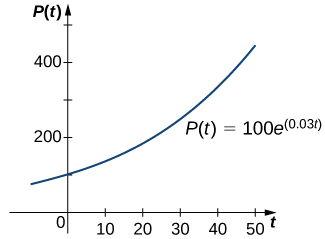
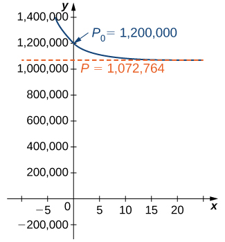
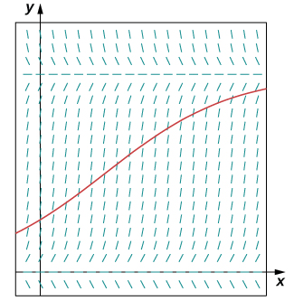
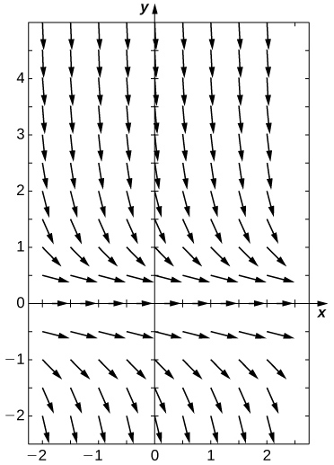
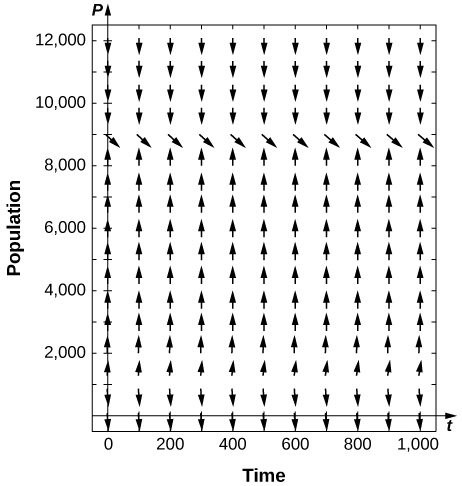
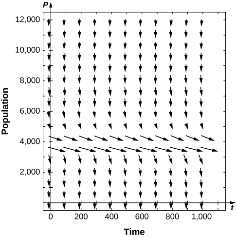
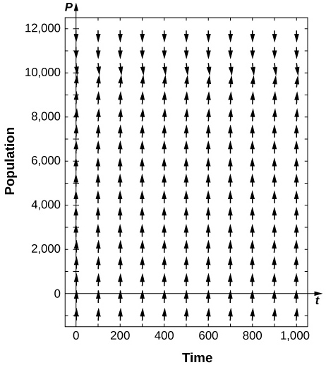

* Describe the concept of environmental carrying capacity in the logistic model of population growth.
* Draw a direction field for a logistic equation and interpret the solution curves.
* Solve a logistic equation and interpret the results.

Differential equations can be used to represent the size of a population as it varies over time. We saw this in an earlier chapter in the section on exponential growth and decay, which is the simplest model. A more realistic model includes other factors that affect the growth of the population. In this section, we study the logistic differential equation and see how it applies to the study of population dynamics in the context of biology.

### Population Growth and Carrying Capacity

To model population growth using a differential equation, we first need to introduce some variables and relevant terms. The variable <math xmlns="http://www.w3.org/1998/Math/MathML"><mrow><mi>t</mi><mo>.</mo></mrow></math>

 will represent time. The units of time can be hours, days, weeks, months, or even years. Any given problem must specify the units used in that particular problem. The variable <math xmlns="http://www.w3.org/1998/Math/MathML"><mi>P</mi></math>

 will represent population. Since the population varies over time, it is understood to be a function of time. Therefore we use the notation <math xmlns="http://www.w3.org/1998/Math/MathML"><mrow><mi>P</mi><mrow><mo>(</mo><mi>t</mi><mo>)</mo></mrow></mrow></math>

 for the population as a function of time. If <math xmlns="http://www.w3.org/1998/Math/MathML"><mrow><mi>P</mi><mrow><mo>(</mo><mi>t</mi><mo>)</mo></mrow></mrow></math>

 is a differentiable function, then the first derivative <math xmlns="http://www.w3.org/1998/Math/MathML"><mrow><mfrac><mrow><mi>d</mi><mi>P</mi></mrow><mrow><mi>d</mi><mi>t</mi></mrow></mfrac></mrow></math>

 represents the instantaneous rate of change of the population as a function of time.

In [Exponential Growth and Decay](/m53651){: .target-chapter}, we studied the exponential growth and decay of populations and radioactive substances. An example of an exponential growth function is <math xmlns="http://www.w3.org/1998/Math/MathML"><mrow><mi>P</mi><mrow><mo>(</mo><mi>t</mi><mo>)</mo></mrow><mo>=</mo><msub><mi>P</mi><mn>0</mn></msub><msup><mi>e</mi><mrow><mi>r</mi><mi>t</mi></mrow></msup><mo>.</mo></mrow></math>

 In this function, <math xmlns="http://www.w3.org/1998/Math/MathML"><mrow><mi>P</mi><mrow><mo>(</mo><mi>t</mi><mo>)</mo></mrow></mrow></math>

 represents the population at time <math xmlns="http://www.w3.org/1998/Math/MathML"><mrow><mi>t</mi><mo>,</mo><msub><mi>P</mi><mn>0</mn></msub></mrow></math>

 represents the **initial population**{: data-type="term"} (population at time <math xmlns="http://www.w3.org/1998/Math/MathML"><mrow><mi>t</mi><mo>=</mo><mn>0</mn><mo stretchy="false">)</mo><mo>,</mo></mrow></math>

 and the constant <math xmlns="http://www.w3.org/1998/Math/MathML"><mrow><mi>r</mi><mo>&gt;</mo><mn>0</mn></mrow></math>

 is called the **growth rate**{: data-type="term"}. [\[link\]](#CNX_Calc_Figure_08_04_001) shows a graph of <math xmlns="http://www.w3.org/1998/Math/MathML"><mrow><mi>P</mi><mo stretchy="false">(</mo><mi>t</mi><mo stretchy="false">)</mo><mo>=</mo><mn>100</mn><msup><mi>e</mi><mrow><mn>0.03</mn><mi>t</mi></mrow></msup><mo>.</mo></mrow></math>

 Here <math xmlns="http://www.w3.org/1998/Math/MathML"><mrow><msub><mi>P</mi><mn>0</mn></msub><mo>=</mo><mn>100</mn></mrow></math>

 and <math xmlns="http://www.w3.org/1998/Math/MathML"><mrow><mi>r</mi><mo>=</mo><mn>0.03</mn><mo>.</mo></mrow></math>

 {: #CNX_Calc_Figure_08_04_001}

We can verify that the function <math xmlns="http://www.w3.org/1998/Math/MathML"><mrow><mi>P</mi><mrow><mo>(</mo><mi>t</mi><mo>)</mo></mrow><mo>=</mo><msub><mi>P</mi><mn>0</mn></msub><msup><mi>e</mi><mrow><mi>r</mi><mi>t</mi></mrow></msup></mrow></math>

 satisfies the initial-value problem

<math xmlns="http://www.w3.org/1998/Math/MathML"><mrow><mfrac><mrow><mi>d</mi><mi>P</mi></mrow><mrow><mi>d</mi><mi>t</mi></mrow></mfrac><mo>=</mo><mi>r</mi><mi>P</mi><mo>,</mo><mspace width="1em" /><mi>P</mi><mrow><mo>(</mo><mn>0</mn><mo>)</mo></mrow><mo>=</mo><msub><mi>P</mi><mn>0</mn></msub><mo>.</mo></mrow></math>

This differential equation has an interesting interpretation. The left-hand side represents the rate at which the population increases (or decreases). The right-hand side is equal to a positive constant multiplied by the current population. Therefore the differential equation states that the rate at which the population increases is proportional to the population at that point in time. Furthermore, it states that the constant of proportionality never changes.

One problem with this function is its prediction that as time goes on, the population grows without bound. This is unrealistic in a real-world setting. Various factors limit the rate of growth of a particular population, including birth rate, death rate, food supply, predators, and so on. The growth constant <math xmlns="http://www.w3.org/1998/Math/MathML"><mi>r</mi></math>

 usually takes into consideration the birth and death rates but none of the other factors, and it can be interpreted as a net (birth minus death) percent growth rate per unit time. A natural question to ask is whether the population growth rate stays constant, or whether it changes over time. Biologists have found that in many biological systems, the population grows until a certain steady-state population is reached. This possibility is not taken into account with exponential growth. However, the concept of carrying capacity allows for the possibility that in a given area, only a certain number of a given organism or animal can thrive without running into resource issues.

Definition

The **carrying capacity**{: data-type="term"} of an organism in a given environment is defined to be the maximum population of that organism that the environment can sustain indefinitely.

We use the variable <math xmlns="http://www.w3.org/1998/Math/MathML"><mi>K</mi></math>

 to denote the carrying capacity. The growth rate is represented by the variable <math xmlns="http://www.w3.org/1998/Math/MathML"><mi>r</mi><mo>.</mo></math>

 Using these variables, we can define the logistic differential equation.

Definition

Let <math xmlns="http://www.w3.org/1998/Math/MathML"><mi>K</mi></math>

 represent the carrying capacity for a particular organism in a given environment, and let <math xmlns="http://www.w3.org/1998/Math/MathML"><mi>r</mi></math>

 be a real number that represents the growth rate. The function <math xmlns="http://www.w3.org/1998/Math/MathML"><mrow><mi>P</mi><mrow><mo>(</mo><mi>t</mi><mo>)</mo></mrow></mrow></math>

 represents the population of this organism as a function of time <math xmlns="http://www.w3.org/1998/Math/MathML"><mrow><mi>t</mi><mo>,</mo></mrow></math>

 and the constant <math xmlns="http://www.w3.org/1998/Math/MathML"><mrow><msub><mi>P</mi><mn>0</mn></msub></mrow></math>

 represents the initial population (population of the organism at time <math xmlns="http://www.w3.org/1998/Math/MathML"><mrow><mi>t</mi><mo>=</mo><mn>0</mn><mo stretchy="false">)</mo><mo>.</mo></mrow></math>

 Then the **logistic differential equation**{: data-type="term"} is

<math xmlns="http://www.w3.org/1998/Math/MathML"><mrow><mfrac><mrow><mi>d</mi><mi>P</mi></mrow><mrow><mi>d</mi><mi>t</mi></mrow></mfrac><mo>=</mo><mi>r</mi><mi>P</mi><mrow><mo>(</mo><mrow><mn>1</mn><mo>−</mo><mfrac><mi>P</mi><mi>K</mi></mfrac></mrow><mo>)</mo></mrow><mo>−</mo><mo>=</mo><mi>r</mi><mi>P</mi><mo>.</mo></mrow></math>

See this [website][1] for more information on the logistic equation.

The logistic equation was first published by Pierre Verhulst in <math xmlns="http://www.w3.org/1998/Math/MathML"><mrow><mn>1845</mn><mo>.</mo></mrow></math>

 This differential equation can be coupled with the initial condition <math xmlns="http://www.w3.org/1998/Math/MathML"><mrow><mi>P</mi><mrow><mo>(</mo><mn>0</mn><mo>)</mo></mrow><mo>=</mo><msub><mi>P</mi><mn>0</mn></msub></mrow></math>

 to form an initial-value problem for <math xmlns="http://www.w3.org/1998/Math/MathML"><mrow><mi>P</mi><mrow><mo>(</mo><mi>t</mi><mo>)</mo></mrow><mo>.</mo></mrow></math>

Suppose that the initial population is small relative to the carrying capacity. Then <math xmlns="http://www.w3.org/1998/Math/MathML"><mrow><mfrac><mi>P</mi><mi>K</mi></mfrac></mrow></math>

 is small, possibly close to zero. Thus, the quantity in parentheses on the right-hand side of [\[link\]](#fs-id1170571555572) is close to <math xmlns="http://www.w3.org/1998/Math/MathML"><mn>1</mn><mo>,</mo></math>

 and the right-hand side of this equation is close to <math xmlns="http://www.w3.org/1998/Math/MathML"><mrow><mi>r</mi><mi>P</mi><mo>.</mo></mrow></math>

 If <math xmlns="http://www.w3.org/1998/Math/MathML"><mrow><mi>r</mi><mo>&gt;</mo><mn>0</mn><mo>,</mo></mrow></math>

 then the population grows rapidly, resembling exponential growth.

However, as the population grows, the ratio <math xmlns="http://www.w3.org/1998/Math/MathML"><mrow><mfrac><mi>P</mi><mi>K</mi></mfrac></mrow></math>

 also grows, because <math xmlns="http://www.w3.org/1998/Math/MathML"><mi>K</mi></math>

 is constant. If the population remains below the carrying capacity, then <math xmlns="http://www.w3.org/1998/Math/MathML"><mrow><mfrac><mi>P</mi><mi>K</mi></mfrac></mrow></math>

 is less than <math xmlns="http://www.w3.org/1998/Math/MathML"><mrow><mn>1</mn><mo>,</mo></mrow></math>

 so <math xmlns="http://www.w3.org/1998/Math/MathML"><mrow><mn>1</mn><mo>−</mo><mfrac><mi>P</mi><mi>K</mi></mfrac><mo>&gt;</mo><mn>0</mn><mo>.</mo></mrow></math>

 Therefore the right-hand side of [\[link\]](#fs-id1170571555572) is still positive, but the quantity in parentheses gets smaller, and the growth rate decreases as a result. If <math xmlns="http://www.w3.org/1998/Math/MathML"><mrow><mi>P</mi><mo>=</mo><mi>K</mi></mrow></math>

 then the right-hand side is equal to zero, and the population does not change.

Now suppose that the population starts at a value higher than the carrying capacity. Then <math xmlns="http://www.w3.org/1998/Math/MathML"><mrow><mfrac><mi>P</mi><mi>K</mi></mfrac><mo>&gt;</mo><mn>1</mn><mo>,</mo></mrow></math>

 and <math xmlns="http://www.w3.org/1998/Math/MathML"><mrow><mn>1</mn><mo>−</mo><mfrac><mi>P</mi><mi>K</mi></mfrac><mo>&lt;</mo><mn>0</mn><mo>.</mo></mrow></math>

 Then the right-hand side of [\[link\]](#fs-id1170571555572) is negative, and the population decreases. As long as <math xmlns="http://www.w3.org/1998/Math/MathML"><mrow><mi>P</mi><mo>&gt;</mo><mi>K</mi><mo>,</mo></mrow></math>

 the population decreases. It never actually reaches <math xmlns="http://www.w3.org/1998/Math/MathML"><mi>K</mi></math>

 because <math xmlns="http://www.w3.org/1998/Math/MathML"><mrow><mfrac><mrow><mi>d</mi><mi>P</mi></mrow><mrow><mi>d</mi><mi>t</mi></mrow></mfrac></mrow></math>

 will get smaller and smaller, but the population approaches the carrying capacity as <math xmlns="http://www.w3.org/1998/Math/MathML"><mi>t</mi></math>

 approaches infinity. This analysis can be represented visually by way of a phase line. A **phase line**{: data-type="term"} describes the general behavior of a solution to an autonomous differential equation, depending on the initial condition. For the case of a carrying capacity in the logistic equation, the phase line is as shown in [\[link\]](#CNX_Calc_Figure_08_04_002).

 ."){: #CNX_Calc_Figure_08_04_002}

This phase line shows that when <math xmlns="http://www.w3.org/1998/Math/MathML"><mi>P</mi></math>

 is less than zero or greater than <math xmlns="http://www.w3.org/1998/Math/MathML"><mrow><mi>K</mi><mo>,</mo></mrow></math>

 the population decreases over time. When <math xmlns="http://www.w3.org/1998/Math/MathML"><mi>P</mi></math>

 is between <math xmlns="http://www.w3.org/1998/Math/MathML"><mn>0</mn></math>

 and <math xmlns="http://www.w3.org/1998/Math/MathML"><mrow><mi>K</mi><mo>,</mo></mrow></math>

 the population increases over time.

Chapter Opener: Examining the Carrying Capacity of a Deer Population

"){:}

Let’s consider the population of white-tailed deer (*Odocoileus virginianus*) in the state of Kentucky. The Kentucky Department of Fish and Wildlife Resources (KDFWR) sets guidelines for hunting and fishing in the state. Before the hunting season of <math xmlns="http://www.w3.org/1998/Math/MathML"><mrow><mn>2004</mn><mo>,</mo></mrow></math>

 it estimated a population of <math xmlns="http://www.w3.org/1998/Math/MathML"><mrow><mn>900,000</mn></mrow></math>

 deer. Johnson notes: “A deer population that has plenty to eat and is not hunted by humans or other predators will double every three years.” (George Johnson, “The Problem of Exploding Deer Populations Has No Attractive Solutions,” January <math xmlns="http://www.w3.org/1998/Math/MathML"><mrow><mn>12</mn><mo>,</mo><mn>2001</mn><mo>,</mo></mrow></math>

 accessed April 9, 2015, http://www.txtwriter.com/onscience/Articles/deerpops.html.) This observation corresponds to a rate of increase <math xmlns="http://www.w3.org/1998/Math/MathML"><mrow><mi>r</mi><mo>=</mo><mfrac><mrow><mtext>ln</mtext><mrow><mo>(</mo><mn>2</mn><mo>)</mo></mrow></mrow><mn>3</mn></mfrac><mo>=</mo><mn>0.2311</mn><mo>,</mo></mrow></math>

 so the approximate growth rate is <math xmlns="http://www.w3.org/1998/Math/MathML"><mrow><mn>23.11</mn><mtext>%</mtext></mrow></math>

 per year*.* (This assumes that the population grows exponentially, which is reasonable––at least in the short term––with plentiful food supply and no predators.) The KDFWR also reports deer population densities for <math xmlns="http://www.w3.org/1998/Math/MathML"><mrow><mn>32</mn></mrow></math>

 counties in Kentucky, the average of which is approximately <math xmlns="http://www.w3.org/1998/Math/MathML"><mrow><mn>27</mn></mrow></math>

 deer per square mile. Suppose this is the deer density for the whole state <math xmlns="http://www.w3.org/1998/Math/MathML"><mrow><mo stretchy="false">(</mo><mn>39,732</mn></mrow></math>

 square miles). The carrying capacity <math xmlns="http://www.w3.org/1998/Math/MathML"><mi>K</mi></math>

 is <math xmlns="http://www.w3.org/1998/Math/MathML"><mrow><mn>39,732</mn></mrow></math>

 square miles times <math xmlns="http://www.w3.org/1998/Math/MathML"><mrow><mn>27</mn></mrow></math>

 deer per square mile, or <math xmlns="http://www.w3.org/1998/Math/MathML"><mrow><mn>1,072,764</mn></mrow></math>

 deer*.*

1.  For this application, we have
    <math xmlns="http://www.w3.org/1998/Math/MathML"><mrow><msub><mi>P</mi><mn>0</mn></msub><mo>=</mo><mn>900,000</mn><mo>,</mo><mi>K</mi><mo>=</mo><mn>1,072,764</mn><mo>,</mo></mrow></math>
    
    and
    <math xmlns="http://www.w3.org/1998/Math/MathML"><mrow><mi>r</mi><mo>=</mo><mn>0.2311</mn><mo>.</mo></mrow></math>
    
    Substitute these values into [[link]](#fs-id1170571555572) and form the initial-value problem.
2.  Solve the initial-value problem from part a.
3.  According to this model, what will be the population in
    <math xmlns="http://www.w3.org/1998/Math/MathML"><mn>3</mn></math>
    
    years? Recall that the doubling time predicted by Johnson for the deer population was
    <math xmlns="http://www.w3.org/1998/Math/MathML"><mn>3</mn></math>
    
    years. How do these values compare?
4.  Suppose the population managed to reach
    <math xmlns="http://www.w3.org/1998/Math/MathML"><mrow><mn>1,200,000</mn></mrow></math>
    
    deer. What does the logistic equation predict will happen to the population in this scenario?
{: data-number-style="lower-alpha"}

1.  The initial value problem is
    * * *
    {: data-type="newline"}
    
    <math xmlns="http://www.w3.org/1998/Math/MathML"><mrow><mfrac><mrow><mi>d</mi><mi>P</mi></mrow><mrow><mi>d</mi><mi>t</mi></mrow></mfrac><mo>=</mo><mn>0.2311</mn><mi>P</mi><mrow><mo>(</mo><mrow><mn>1</mn><mo>−</mo><mfrac><mi>P</mi><mrow><mn>1,072,764</mn></mrow></mfrac></mrow><mo>)</mo></mrow><mo>,</mo><mspace width="1em" /><mi>P</mi><mrow><mo>(</mo><mn>0</mn><mo>)</mo></mrow><mo>=</mo><mn>900,000.</mn></mrow></math>

2.  The logistic equation is an autonomous differential equation, so we can use the method of separation of variables.
    * * *
    {: data-type="newline"}
    
    Step 1: Setting the right-hand side equal to zero gives
    <math xmlns="http://www.w3.org/1998/Math/MathML"><mrow><mi>P</mi><mo>=</mo><mn>0</mn></mrow></math>
    
    and
    <math xmlns="http://www.w3.org/1998/Math/MathML"><mrow><mi>P</mi><mo>=</mo><mn>1,072,764</mn><mo>.</mo></mrow></math>
    
    This means that if the population starts at zero it will never change, and if it starts at the carrying capacity, it will never change.
    * * *
    {: data-type="newline"}
    
    Step 2: Rewrite the differential equation and multiply both sides by:
    * * *
    {: data-type="newline"}
    
    

    <math xmlns="http://www.w3.org/1998/Math/MathML"><mtable><mtr><mtd columnalign="right"><mfrac><mrow><mi>d</mi><mi>P</mi></mrow><mrow><mi>d</mi><mi>t</mi></mrow></mfrac></mtd><mtd columnalign="left"><mo>=</mo></mtd><mtd columnalign="left"><mn>0.2311</mn><mi>P</mi><mrow><mo>(</mo><mrow><mfrac><mrow><mn>1,072,764</mn><mo>−</mo><mi>P</mi></mrow><mrow><mn>1,072,764</mn></mrow></mfrac></mrow><mo>)</mo></mrow></mtd></mtr><mtr><mtd columnalign="right"><mi>d</mi><mi>P</mi></mtd><mtd columnalign="left"><mo>=</mo></mtd><mtd columnalign="left"><mn>0.2311</mn><mi>P</mi><mrow><mo>(</mo><mrow><mfrac><mrow><mn>1,072,764</mn><mo>−</mo><mi>P</mi></mrow><mrow><mn>1,072,764</mn></mrow></mfrac></mrow><mo>)</mo></mrow><mspace width="0.1em" /><mi>d</mi><mi>t</mi><mo>.</mo></mtd></mtr></mtable></math>
    

    
    * * *
    {: data-type="newline"}
    
    Divide both sides by
    <math xmlns="http://www.w3.org/1998/Math/MathML"><mrow><mi>P</mi><mrow><mo>(</mo><mrow><mn>1,072,764</mn><mo>−</mo><mi>P</mi></mrow><mo>)</mo></mrow><mtext>:</mtext></mrow></math>
    
    * * *
    {: data-type="newline"}
    
    

    <math xmlns="http://www.w3.org/1998/Math/MathML"><mrow><mfrac><mrow><mi>d</mi><mi>P</mi></mrow><mrow><mi>P</mi><mrow><mo>(</mo><mrow><mn>1,072,764</mn><mo>−</mo><mi>P</mi></mrow><mo>)</mo></mrow></mrow></mfrac><mo>=</mo><mfrac><mrow><mn>0.2311</mn></mrow><mrow><mn>1,072,764</mn></mrow></mfrac><mi>d</mi><mi>t</mi><mo>.</mo></mrow></math>
    

    
    * * *
    {: data-type="newline"}
    
    Step 3: Integrate both sides of the equation using partial fraction decomposition:
    * * *
    {: data-type="newline"}
    
    

    <math xmlns="http://www.w3.org/1998/Math/MathML"><mtable><mtr><mtd columnalign="right"><mstyle displaystyle="true"><mrow><mo stretchy="true">∫</mo><mrow><mfrac><mrow><mi>d</mi><mi>P</mi></mrow><mrow><mi>P</mi><mrow><mo>(</mo><mrow><mn>1,072,764</mn><mo>−</mo><mi>P</mi></mrow><mo>)</mo></mrow></mrow></mfrac></mrow></mrow></mstyle></mtd><mtd columnalign="left"><mo>=</mo></mtd><mtd columnalign="left"><mstyle displaystyle="true"><mrow><mo stretchy="true">∫</mo><mrow><mfrac><mrow><mn>0.2311</mn></mrow><mrow><mn>1,072,764</mn></mrow></mfrac><mi>d</mi><mi>t</mi></mrow></mrow></mstyle></mtd></mtr><mtr><mtd columnalign="right"><mfrac><mn>1</mn><mrow><mn>1,072,764</mn></mrow></mfrac><mstyle displaystyle="true"><mrow><mo stretchy="true">∫</mo><mrow><mrow><mo>(</mo><mrow><mfrac><mn>1</mn><mi>P</mi></mfrac><mo>+</mo><mfrac><mn>1</mn><mrow><mn>1,072,764</mn><mo>−</mo><mi>P</mi></mrow></mfrac></mrow><mo>)</mo></mrow><mspace width="0.1em" /><mi>d</mi><mi>P</mi></mrow></mrow></mstyle></mtd><mtd columnalign="left"><mo>=</mo></mtd><mtd columnalign="left"><mfrac><mrow><mn>0.2311</mn><mi>t</mi></mrow><mrow><mn>1,072,764</mn></mrow></mfrac><mo>+</mo><mi>C</mi></mtd></mtr><mtr><mtd columnalign="right"><mfrac><mn>1</mn><mrow><mn>1,072,764</mn></mrow></mfrac><mspace width="0.1em" /><mrow><mo>(</mo><mrow><mtext>ln</mtext><mrow><mo>\|</mo><mi>P</mi><mo>\|</mo></mrow><mo>−</mo><mtext>ln</mtext><mrow><mo>\|</mo><mrow><mn>1,072,764</mn><mo>−</mo><mi>P</mi></mrow><mo>\|</mo></mrow></mrow><mo>)</mo></mrow></mtd><mtd columnalign="left"><mo>=</mo></mtd><mtd columnalign="left"><mfrac><mrow><mn>0.2311</mn><mi>t</mi></mrow><mrow><mn>1,072,764</mn></mrow></mfrac><mo>+</mo><mi>C</mi><mo>.</mo></mtd></mtr></mtable></math>
    

    
    * * *
    {: data-type="newline"}
    
    Step 4: Multiply both sides by
    <math xmlns="http://www.w3.org/1998/Math/MathML"><mrow><mn>1,072,764</mn></mrow></math>
    
    and use the quotient rule for logarithms:
    * * *
    {: data-type="newline"}
    
    

    <math xmlns="http://www.w3.org/1998/Math/MathML"><mrow><mtext>ln</mtext><mrow><mo>\|</mo><mrow><mfrac><mi>P</mi><mrow><mn>1,072,764</mn><mo>−</mo><mi>P</mi></mrow></mfrac></mrow><mo>\|</mo></mrow><mo>=</mo><mn>0.2311</mn><mi>t</mi><mo>+</mo><msub><mi>C</mi><mn>1</mn></msub><mo>.</mo></mrow></math>
    

    
    * * *
    {: data-type="newline"}
    
    Here
    <math xmlns="http://www.w3.org/1998/Math/MathML"><mrow><msub><mi>C</mi><mn>1</mn></msub><mo>=</mo><mn>1,072,764</mn><mi>C</mi><mo>.</mo></mrow></math>
    
    Next exponentiate both sides and eliminate the absolute value:
    * * *
    {: data-type="newline"}
    
    

    <math xmlns="http://www.w3.org/1998/Math/MathML"><mtable><mtr><mtd columnalign="right"><msup><mi>e</mi><mrow><mtext>ln</mtext><mrow><mo>\|</mo><mrow><mfrac><mi>P</mi><mrow><mn>1,072,764</mn><mo>−</mo><mi>P</mi></mrow></mfrac></mrow><mo>\|</mo></mrow></mrow></msup></mtd><mtd columnalign="left"><mo>=</mo></mtd><mtd columnalign="left"><msup><mi>e</mi><mrow><mn>0.2311</mn><mi>t</mi><mo>+</mo><msub><mi>C</mi><mn>1</mn></msub></mrow></msup></mtd></mtr><mtr><mtd columnalign="right"><mrow><mo>\|</mo><mrow><mfrac><mi>P</mi><mrow><mn>1,072,764</mn><mo>−</mo><mi>P</mi></mrow></mfrac></mrow><mo>\|</mo></mrow></mtd><mtd columnalign="left"><mo>=</mo></mtd><mtd columnalign="left"><msub><mi>C</mi><mn>2</mn></msub><msup><mi>e</mi><mrow><mn>0.2311</mn><mi>t</mi></mrow></msup></mtd></mtr><mtr><mtd columnalign="right"><mfrac><mi>P</mi><mrow><mn>1,072,764</mn><mo>−</mo><mi>P</mi></mrow></mfrac></mtd><mtd columnalign="left"><mo>=</mo></mtd><mtd columnalign="left"><msub><mi>C</mi><mn>2</mn></msub><msup><mi>e</mi><mrow><mn>0.2311</mn><mi>t</mi></mrow></msup><mo>.</mo></mtd></mtr></mtable></math>
    

    
    * * *
    {: data-type="newline"}
    
    Here
    <math xmlns="http://www.w3.org/1998/Math/MathML"><mrow><msub><mi>C</mi><mn>2</mn></msub><mo>=</mo><msup><mi>e</mi><mrow><msub><mi>C</mi><mn>1</mn></msub></mrow></msup></mrow></math>
    
    but after eliminating the absolute value, it can be negative as well. Now solve for:
    * * *
    {: data-type="newline"}
    
    

    <math xmlns="http://www.w3.org/1998/Math/MathML"><mtable><mtr><mtd columnalign="right"><mi>P</mi></mtd><mtd columnalign="left"><mo>=</mo></mtd><mtd columnalign="left"><msub><mi>C</mi><mn>2</mn></msub><msup><mi>e</mi><mrow><mn>0.2311</mn><mi>t</mi></mrow></msup><mrow><mo>(</mo><mrow><mn>1,072,764</mn><mo>−</mo><mi>P</mi></mrow><mo>)</mo></mrow><mo>.</mo></mtd></mtr><mtr><mtd columnalign="right"><mi>P</mi></mtd><mtd columnalign="left"><mo>=</mo></mtd><mtd columnalign="left"><mn>1,072,764</mn><msub><mi>C</mi><mn>2</mn></msub><msup><mi>e</mi><mrow><mn>0.2311</mn><mi>t</mi></mrow></msup><mo>−</mo><msub><mi>C</mi><mn>2</mn></msub><mi>P</mi><msup><mi>e</mi><mrow><mn>0.2311</mn><mi>t</mi></mrow></msup></mtd></mtr><mtr><mtd columnalign="right"><mi>P</mi><mo>+</mo><msub><mi>C</mi><mn>2</mn></msub><mi>P</mi><msup><mi>e</mi><mrow><mn>0.2311</mn><mi>t</mi></mrow></msup></mtd><mtd columnalign="left"><mo>=</mo></mtd><mtd columnalign="left"><mn>1,072,764</mn><msub><mi>C</mi><mn>2</mn></msub><msup><mi>e</mi><mrow><mn>0.2311</mn><mi>t</mi></mrow></msup></mtd></mtr><mtr><mtd columnalign="right"><mi>P</mi><mrow><mo>(</mo><mrow><mn>1</mn><mo>+</mo><msub><mi>C</mi><mn>2</mn></msub><msup><mi>e</mi><mrow><mn>0.2311</mn><mi>t</mi></mrow></msup></mrow><mo>)</mo></mrow></mtd><mtd columnalign="left"><mo>=</mo></mtd><mtd columnalign="left"><mn>1,072,764</mn><msub><mi>C</mi><mn>2</mn></msub><msup><mi>e</mi><mrow><mn>0.2311</mn><mi>t</mi></mrow></msup></mtd></mtr><mtr><mtd columnalign="right"><mi>P</mi><mrow><mo>(</mo><mi>t</mi><mo>)</mo></mrow></mtd><mtd columnalign="left"><mo>=</mo></mtd><mtd columnalign="left"><mfrac><mrow><mn>1,072,764</mn><msub><mi>C</mi><mn>2</mn></msub><msup><mi>e</mi><mrow><mn>0.2311</mn><mi>t</mi></mrow></msup></mrow><mrow><mn>1</mn><mo>+</mo><msub><mi>C</mi><mn>2</mn></msub><msup><mi>e</mi><mrow><mn>0.2311</mn><mi>t</mi></mrow></msup></mrow></mfrac><mo>.</mo></mtd></mtr></mtable></math>
    

    
    * * *
    {: data-type="newline"}
    
    Step 5: To determine the value of
    <math xmlns="http://www.w3.org/1998/Math/MathML"><mrow><msub><mi>C</mi><mn>2</mn></msub><mo>,</mo></mrow></math>
    
    it is actually easier to go back a couple of steps to where
    <math xmlns="http://www.w3.org/1998/Math/MathML"><mrow><msub><mi>C</mi><mn>2</mn></msub></mrow></math>
    
    was defined. In particular, use the equation
    * * *
    {: data-type="newline"}
    
    

    <math xmlns="http://www.w3.org/1998/Math/MathML"><mrow><mfrac><mi>P</mi><mrow><mn>1,072,764</mn><mo>−</mo><mi>P</mi></mrow></mfrac><mo>=</mo><msub><mi>C</mi><mn>2</mn></msub><msup><mi>e</mi><mrow><mn>0.2311</mn><mi>t</mi></mrow></msup><mo>.</mo></mrow></math>
    

    
    * * *
    {: data-type="newline"}
    
    The initial condition is
    <math xmlns="http://www.w3.org/1998/Math/MathML"><mrow><mi>P</mi><mrow><mo>(</mo><mn>0</mn><mo>)</mo></mrow><mo>=</mo><mn>900,000</mn><mo>.</mo></mrow></math>
    
    Replace
    <math xmlns="http://www.w3.org/1998/Math/MathML"><mi>P</mi></math>
    
    with
    <math xmlns="http://www.w3.org/1998/Math/MathML"><mrow><mn>900,000</mn></mrow></math>
    
    and
    <math xmlns="http://www.w3.org/1998/Math/MathML"><mi>t</mi></math>
    
    with zero:
    * * *
    {: data-type="newline"}
    
    

    <math xmlns="http://www.w3.org/1998/Math/MathML"><mtable><mtr><mtd columnalign="right"><mfrac><mi>P</mi><mrow><mn>1,072,764</mn><mo>−</mo><mi>P</mi></mrow></mfrac></mtd><mtd columnalign="left"><mo>=</mo></mtd><mtd columnalign="left"><msub><mi>C</mi><mn>2</mn></msub><msup><mi>e</mi><mrow><mn>0.2311</mn><mi>t</mi></mrow></msup></mtd></mtr><mtr><mtd columnalign="right"><mfrac><mrow><mn>900,000</mn></mrow><mrow><mn>1,072,764</mn><mo>−</mo><mn>900,000</mn></mrow></mfrac></mtd><mtd columnalign="left"><mo>=</mo></mtd><mtd columnalign="left"><msub><mi>C</mi><mn>2</mn></msub><msup><mi>e</mi><mrow><mn>0.2311</mn><mrow><mo>(</mo><mn>0</mn><mo>)</mo></mrow></mrow></msup></mtd></mtr><mtr><mtd columnalign="right"><mfrac><mrow><mn>900,000</mn></mrow><mrow><mn>172,764</mn></mrow></mfrac></mtd><mtd columnalign="left"><mo>=</mo></mtd><mtd columnalign="left"><msub><mi>C</mi><mn>2</mn></msub></mtd></mtr><mtr><mtd columnalign="right"><msub><mi>C</mi><mn>2</mn></msub></mtd><mtd columnalign="left"><mo>=</mo></mtd><mtd columnalign="left"><mfrac><mrow><mn>25,000</mn></mrow><mrow><mn>4,799</mn></mrow></mfrac><mo>≈</mo><mn>5.209</mn><mo>.</mo></mtd></mtr></mtable></math>
    

    
    * * *
    {: data-type="newline"}
    
    Therefore
    * * *
    {: data-type="newline"}
    
    

    <math xmlns="http://www.w3.org/1998/Math/MathML"><mtable><mtr><mtd columnalign="right"><mi>P</mi><mrow><mo>(</mo><mi>t</mi><mo>)</mo></mrow></mtd><mtd columnalign="left"><mo>=</mo><mfrac><mrow><mn>1,072,764</mn><mrow><mo>(</mo><mrow><mfrac><mrow><mn>25000</mn></mrow><mrow><mn>4799</mn></mrow></mfrac></mrow><mo>)</mo></mrow><mspace width="0.1em" /><msup><mi>e</mi><mrow><mn>0.2311</mn><mi>t</mi></mrow></msup></mrow><mrow><mn>1</mn><mo>+</mo><mrow><mo>(</mo><mrow><mfrac><mrow><mn>25000</mn></mrow><mrow><mn>4799</mn></mrow></mfrac></mrow><mo>)</mo></mrow><mspace width="0.1em" /><msup><mi>e</mi><mrow><mn>0.2311</mn><mi>t</mi></mrow></msup></mrow></mfrac></mtd></mtr><mtr><mtd /><mtd columnalign="left"><mo>=</mo><mfrac><mrow><mn>1,072,764</mn><mrow><mo>(</mo><mrow><mn>25000</mn></mrow><mo>)</mo></mrow><msup><mi>e</mi><mrow><mn>0.2311</mn><mi>t</mi></mrow></msup></mrow><mrow><mn>4799</mn><mo>+</mo><mn>25000</mn><msup><mi>e</mi><mrow><mn>0.2311</mn><mi>t</mi></mrow></msup></mrow></mfrac><mo>.</mo></mtd></mtr></mtable></math>
    

    
    * * *
    {: data-type="newline"}
    
    Dividing the numerator and denominator by
    <math xmlns="http://www.w3.org/1998/Math/MathML"><mrow><mn>25,000</mn></mrow></math>
    
    gives
    * * *
    {: data-type="newline"}
    
    

    <math xmlns="http://www.w3.org/1998/Math/MathML"><mrow><mi>P</mi><mrow><mo>(</mo><mi>t</mi><mo>)</mo></mrow><mo>=</mo><mfrac><mrow><mn>1,072,764</mn><msup><mi>e</mi><mrow><mn>0.2311</mn><mi>t</mi></mrow></msup></mrow><mrow><mn>0.19196</mn><mo>+</mo><msup><mi>e</mi><mrow><mn>0.2311</mn><mi>t</mi></mrow></msup></mrow></mfrac><mo>.</mo></mrow></math>
    

    
    * * *
    {: data-type="newline"}
    
    [[link]](#CNX_Calc_Figure_08_04_004) is a graph of this equation.
    * * *
    {: data-type="newline"}
    
    {: #CNX_Calc_Figure_08_04_004}

3.  Using this model we can predict the population in
    <math xmlns="http://www.w3.org/1998/Math/MathML"><mn>3</mn></math>
    
    years.
    * * *
    {: data-type="newline"}
    
    

    <math xmlns="http://www.w3.org/1998/Math/MathML"><mrow><mi>P</mi><mrow><mo>(</mo><mn>3</mn><mo>)</mo></mrow><mo>=</mo><mfrac><mrow><mn>1,072,764</mn><msup><mi>e</mi><mrow><mn>0.2311</mn><mrow><mo>(</mo><mn>3</mn><mo>)</mo></mrow></mrow></msup></mrow><mrow><mn>0.19196</mn><mo>+</mo><msup><mi>e</mi><mrow><mn>0.2311</mn><mo stretchy="false">(</mo><mn>3</mn><mo stretchy="false">)</mo></mrow></msup></mrow></mfrac><mo>≈</mo><mn>978,830</mn><mspace width="0.2em" /><mtext>deer</mtext></mrow></math>
    

    
    * * *
    {: data-type="newline"}
    
    This is far short of twice the initial population of
    <math xmlns="http://www.w3.org/1998/Math/MathML"><mrow><mn>900,000</mn><mo>.</mo></mrow></math>
    
    Remember that the doubling time is based on the assumption that the growth rate never changes, but the logistic model takes this possibility into account.
4.  If the population reached
    <math xmlns="http://www.w3.org/1998/Math/MathML"><mrow><mn>1,200,000</mn></mrow></math>
    
    deer, then the new initial-value problem would be
    * * *
    {: data-type="newline"}
    
    

    <math xmlns="http://www.w3.org/1998/Math/MathML"><mrow><mfrac><mrow><mi>d</mi><mi>P</mi></mrow><mrow><mi>d</mi><mi>t</mi></mrow></mfrac><mo>=</mo><mn>0.2311</mn><mi>P</mi><mrow><mo>(</mo><mrow><mn>1</mn><mo>−</mo><mfrac><mi>P</mi><mrow><mn>1,072,764</mn></mrow></mfrac></mrow><mo>)</mo></mrow><mo>,</mo><mspace width="1em" /><mi>P</mi><mrow><mo>(</mo><mn>0</mn><mo>)</mo></mrow><mo>=</mo><mn>1,200,000.</mn></mrow></math>
    

    
    * * *
    {: data-type="newline"}
    
    The general solution to the differential equation would remain the same.
    * * *
    {: data-type="newline"}
    
    

    <math xmlns="http://www.w3.org/1998/Math/MathML"><mrow><mi>P</mi><mrow><mo>(</mo><mi>t</mi><mo>)</mo></mrow><mo>=</mo><mfrac><mrow><mn>1,072,764</mn><msub><mi>C</mi><mn>2</mn></msub><msup><mi>e</mi><mrow><mn>0.2311</mn><mi>t</mi></mrow></msup></mrow><mrow><mn>1</mn><mo>+</mo><msub><mi>C</mi><mn>2</mn></msub><msup><mi>e</mi><mrow><mn>0.2311</mn><mi>t</mi></mrow></msup></mrow></mfrac></mrow></math>
    

    
    * * *
    {: data-type="newline"}
    
    To determine the value of the constant, return to the equation
    * * *
    {: data-type="newline"}
    
    

    <math xmlns="http://www.w3.org/1998/Math/MathML"><mrow><mfrac><mi>P</mi><mrow><mn>1,072,764</mn><mo>−</mo><mi>P</mi></mrow></mfrac><mo>=</mo><msub><mi>C</mi><mn>2</mn></msub><msup><mi>e</mi><mrow><mn>0.2311</mn><mi>t</mi></mrow></msup><mo>.</mo></mrow></math>
    

    
    * * *
    {: data-type="newline"}
    
    Substituting the values
    <math xmlns="http://www.w3.org/1998/Math/MathML"><mrow><mi>t</mi><mo>=</mo><mn>0</mn></mrow></math>
    
    and
    <math xmlns="http://www.w3.org/1998/Math/MathML"><mrow><mi>P</mi><mo>=</mo><mn>1,200,000</mn><mo>,</mo></mrow></math>
    
    you get
    * * *
    {: data-type="newline"}
    
    

    <math xmlns="http://www.w3.org/1998/Math/MathML"><mtable><mtr><mtd columnalign="right"><msub><mi>C</mi><mn>2</mn></msub><msup><mi>e</mi><mrow><mn>0.2311</mn><mrow><mo>(</mo><mn>0</mn><mo>)</mo></mrow></mrow></msup></mtd><mtd columnalign="left"><mo>=</mo></mtd><mtd columnalign="left"><mfrac><mrow><mn>1,200,000</mn></mrow><mrow><mn>1,072,764</mn><mo>−</mo><mn>1,200,000</mn></mrow></mfrac></mtd></mtr><mtr><mtd columnalign="right"><msub><mi>C</mi><mn>2</mn></msub></mtd><mtd columnalign="left"><mo>=</mo></mtd><mtd columnalign="left"><mo>−</mo><mfrac><mrow><mn>100,000</mn></mrow><mrow><mn>10,603</mn></mrow></mfrac><mo>≈</mo><mo>−</mo><mn>9.431</mn><mo>.</mo></mtd></mtr></mtable></math>
    

    
    * * *
    {: data-type="newline"}
    
    Therefore
    * * *
    {: data-type="newline"}
    
    

    <math xmlns="http://www.w3.org/1998/Math/MathML"><mtable><mtr><mtd columnalign="right"><mi>P</mi><mrow><mo>(</mo><mi>t</mi><mo>)</mo></mrow></mtd><mtd columnalign="left"><mo>=</mo><mfrac><mrow><mn>1,072,764</mn><msub><mi>C</mi><mn>2</mn></msub><msup><mi>e</mi><mrow><mn>0.2311</mn><mi>t</mi></mrow></msup></mrow><mrow><mn>1</mn><mo>+</mo><msub><mi>C</mi><mn>2</mn></msub><msup><mi>e</mi><mrow><mn>0.2311</mn><mi>t</mi></mrow></msup></mrow></mfrac></mtd></mtr><mtr><mtd /><mtd columnalign="left"><mo>=</mo><mfrac><mrow><mn>1,072,764</mn><mrow><mo>(</mo><mrow><mo>−</mo><mfrac><mrow><mn>100,000</mn></mrow><mrow><mn>10,603</mn></mrow></mfrac></mrow><mo>)</mo></mrow><mspace width="0.1em" /><msup><mi>e</mi><mrow><mn>0.2311</mn><mi>t</mi></mrow></msup></mrow><mrow><mn>1</mn><mo>+</mo><mrow><mo>(</mo><mrow><mo>−</mo><mfrac><mrow><mn>100,000</mn></mrow><mrow><mn>10,603</mn></mrow></mfrac></mrow><mo>)</mo></mrow><mspace width="0.1em" /><msup><mi>e</mi><mrow><mn>0.2311</mn><mi>t</mi></mrow></msup></mrow></mfrac></mtd></mtr><mtr><mtd /><mtd columnalign="left"><mo>=</mo><mo>−</mo><mfrac><mrow><mn>107,276,400,000</mn><msup><mi>e</mi><mrow><mn>0.2311</mn><mi>t</mi></mrow></msup></mrow><mrow><mn>100,000</mn><msup><mi>e</mi><mrow><mn>0.2311</mn><mi>t</mi></mrow></msup><mo>−</mo><mn>10,603</mn></mrow></mfrac></mtd></mtr><mtr><mtd /><mtd columnalign="left"><mo>≈</mo><mfrac><mrow><mn>10,117,551</mn><msup><mi>e</mi><mrow><mn>0.2311</mn><mi>t</mi></mrow></msup></mrow><mrow><mn>9.43129</mn><msup><mi>e</mi><mrow><mn>0.2311</mn><mi>t</mi></mrow></msup><mo>−</mo><mn>1</mn></mrow></mfrac><mo>.</mo></mtd></mtr></mtable></math>
    

    
    * * *
    {: data-type="newline"}
    
    This equation is graphed in [[link]](#CNX_Calc_Figure_08_04_005).
    * * *
    {: data-type="newline"}
    
    {: #CNX_Calc_Figure_08_04_005}

{: data-number-style="lower-alpha"}

### Solving the Logistic Differential Equation

The logistic differential equation is an autonomous differential equation, so we can use separation of variables to find the general solution, as we just did in [\[link\]](#fs-id1170572203846).

Step 1: Setting the right-hand side equal to zero leads to <math xmlns="http://www.w3.org/1998/Math/MathML"><mrow><mi>P</mi><mo>=</mo><mn>0</mn></mrow></math>

 and <math xmlns="http://www.w3.org/1998/Math/MathML"><mrow><mi>P</mi><mo>=</mo><mi>K</mi></mrow></math>

 as constant solutions. The first solution indicates that when there are no organisms present, the population will never grow. The second solution indicates that when the population starts at the carrying capacity, it will never change.

Step 2: Rewrite the differential equation in the form

<math xmlns="http://www.w3.org/1998/Math/MathML"><mrow><mfrac><mrow><mi>d</mi><mi>P</mi></mrow><mrow><mi>d</mi><mi>t</mi></mrow></mfrac><mo>=</mo><mfrac><mrow><mi>r</mi><mi>P</mi><mrow><mo>(</mo><mrow><mi>K</mi><mo>−</mo><mi>P</mi></mrow><mo>)</mo></mrow></mrow><mi>K</mi></mfrac><mo>.</mo></mrow></math>

Then multiply both sides by <math xmlns="http://www.w3.org/1998/Math/MathML"><mrow><mi>d</mi><mi>t</mi></mrow></math>

 and divide both sides by <math xmlns="http://www.w3.org/1998/Math/MathML"><mrow><mi>P</mi><mrow><mo>(</mo><mrow><mi>K</mi><mo>−</mo><mi>P</mi></mrow><mo>)</mo></mrow><mo>.</mo></mrow></math>

 This leads to

<math xmlns="http://www.w3.org/1998/Math/MathML"><mrow><mfrac><mrow><mi>d</mi><mi>P</mi></mrow><mrow><mi>P</mi><mrow><mo>(</mo><mrow><mi>K</mi><mo>−</mo><mi>P</mi></mrow><mo>)</mo></mrow></mrow></mfrac><mo>=</mo><mfrac><mi>r</mi><mi>K</mi></mfrac><mi>d</mi><mi>t</mi><mo>.</mo></mrow></math>

Multiply both sides of the equation by <math xmlns="http://www.w3.org/1998/Math/MathML"><mi>K</mi></math>

 and integrate:

<math xmlns="http://www.w3.org/1998/Math/MathML"><mrow><mstyle displaystyle="true"><mrow><mo stretchy="true">∫</mo><mrow><mfrac><mi>K</mi><mrow><mi>P</mi><mrow><mo>(</mo><mrow><mi>K</mi><mo>−</mo><mi>P</mi></mrow><mo>)</mo></mrow></mrow></mfrac><mi>d</mi><mi>P</mi></mrow></mrow></mstyle><mo>=</mo><mstyle displaystyle="true"><mrow><mo stretchy="true">∫</mo><mi>r</mi></mrow></mstyle><mi>d</mi><mi>t</mi><mo>.</mo></mrow></math>

The left-hand side of this equation can be integrated using partial fraction decomposition. We leave it to you to verify that

<math xmlns="http://www.w3.org/1998/Math/MathML"><mrow><mfrac><mi>K</mi><mrow><mi>P</mi><mrow><mo>(</mo><mrow><mi>K</mi><mo>−</mo><mi>P</mi></mrow><mo>)</mo></mrow></mrow></mfrac><mo>=</mo><mfrac><mn>1</mn><mi>P</mi></mfrac><mo>+</mo><mfrac><mn>1</mn><mrow><mi>K</mi><mo>−</mo><mi>P</mi></mrow></mfrac><mo>.</mo></mrow></math>

Then the equation becomes

<math xmlns="http://www.w3.org/1998/Math/MathML"><mtable><mtr><mtd columnalign="right"><mstyle displaystyle="true"><mrow><mo stretchy="true">∫</mo><mrow><mfrac><mn>1</mn><mi>P</mi></mfrac><mo>+</mo><mfrac><mn>1</mn><mrow><mi>K</mi><mo>−</mo><mi>P</mi></mrow></mfrac><mi>d</mi><mi>P</mi></mrow></mrow></mstyle></mtd><mtd columnalign="left"><mo>=</mo></mtd><mtd columnalign="left"><mstyle displaystyle="true"><mrow><mo>∫</mo><mrow><mi>r</mi><mi>d</mi><mi>t</mi></mrow></mrow></mstyle></mtd></mtr><mtr><mtd columnalign="right"><mtext>ln</mtext><mrow><mo>\|</mo><mi>P</mi><mo>\|</mo></mrow><mo>−</mo><mtext>ln</mtext><mrow><mo>\|</mo><mrow><mi>K</mi><mo>−</mo><mi>P</mi></mrow><mo>\|</mo></mrow></mtd><mtd columnalign="left"><mo>=</mo></mtd><mtd columnalign="left"><mi>r</mi><mi>t</mi><mo>+</mo><mi>C</mi></mtd></mtr><mtr><mtd columnalign="right"><mtext>ln</mtext><mrow><mo>\|</mo><mrow><mfrac><mi>P</mi><mrow><mi>K</mi><mo>−</mo><mi>P</mi></mrow></mfrac></mrow><mo>\|</mo></mrow></mtd><mtd columnalign="left"><mo>=</mo></mtd><mtd columnalign="left"><mi>r</mi><mi>t</mi><mo>+</mo><mi>C</mi><mo>.</mo></mtd></mtr></mtable></math>

Now exponentiate both sides of the equation to eliminate the natural logarithm:

<math xmlns="http://www.w3.org/1998/Math/MathML"><mtable><mtr><mtd columnalign="right"><msup><mi>e</mi><mrow><mtext>ln</mtext><mrow><mo>\|</mo><mrow><mfrac><mi>P</mi><mrow><mi>K</mi><mo>−</mo><mi>P</mi></mrow></mfrac></mrow><mo>\|</mo></mrow></mrow></msup></mtd><mtd columnalign="left"><mo>=</mo></mtd><mtd columnalign="left"><msup><mi>e</mi><mrow><mi>r</mi><mi>t</mi><mo>+</mo><mi>C</mi></mrow></msup></mtd></mtr><mtr><mtd columnalign="right"><mrow><mo>\|</mo><mrow><mfrac><mi>P</mi><mrow><mi>K</mi><mo>−</mo><mi>P</mi></mrow></mfrac></mrow><mo>\|</mo></mrow></mtd><mtd columnalign="left"><mo>=</mo></mtd><mtd columnalign="left"><msup><mi>e</mi><mi>C</mi></msup><msup><mi>e</mi><mrow><mi>r</mi><mi>t</mi></mrow></msup><mo>.</mo></mtd></mtr></mtable></math>

We define <math xmlns="http://www.w3.org/1998/Math/MathML"><mrow><msub><mi>C</mi><mn>1</mn></msub><mo>=</mo><msup><mi>e</mi><mi>c</mi></msup></mrow></math>

 so that the equation becomes

<math xmlns="http://www.w3.org/1998/Math/MathML"><mrow><mfrac><mi>P</mi><mrow><mi>K</mi><mo>−</mo><mi>P</mi></mrow></mfrac><mo>=</mo><msub><mi>C</mi><mn>1</mn></msub><msup><mi>e</mi><mrow><mi>r</mi><mi>t</mi></mrow></msup><mo>.</mo></mrow></math>

To solve this equation for <math xmlns="http://www.w3.org/1998/Math/MathML"><mrow><mi>P</mi><mrow><mo>(</mo><mi>t</mi><mo>)</mo></mrow><mo>,</mo></mrow></math>

 first multiply both sides by <math xmlns="http://www.w3.org/1998/Math/MathML"><mrow><mi>K</mi><mo>−</mo><mi>P</mi></mrow></math>

 and collect the terms containing <math xmlns="http://www.w3.org/1998/Math/MathML"><mi>P</mi></math>

 on the left-hand side of the equation:

<math xmlns="http://www.w3.org/1998/Math/MathML"><mtable><mtr><mtd columnalign="right"><mi>P</mi></mtd><mtd columnalign="left"><mo>=</mo></mtd><mtd columnalign="left"><msub><mi>C</mi><mn>1</mn></msub><msup><mi>e</mi><mrow><mi>r</mi><mi>t</mi></mrow></msup><mrow><mo>(</mo><mrow><mi>K</mi><mo>−</mo><mi>P</mi></mrow><mo>)</mo></mrow></mtd></mtr><mtr><mtd columnalign="right"><mi>P</mi></mtd><mtd columnalign="left"><mo>=</mo></mtd><mtd columnalign="left"><msub><mi>C</mi><mn>1</mn></msub><mi>K</mi><msup><mi>e</mi><mrow><mi>r</mi><mi>t</mi></mrow></msup><mo>−</mo><msub><mi>C</mi><mn>1</mn></msub><mi>P</mi><msup><mi>e</mi><mrow><mi>r</mi><mi>t</mi></mrow></msup></mtd></mtr><mtr><mtd columnalign="right"><mi>P</mi><mo>+</mo><msub><mi>C</mi><mn>1</mn></msub><mi>P</mi><msup><mi>e</mi><mrow><mi>r</mi><mi>t</mi></mrow></msup></mtd><mtd columnalign="left"><mo>=</mo></mtd><mtd columnalign="left"><msub><mi>C</mi><mn>1</mn></msub><mi>K</mi><msup><mi>e</mi><mrow><mi>r</mi><mi>t</mi></mrow></msup><mo>.</mo></mtd></mtr></mtable></math>

Next, factor <math xmlns="http://www.w3.org/1998/Math/MathML"><mi>P</mi></math>

 from the left-hand side and divide both sides by the other factor:

<math xmlns="http://www.w3.org/1998/Math/MathML"><mtable><mtr><mtd columnalign="right"><mi>P</mi><mrow><mo>(</mo><mrow><mn>1</mn><mo>+</mo><msub><mi>C</mi><mn>1</mn></msub><msup><mi>e</mi><mrow><mi>r</mi><mi>t</mi></mrow></msup></mrow><mo>)</mo></mrow></mtd><mtd columnalign="left"><mo>=</mo></mtd><mtd columnalign="left"><msub><mi>C</mi><mn>1</mn></msub><mi>K</mi><msup><mi>e</mi><mrow><mi>r</mi><mi>t</mi></mrow></msup></mtd></mtr><mtr><mtd columnalign="right"><mi>P</mi><mrow><mo>(</mo><mi>t</mi><mo>)</mo></mrow></mtd><mtd columnalign="left"><mo>=</mo></mtd><mtd columnalign="left"><mfrac><mrow><msub><mi>C</mi><mn>1</mn></msub><mi>K</mi><msup><mi>e</mi><mrow><mi>r</mi><mi>t</mi></mrow></msup></mrow><mrow><mn>1</mn><mo>+</mo><msub><mi>C</mi><mn>1</mn></msub><msup><mi>e</mi><mrow><mi>r</mi><mi>t</mi></mrow></msup></mrow></mfrac><mo>.</mo></mtd></mtr></mtable></math>

The last step is to determine the value of <math xmlns="http://www.w3.org/1998/Math/MathML"><mrow><msub><mi>C</mi><mn>1</mn></msub><mo>.</mo></mrow></math>

 The easiest way to do this is to substitute <math xmlns="http://www.w3.org/1998/Math/MathML"><mrow><mi>t</mi><mo>=</mo><mn>0</mn></mrow></math>

 and <math xmlns="http://www.w3.org/1998/Math/MathML"><mrow><msub><mi>P</mi><mn>0</mn></msub></mrow></math>

 in place of <math xmlns="http://www.w3.org/1998/Math/MathML"><mi>P</mi></math>

 in [\[link\]](#fs-id1170572478804) and solve for <math xmlns="http://www.w3.org/1998/Math/MathML"><mrow><msub><mi>C</mi><mn>1</mn></msub><mtext>:</mtext></mrow></math>

<math xmlns="http://www.w3.org/1998/Math/MathML"><mtable><mtr><mtd columnalign="right"><mfrac><mi>P</mi><mrow><mi>K</mi><mo>−</mo><mi>P</mi></mrow></mfrac></mtd><mtd columnalign="left"><mo>=</mo></mtd><mtd columnalign="left"><msub><mi>C</mi><mn>1</mn></msub><msup><mi>e</mi><mrow><mi>r</mi><mi>t</mi></mrow></msup></mtd></mtr><mtr><mtd columnalign="right"><mfrac><mrow><msub><mi>P</mi><mn>0</mn></msub></mrow><mrow><mi>K</mi><mo>−</mo><msub><mi>P</mi><mn>0</mn></msub></mrow></mfrac></mtd><mtd columnalign="left"><mo>=</mo></mtd><mtd columnalign="left"><msub><mi>C</mi><mn>1</mn></msub><msup><mi>e</mi><mrow><mi>r</mi><mrow><mo>(</mo><mn>0</mn><mo>)</mo></mrow></mrow></msup></mtd></mtr><mtr><mtd columnalign="right"><msub><mi>C</mi><mn>1</mn></msub></mtd><mtd columnalign="left"><mo>=</mo></mtd><mtd columnalign="left"><mfrac><mrow><msub><mi>P</mi><mn>0</mn></msub></mrow><mrow><mi>K</mi><mo>−</mo><msub><mi>P</mi><mn>0</mn></msub></mrow></mfrac><mo>.</mo></mtd></mtr></mtable></math>

Finally, substitute the expression for <math xmlns="http://www.w3.org/1998/Math/MathML"><mrow><msub><mi>C</mi><mn>1</mn></msub></mrow></math>

 into [\[link\]](#fs-id1170572624848)\:

<math xmlns="http://www.w3.org/1998/Math/MathML"><mrow><mi>P</mi><mrow><mo>(</mo><mi>t</mi><mo>)</mo></mrow><mo>=</mo><mfrac><mrow><msub><mi>C</mi><mn>1</mn></msub><mi>K</mi><msup><mi>e</mi><mrow><mi>r</mi><mi>t</mi></mrow></msup></mrow><mrow><mn>1</mn><mo>+</mo><msub><mi>C</mi><mn>1</mn></msub><msup><mi>e</mi><mrow><mi>r</mi><mi>t</mi></mrow></msup></mrow></mfrac><mo>=</mo><mfrac><mrow><mfrac><mrow><msub><mi>P</mi><mn>0</mn></msub></mrow><mrow><mi>K</mi><mo>−</mo><msub><mi>P</mi><mn>0</mn></msub></mrow></mfrac><mi>K</mi><msup><mi>e</mi><mrow><mi>r</mi><mi>t</mi></mrow></msup></mrow><mrow><mn>1</mn><mo>+</mo><mfrac><mrow><msub><mi>P</mi><mn>0</mn></msub></mrow><mrow><mi>K</mi><mo>−</mo><msub><mi>P</mi><mn>0</mn></msub></mrow></mfrac><msup><mi>e</mi><mrow><mi>r</mi><mi>t</mi></mrow></msup></mrow></mfrac></mrow></math>

Now multiply the numerator and denominator of the right-hand side by <math xmlns="http://www.w3.org/1998/Math/MathML"><mrow><mrow><mo>(</mo><mrow><mi>K</mi><mo>−</mo><msub><mi>P</mi><mn>0</mn></msub></mrow><mo>)</mo></mrow></mrow></math>

 and simplify:

<math xmlns="http://www.w3.org/1998/Math/MathML"><mtable><mtr><mtd columnalign="right"><mi>P</mi><mrow><mo>(</mo><mi>t</mi><mo>)</mo></mrow></mtd><mtd columnalign="left"><mo>=</mo><mfrac><mrow><mfrac><mrow><msub><mi>P</mi><mn>0</mn></msub></mrow><mrow><mi>K</mi><mo>−</mo><msub><mi>P</mi><mn>0</mn></msub></mrow></mfrac><mi>K</mi><msup><mi>e</mi><mrow><mi>r</mi><mi>t</mi></mrow></msup></mrow><mrow><mn>1</mn><mo>+</mo><mfrac><mrow><msub><mi>P</mi><mn>0</mn></msub></mrow><mrow><mi>K</mi><mo>−</mo><msub><mi>P</mi><mn>0</mn></msub></mrow></mfrac><msup><mi>e</mi><mrow><mi>r</mi><mi>t</mi></mrow></msup></mrow></mfrac></mtd></mtr><mtr><mtd /><mtd columnalign="left"><mo>=</mo><mfrac><mrow><mfrac><mrow><msub><mi>P</mi><mn>0</mn></msub></mrow><mrow><mi>K</mi><mo>−</mo><msub><mi>P</mi><mn>0</mn></msub></mrow></mfrac><mi>K</mi><msup><mi>e</mi><mrow><mi>r</mi><mi>t</mi></mrow></msup></mrow><mrow><mn>1</mn><mo>+</mo><mfrac><mrow><msub><mi>P</mi><mn>0</mn></msub></mrow><mrow><mi>K</mi><mo>−</mo><msub><mi>P</mi><mn>0</mn></msub></mrow></mfrac><msup><mi>e</mi><mrow><mi>r</mi><mi>t</mi></mrow></msup></mrow></mfrac><mo>·</mo><mfrac><mrow><mi>K</mi><mo>−</mo><msub><mi>P</mi><mn>0</mn></msub></mrow><mrow><mi>K</mi><mo>−</mo><msub><mi>P</mi><mn>0</mn></msub></mrow></mfrac></mtd></mtr><mtr><mtd /><mtd columnalign="left"><mo>=</mo><mfrac><mrow><msub><mi>P</mi><mn>0</mn></msub><mi>K</mi><msup><mi>e</mi><mrow><mi>r</mi><mi>t</mi></mrow></msup></mrow><mrow><mrow><mo>(</mo><mrow><mi>K</mi><mo>−</mo><msub><mi>P</mi><mn>0</mn></msub></mrow><mo>)</mo></mrow><mo>+</mo><msub><mi>P</mi><mn>0</mn></msub><msup><mi>e</mi><mrow><mi>r</mi><mi>t</mi></mrow></msup></mrow></mfrac><mo>.</mo></mtd></mtr></mtable></math>

We state this result as a theorem.

Solution of the Logistic Differential Equation

Consider the logistic differential equation subject to an initial population of <math xmlns="http://www.w3.org/1998/Math/MathML"><mrow><msub><mi>P</mi><mn>0</mn></msub></mrow></math>

 with carrying capacity <math xmlns="http://www.w3.org/1998/Math/MathML"><mi>K</mi></math>

 and growth rate <math xmlns="http://www.w3.org/1998/Math/MathML"><mrow><mi>r</mi><mo>.</mo></mrow></math>

 The solution to the corresponding initial-value problem is given by

<math xmlns="http://www.w3.org/1998/Math/MathML"><mrow><mi>P</mi><mrow><mo>(</mo><mi>t</mi><mo>)</mo></mrow><mo>=</mo><mfrac><mrow><msub><mi>P</mi><mn>0</mn></msub><mi>K</mi><msup><mi>e</mi><mrow><mi>r</mi><mi>t</mi></mrow></msup></mrow><mrow><mrow><mo>(</mo><mrow><mi>K</mi><mo>−</mo><msub><mi>P</mi><mn>0</mn></msub></mrow><mo>)</mo></mrow><mo>+</mo><msub><mi>P</mi><mn>0</mn></msub><msup><mi>e</mi><mrow><mi>r</mi><mi>t</mi></mrow></msup></mrow></mfrac><mo>.</mo></mrow></math>

Now that we have the solution to the initial-value problem, we can choose values for <math xmlns="http://www.w3.org/1998/Math/MathML"><mrow><msub><mi>P</mi><mn>0</mn></msub><mo>,</mo><mi>r</mi><mo>,</mo></mrow></math>

 and <math xmlns="http://www.w3.org/1998/Math/MathML"><mi>K</mi></math>

 and study the solution curve. For example, in [\[link\]](#fs-id1170572203846) we used the values <math xmlns="http://www.w3.org/1998/Math/MathML"><mrow><mi>r</mi><mo>=</mo><mn>0.2311</mn><mo>,</mo><mi>K</mi><mo>=</mo><mn>1,072,764</mn><mo>,</mo></mrow></math>

 and an initial population of <math xmlns="http://www.w3.org/1998/Math/MathML"><mrow><mn>900,000</mn></mrow></math>

 deer. This leads to the solution

<math xmlns="http://www.w3.org/1998/Math/MathML"><mtable><mtr><mtd columnalign="right"><mi>P</mi><mrow><mo>(</mo><mi>t</mi><mo>)</mo></mrow></mtd><mtd columnalign="left"><mo>=</mo><mfrac><mrow><msub><mi>P</mi><mn>0</mn></msub><mi>K</mi><msup><mi>e</mi><mrow><mi>r</mi><mi>t</mi></mrow></msup></mrow><mrow><mrow><mo>(</mo><mrow><mi>K</mi><mo>−</mo><msub><mi>P</mi><mn>0</mn></msub></mrow><mo>)</mo></mrow><mo>+</mo><msub><mi>P</mi><mn>0</mn></msub><msup><mi>e</mi><mrow><mi>r</mi><mi>t</mi></mrow></msup></mrow></mfrac></mtd></mtr><mtr><mtd /><mtd columnalign="left"><mo>=</mo><mfrac><mrow><mn>900,000</mn><mrow><mo>(</mo><mrow><mn>1,072,764</mn></mrow><mo>)</mo></mrow><msup><mi>e</mi><mrow><mn>0.2311</mn><mi>t</mi></mrow></msup></mrow><mrow><mrow><mo>(</mo><mrow><mn>1,072,764</mn><mo>−</mo><mn>900,000</mn></mrow><mo>)</mo></mrow><mo>+</mo><mn>900,000</mn><msup><mi>e</mi><mrow><mn>0.2311</mn><mi>t</mi></mrow></msup></mrow></mfrac></mtd></mtr><mtr><mtd /><mtd columnalign="left"><mo>=</mo><mfrac><mrow><mn>900,000</mn><mrow><mo>(</mo><mrow><mn>1,072,764</mn></mrow><mo>)</mo></mrow><msup><mi>e</mi><mrow><mn>0.2311</mn><mi>t</mi></mrow></msup></mrow><mrow><mn>172,764</mn><mo>+</mo><mn>900,000</mn><msup><mi>e</mi><mrow><mn>0.2311</mn><mi>t</mi></mrow></msup></mrow></mfrac><mo>.</mo></mtd></mtr></mtable></math>

Dividing top and bottom by <math xmlns="http://www.w3.org/1998/Math/MathML"><mrow><mn>900,000</mn></mrow></math>

 gives

<math xmlns="http://www.w3.org/1998/Math/MathML"><mrow><mi>P</mi><mrow><mo>(</mo><mi>t</mi><mo>)</mo></mrow><mo>=</mo><mfrac><mrow><mn>1,072,764</mn><msup><mi>e</mi><mrow><mn>0.2311</mn><mi>t</mi></mrow></msup></mrow><mrow><mn>0.19196</mn><mo>+</mo><msup><mi>e</mi><mrow><mn>0.2311</mn><mi>t</mi></mrow></msup></mrow></mfrac><mo>.</mo></mrow></math>

This is the same as the original solution. The graph of this solution is shown again in blue in [\[link\]](#CNX_Calc_Figure_08_04_006), superimposed over the graph of the exponential growth model with initial population <math xmlns="http://www.w3.org/1998/Math/MathML"><mrow><mn>900,000</mn></mrow></math>

 and growth rate <math xmlns="http://www.w3.org/1998/Math/MathML"><mrow><mn>0.2311</mn></mrow></math>

 (appearing in green). The red dashed line represents the carrying capacity, and is a horizontal asymptote for the solution to the logistic equation.

 {: #CNX_Calc_Figure_08_04_006}

Working under the assumption that the population grows according to the logistic differential equation, this graph predicts that approximately <math xmlns="http://www.w3.org/1998/Math/MathML"><mrow><mn>20</mn></mrow></math>

 years earlier <math xmlns="http://www.w3.org/1998/Math/MathML"><mrow><mo stretchy="false">(</mo><mn>1984</mn><mo stretchy="false">)</mo><mo>,</mo></mrow></math>

 the growth of the population was very close to exponential. The net growth rate at that time would have been around <math xmlns="http://www.w3.org/1998/Math/MathML"><mrow><mn>23.1</mn><mtext>%</mtext></mrow></math>

 per year. As time goes on, the two graphs separate. This happens because the population increases, and the logistic differential equation states that the growth rate decreases as the population increases. At the time the population was measured <math xmlns="http://www.w3.org/1998/Math/MathML"><mrow><mo stretchy="false">(</mo><mn>2004</mn><mo stretchy="false">)</mo><mo>,</mo></mrow></math>

 it was close to carrying capacity, and the population was starting to level off.

The solution to the logistic differential equation has a point of inflection. To find this point, set the second derivative equal to zero:

<math xmlns="http://www.w3.org/1998/Math/MathML"><mtable><mtr><mtd columnalign="right"><mi>P</mi><mrow><mo>(</mo><mi>t</mi><mo>)</mo></mrow></mtd><mtd columnalign="left"><mo>=</mo></mtd><mtd columnalign="left"><mfrac><mrow><msub><mi>P</mi><mn>0</mn></msub><mi>K</mi><msup><mi>e</mi><mrow><mi>r</mi><mi>t</mi></mrow></msup></mrow><mrow><mrow><mo>(</mo><mrow><mi>K</mi><mo>−</mo><msub><mi>P</mi><mn>0</mn></msub></mrow><mo>)</mo></mrow><mo>+</mo><msub><mi>P</mi><mn>0</mn></msub><msup><mi>e</mi><mrow><mi>r</mi><mi>t</mi></mrow></msup></mrow></mfrac></mtd></mtr><mtr><mtd columnalign="right"><msup><mi>P</mi><mo>′</mo></msup><mrow><mo>(</mo><mi>t</mi><mo>)</mo></mrow></mtd><mtd columnalign="left"><mo>=</mo></mtd><mtd columnalign="left"><mfrac><mrow><mi>r</mi><msub><mi>P</mi><mn>0</mn></msub><mi>K</mi><mrow><mo>(</mo><mrow><mi>K</mi><mo>−</mo><msub><mi>P</mi><mn>0</mn></msub></mrow><mo>)</mo></mrow><msup><mi>e</mi><mrow><mi>r</mi><mi>t</mi></mrow></msup></mrow><mrow><msup><mrow><mrow><mo>(</mo><mrow><mrow><mo>(</mo><mrow><mi>K</mi><mo>−</mo><msub><mi>P</mi><mn>0</mn></msub></mrow><mo>)</mo></mrow><mo>+</mo><msub><mi>P</mi><mn>0</mn></msub><msup><mi>e</mi><mrow><mi>r</mi><mi>t</mi></mrow></msup></mrow><mo>)</mo></mrow></mrow><mn>2</mn></msup></mrow></mfrac></mtd></mtr><mtr><mtd columnalign="right"><mi>P</mi><mtext>″</mtext><mrow><mo>(</mo><mi>t</mi><mo>)</mo></mrow></mtd><mtd columnalign="left"><mo>=</mo></mtd><mtd columnalign="left"><mfrac><mrow><msup><mi>r</mi><mn>2</mn></msup><msub><mi>P</mi><mn>0</mn></msub><mi>K</mi><msup><mrow><mrow><mo>(</mo><mrow><mi>K</mi><mo>−</mo><msub><mi>P</mi><mn>0</mn></msub></mrow><mo>)</mo></mrow></mrow><mn>2</mn></msup><msup><mi>e</mi><mrow><mi>r</mi><mi>t</mi></mrow></msup><mo>−</mo><msup><mi>r</mi><mn>2</mn></msup><msub><mi>P</mi><mn>0</mn></msub><msup><mrow /><mn>2</mn></msup><mi>K</mi><mrow><mo>(</mo><mrow><mi>K</mi><mo>−</mo><msub><mi>P</mi><mn>0</mn></msub></mrow><mo>)</mo></mrow><msup><mi>e</mi><mrow><mn>2</mn><mi>r</mi><mi>t</mi></mrow></msup></mrow><mrow><msup><mrow><mrow><mo>(</mo><mrow><mrow><mo>(</mo><mrow><mi>K</mi><mo>−</mo><msub><mi>P</mi><mn>0</mn></msub></mrow><mo>)</mo></mrow><mo>+</mo><msub><mi>P</mi><mn>0</mn></msub><msup><mi>e</mi><mrow><mi>r</mi><mi>t</mi></mrow></msup></mrow><mo>)</mo></mrow></mrow><mn>3</mn></msup></mrow></mfrac></mtd></mtr><mtr><mtd /><mtd columnalign="left"><mo>=</mo></mtd><mtd columnalign="left"><mfrac><mrow><msup><mi>r</mi><mn>2</mn></msup><msub><mi>P</mi><mn>0</mn></msub><mi>K</mi><mrow><mo>(</mo><mrow><mi>K</mi><mo>−</mo><msub><mi>P</mi><mn>0</mn></msub></mrow><mo>)</mo></mrow><msup><mi>e</mi><mrow><mi>r</mi><mi>t</mi></mrow></msup><mrow><mo>(</mo><mrow><mrow><mo>(</mo><mrow><mi>K</mi><mo>−</mo><msub><mi>P</mi><mn>0</mn></msub></mrow><mo>)</mo></mrow><mo>−</mo><msub><mi>P</mi><mn>0</mn></msub><msup><mi>e</mi><mrow><mi>r</mi><mi>t</mi></mrow></msup></mrow><mo>)</mo></mrow></mrow><mrow><msup><mrow><mrow><mo>(</mo><mrow><mrow><mo>(</mo><mrow><mi>K</mi><mo>−</mo><msub><mi>P</mi><mn>0</mn></msub></mrow><mo>)</mo></mrow><mo>+</mo><msub><mi>P</mi><mn>0</mn></msub><msup><mi>e</mi><mrow><mi>r</mi><mi>t</mi></mrow></msup></mrow><mo>)</mo></mrow></mrow><mn>3</mn></msup></mrow></mfrac><mo>.</mo></mtd></mtr></mtable></math>

Setting the numerator equal to zero,

<math xmlns="http://www.w3.org/1998/Math/MathML"><mrow><msup><mi>r</mi><mn>2</mn></msup><msub><mi>P</mi><mn>0</mn></msub><mi>K</mi><mrow><mo>(</mo><mrow><mi>K</mi><mo>−</mo><msub><mi>P</mi><mn>0</mn></msub></mrow><mo>)</mo></mrow><msup><mi>e</mi><mrow><mi>r</mi><mi>t</mi></mrow></msup><mrow><mo>(</mo><mrow><mrow><mo>(</mo><mrow><mi>K</mi><mo>−</mo><msub><mi>P</mi><mn>0</mn></msub></mrow><mo>)</mo></mrow><mo>−</mo><msub><mi>P</mi><mn>0</mn></msub><msup><mi>e</mi><mrow><mi>r</mi><mi>t</mi></mrow></msup></mrow><mo>)</mo></mrow><mo>=</mo><mn>0</mn><mo>.</mo></mrow></math>

As long as <math xmlns="http://www.w3.org/1998/Math/MathML"><mrow><msub><mi>P</mi><mn>0</mn></msub><mo>≠</mo><mi>K</mi><mo>,</mo></mrow></math>

 the entire quantity before and including <math xmlns="http://www.w3.org/1998/Math/MathML"><mrow><msup><mi>e</mi><mrow><mi>r</mi><mi>t</mi></mrow></msup></mrow></math>

 is nonzero, so we can divide it out:

<math xmlns="http://www.w3.org/1998/Math/MathML"><mrow><mrow><mo>(</mo><mrow><mi>K</mi><mo>−</mo><msub><mi>P</mi><mn>0</mn></msub></mrow><mo>)</mo></mrow><mo>−</mo><msub><mi>P</mi><mn>0</mn></msub><msup><mi>e</mi><mrow><mi>r</mi><mi>t</mi></mrow></msup><mo>=</mo><mn>0</mn><mo>.</mo></mrow></math>

Solving for <math xmlns="http://www.w3.org/1998/Math/MathML"><mi>t</mi><mo>,</mo></math>

<math xmlns="http://www.w3.org/1998/Math/MathML"><mtable><mtr><mtd columnalign="right"><msub><mi>P</mi><mn>0</mn></msub><msup><mi>e</mi><mrow><mi>r</mi><mi>t</mi></mrow></msup></mtd><mtd columnalign="left"><mo>=</mo></mtd><mtd columnalign="left"><mi>K</mi><mo>−</mo><msub><mi>P</mi><mn>0</mn></msub></mtd></mtr><mtr><mtd columnalign="right"><msup><mi>e</mi><mrow><mi>r</mi><mi>t</mi></mrow></msup></mtd><mtd columnalign="left"><mo>=</mo></mtd><mtd columnalign="left"><mfrac><mrow><mi>K</mi><mo>−</mo><msub><mi>P</mi><mn>0</mn></msub></mrow><mrow><msub><mi>P</mi><mn>0</mn></msub></mrow></mfrac></mtd></mtr><mtr><mtd columnalign="right"><mtext>ln</mtext><mspace width="0.1em" /><msup><mi>e</mi><mrow><mi>r</mi><mi>t</mi></mrow></msup></mtd><mtd columnalign="left"><mo>=</mo></mtd><mtd columnalign="left"><mtext>ln</mtext><mspace width="0.2em" /><mfrac><mrow><mi>K</mi><mo>−</mo><msub><mi>P</mi><mn>0</mn></msub></mrow><mrow><msub><mi>P</mi><mn>0</mn></msub></mrow></mfrac></mtd></mtr><mtr><mtd columnalign="right"><mi>r</mi><mi>t</mi></mtd><mtd columnalign="left"><mo>=</mo></mtd><mtd columnalign="left"><mtext>ln</mtext><mspace width="0.2em" /><mfrac><mrow><mi>K</mi><mo>−</mo><msub><mi>P</mi><mn>0</mn></msub></mrow><mrow><msub><mi>P</mi><mn>0</mn></msub></mrow></mfrac></mtd></mtr><mtr><mtd columnalign="right"><mi>t</mi></mtd><mtd columnalign="left"><mo>=</mo></mtd><mtd columnalign="left"><mfrac><mn>1</mn><mi>r</mi></mfrac><mspace width="0.1em" /><mtext>ln</mtext><mspace width="0.2em" /><mfrac><mrow><mi>K</mi><mo>−</mo><msub><mi>P</mi><mn>0</mn></msub></mrow><mrow><msub><mi>P</mi><mn>0</mn></msub></mrow></mfrac><mo>.</mo></mtd></mtr></mtable></math>

Notice that if <math xmlns="http://www.w3.org/1998/Math/MathML"><mrow><msub><mi>P</mi><mn>0</mn></msub><mo>&gt;</mo><mi>K</mi><mo>,</mo></mrow></math>

 then this quantity is undefined, and the graph does not have a point of inflection. In the logistic graph, the point of inflection can be seen as the point where the graph changes from concave up to concave down. This is where the “leveling off” starts to occur, because the net growth rate becomes slower as the population starts to approach the carrying capacity.

A population of rabbits in a meadow is observed to be <math xmlns="http://www.w3.org/1998/Math/MathML"><mrow><mn>200</mn></mrow></math>

 rabbits at time <math xmlns="http://www.w3.org/1998/Math/MathML"><mrow><mi>t</mi><mo>=</mo><mn>0</mn><mo>.</mo></mrow></math>

 After a month, the rabbit population is observed to have increased by <math xmlns="http://www.w3.org/1998/Math/MathML"><mrow><mn>4</mn><mtext>%</mtext><mo>.</mo></mrow></math>

 Using an initial population of <math xmlns="http://www.w3.org/1998/Math/MathML"><mrow><mn>200</mn></mrow></math>

 and a growth rate of <math xmlns="http://www.w3.org/1998/Math/MathML"><mrow><mn>0.04</mn><mo>,</mo></mrow></math>

 with a carrying capacity of <math xmlns="http://www.w3.org/1998/Math/MathML"><mrow><mn>750</mn></mrow></math>

 rabbits,

1.  Write the logistic differential equation and initial condition for this model.
2.  Draw a slope field for this logistic differential equation, and sketch the solution corresponding to an initial population of
    <math xmlns="http://www.w3.org/1998/Math/MathML"><mrow><mn>200</mn></mrow></math>
    
    rabbits.
3.  Solve the initial-value problem for
    <math xmlns="http://www.w3.org/1998/Math/MathML"><mrow><mi>P</mi><mrow><mo>(</mo><mi>t</mi><mo>)</mo></mrow><mo>.</mo></mrow></math>

4.  Use the solution to predict the population after
    <math xmlns="http://www.w3.org/1998/Math/MathML"><mn>1</mn></math>
    
    year.
{: data-number-style="lower-alpha"}

1.  <math xmlns="http://www.w3.org/1998/Math/MathML"><mrow><mfrac><mrow><mi>d</mi><mi>P</mi></mrow><mrow><mi>d</mi><mi>t</mi></mrow></mfrac><mo>=</mo><mn>0.04</mn><mrow><mo>(</mo><mrow><mn>1</mn><mo>−</mo><mfrac><mi>P</mi><mrow><mn>750</mn></mrow></mfrac></mrow><mo>)</mo></mrow><mo>,</mo><mspace width="1em" /><mi>P</mi><mo stretchy="false">(</mo><mn>0</mn><mo stretchy="false">)</mo><mo>=</mo><mn>200</mn></mrow></math>

2.  * * *
    {: data-type="newline"}
    
      
3.  <math xmlns="http://www.w3.org/1998/Math/MathML"><mrow><mi>P</mi><mrow><mo>(</mo><mi>t</mi><mo>)</mo></mrow><mo>=</mo><mfrac><mrow><mn>3000</mn><msup><mi>e</mi><mrow><mn>.04</mn><mi>t</mi></mrow></msup></mrow><mrow><mn>11</mn><mo>+</mo><mn>4</mn><msup><mi>e</mi><mrow><mn>.04</mn><mi>t</mi></mrow></msup></mrow></mfrac></mrow></math>

4.  After <math xmlns="http://www.w3.org/1998/Math/MathML"><mrow><mn>12</mn></mrow></math>
    
     months, the population will be <math xmlns="http://www.w3.org/1998/Math/MathML"><mrow><mi>P</mi><mo stretchy="false">(</mo><mn>12</mn><mo stretchy="false">)</mo><mo>≈</mo><mn>278</mn></mrow></math>
    
     rabbits.
{: data-number-style="lower-alpha"}

Hint

First determine the values of <math xmlns="http://www.w3.org/1998/Math/MathML"><mrow><mi>r</mi><mo>,</mo><mspace width="1em" /><mi>K</mi><mo>,</mo></mrow></math>

 and <math xmlns="http://www.w3.org/1998/Math/MathML"><mrow><msub><mi>P</mi><mn>0</mn></msub><mo>.</mo></mrow></math>

 Then create the initial-value problem, draw the direction field, and solve the problem.

Student Project: Logistic Equation with a Threshold Population

An improvement to the logistic model includes a **threshold population**{: data-type="term"}. The threshold population is defined to be the minimum population that is necessary for the species to survive. We use the variable <math xmlns="http://www.w3.org/1998/Math/MathML"><mi>T</mi></math>

 to represent the threshold population. A differential equation that incorporates both the threshold population <math xmlns="http://www.w3.org/1998/Math/MathML"><mi>T</mi></math>

 and carrying capacity <math xmlns="http://www.w3.org/1998/Math/MathML"><mi>K</mi></math>

 is

<math xmlns="http://www.w3.org/1998/Math/MathML"><mrow><mfrac><mrow><mi>d</mi><mi>P</mi></mrow><mrow><mi>d</mi><mi>t</mi></mrow></mfrac><mo>=</mo><mtext>−</mtext><mi>r</mi><mi>P</mi><mrow><mo>(</mo><mrow><mn>1</mn><mo>−</mo><mfrac><mi>P</mi><mi>K</mi></mfrac></mrow><mo>)</mo></mrow><mrow><mo>(</mo><mrow><mn>1</mn><mo>−</mo><mfrac><mi>P</mi><mi>T</mi></mfrac></mrow><mo>)</mo></mrow></mrow></math>

where <math xmlns="http://www.w3.org/1998/Math/MathML"><mi>r</mi></math>

 represents the growth rate, as before.

1.  The threshold population is useful to biologists and can be utilized to determine whether a given species should be placed on the endangered list. A group of Australian researchers say they have determined the threshold population for any species to survive:
    <math xmlns="http://www.w3.org/1998/Math/MathML"><mrow><mn>5000</mn></mrow></math>
    
    adults. (Catherine Clabby, “A Magic Number,” *American Scientist* 98(1): 24, doi:10.1511/2010.82.24. accessed April 9, 2015, http://www.americanscientist.org/issues/pub/a-magic-number). Therefore we use
    <math xmlns="http://www.w3.org/1998/Math/MathML"><mrow><mi>T</mi><mo>=</mo><mn>5000</mn></mrow></math>
    
    as the threshold population in this project. Suppose that the environmental carrying capacity in Montana for elk is
    <math xmlns="http://www.w3.org/1998/Math/MathML"><mrow><mn>25,000</mn><mo>.</mo></mrow></math>
    
    Set up [\[link\]](#fs-id1170571671426) using the carrying capacity of
    <math xmlns="http://www.w3.org/1998/Math/MathML"><mrow><mn>25,000</mn></mrow></math>
    
    and threshold population of
    <math xmlns="http://www.w3.org/1998/Math/MathML"><mrow><mn>5000</mn><mo>.</mo></mrow></math>
    
    Assume an annual net growth rate of
    <math xmlns="http://www.w3.org/1998/Math/MathML"><mrow><mn>18</mn><mtext>%</mtext><mo>.</mo></mrow></math>

2.  Draw the direction field for the differential equation from step
    <math xmlns="http://www.w3.org/1998/Math/MathML"><mrow><mn>1</mn><mo>,</mo></mrow></math>
    
    along with several solutions for different initial populations. What are the constant solutions of the differential equation? What do these solutions correspond to in the original population model (i.e., in a biological context)?
3.  What is the limiting population for each initial population you chose in step
    <math xmlns="http://www.w3.org/1998/Math/MathML"><mn>2</mn><mo>?</mo></math>
    
    (Hint: use the slope field to see what happens for various initial populations, i.e., look for the horizontal asymptotes of your solutions.)
4.  This equation can be solved using the method of separation of variables. However, it is very difficult to get the solution as an explicit function of
    <math xmlns="http://www.w3.org/1998/Math/MathML"><mrow><mi>t</mi><mo>.</mo></mrow></math>
    
    Using an initial population of
    <math xmlns="http://www.w3.org/1998/Math/MathML"><mrow><mn>18,000</mn></mrow></math>
    
    elk, solve the initial-value problem and express the solution as an implicit function of
    <math xmlns="http://www.w3.org/1998/Math/MathML"><mrow><mi>t</mi><mo>,</mo></mrow></math>
    
    or solve the general initial-value problem, finding a solution in terms of
    <math xmlns="http://www.w3.org/1998/Math/MathML"><mrow><mi>r</mi><mo>,</mo><mi>K</mi><mo>,</mo><mi>T</mi><mo>,</mo><mtext>and</mtext><mspace width="0.2em" /><msub><mi>P</mi><mn>0</mn></msub><mo>.</mo></mrow></math>
{: data-number-style="arabic"}

### Key Concepts

* When studying population functions, different assumptions—such as exponential growth, logistic growth, or threshold population—lead to different rates of growth.
* The logistic differential equation incorporates the concept of a carrying capacity. This value is a limiting value on the population for any given environment.
* The logistic differential equation can be solved for any positive growth rate, initial population, and carrying capacity.
{: data-bullet-style="bullet"}

### Key Equations

* **Logistic differential equation and initial-value problem**
  * * *
  {: data-type="newline"}
  
  <math xmlns="http://www.w3.org/1998/Math/MathML"><mrow><mfrac><mrow><mi>d</mi><mi>P</mi></mrow><mrow><mi>d</mi><mi>t</mi></mrow></mfrac><mo>=</mo><mi>r</mi><mi>P</mi><mrow><mo>(</mo><mrow><mn>1</mn><mo>−</mo><mfrac><mi>P</mi><mi>K</mi></mfrac></mrow><mo>)</mo></mrow><mo>,</mo><mspace width="1em" /><mi>P</mi><mrow><mo>(</mo><mn>0</mn><mo>)</mo></mrow><mo>=</mo><msub><mi>P</mi><mn>0</mn></msub></mrow></math>

* **Solution to the logistic differential equation/initial-value problem**
  * * *
  {: data-type="newline"}
  
  <math xmlns="http://www.w3.org/1998/Math/MathML"><mrow><mi>P</mi><mrow><mo>(</mo><mi>t</mi><mo>)</mo></mrow><mo>=</mo><mfrac><mrow><msub><mi>P</mi><mn>0</mn></msub><mi>K</mi><msup><mi>e</mi><mrow><mi>r</mi><mi>t</mi></mrow></msup></mrow><mrow><mrow><mo>(</mo><mrow><mi>K</mi><mo>−</mo><msub><mi>P</mi><mn>0</mn></msub></mrow><mo>)</mo></mrow><mo>+</mo><msub><mi>P</mi><mn>0</mn></msub><msup><mi>e</mi><mrow><mi>r</mi><mi>t</mi></mrow></msup></mrow></mfrac></mrow></math>

* **Threshold population model**
  * * *
  {: data-type="newline"}
  
  <math xmlns="http://www.w3.org/1998/Math/MathML"><mrow><mfrac><mrow><mi>d</mi><mi>P</mi></mrow><mrow><mi>d</mi><mi>t</mi></mrow></mfrac><mo>=</mo><mtext>−</mtext><mi>r</mi><mi>P</mi><mrow><mo>(</mo><mrow><mn>1</mn><mo>−</mo><mfrac><mi>P</mi><mi>K</mi></mfrac></mrow><mo>)</mo></mrow><mrow><mo>(</mo><mrow><mn>1</mn><mo>−</mo><mfrac><mi>P</mi><mi>T</mi></mfrac></mrow><mo>)</mo></mrow></mrow></math>
{: data-bullet-style="bullet"}

<section data-depth="1" class="section-exercises" markdown="1">
For the following problems, consider the logistic equation in the form <math xmlns="http://www.w3.org/1998/Math/MathML"><mrow><mi>P</mi><mo>′</mo><mo>=</mo><mi>C</mi><mi>P</mi><mo>−</mo><msup><mi>P</mi><mn>2</mn></msup><mo>.</mo></mrow></math>

 Draw the directional field and find the stability of the equilibria.

<math xmlns="http://www.w3.org/1998/Math/MathML"><mrow><mi>C</mi><mo>=</mo><mn>3</mn></mrow></math>

<math xmlns="http://www.w3.org/1998/Math/MathML"><mrow><mi>C</mi><mo>=</mo><mn>0</mn></mrow></math>

* * *
{: data-type="newline"}

  
* * *
{: data-type="newline"}

 <math xmlns="http://www.w3.org/1998/Math/MathML"><mrow><mi>P</mi><mo>=</mo><mn>0</mn></mrow></math>

 semi-stable

<math xmlns="http://www.w3.org/1998/Math/MathML"><mrow><mi>C</mi><mo>=</mo><mn>−3</mn></mrow></math>

Solve the logistic equation for <math xmlns="http://www.w3.org/1998/Math/MathML"><mrow><mi>C</mi><mo>=</mo><mn>10</mn></mrow></math>

 and an initial condition of <math xmlns="http://www.w3.org/1998/Math/MathML"><mrow><mi>P</mi><mo stretchy="false">(</mo><mn>0</mn><mo stretchy="false">)</mo><mo>=</mo><mn>2</mn><mo>.</mo></mrow></math>

<math xmlns="http://www.w3.org/1998/Math/MathML"><mrow><mi>P</mi><mo>=</mo><mfrac><mrow><mn>10</mn><msup><mi>e</mi><mrow><mn>10</mn><mi>x</mi></mrow></msup></mrow><mrow><msup><mi>e</mi><mrow><mn>10</mn><mi>x</mi></mrow></msup><mo>+</mo><mn>4</mn></mrow></mfrac></mrow></math>

Solve the logistic equation for <math xmlns="http://www.w3.org/1998/Math/MathML"><mrow><mi>C</mi><mo>=</mo><mn>−10</mn></mrow></math>

 and an initial condition of <math xmlns="http://www.w3.org/1998/Math/MathML"><mrow><mi>P</mi><mo stretchy="false">(</mo><mn>0</mn><mo stretchy="false">)</mo><mo>=</mo><mn>2</mn><mo>.</mo></mrow></math>

A population of deer inside a park has a carrying capacity of <math xmlns="http://www.w3.org/1998/Math/MathML"><mrow><mn>200</mn></mrow></math>

 and a growth rate of <math xmlns="http://www.w3.org/1998/Math/MathML"><mrow><mn>2</mn><mtext>%</mtext><mo>.</mo></mrow></math>

 If the initial population is <math xmlns="http://www.w3.org/1998/Math/MathML"><mrow><mn>50</mn></mrow></math>

 deer, what is the population of deer at any given time?

<math xmlns="http://www.w3.org/1998/Math/MathML"><mrow><mi>P</mi><mrow><mo>(</mo><mi>t</mi><mo>)</mo></mrow><mo>=</mo><mfrac><mrow><mn>10000</mn><msup><mi>e</mi><mrow><mn>0.02</mn><mi>t</mi></mrow></msup></mrow><mrow><mn>150</mn><mo>+</mo><mn>50</mn><msup><mi>e</mi><mrow><mn>0.02</mn><mi>t</mi></mrow></msup></mrow></mfrac></mrow></math>

A population of frogs in a pond has a growth rate of <math xmlns="http://www.w3.org/1998/Math/MathML"><mrow><mn>5</mn><mtext>%</mtext><mo>.</mo></mrow></math>

 If the initial population is <math xmlns="http://www.w3.org/1998/Math/MathML"><mrow><mn>1000</mn></mrow></math>

 frogs and the carrying capacity is <math xmlns="http://www.w3.org/1998/Math/MathML"><mrow><mn>6000</mn><mo>,</mo></mrow></math>

 what is the population of frogs at any given time?

**[T]** Bacteria grow at a rate of <math xmlns="http://www.w3.org/1998/Math/MathML"><mrow><mn>20</mn><mtext>%</mtext></mrow></math>

 per hour in a petri dish. If there is initially one bacterium and a carrying capacity of <math xmlns="http://www.w3.org/1998/Math/MathML"><mn>1</mn></math>

 million cells, how long does it take to reach <math xmlns="http://www.w3.org/1998/Math/MathML"><mrow><mn>500,000</mn></mrow></math>

 cells?

<math xmlns="http://www.w3.org/1998/Math/MathML"><mrow><mn>69</mn></mrow></math>

 hours <math xmlns="http://www.w3.org/1998/Math/MathML"><mn>5</mn></math>

 minutes

**[T]** Rabbits in a park have an initial population of <math xmlns="http://www.w3.org/1998/Math/MathML"><mrow><mn>10</mn></mrow></math>

 and grow at a rate of <math xmlns="http://www.w3.org/1998/Math/MathML"><mrow><mn>4</mn><mtext>%</mtext></mrow></math>

 per year. If the carrying capacity is <math xmlns="http://www.w3.org/1998/Math/MathML"><mrow><mn>500</mn><mo>,</mo></mrow></math>

 at what time does the population reach <math xmlns="http://www.w3.org/1998/Math/MathML"><mrow><mn>100</mn></mrow></math>

 rabbits?

**[T]** Two monkeys are placed on an island. After <math xmlns="http://www.w3.org/1998/Math/MathML"><mn>5</mn></math>

 years, there are <math xmlns="http://www.w3.org/1998/Math/MathML"><mn>8</mn></math>

 monkeys, and the estimated carrying capacity is <math xmlns="http://www.w3.org/1998/Math/MathML"><mrow><mn>25</mn></mrow></math>

 monkeys. When does the population of monkeys reach <math xmlns="http://www.w3.org/1998/Math/MathML"><mrow><mn>16</mn></mrow></math>

 monkeys?

<math xmlns="http://www.w3.org/1998/Math/MathML"><mn>7</mn></math>

 years <math xmlns="http://www.w3.org/1998/Math/MathML"><mn>2</mn></math>

 months

**[T]** A butterfly sanctuary is built that can hold <math xmlns="http://www.w3.org/1998/Math/MathML"><mrow><mn>2000</mn></mrow></math>

 butterflies, and <math xmlns="http://www.w3.org/1998/Math/MathML"><mrow><mn>400</mn></mrow></math>

 butterflies are initially moved in. If after <math xmlns="http://www.w3.org/1998/Math/MathML"><mn>2</mn></math>

 months there are now <math xmlns="http://www.w3.org/1998/Math/MathML"><mrow><mn>800</mn></mrow></math>

 butterflies, when does the population get to <math xmlns="http://www.w3.org/1998/Math/MathML"><mrow><mn>1500</mn></mrow></math>

 butterflies?

The following problems consider the logistic equation with an added term for depletion, either through death or emigration.

**[T]** The population of trout in a pond is given by <math xmlns="http://www.w3.org/1998/Math/MathML"><mrow><mi>P</mi><mo>′</mo><mo>=</mo><mn>0.4</mn><mi>P</mi><mrow><mo>(</mo><mrow><mn>1</mn><mo>−</mo><mfrac><mi>P</mi><mrow><mn>10000</mn></mrow></mfrac></mrow><mo>)</mo></mrow><mo>−</mo><mn>400</mn><mo>,</mo></mrow></math>

 where <math xmlns="http://www.w3.org/1998/Math/MathML"><mrow><mn>400</mn></mrow></math>

 trout are caught per year. Use your calculator or computer software to draw a directional field and draw a few sample solutions. What do you expect for the behavior?

* * *
{: data-type="newline"}

  

In the preceding problem, what are the stabilities of the equilibria <math xmlns="http://www.w3.org/1998/Math/MathML"><mrow><mn>0</mn><mo>&lt;</mo><msub><mi>P</mi><mn>1</mn></msub><mo>&lt;</mo><msub><mi>P</mi><mn>2</mn></msub><mo>?</mo></mrow></math>

**[T]** For the preceding problem, use software to generate a directional field for the value <math xmlns="http://www.w3.org/1998/Math/MathML"><mrow><mi>f</mi><mo>=</mo><mn>400</mn><mo>.</mo></mrow></math>

 What are the stabilities of the equilibria?

* * *
{: data-type="newline"}

  
* * *
{: data-type="newline"}

 <math xmlns="http://www.w3.org/1998/Math/MathML"><mrow><msub><mi>P</mi><mn>1</mn></msub></mrow></math>

 semi-stable

**[T]** For the preceding problems, use software to generate a directional field for the value <math xmlns="http://www.w3.org/1998/Math/MathML"><mrow><mi>f</mi><mo>=</mo><mn>600</mn><mo>.</mo></mrow></math>

 What are the stabilities of the equilibria?

**[T]** For the preceding problems, consider the case where a certain number of fish are added to the pond, or <math xmlns="http://www.w3.org/1998/Math/MathML"><mrow><mi>f</mi><mo>=</mo><mn>−200</mn><mo>.</mo></mrow></math>

 What are the nonnegative equilibria and their stabilities?

* * *
{: data-type="newline"}

  
* * *
{: data-type="newline"}

 <math xmlns="http://www.w3.org/1998/Math/MathML"><mrow><msub><mi>P</mi><mn>2</mn></msub><mo>&gt;</mo><mn>0</mn></mrow></math>

 stable

It is more likely that the amount of fishing is governed by the current number of fish present, so instead of a constant number of fish being caught, the rate is proportional to the current number of fish present, with proportionality constant <math xmlns="http://www.w3.org/1998/Math/MathML"><mrow><mi>k</mi><mo>,</mo></mrow></math>

 as

<math xmlns="http://www.w3.org/1998/Math/MathML"><mrow><mi>P</mi><mo>′</mo><mo>=</mo><mn>0.4</mn><mi>P</mi><mrow><mo>(</mo><mrow><mn>1</mn><mo>−</mo><mfrac><mi>P</mi><mrow><mn>10000</mn></mrow></mfrac></mrow><mo>)</mo></mrow><mo>−</mo><mi>k</mi><mi>P</mi><mo>.</mo></mrow></math>

**[T]** For the previous fishing problem, draw a directional field assuming <math xmlns="http://www.w3.org/1998/Math/MathML"><mrow><mi>k</mi><mo>=</mo><mn>0.1</mn><mo>.</mo></mrow></math>

 Draw some solutions that exhibit this behavior. What are the equilibria and what are their stabilities?

**[T]** Use software or a calculator to draw directional fields for <math xmlns="http://www.w3.org/1998/Math/MathML"><mrow><mi>k</mi><mo>=</mo><mn>0.4</mn><mo>.</mo></mrow></math>

 What are the nonnegative equilibria and their stabilities?

* * *
{: data-type="newline"}

  
* * *
{: data-type="newline"}

 <math xmlns="http://www.w3.org/1998/Math/MathML"><mrow><msub><mi>P</mi><mn>1</mn></msub><mo>=</mo><mn>0</mn></mrow></math>

 is semi-stable

**[T]** Use software or a calculator to draw directional fields for <math xmlns="http://www.w3.org/1998/Math/MathML"><mrow><mi>k</mi><mo>=</mo><mn>0.6</mn><mo>.</mo></mrow></math>

 What are the equilibria and their stabilities?

Solve this equation, assuming a value of <math xmlns="http://www.w3.org/1998/Math/MathML"><mrow><mi>k</mi><mo>=</mo><mn>0.05</mn></mrow></math>

 and an initial condition of <math xmlns="http://www.w3.org/1998/Math/MathML"><mrow><mn>2000</mn></mrow></math>

 fish.

<math xmlns="http://www.w3.org/1998/Math/MathML"><mrow><mi>y</mi><mo>=</mo><mfrac><mrow><mn>−20</mn></mrow><mrow><mn>4</mn><mspace width="0.2em" /><mo>×</mo><mspace width="0.2em" /><msup><mrow><mn>10</mn></mrow><mrow><mn>−6</mn></mrow></msup><mo>−</mo><mn>0.002</mn><msup><mi>e</mi><mrow><mn>0.01</mn><mi>t</mi></mrow></msup></mrow></mfrac></mrow></math>

Solve this equation, assuming a value of <math xmlns="http://www.w3.org/1998/Math/MathML"><mrow><mi>k</mi><mo>=</mo><mn>0.05</mn></mrow></math>

 and an initial condition of <math xmlns="http://www.w3.org/1998/Math/MathML"><mrow><mn>5000</mn></mrow></math>

 fish.

The following problems add in a minimal threshold value for the species to survive, <math xmlns="http://www.w3.org/1998/Math/MathML"><mrow><mi>T</mi><mo>,</mo></mrow></math>

 which changes the differential equation to <math xmlns="http://www.w3.org/1998/Math/MathML"><mrow><mi>P</mi><mo>′</mo><mrow><mo>(</mo><mi>t</mi><mo>)</mo></mrow><mo>=</mo><mi>r</mi><mi>P</mi><mrow><mo>(</mo><mrow><mn>1</mn><mo>−</mo><mfrac><mi>P</mi><mi>K</mi></mfrac></mrow><mo>)</mo></mrow><mrow><mo>(</mo><mrow><mn>1</mn><mo>−</mo><mfrac><mi>T</mi><mi>P</mi></mfrac></mrow><mo>)</mo></mrow><mo>.</mo></mrow></math>

Draw the directional field of the threshold logistic equation, assuming <math xmlns="http://www.w3.org/1998/Math/MathML"><mrow><mi>K</mi><mo>=</mo><mn>10</mn><mo>,</mo><mi>r</mi><mo>=</mo><mn>0.1</mn><mo>,</mo><mi>T</mi><mo>=</mo><mn>2</mn><mo>.</mo></mrow></math>

 When does the population survive? When does it go extinct?

* * *
{: data-type="newline"}

  

For the preceding problem, solve the logistic threshold equation, assuming the initial condition <math xmlns="http://www.w3.org/1998/Math/MathML"><mrow><mi>P</mi><mrow><mo>(</mo><mn>0</mn><mo>)</mo></mrow><mo>=</mo><msub><mi>P</mi><mn>0</mn></msub><mo>.</mo></mrow></math>

Bengal tigers in a conservation park have a carrying capacity of <math xmlns="http://www.w3.org/1998/Math/MathML"><mrow><mn>100</mn></mrow></math>

 and need a minimum of <math xmlns="http://www.w3.org/1998/Math/MathML"><mrow><mn>10</mn></mrow></math>

 to survive. If they grow in population at a rate of <math xmlns="http://www.w3.org/1998/Math/MathML"><mrow><mn>1</mn><mtext>%</mtext></mrow></math>

 per year, with an initial population of <math xmlns="http://www.w3.org/1998/Math/MathML"><mrow><mn>15</mn></mrow></math>

 tigers, solve for the number of tigers present.

<math xmlns="http://www.w3.org/1998/Math/MathML"><mrow><mi>P</mi><mrow><mo>(</mo><mi>t</mi><mo>)</mo></mrow><mo>=</mo><mfrac><mrow><mn>850</mn><mo>+</mo><mn>500</mn><msup><mi>e</mi><mrow><mn>0.009</mn><mi>t</mi></mrow></msup></mrow><mrow><mn>85</mn><mo>+</mo><mn>5</mn><msup><mi>e</mi><mrow><mn>0.009</mn><mi>t</mi></mrow></msup></mrow></mfrac></mrow></math>

A forest containing ring-tailed lemurs in Madagascar has the potential to support <math xmlns="http://www.w3.org/1998/Math/MathML"><mrow><mn>5000</mn></mrow></math>

 individuals, and the lemur population grows at a rate of <math xmlns="http://www.w3.org/1998/Math/MathML"><mrow><mn>5</mn><mtext>%</mtext></mrow></math>

 per year. A minimum of <math xmlns="http://www.w3.org/1998/Math/MathML"><mrow><mn>500</mn></mrow></math>

 individuals is needed for the lemurs to survive. Given an initial population of <math xmlns="http://www.w3.org/1998/Math/MathML"><mrow><mn>600</mn></mrow></math>

 lemurs, solve for the population of lemurs.

The population of mountain lions in Northern Arizona has an estimated carrying capacity of <math xmlns="http://www.w3.org/1998/Math/MathML"><mrow><mn>250</mn></mrow></math>

 and grows at a rate of <math xmlns="http://www.w3.org/1998/Math/MathML"><mrow><mn>0.25</mn><mtext>%</mtext></mrow></math>

 per year and there must be <math xmlns="http://www.w3.org/1998/Math/MathML"><mrow><mn>25</mn></mrow></math>

 for the population to survive. With an initial population of <math xmlns="http://www.w3.org/1998/Math/MathML"><mrow><mn>30</mn></mrow></math>

 mountain lions, how many years will it take to get the mountain lions off the endangered species list (at least <math xmlns="http://www.w3.org/1998/Math/MathML"><mrow><mn>100</mn><mo stretchy="false">)</mo><mo>?</mo></mrow></math>

<math xmlns="http://www.w3.org/1998/Math/MathML"><mrow><mn>13</mn></mrow></math>

 years months

The following questions consider the **Gompertz equation**{: data-type="term" .no-emphasis}, a modification for logistic growth, which is often used for modeling cancer growth, specifically the number of tumor cells.

The Gompertz equation is given by <math xmlns="http://www.w3.org/1998/Math/MathML"><mrow><mi>P</mi><mrow><mo>(</mo><mi>t</mi><mo>)</mo></mrow><mo>′</mo><mo>=</mo><mi>α</mi><mspace width="0.1em" /><mtext>ln</mtext><mspace width="0.1em" /><mrow><mo>(</mo><mrow><mfrac><mi>K</mi><mrow><mi>P</mi><mrow><mo>(</mo><mi>t</mi><mo>)</mo></mrow></mrow></mfrac></mrow><mo>)</mo></mrow><mi>P</mi><mrow><mo>(</mo><mi>t</mi><mo>)</mo></mrow><mo>.</mo></mrow></math>

 Draw the directional fields for this equation assuming all parameters are positive, and given that <math xmlns="http://www.w3.org/1998/Math/MathML"><mrow><mi>K</mi><mo>=</mo><mn>1</mn><mo>.</mo></mrow></math>

Assume that for a population, <math xmlns="http://www.w3.org/1998/Math/MathML"><mrow><mi>K</mi><mo>=</mo><mn>1000</mn></mrow></math>

 and <math xmlns="http://www.w3.org/1998/Math/MathML"><mrow><mi>α</mi><mo>=</mo><mn>0.05</mn><mo>.</mo></mrow></math>

 Draw the directional field associated with this differential equation and draw a few solutions. What is the behavior of the population?

* * *
{: data-type="newline"}

  

Solve the Gompertz equation for generic <math xmlns="http://www.w3.org/1998/Math/MathML"><mi>α</mi></math>

 and <math xmlns="http://www.w3.org/1998/Math/MathML"><mi>K</mi></math>

 and <math xmlns="http://www.w3.org/1998/Math/MathML"><mrow><mi>P</mi><mrow><mo>(</mo><mn>0</mn><mo>)</mo></mrow><mo>=</mo><msub><mi>P</mi><mn>0</mn></msub><mo>.</mo></mrow></math>

**[T]** The Gompertz equation has been used to model tumor growth in the human body. Starting from one tumor cell on day <math xmlns="http://www.w3.org/1998/Math/MathML"><mn>1</mn></math>

 and assuming <math xmlns="http://www.w3.org/1998/Math/MathML"><mrow><mi>α</mi><mo>=</mo><mn>0.1</mn></mrow></math>

 and a carrying capacity of <math xmlns="http://www.w3.org/1998/Math/MathML"><mrow><mn>10</mn></mrow></math>

 million cells, how long does it take to reach “detection” stage at <math xmlns="http://www.w3.org/1998/Math/MathML"><mn>5</mn></math>

 million cells?

<math xmlns="http://www.w3.org/1998/Math/MathML"><mrow><mn>31.465</mn></mrow></math>

 days

**[T]** It is estimated that the world human population reached <math xmlns="http://www.w3.org/1998/Math/MathML"><mn>3</mn></math>

 billion people in <math xmlns="http://www.w3.org/1998/Math/MathML"><mrow><mn>1959</mn></mrow></math>

 and <math xmlns="http://www.w3.org/1998/Math/MathML"><mn>6</mn></math>

 billion in <math xmlns="http://www.w3.org/1998/Math/MathML"><mrow><mn>1999</mn><mo>.</mo></mrow></math>

 Assuming a carrying capacity of <math xmlns="http://www.w3.org/1998/Math/MathML"><mrow><mn>16</mn></mrow></math>

 billion humans, write and solve the differential equation for logistic growth, and determine what year the population reached <math xmlns="http://www.w3.org/1998/Math/MathML"><mn>7</mn></math>

 billion.

**[T]** It is estimated that the world human population reached <math xmlns="http://www.w3.org/1998/Math/MathML"><mn>3</mn></math>

 billion people in <math xmlns="http://www.w3.org/1998/Math/MathML"><mrow><mn>1959</mn></mrow></math>

 and <math xmlns="http://www.w3.org/1998/Math/MathML"><mn>6</mn></math>

 billion in <math xmlns="http://www.w3.org/1998/Math/MathML"><mrow><mn>1999</mn><mo>.</mo></mrow></math>

 Assuming a carrying capacity of <math xmlns="http://www.w3.org/1998/Math/MathML"><mrow><mn>16</mn></mrow></math>

 billion humans, write and solve the differential equation for Gompertz growth, and determine what year the population reached <math xmlns="http://www.w3.org/1998/Math/MathML"><mn>7</mn></math>

 billion. Was logistic growth or Gompertz growth more accurate, considering world population reached <math xmlns="http://www.w3.org/1998/Math/MathML"><mn>7</mn></math>

 billion on October <math xmlns="http://www.w3.org/1998/Math/MathML"><mrow><mn>31</mn><mo>,</mo><mn>2011</mn><mo>?</mo></mrow></math>

September <math xmlns="http://www.w3.org/1998/Math/MathML"><mrow><mn>2008</mn></mrow></math>

Show that the population grows fastest when it reaches half the carrying capacity for the logistic equation <math xmlns="http://www.w3.org/1998/Math/MathML"><mrow><mi>P</mi><mo>′</mo><mo>=</mo><mi>r</mi><mi>P</mi><mrow><mo>(</mo><mrow><mn>1</mn><mo>−</mo><mfrac><mi>P</mi><mi>K</mi></mfrac></mrow><mo>)</mo></mrow><mo>.</mo></mrow></math>

When does population increase the fastest in the threshold logistic equation <math xmlns="http://www.w3.org/1998/Math/MathML"><mrow><mi>P</mi><mo>′</mo><mrow><mo>(</mo><mi>t</mi><mo>)</mo></mrow><mo>=</mo><mi>r</mi><mi>P</mi><mrow><mo>(</mo><mrow><mn>1</mn><mo>−</mo><mfrac><mi>P</mi><mi>K</mi></mfrac></mrow><mo>)</mo></mrow><mrow><mo>(</mo><mrow><mn>1</mn><mo>−</mo><mfrac><mi>T</mi><mi>P</mi></mfrac></mrow><mo>)</mo></mrow><mo>?</mo></mrow></math>

<math xmlns="http://www.w3.org/1998/Math/MathML"><mrow><mfrac><mrow><mi>K</mi><mo>+</mo><mi>T</mi></mrow><mn>2</mn></mfrac></mrow></math>

When does population increase the fastest for the Gompertz equation <math xmlns="http://www.w3.org/1998/Math/MathML"><mrow><mi>P</mi><mrow><mo>(</mo><mi>t</mi><mo>)</mo></mrow><mo>′</mo><mo>=</mo><mi>α</mi><mspace width="0.1em" /><mtext>ln</mtext><mspace width="0.1em" /><mrow><mo>(</mo><mrow><mfrac><mi>K</mi><mrow><mi>P</mi><mrow><mo>(</mo><mi>t</mi><mo>)</mo></mrow></mrow></mfrac></mrow><mo>)</mo></mrow><mi>P</mi><mrow><mo>(</mo><mi>t</mi><mo>)</mo></mrow><mo>?</mo></mrow></math>

Below is a table of the populations of whooping cranes in the wild from <math xmlns="http://www.w3.org/1998/Math/MathML"><mrow><mn>1940</mn><mspace width="0.2em" /><mtext>to</mtext><mspace width="0.2em" /><mn>2000</mn><mo>.</mo></mrow></math>

 The population rebounded from near extinction after conservation efforts began. The following problems consider applying population models to fit the data. Assume a carrying capacity of <math xmlns="http://www.w3.org/1998/Math/MathML"><mrow><mn>10,000</mn></mrow></math>

 cranes. Fit the data assuming years since <math xmlns="http://www.w3.org/1998/Math/MathML"><mrow><mn>1940</mn></mrow></math>

 (so your initial population at time <math xmlns="http://www.w3.org/1998/Math/MathML"><mn>0</mn></math>

 would be <math xmlns="http://www.w3.org/1998/Math/MathML"><mrow><mn>22</mn></mrow></math>

 cranes).

<table class="unnumbered" summary="A table with eight rows and two columns. The first column has the label &#x201C;Year (years since conservation began)&#x201D; and values 1940 (0), 1950 (10), and so on to 2000 (60), increasingly by 10. The second column has the label &#x201C;Whooping Crane Population&#x201D; and the values 22, 31, 36, 57, 91, 159, and 256" data-label=""><caption><em>Source:</em> https://www.savingcranes.org/images/stories/site\_images/conservation/whooping\_crane/pdfs/historic\_wc\_numbers.pdf</caption><thead>
<tr valign="top">
<th data-align="left">Year (years since conservation began)</th>
<th data-align="left">Whooping Crane Population</th>
</tr>
</thead><tbody>
<tr valign="top">
<td data-align="left"><math xmlns="http://www.w3.org/1998/Math/MathML"><mrow><mn>1940</mn><mrow><mo>(</mo><mn>0</mn><mo>)</mo></mrow></mrow></math></td>
<td data-align="left"><math xmlns="http://www.w3.org/1998/Math/MathML"><mrow><mn>22</mn></mrow></math></td>
</tr>
<tr valign="top">
<td data-align="left"><math xmlns="http://www.w3.org/1998/Math/MathML"><mrow><mn>1950</mn><mrow><mo>(</mo><mrow><mn>10</mn></mrow><mo>)</mo></mrow></mrow></math></td>
<td data-align="left"><math xmlns="http://www.w3.org/1998/Math/MathML"><mrow><mn>31</mn></mrow></math></td>
</tr>
<tr valign="top">
<td data-align="left"><math xmlns="http://www.w3.org/1998/Math/MathML"><mrow><mn>1960</mn><mrow><mo>(</mo><mrow><mn>20</mn></mrow><mo>)</mo></mrow></mrow></math></td>
<td data-align="left"><math xmlns="http://www.w3.org/1998/Math/MathML"><mrow><mn>36</mn></mrow></math></td>
</tr>
<tr valign="top">
<td data-align="left"><math xmlns="http://www.w3.org/1998/Math/MathML"><mrow><mn>1970</mn><mrow><mo>(</mo><mrow><mn>30</mn></mrow><mo>)</mo></mrow></mrow></math></td>
<td data-align="left"><math xmlns="http://www.w3.org/1998/Math/MathML"><mrow><mn>57</mn></mrow></math></td>
</tr>
<tr valign="top">
<td data-align="left"><math xmlns="http://www.w3.org/1998/Math/MathML"><mrow><mn>1980</mn><mrow><mo>(</mo><mrow><mn>40</mn></mrow><mo>)</mo></mrow></mrow></math></td>
<td data-align="left"><math xmlns="http://www.w3.org/1998/Math/MathML"><mrow><mn>91</mn></mrow></math></td>
</tr>
<tr valign="top">
<td data-align="left"><math xmlns="http://www.w3.org/1998/Math/MathML"><mrow><mn>1990</mn><mrow><mo>(</mo><mrow><mn>50</mn></mrow><mo>)</mo></mrow></mrow></math></td>
<td data-align="left"><math xmlns="http://www.w3.org/1998/Math/MathML"><mrow><mn>159</mn></mrow></math></td>
</tr>
<tr valign="top">
<td data-align="left"><math xmlns="http://www.w3.org/1998/Math/MathML"><mrow><mn>2000</mn><mrow><mo>(</mo><mrow><mn>60</mn></mrow><mo>)</mo></mrow></mrow></math></td>
<td data-align="left"><math xmlns="http://www.w3.org/1998/Math/MathML"><mrow><mn>256</mn></mrow></math></td>
</tr>
</tbody></table>

Find the equation and parameter <math xmlns="http://www.w3.org/1998/Math/MathML"><mi>r</mi></math>

 that best fit the data for the logistic equation.

<math xmlns="http://www.w3.org/1998/Math/MathML"><mrow><mi>r</mi><mo>=</mo><mn>0.0405</mn></mrow></math>

Find the equation and parameters <math xmlns="http://www.w3.org/1998/Math/MathML"><mi>r</mi></math>

 and <math xmlns="http://www.w3.org/1998/Math/MathML"><mi>T</mi></math>

 that best fit the data for the threshold logistic equation.

Find the equation and parameter <math xmlns="http://www.w3.org/1998/Math/MathML"><mi>α</mi></math>

 that best fit the data for the Gompertz equation.

<math xmlns="http://www.w3.org/1998/Math/MathML"><mrow><mi>α</mi><mo>=</mo><mn>0.0081</mn></mrow></math>

Graph all three solutions and the data on the same graph. Which model appears to be most accurate?

Using the three equations found in the previous problems, estimate the population in <math xmlns="http://www.w3.org/1998/Math/MathML"><mrow><mn>2010</mn></mrow></math>

 (year <math xmlns="http://www.w3.org/1998/Math/MathML"><mrow><mn>70</mn></mrow></math>

 after conservation). The real population measured at that time was <math xmlns="http://www.w3.org/1998/Math/MathML"><mrow><mn>437</mn><mo>.</mo></mrow></math>

 Which model is most accurate?

Logistic: <math xmlns="http://www.w3.org/1998/Math/MathML"><mrow><mn>361</mn><mo>,</mo></mrow></math>

 Threshold: <math xmlns="http://www.w3.org/1998/Math/MathML"><mrow><mn>436</mn><mo>,</mo></mrow></math>

 Gompertz: <math xmlns="http://www.w3.org/1998/Math/MathML"><mrow><mn>309</mn><mo>.</mo></mrow></math>

</section>

### Glossary
{: data-type="glossary-title"}

carrying capacity
: the maximum population of an organism that the environment can sustain indefinitely
^

growth rate
: the constant
  <math xmlns="http://www.w3.org/1998/Math/MathML"><mrow><mi>r</mi><mo>&gt;</mo><mn>0</mn></mrow></math>
  
  in the exponential growth function
  <math xmlns="http://www.w3.org/1998/Math/MathML"><mrow><mi>P</mi><mrow><mo>(</mo><mi>t</mi><mo>)</mo></mrow><mo>=</mo><msub><mi>P</mi><mn>0</mn></msub><msup><mi>e</mi><mrow><mi>r</mi><mi>t</mi></mrow></msup></mrow></math>
^

initial population
: the population at time
  <math xmlns="http://www.w3.org/1998/Math/MathML"><mrow><mi>t</mi><mo>=</mo><mn>0</mn></mrow></math>
^

logistic differential equation
: a differential equation that incorporates the carrying capacity
  <math xmlns="http://www.w3.org/1998/Math/MathML"><mi>K</mi></math>
  
  and growth rate
  <math xmlns="http://www.w3.org/1998/Math/MathML"><mi>r</mi></math>
  
  into a population model
^

phase line
: a visual representation of the behavior of solutions to an autonomous differential equation subject to various initial conditions
^

threshold population
: the minimum population that is necessary for a species to survive

[1]: http://www.openstaxcollege.org/l/20_logisticEq
