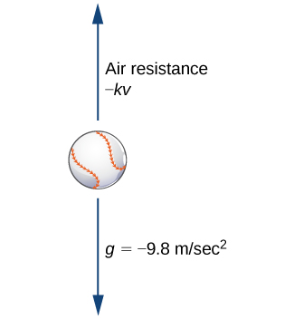
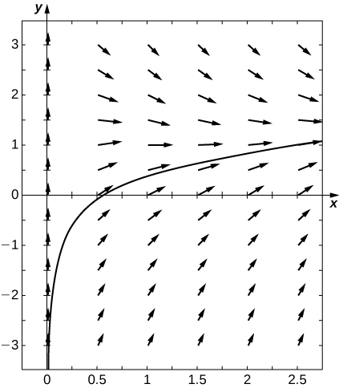

* Write a first-order linear differential equation in standard form.
* Find an integrating factor and use it to solve a first-order linear differential equation.
* Solve applied problems involving first-order linear differential equations.

Earlier, we studied an application of a first-order differential equation that involved solving for the velocity of an object. In particular, if a ball is thrown upward with an initial velocity of <math xmlns="http://www.w3.org/1998/Math/MathML"><mrow><msub><mi>v</mi><mn>0</mn></msub></mrow></math>

 ft/s, then an initial-value problem that describes the velocity of the ball after <math xmlns="http://www.w3.org/1998/Math/MathML"><mi>t</mi></math>

 seconds is given by

<math xmlns="http://www.w3.org/1998/Math/MathML"><mrow><mfrac><mrow><mi>d</mi><mi>v</mi></mrow><mrow><mi>d</mi><mi>t</mi></mrow></mfrac><mo>=</mo><mn>−32</mn><mo>,</mo><mspace width="1em" /><mi>v</mi><mo stretchy="false">(</mo><mn>0</mn><mo stretchy="false">)</mo><mo>=</mo><msub><mi>v</mi><mn>0</mn></msub><mo>.</mo></mrow></math>

This model assumes that the only force acting on the ball is gravity. Now we add to the problem by allowing for the possibility of **air resistance**{: data-type="term" .no-emphasis} acting on the ball.

Air resistance always acts in the direction opposite to motion. Therefore if an object is rising, air resistance acts in a downward direction. If the object is falling, air resistance acts in an upward direction ([\[link\]](#CNX_Calc_Figure_08_05_001)). There is no exact relationship between the velocity of an object and the air resistance acting on it. For very small objects, air resistance is proportional to velocity; that is, the force due to air resistance is numerically equal to some constant <math xmlns="http://www.w3.org/1998/Math/MathML"><mi>k</mi></math>

 times <math xmlns="http://www.w3.org/1998/Math/MathML"><mi>v</mi><mo>.</mo></math>

 For larger (e.g., baseball-sized) objects, depending on the shape, air resistance can be approximately proportional to the square of the velocity. In fact, air resistance may be proportional to <math xmlns="http://www.w3.org/1998/Math/MathML"><mrow><msup><mi>v</mi><mrow><mn>1.5</mn></mrow></msup><mo>,</mo></mrow></math>

 or <math xmlns="http://www.w3.org/1998/Math/MathML"><mrow><msup><mi>v</mi><mrow><mn>0.9</mn></mrow></msup><mo>,</mo></mrow></math>

 or some other power of <math xmlns="http://www.w3.org/1998/Math/MathML"><mrow><mi>v</mi><mo>.</mo></mrow></math>

 {: #CNX_Calc_Figure_08_05_001}

We will work with the linear approximation for air resistance. If we assume <math xmlns="http://www.w3.org/1998/Math/MathML"><mrow><mi>k</mi><mo>&gt;</mo><mn>0</mn><mo>,</mo></mrow></math>

 then the expression for the force <math xmlns="http://www.w3.org/1998/Math/MathML"><mrow><msub><mi>F</mi><mi>A</mi></msub></mrow></math>

 due to air resistance is given by <math xmlns="http://www.w3.org/1998/Math/MathML"><mrow><msub><mi>F</mi><mi>A</mi></msub><mo>=</mo><mtext>−</mtext><mi>k</mi><mi>v</mi><mo>.</mo></mrow></math>

 Therefore the sum of the forces acting on the object is equal to the sum of the gravitational force and the force due to air resistance. This, in turn, is equal to the mass of the object multiplied by its acceleration at time <math xmlns="http://www.w3.org/1998/Math/MathML"><mi>t</mi></math>

 (Newton’s second law). This gives us the differential equation

<math xmlns="http://www.w3.org/1998/Math/MathML"><mrow><mi>m</mi><mfrac><mrow><mi>d</mi><mi>v</mi></mrow><mrow><mi>d</mi><mi>t</mi></mrow></mfrac><mo>=</mo><mtext>−</mtext><mi>k</mi><mi>v</mi><mo>−</mo><mi>m</mi><mi>g</mi><mo>.</mo></mrow></math>

Finally, we impose an initial condition <math xmlns="http://www.w3.org/1998/Math/MathML"><mrow><mi>v</mi><mrow><mo>(</mo><mn>0</mn><mo>)</mo></mrow><mo>=</mo><msub><mi>v</mi><mn>0</mn></msub><mo>,</mo></mrow></math>

 where <math xmlns="http://www.w3.org/1998/Math/MathML"><mrow><msub><mi>v</mi><mn>0</mn></msub></mrow></math>

 is the initial velocity measured in meters per second. This makes <math xmlns="http://www.w3.org/1998/Math/MathML"><mrow><mi>g</mi><mo>=</mo><mn>9.8</mn><msup><mrow><mspace width="0.2em" /><mtext>m/s</mtext></mrow><mn>2</mn></msup><mo>.</mo></mrow></math>

 The initial-value problem becomes

<math xmlns="http://www.w3.org/1998/Math/MathML"><mrow><mi>m</mi><mfrac><mrow><mi>d</mi><mi>v</mi></mrow><mrow><mi>d</mi><mi>t</mi></mrow></mfrac><mo>=</mo><mtext>−</mtext><mi>k</mi><mi>v</mi><mo>−</mo><mi>m</mi><mi>g</mi><mo>,</mo><mspace width="1em" /><mi>v</mi><mo stretchy="false">(</mo><mn>0</mn><mo stretchy="false">)</mo><mo>=</mo><msub><mi>v</mi><mn>0</mn></msub><mo>.</mo></mrow></math>

The differential equation in this initial-value problem is an example of a first-order linear differential equation. (Recall that a differential equation is first-order if the highest-order derivative that appears in the equation is <math xmlns="http://www.w3.org/1998/Math/MathML"><mn>1.</mn><mo stretchy="false">)</mo></math>

 In this section, we study first-order linear equations and examine a method for finding a general solution to these types of equations, as well as solving initial-value problems involving them.

Definition

A first-order differential equation is **linear**{: data-type="term"} if it can be written in the form

<math xmlns="http://www.w3.org/1998/Math/MathML"><mrow><mi>a</mi><mrow><mo>(</mo><mi>x</mi><mo>)</mo></mrow><msup><mi>y</mi><mo>′</mo></msup><mo>+</mo><mi>b</mi><mrow><mo>(</mo><mi>x</mi><mo>)</mo></mrow><mi>y</mi><mo>=</mo><mi>c</mi><mrow><mo>(</mo><mi>x</mi><mo>)</mo></mrow><mo>,</mo></mrow></math>

where <math xmlns="http://www.w3.org/1998/Math/MathML"><mrow><mi>a</mi><mrow><mo>(</mo><mi>x</mi><mo>)</mo></mrow><mo>,</mo><mi>b</mi><mrow><mo>(</mo><mi>x</mi><mo>)</mo></mrow><mo>,</mo></mrow></math>

 and <math xmlns="http://www.w3.org/1998/Math/MathML"><mrow><mi>c</mi><mrow><mo>(</mo><mi>x</mi><mo>)</mo></mrow></mrow></math>

 are arbitrary functions of <math xmlns="http://www.w3.org/1998/Math/MathML"><mrow><mi>x</mi><mo>.</mo></mrow></math>

Remember that the unknown function <math xmlns="http://www.w3.org/1998/Math/MathML"><mi>y</mi></math>

 depends on the variable <math xmlns="http://www.w3.org/1998/Math/MathML"><mrow><mi>x</mi><mo>;</mo></mrow></math>

 that is, <math xmlns="http://www.w3.org/1998/Math/MathML"><mi>x</mi></math>

 is the independent variable and <math xmlns="http://www.w3.org/1998/Math/MathML"><mi>y</mi></math>

 is the dependent variable. Some examples of first-order linear differential equations are

<math xmlns="http://www.w3.org/1998/Math/MathML"><mtable><mtr><mtd columnalign="right"><mrow><mo>(</mo><mrow><mn>3</mn><msup><mi>x</mi><mn>2</mn></msup><mo>−</mo><mn>4</mn></mrow><mo>)</mo></mrow><mi>y</mi><mo>′</mo><mo>+</mo><mrow><mo>(</mo><mrow><mi>x</mi><mo>−</mo><mn>3</mn></mrow><mo>)</mo></mrow><mi>y</mi></mtd><mtd columnalign="left"><mo>=</mo></mtd><mtd columnalign="left"><mtext>sin</mtext><mspace width="0.1em" /><mi>x</mi></mtd></mtr><mtr><mtd columnalign="right"><mrow><mo>(</mo><mrow><mtext>sin</mtext><mspace width="0.1em" /><mi>x</mi></mrow><mo>)</mo></mrow><mi>y</mi><mo>′</mo><mo>−</mo><mrow><mo>(</mo><mrow><mtext>cos</mtext><mspace width="0.1em" /><mi>x</mi></mrow><mo>)</mo></mrow><mi>y</mi></mtd><mtd columnalign="left"><mo>=</mo></mtd><mtd columnalign="left"><mtext>cot</mtext><mspace width="0.1em" /><mi>x</mi></mtd></mtr><mtr><mtd columnalign="right"><mn>4</mn><mi>x</mi><mi>y</mi><mo>′</mo><mo>+</mo><mrow><mo>(</mo><mrow><mn>3</mn><mspace width="0.1em" /><mtext>ln</mtext><mspace width="0.1em" /><mi>x</mi></mrow><mo>)</mo></mrow><mi>y</mi></mtd><mtd columnalign="left"><mo>=</mo></mtd><mtd columnalign="left"><msup><mi>x</mi><mn>3</mn></msup><mo>−</mo><mn>4</mn><mi>x</mi><mo>.</mo></mtd></mtr></mtable></math>

Examples of first-order nonlinear differential equations include

<math xmlns="http://www.w3.org/1998/Math/MathML"><mtable><mtr><mtd columnalign="right"><msup><mrow><mo>(</mo><mrow><mi>y</mi><mo>′</mo></mrow><mo>)</mo></mrow><mn>4</mn></msup><mo>−</mo><msup><mrow><mo>(</mo><mrow><mi>y</mi><mo>′</mo></mrow><mo>)</mo></mrow><mn>3</mn></msup></mtd><mtd columnalign="left"><mo>=</mo></mtd><mtd columnalign="left"><mrow><mo>(</mo><mrow><mn>3</mn><mi>x</mi><mo>−</mo><mn>2</mn></mrow><mo>)</mo></mrow><mrow><mo>(</mo><mrow><mi>y</mi><mo>+</mo><mn>4</mn></mrow><mo>)</mo></mrow></mtd></mtr><mtr><mtd columnalign="right"><mn>4</mn><mi>y</mi><mo>′</mo><mo>+</mo><mn>3</mn><msup><mi>y</mi><mn>3</mn></msup></mtd><mtd columnalign="left"><mo>=</mo></mtd><mtd columnalign="left"><mn>4</mn><mi>x</mi><mo>−</mo><mn>5</mn></mtd></mtr><mtr><mtd columnalign="right"><msup><mrow><mo>(</mo><mrow><mi>y</mi><mo>′</mo></mrow><mo>)</mo></mrow><mn>2</mn></msup></mtd><mtd columnalign="left"><mo>=</mo></mtd><mtd columnalign="left"><mtext>sin</mtext><mspace width="0.1em" /><mi>y</mi><mo>+</mo><mtext>cos</mtext><mspace width="0.1em" /><mi>x</mi><mo>.</mo></mtd></mtr></mtable></math>

These equations are nonlinear because of terms like <math xmlns="http://www.w3.org/1998/Math/MathML"><mrow><msup><mrow><mrow><mo>(</mo><msup><mi>y</mi><mo>′</mo></msup><mo>)</mo></mrow></mrow><mn>4</mn></msup><mo>,</mo><msup><mi>y</mi><mn>3</mn></msup><mo>,</mo></mrow></math>

 etc. Due to these terms, it is impossible to put these equations into the same form as [\[link\]](#fs-id1170572251046).

### Standard Form

Consider the differential equation

<math xmlns="http://www.w3.org/1998/Math/MathML"><mrow><mrow><mo>(</mo><mrow><mn>3</mn><msup><mi>x</mi><mn>2</mn></msup><mo>−</mo><mn>4</mn></mrow><mo>)</mo></mrow><msup><mi>y</mi><mo>′</mo></msup><mo>+</mo><mrow><mo>(</mo><mrow><mi>x</mi><mo>−</mo><mn>3</mn></mrow><mo>)</mo></mrow><mi>y</mi><mo>=</mo><mtext>sin</mtext><mspace width="0.1em" /><mi>x</mi><mo>.</mo></mrow></math>

Our main goal in this section is to derive a solution method for equations of this form. It is useful to have the coefficient of <math xmlns="http://www.w3.org/1998/Math/MathML"><msup><mi>y</mi><mo>′</mo></msup></math>

 be equal to <math xmlns="http://www.w3.org/1998/Math/MathML"><mrow><mn>1</mn><mo>.</mo></mrow></math>

 To make this happen, we divide both sides by <math xmlns="http://www.w3.org/1998/Math/MathML"><mrow><mn>3</mn><msup><mi>x</mi><mn>2</mn></msup><mo>−</mo><mn>4</mn><mo>.</mo></mrow></math>

<math xmlns="http://www.w3.org/1998/Math/MathML"><mrow><msup><mi>y</mi><mo>′</mo></msup><mo>+</mo><mrow><mo>(</mo><mrow><mfrac><mrow><mi>x</mi><mo>−</mo><mn>3</mn></mrow><mrow><mn>3</mn><msup><mi>x</mi><mn>2</mn></msup><mo>−</mo><mn>4</mn></mrow></mfrac></mrow><mo>)</mo></mrow><mspace width="0.1em" /><mi>y</mi><mo>=</mo><mfrac><mrow><mtext>sin</mtext><mspace width="0.1em" /><mi>x</mi></mrow><mrow><mn>3</mn><msup><mi>x</mi><mn>2</mn></msup><mo>−</mo><mn>4</mn></mrow></mfrac></mrow></math>

This is called the **standard form**{: data-type="term"} of the differential equation. We will use it later when finding the solution to a general first-order linear differential equation. Returning to [\[link\]](#fs-id1170572251046), we can divide both sides of the equation by <math xmlns="http://www.w3.org/1998/Math/MathML"><mrow><mi>a</mi><mrow><mo>(</mo><mi>x</mi><mo>)</mo></mrow><mo>.</mo></mrow></math>

 This leads to the equation

<math xmlns="http://www.w3.org/1998/Math/MathML"><mrow><msup><mi>y</mi><mo>′</mo></msup><mo>+</mo><mfrac><mrow><mi>b</mi><mrow><mo>(</mo><mi>x</mi><mo>)</mo></mrow></mrow><mrow><mi>a</mi><mrow><mo>(</mo><mi>x</mi><mo>)</mo></mrow></mrow></mfrac><mi>y</mi><mo>=</mo><mfrac><mrow><mi>c</mi><mrow><mo>(</mo><mi>x</mi><mo>)</mo></mrow></mrow><mrow><mi>a</mi><mrow><mo>(</mo><mi>x</mi><mo>)</mo></mrow></mrow></mfrac><mo>.</mo></mrow></math>

Now define <math xmlns="http://www.w3.org/1998/Math/MathML"><mrow><mi>p</mi><mrow><mo>(</mo><mi>x</mi><mo>)</mo></mrow><mo>=</mo><mfrac><mrow><mi>b</mi><mrow><mo>(</mo><mi>x</mi><mo>)</mo></mrow></mrow><mrow><mi>a</mi><mrow><mo>(</mo><mi>x</mi><mo>)</mo></mrow></mrow></mfrac></mrow></math>

 and <math xmlns="http://www.w3.org/1998/Math/MathML"><mrow><mi>q</mi><mrow><mo>(</mo><mi>x</mi><mo>)</mo></mrow><mo>=</mo><mfrac><mrow><mi>c</mi><mrow><mo>(</mo><mi>x</mi><mo>)</mo></mrow></mrow><mrow><mi>a</mi><mrow><mo>(</mo><mi>x</mi><mo>)</mo></mrow></mrow></mfrac><mo>.</mo></mrow></math>

 Then [\[link\]](#fs-id1170572251046) becomes

<math xmlns="http://www.w3.org/1998/Math/MathML"><mrow><msup><mi>y</mi><mo>′</mo></msup><mo>+</mo><mi>p</mi><mo stretchy="false">(</mo><mi>x</mi><mo stretchy="false">)</mo><mi>y</mi><mo>=</mo><mi>q</mi><mo stretchy="false">(</mo><mi>x</mi><mo stretchy="false">)</mo><mo>.</mo></mrow></math>

We can write any first-order linear differential equation in this form, and this is referred to as the standard form for a first-order linear differential equation.

Writing First-Order Linear Equations in Standard Form

Put each of the following first-order linear differential equations into standard form. Identify <math xmlns="http://www.w3.org/1998/Math/MathML"><mrow><mi>p</mi><mrow><mo>(</mo><mi>x</mi><mo>)</mo></mrow></mrow></math>

 and <math xmlns="http://www.w3.org/1998/Math/MathML"><mrow><mi>q</mi><mrow><mo>(</mo><mi>x</mi><mo>)</mo></mrow></mrow></math>

 for each equation.

1.  <math xmlns="http://www.w3.org/1998/Math/MathML"><mrow><mi>y</mi><mo>′</mo><mo>=</mo><mn>3</mn><mi>x</mi><mo>−</mo><mn>4</mn><mi>y</mi></mrow></math>

2.  <math xmlns="http://www.w3.org/1998/Math/MathML"><mrow><mfrac><mrow><mn>3</mn><mi>x</mi><mi>y</mi><mo>′</mo></mrow><mrow><mn>4</mn><mi>y</mi><mo>−</mo><mn>3</mn></mrow></mfrac><mo>=</mo><mn>2</mn></mrow></math>
    
    (here
    <math xmlns="http://www.w3.org/1998/Math/MathML"><mrow><mi>x</mi><mo>&gt;</mo><mn>0</mn><mo stretchy="false">)</mo></mrow></math>

3.  <math xmlns="http://www.w3.org/1998/Math/MathML"><mrow><mi>y</mi><mo>=</mo><mn>3</mn><mi>y</mi><mo>′</mo><mo>−</mo><mn>4</mn><msup><mi>x</mi><mn>2</mn></msup><mo>+</mo><mn>5</mn></mrow></math>
{: type="a"}

1.  Add
    <math xmlns="http://www.w3.org/1998/Math/MathML"><mrow><mn>4</mn><mi>y</mi></mrow></math>
    
    to both sides:
    * * *
    {: data-type="newline"}
    
    

    <math xmlns="http://www.w3.org/1998/Math/MathML"><mrow><mi>y</mi><mo>′</mo><mo>+</mo><mn>4</mn><mi>y</mi><mo>=</mo><mn>3</mn><mi>x</mi><mo>.</mo></mrow></math>
    

    
    * * *
    {: data-type="newline"}
    
    In this equation,
    <math xmlns="http://www.w3.org/1998/Math/MathML"><mrow><mi>p</mi><mrow><mo>(</mo><mi>x</mi><mo>)</mo></mrow><mo>=</mo><mn>4</mn></mrow></math>
    
    and
    <math xmlns="http://www.w3.org/1998/Math/MathML"><mrow><mi>q</mi><mrow><mo>(</mo><mi>x</mi><mo>)</mo></mrow><mo>=</mo><mn>3</mn><mi>x</mi><mo>.</mo></mrow></math>

2.  Multiply both sides by
    <math xmlns="http://www.w3.org/1998/Math/MathML"><mrow><mn>4</mn><mi>y</mi><mo>−</mo><mn>3</mn><mo>,</mo></mrow></math>
    
    then subtract
    <math xmlns="http://www.w3.org/1998/Math/MathML"><mrow><mn>8</mn><mi>y</mi></mrow></math>
    
    from each side:
    * * *
    {: data-type="newline"}
    
    

    <math xmlns="http://www.w3.org/1998/Math/MathML"><mtable><mtr><mtd columnalign="right"><mfrac><mrow><mn>3</mn><mi>x</mi><mi>y</mi><mo>′</mo></mrow><mrow><mn>4</mn><mi>y</mi><mo>−</mo><mn>3</mn></mrow></mfrac></mtd><mtd columnalign="left"><mo>=</mo></mtd><mtd columnalign="left"><mn>2</mn></mtd></mtr><mtr><mtd columnalign="right"><mn>3</mn><mi>x</mi><mi>y</mi><mo>′</mo></mtd><mtd columnalign="left"><mo>=</mo></mtd><mtd columnalign="left"><mn>2</mn><mrow><mo>(</mo><mrow><mn>4</mn><mi>y</mi><mo>−</mo><mn>3</mn></mrow><mo>)</mo></mrow></mtd></mtr><mtr><mtd columnalign="right"><mn>3</mn><mi>x</mi><mi>y</mi><mo>′</mo></mtd><mtd columnalign="left"><mo>=</mo></mtd><mtd columnalign="left"><mn>8</mn><mi>y</mi><mo>−</mo><mn>6</mn></mtd></mtr><mtr><mtd columnalign="right"><mn>3</mn><mi>x</mi><mi>y</mi><mo>′</mo><mo>−</mo><mn>8</mn><mi>y</mi></mtd><mtd columnalign="left"><mo>=</mo></mtd><mtd columnalign="left"><mn>−6</mn><mo>.</mo></mtd></mtr></mtable></math>
    

    
    * * *
    {: data-type="newline"}
    
    Finally, divide both sides by
    <math xmlns="http://www.w3.org/1998/Math/MathML"><mrow><mn>3</mn><mi>x</mi></mrow></math>
    
    to make the coefficient of
    <math xmlns="http://www.w3.org/1998/Math/MathML"><mrow><mi>y</mi><mo>′</mo></mrow></math>
    
    equal to
    <math xmlns="http://www.w3.org/1998/Math/MathML"><mrow><mn>1</mn><mtext>:</mtext></mrow></math>
    
    * * *
    {: data-type="newline"}
    
    

    <math xmlns="http://www.w3.org/1998/Math/MathML"><mrow><mi>y</mi><mo>′</mo><mo>−</mo><mfrac><mn>8</mn><mrow><mn>3</mn><mi>x</mi></mrow></mfrac><mi>y</mi><mo>=</mo><mo>−</mo><mfrac><mn>2</mn><mrow><mn>3</mn><mi>x</mi></mrow></mfrac><mo>.</mo></mrow></math>
    

    
    This is allowable because in the original statement of this problem we assumed that
    <math xmlns="http://www.w3.org/1998/Math/MathML"><mrow><mi>x</mi><mo>&gt;</mo><mn>0</mn><mo>.</mo></mrow></math>
    
    (If
    <math xmlns="http://www.w3.org/1998/Math/MathML"><mrow><mi>x</mi><mo>=</mo><mn>0</mn></mrow></math>
    
    then the original equation becomes
    <math xmlns="http://www.w3.org/1998/Math/MathML"><mrow><mn>0</mn><mo>=</mo><mn>2</mn><mo>,</mo></mrow></math>
    
    which is clearly a false statement.)
    * * *
    {: data-type="newline"}
    
    In this equation,
    <math xmlns="http://www.w3.org/1998/Math/MathML"><mrow><mi>p</mi><mrow><mo>(</mo><mi>x</mi><mo>)</mo></mrow><mo>=</mo><mo>−</mo><mfrac><mn>8</mn><mrow><mn>3</mn><mi>x</mi></mrow></mfrac></mrow></math>
    
    and
    <math xmlns="http://www.w3.org/1998/Math/MathML"><mrow><mi>q</mi><mrow><mo>(</mo><mi>x</mi><mo>)</mo></mrow><mo>=</mo><mo>−</mo><mfrac><mn>2</mn><mrow><mn>3</mn><mi>x</mi></mrow></mfrac><mo>.</mo></mrow></math>

3.  Subtract
    <math xmlns="http://www.w3.org/1998/Math/MathML"><mi>y</mi></math>
    
    from each side and add
    <math xmlns="http://www.w3.org/1998/Math/MathML"><mrow><mn>4</mn><msup><mi>x</mi><mn>2</mn></msup><mo>−</mo><mn>5</mn><mtext>:</mtext></mrow></math>
    
    * * *
    {: data-type="newline"}
    
    

    <math xmlns="http://www.w3.org/1998/Math/MathML"><mrow><mn>3</mn><mi>y</mi><mo>′</mo><mo>−</mo><mi>y</mi><mo>=</mo><mn>4</mn><msup><mi>x</mi><mn>2</mn></msup><mo>−</mo><mn>5</mn><mo>.</mo></mrow></math>
    

    
    * * *
    {: data-type="newline"}
    
    Next divide both sides by
    <math xmlns="http://www.w3.org/1998/Math/MathML"><mrow><mn>3</mn><mtext>:</mtext></mrow></math>
    
    * * *
    {: data-type="newline"}
    
    

    <math xmlns="http://www.w3.org/1998/Math/MathML"><mrow><mi>y</mi><mo>′</mo><mo>−</mo><mfrac><mn>1</mn><mn>3</mn></mfrac><mi>y</mi><mo>=</mo><mfrac><mn>4</mn><mn>3</mn></mfrac><msup><mi>x</mi><mn>2</mn></msup><mo>−</mo><mfrac><mn>5</mn><mn>3</mn></mfrac><mo>.</mo></mrow></math>
    

    
    * * *
    {: data-type="newline"}
    
    In this equation,
    <math xmlns="http://www.w3.org/1998/Math/MathML"><mrow><mi>p</mi><mrow><mo>(</mo><mi>x</mi><mo>)</mo></mrow><mo>=</mo><mo>−</mo><mfrac><mn>1</mn><mn>3</mn></mfrac></mrow></math>
    
    and
    <math xmlns="http://www.w3.org/1998/Math/MathML"><mrow><mi>q</mi><mrow><mo>(</mo><mi>x</mi><mo>)</mo></mrow><mo>=</mo><mfrac><mn>4</mn><mn>3</mn></mfrac><msup><mi>x</mi><mn>2</mn></msup><mo>−</mo><mfrac><mn>5</mn><mn>3</mn></mfrac><mo>.</mo></mrow></math>
{: type="a"}

Put the equation <math xmlns="http://www.w3.org/1998/Math/MathML"><mrow><mfrac><mrow><mrow><mo>(</mo><mrow><mi>x</mi><mo>+</mo><mn>3</mn></mrow><mo>)</mo></mrow><mi>y</mi><mo>′</mo></mrow><mrow><mn>2</mn><mi>x</mi><mo>−</mo><mn>3</mn><mi>y</mi><mo>−</mo><mn>4</mn></mrow></mfrac><mo>=</mo><mn>5</mn></mrow></math>

 into standard form and identify <math xmlns="http://www.w3.org/1998/Math/MathML"><mrow><mi>p</mi><mrow><mo>(</mo><mi>x</mi><mo>)</mo></mrow></mrow></math>

 and <math xmlns="http://www.w3.org/1998/Math/MathML"><mrow><mi>q</mi><mrow><mo>(</mo><mi>x</mi><mo>)</mo></mrow><mo>.</mo></mrow></math>

<math xmlns="http://www.w3.org/1998/Math/MathML"><mrow><mi>y</mi><mo>′</mo><mo>+</mo><mfrac><mrow><mn>15</mn></mrow><mrow><mi>x</mi><mo>+</mo><mn>3</mn></mrow></mfrac><mi>y</mi><mo>=</mo><mfrac><mrow><mn>10</mn><mi>x</mi><mo>−</mo><mn>20</mn></mrow><mrow><mi>x</mi><mo>+</mo><mn>3</mn></mrow></mfrac><mo>;</mo><mi>p</mi><mrow><mo>(</mo><mi>x</mi><mo>)</mo></mrow><mo>=</mo><mfrac><mrow><mn>15</mn></mrow><mrow><mi>x</mi><mo>+</mo><mn>3</mn></mrow></mfrac></mrow></math>

 and <math xmlns="http://www.w3.org/1998/Math/MathML"><mrow><mi>q</mi><mrow><mo>(</mo><mi>x</mi><mo>)</mo></mrow><mo>=</mo><mfrac><mrow><mn>10</mn><mi>x</mi><mo>−</mo><mn>20</mn></mrow><mrow><mi>x</mi><mo>+</mo><mn>3</mn></mrow></mfrac></mrow></math>

Hint

Multiply both sides by the common denominator, then collect all terms involving <math xmlns="http://www.w3.org/1998/Math/MathML"><mi>y</mi></math>

 on one side.

### Integrating Factors

We now develop a solution technique for any first-order linear differential equation. We start with the standard form of a first-order linear differential equation:

<math xmlns="http://www.w3.org/1998/Math/MathML"><mrow><mi>y</mi><mo>′</mo><mo>+</mo><mi>p</mi><mrow><mo>(</mo><mi>x</mi><mo>)</mo></mrow><mi>y</mi><mo>=</mo><mi>q</mi><mrow><mo>(</mo><mi>x</mi><mo>)</mo><mo>.</mo></mrow></mrow></math>

The first term on the left-hand side of [\[link\]](#fs-id1170572151745) is the derivative of the unknown function, and the second term is the product of a known function with the unknown function. This is somewhat reminiscent of the power rule from the [Differentiation Rules](/m53575){: .target-chapter} section. If we multiply [\[link\]](#fs-id1170571712108) by a yet-to-be-determined function <math xmlns="http://www.w3.org/1998/Math/MathML"><mrow><mi>μ</mi><mrow><mo>(</mo><mi>x</mi><mo>)</mo></mrow><mo>,</mo></mrow></math>

 then the equation becomes

<math xmlns="http://www.w3.org/1998/Math/MathML"><mrow><mi>μ</mi><mrow><mo>(</mo><mi>x</mi><mo>)</mo></mrow><msup><mi>y</mi><mo>′</mo></msup><mo>+</mo><mi>μ</mi><mrow><mo>(</mo><mi>x</mi><mo>)</mo></mrow><mi>p</mi><mrow><mo>(</mo><mi>x</mi><mo>)</mo></mrow><mi>y</mi><mo>=</mo><mi>μ</mi><mrow><mo>(</mo><mi>x</mi><mo>)</mo></mrow><mi>q</mi><mrow><mo>(</mo><mi>x</mi><mo>)</mo></mrow><mo>.</mo></mrow></math>

The left-hand side [\[link\]](#fs-id1170572130093) can be matched perfectly to the product rule:

<math xmlns="http://www.w3.org/1998/Math/MathML"><mrow><mfrac><mi>d</mi><mrow><mi>d</mi><mi>x</mi></mrow></mfrac><mrow><mo>[</mo><mrow><mi>f</mi><mrow><mo>(</mo><mi>x</mi><mo>)</mo></mrow><mi>g</mi><mrow><mo>(</mo><mi>x</mi><mo>)</mo></mrow></mrow><mo>]</mo></mrow><mo>=</mo><msup><mi>f</mi><mo>′</mo></msup><mrow><mo>(</mo><mi>x</mi><mo>)</mo></mrow><mi>g</mi><mrow><mo>(</mo><mi>x</mi><mo>)</mo></mrow><mo>+</mo><mi>f</mi><mrow><mo>(</mo><mi>x</mi><mo>)</mo></mrow><msup><mi>g</mi><mo>′</mo></msup><mrow><mo>(</mo><mi>x</mi><mo>)</mo></mrow><mo>.</mo></mrow></math>

Matching term by term gives <math xmlns="http://www.w3.org/1998/Math/MathML"><mrow><mi>y</mi><mo>=</mo><mi>f</mi><mrow><mo>(</mo><mi>x</mi><mo>)</mo></mrow><mo>,</mo><mi>g</mi><mrow><mo>(</mo><mi>x</mi><mo>)</mo></mrow><mo>=</mo><mi>μ</mi><mrow><mo>(</mo><mi>x</mi><mo>)</mo></mrow><mo>,</mo></mrow></math>

 and <math xmlns="http://www.w3.org/1998/Math/MathML"><mrow><msup><mi>g</mi><mo>′</mo></msup><mrow><mo>(</mo><mi>x</mi><mo>)</mo></mrow><mo>=</mo><mi>μ</mi><mrow><mo>(</mo><mi>x</mi><mo>)</mo></mrow><mi>p</mi><mrow><mo>(</mo><mi>x</mi><mo>)</mo></mrow><mo>.</mo></mrow></math>

 Taking the derivative of <math xmlns="http://www.w3.org/1998/Math/MathML"><mrow><mi>g</mi><mrow><mo>(</mo><mi>x</mi><mo>)</mo></mrow><mo>=</mo><mi>μ</mi><mrow><mo>(</mo><mi>x</mi><mo>)</mo></mrow></mrow></math>

 and setting it equal to the right-hand side of <math xmlns="http://www.w3.org/1998/Math/MathML"><mrow><msup><mi>g</mi><mo>′</mo></msup><mrow><mo>(</mo><mi>x</mi><mo>)</mo></mrow><mo>=</mo><mi>μ</mi><mrow><mo>(</mo><mi>x</mi><mo>)</mo></mrow><mi>p</mi><mrow><mo>(</mo><mi>x</mi><mo>)</mo></mrow></mrow></math>

 leads to

<math xmlns="http://www.w3.org/1998/Math/MathML"><mrow><msup><mi>μ</mi><mo>′</mo></msup><mrow><mo>(</mo><mi>x</mi><mo>)</mo></mrow><mo>=</mo><mi>μ</mi><mrow><mo>(</mo><mi>x</mi><mo>)</mo></mrow><mi>p</mi><mrow><mo>(</mo><mi>x</mi><mo>)</mo></mrow><mo>.</mo></mrow></math>

This is a first-order, separable differential equation for <math xmlns="http://www.w3.org/1998/Math/MathML"><mrow><mi>μ</mi><mrow><mo>(</mo><mi>x</mi><mo>)</mo></mrow><mo>.</mo></mrow></math>

 We know <math xmlns="http://www.w3.org/1998/Math/MathML"><mrow><mi>p</mi><mo stretchy="false">(</mo><mi>x</mi><mo stretchy="false">)</mo></mrow></math>

 because it appears in the differential equation we are solving. Separating variables and integrating yields

<math xmlns="http://www.w3.org/1998/Math/MathML"><mtable><mtr><mtd columnalign="right"><mfrac><mrow><msup><mi>μ</mi><mo>′</mo></msup><mrow><mo>(</mo><mi>x</mi><mo>)</mo></mrow></mrow><mrow><mi>μ</mi><mrow><mo>(</mo><mi>x</mi><mo>)</mo></mrow></mrow></mfrac></mtd><mtd columnalign="left"><mo>=</mo></mtd><mtd columnalign="left"><mi>p</mi><mrow><mo>(</mo><mi>x</mi><mo>)</mo></mrow></mtd></mtr><mtr><mtd columnalign="right"><mstyle displaystyle="true"><mrow><mo stretchy="true">∫</mo><mrow><mfrac><mrow><msup><mi>μ</mi><mo>′</mo></msup><mrow><mo>(</mo><mi>x</mi><mo>)</mo></mrow></mrow><mrow><mi>μ</mi><mrow><mo>(</mo><mi>x</mi><mo>)</mo></mrow></mrow></mfrac></mrow></mrow></mstyle><mi>d</mi><mi>x</mi></mtd><mtd columnalign="left"><mo>=</mo></mtd><mtd columnalign="left"><mstyle displaystyle="true"><mrow><mo>∫</mo><mrow><mi>p</mi><mrow><mo>(</mo><mi>x</mi><mo>)</mo></mrow><mspace width="0.1em" /><mi>d</mi><mi>x</mi></mrow></mrow></mstyle></mtd></mtr><mtr><mtd columnalign="right"><mtext>ln</mtext><mrow><mo>\|</mo><mrow><mi>μ</mi><mrow><mo>(</mo><mi>x</mi><mo>)</mo></mrow></mrow><mo>\|</mo></mrow></mtd><mtd columnalign="left"><mo>=</mo></mtd><mtd columnalign="left"><mstyle displaystyle="true"><mrow><mo>∫</mo><mrow><mi>p</mi><mrow><mo>(</mo><mi>x</mi><mo>)</mo></mrow><mspace width="0.1em" /><mi>d</mi><mi>x</mi></mrow></mrow></mstyle><mo>+</mo><mi>C</mi></mtd></mtr><mtr><mtd columnalign="right"><msup><mi>e</mi><mrow><mtext>ln</mtext><mrow><mo>\|</mo><mrow><mi>μ</mi><mrow><mo>(</mo><mi>x</mi><mo>)</mo></mrow></mrow><mo>\|</mo></mrow></mrow></msup></mtd><mtd columnalign="left"><mo>=</mo></mtd><mtd columnalign="left"><msup><mi>e</mi><mrow><mstyle displaystyle="true"><mrow><mo>∫</mo><mrow><mi>p</mi><mrow><mo>(</mo><mi>x</mi><mo>)</mo></mrow><mspace width="0.1em" /><mi>d</mi><mi>x</mi></mrow></mrow></mstyle><mo>+</mo><mi>C</mi></mrow></msup></mtd></mtr><mtr><mtd columnalign="right"><mrow><mo>\|</mo><mrow><mi>μ</mi><mrow><mo>(</mo><mi>x</mi><mo>)</mo></mrow></mrow><mo>\|</mo></mrow></mtd><mtd columnalign="left"><mo>=</mo></mtd><mtd columnalign="left"><msub><mi>C</mi><mn>1</mn></msub><msup><mi>e</mi><mrow><mstyle displaystyle="true"><mrow><mo>∫</mo><mrow><mi>p</mi><mrow><mo>(</mo><mi>x</mi><mo>)</mo></mrow><mspace width="0.1em" /><mi>d</mi><mi>x</mi></mrow></mrow></mstyle></mrow></msup></mtd></mtr><mtr><mtd columnalign="right"><mi>μ</mi><mrow><mo>(</mo><mi>x</mi><mo>)</mo></mrow></mtd><mtd columnalign="left"><mo>=</mo></mtd><mtd columnalign="left"><msub><mi>C</mi><mn>2</mn></msub><msup><mi>e</mi><mrow><mstyle displaystyle="true"><mrow><mo>∫</mo><mrow><mi>p</mi><mrow><mo>(</mo><mi>x</mi><mo>)</mo></mrow><mspace width="0.1em" /><mi>d</mi><mi>x</mi></mrow></mrow></mstyle></mrow></msup><mo>.</mo></mtd></mtr></mtable></math>

Here <math xmlns="http://www.w3.org/1998/Math/MathML"><mrow><msub><mi>C</mi><mn>2</mn></msub></mrow></math>

 can be an arbitrary (positive or negative) constant. This leads to a general method for solving a first-order linear differential equation. We first multiply both sides of [\[link\]](#fs-id1170571712108) by the **integrating factor**{: data-type="term"} <math xmlns="http://www.w3.org/1998/Math/MathML"><mrow><mi>μ</mi><mrow><mo>(</mo><mi>x</mi><mo>)</mo></mrow><mo>.</mo></mrow></math>

 This gives

<math xmlns="http://www.w3.org/1998/Math/MathML"><mrow><mi>μ</mi><mrow><mo>(</mo><mi>x</mi><mo>)</mo></mrow><msup><mi>y</mi><mo>′</mo></msup><mo>+</mo><mi>μ</mi><mrow><mo>(</mo><mi>x</mi><mo>)</mo></mrow><mi>p</mi><mrow><mo>(</mo><mi>x</mi><mo>)</mo></mrow><mi>y</mi><mo>=</mo><mi>μ</mi><mrow><mo>(</mo><mi>x</mi><mo>)</mo></mrow><mi>q</mi><mrow><mo>(</mo><mi>x</mi><mo>)</mo></mrow><mo>.</mo></mrow></math>

The left-hand side of [\[link\]](#fs-id1170572449739) can be rewritten as <math xmlns="http://www.w3.org/1998/Math/MathML"><mrow><mfrac><mi>d</mi><mrow><mi>d</mi><mi>x</mi></mrow></mfrac><mrow><mo>(</mo><mrow><mi>μ</mi><mrow><mo>(</mo><mi>x</mi><mo>)</mo></mrow><mi>y</mi></mrow><mo>)</mo></mrow><mo>.</mo></mrow></math>

<math xmlns="http://www.w3.org/1998/Math/MathML"><mrow><mfrac><mi>d</mi><mrow><mi>d</mi><mi>x</mi></mrow></mfrac><mrow><mo>(</mo><mrow><mi>μ</mi><mrow><mo>(</mo><mi>x</mi><mo>)</mo></mrow><mi>y</mi></mrow><mo>)</mo></mrow><mo>=</mo><mi>μ</mi><mrow><mo>(</mo><mi>x</mi><mo>)</mo></mrow><mi>q</mi><mrow><mo>(</mo><mi>x</mi><mo>)</mo></mrow><mo>.</mo></mrow></math>

Next integrate both sides of [\[link\]](#fs-id1170571789027) with respect to <math xmlns="http://www.w3.org/1998/Math/MathML"><mrow><mi>x</mi><mo>.</mo></mrow></math>

<math xmlns="http://www.w3.org/1998/Math/MathML"><mtable><mtr><mtd columnalign="right"><mstyle displaystyle="true"><mrow><mo stretchy="true">∫</mo><mrow><mfrac><mi>d</mi><mrow><mi>d</mi><mi>x</mi></mrow></mfrac><mrow><mo>(</mo><mrow><mi>μ</mi><mrow><mo>(</mo><mi>x</mi><mo>)</mo></mrow><mi>y</mi></mrow><mo>)</mo></mrow><mspace width="0.1em" /><mi>d</mi><mi>x</mi></mrow></mrow></mstyle></mtd><mtd columnalign="left"><mo>=</mo></mtd><mtd columnalign="left"><mstyle displaystyle="true"><mrow><mo>∫</mo><mrow><mi>μ</mi><mrow><mo>(</mo><mi>x</mi><mo>)</mo></mrow><mi>q</mi><mrow><mo>(</mo><mi>x</mi><mo>)</mo></mrow><mspace width="0.1em" /><mi>d</mi><mi>x</mi></mrow></mrow></mstyle></mtd></mtr><mtr><mtd columnalign="right"><mi>μ</mi><mrow><mo>(</mo><mi>x</mi><mo>)</mo></mrow><mi>y</mi></mtd><mtd columnalign="left"><mo>=</mo></mtd><mtd columnalign="left"><mstyle displaystyle="true"><mrow><mo>∫</mo><mrow><mi>μ</mi><mrow><mo>(</mo><mi>x</mi><mo>)</mo></mrow><mi>q</mi><mrow><mo>(</mo><mi>x</mi><mo>)</mo></mrow><mspace width="0.1em" /><mi>d</mi><mi>x</mi></mrow></mrow></mstyle><mo>.</mo></mtd></mtr></mtable></math>

Divide both sides of [\[link\]](#fs-id1170572554001) by <math xmlns="http://www.w3.org/1998/Math/MathML"><mrow><mi>μ</mi><mrow><mo>(</mo><mi>x</mi><mo>)</mo></mrow><mtext>:</mtext></mrow></math>

<math xmlns="http://www.w3.org/1998/Math/MathML"><mrow><mi>y</mi><mo>=</mo><mfrac><mn>1</mn><mrow><mi>μ</mi><mrow><mo>(</mo><mi>x</mi><mo>)</mo></mrow></mrow></mfrac><mrow><mo>[</mo><mrow><mstyle displaystyle="true"><mrow><mo>∫</mo><mrow><mi>μ</mi><mrow><mo>(</mo><mi>x</mi><mo>)</mo></mrow><mi>q</mi><mrow><mo>(</mo><mi>x</mi><mo>)</mo></mrow><mspace width="0.1em" /><mi>d</mi><mi>x</mi><mo>+</mo><mi>C</mi></mrow></mrow></mstyle></mrow><mo>]</mo></mrow><mo>.</mo></mrow></math>

Since <math xmlns="http://www.w3.org/1998/Math/MathML"><mrow><mi>μ</mi><mrow><mo>(</mo><mi>x</mi><mo>)</mo></mrow></mrow></math>

 was previously calculated, we are now finished. An important note about the integrating constant <math xmlns="http://www.w3.org/1998/Math/MathML"><mrow><mi>C</mi><mtext>:</mtext></mrow></math>

 It may seem that we are inconsistent in the usage of the integrating constant. However, the integral involving <math xmlns="http://www.w3.org/1998/Math/MathML"><mrow><mi>p</mi><mrow><mo>(</mo><mi>x</mi><mo>)</mo></mrow></mrow></math>

 is necessary in order to find an integrating factor for [\[link\]](#fs-id1170572151745). Only one integrating factor is needed in order to solve the equation; therefore, it is safe to assign a value for <math xmlns="http://www.w3.org/1998/Math/MathML"><mi>C</mi></math>

 for this integral. We chose <math xmlns="http://www.w3.org/1998/Math/MathML"><mrow><mi>C</mi><mo>=</mo><mn>0</mn><mo>.</mo></mrow></math>

 When calculating the integral inside the brackets in [\[link\]](#fs-id1170572554001), it is necessary to keep our options open for the value of the integrating constant, because our goal is to find a general family of solutions to [\[link\]](#fs-id1170572151745). This integrating factor guarantees just that.

Problem-Solving Strategy: Solving a First-order Linear Differential Equation

1.  Put the equation into standard form and identify
    <math xmlns="http://www.w3.org/1998/Math/MathML"><mrow><mi>p</mi><mrow><mo>(</mo><mi>x</mi><mo>)</mo></mrow></mrow></math>
    
    and
    <math xmlns="http://www.w3.org/1998/Math/MathML"><mrow><mi>q</mi><mrow><mo>(</mo><mi>x</mi><mo>)</mo></mrow><mo>.</mo></mrow></math>

2.  Calculate the integrating factor
    <math xmlns="http://www.w3.org/1998/Math/MathML"><mrow><mi>μ</mi><mrow><mo>(</mo><mi>x</mi><mo>)</mo></mrow><mo>=</mo><msup><mi>e</mi><mrow><mstyle displaystyle="true"><mrow><mo>∫</mo><mrow><mi>p</mi><mrow><mo>(</mo><mi>x</mi><mo>)</mo></mrow><mspace width="0.1em" /><mi>d</mi><mi>x</mi></mrow></mrow></mstyle></mrow></msup><mo>.</mo></mrow></math>

3.  Multiply both sides of the differential equation by
    <math xmlns="http://www.w3.org/1998/Math/MathML"><mrow><mi>μ</mi><mrow><mo>(</mo><mi>x</mi><mo>)</mo></mrow><mo>.</mo></mrow></math>

4.  Integrate both sides of the equation obtained in step
    <math xmlns="http://www.w3.org/1998/Math/MathML"><mn>3</mn><mo>,</mo></math>
    
    and divide both sides by
    <math xmlns="http://www.w3.org/1998/Math/MathML"><mrow><mi>μ</mi><mrow><mo>(</mo><mi>x</mi><mo>)</mo></mrow><mo>.</mo></mrow></math>

5.  If there is an initial condition, determine the value of
    <math xmlns="http://www.w3.org/1998/Math/MathML"><mrow><mi>C</mi><mo>.</mo></mrow></math>
{: type="1"}

Solving a First-order Linear Equation

Find a general solution for the differential equation <math xmlns="http://www.w3.org/1998/Math/MathML"><mrow><mi>x</mi><mi>y</mi><mo>′</mo><mo>+</mo><mn>3</mn><mi>y</mi><mo>=</mo><mn>4</mn><msup><mi>x</mi><mn>2</mn></msup><mo>−</mo><mn>3</mn><mi>x</mi><mo>.</mo></mrow></math>

 Assume <math xmlns="http://www.w3.org/1998/Math/MathML"><mrow><mi>x</mi><mo>&gt;</mo><mn>0</mn><mo>.</mo></mrow></math>

1.  To put this differential equation into standard form, divide both sides by
    <math xmlns="http://www.w3.org/1998/Math/MathML"><mrow><mi>x</mi><mtext>:</mtext></mrow></math>
    
    * * *
    {: data-type="newline"}
    
    

    <math xmlns="http://www.w3.org/1998/Math/MathML"><mrow><mi>y</mi><mo>′</mo><mo>+</mo><mfrac><mn>3</mn><mi>x</mi></mfrac><mi>y</mi><mo>=</mo><mn>4</mn><mi>x</mi><mo>−</mo><mn>3</mn><mo>.</mo></mrow></math>
    

    
    * * *
    {: data-type="newline"}
    
    Therefore
    <math xmlns="http://www.w3.org/1998/Math/MathML"><mrow><mi>p</mi><mrow><mo>(</mo><mi>x</mi><mo>)</mo></mrow><mo>=</mo><mfrac><mn>3</mn><mi>x</mi></mfrac></mrow></math>
    
    and
    <math xmlns="http://www.w3.org/1998/Math/MathML"><mrow><mi>q</mi><mrow><mo>(</mo><mi>x</mi><mo>)</mo></mrow><mo>=</mo><mn>4</mn><mi>x</mi><mo>−</mo><mn>3</mn><mo>.</mo></mrow></math>

2.  The integrating factor is
    <math xmlns="http://www.w3.org/1998/Math/MathML"><mrow><mi>μ</mi><mrow><mo>(</mo><mi>x</mi><mo>)</mo></mrow><mo>=</mo><msup><mi>e</mi><mrow><mstyle displaystyle="true"><mrow><mo>∫</mo><mrow><mrow><mo>(</mo><mrow><mn>3</mn><mtext>/</mtext><mi>x</mi></mrow><mo>)</mo></mrow><mspace width="0.1em" /><mi>d</mi><mi>x</mi></mrow></mrow></mstyle></mrow></msup><mo>=</mo><msup><mi>e</mi><mrow><mn>3</mn><mspace width="0.1em" /><mtext>ln</mtext><mspace width="0.1em" /><mi>x</mi></mrow></msup><mo>=</mo><msup><mi>x</mi><mn>3</mn></msup><mo>.</mo></mrow></math>

3.  Multiplying both sides of the differential equation by
    <math xmlns="http://www.w3.org/1998/Math/MathML"><mrow><mi>μ</mi><mrow><mo>(</mo><mi>x</mi><mo>)</mo></mrow></mrow></math>
    
    gives us
    * * *
    {: data-type="newline"}
    
    

    <math xmlns="http://www.w3.org/1998/Math/MathML"><mtable><mtr><mtd columnalign="right"><msup><mi>x</mi><mn>3</mn></msup><msup><mi>y</mi><mo>′</mo></msup><mo>+</mo><msup><mi>x</mi><mn>3</mn></msup><mrow><mo>(</mo><mrow><mfrac><mn>3</mn><mi>x</mi></mfrac></mrow><mo>)</mo></mrow><mi>y</mi></mtd><mtd columnalign="left"><mo>=</mo></mtd><mtd columnalign="left"><msup><mi>x</mi><mn>3</mn></msup><mrow><mo>(</mo><mrow><mn>4</mn><mi>x</mi><mo>−</mo><mn>3</mn></mrow><mo>)</mo></mrow></mtd></mtr><mtr><mtd columnalign="right"><msup><mi>x</mi><mn>3</mn></msup><msup><mi>y</mi><mo>′</mo></msup><mo>+</mo><mn>3</mn><msup><mi>x</mi><mn>2</mn></msup><mi>y</mi></mtd><mtd columnalign="left"><mo>=</mo></mtd><mtd columnalign="left"><mn>4</mn><msup><mi>x</mi><mn>4</mn></msup><mo>−</mo><mn>3</mn><msup><mi>x</mi><mn>3</mn></msup></mtd></mtr><mtr><mtd columnalign="right"><mfrac><mi>d</mi><mrow><mi>d</mi><mi>x</mi></mrow></mfrac><mrow><mo>(</mo><mrow><msup><mi>x</mi><mn>3</mn></msup><mi>y</mi></mrow><mo>)</mo></mrow></mtd><mtd columnalign="left"><mo>=</mo></mtd><mtd columnalign="left"><mn>4</mn><msup><mi>x</mi><mn>4</mn></msup><mo>−</mo><mn>3</mn><msup><mi>x</mi><mn>3</mn></msup><mo>.</mo></mtd></mtr></mtable></math>
    

4.  Integrate both sides of the equation.
    * * *
    {: data-type="newline"}
    
    

    <math xmlns="http://www.w3.org/1998/Math/MathML"><mtable><mtr><mtd columnalign="right"><mstyle displaystyle="true"><mrow><mo stretchy="true">∫</mo><mrow><mfrac><mi>d</mi><mrow><mi>d</mi><mi>x</mi></mrow></mfrac><mrow><mo>(</mo><mrow><msup><mi>x</mi><mn>3</mn></msup><mi>y</mi></mrow><mo>)</mo></mrow></mrow></mrow></mstyle><mi>d</mi><mi>x</mi></mtd><mtd columnalign="left"><mo>=</mo></mtd><mtd columnalign="left"><mstyle displaystyle="true"><mrow><mo>∫</mo><mrow><mn>4</mn><msup><mi>x</mi><mn>4</mn></msup><mo>−</mo><mn>3</mn><msup><mi>x</mi><mn>3</mn></msup></mrow></mrow></mstyle><mi>d</mi><mi>x</mi></mtd></mtr><mtr><mtd columnalign="right"><msup><mi>x</mi><mn>3</mn></msup><mi>y</mi></mtd><mtd columnalign="left"><mo>=</mo></mtd><mtd columnalign="left"><mfrac><mrow><mn>4</mn><msup><mi>x</mi><mn>5</mn></msup></mrow><mn>5</mn></mfrac><mo>−</mo><mfrac><mrow><mn>3</mn><msup><mi>x</mi><mn>4</mn></msup></mrow><mn>4</mn></mfrac><mo>+</mo><mi>C</mi></mtd></mtr><mtr><mtd columnalign="right"><mi>y</mi></mtd><mtd columnalign="left"><mo>=</mo></mtd><mtd columnalign="left"><mfrac><mrow><mn>4</mn><msup><mi>x</mi><mn>2</mn></msup></mrow><mn>5</mn></mfrac><mo>−</mo><mfrac><mrow><mn>3</mn><mi>x</mi></mrow><mn>4</mn></mfrac><mo>+</mo><mi>C</mi><msup><mi>x</mi><mrow><mn>−3</mn></mrow></msup><mo>.</mo></mtd></mtr></mtable></math>
    

5.  There is no initial value, so the problem is complete.
{: type="1"}

Analysis

You may have noticed the condition that was imposed on the differential equation; namely, <math xmlns="http://www.w3.org/1998/Math/MathML"><mrow><mi>x</mi><mo>&gt;</mo><mn>0</mn><mo>.</mo></mrow></math>

 For any nonzero value of <math xmlns="http://www.w3.org/1998/Math/MathML"><mrow><mi>C</mi><mo>,</mo></mrow></math>

 the general solution is not defined at <math xmlns="http://www.w3.org/1998/Math/MathML"><mrow><mi>x</mi><mo>=</mo><mn>0</mn><mo>.</mo></mrow></math>

 Furthermore, when <math xmlns="http://www.w3.org/1998/Math/MathML"><mrow><mi>x</mi><mo>&lt;</mo><mn>0</mn><mo>,</mo></mrow></math>

 the integrating factor changes. The integrating factor is given by [[link]](#fs-id1170572449739) as <math xmlns="http://www.w3.org/1998/Math/MathML"><mrow><mi>f</mi><mrow><mo>(</mo><mi>x</mi><mo>)</mo></mrow><mo>=</mo><msup><mi>e</mi><mrow><mstyle displaystyle="true"><mrow><mo stretchy="true">∫</mo><mrow><mi>p</mi><mrow><mo>(</mo><mi>x</mi><mo>)</mo></mrow></mrow></mrow></mstyle><mi>d</mi><mi>x</mi></mrow></msup><mo>.</mo></mrow></math>

 For this <math xmlns="http://www.w3.org/1998/Math/MathML"><mrow><mi>p</mi><mrow><mo>(</mo><mi>x</mi><mo>)</mo></mrow></mrow></math>

 we get

<math xmlns="http://www.w3.org/1998/Math/MathML"><mrow><msup><mi>e</mi><mrow><mstyle displaystyle="true"><mrow><mo stretchy="true">∫</mo><mrow><mi>p</mi><mrow><mo>(</mo><mi>x</mi><mo>)</mo></mrow><mspace width="0.1em" /><mi>d</mi><mi>x</mi><mo>=</mo></mrow></mrow></mstyle></mrow></msup><msup><mi>e</mi><mrow><mstyle displaystyle="true"><mrow><mo stretchy="true">∫</mo><mrow><mo stretchy="false">(</mo><mn>3</mn><mtext>/</mtext><mi>x</mi><mo stretchy="false">)</mo><mi>d</mi><mi>x</mi></mrow></mrow></mstyle></mrow></msup><mo>=</mo><msup><mi>e</mi><mrow><mn>3</mn><mspace width="0.1em" /><mtext>ln</mtext><mrow><mo>\|</mo><mi>x</mi><mo>\|</mo></mrow></mrow></msup><mo>=</mo><msup><mrow><mrow><mo>\|</mo><mi>x</mi><mo>\|</mo></mrow></mrow><mn>3</mn></msup><mo>,</mo></mrow></math>

since <math xmlns="http://www.w3.org/1998/Math/MathML"><mrow><mi>x</mi><mo>&lt;</mo><mn>0</mn><mo>.</mo></mrow></math>

 The behavior of the general solution changes at <math xmlns="http://www.w3.org/1998/Math/MathML"><mrow><mi>x</mi><mo>=</mo><mn>0</mn></mrow></math>

 largely due to the fact that <math xmlns="http://www.w3.org/1998/Math/MathML"><mrow><mi>p</mi><mrow><mo>(</mo><mi>x</mi><mo>)</mo></mrow></mrow></math>

 is not defined there.

Find the general solution to the differential equation <math xmlns="http://www.w3.org/1998/Math/MathML"><mrow><mrow><mo>(</mo><mrow><mi>x</mi><mo>−</mo><mn>2</mn></mrow><mo>)</mo></mrow><mi>y</mi><mo>′</mo><mo>+</mo><mi>y</mi><mo>=</mo><mn>3</mn><msup><mi>x</mi><mn>2</mn></msup><mo>+</mo><mn>2</mn><mi>x</mi><mo>.</mo></mrow></math>

 Assume <math xmlns="http://www.w3.org/1998/Math/MathML"><mrow><mi>x</mi><mo>&gt;</mo><mn>2</mn><mo>.</mo></mrow></math>

<math xmlns="http://www.w3.org/1998/Math/MathML"><mrow><mi>y</mi><mo>=</mo><mfrac><mrow><msup><mi>x</mi><mn>3</mn></msup><mo>+</mo><msup><mi>x</mi><mn>2</mn></msup><mo>+</mo><mi>C</mi></mrow><mrow><mi>x</mi><mo>−</mo><mn>2</mn></mrow></mfrac></mrow></math>

Hint

Use the method outlined in the problem-solving strategy for first-order linear differential equations.

Now we use the same strategy to find the solution to an initial-value problem.

A First-order Linear Initial-Value Problem

Solve the initial-value problem

<math xmlns="http://www.w3.org/1998/Math/MathML"><mrow><msup><mi>y</mi><mo>′</mo></msup><mo>+</mo><mn>3</mn><mi>y</mi><mo>=</mo><mn>2</mn><mi>x</mi><mo>−</mo><mn>1</mn><mo>,</mo><mspace width="1em" /><mi>y</mi><mo stretchy="false">(</mo><mn>0</mn><mo stretchy="false">)</mo><mo>=</mo><mn>3</mn><mo>.</mo></mrow></math>

1.  This differential equation is already in standard form with
    <math xmlns="http://www.w3.org/1998/Math/MathML"><mrow><mi>p</mi><mrow><mo>(</mo><mi>x</mi><mo>)</mo></mrow><mo>=</mo><mn>3</mn></mrow></math>
    
    and
    <math xmlns="http://www.w3.org/1998/Math/MathML"><mrow><mi>q</mi><mrow><mo>(</mo><mi>x</mi><mo>)</mo></mrow><mo>=</mo><mn>2</mn><mi>x</mi><mo>−</mo><mn>1</mn><mo>.</mo></mrow></math>

2.  The integrating factor is
    <math xmlns="http://www.w3.org/1998/Math/MathML"><mrow><mi>μ</mi><mrow><mo>(</mo><mi>x</mi><mo>)</mo></mrow><mo>=</mo><msup><mi>e</mi><mrow><mstyle displaystyle="true"><mrow><mo>∫</mo><mrow><mn>3</mn><mi>d</mi><mi>x</mi></mrow></mrow></mstyle></mrow></msup><mo>=</mo><msup><mi>e</mi><mrow><mn>3</mn><mi>x</mi></mrow></msup><mo>.</mo></mrow></math>

3.  Multiplying both sides of the differential equation by
    <math xmlns="http://www.w3.org/1998/Math/MathML"><mrow><mi>μ</mi><mrow><mo>(</mo><mi>x</mi><mo>)</mo></mrow></mrow></math>
    
    gives
    * * *
    {: data-type="newline"}
    
    

    <math xmlns="http://www.w3.org/1998/Math/MathML"><mtable><mtr><mtd columnalign="right"><msup><mi>e</mi><mrow><mn>3</mn><mi>x</mi></mrow></msup><msup><mi>y</mi><mo>′</mo></msup><mo>+</mo><mn>3</mn><msup><mi>e</mi><mrow><mn>3</mn><mi>x</mi></mrow></msup><mi>y</mi></mtd><mtd columnalign="left"><mo>=</mo></mtd><mtd columnalign="left"><mrow><mo>(</mo><mrow><mn>2</mn><mi>x</mi><mo>−</mo><mn>1</mn></mrow><mo>)</mo></mrow><msup><mi>e</mi><mrow><mn>3</mn><mi>x</mi></mrow></msup></mtd></mtr><mtr><mtd columnalign="right"><mfrac><mi>d</mi><mrow><mi>d</mi><mi>x</mi></mrow></mfrac><mrow><mo>[</mo><mrow><mi>y</mi><msup><mi>e</mi><mrow><mn>3</mn><mi>x</mi></mrow></msup></mrow><mo>]</mo></mrow></mtd><mtd columnalign="left"><mo>=</mo></mtd><mtd columnalign="left"><mrow><mo>(</mo><mrow><mn>2</mn><mi>x</mi><mo>−</mo><mn>1</mn></mrow><mo>)</mo></mrow><msup><mi>e</mi><mrow><mn>3</mn><mi>x</mi></mrow></msup><mo>.</mo></mtd></mtr></mtable></math>
    

    
    * * *
    {: data-type="newline"}
    
    Integrate both sides of the equation:
    * * *
    {: data-type="newline"}
    
    

    <math xmlns="http://www.w3.org/1998/Math/MathML"><mtable><mtr><mtd columnalign="right"><mstyle displaystyle="true"><mrow><mo stretchy="true">∫</mo><mrow><mfrac><mi>d</mi><mrow><mi>d</mi><mi>x</mi></mrow></mfrac><mrow><mo>[</mo><mrow><mi>y</mi><msup><mi>e</mi><mrow><mn>3</mn><mi>x</mi></mrow></msup></mrow><mo>]</mo></mrow><mi>d</mi><mi>x</mi></mrow></mrow></mstyle></mtd><mtd columnalign="left"><mo>=</mo></mtd><mtd columnalign="left"><mstyle displaystyle="true"><mrow><mo>∫</mo><mrow><mrow><mo>(</mo><mrow><mn>2</mn><mi>x</mi><mo>−</mo><mn>1</mn></mrow><mo>)</mo></mrow><msup><mi>e</mi><mrow><mn>3</mn><mi>x</mi></mrow></msup><mi>d</mi><mi>x</mi></mrow></mrow></mstyle></mtd></mtr><mtr><mtd columnalign="right"><mi>y</mi><msup><mi>e</mi><mrow><mn>3</mn><mi>x</mi></mrow></msup></mtd><mtd columnalign="left"><mo>=</mo></mtd><mtd columnalign="left"><mfrac><mrow><msup><mi>e</mi><mrow><mn>3</mn><mi>x</mi></mrow></msup></mrow><mn>3</mn></mfrac><mrow><mo>(</mo><mrow><mn>2</mn><mi>x</mi><mo>−</mo><mn>1</mn></mrow><mo>)</mo></mrow><mo>−</mo><mstyle displaystyle="true"><mrow><mo stretchy="true">∫</mo><mrow><mfrac><mn>2</mn><mn>3</mn></mfrac><msup><mi>e</mi><mrow><mn>3</mn><mi>x</mi></mrow></msup><mi>d</mi><mi>x</mi></mrow></mrow></mstyle></mtd></mtr><mtr><mtd columnalign="right"><mi>y</mi><msup><mi>e</mi><mrow><mn>3</mn><mi>x</mi></mrow></msup></mtd><mtd columnalign="left"><mo>=</mo></mtd><mtd columnalign="left"><mfrac><mrow><msup><mi>e</mi><mrow><mn>3</mn><mi>x</mi></mrow></msup><mrow><mo>(</mo><mrow><mn>2</mn><mi>x</mi><mo>−</mo><mn>1</mn></mrow><mo>)</mo></mrow></mrow><mn>3</mn></mfrac><mo>−</mo><mfrac><mrow><mn>2</mn><msup><mi>e</mi><mrow><mn>3</mn><mi>x</mi></mrow></msup></mrow><mn>9</mn></mfrac><mo>+</mo><mi>C</mi></mtd></mtr><mtr><mtd columnalign="right"><mi>y</mi></mtd><mtd columnalign="left"><mo>=</mo></mtd><mtd columnalign="left"><mfrac><mrow><mn>2</mn><mi>x</mi><mo>−</mo><mn>1</mn></mrow><mn>3</mn></mfrac><mo>−</mo><mfrac><mn>2</mn><mn>9</mn></mfrac><mo>+</mo><mi>C</mi><msup><mi>e</mi><mrow><mn>−3</mn><mi>x</mi></mrow></msup></mtd></mtr><mtr><mtd columnalign="right"><mi>y</mi></mtd><mtd columnalign="left"><mo>=</mo></mtd><mtd columnalign="left"><mfrac><mrow><mn>2</mn><mi>x</mi></mrow><mn>3</mn></mfrac><mo>−</mo><mfrac><mn>5</mn><mn>9</mn></mfrac><mo>+</mo><mi>C</mi><msup><mi>e</mi><mrow><mn>−3</mn><mi>x</mi></mrow></msup><mo>.</mo></mtd></mtr></mtable></math>
    

4.  Now substitute
    <math xmlns="http://www.w3.org/1998/Math/MathML"><mrow><mi>x</mi><mo>=</mo><mn>0</mn></mrow></math>
    
    and
    <math xmlns="http://www.w3.org/1998/Math/MathML"><mrow><mi>y</mi><mo>=</mo><mn>3</mn></mrow></math>
    
    into the general solution and solve for
    <math xmlns="http://www.w3.org/1998/Math/MathML"><mrow><mi>C</mi><mtext>:</mtext></mrow></math>
    
    * * *
    {: data-type="newline"}
    
    

    <math xmlns="http://www.w3.org/1998/Math/MathML"><mtable><mtr><mtd columnalign="right"><mi>y</mi></mtd><mtd columnalign="left"><mo>=</mo></mtd><mtd columnalign="left"><mfrac><mn>2</mn><mn>3</mn></mfrac><mi>x</mi><mo>−</mo><mfrac><mn>5</mn><mn>9</mn></mfrac><mo>+</mo><mi>C</mi><msup><mi>e</mi><mrow><mn>−3</mn><mi>x</mi></mrow></msup></mtd></mtr><mtr><mtd columnalign="right"><mn>3</mn></mtd><mtd columnalign="left"><mo>=</mo></mtd><mtd columnalign="left"><mfrac><mn>2</mn><mn>3</mn></mfrac><mrow><mo>(</mo><mn>0</mn><mo>)</mo></mrow><mo>−</mo><mfrac><mn>5</mn><mn>9</mn></mfrac><mo>+</mo><mi>C</mi><msup><mi>e</mi><mrow><mn>−3</mn><mrow><mo>(</mo><mn>0</mn><mo>)</mo></mrow></mrow></msup></mtd></mtr><mtr><mtd columnalign="right"><mn>3</mn></mtd><mtd columnalign="left"><mo>=</mo></mtd><mtd columnalign="left"><mo>−</mo><mfrac><mn>5</mn><mn>9</mn></mfrac><mo>+</mo><mi>C</mi></mtd></mtr><mtr><mtd columnalign="right"><mi>C</mi></mtd><mtd columnalign="left"><mo>=</mo></mtd><mtd columnalign="left"><mfrac><mrow><mn>32</mn></mrow><mn>9</mn></mfrac><mo>.</mo></mtd></mtr></mtable></math>
    

    
    * * *
    {: data-type="newline"}
    
    Therefore the solution to the initial-value problem is
    * * *
    {: data-type="newline"}
    
    

    <math xmlns="http://www.w3.org/1998/Math/MathML"><mrow><mi>y</mi><mo>=</mo><mfrac><mn>2</mn><mn>3</mn></mfrac><mi>x</mi><mo>−</mo><mfrac><mn>5</mn><mn>9</mn></mfrac><mo>+</mo><mfrac><mrow><mn>32</mn></mrow><mn>9</mn></mfrac><msup><mi>e</mi><mrow><mn>−3</mn><mi>x</mi></mrow></msup><mo>.</mo></mrow></math>
    

{: type="1"}

Solve the initial-value problem <math xmlns="http://www.w3.org/1998/Math/MathML"><mrow><mi>y</mi><mo>′</mo><mo>−</mo><mn>2</mn><mi>y</mi><mo>=</mo><mn>4</mn><mi>x</mi><mo>+</mo><mn>3</mn><mspace width="1em" /><mi>y</mi><mrow><mo>(</mo><mn>0</mn><mo>)</mo></mrow><mo>=</mo><mn>−2</mn><mo>.</mo></mrow></math>

<math xmlns="http://www.w3.org/1998/Math/MathML"><mrow><mi>y</mi><mo>=</mo><mn>−2</mn><mi>x</mi><mo>−</mo><mn>4</mn><mo>+</mo><mn>2</mn><msup><mi>e</mi><mrow><mn>2</mn><mi>x</mi></mrow></msup></mrow></math>

### Applications of First-order Linear Differential Equations

We look at two different applications of first-order linear differential equations. The first involves air resistance as it relates to objects that are rising or falling; the second involves an electrical circuit. Other applications are numerous, but most are solved in a similar fashion.

#### Free fall with air resistance

We discussed air resistance at the beginning of this section. The next example shows how to apply this concept for a ball in vertical motion. Other factors can affect the force of air resistance, such as the size and shape of the object, but we ignore them here.

A Ball with Air Resistance

A racquetball is hit straight upward with an initial velocity of <math xmlns="http://www.w3.org/1998/Math/MathML"><mn>2</mn></math>

 m/s. The mass of a racquetball is approximately <math xmlns="http://www.w3.org/1998/Math/MathML"><mrow><mn>0.0427</mn></mrow></math>

 kg. Air resistance acts on the ball with a force numerically equal to <math xmlns="http://www.w3.org/1998/Math/MathML"><mrow><mn>0.5</mn><mi>v</mi><mo>,</mo></mrow></math>

 where <math xmlns="http://www.w3.org/1998/Math/MathML"><mi>v</mi></math>

 represents the velocity of the ball at time <math xmlns="http://www.w3.org/1998/Math/MathML"><mrow><mi>t</mi><mo>.</mo></mrow></math>

1.  Find the velocity of the ball as a function of time.
2.  How long does it take for the ball to reach its maximum height?
3.  If the ball is hit from an initial height of
    <math xmlns="http://www.w3.org/1998/Math/MathML"><mn>1</mn></math>
    
    meter, how high will it reach?
{: type="a"}

1.  The mass
    <math xmlns="http://www.w3.org/1998/Math/MathML"><mrow><mi>m</mi><mo>=</mo><mn>0.0427</mn><mspace width="0.2em" /><mtext>kg</mtext><mo>,</mo><mi>k</mi><mo>=</mo><mn>0.5</mn><mo>,</mo></mrow></math>
    
    and
    <math xmlns="http://www.w3.org/1998/Math/MathML"><mrow><mi>g</mi><mo>=</mo><mn>9.8</mn><msup><mrow><mspace width="0.2em" /><mtext>m/s</mtext></mrow><mn>2</mn></msup><mo>.</mo></mrow></math>
    
    The initial velocity is
    <math xmlns="http://www.w3.org/1998/Math/MathML"><mrow><msub><mi>v</mi><mn>0</mn></msub><mo>=</mo><mn>2</mn></mrow></math>
    
    m/s. Therefore the initial-value problem is
    * * *
    {: data-type="newline"}
    
    

    <math xmlns="http://www.w3.org/1998/Math/MathML"><mrow><mn>0.0427</mn><mfrac><mrow><mi>d</mi><mi>v</mi></mrow><mrow><mi>d</mi><mi>t</mi></mrow></mfrac><mo>=</mo><mn>−0.5</mn><mi>v</mi><mo>−</mo><mn>0.0427</mn><mrow><mo>(</mo><mrow><mn>9.8</mn></mrow><mo>)</mo></mrow><mo>,</mo><mspace width="1em" /><msub><mi>v</mi><mn>0</mn></msub><mo>=</mo><mn>2</mn><mo>.</mo></mrow></math>
    

    
    * * *
    {: data-type="newline"}
    
    Dividing the differential equation by
    <math xmlns="http://www.w3.org/1998/Math/MathML"><mrow><mn>0.0427</mn></mrow></math>
    
    gives
    * * *
    {: data-type="newline"}
    
    

    <math xmlns="http://www.w3.org/1998/Math/MathML"><mrow><mfrac><mrow><mi>d</mi><mi>v</mi></mrow><mrow><mi>d</mi><mi>t</mi></mrow></mfrac><mo>=</mo><mn>−11.7096</mn><mi>v</mi><mo>−</mo><mn>9.8</mn><mo>,</mo><mspace width="1em" /><msub><mi>v</mi><mn>0</mn></msub><mo>=</mo><mn>2</mn><mo>.</mo></mrow></math>
    

    
    * * *
    {: data-type="newline"}
    
    The differential equation is linear. Using the problem-solving strategy for linear differential equations:
    * * *
    {: data-type="newline"}
    
    Step 1. Rewrite the differential equation as
    <math xmlns="http://www.w3.org/1998/Math/MathML"><mrow><mfrac><mrow><mi>d</mi><mi>v</mi></mrow><mrow><mi>d</mi><mi>t</mi></mrow></mfrac><mo>+</mo><mn>11.7096</mn><mi>v</mi><mo>=</mo><mn>−9.8</mn><mo>.</mo></mrow></math>
    
    This gives
    <math xmlns="http://www.w3.org/1998/Math/MathML"><mrow><mi>p</mi><mrow><mo>(</mo><mi>t</mi><mo>)</mo></mrow><mo>=</mo><mn>11.7096</mn></mrow></math>
    
    and
    <math xmlns="http://www.w3.org/1998/Math/MathML"><mrow><mi>q</mi><mrow><mo>(</mo><mi>t</mi><mo>)</mo></mrow><mo>=</mo><mn>−9.8</mn></mrow></math>
    
    * * *
    {: data-type="newline"}
    
    Step 2. The integrating factor is
    <math xmlns="http://www.w3.org/1998/Math/MathML"><mrow><mi>μ</mi><mrow><mo>(</mo><mi>t</mi><mo>)</mo></mrow><mo>=</mo><msup><mi>e</mi><mrow><mstyle displaystyle="true"><mrow><mo>∫</mo><mrow><mn>11.7096</mn><mi>d</mi><mi>t</mi></mrow></mrow></mstyle></mrow></msup><mo>=</mo><msup><mi>e</mi><mrow><mn>11.7096</mn><mi>t</mi></mrow></msup><mo>.</mo></mrow></math>
    
    * * *
    {: data-type="newline"}
    
    Step 3. Multiply the differential equation by
    <math xmlns="http://www.w3.org/1998/Math/MathML"><mrow><mi>μ</mi><mrow><mo>(</mo><mi>t</mi><mo>)</mo></mrow><mtext>:</mtext></mrow></math>
    
    * * *
    {: data-type="newline"}
    
    

    <math xmlns="http://www.w3.org/1998/Math/MathML"><mtable><mtr><mtd columnalign="right"><msup><mi>e</mi><mrow><mn>11.7096</mn><mi>t</mi></mrow></msup><mfrac><mrow><mi>d</mi><mi>v</mi></mrow><mrow><mi>d</mi><mi>t</mi></mrow></mfrac><mo>+</mo><mn>11.7096</mn><mi>v</mi><msup><mi>e</mi><mrow><mn>11.7096</mn><mi>t</mi></mrow></msup></mtd><mtd columnalign="left"><mo>=</mo></mtd><mtd columnalign="left"><mn>−9.8</mn><msup><mi>e</mi><mrow><mn>11.7096</mn><mi>t</mi></mrow></msup></mtd></mtr><mtr><mtd columnalign="right"><mfrac><mi>d</mi><mrow><mi>d</mi><mi>t</mi></mrow></mfrac><mrow><mo>[</mo><mrow><mi>v</mi><msup><mi>e</mi><mrow><mn>11.7096</mn><mi>t</mi></mrow></msup></mrow><mo>]</mo></mrow></mtd><mtd columnalign="left"><mo>=</mo></mtd><mtd columnalign="left"><mn>−9.8</mn><msup><mi>e</mi><mrow><mn>11.7096</mn><mi>t</mi></mrow></msup><mo>.</mo></mtd></mtr></mtable></math>
    

    
    * * *
    {: data-type="newline"}
    
    Step 4. Integrate both sides:
    * * *
    {: data-type="newline"}
    
    

    <math xmlns="http://www.w3.org/1998/Math/MathML"><mtable><mtr><mtd columnalign="right"><mstyle displaystyle="true"><mrow><mo stretchy="true">∫</mo><mrow><mfrac><mi>d</mi><mrow><mi>d</mi><mi>t</mi></mrow></mfrac><mrow><mo>[</mo><mrow><mi>v</mi><msup><mi>e</mi><mrow><mn>11.7096</mn><mi>t</mi></mrow></msup></mrow><mo>]</mo></mrow></mrow></mrow></mstyle><mspace width="0.1em" /><mi>d</mi><mi>t</mi></mtd><mtd columnalign="left"><mo>=</mo></mtd><mtd columnalign="left"><mstyle displaystyle="true"><mrow><mo>∫</mo><mrow><mn>−9.8</mn><msup><mi>e</mi><mrow><mn>11.7096</mn><mi>t</mi></mrow></msup><mi>d</mi><mi>t</mi></mrow></mrow></mstyle></mtd></mtr><mtr><mtd columnalign="right"><mi>v</mi><msup><mi>e</mi><mrow><mn>11.7096</mn><mi>t</mi></mrow></msup></mtd><mtd columnalign="left"><mo>=</mo></mtd><mtd columnalign="left"><mfrac><mrow><mn>−9.8</mn></mrow><mrow><mn>11.7096</mn></mrow></mfrac><msup><mi>e</mi><mrow><mn>11.7096</mn><mi>t</mi></mrow></msup><mo>+</mo><mi>C</mi></mtd></mtr><mtr><mtd columnalign="right"><mi>v</mi><mrow><mo>(</mo><mi>t</mi><mo>)</mo></mrow></mtd><mtd columnalign="left"><mo>=</mo></mtd><mtd columnalign="left"><mn>−0.8369</mn><mo>+</mo><mi>C</mi><msup><mi>e</mi><mrow><mn>−11.7096</mn><mi>t</mi></mrow></msup><mo>.</mo></mtd></mtr></mtable></math>
    

    
    * * *
    {: data-type="newline"}
    
    Step 5. Solve for
    <math xmlns="http://www.w3.org/1998/Math/MathML"><mi>C</mi></math>
    
    using the initial condition
    <math xmlns="http://www.w3.org/1998/Math/MathML"><mrow><msub><mi>v</mi><mn>0</mn></msub><mo>=</mo><mi>v</mi><mrow><mo>(</mo><mn>0</mn><mo>)</mo></mrow><mo>=</mo><mn>2</mn><mtext>:</mtext></mrow></math>
    
    * * *
    {: data-type="newline"}
    
    

    <math xmlns="http://www.w3.org/1998/Math/MathML"><mtable><mtr><mtd columnalign="right"><mi>v</mi><mrow><mo>(</mo><mi>t</mi><mo>)</mo></mrow></mtd><mtd columnalign="left"><mo>=</mo></mtd><mtd columnalign="left"><mn>−0.8369</mn><mo>+</mo><mi>C</mi><msup><mi>e</mi><mrow><mn>−11.7096</mn><mi>t</mi></mrow></msup></mtd></mtr><mtr><mtd columnalign="right"><mi>v</mi><mrow><mo>(</mo><mn>0</mn><mo>)</mo></mrow></mtd><mtd columnalign="left"><mo>=</mo></mtd><mtd columnalign="left"><mn>−0.8369</mn><mo>+</mo><mi>C</mi><msup><mi>e</mi><mrow><mn>−11.7096</mn><mrow><mo>(</mo><mn>0</mn><mo>)</mo></mrow></mrow></msup></mtd></mtr><mtr><mtd columnalign="right"><mn>2</mn></mtd><mtd columnalign="left"><mo>=</mo></mtd><mtd columnalign="left"><mn>−0.8369</mn><mo>+</mo><mi>C</mi></mtd></mtr><mtr><mtd columnalign="right"><mi>C</mi></mtd><mtd columnalign="left"><mo>=</mo></mtd><mtd columnalign="left"><mn>2.8369.</mn></mtd></mtr></mtable></math>
    

    
    * * *
    {: data-type="newline"}
    
    Therefore the solution to the initial-value problem is
    <math xmlns="http://www.w3.org/1998/Math/MathML"><mrow><mi>v</mi><mrow><mo>(</mo><mi>t</mi><mo>)</mo></mrow><mo>=</mo><mn>2.8369</mn><msup><mi>e</mi><mrow><mn>−11.7096</mn><mi>t</mi></mrow></msup><mo>−</mo><mn>0.8369</mn><mo>.</mo></mrow></math>

2.  The ball reaches its maximum height when the velocity is equal to zero. The reason is that when the velocity is positive, it is rising, and when it is negative, it is falling. Therefore when it is zero, it is neither rising nor falling, and is at its maximum height:
    * * *
    {: data-type="newline"}
    
    

    <math xmlns="http://www.w3.org/1998/Math/MathML"><mtable><mtr /><mtr><mtd columnalign="right"><mn>2.8369</mn><msup><mi>e</mi><mrow><mn>−11.7096</mn><mi>t</mi></mrow></msup><mo>−</mo><mn>0.8369</mn></mtd><mtd columnalign="left"><mo>=</mo></mtd><mtd columnalign="left"><mn>0</mn></mtd></mtr><mtr><mtd columnalign="right"><mn>2.8369</mn><msup><mi>e</mi><mrow><mn>−11.7096</mn><mi>t</mi></mrow></msup></mtd><mtd columnalign="left"><mo>=</mo></mtd><mtd columnalign="left"><mn>0.8369</mn></mtd></mtr><mtr><mtd columnalign="right"><msup><mi>e</mi><mrow><mn>−11.7096</mn><mi>t</mi></mrow></msup></mtd><mtd columnalign="left"><mo>=</mo></mtd><mtd columnalign="left"><mfrac><mrow><mn>0.8369</mn></mrow><mrow><mn>2.8369</mn></mrow></mfrac><mo>≈</mo><mn>0.295</mn></mtd></mtr><mtr><mtd columnalign="right"><mtext>ln</mtext><mspace width="0.1em" /><msup><mi>e</mi><mrow><mn>−11.7096</mn><mi>t</mi></mrow></msup></mtd><mtd columnalign="left"><mo>=</mo></mtd><mtd columnalign="left"><mtext>ln</mtext><mspace width="0.1em" /><mn>0.295</mn><mo>≈</mo><mo>−</mo><mn>1.221</mn></mtd></mtr><mtr><mtd columnalign="right"><mn>−11.7096</mn><mi>t</mi></mtd><mtd columnalign="left"><mo>=</mo></mtd><mtd columnalign="left"><mn>−1.221</mn></mtd></mtr><mtr><mtd columnalign="right"><mi>t</mi></mtd><mtd columnalign="left"><mo>≈</mo></mtd><mtd columnalign="left"><mn>0.104.</mn></mtd></mtr></mtable></math>
    

    
    * * *
    {: data-type="newline"}
    
    Therefore it takes approximately
    <math xmlns="http://www.w3.org/1998/Math/MathML"><mrow><mn>0.104</mn></mrow></math>
    
    second to reach maximum height.
3.  To find the height of the ball as a function of time, use the fact that the derivative of position is velocity, i.e., if
    <math xmlns="http://www.w3.org/1998/Math/MathML"><mrow><mi>h</mi><mo stretchy="false">(</mo><mi>t</mi><mo stretchy="false">)</mo></mrow></math>
    
    represents the height at time
    <math xmlns="http://www.w3.org/1998/Math/MathML"><mi>t</mi><mo>,</mo></math>
    
    then
    <math xmlns="http://www.w3.org/1998/Math/MathML"><mrow><msup><mi>h</mi><mo>′</mo></msup><mrow><mo>(</mo><mi>t</mi><mo>)</mo></mrow><mo>=</mo><mi>v</mi><mrow><mo>(</mo><mi>t</mi><mo>)</mo></mrow><mo>.</mo></mrow></math>
    
    Because we know
    <math xmlns="http://www.w3.org/1998/Math/MathML"><mrow><mi>v</mi><mrow><mo>(</mo><mi>t</mi><mo>)</mo></mrow></mrow></math>
    
    and the initial height, we can form an initial-value problem:
    * * *
    {: data-type="newline"}
    
    

    <math xmlns="http://www.w3.org/1998/Math/MathML"><mrow><msup><mi>h</mi><mo>′</mo></msup><mrow><mo>(</mo><mi>t</mi><mo>)</mo></mrow><mo>=</mo><mn>2.8369</mn><msup><mi>e</mi><mrow><mn>−11.7096</mn><mi>t</mi></mrow></msup><mo>−</mo><mn>0.8369</mn><mo>,</mo><mspace width="1em" /><mi>h</mi><mrow><mo>(</mo><mn>0</mn><mo>)</mo></mrow><mo>=</mo><mn>1</mn><mo>.</mo></mrow></math>
    

    
    * * *
    {: data-type="newline"}
    
    Integrating both sides of the differential equation with respect to
    <math xmlns="http://www.w3.org/1998/Math/MathML"><mi>t</mi></math>
    
    gives
    * * *
    {: data-type="newline"}
    
    

    <math xmlns="http://www.w3.org/1998/Math/MathML"><mtable><mtr><mtd columnalign="right"><mstyle displaystyle="true"><mrow><mo>∫</mo><mrow><msup><mi>h</mi><mo>′</mo></msup><mrow><mo>(</mo><mi>t</mi><mo>)</mo></mrow><mspace width="0.1em" /><mi>d</mi><mi>t</mi></mrow></mrow></mstyle></mtd><mtd columnalign="left"><mo>=</mo></mtd><mtd columnalign="left"><mstyle displaystyle="true"><mrow><mo>∫</mo><mrow><mn>2.8369</mn><msup><mi>e</mi><mrow><mn>−11.7096</mn><mi>t</mi></mrow></msup><mo>−</mo><mn>0.8369</mn></mrow></mrow></mstyle><mi>d</mi><mi>t</mi></mtd></mtr><mtr><mtd columnalign="right"><mi>h</mi><mo stretchy="false">(</mo><mi>t</mi><mo stretchy="false">)</mo></mtd><mtd columnalign="left"><mo>=</mo></mtd><mtd columnalign="left"><mo>−</mo><mfrac><mrow><mn>2.8369</mn></mrow><mrow><mn>11.7096</mn></mrow></mfrac><msup><mi>e</mi><mrow><mn>−11.7096</mn><mi>t</mi></mrow></msup><mo>−</mo><mn>0.8369</mn><mi>t</mi><mo>+</mo><mi>C</mi></mtd></mtr><mtr><mtd columnalign="right"><mi>h</mi><mo stretchy="false">(</mo><mi>t</mi><mo stretchy="false">)</mo></mtd><mtd columnalign="left"><mo>=</mo></mtd><mtd columnalign="left"><mn>−0.2423</mn><msup><mi>e</mi><mrow><mn>−11.7096</mn><mi>t</mi></mrow></msup><mo>−</mo><mn>0.8369</mn><mi>t</mi><mo>+</mo><mi>C</mi><mo>.</mo></mtd></mtr></mtable></math>
    

    
    * * *
    {: data-type="newline"}
    
    Solve for
    <math xmlns="http://www.w3.org/1998/Math/MathML"><mi>C</mi></math>
    
    by using the initial condition:
    * * *
    {: data-type="newline"}
    
    

    <math xmlns="http://www.w3.org/1998/Math/MathML"><mtable><mtr><mtd columnalign="right"><mi>h</mi><mo stretchy="false">(</mo><mi>t</mi><mo stretchy="false">)</mo></mtd><mtd columnalign="left"><mo>=</mo></mtd><mtd columnalign="left"><mn>−0.2423</mn><msup><mi>e</mi><mrow><mn>−11.7096</mn><mi>t</mi></mrow></msup><mo>−</mo><mn>0.8369</mn><mi>t</mi><mo>+</mo><mi>C</mi></mtd></mtr><mtr><mtd columnalign="right"><mi>h</mi><mo stretchy="false">(</mo><mn>0</mn><mo stretchy="false">)</mo></mtd><mtd columnalign="left"><mo>=</mo></mtd><mtd columnalign="left"><mn>−0.2423</mn><msup><mi>e</mi><mrow><mn>−11.7096</mn><mrow><mo>(</mo><mn>0</mn><mo>)</mo></mrow></mrow></msup><mo>−</mo><mn>0.8369</mn><mrow><mo>(</mo><mn>0</mn><mo>)</mo></mrow><mo>+</mo><mi>C</mi></mtd></mtr><mtr><mtd columnalign="right"><mn>1</mn></mtd><mtd columnalign="left"><mo>=</mo></mtd><mtd columnalign="left"><mn>−0.2423</mn><mo>+</mo><mi>C</mi></mtd></mtr><mtr><mtd columnalign="right"><mi>C</mi></mtd><mtd columnalign="left"><mo>=</mo></mtd><mtd columnalign="left"><mn>1.2423.</mn></mtd></mtr></mtable></math>
    

    
    * * *
    {: data-type="newline"}
    
    Therefore
    * * *
    {: data-type="newline"}
    
    

    <math xmlns="http://www.w3.org/1998/Math/MathML"><mrow><mi>h</mi><mo stretchy="false">(</mo><mi>t</mi><mo stretchy="false">)</mo><mo>=</mo><mn>−0.2423</mn><msup><mi>e</mi><mrow><mn>−11.7096</mn><mi>t</mi></mrow></msup><mo>−</mo><mn>0.8369</mn><mi>t</mi><mo>+</mo><mn>1.2423</mn><mo>.</mo></mrow></math>
    

    
    * * *
    {: data-type="newline"}
    
    After
    <math xmlns="http://www.w3.org/1998/Math/MathML"><mrow><mn>0.104</mn></mrow></math>
    
    second, the height is given by
    * * *
    {: data-type="newline"}
    
    <math xmlns="http://www.w3.org/1998/Math/MathML"><mrow><mi>h</mi><mo stretchy="false">(</mo><mn>0.2</mn><mo stretchy="false">)</mo><mo>=</mo><mn>−0.2423</mn><msup><mi>e</mi><mrow><mn>−11.7096</mn><mi>t</mi></mrow></msup><mo>−</mo><mn>0.8369</mn><mi>t</mi><mo>+</mo><mn>1.2423</mn><mo>≈</mo><mn>1.0836</mn></mrow></math>
    
    meter.
{: type="a"}

The weight of a penny is <math xmlns="http://www.w3.org/1998/Math/MathML"><mrow><mn>2.5</mn></mrow></math>

 grams (United States Mint, “Coin Specifications,” accessed April 9, 2015, http://www.usmint.gov/about\_the\_mint/?action=coin\_specifications), and the upper observation deck of the Empire State Building is <math xmlns="http://www.w3.org/1998/Math/MathML"><mrow><mn>369</mn></mrow></math>

 meters above the street. Since the penny is a small and relatively smooth object, air resistance acting on the penny is actually quite small. We assume the air resistance is numerically equal to <math xmlns="http://www.w3.org/1998/Math/MathML"><mrow><mn>0.0025</mn><mi>v</mi><mo>.</mo></mrow></math>

 Furthermore, the penny is dropped with no initial velocity imparted to it.

1.  Set up an initial-value problem that represents the falling penny.
2.  Solve the problem for
    <math xmlns="http://www.w3.org/1998/Math/MathML"><mrow><mi>v</mi><mrow><mo>(</mo><mi>t</mi><mo>)</mo></mrow><mo>.</mo></mrow></math>

3.  What is the terminal velocity of the penny (i.e., calculate the limit of the velocity as
    <math xmlns="http://www.w3.org/1998/Math/MathML"><mi>t</mi></math>
    
    approaches infinity)?
{: type="a"}

1.  <math xmlns="http://www.w3.org/1998/Math/MathML"><mtable><mtr><mtd columnalign="right"><mfrac><mrow><mi>d</mi><mi>v</mi></mrow><mrow><mi>d</mi><mi>t</mi></mrow></mfrac></mtd><mtd columnalign="left"><mo>=</mo></mtd><mtd columnalign="left"><mtext>−</mtext><mi>v</mi><mo>−</mo><mn>9.8</mn></mtd></mtr><mtr><mtd columnalign="right"><mi>v</mi><mrow><mo>(</mo><mn>0</mn><mo>)</mo></mrow></mtd><mtd columnalign="left"><mo>=</mo></mtd><mtd columnalign="left"><mn>0</mn></mtd></mtr></mtable></math>

2.  <math xmlns="http://www.w3.org/1998/Math/MathML"><mrow><mi>v</mi><mrow><mo>(</mo><mi>t</mi><mo>)</mo></mrow><mo>=</mo><mn>9.8</mn><mrow><mo>(</mo><mrow><msup><mi>e</mi><mrow><mtext>−</mtext><mi>t</mi></mrow></msup><mo>−</mo><mn>1</mn></mrow><mo>)</mo></mrow></mrow></math>

3.  <math xmlns="http://www.w3.org/1998/Math/MathML"><mrow><munder><mrow><mtext>lim</mtext></mrow><mrow><mi>t</mi><mo stretchy="false">→</mo><mi>∞</mi></mrow></munder><mi>v</mi><mrow><mo>(</mo><mi>t</mi><mo>)</mo></mrow><mo>=</mo><munder><mrow><mtext>lim</mtext></mrow><mrow><mi>t</mi><mo stretchy="false">→</mo><mi>∞</mi></mrow></munder><mrow><mo>(</mo><mrow><mn>9.8</mn><mrow><mo>(</mo><mrow><msup><mi>e</mi><mrow><mtext>−</mtext><mi>t</mi></mrow></msup><mo>−</mo><mn>1</mn></mrow><mo>)</mo></mrow></mrow><mo>)</mo></mrow><mo>=</mo><mn>−9.8</mn><mspace width="0.2em" /><mtext>m/s</mtext><mo>≈</mo><mo>−</mo><mn>21.922</mn><mspace width="0.2em" /><mtext>mph</mtext></mrow></math>
{: type="a"}

Hint

Set up the differential equation the same way as [[link]](#fs-id1170572447597). Remember to convert from grams to kilograms.

#### Electrical Circuits

A source of electromotive force (e.g., a battery or generator) produces a flow of current in a closed circuit, and this current produces a voltage drop across each resistor, inductor, and capacitor in the circuit. Kirchhoff’s Loop Rule states that the sum of the voltage drops across resistors, inductors, and capacitors is equal to the total electromotive force in a closed circuit. We have the following three results:

1.  The voltage drop across a resistor is given by
    * * *
    {: data-type="newline"}
    
    

    <math xmlns="http://www.w3.org/1998/Math/MathML"><mrow><msub><mi>E</mi><mi>R</mi></msub><mo>=</mo><mi>R</mi><mi>i</mi><mo>,</mo></mrow></math>
    

    
    * * *
    {: data-type="newline"}
    
    where
    <math xmlns="http://www.w3.org/1998/Math/MathML"><mi>R</mi></math>
    
    is a constant of proportionality called the *resistance,* and
    <math xmlns="http://www.w3.org/1998/Math/MathML"><mi>i</mi></math>
    
    is the current.
2.  The voltage drop across an inductor is given by
    * * *
    {: data-type="newline"}
    
    

    <math xmlns="http://www.w3.org/1998/Math/MathML"><mrow><msub><mi>E</mi><mi>L</mi></msub><mo>=</mo><mi>L</mi><msup><mi>i</mi><mo>′</mo></msup><mo>,</mo></mrow></math>
    

    
    * * *
    {: data-type="newline"}
    
    where
    <math xmlns="http://www.w3.org/1998/Math/MathML"><mi>L</mi></math>
    
    is a constant of proportionality called the *inductance*, and
    <math xmlns="http://www.w3.org/1998/Math/MathML"><mi>i</mi></math>
    
    again denotes the current.
3.  The voltage drop across a capacitor is given by
    * * *
    {: data-type="newline"}
    
    

    <math xmlns="http://www.w3.org/1998/Math/MathML"><mrow><msub><mi>E</mi><mi>C</mi></msub><mo>=</mo><mfrac><mn>1</mn><mi>C</mi></mfrac><mi>q</mi><mo>,</mo></mrow></math>
    

{: type="1"}

where <math xmlns="http://www.w3.org/1998/Math/MathML"><mi>C</mi></math>

 is a constant of proportionality called the *capacitance*, and <math xmlns="http://www.w3.org/1998/Math/MathML"><mi>q</mi></math>

 is the instantaneous charge on the capacitor. The relationship between <math xmlns="http://www.w3.org/1998/Math/MathML"><mi>i</mi></math>

 and <math xmlns="http://www.w3.org/1998/Math/MathML"><mi>q</mi></math>

 is <math xmlns="http://www.w3.org/1998/Math/MathML"><mrow><mi>i</mi><mo>=</mo><msup><mi>q</mi><mo>′</mo></msup><mo>.</mo></mrow></math>

We use units of volts <math xmlns="http://www.w3.org/1998/Math/MathML"><mrow><mrow><mo>(</mo><mtext>V</mtext><mo>)</mo></mrow></mrow></math>

 to measure voltage <math xmlns="http://www.w3.org/1998/Math/MathML"><mrow><mi>E</mi><mo>,</mo></mrow></math>

 amperes <math xmlns="http://www.w3.org/1998/Math/MathML"><mrow><mrow><mo>(</mo><mtext>A</mtext><mo>)</mo></mrow></mrow></math>

 to measure current <math xmlns="http://www.w3.org/1998/Math/MathML"><mrow><mi>i</mi><mo>,</mo></mrow></math>

 coulombs <math xmlns="http://www.w3.org/1998/Math/MathML"><mrow><mrow><mo>(</mo><mtext>C</mtext><mo>)</mo></mrow></mrow></math>

 to measure charge <math xmlns="http://www.w3.org/1998/Math/MathML"><mrow><mi>q</mi><mo>,</mo></mrow></math>

 ohms <math xmlns="http://www.w3.org/1998/Math/MathML"><mrow><mrow><mo>(</mo><mtext>Ω</mtext><mo>)</mo></mrow></mrow></math>

 to measure resistance <math xmlns="http://www.w3.org/1998/Math/MathML"><mrow><mi>R</mi><mo>,</mo></mrow></math>

 henrys <math xmlns="http://www.w3.org/1998/Math/MathML"><mrow><mrow><mo>(</mo><mtext>H</mtext><mo>)</mo></mrow></mrow></math>

 to measure inductance <math xmlns="http://www.w3.org/1998/Math/MathML"><mrow><mi>L</mi><mo>,</mo></mrow></math>

 and farads <math xmlns="http://www.w3.org/1998/Math/MathML"><mrow><mrow><mo>(</mo><mtext>F</mtext><mo>)</mo></mrow></mrow></math>

 to measure capacitance <math xmlns="http://www.w3.org/1998/Math/MathML"><mrow><mi>C</mi><mo>.</mo></mrow></math>

 Consider the circuit in [\[link\]](#CNX_Calc_Figure_08_05_002).

 , capacitor (C), inductor (L), and resistor (R)."){: #CNX_Calc_Figure_08_05_002}

Applying Kirchhoff’s Loop Rule to this circuit, we let <math xmlns="http://www.w3.org/1998/Math/MathML"><mi>E</mi></math>

 denote the electromotive force supplied by the voltage generator. Then

<math xmlns="http://www.w3.org/1998/Math/MathML"><mrow><msub><mi>E</mi><mi>L</mi></msub><mo>+</mo><msub><mi>E</mi><mi>R</mi></msub><mo>+</mo><msub><mi>E</mi><mi>C</mi></msub><mo>=</mo><mi>E</mi><mo>.</mo></mrow></math>

Substituting the expressions for <math xmlns="http://www.w3.org/1998/Math/MathML"><mrow><msub><mi>E</mi><mi>L</mi></msub><mo>,</mo><msub><mi>E</mi><mi>R</mi></msub><mo>,</mo></mrow></math>

 and <math xmlns="http://www.w3.org/1998/Math/MathML"><mrow><msub><mi>E</mi><mi>C</mi></msub></mrow></math>

 into this equation, we obtain

<math xmlns="http://www.w3.org/1998/Math/MathML"><mrow><mi>L</mi><msup><mi>i</mi><mo>′</mo></msup><mo>+</mo><mi>R</mi><mi>i</mi><mo>+</mo><mfrac><mn>1</mn><mi>C</mi></mfrac><mi>q</mi><mo>=</mo><mi>E</mi><mo>.</mo></mrow></math>

If there is no capacitor in the circuit, then the equation becomes

<math xmlns="http://www.w3.org/1998/Math/MathML"><mrow><mi>L</mi><msup><mi>i</mi><mo>′</mo></msup><mo>+</mo><mi>R</mi><mi>i</mi><mo>=</mo><mi>E</mi><mo>.</mo></mrow></math>

This is a first-order differential equation in <math xmlns="http://www.w3.org/1998/Math/MathML"><mi>i</mi><mo>.</mo></math>

 The circuit is referred to as an <math xmlns="http://www.w3.org/1998/Math/MathML"><mrow><mi>L</mi><mi>R</mi></mrow></math>

 circuit.

Next, suppose there is no inductor in the circuit, but there is a capacitor and a resistor, so <math xmlns="http://www.w3.org/1998/Math/MathML"><mrow><mi>L</mi><mo>=</mo><mn>0</mn><mo>,</mo><mi>R</mi><mo>≠</mo><mn>0</mn><mo>,</mo></mrow></math>

 and <math xmlns="http://www.w3.org/1998/Math/MathML"><mrow><mi>C</mi><mo>≠</mo><mn>0</mn><mo>.</mo></mrow></math>

 Then [\[link\]](#fs-id1170571681325) can be rewritten as

<math xmlns="http://www.w3.org/1998/Math/MathML"><mrow><mi>R</mi><msup><mi>q</mi><mo>′</mo></msup><mo>+</mo><mfrac><mn>1</mn><mi>C</mi></mfrac><mi>q</mi><mo>=</mo><mi>E</mi><mo>,</mo></mrow></math>

which is a first-order linear differential equation. This is referred to as an ***RC* circuit**{: data-type="term" .no-emphasis}. In either case, we can set up and solve an initial-value problem.

Finding Current in an *RL* Electric Circuit

A circuit has in series an electromotive force given by <math xmlns="http://www.w3.org/1998/Math/MathML"><mrow><mi>E</mi><mo>=</mo><mn>50</mn><mspace width="0.1em" /><mtext>sin</mtext><mspace width="0.1em" /><mn>20</mn><mi>t</mi><mspace width="0.2em" /><mtext>V</mtext><mo>,</mo></mrow></math>

 a resistor of <math xmlns="http://www.w3.org/1998/Math/MathML"><mrow><mn>5</mn><mtext>Ω</mtext><mo>,</mo></mrow></math>

 and an inductor of <math xmlns="http://www.w3.org/1998/Math/MathML"><mrow><mn>0.4</mn><mspace width="0.2em" /><mtext>H</mtext><mtext>.</mtext></mrow></math>

 If the initial current is <math xmlns="http://www.w3.org/1998/Math/MathML"><mrow><mn>0</mn><mo>,</mo></mrow></math>

 find the current at time <math xmlns="http://www.w3.org/1998/Math/MathML"><mrow><mi>t</mi><mo>&gt;</mo><mn>0</mn><mo>.</mo></mrow></math>

We have a resistor and an inductor in the circuit, so we use [[link]](#fs-id1170572177052). The voltage drop across the resistor is given by <math xmlns="http://www.w3.org/1998/Math/MathML"><mrow><msub><mi>E</mi><mi>R</mi></msub><mo>=</mo><mi>R</mi><mi>i</mi><mo>=</mo><mn>5</mn><mi>i</mi><mo>.</mo></mrow></math>

 The voltage drop across the inductor is given by <math xmlns="http://www.w3.org/1998/Math/MathML"><mrow><msub><mi>E</mi><mi>L</mi></msub><mo>=</mo><mi>L</mi><msup><mi>i</mi><mo>′</mo></msup><mo>=</mo><mn>0.4</mn><msup><mi>i</mi><mo>′</mo></msup><mo>.</mo></mrow></math>

 The electromotive force becomes the right-hand side of [[link]](#fs-id1170572177052). Therefore [[link]](#fs-id1170572177052) becomes

<math xmlns="http://www.w3.org/1998/Math/MathML"><mrow><mn>0.4</mn><msup><mi>i</mi><mo>′</mo></msup><mo>+</mo><mn>5</mn><mi>i</mi><mo>=</mo><mn>50</mn><mspace width="0.1em" /><mtext>sin</mtext><mspace width="0.1em" /><mn>20</mn><mi>t</mi><mo>.</mo></mrow></math>

Dividing both sides by <math xmlns="http://www.w3.org/1998/Math/MathML"><mrow><mn>0.4</mn></mrow></math>

 gives the equation

<math xmlns="http://www.w3.org/1998/Math/MathML"><mrow><msup><mi>i</mi><mo>′</mo></msup><mo>+</mo><mn>12.5</mn><mi>i</mi><mo>=</mo><mn>125</mn><mspace width="0.1em" /><mtext>sin</mtext><mspace width="0.1em" /><mn>20</mn><mi>t</mi><mo>.</mo></mrow></math>

Since the initial current is 0, this result gives an initial condition of <math xmlns="http://www.w3.org/1998/Math/MathML"><mrow><mi>i</mi><mrow><mo>(</mo><mn>0</mn><mo>)</mo></mrow><mo>=</mo><mn>0</mn><mo>.</mo></mrow></math>

 We can solve this initial-value problem using the five-step strategy for solving first-order differential equations.

Step 1. Rewrite the differential equation as <math xmlns="http://www.w3.org/1998/Math/MathML"><mrow><msup><mi>i</mi><mo>′</mo></msup><mo>+</mo><mn>12.5</mn><mi>i</mi><mo>=</mo><mn>125</mn><mspace width="0.1em" /><mtext>sin</mtext><mspace width="0.1em" /><mn>20</mn><mi>t</mi><mo>.</mo></mrow></math>

 This gives <math xmlns="http://www.w3.org/1998/Math/MathML"><mrow><mi>p</mi><mrow><mo>(</mo><mi>t</mi><mo>)</mo></mrow><mo>=</mo><mn>12.5</mn></mrow></math>

 and <math xmlns="http://www.w3.org/1998/Math/MathML"><mrow><mi>q</mi><mrow><mo>(</mo><mi>t</mi><mo>)</mo></mrow><mo>=</mo><mn>125</mn><mspace width="0.1em" /><mtext>sin</mtext><mspace width="0.1em" /><mn>20</mn><mi>t</mi><mo>.</mo></mrow></math>

Step 2. The integrating factor is <math xmlns="http://www.w3.org/1998/Math/MathML"><mrow><mi>μ</mi><mrow><mo>(</mo><mi>t</mi><mo>)</mo></mrow><mo>=</mo><msup><mi>e</mi><mrow><mstyle displaystyle="true"><mrow><mo>∫</mo><mrow><mn>12.5</mn><mi>d</mi><mi>t</mi></mrow></mrow></mstyle></mrow></msup><mo>=</mo><msup><mi>e</mi><mrow><mn>12.5</mn><mi>t</mi></mrow></msup><mo>.</mo></mrow></math>

Step 3. Multiply the differential equation by <math xmlns="http://www.w3.org/1998/Math/MathML"><mrow><mi>μ</mi><mrow><mo>(</mo><mi>t</mi><mo>)</mo></mrow><mtext>:</mtext></mrow></math>

<math xmlns="http://www.w3.org/1998/Math/MathML"><mtable><mtr><mtd columnalign="right"><msup><mi>e</mi><mrow><mn>12.5</mn><mi>t</mi></mrow></msup><msup><mi>i</mi><mo>′</mo></msup><mo>+</mo><mn>12.5</mn><msup><mi>e</mi><mrow><mn>12.5</mn><mi>t</mi></mrow></msup><mi>i</mi></mtd><mtd columnalign="left"><mo>=</mo></mtd><mtd columnalign="left"><mn>125</mn><msup><mi>e</mi><mrow><mn>12.5</mn><mi>t</mi></mrow></msup><mtext>sin</mtext><mspace width="0.1em" /><mn>20</mn><mi>t</mi></mtd></mtr><mtr><mtd columnalign="right"><mfrac><mi>d</mi><mrow><mi>d</mi><mi>t</mi></mrow></mfrac><mspace width="0.1em" /><mrow><mo>[</mo><mrow><mi>i</mi><msup><mi>e</mi><mrow><mn>12.5</mn><mi>t</mi></mrow></msup></mrow><mo>]</mo></mrow></mtd><mtd columnalign="left"><mo>=</mo></mtd><mtd columnalign="left"><mn>125</mn><msup><mi>e</mi><mrow><mn>12.5</mn><mi>t</mi></mrow></msup><mtext>sin</mtext><mspace width="0.1em" /><mn>20</mn><mi>t</mi><mo>.</mo></mtd></mtr></mtable></math>

Step 4. Integrate both sides:

<math xmlns="http://www.w3.org/1998/Math/MathML"><mtable><mtr><mtd columnalign="right"><mstyle displaystyle="true"><mrow><mo stretchy="true">∫</mo><mrow><mfrac><mi>d</mi><mrow><mi>d</mi><mi>t</mi></mrow></mfrac><mspace width="0.1em" /><mrow><mo>[</mo><mrow><mi>i</mi><msup><mi>e</mi><mrow><mn>12.5</mn><mi>t</mi></mrow></msup></mrow><mo>]</mo></mrow></mrow></mrow></mstyle><mspace width="0.1em" /><mi>d</mi><mi>t</mi></mtd><mtd columnalign="left"><mo>=</mo></mtd><mtd columnalign="left"><mstyle displaystyle="true"><mrow><mo>∫</mo><mrow><mn>125</mn><msup><mi>e</mi><mrow><mn>12.5</mn><mi>t</mi></mrow></msup><mtext>sin</mtext><mspace width="0.1em" /><mn>20</mn><mi>t</mi><mspace width="0.2em" /><mi>d</mi><mi>t</mi></mrow></mrow></mstyle></mtd></mtr><mtr><mtd columnalign="right"><mi>i</mi><msup><mi>e</mi><mrow><mn>12.5</mn><mi>t</mi></mrow></msup></mtd><mtd columnalign="left"><mo>=</mo></mtd><mtd columnalign="left"><mrow><mo>(</mo><mrow><mfrac><mrow><mn>250</mn><mspace width="0.1em" /><mtext>sin</mtext><mspace width="0.1em" /><mn>20</mn><mi>t</mi><mo>−</mo><mn>400</mn><mspace width="0.1em" /><mtext>cos</mtext><mspace width="0.1em" /><mn>20</mn><mi>t</mi></mrow><mrow><mn>89</mn></mrow></mfrac></mrow><mo>)</mo></mrow><mspace width="0.1em" /><msup><mi>e</mi><mrow><mn>12.5</mn><mi>t</mi></mrow></msup><mo>+</mo><mi>C</mi></mtd></mtr><mtr><mtd columnalign="right"><mi>i</mi><mrow><mo>(</mo><mi>t</mi><mo>)</mo></mrow></mtd><mtd columnalign="left"><mo>=</mo></mtd><mtd columnalign="left"><mfrac><mrow><mn>250</mn><mspace width="0.1em" /><mtext>sin</mtext><mspace width="0.1em" /><mn>20</mn><mi>t</mi><mo>−</mo><mn>400</mn><mspace width="0.1em" /><mtext>cos</mtext><mspace width="0.1em" /><mn>20</mn><mi>t</mi></mrow><mrow><mn>89</mn></mrow></mfrac><mo>+</mo><mi>C</mi><msup><mi>e</mi><mrow><mn>−12.5</mn><mi>t</mi></mrow></msup><mo>.</mo></mtd></mtr></mtable></math>

Step 5. Solve for <math xmlns="http://www.w3.org/1998/Math/MathML"><mi>C</mi></math>

 using the initial condition <math xmlns="http://www.w3.org/1998/Math/MathML"><mrow><mi>v</mi><mrow><mo>(</mo><mn>0</mn><mo>)</mo></mrow><mo>=</mo><mn>2</mn><mtext>:</mtext></mrow></math>

<math xmlns="http://www.w3.org/1998/Math/MathML"><mtable><mtr><mtd columnalign="right"><mi>i</mi><mrow><mo>(</mo><mi>t</mi><mo>)</mo></mrow></mtd><mtd columnalign="left"><mo>=</mo></mtd><mtd columnalign="left"><mfrac><mrow><mn>250</mn><mspace width="0.1em" /><mtext>sin</mtext><mspace width="0.1em" /><mn>20</mn><mi>t</mi><mo>−</mo><mn>400</mn><mspace width="0.1em" /><mtext>cos</mtext><mspace width="0.1em" /><mn>20</mn><mi>t</mi></mrow><mrow><mn>89</mn></mrow></mfrac><mo>+</mo><mi>C</mi><msup><mi>e</mi><mrow><mn>−12.5</mn><mi>t</mi></mrow></msup></mtd></mtr><mtr><mtd columnalign="right"><mi>i</mi><mrow><mo>(</mo><mn>0</mn><mo>)</mo></mrow></mtd><mtd columnalign="left"><mo>=</mo></mtd><mtd columnalign="left"><mfrac><mrow><mn>250</mn><mspace width="0.1em" /><mtext>sin</mtext><mspace width="0.1em" /><mn>20</mn><mrow><mo>(</mo><mn>0</mn><mo>)</mo></mrow><mo>−</mo><mn>400</mn><mspace width="0.1em" /><mtext>cos</mtext><mspace width="0.1em" /><mn>20</mn><mrow><mo>(</mo><mn>0</mn><mo>)</mo></mrow></mrow><mrow><mn>89</mn></mrow></mfrac><mo>+</mo><mi>C</mi><msup><mi>e</mi><mrow><mn>−12.5</mn><mrow><mo>(</mo><mn>0</mn><mo>)</mo></mrow></mrow></msup></mtd></mtr><mtr><mtd columnalign="right"><mn>0</mn></mtd><mtd columnalign="left"><mo>=</mo></mtd><mtd columnalign="left"><mo>−</mo><mfrac><mrow><mn>400</mn></mrow><mrow><mn>89</mn></mrow></mfrac><mo>+</mo><mi>C</mi></mtd></mtr><mtr><mtd columnalign="right"><mi>C</mi></mtd><mtd columnalign="left"><mo>=</mo></mtd><mtd columnalign="left"><mfrac><mrow><mn>400</mn></mrow><mrow><mn>89</mn></mrow></mfrac><mo>.</mo></mtd></mtr></mtable></math>

Therefore the solution to the initial-value problem is <math xmlns="http://www.w3.org/1998/Math/MathML"><mrow><mi>i</mi><mrow><mo>(</mo><mi>t</mi><mo>)</mo></mrow><mo>=</mo><mfrac><mrow><mn>250</mn><mspace width="0.1em" /><mtext>sin</mtext><mspace width="0.1em" /><mn>20</mn><mi>t</mi><mo>−</mo><mn>400</mn><mspace width="0.1em" /><mtext>cos</mtext><mspace width="0.1em" /><mn>20</mn><mi>t</mi><mo>+</mo><mn>400</mn><msup><mi>e</mi><mrow><mn>−12.5</mn><mi>t</mi></mrow></msup></mrow><mrow><mn>89</mn></mrow></mfrac><mo>=</mo><mfrac><mrow><mn>250</mn><mspace width="0.1em" /><mtext>sin</mtext><mspace width="0.1em" /><mn>20</mn><mi>t</mi><mo>−</mo><mn>400</mn><mspace width="0.1em" /><mtext>cos</mtext><mspace width="0.1em" /><mn>20</mn><mi>t</mi></mrow><mrow><mn>89</mn></mrow></mfrac><mo>+</mo><mfrac><mrow><mn>400</mn><msup><mi>e</mi><mrow><mn>−12.5</mn><mi>t</mi></mrow></msup></mrow><mrow><mn>89</mn></mrow></mfrac><mo>.</mo></mrow></math>

The first term can be rewritten as a single cosine function. First, multiply and divide by <math xmlns="http://www.w3.org/1998/Math/MathML"><mrow><msqrt><mrow><msup><mrow><mn>250</mn></mrow><mn>2</mn></msup><mo>+</mo><msup><mrow><mn>400</mn></mrow><mn>2</mn></msup></mrow></msqrt><mo>=</mo><mn>50</mn><msqrt><mrow><mn>89</mn></mrow></msqrt><mtext>:</mtext></mrow></math>

<math xmlns="http://www.w3.org/1998/Math/MathML"><mtable><mtr><mtd columnalign="right"><mfrac><mrow><mn>250</mn><mspace width="0.1em" /><mtext>sin</mtext><mspace width="0.1em" /><mn>20</mn><mi>t</mi><mo>−</mo><mn>400</mn><mspace width="0.1em" /><mtext>cos</mtext><mspace width="0.1em" /><mn>20</mn><mi>t</mi></mrow><mrow><mn>89</mn></mrow></mfrac></mtd><mtd columnalign="left"><mo>=</mo><mfrac><mrow><mn>50</mn><msqrt><mrow><mn>89</mn></mrow></msqrt></mrow><mrow><mn>89</mn></mrow></mfrac><mrow><mo>(</mo><mrow><mfrac><mrow><mn>250</mn><mspace width="0.1em" /><mtext>sin</mtext><mspace width="0.1em" /><mn>20</mn><mi>t</mi><mo>−</mo><mn>400</mn><mspace width="0.1em" /><mtext>cos</mtext><mspace width="0.1em" /><mn>20</mn><mi>t</mi></mrow><mrow><mn>50</mn><msqrt><mrow><mn>89</mn></mrow></msqrt></mrow></mfrac></mrow><mo>)</mo></mrow></mtd></mtr><mtr><mtd /><mtd columnalign="left"><mo>=</mo><mo>−</mo><mfrac><mrow><mn>50</mn><msqrt><mrow><mn>89</mn></mrow></msqrt></mrow><mrow><mn>89</mn></mrow></mfrac><mrow><mo>(</mo><mrow><mfrac><mrow><mn>8</mn><mspace width="0.1em" /><mtext>cos</mtext><mspace width="0.1em" /><mn>20</mn><mi>t</mi></mrow><mrow><msqrt><mrow><mn>89</mn></mrow></msqrt></mrow></mfrac><mo>−</mo><mfrac><mrow><mn>5</mn><mspace width="0.1em" /><mtext>sin</mtext><mspace width="0.1em" /><mn>20</mn><mi>t</mi></mrow><mrow><msqrt><mrow><mn>89</mn></mrow></msqrt></mrow></mfrac></mrow><mo>)</mo></mrow><mo>.</mo></mtd></mtr></mtable></math>

Next, define <math xmlns="http://www.w3.org/1998/Math/MathML"><mi>φ</mi></math>

 to be an acute angle such that <math xmlns="http://www.w3.org/1998/Math/MathML"><mrow><mtext>cos</mtext><mspace width="0.1em" /><mi>φ</mi><mo>=</mo><mfrac><mn>8</mn><mrow><msqrt><mrow><mn>89</mn></mrow></msqrt></mrow></mfrac><mo>.</mo></mrow></math>

 Then <math xmlns="http://www.w3.org/1998/Math/MathML"><mrow><mtext>sin</mtext><mspace width="0.1em" /><mi>φ</mi><mo>=</mo><mfrac><mn>5</mn><mrow><msqrt><mrow><mn>89</mn></mrow></msqrt></mrow></mfrac></mrow></math>

 and

<math xmlns="http://www.w3.org/1998/Math/MathML"><mtable><mtr><mtd columnalign="right"><mo>−</mo><mfrac><mrow><mn>50</mn><msqrt><mrow><mn>89</mn></mrow></msqrt></mrow><mrow><mn>89</mn></mrow></mfrac><mrow><mo>(</mo><mrow><mfrac><mrow><mn>8</mn><mspace width="0.1em" /><mtext>cos</mtext><mspace width="0.1em" /><mn>20</mn><mi>t</mi></mrow><mrow><msqrt><mrow><mn>89</mn></mrow></msqrt></mrow></mfrac><mo>−</mo><mfrac><mrow><mn>5</mn><mspace width="0.1em" /><mtext>sin</mtext><mspace width="0.1em" /><mn>20</mn><mi>t</mi></mrow><mrow><msqrt><mrow><mn>89</mn></mrow></msqrt></mrow></mfrac></mrow><mo>)</mo></mrow></mtd><mtd columnalign="left"><mo>=</mo><mo>−</mo><mfrac><mrow><mn>50</mn><msqrt><mrow><mn>89</mn></mrow></msqrt></mrow><mrow><mn>89</mn></mrow></mfrac><mspace width="0.1em" /><mrow><mo>(</mo><mrow><mtext>cos</mtext><mspace width="0.1em" /><mi>φ</mi><mspace width="0.1em" /><mtext>cos</mtext><mspace width="0.1em" /><mn>20</mn><mi>t</mi><mo>−</mo><mtext>sin</mtext><mspace width="0.1em" /><mi>φ</mi><mspace width="0.1em" /><mtext>sin</mtext><mspace width="0.1em" /><mn>20</mn><mi>t</mi></mrow><mo>)</mo></mrow></mtd></mtr><mtr><mtd /><mtd columnalign="left"><mo>=</mo><mo>−</mo><mfrac><mrow><mn>50</mn><msqrt><mrow><mn>89</mn></mrow></msqrt></mrow><mrow><mn>89</mn></mrow></mfrac><mtext>cos</mtext><mrow><mo>(</mo><mrow><mn>20</mn><mi>t</mi><mo>+</mo><mi>φ</mi></mrow><mo>)</mo></mrow><mo>.</mo></mtd></mtr></mtable></math>

Therefore the solution can be written as

<math xmlns="http://www.w3.org/1998/Math/MathML"><mrow><mi>i</mi><mrow><mo>(</mo><mi>t</mi><mo>)</mo></mrow><mo>=</mo><mo>−</mo><mfrac><mrow><mn>50</mn><msqrt><mrow><mn>89</mn></mrow></msqrt></mrow><mrow><mn>89</mn></mrow></mfrac><mspace width="0.1em" /><mtext>cos</mtext><mspace width="0.1em" /><mrow><mo>(</mo><mrow><mn>20</mn><mi>t</mi><mo>+</mo><mi>φ</mi></mrow><mo>)</mo></mrow><mo>+</mo><mfrac><mrow><mn>400</mn><msup><mi>e</mi><mrow><mn>−12.5</mn><mi>t</mi></mrow></msup></mrow><mrow><mn>89</mn></mrow></mfrac><mo>.</mo></mrow></math>

The second term is called the *attenuation* term, because it disappears rapidly as *t* grows larger. The phase shift is given by <math xmlns="http://www.w3.org/1998/Math/MathML"><mrow><mi>φ</mi><mo>,</mo></mrow></math>

 and the amplitude of the steady-state current is given by <math xmlns="http://www.w3.org/1998/Math/MathML"><mrow><mfrac><mrow><mn>50</mn><msqrt><mrow><mn>89</mn></mrow></msqrt></mrow><mrow><mn>89</mn></mrow></mfrac><mo>.</mo></mrow></math>

 The graph of this solution appears in [[link]](#CNX_Calc_Figure_08_05_003):

![A graph of the given solution over \[0, 6\] on the x axis. It is an oscillating function, rapidly going from just below -5 to just above 5.](../resources/CNX_Calc_Figure_08_05_004.jpg){: #CNX_Calc_Figure_08_05_003}

A circuit has in series an electromotive force given by <math xmlns="http://www.w3.org/1998/Math/MathML"><mrow><mi>E</mi><mo>=</mo><mn>20</mn><mspace width="0.1em" /><mtext>sin</mtext><mspace width="0.1em" /><mn>5</mn><mi>t</mi></mrow></math>

 V, a capacitor with capacitance <math xmlns="http://www.w3.org/1998/Math/MathML"><mrow><mn>0.02</mn><mspace width="0.2em" /><mtext>F</mtext><mo>,</mo></mrow></math>

 and a resistor of <math xmlns="http://www.w3.org/1998/Math/MathML"><mn>8</mn><mspace width="0.2em" /><mtext>Ω</mtext><mo>.</mo></math>

 If the initial charge is <math xmlns="http://www.w3.org/1998/Math/MathML"><mrow><mn>4</mn><mspace width="0.2em" /><mtext>C</mtext><mo>,</mo></mrow></math>

 find the charge at time <math xmlns="http://www.w3.org/1998/Math/MathML"><mrow><mi>t</mi><mo>&gt;</mo><mn>0</mn><mo>.</mo></mrow></math>

Initial-value problem:

<math xmlns="http://www.w3.org/1998/Math/MathML"><mrow><mn>8</mn><msup><mi>q</mi><mo>′</mo></msup><mo>+</mo><mfrac><mn>1</mn><mrow><mn>0.02</mn></mrow></mfrac><mi>q</mi><mo>=</mo><mn>20</mn><mspace width="0.1em" /><mtext>sin</mtext><mspace width="0.1em" /><mn>5</mn><mi>t</mi><mo>,</mo><mspace width="1em" /><mi>q</mi><mrow><mo>(</mo><mn>0</mn><mo>)</mo></mrow><mo>=</mo><mn>4</mn></mrow></math>

<math xmlns="http://www.w3.org/1998/Math/MathML"><mrow><mi>q</mi><mrow><mo>(</mo><mi>t</mi><mo>)</mo></mrow><mo>=</mo><mfrac><mrow><mn>10</mn><mspace width="0.1em" /><mtext>sin</mtext><mspace width="0.1em" /><mn>5</mn><mi>t</mi><mo>−</mo><mn>8</mn><mspace width="0.1em" /><mtext>cos</mtext><mspace width="0.1em" /><mn>5</mn><mi>t</mi><mo>+</mo><mn>172</mn><msup><mi>e</mi><mrow><mn>−6.25</mn><mi>t</mi></mrow></msup></mrow><mrow><mn>41</mn></mrow></mfrac></mrow></math>

Hint

Use [[link]](#fs-id1170572241891) for an <math xmlns="http://www.w3.org/1998/Math/MathML"><mrow><mi>R</mi><mi>C</mi></mrow></math>

 circuit to set up an initial-value problem.

### Key Concepts

* Any first-order linear differential equation can be written in the form
  <math xmlns="http://www.w3.org/1998/Math/MathML"><mrow><mi>y</mi><mo>′</mo><mo>+</mo><mi>p</mi><mrow><mo>(</mo><mi>x</mi><mo>)</mo></mrow><mi>y</mi><mo>=</mo><mi>q</mi><mrow><mo>(</mo><mi>x</mi><mo>)</mo></mrow><mo>.</mo></mrow></math>

* We can use a five-step problem-solving strategy for solving a first-order linear differential equation that may or may not include an initial value.
* Applications of first-order linear differential equations include determining motion of a rising or falling object with air resistance and finding current in an electrical circuit.
{: data-bullet-style="bullet"}

### Key Equations

* **standard form**
  * * *
  {: data-type="newline"}
  
  <math xmlns="http://www.w3.org/1998/Math/MathML"><mrow><mi>y</mi><mo>′</mo><mo>+</mo><mi>p</mi><mrow><mo>(</mo><mi>x</mi><mo>)</mo></mrow><mi>y</mi><mo>=</mo><mi>q</mi><mrow><mo>(</mo><mi>x</mi><mo>)</mo></mrow></mrow></math>

* **integrating factor**
  * * *
  {: data-type="newline"}
  
  <math xmlns="http://www.w3.org/1998/Math/MathML"><mrow><mi>μ</mi><mrow><mo>(</mo><mi>x</mi><mo>)</mo></mrow><mo>=</mo><msup><mi>e</mi><mrow><mstyle displaystyle="true"><mrow><mo>∫</mo><mrow><mi>p</mi><mrow><mo>(</mo><mi>x</mi><mo>)</mo></mrow><mspace width="0.1em" /><mi>d</mi><mi>x</mi></mrow></mrow></mstyle></mrow></msup></mrow></math>
{: data-bullet-style="bullet"}

<section data-depth="1" class="section-exercises" markdown="1">
Are the following differential equations linear? Explain your reasoning.

<math xmlns="http://www.w3.org/1998/Math/MathML"><mrow><mfrac><mrow><mi>d</mi><mi>y</mi></mrow><mrow><mi>d</mi><mi>x</mi></mrow></mfrac><mo>=</mo><msup><mi>x</mi><mn>2</mn></msup><mi>y</mi><mo>+</mo><mtext>sin</mtext><mspace width="0.1em" /><mi>x</mi></mrow></math>

<math xmlns="http://www.w3.org/1998/Math/MathML"><mrow><mfrac><mrow><mi>d</mi><mi>y</mi></mrow><mrow><mi>d</mi><mi>t</mi></mrow></mfrac><mo>=</mo><mi>t</mi><mi>y</mi></mrow></math>

Yes

<math xmlns="http://www.w3.org/1998/Math/MathML"><mrow><mfrac><mrow><mi>d</mi><mi>y</mi></mrow><mrow><mi>d</mi><mi>t</mi></mrow></mfrac><mo>+</mo><msup><mi>y</mi><mn>2</mn></msup><mo>=</mo><mi>x</mi></mrow></math>

<math xmlns="http://www.w3.org/1998/Math/MathML"><mrow><mi>y</mi><mo>′</mo><mo>=</mo><msup><mi>x</mi><mn>3</mn></msup><mo>+</mo><msup><mi>e</mi><mi>x</mi></msup></mrow></math>

Yes

<math xmlns="http://www.w3.org/1998/Math/MathML"><mrow><mi>y</mi><mo>′</mo><mo>=</mo><mi>y</mi><mo>+</mo><msup><mi>e</mi><mi>y</mi></msup></mrow></math>

Write the following first-order differential equations in standard form.

<math xmlns="http://www.w3.org/1998/Math/MathML"><mrow><mi>y</mi><mo>′</mo><mo>=</mo><msup><mi>x</mi><mn>3</mn></msup><mi>y</mi><mo>+</mo><mtext>sin</mtext><mspace width="0.1em" /><mi>x</mi></mrow></math>

<math xmlns="http://www.w3.org/1998/Math/MathML"><mrow><mi>y</mi><mo>′</mo><mo>−</mo><msup><mi>x</mi><mn>3</mn></msup><mi>y</mi><mo>=</mo><mtext>sin</mtext><mspace width="0.1em" /><mi>x</mi></mrow></math>

<math xmlns="http://www.w3.org/1998/Math/MathML"><mrow><mi>y</mi><mo>′</mo><mo>+</mo><mn>3</mn><mi>y</mi><mo>−</mo><mtext>ln</mtext><mspace width="0.1em" /><mi>x</mi><mo>=</mo><mn>0</mn></mrow></math>

<math xmlns="http://www.w3.org/1998/Math/MathML"><mrow><mtext>−</mtext><mi>x</mi><mi>y</mi><mo>′</mo><mo>=</mo><mrow><mo>(</mo><mrow><mn>3</mn><mi>x</mi><mo>+</mo><mn>2</mn></mrow><mo>)</mo></mrow><mi>y</mi><mo>+</mo><mi>x</mi><msup><mi>e</mi><mi>x</mi></msup></mrow></math>

<math xmlns="http://www.w3.org/1998/Math/MathML"><mrow><mi>y</mi><mo>′</mo><mo>+</mo><mfrac><mrow><mrow><mo>(</mo><mrow><mn>3</mn><mi>x</mi><mo>+</mo><mn>2</mn></mrow><mo>)</mo></mrow></mrow><mi>x</mi></mfrac><mi>y</mi><mo>=</mo><mtext>−</mtext><msup><mi>e</mi><mi>x</mi></msup></mrow></math>

<math xmlns="http://www.w3.org/1998/Math/MathML"><mrow><mfrac><mrow><mi>d</mi><mi>y</mi></mrow><mrow><mi>d</mi><mi>t</mi></mrow></mfrac><mo>=</mo><mn>4</mn><mi>y</mi><mo>+</mo><mi>t</mi><mi>y</mi><mo>+</mo><mtext>tan</mtext><mspace width="0.1em" /><mi>t</mi></mrow></math>

<math xmlns="http://www.w3.org/1998/Math/MathML"><mrow><mfrac><mrow><mi>d</mi><mi>y</mi></mrow><mrow><mi>d</mi><mi>t</mi></mrow></mfrac><mo>=</mo><mi>y</mi><mi>x</mi><mrow><mo>(</mo><mrow><mi>x</mi><mo>+</mo><mn>1</mn></mrow><mo>)</mo></mrow></mrow></math>

<math xmlns="http://www.w3.org/1998/Math/MathML"><mrow><mfrac><mrow><mi>d</mi><mi>y</mi></mrow><mrow><mi>d</mi><mi>t</mi></mrow></mfrac><mo>−</mo><mi>y</mi><mi>x</mi><mrow><mo>(</mo><mrow><mi>x</mi><mo>+</mo><mn>1</mn></mrow><mo>)</mo></mrow><mo>=</mo><mn>0</mn></mrow></math>

What are the integrating factors for the following differential equations?

<math xmlns="http://www.w3.org/1998/Math/MathML"><mrow><mi>y</mi><mo>′</mo><mo>=</mo><mi>x</mi><mi>y</mi><mo>+</mo><mn>3</mn></mrow></math>

<math xmlns="http://www.w3.org/1998/Math/MathML"><mrow><mi>y</mi><mo>′</mo><mo>+</mo><msup><mi>e</mi><mi>x</mi></msup><mi>y</mi><mo>=</mo><mtext>sin</mtext><mspace width="0.1em" /><mi>x</mi></mrow></math>

<math xmlns="http://www.w3.org/1998/Math/MathML"><mrow><msup><mi>e</mi><mi>x</mi></msup></mrow></math>

<math xmlns="http://www.w3.org/1998/Math/MathML"><mrow><mi>y</mi><mo>′</mo><mo>=</mo><mi>x</mi><mspace width="0.1em" /><mtext>ln</mtext><mrow><mo>(</mo><mi>x</mi><mo>)</mo></mrow><mi>y</mi><mo>+</mo><mn>3</mn><mi>x</mi></mrow></math>

<math xmlns="http://www.w3.org/1998/Math/MathML"><mrow><mfrac><mrow><mi>d</mi><mi>y</mi></mrow><mrow><mi>d</mi><mi>x</mi></mrow></mfrac><mo>=</mo><mtext>tanh</mtext><mrow><mo>(</mo><mi>x</mi><mo>)</mo></mrow><mi>y</mi><mo>+</mo><mn>1</mn></mrow></math>

<math xmlns="http://www.w3.org/1998/Math/MathML"><mrow><mtext>−</mtext><mtext>ln</mtext><mrow><mo>(</mo><mrow><mtext>cosh</mtext><mspace width="0.1em" /><mi>x</mi></mrow><mo>)</mo></mrow></mrow></math>

<math xmlns="http://www.w3.org/1998/Math/MathML"><mrow><mfrac><mrow><mi>d</mi><mi>y</mi></mrow><mrow><mi>d</mi><mi>t</mi></mrow></mfrac><mo>+</mo><mn>3</mn><mi>t</mi><mi>y</mi><mo>=</mo><msup><mi>e</mi><mi>t</mi></msup><mi>y</mi></mrow></math>

Solve the following differential equations by using integrating factors.

<math xmlns="http://www.w3.org/1998/Math/MathML"><mrow><mi>y</mi><mo>′</mo><mo>=</mo><mn>3</mn><mi>y</mi><mo>+</mo><mn>2</mn></mrow></math>

<math xmlns="http://www.w3.org/1998/Math/MathML"><mrow><mi>y</mi><mo>=</mo><mi>C</mi><msup><mi>e</mi><mrow><mn>3</mn><mi>x</mi></mrow></msup><mo>−</mo><mfrac><mn>2</mn><mn>3</mn></mfrac></mrow></math>

<math xmlns="http://www.w3.org/1998/Math/MathML"><mrow><mi>y</mi><mo>′</mo><mo>=</mo><mn>2</mn><mi>y</mi><mo>−</mo><msup><mi>x</mi><mn>2</mn></msup></mrow></math>

<math xmlns="http://www.w3.org/1998/Math/MathML"><mrow><mi>x</mi><mi>y</mi><mo>′</mo><mo>=</mo><mn>3</mn><mi>y</mi><mo>−</mo><mn>6</mn><msup><mi>x</mi><mn>2</mn></msup></mrow></math>

<math xmlns="http://www.w3.org/1998/Math/MathML"><mrow><mi>y</mi><mo>=</mo><mi>C</mi><msup><mi>x</mi><mn>3</mn></msup><mo>+</mo><mn>6</mn><msup><mi>x</mi><mn>2</mn></msup></mrow></math>

<math xmlns="http://www.w3.org/1998/Math/MathML"><mrow><mrow><mo>(</mo><mrow><mi>x</mi><mo>+</mo><mn>2</mn></mrow><mo>)</mo></mrow><mi>y</mi><mo>′</mo><mo>=</mo><mn>3</mn><mi>x</mi><mo>+</mo><mi>y</mi></mrow></math>

<math xmlns="http://www.w3.org/1998/Math/MathML"><mrow><mi>y</mi><mo>′</mo><mo>=</mo><mn>3</mn><mi>x</mi><mo>+</mo><mi>x</mi><mi>y</mi></mrow></math>

<math xmlns="http://www.w3.org/1998/Math/MathML"><mrow><mi>y</mi><mo>=</mo><mi>C</mi><msup><mi>e</mi><mrow><msup><mi>x</mi><mn>2</mn></msup><mtext>/</mtext><mn>2</mn></mrow></msup><mo>−</mo><mn>3</mn></mrow></math>

<math xmlns="http://www.w3.org/1998/Math/MathML"><mrow><mi>x</mi><mi>y</mi><mo>′</mo><mo>=</mo><mi>x</mi><mo>+</mo><mi>y</mi></mrow></math>

<math xmlns="http://www.w3.org/1998/Math/MathML"><mrow><mtext>sin</mtext><mo stretchy="false">(</mo><mi>x</mi><mo stretchy="false">)</mo><mi>y</mi><mo>′</mo><mo>=</mo><mi>y</mi><mo>+</mo><mn>2</mn><mi>x</mi></mrow></math>

<math xmlns="http://www.w3.org/1998/Math/MathML"><mrow><mi>y</mi><mo>=</mo><mi>C</mi><mspace width="0.1em" /><mtext>tan</mtext><mrow><mo>(</mo><mrow><mfrac><mi>x</mi><mn>2</mn></mfrac></mrow><mo>)</mo></mrow><mo>−</mo><mn>2</mn><mi>x</mi><mo>+</mo><mn>4</mn><mspace width="0.1em" /><mtext>tan</mtext><mrow><mo>(</mo><mrow><mfrac><mi>x</mi><mn>2</mn></mfrac></mrow><mo>)</mo></mrow><mtext>ln</mtext><mrow><mo>(</mo><mrow><mtext>sin</mtext><mrow><mo>(</mo><mrow><mfrac><mi>x</mi><mn>2</mn></mfrac></mrow><mo>)</mo></mrow></mrow><mo>)</mo></mrow></mrow></math>

<math xmlns="http://www.w3.org/1998/Math/MathML"><mrow><mi>y</mi><mo>′</mo><mo>=</mo><mi>y</mi><mo>+</mo><msup><mi>e</mi><mi>x</mi></msup></mrow></math>

<math xmlns="http://www.w3.org/1998/Math/MathML"><mrow><mi>x</mi><mi>y</mi><mo>′</mo><mo>=</mo><mn>3</mn><mi>y</mi><mo>+</mo><msup><mi>x</mi><mn>2</mn></msup></mrow></math>

<math xmlns="http://www.w3.org/1998/Math/MathML"><mrow><mi>y</mi><mo>=</mo><mi>C</mi><msup><mi>x</mi><mn>3</mn></msup><mo>−</mo><msup><mi>x</mi><mn>2</mn></msup></mrow></math>

<math xmlns="http://www.w3.org/1998/Math/MathML"><mrow><mi>y</mi><mo>′</mo><mo>+</mo><mtext>ln</mtext><mspace width="0.1em" /><mi>x</mi><mo>=</mo><mfrac><mi>y</mi><mi>x</mi></mfrac></mrow></math>

Solve the following differential equations. Use your calculator to draw a family of solutions. Are there certain initial conditions that change the behavior of the solution?

**[T]** <math xmlns="http://www.w3.org/1998/Math/MathML"><mrow><mo stretchy="false">(</mo><mi>x</mi><mo>+</mo><mn>2</mn><mo stretchy="false">)</mo><mi>y</mi><mo>′</mo><mo>=</mo><mn>2</mn><mi>y</mi><mo>−</mo><mn>1</mn></mrow></math>

<math xmlns="http://www.w3.org/1998/Math/MathML"><mrow><mi>y</mi><mo>=</mo><mi>C</mi><msup><mrow><mo stretchy="false">(</mo><mi>x</mi><mo>+</mo><mn>2</mn><mo stretchy="false">)</mo></mrow><mn>2</mn></msup><mo>+</mo><mfrac><mn>1</mn><mn>2</mn></mfrac></mrow></math>

**[T]** <math xmlns="http://www.w3.org/1998/Math/MathML"><mrow><mi>y</mi><mo>′</mo><mo>=</mo><mn>3</mn><msup><mi>e</mi><mrow><mrow><mi>t</mi><mtext>/</mtext><mn>3</mn></mrow></mrow></msup><mo>−</mo><mn>2</mn><mi>y</mi></mrow></math>

**[T]** <math xmlns="http://www.w3.org/1998/Math/MathML"><mrow><mi>x</mi><mi>y</mi><mo>′</mo><mo>+</mo><mfrac><mi>y</mi><mn>2</mn></mfrac><mo>=</mo><mtext>sin</mtext><mo stretchy="false">(</mo><mn>3</mn><mi>t</mi><mo stretchy="false">)</mo></mrow></math>

<math xmlns="http://www.w3.org/1998/Math/MathML"><mrow><mi>y</mi><mo>=</mo><mfrac><mi>C</mi><mrow><msqrt><mi>x</mi></msqrt></mrow></mfrac><mo>+</mo><mn>2</mn><mspace width="0.1em" /><mtext>sin</mtext><mo stretchy="false">(</mo><mn>3</mn><mi>t</mi><mo stretchy="false">)</mo></mrow></math>

**[T]** <math xmlns="http://www.w3.org/1998/Math/MathML"><mrow><mi>x</mi><mi>y</mi><mo>′</mo><mo>=</mo><mn>2</mn><mfrac><mrow><mtext>cos</mtext><mspace width="0.1em" /><mi>x</mi></mrow><mi>x</mi></mfrac><mo>−</mo><mn>3</mn><mi>y</mi></mrow></math>

**[T]** <math xmlns="http://www.w3.org/1998/Math/MathML"><mrow><mo stretchy="false">(</mo><mi>x</mi><mo>+</mo><mn>1</mn><mo stretchy="false">)</mo><mi>y</mi><mo>′</mo><mo>=</mo><mn>3</mn><mi>y</mi><mo>+</mo><msup><mi>x</mi><mn>2</mn></msup><mo>+</mo><mn>2</mn><mi>x</mi><mo>+</mo><mn>1</mn></mrow></math>

<math xmlns="http://www.w3.org/1998/Math/MathML"><mrow><mi>y</mi><mo>=</mo><mi>C</mi><msup><mrow><mo stretchy="false">(</mo><mi>x</mi><mo>+</mo><mn>1</mn><mo stretchy="false">)</mo></mrow><mn>3</mn></msup><mo>−</mo><msup><mi>x</mi><mn>2</mn></msup><mo>−</mo><mn>2</mn><mi>x</mi><mo>−</mo><mn>1</mn></mrow></math>

**[T]** <math xmlns="http://www.w3.org/1998/Math/MathML"><mrow><mtext>sin</mtext><mo stretchy="false">(</mo><mi>x</mi><mo stretchy="false">)</mo><mi>y</mi><mo>′</mo><mo>+</mo><mtext>cos</mtext><mo stretchy="false">(</mo><mi>x</mi><mo stretchy="false">)</mo><mi>y</mi><mo>=</mo><mn>2</mn><mi>x</mi></mrow></math>

**[T]** <math xmlns="http://www.w3.org/1998/Math/MathML"><mrow><msqrt><mrow><msup><mi>x</mi><mn>2</mn></msup><mo>+</mo><mn>1</mn></mrow></msqrt><mi>y</mi><mo>′</mo><mo>=</mo><mi>y</mi><mo>+</mo><mn>2</mn></mrow></math>

<math xmlns="http://www.w3.org/1998/Math/MathML"><mrow><mi>y</mi><mo>=</mo><mi>C</mi><msup><mi>e</mi><mrow><msup><mrow><mtext>sinh</mtext></mrow><mrow><mn>−1</mn></mrow></msup><mi>x</mi></mrow></msup><mo>−</mo><mn>2</mn></mrow></math>

**[T]** <math xmlns="http://www.w3.org/1998/Math/MathML"><mrow><msup><mi>x</mi><mn>3</mn></msup><mi>y</mi><mo>′</mo><mo>+</mo><mn>2</mn><msup><mi>x</mi><mn>2</mn></msup><mi>y</mi><mo>=</mo><mi>x</mi><mo>+</mo><mn>1</mn></mrow></math>

Solve the following initial-value problems by using integrating factors.

<math xmlns="http://www.w3.org/1998/Math/MathML"><mrow><mi>y</mi><mo>′</mo><mo>+</mo><mi>y</mi><mo>=</mo><mi>x</mi><mo>,</mo><mi>y</mi><mo stretchy="false">(</mo><mn>0</mn><mo stretchy="false">)</mo><mo>=</mo><mn>3</mn></mrow></math>

<math xmlns="http://www.w3.org/1998/Math/MathML"><mrow><mi>y</mi><mo>=</mo><mi>x</mi><mo>+</mo><mn>4</mn><msup><mi>e</mi><mi>x</mi></msup><mo>−</mo><mn>1</mn></mrow></math>

<math xmlns="http://www.w3.org/1998/Math/MathML"><mrow><mi>y</mi><mo>′</mo><mo>=</mo><mi>y</mi><mo>+</mo><mn>2</mn><msup><mi>x</mi><mn>2</mn></msup><mo>,</mo><mi>y</mi><mo stretchy="false">(</mo><mn>0</mn><mo stretchy="false">)</mo><mo>=</mo><mn>0</mn></mrow></math>

<math xmlns="http://www.w3.org/1998/Math/MathML"><mrow><mi>x</mi><mi>y</mi><mo>′</mo><mo>=</mo><mi>y</mi><mo>−</mo><mn>3</mn><msup><mi>x</mi><mn>3</mn></msup><mo>,</mo><mi>y</mi><mo stretchy="false">(</mo><mn>1</mn><mo stretchy="false">)</mo><mo>=</mo><mn>0</mn></mrow></math>

<math xmlns="http://www.w3.org/1998/Math/MathML"><mrow><mi>y</mi><mo>=</mo><mo>−</mo><mfrac><mrow><mn>3</mn><mi>x</mi></mrow><mn>2</mn></mfrac><mrow><mo>(</mo><mrow><msup><mi>x</mi><mn>2</mn></msup><mo>−</mo><mn>1</mn></mrow><mo>)</mo></mrow></mrow></math>

<math xmlns="http://www.w3.org/1998/Math/MathML"><mrow><msup><mi>x</mi><mn>2</mn></msup><mi>y</mi><mo>′</mo><mo>=</mo><mi>x</mi><mi>y</mi><mo>−</mo><mtext>ln</mtext><mspace width="0.1em" /><mi>x</mi><mo>,</mo><mi>y</mi><mo stretchy="false">(</mo><mn>1</mn><mo stretchy="false">)</mo><mo>=</mo><mn>1</mn></mrow></math>

<math xmlns="http://www.w3.org/1998/Math/MathML"><mrow><mrow><mo>(</mo><mrow><mn>1</mn><mo>+</mo><msup><mi>x</mi><mn>2</mn></msup></mrow><mo>)</mo></mrow><mi>y</mi><mo>′</mo><mo>=</mo><mi>y</mi><mo>−</mo><mn>1</mn><mo>,</mo><mi>y</mi><mo stretchy="false">(</mo><mn>0</mn><mo stretchy="false">)</mo><mo>=</mo><mn>0</mn></mrow></math>

<math xmlns="http://www.w3.org/1998/Math/MathML"><mrow><mi>y</mi><mo>=</mo><mn>1</mn><mo>−</mo><msup><mi>e</mi><mrow><msup><mrow><mtext>tan</mtext></mrow><mrow><mn>−1</mn></mrow></msup><mi>x</mi></mrow></msup></mrow></math>

<math xmlns="http://www.w3.org/1998/Math/MathML"><mrow><mi>x</mi><mi>y</mi><mo>′</mo><mo>=</mo><mi>y</mi><mo>+</mo><mn>2</mn><mi>x</mi><mspace width="0.1em" /><mtext>ln</mtext><mspace width="0.1em" /><mi>x</mi><mo>,</mo><mi>y</mi><mo stretchy="false">(</mo><mn>1</mn><mo stretchy="false">)</mo><mo>=</mo><mn>5</mn></mrow></math>

<math xmlns="http://www.w3.org/1998/Math/MathML"><mrow><mo stretchy="false">(</mo><mn>2</mn><mo>+</mo><mi>x</mi><mo stretchy="false">)</mo><mi>y</mi><mo>′</mo><mo>=</mo><mi>y</mi><mo>+</mo><mn>2</mn><mo>+</mo><mi>x</mi><mo>,</mo><mi>y</mi><mo stretchy="false">(</mo><mn>0</mn><mo stretchy="false">)</mo><mo>=</mo><mn>0</mn></mrow></math>

<math xmlns="http://www.w3.org/1998/Math/MathML"><mrow><mi>y</mi><mo>=</mo><mo stretchy="false">(</mo><mi>x</mi><mo>+</mo><mn>2</mn><mo stretchy="false">)</mo><mtext>ln</mtext><mspace width="0.1em" /><mrow><mo>(</mo><mrow><mfrac><mrow><mi>x</mi><mo>+</mo><mn>2</mn></mrow><mn>2</mn></mfrac></mrow><mo>)</mo></mrow></mrow></math>

<math xmlns="http://www.w3.org/1998/Math/MathML"><mrow><mi>y</mi><mo>′</mo><mo>=</mo><mi>x</mi><mi>y</mi><mo>+</mo><mn>2</mn><mi>x</mi><msup><mi>e</mi><mi>x</mi></msup><mo>,</mo><mi>y</mi><mo stretchy="false">(</mo><mn>0</mn><mo stretchy="false">)</mo><mo>=</mo><mn>2</mn></mrow></math>

<math xmlns="http://www.w3.org/1998/Math/MathML"><mrow><msqrt><mi>x</mi></msqrt><mi>y</mi><mo>′</mo><mo>=</mo><mi>y</mi><mo>+</mo><mn>2</mn><mi>x</mi><mo>,</mo><mi>y</mi><mo stretchy="false">(</mo><mn>0</mn><mo stretchy="false">)</mo><mo>=</mo><mn>1</mn></mrow></math>

<math xmlns="http://www.w3.org/1998/Math/MathML"><mrow><mi>y</mi><mo>=</mo><mn>2</mn><msup><mi>e</mi><mrow><mn>2</mn><msqrt><mi>x</mi></msqrt></mrow></msup><mo>−</mo><mn>2</mn><mi>x</mi><mo>−</mo><mn>2</mn><msqrt><mi>x</mi></msqrt><mo>−</mo><mn>1</mn></mrow></math>

<math xmlns="http://www.w3.org/1998/Math/MathML"><mrow><mi>y</mi><mo>′</mo><mo>=</mo><mn>2</mn><mi>y</mi><mo>+</mo><mi>x</mi><msup><mi>e</mi><mi>x</mi></msup><mo>,</mo><mi>y</mi><mo stretchy="false">(</mo><mn>0</mn><mo stretchy="false">)</mo><mo>=</mo><mn>−1</mn></mrow></math>

A falling object of mass <math xmlns="http://www.w3.org/1998/Math/MathML"><mi>m</mi></math>

 can reach terminal velocity when the drag force is proportional to its velocity, with proportionality constant <math xmlns="http://www.w3.org/1998/Math/MathML"><mrow><mi>k</mi><mo>.</mo></mrow></math>

 Set up the differential equation and solve for the velocity given an initial velocity of <math xmlns="http://www.w3.org/1998/Math/MathML"><mrow><mn>0</mn><mo>.</mo></mrow></math>

<math xmlns="http://www.w3.org/1998/Math/MathML"><mrow><mi>v</mi><mo stretchy="false">(</mo><mi>t</mi><mo stretchy="false">)</mo><mo>=</mo><mfrac><mrow><mi>g</mi><mi>m</mi></mrow><mi>k</mi></mfrac><mrow><mo>(</mo><mrow><mn>1</mn><mo>−</mo><msup><mi>e</mi><mrow><mtext>−</mtext><mrow><mrow><mi>k</mi><mi>t</mi></mrow><mtext>/</mtext><mi>m</mi></mrow></mrow></msup></mrow><mo>)</mo></mrow></mrow></math>

Using your expression from the preceding problem, what is the terminal velocity? (*Hint:* Examine the limiting behavior; does the velocity approach a value?)

**[T]** Using your equation for terminal velocity, solve for the distance fallen. How long does it take to fall <math xmlns="http://www.w3.org/1998/Math/MathML"><mrow><mn>5000</mn></mrow></math>

 meters if the mass is <math xmlns="http://www.w3.org/1998/Math/MathML"><mrow><mn>100</mn></mrow></math>

 kilograms, the acceleration due to gravity is <math xmlns="http://www.w3.org/1998/Math/MathML"><mrow><mn>9.8</mn></mrow></math>

 m/s2 and the proportionality constant is <math xmlns="http://www.w3.org/1998/Math/MathML"><mrow><mn>4</mn><mo>?</mo></mrow></math>

<math xmlns="http://www.w3.org/1998/Math/MathML"><mrow><mn>40.451</mn></mrow></math>

 seconds

A more accurate way to describe terminal velocity is that the drag force is proportional to the square of velocity, with a proportionality constant <math xmlns="http://www.w3.org/1998/Math/MathML"><mrow><mi>k</mi><mo>.</mo></mrow></math>

 Set up the differential equation and solve for the velocity.

Using your expression from the preceding problem, what is the terminal velocity? (*Hint:* Examine the limiting behavior: Does the velocity approach a value?)

<math xmlns="http://www.w3.org/1998/Math/MathML"><mrow><msqrt><mrow><mfrac><mrow><mi>g</mi><mi>m</mi></mrow><mi>k</mi></mfrac></mrow></msqrt></mrow></math>

**[T]** Using your equation for terminal velocity, solve for the distance fallen. How long does it take to fall <math xmlns="http://www.w3.org/1998/Math/MathML"><mrow><mn>5000</mn></mrow></math>

 meters if the mass is <math xmlns="http://www.w3.org/1998/Math/MathML"><mrow><mn>100</mn></mrow></math>

 kilograms, the acceleration due to gravity is <math xmlns="http://www.w3.org/1998/Math/MathML"><mrow><mn>9.8</mn><msup><mrow><mspace width="0.2em" /><mtext>m/s</mtext></mrow><mn>2</mn></msup></mrow></math>

 and the proportionality constant is <math xmlns="http://www.w3.org/1998/Math/MathML"><mrow><mn>4</mn><mo>?</mo></mrow></math>

 Does it take more or less time than your initial estimate?

For the following problems, determine how parameter <math xmlns="http://www.w3.org/1998/Math/MathML"><mi>a</mi></math>

 affects the solution.

Solve the generic equation <math xmlns="http://www.w3.org/1998/Math/MathML"><mrow><mi>y</mi><mo>′</mo><mo>=</mo><mi>a</mi><mi>x</mi><mo>+</mo><mi>y</mi><mo>.</mo></mrow></math>

 How does varying <math xmlns="http://www.w3.org/1998/Math/MathML"><mi>a</mi></math>

 change the behavior?

<math xmlns="http://www.w3.org/1998/Math/MathML"><mrow><mi>y</mi><mo>=</mo><mi>C</mi><msup><mi>e</mi><mi>x</mi></msup><mo>−</mo><mi>a</mi><mo stretchy="false">(</mo><mi>x</mi><mo>+</mo><mn>1</mn><mo stretchy="false">)</mo></mrow></math>

Solve the generic equation <math xmlns="http://www.w3.org/1998/Math/MathML"><mrow><mi>y</mi><mo>′</mo><mo>=</mo><mi>a</mi><mi>x</mi><mo>+</mo><mi>y</mi><mo>.</mo></mrow></math>

 How does varying <math xmlns="http://www.w3.org/1998/Math/MathML"><mi>a</mi></math>

 change the behavior?

Solve the generic equation <math xmlns="http://www.w3.org/1998/Math/MathML"><mrow><mi>y</mi><mo>′</mo><mo>=</mo><mi>a</mi><mi>x</mi><mo>+</mo><mi>x</mi><mi>y</mi><mo>.</mo></mrow></math>

 How does varying <math xmlns="http://www.w3.org/1998/Math/MathML"><mi>a</mi></math>

 change the behavior?

<math xmlns="http://www.w3.org/1998/Math/MathML"><mrow><mi>y</mi><mo>=</mo><mi>C</mi><msup><mi>e</mi><mrow><mrow><mrow><msup><mi>x</mi><mn>2</mn></msup></mrow><mtext>/</mtext><mn>2</mn></mrow></mrow></msup><mo>−</mo><mi>a</mi></mrow></math>

Solve the generic equation <math xmlns="http://www.w3.org/1998/Math/MathML"><mrow><mi>y</mi><mo>′</mo><mo>=</mo><mi>x</mi><mo>+</mo><mi>a</mi><mi>x</mi><mi>y</mi><mo>.</mo></mrow></math>

 How does varying <math xmlns="http://www.w3.org/1998/Math/MathML"><mi>a</mi></math>

 change the behavior?

Solve <math xmlns="http://www.w3.org/1998/Math/MathML"><mrow><mi>y</mi><mo>′</mo><mo>−</mo><mi>y</mi><mo>=</mo><msup><mi>e</mi><mrow><mi>k</mi><mi>t</mi></mrow></msup></mrow></math>

 with the initial condition <math xmlns="http://www.w3.org/1998/Math/MathML"><mrow><mi>y</mi><mo stretchy="false">(</mo><mn>0</mn><mo stretchy="false">)</mo><mo>=</mo><mn>0</mn><mo>.</mo></mrow></math>

 As <math xmlns="http://www.w3.org/1998/Math/MathML"><mi>k</mi></math>

 approaches <math xmlns="http://www.w3.org/1998/Math/MathML"><mrow><mn>1</mn><mo>,</mo></mrow></math>

 what happens to your formula?

<math xmlns="http://www.w3.org/1998/Math/MathML"><mrow><mi>y</mi><mo>=</mo><mfrac><mrow><msup><mi>e</mi><mrow><mi>k</mi><mi>t</mi></mrow></msup><mo>−</mo><msup><mi>e</mi><mi>t</mi></msup></mrow><mrow><mi>k</mi><mo>−</mo><mn>1</mn></mrow></mfrac></mrow></math>

</section>

### Chapter Review Exercises

*True or False?* Justify your answer with a proof or a counterexample.

The differential equation <math xmlns="http://www.w3.org/1998/Math/MathML"><mrow><mi>y</mi><mo>′</mo><mo>=</mo><mn>3</mn><msup><mi>x</mi><mn>2</mn></msup><mi>y</mi><mo>−</mo><mtext>cos</mtext><mo stretchy="false">(</mo><mi>x</mi><mo stretchy="false">)</mo><mi>y</mi><mtext>″</mtext></mrow></math>

 is linear.

The differential equation <math xmlns="http://www.w3.org/1998/Math/MathML"><mrow><mi>y</mi><mo>′</mo><mo>=</mo><mi>x</mi><mo>−</mo><mi>y</mi></mrow></math>

 is separable.

F

You can explicitly solve all first-order differential equations by separation or by the method of integrating factors.

You can determine the behavior of all first-order differential equations using directional fields or Euler’s method.

T

For the following problems, find the general solution to the differential equations.

<math xmlns="http://www.w3.org/1998/Math/MathML"><mrow><msup><mi>y</mi><mo>′</mo></msup><mo>=</mo><msup><mi>x</mi><mn>2</mn></msup><mo>+</mo><mn>3</mn><msup><mi>e</mi><mi>x</mi></msup><mo>−</mo><mn>2</mn><mi>x</mi></mrow></math>

<math xmlns="http://www.w3.org/1998/Math/MathML"><mrow><mi>y</mi><mo>′</mo><mo>=</mo><msup><mn>2</mn><mi>x</mi></msup><mo>+</mo><msup><mrow><mtext>cos</mtext></mrow><mrow><mn>−1</mn></mrow></msup><mi>x</mi></mrow></math>

<math xmlns="http://www.w3.org/1998/Math/MathML"><mrow><mi>y</mi><mrow><mo>(</mo><mi>x</mi><mo>)</mo></mrow><mo>=</mo><mfrac><mrow><msup><mn>2</mn><mi>x</mi></msup></mrow><mrow><mtext>ln</mtext><mrow><mo>(</mo><mn>2</mn><mo>)</mo></mrow></mrow></mfrac><mo>+</mo><mi>x</mi><mspace width="0.1em" /><msup><mrow><mtext>cos</mtext></mrow><mrow><mn>−1</mn></mrow></msup><mi>x</mi><mo>−</mo><msqrt><mrow><mn>1</mn><mo>−</mo><msup><mi>x</mi><mn>2</mn></msup></mrow></msqrt><mo>+</mo><mi>C</mi></mrow></math>

<math xmlns="http://www.w3.org/1998/Math/MathML"><mrow><mi>y</mi><mo>′</mo><mo>=</mo><mi>y</mi><mrow><mo>(</mo><mrow><msup><mi>x</mi><mn>2</mn></msup><mo>+</mo><mn>1</mn></mrow><mo>)</mo></mrow></mrow></math>

<math xmlns="http://www.w3.org/1998/Math/MathML"><mrow><mi>y</mi><mo>′</mo><mo>=</mo><msup><mi>e</mi><mrow><mtext>−</mtext><mi>y</mi></mrow></msup><mtext>sin</mtext><mspace width="0.1em" /><mi>x</mi></mrow></math>

<math xmlns="http://www.w3.org/1998/Math/MathML"><mrow><mi>y</mi><mo stretchy="false">(</mo><mi>x</mi><mo stretchy="false">)</mo><mo>=</mo><mtext>ln</mtext><mrow><mo>(</mo><mrow><mi>C</mi><mo>−</mo><mtext>cos</mtext><mspace width="0.1em" /><mi>x</mi></mrow><mo>)</mo></mrow></mrow></math>

<math xmlns="http://www.w3.org/1998/Math/MathML"><mrow><mi>y</mi><mo>′</mo><mo>=</mo><mn>3</mn><mi>x</mi><mo>−</mo><mn>2</mn><mi>y</mi></mrow></math>

<math xmlns="http://www.w3.org/1998/Math/MathML"><mrow><mi>y</mi><mo>′</mo><mo>=</mo><mi>y</mi><mspace width="0.1em" /><mtext>ln</mtext><mspace width="0.1em" /><mi>y</mi></mrow></math>

<math xmlns="http://www.w3.org/1998/Math/MathML"><mrow><mi>y</mi><mo stretchy="false">(</mo><mi>x</mi><mo stretchy="false">)</mo><mo>=</mo><msup><mi>e</mi><mrow><msup><mi>e</mi><mrow><mi>C</mi><mo>+</mo><mi>x</mi></mrow></msup></mrow></msup></mrow></math>

For the following problems, find the solution to the initial value problem.

<math xmlns="http://www.w3.org/1998/Math/MathML"><mrow><mi>y</mi><mo>′</mo><mo>=</mo><mn>8</mn><mi>x</mi><mo>−</mo><mtext>ln</mtext><mspace width="0.1em" /><mi>x</mi><mo>−</mo><mn>3</mn><msup><mi>x</mi><mn>4</mn></msup><mo>,</mo><mi>y</mi><mo stretchy="false">(</mo><mn>1</mn><mo stretchy="false">)</mo><mo>=</mo><mn>5</mn></mrow></math>

<math xmlns="http://www.w3.org/1998/Math/MathML"><mrow><mi>y</mi><mo>′</mo><mo>=</mo><mn>3</mn><mi>x</mi><mo>−</mo><mtext>cos</mtext><mspace width="0.1em" /><mi>x</mi><mo>+</mo><mn>2</mn><mo>,</mo><mi>y</mi><mo stretchy="false">(</mo><mn>0</mn><mo stretchy="false">)</mo><mo>=</mo><mn>4</mn></mrow></math>

<math xmlns="http://www.w3.org/1998/Math/MathML"><mrow><mi>y</mi><mo stretchy="false">(</mo><mi>x</mi><mo stretchy="false">)</mo><mo>=</mo><mn>4</mn><mo>+</mo><mfrac><mn>3</mn><mn>2</mn></mfrac><msup><mi>x</mi><mn>2</mn></msup><mo>+</mo><mn>2</mn><mi>x</mi><mo>−</mo><mtext>sin</mtext><mspace width="0.1em" /><mi>x</mi></mrow></math>

<math xmlns="http://www.w3.org/1998/Math/MathML"><mrow><mi>x</mi><mi>y</mi><mo>′</mo><mo>=</mo><mi>y</mi><mrow><mo>(</mo><mrow><mi>x</mi><mo>−</mo><mn>2</mn></mrow><mo>)</mo></mrow><mo>,</mo><mi>y</mi><mo stretchy="false">(</mo><mn>1</mn><mo stretchy="false">)</mo><mo>=</mo><mn>3</mn></mrow></math>

<math xmlns="http://www.w3.org/1998/Math/MathML"><mrow><mi>y</mi><mo>′</mo><mo>=</mo><mn>3</mn><msup><mi>y</mi><mn>2</mn></msup><mrow><mo>(</mo><mrow><mi>x</mi><mo>+</mo><mtext>cos</mtext><mspace width="0.1em" /><mi>x</mi></mrow><mo>)</mo></mrow><mo>,</mo><mi>y</mi><mo stretchy="false">(</mo><mn>0</mn><mo stretchy="false">)</mo><mo>=</mo><mn>−2</mn></mrow></math>

<math xmlns="http://www.w3.org/1998/Math/MathML"><mrow><mi>y</mi><mo stretchy="false">(</mo><mi>x</mi><mo stretchy="false">)</mo><mo>=</mo><mo>−</mo><mfrac><mn>2</mn><mrow><mn>1</mn><mo>+</mo><mn>3</mn><mrow><mo>(</mo><mrow><msup><mi>x</mi><mn>2</mn></msup><mo>+</mo><mn>2</mn><mspace width="0.1em" /><mtext>sin</mtext><mspace width="0.1em" /><mi>x</mi></mrow><mo>)</mo></mrow></mrow></mfrac></mrow></math>

<math xmlns="http://www.w3.org/1998/Math/MathML"><mrow><mo stretchy="false">(</mo><mi>x</mi><mo>−</mo><mn>1</mn><mo stretchy="false">)</mo><mi>y</mi><mo>′</mo><mo>=</mo><mi>y</mi><mo>−</mo><mn>2</mn><mo>,</mo><mi>y</mi><mo stretchy="false">(</mo><mn>0</mn><mo stretchy="false">)</mo><mo>=</mo><mn>0</mn></mrow></math>

<math xmlns="http://www.w3.org/1998/Math/MathML"><mrow><mi>y</mi><mo>′</mo><mo>=</mo><mn>3</mn><mi>y</mi><mo>−</mo><mi>x</mi><mo>+</mo><mn>6</mn><msup><mi>x</mi><mn>2</mn></msup><mo>,</mo><mi>y</mi><mo stretchy="false">(</mo><mn>0</mn><mo stretchy="false">)</mo><mo>=</mo><mn>−1</mn></mrow></math>

<math xmlns="http://www.w3.org/1998/Math/MathML"><mrow><mi>y</mi><mo stretchy="false">(</mo><mi>x</mi><mo stretchy="false">)</mo><mo>=</mo><mn>−2</mn><msup><mi>x</mi><mn>2</mn></msup><mo>−</mo><mn>2</mn><mi>x</mi><mo>−</mo><mfrac><mn>1</mn><mn>3</mn></mfrac><mo>−</mo><mfrac><mn>2</mn><mn>3</mn></mfrac><msup><mi>e</mi><mrow><mn>3</mn><mi>x</mi></mrow></msup></mrow></math>

For the following problems, draw the directional field associated with the differential equation, then solve the differential equation. Draw a sample solution on the directional field.

<math xmlns="http://www.w3.org/1998/Math/MathML"><mrow><mi>y</mi><mo>′</mo><mo>=</mo><mn>2</mn><mi>y</mi><mo>−</mo><msup><mi>y</mi><mn>2</mn></msup></mrow></math>

<math xmlns="http://www.w3.org/1998/Math/MathML"><mrow><mi>y</mi><mo>′</mo><mo>=</mo><mfrac><mn>1</mn><mi>x</mi></mfrac><mo>+</mo><mtext>ln</mtext><mspace width="0.1em" /><mi>x</mi><mo>−</mo><mi>y</mi><mo>,</mo></mrow></math>

 for <math xmlns="http://www.w3.org/1998/Math/MathML"><mrow><mi>x</mi><mo>&gt;</mo><mn>0</mn></mrow></math>

* * *
{: data-type="newline"}

  
* * *
{: data-type="newline"}

 <math xmlns="http://www.w3.org/1998/Math/MathML"><mrow><mi>y</mi><mo stretchy="false">(</mo><mi>x</mi><mo stretchy="false">)</mo><mo>=</mo><mi>C</mi><msup><mi>e</mi><mrow><mtext>−</mtext><mi>x</mi></mrow></msup><mo>+</mo><mtext>ln</mtext><mspace width="0.1em" /><mi>x</mi></mrow></math>

For the following problems, use Euler’s Method with <math xmlns="http://www.w3.org/1998/Math/MathML"><mrow><mi>n</mi><mo>=</mo><mn>5</mn></mrow></math>

 steps over the interval <math xmlns="http://www.w3.org/1998/Math/MathML"><mrow><mi>t</mi><mo>=</mo><mo stretchy="false">[</mo><mn>0</mn><mo>,</mo><mn>1</mn><mo stretchy="false">]</mo><mo>.</mo></mrow></math>

 Then solve the initial-value problem exactly. How close is your Euler’s Method estimate?

<math xmlns="http://www.w3.org/1998/Math/MathML"><mrow><mi>y</mi><mo>′</mo><mo>=</mo><mn>−4</mn><mi>y</mi><mi>x</mi><mo>,</mo><mi>y</mi><mo stretchy="false">(</mo><mn>0</mn><mo stretchy="false">)</mo><mo>=</mo><mn>1</mn></mrow></math>

<math xmlns="http://www.w3.org/1998/Math/MathML"><mrow><mi>y</mi><mo>′</mo><mo>=</mo><msup><mn>3</mn><mi>x</mi></msup><mo>−</mo><mn>2</mn><mi>y</mi><mo>,</mo><mi>y</mi><mo stretchy="false">(</mo><mn>0</mn><mo stretchy="false">)</mo><mo>=</mo><mn>0</mn></mrow></math>

Euler: <math xmlns="http://www.w3.org/1998/Math/MathML"><mrow><mn>0.6939</mn><mo>,</mo></mrow></math>

 exact solution: <math xmlns="http://www.w3.org/1998/Math/MathML"><mrow><mi>y</mi><mo stretchy="false">(</mo><mi>x</mi><mo stretchy="false">)</mo><mo>=</mo><mfrac><mrow><msup><mn>3</mn><mi>x</mi></msup><mo>−</mo><msup><mi>e</mi><mrow><mn>−2</mn><mi>x</mi></mrow></msup></mrow><mrow><mn>2</mn><mo>+</mo><mtext>ln</mtext><mrow><mo>(</mo><mn>3</mn><mo>)</mo></mrow></mrow></mfrac></mrow></math>

For the following problems, set up and solve the differential equations.

A car drives along a freeway, accelerating according to <math xmlns="http://www.w3.org/1998/Math/MathML"><mrow><mi>a</mi><mo>=</mo><mn>5</mn><mspace width="0.1em" /><mtext>sin</mtext><mo stretchy="false">(</mo><mi>π</mi><mi>t</mi><mo stretchy="false">)</mo><mo>,</mo></mrow></math>

 where <math xmlns="http://www.w3.org/1998/Math/MathML"><mi>t</mi></math>

 represents time in minutes. Find the velocity at any time <math xmlns="http://www.w3.org/1998/Math/MathML"><mrow><mi>t</mi><mo>,</mo></mrow></math>

 assuming the car starts with an initial speed of <math xmlns="http://www.w3.org/1998/Math/MathML"><mrow><mn>60</mn></mrow></math>

 mph.

You throw a ball of mass <math xmlns="http://www.w3.org/1998/Math/MathML"><mn>2</mn></math>

 kilograms into the air with an upward velocity of <math xmlns="http://www.w3.org/1998/Math/MathML"><mn>8</mn></math>

 m/s. Find exactly the time the ball will remain in the air, assuming that gravity is given by <math xmlns="http://www.w3.org/1998/Math/MathML"><mrow><mi>g</mi><mo>=</mo><mn>9.8</mn><msup><mrow><mspace width="0.2em" /><mtext>m/s</mtext></mrow><mn>2</mn></msup><mo>.</mo></mrow></math>

<math xmlns="http://www.w3.org/1998/Math/MathML"><mrow><mfrac><mrow><mn>40</mn></mrow><mrow><mn>49</mn></mrow></mfrac></mrow></math>

 second

You drop a ball with a mass of <math xmlns="http://www.w3.org/1998/Math/MathML"><mn>5</mn></math>

 kilograms out an airplane window at a height of <math xmlns="http://www.w3.org/1998/Math/MathML"><mrow><mn>5000</mn></mrow></math>

 m. How long does it take for the ball to reach the ground?

You drop the same ball of mass <math xmlns="http://www.w3.org/1998/Math/MathML"><mn>5</mn></math>

 kilograms out of the same airplane window at the same height, except this time you assume a drag force proportional to the ball’s velocity, using a proportionality constant of <math xmlns="http://www.w3.org/1998/Math/MathML"><mn>3</mn></math>

 and the ball reaches terminal velocity. Solve for the distance fallen as a function of time. How long does it take the ball to reach the ground?

<math xmlns="http://www.w3.org/1998/Math/MathML"><mrow><mi>x</mi><mo stretchy="false">(</mo><mi>t</mi><mo stretchy="false">)</mo><mo>=</mo><mn>5000</mn><mo>+</mo><mfrac><mrow><mn>245</mn></mrow><mn>9</mn></mfrac><mo>−</mo><mfrac><mrow><mn>49</mn></mrow><mn>3</mn></mfrac><mi>t</mi><mo>−</mo><mfrac><mrow><mn>245</mn></mrow><mn>9</mn></mfrac><msup><mi>e</mi><mrow><mtext>−</mtext><mrow><mn>5</mn><mtext>/</mtext><mrow><mn>3</mn><mi>t</mi></mrow></mrow></mrow></msup><mo>,</mo><mi>t</mi><mo>=</mo><mn>307.8</mn></mrow></math>

 seconds

A drug is administered to a patient every <math xmlns="http://www.w3.org/1998/Math/MathML"><mrow><mn>24</mn></mrow></math>

 hours and is cleared at a rate proportional to the amount of drug left in the body, with proportionality constant <math xmlns="http://www.w3.org/1998/Math/MathML"><mrow><mn>0.2</mn><mo>.</mo></mrow></math>

 If the patient needs a baseline level of <math xmlns="http://www.w3.org/1998/Math/MathML"><mn>5</mn></math>

 mg to be in the bloodstream at all times, how large should the dose be?

A <math xmlns="http://www.w3.org/1998/Math/MathML"><mrow><mn>1000</mn></mrow></math>

-liter tank contains pure water and a solution of <math xmlns="http://www.w3.org/1998/Math/MathML"><mrow><mn>0.2</mn></mrow></math>

 kg salt/L is pumped into the tank at a rate of <math xmlns="http://www.w3.org/1998/Math/MathML"><mn>1</mn></math>

 L/min and is drained at the same rate. Solve for total amount of salt in the tank at time <math xmlns="http://www.w3.org/1998/Math/MathML"><mrow><mi>t</mi><mo>.</mo></mrow></math>

<math xmlns="http://www.w3.org/1998/Math/MathML"><mrow><mi>T</mi><mo stretchy="false">(</mo><mi>t</mi><mo stretchy="false">)</mo><mo>=</mo><mn>200</mn><mrow><mo>(</mo><mrow><mn>1</mn><mo>−</mo><msup><mi>e</mi><mrow><mtext>−</mtext><mrow><mi>t</mi><mtext>/</mtext><mrow><mn>1000</mn></mrow></mrow></mrow></msup></mrow><mo>)</mo></mrow></mrow></math>

You boil water to make tea. When you pour the water into your teapot, the temperature is <math xmlns="http://www.w3.org/1998/Math/MathML"><mrow><mn>100</mn><mtext>°C.</mtext></mrow></math>

 After <math xmlns="http://www.w3.org/1998/Math/MathML"><mn>5</mn></math>

 minutes in your <math xmlns="http://www.w3.org/1998/Math/MathML"><mrow><mn>15</mn><mtext>°C</mtext></mrow></math>

 room, the temperature of the tea is <math xmlns="http://www.w3.org/1998/Math/MathML"><mrow><mn>85</mn><mtext>°C.</mtext></mrow></math>

 Solve the equation to determine the temperatures of the tea at time <math xmlns="http://www.w3.org/1998/Math/MathML"><mi>t</mi><mo>.</mo></math>

 How long must you wait until the tea is at a drinkable temperature <math xmlns="http://www.w3.org/1998/Math/MathML"><mrow><mo>(</mo><mn>72</mn><mtext>°C</mtext><mo>)?</mo></mrow></math>

The human population (in thousands) of Nevada in <math xmlns="http://www.w3.org/1998/Math/MathML"><mrow><mn>1950</mn></mrow></math>

 was roughly <math xmlns="http://www.w3.org/1998/Math/MathML"><mrow><mn>160</mn><mo>.</mo></mrow></math>

 If the carrying capacity is estimated at <math xmlns="http://www.w3.org/1998/Math/MathML"><mrow><mn>10</mn></mrow></math>

 million individuals, and assuming a growth rate of <math xmlns="http://www.w3.org/1998/Math/MathML"><mrow><mn>2</mn><mtext>%</mtext></mrow></math>

 per year, develop a logistic growth model and solve for the population in Nevada at any time (use <math xmlns="http://www.w3.org/1998/Math/MathML"><mrow><mn>1950</mn></mrow></math>

 as time = 0). What population does your model predict for <math xmlns="http://www.w3.org/1998/Math/MathML"><mrow><mn>2000</mn><mo>?</mo></mrow></math>

 How close is your prediction to the true value of <math xmlns="http://www.w3.org/1998/Math/MathML"><mrow><mn>1,998,257</mn><mo>?</mo></mrow></math>

<math xmlns="http://www.w3.org/1998/Math/MathML"><mrow><mi>P</mi><mo stretchy="false">(</mo><mi>t</mi><mo stretchy="false">)</mo><mo>=</mo><mfrac><mrow><mn>1600000</mn><msup><mi>e</mi><mrow><mn>0.02</mn><mi>t</mi></mrow></msup></mrow><mrow><mn>9840</mn><mo>+</mo><mn>160</mn><msup><mi>e</mi><mrow><mn>0.02</mn><mi>t</mi></mrow></msup></mrow></mfrac></mrow></math>

Repeat the previous problem but use Gompertz growth model. Which is more accurate?

### Glossary
{: data-type="glossary-title"}

integrating factor
: any function
  <math xmlns="http://www.w3.org/1998/Math/MathML"><mrow><mi>f</mi><mrow><mo>(</mo><mi>x</mi><mo>)</mo></mrow></mrow></math>
  
  that is multiplied on both sides of a differential equation to make the side involving the unknown function equal to the derivative of a product of two functions
^

linear
: description of a first-order differential equation that can be written in the form
  <math xmlns="http://www.w3.org/1998/Math/MathML"><mrow><mi>a</mi><mrow><mo>(</mo><mi>x</mi><mo>)</mo></mrow><msup><mi>y</mi><mo>′</mo></msup><mo>+</mo><mi>b</mi><mrow><mo>(</mo><mi>x</mi><mo>)</mo></mrow><mi>y</mi><mo>=</mo><mi>c</mi><mrow><mo>(</mo><mi>x</mi><mo>)</mo></mrow></mrow></math>
^

standard form
: the form of a first-order linear differential equation obtained by writing the differential equation in the form
  <math xmlns="http://www.w3.org/1998/Math/MathML"><mrow><mi>y</mi><mo>′</mo><mo>+</mo><mi>p</mi><mrow><mo>(</mo><mi>x</mi><mo>)</mo></mrow><mi>y</mi><mo>=</mo><mi>q</mi><mrow><mo>(</mo><mi>x</mi><mo>)</mo></mrow></mrow></math>

