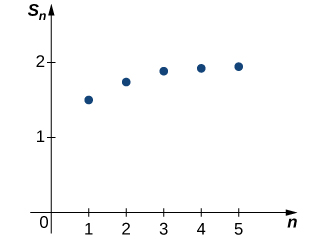
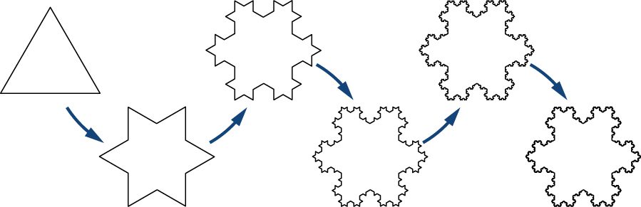
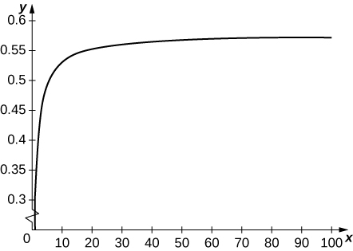
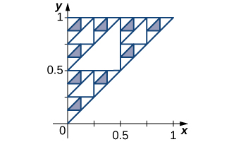

* Explain the meaning of the sum of an infinite series.
* Calculate the sum of a geometric series.
* Evaluate a telescoping series.

We have seen that a sequence is an ordered set of terms. If you add these terms together, you get a series. In this section we define an infinite series and show how series are related to sequences. We also define what it means for a series to converge or diverge. We introduce one of the most important types of series: the geometric series. We will use geometric series in the next chapter to write certain functions as polynomials with an infinite number of terms. This process is important because it allows us to evaluate, differentiate, and integrate complicated functions by using polynomials that are easier to handle. We also discuss the harmonic series, arguably the most interesting divergent series because it just fails to converge.

### Sums and Series

An infinite series is a sum of infinitely many terms and is written in the form

<math xmlns="http://www.w3.org/1998/Math/MathML"><mrow><munderover><mstyle mathsize="140%" displaystyle="true"><mo>∑</mo></mstyle><mrow><mi>n</mi><mo>=</mo><mn>1</mn></mrow><mi>∞</mi></munderover><msub><mi>a</mi><mi>n</mi></msub><mo>=</mo><msub><mi>a</mi><mn>1</mn></msub><mo>+</mo><msub><mi>a</mi><mn>2</mn></msub><mo>+</mo><msub><mi>a</mi><mn>3</mn></msub><mo>+</mo><mtext>⋯</mtext><mo>.</mo></mrow></math>

But what does this mean? We cannot add an infinite number of terms in the same way we can add a finite number of terms. Instead, the value of an infinite series is defined in terms of the *limit* of partial sums. A partial sum of an infinite series is a finite sum of the form

<math xmlns="http://www.w3.org/1998/Math/MathML"><mrow><mstyle displaystyle="true"><munderover><mo>∑</mo><mrow><mi>n</mi><mo>=</mo><mn>1</mn></mrow><mi>k</mi></munderover><mrow><msub><mi>a</mi><mi>n</mi></msub></mrow></mstyle><mo>=</mo><msub><mi>a</mi><mn>1</mn></msub><mo>+</mo><msub><mi>a</mi><mn>2</mn></msub><mo>+</mo><msub><mi>a</mi><mn>3</mn></msub><mo>+</mo><mtext>⋯</mtext><mo>+</mo><msub><mi>a</mi><mi>k</mi></msub><mo>.</mo></mrow></math>

To see how we use partial sums to evaluate infinite series, consider the following example. Suppose oil is seeping into a lake such that <math xmlns="http://www.w3.org/1998/Math/MathML"><mrow><mn>1000</mn></mrow></math>

 gallons enters the lake the first week. During the second week, an additional <math xmlns="http://www.w3.org/1998/Math/MathML"><mrow><mn>500</mn></mrow></math>

 gallons of oil enters the lake. The third week, <math xmlns="http://www.w3.org/1998/Math/MathML"><mrow><mn>250</mn></mrow></math>

 more gallons enters the lake. Assume this pattern continues such that each week half as much oil enters the lake as did the previous week. If this continues forever, what can we say about the amount of oil in the lake? Will the amount of oil continue to get arbitrarily large, or is it possible that it approaches some finite amount? To answer this question, we look at the amount of oil in the lake after <math xmlns="http://www.w3.org/1998/Math/MathML"><mi>k</mi></math>

 weeks. Letting <math xmlns="http://www.w3.org/1998/Math/MathML"><mrow><msub><mi>S</mi><mi>k</mi></msub></mrow></math>

 denote the amount of oil in the lake (measured in thousands of gallons) after <math xmlns="http://www.w3.org/1998/Math/MathML"><mi>k</mi></math>

 weeks, we see that

<math xmlns="http://www.w3.org/1998/Math/MathML"><mtable columnalign="left"><mtr><mtd columnalign="left"><msub><mi>S</mi><mn>1</mn></msub><mo>=</mo><mn>1</mn></mtd></mtr><mtr><mtd columnalign="left"><msub><mi>S</mi><mn>2</mn></msub><mo>=</mo><mn>1</mn><mo>+</mo><mn>0.5</mn><mo>=</mo><mn>1</mn><mo>+</mo><mfrac><mn>1</mn><mn>2</mn></mfrac></mtd></mtr><mtr><mtd columnalign="left"><msub><mi>S</mi><mn>3</mn></msub><mo>=</mo><mn>1</mn><mo>+</mo><mn>0.5</mn><mo>+</mo><mn>0.25</mn><mo>=</mo><mn>1</mn><mo>+</mo><mfrac><mn>1</mn><mn>2</mn></mfrac><mo>+</mo><mfrac><mn>1</mn><mn>4</mn></mfrac></mtd></mtr><mtr><mtd columnalign="left"><msub><mi>S</mi><mn>4</mn></msub><mo>=</mo><mn>1</mn><mo>+</mo><mn>0.5</mn><mo>+</mo><mn>0.25</mn><mo>+</mo><mn>0.125</mn><mo>=</mo><mn>1</mn><mo>+</mo><mfrac><mn>1</mn><mn>2</mn></mfrac><mo>+</mo><mfrac><mn>1</mn><mn>4</mn></mfrac><mo>+</mo><mfrac><mn>1</mn><mn>8</mn></mfrac></mtd></mtr><mtr><mtd columnalign="left"><msub><mi>S</mi><mn>5</mn></msub><mo>=</mo><mn>1</mn><mo>+</mo><mn>0.5</mn><mo>+</mo><mn>0.25</mn><mo>+</mo><mn>0.125</mn><mo>+</mo><mn>0.0625</mn><mo>=</mo><mn>1</mn><mo>+</mo><mfrac><mn>1</mn><mn>2</mn></mfrac><mo>+</mo><mfrac><mn>1</mn><mn>4</mn></mfrac><mo>+</mo><mfrac><mn>1</mn><mn>8</mn></mfrac><mo>+</mo><mfrac><mn>1</mn><mrow><mn>16</mn></mrow></mfrac><mo>.</mo></mtd></mtr></mtable></math>

Looking at this pattern, we see that the amount of oil in the lake (in thousands of gallons) after <math xmlns="http://www.w3.org/1998/Math/MathML"><mi>k</mi></math>

 weeks is

<math xmlns="http://www.w3.org/1998/Math/MathML"><mrow><msub><mi>S</mi><mi>k</mi></msub><mo>=</mo><mn>1</mn><mo>+</mo><mfrac><mn>1</mn><mn>2</mn></mfrac><mo>+</mo><mfrac><mn>1</mn><mn>4</mn></mfrac><mo>+</mo><mfrac><mn>1</mn><mn>8</mn></mfrac><mo>+</mo><mfrac><mn>1</mn><mrow><mn>16</mn></mrow></mfrac><mo>+</mo><mtext>⋯</mtext><mo>+</mo><mfrac><mn>1</mn><mrow><msup><mn>2</mn><mrow><mi>k</mi><mo>−</mo><mn>1</mn></mrow></msup></mrow></mfrac><mo>=</mo><mstyle displaystyle="true"><munderover><mo>∑</mo><mrow><mi>n</mi><mo>=</mo><mn>1</mn></mrow><mi>k</mi></munderover><mrow><msup><mrow><mrow><mo>(</mo><mrow><mfrac><mn>1</mn><mn>2</mn></mfrac></mrow><mo>)</mo></mrow></mrow><mrow><mi>n</mi><mo>−</mo><mn>1</mn></mrow></msup></mrow></mstyle><mo>.</mo></mrow></math>

We are interested in what happens as <math xmlns="http://www.w3.org/1998/Math/MathML"><mrow><mi>k</mi><mo stretchy="false">→</mo><mi>∞</mi><mo>.</mo></mrow></math>

 Symbolically, the amount of oil in the lake as <math xmlns="http://www.w3.org/1998/Math/MathML"><mrow><mi>k</mi><mo stretchy="false">→</mo><mi>∞</mi></mrow></math>

 is given by the infinite series

<math xmlns="http://www.w3.org/1998/Math/MathML"><mrow><mstyle displaystyle="true"><munderover><mo>∑</mo><mrow><mi>n</mi><mo>=</mo><mn>1</mn></mrow><mi>∞</mi></munderover><mrow><msup><mrow><mrow><mo>(</mo><mrow><mfrac><mn>1</mn><mn>2</mn></mfrac></mrow><mo>)</mo></mrow></mrow><mrow><mi>n</mi><mo>−</mo><mn>1</mn></mrow></msup></mrow></mstyle><mo>=</mo><mn>1</mn><mo>+</mo><mfrac><mn>1</mn><mn>2</mn></mfrac><mo>+</mo><mfrac><mn>1</mn><mn>4</mn></mfrac><mo>+</mo><mfrac><mn>1</mn><mn>8</mn></mfrac><mo>+</mo><mfrac><mn>1</mn><mrow><mn>16</mn></mrow></mfrac><mo>+</mo><mtext>⋯</mtext><mo>.</mo></mrow></math>

At the same time, as <math xmlns="http://www.w3.org/1998/Math/MathML"><mrow><mi>k</mi><mo stretchy="false">→</mo><mi>∞</mi><mo>,</mo></mrow></math>

 the amount of oil in the lake can be calculated by evaluating <math xmlns="http://www.w3.org/1998/Math/MathML"><mrow><munder><mrow><mtext>lim</mtext></mrow><mrow><mi>k</mi><mo stretchy="false">→</mo><mi>∞</mi></mrow></munder><msub><mi>S</mi><mi>k</mi></msub><mo>.</mo></mrow></math>

 Therefore, the behavior of the infinite series can be determined by looking at the behavior of the sequence of partial sums <math xmlns="http://www.w3.org/1998/Math/MathML"><mrow><mo>{</mo><msub><mi>S</mi><mi>k</mi></msub><mo>}</mo><mo>.</mo></mrow></math>

 If the sequence of partial sums <math xmlns="http://www.w3.org/1998/Math/MathML"><mrow><mo>{</mo><msub><mi>S</mi><mi>k</mi></msub><mo>}</mo></mrow></math>

 converges, we say that the infinite series converges, and its sum is given by <math xmlns="http://www.w3.org/1998/Math/MathML"><mrow><munder><mrow><mtext>lim</mtext></mrow><mrow><mi>k</mi><mo stretchy="false">→</mo><mi>∞</mi></mrow></munder><msub><mi>S</mi><mi>k</mi></msub><mo>.</mo></mrow></math>

 If the sequence <math xmlns="http://www.w3.org/1998/Math/MathML"><mrow><mo>{</mo><msub><mi>S</mi><mi>k</mi></msub><mo>}</mo></mrow></math>

 diverges, we say the infinite series diverges. We now turn our attention to determining the limit of this sequence <math xmlns="http://www.w3.org/1998/Math/MathML"><mrow><mo>{</mo><msub><mi>S</mi><mi>k</mi></msub><mo>}</mo><mo>.</mo></mrow></math>

First, simplifying some of these partial sums, we see that

<math xmlns="http://www.w3.org/1998/Math/MathML"><mtable columnalign="left"><mtr><mtd columnalign="left"><msub><mi>S</mi><mn>1</mn></msub><mo>=</mo><mn>1</mn></mtd></mtr><mtr><mtd columnalign="left"><msub><mi>S</mi><mn>2</mn></msub><mo>=</mo><mn>1</mn><mo>+</mo><mfrac><mn>1</mn><mn>2</mn></mfrac><mo>=</mo><mfrac><mn>3</mn><mn>2</mn></mfrac></mtd></mtr><mtr><mtd columnalign="left"><msub><mi>S</mi><mn>3</mn></msub><mo>=</mo><mn>1</mn><mo>+</mo><mfrac><mn>1</mn><mn>2</mn></mfrac><mo>+</mo><mfrac><mn>1</mn><mn>4</mn></mfrac><mo>=</mo><mfrac><mn>7</mn><mn>4</mn></mfrac></mtd></mtr><mtr><mtd columnalign="left"><msub><mi>S</mi><mn>4</mn></msub><mo>=</mo><mn>1</mn><mo>+</mo><mfrac><mn>1</mn><mn>2</mn></mfrac><mo>+</mo><mfrac><mn>1</mn><mn>4</mn></mfrac><mo>+</mo><mfrac><mn>1</mn><mn>8</mn></mfrac><mo>=</mo><mfrac><mrow><mn>15</mn></mrow><mn>8</mn></mfrac></mtd></mtr><mtr><mtd columnalign="left"><msub><mi>S</mi><mn>5</mn></msub><mo>=</mo><mn>1</mn><mo>+</mo><mfrac><mn>1</mn><mn>2</mn></mfrac><mo>+</mo><mfrac><mn>1</mn><mn>4</mn></mfrac><mo>+</mo><mfrac><mn>1</mn><mn>8</mn></mfrac><mo>+</mo><mfrac><mn>1</mn><mrow><mn>16</mn></mrow></mfrac><mo>=</mo><mfrac><mrow><mn>31</mn></mrow><mrow><mn>16</mn></mrow></mfrac><mo>.</mo></mtd></mtr></mtable></math>

Plotting some of these values in [\[link\]](#CNX_Calc_Figure_09_02_001), it appears that the sequence <math xmlns="http://www.w3.org/1998/Math/MathML"><mrow><mo>{</mo><msub><mi>S</mi><mi>k</mi></msub><mo>}</mo></mrow></math>

 could be approaching 2.

 {: #CNX_Calc_Figure_09_02_001}

Let’s look for more convincing evidence. In the following table, we list the values of <math xmlns="http://www.w3.org/1998/Math/MathML"><mrow><msub><mi>S</mi><mi>k</mi></msub></mrow></math>

 for several values of <math xmlns="http://www.w3.org/1998/Math/MathML"><mrow><mi>k</mi><mo>.</mo></mrow></math>

| <math xmlns="http://www.w3.org/1998/Math/MathML"><mi>k</mi></math>

 | <math xmlns="http://www.w3.org/1998/Math/MathML"><mn>5</mn></math>

 | <math xmlns="http://www.w3.org/1998/Math/MathML"><mrow><mn>10</mn></mrow></math>

 | <math xmlns="http://www.w3.org/1998/Math/MathML"><mrow><mn>15</mn></mrow></math>

 | <math xmlns="http://www.w3.org/1998/Math/MathML"><mrow><mn>20</mn></mrow></math>

 |
{: valign="top"}| <math xmlns="http://www.w3.org/1998/Math/MathML"><mrow><msub><mi>S</mi><mi>k</mi></msub></mrow></math>

 | <math xmlns="http://www.w3.org/1998/Math/MathML"><mrow><mn>1.9375</mn></mrow></math>

 | <math xmlns="http://www.w3.org/1998/Math/MathML"><mrow><mn>1.998</mn></mrow></math>

 | <math xmlns="http://www.w3.org/1998/Math/MathML"><mrow><mn>1.999939</mn></mrow></math>

 | <math xmlns="http://www.w3.org/1998/Math/MathML"><mrow><mn>1.999998</mn></mrow></math>

 |
{: valign="top"}{: .unnumbered summary="This is a table with two rows and five columns. The first row is labeled &#x201C;k&#x201D; and has the values 5, 10, 15, and 20. The second row is labeled &#x201C;S_k&#x201D; and has the values 1.9375, 1.998, 1.999939, and 1.999998." data-label=""}

These data supply more evidence suggesting that the sequence <math xmlns="http://www.w3.org/1998/Math/MathML"><mrow><mo>{</mo><msub><mi>S</mi><mi>k</mi></msub><mo>}</mo></mrow></math>

 converges to <math xmlns="http://www.w3.org/1998/Math/MathML"><mrow><mn>2</mn><mo>.</mo></mrow></math>

 Later we will provide an analytic argument that can be used to prove that <math xmlns="http://www.w3.org/1998/Math/MathML"><mrow><munder><mrow><mtext>lim</mtext></mrow><mrow><mi>k</mi><mo stretchy="false">→</mo><mi>∞</mi></mrow></munder><msub><mi>S</mi><mi>k</mi></msub><mo>=</mo><mn>2</mn><mo>.</mo></mrow></math>

 For now, we rely on the numerical and graphical data to convince ourselves that the sequence of partial sums does actually converge to <math xmlns="http://www.w3.org/1998/Math/MathML"><mrow><mn>2</mn><mo>.</mo></mrow></math>

 Since this sequence of partial sums converges to <math xmlns="http://www.w3.org/1998/Math/MathML"><mrow><mn>2</mn><mo>,</mo></mrow></math>

 we say the infinite series converges to <math xmlns="http://www.w3.org/1998/Math/MathML"><mn>2</mn></math>

 and write

<math xmlns="http://www.w3.org/1998/Math/MathML"><mrow><munderover><mstyle mathsize="140%" displaystyle="true"><mo>∑</mo></mstyle><mrow><mi>n</mi><mo>=</mo><mn>1</mn></mrow><mi>∞</mi></munderover><msup><mrow><mrow><mo>(</mo><mrow><mfrac><mn>1</mn><mn>2</mn></mfrac></mrow><mo>)</mo></mrow></mrow><mrow><mi>n</mi><mo>−</mo><mn>1</mn></mrow></msup><mo>=</mo><mn>2</mn><mo>.</mo></mrow></math>

Returning to the question about the oil in the lake, since this infinite series converges to <math xmlns="http://www.w3.org/1998/Math/MathML"><mrow><mn>2</mn><mo>,</mo></mrow></math>

 we conclude that the amount of oil in the lake will get arbitrarily close to <math xmlns="http://www.w3.org/1998/Math/MathML"><mrow><mn>2000</mn></mrow></math>

 gallons as the amount of time gets sufficiently large.

This series is an example of a geometric series. We discuss geometric series in more detail later in this section. First, we summarize what it means for an infinite series to converge.

Definition

An **infinite series**{: data-type="term"} is an expression of the form

<math xmlns="http://www.w3.org/1998/Math/MathML"><mrow><munderover><mstyle mathsize="140%" displaystyle="true"><mo>∑</mo></mstyle><mrow><mi>n</mi><mo>=</mo><mn>1</mn></mrow><mi>∞</mi></munderover><msub><mi>a</mi><mi>n</mi></msub><mo>=</mo><msub><mi>a</mi><mn>1</mn></msub><mo>+</mo><msub><mi>a</mi><mn>2</mn></msub><mo>+</mo><msub><mi>a</mi><mn>3</mn></msub><mo>+</mo><mtext>⋯</mtext><mo>.</mo></mrow></math>

For each positive integer <math xmlns="http://www.w3.org/1998/Math/MathML"><mrow><mi>k</mi><mo>,</mo></mrow></math>

 the sum

<math xmlns="http://www.w3.org/1998/Math/MathML"><mrow><msub><mi>S</mi><mi>k</mi></msub><mo>=</mo><munderover><mstyle mathsize="140%" displaystyle="true"><mo>∑</mo></mstyle><mrow><mi>n</mi><mo>=</mo><mn>1</mn></mrow><mi>k</mi></munderover><msub><mi>a</mi><mi>n</mi></msub><mo>=</mo><msub><mi>a</mi><mn>1</mn></msub><mo>+</mo><msub><mi>a</mi><mn>2</mn></msub><mo>+</mo><msub><mi>a</mi><mn>3</mn></msub><mo>+</mo><mtext>⋯</mtext><mo>+</mo><msub><mi>a</mi><mi>k</mi></msub></mrow></math>

is called the <math xmlns="http://www.w3.org/1998/Math/MathML"><mrow><mi>k</mi><mtext>th</mtext></mrow></math>

 **partial sum**{: data-type="term"} of the infinite series. The partial sums form a sequence <math xmlns="http://www.w3.org/1998/Math/MathML"><mrow><mo>{</mo><msub><mi>S</mi><mi>k</mi></msub><mo>}</mo><mo>.</mo></mrow></math>

 If the sequence of partial sums converges to a real number <math xmlns="http://www.w3.org/1998/Math/MathML"><mrow><mi>S</mi><mo>,</mo></mrow></math>

 the infinite series converges. If we can describe the **convergence of a series**{: data-type="term"} to <math xmlns="http://www.w3.org/1998/Math/MathML"><mrow><mi>S</mi><mo>,</mo></mrow></math>

 we call <math xmlns="http://www.w3.org/1998/Math/MathML"><mi>S</mi></math>

 the sum of the series, and we write

<math xmlns="http://www.w3.org/1998/Math/MathML"><mrow><munderover><mstyle mathsize="140%" displaystyle="true"><mo>∑</mo></mstyle><mrow><mi>n</mi><mo>=</mo><mn>1</mn></mrow><mi>∞</mi></munderover><msub><mi>a</mi><mi>n</mi></msub><mo>=</mo><mi>S</mi><mo>.</mo></mrow></math>

If the sequence of partial sums diverges, we have the **divergence of a series**{: data-type="term"}.

This [website][1] shows a more whimsical approach to series.

Note that the index for a series need not begin with <math xmlns="http://www.w3.org/1998/Math/MathML"><mrow><mi>n</mi><mo>=</mo><mn>1</mn></mrow></math>

 but can begin with any value. For example, the series

<math xmlns="http://www.w3.org/1998/Math/MathML"><mrow><msup><mrow><mstyle displaystyle="true"><munderover><mo>∑</mo><mrow><mi>n</mi><mo>=</mo><mn>1</mn></mrow><mi>∞</mi></munderover><mrow><mrow><mo>(</mo><mrow><mfrac><mn>1</mn><mn>2</mn></mfrac></mrow><mo>)</mo></mrow></mrow></mstyle></mrow><mrow><mi>n</mi><mo>−</mo><mn>1</mn></mrow></msup></mrow></math>

can also be written as

<math xmlns="http://www.w3.org/1998/Math/MathML"><mrow><msup><mrow><mstyle displaystyle="true"><munderover><mo>∑</mo><mrow><mi>n</mi><mo>=</mo><mn>0</mn></mrow><mi>∞</mi></munderover><mrow><mrow><mo>(</mo><mrow><mfrac><mn>1</mn><mn>2</mn></mfrac></mrow><mo>)</mo></mrow></mrow></mstyle></mrow><mi>n</mi></msup><mspace width="0.2em" /><mtext>or</mtext><mspace width="0.2em" /><msup><mrow><mstyle displaystyle="true"><munderover><mo>∑</mo><mrow><mi>n</mi><mo>=</mo><mn>5</mn></mrow><mi>∞</mi></munderover><mrow><mrow><mo>(</mo><mrow><mfrac><mn>1</mn><mn>2</mn></mfrac></mrow><mo>)</mo></mrow></mrow></mstyle></mrow><mrow><mi>n</mi><mo>−</mo><mn>5</mn></mrow></msup><mo>.</mo></mrow></math>

Often it is convenient for the index to begin at <math xmlns="http://www.w3.org/1998/Math/MathML"><mrow><mn>1</mn><mo>,</mo></mrow></math>

 so if for some reason it begins at a different value, we can reindex by making a change of variables. For example, consider the series

<math xmlns="http://www.w3.org/1998/Math/MathML"><mrow><mstyle displaystyle="true"><munderover><mo>∑</mo><mrow><mi>n</mi><mo>=</mo><mn>2</mn></mrow><mi>∞</mi></munderover><mrow><mfrac><mn>1</mn><mrow><msup><mi>n</mi><mn>2</mn></msup></mrow></mfrac></mrow></mstyle><mo>.</mo></mrow></math>

By introducing the variable <math xmlns="http://www.w3.org/1998/Math/MathML"><mrow><mi>m</mi><mo>=</mo><mi>n</mi><mo>−</mo><mn>1</mn><mo>,</mo></mrow></math>

 so that <math xmlns="http://www.w3.org/1998/Math/MathML"><mrow><mi>n</mi><mo>=</mo><mi>m</mi><mo>+</mo><mn>1</mn><mo>,</mo></mrow></math>

 we can rewrite the series as

<math xmlns="http://www.w3.org/1998/Math/MathML"><mrow><mstyle displaystyle="true"><munderover><mo>∑</mo><mrow><mi>m</mi><mo>=</mo><mn>1</mn></mrow><mi>∞</mi></munderover><mrow><mfrac><mn>1</mn><mrow><msup><mrow><mrow><mo>(</mo><mrow><mi>m</mi><mo>+</mo><mn>1</mn></mrow><mo>)</mo></mrow></mrow><mn>2</mn></msup></mrow></mfrac></mrow></mstyle><mo>.</mo></mrow></math>

Evaluating Limits of Sequences of Partial Sums

For each of the following series, use the sequence of partial sums to determine whether the series converges or diverges.

1.  <math xmlns="http://www.w3.org/1998/Math/MathML"><mrow><mstyle displaystyle="true"><munderover><mo>∑</mo><mrow><mi>n</mi><mo>=</mo><mn>1</mn></mrow><mi>∞</mi></munderover><mrow><mfrac><mi>n</mi><mrow><mi>n</mi><mo>+</mo><mn>1</mn></mrow></mfrac></mrow></mstyle></mrow></math>

2.  <math xmlns="http://www.w3.org/1998/Math/MathML"><mrow><mstyle displaystyle="true"><munderover><mo>∑</mo><mrow><mi>n</mi><mo>=</mo><mn>1</mn></mrow><mi>∞</mi></munderover><mrow><msup><mrow><mo stretchy="false">(</mo><mn>−1</mn><mo stretchy="false">)</mo></mrow><mi>n</mi></msup></mrow></mstyle></mrow></math>

3.  <math xmlns="http://www.w3.org/1998/Math/MathML"><mrow><mstyle displaystyle="true"><munderover><mo>∑</mo><mrow><mi>n</mi><mo>=</mo><mn>1</mn></mrow><mi>∞</mi></munderover><mrow><mfrac><mn>1</mn><mrow><mi>n</mi><mo stretchy="false">(</mo><mi>n</mi><mo>+</mo><mn>1</mn><mo stretchy="false">)</mo></mrow></mfrac></mrow></mstyle></mrow></math>
{: type="a"}

1.  The sequence of partial sums
    <math xmlns="http://www.w3.org/1998/Math/MathML"><mrow><mrow><mo>{</mo><mrow><msub><mi>S</mi><mi>k</mi></msub></mrow><mo>}</mo></mrow></mrow></math>
    
    satisfies
    * * *
    {: data-type="newline"}
    
    

    <math xmlns="http://www.w3.org/1998/Math/MathML"><mtable columnalign="left"><mtr><mtd columnalign="left"><msub><mi>S</mi><mn>1</mn></msub><mo>=</mo><mfrac><mn>1</mn><mn>2</mn></mfrac></mtd></mtr><mtr><mtd columnalign="left"><msub><mi>S</mi><mn>2</mn></msub><mo>=</mo><mfrac><mn>1</mn><mn>2</mn></mfrac><mo>+</mo><mfrac><mn>2</mn><mn>3</mn></mfrac></mtd></mtr><mtr><mtd columnalign="left"><msub><mi>S</mi><mn>3</mn></msub><mo>=</mo><mfrac><mn>1</mn><mn>2</mn></mfrac><mo>+</mo><mfrac><mn>2</mn><mn>3</mn></mfrac><mo>+</mo><mfrac><mn>3</mn><mn>4</mn></mfrac></mtd></mtr><mtr><mtd columnalign="left"><msub><mi>S</mi><mn>4</mn></msub><mo>=</mo><mfrac><mn>1</mn><mn>2</mn></mfrac><mo>+</mo><mfrac><mn>2</mn><mn>3</mn></mfrac><mo>+</mo><mfrac><mn>3</mn><mn>4</mn></mfrac><mo>+</mo><mfrac><mn>4</mn><mn>5</mn></mfrac><mo>.</mo></mtd></mtr></mtable></math>
    

    
    * * *
    {: data-type="newline"}
    
    Notice that each term added is greater than
    <math xmlns="http://www.w3.org/1998/Math/MathML"><mrow><mn>1</mn><mtext>/</mtext><mn>2</mn><mo>.</mo></mrow></math>
    
    As a result, we see that
    * * *
    {: data-type="newline"}
    
    

    <math xmlns="http://www.w3.org/1998/Math/MathML"><mtable columnalign="left"><mtr><mtd columnalign="left"><msub><mi>S</mi><mn>1</mn></msub><mo>=</mo><mfrac><mn>1</mn><mn>2</mn></mfrac></mtd></mtr><mtr><mtd columnalign="left"><msub><mi>S</mi><mn>2</mn></msub><mo>=</mo><mfrac><mn>1</mn><mn>2</mn></mfrac><mo>+</mo><mfrac><mn>2</mn><mn>3</mn></mfrac><mo>&gt;</mo><mfrac><mn>1</mn><mn>2</mn></mfrac><mo>+</mo><mfrac><mn>1</mn><mn>2</mn></mfrac><mo>=</mo><mn>2</mn><mrow><mo>(</mo><mrow><mfrac><mn>1</mn><mn>2</mn></mfrac></mrow><mo>)</mo></mrow></mtd></mtr><mtr><mtd columnalign="left"><msub><mi>S</mi><mn>3</mn></msub><mo>=</mo><mfrac><mn>1</mn><mn>2</mn></mfrac><mo>+</mo><mfrac><mn>2</mn><mn>3</mn></mfrac><mo>+</mo><mfrac><mn>3</mn><mn>4</mn></mfrac><mo>&gt;</mo><mfrac><mn>1</mn><mn>2</mn></mfrac><mo>+</mo><mfrac><mn>1</mn><mn>2</mn></mfrac><mo>+</mo><mfrac><mn>1</mn><mn>2</mn></mfrac><mo>=</mo><mn>3</mn><mrow><mo>(</mo><mrow><mfrac><mn>1</mn><mn>2</mn></mfrac></mrow><mo>)</mo></mrow></mtd></mtr><mtr><mtd columnalign="left"><msub><mi>S</mi><mn>4</mn></msub><mo>=</mo><mfrac><mn>1</mn><mn>2</mn></mfrac><mo>+</mo><mfrac><mn>2</mn><mn>3</mn></mfrac><mo>+</mo><mfrac><mn>3</mn><mn>4</mn></mfrac><mo>+</mo><mfrac><mn>4</mn><mn>5</mn></mfrac><mo>&gt;</mo><mfrac><mn>1</mn><mn>2</mn></mfrac><mo>+</mo><mfrac><mn>1</mn><mn>2</mn></mfrac><mo>+</mo><mfrac><mn>1</mn><mn>2</mn></mfrac><mo>+</mo><mfrac><mn>1</mn><mn>2</mn></mfrac><mo>=</mo><mn>4</mn><mrow><mo>(</mo><mrow><mfrac><mn>1</mn><mn>2</mn></mfrac></mrow><mo>)</mo></mrow><mo>.</mo></mtd></mtr></mtable></math>
    

    
    * * *
    {: data-type="newline"}
    
    From this pattern we can see that
    <math xmlns="http://www.w3.org/1998/Math/MathML"><mrow><msub><mi>S</mi><mi>k</mi></msub><mo>&gt;</mo><mi>k</mi><mrow><mo>(</mo><mrow><mfrac><mn>1</mn><mn>2</mn></mfrac></mrow><mo>)</mo></mrow></mrow></math>
    
    for every integer
    <math xmlns="http://www.w3.org/1998/Math/MathML"><mrow><mi>k</mi><mo>.</mo></mrow></math>
    
    Therefore,
    <math xmlns="http://www.w3.org/1998/Math/MathML"><mrow><mrow><mo>{</mo><mrow><msub><mi>S</mi><mi>k</mi></msub></mrow><mo>}</mo></mrow></mrow></math>
    
    is unbounded and consequently, diverges. Therefore, the infinite series
    <math xmlns="http://www.w3.org/1998/Math/MathML"><mrow><munderover><mstyle mathsize="140%" displaystyle="true"><mo>∑</mo></mstyle><mrow><mi>n</mi><mo>=</mo><mn>1</mn></mrow><mi>∞</mi></munderover><mi>n</mi><mtext>/</mtext><mo stretchy="false">(</mo><mi>n</mi><mo>+</mo><mn>1</mn><mo stretchy="false">)</mo></mrow></math>
    
    diverges.
2.  The sequence of partial sums
    <math xmlns="http://www.w3.org/1998/Math/MathML"><mrow><mrow><mo>{</mo><mrow><msub><mi>S</mi><mi>k</mi></msub></mrow><mo>}</mo></mrow></mrow></math>
    
    satisfies
    * * *
    {: data-type="newline"}
    
    

    <math xmlns="http://www.w3.org/1998/Math/MathML"><mtable columnalign="left"><mtr><mtd columnalign="left"><msub><mi>S</mi><mn>1</mn></msub><mo>=</mo><mn>−1</mn></mtd></mtr><mtr><mtd columnalign="left"><msub><mi>S</mi><mn>2</mn></msub><mo>=</mo><mn>−1</mn><mo>+</mo><mn>1</mn><mo>=</mo><mn>0</mn></mtd></mtr><mtr><mtd columnalign="left"><msub><mi>S</mi><mn>3</mn></msub><mo>=</mo><mn>−1</mn><mo>+</mo><mn>1</mn><mo>−</mo><mn>1</mn><mo>=</mo><mn>−1</mn></mtd></mtr><mtr><mtd columnalign="left"><msub><mi>S</mi><mn>4</mn></msub><mo>=</mo><mn>−1</mn><mo>+</mo><mn>1</mn><mo>−</mo><mn>1</mn><mo>+</mo><mn>1</mn><mo>=</mo><mn>0</mn><mo>.</mo></mtd></mtr></mtable></math>
    

    
    * * *
    {: data-type="newline"}
    
    From this pattern we can see the sequence of partial sums is
    * * *
    {: data-type="newline"}
    
    

    <math xmlns="http://www.w3.org/1998/Math/MathML"><mrow><mrow><mo>{</mo><mrow><msub><mi>S</mi><mi>k</mi></msub></mrow><mo>}</mo></mrow><mo>=</mo><mrow><mo>{</mo><mrow><mn>−1</mn><mo>,</mo><mn>0</mn><mo>,</mo><mn>−1</mn><mo>,</mo><mn>0</mn><mtext>,…</mtext></mrow><mo>}</mo></mrow><mo>.</mo></mrow></math>
    

    
    * * *
    {: data-type="newline"}
    
    Since this sequence diverges, the infinite series
    <math xmlns="http://www.w3.org/1998/Math/MathML"><mrow><munderover><mstyle mathsize="140%" displaystyle="true"><mo>∑</mo></mstyle><mrow><mi>n</mi><mo>=</mo><mn>1</mn></mrow><mi>∞</mi></munderover><msup><mrow><mrow><mo>(</mo><mrow><mn>−1</mn></mrow><mo>)</mo></mrow></mrow><mi>n</mi></msup></mrow></math>
    
    diverges.
3.  The sequence of partial sums
    <math xmlns="http://www.w3.org/1998/Math/MathML"><mrow><mrow><mo>{</mo><mrow><msub><mi>S</mi><mi>k</mi></msub></mrow><mo>}</mo></mrow></mrow></math>
    
    satisfies
    * * *
    {: data-type="newline"}
    
    

    <math xmlns="http://www.w3.org/1998/Math/MathML"><mtable columnalign="left"><mtr><mtd columnalign="left"><msub><mi>S</mi><mn>1</mn></msub><mo>=</mo><mfrac><mn>1</mn><mrow><mn>1</mn><mo>·</mo><mn>2</mn></mrow></mfrac><mo>=</mo><mfrac><mn>1</mn><mn>2</mn></mfrac></mtd></mtr><mtr><mtd columnalign="left"><msub><mi>S</mi><mn>2</mn></msub><mo>=</mo><mfrac><mn>1</mn><mrow><mn>1</mn><mo>·</mo><mn>2</mn></mrow></mfrac><mo>+</mo><mfrac><mn>1</mn><mrow><mn>2</mn><mo>·</mo><mn>3</mn></mrow></mfrac><mo>=</mo><mfrac><mn>1</mn><mn>2</mn></mfrac><mo>+</mo><mfrac><mn>1</mn><mn>6</mn></mfrac><mo>=</mo><mfrac><mn>2</mn><mn>3</mn></mfrac></mtd></mtr><mtr><mtd columnalign="left"><msub><mi>S</mi><mn>3</mn></msub><mo>=</mo><mfrac><mn>1</mn><mrow><mn>1</mn><mo>·</mo><mn>2</mn></mrow></mfrac><mo>+</mo><mfrac><mn>1</mn><mrow><mn>2</mn><mo>·</mo><mn>3</mn></mrow></mfrac><mo>+</mo><mfrac><mn>1</mn><mrow><mn>3</mn><mo>·</mo><mn>4</mn></mrow></mfrac><mo>=</mo><mfrac><mn>1</mn><mn>2</mn></mfrac><mo>+</mo><mfrac><mn>1</mn><mn>6</mn></mfrac><mo>+</mo><mfrac><mn>1</mn><mrow><mn>12</mn></mrow></mfrac><mo>=</mo><mfrac><mn>3</mn><mn>4</mn></mfrac></mtd></mtr><mtr><mtd columnalign="left"><msub><mi>S</mi><mn>4</mn></msub><mo>=</mo><mfrac><mn>1</mn><mrow><mn>1</mn><mo>·</mo><mn>2</mn></mrow></mfrac><mo>+</mo><mfrac><mn>1</mn><mrow><mn>2</mn><mo>·</mo><mn>3</mn></mrow></mfrac><mo>+</mo><mfrac><mn>1</mn><mrow><mn>3</mn><mo>·</mo><mn>4</mn></mrow></mfrac><mo>+</mo><mfrac><mn>1</mn><mrow><mn>4</mn><mo>·</mo><mn>5</mn></mrow></mfrac><mo>=</mo><mfrac><mn>4</mn><mn>5</mn></mfrac></mtd></mtr><mtr><mtd columnalign="left"><msub><mi>S</mi><mn>5</mn></msub><mo>=</mo><mfrac><mn>1</mn><mrow><mn>1</mn><mo>·</mo><mn>2</mn></mrow></mfrac><mo>+</mo><mfrac><mn>1</mn><mrow><mn>2</mn><mo>·</mo><mn>3</mn></mrow></mfrac><mo>+</mo><mfrac><mn>1</mn><mrow><mn>3</mn><mo>·</mo><mn>4</mn></mrow></mfrac><mo>+</mo><mfrac><mn>1</mn><mrow><mn>4</mn><mo>·</mo><mn>5</mn></mrow></mfrac><mo>+</mo><mfrac><mn>1</mn><mrow><mn>5</mn><mo>·</mo><mn>6</mn></mrow></mfrac><mo>=</mo><mfrac><mn>5</mn><mn>6</mn></mfrac><mo>.</mo></mtd></mtr></mtable></math>
    

    
    * * *
    {: data-type="newline"}
    
    From this pattern, we can see that the
    <math xmlns="http://www.w3.org/1998/Math/MathML"><mrow><mi>k</mi><mtext>th</mtext></mrow></math>
    
    partial sum is given by the explicit formula
    * * *
    {: data-type="newline"}
    
    

    <math xmlns="http://www.w3.org/1998/Math/MathML"><mrow><msub><mi>S</mi><mi>k</mi></msub><mo>=</mo><mfrac><mi>k</mi><mrow><mi>k</mi><mo>+</mo><mn>1</mn></mrow></mfrac><mo>.</mo></mrow></math>
    

    
    * * *
    {: data-type="newline"}
    
    Since
    <math xmlns="http://www.w3.org/1998/Math/MathML"><mrow><mi>k</mi><mtext>/</mtext><mrow><mo>(</mo><mrow><mi>k</mi><mo>+</mo><mn>1</mn></mrow><mo>)</mo></mrow><mo stretchy="false">→</mo><mn>1</mn><mo>,</mo></mrow></math>
    
    we conclude that the sequence of partial sums converges, and therefore the infinite series converges to
    <math xmlns="http://www.w3.org/1998/Math/MathML"><mrow><mn>1</mn><mo>.</mo></mrow></math>
    
    We have
    * * *
    {: data-type="newline"}
    
    

    <math xmlns="http://www.w3.org/1998/Math/MathML"><mrow><munderover><mstyle mathsize="140%" displaystyle="true"><mo>∑</mo></mstyle><mrow><mi>n</mi><mo>=</mo><mn>1</mn></mrow><mi>∞</mi></munderover><mfrac><mn>1</mn><mrow><mi>n</mi><mrow><mo>(</mo><mrow><mi>n</mi><mo>+</mo><mn>1</mn></mrow><mo>)</mo></mrow></mrow></mfrac><mo>=</mo><mn>1</mn><mo>.</mo></mrow></math>
    

{: type="a"}

Determine whether the series <math xmlns="http://www.w3.org/1998/Math/MathML"><mrow><munderover><mstyle mathsize="140%" displaystyle="true"><mo>∑</mo></mstyle><mrow><mi>n</mi><mo>=</mo><mn>1</mn></mrow><mi>∞</mi></munderover><mo stretchy="false">(</mo><mi>n</mi><mo>+</mo><mn>1</mn><mo stretchy="false">)</mo><mtext>/</mtext><mi>n</mi></mrow></math>

 converges or diverges.

The series diverges because the <math xmlns="http://www.w3.org/1998/Math/MathML"><mrow><mi>k</mi><mtext>th</mtext></mrow></math>

 partial sum <math xmlns="http://www.w3.org/1998/Math/MathML"><mrow><msub><mi>S</mi><mi>k</mi></msub><mo>&gt;</mo><mi>k</mi><mo>.</mo></mrow></math>

Hint

Look at the sequence of partial sums.

#### The Harmonic Series

A useful series to know about is the **harmonic series**{: data-type="term"}. The harmonic series is defined as

<math xmlns="http://www.w3.org/1998/Math/MathML"><mrow><mstyle displaystyle="true"><munderover><mo>∑</mo><mrow><mi>n</mi><mo>=</mo><mn>1</mn></mrow><mi>∞</mi></munderover><mrow><mfrac><mn>1</mn><mi>n</mi></mfrac></mrow></mstyle><mo>=</mo><mn>1</mn><mo>+</mo><mfrac><mn>1</mn><mn>2</mn></mfrac><mo>+</mo><mfrac><mn>1</mn><mn>3</mn></mfrac><mo>+</mo><mfrac><mn>1</mn><mn>4</mn></mfrac><mo>+</mo><mtext>⋯</mtext><mo>.</mo></mrow></math>

This series is interesting because it diverges, but it diverges very slowly. By this we mean that the terms in the sequence of partial sums <math xmlns="http://www.w3.org/1998/Math/MathML"><mrow><mo>{</mo><msub><mi>S</mi><mi>k</mi></msub><mo>}</mo></mrow></math>

 approach infinity, but do so very slowly. We will show that the series diverges, but first we illustrate the slow growth of the terms in the sequence <math xmlns="http://www.w3.org/1998/Math/MathML"><mrow><mo>{</mo><msub><mi>S</mi><mi>k</mi></msub><mo>}</mo></mrow></math>

 in the following table.

| <math xmlns="http://www.w3.org/1998/Math/MathML"><mi>k</mi></math>

 | <math xmlns="http://www.w3.org/1998/Math/MathML"><mrow><mn>10</mn></mrow></math>

 | <math xmlns="http://www.w3.org/1998/Math/MathML"><mrow><mn>100</mn></mrow></math>

 | <math xmlns="http://www.w3.org/1998/Math/MathML"><mrow><mn>1000</mn></mrow></math>

 | <math xmlns="http://www.w3.org/1998/Math/MathML"><mrow><mn>10,000</mn></mrow></math>

 | <math xmlns="http://www.w3.org/1998/Math/MathML"><mrow><mn>100,000</mn></mrow></math>

 | <math xmlns="http://www.w3.org/1998/Math/MathML"><mrow><mn>1,000,000</mn></mrow></math>

 |
{: valign="top"}| <math xmlns="http://www.w3.org/1998/Math/MathML"><mrow><msub><mi>S</mi><mi>k</mi></msub></mrow></math>

 | <math xmlns="http://www.w3.org/1998/Math/MathML"><mrow><mn>2.92897</mn></mrow></math>

 | <math xmlns="http://www.w3.org/1998/Math/MathML"><mrow><mn>5.18738</mn></mrow></math>

 | <math xmlns="http://www.w3.org/1998/Math/MathML"><mrow><mn>7.48547</mn></mrow></math>

 | <math xmlns="http://www.w3.org/1998/Math/MathML"><mrow><mn>9.78761</mn></mrow></math>

 | <math xmlns="http://www.w3.org/1998/Math/MathML"><mrow><mn>12.09015</mn></mrow></math>

 | <math xmlns="http://www.w3.org/1998/Math/MathML"><mrow><mn>14.39273</mn></mrow></math>

 |
{: valign="top"}{: .unnumbered summary="This is a table with two rows and seven columns. The first row is labeled &#x201C;k&#x201D; and has the values 10, 100, 1000, 10,000, 100,000, and 1,000,000. The second row is labeled &#x201C;S_k&#x201D; and has the values 2.92897, 5.18738, 7.48547, 9.78761, 12.09015, and 14.39273." data-label=""}

Even after <math xmlns="http://www.w3.org/1998/Math/MathML"><mrow><mn>1,000,000</mn></mrow></math>

 terms, the partial sum is still relatively small. From this table, it is not clear that this series actually diverges. However, we can show analytically that the sequence of partial sums diverges, and therefore the series diverges.

To show that the sequence of partial sums diverges, we show that the sequence of partial sums is unbounded. We begin by writing the first several partial sums:

<math xmlns="http://www.w3.org/1998/Math/MathML"><mtable columnalign="left"><mtr><mtd columnalign="left"><msub><mi>S</mi><mn>1</mn></msub><mo>=</mo><mn>1</mn></mtd></mtr><mtr><mtd columnalign="left"><msub><mi>S</mi><mn>2</mn></msub><mo>=</mo><mn>1</mn><mo>+</mo><mfrac><mn>1</mn><mn>2</mn></mfrac></mtd></mtr><mtr><mtd columnalign="left"><msub><mi>S</mi><mn>3</mn></msub><mo>=</mo><mn>1</mn><mo>+</mo><mfrac><mn>1</mn><mn>2</mn></mfrac><mo>+</mo><mfrac><mn>1</mn><mn>3</mn></mfrac></mtd></mtr><mtr><mtd columnalign="left"><msub><mi>S</mi><mn>4</mn></msub><mo>=</mo><mn>1</mn><mo>+</mo><mfrac><mn>1</mn><mn>2</mn></mfrac><mo>+</mo><mfrac><mn>1</mn><mn>3</mn></mfrac><mo>+</mo><mfrac><mn>1</mn><mn>4</mn></mfrac><mo>.</mo></mtd></mtr></mtable></math>

Notice that for the last two terms in <math xmlns="http://www.w3.org/1998/Math/MathML"><mrow><msub><mi>S</mi><mn>4</mn></msub><mo>,</mo></mrow></math>

<math xmlns="http://www.w3.org/1998/Math/MathML"><mrow><mfrac><mn>1</mn><mn>3</mn></mfrac><mo>+</mo><mfrac><mn>1</mn><mn>4</mn></mfrac><mo>&gt;</mo><mfrac><mn>1</mn><mn>4</mn></mfrac><mo>+</mo><mfrac><mn>1</mn><mn>4</mn></mfrac><mo>.</mo></mrow></math>

Therefore, we conclude that

<math xmlns="http://www.w3.org/1998/Math/MathML"><mrow><msub><mi>S</mi><mn>4</mn></msub><mo>&gt;</mo><mn>1</mn><mo>+</mo><mfrac><mn>1</mn><mn>2</mn></mfrac><mo>+</mo><mrow><mo>(</mo><mrow><mfrac><mn>1</mn><mn>4</mn></mfrac><mo>+</mo><mfrac><mn>1</mn><mn>4</mn></mfrac></mrow><mo>)</mo></mrow><mo>=</mo><mn>1</mn><mo>+</mo><mfrac><mn>1</mn><mn>2</mn></mfrac><mo>+</mo><mfrac><mn>1</mn><mn>2</mn></mfrac><mo>=</mo><mn>1</mn><mo>+</mo><mn>2</mn><mrow><mo>(</mo><mrow><mfrac><mn>1</mn><mn>2</mn></mfrac></mrow><mo>)</mo></mrow><mo>.</mo></mrow></math>

Using the same idea for <math xmlns="http://www.w3.org/1998/Math/MathML"><mrow><msub><mi>S</mi><mrow><mn>8</mn></mrow></msub><mo>,</mo></mrow></math>

 we see that

<math xmlns="http://www.w3.org/1998/Math/MathML"><mtable><mtr><mtd columnalign="right"><msub><mi>S</mi><mn>8</mn></msub></mtd><mtd columnalign="left"><mo>=</mo><mn>1</mn><mo>+</mo><mfrac><mn>1</mn><mn>2</mn></mfrac><mo>+</mo><mfrac><mn>1</mn><mn>3</mn></mfrac><mo>+</mo><mfrac><mn>1</mn><mn>4</mn></mfrac><mo>+</mo><mfrac><mn>1</mn><mn>5</mn></mfrac><mo>+</mo><mfrac><mn>1</mn><mn>6</mn></mfrac><mo>+</mo><mfrac><mn>1</mn><mn>7</mn></mfrac><mo>+</mo><mfrac><mn>1</mn><mn>8</mn></mfrac><mo>&gt;</mo><mn>1</mn><mo>+</mo><mfrac><mn>1</mn><mn>2</mn></mfrac><mo>+</mo><mrow><mo>(</mo><mrow><mfrac><mn>1</mn><mn>4</mn></mfrac><mo>+</mo><mfrac><mn>1</mn><mn>4</mn></mfrac></mrow><mo>)</mo></mrow><mo>+</mo><mrow><mo>(</mo><mrow><mfrac><mn>1</mn><mn>8</mn></mfrac><mo>+</mo><mfrac><mn>1</mn><mn>8</mn></mfrac><mo>+</mo><mfrac><mn>1</mn><mn>8</mn></mfrac><mo>+</mo><mfrac><mn>1</mn><mn>8</mn></mfrac></mrow><mo>)</mo></mrow></mtd></mtr><mtr><mtd /><mtd columnalign="left"><mo>=</mo><mn>1</mn><mo>+</mo><mfrac><mn>1</mn><mn>2</mn></mfrac><mo>+</mo><mfrac><mn>1</mn><mn>2</mn></mfrac><mo>+</mo><mfrac><mn>1</mn><mn>2</mn></mfrac><mo>=</mo><mn>1</mn><mo>+</mo><mn>3</mn><mrow><mo>(</mo><mrow><mfrac><mn>1</mn><mn>2</mn></mfrac></mrow><mo>)</mo></mrow><mo>.</mo></mtd></mtr></mtable></math>

From this pattern, we see that <math xmlns="http://www.w3.org/1998/Math/MathML"><mrow><msub><mi>S</mi><mn>1</mn></msub><mo>=</mo><mn>1</mn><mo>,</mo></mrow></math>

 <math xmlns="http://www.w3.org/1998/Math/MathML"><mrow><msub><mi>S</mi><mn>2</mn></msub><mo>=</mo><mn>1</mn><mo>+</mo><mn>1</mn><mtext>/</mtext><mn>2</mn><mo>,</mo></mrow></math>

 <math xmlns="http://www.w3.org/1998/Math/MathML"><mrow><msub><mi>S</mi><mn>4</mn></msub><mo>&gt;</mo><mn>1</mn><mo>+</mo><mn>2</mn><mrow><mo>(</mo><mrow><mn>1</mn><mtext>/</mtext><mn>2</mn></mrow><mo>)</mo></mrow><mo>,</mo></mrow></math>

 and <math xmlns="http://www.w3.org/1998/Math/MathML"><mrow><msub><mi>S</mi><mn>8</mn></msub><mo>&gt;</mo><mn>1</mn><mo>+</mo><mn>3</mn><mrow><mo>(</mo><mrow><mn>1</mn><mtext>/</mtext><mn>2</mn></mrow><mo>)</mo></mrow><mo>.</mo></mrow></math>

 More generally, it can be shown that <math xmlns="http://www.w3.org/1998/Math/MathML"><mrow><msub><mi>S</mi><mrow><msup><mn>2</mn><mi>j</mi></msup></mrow></msub><mo>&gt;</mo><mn>1</mn><mo>+</mo><mi>j</mi><mo stretchy="false">(</mo><mn>1</mn><mtext>/</mtext><mn>2</mn><mo stretchy="false">)</mo></mrow></math>

 for all <math xmlns="http://www.w3.org/1998/Math/MathML"><mrow><mi>j</mi><mo>&gt;</mo><mn>1</mn><mo>.</mo></mrow></math>

 Since <math xmlns="http://www.w3.org/1998/Math/MathML"><mrow><mn>1</mn><mo>+</mo><mi>j</mi><mo stretchy="false">(</mo><mn>1</mn><mtext>/</mtext><mn>2</mn><mo stretchy="false">)</mo><mo stretchy="false">→</mo><mi>∞</mi><mo>,</mo></mrow></math>

 we conclude that the sequence <math xmlns="http://www.w3.org/1998/Math/MathML"><mrow><mo>{</mo><msub><mi>S</mi><mi>k</mi></msub><mo>}</mo></mrow></math>

 is unbounded and therefore diverges. In the previous section, we stated that convergent sequences are bounded. Consequently, since <math xmlns="http://www.w3.org/1998/Math/MathML"><mrow><mo>{</mo><msub><mi>S</mi><mi>k</mi></msub><mo>}</mo></mrow></math>

 is unbounded, it diverges. Thus, the harmonic series diverges.

#### Algebraic Properties of Convergent Series

Since the sum of a convergent infinite series is defined as a limit of a sequence, the algebraic properties for series listed below follow directly from the algebraic properties for sequences.

Algebraic Properties of Convergent Series

Let <math xmlns="http://www.w3.org/1998/Math/MathML"><mrow><munderover><mstyle mathsize="140%" displaystyle="true"><mo>∑</mo></mstyle><mrow><mi>n</mi><mo>=</mo><mn>1</mn></mrow><mi>∞</mi></munderover><msub><mi>a</mi><mi>n</mi></msub></mrow></math>

 and <math xmlns="http://www.w3.org/1998/Math/MathML"><mrow><munderover><mstyle mathsize="140%" displaystyle="true"><mo>∑</mo></mstyle><mrow><mi>n</mi><mo>=</mo><mn>1</mn></mrow><mi>∞</mi></munderover><msub><mi>b</mi><mi>n</mi></msub></mrow></math>

 be convergent series. Then the following algebraic properties hold.

1.  The series
    <math xmlns="http://www.w3.org/1998/Math/MathML"><mrow><mstyle displaystyle="true"><munderover><mo>∑</mo><mrow><mi>n</mi><mo>=</mo><mn>1</mn></mrow><mi>∞</mi></munderover><mrow><mo stretchy="false">(</mo><msub><mi>a</mi><mi>n</mi></msub><mo>+</mo><msub><mi>b</mi><mi>n</mi></msub><mo stretchy="false">)</mo></mrow></mstyle></mrow></math>
    
    converges and
    <math xmlns="http://www.w3.org/1998/Math/MathML"><mrow><munderover><mstyle mathsize="140%" displaystyle="true"><mo>∑</mo></mstyle><mrow><mi>n</mi><mo>=</mo><mn>1</mn></mrow><mi>∞</mi></munderover><mrow><mo>(</mo><mrow><msub><mi>a</mi><mi>n</mi></msub><mo>+</mo><msub><mi>b</mi><mi>n</mi></msub></mrow><mo>)</mo></mrow><mo>=</mo><munderover><mstyle mathsize="140%" displaystyle="true"><mo>∑</mo></mstyle><mrow><mi>n</mi><mo>=</mo><mn>1</mn></mrow><mi>∞</mi></munderover><msub><mi>a</mi><mi>n</mi></msub><mo>+</mo><munderover><mstyle mathsize="140%" displaystyle="true"><mo>∑</mo></mstyle><mrow><mi>n</mi><mo>=</mo><mn>1</mn></mrow><mi>∞</mi></munderover><msub><mi>b</mi><mi>n</mi></msub><mo>.</mo></mrow></math>
    
    (Sum Rule)
2.  The series
    <math xmlns="http://www.w3.org/1998/Math/MathML"><mrow><mstyle displaystyle="true"><munderover><mo>∑</mo><mrow><mi>n</mi><mo>=</mo><mn>1</mn></mrow><mi>∞</mi></munderover><mrow><mo stretchy="false">(</mo><msub><mi>a</mi><mi>n</mi></msub><mo>−</mo><msub><mi>b</mi><mi>n</mi></msub><mo stretchy="false">)</mo></mrow></mstyle></mrow></math>
    
    converges and
    <math xmlns="http://www.w3.org/1998/Math/MathML"><mrow><munderover><mstyle mathsize="140%" displaystyle="true"><mo>∑</mo></mstyle><mrow><mi>n</mi><mo>=</mo><mn>1</mn></mrow><mi>∞</mi></munderover><mrow><mo>(</mo><mrow><msub><mi>a</mi><mi>n</mi></msub><mo>−</mo><msub><mi>b</mi><mi>n</mi></msub></mrow><mo>)</mo></mrow><mo>=</mo><munderover><mstyle mathsize="140%" displaystyle="true"><mo>∑</mo></mstyle><mrow><mi>n</mi><mo>=</mo><mn>1</mn></mrow><mi>∞</mi></munderover><msub><mi>a</mi><mi>n</mi></msub><mo>−</mo><munderover><mstyle mathsize="140%" displaystyle="true"><mo>∑</mo></mstyle><mrow><mi>n</mi><mo>=</mo><mn>1</mn></mrow><mi>∞</mi></munderover><msub><mi>b</mi><mi>n</mi></msub><mo>.</mo></mrow></math>
    
    (Difference Rule)
3.  For any real number
    <math xmlns="http://www.w3.org/1998/Math/MathML"><mi>c</mi><mo>,</mo></math>
    
    the series
    <math xmlns="http://www.w3.org/1998/Math/MathML"><mrow><mstyle displaystyle="true"><munderover><mo>∑</mo><mrow><mi>n</mi><mo>=</mo><mn>1</mn></mrow><mi>∞</mi></munderover><mi>c</mi></mstyle><msub><mi>a</mi><mi>n</mi></msub></mrow></math>
    
    converges and
    <math xmlns="http://www.w3.org/1998/Math/MathML"><mrow><munderover><mstyle mathsize="140%" displaystyle="true"><mo>∑</mo></mstyle><mrow><mi>n</mi><mo>=</mo><mn>1</mn></mrow><mi>∞</mi></munderover><mi>c</mi><msub><mi>a</mi><mi>n</mi></msub><mo>=</mo><mi>c</mi><munderover><mstyle mathsize="140%" displaystyle="true"><mo>∑</mo></mstyle><mrow><mi>n</mi><mo>=</mo><mn>1</mn></mrow><mi>∞</mi></munderover><msub><mi>a</mi><mi>n</mi></msub><mo>.</mo></mrow></math>
    
    (Constant Multiple Rule)
{: type="i"}

Using Algebraic Properties of Convergent Series

Evaluate

<math xmlns="http://www.w3.org/1998/Math/MathML"><mrow><munderover><mstyle mathsize="140%" displaystyle="true"><mo>∑</mo></mstyle><mrow><mi>n</mi><mo>=</mo><mn>1</mn></mrow><mi>∞</mi></munderover><mrow><mo>[</mo><mrow><mfrac><mn>3</mn><mrow><mi>n</mi><mrow><mo>(</mo><mrow><mi>n</mi><mo>+</mo><mn>1</mn></mrow><mo>)</mo></mrow></mrow></mfrac><mo>+</mo><msup><mrow><mrow><mo>(</mo><mrow><mfrac><mn>1</mn><mn>2</mn></mfrac></mrow><mo>)</mo></mrow></mrow><mrow><mi>n</mi><mo>−</mo><mn>2</mn></mrow></msup></mrow><mo>]</mo></mrow><mo>.</mo></mrow></math>

We showed earlier that

<math xmlns="http://www.w3.org/1998/Math/MathML"><mrow><munderover><mstyle mathsize="140%" displaystyle="true"><mo>∑</mo></mstyle><mrow><mi>n</mi><mo>=</mo><mn>1</mn></mrow><mi>∞</mi></munderover><mfrac><mn>1</mn><mrow><mi>n</mi><mrow><mo>(</mo><mrow><mi>n</mi><mo>+</mo><mn>1</mn></mrow><mo>)</mo></mrow></mrow></mfrac></mrow></math>

and

<math xmlns="http://www.w3.org/1998/Math/MathML"><mrow><munderover><mstyle mathsize="140%" displaystyle="true"><mo>∑</mo></mstyle><mrow><mi>n</mi><mo>=</mo><mn>1</mn></mrow><mi>∞</mi></munderover><msup><mrow><mrow><mo>(</mo><mrow><mfrac><mn>1</mn><mn>2</mn></mfrac></mrow><mo>)</mo></mrow></mrow><mrow><mi>n</mi><mo>−</mo><mn>1</mn></mrow></msup><mo>=</mo><mn>2</mn><mo>.</mo></mrow></math>

Since both of those series converge, we can apply the properties of [[link]](#fs-id1169738189943) to evaluate

<math xmlns="http://www.w3.org/1998/Math/MathML"><mrow><munderover><mstyle mathsize="140%" displaystyle="true"><mo>∑</mo></mstyle><mrow><mi>n</mi><mo>=</mo><mn>1</mn></mrow><mi>∞</mi></munderover><mrow><mo>[</mo><mrow><mfrac><mn>3</mn><mrow><mi>n</mi><mrow><mo>(</mo><mrow><mi>n</mi><mo>+</mo><mn>1</mn></mrow><mo>)</mo></mrow></mrow></mfrac><mo>+</mo><msup><mrow><mrow><mo>(</mo><mrow><mfrac><mn>1</mn><mn>2</mn></mfrac></mrow><mo>)</mo></mrow></mrow><mrow><mi>n</mi><mo>−</mo><mn>2</mn></mrow></msup></mrow><mo>]</mo></mrow><mo>.</mo></mrow></math>

Using the sum rule, write

<math xmlns="http://www.w3.org/1998/Math/MathML"><mrow><munderover><mstyle mathsize="140%" displaystyle="true"><mo>∑</mo></mstyle><mrow><mi>n</mi><mo>=</mo><mn>1</mn></mrow><mi>∞</mi></munderover><mrow><mo>[</mo><mrow><mfrac><mn>3</mn><mrow><mi>n</mi><mrow><mo>(</mo><mrow><mi>n</mi><mo>+</mo><mn>1</mn></mrow><mo>)</mo></mrow></mrow></mfrac><mo>+</mo><msup><mrow><mrow><mo>(</mo><mrow><mfrac><mn>1</mn><mn>2</mn></mfrac></mrow><mo>)</mo></mrow></mrow><mrow><mi>n</mi><mo>−</mo><mn>2</mn></mrow></msup></mrow><mo>]</mo></mrow><mo>=</mo><munderover><mstyle mathsize="140%" displaystyle="true"><mo>∑</mo></mstyle><mrow><mi>n</mi><mo>=</mo><mn>1</mn></mrow><mi>∞</mi></munderover><mfrac><mn>3</mn><mrow><mi>n</mi><mrow><mo>(</mo><mrow><mi>n</mi><mo>+</mo><mn>1</mn></mrow><mo>)</mo></mrow></mrow></mfrac><munderover><mstyle mathsize="140%" displaystyle="true"><mrow><mo>+</mo><mo>∑</mo></mrow></mstyle><mrow><mi>n</mi><mo>=</mo><mn>1</mn></mrow><mi>∞</mi></munderover><msup><mrow><mrow><mo>(</mo><mrow><mfrac><mn>1</mn><mn>2</mn></mfrac></mrow><mo>)</mo></mrow></mrow><mrow><mi>n</mi><mo>−</mo><mn>2</mn></mrow></msup><mo>.</mo></mrow></math>

Then, using the constant multiple rule and the sums above, we can conclude that

<math xmlns="http://www.w3.org/1998/Math/MathML"><mtable columnalign="left"><mtr><mtd columnalign="left"><munderover><mstyle mathsize="140%" displaystyle="true"><mo>∑</mo></mstyle><mrow><mi>n</mi><mo>=</mo><mn>1</mn></mrow><mi>∞</mi></munderover><mfrac><mn>3</mn><mrow><mi>n</mi><mrow><mo>(</mo><mrow><mi>n</mi><mo>+</mo><mn>1</mn></mrow><mo>)</mo></mrow></mrow></mfrac><mo>+</mo><munderover><mstyle mathsize="140%" displaystyle="true"><mo>∑</mo></mstyle><mrow><mi>n</mi><mo>=</mo><mn>1</mn></mrow><mi>∞</mi></munderover><msup><mrow><mo>(</mo><mrow><mfrac><mn>1</mn><mn>2</mn></mfrac></mrow><mo>)</mo></mrow><mrow><mi>n</mi><mo>−</mo><mn>2</mn></mrow></msup></mtd><mtd columnalign="left"><mo>=</mo><mn>3</mn><munderover><mstyle mathsize="140%" displaystyle="true"><mo>∑</mo></mstyle><mrow><mi>n</mi><mo>=</mo><mn>1</mn></mrow><mi>∞</mi></munderover><mfrac><mn>1</mn><mrow><mi>n</mi><mrow><mo>(</mo><mrow><mi>n</mi><mo>+</mo><mn>1</mn></mrow><mo>)</mo></mrow></mrow></mfrac><mo>+</mo><msup><mrow><mo>(</mo><mrow><mfrac><mn>1</mn><mn>2</mn></mfrac></mrow><mo>)</mo></mrow><mrow><mn>−1</mn></mrow></msup><munderover><mstyle mathsize="140%" displaystyle="true"><mo>∑</mo></mstyle><mrow><mi>n</mi><mo>=</mo><mn>1</mn></mrow><mi>∞</mi></munderover><msup><mrow><mo>(</mo><mrow><mfrac><mn>1</mn><mn>2</mn></mfrac></mrow><mo>)</mo></mrow><mrow><mi>n</mi><mo>−</mo><mn>1</mn></mrow></msup></mtd></mtr><mtr><mtd /><mtd columnalign="left"><mo>=</mo><mn>3</mn><mrow><mo>(</mo><mn>1</mn><mo>)</mo></mrow><mo>+</mo><msup><mrow><mo>(</mo><mrow><mfrac><mn>1</mn><mn>2</mn></mfrac></mrow><mo>)</mo></mrow><mrow><mn>−1</mn></mrow></msup><mrow><mo>(</mo><mn>2</mn><mo>)</mo></mrow><mo>=</mo><mn>3</mn><mo>+</mo><mn>2</mn><mrow><mo>(</mo><mn>2</mn><mo>)</mo></mrow><mo>=</mo><mn>7.</mn></mtd></mtr></mtable></math>

Evaluate <math xmlns="http://www.w3.org/1998/Math/MathML"><mrow><munderover><mstyle mathsize="140%" displaystyle="true"><mo>∑</mo></mstyle><mrow><mi>n</mi><mo>=</mo><mn>1</mn></mrow><mi>∞</mi></munderover><mfrac><mn>5</mn><mrow><msup><mn>2</mn><mrow><mi>n</mi><mo>−</mo><mn>1</mn></mrow></msup></mrow></mfrac><mo>.</mo></mrow></math>

<math xmlns="http://www.w3.org/1998/Math/MathML"><mrow><mn>10</mn><mo>.</mo></mrow></math>

Hint

Rewrite as <math xmlns="http://www.w3.org/1998/Math/MathML"><mrow><munderover><mstyle mathsize="140%" displaystyle="true"><mo>∑</mo></mstyle><mrow><mi>n</mi><mo>=</mo><mn>1</mn></mrow><mi>∞</mi></munderover><mn>5</mn><msup><mrow><mrow><mo>(</mo><mrow><mfrac><mn>1</mn><mn>2</mn></mfrac></mrow><mo>)</mo></mrow></mrow><mrow><mi>n</mi><mo>−</mo><mn>1</mn></mrow></msup><mo>.</mo></mrow></math>

#### Geometric Series

A **geometric series**{: data-type="term"} is any series that we can write in the form

<math xmlns="http://www.w3.org/1998/Math/MathML"><mrow><mi>a</mi><mo>+</mo><mi>a</mi><mi>r</mi><mo>+</mo><mi>a</mi><msup><mi>r</mi><mn>2</mn></msup><mo>+</mo><mi>a</mi><msup><mi>r</mi><mn>3</mn></msup><mo>+</mo><mtext>⋯</mtext><mo>=</mo><munderover><mstyle mathsize="140%" displaystyle="true"><mo>∑</mo></mstyle><mrow><mi>n</mi><mo>=</mo><mn>1</mn></mrow><mi>∞</mi></munderover><mi>a</mi><msup><mi>r</mi><mrow><mi>n</mi><mo>−</mo><mn>1</mn></mrow></msup><mo>.</mo></mrow></math>

Because the ratio of each term in this series to the previous term is *r*, the number *r* is called the ratio. We refer to *a* as the initial term because it is the first term in the series. For example, the series

<math xmlns="http://www.w3.org/1998/Math/MathML"><mrow><munderover><mstyle mathsize="140%" displaystyle="true"><mo>∑</mo></mstyle><mrow><mi>n</mi><mo>=</mo><mn>1</mn></mrow><mi>∞</mi></munderover><msup><mrow><mrow><mo>(</mo><mrow><mfrac><mn>1</mn><mn>2</mn></mfrac></mrow><mo>)</mo></mrow></mrow><mrow><mi>n</mi><mo>−</mo><mn>1</mn></mrow></msup><mo>=</mo><mn>1</mn><mo>+</mo><mfrac><mn>1</mn><mn>2</mn></mfrac><mo>+</mo><mfrac><mn>1</mn><mn>4</mn></mfrac><mo>+</mo><mfrac><mn>1</mn><mn>8</mn></mfrac><mo>+</mo><mtext>⋯</mtext></mrow></math>

is a geometric series with initial term <math xmlns="http://www.w3.org/1998/Math/MathML"><mrow><mi>a</mi><mo>=</mo><mn>1</mn></mrow></math>

 and ratio <math xmlns="http://www.w3.org/1998/Math/MathML"><mrow><mi>r</mi><mo>=</mo><mn>1</mn><mtext>/</mtext><mn>2</mn><mo>.</mo></mrow></math>

In general, when does a geometric series converge? Consider the geometric series

<math xmlns="http://www.w3.org/1998/Math/MathML"><mrow><munderover><mstyle mathsize="140%" displaystyle="true"><mo>∑</mo></mstyle><mrow><mi>n</mi><mo>=</mo><mn>1</mn></mrow><mi>∞</mi></munderover><mi>a</mi><msup><mi>r</mi><mrow><mi>n</mi><mo>−</mo><mn>1</mn></mrow></msup></mrow></math>

when <math xmlns="http://www.w3.org/1998/Math/MathML"><mrow><mi>a</mi><mo>&gt;</mo><mn>0</mn><mo>.</mo></mrow></math>

 Its sequence of partial sums <math xmlns="http://www.w3.org/1998/Math/MathML"><mrow><mo>{</mo><msub><mi>S</mi><mi>k</mi></msub><mo>}</mo></mrow></math>

 is given by

<math xmlns="http://www.w3.org/1998/Math/MathML"><mrow><msub><mi>S</mi><mi>k</mi></msub><mo>=</mo><munderover><mstyle mathsize="140%" displaystyle="true"><mo>∑</mo></mstyle><mrow><mi>n</mi><mo>=</mo><mn>1</mn></mrow><mi>k</mi></munderover><mi>a</mi><msup><mi>r</mi><mrow><mi>n</mi><mo>−</mo><mn>1</mn></mrow></msup><mo>=</mo><mi>a</mi><mo>+</mo><mi>a</mi><mi>r</mi><mo>+</mo><mi>a</mi><msup><mi>r</mi><mn>2</mn></msup><mo>+</mo><mtext>⋯</mtext><mo>+</mo><mi>a</mi><msup><mi>r</mi><mrow><mi>k</mi><mo>−</mo><mn>1</mn></mrow></msup><mo>.</mo></mrow></math>

Consider the case when <math xmlns="http://www.w3.org/1998/Math/MathML"><mrow><mi>r</mi><mo>=</mo><mn>1</mn><mo>.</mo></mrow></math>

 In that case,

<math xmlns="http://www.w3.org/1998/Math/MathML"><mrow><msub><mi>S</mi><mi>k</mi></msub><mo>=</mo><mi>a</mi><mo>+</mo><mi>a</mi><mrow><mo>(</mo><mn>1</mn><mo>)</mo></mrow><mo>+</mo><mi>a</mi><msup><mrow><mrow><mo>(</mo><mn>1</mn><mo>)</mo></mrow></mrow><mn>2</mn></msup><mo>+</mo><mtext>⋯</mtext><mo>+</mo><mi>a</mi><msup><mrow><mrow><mo>(</mo><mn>1</mn><mo>)</mo></mrow></mrow><mrow><mi>k</mi><mo>−</mo><mn>1</mn></mrow></msup><mo>=</mo><mi>a</mi><mi>k</mi><mo>.</mo></mrow></math>

Since <math xmlns="http://www.w3.org/1998/Math/MathML"><mrow><mi>a</mi><mo>&gt;</mo><mn>0</mn><mo>,</mo></mrow></math>

 we know <math xmlns="http://www.w3.org/1998/Math/MathML"><mrow><mi>a</mi><mi>k</mi><mo stretchy="false">→</mo><mi>∞</mi></mrow></math>

 as <math xmlns="http://www.w3.org/1998/Math/MathML"><mrow><mi>k</mi><mo stretchy="false">→</mo><mi>∞</mi><mo>.</mo></mrow></math>

 Therefore, the sequence of partial sums is unbounded and thus diverges. Consequently, the infinite series diverges for <math xmlns="http://www.w3.org/1998/Math/MathML"><mrow><mi>r</mi><mo>=</mo><mn>1</mn><mo>.</mo></mrow></math>

 For <math xmlns="http://www.w3.org/1998/Math/MathML"><mrow><mi>r</mi><mo>≠</mo><mn>1</mn><mo>,</mo></mrow></math>

 to find the limit of <math xmlns="http://www.w3.org/1998/Math/MathML"><mrow><mo>{</mo><msub><mi>S</mi><mi>k</mi></msub><mo>}</mo><mo>,</mo></mrow></math>

 multiply [\[link\]](#fs-id1169738080256) by <math xmlns="http://www.w3.org/1998/Math/MathML"><mrow><mn>1</mn><mo>−</mo><mi>r</mi><mo>.</mo></mrow></math>

 Doing so, we see that

<math xmlns="http://www.w3.org/1998/Math/MathML"><mtable><mtr><mtd columnalign="right"><mrow><mo>(</mo><mrow><mn>1</mn><mo>−</mo><mi>r</mi></mrow><mo>)</mo></mrow><msub><mi>S</mi><mi>k</mi></msub></mtd><mtd columnalign="left"><mo>=</mo><mi>a</mi><mrow><mo>(</mo><mrow><mn>1</mn><mo>−</mo><mi>r</mi></mrow><mo>)</mo></mrow><mrow><mo>(</mo><mrow><mn>1</mn><mo>+</mo><mi>r</mi><mo>+</mo><msup><mi>r</mi><mn>2</mn></msup><mo>+</mo><msup><mi>r</mi><mn>3</mn></msup><mo>+</mo><mtext>⋯</mtext><mo>+</mo><msup><mi>r</mi><mrow><mi>k</mi><mo>−</mo><mn>1</mn></mrow></msup></mrow><mo>)</mo></mrow></mtd></mtr><mtr><mtd /><mtd columnalign="left"><mo>=</mo><mi>a</mi><mo stretchy="false">[</mo><mo stretchy="false">(</mo><mn>1</mn><mo>+</mo><mi>r</mi><mo>+</mo><msup><mi>r</mi><mn>2</mn></msup><mo>+</mo><msup><mi>r</mi><mn>3</mn></msup><mo>+</mo><mtext>⋯</mtext><mo>+</mo><msup><mi>r</mi><mrow><mi>k</mi><mo>−</mo><mn>1</mn></mrow></msup><mo stretchy="false">)</mo><mo>−</mo><mo stretchy="false">(</mo><mi>r</mi><mo>+</mo><msup><mi>r</mi><mn>2</mn></msup><mo>+</mo><msup><mi>r</mi><mn>3</mn></msup><mo>+</mo><mtext>⋯</mtext><mo>+</mo><msup><mi>r</mi><mi>k</mi></msup><mo stretchy="false">)</mo><mo stretchy="false">]</mo></mtd></mtr><mtr><mtd /><mtd columnalign="left"><mo>=</mo><mi>a</mi><mrow><mo>(</mo><mrow><mn>1</mn><mo>−</mo><msup><mi>r</mi><mi>k</mi></msup></mrow><mo>)</mo></mrow><mo>.</mo></mtd></mtr></mtable></math>

All the other terms cancel out.

Therefore,

<math xmlns="http://www.w3.org/1998/Math/MathML"><mrow><msub><mi>S</mi><mi>k</mi></msub><mo>=</mo><mfrac><mrow><mi>a</mi><mrow><mo>(</mo><mrow><mn>1</mn><mo>−</mo><msup><mi>r</mi><mi>k</mi></msup></mrow><mo>)</mo></mrow></mrow><mrow><mn>1</mn><mo>−</mo><mi>r</mi></mrow></mfrac><mspace width="0.2em" /><mtext>for</mtext><mspace width="0.2em" /><mi>r</mi><mo>≠</mo><mn>1</mn><mo>.</mo></mrow></math>

From our discussion in the previous section, we know that the geometric sequence <math xmlns="http://www.w3.org/1998/Math/MathML"><mrow><msup><mi>r</mi><mi>k</mi></msup><mo stretchy="false">→</mo><mn>0</mn></mrow></math>

 if <math xmlns="http://www.w3.org/1998/Math/MathML"><mrow><mrow><mo>\|</mo><mi>r</mi><mo>\|</mo></mrow><mo>&lt;</mo><mn>1</mn></mrow></math>

 and that <math xmlns="http://www.w3.org/1998/Math/MathML"><mrow><msup><mi>r</mi><mi>k</mi></msup></mrow></math>

 diverges if <math xmlns="http://www.w3.org/1998/Math/MathML"><mrow><mrow><mo>\|</mo><mi>r</mi><mo>\|</mo></mrow><mo>&gt;</mo><mn>1</mn></mrow></math>

 or <math xmlns="http://www.w3.org/1998/Math/MathML"><mrow><mi>r</mi><mo>=</mo><mtext>±</mtext><mn>1</mn><mo>.</mo></mrow></math>

 Therefore, for <math xmlns="http://www.w3.org/1998/Math/MathML"><mrow><mrow><mo>\|</mo><mi>r</mi><mo>\|</mo></mrow><mo>&lt;</mo><mn>1</mn><mo>,</mo></mrow></math>

 <math xmlns="http://www.w3.org/1998/Math/MathML"><mrow><msub><mi>S</mi><mi>k</mi></msub><mo stretchy="false">→</mo><mi>a</mi><mtext>/</mtext><mo stretchy="false">(</mo><mn>1</mn><mo>−</mo><mi>r</mi><mo stretchy="false">)</mo></mrow></math>

 and we have

<math xmlns="http://www.w3.org/1998/Math/MathML"><mrow><munderover><mstyle mathsize="140%" displaystyle="true"><mo>∑</mo></mstyle><mrow><mi>n</mi><mo>=</mo><mn>1</mn></mrow><mi>∞</mi></munderover><mi>a</mi><msup><mi>r</mi><mrow><mi>n</mi><mo>−</mo><mn>1</mn></mrow></msup><mo>=</mo><mfrac><mi>a</mi><mrow><mn>1</mn><mo>−</mo><mi>r</mi></mrow></mfrac><mspace width="0.2em" /><mtext>if</mtext><mspace width="0.2em" /><mrow><mo>\|</mo><mi>r</mi><mo>\|</mo></mrow><mo>&lt;</mo><mn>1</mn><mo>.</mo></mrow></math>

If <math xmlns="http://www.w3.org/1998/Math/MathML"><mrow><mrow><mo>\|</mo><mi>r</mi><mo>\|</mo></mrow><mo>≥</mo><mn>1</mn><mo>,</mo></mrow></math>

 <math xmlns="http://www.w3.org/1998/Math/MathML"><mrow><msub><mi>S</mi><mi>k</mi></msub></mrow></math>

 diverges, and therefore

<math xmlns="http://www.w3.org/1998/Math/MathML"><mrow><munderover><mstyle mathsize="140%" displaystyle="true"><mo>∑</mo></mstyle><mrow><mi>n</mi><mo>=</mo><mn>1</mn></mrow><mi>∞</mi></munderover><mi>a</mi><msup><mi>r</mi><mrow><mi>n</mi><mo>−</mo><mn>1</mn></mrow></msup><mtext>diverges if</mtext><mspace width="0.2em" /><mrow><mo>\|</mo><mi>r</mi><mo>\|</mo></mrow><mo>≥</mo><mn>1</mn><mo>.</mo></mrow></math>

Definition

A geometric series is a series of the form

<math xmlns="http://www.w3.org/1998/Math/MathML"><mrow><munderover><mstyle mathsize="140%" displaystyle="true"><mo>∑</mo></mstyle><mrow><mi>n</mi><mo>=</mo><mn>1</mn></mrow><mi>∞</mi></munderover><mi>a</mi><msup><mi>r</mi><mrow><mi>n</mi><mo>−</mo><mn>1</mn></mrow></msup><mo>=</mo><mi>a</mi><mo>+</mo><mi>a</mi><mi>r</mi><mo>+</mo><mi>a</mi><msup><mi>r</mi><mn>2</mn></msup><mo>+</mo><mi>a</mi><msup><mi>r</mi><mn>3</mn></msup><mo>+</mo><mtext>⋯</mtext><mo>.</mo></mrow></math>

If <math xmlns="http://www.w3.org/1998/Math/MathML"><mrow><mrow><mo>\|</mo><mi>r</mi><mo>\|</mo></mrow><mo>&lt;</mo><mn>1</mn><mo>,</mo></mrow></math>

 the series converges, and

<math xmlns="http://www.w3.org/1998/Math/MathML"><mrow><munderover><mstyle mathsize="140%" displaystyle="true"><mo>∑</mo></mstyle><mrow><mi>n</mi><mo>=</mo><mn>1</mn></mrow><mi>∞</mi></munderover><mi>a</mi><msup><mi>r</mi><mrow><mi>n</mi><mo>−</mo><mn>1</mn></mrow></msup><mo>=</mo><mfrac><mi>a</mi><mrow><mn>1</mn><mo>−</mo><mi>r</mi></mrow></mfrac><mspace width="0.2em" /><mtext>for</mtext><mspace width="0.2em" /><mrow><mo>\|</mo><mi>r</mi><mo>\|</mo></mrow><mo>&lt;</mo><mn>1</mn><mo>.</mo></mrow></math>

If <math xmlns="http://www.w3.org/1998/Math/MathML"><mrow><mrow><mo>\|</mo><mi>r</mi><mo>\|</mo></mrow><mo>≥</mo><mn>1</mn><mo>,</mo></mrow></math>

 the series diverges.

Geometric series sometimes appear in slightly different forms. For example, sometimes the index begins at a value other than <math xmlns="http://www.w3.org/1998/Math/MathML"><mrow><mi>n</mi><mo>=</mo><mn>1</mn></mrow></math>

 or the exponent involves a linear expression for <math xmlns="http://www.w3.org/1998/Math/MathML"><mi>n</mi></math>

 other than <math xmlns="http://www.w3.org/1998/Math/MathML"><mrow><mi>n</mi><mo>−</mo><mn>1</mn><mo>.</mo></mrow></math>

 As long as we can rewrite the series in the form given by [\[link\]](#fs-id1169738057265), it is a geometric series. For example, consider the series

<math xmlns="http://www.w3.org/1998/Math/MathML"><mrow><mstyle displaystyle="true"><munderover><mo>∑</mo><mrow><mi>n</mi><mo>=</mo><mn>0</mn></mrow><mi>∞</mi></munderover><mrow><msup><mrow><mrow><mo>(</mo><mrow><mfrac><mn>2</mn><mn>3</mn></mfrac></mrow><mo>)</mo></mrow></mrow><mrow><mi>n</mi><mo>+</mo><mn>2</mn></mrow></msup></mrow></mstyle><mo>.</mo></mrow></math>

To see that this is a geometric series, we write out the first several terms:

<math xmlns="http://www.w3.org/1998/Math/MathML"><mtable><mtr><mtd columnalign="right"><mstyle displaystyle="true"><munderover><mo>∑</mo><mrow><mi>n</mi><mo>=</mo><mn>0</mn></mrow><mi>∞</mi></munderover><mrow><msup><mrow><mrow><mo>(</mo><mrow><mfrac><mn>2</mn><mn>3</mn></mfrac></mrow><mo>)</mo></mrow></mrow><mrow><mi>n</mi><mo>+</mo><mn>2</mn></mrow></msup></mrow></mstyle></mtd><mtd columnalign="left"><mo>=</mo><msup><mrow><mo>(</mo><mrow><mfrac><mn>2</mn><mn>3</mn></mfrac></mrow><mo>)</mo></mrow><mn>2</mn></msup><mo>+</mo><msup><mrow><mo>(</mo><mrow><mfrac><mn>2</mn><mn>3</mn></mfrac></mrow><mo>)</mo></mrow><mn>3</mn></msup><mo>+</mo><msup><mrow><mo>(</mo><mrow><mfrac><mn>2</mn><mn>3</mn></mfrac></mrow><mo>)</mo></mrow><mn>4</mn></msup><mo>+</mo><mtext>⋯</mtext></mtd></mtr><mtr><mtd /><mtd columnalign="left"><mo>=</mo><mfrac><mn>4</mn><mn>9</mn></mfrac><mo>+</mo><mfrac><mn>4</mn><mn>9</mn></mfrac><mo>·</mo><mrow><mo>(</mo><mrow><mfrac><mn>2</mn><mn>3</mn></mfrac></mrow><mo>)</mo></mrow><mo>+</mo><mfrac><mn>4</mn><mn>9</mn></mfrac><mo>·</mo><msup><mrow><mo>(</mo><mrow><mfrac><mn>2</mn><mn>3</mn></mfrac></mrow><mo>)</mo></mrow><mn>2</mn></msup><mo>+</mo><mtext>⋯</mtext><mo>.</mo></mtd></mtr></mtable></math>

We see that the initial term is <math xmlns="http://www.w3.org/1998/Math/MathML"><mrow><mi>a</mi><mo>=</mo><mn>4</mn><mtext>/</mtext><mn>9</mn></mrow></math>

 and the ratio is <math xmlns="http://www.w3.org/1998/Math/MathML"><mrow><mi>r</mi><mo>=</mo><mn>2</mn><mtext>/</mtext><mn>3</mn><mo>.</mo></mrow></math>

 Therefore, the series can be written as

<math xmlns="http://www.w3.org/1998/Math/MathML"><mrow><mstyle displaystyle="true"><munderover><mo>∑</mo><mrow><mi>n</mi><mo>=</mo><mn>1</mn></mrow><mi>∞</mi></munderover><mrow><mfrac><mn>4</mn><mn>9</mn></mfrac></mrow></mstyle><mo>·</mo><msup><mrow><mrow><mo>(</mo><mrow><mfrac><mn>2</mn><mn>3</mn></mfrac></mrow><mo>)</mo></mrow></mrow><mrow><mi>n</mi><mo>−</mo><mn>1</mn></mrow></msup><mo>.</mo></mrow></math>

Since <math xmlns="http://www.w3.org/1998/Math/MathML"><mrow><mi>r</mi><mo>=</mo><mn>2</mn><mtext>/</mtext><mn>3</mn><mo>&lt;</mo><mn>1</mn><mo>,</mo></mrow></math>

 this series converges, and its sum is given by

<math xmlns="http://www.w3.org/1998/Math/MathML"><mrow><mstyle displaystyle="true"><munderover><mo>∑</mo><mrow><mi>n</mi><mo>=</mo><mn>1</mn></mrow><mi>∞</mi></munderover><mrow><mfrac><mn>4</mn><mn>9</mn></mfrac></mrow></mstyle><mo>·</mo><msup><mrow><mrow><mo>(</mo><mrow><mfrac><mn>2</mn><mn>3</mn></mfrac></mrow><mo>)</mo></mrow></mrow><mrow><mi>n</mi><mo>−</mo><mn>1</mn></mrow></msup><mo>=</mo><mfrac><mrow><mn>4</mn><mtext>/</mtext><mn>9</mn></mrow><mrow><mn>1</mn><mo>−</mo><mn>2</mn><mtext>/</mtext><mn>3</mn></mrow></mfrac><mo>=</mo><mfrac><mn>4</mn><mn>3</mn></mfrac><mo>.</mo></mrow></math>

Determining Convergence or Divergence of a Geometric Series

Determine whether each of the following geometric series converges or diverges, and if it converges, find its sum.

1.  <math xmlns="http://www.w3.org/1998/Math/MathML"><mrow><munderover><mstyle mathsize="140%" displaystyle="true"><mo>∑</mo></mstyle><mrow><mi>n</mi><mo>=</mo><mn>1</mn></mrow><mi>∞</mi></munderover><mfrac><mrow><msup><mrow><mo stretchy="false">(</mo><mn>−3</mn><mo stretchy="false">)</mo></mrow><mrow><mi>n</mi><mo>+</mo><mn>1</mn></mrow></msup></mrow><mrow><msup><mn>4</mn><mrow><mi>n</mi><mo>−</mo><mn>1</mn></mrow></msup></mrow></mfrac></mrow></math>

2.  <math xmlns="http://www.w3.org/1998/Math/MathML"><mrow><munderover><mstyle mathsize="140%" displaystyle="true"><mo>∑</mo></mstyle><mrow><mi>n</mi><mo>=</mo><mn>1</mn></mrow><mi>∞</mi></munderover><msup><mi>e</mi><mrow><mn>2</mn><mi>n</mi></mrow></msup></mrow></math>
{: type="a"}

1.  Writing out the first several terms in the series, we have
    * * *
    {: data-type="newline"}
    
    

    <math xmlns="http://www.w3.org/1998/Math/MathML"><mtable><mtr><mtd columnalign="right"><mstyle displaystyle="true"><munderover><mo>∑</mo><mrow><mi>n</mi><mo>=</mo><mn>1</mn></mrow><mi>∞</mi></munderover><mrow><mfrac><mrow><msup><mrow><mo stretchy="false">(</mo><mn>−3</mn><mo stretchy="false">)</mo></mrow><mrow><mi>n</mi><mo>+</mo><mn>1</mn></mrow></msup></mrow><mrow><msup><mn>4</mn><mrow><mi>n</mi><mo>−</mo><mn>1</mn></mrow></msup></mrow></mfrac></mrow></mstyle></mtd><mtd columnalign="left"><mo>=</mo><mfrac><mrow><msup><mrow><mo stretchy="false">(</mo><mn>−3</mn><mo stretchy="false">)</mo></mrow><mn>2</mn></msup></mrow><mrow><msup><mn>4</mn><mn>0</mn></msup></mrow></mfrac><mo>+</mo><mfrac><mrow><msup><mrow><mo stretchy="false">(</mo><mn>−3</mn><mo stretchy="false">)</mo></mrow><mn>3</mn></msup></mrow><mn>4</mn></mfrac><mo>+</mo><mfrac><mrow><msup><mrow><mo stretchy="false">(</mo><mn>−3</mn><mo stretchy="false">)</mo></mrow><mn>4</mn></msup></mrow><mrow><msup><mn>4</mn><mn>2</mn></msup></mrow></mfrac><mo>+</mo><mtext>⋯</mtext></mtd></mtr><mtr><mtd /><mtd columnalign="left"><mo>=</mo><msup><mrow><mo stretchy="false">(</mo><mn>−3</mn><mo stretchy="false">)</mo></mrow><mrow><mn>2</mn></mrow></msup><mo>+</mo><msup><mrow><mo stretchy="false">(</mo><mn>−3</mn><mo stretchy="false">)</mo></mrow><mrow><mn>2</mn></mrow></msup><mo>·</mo><mrow><mo>(</mo><mrow><mfrac><mrow><mn>−3</mn></mrow><mn>4</mn></mfrac></mrow><mo>)</mo></mrow><mo>+</mo><msup><mrow><mo stretchy="false">(</mo><mn>−3</mn><mo stretchy="false">)</mo></mrow><mrow><mn>2</mn></mrow></msup><mo>·</mo><msup><mrow><mo>(</mo><mrow><mfrac><mrow><mn>−3</mn></mrow><mn>4</mn></mfrac></mrow><mo>)</mo></mrow><mn>2</mn></msup><mo>+</mo><mtext>⋯</mtext></mtd></mtr><mtr><mtd /><mtd columnalign="left"><mo>=</mo><mn>9</mn><mo>+</mo><mn>9</mn><mo>·</mo><mrow><mo>(</mo><mrow><mfrac><mrow><mn>−3</mn></mrow><mn>4</mn></mfrac></mrow><mo>)</mo></mrow><mo>+</mo><mn>9</mn><mo>·</mo><msup><mrow><mo>(</mo><mrow><mfrac><mrow><mn>−3</mn></mrow><mn>4</mn></mfrac></mrow><mo>)</mo></mrow><mn>2</mn></msup><mo>+</mo><mtext>⋯</mtext><mo>.</mo></mtd></mtr></mtable></math>
    

    
    * * *
    {: data-type="newline"}
    
    The initial term
    <math xmlns="http://www.w3.org/1998/Math/MathML"><mrow><mi>a</mi><mo>=</mo><mn>−3</mn></mrow></math>
    
    and the ratio
    <math xmlns="http://www.w3.org/1998/Math/MathML"><mrow><mi>r</mi><mo>=</mo><mn>−3</mn><mtext>/</mtext><mn>4</mn><mo>.</mo></mrow></math>
    
    Since
    <math xmlns="http://www.w3.org/1998/Math/MathML"><mrow><mo>\|</mo><mi>r</mi><mo>\|</mo><mo>=</mo><mn>3</mn><mtext>/</mtext><mn>4</mn><mo>&lt;</mo><mn>1</mn><mo>,</mo></mrow></math>
    
    the series converges to
    * * *
    {: data-type="newline"}
    
    

    <math xmlns="http://www.w3.org/1998/Math/MathML"><mrow><mfrac><mn>9</mn><mrow><mn>1</mn><mo>−</mo><mo stretchy="false">(</mo><mn>−3</mn><mtext>/</mtext><mn>4</mn><mo stretchy="false">)</mo></mrow></mfrac><mo>=</mo><mfrac><mn>9</mn><mrow><mn>7</mn><mtext>/</mtext><mn>4</mn></mrow></mfrac><mo>=</mo><mfrac><mrow><mn>36</mn></mrow><mn>7</mn></mfrac><mo>.</mo></mrow></math>
    

2.  Writing this series as
    * * *
    {: data-type="newline"}
    
    

    <math xmlns="http://www.w3.org/1998/Math/MathML"><mrow><msup><mi>e</mi><mn>2</mn></msup><munderover><mstyle mathsize="140%" displaystyle="true"><mo>∑</mo></mstyle><mrow><mi>n</mi><mo>=</mo><mn>1</mn></mrow><mi>∞</mi></munderover><msup><mrow><mrow><mo>(</mo><mrow><msup><mi>e</mi><mn>2</mn></msup></mrow><mo>)</mo></mrow></mrow><mrow><mi>n</mi><mo>−</mo><mn>1</mn></mrow></msup></mrow></math>
    

    
    * * *
    {: data-type="newline"}
    
    we can see that this is a geometric series where
    <math xmlns="http://www.w3.org/1998/Math/MathML"><mrow><mi>r</mi><mo>=</mo><msup><mi>e</mi><mn>2</mn></msup><mo>&gt;</mo><mn>1</mn><mo>.</mo></mrow></math>
    
    Therefore, the series diverges.
{: type="a"}

Determine whether the series <math xmlns="http://www.w3.org/1998/Math/MathML"><mrow><mstyle displaystyle="true"><munderover><mo>∑</mo><mrow><mi>n</mi><mo>=</mo><mn>1</mn></mrow><mi>∞</mi></munderover><mrow><msup><mrow><mrow><mo>(</mo><mrow><mfrac><mrow><mn>−2</mn></mrow><mn>5</mn></mfrac></mrow><mo>)</mo></mrow></mrow><mrow><mi>n</mi><mo>−</mo><mn>1</mn></mrow></msup></mrow></mstyle></mrow></math>

 converges or diverges. If it converges, find its sum.

<math xmlns="http://www.w3.org/1998/Math/MathML"><mrow><mn>5</mn><mtext>/</mtext><mn>7</mn></mrow></math>

Hint

<math xmlns="http://www.w3.org/1998/Math/MathML"><mrow><mi>r</mi><mo>=</mo><mn>−2</mn><mtext>/</mtext><mn>5</mn></mrow></math>

We now turn our attention to a nice application of geometric series. We show how they can be used to write repeating decimals as fractions of integers.

Writing Repeating Decimals as Fractions of Integers

Use a geometric series to write <math xmlns="http://www.w3.org/1998/Math/MathML"><mrow><mn>3.</mn><mover accent="true"><mrow><mn>26</mn></mrow><mtext>—</mtext></mover></mrow></math>

 as a fraction of integers.

Since <math xmlns="http://www.w3.org/1998/Math/MathML"><mrow><mn>3.</mn><mover accent="true"><mrow><mn>26</mn></mrow><mtext>—</mtext></mover><mo>=</mo><mn>3.262626</mn><mtext>…</mtext><mo>,</mo></mrow></math>

 first we write

<math xmlns="http://www.w3.org/1998/Math/MathML"><mtable><mtr><mtd columnalign="right"><mn>3.262626</mn><mtext>…</mtext></mtd><mtd columnalign="left"><mo>=</mo><mn>3</mn><mo>+</mo><mfrac><mrow><mn>26</mn></mrow><mrow><mn>100</mn></mrow></mfrac><mo>+</mo><mfrac><mrow><mn>26</mn></mrow><mrow><mn>1000</mn></mrow></mfrac><mo>+</mo><mfrac><mrow><mn>26</mn></mrow><mrow><mn>100,000</mn></mrow></mfrac><mo>+</mo><mtext>⋯</mtext></mtd></mtr><mtr><mtd /><mtd columnalign="left"><mo>=</mo><mn>3</mn><mo>+</mo><mfrac><mrow><mn>26</mn></mrow><mrow><msup><mrow><mn>10</mn></mrow><mn>2</mn></msup></mrow></mfrac><mo>+</mo><mfrac><mrow><mn>26</mn></mrow><mrow><msup><mrow><mn>10</mn></mrow><mn>4</mn></msup></mrow></mfrac><mo>+</mo><mfrac><mrow><mn>26</mn></mrow><mrow><msup><mrow><mn>10</mn></mrow><mn>6</mn></msup></mrow></mfrac><mo>+</mo><mtext>⋯</mtext><mo>.</mo></mtd></mtr></mtable></math>

Ignoring the term 3, the rest of this expression is a geometric series with initial term <math xmlns="http://www.w3.org/1998/Math/MathML"><mrow><mi>a</mi><mo>=</mo><mn>26</mn><mtext>/</mtext><msup><mrow><mn>10</mn></mrow><mn>2</mn></msup></mrow></math>

 and ratio <math xmlns="http://www.w3.org/1998/Math/MathML"><mrow><mi>r</mi><mo>=</mo><mn>1</mn><mtext>/</mtext><msup><mrow><mn>10</mn></mrow><mn>2</mn></msup><mo>.</mo></mrow></math>

 Therefore, the sum of this series is

<math xmlns="http://www.w3.org/1998/Math/MathML"><mrow><mfrac><mrow><mn>26</mn><mtext>/</mtext><msup><mrow><mn>10</mn></mrow><mn>2</mn></msup></mrow><mrow><mn>1</mn><mo>−</mo><mo stretchy="false">(</mo><mn>1</mn><mtext>/</mtext><msup><mrow><mn>10</mn></mrow><mn>2</mn></msup><mo stretchy="false">)</mo></mrow></mfrac><mo>=</mo><mfrac><mrow><mn>26</mn><mtext>/</mtext><msup><mrow><mn>10</mn></mrow><mn>2</mn></msup></mrow><mrow><mn>99</mn><mtext>/</mtext><msup><mrow><mn>10</mn></mrow><mn>2</mn></msup></mrow></mfrac><mo>=</mo><mfrac><mrow><mn>26</mn></mrow><mrow><mn>99</mn></mrow></mfrac><mo>.</mo></mrow></math>

Thus,

<math xmlns="http://www.w3.org/1998/Math/MathML"><mrow><mn>3.262626</mn><mtext>…</mtext><mo>=</mo><mn>3</mn><mo>+</mo><mfrac><mrow><mn>26</mn></mrow><mrow><mn>99</mn></mrow></mfrac><mo>=</mo><mfrac><mrow><mn>323</mn></mrow><mrow><mn>99</mn></mrow></mfrac><mo>.</mo></mrow></math>

Write <math xmlns="http://www.w3.org/1998/Math/MathML"><mrow><mn>5.2</mn><mover accent="true"><mn>7</mn><mtext>–</mtext></mover></mrow></math>

 as a fraction of integers.

<math xmlns="http://www.w3.org/1998/Math/MathML"><mrow><mn>475</mn><mtext>/</mtext><mn>90</mn></mrow></math>

Hint

By expressing this number as a series, find a geometric series with initial term <math xmlns="http://www.w3.org/1998/Math/MathML"><mrow><mi>a</mi><mo>=</mo><mn>7</mn><mtext>/</mtext><mn>100</mn></mrow></math>

 and ratio <math xmlns="http://www.w3.org/1998/Math/MathML"><mrow><mi>r</mi><mo>=</mo><mn>1</mn><mtext>/</mtext><mn>10</mn><mo>.</mo></mrow></math>

Chapter Opener: Finding the Area of the Koch Snowflake

Define a sequence of figures <math xmlns="http://www.w3.org/1998/Math/MathML"><mrow><mo>{</mo><msub><mi>F</mi><mi>n</mi></msub><mo>}</mo></mrow></math>

 recursively as follows ([[link]](#CNX_Calc_Figure_08_00_003)). Let <math xmlns="http://www.w3.org/1998/Math/MathML"><mrow><msub><mi>F</mi><mn>0</mn></msub></mrow></math>

 be an equilateral triangle with sides of length <math xmlns="http://www.w3.org/1998/Math/MathML"><mrow><mn>1</mn><mo>.</mo></mrow></math>

 For <math xmlns="http://www.w3.org/1998/Math/MathML"><mrow><mi>n</mi><mo>≥</mo><mn>1</mn><mo>,</mo></mrow></math>

 let <math xmlns="http://www.w3.org/1998/Math/MathML"><mrow><msub><mi>F</mi><mi>n</mi></msub></mrow></math>

 be the curve created by removing the middle third of each side of <math xmlns="http://www.w3.org/1998/Math/MathML"><mrow><msub><mi>F</mi><mrow><mi>n</mi><mo>−</mo><mn>1</mn></mrow></msub></mrow></math>

 and replacing it with an equilateral triangle pointing outward. The limiting figure as <math xmlns="http://www.w3.org/1998/Math/MathML"><mrow><mi>n</mi><mo stretchy="false">→</mo><mi>∞</mi></mrow></math>

 is known as **Koch’s snowflake**{: data-type="term" .no-emphasis}.

{: #CNX_Calc_Figure_08_00_003}

1.  Find the length
    <math xmlns="http://www.w3.org/1998/Math/MathML"><mrow><msub><mi>L</mi><mi>n</mi></msub></mrow></math>
    
    of the perimeter of
    <math xmlns="http://www.w3.org/1998/Math/MathML"><mrow><msub><mi>F</mi><mi>n</mi></msub><mo>.</mo></mrow></math>
    
    Evaluate
    <math xmlns="http://www.w3.org/1998/Math/MathML"><mrow><munder><mrow><mtext>lim</mtext></mrow><mrow><mi>n</mi><mo stretchy="false">→</mo><mi>∞</mi></mrow></munder><msub><mi>L</mi><mi>n</mi></msub></mrow></math>
    
    to find the length of the perimeter of Koch’s snowflake.
2.  Find the area
    <math xmlns="http://www.w3.org/1998/Math/MathML"><mrow><msub><mi>A</mi><mi>n</mi></msub></mrow></math>
    
    of figure
    <math xmlns="http://www.w3.org/1998/Math/MathML"><mrow><msub><mi>F</mi><mi>n</mi></msub><mo>.</mo></mrow></math>
    
    Evaluate
    <math xmlns="http://www.w3.org/1998/Math/MathML"><mrow><munder><mrow><mtext>lim</mtext></mrow><mrow><mi>n</mi><mo stretchy="false">→</mo><mi>∞</mi></mrow></munder><msub><mi>A</mi><mi>n</mi></msub></mrow></math>
    
    to find the area of Koch’s snowflake.
{: type="a"}

1.  Let
    <math xmlns="http://www.w3.org/1998/Math/MathML"><mrow><msub><mi>N</mi><mi>n</mi></msub></mrow></math>
    
    denote the number of sides of figure
    <math xmlns="http://www.w3.org/1998/Math/MathML"><mrow><msub><mi>F</mi><mi>n</mi></msub><mo>.</mo></mrow></math>
    
    Since
    <math xmlns="http://www.w3.org/1998/Math/MathML"><mrow><msub><mi>F</mi><mn>0</mn></msub></mrow></math>
    
    is a triangle,
    <math xmlns="http://www.w3.org/1998/Math/MathML"><mrow><msub><mi>N</mi><mn>0</mn></msub><mo>=</mo><mn>3</mn><mo>.</mo></mrow></math>
    
    Let
    <math xmlns="http://www.w3.org/1998/Math/MathML"><mrow><msub><mi>l</mi><mi>n</mi></msub></mrow></math>
    
    denote the length of each side of
    <math xmlns="http://www.w3.org/1998/Math/MathML"><mrow><msub><mi>F</mi><mi>n</mi></msub><mo>.</mo></mrow></math>
    
    Since
    <math xmlns="http://www.w3.org/1998/Math/MathML"><mrow><msub><mi>F</mi><mn>0</mn></msub></mrow></math>
    
    is an equilateral triangle with sides of length
    <math xmlns="http://www.w3.org/1998/Math/MathML"><mrow><msub><mi>l</mi><mn>0</mn></msub><mo>=</mo><mn>1</mn><mo>,</mo></mrow></math>
    
    we now need to determine
    <math xmlns="http://www.w3.org/1998/Math/MathML"><mrow><msub><mi>N</mi><mn>1</mn></msub></mrow></math>
    
    and
    <math xmlns="http://www.w3.org/1998/Math/MathML"><mrow><msub><mi>l</mi><mn>1</mn></msub><mo>.</mo></mrow></math>
    
    Since
    <math xmlns="http://www.w3.org/1998/Math/MathML"><mrow><msub><mi>F</mi><mn>1</mn></msub></mrow></math>
    
    is created by removing the middle third of each side and replacing that line segment with two line segments, for each side of
    <math xmlns="http://www.w3.org/1998/Math/MathML"><mrow><msub><mi>F</mi><mn>0</mn></msub><mo>,</mo></mrow></math>
    
    we get four sides in
    <math xmlns="http://www.w3.org/1998/Math/MathML"><mrow><msub><mi>F</mi><mn>1</mn></msub><mo>.</mo></mrow></math>
    
    Therefore, the number of sides for
    <math xmlns="http://www.w3.org/1998/Math/MathML"><mrow><msub><mi>F</mi><mn>1</mn></msub></mrow></math>
    
    is
    * * *
    {: data-type="newline"}
    
    

    <math xmlns="http://www.w3.org/1998/Math/MathML"><mrow><msub><mi>N</mi><mn>1</mn></msub><mo>=</mo><mn>4</mn><mo>·</mo><mn>3</mn><mo>.</mo></mrow></math>
    

    
    * * *
    {: data-type="newline"}
    
    Since the length of each of these new line segments is
    <math xmlns="http://www.w3.org/1998/Math/MathML"><mrow><mn>1</mn><mtext>/</mtext><mn>3</mn></mrow></math>
    
    the length of the line segments in
    <math xmlns="http://www.w3.org/1998/Math/MathML"><mrow><msub><mi>F</mi><mn>0</mn></msub><mo>,</mo></mrow></math>
    
    the length of the line segments for
    <math xmlns="http://www.w3.org/1998/Math/MathML"><mrow><msub><mi>F</mi><mn>1</mn></msub></mrow></math>
    
    is given by
    * * *
    {: data-type="newline"}
    
    

    <math xmlns="http://www.w3.org/1998/Math/MathML"><mrow><msub><mi>l</mi><mn>1</mn></msub><mo>=</mo><mfrac><mn>1</mn><mn>3</mn></mfrac><mo>·</mo><mn>1</mn><mo>=</mo><mfrac><mn>1</mn><mn>3</mn></mfrac><mo>.</mo></mrow></math>
    

    
    * * *
    {: data-type="newline"}
    
    Similarly, for
    <math xmlns="http://www.w3.org/1998/Math/MathML"><mrow><msub><mi>F</mi><mn>2</mn></msub><mo>,</mo></mrow></math>
    
    since the middle third of each side of
    <math xmlns="http://www.w3.org/1998/Math/MathML"><mrow><msub><mi>F</mi><mn>1</mn></msub></mrow></math>
    
    is removed and replaced with two line segments, the number of sides in
    <math xmlns="http://www.w3.org/1998/Math/MathML"><mrow><msub><mi>F</mi><mn>2</mn></msub></mrow></math>
    
    is given by
    * * *
    {: data-type="newline"}
    
    

    <math xmlns="http://www.w3.org/1998/Math/MathML"><mrow><msub><mi>N</mi><mn>2</mn></msub><mo>=</mo><mn>4</mn><msub><mi>N</mi><mn>1</mn></msub><mo>=</mo><mn>4</mn><mo stretchy="false">(</mo><mn>4</mn><mo>·</mo><mn>3</mn><mo stretchy="false">)</mo><mo>=</mo><msup><mn>4</mn><mn>2</mn></msup><mo>·</mo><mn>3</mn><mo>.</mo></mrow></math>
    

    
    * * *
    {: data-type="newline"}
    
    Since the length of each of these sides is
    <math xmlns="http://www.w3.org/1998/Math/MathML"><mrow><mn>1</mn><mtext>/</mtext><mn>3</mn></mrow></math>
    
    the length of the sides of
    <math xmlns="http://www.w3.org/1998/Math/MathML"><mrow><msub><mi>F</mi><mn>1</mn></msub><mo>,</mo></mrow></math>
    
    the length of each side of figure
    <math xmlns="http://www.w3.org/1998/Math/MathML"><mrow><msub><mi>F</mi><mn>2</mn></msub></mrow></math>
    
    is given by
    * * *
    {: data-type="newline"}
    
    

    <math xmlns="http://www.w3.org/1998/Math/MathML"><mrow><msub><mi>l</mi><mn>2</mn></msub><mo>=</mo><mfrac><mn>1</mn><mn>3</mn></mfrac><mo>·</mo><msub><mi>l</mi><mn>1</mn></msub><mo>=</mo><mfrac><mn>1</mn><mn>3</mn></mfrac><mo>·</mo><mfrac><mn>1</mn><mn>3</mn></mfrac><mo>=</mo><msup><mrow><mrow><mo>(</mo><mrow><mfrac><mn>1</mn><mn>3</mn></mfrac></mrow><mo>)</mo></mrow></mrow><mn>2</mn></msup><mo>.</mo></mrow></math>
    

    
    * * *
    {: data-type="newline"}
    
    More generally, since
    <math xmlns="http://www.w3.org/1998/Math/MathML"><mrow><msub><mi>F</mi><mi>n</mi></msub></mrow></math>
    
    is created by removing the middle third of each side of
    <math xmlns="http://www.w3.org/1998/Math/MathML"><mrow><msub><mi>F</mi><mrow><mi>n</mi><mo>−</mo><mn>1</mn></mrow></msub></mrow></math>
    
    and replacing that line segment with two line segments of length
    <math xmlns="http://www.w3.org/1998/Math/MathML"><mrow><mfrac><mn>1</mn><mn>3</mn></mfrac><msub><mi>l</mi><mrow><mi>n</mi><mo>−</mo><mn>1</mn></mrow></msub></mrow></math>
    
    in the shape of an equilateral triangle, we know that
    <math xmlns="http://www.w3.org/1998/Math/MathML"><mrow><msub><mi>N</mi><mi>n</mi></msub><mo>=</mo><mn>4</mn><msub><mi>N</mi><mrow><mi>n</mi><mo>−</mo><mn>1</mn></mrow></msub></mrow></math>
    
    and
    <math xmlns="http://www.w3.org/1998/Math/MathML"><mrow><msub><mi>l</mi><mi>n</mi></msub><mo>=</mo><mfrac><mrow><msub><mi>l</mi><mrow><mi>n</mi><mo>−</mo><mn>1</mn></mrow></msub></mrow><mn>3</mn></mfrac><mo>.</mo></mrow></math>
    
    Therefore, the number of sides of figure
    <math xmlns="http://www.w3.org/1998/Math/MathML"><mrow><msub><mi>F</mi><mi>n</mi></msub></mrow></math>
    
    is
    * * *
    {: data-type="newline"}
    
    

    <math xmlns="http://www.w3.org/1998/Math/MathML"><mrow><msub><mi>N</mi><mi>n</mi></msub><mo>=</mo><msup><mn>4</mn><mi>n</mi></msup><mo>·</mo><mn>3</mn></mrow></math>
    

    
    * * *
    {: data-type="newline"}
    
    and the length of each side is
    * * *
    {: data-type="newline"}
    
    

    <math xmlns="http://www.w3.org/1998/Math/MathML"><mrow><msub><mi>l</mi><mi>n</mi></msub><mo>=</mo><msup><mrow><mrow><mo>(</mo><mrow><mfrac><mn>1</mn><mn>3</mn></mfrac></mrow><mo>)</mo></mrow></mrow><mi>n</mi></msup><mo>.</mo></mrow></math>
    

    
    * * *
    {: data-type="newline"}
    
    Therefore, to calculate the perimeter of
    <math xmlns="http://www.w3.org/1998/Math/MathML"><mrow><msub><mi>F</mi><mi>n</mi></msub><mo>,</mo></mrow></math>
    
    we multiply the number of sides
    <math xmlns="http://www.w3.org/1998/Math/MathML"><mrow><msub><mi>N</mi><mi>n</mi></msub></mrow></math>
    
    and the length of each side
    <math xmlns="http://www.w3.org/1998/Math/MathML"><mrow><msub><mi>l</mi><mi>n</mi></msub><mo>.</mo></mrow></math>
    
    We conclude that the perimeter of
    <math xmlns="http://www.w3.org/1998/Math/MathML"><mrow><msub><mi>F</mi><mi>n</mi></msub></mrow></math>
    
    is given by
    * * *
    {: data-type="newline"}
    
    

    <math xmlns="http://www.w3.org/1998/Math/MathML"><mrow><msub><mi>L</mi><mi>n</mi></msub><mo>=</mo><msub><mi>N</mi><mi>n</mi></msub><mo>·</mo><msub><mi>l</mi><mi>n</mi></msub><mo>=</mo><mn>3</mn><mo>·</mo><msup><mrow><mrow><mo>(</mo><mrow><mfrac><mn>4</mn><mn>3</mn></mfrac></mrow><mo>)</mo></mrow></mrow><mi>n</mi></msup><mo>.</mo></mrow></math>
    

    
    * * *
    {: data-type="newline"}
    
    Therefore, the length of the perimeter of Koch’s snowflake is
    * * *
    {: data-type="newline"}
    
    

    <math xmlns="http://www.w3.org/1998/Math/MathML"><mrow><mi>L</mi><mo>=</mo><munder><mrow><mtext>lim</mtext></mrow><mrow><mi>n</mi><mo stretchy="false">→</mo><mi>∞</mi></mrow></munder><msub><mi>L</mi><mi>n</mi></msub><mo>=</mo><mi>∞</mi><mo>.</mo></mrow></math>
    

2.  Let
    <math xmlns="http://www.w3.org/1998/Math/MathML"><mrow><msub><mi>T</mi><mi>n</mi></msub></mrow></math>
    
    denote the area of each new triangle created when forming
    <math xmlns="http://www.w3.org/1998/Math/MathML"><mrow><msub><mi>F</mi><mi>n</mi></msub><mo>.</mo></mrow></math>
    
    For
    <math xmlns="http://www.w3.org/1998/Math/MathML"><mrow><mi>n</mi><mo>=</mo><mn>0</mn><mo>,</mo></mrow></math>
    
    <math xmlns="http://www.w3.org/1998/Math/MathML"><mrow><msub><mi>T</mi><mn>0</mn></msub></mrow></math>
    
    is the area of the original equilateral triangle. Therefore,
    <math xmlns="http://www.w3.org/1998/Math/MathML"><mrow><msub><mi>T</mi><mn>0</mn></msub><mo>=</mo><msub><mi>A</mi><mn>0</mn></msub><mo>=</mo><msqrt><mn>3</mn></msqrt><mtext>/</mtext><mn>4</mn><mo>.</mo></mrow></math>
    
    For
    <math xmlns="http://www.w3.org/1998/Math/MathML"><mrow><mi>n</mi><mo>≥</mo><mn>1</mn><mo>,</mo></mrow></math>
    
    since the lengths of the sides of the new triangle are
    <math xmlns="http://www.w3.org/1998/Math/MathML"><mrow><mn>1</mn><mtext>/</mtext><mn>3</mn></mrow></math>
    
    the length of the sides of
    <math xmlns="http://www.w3.org/1998/Math/MathML"><mrow><msub><mi>F</mi><mrow><mi>n</mi><mo>−</mo><mn>1</mn></mrow></msub><mo>,</mo></mrow></math>
    
    we have
    * * *
    {: data-type="newline"}
    
    

    <math xmlns="http://www.w3.org/1998/Math/MathML"><mrow><msub><mi>T</mi><mi>n</mi></msub><mo>=</mo><msup><mrow><mrow><mo>(</mo><mrow><mfrac><mn>1</mn><mn>3</mn></mfrac></mrow><mo>)</mo></mrow></mrow><mn>2</mn></msup><msub><mi>T</mi><mrow><mi>n</mi><mo>−</mo><mn>1</mn></mrow></msub><mo>=</mo><mfrac><mn>1</mn><mn>9</mn></mfrac><mo>·</mo><msub><mi>T</mi><mrow><mi>n</mi><mo>−</mo><mn>1</mn></mrow></msub><mo>.</mo></mrow></math>
    

    
    * * *
    {: data-type="newline"}
    
    Therefore,
    <math xmlns="http://www.w3.org/1998/Math/MathML"><mrow><msub><mi>T</mi><mi>n</mi></msub><mo>=</mo><msup><mrow><mrow><mo>(</mo><mrow><mfrac><mn>1</mn><mn>9</mn></mfrac></mrow><mo>)</mo></mrow></mrow><mi>n</mi></msup><mo>·</mo><mfrac><mrow><msqrt><mn>3</mn></msqrt></mrow><mn>4</mn></mfrac><mo>.</mo></mrow></math>
    
    Since a new triangle is formed on each side of
    <math xmlns="http://www.w3.org/1998/Math/MathML"><mrow><msub><mi>F</mi><mrow><mi>n</mi><mo>−</mo><mn>1</mn></mrow></msub><mo>,</mo></mrow></math>
    
    * * *
    {: data-type="newline"}
    
    

    <math xmlns="http://www.w3.org/1998/Math/MathML"><mtable><mtr><mtd columnalign="right"><msub><mi>A</mi><mi>n</mi></msub></mtd><mtd columnalign="left"><mo>=</mo><msub><mi>A</mi><mrow><mi>n</mi><mo>−</mo><mn>1</mn></mrow></msub><mo>+</mo><msub><mi>N</mi><mrow><mi>n</mi><mo>−</mo><mn>1</mn></mrow></msub><mo>·</mo><msub><mi>T</mi><mi>n</mi></msub></mtd></mtr><mtr><mtd /><mtd columnalign="left"><mo>=</mo><msub><mi>A</mi><mrow><mi>n</mi><mo>−</mo><mn>1</mn></mrow></msub><mo>+</mo><mrow><mo>(</mo><mrow><mn>3</mn><mo>·</mo><msup><mn>4</mn><mrow><mi>n</mi><mo>−</mo><mn>1</mn></mrow></msup></mrow><mo>)</mo></mrow><mo>·</mo><msup><mrow><mo>(</mo><mrow><mfrac><mn>1</mn><mn>9</mn></mfrac></mrow><mo>)</mo></mrow><mi>n</mi></msup><mo>·</mo><mfrac><mrow><msqrt><mn>3</mn></msqrt></mrow><mn>4</mn></mfrac></mtd></mtr><mtr><mtd /><mtd columnalign="left"><mo>=</mo><msub><mi>A</mi><mrow><mi>n</mi><mo>−</mo><mn>1</mn></mrow></msub><mo>+</mo><mfrac><mn>3</mn><mn>4</mn></mfrac><mo>·</mo><msup><mrow><mo>(</mo><mrow><mfrac><mn>4</mn><mn>9</mn></mfrac></mrow><mo>)</mo></mrow><mi>n</mi></msup><mo>·</mo><mfrac><mrow><msqrt><mn>3</mn></msqrt></mrow><mn>4</mn></mfrac><mo>.</mo></mtd></mtr></mtable></math>
    

    
    * * *
    {: data-type="newline"}
    
    Writing out the first few terms
    <math xmlns="http://www.w3.org/1998/Math/MathML"><mrow><msub><mi>A</mi><mn>0</mn></msub><mo>,</mo><msub><mi>A</mi><mn>1</mn></msub><mo>,</mo><msub><mi>A</mi><mn>2</mn></msub><mo>,</mo></mrow></math>
    
    we see that
    * * *
    {: data-type="newline"}
    
    

    <math xmlns="http://www.w3.org/1998/Math/MathML"><mtable columnalign="left"><mtr /><mtr><mtd columnalign="left"><msub><mi>A</mi><mn>0</mn></msub><mo>=</mo><mfrac><mrow><msqrt><mn>3</mn></msqrt></mrow><mn>4</mn></mfrac></mtd></mtr><mtr><mtd columnalign="left"><msub><mi>A</mi><mn>1</mn></msub><mo>=</mo><msub><mi>A</mi><mn>0</mn></msub><mo>+</mo><mfrac><mn>3</mn><mn>4</mn></mfrac><mo>·</mo><mrow><mo>(</mo><mrow><mfrac><mn>4</mn><mn>9</mn></mfrac></mrow><mo>)</mo></mrow><mo>·</mo><mfrac><mrow><msqrt><mn>3</mn></msqrt></mrow><mn>4</mn></mfrac><mo>=</mo><mfrac><mrow><msqrt><mn>3</mn></msqrt></mrow><mn>4</mn></mfrac><mo>+</mo><mfrac><mn>3</mn><mn>4</mn></mfrac><mo>·</mo><mrow><mo>(</mo><mrow><mfrac><mn>4</mn><mn>9</mn></mfrac></mrow><mo>)</mo></mrow><mo>·</mo><mfrac><mrow><msqrt><mn>3</mn></msqrt></mrow><mn>4</mn></mfrac><mo>=</mo><mfrac><mrow><msqrt><mn>3</mn></msqrt></mrow><mn>4</mn></mfrac><mrow><mo>[</mo><mrow><mn>1</mn><mo>+</mo><mfrac><mn>3</mn><mn>4</mn></mfrac><mo>·</mo><mrow><mo>(</mo><mrow><mfrac><mn>4</mn><mn>9</mn></mfrac></mrow><mo>)</mo></mrow></mrow><mo>]</mo></mrow></mtd></mtr><mtr><mtd columnalign="left"><msub><mi>A</mi><mn>2</mn></msub><mo>=</mo><msub><mi>A</mi><mn>1</mn></msub><mo>+</mo><mfrac><mn>3</mn><mn>4</mn></mfrac><mo>·</mo><msup><mrow><mo>(</mo><mrow><mfrac><mn>4</mn><mn>9</mn></mfrac></mrow><mo>)</mo></mrow><mn>2</mn></msup><mo>·</mo><mfrac><mrow><msqrt><mn>3</mn></msqrt></mrow><mn>4</mn></mfrac><mo>=</mo><mfrac><mrow><msqrt><mn>3</mn></msqrt></mrow><mn>4</mn></mfrac><mrow><mo>[</mo><mrow><mn>1</mn><mo>+</mo><mfrac><mn>3</mn><mn>4</mn></mfrac><mo>·</mo><mrow><mo>(</mo><mrow><mfrac><mn>4</mn><mn>9</mn></mfrac></mrow><mo>)</mo></mrow></mrow><mo>]</mo></mrow><mo>+</mo><mfrac><mn>3</mn><mn>4</mn></mfrac><mo>·</mo><msup><mrow><mo>(</mo><mrow><mfrac><mn>4</mn><mn>9</mn></mfrac></mrow><mo>)</mo></mrow><mn>2</mn></msup><mo>·</mo><mfrac><mrow><msqrt><mn>3</mn></msqrt></mrow><mn>4</mn></mfrac><mo>=</mo><mfrac><mrow><msqrt><mn>3</mn></msqrt></mrow><mn>4</mn></mfrac><mrow><mo>[</mo><mrow><mn>1</mn><mo>+</mo><mfrac><mn>3</mn><mn>4</mn></mfrac><mo>·</mo><mrow><mo>(</mo><mrow><mfrac><mn>4</mn><mn>9</mn></mfrac></mrow><mo>)</mo></mrow><mo>+</mo><mfrac><mn>3</mn><mn>4</mn></mfrac><mo>·</mo><msup><mrow><mrow><mo>(</mo><mrow><mfrac><mn>4</mn><mn>9</mn></mfrac></mrow><mo>)</mo></mrow></mrow><mn>2</mn></msup></mrow><mo>]</mo></mrow><mo>.</mo></mtd></mtr></mtable></math>
    

    
    * * *
    {: data-type="newline"}
    
    More generally,
    * * *
    {: data-type="newline"}
    
    

    <math xmlns="http://www.w3.org/1998/Math/MathML"><mrow><msub><mi>A</mi><mi>n</mi></msub><mo>=</mo><mfrac><mrow><msqrt><mn>3</mn></msqrt></mrow><mn>4</mn></mfrac><mrow><mo>[</mo><mrow><mn>1</mn><mo>+</mo><mfrac><mn>3</mn><mn>4</mn></mfrac><mrow><mo>(</mo><mrow><mfrac><mn>4</mn><mn>9</mn></mfrac><mo>+</mo><msup><mrow><mrow><mo>(</mo><mrow><mfrac><mn>4</mn><mn>9</mn></mfrac></mrow><mo>)</mo></mrow></mrow><mn>2</mn></msup><mo>+</mo><mtext>⋯</mtext><mo>+</mo><msup><mrow><mrow><mo>(</mo><mrow><mfrac><mn>4</mn><mn>9</mn></mfrac></mrow><mo>)</mo></mrow></mrow><mi>n</mi></msup></mrow><mo>)</mo></mrow></mrow><mo>]</mo></mrow><mo>.</mo></mrow></math>
    

    
    * * *
    {: data-type="newline"}
    
    Factoring
    <math xmlns="http://www.w3.org/1998/Math/MathML"><mrow><mn>4</mn><mtext>/</mtext><mn>9</mn></mrow></math>
    
    out of each term inside the inner parentheses, we rewrite our expression as
    * * *
    {: data-type="newline"}
    
    

    <math xmlns="http://www.w3.org/1998/Math/MathML"><mrow><msub><mi>A</mi><mi>n</mi></msub><mo>=</mo><mfrac><mrow><msqrt><mn>3</mn></msqrt></mrow><mn>4</mn></mfrac><mrow><mo>[</mo><mrow><mn>1</mn><mo>+</mo><mfrac><mn>1</mn><mn>3</mn></mfrac><mrow><mo>(</mo><mrow><mn>1</mn><mo>+</mo><mfrac><mn>4</mn><mn>9</mn></mfrac><mo>+</mo><msup><mrow><mrow><mo>(</mo><mrow><mfrac><mn>4</mn><mn>9</mn></mfrac></mrow><mo>)</mo></mrow></mrow><mn>2</mn></msup><mo>+</mo><mtext>⋯</mtext><mo>+</mo><msup><mrow><mrow><mo>(</mo><mrow><mfrac><mn>4</mn><mn>9</mn></mfrac></mrow><mo>)</mo></mrow></mrow><mrow><mi>n</mi><mo>−</mo><mn>1</mn></mrow></msup></mrow><mo>)</mo></mrow></mrow><mo>]</mo></mrow><mo>.</mo></mrow></math>
    

    
    * * *
    {: data-type="newline"}
    
    The expression
    <math xmlns="http://www.w3.org/1998/Math/MathML"><mrow><mn>1</mn><mo>+</mo><mrow><mo>(</mo><mrow><mfrac><mn>4</mn><mn>9</mn></mfrac></mrow><mo>)</mo></mrow><mo>+</mo><msup><mrow><mrow><mo>(</mo><mrow><mfrac><mn>4</mn><mn>9</mn></mfrac></mrow><mo>)</mo></mrow></mrow><mn>2</mn></msup><mo>+</mo><mtext>⋯</mtext><mo>+</mo><msup><mrow><mrow><mo>(</mo><mrow><mfrac><mn>4</mn><mn>9</mn></mfrac></mrow><mo>)</mo></mrow></mrow><mrow><mi>n</mi><mo>−</mo><mn>1</mn></mrow></msup></mrow></math>
    
    is a geometric sum. As shown earlier, this sum satisfies
    * * *
    {: data-type="newline"}
    
    

    <math xmlns="http://www.w3.org/1998/Math/MathML"><mrow><mn>1</mn><mo>+</mo><mfrac><mn>4</mn><mn>9</mn></mfrac><mo>+</mo><msup><mrow><mrow><mo>(</mo><mrow><mfrac><mn>4</mn><mn>9</mn></mfrac></mrow><mo>)</mo></mrow></mrow><mn>2</mn></msup><mo>+</mo><mtext>⋯</mtext><mo>+</mo><msup><mrow><mrow><mo>(</mo><mrow><mfrac><mn>4</mn><mn>9</mn></mfrac></mrow><mo>)</mo></mrow></mrow><mrow><mi>n</mi><mo>−</mo><mn>1</mn></mrow></msup><mo>=</mo><mfrac><mrow><mn>1</mn><mo>−</mo><msup><mrow><mo stretchy="false">(</mo><mn>4</mn><mtext>/</mtext><mn>9</mn><mo stretchy="false">)</mo></mrow><mi>n</mi></msup></mrow><mrow><mn>1</mn><mo>−</mo><mo stretchy="false">(</mo><mn>4</mn><mtext>/</mtext><mn>9</mn><mo stretchy="false">)</mo></mrow></mfrac><mo>.</mo></mrow></math>
    

    
    * * *
    {: data-type="newline"}
    
    Substituting this expression into the expression above and simplifying, we conclude that
    * * *
    {: data-type="newline"}
    
    

    <math xmlns="http://www.w3.org/1998/Math/MathML"><mtable><mtr><mtd columnalign="right"><msub><mi>A</mi><mi>n</mi></msub></mtd><mtd columnalign="left"><mo>=</mo><mfrac><mrow><msqrt><mn>3</mn></msqrt></mrow><mn>4</mn></mfrac><mrow><mo>[</mo><mrow><mn>1</mn><mo>+</mo><mfrac><mn>1</mn><mn>3</mn></mfrac><mrow><mo>(</mo><mrow><mfrac><mrow><mn>1</mn><mo>−</mo><msup><mrow><mo stretchy="false">(</mo><mn>4</mn><mtext>/</mtext><mn>9</mn><mo stretchy="false">)</mo></mrow><mi>n</mi></msup></mrow><mrow><mn>1</mn><mo>−</mo><mo stretchy="false">(</mo><mn>4</mn><mtext>/</mtext><mn>9</mn><mo stretchy="false">)</mo></mrow></mfrac></mrow><mo>)</mo></mrow></mrow><mo>]</mo></mrow></mtd></mtr><mtr><mtd /><mtd columnalign="left"><mo>=</mo><mfrac><mrow><msqrt><mn>3</mn></msqrt></mrow><mn>4</mn></mfrac><mrow><mo>[</mo><mrow><mfrac><mn>8</mn><mn>5</mn></mfrac><mo>−</mo><mfrac><mn>3</mn><mn>5</mn></mfrac><msup><mrow><mrow><mo>(</mo><mrow><mfrac><mn>4</mn><mn>9</mn></mfrac></mrow><mo>)</mo></mrow></mrow><mi>n</mi></msup></mrow><mo>]</mo></mrow><mo>.</mo></mtd></mtr></mtable></math>
    

    
    * * *
    {: data-type="newline"}
    
    Therefore, the area of Koch’s snowflake is
    * * *
    {: data-type="newline"}
    
    

    <math xmlns="http://www.w3.org/1998/Math/MathML"><mrow><mi>A</mi><mo>=</mo><munder><mrow><mtext>lim</mtext></mrow><mrow><mi>n</mi><mo stretchy="false">→</mo><mi>∞</mi></mrow></munder><msub><mi>A</mi><mi>n</mi></msub><mo>=</mo><mfrac><mrow><mn>2</mn><msqrt><mn>3</mn></msqrt></mrow><mn>5</mn></mfrac><mo>.</mo></mrow></math>
    

{: type="a"}

Analysis

The Koch snowflake is interesting because it has finite area, yet infinite perimeter. Although at first this may seem impossible, recall that you have seen similar examples earlier in the text. For example, consider the region bounded by the curve <math xmlns="http://www.w3.org/1998/Math/MathML"><mrow><mi>y</mi><mo>=</mo><mn>1</mn><mtext>/</mtext><msup><mi>x</mi><mn>2</mn></msup></mrow></math>

 and the <math xmlns="http://www.w3.org/1998/Math/MathML"><mi>x</mi></math>

-axis on the interval <math xmlns="http://www.w3.org/1998/Math/MathML"><mrow><mo stretchy="false">[</mo><mn>1</mn><mo>,</mo><mi>∞</mi><mo stretchy="false">)</mo><mo>.</mo></mrow></math>

 Since the improper integral

<math xmlns="http://www.w3.org/1998/Math/MathML"><mrow><mstyle displaystyle="true"><mrow><msubsup><mo stretchy="false">∫</mo><mn>1</mn><mi>∞</mi></msubsup><mrow><mfrac><mn>1</mn><mrow><msup><mi>x</mi><mn>2</mn></msup></mrow></mfrac></mrow></mrow></mstyle><mi>d</mi><mi>x</mi></mrow></math>

converges, the area of this region is finite, even though the perimeter is infinite.

### Telescoping Series

Consider the series <math xmlns="http://www.w3.org/1998/Math/MathML"><mrow><mstyle displaystyle="true"><munderover><mo>∑</mo><mrow><mi>n</mi><mo>=</mo><mn>1</mn></mrow><mi>∞</mi></munderover><mrow><mfrac><mn>1</mn><mrow><mi>n</mi><mo stretchy="false">(</mo><mi>n</mi><mo>+</mo><mn>1</mn><mo stretchy="false">)</mo></mrow></mfrac></mrow></mstyle><mo>.</mo></mrow></math>

 We discussed this series in [\[link\]](#fs-id1169738068351), showing that the series converges by writing out the first several partial sums <math xmlns="http://www.w3.org/1998/Math/MathML"><mrow><msub><mi>S</mi><mn>1</mn></msub><mo>,</mo><msub><mi>S</mi><mn>2</mn></msub><mtext>,…</mtext><mo>,</mo><msub><mi>S</mi><mn>6</mn></msub></mrow></math>

 and noticing that they are all of the form <math xmlns="http://www.w3.org/1998/Math/MathML"><mrow><msub><mi>S</mi><mi>k</mi></msub><mo>=</mo><mfrac><mi>k</mi><mrow><mi>k</mi><mo>+</mo><mn>1</mn></mrow></mfrac><mo>.</mo></mrow></math>

 Here we use a different technique to show that this series converges. By using partial fractions, we can write

<math xmlns="http://www.w3.org/1998/Math/MathML"><mrow><mfrac><mn>1</mn><mrow><mi>n</mi><mo stretchy="false">(</mo><mi>n</mi><mo>+</mo><mn>1</mn><mo stretchy="false">)</mo></mrow></mfrac><mo>=</mo><mfrac><mn>1</mn><mi>n</mi></mfrac><mo>−</mo><mfrac><mn>1</mn><mrow><mi>n</mi><mo>+</mo><mn>1</mn></mrow></mfrac><mo>.</mo></mrow></math>

Therefore, the series can be written as

<math xmlns="http://www.w3.org/1998/Math/MathML"><mrow><mstyle displaystyle="true"><munderover><mo>∑</mo><mrow><mi>n</mi><mo>=</mo><mn>1</mn></mrow><mi>∞</mi></munderover><mrow><mrow><mo>[</mo><mrow><mfrac><mn>1</mn><mi>n</mi></mfrac><mo>−</mo><mfrac><mn>1</mn><mrow><mi>n</mi><mo>+</mo><mn>1</mn></mrow></mfrac></mrow><mo>]</mo></mrow></mrow></mstyle><mo>=</mo><mrow><mo>(</mo><mrow><mn>1</mn><mo>+</mo><mfrac><mn>1</mn><mn>2</mn></mfrac></mrow><mo>)</mo></mrow><mo>+</mo><mrow><mo>(</mo><mrow><mfrac><mn>1</mn><mn>2</mn></mfrac><mo>−</mo><mfrac><mn>1</mn><mn>3</mn></mfrac></mrow><mo>)</mo></mrow><mo>+</mo><mrow><mo>(</mo><mrow><mfrac><mn>1</mn><mn>3</mn></mfrac><mo>−</mo><mfrac><mn>1</mn><mn>4</mn></mfrac></mrow><mo>)</mo></mrow><mo>+</mo><mtext>⋯</mtext><mo>.</mo></mrow></math>

Writing out the first several terms in the sequence of partial sums <math xmlns="http://www.w3.org/1998/Math/MathML"><mrow><mo>{</mo><msub><mi>S</mi><mi>k</mi></msub><mo>}</mo><mo>,</mo></mrow></math>

 we see that

<math xmlns="http://www.w3.org/1998/Math/MathML"><mtable columnalign="left"><mtr><mtd columnalign="left"><msub><mi>S</mi><mn>1</mn></msub><mo>=</mo><mn>1</mn><mo>−</mo><mfrac><mn>1</mn><mn>2</mn></mfrac></mtd></mtr><mtr><mtd columnalign="left"><msub><mi>S</mi><mn>2</mn></msub><mo>=</mo><mrow><mo>(</mo><mrow><mn>1</mn><mo>−</mo><mfrac><mn>1</mn><mn>2</mn></mfrac></mrow><mo>)</mo></mrow><mo>+</mo><mrow><mo>(</mo><mrow><mfrac><mn>1</mn><mn>2</mn></mfrac><mo>−</mo><mfrac><mn>1</mn><mn>3</mn></mfrac></mrow><mo>)</mo></mrow><mo>=</mo><mn>1</mn><mo>−</mo><mfrac><mn>1</mn><mn>3</mn></mfrac></mtd></mtr><mtr><mtd columnalign="left"><msub><mi>S</mi><mn>3</mn></msub><mo>=</mo><mrow><mo>(</mo><mrow><mn>1</mn><mo>−</mo><mfrac><mn>1</mn><mn>2</mn></mfrac></mrow><mo>)</mo></mrow><mo>+</mo><mrow><mo>(</mo><mrow><mfrac><mn>1</mn><mn>2</mn></mfrac><mo>−</mo><mfrac><mn>1</mn><mn>3</mn></mfrac></mrow><mo>)</mo></mrow><mo>+</mo><mrow><mo>(</mo><mrow><mfrac><mn>1</mn><mn>3</mn></mfrac><mo>−</mo><mfrac><mn>1</mn><mn>4</mn></mfrac></mrow><mo>)</mo></mrow><mo>=</mo><mn>1</mn><mo>−</mo><mfrac><mn>1</mn><mn>4</mn></mfrac><mo>.</mo></mtd></mtr></mtable></math>

In general,

<math xmlns="http://www.w3.org/1998/Math/MathML"><mrow><msub><mi>S</mi><mi>k</mi></msub><mo>=</mo><mrow><mo>(</mo><mrow><mn>1</mn><mo>−</mo><mfrac><mn>1</mn><mn>2</mn></mfrac></mrow><mo>)</mo></mrow><mo>+</mo><mrow><mo>(</mo><mrow><mfrac><mn>1</mn><mn>2</mn></mfrac><mo>−</mo><mfrac><mn>1</mn><mn>3</mn></mfrac></mrow><mo>)</mo></mrow><mo>+</mo><mrow><mo>(</mo><mrow><mfrac><mn>1</mn><mn>3</mn></mfrac><mo>−</mo><mfrac><mn>1</mn><mn>4</mn></mfrac></mrow><mo>)</mo></mrow><mo>+</mo><mtext>⋯</mtext><mo>+</mo><mrow><mo>(</mo><mrow><mfrac><mn>1</mn><mi>k</mi></mfrac><mo>−</mo><mfrac><mn>1</mn><mrow><mi>k</mi><mo>+</mo><mn>1</mn></mrow></mfrac></mrow><mo>)</mo></mrow><mo>=</mo><mn>1</mn><mo>−</mo><mfrac><mn>1</mn><mrow><mi>k</mi><mo>+</mo><mn>1</mn></mrow></mfrac><mo>.</mo></mrow></math>

We notice that the middle terms cancel each other out, leaving only the first and last terms. In a sense, the series collapses like a spyglass with tubes that disappear into each other to shorten the telescope. For this reason, we call a series that has this property a telescoping series. For this series, since <math xmlns="http://www.w3.org/1998/Math/MathML"><mrow><msub><mi>S</mi><mi>k</mi></msub><mo>=</mo><mn>1</mn><mo>−</mo><mn>1</mn><mtext>/</mtext><mo stretchy="false">(</mo><mi>k</mi><mo>+</mo><mn>1</mn><mo stretchy="false">)</mo></mrow></math>

 and <math xmlns="http://www.w3.org/1998/Math/MathML"><mrow><mn>1</mn><mtext>/</mtext><mo stretchy="false">(</mo><mi>k</mi><mo>+</mo><mn>1</mn><mo stretchy="false">)</mo><mo stretchy="false">→</mo><mn>0</mn></mrow></math>

 as <math xmlns="http://www.w3.org/1998/Math/MathML"><mrow><mi>k</mi><mo stretchy="false">→</mo><mi>∞</mi><mo>,</mo></mrow></math>

 the sequence of partial sums converges to <math xmlns="http://www.w3.org/1998/Math/MathML"><mn>1</mn><mo>,</mo></math>

 and therefore the series converges to <math xmlns="http://www.w3.org/1998/Math/MathML"><mrow><mn>1</mn><mo>.</mo></mrow></math>

Definition

A **telescoping series**{: data-type="term"} is a series in which most of the terms cancel in each of the partial sums, leaving only some of the first terms and some of the last terms.

For example, any series of the form

<math xmlns="http://www.w3.org/1998/Math/MathML"><mrow><munderover><mstyle mathsize="140%" displaystyle="true"><mo>∑</mo></mstyle><mrow><mi>n</mi><mo>=</mo><mn>1</mn></mrow><mi>∞</mi></munderover><mrow><mo>[</mo><mrow><msub><mi>b</mi><mi>n</mi></msub><mo>−</mo><msub><mi>b</mi><mrow><mi>n</mi><mo>+</mo><mn>1</mn></mrow></msub></mrow><mo>]</mo></mrow><mo>=</mo><mrow><mo>(</mo><mrow><msub><mi>b</mi><mn>1</mn></msub><mo>−</mo><msub><mi>b</mi><mn>2</mn></msub></mrow><mo>)</mo></mrow><mo>+</mo><mrow><mo>(</mo><mrow><msub><mi>b</mi><mn>2</mn></msub><mo>−</mo><msub><mi>b</mi><mn>3</mn></msub></mrow><mo>)</mo></mrow><mo>+</mo><mrow><mo>(</mo><mrow><msub><mi>b</mi><mn>3</mn></msub><mo>−</mo><msub><mi>b</mi><mn>4</mn></msub></mrow><mo>)</mo></mrow><mo>+</mo><mtext>⋯</mtext></mrow></math>

is a telescoping series. We can see this by writing out some of the partial sums. In particular, we see that

<math xmlns="http://www.w3.org/1998/Math/MathML"><mtable columnalign="left"><mtr><mtd columnalign="left"><msub><mi>S</mi><mn>1</mn></msub><mo>=</mo><msub><mi>b</mi><mn>1</mn></msub><mo>−</mo><msub><mi>b</mi><mn>2</mn></msub></mtd></mtr><mtr><mtd columnalign="left"><msub><mi>S</mi><mn>2</mn></msub><mo>=</mo><mrow><mo>(</mo><mrow><msub><mi>b</mi><mn>1</mn></msub><mo>−</mo><msub><mi>b</mi><mn>2</mn></msub></mrow><mo>)</mo></mrow><mo>+</mo><mrow><mo>(</mo><mrow><msub><mi>b</mi><mn>2</mn></msub><mo>−</mo><msub><mi>b</mi><mn>3</mn></msub></mrow><mo>)</mo></mrow><mo>=</mo><msub><mi>b</mi><mn>1</mn></msub><mo>−</mo><msub><mi>b</mi><mn>3</mn></msub></mtd></mtr><mtr><mtd columnalign="left"><msub><mi>S</mi><mn>3</mn></msub><mo>=</mo><mrow><mo>(</mo><mrow><msub><mi>b</mi><mn>1</mn></msub><mo>−</mo><msub><mi>b</mi><mn>2</mn></msub></mrow><mo>)</mo></mrow><mo>+</mo><mrow><mo>(</mo><mrow><msub><mi>b</mi><mn>2</mn></msub><mo>−</mo><msub><mi>b</mi><mn>3</mn></msub></mrow><mo>)</mo></mrow><mo>+</mo><mrow><mo>(</mo><mrow><msub><mi>b</mi><mn>3</mn></msub><mo>−</mo><msub><mi>b</mi><mn>4</mn></msub></mrow><mo>)</mo></mrow><mo>=</mo><msub><mi>b</mi><mn>1</mn></msub><mo>−</mo><msub><mi>b</mi><mn>4</mn></msub><mo>.</mo></mtd></mtr></mtable></math>

In general, the *k*th partial sum of this series is

<math xmlns="http://www.w3.org/1998/Math/MathML"><mrow><msub><mi>S</mi><mi>k</mi></msub><mo>=</mo><msub><mi>b</mi><mn>1</mn></msub><mo>−</mo><msub><mi>b</mi><mrow><mi>k</mi><mo>+</mo><mn>1</mn></mrow></msub><mo>.</mo></mrow></math>

Since the *k*th partial sum can be simplified to the difference of these two terms, the sequence of partial sums <math xmlns="http://www.w3.org/1998/Math/MathML"><mrow><mo>{</mo><msub><mi>S</mi><mi>k</mi></msub><mo>}</mo></mrow></math>

 will converge if and only if the sequence <math xmlns="http://www.w3.org/1998/Math/MathML"><mrow><mo>{</mo><msub><mi>b</mi><mrow><mi>k</mi><mo>+</mo><mn>1</mn></mrow></msub><mo>}</mo></mrow></math>

 converges. Moreover, if the sequence <math xmlns="http://www.w3.org/1998/Math/MathML"><mrow><msub><mi>b</mi><mrow><mi>k</mi><mo>+</mo><mn>1</mn></mrow></msub></mrow></math>

 converges to some finite number <math xmlns="http://www.w3.org/1998/Math/MathML"><mrow><mi>B</mi><mo>,</mo></mrow></math>

 then the sequence of partial sums converges to <math xmlns="http://www.w3.org/1998/Math/MathML"><mrow><msub><mi>b</mi><mn>1</mn></msub><mo>−</mo><mi>B</mi><mo>,</mo></mrow></math>

 and therefore

<math xmlns="http://www.w3.org/1998/Math/MathML"><mrow><munderover><mstyle mathsize="140%" displaystyle="true"><mo>∑</mo></mstyle><mrow><mi>n</mi><mo>=</mo><mn>1</mn></mrow><mi>∞</mi></munderover><mo stretchy="false">[</mo><msub><mi>b</mi><mi>n</mi></msub><mo>−</mo><msub><mi>b</mi><mrow><mi>n</mi><mo>+</mo><mn>1</mn></mrow></msub><mo stretchy="false">]</mo><mo>=</mo><msub><mi>b</mi><mn>1</mn></msub><mo>−</mo><mi>B</mi><mo>.</mo></mrow></math>

In the next example, we show how to use these ideas to analyze a telescoping series of this form.

Evaluating a Telescoping Series

Determine whether the telescoping series

<math xmlns="http://www.w3.org/1998/Math/MathML"><mrow><munderover><mstyle mathsize="140%" displaystyle="true"><mo>∑</mo></mstyle><mrow><mi>n</mi><mo>=</mo><mn>1</mn></mrow><mi>∞</mi></munderover><mrow><mo>[</mo><mrow><mtext>cos</mtext><mrow><mo>(</mo><mrow><mfrac><mn>1</mn><mi>n</mi></mfrac></mrow><mo>)</mo></mrow><mo>−</mo><mtext>cos</mtext><mrow><mo>(</mo><mrow><mfrac><mn>1</mn><mrow><mi>n</mi><mo>+</mo><mn>1</mn></mrow></mfrac></mrow><mo>)</mo></mrow></mrow><mo>]</mo></mrow></mrow></math>

converges or diverges. If it converges, find its sum.

By writing out terms in the sequence of partial sums, we can see that

<math xmlns="http://www.w3.org/1998/Math/MathML"><mtable><mtr><mtd columnalign="right"><msub><mi>S</mi><mn>1</mn></msub></mtd><mtd columnalign="left"><mo>=</mo></mtd><mtd columnalign="left"><mtext>cos</mtext><mrow><mo>(</mo><mn>1</mn><mo>)</mo></mrow><mo>−</mo><mtext>cos</mtext><mrow><mo>(</mo><mrow><mfrac><mn>1</mn><mn>2</mn></mfrac></mrow><mo>)</mo></mrow></mtd></mtr><mtr><mtd columnalign="right"><msub><mi>S</mi><mn>2</mn></msub></mtd><mtd columnalign="left"><mo>=</mo></mtd><mtd columnalign="left"><mrow><mo>(</mo><mrow><mtext>cos</mtext><mrow><mo>(</mo><mn>1</mn><mo>)</mo></mrow><mo>−</mo><mtext>cos</mtext><mrow><mo>(</mo><mrow><mfrac><mn>1</mn><mn>2</mn></mfrac></mrow><mo>)</mo></mrow></mrow><mo>)</mo></mrow><mo>+</mo><mrow><mo>(</mo><mrow><mtext>cos</mtext><mrow><mo>(</mo><mrow><mfrac><mn>1</mn><mn>2</mn></mfrac></mrow><mo>)</mo></mrow><mo>−</mo><mtext>cos</mtext><mrow><mo>(</mo><mrow><mfrac><mn>1</mn><mn>3</mn></mfrac></mrow><mo>)</mo></mrow></mrow><mo>)</mo></mrow><mo>=</mo><mtext>cos</mtext><mrow><mo>(</mo><mn>1</mn><mo>)</mo></mrow><mo>−</mo><mtext>cos</mtext><mrow><mo>(</mo><mrow><mfrac><mn>1</mn><mn>3</mn></mfrac></mrow><mo>)</mo></mrow></mtd></mtr><mtr><mtd columnalign="right"><msub><mi>S</mi><mn>3</mn></msub></mtd><mtd columnalign="left"><mo>=</mo></mtd><mtd columnalign="left"><mrow><mo>(</mo><mrow><mtext>cos</mtext><mrow><mo>(</mo><mn>1</mn><mo>)</mo></mrow><mo>−</mo><mtext>cos</mtext><mrow><mo>(</mo><mrow><mfrac><mn>1</mn><mn>2</mn></mfrac></mrow><mo>)</mo></mrow></mrow><mo>)</mo></mrow><mo>+</mo><mrow><mo>(</mo><mrow><mtext>cos</mtext><mrow><mo>(</mo><mrow><mfrac><mn>1</mn><mn>2</mn></mfrac></mrow><mo>)</mo></mrow><mo>−</mo><mtext>cos</mtext><mrow><mo>(</mo><mrow><mfrac><mn>1</mn><mn>3</mn></mfrac></mrow><mo>)</mo></mrow></mrow><mo>)</mo></mrow><mo>+</mo><mrow><mo>(</mo><mrow><mtext>cos</mtext><mrow><mo>(</mo><mrow><mfrac><mn>1</mn><mn>3</mn></mfrac></mrow><mo>)</mo></mrow><mo>−</mo><mtext>cos</mtext><mrow><mo>(</mo><mrow><mfrac><mn>1</mn><mn>4</mn></mfrac></mrow><mo>)</mo></mrow></mrow><mo>)</mo></mrow></mtd></mtr><mtr><mtd /><mtd columnalign="left"><mo>=</mo></mtd><mtd columnalign="left"><mtext>cos</mtext><mrow><mo>(</mo><mn>1</mn><mo>)</mo></mrow><mo>−</mo><mtext>cos</mtext><mrow><mo>(</mo><mrow><mfrac><mn>1</mn><mn>4</mn></mfrac></mrow><mo>)</mo></mrow><mo>.</mo></mtd></mtr></mtable></math>

In general,

<math xmlns="http://www.w3.org/1998/Math/MathML"><mrow><msub><mi>S</mi><mi>k</mi></msub><mo>=</mo><mtext>cos</mtext><mrow><mo>(</mo><mn>1</mn><mo>)</mo></mrow><mo>−</mo><mtext>cos</mtext><mrow><mo>(</mo><mrow><mfrac><mn>1</mn><mrow><mi>k</mi><mo>+</mo><mn>1</mn></mrow></mfrac></mrow><mo>)</mo></mrow><mo>.</mo></mrow></math>

Since <math xmlns="http://www.w3.org/1998/Math/MathML"><mrow><mn>1</mn><mtext>/</mtext><mo stretchy="false">(</mo><mi>k</mi><mo>+</mo><mn>1</mn><mo stretchy="false">)</mo><mo stretchy="false">→</mo><mn>0</mn></mrow></math>

 as <math xmlns="http://www.w3.org/1998/Math/MathML"><mrow><mi>k</mi><mo stretchy="false">→</mo><mi>∞</mi></mrow></math>

 and <math xmlns="http://www.w3.org/1998/Math/MathML"><mrow><mtext>cos</mtext><mspace width="0.1em" /><mi>x</mi></mrow></math>

 is a continuous function, <math xmlns="http://www.w3.org/1998/Math/MathML"><mrow><mtext>cos</mtext><mo stretchy="false">(</mo><mn>1</mn><mtext>/</mtext><mo stretchy="false">(</mo><mi>k</mi><mo>+</mo><mn>1</mn><mo stretchy="false">)</mo><mo stretchy="false">)</mo><mo stretchy="false">→</mo><mtext>cos</mtext><mo stretchy="false">(</mo><mn>0</mn><mo stretchy="false">)</mo><mo>=</mo><mn>1</mn><mo>.</mo></mrow></math>

 Therefore, we conclude that <math xmlns="http://www.w3.org/1998/Math/MathML"><mrow><msub><mi>S</mi><mi>k</mi></msub><mo stretchy="false">→</mo><mtext>cos</mtext><mrow><mo>(</mo><mn>1</mn><mo>)</mo></mrow><mo>−</mo><mn>1</mn><mo>.</mo></mrow></math>

 The telescoping series converges and the sum is given by

<math xmlns="http://www.w3.org/1998/Math/MathML"><mrow><munderover><mstyle mathsize="140%" displaystyle="true"><mo>∑</mo></mstyle><mrow><mi>n</mi><mo>=</mo><mn>1</mn></mrow><mi>∞</mi></munderover><mrow><mo>[</mo><mrow><mtext>cos</mtext><mrow><mo>(</mo><mrow><mfrac><mn>1</mn><mi>n</mi></mfrac></mrow><mo>)</mo></mrow><mo>−</mo><mtext>cos</mtext><mrow><mo>(</mo><mrow><mfrac><mn>1</mn><mrow><mi>n</mi><mo>+</mo><mn>1</mn></mrow></mfrac></mrow><mo>)</mo></mrow></mrow><mo>]</mo></mrow><mo>=</mo><mtext>cos</mtext><mrow><mo>(</mo><mn>1</mn><mo>)</mo></mrow><mo>−</mo><mn>1</mn><mo>.</mo></mrow></math>

Determine whether <math xmlns="http://www.w3.org/1998/Math/MathML"><mrow><munderover><mstyle mathsize="140%" displaystyle="true"><mo>∑</mo></mstyle><mrow><mi>n</mi><mo>=</mo><mn>1</mn></mrow><mi>∞</mi></munderover><mrow><mo>[</mo><mrow><msup><mi>e</mi><mrow><mn>1</mn><mtext>/</mtext><mi>n</mi></mrow></msup><mo>−</mo><msup><mi>e</mi><mrow><mn>1</mn><mtext>/</mtext><mo stretchy="false">(</mo><mi>n</mi><mo>+</mo><mn>1</mn><mo stretchy="false">)</mo></mrow></msup></mrow><mo>]</mo></mrow></mrow></math>

 converges or diverges. If it converges, find its sum.

<math xmlns="http://www.w3.org/1998/Math/MathML"><mrow><mi>e</mi><mo>−</mo><mn>1</mn></mrow></math>

Hint

Write out the sequence of partial sums to see which terms cancel.

Euler’s Constant

We have shown that the harmonic series <math xmlns="http://www.w3.org/1998/Math/MathML"><mrow><munderover><mstyle mathsize="140%" displaystyle="true"><mo>∑</mo></mstyle><mrow><mi>n</mi><mo>=</mo><mn>1</mn></mrow><mi>∞</mi></munderover><mfrac><mn>1</mn><mi>n</mi></mfrac></mrow></math>

 diverges. Here we investigate the behavior of the partial sums <math xmlns="http://www.w3.org/1998/Math/MathML"><mrow><msub><mi>S</mi><mi>k</mi></msub></mrow></math>

 as <math xmlns="http://www.w3.org/1998/Math/MathML"><mrow><mi>k</mi><mo stretchy="false">→</mo><mi>∞</mi><mo>.</mo></mrow></math>

 In particular, we show that they behave like the natural logarithm function by showing that there exists a constant <math xmlns="http://www.w3.org/1998/Math/MathML"><mi>γ</mi></math>

 such that

<math xmlns="http://www.w3.org/1998/Math/MathML"><mrow><munderover><mstyle mathsize="140%" displaystyle="true"><mo>∑</mo></mstyle><mrow><mi>n</mi><mo>=</mo><mn>1</mn></mrow><mi>k</mi></munderover><mfrac><mn>1</mn><mi>n</mi></mfrac><mo>−</mo><mtext>ln</mtext><mspace width="0.1em" /><mi>k</mi><mo stretchy="false">→</mo><mi>γ</mi><mspace width="0.2em" /><mtext>as</mtext><mspace width="0.2em" /><mi>k</mi><mo stretchy="false">→</mo><mi>∞</mi><mo>.</mo></mrow></math>

This constant <math xmlns="http://www.w3.org/1998/Math/MathML"><mi>γ</mi></math>

 is known as **Euler’s constant**{: data-type="term" .no-emphasis}.

1.  Let
    <math xmlns="http://www.w3.org/1998/Math/MathML"><mrow><msub><mi>T</mi><mi>k</mi></msub><mo>=</mo><mstyle displaystyle="true"><munderover><mo>∑</mo><mrow><mi>n</mi><mo>=</mo><mn>1</mn></mrow><mi>k</mi></munderover><mrow><mfrac><mn>1</mn><mi>n</mi></mfrac><mo>−</mo><mtext>ln</mtext><mspace width="0.1em" /><mi>k</mi></mrow></mstyle><mo>.</mo></mrow></math>
    
    Evaluate
    <math xmlns="http://www.w3.org/1998/Math/MathML"><mrow><msub><mi>T</mi><mi>k</mi></msub></mrow></math>
    
    for various values of
    <math xmlns="http://www.w3.org/1998/Math/MathML"><mrow><mi>k</mi><mo>.</mo></mrow></math>

2.  For
    <math xmlns="http://www.w3.org/1998/Math/MathML"><mrow><msub><mi>T</mi><mi>k</mi></msub></mrow></math>
    
    as defined in part 1. show that the sequence
    <math xmlns="http://www.w3.org/1998/Math/MathML"><mrow><mo>{</mo><msub><mi>T</mi><mi>k</mi></msub><mo>}</mo></mrow></math>
    
    converges by using the following steps.
    1.  Show that the sequence
        <math xmlns="http://www.w3.org/1998/Math/MathML"><mrow><mo>{</mo><msub><mi>T</mi><mi>k</mi></msub><mo>}</mo></mrow></math>
        
        is monotone decreasing. (*Hint:* Show that
        <math xmlns="http://www.w3.org/1998/Math/MathML"><mrow><mtext>ln</mtext><mrow><mo>(</mo><mrow><mn>1</mn><mo>+</mo><mn>1</mn><mtext>/</mtext><mi>k</mi><mo>&gt;</mo><mn>1</mn><mtext>/</mtext><mrow><mo>(</mo><mrow><mi>k</mi><mo>+</mo><mn>1</mn></mrow><mo>)</mo></mrow></mrow><mo>)</mo></mrow></mrow></math>
    
    2.  Show that the sequence
        <math xmlns="http://www.w3.org/1998/Math/MathML"><mrow><mo>{</mo><msub><mi>T</mi><mi>k</mi></msub><mo>}</mo></mrow></math>
        
        is bounded below by zero. (*Hint:* Express
        <math xmlns="http://www.w3.org/1998/Math/MathML"><mrow><mtext>ln</mtext><mspace width="0.1em" /><mi>k</mi></mrow></math>
        
        as a definite integral.)
    3.  Use the Monotone Convergence Theorem to conclude that the sequence
        <math xmlns="http://www.w3.org/1998/Math/MathML"><mrow><mo>{</mo><msub><mi>T</mi><mi>k</mi></msub><mo>}</mo></mrow></math>
        
        converges. The limit
        <math xmlns="http://www.w3.org/1998/Math/MathML"><mi>γ</mi></math>
        
        is Euler’s constant.
    {: type="a"}

3.  Now estimate how far
    <math xmlns="http://www.w3.org/1998/Math/MathML"><mrow><msub><mi>T</mi><mi>k</mi></msub></mrow></math>
    
    is from
    <math xmlns="http://www.w3.org/1998/Math/MathML"><mi>γ</mi></math>
    
    for a given integer
    <math xmlns="http://www.w3.org/1998/Math/MathML"><mrow><mi>k</mi><mo>.</mo></mrow></math>
    
    Prove that for
    <math xmlns="http://www.w3.org/1998/Math/MathML"><mrow><mi>k</mi><mo>≥</mo><mn>1</mn><mo>,</mo></mrow></math>
    
    <math xmlns="http://www.w3.org/1998/Math/MathML"><mrow><mn>0</mn><mo>&lt;</mo><msub><mi>T</mi><mi>k</mi></msub><mo>−</mo><mi>γ</mi><mo>≤</mo><mn>1</mn><mtext>/</mtext><mi>k</mi></mrow></math>
    
    by using the following steps.
    1.  Show that
        <math xmlns="http://www.w3.org/1998/Math/MathML"><mrow><mtext>ln</mtext><mrow><mo>(</mo><mrow><mi>k</mi><mo>+</mo><mn>1</mn></mrow><mo>)</mo></mrow><mo>−</mo><mtext>ln</mtext><mspace width="0.1em" /><mi>k</mi><mo>&lt;</mo><mn>1</mn><mtext>/</mtext><mi>k</mi><mo>.</mo></mrow></math>
    
    2.  Use the result from part a. to show that for any integer
        <math xmlns="http://www.w3.org/1998/Math/MathML"><mrow><mi>k</mi><mo>,</mo></mrow></math>
        
        * * *
        {: data-type="newline"}
        
        

        <math xmlns="http://www.w3.org/1998/Math/MathML"><mrow><msub><mi>T</mi><mi>k</mi></msub><mo>−</mo><msub><mi>T</mi><mrow><mi>k</mi><mo>+</mo><mn>1</mn></mrow></msub><mo>&lt;</mo><mfrac><mn>1</mn><mi>k</mi></mfrac><mo>−</mo><mfrac><mn>1</mn><mrow><mi>k</mi><mo>+</mo><mn>1</mn></mrow></mfrac><mo>.</mo></mrow></math>
        

    
    3.  For any integers
        <math xmlns="http://www.w3.org/1998/Math/MathML"><mi>k</mi></math>
        
        and
        <math xmlns="http://www.w3.org/1998/Math/MathML"><mi>j</mi></math>
        
        such that
        <math xmlns="http://www.w3.org/1998/Math/MathML"><mrow><mi>j</mi><mo>&gt;</mo><mi>k</mi><mo>,</mo></mrow></math>
        
        express
        <math xmlns="http://www.w3.org/1998/Math/MathML"><mrow><msub><mi>T</mi><mi>k</mi></msub><mo>−</mo><msub><mi>T</mi><mi>j</mi></msub></mrow></math>
        
        as a telescoping sum by writing
        * * *
        {: data-type="newline"}
        
        

        <math xmlns="http://www.w3.org/1998/Math/MathML"><mrow><msub><mi>T</mi><mi>k</mi></msub><mo>−</mo><msub><mi>T</mi><mi>j</mi></msub><mo>=</mo><mrow><mo>(</mo><mrow><msub><mi>T</mi><mi>k</mi></msub><mo>−</mo><msub><mi>T</mi><mrow><mi>k</mi><mo>+</mo><mn>1</mn></mrow></msub></mrow><mo>)</mo></mrow><mo>+</mo><mrow><mo>(</mo><mrow><msub><mi>T</mi><mrow><mi>k</mi><mo>+</mo><mn>1</mn></mrow></msub><mo>−</mo><msub><mi>T</mi><mrow><mi>k</mi><mo>+</mo><mn>2</mn></mrow></msub></mrow><mo>)</mo></mrow><mo>+</mo><mrow><mo>(</mo><mrow><msub><mi>T</mi><mrow><mi>k</mi><mo>+</mo><mn>2</mn></mrow></msub><mo>−</mo><msub><mi>T</mi><mrow><mi>k</mi><mo>+</mo><mn>3</mn></mrow></msub></mrow><mo>)</mo></mrow><mo>+</mo><mtext>⋯</mtext><mo>+</mo><mrow><mo>(</mo><mrow><msub><mi>T</mi><mrow><mi>j</mi><mo>−</mo><mn>1</mn></mrow></msub><mo>−</mo><msub><mi>T</mi><mi>j</mi></msub></mrow><mo>)</mo></mrow><mo>.</mo></mrow></math>
        

        
        * * *
        {: data-type="newline"}
        
        Use the result from part b. combined with this telescoping sum to conclude that
        * * *
        {: data-type="newline"}
        
        

        <math xmlns="http://www.w3.org/1998/Math/MathML"><mrow><msub><mi>T</mi><mi>k</mi></msub><mo>−</mo><msub><mi>T</mi><mi>j</mi></msub><mo>&lt;</mo><mfrac><mn>1</mn><mi>k</mi></mfrac><mo>−</mo><mfrac><mn>1</mn><mi>j</mi></mfrac><mo>.</mo></mrow></math>
        

    
    4.  Apply the limit to both sides of the inequality in part c. to conclude that
        * * *
        {: data-type="newline"}
        
        

        <math xmlns="http://www.w3.org/1998/Math/MathML"><mrow><msub><mi>T</mi><mi>k</mi></msub><mo>−</mo><mi>γ</mi><mo>≤</mo><mfrac><mn>1</mn><mi>k</mi></mfrac><mo>.</mo></mrow></math>
        

    
    5.  Estimate
        <math xmlns="http://www.w3.org/1998/Math/MathML"><mi>γ</mi></math>
        
        to an accuracy of within
        <math xmlns="http://www.w3.org/1998/Math/MathML"><mrow><mn>0.001</mn><mo>.</mo></mrow></math>
    {: type="a"}
{: type="1"}

### Key Concepts

* Given the infinite series
  * * *
  {: data-type="newline"}
  
  

  <math xmlns="http://www.w3.org/1998/Math/MathML"><mrow><munderover><mstyle mathsize="140%" displaystyle="true"><mo>∑</mo></mstyle><mrow><mi>n</mi><mo>=</mo><mn>1</mn></mrow><mi>∞</mi></munderover><msub><mi>a</mi><mi>n</mi></msub><mo>=</mo><msub><mi>a</mi><mn>1</mn></msub><mo>+</mo><msub><mi>a</mi><mn>2</mn></msub><mo>+</mo><msub><mi>a</mi><mn>3</mn></msub><mo>+</mo><mtext>⋯</mtext></mrow></math>
  

  
  * * *
  {: data-type="newline"}
  
  and the corresponding sequence of partial sums
  <math xmlns="http://www.w3.org/1998/Math/MathML"><mrow><mo>{</mo><msub><mi>S</mi><mi>k</mi></msub><mo>}</mo></mrow></math>
  
  where
  * * *
  {: data-type="newline"}
  
  

  <math xmlns="http://www.w3.org/1998/Math/MathML"><mrow><msub><mi>S</mi><mi>k</mi></msub><mo>=</mo><munderover><mstyle mathsize="140%" displaystyle="true"><mo>∑</mo></mstyle><mrow><mi>n</mi><mo>=</mo><mn>1</mn></mrow><mi>k</mi></munderover><msub><mi>a</mi><mi>n</mi></msub><mo>=</mo><msub><mi>a</mi><mn>1</mn></msub><mo>+</mo><msub><mi>a</mi><mn>2</mn></msub><mo>+</mo><msub><mi>a</mi><mn>3</mn></msub><mo>+</mo><mtext>⋯</mtext><mo>+</mo><msub><mi>a</mi><mi>k</mi></msub><mo>,</mo></mrow></math>
  

  
  * * *
  {: data-type="newline"}
  
  the series converges if and only if the sequence
  <math xmlns="http://www.w3.org/1998/Math/MathML"><mrow><mrow><mo>{</mo><mrow><msub><mi>S</mi><mi>k</mi></msub></mrow><mo>}</mo></mrow></mrow></math>
  
  converges.
* The geometric series
  <math xmlns="http://www.w3.org/1998/Math/MathML"><mrow><munderover><mstyle mathsize="140%" displaystyle="true"><mo>∑</mo></mstyle><mrow><mi>n</mi><mo>=</mo><mn>1</mn></mrow><mi>∞</mi></munderover><mi>a</mi><msup><mi>r</mi><mrow><mi>n</mi><mo>−</mo><mn>1</mn></mrow></msup></mrow></math>
  
  converges if
  <math xmlns="http://www.w3.org/1998/Math/MathML"><mrow><mrow><mo>\|</mo><mi>r</mi><mo>\|</mo></mrow><mo>&lt;</mo><mn>1</mn></mrow></math>
  
  and diverges if
  <math xmlns="http://www.w3.org/1998/Math/MathML"><mrow><mrow><mo>\|</mo><mi>r</mi><mo>\|</mo></mrow><mo>≥</mo><mn>1</mn><mo>.</mo></mrow></math>
  
  For
  <math xmlns="http://www.w3.org/1998/Math/MathML"><mrow><mrow><mo>\|</mo><mi>r</mi><mo>\|</mo></mrow><mo>&lt;</mo><mn>1</mn><mo>,</mo></mrow></math>
  
  * * *
  {: data-type="newline"}
  
  

  <math xmlns="http://www.w3.org/1998/Math/MathML"><mrow><munderover><mstyle mathsize="140%" displaystyle="true"><mo>∑</mo></mstyle><mrow><mi>n</mi><mo>=</mo><mn>1</mn></mrow><mi>∞</mi></munderover><mi>a</mi><msup><mi>r</mi><mrow><mi>n</mi><mo>−</mo><mn>1</mn></mrow></msup><mo>=</mo><mfrac><mi>a</mi><mrow><mn>1</mn><mo>−</mo><mi>r</mi></mrow></mfrac><mo>.</mo></mrow></math>
  

* The harmonic series
  * * *
  {: data-type="newline"}
  
  

  <math xmlns="http://www.w3.org/1998/Math/MathML"><mrow><munderover><mstyle mathsize="140%" displaystyle="true"><mo>∑</mo></mstyle><mrow><mi>n</mi><mo>=</mo><mn>1</mn></mrow><mi>∞</mi></munderover><mfrac><mn>1</mn><mi>n</mi></mfrac><mo>=</mo><mn>1</mn><mo>+</mo><mfrac><mn>1</mn><mn>2</mn></mfrac><mo>+</mo><mfrac><mn>1</mn><mn>3</mn></mfrac><mo>+</mo><mtext>⋯</mtext></mrow></math>
  

  
  * * *
  {: data-type="newline"}
  
  diverges.
* A series of the form
  <math xmlns="http://www.w3.org/1998/Math/MathML"><mrow><mstyle displaystyle="true"><munderover><mo>∑</mo><mrow><mi>n</mi><mo>=</mo><mn>1</mn></mrow><mi>∞</mi></munderover><mrow><mo stretchy="false">[</mo><msub><mi>b</mi><mi>n</mi></msub><mo>−</mo><msub><mi>b</mi><mrow><mi>n</mi><mo>+</mo><mn>1</mn></mrow></msub><mo stretchy="false">]</mo></mrow></mstyle><mo>=</mo><mo stretchy="false">[</mo><msub><mi>b</mi><mn>1</mn></msub><mo>−</mo><msub><mi>b</mi><mn>2</mn></msub><mo stretchy="false">]</mo><mo>+</mo><mo stretchy="false">[</mo><msub><mi>b</mi><mn>2</mn></msub><mo>−</mo><msub><mi>b</mi><mn>3</mn></msub><mo stretchy="false">]</mo><mo>+</mo><mo stretchy="false">[</mo><msub><mi>b</mi><mn>3</mn></msub><mo>−</mo><msub><mi>b</mi><mn>4</mn></msub><mo stretchy="false">]</mo><mo>+</mo><mtext>⋯</mtext><mo>+</mo><mo stretchy="false">[</mo><msub><mi>b</mi><mi>n</mi></msub><mo>−</mo><msub><mi>b</mi><mrow><mi>n</mi><mo>+</mo><mn>1</mn></mrow></msub><mo stretchy="false">]</mo><mo>+</mo><mtext>⋯</mtext></mrow></math>
  
  * * *
  {: data-type="newline"}
  
  is a telescoping series. The
  <math xmlns="http://www.w3.org/1998/Math/MathML"><mrow><mi>k</mi><mtext>th</mtext></mrow></math>
  
  partial sum of this series is given by
  <math xmlns="http://www.w3.org/1998/Math/MathML"><mrow><msub><mi>S</mi><mi>k</mi></msub><mo>=</mo><msub><mi>b</mi><mn>1</mn></msub><mo>−</mo><msub><mi>b</mi><mrow><mi>k</mi><mo>+</mo><mn>1</mn></mrow></msub><mo>.</mo></mrow></math>
  
  The series will converge if and only if
  <math xmlns="http://www.w3.org/1998/Math/MathML"><mrow><munder><mrow><mtext>lim</mtext></mrow><mrow><mi>k</mi><mo stretchy="false">→</mo><mi>∞</mi></mrow></munder><msub><mi>b</mi><mrow><mi>k</mi><mo>+</mo><mn>1</mn></mrow></msub></mrow></math>
  
  exists. In that case,
  * * *
  {: data-type="newline"}
  
  

  <math xmlns="http://www.w3.org/1998/Math/MathML"><mrow><mstyle displaystyle="true"><munderover><mo>∑</mo><mrow><mi>n</mi><mo>=</mo><mn>1</mn></mrow><mi>∞</mi></munderover><mrow><mo stretchy="false">[</mo><msub><mi>b</mi><mi>n</mi></msub><mo>−</mo><msub><mi>b</mi><mrow><mi>n</mi><mo>+</mo><mn>1</mn></mrow></msub><mo stretchy="false">]</mo></mrow></mstyle><mo>=</mo><msub><mi>b</mi><mn>1</mn></msub><mo>−</mo><munder><mrow><mtext>lim</mtext></mrow><mrow><mi>k</mi><mo stretchy="false">→</mo><mi>∞</mi></mrow></munder><mrow><mo>(</mo><mrow><msub><mi>b</mi><mrow><mi>k</mi><mo>+</mo><mn>1</mn></mrow></msub></mrow><mo>)</mo><mo>.</mo></mrow></mrow></math>
  

{: data-bullet-style="bullet"}

### Key Equations

* **Harmonic series**
  * * *
  {: data-type="newline"}
  
  <math xmlns="http://www.w3.org/1998/Math/MathML"><mrow><mstyle displaystyle="true"><munderover><mo>∑</mo><mrow><mi>n</mi><mo>=</mo><mn>1</mn></mrow><mi>∞</mi></munderover><mrow><mfrac><mn>1</mn><mi>n</mi></mfrac></mrow></mstyle><mo>=</mo><mn>1</mn><mo>+</mo><mfrac><mn>1</mn><mn>2</mn></mfrac><mo>+</mo><mfrac><mn>1</mn><mn>3</mn></mfrac><mo>+</mo><mfrac><mn>1</mn><mn>4</mn></mfrac><mo>+</mo><mtext>⋯</mtext></mrow></math>

* **Sum of a geometric series**
  * * *
  {: data-type="newline"}
  
  <math xmlns="http://www.w3.org/1998/Math/MathML"><mrow><mstyle displaystyle="true"><munderover><mo>∑</mo><mrow><mi>n</mi><mo>=</mo><mn>1</mn></mrow><mi>∞</mi></munderover><mrow><mi>a</mi><msup><mi>r</mi><mrow><mi>n</mi><mo>−</mo><mn>1</mn></mrow></msup></mrow></mstyle><mo>=</mo><mfrac><mi>a</mi><mrow><mn>1</mn><mo>−</mo><mi>r</mi></mrow></mfrac><mspace width="0.2em" /><mtext>for</mtext><mspace width="0.2em" /><mrow><mo>\|</mo><mi>r</mi><mo>\|</mo></mrow><mo>&lt;</mo><mn>1</mn></mrow></math>
{: data-bullet-style="bullet"}

<section data-depth="1" class="section-exercises" markdown="1">
Using sigma notation, write the following expressions as infinite series.

<math xmlns="http://www.w3.org/1998/Math/MathML"><mrow><mn>1</mn><mo>+</mo><mfrac><mn>1</mn><mn>2</mn></mfrac><mo>+</mo><mfrac><mn>1</mn><mn>3</mn></mfrac><mo>+</mo><mfrac><mn>1</mn><mn>4</mn></mfrac><mo>+</mo><mtext>⋯</mtext></mrow></math>

<math xmlns="http://www.w3.org/1998/Math/MathML"><mrow><mstyle displaystyle="true"><munderover><mo>∑</mo><mrow><mi>n</mi><mo>=</mo><mn>1</mn></mrow><mi>∞</mi></munderover><mrow><mfrac><mn>1</mn><mi>n</mi></mfrac></mrow></mstyle></mrow></math>

<math xmlns="http://www.w3.org/1998/Math/MathML"><mrow><mn>1</mn><mo>−</mo><mn>1</mn><mo>+</mo><mn>1</mn><mo>−</mo><mn>1</mn><mo>+</mo><mtext>⋯</mtext></mrow></math>

<math xmlns="http://www.w3.org/1998/Math/MathML"><mrow><mn>1</mn><mo>−</mo><mfrac><mn>1</mn><mn>2</mn></mfrac><mo>+</mo><mfrac><mn>1</mn><mn>3</mn></mfrac><mo>−</mo><mfrac><mn>1</mn><mn>4</mn></mfrac><mo>+</mo><mo>...</mo></mrow></math>

<math xmlns="http://www.w3.org/1998/Math/MathML"><mrow><mstyle displaystyle="true"><munderover><mo>∑</mo><mrow><mi>n</mi><mo>=</mo><mn>1</mn></mrow><mi>∞</mi></munderover><mrow><mfrac><mrow><msup><mrow><mrow><mo>(</mo><mrow><mn>−1</mn></mrow><mo>)</mo></mrow></mrow><mrow><mi>n</mi><mo>−</mo><mn>1</mn></mrow></msup></mrow><mi>n</mi></mfrac></mrow></mstyle></mrow></math>

<math xmlns="http://www.w3.org/1998/Math/MathML"><mrow><mtext>sin</mtext><mspace width="0.1em" /><mn>1</mn><mo>+</mo><mtext>sin</mtext><mspace width="0.1em" /><mn>1</mn><mtext>/</mtext><mn>2</mn><mo>+</mo><mtext>sin</mtext><mspace width="0.1em" /><mn>1</mn><mtext>/</mtext><mn>3</mn><mo>+</mo><mtext>sin</mtext><mspace width="0.1em" /><mn>1</mn><mtext>/</mtext><mn>4</mn><mo>+</mo><mtext>⋯</mtext></mrow></math>

Compute the first four partial sums <math xmlns="http://www.w3.org/1998/Math/MathML"><mrow><msub><mi>S</mi><mn>1</mn></msub><mtext>,…</mtext><mo>,</mo><msub><mi>S</mi><mn>4</mn></msub></mrow></math>

 for the series having <math xmlns="http://www.w3.org/1998/Math/MathML"><mrow><mi>n</mi><mtext>th</mtext></mrow></math>

 term <math xmlns="http://www.w3.org/1998/Math/MathML"><mrow><msub><mi>a</mi><mi>n</mi></msub></mrow></math>

 starting with <math xmlns="http://www.w3.org/1998/Math/MathML"><mrow><mi>n</mi><mo>=</mo><mn>1</mn></mrow></math>

 as follows.

<math xmlns="http://www.w3.org/1998/Math/MathML"><mrow><msub><mi>a</mi><mi>n</mi></msub><mo>=</mo><mi>n</mi></mrow></math>

<math xmlns="http://www.w3.org/1998/Math/MathML"><mrow><mn>1</mn><mo>,</mo><mn>3</mn><mo>,</mo><mn>6</mn><mo>,</mo><mn>10</mn></mrow></math>

<math xmlns="http://www.w3.org/1998/Math/MathML"><mrow><msub><mi>a</mi><mi>n</mi></msub><mo>=</mo><mn>1</mn><mtext>/</mtext><mi>n</mi></mrow></math>

<math xmlns="http://www.w3.org/1998/Math/MathML"><mrow><msub><mi>a</mi><mi>n</mi></msub><mo>=</mo><mtext>sin</mtext><mrow><mo>(</mo><mrow><mi>n</mi><mi>π</mi><mtext>/</mtext><mn>2</mn></mrow><mo>)</mo></mrow></mrow></math>

<math xmlns="http://www.w3.org/1998/Math/MathML"><mrow><mn>1</mn><mo>,</mo><mn>1</mn><mo>,</mo><mn>0</mn><mo>,</mo><mn>0</mn></mrow></math>

<math xmlns="http://www.w3.org/1998/Math/MathML"><mrow><msub><mi>a</mi><mi>n</mi></msub><mo>=</mo><msup><mrow><mrow><mo>(</mo><mrow><mn>−1</mn></mrow><mo>)</mo></mrow></mrow><mi>n</mi></msup></mrow></math>

In the following exercises, compute the general term <math xmlns="http://www.w3.org/1998/Math/MathML"><mrow><msub><mi>a</mi><mi>n</mi></msub></mrow></math>

 of the series with the given partial sum <math xmlns="http://www.w3.org/1998/Math/MathML"><mrow><msub><mi>S</mi><mi>n</mi></msub><mo>.</mo></mrow></math>

 If the sequence of partial sums converges, find its limit <math xmlns="http://www.w3.org/1998/Math/MathML"><mrow><mi>S</mi><mo>.</mo></mrow></math>

<math xmlns="http://www.w3.org/1998/Math/MathML"><mrow><msub><mi>S</mi><mi>n</mi></msub><mo>=</mo><mn>1</mn><mo>−</mo><mfrac><mn>1</mn><mi>n</mi></mfrac><mo>,</mo></mrow></math>

 <math xmlns="http://www.w3.org/1998/Math/MathML"><mrow><mi>n</mi><mo>≥</mo><mn>2</mn></mrow></math>

<math xmlns="http://www.w3.org/1998/Math/MathML"><mrow><msub><mi>a</mi><mi>n</mi></msub><mo>=</mo><msub><mi>S</mi><mi>n</mi></msub><mo>−</mo><msub><mi>S</mi><mrow><mi>n</mi><mo>−</mo><mn>1</mn></mrow></msub><mo>=</mo><mfrac><mn>1</mn><mrow><mi>n</mi><mo>−</mo><mn>1</mn></mrow></mfrac><mo>−</mo><mfrac><mn>1</mn><mi>n</mi></mfrac><mo>.</mo></mrow></math>

 Series converges to <math xmlns="http://www.w3.org/1998/Math/MathML"><mrow><mi>S</mi><mo>=</mo><mn>1</mn><mo>.</mo></mrow></math>

<math xmlns="http://www.w3.org/1998/Math/MathML"><mrow><msub><mi>S</mi><mi>n</mi></msub><mo>=</mo><mfrac><mrow><mi>n</mi><mrow><mo>(</mo><mrow><mi>n</mi><mo>+</mo><mn>1</mn></mrow><mo>)</mo></mrow></mrow><mn>2</mn></mfrac><mo>,</mo></mrow></math>

 <math xmlns="http://www.w3.org/1998/Math/MathML"><mrow><mi>n</mi><mo>≥</mo><mn>1</mn></mrow></math>

<math xmlns="http://www.w3.org/1998/Math/MathML"><mrow><msub><mi>S</mi><mi>n</mi></msub><mo>=</mo><msqrt><mi>n</mi></msqrt><mo>,</mo><mi>n</mi><mo>≥</mo><mn>2</mn></mrow></math>

<math xmlns="http://www.w3.org/1998/Math/MathML"><mrow><msub><mi>a</mi><mi>n</mi></msub><mo>=</mo><msub><mi>S</mi><mi>n</mi></msub><mo>−</mo><msub><mi>S</mi><mrow><mi>n</mi><mo>−</mo><mn>1</mn></mrow></msub><mo>=</mo><msqrt><mi>n</mi></msqrt><mo>−</mo><msqrt><mrow><mi>n</mi><mo>−</mo><mn>1</mn></mrow></msqrt><mo>=</mo><mfrac><mn>1</mn><mrow><msqrt><mrow><mi>n</mi><mo>−</mo><mn>1</mn></mrow></msqrt><mo>+</mo><msqrt><mi>n</mi></msqrt></mrow></mfrac><mo>.</mo></mrow></math>

 Series diverges because partial sums are unbounded.

<math xmlns="http://www.w3.org/1998/Math/MathML"><mrow><msub><mi>S</mi><mi>n</mi></msub><mo>=</mo><mn>2</mn><mo>−</mo><mrow><mo>(</mo><mrow><mi>n</mi><mo>+</mo><mn>2</mn></mrow><mo>)</mo></mrow><mtext>/</mtext><msup><mn>2</mn><mi>n</mi></msup><mo>,</mo><mi>n</mi><mo>≥</mo><mn>1</mn></mrow></math>

For each of the following series, use the sequence of partial sums to determine whether the series converges or diverges.

<math xmlns="http://www.w3.org/1998/Math/MathML"><mrow><mstyle displaystyle="true"><munderover><mo>∑</mo><mrow><mi>n</mi><mo>=</mo><mn>1</mn></mrow><mi>∞</mi></munderover><mrow><mfrac><mi>n</mi><mrow><mi>n</mi><mo>+</mo><mn>2</mn></mrow></mfrac></mrow></mstyle></mrow></math>

<math xmlns="http://www.w3.org/1998/Math/MathML"><mrow><msub><mi>S</mi><mn>1</mn></msub><mo>=</mo><mn>1</mn><mtext>/</mtext><mn>3</mn><mo>,</mo></mrow></math>

 <math xmlns="http://www.w3.org/1998/Math/MathML"><mrow><msub><mi>S</mi><mn>2</mn></msub><mo>=</mo><mn>1</mn><mtext>/</mtext><mn>3</mn><mo>+</mo><mn>2</mn><mtext>/</mtext><mn>4</mn><mo>&gt;</mo><mn>1</mn><mtext>/</mtext><mn>3</mn><mo>+</mo><mn>1</mn><mtext>/</mtext><mn>3</mn><mo>=</mo><mn>2</mn><mtext>/</mtext><mn>3</mn><mo>,</mo></mrow></math>

 <math xmlns="http://www.w3.org/1998/Math/MathML"><mrow><msub><mi>S</mi><mn>3</mn></msub><mo>=</mo><mn>1</mn><mtext>/</mtext><mn>3</mn><mo>+</mo><mn>2</mn><mtext>/</mtext><mn>4</mn><mo>+</mo><mn>3</mn><mtext>/</mtext><mn>5</mn><mo>&gt;</mo><mn>3</mn><mo>·</mo><mrow><mo>(</mo><mrow><mn>1</mn><mtext>/</mtext><mn>3</mn></mrow><mo>)</mo></mrow><mo>=</mo><mn>1</mn><mo>.</mo></mrow></math>

 In general <math xmlns="http://www.w3.org/1998/Math/MathML"><mrow><msub><mi>S</mi><mi>k</mi></msub><mo>&gt;</mo><mi>k</mi><mtext>/</mtext><mn>3</mn><mo>.</mo></mrow></math>

 Series diverges.

<math xmlns="http://www.w3.org/1998/Math/MathML"><mrow><mstyle displaystyle="true"><munderover><mo>∑</mo><mrow><mi>n</mi><mo>=</mo><mn>1</mn></mrow><mi>∞</mi></munderover><mrow><mrow><mo>(</mo><mrow><mn>1</mn><mo>−</mo><msup><mrow><mrow><mo>(</mo><mrow><mn>−1</mn></mrow><mo>)</mo></mrow></mrow><mi>n</mi></msup><mo stretchy="false">)</mo></mrow><mo>)</mo></mrow></mrow></mstyle></mrow></math>

<math xmlns="http://www.w3.org/1998/Math/MathML"><mrow><mstyle displaystyle="true"><munderover><mo>∑</mo><mrow><mi>n</mi><mo>=</mo><mn>1</mn></mrow><mi>∞</mi></munderover><mrow><mfrac><mn>1</mn><mrow><mrow><mo>(</mo><mrow><mi>n</mi><mo>+</mo><mn>1</mn></mrow><mo>)</mo></mrow><mrow><mo>(</mo><mrow><mi>n</mi><mo>+</mo><mn>2</mn></mrow><mo>)</mo></mrow></mrow></mfrac></mrow></mstyle></mrow></math>

 (*Hint:* Use a partial fraction decomposition like that for <math xmlns="http://www.w3.org/1998/Math/MathML"><mrow><mstyle displaystyle="true"><munderover><mo>∑</mo><mrow><mi>n</mi><mo>=</mo><mn>1</mn></mrow><mi>∞</mi></munderover><mrow><mfrac><mn>1</mn><mrow><mi>n</mi><mrow><mo>(</mo><mrow><mi>n</mi><mo>+</mo><mn>1</mn></mrow><mo>)</mo></mrow></mrow></mfrac></mrow></mstyle><mo>.</mo><mo stretchy="false">)</mo></mrow></math>

<math xmlns="http://www.w3.org/1998/Math/MathML"><mtable columnalign="left"><mtr><mtd columnalign="left"><msub><mi>S</mi><mn>1</mn></msub><mo>=</mo><mn>1</mn><mtext>/</mtext><mrow><mo>(</mo><mrow><mn>2.3</mn></mrow><mo>)</mo></mrow><mo>=</mo><mn>1</mn><mtext>/</mtext><mn>6</mn><mo>=</mo><mn>2</mn><mtext>/</mtext><mn>3</mn><mo>−</mo><mn>1</mn><mtext>/</mtext><mn>2</mn><mo>,</mo></mtd></mtr><mtr><mtd columnalign="left"><msub><mi>S</mi><mn>2</mn></msub><mo>=</mo><mn>1</mn><mtext>/</mtext><mrow><mo>(</mo><mrow><mn>2.3</mn></mrow><mo>)</mo></mrow><mo>+</mo><mn>1</mn><mtext>/</mtext><mrow><mo>(</mo><mrow><mn>3.4</mn></mrow><mo>)</mo></mrow><mo>=</mo><mn>2</mn><mtext>/</mtext><mn>12</mn><mo>+</mo><mn>1</mn><mtext>/</mtext><mn>12</mn><mo>=</mo><mn>1</mn><mtext>/</mtext><mn>4</mn><mo>=</mo><mn>3</mn><mtext>/</mtext><mn>4</mn><mo>−</mo><mn>1</mn><mtext>/</mtext><mn>2</mn><mo>,</mo></mtd></mtr><mtr><mtd columnalign="left"><msub><mi>S</mi><mn>3</mn></msub><mo>=</mo><mn>1</mn><mtext>/</mtext><mrow><mo>(</mo><mrow><mn>2.3</mn></mrow><mo>)</mo></mrow><mo>+</mo><mn>1</mn><mtext>/</mtext><mrow><mo>(</mo><mrow><mn>3.4</mn></mrow><mo>)</mo></mrow><mo>+</mo><mn>1</mn><mtext>/</mtext><mrow><mo>(</mo><mrow><mn>4.5</mn></mrow><mo>)</mo></mrow><mo>=</mo><mn>10</mn><mtext>/</mtext><mn>60</mn><mo>+</mo><mn>5</mn><mtext>/</mtext><mn>60</mn><mo>+</mo><mn>3</mn><mtext>/</mtext><mn>60</mn><mo>=</mo><mn>3</mn><mtext>/</mtext><mn>10</mn><mo>=</mo><mn>4</mn><mtext>/</mtext><mn>5</mn><mo>−</mo><mn>1</mn><mtext>/</mtext><mn>2</mn><mo>,</mo></mtd></mtr><mtr><mtd columnalign="left"><msub><mi>S</mi><mn>4</mn></msub><mo>=</mo><mn>1</mn><mtext>/</mtext><mrow><mo>(</mo><mrow><mn>2.3</mn></mrow><mo>)</mo></mrow><mo>+</mo><mn>1</mn><mtext>/</mtext><mrow><mo>(</mo><mrow><mn>3.4</mn></mrow><mo>)</mo></mrow><mo>+</mo><mn>1</mn><mtext>/</mtext><mrow><mo>(</mo><mrow><mn>4.5</mn></mrow><mo>)</mo></mrow><mo>+</mo><mn>1</mn><mtext>/</mtext><mrow><mo>(</mo><mrow><mn>5.6</mn></mrow><mo>)</mo></mrow><mo>=</mo><mn>10</mn><mtext>/</mtext><mn>60</mn><mo>+</mo><mn>5</mn><mtext>/</mtext><mn>60</mn><mo>+</mo><mn>3</mn><mtext>/</mtext><mn>60</mn><mo>+</mo><mn>2</mn><mtext>/</mtext><mn>60</mn><mo>=</mo><mn>1</mn><mtext>/</mtext><mn>3</mn><mo>=</mo><mn>5</mn><mtext>/</mtext><mn>6</mn><mo>−</mo><mn>1</mn><mtext>/</mtext><mn>2</mn><mo>.</mo></mtd></mtr></mtable></math>

The pattern is <math xmlns="http://www.w3.org/1998/Math/MathML"><mrow><msub><mi>S</mi><mi>k</mi></msub><mo>=</mo><mrow><mo>(</mo><mrow><mi>k</mi><mo>+</mo><mn>1</mn></mrow><mo>)</mo></mrow><mtext>/</mtext><mrow><mo>(</mo><mrow><mi>k</mi><mo>+</mo><mn>2</mn></mrow><mo>)</mo></mrow><mo>−</mo><mn>1</mn><mtext>/</mtext><mn>2</mn></mrow></math>

 and the series converges to <math xmlns="http://www.w3.org/1998/Math/MathML"><mrow><mn>1</mn><mtext>/</mtext><mn>2</mn><mo>.</mo></mrow></math>

<math xmlns="http://www.w3.org/1998/Math/MathML"><mrow><mstyle displaystyle="true"><munderover><mo>∑</mo><mrow><mi>n</mi><mo>=</mo><mn>1</mn></mrow><mi>∞</mi></munderover><mrow><mfrac><mn>1</mn><mrow><mn>2</mn><mi>n</mi><mo>+</mo><mn>1</mn></mrow></mfrac></mrow></mstyle></mrow></math>

 (*Hint:* Follow the reasoning for <math xmlns="http://www.w3.org/1998/Math/MathML"><mrow><mstyle displaystyle="true"><munderover><mo>∑</mo><mrow><mi>n</mi><mo>=</mo><mn>1</mn></mrow><mi>∞</mi></munderover><mrow><mfrac><mn>1</mn><mi>n</mi></mfrac></mrow></mstyle><mo>.</mo><mo stretchy="false">)</mo></mrow></math>

Suppose that <math xmlns="http://www.w3.org/1998/Math/MathML"><mrow><mstyle displaystyle="true"><munderover><mo>∑</mo><mrow><mi>n</mi><mo>=</mo><mn>1</mn></mrow><mi>∞</mi></munderover><mrow><msub><mi>a</mi><mi>n</mi></msub><mo>=</mo><mn>1</mn></mrow></mstyle><mo>,</mo></mrow></math>

 that <math xmlns="http://www.w3.org/1998/Math/MathML"><mrow><mstyle displaystyle="true"><munderover><mo>∑</mo><mrow><mi>n</mi><mo>=</mo><mn>1</mn></mrow><mi>∞</mi></munderover><mrow><msub><mi>b</mi><mi>n</mi></msub><mo>=</mo><mn>−1</mn></mrow></mstyle><mo>,</mo></mrow></math>

 that <math xmlns="http://www.w3.org/1998/Math/MathML"><mrow><msub><mi>a</mi><mn>1</mn></msub><mo>=</mo><mn>2</mn><mo>,</mo></mrow></math>

 and <math xmlns="http://www.w3.org/1998/Math/MathML"><mrow><msub><mi>b</mi><mn>1</mn></msub><mo>=</mo><mn>−3</mn><mo>.</mo></mrow></math>

 Find the sum of the indicated series.

<math xmlns="http://www.w3.org/1998/Math/MathML"><mrow><mstyle displaystyle="true"><munderover><mo>∑</mo><mrow><mi>n</mi><mo>=</mo><mn>1</mn></mrow><mi>∞</mi></munderover><mrow><mo stretchy="false">(</mo><msub><mi>a</mi><mi>n</mi></msub><mo>+</mo><msub><mi>b</mi><mi>n</mi></msub><mo stretchy="false">)</mo></mrow></mstyle></mrow></math>

<math xmlns="http://www.w3.org/1998/Math/MathML"><mn>0</mn></math>

<math xmlns="http://www.w3.org/1998/Math/MathML"><mrow><mstyle displaystyle="true"><munderover><mo>∑</mo><mrow><mi>n</mi><mo>=</mo><mn>1</mn></mrow><mi>∞</mi></munderover><mrow><mo stretchy="false">(</mo><msub><mi>a</mi><mi>n</mi></msub><mo>−</mo><mn>2</mn><msub><mi>b</mi><mi>n</mi></msub><mo stretchy="false">)</mo></mrow></mstyle></mrow></math>

<math xmlns="http://www.w3.org/1998/Math/MathML"><mrow><mstyle displaystyle="true"><munderover><mo>∑</mo><mrow><mi>n</mi><mo>=</mo><mn>2</mn></mrow><mi>∞</mi></munderover><mrow><mo stretchy="false">(</mo><msub><mi>a</mi><mi>n</mi></msub><mo>−</mo><msub><mi>b</mi><mi>n</mi></msub><mo stretchy="false">)</mo></mrow></mstyle></mrow></math>

<math xmlns="http://www.w3.org/1998/Math/MathML"><mrow><mn>−3</mn></mrow></math>

<math xmlns="http://www.w3.org/1998/Math/MathML"><mrow><mstyle displaystyle="true"><munderover><mo>∑</mo><mrow><mi>n</mi><mo>=</mo><mn>1</mn></mrow><mi>∞</mi></munderover><mrow><mo stretchy="false">(</mo><mn>3</mn><msub><mi>a</mi><mrow><mi>n</mi><mo>+</mo><mn>1</mn></mrow></msub><mo>−</mo><mn>4</mn><msub><mi>b</mi><mrow><mi>n</mi><mo>+</mo><mn>1</mn></mrow></msub><mo stretchy="false">)</mo></mrow></mstyle></mrow></math>

State whether the given series converges and explain why.

<math xmlns="http://www.w3.org/1998/Math/MathML"><mrow><mstyle displaystyle="true"><munderover><mo>∑</mo><mrow><mi>n</mi><mo>=</mo><mn>1</mn></mrow><mi>∞</mi></munderover><mrow><mfrac><mn>1</mn><mrow><mi>n</mi><mo>+</mo><mn>1000</mn></mrow></mfrac></mrow></mstyle></mrow></math>

 (*Hint:* Rewrite using a change of index.)

diverges, <math xmlns="http://www.w3.org/1998/Math/MathML"><mrow><mstyle displaystyle="true"><munderover><mo>∑</mo><mrow><mi>n</mi><mo>=</mo><mn>1001</mn></mrow><mi>∞</mi></munderover><mrow><mfrac><mn>1</mn><mi>n</mi></mfrac></mrow></mstyle></mrow></math>

<math xmlns="http://www.w3.org/1998/Math/MathML"><mrow><mstyle displaystyle="true"><munderover><mo>∑</mo><mrow><mi>n</mi><mo>=</mo><mn>1</mn></mrow><mi>∞</mi></munderover><mrow><mfrac><mn>1</mn><mrow><mi>n</mi><mo>+</mo><msup><mrow><mn>10</mn></mrow><mrow><mn>80</mn></mrow></msup></mrow></mfrac></mrow></mstyle></mrow></math>

 (*Hint:* Rewrite using a change of index.)

<math xmlns="http://www.w3.org/1998/Math/MathML"><mrow><mn>1</mn><mo>+</mo><mfrac><mn>1</mn><mrow><mn>10</mn></mrow></mfrac><mo>+</mo><mfrac><mn>1</mn><mrow><mn>100</mn></mrow></mfrac><mo>+</mo><mfrac><mn>1</mn><mrow><mn>1000</mn></mrow></mfrac><mo>+</mo><mtext>⋯</mtext></mrow></math>

convergent geometric series, <math xmlns="http://www.w3.org/1998/Math/MathML"><mrow><mi>r</mi><mo>=</mo><mn>1</mn><mtext>/</mtext><mn>10</mn><mo>&lt;</mo><mn>1</mn></mrow></math>

<math xmlns="http://www.w3.org/1998/Math/MathML"><mrow><mn>1</mn><mo>+</mo><mfrac><mi>e</mi><mi>π</mi></mfrac><mo>+</mo><mfrac><mrow><msup><mi>e</mi><mn>2</mn></msup></mrow><mrow><msup><mi>π</mi><mn>2</mn></msup></mrow></mfrac><mo>+</mo><mfrac><mrow><msup><mi>e</mi><mn>3</mn></msup></mrow><mrow><msup><mi>π</mi><mn>3</mn></msup></mrow></mfrac><mo>+</mo><mtext>⋯</mtext></mrow></math>

<math xmlns="http://www.w3.org/1998/Math/MathML"><mrow><mn>1</mn><mo>+</mo><mfrac><mi>π</mi><mi>e</mi></mfrac><mo>+</mo><mfrac><mrow><msup><mi>π</mi><mn>2</mn></msup></mrow><mrow><msup><mi>e</mi><mn>4</mn></msup></mrow></mfrac><mo>+</mo><mfrac><mrow><msup><mi>π</mi><mn>3</mn></msup></mrow><mrow><msup><mi>e</mi><mn>6</mn></msup></mrow></mfrac><mo>+</mo><mfrac><mrow><msup><mi>π</mi><mn>4</mn></msup></mrow><mrow><msup><mi>e</mi><mn>8</mn></msup></mrow></mfrac><mo>+</mo><mtext>⋯</mtext></mrow></math>

convergent geometric series, <math xmlns="http://www.w3.org/1998/Math/MathML"><mrow><mi>r</mi><mo>=</mo><mi>π</mi><mtext>/</mtext><msup><mi>e</mi><mn>2</mn></msup><mo>&lt;</mo><mn>1</mn></mrow></math>

<math xmlns="http://www.w3.org/1998/Math/MathML"><mrow><mn>1</mn><mo>−</mo><msqrt><mrow><mfrac><mi>π</mi><mn>3</mn></mfrac></mrow></msqrt><mo>+</mo><msqrt><mrow><mfrac><mrow><msup><mi>π</mi><mn>2</mn></msup></mrow><mn>9</mn></mfrac></mrow></msqrt><mo>−</mo><msqrt><mrow><mfrac><mrow><msup><mi>π</mi><mn>3</mn></msup></mrow><mrow><mn>27</mn></mrow></mfrac></mrow></msqrt><mo>+</mo><mtext>⋯</mtext></mrow></math>

For <math xmlns="http://www.w3.org/1998/Math/MathML"><mrow><msub><mi>a</mi><mi>n</mi></msub></mrow></math>

 as follows, write the sum as a geometric series of the form <math xmlns="http://www.w3.org/1998/Math/MathML"><mrow><mstyle displaystyle="true"><munderover><mo>∑</mo><mrow><mi>n</mi><mo>=</mo><mn>1</mn></mrow><mi>∞</mi></munderover><mrow><mi>a</mi><msup><mi>r</mi><mi>n</mi></msup></mrow></mstyle><mo>.</mo></mrow></math>

 State whether the series converges and if it does, find the value of <math xmlns="http://www.w3.org/1998/Math/MathML"><mrow><mstyle displaystyle="true"><mo>∑</mo><mrow><msub><mi>a</mi><mi>n</mi></msub></mrow></mstyle><mo>.</mo></mrow></math>

<math xmlns="http://www.w3.org/1998/Math/MathML"><mrow><msub><mi>a</mi><mn>1</mn></msub><mo>=</mo><mn>−1</mn></mrow></math>

 and <math xmlns="http://www.w3.org/1998/Math/MathML"><mrow><msub><mi>a</mi><mi>n</mi></msub><mtext>/</mtext><msub><mi>a</mi><mrow><mi>n</mi><mo>+</mo><mn>1</mn></mrow></msub><mo>=</mo><mn>−5</mn></mrow></math>

 for <math xmlns="http://www.w3.org/1998/Math/MathML"><mrow><mi>n</mi><mo>≥</mo><mn>1</mn><mo>.</mo></mrow></math>

<math xmlns="http://www.w3.org/1998/Math/MathML"><mrow><mstyle displaystyle="true"><munderover><mo>∑</mo><mrow><mi>n</mi><mo>=</mo><mn>1</mn></mrow><mi>∞</mi></munderover><mrow><mn>5</mn><mo>·</mo><msup><mrow><mrow><mo>(</mo><mrow><mn>−1</mn><mtext>/</mtext><mn>5</mn></mrow><mo>)</mo></mrow></mrow><mi>n</mi></msup></mrow></mstyle><mo>,</mo></mrow></math>

 converges to <math xmlns="http://www.w3.org/1998/Math/MathML"><mrow><mn>−5</mn><mtext>/</mtext><mn>6</mn></mrow></math>

<math xmlns="http://www.w3.org/1998/Math/MathML"><mrow><msub><mi>a</mi><mn>1</mn></msub><mo>=</mo><mn>2</mn></mrow></math>

 and <math xmlns="http://www.w3.org/1998/Math/MathML"><mrow><msub><mi>a</mi><mi>n</mi></msub><mtext>/</mtext><msub><mi>a</mi><mrow><mi>n</mi><mo>+</mo><mn>1</mn></mrow></msub><mo>=</mo><mn>1</mn><mtext>/</mtext><mn>2</mn></mrow></math>

 for <math xmlns="http://www.w3.org/1998/Math/MathML"><mrow><mi>n</mi><mo>≥</mo><mn>1</mn><mo>.</mo></mrow></math>

<math xmlns="http://www.w3.org/1998/Math/MathML"><mrow><msub><mi>a</mi><mn>1</mn></msub><mo>=</mo><mn>10</mn></mrow></math>

 and <math xmlns="http://www.w3.org/1998/Math/MathML"><mrow><msub><mi>a</mi><mi>n</mi></msub><mtext>/</mtext><msub><mi>a</mi><mrow><mi>n</mi><mo>+</mo><mn>1</mn></mrow></msub><mo>=</mo><mn>10</mn></mrow></math>

 for <math xmlns="http://www.w3.org/1998/Math/MathML"><mrow><mi>n</mi><mo>≥</mo><mn>1</mn><mo>.</mo></mrow></math>

<math xmlns="http://www.w3.org/1998/Math/MathML"><mrow><mstyle displaystyle="true"><munderover><mo>∑</mo><mrow><mi>n</mi><mo>=</mo><mn>1</mn></mrow><mi>∞</mi></munderover><mrow><mn>100</mn><mo>·</mo><msup><mrow><mrow><mo>(</mo><mrow><mn>1</mn><mtext>/</mtext><mn>10</mn></mrow><mo>)</mo></mrow></mrow><mi>n</mi></msup></mrow></mstyle><mo>,</mo></mrow></math>

 converges to <math xmlns="http://www.w3.org/1998/Math/MathML"><mrow><mn>100</mn><mtext>/</mtext><mn>9</mn></mrow></math>

<math xmlns="http://www.w3.org/1998/Math/MathML"><mrow><msub><mi>a</mi><mn>1</mn></msub><mo>=</mo><mn>1</mn><mtext>/</mtext><mn>10</mn></mrow></math>

 and <math xmlns="http://www.w3.org/1998/Math/MathML"><mrow><msub><mi>a</mi><mi>n</mi></msub><mtext>/</mtext><msub><mi>a</mi><mrow><mi>n</mi><mo>+</mo><mn>1</mn></mrow></msub><mo>=</mo><mn>−10</mn></mrow></math>

 for <math xmlns="http://www.w3.org/1998/Math/MathML"><mrow><mi>n</mi><mo>≥</mo><mn>1</mn><mo>.</mo></mrow></math>

Use the identity <math xmlns="http://www.w3.org/1998/Math/MathML"><mrow><mfrac><mn>1</mn><mrow><mn>1</mn><mo>−</mo><mi>y</mi></mrow></mfrac><mo>=</mo><mstyle displaystyle="true"><munderover><mo>∑</mo><mrow><mi>n</mi><mo>=</mo><mn>0</mn></mrow><mi>∞</mi></munderover><mrow><msup><mi>y</mi><mi>n</mi></msup></mrow></mstyle></mrow></math>

 to express the function as a geometric series in the indicated term.

<math xmlns="http://www.w3.org/1998/Math/MathML"><mrow><mfrac><mi>x</mi><mrow><mn>1</mn><mo>+</mo><mi>x</mi></mrow></mfrac></mrow></math>

 in <math xmlns="http://www.w3.org/1998/Math/MathML"><mi>x</mi></math>

<math xmlns="http://www.w3.org/1998/Math/MathML"><mrow><mi>x</mi><mstyle displaystyle="true"><munderover><mo>∑</mo><mrow><mi>n</mi><mo>=</mo><mn>0</mn></mrow><mi>∞</mi></munderover><mrow><msup><mrow><mrow><mo>(</mo><mrow><mtext>−</mtext><mi>x</mi></mrow><mo>)</mo></mrow></mrow><mi>n</mi></msup></mrow></mstyle><mo>=</mo><mstyle displaystyle="true"><munderover><mo>∑</mo><mrow><mi>n</mi><mo>=</mo><mn>1</mn></mrow><mi>∞</mi></munderover><mrow><msup><mrow><mrow><mo>(</mo><mrow><mn>−1</mn></mrow><mo>)</mo></mrow></mrow><mrow><mi>n</mi><mo>−</mo><mn>1</mn></mrow></msup><msup><mi>x</mi><mi>n</mi></msup></mrow></mstyle></mrow></math>

<math xmlns="http://www.w3.org/1998/Math/MathML"><mrow><mfrac><mrow><msqrt><mi>x</mi></msqrt></mrow><mrow><mn>1</mn><mo>−</mo><msup><mi>x</mi><mrow><mn>3</mn><mtext>/</mtext><mn>2</mn></mrow></msup></mrow></mfrac></mrow></math>

 in <math xmlns="http://www.w3.org/1998/Math/MathML"><mrow><msqrt><mi>x</mi></msqrt></mrow></math>

<math xmlns="http://www.w3.org/1998/Math/MathML"><mrow><mfrac><mn>1</mn><mrow><mn>1</mn><mo>+</mo><msup><mrow><mtext>sin</mtext></mrow><mn>2</mn></msup><mi>x</mi></mrow></mfrac></mrow></math>

 in <math xmlns="http://www.w3.org/1998/Math/MathML"><mrow><mtext>sin</mtext><mspace width="0.1em" /><mi>x</mi></mrow></math>

<math xmlns="http://www.w3.org/1998/Math/MathML"><mrow><mstyle displaystyle="true"><munderover><mo>∑</mo><mrow><mi>n</mi><mo>=</mo><mn>0</mn></mrow><mi>∞</mi></munderover><mrow><msup><mrow><mrow><mo>(</mo><mrow><mn>−1</mn></mrow><mo>)</mo></mrow></mrow><mi>n</mi></msup><msup><mrow><mtext>sin</mtext></mrow><mrow><mn>2</mn><mi>n</mi></mrow></msup><mrow><mo>(</mo><mi>x</mi><mo>)</mo></mrow></mrow></mstyle></mrow></math>

<math xmlns="http://www.w3.org/1998/Math/MathML"><mrow><msup><mrow><mtext>sec</mtext></mrow><mn>2</mn></msup><mi>x</mi></mrow></math>

 in <math xmlns="http://www.w3.org/1998/Math/MathML"><mrow><mtext>sin</mtext><mspace width="0.1em" /><mi>x</mi></mrow></math>

Evaluate the following telescoping series or state whether the series diverges.

<math xmlns="http://www.w3.org/1998/Math/MathML"><mrow><mstyle displaystyle="true"><munderover><mo>∑</mo><mrow><mi>n</mi><mo>=</mo><mn>1</mn></mrow><mi>∞</mi></munderover><mrow><msup><mn>2</mn><mrow><mn>1</mn><mtext>/</mtext><mi>n</mi></mrow></msup><mo>−</mo></mrow></mstyle><msup><mn>2</mn><mrow><mn>1</mn><mtext>/</mtext><mrow><mo>(</mo><mrow><mi>n</mi><mo>+</mo><mn>1</mn></mrow><mo>)</mo></mrow></mrow></msup></mrow></math>

<math xmlns="http://www.w3.org/1998/Math/MathML"><mrow><msub><mi>S</mi><mi>k</mi></msub><mo>=</mo><mn>2</mn><mo>−</mo><msup><mn>2</mn><mrow><mn>1</mn><mtext>/</mtext><mrow><mo>(</mo><mrow><mi>k</mi><mo>+</mo><mn>1</mn></mrow><mo>)</mo></mrow></mrow></msup><mo stretchy="false">→</mo><mn>1</mn></mrow></math>

 as <math xmlns="http://www.w3.org/1998/Math/MathML"><mrow><mi>k</mi><mo stretchy="false">→</mo><mi>∞</mi><mo>.</mo></mrow></math>

<math xmlns="http://www.w3.org/1998/Math/MathML"><mrow><mstyle displaystyle="true"><munderover><mo>∑</mo><mrow><mi>n</mi><mo>=</mo><mn>1</mn></mrow><mi>∞</mi></munderover><mrow><mfrac><mn>1</mn><mrow><msup><mi>n</mi><mrow><mn>13</mn></mrow></msup></mrow></mfrac></mrow></mstyle><mo>−</mo><mfrac><mn>1</mn><mrow><msup><mrow><mrow><mo>(</mo><mrow><mi>n</mi><mo>+</mo><mn>1</mn></mrow><mo>)</mo></mrow></mrow><mrow><mn>13</mn></mrow></msup></mrow></mfrac></mrow></math>

<math xmlns="http://www.w3.org/1998/Math/MathML"><mrow><mstyle displaystyle="true"><munderover><mo>∑</mo><mrow><mi>n</mi><mo>=</mo><mn>1</mn></mrow><mi>∞</mi></munderover><mrow><mrow><mo>(</mo><mrow><msqrt><mi>n</mi></msqrt><mo>−</mo><msqrt><mrow><mi>n</mi><mo>+</mo><mn>1</mn></mrow></msqrt></mrow><mo>)</mo></mrow></mrow></mstyle></mrow></math>

<math xmlns="http://www.w3.org/1998/Math/MathML"><mrow><msub><mi>S</mi><mi>k</mi></msub><mo>=</mo><mn>1</mn><mo>−</mo><msqrt><mrow><mi>k</mi><mo>+</mo><mn>1</mn></mrow></msqrt></mrow></math>

 diverges

<math xmlns="http://www.w3.org/1998/Math/MathML"><mrow><mstyle displaystyle="true"><munderover><mo>∑</mo><mrow><mi>n</mi><mo>=</mo><mn>1</mn></mrow><mi>∞</mi></munderover><mrow><mrow><mo>(</mo><mrow><mtext>sin</mtext><mspace width="0.1em" /><mi>n</mi><mo>−</mo><mtext>sin</mtext><mrow><mo>(</mo><mrow><mi>n</mi><mo>+</mo><mn>1</mn></mrow><mo>)</mo></mrow></mrow><mo>)</mo></mrow></mrow></mstyle></mrow></math>

Express the following series as a telescoping sum and evaluate its *n*th partial sum.

<math xmlns="http://www.w3.org/1998/Math/MathML"><mrow><mstyle displaystyle="true"><munderover><mo>∑</mo><mrow><mi>n</mi><mo>=</mo><mn>1</mn></mrow><mi>∞</mi></munderover><mrow><mtext>ln</mtext><mrow><mo>(</mo><mrow><mfrac><mi>n</mi><mrow><mi>n</mi><mo>+</mo><mn>1</mn></mrow></mfrac></mrow><mo>)</mo></mrow></mrow></mstyle></mrow></math>

<math xmlns="http://www.w3.org/1998/Math/MathML"><mrow><mstyle displaystyle="true"><munderover><mo>∑</mo><mrow><mi>n</mi><mo>=</mo><mn>1</mn></mrow><mi>∞</mi></munderover><mrow><mtext>ln</mtext><mspace width="0.1em" /><mi>n</mi><mo>−</mo><mtext>ln</mtext><mrow><mo>(</mo><mrow><mi>n</mi><mo>+</mo><mn>1</mn></mrow><mo>)</mo></mrow><mo>,</mo><msub><mi>S</mi><mi>k</mi></msub><mo>=</mo><mtext>−</mtext><mtext>ln</mtext><mrow><mo>(</mo><mrow><mi>k</mi><mo>+</mo><mn>1</mn></mrow><mo>)</mo></mrow></mrow></mstyle></mrow></math>

<math xmlns="http://www.w3.org/1998/Math/MathML"><mrow><mstyle displaystyle="true"><munderover><mo>∑</mo><mrow><mi>n</mi><mo>=</mo><mn>1</mn></mrow><mi>∞</mi></munderover><mrow><mfrac><mrow><mn>2</mn><mi>n</mi><mo>+</mo><mn>1</mn></mrow><mrow><msup><mrow><mrow><mo>(</mo><mrow><msup><mi>n</mi><mn>2</mn></msup><mo>+</mo><mi>n</mi></mrow><mo>)</mo></mrow></mrow><mn>2</mn></msup></mrow></mfrac></mrow></mstyle></mrow></math>

 (*Hint:* Factor denominator and use partial fractions.)

<math xmlns="http://www.w3.org/1998/Math/MathML"><mrow><mstyle displaystyle="true"><munderover><mo>∑</mo><mrow><mi>n</mi><mo>=</mo><mn>2</mn></mrow><mi>∞</mi></munderover><mrow><mfrac><mrow><mtext>ln</mtext><mrow><mo>(</mo><mrow><mn>1</mn><msubsup><mo>+</mo><mi>n</mi><mn>1</mn></msubsup></mrow><mo>)</mo></mrow></mrow><mrow><mtext>ln</mtext><mspace width="0.1em" /><mi>n</mi><mspace width="0.1em" /><mtext>ln</mtext><mrow><mo>(</mo><mrow><mi>n</mi><mo>+</mo><mn>1</mn></mrow><mo>)</mo></mrow></mrow></mfrac></mrow></mstyle></mrow></math>

<math xmlns="http://www.w3.org/1998/Math/MathML"><mrow><msub><mi>a</mi><mi>n</mi></msub><mo>=</mo><mfrac><mn>1</mn><mrow><mtext>ln</mtext><mspace width="0.1em" /><mi>n</mi></mrow></mfrac><mo>−</mo><mfrac><mn>1</mn><mrow><mtext>ln</mtext><mo stretchy="false">(</mo><mi>n</mi><mo>+</mo><mn>1</mn><mo stretchy="false">)</mo></mrow></mfrac></mrow></math>

 and <math xmlns="http://www.w3.org/1998/Math/MathML"><mrow><msub><mi>S</mi><mi>k</mi></msub><mo>=</mo><mfrac><mn>1</mn><mrow><mtext>ln</mtext><mrow><mo>(</mo><mn>2</mn><mo>)</mo></mrow></mrow></mfrac><mo>−</mo><mfrac><mn>1</mn><mrow><mtext>ln</mtext><mo stretchy="false">(</mo><mi>k</mi><mo>+</mo><mn>1</mn><mo stretchy="false">)</mo></mrow></mfrac><mo stretchy="false">→</mo><mfrac><mn>1</mn><mrow><mtext>ln</mtext><mrow><mo>(</mo><mn>2</mn><mo>)</mo></mrow></mrow></mfrac></mrow></math>

<math xmlns="http://www.w3.org/1998/Math/MathML"><mrow><mstyle displaystyle="true"><munderover><mo>∑</mo><mrow><mi>n</mi><mo>=</mo><mn>1</mn></mrow><mi>∞</mi></munderover><mrow><mfrac><mrow><mrow><mo>(</mo><mrow><mi>n</mi><mo>+</mo><mn>2</mn></mrow><mo>)</mo></mrow></mrow><mrow><mi>n</mi><mrow><mo>(</mo><mrow><mi>n</mi><mo>+</mo><mn>1</mn></mrow><mo>)</mo></mrow><msup><mn>2</mn><mrow><mi>n</mi><mo>+</mo><mn>1</mn></mrow></msup></mrow></mfrac></mrow></mstyle></mrow></math>

 (*Hint:* Look at <math xmlns="http://www.w3.org/1998/Math/MathML"><mrow><mn>1</mn><mtext>/</mtext><mrow><mo>(</mo><mrow><mi>n</mi><msup><mn>2</mn><mi>n</mi></msup></mrow><mo>)</mo></mrow><mo>.</mo><mo>)</mo></mrow></math>

A general telescoping series is one in which all but the first few terms cancel out after summing a given number of successive terms.

Let <math xmlns="http://www.w3.org/1998/Math/MathML"><mrow><msub><mi>a</mi><mi>n</mi></msub><mo>=</mo><mi>f</mi><mrow><mo>(</mo><mi>n</mi><mo>)</mo></mrow><mo>−</mo><mn>2</mn><mi>f</mi><mrow><mo>(</mo><mrow><mi>n</mi><mo>+</mo><mn>1</mn></mrow><mo>)</mo></mrow><mo>+</mo><mi>f</mi><mrow><mo>(</mo><mrow><mi>n</mi><mo>+</mo><mn>2</mn></mrow><mo>)</mo></mrow><mo>,</mo></mrow></math>

 in which <math xmlns="http://www.w3.org/1998/Math/MathML"><mrow><mi>f</mi><mrow><mo>(</mo><mi>n</mi><mo>)</mo></mrow><mo stretchy="false">→</mo><mn>0</mn></mrow></math>

 as <math xmlns="http://www.w3.org/1998/Math/MathML"><mrow><mi>n</mi><mo stretchy="false">→</mo><mi>∞</mi><mo>.</mo></mrow></math>

 Find <math xmlns="http://www.w3.org/1998/Math/MathML"><mrow><mstyle displaystyle="true"><munderover><mo>∑</mo><mrow><mi>n</mi><mo>=</mo><mn>1</mn></mrow><mi>∞</mi></munderover><mrow><msub><mi>a</mi><mi>n</mi></msub></mrow></mstyle><mo>.</mo></mrow></math>

<math xmlns="http://www.w3.org/1998/Math/MathML"><mrow><mstyle displaystyle="true"><munderover><mo>∑</mo><mrow><mi>n</mi><mo>=</mo><mn>1</mn></mrow><mi>∞</mi></munderover><mrow><msub><mi>a</mi><mi>n</mi></msub><mo>=</mo></mrow></mstyle><mi>f</mi><mrow><mo>(</mo><mn>1</mn><mo>)</mo></mrow><mo>−</mo><mi>f</mi><mrow><mo>(</mo><mn>2</mn><mo>)</mo></mrow></mrow></math>

<math xmlns="http://www.w3.org/1998/Math/MathML"><mrow><msub><mi>a</mi><mi>n</mi></msub><mo>=</mo><mi>f</mi><mrow><mo>(</mo><mi>n</mi><mo>)</mo></mrow><mo>−</mo><mi>f</mi><mrow><mo>(</mo><mrow><mi>n</mi><mo>+</mo><mn>1</mn></mrow><mo>)</mo></mrow><mo>−</mo><mi>f</mi><mrow><mo>(</mo><mrow><mi>n</mi><mo>+</mo><mn>2</mn></mrow><mo>)</mo></mrow><mo>+</mo><mi>f</mi><mrow><mo>(</mo><mrow><mi>n</mi><mo>+</mo><mn>3</mn></mrow><mo>)</mo></mrow><mo>,</mo></mrow></math>

 in which <math xmlns="http://www.w3.org/1998/Math/MathML"><mrow><mi>f</mi><mrow><mo>(</mo><mi>n</mi><mo>)</mo></mrow><mo stretchy="false">→</mo><mn>0</mn></mrow></math>

 as <math xmlns="http://www.w3.org/1998/Math/MathML"><mrow><mi>n</mi><mo stretchy="false">→</mo><mi>∞</mi><mo>.</mo></mrow></math>

 Find <math xmlns="http://www.w3.org/1998/Math/MathML"><mrow><mstyle displaystyle="true"><munderover><mo>∑</mo><mrow><mi>n</mi><mo>=</mo><mn>1</mn></mrow><mi>∞</mi></munderover><mrow><msub><mi>a</mi><mi>n</mi></msub></mrow></mstyle><mo>.</mo></mrow></math>

Suppose that <math xmlns="http://www.w3.org/1998/Math/MathML"><mrow><msub><mi>a</mi><mi>n</mi></msub><mo>=</mo><msub><mi>c</mi><mn>0</mn></msub><mi>f</mi><mrow><mo>(</mo><mi>n</mi><mo>)</mo></mrow><mo>+</mo><msub><mi>c</mi><mn>1</mn></msub><mi>f</mi><mrow><mo>(</mo><mrow><mi>n</mi><mo>+</mo><mn>1</mn></mrow><mo>)</mo></mrow><mo>+</mo><msub><mi>c</mi><mn>2</mn></msub><mi>f</mi><mrow><mo>(</mo><mrow><mi>n</mi><mo>+</mo><mn>2</mn></mrow><mo>)</mo></mrow><mo>+</mo><msub><mi>c</mi><mn>3</mn></msub><mi>f</mi><mrow><mo>(</mo><mrow><mi>n</mi><mo>+</mo><mn>3</mn></mrow><mo>)</mo></mrow><mo>+</mo><msub><mi>c</mi><mn>4</mn></msub><mi>f</mi><mrow><mo>(</mo><mrow><mi>n</mi><mo>+</mo><mn>4</mn></mrow><mo>)</mo></mrow><mo>,</mo></mrow></math>

 where <math xmlns="http://www.w3.org/1998/Math/MathML"><mrow><mi>f</mi><mrow><mo>(</mo><mi>n</mi><mo>)</mo></mrow><mo stretchy="false">→</mo><mn>0</mn></mrow></math>

 as <math xmlns="http://www.w3.org/1998/Math/MathML"><mrow><mi>n</mi><mo stretchy="false">→</mo><mi>∞</mi><mo>.</mo></mrow></math>

 Find a condition on the coefficients <math xmlns="http://www.w3.org/1998/Math/MathML"><mrow><msub><mi>c</mi><mn>0</mn></msub><mtext>,…</mtext><mo>,</mo><msub><mi>c</mi><mn>4</mn></msub></mrow></math>

 that make this a general telescoping series.

<math xmlns="http://www.w3.org/1998/Math/MathML"><mrow><msub><mi>c</mi><mn>0</mn></msub><mo>+</mo><msub><mi>c</mi><mn>1</mn></msub><mo>+</mo><msub><mi>c</mi><mn>2</mn></msub><mo>+</mo><msub><mi>c</mi><mn>3</mn></msub><mo>+</mo><msub><mi>c</mi><mn>4</mn></msub><mo>=</mo><mn>0</mn></mrow></math>

Evaluate <math xmlns="http://www.w3.org/1998/Math/MathML"><mrow><mstyle displaystyle="true"><munderover><mo>∑</mo><mrow><mi>n</mi><mo>=</mo><mn>1</mn></mrow><mi>∞</mi></munderover><mrow><mfrac><mn>1</mn><mrow><mi>n</mi><mrow><mo>(</mo><mrow><mi>n</mi><mo>+</mo><mn>1</mn></mrow><mo>)</mo></mrow><mrow><mo>(</mo><mrow><mi>n</mi><mo>+</mo><mn>2</mn></mrow><mo>)</mo></mrow></mrow></mfrac></mrow></mstyle></mrow></math>

 (*Hint:* <math xmlns="http://www.w3.org/1998/Math/MathML"><mrow><mfrac><mn>1</mn><mrow><mi>n</mi><mrow><mo>(</mo><mrow><mi>n</mi><mo>+</mo><mn>1</mn></mrow><mo>)</mo></mrow><mrow><mo>(</mo><mrow><mi>n</mi><mo>+</mo><mn>2</mn></mrow><mo>)</mo></mrow></mrow></mfrac><mo>=</mo><mfrac><mn>1</mn><mrow><mn>2</mn><mi>n</mi></mrow></mfrac><mo>−</mo><mfrac><mn>1</mn><mrow><mi>n</mi><mo>+</mo><mn>1</mn></mrow></mfrac><mo>+</mo><mfrac><mn>1</mn><mrow><mn>2</mn><mrow><mo>(</mo><mrow><mi>n</mi><mo>+</mo><mn>2</mn></mrow><mo>)</mo></mrow></mrow></mfrac><mo>)</mo></mrow></math>

Evaluate <math xmlns="http://www.w3.org/1998/Math/MathML"><mrow><mstyle displaystyle="true"><munderover><mo>∑</mo><mrow><mi>n</mi><mo>=</mo><mn>2</mn></mrow><mi>∞</mi></munderover><mrow><mfrac><mn>2</mn><mrow><msup><mi>n</mi><mn>3</mn></msup><mo>−</mo><mi>n</mi></mrow></mfrac></mrow></mstyle><mo>.</mo></mrow></math>

<math xmlns="http://www.w3.org/1998/Math/MathML"><mrow><mfrac><mn>2</mn><mrow><msup><mi>n</mi><mn>3</mn></msup><mo>−</mo><mn>1</mn></mrow></mfrac><mo>=</mo><mfrac><mn>1</mn><mrow><mi>n</mi><mo>−</mo><mn>1</mn></mrow></mfrac><mo>−</mo><mfrac><mn>2</mn><mi>n</mi></mfrac><mo>+</mo><mfrac><mn>1</mn><mrow><mi>n</mi><mo>+</mo><mn>1</mn></mrow></mfrac><mo>,</mo></mrow></math>

 <math xmlns="http://www.w3.org/1998/Math/MathML"><mrow><msub><mi>S</mi><mi>n</mi></msub><mo>=</mo><mrow><mo>(</mo><mrow><mn>1</mn><mo>−</mo><mn>1</mn><mo>+</mo><mn>1</mn><mtext>/</mtext><mn>3</mn></mrow><mo>)</mo></mrow><mo>+</mo><mrow><mo>(</mo><mrow><mn>1</mn><mtext>/</mtext><mn>2</mn><mo>−</mo><mn>2</mn><mtext>/</mtext><mn>3</mn><mo>+</mo><mn>1</mn><mtext>/</mtext><mn>4</mn></mrow><mo>)</mo></mrow></mrow></math>

 <math xmlns="http://www.w3.org/1998/Math/MathML"><mrow><mo>+</mo><mrow><mo>(</mo><mrow><mn>1</mn><mtext>/</mtext><mn>3</mn><mo>−</mo><mn>2</mn><mtext>/</mtext><mn>4</mn><mo>+</mo><mn>1</mn><mtext>/</mtext><mn>5</mn></mrow><mo>)</mo></mrow><mo>+</mo><mrow><mo>(</mo><mrow><mn>1</mn><mtext>/</mtext><mn>4</mn><mo>−</mo><mn>2</mn><mtext>/</mtext><mn>5</mn><mo>+</mo><mn>1</mn><mtext>/</mtext><mn>6</mn></mrow><mo>)</mo></mrow><mo>+</mo><mtext>⋯</mtext><mo>=</mo><mn>1</mn><mtext>/</mtext><mn>2</mn></mrow></math>

Find a formula for <math xmlns="http://www.w3.org/1998/Math/MathML"><mrow><mstyle displaystyle="true"><munderover><mo>∑</mo><mrow><mi>n</mi><mo>=</mo><mn>1</mn></mrow><mi>∞</mi></munderover><mrow><mfrac><mn>1</mn><mrow><mi>n</mi><mrow><mo>(</mo><mrow><mi>n</mi><mo>+</mo><mi>N</mi></mrow><mo>)</mo></mrow></mrow></mfrac></mrow></mstyle></mrow></math>

 where <math xmlns="http://www.w3.org/1998/Math/MathML"><mi>N</mi></math>

 is a positive integer.

**[T]** Define a sequence <math xmlns="http://www.w3.org/1998/Math/MathML"><mrow><msub><mi>t</mi><mi>k</mi></msub><mo>=</mo><mstyle displaystyle="true"><munderover><mo>∑</mo><mrow><mi>n</mi><mo>=</mo><mn>1</mn></mrow><mrow><mi>k</mi><mo>−</mo><mn>1</mn></mrow></munderover><mrow><mo stretchy="false">(</mo><mn>1</mn><mtext>/</mtext><mi>k</mi><mo stretchy="false">)</mo><mo>−</mo><mtext>ln</mtext><mspace width="0.1em" /><mi>k</mi><mo>.</mo></mrow></mstyle></mrow></math>

 Use the graph of <math xmlns="http://www.w3.org/1998/Math/MathML"><mrow><mn>1</mn><mtext>/</mtext><mi>x</mi></mrow></math>

 to verify that <math xmlns="http://www.w3.org/1998/Math/MathML"><mrow><msub><mi>t</mi><mi>k</mi></msub></mrow></math>

 is increasing. Plot <math xmlns="http://www.w3.org/1998/Math/MathML"><mrow><msub><mi>t</mi><mi>k</mi></msub></mrow></math>

 for <math xmlns="http://www.w3.org/1998/Math/MathML"><mrow><mi>k</mi><mo>=</mo><mn>1</mn><mtext>…</mtext><mn>100</mn></mrow></math>

 and state whether it appears that the sequence converges.

<math xmlns="http://www.w3.org/1998/Math/MathML"><mrow><msub><mi>t</mi><mi>k</mi></msub></mrow></math>

 converges to <math xmlns="http://www.w3.org/1998/Math/MathML"><mrow><mn>0.57721</mn><mtext>…</mtext><msub><mi>t</mi><mi>k</mi></msub></mrow></math>

 is a sum of rectangles of height <math xmlns="http://www.w3.org/1998/Math/MathML"><mrow><mn>1</mn><mtext>/</mtext><mi>k</mi></mrow></math>

 over the interval <math xmlns="http://www.w3.org/1998/Math/MathML"><mrow><mo stretchy="false">[</mo><mi>k</mi><mo>,</mo><mi>k</mi><mo>+</mo><mn>1</mn><mo stretchy="false">]</mo></mrow></math>

 which lie above the graph of <math xmlns="http://www.w3.org/1998/Math/MathML"><mrow><mn>1</mn><mtext>/</mtext><mi>x</mi><mo>.</mo></mrow></math>

* * *
{: data-type="newline"}

  

**[T]** Suppose that <math xmlns="http://www.w3.org/1998/Math/MathML"><mi>N</mi></math>

 equal uniform rectangular blocks are stacked one on top of the other, allowing for some overhang. Archimedes’ law of the lever implies that the stack of <math xmlns="http://www.w3.org/1998/Math/MathML"><mi>N</mi></math>

 blocks is stable as long as the center of mass of the top <math xmlns="http://www.w3.org/1998/Math/MathML"><mrow><mrow><mo>(</mo><mrow><mi>N</mi><mo>−</mo><mn>1</mn></mrow><mo>)</mo></mrow></mrow></math>

 blocks lies at the edge of the bottom block. Let <math xmlns="http://www.w3.org/1998/Math/MathML"><mi>x</mi></math>

 denote the position of the edge of the bottom block, and think of its position as relative to the center of the next-to-bottom block. This implies that <math xmlns="http://www.w3.org/1998/Math/MathML"><mrow><mo stretchy="false">(</mo><mi>N</mi><mo>−</mo><mn>1</mn><mo stretchy="false">)</mo><mi>x</mi><mo>=</mo><mrow><mo>(</mo><mrow><mfrac><mn>1</mn><mn>2</mn></mfrac><mo>−</mo><mi>x</mi></mrow><mo>)</mo></mrow></mrow></math>

 or <math xmlns="http://www.w3.org/1998/Math/MathML"><mrow><mi>x</mi><mo>=</mo><mn>1</mn><mtext>/</mtext><mrow><mo>(</mo><mrow><mn>2</mn><mi>N</mi></mrow><mo>)</mo></mrow><mo>.</mo></mrow></math>

 Use this expression to compute the maximum overhang (the position of the edge of the top block over the edge of the bottom block.) See the following figure.

  

Each of the following infinite series converges to the given multiple of <math xmlns="http://www.w3.org/1998/Math/MathML"><mi>π</mi></math>

 or <math xmlns="http://www.w3.org/1998/Math/MathML"><mrow><mn>1</mn><mtext>/</mtext><mi>π</mi><mo>.</mo></mrow></math>

In each case, find the minimum value of <math xmlns="http://www.w3.org/1998/Math/MathML"><mi>N</mi></math>

 such that the <math xmlns="http://www.w3.org/1998/Math/MathML"><mrow><mi>N</mi><mtext>th</mtext></mrow></math>

 partial sum of the series accurately approximates the left-hand side to the given number of decimal places, and give the desired approximate value. Up to <math xmlns="http://www.w3.org/1998/Math/MathML"><mrow><mn>15</mn></mrow></math>

 decimals place, <math xmlns="http://www.w3.org/1998/Math/MathML"><mrow><mi>π</mi><mo>=</mo><mn>3.141592653589793...</mn><mo>.</mo></mrow></math>

**[T]** <math xmlns="http://www.w3.org/1998/Math/MathML"><mrow><mi>π</mi><mo>=</mo><mn>−3</mn><mo>+</mo><mstyle displaystyle="true"><munderover><mo>∑</mo><mrow><mi>n</mi><mo>=</mo><mn>1</mn></mrow><mi>∞</mi></munderover><mrow><mfrac><mrow><mi>n</mi><msup><mn>2</mn><mi>n</mi></msup><mi>n</mi><msup><mtext>!</mtext><mn>2</mn></msup></mrow><mrow><mrow><mo>(</mo><mrow><mn>2</mn><mi>n</mi></mrow><mo>)</mo></mrow><mtext>!</mtext></mrow></mfrac></mrow></mstyle><mo>,</mo></mrow></math>

 error <math xmlns="http://www.w3.org/1998/Math/MathML"><mrow><mo>&lt;</mo><mn>0.0001</mn></mrow></math>

<math xmlns="http://www.w3.org/1998/Math/MathML"><mrow><mi>N</mi><mo>=</mo><mn>22</mn><mo>,</mo></mrow></math>

 <math xmlns="http://www.w3.org/1998/Math/MathML"><mrow><msub><mi>S</mi><mi>N</mi></msub><mo>=</mo><mn>6.1415</mn></mrow></math>

**[T]** <math xmlns="http://www.w3.org/1998/Math/MathML"><mrow><mfrac><mi>π</mi><mn>2</mn></mfrac><mo>=</mo><mstyle displaystyle="true"><munderover><mo>∑</mo><mrow><mi>k</mi><mo>=</mo><mn>0</mn></mrow><mi>∞</mi></munderover><mrow><mfrac><mrow><mi>k</mi><mtext>!</mtext></mrow><mrow><mrow><mo>(</mo><mrow><mn>2</mn><mi>k</mi><mo>+</mo><mn>1</mn></mrow><mo>)</mo></mrow><mtext>!</mtext><mtext>!</mtext></mrow></mfrac></mrow></mstyle><mo>=</mo><mstyle displaystyle="true"><munderover><mo>∑</mo><mrow><mi>k</mi><mo>=</mo><mn>0</mn></mrow><mi>∞</mi></munderover><mrow><mfrac><mrow><msup><mn>2</mn><mi>k</mi></msup><mi>k</mi><msup><mtext>!</mtext><mn>2</mn></msup></mrow><mrow><mrow><mo>(</mo><mrow><mn>2</mn><mi>k</mi><mo>+</mo><mn>1</mn></mrow><mo>)</mo></mrow><mtext>!</mtext></mrow></mfrac></mrow></mstyle><mo>,</mo></mrow></math>

 error <math xmlns="http://www.w3.org/1998/Math/MathML"><mrow><mo>&lt;</mo><msup><mrow><mn>10</mn></mrow><mrow><mn>−4</mn></mrow></msup></mrow></math>

**[T]** <math xmlns="http://www.w3.org/1998/Math/MathML"><mrow><mfrac><mrow><mn>9801</mn></mrow><mrow><mn>2</mn><mi>π</mi></mrow></mfrac><mo>=</mo><mfrac><mn>4</mn><mrow><mn>9801</mn></mrow></mfrac><mstyle displaystyle="true"><munderover><mo>∑</mo><mrow><mi>k</mi><mo>=</mo><mn>0</mn></mrow><mi>∞</mi></munderover><mrow><mfrac><mrow><mrow><mo>(</mo><mrow><mn>4</mn><mi>k</mi></mrow><mo>)</mo></mrow><mtext>!</mtext><mrow><mo>(</mo><mrow><mn>1103</mn><mo>+</mo><mn>26390</mn><mi>k</mi></mrow><mo>)</mo></mrow></mrow><mrow><msup><mrow><mrow><mo>(</mo><mrow><mi>k</mi><mtext>!</mtext></mrow><mo>)</mo></mrow></mrow><mn>4</mn></msup><msup><mrow><mn>396</mn></mrow><mrow><mn>4</mn><mi>k</mi></mrow></msup></mrow></mfrac></mrow></mstyle><mo>,</mo></mrow></math>

 error <math xmlns="http://www.w3.org/1998/Math/MathML"><mrow><mo>&lt;</mo><msup><mrow><mn>10</mn></mrow><mrow><mn>−12</mn></mrow></msup></mrow></math>

<math xmlns="http://www.w3.org/1998/Math/MathML"><mrow><mi>N</mi><mo>=</mo><mn>3</mn><mo>,</mo></mrow></math>

 <math xmlns="http://www.w3.org/1998/Math/MathML"><mrow><msub><mi>S</mi><mi>N</mi></msub><mo>=</mo><mn>1.559877597243667</mn><mo>...</mo></mrow></math>

**[T]** <math xmlns="http://www.w3.org/1998/Math/MathML"><mrow><mfrac><mn>1</mn><mrow><mn>12</mn><mi>π</mi></mrow></mfrac><mo>=</mo><mstyle displaystyle="true"><munderover><mo>∑</mo><mrow><mi>k</mi><mo>=</mo><mn>0</mn></mrow><mi>∞</mi></munderover><mrow><mfrac><mrow><msup><mrow><mrow><mo>(</mo><mrow><mn>−1</mn></mrow><mo>)</mo></mrow></mrow><mi>k</mi></msup><mrow><mo>(</mo><mrow><mn>6</mn><mi>k</mi></mrow><mo>)</mo></mrow><mtext>!</mtext><mrow><mo>(</mo><mrow><mn>13591409</mn><mo>+</mo><mn>545140134</mn><mi>k</mi></mrow><mo>)</mo></mrow></mrow><mrow><mrow><mo>(</mo><mrow><mn>3</mn><mi>k</mi></mrow><mo>)</mo></mrow><mtext>!</mtext><msup><mrow><mrow><mo>(</mo><mrow><mi>k</mi><mtext>!</mtext></mrow><mo>)</mo></mrow></mrow><mn>3</mn></msup><msup><mrow><mn>640320</mn></mrow><mrow><mn>3</mn><mi>k</mi><mo>+</mo><mn>3</mn><mtext>/</mtext><mn>2</mn></mrow></msup></mrow></mfrac></mrow></mstyle><mo>,</mo></mrow></math>

 error <math xmlns="http://www.w3.org/1998/Math/MathML"><mrow><mo>&lt;</mo><msup><mrow><mn>10</mn></mrow><mrow><mn>−15</mn></mrow></msup></mrow></math>

**[T]** A fair coin is one that has probability <math xmlns="http://www.w3.org/1998/Math/MathML"><mrow><mn>1</mn><mtext>/</mtext><mn>2</mn></mrow></math>

 of coming up heads when flipped.

1.  What is the probability that a fair coin will come up tails
    <math xmlns="http://www.w3.org/1998/Math/MathML"><mi>n</mi></math>
    
    times in a row?
2.  Find the probability that a coin comes up heads for the first time after an even number of coin flips.
{: type="a"}

a. The probability of any given ordered sequence of outcomes for <math xmlns="http://www.w3.org/1998/Math/MathML"><mi>n</mi></math>

 coin flips is <math xmlns="http://www.w3.org/1998/Math/MathML"><mrow><mn>1</mn><mtext>/</mtext><msup><mn>2</mn><mi>n</mi></msup><mo>.</mo></mrow></math>

 b. The probability of coming up heads for the first time on the <math xmlns="http://www.w3.org/1998/Math/MathML"><mi>n</mi></math>

 th flip is the probability of the sequence <math xmlns="http://www.w3.org/1998/Math/MathML"><mrow><mi>T</mi><mi>T</mi><mtext>…</mtext><mi>T</mi><mi>H</mi></mrow></math>

 which is <math xmlns="http://www.w3.org/1998/Math/MathML"><mrow><mn>1</mn><mtext>/</mtext><msup><mn>2</mn><mi>n</mi></msup><mo>.</mo></mrow></math>

 The probability of coming up heads for the first time on an even flip is <math xmlns="http://www.w3.org/1998/Math/MathML"><mrow><mstyle displaystyle="true"><munderover><mo>∑</mo><mrow><mi>n</mi><mo>=</mo><mn>1</mn></mrow><mi>∞</mi></munderover><mrow><mn>1</mn><mtext>/</mtext><msup><mn>2</mn><mrow><mn>2</mn><mi>n</mi></mrow></msup></mrow></mstyle></mrow></math>

 or <math xmlns="http://www.w3.org/1998/Math/MathML"><mrow><mn>1</mn><mtext>/</mtext><mn>3</mn><mo>.</mo></mrow></math>

**[T]** Find the probability that a fair coin is flipped a multiple of three times before coming up heads.

**[T]** Find the probability that a fair coin will come up heads for the second time after an even number of flips.

<math xmlns="http://www.w3.org/1998/Math/MathML"><mrow><mn>5</mn><mtext>/</mtext><mn>9</mn></mrow></math>

**[T]** Find a series that expresses the probability that a fair coin will come up heads for the second time on a multiple of three flips.

**[T]** The expected number of times that a fair coin will come up heads is defined as the sum over <math xmlns="http://www.w3.org/1998/Math/MathML"><mrow><mi>n</mi><mo>=</mo><mn>1</mn><mo>,</mo><mn>2</mn><mtext>,…</mtext></mrow></math>

 of <math xmlns="http://www.w3.org/1998/Math/MathML"><mi>n</mi></math>

 times the probability that the coin will come up heads exactly <math xmlns="http://www.w3.org/1998/Math/MathML"><mi>n</mi></math>

 times in a row, or <math xmlns="http://www.w3.org/1998/Math/MathML"><mrow><mi>n</mi><mtext>/</mtext><msup><mn>2</mn><mrow><mi>n</mi><mo>+</mo><mn>1</mn></mrow></msup><mo>.</mo></mrow></math>

 Compute the expected number of consecutive times that a fair coin will come up heads.

<math xmlns="http://www.w3.org/1998/Math/MathML"><mrow><mi>E</mi><mo>=</mo><mstyle displaystyle="true"><munderover><mo>∑</mo><mrow><mi>n</mi><mo>=</mo><mn>1</mn></mrow><mi>∞</mi></munderover><mrow><mi>n</mi><mtext>/</mtext><msup><mn>2</mn><mrow><mi>n</mi><mo>+</mo><mn>1</mn></mrow></msup><mo>=</mo><mn>1</mn></mrow></mstyle><mo>,</mo></mrow></math>

 as can be shown using summation by parts

**[T]** A person deposits <math xmlns="http://www.w3.org/1998/Math/MathML"><mrow><mtext>$</mtext><mn>10</mn></mrow></math>

 at the beginning of each quarter into a bank account that earns <math xmlns="http://www.w3.org/1998/Math/MathML"><mrow><mn>4</mn><mtext>%</mtext></mrow></math>

 annual interest compounded quarterly (four times a year).

1.  Show that the interest accumulated after
    <math xmlns="http://www.w3.org/1998/Math/MathML"><mi>n</mi></math>
    
    quarters is
    <math xmlns="http://www.w3.org/1998/Math/MathML"><mrow><mtext>$</mtext><mn>10</mn><mrow><mo>(</mo><mrow><mfrac><mrow><msup><mrow><mn>1.01</mn></mrow><mrow><mi>n</mi><mo>+</mo><mn>1</mn></mrow></msup><mo>−</mo><mn>1</mn></mrow><mrow><mn>0.01</mn></mrow></mfrac><mo>−</mo><mi>n</mi></mrow><mo>)</mo></mrow><mo>.</mo></mrow></math>

2.  Find the first eight terms of the sequence.
3.  How much interest has accumulated after
    <math xmlns="http://www.w3.org/1998/Math/MathML"><mn>2</mn></math>
    
    years?
{: type="a"}

**[T]** Suppose that the amount of a drug in a patient’s system diminishes by a multiplicative factor <math xmlns="http://www.w3.org/1998/Math/MathML"><mrow><mi>r</mi><mo>&lt;</mo><mn>1</mn></mrow></math>

 each hour. Suppose that a new dose is administered every <math xmlns="http://www.w3.org/1998/Math/MathML"><mi>N</mi></math>

 hours. Find an expression that gives the amount <math xmlns="http://www.w3.org/1998/Math/MathML"><mrow><mi>A</mi><mrow><mo>(</mo><mi>n</mi><mo>)</mo></mrow></mrow></math>

 in the patient’s system after <math xmlns="http://www.w3.org/1998/Math/MathML"><mi>n</mi></math>

 hours for each <math xmlns="http://www.w3.org/1998/Math/MathML"><mi>n</mi></math>

 in terms of the dosage <math xmlns="http://www.w3.org/1998/Math/MathML"><mi>d</mi></math>

 and the ratio <math xmlns="http://www.w3.org/1998/Math/MathML"><mrow><mi>r</mi><mo>.</mo></mrow></math>

 (*Hint:* Write <math xmlns="http://www.w3.org/1998/Math/MathML"><mrow><mi>n</mi><mo>=</mo><mi>m</mi><mi>N</mi><mo>+</mo><mi>k</mi><mo>,</mo></mrow></math>

 where <math xmlns="http://www.w3.org/1998/Math/MathML"><mrow><mn>0</mn><mo>≤</mo><mi>k</mi><mo>&lt;</mo><mi>N</mi><mo>,</mo></mrow></math>

 and sum over values from the different doses administered.)

The part of the first dose after <math xmlns="http://www.w3.org/1998/Math/MathML"><mi>n</mi></math>

 hours is <math xmlns="http://www.w3.org/1998/Math/MathML"><mrow><mi>d</mi><msup><mi>r</mi><mi>n</mi></msup><mo>,</mo></mrow></math>

 the part of the second dose is <math xmlns="http://www.w3.org/1998/Math/MathML"><mrow><mi>d</mi><msup><mi>r</mi><mrow><mi>n</mi><mo>−</mo><mi>N</mi></mrow></msup><mo>,</mo></mrow></math>

 and, in general, the part remaining of the <math xmlns="http://www.w3.org/1998/Math/MathML"><mrow><mi>m</mi><mtext>th</mtext></mrow></math>

 dose is <math xmlns="http://www.w3.org/1998/Math/MathML"><mrow><mi>d</mi><msup><mi>r</mi><mrow><mi>n</mi><mo>−</mo><mi>m</mi><mi>N</mi></mrow></msup><mo>,</mo></mrow></math>

 so

<math xmlns="http://www.w3.org/1998/Math/MathML"><mrow><mi>A</mi><mrow><mo>(</mo><mi>n</mi><mo>)</mo></mrow><mo>=</mo><mstyle displaystyle="true"><munderover><mo>∑</mo><mrow><mi>l</mi><mo>=</mo><mn>0</mn></mrow><mi>m</mi></munderover><mrow><mi>d</mi><msup><mi>r</mi><mrow><mi>n</mi><mo>−</mo><mi>l</mi><mi>N</mi></mrow></msup><mo>=</mo></mrow></mstyle><mstyle displaystyle="true"><munderover><mo>∑</mo><mrow><mi>l</mi><mo>=</mo><mn>0</mn></mrow><mi>m</mi></munderover><mrow><mi>d</mi><msup><mi>r</mi><mrow><mi>k</mi><mo>+</mo><mrow><mo>(</mo><mrow><mi>m</mi><mo>−</mo><mi>l</mi></mrow><mo>)</mo></mrow><mi>N</mi></mrow></msup><mo>=</mo><mstyle displaystyle="true"><munderover><mo>∑</mo><mrow><mi>q</mi><mo>=</mo><mn>0</mn></mrow><mi>m</mi></munderover><mrow><mi>d</mi><msup><mi>r</mi><mrow><mi>k</mi><mo>+</mo><mi>q</mi><mi>N</mi></mrow></msup></mrow></mstyle><mo>=</mo><mi>d</mi><msup><mi>r</mi><mi>k</mi></msup></mrow></mstyle><mstyle displaystyle="true"><munderover><mo>∑</mo><mrow><mi>q</mi><mo>=</mo><mn>0</mn></mrow><mi>m</mi></munderover><mrow><msup><mi>r</mi><mrow><mi>N</mi><mi>q</mi></mrow></msup><mo>=</mo></mrow></mstyle><mi>d</mi><msup><mi>r</mi><mi>k</mi></msup><mfrac><mrow><mn>1</mn><mo>−</mo><msup><mi>r</mi><mrow><mo>(</mo><mrow><mi>m</mi><mo>+</mo><mn>1</mn></mrow><mo>)</mo><mi>N</mi></mrow></msup></mrow><mrow><mn>1</mn><mo>−</mo><msup><mi>r</mi><mi>N</mi></msup></mrow></mfrac><mo>,</mo><mi>n</mi><mo>=</mo><mi>k</mi><mo>+</mo><mi>m</mi><mi>N</mi><mo>.</mo></mrow></math>

**[T]** A certain drug is effective for an average patient only if there is at least <math xmlns="http://www.w3.org/1998/Math/MathML"><mn>1</mn></math>

 mg per kg in the patient’s system, while it is safe only if there is at most <math xmlns="http://www.w3.org/1998/Math/MathML"><mn>2</mn></math>

 mg per kg in an average patient’s system. Suppose that the amount in a patient’s system diminishes by a multiplicative factor of <math xmlns="http://www.w3.org/1998/Math/MathML"><mrow><mn>0.9</mn></mrow></math>

 each hour after a dose is administered. Find the maximum interval <math xmlns="http://www.w3.org/1998/Math/MathML"><mi>N</mi></math>

 of hours between doses, and corresponding dose range <math xmlns="http://www.w3.org/1998/Math/MathML"><mi>d</mi></math>

 (in mg/kg) for this <math xmlns="http://www.w3.org/1998/Math/MathML"><mi>N</mi></math>

 that will enable use of the drug to be both safe and effective in the long term.

Suppose that <math xmlns="http://www.w3.org/1998/Math/MathML"><mrow><msub><mi>a</mi><mi>n</mi></msub><mo>≥</mo><mn>0</mn></mrow></math>

 is a sequence of numbers. Explain why the sequence of partial sums of <math xmlns="http://www.w3.org/1998/Math/MathML"><mrow><msub><mi>a</mi><mi>n</mi></msub></mrow></math>

 is increasing.

<math xmlns="http://www.w3.org/1998/Math/MathML"><mrow><msub><mi>S</mi><mrow><mi>N</mi><mo>+</mo><mn>1</mn></mrow></msub><mo>=</mo><msub><mi>a</mi><mrow><mi>N</mi><mo>+</mo><mn>1</mn></mrow></msub><mo>+</mo><msub><mi>S</mi><mi>N</mi></msub><mo>≥</mo><msub><mi>S</mi><mi>N</mi></msub></mrow></math>

**[T]** Suppose that <math xmlns="http://www.w3.org/1998/Math/MathML"><mrow><msub><mi>a</mi><mi>n</mi></msub></mrow></math>

 is a sequence of positive numbers and the sequence <math xmlns="http://www.w3.org/1998/Math/MathML"><mrow><msub><mi>S</mi><mi>n</mi></msub></mrow></math>

 of partial sums of <math xmlns="http://www.w3.org/1998/Math/MathML"><mrow><msub><mi>a</mi><mi>n</mi></msub></mrow></math>

 is bounded above. Explain why <math xmlns="http://www.w3.org/1998/Math/MathML"><mrow><mstyle displaystyle="true"><munderover><mo>∑</mo><mrow><mi>n</mi><mo>=</mo><mn>1</mn></mrow><mi>∞</mi></munderover><mrow><msub><mi>a</mi><mi>n</mi></msub></mrow></mstyle></mrow></math>

 converges. Does the conclusion remain true if we remove the hypothesis <math xmlns="http://www.w3.org/1998/Math/MathML"><mrow><msub><mi>a</mi><mi>n</mi></msub><mo>≥</mo><mn>0</mn><mtext>?</mtext></mrow></math>

**[T]** Suppose that <math xmlns="http://www.w3.org/1998/Math/MathML"><mrow><msub><mi>a</mi><mn>1</mn></msub><mo>=</mo><msub><mi>S</mi><mn>1</mn></msub><mo>=</mo><mn>1</mn></mrow></math>

 and that, for given numbers <math xmlns="http://www.w3.org/1998/Math/MathML"><mrow><mi>S</mi><mo>&gt;</mo><mn>1</mn></mrow></math>

 and <math xmlns="http://www.w3.org/1998/Math/MathML"><mrow><mn>0</mn><mo>&lt;</mo><mi>k</mi><mo>&lt;</mo><mn>1</mn><mo>,</mo></mrow></math>

 one defines <math xmlns="http://www.w3.org/1998/Math/MathML"><mrow><msub><mi>a</mi><mrow><mi>n</mi><mo>+</mo><mn>1</mn></mrow></msub><mo>=</mo><mi>k</mi><mo stretchy="false">(</mo><mi>S</mi><mo>−</mo><msub><mi>S</mi><mi>n</mi></msub><mo stretchy="false">)</mo></mrow></math>

 and <math xmlns="http://www.w3.org/1998/Math/MathML"><mrow><msub><mi>S</mi><mrow><mi>n</mi><mo>+</mo><mn>1</mn></mrow></msub><mo>=</mo><msub><mi>a</mi><mrow><mi>n</mi><mo>+</mo><mn>1</mn></mrow></msub><mo>+</mo><msub><mi>S</mi><mi>n</mi></msub><mo>.</mo></mrow></math>

 Does <math xmlns="http://www.w3.org/1998/Math/MathML"><mrow><msub><mi>S</mi><mi>n</mi></msub></mrow></math>

 converge? If so, to what? (*Hint:* First argue that <math xmlns="http://www.w3.org/1998/Math/MathML"><mrow><msub><mi>S</mi><mi>n</mi></msub><mo>&lt;</mo><mi>S</mi></mrow></math>

 for all <math xmlns="http://www.w3.org/1998/Math/MathML"><mi>n</mi></math>

 and <math xmlns="http://www.w3.org/1998/Math/MathML"><mrow><msub><mi>S</mi><mi>n</mi></msub></mrow></math>

 is increasing.)

Since <math xmlns="http://www.w3.org/1998/Math/MathML"><mrow><mi>S</mi><mo>&gt;</mo><mn>1</mn><mo>,</mo></mrow></math>

 <math xmlns="http://www.w3.org/1998/Math/MathML"><mrow><msub><mi>a</mi><mn>2</mn></msub><mo>&gt;</mo><mn>0</mn><mo>,</mo></mrow></math>

 and since <math xmlns="http://www.w3.org/1998/Math/MathML"><mrow><mi>k</mi><mo>&lt;</mo><mn>1</mn><mo>,</mo></mrow></math>

 <math xmlns="http://www.w3.org/1998/Math/MathML"><mrow><msub><mi>S</mi><mn>2</mn></msub><mo>=</mo><mn>1</mn><mo>+</mo><msub><mi>a</mi><mn>2</mn></msub><mo>&lt;</mo><mn>1</mn><mo>+</mo><mo stretchy="false">(</mo><mi>S</mi><mo>−</mo><mn>1</mn><mo stretchy="false">)</mo><mo>=</mo><mi>S</mi><mo>.</mo></mrow></math>

 If <math xmlns="http://www.w3.org/1998/Math/MathML"><mrow><msub><mi>S</mi><mi>n</mi></msub><mo>&gt;</mo><mi>S</mi></mrow></math>

 for some *n*, then there is a smallest *n*. For this *n*, <math xmlns="http://www.w3.org/1998/Math/MathML"><mrow><mi>S</mi><mo>&gt;</mo><msub><mi>S</mi><mrow><mi>n</mi><mo>−</mo><mn>1</mn></mrow></msub><mo>,</mo></mrow></math>

 so <math xmlns="http://www.w3.org/1998/Math/MathML"><mrow><msub><mi>S</mi><mi>n</mi></msub><mo>=</mo><msub><mi>S</mi><mrow><mi>n</mi><mo>−</mo><mn>1</mn></mrow></msub><mo>+</mo><mi>k</mi><mo stretchy="false">(</mo><mi>S</mi><mo>−</mo><msub><mi>S</mi><mrow><mi>n</mi><mo>−</mo><mn>1</mn></mrow></msub><mo stretchy="false">)</mo></mrow></math>

 <math xmlns="http://www.w3.org/1998/Math/MathML"><mrow><mo>=</mo><mi>k</mi><mi>S</mi><mo>+</mo><mo stretchy="false">(</mo><mn>1</mn><mo>−</mo><mi>k</mi><mo stretchy="false">)</mo><msub><mi>S</mi><mrow><mi>n</mi><mo>−</mo><mn>1</mn></mrow></msub><mo>&lt;</mo><mi>S</mi><mo>,</mo></mrow></math>

 a contradiction. Thus <math xmlns="http://www.w3.org/1998/Math/MathML"><mrow><msub><mi>S</mi><mi>n</mi></msub><mo>&lt;</mo><mi>S</mi></mrow></math>

 and <math xmlns="http://www.w3.org/1998/Math/MathML"><mrow><msub><mi>a</mi><mrow><mi>n</mi><mo>+</mo><mn>1</mn></mrow></msub><mo>&gt;</mo><mn>0</mn></mrow></math>

 for all *n*, so <math xmlns="http://www.w3.org/1998/Math/MathML"><mrow><msub><mi>S</mi><mi>n</mi></msub></mrow></math>

 is increasing and bounded by <math xmlns="http://www.w3.org/1998/Math/MathML"><mrow><mi>S</mi><mo>.</mo></mrow></math>

 Let <math xmlns="http://www.w3.org/1998/Math/MathML"><mrow><msub><mi>S</mi><mtext>∗</mtext></msub><mo>=</mo><mtext>lim</mtext><mspace width="0.2em" /><msub><mi>S</mi><mi>n</mi></msub><mo>.</mo></mrow></math>

 If <math xmlns="http://www.w3.org/1998/Math/MathML"><mrow><msub><mi>S</mi><mtext>∗</mtext></msub><mo>&lt;</mo><mi>S</mi><mo>,</mo></mrow></math>

 then <math xmlns="http://www.w3.org/1998/Math/MathML"><mrow><mi>δ</mi><mo>=</mo><mi>k</mi><mo stretchy="false">(</mo><mi>S</mi><mo>−</mo><msub><mi>S</mi><mtext>∗</mtext></msub><mo stretchy="false">)</mo><mo>&gt;</mo><mn>0</mn><mo>,</mo></mrow></math>

 but we can find *n* such that <math xmlns="http://www.w3.org/1998/Math/MathML"><mrow><msub><mi>S</mi><mo>*</mo></msub><mo>−</mo><msub><mi>S</mi><mi>n</mi></msub><mo>&lt;</mo><mi>δ</mi><mtext>/</mtext><mn>2</mn><mo>,</mo></mrow></math>

 which implies that <math xmlns="http://www.w3.org/1998/Math/MathML"><mrow><msub><mi>S</mi><mrow><mi>n</mi><mo>+</mo><mn>1</mn></mrow></msub><mo>=</mo><msub><mi>S</mi><mi>n</mi></msub><mo>+</mo><mi>k</mi><mo stretchy="false">(</mo><mi>S</mi><mo>−</mo><msub><mi>S</mi><mi>n</mi></msub><mo stretchy="false">)</mo></mrow></math>

 <math xmlns="http://www.w3.org/1998/Math/MathML"><mrow><mo>&gt;</mo><msub><mi>S</mi><mo>*</mo></msub><mo>+</mo><mi>δ</mi><mtext>/</mtext><mn>2</mn><mo>,</mo></mrow></math>

 contradicting that <math xmlns="http://www.w3.org/1998/Math/MathML"><mrow><msub><mi>S</mi><mi>n</mi></msub></mrow></math>

 is increasing to <math xmlns="http://www.w3.org/1998/Math/MathML"><mrow><msub><mi>S</mi><mtext>∗</mtext></msub><mo>.</mo></mrow></math>

 Thus <math xmlns="http://www.w3.org/1998/Math/MathML"><mrow><msub><mi>S</mi><mi>n</mi></msub><mo stretchy="false">→</mo><mi>S</mi><mo>.</mo></mrow></math>

**[T]** A version of **von Bertalanffy growth**{: data-type="term" .no-emphasis} can be used to estimate the age of an individual in a homogeneous species from its length if the annual increase in year <math xmlns="http://www.w3.org/1998/Math/MathML"><mrow><mi>n</mi><mo>+</mo><mn>1</mn></mrow></math>

 satisfies <math xmlns="http://www.w3.org/1998/Math/MathML"><mrow><msub><mi>a</mi><mrow><mi>n</mi><mo>+</mo><mn>1</mn></mrow></msub><mo>=</mo><mi>k</mi><mo stretchy="false">(</mo><mi>S</mi><mo>−</mo><msub><mi>S</mi><mi>n</mi></msub><mo stretchy="false">)</mo><mo>,</mo></mrow></math>

 with <math xmlns="http://www.w3.org/1998/Math/MathML"><mrow><msub><mi>S</mi><mi>n</mi></msub></mrow></math>

 as the length at year <math xmlns="http://www.w3.org/1998/Math/MathML"><mrow><mi>n</mi><mo>,</mo></mrow></math>

 <math xmlns="http://www.w3.org/1998/Math/MathML"><mi>S</mi></math>

 as a limiting length, and <math xmlns="http://www.w3.org/1998/Math/MathML"><mi>k</mi></math>

 as a relative growth constant. If <math xmlns="http://www.w3.org/1998/Math/MathML"><mrow><msub><mi>S</mi><mn>1</mn></msub><mo>=</mo><mn>3</mn><mo>,</mo></mrow></math>

 <math xmlns="http://www.w3.org/1998/Math/MathML"><mrow><mi>S</mi><mo>=</mo><mn>9</mn><mo>,</mo></mrow></math>

 and <math xmlns="http://www.w3.org/1998/Math/MathML"><mrow><mi>k</mi><mo>=</mo><mn>1</mn><mtext>/</mtext><mn>2</mn><mo>,</mo></mrow></math>

 numerically estimate the smallest value of <math xmlns="http://www.w3.org/1998/Math/MathML"><mi>n</mi></math>

 such that <math xmlns="http://www.w3.org/1998/Math/MathML"><mrow><msub><mi>S</mi><mi>n</mi></msub><mo>≥</mo><mn>8</mn><mo>.</mo></mrow></math>

 Note that <math xmlns="http://www.w3.org/1998/Math/MathML"><mrow><msub><mi>S</mi><mrow><mi>n</mi><mo>+</mo><mn>1</mn></mrow></msub><mo>=</mo><msub><mi>S</mi><mi>n</mi></msub><mo>+</mo><msub><mi>a</mi><mrow><mi>n</mi><mo>+</mo><mn>1</mn></mrow></msub><mo>.</mo></mrow></math>

 Find the corresponding <math xmlns="http://www.w3.org/1998/Math/MathML"><mi>n</mi></math>

 when <math xmlns="http://www.w3.org/1998/Math/MathML"><mrow><mi>k</mi><mo>=</mo><mn>1</mn><mtext>/</mtext><mn>4</mn><mo>.</mo></mrow></math>

**[T]** Suppose that <math xmlns="http://www.w3.org/1998/Math/MathML"><mrow><mstyle displaystyle="true"><munderover><mo>∑</mo><mrow><mi>n</mi><mo>=</mo><mn>1</mn></mrow><mi>∞</mi></munderover><mrow><msub><mi>a</mi><mi>n</mi></msub></mrow></mstyle></mrow></math>

 is a convergent series of positive terms. Explain why <math xmlns="http://www.w3.org/1998/Math/MathML"><mrow><munder><mrow><mtext>lim</mtext></mrow><mrow><mi>N</mi><mo stretchy="false">→</mo><mi>∞</mi></mrow></munder><mstyle displaystyle="true"><munderover><mo>∑</mo><mrow><mi>n</mi><mo>=</mo><mi>N</mi><mo>+</mo><mn>1</mn></mrow><mi>∞</mi></munderover><mrow><msub><mi>a</mi><mi>n</mi></msub><mo>=</mo><mn>0</mn></mrow></mstyle><mo>.</mo></mrow></math>

Let <math xmlns="http://www.w3.org/1998/Math/MathML"><mrow><msub><mi>S</mi><mi>k</mi></msub><mo>=</mo><mstyle displaystyle="true"><munderover><mo>∑</mo><mrow><mi>n</mi><mo>=</mo><mn>1</mn></mrow><mi>k</mi></munderover><mrow><msub><mi>a</mi><mi>n</mi></msub></mrow></mstyle></mrow></math>

 and <math xmlns="http://www.w3.org/1998/Math/MathML"><mrow><msub><mi>S</mi><mi>k</mi></msub><mo stretchy="false">→</mo><mi>L</mi><mo>.</mo></mrow></math>

 Then <math xmlns="http://www.w3.org/1998/Math/MathML"><mrow><msub><mi>S</mi><mi>k</mi></msub></mrow></math>

 eventually becomes arbitrarily close to <math xmlns="http://www.w3.org/1998/Math/MathML"><mrow><mi>L</mi><mo>,</mo></mrow></math>

 which means that <math xmlns="http://www.w3.org/1998/Math/MathML"><mrow><mi>L</mi><mo>−</mo><msub><mi>S</mi><mi>N</mi></msub><mo>=</mo><mstyle displaystyle="true"><munderover><mo>∑</mo><mrow><mi>n</mi><mo>=</mo><mi>N</mi><mo>+</mo><mn>1</mn></mrow><mi>∞</mi></munderover><mrow><msub><mi>a</mi><mi>n</mi></msub></mrow></mstyle></mrow></math>

 becomes arbitrarily small as <math xmlns="http://www.w3.org/1998/Math/MathML"><mrow><mi>N</mi><mo stretchy="false">→</mo><mi>∞</mi><mo>.</mo></mrow></math>

**[T]** Find the length of the dashed zig-zag path in the following figure.* * *
{: data-type="newline"}

  

**[T]** Find the total length of the dashed path in the following figure.* * *
{: data-type="newline"}

  

<math xmlns="http://www.w3.org/1998/Math/MathML"><mrow><mi>L</mi><mo>=</mo><mrow><mo>(</mo><mrow><mn>1</mn><mo>+</mo><mfrac><mn>1</mn><mn>2</mn></mfrac></mrow><mo>)</mo></mrow><mstyle displaystyle="true"><munderover><mo>∑</mo><mrow><mi>n</mi><mo>=</mo><mn>1</mn></mrow><mi>∞</mi></munderover><mrow><mn>1</mn><mtext>/</mtext><msup><mn>2</mn><mi>n</mi></msup><mo>=</mo></mrow></mstyle><mfrac><mn>3</mn><mn>2</mn></mfrac><mo>.</mo></mrow></math>

**[T]** The **Sierpinski triangle**{: data-type="term" .no-emphasis} is obtained from a triangle by deleting the middle fourth as indicated in the first step, by deleting the middle fourths of the remaining three congruent triangles in the second step, and in general deleting the middle fourths of the remaining triangles in each successive step. Assuming that the original triangle is shown in the figure, find the areas of the remaining parts of the original triangle after <math xmlns="http://www.w3.org/1998/Math/MathML"><mi>N</mi></math>

 steps and find the total length of all of the boundary triangles after <math xmlns="http://www.w3.org/1998/Math/MathML"><mi>N</mi></math>

 steps.* * *
{: data-type="newline"}

  

**[T]** The Sierpinski gasket is obtained by dividing the unit square into nine equal sub-squares, removing the middle square, then doing the same at each stage to the remaining sub-squares. The figure shows the remaining set after four iterations. Compute the total area removed after <math xmlns="http://www.w3.org/1998/Math/MathML"><mi>N</mi></math>

 stages, and compute the length the total perimeter of the remaining set after <math xmlns="http://www.w3.org/1998/Math/MathML"><mi>N</mi></math>

 stages.

  

At stage one a square of area <math xmlns="http://www.w3.org/1998/Math/MathML"><mrow><mn>1</mn><mtext>/</mtext><mn>9</mn></mrow></math>

 is removed, at stage <math xmlns="http://www.w3.org/1998/Math/MathML"><mn>2</mn></math>

 one removes <math xmlns="http://www.w3.org/1998/Math/MathML"><mn>8</mn></math>

 squares of area <math xmlns="http://www.w3.org/1998/Math/MathML"><mrow><mn>1</mn><mtext>/</mtext><msup><mn>9</mn><mn>2</mn></msup><mo>,</mo></mrow></math>

 at stage three one removes <math xmlns="http://www.w3.org/1998/Math/MathML"><mrow><msup><mn>8</mn><mn>2</mn></msup></mrow></math>

 squares of area <math xmlns="http://www.w3.org/1998/Math/MathML"><mrow><mn>1</mn><mtext>/</mtext><msup><mn>9</mn><mn>3</mn></msup><mo>,</mo></mrow></math>

 and so on. The total removed area after <math xmlns="http://www.w3.org/1998/Math/MathML"><mi>N</mi></math>

 stages is <math xmlns="http://www.w3.org/1998/Math/MathML"><mrow><mstyle displaystyle="true"><munderover><mo>∑</mo><mrow><mi>n</mi><mo>=</mo><mn>0</mn></mrow><mrow><mi>N</mi><mo>−</mo><mn>1</mn></mrow></munderover><mrow><msup><mn>8</mn><mi>N</mi></msup><mtext>/</mtext><msup><mn>9</mn><mrow><mi>N</mi><mo>+</mo><mn>1</mn></mrow></msup></mrow></mstyle><mo>=</mo><mfrac><mn>1</mn><mn>8</mn></mfrac><mrow><mo>(</mo><mrow><mn>1</mn><mo>−</mo><msup><mrow><mrow><mo>(</mo><mrow><mn>8</mn><mtext>/</mtext><mn>9</mn></mrow><mo>)</mo></mrow></mrow><mi>N</mi></msup></mrow><mo>)</mo></mrow><mtext>/</mtext><mrow><mo>(</mo><mrow><mn>1</mn><mo>−</mo><mn>8</mn><mtext>/</mtext><mn>9</mn></mrow><mo>)</mo></mrow><mo stretchy="false">→</mo><mn>1</mn></mrow></math>

as <math xmlns="http://www.w3.org/1998/Math/MathML"><mrow><mi>N</mi><mo stretchy="false">→</mo><mi>∞</mi><mo>.</mo></mrow></math>

 The total perimeter is <math xmlns="http://www.w3.org/1998/Math/MathML"><mrow><mn>4</mn><mo>+</mo><mn>4</mn><mstyle displaystyle="true"><munder><mo>∑</mo><mrow><mi>n</mi><mo>=</mo><mn>0</mn></mrow></munder><mrow><msup><mn>8</mn><mi>N</mi></msup><mtext>/</mtext><msup><mn>3</mn><mrow><mi>N</mi><mo>+</mo><mn>1</mn></mrow></msup></mrow></mstyle><mo stretchy="false">→</mo><mi>∞</mi><mo>.</mo></mrow></math>

</section>

### Glossary
{: data-type="glossary-title"}

convergence of a series
: a series converges if the sequence of partial sums for that series converges
^

divergence of a series
: a series diverges if the sequence of partial sums for that series diverges
^

geometric series
: a geometric series is a series that can be written in the form
  * * *
  {: data-type="newline"}
  
  

  <math xmlns="http://www.w3.org/1998/Math/MathML"><mrow><munderover><mstyle mathsize="140%" displaystyle="true"><mo>∑</mo></mstyle><mrow><mi>n</mi><mo>=</mo><mn>1</mn></mrow><mi>∞</mi></munderover><mi>a</mi><msup><mi>r</mi><mrow><mi>n</mi><mo>−</mo><mn>1</mn></mrow></msup><mo>=</mo><mi>a</mi><mo>+</mo><mi>a</mi><mi>r</mi><mo>+</mo><mi>a</mi><msup><mi>r</mi><mn>2</mn></msup><mo>+</mo><mi>a</mi><msup><mi>r</mi><mn>3</mn></msup><mo>+</mo><mtext>⋯</mtext></mrow></math>
  

^

harmonic series
: the harmonic series takes the form
  * * *
  {: data-type="newline"}
  
  

  <math xmlns="http://www.w3.org/1998/Math/MathML"><mrow><munderover><mstyle mathsize="140%" displaystyle="true"><mo>∑</mo></mstyle><mrow><mi>n</mi><mo>=</mo><mn>1</mn></mrow><mi>∞</mi></munderover><mfrac><mn>1</mn><mi>n</mi></mfrac><mo>=</mo><mn>1</mn><mo>+</mo><mfrac><mn>1</mn><mn>2</mn></mfrac><mo>+</mo><mfrac><mn>1</mn><mn>3</mn></mfrac><mo>+</mo><mtext>⋯</mtext></mrow></math>
  

^

infinite series
: an infinite series is an expression of the form
  * * *
  {: data-type="newline"}
  
  

  <math xmlns="http://www.w3.org/1998/Math/MathML"><mrow><msub><mi>a</mi><mn>1</mn></msub><mo>+</mo><msub><mi>a</mi><mn>2</mn></msub><mo>+</mo><msub><mi>a</mi><mn>3</mn></msub><mo>+</mo><mtext>⋯</mtext><mo>=</mo><munderover><mstyle mathsize="140%" displaystyle="true"><mo>∑</mo></mstyle><mrow><mi>n</mi><mo>=</mo><mn>1</mn></mrow><mi>∞</mi></munderover><msub><mi>a</mi><mi>n</mi></msub></mrow></math>
  

^

partial sum
: the
  <math xmlns="http://www.w3.org/1998/Math/MathML"><mrow><mi>k</mi><mtext>th</mtext></mrow></math>
  
  partial sum of the infinite series
  <math xmlns="http://www.w3.org/1998/Math/MathML"><mrow><munderover><mstyle mathsize="140%" displaystyle="true"><mo>∑</mo></mstyle><mrow><mi>n</mi><mo>=</mo><mn>1</mn></mrow><mi>∞</mi></munderover><msub><mi>a</mi><mi>n</mi></msub></mrow></math>
  
  is the finite sum
  * * *
  {: data-type="newline"}
  
  

  <math xmlns="http://www.w3.org/1998/Math/MathML"><mrow><msub><mi>S</mi><mi>k</mi></msub><mo>=</mo><munderover><mstyle mathsize="140%" displaystyle="true"><mo>∑</mo></mstyle><mrow><mi>n</mi><mo>=</mo><mn>1</mn></mrow><mi>k</mi></munderover><msub><mi>a</mi><mi>n</mi></msub><mo>=</mo><msub><mi>a</mi><mn>1</mn></msub><mo>+</mo><msub><mi>a</mi><mn>2</mn></msub><mo>+</mo><msub><mi>a</mi><mn>3</mn></msub><mo>+</mo><mtext>⋯</mtext><mo>+</mo><msub><mi>a</mi><mi>k</mi></msub></mrow></math>
  

^

telescoping series
: a telescoping series is one in which most of the terms cancel in each of the partial sums

[1]: http://www.openstaxcollege.org/l/20_series
