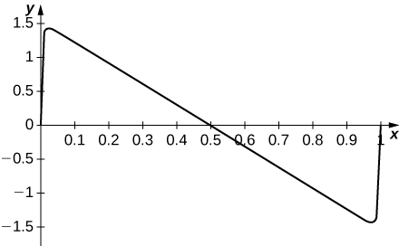
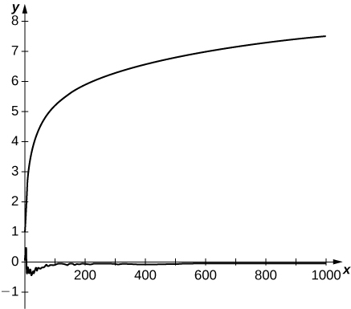

* Use the alternating series test to test an alternating series for convergence.
* Estimate the sum of an alternating series.
* Explain the meaning of absolute convergence and conditional convergence.

So far in this chapter, we have primarily discussed series with positive terms. In this section we introduce alternating series—those series whose terms alternate in sign. We will show in a later chapter that these series often arise when studying power series. After defining alternating series, we introduce the alternating series test to determine whether such a series converges.

### The Alternating Series Test

A series whose terms alternate between positive and negative values is an **alternating series**{: data-type="term"}. For example, the series

<math xmlns="http://www.w3.org/1998/Math/MathML"><mrow><munderover><mstyle displaystyle="true"><mo>∑</mo></mstyle><mrow><mi>n</mi><mo>=</mo><mn>1</mn></mrow><mi>∞</mi></munderover><msup><mrow><mrow><mo>(</mo><mrow><mo>−</mo><mfrac><mn>1</mn><mn>2</mn></mfrac></mrow><mo>)</mo></mrow></mrow><mi>n</mi></msup><mo>=</mo><mo>−</mo><mfrac><mn>1</mn><mn>2</mn></mfrac><mo>+</mo><mfrac><mn>1</mn><mn>4</mn></mfrac><mo>−</mo><mfrac><mn>1</mn><mn>8</mn></mfrac><mo>+</mo><mfrac><mn>1</mn><mrow><mn>16</mn></mrow></mfrac><mo>−</mo><mtext>⋯</mtext></mrow></math>

and

<math xmlns="http://www.w3.org/1998/Math/MathML"><mrow><munderover><mstyle displaystyle="true"><mo>∑</mo></mstyle><mrow><mi>n</mi><mo>=</mo><mn>1</mn></mrow><mi>∞</mi></munderover><mfrac><mrow><msup><mrow><mrow><mo>(</mo><mrow><mn>−1</mn></mrow><mo>)</mo></mrow></mrow><mrow><mi>n</mi><mo>+</mo><mn>1</mn></mrow></msup></mrow><mi>n</mi></mfrac><mo>=</mo><mn>1</mn><mo>−</mo><mfrac><mn>1</mn><mn>2</mn></mfrac><mo>+</mo><mfrac><mn>1</mn><mn>3</mn></mfrac><mo>−</mo><mfrac><mn>1</mn><mn>4</mn></mfrac><mo>+</mo><mtext>⋯</mtext></mrow></math>

are both alternating series.

Definition

Any series whose terms alternate between positive and negative values is called an alternating series. An alternating series can be written in the form

<math xmlns="http://www.w3.org/1998/Math/MathML"><mrow><mstyle displaystyle="true"><munderover><mo>∑</mo><mrow><mi>n</mi><mo>=</mo><mn>1</mn></mrow><mi>∞</mi></munderover><mrow><msup><mrow><mo stretchy="false">(</mo><mn>−1</mn><mo stretchy="false">)</mo></mrow><mrow><mi>n</mi><mo>+</mo><mn>1</mn></mrow></msup><msub><mi>b</mi><mi>n</mi></msub></mrow></mstyle><mo>=</mo><msub><mi>b</mi><mn>1</mn></msub><mo>−</mo><msub><mi>b</mi><mn>2</mn></msub><mo>+</mo><msub><mi>b</mi><mn>3</mn></msub><mo>−</mo><msub><mi>b</mi><mn>4</mn></msub><mo>+</mo><mtext>⋯</mtext></mrow></math>

or

<math xmlns="http://www.w3.org/1998/Math/MathML"><mrow><mstyle displaystyle="true"><munderover><mo>∑</mo><mrow><mi>n</mi><mo>−</mo><mn>1</mn></mrow><mi>∞</mi></munderover><mrow><msup><mrow><mrow><mo>(</mo><mrow><mn>−1</mn></mrow><mo>)</mo></mrow></mrow><mi>n</mi></msup><msub><mi>b</mi><mi>n</mi></msub><mo>=</mo><mtext>−</mtext><msub><mi>b</mi><mn>1</mn></msub><mo>+</mo><msub><mi>b</mi><mn>2</mn></msub><mo>−</mo><msub><mi>b</mi><mn>3</mn></msub><mo>+</mo><msub><mi>b</mi><mn>4</mn></msub><mo>−</mo><mtext>⋯</mtext></mrow></mstyle></mrow></math>

Where <math xmlns="http://www.w3.org/1998/Math/MathML"><mrow><msub><mi>b</mi><mi>n</mi></msub><mo>≥</mo><mn>0</mn></mrow></math>

 for all positive integers *n*.

Series (1), shown in [\[link\]](#fs-id1169737843037), is a geometric series. Since <math xmlns="http://www.w3.org/1998/Math/MathML"><mrow><mrow><mo>\|</mo><mi>r</mi><mo>\|</mo></mrow><mo>=</mo><mo>\|</mo><mtext>−</mtext><mn>1</mn><mtext>/</mtext><mn>2</mn><mo>\|</mo><mo>&lt;</mo><mn>1</mn><mo>,</mo></mrow></math>

 the series converges. Series (2), shown in [\[link\]](#fs-id1169738026978), is called the alternating harmonic series. We will show that whereas the harmonic series diverges, the alternating harmonic series converges.

To prove this, we look at the sequence of partial sums <math xmlns="http://www.w3.org/1998/Math/MathML"><mrow><mrow><mo>{</mo><mrow><msub><mi>S</mi><mi>k</mi></msub></mrow><mo>}</mo></mrow></mrow></math>

 ([\[link\]](#CNX_Calc_Figure_09_05_001)).

#### Proof

Consider the odd terms <math xmlns="http://www.w3.org/1998/Math/MathML"><mrow><msub><mi>S</mi><mrow><mn>2</mn><mi>k</mi><mo>+</mo><mn>1</mn></mrow></msub></mrow></math>

 for <math xmlns="http://www.w3.org/1998/Math/MathML"><mrow><mi>k</mi><mo>≥</mo><mn>0</mn><mo>.</mo></mrow></math>

 Since <math xmlns="http://www.w3.org/1998/Math/MathML"><mrow><mn>1</mn><mtext>/</mtext><mo stretchy="false">(</mo><mn>2</mn><mi>k</mi><mo>+</mo><mn>1</mn><mo stretchy="false">)</mo><mo>&lt;</mo><mn>1</mn><mtext>/</mtext><mn>2</mn><mi>k</mi><mo>,</mo></mrow></math>

<math xmlns="http://www.w3.org/1998/Math/MathML"><mrow><msub><mi>S</mi><mrow><mn>2</mn><mi>k</mi><mo>+</mo><mn>1</mn></mrow></msub><mo>=</mo><msub><mi>S</mi><mrow><mn>2</mn><mi>k</mi><mo>−</mo><mn>1</mn></mrow></msub><mo>−</mo><mfrac><mn>1</mn><mrow><mn>2</mn><mi>k</mi></mrow></mfrac><mo>+</mo><mfrac><mn>1</mn><mrow><mn>2</mn><mi>k</mi><mo>+</mo><mn>1</mn></mrow></mfrac><mo>&lt;</mo><msub><mi>S</mi><mrow><mn>2</mn><mi>k</mi><mo>−</mo><mn>1</mn></mrow></msub><mo>.</mo></mrow></math>

Therefore, <math xmlns="http://www.w3.org/1998/Math/MathML"><mrow><mo>{</mo><msub><mi>S</mi><mrow><mn>2</mn><mi>k</mi><mo>+</mo><mn>1</mn></mrow></msub><mo>}</mo></mrow></math>

 is a decreasing sequence. Also,

<math xmlns="http://www.w3.org/1998/Math/MathML"><mrow><msub><mi>S</mi><mrow><mn>2</mn><mi>k</mi><mo>+</mo><mn>1</mn></mrow></msub><mo>=</mo><mrow><mo>(</mo><mrow><mn>1</mn><mo>−</mo><mfrac><mn>1</mn><mn>2</mn></mfrac></mrow><mo>)</mo></mrow><mo>+</mo><mrow><mo>(</mo><mrow><mfrac><mn>1</mn><mn>3</mn></mfrac><mo>−</mo><mfrac><mn>1</mn><mn>4</mn></mfrac></mrow><mo>)</mo></mrow><mo>+</mo><mtext>⋯</mtext><mo>+</mo><mrow><mo>(</mo><mrow><mfrac><mn>1</mn><mrow><mn>2</mn><mi>k</mi><mo>−</mo><mn>1</mn></mrow></mfrac><mo>−</mo><mfrac><mn>1</mn><mrow><mn>2</mn><mi>k</mi></mrow></mfrac></mrow><mo>)</mo></mrow><mo>+</mo><mfrac><mn>1</mn><mrow><mn>2</mn><mi>k</mi><mo>+</mo><mn>1</mn></mrow></mfrac><mo>&gt;</mo><mn>0</mn><mo>.</mo></mrow></math>

Therefore, <math xmlns="http://www.w3.org/1998/Math/MathML"><mrow><mo>{</mo><msub><mi>S</mi><mrow><mn>2</mn><mi>k</mi><mo>+</mo><mn>1</mn></mrow></msub><mo>}</mo></mrow></math>

 is bounded below. Since <math xmlns="http://www.w3.org/1998/Math/MathML"><mrow><mo>{</mo><msub><mi>S</mi><mrow><mn>2</mn><mi>k</mi><mo>+</mo><mn>1</mn></mrow></msub><mo>}</mo></mrow></math>

 is a decreasing sequence that is bounded below, by the Monotone Convergence Theorem, <math xmlns="http://www.w3.org/1998/Math/MathML"><mrow><mo>{</mo><msub><mi>S</mi><mrow><mn>2</mn><mi>k</mi><mo>+</mo><mn>1</mn></mrow></msub><mo>}</mo></mrow></math>

 converges. Similarly, the even terms <math xmlns="http://www.w3.org/1998/Math/MathML"><mrow><mo>{</mo><msub><mi>S</mi><mrow><mn>2</mn><mi>k</mi></mrow></msub><mo>}</mo></mrow></math>

 form an increasing sequence that is bounded above because

<math xmlns="http://www.w3.org/1998/Math/MathML"><mrow><msub><mi>S</mi><mrow><mn>2</mn><mi>k</mi></mrow></msub><mo>=</mo><msub><mi>S</mi><mrow><mn>2</mn><mi>k</mi><mo>−</mo><mn>2</mn></mrow></msub><mo>+</mo><mfrac><mn>1</mn><mrow><mn>2</mn><mi>k</mi><mo>−</mo><mn>1</mn></mrow></mfrac><mo>−</mo><mfrac><mn>1</mn><mrow><mn>2</mn><mi>k</mi></mrow></mfrac><mo>&gt;</mo><msub><mi>S</mi><mrow><mn>2</mn><mi>k</mi><mo>−</mo><mn>2</mn></mrow></msub></mrow></math>

and

<math xmlns="http://www.w3.org/1998/Math/MathML"><mrow><msub><mi>S</mi><mrow><mn>2</mn><mi>k</mi></mrow></msub><mo>=</mo><mn>1</mn><mo>+</mo><mrow><mo>(</mo><mrow><mo>−</mo><mfrac><mn>1</mn><mn>2</mn></mfrac><mo>+</mo><mfrac><mn>1</mn><mn>3</mn></mfrac></mrow><mo>)</mo></mrow><mo>+</mo><mtext>⋯</mtext><mo>+</mo><mrow><mo>(</mo><mrow><mo>−</mo><mfrac><mn>1</mn><mrow><mn>2</mn><mi>k</mi><mo>−</mo><mn>2</mn></mrow></mfrac><mo>+</mo><mfrac><mn>1</mn><mrow><mn>2</mn><mi>k</mi><mo>−</mo><mn>1</mn></mrow></mfrac></mrow><mo>)</mo></mrow><mo>−</mo><mfrac><mn>1</mn><mrow><mn>2</mn><mi>k</mi></mrow></mfrac><mo>&lt;</mo><mn>1</mn><mo>.</mo></mrow></math>

Therefore, by the Monotone Convergence Theorem, the sequence <math xmlns="http://www.w3.org/1998/Math/MathML"><mrow><mrow><mo>{</mo><mrow><msub><mi>S</mi><mrow><mn>2</mn><mi>k</mi></mrow></msub></mrow><mo>}</mo></mrow></mrow></math>

 also converges. Since

<math xmlns="http://www.w3.org/1998/Math/MathML"><mrow><msub><mi>S</mi><mrow><mn>2</mn><mi>k</mi><mo>+</mo><mn>1</mn></mrow></msub><mo>=</mo><msub><mi>S</mi><mrow><mn>2</mn><mi>k</mi></mrow></msub><mo>+</mo><mfrac><mn>1</mn><mrow><mn>2</mn><mi>k</mi><mo>+</mo><mn>1</mn></mrow></mfrac><mo>,</mo></mrow></math>

we know that

<math xmlns="http://www.w3.org/1998/Math/MathML"><mrow><munder><mrow><mtext>lim</mtext></mrow><mrow><mi>k</mi><mo stretchy="false">→</mo><mi>∞</mi></mrow></munder><msub><mi>S</mi><mrow><mn>2</mn><mi>k</mi><mo>+</mo><mn>1</mn></mrow></msub><mo>=</mo><munder><mrow><mtext>lim</mtext></mrow><mrow><mi>k</mi><mo stretchy="false">→</mo><mi>∞</mi></mrow></munder><msub><mi>S</mi><mrow><mn>2</mn><mi>k</mi></mrow></msub><mo>+</mo><munder><mrow><mtext>lim</mtext></mrow><mrow><mi>k</mi><mo stretchy="false">→</mo><mi>∞</mi></mrow></munder><mfrac><mn>1</mn><mrow><mn>2</mn><mi>k</mi><mo>+</mo><mn>1</mn></mrow></mfrac><mo>.</mo></mrow></math>

Letting <math xmlns="http://www.w3.org/1998/Math/MathML"><mrow><mi>S</mi><mo>=</mo><munder><mrow><mtext>lim</mtext></mrow><mrow><mi>k</mi><mo stretchy="false">→</mo><mi>∞</mi></mrow></munder><msub><mi>S</mi><mrow><mn>2</mn><mi>k</mi><mo>+</mo><mn>1</mn></mrow></msub></mrow></math>

 and using the fact that <math xmlns="http://www.w3.org/1998/Math/MathML"><mrow><mn>1</mn><mtext>/</mtext><mrow><mo>(</mo><mrow><mn>2</mn><mi>k</mi><mo>+</mo><mn>1</mn></mrow><mo>)</mo></mrow><mo stretchy="false">→</mo><mn>0</mn><mo>,</mo></mrow></math>

 we conclude that <math xmlns="http://www.w3.org/1998/Math/MathML"><mrow><munder><mrow><mtext>lim</mtext></mrow><mrow><mi>k</mi><mo stretchy="false">→</mo><mi>∞</mi></mrow></munder><msub><mi>S</mi><mrow><mn>2</mn><mi>k</mi></mrow></msub><mo>=</mo><mi>S</mi><mo>.</mo></mrow></math>

 Since the odd terms and the even terms in the sequence of partial sums converge to the same limit <math xmlns="http://www.w3.org/1998/Math/MathML"><mrow><mi>S</mi><mo>,</mo></mrow></math>

 it can be shown that the sequence of partial sums converges to <math xmlns="http://www.w3.org/1998/Math/MathML"><mrow><mi>S</mi><mo>,</mo></mrow></math>

 and therefore the alternating harmonic series converges to <math xmlns="http://www.w3.org/1998/Math/MathML"><mrow><mi>S</mi><mo>.</mo></mrow></math>

It can also be shown that <math xmlns="http://www.w3.org/1998/Math/MathML"><mrow><mi>S</mi><mo>=</mo><mtext>ln</mtext><mspace width="0.1em" /><mn>2</mn><mo>,</mo></mrow></math>

 and we can write

<math xmlns="http://www.w3.org/1998/Math/MathML"><mrow><munderover><mstyle displaystyle="true"><mo>∑</mo></mstyle><mrow><mi>n</mi><mo>=</mo><mn>1</mn></mrow><mi>∞</mi></munderover><mfrac><mrow><msup><mrow><mrow><mo>(</mo><mrow><mn>−1</mn></mrow><mo>)</mo></mrow></mrow><mrow><mi>n</mi><mo>+</mo><mn>1</mn></mrow></msup></mrow><mi>n</mi></mfrac><mo>=</mo><mn>1</mn><mo>−</mo><mfrac><mn>1</mn><mn>2</mn></mfrac><mo>+</mo><mfrac><mn>1</mn><mn>3</mn></mfrac><mo>−</mo><mfrac><mn>1</mn><mn>4</mn></mfrac><mo>+</mo><mtext>⋯</mtext><mo>=</mo><mtext>ln</mtext><mrow><mo>(</mo><mn>2</mn><mo>)</mo></mrow><mo>.</mo></mrow></math>

 {: #CNX_Calc_Figure_09_05_001}

□

More generally, any alternating series of form (3) ([\[link\]](#fs-id1169737355805)) or (4) ([\[link\]](#fs-id1169738222645)) converges as long as <math xmlns="http://www.w3.org/1998/Math/MathML"><mrow><msub><mi>b</mi><mn>1</mn></msub><mo>≥</mo><msub><mi>b</mi><mn>2</mn></msub><mo>≥</mo><msub><mi>b</mi><mn>3</mn></msub><mo>≥</mo><mtext>⋯</mtext></mrow></math>

 and <math xmlns="http://www.w3.org/1998/Math/MathML"><mrow><msub><mi>b</mi><mi>n</mi></msub><mo stretchy="false">→</mo><mn>0</mn></mrow></math>

 ([\[link\]](#CNX_Calc_Figure_09_05_002)). The proof is similar to the proof for the alternating harmonic series.

 {: #CNX_Calc_Figure_09_05_002}

Alternating Series Test

An alternating series of the form

<math xmlns="http://www.w3.org/1998/Math/MathML"><mrow><munderover><mstyle displaystyle="true"><mo>∑</mo></mstyle><mrow><mi>n</mi><mo>=</mo><mn>1</mn></mrow><mi>∞</mi></munderover><msup><mrow><mo>(</mo><mrow><mn>−1</mn></mrow><mo>)</mo></mrow><mrow><mi>n</mi><mo>+</mo><mn>1</mn></mrow></msup><msub><mi>b</mi><mi>n</mi></msub><mspace width="0.2em" /><mtext>or</mtext><mspace width="0.2em" /><munderover><mstyle displaystyle="true"><mo>∑</mo></mstyle><mrow><mi>n</mi><mo>=</mo><mn>1</mn></mrow><mi>∞</mi></munderover><msup><mrow><mo>(</mo><mrow><mn>−1</mn></mrow><mo>)</mo></mrow><mi>n</mi></msup><msub><mi>b</mi><mi>n</mi></msub></mrow></math>

converges if

1.  <math xmlns="http://www.w3.org/1998/Math/MathML"><mrow><mn>0</mn><mo>≤</mo><msub><mi>b</mi><mrow><mi>n</mi><mo>+</mo><mn>1</mn></mrow></msub><mo>≤</mo><msub><mi>b</mi><mi>n</mi></msub></mrow></math>
    
    for all
    <math xmlns="http://www.w3.org/1998/Math/MathML"><mrow><mi>n</mi><mo>≥</mo><mn>1</mn></mrow></math>
    
    and
2.  <math xmlns="http://www.w3.org/1998/Math/MathML"><mrow><munder><mrow><mtext>lim</mtext></mrow><mrow><mi>n</mi><mo stretchy="false">→</mo><mi>∞</mi></mrow></munder><msub><mi>b</mi><mi>n</mi></msub><mo>=</mo><mn>0</mn><mo>.</mo></mrow></math>
{: data-number-style="lower-roman"}

This is known as the **alternating series test**{: data-type="term"}.

We remark that this theorem is true more generally as long as there exists some integer <math xmlns="http://www.w3.org/1998/Math/MathML"><mi>N</mi></math>

 such that <math xmlns="http://www.w3.org/1998/Math/MathML"><mrow><mn>0</mn><mo>≤</mo><msub><mi>b</mi><mrow><mi>n</mi><mo>+</mo><mn>1</mn></mrow></msub><mo>≤</mo><msub><mi>b</mi><mi>n</mi></msub></mrow></math>

 for all <math xmlns="http://www.w3.org/1998/Math/MathML"><mrow><mi>n</mi><mo>≥</mo><mi>N</mi><mo>.</mo></mrow></math>

Convergence of Alternating Series

For each of the following alternating series, determine whether the series converges or diverges.

1.  <math xmlns="http://www.w3.org/1998/Math/MathML"><mrow><munderover><mstyle displaystyle="true"><mo>∑</mo></mstyle><mrow><mi>n</mi><mo>=</mo><mn>1</mn></mrow><mi>∞</mi></munderover><msup><mrow><mrow><mo>(</mo><mrow><mn>−1</mn></mrow><mo>)</mo></mrow></mrow><mrow><mi>n</mi><mo>+</mo><mn>1</mn></mrow></msup><mtext>/</mtext><msup><mi>n</mi><mn>2</mn></msup></mrow></math>

2.  <math xmlns="http://www.w3.org/1998/Math/MathML"><mrow><munderover><mstyle displaystyle="true"><mo>∑</mo></mstyle><mrow><mi>n</mi><mo>=</mo><mn>1</mn></mrow><mi>∞</mi></munderover><msup><mrow><mrow><mo>(</mo><mrow><mn>−1</mn></mrow><mo>)</mo></mrow></mrow><mrow><mi>n</mi><mo>+</mo><mn>1</mn></mrow></msup><mi>n</mi><mtext>/</mtext><mo stretchy="false">(</mo><mi>n</mi><mo>+</mo><mn>1</mn><mo stretchy="false">)</mo></mrow></math>
{: data-number-style="lower-alpha"}

1.  Since
    * * *
    {: data-type="newline"}
    
    <math xmlns="http://www.w3.org/1998/Math/MathML"><mrow><mfrac><mn>1</mn><mrow><msup><mrow><mrow><mo>(</mo><mrow><mi>n</mi><mo>+</mo><mn>1</mn></mrow><mo>)</mo></mrow></mrow><mn>2</mn></msup></mrow></mfrac><mo>&lt;</mo><mfrac><mn>1</mn><mrow><msup><mi>n</mi><mn>2</mn></msup></mrow></mfrac><mspace width="1em" /><mtext>and</mtext><mspace width="1em" /><mfrac><mn>1</mn><mrow><msup><mi>n</mi><mn>2</mn></msup></mrow></mfrac><mo stretchy="false">→</mo><mn>0</mn><mo>,</mo></mrow></math>
    
    * * *
    {: data-type="newline"}
    
    the series converges.
2.  Since
    <math xmlns="http://www.w3.org/1998/Math/MathML"><mrow><mi>n</mi><mtext>/</mtext><mo stretchy="false">(</mo><mi>n</mi><mo>+</mo><mn>1</mn><mo stretchy="false">)</mo><mo stretchy="false">↛</mo><mn>0</mn></mrow></math>
    
    as
    <math xmlns="http://www.w3.org/1998/Math/MathML"><mrow><mi>n</mi><mo stretchy="false">→</mo><mi>∞</mi><mo>,</mo></mrow></math>
    
    we cannot apply the alternating series test. Instead, we use the *n*th term test for divergence. Since
    * * *
    {: data-type="newline"}
    
    <math xmlns="http://www.w3.org/1998/Math/MathML"><mrow><munder><mrow><mtext>lim</mtext></mrow><mrow><mi>n</mi><mo stretchy="false">→</mo><mi>∞</mi></mrow></munder><mfrac><mrow><msup><mrow><mrow><mo>(</mo><mrow><mn>−1</mn></mrow><mo>)</mo></mrow></mrow><mrow><mi>n</mi><mo>+</mo><mn>1</mn></mrow></msup><mi>n</mi></mrow><mrow><mi>n</mi><mo>+</mo><mn>1</mn></mrow></mfrac><mo>≠</mo><mn>0</mn><mo>,</mo></mrow></math>
    
    * * *
    {: data-type="newline"}
    
    the series diverges.
{: data-number-style="lower-alpha"}

Determine whether the series <math xmlns="http://www.w3.org/1998/Math/MathML"><mrow><munderover><mstyle displaystyle="true"><mo>∑</mo></mstyle><mrow><mi>n</mi><mo>=</mo><mn>1</mn></mrow><mi>∞</mi></munderover><msup><mrow><mrow><mo>(</mo><mrow><mn>−1</mn></mrow><mo>)</mo></mrow></mrow><mrow><mi>n</mi><mo>+</mo><mn>1</mn></mrow></msup><mi>n</mi><mtext>/</mtext><msup><mn>2</mn><mi>n</mi></msup></mrow></math>

 converges or diverges.

The series converges.

Hint

Is <math xmlns="http://www.w3.org/1998/Math/MathML"><mrow><mo>{</mo><mi>n</mi><mtext>/</mtext><msup><mn>2</mn><mi>n</mi></msup><mo>}</mo></mrow></math>

 decreasing? What is <math xmlns="http://www.w3.org/1998/Math/MathML"><mrow><munder><mrow><mtext>lim</mtext></mrow><mrow><mi>n</mi><mo stretchy="false">→</mo><mi>∞</mi></mrow></munder><mi>n</mi><mtext>/</mtext><msup><mn>2</mn><mi>n</mi></msup><mtext>?</mtext></mrow></math>

### Remainder of an Alternating Series

It is difficult to explicitly calculate the sum of most alternating series, so typically the sum is approximated by using a partial sum. When doing so, we are interested in the amount of error in our approximation. Consider an alternating series

<math xmlns="http://www.w3.org/1998/Math/MathML"><mrow><munderover><mstyle displaystyle="true"><mo>∑</mo></mstyle><mrow><mi>n</mi><mo>=</mo><mn>1</mn></mrow><mi>∞</mi></munderover><msup><mrow><mrow><mo>(</mo><mrow><mn>−1</mn></mrow><mo>)</mo></mrow></mrow><mrow><mi>n</mi><mo>+</mo><mn>1</mn></mrow></msup><msub><mi>b</mi><mi>n</mi></msub></mrow></math>

satisfying the hypotheses of the alternating series test. Let <math xmlns="http://www.w3.org/1998/Math/MathML"><mi>S</mi></math>

 denote the sum of this series and <math xmlns="http://www.w3.org/1998/Math/MathML"><mrow><mo>{</mo><msub><mi>S</mi><mi>k</mi></msub><mo>}</mo></mrow></math>

 be the corresponding sequence of partial sums. From [\[link\]](#CNX_Calc_Figure_09_05_002), we see that for any integer <math xmlns="http://www.w3.org/1998/Math/MathML"><mrow><mi>N</mi><mo>≥</mo><mn>1</mn><mo>,</mo></mrow></math>

 the remainder <math xmlns="http://www.w3.org/1998/Math/MathML"><mrow><msub><mi>R</mi><mi>N</mi></msub></mrow></math>

 satisfies

<math xmlns="http://www.w3.org/1998/Math/MathML"><mrow><mrow><mo>\|</mo><mrow><msub><mi>R</mi><mi>N</mi></msub></mrow><mo>\|</mo></mrow><mo>=</mo><mrow><mo>\|</mo><mrow><mi>S</mi><mo>−</mo><msub><mi>S</mi><mi>N</mi></msub></mrow><mo>\|</mo></mrow><mo>≤</mo><mrow><mo>\|</mo><mrow><msub><mi>S</mi><mrow><mi>N</mi><mo>+</mo><mn>1</mn></mrow></msub><mo>−</mo><msub><mi>S</mi><mi>N</mi></msub></mrow><mo>\|</mo></mrow><mo>=</mo><msub><mi>b</mi><mrow><mi>n</mi><mo>+</mo><mn>1</mn></mrow></msub><mo>.</mo></mrow></math>

Remainders in Alternating Series

Consider an alternating series of the form

<math xmlns="http://www.w3.org/1998/Math/MathML"><mrow><munderover><mstyle displaystyle="true"><mo>∑</mo></mstyle><mrow><mi>n</mi><mo>=</mo><mn>1</mn></mrow><mi>∞</mi></munderover><msup><mrow><mrow><mo>(</mo><mrow><mn>−1</mn></mrow><mo>)</mo></mrow></mrow><mrow><mi>n</mi><mo>+</mo><mn>1</mn></mrow></msup><msub><mi>b</mi><mi>n</mi></msub><mtext>or</mtext><munderover><mstyle displaystyle="true"><mo>∑</mo></mstyle><mrow><mi>n</mi><mo>=</mo><mn>1</mn></mrow><mi>∞</mi></munderover><msup><mrow><mrow><mo>(</mo><mrow><mn>−1</mn></mrow><mo>)</mo></mrow></mrow><mi>n</mi></msup><msub><mi>b</mi><mi>n</mi></msub></mrow></math>

that satisfies the hypotheses of the alternating series test. Let <math xmlns="http://www.w3.org/1998/Math/MathML"><mi>S</mi></math>

 denote the sum of the series and <math xmlns="http://www.w3.org/1998/Math/MathML"><mrow><msub><mi>S</mi><mi>N</mi></msub></mrow></math>

 denote the <math xmlns="http://www.w3.org/1998/Math/MathML"><mrow><mi>N</mi><mtext>th</mtext></mrow></math>

 partial sum. For any integer <math xmlns="http://www.w3.org/1998/Math/MathML"><mrow><mi>N</mi><mo>≥</mo><mn>1</mn><mo>,</mo></mrow></math>

 the remainder <math xmlns="http://www.w3.org/1998/Math/MathML"><mrow><msub><mi>R</mi><mi>N</mi></msub><mo>=</mo><mi>S</mi><mo>−</mo><msub><mi>S</mi><mi>N</mi></msub></mrow></math>

 satisfies

<math xmlns="http://www.w3.org/1998/Math/MathML"><mrow><mo>\|</mo><msub><mi>R</mi><mi>N</mi></msub><mo>\|</mo><mo>≤</mo><msub><mi>b</mi><mrow><mi>N</mi><mo>+</mo><mn>1</mn></mrow></msub><mo>.</mo></mrow></math>

In other words, if the conditions of the alternating series test apply, then the error in approximating the infinite series by the <math xmlns="http://www.w3.org/1998/Math/MathML"><mrow><mi>N</mi><mtext>th</mtext></mrow></math>

 partial sum <math xmlns="http://www.w3.org/1998/Math/MathML"><mrow><msub><mi>S</mi><mi>N</mi></msub></mrow></math>

 is in magnitude at most the size of the next term <math xmlns="http://www.w3.org/1998/Math/MathML"><mrow><msub><mi>b</mi><mrow><mi>N</mi><mo>+</mo><mn>1</mn></mrow></msub><mo>.</mo></mrow></math>

Estimating the Remainder of an Alternating Series

Consider the alternating series

<math xmlns="http://www.w3.org/1998/Math/MathML"><mrow><mstyle displaystyle="true"><munderover><mo>∑</mo><mrow><mi>n</mi><mo>=</mo><mn>1</mn></mrow><mi>∞</mi></munderover><mrow><mfrac><mrow><msup><mrow><mo stretchy="false">(</mo><mn>−1</mn><mo stretchy="false">)</mo></mrow><mrow><mi>n</mi><mo>+</mo><mn>1</mn></mrow></msup></mrow><mrow><msup><mi>n</mi><mn>2</mn></msup></mrow></mfrac></mrow></mstyle><mo>.</mo></mrow></math>

Use the remainder estimate to determine a bound on the error <math xmlns="http://www.w3.org/1998/Math/MathML"><mrow><msub><mi>R</mi><mrow><mn>10</mn></mrow></msub></mrow></math>

 if we approximate the sum of the series by the partial sum <math xmlns="http://www.w3.org/1998/Math/MathML"><mrow><msub><mi>S</mi><mrow><mn>10</mn></mrow></msub><mo>.</mo></mrow></math>

From the theorem stated above,

<math xmlns="http://www.w3.org/1998/Math/MathML"><mrow><mo stretchy="false">\|</mo><msub><mi>R</mi><mrow><mn>10</mn></mrow></msub><mo stretchy="false">\|</mo><mo>≤</mo><msub><mi>b</mi><mrow><mn>11</mn></mrow></msub><mo>=</mo><mfrac><mn>1</mn><mrow><msup><mrow><mn>11</mn></mrow><mn>2</mn></msup></mrow></mfrac><mo>≈</mo><mn>0.008265</mn><mo>.</mo></mrow></math>

Find a bound for <math xmlns="http://www.w3.org/1998/Math/MathML"><mrow><msub><mi>R</mi><mrow><mn>20</mn></mrow></msub></mrow></math>

 when approximating <math xmlns="http://www.w3.org/1998/Math/MathML"><mrow><munderover><mstyle displaystyle="true"><mo>∑</mo></mstyle><mrow><mi>n</mi><mo>=</mo><mn>1</mn></mrow><mi>∞</mi></munderover><msup><mrow><mrow><mo>(</mo><mrow><mn>−1</mn></mrow><mo>)</mo></mrow></mrow><mrow><mi>n</mi><mo>+</mo><mn>1</mn></mrow></msup><mtext>/</mtext><mi>n</mi></mrow></math>

 by <math xmlns="http://www.w3.org/1998/Math/MathML"><mrow><msub><mi>S</mi><mrow><mn>20</mn></mrow></msub><mo>.</mo></mrow></math>

<math xmlns="http://www.w3.org/1998/Math/MathML"><mrow><mn>0.04762</mn></mrow></math>

Hint

<math xmlns="http://www.w3.org/1998/Math/MathML"><mrow><mrow><mo>\|</mo><mrow><msub><mi>R</mi><mrow><mn>20</mn></mrow></msub></mrow><mo>\|</mo></mrow><mo>≤</mo><msub><mi>b</mi><mrow><mn>21</mn></mrow></msub></mrow></math>

### Absolute and Conditional Convergence

Consider a series <math xmlns="http://www.w3.org/1998/Math/MathML"><mrow><mstyle displaystyle="true"><munderover><mo>∑</mo><mrow><mi>n</mi><mo>=</mo><mn>1</mn></mrow><mi>∞</mi></munderover><mrow><msub><mi>a</mi><mi>n</mi></msub></mrow></mstyle></mrow></math>

 and the related series <math xmlns="http://www.w3.org/1998/Math/MathML"><mrow><mstyle displaystyle="true"><munderover><mo>∑</mo><mrow><mi>n</mi><mo>=</mo><mn>1</mn></mrow><mi>∞</mi></munderover><mo stretchy="false">\|</mo></mstyle><msub><mi>a</mi><mi>n</mi></msub><mo stretchy="false">\|</mo><mo>.</mo></mrow></math>

 Here we discuss possibilities for the relationship between the convergence of these two series. For example, consider the alternating harmonic series <math xmlns="http://www.w3.org/1998/Math/MathML"><mrow><mstyle displaystyle="true"><munderover><mo>∑</mo><mrow><mi>n</mi><mo>=</mo><mn>1</mn></mrow><mi>∞</mi></munderover><mrow><msup><mrow><mo stretchy="false">(</mo><mn>−1</mn><mo stretchy="false">)</mo></mrow><mrow><mi>n</mi><mo>+</mo><mn>1</mn></mrow></msup></mrow></mstyle><mtext>/</mtext><mi>n</mi><mo>.</mo></mrow></math>

 The series whose terms are the absolute value of these terms is the harmonic series, since <math xmlns="http://www.w3.org/1998/Math/MathML"><mrow><mstyle displaystyle="true"><munderover><mo>∑</mo><mrow><mi>n</mi><mo>=</mo><mn>1</mn></mrow><mi>∞</mi></munderover><mo stretchy="false">\|</mo></mstyle><msup><mrow><mo stretchy="false">(</mo><mn>−1</mn><mo stretchy="false">)</mo></mrow><mrow><mi>n</mi><mo>+</mo><mn>1</mn></mrow></msup><mtext>/</mtext><mi>n</mi><mo stretchy="false">\|</mo><mo>=</mo><mstyle displaystyle="true"><munderover><mo>∑</mo><mrow><mi>n</mi><mo>=</mo><mn>1</mn></mrow><mi>∞</mi></munderover><mn>1</mn></mstyle><mtext>/</mtext><mi>n</mi><mo>.</mo></mrow></math>

 Since the alternating harmonic series converges, but the harmonic series diverges, we say the alternating harmonic series exhibits conditional convergence.

By comparison, consider the series <math xmlns="http://www.w3.org/1998/Math/MathML"><mrow><mstyle displaystyle="true"><munderover><mo>∑</mo><mrow><mi>n</mi><mo>=</mo><mn>1</mn></mrow><mi>∞</mi></munderover><mrow><msup><mrow><mo stretchy="false">(</mo><mn>−1</mn><mo stretchy="false">)</mo></mrow><mrow><mi>n</mi><mo>+</mo><mn>1</mn></mrow></msup></mrow></mstyle><mtext>/</mtext><msup><mi>n</mi><mn>2</mn></msup><mo>.</mo></mrow></math>

 The series whose terms are the absolute values of the terms of this series is the series <math xmlns="http://www.w3.org/1998/Math/MathML"><mrow><mstyle displaystyle="true"><munderover><mo>∑</mo><mrow><mi>n</mi><mo>=</mo><mn>1</mn></mrow><mi>∞</mi></munderover><mn>1</mn></mstyle><mtext>/</mtext><msup><mi>n</mi><mn>2</mn></msup><mo>.</mo></mrow></math>

 Since both of these series converge, we say the series <math xmlns="http://www.w3.org/1998/Math/MathML"><mrow><mstyle displaystyle="true"><munderover><mo>∑</mo><mrow><mi>n</mi><mo>=</mo><mn>1</mn></mrow><mi>∞</mi></munderover><mrow><msup><mrow><mo stretchy="false">(</mo><mn>−1</mn><mo stretchy="false">)</mo></mrow><mrow><mi>n</mi><mo>+</mo><mn>1</mn></mrow></msup></mrow></mstyle><mtext>/</mtext><msup><mi>n</mi><mn>2</mn></msup></mrow></math>

 exhibits absolute convergence.

Definition

A series <math xmlns="http://www.w3.org/1998/Math/MathML"><mrow><munderover><mstyle displaystyle="true"><mo>∑</mo></mstyle><mrow><mi>n</mi><mo>=</mo><mn>1</mn></mrow><mi>∞</mi></munderover><msub><mi>a</mi><mi>n</mi></msub></mrow></math>

 exhibits **conditional convergence**{: data-type="term"} if <math xmlns="http://www.w3.org/1998/Math/MathML"><mrow><munderover><mstyle displaystyle="true"><mo>∑</mo></mstyle><mrow><mi>n</mi><mo>=</mo><mn>1</mn></mrow><mi>∞</mi></munderover><mo stretchy="false">\|</mo><msub><mi>a</mi><mi>n</mi></msub><mo stretchy="false">\|</mo></mrow></math>

 converges. A series <math xmlns="http://www.w3.org/1998/Math/MathML"><mrow><munderover><mstyle displaystyle="true"><mo>∑</mo></mstyle><mrow><mi>n</mi><mo>=</mo><mn>1</mn></mrow><mi>∞</mi></munderover><msub><mi>a</mi><mi>n</mi></msub></mrow></math>

 exhibits **absolute convergence**{: data-type="term"} if <math xmlns="http://www.w3.org/1998/Math/MathML"><mrow><munderover><mstyle displaystyle="true"><mo>∑</mo></mstyle><mrow><mi>n</mi><mo>=</mo><mn>1</mn></mrow><mi>∞</mi></munderover><msub><mi>a</mi><mi>n</mi></msub></mrow></math>

 converges but <math xmlns="http://www.w3.org/1998/Math/MathML"><mrow><munderover><mstyle displaystyle="true"><mo>∑</mo></mstyle><mrow><mi>n</mi><mo>=</mo><mn>1</mn></mrow><mi>∞</mi></munderover><mrow><mo>\|</mo><mrow><msub><mi>a</mi><mi>n</mi></msub></mrow><mo>\|</mo></mrow></mrow></math>

 diverges.

As shown by the alternating harmonic series, a series <math xmlns="http://www.w3.org/1998/Math/MathML"><mrow><munderover><mstyle displaystyle="true"><mo>∑</mo></mstyle><mrow><mi>n</mi><mo>=</mo><mn>1</mn></mrow><mi>∞</mi></munderover><msub><mi>a</mi><mi>n</mi></msub></mrow></math>

 may converge, but <math xmlns="http://www.w3.org/1998/Math/MathML"><mrow><munderover><mstyle displaystyle="true"><mo>∑</mo></mstyle><mrow><mi>n</mi><mo>=</mo><mn>1</mn></mrow><mi>∞</mi></munderover><mo stretchy="false">\|</mo><msub><mi>a</mi><mi>n</mi></msub><mo stretchy="false">\|</mo></mrow></math>

 may diverge. In the following theorem, however, we show that if <math xmlns="http://www.w3.org/1998/Math/MathML"><mrow><munderover><mstyle displaystyle="true"><mo>∑</mo></mstyle><mrow><mi>n</mi><mo>=</mo><mn>1</mn></mrow><mi>∞</mi></munderover><mrow><mo>\|</mo><mrow><msub><mi>a</mi><mi>n</mi></msub></mrow><mo>\|</mo></mrow></mrow></math>

 converges, then <math xmlns="http://www.w3.org/1998/Math/MathML"><mrow><munderover><mstyle displaystyle="true"><mo>∑</mo></mstyle><mrow><mi>n</mi><mo>=</mo><mn>1</mn></mrow><mi>∞</mi></munderover><msub><mi>a</mi><mi>n</mi></msub></mrow></math>

 converges.

Absolute Convergence Implies Convergence

If <math xmlns="http://www.w3.org/1998/Math/MathML"><mrow><munderover><mstyle displaystyle="true"><mo>∑</mo></mstyle><mrow><mi>n</mi><mo>=</mo><mn>1</mn></mrow><mi>∞</mi></munderover><mo stretchy="false">\|</mo><msub><mi>a</mi><mi>n</mi></msub><mo stretchy="false">\|</mo></mrow></math>

 converges, then <math xmlns="http://www.w3.org/1998/Math/MathML"><mrow><munderover><mstyle displaystyle="true"><mo>∑</mo></mstyle><mrow><mi>n</mi><mo>=</mo><mn>1</mn></mrow><mi>∞</mi></munderover><msub><mi>a</mi><mi>n</mi></msub></mrow></math>

 converges.

#### Proof

Suppose that <math xmlns="http://www.w3.org/1998/Math/MathML"><mrow><mstyle displaystyle="true"><munderover><mo>∑</mo><mrow><mi>n</mi><mo>=</mo><mn>1</mn></mrow><mi>∞</mi></munderover><mo stretchy="false">\|</mo></mstyle><msub><mi>a</mi><mi>n</mi></msub><mo stretchy="false">\|</mo></mrow></math>

 converges. We show this by using the fact that <math xmlns="http://www.w3.org/1998/Math/MathML"><mrow><msub><mi>a</mi><mi>n</mi></msub><mo>=</mo><mo>\|</mo><msub><mi>a</mi><mi>n</mi></msub><mo>\|</mo></mrow></math>

 or <math xmlns="http://www.w3.org/1998/Math/MathML"><mrow><msub><mi>a</mi><mi>n</mi></msub><mo>=</mo><mtext>−</mtext><mo>\|</mo><msub><mi>a</mi><mi>n</mi></msub><mo>\|</mo></mrow></math>

 and therefore <math xmlns="http://www.w3.org/1998/Math/MathML"><mrow><mrow><mo>\|</mo><mrow><msub><mi>a</mi><mi>n</mi></msub></mrow><mo>\|</mo></mrow><mo>+</mo><msub><mi>a</mi><mi>n</mi></msub><mo>=</mo><mn>2</mn><mrow><mo>\|</mo><mrow><msub><mi>a</mi><mi>n</mi></msub></mrow><mo>\|</mo></mrow></mrow></math>

 or <math xmlns="http://www.w3.org/1998/Math/MathML"><mrow><mrow><mo>\|</mo><mrow><msub><mi>a</mi><mi>n</mi></msub></mrow><mo>\|</mo></mrow><mo>+</mo><msub><mi>a</mi><mi>n</mi></msub><mo>=</mo><mn>0</mn><mo>.</mo></mrow></math>

 Therefore, <math xmlns="http://www.w3.org/1998/Math/MathML"><mrow><mn>0</mn><mo>≤</mo><mrow><mo>\|</mo><mrow><msub><mi>a</mi><mi>n</mi></msub></mrow><mo>\|</mo></mrow><mo>+</mo><msub><mi>a</mi><mi>n</mi></msub><mo>≤</mo><mn>2</mn><mrow><mo>\|</mo><mrow><msub><mi>a</mi><mi>n</mi></msub></mrow><mo>\|</mo></mrow><mo>.</mo></mrow></math>

 Consequently, by the comparison test, since <math xmlns="http://www.w3.org/1998/Math/MathML"><mrow><mn>2</mn><munderover><mstyle displaystyle="true"><mo>∑</mo></mstyle><mrow><mi>n</mi><mo>=</mo><mn>1</mn></mrow><mi>∞</mi></munderover><mrow><mo>\|</mo><mrow><msub><mi>a</mi><mi>n</mi></msub></mrow><mo>\|</mo></mrow></mrow></math>

 converges, the series

<math xmlns="http://www.w3.org/1998/Math/MathML"><mrow><munderover><mstyle displaystyle="true"><mo>∑</mo></mstyle><mrow><mi>n</mi><mo>=</mo><mn>1</mn></mrow><mi>∞</mi></munderover><mo stretchy="false">(</mo><mrow><mo>\|</mo><mrow><msub><mi>a</mi><mi>n</mi></msub></mrow><mo>\|</mo></mrow><mo>+</mo><msub><mi>a</mi><mi>n</mi></msub><mo stretchy="false">)</mo></mrow></math>

converges. By using the algebraic properties for convergent series, we conclude that

<math xmlns="http://www.w3.org/1998/Math/MathML"><mrow><munderover><mstyle displaystyle="true"><mo>∑</mo></mstyle><mrow><mi>n</mi><mo>=</mo><mn>1</mn></mrow><mi>∞</mi></munderover><msub><mi>a</mi><mi>n</mi></msub><mo>=</mo><munderover><mstyle displaystyle="true"><mo>∑</mo></mstyle><mrow><mi>n</mi><mo>=</mo><mn>1</mn></mrow><mi>∞</mi></munderover><mo stretchy="false">(</mo><mrow><mo>\|</mo><mrow><msub><mi>a</mi><mi>n</mi></msub></mrow><mo>\|</mo></mrow><mo>+</mo><msub><mi>a</mi><mi>n</mi></msub><mo stretchy="false">)</mo><mtext>−</mtext><munderover><mstyle displaystyle="true"><mo>∑</mo></mstyle><mrow><mi>n</mi><mo>=</mo><mn>1</mn></mrow><mi>∞</mi></munderover><mrow><mo>\|</mo><mrow><msub><mi>a</mi><mi>n</mi></msub></mrow><mo>\|</mo></mrow></mrow></math>

converges.

□

Absolute versus Conditional Convergence

For each of the following series, determine whether the series converges absolutely, converges conditionally, or diverges.

1.  <math xmlns="http://www.w3.org/1998/Math/MathML"><mrow><munderover><mstyle displaystyle="true"><mo>∑</mo></mstyle><mrow><mi>n</mi><mo>=</mo><mn>1</mn></mrow><mi>∞</mi></munderover><msup><mrow><mrow><mo>(</mo><mrow><mn>−1</mn></mrow><mo>)</mo></mrow></mrow><mrow><mi>n</mi><mo>+</mo><mn>1</mn></mrow></msup><mtext>/</mtext><mo stretchy="false">(</mo><mn>3</mn><mi>n</mi><mo>+</mo><mn>1</mn><mo stretchy="false">)</mo></mrow></math>

2.  <math xmlns="http://www.w3.org/1998/Math/MathML"><mrow><munderover><mstyle displaystyle="true"><mo>∑</mo></mstyle><mrow><mi>n</mi><mo>=</mo><mn>1</mn></mrow><mi>∞</mi></munderover><mtext>cos</mtext><mrow><mo>(</mo><mi>n</mi><mo>)</mo></mrow><mtext>/</mtext><msup><mi>n</mi><mn>2</mn></msup></mrow></math>
{: data-number-style="lower-alpha"}

1.  We can see that
    * * *
    {: data-type="newline"}
    
    

    <math xmlns="http://www.w3.org/1998/Math/MathML"><mrow><munderover><mstyle displaystyle="true"><mo>∑</mo></mstyle><mrow><mi>n</mi><mo>=</mo><mn>1</mn></mrow><mi>∞</mi></munderover><mrow><mo>\|</mo><mrow><mfrac><mrow><msup><mrow><mrow><mo>(</mo><mrow><mn>−1</mn></mrow><mo>)</mo></mrow></mrow><mrow><mi>n</mi><mo>+</mo><mn>1</mn></mrow></msup></mrow><mrow><mn>3</mn><mi>n</mi><mo>+</mo><mn>1</mn></mrow></mfrac></mrow><mo>\|</mo></mrow><mo>=</mo><munderover><mstyle displaystyle="true"><mo>∑</mo></mstyle><mrow><mi>n</mi><mo>=</mo><mn>1</mn></mrow><mi>∞</mi></munderover><mfrac><mn>1</mn><mrow><mn>3</mn><mi>n</mi><mo>+</mo><mn>1</mn></mrow></mfrac></mrow></math>
    

    
    * * *
    {: data-type="newline"}
    
    diverges by using the limit comparison test with the harmonic series. In fact,
    * * *
    {: data-type="newline"}
    
    

    <math xmlns="http://www.w3.org/1998/Math/MathML"><mrow><munder><mrow><mtext>lim</mtext></mrow><mrow><mi>n</mi><mo stretchy="false">→</mo><mi>∞</mi></mrow></munder><mfrac><mrow><mn>1</mn><mtext>/</mtext><mo stretchy="false">(</mo><mn>3</mn><mi>n</mi><mo>+</mo><mn>1</mn><mo stretchy="false">)</mo></mrow><mrow><mn>1</mn><mtext>/</mtext><mi>n</mi></mrow></mfrac><mo>=</mo><mfrac><mn>1</mn><mn>3</mn></mfrac><mo>.</mo></mrow></math>
    

    
    * * *
    {: data-type="newline"}
    
    Therefore, the series does not converge absolutely. However, since
    * * *
    {: data-type="newline"}
    
    

    <math xmlns="http://www.w3.org/1998/Math/MathML"><mrow><mfrac><mn>1</mn><mrow><mn>3</mn><mrow><mo>(</mo><mrow><mi>n</mi><mo>+</mo><mn>1</mn></mrow><mo>)</mo></mrow><mo>+</mo><mn>1</mn></mrow></mfrac><mo>&lt;</mo><mfrac><mn>1</mn><mrow><mn>3</mn><mi>n</mi><mo>+</mo><mn>1</mn></mrow></mfrac><mspace width="0.2em" /><mtext>and</mtext><mspace width="0.2em" /><mfrac><mn>1</mn><mrow><mn>3</mn><mi>n</mi><mo>+</mo><mn>1</mn></mrow></mfrac><mo stretchy="false">→</mo><mn>0</mn><mo>,</mo></mrow></math>
    

    
    * * *
    {: data-type="newline"}
    
    the series converges. We can conclude that
    <math xmlns="http://www.w3.org/1998/Math/MathML"><mrow><munderover><mstyle displaystyle="true"><mo>∑</mo></mstyle><mrow><mi>n</mi><mo>=</mo><mn>1</mn></mrow><mi>∞</mi></munderover><msup><mrow><mrow><mo>(</mo><mrow><mn>−1</mn></mrow><mo>)</mo></mrow></mrow><mrow><mi>n</mi><mo>+</mo><mn>1</mn></mrow></msup><mtext>/</mtext><mo stretchy="false">(</mo><mn>3</mn><mi>n</mi><mo>+</mo><mn>1</mn><mo stretchy="false">)</mo></mrow></math>
    
    converges conditionally.
2.  Noting that
    <math xmlns="http://www.w3.org/1998/Math/MathML"><mrow><mo>\|</mo><mtext>cos</mtext><mspace width="0.1em" /><mi>n</mi><mo>\|</mo><mo>≤</mo><mn>1</mn><mo>,</mo></mrow></math>
    
    to determine whether the series converges absolutely, compare
    * * *
    {: data-type="newline"}
    
    

    <math xmlns="http://www.w3.org/1998/Math/MathML"><mrow><munderover><mstyle displaystyle="true"><mo>∑</mo></mstyle><mrow><mi>n</mi><mo>=</mo><mn>1</mn></mrow><mi>∞</mi></munderover><mrow><mo>\|</mo><mrow><mfrac><mrow><mtext>cos</mtext><mspace width="0.1em" /><mi>n</mi></mrow><mrow><msup><mi>n</mi><mn>2</mn></msup></mrow></mfrac></mrow><mo>\|</mo></mrow></mrow></math>
    

    
    * * *
    {: data-type="newline"}
    
    with the series
    <math xmlns="http://www.w3.org/1998/Math/MathML"><mrow><munderover><mstyle displaystyle="true"><mo>∑</mo></mstyle><mrow><mi>n</mi><mo>=</mo><mn>1</mn></mrow><mi>∞</mi></munderover><mn>1</mn><mtext>/</mtext><msup><mi>n</mi><mn>2</mn></msup><mo>.</mo></mrow></math>
    
    Since
    <math xmlns="http://www.w3.org/1998/Math/MathML"><mrow><munderover><mstyle displaystyle="true"><mo>∑</mo></mstyle><mrow><mi>n</mi><mo>=</mo><mn>1</mn></mrow><mi>∞</mi></munderover><mn>1</mn><mtext>/</mtext><msup><mi>n</mi><mn>2</mn></msup></mrow></math>
    
    converges, by the comparison test,
    <math xmlns="http://www.w3.org/1998/Math/MathML"><mrow><munderover><mstyle displaystyle="true"><mo>∑</mo></mstyle><mrow><mi>n</mi><mo>=</mo><mn>1</mn></mrow><mi>∞</mi></munderover><mo stretchy="false">\|</mo><mtext>cos</mtext><mspace width="0.1em" /><mi>n</mi><mtext>/</mtext><msup><mi>n</mi><mn>2</mn></msup><mo stretchy="false">\|</mo></mrow></math>
    
    converges, and therefore
    <math xmlns="http://www.w3.org/1998/Math/MathML"><mrow><munderover><mstyle displaystyle="true"><mo>∑</mo></mstyle><mrow><mi>n</mi><mo>=</mo><mn>1</mn></mrow><mi>∞</mi></munderover><mtext>cos</mtext><mspace width="0.1em" /><mi>n</mi><mtext>/</mtext><msup><mi>n</mi><mn>2</mn></msup></mrow></math>
    
    converges absolutely.
{: data-number-style="lower-alpha"}

Determine whether the series <math xmlns="http://www.w3.org/1998/Math/MathML"><mrow><munderover><mstyle displaystyle="true"><mo>∑</mo></mstyle><mrow><mi>n</mi><mo>=</mo><mn>1</mn></mrow><mi>∞</mi></munderover><msup><mrow><mrow><mo>(</mo><mrow><mn>−1</mn></mrow><mo>)</mo></mrow></mrow><mrow><mi>n</mi><mo>+</mo><mn>1</mn></mrow></msup><mi>n</mi><mtext>/</mtext><mo stretchy="false">(</mo><mn>2</mn><msup><mi>n</mi><mn>3</mn></msup><mo>+</mo><mn>1</mn><mo stretchy="false">)</mo></mrow></math>

 converges absolutely, converges conditionally, or diverges.

The series converges absolutely.

Hint

Check for absolute convergence first.

To see the difference between absolute and conditional convergence, look at what happens when we *rearrange* the terms of the alternating harmonic series <math xmlns="http://www.w3.org/1998/Math/MathML"><mrow><munderover><mstyle displaystyle="true"><mo>∑</mo></mstyle><mrow><mi>n</mi><mo>=</mo><mn>1</mn></mrow><mi>∞</mi></munderover><msup><mrow><mrow><mo>(</mo><mrow><mn>−1</mn></mrow><mo>)</mo></mrow></mrow><mrow><mi>n</mi><mo>+</mo><mn>1</mn></mrow></msup><mtext>/</mtext><mi>n</mi><mo>.</mo></mrow></math>

 We show that we can rearrange the terms so that the new series diverges. Certainly if we rearrange the terms of a finite sum, the sum does not change. When we work with an infinite sum, however, interesting things can happen.

Begin by adding enough of the positive terms to produce a sum that is larger than some real number <math xmlns="http://www.w3.org/1998/Math/MathML"><mrow><mi>M</mi><mo>&gt;</mo><mn>0</mn><mo>.</mo></mrow></math>

 For example, let <math xmlns="http://www.w3.org/1998/Math/MathML"><mrow><mi>M</mi><mo>=</mo><mn>10</mn><mo>,</mo></mrow></math>

 and find an integer <math xmlns="http://www.w3.org/1998/Math/MathML"><mi>k</mi></math>

 such that

<math xmlns="http://www.w3.org/1998/Math/MathML"><mrow><mn>1</mn><mo>+</mo><mfrac><mn>1</mn><mn>3</mn></mfrac><mo>+</mo><mfrac><mn>1</mn><mn>5</mn></mfrac><mo>+</mo><mtext>⋯</mtext><mo>+</mo><mfrac><mn>1</mn><mrow><mn>2</mn><mi>k</mi><mo>−</mo><mn>1</mn></mrow></mfrac><mo>&gt;</mo><mn>10</mn><mo>.</mo></mrow></math>

(We can do this because the series <math xmlns="http://www.w3.org/1998/Math/MathML"><mrow><munderover><mstyle displaystyle="true"><mo>∑</mo></mstyle><mrow><mi>n</mi><mo>=</mo><mn>1</mn></mrow><mi>∞</mi></munderover><mn>1</mn><mtext>/</mtext><mo stretchy="false">(</mo><mn>2</mn><mi>n</mi><mo>−</mo><mn>1</mn><mo stretchy="false">)</mo></mrow></math>

 diverges to infinity.) Then subtract <math xmlns="http://www.w3.org/1998/Math/MathML"><mrow><mn>1</mn><mtext>/</mtext><mn>2</mn><mo>.</mo></mrow></math>

 Then add more positive terms until the sum reaches 100. That is, find another integer <math xmlns="http://www.w3.org/1998/Math/MathML"><mrow><mi>j</mi><mo>&gt;</mo><mi>k</mi></mrow></math>

 such that

<math xmlns="http://www.w3.org/1998/Math/MathML"><mrow><mn>1</mn><mo>+</mo><mfrac><mn>1</mn><mn>3</mn></mfrac><mo>+</mo><mtext>⋯</mtext><mo>+</mo><mfrac><mn>1</mn><mrow><mn>2</mn><mi>k</mi><mo>−</mo><mn>1</mn></mrow></mfrac><mo>−</mo><mfrac><mn>1</mn><mn>2</mn></mfrac><mo>+</mo><mfrac><mn>1</mn><mrow><mn>2</mn><mi>k</mi><mo>+</mo><mn>1</mn></mrow></mfrac><mo>+</mo><mtext>⋯</mtext><mo>+</mo><mfrac><mn>1</mn><mrow><mn>2</mn><mi>j</mi><mo>+</mo><mn>1</mn></mrow></mfrac><mo>&gt;</mo><mn>100</mn><mo>.</mo></mrow></math>

Then subtract <math xmlns="http://www.w3.org/1998/Math/MathML"><mrow><mn>1</mn><mtext>/</mtext><mn>4</mn><mo>.</mo></mrow></math>

 Continuing in this way, we have found a way of rearranging the terms in the alternating harmonic series so that the sequence of partial sums for the rearranged series is unbounded and therefore diverges.

The terms in the alternating harmonic series can also be rearranged so that the new series converges to a different value. In [\[link\]](#fs-id1169738079721), we show how to rearrange the terms to create a new series that converges to <math xmlns="http://www.w3.org/1998/Math/MathML"><mrow><mn>3</mn><mspace width="0.1em" /><mtext>ln</mtext><mrow><mo>(</mo><mn>2</mn><mo>)</mo></mrow><mtext>/</mtext><mn>2</mn><mo>.</mo></mrow></math>

 We point out that the alternating harmonic series can be rearranged to create a series that converges to any real number <math xmlns="http://www.w3.org/1998/Math/MathML"><mrow><mi>r</mi><mo>;</mo></mrow></math>

 however, the proof of that fact is beyond the scope of this text.

In general, any series <math xmlns="http://www.w3.org/1998/Math/MathML"><mrow><munderover><mstyle displaystyle="true"><mo>∑</mo></mstyle><mrow><mi>n</mi><mo>=</mo><mn>1</mn></mrow><mi>∞</mi></munderover><msub><mi>a</mi><mi>n</mi></msub></mrow></math>

 that converges conditionally can be rearranged so that the new series diverges or converges to a different real number. A series that converges absolutely does not have this property. For any series <math xmlns="http://www.w3.org/1998/Math/MathML"><mrow><munderover><mstyle displaystyle="true"><mo>∑</mo></mstyle><mrow><mi>n</mi><mo>=</mo><mn>1</mn></mrow><mi>∞</mi></munderover><msub><mi>a</mi><mi>n</mi></msub></mrow></math>

 that converges absolutely, the value of <math xmlns="http://www.w3.org/1998/Math/MathML"><mrow><munderover><mstyle displaystyle="true"><mo>∑</mo></mstyle><mrow><mi>n</mi><mo>=</mo><mn>1</mn></mrow><mi>∞</mi></munderover><msub><mi>a</mi><mi>n</mi></msub></mrow></math>

 is the same for any rearrangement of the terms. This result is known as the Riemann Rearrangement Theorem, which is beyond the scope of this book.

Rearranging Series

Use the fact that

<math xmlns="http://www.w3.org/1998/Math/MathML"><mrow><mn>1</mn><mo>−</mo><mfrac><mn>1</mn><mn>2</mn></mfrac><mo>+</mo><mfrac><mn>1</mn><mn>3</mn></mfrac><mo>−</mo><mfrac><mn>1</mn><mn>4</mn></mfrac><mo>+</mo><mfrac><mn>1</mn><mn>5</mn></mfrac><mo>−</mo><mtext>⋯</mtext><mo>=</mo><mtext>ln</mtext><mspace width="0.1em" /><mn>2</mn></mrow></math>

to rearrange the terms in the alternating harmonic series so the sum of the rearranged series is <math xmlns="http://www.w3.org/1998/Math/MathML"><mrow><mn>3</mn><mspace width="0.1em" /><mtext>ln</mtext><mrow><mo>(</mo><mn>2</mn><mo>)</mo></mrow><mtext>/</mtext><mn>2</mn><mo>.</mo></mrow></math>

Let

<math xmlns="http://www.w3.org/1998/Math/MathML"><mrow><mstyle displaystyle="true"><munderover><mo>∑</mo><mrow><mi>n</mi><mo>=</mo><mn>1</mn></mrow><mi>∞</mi></munderover><mrow><msub><mi>a</mi><mi>n</mi></msub></mrow></mstyle><mo>=</mo><mn>1</mn><mo>−</mo><mfrac><mn>1</mn><mn>2</mn></mfrac><mo>+</mo><mfrac><mn>1</mn><mn>3</mn></mfrac><mo>−</mo><mfrac><mn>1</mn><mn>4</mn></mfrac><mo>+</mo><mfrac><mn>1</mn><mn>5</mn></mfrac><mo>−</mo><mfrac><mn>1</mn><mn>6</mn></mfrac><mo>+</mo><mfrac><mn>1</mn><mn>7</mn></mfrac><mo>−</mo><mfrac><mn>1</mn><mn>8</mn></mfrac><mo>+</mo><mtext>⋯</mtext><mo>.</mo></mrow></math>

Since <math xmlns="http://www.w3.org/1998/Math/MathML"><mrow><mstyle displaystyle="true"><munderover><mo>∑</mo><mrow><mi>n</mi><mo>=</mo><mn>1</mn></mrow><mi>∞</mi></munderover><mrow><msub><mi>a</mi><mi>n</mi></msub></mrow></mstyle><mo>=</mo><mtext>ln</mtext><mo stretchy="false">(</mo><mn>2</mn><mo stretchy="false">)</mo><mo>,</mo></mrow></math>

 by the algebraic properties of convergent series,

<math xmlns="http://www.w3.org/1998/Math/MathML"><mrow><mstyle displaystyle="true"><munderover><mo>∑</mo><mrow><mi>n</mi><mo>=</mo><mn>1</mn></mrow><mi>∞</mi></munderover><mrow><mfrac><mn>1</mn><mn>2</mn></mfrac></mrow></mstyle><msub><mi>a</mi><mi>n</mi></msub><mo>=</mo><mfrac><mn>1</mn><mn>2</mn></mfrac><mo>−</mo><mfrac><mn>1</mn><mn>4</mn></mfrac><mo>+</mo><mfrac><mn>1</mn><mn>6</mn></mfrac><mo>−</mo><mfrac><mn>1</mn><mn>8</mn></mfrac><mo>+</mo><mtext>⋯</mtext><mo>=</mo><mfrac><mn>1</mn><mn>2</mn></mfrac><mstyle displaystyle="true"><munderover><mo>∑</mo><mrow><mi>n</mi><mo>=</mo><mn>1</mn></mrow><mi>∞</mi></munderover><mrow><msub><mi>a</mi><mi>n</mi></msub></mrow></mstyle><mo>=</mo><mfrac><mrow><mtext>ln</mtext><mspace width="0.1em" /><mn>2</mn></mrow><mn>2</mn></mfrac><mo>.</mo></mrow></math>

Now introduce the series <math xmlns="http://www.w3.org/1998/Math/MathML"><mrow><mstyle displaystyle="true"><munderover><mo>∑</mo><mrow><mi>n</mi><mo>=</mo><mn>1</mn></mrow><mi>∞</mi></munderover><mrow><msub><mi>b</mi><mi>n</mi></msub></mrow></mstyle></mrow></math>

 such that for all <math xmlns="http://www.w3.org/1998/Math/MathML"><mrow><mi>n</mi><mo>≥</mo><mn>1</mn><mo>,</mo></mrow></math>

 <math xmlns="http://www.w3.org/1998/Math/MathML"><mrow><msub><mi>b</mi><mrow><mn>2</mn><mi>n</mi><mo>−</mo><mn>1</mn></mrow></msub><mo>=</mo><mn>0</mn></mrow></math>

 and <math xmlns="http://www.w3.org/1998/Math/MathML"><mrow><msub><mi>b</mi><mrow><mn>2</mn><mi>n</mi></mrow></msub><mo>=</mo><msub><mi>a</mi><mi>n</mi></msub><mtext>/</mtext><mn>2</mn><mo>.</mo></mrow></math>

 Then

<math xmlns="http://www.w3.org/1998/Math/MathML"><mrow><mstyle displaystyle="true"><munderover><mo>∑</mo><mrow><mi>n</mi><mo>=</mo><mn>1</mn></mrow><mi>∞</mi></munderover><mrow><msub><mi>b</mi><mi>n</mi></msub></mrow></mstyle><mo>=</mo><mn>0</mn><mo>+</mo><mfrac><mn>1</mn><mn>2</mn></mfrac><mo>+</mo><mn>0</mn><mo>−</mo><mfrac><mn>1</mn><mn>4</mn></mfrac><mo>+</mo><mn>0</mn><mo>+</mo><mfrac><mn>1</mn><mn>6</mn></mfrac><mo>+</mo><mn>0</mn><mo>−</mo><mfrac><mn>1</mn><mn>8</mn></mfrac><mo>+</mo><mtext>⋯</mtext><mo>=</mo><mfrac><mrow><mtext>ln</mtext><mspace width="0.1em" /><mn>2</mn></mrow><mn>2</mn></mfrac><mo>.</mo></mrow></math>

Then using the algebraic limit properties of convergent series, since <math xmlns="http://www.w3.org/1998/Math/MathML"><mrow><mstyle displaystyle="true"><munderover><mo>∑</mo><mrow><mi>n</mi><mo>=</mo><mn>1</mn></mrow><mi>∞</mi></munderover><mrow><msub><mi>a</mi><mi>n</mi></msub></mrow></mstyle></mrow></math>

 and <math xmlns="http://www.w3.org/1998/Math/MathML"><mrow><mstyle displaystyle="true"><munderover><mo>∑</mo><mrow><mi>n</mi><mo>=</mo><mn>1</mn></mrow><mi>∞</mi></munderover><mrow><msub><mi>b</mi><mi>n</mi></msub></mrow></mstyle></mrow></math>

 converge, the series <math xmlns="http://www.w3.org/1998/Math/MathML"><mrow><mstyle displaystyle="true"><munderover><mo>∑</mo><mrow><mi>n</mi><mo>=</mo><mn>1</mn></mrow><mi>∞</mi></munderover><mrow><mo stretchy="false">(</mo><msub><mi>a</mi><mi>n</mi></msub><mo>+</mo><msub><mi>b</mi><mi>n</mi></msub><mo stretchy="false">)</mo></mrow></mstyle></mrow></math>

 converges and

<math xmlns="http://www.w3.org/1998/Math/MathML"><mrow><mstyle displaystyle="true"><munderover><mo>∑</mo><mrow><mi>n</mi><mo>=</mo><mn>1</mn></mrow><mi>∞</mi></munderover><mrow><mo stretchy="false">(</mo><msub><mi>a</mi><mi>n</mi></msub><mo>+</mo><msub><mi>b</mi><mi>n</mi></msub><mo stretchy="false">)</mo></mrow></mstyle><mo>=</mo><mstyle displaystyle="true"><munderover><mo>∑</mo><mrow><mi>n</mi><mo>=</mo><mn>1</mn></mrow><mi>∞</mi></munderover><mrow><msub><mi>a</mi><mi>n</mi></msub></mrow></mstyle><mo>+</mo><mstyle displaystyle="true"><munderover><mo>∑</mo><mrow><mi>n</mi><mo>=</mo><mn>1</mn></mrow><mi>∞</mi></munderover><mrow><msub><mi>b</mi><mi>n</mi></msub></mrow></mstyle><mo>=</mo><mtext>ln</mtext><mspace width="0.1em" /><mn>2</mn><mo>+</mo><mfrac><mrow><mtext>ln</mtext><mspace width="0.1em" /><mn>2</mn></mrow><mn>2</mn></mfrac><mo>=</mo><mfrac><mrow><mn>3</mn><mspace width="0.1em" /><mtext>ln</mtext><mspace width="0.1em" /><mn>2</mn></mrow><mn>2</mn></mfrac><mo>.</mo></mrow></math>

Now adding the corresponding terms, <math xmlns="http://www.w3.org/1998/Math/MathML"><mrow><msub><mi>a</mi><mi>n</mi></msub></mrow></math>

 and <math xmlns="http://www.w3.org/1998/Math/MathML"><mrow><msub><mi>b</mi><mi>n</mi></msub><mo>,</mo></mrow></math>

 we see that

<math xmlns="http://www.w3.org/1998/Math/MathML"><mtable><mtr><mtd columnalign="right"><mstyle displaystyle="true"><munderover><mo>∑</mo><mrow><mi>n</mi><mo>=</mo><mn>1</mn></mrow><mi>∞</mi></munderover><mrow><mo stretchy="false">(</mo><msub><mi>a</mi><mi>n</mi></msub><mo>+</mo><msub><mi>b</mi><mi>n</mi></msub><mo stretchy="false">)</mo></mrow></mstyle></mtd><mtd columnalign="left"><mo>=</mo><mo stretchy="false">(</mo><mn>1</mn><mo>+</mo><mn>0</mn><mo stretchy="false">)</mo><mo>+</mo><mrow><mo>(</mo><mrow><mo>−</mo><mfrac><mn>1</mn><mn>2</mn></mfrac><mo>+</mo><mfrac><mn>1</mn><mn>2</mn></mfrac></mrow><mo>)</mo></mrow><mo>+</mo><mrow><mo>(</mo><mrow><mfrac><mn>1</mn><mn>3</mn></mfrac><mo>+</mo><mn>0</mn></mrow><mo>)</mo></mrow><mo>+</mo><mrow><mo>(</mo><mrow><mo>−</mo><mfrac><mn>1</mn><mn>4</mn></mfrac><mo>−</mo><mfrac><mn>1</mn><mn>4</mn></mfrac></mrow><mo>)</mo></mrow><mo>+</mo><mrow><mo>(</mo><mrow><mfrac><mn>1</mn><mn>5</mn></mfrac><mo>+</mo><mn>0</mn></mrow><mo>)</mo></mrow><mo>+</mo><mrow><mo>(</mo><mrow><mo>−</mo><mfrac><mn>1</mn><mn>6</mn></mfrac><mo>+</mo><mfrac><mn>1</mn><mn>6</mn></mfrac></mrow><mo>)</mo></mrow></mtd></mtr><mtr /><mtr><mtd /><mtd columnalign="left"><mspace width="1.5em" /><mo>+</mo><mrow><mo>(</mo><mrow><mfrac><mn>1</mn><mn>7</mn></mfrac><mo>+</mo><mn>0</mn></mrow><mo>)</mo></mrow><mo>+</mo><mrow><mo>(</mo><mrow><mfrac><mn>1</mn><mn>8</mn></mfrac><mo>−</mo><mfrac><mn>1</mn><mn>8</mn></mfrac></mrow><mo>)</mo></mrow><mo>+</mo><mtext>⋯</mtext></mtd></mtr><mtr><mtd /><mtd columnalign="left"><mo>=</mo><mn>1</mn><mo>+</mo><mfrac><mn>1</mn><mn>3</mn></mfrac><mo>−</mo><mfrac><mn>1</mn><mn>2</mn></mfrac><mo>+</mo><mfrac><mn>1</mn><mn>5</mn></mfrac><mo>+</mo><mfrac><mn>1</mn><mn>7</mn></mfrac><mo>−</mo><mfrac><mn>1</mn><mn>4</mn></mfrac><mo>+</mo><mtext>⋯</mtext><mo>.</mo></mtd></mtr></mtable></math>

We notice that the series on the right side of the equal sign is a rearrangement of the alternating harmonic series. Since <math xmlns="http://www.w3.org/1998/Math/MathML"><mrow><mstyle displaystyle="true"><munderover><mo>∑</mo><mrow><mi>n</mi><mo>=</mo><mn>1</mn></mrow><mi>∞</mi></munderover><mrow><mo stretchy="false">(</mo><msub><mi>a</mi><mi>n</mi></msub><mo>+</mo><msub><mi>b</mi><mi>n</mi></msub><mo stretchy="false">)</mo></mrow></mstyle><mo>=</mo><mn>3</mn><mspace width="0.1em" /><mtext>ln</mtext><mo stretchy="false">(</mo><mn>2</mn><mo stretchy="false">)</mo><mtext>/</mtext><mn>2</mn><mo>,</mo></mrow></math>

 we conclude that

<math xmlns="http://www.w3.org/1998/Math/MathML"><mrow><mn>1</mn><mo>+</mo><mfrac><mn>1</mn><mn>3</mn></mfrac><mo>−</mo><mfrac><mn>1</mn><mn>2</mn></mfrac><mo>+</mo><mfrac><mn>1</mn><mn>5</mn></mfrac><mo>+</mo><mfrac><mn>1</mn><mn>7</mn></mfrac><mo>−</mo><mfrac><mn>1</mn><mn>4</mn></mfrac><mo>+</mo><mtext>⋯</mtext><mo>=</mo><mfrac><mrow><mn>3</mn><mspace width="0.1em" /><mtext>ln</mtext><mo stretchy="false">(</mo><mn>2</mn><mo stretchy="false">)</mo></mrow><mn>2</mn></mfrac><mo>.</mo></mrow></math>

Therefore, we have found a rearrangement of the alternating harmonic series having the desired property.

##### Key Concepts

* For an alternating series
  <math xmlns="http://www.w3.org/1998/Math/MathML"><mrow><munderover><mstyle displaystyle="true"><mo>∑</mo></mstyle><mrow><mi>n</mi><mo>=</mo><mn>1</mn></mrow><mi>∞</mi></munderover><msup><mrow><mrow><mo>(</mo><mrow><mn>−1</mn></mrow><mo>)</mo></mrow></mrow><mrow><mi>n</mi><mo>+</mo><mn>1</mn></mrow></msup><msub><mi>b</mi><mi>n</mi></msub><mo>,</mo></mrow></math>
  
  if
  <math xmlns="http://www.w3.org/1998/Math/MathML"><mrow><msub><mi>b</mi><mrow><mi>k</mi><mo>+</mo><mn>1</mn></mrow></msub><mo>≤</mo><msub><mi>b</mi><mi>k</mi></msub></mrow></math>
  
  for all
  <math xmlns="http://www.w3.org/1998/Math/MathML"><mi>k</mi></math>
  
  and
  <math xmlns="http://www.w3.org/1998/Math/MathML"><mrow><msub><mi>b</mi><mi>k</mi></msub><mo stretchy="false">→</mo><mn>0</mn></mrow></math>
  
  as
  <math xmlns="http://www.w3.org/1998/Math/MathML"><mrow><mi>k</mi><mo stretchy="false">→</mo><mi>∞</mi><mo>,</mo></mrow></math>
  
  the alternating series converges.
* If
  <math xmlns="http://www.w3.org/1998/Math/MathML"><mrow><munderover><mstyle displaystyle="true"><mo>∑</mo></mstyle><mrow><mi>n</mi><mo>=</mo><mn>1</mn></mrow><mi>∞</mi></munderover><mo stretchy="false">\|</mo><msub><mi>a</mi><mi>n</mi></msub><mo stretchy="false">\|</mo></mrow></math>
  
  converges, then
  <math xmlns="http://www.w3.org/1998/Math/MathML"><mrow><munderover><mstyle displaystyle="true"><mo>∑</mo></mstyle><mrow><mi>n</mi><mo>=</mo><mn>1</mn></mrow><mi>∞</mi></munderover><msub><mi>a</mi><mi>n</mi></msub></mrow></math>
  
  converges.
{: data-bullet-style="bullet"}

##### Key Equations

* **Alternating series**
  * * *
  {: data-type="newline"}
  
  <math xmlns="http://www.w3.org/1998/Math/MathML"><mrow><mstyle displaystyle="true"><munderover><mo>∑</mo><mrow><mi>n</mi><mo>=</mo><mn>1</mn></mrow><mi>∞</mi></munderover><mrow><msup><mrow><mo stretchy="false">(</mo><mn>−1</mn><mo stretchy="false">)</mo></mrow><mrow><mi>n</mi><mo>+</mo><mn>1</mn></mrow></msup><msub><mi>b</mi><mi>n</mi></msub></mrow></mstyle><mo>=</mo><msub><mi>b</mi><mn>1</mn></msub><mo>−</mo><msub><mi>b</mi><mn>2</mn></msub><mo>+</mo><msub><mi>b</mi><mn>3</mn></msub><mo>−</mo><msub><mi>b</mi><mn>4</mn></msub><mo>+</mo><mtext>⋯</mtext><mspace width="0.2em" /><mtext>or</mtext></mrow></math>
  
  * * *
  {: data-type="newline"}
  
  <math xmlns="http://www.w3.org/1998/Math/MathML"><mrow><mstyle displaystyle="true"><munderover><mo>∑</mo><mrow><mi>n</mi><mo>=</mo><mn>1</mn></mrow><mi>∞</mi></munderover><mrow><msup><mrow><mo stretchy="false">(</mo><mn>−1</mn><mo stretchy="false">)</mo></mrow><mi>n</mi></msup><msub><mi>b</mi><mi>n</mi></msub></mrow></mstyle><mo>=</mo><mtext>−</mtext><msub><mi>b</mi><mn>1</mn></msub><mo>+</mo><msub><mi>b</mi><mn>2</mn></msub><mo>−</mo><msub><mi>b</mi><mn>3</mn></msub><mo>+</mo><msub><mi>b</mi><mn>4</mn></msub><mo>−</mo><mtext>⋯</mtext></mrow></math>
{: data-bullet-style="bullet"}

<section data-depth="1" class="section-exercises" markdown="1">
State whether each of the following series converges absolutely, conditionally, or not at all.

<math xmlns="http://www.w3.org/1998/Math/MathML"><mrow><munderover><mstyle displaystyle="true"><mo>∑</mo></mstyle><mrow><mi>n</mi><mo>=</mo><mn>1</mn></mrow><mi>∞</mi></munderover><msup><mrow><mrow><mo>(</mo><mrow><mn>−1</mn></mrow><mo>)</mo></mrow></mrow><mrow><mi>n</mi><mo>+</mo><mn>1</mn></mrow></msup><mfrac><mi>n</mi><mrow><mi>n</mi><mo>+</mo><mn>3</mn></mrow></mfrac></mrow></math>

<math xmlns="http://www.w3.org/1998/Math/MathML"><mrow><munderover><mstyle displaystyle="true"><mo>∑</mo></mstyle><mrow><mi>n</mi><mo>=</mo><mn>1</mn></mrow><mi>∞</mi></munderover><msup><mrow><mrow><mo>(</mo><mrow><mn>−1</mn></mrow><mo>)</mo></mrow></mrow><mrow><mi>n</mi><mo>+</mo><mn>1</mn></mrow></msup><mfrac><mrow><msqrt><mi>n</mi></msqrt><mo>+</mo><mn>1</mn></mrow><mrow><msqrt><mi>n</mi></msqrt><mo>+</mo><mn>3</mn></mrow></mfrac></mrow></math>

Does not converge by divergence test. Terms do not tend to zero.

<math xmlns="http://www.w3.org/1998/Math/MathML"><mrow><munderover><mstyle displaystyle="true"><mo>∑</mo></mstyle><mrow><mi>n</mi><mo>=</mo><mn>1</mn></mrow><mi>∞</mi></munderover><msup><mrow><mrow><mo>(</mo><mrow><mn>−1</mn></mrow><mo>)</mo></mrow></mrow><mrow><mi>n</mi><mo>+</mo><mn>1</mn></mrow></msup><mfrac><mn>1</mn><mrow><msqrt><mrow><mi>n</mi><mo>+</mo><mn>3</mn></mrow></msqrt></mrow></mfrac></mrow></math>

<math xmlns="http://www.w3.org/1998/Math/MathML"><mrow><munderover><mstyle displaystyle="true"><mo>∑</mo></mstyle><mrow><mi>n</mi><mo>=</mo><mn>1</mn></mrow><mi>∞</mi></munderover><msup><mrow><mrow><mo>(</mo><mrow><mn>−1</mn></mrow><mo>)</mo></mrow></mrow><mrow><mi>n</mi><mo>+</mo><mn>1</mn></mrow></msup><mfrac><mrow><msqrt><mrow><mi>n</mi><mo>+</mo><mn>3</mn></mrow></msqrt></mrow><mi>n</mi></mfrac></mrow></math>

Converges conditionally by alternating series test, since <math xmlns="http://www.w3.org/1998/Math/MathML"><mrow><msqrt><mrow><mi>n</mi><mo>+</mo><mn>3</mn></mrow></msqrt><mtext>/</mtext><mi>n</mi></mrow></math>

 is decreasing. Does not converge absolutely by comparison with *p*-series, <math xmlns="http://www.w3.org/1998/Math/MathML"><mrow><mi>p</mi><mo>=</mo><mn>1</mn><mtext>/</mtext><mn>2</mn><mo>.</mo></mrow></math>

<math xmlns="http://www.w3.org/1998/Math/MathML"><mrow><munderover><mstyle displaystyle="true"><mo>∑</mo></mstyle><mrow><mi>n</mi><mo>=</mo><mn>1</mn></mrow><mi>∞</mi></munderover><msup><mrow><mrow><mo>(</mo><mrow><mn>−1</mn></mrow><mo>)</mo></mrow></mrow><mrow><mi>n</mi><mo>+</mo><mn>1</mn></mrow></msup><mfrac><mn>1</mn><mrow><mi>n</mi><mtext>!</mtext></mrow></mfrac></mrow></math>

<math xmlns="http://www.w3.org/1998/Math/MathML"><mrow><munderover><mstyle displaystyle="true"><mo>∑</mo></mstyle><mrow><mi>n</mi><mo>=</mo><mn>1</mn></mrow><mi>∞</mi></munderover><msup><mrow><mrow><mo>(</mo><mrow><mn>−1</mn></mrow><mo>)</mo></mrow></mrow><mrow><mi>n</mi><mo>+</mo><mn>1</mn></mrow></msup><mfrac><mrow><msup><mn>3</mn><mi>n</mi></msup></mrow><mrow><mi>n</mi><mtext>!</mtext></mrow></mfrac></mrow></math>

Converges absolutely by limit comparison to <math xmlns="http://www.w3.org/1998/Math/MathML"><mrow><msup><mn>3</mn><mi>n</mi></msup><mtext>/</mtext><msup><mn>4</mn><mi>n</mi></msup><mo>,</mo></mrow></math>

 for example.

<math xmlns="http://www.w3.org/1998/Math/MathML"><mrow><munderover><mstyle displaystyle="true"><mo>∑</mo></mstyle><mrow><mi>n</mi><mo>=</mo><mn>1</mn></mrow><mi>∞</mi></munderover><msup><mrow><mrow><mo>(</mo><mrow><mn>−1</mn></mrow><mo>)</mo></mrow></mrow><mrow><mi>n</mi><mo>+</mo><mn>1</mn></mrow></msup><msup><mrow><mrow><mo>(</mo><mrow><mfrac><mrow><mi>n</mi><mo>−</mo><mn>1</mn></mrow><mi>n</mi></mfrac></mrow><mo>)</mo></mrow></mrow><mi>n</mi></msup></mrow></math>

<math xmlns="http://www.w3.org/1998/Math/MathML"><mrow><munderover><mstyle displaystyle="true"><mo>∑</mo></mstyle><mrow><mi>n</mi><mo>=</mo><mn>1</mn></mrow><mi>∞</mi></munderover><msup><mrow><mrow><mo>(</mo><mrow><mn>−1</mn></mrow><mo>)</mo></mrow></mrow><mrow><mi>n</mi><mo>+</mo><mn>1</mn></mrow></msup><msup><mrow><mrow><mo>(</mo><mrow><mfrac><mrow><mi>n</mi><mo>+</mo><mn>1</mn></mrow><mi>n</mi></mfrac></mrow><mo>)</mo></mrow></mrow><mi>n</mi></msup></mrow></math>

Diverges by divergence test since <math xmlns="http://www.w3.org/1998/Math/MathML"><mrow><munder><mrow><mtext>lim</mtext></mrow><mrow><mi>n</mi><mo stretchy="false">→</mo><mi>∞</mi></mrow></munder><mo stretchy="false">\|</mo><msub><mi>a</mi><mi>n</mi></msub><mo stretchy="false">\|</mo><mo>=</mo><mi>e</mi><mo>.</mo></mrow></math>

<math xmlns="http://www.w3.org/1998/Math/MathML"><mrow><munderover><mstyle displaystyle="true"><mo>∑</mo></mstyle><mrow><mi>n</mi><mo>=</mo><mn>1</mn></mrow><mi>∞</mi></munderover><msup><mrow><mrow><mo>(</mo><mrow><mn>−1</mn></mrow><mo>)</mo></mrow></mrow><mrow><mi>n</mi><mo>+</mo><mn>1</mn></mrow></msup><msup><mrow><mtext>sin</mtext></mrow><mn>2</mn></msup><mi>n</mi></mrow></math>

<math xmlns="http://www.w3.org/1998/Math/MathML"><mrow><munderover><mstyle displaystyle="true"><mo>∑</mo></mstyle><mrow><mi>n</mi><mo>=</mo><mn>1</mn></mrow><mi>∞</mi></munderover><msup><mrow><mrow><mo>(</mo><mrow><mn>−1</mn></mrow><mo>)</mo></mrow></mrow><mrow><mi>n</mi><mo>+</mo><mn>1</mn></mrow></msup><msup><mrow><mtext>cos</mtext></mrow><mn>2</mn></msup><mi>n</mi></mrow></math>

Does not converge. Terms do not tend to zero.

<math xmlns="http://www.w3.org/1998/Math/MathML"><mrow><munderover><mstyle displaystyle="true"><mo>∑</mo></mstyle><mrow><mi>n</mi><mo>=</mo><mn>1</mn></mrow><mi>∞</mi></munderover><msup><mrow><mrow><mo>(</mo><mrow><mn>−1</mn></mrow><mo>)</mo></mrow></mrow><mrow><mi>n</mi><mo>+</mo><mn>1</mn></mrow></msup><msup><mrow><mtext>sin</mtext></mrow><mn>2</mn></msup><mrow><mo>(</mo><mrow><mn>1</mn><mtext>/</mtext><mi>n</mi></mrow><mo>)</mo></mrow></mrow></math>

<math xmlns="http://www.w3.org/1998/Math/MathML"><mrow><munderover><mstyle displaystyle="true"><mo>∑</mo></mstyle><mrow><mi>n</mi><mo>=</mo><mn>1</mn></mrow><mi>∞</mi></munderover><msup><mrow><mrow><mo>(</mo><mrow><mn>−1</mn></mrow><mo>)</mo></mrow></mrow><mrow><mi>n</mi><mo>+</mo><mn>1</mn></mrow></msup><msup><mrow><mtext>cos</mtext></mrow><mn>2</mn></msup><mrow><mo>(</mo><mrow><mn>1</mn><mtext>/</mtext><mi>n</mi></mrow><mo>)</mo></mrow></mrow></math>

<math xmlns="http://www.w3.org/1998/Math/MathML"><mrow><munder><mrow><mtext>lim</mtext></mrow><mrow><mi>n</mi><mo stretchy="false">→</mo><mi>∞</mi></mrow></munder><msup><mrow><mtext>cos</mtext></mrow><mn>2</mn></msup><mo stretchy="false">(</mo><mn>1</mn><mtext>/</mtext><mi>n</mi><mo stretchy="false">)</mo><mo>=</mo><mn>1</mn><mo>.</mo></mrow></math>

 Diverges by divergence test.

<math xmlns="http://www.w3.org/1998/Math/MathML"><mrow><munderover><mstyle displaystyle="true"><mo>∑</mo></mstyle><mrow><mi>n</mi><mo>=</mo><mn>1</mn></mrow><mi>∞</mi></munderover><msup><mrow><mrow><mo>(</mo><mrow><mn>−1</mn></mrow><mo>)</mo></mrow></mrow><mrow><mi>n</mi><mo>+</mo><mn>1</mn></mrow></msup><mtext>ln</mtext><mrow><mo>(</mo><mrow><mn>1</mn><mtext>/</mtext><mi>n</mi></mrow><mo>)</mo></mrow></mrow></math>

<math xmlns="http://www.w3.org/1998/Math/MathML"><mrow><munderover><mstyle displaystyle="true"><mo>∑</mo></mstyle><mrow><mi>n</mi><mo>=</mo><mn>1</mn></mrow><mi>∞</mi></munderover><msup><mrow><mrow><mo>(</mo><mrow><mn>−1</mn></mrow><mo>)</mo></mrow></mrow><mrow><mi>n</mi><mo>+</mo><mn>1</mn></mrow></msup><mtext>ln</mtext><mrow><mo>(</mo><mrow><mn>1</mn><mo>+</mo><mfrac><mn>1</mn><mi>n</mi></mfrac></mrow><mo>)</mo></mrow></mrow></math>

Converges by alternating series test.

<math xmlns="http://www.w3.org/1998/Math/MathML"><mrow><munderover><mstyle displaystyle="true"><mo>∑</mo></mstyle><mrow><mi>n</mi><mo>=</mo><mn>1</mn></mrow><mi>∞</mi></munderover><msup><mrow><mrow><mo>(</mo><mrow><mn>−1</mn></mrow><mo>)</mo></mrow></mrow><mrow><mi>n</mi><mo>+</mo><mn>1</mn></mrow></msup><mfrac><mrow><msup><mi>n</mi><mn>2</mn></msup></mrow><mrow><mn>1</mn><mo>+</mo><msup><mi>n</mi><mn>4</mn></msup></mrow></mfrac></mrow></math>

<math xmlns="http://www.w3.org/1998/Math/MathML"><mrow><munderover><mstyle displaystyle="true"><mo>∑</mo></mstyle><mrow><mi>n</mi><mo>=</mo><mn>1</mn></mrow><mi>∞</mi></munderover><msup><mrow><mrow><mo>(</mo><mrow><mn>−1</mn></mrow><mo>)</mo></mrow></mrow><mrow><mi>n</mi><mo>+</mo><mn>1</mn></mrow></msup><mfrac><mrow><msup><mi>n</mi><mi>e</mi></msup></mrow><mrow><mn>1</mn><mo>+</mo><msup><mi>n</mi><mi>π</mi></msup></mrow></mfrac></mrow></math>

Converges conditionally by alternating series test. Does not converge absolutely by limit comparison with *p*-series, <math xmlns="http://www.w3.org/1998/Math/MathML"><mrow><mi>p</mi><mo>=</mo><mi>π</mi><mo>−</mo><mi>e</mi></mrow></math>

<math xmlns="http://www.w3.org/1998/Math/MathML"><mrow><munderover><mstyle displaystyle="true"><mo>∑</mo></mstyle><mrow><mi>n</mi><mo>=</mo><mn>1</mn></mrow><mi>∞</mi></munderover><msup><mrow><mrow><mo>(</mo><mrow><mn>−1</mn></mrow><mo>)</mo></mrow></mrow><mrow><mi>n</mi><mo>+</mo><mn>1</mn></mrow></msup><msup><mn>2</mn><mrow><mn>1</mn><mtext>/</mtext><mi>n</mi></mrow></msup></mrow></math>

<math xmlns="http://www.w3.org/1998/Math/MathML"><mrow><munderover><mstyle displaystyle="true"><mo>∑</mo></mstyle><mrow><mi>n</mi><mo>=</mo><mn>1</mn></mrow><mi>∞</mi></munderover><msup><mrow><mrow><mo>(</mo><mrow><mn>−1</mn></mrow><mo>)</mo></mrow></mrow><mrow><mi>n</mi><mo>+</mo><mn>1</mn></mrow></msup><msup><mi>n</mi><mrow><mn>1</mn><mtext>/</mtext><mi>n</mi></mrow></msup></mrow></math>

Diverges; terms do not tend to zero.

<math xmlns="http://www.w3.org/1998/Math/MathML"><mrow><munderover><mstyle displaystyle="true"><mo>∑</mo></mstyle><mrow><mi>n</mi><mo>=</mo><mn>1</mn></mrow><mi>∞</mi></munderover><msup><mrow><mrow><mo>(</mo><mrow><mn>−1</mn></mrow><mo>)</mo></mrow></mrow><mi>n</mi></msup><mrow><mo>(</mo><mrow><mn>1</mn><mo>−</mo><msup><mi>n</mi><mrow><mn>1</mn><mtext>/</mtext><mi>n</mi></mrow></msup></mrow><mo>)</mo></mrow></mrow></math>

 (*Hint:* <math xmlns="http://www.w3.org/1998/Math/MathML"><mrow><msup><mi>n</mi><mrow><mn>1</mn><mtext>/</mtext><mi>n</mi></mrow></msup><mo>≈</mo><mn>1</mn><mo>+</mo><mtext>ln</mtext><mo stretchy="false">(</mo><mi>n</mi><mo stretchy="false">)</mo><mtext>/</mtext><mi>n</mi></mrow></math>

 for large <math xmlns="http://www.w3.org/1998/Math/MathML"><mrow><mi>n</mi><mo>.</mo><mo stretchy="false">)</mo></mrow></math>

<math xmlns="http://www.w3.org/1998/Math/MathML"><mrow><munderover><mstyle displaystyle="true"><mo>∑</mo></mstyle><mrow><mi>n</mi><mo>=</mo><mn>1</mn></mrow><mi>∞</mi></munderover><msup><mrow><mrow><mo>(</mo><mrow><mn>−1</mn></mrow><mo>)</mo></mrow></mrow><mrow><mi>n</mi><mo>+</mo><mn>1</mn></mrow></msup><mi>n</mi><mrow><mo>(</mo><mrow><mn>1</mn><mo>−</mo><mtext>cos</mtext><mrow><mo>(</mo><mrow><mfrac><mn>1</mn><mi>n</mi></mfrac></mrow><mo>)</mo></mrow></mrow><mo>)</mo></mrow></mrow></math>

 (*Hint:* <math xmlns="http://www.w3.org/1998/Math/MathML"><mrow><mtext>cos</mtext><mo stretchy="false">(</mo><mn>1</mn><mtext>/</mtext><mi>n</mi><mo stretchy="false">)</mo><mo>≈</mo><mn>1</mn><mo>−</mo><mn>1</mn><mtext>/</mtext><msup><mi>n</mi><mn>2</mn></msup></mrow></math>

 for large <math xmlns="http://www.w3.org/1998/Math/MathML"><mrow><mi>n</mi><mo>.</mo><mo stretchy="false">)</mo></mrow></math>

Converges by alternating series test. Does not converge absolutely by limit comparison with harmonic series.

<math xmlns="http://www.w3.org/1998/Math/MathML"><mrow><munderover><mstyle displaystyle="true"><mo>∑</mo></mstyle><mrow><mi>n</mi><mo>=</mo><mn>1</mn></mrow><mi>∞</mi></munderover><msup><mrow><mrow><mo>(</mo><mrow><mn>−1</mn></mrow><mo>)</mo></mrow></mrow><mrow><mi>n</mi><mo>+</mo><mn>1</mn></mrow></msup><mrow><mo>(</mo><mrow><msqrt><mrow><mi>n</mi><mo>+</mo><mn>1</mn></mrow></msqrt><mo>−</mo><msqrt><mi>n</mi></msqrt></mrow><mo>)</mo></mrow></mrow></math>

 (*Hint:* Rationalize the numerator.)

<math xmlns="http://www.w3.org/1998/Math/MathML"><mrow><munderover><mstyle displaystyle="true"><mo>∑</mo></mstyle><mrow><mi>n</mi><mo>=</mo><mn>1</mn></mrow><mi>∞</mi></munderover><msup><mrow><mrow><mo>(</mo><mrow><mn>−1</mn></mrow><mo>)</mo></mrow></mrow><mrow><mi>n</mi><mo>+</mo><mn>1</mn></mrow></msup><mrow><mo>(</mo><mrow><mfrac><mn>1</mn><mrow><msqrt><mi>n</mi></msqrt></mrow></mfrac><mo>−</mo><mfrac><mn>1</mn><mrow><msqrt><mrow><mi>n</mi><mo>+</mo><mn>1</mn></mrow></msqrt></mrow></mfrac></mrow><mo>)</mo></mrow></mrow></math>

 (*Hint:* Cross-multiply then rationalize numerator.)

Converges absolutely by limit comparison with *p*-series, <math xmlns="http://www.w3.org/1998/Math/MathML"><mrow><mi>p</mi><mo>=</mo><mn>3</mn><mtext>/</mtext><mn>2</mn><mo>,</mo></mrow></math>

 after applying the hint.

<math xmlns="http://www.w3.org/1998/Math/MathML"><mrow><munderover><mstyle displaystyle="true"><mo>∑</mo></mstyle><mrow><mi>n</mi><mo>=</mo><mn>1</mn></mrow><mi>∞</mi></munderover><msup><mrow><mrow><mo>(</mo><mrow><mn>−1</mn></mrow><mo>)</mo></mrow></mrow><mrow><mi>n</mi><mo>+</mo><mn>1</mn></mrow></msup><mrow><mo>(</mo><mrow><mtext>ln</mtext><mrow><mo>(</mo><mrow><mi>n</mi><mo>+</mo><mn>1</mn></mrow><mo>)</mo></mrow><mo>−</mo><mtext>ln</mtext><mspace width="0.2em" /><mi>n</mi></mrow><mo>)</mo></mrow></mrow></math>

<math xmlns="http://www.w3.org/1998/Math/MathML"><mrow><munderover><mstyle displaystyle="true"><mo>∑</mo></mstyle><mrow><mi>n</mi><mo>=</mo><mn>1</mn></mrow><mi>∞</mi></munderover><msup><mrow><mrow><mo>(</mo><mrow><mn>−1</mn></mrow><mo>)</mo></mrow></mrow><mrow><mi>n</mi><mo>+</mo><mn>1</mn></mrow></msup><mi>n</mi><mrow><mo>(</mo><mrow><msup><mrow><mtext>tan</mtext></mrow><mrow><mn>−1</mn></mrow></msup><mrow><mo>(</mo><mrow><mi>n</mi><mo>+</mo><mn>1</mn></mrow><mo>)</mo></mrow><mo>−</mo><msup><mrow><mtext>tan</mtext></mrow><mrow><mn>−1</mn></mrow></msup><mi>n</mi></mrow><mo>)</mo></mrow></mrow></math>

 (*Hint:* Use Mean Value Theorem.)

Converges by alternating series test since <math xmlns="http://www.w3.org/1998/Math/MathML"><mrow><mi>n</mi><mo stretchy="false">(</mo><msup><mrow><mtext>tan</mtext></mrow><mrow><mn>−1</mn></mrow></msup><mo stretchy="false">(</mo><mi>n</mi><mo>+</mo><mn>1</mn><mo stretchy="false">)</mo><mtext>−</mtext><msup><mrow><mtext>tan</mtext></mrow><mrow><mn>−1</mn></mrow></msup><mi>n</mi><mo stretchy="false">)</mo></mrow></math>

 is decreasing to zero for large <math xmlns="http://www.w3.org/1998/Math/MathML"><mrow><mi>n</mi><mo>.</mo></mrow></math>

 Does not converge absolutely by limit comparison with harmonic series after applying hint.

<math xmlns="http://www.w3.org/1998/Math/MathML"><mrow><munderover><mstyle displaystyle="true"><mo>∑</mo></mstyle><mrow><mi>n</mi><mo>=</mo><mn>1</mn></mrow><mi>∞</mi></munderover><msup><mrow><mrow><mo>(</mo><mrow><mn>−1</mn></mrow><mo>)</mo></mrow></mrow><mrow><mi>n</mi><mo>+</mo><mn>1</mn></mrow></msup><mrow><mo>(</mo><mrow><msup><mrow><mrow><mo>(</mo><mrow><mi>n</mi><mo>+</mo><mn>1</mn></mrow><mo>)</mo></mrow></mrow><mn>2</mn></msup><mo>−</mo><msup><mi>n</mi><mn>2</mn></msup></mrow><mo>)</mo></mrow></mrow></math>

<math xmlns="http://www.w3.org/1998/Math/MathML"><mrow><munderover><mstyle displaystyle="true"><mo>∑</mo></mstyle><mrow><mi>n</mi><mo>=</mo><mn>1</mn></mrow><mi>∞</mi></munderover><msup><mrow><mrow><mo>(</mo><mrow><mn>−1</mn></mrow><mo>)</mo></mrow></mrow><mrow><mi>n</mi><mo>+</mo><mn>1</mn></mrow></msup><mrow><mo>(</mo><mrow><mfrac><mn>1</mn><mi>n</mi></mfrac><mo>−</mo><mfrac><mn>1</mn><mrow><mi>n</mi><mo>+</mo><mn>1</mn></mrow></mfrac></mrow><mo>)</mo></mrow></mrow></math>

Converges absolutely, since <math xmlns="http://www.w3.org/1998/Math/MathML"><mrow><msub><mi>a</mi><mi>n</mi></msub><mo>=</mo><mfrac><mn>1</mn><mi>n</mi></mfrac><mo>−</mo><mfrac><mn>1</mn><mrow><mi>n</mi><mo>+</mo><mn>1</mn></mrow></mfrac></mrow></math>

 are terms of a telescoping series.

<math xmlns="http://www.w3.org/1998/Math/MathML"><mrow><munderover><mstyle displaystyle="true"><mo>∑</mo></mstyle><mrow><mi>n</mi><mo>=</mo><mn>1</mn></mrow><mi>∞</mi></munderover><mfrac><mrow><mtext>cos</mtext><mrow><mo>(</mo><mrow><mi>n</mi><mi>π</mi></mrow><mo>)</mo></mrow></mrow><mi>n</mi></mfrac></mrow></math>

<math xmlns="http://www.w3.org/1998/Math/MathML"><mrow><munderover><mstyle displaystyle="true"><mo>∑</mo></mstyle><mrow><mi>n</mi><mo>=</mo><mn>1</mn></mrow><mi>∞</mi></munderover><mfrac><mrow><mtext>cos</mtext><mrow><mo>(</mo><mrow><mi>n</mi><mi>π</mi></mrow><mo>)</mo></mrow></mrow><mrow><msup><mi>n</mi><mrow><mn>1</mn><mtext>/</mtext><mi>n</mi></mrow></msup></mrow></mfrac></mrow></math>

Terms do not tend to zero. Series diverges by divergence test.

<math xmlns="http://www.w3.org/1998/Math/MathML"><mrow><munderover><mstyle displaystyle="true"><mo>∑</mo></mstyle><mrow><mi>n</mi><mo>=</mo><mn>1</mn></mrow><mi>∞</mi></munderover><mfrac><mn>1</mn><mi>n</mi></mfrac><mspace width="0.1em" /><mtext>sin</mtext><mspace width="0.1em" /><mrow><mo>(</mo><mrow><mfrac><mrow><mi>n</mi><mi>π</mi></mrow><mn>2</mn></mfrac></mrow><mo>)</mo></mrow></mrow></math>

<math xmlns="http://www.w3.org/1998/Math/MathML"><mrow><munderover><mstyle displaystyle="true"><mo>∑</mo></mstyle><mrow><mi>n</mi><mo>=</mo><mn>1</mn></mrow><mi>∞</mi></munderover><mtext>sin</mtext><mrow><mo>(</mo><mrow><mi>n</mi><mi>π</mi><mtext>/</mtext><mn>2</mn></mrow><mo>)</mo></mrow><mtext>sin</mtext><mrow><mo>(</mo><mrow><mn>1</mn><mtext>/</mtext><mi>n</mi></mrow><mo>)</mo></mrow></mrow></math>

Converges by alternating series test. Does not converge absolutely by limit comparison with harmonic series.

In each of the following problems, use the estimate <math xmlns="http://www.w3.org/1998/Math/MathML"><mrow><mrow><mo>\|</mo><mrow><msub><mi>R</mi><mi>N</mi></msub></mrow><mo>\|</mo></mrow><mo>≤</mo><msub><mi>b</mi><mrow><mi>N</mi><mo>+</mo><mn>1</mn></mrow></msub></mrow></math>

 to find a value of <math xmlns="http://www.w3.org/1998/Math/MathML"><mi>N</mi></math>

 that guarantees that the sum of the first <math xmlns="http://www.w3.org/1998/Math/MathML"><mi>N</mi></math>

 terms of the alternating series <math xmlns="http://www.w3.org/1998/Math/MathML"><mrow><munderover><mstyle displaystyle="true"><mo>∑</mo></mstyle><mrow><mi>n</mi><mo>=</mo><mn>1</mn></mrow><mi>∞</mi></munderover><msup><mrow><mrow><mo>(</mo><mrow><mn>−1</mn></mrow><mo>)</mo></mrow></mrow><mrow><mi>n</mi><mo>+</mo><mn>1</mn></mrow></msup><msub><mi>b</mi><mi>n</mi></msub></mrow></math>

 differs from the infinite sum by at most the given error. Calculate the partial sum <math xmlns="http://www.w3.org/1998/Math/MathML"><mrow><msub><mi>S</mi><mi>N</mi></msub></mrow></math>

 for this <math xmlns="http://www.w3.org/1998/Math/MathML"><mrow><mi>N</mi><mo>.</mo></mrow></math>

**[T]** <math xmlns="http://www.w3.org/1998/Math/MathML"><mrow><msub><mi>b</mi><mi>n</mi></msub><mo>=</mo><mn>1</mn><mtext>/</mtext><mi>n</mi><mo>,</mo></mrow></math>

 error <math xmlns="http://www.w3.org/1998/Math/MathML"><mrow><mo>&lt;</mo><msup><mrow><mn>10</mn></mrow><mrow><mn>−5</mn></mrow></msup></mrow></math>

**[T]** <math xmlns="http://www.w3.org/1998/Math/MathML"><mrow><msub><mi>b</mi><mi>n</mi></msub><mo>=</mo><mn>1</mn><mtext>/</mtext><mtext>ln</mtext><mrow><mo>(</mo><mi>n</mi><mo>)</mo></mrow><mo>,</mo></mrow></math>

 <math xmlns="http://www.w3.org/1998/Math/MathML"><mrow><mi>n</mi><mo>≥</mo><mn>2</mn><mo>,</mo></mrow></math>

 error <math xmlns="http://www.w3.org/1998/Math/MathML"><mrow><mo>&lt;</mo><msup><mrow><mn>10</mn></mrow><mrow><mn>−1</mn></mrow></msup></mrow></math>

<math xmlns="http://www.w3.org/1998/Math/MathML"><mrow><mtext>ln</mtext><mrow><mo>(</mo><mrow><mi>N</mi><mo>+</mo><mn>1</mn></mrow><mo>)</mo></mrow><mo>&gt;</mo><mn>10</mn><mo>,</mo></mrow></math>

 <math xmlns="http://www.w3.org/1998/Math/MathML"><mrow><mi>N</mi><mo>+</mo><mn>1</mn><mo>&gt;</mo><msup><mi>e</mi><mrow><mn>10</mn></mrow></msup><mo>,</mo></mrow></math>

 <math xmlns="http://www.w3.org/1998/Math/MathML"><mrow><mi>N</mi><mo>≥</mo><mn>22026</mn><mo>;</mo></mrow></math>

 <math xmlns="http://www.w3.org/1998/Math/MathML"><mrow><msub><mi>S</mi><mrow><mn>22026</mn></mrow></msub><mo>=</mo><mn>0.0257</mn><mtext>…</mtext></mrow></math>

**[T]** <math xmlns="http://www.w3.org/1998/Math/MathML"><mrow><msub><mi>b</mi><mi>n</mi></msub><mo>=</mo><mn>1</mn><mtext>/</mtext><msqrt><mi>n</mi></msqrt><mo>,</mo></mrow></math>

 error <math xmlns="http://www.w3.org/1998/Math/MathML"><mrow><mo>&lt;</mo><msup><mrow><mn>10</mn></mrow><mrow><mn>−3</mn></mrow></msup></mrow></math>

**[T]** <math xmlns="http://www.w3.org/1998/Math/MathML"><mrow><msub><mi>b</mi><mi>n</mi></msub><mo>=</mo><mn>1</mn><mtext>/</mtext><msup><mn>2</mn><mi>n</mi></msup><mo>,</mo></mrow></math>

 error <math xmlns="http://www.w3.org/1998/Math/MathML"><mrow><mo>&lt;</mo><msup><mrow><mn>10</mn></mrow><mrow><mn>−6</mn></mrow></msup></mrow></math>

<math xmlns="http://www.w3.org/1998/Math/MathML"><mrow><msup><mn>2</mn><mrow><mi>N</mi><mo>+</mo><mn>1</mn></mrow></msup><mo>&gt;</mo><msup><mrow><mn>10</mn></mrow><mn>6</mn></msup></mrow></math>

 or <math xmlns="http://www.w3.org/1998/Math/MathML"><mrow><mi>N</mi><mo>+</mo><mn>1</mn><mo>&gt;</mo><mn>6</mn><mspace width="0.1em" /><mtext>ln</mtext><mo stretchy="false">(</mo><mn>10</mn><mo stretchy="false">)</mo><mtext>/</mtext><mtext>ln</mtext><mo stretchy="false">(</mo><mn>2</mn><mo stretchy="false">)</mo><mo>=</mo><mn>19.93</mn><mo>.</mo></mrow></math>

 or <math xmlns="http://www.w3.org/1998/Math/MathML"><mrow><mi>N</mi><mo>≥</mo><mn>19</mn><mo>;</mo></mrow></math>

 <math xmlns="http://www.w3.org/1998/Math/MathML"><mrow><msub><mi>S</mi><mrow><mn>19</mn></mrow></msub><mo>=</mo><mn>0.333333969</mn><mtext>…</mtext></mrow></math>

**[T]** <math xmlns="http://www.w3.org/1998/Math/MathML"><mrow><msub><mi>b</mi><mi>n</mi></msub><mo>=</mo><mtext>ln</mtext><mrow><mo>(</mo><mrow><mn>1</mn><mo>+</mo><mfrac><mn>1</mn><mi>n</mi></mfrac></mrow><mo>)</mo></mrow><mo>,</mo></mrow></math>

 error <math xmlns="http://www.w3.org/1998/Math/MathML"><mrow><mo>&lt;</mo><msup><mrow><mn>10</mn></mrow><mrow><mn>−3</mn></mrow></msup></mrow></math>

**[T]** <math xmlns="http://www.w3.org/1998/Math/MathML"><mrow><msub><mi>b</mi><mi>n</mi></msub><mo>=</mo><mn>1</mn><mtext>/</mtext><msup><mi>n</mi><mn>2</mn></msup><mo>,</mo></mrow></math>

 error <math xmlns="http://www.w3.org/1998/Math/MathML"><mrow><mo>&lt;</mo><msup><mrow><mn>10</mn></mrow><mrow><mn>−6</mn></mrow></msup></mrow></math>

<math xmlns="http://www.w3.org/1998/Math/MathML"><mrow><msup><mrow><mrow><mo>(</mo><mrow><mi>N</mi><mo>+</mo><mn>1</mn></mrow><mo>)</mo></mrow></mrow><mn>2</mn></msup><mo>&gt;</mo><msup><mrow><mn>10</mn></mrow><mn>6</mn></msup></mrow></math>

 or <math xmlns="http://www.w3.org/1998/Math/MathML"><mrow><mi>N</mi><mo>&gt;</mo><mn>999</mn><mo>;</mo></mrow></math>

 <math xmlns="http://www.w3.org/1998/Math/MathML"><mrow><msub><mi>S</mi><mrow><mn>1000</mn></mrow></msub><mo>≈</mo><mn>0.822466</mn><mo>.</mo></mrow></math>

For the following exercises, indicate whether each of the following statements is true or false. If the statement is false, provide an example in which it is false.

If <math xmlns="http://www.w3.org/1998/Math/MathML"><mrow><msub><mi>b</mi><mi>n</mi></msub><mo>≥</mo><mn>0</mn></mrow></math>

 is decreasing and <math xmlns="http://www.w3.org/1998/Math/MathML"><mrow><munder><mrow><mtext>lim</mtext></mrow><mrow><mi>n</mi><mo stretchy="false">→</mo><mi>∞</mi></mrow></munder><msub><mi>b</mi><mi>n</mi></msub><mo>=</mo><mn>0</mn><mo>,</mo></mrow></math>

 then <math xmlns="http://www.w3.org/1998/Math/MathML"><mrow><mstyle displaystyle="true"><munderover><mo>∑</mo><mrow><mi>n</mi><mo>=</mo><mn>1</mn></mrow><mi>∞</mi></munderover><mrow><mrow><mo>(</mo><mrow><msub><mi>b</mi><mrow><mn>2</mn><mi>n</mi><mo>−</mo><mn>1</mn></mrow></msub><mo>−</mo><msub><mi>b</mi><mrow><mn>2</mn><mi>n</mi></mrow></msub></mrow><mo>)</mo></mrow></mrow></mstyle></mrow></math>

 converges absolutely.

If <math xmlns="http://www.w3.org/1998/Math/MathML"><mrow><msub><mi>b</mi><mi>n</mi></msub><mo>≥</mo><mn>0</mn></mrow></math>

 is decreasing, then <math xmlns="http://www.w3.org/1998/Math/MathML"><mrow><mstyle displaystyle="true"><munderover><mo>∑</mo><mrow><mi>n</mi><mo>=</mo><mn>1</mn></mrow><mi>∞</mi></munderover><mrow><mrow><mo>(</mo><mrow><msub><mi>b</mi><mrow><mn>2</mn><mi>n</mi><mo>−</mo><mn>1</mn></mrow></msub><mo>−</mo><msub><mi>b</mi><mrow><mn>2</mn><mi>n</mi></mrow></msub></mrow><mo>)</mo></mrow></mrow></mstyle></mrow></math>

 converges absolutely.

True. <math xmlns="http://www.w3.org/1998/Math/MathML"><mrow><msub><mi>b</mi><mi>n</mi></msub></mrow></math>

 need not tend to zero since if <math xmlns="http://www.w3.org/1998/Math/MathML"><mrow><msub><mi>c</mi><mi>n</mi></msub><mo>=</mo><msub><mi>b</mi><mi>n</mi></msub><mo>−</mo><mtext>lim</mtext><mspace width="0.2em" /><msub><mi>b</mi><mi>n</mi></msub><mo>,</mo></mrow></math>

 then <math xmlns="http://www.w3.org/1998/Math/MathML"><mrow><msub><mi>c</mi><mrow><mn>2</mn><mi>n</mi><mo>−</mo><mn>1</mn></mrow></msub><mo>−</mo><msub><mi>c</mi><mrow><mn>2</mn><mi>n</mi></mrow></msub><mo>=</mo><msub><mi>b</mi><mrow><mn>2</mn><mi>n</mi><mo>−</mo><mn>1</mn></mrow></msub><mo>−</mo><msub><mi>b</mi><mrow><mn>2</mn><mi>n</mi></mrow></msub><mo>.</mo></mrow></math>

If <math xmlns="http://www.w3.org/1998/Math/MathML"><mrow><msub><mi>b</mi><mi>n</mi></msub><mo>≥</mo><mn>0</mn></mrow></math>

 and <math xmlns="http://www.w3.org/1998/Math/MathML"><mrow><munder><mrow><mtext>lim</mtext></mrow><mrow><mi>n</mi><mo stretchy="false">→</mo><mi>∞</mi></mrow></munder><msub><mi>b</mi><mi>n</mi></msub><mo>=</mo><mn>0</mn></mrow></math>

 then <math xmlns="http://www.w3.org/1998/Math/MathML"><mrow><mstyle displaystyle="true"><munderover><mo>∑</mo><mrow><mi>n</mi><mo>=</mo><mn>1</mn></mrow><mi>∞</mi></munderover><mrow><mo stretchy="false">(</mo><mfrac><mn>1</mn><mn>2</mn></mfrac><mo stretchy="false">(</mo></mrow></mstyle><msub><mi>b</mi><mrow><mn>3</mn><mi>n</mi><mo>−</mo><mn>2</mn></mrow></msub><mo>+</mo><msub><mi>b</mi><mrow><mn>3</mn><mi>n</mi><mo>−</mo><mn>1</mn></mrow></msub><mo stretchy="false">)</mo><mtext>−</mtext><msub><mi>b</mi><mrow><mn>3</mn><mi>n</mi></mrow></msub><mo stretchy="false">)</mo></mrow></math>

 converges.

If <math xmlns="http://www.w3.org/1998/Math/MathML"><mrow><msub><mi>b</mi><mi>n</mi></msub><mo>≥</mo><mn>0</mn></mrow></math>

 is decreasing and <math xmlns="http://www.w3.org/1998/Math/MathML"><mrow><mstyle displaystyle="true"><munderover><mo>∑</mo><mrow><mi>n</mi><mo>=</mo><mn>1</mn></mrow><mi>∞</mi></munderover><mrow><mo stretchy="false">(</mo><msub><mi>b</mi><mrow><mn>3</mn><mi>n</mi><mo>−</mo><mn>2</mn></mrow></msub><mo>+</mo><msub><mi>b</mi><mrow><mn>3</mn><mi>n</mi><mo>−</mo><mn>1</mn></mrow></msub><mo>−</mo><msub><mi>b</mi><mrow><mn>3</mn><mi>n</mi></mrow></msub><mo stretchy="false">)</mo></mrow></mstyle></mrow></math>

 converges then <math xmlns="http://www.w3.org/1998/Math/MathML"><mrow><mstyle displaystyle="true"><munderover><mo>∑</mo><mrow><mi>n</mi><mo>=</mo><mn>1</mn></mrow><mi>∞</mi></munderover><mrow><msub><mi>b</mi><mrow><mn>3</mn><mi>n</mi><mo>−</mo><mn>2</mn></mrow></msub></mrow></mstyle></mrow></math>

 converges.

True. <math xmlns="http://www.w3.org/1998/Math/MathML"><mrow><msub><mi>b</mi><mrow><mn>3</mn><mi>n</mi><mo>−</mo><mn>1</mn></mrow></msub><mo>−</mo><msub><mi>b</mi><mrow><mn>3</mn><mi>n</mi></mrow></msub><mo>≥</mo><mn>0</mn><mo>,</mo></mrow></math>

 so convergence of <math xmlns="http://www.w3.org/1998/Math/MathML"><mrow><mstyle displaystyle="true"><mo>∑</mo><mrow><msub><mi>b</mi><mrow><mn>3</mn><mi>n</mi><mo>−</mo><mn>2</mn></mrow></msub></mrow></mstyle></mrow></math>

 follows from the comparison test.

If <math xmlns="http://www.w3.org/1998/Math/MathML"><mrow><msub><mi>b</mi><mi>n</mi></msub><mo>≥</mo><mn>0</mn></mrow></math>

 is decreasing and <math xmlns="http://www.w3.org/1998/Math/MathML"><mrow><mstyle displaystyle="true"><munderover><mo>∑</mo><mrow><mi>n</mi><mo>=</mo><mn>1</mn></mrow><mi>∞</mi></munderover><mrow><msup><mrow><mrow><mo>(</mo><mrow><mn>−1</mn></mrow><mo>)</mo></mrow></mrow><mrow><mi>n</mi><mo>−</mo><mn>1</mn></mrow></msup><msub><mi>b</mi><mi>n</mi></msub></mrow></mstyle></mrow></math>

 converges conditionally but not absolutely, then <math xmlns="http://www.w3.org/1998/Math/MathML"><mrow><msub><mi>b</mi><mi>n</mi></msub></mrow></math>

 does not tend to zero.

Let <math xmlns="http://www.w3.org/1998/Math/MathML"><mrow><msubsup><mi>a</mi><mi>n</mi><mo>+</mo></msubsup><mo>=</mo><msub><mi>a</mi><mi>n</mi></msub></mrow></math>

 if <math xmlns="http://www.w3.org/1998/Math/MathML"><mrow><msub><mi>a</mi><mi>n</mi></msub><mo>≥</mo><mn>0</mn></mrow></math>

 and <math xmlns="http://www.w3.org/1998/Math/MathML"><mrow><msubsup><mi>a</mi><mi>n</mi><mo>−</mo></msubsup><mo>=</mo><mtext>−</mtext><msub><mi>a</mi><mi>n</mi></msub></mrow></math>

 if <math xmlns="http://www.w3.org/1998/Math/MathML"><mrow><msub><mi>a</mi><mi>n</mi></msub><mo>&lt;</mo><mn>0</mn><mo>.</mo></mrow></math>

 (Also, <math xmlns="http://www.w3.org/1998/Math/MathML"><mrow><msubsup><mi>a</mi><mi>n</mi><mo>+</mo></msubsup><mo>=</mo><mn>0</mn><mspace width="0.2em" /><mtext>if</mtext><mspace width="0.2em" /><msub><mi>a</mi><mi>n</mi></msub><mo>&lt;</mo><mn>0</mn></mrow></math>

 and <math xmlns="http://www.w3.org/1998/Math/MathML"><mrow><msubsup><mi>a</mi><mi>n</mi><mo>−</mo></msubsup><mo>=</mo><mn>0</mn><mspace width="0.2em" /><mtext>if</mtext><mspace width="0.2em" /><msub><mi>a</mi><mi>n</mi></msub><mo>≥</mo><mn>0</mn><mo>.</mo><mo stretchy="false">)</mo></mrow></math>

 If <math xmlns="http://www.w3.org/1998/Math/MathML"><mrow><mstyle displaystyle="true"><munderover><mo>∑</mo><mrow><mi>n</mi><mo>=</mo><mn>1</mn></mrow><mi>∞</mi></munderover><mrow><msub><mi>a</mi><mi>n</mi></msub></mrow></mstyle></mrow></math>

 converges conditionally but not absolutely, then neither <math xmlns="http://www.w3.org/1998/Math/MathML"><mrow><mstyle displaystyle="true"><munderover><mo>∑</mo><mrow><mi>n</mi><mo>=</mo><mn>1</mn></mrow><mi>∞</mi></munderover><mrow><msubsup><mi>a</mi><mi>n</mi><mo>+</mo></msubsup></mrow></mstyle></mrow></math>

 nor <math xmlns="http://www.w3.org/1998/Math/MathML"><mrow><mstyle displaystyle="true"><munderover><mo>∑</mo><mrow><mi>n</mi><mo>=</mo><mn>1</mn></mrow><mi>∞</mi></munderover><mrow><msubsup><mi>a</mi><mi>n</mi><mo>−</mo></msubsup></mrow></mstyle></mrow></math>

 converge.

True. If one converges, then so must the other, implying absolute convergence.

Suppose that <math xmlns="http://www.w3.org/1998/Math/MathML"><mrow><msub><mi>a</mi><mi>n</mi></msub></mrow></math>

 is a sequence of positive real numbers and that <math xmlns="http://www.w3.org/1998/Math/MathML"><mrow><mstyle displaystyle="true"><munderover><mo>∑</mo><mrow><mi>n</mi><mo>=</mo><mn>1</mn></mrow><mi>∞</mi></munderover><mrow><msub><mi>a</mi><mi>n</mi></msub></mrow></mstyle></mrow></math>

 converges.

Suppose that <math xmlns="http://www.w3.org/1998/Math/MathML"><mrow><msub><mi>b</mi><mi>n</mi></msub></mrow></math>

 is an arbitrary sequence of ones and minus ones. Does <math xmlns="http://www.w3.org/1998/Math/MathML"><mrow><mstyle displaystyle="true"><munderover><mo>∑</mo><mrow><mi>n</mi><mo>=</mo><mn>1</mn></mrow><mi>∞</mi></munderover><mrow><msub><mi>a</mi><mi>n</mi></msub></mrow></mstyle><msub><mi>b</mi><mi>n</mi></msub></mrow></math>

 necessarily converge?

Suppose that <math xmlns="http://www.w3.org/1998/Math/MathML"><mrow><msub><mi>a</mi><mi>n</mi></msub></mrow></math>

 is a sequence such that <math xmlns="http://www.w3.org/1998/Math/MathML"><mrow><mstyle displaystyle="true"><munderover><mo>∑</mo><mrow><mi>n</mi><mo>=</mo><mn>1</mn></mrow><mi>∞</mi></munderover><mrow><msub><mi>a</mi><mi>n</mi></msub></mrow></mstyle><msub><mi>b</mi><mi>n</mi></msub></mrow></math>

 converges for every possible sequence <math xmlns="http://www.w3.org/1998/Math/MathML"><mrow><msub><mi>b</mi><mi>n</mi></msub></mrow></math>

 of zeros and ones. Does <math xmlns="http://www.w3.org/1998/Math/MathML"><mrow><mstyle displaystyle="true"><munderover><mo>∑</mo><mrow><mi>n</mi><mo>=</mo><mn>1</mn></mrow><mi>∞</mi></munderover><mrow><msub><mi>a</mi><mi>n</mi></msub></mrow></mstyle></mrow></math>

 converge absolutely?

Yes. Take <math xmlns="http://www.w3.org/1998/Math/MathML"><mrow><msub><mi>b</mi><mi>n</mi></msub><mo>=</mo><mn>1</mn></mrow></math>

 if <math xmlns="http://www.w3.org/1998/Math/MathML"><mrow><msub><mi>a</mi><mi>n</mi></msub><mo>≥</mo><mn>0</mn></mrow></math>

 and <math xmlns="http://www.w3.org/1998/Math/MathML"><mrow><msub><mi>b</mi><mi>n</mi></msub><mo>=</mo><mn>0</mn></mrow></math>

 if <math xmlns="http://www.w3.org/1998/Math/MathML"><mrow><msub><mi>a</mi><mi>n</mi></msub><mo>&lt;</mo><mn>0</mn><mo>.</mo></mrow></math>

 Then <math xmlns="http://www.w3.org/1998/Math/MathML"><mrow><mstyle displaystyle="true"><munderover><mo>∑</mo><mrow><mi>n</mi><mo>=</mo><mn>1</mn></mrow><mi>∞</mi></munderover><mrow><msub><mi>a</mi><mi>n</mi></msub></mrow></mstyle><msub><mi>b</mi><mi>n</mi></msub><mo>=</mo><mstyle displaystyle="true"><munder><mo>∑</mo><mrow><mi>n</mi><mo>:</mo><msub><mi>a</mi><mi>n</mi></msub><mo>≥</mo><mn>0</mn></mrow></munder><mrow><msub><mi>a</mi><mi>n</mi></msub></mrow></mstyle></mrow></math>

 converges. Similarly, one can show <math xmlns="http://www.w3.org/1998/Math/MathML"><mrow><mstyle displaystyle="true"><munder><mo>∑</mo><mrow><mi>n</mi><mo>:</mo><msub><mi>a</mi><mi>n</mi></msub><mo>&lt;</mo><mn>0</mn></mrow></munder><mrow><msub><mi>a</mi><mi>n</mi></msub></mrow></mstyle></mrow></math>

 converges. Since both series converge, the series must converge absolutely.

The following series do not satisfy the hypotheses of the alternating series test as stated.

In each case, state which hypothesis is not satisfied. State whether the series converges absolutely.

<math xmlns="http://www.w3.org/1998/Math/MathML"><mrow><mstyle displaystyle="true"><munderover><mo>∑</mo><mrow><mi>n</mi><mo>=</mo><mn>1</mn></mrow><mi>∞</mi></munderover><mrow><msup><mrow><mrow><mo>(</mo><mrow><mn>−1</mn></mrow><mo>)</mo></mrow></mrow><mrow><mi>n</mi><mo>+</mo><mn>1</mn></mrow></msup><mfrac><mrow><msup><mrow><mtext>sin</mtext></mrow><mn>2</mn></msup><mi>n</mi></mrow><mi>n</mi></mfrac></mrow></mstyle></mrow></math>

<math xmlns="http://www.w3.org/1998/Math/MathML"><mrow><mstyle displaystyle="true"><munderover><mo>∑</mo><mrow><mi>n</mi><mo>=</mo><mn>1</mn></mrow><mi>∞</mi></munderover><mrow><msup><mrow><mrow><mo>(</mo><mrow><mn>−1</mn></mrow><mo>)</mo></mrow></mrow><mrow><mi>n</mi><mo>+</mo><mn>1</mn></mrow></msup><mfrac><mrow><msup><mrow><mtext>cos</mtext></mrow><mn>2</mn></msup><mi>n</mi></mrow><mi>n</mi></mfrac></mrow></mstyle></mrow></math>

Not decreasing. Does not converge absolutely.

<math xmlns="http://www.w3.org/1998/Math/MathML"><mrow><mn>1</mn><mo>+</mo><mfrac><mn>1</mn><mn>2</mn></mfrac><mo>−</mo><mfrac><mn>1</mn><mn>3</mn></mfrac><mo>−</mo><mfrac><mn>1</mn><mn>4</mn></mfrac><mo>+</mo><mfrac><mn>1</mn><mn>5</mn></mfrac><mo>+</mo><mfrac><mn>1</mn><mn>6</mn></mfrac><mo>−</mo><mfrac><mn>1</mn><mn>7</mn></mfrac><mo>−</mo><mfrac><mn>1</mn><mn>8</mn></mfrac><mo>+</mo><mtext>⋯</mtext></mrow></math>

<math xmlns="http://www.w3.org/1998/Math/MathML"><mrow><mn>1</mn><mo>+</mo><mfrac><mn>1</mn><mn>2</mn></mfrac><mo>−</mo><mfrac><mn>1</mn><mn>3</mn></mfrac><mo>+</mo><mfrac><mn>1</mn><mn>4</mn></mfrac><mo>+</mo><mfrac><mn>1</mn><mn>5</mn></mfrac><mo>−</mo><mfrac><mn>1</mn><mn>6</mn></mfrac><mo>+</mo><mfrac><mn>1</mn><mn>7</mn></mfrac><mo>+</mo><mfrac><mn>1</mn><mn>8</mn></mfrac><mo>−</mo><mfrac><mn>1</mn><mn>9</mn></mfrac><mo>+</mo><mtext>⋯</mtext></mrow></math>

Not alternating. Can be expressed as <math xmlns="http://www.w3.org/1998/Math/MathML"><mrow><mstyle displaystyle="true"><munderover><mo>∑</mo><mrow><mi>n</mi><mo>=</mo><mn>1</mn></mrow><mi>∞</mi></munderover><mrow><mo stretchy="false">(</mo><mfrac><mn>1</mn><mrow><mn>3</mn><mi>n</mi><mo>−</mo><mn>2</mn></mrow></mfrac><mo>+</mo><mfrac><mn>1</mn><mrow><mn>3</mn><mi>n</mi><mo>−</mo><mn>1</mn></mrow></mfrac><mo>−</mo><mfrac><mn>1</mn><mrow><mn>3</mn><mi>n</mi></mrow></mfrac><mo stretchy="false">)</mo></mrow></mstyle><mo>,</mo></mrow></math>

 which diverges by comparison with <math xmlns="http://www.w3.org/1998/Math/MathML"><mrow><mstyle displaystyle="true"><mo>∑</mo><mrow><mfrac><mn>1</mn><mrow><mn>3</mn><mi>n</mi><mo>−</mo><mn>2</mn></mrow></mfrac></mrow></mstyle><mo>.</mo></mrow></math>

Show that the alternating series <math xmlns="http://www.w3.org/1998/Math/MathML"><mrow><mn>1</mn><mo>−</mo><mfrac><mn>1</mn><mn>2</mn></mfrac><mo>+</mo><mfrac><mn>1</mn><mn>2</mn></mfrac><mo>−</mo><mfrac><mn>1</mn><mn>4</mn></mfrac><mo>+</mo><mfrac><mn>1</mn><mn>3</mn></mfrac><mo>−</mo><mfrac><mn>1</mn><mn>6</mn></mfrac><mo>+</mo><mfrac><mn>1</mn><mn>4</mn></mfrac><mo>−</mo><mfrac><mn>1</mn><mn>8</mn></mfrac><mo>+</mo><mtext>⋯</mtext></mrow></math>

 does

not converge. What hypothesis of the alternating series test is not met?

Suppose that <math xmlns="http://www.w3.org/1998/Math/MathML"><mrow><mstyle displaystyle="true"><mo>∑</mo><mrow><msub><mi>a</mi><mi>n</mi></msub></mrow></mstyle></mrow></math>

 converges absolutely. Show that the series consisting of the positive terms <math xmlns="http://www.w3.org/1998/Math/MathML"><mrow><msub><mi>a</mi><mi>n</mi></msub></mrow></math>

 also converges.

Let <math xmlns="http://www.w3.org/1998/Math/MathML"><mrow><msup><mi>a</mi><mo>+</mo></msup><msub><mrow /><mi>n</mi></msub><mo>=</mo><msub><mi>a</mi><mi>n</mi></msub></mrow></math>

 if <math xmlns="http://www.w3.org/1998/Math/MathML"><mrow><msub><mi>a</mi><mi>n</mi></msub><mo>≥</mo><mn>0</mn></mrow></math>

 and <math xmlns="http://www.w3.org/1998/Math/MathML"><mrow><msup><mi>a</mi><mo>+</mo></msup><msub><mrow /><mi>n</mi></msub><mo>=</mo><mn>0</mn></mrow></math>

 if <math xmlns="http://www.w3.org/1998/Math/MathML"><mrow><msub><mi>a</mi><mi>n</mi></msub><mo>&lt;</mo><mn>0</mn><mo>.</mo></mrow></math>

 Then <math xmlns="http://www.w3.org/1998/Math/MathML"><mrow><msup><mi>a</mi><mo>+</mo></msup><msub><mrow /><mi>n</mi></msub><mo>≤</mo><mrow><mo>\|</mo><mrow><msub><mi>a</mi><mi>n</mi></msub></mrow><mo>\|</mo></mrow></mrow></math>

 for all <math xmlns="http://www.w3.org/1998/Math/MathML"><mi>n</mi></math>

 so the sequence of partial sums of <math xmlns="http://www.w3.org/1998/Math/MathML"><mrow><msup><mi>a</mi><mo>+</mo></msup><msub><mrow /><mi>n</mi></msub></mrow></math>

 is increasing and bounded above by the sequence of partial sums of <math xmlns="http://www.w3.org/1998/Math/MathML"><mrow><mrow><mo>\|</mo><mrow><msub><mi>a</mi><mi>n</mi></msub></mrow><mo>\|</mo></mrow><mo>,</mo></mrow></math>

 which converges; hence, <math xmlns="http://www.w3.org/1998/Math/MathML"><mrow><mstyle displaystyle="true"><munderover><mo>∑</mo><mrow><mi>n</mi><mo>=</mo><mn>1</mn></mrow><mi>∞</mi></munderover><mrow><msup><mi>a</mi><mo>+</mo></msup><msub><mrow /><mi>n</mi></msub></mrow></mstyle></mrow></math>

 converges.

Show that the alternating series <math xmlns="http://www.w3.org/1998/Math/MathML"><mrow><mfrac><mn>2</mn><mn>3</mn></mfrac><mo>−</mo><mfrac><mn>3</mn><mn>5</mn></mfrac><mo>+</mo><mfrac><mn>4</mn><mn>7</mn></mfrac><mo>−</mo><mfrac><mn>5</mn><mn>9</mn></mfrac><mo>+</mo><mtext>⋯</mtext></mrow></math>

 does not converge. What hypothesis of the alternating series test is not met?

The formula <math xmlns="http://www.w3.org/1998/Math/MathML"><mrow><mtext>cos</mtext><mspace width="0.1em" /><mi>θ</mi><mo>=</mo><mn>1</mn><mo>−</mo><mfrac><mrow><msup><mi>θ</mi><mn>2</mn></msup></mrow><mrow><mn>2</mn><mtext>!</mtext></mrow></mfrac><mo>+</mo><mfrac><mrow><msup><mi>θ</mi><mn>4</mn></msup></mrow><mrow><mn>4</mn><mtext>!</mtext></mrow></mfrac><mo>−</mo><mfrac><mrow><msup><mi>θ</mi><mn>6</mn></msup></mrow><mrow><mn>6</mn><mtext>!</mtext></mrow></mfrac><mo>+</mo><mtext>⋯</mtext></mrow></math>

 will be derived in the next chapter. Use the remainder <math xmlns="http://www.w3.org/1998/Math/MathML"><mrow><mo>\|</mo><msub><mi>R</mi><mi>N</mi></msub><mo>\|</mo><mo>≤</mo><msub><mi>b</mi><mrow><mi>N</mi><mo>+</mo><mn>1</mn></mrow></msub></mrow></math>

 to find a bound for the error in estimating <math xmlns="http://www.w3.org/1998/Math/MathML"><mrow><mtext>cos</mtext><mspace width="0.1em" /><mi>θ</mi></mrow></math>

 by the fifth partial sum <math xmlns="http://www.w3.org/1998/Math/MathML"><mrow><mn>1</mn><mo>−</mo><msup><mi>θ</mi><mn>2</mn></msup><mtext>/</mtext><mn>2</mn><mtext>!</mtext><mo>+</mo><msup><mi>θ</mi><mn>4</mn></msup><mtext>/</mtext><mn>4</mn><mtext>!</mtext><mtext>−</mtext><msup><mi>θ</mi><mn>6</mn></msup><mtext>/</mtext><mn>6</mn><mtext>!</mtext><mo>+</mo><msup><mi>θ</mi><mn>8</mn></msup><mtext>/</mtext><mn>8</mn><mtext>!</mtext></mrow></math>

 for <math xmlns="http://www.w3.org/1998/Math/MathML"><mrow><mi>θ</mi><mo>=</mo><mn>1</mn><mo>,</mo></mrow></math>

 <math xmlns="http://www.w3.org/1998/Math/MathML"><mrow><mi>θ</mi><mo>=</mo><mi>π</mi><mtext>/</mtext><mn>6</mn><mo>,</mo></mrow></math>

 and <math xmlns="http://www.w3.org/1998/Math/MathML"><mrow><mi>θ</mi><mo>=</mo><mi>π</mi><mo>.</mo></mrow></math>

For <math xmlns="http://www.w3.org/1998/Math/MathML"><mrow><mi>N</mi><mo>=</mo><mn>5</mn></mrow></math>

 one has <math xmlns="http://www.w3.org/1998/Math/MathML"><mrow><mo>\|</mo><msub><mi>R</mi><mi>N</mi></msub><mo>\|</mo><msub><mi>b</mi><mn>6</mn></msub><mo>=</mo><msup><mi>θ</mi><mrow><mn>10</mn></mrow></msup><mtext>/</mtext><mn>10</mn><mtext>!</mtext><mo>.</mo></mrow></math>

 When <math xmlns="http://www.w3.org/1998/Math/MathML"><mrow><mi>θ</mi><mo>=</mo><mn>1</mn><mo>,</mo></mrow></math>

 <math xmlns="http://www.w3.org/1998/Math/MathML"><mrow><msub><mi>R</mi><mn>5</mn></msub><mo>≤</mo><mn>1</mn><mtext>/</mtext><mn>10</mn><mtext>!</mtext><mo>≈</mo><mn>2.75</mn><mspace width="0.2em" /><mo>×</mo><mspace width="0.2em" /><msup><mrow><mn>10</mn></mrow><mrow><mn>−7</mn></mrow></msup><mo>.</mo></mrow></math>

 When <math xmlns="http://www.w3.org/1998/Math/MathML"><mrow><mi>θ</mi><mo>=</mo><mi>π</mi><mtext>/</mtext><mn>6</mn><mo>,</mo></mrow></math>

 <math xmlns="http://www.w3.org/1998/Math/MathML"><mrow><msub><mi>R</mi><mn>5</mn></msub><mo>≤</mo><msup><mrow><mo stretchy="false">(</mo><mi>π</mi><mtext>/</mtext><mn>6</mn><mo stretchy="false">)</mo></mrow><mrow><mn>10</mn></mrow></msup><mtext>/</mtext><mn>10</mn><mtext>!</mtext><mo>≈</mo><mn>4.26</mn><mspace width="0.2em" /><mo>×</mo><mspace width="0.2em" /><msup><mrow><mn>10</mn></mrow><mrow><mn>−10</mn></mrow></msup><mo>.</mo></mrow></math>

 When <math xmlns="http://www.w3.org/1998/Math/MathML"><mrow><mi>θ</mi><mo>=</mo><mi>π</mi><mo>,</mo></mrow></math>

 <math xmlns="http://www.w3.org/1998/Math/MathML"><mrow><msub><mi>R</mi><mn>5</mn></msub><mo>≤</mo><msup><mi>π</mi><mrow><mn>10</mn></mrow></msup><mtext>/</mtext><mn>10</mn><mtext>!</mtext><mo>=</mo><mn>0.0258</mn><mo>.</mo></mrow></math>

The formula <math xmlns="http://www.w3.org/1998/Math/MathML"><mrow><mtext>sin</mtext><mspace width="0.1em" /><mi>θ</mi><mo>=</mo><mi>θ</mi><mo>−</mo><mfrac><mrow><msup><mi>θ</mi><mn>3</mn></msup></mrow><mrow><mn>3</mn><mtext>!</mtext></mrow></mfrac><mo>+</mo><mfrac><mrow><msup><mi>θ</mi><mn>5</mn></msup></mrow><mrow><mn>5</mn><mtext>!</mtext></mrow></mfrac><mo>−</mo><mfrac><mrow><msup><mi>θ</mi><mn>7</mn></msup></mrow><mrow><mn>7</mn><mtext>!</mtext></mrow></mfrac><mo>+</mo><mtext>⋯</mtext></mrow></math>

 will be derived in the next chapter. Use the remainder <math xmlns="http://www.w3.org/1998/Math/MathML"><mrow><mo>\|</mo><msub><mi>R</mi><mi>N</mi></msub><mo>\|</mo><mo>≤</mo><msub><mi>b</mi><mrow><mi>N</mi><mo>+</mo><mn>1</mn></mrow></msub></mrow></math>

 to find a bound for the error in estimating <math xmlns="http://www.w3.org/1998/Math/MathML"><mrow><mtext>sin</mtext><mspace width="0.1em" /><mi>θ</mi></mrow></math>

 by the fifth partial sum <math xmlns="http://www.w3.org/1998/Math/MathML"><mrow><mi>θ</mi><mo>−</mo><msup><mi>θ</mi><mn>3</mn></msup><mtext>/</mtext><mn>3</mn><mtext>!</mtext><mo>+</mo><msup><mi>θ</mi><mn>5</mn></msup><mtext>/</mtext><mn>5</mn><mtext>!</mtext><mtext>−</mtext><msup><mi>θ</mi><mn>7</mn></msup><mtext>/</mtext><mn>7</mn><mtext>!</mtext><mo>+</mo><msup><mi>θ</mi><mn>9</mn></msup><mtext>/</mtext><mn>9</mn><mtext>!</mtext></mrow></math>

 for <math xmlns="http://www.w3.org/1998/Math/MathML"><mrow><mi>θ</mi><mo>=</mo><mn>1</mn><mo>,</mo></mrow></math>

 <math xmlns="http://www.w3.org/1998/Math/MathML"><mrow><mi>θ</mi><mo>=</mo><mi>π</mi><mtext>/</mtext><mn>6</mn><mo>,</mo></mrow></math>

 and <math xmlns="http://www.w3.org/1998/Math/MathML"><mrow><mi>θ</mi><mo>=</mo><mi>π</mi><mo>.</mo></mrow></math>

How many terms in <math xmlns="http://www.w3.org/1998/Math/MathML"><mrow><mtext>cos</mtext><mspace width="0.1em" /><mi>θ</mi><mo>=</mo><mn>1</mn><mo>−</mo><mfrac><mrow><msup><mi>θ</mi><mn>2</mn></msup></mrow><mrow><mn>2</mn><mtext>!</mtext></mrow></mfrac><mo>+</mo><mfrac><mrow><msup><mi>θ</mi><mn>4</mn></msup></mrow><mrow><mn>4</mn><mtext>!</mtext></mrow></mfrac><mo>−</mo><mfrac><mrow><msup><mi>θ</mi><mn>6</mn></msup></mrow><mrow><mn>6</mn><mtext>!</mtext></mrow></mfrac><mo>+</mo><mtext>⋯</mtext></mrow></math>

 are needed to approximate <math xmlns="http://www.w3.org/1998/Math/MathML"><mrow><mtext>cos</mtext><mspace width="0.1em" /><mn>1</mn></mrow></math>

 accurate to an error of at most <math xmlns="http://www.w3.org/1998/Math/MathML"><mrow><mn>0.00001</mn><mtext>?</mtext></mrow></math>

Let <math xmlns="http://www.w3.org/1998/Math/MathML"><mrow><msub><mi>b</mi><mi>n</mi></msub><mo>=</mo><mn>1</mn><mtext>/</mtext><mo stretchy="false">(</mo><mn>2</mn><mi>n</mi><mo>−</mo><mn>2</mn><mo stretchy="false">)</mo><mtext>!</mtext><mo>.</mo></mrow></math>

 Then <math xmlns="http://www.w3.org/1998/Math/MathML"><mrow><msub><mi>R</mi><mi>N</mi></msub><mo>≤</mo><mn>1</mn><mtext>/</mtext><mo stretchy="false">(</mo><mn>2</mn><mi>N</mi><mo stretchy="false">)</mo><mtext>!</mtext><mo>&lt;</mo><mn>0.00001</mn></mrow></math>

 when <math xmlns="http://www.w3.org/1998/Math/MathML"><mrow><mo stretchy="false">(</mo><mn>2</mn><mi>N</mi><mo stretchy="false">)</mo><mtext>!</mtext><mo>&gt;</mo><msup><mrow><mn>10</mn></mrow><mn>5</mn></msup></mrow></math>

 or <math xmlns="http://www.w3.org/1998/Math/MathML"><mrow><mi>N</mi><mo>=</mo><mn>5</mn></mrow></math>

 and <math xmlns="http://www.w3.org/1998/Math/MathML"><mrow><mn>1</mn><mo>−</mo><mfrac><mn>1</mn><mrow><mn>2</mn><mtext>!</mtext></mrow></mfrac><mo>+</mo><mfrac><mn>1</mn><mrow><mn>4</mn><mtext>!</mtext></mrow></mfrac><mo>−</mo><mfrac><mn>1</mn><mrow><mn>6</mn><mtext>!</mtext></mrow></mfrac><mo>+</mo><mfrac><mn>1</mn><mrow><mn>8</mn><mtext>!</mtext></mrow></mfrac><mo>=</mo><mn>0.540325</mn><mtext>…</mtext><mo>,</mo></mrow></math>

 whereas <math xmlns="http://www.w3.org/1998/Math/MathML"><mrow><mtext>cos</mtext><mspace width="0.1em" /><mn>1</mn><mo>=</mo><mn>0.5403023</mn><mtext>…</mtext></mrow></math>

How many terms in <math xmlns="http://www.w3.org/1998/Math/MathML"><mrow><mtext>sin</mtext><mspace width="0.1em" /><mi>θ</mi><mo>=</mo><mi>θ</mi><mo>−</mo><mfrac><mrow><msup><mi>θ</mi><mn>3</mn></msup></mrow><mrow><mn>3</mn><mtext>!</mtext></mrow></mfrac><mo>+</mo><mfrac><mrow><msup><mi>θ</mi><mn>5</mn></msup></mrow><mrow><mn>5</mn><mtext>!</mtext></mrow></mfrac><mo>−</mo><mfrac><mrow><msup><mi>θ</mi><mn>7</mn></msup></mrow><mrow><mn>7</mn><mtext>!</mtext></mrow></mfrac><mo>+</mo><mtext>⋯</mtext></mrow></math>

 are needed to approximate <math xmlns="http://www.w3.org/1998/Math/MathML"><mrow><mtext>sin</mtext><mspace width="0.1em" /><mn>1</mn></mrow></math>

 accurate to an error of at most <math xmlns="http://www.w3.org/1998/Math/MathML"><mrow><mn>0.00001</mn><mtext>?</mtext></mrow></math>

Sometimes the alternating series <math xmlns="http://www.w3.org/1998/Math/MathML"><mrow><mstyle displaystyle="true"><munderover><mo>∑</mo><mrow><mi>n</mi><mo>=</mo><mn>1</mn></mrow><mi>∞</mi></munderover><mrow><msup><mrow><mo stretchy="false">(</mo><mn>−1</mn><mo stretchy="false">)</mo></mrow><mrow><mi>n</mi><mo>−</mo><mn>1</mn></mrow></msup></mrow></mstyle><msub><mi>b</mi><mi>n</mi></msub></mrow></math>

 converges to a certain fraction of an absolutely convergent series <math xmlns="http://www.w3.org/1998/Math/MathML"><mrow><mstyle displaystyle="true"><munderover><mo>∑</mo><mrow><mi>n</mi><mo>=</mo><mn>1</mn></mrow><mi>∞</mi></munderover><mrow><msub><mi>b</mi><mi>n</mi></msub></mrow></mstyle></mrow></math>

 at a faster rate. Given that <math xmlns="http://www.w3.org/1998/Math/MathML"><mrow><mstyle displaystyle="true"><munderover><mo>∑</mo><mrow><mi>n</mi><mo>=</mo><mn>1</mn></mrow><mi>∞</mi></munderover><mrow><mfrac><mn>1</mn><mrow><msup><mi>n</mi><mn>2</mn></msup></mrow></mfrac></mrow></mstyle><mo>=</mo><mfrac><mrow><msup><mi>π</mi><mn>2</mn></msup></mrow><mn>6</mn></mfrac><mo>,</mo></mrow></math>

 find <math xmlns="http://www.w3.org/1998/Math/MathML"><mrow><mi>S</mi><mo>=</mo><mn>1</mn><mo>−</mo><mfrac><mn>1</mn><mrow><msup><mn>2</mn><mn>2</mn></msup></mrow></mfrac><mo>+</mo><mfrac><mn>1</mn><mrow><msup><mn>3</mn><mn>2</mn></msup></mrow></mfrac><mo>−</mo><mfrac><mn>1</mn><mrow><msup><mn>4</mn><mn>2</mn></msup></mrow></mfrac><mo>+</mo><mtext>⋯</mtext><mo>.</mo></mrow></math>

 Which of the series <math xmlns="http://www.w3.org/1998/Math/MathML"><mrow><mn>6</mn><mstyle displaystyle="true"><munderover><mo>∑</mo><mrow><mi>n</mi><mo>=</mo><mn>1</mn></mrow><mi>∞</mi></munderover><mrow><mfrac><mn>1</mn><mrow><msup><mi>n</mi><mn>2</mn></msup></mrow></mfrac></mrow></mstyle></mrow></math>

 and <math xmlns="http://www.w3.org/1998/Math/MathML"><mrow><mi>S</mi><mstyle displaystyle="true"><munderover><mo>∑</mo><mrow><mi>n</mi><mo>=</mo><mn>1</mn></mrow><mi>∞</mi></munderover><mrow><mfrac><mrow><msup><mrow><mrow><mo>(</mo><mrow><mn>−1</mn></mrow><mo>)</mo></mrow></mrow><mrow><mi>n</mi><mo>−</mo><mn>1</mn></mrow></msup></mrow><mrow><msup><mi>n</mi><mn>2</mn></msup></mrow></mfrac></mrow></mstyle></mrow></math>

 gives a better estimation of <math xmlns="http://www.w3.org/1998/Math/MathML"><mrow><msup><mi>π</mi><mn>2</mn></msup></mrow></math>

 using <math xmlns="http://www.w3.org/1998/Math/MathML"><mrow><mn>1000</mn></mrow></math>

 terms?

Let <math xmlns="http://www.w3.org/1998/Math/MathML"><mrow><mi>T</mi><mo>=</mo><mstyle displaystyle="true"><mo>∑</mo><mrow><mfrac><mn>1</mn><mrow><msup><mi>n</mi><mn>2</mn></msup></mrow></mfrac></mrow></mstyle><mo>.</mo></mrow></math>

 Then <math xmlns="http://www.w3.org/1998/Math/MathML"><mrow><mi>T</mi><mo>−</mo><mi>S</mi><mo>=</mo><mfrac><mn>1</mn><mn>2</mn></mfrac><mi>T</mi><mo>,</mo></mrow></math>

 so <math xmlns="http://www.w3.org/1998/Math/MathML"><mrow><mi>S</mi><mo>=</mo><mi>T</mi><mtext>/</mtext><mn>2</mn><mo>.</mo></mrow></math>

 <math xmlns="http://www.w3.org/1998/Math/MathML"><mrow><msqrt><mrow><mn>6</mn><mspace width="0.2em" /><mo>×</mo><mspace width="0.2em" /><mstyle displaystyle="true"><munderover><mo>∑</mo><mrow><mi>n</mi><mo>=</mo><mn>1</mn></mrow><mrow><mn>1000</mn></mrow></munderover><mrow><mn>1</mn><mtext>/</mtext><msup><mi>n</mi><mn>2</mn></msup></mrow></mstyle></mrow></msqrt><mo>=</mo><mn>3.140638</mn><mtext>…</mtext><mo>;</mo></mrow></math>

 <math xmlns="http://www.w3.org/1998/Math/MathML"><mrow><msqrt><mrow><mn>12</mn><mspace width="0.2em" /><mo>×</mo><mspace width="0.2em" /><mstyle displaystyle="true"><munderover><mo>∑</mo><mrow><mi>n</mi><mo>=</mo><mn>1</mn></mrow><mrow><mn>1000</mn></mrow></munderover><mrow><msup><mrow><mrow><mo>(</mo><mrow><mn>−1</mn></mrow><mo>)</mo></mrow></mrow><mrow><mi>n</mi><mo>−</mo><mn>1</mn></mrow></msup><mtext>/</mtext><msup><mi>n</mi><mn>2</mn></msup></mrow></mstyle></mrow></msqrt><mo>=</mo><mn>3.141591</mn><mtext>…</mtext><mo>;</mo></mrow></math>

<math xmlns="http://www.w3.org/1998/Math/MathML"><mrow><mi>π</mi><mo>=</mo><mn>3.141592</mn><mtext>…</mtext><mo>.</mo></mrow></math>

 The alternating series is more accurate for <math xmlns="http://www.w3.org/1998/Math/MathML"><mrow><mn>1000</mn></mrow></math>

 terms.

The following alternating series converge to given multiples of <math xmlns="http://www.w3.org/1998/Math/MathML"><mrow><mi>π</mi><mo>.</mo></mrow></math>

 Find the value of <math xmlns="http://www.w3.org/1998/Math/MathML"><mi>N</mi></math>

 predicted by the remainder estimate such that the <math xmlns="http://www.w3.org/1998/Math/MathML"><mrow><mi>N</mi><mtext>th</mtext></mrow></math>

 partial sum of the series accurately approximates the left-hand side to within the given error. Find the minimum <math xmlns="http://www.w3.org/1998/Math/MathML"><mi>N</mi></math>

 for which the error bound holds, and give the desired approximate value in each case. Up to <math xmlns="http://www.w3.org/1998/Math/MathML"><mrow><mn>15</mn></mrow></math>

 decimals places, <math xmlns="http://www.w3.org/1998/Math/MathML"><mrow><mi>π</mi><mo>=</mo><mn>3.141592653589793</mn><mtext>…</mtext><mo>.</mo></mrow></math>

**[T]** <math xmlns="http://www.w3.org/1998/Math/MathML"><mrow><mfrac><mi>π</mi><mn>4</mn></mfrac><mo>=</mo><mstyle displaystyle="true"><munderover><mo>∑</mo><mrow><mi>n</mi><mo>=</mo><mn>0</mn></mrow><mi>∞</mi></munderover><mrow><mfrac><mrow><msup><mrow><mrow><mo>(</mo><mrow><mn>−1</mn></mrow><mo>)</mo></mrow></mrow><mi>n</mi></msup></mrow><mrow><mn>2</mn><mi>n</mi><mo>+</mo><mn>1</mn></mrow></mfrac></mrow></mstyle><mo>,</mo></mrow></math>

 error <math xmlns="http://www.w3.org/1998/Math/MathML"><mrow><mo>&lt;</mo><mn>0.0001</mn></mrow></math>

**[T]** <math xmlns="http://www.w3.org/1998/Math/MathML"><mrow><mfrac><mi>π</mi><mrow><msqrt><mrow><mn>12</mn></mrow></msqrt></mrow></mfrac><mo>=</mo><mstyle displaystyle="true"><munderover><mo>∑</mo><mrow><mi>k</mi><mo>=</mo><mn>0</mn></mrow><mi>∞</mi></munderover><mrow><mfrac><mrow><msup><mrow><mrow><mo>(</mo><mrow><mn>−3</mn></mrow><mo>)</mo></mrow></mrow><mrow><mtext>−</mtext><mi>k</mi></mrow></msup></mrow><mrow><mn>2</mn><mi>k</mi><mo>+</mo><mn>1</mn></mrow></mfrac></mrow></mstyle><mo>,</mo></mrow></math>

 error <math xmlns="http://www.w3.org/1998/Math/MathML"><mrow><mo>&lt;</mo><mn>0.0001</mn></mrow></math>

<math xmlns="http://www.w3.org/1998/Math/MathML"><mrow><mi>N</mi><mo>=</mo><mn>6</mn><mo>,</mo></mrow></math>

 <math xmlns="http://www.w3.org/1998/Math/MathML"><mrow><msub><mi>S</mi><mi>N</mi></msub><mo>=</mo><mn>0.9068</mn></mrow></math>

**[T]** The series <math xmlns="http://www.w3.org/1998/Math/MathML"><mrow><mstyle displaystyle="true"><munderover><mo>∑</mo><mrow><mi>n</mi><mo>=</mo><mn>0</mn></mrow><mi>∞</mi></munderover><mrow><mfrac><mrow><mtext>sin</mtext><mrow><mo>(</mo><mrow><mi>x</mi><mo>+</mo><mi>π</mi><mi>n</mi></mrow><mo>)</mo></mrow></mrow><mrow><mi>x</mi><mo>+</mo><mi>π</mi><mi>n</mi></mrow></mfrac></mrow></mstyle></mrow></math>

 plays an important role in signal processing. Show that <math xmlns="http://www.w3.org/1998/Math/MathML"><mrow><mstyle displaystyle="true"><munderover><mo>∑</mo><mrow><mi>n</mi><mo>=</mo><mn>0</mn></mrow><mi>∞</mi></munderover><mrow><mfrac><mrow><mtext>sin</mtext><mrow><mo>(</mo><mrow><mi>x</mi><mo>+</mo><mi>π</mi><mi>n</mi></mrow><mo>)</mo></mrow></mrow><mrow><mi>x</mi><mo>+</mo><mi>π</mi><mi>n</mi></mrow></mfrac></mrow></mstyle></mrow></math>

 converges whenever <math xmlns="http://www.w3.org/1998/Math/MathML"><mrow><mn>0</mn><mo>&lt;</mo><mi>x</mi><mo>&lt;</mo><mi>π</mi><mo>.</mo></mrow></math>

 (*Hint:* Use the formula for the sine of a sum of angles.)

**[T]** If <math xmlns="http://www.w3.org/1998/Math/MathML"><mrow><mstyle displaystyle="true"><munderover><mo>∑</mo><mrow><mi>n</mi><mo>=</mo><mn>1</mn></mrow><mi>N</mi></munderover><mrow><msup><mrow><mrow><mo>(</mo><mrow><mn>−1</mn></mrow><mo>)</mo></mrow></mrow><mrow><mi>n</mi><mo>−</mo><mn>1</mn></mrow></msup><mfrac><mn>1</mn><mi>n</mi></mfrac></mrow></mstyle><mo stretchy="false">→</mo><mtext>ln</mtext><mspace width="0.1em" /><mn>2</mn><mo>,</mo></mrow></math>

 what is <math xmlns="http://www.w3.org/1998/Math/MathML"><mrow><mn>1</mn><mo>+</mo><mfrac><mn>1</mn><mn>3</mn></mfrac><mo>+</mo><mfrac><mn>1</mn><mn>5</mn></mfrac><mo>−</mo><mfrac><mn>1</mn><mn>2</mn></mfrac><mo>−</mo><mfrac><mn>1</mn><mn>4</mn></mfrac><mo>−</mo><mfrac><mn>1</mn><mn>6</mn></mfrac><mo>+</mo><mfrac><mn>1</mn><mn>7</mn></mfrac><mo>+</mo><mfrac><mn>1</mn><mn>9</mn></mfrac><mo>+</mo><mfrac><mn>1</mn><mrow><mn>11</mn></mrow></mfrac><mo>−</mo><mfrac><mn>1</mn><mn>8</mn></mfrac><mo>−</mo><mfrac><mn>1</mn><mrow><mn>10</mn></mrow></mfrac><mo>−</mo><mfrac><mn>1</mn><mrow><mn>12</mn></mrow></mfrac><mo>+</mo><mtext>⋯</mtext><mtext>?</mtext></mrow></math>

<math xmlns="http://www.w3.org/1998/Math/MathML"><mrow><mtext>ln</mtext><mrow><mo>(</mo><mn>2</mn><mo>)</mo></mrow><mo>.</mo></mrow></math>

 The <math xmlns="http://www.w3.org/1998/Math/MathML"><mrow><mn>3</mn><mi>n</mi><mtext>th</mtext></mrow></math>

 partial sum is the same as that for the alternating harmonic series.

**[T]** Plot the series <math xmlns="http://www.w3.org/1998/Math/MathML"><mrow><mstyle displaystyle="true"><munderover><mo>∑</mo><mrow><mi>n</mi><mo>=</mo><mn>1</mn></mrow><mrow><mn>100</mn></mrow></munderover><mrow><mfrac><mrow><mtext>cos</mtext><mrow><mo>(</mo><mrow><mn>2</mn><mi>π</mi><mi>n</mi><mi>x</mi></mrow><mo>)</mo></mrow></mrow><mi>n</mi></mfrac></mrow></mstyle></mrow></math>

 for <math xmlns="http://www.w3.org/1998/Math/MathML"><mrow><mn>0</mn><mo>≤</mo><mi>x</mi><mo>&lt;</mo><mn>1</mn><mo>.</mo></mrow></math>

 Explain why <math xmlns="http://www.w3.org/1998/Math/MathML"><mrow><mstyle displaystyle="true"><munderover><mo>∑</mo><mrow><mi>n</mi><mo>=</mo><mn>1</mn></mrow><mrow><mn>100</mn></mrow></munderover><mrow><mfrac><mrow><mtext>cos</mtext><mrow><mo>(</mo><mrow><mn>2</mn><mi>π</mi><mi>n</mi><mi>x</mi></mrow><mo>)</mo></mrow></mrow><mi>n</mi></mfrac></mrow></mstyle></mrow></math>

 diverges when <math xmlns="http://www.w3.org/1998/Math/MathML"><mrow><mi>x</mi><mo>=</mo><mn>0</mn><mo>,</mo><mn>1</mn><mo>.</mo></mrow></math>

 How does the series behave for other <math xmlns="http://www.w3.org/1998/Math/MathML"><mrow><mi>x</mi><mtext>?</mtext></mrow></math>

**[T]** Plot the series <math xmlns="http://www.w3.org/1998/Math/MathML"><mrow><mstyle displaystyle="true"><munderover><mo>∑</mo><mrow><mi>n</mi><mo>=</mo><mn>1</mn></mrow><mrow><mn>100</mn></mrow></munderover><mrow><mfrac><mrow><mtext>sin</mtext><mrow><mo>(</mo><mrow><mn>2</mn><mi>π</mi><mi>n</mi><mi>x</mi></mrow><mo>)</mo></mrow></mrow><mi>n</mi></mfrac></mrow></mstyle></mrow></math>

 for <math xmlns="http://www.w3.org/1998/Math/MathML"><mrow><mn>0</mn><mo>≤</mo><mi>x</mi><mo>&lt;</mo><mn>1</mn></mrow></math>

 and comment on its behavior

The series jumps rapidly near the endpoints. For <math xmlns="http://www.w3.org/1998/Math/MathML"><mi>x</mi></math>

 away from the endpoints, the graph looks like <math xmlns="http://www.w3.org/1998/Math/MathML"><mrow><mi>π</mi><mrow><mo>(</mo><mrow><mn>1</mn><mtext>/</mtext><mn>2</mn><mo>−</mo><mi>x</mi></mrow><mo>)</mo></mrow><mo>.</mo></mrow></math>

* * *
{: data-type="newline"}

  

**[T]** Plot the series <math xmlns="http://www.w3.org/1998/Math/MathML"><mrow><mstyle displaystyle="true"><munderover><mo>∑</mo><mrow><mi>n</mi><mo>=</mo><mn>1</mn></mrow><mrow><mn>100</mn></mrow></munderover><mrow><mfrac><mrow><mtext>cos</mtext><mo stretchy="false">(</mo><mn>2</mn><mi>π</mi><mi>n</mi><mi>x</mi><mo stretchy="false">)</mo></mrow><mrow><msup><mi>n</mi><mn>2</mn></msup></mrow></mfrac></mrow></mstyle></mrow></math>

 for <math xmlns="http://www.w3.org/1998/Math/MathML"><mrow><mn>0</mn><mo>≤</mo><mi>x</mi><mo>&lt;</mo><mn>1</mn></mrow></math>

 and describe its graph.

**[T]** The alternating harmonic series converges because of cancellation among its terms. Its sum is known because the cancellation can be described explicitly. A random harmonic series is one of the form <math xmlns="http://www.w3.org/1998/Math/MathML"><mrow><mstyle displaystyle="true"><munderover><mo>∑</mo><mrow><mi>n</mi><mo>=</mo><mn>1</mn></mrow><mi>∞</mi></munderover><mrow><mfrac><mrow><msub><mi>S</mi><mi>n</mi></msub></mrow><mi>n</mi></mfrac></mrow></mstyle><mo>,</mo></mrow></math>

 where <math xmlns="http://www.w3.org/1998/Math/MathML"><mrow><msub><mi>s</mi><mi>n</mi></msub></mrow></math>

 is a randomly generated sequence of <math xmlns="http://www.w3.org/1998/Math/MathML"><mrow><mo>±</mo><mn>1</mn><mtext>'s</mtext></mrow></math>

 in which the values <math xmlns="http://www.w3.org/1998/Math/MathML"><mrow><mo>±</mo><mn>1</mn></mrow></math>

 are equally likely to occur. Use a random number generator to produce <math xmlns="http://www.w3.org/1998/Math/MathML"><mrow><mn>1000</mn></mrow></math>

 random <math xmlns="http://www.w3.org/1998/Math/MathML"><mrow><mo>±</mo><mn>1</mn><mtext>s</mtext></mrow></math>

 and plot the partial sums <math xmlns="http://www.w3.org/1998/Math/MathML"><mrow><msub><mi>S</mi><mi>N</mi></msub><mo>=</mo><mstyle displaystyle="true"><munderover><mo>∑</mo><mrow><mi>n</mi><mo>=</mo><mn>1</mn></mrow><mi>N</mi></munderover><mrow><mfrac><mrow><msub><mi>s</mi><mi>n</mi></msub></mrow><mi>n</mi></mfrac></mrow></mstyle></mrow></math>

 of your random harmonic sequence for <math xmlns="http://www.w3.org/1998/Math/MathML"><mrow><mi>N</mi><mo>=</mo><mn>1</mn></mrow></math>

 to <math xmlns="http://www.w3.org/1998/Math/MathML"><mrow><mn>1000</mn><mo>.</mo></mrow></math>

 Compare to a plot of the first <math xmlns="http://www.w3.org/1998/Math/MathML"><mrow><mn>1000</mn></mrow></math>

 partial sums of the harmonic series.

Here is a typical result. The top curve consists of partial sums of the harmonic series. The bottom curve plots partial sums of a random harmonic series.* * *
{: data-type="newline"}

  

**[T]** Estimates of <math xmlns="http://www.w3.org/1998/Math/MathML"><mrow><mstyle displaystyle="true"><munderover><mo>∑</mo><mrow><mi>n</mi><mo>=</mo><mn>1</mn></mrow><mi>∞</mi></munderover><mrow><mfrac><mn>1</mn><mrow><msup><mi>n</mi><mn>2</mn></msup></mrow></mfrac></mrow></mstyle></mrow></math>

 can be *accelerated* by writing its partial sums as <math xmlns="http://www.w3.org/1998/Math/MathML"><mrow><mstyle displaystyle="true"><munderover><mo>∑</mo><mrow><mi>n</mi><mo>=</mo><mn>1</mn></mrow><mi>N</mi></munderover><mrow><mfrac><mn>1</mn><mrow><msup><mi>n</mi><mn>2</mn></msup></mrow></mfrac></mrow></mstyle><mo>=</mo><mstyle displaystyle="true"><munderover><mo>∑</mo><mrow><mi>n</mi><mo>=</mo><mn>1</mn></mrow><mi>N</mi></munderover><mrow><mfrac><mn>1</mn><mrow><mi>n</mi><mo stretchy="false">(</mo><mi>n</mi><mo>+</mo><mn>1</mn><mo stretchy="false">)</mo></mrow></mfrac></mrow></mstyle><mo>+</mo><mstyle displaystyle="true"><munderover><mo>∑</mo><mrow><mi>n</mi><mo>=</mo><mn>1</mn></mrow><mi>N</mi></munderover><mrow><mfrac><mn>1</mn><mrow><msup><mi>n</mi><mn>2</mn></msup><mo stretchy="false">(</mo><mi>n</mi><mo>+</mo><mn>1</mn><mo stretchy="false">)</mo></mrow></mfrac></mrow></mstyle></mrow></math>

 and recalling that <math xmlns="http://www.w3.org/1998/Math/MathML"><mrow><mstyle displaystyle="true"><munderover><mo>∑</mo><mrow><mi>n</mi><mo>=</mo><mn>1</mn></mrow><mi>N</mi></munderover><mrow><mfrac><mn>1</mn><mrow><mi>n</mi><mo stretchy="false">(</mo><mi>n</mi><mo>+</mo><mn>1</mn><mo stretchy="false">)</mo></mrow></mfrac></mrow></mstyle><mo>=</mo><mn>1</mn><mo>−</mo><mfrac><mn>1</mn><mrow><mi>N</mi><mo>+</mo><mn>1</mn></mrow></mfrac></mrow></math>

 converges to one as <math xmlns="http://www.w3.org/1998/Math/MathML"><mrow><mi>N</mi><mo stretchy="false">→</mo><mi>∞</mi><mo>.</mo></mrow></math>

 Compare the estimate of <math xmlns="http://www.w3.org/1998/Math/MathML"><mrow><msup><mi>π</mi><mn>2</mn></msup><mtext>/</mtext><mn>6</mn></mrow></math>

 using the sums <math xmlns="http://www.w3.org/1998/Math/MathML"><mrow><mstyle displaystyle="true"><munderover><mo>∑</mo><mrow><mi>n</mi><mo>=</mo><mn>1</mn></mrow><mrow><mn>1000</mn></mrow></munderover><mrow><mfrac><mn>1</mn><mrow><msup><mi>n</mi><mn>2</mn></msup></mrow></mfrac></mrow></mstyle></mrow></math>

 with the estimate using <math xmlns="http://www.w3.org/1998/Math/MathML"><mrow><mn>1</mn><mo>+</mo><mstyle displaystyle="true"><munderover><mo>∑</mo><mrow><mi>n</mi><mo>=</mo><mn>1</mn></mrow><mrow><mn>1000</mn></mrow></munderover><mrow><mfrac><mn>1</mn><mrow><msup><mi>n</mi><mn>2</mn></msup><mo stretchy="false">(</mo><mi>n</mi><mo>+</mo><mn>1</mn><mo stretchy="false">)</mo></mrow></mfrac></mrow></mstyle><mo>.</mo></mrow></math>

**[T]** The ***Euler transform***{: data-type="term" .no-emphasis} rewrites <math xmlns="http://www.w3.org/1998/Math/MathML"><mrow><mi>S</mi><mo>=</mo><mstyle displaystyle="true"><munderover><mo>∑</mo><mrow><mi>n</mi><mo>=</mo><mn>0</mn></mrow><mi>∞</mi></munderover><mrow><msup><mrow><mo stretchy="false">(</mo><mn>−1</mn><mo stretchy="false">)</mo></mrow><mi>n</mi></msup></mrow></mstyle><msub><mi>b</mi><mi>n</mi></msub></mrow></math>

 as <math xmlns="http://www.w3.org/1998/Math/MathML"><mrow><mi>S</mi><mo>=</mo><mstyle displaystyle="true"><munderover><mo>∑</mo><mrow><mi>n</mi><mo>=</mo><mn>0</mn></mrow><mi>∞</mi></munderover><mrow><msup><mrow><mo stretchy="false">(</mo><mn>−1</mn><mo stretchy="false">)</mo></mrow><mi>n</mi></msup></mrow></mstyle><msup><mn>2</mn><mrow><mtext>−</mtext><mi>n</mi><mo>−</mo><mn>1</mn></mrow></msup><mstyle displaystyle="true"><munderover><mo>∑</mo><mrow><mi>m</mi><mo>=</mo><mn>0</mn></mrow><mi>n</mi></munderover><mrow><mrow><mo>(</mo><mrow><mtable><mtr><mtd><mi>n</mi></mtd></mtr><mtr><mtd><mi>m</mi></mtd></mtr></mtable></mrow><mo>)</mo></mrow></mrow></mstyle><msub><mi>b</mi><mrow><mi>n</mi><mo>−</mo><mi>m</mi></mrow></msub><mo>.</mo></mrow></math>

 For the alternating harmonic series, it takes the form <math xmlns="http://www.w3.org/1998/Math/MathML"><mrow><mtext>ln</mtext><mo stretchy="false">(</mo><mn>2</mn><mo stretchy="false">)</mo><mo>=</mo><mstyle displaystyle="true"><munderover><mo>∑</mo><mrow><mi>n</mi><mo>=</mo><mn>1</mn></mrow><mi>∞</mi></munderover><mrow><mfrac><mrow><msup><mrow><mo stretchy="false">(</mo><mn>−1</mn><mo stretchy="false">)</mo></mrow><mrow><mi>n</mi><mo>−</mo><mn>1</mn></mrow></msup></mrow><mi>n</mi></mfrac></mrow></mstyle><mo>=</mo><mstyle displaystyle="true"><munderover><mo>∑</mo><mrow><mi>n</mi><mo>=</mo><mn>1</mn></mrow><mi>∞</mi></munderover><mrow><mfrac><mn>1</mn><mrow><mi>n</mi><msup><mn>2</mn><mi>n</mi></msup></mrow></mfrac></mrow></mstyle><mo>.</mo></mrow></math>

 Compute partial sums of <math xmlns="http://www.w3.org/1998/Math/MathML"><mrow><mstyle displaystyle="true"><munderover><mo>∑</mo><mrow><mi>n</mi><mo>=</mo><mn>1</mn></mrow><mi>∞</mi></munderover><mrow><mfrac><mn>1</mn><mrow><mi>n</mi><msup><mn>2</mn><mi>n</mi></msup></mrow></mfrac></mrow></mstyle></mrow></math>

 until they approximate <math xmlns="http://www.w3.org/1998/Math/MathML"><mrow><mtext>ln</mtext><mo stretchy="false">(</mo><mn>2</mn><mo stretchy="false">)</mo></mrow></math>

 accurate to within <math xmlns="http://www.w3.org/1998/Math/MathML"><mrow><mn>0.0001</mn><mo>.</mo></mrow></math>

 How many terms are needed? Compare this answer to the number of terms of the alternating harmonic series are needed to estimate <math xmlns="http://www.w3.org/1998/Math/MathML"><mrow><mtext>ln</mtext><mo stretchy="false">(</mo><mn>2</mn><mo stretchy="false">)</mo><mo>.</mo></mrow></math>

By the alternating series test, <math xmlns="http://www.w3.org/1998/Math/MathML"><mrow><mo>\|</mo><msub><mi>S</mi><mi>n</mi></msub><mo>−</mo><mi>S</mi><mo>\|</mo><mo>≤</mo><msub><mi>b</mi><mrow><mi>n</mi><mo>+</mo><mn>1</mn></mrow></msub><mo>,</mo></mrow></math>

 so one needs <math xmlns="http://www.w3.org/1998/Math/MathML"><mrow><msup><mrow><mn>10</mn></mrow><mn>4</mn></msup></mrow></math>

 terms of the alternating harmonic series to estimate <math xmlns="http://www.w3.org/1998/Math/MathML"><mrow><mtext>ln</mtext><mo stretchy="false">(</mo><mn>2</mn><mo stretchy="false">)</mo></mrow></math>

 to within <math xmlns="http://www.w3.org/1998/Math/MathML"><mrow><mn>0.0001</mn><mo>.</mo></mrow></math>

 The first <math xmlns="http://www.w3.org/1998/Math/MathML"><mrow><mn>10</mn></mrow></math>

 partial sums of the series <math xmlns="http://www.w3.org/1998/Math/MathML"><mrow><mstyle displaystyle="true"><munderover><mo>∑</mo><mrow><mi>n</mi><mo>=</mo><mn>1</mn></mrow><mi>∞</mi></munderover><mrow><mfrac><mn>1</mn><mrow><mi>n</mi><msup><mn>2</mn><mi>n</mi></msup></mrow></mfrac></mrow></mstyle></mrow></math>

 are (up to four decimals) <math xmlns="http://www.w3.org/1998/Math/MathML"><mrow><mn>0.5000</mn><mo>,</mo><mn>0.6250</mn><mo>,</mo><mn>0.6667</mn><mo>,</mo><mn>0.6823</mn><mo>,</mo><mn>0.6885</mn><mo>,</mo><mn>0.6911</mn><mo>,</mo><mn>0.6923</mn><mo>,</mo><mn>0.6928</mn><mo>,</mo><mn>0.6930</mn><mo>,</mo><mn>0.6931</mn></mrow></math>

 and the tenth partial sum is within <math xmlns="http://www.w3.org/1998/Math/MathML"><mrow><mn>0.0001</mn></mrow></math>

 of <math xmlns="http://www.w3.org/1998/Math/MathML"><mrow><mtext>ln</mtext><mo stretchy="false">(</mo><mn>2</mn><mo stretchy="false">)</mo><mo>=</mo><mn>0.6931</mn><mtext>…</mtext><mo>.</mo></mrow></math>

**[T]** In the text it was stated that a conditionally convergent series can be rearranged to converge to any number. Here is a slightly simpler, but similar, fact. If <math xmlns="http://www.w3.org/1998/Math/MathML"><mrow><msub><mi>a</mi><mi>n</mi></msub><mo>≥</mo><mn>0</mn></mrow></math>

 is such that <math xmlns="http://www.w3.org/1998/Math/MathML"><mrow><msub><mi>a</mi><mi>n</mi></msub><mo stretchy="false">→</mo><mn>0</mn></mrow></math>

 as <math xmlns="http://www.w3.org/1998/Math/MathML"><mrow><mi>n</mi><mo stretchy="false">→</mo><mi>∞</mi></mrow></math>

 but <math xmlns="http://www.w3.org/1998/Math/MathML"><mrow><mstyle displaystyle="true"><munderover><mo>∑</mo><mrow><mi>n</mi><mo>=</mo><mn>1</mn></mrow><mi>∞</mi></munderover><mrow><msub><mi>a</mi><mi>n</mi></msub></mrow></mstyle></mrow></math>

 diverges, then, given any number <math xmlns="http://www.w3.org/1998/Math/MathML"><mi>A</mi></math>

 there is a sequence <math xmlns="http://www.w3.org/1998/Math/MathML"><mrow><msub><mi>s</mi><mi>n</mi></msub></mrow></math>

 of <math xmlns="http://www.w3.org/1998/Math/MathML"><mrow><mo>±</mo><mn>1</mn><mtext>'s</mtext></mrow></math>

 such that <math xmlns="http://www.w3.org/1998/Math/MathML"><mrow><mstyle displaystyle="true"><munderover><mo>∑</mo><mrow><mi>n</mi><mo>=</mo><mn>1</mn></mrow><mi>∞</mi></munderover><mrow><msub><mi>a</mi><mi>n</mi></msub></mrow></mstyle><msub><mi>s</mi><mi>n</mi></msub><mo stretchy="false">→</mo><mi>A</mi><mo>.</mo></mrow></math>

 Show this for <math xmlns="http://www.w3.org/1998/Math/MathML"><mrow><mi>A</mi><mo>&gt;</mo><mn>0</mn></mrow></math>

 as follows.

1.  Recursively define
    <math xmlns="http://www.w3.org/1998/Math/MathML"><mrow><msub><mi>s</mi><mi>n</mi></msub></mrow></math>
    
    by
    <math xmlns="http://www.w3.org/1998/Math/MathML"><mrow><msub><mi>s</mi><mi>n</mi></msub><mo>=</mo><mn>1</mn></mrow></math>
    
    if
    <math xmlns="http://www.w3.org/1998/Math/MathML"><mrow><msub><mi>S</mi><mrow><mi>n</mi><mo>−</mo><mn>1</mn></mrow></msub><mo>=</mo><mstyle displaystyle="true"><munderover><mo>∑</mo><mrow><mi>k</mi><mo>=</mo><mn>1</mn></mrow><mrow><mi>n</mi><mo>−</mo><mn>1</mn></mrow></munderover><mrow><msub><mi>a</mi><mi>k</mi></msub></mrow></mstyle><msub><mi>s</mi><mi>k</mi></msub><mo>&lt;</mo><mi>A</mi></mrow></math>
    
    and
    <math xmlns="http://www.w3.org/1998/Math/MathML"><mrow><msub><mi>s</mi><mi>n</mi></msub><mo>=</mo><mn>−1</mn></mrow></math>
    
    otherwise.
2.  Explain why eventually
    <math xmlns="http://www.w3.org/1998/Math/MathML"><mrow><msub><mi>S</mi><mi>n</mi></msub><mo>≥</mo><mi>A</mi><mo>,</mo></mrow></math>
    
    and for any
    <math xmlns="http://www.w3.org/1998/Math/MathML"><mi>m</mi></math>
    
    larger than this
    <math xmlns="http://www.w3.org/1998/Math/MathML"><mrow><mi>n</mi><mo>,</mo></mrow></math>
    
    <math xmlns="http://www.w3.org/1998/Math/MathML"><mrow><mi>A</mi><mo>−</mo><msub><mi>a</mi><mi>m</mi></msub><mo>≤</mo><msub><mi>S</mi><mi>m</mi></msub><mo>≤</mo><mi>A</mi><mo>+</mo><msub><mi>a</mi><mi>m</mi></msub><mo>.</mo></mrow></math>

3.  Explain why this implies that
    <math xmlns="http://www.w3.org/1998/Math/MathML"><mrow><msub><mi>S</mi><mi>n</mi></msub><mo stretchy="false">→</mo><mi>A</mi></mrow></math>
    
    as
    <math xmlns="http://www.w3.org/1998/Math/MathML"><mrow><mi>n</mi><mo stretchy="false">→</mo><mi>∞</mi><mo>.</mo></mrow></math>
{: data-number-style="lower-alpha"}

</section>

### Glossary
{: data-type="glossary-title"}

absolute convergence
: if the series
  <math xmlns="http://www.w3.org/1998/Math/MathML"><mrow><munderover><mstyle displaystyle="true"><mo>∑</mo></mstyle><mrow><mi>n</mi><mo>=</mo><mn>1</mn></mrow><mi>∞</mi></munderover><mo stretchy="false">\|</mo><msub><mi>a</mi><mi>n</mi></msub><mo stretchy="false">\|</mo></mrow></math>
  
  converges, the series
  <math xmlns="http://www.w3.org/1998/Math/MathML"><mrow><munderover><mstyle displaystyle="true"><mo>∑</mo></mstyle><mrow><mi>n</mi><mo>=</mo><mn>1</mn></mrow><mi>∞</mi></munderover><msub><mi>a</mi><mi>n</mi></msub></mrow></math>
  
  is said to converge absolutely
^

alternating series
: a series of the form
  <math xmlns="http://www.w3.org/1998/Math/MathML"><mrow><munderover><mstyle displaystyle="true"><mo>∑</mo></mstyle><mrow><mi>n</mi><mo>=</mo><mn>1</mn></mrow><mi>∞</mi></munderover><msup><mrow><mrow><mo>(</mo><mrow><mn>−1</mn></mrow><mo>)</mo></mrow></mrow><mrow><mi>n</mi><mo>+</mo><mn>1</mn></mrow></msup><msub><mi>b</mi><mi>n</mi></msub></mrow></math>
  
  or
  <math xmlns="http://www.w3.org/1998/Math/MathML"><mrow><munderover><mstyle displaystyle="true"><mo>∑</mo></mstyle><mrow><mi>n</mi><mo>=</mo><mn>1</mn></mrow><mi>∞</mi></munderover><msup><mrow><mrow><mo>(</mo><mrow><mn>−1</mn></mrow><mo>)</mo></mrow></mrow><mi>n</mi></msup><msub><mi>b</mi><mi>n</mi></msub><mo>,</mo></mrow></math>
  
  where
  <math xmlns="http://www.w3.org/1998/Math/MathML"><mrow><msub><mi>b</mi><mi>n</mi></msub><mo>≥</mo><mn>0</mn><mo>,</mo></mrow></math>
  
  is called an alternating series
^

alternating series test
: for an alternating series of either form, if
  <math xmlns="http://www.w3.org/1998/Math/MathML"><mrow><msub><mi>b</mi><mrow><mi>n</mi><mo>+</mo><mn>1</mn></mrow></msub><mo>≤</mo><msub><mi>b</mi><mi>n</mi></msub></mrow></math>
  
  for all integers
  <math xmlns="http://www.w3.org/1998/Math/MathML"><mrow><mi>n</mi><mo>≥</mo><mn>1</mn></mrow></math>
  
  and
  <math xmlns="http://www.w3.org/1998/Math/MathML"><mrow><msub><mi>b</mi><mi>n</mi></msub><mo stretchy="false">→</mo><mn>0</mn><mo>,</mo></mrow></math>
  
  then an alternating series converges
^

conditional convergence
: if the series
  <math xmlns="http://www.w3.org/1998/Math/MathML"><mrow><munderover><mstyle displaystyle="true"><mo>∑</mo></mstyle><mrow><mi>n</mi><mo>=</mo><mn>1</mn></mrow><mi>∞</mi></munderover><msub><mi>a</mi><mi>n</mi></msub></mrow></math>
  
  converges, but the series
  <math xmlns="http://www.w3.org/1998/Math/MathML"><mrow><munderover><mstyle displaystyle="true"><mo>∑</mo></mstyle><mrow><mi>n</mi><mo>=</mo><mn>1</mn></mrow><mi>∞</mi></munderover><mo stretchy="false">\|</mo><msub><mi>a</mi><mi>n</mi></msub><mo stretchy="false">\|</mo></mrow></math>
  
  diverges, the series
  <math xmlns="http://www.w3.org/1998/Math/MathML"><mrow><munderover><mstyle displaystyle="true"><mo>∑</mo></mstyle><mrow><mi>n</mi><mo>=</mo><mn>1</mn></mrow><mi>∞</mi></munderover><msub><mi>a</mi><mi>n</mi></msub></mrow></math>
  
  is said to converge conditionally

