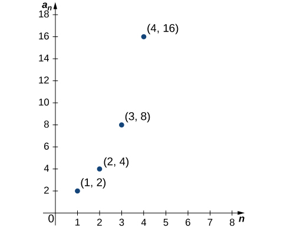
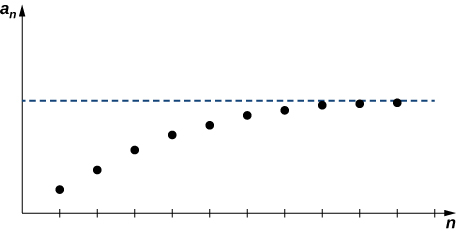
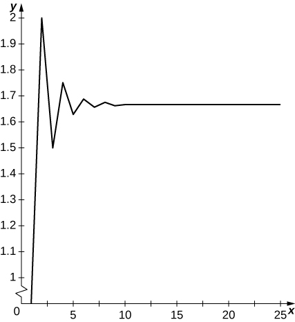
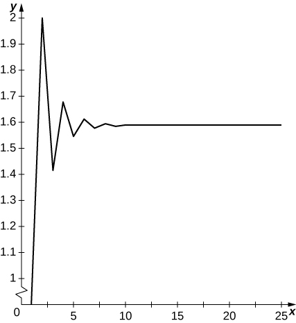
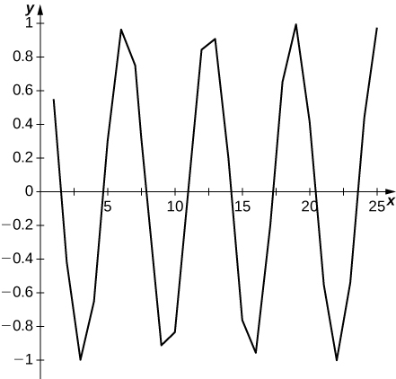

* Find the formula for the general term of a sequence.
* Calculate the limit of a sequence if it exists.
* Determine the convergence or divergence of a given sequence.

In this section, we introduce sequences and define what it means for a sequence to converge or diverge. We show how to find limits of sequences that converge, often by using the properties of limits for functions discussed earlier. We close this section with the Monotone Convergence Theorem, a tool we can use to prove that certain types of sequences converge.

# Terminology of Sequences

To work with this new topic, we need some new terms and definitions. First, an infinite sequence is an ordered list of numbers of the form

<math xmlns="http://www.w3.org/1998/Math/MathML"><mrow><msub><mi>a</mi><mn>1</mn></msub><mo>,</mo><msub><mi>a</mi><mn>2</mn></msub><mo>,</mo><msub><mi>a</mi><mn>3</mn></msub><mtext>,…</mtext><mo>,</mo><msub><mi>a</mi><mi>n</mi></msub><mtext>,…</mtext><mspace width="0.2em" /><mtext>.</mtext></mrow></math>

Each of the numbers in the sequence is called a term. The symbol <math xmlns="http://www.w3.org/1998/Math/MathML"><mrow><mi>n</mi></mrow></math>

 is called the index variable for the sequence. We use the notation

<math xmlns="http://www.w3.org/1998/Math/MathML"><mrow><msubsup><mrow><mo>{</mo><msub><mi>a</mi><mi>n</mi></msub><mo>}</mo></mrow><mrow><mi>n</mi><mo>=</mo><mn>1</mn></mrow><mi>∞</mi></msubsup><mo>,</mo><mspace width="0.2em" /><mtext>or simply</mtext><mspace width="0.2em" /><mo>{</mo><msub><mi>a</mi><mi>n</mi></msub><mo>}</mo><mo>,</mo></mrow></math>

to denote this sequence. A similar notation is used for sets, but a sequence is an ordered list, whereas a set is not ordered. Because a particular number <math xmlns="http://www.w3.org/1998/Math/MathML"><mrow><msub><mi>a</mi><mi>n</mi></msub></mrow></math>

 exists for each positive integer <math xmlns="http://www.w3.org/1998/Math/MathML"><mi>n</mi><mo>,</mo></math>

 we can also define a sequence as a function whose domain is the set of positive integers.

Let’s consider the infinite, ordered list

<math xmlns="http://www.w3.org/1998/Math/MathML"><mrow><mn>2</mn><mo>,</mo><mn>4</mn><mo>,</mo><mn>8</mn><mo>,</mo><mn>16</mn><mo>,</mo><mn>32</mn><mtext>,…</mtext><mspace width="0.2em" /><mo>.</mo></mrow></math>

This is a sequence in which the first, second, and third terms are given by <math xmlns="http://www.w3.org/1998/Math/MathML"><mrow><msub><mi>a</mi><mn>1</mn></msub><mo>=</mo><mn>2</mn><mo>,</mo></mrow></math>

 <math xmlns="http://www.w3.org/1998/Math/MathML"><mrow><msub><mi>a</mi><mn>2</mn></msub><mo>=</mo><mn>4</mn><mo>,</mo></mrow></math>

 and <math xmlns="http://www.w3.org/1998/Math/MathML"><mrow><msub><mi>a</mi><mn>3</mn></msub><mo>=</mo><mn>8</mn><mo>.</mo></mrow></math>

 You can probably see that the terms in this sequence have the following pattern:

<math xmlns="http://www.w3.org/1998/Math/MathML"><mrow><msub><mi>a</mi><mn>1</mn></msub><mo>=</mo><msup><mn>2</mn><mn>1</mn></msup><mo>,</mo><mspace width="0.2em" /><msub><mi>a</mi><mn>2</mn></msub><mo>=</mo><msup><mn>2</mn><mn>2</mn></msup><mo>,</mo><mspace width="0.2em" /><msub><mi>a</mi><mn>3</mn></msub><mo>=</mo><msup><mn>2</mn><mn>3</mn></msup><mo>,</mo><mspace width="0.2em" /><msub><mi>a</mi><mn>4</mn></msub><mo>=</mo><msup><mn>2</mn><mn>4</mn></msup><mo>,</mo><mspace width="0.2em" /><mtext>and</mtext><mspace width="0.2em" /><msub><mi>a</mi><mn>5</mn></msub><mo>=</mo><msup><mn>2</mn><mn>5</mn></msup><mo>.</mo></mrow></math>

Assuming this pattern continues, we can write the <math xmlns="http://www.w3.org/1998/Math/MathML"><mrow><mi>n</mi><mtext>th</mtext></mrow></math>

 term in the sequence by the explicit formula <math xmlns="http://www.w3.org/1998/Math/MathML"><mrow><msub><mi>a</mi><mi>n</mi></msub><mo>=</mo><msup><mn>2</mn><mi>n</mi></msup><mo>.</mo></mrow></math>

 Using this notation, we can write this sequence as

<math xmlns="http://www.w3.org/1998/Math/MathML"><mrow><msubsup><mrow><mo>{</mo><msup><mn>2</mn><mi>n</mi></msup><mo>}</mo></mrow><mrow><mi>n</mi><mo>=</mo><mn>1</mn></mrow><mi>∞</mi></msubsup><mspace width="0.2em" /><mtext>or</mtext><mspace width="0.2em" /><mo>{</mo><msup><mn>2</mn><mi>n</mi></msup><mo>}</mo><mo>.</mo></mrow></math>

Alternatively, we can describe this sequence in a different way. Since each term is twice the previous term, this sequence can be defined recursively by expressing the <math xmlns="http://www.w3.org/1998/Math/MathML"><mrow><mi>n</mi><mtext>th</mtext></mrow></math>

 term <math xmlns="http://www.w3.org/1998/Math/MathML"><mrow><msub><mi>a</mi><mi>n</mi></msub></mrow></math>

 in terms of the previous term <math xmlns="http://www.w3.org/1998/Math/MathML"><mrow><msub><mi>a</mi><mrow><mi>n</mi><mo>−</mo><mn>1</mn></mrow></msub><mo>.</mo></mrow></math>

 In particular, we can define this sequence as the sequence <math xmlns="http://www.w3.org/1998/Math/MathML"><mrow><mrow><mo>{</mo><mrow><msub><mi>a</mi><mi>n</mi></msub></mrow><mo>}</mo></mrow></mrow></math>

 where <math xmlns="http://www.w3.org/1998/Math/MathML"><mrow><msub><mi>a</mi><mn>1</mn></msub><mo>=</mo><mn>2</mn></mrow></math>

 and for all <math xmlns="http://www.w3.org/1998/Math/MathML"><mrow><mi>n</mi><mo>≥</mo><mn>2</mn><mo>,</mo></mrow></math>

 each term <math xmlns="http://www.w3.org/1998/Math/MathML"><mrow><msub><mi>a</mi><mi>n</mi></msub></mrow></math>

 is defined by the **recurrence relation**{: data-type="term"}<math xmlns="http://www.w3.org/1998/Math/MathML"><mrow><msub><mi>a</mi><mi>n</mi></msub><mo>=</mo><mn>2</mn><msub><mi>a</mi><mrow><mi>n</mi><mo>−</mo><mn>1</mn></mrow></msub><mo>.</mo></mrow></math>

Definition

An **infinite sequence**{: data-type="term"}<math xmlns="http://www.w3.org/1998/Math/MathML"><mrow><mrow><mo>{</mo><mrow><msub><mi>a</mi><mi>n</mi></msub></mrow><mo>}</mo></mrow></mrow></math>

 is an ordered list of numbers of the form

<math xmlns="http://www.w3.org/1998/Math/MathML"><mrow><msub><mi>a</mi><mn>1</mn></msub><mo>,</mo><msub><mi>a</mi><mn>2</mn></msub><mtext>,…</mtext><mo>,</mo><msub><mi>a</mi><mi>n</mi></msub><mtext>,…</mtext><mspace width="0.2em" /><mtext>.</mtext></mrow></math>

The subscript <math xmlns="http://www.w3.org/1998/Math/MathML"><mrow><mi>n</mi></mrow></math>

 is called the **index variable**{: data-type="term"} of the sequence. Each number <math xmlns="http://www.w3.org/1998/Math/MathML"><mrow><msub><mi>a</mi><mi>n</mi></msub></mrow></math>

 is a **term**{: data-type="term"} of the sequence. Sometimes sequences are defined by **explicit formulas**{: data-type="term"}, in which case <math xmlns="http://www.w3.org/1998/Math/MathML"><mrow><msub><mi>a</mi><mi>n</mi></msub><mo>=</mo><mi>f</mi><mo stretchy="false">(</mo><mi>n</mi><mo stretchy="false">)</mo></mrow></math>

 for some function <math xmlns="http://www.w3.org/1998/Math/MathML"><mrow><mi>f</mi><mo stretchy="false">(</mo><mi>n</mi><mo stretchy="false">)</mo></mrow></math>

 defined over the positive integers. In other cases, sequences are defined by using a **recurrence relation**{: data-type="term"}. In a recurrence relation, one term (or more) of the sequence is given explicitly, and subsequent terms are defined in terms of earlier terms in the sequence.

Note that the index does not have to start at <math xmlns="http://www.w3.org/1998/Math/MathML"><mrow><mi>n</mi><mo>=</mo><mn>1</mn></mrow></math>

 but could start with other integers. For example, a sequence given by the explicit formula <math xmlns="http://www.w3.org/1998/Math/MathML"><mrow><msub><mi>a</mi><mi>n</mi></msub><mo>=</mo><mi>f</mi><mo stretchy="false">(</mo><mi>n</mi><mo stretchy="false">)</mo></mrow></math>

 could start at <math xmlns="http://www.w3.org/1998/Math/MathML"><mrow><mi>n</mi><mo>=</mo><mn>0</mn><mo>,</mo></mrow></math>

 in which case the sequence would be

<math xmlns="http://www.w3.org/1998/Math/MathML"><mrow><msub><mi>a</mi><mn>0</mn></msub><mo>,</mo><msub><mi>a</mi><mn>1</mn></msub><mo>,</mo><msub><mi>a</mi><mn>2</mn></msub><mtext>,…</mtext><mspace width="0.2em" /><mtext>.</mtext></mrow></math>

Similarly, for a sequence defined by a recurrence relation, the term <math xmlns="http://www.w3.org/1998/Math/MathML"><mrow><msub><mi>a</mi><mn>0</mn></msub></mrow></math>

 may be given explicitly, and the terms <math xmlns="http://www.w3.org/1998/Math/MathML"><mrow><msub><mi>a</mi><mi>n</mi></msub></mrow></math>

 for <math xmlns="http://www.w3.org/1998/Math/MathML"><mrow><mi>n</mi><mo>≥</mo><mn>1</mn></mrow></math>

 may be defined in terms of <math xmlns="http://www.w3.org/1998/Math/MathML"><mrow><msub><mi>a</mi><mrow><mi>n</mi><mo>−</mo><mn>1</mn></mrow></msub><mo>.</mo></mrow></math>

 Since a sequence <math xmlns="http://www.w3.org/1998/Math/MathML"><mrow><mo>{</mo><msub><mi>a</mi><mi>n</mi></msub><mo>}</mo></mrow></math>

 has exactly one value for each positive integer <math xmlns="http://www.w3.org/1998/Math/MathML"><mrow><mi>n</mi><mo>,</mo></mrow></math>

 it can be described as a function whose domain is the set of positive integers. As a result, it makes sense to discuss the graph of a sequence. The graph of a sequence <math xmlns="http://www.w3.org/1998/Math/MathML"><mrow><mo>{</mo><msub><mi>a</mi><mi>n</mi></msub><mo>}</mo></mrow></math>

 consists of all points <math xmlns="http://www.w3.org/1998/Math/MathML"><mrow><mo stretchy="false">(</mo><mi>n</mi><mo>,</mo><msub><mi>a</mi><mi>n</mi></msub><mo stretchy="false">)</mo></mrow></math>

 for all positive integers <math xmlns="http://www.w3.org/1998/Math/MathML"><mrow><mi>n</mi><mo>.</mo></mrow></math>

 [\[link\]](#CNX_Calc_Figure_09_01_001) shows the graph of <math xmlns="http://www.w3.org/1998/Math/MathML"><mrow><mo>{</mo><msup><mn>2</mn><mi>n</mi></msup><mo>}</mo><mo>.</mo></mrow></math>

 {: #CNX_Calc_Figure_09_01_001}

Two types of sequences occur often and are given special names: arithmetic sequences and geometric sequences. In an **arithmetic sequence**{: data-type="term"}, the *difference* between every pair of consecutive terms is the same. For example, consider the sequence

<math xmlns="http://www.w3.org/1998/Math/MathML"><mrow><mn>3</mn><mo>,</mo><mn>7</mn><mo>,</mo><mn>11</mn><mo>,</mo><mn>15</mn><mo>,</mo><mn>19</mn><mtext>,…</mtext><mspace width="0.2em" /><mtext>.</mtext></mrow></math>

You can see that the difference between every consecutive pair of terms is <math xmlns="http://www.w3.org/1998/Math/MathML"><mrow><mn>4</mn><mo>.</mo></mrow></math>

 Assuming that this pattern continues, this sequence is an arithmetic sequence. It can be described by using the recurrence relation

<math xmlns="http://www.w3.org/1998/Math/MathML"><mrow><mrow><mo>{</mo><mtable><mtr><mtd columnalign="left"><msub><mi>a</mi><mn>1</mn></msub><mo>=</mo><mn>3</mn></mtd></mtr><mtr><mtd><msub><mi>a</mi><mi>n</mi></msub><mo>=</mo><msub><mi>a</mi><mrow><mi>n</mi><mo>−</mo><mn>1</mn></mrow></msub><mo>+</mo><mn>4</mn><mspace width="0.2em" /><mtext>for</mtext><mspace width="0.2em" /><mi>n</mi><mo>≥</mo><mn>2</mn><mo>.</mo></mtd></mtr></mtable></mrow></mrow></math>

Note that

<math xmlns="http://www.w3.org/1998/Math/MathML"><mtable columnalign="left"><mtr><mtd><msub><mi>a</mi><mn>2</mn></msub><mo>=</mo><mn>3</mn><mo>+</mo><mn>4</mn></mtd></mtr><mtr><mtd><msub><mi>a</mi><mn>3</mn></msub><mo>=</mo><mn>3</mn><mo>+</mo><mn>4</mn><mo>+</mo><mn>4</mn><mo>=</mo><mn>3</mn><mo>+</mo><mn>2</mn><mo>·</mo><mn>4</mn></mtd></mtr><mtr><mtd><msub><mi>a</mi><mn>4</mn></msub><mo>=</mo><mn>3</mn><mo>+</mo><mn>4</mn><mo>+</mo><mn>4</mn><mo>+</mo><mn>4</mn><mo>=</mo><mn>3</mn><mo>+</mo><mn>3</mn><mo>·</mo><mn>4</mn><mo>.</mo></mtd></mtr></mtable></math>

Thus the sequence can also be described using the explicit formula

<math xmlns="http://www.w3.org/1998/Math/MathML"><mtable><mtr><mtd columnalign="right"><msub><mi>a</mi><mi>n</mi></msub></mtd><mtd columnalign="left"><mo>=</mo><mn>3</mn><mo>+</mo><mn>4</mn><mrow><mo>(</mo><mrow><mi>n</mi><mo>−</mo><mn>1</mn></mrow><mo>)</mo></mrow></mtd></mtr><mtr><mtd /><mtd columnalign="left"><mo>=</mo><mn>4</mn><mi>n</mi><mo>−</mo><mn>1</mn><mo>.</mo></mtd></mtr></mtable></math>

In general, an arithmetic sequence is any sequence of the form <math xmlns="http://www.w3.org/1998/Math/MathML"><mrow><msub><mi>a</mi><mi>n</mi></msub><mo>=</mo><mi>c</mi><mi>n</mi><mo>+</mo><mi>b</mi><mo>.</mo></mrow></math>

In a **geometric sequence**{: data-type="term"}, the *ratio* of every pair of consecutive terms is the same. For example, consider the sequence

<math xmlns="http://www.w3.org/1998/Math/MathML"><mrow><mn>2</mn><mo>,</mo><mo>−</mo><mfrac><mn>2</mn><mn>3</mn></mfrac><mo>,</mo><mfrac><mn>2</mn><mn>9</mn></mfrac><mo>,</mo><mo>−</mo><mfrac><mn>2</mn><mrow><mn>27</mn></mrow></mfrac><mo>,</mo><mfrac><mn>2</mn><mrow><mn>81</mn></mrow></mfrac><mtext>,…</mtext><mspace width="0.2em" /><mtext>.</mtext></mrow></math>

We see that the ratio of any term to the preceding term is <math xmlns="http://www.w3.org/1998/Math/MathML"><mrow><mo>−</mo><mfrac><mn>1</mn><mn>3</mn></mfrac><mo>.</mo></mrow></math>

 Assuming this pattern continues, this sequence is a geometric sequence. It can be defined recursively as

<math xmlns="http://www.w3.org/1998/Math/MathML"><mtable><mtr /><mtr><mtd columnalign="left"><msub><mi>a</mi><mn>1</mn></msub><mo>=</mo><mn>2</mn></mtd></mtr><mtr><mtd columnalign="left"><msub><mi>a</mi><mi>n</mi></msub><mo>=</mo><mo>−</mo><mfrac><mn>1</mn><mn>3</mn></mfrac><mo>·</mo><msub><mi>a</mi><mrow><mi>n</mi><mo>−</mo><mn>1</mn></mrow></msub><mspace width="0.2em" /><mtext>for</mtext><mspace width="0.2em" /><mi>n</mi><mo>≥</mo><mn>2</mn><mo>.</mo></mtd></mtr></mtable></math>

Alternatively, since

<math xmlns="http://www.w3.org/1998/Math/MathML"><mtable><mtr /><mtr /><mtr><mtd columnalign="left"><msub><mi>a</mi><mn>2</mn></msub><mo>=</mo><mo>−</mo><mfrac><mn>1</mn><mn>3</mn></mfrac><mo>·</mo><mn>2</mn></mtd></mtr><mtr><mtd columnalign="left"><msub><mi>a</mi><mn>3</mn></msub><mo>=</mo><mrow><mo>(</mo><mrow><mo>−</mo><mfrac><mn>1</mn><mn>3</mn></mfrac></mrow><mo>)</mo></mrow><mrow><mo>(</mo><mrow><mo>−</mo><mfrac><mn>1</mn><mn>3</mn></mfrac></mrow><mo>)</mo></mrow><mo stretchy="false">(</mo><mn>2</mn><mo stretchy="false">)</mo><mo>=</mo><msup><mrow><mo>(</mo><mrow><mo>−</mo><mfrac><mn>1</mn><mn>3</mn></mfrac></mrow><mo>)</mo></mrow><mn>2</mn></msup><mo>·</mo><mn>2</mn></mtd></mtr><mtr><mtd columnalign="left"><msub><mi>a</mi><mn>4</mn></msub><mo>=</mo><mrow><mo>(</mo><mrow><mo>−</mo><mfrac><mn>1</mn><mn>3</mn></mfrac></mrow><mo>)</mo></mrow><mrow><mo>(</mo><mrow><mo>−</mo><mfrac><mn>1</mn><mn>3</mn></mfrac></mrow><mo>)</mo></mrow><mrow><mo>(</mo><mrow><mo>−</mo><mfrac><mn>1</mn><mn>3</mn></mfrac></mrow><mo>)</mo></mrow><mo stretchy="false">(</mo><mn>2</mn><mo stretchy="false">)</mo><mo>=</mo><msup><mrow><mo>(</mo><mrow><mo>−</mo><mfrac><mn>1</mn><mn>3</mn></mfrac></mrow><mo>)</mo></mrow><mn>3</mn></msup><mo>·</mo><mn>2</mn><mo>,</mo></mtd></mtr></mtable></math>

we see that the sequence can be described by using the explicit formula

<math xmlns="http://www.w3.org/1998/Math/MathML"><mrow><msub><mi>a</mi><mi>n</mi></msub><mo>=</mo><mn>2</mn><msup><mrow><mrow><mo>(</mo><mrow><mo>−</mo><mfrac><mn>1</mn><mn>3</mn></mfrac></mrow><mo>)</mo></mrow></mrow><mrow><mi>n</mi><mo>−</mo><mn>1</mn></mrow></msup><mo>.</mo></mrow></math>

The sequence <math xmlns="http://www.w3.org/1998/Math/MathML"><mrow><mo>{</mo><msup><mn>2</mn><mi>n</mi></msup><mo>}</mo></mrow></math>

 that we discussed earlier is a geometric sequence, where the ratio of any term to the previous term is <math xmlns="http://www.w3.org/1998/Math/MathML"><mrow><mn>2</mn><mo>.</mo></mrow></math>

 In general, a geometric sequence is any sequence of the form <math xmlns="http://www.w3.org/1998/Math/MathML"><mrow><msub><mi>a</mi><mi>n</mi></msub><mo>=</mo><mi>c</mi><msup><mi>r</mi><mi>n</mi></msup><mo>.</mo></mrow></math>

Finding Explicit Formulas

For each of the following sequences, find an explicit formula for the <math xmlns="http://www.w3.org/1998/Math/MathML"><mrow><mi>n</mi><mtext>th</mtext></mrow></math>

 term of the sequence.

1.  <math xmlns="http://www.w3.org/1998/Math/MathML"><mrow><mo>−</mo><mfrac><mn>1</mn><mn>2</mn></mfrac><mo>,</mo><mfrac><mn>2</mn><mn>3</mn></mfrac><mo>,</mo><mo>−</mo><mfrac><mn>3</mn><mn>4</mn></mfrac><mo>,</mo><mfrac><mn>4</mn><mn>5</mn></mfrac><mo>,</mo><mo>−</mo><mfrac><mn>5</mn><mn>6</mn></mfrac><mtext>,…</mtext></mrow></math>

2.  <math xmlns="http://www.w3.org/1998/Math/MathML"><mrow><mfrac><mn>3</mn><mn>4</mn></mfrac><mo>,</mo><mfrac><mn>9</mn><mn>7</mn></mfrac><mo>,</mo><mfrac><mrow><mn>27</mn></mrow><mrow><mn>10</mn></mrow></mfrac><mo>,</mo><mfrac><mrow><mn>81</mn></mrow><mrow><mn>13</mn></mrow></mfrac><mo>,</mo><mfrac><mrow><mn>243</mn></mrow><mrow><mn>16</mn></mrow></mfrac><mtext>,…</mtext></mrow></math>
{: data-number-style="lower-alpha"}

1.  First, note that the sequence is alternating from negative to positive. The odd terms in the sequence are negative, and the even terms are positive. Therefore, the
    <math xmlns="http://www.w3.org/1998/Math/MathML"><mrow><mi>n</mi><mtext>th</mtext></mrow></math>
    
    term includes a factor of
    <math xmlns="http://www.w3.org/1998/Math/MathML"><mrow><msup><mrow><mrow><mo>(</mo><mrow><mn>−1</mn></mrow><mo>)</mo></mrow></mrow><mi>n</mi></msup><mo>.</mo></mrow></math>
    
    Next, consider the sequence of numerators
    <math xmlns="http://www.w3.org/1998/Math/MathML"><mrow><mo>{</mo><mn>1</mn><mo>,</mo><mn>2</mn><mo>,</mo><mn>3</mn><mtext>,…</mtext><mo>}</mo></mrow></math>
    
    and the sequence of denominators
    <math xmlns="http://www.w3.org/1998/Math/MathML"><mrow><mo>{</mo><mn>2</mn><mo>,</mo><mn>3</mn><mo>,</mo><mn>4</mn><mtext>,…</mtext><mo>}</mo><mo>.</mo></mrow></math>
    
    We can see that both of these sequences are arithmetic sequences. The
    <math xmlns="http://www.w3.org/1998/Math/MathML"><mrow><mi>n</mi><mtext>th</mtext></mrow></math>
    
    term in the sequence of numerators is
    <math xmlns="http://www.w3.org/1998/Math/MathML"><mi>n</mi><mo>,</mo></math>
    
    and the
    <math xmlns="http://www.w3.org/1998/Math/MathML"><mrow><mi>n</mi><mtext>th</mtext></mrow></math>
    
    term in the sequence of denominators is
    <math xmlns="http://www.w3.org/1998/Math/MathML"><mrow><mi>n</mi><mo>+</mo><mn>1</mn><mo>.</mo></mrow></math>
    
    Therefore, the sequence can be described by the explicit formula
    * * *
    {: data-type="newline"}
    
    

    <math xmlns="http://www.w3.org/1998/Math/MathML"><mrow><msub><mi>a</mi><mi>n</mi></msub><mo>=</mo><mfrac><mrow><msup><mrow><mrow><mo>(</mo><mrow><mn>−1</mn></mrow><mo>)</mo></mrow></mrow><mi>n</mi></msup><mi>n</mi></mrow><mrow><mi>n</mi><mo>+</mo><mn>1</mn></mrow></mfrac><mo>.</mo></mrow></math>
    

2.  The sequence of numerators
    <math xmlns="http://www.w3.org/1998/Math/MathML"><mrow><mn>3</mn><mo>,</mo><mn>9</mn><mo>,</mo><mn>27</mn><mo>,</mo><mn>81</mn><mo>,</mo><mn>243</mn><mtext>,…</mtext></mrow></math>
    
    is a geometric sequence. The numerator of the
    <math xmlns="http://www.w3.org/1998/Math/MathML"><mrow><mi>n</mi><mtext>th</mtext></mrow></math>
    
    term is
    <math xmlns="http://www.w3.org/1998/Math/MathML"><mrow><msup><mn>3</mn><mi>n</mi></msup></mrow></math>
    
    The sequence of denominators
    <math xmlns="http://www.w3.org/1998/Math/MathML"><mrow><mn>4</mn><mo>,</mo><mn>7</mn><mo>,</mo><mn>10</mn><mo>,</mo><mn>13</mn><mo>,</mo><mn>16</mn><mtext>,…</mtext></mrow></math>
    
    is an arithmetic sequence. The denominator of the
    <math xmlns="http://www.w3.org/1998/Math/MathML"><mrow><mi>n</mi><mtext>th</mtext></mrow></math>
    
    term is
    <math xmlns="http://www.w3.org/1998/Math/MathML"><mrow><mn>4</mn><mo>+</mo><mn>3</mn><mrow><mo>(</mo><mrow><mi>n</mi><mo>−</mo><mn>1</mn></mrow><mo>)</mo></mrow><mo>=</mo><mn>3</mn><mi>n</mi><mo>+</mo><mn>1</mn><mo>.</mo></mrow></math>
    
    Therefore, we can describe the sequence by the explicit formula
    <math xmlns="http://www.w3.org/1998/Math/MathML"><mrow><msub><mi>a</mi><mi>n</mi></msub><mo>=</mo><mfrac><mrow><msup><mn>3</mn><mi>n</mi></msup></mrow><mrow><mn>3</mn><mi>n</mi><mo>+</mo><mn>1</mn></mrow></mfrac><mo>.</mo></mrow></math>
{: data-number-style="lower-alpha"}

Find an explicit formula for the <math xmlns="http://www.w3.org/1998/Math/MathML"><mrow><mi>n</mi><mtext>th</mtext></mrow></math>

 term of the sequence <math xmlns="http://www.w3.org/1998/Math/MathML"><mrow><mo>{</mo><mfrac><mn>1</mn><mn>5</mn></mfrac><mo>,</mo><mo>−</mo><mfrac><mn>1</mn><mn>7</mn></mfrac><mo>,</mo><mfrac><mn>1</mn><mn>9</mn></mfrac><mo>,</mo><mo>−</mo><mfrac><mn>1</mn><mrow><mn>11</mn></mrow></mfrac><mtext>,…</mtext><mo>}</mo><mo>.</mo></mrow></math>

<math xmlns="http://www.w3.org/1998/Math/MathML"><mrow><msub><mi>a</mi><mi>n</mi></msub><mo>=</mo><mfrac><mrow><msup><mrow><mrow><mo>(</mo><mrow><mn>−1</mn></mrow><mo>)</mo></mrow></mrow><mrow><mi>n</mi><mo>+</mo><mn>1</mn></mrow></msup></mrow><mrow><mn>3</mn><mo>+</mo><mn>2</mn><mi>n</mi></mrow></mfrac></mrow></math>

Hint

The denominators form an arithmetic sequence.

Defined by Recurrence Relations

For each of the following recursively defined sequences, find an explicit formula for the sequence.

1.  <math xmlns="http://www.w3.org/1998/Math/MathML"><mrow><msub><mi>a</mi><mn>1</mn></msub><mo>=</mo><mn>2</mn><mo>,</mo></mrow></math>
    
    <math xmlns="http://www.w3.org/1998/Math/MathML"><mrow><msub><mi>a</mi><mi>n</mi></msub><mo>=</mo><mn>−3</mn><msub><mi>a</mi><mrow><mi>n</mi><mo>−</mo><mn>1</mn></mrow></msub></mrow></math>
    
    for
    <math xmlns="http://www.w3.org/1998/Math/MathML"><mrow><mi>n</mi><mo>≥</mo><mn>2</mn></mrow></math>

2.  <math xmlns="http://www.w3.org/1998/Math/MathML"><mrow><msub><mi>a</mi><mn>1</mn></msub><mo>=</mo><mfrac><mn>1</mn><mn>2</mn></mfrac><mo>,</mo></mrow></math>
    
    <math xmlns="http://www.w3.org/1998/Math/MathML"><mrow><msub><mi>a</mi><mi>n</mi></msub><mo>=</mo><msub><mi>a</mi><mrow><mi>n</mi><mo>−</mo><mn>1</mn></mrow></msub><mo>+</mo><msup><mrow><mrow><mo>(</mo><mrow><mfrac><mn>1</mn><mn>2</mn></mfrac></mrow><mo>)</mo></mrow></mrow><mi>n</mi></msup></mrow></math>
    
    for
    <math xmlns="http://www.w3.org/1998/Math/MathML"><mrow><mi>n</mi><mo>≥</mo><mn>2</mn></mrow></math>
{: data-number-style="lower-alpha"}

1.  Writing out the first few terms, we have
    * * *
    {: data-type="newline"}
    
    

    <math xmlns="http://www.w3.org/1998/Math/MathML"><mtable><mtr><mtd columnalign="left"><msub><mi>a</mi><mn>1</mn></msub><mo>=</mo><mn>2</mn></mtd></mtr><mtr><mtd columnalign="left"><msub><mi>a</mi><mn>2</mn></msub><mo>=</mo><mn>−3</mn><msub><mi>a</mi><mn>1</mn></msub><mo>=</mo><mn>−3</mn><mrow><mo>(</mo><mn>2</mn><mo>)</mo></mrow></mtd></mtr><mtr><mtd columnalign="left"><msub><mi>a</mi><mn>3</mn></msub><mo>=</mo><mn>−3</mn><msub><mi>a</mi><mn>2</mn></msub><mo>=</mo><msup><mrow><mo>(</mo><mrow><mn>−3</mn></mrow><mo>)</mo></mrow><mn>2</mn></msup><mn>2</mn></mtd></mtr><mtr><mtd columnalign="left"><msub><mi>a</mi><mn>4</mn></msub><mo>=</mo><mn>−3</mn><msub><mi>a</mi><mn>3</mn></msub><mo>=</mo><msup><mrow><mo>(</mo><mrow><mn>−3</mn></mrow><mo>)</mo></mrow><mn>3</mn></msup><mn>2</mn><mo>.</mo></mtd></mtr></mtable></math>
    

    
    * * *
    {: data-type="newline"}
    
    In general,
    * * *
    {: data-type="newline"}
    
    

    <math xmlns="http://www.w3.org/1998/Math/MathML"><mrow><msub><mi>a</mi><mi>n</mi></msub><mo>=</mo><mn>2</mn><msup><mrow><mrow><mo>(</mo><mrow><mn>−3</mn></mrow><mo>)</mo></mrow></mrow><mrow><mi>n</mi><mo>−</mo><mn>1</mn></mrow></msup><mo>.</mo></mrow></math>
    

2.  Write out the first few terms:
    * * *
    {: data-type="newline"}
    
    

    <math xmlns="http://www.w3.org/1998/Math/MathML"><mtable><mtr /><mtr /><mtr><mtd columnalign="left"><msub><mi>a</mi><mn>1</mn></msub><mo>=</mo><mfrac><mn>1</mn><mn>2</mn></mfrac></mtd></mtr><mtr><mtd columnalign="left"><msub><mi>a</mi><mn>2</mn></msub><mo>=</mo><msub><mi>a</mi><mn>1</mn></msub><mo>+</mo><msup><mrow><mo>(</mo><mrow><mfrac><mn>1</mn><mn>2</mn></mfrac></mrow><mo>)</mo></mrow><mn>2</mn></msup><mo>=</mo><mfrac><mn>1</mn><mn>2</mn></mfrac><mo>+</mo><mfrac><mn>1</mn><mn>4</mn></mfrac><mo>=</mo><mfrac><mn>3</mn><mn>4</mn></mfrac></mtd></mtr><mtr><mtd columnalign="left"><msub><mi>a</mi><mn>3</mn></msub><mo>=</mo><msub><mi>a</mi><mn>2</mn></msub><mo>+</mo><msup><mrow><mo>(</mo><mrow><mfrac><mn>1</mn><mn>2</mn></mfrac></mrow><mo>)</mo></mrow><mn>3</mn></msup><mo>=</mo><mfrac><mn>3</mn><mn>4</mn></mfrac><mo>+</mo><mfrac><mn>1</mn><mn>8</mn></mfrac><mo>=</mo><mfrac><mn>7</mn><mn>8</mn></mfrac></mtd></mtr><mtr><mtd columnalign="left"><msub><mi>a</mi><mn>4</mn></msub><mo>=</mo><msub><mi>a</mi><mn>3</mn></msub><mo>+</mo><msup><mrow><mo>(</mo><mrow><mfrac><mn>1</mn><mn>2</mn></mfrac></mrow><mo>)</mo></mrow><mn>4</mn></msup><mo>=</mo><mfrac><mn>7</mn><mn>8</mn></mfrac><mo>+</mo><mfrac><mn>1</mn><mrow><mn>16</mn></mrow></mfrac><mo>=</mo><mfrac><mrow><mn>15</mn></mrow><mrow><mn>16</mn></mrow></mfrac><mo>.</mo></mtd></mtr></mtable></math>
    

    
    * * *
    {: data-type="newline"}
    
    From this pattern, we derive the explicit formula
    * * *
    {: data-type="newline"}
    
    

    <math xmlns="http://www.w3.org/1998/Math/MathML"><mrow><msub><mi>a</mi><mi>n</mi></msub><mo>=</mo><mfrac><mrow><msup><mn>2</mn><mi>n</mi></msup><mo>−</mo><mn>1</mn></mrow><mrow><msup><mn>2</mn><mi>n</mi></msup></mrow></mfrac><mo>=</mo><mn>1</mn><mo>−</mo><mfrac><mn>1</mn><mrow><msup><mn>2</mn><mi>n</mi></msup></mrow></mfrac><mo>.</mo></mrow></math>
    

{: data-number-style="lower-alpha"}

Find an explicit formula for the sequence defined recursively such that <math xmlns="http://www.w3.org/1998/Math/MathML"><mrow><msub><mi>a</mi><mn>1</mn></msub><mo>=</mo><mn>−4</mn></mrow></math>

 and <math xmlns="http://www.w3.org/1998/Math/MathML"><mrow><msub><mi>a</mi><mi>n</mi></msub><mo>=</mo><msub><mi>a</mi><mrow><mi>n</mi><mo>−</mo><mn>1</mn></mrow></msub><mo>+</mo><mn>6</mn><mo>.</mo></mrow></math>

<math xmlns="http://www.w3.org/1998/Math/MathML"><mrow><msub><mi>a</mi><mi>n</mi></msub><mo>=</mo><mn>6</mn><mi>n</mi><mo>−</mo><mn>10</mn></mrow></math>

Hint

This is an arithmetic sequence.

# Limit of a Sequence

A fundamental question that arises regarding infinite sequences is the behavior of the terms as <math xmlns="http://www.w3.org/1998/Math/MathML"><mrow><mi>n</mi></mrow></math>

 gets larger. Since a sequence is a function defined on the positive integers, it makes sense to discuss the limit of the terms as <math xmlns="http://www.w3.org/1998/Math/MathML"><mrow><mi>n</mi><mo stretchy="false">→</mo><mi>∞</mi><mo>.</mo></mrow></math>

 For example, consider the following four sequences and their different behaviors as <math xmlns="http://www.w3.org/1998/Math/MathML"><mrow><mi>n</mi><mo stretchy="false">→</mo><mi>∞</mi></mrow></math>

 (see [\[link\]](#CNX_Calc_Figure_09_01_002)):

1.  <math xmlns="http://www.w3.org/1998/Math/MathML"><mrow><mrow><mo>{</mo><mrow><mn>1</mn><mo>+</mo><mn>3</mn><mi>n</mi></mrow><mo>}</mo></mrow><mo>=</mo><mo>{</mo><mn>4</mn><mo>,</mo><mn>7</mn><mo>,</mo><mn>10</mn><mo>,</mo><mn>13</mn><mtext>,…</mtext><mo>}</mo><mo>.</mo></mrow></math>
    
    The terms
    <math xmlns="http://www.w3.org/1998/Math/MathML"><mrow><mn>1</mn><mo>+</mo><mn>3</mn><mi>n</mi></mrow></math>
    
    become arbitrarily large as
    <math xmlns="http://www.w3.org/1998/Math/MathML"><mrow><mi>n</mi><mo stretchy="false">→</mo><mi>∞</mi><mo>.</mo></mrow></math>
    
    In this case, we say that
    <math xmlns="http://www.w3.org/1998/Math/MathML"><mrow><mn>1</mn><mo>+</mo><mn>3</mn><mi>n</mi><mo stretchy="false">→</mo><mi>∞</mi></mrow></math>
    
    as
    <math xmlns="http://www.w3.org/1998/Math/MathML"><mrow><mi>n</mi><mo stretchy="false">→</mo><mi>∞</mi><mo>.</mo></mrow></math>

2.  <math xmlns="http://www.w3.org/1998/Math/MathML"><mrow><mrow><mo>{</mo><mrow><mn>1</mn><mo>−</mo><msup><mrow><mrow><mo>(</mo><mrow><mfrac><mn>1</mn><mn>2</mn></mfrac></mrow><mo>)</mo></mrow></mrow><mi>n</mi></msup></mrow><mo>}</mo></mrow><mo>=</mo><mrow><mo>{</mo><mrow><mfrac><mn>1</mn><mn>2</mn></mfrac><mo>,</mo><mfrac><mn>3</mn><mn>4</mn></mfrac><mo>,</mo><mfrac><mn>7</mn><mn>8</mn></mfrac><mo>,</mo><mfrac><mrow><mn>15</mn></mrow><mrow><mn>16</mn></mrow></mfrac><mtext>,…</mtext></mrow><mo>}</mo></mrow><mo>.</mo></mrow></math>
    
    The terms
    <math xmlns="http://www.w3.org/1998/Math/MathML"><mrow><mn>1</mn><mo>−</mo><msup><mrow><mrow><mo>(</mo><mrow><mfrac><mn>1</mn><mn>2</mn></mfrac></mrow><mo>)</mo></mrow></mrow><mi>n</mi></msup><mo stretchy="false">→</mo><mn>1</mn></mrow></math>
    
    as
    <math xmlns="http://www.w3.org/1998/Math/MathML"><mrow><mi>n</mi><mo stretchy="false">→</mo><mi>∞</mi><mo>.</mo></mrow></math>

3.  <math xmlns="http://www.w3.org/1998/Math/MathML"><mrow><mrow><mo>{</mo><mrow><msup><mrow><mrow><mo>(</mo><mrow><mn>−1</mn></mrow><mo>)</mo></mrow></mrow><mi>n</mi></msup></mrow><mo>}</mo></mrow><mo>=</mo><mo>{</mo><mtext>−</mtext><mn>1</mn><mo>,</mo><mn>1</mn><mo>,</mo><mn>−1</mn><mo>,</mo><mn>1</mn><mtext>,…</mtext><mo>}</mo><mo>.</mo></mrow></math>
    
    The terms alternate but do not approach one single value as
    <math xmlns="http://www.w3.org/1998/Math/MathML"><mrow><mi>n</mi><mo stretchy="false">→</mo><mi>∞</mi><mo>.</mo></mrow></math>

4.  <math xmlns="http://www.w3.org/1998/Math/MathML"><mrow><mrow><mo>{</mo><mrow><mfrac><mrow><msup><mrow><mrow><mo>(</mo><mrow><mn>−1</mn></mrow><mo>)</mo></mrow></mrow><mi>n</mi></msup></mrow><mi>n</mi></mfrac></mrow><mo>}</mo></mrow><mo>=</mo><mrow><mo>{</mo><mrow><mn>−1</mn><mo>,</mo><mfrac><mn>1</mn><mn>2</mn></mfrac><mo>,</mo><mo>−</mo><mfrac><mn>1</mn><mn>3</mn></mfrac><mo>,</mo><mfrac><mn>1</mn><mn>4</mn></mfrac><mtext>,…</mtext></mrow><mo>}</mo></mrow><mo>.</mo></mrow></math>
    
    The terms alternate for this sequence as well, but
    <math xmlns="http://www.w3.org/1998/Math/MathML"><mrow><mfrac><mrow><msup><mrow><mrow><mo>(</mo><mrow><mn>−1</mn></mrow><mo>)</mo></mrow></mrow><mi>n</mi></msup></mrow><mi>n</mi></mfrac><mo stretchy="false">→</mo><mn>0</mn></mrow></math>
    
    as
    <math xmlns="http://www.w3.org/1998/Math/MathML"><mrow><mi>n</mi><mo stretchy="false">→</mo><mi>∞</mi><mo>.</mo></mrow></math>
{: data-number-style="lower-alpha"}

  The terms in the sequence become arbitrarily large as n&#x2192;&#x221E;. (b) The terms in the sequence approach 1 as n&#x2192;&#x221E;. (c) The terms in the sequence alternate between 1 and &#x2212;1 as n&#x2192;&#x221E;. (d) The terms in the sequence alternate between positive and negative values but approach 0 as n&#x2192;&#x221E;."){: #CNX_Calc_Figure_09_01_002}

From these examples, we see several possibilities for the behavior of the terms of a sequence as <math xmlns="http://www.w3.org/1998/Math/MathML"><mrow><mi>n</mi><mo stretchy="false">→</mo><mi>∞</mi><mo>.</mo></mrow></math>

 In two of the sequences, the terms approach a finite number as <math xmlns="http://www.w3.org/1998/Math/MathML"><mrow><mi>n</mi><mo stretchy="false">→</mo><mi>∞</mi><mo>.</mo></mrow></math>

 In the other two sequences, the terms do not. If the terms of a sequence approach a finite number <math xmlns="http://www.w3.org/1998/Math/MathML"><mi>L</mi></math>

 as <math xmlns="http://www.w3.org/1998/Math/MathML"><mrow><mi>n</mi><mo stretchy="false">→</mo><mi>∞</mi><mo>,</mo></mrow></math>

 we say that the sequence is a convergent sequence and the real number <math xmlns="http://www.w3.org/1998/Math/MathML"><mi>L</mi></math>

 is the limit of the sequence. We can give an informal definition here.

Definition

Given a sequence <math xmlns="http://www.w3.org/1998/Math/MathML"><mrow><mo>{</mo><msub><mi>a</mi><mi>n</mi></msub><mo>}</mo><mo>,</mo></mrow></math>

 if the terms <math xmlns="http://www.w3.org/1998/Math/MathML"><mrow><msub><mi>a</mi><mi>n</mi></msub></mrow></math>

 become arbitrarily close to a finite number <math xmlns="http://www.w3.org/1998/Math/MathML"><mi>L</mi></math>

 as <math xmlns="http://www.w3.org/1998/Math/MathML"><mi>n</mi></math>

 becomes sufficiently large, we say <math xmlns="http://www.w3.org/1998/Math/MathML"><mrow><mo>{</mo><msub><mi>a</mi><mi>n</mi></msub><mo>}</mo></mrow></math>

 is a **convergent sequence**{: data-type="term"} and <math xmlns="http://www.w3.org/1998/Math/MathML"><mi>L</mi></math>

 is the **limit of the sequence**{: data-type="term"}. In this case, we write

<math xmlns="http://www.w3.org/1998/Math/MathML"><mrow><munder><mrow><mtext>lim</mtext></mrow><mrow><mi>n</mi><mo stretchy="false">→</mo><mi>∞</mi></mrow></munder><msub><mi>a</mi><mi>n</mi></msub><mo>=</mo><mi>L</mi><mo>.</mo></mrow></math>

If a sequence <math xmlns="http://www.w3.org/1998/Math/MathML"><mrow><mo>{</mo><msub><mi>a</mi><mi>n</mi></msub><mo>}</mo></mrow></math>

 is not convergent, we say it is a **divergent sequence**{: data-type="term"}.

From [\[link\]](#CNX_Calc_Figure_09_01_002), we see that the terms in the sequence <math xmlns="http://www.w3.org/1998/Math/MathML"><mrow><mrow><mo>{</mo><mrow><mn>1</mn><mo>−</mo><msup><mrow><mrow><mo>(</mo><mrow><mfrac><mn>1</mn><mn>2</mn></mfrac></mrow><mo>)</mo></mrow></mrow><mi>n</mi></msup></mrow><mo>}</mo></mrow></mrow></math>

 are becoming arbitrarily close to <math xmlns="http://www.w3.org/1998/Math/MathML"><mn>1</mn></math>

 as <math xmlns="http://www.w3.org/1998/Math/MathML"><mi>n</mi></math>

 becomes very large. We conclude that <math xmlns="http://www.w3.org/1998/Math/MathML"><mrow><mrow><mo>{</mo><mrow><mn>1</mn><mo>−</mo><msup><mrow><mrow><mo>(</mo><mrow><mfrac><mn>1</mn><mn>2</mn></mfrac></mrow><mo>)</mo></mrow></mrow><mi>n</mi></msup></mrow><mo>}</mo></mrow></mrow></math>

 is a convergent sequence and its limit is <math xmlns="http://www.w3.org/1998/Math/MathML"><mrow><mn>1</mn><mo>.</mo></mrow></math>

 In contrast, from [\[link\]](#CNX_Calc_Figure_09_01_002), we see that the terms in the sequence <math xmlns="http://www.w3.org/1998/Math/MathML"><mrow><mn>1</mn><mo>+</mo><mn>3</mn><mi>n</mi></mrow></math>

 are not approaching a finite number as <math xmlns="http://www.w3.org/1998/Math/MathML"><mi>n</mi></math>

 becomes larger. We say that <math xmlns="http://www.w3.org/1998/Math/MathML"><mrow><mo>{</mo><mn>1</mn><mo>+</mo><mn>3</mn><mi>n</mi><mo>}</mo></mrow></math>

 is a divergent sequence.

In the informal definition for the limit of a sequence, we used the terms “arbitrarily close” and “sufficiently large.” Although these phrases help illustrate the meaning of a converging sequence, they are somewhat vague. To be more precise, we now present the more formal definition of limit for a sequence and show these ideas graphically in [\[link\]](#CNX_Calc_Figure_09_01_003).

Definition

A sequence <math xmlns="http://www.w3.org/1998/Math/MathML"><mrow><mo>{</mo><msub><mi>a</mi><mi>n</mi></msub><mo>}</mo></mrow></math>

 converges to a real number <math xmlns="http://www.w3.org/1998/Math/MathML"><mi>L</mi></math>

 if for all <math xmlns="http://www.w3.org/1998/Math/MathML"><mrow><mi>ε</mi><mo>&gt;</mo><mn>0</mn><mo>,</mo></mrow></math>

 there exists an integer <math xmlns="http://www.w3.org/1998/Math/MathML"><mrow><mi>N</mi></mrow></math>

 such that <math xmlns="http://www.w3.org/1998/Math/MathML"><mrow><mrow><mo>\|</mo><mrow><msub><mi>a</mi><mi>n</mi></msub><mo>−</mo><mi>L</mi></mrow><mo>\|</mo></mrow><mo>&lt;</mo><mi>ε</mi></mrow></math>

 if <math xmlns="http://www.w3.org/1998/Math/MathML"><mrow><mi>n</mi><mo>≥</mo><mi>N</mi><mo>.</mo></mrow></math>

 The number <math xmlns="http://www.w3.org/1998/Math/MathML"><mi>L</mi></math>

 is the limit of the sequence and we write

<math xmlns="http://www.w3.org/1998/Math/MathML"><mrow><munder><mrow><mtext>lim</mtext></mrow><mrow><mi>n</mi><mo stretchy="false">→</mo><mi>∞</mi></mrow></munder><msub><mi>a</mi><mi>n</mi></msub><mo>=</mo><mi>L</mi><mspace width="0.2em" /><mi>o</mi><mi>r</mi><mspace width="0.2em" /><msub><mi>a</mi><mi>n</mi></msub><mo stretchy="false">→</mo><mi>L</mi><mo>.</mo></mrow></math>

In this case, we say the sequence <math xmlns="http://www.w3.org/1998/Math/MathML"><mrow><mo>{</mo><msub><mi>a</mi><mi>n</mi></msub><mo>}</mo></mrow></math>

 is a convergent sequence. If a sequence does not converge, it is a divergent sequence, and we say the limit does not exist.

We remark that the convergence or divergence of a sequence <math xmlns="http://www.w3.org/1998/Math/MathML"><mrow><mo>{</mo><msub><mi>a</mi><mi>n</mi></msub><mo>}</mo></mrow></math>

 depends only on what happens to the terms <math xmlns="http://www.w3.org/1998/Math/MathML"><mrow><msub><mi>a</mi><mi>n</mi></msub></mrow></math>

 as <math xmlns="http://www.w3.org/1998/Math/MathML"><mrow><mi>n</mi><mo stretchy="false">→</mo><mi>∞</mi><mo>.</mo></mrow></math>

 Therefore, if a finite number of terms <math xmlns="http://www.w3.org/1998/Math/MathML"><mrow><msub><mi>b</mi><mn>1</mn></msub><mo>,</mo><msub><mi>b</mi><mn>2</mn></msub><mtext>,…</mtext><mo>,</mo><msub><mi>b</mi><mi>N</mi></msub></mrow></math>

 are placed before <math xmlns="http://www.w3.org/1998/Math/MathML"><mrow><msub><mi>a</mi><mn>1</mn></msub></mrow></math>

 to create a new sequence

<math xmlns="http://www.w3.org/1998/Math/MathML"><mrow><msub><mi>b</mi><mn>1</mn></msub><mo>,</mo><msub><mi>b</mi><mn>2</mn></msub><mtext>,…</mtext><mo>,</mo><msub><mi>b</mi><mi>N</mi></msub><mo>,</mo><msub><mi>a</mi><mn>1</mn></msub><mo>,</mo><msub><mi>a</mi><mn>2</mn></msub><mtext>,…</mtext><mo>,</mo></mrow></math>

this new sequence will converge if <math xmlns="http://www.w3.org/1998/Math/MathML"><mrow><mo>{</mo><msub><mi>a</mi><mi>n</mi></msub><mo>}</mo></mrow></math>

 converges and diverge if <math xmlns="http://www.w3.org/1998/Math/MathML"><mrow><mo>{</mo><msub><mi>a</mi><mi>n</mi></msub><mo>}</mo></mrow></math>

 diverges. Further, if the sequence <math xmlns="http://www.w3.org/1998/Math/MathML"><mrow><mo>{</mo><msub><mi>a</mi><mi>n</mi></msub><mo>}</mo></mrow></math>

 converges to <math xmlns="http://www.w3.org/1998/Math/MathML"><mrow><mi>L</mi><mo>,</mo></mrow></math>

 this new sequence will also converge to <math xmlns="http://www.w3.org/1998/Math/MathML"><mrow><mi>L</mi><mo>.</mo></mrow></math>

 ![A graph in quadrant 1 with axes labeled n and a\_n instead of x and y, respectively. A positive point N is marked on the n axis. From smallest to largest, points L &#x2013; epsilon, L, and L + epsilon are marked on the a\_n axis, with the same interval epsilon between L and the other two. A blue line y = L is drawn, as are red dotted ones for y = L + epsilon and L &#x2013; epsilon. Points in quadrant 1 are plotted above and below these lines for x &lt; N. However, past N, the points remain inside the lines y = L + epsilon and L &#x2013; epsilon, converging on L.](../resources/CNX_Calc_Figure_09_01_003.jpg "As n increases, the terms an become closer to L. For values of n&#x2265;N, the distance between each point (n,an) and the line y=L is less than &#x3B5;."){: #CNX_Calc_Figure_09_01_003}

As defined above, if a sequence does not converge, it is said to be a divergent sequence. For example, the sequences <math xmlns="http://www.w3.org/1998/Math/MathML"><mrow><mo>{</mo><mn>1</mn><mo>+</mo><mn>3</mn><mi>n</mi><mo>}</mo></mrow></math>

 and <math xmlns="http://www.w3.org/1998/Math/MathML"><mrow><mo>{</mo><msup><mrow><mrow><mo>(</mo><mrow><mn>−1</mn></mrow><mo>)</mo></mrow></mrow><mi>n</mi></msup><mo>}</mo></mrow></math>

 shown in [\[link\]](#CNX_Calc_Figure_09_01_003) diverge. However, different sequences can diverge in different ways. The sequence <math xmlns="http://www.w3.org/1998/Math/MathML"><mrow><mo>{</mo><msup><mrow><mrow><mo>(</mo><mrow><mn>−1</mn></mrow><mo>)</mo></mrow></mrow><mi>n</mi></msup><mo>}</mo></mrow></math>

 diverges because the terms alternate between <math xmlns="http://www.w3.org/1998/Math/MathML"><mn>1</mn></math>

 and <math xmlns="http://www.w3.org/1998/Math/MathML"><mrow><mn>−1</mn><mo>,</mo></mrow></math>

 but do not approach one value as <math xmlns="http://www.w3.org/1998/Math/MathML"><mrow><mi>n</mi><mo stretchy="false">→</mo><mi>∞</mi><mo>.</mo></mrow></math>

 On the other hand, the sequence <math xmlns="http://www.w3.org/1998/Math/MathML"><mrow><mo>{</mo><mn>1</mn><mo>+</mo><mn>3</mn><mi>n</mi><mo>}</mo></mrow></math>

 diverges because the terms <math xmlns="http://www.w3.org/1998/Math/MathML"><mrow><mn>1</mn><mo>+</mo><mn>3</mn><mi>n</mi><mo stretchy="false">→</mo><mi>∞</mi></mrow></math>

 as <math xmlns="http://www.w3.org/1998/Math/MathML"><mrow><mi>n</mi><mo stretchy="false">→</mo><mi>∞</mi><mo>.</mo></mrow></math>

 We say the sequence <math xmlns="http://www.w3.org/1998/Math/MathML"><mrow><mo>{</mo><mn>1</mn><mo>+</mo><mn>3</mn><mi>n</mi><mo>}</mo></mrow></math>

 diverges to infinity and write <math xmlns="http://www.w3.org/1998/Math/MathML"><mrow><munder><mrow><mtext>lim</mtext></mrow><mrow><mi>n</mi><mo stretchy="false">→</mo><mi>∞</mi></mrow></munder><mo stretchy="false">(</mo><mn>1</mn><mo>+</mo><mn>3</mn><mi>n</mi><mo stretchy="false">)</mo><mo>=</mo><mi>∞</mi><mo>.</mo></mrow></math>

 It is important to recognize that this notation does not imply the limit of the sequence <math xmlns="http://www.w3.org/1998/Math/MathML"><mrow><mo>{</mo><mn>1</mn><mo>+</mo><mn>3</mn><mi>n</mi><mo>}</mo></mrow></math>

 exists. The sequence is, in fact, divergent. Writing that the limit is infinity is intended only to provide more information about why the sequence is divergent. A sequence can also diverge to negative infinity. For example, the sequence <math xmlns="http://www.w3.org/1998/Math/MathML"><mrow><mo>{</mo><mtext>−</mtext><mn>5</mn><mi>n</mi><mo>+</mo><mn>2</mn><mo>}</mo></mrow></math>

 diverges to negative infinity because <math xmlns="http://www.w3.org/1998/Math/MathML"><mrow><mn>−5</mn><mi>n</mi><mo>+</mo><mn>2</mn><mo stretchy="false">→</mo><mtext>−</mtext><mi>∞</mi></mrow></math>

 as <math xmlns="http://www.w3.org/1998/Math/MathML"><mrow><mi>n</mi><mo stretchy="false">→</mo><mtext>−</mtext><mi>∞</mi><mo>.</mo></mrow></math>

 We write this as <math xmlns="http://www.w3.org/1998/Math/MathML"><mrow><munder><mrow><mtext>lim</mtext></mrow><mrow><mi>n</mi><mo stretchy="false">→</mo><mi>∞</mi></mrow></munder><mrow><mo>(</mo><mrow><mn>−5</mn><mi>n</mi><mo>+</mo><mn>2</mn></mrow><mo>)</mo></mrow><mo>=</mo><mo stretchy="false">→</mo><mtext>−</mtext><mi>∞</mi><mo>.</mo></mrow></math>

Because a sequence is a function whose domain is the set of positive integers, we can use properties of limits of functions to determine whether a sequence converges. For example, consider a sequence <math xmlns="http://www.w3.org/1998/Math/MathML"><mrow><mo>{</mo><msub><mi>a</mi><mi>n</mi></msub><mo>}</mo></mrow></math>

 and a related function <math xmlns="http://www.w3.org/1998/Math/MathML"><mi>f</mi></math>

 defined on all positive real numbers such that <math xmlns="http://www.w3.org/1998/Math/MathML"><mrow><mi>f</mi><mo stretchy="false">(</mo><mi>n</mi><mo stretchy="false">)</mo><mo>=</mo><msub><mi>a</mi><mi>n</mi></msub></mrow></math>

 for all integers <math xmlns="http://www.w3.org/1998/Math/MathML"><mrow><mi>n</mi><mo>≥</mo><mn>1</mn><mo>.</mo></mrow></math>

 Since the domain of the sequence is a subset of the domain of <math xmlns="http://www.w3.org/1998/Math/MathML"><mrow><mi>f</mi><mo>,</mo></mrow></math>

 if <math xmlns="http://www.w3.org/1998/Math/MathML"><mrow><munder><mrow><mtext>lim</mtext></mrow><mrow><mi>x</mi><mo stretchy="false">→</mo><mi>∞</mi></mrow></munder><mi>f</mi><mo stretchy="false">(</mo><mi>x</mi><mo stretchy="false">)</mo></mrow></math>

 exists, then the sequence converges and has the same limit. For example, consider the sequence <math xmlns="http://www.w3.org/1998/Math/MathML"><mrow><mrow><mo>{</mo><mrow><mfrac><mn>1</mn><mi>n</mi></mfrac></mrow><mo>}</mo></mrow></mrow></math>

 and the related function <math xmlns="http://www.w3.org/1998/Math/MathML"><mrow><mi>f</mi><mrow><mo>(</mo><mi>x</mi><mo>)</mo></mrow><mo>=</mo><mfrac><mn>1</mn><mi>x</mi></mfrac><mo>.</mo></mrow></math>

 Since the function <math xmlns="http://www.w3.org/1998/Math/MathML"><mi>f</mi></math>

 defined on all real numbers <math xmlns="http://www.w3.org/1998/Math/MathML"><mrow><mi>x</mi><mo>&gt;</mo><mn>0</mn></mrow></math>

 satisfies <math xmlns="http://www.w3.org/1998/Math/MathML"><mrow><mi>f</mi><mrow><mo>(</mo><mi>x</mi><mo>)</mo></mrow><mo>=</mo><mfrac><mn>1</mn><mi>x</mi></mfrac><mo stretchy="false">→</mo><mn>0</mn></mrow></math>

 as <math xmlns="http://www.w3.org/1998/Math/MathML"><mrow><mi>x</mi><mo stretchy="false">→</mo><mi>∞</mi><mo>,</mo></mrow></math>

 the sequence <math xmlns="http://www.w3.org/1998/Math/MathML"><mrow><mrow><mo>{</mo><mrow><mfrac><mn>1</mn><mi>n</mi></mfrac></mrow><mo>}</mo></mrow></mrow></math>

 must satisfy <math xmlns="http://www.w3.org/1998/Math/MathML"><mrow><mfrac><mn>1</mn><mi>n</mi></mfrac><mo stretchy="false">→</mo><mn>0</mn></mrow></math>

 as <math xmlns="http://www.w3.org/1998/Math/MathML"><mrow><mi>n</mi><mo stretchy="false">→</mo><mi>∞</mi><mo>.</mo></mrow></math>

Limit of a Sequence Defined by a Function

Consider a sequence <math xmlns="http://www.w3.org/1998/Math/MathML"><mrow><mo>{</mo><msub><mi>a</mi><mi>n</mi></msub><mo>}</mo></mrow></math>

 such that <math xmlns="http://www.w3.org/1998/Math/MathML"><mrow><msub><mi>a</mi><mi>n</mi></msub><mo>=</mo><mi>f</mi><mo stretchy="false">(</mo><mi>n</mi><mo stretchy="false">)</mo></mrow></math>

 for all <math xmlns="http://www.w3.org/1998/Math/MathML"><mrow><mi>n</mi><mo>≥</mo><mn>1</mn><mo>.</mo></mrow></math>

 If there exists a real number <math xmlns="http://www.w3.org/1998/Math/MathML"><mi>L</mi></math>

 such that

<math xmlns="http://www.w3.org/1998/Math/MathML"><mrow><munder><mrow><mtext>lim</mtext></mrow><mrow><mi>x</mi><mo stretchy="false">→</mo><mi>∞</mi></mrow></munder><mi>f</mi><mrow><mo>(</mo><mi>x</mi><mo>)</mo></mrow><mo>=</mo><mi>L</mi><mo>,</mo></mrow></math>

then <math xmlns="http://www.w3.org/1998/Math/MathML"><mrow><mo>{</mo><msub><mi>a</mi><mi>n</mi></msub><mo>}</mo></mrow></math>

 converges and

<math xmlns="http://www.w3.org/1998/Math/MathML"><mrow><munder><mrow><mtext>lim</mtext></mrow><mrow><mi>n</mi><mo stretchy="false">→</mo><mi>∞</mi></mrow></munder><msub><mi>a</mi><mi>n</mi></msub><mo>=</mo><mi>L</mi><mo>.</mo></mrow></math>

We can use this theorem to evaluate <math xmlns="http://www.w3.org/1998/Math/MathML"><mrow><munder><mrow><mtext>lim</mtext></mrow><mrow><mi>n</mi><mo stretchy="false">→</mo><mi>∞</mi></mrow></munder><msup><mi>r</mi><mi>n</mi></msup></mrow></math>

 for <math xmlns="http://www.w3.org/1998/Math/MathML"><mrow><mn>0</mn><mo>≤</mo><mi>r</mi><mo>≤</mo><mn>1</mn><mo>.</mo></mrow></math>

 For example, consider the sequence <math xmlns="http://www.w3.org/1998/Math/MathML"><mrow><mrow><mo>{</mo><mrow><msup><mrow><mrow><mo>(</mo><mrow><mrow><mn>1</mn><mtext>/</mtext><mn>2</mn></mrow></mrow><mo>)</mo></mrow></mrow><mi>n</mi></msup></mrow><mo>}</mo></mrow></mrow></math>

 and the related exponential function <math xmlns="http://www.w3.org/1998/Math/MathML"><mrow><mi>f</mi><mo stretchy="false">(</mo><mi>x</mi><mo stretchy="false">)</mo><mo>=</mo><msup><mrow><mrow><mo>(</mo><mrow><mrow><mn>1</mn><mtext>/</mtext><mn>2</mn></mrow></mrow><mo>)</mo></mrow></mrow><mi>x</mi></msup><mo>.</mo></mrow></math>

 Since <math xmlns="http://www.w3.org/1998/Math/MathML"><mrow><munder><mrow><mtext>lim</mtext></mrow><mrow><mi>x</mi><mo stretchy="false">→</mo><mi>∞</mi></mrow></munder><msup><mrow><mrow><mo>(</mo><mrow><mrow><mn>1</mn><mtext>/</mtext><mn>2</mn></mrow></mrow><mo>)</mo></mrow></mrow><mi>x</mi></msup><mo>=</mo><mn>0</mn><mo>,</mo></mrow></math>

 we conclude that the sequence <math xmlns="http://www.w3.org/1998/Math/MathML"><mrow><mrow><mo>{</mo><mrow><msup><mrow><mrow><mo>(</mo><mrow><mrow><mn>1</mn><mtext>/</mtext><mn>2</mn></mrow></mrow><mo>)</mo></mrow></mrow><mi>n</mi></msup></mrow><mo>}</mo></mrow></mrow></math>

 converges and its limit is <math xmlns="http://www.w3.org/1998/Math/MathML"><mrow><mn>0</mn><mo>.</mo></mrow></math>

 Similarly, for any real number <math xmlns="http://www.w3.org/1998/Math/MathML"><mi>r</mi></math>

 such that <math xmlns="http://www.w3.org/1998/Math/MathML"><mrow><mn>0</mn><mo>≤</mo><mi>r</mi><mo>&lt;</mo><mn>1</mn><mo>,</mo></mrow></math>

 <math xmlns="http://www.w3.org/1998/Math/MathML"><mrow><munder><mrow><mtext>lim</mtext></mrow><mrow><mi>x</mi><mo stretchy="false">→</mo><mi>∞</mi></mrow></munder><msup><mi>r</mi><mi>x</mi></msup><mo>=</mo><mn>0</mn><mo>,</mo></mrow></math>

 and therefore the sequence <math xmlns="http://www.w3.org/1998/Math/MathML"><mrow><mo>{</mo><msup><mi>r</mi><mi>n</mi></msup><mo>}</mo></mrow></math>

 converges. On the other hand, if <math xmlns="http://www.w3.org/1998/Math/MathML"><mrow><mi>r</mi><mo>=</mo><mn>1</mn><mo>,</mo></mrow></math>

 then <math xmlns="http://www.w3.org/1998/Math/MathML"><mrow><munder><mrow><mtext>lim</mtext></mrow><mrow><mi>x</mi><mo stretchy="false">→</mo><mi>∞</mi></mrow></munder><msup><mi>r</mi><mi>x</mi></msup><mo>=</mo><mn>1</mn><mo>,</mo></mrow></math>

 and therefore the limit of the sequence <math xmlns="http://www.w3.org/1998/Math/MathML"><mrow><mo>{</mo><msup><mn>1</mn><mi>n</mi></msup><mo>}</mo></mrow></math>

 is <math xmlns="http://www.w3.org/1998/Math/MathML"><mrow><mn>1</mn><mo>.</mo></mrow></math>

 If <math xmlns="http://www.w3.org/1998/Math/MathML"><mrow><mi>r</mi><mo>&gt;</mo><mn>1</mn><mo>,</mo></mrow></math>

 <math xmlns="http://www.w3.org/1998/Math/MathML"><mrow><munder><mrow><mtext>lim</mtext></mrow><mrow><mi>x</mi><mo stretchy="false">→</mo><mi>∞</mi></mrow></munder><msup><mi>r</mi><mi>x</mi></msup><mo>=</mo><mi>∞</mi><mo>,</mo></mrow></math>

 and therefore we cannot apply this theorem. However, in this case, just as the function <math xmlns="http://www.w3.org/1998/Math/MathML"><mrow><msup><mi>r</mi><mi>x</mi></msup></mrow></math>

 grows without bound as <math xmlns="http://www.w3.org/1998/Math/MathML"><mrow><mi>n</mi><mo stretchy="false">→</mo><mi>∞</mi><mo>,</mo></mrow></math>

 the terms <math xmlns="http://www.w3.org/1998/Math/MathML"><mrow><msup><mi>r</mi><mi>n</mi></msup></mrow></math>

 in the sequence become arbitrarily large as <math xmlns="http://www.w3.org/1998/Math/MathML"><mrow><mi>n</mi><mo stretchy="false">→</mo><mi>∞</mi><mo>,</mo></mrow></math>

 and we conclude that the sequence <math xmlns="http://www.w3.org/1998/Math/MathML"><mrow><mo>{</mo><msup><mi>r</mi><mi>n</mi></msup><mo>}</mo></mrow></math>

 diverges to infinity if <math xmlns="http://www.w3.org/1998/Math/MathML"><mrow><mi>r</mi><mo>&gt;</mo><mn>1</mn><mo>.</mo></mrow></math>

We summarize these results regarding the geometric sequence <math xmlns="http://www.w3.org/1998/Math/MathML"><mrow><mrow><mo>{</mo><mrow><msup><mi>r</mi><mi>n</mi></msup></mrow><mo>}</mo></mrow><mtext>:</mtext></mrow></math>

<math xmlns="http://www.w3.org/1998/Math/MathML"><mrow><mtable><mtr><mtd columnalign="left"><msup><mi>r</mi><mi>n</mi></msup><mo stretchy="false">→</mo><mn>0</mn><mspace width="0.2em" /><mtext mathvariant="italic">if</mtext><mspace width="0.2em" /><mn>0</mn><mo>&lt;</mo><mi>r</mi><mo>&lt;</mo><mn>1</mn></mtd></mtr><mtr><mtd columnalign="left"><msup><mi>r</mi><mi>n</mi></msup><mo stretchy="false">→</mo><mn>1</mn><mspace width="0.2em" /><mtext mathvariant="italic">if</mtext><mspace width="0.2em" /><mi>r</mi><mo>=</mo><mn>1</mn></mtd></mtr> <mtr><mtd columnalign="left"><msup><mi>r</mi><mi>n</mi></msup><mo stretchy="false">→</mo><mi>∞</mi><mspace width="0.2em" /><mtext mathvariant="italic">if</mtext><mspace width="0.2em" /><mi>r</mi><mo>&gt;</mo><mn>1</mn><mo>.</mo></mtd></mtr></mtable></mrow></math>

Later in this section we consider the case when <math xmlns="http://www.w3.org/1998/Math/MathML"><mrow><mi>r</mi><mo>&lt;</mo><mn>0</mn><mo>.</mo></mrow></math>

We now consider slightly more complicated sequences. For example, consider the sequence <math xmlns="http://www.w3.org/1998/Math/MathML"><mrow><mo>{</mo><msup><mrow><mo stretchy="false">(</mo><mn>2</mn><mtext>/</mtext><mn>3</mn><mo stretchy="false">)</mo></mrow><mi>n</mi></msup><mo>+</mo><msup><mrow><mo stretchy="false">(</mo><mn>1</mn><mtext>/</mtext><mn>4</mn><mo stretchy="false">)</mo></mrow><mi>n</mi></msup><mo>}</mo><mo>.</mo></mrow></math>

 The terms in this sequence are more complicated than other sequences we have discussed, but luckily the limit of this sequence is determined by the limits of the two sequences <math xmlns="http://www.w3.org/1998/Math/MathML"><mrow><mo>{</mo><msup><mrow><mo stretchy="false">(</mo><mn>2</mn><mtext>/</mtext><mn>3</mn><mo stretchy="false">)</mo></mrow><mi>n</mi></msup><mo>}</mo></mrow></math>

 and <math xmlns="http://www.w3.org/1998/Math/MathML"><mrow><mo>{</mo><msup><mrow><mo stretchy="false">(</mo><mn>1</mn><mtext>/</mtext><mn>4</mn><mo stretchy="false">)</mo></mrow><mi>n</mi></msup><mo>}</mo><mo>.</mo></mrow></math>

 As we describe in the following algebraic limit laws, since <math xmlns="http://www.w3.org/1998/Math/MathML"><mrow><mo>{</mo><msup><mrow><mo stretchy="false">(</mo><mn>2</mn><mtext>/</mtext><mn>3</mn><mo stretchy="false">)</mo></mrow><mi>n</mi></msup><mo>}</mo></mrow></math>

 and <math xmlns="http://www.w3.org/1998/Math/MathML"><mrow><msup><mrow><mo>{</mo><mn>1</mn><mtext>/</mtext><mn>4</mn><mo stretchy="false">)</mo></mrow><mi>n</mi></msup><mo>}</mo></mrow></math>

 both converge to <math xmlns="http://www.w3.org/1998/Math/MathML"><mrow><mn>0</mn><mo>,</mo></mrow></math>

 the sequence <math xmlns="http://www.w3.org/1998/Math/MathML"><mrow><mo>{</mo><msup><mrow><mo stretchy="false">(</mo><mn>2</mn><mtext>/</mtext><mn>3</mn><mo stretchy="false">)</mo></mrow><mi>n</mi></msup><mo>+</mo><msup><mrow><mo stretchy="false">(</mo><mn>1</mn><mtext>/</mtext><mn>4</mn><mo stretchy="false">)</mo></mrow><mi>n</mi></msup><mo>}</mo></mrow></math>

 converges to <math xmlns="http://www.w3.org/1998/Math/MathML"><mrow><mn>0</mn><mo>+</mo><mn>0</mn><mo>=</mo><mn>0</mn><mo>.</mo></mrow></math>

 Just as we were able to evaluate a limit involving an algebraic combination of functions <math xmlns="http://www.w3.org/1998/Math/MathML"><mi>f</mi></math>

 and <math xmlns="http://www.w3.org/1998/Math/MathML"><mi>g</mi></math>

 by looking at the limits of <math xmlns="http://www.w3.org/1998/Math/MathML"><mi>f</mi></math>

 and <math xmlns="http://www.w3.org/1998/Math/MathML"><mi>g</mi></math>

 (see [Introduction to Limits](/m53483){: .target-chapter}), we are able to evaluate the limit of a sequence whose terms are algebraic combinations of <math xmlns="http://www.w3.org/1998/Math/MathML"><mrow><msub><mi>a</mi><mi>n</mi></msub></mrow></math>

 and <math xmlns="http://www.w3.org/1998/Math/MathML"><mrow><msub><mi>b</mi><mi>n</mi></msub></mrow></math>

 by evaluating the limits of <math xmlns="http://www.w3.org/1998/Math/MathML"><mrow><mo>{</mo><msub><mi>a</mi><mi>n</mi></msub><mo>}</mo></mrow></math>

 and <math xmlns="http://www.w3.org/1998/Math/MathML"><mrow><mo>{</mo><msub><mi>b</mi><mi>n</mi></msub><mo>}</mo><mo>.</mo></mrow></math>

Algebraic Limit Laws

Given sequences <math xmlns="http://www.w3.org/1998/Math/MathML"><mrow><mo>{</mo><msub><mi>a</mi><mi>n</mi></msub><mo>}</mo></mrow></math>

 and <math xmlns="http://www.w3.org/1998/Math/MathML"><mrow><mo>{</mo><msub><mi>b</mi><mi>n</mi></msub><mo>}</mo></mrow></math>

 and any real number <math xmlns="http://www.w3.org/1998/Math/MathML"><mi>c</mi><mo>,</mo></math>

 if there exist constants <math xmlns="http://www.w3.org/1998/Math/MathML"><mi>A</mi></math>

 and <math xmlns="http://www.w3.org/1998/Math/MathML"><mi>B</mi></math>

 such that <math xmlns="http://www.w3.org/1998/Math/MathML"><mrow><munder><mrow><mtext>lim</mtext></mrow><mrow><mi>n</mi><mo stretchy="false">→</mo><mi>∞</mi></mrow></munder><msub><mi>a</mi><mi>n</mi></msub><mo>=</mo><mi>A</mi></mrow></math>

 and <math xmlns="http://www.w3.org/1998/Math/MathML"><mrow><munder><mrow><mtext>lim</mtext></mrow><mrow><mi>n</mi><mo stretchy="false">→</mo><mi>∞</mi></mrow></munder><msub><mi>b</mi><mi>n</mi></msub><mo>=</mo><mi>B</mi><mo>,</mo></mrow></math>

 then

1.  <math xmlns="http://www.w3.org/1998/Math/MathML"><mrow><munder><mrow><mtext>lim</mtext></mrow><mrow><mi>n</mi><mo stretchy="false">→</mo><mi>∞</mi></mrow></munder><mi>c</mi><mo>=</mo><mi>c</mi></mrow></math>

2.  <math xmlns="http://www.w3.org/1998/Math/MathML"><mrow><munder><mrow><mtext>lim</mtext></mrow><mrow><mi>n</mi><mo stretchy="false">→</mo><mi>∞</mi></mrow></munder><mi>c</mi><msub><mi>a</mi><mi>n</mi></msub><mo>=</mo><mi>c</mi><munder><mrow><mtext>lim</mtext></mrow><mrow><mi>n</mi><mo stretchy="false">→</mo><mi>∞</mi></mrow></munder><msub><mi>a</mi><mi>n</mi></msub><mo>=</mo><mi>c</mi><mi>A</mi></mrow></math>

3.  <math xmlns="http://www.w3.org/1998/Math/MathML"><mrow><munder><mrow><mtext>lim</mtext></mrow><mrow><mi>n</mi><mo stretchy="false">→</mo><mi>∞</mi></mrow></munder><mrow><mo>(</mo><mrow><msub><mi>a</mi><mi>n</mi></msub><mo>±</mo><msub><mi>b</mi><mi>n</mi></msub></mrow><mo>)</mo></mrow><mo>=</mo><munder><mrow><mtext>lim</mtext></mrow><mrow><mi>n</mi><mo stretchy="false">→</mo><mi>∞</mi></mrow></munder><msub><mi>a</mi><mi>n</mi></msub><mo>±</mo><munder><mrow><mtext>lim</mtext></mrow><mrow><mi>n</mi><mo stretchy="false">→</mo><mi>∞</mi></mrow></munder><msub><mi>b</mi><mi>n</mi></msub><mo>=</mo><mi>A</mi><mo>±</mo><mi>B</mi></mrow></math>

4.  <math xmlns="http://www.w3.org/1998/Math/MathML"><mrow><munder><mrow><mtext>lim</mtext></mrow><mrow><mtext>n</mtext><mo stretchy="false">→</mo><mi>∞</mi></mrow></munder><mrow><mo>(</mo><mrow><msub><mi>a</mi><mi>n</mi></msub><mo>·</mo><msub><mi>b</mi><mi>n</mi></msub></mrow><mo>)</mo></mrow><mo>=</mo><mo>(</mo><munder><mrow><mtext>lim</mtext></mrow><mrow><mi>n</mi><mo stretchy="false">→</mo><mi>∞</mi></mrow></munder><msub><mi>a</mi><mi>n</mi></msub><mo>)</mo><mo>·</mo><mo>(</mo><munder><mrow><mtext>lim</mtext></mrow><mrow><mi>n</mi><mo stretchy="false">→</mo><mi>∞</mi></mrow></munder><msub><mi>b</mi><mi>n</mi></msub><mo>)</mo><mo>=</mo><mi>A</mi><mo>·</mo><mi>B</mi></mrow></math>

5.  <math xmlns="http://www.w3.org/1998/Math/MathML"><mrow><munder><mrow><mtext>lim</mtext></mrow><mrow><mi>n</mi><mo stretchy="false">→</mo><mi>∞</mi></mrow></munder><mrow><mo>(</mo><mrow><mfrac><mrow><msub><mi>a</mi><mi>n</mi></msub></mrow><mrow><msub><mi>b</mi><mi>n</mi></msub></mrow></mfrac></mrow><mo>)</mo></mrow><mo>=</mo><mfrac><mrow><munder><mrow><mtext>lim</mtext></mrow><mrow><mi>n</mi><mo stretchy="false">→</mo><mi>∞</mi></mrow></munder><msub><mi>a</mi><mi>n</mi></msub></mrow><mrow><munder><mrow><mtext>lim</mtext></mrow><mrow><mi>n</mi><mo stretchy="false">→</mo><mi>∞</mi></mrow></munder><msub><mi>b</mi><mi>n</mi></msub></mrow></mfrac><mo>=</mo><mfrac><mi>A</mi><mi>B</mi></mfrac><mo>,</mo></mrow></math>
    
    provided
    <math xmlns="http://www.w3.org/1998/Math/MathML"><mrow><mi>B</mi><mo>≠</mo><mn>0</mn></mrow></math>
    
    and each
    <math xmlns="http://www.w3.org/1998/Math/MathML"><mrow><msub><mi>b</mi><mi>n</mi></msub><mo>≠</mo><mn>0</mn><mo>.</mo></mrow></math>
{: data-number-style="lower-roman"}

## Proof

We prove part iii.

Let <math xmlns="http://www.w3.org/1998/Math/MathML"><mrow><mi>ϵ</mi><mo>&gt;</mo><mn>0</mn><mo>.</mo></mrow></math>

 Since <math xmlns="http://www.w3.org/1998/Math/MathML"><mrow><munder><mrow><mtext>lim</mtext></mrow><mrow><mi>n</mi><mo stretchy="false">→</mo><mi>∞</mi></mrow></munder><msub><mi>a</mi><mi>n</mi></msub><mo>=</mo><mi>A</mi><mo>,</mo></mrow></math>

 there exists a constant positive integer <math xmlns="http://www.w3.org/1998/Math/MathML"><mrow><msub><mi>N</mi><mn>1</mn></msub></mrow></math>

 such that for all <math xmlns="http://www.w3.org/1998/Math/MathML"><mrow><mi>n</mi><mo>≥</mo><msub><mi>N</mi><mn>1</mn></msub><mo>.</mo></mrow></math>

 Since <math xmlns="http://www.w3.org/1998/Math/MathML"><mrow><munder><mrow><mtext>lim</mtext></mrow><mrow><mi>n</mi><mo stretchy="false">→</mo><mi>∞</mi></mrow></munder><msub><mi>b</mi><mi>n</mi></msub><mo>=</mo><mi>B</mi><mo>,</mo></mrow></math>

 there exists a constant <math xmlns="http://www.w3.org/1998/Math/MathML"><mrow><msub><mi>N</mi><mn>2</mn></msub></mrow></math>

 such that <math xmlns="http://www.w3.org/1998/Math/MathML"><mrow><mo>\|</mo><msub><mi>b</mi><mi>n</mi></msub><mo>−</mo><mi>B</mi><mo>\|</mo><mo>&lt;</mo><mi>ε</mi><mtext>/</mtext><mn>2</mn></mrow></math>

 for all <math xmlns="http://www.w3.org/1998/Math/MathML"><mrow><mi>n</mi><mo>≥</mo><msub><mi>N</mi><mn>2</mn></msub><mo>.</mo></mrow></math>

 Let <math xmlns="http://www.w3.org/1998/Math/MathML"><mi>N</mi></math>

 be the largest of <math xmlns="http://www.w3.org/1998/Math/MathML"><mrow><msub><mi>N</mi><mn>1</mn></msub></mrow></math>

 and <math xmlns="http://www.w3.org/1998/Math/MathML"><mrow><msub><mi>N</mi><mn>2</mn></msub><mo>.</mo></mrow></math>

 Therefore, for all <math xmlns="http://www.w3.org/1998/Math/MathML"><mrow><mi>n</mi><mo>≥</mo><mi>N</mi><mo>,</mo></mrow></math>

<math xmlns="http://www.w3.org/1998/Math/MathML"><mrow><mo stretchy="false">\|</mo><mo stretchy="false">(</mo><msub><mi>a</mi><mi>n</mi></msub><mo>+</mo><msub><mi>b</mi><mi>n</mi></msub><mo stretchy="false">)</mo><mtext>−</mtext><mo stretchy="false">(</mo><mi>A</mi><mo>+</mo><mi>B</mi><mo stretchy="false">)</mo><mo stretchy="false">\|</mo><mo>≤</mo><mo stretchy="false">\|</mo><msub><mi>a</mi><mi>n</mi></msub><mo>−</mo><mi>A</mi><mo stretchy="false">\|</mo><mo>+</mo><mo stretchy="false">\|</mo><msub><mi>b</mi><mi>n</mi></msub><mo>−</mo><mi>B</mi><mo stretchy="false">\|</mo><mo>&lt;</mo><mfrac><mi>ε</mi><mn>2</mn></mfrac><mo>+</mo><mfrac><mi>ε</mi><mn>2</mn></mfrac><mo>=</mo><mi>ε</mi><mo>.</mo></mrow></math>

□

The algebraic limit laws allow us to evaluate limits for many sequences. For example, consider the sequence <math xmlns="http://www.w3.org/1998/Math/MathML"><mrow><mrow><mo>{</mo><mrow><mfrac><mn>1</mn><mrow><msup><mi>n</mi><mn>2</mn></msup></mrow></mfrac></mrow><mo>}</mo></mrow><mo>.</mo></mrow></math>

 As shown earlier, <math xmlns="http://www.w3.org/1998/Math/MathML"><mrow><munder><mrow><mtext>lim</mtext></mrow><mrow><mi>n</mi><mo stretchy="false">→</mo><mi>∞</mi></mrow></munder><mn>1</mn><mtext>/</mtext><mi>n</mi><mo>=</mo><mn>0</mn><mo>.</mo></mrow></math>

 Similarly, for any positive integer <math xmlns="http://www.w3.org/1998/Math/MathML"><mrow><mi>k</mi><mo>,</mo></mrow></math>

 we can conclude that

<math xmlns="http://www.w3.org/1998/Math/MathML"><mrow><munder><mrow><mtext>lim</mtext></mrow><mrow><mi>n</mi><mo stretchy="false">→</mo><mi>∞</mi></mrow></munder><mfrac><mn>1</mn><mrow><msup><mi>n</mi><mi>k</mi></msup></mrow></mfrac><mo>=</mo><mn>0</mn><mo>.</mo></mrow></math>

In the next example, we make use of this fact along with the limit laws to evaluate limits for other sequences.

Determining Convergence and Finding Limits

For each of the following sequences, determine whether or not the sequence converges. If it converges, find its limit.

1.  <math xmlns="http://www.w3.org/1998/Math/MathML"><mrow><mrow><mo>{</mo><mrow><mn>5</mn><mo>−</mo><mfrac><mn>3</mn><mrow><msup><mi>n</mi><mn>2</mn></msup></mrow></mfrac></mrow><mo>}</mo></mrow></mrow></math>

2.  <math xmlns="http://www.w3.org/1998/Math/MathML"><mrow><mrow><mo>{</mo><mrow><mfrac><mrow><mn>3</mn><msup><mi>n</mi><mn>4</mn></msup><mo>−</mo><mn>7</mn><msup><mi>n</mi><mn>2</mn></msup><mo>+</mo><mn>5</mn></mrow><mrow><mn>6</mn><mo>−</mo><mn>4</mn><msup><mi>n</mi><mn>4</mn></msup></mrow></mfrac></mrow><mo>}</mo></mrow></mrow></math>

3.  <math xmlns="http://www.w3.org/1998/Math/MathML"><mrow><mrow><mo>{</mo><mrow><mfrac><mrow><msup><mn>2</mn><mi>n</mi></msup></mrow><mrow><msup><mi>n</mi><mn>2</mn></msup></mrow></mfrac></mrow><mo>}</mo></mrow></mrow></math>

4.  <math xmlns="http://www.w3.org/1998/Math/MathML"><mrow><mrow><mo>{</mo><mrow><msup><mrow><mrow><mo>(</mo><mrow><mn>1</mn><mo>+</mo><mfrac><mn>4</mn><mi>n</mi></mfrac></mrow><mo>)</mo></mrow></mrow><mi>n</mi></msup></mrow><mo>}</mo></mrow></mrow></math>
{: data-number-style="lower-alpha"}

1.  We know that
    <math xmlns="http://www.w3.org/1998/Math/MathML"><mrow><mn>1</mn><mtext>/</mtext><mi>n</mi><mo stretchy="false">→</mo><mn>0</mn><mo>.</mo></mrow></math>
    
    Using this fact, we conclude that
    * * *
    {: data-type="newline"}
    
    

    <math xmlns="http://www.w3.org/1998/Math/MathML"><mrow><munder><mrow><mtext>lim</mtext></mrow><mrow><mi>n</mi><mo stretchy="false">→</mo><mi>∞</mi></mrow></munder><mfrac><mn>1</mn><mrow><msup><mi>n</mi><mn>2</mn></msup></mrow></mfrac><mo>=</mo><munder><mrow><mtext>lim</mtext></mrow><mrow><mi>n</mi><mo stretchy="false">→</mo><mi>∞</mi></mrow></munder><mrow><mo>(</mo><mrow><mfrac><mn>1</mn><mi>n</mi></mfrac></mrow><mo>)</mo></mrow><mo>.</mo><munder><mrow><mtext>lim</mtext></mrow><mrow><mi>n</mi><mo stretchy="false">→</mo><mi>∞</mi></mrow></munder><mrow><mo>(</mo><mrow><mfrac><mn>1</mn><mi>n</mi></mfrac></mrow><mo>)</mo></mrow><mo>=</mo><mn>0</mn><mo>.</mo></mrow></math>
    

    
    * * *
    {: data-type="newline"}
    
    Therefore,
    * * *
    {: data-type="newline"}
    
    

    <math xmlns="http://www.w3.org/1998/Math/MathML"><mrow><munder><mrow><mtext>lim</mtext></mrow><mrow><mi>n</mi><mo stretchy="false">→</mo><mi>∞</mi></mrow></munder><mrow><mo>(</mo><mrow><mn>5</mn><mo>−</mo><mfrac><mn>3</mn><mrow><msup><mi>n</mi><mn>2</mn></msup></mrow></mfrac></mrow><mo>)</mo></mrow><mo>=</mo><munder><mrow><mtext>lim</mtext></mrow><mrow><mi>n</mi><mo stretchy="false">→</mo><mi>∞</mi></mrow></munder><mn>5</mn><mo>−</mo><mn>3</mn><munder><mrow><mtext>lim</mtext></mrow><mrow><mi>n</mi><mo stretchy="false">→</mo><mi>∞</mi></mrow></munder><mfrac><mn>1</mn><mrow><msup><mi>n</mi><mn>2</mn></msup></mrow></mfrac><mo>=</mo><mn>5</mn><mo>−</mo><mn>3.0</mn><mo>=</mo><mn>5</mn><mo>.</mo></mrow></math>
    

    
    * * *
    {: data-type="newline"}
    
    The sequence converges and its limit is
    <math xmlns="http://www.w3.org/1998/Math/MathML"><mrow><mn>5</mn><mo>.</mo></mrow></math>

2.  By factoring
    <math xmlns="http://www.w3.org/1998/Math/MathML"><mrow><msup><mi>n</mi><mn>4</mn></msup></mrow></math>
    
    out of the numerator and denominator and using the limit laws above, we have
    * * *
    {: data-type="newline"}
    
    

    <math xmlns="http://www.w3.org/1998/Math/MathML"><mtable><mtr><mtd columnalign="right"><munder><mrow><mtext>lim</mtext></mrow><mrow><mi>n</mi><mo stretchy="false">→</mo><mi>∞</mi></mrow></munder><mfrac><mrow><mn>3</mn><msup><mi>n</mi><mn>4</mn></msup><mo>−</mo><mn>7</mn><msup><mi>n</mi><mn>2</mn></msup><mo>+</mo><mn>5</mn></mrow><mrow><mn>6</mn><mo>−</mo><mn>4</mn><msup><mi>n</mi><mn>4</mn></msup></mrow></mfrac></mtd><mtd columnalign="left"><mo>=</mo><munder><mrow><mtext>lim</mtext></mrow><mrow><mi>n</mi><mo stretchy="false">→</mo><mi>∞</mi></mrow></munder><mfrac><mrow><mn>3</mn><mo>−</mo><mfrac><mn>7</mn><mrow><msup><mi>n</mi><mn>2</mn></msup></mrow></mfrac><mo>+</mo><mfrac><mn>5</mn><mrow><msup><mi>n</mi><mn>4</mn></msup></mrow></mfrac></mrow><mrow><mfrac><mn>6</mn><mrow><msup><mi>n</mi><mn>4</mn></msup></mrow></mfrac><mo>−</mo><mn>4</mn></mrow></mfrac></mtd></mtr><mtr><mtd /><mtd columnalign="left"><mo>=</mo><mfrac><mrow><munder><mrow><mtext>lim</mtext></mrow><mrow><mi>n</mi><mo stretchy="false">→</mo><mi>∞</mi></mrow></munder><mrow><mo>(</mo><mrow><mn>3</mn><mo>−</mo><mfrac><mn>7</mn><mrow><msup><mi>n</mi><mn>2</mn></msup></mrow></mfrac><mo>+</mo><mfrac><mn>5</mn><mrow><msup><mi>n</mi><mn>4</mn></msup></mrow></mfrac></mrow><mo>)</mo></mrow></mrow><mrow><munder><mrow><mtext>lim</mtext></mrow><mrow><mi>n</mi><mo stretchy="false">→</mo><mi>∞</mi></mrow></munder><mrow><mo>(</mo><mrow><mfrac><mn>6</mn><mrow><msup><mi>n</mi><mn>4</mn></msup></mrow></mfrac><mo>−</mo><mn>4</mn></mrow><mo>)</mo></mrow></mrow></mfrac></mtd></mtr><mtr><mtd /><mtd columnalign="left"><mo>=</mo><mfrac><mrow><mrow><mo>(</mo><mrow><munder><mrow><mtext>lim</mtext></mrow><mrow><mi>n</mi><mo stretchy="false">→</mo><mi>∞</mi></mrow></munder><mo stretchy="false">(</mo><mn>3</mn><mo stretchy="false">)</mo><mtext>−</mtext><munder><mrow><mtext>lim</mtext></mrow><mrow><mi>n</mi><mo stretchy="false">→</mo><mi>∞</mi></mrow></munder><mfrac><mn>7</mn><mrow><msup><mi>n</mi><mn>2</mn></msup></mrow></mfrac><mo>+</mo><munder><mrow><mtext>lim</mtext></mrow><mrow><mi>n</mi><mo stretchy="false">→</mo><mi>∞</mi></mrow></munder><mfrac><mn>5</mn><mrow><msup><mi>n</mi><mn>4</mn></msup></mrow></mfrac></mrow><mo>)</mo></mrow></mrow><mrow><mrow><mo>(</mo><mrow><munder><mrow><mtext>lim</mtext></mrow><mrow><mi>n</mi><mo stretchy="false">→</mo><mi>∞</mi></mrow></munder><mfrac><mn>6</mn><mrow><msup><mi>n</mi><mn>4</mn></msup></mrow></mfrac><mo>−</mo><munder><mrow><mtext>lim</mtext></mrow><mrow><mi>n</mi><mo stretchy="false">→</mo><mi>∞</mi></mrow></munder><mo stretchy="false">(</mo><mn>4</mn><mo stretchy="false">)</mo></mrow><mo>)</mo></mrow></mrow></mfrac></mtd></mtr><mtr><mtd /><mtd columnalign="left"><mo>=</mo><mfrac><mrow><mrow><mo>(</mo><mrow><munder><mrow><mtext>lim</mtext></mrow><mrow><mi>n</mi><mo stretchy="false">→</mo><mi>∞</mi></mrow></munder><mo stretchy="false">(</mo><mn>3</mn><mo stretchy="false">)</mo><mtext>−</mtext><mn>7</mn><mo>·</mo><munder><mrow><mtext>lim</mtext></mrow><mrow><mi>n</mi><mo stretchy="false">→</mo><mi>∞</mi></mrow></munder><mfrac><mn>1</mn><mrow><msup><mi>n</mi><mn>2</mn></msup></mrow></mfrac><mo>+</mo><mn>5</mn><mo>·</mo><munder><mrow><mtext>lim</mtext></mrow><mrow><mi>n</mi><mo stretchy="false">→</mo><mi>∞</mi></mrow></munder><mfrac><mn>1</mn><mrow><msup><mi>n</mi><mn>4</mn></msup></mrow></mfrac></mrow><mo>)</mo></mrow></mrow><mrow><mrow><mo>(</mo><mrow><mn>6</mn><mo>·</mo><munder><mrow><mtext>lim</mtext></mrow><mrow><mi>n</mi><mo stretchy="false">→</mo><mi>∞</mi></mrow></munder><mfrac><mn>1</mn><mrow><msup><mi>n</mi><mn>4</mn></msup></mrow></mfrac><mo>−</mo><munder><mrow><mtext>lim</mtext></mrow><mrow><mi>n</mi><mo stretchy="false">→</mo><mi>∞</mi></mrow></munder><mo stretchy="false">(</mo><mn>4</mn><mo stretchy="false">)</mo></mrow><mo>)</mo></mrow></mrow></mfrac></mtd></mtr><mtr><mtd /><mtd columnalign="left"><mo>=</mo><mfrac><mrow><mn>3</mn><mo>−</mo><mn>7</mn><mo>·</mo><mn>0</mn><mo>+</mo><mn>5</mn><mo>·</mo><mn>0</mn></mrow><mrow><mn>6</mn><mo>·</mo><mn>0</mn><mo>−</mo><mn>4</mn></mrow></mfrac><mo>=</mo><mo>−</mo><mfrac><mn>3</mn><mn>4</mn></mfrac><mo>.</mo></mtd></mtr></mtable></math>
    

    
    * * *
    {: data-type="newline"}
    
    The sequence converges and its limit is
    <math xmlns="http://www.w3.org/1998/Math/MathML"><mrow><mn>−3</mn><mtext>/</mtext><mn>4</mn><mo>.</mo></mrow></math>

3.  Consider the related function
    <math xmlns="http://www.w3.org/1998/Math/MathML"><mrow><mi>f</mi><mrow><mo>(</mo><mi>x</mi><mo>)</mo></mrow><mo>=</mo><msup><mn>2</mn><mi>x</mi></msup><mtext>/</mtext><msup><mi>x</mi><mn>2</mn></msup></mrow></math>
    
    defined on all real numbers
    <math xmlns="http://www.w3.org/1998/Math/MathML"><mrow><mi>x</mi><mo>&gt;</mo><mn>0</mn><mo>.</mo></mrow></math>
    
    Since
    <math xmlns="http://www.w3.org/1998/Math/MathML"><mrow><msup><mn>2</mn><mi>x</mi></msup><mo stretchy="false">→</mo><mi>∞</mi></mrow></math>
    
    and
    <math xmlns="http://www.w3.org/1998/Math/MathML"><mrow><msup><mi>x</mi><mn>2</mn></msup><mo stretchy="false">→</mo><mi>∞</mi></mrow></math>
    
    as
    <math xmlns="http://www.w3.org/1998/Math/MathML"><mrow><mi>x</mi><mo stretchy="false">→</mo><mi>∞</mi><mo>,</mo></mrow></math>
    
    apply L’Hôpital’s rule and write
    * * *
    {: data-type="newline"}
    
    

    <math xmlns="http://www.w3.org/1998/Math/MathML"><mrow><mtable><mtr><mtd columnalign="left"><munder><mrow><mtext>lim</mtext></mrow><mrow><mi>x</mi><mo stretchy="false">→</mo><mi>∞</mi></mrow></munder><mfrac><mrow><msup><mn>2</mn><mi>x</mi></msup></mrow><mrow><msup><mi>x</mi><mn>2</mn></msup></mrow></mfrac></mtd><mtd columnalign="left"><mo>=</mo><munder><mrow><mtext>lim</mtext></mrow><mrow><mi>x</mi><mo stretchy="false">→</mo><mi>∞</mi></mrow></munder><mfrac><mrow><msup><mn>2</mn><mi>x</mi></msup><mtext>ln</mtext><mspace width="0.1em" /><mn>2</mn></mrow><mrow><mn>2</mn><mi>x</mi></mrow></mfrac></mtd><mtd /><mtd /><mtd columnalign="left"><mtext>Take the derivatives of the numerator and denominator.</mtext></mtd></mtr><mtr><mtd /><mtd columnalign="left"><mo>=</mo><munder><mrow><mtext>lim</mtext></mrow><mrow><mi>x</mi><mo stretchy="false">→</mo><mi>∞</mi></mrow></munder><mfrac><mrow><msup><mn>2</mn><mi>x</mi></msup><msup><mrow><mrow><mo>(</mo><mrow><mtext>ln</mtext><mspace width="0.1em" /><mn>2</mn></mrow><mo>)</mo></mrow></mrow><mn>2</mn></msup></mrow><mn>2</mn></mfrac></mtd><mtd /><mtd /><mtd columnalign="left"><mtext>Take the derivatives again.</mtext></mtd></mtr><mtr><mtd /><mtd columnalign="left"><mo>=</mo><mi>∞</mi><mo>.</mo></mtd><mtd /><mtd /><mtd /></mtr></mtable></mrow></math>
    

    
    * * *
    {: data-type="newline"}
    
    We conclude that the sequence diverges.
4.  Consider the function
    <math xmlns="http://www.w3.org/1998/Math/MathML"><mrow><mi>f</mi><mrow><mo>(</mo><mi>x</mi><mo>)</mo></mrow><mo>=</mo><msup><mrow><mrow><mo>(</mo><mrow><mn>1</mn><mo>+</mo><mfrac><mn>4</mn><mi>x</mi></mfrac></mrow><mo>)</mo></mrow></mrow><mi>x</mi></msup></mrow></math>
    
    defined on all real numbers
    <math xmlns="http://www.w3.org/1998/Math/MathML"><mrow><mi>x</mi><mo>&gt;</mo><mn>0</mn><mo>.</mo></mrow></math>
    
    This function has the indeterminate form
    <math xmlns="http://www.w3.org/1998/Math/MathML"><mrow><msup><mn>1</mn><mi>∞</mi></msup></mrow></math>
    
    as
    <math xmlns="http://www.w3.org/1998/Math/MathML"><mrow><mi>x</mi><mo stretchy="false">→</mo><mi>∞</mi><mo>.</mo></mrow></math>
    
    Let
    * * *
    {: data-type="newline"}
    
    

    <math xmlns="http://www.w3.org/1998/Math/MathML"><mrow><mi>y</mi><mo>=</mo><munder><mrow><mtext>lim</mtext></mrow><mrow><mi>x</mi><mo stretchy="false">→</mo><mi>∞</mi></mrow></munder><msup><mrow><mrow><mo>(</mo><mrow><mn>1</mn><mo>+</mo><mfrac><mn>4</mn><mi>x</mi></mfrac></mrow><mo>)</mo></mrow></mrow><mi>x</mi></msup><mo>.</mo></mrow></math>
    

    
    * * *
    {: data-type="newline"}
    
    Now taking the natural logarithm of both sides of the equation, we obtain
    * * *
    {: data-type="newline"}
    
    

    <math xmlns="http://www.w3.org/1998/Math/MathML"><mrow><mtext>ln</mtext><mrow><mo>(</mo><mi>y</mi><mo>)</mo></mrow><mo>=</mo><mtext>ln</mtext><mrow><mo>[</mo><mrow><munder><mrow><mtext>lim</mtext></mrow><mrow><mi>x</mi><mo stretchy="false">→</mo><mi>∞</mi></mrow></munder><msup><mrow><mrow><mo>(</mo><mrow><mn>1</mn><mo>+</mo><mfrac><mn>4</mn><mi>x</mi></mfrac></mrow><mo>)</mo></mrow></mrow><mi>x</mi></msup></mrow><mo>]</mo></mrow><mo>.</mo></mrow></math>
    

    
    * * *
    {: data-type="newline"}
    
    Since the function
    <math xmlns="http://www.w3.org/1998/Math/MathML"><mrow><mi>f</mi><mrow><mo>(</mo><mi>x</mi><mo>)</mo></mrow><mo>=</mo><mtext>ln</mtext><mspace width="0.1em" /><mi>x</mi></mrow></math>
    
    is continuous on its domain, we can interchange the limit and the natural logarithm. Therefore,
    * * *
    {: data-type="newline"}
    
    

    <math xmlns="http://www.w3.org/1998/Math/MathML"><mrow><mtext>ln</mtext><mrow><mo>(</mo><mi>y</mi><mo>)</mo></mrow><mo>=</mo><munder><mrow><mtext>lim</mtext></mrow><mrow><mi>x</mi><mo stretchy="false">→</mo><mi>∞</mi></mrow></munder><mrow><mo>[</mo><mrow><mtext>ln</mtext><msup><mrow><mrow><mo>(</mo><mrow><mn>1</mn><mo>+</mo><mfrac><mn>4</mn><mi>x</mi></mfrac></mrow><mo>)</mo></mrow></mrow><mi>x</mi></msup></mrow><mo>]</mo></mrow><mo>.</mo></mrow></math>
    

    
    * * *
    {: data-type="newline"}
    
    Using properties of logarithms, we write
    * * *
    {: data-type="newline"}
    
    

    <math xmlns="http://www.w3.org/1998/Math/MathML"><mrow><munder><mrow><mtext>lim</mtext></mrow><mrow><mi>x</mi><mo stretchy="false">→</mo><mi>∞</mi></mrow></munder><mrow><mo>[</mo><mrow><mtext>ln</mtext><msup><mrow><mrow><mo>(</mo><mrow><mn>1</mn><mo>+</mo><mfrac><mn>4</mn><mi>x</mi></mfrac></mrow><mo>)</mo></mrow></mrow><mi>x</mi></msup></mrow><mo>]</mo></mrow><mo>=</mo><munder><mrow><mtext>lim</mtext></mrow><mrow><mi>x</mi><mo stretchy="false">→</mo><mi>∞</mi></mrow></munder><mi>x</mi><mspace width="0.1em" /><mtext>ln</mtext><mrow><mo>(</mo><mrow><mn>1</mn><mo>+</mo><mfrac><mn>4</mn><mi>x</mi></mfrac></mrow><mo>)</mo></mrow><mo>.</mo></mrow></math>
    

    
    * * *
    {: data-type="newline"}
    
    Since the right-hand side of this equation has the indeterminate form
    <math xmlns="http://www.w3.org/1998/Math/MathML"><mrow><mi>∞</mi><mo>·</mo><mn>0</mn><mo>,</mo></mrow></math>
    
    rewrite it as a fraction to apply L’Hôpital’s rule. Write
    * * *
    {: data-type="newline"}
    
    

    <math xmlns="http://www.w3.org/1998/Math/MathML"><mrow><munder><mrow><mtext>lim</mtext></mrow><mrow><mi>x</mi><mo stretchy="false">→</mo><mi>∞</mi></mrow></munder><mi>x</mi><mspace width="0.1em" /><mtext>ln</mtext><mrow><mo>(</mo><mrow><mn>1</mn><mo>+</mo><mfrac><mn>4</mn><mi>x</mi></mfrac></mrow><mo>)</mo></mrow><mo>=</mo><munder><mrow><mtext>lim</mtext></mrow><mrow><mi>x</mi><mo stretchy="false">→</mo><mi>∞</mi></mrow></munder><mfrac><mrow><mtext>ln</mtext><mrow><mo>(</mo><mrow><mn>1</mn><mo>+</mo><mn>4</mn><mtext>/</mtext><mi>x</mi></mrow><mo>)</mo></mrow></mrow><mrow><mn>1</mn><mtext>/</mtext><mi>x</mi></mrow></mfrac><mo>.</mo></mrow></math>
    

    
    * * *
    {: data-type="newline"}
    
    Since the right-hand side is now in the indeterminate form
    <math xmlns="http://www.w3.org/1998/Math/MathML"><mrow><mn>0</mn><mtext>/</mtext><mn>0</mn><mo>,</mo></mrow></math>
    
    we are able to apply L’Hôpital’s rule. We conclude that
    * * *
    {: data-type="newline"}
    
    

    <math xmlns="http://www.w3.org/1998/Math/MathML"><mrow><munder><mrow><mtext>lim</mtext></mrow><mrow><mi>x</mi><mo stretchy="false">→</mo><mi>∞</mi></mrow></munder><mfrac><mrow><mtext>ln</mtext><mrow><mo>(</mo><mrow><mn>1</mn><mo>+</mo><mn>4</mn><mtext>/</mtext><mi>x</mi></mrow><mo>)</mo></mrow></mrow><mrow><mn>1</mn><mtext>/</mtext><mi>x</mi></mrow></mfrac><mo>=</mo><munder><mrow><mtext>lim</mtext></mrow><mrow><mi>x</mi><mo stretchy="false">→</mo><mi>∞</mi></mrow></munder><mfrac><mn>4</mn><mrow><mn>1</mn><mo>+</mo><mn>4</mn><mtext>/</mtext><mi>x</mi></mrow></mfrac><mo>=</mo><mn>4</mn><mo>.</mo></mrow></math>
    

    
    * * *
    {: data-type="newline"}
    
    Therefore,
    <math xmlns="http://www.w3.org/1998/Math/MathML"><mrow><mtext>ln</mtext><mrow><mo>(</mo><mi>y</mi><mo>)</mo></mrow><mo>=</mo><mn>4</mn></mrow></math>
    
    and
    <math xmlns="http://www.w3.org/1998/Math/MathML"><mrow><mi>y</mi><mo>=</mo><msup><mi>e</mi><mn>4</mn></msup><mo>.</mo></mrow></math>
    
    Therefore, since
    <math xmlns="http://www.w3.org/1998/Math/MathML"><mrow><munder><mrow><mtext>lim</mtext></mrow><mrow><mi>x</mi><mo stretchy="false">→</mo><mi>∞</mi></mrow></munder><msup><mrow><mrow><mo>(</mo><mrow><mn>1</mn><mo>+</mo><mfrac><mn>4</mn><mi>x</mi></mfrac></mrow><mo>)</mo></mrow></mrow><mi>x</mi></msup><mo>=</mo><msup><mi>e</mi><mn>4</mn></msup><mo>,</mo></mrow></math>
    
    we can conclude that the sequence
    <math xmlns="http://www.w3.org/1998/Math/MathML"><mrow><mrow><mo>{</mo><mrow><msup><mrow><mrow><mo>(</mo><mrow><mn>1</mn><mo>+</mo><mfrac><mn>4</mn><mi>n</mi></mfrac></mrow><mo>)</mo></mrow></mrow><mi>n</mi></msup></mrow><mo>}</mo></mrow></mrow></math>
    
    converges to
    <math xmlns="http://www.w3.org/1998/Math/MathML"><mrow><msup><mi>e</mi><mn>4</mn></msup><mo>.</mo></mrow></math>
{: data-number-style="lower-alpha"}

Consider the sequence <math xmlns="http://www.w3.org/1998/Math/MathML"><mrow><mo>{</mo><mrow><mo>(</mo><mrow><mn>5</mn><msup><mi>n</mi><mn>2</mn></msup><mo>+</mo><mn>1</mn></mrow><mo>)</mo></mrow><mtext>/</mtext><msup><mi>e</mi><mi>n</mi></msup><mo>}</mo><mo>.</mo></mrow></math>

 Determine whether or not the sequence converges. If it converges, find its limit.

The sequence converges, and its limit is <math xmlns="http://www.w3.org/1998/Math/MathML"><mrow><mn>0</mn><mo>.</mo></mrow></math>

Hint

Use L’Hôpital’s rule.

Recall that if <math xmlns="http://www.w3.org/1998/Math/MathML"><mi>f</mi></math>

 is a continuous function at a value <math xmlns="http://www.w3.org/1998/Math/MathML"><mrow><mi>L</mi><mo>,</mo></mrow></math>

 then <math xmlns="http://www.w3.org/1998/Math/MathML"><mrow><mi>f</mi><mrow><mo>(</mo><mi>x</mi><mo>)</mo></mrow><mo stretchy="false">→</mo><mi>f</mi><mo stretchy="false">(</mo><mi>L</mi><mo stretchy="false">)</mo></mrow></math>

 as <math xmlns="http://www.w3.org/1998/Math/MathML"><mrow><mi>x</mi><mo stretchy="false">→</mo><mi>L</mi><mo>.</mo></mrow></math>

 This idea applies to sequences as well. Suppose a sequence <math xmlns="http://www.w3.org/1998/Math/MathML"><mrow><msub><mi>a</mi><mi>n</mi></msub><mo stretchy="false">→</mo><mi>L</mi><mo>,</mo></mrow></math>

 and a function <math xmlns="http://www.w3.org/1998/Math/MathML"><mi>f</mi></math>

 is continuous at <math xmlns="http://www.w3.org/1998/Math/MathML"><mrow><mi>L</mi><mo>.</mo></mrow></math>

 Then <math xmlns="http://www.w3.org/1998/Math/MathML"><mrow><mi>f</mi><mrow><mo>(</mo><mrow><msub><mi>a</mi><mi>n</mi></msub></mrow><mo>)</mo></mrow><mo stretchy="false">→</mo><mi>f</mi><mrow><mo>(</mo><mi>L</mi><mo>)</mo></mrow><mo>.</mo></mrow></math>

 This property often enables us to find limits for complicated sequences. For example, consider the sequence <math xmlns="http://www.w3.org/1998/Math/MathML"><mrow><msqrt><mrow><mn>5</mn><mo>−</mo><mfrac><mn>3</mn><mrow><msup><mi>n</mi><mn>2</mn></msup></mrow></mfrac></mrow></msqrt><mo>.</mo></mrow></math>

 From [\[link\]](#fs-id1169739198462)a. we know the sequence <math xmlns="http://www.w3.org/1998/Math/MathML"><mrow><mn>5</mn><mo>−</mo><mfrac><mn>3</mn><mrow><msup><mi>n</mi><mn>2</mn></msup></mrow></mfrac><mo stretchy="false">→</mo><mn>5</mn><mo>.</mo></mrow></math>

 Since <math xmlns="http://www.w3.org/1998/Math/MathML"><mrow><msqrt><mi>x</mi></msqrt></mrow></math>

 is a continuous function at <math xmlns="http://www.w3.org/1998/Math/MathML"><mrow><mi>x</mi><mo>=</mo><mn>5</mn><mo>,</mo></mrow></math>

<math xmlns="http://www.w3.org/1998/Math/MathML"><mrow><munder><mrow><mtext>lim</mtext></mrow><mrow><mi>n</mi><mo stretchy="false">→</mo><mi>∞</mi></mrow></munder><msqrt><mrow><mn>5</mn><mo>−</mo><mfrac><mn>3</mn><mrow><msup><mi>n</mi><mn>2</mn></msup></mrow></mfrac></mrow></msqrt><mo>=</mo><msqrt><mrow><munder><mrow><mtext>lim</mtext></mrow><mrow><mi>n</mi><mo stretchy="false">→</mo><mi>∞</mi></mrow></munder><mrow><mo>(</mo><mrow><mn>5</mn><mo>−</mo><mfrac><mn>3</mn><mrow><msup><mi>n</mi><mn>2</mn></msup></mrow></mfrac></mrow><mo>)</mo></mrow></mrow></msqrt><mo>=</mo><msqrt><mn>5</mn></msqrt><mo>.</mo></mrow></math>

Continuous Functions Defined on Convergent Sequences

Consider a sequence <math xmlns="http://www.w3.org/1998/Math/MathML"><mrow><mrow><mo>{</mo><mrow><msub><mi>a</mi><mi>n</mi></msub></mrow><mo>}</mo></mrow></mrow></math>

 and suppose there exists a real number <math xmlns="http://www.w3.org/1998/Math/MathML"><mi>L</mi></math>

 such that the sequence <math xmlns="http://www.w3.org/1998/Math/MathML"><mrow><mrow><mo>{</mo><mrow><msub><mi>a</mi><mi>n</mi></msub></mrow><mo>}</mo></mrow></mrow></math>

 converges to <math xmlns="http://www.w3.org/1998/Math/MathML"><mrow><mi>L</mi><mo>.</mo></mrow></math>

 Suppose <math xmlns="http://www.w3.org/1998/Math/MathML"><mi>f</mi></math>

 is a continuous function at <math xmlns="http://www.w3.org/1998/Math/MathML"><mrow><mi>L</mi><mo>.</mo></mrow></math>

 Then there exists an integer <math xmlns="http://www.w3.org/1998/Math/MathML"><mi>N</mi></math>

 such that <math xmlns="http://www.w3.org/1998/Math/MathML"><mi>f</mi></math>

 is defined at all values <math xmlns="http://www.w3.org/1998/Math/MathML"><mrow><msub><mi>a</mi><mi>n</mi></msub></mrow></math>

 for <math xmlns="http://www.w3.org/1998/Math/MathML"><mrow><mi>n</mi><mo>≥</mo><mi>N</mi><mo>,</mo></mrow></math>

 and the sequence <math xmlns="http://www.w3.org/1998/Math/MathML"><mrow><mrow><mo>{</mo><mrow><mi>f</mi><mrow><mo>(</mo><mrow><msub><mi>a</mi><mi>n</mi></msub></mrow><mo>)</mo></mrow></mrow><mo>}</mo></mrow></mrow></math>

 converges to <math xmlns="http://www.w3.org/1998/Math/MathML"><mrow><mi>f</mi><mrow><mo>(</mo><mi>L</mi><mo>)</mo></mrow></mrow></math>

 ([\[link\]](#CNX_Calc_Figure_09_01_006)).

## Proof

Let <math xmlns="http://www.w3.org/1998/Math/MathML"><mrow><mi>ϵ</mi><mo>&gt;</mo><mn>0</mn><mo>.</mo></mrow></math>

 Since <math xmlns="http://www.w3.org/1998/Math/MathML"><mi>f</mi></math>

 is continuous at <math xmlns="http://www.w3.org/1998/Math/MathML"><mrow><mi>L</mi><mo>,</mo></mrow></math>

 there exists <math xmlns="http://www.w3.org/1998/Math/MathML"><mrow><mi>δ</mi><mo>&gt;</mo><mn>0</mn></mrow></math>

 such that <math xmlns="http://www.w3.org/1998/Math/MathML"><mrow><mrow><mo>\|</mo><mrow><mi>f</mi><mrow><mo>(</mo><mi>x</mi><mo>)</mo></mrow><mo>−</mo><mi>f</mi><mrow><mo>(</mo><mi>L</mi><mo>)</mo></mrow></mrow><mo>\|</mo></mrow><mo>&lt;</mo><mi>ε</mi></mrow></math>

 if <math xmlns="http://www.w3.org/1998/Math/MathML"><mrow><mrow><mo>\|</mo><mrow><mi>x</mi><mo>−</mo><mi>L</mi></mrow><mo>\|</mo></mrow><mo>&lt;</mo><mi>δ</mi><mo>.</mo></mrow></math>

 Since the sequence <math xmlns="http://www.w3.org/1998/Math/MathML"><mrow><mrow><mo>{</mo><mrow><msub><mi>a</mi><mi>n</mi></msub></mrow><mo>}</mo></mrow></mrow></math>

 converges to <math xmlns="http://www.w3.org/1998/Math/MathML"><mrow><mi>L</mi><mo>,</mo></mrow></math>

 there exists <math xmlns="http://www.w3.org/1998/Math/MathML"><mi>N</mi></math>

 such that <math xmlns="http://www.w3.org/1998/Math/MathML"><mrow><mrow><mo>\|</mo><mrow><msub><mi>a</mi><mi>n</mi></msub><mo>−</mo><mi>L</mi></mrow><mo>\|</mo></mrow><mo>&lt;</mo><mi>δ</mi></mrow></math>

 for all <math xmlns="http://www.w3.org/1998/Math/MathML"><mrow><mi>n</mi><mo>≥</mo><mi>N</mi><mo>.</mo></mrow></math>

 Therefore, for all <math xmlns="http://www.w3.org/1998/Math/MathML"><mrow><mi>n</mi><mo>≥</mo><mi>N</mi><mo>,</mo></mrow></math>

 <math xmlns="http://www.w3.org/1998/Math/MathML"><mrow><mrow><mo>\|</mo><mrow><msub><mi>a</mi><mi>n</mi></msub><mo>−</mo><mi>L</mi></mrow><mo>\|</mo></mrow><mo>&lt;</mo><mi>δ</mi><mo>,</mo></mrow></math>

 which implies <math xmlns="http://www.w3.org/1998/Math/MathML"><mrow><mrow><mo>\|</mo><mrow><mi>f</mi><mo stretchy="false">(</mo><msub><mi>a</mi><mi>n</mi></msub><mo stretchy="false">)</mo><mtext>−</mtext><mi>f</mi><mo stretchy="false">(</mo><mi>L</mi><mo stretchy="false">)</mo></mrow><mo>\|</mo></mrow><mo>&lt;</mo><mi>ε</mi><mo>.</mo></mrow></math>

 We conclude that the sequence <math xmlns="http://www.w3.org/1998/Math/MathML"><mrow><mrow><mo>{</mo><mrow><mi>f</mi><mrow><mo>(</mo><mrow><msub><mi>a</mi><mi>n</mi></msub></mrow><mo>)</mo></mrow></mrow><mo>}</mo></mrow></mrow></math>

 converges to <math xmlns="http://www.w3.org/1998/Math/MathML"><mrow><mi>f</mi><mrow><mo>(</mo><mi>L</mi><mo>)</mo></mrow><mo>.</mo></mrow></math>

□

 ,f(a2),f(a3),&#x2026; approach f(L)."){: #CNX_Calc_Figure_09_01_006}

Limits Involving Continuous Functions Defined on Convergent Sequences

Determine whether the sequence <math xmlns="http://www.w3.org/1998/Math/MathML"><mrow><mo>{</mo><mtext>cos</mtext><mrow><mo>(</mo><mrow><mn>3</mn><mtext>/</mtext><msup><mi>n</mi><mn>2</mn></msup></mrow><mo>)</mo></mrow><mo>}</mo></mrow></math>

 converges. If it converges, find its limit.

Since the sequence <math xmlns="http://www.w3.org/1998/Math/MathML"><mrow><mo>{</mo><mn>3</mn><mtext>/</mtext><msup><mi>n</mi><mn>2</mn></msup><mo>}</mo></mrow></math>

 converges to <math xmlns="http://www.w3.org/1998/Math/MathML"><mn>0</mn></math>

 and <math xmlns="http://www.w3.org/1998/Math/MathML"><mrow><mtext>cos</mtext><mspace width="0.1em" /><mi>x</mi></mrow></math>

 is continuous at <math xmlns="http://www.w3.org/1998/Math/MathML"><mrow><mi>x</mi><mo>=</mo><mn>0</mn><mo>,</mo></mrow></math>

 we can conclude that the sequence <math xmlns="http://www.w3.org/1998/Math/MathML"><mrow><mo>{</mo><mtext>cos</mtext><mrow><mo>(</mo><mrow><mn>3</mn><mtext>/</mtext><msup><mi>n</mi><mn>2</mn></msup></mrow><mo>)</mo></mrow><mo>}</mo></mrow></math>

 converges and

<math xmlns="http://www.w3.org/1998/Math/MathML"><mrow><munder><mrow><mtext>lim</mtext></mrow><mrow><mi>n</mi><mo stretchy="false">→</mo><mi>∞</mi></mrow></munder><mtext>cos</mtext><mrow><mo>(</mo><mrow><mfrac><mn>3</mn><mrow><msup><mi>n</mi><mn>2</mn></msup></mrow></mfrac></mrow><mo>)</mo></mrow><mo>=</mo><mtext>cos</mtext><mrow><mo>(</mo><mn>0</mn><mo>)</mo></mrow><mo>=</mo><mn>1</mn><mo>.</mo></mrow></math>

Determine if the sequence <math xmlns="http://www.w3.org/1998/Math/MathML"><mrow><mrow><mo>{</mo><mrow><msqrt><mrow><mfrac><mrow><mn>2</mn><mi>n</mi><mo>+</mo><mn>1</mn></mrow><mrow><mn>3</mn><mi>n</mi><mo>+</mo><mn>5</mn></mrow></mfrac></mrow></msqrt></mrow><mo>}</mo></mrow></mrow></math>

 converges. If it converges, find its limit.

The sequence converges, and its limit is <math xmlns="http://www.w3.org/1998/Math/MathML"><mrow><msqrt><mrow><mn>2</mn><mtext>/</mtext><mn>3</mn></mrow></msqrt><mo>.</mo></mrow></math>

Hint

Consider the sequence <math xmlns="http://www.w3.org/1998/Math/MathML"><mrow><mrow><mo>{</mo><mrow><mfrac><mrow><mn>2</mn><mi>n</mi><mo>+</mo><mn>1</mn></mrow><mrow><mn>3</mn><mi>n</mi><mo>+</mo><mn>5</mn></mrow></mfrac></mrow><mo>}</mo></mrow><mo>.</mo></mrow></math>

Another theorem involving limits of sequences is an extension of the Squeeze Theorem for limits discussed in [Introduction to Limits](/m53483){: .target-chapter}.

Squeeze Theorem for Sequences

Consider sequences <math xmlns="http://www.w3.org/1998/Math/MathML"><mrow><mo>{</mo><msub><mi>a</mi><mi>n</mi></msub><mo>}</mo><mo>,</mo></mrow></math>

 <math xmlns="http://www.w3.org/1998/Math/MathML"><mrow><mo>{</mo><msub><mi>b</mi><mi>n</mi></msub><mo>}</mo><mo>,</mo></mrow></math>

 and <math xmlns="http://www.w3.org/1998/Math/MathML"><mrow><mo>{</mo><msub><mi>c</mi><mi>n</mi></msub><mo>}</mo><mo>.</mo></mrow></math>

 Suppose there exists an integer <math xmlns="http://www.w3.org/1998/Math/MathML"><mi>N</mi></math>

 such that

<math xmlns="http://www.w3.org/1998/Math/MathML"><mrow><msub><mi>a</mi><mi>n</mi></msub><mo>≤</mo><msub><mi>b</mi><mi>n</mi></msub><mo>≤</mo><msub><mi>c</mi><mi>n</mi></msub><mspace width="0.2em" /><mtext>for all</mtext><mspace width="0.2em" /><mi>n</mi><mo>≥</mo><mi>N</mi><mo>.</mo></mrow></math>

If there exists a real number <math xmlns="http://www.w3.org/1998/Math/MathML"><mi>L</mi></math>

 such that

<math xmlns="http://www.w3.org/1998/Math/MathML"><mrow><munder><mrow><mtext>lim</mtext></mrow><mrow><mi>n</mi><mo stretchy="false">→</mo><mi>∞</mi></mrow></munder><msub><mi>a</mi><mi>n</mi></msub><mo>=</mo><mi>L</mi><mo>=</mo><munder><mrow><mtext>lim</mtext></mrow><mrow><mi>n</mi><mo stretchy="false">→</mo><mi>∞</mi></mrow></munder><msub><mi>c</mi><mi>n</mi></msub><mo>,</mo></mrow></math>

then <math xmlns="http://www.w3.org/1998/Math/MathML"><mrow><mo>{</mo><msub><mi>b</mi><mi>n</mi></msub><mo>}</mo></mrow></math>

 converges and <math xmlns="http://www.w3.org/1998/Math/MathML"><mrow><munder><mrow><mtext>lim</mtext></mrow><mrow><mi>n</mi><mo stretchy="false">→</mo><mi>∞</mi></mrow></munder><msub><mi>b</mi><mi>n</mi></msub><mo>=</mo><mi>L</mi></mrow></math>

 ([\[link\]](#CNX_Calc_Figure_09_01_007)).

## Proof

Let <math xmlns="http://www.w3.org/1998/Math/MathML"><mrow><mi>ε</mi><mo>&gt;</mo><mn>0</mn><mo>.</mo></mrow></math>

 Since the sequence <math xmlns="http://www.w3.org/1998/Math/MathML"><mrow><mo>{</mo><msub><mi>a</mi><mi>n</mi></msub><mo>}</mo></mrow></math>

 converges to <math xmlns="http://www.w3.org/1998/Math/MathML"><mrow><mi>L</mi><mo>,</mo></mrow></math>

 there exists an integer <math xmlns="http://www.w3.org/1998/Math/MathML"><mrow><msub><mi>N</mi><mn>1</mn></msub></mrow></math>

 such that <math xmlns="http://www.w3.org/1998/Math/MathML"><mrow><mrow><mo>\|</mo><mrow><msub><mi>a</mi><mi>n</mi></msub><mo>−</mo><mi>L</mi></mrow><mo>\|</mo></mrow><mo>&lt;</mo><mi>ε</mi></mrow></math>

 for all <math xmlns="http://www.w3.org/1998/Math/MathML"><mrow><mi>n</mi><mo>≥</mo><msub><mi>N</mi><mn>1</mn></msub><mo>.</mo></mrow></math>

 Similarly, since <math xmlns="http://www.w3.org/1998/Math/MathML"><mrow><mo>{</mo><msub><mi>c</mi><mi>n</mi></msub><mo>}</mo></mrow></math>

 converges to <math xmlns="http://www.w3.org/1998/Math/MathML"><mrow><mi>L</mi><mo>,</mo></mrow></math>

 there exists an integer <math xmlns="http://www.w3.org/1998/Math/MathML"><mrow><msub><mi>N</mi><mn>2</mn></msub></mrow></math>

 such that <math xmlns="http://www.w3.org/1998/Math/MathML"><mrow><mrow><mo>\|</mo><mrow><msub><mi>c</mi><mi>n</mi></msub><mo>−</mo><mi>L</mi></mrow><mo>\|</mo></mrow><mo>&lt;</mo><mi>ε</mi></mrow></math>

 for all <math xmlns="http://www.w3.org/1998/Math/MathML"><mrow><mi>n</mi><mo>≥</mo><msub><mi>N</mi><mn>2</mn></msub><mo>.</mo></mrow></math>

 By assumption, there exists an integer <math xmlns="http://www.w3.org/1998/Math/MathML"><mi>N</mi></math>

 such that <math xmlns="http://www.w3.org/1998/Math/MathML"><mrow><msub><mi>a</mi><mi>n</mi></msub><mo>≤</mo><msub><mi>b</mi><mi>n</mi></msub><mo>≤</mo><msub><mi>c</mi><mi>n</mi></msub></mrow></math>

 for all <math xmlns="http://www.w3.org/1998/Math/MathML"><mrow><mi>n</mi><mo>≥</mo><mi>N</mi><mo>.</mo></mrow></math>

 Let <math xmlns="http://www.w3.org/1998/Math/MathML"><mi>M</mi></math>

 be the largest of <math xmlns="http://www.w3.org/1998/Math/MathML"><mrow><msub><mi>N</mi><mn>1</mn></msub><mo>,</mo><msub><mi>N</mi><mn>2</mn></msub><mo>,</mo></mrow></math>

 and <math xmlns="http://www.w3.org/1998/Math/MathML"><mrow><mi>N</mi><mo>.</mo></mrow></math>

 We must show that <math xmlns="http://www.w3.org/1998/Math/MathML"><mrow><mo>\|</mo><msub><mi>b</mi><mi>n</mi></msub><mo>−</mo><mi>L</mi><mo>\|</mo><mo>&lt;</mo><mi>ε</mi></mrow></math>

 for all <math xmlns="http://www.w3.org/1998/Math/MathML"><mrow><mi>n</mi><mo>≥</mo><mi>M</mi><mo>.</mo></mrow></math>

 For all <math xmlns="http://www.w3.org/1998/Math/MathML"><mrow><mi>n</mi><mo>≥</mo><mi>M</mi><mo>,</mo></mrow></math>

<math xmlns="http://www.w3.org/1998/Math/MathML"><mrow><mtext>−</mtext><mi>ε</mi><mo>&lt;</mo><mtext>−</mtext><mrow><mo>\|</mo><mrow><msub><mi>a</mi><mi>n</mi></msub><mo>−</mo><mi>L</mi></mrow><mo>\|</mo></mrow><mo>≤</mo><msub><mi>a</mi><mi>n</mi></msub><mo>−</mo><mi>L</mi><mo>≤</mo><msub><mi>b</mi><mi>n</mi></msub><mo>−</mo><mi>L</mi><mo>≤</mo><msub><mi>c</mi><mi>n</mi></msub><mo>−</mo><mi>L</mi><mo>≤</mo><mrow><mo>\|</mo><mrow><msub><mi>c</mi><mi>n</mi></msub><mo>−</mo><mi>L</mi></mrow><mo>\|</mo></mrow><mo>&lt;</mo><mi>ε</mi><mo>.</mo></mrow></math>

Therefore, <math xmlns="http://www.w3.org/1998/Math/MathML"><mrow><mtext>−</mtext><mi>ε</mi><mo>&lt;</mo><msub><mi>b</mi><mi>n</mi></msub><mo>−</mo><mi>L</mi><mo>&lt;</mo><mi>ε</mi><mo>,</mo></mrow></math>

 and we conclude that <math xmlns="http://www.w3.org/1998/Math/MathML"><mrow><mrow><mo>\|</mo><mrow><msub><mi>b</mi><mi>n</mi></msub><mo>−</mo><mi>L</mi></mrow><mo>\|</mo></mrow><mo>&lt;</mo><mi>ε</mi></mrow></math>

 for all <math xmlns="http://www.w3.org/1998/Math/MathML"><mrow><mi>n</mi><mo>≥</mo><mi>M</mi><mo>,</mo></mrow></math>

 and we conclude that the sequence <math xmlns="http://www.w3.org/1998/Math/MathML"><mrow><mo>{</mo><msub><mi>b</mi><mi>n</mi></msub><mo>}</mo></mrow></math>

 converges to <math xmlns="http://www.w3.org/1998/Math/MathML"><mrow><mi>L</mi><mo>.</mo></mrow></math>

□

 {: #CNX_Calc_Figure_09_01_007}

Using the Squeeze Theorem

Use the Squeeze Theorem to find the limit of each of the following sequences.

1.  <math xmlns="http://www.w3.org/1998/Math/MathML"><mrow><mrow><mo>{</mo><mrow><mfrac><mrow><mtext>cos</mtext><mspace width="0.1em" /><mi>n</mi></mrow><mrow><msup><mi>n</mi><mn>2</mn></msup></mrow></mfrac></mrow><mo>}</mo></mrow></mrow></math>

2.  <math xmlns="http://www.w3.org/1998/Math/MathML"><mrow><mrow><mo>{</mo><mrow><msup><mrow><mrow><mo>(</mo><mrow><mo>−</mo><mfrac><mn>1</mn><mn>2</mn></mfrac></mrow><mo>)</mo></mrow></mrow><mi>n</mi></msup></mrow><mo>}</mo></mrow></mrow></math>
{: data-number-style="lower-alpha"}

1.  Since
    <math xmlns="http://www.w3.org/1998/Math/MathML"><mrow><mn>−1</mn><mo>≤</mo><mtext>cos</mtext><mspace width="0.1em" /><mi>n</mi><mo>≤</mo><mn>1</mn></mrow></math>
    
    for all integers
    <math xmlns="http://www.w3.org/1998/Math/MathML"><mrow><mi>n</mi><mo>,</mo></mrow></math>
    
    we have
    * * *
    {: data-type="newline"}
    
    

    <math xmlns="http://www.w3.org/1998/Math/MathML"><mrow><mo>−</mo><mfrac><mn>1</mn><mrow><msup><mi>n</mi><mn>2</mn></msup></mrow></mfrac><mo>≤</mo><mfrac><mrow><mtext>cos</mtext><mspace width="0.1em" /><mi>n</mi></mrow><mrow><msup><mi>n</mi><mn>2</mn></msup></mrow></mfrac><mo>≤</mo><mfrac><mn>1</mn><mrow><msup><mi>n</mi><mn>2</mn></msup></mrow></mfrac><mo>.</mo></mrow></math>
    

    
    * * *
    {: data-type="newline"}
    
    Since
    <math xmlns="http://www.w3.org/1998/Math/MathML"><mrow><mn>−1</mn><mtext>/</mtext><msup><mi>n</mi><mn>2</mn></msup><mo stretchy="false">→</mo><mn>0</mn></mrow></math>
    
    and
    <math xmlns="http://www.w3.org/1998/Math/MathML"><mrow><mn>1</mn><mtext>/</mtext><msup><mi>n</mi><mn>2</mn></msup><mo stretchy="false">→</mo><mn>0</mn><mo>,</mo></mrow></math>
    
    we conclude that
    <math xmlns="http://www.w3.org/1998/Math/MathML"><mrow><mtext>cos</mtext><mspace width="0.1em" /><mi>n</mi><mtext>/</mtext><msup><mi>n</mi><mn>2</mn></msup><mo stretchy="false">→</mo><mn>0</mn></mrow></math>
    
    as well.
2.  Since
    * * *
    {: data-type="newline"}
    
    

    <math xmlns="http://www.w3.org/1998/Math/MathML"><mrow><mo>−</mo><mfrac><mn>1</mn><mrow><msup><mn>2</mn><mi>n</mi></msup></mrow></mfrac><mo>≤</mo><msup><mrow><mrow><mo>(</mo><mrow><mo>−</mo><mfrac><mn>1</mn><mn>2</mn></mfrac></mrow><mo>)</mo></mrow></mrow><mi>n</mi></msup><mo>≤</mo><mfrac><mn>1</mn><mrow><msup><mn>2</mn><mi>n</mi></msup></mrow></mfrac></mrow></math>
    

    
    * * *
    {: data-type="newline"}
    
    for all positive integers
    <math xmlns="http://www.w3.org/1998/Math/MathML"><mrow><mi>n</mi><mo>,</mo></mrow></math>
    
    <math xmlns="http://www.w3.org/1998/Math/MathML"><mrow><mn>−1</mn><mtext>/</mtext><msup><mn>2</mn><mi>n</mi></msup><mo stretchy="false">→</mo><mn>0</mn></mrow></math>
    
    and
    <math xmlns="http://www.w3.org/1998/Math/MathML"><mrow><mn>1</mn><mtext>/</mtext><msup><mn>2</mn><mi>n</mi></msup><mo stretchy="false">→</mo><mn>0</mn><mo>,</mo></mrow></math>
    
    we can conclude that
    <math xmlns="http://www.w3.org/1998/Math/MathML"><mrow><msup><mrow><mo stretchy="false">(</mo><mn>−1</mn><mtext>/</mtext><mn>2</mn><mo stretchy="false">)</mo></mrow><mi>n</mi></msup><mo stretchy="false">→</mo><mn>0</mn><mo>.</mo></mrow></math>
{: data-number-style="lower-alpha"}

Find <math xmlns="http://www.w3.org/1998/Math/MathML"><mrow><munder><mrow><mtext>lim</mtext></mrow><mrow><mi>n</mi><mo stretchy="false">→</mo><mi>∞</mi></mrow></munder><mfrac><mrow><mn>2</mn><mi>n</mi><mo>−</mo><mtext>sin</mtext><mspace width="0.1em" /><mi>n</mi></mrow><mi>n</mi></mfrac><mo>.</mo></mrow></math>

<math xmlns="http://www.w3.org/1998/Math/MathML"><mn>2</mn></math>

Hint

Use the fact that <math xmlns="http://www.w3.org/1998/Math/MathML"><mrow><mn>−1</mn><mo>≤</mo><mtext>sin</mtext><mspace width="0.1em" /><mi>n</mi><mo>≤</mo><mn>1</mn><mo>.</mo></mrow></math>

Using the idea from [\[link\]](#fs-id1169736700627)b. we conclude that <math xmlns="http://www.w3.org/1998/Math/MathML"><mrow><msup><mi>r</mi><mi>n</mi></msup><mo stretchy="false">→</mo><mn>0</mn></mrow></math>

 for any real number <math xmlns="http://www.w3.org/1998/Math/MathML"><mi>r</mi></math>

 such that <math xmlns="http://www.w3.org/1998/Math/MathML"><mrow><mn>−1</mn><mo>&lt;</mo><mi>r</mi><mo>&lt;</mo><mn>0</mn><mo>.</mo></mrow></math>

 If <math xmlns="http://www.w3.org/1998/Math/MathML"><mrow><mi>r</mi><mo>&lt;</mo><mtext>−</mtext><mn>1</mn><mo>,</mo></mrow></math>

 the sequence <math xmlns="http://www.w3.org/1998/Math/MathML"><mrow><mo>{</mo><msup><mi>r</mi><mi>n</mi></msup><mo>}</mo></mrow></math>

 diverges because the terms oscillate and become arbitrarily large in magnitude. If <math xmlns="http://www.w3.org/1998/Math/MathML"><mrow><mi>r</mi><mo>=</mo><mn>−1</mn><mo>,</mo></mrow></math>

 the sequence <math xmlns="http://www.w3.org/1998/Math/MathML"><mrow><mrow><mo>{</mo><mrow><msup><mi>r</mi><mi>n</mi></msup></mrow><mo>}</mo></mrow><mo>=</mo><mo>{</mo><msup><mrow><mrow><mo>(</mo><mrow><mn>−1</mn></mrow><mo>)</mo></mrow></mrow><mi>n</mi></msup><mo>}</mo></mrow></math>

 diverges, as discussed earlier. Here is a summary of the properties for geometric sequences.

<math xmlns="http://www.w3.org/1998/Math/MathML"><mrow><msup><mi>r</mi><mi>n</mi></msup><mo stretchy="false">→</mo><mn>0</mn><mspace width="0.2em" /><mtext>if</mtext><mspace width="0.2em" /><mrow><mo>\|</mo><mi>r</mi><mo>\|</mo></mrow><mo>&lt;</mo><mn>1</mn></mrow></math>

<math xmlns="http://www.w3.org/1998/Math/MathML"><mrow><msup><mi>r</mi><mi>n</mi></msup><mo stretchy="false">→</mo><mn>1</mn><mspace width="0.2em" /><mtext>if</mtext><mspace width="0.2em" /><mi>r</mi><mo>=</mo><mn>1</mn></mrow></math>

<math xmlns="http://www.w3.org/1998/Math/MathML"><mrow><msup><mi>r</mi><mi>n</mi></msup><mo stretchy="false">→</mo><mi>∞</mi><mspace width="0.2em" /><mtext>if</mtext><mspace width="0.2em" /><mi>r</mi><mo>&gt;</mo><mn>1</mn></mrow></math>

<math xmlns="http://www.w3.org/1998/Math/MathML"><mrow><mo>{</mo><msup><mi>r</mi><mi>n</mi></msup><mo>}</mo><mspace width="0.2em" /><mtext>diverges if</mtext><mspace width="0.2em" /><mi>r</mi><mo>≤</mo><mtext>−</mtext><mn>1</mn></mrow></math>

# Bounded Sequences

We now turn our attention to one of the most important theorems involving sequences: the Monotone Convergence Theorem. Before stating the theorem, we need to introduce some terminology and motivation. We begin by defining what it means for a sequence to be bounded.

Definition

A sequence <math xmlns="http://www.w3.org/1998/Math/MathML"><mrow><mo>{</mo><msub><mi>a</mi><mi>n</mi></msub><mo>}</mo></mrow></math>

 is **bounded above**{: data-type="term"} if there exists a real number <math xmlns="http://www.w3.org/1998/Math/MathML"><mi>M</mi></math>

 such that

<math xmlns="http://www.w3.org/1998/Math/MathML"><mrow><msub><mi>a</mi><mi>n</mi></msub><mo>≤</mo><mi>M</mi></mrow></math>

for all positive integers <math xmlns="http://www.w3.org/1998/Math/MathML"><mi>n</mi><mo>.</mo></math>

A sequence <math xmlns="http://www.w3.org/1998/Math/MathML"><mrow><mo>{</mo><msub><mi>a</mi><mi>n</mi></msub><mo>}</mo></mrow></math>

 is **bounded below**{: data-type="term"} if there exists a real number <math xmlns="http://www.w3.org/1998/Math/MathML"><mi>M</mi></math>

 such that

<math xmlns="http://www.w3.org/1998/Math/MathML"><mrow><mi>M</mi><mo>≤</mo><msub><mi>a</mi><mi>n</mi></msub></mrow></math>

for all positive integers <math xmlns="http://www.w3.org/1998/Math/MathML"><mrow><mi>n</mi><mo>.</mo></mrow></math>

A sequence <math xmlns="http://www.w3.org/1998/Math/MathML"><mrow><mo>{</mo><msub><mi>a</mi><mi>n</mi></msub><mo>}</mo></mrow></math>

 is a **bounded sequence**{: data-type="term"} if it is bounded above and bounded below.

If a sequence is not bounded, it is an **unbounded sequence**{: data-type="term"}.

For example, the sequence <math xmlns="http://www.w3.org/1998/Math/MathML"><mrow><mo>{</mo><mn>1</mn><mtext>/</mtext><mi>n</mi><mo>}</mo></mrow></math>

 is bounded above because <math xmlns="http://www.w3.org/1998/Math/MathML"><mrow><mn>1</mn><mtext>/</mtext><mi>n</mi><mo>≤</mo><mn>1</mn></mrow></math>

 for all positive integers <math xmlns="http://www.w3.org/1998/Math/MathML"><mrow><mi>n</mi><mo>.</mo></mrow></math>

 It is also bounded below because <math xmlns="http://www.w3.org/1998/Math/MathML"><mrow><mn>1</mn><mtext>/</mtext><mi>n</mi><mo>≥</mo><mn>0</mn></mrow></math>

 for all positive integers *n.* Therefore, <math xmlns="http://www.w3.org/1998/Math/MathML"><mrow><mo>{</mo><mn>1</mn><mtext>/</mtext><mi>n</mi><mo>}</mo></mrow></math>

 is a bounded sequence. On the other hand, consider the sequence <math xmlns="http://www.w3.org/1998/Math/MathML"><mrow><mo>{</mo><msup><mn>2</mn><mi>n</mi></msup><mo>}</mo><mo>.</mo></mrow></math>

 Because <math xmlns="http://www.w3.org/1998/Math/MathML"><mrow><msup><mn>2</mn><mi>n</mi></msup><mo>≥</mo><mn>2</mn></mrow></math>

 for all <math xmlns="http://www.w3.org/1998/Math/MathML"><mrow><mi>n</mi><mo>≥</mo><mn>1</mn><mo>,</mo></mrow></math>

 the sequence is bounded below. However, the sequence is not bounded above. Therefore, <math xmlns="http://www.w3.org/1998/Math/MathML"><mrow><mo>{</mo><msup><mn>2</mn><mi>n</mi></msup><mo>}</mo></mrow></math>

 is an unbounded sequence.

We now discuss the relationship between boundedness and convergence. Suppose a sequence <math xmlns="http://www.w3.org/1998/Math/MathML"><mrow><mo>{</mo><msub><mi>a</mi><mi>n</mi></msub><mo>}</mo></mrow></math>

 is unbounded. Then it is not bounded above, or not bounded below, or both. In either case, there are terms <math xmlns="http://www.w3.org/1998/Math/MathML"><mrow><msub><mi>a</mi><mi>n</mi></msub></mrow></math>

 that are arbitrarily large in magnitude as <math xmlns="http://www.w3.org/1998/Math/MathML"><mi>n</mi></math>

 gets larger. As a result, the sequence <math xmlns="http://www.w3.org/1998/Math/MathML"><mrow><mo>{</mo><msub><mi>a</mi><mi>n</mi></msub><mo>}</mo></mrow></math>

 cannot converge. Therefore, being bounded is a necessary condition for a sequence to converge.

Convergent Sequences Are Bounded

If a sequence <math xmlns="http://www.w3.org/1998/Math/MathML"><mrow><mo>{</mo><msub><mi>a</mi><mi>n</mi></msub><mo>}</mo></mrow></math>

 converges, then it is bounded.

Note that a sequence being bounded is not a sufficient condition for a sequence to converge. For example, the sequence <math xmlns="http://www.w3.org/1998/Math/MathML"><mrow><mo>{</mo><msup><mrow><mrow><mo>(</mo><mrow><mn>−1</mn></mrow><mo>)</mo></mrow></mrow><mi>n</mi></msup><mo>}</mo></mrow></math>

 is bounded, but the sequence diverges because the sequence oscillates between <math xmlns="http://www.w3.org/1998/Math/MathML"><mn>1</mn></math>

 and <math xmlns="http://www.w3.org/1998/Math/MathML"><mrow><mn>−1</mn></mrow></math>

 and never approaches a finite number. We now discuss a sufficient (but not necessary) condition for a bounded sequence to converge.

Consider a bounded sequence <math xmlns="http://www.w3.org/1998/Math/MathML"><mrow><mrow><mo>{</mo><mrow><msub><mi>a</mi><mi>n</mi></msub></mrow><mo>}</mo></mrow><mo>.</mo></mrow></math>

 Suppose the sequence <math xmlns="http://www.w3.org/1998/Math/MathML"><mrow><mo>{</mo><msub><mi>a</mi><mi>n</mi></msub><mo>}</mo></mrow></math>

 is increasing. That is, <math xmlns="http://www.w3.org/1998/Math/MathML"><mrow><msub><mi>a</mi><mn>1</mn></msub><mo>≤</mo><msub><mi>a</mi><mn>2</mn></msub><mo>≤</mo><msub><mi>a</mi><mn>3</mn></msub><mtext>…</mtext><mo>.</mo></mrow></math>

 Since the sequence is increasing, the terms are not oscillating. Therefore, there are two possibilities. The sequence could diverge to infinity, or it could converge. However, since the sequence is bounded, it is bounded above and the sequence cannot diverge to infinity. We conclude that <math xmlns="http://www.w3.org/1998/Math/MathML"><mrow><mrow><mo>{</mo><mrow><msub><mi>a</mi><mi>n</mi></msub></mrow><mo>}</mo></mrow></mrow></math>

 converges. For example, consider the sequence

<math xmlns="http://www.w3.org/1998/Math/MathML"><mrow><mrow><mo>{</mo><mrow><mfrac><mn>1</mn><mn>2</mn></mfrac><mo>,</mo><mfrac><mn>2</mn><mn>3</mn></mfrac><mo>,</mo><mfrac><mn>3</mn><mn>4</mn></mfrac><mo>,</mo><mfrac><mn>4</mn><mn>5</mn></mfrac><mtext>,…</mtext></mrow><mo>}</mo></mrow><mo>.</mo></mrow></math>

Since this sequence is increasing and bounded above, it converges. Next, consider the sequence

<math xmlns="http://www.w3.org/1998/Math/MathML"><mrow><mrow><mo>{</mo><mrow><mn>2</mn><mo>,</mo><mn>0</mn><mo>,</mo><mn>3</mn><mo>,</mo><mn>0</mn><mo>,</mo><mn>4</mn><mo>,</mo><mn>0</mn><mo>,</mo><mn>1</mn><mo>,</mo><mo>−</mo><mfrac><mn>1</mn><mn>2</mn></mfrac><mo>,</mo><mo>−</mo><mfrac><mn>1</mn><mn>3</mn></mfrac><mo>,</mo><mo>−</mo><mfrac><mn>1</mn><mn>4</mn></mfrac><mtext>,…</mtext></mrow><mo>}</mo></mrow><mo>.</mo></mrow></math>

Even though the sequence is not increasing for all values of <math xmlns="http://www.w3.org/1998/Math/MathML"><mrow><mi>n</mi><mo>,</mo></mrow></math>

 we see that <math xmlns="http://www.w3.org/1998/Math/MathML"><mrow><mn>−1</mn><mtext>/</mtext><mn>2</mn><mo>&lt;</mo><mtext>−</mtext><mn>1</mn><mtext>/</mtext><mn>3</mn><mo>&lt;</mo><mtext>−</mtext><mn>1</mn><mtext>/</mtext><mn>4</mn><mo>&lt;</mo><mtext>⋯</mtext><mo>.</mo></mrow></math>

 Therefore, starting with the eighth term, <math xmlns="http://www.w3.org/1998/Math/MathML"><mrow><msub><mi>a</mi><mn>8</mn></msub><mo>=</mo><mn>−1</mn><mtext>/</mtext><mn>2</mn><mo>,</mo></mrow></math>

 the sequence is increasing. In this case, we say the sequence is *eventually* increasing. Since the sequence is bounded above, it converges. It is also true that if a sequence is decreasing (or eventually decreasing) and bounded below, it also converges.

Definition

A sequence <math xmlns="http://www.w3.org/1998/Math/MathML"><mrow><mo>{</mo><msub><mi>a</mi><mi>n</mi></msub><mo>}</mo></mrow></math>

 is increasing for all <math xmlns="http://www.w3.org/1998/Math/MathML"><mrow><mi>n</mi><mo>≥</mo><msub><mi>n</mi><mn>0</mn></msub></mrow></math>

 if

<math xmlns="http://www.w3.org/1998/Math/MathML"><mrow><msub><mi>a</mi><mi>n</mi></msub><mo>≤</mo><msub><mi>a</mi><mrow><mi>n</mi><mo>+</mo><mn>1</mn></mrow></msub><mspace width="0.2em" /><mtext>for all</mtext><mspace width="0.2em" /><mi>n</mi><mo>≥</mo><msub><mi>n</mi><mn>0</mn></msub><mo>.</mo></mrow></math>

A sequence <math xmlns="http://www.w3.org/1998/Math/MathML"><mrow><mrow><mo>{</mo><mrow><msub><mi>a</mi><mi>n</mi></msub></mrow><mo>}</mo></mrow></mrow></math>

 is decreasing for all <math xmlns="http://www.w3.org/1998/Math/MathML"><mrow><mi>n</mi><mo>≥</mo><msub><mi>n</mi><mn>0</mn></msub></mrow></math>

 if

<math xmlns="http://www.w3.org/1998/Math/MathML"><mrow><msub><mi>a</mi><mi>n</mi></msub><mo>≥</mo><msub><mi>a</mi><mrow><mi>n</mi><mo>+</mo><mn>1</mn></mrow></msub><mspace width="0.2em" /><mtext>for all</mtext><mspace width="0.2em" /><mi>n</mi><mo>≥</mo><msub><mi>n</mi><mn>0</mn></msub><mo>.</mo></mrow></math>

A sequence <math xmlns="http://www.w3.org/1998/Math/MathML"><mrow><mo>{</mo><msub><mi>a</mi><mi>n</mi></msub><mo>}</mo></mrow></math>

 is a **monotone sequence**{: data-type="term"} for all <math xmlns="http://www.w3.org/1998/Math/MathML"><mrow><mi>n</mi><mo>≥</mo><msub><mi>n</mi><mn>0</mn></msub></mrow></math>

 if it is increasing for all <math xmlns="http://www.w3.org/1998/Math/MathML"><mrow><mi>n</mi><mo>≥</mo><msub><mi>n</mi><mn>0</mn></msub></mrow></math>

 or decreasing for all <math xmlns="http://www.w3.org/1998/Math/MathML"><mrow><mi>n</mi><mo>≥</mo><msub><mi>n</mi><mn>0</mn></msub><mo>.</mo></mrow></math>

We now have the necessary definitions to state the Monotone Convergence Theorem, which gives a sufficient condition for convergence of a sequence.

Monotone Convergence Theorem

If <math xmlns="http://www.w3.org/1998/Math/MathML"><mrow><mo>{</mo><msub><mi>a</mi><mi>n</mi></msub><mo>}</mo></mrow></math>

 is a bounded sequence and there exists a positive integer <math xmlns="http://www.w3.org/1998/Math/MathML"><mrow><msub><mi>n</mi><mn>0</mn></msub></mrow></math>

 such that <math xmlns="http://www.w3.org/1998/Math/MathML"><mrow><mo>{</mo><msub><mi>a</mi><mi>n</mi></msub><mo>}</mo></mrow></math>

 is monotone for all <math xmlns="http://www.w3.org/1998/Math/MathML"><mrow><mi>n</mi><mo>≥</mo><msub><mi>n</mi><mn>0</mn></msub><mo>,</mo></mrow></math>

 then <math xmlns="http://www.w3.org/1998/Math/MathML"><mrow><mo>{</mo><msub><mi>a</mi><mi>n</mi></msub><mo>}</mo></mrow></math>

 converges.

The proof of this theorem is beyond the scope of this text. Instead, we provide a graph to show intuitively why this theorem makes sense ([\[link\]](#CNX_Calc_Figure_09_01_008)).

 {: #CNX_Calc_Figure_09_01_008}

In the following example, we show how the Monotone Convergence Theorem can be used to prove convergence of a sequence.

Using the Monotone Convergence Theorem

For each of the following sequences, use the Monotone Convergence Theorem to show the sequence converges and find its limit.

1.  <math xmlns="http://www.w3.org/1998/Math/MathML"><mrow><mrow><mo>{</mo><mrow><mfrac><mrow><msup><mn>4</mn><mi>n</mi></msup></mrow><mrow><mi>n</mi><mtext>!</mtext></mrow></mfrac></mrow><mo>}</mo></mrow></mrow></math>

2.  <math xmlns="http://www.w3.org/1998/Math/MathML"><mrow><mrow><mo>{</mo><mrow><msub><mi>a</mi><mi>n</mi></msub></mrow><mo>}</mo></mrow></mrow></math>
    
    defined recursively such that
    * * *
    {: data-type="newline"}
    
    

    <math xmlns="http://www.w3.org/1998/Math/MathML"><mrow><msub><mi>a</mi><mn>1</mn></msub><mo>=</mo><mn>2</mn><mspace width="0.2em" /><mtext>and</mtext><mspace width="0.2em" /><msub><mi>a</mi><mrow><mi>n</mi><mo>+</mo><mn>1</mn></mrow></msub><mo>=</mo><mfrac><mrow><msub><mi>a</mi><mi>n</mi></msub></mrow><mn>2</mn></mfrac><mo>+</mo><mfrac><mn>1</mn><mrow><mn>2</mn><msub><mi>a</mi><mi>n</mi></msub></mrow></mfrac><mspace width="0.2em" /><mtext>for all</mtext><mspace width="0.2em" /><mi>n</mi><mo>≥</mo><mn>2</mn><mo>.</mo></mrow></math>
    

{: data-number-style="lower-alpha"}

1.  Writing out the first few terms, we see that
    * * *
    {: data-type="newline"}
    
    

    <math xmlns="http://www.w3.org/1998/Math/MathML"><mrow><mrow><mo>{</mo><mrow><mfrac><mrow><msup><mn>4</mn><mi>n</mi></msup></mrow><mrow><mi>n</mi><mtext>!</mtext></mrow></mfrac></mrow><mo>}</mo></mrow><mo>=</mo><mrow><mo>{</mo><mrow><mn>4</mn><mo>,</mo><mn>8</mn><mo>,</mo><mfrac><mrow><mn>32</mn></mrow><mn>3</mn></mfrac><mo>,</mo><mfrac><mrow><mn>32</mn></mrow><mn>3</mn></mfrac><mo>,</mo><mfrac><mrow><mn>128</mn></mrow><mrow><mn>15</mn></mrow></mfrac><mtext>,…</mtext></mrow><mo>}</mo></mrow><mo>.</mo></mrow></math>
    

    
    * * *
    {: data-type="newline"}
    
    At first, the terms increase. However, after the third term, the terms decrease. In fact, the terms decrease for all
    <math xmlns="http://www.w3.org/1998/Math/MathML"><mrow><mi>n</mi><mo>≥</mo><mn>3</mn><mo>.</mo></mrow></math>
    
    We can show this as follows.
    * * *
    {: data-type="newline"}
    
    

    <math xmlns="http://www.w3.org/1998/Math/MathML"><mrow><msub><mi>a</mi><mrow><mi>n</mi><mo>+</mo><mn>1</mn></mrow></msub><mo>=</mo><mfrac><mrow><msup><mn>4</mn><mrow><mi>n</mi><mo>+</mo><mn>1</mn></mrow></msup></mrow><mrow><mrow><mo>(</mo><mrow><mi>n</mi><mo>+</mo><mn>1</mn></mrow><mo>)</mo></mrow><mtext>!</mtext></mrow></mfrac><mo>=</mo><mfrac><mn>4</mn><mrow><mi>n</mi><mo>+</mo><mn>1</mn></mrow></mfrac><mo>·</mo><mfrac><mrow><msup><mn>4</mn><mi>n</mi></msup></mrow><mrow><mi>n</mi><mtext>!</mtext></mrow></mfrac><mo>=</mo><mfrac><mn>4</mn><mrow><mi>n</mi><mo>+</mo><mn>1</mn></mrow></mfrac><mo>·</mo><msub><mi>a</mi><mi>n</mi></msub><mo>≤</mo><msub><mi>a</mi><mi>n</mi></msub><mspace width="0.2em" /><mi>i</mi><mi>f</mi><mspace width="0.2em" /><mi>n</mi><mo>≥</mo><mn>3</mn><mo>.</mo></mrow></math>
    

    
    * * *
    {: data-type="newline"}
    
    Therefore, the sequence is decreasing for all
    <math xmlns="http://www.w3.org/1998/Math/MathML"><mrow><mi>n</mi><mo>≥</mo><mn>3</mn><mo>.</mo></mrow></math>
    
    Further, the sequence is bounded below by
    <math xmlns="http://www.w3.org/1998/Math/MathML"><mn>0</mn></math>
    
    because
    <math xmlns="http://www.w3.org/1998/Math/MathML"><mrow><msup><mn>4</mn><mi>n</mi></msup><mtext>/</mtext><mi>n</mi><mtext>!</mtext><mo>≥</mo><mn>0</mn></mrow></math>
    
    for all positive integers
    <math xmlns="http://www.w3.org/1998/Math/MathML"><mrow><mi>n</mi><mo>.</mo></mrow></math>
    
    Therefore, by the Monotone Convergence Theorem, the sequence converges.
    * * *
    {: data-type="newline"}
    
    To find the limit, we use the fact that the sequence converges and let
    <math xmlns="http://www.w3.org/1998/Math/MathML"><mrow><mi>L</mi><mo>=</mo><munder><mrow><mtext>lim</mtext></mrow><mrow><mi>n</mi><mo stretchy="false">→</mo><mi>∞</mi></mrow></munder><msub><mi>a</mi><mi>n</mi></msub><mo>.</mo></mrow></math>
    
    Now note this important observation. Consider
    <math xmlns="http://www.w3.org/1998/Math/MathML"><mrow><munder><mrow><mtext>lim</mtext></mrow><mrow><mi>n</mi><mo stretchy="false">→</mo><mi>∞</mi></mrow></munder><msub><mi>a</mi><mrow><mi>n</mi><mo>+</mo><mn>1</mn></mrow></msub><mo>.</mo></mrow></math>
    
    Since
    * * *
    {: data-type="newline"}
    
    

    <math xmlns="http://www.w3.org/1998/Math/MathML"><mrow><mrow><mo>{</mo><mrow><msub><mi>a</mi><mrow><mi>n</mi><mo>+</mo><mn>1</mn></mrow></msub></mrow><mo>}</mo></mrow><mo>=</mo><mrow><mo>{</mo><mrow><msub><mi>a</mi><mrow><mn>2</mn><mo>,</mo></mrow></msub><msub><mi>a</mi><mn>3</mn></msub><mo>,</mo><msub><mi>a</mi><mn>4</mn></msub><mtext>,…</mtext></mrow><mo>}</mo></mrow><mo>,</mo></mrow></math>
    

    
    the only difference between the sequences
    <math xmlns="http://www.w3.org/1998/Math/MathML"><mrow><mrow><mo>{</mo><mrow><msub><mi>a</mi><mrow><mi>n</mi><mo>+</mo><mn>1</mn></mrow></msub></mrow><mo>}</mo></mrow></mrow></math>
    
    and
    <math xmlns="http://www.w3.org/1998/Math/MathML"><mrow><mrow><mo>{</mo><mrow><msub><mi>a</mi><mi>n</mi></msub></mrow><mo>}</mo></mrow></mrow></math>
    
    is that
    <math xmlns="http://www.w3.org/1998/Math/MathML"><mrow><mrow><mo>{</mo><mrow><msub><mi>a</mi><mrow><mi>n</mi><mo>+</mo><mn>1</mn></mrow></msub></mrow><mo>}</mo></mrow></mrow></math>
    
    omits the first term. Since a finite number of terms does not affect the convergence of a sequence,
    * * *
    {: data-type="newline"}
    
    

    <math xmlns="http://www.w3.org/1998/Math/MathML"><mrow><munder><mrow><mtext>lim</mtext></mrow><mrow><mi>n</mi><mo stretchy="false">→</mo><mi>∞</mi></mrow></munder><msub><mi>a</mi><mrow><mi>n</mi><mo>+</mo><mn>1</mn></mrow></msub><mo>=</mo><munder><mrow><mtext>lim</mtext></mrow><mrow><mi>n</mi><mo stretchy="false">→</mo><mi>∞</mi></mrow></munder><msub><mi>a</mi><mi>n</mi></msub><mo>=</mo><mi>L</mi><mo>.</mo></mrow></math>
    

    
    * * *
    {: data-type="newline"}
    
    Combining this fact with the equation
    * * *
    {: data-type="newline"}
    
    

    <math xmlns="http://www.w3.org/1998/Math/MathML"><mrow><msub><mi>a</mi><mrow><mi>n</mi><mo>+</mo><mn>1</mn></mrow></msub><mo>=</mo><mfrac><mn>4</mn><mrow><mi>n</mi><mo>+</mo><mn>1</mn></mrow></mfrac><msub><mi>a</mi><mi>n</mi></msub></mrow></math>
    

    
    * * *
    {: data-type="newline"}
    
    and taking the limit of both sides of the equation
    * * *
    {: data-type="newline"}
    
    

    <math xmlns="http://www.w3.org/1998/Math/MathML"><mrow><munder><mrow><mtext>lim</mtext></mrow><mrow><mi>n</mi><mo stretchy="false">→</mo><mi>∞</mi></mrow></munder><msub><mi>a</mi><mrow><mi>n</mi><mo>+</mo><mn>1</mn></mrow></msub><mo>=</mo><munder><mrow><mtext>lim</mtext></mrow><mrow><mi>n</mi><mo stretchy="false">→</mo><mi>∞</mi></mrow></munder><mfrac><mn>4</mn><mrow><mi>n</mi><mo>+</mo><mn>1</mn></mrow></mfrac><msub><mi>a</mi><mi>n</mi></msub><mo>,</mo></mrow></math>
    

    
    * * *
    {: data-type="newline"}
    
    we can conclude that
    * * *
    {: data-type="newline"}
    
    

    <math xmlns="http://www.w3.org/1998/Math/MathML"><mrow><mi>L</mi><mo>=</mo><mn>0</mn><mo>·</mo><mi>L</mi><mo>=</mo><mn>0</mn><mo>.</mo></mrow></math>
    

2.  Writing out the first several terms,
    * * *
    {: data-type="newline"}
    
    

    <math xmlns="http://www.w3.org/1998/Math/MathML"><mrow><mrow><mo>{</mo><mrow><mn>2</mn><mo>,</mo><mfrac><mn>5</mn><mn>4</mn></mfrac><mo>,</mo><mfrac><mrow><mn>41</mn></mrow><mrow><mn>40</mn></mrow></mfrac><mo>,</mo><mfrac><mrow><mn>3281</mn></mrow><mrow><mn>3280</mn></mrow></mfrac><mtext>,…</mtext></mrow><mo>}</mo></mrow><mo>.</mo></mrow></math>
    

    
    * * *
    {: data-type="newline"}
    
    we can conjecture that the sequence is decreasing and bounded below by
    <math xmlns="http://www.w3.org/1998/Math/MathML"><mrow><mn>1</mn><mo>.</mo></mrow></math>
    
    To show that the sequence is bounded below by
    <math xmlns="http://www.w3.org/1998/Math/MathML"><mrow><mn>1</mn><mo>,</mo></mrow></math>
    
    we can show that
    * * *
    {: data-type="newline"}
    
    

    <math xmlns="http://www.w3.org/1998/Math/MathML"><mrow><mfrac><mrow><msub><mi>a</mi><mi>n</mi></msub></mrow><mn>2</mn></mfrac><mo>+</mo><mfrac><mn>1</mn><mrow><mn>2</mn><msub><mi>a</mi><mi>n</mi></msub></mrow></mfrac><mo>≥</mo><mn>1</mn><mo>.</mo></mrow></math>
    

    
    * * *
    {: data-type="newline"}
    
    To show this, first rewrite
    * * *
    {: data-type="newline"}
    
    

    <math xmlns="http://www.w3.org/1998/Math/MathML"><mrow><mfrac><mrow><msub><mi>a</mi><mi>n</mi></msub></mrow><mn>2</mn></mfrac><mo>+</mo><mfrac><mn>1</mn><mrow><mn>2</mn><msub><mi>a</mi><mi>n</mi></msub></mrow></mfrac><mo>=</mo><mfrac><mrow><msubsup><mi>a</mi><mi>n</mi><mn>2</mn></msubsup><mo>+</mo><mn>1</mn></mrow><mrow><mn>2</mn><msub><mi>a</mi><mi>n</mi></msub></mrow></mfrac><mo>.</mo></mrow></math>
    

    
    * * *
    {: data-type="newline"}
    
    Since
    <math xmlns="http://www.w3.org/1998/Math/MathML"><mrow><msub><mi>a</mi><mn>1</mn></msub><mo>&gt;</mo><mn>0</mn></mrow></math>
    
    and
    <math xmlns="http://www.w3.org/1998/Math/MathML"><mrow><msub><mi>a</mi><mn>2</mn></msub></mrow></math>
    
    is defined as a sum of positive terms,
    <math xmlns="http://www.w3.org/1998/Math/MathML"><mrow><msub><mi>a</mi><mn>2</mn></msub><mo>&gt;</mo><mn>0</mn><mo>.</mo></mrow></math>
    
    Similarly, all terms
    <math xmlns="http://www.w3.org/1998/Math/MathML"><mrow><msub><mi>a</mi><mi>n</mi></msub><mo>&gt;</mo><mn>0</mn><mo>.</mo></mrow></math>
    
    Therefore,
    * * *
    {: data-type="newline"}
    
    

    <math xmlns="http://www.w3.org/1998/Math/MathML"><mrow><mfrac><mrow><msubsup><mi>a</mi><mi>n</mi><mn>2</mn></msubsup><mo>+</mo><mn>1</mn></mrow><mrow><mn>2</mn><msub><mi>a</mi><mi>n</mi></msub></mrow></mfrac><mo>≥</mo><mn>1</mn></mrow></math>
    

    
    * * *
    {: data-type="newline"}
    
    if and only if
    * * *
    {: data-type="newline"}
    
    

    <math xmlns="http://www.w3.org/1998/Math/MathML"><mrow><msubsup><mi>a</mi><mi>n</mi><mn>2</mn></msubsup><mo>+</mo><mn>1</mn><mo>≥</mo><mn>2</mn><msub><mi>a</mi><mi>n</mi></msub><mo>.</mo></mrow></math>
    

    
    * * *
    {: data-type="newline"}
    
    Rewriting the inequality
    <math xmlns="http://www.w3.org/1998/Math/MathML"><mrow><msubsup><mi>a</mi><mi>n</mi><mn>2</mn></msubsup><mo>+</mo><mn>1</mn><mo>≥</mo><mn>2</mn><msub><mi>a</mi><mi>n</mi></msub></mrow></math>
    
    as
    <math xmlns="http://www.w3.org/1998/Math/MathML"><mrow><msubsup><mi>a</mi><mi>n</mi><mn>2</mn></msubsup><mo>−</mo><mn>2</mn><msub><mi>a</mi><mi>n</mi></msub><mo>+</mo><mn>1</mn><mo>≥</mo><mn>0</mn><mo>,</mo></mrow></math>
    
    and using the fact that
    * * *
    {: data-type="newline"}
    
    

    <math xmlns="http://www.w3.org/1998/Math/MathML"><mrow><msubsup><mi>a</mi><mi>n</mi><mn>2</mn></msubsup><mo>−</mo><mn>2</mn><msub><mi>a</mi><mi>n</mi></msub><mo>+</mo><mn>1</mn><mo>=</mo><msup><mrow><mo stretchy="false">(</mo><msub><mi>a</mi><mi>n</mi></msub><mo>−</mo><mn>1</mn><mo stretchy="false">)</mo></mrow><mn>2</mn></msup><mo>≥</mo><mn>0</mn></mrow></math>
    

    
    * * *
    {: data-type="newline"}
    
    because the square of any real number is nonnegative, we can conclude that
    * * *
    {: data-type="newline"}
    
    

    <math xmlns="http://www.w3.org/1998/Math/MathML"><mrow><mfrac><mrow><msub><mi>a</mi><mi>n</mi></msub></mrow><mn>2</mn></mfrac><mo>+</mo><mfrac><mn>1</mn><mrow><mn>2</mn><msub><mi>a</mi><mi>n</mi></msub></mrow></mfrac><mo>≥</mo><mn>1</mn><mo>.</mo></mrow></math>
    

    
    * * *
    {: data-type="newline"}
    
    To show that the sequence is decreasing, we must show that
    <math xmlns="http://www.w3.org/1998/Math/MathML"><mrow><msub><mi>a</mi><mrow><mi>n</mi><mo>+</mo><mn>1</mn></mrow></msub><mo>≤</mo><msub><mi>a</mi><mi>n</mi></msub></mrow></math>
    
    for all
    <math xmlns="http://www.w3.org/1998/Math/MathML"><mrow><mi>n</mi><mo>≥</mo><mn>1</mn><mo>.</mo></mrow></math>
    
    Since
    <math xmlns="http://www.w3.org/1998/Math/MathML"><mrow><mn>1</mn><mo>≤</mo><msubsup><mi>a</mi><mi>n</mi><mn>2</mn></msubsup><mo>,</mo></mrow></math>
    
    it follows that
    * * *
    {: data-type="newline"}
    
    

    <math xmlns="http://www.w3.org/1998/Math/MathML"><mrow><msubsup><mi>a</mi><mi>n</mi><mn>2</mn></msubsup><mo>+</mo><mn>1</mn><mo>≤</mo><mn>2</mn><msubsup><mi>a</mi><mi>n</mi><mn>2</mn></msubsup><mo>.</mo></mrow></math>
    

    
    * * *
    {: data-type="newline"}
    
    Dividing both sides by
    <math xmlns="http://www.w3.org/1998/Math/MathML"><mrow><mn>2</mn><msub><mi>a</mi><mi>n</mi></msub><mo>,</mo></mrow></math>
    
    we obtain
    * * *
    {: data-type="newline"}
    
    

    <math xmlns="http://www.w3.org/1998/Math/MathML"><mrow><mfrac><mrow><msub><mi>a</mi><mi>n</mi></msub></mrow><mn>2</mn></mfrac><mo>+</mo><mfrac><mn>1</mn><mrow><mn>2</mn><msub><mi>a</mi><mi>n</mi></msub></mrow></mfrac><mo>≤</mo><msub><mi>a</mi><mi>n</mi></msub><mo>.</mo></mrow></math>
    

    
    * * *
    {: data-type="newline"}
    
    Using the definition of
    <math xmlns="http://www.w3.org/1998/Math/MathML"><mrow><msub><mi>a</mi><mrow><mi>n</mi><mo>+</mo><mn>1</mn></mrow></msub><mo>,</mo></mrow></math>
    
    we conclude that
    * * *
    {: data-type="newline"}
    
    

    <math xmlns="http://www.w3.org/1998/Math/MathML"><mrow><msub><mi>a</mi><mrow><mi>n</mi><mo>+</mo><mn>1</mn></mrow></msub><mo>=</mo><mfrac><mrow><msub><mi>a</mi><mi>n</mi></msub></mrow><mn>2</mn></mfrac><mo>+</mo><mfrac><mn>1</mn><mrow><mn>2</mn><msub><mi>a</mi><mi>n</mi></msub></mrow></mfrac><mo>≤</mo><msub><mi>a</mi><mi>n</mi></msub><mo>.</mo></mrow></math>
    

    
    * * *
    {: data-type="newline"}
    
    Since
    <math xmlns="http://www.w3.org/1998/Math/MathML"><mrow><mo>{</mo><msub><mi>a</mi><mi>n</mi></msub><mo>}</mo></mrow></math>
    
    is bounded below and decreasing, by the Monotone Convergence Theorem, it converges.
    * * *
    {: data-type="newline"}
    
    To find the limit, let
    <math xmlns="http://www.w3.org/1998/Math/MathML"><mrow><mi>L</mi><mo>=</mo><munder><mrow><mtext>lim</mtext></mrow><mrow><mi>n</mi><mo stretchy="false">→</mo><mi>∞</mi></mrow></munder><msub><mi>a</mi><mi>n</mi></msub><mo>.</mo></mrow></math>
    
    Then using the recurrence relation and the fact that
    <math xmlns="http://www.w3.org/1998/Math/MathML"><mrow><munder><mrow><mtext>lim</mtext></mrow><mrow><mi>n</mi><mo stretchy="false">→</mo><mi>∞</mi></mrow></munder><msub><mi>a</mi><mi>n</mi></msub><mo>=</mo><munder><mrow><mtext>lim</mtext></mrow><mrow><mi>n</mi><mo stretchy="false">→</mo><mi>∞</mi></mrow></munder><msub><mi>a</mi><mrow><mi>n</mi><mo>+</mo><mn>1</mn></mrow></msub><mo>,</mo></mrow></math>
    
    we have
    * * *
    {: data-type="newline"}
    
    

    <math xmlns="http://www.w3.org/1998/Math/MathML"><mrow><munder><mrow><mtext>lim</mtext></mrow><mrow><mi>n</mi><mo stretchy="false">→</mo><mi>∞</mi></mrow></munder><msub><mi>a</mi><mrow><mi>n</mi><mo>+</mo><mn>1</mn></mrow></msub><mo>=</mo><munder><mrow><mtext>lim</mtext></mrow><mrow><mi>n</mi><mo stretchy="false">→</mo><mi>∞</mi></mrow></munder><mrow><mo>(</mo><mrow><mfrac><mrow><msub><mi>a</mi><mi>n</mi></msub></mrow><mn>2</mn></mfrac><mo>+</mo><mfrac><mn>1</mn><mrow><mn>2</mn><msub><mi>a</mi><mi>n</mi></msub></mrow></mfrac></mrow><mo>)</mo></mrow><mo>,</mo></mrow></math>
    

    
    * * *
    {: data-type="newline"}
    
    and therefore
    * * *
    {: data-type="newline"}
    
    

    <math xmlns="http://www.w3.org/1998/Math/MathML"><mrow><mi>L</mi><mo>=</mo><mfrac><mi>L</mi><mn>2</mn></mfrac><mo>+</mo><mfrac><mn>1</mn><mrow><mn>2</mn><mi>L</mi></mrow></mfrac><mo>.</mo></mrow></math>
    

    
    * * *
    {: data-type="newline"}
    
    Multiplying both sides of this equation by
    <math xmlns="http://www.w3.org/1998/Math/MathML"><mrow><mn>2</mn><mi>L</mi><mo>,</mo></mrow></math>
    
    we arrive at the equation
    * * *
    {: data-type="newline"}
    
    

    <math xmlns="http://www.w3.org/1998/Math/MathML"><mrow><mn>2</mn><msup><mi>L</mi><mn>2</mn></msup><mo>=</mo><msup><mi>L</mi><mn>2</mn></msup><mo>+</mo><mn>1</mn><mo>.</mo></mrow></math>
    

    
    * * *
    {: data-type="newline"}
    
    Solving this equation for
    <math xmlns="http://www.w3.org/1998/Math/MathML"><mrow><mi>L</mi><mo>,</mo></mrow></math>
    
    we conclude that
    <math xmlns="http://www.w3.org/1998/Math/MathML"><mrow><msup><mi>L</mi><mn>2</mn></msup><mo>=</mo><mn>1</mn><mo>,</mo></mrow></math>
    
    which implies
    <math xmlns="http://www.w3.org/1998/Math/MathML"><mrow><mi>L</mi><mo>=</mo><mtext>±</mtext><mn>1</mn><mo>.</mo></mrow></math>
    
    Since all the terms are positive, the limit
    <math xmlns="http://www.w3.org/1998/Math/MathML"><mrow><mi>L</mi><mo>=</mo><mn>1</mn><mo>.</mo></mrow></math>
{: data-number-style="lower-alpha"}

Consider the sequence <math xmlns="http://www.w3.org/1998/Math/MathML"><mrow><mrow><mo>{</mo><mrow><msub><mi>a</mi><mi>n</mi></msub></mrow><mo>}</mo></mrow></mrow></math>

 defined recursively such that <math xmlns="http://www.w3.org/1998/Math/MathML"><mrow><msub><mi>a</mi><mn>1</mn></msub><mo>=</mo><mn>1</mn><mo>,</mo></mrow></math>

 <math xmlns="http://www.w3.org/1998/Math/MathML"><mrow><msub><mi>a</mi><mi>n</mi></msub><mo>=</mo><msub><mi>a</mi><mrow><mi>n</mi><mo>−</mo><mn>1</mn></mrow></msub><mtext>/</mtext><mn>2</mn><mo>.</mo></mrow></math>

 Use the Monotone Convergence Theorem to show that this sequence converges and find its limit.

<math xmlns="http://www.w3.org/1998/Math/MathML"><mrow><mn>0</mn><mo>.</mo></mrow></math>

Hint

Show the sequence is decreasing and bounded below.

Fibonacci Numbers

The **Fibonacci numbers**{: data-type="term" .no-emphasis} are defined recursively by the sequence <math xmlns="http://www.w3.org/1998/Math/MathML"><mrow><mrow><mo>{</mo><mrow><msub><mi>F</mi><mi>n</mi></msub></mrow><mo>}</mo></mrow></mrow></math>

 where <math xmlns="http://www.w3.org/1998/Math/MathML"><mrow><msub><mi>F</mi><mn>0</mn></msub><mo>=</mo><mn>0</mn><mo>,</mo></mrow></math>

 <math xmlns="http://www.w3.org/1998/Math/MathML"><mrow><msub><mi>F</mi><mn>1</mn></msub><mo>=</mo><mn>1</mn></mrow></math>

 and for <math xmlns="http://www.w3.org/1998/Math/MathML"><mrow><mi>n</mi><mo>≥</mo><mn>2</mn><mo>,</mo></mrow></math>

<math xmlns="http://www.w3.org/1998/Math/MathML"><mrow><msub><mi>F</mi><mi>n</mi></msub><mo>=</mo><msub><mi>F</mi><mrow><mi>n</mi><mo>−</mo><mn>1</mn></mrow></msub><mo>+</mo><msub><mi>F</mi><mrow><mi>n</mi><mo>−</mo><mn>2</mn></mrow></msub><mo>.</mo></mrow></math>

Here we look at properties of the Fibonacci numbers.

1.  Write out the first twenty Fibonacci numbers.
2.  Find a closed formula for the Fibonacci sequence by using the following steps.
    1.  Consider the recursively defined sequence
        <math xmlns="http://www.w3.org/1998/Math/MathML"><mrow><mrow><mo>{</mo><mrow><msub><mi>x</mi><mi>n</mi></msub></mrow><mo>}</mo></mrow></mrow></math>
        
        where
        <math xmlns="http://www.w3.org/1998/Math/MathML"><mrow><msub><mi>x</mi><mi>o</mi></msub><mo>=</mo><mi>c</mi></mrow></math>
        
        and
        <math xmlns="http://www.w3.org/1998/Math/MathML"><mrow><msub><mi>x</mi><mrow><mi>n</mi><mo>+</mo><mn>1</mn></mrow></msub><mo>=</mo><mi>a</mi><msub><mi>x</mi><mi>n</mi></msub><mo>.</mo></mrow></math>
        
        Show that this sequence can be described by the closed formula
        <math xmlns="http://www.w3.org/1998/Math/MathML"><mrow><msub><mi>x</mi><mi>n</mi></msub><mo>=</mo><mi>c</mi><msup><mi>a</mi><mi>n</mi></msup></mrow></math>
        
        for all
        <math xmlns="http://www.w3.org/1998/Math/MathML"><mrow><mi>n</mi><mo>≥</mo><mn>0</mn><mo>.</mo></mrow></math>
    
    2.  Using the result from part a. as motivation, look for a solution of the equation
        * * *
        {: data-type="newline"}
        
        

        <math xmlns="http://www.w3.org/1998/Math/MathML"><mrow><msub><mi>F</mi><mi>n</mi></msub><mo>=</mo><msub><mi>F</mi><mrow><mi>n</mi><mo>−</mo><mn>1</mn></mrow></msub><mo>+</mo><msub><mi>F</mi><mrow><mi>n</mi><mo>−</mo><mn>2</mn></mrow></msub></mrow></math>
        

        
        * * *
        {: data-type="newline"}
        
        of the form
        <math xmlns="http://www.w3.org/1998/Math/MathML"><mrow><msub><mi>F</mi><mi>n</mi></msub><mo>=</mo><mi>c</mi><msup><mi>λ</mi><mi>n</mi></msup><mo>.</mo></mrow></math>
        
        Determine what two values for
        <math xmlns="http://www.w3.org/1998/Math/MathML"><mi>λ</mi></math>
        
        will allow
        <math xmlns="http://www.w3.org/1998/Math/MathML"><mrow><msub><mi>F</mi><mi>n</mi></msub></mrow></math>
        
        to satisfy this equation.
    3.  Consider the two solutions from part b.:
        <math xmlns="http://www.w3.org/1998/Math/MathML"><mrow><msub><mi>λ</mi><mn>1</mn></msub></mrow></math>
        
        and
        <math xmlns="http://www.w3.org/1998/Math/MathML"><mrow><msub><mi>λ</mi><mn>2</mn></msub><mo>.</mo></mrow></math>
        
        Let
        <math xmlns="http://www.w3.org/1998/Math/MathML"><mrow><msub><mi>F</mi><mi>n</mi></msub><mo>=</mo><msub><mi>c</mi><mn>1</mn></msub><msub><mi>λ</mi><mn>1</mn></msub><msup><mrow /><mi>n</mi></msup><mo>+</mo><msub><mi>c</mi><mn>2</mn></msub><msub><mi>λ</mi><mn>2</mn></msub><msup><mrow /><mi>n</mi></msup><mo>.</mo></mrow></math>
        
        Use the initial conditions
        <math xmlns="http://www.w3.org/1998/Math/MathML"><mrow><msub><mi>F</mi><mn>0</mn></msub></mrow></math>
        
        and
        <math xmlns="http://www.w3.org/1998/Math/MathML"><mrow><msub><mi>F</mi><mn>1</mn></msub></mrow></math>
        
        to determine the values for the constants
        <math xmlns="http://www.w3.org/1998/Math/MathML"><mrow><msub><mi>c</mi><mn>1</mn></msub></mrow></math>
        
        and
        <math xmlns="http://www.w3.org/1998/Math/MathML"><mrow><msub><mi>c</mi><mn>2</mn></msub></mrow></math>
        
        and write the closed formula
        <math xmlns="http://www.w3.org/1998/Math/MathML"><mrow><msub><mi>F</mi><mi>n</mi></msub><mo>.</mo></mrow></math>
    {: data-number-style="lower-alpha"}

3.  Use the answer in 2 c. to show that
    * * *
    {: data-type="newline"}
    
    

    <math xmlns="http://www.w3.org/1998/Math/MathML"><mrow><munder><mrow><mtext>lim</mtext></mrow><mrow><mi>n</mi><mo stretchy="false">→</mo><mi>∞</mi></mrow></munder><mfrac><mrow><msub><mi>F</mi><mrow><mi>n</mi><mo>+</mo><mn>1</mn></mrow></msub></mrow><mrow><msub><mi>F</mi><mi>n</mi></msub></mrow></mfrac><mo>=</mo><mfrac><mrow><mn>1</mn><mo>+</mo><msqrt><mn>5</mn></msqrt></mrow><mn>2</mn></mfrac><mo>.</mo></mrow></math>
    

    
    * * *
    {: data-type="newline"}
    
    The number
    <math xmlns="http://www.w3.org/1998/Math/MathML"><mrow><mi>ϕ</mi><mo>=</mo><mrow><mo>(</mo><mrow><mn>1</mn><mo>+</mo><msqrt><mn>5</mn></msqrt></mrow><mo>)</mo></mrow><mtext>/</mtext><mn>2</mn></mrow></math>
    
    is known as the **golden ratio**{: data-type="term" .no-emphasis} ([\[link\]](#CNX_Calc_Figure_09_01_004) and [\[link\]](#CNX_Calc_Figure_09_01_005)).
    * * *
    {: data-type="newline"}
    
    "){: #CNX_Calc_Figure_09_01_004}

    * * *
    {: data-type="newline"}
    
    "){: #CNX_Calc_Figure_09_01_005}

{: data-number-style="arabic"}

# Key Concepts

* To determine the convergence of a sequence given by an explicit formula
  <math xmlns="http://www.w3.org/1998/Math/MathML"><mrow><msub><mi>a</mi><mi>n</mi></msub><mo>=</mo><mi>f</mi><mo stretchy="false">(</mo><mi>n</mi><mo stretchy="false">)</mo><mo>,</mo></mrow></math>
  
  we use the properties of limits for functions.
* If
  <math xmlns="http://www.w3.org/1998/Math/MathML"><mrow><mo>{</mo><msub><mi>a</mi><mi>n</mi></msub><mo>}</mo></mrow></math>
  
  and
  <math xmlns="http://www.w3.org/1998/Math/MathML"><mrow><mo>{</mo><msub><mi>b</mi><mi>n</mi></msub><mo>}</mo></mrow></math>
  
  are convergent sequences that converge to
  <math xmlns="http://www.w3.org/1998/Math/MathML"><mi>A</mi></math>
  
  and
  <math xmlns="http://www.w3.org/1998/Math/MathML"><mrow><mi>B</mi><mo>,</mo></mrow></math>
  
  respectively, and
  <math xmlns="http://www.w3.org/1998/Math/MathML"><mi>c</mi></math>
  
  is any real number, then the sequence
  <math xmlns="http://www.w3.org/1998/Math/MathML"><mrow><mo>{</mo><mi>c</mi><msub><mi>a</mi><mi>n</mi></msub><mo>}</mo></mrow></math>
  
  converges to
  <math xmlns="http://www.w3.org/1998/Math/MathML"><mrow><mi>c</mi><mo>·</mo><mi>A</mi><mo>,</mo></mrow></math>
  
  the sequences
  <math xmlns="http://www.w3.org/1998/Math/MathML"><mrow><mo>{</mo><msub><mi>a</mi><mi>n</mi></msub><mo>±</mo><msub><mi>b</mi><mi>n</mi></msub><mo>}</mo></mrow></math>
  
  converge to
  <math xmlns="http://www.w3.org/1998/Math/MathML"><mrow><mi>A</mi><mo>±</mo><mi>B</mi><mo>,</mo></mrow></math>
  
  the sequence
  <math xmlns="http://www.w3.org/1998/Math/MathML"><mrow><mo>{</mo><msub><mi>a</mi><mi>n</mi></msub><mo>·</mo><msub><mi>b</mi><mi>n</mi></msub><mo>}</mo></mrow></math>
  
  converges to
  <math xmlns="http://www.w3.org/1998/Math/MathML"><mrow><mi>A</mi><mo>·</mo><mi>B</mi><mo>,</mo></mrow></math>
  
  and the sequence
  <math xmlns="http://www.w3.org/1998/Math/MathML"><mrow><mo>{</mo><msub><mi>a</mi><mi>n</mi></msub><mtext>/</mtext><msub><mi>b</mi><mi>n</mi></msub><mo>}</mo></mrow></math>
  
  converges to
  <math xmlns="http://www.w3.org/1998/Math/MathML"><mrow><mi>A</mi><mtext>/</mtext><mi>B</mi><mo>,</mo></mrow></math>
  
  provided
  <math xmlns="http://www.w3.org/1998/Math/MathML"><mrow><mi>B</mi><mo>≠</mo><mn>0</mn><mo>.</mo></mrow></math>

* If a sequence is bounded and monotone, then it converges, but not all convergent sequences are monotone.
* If a sequence is unbounded, it diverges, but not all divergent sequences are unbounded.
* The geometric sequence
  <math xmlns="http://www.w3.org/1998/Math/MathML"><mrow><mo>{</mo><msup><mi>r</mi><mi>n</mi></msup><mo>}</mo></mrow></math>
  
  converges if and only if
  <math xmlns="http://www.w3.org/1998/Math/MathML"><mrow><mrow><mo>\|</mo><mi>r</mi><mo>\|</mo></mrow><mo>&lt;</mo><mn>1</mn></mrow></math>
  
  or
  <math xmlns="http://www.w3.org/1998/Math/MathML"><mrow><mi>r</mi><mo>=</mo><mn>1</mn><mo>.</mo></mrow></math>
{: data-bullet-style="bullet"}

<section data-depth="1" class="section-exercises" markdown="1">
Find the first six terms of each of the following sequences, starting with <math xmlns="http://www.w3.org/1998/Math/MathML"><mrow><mi>n</mi><mo>=</mo><mn>1</mn><mo>.</mo></mrow></math>

<math xmlns="http://www.w3.org/1998/Math/MathML"><mrow><msub><mi>a</mi><mi>n</mi></msub><mo>=</mo><mn>1</mn><mo>+</mo><msup><mrow><mrow><mo>(</mo><mrow><mn>−1</mn></mrow><mo>)</mo></mrow></mrow><mi>n</mi></msup></mrow></math>

 for <math xmlns="http://www.w3.org/1998/Math/MathML"><mrow><mi>n</mi><mo>≥</mo><mn>1</mn></mrow></math>

<math xmlns="http://www.w3.org/1998/Math/MathML"><mrow><msub><mi>a</mi><mi>n</mi></msub><mo>=</mo><mn>0</mn></mrow></math>

 if <math xmlns="http://www.w3.org/1998/Math/MathML"><mi>n</mi></math>

 is odd and <math xmlns="http://www.w3.org/1998/Math/MathML"><mrow><msub><mi>a</mi><mi>n</mi></msub><mo>=</mo><mn>2</mn></mrow></math>

 if <math xmlns="http://www.w3.org/1998/Math/MathML"><mi>n</mi></math>

 is even

<math xmlns="http://www.w3.org/1998/Math/MathML"><mrow><msub><mi>a</mi><mi>n</mi></msub><mo>=</mo><msup><mi>n</mi><mn>2</mn></msup><mo>−</mo><mn>1</mn></mrow></math>

 for <math xmlns="http://www.w3.org/1998/Math/MathML"><mrow><mi>n</mi><mo>≥</mo><mn>1</mn></mrow></math>

<math xmlns="http://www.w3.org/1998/Math/MathML"><mrow><msub><mi>a</mi><mn>1</mn></msub><mo>=</mo><mn>1</mn></mrow></math>

 and <math xmlns="http://www.w3.org/1998/Math/MathML"><mrow><msub><mi>a</mi><mi>n</mi></msub><mo>=</mo><msub><mi>a</mi><mrow><mi>n</mi><mo>−</mo><mn>1</mn></mrow></msub><mo>+</mo><mi>n</mi></mrow></math>

 for <math xmlns="http://www.w3.org/1998/Math/MathML"><mrow><mi>n</mi><mo>≥</mo><mn>2</mn></mrow></math>

<math xmlns="http://www.w3.org/1998/Math/MathML"><mrow><mo>{</mo><msub><mi>a</mi><mi>n</mi></msub><mo>}</mo><mo>=</mo><mo>{</mo><mn>1</mn><mo>,</mo><mn>3</mn><mo>,</mo><mn>6</mn><mo>,</mo><mn>10</mn><mo>,</mo><mn>15</mn><mo>,</mo><mn>21</mn><mtext>,…</mtext><mo>}</mo></mrow></math>

<math xmlns="http://www.w3.org/1998/Math/MathML"><mrow><msub><mi>a</mi><mn>1</mn></msub><mo>=</mo><mn>1</mn><mo>,</mo></mrow></math>

 <math xmlns="http://www.w3.org/1998/Math/MathML"><mrow><msub><mi>a</mi><mn>2</mn></msub><mo>=</mo><mn>1</mn></mrow></math>

 and <math xmlns="http://www.w3.org/1998/Math/MathML"><mrow><msub><mi>a</mi><mrow><mi>n</mi><mo>+</mo><mn>2</mn></mrow></msub><mo>=</mo><msub><mi>a</mi><mi>n</mi></msub><mo>+</mo><msub><mi>a</mi><mrow><mi>n</mi><mo>+</mo><mn>1</mn></mrow></msub></mrow></math>

 for <math xmlns="http://www.w3.org/1998/Math/MathML"><mrow><mi>n</mi><mo>≥</mo><mn>1</mn></mrow></math>

Find an explicit formula for <math xmlns="http://www.w3.org/1998/Math/MathML"><mrow><msub><mi>a</mi><mi>n</mi></msub></mrow></math>

 where <math xmlns="http://www.w3.org/1998/Math/MathML"><mrow><msub><mi>a</mi><mn>1</mn></msub><mo>=</mo><mn>1</mn></mrow></math>

 and <math xmlns="http://www.w3.org/1998/Math/MathML"><mrow><msub><mi>a</mi><mi>n</mi></msub><mo>=</mo><msub><mi>a</mi><mrow><mi>n</mi><mo>−</mo><mn>1</mn></mrow></msub><mo>+</mo><mi>n</mi></mrow></math>

 for <math xmlns="http://www.w3.org/1998/Math/MathML"><mrow><mi>n</mi><mo>≥</mo><mn>2</mn><mo>.</mo></mrow></math>

<math xmlns="http://www.w3.org/1998/Math/MathML"><mrow><msub><mi>a</mi><mi>n</mi></msub><mo>=</mo><mfrac><mrow><mi>n</mi><mrow><mo>(</mo><mrow><mi>n</mi><mo>+</mo><mn>1</mn></mrow><mo>)</mo></mrow></mrow><mn>2</mn></mfrac></mrow></math>

Find a formula <math xmlns="http://www.w3.org/1998/Math/MathML"><mrow><msub><mi>a</mi><mi>n</mi></msub></mrow></math>

 for the <math xmlns="http://www.w3.org/1998/Math/MathML"><mrow><mi>n</mi><mtext>th</mtext></mrow></math>

 term of the arithmetic sequence whose first term is <math xmlns="http://www.w3.org/1998/Math/MathML"><mrow><msub><mi>a</mi><mn>1</mn></msub><mo>=</mo><mn>1</mn></mrow></math>

 such that <math xmlns="http://www.w3.org/1998/Math/MathML"><mrow><msub><mi>a</mi><mrow><mi>n</mi><mo>−</mo><mn>1</mn></mrow></msub><mo>−</mo><msub><mi>a</mi><mi>n</mi></msub><mo>=</mo><mn>17</mn></mrow></math>

 for <math xmlns="http://www.w3.org/1998/Math/MathML"><mrow><mi>n</mi><mo>≥</mo><mn>1</mn><mo>.</mo></mrow></math>

Find a formula <math xmlns="http://www.w3.org/1998/Math/MathML"><mrow><msub><mi>a</mi><mi>n</mi></msub></mrow></math>

 for the <math xmlns="http://www.w3.org/1998/Math/MathML"><mrow><mi>n</mi><mtext>th</mtext></mrow></math>

 term of the arithmetic sequence whose first term is <math xmlns="http://www.w3.org/1998/Math/MathML"><mrow><msub><mi>a</mi><mn>1</mn></msub><mo>=</mo><mn>−3</mn></mrow></math>

 such that <math xmlns="http://www.w3.org/1998/Math/MathML"><mrow><msub><mi>a</mi><mrow><mi>n</mi><mo>−</mo><mn>1</mn></mrow></msub><mo>−</mo><msub><mi>a</mi><mi>n</mi></msub><mo>=</mo><mn>4</mn></mrow></math>

 for <math xmlns="http://www.w3.org/1998/Math/MathML"><mrow><mi>n</mi><mo>≥</mo><mn>1</mn><mo>.</mo></mrow></math>

<math xmlns="http://www.w3.org/1998/Math/MathML"><mrow><msub><mi>a</mi><mi>n</mi></msub><mo>=</mo><mn>4</mn><mi>n</mi><mo>−</mo><mn>7</mn></mrow></math>

Find a formula <math xmlns="http://www.w3.org/1998/Math/MathML"><mrow><msub><mi>a</mi><mi>n</mi></msub></mrow></math>

 for the <math xmlns="http://www.w3.org/1998/Math/MathML"><mrow><mi>n</mi><mtext>th</mtext></mrow></math>

 term of the geometric sequence whose first term is <math xmlns="http://www.w3.org/1998/Math/MathML"><mrow><msub><mi>a</mi><mn>1</mn></msub><mo>=</mo><mn>1</mn></mrow></math>

 such that <math xmlns="http://www.w3.org/1998/Math/MathML"><mrow><mfrac><mrow><msub><mi>a</mi><mrow><mi>n</mi><mo>+</mo><mn>1</mn></mrow></msub></mrow><mrow><msub><mi>a</mi><mi>n</mi></msub></mrow></mfrac><mo>=</mo><mn>10</mn></mrow></math>

 for <math xmlns="http://www.w3.org/1998/Math/MathML"><mrow><mi>n</mi><mo>≥</mo><mn>1</mn><mo>.</mo></mrow></math>

Find a formula <math xmlns="http://www.w3.org/1998/Math/MathML"><mrow><msub><mi>a</mi><mi>n</mi></msub></mrow></math>

 for the <math xmlns="http://www.w3.org/1998/Math/MathML"><mrow><mi>n</mi><mtext>th</mtext></mrow></math>

 term of the geometric sequence whose first term is <math xmlns="http://www.w3.org/1998/Math/MathML"><mrow><msub><mi>a</mi><mn>1</mn></msub><mo>=</mo><mn>3</mn></mrow></math>

 such that <math xmlns="http://www.w3.org/1998/Math/MathML"><mrow><mfrac><mrow><msub><mi>a</mi><mrow><mi>n</mi><mo>+</mo><mn>1</mn></mrow></msub></mrow><mrow><msub><mi>a</mi><mi>n</mi></msub></mrow></mfrac><mo>=</mo><mn>1</mn><mtext>/</mtext><mn>10</mn></mrow></math>

 for <math xmlns="http://www.w3.org/1998/Math/MathML"><mrow><mi>n</mi><mo>≥</mo><mn>1</mn><mo>.</mo></mrow></math>

<math xmlns="http://www.w3.org/1998/Math/MathML"><mrow><msub><mi>a</mi><mi>n</mi></msub><mo>=</mo><msup><mrow><mn>3.10</mn></mrow><mrow><mn>1</mn><mo>−</mo><mi>n</mi></mrow></msup><mo>=</mo><msup><mrow><mn>30.10</mn></mrow><mrow><mtext>−</mtext><mi>n</mi></mrow></msup></mrow></math>

Find an explicit formula for the <math xmlns="http://www.w3.org/1998/Math/MathML"><mrow><mi>n</mi><mtext>th</mtext></mrow></math>

 term of the sequence whose first several terms are <math xmlns="http://www.w3.org/1998/Math/MathML"><mrow><mrow><mo>{</mo><mrow><mn>0</mn><mo>,</mo><mn>3</mn><mo>,</mo><mn>8</mn><mo>,</mo><mn>15</mn><mo>,</mo><mn>24</mn><mo>,</mo><mn>35</mn><mo>,</mo><mn>48</mn><mo>,</mo><mn>63</mn><mo>,</mo><mn>80</mn><mo>,</mo><mn>99</mn><mtext>,…</mtext></mrow><mo>}</mo></mrow><mo>.</mo></mrow></math>

 (*Hint:* First add one to each term.)

Find an explicit formula for the <math xmlns="http://www.w3.org/1998/Math/MathML"><mrow><mi>n</mi><mtext>th</mtext></mrow></math>

 term of the sequence satisfying <math xmlns="http://www.w3.org/1998/Math/MathML"><mrow><msub><mi>a</mi><mn>1</mn></msub><mo>=</mo><mn>0</mn></mrow></math>

 and <math xmlns="http://www.w3.org/1998/Math/MathML"><mrow><msub><mi>a</mi><mi>n</mi></msub><mo>=</mo><mn>2</mn><msub><mi>a</mi><mrow><mi>n</mi><mo>−</mo><mn>1</mn></mrow></msub><mo>+</mo><mn>1</mn></mrow></math>

 for <math xmlns="http://www.w3.org/1998/Math/MathML"><mrow><mi>n</mi><mo>≥</mo><mn>2</mn><mo>.</mo></mrow></math>

<math xmlns="http://www.w3.org/1998/Math/MathML"><mrow><msub><mi>a</mi><mi>n</mi></msub><mo>=</mo><msup><mn>2</mn><mi>n</mi></msup><mo>−</mo><mn>1</mn></mrow></math>

Find a formula for the general term <math xmlns="http://www.w3.org/1998/Math/MathML"><mrow><msub><mi>a</mi><mi>n</mi></msub></mrow></math>

 of each of the following sequences.

<math xmlns="http://www.w3.org/1998/Math/MathML"><mrow><mrow><mo>{</mo><mrow><mn>1</mn><mo>,</mo><mn>0</mn><mo>,</mo><mn>−1</mn><mo>,</mo><mn>0</mn><mo>,</mo><mn>1</mn><mo>,</mo><mn>0</mn><mo>,</mo><mn>−1</mn><mo>,</mo><mn>0</mn><mtext>,…</mtext></mrow><mo>}</mo></mrow></mrow></math>

 (*Hint:* Find where <math xmlns="http://www.w3.org/1998/Math/MathML"><mrow><mtext>sin</mtext><mspace width="0.1em" /><mi>x</mi></mrow></math>

 takes these values)

<math xmlns="http://www.w3.org/1998/Math/MathML"><mrow><mrow><mo>{</mo><mrow><mn>1</mn><mo>,</mo><mtext>−</mtext><mrow><mn>1</mn><mtext>/</mtext><mrow><mn>3</mn><mo>,</mo><mrow><mn>1</mn><mtext>/</mtext><mn>5</mn></mrow></mrow></mrow><mo>,</mo><mtext>−</mtext><mrow><mn>1</mn><mtext>/</mtext><mrow><mn>7</mn><mtext>,…</mtext></mrow></mrow></mrow><mo>}</mo></mrow></mrow></math>

<math xmlns="http://www.w3.org/1998/Math/MathML"><mrow><msub><mi>a</mi><mi>n</mi></msub><mo>=</mo><mfrac><mrow><msup><mrow><mrow><mo>(</mo><mrow><mn>−1</mn></mrow><mo>)</mo></mrow></mrow><mrow><mi>n</mi><mo>−</mo><mn>1</mn></mrow></msup></mrow><mrow><mn>2</mn><mi>n</mi><mo>−</mo><mn>1</mn></mrow></mfrac></mrow></math>

Find a function <math xmlns="http://www.w3.org/1998/Math/MathML"><mrow><mi>f</mi><mrow><mo>(</mo><mi>n</mi><mo>)</mo></mrow></mrow></math>

 that identifies the <math xmlns="http://www.w3.org/1998/Math/MathML"><mrow><mi>n</mi><mtext>th</mtext></mrow></math>

 term <math xmlns="http://www.w3.org/1998/Math/MathML"><mrow><msub><mi>a</mi><mi>n</mi></msub></mrow></math>

 of the following recursively defined sequences, as <math xmlns="http://www.w3.org/1998/Math/MathML"><mrow><msub><mi>a</mi><mi>n</mi></msub><mo>=</mo><mi>f</mi><mrow><mo>(</mo><mi>n</mi><mo>)</mo></mrow><mo>.</mo></mrow></math>

<math xmlns="http://www.w3.org/1998/Math/MathML"><mrow><msub><mi>a</mi><mn>1</mn></msub><mo>=</mo><mn>1</mn></mrow></math>

 and <math xmlns="http://www.w3.org/1998/Math/MathML"><mrow><msub><mi>a</mi><mrow><mi>n</mi><mo>+</mo><mn>1</mn></mrow></msub><mo>=</mo><mtext>−</mtext><msub><mi>a</mi><mi>n</mi></msub></mrow></math>

 for <math xmlns="http://www.w3.org/1998/Math/MathML"><mrow><mi>n</mi><mo>≥</mo><mn>1</mn></mrow></math>

<math xmlns="http://www.w3.org/1998/Math/MathML"><mrow><msub><mi>a</mi><mn>1</mn></msub><mo>=</mo><mn>2</mn></mrow></math>

 and <math xmlns="http://www.w3.org/1998/Math/MathML"><mrow><msub><mi>a</mi><mrow><mi>n</mi><mo>+</mo><mn>1</mn></mrow></msub><mo>=</mo><mn>2</mn><msub><mi>a</mi><mi>n</mi></msub></mrow></math>

 for <math xmlns="http://www.w3.org/1998/Math/MathML"><mrow><mi>n</mi><mo>≥</mo><mn>1</mn></mrow></math>

<math xmlns="http://www.w3.org/1998/Math/MathML"><mrow><mi>f</mi><mrow><mo>(</mo><mi>n</mi><mo>)</mo></mrow><mo>=</mo><msup><mn>2</mn><mi>n</mi></msup></mrow></math>

<math xmlns="http://www.w3.org/1998/Math/MathML"><mrow><msub><mi>a</mi><mn>1</mn></msub><mo>=</mo><mn>1</mn></mrow></math>

 and <math xmlns="http://www.w3.org/1998/Math/MathML"><mrow><msub><mi>a</mi><mrow><mi>n</mi><mo>+</mo><mn>1</mn></mrow></msub><mo>=</mo><mrow><mo>(</mo><mrow><mi>n</mi><mo>+</mo><mn>1</mn></mrow><mo>)</mo></mrow><msub><mi>a</mi><mi>n</mi></msub></mrow></math>

 for <math xmlns="http://www.w3.org/1998/Math/MathML"><mrow><mi>n</mi><mo>≥</mo><mn>1</mn></mrow></math>

<math xmlns="http://www.w3.org/1998/Math/MathML"><mrow><msub><mi>a</mi><mn>1</mn></msub><mo>=</mo><mn>2</mn></mrow></math>

 and <math xmlns="http://www.w3.org/1998/Math/MathML"><mrow><msub><mi>a</mi><mrow><mi>n</mi><mo>+</mo><mn>1</mn></mrow></msub><mo>=</mo><mrow><mo>(</mo><mrow><mi>n</mi><mo>+</mo><mn>1</mn></mrow><mo>)</mo></mrow><msub><mi>a</mi><mi>n</mi></msub><mtext>/</mtext><mn>2</mn></mrow></math>

 for <math xmlns="http://www.w3.org/1998/Math/MathML"><mrow><mi>n</mi><mo>≥</mo><mn>1</mn></mrow></math>

<math xmlns="http://www.w3.org/1998/Math/MathML"><mrow><mi>f</mi><mo stretchy="false">(</mo><mi>n</mi><mo stretchy="false">)</mo><mo>=</mo><mi>n</mi><mtext>!</mtext><mtext>/</mtext><msup><mn>2</mn><mrow><mi>n</mi><mo>−</mo><mn>2</mn></mrow></msup></mrow></math>

<math xmlns="http://www.w3.org/1998/Math/MathML"><mrow><msub><mi>a</mi><mn>1</mn></msub><mo>=</mo><mn>1</mn></mrow></math>

 and <math xmlns="http://www.w3.org/1998/Math/MathML"><mrow><msub><mi>a</mi><mrow><mi>n</mi><mo>+</mo><mn>1</mn></mrow></msub><mo>=</mo><msub><mi>a</mi><mi>n</mi></msub><mtext>/</mtext><msup><mn>2</mn><mi>n</mi></msup></mrow></math>

 for <math xmlns="http://www.w3.org/1998/Math/MathML"><mrow><mi>n</mi><mo>≥</mo><mn>1</mn></mrow></math>

Plot the first <math xmlns="http://www.w3.org/1998/Math/MathML"><mi>N</mi></math>

 terms of each sequence. State whether the graphical evidence suggests that the sequence converges or diverges.

**[T]** <math xmlns="http://www.w3.org/1998/Math/MathML"><mrow><msub><mi>a</mi><mn>1</mn></msub><mo>=</mo><mn>1</mn><mo>,</mo></mrow></math>

 <math xmlns="http://www.w3.org/1998/Math/MathML"><mrow><msub><mi>a</mi><mn>2</mn></msub><mo>=</mo><mn>2</mn><mo>,</mo></mrow></math>

 and for <math xmlns="http://www.w3.org/1998/Math/MathML"><mrow><mi>n</mi><mo>≥</mo><mn>2</mn><mo>,</mo></mrow></math>

 <math xmlns="http://www.w3.org/1998/Math/MathML"><mrow><msub><mi>a</mi><mi>n</mi></msub><mo>=</mo><mfrac><mn>1</mn><mn>2</mn></mfrac><mrow><mo>(</mo><mrow><msub><mi>a</mi><mrow><mi>n</mi><mo>−</mo><mn>1</mn></mrow></msub><mo>+</mo><msub><mi>a</mi><mrow><mi>n</mi><mo>−</mo><mn>2</mn></mrow></msub></mrow><mo>)</mo></mrow><mo>;</mo></mrow></math>

 <math xmlns="http://www.w3.org/1998/Math/MathML"><mrow><mi>N</mi><mo>=</mo><mn>30</mn></mrow></math>

Terms oscillate above and below <math xmlns="http://www.w3.org/1998/Math/MathML"><mrow><mn>5</mn><mtext>/</mtext><mn>3</mn></mrow></math>

 and appear to converge to <math xmlns="http://www.w3.org/1998/Math/MathML"><mrow><mn>5</mn><mtext>/</mtext><mn>3</mn><mo>.</mo></mrow></math>

* * *
{: data-type="newline"}

   

**[T]** <math xmlns="http://www.w3.org/1998/Math/MathML"><mrow><msub><mi>a</mi><mn>1</mn></msub><mo>=</mo><mn>1</mn><mo>,</mo></mrow></math>

 <math xmlns="http://www.w3.org/1998/Math/MathML"><mrow><msub><mi>a</mi><mn>2</mn></msub><mo>=</mo><mn>2</mn><mo>,</mo></mrow></math>

 <math xmlns="http://www.w3.org/1998/Math/MathML"><mrow><msub><mi>a</mi><mn>3</mn></msub><mo>=</mo><mn>3</mn></mrow></math>

 and for <math xmlns="http://www.w3.org/1998/Math/MathML"><mrow><mi>n</mi><mo>≥</mo><mn>4</mn><mo>,</mo></mrow></math>

 <math xmlns="http://www.w3.org/1998/Math/MathML"><mrow><msub><mi>a</mi><mi>n</mi></msub><mo>=</mo><mfrac><mn>1</mn><mn>3</mn></mfrac><mrow><mo>(</mo><mrow><msub><mi>a</mi><mrow><mi>n</mi><mo>−</mo><mn>1</mn></mrow></msub><mo>+</mo><msub><mi>a</mi><mrow><mi>n</mi><mo>−</mo><mn>2</mn></mrow></msub><mo>+</mo><msub><mi>a</mi><mrow><mi>n</mi><mo>−</mo><mn>3</mn></mrow></msub></mrow><mo>)</mo></mrow><mo>,</mo></mrow></math>

 <math xmlns="http://www.w3.org/1998/Math/MathML"><mrow><mi>N</mi><mo>=</mo><mn>30</mn></mrow></math>

**[T]** <math xmlns="http://www.w3.org/1998/Math/MathML"><mrow><msub><mi>a</mi><mn>1</mn></msub><mo>=</mo><mn>1</mn><mo>,</mo></mrow></math>

 <math xmlns="http://www.w3.org/1998/Math/MathML"><mrow><msub><mi>a</mi><mn>2</mn></msub><mo>=</mo><mn>2</mn><mo>,</mo></mrow></math>

 and for <math xmlns="http://www.w3.org/1998/Math/MathML"><mrow><mi>n</mi><mo>≥</mo><mn>3</mn><mo>,</mo></mrow></math>

 <math xmlns="http://www.w3.org/1998/Math/MathML"><mrow><msub><mi>a</mi><mi>n</mi></msub><mo>=</mo><msqrt><mrow><msub><mi>a</mi><mrow><mi>n</mi><mo>−</mo><mn>1</mn></mrow></msub><msub><mi>a</mi><mrow><mi>n</mi><mo>−</mo><mn>2</mn></mrow></msub></mrow></msqrt><mo>;</mo></mrow></math>

 <math xmlns="http://www.w3.org/1998/Math/MathML"><mrow><mi>N</mi><mo>=</mo><mn>30</mn></mrow></math>

Terms oscillate above and below <math xmlns="http://www.w3.org/1998/Math/MathML"><mrow><mi>y</mi><mo>≈</mo><mn>1.57</mn><mo>...</mo></mrow></math>

 and appear to converge to a limit.* * *
{: data-type="newline"}

   

**[T]** <math xmlns="http://www.w3.org/1998/Math/MathML"><mrow><msub><mi>a</mi><mn>1</mn></msub><mo>=</mo><mn>1</mn><mo>,</mo></mrow></math>

 <math xmlns="http://www.w3.org/1998/Math/MathML"><mrow><msub><mi>a</mi><mn>2</mn></msub><mo>=</mo><mn>2</mn><mo>,</mo></mrow></math>

 <math xmlns="http://www.w3.org/1998/Math/MathML"><mrow><msub><mi>a</mi><mn>3</mn></msub><mo>=</mo><mn>3</mn><mo>,</mo></mrow></math>

 and for <math xmlns="http://www.w3.org/1998/Math/MathML"><mrow><mi>n</mi><mo>≥</mo><mn>4</mn><mo>,</mo></mrow></math>

 <math xmlns="http://www.w3.org/1998/Math/MathML"><mrow><msub><mi>a</mi><mi>n</mi></msub><mo>=</mo><msqrt><mrow><msub><mi>a</mi><mrow><mi>n</mi><mo>−</mo><mn>1</mn></mrow></msub><msub><mi>a</mi><mrow><mi>n</mi><mo>−</mo><mn>2</mn></mrow></msub><msub><mi>a</mi><mrow><mi>n</mi><mo>−</mo><mn>3</mn></mrow></msub></mrow></msqrt><mo>;</mo></mrow></math>

 <math xmlns="http://www.w3.org/1998/Math/MathML"><mrow><mi>N</mi><mo>=</mo><mn>30</mn></mrow></math>

Suppose that <math xmlns="http://www.w3.org/1998/Math/MathML"><mrow><munder><mrow><mtext>lim</mtext></mrow><mrow><mi>n</mi><mo stretchy="false">→</mo><mi>∞</mi></mrow></munder><msub><mi>a</mi><mi>n</mi></msub><mo>=</mo><mn>1</mn><mo>,</mo></mrow></math>

 <math xmlns="http://www.w3.org/1998/Math/MathML"><mrow><munder><mrow><mtext>lim</mtext></mrow><mrow><mi>n</mi><mo stretchy="false">→</mo><mi>∞</mi></mrow></munder><msub><mi>b</mi><mi>n</mi></msub><mo>=</mo><mn>−1</mn><mo>,</mo></mrow></math>

 and <math xmlns="http://www.w3.org/1998/Math/MathML"><mrow><mn>0</mn><mo>&lt;</mo><mtext>−</mtext><msub><mi>b</mi><mi>n</mi></msub><mo>&lt;</mo><msub><mi>a</mi><mi>n</mi></msub></mrow></math>

 for all <math xmlns="http://www.w3.org/1998/Math/MathML"><mrow><mi>n</mi><mo>.</mo></mrow></math>

 Evaluate each of the following limits, or state that the limit does not exist, or state that there is not enough information to determine whether the limit exists.

<math xmlns="http://www.w3.org/1998/Math/MathML"><mrow><munder><mrow><mtext>lim</mtext></mrow><mrow><mi>n</mi><mo stretchy="false">→</mo><mi>∞</mi></mrow></munder><mn>3</mn><msub><mi>a</mi><mi>n</mi></msub><mo>−</mo><mn>4</mn><msub><mi>b</mi><mi>n</mi></msub></mrow></math>

<math xmlns="http://www.w3.org/1998/Math/MathML"><mn>7</mn></math>

<math xmlns="http://www.w3.org/1998/Math/MathML"><mrow><munder><mrow><mtext>lim</mtext></mrow><mrow><mi>n</mi><mo stretchy="false">→</mo><mi>∞</mi></mrow></munder><mfrac><mn>1</mn><mn>2</mn></mfrac><msub><mi>b</mi><mi>n</mi></msub><mo>−</mo><mfrac><mn>1</mn><mn>2</mn></mfrac><msub><mi>a</mi><mi>n</mi></msub></mrow></math>

<math xmlns="http://www.w3.org/1998/Math/MathML"><mrow><munder><mrow><mtext>lim</mtext></mrow><mrow><mi>n</mi><mo stretchy="false">→</mo><mi>∞</mi></mrow></munder><mfrac><mrow><msub><mi>a</mi><mi>n</mi></msub><mo>+</mo><msub><mi>b</mi><mi>n</mi></msub></mrow><mrow><msub><mi>a</mi><mi>n</mi></msub><mo>−</mo><msub><mi>b</mi><mi>n</mi></msub></mrow></mfrac></mrow></math>

<math xmlns="http://www.w3.org/1998/Math/MathML"><mn>0</mn></math>

<math xmlns="http://www.w3.org/1998/Math/MathML"><mrow><munder><mrow><mtext>lim</mtext></mrow><mrow><mi>n</mi><mo stretchy="false">→</mo><mi>∞</mi></mrow></munder><mfrac><mrow><msub><mi>a</mi><mi>n</mi></msub><mo>−</mo><msub><mi>b</mi><mi>n</mi></msub></mrow><mrow><msub><mi>a</mi><mi>n</mi></msub><mo>+</mo><msub><mi>b</mi><mi>n</mi></msub></mrow></mfrac></mrow></math>

Find the limit of each of the following sequences, using L’Hôpital’s rule when appropriate.

<math xmlns="http://www.w3.org/1998/Math/MathML"><mrow><mfrac><mrow><msup><mi>n</mi><mn>2</mn></msup></mrow><mrow><msup><mn>2</mn><mi>n</mi></msup></mrow></mfrac></mrow></math>

<math xmlns="http://www.w3.org/1998/Math/MathML"><mn>0</mn></math>

<math xmlns="http://www.w3.org/1998/Math/MathML"><mrow><mfrac><mrow><msup><mrow><mrow><mo>(</mo><mrow><mi>n</mi><mo>−</mo><mn>1</mn></mrow><mo>)</mo></mrow></mrow><mn>2</mn></msup></mrow><mrow><msup><mrow><mrow><mo>(</mo><mrow><mi>n</mi><mo>+</mo><mn>1</mn></mrow><mo>)</mo></mrow></mrow><mn>2</mn></msup></mrow></mfrac></mrow></math>

<math xmlns="http://www.w3.org/1998/Math/MathML"><mrow><mfrac><mrow><msqrt><mi>n</mi></msqrt></mrow><mrow><msqrt><mrow><mi>n</mi><mo>+</mo><mn>1</mn></mrow></msqrt></mrow></mfrac></mrow></math>

<math xmlns="http://www.w3.org/1998/Math/MathML"><mn>1</mn></math>

<math xmlns="http://www.w3.org/1998/Math/MathML"><mrow><msup><mi>n</mi><mrow><mn>1</mn><mtext>/</mtext><mi>n</mi></mrow></msup></mrow></math>

 (*Hint:* <math xmlns="http://www.w3.org/1998/Math/MathML"><mrow><msup><mi>n</mi><mrow><mn>1</mn><mtext>/</mtext><mi>n</mi></mrow></msup><mo>=</mo><msup><mi>e</mi><mrow><mfrac><mn>1</mn><mi>n</mi></mfrac><mspace width="0.1em" /><mtext>ln</mtext><mspace width="0.2em" /><mi>n</mi></mrow></msup><mo stretchy="false">)</mo></mrow></math>

For each of the following sequences, whose <math xmlns="http://www.w3.org/1998/Math/MathML"><mrow><mi>n</mi><mtext>th</mtext></mrow></math>

 terms are indicated, state whether the sequence is bounded and whether it is eventually monotone, increasing, or decreasing.

<math xmlns="http://www.w3.org/1998/Math/MathML"><mrow><mi>n</mi><mtext>/</mtext><msup><mn>2</mn><mi>n</mi></msup><mo>,</mo></mrow></math>

 <math xmlns="http://www.w3.org/1998/Math/MathML"><mrow><mi>n</mi><mo>≥</mo><mn>2</mn></mrow></math>

bounded, decreasing for <math xmlns="http://www.w3.org/1998/Math/MathML"><mrow><mi>n</mi><mo>≥</mo><mn>1</mn></mrow></math>

<math xmlns="http://www.w3.org/1998/Math/MathML"><mrow><mtext>ln</mtext><mrow><mo>(</mo><mrow><mn>1</mn><mo>+</mo><mfrac><mn>1</mn><mi>n</mi></mfrac></mrow><mo>)</mo></mrow></mrow></math>

<math xmlns="http://www.w3.org/1998/Math/MathML"><mrow><mtext>sin</mtext><mspace width="0.1em" /><mi>n</mi></mrow></math>

bounded, not monotone

<math xmlns="http://www.w3.org/1998/Math/MathML"><mrow><mtext>cos</mtext><mrow><mo>(</mo><mrow><msup><mi>n</mi><mn>2</mn></msup></mrow><mo>)</mo></mrow></mrow></math>

<math xmlns="http://www.w3.org/1998/Math/MathML"><mrow><msup><mi>n</mi><mrow><mn>1</mn><mtext>/</mtext><mi>n</mi></mrow></msup><mo>,</mo></mrow></math>

 <math xmlns="http://www.w3.org/1998/Math/MathML"><mrow><mi>n</mi><mo>≥</mo><mn>3</mn></mrow></math>

bounded, decreasing

<math xmlns="http://www.w3.org/1998/Math/MathML"><mrow><msup><mi>n</mi><mrow><mn>−1</mn><mtext>/</mtext><mi>n</mi></mrow></msup><mo>,</mo></mrow></math>

 <math xmlns="http://www.w3.org/1998/Math/MathML"><mrow><mi>n</mi><mo>≥</mo><mn>3</mn></mrow></math>

<math xmlns="http://www.w3.org/1998/Math/MathML"><mrow><mtext>tan</mtext><mspace width="0.1em" /><mi>n</mi></mrow></math>

not monotone, not bounded

Determine whether the sequence defined as follows has a limit. If it does, find the limit.

<math xmlns="http://www.w3.org/1998/Math/MathML"><mrow><msub><mi>a</mi><mn>1</mn></msub><mo>=</mo><msqrt><mn>2</mn></msqrt><mo>,</mo></mrow></math>

 <math xmlns="http://www.w3.org/1998/Math/MathML"><mrow><msub><mi>a</mi><mn>2</mn></msub><mo>=</mo><msqrt><mrow><mn>2</mn><msqrt><mn>2</mn></msqrt></mrow></msqrt><mo>,</mo></mrow></math>

 <math xmlns="http://www.w3.org/1998/Math/MathML"><mrow><msub><mi>a</mi><mn>3</mn></msub><mo>=</mo><msqrt><mrow><mn>2</mn><msqrt><mrow><mn>2</mn><msqrt><mn>2</mn></msqrt></mrow></msqrt></mrow></msqrt></mrow></math>

 etc.

Determine whether the sequence defined as follows has a limit. If it does, find the limit.

<math xmlns="http://www.w3.org/1998/Math/MathML"><mrow><msub><mi>a</mi><mn>1</mn></msub><mo>=</mo><mn>3</mn><mo>,</mo></mrow></math>

 <math xmlns="http://www.w3.org/1998/Math/MathML"><mrow><msub><mi>a</mi><mi>n</mi></msub><mo>=</mo><msqrt><mrow><mn>2</mn><msub><mi>a</mi><mrow><mi>n</mi><mo>−</mo><mn>1</mn></mrow></msub></mrow></msqrt><mo>,</mo></mrow></math>

 <math xmlns="http://www.w3.org/1998/Math/MathML"><mrow><mi>n</mi><mo>=</mo><mn>2</mn><mo>,</mo><mn>3</mn><mtext>,…</mtext><mo>.</mo></mrow></math>

<math xmlns="http://www.w3.org/1998/Math/MathML"><mrow><msub><mi>a</mi><mi>n</mi></msub></mrow></math>

 is decreasing and bounded below by <math xmlns="http://www.w3.org/1998/Math/MathML"><mrow><mn>2</mn><mo>.</mo></mrow></math>

 The limit <math xmlns="http://www.w3.org/1998/Math/MathML"><mi>a</mi></math>

 must satisfy <math xmlns="http://www.w3.org/1998/Math/MathML"><mrow><mi>a</mi><mo>=</mo><msqrt><mrow><mn>2</mn><mi>a</mi></mrow></msqrt></mrow></math>

 so <math xmlns="http://www.w3.org/1998/Math/MathML"><mrow><mi>a</mi><mo>=</mo><mn>2</mn><mo>,</mo></mrow></math>

 independent of the initial value.

Use the Squeeze Theorem to find the limit of each of the following sequences.

<math xmlns="http://www.w3.org/1998/Math/MathML"><mrow><mi>n</mi><mspace width="0.1em" /><mtext>sin</mtext><mrow><mo>(</mo><mrow><mn>1</mn><mtext>/</mtext><mi>n</mi></mrow><mo>)</mo></mrow></mrow></math>

<math xmlns="http://www.w3.org/1998/Math/MathML"><mrow><mfrac><mrow><mtext>cos</mtext><mrow><mo>(</mo><mrow><mn>1</mn><mtext>/</mtext><mi>n</mi></mrow><mo>)</mo></mrow><mo>−</mo><mn>1</mn></mrow><mrow><mn>1</mn><mtext>/</mtext><mi>n</mi></mrow></mfrac></mrow></math>

<math xmlns="http://www.w3.org/1998/Math/MathML"><mn>0</mn></math>

<math xmlns="http://www.w3.org/1998/Math/MathML"><mrow><msub><mi>a</mi><mi>n</mi></msub><mo>=</mo><mfrac><mrow><mi>n</mi><mtext>!</mtext></mrow><mrow><msup><mi>n</mi><mi>n</mi></msup></mrow></mfrac></mrow></math>

<math xmlns="http://www.w3.org/1998/Math/MathML"><mrow><msub><mi>a</mi><mi>n</mi></msub><mo>=</mo><mtext>sin</mtext><mspace width="0.1em" /><mi>n</mi><mspace width="0.1em" /><mtext>sin</mtext><mrow><mo>(</mo><mrow><mn>1</mn><mtext>/</mtext><mi>n</mi></mrow><mo>)</mo></mrow></mrow></math>

<math xmlns="http://www.w3.org/1998/Math/MathML"><mn>0</mn><mo>:</mo><mrow><mrow><mo>\|</mo><mrow><mtext>sin</mtext><mspace width="0.1em" /><mi>x</mi></mrow><mo>\|</mo></mrow><mo>≤</mo><mrow><mo>\|</mo><mi>x</mi><mo>\|</mo></mrow></mrow></math>

 and <math xmlns="http://www.w3.org/1998/Math/MathML"><mrow><mrow><mo>\|</mo><mrow><mtext>sin</mtext><mspace width="0.1em" /><mi>x</mi></mrow><mo>\|</mo></mrow><mo>≤</mo><mn>1</mn></mrow></math>

 so <math xmlns="http://www.w3.org/1998/Math/MathML"><mrow><mo>−</mo><mfrac><mn>1</mn><mi>n</mi></mfrac><mo>≤</mo><msub><mi>a</mi><mi>n</mi></msub><mo>≤</mo><mfrac><mn>1</mn><mi>n</mi></mfrac><mo stretchy="false">)</mo><mo>.</mo></mrow></math>

For the following sequences, plot the first <math xmlns="http://www.w3.org/1998/Math/MathML"><mrow><mn>25</mn></mrow></math>

 terms of the sequence and state whether the graphical evidence suggests that the sequence converges or diverges.

**[T]** <math xmlns="http://www.w3.org/1998/Math/MathML"><mrow><msub><mi>a</mi><mi>n</mi></msub><mo>=</mo><mtext>sin</mtext><mspace width="0.1em" /><mi>n</mi></mrow></math>

**[T]** <math xmlns="http://www.w3.org/1998/Math/MathML"><mrow><msub><mi>a</mi><mi>n</mi></msub><mo>=</mo><mtext>cos</mtext><mspace width="0.1em" /><mi>n</mi></mrow></math>

Graph oscillates and suggests no limit.* * *
{: data-type="newline"}

   

Determine the limit of the sequence or show that the sequence diverges. If it converges, find its limit.

<math xmlns="http://www.w3.org/1998/Math/MathML"><mrow><msub><mi>a</mi><mi>n</mi></msub><mo>=</mo><msup><mrow><mtext>tan</mtext></mrow><mrow><mn>−1</mn></mrow></msup><mo stretchy="false">(</mo><msup><mi>n</mi><mn>2</mn></msup><mo stretchy="false">)</mo></mrow></math>

<math xmlns="http://www.w3.org/1998/Math/MathML"><mrow><msub><mi>a</mi><mi>n</mi></msub><mo>=</mo><msup><mrow><mo stretchy="false">(</mo><mn>2</mn><mi>n</mi><mo stretchy="false">)</mo></mrow><mrow><mn>1</mn><mtext>/</mtext><mi>n</mi></mrow></msup><mo>−</mo><msup><mi>n</mi><mrow><mn>1</mn><mtext>/</mtext><mi>n</mi></mrow></msup></mrow></math>

<math xmlns="http://www.w3.org/1998/Math/MathML"><mrow><msup><mi>n</mi><mrow><mn>1</mn><mtext>/</mtext><mi>n</mi></mrow></msup><mo stretchy="false">→</mo><mn>1</mn></mrow></math>

 and <math xmlns="http://www.w3.org/1998/Math/MathML"><mrow><msup><mn>2</mn><mrow><mn>1</mn><mtext>/</mtext><mi>n</mi></mrow></msup><mo stretchy="false">→</mo><mn>1</mn><mo>,</mo></mrow></math>

 so <math xmlns="http://www.w3.org/1998/Math/MathML"><mrow><msub><mi>a</mi><mi>n</mi></msub><mo stretchy="false">→</mo><mn>0</mn></mrow></math>

<math xmlns="http://www.w3.org/1998/Math/MathML"><mrow><msub><mi>a</mi><mi>n</mi></msub><mo>=</mo><mfrac><mrow><mtext>ln</mtext><mo stretchy="false">(</mo><msup><mi>n</mi><mn>2</mn></msup><mo stretchy="false">)</mo></mrow><mrow><mtext>ln</mtext><mo stretchy="false">(</mo><mn>2</mn><mi>n</mi><mo stretchy="false">)</mo></mrow></mfrac></mrow></math>

<math xmlns="http://www.w3.org/1998/Math/MathML"><mrow><msub><mi>a</mi><mi>n</mi></msub><mo>=</mo><msup><mrow><mrow><mo>(</mo><mrow><mn>1</mn><mo>−</mo><mfrac><mn>2</mn><mi>n</mi></mfrac></mrow><mo>)</mo></mrow></mrow><mi>n</mi></msup></mrow></math>

Since <math xmlns="http://www.w3.org/1998/Math/MathML"><mrow><msup><mrow><mo stretchy="false">(</mo><mn>1</mn><mo>+</mo><mn>1</mn><mtext>/</mtext><mi>n</mi><mo stretchy="false">)</mo></mrow><mi>n</mi></msup><mo stretchy="false">→</mo><mi>e</mi><mo>,</mo></mrow></math>

 one has <math xmlns="http://www.w3.org/1998/Math/MathML"><mrow><msup><mrow><mo stretchy="false">(</mo><mn>1</mn><mo>−</mo><mn>2</mn><mtext>/</mtext><mi>n</mi><mo stretchy="false">)</mo></mrow><mi>n</mi></msup><mo>≈</mo><msup><mrow><mo stretchy="false">(</mo><mn>1</mn><mo>+</mo><mi>k</mi><mo stretchy="false">)</mo></mrow><mrow><mn>−2</mn><mi>k</mi></mrow></msup><mo stretchy="false">→</mo><msup><mi>e</mi><mrow><mn>−2</mn></mrow></msup></mrow></math>

 as <math xmlns="http://www.w3.org/1998/Math/MathML"><mrow><mi>k</mi><mo stretchy="false">→</mo><mi>∞</mi><mo>.</mo></mrow></math>

<math xmlns="http://www.w3.org/1998/Math/MathML"><mrow><msub><mi>a</mi><mi>n</mi></msub><mo>=</mo><mtext>ln</mtext><mrow><mo>(</mo><mrow><mfrac><mrow><mi>n</mi><mo>+</mo><mn>2</mn></mrow><mrow><msup><mi>n</mi><mn>2</mn></msup><mo>−</mo><mn>3</mn></mrow></mfrac></mrow><mo>)</mo></mrow></mrow></math>

<math xmlns="http://www.w3.org/1998/Math/MathML"><mrow><msub><mi>a</mi><mi>n</mi></msub><mo>=</mo><mfrac><mrow><msup><mn>2</mn><mi>n</mi></msup><mo>+</mo><msup><mn>3</mn><mi>n</mi></msup></mrow><mrow><msup><mn>4</mn><mi>n</mi></msup></mrow></mfrac></mrow></math>

<math xmlns="http://www.w3.org/1998/Math/MathML"><mrow><msup><mn>2</mn><mi>n</mi></msup><mo>+</mo><msup><mn>3</mn><mi>n</mi></msup><mo>≤</mo><mn>2</mn><mo>·</mo><msup><mn>3</mn><mi>n</mi></msup></mrow></math>

 and <math xmlns="http://www.w3.org/1998/Math/MathML"><mrow><msup><mn>3</mn><mi>n</mi></msup><mtext>/</mtext><msup><mn>4</mn><mi>n</mi></msup><mo stretchy="false">→</mo><mn>0</mn></mrow></math>

 as <math xmlns="http://www.w3.org/1998/Math/MathML"><mrow><mi>n</mi><mo stretchy="false">→</mo><mi>∞</mi><mo>,</mo></mrow></math>

 so <math xmlns="http://www.w3.org/1998/Math/MathML"><mrow><msub><mi>a</mi><mi>n</mi></msub><mo stretchy="false">→</mo><mn>0</mn></mrow></math>

 as <math xmlns="http://www.w3.org/1998/Math/MathML"><mrow><mi>n</mi><mo stretchy="false">→</mo><mi>∞</mi><mo>.</mo></mrow></math>

<math xmlns="http://www.w3.org/1998/Math/MathML"><mrow><msub><mi>a</mi><mi>n</mi></msub><mo>=</mo><mfrac><mrow><msup><mrow><mo stretchy="false">(</mo><mn>1000</mn><mo stretchy="false">)</mo></mrow><mi>n</mi></msup></mrow><mrow><mi>n</mi><mtext>!</mtext></mrow></mfrac></mrow></math>

<math xmlns="http://www.w3.org/1998/Math/MathML"><mrow><msub><mi>a</mi><mi>n</mi></msub><mo>=</mo><mfrac><mrow><msup><mrow><mo stretchy="false">(</mo><mi>n</mi><mtext>!</mtext><mo stretchy="false">)</mo></mrow><mn>2</mn></msup></mrow><mrow><mo stretchy="false">(</mo><mn>2</mn><mi>n</mi><mo stretchy="false">)</mo><mtext>!</mtext></mrow></mfrac></mrow></math>

<math xmlns="http://www.w3.org/1998/Math/MathML"><mrow><mfrac><mrow><msub><mi>a</mi><mrow><mi>n</mi><mo>+</mo><mn>1</mn></mrow></msub></mrow><mrow><msub><mi>a</mi><mi>n</mi></msub></mrow></mfrac><mo>=</mo><mi>n</mi><mtext>!</mtext><mtext>/</mtext><mo stretchy="false">(</mo><mi>n</mi><mo>+</mo><mn>1</mn><mo stretchy="false">)</mo><mo stretchy="false">(</mo><mi>n</mi><mo>+</mo><mn>2</mn><mo stretchy="false">)</mo><mtext>⋯</mtext><mspace width="0.2em" /><mo stretchy="false">(</mo><mn>2</mn><mi>n</mi><mo stretchy="false">)</mo></mrow></math>

 <math xmlns="http://www.w3.org/1998/Math/MathML"><mrow><mo>=</mo><mfrac><mrow><mn>1</mn><mo>·</mo><mn>2</mn><mo>·</mo><mn>3</mn><mtext>⋯</mtext><mi>n</mi></mrow><mrow><mo stretchy="false">(</mo><mi>n</mi><mo>+</mo><mn>1</mn><mo stretchy="false">)</mo><mo stretchy="false">(</mo><mi>n</mi><mo>+</mo><mn>2</mn><mo stretchy="false">)</mo><mtext>⋯</mtext><mspace width="0.2em" /><mo stretchy="false">(</mo><mn>2</mn><mi>n</mi><mo stretchy="false">)</mo></mrow></mfrac><mo>&lt;</mo><mn>1</mn><mtext>/</mtext><msup><mn>2</mn><mi>n</mi></msup><mo>.</mo></mrow></math>

 In particular, <math xmlns="http://www.w3.org/1998/Math/MathML"><mrow><msub><mi>a</mi><mrow><mi>n</mi><mo>+</mo><mn>1</mn></mrow></msub><mtext>/</mtext><msub><mi>a</mi><mi>n</mi></msub><mo>≤</mo><mn>1</mn><mtext>/</mtext><mn>2</mn><mo>,</mo></mrow></math>

 so <math xmlns="http://www.w3.org/1998/Math/MathML"><mrow><msub><mi>a</mi><mi>n</mi></msub><mo stretchy="false">→</mo><mn>0</mn></mrow></math>

 as <math xmlns="http://www.w3.org/1998/Math/MathML"><mrow><mi>n</mi><mo stretchy="false">→</mo><mi>∞</mi><mo>.</mo></mrow></math>

Newton’s method seeks to approximate a solution <math xmlns="http://www.w3.org/1998/Math/MathML"><mrow><mi>f</mi><mrow><mo>(</mo><mi>x</mi><mo>)</mo></mrow><mo>=</mo><mn>0</mn></mrow></math>

 that starts with an initial approximation <math xmlns="http://www.w3.org/1998/Math/MathML"><mrow><msub><mi>x</mi><mn>0</mn></msub></mrow></math>

 and successively defines a sequence <math xmlns="http://www.w3.org/1998/Math/MathML"><mrow><msub><mi>x</mi><mrow><mi>n</mi><mo>+</mo><mn>1</mn></mrow></msub><mo>=</mo><msub><mi>x</mi><mi>n</mi></msub><mo>−</mo><mfrac><mrow><mi>f</mi><mrow><mo>(</mo><mrow><msub><mi>x</mi><mi>n</mi></msub></mrow><mo>)</mo></mrow></mrow><mrow><msup><mi>f</mi><mo>′</mo></msup><mrow><mo>(</mo><mrow><msub><mi>x</mi><mi>n</mi></msub></mrow><mo>)</mo></mrow></mrow></mfrac><mo>.</mo></mrow></math>

 For the given choice of <math xmlns="http://www.w3.org/1998/Math/MathML"><mi>f</mi></math>

 and <math xmlns="http://www.w3.org/1998/Math/MathML"><mrow><msub><mi>x</mi><mn>0</mn></msub><mo>,</mo></mrow></math>

 write out the formula for <math xmlns="http://www.w3.org/1998/Math/MathML"><mrow><msub><mi>x</mi><mrow><mi>n</mi><mo>+</mo><mn>1</mn></mrow></msub><mo>.</mo></mrow></math>

 If the sequence appears to converge, give an exact formula for the solution <math xmlns="http://www.w3.org/1998/Math/MathML"><mrow><mi>x</mi><mo>,</mo></mrow></math>

 then identify the limit <math xmlns="http://www.w3.org/1998/Math/MathML"><mi>x</mi></math>

 accurate to four decimal places and the smallest <math xmlns="http://www.w3.org/1998/Math/MathML"><mi>n</mi></math>

 such that <math xmlns="http://www.w3.org/1998/Math/MathML"><mrow><msub><mi>x</mi><mi>n</mi></msub></mrow></math>

 agrees with <math xmlns="http://www.w3.org/1998/Math/MathML"><mi>x</mi></math>

 up to four decimal places.

**[T]** <math xmlns="http://www.w3.org/1998/Math/MathML"><mrow><mi>f</mi><mrow><mo>(</mo><mi>x</mi><mo>)</mo></mrow><mo>=</mo><msup><mi>x</mi><mn>2</mn></msup><mo>−</mo><mn>2</mn><mo>,</mo></mrow></math>

 <math xmlns="http://www.w3.org/1998/Math/MathML"><mrow><msub><mi>x</mi><mn>0</mn></msub><mo>=</mo><mn>1</mn></mrow></math>

**[T]** <math xmlns="http://www.w3.org/1998/Math/MathML"><mrow><mi>f</mi><mrow><mo>(</mo><mi>x</mi><mo>)</mo></mrow><mo>=</mo><msup><mrow><mrow><mo>(</mo><mrow><mi>x</mi><mo>−</mo><mn>1</mn></mrow><mo>)</mo></mrow></mrow><mn>2</mn></msup><mo>−</mo><mn>2</mn><mo>,</mo></mrow></math>

 <math xmlns="http://www.w3.org/1998/Math/MathML"><mrow><msub><mi>x</mi><mn>0</mn></msub><mo>=</mo><mn>2</mn></mrow></math>

<math xmlns="http://www.w3.org/1998/Math/MathML"><mrow><msub><mi>x</mi><mrow><mi>n</mi><mo>+</mo><mn>1</mn></mrow></msub><mo>=</mo><msub><mi>x</mi><mi>n</mi></msub><mo>−</mo><mrow><mo>(</mo><mrow><msup><mrow><mrow><mo>(</mo><mrow><msub><mi>x</mi><mi>n</mi></msub><mo>−</mo><mn>1</mn></mrow><mo>)</mo></mrow></mrow><mn>2</mn></msup><mo>−</mo><mn>2</mn></mrow><mo>)</mo></mrow><mtext>/</mtext><mn>2</mn><mrow><mo>(</mo><mrow><msub><mi>x</mi><mi>n</mi></msub><mo>−</mo><mn>1</mn></mrow><mo>)</mo></mrow><mo>;</mo></mrow></math>

 <math xmlns="http://www.w3.org/1998/Math/MathML"><mrow><mi>x</mi><mo>=</mo><mn>1</mn><mo>+</mo><msqrt><mn>2</mn></msqrt><mo>,</mo></mrow></math>

 <math xmlns="http://www.w3.org/1998/Math/MathML"><mrow><mi>x</mi><mo>≈</mo><mn>2.4142</mn><mo>,</mo></mrow></math>

 <math xmlns="http://www.w3.org/1998/Math/MathML"><mrow><mi>n</mi><mo>=</mo><mn>5</mn></mrow></math>

**[T]** <math xmlns="http://www.w3.org/1998/Math/MathML"><mrow><mi>f</mi><mrow><mo>(</mo><mi>x</mi><mo>)</mo></mrow><mo>=</mo><msup><mi>e</mi><mi>x</mi></msup><mo>−</mo><mn>2</mn><mo>,</mo></mrow></math>

 <math xmlns="http://www.w3.org/1998/Math/MathML"><mrow><msub><mi>x</mi><mn>0</mn></msub><mo>=</mo><mn>1</mn></mrow></math>

**[T]** <math xmlns="http://www.w3.org/1998/Math/MathML"><mrow><mi>f</mi><mrow><mo>(</mo><mi>x</mi><mo>)</mo></mrow><mo>=</mo><mtext>ln</mtext><mspace width="0.1em" /><mi>x</mi><mo>−</mo><mn>1</mn><mo>,</mo></mrow></math>

 <math xmlns="http://www.w3.org/1998/Math/MathML"><mrow><msub><mi>x</mi><mn>0</mn></msub><mo>=</mo><mn>2</mn></mrow></math>

<math xmlns="http://www.w3.org/1998/Math/MathML"><mrow><msub><mi>x</mi><mrow><mi>n</mi><mo>+</mo><mn>1</mn></mrow></msub><mo>=</mo><msub><mi>x</mi><mi>n</mi></msub><mo>−</mo><msub><mi>x</mi><mi>n</mi></msub><mrow><mo>(</mo><mrow><mtext>ln</mtext><mrow><mo>(</mo><mrow><msub><mi>x</mi><mi>n</mi></msub></mrow><mo>)</mo></mrow><mo>−</mo><mn>1</mn></mrow><mo>)</mo></mrow><mo>;</mo></mrow></math>

 <math xmlns="http://www.w3.org/1998/Math/MathML"><mrow><mi>x</mi><mo>=</mo><mi>e</mi><mo>,</mo></mrow></math>

 <math xmlns="http://www.w3.org/1998/Math/MathML"><mrow><mi>x</mi><mo>≈</mo><mn>2.7183</mn><mo>,</mo></mrow></math>

 <math xmlns="http://www.w3.org/1998/Math/MathML"><mrow><mi>n</mi><mo>=</mo><mn>5</mn></mrow></math>

**[T]** Suppose you start with one liter of vinegar and repeatedly remove <math xmlns="http://www.w3.org/1998/Math/MathML"><mrow><mn>0.1</mn><mspace width="0.2em" /><mtext>L,</mtext></mrow></math>

 replace with water, mix, and repeat.

1.  Find a formula for the concentration after
    <math xmlns="http://www.w3.org/1998/Math/MathML"><mi>n</mi></math>
    
    steps.
2.  After how many steps does the mixture contain less than
    <math xmlns="http://www.w3.org/1998/Math/MathML"><mrow><mn>10</mn><mtext>%</mtext></mrow></math>
    
    vinegar?
{: data-number-style="lower-alpha"}

**[T]** A lake initially contains <math xmlns="http://www.w3.org/1998/Math/MathML"><mrow><mn>2000</mn></mrow></math>

 fish. Suppose that in the absence of predators or other causes of removal, the fish population increases by <math xmlns="http://www.w3.org/1998/Math/MathML"><mrow><mn>6</mn><mtext>%</mtext></mrow></math>

 each month. However, factoring in all causes, <math xmlns="http://www.w3.org/1998/Math/MathML"><mrow><mn>150</mn></mrow></math>

 fish are lost each month.

1.  Explain why the fish population after
    <math xmlns="http://www.w3.org/1998/Math/MathML"><mi>n</mi></math>
    
    months is modeled by
    <math xmlns="http://www.w3.org/1998/Math/MathML"><mrow><msub><mi>P</mi><mi>n</mi></msub><mo>=</mo><mn>1.06</mn><msub><mi>P</mi><mrow><mi>n</mi><mo>−</mo><mn>1</mn></mrow></msub><mo>−</mo><mn>150</mn></mrow></math>
    
    with
    <math xmlns="http://www.w3.org/1998/Math/MathML"><mrow><msub><mi>P</mi><mn>0</mn></msub><mo>=</mo><mn>2000</mn><mo>.</mo></mrow></math>

2.  How many fish will be in the pond after one year?
{: data-number-style="lower-alpha"}

a. Without losses, the population would obey <math xmlns="http://www.w3.org/1998/Math/MathML"><mrow><msub><mi>P</mi><mi>n</mi></msub><mo>=</mo><mn>1.06</mn><msub><mi>P</mi><mrow><mi>n</mi><mo>−</mo><mn>1</mn></mrow></msub><mo>.</mo></mrow></math>

 The subtraction of <math xmlns="http://www.w3.org/1998/Math/MathML"><mrow><mn>150</mn></mrow></math>

 accounts for fish losses. b. After <math xmlns="http://www.w3.org/1998/Math/MathML"><mrow><mn>12</mn></mrow></math>

 months, we have <math xmlns="http://www.w3.org/1998/Math/MathML"><mrow><msub><mi>P</mi><mrow><mn>12</mn></mrow></msub><mo>≈</mo><mn>1494</mn><mo>.</mo></mrow></math>

**[T]** A bank account earns <math xmlns="http://www.w3.org/1998/Math/MathML"><mrow><mn>5</mn><mtext>%</mtext></mrow></math>

 interest compounded monthly. Suppose that <math xmlns="http://www.w3.org/1998/Math/MathML"><mrow><mtext>$</mtext><mn>1000</mn></mrow></math>

 is initially deposited into the account, but that <math xmlns="http://www.w3.org/1998/Math/MathML"><mrow><mtext>$</mtext><mn>10</mn></mrow></math>

 is withdrawn each month.

1.  Show that the amount in the account after
    <math xmlns="http://www.w3.org/1998/Math/MathML"><mi>n</mi></math>
    
    months is
    <math xmlns="http://www.w3.org/1998/Math/MathML"><mrow><msub><mi>A</mi><mi>n</mi></msub><mo>=</mo><mrow><mo>(</mo><mrow><mn>1</mn><mo>+</mo><mn>.05</mn><mtext>/</mtext><mn>12</mn></mrow><mo>)</mo></mrow><msub><mi>A</mi><mrow><mi>n</mi><mo>−</mo><mn>1</mn></mrow></msub><mo>−</mo><mn>10</mn><mo>;</mo></mrow></math>
    
    <math xmlns="http://www.w3.org/1998/Math/MathML"><mrow><msub><mi>A</mi><mn>0</mn></msub><mo>=</mo><mn>1000</mn><mo>.</mo></mrow></math>

2.  How much money will be in the account after
    <math xmlns="http://www.w3.org/1998/Math/MathML"><mn>1</mn></math>
    
    year?
3.  Is the amount increasing or decreasing?
4.  Suppose that instead of
    <math xmlns="http://www.w3.org/1998/Math/MathML"><mrow><mtext>$</mtext><mn>10</mn><mo>,</mo></mrow></math>
    
    a fixed amount
    <math xmlns="http://www.w3.org/1998/Math/MathML"><mi>d</mi></math>
    
    dollars is withdrawn each month. Find a value of
    <math xmlns="http://www.w3.org/1998/Math/MathML"><mi>d</mi></math>
    
    such that the amount in the account after each month remains
    <math xmlns="http://www.w3.org/1998/Math/MathML"><mrow><mtext>$</mtext><mn>1000</mn><mo>.</mo></mrow></math>

5.  What happens if
    <math xmlns="http://www.w3.org/1998/Math/MathML"><mi>d</mi></math>
    
    is greater than this amount?
{: data-number-style="lower-alpha"}

**[T]** A student takes out a college loan of <math xmlns="http://www.w3.org/1998/Math/MathML"><mrow><mtext>$</mtext><mn>10,000</mn></mrow></math>

 at an annual percentage rate of <math xmlns="http://www.w3.org/1998/Math/MathML"><mrow><mn>6</mn><mtext>%</mtext><mo>,</mo></mrow></math>

 compounded monthly.

1.  If the student makes payments of
    <math xmlns="http://www.w3.org/1998/Math/MathML"><mrow><mtext>$</mtext><mn>100</mn></mrow></math>
    
    per month, how much does the student owe after
    <math xmlns="http://www.w3.org/1998/Math/MathML"><mrow><mn>12</mn></mrow></math>
    
    months?
2.  After how many months will the loan be paid off?
{: data-number-style="lower-alpha"}

a. The student owes <math xmlns="http://www.w3.org/1998/Math/MathML"><mrow><mtext>$</mtext><mn>9383</mn></mrow></math>

 after <math xmlns="http://www.w3.org/1998/Math/MathML"><mrow><mn>12</mn></mrow></math>

 months. b. The loan will be paid in full after <math xmlns="http://www.w3.org/1998/Math/MathML"><mrow><mn>139</mn></mrow></math>

 months or eleven and a half years.

**[T]** Consider a series combining geometric growth and arithmetic decrease. Let <math xmlns="http://www.w3.org/1998/Math/MathML"><mrow><msub><mi>a</mi><mn>1</mn></msub><mo>=</mo><mn>1</mn><mo>.</mo></mrow></math>

 Fix <math xmlns="http://www.w3.org/1998/Math/MathML"><mrow><mi>a</mi><mo>&gt;</mo><mn>1</mn></mrow></math>

 and <math xmlns="http://www.w3.org/1998/Math/MathML"><mrow><mn>0</mn><mo>&lt;</mo><mi>b</mi><mo>&lt;</mo><mi>a</mi><mo>.</mo></mrow></math>

 Set <math xmlns="http://www.w3.org/1998/Math/MathML"><mrow><msub><mi>a</mi><mrow><mi>n</mi><mo>+</mo><mn>1</mn></mrow></msub><mo>=</mo><mi>a</mi><mo>.</mo><msub><mi>a</mi><mi>n</mi></msub><mo>−</mo><mi>b</mi><mo>.</mo></mrow></math>

 Find a formula for <math xmlns="http://www.w3.org/1998/Math/MathML"><mrow><msub><mi>a</mi><mrow><mi>n</mi><mo>+</mo><mn>1</mn></mrow></msub></mrow></math>

 in terms of <math xmlns="http://www.w3.org/1998/Math/MathML"><mrow><msup><mi>a</mi><mi>n</mi></msup><mo>,</mo></mrow></math>

 <math xmlns="http://www.w3.org/1998/Math/MathML"><mrow><mi>a</mi><mo>,</mo></mrow></math>

 and <math xmlns="http://www.w3.org/1998/Math/MathML"><mi>b</mi></math>

 and a relationship between <math xmlns="http://www.w3.org/1998/Math/MathML"><mi>a</mi></math>

 and <math xmlns="http://www.w3.org/1998/Math/MathML"><mi>b</mi></math>

 such that <math xmlns="http://www.w3.org/1998/Math/MathML"><mrow><msub><mi>a</mi><mi>n</mi></msub></mrow></math>

 converges.

**[T]** The binary representation <math xmlns="http://www.w3.org/1998/Math/MathML"><mrow><mi>x</mi><mo>=</mo><mn>0</mn><mo>.</mo><msub><mi>b</mi><mn>1</mn></msub><msub><mi>b</mi><mn>2</mn></msub><msub><mi>b</mi><mn>3</mn></msub><mo>...</mo></mrow></math>

 of a number <math xmlns="http://www.w3.org/1998/Math/MathML"><mi>x</mi></math>

 between <math xmlns="http://www.w3.org/1998/Math/MathML"><mn>0</mn></math>

 and <math xmlns="http://www.w3.org/1998/Math/MathML"><mn>1</mn></math>

 can be defined as follows. Let <math xmlns="http://www.w3.org/1998/Math/MathML"><mrow><msub><mi>b</mi><mn>1</mn></msub><mo>=</mo><mn>0</mn></mrow></math>

 if <math xmlns="http://www.w3.org/1998/Math/MathML"><mrow><mi>x</mi><mo>&lt;</mo><mn>1</mn><mtext>/</mtext><mn>2</mn></mrow></math>

 and <math xmlns="http://www.w3.org/1998/Math/MathML"><mrow><msub><mi>b</mi><mn>1</mn></msub><mo>=</mo><mn>1</mn></mrow></math>

 if <math xmlns="http://www.w3.org/1998/Math/MathML"><mrow><mn>1</mn><mtext>/</mtext><mn>2</mn><mo>≤</mo><mi>x</mi><mo>&lt;</mo><mn>1</mn><mo>.</mo></mrow></math>

 Let <math xmlns="http://www.w3.org/1998/Math/MathML"><mrow><msub><mi>x</mi><mn>1</mn></msub><mo>=</mo><mn>2</mn><mi>x</mi><mo>−</mo><msub><mi>b</mi><mn>1</mn></msub><mo>.</mo></mrow></math>

 Let <math xmlns="http://www.w3.org/1998/Math/MathML"><mrow><msub><mi>b</mi><mn>2</mn></msub><mo>=</mo><mn>0</mn></mrow></math>

 if <math xmlns="http://www.w3.org/1998/Math/MathML"><mrow><msub><mi>x</mi><mn>1</mn></msub><mo>&lt;</mo><mn>1</mn><mtext>/</mtext><mn>2</mn></mrow></math>

 and <math xmlns="http://www.w3.org/1998/Math/MathML"><mrow><msub><mi>b</mi><mn>2</mn></msub><mo>=</mo><mn>1</mn></mrow></math>

 if <math xmlns="http://www.w3.org/1998/Math/MathML"><mrow><mn>1</mn><mtext>/</mtext><mn>2</mn><mo>≤</mo><mi>x</mi><mo>&lt;</mo><mn>1</mn><mo>.</mo></mrow></math>

 Let <math xmlns="http://www.w3.org/1998/Math/MathML"><mrow><msub><mi>x</mi><mn>2</mn></msub><mo>=</mo><mn>2</mn><msub><mi>x</mi><mn>1</mn></msub><mo>−</mo><msub><mi>b</mi><mn>2</mn></msub></mrow></math>

 and in general, <math xmlns="http://www.w3.org/1998/Math/MathML"><mrow><msub><mi>x</mi><mi>n</mi></msub><mo>=</mo><mn>2</mn><msub><mi>x</mi><mrow><mi>n</mi><mo>−</mo><mn>1</mn></mrow></msub><mo>−</mo><msub><mi>b</mi><mi>n</mi></msub></mrow></math>

 and <math xmlns="http://www.w3.org/1998/Math/MathML"><mrow><msub><mi>b</mi><mrow><mi>n</mi><mo>−</mo><mn>1</mn></mrow></msub><mo>=</mo><mn>0</mn></mrow></math>

 if <math xmlns="http://www.w3.org/1998/Math/MathML"><mrow><msub><mi>x</mi><mi>n</mi></msub><mo>&lt;</mo><mn>1</mn><mtext>/</mtext><mn>2</mn></mrow></math>

 and <math xmlns="http://www.w3.org/1998/Math/MathML"><mrow><msub><mi>b</mi><mrow><mi>n</mi><mo>−</mo><mn>1</mn></mrow></msub><mo>=</mo><mn>1</mn></mrow></math>

 if <math xmlns="http://www.w3.org/1998/Math/MathML"><mrow><mn>1</mn><mtext>/</mtext><mn>2</mn><mo>≤</mo><msub><mi>x</mi><mi>n</mi></msub><mo>&lt;</mo><mn>1</mn><mo>.</mo></mrow></math>

 Find the binary expansion of <math xmlns="http://www.w3.org/1998/Math/MathML"><mrow><mn>1</mn><mtext>/</mtext><mn>3</mn><mo>.</mo></mrow></math>

<math xmlns="http://www.w3.org/1998/Math/MathML"><mrow><msub><mi>b</mi><mn>1</mn></msub><mo>=</mo><mn>0</mn><mo>,</mo></mrow></math>

 <math xmlns="http://www.w3.org/1998/Math/MathML"><mrow><msub><mi>x</mi><mn>1</mn></msub><mo>=</mo><mn>2</mn><mtext>/</mtext><mn>3</mn><mo>,</mo></mrow></math>

 <math xmlns="http://www.w3.org/1998/Math/MathML"><mrow><msub><mi>b</mi><mn>2</mn></msub><mo>=</mo><mn>1</mn><mo>,</mo></mrow></math>

 <math xmlns="http://www.w3.org/1998/Math/MathML"><mrow><msub><mi>x</mi><mn>2</mn></msub><mo>=</mo><mn>4</mn><mtext>/</mtext><mn>3</mn><mo>−</mo><mn>1</mn><mo>=</mo><mn>1</mn><mtext>/</mtext><mn>3</mn><mo>,</mo></mrow></math>

 so the pattern repeats, and <math xmlns="http://www.w3.org/1998/Math/MathML"><mrow><mn>1</mn><mtext>/</mtext><mn>3</mn><mo>=</mo><mn>0.010101</mn><mtext>…</mtext><mo>.</mo></mrow></math>

**[T]** To find an approximation for <math xmlns="http://www.w3.org/1998/Math/MathML"><mrow><mi>π</mi><mo>,</mo></mrow></math>

 set <math xmlns="http://www.w3.org/1998/Math/MathML"><mrow><msub><mi>a</mi><mn>0</mn></msub><mo>=</mo><msqrt><mrow><mn>2</mn><mo>+</mo><mn>1</mn></mrow></msqrt><mo>,</mo></mrow></math>

 <math xmlns="http://www.w3.org/1998/Math/MathML"><mrow><msub><mi>a</mi><mn>1</mn></msub><mo>=</mo><msqrt><mrow><mn>2</mn><mo>+</mo><msub><mi>a</mi><mn>0</mn></msub></mrow></msqrt><mo>,</mo></mrow></math>

 and, in general, <math xmlns="http://www.w3.org/1998/Math/MathML"><mrow><msub><mi>a</mi><mrow><mi>n</mi><mo>+</mo><mn>1</mn></mrow></msub><mo>=</mo><msqrt><mrow><mn>2</mn><mo>+</mo><msub><mi>a</mi><mi>n</mi></msub></mrow></msqrt><mo>.</mo></mrow></math>

 Finally, set <math xmlns="http://www.w3.org/1998/Math/MathML"><mrow><msub><mi>p</mi><mi>n</mi></msub><mo>=</mo><msup><mrow><mn>3.2</mn></mrow><mi>n</mi></msup><msqrt><mrow><mn>2</mn><mo>−</mo><msub><mi>a</mi><mi>n</mi></msub></mrow></msqrt><mo>.</mo></mrow></math>

 Find the first ten terms of <math xmlns="http://www.w3.org/1998/Math/MathML"><mrow><msub><mi>p</mi><mi>n</mi></msub></mrow></math>

 and compare the values to <math xmlns="http://www.w3.org/1998/Math/MathML"><mrow><mi>π</mi><mo>.</mo></mrow></math>

For the following two exercises, assume that you have access to a computer program or Internet source that can generate a list of zeros and ones of any desired length. Pseudorandom number generators (PRNGs) play an important role in simulating random noise in physical systems by creating sequences of zeros and ones that appear like the result of flipping a coin repeatedly. One of the simplest types of PRNGs recursively defines a random-looking sequence of <math xmlns="http://www.w3.org/1998/Math/MathML"><mi>N</mi></math>

 integers <math xmlns="http://www.w3.org/1998/Math/MathML"><mrow><msub><mi>a</mi><mn>1</mn></msub><mo>,</mo><msub><mi>a</mi><mn>2</mn></msub><mtext>,…</mtext><mo>,</mo><msub><mi>a</mi><mi>N</mi></msub></mrow></math>

 by fixing two special integers <math xmlns="http://www.w3.org/1998/Math/MathML"><mi>K</mi></math>

 and <math xmlns="http://www.w3.org/1998/Math/MathML"><mi>M</mi></math>

 and letting <math xmlns="http://www.w3.org/1998/Math/MathML"><mrow><msub><mi>a</mi><mrow><mi>n</mi><mo>+</mo><mn>1</mn></mrow></msub></mrow></math>

 be the remainder after dividing <math xmlns="http://www.w3.org/1998/Math/MathML"><mrow><mi>K</mi><mo>.</mo><msub><mi>a</mi><mi>n</mi></msub></mrow></math>

 into <math xmlns="http://www.w3.org/1998/Math/MathML"><mrow><mi>M</mi><mo>,</mo></mrow></math>

 then creates a bit sequence of zeros and ones whose <math xmlns="http://www.w3.org/1998/Math/MathML"><mrow><mi>n</mi><mtext>th</mtext></mrow></math>

 term <math xmlns="http://www.w3.org/1998/Math/MathML"><mrow><msub><mi>b</mi><mi>n</mi></msub></mrow></math>

 is equal to one if <math xmlns="http://www.w3.org/1998/Math/MathML"><mrow><msub><mi>a</mi><mi>n</mi></msub></mrow></math>

 is odd and equal to zero if <math xmlns="http://www.w3.org/1998/Math/MathML"><mrow><msub><mi>a</mi><mi>n</mi></msub></mrow></math>

 is even. If the bits <math xmlns="http://www.w3.org/1998/Math/MathML"><mrow><msub><mi>b</mi><mi>n</mi></msub></mrow></math>

 are pseudorandom, then the behavior of their average <math xmlns="http://www.w3.org/1998/Math/MathML"><mrow><mrow><mo>(</mo><mrow><msub><mi>b</mi><mn>1</mn></msub><mo>+</mo><msub><mi>b</mi><mn>2</mn></msub><mo>+</mo><mtext>⋯</mtext><mo>+</mo><msub><mi>b</mi><mi>N</mi></msub></mrow><mo>)</mo></mrow><mtext>/</mtext><mi>N</mi></mrow></math>

 should be similar to behavior of averages of truly randomly generated bits.

**[T]** Starting with <math xmlns="http://www.w3.org/1998/Math/MathML"><mrow><mi>K</mi><mo>=</mo><mn>16,807</mn></mrow></math>

 and <math xmlns="http://www.w3.org/1998/Math/MathML"><mrow><mi>M</mi><mo>=</mo><mn>2,147,483,647</mn><mo>,</mo></mrow></math>

 using ten different starting values of <math xmlns="http://www.w3.org/1998/Math/MathML"><mrow><msub><mi>a</mi><mn>1</mn></msub><mo>,</mo></mrow></math>

 compute sequences of bits <math xmlns="http://www.w3.org/1998/Math/MathML"><mrow><msub><mi>b</mi><mi>n</mi></msub></mrow></math>

 up to <math xmlns="http://www.w3.org/1998/Math/MathML"><mrow><mi>n</mi><mo>=</mo><mn>1000</mn><mo>,</mo></mrow></math>

 and compare their averages to ten such sequences generated by a random bit generator.

For the starting values <math xmlns="http://www.w3.org/1998/Math/MathML"><mrow><msub><mi>a</mi><mn>1</mn></msub><mo>=</mo><mn>1</mn><mo>,</mo></mrow></math>

 <math xmlns="http://www.w3.org/1998/Math/MathML"><mrow><msub><mi>a</mi><mn>2</mn></msub><mo>=</mo><mn>2</mn><mtext>,…</mtext><mo>,</mo></mrow></math>

 <math xmlns="http://www.w3.org/1998/Math/MathML"><mrow><msub><mi>a</mi><mn>1</mn></msub><mo>=</mo><mn>10</mn><mo>,</mo></mrow></math>

 the corresponding bit averages calculated by the method indicated are <math xmlns="http://www.w3.org/1998/Math/MathML"><mrow><mn>0.5220</mn><mo>,</mo></mrow></math>

 <math xmlns="http://www.w3.org/1998/Math/MathML"><mrow><mn>0.5000</mn><mo>,</mo></mrow></math>

 <math xmlns="http://www.w3.org/1998/Math/MathML"><mrow><mn>0.4960</mn><mo>,</mo></mrow></math>

 <math xmlns="http://www.w3.org/1998/Math/MathML"><mrow><mn>0.4870</mn><mo>,</mo></mrow></math>

 <math xmlns="http://www.w3.org/1998/Math/MathML"><mrow><mn>0.4860</mn><mo>,</mo></mrow></math>

 <math xmlns="http://www.w3.org/1998/Math/MathML"><mrow><mn>0.4680</mn><mo>,</mo></mrow></math>

 <math xmlns="http://www.w3.org/1998/Math/MathML"><mrow><mn>0.5130</mn><mo>,</mo></mrow></math>

 <math xmlns="http://www.w3.org/1998/Math/MathML"><mrow><mn>0.5210</mn><mo>,</mo></mrow></math>

 <math xmlns="http://www.w3.org/1998/Math/MathML"><mrow><mn>0.5040</mn><mo>,</mo></mrow></math>

 and <math xmlns="http://www.w3.org/1998/Math/MathML"><mrow><mn>0.4840</mn><mo>.</mo></mrow></math>

 Here is an example of ten corresponding averages of strings of <math xmlns="http://www.w3.org/1998/Math/MathML"><mrow><mn>1000</mn></mrow></math>

 bits generated by a random number generator: <math xmlns="http://www.w3.org/1998/Math/MathML"><mrow><mn>0.4880</mn><mo>,</mo></mrow></math>

 <math xmlns="http://www.w3.org/1998/Math/MathML"><mrow><mn>0.4870</mn><mo>,</mo></mrow></math>

 <math xmlns="http://www.w3.org/1998/Math/MathML"><mrow><mn>0.5150</mn><mo>,</mo></mrow></math>

 <math xmlns="http://www.w3.org/1998/Math/MathML"><mrow><mn>0.5490</mn><mo>,</mo></mrow></math>

 <math xmlns="http://www.w3.org/1998/Math/MathML"><mrow><mn>0.5130</mn><mo>,</mo></mrow></math>

 <math xmlns="http://www.w3.org/1998/Math/MathML"><mrow><mn>0.5180</mn><mo>,</mo></mrow></math>

 <math xmlns="http://www.w3.org/1998/Math/MathML"><mrow><mn>0.4860</mn><mo>,</mo></mrow></math>

 <math xmlns="http://www.w3.org/1998/Math/MathML"><mrow><mn>0.5030</mn><mo>,</mo></mrow></math>

 <math xmlns="http://www.w3.org/1998/Math/MathML"><mrow><mn>0.5050</mn><mo>,</mo></mrow></math>

 <math xmlns="http://www.w3.org/1998/Math/MathML"><mrow><mn>0.4980</mn><mo>.</mo></mrow></math>

 There is no real pattern in either type of average. The random-number-generated averages range between <math xmlns="http://www.w3.org/1998/Math/MathML"><mrow><mn>0.4860</mn></mrow></math>

 and <math xmlns="http://www.w3.org/1998/Math/MathML"><mrow><mn>0.5490</mn><mo>,</mo></mrow></math>

 a range of <math xmlns="http://www.w3.org/1998/Math/MathML"><mrow><mn>0.0630</mn><mo>,</mo></mrow></math>

 whereas the calculated PRNG bit averages range between <math xmlns="http://www.w3.org/1998/Math/MathML"><mrow><mn>0.4680</mn></mrow></math>

 and <math xmlns="http://www.w3.org/1998/Math/MathML"><mrow><mn>0.5220</mn><mo>,</mo></mrow></math>

 a range of <math xmlns="http://www.w3.org/1998/Math/MathML"><mrow><mn>0.0540</mn><mo>.</mo></mrow></math>

**[T]** Find the first <math xmlns="http://www.w3.org/1998/Math/MathML"><mrow><mn>1000</mn></mrow></math>

 digits of <math xmlns="http://www.w3.org/1998/Math/MathML"><mi>π</mi></math>

 using either a computer program or Internet resource. Create a bit sequence <math xmlns="http://www.w3.org/1998/Math/MathML"><mrow><msub><mi>b</mi><mi>n</mi></msub></mrow></math>

 by letting <math xmlns="http://www.w3.org/1998/Math/MathML"><mrow><msub><mi>b</mi><mi>n</mi></msub><mo>=</mo><mn>1</mn></mrow></math>

 if the <math xmlns="http://www.w3.org/1998/Math/MathML"><mrow><mi>n</mi><mtext>th</mtext></mrow></math>

 digit of <math xmlns="http://www.w3.org/1998/Math/MathML"><mi>π</mi></math>

 is odd and <math xmlns="http://www.w3.org/1998/Math/MathML"><mrow><msub><mi>b</mi><mi>n</mi></msub><mo>=</mo><mn>0</mn></mrow></math>

 if the <math xmlns="http://www.w3.org/1998/Math/MathML"><mrow><mi>n</mi><mtext>th</mtext></mrow></math>

 digit of <math xmlns="http://www.w3.org/1998/Math/MathML"><mi>π</mi></math>

 is even. Compute the average value of <math xmlns="http://www.w3.org/1998/Math/MathML"><mrow><msub><mi>b</mi><mi>n</mi></msub></mrow></math>

 and the average value of <math xmlns="http://www.w3.org/1998/Math/MathML"><mrow><msub><mi>d</mi><mi>n</mi></msub><mo>=</mo><mrow><mo>\|</mo><mrow><msub><mi>b</mi><mrow><mi>n</mi><mo>+</mo><mn>1</mn></mrow></msub><mo>−</mo><msub><mi>b</mi><mi>n</mi></msub></mrow><mo>\|</mo></mrow><mo>,</mo></mrow></math>

 <math xmlns="http://www.w3.org/1998/Math/MathML"><mrow><mi>n</mi><mo>=</mo><mn>1</mn><mtext>,...</mtext><mo>,</mo><mn>999</mn><mo>.</mo></mrow></math>

 Does the sequence <math xmlns="http://www.w3.org/1998/Math/MathML"><mrow><msub><mi>b</mi><mi>n</mi></msub></mrow></math>

 appear random? Do the differences between successive elements of <math xmlns="http://www.w3.org/1998/Math/MathML"><mrow><msub><mi>b</mi><mi>n</mi></msub></mrow></math>

 appear random?

</section>

