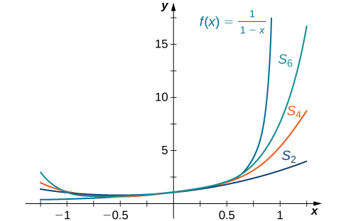
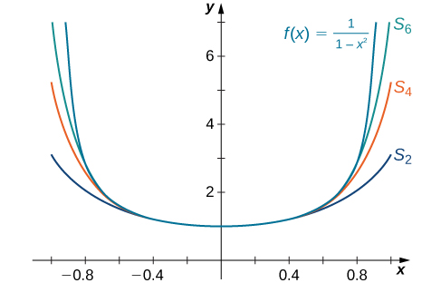
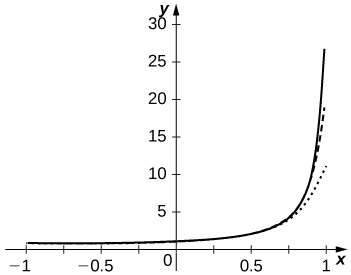
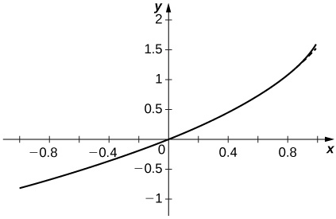
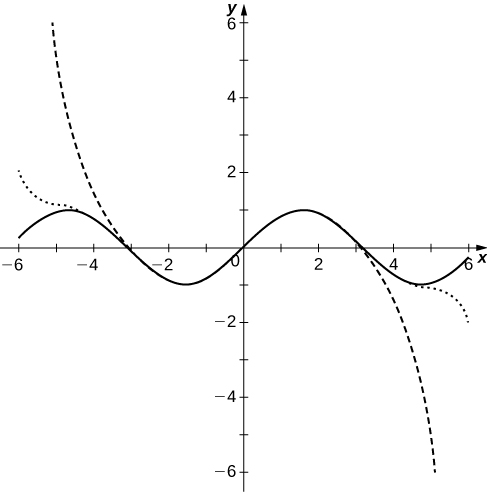

* Identify a power series and provide examples of them.
* Determine the radius of convergence and interval of convergence of a power series.
* Use a power series to represent a function.

A power series is a type of series with terms involving a variable. More specifically, if the variable is *x*, then all the terms of the series involve powers of *x*. As a result, a power series can be thought of as an infinite polynomial. Power series are used to represent common functions and also to define new functions. In this section we define power series and show how to determine when a power series converges and when it diverges. We also show how to represent certain functions using power series.

### Form of a Power Series

A series of the form

<math xmlns="http://www.w3.org/1998/Math/MathML"><mrow><mstyle displaystyle="true"><munderover><mo>∑</mo><mrow><mi>n</mi><mo>=</mo><mn>0</mn></mrow><mi>∞</mi></munderover><mrow><msub><mi>c</mi><mi>n</mi></msub><msup><mi>x</mi><mi>n</mi></msup></mrow></mstyle><mo>=</mo><msub><mi>c</mi><mn>0</mn></msub><mo>+</mo><msub><mi>c</mi><mn>1</mn></msub><mi>x</mi><mo>+</mo><msub><mi>c</mi><mn>2</mn></msub><msup><mi>x</mi><mn>2</mn></msup><mo>+</mo><mtext>⋯</mtext><mo>,</mo></mrow></math>

where *x* is a variable and the coefficients *cn* are constants, is known as a **power series**{: data-type="term"}. The series

<math xmlns="http://www.w3.org/1998/Math/MathML"><mrow><mn>1</mn><mo>+</mo><mi>x</mi><mo>+</mo><msup><mi>x</mi><mn>2</mn></msup><mo>+</mo><mtext>⋯</mtext><mo>=</mo><mstyle displaystyle="true"><munderover><mo>∑</mo><mrow><mi>n</mi><mo>=</mo><mn>0</mn></mrow><mi>∞</mi></munderover><mrow><msup><mi>x</mi><mi>n</mi></msup></mrow></mstyle></mrow></math>

is an example of a power series. Since this series is a geometric series with ratio <math xmlns="http://www.w3.org/1998/Math/MathML"><mrow><mi>r</mi><mo>=</mo><mrow><mo>\|</mo><mi>x</mi><mo>\|</mo></mrow><mo>,</mo></mrow></math>

 we know that it converges if <math xmlns="http://www.w3.org/1998/Math/MathML"><mrow><mrow><mo>\|</mo><mi>x</mi><mo>\|</mo></mrow><mo>&lt;</mo><mn>1</mn></mrow></math>

 and diverges if <math xmlns="http://www.w3.org/1998/Math/MathML"><mrow><mrow><mo>\|</mo><mi>x</mi><mo>\|</mo></mrow><mo>≥</mo><mn>1</mn><mo>.</mo></mrow></math>

Definition

A series of the form

<math xmlns="http://www.w3.org/1998/Math/MathML"><mrow><mstyle displaystyle="true"><munderover><mo>∑</mo><mrow><mi>n</mi><mo>=</mo><mn>0</mn></mrow><mi>∞</mi></munderover><mrow><msub><mi>c</mi><mi>n</mi></msub><msup><mi>x</mi><mi>n</mi></msup></mrow></mstyle><mo>=</mo><msub><mi>c</mi><mn>0</mn></msub><mo>+</mo><msub><mi>c</mi><mn>1</mn></msub><mi>x</mi><mo>+</mo><msub><mi>c</mi><mn>2</mn></msub><msup><mi>x</mi><mn>2</mn></msup><mo>+</mo><mtext>⋯</mtext></mrow></math>

is a power series centered at <math xmlns="http://www.w3.org/1998/Math/MathML"><mrow><mi>x</mi><mo>=</mo><mn>0</mn><mo>.</mo></mrow></math>

 A series of the form

<math xmlns="http://www.w3.org/1998/Math/MathML"><mrow><mstyle displaystyle="true"><munderover><mo>∑</mo><mrow><mi>n</mi><mo>=</mo><mn>0</mn></mrow><mi>∞</mi></munderover><mrow><msub><mi>c</mi><mi>n</mi></msub><msup><mrow><mrow><mo>(</mo><mrow><mi>x</mi><mo>−</mo><mi>a</mi></mrow><mo>)</mo></mrow></mrow><mi>n</mi></msup></mrow></mstyle><mo>=</mo><msub><mi>c</mi><mn>0</mn></msub><mo>+</mo><msub><mi>c</mi><mn>1</mn></msub><mrow><mo>(</mo><mrow><mi>x</mi><mo>−</mo><mi>a</mi></mrow><mo>)</mo></mrow><mo>+</mo><msub><mi>c</mi><mn>2</mn></msub><msup><mrow><mrow><mo>(</mo><mrow><mi>x</mi><mo>−</mo><mi>a</mi></mrow><mo>)</mo></mrow></mrow><mn>2</mn></msup><mo>+</mo><mtext>⋯</mtext></mrow></math>

is a power series centered at <math xmlns="http://www.w3.org/1998/Math/MathML"><mrow><mi>x</mi><mo>=</mo><mi>a</mi><mo>.</mo></mrow></math>

To make this definition precise, we stipulate that <math xmlns="http://www.w3.org/1998/Math/MathML"><mrow><msup><mi>x</mi><mn>0</mn></msup><mo>=</mo><mn>1</mn></mrow></math>

 and <math xmlns="http://www.w3.org/1998/Math/MathML"><mrow><msup><mrow><mrow><mo>(</mo><mrow><mi>x</mi><mo>−</mo><mi>a</mi></mrow><mo>)</mo></mrow></mrow><mn>0</mn></msup><mo>=</mo><mn>1</mn></mrow></math>

 even when <math xmlns="http://www.w3.org/1998/Math/MathML"><mrow><mi>x</mi><mo>=</mo><mn>0</mn></mrow></math>

 and <math xmlns="http://www.w3.org/1998/Math/MathML"><mrow><mi>x</mi><mo>=</mo><mi>a</mi><mo>,</mo></mrow></math>

 respectively.

The series

<math xmlns="http://www.w3.org/1998/Math/MathML"><mrow><mstyle displaystyle="true"><munderover><mo>∑</mo><mrow><mi>n</mi><mo>=</mo><mn>0</mn></mrow><mi>∞</mi></munderover><mrow><mfrac><mrow><msup><mi>x</mi><mi>n</mi></msup></mrow><mrow><mi>n</mi><mtext>!</mtext></mrow></mfrac></mrow></mstyle><mo>=</mo><mn>1</mn><mo>+</mo><mi>x</mi><mo>+</mo><mfrac><mrow><msup><mi>x</mi><mn>2</mn></msup></mrow><mrow><mn>2</mn><mtext>!</mtext></mrow></mfrac><mo>+</mo><mfrac><mrow><msup><mi>x</mi><mn>3</mn></msup></mrow><mrow><mn>3</mn><mtext>!</mtext></mrow></mfrac><mo>+</mo><mtext>⋯</mtext></mrow></math>

and

<math xmlns="http://www.w3.org/1998/Math/MathML"><mrow><mstyle displaystyle="true"><munderover><mo>∑</mo><mrow><mi>n</mi><mo>=</mo><mn>0</mn></mrow><mi>∞</mi></munderover><mrow><mi>n</mi><mtext>!</mtext><msup><mi>x</mi><mi>n</mi></msup></mrow></mstyle><mo>=</mo><mn>1</mn><mo>+</mo><mi>x</mi><mo>+</mo><mn>2</mn><mtext>!</mtext><msup><mi>x</mi><mn>2</mn></msup><mo>+</mo><mn>3</mn><mtext>!</mtext><msup><mi>x</mi><mn>3</mn></msup><mo>+</mo><mtext>⋯</mtext></mrow></math>

are both power series centered at <math xmlns="http://www.w3.org/1998/Math/MathML"><mrow><mi>x</mi><mo>=</mo><mn>0</mn><mo>.</mo></mrow></math>

 The series

<math xmlns="http://www.w3.org/1998/Math/MathML"><mrow><mstyle displaystyle="true"><munderover><mo>∑</mo><mrow><mi>n</mi><mo>=</mo><mn>0</mn></mrow><mi>∞</mi></munderover><mrow><mfrac><mrow><msup><mrow><mrow><mo>(</mo><mrow><mi>x</mi><mo>−</mo><mn>2</mn></mrow><mo>)</mo></mrow></mrow><mi>n</mi></msup></mrow><mrow><mrow><mo>(</mo><mrow><mi>n</mi><mo>+</mo><mn>1</mn></mrow><mo>)</mo></mrow><msup><mn>3</mn><mi>n</mi></msup></mrow></mfrac></mrow></mstyle><mo>=</mo><mn>1</mn><mo>+</mo><mfrac><mrow><mi>x</mi><mo>−</mo><mn>2</mn></mrow><mrow><mn>2</mn><mo>·</mo><mn>3</mn></mrow></mfrac><mo>+</mo><mfrac><mrow><msup><mrow><mrow><mo>(</mo><mrow><mi>x</mi><mo>−</mo><mn>2</mn></mrow><mo>)</mo></mrow></mrow><mn>2</mn></msup></mrow><mrow><mn>3</mn><mo>·</mo><msup><mn>3</mn><mn>2</mn></msup></mrow></mfrac><mo>+</mo><mfrac><mrow><msup><mrow><mrow><mo>(</mo><mrow><mi>x</mi><mo>−</mo><mn>2</mn></mrow><mo>)</mo></mrow></mrow><mn>3</mn></msup></mrow><mrow><mn>4</mn><mo>·</mo><msup><mn>3</mn><mn>3</mn></msup></mrow></mfrac><mo>+</mo><mtext>⋯</mtext></mrow></math>

is a power series centered at <math xmlns="http://www.w3.org/1998/Math/MathML"><mrow><mi>x</mi><mo>=</mo><mn>2</mn><mo>.</mo></mrow></math>

### Convergence of a Power Series

Since the terms in a power series involve a variable *x*, the series may converge for certain values of *x* and diverge for other values of *x*. For a power series centered at <math xmlns="http://www.w3.org/1998/Math/MathML"><mrow><mi>x</mi><mo>=</mo><mi>a</mi><mo>,</mo></mrow></math>

 the value of the series at <math xmlns="http://www.w3.org/1998/Math/MathML"><mrow><mi>x</mi><mo>=</mo><mi>a</mi></mrow></math>

 is given by <math xmlns="http://www.w3.org/1998/Math/MathML"><mrow><msub><mi>c</mi><mn>0</mn></msub><mo>.</mo></mrow></math>

 Therefore, a power series always converges at its center. Some power series converge only at that value of *x*. Most power series, however, converge for more than one value of *x*. In that case, the power series either converges for all real numbers *x* or converges for all *x* in a finite interval. For example, the geometric series <math xmlns="http://www.w3.org/1998/Math/MathML"><mrow><mstyle displaystyle="true"><munderover><mo>∑</mo><mrow><mi>n</mi><mo>=</mo><mn>0</mn></mrow><mi>∞</mi></munderover><mrow><msup><mi>x</mi><mi>n</mi></msup></mrow></mstyle></mrow></math>

 converges for all *x* in the interval <math xmlns="http://www.w3.org/1998/Math/MathML"><mrow><mrow><mo>(</mo><mrow><mn>−1</mn><mo>,</mo><mn>1</mn></mrow><mo>)</mo></mrow><mo>,</mo></mrow></math>

 but diverges for all *x* outside that interval. We now summarize these three possibilities for a general power series.

Convergence of a Power Series

Consider the power series <math xmlns="http://www.w3.org/1998/Math/MathML"><mrow><mstyle displaystyle="true"><munderover><mo>∑</mo><mrow><mi>n</mi><mo>=</mo><mn>0</mn></mrow><mi>∞</mi></munderover><mrow><msub><mi>c</mi><mi>n</mi></msub><msup><mrow><mrow><mo>(</mo><mrow><mi>x</mi><mo>−</mo><mi>a</mi></mrow><mo>)</mo></mrow></mrow><mi>n</mi></msup></mrow></mstyle><mo>.</mo></mrow></math>

 The series satisfies exactly one of the following properties:

1.  The series converges at
    <math xmlns="http://www.w3.org/1998/Math/MathML"><mrow><mi>x</mi><mo>=</mo><mi>a</mi></mrow></math>
    
    and diverges for all
    <math xmlns="http://www.w3.org/1998/Math/MathML"><mrow><mi>x</mi><mo>≠</mo><mi>a</mi><mo>.</mo></mrow></math>

2.  The series converges for all real numbers *x*.
3.  There exists a real number
    <math xmlns="http://www.w3.org/1998/Math/MathML"><mrow><mi>R</mi><mo>&gt;</mo><mn>0</mn></mrow></math>
    
    such that the series converges if
    <math xmlns="http://www.w3.org/1998/Math/MathML"><mrow><mrow><mo>\|</mo><mrow><mi>x</mi><mo>−</mo><mi>a</mi></mrow><mo>\|</mo></mrow><mo>&lt;</mo><mi>R</mi></mrow></math>
    
    and diverges if
    <math xmlns="http://www.w3.org/1998/Math/MathML"><mrow><mrow><mo>\|</mo><mrow><mi>x</mi><mo>−</mo><mi>a</mi></mrow><mo>\|</mo></mrow><mo>&gt;</mo><mi>R</mi><mo>.</mo></mrow></math>
    
    At the values *x* where
    <math xmlns="http://www.w3.org/1998/Math/MathML"><mrow><mrow><mo>\|</mo><mrow><mi>x</mi><mo>−</mo><mi>a</mi></mrow><mo>\|</mo></mrow><mo>=</mo><mi>R</mi><mo>,</mo></mrow></math>
    
    the series may converge or diverge.
{: data-number-style="lower-roman"}

#### Proof

Suppose that the power series is centered at <math xmlns="http://www.w3.org/1998/Math/MathML"><mrow><mi>a</mi><mo>=</mo><mn>0</mn><mo>.</mo></mrow></math>

 (For a series centered at a value of *a* other than zero, the result follows by letting <math xmlns="http://www.w3.org/1998/Math/MathML"><mrow><mi>y</mi><mo>=</mo><mi>x</mi><mo>−</mo><mi>a</mi></mrow></math>

 and considering the series <math xmlns="http://www.w3.org/1998/Math/MathML"><mrow><mstyle displaystyle="true"><munderover><mo>∑</mo><mrow><mi>n</mi><mo>=</mo><mn>1</mn></mrow><mi>∞</mi></munderover><mrow><msub><mi>c</mi><mi>n</mi></msub><msup><mi>y</mi><mi>n</mi></msup></mrow></mstyle><mo>.</mo><mo stretchy="false">)</mo></mrow></math>

 We must first prove the following fact:

If there exists a real number <math xmlns="http://www.w3.org/1998/Math/MathML"><mrow><mi>d</mi><mo>≠</mo><mn>0</mn></mrow></math>

 such that <math xmlns="http://www.w3.org/1998/Math/MathML"><mrow><mstyle displaystyle="true"><munderover><mo>∑</mo><mrow><mi>n</mi><mo>=</mo><mn>0</mn></mrow><mi>∞</mi></munderover><mrow><msub><mi>c</mi><mi>n</mi></msub><msup><mi>d</mi><mi>n</mi></msup></mrow></mstyle></mrow></math>

 converges, then the series <math xmlns="http://www.w3.org/1998/Math/MathML"><mrow><mstyle displaystyle="true"><munderover><mo>∑</mo><mrow><mi>n</mi><mo>=</mo><mn>0</mn></mrow><mi>∞</mi></munderover><mrow><msub><mi>c</mi><mi>n</mi></msub><msup><mi>x</mi><mi>n</mi></msup></mrow></mstyle></mrow></math>

 converges absolutely for all *x* such that <math xmlns="http://www.w3.org/1998/Math/MathML"><mrow><mrow><mo>\|</mo><mi>x</mi><mo>\|</mo></mrow><mo>&lt;</mo><mrow><mo>\|</mo><mi>d</mi><mo>\|</mo></mrow><mo>.</mo></mrow></math>

Since <math xmlns="http://www.w3.org/1998/Math/MathML"><mrow><mstyle displaystyle="true"><munderover><mo>∑</mo><mrow><mi>n</mi><mo>=</mo><mn>0</mn></mrow><mi>∞</mi></munderover><mrow><msub><mi>c</mi><mi>n</mi></msub><msup><mi>d</mi><mi>n</mi></msup></mrow></mstyle></mrow></math>

 converges, the *n*th term <math xmlns="http://www.w3.org/1998/Math/MathML"><mrow><msub><mi>c</mi><mi>n</mi></msub><msup><mi>d</mi><mi>n</mi></msup><mo stretchy="false">→</mo><mn>0</mn></mrow></math>

 as <math xmlns="http://www.w3.org/1998/Math/MathML"><mrow><mi>n</mi><mo stretchy="false">→</mo><mi>∞</mi><mo>.</mo></mrow></math>

 Therefore, there exists an integer *N* such that <math xmlns="http://www.w3.org/1998/Math/MathML"><mrow><mrow><mo>\|</mo><mrow><msub><mi>c</mi><mi>n</mi></msub><msup><mi>d</mi><mi>n</mi></msup></mrow><mo>\|</mo></mrow><mo>≤</mo><mn>1</mn></mrow></math>

 for all <math xmlns="http://www.w3.org/1998/Math/MathML"><mrow><mi>n</mi><mo>≥</mo><mi>N</mi><mo>.</mo></mrow></math>

 Writing

<math xmlns="http://www.w3.org/1998/Math/MathML"><mrow><mrow><mo>\|</mo><mrow><msub><mi>c</mi><mi>n</mi></msub><msup><mi>x</mi><mi>n</mi></msup></mrow><mo>\|</mo></mrow><mo>=</mo><mrow><mo>\|</mo><mrow><msub><mi>c</mi><mi>n</mi></msub><msup><mi>d</mi><mi>n</mi></msup></mrow><mo>\|</mo></mrow><msup><mrow><mrow><mo>\|</mo><mrow><mfrac><mi>x</mi><mi>d</mi></mfrac></mrow><mo>\|</mo></mrow></mrow><mi>n</mi></msup><mo>,</mo></mrow></math>

we conclude that, for all <math xmlns="http://www.w3.org/1998/Math/MathML"><mrow><mi>n</mi><mo>≥</mo><mi>N</mi><mo>,</mo></mrow></math>

<math xmlns="http://www.w3.org/1998/Math/MathML"><mrow><mrow><mo>\|</mo><mrow><msub><mi>c</mi><mi>n</mi></msub><msup><mi>x</mi><mi>n</mi></msup></mrow><mo>\|</mo></mrow><mo>≤</mo><msup><mrow><mrow><mo>\|</mo><mrow><mfrac><mi>x</mi><mi>d</mi></mfrac></mrow><mo>\|</mo></mrow></mrow><mi>n</mi></msup><mo>.</mo></mrow></math>

The series

<math xmlns="http://www.w3.org/1998/Math/MathML"><mrow><mstyle displaystyle="true"><munderover><mo>∑</mo><mrow><mi>n</mi><mo>=</mo><mi>N</mi></mrow><mi>∞</mi></munderover><mrow><msup><mrow><mrow><mo>\|</mo><mrow><mfrac><mi>x</mi><mi>d</mi></mfrac></mrow><mo>\|</mo></mrow></mrow><mi>n</mi></msup></mrow></mstyle></mrow></math>

is a geometric series that converges if <math xmlns="http://www.w3.org/1998/Math/MathML"><mrow><mrow><mo>\|</mo><mrow><mfrac><mi>x</mi><mi>d</mi></mfrac></mrow><mo>\|</mo></mrow><mo>&lt;</mo><mn>1</mn><mo>.</mo></mrow></math>

 Therefore, by the comparison test, we conclude that <math xmlns="http://www.w3.org/1998/Math/MathML"><mrow><mstyle displaystyle="true"><munderover><mo>∑</mo><mrow><mi>n</mi><mo>=</mo><mi>N</mi></mrow><mi>∞</mi></munderover><mrow><msub><mi>c</mi><mi>n</mi></msub><msup><mi>x</mi><mi>n</mi></msup></mrow></mstyle></mrow></math>

 also converges for <math xmlns="http://www.w3.org/1998/Math/MathML"><mrow><mrow><mo>\|</mo><mi>x</mi><mo>\|</mo></mrow><mo>&lt;</mo><mrow><mo>\|</mo><mi>d</mi><mo>\|</mo></mrow><mo>.</mo></mrow></math>

 Since we can add a finite number of terms to a convergent series, we conclude that <math xmlns="http://www.w3.org/1998/Math/MathML"><mrow><mstyle displaystyle="true"><munderover><mo>∑</mo><mrow><mi>n</mi><mo>=</mo><mn>0</mn></mrow><mi>∞</mi></munderover><mrow><msub><mi>c</mi><mi>n</mi></msub><msup><mi>x</mi><mi>n</mi></msup></mrow></mstyle></mrow></math>

 converges for <math xmlns="http://www.w3.org/1998/Math/MathML"><mrow><mrow><mo>\|</mo><mi>x</mi><mo>\|</mo></mrow><mo>&lt;</mo><mrow><mo>\|</mo><mi>d</mi><mo>\|</mo></mrow><mo>.</mo></mrow></math>

With this result, we can now prove the theorem. Consider the series

<math xmlns="http://www.w3.org/1998/Math/MathML"><mrow><mstyle displaystyle="true"><munderover><mo>∑</mo><mrow><mi>n</mi><mo>=</mo><mn>0</mn></mrow><mi>∞</mi></munderover><mrow><msub><mi>a</mi><mi>n</mi></msub><msup><mi>x</mi><mi>n</mi></msup></mrow></mstyle></mrow></math>

and let *S* be the set of real numbers for which the series converges. Suppose that the set <math xmlns="http://www.w3.org/1998/Math/MathML"><mrow><mi>S</mi><mo>=</mo><mrow><mo>{</mo><mn>0</mn><mo>}</mo></mrow><mo>.</mo></mrow></math>

 Then the series falls under case i. Suppose that the set *S* is the set of all real numbers. Then the series falls under case ii. Suppose that <math xmlns="http://www.w3.org/1998/Math/MathML"><mrow><mi>S</mi><mo>≠</mo><mrow><mo>{</mo><mn>0</mn><mo>}</mo></mrow></mrow></math>

 and *S* is not the set of real numbers. Then there exists a real number <math xmlns="http://www.w3.org/1998/Math/MathML"><mrow><mi>x</mi><mo>*</mo><mo>≠</mo><mn>0</mn></mrow></math>

 such that the series does not converge. Thus, the series cannot converge for any *x* such that <math xmlns="http://www.w3.org/1998/Math/MathML"><mrow><mrow><mo>\|</mo><mi>x</mi><mo>\|</mo></mrow><mo>&gt;</mo><mrow><mo>\|</mo><mrow><mi>x</mi><mo>*</mo></mrow><mo>\|</mo></mrow><mo>.</mo></mrow></math>

 Therefore, the set *S* must be a bounded set, which means that it must have a smallest upper bound. (This fact follows from the Least Upper Bound Property for the real numbers, which is beyond the scope of this text and is covered in real analysis courses.) Call that smallest upper bound *R*. Since <math xmlns="http://www.w3.org/1998/Math/MathML"><mrow><mi>S</mi><mo>≠</mo><mrow><mo>{</mo><mn>0</mn><mo>}</mo></mrow><mo>,</mo></mrow></math>

 the number <math xmlns="http://www.w3.org/1998/Math/MathML"><mrow><mi>R</mi><mo>&gt;</mo><mn>0</mn><mo>.</mo></mrow></math>

 Therefore, the series converges for all *x* such that <math xmlns="http://www.w3.org/1998/Math/MathML"><mrow><mrow><mo>\|</mo><mi>x</mi><mo>\|</mo></mrow><mo>&lt;</mo><mi>R</mi><mo>,</mo></mrow></math>

 and the series falls into case iii.

□

If a series <math xmlns="http://www.w3.org/1998/Math/MathML"><mrow><mstyle displaystyle="true"><munderover><mo>∑</mo><mrow><mi>n</mi><mo>=</mo><mn>0</mn></mrow><mi>∞</mi></munderover><mrow><msub><mi>c</mi><mi>n</mi></msub><msup><mrow><mrow><mo>(</mo><mrow><mi>x</mi><mo>−</mo><mi>a</mi></mrow><mo>)</mo></mrow></mrow><mi>n</mi></msup></mrow></mstyle></mrow></math>

 falls into case iii. of [\[link\]](#fs-id1170572419070), then the series converges for all *x* such that <math xmlns="http://www.w3.org/1998/Math/MathML"><mrow><mrow><mo>\|</mo><mrow><mi>x</mi><mo>−</mo><mi>a</mi></mrow><mo>\|</mo></mrow><mo>&lt;</mo><mi>R</mi></mrow></math>

 for some <math xmlns="http://www.w3.org/1998/Math/MathML"><mrow><mi>R</mi><mo>&gt;</mo><mn>0</mn><mo>,</mo></mrow></math>

 and diverges for all *x* such that <math xmlns="http://www.w3.org/1998/Math/MathML"><mrow><mo>\|</mo><mi>x</mi><mo>−</mo><mi>a</mi><mo>\|</mo><mo>&gt;</mo><mi>R</mi><mo>.</mo></mrow></math>

 The series may converge or diverge at the values *x* where <math xmlns="http://www.w3.org/1998/Math/MathML"><mrow><mrow><mo>\|</mo><mrow><mi>x</mi><mo>−</mo><mi>a</mi></mrow><mo>\|</mo></mrow><mo>=</mo><mi>R</mi><mo>.</mo></mrow></math>

 The set of values *x* for which the series <math xmlns="http://www.w3.org/1998/Math/MathML"><mrow><mstyle displaystyle="true"><munderover><mo>∑</mo><mrow><mi>n</mi><mo>=</mo><mn>0</mn></mrow><mi>∞</mi></munderover><mrow><msub><mi>c</mi><mi>n</mi></msub><msup><mrow><mrow><mo>(</mo><mrow><mi>x</mi><mo>−</mo><mi>a</mi></mrow><mo>)</mo></mrow></mrow><mi>n</mi></msup></mrow></mstyle></mrow></math>

 converges is known as the **interval of convergence**{: data-type="term"}. Since the series diverges for all values *x* where <math xmlns="http://www.w3.org/1998/Math/MathML"><mrow><mrow><mo>\|</mo><mrow><mi>x</mi><mo>−</mo><mi>a</mi></mrow><mo>\|</mo></mrow><mo>&gt;</mo><mi>R</mi><mo>,</mo></mrow></math>

 the length of the interval is 2*R*, and therefore, the radius of the interval is *R*. The value *R* is called the **radius of convergence**{: data-type="term"}. For example, since the series <math xmlns="http://www.w3.org/1998/Math/MathML"><mrow><mstyle displaystyle="true"><munderover><mo>∑</mo><mrow><mi>n</mi><mo>=</mo><mn>0</mn></mrow><mi>∞</mi></munderover><mrow><msup><mi>x</mi><mi>n</mi></msup></mrow></mstyle></mrow></math>

 converges for all values *x* in the interval <math xmlns="http://www.w3.org/1998/Math/MathML"><mrow><mrow><mo>(</mo><mrow><mn>−1</mn><mo>,</mo><mn>1</mn></mrow><mo>)</mo></mrow></mrow></math>

 and diverges for all values *x* such that <math xmlns="http://www.w3.org/1998/Math/MathML"><mrow><mrow><mo>\|</mo><mi>x</mi><mo>\|</mo></mrow><mo>≥</mo><mn>1</mn><mo>,</mo></mrow></math>

 the interval of convergence of this series is <math xmlns="http://www.w3.org/1998/Math/MathML"><mrow><mrow><mo>(</mo><mrow><mn>−1</mn><mo>,</mo><mn>1</mn></mrow><mo>)</mo></mrow><mo>.</mo></mrow></math>

 Since the length of the interval is 2, the radius of convergence is 1.

Definition

Consider the power series <math xmlns="http://www.w3.org/1998/Math/MathML"><mrow><mstyle displaystyle="true"><munderover><mo>∑</mo><mrow><mi>n</mi><mo>=</mo><mn>0</mn></mrow><mi>∞</mi></munderover><mrow><msub><mi>c</mi><mi>n</mi></msub><msup><mrow><mrow><mo>(</mo><mrow><mi>x</mi><mo>−</mo><mi>a</mi></mrow><mo>)</mo></mrow></mrow><mi>n</mi></msup></mrow></mstyle><mo>.</mo></mrow></math>

 The set of real numbers *x* where the series converges is the interval of convergence. If there exists a real number <math xmlns="http://www.w3.org/1998/Math/MathML"><mrow><mi>R</mi><mo>&gt;</mo><mn>0</mn></mrow></math>

 such that the series converges for <math xmlns="http://www.w3.org/1998/Math/MathML"><mrow><mrow><mo>\|</mo><mrow><mi>x</mi><mo>−</mo><mi>a</mi></mrow><mo>\|</mo></mrow><mo>&lt;</mo><mi>R</mi></mrow></math>

 and diverges for <math xmlns="http://www.w3.org/1998/Math/MathML"><mrow><mrow><mo>\|</mo><mrow><mi>x</mi><mo>−</mo><mi>a</mi></mrow><mo>\|</mo></mrow><mo>&gt;</mo><mi>R</mi><mo>,</mo></mrow></math>

 then *R* is the radius of convergence. If the series converges only at <math xmlns="http://www.w3.org/1998/Math/MathML"><mrow><mi>x</mi><mo>=</mo><mi>a</mi><mo>,</mo></mrow></math>

 we say the radius of convergence is <math xmlns="http://www.w3.org/1998/Math/MathML"><mrow><mi>R</mi><mo>=</mo><mn>0</mn><mo>.</mo></mrow></math>

 If the series converges for all real numbers *x*, we say the radius of convergence is <math xmlns="http://www.w3.org/1998/Math/MathML"><mrow><mi>R</mi><mo>=</mo><mi>∞</mi></mrow></math>

 ([\[link\]](#CNX_Calc_Figure_10_01_004)).

 ![This figure has three number lines, each labeled with x. In the middle of each number line is a point labeled a. The first number line has &#x201C;diverges&#x201D; over all of the line to the left of a and &#x201C;diverges&#x201D; over the line to the right of a. At the point a itself, it is labeled as &#x201C;converges&#x201D;. The second number line has &#x201C;converges&#x201D; labeled for the entire line. The third number line has points labeled at a-R, a, and a+R. To the left of a-R, the number line is labeled &#x201C;diverges&#x201D;. Between a-R and a+R the number line is labeled &#x201C;converges&#x201D; and to the right of a+R the number line is labeled &#x201C;diverges&#x201D;.](../resources/CNX_Calc_Figure_10_01_004.jpg "For a series &#x2211;n=0&#x221E;cn(x&#x2212;a)n graph (a) shows a radius of convergence at R=0, graph (b) shows a radius of convergence at R=&#x221E;, and graph (c) shows a radius of convergence at R. For graph (c) we note that the series may or may not converge at the endpoints x=a+R and x=a&#x2212;R."){: #CNX_Calc_Figure_10_01_004}

To determine the interval of convergence for a power series, we typically apply the ratio test. In [\[link\]](#fs-id1170572554745), we show the three different possibilities illustrated in [\[link\]](#CNX_Calc_Figure_10_01_004).

Finding the Interval and Radius of Convergence

For each of the following series, find the interval and radius of convergence.

1.  <math xmlns="http://www.w3.org/1998/Math/MathML"><mrow><mstyle displaystyle="true"><munderover><mo>∑</mo><mrow><mi>n</mi><mo>=</mo><mn>0</mn></mrow><mi>∞</mi></munderover><mrow><mfrac><mrow><msup><mi>x</mi><mi>n</mi></msup></mrow><mrow><mi>n</mi><mtext>!</mtext></mrow></mfrac></mrow></mstyle></mrow></math>

2.  <math xmlns="http://www.w3.org/1998/Math/MathML"><mrow><mstyle displaystyle="true"><munderover><mo>∑</mo><mrow><mi>n</mi><mo>=</mo><mn>0</mn></mrow><mi>∞</mi></munderover><mrow><mi>n</mi><mtext>!</mtext><msup><mi>x</mi><mi>n</mi></msup></mrow></mstyle></mrow></math>

3.  <math xmlns="http://www.w3.org/1998/Math/MathML"><mrow><mstyle displaystyle="true"><munderover><mo>∑</mo><mrow><mi>n</mi><mo>=</mo><mn>0</mn></mrow><mi>∞</mi></munderover><mrow><mfrac><mrow><msup><mrow><mrow><mo>(</mo><mrow><mi>x</mi><mo>−</mo><mn>2</mn></mrow><mo>)</mo></mrow></mrow><mi>n</mi></msup></mrow><mrow><mrow><mo>(</mo><mrow><mi>n</mi><mo>+</mo><mn>1</mn></mrow><mo>)</mo></mrow><msup><mn>3</mn><mi>n</mi></msup></mrow></mfrac></mrow></mstyle></mrow></math>
{: data-number-style="lower-alpha"}

1.  To check for convergence, apply the ratio test. We have
    * * *
    {: data-type="newline"}
    
    

    <math xmlns="http://www.w3.org/1998/Math/MathML"><mtable><mtr><mtd columnalign="right"><mi>ρ</mi></mtd><mtd columnalign="left"><mo>=</mo><munder><mrow><mtext>lim</mtext></mrow><mrow><mi>n</mi><mo stretchy="false">→</mo><mi>∞</mi></mrow></munder><mrow><mo>\|</mo><mrow><mfrac><mrow><mfrac><mrow><msup><mi>x</mi><mrow><mi>n</mi><mo>+</mo><mn>1</mn></mrow></msup></mrow><mrow><mrow><mo>(</mo><mrow><mi>n</mi><mo>+</mo><mn>1</mn></mrow><mo>)</mo></mrow><mtext>!</mtext></mrow></mfrac></mrow><mrow><mfrac><mrow><msup><mi>x</mi><mi>n</mi></msup></mrow><mrow><mi>n</mi><mtext>!</mtext></mrow></mfrac></mrow></mfrac></mrow><mo>\|</mo></mrow></mtd></mtr><mtr><mtd /><mtd columnalign="left"><mo>=</mo><munder><mrow><mtext>lim</mtext></mrow><mrow><mi>n</mi><mo stretchy="false">→</mo><mi>∞</mi></mrow></munder><mrow><mo>\|</mo><mrow><mfrac><mrow><msup><mi>x</mi><mrow><mi>n</mi><mo>+</mo><mn>1</mn></mrow></msup></mrow><mrow><mrow><mo>(</mo><mrow><mi>n</mi><mo>+</mo><mn>1</mn></mrow><mo>)</mo></mrow><mtext>!</mtext></mrow></mfrac><mo>·</mo><mfrac><mrow><mi>n</mi><mtext>!</mtext></mrow><mrow><msup><mi>x</mi><mi>n</mi></msup></mrow></mfrac></mrow><mo>\|</mo></mrow></mtd></mtr><mtr><mtd /><mtd columnalign="left"><mo>=</mo><munder><mrow><mtext>lim</mtext></mrow><mrow><mi>n</mi><mo stretchy="false">→</mo><mi>∞</mi></mrow></munder><mrow><mo>\|</mo><mrow><mfrac><mrow><msup><mi>x</mi><mrow><mi>n</mi><mo>+</mo><mn>1</mn></mrow></msup></mrow><mrow><mrow><mo>(</mo><mrow><mi>n</mi><mo>+</mo><mn>1</mn></mrow><mo>)</mo></mrow><mo>·</mo><mi>n</mi><mtext>!</mtext></mrow></mfrac><mo>·</mo><mfrac><mrow><mi>n</mi><mtext>!</mtext></mrow><mrow><msup><mi>x</mi><mi>n</mi></msup></mrow></mfrac></mrow><mo>\|</mo></mrow></mtd></mtr><mtr><mtd /><mtd columnalign="left"><mo>=</mo><munder><mrow><mtext>lim</mtext></mrow><mrow><mi>n</mi><mo stretchy="false">→</mo><mi>∞</mi></mrow></munder><mrow><mo>\|</mo><mrow><mfrac><mi>x</mi><mrow><mi>n</mi><mo>+</mo><mn>1</mn></mrow></mfrac></mrow><mo>\|</mo></mrow></mtd></mtr><mtr><mtd /><mtd columnalign="left"><mo>=</mo><mrow><mo>\|</mo><mi>x</mi><mo>\|</mo></mrow><munder><mrow><mtext>lim</mtext></mrow><mrow><mi>n</mi><mo stretchy="false">→</mo><mi>∞</mi></mrow></munder><mfrac><mn>1</mn><mrow><mi>n</mi><mo>+</mo><mn>1</mn></mrow></mfrac></mtd></mtr><mtr><mtd /><mtd columnalign="left"><mo>=</mo><mn>0</mn><mo>&lt;</mo><mn>1</mn></mtd></mtr></mtable></math>
    

    
    * * *
    {: data-type="newline"}
    
    for all values of *x*. Therefore, the series converges for all real numbers *x*. The interval of convergence is
    <math xmlns="http://www.w3.org/1998/Math/MathML"><mrow><mrow><mo>(</mo><mrow><mtext>−</mtext><mi>∞</mi><mo>,</mo><mi>∞</mi></mrow><mo>)</mo></mrow></mrow></math>
    
    and the radius of convergence is
    <math xmlns="http://www.w3.org/1998/Math/MathML"><mrow><mi>R</mi><mo>=</mo><mi>∞</mi><mo>.</mo></mrow></math>

2.  Apply the ratio test. For
    <math xmlns="http://www.w3.org/1998/Math/MathML"><mrow><mi>x</mi><mo>≠</mo><mn>0</mn><mo>,</mo></mrow></math>
    
    we see that
    * * *
    {: data-type="newline"}
    
    

    <math xmlns="http://www.w3.org/1998/Math/MathML"><mtable><mtr><mtd columnalign="right"><mi>ρ</mi></mtd><mtd columnalign="right"><mo>=</mo><munder><mrow><mtext>lim</mtext></mrow><mrow><mi>n</mi><mo stretchy="false">→</mo><mi>∞</mi></mrow></munder><mrow><mo>\|</mo><mrow><mfrac><mrow><mrow><mo>(</mo><mrow><mi>n</mi><mo>+</mo><mn>1</mn></mrow><mo>)</mo></mrow><mtext>!</mtext><msup><mi>x</mi><mrow><mi>n</mi><mo>+</mo><mn>1</mn></mrow></msup></mrow><mrow><mi>n</mi><mtext>!</mtext><msup><mi>x</mi><mi>n</mi></msup></mrow></mfrac></mrow><mo>\|</mo></mrow></mtd></mtr><mtr><mtd /><mtd columnalign="left"><mo>=</mo><munder><mrow><mtext>lim</mtext></mrow><mrow><mi>n</mi><mo stretchy="false">→</mo><mi>∞</mi></mrow></munder><mrow><mo>\|</mo><mrow><mrow><mo>(</mo><mrow><mi>n</mi><mo>+</mo><mn>1</mn></mrow><mo>)</mo></mrow><mi>x</mi></mrow><mo>\|</mo></mrow></mtd></mtr><mtr><mtd /><mtd columnalign="left"><mo>=</mo><mrow><mo>\|</mo><mi>x</mi><mo>\|</mo></mrow><munder><mrow><mtext>lim</mtext></mrow><mrow><mi>n</mi><mo stretchy="false">→</mo><mi>∞</mi></mrow></munder><mrow><mo>(</mo><mrow><mi>n</mi><mo>+</mo><mn>1</mn></mrow><mo>)</mo></mrow></mtd></mtr><mtr><mtd /><mtd columnalign="left"><mo>=</mo><mi>∞</mi><mo>.</mo></mtd></mtr></mtable></math>
    

    
    * * *
    {: data-type="newline"}
    
    Therefore, the series diverges for all
    <math xmlns="http://www.w3.org/1998/Math/MathML"><mrow><mi>x</mi><mo>≠</mo><mn>0</mn><mo>.</mo></mrow></math>
    
    Since the series is centered at
    <math xmlns="http://www.w3.org/1998/Math/MathML"><mrow><mi>x</mi><mo>=</mo><mn>0</mn><mo>,</mo></mrow></math>
    
    it must converge there, so the series converges only for
    <math xmlns="http://www.w3.org/1998/Math/MathML"><mrow><mi>x</mi><mo>≠</mo><mn>0</mn><mo>.</mo></mrow></math>
    
    The interval of convergence is the single value
    <math xmlns="http://www.w3.org/1998/Math/MathML"><mrow><mi>x</mi><mo>=</mo><mn>0</mn></mrow></math>
    
    and the radius of convergence is
    <math xmlns="http://www.w3.org/1998/Math/MathML"><mrow><mi>R</mi><mo>=</mo><mn>0</mn><mo>.</mo></mrow></math>

3.  In order to apply the ratio test, consider
    * * *
    {: data-type="newline"}
    
    

    <math xmlns="http://www.w3.org/1998/Math/MathML"><mtable><mtr><mtd columnalign="right"><mi>ρ</mi></mtd><mtd columnalign="left"><mo>=</mo><munder><mrow><mtext>lim</mtext></mrow><mrow><mi>n</mi><mo stretchy="false">→</mo><mi>∞</mi></mrow></munder><mrow><mo>\|</mo><mrow><mfrac><mrow><mfrac><mrow><msup><mrow><mrow><mo>(</mo><mrow><mi>x</mi><mo>−</mo><mn>2</mn></mrow><mo>)</mo></mrow></mrow><mrow><mi>n</mi><mo>+</mo><mn>1</mn></mrow></msup></mrow><mrow><mrow><mo>(</mo><mrow><mi>n</mi><mo>+</mo><mn>2</mn></mrow><mo>)</mo></mrow><msup><mn>3</mn><mrow><mi>n</mi><mo>+</mo><mn>1</mn></mrow></msup></mrow></mfrac></mrow><mrow><mfrac><mrow><msup><mrow><mrow><mo>(</mo><mrow><mi>x</mi><mo>−</mo><mn>2</mn></mrow><mo>)</mo></mrow></mrow><mi>n</mi></msup></mrow><mrow><mrow><mo>(</mo><mrow><mi>n</mi><mo>+</mo><mn>1</mn></mrow><mo>)</mo></mrow><msup><mn>3</mn><mi>n</mi></msup></mrow></mfrac></mrow></mfrac></mrow><mo>\|</mo></mrow></mtd></mtr><mtr><mtd /><mtd columnalign="left"><mo>=</mo><munder><mrow><mtext>lim</mtext></mrow><mrow><mi>n</mi><mo stretchy="false">→</mo><mi>∞</mi></mrow></munder><mrow><mo>\|</mo><mrow><mfrac><mrow><msup><mrow><mrow><mo>(</mo><mrow><mi>x</mi><mo>−</mo><mn>2</mn></mrow><mo>)</mo></mrow></mrow><mrow><mi>n</mi><mo>+</mo><mn>1</mn></mrow></msup></mrow><mrow><mrow><mo>(</mo><mrow><mi>n</mi><mo>+</mo><mn>2</mn></mrow><mo>)</mo></mrow><msup><mn>3</mn><mrow><mi>n</mi><mo>+</mo><mn>1</mn></mrow></msup></mrow></mfrac><mo>·</mo><mfrac><mrow><mrow><mo>(</mo><mrow><mi>n</mi><mo>+</mo><mn>1</mn></mrow><mo>)</mo></mrow><msup><mn>3</mn><mi>n</mi></msup></mrow><mrow><msup><mrow><mrow><mo>(</mo><mrow><mi>x</mi><mo>−</mo><mn>2</mn></mrow><mo>)</mo></mrow></mrow><mi>n</mi></msup></mrow></mfrac></mrow><mo>\|</mo></mrow></mtd></mtr><mtr><mtd /><mtd columnalign="left"><mo>=</mo><munder><mrow><mtext>lim</mtext></mrow><mrow><mi>n</mi><mo stretchy="false">→</mo><mi>∞</mi></mrow></munder><mrow><mo>\|</mo><mrow><mfrac><mrow><mrow><mo>(</mo><mrow><mi>x</mi><mo>−</mo><mn>2</mn></mrow><mo>)</mo></mrow><mrow><mo>(</mo><mrow><mi>n</mi><mo>+</mo><mn>1</mn></mrow><mo>)</mo></mrow></mrow><mrow><mn>3</mn><mrow><mo>(</mo><mrow><mi>n</mi><mo>+</mo><mn>2</mn></mrow><mo>)</mo></mrow></mrow></mfrac></mrow><mo>\|</mo></mrow></mtd></mtr><mtr><mtd /><mtd columnalign="left"><mo>=</mo><mfrac><mrow><mo>\|</mo><mi>x</mi><mo>−</mo><mn>2</mn><mo>\|</mo></mrow><mn>3</mn></mfrac><mo>.</mo></mtd></mtr></mtable></math>
    

    
    * * *
    {: data-type="newline"}
    
    The ratio
    <math xmlns="http://www.w3.org/1998/Math/MathML"><mrow><mi>ρ</mi><mo>&lt;</mo><mn>1</mn></mrow></math>
    
    if
    <math xmlns="http://www.w3.org/1998/Math/MathML"><mrow><mrow><mo>\|</mo><mrow><mi>x</mi><mo>−</mo><mn>2</mn></mrow><mo>\|</mo></mrow><mo>&lt;</mo><mn>3</mn><mo>.</mo></mrow></math>
    
    Since
    <math xmlns="http://www.w3.org/1998/Math/MathML"><mrow><mrow><mo>\|</mo><mrow><mi>x</mi><mo>−</mo><mn>2</mn></mrow><mo>\|</mo></mrow><mo>&lt;</mo><mn>3</mn></mrow></math>
    
    implies that
    <math xmlns="http://www.w3.org/1998/Math/MathML"><mrow><mn>−3</mn><mo>&lt;</mo><mi>x</mi><mo>−</mo><mn>2</mn><mo>&lt;</mo><mn>3</mn><mo>,</mo></mrow></math>
    
    the series converges absolutely if
    <math xmlns="http://www.w3.org/1998/Math/MathML"><mrow><mn>−1</mn><mo>&lt;</mo><mi>x</mi><mo>&lt;</mo><mn>5</mn><mo>.</mo></mrow></math>
    
    The ratio
    <math xmlns="http://www.w3.org/1998/Math/MathML"><mrow><mi>ρ</mi><mo>&gt;</mo><mn>1</mn></mrow></math>
    
    if
    <math xmlns="http://www.w3.org/1998/Math/MathML"><mrow><mrow><mo>\|</mo><mrow><mi>x</mi><mo>−</mo><mn>2</mn></mrow><mo>\|</mo></mrow><mo>&gt;</mo><mn>3</mn><mo>.</mo></mrow></math>
    
    Therefore, the series diverges if
    <math xmlns="http://www.w3.org/1998/Math/MathML"><mrow><mi>x</mi><mo>&lt;</mo><mn>−1</mn></mrow></math>
    
    or
    <math xmlns="http://www.w3.org/1998/Math/MathML"><mrow><mi>x</mi><mo>&gt;</mo><mn>5</mn><mo>.</mo></mrow></math>
    
    The ratio test is inconclusive if
    <math xmlns="http://www.w3.org/1998/Math/MathML"><mrow><mi>ρ</mi><mo>=</mo><mn>1</mn><mo>.</mo></mrow></math>
    
    The ratio
    <math xmlns="http://www.w3.org/1998/Math/MathML"><mrow><mi>ρ</mi><mo>=</mo><mn>1</mn></mrow></math>
    
    if and only if
    <math xmlns="http://www.w3.org/1998/Math/MathML"><mrow><mi>x</mi><mo>=</mo><mn>−1</mn></mrow></math>
    
    or
    <math xmlns="http://www.w3.org/1998/Math/MathML"><mrow><mi>x</mi><mo>=</mo><mn>5</mn><mo>.</mo></mrow></math>
    
    We need to test these values of *x* separately. For
    <math xmlns="http://www.w3.org/1998/Math/MathML"><mrow><mi>x</mi><mo>=</mo><mn>−1</mn><mo>,</mo></mrow></math>
    
    the series is given by
    * * *
    {: data-type="newline"}
    
    

    <math xmlns="http://www.w3.org/1998/Math/MathML"><mrow><mstyle displaystyle="true"><munderover><mo>∑</mo><mrow><mi>n</mi><mo>=</mo><mn>0</mn></mrow><mi>∞</mi></munderover><mrow><mfrac><mrow><msup><mrow><mrow><mo>(</mo><mrow><mn>−1</mn></mrow><mo>)</mo></mrow></mrow><mi>n</mi></msup></mrow><mrow><mi>n</mi><mo>+</mo><mn>1</mn></mrow></mfrac></mrow></mstyle><mo>=</mo><mn>1</mn><mo>−</mo><mfrac><mn>1</mn><mn>2</mn></mfrac><mo>+</mo><mfrac><mn>1</mn><mn>3</mn></mfrac><mo>−</mo><mfrac><mn>1</mn><mn>4</mn></mfrac><mo>+</mo><mtext>⋯</mtext><mo>.</mo></mrow></math>
    

    
    * * *
    {: data-type="newline"}
    
    Since this is the alternating harmonic series, it converges. Thus, the series converges at
    <math xmlns="http://www.w3.org/1998/Math/MathML"><mrow><mi>x</mi><mo>=</mo><mn>−1</mn><mo>.</mo></mrow></math>
    
    For
    <math xmlns="http://www.w3.org/1998/Math/MathML"><mrow><mi>x</mi><mo>=</mo><mn>5</mn><mo>,</mo></mrow></math>
    
    the series is given by
    * * *
    {: data-type="newline"}
    
    

    <math xmlns="http://www.w3.org/1998/Math/MathML"><mrow><mstyle displaystyle="true"><munderover><mo>∑</mo><mrow><mi>n</mi><mo>=</mo><mn>0</mn></mrow><mi>∞</mi></munderover><mrow><mfrac><mn>1</mn><mrow><mi>n</mi><mo>+</mo><mn>1</mn></mrow></mfrac></mrow></mstyle><mo>=</mo><mn>1</mn><mo>+</mo><mfrac><mn>1</mn><mn>2</mn></mfrac><mo>+</mo><mfrac><mn>1</mn><mn>3</mn></mfrac><mo>+</mo><mfrac><mn>1</mn><mn>4</mn></mfrac><mo>+</mo><mtext>⋯</mtext><mo>.</mo></mrow></math>
    

    
    * * *
    {: data-type="newline"}
    
    This is the harmonic series, which is divergent. Therefore, the power series diverges at
    <math xmlns="http://www.w3.org/1998/Math/MathML"><mrow><mi>x</mi><mo>=</mo><mn>5</mn><mo>.</mo></mrow></math>
    
    We conclude that the interval of convergence is
    <math xmlns="http://www.w3.org/1998/Math/MathML"><mrow><mrow><mo>[</mo><mrow><mn>−1</mn><mo>,</mo><mn>5</mn></mrow><mo>)</mo></mrow></mrow></math>
    
    and the radius of convergence is
    <math xmlns="http://www.w3.org/1998/Math/MathML"><mrow><mi>R</mi><mo>=</mo><mn>3</mn><mo>.</mo></mrow></math>
{: data-number-style="lower-alpha"}

Find the interval and radius of convergence for the series <math xmlns="http://www.w3.org/1998/Math/MathML"><mrow><mstyle displaystyle="true"><munderover><mo>∑</mo><mrow><mi>n</mi><mo>=</mo><mn>1</mn></mrow><mi>∞</mi></munderover><mrow><mfrac><mrow><msup><mi>x</mi><mi>n</mi></msup></mrow><mrow><msqrt><mi>n</mi></msqrt></mrow></mfrac></mrow></mstyle><mo>.</mo></mrow></math>

The interval of convergence is <math xmlns="http://www.w3.org/1998/Math/MathML"><mrow><mrow><mo>[</mo><mrow><mn>−1</mn><mo>,</mo><mn>1</mn></mrow><mo>)</mo></mrow><mo>.</mo></mrow></math>

 The radius of convergence is <math xmlns="http://www.w3.org/1998/Math/MathML"><mrow><mi>R</mi><mo>=</mo><mn>1</mn><mo>.</mo></mrow></math>

Hint

Apply the ratio test to check for absolute convergence.

### Representing Functions as Power Series

Being able to represent a function by an “infinite polynomial” is a powerful tool. Polynomial functions are the easiest functions to analyze, since they only involve the basic arithmetic operations of addition, subtraction, multiplication, and division. If we can represent a complicated function by an infinite polynomial, we can use the polynomial representation to differentiate or integrate it. In addition, we can use a truncated version of the polynomial expression to approximate values of the function. So, the question is, when can we represent a function by a power series?

Consider again the geometric series

<math xmlns="http://www.w3.org/1998/Math/MathML"><mrow><mn>1</mn><mo>+</mo><mi>x</mi><mo>+</mo><msup><mi>x</mi><mn>2</mn></msup><mo>+</mo><msup><mi>x</mi><mn>3</mn></msup><mo>+</mo><mtext>⋯</mtext><mo>=</mo><mstyle displaystyle="true"><munderover><mo>∑</mo><mrow><mi>n</mi><mo>=</mo><mn>0</mn></mrow><mi>∞</mi></munderover><mrow><msup><mi>x</mi><mi>n</mi></msup></mrow></mstyle><mo>.</mo></mrow></math>

Recall that the geometric series

<math xmlns="http://www.w3.org/1998/Math/MathML"><mrow><mi>a</mi><mo>+</mo><mi>a</mi><mi>r</mi><mo>+</mo><mi>a</mi><msup><mi>r</mi><mn>2</mn></msup><mo>+</mo><mi>a</mi><msup><mi>r</mi><mn>3</mn></msup><mo>+</mo><mtext>⋯</mtext></mrow></math>

converges if and only if <math xmlns="http://www.w3.org/1998/Math/MathML"><mrow><mrow><mo>\|</mo><mi>r</mi><mo>\|</mo></mrow><mo>&lt;</mo><mn>1</mn><mo>.</mo></mrow></math>

 In that case, it converges to <math xmlns="http://www.w3.org/1998/Math/MathML"><mrow><mfrac><mi>a</mi><mrow><mn>1</mn><mo>−</mo><mi>r</mi></mrow></mfrac><mo>.</mo></mrow></math>

 Therefore, if <math xmlns="http://www.w3.org/1998/Math/MathML"><mrow><mrow><mo>\|</mo><mi>x</mi><mo>\|</mo></mrow><mo>&lt;</mo><mn>1</mn><mo>,</mo></mrow></math>

 the series in [\[link\]](#fs-id1170572180135) converges to <math xmlns="http://www.w3.org/1998/Math/MathML"><mrow><mfrac><mn>1</mn><mrow><mn>1</mn><mo>−</mo><mi>x</mi></mrow></mfrac></mrow></math>

 and we write

<math xmlns="http://www.w3.org/1998/Math/MathML"><mrow><mn>1</mn><mo>+</mo><mi>x</mi><mo>+</mo><msup><mi>x</mi><mn>2</mn></msup><mo>+</mo><msup><mi>x</mi><mn>3</mn></msup><mo>+</mo><mtext>⋯</mtext><mo>=</mo><mfrac><mn>1</mn><mrow><mn>1</mn><mo>−</mo><mi>x</mi></mrow></mfrac><mspace width="0.2em" /><mtext>for</mtext><mspace width="0.2em" /><mrow><mo>\|</mo><mi>x</mi><mo>\|</mo></mrow><mo>&lt;</mo><mn>1</mn><mo>.</mo></mrow></math>

As a result, we are able to represent the function <math xmlns="http://www.w3.org/1998/Math/MathML"><mrow><mi>f</mi><mrow><mo>(</mo><mi>x</mi><mo>)</mo></mrow><mo>=</mo><mfrac><mn>1</mn><mrow><mn>1</mn><mo>−</mo><mi>x</mi></mrow></mfrac></mrow></math>

 by the power series

<math xmlns="http://www.w3.org/1998/Math/MathML"><mrow><mn>1</mn><mo>+</mo><mi>x</mi><mo>+</mo><msup><mi>x</mi><mn>2</mn></msup><mo>+</mo><msup><mi>x</mi><mn>3</mn></msup><mo>+</mo><mtext>⋯</mtext><mspace width="0.2em" /><mtext>when</mtext><mspace width="0.2em" /><mrow><mo>\|</mo><mi>x</mi><mo>\|</mo></mrow><mo>&lt;</mo><mn>1</mn><mo>.</mo></mrow></math>

We now show graphically how this series provides a representation for the function <math xmlns="http://www.w3.org/1998/Math/MathML"><mrow><mi>f</mi><mrow><mo>(</mo><mi>x</mi><mo>)</mo></mrow><mo>=</mo><mfrac><mn>1</mn><mrow><mn>1</mn><mo>−</mo><mi>x</mi></mrow></mfrac></mrow></math>

 by comparing the graph of *f* with the graphs of several of the partial sums of this infinite series.

Graphing a Function and Partial Sums of its Power Series

Sketch a graph of <math xmlns="http://www.w3.org/1998/Math/MathML"><mrow><mi>f</mi><mrow><mo>(</mo><mi>x</mi><mo>)</mo></mrow><mo>=</mo><mfrac><mn>1</mn><mrow><mn>1</mn><mo>−</mo><mi>x</mi></mrow></mfrac></mrow></math>

 and the graphs of the corresponding partial sums <math xmlns="http://www.w3.org/1998/Math/MathML"><mrow><msub><mi>S</mi><mi>N</mi></msub><mrow><mo>(</mo><mi>x</mi><mo>)</mo></mrow><mo>=</mo><mstyle displaystyle="true"><munderover><mo>∑</mo><mrow><mi>n</mi><mo>=</mo><mn>0</mn></mrow><mi>N</mi></munderover><mrow><msup><mi>x</mi><mi>n</mi></msup></mrow></mstyle></mrow></math>

 for <math xmlns="http://www.w3.org/1998/Math/MathML"><mrow><mi>N</mi><mo>=</mo><mn>2</mn><mo>,</mo><mn>4</mn><mo>,</mo><mn>6</mn></mrow></math>

 on the interval <math xmlns="http://www.w3.org/1998/Math/MathML"><mrow><mrow><mo>(</mo><mrow><mn>−1</mn><mo>,</mo><mn>1</mn></mrow><mo>)</mo></mrow><mo>.</mo></mrow></math>

 Comment on the approximation <math xmlns="http://www.w3.org/1998/Math/MathML"><mrow><msub><mi>S</mi><mi>N</mi></msub></mrow></math>

 as *N* increases.

From the graph in [[link]](#CNX_Calc_Figure_10_01_002) you see that as *N* increases, <math xmlns="http://www.w3.org/1998/Math/MathML"><mrow><msub><mi>S</mi><mi>N</mi></msub></mrow></math>

 becomes a better approximation for <math xmlns="http://www.w3.org/1998/Math/MathML"><mrow><mi>f</mi><mrow><mo>(</mo><mi>x</mi><mo>)</mo></mrow><mo>=</mo><mfrac><mn>1</mn><mrow><mn>1</mn><mo>−</mo><mi>x</mi></mrow></mfrac></mrow></math>

 for *x* in the interval <math xmlns="http://www.w3.org/1998/Math/MathML"><mrow><mrow><mo>(</mo><mrow><mn>−1</mn><mo>,</mo><mn>1</mn></mrow><mo>)</mo></mrow><mo>.</mo></mrow></math>

{: #CNX_Calc_Figure_10_01_002}

Sketch a graph of <math xmlns="http://www.w3.org/1998/Math/MathML"><mrow><mi>f</mi><mrow><mo>(</mo><mi>x</mi><mo>)</mo></mrow><mo>=</mo><mfrac><mn>1</mn><mrow><mn>1</mn><mo>−</mo><msup><mi>x</mi><mn>2</mn></msup></mrow></mfrac></mrow></math>

 and the corresponding partial sums <math xmlns="http://www.w3.org/1998/Math/MathML"><mrow><msub><mi>S</mi><mi>N</mi></msub><mrow><mo>(</mo><mi>x</mi><mo>)</mo></mrow><mo>=</mo><mstyle displaystyle="true"><munderover><mo>∑</mo><mrow><mi>n</mi><mo>=</mo><mn>0</mn></mrow><mi>N</mi></munderover><mrow><msup><mi>x</mi><mrow><mn>2</mn><mi>n</mi></mrow></msup></mrow></mstyle></mrow></math>

 for <math xmlns="http://www.w3.org/1998/Math/MathML"><mrow><mi>N</mi><mo>=</mo><mn>2</mn><mo>,</mo><mn>4</mn><mo>,</mo><mn>6</mn></mrow></math>

 on the interval <math xmlns="http://www.w3.org/1998/Math/MathML"><mrow><mrow><mo>(</mo><mrow><mn>−1</mn><mo>,</mo><mn>1</mn></mrow><mo>)</mo></mrow><mo>.</mo></mrow></math>

* * *
{: data-type="newline"}

  

Hint

<math xmlns="http://www.w3.org/1998/Math/MathML"><mrow><msub><mi>S</mi><mi>N</mi></msub><mrow><mo>(</mo><mi>x</mi><mo>)</mo></mrow><mo>=</mo><mn>1</mn><mo>+</mo><msup><mi>x</mi><mn>2</mn></msup><mo>+</mo><mtext>⋯</mtext><mo>+</mo><msup><mi>x</mi><mrow><mn>2</mn><mi>N</mi></mrow></msup><mo>=</mo><mfrac><mrow><mn>1</mn><mo>−</mo><msup><mi>x</mi><mrow><mn>2</mn><mrow><mo>(</mo><mrow><mi>N</mi><mo>+</mo><mn>1</mn></mrow><mo>)</mo></mrow></mrow></msup></mrow><mrow><mn>1</mn><mo>−</mo><msup><mi>x</mi><mn>2</mn></msup></mrow></mfrac></mrow></math>

Next we consider functions involving an expression similar to the sum of a geometric series and show how to represent these functions using power series.

Representing a Function with a Power Series

Use a power series to represent each of the following functions <math xmlns="http://www.w3.org/1998/Math/MathML"><mrow><mi>f</mi><mo>.</mo></mrow></math>

 Find the interval of convergence.

1.  <math xmlns="http://www.w3.org/1998/Math/MathML"><mrow><mi>f</mi><mrow><mo>(</mo><mi>x</mi><mo>)</mo></mrow><mo>=</mo><mfrac><mn>1</mn><mrow><mn>1</mn><mo>+</mo><msup><mi>x</mi><mn>3</mn></msup></mrow></mfrac></mrow></math>

2.  <math xmlns="http://www.w3.org/1998/Math/MathML"><mrow><mi>f</mi><mrow><mo>(</mo><mi>x</mi><mo>)</mo></mrow><mo>=</mo><mfrac><mrow><msup><mi>x</mi><mn>2</mn></msup></mrow><mrow><mn>4</mn><mo>−</mo><msup><mi>x</mi><mn>2</mn></msup></mrow></mfrac></mrow></math>
{: data-number-style="lower-alpha"}

1.  You should recognize this function *f* as the sum of a geometric series, because
    * * *
    {: data-type="newline"}
    
    

    <math xmlns="http://www.w3.org/1998/Math/MathML"><mrow><mfrac><mn>1</mn><mrow><mn>1</mn><mo>+</mo><msup><mi>x</mi><mn>3</mn></msup></mrow></mfrac><mo>=</mo><mfrac><mn>1</mn><mrow><mn>1</mn><mo>−</mo><mrow><mo>(</mo><mrow><mtext>−</mtext><msup><mi>x</mi><mn>3</mn></msup></mrow><mo>)</mo></mrow></mrow></mfrac><mo>.</mo></mrow></math>
    

    
    * * *
    {: data-type="newline"}
    
    Using the fact that, for
    <math xmlns="http://www.w3.org/1998/Math/MathML"><mrow><mrow><mo>\|</mo><mi>r</mi><mo>\|</mo></mrow><mo>&lt;</mo><mn>1</mn><mo>,</mo><mfrac><mi>a</mi><mrow><mn>1</mn><mo>−</mo><mi>r</mi></mrow></mfrac></mrow></math>
    
    is the sum of the geometric series
    * * *
    {: data-type="newline"}
    
    

    <math xmlns="http://www.w3.org/1998/Math/MathML"><mrow><mstyle displaystyle="true"><munderover><mo>∑</mo><mrow><mi>n</mi><mo>=</mo><mn>0</mn></mrow><mi>∞</mi></munderover><mi>a</mi></mstyle><msup><mi>r</mi><mi>n</mi></msup><mo>=</mo><mi>a</mi><mo>+</mo><mi>a</mi><mi>r</mi><mo>+</mo><mi>a</mi><msup><mi>r</mi><mn>2</mn></msup><mo>+</mo><mtext>⋯</mtext><mo>,</mo></mrow></math>
    

    
    * * *
    {: data-type="newline"}
    
    we see that, for
    <math xmlns="http://www.w3.org/1998/Math/MathML"><mrow><mrow><mo>\|</mo><mrow><mtext>−</mtext><msup><mi>x</mi><mn>3</mn></msup></mrow><mo>\|</mo></mrow><mo>&lt;</mo><mn>1</mn><mo>,</mo></mrow></math>
    
    * * *
    {: data-type="newline"}
    
    

    <math xmlns="http://www.w3.org/1998/Math/MathML"><mtable><mtr><mtd columnalign="right"><mfrac><mn>1</mn><mrow><mn>1</mn><mo>+</mo><msup><mi>x</mi><mn>3</mn></msup></mrow></mfrac></mtd><mtd columnalign="left"><mo>=</mo><mfrac><mn>1</mn><mrow><mn>1</mn><mo>−</mo><mrow><mo>(</mo><mrow><mtext>−</mtext><msup><mi>x</mi><mn>3</mn></msup></mrow><mo>)</mo></mrow></mrow></mfrac></mtd></mtr><mtr><mtd /><mtd columnalign="left"><mo>=</mo><mstyle displaystyle="true"><munderover><mo>∑</mo><mrow><mi>n</mi><mo>=</mo><mn>0</mn></mrow><mi>∞</mi></munderover><mrow><msup><mrow><mrow><mo>(</mo><mrow><mtext>−</mtext><msup><mi>x</mi><mn>3</mn></msup></mrow><mo>)</mo></mrow></mrow><mi>n</mi></msup></mrow></mstyle></mtd></mtr><mtr><mtd /><mtd columnalign="left"><mo>=</mo><mn>1</mn><mo>−</mo><msup><mi>x</mi><mn>3</mn></msup><mo>+</mo><msup><mi>x</mi><mn>6</mn></msup><mo>−</mo><msup><mi>x</mi><mn>9</mn></msup><mo>+</mo><mtext>⋯</mtext><mo>.</mo></mtd></mtr></mtable></math>
    

    
    * * *
    {: data-type="newline"}
    
    Since this series converges if and only if
    <math xmlns="http://www.w3.org/1998/Math/MathML"><mrow><mrow><mo>\|</mo><mrow><mtext>−</mtext><msup><mi>x</mi><mn>3</mn></msup></mrow><mo>\|</mo></mrow><mo>&lt;</mo><mn>1</mn><mo>,</mo></mrow></math>
    
    the interval of convergence is
    <math xmlns="http://www.w3.org/1998/Math/MathML"><mrow><mrow><mo>(</mo><mrow><mn>−1</mn><mo>,</mo><mn>1</mn></mrow><mo>)</mo></mrow><mo>,</mo></mrow></math>
    
    and we have
    * * *
    {: data-type="newline"}
    
    

    <math xmlns="http://www.w3.org/1998/Math/MathML"><mrow><mfrac><mn>1</mn><mrow><mn>1</mn><mo>+</mo><msup><mi>x</mi><mn>3</mn></msup></mrow></mfrac><mo>=</mo><mn>1</mn><mo>−</mo><msup><mi>x</mi><mn>3</mn></msup><mo>+</mo><msup><mi>x</mi><mn>6</mn></msup><mo>−</mo><msup><mi>x</mi><mn>9</mn></msup><mo>+</mo><mtext>⋯</mtext><mspace width="0.2em" /><mtext>for</mtext><mspace width="0.2em" /><mrow><mo>\|</mo><mi>x</mi><mo>\|</mo></mrow><mo>&lt;</mo><mn>1</mn><mo>.</mo></mrow></math>
    

2.  This function is not in the exact form of a sum of a geometric series. However, with a little algebraic manipulation, we can relate *f* to a geometric series. By factoring 4 out of the two terms in the denominator, we obtain
    * * *
    {: data-type="newline"}
    
    

    <math xmlns="http://www.w3.org/1998/Math/MathML"><mtable><mtr><mtd columnalign="right"><mfrac><mrow><msup><mi>x</mi><mn>2</mn></msup></mrow><mrow><mn>4</mn><mo>−</mo><msup><mi>x</mi><mn>2</mn></msup></mrow></mfrac></mtd><mtd columnalign="left"><mo>=</mo><mfrac><mrow><msup><mi>x</mi><mn>2</mn></msup></mrow><mrow><mn>4</mn><mrow><mo>(</mo><mrow><mfrac><mrow><mn>1</mn><mo>−</mo><msup><mi>x</mi><mn>2</mn></msup></mrow><mn>4</mn></mfrac></mrow><mo>)</mo></mrow></mrow></mfrac></mtd></mtr><mtr><mtd /><mtd columnalign="left"><mo>=</mo><mfrac><mrow><msup><mi>x</mi><mn>2</mn></msup></mrow><mrow><mn>4</mn><mrow><mo>(</mo><mrow><mn>1</mn><mo>−</mo><msup><mrow><mrow><mo>(</mo><mrow><mfrac><mi>x</mi><mn>2</mn></mfrac></mrow><mo>)</mo></mrow></mrow><mn>2</mn></msup></mrow><mo>)</mo></mrow></mrow></mfrac><mo>.</mo></mtd></mtr></mtable></math>
    

    
    * * *
    {: data-type="newline"}
    
    Therefore, we have
    * * *
    {: data-type="newline"}
    
    

    <math xmlns="http://www.w3.org/1998/Math/MathML"><mtable><mtr><mtd columnalign="right"><mfrac><mrow><msup><mi>x</mi><mn>2</mn></msup></mrow><mrow><mn>4</mn><mo>−</mo><msup><mi>x</mi><mn>2</mn></msup></mrow></mfrac></mtd><mtd columnalign="left"><mo>=</mo><mfrac><mrow><msup><mi>x</mi><mn>2</mn></msup></mrow><mrow><mn>4</mn><mrow><mo>(</mo><mrow><mn>1</mn><mo>−</mo><msup><mrow><mrow><mo>(</mo><mrow><mfrac><mi>x</mi><mn>2</mn></mfrac></mrow><mo>)</mo></mrow></mrow><mn>2</mn></msup></mrow><mo>)</mo></mrow></mrow></mfrac></mtd></mtr><mtr><mtd /><mtd columnalign="left"><mo>=</mo><mfrac><mrow><mfrac><mrow><msup><mi>x</mi><mn>2</mn></msup></mrow><mn>4</mn></mfrac></mrow><mrow><mn>1</mn><mo>−</mo><msup><mrow><mrow><mo>(</mo><mrow><mfrac><mi>x</mi><mn>2</mn></mfrac></mrow><mo>)</mo></mrow></mrow><mn>2</mn></msup></mrow></mfrac></mtd></mtr><mtr><mtd /><mtd columnalign="left"><mo>=</mo><mstyle displaystyle="true"><munderover><mo>∑</mo><mrow><mi>n</mi><mo>=</mo><mn>0</mn></mrow><mi>∞</mi></munderover><mrow><mfrac><mrow><msup><mi>x</mi><mn>2</mn></msup></mrow><mn>4</mn></mfrac><msup><mrow><mrow><mo>(</mo><mrow><mfrac><mi>x</mi><mn>2</mn></mfrac></mrow><mo>)</mo></mrow></mrow><mrow><mn>2</mn><mi>n</mi></mrow></msup></mrow></mstyle><mo>.</mo></mtd></mtr></mtable></math>
    

    
    * * *
    {: data-type="newline"}
    
    The series converges as long as
    <math xmlns="http://www.w3.org/1998/Math/MathML"><mrow><mrow><mo>\|</mo><mrow><msup><mrow><mrow><mo>(</mo><mrow><mfrac><mi>x</mi><mn>2</mn></mfrac></mrow><mo>)</mo></mrow></mrow><mn>2</mn></msup></mrow><mo>\|</mo></mrow><mo>&lt;</mo><mn>1</mn></mrow></math>
    
    (note that when
    <math xmlns="http://www.w3.org/1998/Math/MathML"><mrow><mrow><mo>\|</mo><mrow><msup><mrow><mrow><mo>(</mo><mrow><mfrac><mi>x</mi><mn>2</mn></mfrac></mrow><mo>)</mo></mrow></mrow><mn>2</mn></msup></mrow><mo>\|</mo></mrow><mo>=</mo><mn>1</mn></mrow></math>
    
    the series does not converge). Solving this inequality, we conclude that the interval of convergence is
    <math xmlns="http://www.w3.org/1998/Math/MathML"><mrow><mrow><mo>(</mo><mrow><mn>−2</mn><mo>,</mo><mn>2</mn></mrow><mo>)</mo></mrow></mrow></math>
    
    and
    * * *
    {: data-type="newline"}
    
    

    <math xmlns="http://www.w3.org/1998/Math/MathML"><mtable><mtr><mtd columnalign="right"><mfrac><mrow><msup><mi>x</mi><mn>2</mn></msup></mrow><mrow><mn>4</mn><mo>−</mo><msup><mi>x</mi><mn>2</mn></msup></mrow></mfrac></mtd><mtd columnalign="left"><mo>=</mo><mstyle displaystyle="true"><munderover><mo>∑</mo><mrow><mi>n</mi><mo>=</mo><mn>0</mn></mrow><mi>∞</mi></munderover><mrow><mfrac><mrow><msup><mi>x</mi><mrow><mn>2</mn><mi>n</mi><mo>+</mo><mn>2</mn></mrow></msup></mrow><mrow><msup><mn>4</mn><mrow><mi>n</mi><mo>+</mo><mn>1</mn></mrow></msup></mrow></mfrac></mrow></mstyle></mtd></mtr><mtr><mtd /><mtd columnalign="left"><mo>=</mo><mfrac><mrow><msup><mi>x</mi><mn>2</mn></msup></mrow><mn>4</mn></mfrac><mo>+</mo><mfrac><mrow><msup><mi>x</mi><mn>4</mn></msup></mrow><mrow><msup><mn>4</mn><mn>2</mn></msup></mrow></mfrac><mo>+</mo><mfrac><mrow><msup><mi>x</mi><mn>6</mn></msup></mrow><mrow><msup><mn>4</mn><mn>3</mn></msup></mrow></mfrac><mo>+</mo><mtext>⋯</mtext></mtd></mtr></mtable></math>
    

    
    * * *
    {: data-type="newline"}
    
    for
    <math xmlns="http://www.w3.org/1998/Math/MathML"><mrow><mrow><mo>\|</mo><mi>x</mi><mo>\|</mo></mrow><mo>&lt;</mo><mn>2</mn><mo>.</mo></mrow></math>
{: data-number-style="lower-alpha"}

Represent the function <math xmlns="http://www.w3.org/1998/Math/MathML"><mrow><mi>f</mi><mrow><mo>(</mo><mi>x</mi><mo>)</mo></mrow><mo>=</mo><mfrac><mrow><msup><mi>x</mi><mn>3</mn></msup></mrow><mrow><mn>2</mn><mo>−</mo><mi>x</mi></mrow></mfrac></mrow></math>

 using a power series and find the interval of convergence.

<math xmlns="http://www.w3.org/1998/Math/MathML"><mrow><mstyle displaystyle="true"><munderover><mo>∑</mo><mrow><mi>n</mi><mo>=</mo><mn>0</mn></mrow><mi>∞</mi></munderover><mrow><mfrac><mrow><msup><mi>x</mi><mrow><mi>n</mi><mo>+</mo><mn>3</mn></mrow></msup></mrow><mrow><msup><mn>2</mn><mrow><mi>n</mi><mo>+</mo><mn>1</mn></mrow></msup></mrow></mfrac></mrow></mstyle></mrow></math>

 with interval of convergence <math xmlns="http://www.w3.org/1998/Math/MathML"><mrow><mrow><mo>(</mo><mrow><mn>−2</mn><mo>,</mo><mn>2</mn></mrow><mo>)</mo></mrow></mrow></math>

Hint

Rewrite *f* in the form <math xmlns="http://www.w3.org/1998/Math/MathML"><mrow><mi>f</mi><mrow><mo>(</mo><mi>x</mi><mo>)</mo></mrow><mo>=</mo><mfrac><mrow><mi>g</mi><mrow><mo>(</mo><mi>x</mi><mo>)</mo></mrow></mrow><mrow><mn>1</mn><mo>−</mo><mi>h</mi><mrow><mo>(</mo><mi>x</mi><mo>)</mo></mrow></mrow></mfrac></mrow></math>

 for some functions *g* and *h*.

In the remaining sections of this chapter, we will show ways of deriving power series representations for many other functions, and how we can make use of these representations to evaluate, differentiate, and integrate various functions.

### Key Concepts

* For a power series centered at
  <math xmlns="http://www.w3.org/1998/Math/MathML"><mrow><mi>x</mi><mo>=</mo><mi>a</mi><mo>,</mo></mrow></math>
  
  one of the following three properties hold:
  1.  The power series converges only at
      <math xmlns="http://www.w3.org/1998/Math/MathML"><mrow><mi>x</mi><mo>=</mo><mi>a</mi><mo>.</mo></mrow></math>
      
      In this case, we say that the radius of convergence is
      <math xmlns="http://www.w3.org/1998/Math/MathML"><mrow><mi>R</mi><mo>=</mo><mn>0</mn><mo>.</mo></mrow></math>
  
  2.  The power series converges for all real numbers *x*. In this case, we say that the radius of convergence is
      <math xmlns="http://www.w3.org/1998/Math/MathML"><mrow><mi>R</mi><mo>=</mo><mi>∞</mi><mo>.</mo></mrow></math>
  
  3.  There is a real number *R* such that the series converges for
      <math xmlns="http://www.w3.org/1998/Math/MathML"><mrow><mrow><mo>\|</mo><mrow><mi>x</mi><mo>−</mo><mi>a</mi></mrow><mo>\|</mo></mrow><mo>&lt;</mo><mi>R</mi></mrow></math>
      
      and diverges for
      <math xmlns="http://www.w3.org/1998/Math/MathML"><mrow><mrow><mo>\|</mo><mrow><mi>x</mi><mo>−</mo><mi>a</mi></mrow><mo>\|</mo></mrow><mo>&gt;</mo><mi>R</mi><mo>.</mo></mrow></math>
      
      In this case, the radius of convergence is *R*.
  {: data-number-style="lower-roman"}

* If a power series converges on a finite interval, the series may or may not converge at the endpoints.
* The ratio test may often be used to determine the radius of convergence.
* The geometric series
  <math xmlns="http://www.w3.org/1998/Math/MathML"><mrow><mstyle displaystyle="true"><munderover><mo>∑</mo><mrow><mi>n</mi><mo>=</mo><mn>0</mn></mrow><mi>∞</mi></munderover><mrow><msup><mi>x</mi><mi>n</mi></msup></mrow></mstyle><mo>=</mo><mfrac><mn>1</mn><mrow><mn>1</mn><mo>−</mo><mi>x</mi></mrow></mfrac></mrow></math>
  
  for
  <math xmlns="http://www.w3.org/1998/Math/MathML"><mrow><mrow><mo>\|</mo><mi>x</mi><mo>\|</mo></mrow><mo>&lt;</mo><mn>1</mn></mrow></math>
  
  allows us to represent certain functions using geometric series.
{: data-bullet-style="bullet"}

### Key Equations

* **Power series centered at**
  <math xmlns="http://www.w3.org/1998/Math/MathML"><mrow><mstyle mathvariant="bold" mathsize="normal"><mi>x</mi><mo>=</mo><mn>0</mn></mstyle></mrow></math>
  
  * * *
  {: data-type="newline"}
  
  <math xmlns="http://www.w3.org/1998/Math/MathML"><mrow><mstyle displaystyle="true"><munderover><mo>∑</mo><mrow><mi>n</mi><mo>=</mo><mn>0</mn></mrow><mi>∞</mi></munderover><mrow><msub><mi>c</mi><mi>n</mi></msub><msup><mi>x</mi><mi>n</mi></msup></mrow></mstyle><mo>=</mo><msub><mi>c</mi><mn>0</mn></msub><mo>+</mo><msub><mi>c</mi><mn>1</mn></msub><mi>x</mi><mo>+</mo><msub><mi>c</mi><mn>2</mn></msub><msup><mi>x</mi><mn>2</mn></msup><mo>+</mo><mtext>⋯</mtext></mrow></math>

* **Power series centered at**
  <math xmlns="http://www.w3.org/1998/Math/MathML"><mrow><mstyle mathvariant="bold" mathsize="normal"><mi>x</mi><mo>=</mo><mi>a</mi></mstyle></mrow></math>
  
  * * *
  {: data-type="newline"}
  
  <math xmlns="http://www.w3.org/1998/Math/MathML"><mrow><mstyle displaystyle="true"><munderover><mo>∑</mo><mrow><mi>n</mi><mo>=</mo><mn>0</mn></mrow><mi>∞</mi></munderover><mrow><msub><mi>c</mi><mi>n</mi></msub><msup><mrow><mrow><mo>(</mo><mrow><mi>x</mi><mo>−</mo><mi>a</mi></mrow><mo>)</mo></mrow></mrow><mi>n</mi></msup></mrow></mstyle><mo>=</mo><msub><mi>c</mi><mn>0</mn></msub><mo>+</mo><msub><mi>c</mi><mn>1</mn></msub><mrow><mo>(</mo><mrow><mi>x</mi><mo>−</mo><mi>a</mi></mrow><mo>)</mo></mrow><mo>+</mo><msub><mi>c</mi><mn>2</mn></msub><msup><mrow><mrow><mo>(</mo><mrow><mi>x</mi><mo>−</mo><mi>a</mi></mrow><mo>)</mo></mrow></mrow><mn>2</mn></msup><mo>+</mo><mtext>⋯</mtext></mrow></math>
{: data-bullet-style="bullet"}

<section data-depth="1" class="section-exercises" markdown="1">
In the following exercises, state whether each statement is true, or give an example to show that it is false.

If <math xmlns="http://www.w3.org/1998/Math/MathML"><mrow><mstyle displaystyle="true"><munderover><mo>∑</mo><mrow><mi>n</mi><mo>=</mo><mn>1</mn></mrow><mi>∞</mi></munderover><mrow><msub><mi>a</mi><mi>n</mi></msub><msup><mi>x</mi><mi>n</mi></msup></mrow></mstyle></mrow></math>

 converges, then <math xmlns="http://www.w3.org/1998/Math/MathML"><mrow><msub><mi>a</mi><mi>n</mi></msub><msup><mi>x</mi><mi>n</mi></msup><mo stretchy="false">→</mo><mn>0</mn></mrow></math>

 as <math xmlns="http://www.w3.org/1998/Math/MathML"><mrow><mi>n</mi><mo stretchy="false">→</mo><mi>∞</mi><mo>.</mo></mrow></math>

True. If a series converges then its terms tend to zero.

<math xmlns="http://www.w3.org/1998/Math/MathML"><mrow><mstyle displaystyle="true"><munderover><mo>∑</mo><mrow><mi>n</mi><mo>=</mo><mn>1</mn></mrow><mi>∞</mi></munderover><mrow><msub><mi>a</mi><mi>n</mi></msub><msup><mi>x</mi><mi>n</mi></msup></mrow></mstyle></mrow></math>

 converges at <math xmlns="http://www.w3.org/1998/Math/MathML"><mrow><mi>x</mi><mo>=</mo><mn>0</mn></mrow></math>

 for any real numbers <math xmlns="http://www.w3.org/1998/Math/MathML"><mrow><msub><mi>a</mi><mi>n</mi></msub><mo>.</mo></mrow></math>

Given any sequence <math xmlns="http://www.w3.org/1998/Math/MathML"><mrow><msub><mi>a</mi><mi>n</mi></msub><mo>,</mo></mrow></math>

 there is always some <math xmlns="http://www.w3.org/1998/Math/MathML"><mrow><mi>R</mi><mo>&gt;</mo><mn>0</mn><mo>,</mo></mrow></math>

 possibly very small, such that <math xmlns="http://www.w3.org/1998/Math/MathML"><mrow><mstyle displaystyle="true"><munderover><mo>∑</mo><mrow><mi>n</mi><mo>=</mo><mn>1</mn></mrow><mi>∞</mi></munderover><mrow><msub><mi>a</mi><mi>n</mi></msub><msup><mi>x</mi><mi>n</mi></msup></mrow></mstyle></mrow></math>

 converges on <math xmlns="http://www.w3.org/1998/Math/MathML"><mrow><mrow><mo>(</mo><mrow><mtext>−</mtext><mi>R</mi><mo>,</mo><mi>R</mi></mrow><mo>)</mo></mrow><mo>.</mo></mrow></math>

False. It would imply that <math xmlns="http://www.w3.org/1998/Math/MathML"><mrow><msub><mi>a</mi><mi>n</mi></msub><msup><mi>x</mi><mi>n</mi></msup><mo stretchy="false">→</mo><mn>0</mn></mrow></math>

 for <math xmlns="http://www.w3.org/1998/Math/MathML"><mrow><mrow><mo>\|</mo><mi>x</mi><mo>\|</mo></mrow><mo>&lt;</mo><mi>R</mi><mo>.</mo></mrow></math>

 If <math xmlns="http://www.w3.org/1998/Math/MathML"><mrow><msub><mi>a</mi><mi>n</mi></msub><mo>=</mo><msup><mi>n</mi><mi>n</mi></msup><mo>,</mo></mrow></math>

 then <math xmlns="http://www.w3.org/1998/Math/MathML"><mrow><msub><mi>a</mi><mi>n</mi></msub><msup><mi>x</mi><mi>n</mi></msup><mo>=</mo><msup><mrow><mrow><mo>(</mo><mrow><mi>n</mi><mi>x</mi></mrow><mo>)</mo></mrow></mrow><mi>n</mi></msup></mrow></math>

 does not tend to zero for any <math xmlns="http://www.w3.org/1998/Math/MathML"><mrow><mi>x</mi><mo>≠</mo><mn>0</mn><mo>.</mo></mrow></math>

If <math xmlns="http://www.w3.org/1998/Math/MathML"><mrow><mstyle displaystyle="true"><munderover><mo>∑</mo><mrow><mi>n</mi><mo>=</mo><mn>1</mn></mrow><mi>∞</mi></munderover><mrow><msub><mi>a</mi><mi>n</mi></msub><msup><mi>x</mi><mi>n</mi></msup></mrow></mstyle></mrow></math>

 has radius of convergence <math xmlns="http://www.w3.org/1998/Math/MathML"><mrow><mi>R</mi><mo>&gt;</mo><mn>0</mn></mrow></math>

 and if <math xmlns="http://www.w3.org/1998/Math/MathML"><mrow><mrow><mo>\|</mo><mrow><msub><mi>b</mi><mi>n</mi></msub></mrow><mo>\|</mo></mrow><mo>≤</mo><mrow><mo>\|</mo><mrow><msub><mi>a</mi><mi>n</mi></msub></mrow><mo>\|</mo></mrow></mrow></math>

 for all *n*, then the radius of convergence of <math xmlns="http://www.w3.org/1998/Math/MathML"><mrow><mstyle displaystyle="true"><munderover><mo>∑</mo><mrow><mi>n</mi><mo>=</mo><mn>1</mn></mrow><mi>∞</mi></munderover><mrow><msub><mi>b</mi><mi>n</mi></msub><msup><mi>x</mi><mi>n</mi></msup></mrow></mstyle></mrow></math>

 is greater than or equal to *R*.

Suppose that <math xmlns="http://www.w3.org/1998/Math/MathML"><mrow><mstyle displaystyle="true"><munderover><mo>∑</mo><mrow><mi>n</mi><mo>=</mo><mn>0</mn></mrow><mi>∞</mi></munderover><mrow><msub><mi>a</mi><mi>n</mi></msub><msup><mrow><mrow><mo>(</mo><mrow><mi>x</mi><mo>−</mo><mn>3</mn></mrow><mo>)</mo></mrow></mrow><mi>n</mi></msup></mrow></mstyle></mrow></math>

 converges at <math xmlns="http://www.w3.org/1998/Math/MathML"><mrow><mi>x</mi><mo>=</mo><mn>6</mn><mo>.</mo></mrow></math>

 At which of the following points must the series also converge? Use the fact that if <math xmlns="http://www.w3.org/1998/Math/MathML"><mrow><mstyle displaystyle="true"><mo>∑</mo><mrow><msub><mi>a</mi><mi>n</mi></msub><msup><mrow><mrow><mo>(</mo><mrow><mi>x</mi><mo>−</mo><mi>c</mi></mrow><mo>)</mo></mrow></mrow><mi>n</mi></msup></mrow></mstyle></mrow></math>

 converges at *x*, then it converges at any point closer to *c* than *x*.

1.  <math xmlns="http://www.w3.org/1998/Math/MathML"><mrow><mi>x</mi><mo>=</mo><mn>1</mn></mrow></math>

2.  <math xmlns="http://www.w3.org/1998/Math/MathML"><mrow><mi>x</mi><mo>=</mo><mn>2</mn></mrow></math>

3.  <math xmlns="http://www.w3.org/1998/Math/MathML"><mrow><mi>x</mi><mo>=</mo><mn>3</mn></mrow></math>

4.  <math xmlns="http://www.w3.org/1998/Math/MathML"><mrow><mi>x</mi><mo>=</mo><mn>0</mn></mrow></math>

5.  <math xmlns="http://www.w3.org/1998/Math/MathML"><mrow><mi>x</mi><mo>=</mo><mn>5.99</mn></mrow></math>

6.  <math xmlns="http://www.w3.org/1998/Math/MathML"><mrow><mi>x</mi><mo>=</mo><mn>0.000001</mn></mrow></math>
{: data-number-style="lower-alpha"}

It must converge on <math xmlns="http://www.w3.org/1998/Math/MathML"><mrow><mrow><mo>(</mo><mrow><mn>0</mn><mo>,</mo><mn>6</mn></mrow><mo>]</mo></mrow></mrow></math>

 and hence at: a. <math xmlns="http://www.w3.org/1998/Math/MathML"><mrow><mi>x</mi><mo>=</mo><mn>1</mn><mo>;</mo></mrow></math>

 b. <math xmlns="http://www.w3.org/1998/Math/MathML"><mrow><mi>x</mi><mo>=</mo><mn>2</mn><mo>;</mo></mrow></math>

 c. <math xmlns="http://www.w3.org/1998/Math/MathML"><mrow><mi>x</mi><mo>=</mo><mn>3</mn><mo>;</mo></mrow></math>

 d. <math xmlns="http://www.w3.org/1998/Math/MathML"><mrow><mi>x</mi><mo>=</mo><mn>0</mn><mo>;</mo></mrow></math>

 e. <math xmlns="http://www.w3.org/1998/Math/MathML"><mrow><mi>x</mi><mo>=</mo><mn>5.99</mn><mo>;</mo></mrow></math>

 and f. <math xmlns="http://www.w3.org/1998/Math/MathML"><mrow><mi>x</mi><mo>=</mo><mn>0.000001</mn><mo>.</mo></mrow></math>

Suppose that <math xmlns="http://www.w3.org/1998/Math/MathML"><mrow><mstyle displaystyle="true"><munderover><mo>∑</mo><mrow><mi>n</mi><mo>=</mo><mn>0</mn></mrow><mi>∞</mi></munderover><mrow><msub><mi>a</mi><mi>n</mi></msub><msup><mrow><mrow><mo>(</mo><mrow><mi>x</mi><mo>+</mo><mn>1</mn></mrow><mo>)</mo></mrow></mrow><mi>n</mi></msup></mrow></mstyle></mrow></math>

 converges at <math xmlns="http://www.w3.org/1998/Math/MathML"><mrow><mi>x</mi><mo>=</mo><mn>−2</mn><mo>.</mo></mrow></math>

 At which of the following points must the series also converge? Use the fact that if <math xmlns="http://www.w3.org/1998/Math/MathML"><mrow><mstyle displaystyle="true"><mo>∑</mo><mrow><msub><mi>a</mi><mi>n</mi></msub><msup><mrow><mrow><mo>(</mo><mrow><mi>x</mi><mo>−</mo><mi>c</mi></mrow><mo>)</mo></mrow></mrow><mi>n</mi></msup></mrow></mstyle></mrow></math>

 converges at *x*, then it converges at any point closer to *c* than *x*.

1.  <math xmlns="http://www.w3.org/1998/Math/MathML"><mrow><mi>x</mi><mo>=</mo><mn>2</mn></mrow></math>

2.  <math xmlns="http://www.w3.org/1998/Math/MathML"><mrow><mi>x</mi><mo>=</mo><mn>−1</mn></mrow></math>

3.  <math xmlns="http://www.w3.org/1998/Math/MathML"><mrow><mi>x</mi><mo>=</mo><mn>−3</mn></mrow></math>

4.  <math xmlns="http://www.w3.org/1998/Math/MathML"><mrow><mi>x</mi><mo>=</mo><mn>0</mn></mrow></math>

5.  <math xmlns="http://www.w3.org/1998/Math/MathML"><mrow><mi>x</mi><mo>=</mo><mn>0.99</mn></mrow></math>

6.  <math xmlns="http://www.w3.org/1998/Math/MathML"><mrow><mi>x</mi><mo>=</mo><mn>0.000001</mn></mrow></math>
{: data-number-style="lower-alpha"}

In the following exercises, suppose that <math xmlns="http://www.w3.org/1998/Math/MathML"><mrow><mrow><mo>\|</mo><mrow><mfrac><mrow><msub><mi>a</mi><mrow><mi>n</mi><mo>+</mo><mn>1</mn></mrow></msub></mrow><mrow><msub><mi>a</mi><mi>n</mi></msub></mrow></mfrac></mrow><mo>\|</mo></mrow><mo stretchy="false">→</mo><mn>1</mn></mrow></math>

 as <math xmlns="http://www.w3.org/1998/Math/MathML"><mrow><mi>n</mi><mo stretchy="false">→</mo><mi>∞</mi><mo>.</mo></mrow></math>

 Find the radius of convergence for each series.

<math xmlns="http://www.w3.org/1998/Math/MathML"><mrow><mstyle displaystyle="true"><munderover><mo>∑</mo><mrow><mi>n</mi><mo>=</mo><mn>0</mn></mrow><mi>∞</mi></munderover><mrow><msub><mi>a</mi><mi>n</mi></msub><msup><mn>2</mn><mi>n</mi></msup><msup><mi>x</mi><mi>n</mi></msup></mrow></mstyle></mrow></math>

<math xmlns="http://www.w3.org/1998/Math/MathML"><mrow><mrow><mo>\|</mo><mrow><mfrac><mrow><msub><mi>a</mi><mrow><mi>n</mi><mo>+</mo><mn>1</mn></mrow></msub><msup><mn>2</mn><mrow><mi>n</mi><mo>+</mo><mn>1</mn></mrow></msup><msup><mi>x</mi><mrow><mi>n</mi><mo>+</mo><mn>1</mn></mrow></msup></mrow><mrow><msub><mi>a</mi><mi>n</mi></msub><msup><mn>2</mn><mi>n</mi></msup><msup><mi>x</mi><mi>n</mi></msup></mrow></mfrac></mrow><mo>\|</mo></mrow><mo>=</mo><mn>2</mn><mrow><mo>\|</mo><mi>x</mi><mo>\|</mo></mrow><mrow><mo>\|</mo><mrow><mfrac><mrow><msub><mi>a</mi><mrow><mi>n</mi><mo>+</mo><mn>1</mn></mrow></msub></mrow><mrow><msub><mi>a</mi><mi>n</mi></msub></mrow></mfrac></mrow><mo>\|</mo></mrow><mo stretchy="false">→</mo><mn>2</mn><mrow><mo>\|</mo><mi>x</mi><mo>\|</mo></mrow></mrow></math>

 so <math xmlns="http://www.w3.org/1998/Math/MathML"><mrow><mi>R</mi><mo>=</mo><mfrac><mn>1</mn><mn>2</mn></mfrac></mrow></math>

<math xmlns="http://www.w3.org/1998/Math/MathML"><mrow><mstyle displaystyle="true"><munderover><mo>∑</mo><mrow><mi>n</mi><mo>=</mo><mn>0</mn></mrow><mi>∞</mi></munderover><mrow><mfrac><mrow><msub><mi>a</mi><mi>n</mi></msub><msup><mi>x</mi><mi>n</mi></msup></mrow><mrow><msup><mn>2</mn><mi>n</mi></msup></mrow></mfrac></mrow></mstyle></mrow></math>

<math xmlns="http://www.w3.org/1998/Math/MathML"><mrow><mstyle displaystyle="true"><munderover><mo>∑</mo><mrow><mi>n</mi><mo>=</mo><mn>0</mn></mrow><mi>∞</mi></munderover><mrow><mfrac><mrow><msub><mi>a</mi><mi>n</mi></msub><msup><mi>π</mi><mi>n</mi></msup><msup><mi>x</mi><mi>n</mi></msup></mrow><mrow><msup><mi>e</mi><mi>n</mi></msup></mrow></mfrac></mrow></mstyle></mrow></math>

<math xmlns="http://www.w3.org/1998/Math/MathML"><mrow><mrow><mo>\|</mo><mrow><mfrac><mrow><msub><mi>a</mi><mrow><mi>n</mi><mo>+</mo><mn>1</mn></mrow></msub><msup><mrow><mrow><mo>(</mo><mrow><mfrac><mi>π</mi><mi>e</mi></mfrac></mrow><mo>)</mo></mrow></mrow><mrow><mi>n</mi><mo>+</mo><mn>1</mn></mrow></msup><msup><mi>x</mi><mrow><mi>n</mi><mo>+</mo><mn>1</mn></mrow></msup></mrow><mrow><msub><mi>a</mi><mi>n</mi></msub><msup><mrow><mrow><mo>(</mo><mrow><mfrac><mi>π</mi><mi>e</mi></mfrac></mrow><mo>)</mo></mrow></mrow><mi>n</mi></msup><msup><mi>x</mi><mi>n</mi></msup></mrow></mfrac></mrow><mo>\|</mo></mrow><mo>=</mo><mfrac><mrow><mi>π</mi><mrow><mo>\|</mo><mi>x</mi><mo>\|</mo></mrow></mrow><mi>e</mi></mfrac><mrow><mo>\|</mo><mrow><mfrac><mrow><msub><mi>a</mi><mrow><mi>n</mi><mo>+</mo><mn>1</mn></mrow></msub></mrow><mrow><msub><mi>a</mi><mi>n</mi></msub></mrow></mfrac></mrow><mo>\|</mo></mrow><mo stretchy="false">→</mo><mfrac><mrow><mi>π</mi><mrow><mo>\|</mo><mi>x</mi><mo>\|</mo></mrow></mrow><mi>e</mi></mfrac></mrow></math>

 so <math xmlns="http://www.w3.org/1998/Math/MathML"><mrow><mi>R</mi><mo>=</mo><mfrac><mi>e</mi><mi>π</mi></mfrac></mrow></math>

<math xmlns="http://www.w3.org/1998/Math/MathML"><mrow><mstyle displaystyle="true"><munderover><mo>∑</mo><mrow><mi>n</mi><mo>=</mo><mn>0</mn></mrow><mi>∞</mi></munderover><mrow><mfrac><mrow><msub><mi>a</mi><mi>n</mi></msub><msup><mrow><mrow><mo>(</mo><mrow><mn>−1</mn></mrow><mo>)</mo></mrow></mrow><mi>n</mi></msup><msup><mi>x</mi><mi>n</mi></msup></mrow><mrow><msup><mrow><mn>10</mn></mrow><mi>n</mi></msup></mrow></mfrac></mrow></mstyle></mrow></math>

<math xmlns="http://www.w3.org/1998/Math/MathML"><mrow><mstyle displaystyle="true"><munderover><mo>∑</mo><mrow><mi>n</mi><mo>=</mo><mn>0</mn></mrow><mi>∞</mi></munderover><mrow><msub><mi>a</mi><mi>n</mi></msub><msup><mrow><mrow><mo>(</mo><mrow><mn>−1</mn></mrow><mo>)</mo></mrow></mrow><mi>n</mi></msup><msup><mi>x</mi><mrow><mn>2</mn><mi>n</mi></mrow></msup></mrow></mstyle></mrow></math>

<math xmlns="http://www.w3.org/1998/Math/MathML"><mrow><mrow><mo>\|</mo><mrow><mfrac><mrow><msub><mi>a</mi><mrow><mi>n</mi><mo>+</mo><mn>1</mn></mrow></msub><msup><mrow><mrow><mo>(</mo><mrow><mn>−1</mn></mrow><mo>)</mo></mrow></mrow><mrow><mi>n</mi><mo>+</mo><mn>1</mn></mrow></msup><msup><mi>x</mi><mrow><mn>2</mn><mi>n</mi><mo>+</mo><mn>2</mn></mrow></msup></mrow><mrow><msub><mi>a</mi><mi>n</mi></msub><msup><mrow><mrow><mo>(</mo><mrow><mn>−1</mn></mrow><mo>)</mo></mrow></mrow><mi>n</mi></msup><msup><mi>x</mi><mrow><mn>2</mn><mi>n</mi></mrow></msup></mrow></mfrac></mrow><mo>\|</mo></mrow><mo>=</mo><mrow><mo>\|</mo><mrow><msup><mi>x</mi><mn>2</mn></msup></mrow><mo>\|</mo></mrow><mrow><mo>\|</mo><mrow><mfrac><mrow><msub><mi>a</mi><mrow><mi>n</mi><mo>+</mo><mn>1</mn></mrow></msub></mrow><mrow><msub><mi>a</mi><mi>n</mi></msub></mrow></mfrac></mrow><mo>\|</mo></mrow><mo stretchy="false">→</mo><mrow><mo>\|</mo><mrow><msup><mi>x</mi><mn>2</mn></msup></mrow><mo>\|</mo></mrow></mrow></math>

 so <math xmlns="http://www.w3.org/1998/Math/MathML"><mrow><mi>R</mi><mo>=</mo><mn>1</mn></mrow></math>

<math xmlns="http://www.w3.org/1998/Math/MathML"><mrow><mstyle displaystyle="true"><munderover><mo>∑</mo><mrow><mi>n</mi><mo>=</mo><mn>0</mn></mrow><mi>∞</mi></munderover><mrow><msub><mi>a</mi><mi>n</mi></msub><msup><mrow><mrow><mo>(</mo><mrow><mn>−4</mn></mrow><mo>)</mo></mrow></mrow><mi>n</mi></msup><msup><mi>x</mi><mrow><mn>2</mn><mi>n</mi></mrow></msup></mrow></mstyle></mrow></math>

In the following exercises, find the radius of convergence *R* and interval of convergence for <math xmlns="http://www.w3.org/1998/Math/MathML"><mrow><mstyle displaystyle="true"><mo>∑</mo><mrow><msub><mi>a</mi><mi>n</mi></msub><msup><mi>x</mi><mi>n</mi></msup></mrow></mstyle></mrow></math>

 with the given coefficients <math xmlns="http://www.w3.org/1998/Math/MathML"><mrow><msub><mi>a</mi><mrow><mi>n</mi></mrow></msub><mo>.</mo></mrow></math>

<math xmlns="http://www.w3.org/1998/Math/MathML"><mrow><mstyle displaystyle="true"><munderover><mo>∑</mo><mrow><mi>n</mi><mo>=</mo><mn>1</mn></mrow><mi>∞</mi></munderover><mrow><mfrac><mrow><msup><mrow><mrow><mo>(</mo><mrow><mn>2</mn><mi>x</mi></mrow><mo>)</mo></mrow></mrow><mi>n</mi></msup></mrow><mi>n</mi></mfrac></mrow></mstyle></mrow></math>

<math xmlns="http://www.w3.org/1998/Math/MathML"><mrow><msub><mi>a</mi><mi>n</mi></msub><mo>=</mo><mfrac><mrow><msup><mn>2</mn><mi>n</mi></msup></mrow><mi>n</mi></mfrac></mrow></math>

 so <math xmlns="http://www.w3.org/1998/Math/MathML"><mrow><mfrac><mrow><msub><mi>a</mi><mrow><mi>n</mi><mo>+</mo><mn>1</mn></mrow></msub><mi>x</mi></mrow><mrow><msub><mi>a</mi><mi>n</mi></msub></mrow></mfrac><mo stretchy="false">→</mo><mn>2</mn><mi>x</mi><mo>.</mo></mrow></math>

 so <math xmlns="http://www.w3.org/1998/Math/MathML"><mrow><mi>R</mi><mo>=</mo><mfrac><mn>1</mn><mn>2</mn></mfrac><mo>.</mo></mrow></math>

 When <math xmlns="http://www.w3.org/1998/Math/MathML"><mrow><mi>x</mi><mo>=</mo><mfrac><mn>1</mn><mn>2</mn></mfrac></mrow></math>

 the series is harmonic and diverges. When <math xmlns="http://www.w3.org/1998/Math/MathML"><mrow><mi>x</mi><mo>=</mo><mo>−</mo><mfrac><mn>1</mn><mn>2</mn></mfrac></mrow></math>

 the series is alternating harmonic and converges. The interval of convergence is <math xmlns="http://www.w3.org/1998/Math/MathML"><mrow><mi>I</mi><mo>=</mo><mrow><mo>[</mo><mrow><mo>−</mo><mfrac><mn>1</mn><mn>2</mn></mfrac><mo>,</mo><mfrac><mn>1</mn><mn>2</mn></mfrac></mrow><mo>)</mo></mrow><mo>.</mo></mrow></math>

<math xmlns="http://www.w3.org/1998/Math/MathML"><mrow><mstyle displaystyle="true"><munderover><mo>∑</mo><mrow><mi>n</mi><mo>=</mo><mn>1</mn></mrow><mi>∞</mi></munderover><mrow><msup><mrow><mrow><mo>(</mo><mrow><mn>−1</mn></mrow><mo>)</mo></mrow></mrow><mi>n</mi></msup><mfrac><mrow><msup><mi>x</mi><mi>n</mi></msup></mrow><mrow><msqrt><mi>n</mi></msqrt></mrow></mfrac></mrow></mstyle></mrow></math>

<math xmlns="http://www.w3.org/1998/Math/MathML"><mrow><mstyle displaystyle="true"><munderover><mo>∑</mo><mrow><mi>n</mi><mo>=</mo><mn>1</mn></mrow><mi>∞</mi></munderover><mrow><mfrac><mrow><mi>n</mi><msup><mi>x</mi><mi>n</mi></msup></mrow><mrow><msup><mn>2</mn><mi>n</mi></msup></mrow></mfrac></mrow></mstyle></mrow></math>

<math xmlns="http://www.w3.org/1998/Math/MathML"><mrow><msub><mi>a</mi><mi>n</mi></msub><mo>=</mo><mfrac><mi>n</mi><mrow><msup><mn>2</mn><mi>n</mi></msup></mrow></mfrac></mrow></math>

 so <math xmlns="http://www.w3.org/1998/Math/MathML"><mrow><mfrac><mrow><msub><mi>a</mi><mrow><mi>n</mi><mo>+</mo><mn>1</mn></mrow></msub><mi>x</mi></mrow><mrow><msub><mi>a</mi><mi>n</mi></msub></mrow></mfrac><mo stretchy="false">→</mo><mfrac><mi>x</mi><mn>2</mn></mfrac></mrow></math>

 so <math xmlns="http://www.w3.org/1998/Math/MathML"><mrow><mi>R</mi><mo>=</mo><mn>2</mn><mo>.</mo></mrow></math>

 When <math xmlns="http://www.w3.org/1998/Math/MathML"><mrow><mi>x</mi><mo>=</mo><mtext>±</mtext><mn>2</mn></mrow></math>

 the series diverges by the divergence test. The interval of convergence is <math xmlns="http://www.w3.org/1998/Math/MathML"><mrow><mi>I</mi><mo>=</mo><mrow><mo>(</mo><mrow><mn>−2</mn><mo>,</mo><mn>2</mn></mrow><mo>)</mo></mrow><mo>.</mo></mrow></math>

<math xmlns="http://www.w3.org/1998/Math/MathML"><mrow><mstyle displaystyle="true"><munderover><mo>∑</mo><mrow><mi>n</mi><mo>=</mo><mn>1</mn></mrow><mi>∞</mi></munderover><mrow><mfrac><mrow><mi>n</mi><msup><mi>x</mi><mi>n</mi></msup></mrow><mrow><msup><mi>e</mi><mi>n</mi></msup></mrow></mfrac></mrow></mstyle></mrow></math>

<math xmlns="http://www.w3.org/1998/Math/MathML"><mrow><mstyle displaystyle="true"><munderover><mo>∑</mo><mrow><mi>n</mi><mo>=</mo><mn>1</mn></mrow><mi>∞</mi></munderover><mrow><mfrac><mrow><msup><mi>n</mi><mn>2</mn></msup><msup><mi>x</mi><mi>n</mi></msup></mrow><mrow><msup><mn>2</mn><mi>n</mi></msup></mrow></mfrac></mrow></mstyle></mrow></math>

<math xmlns="http://www.w3.org/1998/Math/MathML"><mrow><msub><mi>a</mi><mi>n</mi></msub><mo>=</mo><mfrac><mrow><msup><mi>n</mi><mn>2</mn></msup></mrow><mrow><msup><mn>2</mn><mi>n</mi></msup></mrow></mfrac></mrow></math>

 so <math xmlns="http://www.w3.org/1998/Math/MathML"><mrow><mi>R</mi><mo>=</mo><mn>2</mn><mo>.</mo></mrow></math>

 When <math xmlns="http://www.w3.org/1998/Math/MathML"><mrow><mi>x</mi><mo>=</mo><mtext>±</mtext><mn>2</mn></mrow></math>

 the series diverges by the divergence test. The interval of convergence is <math xmlns="http://www.w3.org/1998/Math/MathML"><mrow><mi>I</mi><mo>=</mo><mrow><mo>(</mo><mrow><mn>−2</mn><mo>,</mo><mn>2</mn></mrow><mo>)</mo></mrow><mo>.</mo></mrow></math>

<math xmlns="http://www.w3.org/1998/Math/MathML"><mrow><mstyle displaystyle="true"><munderover><mo>∑</mo><mrow><mi>k</mi><mo>=</mo><mn>1</mn></mrow><mi>∞</mi></munderover><mrow><mfrac><mrow><msup><mi>k</mi><mi>e</mi></msup><msup><mi>x</mi><mi>k</mi></msup></mrow><mrow><msup><mi>e</mi><mi>k</mi></msup></mrow></mfrac></mrow></mstyle></mrow></math>

<math xmlns="http://www.w3.org/1998/Math/MathML"><mrow><mstyle displaystyle="true"><munderover><mo>∑</mo><mrow><mi>k</mi><mo>=</mo><mn>1</mn></mrow><mi>∞</mi></munderover><mrow><mfrac><mrow><msup><mi>π</mi><mi>k</mi></msup><msup><mi>x</mi><mi>k</mi></msup></mrow><mrow><msup><mi>k</mi><mi>π</mi></msup></mrow></mfrac></mrow></mstyle></mrow></math>

<math xmlns="http://www.w3.org/1998/Math/MathML"><mrow><msub><mi>a</mi><mi>k</mi></msub><mo>=</mo><mfrac><mrow><msup><mi>π</mi><mi>k</mi></msup></mrow><mrow><msup><mi>k</mi><mi>π</mi></msup></mrow></mfrac></mrow></math>

 so <math xmlns="http://www.w3.org/1998/Math/MathML"><mrow><mi>R</mi><mo>=</mo><mfrac><mn>1</mn><mi>π</mi></mfrac><mo>.</mo></mrow></math>

 When <math xmlns="http://www.w3.org/1998/Math/MathML"><mrow><mi>x</mi><mo>=</mo><mtext>±</mtext><mfrac><mn>1</mn><mi>π</mi></mfrac></mrow></math>

 the series is an absolutely convergent *p*-series. The interval of convergence is <math xmlns="http://www.w3.org/1998/Math/MathML"><mrow><mi>I</mi><mo>=</mo><mrow><mo>[</mo><mrow><mo>−</mo><mfrac><mn>1</mn><mi>π</mi></mfrac><mo>,</mo><mfrac><mn>1</mn><mi>π</mi></mfrac></mrow><mo>]</mo></mrow><mo>.</mo></mrow></math>

<math xmlns="http://www.w3.org/1998/Math/MathML"><mrow><mstyle displaystyle="true"><munderover><mo>∑</mo><mrow><mi>n</mi><mo>=</mo><mn>1</mn></mrow><mi>∞</mi></munderover><mrow><mfrac><mrow><msup><mi>x</mi><mi>n</mi></msup></mrow><mrow><mi>n</mi><mtext>!</mtext></mrow></mfrac></mrow></mstyle></mrow></math>

<math xmlns="http://www.w3.org/1998/Math/MathML"><mrow><mstyle displaystyle="true"><munderover><mo>∑</mo><mrow><mi>n</mi><mo>=</mo><mn>1</mn></mrow><mi>∞</mi></munderover><mrow><mfrac><mrow><msup><mrow><mn>10</mn></mrow><mi>n</mi></msup><msup><mi>x</mi><mi>n</mi></msup></mrow><mrow><mi>n</mi><mtext>!</mtext></mrow></mfrac></mrow></mstyle></mrow></math>

<math xmlns="http://www.w3.org/1998/Math/MathML"><mrow><msub><mi>a</mi><mi>n</mi></msub><mo>=</mo><mfrac><mrow><msup><mrow><mn>10</mn></mrow><mi>n</mi></msup></mrow><mrow><mi>n</mi><mtext>!</mtext></mrow></mfrac><mo>,</mo><mfrac><mrow><msub><mi>a</mi><mrow><mi>n</mi><mo>+</mo><mn>1</mn></mrow></msub><mi>x</mi></mrow><mrow><msub><mi>a</mi><mi>n</mi></msub></mrow></mfrac><mo>=</mo><mfrac><mrow><mn>10</mn><mi>x</mi></mrow><mrow><mi>n</mi><mo>+</mo><mn>1</mn></mrow></mfrac><mo stretchy="false">→</mo><mn>0</mn><mo>&lt;</mo><mn>1</mn></mrow></math>

 so the series converges for all *x* by the ratio test and <math xmlns="http://www.w3.org/1998/Math/MathML"><mrow><mi>I</mi><mo>=</mo><mrow><mo>(</mo><mrow><mtext>−</mtext><mi>∞</mi><mo>,</mo><mi>∞</mi></mrow><mo>)</mo></mrow><mo>.</mo></mrow></math>

<math xmlns="http://www.w3.org/1998/Math/MathML"><mrow><mstyle displaystyle="true"><munderover><mo>∑</mo><mrow><mi>n</mi><mo>=</mo><mn>1</mn></mrow><mi>∞</mi></munderover><mrow><msup><mrow><mrow><mo>(</mo><mrow><mn>−1</mn></mrow><mo>)</mo></mrow></mrow><mi>n</mi></msup></mrow></mstyle><mfrac><mrow><msup><mi>x</mi><mi>n</mi></msup></mrow><mrow><mtext>ln</mtext><mspace width="0.1em" /><mrow><mo>(</mo><mrow><mn>2</mn><mi>n</mi></mrow><mo>)</mo></mrow></mrow></mfrac></mrow></math>

In the following exercises, find the radius of convergence of each series.

<math xmlns="http://www.w3.org/1998/Math/MathML"><mrow><mstyle displaystyle="true"><munderover><mo>∑</mo><mrow><mi>k</mi><mo>=</mo><mn>1</mn></mrow><mi>∞</mi></munderover><mrow><mfrac><mrow><msup><mrow><mrow><mo>(</mo><mrow><mi>k</mi><mtext>!</mtext></mrow><mo>)</mo></mrow></mrow><mn>2</mn></msup><msup><mi>x</mi><mi>k</mi></msup></mrow><mrow><mrow><mo>(</mo><mrow><mn>2</mn><mi>k</mi></mrow><mo>)</mo></mrow><mtext>!</mtext></mrow></mfrac></mrow></mstyle></mrow></math>

<math xmlns="http://www.w3.org/1998/Math/MathML"><mrow><msub><mi>a</mi><mi>k</mi></msub><mo>=</mo><mfrac><mrow><msup><mrow><mrow><mo>(</mo><mrow><mi>k</mi><mtext>!</mtext></mrow><mo>)</mo></mrow></mrow><mn>2</mn></msup></mrow><mrow><mrow><mo>(</mo><mrow><mn>2</mn><mi>k</mi></mrow><mo>)</mo></mrow><mtext>!</mtext></mrow></mfrac></mrow></math>

 so <math xmlns="http://www.w3.org/1998/Math/MathML"><mrow><mfrac><mrow><msub><mi>a</mi><mrow><mi>k</mi><mo>+</mo><mn>1</mn></mrow></msub></mrow><mrow><msub><mi>a</mi><mi>k</mi></msub></mrow></mfrac><mo>=</mo><mfrac><mrow><msup><mrow><mrow><mo>(</mo><mrow><mi>k</mi><mo>+</mo><mn>1</mn></mrow><mo>)</mo></mrow></mrow><mn>2</mn></msup></mrow><mrow><mrow><mo>(</mo><mrow><mn>2</mn><mi>k</mi><mo>+</mo><mn>2</mn></mrow><mo>)</mo></mrow><mrow><mo>(</mo><mrow><mn>2</mn><mi>k</mi><mo>+</mo><mn>1</mn></mrow><mo>)</mo></mrow></mrow></mfrac><mo stretchy="false">→</mo><mfrac><mn>1</mn><mn>4</mn></mfrac></mrow></math>

 so <math xmlns="http://www.w3.org/1998/Math/MathML"><mrow><mi>R</mi><mo>=</mo><mn>4</mn></mrow></math>

<math xmlns="http://www.w3.org/1998/Math/MathML"><mrow><mstyle displaystyle="true"><munderover><mo>∑</mo><mrow><mi>n</mi><mo>=</mo><mn>1</mn></mrow><mi>∞</mi></munderover><mrow><mfrac><mrow><mrow><mo>(</mo><mrow><mn>2</mn><mi>n</mi></mrow><mo>)</mo></mrow><mtext>!</mtext><msup><mi>x</mi><mi>n</mi></msup></mrow><mrow><msup><mi>n</mi><mrow><mn>2</mn><mi>n</mi></mrow></msup></mrow></mfrac></mrow></mstyle></mrow></math>

<math xmlns="http://www.w3.org/1998/Math/MathML"><mrow><mstyle displaystyle="true"><munderover><mo>∑</mo><mrow><mi>k</mi><mo>=</mo><mn>1</mn></mrow><mi>∞</mi></munderover><mrow><mfrac><mrow><mi>k</mi><mtext>!</mtext></mrow><mrow><mn>1</mn><mo>·</mo><mn>3</mn><mo>·</mo><mn>5</mn><mtext>⋯</mtext><mrow><mo>(</mo><mrow><mn>2</mn><mi>k</mi><mo>−</mo><mn>1</mn></mrow><mo>)</mo></mrow></mrow></mfrac></mrow></mstyle><msup><mi>x</mi><mi>k</mi></msup></mrow></math>

<math xmlns="http://www.w3.org/1998/Math/MathML"><mrow><msub><mi>a</mi><mi>k</mi></msub><mo>=</mo><mfrac><mrow><mi>k</mi><mtext>!</mtext></mrow><mrow><mn>1</mn><mo>·</mo><mn>3</mn><mo>·</mo><mn>5</mn><mtext>⋯</mtext><mrow><mo>(</mo><mrow><mn>2</mn><mi>k</mi><mo>−</mo><mn>1</mn></mrow><mo>)</mo></mrow></mrow></mfrac></mrow></math>

 so <math xmlns="http://www.w3.org/1998/Math/MathML"><mrow><mfrac><mrow><msub><mi>a</mi><mrow><mi>k</mi><mo>+</mo><mn>1</mn></mrow></msub></mrow><mrow><msub><mi>a</mi><mi>k</mi></msub></mrow></mfrac><mo>=</mo><mfrac><mrow><mi>k</mi><mo>+</mo><mn>1</mn></mrow><mrow><mn>2</mn><mi>k</mi><mo>+</mo><mn>1</mn></mrow></mfrac><mo stretchy="false">→</mo><mfrac><mn>1</mn><mn>2</mn></mfrac></mrow></math>

 so <math xmlns="http://www.w3.org/1998/Math/MathML"><mrow><mi>R</mi><mo>=</mo><mn>2</mn></mrow></math>

<math xmlns="http://www.w3.org/1998/Math/MathML"><mrow><mstyle displaystyle="true"><munderover><mo>∑</mo><mrow><mi>k</mi><mo>=</mo><mn>1</mn></mrow><mi>∞</mi></munderover><mrow><mfrac><mrow><mn>2</mn><mo>·</mo><mn>4</mn><mo>·</mo><mn>6</mn><mtext>⋯</mtext><mn>2</mn><mi>k</mi></mrow><mrow><mrow><mo>(</mo><mrow><mn>2</mn><mi>k</mi></mrow><mo>)</mo></mrow><mtext>!</mtext></mrow></mfrac><msup><mi>x</mi><mi>k</mi></msup></mrow></mstyle></mrow></math>

<math xmlns="http://www.w3.org/1998/Math/MathML"><mrow><mstyle displaystyle="true"><munderover><mo>∑</mo><mrow><mi>n</mi><mo>=</mo><mn>1</mn></mrow><mi>∞</mi></munderover><mrow><mfrac><mrow><msup><mi>x</mi><mi>n</mi></msup></mrow><mrow><mrow><mo>(</mo><mtable><mtr><mtd><mn>2</mn><mi>n</mi></mtd></mtr><mtr><mtd><mi>n</mi></mtd></mtr></mtable><mo>)</mo></mrow></mrow></mfrac></mrow></mstyle></mrow></math>

 where <math xmlns="http://www.w3.org/1998/Math/MathML"><mrow><mrow><mo>(</mo><mtable><mtr><mtd><mi>n</mi></mtd></mtr><mtr><mtd><mi>k</mi></mtd></mtr></mtable><mo>)</mo></mrow><mo>=</mo><mfrac><mrow><mi>n</mi><mtext>!</mtext></mrow><mrow><mi>k</mi><mtext>!</mtext><mrow><mo>(</mo><mrow><mi>n</mi><mo>−</mo><mi>k</mi></mrow><mo>)</mo></mrow><mtext>!</mtext></mrow></mfrac></mrow></math>

<math xmlns="http://www.w3.org/1998/Math/MathML"><mrow><msub><mi>a</mi><mi>n</mi></msub><mo>=</mo><mfrac><mn>1</mn><mrow><mrow><mo>(</mo><mtable><mtr><mtd><mn>2</mn><mi>n</mi></mtd></mtr><mtr><mtd><mi>n</mi></mtd></mtr></mtable><mo>)</mo></mrow></mrow></mfrac></mrow></math>

 so <math xmlns="http://www.w3.org/1998/Math/MathML"><mrow><mfrac><mrow><msub><mi>a</mi><mrow><mi>n</mi><mo>+</mo><mn>1</mn></mrow></msub></mrow><mrow><msub><mi>a</mi><mi>n</mi></msub></mrow></mfrac><mo>=</mo><mfrac><mrow><msup><mrow><mrow><mo>(</mo><mrow><mrow><mo>(</mo><mrow><mi>n</mi><mo>+</mo><mn>1</mn></mrow><mo>)</mo></mrow><mtext>!</mtext></mrow><mo>)</mo></mrow></mrow><mn>2</mn></msup></mrow><mrow><mrow><mo>(</mo><mrow><mn>2</mn><mi>n</mi><mo>+</mo><mn>2</mn></mrow><mo>)</mo></mrow><mtext>!</mtext></mrow></mfrac><mspace width="0.2em" /><mfrac><mrow><mn>2</mn><mi>n</mi><mtext>!</mtext></mrow><mrow><msup><mrow><mrow><mo>(</mo><mrow><mi>n</mi><mtext>!</mtext></mrow><mo>)</mo></mrow></mrow><mn>2</mn></msup></mrow></mfrac><mo>=</mo><mfrac><mrow><msup><mrow><mrow><mo>(</mo><mrow><mi>n</mi><mo>+</mo><mn>1</mn></mrow><mo>)</mo></mrow></mrow><mn>2</mn></msup></mrow><mrow><mrow><mo>(</mo><mrow><mn>2</mn><mi>n</mi><mo>+</mo><mn>2</mn></mrow><mo>)</mo></mrow><mrow><mo>(</mo><mrow><mn>2</mn><mi>n</mi><mo>+</mo><mn>1</mn></mrow><mo>)</mo></mrow></mrow></mfrac><mo stretchy="false">→</mo><mfrac><mn>1</mn><mn>4</mn></mfrac></mrow></math>

 so <math xmlns="http://www.w3.org/1998/Math/MathML"><mrow><mi>R</mi><mo>=</mo><mn>4</mn></mrow></math>

<math xmlns="http://www.w3.org/1998/Math/MathML"><mrow><mstyle displaystyle="true"><munderover><mo>∑</mo><mrow><mi>n</mi><mo>=</mo><mn>1</mn></mrow><mi>∞</mi></munderover><mrow><msup><mrow><mtext>sin</mtext></mrow><mn>2</mn></msup><mi>n</mi><msup><mi>x</mi><mi>n</mi></msup></mrow></mstyle></mrow></math>

In the following exercises, use the ratio test to determine the radius of convergence of each series.

<math xmlns="http://www.w3.org/1998/Math/MathML"><mrow><mstyle displaystyle="true"><munderover><mo>∑</mo><mrow><mi>n</mi><mo>=</mo><mn>1</mn></mrow><mi>∞</mi></munderover><mrow><mfrac><mrow><msup><mrow><mrow><mo>(</mo><mrow><mi>n</mi><mtext>!</mtext></mrow><mo>)</mo></mrow></mrow><mn>3</mn></msup></mrow><mrow><mrow><mo>(</mo><mrow><mn>3</mn><mi>n</mi></mrow><mo>)</mo></mrow><mtext>!</mtext></mrow></mfrac><msup><mi>x</mi><mi>n</mi></msup></mrow></mstyle></mrow></math>

<math xmlns="http://www.w3.org/1998/Math/MathML"><mrow><mfrac><mrow><msub><mi>a</mi><mrow><mi>n</mi><mo>+</mo><mn>1</mn></mrow></msub></mrow><mrow><msub><mi>a</mi><mi>n</mi></msub></mrow></mfrac><mo>=</mo><mfrac><mrow><msup><mrow><mrow><mo>(</mo><mrow><mi>n</mi><mo>+</mo><mn>1</mn></mrow><mo>)</mo></mrow></mrow><mn>3</mn></msup></mrow><mrow><mrow><mo>(</mo><mrow><mn>3</mn><mi>n</mi><mo>+</mo><mn>3</mn></mrow><mo>)</mo></mrow><mrow><mo>(</mo><mrow><mn>3</mn><mi>n</mi><mo>+</mo><mn>2</mn></mrow><mo>)</mo></mrow><mrow><mo>(</mo><mrow><mn>3</mn><mi>n</mi><mo>+</mo><mn>1</mn></mrow><mo>)</mo></mrow></mrow></mfrac><mo stretchy="false">→</mo><mfrac><mn>1</mn><mrow><mn>27</mn></mrow></mfrac></mrow></math>

 so <math xmlns="http://www.w3.org/1998/Math/MathML"><mrow><mi>R</mi><mo>=</mo><mn>27</mn></mrow></math>

<math xmlns="http://www.w3.org/1998/Math/MathML"><mrow><mstyle displaystyle="true"><munderover><mo>∑</mo><mrow><mi>n</mi><mo>=</mo><mn>1</mn></mrow><mi>∞</mi></munderover><mrow><mfrac><mrow><msup><mn>2</mn><mrow><mn>3</mn><mi>n</mi></mrow></msup><msup><mrow><mrow><mo>(</mo><mrow><mi>n</mi><mtext>!</mtext></mrow><mo>)</mo></mrow></mrow><mn>3</mn></msup></mrow><mrow><mrow><mo>(</mo><mrow><mn>3</mn><mi>n</mi></mrow><mo>)</mo></mrow><mtext>!</mtext></mrow></mfrac><msup><mi>x</mi><mi>n</mi></msup></mrow></mstyle></mrow></math>

<math xmlns="http://www.w3.org/1998/Math/MathML"><mrow><mstyle displaystyle="true"><munderover><mo>∑</mo><mrow><mi>n</mi><mo>=</mo><mn>1</mn></mrow><mi>∞</mi></munderover><mrow><mfrac><mrow><mi>n</mi><mtext>!</mtext></mrow><mrow><msup><mi>n</mi><mi>n</mi></msup></mrow></mfrac><msup><mi>x</mi><mi>n</mi></msup></mrow></mstyle></mrow></math>

<math xmlns="http://www.w3.org/1998/Math/MathML"><mrow><msub><mi>a</mi><mi>n</mi></msub><mo>=</mo><mfrac><mrow><mi>n</mi><mtext>!</mtext></mrow><mrow><msup><mi>n</mi><mi>n</mi></msup></mrow></mfrac></mrow></math>

 so <math xmlns="http://www.w3.org/1998/Math/MathML"><mrow><mfrac><mrow><msub><mi>a</mi><mrow><mi>n</mi><mo>+</mo><mn>1</mn></mrow></msub></mrow><mrow><msub><mi>a</mi><mi>n</mi></msub></mrow></mfrac><mo>=</mo><mfrac><mrow><mrow><mo>(</mo><mrow><mi>n</mi><mo>+</mo><mn>1</mn></mrow><mo>)</mo></mrow><mtext>!</mtext></mrow><mrow><mi>n</mi><mtext>!</mtext></mrow></mfrac><mspace width="0.2em" /><mfrac><mrow><msup><mi>n</mi><mi>n</mi></msup></mrow><mrow><msup><mrow><mrow><mo>(</mo><mrow><mi>n</mi><mo>+</mo><mn>1</mn></mrow><mo>)</mo></mrow></mrow><mrow><mi>n</mi><mo>+</mo><mn>1</mn></mrow></msup></mrow></mfrac><mo>=</mo><msup><mrow><mrow><mo>(</mo><mrow><mfrac><mi>n</mi><mrow><mi>n</mi><mo>+</mo><mn>1</mn></mrow></mfrac></mrow><mo>)</mo></mrow></mrow><mi>n</mi></msup><mo stretchy="false">→</mo><mfrac><mn>1</mn><mi>e</mi></mfrac></mrow></math>

 so <math xmlns="http://www.w3.org/1998/Math/MathML"><mrow><mi>R</mi><mo>=</mo><mi>e</mi></mrow></math>

<math xmlns="http://www.w3.org/1998/Math/MathML"><mrow><mstyle displaystyle="true"><munderover><mo>∑</mo><mrow><mi>n</mi><mo>=</mo><mn>1</mn></mrow><mi>∞</mi></munderover><mrow><mfrac><mrow><mrow><mo>(</mo><mrow><mn>2</mn><mi>n</mi></mrow><mo>)</mo></mrow><mtext>!</mtext></mrow><mrow><msup><mi>n</mi><mrow><mn>2</mn><mi>n</mi></mrow></msup></mrow></mfrac><msup><mi>x</mi><mi>n</mi></msup></mrow></mstyle></mrow></math>

In the following exercises, given that <math xmlns="http://www.w3.org/1998/Math/MathML"><mrow><mfrac><mn>1</mn><mrow><mn>1</mn><mo>−</mo><mi>x</mi></mrow></mfrac><mo>=</mo><mstyle displaystyle="true"><munderover><mo>∑</mo><mrow><mi>n</mi><mo>=</mo><mn>0</mn></mrow><mi>∞</mi></munderover><mrow><msup><mi>x</mi><mi>n</mi></msup></mrow></mstyle></mrow></math>

 with convergence in <math xmlns="http://www.w3.org/1998/Math/MathML"><mrow><mrow><mo>(</mo><mrow><mn>−1</mn><mo>,</mo><mn>1</mn></mrow><mo>)</mo></mrow><mo>,</mo></mrow></math>

 find the power series for each function with the given center *a*, and identify its interval of convergence.

<math xmlns="http://www.w3.org/1998/Math/MathML"><mrow><mi>f</mi><mrow><mo>(</mo><mi>x</mi><mo>)</mo></mrow><mo>=</mo><mfrac><mn>1</mn><mi>x</mi></mfrac><mo>;</mo><mi>a</mi><mo>=</mo><mn>1</mn></mrow></math>

 (*Hint:* <math xmlns="http://www.w3.org/1998/Math/MathML"><mrow><mfrac><mn>1</mn><mi>x</mi></mfrac><mo>=</mo><mfrac><mn>1</mn><mrow><mn>1</mn><mo>−</mo><mrow><mo>(</mo><mrow><mn>1</mn><mo>−</mo><mi>x</mi></mrow><mo>)</mo></mrow></mrow></mfrac><mo stretchy="false">)</mo></mrow></math>

<math xmlns="http://www.w3.org/1998/Math/MathML"><mrow><mi>f</mi><mrow><mo>(</mo><mi>x</mi><mo>)</mo></mrow><mo>=</mo><mstyle displaystyle="true"><munderover><mo>∑</mo><mrow><mi>n</mi><mo>=</mo><mn>0</mn></mrow><mi>∞</mi></munderover><mrow><msup><mrow><mrow><mo>(</mo><mrow><mn>1</mn><mo>−</mo><mi>x</mi></mrow><mo>)</mo></mrow></mrow><mi>n</mi></msup></mrow></mstyle></mrow></math>

 on <math xmlns="http://www.w3.org/1998/Math/MathML"><mrow><mi>I</mi><mo>=</mo><mrow><mo>(</mo><mrow><mn>0</mn><mo>,</mo><mn>2</mn></mrow><mo>)</mo></mrow></mrow></math>

<math xmlns="http://www.w3.org/1998/Math/MathML"><mrow><mi>f</mi><mrow><mo>(</mo><mi>x</mi><mo>)</mo></mrow><mo>=</mo><mfrac><mn>1</mn><mrow><mn>1</mn><mo>−</mo><msup><mi>x</mi><mn>2</mn></msup></mrow></mfrac><mo>;</mo><mi>a</mi><mo>=</mo><mn>0</mn></mrow></math>

<math xmlns="http://www.w3.org/1998/Math/MathML"><mrow><mi>f</mi><mrow><mo>(</mo><mi>x</mi><mo>)</mo></mrow><mo>=</mo><mfrac><mi>x</mi><mrow><mn>1</mn><mo>−</mo><msup><mi>x</mi><mn>2</mn></msup></mrow></mfrac><mo>;</mo><mi>a</mi><mo>=</mo><mn>0</mn></mrow></math>

<math xmlns="http://www.w3.org/1998/Math/MathML"><mrow><mstyle displaystyle="true"><munderover><mo>∑</mo><mrow><mi>n</mi><mo>=</mo><mn>0</mn></mrow><mi>∞</mi></munderover><mrow><msup><mi>x</mi><mrow><mn>2</mn><mi>n</mi><mo>+</mo><mn>1</mn></mrow></msup></mrow></mstyle></mrow></math>

 on <math xmlns="http://www.w3.org/1998/Math/MathML"><mrow><mi>I</mi><mo>=</mo><mrow><mo>(</mo><mrow><mn>−1</mn><mo>,</mo><mn>1</mn></mrow><mo>)</mo></mrow></mrow></math>

<math xmlns="http://www.w3.org/1998/Math/MathML"><mrow><mi>f</mi><mrow><mo>(</mo><mi>x</mi><mo>)</mo></mrow><mo>=</mo><mfrac><mn>1</mn><mrow><mn>1</mn><mo>+</mo><msup><mi>x</mi><mn>2</mn></msup></mrow></mfrac><mo>;</mo><mi>a</mi><mo>=</mo><mn>0</mn></mrow></math>

<math xmlns="http://www.w3.org/1998/Math/MathML"><mrow><mi>f</mi><mrow><mo>(</mo><mi>x</mi><mo>)</mo></mrow><mo>=</mo><mfrac><mrow><msup><mi>x</mi><mn>2</mn></msup></mrow><mrow><mn>1</mn><mo>+</mo><msup><mi>x</mi><mn>2</mn></msup></mrow></mfrac><mo>;</mo><mi>a</mi><mo>=</mo><mn>0</mn></mrow></math>

<math xmlns="http://www.w3.org/1998/Math/MathML"><mrow><mstyle displaystyle="true"><munderover><mo>∑</mo><mrow><mi>n</mi><mo>=</mo><mn>0</mn></mrow><mi>∞</mi></munderover><mrow><msup><mrow><mrow><mo>(</mo><mrow><mn>−1</mn></mrow><mo>)</mo></mrow></mrow><mi>n</mi></msup><msup><mi>x</mi><mrow><mn>2</mn><mi>n</mi><mo>+</mo><mn>2</mn></mrow></msup></mrow></mstyle></mrow></math>

 on <math xmlns="http://www.w3.org/1998/Math/MathML"><mrow><mi>I</mi><mo>=</mo><mrow><mo>(</mo><mrow><mn>−1</mn><mo>,</mo><mn>1</mn></mrow><mo>)</mo></mrow></mrow></math>

<math xmlns="http://www.w3.org/1998/Math/MathML"><mrow><mi>f</mi><mrow><mo>(</mo><mi>x</mi><mo>)</mo></mrow><mo>=</mo><mfrac><mn>1</mn><mrow><mn>2</mn><mo>−</mo><mi>x</mi></mrow></mfrac><mo>;</mo><mi>a</mi><mo>=</mo><mn>1</mn></mrow></math>

<math xmlns="http://www.w3.org/1998/Math/MathML"><mrow><mi>f</mi><mrow><mo>(</mo><mi>x</mi><mo>)</mo></mrow><mo>=</mo><mfrac><mn>1</mn><mrow><mn>1</mn><mo>−</mo><mn>2</mn><mi>x</mi></mrow></mfrac><mo>;</mo><mi>a</mi><mo>=</mo><mn>0</mn><mo>.</mo></mrow></math>

<math xmlns="http://www.w3.org/1998/Math/MathML"><mrow><mstyle displaystyle="true"><munderover><mo>∑</mo><mrow><mi>n</mi><mo>=</mo><mn>0</mn></mrow><mi>∞</mi></munderover><mrow><msup><mn>2</mn><mi>n</mi></msup><msup><mi>x</mi><mi>n</mi></msup></mrow></mstyle></mrow></math>

 on <math xmlns="http://www.w3.org/1998/Math/MathML"><mrow><mrow><mo>(</mo><mrow><mo>−</mo><mfrac><mn>1</mn><mn>2</mn></mfrac><mo>,</mo><mfrac><mn>1</mn><mn>2</mn></mfrac></mrow><mo>)</mo></mrow></mrow></math>

<math xmlns="http://www.w3.org/1998/Math/MathML"><mrow><mi>f</mi><mrow><mo>(</mo><mi>x</mi><mo>)</mo></mrow><mo>=</mo><mfrac><mn>1</mn><mrow><mn>1</mn><mo>−</mo><mn>4</mn><msup><mi>x</mi><mn>2</mn></msup></mrow></mfrac><mo>;</mo><mi>a</mi><mo>=</mo><mn>0</mn></mrow></math>

<math xmlns="http://www.w3.org/1998/Math/MathML"><mrow><mi>f</mi><mrow><mo>(</mo><mi>x</mi><mo>)</mo></mrow><mo>=</mo><mfrac><mrow><msup><mi>x</mi><mn>2</mn></msup></mrow><mrow><mn>1</mn><mo>−</mo><mn>4</mn><msup><mi>x</mi><mn>2</mn></msup></mrow></mfrac><mo>;</mo><mi>a</mi><mo>=</mo><mn>0</mn></mrow></math>

<math xmlns="http://www.w3.org/1998/Math/MathML"><mrow><mstyle displaystyle="true"><munderover><mo>∑</mo><mrow><mi>n</mi><mo>=</mo><mn>0</mn></mrow><mi>∞</mi></munderover><mrow><msup><mn>4</mn><mi>n</mi></msup><msup><mi>x</mi><mrow><mn>2</mn><mi>n</mi><mo>+</mo><mn>2</mn></mrow></msup></mrow></mstyle></mrow></math>

 on <math xmlns="http://www.w3.org/1998/Math/MathML"><mrow><mrow><mo>(</mo><mrow><mo>−</mo><mfrac><mn>1</mn><mn>2</mn></mfrac><mo>,</mo><mfrac><mn>1</mn><mn>2</mn></mfrac></mrow><mo>)</mo></mrow></mrow></math>

<math xmlns="http://www.w3.org/1998/Math/MathML"><mrow><mi>f</mi><mrow><mo>(</mo><mi>x</mi><mo>)</mo></mrow><mo>=</mo><mfrac><mrow><msup><mi>x</mi><mn>2</mn></msup></mrow><mrow><mn>5</mn><mo>−</mo><mn>4</mn><mi>x</mi><mo>+</mo><msup><mi>x</mi><mn>2</mn></msup></mrow></mfrac><mo>;</mo><mi>a</mi><mo>=</mo><mn>2</mn></mrow></math>

Use the next exercise to find the radius of convergence of the given series in the subsequent exercises.

Explain why, if <math xmlns="http://www.w3.org/1998/Math/MathML"><mrow><msup><mrow><mrow><mo>\|</mo><mrow><msub><mi>a</mi><mi>n</mi></msub></mrow><mo>\|</mo></mrow></mrow><mrow><mn>1</mn><mtext>/</mtext><mi>n</mi></mrow></msup><mo stretchy="false">→</mo><mi>r</mi><mo>&gt;</mo><mn>0</mn><mo>,</mo></mrow></math>

 then <math xmlns="http://www.w3.org/1998/Math/MathML"><mrow><msup><mrow><mrow><mo>\|</mo><mrow><msub><mi>a</mi><mi>n</mi></msub><msup><mi>x</mi><mi>n</mi></msup></mrow><mo>\|</mo></mrow></mrow><mrow><mn>1</mn><mtext>/</mtext><mi>n</mi></mrow></msup><mo stretchy="false">→</mo><mrow><mo>\|</mo><mi>x</mi><mo>\|</mo></mrow><mi>r</mi><mo>&lt;</mo><mn>1</mn></mrow></math>

 whenever <math xmlns="http://www.w3.org/1998/Math/MathML"><mrow><mrow><mo>\|</mo><mi>x</mi><mo>\|</mo></mrow><mo>&lt;</mo><mfrac><mn>1</mn><mi>r</mi></mfrac></mrow></math>

 and, therefore, the radius of convergence of <math xmlns="http://www.w3.org/1998/Math/MathML"><mrow><mstyle displaystyle="true"><munderover><mo>∑</mo><mrow><mi>n</mi><mo>=</mo><mn>1</mn></mrow><mi>∞</mi></munderover><mrow><msub><mi>a</mi><mi>n</mi></msub><msup><mi>x</mi><mi>n</mi></msup></mrow></mstyle></mrow></math>

 is <math xmlns="http://www.w3.org/1998/Math/MathML"><mrow><mi>R</mi><mo>=</mo><mfrac><mn>1</mn><mi>r</mi></mfrac><mo>.</mo></mrow></math>

<math xmlns="http://www.w3.org/1998/Math/MathML"><mrow><msup><mrow><mrow><mo>\|</mo><mrow><msub><mi>a</mi><mi>n</mi></msub><msup><mi>x</mi><mi>n</mi></msup></mrow><mo>\|</mo></mrow></mrow><mrow><mn>1</mn><mtext>/</mtext><mi>n</mi></mrow></msup><mo>=</mo><msup><mrow><mrow><mo>\|</mo><mrow><msub><mi>a</mi><mi>n</mi></msub></mrow><mo>\|</mo></mrow></mrow><mrow><mn>1</mn><mtext>/</mtext><mi>n</mi></mrow></msup><mrow><mo>\|</mo><mi>x</mi><mo>\|</mo></mrow><mo stretchy="false">→</mo><mrow><mo>\|</mo><mi>x</mi><mo>\|</mo></mrow><mi>r</mi></mrow></math>

 as <math xmlns="http://www.w3.org/1998/Math/MathML"><mrow><mi>n</mi><mo stretchy="false">→</mo><mi>∞</mi></mrow></math>

 and <math xmlns="http://www.w3.org/1998/Math/MathML"><mrow><mrow><mo>\|</mo><mi>x</mi><mo>\|</mo></mrow><mi>r</mi><mo>&lt;</mo><mn>1</mn></mrow></math>

 when <math xmlns="http://www.w3.org/1998/Math/MathML"><mrow><mrow><mo>\|</mo><mi>x</mi><mo>\|</mo></mrow><mo>&lt;</mo><mfrac><mn>1</mn><mi>r</mi></mfrac><mo>.</mo></mrow></math>

 Therefore, <math xmlns="http://www.w3.org/1998/Math/MathML"><mrow><mstyle displaystyle="true"><munderover><mo>∑</mo><mrow><mi>n</mi><mo>=</mo><mn>1</mn></mrow><mi>∞</mi></munderover><mrow><msub><mi>a</mi><mi>n</mi></msub><msup><mi>x</mi><mi>n</mi></msup></mrow></mstyle></mrow></math>

 converges when <math xmlns="http://www.w3.org/1998/Math/MathML"><mrow><mrow><mo>\|</mo><mi>x</mi><mo>\|</mo></mrow><mo>&lt;</mo><mfrac><mn>1</mn><mi>r</mi></mfrac></mrow></math>

 by the *n*th root test.

<math xmlns="http://www.w3.org/1998/Math/MathML"><mrow><mstyle displaystyle="true"><munderover><mo>∑</mo><mrow><mi>n</mi><mo>=</mo><mn>1</mn></mrow><mi>∞</mi></munderover><mrow><mfrac><mrow><msup><mi>x</mi><mi>n</mi></msup></mrow><mrow><msup><mi>n</mi><mi>n</mi></msup></mrow></mfrac></mrow></mstyle></mrow></math>

<math xmlns="http://www.w3.org/1998/Math/MathML"><mrow><mstyle displaystyle="true"><munderover><mo>∑</mo><mrow><mi>k</mi><mo>=</mo><mn>1</mn></mrow><mi>∞</mi></munderover><mrow><msup><mrow><mrow><mo>(</mo><mrow><mfrac><mrow><mi>k</mi><mo>−</mo><mn>1</mn></mrow><mrow><mn>2</mn><mi>k</mi><mo>+</mo><mn>3</mn></mrow></mfrac></mrow><mo>)</mo></mrow></mrow><mi>k</mi></msup><msup><mi>x</mi><mi>k</mi></msup></mrow></mstyle></mrow></math>

<math xmlns="http://www.w3.org/1998/Math/MathML"><mrow><msub><mi>a</mi><mi>k</mi></msub><mo>=</mo><msup><mrow><mrow><mo>(</mo><mrow><mfrac><mrow><mi>k</mi><mo>−</mo><mn>1</mn></mrow><mrow><mn>2</mn><mi>k</mi><mo>+</mo><mn>3</mn></mrow></mfrac></mrow><mo>)</mo></mrow></mrow><mi>k</mi></msup></mrow></math>

 so <math xmlns="http://www.w3.org/1998/Math/MathML"><mrow><msup><mrow><mrow><mo>(</mo><mrow><msub><mi>a</mi><mi>k</mi></msub></mrow><mo>)</mo></mrow></mrow><mrow><mn>1</mn><mtext>/</mtext><mi>k</mi></mrow></msup><mo stretchy="false">→</mo><mfrac><mn>1</mn><mn>2</mn></mfrac><mo>&lt;</mo><mn>1</mn></mrow></math>

 so <math xmlns="http://www.w3.org/1998/Math/MathML"><mrow><mi>R</mi><mo>=</mo><mn>2</mn></mrow></math>

<math xmlns="http://www.w3.org/1998/Math/MathML"><mrow><mstyle displaystyle="true"><munderover><mo>∑</mo><mrow><mi>k</mi><mo>=</mo><mn>1</mn></mrow><mi>∞</mi></munderover><mrow><msup><mrow><mrow><mo>(</mo><mrow><mfrac><mrow><mn>2</mn><msup><mi>k</mi><mn>2</mn></msup><mo>−</mo><mn>1</mn></mrow><mrow><msup><mi>k</mi><mn>2</mn></msup><mo>+</mo><mn>3</mn></mrow></mfrac></mrow><mo>)</mo></mrow></mrow><mi>k</mi></msup><msup><mi>x</mi><mi>k</mi></msup></mrow></mstyle></mrow></math>

<math xmlns="http://www.w3.org/1998/Math/MathML"><mrow><mstyle displaystyle="true"><munderover><mo>∑</mo><mrow><mi>n</mi><mo>=</mo><mn>1</mn></mrow><mi>∞</mi></munderover><mrow><msub><mi>a</mi><mi>n</mi></msub></mrow></mstyle><mo>=</mo><msup><mrow><mrow><mo>(</mo><mrow><msup><mi>n</mi><mrow><mn>1</mn><mtext>/</mtext><mi>n</mi></mrow></msup><mo>−</mo><mn>1</mn></mrow><mo>)</mo></mrow></mrow><mi>n</mi></msup><msup><mi>x</mi><mi>n</mi></msup></mrow></math>

<math xmlns="http://www.w3.org/1998/Math/MathML"><mrow><msub><mi>a</mi><mi>n</mi></msub><mo>=</mo><msup><mrow><mrow><mo>(</mo><mrow><msup><mi>n</mi><mrow><mn>1</mn><mtext>/</mtext><mi>n</mi></mrow></msup><mo>−</mo><mn>1</mn></mrow><mo>)</mo></mrow></mrow><mi>n</mi></msup></mrow></math>

 so <math xmlns="http://www.w3.org/1998/Math/MathML"><mrow><msup><mrow><mrow><mo>(</mo><mrow><msub><mi>a</mi><mi>n</mi></msub></mrow><mo>)</mo></mrow></mrow><mrow><mn>1</mn><mtext>/</mtext><mi>n</mi></mrow></msup><mo stretchy="false">→</mo><mn>0</mn></mrow></math>

 so <math xmlns="http://www.w3.org/1998/Math/MathML"><mrow><mi>R</mi><mo>=</mo><mi>∞</mi></mrow></math>

Suppose that <math xmlns="http://www.w3.org/1998/Math/MathML"><mrow><mi>p</mi><mrow><mo>(</mo><mi>x</mi><mo>)</mo></mrow><mo>=</mo><mstyle displaystyle="true"><munderover><mo>∑</mo><mrow><mi>n</mi><mo>=</mo><mn>0</mn></mrow><mi>∞</mi></munderover><mrow><msub><mi>a</mi><mi>n</mi></msub><msup><mi>x</mi><mi>n</mi></msup></mrow></mstyle></mrow></math>

 such that <math xmlns="http://www.w3.org/1998/Math/MathML"><mrow><msub><mi>a</mi><mi>n</mi></msub><mo>=</mo><mn>0</mn></mrow></math>

 if *n* is even. Explain why <math xmlns="http://www.w3.org/1998/Math/MathML"><mrow><mi>p</mi><mrow><mo>(</mo><mi>x</mi><mo>)</mo></mrow><mo>=</mo><mi>p</mi><mrow><mo>(</mo><mrow><mtext>−</mtext><mi>x</mi></mrow><mo>)</mo></mrow><mo>.</mo></mrow></math>

Suppose that <math xmlns="http://www.w3.org/1998/Math/MathML"><mrow><mi>p</mi><mrow><mo>(</mo><mi>x</mi><mo>)</mo></mrow><mo>=</mo><mstyle displaystyle="true"><munderover><mo>∑</mo><mrow><mi>n</mi><mo>=</mo><mn>0</mn></mrow><mi>∞</mi></munderover><mrow><msub><mi>a</mi><mi>n</mi></msub><msup><mi>x</mi><mi>n</mi></msup></mrow></mstyle></mrow></math>

 such that <math xmlns="http://www.w3.org/1998/Math/MathML"><mrow><msub><mi>a</mi><mi>n</mi></msub><mo>=</mo><mn>0</mn></mrow></math>

 if *n* is odd. Explain why <math xmlns="http://www.w3.org/1998/Math/MathML"><mrow><mi>p</mi><mrow><mo>(</mo><mi>x</mi><mo>)</mo></mrow><mo>=</mo><mtext>−</mtext><mi>p</mi><mrow><mo>(</mo><mrow><mtext>−</mtext><mi>x</mi></mrow><mo>)</mo></mrow><mo>.</mo></mrow></math>

We can rewrite <math xmlns="http://www.w3.org/1998/Math/MathML"><mrow><mi>p</mi><mrow><mo>(</mo><mi>x</mi><mo>)</mo></mrow><mo>=</mo><mstyle displaystyle="true"><munderover><mo>∑</mo><mrow><mi>n</mi><mo>=</mo><mn>0</mn></mrow><mi>∞</mi></munderover><mrow><msub><mi>a</mi><mrow><mn>2</mn><mi>n</mi><mo>+</mo><mn>1</mn></mrow></msub><msup><mi>x</mi><mrow><mn>2</mn><mi>n</mi><mo>+</mo><mn>1</mn></mrow></msup></mrow></mstyle></mrow></math>

 and <math xmlns="http://www.w3.org/1998/Math/MathML"><mrow><mi>p</mi><mrow><mo>(</mo><mi>x</mi><mo>)</mo></mrow><mo>=</mo><mi>p</mi><mrow><mo>(</mo><mrow><mtext>−</mtext><mi>x</mi></mrow><mo>)</mo></mrow></mrow></math>

 since <math xmlns="http://www.w3.org/1998/Math/MathML"><mrow><msup><mi>x</mi><mrow><mn>2</mn><mi>n</mi><mo>+</mo><mn>1</mn></mrow></msup><mo>=</mo><mtext>−</mtext><msup><mrow><mrow><mo>(</mo><mrow><mtext>−</mtext><mi>x</mi></mrow><mo>)</mo></mrow></mrow><mrow><mn>2</mn><mi>n</mi><mo>+</mo><mn>1</mn></mrow></msup><mo>.</mo></mrow></math>

Suppose that <math xmlns="http://www.w3.org/1998/Math/MathML"><mrow><mi>p</mi><mrow><mo>(</mo><mi>x</mi><mo>)</mo></mrow><mo>=</mo><mstyle displaystyle="true"><munderover><mo>∑</mo><mrow><mi>n</mi><mo>=</mo><mn>0</mn></mrow><mi>∞</mi></munderover><mrow><msub><mi>a</mi><mi>n</mi></msub><msup><mi>x</mi><mi>n</mi></msup></mrow></mstyle></mrow></math>

 converges on <math xmlns="http://www.w3.org/1998/Math/MathML"><mrow><mrow><mo>(</mo><mrow><mn>−1</mn><mo>,</mo><mn>1</mn></mrow><mo>]</mo></mrow><mo>.</mo></mrow></math>

 Find the interval of convergence of <math xmlns="http://www.w3.org/1998/Math/MathML"><mrow><mi>p</mi><mrow><mo>(</mo><mrow><mi>A</mi><mi>x</mi></mrow><mo>)</mo></mrow><mo>.</mo></mrow></math>

Suppose that <math xmlns="http://www.w3.org/1998/Math/MathML"><mrow><mi>p</mi><mrow><mo>(</mo><mi>x</mi><mo>)</mo></mrow><mo>=</mo><mstyle displaystyle="true"><munderover><mo>∑</mo><mrow><mi>n</mi><mo>=</mo><mn>0</mn></mrow><mi>∞</mi></munderover><mrow><msub><mi>a</mi><mi>n</mi></msub><msup><mi>x</mi><mi>n</mi></msup></mrow></mstyle></mrow></math>

 converges on <math xmlns="http://www.w3.org/1998/Math/MathML"><mrow><mrow><mo>(</mo><mrow><mn>−1</mn><mo>,</mo><mn>1</mn></mrow><mo>]</mo></mrow><mo>.</mo></mrow></math>

 Find the interval of convergence of <math xmlns="http://www.w3.org/1998/Math/MathML"><mrow><mi>p</mi><mrow><mo>(</mo><mrow><mn>2</mn><mi>x</mi><mo>−</mo><mn>1</mn></mrow><mo>)</mo></mrow><mo>.</mo></mrow></math>

If <math xmlns="http://www.w3.org/1998/Math/MathML"><mrow><mi>x</mi><mo>∈</mo><mrow><mo>[</mo><mrow><mn>0</mn><mo>,</mo><mn>1</mn></mrow><mo>]</mo></mrow><mo>,</mo></mrow></math>

 then <math xmlns="http://www.w3.org/1998/Math/MathML"><mrow><mi>y</mi><mo>=</mo><mn>2</mn><mi>x</mi><mo>−</mo><mn>1</mn><mo>∈</mo><mrow><mo>[</mo><mrow><mn>−1</mn><mo>,</mo><mn>1</mn></mrow><mo>]</mo></mrow></mrow></math>

 so <math xmlns="http://www.w3.org/1998/Math/MathML"><mrow><mi>p</mi><mrow><mo>(</mo><mrow><mn>2</mn><mi>x</mi><mo>−</mo><mn>1</mn></mrow><mo>)</mo></mrow><mo>=</mo><mi>p</mi><mrow><mo>(</mo><mi>y</mi><mo>)</mo></mrow><mo>=</mo><mstyle displaystyle="true"><munderover><mo>∑</mo><mrow><mi>n</mi><mo>=</mo><mn>0</mn></mrow><mi>∞</mi></munderover><mrow><msub><mi>a</mi><mi>n</mi></msub><msup><mi>y</mi><mi>n</mi></msup></mrow></mstyle></mrow></math>

 converges.

In the following exercises, suppose that <math xmlns="http://www.w3.org/1998/Math/MathML"><mrow><mi>p</mi><mrow><mo>(</mo><mi>x</mi><mo>)</mo></mrow><mo>=</mo><mstyle displaystyle="true"><munderover><mo>∑</mo><mrow><mi>n</mi><mo>=</mo><mn>0</mn></mrow><mi>∞</mi></munderover><mrow><msub><mi>a</mi><mi>n</mi></msub><msup><mi>x</mi><mi>n</mi></msup></mrow></mstyle></mrow></math>

 satisfies <math xmlns="http://www.w3.org/1998/Math/MathML"><mrow><munder><mrow><mtext>lim</mtext></mrow><mrow><mi>n</mi><mo stretchy="false">→</mo><mi>∞</mi></mrow></munder><mfrac><mrow><msub><mi>a</mi><mrow><mi>n</mi><mo>+</mo><mn>1</mn></mrow></msub></mrow><mrow><msub><mi>a</mi><mi>n</mi></msub></mrow></mfrac><mo>=</mo><mn>1</mn></mrow></math>

 where <math xmlns="http://www.w3.org/1998/Math/MathML"><mrow><msub><mi>a</mi><mi>n</mi></msub><mo>≥</mo><mn>0</mn></mrow></math>

 for each *n*. State whether each series converges on the full interval <math xmlns="http://www.w3.org/1998/Math/MathML"><mrow><mrow><mo>(</mo><mrow><mn>−1</mn><mo>,</mo><mn>1</mn></mrow><mo>)</mo></mrow><mo>,</mo></mrow></math>

 or if there is not enough information to draw a conclusion. Use the comparison test when appropriate.

<math xmlns="http://www.w3.org/1998/Math/MathML"><mrow><mstyle displaystyle="true"><munderover><mo>∑</mo><mrow><mi>n</mi><mo>=</mo><mn>0</mn></mrow><mi>∞</mi></munderover><mrow><msub><mi>a</mi><mi>n</mi></msub><msup><mi>x</mi><mrow><mn>2</mn><mi>n</mi></mrow></msup></mrow></mstyle></mrow></math>

<math xmlns="http://www.w3.org/1998/Math/MathML"><mrow><mstyle displaystyle="true"><munderover><mo>∑</mo><mrow><mi>n</mi><mo>=</mo><mn>0</mn></mrow><mi>∞</mi></munderover><mrow><msub><mi>a</mi><mrow><mn>2</mn><mi>n</mi></mrow></msub><msup><mi>x</mi><mrow><mn>2</mn><mi>n</mi></mrow></msup></mrow></mstyle></mrow></math>

Converges on <math xmlns="http://www.w3.org/1998/Math/MathML"><mrow><mrow><mo>(</mo><mrow><mn>−1</mn><mo>,</mo><mn>1</mn></mrow><mo>)</mo></mrow></mrow></math>

 by the ratio test

<math xmlns="http://www.w3.org/1998/Math/MathML"><mrow><mstyle displaystyle="true"><munderover><mo>∑</mo><mrow><mi>n</mi><mo>=</mo><mn>0</mn></mrow><mi>∞</mi></munderover><mrow><msub><mi>a</mi><mrow><mn>2</mn><mi>n</mi></mrow></msub><msup><mi>x</mi><mi>n</mi></msup></mrow></mstyle><mspace width="0.2em" /><mrow><mo>(</mo><mrow><mi>H</mi><mi>i</mi><mi>n</mi><mi>t</mi><mtext>:</mtext><mspace width="0.2em" /><mi>x</mi><mo>=</mo><mtext>±</mtext><msqrt><mrow><msup><mi>x</mi><mn>2</mn></msup></mrow></msqrt></mrow><mo>)</mo></mrow></mrow></math>

<math xmlns="http://www.w3.org/1998/Math/MathML"><mrow><mstyle displaystyle="true"><munderover><mo>∑</mo><mrow><mi>n</mi><mo>=</mo><mn>0</mn></mrow><mi>∞</mi></munderover><mrow><msub><mi>a</mi><mrow><msup><mi>n</mi><mn>2</mn></msup></mrow></msub><msup><mrow><mi>x</mi></mrow><mrow><msup><mrow><mi>n</mi></mrow><mn>2</mn></msup></mrow></msup></mrow></mstyle></mrow></math>

 (*Hint:* Let <math xmlns="http://www.w3.org/1998/Math/MathML"><mrow><msub><mi>b</mi><mi>k</mi></msub><mo>=</mo><msub><mi>a</mi><mi>k</mi></msub></mrow></math>

 if <math xmlns="http://www.w3.org/1998/Math/MathML"><mrow><mi>k</mi><mo>=</mo><msup><mi>n</mi><mn>2</mn></msup></mrow></math>

 for some *n*, otherwise <math xmlns="http://www.w3.org/1998/Math/MathML"><mrow><msub><mi>b</mi><mi>k</mi></msub><mo>=</mo><mn>0</mn><mo>.</mo><mo stretchy="false">)</mo></mrow></math>

Consider the series <math xmlns="http://www.w3.org/1998/Math/MathML"><mrow><mstyle displaystyle="true"><mo>∑</mo><mrow><msub><mi>b</mi><mi>k</mi></msub><msup><mi>x</mi><mi>k</mi></msup></mrow></mstyle></mrow></math>

 where <math xmlns="http://www.w3.org/1998/Math/MathML"><mrow><msub><mi>b</mi><mi>k</mi></msub><mo>=</mo><msub><mi>a</mi><mi>k</mi></msub></mrow></math>

 if <math xmlns="http://www.w3.org/1998/Math/MathML"><mrow><mi>k</mi><mo>=</mo><msup><mi>n</mi><mn>2</mn></msup></mrow></math>

 and <math xmlns="http://www.w3.org/1998/Math/MathML"><mrow><msub><mi>b</mi><mi>k</mi></msub><mo>=</mo><mn>0</mn></mrow></math>

 otherwise. Then <math xmlns="http://www.w3.org/1998/Math/MathML"><mrow><msub><mi>b</mi><mi>k</mi></msub><mo>≤</mo><msub><mi>a</mi><mi>k</mi></msub></mrow></math>

 and so the series converges on <math xmlns="http://www.w3.org/1998/Math/MathML"><mrow><mrow><mo>(</mo><mrow><mn>−1</mn><mo>,</mo><mn>1</mn></mrow><mo>)</mo></mrow></mrow></math>

 by the comparison test.

Suppose that <math xmlns="http://www.w3.org/1998/Math/MathML"><mrow><mi>p</mi><mrow><mo>(</mo><mi>x</mi><mo>)</mo></mrow></mrow></math>

 is a polynomial of degree *N*. Find the radius and interval of convergence of <math xmlns="http://www.w3.org/1998/Math/MathML"><mrow><mstyle displaystyle="true"><munderover><mo>∑</mo><mrow><mi>n</mi><mo>=</mo><mn>1</mn></mrow><mi>∞</mi></munderover><mrow><mi>p</mi><mrow><mo>(</mo><mi>n</mi><mo>)</mo></mrow><msup><mi>x</mi><mi>n</mi></msup></mrow></mstyle><mo>.</mo></mrow></math>

**[T]** Plot the graphs of <math xmlns="http://www.w3.org/1998/Math/MathML"><mrow><mfrac><mn>1</mn><mrow><mn>1</mn><mo>−</mo><mi>x</mi></mrow></mfrac></mrow></math>

 and of the partial sums <math xmlns="http://www.w3.org/1998/Math/MathML"><mrow><msub><mi>S</mi><mi>N</mi></msub><mo>=</mo><mstyle displaystyle="true"><munderover><mo>∑</mo><mrow><mi>n</mi><mo>=</mo><mn>0</mn></mrow><mi>N</mi></munderover><mrow><msup><mi>x</mi><mi>n</mi></msup></mrow></mstyle></mrow></math>

 for <math xmlns="http://www.w3.org/1998/Math/MathML"><mrow><mi>n</mi><mo>=</mo><mn>10</mn><mo>,</mo><mn>20</mn><mo>,</mo><mn>30</mn></mrow></math>

 on the interval <math xmlns="http://www.w3.org/1998/Math/MathML"><mrow><mrow><mo>[</mo><mrow><mn>−0.99</mn><mo>,</mo><mn>0.99</mn></mrow><mo>]</mo></mrow><mo>.</mo></mrow></math>

 Comment on the approximation of <math xmlns="http://www.w3.org/1998/Math/MathML"><mrow><mfrac><mn>1</mn><mrow><mn>1</mn><mo>−</mo><mi>x</mi></mrow></mfrac></mrow></math>

 by <math xmlns="http://www.w3.org/1998/Math/MathML"><mrow><msub><mi>S</mi><mi>N</mi></msub></mrow></math>

 near <math xmlns="http://www.w3.org/1998/Math/MathML"><mrow><mi>x</mi><mo>=</mo><mn>−1</mn></mrow></math>

 and near <math xmlns="http://www.w3.org/1998/Math/MathML"><mrow><mi>x</mi><mo>=</mo><mn>1</mn></mrow></math>

 as *N* increases.

* * *
{: data-type="newline"}

  
* * *
{: data-type="newline"}

 The approximation is more accurate near <math xmlns="http://www.w3.org/1998/Math/MathML"><mrow><mi>x</mi><mo>=</mo><mn>−1</mn><mo>.</mo></mrow></math>

 The partial sums follow <math xmlns="http://www.w3.org/1998/Math/MathML"><mrow><mfrac><mn>1</mn><mrow><mn>1</mn><mo>−</mo><mi>x</mi></mrow></mfrac></mrow></math>

 more closely as *N* increases but are never accurate near <math xmlns="http://www.w3.org/1998/Math/MathML"><mrow><mi>x</mi><mo>=</mo><mn>1</mn></mrow></math>

 since the series diverges there.

**[T]** Plot the graphs of <math xmlns="http://www.w3.org/1998/Math/MathML"><mrow><mtext>−</mtext><mtext>ln</mtext><mspace width="0.1em" /><mrow><mo>(</mo><mrow><mn>1</mn><mo>−</mo><mi>x</mi></mrow><mo>)</mo></mrow></mrow></math>

 and of the partial sums <math xmlns="http://www.w3.org/1998/Math/MathML"><mrow><msub><mi>S</mi><mi>N</mi></msub><mo>=</mo><mstyle displaystyle="true"><munderover><mo>∑</mo><mrow><mi>n</mi><mo>=</mo><mn>1</mn></mrow><mi>N</mi></munderover><mrow><mfrac><mrow><msup><mi>x</mi><mi>n</mi></msup></mrow><mi>n</mi></mfrac></mrow></mstyle></mrow></math>

 for <math xmlns="http://www.w3.org/1998/Math/MathML"><mrow><mi>n</mi><mo>=</mo><mn>10</mn><mo>,</mo><mn>50</mn><mo>,</mo><mn>100</mn></mrow></math>

 on the interval <math xmlns="http://www.w3.org/1998/Math/MathML"><mrow><mrow><mo>[</mo><mrow><mn>−0.99</mn><mo>,</mo><mn>0.99</mn></mrow><mo>]</mo></mrow><mo>.</mo></mrow></math>

 Comment on the behavior of the sums near <math xmlns="http://www.w3.org/1998/Math/MathML"><mrow><mi>x</mi><mo>=</mo><mn>−1</mn></mrow></math>

 and near <math xmlns="http://www.w3.org/1998/Math/MathML"><mrow><mi>x</mi><mo>=</mo><mn>1</mn></mrow></math>

 as *N* increases.

**[T]** Plot the graphs of the partial sums <math xmlns="http://www.w3.org/1998/Math/MathML"><mrow><msub><mi>S</mi><mi>n</mi></msub><mo>=</mo><mstyle displaystyle="true"><munderover><mo>∑</mo><mrow><mi>n</mi><mo>=</mo><mn>1</mn></mrow><mi>N</mi></munderover><mrow><mfrac><mrow><msup><mi>x</mi><mi>n</mi></msup></mrow><mrow><msup><mi>n</mi><mn>2</mn></msup></mrow></mfrac></mrow></mstyle></mrow></math>

 for <math xmlns="http://www.w3.org/1998/Math/MathML"><mrow><mi>n</mi><mo>=</mo><mn>10</mn><mo>,</mo><mn>50</mn><mo>,</mo><mn>100</mn></mrow></math>

 on the interval <math xmlns="http://www.w3.org/1998/Math/MathML"><mrow><mrow><mo>[</mo><mrow><mn>−0.99</mn><mo>,</mo><mn>0.99</mn></mrow><mo>]</mo></mrow><mo>.</mo></mrow></math>

 Comment on the behavior of the sums near <math xmlns="http://www.w3.org/1998/Math/MathML"><mrow><mi>x</mi><mo>=</mo><mn>−1</mn></mrow></math>

 and near <math xmlns="http://www.w3.org/1998/Math/MathML"><mrow><mi>x</mi><mo>=</mo><mn>1</mn></mrow></math>

 as *N* increases.

* * *
{: data-type="newline"}

  
* * *
{: data-type="newline"}

 The approximation appears to stabilize quickly near both <math xmlns="http://www.w3.org/1998/Math/MathML"><mrow><mi>x</mi><mo>=</mo><mtext>±</mtext><mn>1</mn><mo>.</mo></mrow></math>

**[T]** Plot the graphs of the partial sums <math xmlns="http://www.w3.org/1998/Math/MathML"><mrow><msub><mi>S</mi><mi>N</mi></msub><mo>=</mo><mstyle displaystyle="true"><munderover><mo>∑</mo><mrow><mi>n</mi><mo>=</mo><mn>1</mn></mrow><mi>N</mi></munderover><mrow><mtext>sin</mtext><mspace width="0.1em" /><mi>n</mi><msup><mi>x</mi><mi>n</mi></msup></mrow></mstyle></mrow></math>

 for <math xmlns="http://www.w3.org/1998/Math/MathML"><mrow><mi>n</mi><mo>=</mo><mn>10</mn><mo>,</mo><mn>50</mn><mo>,</mo><mn>100</mn></mrow></math>

 on the interval <math xmlns="http://www.w3.org/1998/Math/MathML"><mrow><mrow><mo>[</mo><mrow><mn>−0.99</mn><mo>,</mo><mn>0.99</mn></mrow><mo>]</mo></mrow><mo>.</mo></mrow></math>

 Comment on the behavior of the sums near <math xmlns="http://www.w3.org/1998/Math/MathML"><mrow><mi>x</mi><mo>=</mo><mn>−1</mn></mrow></math>

 and near <math xmlns="http://www.w3.org/1998/Math/MathML"><mrow><mi>x</mi><mo>=</mo><mn>1</mn></mrow></math>

 as *N* increases.

**[T]** Plot the graphs of the partial sums <math xmlns="http://www.w3.org/1998/Math/MathML"><mrow><msub><mi>S</mi><mi>N</mi></msub><mo>=</mo><mstyle displaystyle="true"><munderover><mo>∑</mo><mrow><mi>n</mi><mo>=</mo><mn>0</mn></mrow><mi>N</mi></munderover><mrow><msup><mrow><mrow><mo>(</mo><mrow><mn>−1</mn></mrow><mo>)</mo></mrow></mrow><mi>n</mi></msup><mfrac><mrow><msup><mi>x</mi><mrow><mn>2</mn><mi>n</mi><mo>+</mo><mn>1</mn></mrow></msup></mrow><mrow><mrow><mo>(</mo><mrow><mn>2</mn><mi>n</mi><mo>+</mo><mn>1</mn></mrow><mo>)</mo></mrow><mtext>!</mtext></mrow></mfrac></mrow></mstyle></mrow></math>

 for <math xmlns="http://www.w3.org/1998/Math/MathML"><mrow><mi>n</mi><mo>=</mo><mn>3</mn><mo>,</mo><mn>5</mn><mo>,</mo><mn>10</mn></mrow></math>

 on the interval <math xmlns="http://www.w3.org/1998/Math/MathML"><mrow><mrow><mo>[</mo><mrow><mn>−2</mn><mi>π</mi><mo>,</mo><mn>2</mn><mi>π</mi></mrow><mo>]</mo></mrow><mo>.</mo></mrow></math>

 Comment on how these plots approximate <math xmlns="http://www.w3.org/1998/Math/MathML"><mrow><mtext>sin</mtext><mspace width="0.1em" /><mi>x</mi></mrow></math>

 as *N* increases.

* * *
{: data-type="newline"}

  
* * *
{: data-type="newline"}

 The polynomial curves have roots close to those of <math xmlns="http://www.w3.org/1998/Math/MathML"><mrow><mtext>sin</mtext><mspace width="0.1em" /><mi>x</mi></mrow></math>

 up to their degree and then the polynomials diverge from <math xmlns="http://www.w3.org/1998/Math/MathML"><mrow><mtext>sin</mtext><mspace width="0.1em" /><mi>x</mi><mo>.</mo></mrow></math>

**[T]** Plot the graphs of the partial sums <math xmlns="http://www.w3.org/1998/Math/MathML"><mrow><msub><mi>S</mi><mi>N</mi></msub><mo>=</mo><mstyle displaystyle="true"><munderover><mo>∑</mo><mrow><mi>n</mi><mo>=</mo><mn>0</mn></mrow><mi>N</mi></munderover><mrow><msup><mrow><mrow><mo>(</mo><mrow><mn>−1</mn></mrow><mo>)</mo></mrow></mrow><mi>n</mi></msup><mfrac><mrow><msup><mi>x</mi><mrow><mn>2</mn><mi>n</mi></mrow></msup></mrow><mrow><mrow><mo>(</mo><mrow><mn>2</mn><mi>n</mi></mrow><mo>)</mo></mrow><mtext>!</mtext></mrow></mfrac></mrow></mstyle></mrow></math>

 for <math xmlns="http://www.w3.org/1998/Math/MathML"><mrow><mi>n</mi><mo>=</mo><mn>3</mn><mo>,</mo><mn>5</mn><mo>,</mo><mn>10</mn></mrow></math>

 on the interval <math xmlns="http://www.w3.org/1998/Math/MathML"><mrow><mrow><mo>[</mo><mrow><mn>−2</mn><mi>π</mi><mo>,</mo><mn>2</mn><mi>π</mi></mrow><mo>]</mo></mrow><mo>.</mo></mrow></math>

 Comment on how these plots approximate <math xmlns="http://www.w3.org/1998/Math/MathML"><mrow><mtext>cos</mtext><mspace width="0.1em" /><mi>x</mi></mrow></math>

 as *N* increases.

</section>

### Glossary
{: data-type="glossary-title"}

interval of convergence
: the set of real numbers *x* for which a power series converges
^

power series
: a series of the form
  <math xmlns="http://www.w3.org/1998/Math/MathML"><mrow><mstyle displaystyle="true"><munderover><mo>∑</mo><mrow><mi>n</mi><mo>=</mo><mn>0</mn></mrow><mi>∞</mi></munderover><mrow><msub><mi>c</mi><mi>n</mi></msub><msup><mi>x</mi><mi>n</mi></msup></mrow></mstyle></mrow></math>
  
  is a power series centered at
  <math xmlns="http://www.w3.org/1998/Math/MathML"><mrow><mi>x</mi><mo>=</mo><mn>0</mn><mtext>;</mtext></mrow></math>
  
  a series of the form
  <math xmlns="http://www.w3.org/1998/Math/MathML"><mrow><mstyle displaystyle="true"><munderover><mo>∑</mo><mrow><mi>n</mi><mo>=</mo><mn>0</mn></mrow><mi>∞</mi></munderover><mrow><msub><mi>c</mi><mi>n</mi></msub><msup><mrow><mrow><mo>(</mo><mrow><mi>x</mi><mo>−</mo><mi>a</mi></mrow><mo>)</mo></mrow></mrow><mi>n</mi></msup></mrow></mstyle></mrow></math>
  
  is a power series centered at
  <math xmlns="http://www.w3.org/1998/Math/MathML"><mrow><mi>x</mi><mo>=</mo><mi>a</mi></mrow></math>
^

radius of convergence
: if there exists a real number
  <math xmlns="http://www.w3.org/1998/Math/MathML"><mrow><mi>R</mi><mo>&gt;</mo><mn>0</mn></mrow></math>
  
  such that a power series centered at
  <math xmlns="http://www.w3.org/1998/Math/MathML"><mrow><mi>x</mi><mo>=</mo><mi>a</mi></mrow></math>
  
  converges for
  <math xmlns="http://www.w3.org/1998/Math/MathML"><mrow><mrow><mo>\|</mo><mrow><mi>x</mi><mo>−</mo><mi>a</mi></mrow><mo>\|</mo></mrow><mo>&lt;</mo><mi>R</mi></mrow></math>
  
  and diverges for
  <math xmlns="http://www.w3.org/1998/Math/MathML"><mrow><mrow><mo>\|</mo><mrow><mi>x</mi><mo>−</mo><mi>a</mi></mrow><mo>\|</mo></mrow><mo>&gt;</mo><mi>R</mi><mo>,</mo></mrow></math>
  
  then *R* is the radius of convergence; if the power series only converges at
  <math xmlns="http://www.w3.org/1998/Math/MathML"><mrow><mi>x</mi><mo>=</mo><mi>a</mi><mo>,</mo></mrow></math>
  
  the radius of convergence is
  <math xmlns="http://www.w3.org/1998/Math/MathML"><mrow><mi>R</mi><mo>=</mo><mn>0</mn><mtext>;</mtext></mrow></math>
  
  if the power series converges for all real numbers *x*, the radius of convergence is
  <math xmlns="http://www.w3.org/1998/Math/MathML"><mrow><mi>R</mi><mo>=</mo><mi>∞</mi></mrow></math>

